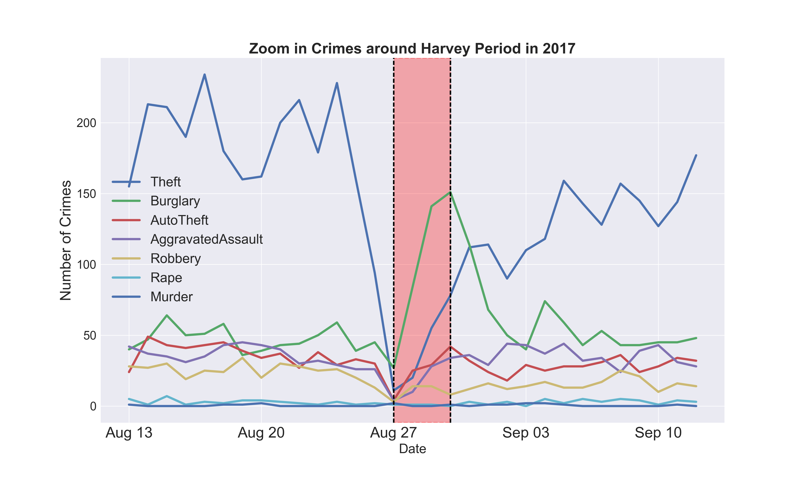
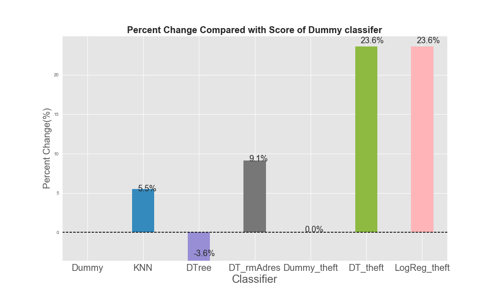
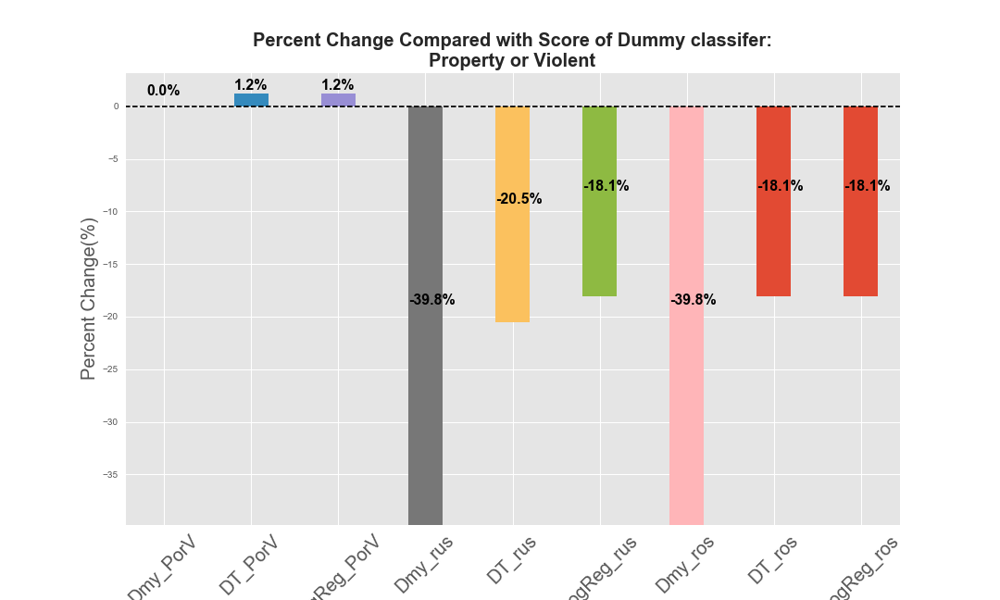

# Crime Prediction for Houston

### Table of Contents:
1. [Problem](#Problem)
2. [Clients](#Client)
3. [Data Acquisition and Cleaning](#Data)  
4. [Exploratory Data Analysis](#Findings)
5. [Build Machine Learning Models](#Model)
6. [Conclusion](#Conclusion)
7. [Next Steps](#Next)
8. [Deliverables](#Deliverables)
9. [Appendix](#Appendix)

# Problem <a class="anchor" id="Problem"></a>

How safe is the city we live in regarding crime rates? What are the main types of crimes in neighbourhoods?
How has the crime rate changed over past years? Which types of crimes have increased and which has
decreased and why? According to a recent [news report](https://www.click2houston.com/news/acevedo-to-discuss-houstons-2017-crime-stats) in January 2018, Houston’s overall crime rate was
lower in 2017. Does that mean the city is getting safer?  

Most importantly what message can we take from historical data to reduce crimes? In case of crimes what
precautions could be taken to minimize losses?   

The police department gathered a lot of information over time about crimes in the city. We propose to use
the HPD crime data to predict crime types based on historical crime data in the city.

# Clients <a class="anchor" id="Client"></a>

Who wants to become victims of criminals? noboday? So let’s fight against crimes! Police board, government,
and general public would be beneficiaries. Police officers can use this model to be better deployed. The
government can take precautions more efficiently. Residents can use this model to better protect their lives
and properties.

# Data Acquisition and Cleaning <a class="anchor" id="Data"></a>

The crime data is acquired from [HPD](http://www.houstontx.gov/police/cs/index-2.htm). The data is broken down by police districts and beats and shows
reports of the following types of crimes: 

* murder
* rape
* robbery
* aggravated assault
* burglary
* theft
* auto theft  

on a monthly basis. It contains crime information on date, hour, offense type, beat, premise, blockrange,
streetname, type and number of offenses. In this project, we will investigate the data collected during
2010-2017.

## Cleaning and wrangling

We download spreadsheets (a separate sheet for a month) from http://www.houstontx.gov/police/cs/index-2.
htm. There are 96 spreadsheets in all for 2010-2017. We find that most spreadsheets have 10 columns: ‘Date’,
‘Hour’, ‘Offense Type’, ‘Beat’, ‘Premise’, ‘Block Range’, ‘Street Name’, ‘Type,’ ‘Suffix’, ‘# Of Offenses’ with
some of them having alias.

## Exploratory data processing

**We spot problems below after loading the data:**

* jun14.xls and jul14.xls has 9 cols with ‘Premise’ missing.
* jan10.xls, nov10.xls, jul13.xls has extra col: 'Unnamed: 1'; sep10.xls has an extra col: 'Field11'.
* Different names used for the same columns.  

**How to deal with extra/missing columns, alias?**

* We find that all extra columns are empty so we drop them.
* We fill missing columns with ‘UNK’ as we don’t want to abandon the data because of one missing
column.
* We rename columns consistently.

After rough precessing mentioned above, it becomes a data frame with 1006331 entries and 10 columns with
most of columns having missing values, memory usage 76.8+ MB.

```python
import pandas as pd
crimes=pd.read_csv('crimes.csv')
crimes.info()
crimes.sample(5)
```

	<class 'pandas.core.frame.DataFrame'>
	RangeIndex: 1006331 entries, 0 to 1006330
	Data columns (total 10 columns):
	Date           1006326 non-null object
	Hour           1006330 non-null object
	OffenseType    1006330 non-null object
	Beat           1003191 non-null object
	Premise        972734 non-null object
	BlockRange     1000767 non-null object
	StreetName     1006323 non-null object
	Type           1006330 non-null object
	Suffix         1006330 non-null object
	OffenseNum     1006330 non-null float64
	dtypes: float64(1), object(9)
	memory usage: 76.8+ MB


<div>
<table border="1" class="dataframe">
  <thead>
    <tr style="text-align: right;">
      <th></th>
      <th>Date</th>
      <th>Hour</th>
      <th>OffenseType</th>
      <th>Beat</th>
      <th>Premise</th>
      <th>BlockRange</th>
      <th>StreetName</th>
      <th>Type</th>
      <th>Suffix</th>
      <th>OffenseNum</th>
    </tr>
  </thead>
  <tbody>
    <tr>
      <th>642296</th>
      <td>2014-12-28</td>
      <td>14</td>
      <td>Burglary</td>
      <td>6B30</td>
      <td>Apartment</td>
      <td>6200-6299</td>
      <td>ANTOINE</td>
      <td>DR</td>
      <td>-</td>
      <td>1.0</td>
    </tr>
    <tr>
      <th>211915</th>
      <td>2011-08-21</td>
      <td>5</td>
      <td>Burglary</td>
      <td>9C40</td>
      <td>210</td>
      <td>1000-1099</td>
      <td>FEDERAL</td>
      <td>RD</td>
      <td>-</td>
      <td>1.0</td>
    </tr>
    <tr>
      <th>385626</th>
      <td>2012-12-27</td>
      <td>22</td>
      <td>Auto Theft</td>
      <td>20G70</td>
      <td>20R</td>
      <td>12900-12999</td>
      <td>SKYMEADOW</td>
      <td>DR</td>
      <td>-</td>
      <td>1.0</td>
    </tr>
    <tr>
      <th>682723</th>
      <td>2015-05-31</td>
      <td>15</td>
      <td>Theft</td>
      <td>12D20</td>
      <td>Road, Street, or Sidewalk</td>
      <td>12600-12699</td>
      <td>GULF</td>
      <td>FWY</td>
      <td>-</td>
      <td>1.0</td>
    </tr>
    <tr>
      <th>931590</th>
      <td>2017-05-07</td>
      <td>7</td>
      <td>Theft</td>
      <td>19G10</td>
      <td>Hotel or Motel Parking Lot                    ...</td>
      <td>7700-7799</td>
      <td>SAM HOUSTON                                   ...</td>
      <td>PKWY</td>
      <td>W</td>
      <td>1.0</td>
    </tr>
  </tbody>
</table>
</div>

**More issues**

However, a closer inspection shows that the data types are not clear, indicating it might be a mixture
of multiple data types. For the numeric column ‘OffenseNum’, maximun value is much larger than other
quantiles indicating it might be an outlier?

```python
crimes.OffenseNum.describe()
```

    count    1.006330e+06
    mean     1.015497e+00
    std      1.636272e-01
    min      1.000000e+00
    25%      1.000000e+00
    50%      1.000000e+00
    75%      1.000000e+00
    max      3.300000e+01
    Name: OffenseNum, dtype: float64


Concerning categorical columns, it looks quite messy. Take the ‘Date’ column for example, relevant date
should be from ‘2010-01-01’ to ‘2017-12-31’, which is 2922 days together but the crimes data has much more
than that. Take the ‘Hour’ column for example, it should be from 0 to 23 at most but the crimes data gives
a set of 83 hour types. We mentioned previously that there are 7 types of offenses but 16 are shown in 'OffenseType'.

<div>
<table border="1" class="dataframe">
  <thead>
    <tr style="text-align: right;">
      <th></th>
      <th>Date</th>
      <th>Hour</th>
      <th>OffenseType</th>
      <th>Beat</th>
      <th>Premise</th>
      <th>BlockRange</th>
      <th>StreetName</th>
      <th>Type</th>
      <th>Suffix</th>
    </tr>
  </thead>
  <tbody>
    <tr>
      <th>count</th>
      <td>1006326</td>
      <td>1006330</td>
      <td>1006330</td>
      <td>1003191</td>
      <td>972734</td>
      <td>1000767</td>
      <td>1006323</td>
      <td>1006330</td>
      <td>1006330</td>
    </tr>
    <tr>
      <th>unique</th>
      <td>3910</td>
      <td>83</td>
      <td>16</td>
      <td>354</td>
      <td>384</td>
      <td>346</td>
      <td>27793</td>
      <td>53</td>
      <td>5</td>
    </tr>
    <tr>
      <th>top</th>
      <td>2010-10-01</td>
      <td>12</td>
      <td>Theft</td>
      <td>19G10</td>
      <td>20A</td>
      <td>900-999</td>
      <td>WESTHEIMER</td>
      <td>-</td>
      <td>-</td>
    </tr>
    <tr>
      <th>freq</th>
      <td>490</td>
      <td>56700</td>
      <td>548360</td>
      <td>21243</td>
      <td>74377</td>
      <td>13868</td>
      <td>27503</td>
      <td>241431</td>
      <td>867797</td>
    </tr>
  </tbody>
</table>
</div>

## Cleaning furthermore

### Missing values

We drop complete empty rows. Below is a table to show the number/portion of missing values for each feature.

```python
df_na=pd.concat([crimes.isnull().sum(),(crimes.isnull().sum()/crimes.shape[0]).round(6)],axis=1)
df_na.columns=['Num_na','Portion_na']
df_na
```


<div>
<table border="0.5" class="dataframe">
  <thead>
    <tr style="text-align: right;">
      <th></th>
      <th>Num_na</th>
      <th>Portion_na</th>
    </tr>
  </thead>
  <tbody>
    <tr>
      <th>Date</th>
      <td>4</td>
      <td>0.000004</td>
    </tr>
    <tr>
      <th>Hour</th>
      <td>0</td>
      <td>0.000000</td>
    </tr>
    <tr>
      <th>OffenseType</th>
      <td>0</td>
      <td>0.000000</td>
    </tr>
    <tr>
      <th>Beat</th>
      <td>3139</td>
      <td>0.003119</td>
    </tr>
    <tr>
      <th>Premise</th>
      <td>33596</td>
      <td>0.033385</td>
    </tr>
    <tr>
      <th>BlockRange</th>
      <td>5563</td>
      <td>0.005528</td>
    </tr>
    <tr>
      <th>StreetName</th>
      <td>7</td>
      <td>0.000007</td>
    </tr>
    <tr>
      <th>Type</th>
      <td>0</td>
      <td>0.000000</td>
    </tr>
    <tr>
      <th>Suffix</th>
      <td>0</td>
      <td>0.000000</td>
    </tr>
    <tr>
      <th>OffenseNum</th>
      <td>0</td>
      <td>0.000000</td>
    </tr>
  </tbody>
</table>
</div>
    

We drop rows with missing 'Date' and fill other columns with missing values by 'UNK'.

### Data types: issues

The table below shows 10 random samples from each feature to reveal potential issues with that
feature.  

<div>
<table border="1" class="dataframe">
  <thead>
    <tr style="text-align: right;">
      <th></th>
      <th>Date</th>
      <th>Hour</th>
      <th>OffenseType</th>
      <th>Beat</th>
      <th>Premise</th>
      <th>BlockRange</th>
      <th>StreetName</th>
      <th>Type</th>
      <th>OffenseNum</th>
    </tr>
  </thead>
  <tbody>
    <tr>
      <th>0</th>
      <td>2015-06-16</td>
      <td>24</td>
      <td>Aggravated Assault</td>
      <td>11H10</td>
      <td>Bank or Savings Institution Parking Lot</td>
      <td>21700-21799</td>
      <td>WINGLEAF</td>
      <td>RD</td>
      <td>11.0</td>
    </tr>
    <tr>
      <th>1</th>
      <td>2016-08-04</td>
      <td>'02</td>
      <td>Burglary</td>
      <td>5F10</td>
      <td>09V</td>
      <td>29000-29099</td>
      <td>BRIARWEST CIR</td>
      <td>HWY</td>
      <td>7.0</td>
    </tr>
    <tr>
      <th>2</th>
      <td>2010-06-25</td>
      <td>1.0</td>
      <td>Aggravated Assault</td>
      <td>13D30</td>
      <td>Sporting Goods or Gun Shops</td>
      <td>140500-140599</td>
      <td>BECCA</td>
      <td>GRN</td>
      <td>5.0</td>
    </tr>
    <tr>
      <th>3</th>
      <td>2016-09-09</td>
      <td>'18</td>
      <td>Robbery</td>
      <td>18F40</td>
      <td>Airport Terminal</td>
      <td>8000-8099</td>
      <td>BROAWAY</td>
      <td>HWY</td>
      <td>29.0</td>
    </tr>
    <tr>
      <th>4</th>
      <td>2011-08-12</td>
      <td>'05</td>
      <td>Murder</td>
      <td>17E20</td>
      <td>Furniture, Appliances, Radios, TV Store       ...</td>
      <td>133300-133399</td>
      <td>N SAM HOUSTON PKWY W</td>
      <td>PKWY</td>
      <td>8.0</td>
    </tr>
    <tr>
      <th>5</th>
      <td>2013-05-29</td>
      <td>03</td>
      <td>1</td>
      <td>'24C40</td>
      <td>Office Building                               ...</td>
      <td>29900-29999</td>
      <td>BROOKPOINT</td>
      <td>FWY SER</td>
      <td>1.0</td>
    </tr>
    <tr>
      <th>6</th>
      <td>2016-07-30</td>
      <td>22</td>
      <td>Theft</td>
      <td>'20G30</td>
      <td>Road, Street, or Sidewalk</td>
      <td>25300-25399</td>
      <td>15539A PETITT ROAD                            ...</td>
      <td>DR</td>
      <td>10.0</td>
    </tr>
    <tr>
      <th>7</th>
      <td>2016-06-23</td>
      <td>18</td>
      <td>AutoTheft</td>
      <td>10H50</td>
      <td>20M</td>
      <td>31400-31499</td>
      <td>W. 19TH</td>
      <td>-</td>
      <td>16.0</td>
    </tr>
    <tr>
      <th>8</th>
      <td>1982-01-01</td>
      <td>07</td>
      <td>Auto Theft</td>
      <td>5F20</td>
      <td>Vacant Restaurant                             ...</td>
      <td>15400-15499</td>
      <td>BINGLE OBIB/NORTHWEST FWY OB</td>
      <td>WAY</td>
      <td>17.0</td>
    </tr>
    <tr>
      <th>9</th>
      <td>2008-09-12</td>
      <td>00</td>
      <td>Murder</td>
      <td>'12D70</td>
      <td>05H</td>
      <td>171300-171399</td>
      <td>WESTON ST</td>
      <td>RDG</td>
      <td>2.0</td>
    </tr>
  </tbody>
</table>
</div>


Note that ‘Date’ contains much older years ‘1982’. . .    
Note that ‘Hour’ contains "\`"; it sometimes use 24 and sometimes 0 to record the same time.     
Note that ’OffenseType’ contains type '1' and extra white spaces.      
Note 'Beat' contains "\`".    
Note that ‘Premise’ contains code or word. The ‘Premise’ column is a mixture of premise type and premise description.    
Note possible white spaces in column ‘StreetName’, `Type'.  

### Data types: clear issues

We truncate dates to only include days in the range ‘2010-01-01’ to ‘2017-12-31’. 
We remove leading "\`" and trailing “.0” in column 'Hour' and replace '24' with '0'.  
We remove trailing whitespaces and whitespaces between words in column ‘OffenseType’.  
We remove”‘" and strip whitespaces in ’Beat’ column.   

We translate the HPD [Premise table](http://www.houstontx.gov/police/cs/beatpages/premise.htm#) into a
reduced dictionary by keeping only the first two digits in the premise type. For instance, '01A, 01B, 01K, 01P, 01R, 01T' in the table will be replaced by '01'. This largely reduces the variaties of premise types (from 126 to 25). Then we convert descriptions in ‘Premise’ column by looking up the
reduced dictionary if it finds a match otherwise keep the description as is. Certainly there are descriptions
not translated, we can do it manually by selecing dominant ones according to its frequencies. 

We clean ‘Type’, ‘Suffix’,‘OffenseNum’ columns by stripping whitespaces.  
We check duplicates and drop them.  

## Cleaned Data

Cleaned data is saved and uploaded here. Read my [data cleaing report](https://github.com/phyhouhou/SpringboardProjects/blob/master/FirstCapstoneProject/data_cleaning_capstone_project.ipynb) for detailed data cleaning process.

```python
crimes=pd.read_csv('crimes_clean.csv', parse_dates=['Date'],index_col='Date')
crimes.head()
```

<div>
<table border="1" class="dataframe">
  <thead>
    <tr style="text-align: right;">
      <th></th>
      <th>Hour</th>
      <th>OffenseType</th>
      <th>Beat</th>
      <th>Premise</th>
      <th>BlockRange</th>
      <th>StreetName</th>
      <th>Type</th>
      <th>Suffix</th>
      <th>OffenseNum</th>
    </tr>
    <tr>
      <th>Date</th>
      <th></th>
      <th></th>
      <th></th>
      <th></th>
      <th></th>
      <th></th>
      <th></th>
      <th></th>
      <th></th>
    </tr>
  </thead>
  <tbody>
    <tr>
      <th>2010-01-01</th>
      <td>2</td>
      <td>Theft</td>
      <td>7C20</td>
      <td>13</td>
      <td>3100-3199</td>
      <td>COLLINGSWORTH</td>
      <td>-</td>
      <td>-</td>
      <td>1</td>
    </tr>
    <tr>
      <th>2010-01-01</th>
      <td>2</td>
      <td>Robbery</td>
      <td>20G70</td>
      <td>18</td>
      <td>1900-1999</td>
      <td>WESTMEAD</td>
      <td>DR</td>
      <td>-</td>
      <td>1</td>
    </tr>
    <tr>
      <th>2010-01-01</th>
      <td>9</td>
      <td>Robbery</td>
      <td>4F30</td>
      <td>13</td>
      <td>1700-1799</td>
      <td>BRITTMOORE</td>
      <td>RD</td>
      <td>-</td>
      <td>1</td>
    </tr>
    <tr>
      <th>2010-01-01</th>
      <td>10</td>
      <td>Robbery</td>
      <td>20G10</td>
      <td>18</td>
      <td>2900-2999</td>
      <td>WEST SAM HOUSTON</td>
      <td>PKWY</td>
      <td>S</td>
      <td>1</td>
    </tr>
    <tr>
      <th>2010-01-01</th>
      <td>14</td>
      <td>Robbery</td>
      <td>20G80</td>
      <td>8</td>
      <td>1000-1099</td>
      <td>WEST OAKS MALL</td>
      <td>-</td>
      <td>-</td>
      <td>1</td>
    </tr>
  </tbody>
</table>
</div>


The table below shows a summary statistic of cleaned ‘object’ features.


<div>
<table border="1" class="dataframe">
  <thead>
    <tr style="text-align: right;">
      <th></th>
      <th>Date</th>
      <th>Hour</th>
      <th>OffenseType</th>
      <th>Beat</th>
      <th>Premise</th>
      <th>BlockRange</th>
      <th>StreetName</th>
      <th>Type</th>
      <th>Suffix</th>
    </tr>
    <tr>
      <th></th>
      <th></th>
      <th></th>
      <th></th>
      <th></th>
      <th></th>
      <th></th>
      <th></th>
      <th></th>
    </tr>
  </thead>
  <tbody>
    <tr>
      <th>count</th>
      <td>999521</td>
      <td>999521</td>
      <td>999521</td>
      <td>999521</td>
      <td>999521</td>
      <td>999521</td>
      <td>999521</td>
      <td>999521</td>
      <td>999521</td>
    </tr>
    <tr>
      <th>unique</th>
      <td>2922</td>
      <td>24</td>
      <td>7</td>
      <td>127</td>
      <td>25</td>
      <td>347</td>
      <td>27780</td>
      <td>35</td>
      <td>5</td>
    </tr>
    <tr>
      <th>top</th>
      <td>2010-10-01 00:00:00</td>
      <td>18</td>
      <td>Theft</td>
      <td>19G10</td>
      <td>20</td>
      <td>100-199</td>
      <td>WESTHEIMER</td>
      <td>-</td>
      <td>-</td>
    </tr>
    <tr>
      <th>freq</th>
      <td>486</td>
      <td>56952</td>
      <td>549488</td>
      <td>21299</td>
      <td>316318</td>
      <td>13738</td>
      <td>27214</td>
      <td>239896</td>
      <td>861934</td>
    </tr>
  </tbody>
</table>
</div>


The table above reveals that there are 7 unique types of crimes, 24 unique hours, 127 Beats, 25 Premises.
The ‘top’ row indicates that ‘theft’ is the dominant crime type. Crimes peaks at 18:00 during a day. Among
127 beats, ‘19G10’ is the beat with the most crimes. Within 25 premises, premise code ‘20’ representing
apartment/residence/home ranks top. However these numbers are independently counted and couldn’t tell us
the whole story. We will explore the data more from the time point of view and geographical aspects in next
section.


# Exploratory Data Analysis <a class="anchor" id="Findings"></a>
We list some results from exploratory analysis. More details can be found in this [EDA report](https://github.com/phyhouhou/SpringboardProjects/blob/master/FirstCapstoneProject/Exploratory_Data_Analysis_Capstone_Project.ipynb).

__Which type of crimes occur most frequently?__

Seven types of crimes are recorded according to the HPD report. Which type of crimes occur most often?
The barplot of crimes shows that ‘Theft’ is the dominant crimes in the data,
followed by ‘Burglary’, ‘AutoTheft’, ‘AggravatedAssault’ and ‘Robbery’ while ‘Rape’ and ‘Murder’ only takes a
rather small portion.


## Time series analysis
We perform a time series analysis for crime data and present it in the figure below. It highlights two drops which are pretty eye-catching. In June of 2014, crimes have a drastic decrease. Between the end of August and the beginning of September in 2017, crimes like ‘Theft’, ‘AutoTheft’, ‘AggravatedAssault’ and ‘Robbery’ had a significant drop while ‘Burglary’ offenses increased siginificantly. It’s really interesting to find out why. Could it be due to missing data? We have checked that there was no date that had missing record. There
should be some reason behind it. It’s always meaningful to find out what can result in low crime rate. As a
nonlocal resident I don’t know what big events happened during 2014 but I do know there was a devastating
hurricane ‘Harvey’ on August 23 in 2017. It looks like that period just matched the low crime period in 2017.


We zoom in the hurricane period as shown in the figure of around Harvey Period. As is shown in the figure, due to
the severe weather, crimes dropped overall in the hurricane. However, ‘Burglary’ quickly increased followed
by ‘Theft’, ‘AutoTheft’, ‘Robbery’ and ‘Assault’ as highlighted in the pink region. Correlations of crimes with
weather might be better displayed to explore crime changes in flooded area. This is useful to
better protect properties and personal safety and to more efficiently deploy the police department.




### What is the crime trend?
We find that overall crimes in Houston have a decreasing trend in 2017 compared to 2016 displayed in Fig:
Annual Crimes. But it is not monotonicly decreasing in time in view of trends in previous years. Even if
overall crime rate in 2017 is lower than that in 2016, we shouldn’t be too optimistic. Does ‘decreasing’ hold
true for all types of crimes?


### Percent Change: Crime Types Decomposed
The fig of Crime Types Decomposed compares the situation of different crimes in consecutive years. It’s worthwhile
to notice that the drop in total number of crimes shouldn’t be emphasized too much as violent crimes like
‘AggravatedAssault’and 'Rape' tend to increase.


### Identifying Trends by Decomposing the Crime Data

We apply the moving average model to smooth out short-term fluctuations and highlight long-term trends.It
turns out that each time series in the crimes have very different seasonality patterns! As illustrated in
the figure of trends below, ‘Theft’ seems to display some periodic pattern while ‘Buglary’ exhibit a decresing trend and ‘AggravatedAssault’ tend to increase. Even if the total number of crimes decreased but it doesn’t indicate
that the city is getting safter in the sense that violent crimes like ‘AggravatedAssult’, ‘Rape’ and ‘Robbery’ are increasing.


### Which month tends to have higher crime rate?
We also investigate monthly patterns and find that summer months have more occurences than winter months
as shown in the montly crimes figure.


### Which day tends to have higher crime rate? Weekday? Weekend?

Our analysis (Fig: Crimes during Day of the Week) shows that there are most crimes on Fridays and least
crimes on Sundays on a weekly basis. 


A more detailed illustration is given in Fig: Crimes: WeekDay v.s. Weekend. The figure displays that dominant property crimes like ‘Theft’, ‘Burglary’ are more frequent during weekdays than weekends while violent crimes like ‘AggravatedAssault’, ‘Robbery’, ‘Rape’, ‘Murder’ are more likely to occur during weekends than weekdays.

An immediate follow-up question is which day has a higher crime rate on average, weekday or weekend? Calculation shows that on average weekday has a higher crime rate than weekend. Is that statistically correct or just by chance? In order to figure out whether the average number of crime on weekday is significantly greater than that of weekend day, we use a permutation test with a test statistic of the difference of means to test this hypothesis and get a p-value close to 0. Therefore we reject the null hypothesis and conclude that weekday indeed has a higher crime rate than weekend. For details, read my [inferential statistic analysis](https://github.com/phyhouhou/SpringboardProjects/blob/master/FirstCapstoneProject/Inferential_Statistic_Analysis_Captone_Project.ipynb). 


### At what hour do crime rates peak?

The answer to this question is displayed in the figure below. This figure shows that crimes like ‘Theft’
hits a peak in the middle of day; ‘Burglary’ peaks in the early morning; ‘Auto theft’, ‘Aggravated Assault’,
‘Robbery’ and ‘Murder’ peaks around late or middle night; ‘Rape’ takes relative small porption in crimes but has
a larger span of occurance during the day except the interval 4am-8am.


## Geographical aspects of crime patterns

It is expected that some beats have much higher crime rates than others. We want to know which beats have
largest crime rates over the past 8 years. It’s shown in the figure below. The static data indicates dangerous
zones but does not reveal the whole story. We need to check how it changes with time (Fig: Crimes of Top5 Ranked Beats). We find that ‘19G10’ has the most crimes during 2010-2011; then it was ‘12D10’ in 2012 and 2013; then it was ‘19G10’ again in 2014 and then ‘1A20’ afterwards. So the crimes rates in ‘19G10’ are decreasing. It’s worthwhile to figure out reasons behind that. In the meanwhile, it’s important to notice that beat ‘1A20’ has an increasing trend. We dig into types of crimes further and find that in ‘19G10’, ‘theft’ and ‘burglary’ are reduced a lot. And ‘theft’ rate is increasing in ‘1A20’. More details can be found in this [EDA report](https://github.com/phyhouhou/SpringboardProjects/blob/master/FirstCapstoneProject/Exploratory_Data_Analysis_Capstone_Project.ipynb).


### What type of crimes tend to occur in our surroundings?
We might stay at home or walk on the street, go to shopping malls. . .We experience various surroundings.
Where is more crime susceptible? We visulize distribution of crimes in premises below. Read
Appendix: Name for the meaning of name marked with *.


The figure shows that the residential place and parking lot had the most frequent crimes. What types of
crimes tend to occur in top premises? Fig: Crimes in Top Premises uncovers more details. In
‘residence’, dominant crimes include ‘Burglary’, ‘Theft’; Note that violent crimes like ‘Aggravated Assault’
and ‘Rape’ tend to occur most often in ‘residence’ than other premises. 


Still remember top 5 high-crime-rate beats ‘19G10’ and ‘1A20’. . . ? Let’s check what surroundings there have
most crimes and what types of crimes. Results are shown in Fig: Top 5 Beats: Premise. Read Appendix: Premise Name
for the meaning of the name marked with *.


It’s shown that in beat ‘19G10’, top 3 main proportions of crims are from parking lot (ranking 1st), residence
(ranking 2nd) and road/street (ranking 3rd). In beat ‘1A20’, 3 main proportion of crimes are from parking lot
(ranking 1st), road (ranking 2nd)and residence (ranking 3rd).


# Build machine learning models <a class="anchor" id="Model"></a>

We wish to learn from historical data so as to reduce crimes. If we could predict what types of crimes occur,
we can take precautions and get prepared. According to the EDA, crimes are strongly correlated with time,
locations and OffenseNum in a crime. We build machine learnig models to predict which type of crime is
commited given those features as predictors.

## Feature engineering

In the ‘Cleaned Data’ section, we show that there are 7 types of crimes, 25 premises, 127 beats, 347 unique
blockrange, 27780 streets and all are categorical features. We need to simplify them before building models.
We concatenate ‘StreetName’ and ‘Type’ columns to a new column ‘Address’ and drop ‘StreetName’, ‘Type’
and ‘Suffix’. According to EDA, some beats have rather low crime rate, we truncate beats to keep first 60%
and rename all others as ‘Other’. Similar processing for ‘Premise’. As indicated in EDA, season and day of
week also correlate with crimes. We add columns ‘Season’, ‘WeekDay’ and slightly change ‘Hour’ column by
adding ‘am’ or ‘pm’ so that it won’t be taken as numerics.

A descriptive summary about new features is shown in table ‘Newfeatures’.

<div>
<table border="0.8" class="dataframe">
  <thead>
    <tr style="text-align: right;">
      <th></th>
      <th>Hour</th>
      <th>OffenseType</th>
      <th>Beat</th>
      <th>Premise</th>
      <th>Address</th>
      <th>Season</th>
      <th>WeekDay</th>
    </tr>
  </thead>
  <tbody>
    <tr>
      <th>count</th>
      <td>999521</td>
      <td>999521</td>
      <td>999521</td>
      <td>999521</td>
      <td>999521</td>
      <td>999521</td>
      <td>999521</td>
    </tr>
    <tr>
      <th>unique</th>
      <td>24</td>
      <td>7</td>
      <td>77</td>
      <td>18</td>
      <td>31854</td>
      <td>4</td>
      <td>2</td>
    </tr>
    <tr>
      <th>top</th>
      <td>6pm</td>
      <td>Theft</td>
      <td>Other</td>
      <td>20</td>
      <td>WESTHEIMER, RD</td>
      <td>sum</td>
      <td>Y</td>
    </tr>
    <tr>
      <th>freq</th>
      <td>56952</td>
      <td>549488</td>
      <td>121002</td>
      <td>316318</td>
      <td>26709</td>
      <td>258887</td>
      <td>729975</td>
    </tr>
  </tbody>
</table>
</div>

Concerning target feature ‘OffenseType’, it has 7 types. As shown in the first figure of EDA section, ‘Theft’ is the
majority class. So we’re going to deal with a highly unbalanced multi-classification problem with a bunch of
categorical features.

We preprocess categorical variables by label encoding or one hot encoding. Since ‘Address’ and ‘Beat’ have
so many levels, we try to label encode them and perform one hot encoding to ‘Hour’, ‘Premise’, ‘Season’ and
‘Weekday’. We set baseline by Dummy classifer which predicts majority class only and try different classifers
including KNN classifier, Decision Tree classifer to compare which model works better. We split the data into a training set and a test set and use the training data to build the model and then use it on test data to evaluate the model performance. We find that decision tree yields higher accuracy and select features like ‘numerics’ more (‘Address’, ‘Beat’, ‘OffenseNum’) as shown in Fig: Top 20 Important Features below.


So we decide to remove ‘Address’ and one hot encode ‘Beat’. After all ‘Beat’ and ‘Address’ should be
correlated with each other. We apply Decision Tree classifier again and the selected important 20 features
are shown in the figure below. 


__A summary table__

A summary table comparing accuracy for different classifiers is shown below. More detailed classification report can be found in Appendix: Classification Report. The scores are obtained by comparing predictions from trained model with corresponding test values.

<div>
<table border="0.6" class="dataframe">
  <thead>
    <tr style="text-align: right;">
      <th></th>
      <th>accuray</th>
      <th>precision</th>
      <th>recall</th>
      <th>f1</th>
      <th>perct_change</th>
    </tr>
    <tr>
      <th>Classifier</th>
      <th></th>
      <th></th>
      <th></th>
      <th></th>
      <th></th>
    </tr>
  </thead>
  <tbody>
    <tr>
      <th>Dummy</th>
      <td>0.55</td>
      <td>0.30</td>
      <td>0.55</td>
      <td>0.39</td>
      <td>0.0</td>
    </tr>
    <tr>
      <th>KNN</th>
      <td>0.58</td>
      <td>0.51</td>
      <td>0.58</td>
      <td>0.52</td>
      <td>5.5</td>
    </tr>
    <tr>
      <th>DTree</th>
      <td>0.53</td>
      <td>0.52</td>
      <td>0.53</td>
      <td>0.52</td>
      <td>-3.6</td>
    </tr>
    <tr>
      <th>DT_rmAdres</th>
      <td>0.60</td>
      <td>0.64</td>
      <td>0.85</td>
      <td>0.73</td>
      <td>9.1</td>
    </tr>
    <tr>
      <th>Dummy_theft</th>
      <td>0.55</td>
      <td>0.30</td>
      <td>0.55</td>
      <td>0.39</td>
      <td>0.0</td>
    </tr>
    <tr>
      <th>DT_theft</th>
      <td>0.68</td>
      <td>0.68</td>
      <td>0.68</td>
      <td>0.68</td>
      <td>23.6</td>
    </tr>
  </tbody>
</table>
</div>

In the summary table, ‘Dummy’ stands for dummy classifier using majority-class strategy; ‘DTree’ stands for
decision tree with ‘Beat’ and ‘Address’ label encoded; ‘DT_rmAdres’ stands for decision tree with droping
‘Address’ and one hot encoding ‘Beat’ and other categorical estimators.



This bar plot above compares accuracy score and classification report on average between
classifiers. If we label encode ‘Beat’ and ‘Address’ and one hot encode other categorical features, knn got a
5.5% increase in accuracy compared to dummy classifier; Decision tree even has poorer accuracy than dummy
classifier. It assigns large weight on ‘numeric’ features in feature selection process. If we remove ‘Addres’ and one hot encode other categorical features, knn runs too slow. Decision tree works much better in the sense of gaining 9.1% increase in accuracy compared to dummy classifier. Therefore we use the strategy of one hot
encoding ‘Beat’ and other categorical features and removing ‘Address’ in following sections.

## Predict Theft/Not Theft

Since ‘Theft’ takes quite a large portion in crimes, let’s relabel the crime as ‘Y’ if it is ‘Theft’ otherwise label it as ‘N’. In the relabeled target, 55% is ‘Theft’ and 45% is ‘Not Theft’ (Fig: Theft v.s. Not Theft). We still use the ‘most_frequent’ strategy in dummy classifier. It gives an accuracy of 55%.


Decision tree classifier gives an accuracy of 68%, a 23.6% increase in accuracy compared to that of dummy classifier. 

## Predict Violent Crime/Property Crime

‘Theft’, ‘AutoTheft’, ‘Burglary’ are considered as property crimes, taking a proportion of 83% and ‘Robbery’,
‘AggravatedAssault’, ‘Murder’, ‘Rape’ are considered as violent crimes, taking a proportion of 17% (Fig:
Property v.s. Violent Crimes). It is still an unbalanced classification, but now it’s binary classification.
In order to balance the unbalanced datasets, we can either remove samples from the majority class(undersampling) and/or add more examples from the minority class(over-sampling). We use the Python library imbalanced-learn to perform resampling. As a comparison, we also use dummy classifier with majority-class strategy and decision tree classifer before resampling data. After resampling (either undersampling or oversampling), we do the dummy classifier and decision tree classifer again to compare accuracy. 


The results are shown in a summary table below. ‘Dmy_PorV’ is the dummy classifier with predicting majority class strategy for property or violent crime; ‘DT_PorV’ is the decision tree classifier for property or violent crime; ‘rus’ stands for random undersampling; ‘ros’ stands for random oversampling.

<div>
<table border="0.6" class="dataframe">
  <thead>
    <tr style="text-align: right;">
      <th></th>
      <th>accuray</th>
      <th>precision</th>
      <th>recall</th>
      <th>f1</th>
      <th>perct_change</th>
    </tr>
    <tr>
      <th>Classifier</th>
      <th></th>
      <th></th>
      <th></th>
      <th></th>
      <th></th>
    </tr>
  </thead>
  <tbody>
    <tr>
      <th>Dmy_PorV</th>
      <td>0.83</td>
      <td>0.69</td>
      <td>0.83</td>
      <td>0.76</td>
      <td>0.0</td>
    </tr>
    <tr>
      <th>DT_PorV</th>
      <td>0.84</td>
      <td>0.80</td>
      <td>0.84</td>
      <td>0.80</td>
      <td>1.2</td>
    </tr>
    <tr>
      <th>Dmy_rus</th>
      <td>0.50</td>
      <td>0.25</td>
      <td>0.50</td>
      <td>0.33</td>
      <td>-39.8</td>
    </tr>
    <tr>
      <th>DT_rus</th>
      <td>0.66</td>
      <td>0.67</td>
      <td>0.66</td>
      <td>0.66</td>
      <td>-20.5</td>
    </tr>
    <tr>
      <th>Dmy_ros</th>
      <td>0.50</td>
      <td>0.25</td>
      <td>0.50</td>
      <td>0.33</td>
      <td>-39.8</td>
    </tr>
    <tr>
      <th>DT_ros</th>
      <td>0.68</td>
      <td>0.68</td>
      <td>0.68</td>
      <td>0.68</td>
      <td>-18.1</td>
    </tr>
  </tbody>
</table>
</div>

In the following figure, it’s shown that if we take the dummy classifer without resampling, we get a high accuracy
determined by the portion of majority class. If we take the decision tree classifier, accuracy is slightly
enhanced by 1.2%. What if we try to balance the classes by resampling the data? According to this plot,
whether undersampling (indicated by ’_rus’) or oversampling (indicated by ’_ros’), dummy classifer gave
poorer accuracy. Even the decision tree method can’t reach the accuracy of the dummy classifer without
resampling. But metrics other than ‘accuracy’ is increased in decision tree classifers with resampling. For
instance, it increases precision by 16% (from 0.69 to 0.80).




# Conclusion <a class="anchor" id="Conclusion"></a>

We loaded raw data from HPD and performed data cleaning and data wrangling. We gained insights from EDA
about patterns/trends/importance of features and built machine learning models to predict types of crimes
given predictors.  

We visualized the performances of classifiers in view of accuracy. It shows that for predicting multi classifications, decision tress classifier can improve accuracy from 55% (achieved by dummy classifier, i.e., just predicting the majority class, that is, ‘Theft’) to 60%; If we reduce other crime types rather than ‘Theft’ as one type ‘Not Theft’, decision tree classifer achieve an accuracy of 68%, an increase by 24% compared to that of dummy classifer. 

If we group crimes as ‘Property Crime’ (‘Theft’, ‘AutoTheft’, ‘Burglary’) and ‘Violent Crime’ (‘Assault’,
‘Murder’, ‘Rape’, ‘Robbery’), it is an unbalanced binary classification problem. We find that neither
undersampling or oversampling improves the classification. The best prediction is given by decision tree
calssifier without random sampling. It increases accuracy by 1.2% compared to dummy classifier. And it
increases precision by 16% (from 0.69 of dummy classifer to 0.80 by decision tree).


# Next steps <a class="anchor" id="Next"></a>

## How to improve accuracy?
We propose to convert address into coordinates and involve that in prediction.  
We also suggest to get more data on crimes and enrich dataset with more features.  

## Other interesting questions include:
How is crime rate correlated with economic status (unemployment rate) and demographics (population
change)?<br>
What’s the correlation between crimes and weather?<br>
Of particular interests is to combine [Harvey map](http://www.januaryadvisors.com/hurricane-harvey-maps-response-damage-debris/) with Beat map in Houston, it will give more insights on impact of severe weather on crimes.


## Other potential datasets
[weather conditions](https://www.ncdc.noaa.gov/)<br>
[economic status (unemployment rate)](https://www.bls.gov/data/)<br> 
[demographics (population change)](https://www.census.gov/topics/population/data.html)<br> 


# Deliverables <a class="anchor" id="Deliverables"></a>

Read [data cleaing report](https://github.com/phyhouhou/SpringboardProjects/blob/master/FirstCapstoneProject/data_cleaning_capstone_project.ipynb) for detailed data cleaning process.  
Read [EDA report](https://github.com/phyhouhou/SpringboardProjects/blob/master/FirstCapstoneProject/Exploratory_Data_Analysis_Capstone_Project.ipynb) for details and codes in exploratory data analysis.  
Read [inferential analysis report](https://github.com/phyhouhou/SpringboardProjects/blob/master/FirstCapstoneProject/Inferential_Statistic_Analysis_Captone_Project.ipynb) for details in inferential analysis part.  
Read [build machine learning model](https://github.com/phyhouhou/SpringboardProjects/blob/master/FirstCapstoneProject/Build_Machine_Learning_Models_Captone_Project.ipynb) for details about feature engineering and model evaluations.   

---
 
# Appendix <a class="anchor" id="Appendix"></a>

## Premise Name 
The premise name 'ParkMallAuto*' includes premises that appears in the first column.<br>
'SupplyStore*' includes premises of the second column.<br> 

<div>
<table border="0.8" class="dataframe">
  <thead>
    <tr style="text-align: right;">
      <th>ParkMallAuto*</th>
      <th>SupplyStore*</th>
    </tr>
  </thead>
  <tbody>
    <tr>
      <td>AMUSE. PARK,BOWL. ALLEY,SKATE RINK</td>
      <td>ADULT BOOK STORE/NEWSSTAND</td>
    </tr>
    <tr>
      <td>BARBER AND BEAUTY SHOPS</td>
      <td>BOOK,RECORD,STATIONARY,OFFICE SUP.</td>
    </tr>
    <tr>
      <td>COMMERCIAL BUILDING, MALL COMMON AREA</td>
      <td>CLOTHING STORE</td>
    </tr>
    <tr>
      <td>CAR WASH,AUTO REPAIR, VEHICLE/AUTO SALES/LEASE...</td>
      <td>ELECTRONICS STORE, ELECTRICAL SUP.</td>
    </tr>
    <tr>
      <td>FACTORY/MANUFACTURING/INDUSTRIAL</td>
      <td>FURNITURE, APPLIANCES, RADIOS, TV</td>
    </tr>
    <tr>
      <td>SPRTS,GAME ROOM</td>
      <td>GARDEN SUPPLY, NURSERY, FLORIST</td>
    </tr>
    <tr>
      <td>LAUNDRY/DRY CLEANERS/WASHATERIAS</td>
      <td>JEWELRY STORES</td>
    </tr>
    <tr>
      <td>MAINTENANCE/BUILDING SERVICES,APARTMENT/RENTAL...</td>
      <td>MARINE VEH. SALES,BOATS,SAILBOATS</td>
    </tr>
    <tr>
      <td>CHECK CASHING PLACES</td>
      <td>PAWN/RESALE SHOP/FLEA MARKET</td>
    </tr>
    <tr>
      <td>THEATRES,DINNER THEATERS,AUDITOR.</td>
      <td>SPORTING GOODS/GUN SHOPS</td>
    </tr>
    <tr>
      <td>UTILITY COMPANY,ELECTRIC,GAS,WATER</td>
      <td>TOYS,ARTS &amp; CRAFT,MUSICAL,BIKE,PET</td>
    </tr>
    <tr>
      <td>WAREHOUSE</td>
      <td>VIDEO RENTAL &amp; SALES</td>
    </tr>
  </tbody>
</table>
</div>


## Classification Report

Classification reports for classifiers built in machine learing process are listed below:<br>

Report_Dummy :

                        precision    recall  f1-score   support
    
    AggravatedAssault       0.00      0.00      0.00     20577
            AutoTheft       0.00      0.00      0.00     25384
             Burglary       0.00      0.00      0.00     45258
               Murder       0.00      0.00      0.00       442
                 Rape       0.00      0.00      0.00      1730
              Robbery       0.00      0.00      0.00     19319
                Theft       0.55      1.00      0.71    137171
    
          avg / total       0.30      0.55      0.39    249881
          
          


Report_Knn :

                        precision    recall  f1-score   support
    
    AggravatedAssault       0.29      0.08      0.13     20577
            AutoTheft       0.31      0.08      0.13     25384
             Burglary       0.46      0.49      0.47     45258
               Murder       0.00      0.00      0.00       442
                 Rape       0.00      0.00      0.00      1730
              Robbery       0.35      0.09      0.14     19319
                Theft       0.63      0.85      0.73    137171
    
          avg / total       0.51      0.58      0.52    249881


Report_DT :

                        precision    recall  f1-score   support
    
    AggravatedAssault       0.23      0.26      0.25     16424
            AutoTheft       0.21      0.19      0.20     20324
             Burglary       0.48      0.52      0.50     36278
               Murder       0.00      0.00      0.00       344
                 Rape       0.04      0.01      0.01      1394
              Robbery       0.24      0.16      0.19     15381
                Theft       0.68      0.69      0.68    109760
    
          avg / total       0.52      0.53      0.52    199905


Report_DT_rmAdres :

                        precision    recall  f1-score   support
    
    AggravatedAssault       0.49      0.12      0.20     20577
            AutoTheft       0.29      0.02      0.03     25384
             Burglary       0.50      0.64      0.56     45258
               Murder       0.00      0.00      0.00       442
                 Rape       0.06      0.00      0.00      1730
              Robbery       0.34      0.04      0.07     19319
                Theft       0.64      0.85      0.73    137171
    
          avg / total       0.54      0.60      0.53    249881


Report_dmy_Theft :

                  precision    recall  f1-score   support
    
              N       0.00      0.00      0.00    112710
              Y       0.55      1.00      0.71    137171
    
    avg / total       0.30      0.55      0.39    249881


Report_DT_Theft :

                  precision    recall  f1-score   support
    
              N       0.65      0.66      0.65    112710
              Y       0.71      0.71      0.71    137171
    
    avg / total       0.68      0.68      0.68    249881


Report_dmy_PV: 

                  precision    recall  f1-score   support
    
              N       0.00      0.00      0.00     42068
              Y       0.83      1.00      0.91    207813
    
    avg / total       0.69      0.83      0.76    249881


Report_DT_PV: 

                  precision    recall  f1-score   support
    
              N       0.55      0.18      0.27     42068
              Y       0.85      0.97      0.91    207813
    
    avg / total       0.80      0.84      0.80    249881


Report_dmy_rus: 

                  precision    recall  f1-score   support
    
              N       0.00      0.00      0.00     42338
              Y       0.50      1.00      0.66     41763
    
    avg / total       0.25      0.50      0.33     84101


Report_DT_rus: 
                  precision    recall  f1-score   support
    
              N       0.67      0.64      0.66     42338
              Y       0.65      0.69      0.67     41763
    
    avg / total       0.66      0.66      0.66     84101


Report_dmy_ros: 

                  precision    recall  f1-score   support
    
              N       0.00      0.00      0.00    208040
              Y       0.50      1.00      0.67    207620
    
    avg / total       0.25      0.50      0.33    415660
 

Report_DT_ros: 

                  precision    recall  f1-score   support
    
              N       0.71      0.60      0.65    208040
              Y       0.65      0.75      0.70    207620
    
    avg / total       0.68      0.68      0.68    415660
 
