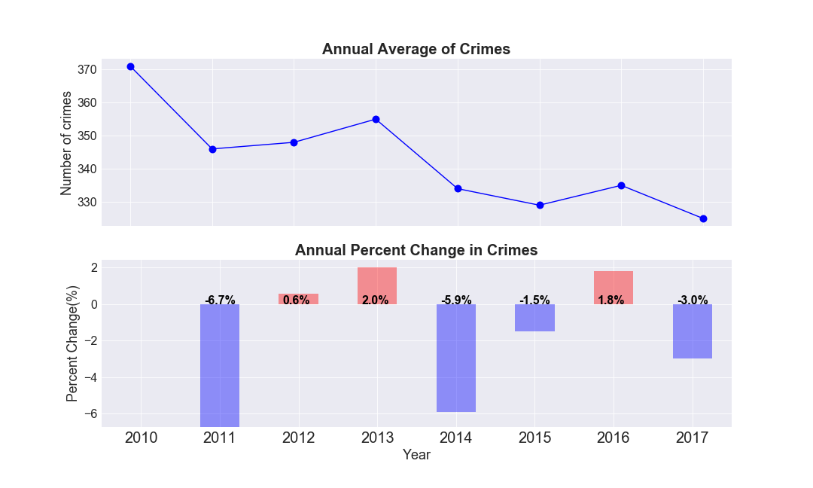

```{r setup, include=FALSE}
knitr::opts_chunk$set(echo = TRUE)
```

# Problem
How safe is the city we live in regarding crime rates? What is the main types of crimes in neighbourhoods? How has the crime rate changed over past years? Which types of crimes have increased and which has decreased and why? According to a recent [news report](https://www.click2houston.com/news/acevedo-to-discuss-houstons-2017-crime-stats) in January 2018, Houston's overall crime rate was lower in 2017. Does that mean the city is getting safter? 

Most importantly what message can we take from historical data to reduce crimes? In case of crimes what precautions could be taken to minimize losses? 

The police department gathered a lot of information over time about crimes in the city. We propose to use the HPD crime data to predict crime types based on historical crime data in the city. 


# Clients
Who wants to become victims of criminals? Noboday? So let's fight against crimes! Police board, government, and general public would be beneficiaries. Police officers can use this model to be better deployed. The government can take precausions more efficiently. Residents can use this model to better protect their lives and properties. 

# Data
The crime data is acquired from [HPD](http://www.houstontx.gov/police/cs/index-2.htm). The data is broken down by police districts and beats and shows reports of the following types of crimes: murder, rape, robbery, aggravated assault, burglary, theft, auto theft on a monthly basis. It contains crime informaiton on date, hour, offense type, beat, premise, blockrange, streetname, type and number of offenses. In this project, we will investigate the data collected during 2010-2017.

## Cleaning and wrangling
We download spreadsheets (a seprate sheet for a month) from http://www.houstontx.gov/police/cs/index-2.htm and stack them as a whole. Each year has 12 months, so we have 96 spreadsheets in all for 2010-2017. We check that most spreadsheets have 10 columns: 'Date', 'Hour', 'Offense Type', 'Beat', 'Premise', 'Block Range', 'Street Name', 'Type,' 'Suffix', '# Of Offenses' with some of them having alias.

### Exploratory data processing

We spot problems below after loading the data:

* jun14.xls and jul14.xls has 9 cols with 'Premise' missing
* jan10.xls, nov10.xls,jul13.xls has extra col: 'Unnamed: 1; sep10.xls has an extra col: 'Field11'
* Different names used for the same columns

How to deal with extra/missing columns, alias?

* We find that all extral columns are empty so drop them. 
* We fill missing columns with 'UNK' so far as we don't want to abandon the data because one missing column.
* We rename columns consistently.

After rough precessing mentioned above, it becomes a data frame with 1006331 entries and 10 columns with most of columns having missing values, memory usage 76.8+ MB.

However, closer inspection shows that the data types are not clear, indicating it might be a mixture of multiple data types. For the numeric column 'OffenseNum', maximun value is much larger than other quantiles indicating it might be an outlier?

Concerning categorical columns, it looks quite messy. Take the 'Date' column for example, relevant date should be from '2010-01-01' to '2017-12-31', which is 2921 days together but the crimes data has much more than that. Take the 'Hour' column for example, it should be from 0 to 23 at most but the crimes data gives a set of 83 hour types.

### Cleaning furthermore 
**Missing values**

We first dorp empty rows. We check that 'Date' column has 5 missing values among 1006331 entries, so just drop them. Then 'Beat' has a 0.03% missing values, 'Premise' has a 3.3% missing values, 'Block Range'
 has a 0.05% missing values. We fill them with 'UNK'.

__Data types: issues__

Note that when 'Hour' contains "'", corresponding 'Beat' contains "'". So let's remove "'"  
Note that 'OffenseType' contains type '1'. This is ambiguous. Remove?  
Note that 'Premise' contains code or wordThe 'Premise' column is a mixture of premise type and premise description.  
Note that 'BlockRange' contains '1.1103e+006-1.1104e+006' Yes, in sep17 file  
Note that 'OffenseNum' contains 33, 29, 17... (related crime types: 'Aggravated Assault','Aggravated Assault ','Auto Theft','AutoTheft','Burglary','Theft') outliers?  

__Data types: clear issues__

We truncate dates to only include days in the range '2010-01-01' to '2017-12-31'.   
We remove leading "'" and trailing ".0" in column 'Hour' and replace 24 with 0.  
We remove trailing whitespaces and whitespaces between words in column 'OffenseType'.  
We remove "'" and strip whitespaces in 'Beat' column.  
We translate the HPD (Premise table)[http://www.houstontx.gov/police/cs/beatpages/premise.htm#] into a reduced dictionary by keeping only the first two digits in the premise type. This largely reduces the variaties of premise types (from 126 to 25). Then we convert descriptions in 'Premise' column by looking up the reduced dictionary if it finds a match otherwise keep the description as is. Certainly there are descriptions not translated, we can do it manually by selecing dominant ones according to its frequencies.  
We clean 'Type', 'Suffix','OffenseNum' columns by stripping whitespaces.  
We check duplicates and drop them.

Finally cleaned data is saved and uploaded [here](https://file.io/eLoGQ3). Read my data [cleaing report](https://github.com/phyhouhou/springboard_projects/blob/master/data_cleaning_capstone_project.ipynb) for detailed data cleaning process.


## Other potential datasets
It's also useful to find correlations between crimes and [weather conditions](https://www.ncdc.noaa.gov/), [economic status (unemployment rate)]( https://www.bls.gov/data/) and [demographics (population change)](https://www.census.gov/topics/population/data.html). 


# Initial findings
We list some results from exploratory analysis. More details can be found in this [EDA report](https://github.com/phyhouhou/springboard_projects/blob/master/Exploratory_Data_Analysis_Capstone_Project.ipynb).

## Time series analysis
We perform a time series analysis for crime data and present it in Figure 1: 'Time Series of Crimes'.
It highlights two drips which are so eye-catching. During June of 2014, crimes have a drastic decrease. During August/September of 2017, crimes like 'Theft', 'AutoTheft', 'AggravatedAssault','Robbery' had a significant drop while 'Burglary' offenses increased siginificantly. It's really interesting to find out why. Could it be due to missing data? We have checked in previous section that there was no date that had missing record. There should be some reason behind. It's always meaningful to find out what can result in low crime rate. As a nonlocal resident I don't know what big events happened during 2014 but I do know there was a devastating hurricane 'Harvey' on August 23 in 2017. It looks like that period just matched the low crime period in 2017.


We zoom in the hurricane period as shown in Fig 2: 'During Harvey Period'. As is shown in the figure, due to the severe weather, crimes dropped overall in the hurricane. However, 'Burglary' quickly increased followed by 'Theft', 'AutoTheft' 'Robbery' and 'Assault'. Correlations of crimes with weather might be better displayed to explore crime changes in flooded area. This is interstingly useful to  better protect properties and personal safety and more efficiently deployed for the police department.

__What is the crime trend?__

We find that overall crimes in Houston have a decreasing trend in 2017 compared to 2016 displayed in Figure 3: 'Annual Crimes'. But it is not monotonicly decreasing in time in view of trends in previous years. Even if overall crime rate in 2017 is lower than that in 2016, we shouldn't be too optimistic. Does 'decreasing' hold true for all types of crimes? 



__Percent Change: Crime Types Decomposed__


Fig 4: 'Crime Types Decomposed' compares the situation of differnt crimes in consecutive years. It's worthwhile to notice that the drop in total number of crimes shouldn't be emphasized too much as violent crimes like 'AggravatedAssault' tend to increase.

###  Identifying Trends by Decomposing the Crime Data
We apply the moving average model to smooth out short-term fluctuations and highlight long-term trends.It turns out that each time series in the crimes have very different seasonality patterns! As illustrated in Fig 5: 'Trends', 'Theft' seems to display some periodic pattern while 'Buglary' exhibit a decresing trend and 'AggravatedAssault' tend to increase.  Even if the total number of crimes decreased but it doesn't indicate that the city is getting safter in the sense that violent crimes like 'AggravatedAssult', 'Rape', 'Robbery' are increasing.


### Which month tends to have higher crime rate?
We also investigate monthly patterns and find that summer months have more occurences than winter months. 

### Which day tends to have higher crime rate? Weekday? Weekend?
Our analysis shows that Friday on average ranks No. 1 in crime countings, Sunday has least numbe of crimes. However major crime type 'Theft' occured more on Friday than weekend but severe crime type like 'aggravated assult' occured more on weekends. A detailed illustration is given in Fig 6: 'WeekDay v.s. Weekend'


The figure displays dominant property crimes like 'Theft', 'Burglary' are more frequent during weekdays than weekends while violent crimes like 'AggravatedAssault', 'Robbery', 'Rape', 'Murder' are more likely to occur during weekends than weekdays. An immediate follow-up question is which day has a higher crime rate on average, weekday or weekend?  Calculation shows that on average weekday has a higher crime rate than weekend. Is that definitely true or just by chance? We will explore more about it in inferential statistic analysis part.  

## At which hour does crime reach summit?

The answer to this question is displayed in Fig 7: 'Which Hour'. This figure shows that crimes like 'Theft' hits a peak in the middle of day; 'Burglary' peaks in the early morning; 'Auto theft', 'Aggravated Assault', 'Robbery', 'Murder' peaks around late or middle night; 'Rape' takes relative small porption in crimes but has a larger span of occurance during the day except the interval 4-8am.


## Geographical aspects of crime patterns
It is expected that some beats have much higher crime rates than others. We want to know which beats have largest crime rates over the past 8 years. It's shown in Fig 8: 'Top 5 Beats'. The static data indicates dangerous zones but not reveals the whole story. We need to check how it changes with time. We find that '19G10' has the most crimes during 2010-2011; then it was '12D10' in 2012 and 2013; then it was '19G10' again in 2014 and then '1A20' afterwards. So the crimes ratesin '19G10' is decreasing. It's worthwhile to figure out reasons behind that. In the meanwhile, it's important to notice that beat '1A20' has an increasing trend. We dig types of crimes further and find that in '19G10', 'theft' and 'burglary' are reduced a lot. And 'theft' rate is increasing  in '1A20'. 


### What type of crimes tend to occur in our surroundings?
We might stay at home or walk on the street, go to shopping malls...We experience various surroundings. Where is more crime susceptible? We visulize distribution of crimes in premises in Fig 9: 'Premise'.  


The figure shows that the Premise with code '20'(residential place) and '18' (parking lot) had the most frequent crimes.  
Still remember high-crime-rate beats '19G10' and '1A20'? Let's check what surroundings there have most crimes and what types of crimes. Results are shown in Fig 10: 'topBeats'.


It's shown that in beat '19G10', 3 main proportion of crims are from 18(parking lot), 20(residence),8(department/discount store). In beat '1A20', 3 main proportion of crims are from 18(parking lot), 13(road), 20(residence).

# Build machine learning models
We wish to learn from historical data so as to reduce crimes. If we could predict what types of crimes occur, we can take precautions and get prepared. According to the EDA, crimes are strongly correlated with time, locations and OffenseNum in a crime. We build machine learnig models to predict which type of crime is commited given those features as predictors.  

## Feature engineering 


According to the Feature table, there are 7 types of crimes, 25 premises, 127 beats, 347 unique blockrange, 27780 streets and all are categorical features. We need to simplify them before building models. We concatenate 'StreetName' and 'Type' columns to a new column 'Address' and drop 'StreetName', 'Type' and 'Suffix'. According to EDA, some beats have rather low crime rate, we truncate beats to keep first 60% and rename all others as 'Other'. Similar processing for 'Premise'. As indicated in EDA, season and day of week also correlate with crimes. We add columns 'Season', 'WeekDay' and slightly change 'Hour' column by adding 'am' or 'pm' so that it won't be taken as numerics.

A descriptive summary about new features is shown in tabel 'Newfeatures'.


Concerning target feature 'OffenseType', it has 7 types. As shown in Fig 'Target', 'Theft' is the majority class. So we're going to deal with a highly unbalanced multi-classification problem with a bunch of categorical estimators.


We preprocess categorical varialbes by label encoding or one hot encoding. Since 'Address' and 'Beat' have so many levels, we try to label encode them and perform one hot encoding to 'Hour', 'Premise', 'Season' and 'Weekday'. We try different classifers including Dummy classifer by predicting majority class only, KNN classifier, Decision Tree classifer to compare which model works better. We find that decision tree yields higher accuracy and select features like 'numerics' more ('Address', 'Beat', 'OffenseNum').


__A summary table__


So we decide to remove 'Address' and one hot encode 'Beat'. After all 'Beat' and 'Address' should be correlated with each other. A summary table comparing accuracy for different classifiers is shown. In the Fig. 'Summarytab', 'dummy' stands for dummy classifier using majority-class strategy; 'dt' stands for decision tree with 'Beat' and 'Address' label encoded; 'dt_noAddress' stands for decision tree with droping 'Address' and one hot encoding 'Beat' and other categorical estimators.

This bar plot compares accuracy score between classifiers. If we label encode 'Beat' and 'Address' and one hot encode other categorical features, knn got a 5.1% increase in accuracy compared to dummy classifier; Decision tree even has poorer accuracy than dummy classifier. It assigns large weight on 'numeric' features in feature selection process. If we remove 'Addres' and one hot encode other categorical features, knn runs too slow. Decision tree works much better in the sense of gaining 9.0% increase in accuracy compared to dummy classifier. Therefore we use the strategy of one hot encoding 'Beat' and other categorical features and removing 'Address' in following sections.


## Predict Theft/Not Theft

Since 'Theft' takes quite large portion in crimes, let's relabel the crime as 'Y' if it is 'Theft' otherwise label it as 'N'. In the relabeled target, 55% is 'Theft' and 45% is 'Not Theft'. We still use the 'most_frequent' strategy in dummy classifier. It gives an accuracy of 55%. Decision tree classifier gives an accuracy of 68.4%, a 24% increase in accuracy compared to that of dummy classifier.


## Predict Violent Crime/Property Crime

'Theft', 'AutoTheft', 'Burglary' are consider as property crimes, taking a proportion of 83% and 'Robbery', 'AggravatedAssault', 'Murder', 'Rape' are considered as violent crimes, taking a proportion of 17%. It is still an unbalanced classification, but now it's binary classification. 

In order to balance the unbalanced datasets, we can either remove samples from the majority class(under-sampling) and/or add more examples from the minority class(over-sampling). We use the Python library imbalanced-learn to perform resampling. As a comparation, we also use dummy classifier with majority-class strategy and decision tree classifer before resampling data. After resampling (either undersampling or oversampling), we do the dummy classifier and decision tree classifer again to compare accuracy. The results are shown in Fig. 'P or V'.


It's shown that if we take the dummy classifer without resampling, we get a high accuracy determined by the portion of majority class. If we take the decision tree classifier, accuracy is slightly enhanced by 0.6%.
What if we try to balance the classes by resampling the data? According to this plot, whether undersampling (indicated by '_rus') or oversampling (indicated by '_ros'), dummy classifer gave poorer accuracy. Even the decision tree method can't reach the accuracy of the dummy classifer without resampling. But metrics other than 'accuracy' is increased in decision tree classifers with resampling.

# Deliverables
Read data [cleaing report](https://github.com/phyhouhou/springboard_projects/blob/master/data_cleaning_capstone_project.ipynb) for detailed data cleaning process.

Read [EDA report](https://github.com/phyhouhou/springboard_projects/blob/master/Exploratory_Data_Analysis_Capstone_Project.ipynb) for details and codes in exploratory data analysis.

Read [build machine learning model](https://github.com/phyhouhou/springboard_projects/blob/master/Build_Machine_Learning_Models_Captone_Project.ipynb) for detail about feature engineering and model evaluations.

# Next steps
## How to improve accuracy?  
We propose to convert address into coordinates and involve that in prediction.  
We also suggest to get more data on crimes and enrich dataset with more features.

## Other interesting questions include:
How is crime rate correlated with economic status (unemployment rate) and demographics (population change)?  what’s the correlation between crimes and weather; what are the common features among victims? 

We propose to use the HPD crime data enriched by data from various sources regarding economic status, demographics and weather conditions to predict crime based on historical crime data in the city. 


