# Hotel Reviews: Topic Modeling and Supervised Machine Learning 


### Table of Contents

1. [Introduction](#Introduction)
2. [Client](#Client)
3. [Data](#Data)
4. [Data Wrangling and Cleaning](#Data-Wrangling-and-Cleaning)
    * [Missing Values](#Missing-Values)
    * [Check and Drop Duplicates](#Check-and-Drop-Duplicates)
    * [Clean and Enrich Features](#Clean-and-Enrich-Features)
    * [Summary](#Summary)
5. [Exploratory Data Analysis](#Exploratory-Data-Analysis)
    * [Summary Statistics](#Summary-Statistics)
    * [Visualization of Hotels](#Visualization-of-Hotels)
    * [Visualization of Reviewers](#Visualization-of-Reviewers)
    * [Visualization of Reviews](#Visualization-of-Reviews)
6. [Topic Modeling](#Topic-Modeling) 
    * [Build LDA Model with sklearn](#Build-LDA-Model-with-sklearn)
    * [Build LDA Model with Gensim](#Build-LDA-Model-with-Gensim)
7. [Build Machine Learning Models for Prediction](#Build-Machine-Learning-Models-for-Prediction)
    * [Create a Target Column](#Create-a-Target-Column)
    * [t-test of the Character Length of Reviews](#t-test-of-the-Character-Length-of-Reviews)
    * [Build a Pipeline](#Build-a-Pipeline)
    * [Use bag-of-word Features for Prediction](#Use-bag-of-word-Features-for-Prediction)
    * [Use Tfidf-weighted Features for Prediction](#Use-Tfidf-weighted-Features-for-Prediction)
    * [Use sklearn LDA Document Topics for Prediction](#Use-sklearn-LDA-Document-Topics-for-Prediction)
    * [Use Gensim LDA Document Topics for Prediction](#Use-Gensim-LDA-Document-Topics-for-Prediction)
    * [Compare Model Performance](#Compare-Model-Performance)
8. [Improve Model Performance](#Improve-Model-Performance)
    * [Poor or not](#Poor-or-not)
    * [Enrich Predictors with Categorical and Numerical Features](#Enrich-Predictors)
9. [Conclusions](#Conclusions)

10. [Next Steps](#Next-Steps)

11. [Deliverables](#Deliverables)
        
        
# Introduction <a class="anchor" id="Introduction"></a>
Nowadays, people travel very often for business or for holidays. Travelers want to select hotels with clean rooms, high-quality service, convenient location etc. In a word, people hope to find a cozy and cost-effective hotel to stay while traveling. A massive amount of reviews are being posted online and people are influenced by online reviews in making their decisions. Each person has its own taste of 'cozy'. Where are the perfect hotels to your taste located? What are other travelers saying about that hotel? Are previous travelers having positive experience or bad one concerning your needs? We propose to investigate hotel reviews data and perform text analysis and topic modeling using Naive Bayes and LDA. We also propose to build a machine learning model for predicting review scores from the features we have in the data.

# Client <a class="anchor" id="Client"></a>
Travelers will certainly be interested in this project. They might spend lots of time searching/reading/evaluating hotels and the reviews. This project will save a vast amount of time for travelers. Hotel owners are eager to know what customers are talking and especially caring about the hotels. This project can help them improve service quality and maximize their business profit. Other potential clients include travel service agencies and housing agencies etc. Since it's really hard to manually read through all the reviews, being able to extract hidden topics in a large volume of texts is highly valuable to businesses, for instance, websites and companies selling bookings and travel advice. 

# Data <a class="anchor" id="Data"></a>
The dataset is originally from [kaggle](https://www.kaggle.com/jiashenliu/515k-hotel-reviews-data-in-europe). It is about 515K hotel reviews data in Europe. It's a csv file containing information on hotel name, hotel address, review date, review scores, reviewers' nationality, positive/negative reviews' word count etc.

The data can be enriched by adding hotel features acquired from, for instance, trip advisor etc.


```python
hotel=pd.read_csv('data/Hotel_Reviews.csv',parse_dates=['Review_Date'],index_col='Review_Date')
hotel.info()
hotel.head()
```

    <class 'pandas.core.frame.DataFrame'>
    DatetimeIndex: 515738 entries, 2017-08-03 to 2015-08-09
    Data columns (total 16 columns):
    Hotel_Address                                 515738 non-null object
    Additional_Number_of_Scoring                  515738 non-null int64
    Average_Score                                 515738 non-null float64
    Hotel_Name                                    515738 non-null object
    Reviewer_Nationality                          515738 non-null object
    Negative_Review                               515738 non-null object
    Review_Total_Negative_Word_Counts             515738 non-null int64
    Total_Number_of_Reviews                       515738 non-null int64
    Positive_Review                               515738 non-null object
    Review_Total_Positive_Word_Counts             515738 non-null int64
    Total_Number_of_Reviews_Reviewer_Has_Given    515738 non-null int64
    Reviewer_Score                                515738 non-null float64
    Tags                                          515738 non-null object
    days_since_review                             515738 non-null object
    lat                                           512470 non-null float64
    lng                                           512470 non-null float64
    dtypes: float64(4), int64(5), object(7)
    memory usage: 66.9+ MB

<div>
<table border="1" class="dataframe">
  <thead>
    <tr style="text-align: right;">
      <th></th>
      <th>Hotel_Address</th>
      <th>Additional_Number_of_Scoring</th>
      <th>Average_Score</th>
      <th>Hotel_Name</th>
      <th>Reviewer_Nationality</th>
      <th>Negative_Review</th>
      <th>Review_Total_Negative_Word_Counts</th>
      <th>Total_Number_of_Reviews</th>
      <th>Positive_Review</th>
      <th>Review_Total_Positive_Word_Counts</th>
      <th>Total_Number_of_Reviews_Reviewer_Has_Given</th>
      <th>Reviewer_Score</th>
      <th>Tags</th>
      <th>days_since_review</th>
      <th>lat</th>
      <th>lng</th>
    </tr>
    <tr>
      <th>Review_Date</th>
      <th></th>
      <th></th>
      <th></th>
      <th></th>
      <th></th>
      <th></th>
      <th></th>
      <th></th>
      <th></th>
      <th></th>
      <th></th>
      <th></th>
      <th></th>
      <th></th>
      <th></th>
      <th></th>
    </tr>
  </thead>
  <tbody>
    <tr>
      <th>2017-08-03</th>
      <td>s Gravesandestraat 55 Oost 1092 AA Amsterdam ...</td>
      <td>194</td>
      <td>7.7</td>
      <td>Hotel Arena</td>
      <td>Russia</td>
      <td>I am so angry that i made this post available...</td>
      <td>397</td>
      <td>1403</td>
      <td>Only the park outside of the hotel was beauti...</td>
      <td>11</td>
      <td>7</td>
      <td>2.9</td>
      <td>[' Leisure trip ', ' Couple ', ' Duplex Double...</td>
      <td>0 days</td>
      <td>52.360576</td>
      <td>4.915968</td>
    </tr>
    <tr>
      <th>2017-08-03</th>
      <td>s Gravesandestraat 55 Oost 1092 AA Amsterdam ...</td>
      <td>194</td>
      <td>7.7</td>
      <td>Hotel Arena</td>
      <td>Ireland</td>
      <td>No Negative</td>
      <td>0</td>
      <td>1403</td>
      <td>No real complaints the hotel was great great ...</td>
      <td>105</td>
      <td>7</td>
      <td>7.5</td>
      <td>[' Leisure trip ', ' Couple ', ' Duplex Double...</td>
      <td>0 days</td>
      <td>52.360576</td>
      <td>4.915968</td>
    </tr>
    <tr>
      <th>2017-07-31</th>
      <td>s Gravesandestraat 55 Oost 1092 AA Amsterdam ...</td>
      <td>194</td>
      <td>7.7</td>
      <td>Hotel Arena</td>
      <td>Australia</td>
      <td>Rooms are nice but for elderly a bit difficul...</td>
      <td>42</td>
      <td>1403</td>
      <td>Location was good and staff were ok It is cut...</td>
      <td>21</td>
      <td>9</td>
      <td>7.1</td>
      <td>[' Leisure trip ', ' Family with young childre...</td>
      <td>3 days</td>
      <td>52.360576</td>
      <td>4.915968</td>
    </tr>
    <tr>
      <th>2017-07-31</th>
      <td>s Gravesandestraat 55 Oost 1092 AA Amsterdam ...</td>
      <td>194</td>
      <td>7.7</td>
      <td>Hotel Arena</td>
      <td>United Kingdom</td>
      <td>My room was dirty and I was afraid to walk ba...</td>
      <td>210</td>
      <td>1403</td>
      <td>Great location in nice surroundings the bar a...</td>
      <td>26</td>
      <td>1</td>
      <td>3.8</td>
      <td>[' Leisure trip ', ' Solo traveler ', ' Duplex...</td>
      <td>3 days</td>
      <td>52.360576</td>
      <td>4.915968</td>
    </tr>
    <tr>
      <th>2017-07-24</th>
      <td>s Gravesandestraat 55 Oost 1092 AA Amsterdam ...</td>
      <td>194</td>
      <td>7.7</td>
      <td>Hotel Arena</td>
      <td>New Zealand</td>
      <td>You When I booked with your company on line y...</td>
      <td>140</td>
      <td>1403</td>
      <td>Amazing location and building Romantic setting</td>
      <td>8</td>
      <td>3</td>
      <td>6.7</td>
      <td>[' Leisure trip ', ' Couple ', ' Suite ', ' St...</td>
      <td>10 days</td>
      <td>52.360576</td>
      <td>4.915968</td>
    </tr>
  </tbody>
</table>
</div>


**Summary of data**
* Size 66.9+ MB;<br>
* 515,738 observations with datatimeIndex ranging from 2017-08-03 to 2015-08-09 and with 16 features, among which 7 'object', 5 'int64' and 4 'float64'. <br>
* Feature 'days_since_review' (2 days for instance) should be split and only keep the numerics.<br> 
* Missing values in 'lat' and 'lng'  and nowhere else.<br>

# Data Wrangling and Cleaning <a class="anchor" id="Data-Wrangling-and-Cleaning"></a>
The data wrangling and cleaning includes:<br>
* Check and handle missing values
* Check and Drop Duplicates
* Clean and Enrich Features

## Missing Values <a class="anchor" id="Missing-Values"></a>


```python
#Proportion of missing values
hotel.isnull().sum()/len(hotel)
```


    Hotel_Address                                 0.000000
    Additional_Number_of_Scoring                  0.000000
    Average_Score                                 0.000000
    Hotel_Name                                    0.000000
    Reviewer_Nationality                          0.000000
    Negative_Review                               0.000000
    Review_Total_Negative_Word_Counts             0.000000
    Total_Number_of_Reviews                       0.000000
    Positive_Review                               0.000000
    Review_Total_Positive_Word_Counts             0.000000
    Total_Number_of_Reviews_Reviewer_Has_Given    0.000000
    Reviewer_Score                                0.000000
    Tags                                          0.000000
    days_since_review                             0.000000
    lat                                           0.006337
    lng                                           0.006337
    dtype: float64


###  Hotels with Missing 'lat' and 'lng' 


```python
print('Number of Hotels with missing geolocation: ',hotel.loc[hotel.lat.isnull(),'Hotel_Name'].nunique())
print('Proportion of hotels with missing geolocation: %.2f' %(hotel.loc[hotel.lat.isnull(),'Hotel_Name'].nunique()/hotel.Hotel_Name.nunique()))
```

    Number of Hotels with missing geolocation:  17
    Proportion of hotels with missing geolocation: 0.01

```python
#How many reviews we will lose if we drop hotels with missing info
hotel.Hotel_Name[hotel.lat.isnull()].value_counts()[::-1]
```

    Hotel Advance                                        28
    Renaissance Barcelona Hotel                          33
    Mercure Paris Gare Montparnasse                      37
    Roomz Vienna                                         49
    Holiday Inn Paris Montmartre                         55
    Cordial Theaterhotel Wien                            57
    Hotel Park Villa                                     61
    City Hotel Deutschmeister                            93
    NH Collection Barcelona Podium                      146
    Derag Livinghotel Kaiser Franz Joseph Vienna        147
    Austria Trend Hotel Schloss Wilhelminenberg Wien    194
    Hotel Pension Baron am Schottentor                  223
    Hotel Daniel Vienna                                 245
    Maison Albar Hotel Paris Op ra Diamond              290
    Hotel Atlanta                                       389
    Hotel City Central                                  563
    Fleming s Selection Hotel Wien City                 658
    Name: Hotel_Name, dtype: int64


In this data set, 0.6% of the observations have missing 'lat' and 'lng'. That is 17 unique hotels (around 1% of the hotels) have hotel names and addresses but no geo-coordinates. We've checked that there are no particular patterns and those coordinates will only be used for map visualization, we'll drop those hotels without coordinates when we plot the map. We can still keep all of them in other analysis.

## Check and Drop Duplicates <a class="anchor" id="Check-and-Drop-Duplicates"></a>


```python
hotel.duplicated().sum()
```
    
    526

There are 526 duplicates in the data frame and we've removed them for the following analysis.

## Clean and Enrich Features <a class="anchor" id="Clean-and-Enrich-Features"></a>

This process includes:<br>
* Extract cities of hotels from its address, i.e., 'Hotel_Address';
* Extract days from 'days_since_review';
* Add month and day of reviews;
* Add 'Pos_Rev_WCRatio' and 'Neg_Rev_WCRatio';
* Extract features from 'Tag';
* Fix 'Hotel_Name' and 'Hotel_Address'.


***Extract cities of hotels from its address***


```python
htl_city=(hotel.Hotel_City.value_counts(normalize=True)[::-1]*100)
ax=htl_city.plot(kind='barh',rot=0,color='c')
for idx, val in enumerate(htl_city):
    ax.text( val,idx+0.05,str(round(val,1))+'%', color='black', fontweight='bold',fontsize=14)
plt.xlabel('Percent (%)')
plt.ylabel('Hotel City');
```


Over 50% of the hotels are from London, United Kingdom; hotels from other countries (Spain, France, Netherlands, Austria, Italy) take around 11% or less in portion.


***Add month and day of reviews***


```python
month=calendar.month_abbr[1:13]#[calendar.month_name[i][:3] for i in range(1,13)]
hotel.Review_Month.value_counts().reindex(month).plot(kind='bar',color='c',rot=0)
plt.xlabel('Review_Posted_Month')
plt.ylabel('Count');

```


```python
wday=[d[:3] for d in calendar.day_name[0:7]]

htl_wday=(hotel.Review_Wday.value_counts(normalize=True)*100).reindex(wday)
plot_bar(htl_wday,'Review_Posted_Day',0)
```


Reviews posted on Tuesdays are the most among days of the week while reviews posted on Fridays are the least.

***Add 'Pos_Rev_WCRatio' and 'Neg_Rev_WCRatio'***


```python
#Distribution of word counts in reviews
plt.hist(htl['Review_Total_Positive_Word_Counts'],alpha=0.8,histtype='step', stacked=True, fill=False,color='r',label='Pos')
plt.hist(htl['Review_Total_Negative_Word_Counts'],alpha=0.2,histtype='step', stacked=True, fill=True,color='b',label='Neg')
plt.legend(prop={'size':20})
plt.title('Distribution of Word Counts of Reviews');
```


```python
hotel['Pos_Rev_WCRatio'].plot.hist(bins=50,color='c');
plt.xlabel('Pos_Rev_WCRatio');
```


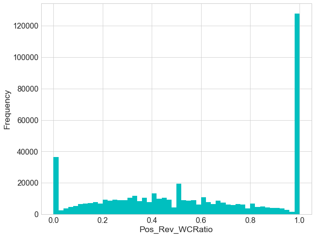


'Pos_Rev_WCRatio' is defined by number of words in positive reviews divided by sum of number of words in both positive and negative reviews. 'Pos_Rev_WCRatio' close to zero means that reviewers posted negative words and rarely positive words;  Pos_Rev_WCRatio' close to 1 indicates that reviewers are very satisfied.

**Extract features from 'Tag'**


```python
htl.Tags.sample(5)
```


    Review_Date
    2016-01-05    [' Leisure trip ', ' Family with older childre...
    2017-03-25    [' Leisure trip ', ' Couple ', ' Small Double ...
    2017-07-16    [' Couple ', ' Superior Double or Twin Room ',...
    2017-07-03    [' Leisure trip ', ' Couple ', ' Executive Kin...
    2016-03-08    [' Leisure trip ', ' Group ', ' Superior Doubl...
    Name: Tags, dtype: object


```python
#Visualization of trip type
htl_ttype=hotel.Trip_Type.value_counts(normalize=True)*100

plot_bar(htl_ttype,'Trip Type')
```


```python
#Visualize traveler type
htl_traveler_type=htl.Traveler_Type.value_counts(normalize=True)*100
plot_bar(htl_traveler_type,'Traveler Type',30)

```


Most of travelers are couples or solo travelers. 


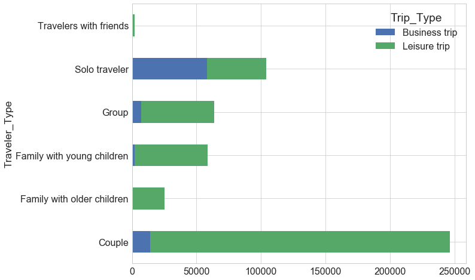


Over half of solo travelers stayed in hotels due to business trip otherwise majority of travelers stayed in hotels due to leisure trip.


```python
#Visualize Num_nights
htl_nnight=htl.dropna(subset=['Num_Nights']).Num_Nights.astype('int').value_counts(normalize=True)*100
htl_nnight.plot(kind='bar',rot=0,logy=False,color='c')
plt.xlabel('Num_Nights')
plt.ylabel('Percent (%)');
```


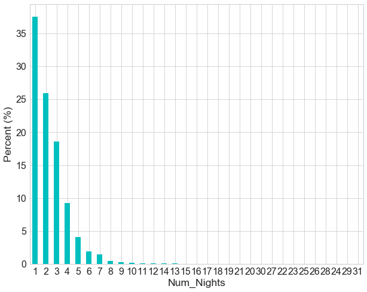


Most of travelers stayed less than a week in hotels and only very few stayed around a month in a hotel.


**Fix 'Hotel_Name' and 'Hotel_Address'**


```python
htl_clean.select_dtypes(include='object').describe()
```


<div>
<table border="1" class="dataframe">
  <thead>
    <tr style="text-align: right;">
      <th></th>
      <th>Review_Month</th>
      <th>Review_Wday</th>
      <th>Hotel_Name</th>
      <th>Hotel_Address</th>
      <th>Hotel_City</th>
      <th>Reviewer_Nationality</th>
      <th>Negative_Review</th>
      <th>Positive_Review</th>
      <th>Trip_Type</th>
      <th>Traveler_Type</th>
      <th>Num_Nights</th>
    </tr>
  </thead>
  <tbody>
    <tr>
      <th>count</th>
      <td>515212</td>
      <td>515212</td>
      <td>515212</td>
      <td>515212</td>
      <td>515212</td>
      <td>515212</td>
      <td>515212</td>
      <td>515212</td>
      <td>500208</td>
      <td>515212</td>
      <td>515020</td>
    </tr>
    <tr>
      <th>unique</th>
      <td>12</td>
      <td>7</td>
      <td>1492</td>
      <td>1493</td>
      <td>6</td>
      <td>227</td>
      <td>330011</td>
      <td>412601</td>
      <td>2</td>
      <td>6</td>
      <td>31</td>
    </tr>
    <tr>
      <th>top</th>
      <td>Aug</td>
      <td>Tue</td>
      <td>Britannia International Hotel Canary Wharf</td>
      <td>163 Marsh Wall Docklands Tower Hamlets London ...</td>
      <td>London</td>
      <td>United Kingdom</td>
      <td>No Negative</td>
      <td>No Positive</td>
      <td>Leisure trip</td>
      <td>Couple</td>
      <td>1</td>
    </tr>
    <tr>
      <th>freq</th>
      <td>50615</td>
      <td>120823</td>
      <td>4789</td>
      <td>4789</td>
      <td>262298</td>
      <td>245110</td>
      <td>127757</td>
      <td>35904</td>
      <td>417355</td>
      <td>252005</td>
      <td>193497</td>
    </tr>
  </tbody>
</table>
</div>


There are 515212 reviews for hotels located in 6 cities of 6 countries in Europe by reviewers either on leisure trip or business trip from 227 distinct countries. Couples are the most common travelers types among the 6 types. 

Notice that there are 1492 unique hotel names but with 1493 hotel addresses. Let's find out which hotel name has multiple addresses. We find that the hotel named 'Hotel Regina' is located in Barcelona and one with the same name but located in Vienna and another one located in Milan. Is there any hotel address with multiple names? On the other hand, two hotels ('The Grand at Trafalgar Square' and 'Club Quarters Hotel Trafalgar Square') are located in the same location. Perhaps they are the same hotel that changed name? We've checked that there are reviews from 2015 to 2017 for both hotels with different average score, so it's indeed reviewed as two distinct hotels. When we count hotels in the following, we will distinguish 'Hotel_Address' for those two hotels on purpose to avoid mismatching problems.


## Summary <a class="anchor" id="Summary"></a> 

In summary,

* we've added month and weekday that reviews are posted and we found that reviewers posted most reviews during July and August and reviews are most posted on Tuesday and least on Friday.
* We've extracted the city where hotels are located and find that over a half of hotels are located in London.
* We've also extracted trip type ('Leisure trip', 'Business trip'), traveler type ('Couple', 'Solo traveler', 'Group', ...) and number of nights in hotels for 'Tags'. We found that around 80% of the reviews is for leisure trip and 20% for business trip. Around 50% of travelers are couples and around 20% are solo travelers, others are groups, families or friends. Majority of travels stayed in hotel for less than a week and some stayed longer till a month. 

In next section, we will perform exploratory data analysis and gain insights on how those features are correlated with review scores. 

# Exploratory Data Analysis <a class="anchor" id="Exploratory-Data-Analysis"></a>

## Summary Statistics <a class="anchor" id="Summary-Statistics"></a>

**Summary statistics of 'object' columns**


```python
htl_clean.select_dtypes(include='object').describe()
```

<div>

<table border="1" class="dataframe">
  <thead>
    <tr style="text-align: right;">
      <th></th>
      <th>Review_Month</th>
      <th>Review_Wday</th>
      <th>Hotel_Name</th>
      <th>Hotel_Address</th>
      <th>Hotel_City</th>
      <th>Reviewer_Nationality</th>
      <th>Negative_Review</th>
      <th>Positive_Review</th>
      <th>Trip_Type</th>
      <th>Traveler_Type</th>
      <th>Num_Nights</th>
    </tr>
  </thead>
  <tbody>
    <tr>
      <th>count</th>
      <td>515212</td>
      <td>515212</td>
      <td>515212</td>
      <td>515212</td>
      <td>515212</td>
      <td>515212</td>
      <td>515212</td>
      <td>515212</td>
      <td>500208</td>
      <td>515212</td>
      <td>515020</td>
    </tr>
    <tr>
      <th>unique</th>
      <td>12</td>
      <td>7</td>
      <td>1492</td>
      <td>1494</td>
      <td>6</td>
      <td>227</td>
      <td>330011</td>
      <td>412601</td>
      <td>2</td>
      <td>6</td>
      <td>31</td>
    </tr>
    <tr>
      <th>top</th>
      <td>Aug</td>
      <td>Tue</td>
      <td>Britannia International Hotel Canary Wharf</td>
      <td>163 Marsh Wall Docklands Tower Hamlets London ...</td>
      <td>London</td>
      <td>United Kingdom</td>
      <td>No Negative</td>
      <td>No Positive</td>
      <td>Leisure trip</td>
      <td>Couple</td>
      <td>1</td>
    </tr>
    <tr>
      <th>freq</th>
      <td>50615</td>
      <td>120823</td>
      <td>4789</td>
      <td>4789</td>
      <td>262298</td>
      <td>245110</td>
      <td>127757</td>
      <td>35904</td>
      <td>417355</td>
      <td>252005</td>
      <td>193497</td>
    </tr>
  </tbody>
</table>
</div>


**Summary statistics of numeric columns**


```python
htl_clean.select_dtypes(exclude='object').describe()
```


<div>
<table border="1" class="dataframe">
  <thead>
    <tr style="text-align: right;">
      <th></th>
      <th>lat</th>
      <th>lng</th>
      <th>Average_Score</th>
      <th>Total_Number_of_Reviews</th>
      <th>Total_Number_of_Reviews_Reviewer_Has_Given</th>
      <th>Reviewer_Score</th>
      <th>Review_Total_Negative_Word_Counts</th>
      <th>Neg_Rev_WCRatio</th>
      <th>Review_Total_Positive_Word_Counts</th>
      <th>Pos_Rev_WCRatio</th>
      <th>Additional_Number_of_Scoring</th>
      <th>days_since_review</th>
    </tr>
  </thead>
  <tbody>
    <tr>
      <th>count</th>
      <td>511944.000000</td>
      <td>511944.000000</td>
      <td>515212.000000</td>
      <td>515212.000000</td>
      <td>515212.000000</td>
      <td>515212.000000</td>
      <td>515212.000000</td>
      <td>515085.000000</td>
      <td>515212.000000</td>
      <td>515085.000000</td>
      <td>515212.000000</td>
      <td>515212.000000</td>
    </tr>
    <tr>
      <th>mean</th>
      <td>49.443040</td>
      <td>2.824222</td>
      <td>8.397767</td>
      <td>2744.698889</td>
      <td>7.164895</td>
      <td>8.395532</td>
      <td>18.540822</td>
      <td>0.434377</td>
      <td>17.778256</td>
      <td>0.565623</td>
      <td>498.416021</td>
      <td>354.400474</td>
    </tr>
    <tr>
      <th>std</th>
      <td>3.468029</td>
      <td>4.581637</td>
      <td>0.547952</td>
      <td>2318.090821</td>
      <td>11.039354</td>
      <td>1.637467</td>
      <td>29.693991</td>
      <td>0.336903</td>
      <td>21.804541</td>
      <td>0.336903</td>
      <td>500.668595</td>
      <td>208.908943</td>
    </tr>
    <tr>
      <th>min</th>
      <td>41.328376</td>
      <td>-0.369758</td>
      <td>5.200000</td>
      <td>43.000000</td>
      <td>1.000000</td>
      <td>2.500000</td>
      <td>0.000000</td>
      <td>0.000000</td>
      <td>0.000000</td>
      <td>0.000000</td>
      <td>1.000000</td>
      <td>0.000000</td>
    </tr>
    <tr>
      <th>25%</th>
      <td>48.214277</td>
      <td>-0.143649</td>
      <td>8.100000</td>
      <td>1161.000000</td>
      <td>1.000000</td>
      <td>7.500000</td>
      <td>2.000000</td>
      <td>0.033333</td>
      <td>5.000000</td>
      <td>0.289474</td>
      <td>169.000000</td>
      <td>175.000000</td>
    </tr>
    <tr>
      <th>50%</th>
      <td>51.499981</td>
      <td>-0.000250</td>
      <td>8.400000</td>
      <td>2134.000000</td>
      <td>3.000000</td>
      <td>8.800000</td>
      <td>9.000000</td>
      <td>0.457627</td>
      <td>11.000000</td>
      <td>0.542373</td>
      <td>342.000000</td>
      <td>353.000000</td>
    </tr>
    <tr>
      <th>75%</th>
      <td>51.516288</td>
      <td>4.834443</td>
      <td>8.800000</td>
      <td>3633.000000</td>
      <td>8.000000</td>
      <td>9.600000</td>
      <td>23.000000</td>
      <td>0.710526</td>
      <td>22.000000</td>
      <td>0.966667</td>
      <td>660.000000</td>
      <td>527.000000</td>
    </tr>
    <tr>
      <th>max</th>
      <td>52.400181</td>
      <td>16.429233</td>
      <td>9.800000</td>
      <td>16670.000000</td>
      <td>355.000000</td>
      <td>10.000000</td>
      <td>408.000000</td>
      <td>1.000000</td>
      <td>395.000000</td>
      <td>1.000000</td>
      <td>2682.000000</td>
      <td>730.000000</td>
    </tr>
  </tbody>
</table>
</div>


```python
plt.figure(figsize=(12,12))
corr=htl_clean.select_dtypes(exclude='object').corr(method='spearman')
sns.heatmap(corr,annot=True,linewidths=0.4,annot_kws={'size':16});
```


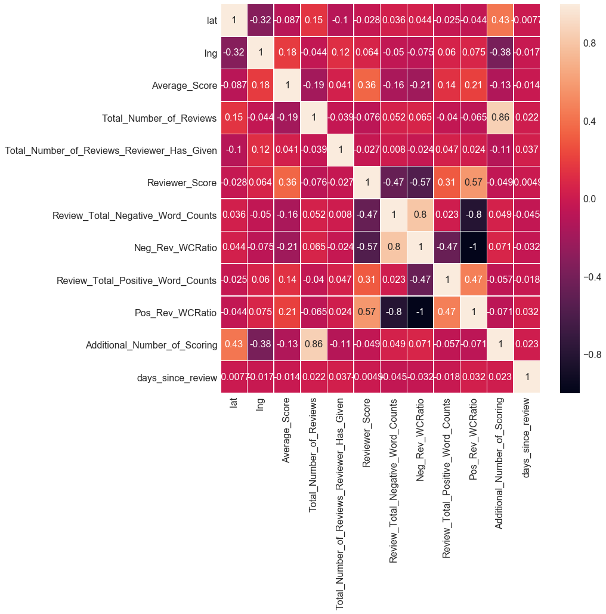

The heat map above displays the correlation matrix of numerical columns in the data frame. It gives us some hints on to what extent those features are correlated with each other. Take the 'Reviewer_Score' for instance, its correlation with features such as "Review_Total_Positive_Word_counts","Pos_Rev_WCRatio" and "Review_Total_Negative_Word_counts","Neg_Rev_WCRatio" is significant. It's highly positively correlated with 'Average_Score', "Review_Total_Positive_Word_counts","Pos_Rev_WCRatio" as the more positive words reviewers posted, the happier they might be with the hotels hence the higher score they rated the hotels. On the contrary, 'Reviewer_Score' is highly negatively correlated with "Review_Total_Negative_Word_counts","Neg_Rev_WCRatio" as expected since the longer negative reviews indicated more complains hence lower scores. Since the correlation of 'days_since_review' with other features are very small, we can drop this feature in the following analysis. 

## Visualization of Hotels <a class="anchor" id="Visualization-of-Hotels"></a>

**Make a map in order to see where the most hotels are located**


For an interactive visualization, click [here](https://houhouhotel.herokuapp.com/index.html)


### Who Are the Most Popular Hotels?

We determine the most popular hotels by considering its 'Average_Score' and 'Total_Number_of_Reviews'. That is the 'Total_Number_of_Reviews' should be more than a threshold so that hotels with few number of reviews but high score won't be considered as popular. We then rank hotels by its average score.

<div>
<table border="1" class="dataframe">
  <thead>
    <tr style="text-align: right;">
      <th></th>
      <th>Hotel_Name</th>
      <th>Hotel_City</th>
      <th>Average_Score</th>
      <th>Total_Number_of_Reviews</th>
      <th>lat</th>
      <th>lng</th>
    </tr>
    <tr>
      <th>Review_Date</th>
      <th></th>
      <th></th>
      <th></th>
      <th></th>
      <th></th>
      <th></th>
    </tr>
  </thead>
  <tbody>
    <tr>
      <th>2017-08-03</th>
      <td>Intercontinental London The O2</td>
      <td>London</td>
      <td>9.4</td>
      <td>4204</td>
      <td>51.502435</td>
      <td>-0.000250</td>
    </tr>
    <tr>
      <th>2017-08-02</th>
      <td>Shangri La Hotel at The Shard London</td>
      <td>London</td>
      <td>9.4</td>
      <td>2200</td>
      <td>51.504497</td>
      <td>-0.085556</td>
    </tr>
    <tr>
      <th>2017-08-03</th>
      <td>Catalonia Square 4 Sup</td>
      <td>Barcelona</td>
      <td>9.4</td>
      <td>1711</td>
      <td>41.388566</td>
      <td>2.171299</td>
    </tr>
    <tr>
      <th>2017-07-27</th>
      <td>Best Western Premier Kaiserhof Wien</td>
      <td>Vienna</td>
      <td>9.4</td>
      <td>1353</td>
      <td>48.197550</td>
      <td>16.368640</td>
    </tr>
    <tr>
      <th>2017-07-27</th>
      <td>Excelsior Hotel Gallia Luxury Collection Hotel</td>
      <td>Milan</td>
      <td>9.4</td>
      <td>1345</td>
      <td>45.485703</td>
      <td>9.202013</td>
    </tr>
    <tr>
      <th>2017-07-31</th>
      <td>Hotel Palace GL</td>
      <td>Barcelona</td>
      <td>9.4</td>
      <td>1266</td>
      <td>41.391626</td>
      <td>2.171638</td>
    </tr>
    <tr>
      <th>2017-07-25</th>
      <td>Catalonia Magdalenes</td>
      <td>Barcelona</td>
      <td>9.4</td>
      <td>1108</td>
      <td>41.386128</td>
      <td>2.174529</td>
    </tr>
    <tr>
      <th>2017-07-11</th>
      <td>The Savoy</td>
      <td>London</td>
      <td>9.4</td>
      <td>1021</td>
      <td>51.511192</td>
      <td>-0.119401</td>
    </tr>
    <tr>
      <th>2017-07-11</th>
      <td>Rosewood London</td>
      <td>London</td>
      <td>9.4</td>
      <td>1008</td>
      <td>51.517330</td>
      <td>-0.118097</td>
    </tr>
    <tr>
      <th>2017-07-30</th>
      <td>The Guesthouse Vienna</td>
      <td>Vienna</td>
      <td>9.4</td>
      <td>951</td>
      <td>48.205130</td>
      <td>16.369036</td>
    </tr>
  </tbody>
</table>
</div>


Among the top 10 most popular hotels, 4 are located in London and 3 in Barcelona, 2 in Milan and only 1 in Vienna.

### Visualize Average Score of Hotels


```python
htl_clean.Average_Score.describe()
```


    count    515212.000000
    mean          8.397767
    std           0.547952
    min           5.200000
    25%           8.100000
    50%           8.400000
    75%           8.800000
    max           9.800000
    Name: Average_Score, dtype: float64


```python
plt.figure(figsize=(18,10))
sns.countplot(x='Average_Score',data=htl_clean,color='c');
```


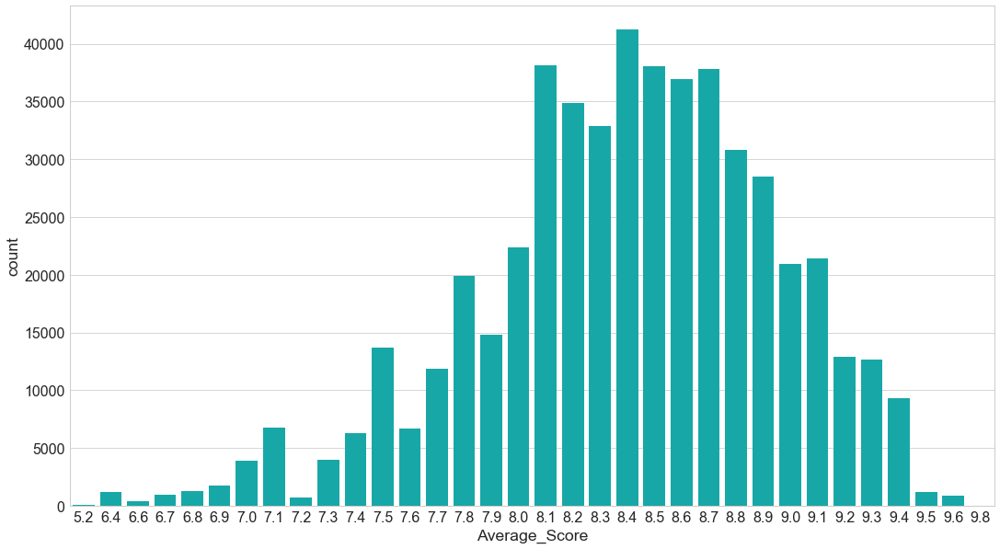


```python
#Normmal test
from scipy import stats
_,fit=stats.probplot(htl_clean.Average_Score,dist=stats.norm,plot=plt)
plt.title('Quantile Plot');
```


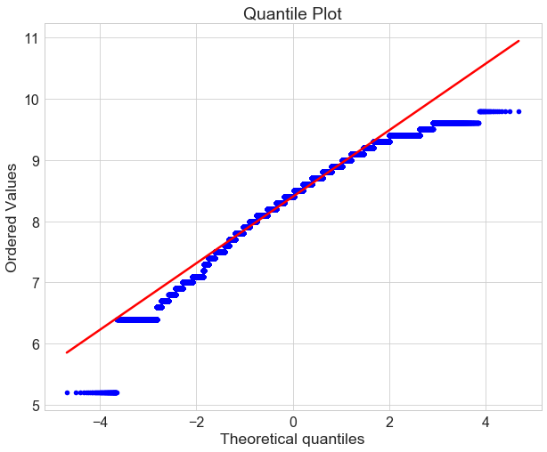


The average score is above 5 and its mean is 8.4. 

#### Any Trends in Average Score of Hotels
All average scores are above 5 and its mean is at 8.4. We will explore if there is any trend in average score below by time series analysis.


```python
sns.boxplot(y="Hotel_City",x="Reviewer_Score",data=htl_clean,showfliers=False,palette='Spectral',orient='h');
```


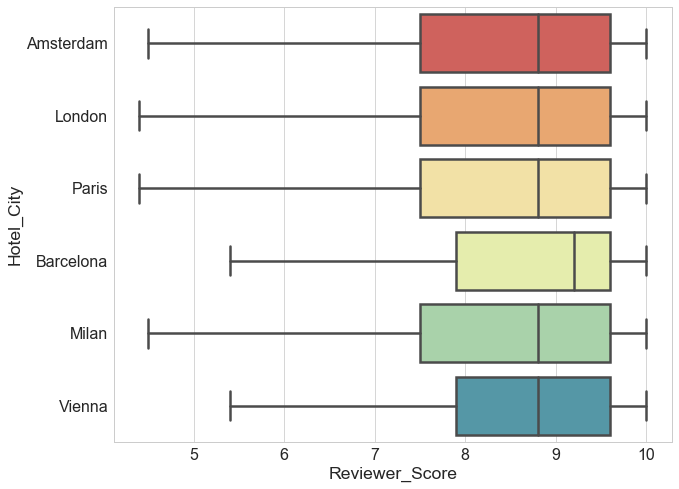

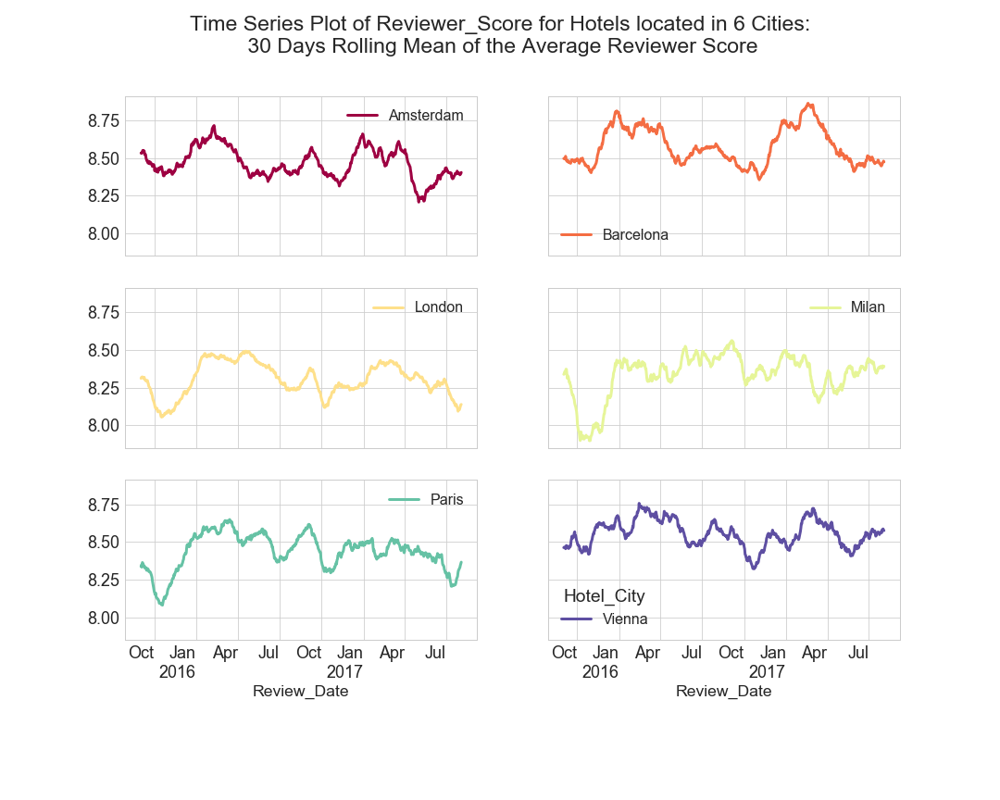


The average reviewer score of hotels is higher in January and low in October.

#### What Features are Affecting Reviewer Score?

**Distribution of Reviewer Score**


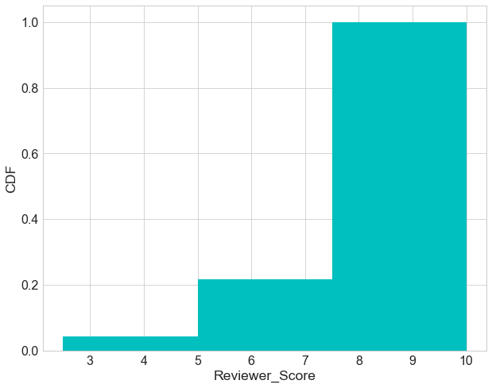


**'Trip_Type' v.s. 'Reviewer_Score'**


Reviewers on a leisure trip tend to rate higher than those on a business trip. It would be interesting to investigate what topics reviewers on leisure trip and business trip are content or complaining about.

**Traveler_Type' v.s. 'Reviewer_Score'**


'Solo traveler' tends to rate lowly while couples tend to rate highly.


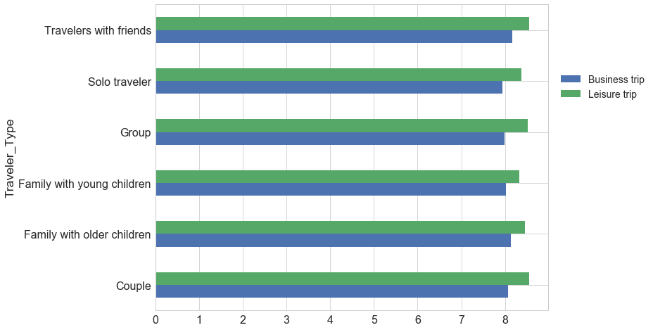


**How is 'Num_Nights' affecting reviewer score?**


Since very few portion of travelers stayed in hotel for more than two weeks, if we focus on the range where 'Num_Nights'<14, the curve above indicates that on average the longer traveler stayed the lower the score they give. This can be visualized more clearly in next plot.


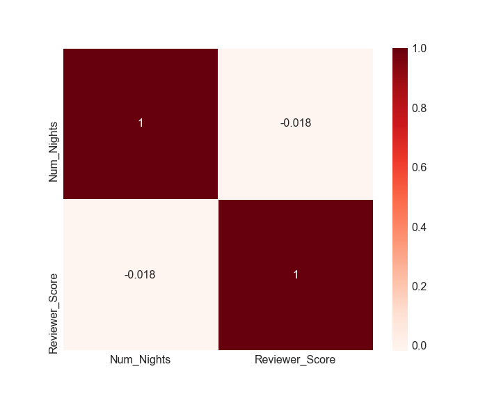


## Visualization of Reviewers <a class="anchor" id="Visualization-of-Reviewers"></a>


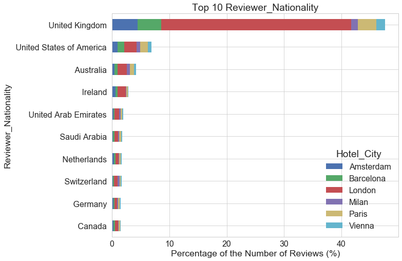


Reviewers from United Kingdom take almost a half of the total number of reviewers. Interestingly other top nationality reviewers are from countries where hotels are not located except Netherlands.


Reviewer score in January and February on average are higher than other months.


Weekday doesn't seem to affect the reviewer score.

**Reviewer_score v.s. Total_Number_of_Reviews_Reviewer_Has_Given**


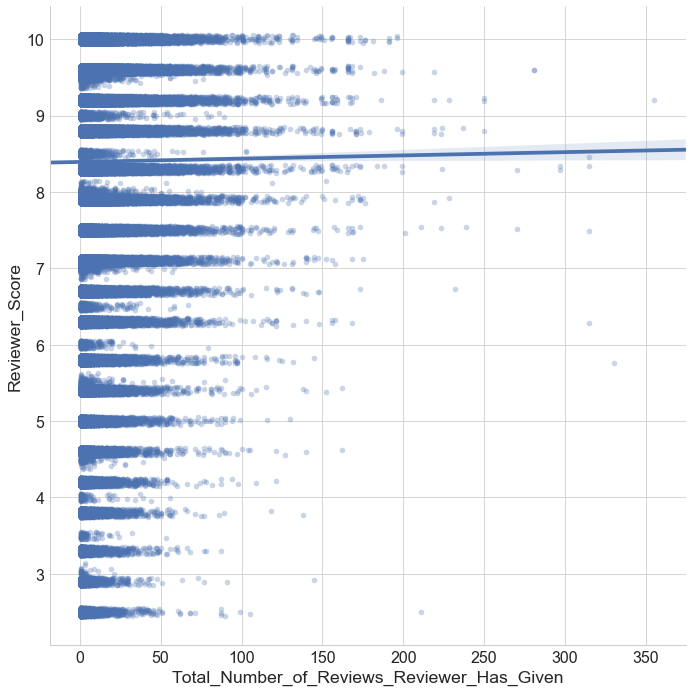

The figure indicates that the more reviews reviewers posted, the higher rating score reviewers tend to give.


**Longer Reviews Indicate Higher Score or Lower Score?**


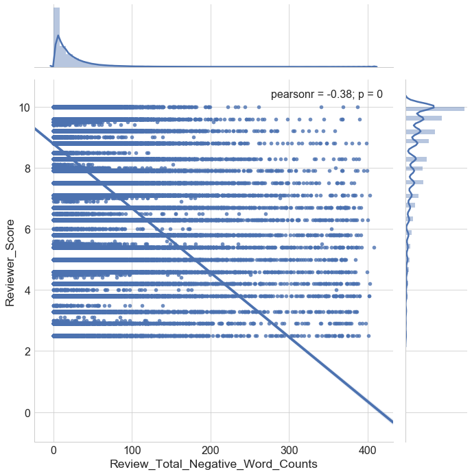


The above two figures indicate that the longer (shorter) the positive review is, the higher reviewers tend to rate the score.


**Make a heatmap to see where the most reviewers are from**

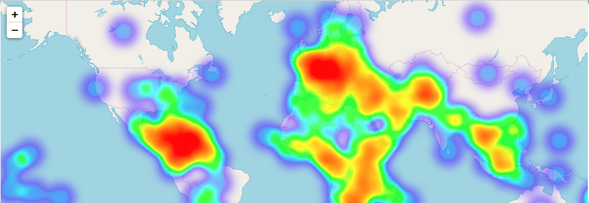

For an interactive visualization, click [here](https://houhoureviewer.herokuapp.com/index.html)

**Top 10 nations that posted many reviews and rated high score**
We find the top nations by checking that its number of reviews is above its median and then sort the score and number of reviews from high to low.

<div>
<table border="0.8" class="dataframe">
  <thead>
    <tr style="text-align: right;">
      <th></th>
      <th>Reviewer_Nationality</th>
      <th>Num_Reviews</th>
      <th>Reviewer_Score_Avg</th>
    </tr>
  </thead>
  <tbody>
    <tr>
      <th>215</th>
      <td>United States of America</td>
      <td>35349</td>
      <td>8.8</td>
    </tr>
    <tr>
      <th>99</th>
      <td>Israel</td>
      <td>6601</td>
      <td>8.7</td>
    </tr>
    <tr>
      <th>145</th>
      <td>New Zealand</td>
      <td>3233</td>
      <td>8.7</td>
    </tr>
    <tr>
      <th>13</th>
      <td>Australia</td>
      <td>21648</td>
      <td>8.6</td>
    </tr>
    <tr>
      <th>213</th>
      <td>United Kingdom</td>
      <td>245110</td>
      <td>8.5</td>
    </tr>
    <tr>
      <th>97</th>
      <td>Ireland</td>
      <td>14814</td>
      <td>8.5</td>
    </tr>
    <tr>
      <th>37</th>
      <td>Canada</td>
      <td>7883</td>
      <td>8.5</td>
    </tr>
    <tr>
      <th>184</th>
      <td>South Africa</td>
      <td>3816</td>
      <td>8.4</td>
    </tr>
    <tr>
      <th>42</th>
      <td>China</td>
      <td>3393</td>
      <td>8.4</td>
    </tr>
    <tr>
      <th>166</th>
      <td>Russia</td>
      <td>3898</td>
      <td>8.3</td>
    </tr>
  </tbody>
</table>
</div>


## Visualization of Reviews <a class="anchor" id="Visualization-of-Reviews"></a>


```python
htl_txt.Negative_Review.sample(10)
```


    389589     We got trapped outside the 2nd floor bedrooms...
    402414     I didn t like the small pool gym but this won...
    405336                                                     
    108275                        Front of hotel was very dirty
    254994     The fire alarm went off at 1am and again at 7...
    36116      Noise and vibration from building works next ...
    135560     We had a club room but found the club lounge ...
    484327                                       Nothing really
    36614      Breakfast not included and very expensive Lot...
    195791     Exceptionally small room view of an air vent ...
    Name: Negative_Review, dtype: object


```python
htl_txt.Positive_Review.sample(10)
```


    406900     The central position very close to the subway...
    481055     The rooms are very comfortable and the locati...
    237477                                   Sky Bar excellent 
    216677                                                     
    85351                                        Very comfy bed
    356993     Excellent parking especially as our son s wed...
    405954                               Everuthing was perfect
    39590      Friendly accommodating staff nothing was too ...
    321783     The size of room Upgraded on arrival and a lo...
    158185     This was a great hotel and what made it extra...
    Name: Positive_Review, dtype: object


### Pre-processing text data
Though punctuations are removed in the original data set, we still need to clean the reviews by converting words to lower case, removing digits, removing whitespaces, tokenization, removing stopwords, and lemmatization. 

### 20 Most Frequent Words in 5000 Review Samples

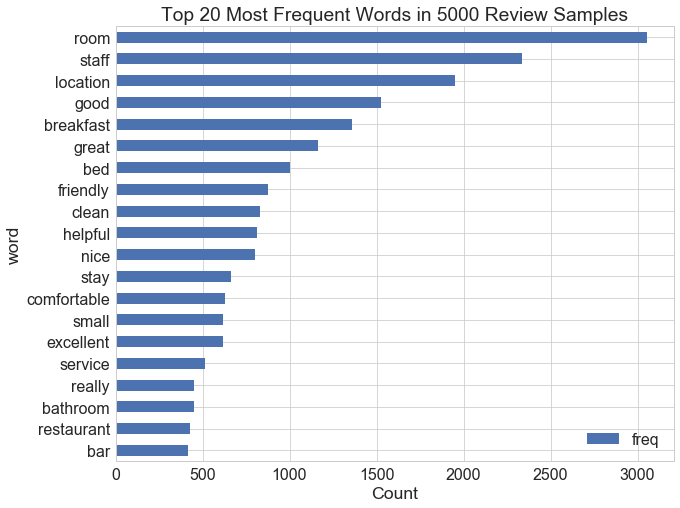


### Generate Word Cloud for Reviews


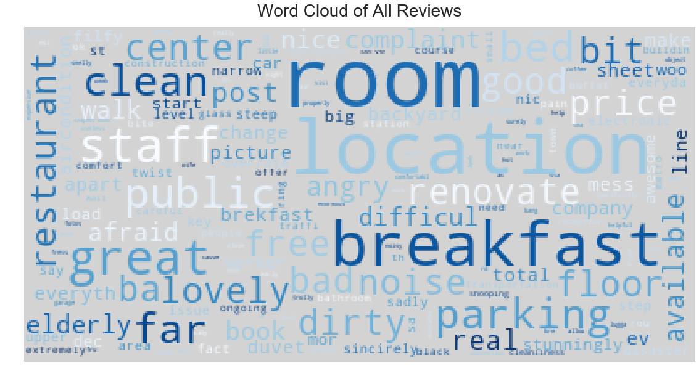


Reviewers are commenting on 'room', 'location', 'transportation', 'air condition', 'breakfast', 'floor', 'price',  'parking', 'restaurant','staff', 'noise', etc. Frequent positive words and negative words are displayed in the word cloud as well.

#### Word Cloud from reviews posted by reviewers on a business trip


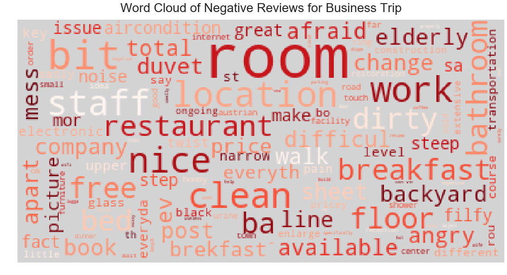


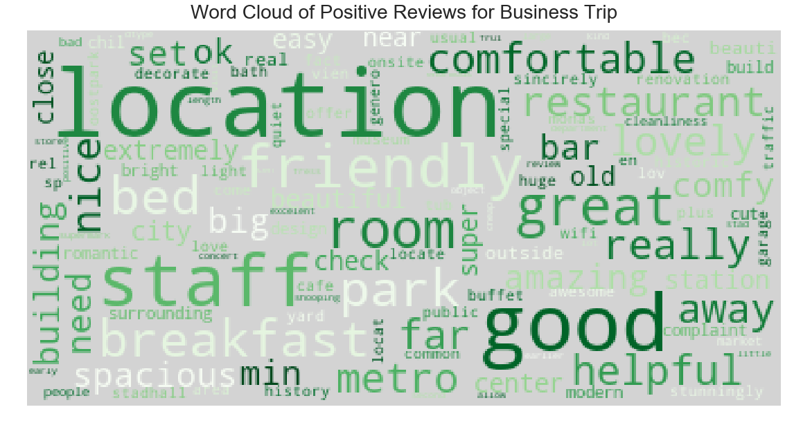


#### Word Cloud from reviews posted by reviewers on a leisure trip


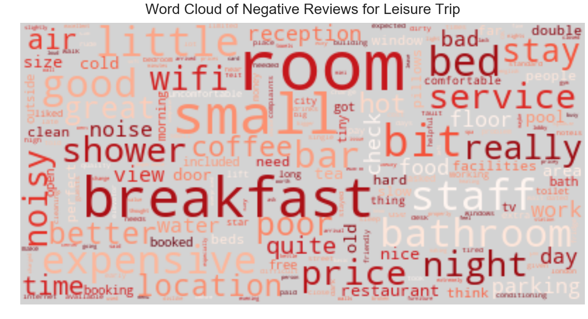


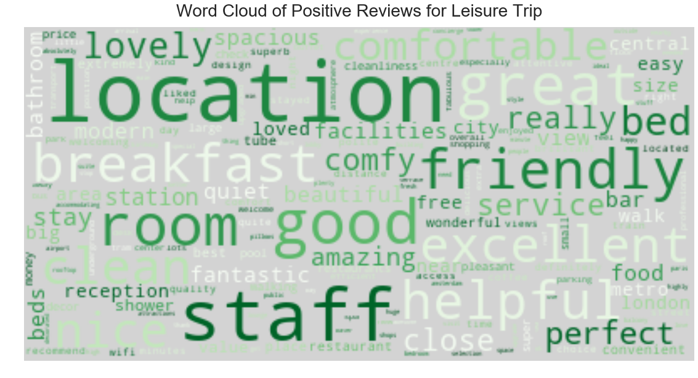


# Topic Modeling <a class="anchor" id="Topic-Modeling"></a> 
The aim  of topic modeling is to extract hidden topics from a large volume of texts and LDA is a popular algorithm for topic modeling. It focuses on wrangling the text data and uses word features to train a machine learning classifier to predict hotel classification. 

We've cleaned the raw hotel data as reported above and in the [milestone report](https://github.com/phyhouhou/SpringboardProjects/blob/master/SecondCapstoneProject/2ndCapstoneProject_MilestoneReport/2ndCapstoneProject_Milestone.ipynb) by handling missing values, drop duplilcates and cleaning and enriching features. We work on the cleaned hotel data for analysis and focus on the review texts.


## Build LDA Model with sklearn <a class="anchor" id="Build-LDA-Model-with-sklearn"></a>
In this section, we will first clean the texts and then create a word-document matrix, which is a required input for implementing the LDA algorithm with sklearn. We will then build a LDA model and discuss the model performance to find out what topics reviewers are talking about. 

### Clean-up Review Text 

Each review has positive and negetive parts. Below are samples of reviews with joint negative and positive parts.

    0  I am so angry that i made this post available via all possible sites i use when planing my trips so no one will make the mistake of booking this place I made my booking via booking com We stayed for 6 nights in this hotel from 11 to 17 July Upon arrival we were placed in a small room on the 2nd floor of the hotel It turned out that this was not the room we booked I had specially reserved the 2 level duplex room so that we would have a big windows and high ceilings The room itself was ok if you don t mind the broken window that can not be closed hello rain and a mini fridge that contained some sort of a bio weapon at least i guessed so by the smell of it I intimately asked to change the room and after explaining 2 times that i booked a duplex btw it costs the same as a simple double but got way more volume due to the high ceiling was offered a room but only the next day SO i had to check out the next day before 11 o clock in order to get the room i waned to Not the best way to begin your holiday So we had to wait till 13 00 in order to check in my new room what a wonderful waist of my time The room 023 i got was just as i wanted to peaceful internal garden view big window We were tired from waiting the room so we placed our belongings and rushed to the city In the evening it turned out that there was a constant noise in the room i guess it was made by vibrating vent tubes or something it was constant and annoying as hell AND it did not stop even at 2 am making it hard to fall asleep for me and my wife I have an audio recording that i can not attach here but if you want i can send it via e mail The next day the technician came but was not able to determine the cause of the disturbing sound so i was offered to change the room once again the hotel was fully booked and they had only 1 room left the one that was smaller but seems newer   Only the park outside of the hotel was beautiful 
    
    
    1    No real complaints the hotel was great great location surroundings rooms amenities and service Two recommendations however firstly the staff upon check in are very confusing regarding deposit payments and the staff offer you upon checkout to refund your original payment and you can make a new one Bit confusing Secondly the on site restaurant is a bit lacking very well thought out and excellent quality food for anyone of a vegetarian or vegan background but even a wrap or toasted sandwich option would be great Aside from those minor minor things fantastic spot and will be back when i return to Amsterdam 
    
    
    2  Rooms are nice but for elderly a bit difficult as most rooms are two story with narrow steps So ask for single level Inside the rooms are very very basic just tea coffee and boiler and no bar empty fridge   Location was good and staff were ok It is cute hotel the breakfast range is nice Will go back 
    
    
    3  My room was dirty and I was afraid to walk barefoot on the floor which looked as if it was not cleaned in weeks White furniture which looked nice in pictures was dirty too and the door looked like it was attacked by an angry dog My shower drain was clogged and the staff did not respond to my request to clean it On a day with heavy rainfall a pretty common occurrence in Amsterdam the roof in my room was leaking luckily not on the bed you could also see signs of earlier water damage I also saw insects running on the floor Overall the second floor of the property looked dirty and badly kept On top of all of this a repairman who came to fix something in a room next door at midnight was very noisy as were many of the guests I understand the challenges of running a hotel in an old building but this negligence is inconsistent with prices demanded by the hotel On the last night after I complained about water damage the night shift manager offered to move me to a different room but that offer came pretty late around midnight when I was already in bed and ready to sleep   Great location in nice surroundings the bar and restaurant are nice and have a lovely outdoor area The building also has quite some character 
    
    
    4  You When I booked with your company on line you showed me pictures of a room I thought I was getting and paying for and then when we arrived that s room was booked and the staff told me we could only book the villa suite theough them directly Which was completely false advertising After being there we realised that you have grouped lots of rooms on the photos together leaving me the consumer confused and extreamly disgruntled especially as its my my wife s 40th birthday present Please make your website more clear through pricing and photos as again I didn t really know what I was paying for and how much it had wnded up being Your photos told me I was getting something I wasn t Not happy and won t be using you again   Amazing location and building Romantic setting 
    

Review texts are processed in the following steps:

* Remove short reviews(total word counts less than 10)
* Remove all non-letters characters;
* Strip whitespaces;
* Tokenize sentence into a list of words;
* Remove English stopwords;
* Lemmatize words to its roots.

We save the cleaned review texts in a csv file for convenience.    


```python
print('Number of non-null Negative_Review: %d' %len(df_txt.Neg_Rev_Lemmatized.dropna()))
print('Number of non-null Positive_Review: %d' %len(df_txt.Pos_Rev_Lemmatized.dropna()))
print('Number of Observations: %d' %len(df_txt))
```

    Number of non-null Negative_Review: 343488
    Number of non-null Positive_Review: 405189
    Number of Observations: 429464


### Create the Document-Word Matrix 
We create the document-word matrix with CountVectorizer. Since the review data is very large, we only consider words that has occurred at at least 10 times (min_df) and with at least character length 3, remove built-in english stopwords and convert all words to lowercase.


```python
#Join negative and positive reviews
df_txt['Rev_Lemmatized']=df_txt['Neg_Rev_Lemmatized'].fillna('')+' '+df_txt['Pos_Rev_Lemmatized'].fillna('')
rev_lemmatized=df_txt['Rev_Lemmatized']

#Initialise the CountVectorizer with the required configuration
c_vec = CountVectorizer(analyzer='word',       
                             min_df=10,                       
                             stop_words='english',             
                             lowercase=True,                  
                             token_pattern='[a-zA-Z]{3,}',    
                            )

#Build the vocabulary by 'fit'
c_vec.fit(rev_lemmatized)

#Convert reviews to a bag of words
rev_vectorized=c_vec.transform(rev_lemmatized) 


#Check the sparscity, i.e., percentage of Non-Zero cells
print ('Shape of Sparse Matrix: ', rev_vectorized.shape)
print ('Amount of Non-Zero occurences: ', rev_vectorized.nnz)
print ('sparsity: %.2f%%' % (100.0 * rev_vectorized.nnz / (rev_vectorized.shape[0] * rev_vectorized.shape[1])))
```

    Shape of Sparse Matrix:  (429464, 10670)
    Amount of Non-Zero occurences:  6941938
    sparsity: 0.15%

We build the vocabualry and convert reviews to a bag of words. The vectorzed document term matrix is a sparse matrix with 429464 observations and 10670 features. Below is a figure to display distribution of the number of documents that a word appears.

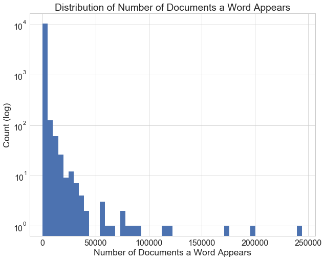


The distribution is very long-tailed. Some of the words appear in too many documents. We also construct the cumulative distribution of document frequencies (df) in a small window. This CDF plot justified us in setting 'min_df'=10 around which the curve starts to climb steeply.


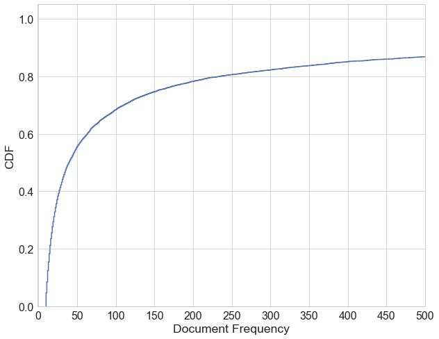


Which words are mostly used in reviews? Below is a table to show the top 10 features in the bag-of-word and its overall occurance. 

     
     Top 10 Features in the bag-of-word and the counts:
    

<div>
<table border="0.4" class="dataframe">
  <thead>
    <tr style="text-align: right;">
      <th></th>
      <th>word</th>
      <th>count</th>
    </tr>
  </thead>
  <tbody>
    <tr>
      <th>0</th>
      <td>room</td>
      <td>376243</td>
    </tr>
    <tr>
      <th>1</th>
      <td>staff</td>
      <td>218196</td>
    </tr>
    <tr>
      <th>2</th>
      <td>location</td>
      <td>178012</td>
    </tr>
    <tr>
      <th>3</th>
      <td>good</td>
      <td>145318</td>
    </tr>
    <tr>
      <th>4</th>
      <td>breakfast</td>
      <td>135939</td>
    </tr>
    <tr>
      <th>5</th>
      <td>great</td>
      <td>106319</td>
    </tr>
    <tr>
      <th>6</th>
      <td>bed</td>
      <td>97308</td>
    </tr>
    <tr>
      <th>7</th>
      <td>friendly</td>
      <td>83682</td>
    </tr>
    <tr>
      <th>8</th>
      <td>clean</td>
      <td>81072</td>
    </tr>
    <tr>
      <th>9</th>
      <td>helpful</td>
      <td>76320</td>
    </tr>
  </tbody>
</table>
</div>


Below is a visualization of the top 10 words in the review.

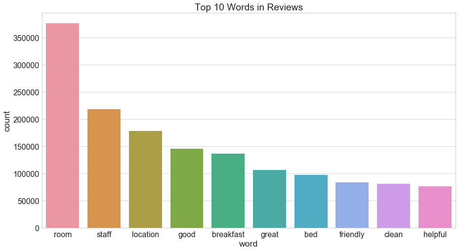


### LDA Model 

Each review is a mixture of both negative and positive part. Will the LDA model be able to separate combined reviews into positive and negative topics? Since topic-modeling can be quite time-consuming and the data is quite large, let's build a 2-topic model to explore this issue. 


```python
 for num,message in enumerate(rev_lemmatized[:10]):
    print(num,message)
    print ('\n')
```

    0 angry make post available possible site use plan trip make mistake book place make booking book com stay night arrival place small room floor turn room book specially reserve level duplex room would big window high ceiling room mind break window close hello rain mini fridge contain sort bio weapon least guess smell intimately ask change room explain time book duplex btw cost simple double get way volume due high ceiling offer room next day check next day clock order get room wan good way begin holiday wait order check new room wonderful waist time room get want peaceful internal garden view big window tired waiting room place belonging rush city evening turn constant noise room guess make vibrate vent tube something constant annoying hell stop even make hard fall asleep wife audio recording attach want send mail next day technician come able determine because disturb sound offer change room fully book room leave small seem new park beautiful
    
    
    1  real complaint great great location surrounding room amenity service recommendation however firstly staff check confusing regard deposit payment staff offer checkout refund original payment make new bit confusing secondly site restaurant bit lack well think excellent quality food anyone vegetarian vegan background even wrap toast sandwich option would great aside minor minor thing fantastic spot back return amsterdam
    
    
    2 room nice elderly bit difficult room story narrow step ask single level room basic tea coffee boiler bar empty fridge location good staff cute breakfast range nice go back
    
    
    3 room dirty afraid walk barefoot floor look clean week white furniture look nice picture dirty door look attack angry dog shower drain clog staff respond request clean day heavy rainfall pretty common occurrence amsterdam roof room leak luckily bed could also see sign early water damage also see insect run floor overall second floor property look dirty badly keep top repairman come fix something room next door midnight noisy many guest understand challenge run old building negligence inconsistent price demand last night complain water damage night shift manager offer move different room offer come pretty late midnight already bed ready sleep great location nice surrounding bar restaurant nice lovely outdoor area building also character
    
    
    4 book company line show picture room think get pay arrive room book staff tell could book villa suite theough directly completely false advertising realise grouped lot room photo together leave consumer confuse extreamly disgruntle especially wife birthday present make website clear pricing photo really know pay much wnded photo tell get something happy use amazing location build romantic setting
    
        
    

```python
lda_modeln2 = LDA(n_components=2,          
                  max_iter=10, 
                  learning_method='online',   
                  random_state=100,         
                  batch_size=128,           
                  evaluate_every = 0,       
                  n_jobs =1,            
                  )

lda_modeln2.fit(rev_vectorized)
lda_output = lda_modeln2.transform(rev_vectorized)

lda_n2_LogLikelihood=lda_modeln2.score(rev_vectorized)
lda_n2_perp=lda_modeln2.perplexity(rev_vectorized)

#See model parameters
print('Model parameters:')
pprint(lda_modeln2.get_params())

#----Diagnose model performance with perplexity and log-likelihood---
#Log Likelyhood: Higher the better
print("\nLog Likelihood Score: %.2f" %lda_n2_LogLikelihood) 

#Perplexity: Lower the better. Perplexity = exp(-1. * log-likelihood per word)
print("\nPerplexity: %.2f" %lda_n2_perp) 
```

    Model parameters:
    {'batch_size': 128,
     'doc_topic_prior': None,
     'evaluate_every': 0,
     'learning_decay': 0.7,
     'learning_method': 'online',
     'learning_offset': 10.0,
     'max_doc_update_iter': 100,
     'max_iter': 10,
     'mean_change_tol': 0.001,
     'n_components': 2,
     'n_jobs': 1,
     'n_topics': None,
     'perp_tol': 0.1,
     'random_state': 100,
     'topic_word_prior': None,
     'total_samples': 1000000.0,
     'verbose': 0}
    
    Log Likelihood Score: -49818074.95
    
    Perplexity: 703.10


```python
#Define a function to display topics
def display_topics(model, feature_names, num_top_words):
    for topic_idx, topic in enumerate(model.components_):
        print ("Topic %d:" % (topic_idx))
        print (" ".join([feature_names[i]
                        for i in topic.argsort()[:-num_top_words - 1:-1]]))

num_top_words = 20
feature_names=c_vec.get_feature_names()
display_topics(lda_modeln2, feature_names, num_top_words)
```

    Topic 0:
    room bed staff night good shower check breakfast day bathroom location time work small reception stay make book floor ask
    Topic 1:
    staff room location good breakfast great friendly helpful nice clean excellent comfortable bed stay close restaurant station walk really lovely


Topics are quite overlapped for n_component=2 model and the model doesn't seem to classify reviews as negative and positive topics as expected though in the first topic 'small' is used.

Since we have limited computing resources and it takes several hours to run the LDA code, we pick n_components=5 for display purpose. We will compare accuracy score in machine learning part for larger n_components=5,50,100 to analyze how n_components affects the model performance.


```python

lda_modeln5 = LDA(n_components=5,          
                  max_iter=10, # default max learning iterations: 10. takes 3mins
                  learning_method='online',   
                  random_state=100,          # Random state
                  batch_size=128,            # default num docs in each learning iter
                  evaluate_every = 0,       # compute perplexity every n iters, default: Don't
                  n_jobs =1,               # Don't use all available CPUs
                  )
lda_modeln5.fit(rev_vectorized)
lda_output = lda_modeln5.transform(rev_vectorized)

lda_n5_LogLikelihood=lda_modeln5.score(rev_vectorized)
lda_n5_perp=lda_modeln5.perplexity(rev_vectorized)

#----Diagnose model performance with perplexity and log-likelihood---
#Log Likelyhood: Higher the better
print("\nLog Likelihood Score: %.2f" %lda_n5_LogLikelihood) 

#Perplexity: Lower the better. Perplexity = exp(-1. * log-likelihood per word)
print("\nPerplexity: %.2f" %lda_n5_perp) 
```

    
    Log Likelihood Score: -50135369.38
    
    Perplexity: 733.08

We implement grid search method to find the optimal n_component for the LDA model. It's quite suprising and disappointing that it picks n_component=2. 

```python

#Define Search Param
search_params = {'n_components': [2, 5, 10, 20, 50]}

#Init the Model
lda = LDA(n_jobs=1,random_state=100)

#Init Grid Search Class
model = GridSearchCV(lda, param_grid=search_params) 
#Do the Grid Search
model.fit(rev_vectorized)

#Show the best topic model and its parameters
best_lda_model = model.best_estimator_
print("Best Model's Params: ", model.best_params_)

#Perplexity
print("Model Perplexity: %.2f" %( best_lda_model.perplexity(rev_vectorized)))
```

    Best Model's Params:  {'n_components': 2}
    Model Perplexity: 703.10


### Dominant Topic in each Document

What particular topic does a document belong to? A dominant topic in a document is spotted by finding the topic that has the highest contributions (revealed by the document-topic matrix) to that document. We will first display top 20 keywords in all the topics and then make a table to show all major topics in a document and specify the most dominant topic in that document.

#### Display top 20 keywords in topics


```python
num_top_words = 20
feature_names=c_vec.get_feature_names()
print('Top 20 Words in topics found in the 5-topic lda_model')
display_topics(lda_modeln5, feature_names, num_top_words)
```

    Top 20 Words in topics found in the 5-topic lda_model
    Topic 0:
    bed room bathroom shower comfortable small comfy clean nice water good location pillow big bath size great coffee double large
    Topic 1:
    staff breakfast room location friendly helpful good great excellent clean nice bar food comfortable service lovely really restaurant facility stay
    Topic 2:
    location close walk station good great city metro nice restaurant pool minute easy room area clean train centre value parking
    Topic 3:
    stay staff check room time day book make pay ask service reception night say charge come tell help leave extra
    Topic 4:
    room location good work night breakfast floor window air door noise star open noisy small old bad need clean poor


Topic 0 mentioned facilities in the hotel, i.e.,'room', 'shower', 'water', 'location', 'pillow'.<br>
Topic 1 mentioned 'staff', 'location', food ('breakfast', 'bar', 'restaurant'), 'service'.<br>
Topic 2 talks about 'lcoation', 'transport', 'restaurant','parking'.<br>
Topic 3 talks about 'staff', 'receptoin', 'service'.<br>
Topic 4 talks about some negative aspects 'noise', 'small', 'old', 'bad', 'poor'.<br>

#### Make a  Document - Topic Table 


```python
#Create Document - Topic Matrix
lda_output=lda_modeln5.transform(rev_vectorized)

#column names
topicnames = ["Topic" + str(i) for i in range(lda_modeln5.n_components)]

#index names
docnames = ["Doc" + str(i) for i in range(len(df_txt))]

#Make the pandas dataframe
df_document_topic = pd.DataFrame(np.round(lda_output, 2), columns=topicnames, index=docnames)

#Get dominant topic for each document
dominant_topic = np.argmax(df_document_topic.values, axis=1)
df_document_topic['dominant_topic'] = dominant_topic

df_document_topics = df_document_topic.head(10)
df_document_topics
```

<table border="0.8" class="dataframe">
  <thead>
    <tr style="text-align: right;">
      <th></th>
      <th>Topic0</th>
      <th>Topic1</th>
      <th>Topic2</th>
      <th>Topic3</th>
      <th>Topic4</th>
      <th>dominant_topic</th>
    </tr>
  </thead>
  <tbody>
    <tr>
      <th>Doc0</th>
      <td>0.03</td>
      <td>0.00</td>
      <td>0.07</td>
      <td>0.47</td>
      <td>0.43</td>
      <td>3</td>
    </tr>
    <tr>
      <th>Doc1</th>
      <td>0.12</td>
      <td>0.45</td>
      <td>0.11</td>
      <td>0.32</td>
      <td>0.00</td>
      <td>1</td>
    </tr>
    <tr>
      <th>Doc2</th>
      <td>0.20</td>
      <td>0.41</td>
      <td>0.01</td>
      <td>0.12</td>
      <td>0.26</td>
      <td>1</td>
    </tr>
    <tr>
      <th>Doc3</th>
      <td>0.08</td>
      <td>0.00</td>
      <td>0.06</td>
      <td>0.25</td>
      <td>0.60</td>
      <td>4</td>
    </tr>
    <tr>
      <th>Doc4</th>
      <td>0.00</td>
      <td>0.00</td>
      <td>0.06</td>
      <td>0.68</td>
      <td>0.26</td>
      <td>3</td>
    </tr>
    <tr>
      <th>Doc5</th>
      <td>0.01</td>
      <td>0.38</td>
      <td>0.30</td>
      <td>0.16</td>
      <td>0.14</td>
      <td>1</td>
    </tr>
    <tr>
      <th>Doc6</th>
      <td>0.89</td>
      <td>0.01</td>
      <td>0.08</td>
      <td>0.01</td>
      <td>0.01</td>
      <td>0</td>
    </tr>
    <tr>
      <th>Doc7</th>
      <td>0.01</td>
      <td>0.88</td>
      <td>0.09</td>
      <td>0.01</td>
      <td>0.01</td>
      <td>1</td>
    </tr>
    <tr>
      <th>Doc8</th>
      <td>0.22</td>
      <td>0.02</td>
      <td>0.02</td>
      <td>0.34</td>
      <td>0.41</td>
      <td>4</td>
    </tr>
    <tr>
      <th>Doc9</th>
      <td>0.27</td>
      <td>0.22</td>
      <td>0.25</td>
      <td>0.01</td>
      <td>0.26</td>
      <td>0</td>
    </tr>
  </tbody>
</table>
</div>


The plot below visualizes topics distribution across documents.

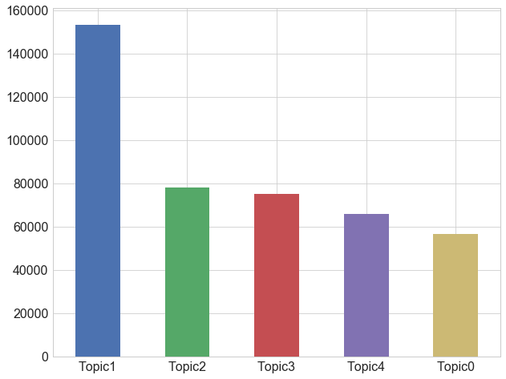


Most of the documents in our sample seems to about topic 1. 

### Visualize the LDA Model with pyLDAvis 


```python
pyLDAvis.enable_notebook()
lda_display_sk= pyLDAvis.sklearn.prepare(lda_modeln5, rev_vectorized, c_vec, mds='tsne')
lda_display_sk
```

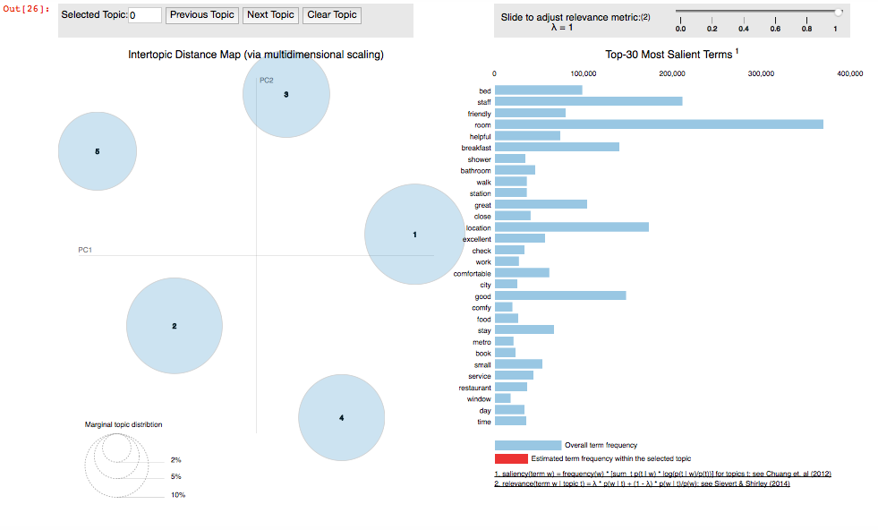
For an interactive visualization, click [here](https://)

The five topics are seperated very well. The size of circles on the left indicates the prevalence of that topic, not consistent with the bar plot above???

## Build LDA Model with Gensim <a class="anchor" id="Build-LDA-Model-with-Gensim"></a>
Since the LDA model with sklearn takes lots of computing resources for larger number of topics. We turn to gensim for building the LDA model. For gensim we need to tokenize the data and filter out stopwords. 

### Create the Dictionary and Corpus Needed for Topic Modeling
Since the size of reviews is quite large, we randomly select some samples to train the model. We can evaluate our topic models by the holdout test set.


```python
from sklearn.model_selection import train_test_split
itrain, itest = train_test_split(range(df_txt.shape[0]), train_size=0.7,random_state=100)
mask = np.zeros(df_txt.shape[0], dtype=np.bool)
mask[itrain] = True

rev_gens=df_txt['Rev_Lemmatized'][mask]

#Prepare NLTK stopwords
from nltk.corpus import stopwords
stop_words = stopwords.words('english')
stop_words.extend(['hotel'])


#Tokenize and clean sentences to words 
def sent_to_words(sentences):
    for sentence in sentences:
        yield(gensim.utils.simple_preprocess(str(sentence), deacc=True))  # deacc=True removes punctuations


def process_text(sentences):
    #Create Corpus
    txt_tokenized=list(sent_to_words(sentences))
    #Remove stopwords
    txt_tokenized = [[w for w in doc if w not in stop_words] for doc in txt_tokenized]
    return txt_tokenized


rev_tokenized=process_text(rev_gens)
    #Create Dictionary-association word to numericID
dictionary = gensim.corpora.Dictionary(rev_tokenized )
    #Term Document Frequency-transform collections of texts to numeric form
corpus = [dictionary.doc2bow(txt) for txt in rev_tokenized ]

    #save dictionary and corpus
pickle.dump(corpus, open('corpus.pkl', 'wb'))
dictionary.save('dictionary.gensim')
```


```python
def build_lda(revs,ntopics,passes=15):
    """Tokenize and clean reviews by process_text, then create dictionary and corpus and build LDA model"""
    ldamodel=gensim.models.ldamodel.LdaModel(corpus, num_topics = ntopics, id2word=dictionary, passes=15,random_state=100)
    #ldamodel = gensim.models.ldamulticore.LdaMulticore(corpus, num_topics =ntopics, id2word=dictionary, passes=15,random_state=100) #Multicore very demanding on memory; can do for ntopics=10 but not 50 +
    
    #save ldamodel
    ldamodel.save('model{0}.gensim'.format(ntopics))
    topics = ldamodel.print_topics(num_words=10)
    for topic in topics:
        print('Topics:\n',topic)
    
    print('num_topic: %d' %ntopics)
    
    #Compute Perplexity
    log_perplexity=ldamodel.log_perplexity(corpus)
    print('\nPerplexity: %.2f' %(log_perplexity))  # a measure of how good the model is. lower the better.

    #Compute Coherence Score
    coherence_ldamodel= CoherenceModel(model=ldamodel, texts=rev_tokenized, dictionary=dictionary, coherence='c_v')
    coherence= coherence_ldamodel.get_coherence()
    print('\nCoherence Score: %.2f' %coherence)
    
    return ntopics,log_perplexity,coherence
ntopics=5
_=build_lda(rev_gens,ntopics=ntopics,passes=15)
```

    Topics:
     (0, '0.070*"breakfast" + 0.061*"room" + 0.061*"staff" + 0.049*"good" + 0.043*"location" + 0.028*"friendly" + 0.027*"great" + 0.026*"clean" + 0.023*"helpful" + 0.022*"nice"')
    Topics:
     (1, '0.030*"room" + 0.016*"check" + 0.015*"get" + 0.014*"day" + 0.012*"time" + 0.011*"ask" + 0.011*"pay" + 0.011*"book" + 0.010*"night" + 0.010*"reception"')
    Topics:
     (2, '0.049*"staff" + 0.040*"stay" + 0.019*"would" + 0.018*"helpful" + 0.018*"great" + 0.015*"friendly" + 0.015*"nothing" + 0.014*"location" + 0.013*"room" + 0.013*"everything"')
    Topics:
     (3, '0.036*"close" + 0.034*"station" + 0.030*"walk" + 0.027*"location" + 0.023*"metro" + 0.022*"city" + 0.019*"good" + 0.015*"minute" + 0.013*"easy" + 0.013*"train"')
    Topics:
     (4, '0.090*"room" + 0.032*"bed" + 0.020*"bathroom" + 0.020*"small" + 0.019*"location" + 0.017*"shower" + 0.015*"good" + 0.012*"floor" + 0.011*"clean" + 0.011*"nice"')
    num_topic: 5
    
    Perplexity: -6.84
    
    Coherence Score: 0.58


### Model Perplexity
The coherence takes too long (more than 24 hours for larger ntopics= 50,...) to calculate. ntopics=5 takes 1hour 20mins. So we investigate the model performance by the perplexity. Note the data are obtained by calculations on a cluster. It seems that the perplexity always decreases as the number of topics increases.


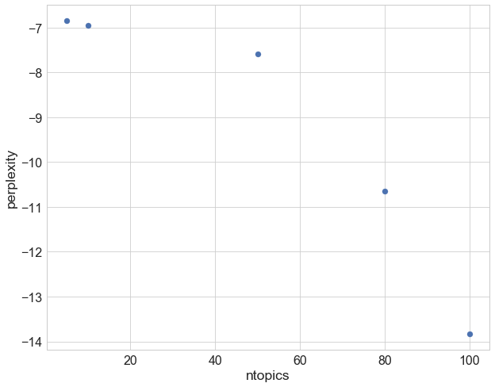


### Visualize Topics with pyLDAvis
Pick the optimal model and visualize and interpret topics with pyLDAvis.


```python
dictionary = gensim.corpora.Dictionary.load('dictionary.gensim')
corpus = pickle.load(open('corpus.pkl', 'rb'))
lda_gensim = gensim.models.ldamodel.LdaModel.load('model{0}.gensim'.format(ntopics))
lda_display_gsm = pyLDAvis.gensim.prepare(lda_gensim, corpus, dictionary, sort_topics=False)

#Save the visualization in a html format
pyLDAvis.save_html(lda_display_gsm, 'gensimldan{0}.html'.format(ntopics))

#Interactive visualization
pyLDAvis.display(lda_display)
```


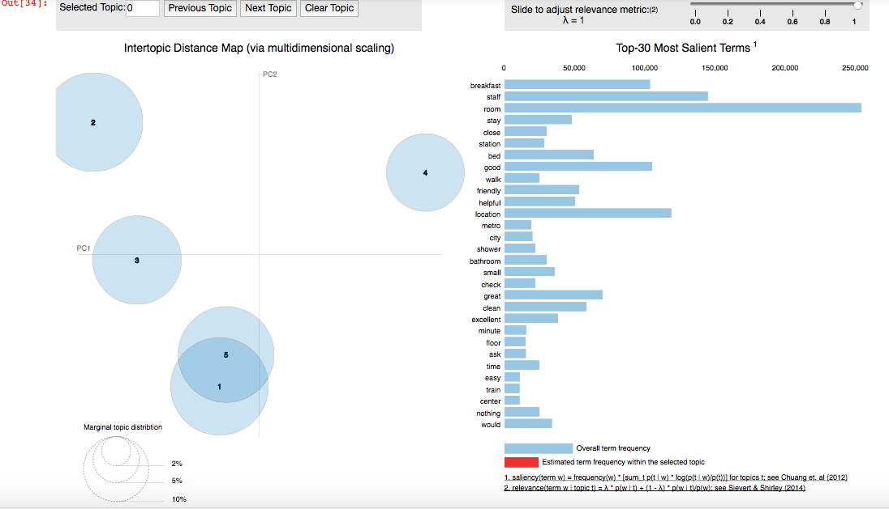

For an interactive visualization, click [here](https://)

We also try the 10-topic LDA model. 
```python
ntopics=10

_=build_lda(rev_gens,ntopics=ntopics,passes=15)  #1.5hour

dictionary = gensim.corpora.Dictionary.load('dictionary.gensim')
corpus = pickle.load(open('corpus.pkl', 'rb'))
lda_gensim = gensim.models.ldamodel.LdaModel.load('model{0}.gensim'.format(ntopics))
lda_displayn10 = pyLDAvis.gensim.prepare(lda_gensim, corpus, dictionary, sort_topics=False)

#Save the visualization in a html format
pyLDAvis.save_html(lda_displayn10, 'gensimldan{0}.html'.format(ntopics))

#Interactive visualization
pyLDAvis.display(lda_displayn10)
```

    Topics:
     (0, '0.094*"staff" + 0.085*"room" + 0.056*"location" + 0.054*"breakfast" + 0.046*"good" + 0.045*"friendly" + 0.040*"great" + 0.040*"clean" + 0.039*"helpful" + 0.031*"nice"')
    Topics:
     (1, '0.094*"bar" + 0.059*"restaurant" + 0.045*"food" + 0.039*"service" + 0.028*"breakfast" + 0.026*"area" + 0.024*"drink" + 0.015*"eat" + 0.014*"serve" + 0.014*"dinner"')
    Topics:
     (2, '0.039*"room" + 0.024*"check" + 0.021*"staff" + 0.017*"book" + 0.017*"get" + 0.015*"day" + 0.015*"ask" + 0.014*"time" + 0.013*"reception" + 0.013*"give"')
    Topics:
     (3, '0.048*"station" + 0.042*"walk" + 0.040*"close" + 0.029*"location" + 0.029*"city" + 0.022*"minute" + 0.019*"good" + 0.019*"easy" + 0.019*"train" + 0.019*"center"')
    Topics:
     (4, '0.056*"good" + 0.051*"room" + 0.047*"breakfast" + 0.038*"location" + 0.035*"price" + 0.025*"parking" + 0.023*"pool" + 0.017*"value" + 0.016*"money" + 0.016*"small"')
    Topics:
     (5, '0.084*"room" + 0.033*"bed" + 0.022*"bathroom" + 0.018*"shower" + 0.015*"small" + 0.013*"location" + 0.012*"good" + 0.011*"air" + 0.011*"clean" + 0.009*"work"')
    Topics:
     (6, '0.063*"staff" + 0.055*"stay" + 0.027*"would" + 0.027*"great" + 0.024*"nothing" + 0.024*"everything" + 0.024*"helpful" + 0.021*"love" + 0.020*"friendly" + 0.019*"location"')
    Topics:
     (7, '0.030*"night" + 0.028*"room" + 0.022*"front" + 0.021*"noise" + 0.018*"door" + 0.016*"work" + 0.015*"noisy" + 0.015*"desk" + 0.014*"floor" + 0.013*"morning"')
    Topics:
     (8, '0.143*"metro" + 0.044*"view" + 0.029*"top" + 0.027*"close" + 0.026*"attraction" + 0.024*"roof" + 0.021*"milano" + 0.019*"balcony" + 0.018*"tourist" + 0.014*"supermarket"')
    Topics:
     (9, '0.069*"breakfast" + 0.053*"free" + 0.052*"wifi" + 0.046*"coffee" + 0.029*"tea" + 0.020*"good" + 0.015*"water" + 0.015*"internet" + 0.012*"room" + 0.012*"day"')
    num_topic: 10
    
    Perplexity: -6.95
    
    Coherence Score: 0.60


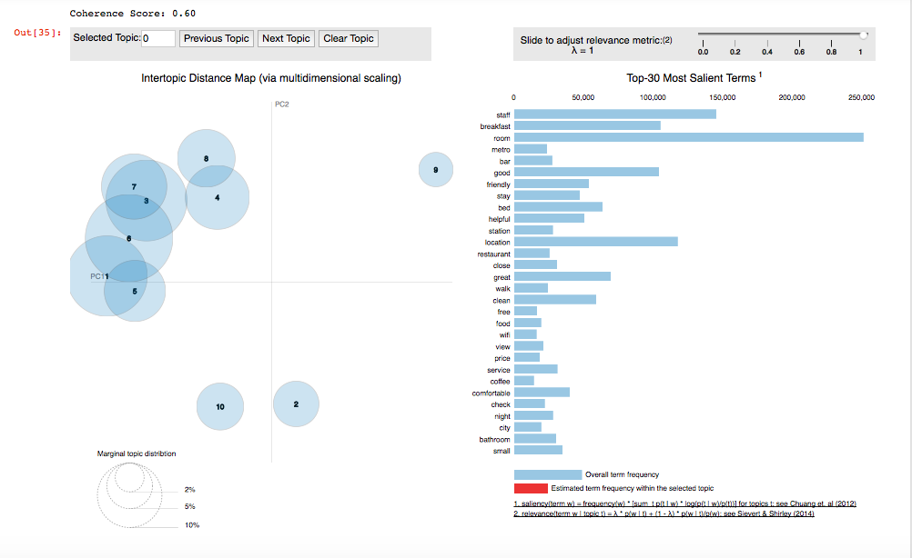

For an interactive visualization, click [here](https://)

Compared to the 5-topic model, the 10-topic model has lower perplexity and higher coherence score. But the visualization shows that many topics in the later model are overlapped with each other.


### Test on Holdout data

```python
#dictionary = gensim.corpora.Dictionary.load('dictionary.gensim')
#corpus = pickle.load(open('corpus.pkl', 'rb'))
lda_gensimn10 = gensim.models.ldamodel.LdaModel.load('model10.gensim')
lda_gensimn5 = gensim.models.ldamodel.LdaModel.load('model5.gensim')


new_doc=df_txt['Rev_Lemmatized'][~mask].sample(1,random_state=100)
doc_tokenized=process_text(new_doc)
doc_bow=[dictionary.doc2bow(d) for d in doc_tokenized]
dtm=lda_gensimn10.get_document_topics(doc_bow)
print(new_doc.values)


print('For 10-topic model: ')
for t in dtm:
    print(t)

dtm=lda_gensimn5.get_document_topics(doc_bow)
print('For 5-topic model: ')
for t in dtm:
    print(t)

```

    ['make room reservation booking pay room separate make huge mess charge time confuse key room reservation name room location good']
    For 10-topic model: 
    [(2, 0.6268212400705695), (5, 0.3350756342904477)]
    For 5-topic model: 
    [(1, 0.5957963906576259), (2, 0.10343491947595156), (4, 0.28128399193992903)]


# Build Machine Learning Models for Prediction <a class="anchor" id="Build-Machine-Learning-Models-for-Prediction"></a> 

Since we focus on the review texts in this part, we build machine learning models using features generated from texts. Before that we need to create our target variable 'label'. Since a reviewer's score ranges from 0 to 10, for simplicity, we classify a hotel review as 'poor' if the score is below 7.9 and 'good' if it's between 7.9 and 9.6 otherwise 'excellent'.

## Create a Target Column <a class="anchor" id="Create-a-Target-Column"></a> 


The figure below visualizes the distribution of reviewer score.

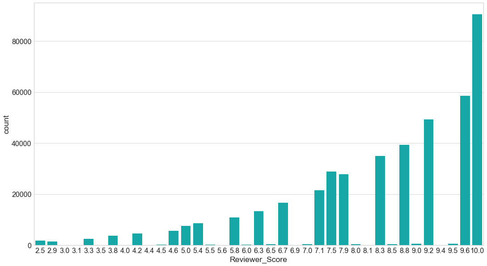


```python
#Add 'label' by converting 'continuous' Reviewer_Score into 3 categories
df_txt['label']=pd.qcut(df_txt.Reviewer_Score,3,labels=['Poor','Good','Excellent'])
(df_txt.label.value_counts(normalize=True).sort_index()*100).plot(kind='bar',color='c',rot=0,figsize=(10,8));
plt.ylabel('Percent (%)')
plt.xlabel('Label of Hotels');
```


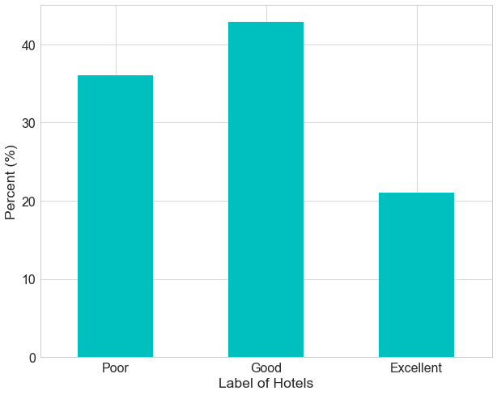


How is the length of lemmatized clean reviews related with the reviewer score?


```python
#Lenghth of characters in a full-review
df_txt['Len_LemRev_char']=df_txt['Rev_Lemmatized'].apply(len)
sns.lmplot(y='Reviewer_Score',x='Len_LemRev_char',data=df_txt,y_jitter=0.05,size=10,scatter_kws={'alpha':0.3});
print('Correlation: %.2f'%(df_txt.Len_LemRev_char.corr(df_txt.Reviewer_Score)))
```

    Correlation: -0.12


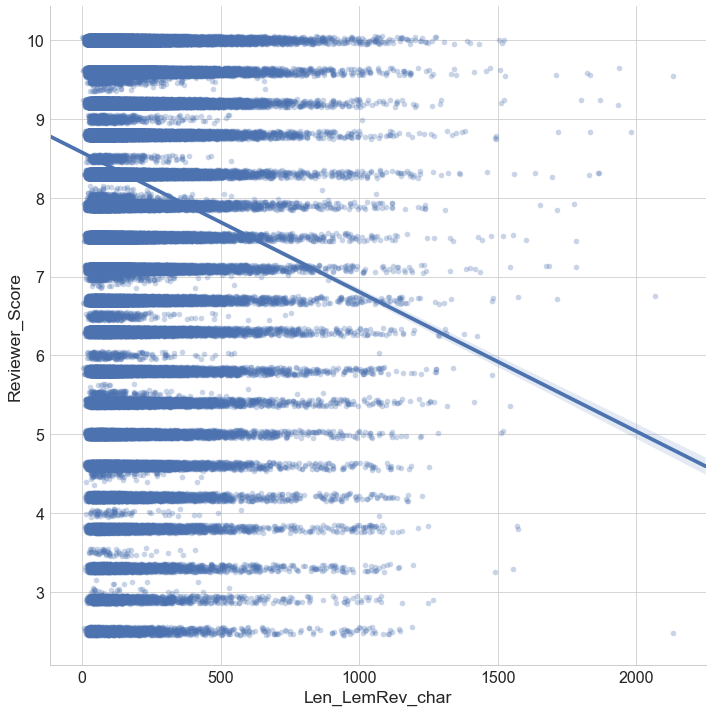


The above figure indicates that the longer the character length of a review the lower the score tends to be.


Visualize the distribution of length of review strings by review label.


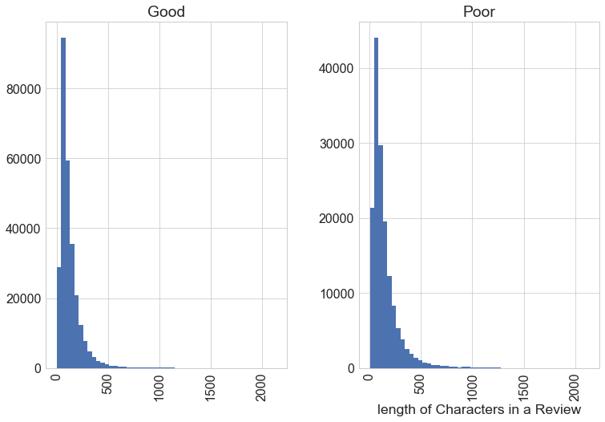


Visualize the distribution of length of review strings by trip type.


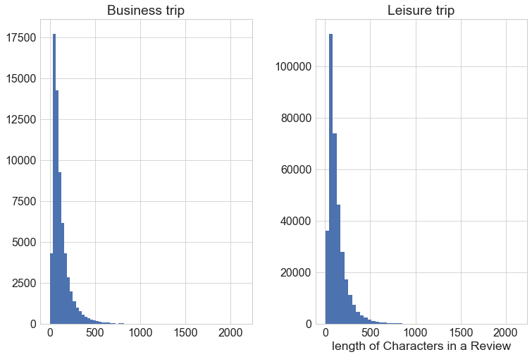


## t-test of the Character Length of Reviews <a class="anchor" id="t-test-of-the-Character-Length-of-Reviews"></a> 

Is the average length of reviews significantly different for different trip categories ('business' trip and 'leisure trip')? We will investigate this issue by performing the t-test for means of two independent samples of reviews. The null hypothesis is that 2 independent samples (i.e., character length of reviews for business trip and that for leisure trip) have identical average length of characters. This is a two-sided test for 2 samples of different sizes. 


```python
np.round(df_txt.groupby('Trip_Type')['Len_LemRev_char'].size())#.mean())
```

    Trip_Type
    Business trip     66733
    Leisure trip     350782
    Name: Len_LemRev_char, dtype: int64


```python
from scipy import stats

idx_leis=df_txt['Trip_Type']=='Leisure trip'
len_leis=df_txt[idx_leis]['Len_LemRev_char']
len_busi=df_txt[~idx_leis]['Len_LemRev_char']

t, p=stats.ttest_ind(len_leis, len_busi, equal_var = False)
#This test assumes that the populations have identical variances by default.
#equal_var=False: perform Welch’s t-test, which does not assume equal population variance 
print('t-statistic: %.2f' % (t),'\npvalue: %.2f' % (p))
```

    t-statistic: 18.93 
    pvalue: 0.00


Since the pvalue is nearly zero, we reject the null hypothesis and conclude that the average length of characters is different for reviews on leisure trip and business trip.


```python
np.round(df_txt.groupby('label')['Len_LemRev_char'].size())#.mean())
```


    label
    Poor         154949
    Good         184068
    Excellent     90447
    Name: Len_LemRev_char, dtype: int64


```python
from scipy import stats

idx_poor=df_txt['label']=='Poor'
idx_good=df_txt['label']=='Good'
idx_exc=df_txt['label']=='Excellent'


len_poor=df_txt[idx_poor]['Len_LemRev_char']
len_good=df_txt[idx_good]['Len_LemRev_char']
len_exc=df_txt[idx_exc]['Len_LemRev_char']


t, p=stats.ttest_ind(len_poor, len_good, equal_var = False)
#This test assumes that the populations have identical variances by default.
#equal_var=False: perform Welch’s t-test, which does not assume equal population variance 
print('len_rev: poor v.s. good')
print('t-statistic: %.2f' % (t),'\npvalue: %.2f\n' % (p))

t, p=stats.ttest_ind(len_poor, len_exc, equal_var = False)
print('len_rev: poor v.s. exc')
print('t-statistic: %.2f' % (t),'\npvalue: %.2f\n' % (p))

t, p=stats.ttest_ind(len_good, len_exc, equal_var = False)
print('len_rev: good v.s. exc')
print('t-statistic: %.2f' % (t),'\npvalue: %.2f' % (p))
```

    len_rev: poor v.s. good
    t-statistic: 42.40 
    pvalue: 0.00
    
    len_rev: poor v.s. exc
    t-statistic: 59.76 
    pvalue: 0.00
    
    len_rev: good v.s. exc
    t-statistic: 25.21 
    pvalue: 0.00


Since the pvalue is nearly zero for any two types of review categories, we reject the null hypothesis and conclude that the character length of reviews for different review categories are different.

## Build up a Pipeline <a class="anchor" id="Build-up-a-Pipeline"></a>  

### Encoding the Categorical Target Feature


```python
#LabelEncoding the review categories
df_txt_label=df_txt[['Reviewer_Score','Rev_Lemmatized','label']]
df_txt_label['label_cat']=df_txt_label.label.astype('category').cat.codes
lab_code=sorted(dict(zip(df_txt_label['label'],df_txt_label['label_cat'])).items(),key=lambda x: x[1])
lab_code
```


    [('Poor', 0), ('Good', 1), ('Excellent', 2)]


**Split data into training and test set**


```python
X_train, X_test, y_train, y_test=train_test_split(df_txt_label['Rev_Lemmatized'],df_txt_label['label_cat'],test_size=0.3,random_state=100)

y_train.shape, y_test.shape
```

    ((300624,), (128840,))


Define a function to run pipeline.

```python
def run_pipeline(steps,X_train,y_train,X_test,y_test):
    pipe=Pipeline(steps)
    pipe.fit(X_train,y_train)
    
    y_pred=pipe.predict(X_test)
    accu_train=pipe.score(X_train,y_train)
    accu_test=pipe.score(X_test,y_test)
    class_rep=classification_report(y_test,y_pred)
    conf_mtrix=confusion_matrix(y_test, y_pred) #,labels=['Poor','Good','Excellent']

    #Save the model
    #pickle.dump(pipe, open('pipe_model', 'wb'))
   
    print('Accuracy of training set: %.2f' %accu_train)
    print('Accuracy of test set: %.2f' %accu_test)
    print("\nConfusion Matrix:\n",conf_mtrix )
    print ('\nClassificatio Report:\n',class_rep)


    return pipe,accu_train, accu_test, conf_mtrix, class_rep

    
```

## Use bag-of-word Features for Prediction <a class="anchor" id="Use-bag-of-word-Features-for-Prediction"></a> 

**Build up the pipeline**


```python
bow_steps=[('vectorise',CountVectorizer(min_df=10,stop_words='english',token_pattern='[a-zA-Z]{3,}')),
         ('clf',MultinomialNB())]

bow_pipe,bow_training_accuracy, bow_test_accuracy, bow_conf_mtrix, bow_class_report=run_pipeline(bow_steps,X_train,y_train,X_test,y_test)
```

    Accuracy of training set: 0.62
    Accuracy of test set: 0.61
    
    Confusion Matrix:
     [[30356 14697  1195]
     [11021 33704 11025]
     [ 1976 10811 14055]]
    
    Classificatio Report:
                  precision    recall  f1-score   support
    
              0       0.70      0.66      0.68     46248
              1       0.57      0.60      0.59     55750
              2       0.53      0.52      0.53     26842
    
    avg / total       0.61      0.61      0.61    128840
    


```python
y_pred=bow_pipe.predict(X_test)


plt.figure(figsize=(12,12))
ax=sns.heatmap(bow_conf_mtrix, annot=True, fmt="d",linewidths=.5, square = True, cmap = 'Blues_r',annot_kws={'size':16});#fmt=".3f", 
plt.ylabel('Actual label');
#plt.xlabel('Predicted label\naccuracy={:0.2f}; misclass={:0.2f}'.format(accuracy_score(y_test,  y_pred), 1-accuracy_score(y_test,  y_pred)))
plt.xlabel('Predicted label\naccuracy={:0.2f}'.format(accuracy_score(y_test,  y_pred)))


plt.title('Confusion Matrix', size = 18)
ax.xaxis.set_ticklabels(['Poor', 'Good', 'Excellent'])
ax.yaxis.set_ticklabels(['Poor', 'Good', 'Excellent']);
```


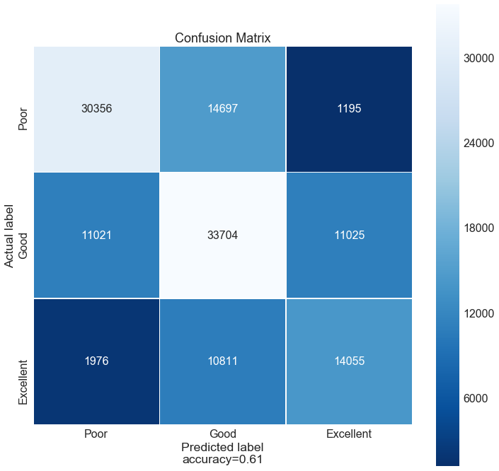


### Grid Search Hyperparameters
We define a customized gridsearch function and specify our search parameters. Since it takes time to run the code, the calcualtion is actually run on a cluster. 

```python
bow_pipe.named_steps.keys()
```

    dict_keys(['vectorise', 'clf'])


```python
def my_grid_search(model,search_params,X_train,y_train,X_test,y_test,nfolds=5,scoring='accuracy'):
    gsmodel= GridSearchCV(model, param_grid=search_params,scoring=scoring,cv=nfolds)
    gsmodel=gsmodel.fit(X_train,y_train)
    y_pred=gsmodel.predict(X_test)
    print('Best paras:\n')
    pprint(gsmodel.best_params_)
    print('\nBest score: %.2f' % gsmodel.best_score_)
    print('\nClassification report: \n',classification_report(y_test,y_pred))
    
    return gsmodel,gsmodel.best_params_,gsmodel.best_score_,classification_report(y_test,y_pred)


search_params = dict(vectorise__binary=[True,False],
                  vectorise__min_df=[1,10],
                  vectorise__ngram_range=[(1,1),(1,2)],
                  clf__alpha=[0.1,1,10]
                 )

bowGS,_,_,bowGS_class_report=my_grid_search(bow_pipe,search_params,X_train,y_train,X_test,y_test)

bow_GridSearch_training_accuracy=bowGS.score(X_train,y_train)
bow_GridSearch_test_accuracy=bowGS.score(X_test,y_test)
bow_GridSearch_conf_mtrix=confusion_matrix(y_test,bowGS.predict(X_test))
bow_GridSearch_class_report=bowGS_class_report


#Save model using pickle
pickle.dump(bowGS, open('save/bowGridSearch.sav', 'wb'))
#load the model from disk
#bow_GS_model=pickle.load(open('save/bowGridSearch.sav', 'rb'))

pickle.dump(bow_GridSearch_training_accuracy, open('save/bow_GridSearch_training_accuracy.sav', 'wb'))
pickle.dump(bow_GridSearch_test_accuracy, open('save/bow_GridSearch_test_accuracy.sav', 'wb'))
pickle.dump(bow_GridSearch_conf_mtrix, open('save/bow_GridSearch_conf_mtrix.sav', 'wb'))
pickle.dump(bow_GridSearch_class_report, open('save/bow_GridSearch_class_reportt.sav', 'wb'))
```

We load the results to the notebook. 

```python
#Load model using pickle
bowGS=pickle.load(open('save/bowGridSearch.sav', 'rb'))
bow_GridSearch_training_accuracy=pickle.load(open('save/bow_GridSearch_training_accuracy.sav', 'rb'))
bow_GridSearch_test_accuracy=pickle.load(open('save/bow_GridSearch_test_accuracy.sav', 'rb'))
bow_GridSearch_conf_mtrix=pickle.load(open('save/bow_GridSearch_conf_mtrix.sav', 'rb'))
bow_GridSearch_class_report=pickle.load(open('save/bow_GridSearch_class_reportt.sav', 'rb'))
```


```python
print('Best paras:\n')
pprint(bowGS.best_params_)
print('\nBest score: %.2f' % bowGS.best_score_)
print('\nClassification report: \n',bow_GridSearch_class_report)
```

    Best paras:
    
    {'clf__alpha': 10,
     'vectorise__binary': True,
     'vectorise__min_df': 10,
     'vectorise__ngram_range': (1, 2)}
    
    Best score: 0.62
    
    Classification report: 
                  precision    recall  f1-score   support
    
              0       0.71      0.68      0.70     46248
              1       0.57      0.70      0.63     55750
              2       0.60      0.38      0.46     26842
    
    avg / total       0.63      0.62      0.62    128840
    
The average performance is increased after grid searching hyperparameters but not significantly.

### Strongly Predictive Features 
We build a dataset where each row contains just one word (identity matrix) and then uses the trained classifier to classify the one-word review. The probability for each row represents the probability that the review will be classified as 'poor'. We can see which words have the highest probability in ('poor') and which words have the lowest probability (low probability in being 'poor', hence high probability in being 'good' or 'excellent).


```python
#Initialize the CountVectorizer with optimal hyperparameters
vectorizer=CountVectorizer(analyzer='word',       
                             min_df=10,
                             ngram_range=(1, 2),
                             stop_words='english',             
                             lowercase=True,                  
                             token_pattern='[a-zA-Z]{3,}',  
                            binary=True,
                       )
#Build the vocabulary by 'fit'
vectorizer.fit(df_txt_label['Rev_Lemmatized'])


#Make X and y
def make_xy(df_txt_label, vectorizer=None):
    if vectorizer is None:
        vectorizer = CountVectorizer()
    X = vectorizer.fit_transform(df_txt_label.Rev_Lemmatized)
    X = X.tocsc()  
    y = df_txt_label.label_cat.values
    return X, y
X, y = make_xy(df_txt_label,vectorizer)


#Set the train and test masks
itrain, _ = train_test_split(range(df_txt_label.shape[0]), test_size=0.3,random_state=100)
mask = np.zeros(df_txt_label.shape[0], dtype=np.bool)
mask[itrain] = True

xtrain=X[mask]
ytrain=y[mask]
xtest=X[~mask]
ytest=y[~mask]

#Train the Naive Bayes model
clf = MultinomialNB(alpha=10).fit(xtrain, ytrain)
words = np.array(vectorizer.get_feature_names())

x = np.eye(xtest.shape[1])

#'poor'
probs = clf.predict_log_proba(x)[:, 0]
ind = np.argsort(probs)[::-1]#reverse the order such that decending order

good_words =words[ind[:10]]   
bad_words =words[ind[-10:]]

good_prob = probs[ind[:10]]
bad_prob = probs[ind[-10:]]

print("Good words\t     P(Poor | word)")
for w, p in zip(good_words, good_prob):
    print("{:>20}".format(w), "{:.2f}".format(np.exp(p)))
    
print("Bad words\t     P(Poor | word)")
for w, p in zip(bad_words, bad_prob):
    print("{:>20}".format(w), "{:.2f}".format(np.exp(p)))


```

    Good words	     P(Poor | word)
              staff rude 0.90
              room dirty 0.89
                  filthy 0.89
               unhelpful 0.87
              dirty room 0.87
            carpet dirty 0.86
        staff unfriendly 0.86
         staff unhelpful 0.85
                   dirty 0.85
       uncomfortable bed 0.85
    Bad words	     P(Poor | word)
               feel home 0.06
           amazing staff 0.06
             stay highly 0.06
      absolutely amazing 0.06
       definitely return 0.05
         definitely come 0.05
         absolutely love 0.05
         definitely stay 0.05
               love stay 0.04
        highly recommend 0.03


**Compare different classifiers**<br>
It is quite time-consuming, we will perform the calculations in cluster and load results to notebook.


```python

clfs=[MultinomialNB(),LogisticRegression(),SGDClassifier(loss="log")]
model_clf=['MultinomialNB','LogisticRegression','SGDClassifier']
search_params=[dict(vectorise__binary=[True,False],
                    #vectorise__min_df=[1,5,10],
                    vectorise__ngram_range=[(1,1),(1,2)],
                    clf__alpha=[0.01,0.1,1,10]
                 ),
              dict(vectorise__binary=[True,False],
                    #vectorise__min_df=[1,5,10],
                    vectorise__ngram_range=[(1,1),(1,2)],
                   clf__C=[0.01,0.1,1,10]
                 ),
              dict(vectorise__binary=[True,False],
                   #vectorise__min_df=[1,5,10],
                    vectorise__ngram_range=[(1,1),(1,2)],
                 )]


nfolds=5
for i in range(len(clfs)):
    steps=[('vectorise',CountVectorizer(stop_words='english')),
         ('clf',clfs[i])]
    pipe=Pipeline(steps)
    
    print('Model: ', model_clf[i])    
    grid_search =my_grid_search(pipe,search_params[i],X_train,y_train,X_test,y_test,nfolds,scoring='accuracy')
```

Below are the results for the grid search of different classifiers.

    Model:  MultinomialNB
    {'clf__alpha': 1, 'vectorise__binary': False, 'vectorise__ngram_range': (1, 2)}

    Best score: 0.62

    Classification report: 
             
                 precision    recall  f1-score   support

              0       0.72      0.66      0.69     46248
              1       0.56      0.75      0.64     55750
              2       0.65      0.29      0.40     26842

    avg / total       0.64      0.62      0.61    128840

    Model:  LogisticRegression
    {'clf__C': 0.01, 'vectorise__binary': False, 'vectorise__ngram_range': (1, 2)}

    Best score: 0.63

    Classification report: 
                  precision    recall  f1-score   support

              0       0.71      0.72      0.71     46248
              1       0.58      0.71      0.64     55750
              2       0.64      0.32      0.43     26842

    avg / total       0.64      0.63      0.62    128840

    Model:  SGDClassifier
    {'vectorise__binary': True, 'vectorise__ngram_range': (1, 2)}

    Best score: 0.63

    Classification report: 
                  precision    recall  f1-score   support

              0       0.73      0.70      0.71     46248
              1       0.57      0.73      0.64     55750
              2       0.64      0.32      0.42     26842

    avg / total       0.64      0.63      0.62    128840

Again the average performance is increased compared to the initial NaiveBayes model without grid search, but the increase is not significant.

## Use Tfidf-weighted Features for Prediction <a class="anchor" id="Use-Tfidf-weighted-Features-for-Prediction"></a> 

 
We already have a learned CountVectorizer, we use it with a TfidfTransformer to generate the Tfidf-weighted features for prediction.


```python
steps=[('vectorise', CountVectorizer(analyzer='word',       
                             min_df=10,
                             ngram_range=(1, 2),
                             stop_words='english',             
                             lowercase=True,                  
                             token_pattern='[a-zA-Z]{3,}',  
                            #binary=False,
                       )),
       ('transform',TfidfTransformer()),
       ('clf',MultinomialNB())]
res_tfidf_NB_model=run_pipeline(steps,X_train,y_train,X_test,y_test)      
```

    Accuracy of training set: 0.66
    Accuracy of test set: 0.62
    
    Confusion Matrix:
     [[31528 14384   336]
     [10837 40223  4690]
     [ 1821 16322  8699]]
    
    Classificatio Report:
                  precision    recall  f1-score   support
    
              0       0.71      0.68      0.70     46248
              1       0.57      0.72      0.64     55750
              2       0.63      0.32      0.43     26842
    
    avg / total       0.63      0.62      0.61    128840
    

Above is the results generated with a Naive Bayes classifier. Below we choose the LogisticRegressrion as the classifier. The average performance is slightly enchanced.

```python
steps=[('vectorise', CountVectorizer(analyzer='word',       
                             min_df=10,
                             ngram_range=(1, 2),
                             stop_words='english',             
                             lowercase=True,                  
                             token_pattern='[a-zA-Z]{3,}',  
                            #binary=False,
                       )),
       ('transform',TfidfTransformer()),
       ('clf',LogisticRegression())]
res_tfidf_Lg_model=run_pipeline(steps,X_train,y_train,X_test,y_test)      
```

    Accuracy of training set: 0.70
    Accuracy of test set: 0.63
    
    Confusion Matrix:
     [[33665 12035   548]
     [12295 37170  6285]
     [ 1910 14498 10434]]
    
    Classificatio Report:
                  precision    recall  f1-score   support
    
              0       0.70      0.73      0.72     46248
              1       0.58      0.67      0.62     55750
              2       0.60      0.39      0.47     26842
    
    avg / total       0.63      0.63      0.62    128840
    


### Feed Less TfidfVectorized Features to Classifier 
We select only some (rather than all) features by implementing the most common feature selection technique for text mining, i.e., the chi-squared  ($\chi2$) method to see if the accuracy gets improved on test data set.


```python
tfidf_vec = TfidfVectorizer(min_df=10,
                            ngram_range=(1, 2),
                            stop_words='english',
                            token_pattern='[a-zA-Z]{3,}',
                           )

X, y = make_xy(df_txt_label,tfidf_vec)
X_new = SelectKBest(chi2, k=5000).fit_transform(X, y)


itrain, _ = train_test_split(range(df_txt_label.shape[0]), test_size=0.3,random_state=100)
mask = np.zeros(df_txt_label.shape[0], dtype=np.bool)
mask[itrain] = True


Xtrain=X_new[mask]
ytrain=y[mask]
Xtest=X_new[~mask]
ytest=y[~mask]

steps=[('clf',MultinomialNB())]

res_tfidf_NB_model2=run_pipeline(steps,Xtrain,ytrain,Xtest,ytest)            
```

    Accuracy of training set: 0.62
    Accuracy of test set: 0.62
    
    Confusion Matrix:
     [[30375 15714   159]
     [ 9648 43050  3052]
     [ 1550 18456  6836]]
    
    Classificatio Report:
                  precision    recall  f1-score   support
    
              0       0.73      0.66      0.69     46248
              1       0.56      0.77      0.65     55750
              2       0.68      0.25      0.37     26842
    
    avg / total       0.65      0.62      0.61    128840
    

The average precision is increased when we use the most important 5000 word features instead of all of the word features.


## Use sklearn LDA Document Topics for Prediction <a class="anchor" id="Use-sklearn-LDA-Document-Topics-for-Prediction"></a> 

How well does the model perform if we choose the topics generated by LDA models for prediction?

```python
#X_train, X_test, y_train, y_test=train_test_split(df_txt_label['Rev_Lemmatized'],df_txt_label['label_cat'],test_size=0.3,random_state=100)

steps=[('vectorise',CountVectorizer(analyzer='word',       
                             min_df=10,                       
                             stop_words='english',             
                             lowercase=True,                  
                             token_pattern='[a-zA-Z]{3,}',  
   )),
       ('LDA', LDA(n_components=5, random_state=100)),
       ('clf',MultinomialNB())]

res_ldan5=run_pipeline(steps,X_train,y_train,X_test,y_test)
```

    Accuracy of training set: 0.53
    Accuracy of test set: 0.53
    
    Confusion Matrix:
     [[20962 25286     0]
     [ 7970 47780     0]
     [ 1757 25085     0]]
    
    Classificatio Report:
                  precision    recall  f1-score   support
    
              0       0.68      0.45      0.54     46248
              1       0.49      0.86      0.62     55750
              2       0.00      0.00      0.00     26842
    
    avg / total       0.46      0.53      0.46    128840
  
The word features built by the 5-topic LDA model could predict 'poor' and 'good' but not 'excellent'. The average performance is rather poor.

We also tested with 50-topic and 100-topic LDA model. Below are the results:
    
    ntopics=50
    Accuracy of training set: 0.49
    Accuracy of test set: 0.49

     Confusion Matrix:
     [[10674 35574     0]
     [ 3342 52408     0]
     [  841 26001     0]]

     Classificatio Report:
                  precision    recall  f1-score   support

              0       0.72      0.23      0.35     46248
              1       0.46      0.94      0.62     55750
              2       0.00      0.00      0.00     26842

    avg / total       0.46      0.49      0.39    128840


    ntopics=100
    Accuracy of training set: 0.47
    Accuracy of test set: 0.48

    Confusion Matrix:
    [[ 8717 37531     0]
    [ 2605 53145     0]
    [  592 26250     0]]

    Classificatio Report:
                  precision    recall  f1-score   support

              0       0.73      0.19      0.30     46248
              1       0.45      0.95      0.62     55750
              2       0.00      0.00      0.00     26842

    avg / total       0.46      0.48      0.37    128840

As the number of topics increase, the LDA model can predict 'poor' with higher precision and 'good' with higher recall and misclassify less 'Excellent' as 'poor' and less 'good' as 'poor'. The model doesn't mistake 'poor' or 'good' as 'excellent' and still couldn't predict 'excellent' as 'excellent'.


## Use Gensim LDA Document Topics for Prediction <a class="anchor" id="Use-Gensim-LDA-Document-Topics-for-Prediction"></a> 


Since the gensim LDA features couldn't be directly used for prediction, we first get the document topics from the model and then convert it to numpy array, a form ready to be used for prediction. We also use the Functiontransformer to turn a python function into an object that a scikit-learn pipeline can understand.  
```python
def gensim_lda_feature(doc,dictionary,corpus,num_topics,ldamodel):
    """extract document-topic matrix from gensim lda and convert it into a form ready to be used for prediction """
    
    #Create document-topic-matrix for documents
    doc_tokenized=process_text(doc)
    doc_bow=[dictionary.doc2bow(d) for d in doc_tokenized]
    dtm=ldamodel.get_document_topics(doc_bow)

    #Convert dtm to numpy array
    dtm_csr = gensim.matutils.corpus2csc(dtm)
    dtm_numpy = dtm_csr.T.toarray()

    return dtm_numpy
```


```python
X_rev=df_txt_label['Rev_Lemmatized']
y=df_txt_label['label_cat']


#Split data into training and test set
itrain, _ = train_test_split(range(df_txt_label.shape[0]), test_size=0.3,random_state=100)
mask = np.zeros(df_txt_label.shape[0], dtype=np.bool)
mask[itrain] = True

X_train=X_rev[mask]
y_train=y[mask]

X_test=X_rev[~mask]
y_test=y[~mask]


ntopics=5    
dictionary = gensim.corpora.Dictionary.load('dictionary.gensim')
corpus = pickle.load(open('corpus.pkl', 'rb'))
ldan5 = gensim.models.ldamodel.LdaModel.load('model{0}.gensim'.format(ntopics))


gensim_lda_extractFeature=FunctionTransformer(lambda x: gensim_lda_feature(
    x,dictionary,corpus,ntopics,ldan5),validate=False)

steps=[('gensimLDA',gensim_lda_extractFeature),
       ('clf',MultinomialNB())]
res_lda_gsm_n5=run_pipeline(steps,X_train,y_train,X_test,y_test)
```

    Accuracy of training set: 0.53
    Accuracy of test set: 0.53
    
    Confusion Matrix:
     [[21223 25025     0]
     [ 8387 47363     0]
     [ 1602 25240     0]]
    
    Classificatio Report:
                  precision    recall  f1-score   support
    
              0       0.68      0.46      0.55     46248
              1       0.49      0.85      0.62     55750
              2       0.00      0.00      0.00     26842
    
    avg / total       0.45      0.53      0.46    128840
    
The 5-topic gensim LDA topic features has similar average performace as that of sklearn LDA topic features. Both couldn't predict for the 'excellent' class. Instead, a minority (6%) of 'excellent' is misclassifed as 'poor' and the others (94%) are misclassified as 'good' according to the confusion matrix. We also have results for larger number of topics as listed below.
    
    ntopics=50
    Perplexity: -7.58
    Accuracy of training set: 0.51
    Accuracy of test set: 0.52

     Confusion Matrix:
     [[16558 29690     0]
     [ 5815 49935     0]
     [ 1166 25673     3]]

     Classificatio Report:
                  precision    recall  f1-score   support

              0       0.70      0.36      0.47     46248
              1       0.47      0.90      0.62     55750
              2       1.00      0.00      0.00     26842

    avg / total       0.67      0.52      0.44    128840

    
    ntopics=80
    Perplexity: -10.65
    Accuracy of training set: 0.50
    Accuracy of test set: 0.51

     Confusion Matrix:
     [[13894 32354     0]
     [ 4210 51540     0]
     [  818 26024     0]]

     Classificatio Report:
                  precision    recall  f1-score   support

              0       0.73      0.30      0.43     46248
              1       0.47      0.92      0.62     55750
              2       0.00      0.00      0.00     26842

    avg / total       0.47      0.51      0.42    128840
    
    
    ntopics=100
    Perplexity: -13.83
    Accuracy of training set: 0.49
    Accuracy of test set: 0.50

     Confusion Matrix:
     [[12269 33979     0]
     [ 3709 52041     0]
     [  726 26116     0]]

     Classificatio Report:
                  precision    recall  f1-score   support

              0       0.73      0.27      0.39     46248
              1       0.46      0.93      0.62     55750
              2       0.00      0.00      0.00     26842

    avg / total       0.46      0.50      0.41    128840

The perplexity decreases as the number of topics increases. But the best accuracy of the test set is given by the 5-topic model. The 50-topic model has the best average precision. It sucessfully predict 'excellent' as 'excellent' although the recall is nearly negligible. 


##  Compare Model Performance <a class="anchor" id="Compare-Model-Performance"></a>
<div>
<table border="0.4" class="dataframe">
  <thead>
    <tr style="text-align: right;">
      <th></th>
      <th>test_accuracy</th>
    </tr>
  </thead>
  <tbody>
    <tr>
      <th>bow</th>
      <td>0.61</td>
    </tr>
    <tr>
      <th>bow_GridSearch</th>
      <td>0.62</td>
    </tr>
    <tr>
      <th>bow_Classifier_NB</th>
      <td>0.62</td>
    </tr>
    <tr>
      <th>bow_Classifier_LR</th>
      <td>0.63</td>
    </tr>
    <tr>
      <th>bow_Classifier_SGD</th>
      <td>0.63</td>
    </tr>
    <tr>
      <th>tfidf_NB</th>
      <td>0.62</td>
    </tr>
    <tr>
      <th>tfidf_LR</th>
      <td>0.63</td>
    </tr>
    <tr>
      <th>tfidf_chi</th>
      <td>0.62</td>
    </tr>
    <tr>
      <th>lda</th>
      <td>0.53</td>
    </tr>
    <tr>
      <th>lda_gensim_n5</th>
      <td>0.53</td>
    </tr>
  </tbody>
</table>
</div>


Print classification report

    bow: 
    
                 precision    recall  f1-score   support
    
              0       0.70      0.66      0.68     46248
              1       0.57      0.60      0.59     55750
              2       0.53      0.52      0.53     26842
    
    avg / total       0.61      0.61      0.61    128840
    
    bow_GridSearch: 
    
                 precision    recall  f1-score   support
    
              0       0.71      0.68      0.70     46248
              1       0.57      0.70      0.63     55750
              2       0.60      0.38      0.46     26842
    
    avg / total       0.63      0.62      0.62    128840
    
    bow_Classifier_NB: 
    
                 precision    recall  f1-score   support
    
              0       0.72      0.66      0.69      46248
              1       0.56      0.75      0.64      55750
              2       0.65      0.29      0.40      26842
    
    avg / total       0.64      0.62      0.61      128840
    
    bow_Classifier_LR: 
    
                 precision    recall  f1-score   support
    
              0       0.71      0.72      0.71      46248
              1       0.58      0.71      0.64      55750
              2       0.64      0.32      0.43      26842
    
    avg / total       0.64      0.63      0.62      128840
    
    bow_Classifier_SGD: 
    
                 precision    recall  f1-score   support
    
              0       0.73      0.70      0.71      46248
              1       0.57      0.73      0.64      55750
              2       0.64      0.32      0.42      26842
    
    avg / total       0.64      0.63      0.62      128840
    
    tfidf_NB: 
    
                 precision    recall  f1-score   support
    
              0       0.71      0.68      0.70     46248
              1       0.57      0.72      0.64     55750
              2       0.63      0.32      0.43     26842
    
    avg / total       0.63      0.62      0.61    128840
    
    tfidf_LR: 
    
                 precision    recall  f1-score   support
    
              0       0.70      0.73      0.72     46248
              1       0.58      0.67      0.62     55750
              2       0.60      0.39      0.47     26842
    
    avg / total       0.63      0.63      0.62    128840
    
    tfidf_chi: 
    
                 precision    recall  f1-score   support
    
              0       0.73      0.66      0.69     46248
              1       0.56      0.77      0.65     55750
              2       0.68      0.25      0.37     26842
    
    avg / total       0.65      0.62      0.61    128840
    
    lda_n5: 
    
                 precision    recall  f1-score   support
    
              0       0.68      0.45      0.54     46248
              1       0.49      0.86      0.62     55750
              2       0.00      0.00      0.00     26842
    
    avg / total       0.46      0.53      0.46    128840
    
    lda_gensim_n5: 
    
                 precision    recall  f1-score   support
    
              0       0.68      0.46      0.55     46248
              1       0.49      0.85      0.62     55750
              2       0.00      0.00      0.00     26842
    
    avg / total       0.45      0.53      0.46    128840
        


# Improve Model Performance <a class="anchor" id="Improve-Model-Performance"></a>
According to our exploratory data analysis, the reviewer score is corrected with features like 'Trip_Type' and 'Num_Nights' etc. We will include those categorical and numerical features in this section to check whether it will improve the model performance. Since it's more important to know whether a hotel is reviewed as poor/not poor than to know that a hotel is reviewed as good/excellent. Let's categorize the reviews into two types by the 0.33 quantile of reviewers' score.

## Poor or not <a class="anchor" id="Poor-or-not"></a>

We combine numerical features with categorical and text features. Then we split the reviewer score into two buckets, i.e., those above 7.9 (reviewer score at 0.33 quantile) are 'good', the others are 'poor'.


```python
#Extract numerical columns
data=pd.read_csv('data/htl_clean.csv')
col_num=['Total_Number_of_Reviews_Reviewer_Has_Given','Review_Total_Positive_Word_Counts',
          'Review_Total_Negative_Word_Counts','Num_Nights']
cthresh=10
idx=(data['Review_Total_Positive_Word_Counts']+data['Review_Total_Negative_Word_Counts'])<cthresh
df_num=data[~idx][col_num].reset_index(drop=True)

#Combine features
df_ml=pd.concat([df_txt,df_num],axis=1)

#Split reviewer score into two buckets
thresh=np.percentile(df_ml.Reviewer_Score,33)#df_ml.Reviewer_Score.quantile(0.33)
print('threshold of poor|good', thresh)
df_ml['label']=np.where(df_ml.Reviewer_Score>thresh,'Good','Poor')
```

    threshold of poor|good 7.9

Below is a bar plot of reviewer score falling into the two buckets.

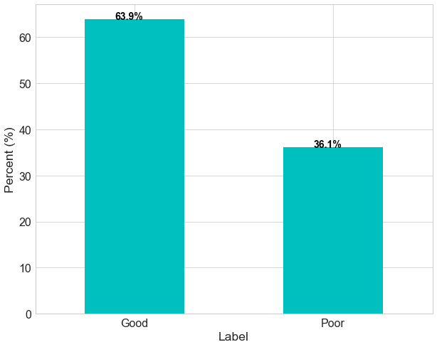


We first use the bag-of-words features for binary classification.


```python
lab_bin=LabelBinarizer()
y=lab_bin.fit_transform(df_ml['label'])

X_train, X_test, y_train, y_test = train_test_split(df_ml['Rev_Lemmatized'], y,test_size=0.3,
    random_state=100)

bow_steps_bin=[('vectorise',CountVectorizer(
                                        min_df=10,
                                        stop_words='english',
                                        token_pattern='[a-zA-Z]{3,}')),
         ('clf',MultinomialNB())]

bow_pipe_bin,bow_training_accuracy_bin, bow_test_accuracy_bin, bow_conf_mtrix_bin, bow_class_report_bin=run_pipeline(bow_steps_bin,X_train,y_train,X_test,y_test)
```

    Accuracy of training set: 0.78
    Accuracy of test set: 0.78
    
    Confusion Matrix:
     [[69757 12835]
     [15755 30493]]
    
    Classificatio Report:
                  precision    recall  f1-score   support
    
              0       0.82      0.84      0.83     82592
              1       0.70      0.66      0.68     46248
    
    avg / total       0.78      0.78      0.78    128840
    
The model performs much better in accuracy, precision and recall.

## Enrich Predictors with Categorical and Numerical Features <a class="anchor" id="Enrich-Predictors"></a>
We extract categorical columns and numerical columns to enrich predictor features. We split the data into training and test set. We fill missing values in categorical columns with 'None'. We impute missing values in numerical features by its median. Since the Tfidf vectorizer works better than bag-of-word features and LDA topic features, we adopt the Tfidf vectorized features to numerically represent review texts. 


```python
col_categories=['Review_Month', 'Hotel_City', 'Trip_Type','Traveler_Type']
df_ml.Trip_Type.fillna('None',inplace=True)

col_num=['Total_Number_of_Reviews_Reviewer_Has_Given','Review_Total_Positive_Word_Counts',
          'Review_Total_Negative_Word_Counts','Num_Nights']

X=df_ml[col_categories+col_num+['Rev_Lemmatized']]
y=lab_bin.fit_transform(df_ml['label'])

X_train, X_test, y_train, y_test = train_test_split(
    X, y,test_size=0.3,random_state=100)
```

Use the FunctionTransformer to create an object out of a Python function that help select subsets of data in a way that plays nicely with pipelines.


```python
get_text_data=FunctionTransformer(lambda x: x['Rev_Lemmatized'],validate=False)
get_num_data=FunctionTransformer(lambda x: x[col_num],validate=False)
get_cat_data=FunctionTransformer(lambda x: pd.get_dummies(x[col_categories]),validate=False)

#Build text pipeline
text_pipeline=Pipeline([('selector', get_text_data ),
                        ('vectorise',TfidfVectorizer(
                                        min_df=10,
                                        ngram_range=(1,2),
                                        stop_words='english',
                                        token_pattern='[a-zA-Z]{3,}')),
                       #('dim_red',SelectKBest(chi2,k=5000))
                       ])
#Build cat pipeline
cat_pipeline=Pipeline([('selector',get_cat_data),             
                      ])

#Build num pipeline
num_pipeline=Pipeline([('selector',get_num_data),
                        ('imputer',Imputer(strategy='median')),
                   ('interact',PolynomialFeatures(degree=2,interaction_only=True,include_bias=False)),                   ('scaler',MinMaxScaler()),
                      ])
```

All the features can be joint together by 'FeatureUnion', ready to be used for the pipeline. We choose differetn classifiers for prediction. 

1. Use MultinomialNB() classifier for prediction

```python
steps_NB_bin=[
    ('union',FeatureUnion([('cat',cat_pipeline),('num',num_pipeline),('text',text_pipeline)])),
     ('clf',MultinomialNB())
    ]
res_NB_bin=run_pipeline(steps_NB_bin,X_train,y_train,X_test,y_test)
```

    Accuracy of training set: 0.81
    Accuracy of test set: 0.79
    
    Confusion Matrix:
     [[72396 10196]
     [16746 29502]]
   
2. Use LogisticRegression() classifier for prediction

```python
steps_LR_bin=[
    ('union',FeatureUnion([('cat',cat_pipeline),('num',num_pipeline),('text',text_pipeline)])),
    ('clf',LogisticRegression())
]

res_LR_bin=run_pipeline(steps_LR_bin,X_train,y_train,X_test,y_test)
```

    Accuracy of training set: 0.84
    Accuracy of test set: 0.81
    
    Confusion Matrix:
     [[72633  9959]
     [14568 31680]]
    

3. Use RandomForestClassifier() classifier for prediction

```python
steps_RF_bin=[
    ('union',FeatureUnion([('cat',cat_pipeline),('num',num_pipeline),('text',text_pipeline)])),    
    ('clf',RandomForestClassifier())
]

res_RF_bin=run_pipeline(steps_RF_bin,X_train,y_train,X_test,y_test)
```

    Accuracy of training set: 0.98
    Accuracy of test set: 0.77
    
    Confusion Matrix:
     [[74504  8088]
     [22064 24184]]

4. Use LinearSVC() classifier for prediction

```python
steps_SVC_bin=[
    ('union',FeatureUnion([('cat',cat_pipeline),('num',num_pipeline),('text',text_pipeline)])),
    ('clf',LinearSVC())
]

res_SVC_bin=run_pipeline(steps_SVC_bin,X_train,y_train,X_test,y_test)
```

    Accuracy of training set: 0.88
    Accuracy of test set: 0.79
    
    Confusion Matrix:
     [[70754 11838]
     [14990 31258]]
    
5. Use SGDClassifier() classifier for prediction

```python
steps_SGD_bin=[
    ('union',FeatureUnion([('cat',cat_pipeline),('num',num_pipeline),('text',text_pipeline)])),
    ('clf',SGDClassifier())
]

res_SGD_bin=run_pipeline(steps_SGD_bin,X_train,y_train,X_test,y_test)
```

    Accuracy of training set: 0.81
    Accuracy of test set: 0.80
    
    Confusion Matrix:
     [[72865  9727]
     [15590 30658]]
   

### Improved Model Performance


Accuracy score of the test set for each model:

<div>
<table border="0.4" class="dataframe">
  <thead>
    <tr style="text-align: right;">
      <th></th>
      <th>test_accuracy</th>
    </tr>
  </thead>
  <tbody>
    <tr>
      <th>bow_text</th>
      <td>0.78</td>
    </tr>
    <tr>
      <th>Tfidf_Featunion_NB</th>
      <td>0.79</td>
    </tr>
    <tr>
      <th>Tfidf_Featunion_LR</th>
      <td>0.81</td>
    </tr>
    <tr>
      <th>Tfidf_Featunion_RF</th>
      <td>0.77</td>
    </tr>
    <tr>
      <th>Tfidf_Featunion_SVC</th>
      <td>0.79</td>
    </tr>
    <tr>
      <th>Tfidf_Featunion_SGD</th>
      <td>0.80</td>
    </tr>
  </tbody>
</table>
</div>


Print classification report


    bow_text: 
    
                 precision    recall  f1-score   support
    
              0       0.82      0.84      0.83     82592
              1       0.70      0.66      0.68     46248
    
    avg / total       0.78      0.78      0.78    128840
    
    Tfidf_Featunion_NB: 
    
                 precision    recall  f1-score   support
    
              0       0.81      0.88      0.84     82592
              1       0.74      0.64      0.69     46248
    
    avg / total       0.79      0.79      0.79    128840
    
    Tfidf_Featunion_LR: 
    
                 precision    recall  f1-score   support
    
              0       0.83      0.88      0.86     82592
              1       0.76      0.69      0.72     46248
    
    avg / total       0.81      0.81      0.81    128840
    
    Tfidf_Featunion_RF: 
    
                 precision    recall  f1-score   support
    
              0       0.77      0.90      0.83     82592
              1       0.75      0.52      0.62     46248
    
    avg / total       0.76      0.77      0.75    128840
    
    Tfidf_Featunion_SVC: 
    
                 precision    recall  f1-score   support
    
              0       0.83      0.86      0.84     82592
              1       0.73      0.68      0.70     46248
    
    avg / total       0.79      0.79      0.79    128840
    
    Tfidf_Featunion_SGD: 
    
                 precision    recall  f1-score   support
    
              0       0.82      0.88      0.85     82592
              1       0.76      0.66      0.71     46248
    
    avg / total       0.80      0.80      0.80    128840
    
# Conclusions <a class="anchor" id="Conclusions"></a> 
We loaded hotel reviews data and performed data cleaning and data wrangling. According to our EDA, there are 515212 reviews for 1493 hotels located in 6 cities (over a half of hotels are located in London) of 6 countries in Europe by reviewers either on leisure trip (80% for leisure trip) or business trip (20% for business trip) from 227 distinct countries. Couples (around 50% of travelers) are the most common travelers types among the 6 types (around 20% are solo travelers, others are groups, families or friends). We've determined the most popular hotels by considering its 'Average_Score' and 'Total_Number_of_Reviews'. We also performed time series analysis on the reviewer score and we find that the average reviewer score is higher in January and low in October. We also find that reviewers on a leisure trip tend to rate higher than those on a business trip and on average the longer traveler stayed the lower the score they give. In the topic modeling part, we build LDA models and visualize the topics generated from review texts. These insights from EDA about patterns/trends/importance of features help us in building machine learning models to predict labels of reviewer scores.<br>

We build the machine learning models with vectorized numerically text features (bag-of-word features, tfidf features, LDA topic features). We also performed grid search on hyperparameters and different classifiers. We visualized the performances of classifiers in view of accuracy of the test set. It shows that for predicting multi classifications, logistic regression classifier with bag-of-word or tfidf features can improve accuracy from 43% (achieved by just predicting the majority class, that is, ‘Good’) to 63%. The LDA topic features don't work well for prediction.<br> 


If we label reviewer score as ‘poor' (reviewer score lower than 0.33 quantile of overall reviewer scores) and ‘good’ (reviewer score above 0.33 quantile of overall reviewer scores), it is an unbalanced binary classification problem. We enrich text features by numerical features ('Num_nights'...) and categorical features ('Trip_Type'...). The best prediction is given by logistic regression classifier with Tfidf vectorized text features. It increases accuracy by 27% (from 64% achieved by just predicting the majority class, that is, ‘Good’ to 81% by logistic regression).


# Next Steps <a class="anchor" id="Next-Steps"></a> 

1. How to improve accuracy?<br>
Since review texts are the dominant predictors we propose to clean reviews furthermore by removing some most frequent words, correcting misspellings and removing words other than nouns and adjective words. This process might improve topic modelings. We also propose to add interactions between numerical feature, categorical features and text features to improve model performance. Another strategy is to implement undersampling or oversampling to improve the classification.

2. Are review contents consistent with the rating scores?<br>
We notice that some reviewers give very low score but posted both positive and negative aspects of the hotels while some reviewers post no negative reviews but score not that high, indicating they are unsatisfied to some extent but just not mentioning them. Are review contents consistent with the rating scores? How to quantify the consistency?

3. Brainstorm for other more practical ideas:<br>
   * Build an app such that users can enter a hotel and the output would be several topics concerning that hotel such as service, cleaning, wifi... and the corresponding extent of content obtained from previous reviews.<br>
   * Separate reviews according to the trip type, i.e., 'leisure trip' or 'business trip' and focus on the 'business trip' for instance to perform NLP analysis. This will greatly reduce the size of texts and might be of particular interests for improving businessmen's experience.<br>
   * Extract topics by months to explore if there is some trend in topics in a time series.<br>


# Deliverables <a class="anchor" id="Deliverables"></a>
Read [milestone report](https://github.com/phyhouhou/SpringboardProjects/blob/master/SecondCapstoneProject/2ndCapstoneProject_MilestoneReport/2ndCapstoneProject_Milestone.ipynb) for details and codes in data cleaning and exploratory data analysis.<br>
Read [SecondCapstoneProject_NLP_ML](https://github.com/phyhouhou/SpringboardProjects/blob/master/SecondCapstoneProject/2ndCapstoneProjectFinalReport/SecondCapstoneProject_NLP_ML.ipynb) for details about feature engineering and model evaluations.<br>

