# Table of Contents

* [Introduction](#Introduction)
* [Client](#Client)
* [Load Packages and Data](#Load-Packages-and-Data)
* [Data Wrangling and Cleaning](#Data-Wrangling-and-Cleaning)
    * [Missing Values](#Missing-Values)
    * [Check and Drop Duplicates](#Check-and-Drop-Duplicates)
    * [Cleaning and Enriching Features](#Cleaning-and-Enriching-Features)
    * [Summary](#Summary)
* [Exploratory Data Analysis](#Exploratory-Data-Analysis)
    * [Summary Statistics](#Summary-Statistics)
    * [Visualization of Hotels](#Visualization-of-Hotels)
    * [Visualization of Reviewers](#Visualization-of-Reviewers)
    * [Visualization of Reviews](#NLP-of-Text-Data)
* [Next Steps](#Next-Steps)

## Introduction
Nowadays, people travel very often for business or for holidays. Travelers want to select hotels with clean rooms, high-quality service, convenient location etc. In a word, people hope to find a cozy and cost-effective hotel to stay while traveling. A massive amount of reviews are being posted online and people are influenced by online reviews in making their decisions. Each person has its own taste of 'cozy'. Where are the perfect hotels to your taste located? What are other travelers saying about that hotel? Are previous travelers having positive experience or bad one concerning your needs? We propose to investigate hotel reviews data and perform text analysis and topic modeling using Naive Bayes and LDA. We also propose to build a machine learning model for predicting review scores from the features we have in the data.

## Client
Travelers will certainly be interested in this project. They might spend lots of time searching/reading/evaluating hotels and the reviews. This project will save a vast amount of time for travelers. Hotel owners are eager to know what customers are talking and especially caring about the hotels. This project can help them improve service quality and maximize their business profit. Other potential clients include travel service agencies and housing agencies etc.

## Load Packages and Data
The dataset is originally from [kaggle](https://www.kaggle.com/jiashenliu/515k-hotel-reviews-data-in-europe). It is about 515K hotel reviews data in Europe. It's a csv file containing information on hotel name, hotel address, review date, review scores, reviewers' nationality, positive/negative reviews' word count etc.

The data can be enriched by adding hotel features acquired from, for instance, trip advisor etc.


```python
import pandas as pd
import numpy as np

import matplotlib.pyplot as plt
%matplotlib inline
from matplotlib.pylab import rcParams
rcParams['figure.figsize'] = 10, 8
#rcParams["axes.labelsize"] = 16
#mpl.rcParams['font.size']=12                 
#mpl.rcParams['savefig.dpi']=100            
#mpl.rcParams['figure.subplot.bottom']=.1 


import seaborn as sns
sns.set(context='paper',style='whitegrid',font_scale=2, rc={"lines.linewidth": 2.5})#style=whitegrid,darkgrid,white,dark
pd.set_option('display.max_columns', None)

import folium
from folium import plugins
from folium.plugins import MarkerCluster


from collections import Counter
from wordcloud import WordCloud, STOPWORDS
import re
import nltk


import warnings
warnings.filterwarnings('ignore')


```


```python
hotel=pd.read_csv('data/Hotel_Reviews.csv',parse_dates=['Review_Date'],index_col='Review_Date')
hotel.info()
hotel.head()
```

    <class 'pandas.core.frame.DataFrame'>
    DatetimeIndex: 515738 entries, 2017-08-03 to 2015-08-09
    Data columns (total 16 columns):
    Hotel_Address                                 515738 non-null object
    Additional_Number_of_Scoring                  515738 non-null int64
    Average_Score                                 515738 non-null float64
    Hotel_Name                                    515738 non-null object
    Reviewer_Nationality                          515738 non-null object
    Negative_Review                               515738 non-null object
    Review_Total_Negative_Word_Counts             515738 non-null int64
    Total_Number_of_Reviews                       515738 non-null int64
    Positive_Review                               515738 non-null object
    Review_Total_Positive_Word_Counts             515738 non-null int64
    Total_Number_of_Reviews_Reviewer_Has_Given    515738 non-null int64
    Reviewer_Score                                515738 non-null float64
    Tags                                          515738 non-null object
    days_since_review                             515738 non-null object
    lat                                           512470 non-null float64
    lng                                           512470 non-null float64
    dtypes: float64(4), int64(5), object(7)
    memory usage: 66.9+ MB


<div>
<style scoped>
    .dataframe tbody tr th:only-of-type {
        vertical-align: middle;
    }

    .dataframe tbody tr th {
        vertical-align: top;
    }

    .dataframe thead th {
        text-align: right;
    }
</style>
<table border="1" class="dataframe">
  <thead>
    <tr style="text-align: right;">
      <th></th>
      <th>Hotel_Address</th>
      <th>Additional_Number_of_Scoring</th>
      <th>Average_Score</th>
      <th>Hotel_Name</th>
      <th>Reviewer_Nationality</th>
      <th>Negative_Review</th>
      <th>Review_Total_Negative_Word_Counts</th>
      <th>Total_Number_of_Reviews</th>
      <th>Positive_Review</th>
      <th>Review_Total_Positive_Word_Counts</th>
      <th>Total_Number_of_Reviews_Reviewer_Has_Given</th>
      <th>Reviewer_Score</th>
      <th>Tags</th>
      <th>days_since_review</th>
      <th>lat</th>
      <th>lng</th>
    </tr>
    <tr>
      <th>Review_Date</th>
      <th></th>
      <th></th>
      <th></th>
      <th></th>
      <th></th>
      <th></th>
      <th></th>
      <th></th>
      <th></th>
      <th></th>
      <th></th>
      <th></th>
      <th></th>
      <th></th>
      <th></th>
      <th></th>
    </tr>
  </thead>
  <tbody>
    <tr>
      <th>2017-08-03</th>
      <td>s Gravesandestraat 55 Oost 1092 AA Amsterdam ...</td>
      <td>194</td>
      <td>7.7</td>
      <td>Hotel Arena</td>
      <td>Russia</td>
      <td>I am so angry that i made this post available...</td>
      <td>397</td>
      <td>1403</td>
      <td>Only the park outside of the hotel was beauti...</td>
      <td>11</td>
      <td>7</td>
      <td>2.9</td>
      <td>[' Leisure trip ', ' Couple ', ' Duplex Double...</td>
      <td>0 days</td>
      <td>52.360576</td>
      <td>4.915968</td>
    </tr>
    <tr>
      <th>2017-08-03</th>
      <td>s Gravesandestraat 55 Oost 1092 AA Amsterdam ...</td>
      <td>194</td>
      <td>7.7</td>
      <td>Hotel Arena</td>
      <td>Ireland</td>
      <td>No Negative</td>
      <td>0</td>
      <td>1403</td>
      <td>No real complaints the hotel was great great ...</td>
      <td>105</td>
      <td>7</td>
      <td>7.5</td>
      <td>[' Leisure trip ', ' Couple ', ' Duplex Double...</td>
      <td>0 days</td>
      <td>52.360576</td>
      <td>4.915968</td>
    </tr>
    <tr>
      <th>2017-07-31</th>
      <td>s Gravesandestraat 55 Oost 1092 AA Amsterdam ...</td>
      <td>194</td>
      <td>7.7</td>
      <td>Hotel Arena</td>
      <td>Australia</td>
      <td>Rooms are nice but for elderly a bit difficul...</td>
      <td>42</td>
      <td>1403</td>
      <td>Location was good and staff were ok It is cut...</td>
      <td>21</td>
      <td>9</td>
      <td>7.1</td>
      <td>[' Leisure trip ', ' Family with young childre...</td>
      <td>3 days</td>
      <td>52.360576</td>
      <td>4.915968</td>
    </tr>
    <tr>
      <th>2017-07-31</th>
      <td>s Gravesandestraat 55 Oost 1092 AA Amsterdam ...</td>
      <td>194</td>
      <td>7.7</td>
      <td>Hotel Arena</td>
      <td>United Kingdom</td>
      <td>My room was dirty and I was afraid to walk ba...</td>
      <td>210</td>
      <td>1403</td>
      <td>Great location in nice surroundings the bar a...</td>
      <td>26</td>
      <td>1</td>
      <td>3.8</td>
      <td>[' Leisure trip ', ' Solo traveler ', ' Duplex...</td>
      <td>3 days</td>
      <td>52.360576</td>
      <td>4.915968</td>
    </tr>
    <tr>
      <th>2017-07-24</th>
      <td>s Gravesandestraat 55 Oost 1092 AA Amsterdam ...</td>
      <td>194</td>
      <td>7.7</td>
      <td>Hotel Arena</td>
      <td>New Zealand</td>
      <td>You When I booked with your company on line y...</td>
      <td>140</td>
      <td>1403</td>
      <td>Amazing location and building Romantic setting</td>
      <td>8</td>
      <td>3</td>
      <td>6.7</td>
      <td>[' Leisure trip ', ' Couple ', ' Suite ', ' St...</td>
      <td>10 days</td>
      <td>52.360576</td>
      <td>4.915968</td>
    </tr>
  </tbody>
</table>
</div>


**Summary of data**
* Size 66.9+ MB;<br>
* 515,738 observations with datatimeIndex ranging from 2017-08-03 to 2015-08-09 and with 16 features, among which 7 'object', 5 'int64' and 4 'float64'. <br>
* Feature 'days_since_review' (2 days for instance) should be split and only keep the numerics.<br> 
* Missing values in 'lat' and 'lng'  and nowhere else.<br>

## Data Wrangling and Cleaning

### Missing Values


```python
# Proportion of missing values
hotel.isnull().sum()/len(hotel)
```


    Hotel_Address                                 0.000000
    Additional_Number_of_Scoring                  0.000000
    Average_Score                                 0.000000
    Hotel_Name                                    0.000000
    Reviewer_Nationality                          0.000000
    Negative_Review                               0.000000
    Review_Total_Negative_Word_Counts             0.000000
    Total_Number_of_Reviews                       0.000000
    Positive_Review                               0.000000
    Review_Total_Positive_Word_Counts             0.000000
    Total_Number_of_Reviews_Reviewer_Has_Given    0.000000
    Reviewer_Score                                0.000000
    Tags                                          0.000000
    days_since_review                             0.000000
    lat                                           0.006337
    lng                                           0.006337
    dtype: float64


```python
# Hotels with missing lat and lng 
hotel_noLatLon=hotel.loc[hotel.lat.isnull()]
hotel_noLatLon.Hotel_Name.nunique()
```


    17


```python
# Portion of missing hotels
hotel_noLatLon.Hotel_Name.nunique()/hotel.Hotel_Name.nunique()
```


    0.011394101876675604


####  Visualize observations with missing values


```python
# Hotels with missing 'lat' and 'lng'
hotel.Hotel_Name[hotel.lat.isnull()].value_counts()[::-1].plot.barh(color='c')
plt.title('Hotels with missing geolocations')
plt.xlabel('Count');
```


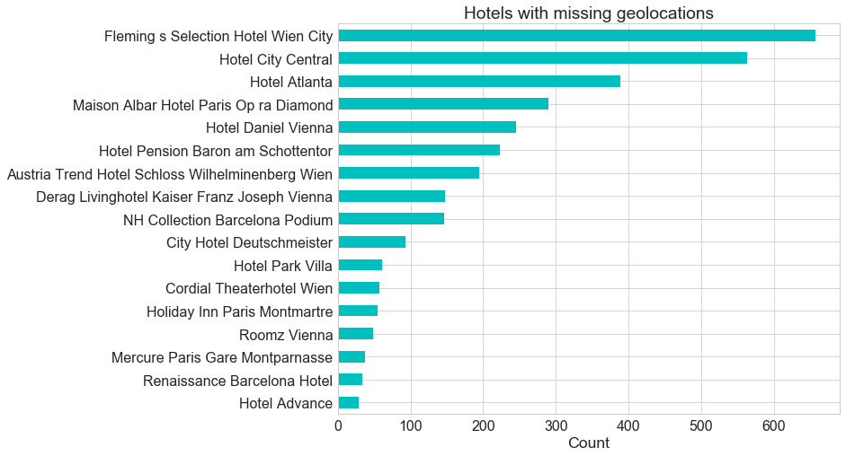


```python
# Bar plot of 'Average_Score' of hotels with missing 'lat' and 'lng'
hotel[hotel.lat.isnull()].Average_Score.value_counts().sort_index().plot.bar(rot=0,color='c')
plt.title('Hotels with missing geolocations: Average_Score')
plt.xlabel('Average_Score')
plt.ylabel('Count');
```


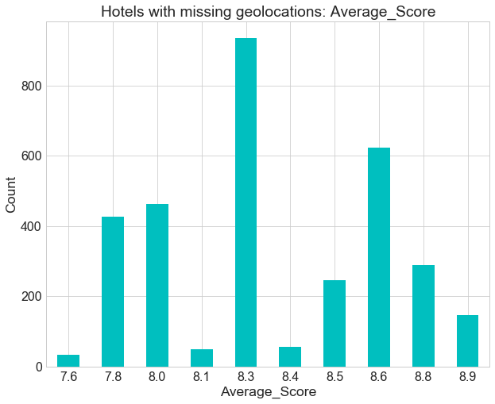


```python
hotel_noloc=hotel[hotel.lat.isnull()]

sns.countplot(y='Hotel_Name',hue='Average_Score',data=hotel_noloc,palette='Reds',
              order = hotel.Hotel_Name[hotel.lat.isnull()].value_counts().index);
```


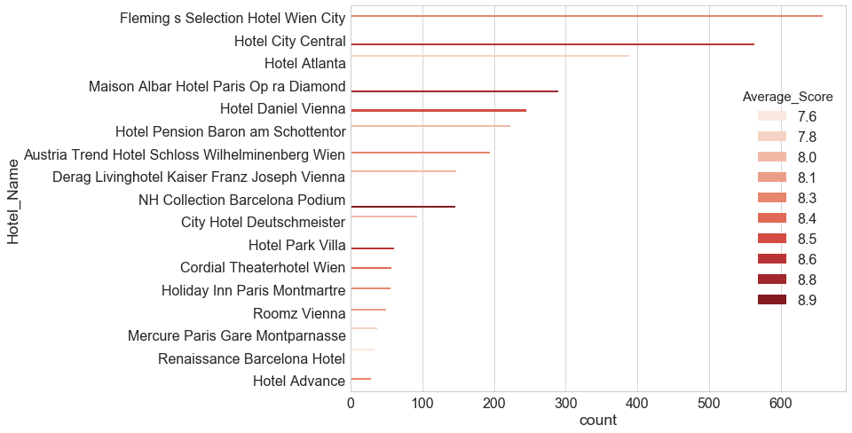


So in this data set, 0.6% of the observations have missing 'lat' and 'lng'. That is 17 unique hotels (around 1% of the hotels) have hotel names and addresses but no geo-coordinates. Since there is no particular patterns and those coordinates will only be used for map visualization, we'll drop those hotels without coordinates when we plot the map. We can still keep all of them in other analysis.

### Check and Drop Duplicates


```python
hotel.duplicated().sum()
```


    526


```python
hotel=hotel.drop_duplicates(keep='first')
```

There are 526 duplicates in the data frame and we've removed them for the following analysis.

### Cleaning and Enriching Features


```python
# Make a copy of the hotel data
htl=hotel.copy()
```

***Extract cities of hotels from its address***


```python
# Extract cities of hotels from its address
htl['Hotel_City']=htl.Hotel_Address.str.split(' ').str[-2]#htl.Hotel_Address.apply(lambda x: x.split()[-1])

# Check unique cities
#htl['Hotel_City'].unique()

# Modify names by hand since the origin of hotels are very limited
htl['Hotel_City'].replace({'United':'London'},inplace=True)
```


```python
htl_city=(htl.Hotel_City.value_counts(normalize=True)[::-1]*100)
ax=htl_city.plot(kind='barh',rot=0,color='c')
for idx, val in enumerate(htl_city):
    ax.text( val,idx+0.05,str(round(val,1))+'%', color='black', fontweight='bold',fontsize=14)
plt.xlabel('Percent (%)')
plt.ylabel('Hotel City');
```


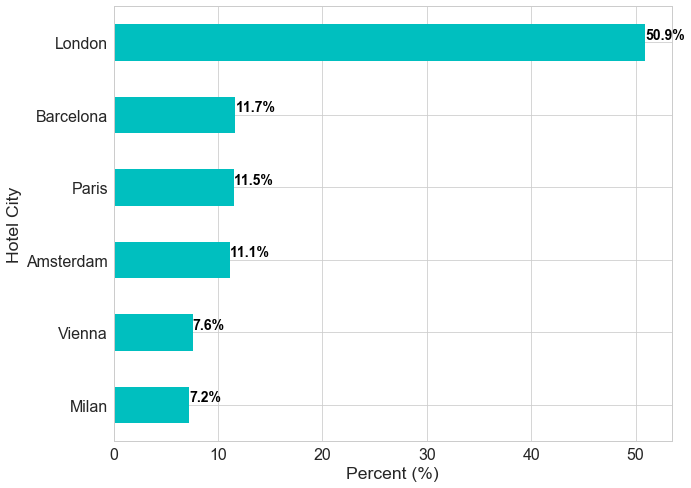


Over 50% of the hotels are from London, United Kingdom; hotels from other countries (Spain, France, Netherlands, Austria, Italy) take around 11% or less in portion.

***Extract days from 'days_since_review'***


```python
# Extract days from 'days_since_review' and convert it into integers
htl.days_since_review=htl.days_since_review.str.replace(r'[a-z]+','').astype('int')#findall(r'\d+')
```


```python
htl.days_since_review.describe()
```


    count    515212.000000
    mean        354.400474
    std         208.908943
    min           0.000000
    25%         175.000000
    50%         353.000000
    75%         527.000000
    max         730.000000
    Name: days_since_review, dtype: float64


```python
plt.figure(figsize=(8,6))
sns.boxplot(htl.days_since_review);
```


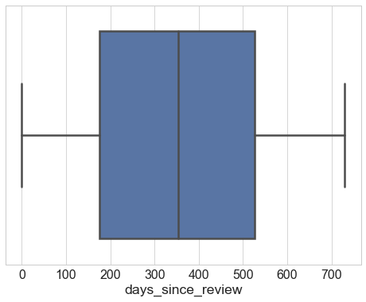


***Add month and day of review***


```python
# Add month of review
import calendar

htl['Review_Month']=htl.index.month
htl['Review_Month']=htl['Review_Month'].apply(lambda x: calendar.month_abbr[x])

# Add day of review
htl['Review_Wday']=htl.index.weekday_name
htl['Review_Wday']=htl['Review_Wday'].apply(lambda x: x[:3])
```


```python
month=calendar.month_abbr[1:13]#[calendar.month_name[i][:3] for i in range(1,13)]
htl.Review_Month.value_counts().reindex(month).plot(kind='bar',color='c',rot=0)
plt.xlabel('Review_Posted_Month')
plt.ylabel('Count');

```


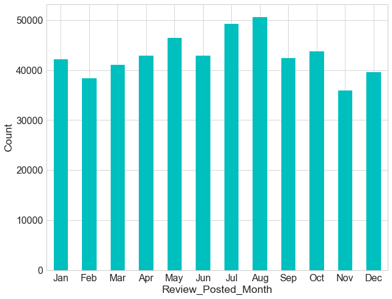


```python
# Define a function to plot bars with annotation; s: a series, rot: rotation of xtick labels; xlab: xlabels
def plot_bar(s,xlab,rot=0):
    ax=s.plot(kind='bar',rot=rot,color='c')
    for i, v in enumerate(s):
        ax.text( i-0.1,v , str(round(v,1))+'%', color='black', fontweight='bold',fontsize=14)
    plt.xlabel(xlab)
    plt.ylabel('Percent (%)');

```


```python
wday=[d[:3] for d in calendar.day_name[0:7]]

htl_wday=(htl.Review_Wday.value_counts(normalize=True)*100).reindex(wday)
plot_bar(htl_wday,'Review_Posted_Day',0)
```


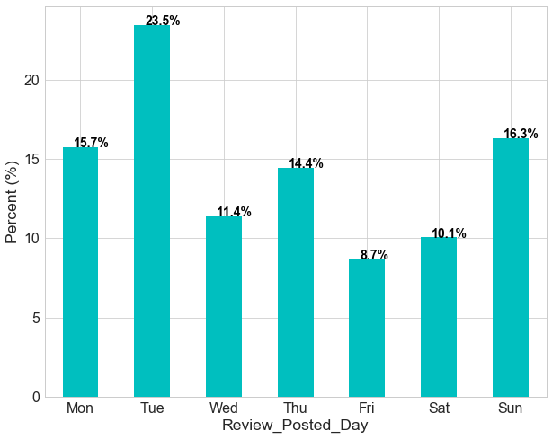


Reviews posted on Tuesdays are the most among days of the week while reviews posted on Fridays are the least.

***Add 'Pos_Rev_WCRatio' and 'Neg_Rev_WCRatio'***


```python
# Distribution of word counts in reviews
plt.hist(htl['Review_Total_Positive_Word_Counts'],alpha=0.8,histtype='step', stacked=True, fill=False,color='r',label='Pos')
plt.hist(htl['Review_Total_Negative_Word_Counts'],alpha=0.2,histtype='step', stacked=True, fill=True,color='b',label='Neg')
plt.legend(prop={'size':20})
plt.title('Distribution of Word Counts of Reviews');
```


```python
# Observations that post neither positive words nor negative words
idx=(htl.Review_Total_Positive_Word_Counts==0) & (htl.Review_Total_Negative_Word_Counts==0)
idx.sum()
```


    127


```python
idx.sum()/len(htl)
```


    0.00024650046970955643


127 reviews (0.02% of reviews) posted neither positive nor negative words, instead, just posted score for the hotel.


```python
htl_soloscore=htl[(htl.Review_Total_Positive_Word_Counts==0) & (htl.Review_Total_Negative_Word_Counts==0)]
sns.countplot(x=htl_soloscore.Reviewer_Score,color='c')
plt.title('Reviewer Score from Reviewers who Posted No Texts');
```


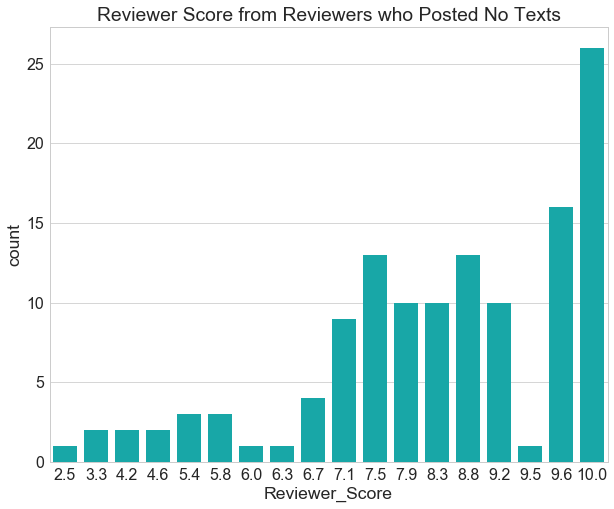


Some reviewers don't say a word, but they're happy with the hotel and give high scores while some are very disappointed and give very low scores. 


```python
# Add 'Pos_Rev_WCRatio' and 'Neg_Rev_WCRatio'
htl['Pos_Rev_WCRatio']=htl.Review_Total_Positive_Word_Counts/(htl.Review_Total_Positive_Word_Counts+htl.Review_Total_Negative_Word_Counts)
htl['Neg_Rev_WCRatio']=htl.Review_Total_Negative_Word_Counts/(htl.Review_Total_Positive_Word_Counts+htl.Review_Total_Negative_Word_Counts)
```


```python
htl['Pos_Rev_WCRatio'].plot.hist(bins=50,color='c');
plt.xlabel('Pos_Rev_WCRatio');
```


'Pos_Rev_WCRatio' is defined by number of words in positive reviews divided by sum of number of words in both positive and negative reviews. 'Pos_Rev_WCRatio' close to zero means that reviewers posted negative words and rarely positive words;  Pos_Rev_WCRatio' close to 1 indicates that reviewers are very satisfied.

**Extract features from 'Tag'**


```python
htl.Tags.sample(5)
```


    Review_Date
    2016-01-05    [' Leisure trip ', ' Family with older childre...
    2017-03-25    [' Leisure trip ', ' Couple ', ' Small Double ...
    2017-07-16    [' Couple ', ' Superior Double or Twin Room ',...
    2017-07-03    [' Leisure trip ', ' Couple ', ' Executive Kin...
    2016-03-08    [' Leisure trip ', ' Group ', ' Superior Doubl...
    Name: Tags, dtype: object


```python
# Trip type: business or leisure
htl['Trip_Type']=htl.Tags.str.extract('(\w+ trip)',expand=True)

# Visualization of trip type
htl_ttype=htl.Trip_Type.value_counts(normalize=True)*100

plot_bar(htl_ttype,'Trip Type')
```


```python
# Extract traveler type
htl['Traveler_Type']=htl.Tags.str.findall('Couple|Solo traveler|Group|Family with young children|Family with older children|Travelers with friends').apply(lambda x: x[0])

# Visualize traveler type
htl_traveler_type=htl.Traveler_Type.value_counts(normalize=True)*100
plot_bar(htl_traveler_type,'Traveler Type',30)

```


Most of travelers are couples or solo travelers. 


```python
htl.groupby(['Traveler_Type','Trip_Type'])['Traveler_Type'].count().unstack().plot(kind='barh',stacked=True);
```


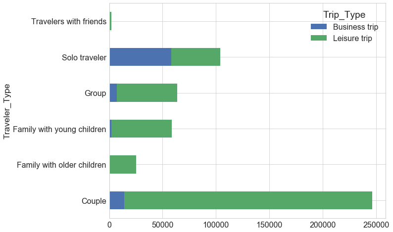


Over half of solo travelers stayed in hotels due to business trip otherwise majority of travelers stayed in hotels due to leisure trip.


```python
# Extract nights travelers stayed 
htl['Num_Nights']=htl.Tags.str.extract('(Stayed \d+ \w+)', expand=True)
htl['Num_Nights']=htl['Num_Nights'].str.extract('(\d+)', expand=True) 
```


```python
htl_nnight=htl.dropna(subset=['Num_Nights']).Num_Nights.astype('int').value_counts(normalize=True)*100
htl_nnight.plot(kind='bar',rot=0,logy=False,color='c')
plt.xlabel('Num_Nights')
plt.ylabel('Percent (%)');
```


Most of travelers stayed less than a week in hotels and only very few stayed around a month in a hotel.


```python
htl_clean=htl.drop(['Tags'],axis=1)
```


```python

htl_clean=htl_clean[['Review_Month', 'Review_Wday','Hotel_Name','Hotel_Address', 'Hotel_City', 'lat', 'lng', 'Average_Score','Total_Number_of_Reviews',
             'Reviewer_Nationality', 'Total_Number_of_Reviews_Reviewer_Has_Given','Reviewer_Score',
             'Negative_Review','Review_Total_Negative_Word_Counts', 'Neg_Rev_WCRatio',
             'Positive_Review', 'Review_Total_Positive_Word_Counts', 'Pos_Rev_WCRatio',
             'Trip_Type', 'Traveler_Type', 'Num_Nights','Additional_Number_of_Scoring','days_since_review']]
```

**Fix 'Hotel_Name' and 'Hotel_Address'**


```python
htl_clean.select_dtypes(include='object').describe()
```


<div>
<style scoped>
    .dataframe tbody tr th:only-of-type {
        vertical-align: middle;
    }

    .dataframe tbody tr th {
        vertical-align: top;
    }

    .dataframe thead th {
        text-align: right;
    }
</style>
<table border="1" class="dataframe">
  <thead>
    <tr style="text-align: right;">
      <th></th>
      <th>Review_Month</th>
      <th>Review_Wday</th>
      <th>Hotel_Name</th>
      <th>Hotel_Address</th>
      <th>Hotel_City</th>
      <th>Reviewer_Nationality</th>
      <th>Negative_Review</th>
      <th>Positive_Review</th>
      <th>Trip_Type</th>
      <th>Traveler_Type</th>
      <th>Num_Nights</th>
    </tr>
  </thead>
  <tbody>
    <tr>
      <th>count</th>
      <td>515212</td>
      <td>515212</td>
      <td>515212</td>
      <td>515212</td>
      <td>515212</td>
      <td>515212</td>
      <td>515212</td>
      <td>515212</td>
      <td>500208</td>
      <td>515212</td>
      <td>515020</td>
    </tr>
    <tr>
      <th>unique</th>
      <td>12</td>
      <td>7</td>
      <td>1492</td>
      <td>1493</td>
      <td>6</td>
      <td>227</td>
      <td>330011</td>
      <td>412601</td>
      <td>2</td>
      <td>6</td>
      <td>31</td>
    </tr>
    <tr>
      <th>top</th>
      <td>Aug</td>
      <td>Tue</td>
      <td>Britannia International Hotel Canary Wharf</td>
      <td>163 Marsh Wall Docklands Tower Hamlets London ...</td>
      <td>London</td>
      <td>United Kingdom</td>
      <td>No Negative</td>
      <td>No Positive</td>
      <td>Leisure trip</td>
      <td>Couple</td>
      <td>1</td>
    </tr>
    <tr>
      <th>freq</th>
      <td>50615</td>
      <td>120823</td>
      <td>4789</td>
      <td>4789</td>
      <td>262298</td>
      <td>245110</td>
      <td>127757</td>
      <td>35904</td>
      <td>417355</td>
      <td>252005</td>
      <td>193497</td>
    </tr>
  </tbody>
</table>
</div>


There are 515212 reviews for hotels located in 6 cities of 6 countries in Europe by reviewers either on leisure trip or business trip from 227 distinct countries. Couples are the most common travelers types among the 6 types. 

Notice that there are 1492 unique hotel names but with 1493 hotel addresses. Let's find out which hotel name has multiple addresses.


```python
h_addr_name=htl_clean[['Hotel_Address','Hotel_Name']].drop_duplicates(keep='first')
h_addr_name.Hotel_Name[h_addr_name.Hotel_Name.duplicated()]
```


    Review_Date
    2017-07-31    Hotel Regina
    2017-06-01    Hotel Regina
    Name: Hotel_Name, dtype: object


```python
h_addr_name[h_addr_name.Hotel_Name=='Hotel Regina'].Hotel_Address.unique()
```


    array(['Bergara 2 4 Eixample 08002 Barcelona Spain',
           'Rooseveltplatz 15 09 Alsergrund 1090 Vienna Austria',
           'Via Cesare Correnti 13 Milan City Center 20123 Milan Italy'],
          dtype=object)


Indeed one hotel named 'Hotel Regina' is located in Barcelona and one with the same name but located in Vienna and another one located in Milan. Is there any hotel address with multiple names?


```python
addr_dup=h_addr_name.Hotel_Address[h_addr_name.Hotel_Address.duplicated()]
h_addr_name[h_addr_name.Hotel_Address==addr_dup.values[0]].Hotel_Name.unique()
```


    array(['The Grand at Trafalgar Square',
           'Club Quarters Hotel Trafalgar Square'], dtype=object)


```python
# htl[htl.Hotel_Name=='Club Quarters Hotel Trafalgar Square'].index.value_counts().sort_index()
# htl[htl.Hotel_Name=='The Grand at Trafalgar Square'].index.value_counts().sort_index()
```

On the other hand, two hotels ('The Grand at Trafalgar Square' and 'Club Quarters Hotel Trafalgar Square') are located in the same location. Perhaps they are the same hotel that changed name?

We've checked that there are reviews from 2015 to 2017 for both hotels with different average score, so it's indeed reviewed as two distinct hotels. When we count hotels in the following, we will distinguish 'Hotel_Address' for those two hotels on purpose to avoid mismatching problems.


```python
htl_clean.loc[htl_clean.Hotel_Name=='The Grand at Trafalgar Square','Hotel_Address']=htl_clean[htl_clean.Hotel_Name=='The Grand at Trafalgar Square'].Hotel_Address+' GTS'
htl_clean.loc[htl_clean.Hotel_Name=='Club Quarters Hotel Trafalgar Square','Hotel_Address']=htl_clean[htl_clean.Hotel_Name=='Club Quarters Hotel Trafalgar Square'].Hotel_Address+' CQHTS'
```


```python
#Save cleaned data
htl_clean.to_csv('data/htl_clean.csv')
```

### Summary

In summary,

* we've added month and weekday that reviews are posted and we found that reviewers posted most reviews during July and August and reviews are most posted on Tuesday and lest on Friday.

* We've extracted the city where hotels are located and find that over a half of hotels are located in London.
* We've also extracted trip type ('Leisure trip', 'Business trip'), traveler type ('Couple', 'Solo traveler', 'Group', ...) and number of nights in hotels for 'Tags'. We found that around 80% of the reviews is for leisure trip and 20% for business trip. Around 50% of travelers are couples and around 20% are solo travelers, others are groups, families or friends. Majority of travels stayed in hotel for less than a week and some stayed longer till a month. 

In next section, we will perform exploratory data analysis and gain insights on how those features are correlated with review scores. 

## Exploratory Data Analysis

### Summary Statistics


```python
# Overview of cleaned data frame htl_clean
htl_clean.info()
htl_clean.sample(5)
```

    <class 'pandas.core.frame.DataFrame'>
    DatetimeIndex: 515212 entries, 2017-08-03 to 2015-08-09
    Data columns (total 23 columns):
    Review_Month                                  515212 non-null object
    Review_Wday                                   515212 non-null object
    Hotel_Name                                    515212 non-null object
    Hotel_Address                                 515212 non-null object
    Hotel_City                                    515212 non-null object
    lat                                           511944 non-null float64
    lng                                           511944 non-null float64
    Average_Score                                 515212 non-null float64
    Total_Number_of_Reviews                       515212 non-null int64
    Reviewer_Nationality                          515212 non-null object
    Total_Number_of_Reviews_Reviewer_Has_Given    515212 non-null int64
    Reviewer_Score                                515212 non-null float64
    Negative_Review                               515212 non-null object
    Review_Total_Negative_Word_Counts             515212 non-null int64
    Neg_Rev_WCRatio                               515085 non-null float64
    Positive_Review                               515212 non-null object
    Review_Total_Positive_Word_Counts             515212 non-null int64
    Pos_Rev_WCRatio                               515085 non-null float64
    Trip_Type                                     500208 non-null object
    Traveler_Type                                 515212 non-null object
    Num_Nights                                    515020 non-null object
    Additional_Number_of_Scoring                  515212 non-null int64
    days_since_review                             515212 non-null int64
    dtypes: float64(6), int64(6), object(11)
    memory usage: 94.3+ MB


<div>
<style scoped>
    .dataframe tbody tr th:only-of-type {
        vertical-align: middle;
    }

    .dataframe tbody tr th {
        vertical-align: top;
    }

    .dataframe thead th {
        text-align: right;
    }
</style>
<table border="1" class="dataframe">
  <thead>
    <tr style="text-align: right;">
      <th></th>
      <th>Review_Month</th>
      <th>Review_Wday</th>
      <th>Hotel_Name</th>
      <th>Hotel_Address</th>
      <th>Hotel_City</th>
      <th>lat</th>
      <th>lng</th>
      <th>Average_Score</th>
      <th>Total_Number_of_Reviews</th>
      <th>Reviewer_Nationality</th>
      <th>Total_Number_of_Reviews_Reviewer_Has_Given</th>
      <th>Reviewer_Score</th>
      <th>Negative_Review</th>
      <th>Review_Total_Negative_Word_Counts</th>
      <th>Neg_Rev_WCRatio</th>
      <th>Positive_Review</th>
      <th>Review_Total_Positive_Word_Counts</th>
      <th>Pos_Rev_WCRatio</th>
      <th>Trip_Type</th>
      <th>Traveler_Type</th>
      <th>Num_Nights</th>
      <th>Additional_Number_of_Scoring</th>
      <th>days_since_review</th>
    </tr>
    <tr>
      <th>Review_Date</th>
      <th></th>
      <th></th>
      <th></th>
      <th></th>
      <th></th>
      <th></th>
      <th></th>
      <th></th>
      <th></th>
      <th></th>
      <th></th>
      <th></th>
      <th></th>
      <th></th>
      <th></th>
      <th></th>
      <th></th>
      <th></th>
      <th></th>
      <th></th>
      <th></th>
      <th></th>
      <th></th>
    </tr>
  </thead>
  <tbody>
    <tr>
      <th>2015-10-30</th>
      <td>Oct</td>
      <td>Fri</td>
      <td>Arbor Hyde Park</td>
      <td>36 37 Lancaster Gate Westminster Borough Londo...</td>
      <td>London</td>
      <td>51.512649</td>
      <td>-0.180379</td>
      <td>8.4</td>
      <td>2140</td>
      <td>Cyprus</td>
      <td>5</td>
      <td>8.8</td>
      <td>Very high price</td>
      <td>5</td>
      <td>0.384615</td>
      <td>Nice clean hotel with comfortable bed</td>
      <td>8</td>
      <td>0.615385</td>
      <td>Business trip</td>
      <td>Solo traveler</td>
      <td>5</td>
      <td>322</td>
      <td>643</td>
    </tr>
    <tr>
      <th>2017-03-22</th>
      <td>Mar</td>
      <td>Wed</td>
      <td>Copthorne Tara Hotel London Kensington</td>
      <td>Scarsdale Place Kensington Kensington and Chel...</td>
      <td>London</td>
      <td>51.499046</td>
      <td>-0.191707</td>
      <td>8.1</td>
      <td>7105</td>
      <td>Ireland</td>
      <td>2</td>
      <td>9.2</td>
      <td>Drink very expensive</td>
      <td>4</td>
      <td>0.400000</td>
      <td>Room excellent Breakfast very good</td>
      <td>6</td>
      <td>0.600000</td>
      <td>Business trip</td>
      <td>Couple</td>
      <td>2</td>
      <td>1831</td>
      <td>134</td>
    </tr>
    <tr>
      <th>2016-12-14</th>
      <td>Dec</td>
      <td>Wed</td>
      <td>Hotel Okura Amsterdam</td>
      <td>Ferdinand Bolstraat 333 Oud Zuid 1072 LH Amste...</td>
      <td>Amsterdam</td>
      <td>52.348764</td>
      <td>4.893883</td>
      <td>8.9</td>
      <td>2295</td>
      <td>United States of America</td>
      <td>11</td>
      <td>9.2</td>
      <td>Somewhat remote location but trams nearby Fro...</td>
      <td>24</td>
      <td>0.375000</td>
      <td>Several fine restaurants Great staff Pricey T...</td>
      <td>40</td>
      <td>0.625000</td>
      <td>Business trip</td>
      <td>Solo traveler</td>
      <td>2</td>
      <td>383</td>
      <td>232</td>
    </tr>
    <tr>
      <th>2016-11-06</th>
      <td>Nov</td>
      <td>Sun</td>
      <td>The Montcalm Marble Arch</td>
      <td>2 Wallenberg Place Westminster Borough London ...</td>
      <td>London</td>
      <td>51.515052</td>
      <td>-0.159239</td>
      <td>8.9</td>
      <td>2752</td>
      <td>Oman</td>
      <td>1</td>
      <td>10.0</td>
      <td>nothing</td>
      <td>2</td>
      <td>0.200000</td>
      <td>location and the staff were very friendly</td>
      <td>8</td>
      <td>0.800000</td>
      <td>Leisure trip</td>
      <td>Couple</td>
      <td>3</td>
      <td>687</td>
      <td>270</td>
    </tr>
    <tr>
      <th>2015-09-07</th>
      <td>Sep</td>
      <td>Mon</td>
      <td>Apollo Hotel Amsterdam</td>
      <td>Apollolaan 2 Oud Zuid 1077 BA Amsterdam Nether...</td>
      <td>Amsterdam</td>
      <td>52.348610</td>
      <td>4.884429</td>
      <td>8.2</td>
      <td>2968</td>
      <td>Switzerland</td>
      <td>6</td>
      <td>7.9</td>
      <td>No Negative</td>
      <td>0</td>
      <td>0.000000</td>
      <td>The view of the canals from our room was spec...</td>
      <td>40</td>
      <td>1.000000</td>
      <td>Leisure trip</td>
      <td>Couple</td>
      <td>7</td>
      <td>419</td>
      <td>696</td>
    </tr>
  </tbody>
</table>
</div>


**Summary statistics of 'object' columns**


```python
htl_clean.select_dtypes(include='object').describe()
```


<div>
<style scoped>
    .dataframe tbody tr th:only-of-type {
        vertical-align: middle;
    }

    .dataframe tbody tr th {
        vertical-align: top;
    }

    .dataframe thead th {
        text-align: right;
    }
</style>
<table border="1" class="dataframe">
  <thead>
    <tr style="text-align: right;">
      <th></th>
      <th>Review_Month</th>
      <th>Review_Wday</th>
      <th>Hotel_Name</th>
      <th>Hotel_Address</th>
      <th>Hotel_City</th>
      <th>Reviewer_Nationality</th>
      <th>Negative_Review</th>
      <th>Positive_Review</th>
      <th>Trip_Type</th>
      <th>Traveler_Type</th>
      <th>Num_Nights</th>
    </tr>
  </thead>
  <tbody>
    <tr>
      <th>count</th>
      <td>515212</td>
      <td>515212</td>
      <td>515212</td>
      <td>515212</td>
      <td>515212</td>
      <td>515212</td>
      <td>515212</td>
      <td>515212</td>
      <td>500208</td>
      <td>515212</td>
      <td>515020</td>
    </tr>
    <tr>
      <th>unique</th>
      <td>12</td>
      <td>7</td>
      <td>1492</td>
      <td>1494</td>
      <td>6</td>
      <td>227</td>
      <td>330011</td>
      <td>412601</td>
      <td>2</td>
      <td>6</td>
      <td>31</td>
    </tr>
    <tr>
      <th>top</th>
      <td>Aug</td>
      <td>Tue</td>
      <td>Britannia International Hotel Canary Wharf</td>
      <td>163 Marsh Wall Docklands Tower Hamlets London ...</td>
      <td>London</td>
      <td>United Kingdom</td>
      <td>No Negative</td>
      <td>No Positive</td>
      <td>Leisure trip</td>
      <td>Couple</td>
      <td>1</td>
    </tr>
    <tr>
      <th>freq</th>
      <td>50615</td>
      <td>120823</td>
      <td>4789</td>
      <td>4789</td>
      <td>262298</td>
      <td>245110</td>
      <td>127757</td>
      <td>35904</td>
      <td>417355</td>
      <td>252005</td>
      <td>193497</td>
    </tr>
  </tbody>
</table>
</div>


**Summary statistics of numeric columns**


```python
htl_clean.select_dtypes(exclude='object').describe()
```


<div>
<style scoped>
    .dataframe tbody tr th:only-of-type {
        vertical-align: middle;
    }

    .dataframe tbody tr th {
        vertical-align: top;
    }

    .dataframe thead th {
        text-align: right;
    }
</style>
<table border="1" class="dataframe">
  <thead>
    <tr style="text-align: right;">
      <th></th>
      <th>lat</th>
      <th>lng</th>
      <th>Average_Score</th>
      <th>Total_Number_of_Reviews</th>
      <th>Total_Number_of_Reviews_Reviewer_Has_Given</th>
      <th>Reviewer_Score</th>
      <th>Review_Total_Negative_Word_Counts</th>
      <th>Neg_Rev_WCRatio</th>
      <th>Review_Total_Positive_Word_Counts</th>
      <th>Pos_Rev_WCRatio</th>
      <th>Additional_Number_of_Scoring</th>
      <th>days_since_review</th>
    </tr>
  </thead>
  <tbody>
    <tr>
      <th>count</th>
      <td>511944.000000</td>
      <td>511944.000000</td>
      <td>515212.000000</td>
      <td>515212.000000</td>
      <td>515212.000000</td>
      <td>515212.000000</td>
      <td>515212.000000</td>
      <td>515085.000000</td>
      <td>515212.000000</td>
      <td>515085.000000</td>
      <td>515212.000000</td>
      <td>515212.000000</td>
    </tr>
    <tr>
      <th>mean</th>
      <td>49.443040</td>
      <td>2.824222</td>
      <td>8.397767</td>
      <td>2744.698889</td>
      <td>7.164895</td>
      <td>8.395532</td>
      <td>18.540822</td>
      <td>0.434377</td>
      <td>17.778256</td>
      <td>0.565623</td>
      <td>498.416021</td>
      <td>354.400474</td>
    </tr>
    <tr>
      <th>std</th>
      <td>3.468029</td>
      <td>4.581637</td>
      <td>0.547952</td>
      <td>2318.090821</td>
      <td>11.039354</td>
      <td>1.637467</td>
      <td>29.693991</td>
      <td>0.336903</td>
      <td>21.804541</td>
      <td>0.336903</td>
      <td>500.668595</td>
      <td>208.908943</td>
    </tr>
    <tr>
      <th>min</th>
      <td>41.328376</td>
      <td>-0.369758</td>
      <td>5.200000</td>
      <td>43.000000</td>
      <td>1.000000</td>
      <td>2.500000</td>
      <td>0.000000</td>
      <td>0.000000</td>
      <td>0.000000</td>
      <td>0.000000</td>
      <td>1.000000</td>
      <td>0.000000</td>
    </tr>
    <tr>
      <th>25%</th>
      <td>48.214277</td>
      <td>-0.143649</td>
      <td>8.100000</td>
      <td>1161.000000</td>
      <td>1.000000</td>
      <td>7.500000</td>
      <td>2.000000</td>
      <td>0.033333</td>
      <td>5.000000</td>
      <td>0.289474</td>
      <td>169.000000</td>
      <td>175.000000</td>
    </tr>
    <tr>
      <th>50%</th>
      <td>51.499981</td>
      <td>-0.000250</td>
      <td>8.400000</td>
      <td>2134.000000</td>
      <td>3.000000</td>
      <td>8.800000</td>
      <td>9.000000</td>
      <td>0.457627</td>
      <td>11.000000</td>
      <td>0.542373</td>
      <td>342.000000</td>
      <td>353.000000</td>
    </tr>
    <tr>
      <th>75%</th>
      <td>51.516288</td>
      <td>4.834443</td>
      <td>8.800000</td>
      <td>3633.000000</td>
      <td>8.000000</td>
      <td>9.600000</td>
      <td>23.000000</td>
      <td>0.710526</td>
      <td>22.000000</td>
      <td>0.966667</td>
      <td>660.000000</td>
      <td>527.000000</td>
    </tr>
    <tr>
      <th>max</th>
      <td>52.400181</td>
      <td>16.429233</td>
      <td>9.800000</td>
      <td>16670.000000</td>
      <td>355.000000</td>
      <td>10.000000</td>
      <td>408.000000</td>
      <td>1.000000</td>
      <td>395.000000</td>
      <td>1.000000</td>
      <td>2682.000000</td>
      <td>730.000000</td>
    </tr>
  </tbody>
</table>
</div>


```python
plt.figure(figsize=(12,12))
corr=htl_clean.select_dtypes(exclude='object').corr(method='spearman')
sns.heatmap(corr,annot=True,linewidths=0.4,annot_kws={'size':16});
```


### Visualization of Hotels

#### Visualize Hotels on a Map


```python
# Select columns that will display on a map
cols=['Hotel_Address','Hotel_Name','Total_Number_of_Reviews','Average_Score','lat','lng']

#Drop rows with missing lat and lng and drop duplicates
htl_map=htl_clean.dropna(subset=['lat'])[cols].drop_duplicates(keep='first').reset_index(drop=True)#drop index as a new column

# Number of nations of reviewers that reviewed the hotel
htl_rewer=pd.crosstab(htl_clean.dropna(subset=['lat']).Hotel_Address,htl.dropna(subset=['lat']).Reviewer_Nationality,margins=True).reset_index()
htl_map['Num_RevNations']=(htl_rewer.iloc[:-1,1:-1]!=0).sum(axis=1).sort_index()


htl_map.info()
htl_map.head()

```

    <class 'pandas.core.frame.DataFrame'>
    RangeIndex: 1477 entries, 0 to 1476
    Data columns (total 7 columns):
    Hotel_Address              1477 non-null object
    Hotel_Name                 1477 non-null object
    Total_Number_of_Reviews    1477 non-null int64
    Average_Score              1477 non-null float64
    lat                        1477 non-null float64
    lng                        1477 non-null float64
    Num_RevNations             1477 non-null int64
    dtypes: float64(3), int64(2), object(2)
    memory usage: 80.9+ KB


<div>
<style scoped>
    .dataframe tbody tr th:only-of-type {
        vertical-align: middle;
    }

    .dataframe tbody tr th {
        vertical-align: top;
    }

    .dataframe thead th {
        text-align: right;
    }
</style>
<table border="1" class="dataframe">
  <thead>
    <tr style="text-align: right;">
      <th></th>
      <th>Hotel_Address</th>
      <th>Hotel_Name</th>
      <th>Total_Number_of_Reviews</th>
      <th>Average_Score</th>
      <th>lat</th>
      <th>lng</th>
      <th>Num_RevNations</th>
    </tr>
  </thead>
  <tbody>
    <tr>
      <th>0</th>
      <td>s Gravesandestraat 55 Oost 1092 AA Amsterdam ...</td>
      <td>Hotel Arena</td>
      <td>1403</td>
      <td>7.7</td>
      <td>52.360576</td>
      <td>4.915968</td>
      <td>46</td>
    </tr>
    <tr>
      <th>1</th>
      <td>1 15 Templeton Place Earl s Court Kensington a...</td>
      <td>K K Hotel George</td>
      <td>1831</td>
      <td>8.5</td>
      <td>51.491888</td>
      <td>-0.194971</td>
      <td>59</td>
    </tr>
    <tr>
      <th>2</th>
      <td>1 2 Serjeant s Inn Fleet Street City of London...</td>
      <td>Apex Temple Court Hotel</td>
      <td>2619</td>
      <td>9.2</td>
      <td>51.513734</td>
      <td>-0.108751</td>
      <td>53</td>
    </tr>
    <tr>
      <th>3</th>
      <td>1 3 Queens Garden Westminster Borough London W...</td>
      <td>The Park Grand London Paddington</td>
      <td>4380</td>
      <td>7.7</td>
      <td>51.514218</td>
      <td>-0.180903</td>
      <td>84</td>
    </tr>
    <tr>
      <th>4</th>
      <td>1 3 Rue d Argentine 16th arr 75116 Paris France</td>
      <td>Monhotel Lounge SPA</td>
      <td>171</td>
      <td>8.4</td>
      <td>48.874348</td>
      <td>2.289733</td>
      <td>16</td>
    </tr>
  </tbody>
</table>
</div>


**Make a heatmap in order to see where the most hotels are located**


```python
from folium import plugins
  
hotels_heatmap = folium.Map(location=[htl_map['lat'].mean(), htl_map['lng'].mean()], zoom_start=5)
hotels_heatmap.add_child(plugins.HeatMap([[row["lat"], row["lng"]] for name, row in htl_map.iterrows()]))
hotels_heatmap
```


<div style="width:100%;"><div style="position:relative;width:100%;height:0;padding-bottom:60%;"><iframe src="data:text/html;charset=utf-8;base64,PCFET0NUWVBFIGh0bWw+CjxoZWFkPiAgICAKICAgIDxtZXRhIGh0dHAtZXF1aXY9ImNvbnRlbnQtdHlwZSIgY29udGVudD0idGV4dC9odG1sOyBjaGFyc2V0PVVURi04IiAvPgogICAgPHNjcmlwdD5MX1BSRUZFUl9DQU5WQVMgPSBmYWxzZTsgTF9OT19UT1VDSCA9IGZhbHNlOyBMX0RJU0FCTEVfM0QgPSBmYWxzZTs8L3NjcmlwdD4KICAgIDxzY3JpcHQgc3JjPSJodHRwczovL2Nkbi5qc2RlbGl2ci5uZXQvbnBtL2xlYWZsZXRAMS4yLjAvZGlzdC9sZWFmbGV0LmpzIj48L3NjcmlwdD4KICAgIDxzY3JpcHQgc3JjPSJodHRwczovL2FqYXguZ29vZ2xlYXBpcy5jb20vYWpheC9saWJzL2pxdWVyeS8xLjExLjEvanF1ZXJ5Lm1pbi5qcyI+PC9zY3JpcHQ+CiAgICA8c2NyaXB0IHNyYz0iaHR0cHM6Ly9tYXhjZG4uYm9vdHN0cmFwY2RuLmNvbS9ib290c3RyYXAvMy4yLjAvanMvYm9vdHN0cmFwLm1pbi5qcyI+PC9zY3JpcHQ+CiAgICA8c2NyaXB0IHNyYz0iaHR0cHM6Ly9jZG5qcy5jbG91ZGZsYXJlLmNvbS9hamF4L2xpYnMvTGVhZmxldC5hd2Vzb21lLW1hcmtlcnMvMi4wLjIvbGVhZmxldC5hd2Vzb21lLW1hcmtlcnMuanMiPjwvc2NyaXB0PgogICAgPGxpbmsgcmVsPSJzdHlsZXNoZWV0IiBocmVmPSJodHRwczovL2Nkbi5qc2RlbGl2ci5uZXQvbnBtL2xlYWZsZXRAMS4yLjAvZGlzdC9sZWFmbGV0LmNzcyIgLz4KICAgIDxsaW5rIHJlbD0ic3R5bGVzaGVldCIgaHJlZj0iaHR0cHM6Ly9tYXhjZG4uYm9vdHN0cmFwY2RuLmNvbS9ib290c3RyYXAvMy4yLjAvY3NzL2Jvb3RzdHJhcC5taW4uY3NzIiAvPgogICAgPGxpbmsgcmVsPSJzdHlsZXNoZWV0IiBocmVmPSJodHRwczovL21heGNkbi5ib290c3RyYXBjZG4uY29tL2Jvb3RzdHJhcC8zLjIuMC9jc3MvYm9vdHN0cmFwLXRoZW1lLm1pbi5jc3MiIC8+CiAgICA8bGluayByZWw9InN0eWxlc2hlZXQiIGhyZWY9Imh0dHBzOi8vbWF4Y2RuLmJvb3RzdHJhcGNkbi5jb20vZm9udC1hd2Vzb21lLzQuNi4zL2Nzcy9mb250LWF3ZXNvbWUubWluLmNzcyIgLz4KICAgIDxsaW5rIHJlbD0ic3R5bGVzaGVldCIgaHJlZj0iaHR0cHM6Ly9jZG5qcy5jbG91ZGZsYXJlLmNvbS9hamF4L2xpYnMvTGVhZmxldC5hd2Vzb21lLW1hcmtlcnMvMi4wLjIvbGVhZmxldC5hd2Vzb21lLW1hcmtlcnMuY3NzIiAvPgogICAgPGxpbmsgcmVsPSJzdHlsZXNoZWV0IiBocmVmPSJodHRwczovL3Jhd2dpdC5jb20vcHl0aG9uLXZpc3VhbGl6YXRpb24vZm9saXVtL21hc3Rlci9mb2xpdW0vdGVtcGxhdGVzL2xlYWZsZXQuYXdlc29tZS5yb3RhdGUuY3NzIiAvPgogICAgPHN0eWxlPmh0bWwsIGJvZHkge3dpZHRoOiAxMDAlO2hlaWdodDogMTAwJTttYXJnaW46IDA7cGFkZGluZzogMDt9PC9zdHlsZT4KICAgIDxzdHlsZT4jbWFwIHtwb3NpdGlvbjphYnNvbHV0ZTt0b3A6MDtib3R0b206MDtyaWdodDowO2xlZnQ6MDt9PC9zdHlsZT4KICAgIAogICAgICAgICAgICA8c3R5bGU+ICNtYXBfY2YwZjI4YmFmZDIwNDc1YWFlYjA1YzI3ZmUxOWE2MmUgewogICAgICAgICAgICAgICAgcG9zaXRpb24gOiByZWxhdGl2ZTsKICAgICAgICAgICAgICAgIHdpZHRoIDogMTAwLjAlOwogICAgICAgICAgICAgICAgaGVpZ2h0OiAxMDAuMCU7CiAgICAgICAgICAgICAgICBsZWZ0OiAwLjAlOwogICAgICAgICAgICAgICAgdG9wOiAwLjAlOwogICAgICAgICAgICAgICAgfQogICAgICAgICAgICA8L3N0eWxlPgogICAgICAgIAogICAgPHNjcmlwdCBzcmM9Imh0dHBzOi8vbGVhZmxldC5naXRodWIuaW8vTGVhZmxldC5oZWF0L2Rpc3QvbGVhZmxldC1oZWF0LmpzIj48L3NjcmlwdD4KPC9oZWFkPgo8Ym9keT4gICAgCiAgICAKICAgICAgICAgICAgPGRpdiBjbGFzcz0iZm9saXVtLW1hcCIgaWQ9Im1hcF9jZjBmMjhiYWZkMjA0NzVhYWViMDVjMjdmZTE5YTYyZSIgPjwvZGl2PgogICAgICAgIAo8L2JvZHk+CjxzY3JpcHQ+ICAgIAogICAgCgogICAgICAgICAgICAKICAgICAgICAgICAgICAgIHZhciBib3VuZHMgPSBudWxsOwogICAgICAgICAgICAKCiAgICAgICAgICAgIHZhciBtYXBfY2YwZjI4YmFmZDIwNDc1YWFlYjA1YzI3ZmUxOWE2MmUgPSBMLm1hcCgKICAgICAgICAgICAgICAgICAgICAgICAgICAgICAgICAgICdtYXBfY2YwZjI4YmFmZDIwNDc1YWFlYjA1YzI3ZmUxOWE2MmUnLAogICAgICAgICAgICAgICAgICAgICAgICAgICAgICAgICAge2NlbnRlcjogWzQ4LjMzOTMzNjEyNzgyNjY3LDMuOTY2MTQwMTk3MDIwOTg2XSwKICAgICAgICAgICAgICAgICAgICAgICAgICAgICAgICAgIHpvb206IDUsCiAgICAgICAgICAgICAgICAgICAgICAgICAgICAgICAgICBtYXhCb3VuZHM6IGJvdW5kcywKICAgICAgICAgICAgICAgICAgICAgICAgICAgICAgICAgIGxheWVyczogW10sCiAgICAgICAgICAgICAgICAgICAgICAgICAgICAgICAgICB3b3JsZENvcHlKdW1wOiBmYWxzZSwKICAgICAgICAgICAgICAgICAgICAgICAgICAgICAgICAgIGNyczogTC5DUlMuRVBTRzM4NTcKICAgICAgICAgICAgICAgICAgICAgICAgICAgICAgICAgfSk7CiAgICAgICAgICAgIAogICAgICAgIAogICAgCiAgICAgICAgICAgIHZhciB0aWxlX2xheWVyXzI4ODNjNzQwZTk2OTQ4YjFhZGI1YTc4ZWU2MjllMjBhID0gTC50aWxlTGF5ZXIoCiAgICAgICAgICAgICAgICAnaHR0cHM6Ly97c30udGlsZS5vcGVuc3RyZWV0bWFwLm9yZy97en0ve3h9L3t5fS5wbmcnLAogICAgICAgICAgICAgICAgewogICJhdHRyaWJ1dGlvbiI6IG51bGwsCiAgImRldGVjdFJldGluYSI6IGZhbHNlLAogICJtYXhab29tIjogMTgsCiAgIm1pblpvb20iOiAxLAogICJub1dyYXAiOiBmYWxzZSwKICAic3ViZG9tYWlucyI6ICJhYmMiCn0KICAgICAgICAgICAgICAgICkuYWRkVG8obWFwX2NmMGYyOGJhZmQyMDQ3NWFhZWIwNWMyN2ZlMTlhNjJlKTsKICAgICAgICAKICAgIAogICAgICAgICAgICB2YXIgaGVhdF9tYXBfMGNhZGM0N2Q5Y2ZkNDM3MThiYzVkODFjOWRlNWFkNzUgPSBMLmhlYXRMYXllcigKICAgICAgICAgICAgICAgIFtbNTIuMzYwNTc1ODk5OTk5OTksIDQuOTE1OTY4Mjk5OTk5OTk5XSwgWzUxLjQ5MTg4Nzc5OTk5OTk5LCAtMC4xOTQ5NzA2MDAwMDAwMDAwMl0sIFs1MS41MTM3MzM1LCAtMC4xMDg3NTExOTk5OTk5OTk5OV0sIFs1MS41MTQyMTg0MDAwMDAwMDQsIC0wLjE4MDkwMzIwMDAwMDAwMDAxXSwgWzQ4Ljg3NDM0ODEwMDAwMDAwNiwgMi4yODk3MzM0XSwgWzQ4Ljg4NjU3LCAyLjM1ODgzMzIwMDAwMDAwMDNdLCBbNTEuNTIyNjIxNywgLTAuMTI1MTYwMl0sIFs1MS41MDE0MDAxLCAtMC4xMTYwMDkxOTk5OTk5OTk5OV0sIFs1MS41MTE3ODMyLCAtMC4xMTk0MTcyXSwgWzQ4Ljg3NDcwNywgMi4yOTM2NzYxMDAwMDAwMDAzXSwgWzQ4Ljg0ODc2NzUsIDIuMzQxMDM3Nl0sIFs1MS41MDM4NjMyMDAwMDAwMDUsIC0wLjE1MDQxMzJdLCBbNDguOTAxNTk0MSwgMi4zNTk3NzgzXSwgWzUxLjUxMDk5NDUsIC0wLjE4NjM0MTcwMDAwMDAwMDAzXSwgWzUxLjUwMjA0MjUsIC0wLjE4NjY1NDEwMDAwMDAwMDAyXSwgWzUxLjUyNjM4NTQsIC0wLjExMzYwNDE5OTk5OTk5OTk5XSwgWzQ4Ljg0ODMwNTI5OTk5OTk5LCAyLjM0MjU1OTZdLCBbNDguODY2ODU2NCwgMi4zMjg2MzM5XSwgWzQ4LjgzMTUyMDM5OTk5OTk5NSwgMi4zODcwNzk3XSwgWzQ4Ljg2MTAyNjUsIDIuMzc4ODk3NF0sIFs0OC44NzMyNTQyOTk5OTk5OSwgMi4zNDMyMzldLCBbNDguODU5ODIyOSwgMi4zNDcxMTFdLCBbNDguODcwNDE3NSwgMi4zMjk2ODMyMDAwMDAwMDAzXSwgWzUxLjQ5MTk1ODgsIC0wLjIyMDA5NTZdLCBbNTEuNTA4NDU5NSwgLTAuMTMxMTM4Ml0sIFs1MS41MDI0MzQ4LCAtMC4wMDAyNDk3XSwgWzQ4Ljg2MTkzNzI5OTk5OTk5NCwgMi4zMDQwMjk4XSwgWzQ4Ljg1MjQyMTUwMDAwMDAwNSwgMi4zNzQzODMyXSwgWzQ4Ljg3NTY0MzUsIDIuMjkzODc4OF0sIFs0OC44NjM3MTM1LCAyLjI5MzQ3NTldLCBbNDguODQ2MDI2OSwgMi4yNzg4MjgxXSwgWzUxLjQ5ODAwNTIsIC0wLjE2NDMyMzhdLCBbNTEuNTE2NzQ3MiwgLTAuMTM1OTY1XSwgWzUxLjQ5MTYzNzgsIC0wLjE4MzI4MzI5OTk5OTk5OTk4XSwgWzQ4Ljg3ODAzNjMsIDIuMjg2NDkwNzAwMDAwMDAwM10sIFs1MS41MTQ3Mzg3LCAtMC4xMzQxMTA4XSwgWzUxLjUxMjc2MjUsIC0wLjA5OTcxNTY5OTk5OTk5OTk5XSwgWzUxLjQ5NDMwNzcwMDAwMDAxLCAtMC4xNzU1NTc5XSwgWzUxLjUxNDU5ODYwMDAwMDAxLCAtMC4xMjcwMzM2XSwgWzUxLjQ5OTAyNTksIC0wLjE0Mjc0NTNdLCBbNTEuNTEwNjUzNzk5OTk5OTksIC0wLjA3NzM2NzYwMDAwMDAwMDAxXSwgWzQ4Ljg2NzMxOTksIDIuMzY1NjI5Nl0sIFs0OC44NjU2OTczLCAyLjI4Mjk3NzZdLCBbNDguODczNTQxOCwgMi4zMDI0NDE5OTk5OTk5OTk3XSwgWzQ4Ljg1NTUzMTg5OTk5OTk5NSwgMi4zNjIxMjEyMDAwMDAwMDAzXSwgWzQ4Ljg4MzY2LCAyLjMzMTM4NDVdLCBbNDguODc4OTQzMiwgMi4zNDQ4NjIzXSwgWzQ4Ljg0OTE0MjcsIDIuMzM5NzExOF0sIFs0OC44NzM0ODUxLCAyLjM0ODUxMTFdLCBbNDguODM3Njg4NywgMi4zMDYzMTAyMDAwMDAwMDA0XSwgWzQ4Ljg2OTkxMDI5OTk5OTk5NCwgMi4yOTczMzg2MDAwMDAwMDAyXSwgWzQ4Ljg3NjYyNjksIDIuMzQzMjg4Nl0sIFs0OC44NjYxNzA1LCAyLjMzMTU2MV0sIFs0OC44NzI5Njc2LCAyLjMwODExNzc5OTk5OTk5OThdLCBbNTEuNTEwODQzLCAtMC4xMzE0Mjg3XSwgWzUxLjQ2MTEyMTg5OTk5OTk5NSwgLTAuMjc1NjIxNTk5OTk5OTk5OTddLCBbNTEuNTI4Njc2NiwgLTAuMTI4MzQ4OTAwMDAwMDAwMDJdLCBbNTEuNDk1MTc5LCAtMC4xODM4MjddLCBbNTEuNDkyNTEzOCwgLTAuMTc4NzkxNzAwMDAwMDAwMDNdLCBbNTEuNTI1NDE2MiwgLTAuMDc3Mjg0ODk5OTk5OTk5OTldLCBbNTEuNDg5MTIyNiwgLTAuMTIwNTYzODk5OTk5OTk5OTldLCBbNTEuNDk1NjY1NywgLTAuMTQ1Mjc5M10sIFs1MS41MDE0MTkxLCAtMC4xNjI1ODA1MDAwMDAwMDAwMl0sIFs0OC44ODQ4NTgzLCAyLjI5OTcwMjNdLCBbNDguODY4ODk2MjAwMDAwMDEsIDIuMjgyNzQ1OV0sIFs0OC44NDk0ODUxLCAyLjI5NTUwNjNdLCBbNTEuNTEwODQzOTAwMDAwMDA1LCAtMC4xODM5MDczOTk5OTk5OTk5N10sIFs1MS41MjA5MTkxLCAtMC4xNTY2NTY3XSwgWzQ4Ljg3NTY2MDQsIDIuMzI1MjA3NV0sIFs1MS40OTI1NDc4LCAtMC4xNzgwNjExXSwgWzUxLjU0MjYwNTQsIC0wLjAwNzI3MDhdLCBbNTEuNTQyNjM1MTAwMDAwMDA1LCAtMC4wMDczMjcxOTk5OTk5OTk5OTldLCBbNTEuNTA1NDU0NCwgLTAuMjI2MjIxNl0sIFs1MS41MTg4NTU1LCAtMC4xMzE5MTcyXSwgWzQ4Ljg0NjgwNjQsIDIuMzcxNDc4OV0sIFs0OC44NDI3NTY0LCAyLjMzMDU2MzZdLCBbNDguODcwODUwOCwgMi4zNTE1ODgyXSwgWzUxLjQ5MzYxNjEwMDAwMDAwNCwgLTAuMTU5MjM0NzAwMDAwMDAwMDNdLCBbNTEuNTAyNDg1LCAtMC4xNTM5MjY1MDAwMDAwMDAwMl0sIFs0OC44NzI4MzIzOTk5OTk5OSwgMi4zMTkzODg2MDAwMDAwMDA0XSwgWzQ4Ljg3MTcyMjk5OTk5OTk5NiwgMi4zMjM1Mzc3XSwgWzQ4Ljg3MzI3MDYsIDIuMzQ1MDc0Nl0sIFs0OC44NzYxMzc2LCAyLjM1NzI2ODFdLCBbNDguODU4MTE4NiwgMi4zNTI5MzY5XSwgWzQ4Ljg3MjU3OTQsIDIuMzA3NTc3OV0sIFs1MS40OTU5MjI3LCAtMC4xNzAyOTE3MDAwMDAwMDAwMl0sIFs0OC44NDA1NjEyLCAyLjI5OTEwMzVdLCBbNDguODU1MDQ2NiwgMi4zMDQ1ODNdLCBbNTEuNDk0NTUyMjAwMDAwMDEsIC0wLjE4NjEyMTNdLCBbNTEuNDk5MDk1MywgLTAuMTEzMjEzNl0sIFs0OC44Njg3NDI0OTk5OTk5OTYsIDIuMzU0MTc2MV0sIFs1MS40OTQ4NDY1LCAtMC4xMTg3NDgxXSwgWzUxLjUwNDcxNTk5OTk5OTk5NSwgLTAuMTQ3NTYxOF0sIFs1MS40OTQ1MTQ0LCAtMC4xODY2MTcyXSwgWzUxLjUwOTA5ODUsIC0wLjAxNTczMDIwMDAwMDAwMDAwM10sIFs0OC44NjYzMzU5LCAyLjI4Njc5MzVdLCBbNDguODcwOTYxLCAyLjMyNjc2NzhdLCBbNDguODg2NTYyNiwgMi4zMzI5NjQ3OTk5OTk5OTk2XSwgWzQ4Ljg3MjQ1ODgsIDIuMzM3ODAwNF0sIFs0OC44NzE1ODI4LCAyLjMyMjQ4NTNdLCBbNTEuNTIwODU3NSwgLTAuMDc3OTUwM10sIFs1MS41MTE5OTMyOTk5OTk5OSwgLTAuMTc4Mjc5Mzk5OTk5OTk5OThdLCBbNTEuNTE2Njc1NSwgLTAuMDY5Nzg5N10sIFs0OC44NDg5ODM5LCAyLjM0ODM4M10sIFs0OC44Njg0MTY0OTk5OTk5OTUsIDIuMzM2ODY5XSwgWzQ4Ljg2ODUwOTMsIDIuMzA2Nzg5NV0sIFs0OC44ODE0MDcsIDIuMzI3NDIwNF0sIFs0OC44NzEzNjk5LCAyLjMxODExOTFdLCBbNDguODY2NTc4Nzk5OTk5OTksIDIuMzA4NDQ0N10sIFs0OC44NjYzNDQzOTk5OTk5OTYsIDIuMjg4MTk3OV0sIFs0OC44NjQ0NjI3MDAwMDAwMDQsIDIuMzMxODQ3Mjk5OTk5OTk5N10sIFs1MS41MjY2NjE4LCAtMC4xMjk2NTcxMDAwMDAwMDAwM10sIFs0OC44Njc1ODg2LCAyLjM1MzEwMTc5OTk5OTk5OTddLCBbNDguODczMDgyMywgMi4zMDk2NTldLCBbNTEuNTIyMDg2OSwgLTAuMTA4MjQ0M10sIFs0OC44ODQ4MjkyLCAyLjMwMzUxODldLCBbNTEuNTQyMTQ3NiwgLTAuMTcwMzA3M10sIFs1MS41MTA0NTk5OTk5OTk5OTUsIC0wLjE4NzU4NDRdLCBbNTEuNTIwMzc4LCAtMC4xMzAzNDE0XSwgWzQ4Ljg2MzkzMTc5OTk5OTk5NiwgMi4zNjU4NzQ0XSwgWzQ4Ljg2OTM0MDksIDIuMzMxMDI2M10sIFs0OC44NTYyMjcyMDAwMDAwMDYsIDIuMzM1MTc1Nzk5OTk5OTk5Nl0sIFs0OC44MTc4MDc5LCAyLjMyOTM2MzZdLCBbNDguODczODU1NywgMi4zNDQ0MjMyMDAwMDAwMDA1XSwgWzQ4Ljg0OTA2OTEsIDIuMzY5NzQ4NF0sIFs0OC44NTEzNTE1LCAyLjMzNzUwODRdLCBbNTEuNTIxMDA4NSwgLTAuMTIzMDk2NjAwMDAwMDAwMDFdLCBbNTEuNTEyMjQ1NzAwMDAwMDEsIC0wLjA3NTczMjZdLCBbNTEuNTI0MTM4NiwgLTAuMTM4MDgwN10sIFs0OC44NzUzNDQ2LCAyLjMxNjcxNjFdLCBbNTEuNTE2Mzg0MSwgLTAuMTYzNTc2Mzk5OTk5OTk5OThdLCBbNTEuNTE3ODM5LCAtMC4xNDI0NDc2XSwgWzUxLjUxMzIwNjg5OTk5OTk5LCAtMC4xODA3ODE2MDAwMDAwMDAwMV0sIFs1MS41MTA5MDc5LCAtMC4xMjM4MjIxXSwgWzQ4Ljg3NTE4NDQ5OTk5OTk5NiwgMi4zMDEzMjE0XSwgWzQ4Ljg0OTM0OTksIDIuMzQzMDU2OV0sIFs0OC44NjY4NTg5LCAyLjMwMjgyMTVdLCBbNDguODY4NjkzMSwgMi4zMjUyMTFdLCBbNDguODU2MDY4NSwgMi4zMjM2ODQ2XSwgWzQ4Ljg0MzgzNTIsIDIuMzI4MDcwOF0sIFs1MS40OTM4NzMzLCAtMC4xODI0OTYzXSwgWzUxLjUxMzE0MjgsIC0wLjE1NzY3MTRdLCBbNDguODYxNzExLCAyLjM0MDY3NDAwMDAwMDAwMDRdLCBbNTEuNTEyODAzMiwgLTAuMDc1ODZdLCBbNTEuNDkwMzcyNCwgLTAuMTQ1OTIxOF0sIFs0OC44NzU1NTEsIDIuMjgzNTE5MTAwMDAwMDAwNF0sIFs0OC44NTMxNjQxLCAyLjMzNDQwOTddLCBbNTEuNTE2MTEzODk5OTk5OTksIC0wLjE3NDk1MjFdLCBbNTEuNTE1NjMyMDAwMDAwMDA0LCAtMC4xNzU3MzY5OTk5OTk5OTk5OF0sIFs1MS40OTQ0ODQ4OTk5OTk5OTYsIC0wLjE4ODQxNzM5OTk5OTk5OTk4XSwgWzUxLjUwMTIzMjksIC0wLjE4NTk5MzddLCBbNTEuNTE4NDE1OCwgLTAuMTM0ODUwOV0sIFs1MS40OTc1NjIxLCAtMC4xNDU1NTA5OTk5OTk5OTk5OV0sIFs0OC44MTk2ODg1LCAyLjMyNjM1MDVdLCBbNTEuNDk0MzkzNSwgLTAuMTc1MDE2ODk5OTk5OTk5OThdLCBbNTEuNTIwMTgxLCAtMC4xMjU2OTU3XSwgWzQ4Ljg2Nzk0NjYsIDIuMzI4OTU5Mjk5OTk5OTk5N10sIFs0OC44NTMyMjY4OTk5OTk5OTYsIDIuMzQ1NzE1OV0sIFs0OC44Njg0MTQsIDIuMzIxMzI0NzAwMDAwMDAwNF0sIFs0OC44NjkwNTk2LCAyLjI5NzEwNzc5OTk5OTk5OTZdLCBbNDguODc5NzMzMSwgMi4zMjA2MDAyOTk5OTk5OTk3XSwgWzQ4Ljg0MjA2NjksIDIuMzMwNDA5MTAwMDAwMDAwMl0sIFs0OC44NjUyNTgyMDAwMDAwMSwgMi4zMzI5NjMyXSwgWzQ4Ljg1MTY2MTksIDIuMjk3OTM5NV0sIFs0OC44MzI4NzYzOTk5OTk5OTYsIDIuMzU3MjUzMTAwMDAwMDAwM10sIFs0OC44NTUwMjM2LCAyLjMzNTA3ODZdLCBbNTEuNTE0NzA3MSwgLTAuMTU3ODI5MTAwMDAwMDAwMDNdLCBbNTEuNTEwMDM2MiwgLTAuMTkwNjU3XSwgWzUxLjUwNjk0NDYsIC0wLjE0MTU3NzZdLCBbNTEuNTI3ODQ2NSwgLTAuMDg4OTQ3M10sIFs0OC44NDUzNzc0LCAyLjMyNTY0MjcwMDAwMDAwMDRdLCBbNTEuNTU2MTU0Nzk5OTk5OTk1LCAtMC4yMTQxODI0XSwgWzQ4Ljg1MzY4OCwgMi4zMzIyNjY3XSwgWzUxLjQ5MzQ3NTIwMDAwMDAwNiwgLTAuMjE1MzI1NTk5OTk5OTk5OThdLCBbNDguODQzNzA3LCAyLjMxNTU2MzEwMDAwMDAwMDNdLCBbNTEuNTE3MTY3MSwgLTAuMTI5MDUzMzk5OTk5OTk5OThdLCBbNDguODY1NDg3NCwgMi4zMzQ4OTIzOTk5OTk5OTk4XSwgWzQ4Ljg1NDI2ODEwMDAwMDAwNiwgMi4zMDc4MTE2XSwgWzQ4Ljg3MjgzNTEsIDIuMzM2MjUwNzAwMDAwMDAwM10sIFs1MS41MTUwNTM0LCAtMC4xNzM5OTc0XSwgWzQ4Ljg3OTUzNjksIDIuMzIwMjk2Nl0sIFs0OC44NzI2MzM1LCAyLjMwNDgwODM5OTk5OTk5OThdLCBbNDguODcwNTc0MTAwMDAwMDA2LCAyLjMyNjQxOTRdLCBbNTEuNDkzMDkwNSwgLTAuMTc1NTAyMjAwMDAwMDAwMDJdLCBbNTEuNDk0NjkwNTAwMDAwMDA0LCAtMC4xOTEwMTk3MDAwMDAwMDAwMV0sIFs0OC44NzkzNDI3LCAyLjM1Nzc3NDVdLCBbNTEuNTAxOTA5NywgLTAuMDIzMjIwOF0sIFs0OC44ODcwNTcyOTk5OTk5OTUsIDIuMzE0MzI5N10sIFs0OC44ODY0NjcyOTk5OTk5OSwgMi4yOTQ4OTExXSwgWzQ4Ljg4NzEyODMsIDIuMzE0MjA1XSwgWzUxLjUyNjUxODksIC0wLjEzMDM2ODg5OTk5OTk5OTk4XSwgWzUxLjQ5Njg0MDYsIC0wLjE2NzU0OTc5OTk5OTk5OTk3XSwgWzUxLjQ5OTk2ODMsIC0wLjE1OTk5MjcwMDAwMDAwMDAyXSwgWzQ4Ljg3MTMyMzksIDIuMjkzNzg0OV0sIFs0OC44NTg1MTkzLCAyLjMwNzcyNDNdLCBbNDguODMxNTk2MjAwMDAwMDEsIDIuMzM5OTc5NjAwMDAwMDAwNF0sIFs1MS41MjE1MjU3MDAwMDAwMDUsIC0wLjE1MzMwMzldLCBbNDguODcxMzA5MDAwMDAwMDA0LCAyLjMyNzcwNzg5OTk5OTk5OTZdLCBbNDguODcyMDU5MywgMi4zMjM2ODAyMDAwMDAwMDA1XSwgWzQ4Ljg2NDQzODIsIDIuMzM1OTE0OF0sIFs0OC44Mzg0ODQsIDIuMzE1MDkwNF0sIFs0OC44OTA4MDE4LCAyLjMzODAyMDRdLCBbNDguODUzNTA4OSwgMi4zNDI1Nzg3MDAwMDAwMDAyXSwgWzUxLjUwMTU3MjEwMDAwMDAwNCwgLTAuMTYyODUxMV0sIFs1MS40Nzc4NTgzLCAtMC4wMTM3NDYzXSwgWzUxLjUyNDE0NTIwMDAwMDAxLCAtMC4xNjA5OTA3MDAwMDAwMDAwMV0sIFs0OC44NzQ2MTI3OTk5OTk5OTQsIDIuMzA1Njk1NjAwMDAwMDAwNF0sIFs0OC44NzUwODQ4LCAyLjMwNDgzNzJdLCBbNTEuNTIwOTQzLCAtMC4xMDA0NTgxMDAwMDAwMDAwMV0sIFs1MS40OTU0OTc2LCAtMC4xODkzNjkxXSwgWzUxLjQ5MTM3MzcwMDAwMDAwNCwgLTAuMTIxNDE5NF0sIFs0OC44NTU1NjY0LCAyLjI5MjYyNDNdLCBbNTEuNTI5MjU3LCAtMC4xNjgzNTc5OTk5OTk5OTk5OF0sIFs0OC44NjYzMjA4LCAyLjM0NTAzOTg5OTk5OTk5OTddLCBbNDguODY3ODQzMiwgMi4zMDMzMDc1MDAwMDAwMDAzXSwgWzQ4Ljg2OTE2ODYsIDIuMzMzNzgxOF0sIFs0OC44ODAzNzUyLCAyLjMxOTU5MV0sIFs0OC44NzA5NjI3MDAwMDAwMSwgMi4zMTU0MTQxXSwgWzUxLjQ5NDgwNTksIC0wLjE5MjY1MjVdLCBbNTEuNTAzMjUyNCwgLTAuMDc4MTc5XSwgWzQ4LjgyMzc0ODcsIDIuMzI0MDU2XSwgWzUxLjUxNDM2MjQsIC0wLjEzOTQ0ODNdLCBbNTEuNDkwNzQ5MywgLTAuMTkzNDYyNzAwMDAwMDAwMDJdLCBbNTEuNTE0NDM4MSwgLTAuMTU1ODMzNzAwMDAwMDAwMDJdLCBbNDguODcxMDYwNSwgMi4yOTMzNTM3XSwgWzQ4Ljg2MDUxMjUsIDIuMzEwNjUzM10sIFs1MS41ODMyMzYsIC0wLjIxNjg2Nzk5OTk5OTk5OTk4XSwgWzUxLjUxMjI0MjksIC0wLjEwNDUwMzZdLCBbNDguODQ1NzQzLCAyLjM0NDkyOTk5OTk5OTk5OTddLCBbNDguODY5MDE5OCwgMi4yODkxMjc3OTk5OTk5OTk3XSwgWzQ4Ljg0NzgzOTksIDIuMzQyMjU0XSwgWzQ4Ljg3MTM0MjEsIDIuMzI4MDcyMjk5OTk5OTk5N10sIFs0OC44NTkyMjY0LCAyLjM0MDk5Nl0sIFs0OC44MzgyOTQyOTk5OTk5OTQsIDIuMzIxMDQyMV0sIFs0OC44NjAzNDgzLCAyLjM0NDA1MzVdLCBbNDguODcyMjU4OCwgMi4zMjU3NjA4XSwgWzQ4Ljg3MTc2NDg5OTk5OTk5NSwgMi4yOTgzODU0OTk5OTk5OTk3XSwgWzUxLjUwMDE5Nzg5OTk5OTk5NiwgLTAuMTc5NTM1NzAwMDAwMDAwMDJdLCBbNTEuNTE3MjM5OCwgLTAuMTIyMDMyMzk5OTk5OTk5OTldLCBbNTEuNDk1MDA5OCwgLTAuMTkwNjE5NV0sIFs1MS41MDI3MDIyMDAwMDAwMSwgLTAuMTg4MjE2NF0sIFs1MS41MjQ0MjI0LCAtMC4wNzY0NjE0XSwgWzQ4Ljg3MjEwNjIwMDAwMDAwNSwgMi4zNDUxMzgzOTk5OTk5OTk3XSwgWzUxLjUyMDM0NjksIC0wLjEyNjA4OTMwMDAwMDAwMDAyXSwgWzUxLjUwNTY5NTYsIC0wLjEwMTUyNV0sIFs1MS41MTE1MjEsIC0wLjI5MDcwNl0sIFs0OC44NDQ4OTAyLCAyLjI1MjgzMzAwMDAwMDAwMDNdLCBbNDguODQ3NTExMiwgMi4zMDIyMTk3OTk5OTk5OTk2XSwgWzUxLjQ5Mzk4LCAtMC4xNDMzNzJdLCBbNTEuNDk4OTA1LCAtMC4xMzM5MDkyOTk5OTk5OTk5OF0sIFs1MS41MTkxMDA5LCAtMC4xNTkyXSwgWzQ4Ljg2Mzc1MDMsIDIuMzMyMDQwNjAwMDAwMDAwNV0sIFs0OC44NDQyOTQ4OTk5OTk5OTQsIDIuMzczMDkzOF0sIFs0OC44MzQ5MjcyLCAyLjMyOTU5MTI5OTk5OTk5OTddLCBbNDguODcyMjg4Mzk5OTk5OTk1LCAyLjMwOTAzNTldLCBbNDguODY5MDEyNiwgMi4zMzY4NzA4XSwgWzQ4Ljg4MTQwNTYsIDIuMzI4MjU2OF0sIFs0OC44NTc4OTgsIDIuMzU3MTk3OF0sIFs0OC44MzI3NzI5LCAyLjI3ODc1OTddLCBbNDguODgyMTU5NSwgMi4zMzY3NDQ0XSwgWzQ4Ljg3MDQzNzEwMDAwMDAwNCwgMi4zMjkyMzZdLCBbNDguODczMjIzMTAwMDAwMDA0LCAyLjM0MzYwOTddLCBbNDguODQ1Mzc4NDk5OTk5OTk1LCAyLjM3NTMwMzZdLCBbNDguODUwMzkwMSwgMi4zNDIyNTI3XSwgWzQ4Ljg1MTYxNDgsIDIuMzM4MTI5M10sIFs0OC44NzA4MzkxLCAyLjMzMDM2NTEwMDAwMDAwMDNdLCBbNTEuNTA3Mzc0LCAtMC4xMjkxMzVdLCBbNTEuNTA1OTMzMzk5OTk5OTk2LCAtMC4xNDg5NDE3OTk5OTk5OTk5OV0sIFs1MS41NDU4NDc2LCAtMC4wNTU0MTEzMDAwMDAwMDAwMDRdLCBbNTEuNTE0MTg0MiwgLTAuMzE5MjkyNTAwMDAwMDAwMDNdLCBbNTEuNTE1MDUyMjAwMDAwMDEsIC0wLjE1OTIzOTAwMDAwMDAwMDAyXSwgWzUxLjUyNDMyODYwMDAwMDAwNCwgLTAuMTg0NjYyMjk5OTk5OTk5OTddLCBbNTEuNTA1NDE4NSwgLTAuMTI0MTQ5OTAwMDAwMDAwMDFdLCBbNTEuNTIxNzU5LCAtMC4xNDI1MzgxXSwgWzQ4LjgzOTc2MjMsIDIuMzIzNTMyNF0sIFs1MS40OTczMjAzLCAtMC4xNTYyNTU4XSwgWzUxLjUwNTE1MDcsIC0wLjEwMDQ3MjM5OTk5OTk5OTk5XSwgWzUxLjUxMzkyNzUsIC0wLjEyNzE1MDZdLCBbNTEuNDkxNTcxMiwgLTAuMTk2MzE5Ml0sIFs1MS41MTAxNDAxLCAtMC4xOTY4OTUxXSwgWzQ4LjgzODk4MjMsIDIuMzQ1NTUyNzk5OTk5OTk5N10sIFs0OC44NDczNDU5LCAyLjI4MzI0MDc5OTk5OTk5OTddLCBbNDguODUwMzA3NCwgMi4zNDUwNjEyXSwgWzQ4Ljg1NDg2NDEsIDIuMjkyMzE4MV0sIFs0OC44NzM1NzM2LCAyLjMzNTk2NTAwMDAwMDAwMDNdLCBbNTEuNTA4NDAzNiwgLTAuMTA2Nzk4OF0sIFs1MS41MTE2MDQ5LCAtMC4xMzgzMTQ1XSwgWzUxLjQ5NDg1MDcsIC0wLjE5NDU1NDRdLCBbNDguODY0MjY4OSwgMi4zMzA4MTc5XSwgWzQ4Ljg0MTIxMzEsIDIuMzMwMjk1NF0sIFs0OC44MzkzMjI5LCAyLjM4OTIyNzRdLCBbNDguODc0NzE1MywgMi4yOTA2Mzg4XSwgWzUxLjQ5NDQ4NzUsIC0wLjIwNzA2MDVdLCBbNDguODgyMzM5OCwgMi4zMzY0NzY0XSwgWzUxLjUyMDU0NDEsIC0wLjEzMDgwOTFdLCBbNTEuNTA5NDgzNSwgLTAuMTM2MjUzNzk5OTk5OTk5OThdLCBbNDguODc5NDg0MywgMi4zNTU2NTQ1XSwgWzQ4Ljg0OTMwODIsIDIuMjc0MzYyNl0sIFs0OC44NzM3NzAyLCAyLjMyMDEwNjNdLCBbNDguODY1NTI5Mjk5OTk5OTksIDIuMzM2MDEwMjAwMDAwMDAwNV0sIFs0OC44MzYzODE5LCAyLjI4OTc3OTI5OTk5OTk5OTddLCBbNTEuNTA3OTE1MywgLTAuMjczMDE0NV0sIFs0OC44NzU2NTA3OTk5OTk5OTUsIDIuMzA0MTU2OF0sIFs0OC44NDUyNzg5LCAyLjM0MjI5NV0sIFs0OC44ODg2OTY5LCAyLjM5NDU0MDI5OTk5OTk5OTZdLCBbNDguODc1NzE1NTAwMDAwMDA1LCAyLjMwMzg3ODEwMDAwMDAwMDRdLCBbNDguODY0OTMwNiwgMi4zMjkwODQzOTk5OTk5OTk3XSwgWzQ4Ljg1MTkyMTUsIDIuMzgzOTk5Mjk5OTk5OTk5N10sIFs1MS41MjE4MDY2LCAtMC4wODU2MDgxXSwgWzUxLjQ5OTM5MjcsIC0wLjEzMjkxMjhdLCBbNDguODgyMzExMSwgMi4zMTMyMzczOTk5OTk5OTk4XSwgWzQ4Ljg1NTQyNjgsIDIuNDE1MjU1NV0sIFs1MS41MDcyNzEzLCAtMC4wMjExMjEzXSwgWzUxLjUwNTU1MTMsIC0wLjE1MDE2OThdLCBbNTEuNTE2MTkxMSwgLTAuMTU3OTQ4N10sIFs0OC44NjkyNTY2LCAyLjMzMzkzNjldLCBbNDguODY4MTQ1NTAwMDAwMDA0LCAyLjMzMTMwNjRdLCBbNDguODUzODc1MjAwMDAwMDA0LCAyLjMzNjYxMjNdLCBbNDguODUxODU4NCwgMi4zNDQ3Nzk4XSwgWzQ4Ljg3MjE2OTIsIDIuMzI2MjY4MV0sIFs1MS41MTIyNTcsIC0wLjIwMzQyNDRdLCBbNDguODY1ODc5MiwgMi4zMjk4OTAyOTk5OTk5OTk3XSwgWzUxLjUxOTAxNiwgLTAuMTY2MjY3XSwgWzUxLjUxOTU2ODc5OTk5OTk5NSwgLTAuMTcwNTIxXSwgWzUxLjQ5OTI3OTEsIC0wLjE5NzM1OTNdLCBbNTEuNTE5OTIyNCwgLTAuMjExNjYzNl0sIFs0OC44NjUzNjg1LCAyLjMyODIxOF0sIFs0OC44NjA2MTg3LCAyLjM0NDQwMV0sIFs1MS41MTI0NjU1MDAwMDAwMDUsIC0wLjE4MjI3NF0sIFs1MS41MjU1MzUsIC0wLjExODAzNTRdLCBbNDguODczMTk5NjAwMDAwMDEsIDIuMzQyNTQ0Nl0sIFs0OC44NzE3MTQ2MDAwMDAwMDQsIDIuMzI2MTgxMl0sIFs1MS41MjE1NTA4LCAtMC4wNDY5MjM4MDAwMDAwMDAwMV0sIFs0OC44Mzk2NjIyOTk5OTk5OSwgMi4zMzAwNTgyMDAwMDAwMDAzXSwgWzQxLjM4ODIyMzQsIDIuMTY0NDU1MV0sIFs1MS40OTQyNTM5LCAtMC4xNDE0NzU2XSwgWzUxLjUyMDMyNjYsIC0wLjEyNDU4OTEwMDAwMDAwMDAxXSwgWzUxLjQ5NjAyODMsIC0wLjE2ODYzNTVdLCBbNTEuNTEzOTI5Nzk5OTk5OTksIC0wLjEwMTEyNl0sIFs0OC44Njg5MzA3LCAyLjI5NzQ1MDI5OTk5OTk5OTVdLCBbNDguODc1NDM3MTAwMDAwMDA2LCAyLjM0MzQ1ODZdLCBbNDguODc2ODg1NCwgMi4zMjcwNjIzXSwgWzQ4Ljg3MzA0MzcwMDAwMDAwNCwgMi4zMTYxMTQ0XSwgWzQ4Ljg3MDk2LCAyLjMwOTE2MTddLCBbNDguODMwOTg5NiwgMi4zMjk3MzAxXSwgWzQ4Ljg2NjE5MzIwMDAwMDAwNSwgMi4zMDQyMTQxXSwgWzQ4LjgzMDE5NiwgMi4zNTI5NTM5XSwgWzUxLjQ5MzEwODYsIC0wLjE5MDIwOF0sIFs0OC44NTY1Nzc4LCAyLjMzMTk3NjcwMDAwMDAwMDJdLCBbNDguODgyNzQ5MiwgMi4yOTgyNzgyMDAwMDAwMDA0XSwgWzQ4Ljg3MTg1OSwgMi4yOTc4MTc3MDAwMDAwMDA0XSwgWzQ4Ljg2NzE4ODg5OTk5OTk5NSwgMi4zMjY5MjddLCBbNTEuNTE3MzMwMywgLTAuMTE4MDk2NjAwMDAwMDAwMDFdLCBbNDguODM5OTAxOCwgMi4zMDMxMDExXSwgWzUxLjQ5MTY2NzcsIC0wLjE5NDc0NzVdLCBbNTEuNTEzNDYwMjk5OTk5OTksIC0wLjE4MzMwODFdLCBbNTEuNTExNzkwNywgLTAuMzA2MDcxXSwgWzUxLjQ5MzAwOTcsIC0wLjE1OTcxNV0sIFs1MS41MDQzNDgzLCAtMC4wMzM0NDM2XSwgWzUxLjQ5MjgxNDcwMDAwMDAwNCwgLTAuMTg0MTc1M10sIFs0OC44NzgyNjc5LCAyLjI5NDg1Ml0sIFs1MS41MTM1NTU1LCAtMC4xODAwMDJdLCBbNDEuMzk2MTQ0Nzk5OTk5OTk1LCAyLjE2MzE2NzRdLCBbNTEuNTE0ODM5LCAtMC4xNTg2NjU2XSwgWzQ4Ljg5Njk4NTQsIDIuMzg1Mjc0NV0sIFs1MS40OTk4NTczOTk5OTk5OTYsIC0wLjE2MTcxN10sIFs1MS40OTU3NDM2LCAtMC4xNDc3NTI4XSwgWzQ4Ljg1NjI3MjQ5OTk5OTk5NiwgMi4zNjYwNDEyXSwgWzQ4Ljg3NzUzMjYsIDIuMjkzNDU4XSwgWzQ4Ljg2NjE5OTEsIDIuMzMyODgyNl0sIFs1MS40OTg4ODE3MDAwMDAwMDUsIC0wLjEwNjI4ODc5OTk5OTk5OTk5XSwgWzUxLjQ5MTc3OTc5OTk5OTk5NiwgLTAuMTYxNjA0OV0sIFs1MS41MjA3OTQ1LCAtMC4xMzEwODQ1XSwgWzQ4Ljg2MTU4NDMsIDIuMzYyMDY1Ml0sIFs0OC44NDg1Mzg3MDAwMDAwMDYsIDIuMzQ3OTg1Ml0sIFs0OC44NTM4NjUsIDIuMzA3MjAxOV0sIFs0OC44NzE4MzIxLCAyLjMyNzg4NjYwMDAwMDAwMDNdLCBbNDguODU1MzQ4NjAwMDAwMDA2LCAyLjMzNDA3MzZdLCBbNDguODgwODU2LCAyLjMzNzUwODQ5OTk5OTk5OThdLCBbNTEuNDgwMTYzMSwgLTAuMDA5NzIwMV0sIFs1Mi4zNzQzNzEyMDAwMDAwMDYsIDQuODc0NjE5Nl0sIFs0OC44NjU0NzI2MDAwMDAwMDQsIDIuMzI5MjkzMzk5OTk5OTk5Nl0sIFs0OC44NzUzODM3MDAwMDAwMSwgMi4yOTQ0NjUxXSwgWzUxLjUwNzc0NjAwMDAwMDAwNCwgLTAuMTQyMjk5M10sIFs0OC44NTAzNDkzLCAyLjMzNDQzMDVdLCBbNDguODcxMzYxOTAwMDAwMDA0LCAyLjM0MjYzNzVdLCBbNDguODUyODM2NCwgMi4zNDQwODAzXSwgWzUxLjUxMzgzNTcsIC0wLjE3OTc5NzZdLCBbNTEuNTE5MDMyLCAtMC4xODI1OTQzXSwgWzQ4Ljg4MDI3ODIsIDIuMjg0Mzg1MjAwMDAwMDAwNF0sIFs0OC44NDMwNTIzLCAyLjM0MjI1MTldLCBbNDguODY2NDM0OTk5OTk5OTk2LCAyLjMyNTEwNzZdLCBbNDguODg1Mjc5NCwgMi4zMzAxMDIxXSwgWzQ4Ljg1NDI0NTM5OTk5OTk5NiwgMi4zMzk5NTZdLCBbNDguODc4OTMyLCAyLjMzOTQxODJdLCBbNDguODUxNTg5MDAwMDAwMDA0LCAyLjI3NzcyNzRdLCBbNDguODYwMTkyNzAwMDAwMDA2LCAyLjMxODQyM10sIFs0OC44NjU3MzkzOTk5OTk5OTUsIDIuMzI3NDQxNV0sIFs0OC44NTY3MDQyLCAyLjMyNzc4MDVdLCBbNDguODcwMDMyNSwgMi4zMTEyNzM2MDAwMDAwMDAzXSwgWzQ4Ljg1NjU0MjEwMDAwMDAwNiwgMi4zMzAzNTA0XSwgWzQ4Ljg4NDE2NSwgMi4zMzI4MjYxXSwgWzQ4Ljg3NTY2MTc5OTk5OTk5NiwgMi4yODYzNDY3OTk5OTk5OTk2XSwgWzQ4Ljg2NjEzNjI5OTk5OTk5NCwgMi4zMjYwNjQ3OTk5OTk5OTk3XSwgWzQ4Ljg4NjkxMjgsIDIuMzAwNDAzNF0sIFs1MS41MTg5MTgyLCAtMC4wODY2MDA5XSwgWzUxLjUxNDIwNTQsIC0wLjE3NjYwOTc5OTk5OTk5OTk4XSwgWzQ4Ljg3MTU0NjksIDIuMzQzOTYyMjAwMDAwMDAwNF0sIFs1MS40OTIyMzQ4LCAtMC4xOTE0MjI5XSwgWzUxLjU0MDQ1NTUsIC0wLjE0NjA4MzNdLCBbNTEuNDkzMjM1NjAwMDAwMDA2LCAtMC4xMjY5MDgyXSwgWzUxLjUxMjk3MzYsIC0wLjE4Mzc0MzFdLCBbNTEuNTE1NjQ3MSwgLTAuMTU3MjQ0M10sIFs1MS41MTg2ODAxMDAwMDAwMDUsIC0wLjEzNTQwNTVdLCBbNDguODY5MTk4NCwgMi4yOTc5MDUyXSwgWzQ4Ljg3NTI1NTI5OTk5OTk5LCAyLjI4NjY1M10sIFs0OC44NzE1MDc5LCAyLjMxMjIyNTg5OTk5OTk5OTZdLCBbNDguODcwMzY3MjAwMDAwMDA0LCAyLjI5Mzg4Njc5OTk5OTk5OTddLCBbNDguODMzNTIzMjk5OTk5OTk2LCAyLjMxOTExOTRdLCBbNTEuNTI4OTQ5OSwgLTAuMTIzMjk3OV0sIFs1MS40OTgxMjI1LCAtMC4xNzk5NjkzXSwgWzUxLjUxODkwNzcwMDAwMDAxLCAtMC4xNDIxOTU3XSwgWzUxLjUwOTk2MywgLTAuMTI5Nzk3XSwgWzQ4Ljg2ODc1MTIwMDAwMDAwNSwgMi4zMDAxNjkyMDAwMDAwMDA1XSwgWzUxLjUxNTEyNDcsIC0wLjE2MDA2NTZdLCBbNDguODYyOTMyOSwgMi4zNzIzODIyOTk5OTk5OTk1XSwgWzQ4Ljg3MTI4NzcsIDIuMzE5MTkwM10sIFs1MS41MDQ0OTcyLCAtMC4wODU1NTYyXSwgWzQ4Ljg0OTE0Njk5OTk5OTk5NSwgMi4zNDcxOTM1XSwgWzQ4Ljg1NTI2MywgMi4zMzA1OTAxXSwgWzQ4Ljg2NDU2NDcsIDIuMjgyMTgyN10sIFs1MS40OTM4NDY4LCAtMC4xOTE3NTgyMDAwMDAwMDAwMl0sIFs1MS41MDkwNTU4LCAtMC4xNDIxNjYxMDAwMDAwMDAwMl0sIFs0OC44NzQwNDYyOTk5OTk5OTYsIDIuMzAwMTk2XSwgWzQ4Ljg0MzA4OTEsIDIuNDA0OTg2NzAwMDAwMDAwM10sIFs0OC44NjkxNDMsIDIuMzAwNjUyNjAwMDAwMDAwM10sIFs1MS40OTc4NDY2LCAtMC4xNjQxNTZdLCBbNDguODQ1MDg5NCwgMi4zMjA5NTAzXSwgWzQ4Ljg3MTA0MDIsIDIuMzI0ODAxNF0sIFs1MS40ODkyNDQ3MDAwMDAwMSwgLTAuMTgwMzE5NjAwMDAwMDAwMDJdLCBbNDguODY4Mjk3Nzk5OTk5OTksIDIuMzI2ODAyN10sIFs0OC44NTQ3MzI4OTk5OTk5OTUsIDIuMzM5NTI3N10sIFs0OC44Njk0NzU1LCAyLjMwNDY5NTRdLCBbNDguODM1NDMxNDAwMDAwMDA0LCAyLjMyMTE0Ml0sIFs1MS41MzczOTA0LCAtMC4wMDIzMzY2OTk5OTk5OTk5OTk3XSwgWzUxLjUyNzM0NDIsIC0wLjA3OTYxNTJdLCBbNTEuNTExODc5LCAtMC4xMTg1NTJdLCBbNTEuNTE5NzkzMjk5OTk5OTk2LCAtMC4xMjQxODQ0XSwgWzUxLjQ5MjAyODcsIC0wLjE5MTc4MDFdLCBbNDguODkyMDQ4NSwgMi4zMDIzNzkxXSwgWzUxLjQ3MDM2MDQsIC0wLjE3Nzk4NjldLCBbNTEuNTE2Mjg4MywgLTAuMTcyMTA3OF0sIFs0OC44NTM1NjM5LCAyLjMzNjAxNjg5OTk5OTk5OTddLCBbNDguODgxNDQyNSwgMi4zMjM1NTkyXSwgWzQ4Ljg4MjU3ODEsIDIuMzMzNDgwNV0sIFs0OC44NzE2ODMxLCAyLjMxMjM3NTg5OTk5OTk5OTddLCBbNDguODUwMjA1MjAwMDAwMDA1LCAyLjI4OTA0M10sIFs1MS41MjExNDgsIC0wLjE3MTM0Nl0sIFs1MS40OTA3MjQsIC0wLjE0Mzg2OF0sIFs0OC44NTkzMTUyLCAyLjMxMDQxNzldLCBbNTEuNTA3Njg5ODk5OTk5OTk1LCAtMC4xNDcxMzU3OTk5OTk5OTk5OF0sIFs1MS40OTE5MDgzLCAtMC4xNjg0Mzk4XSwgWzQ4Ljg2MTMwNTUsIDIuMjg2MjgyM10sIFs0OC44NzIxNzQsIDIuMzI4MDc1XSwgWzQ4Ljg3MzcwNDI5OTk5OTk5LCAyLjMwNjE0NzcwMDAwMDAwMDRdLCBbNDguODY1MTk5NCwgMi4zMDQ1MDc2XSwgWzQ4Ljg3OTQ2ODIwMDAwMDAwNSwgMi4zMzM0OTU3MDAwMDAwMDAzXSwgWzUxLjUwNTUzODEsIC0wLjEzOTY4ODVdLCBbNTEuNTE0NjAyNSwgLTAuMTQ4MTk3OF0sIFs1MS40ODE1OTk1LCAtMC4xNDgxMDUzXSwgWzUxLjUxMjY0ODc5OTk5OTk5NCwgLTAuMTgwMzc5NV0sIFs0OC44MjY4MjUxLCAyLjI5MTIwMzNdLCBbNTEuNTE0OTU4Mjk5OTk5OTk2LCAtMC4wODIzODY4OTk5OTk5OTk5OV0sIFs0OC44NzkzMTQsIDIuMzU2MDE4NTAwMDAwMDAwMl0sIFs0OC44NjMyNzIzLCAyLjM1MjY5MV0sIFs0OC44ODExNzQxLCAyLjI5NDgzMzcwMDAwMDAwMDNdLCBbNDguODc3Nzg5NSwgMi4yODcyNDk4XSwgWzQ4Ljg3MDg4NjI5OTk5OTk5NSwgMi4zMzgyMTI3OTk5OTk5OTk1XSwgWzUxLjU3NDM1NDksIC0wLjA5Nzc1NjddLCBbNDguODU0NzE2MTAwMDAwMDA1LCAyLjMwNjY0MTk5OTk5OTk5OTZdLCBbNDguODc1NjM1OSwgMi4zMDA0OTY3XSwgWzUxLjQ5MTE5MjQsIC0wLjE0NDk0NzRdLCBbNTEuNTIyMTQzLCAtMC4xNTMzODVdLCBbNDguODY4NDI0Mjk5OTk5OTk0LCAyLjMwMzYyNDRdLCBbNTEuNTExMDk5MywgLTAuMTIwODY3M10sIFs0OC44NzE5ODg5LCAyLjM0OTI5MTI5OTk5OTk5OTVdLCBbNDguODY5MTc1OCwgMi4zMjA1ODA3MDAwMDAwMDAzXSwgWzUxLjQ5NjczOTg5OTk5OTk5NCwgLTAuMjA2NDcyM10sIFs1MS41MTk2MTI0LCAtMC4xMjM5NjI4XSwgWzUxLjUxMzk2OTIwMDAwMDAwNSwgLTAuMTgyODIwMjAwMDAwMDAwMDJdLCBbNTEuNTIyNjM2MTAwMDAwMDEsIC0wLjE2MDI4NzEwMDAwMDAwMDAyXSwgWzQ4Ljg2ODMxMzMsIDIuMzMzMDg1MTAwMDAwMDAwNF0sIFs0OC44NzcyMDkzLCAyLjI5NjgyNjZdLCBbNTEuNDk4MTQ3MTAwMDAwMDA0LCAtMC4xNDM2NDkyMDAwMDAwMDAwM10sIFs1MS41MTAxNDYyMDAwMDAwMSwgLTAuMTMxNTA2MTAwMDAwMDAwMDFdLCBbNTEuNDkzNTA4Mjk5OTk5OTk1LCAtMC4xODM0MzQ2XSwgWzQ4LjgyNzM4OCwgMi4zMDU0NzhdLCBbNDguODU1MzExNywgMi4zMjU0NjI3OTk5OTk5OTk1XSwgWzUxLjUxMzkzMTUsIC0wLjEyMTk4OTMwMDAwMDAwMDAxXSwgWzUxLjUxNDU3MywgLTAuMTU2NjZdLCBbNTEuNTIxMDExNywgLTAuMjYyODYxOF0sIFs1MS41MTM5ODA1LCAtMC4xMzM3OTQ4XSwgWzQ4Ljg3NTk0NjEsIDIuMzI3MDk1NV0sIFs0OC44NzQyNzY3LCAyLjM0MjYyNzZdLCBbNDguODY0ODY1NiwgMi4zMjk1NzU2XSwgWzQ4Ljg2OTQ2OTUsIDIuMzIwODU2NF0sIFs0OC44NzIzODQ0LCAyLjMwODg2NjI5OTk5OTk5OTZdLCBbNDguODUyODQyNzAwMDAwMDA0LCAyLjM0MjIyNTZdLCBbNDguODc0OTUxMSwgMi4zMjU5NTMyMDAwMDAwMDAzXSwgWzQ4Ljg2MzA4Mjg5OTk5OTk5NSwgMi4zMzc4NTkyXSwgWzQ4Ljg3MzA1NTIsIDIuMzU0MDExMl0sIFs0OC44NjU0NTMyLCAyLjMyOTUyMzFdLCBbNDguODc0NTg3ODk5OTk5OTk1LCAyLjMxODgxNDI5OTk5OTk5OTddLCBbNDguODY3NTY3NCwgMi4zNTM5ODk2MDAwMDAwMDAyXSwgWzQ4Ljg3NDM4ODUsIDIuMjk4MDkxNV0sIFs1MS41MTcyODI1LCAtMC4wODEyNDUxXSwgWzUxLjUwMTE3MDQsIC0wLjAyMzI2MDddLCBbNDguODU4NTYyNiwgMi4zMjk5MTM4XSwgWzQ4LjgzODEwNzksIDIuMzE4NjY5XSwgWzQ4LjgzNDY4MTEsIDIuMzI1NTA5OF0sIFs0OC44Njg3ODA0LCAyLjM2MTAxOTZdLCBbNTEuNTEwMjM3LCAtMC4wNzY0NDI4XSwgWzUxLjQ5Mzc0MDksIC0wLjI0NDg5Nl0sIFs1MS41MTI1MDM0OTk5OTk5OTQsIC0wLjE0Nzc0Mzc5OTk5OTk5OTk4XSwgWzUxLjUxMjY3NTgsIC0wLjE4Njc4MjhdLCBbNTEuNDk4NjczMiwgLTAuMTM3Njg2NzAwMDAwMDAwMDJdLCBbNDguODY4NjQzNCwgMi4yOTg0MDU0XSwgWzQ4Ljg2ODM1OTMsIDIuMzAwMjExN10sIFs0OC44NDkxODAxMDAwMDAwMDUsIDIuMzQyMzM1NzAwMDAwMDAwNV0sIFs1MS40OTgxNDcxMDAwMDAwMDQsIC0wLjE0MzY0OTIwMDAwMDAwMDAzXSwgWzUxLjUxNTc1NSwgLTAuMTYwMzMzNV0sIFs1MS40OTU4MTg0LCAtMC4xODEzOTU4XSwgWzQ4Ljg3OTkyMzksIDIuMzI4ODMzMl0sIFs0OC44NDg4MDQ0LCAyLjM0Njk4ODldLCBbNDguODgwMDU2NSwgMi4zMzQyMzUzXSwgWzUxLjUzMTk3OSwgLTAuMDYxNTk4XSwgWzUxLjUyMDYzMDksIC0wLjA5MTUzNDEwMDAwMDAwMDAxXSwgWzQ4Ljg2NDQ5NjcwMDAwMDAwNCwgMi4zNDA1NDE1XSwgWzQ4Ljg3NDA2Njc5OTk5OTk5NCwgMi4zNTAyMTcyMDAwMDAwMDAzXSwgWzUxLjU1NTM2NzgsIC0wLjI4NjQ5NDUwMDAwMDAwMDA0XSwgWzQ4Ljg0NzE4OTEsIDIuMzI2MDEzNzk5OTk5OTk5N10sIFs0OC44NzMyMDY4LCAyLjMyMzkwMTVdLCBbNDguODQ5NjgxODk5OTk5OTksIDIuMzQwMjgwNjAwMDAwMDAwM10sIFs1MS40MjAyNjYxLCAtMC4yMTEyNjc5OTk5OTk5OTk5OF0sIFs1MS41MTA1NzQsIC0wLjE1MDk5NTFdLCBbNDguODU3MDI3NSwgMi4zMTcwMjgyXSwgWzQ4Ljg0ODg2MDgsIDIuMzMxNTI1NzAwMDAwMDAwM10sIFs1MS41MjM3MjA5LCAtMC4wODA2MTc4XSwgWzUxLjUwNjM3MDksIC0wLjE1MTUzNTldLCBbNTEuNTExNTUwODk5OTk5OTk2LCAtMC4wNzE0OTE5XSwgWzQ4Ljg3Nzc2MjEwMDAwMDAwNSwgMi4yOTMxNzddLCBbNTEuNTEwNDY5NiwgLTAuMTI2NTgyMzk5OTk5OTk5OThdLCBbNDguODcxMDcwOSwgMi4zMDEzMTE5XSwgWzUxLjUwNTAxNjQ5OTk5OTk5NiwgLTAuMTA0OTgzMTAwMDAwMDAwMDFdLCBbNDguODc2MDg4Mzk5OTk5OTksIDIuMzQ1NjQ2NV0sIFs1MS41MDY2OTkxMDAwMDAwMDYsIC0wLjAyODAyMDhdLCBbNTEuNTE4MDIwNzAwMDAwMDEsIC0wLjE1MDA1NjddLCBbNDguODYwNzc2NCwgMi4zNDI3NTY0XSwgWzUxLjUyMzE1NjQwMDAwMDAwNSwgLTAuMTAzNTEzNF0sIFs1MS41MTYxMjg2LCAtMC4wNjI0NDU4MDAwMDAwMDAwMV0sIFs0OC44NjkxMzk5LCAyLjI5ODEwMjRdLCBbNTEuNTE4Mjc2Nzk5OTk5OTk1LCAtMC4xNTgzNTExXSwgWzQ4Ljg3NTMzNTksIDIuMzQxNDYxN10sIFs0OC44NjkxMzI1LCAyLjMwMjE2NTldLCBbNTEuNTEyNzQ1MywgLTAuMTkyNjQzN10sIFs0OC44NTY1NjI4OTk5OTk5OSwgMi4zMjczNjIzXSwgWzQ4Ljg2NjI2OTUsIDIuMzY2ODYxNl0sIFs0OC44ODE2MzA2LCAyLjI5OTIxNDZdLCBbNDguODU4MzEyNzAwMDAwMDA2LCAyLjI3OTUwNzUwMDAwMDAwMDJdLCBbNTEuNTE1NDAwNiwgLTAuMDU3MjM2NDAwMDAwMDAwMDFdLCBbNTEuNTA2MDIzNywgLTAuMTUxMDc4XSwgWzUxLjUwNjU1Nzc5OTk5OTk5NiwgLTAuMDA0NTE0XSwgWzUxLjUwNDU3NSwgLTAuMDgyNjc1XSwgWzUxLjU2MTEyNzEsIC0wLjI3ODcyNjFdLCBbNDguODQ5NzYxNzk5OTk5OTk2LCAyLjMzOTIzMzZdLCBbNDguODgwMTc1NywgMi4yODU5NTM0XSwgWzQ4Ljg3MjIwMTksIDIuMzAzMDg2NjAwMDAwMDAwM10sIFs0OC44Njg4MTU1MDAwMDAwMDQsIDIuMzMwNTIzNjAwMDAwMDAwM10sIFs0OC44NjM2MDQ5LCAyLjM2ODgzNTIwMDAwMDAwMDRdLCBbNDguODcyOTYzODk5OTk5OTk1LCAyLjM0NDQ4OTg5OTk5OTk5OTddLCBbNDguODcwMTI0NzAwMDAwMDA1LCAyLjMxMTE0MV0sIFs0OC44NTg5NTE2LCAyLjM2NzA0MDcwMDAwMDAwMDRdLCBbNDguODY4NDc3NiwgMi4zMjk4MjM4XSwgWzQ4Ljg3NTg5ODEsIDIuMzU5MDUwNF0sIFs0OC44NTQ3ODY5LCAyLjMwODQ4MTldLCBbNDguODcwODA4MDAwMDAwMDA0LCAyLjMzNzI3MzddLCBbNDguODY0NTMwOSwgMi4zMzE1NTMyXSwgWzUxLjUxNDAyMDgsIC0wLjA4NTQ5MTldLCBbNTEuNTE3NDg1MywgLTAuMTM3MjEwOV0sIFs1MS41MTU5MjEzOTk5OTk5OTYsIC0wLjE1OTg3OTM5OTk5OTk5OTk4XSwgWzUxLjUxMjQ0OTYwMDAwMDAwNCwgLTAuMTc5NTIxNV0sIFs0OC44NjYyNDIsIDIuMzM3MzE2OV0sIFs0OC44NDgxOTE3LCAyLjM0OTAzMTYwMDAwMDAwMDRdLCBbNDguODc2OTIwMzk5OTk5OTk2LCAyLjMwNjkxMzIwMDAwMDAwMDNdLCBbNTEuNTEzMTA3Mzk5OTk5OTk2LCAtMC4xNzc4NzA3MDAwMDAwMDAwMl0sIFs0OC44NjU5ODk4OTk5OTk5OTUsIDIuMzY3NDE0ODk5OTk5OTk5NV0sIFs0OC44Njk5NzMxLCAyLjI5MDk0MDEwMDAwMDAwMDNdLCBbNDguODk2NjE2NywgMi4zNDM0ODQyOTk5OTk5OTk2XSwgWzUxLjQ1NzI5OTEwMDAwMDAxLCAtMC4yMDU1NDI1MDAwMDAwMDAwMl0sIFs1MS41MTIzOTY4LCAtMC4xODYxMjRdLCBbNTEuNTIwODE1NTAwMDAwMDA1LCAtMC4wOTE1MzE5XSwgWzQ4Ljg2OTE0MDksIDIuMzAzMTUwMjk5OTk5OTk5NV0sIFs0OC44MzY0MjAzOTk5OTk5OTQsIDIuMzYwMzMzMjAwMDAwMDAwNF0sIFs0OC44MzAzMDIzLCAyLjI4NDI4NzIwMDAwMDAwMDVdLCBbNTEuNTM2NjA1MywgLTAuMTkxOTgzMjAwMDAwMDAwMDJdLCBbNTEuNTA1NDgzMjAwMDAwMDEsIC0wLjA5NTExOTZdLCBbNTEuNTA3NDAwNzAwMDAwMDA1LCAtMC4xNTI0NTkzXSwgWzQ4Ljg1NzEyMDcsIDIuMzgwNTU4MV0sIFs1MS41MzYwOTA2LCAtMC4xMDQ4MTc2MDAwMDAwMDAwMV0sIFs1MS40OTYzMDA4LCAtMC4xNzk2ODUzXSwgWzQ4Ljg2ODk0Njc5OTk5OTk5NiwgMi4zMDI2NTU4OTk5OTk5OTk1XSwgWzQ4Ljg1MjAzNzcwMDAwMDAwNCwgMi4zNTU3MDkyXSwgWzUxLjUxNTI4OTIwMDAwMDAwNSwgLTAuMTYwODk4XSwgWzUxLjUwNDUzMjYsIC0wLjIxOTExNzRdLCBbNDguODY3MzA5OSwgMi4yODU2NTI4XSwgWzUxLjUxNTM2NzIsIC0wLjE3ODMyNzFdLCBbNDguODgxOTA2Nzk5OTk5OTk2LCAyLjM0MTAwMDUwMDAwMDAwMDNdLCBbNDguODQ0NzkzOCwgMi4zNTI0NDYyXSwgWzUxLjUxNDAzMjksIC0wLjEzMjA2NTEwMDAwMDAwMDAyXSwgWzQ4Ljg2NDg5OTcsIDIuMzQ2OTQzMjk5OTk5OTk5NV0sIFs1MS41MTY4NDMsIC0wLjE0OTU1NzM5OTk5OTk5OTk4XSwgWzUxLjUwMzkzOTksIC0wLjIyNDQyMzJdLCBbNTEuNTEzMzgzMjAwMDAwMDEsIC0wLjE5MjY2MTcwMDAwMDAwMDAyXSwgWzQ4Ljg2ODAwNTUsIDIuMzI2MDA3NTAwMDAwMDAwMl0sIFs0OC44NTY2MzM2LCAyLjI4NTI2MDcwMDAwMDAwMDNdLCBbNDguODY1NDY2OTk5OTk5OTk1LCAyLjMwMzg4MTEwMDAwMDAwMDNdLCBbNDguODcyOTY2NjAwMDAwMDA1LCAyLjI5MjYyMjZdLCBbNDguODM3MDMzMzk5OTk5OTk2LCAyLjM3MjMyMl0sIFs1MS41MTQzNDQ3LCAtMC4xMzE4MTU3XSwgWzUxLjQ5ODI0MTIsIC0wLjExMzQ3MTQ5OTk5OTk5OTk5XSwgWzUxLjUyNDEzNzMsIC0wLjA3ODY5ODMwMDAwMDAwMDAxXSwgWzQ4Ljg3MzI3ODUsIDIuMzAwNDE3Mzk5OTk5OTk5N10sIFs0OC44NDU3NTg3MDAwMDAwMDUsIDIuMzI0MzA3MV0sIFs0OC44NzUwMTE5MDAwMDAwMDQsIDIuMzQxNjc2OV0sIFs0OC44NzE0MTUyLCAyLjMyMzk2NzldLCBbNDguODg1NDUzNzk5OTk5OTksIDIuMzMzNTgwOV0sIFs0OC44NzA5OTQsIDIuMzIzNTMyOV0sIFs0OC44Mzk2Mzk1MDAwMDAwMDQsIDIuMjY2MzA1Nl0sIFs0OC44NzU5ODU1LCAyLjI5MzkzODAwMDAwMDAwMDNdLCBbNDguODcxNjAxNzAwMDAwMDEsIDIuMzM0OTc2Nzk5OTk5OTk5N10sIFs0OC44ODIwMDQ2LCAyLjI4MTg1Mzc5OTk5OTk5OTVdLCBbNDguODgzNjMxLCAyLjMyNTc2NDI5OTk5OTk5OTVdLCBbNDguODc5NzUxMjk5OTk5OTk1LCAyLjI5MTk2MzM5OTk5OTk5OThdLCBbNDguODM4MjU0MiwgMi4yOTAzNDkzOTk5OTk5OTk4XSwgWzQ4Ljg0OTg0MzksIDIuMzI0NDI1Mjk5OTk5OTk5N10sIFs0NS40ODg3NjQsIDkuMTgzMDU3MDAwMDAwMDAyXSwgWzUxLjUwNzYwNDQsIC0wLjEzMjI2Nl0sIFs1MS41MDE3MjI0LCAtMC4xODQ2MjQzXSwgWzUxLjUzMjI1MDgsIC0wLjEwOTU3MTRdLCBbNDguODc0MTAwMiwgMi4zNDI2MzU3XSwgWzUxLjQ5NTY4ODMsIC0wLjE4Mjc4NzhdLCBbNTEuNTE2MDk4Nzk5OTk5OTk1LCAtMC4xMTgxNzQ5XSwgWzQ4Ljg1MDAyODMsIDIuMjgzNDEyNl0sIFs0OC44NDY1NjUzLCAyLjQxMDI0MDVdLCBbNDguODczNTEzNSwgMi4zMjE3NDU3XSwgWzQ4Ljg1OTk5OTgsIDIuMzA4NzQyNV0sIFs1MS40OTI0MTg0LCAtMC4yNzg0NzAwOTk5OTk5OTk5NF0sIFs1MS41MjcyNjIsIC0wLjI4Mjk5Ml0sIFs0OC44NjcyNDc0LCAyLjMzNzM4XSwgWzUxLjU2MzQ3NTYsIC0wLjIwNDI3NTc5OTk5OTk5OTk4XSwgWzQ4Ljg3MDYzNzMsIDIuMjk4MjA5NV0sIFs0OC44NTA0NDgsIDIuMjkyODg0NV0sIFs0OC44NDk1NzQsIDIuMzc5ODUxNzk5OTk5OTk5NV0sIFs0OC44NjEyNTM1LCAyLjM0MjYyNTYwMDAwMDAwMDNdLCBbNTEuNTEyMTk1NzAwMDAwMDEsIC0wLjEzMTgzODRdLCBbNDguODgyMDgzOCwgMi4zMzE1ODQ4OTk5OTk5OTk3XSwgWzQ4Ljg1MzQwMjYsIDIuMzI5OTA0M10sIFs0OC44ODg1MzksIDIuMzQ5ODQ1OV0sIFs1MS41MTU4NjQzLCAtMC4xMjAwNjI1XSwgWzUxLjUwMjIwODEsIC0wLjE1OTk0MjhdLCBbNDguODgyMzE0MSwgMi4zMzE2Njg3OTk5OTk5OTk3XSwgWzUxLjQ5NTM2OTEsIC0wLjE4MTg5NjYwMDAwMDAwMDAyXSwgWzQ4Ljg4MzYyNTUsIDIuMzM0MDUzNzk5OTk5OTk5NV0sIFs1MS41MTAwOTE2LCAtMC4xMzU5NDMxXSwgWzQ4LjgzMzA2NDksIDIuMjg3OTYxNzAwMDAwMDAwM10sIFs1MS40OTQyNjUzOTk5OTk5OTYsIC0wLjEzNjYwMjYwMDAwMDAwMDAyXSwgWzUxLjQ5NDg0MTYsIC0wLjE3NzIwNTZdLCBbNDguODU1MDI5OCwgMi4zMzMyMTA0XSwgWzUxLjUwNjE1ODcwMDAwMDAxLCAtMC4xNDAyODAzXSwgWzUxLjUxNjA0ODQsIC0wLjA4ODAxODFdLCBbNTEuNTAyMTAyNywgLTAuMTg3OTAxXSwgWzQ4Ljg3MzI3ODc5OTk5OTk5NCwgMi4zNDY2NTc2XSwgWzQ4Ljg3MDg0MTksIDIuMzYwNTg2NF0sIFs0OC44NDgyODQyLCAyLjM2NTcyNTFdLCBbNTEuNTEyNzk2NCwgLTAuMDg0Nzk3M10sIFs1MS41MTk2OTEyOTk5OTk5OSwgLTAuMTI1NDI0M10sIFs1MS41MTA4NDEyLCAtMC4wNzgwNTgxXSwgWzQ4Ljg1MDE1MjIwMDAwMDAwNCwgMi4zMzkyNzgyMDAwMDAwMDAzXSwgWzQ4Ljg2NzEzOTEsIDIuMzAzODQ0N10sIFs0OC44NzQ2MDY2LCAyLjMxNjcxOTVdLCBbNDguODcyMzQzNzk5OTk5OTk2LCAyLjMwMzMzNzc5OTk5OTk5OTVdLCBbNDguODUxNTE5OCwgMi4zNDg2NTExXSwgWzQ4Ljg3NzI0OTI5OTk5OTk5NSwgMi4zNTQzMDQzXSwgWzQ4Ljg2MzgyODAwMDAwMDAwNSwgMi4zNTE5MzQ1XSwgWzQ4Ljg1MDMyNzYsIDIuMjk4MjAyMl0sIFs0OC44NzAxODg3MDAwMDAwMSwgMi4yOTk3MjgxMDAwMDAwMDAzXSwgWzQ4Ljg4NjY4NywgMi4zNDQ5MzMyMDAwMDAwMDAzXSwgWzQ4Ljg4MDg3NzksIDIuMjk4OTc1NjAwMDAwMDAwM10sIFs1MS41MDc3MTk4LCAwLjAyMjk4MDVdLCBbNDguODcxMTM2NSwgMi4zMDUwNDgyMDAwMDAwMDAzXSwgWzUxLjUwNTI1ODcwMDAwMDAwNiwgLTAuMDk5MTc2XSwgWzQ4Ljg1MzY4NTM5OTk5OTk5NiwgMi4zODA1Nzk2MDAwMDAwMDA0XSwgWzUxLjQ5NDQzMTg5OTk5OTk5NSwgLTAuMTM2Mzc1Nl0sIFs0OC44NjA1MjE4OTk5OTk5OTUsIDIuMzY4MDIzOV0sIFs1MS41MjIwNTIyMDAwMDAwMDUsIC0wLjEzMjQxNF0sIFs1MS41MTU3MzE2LCAtMC4xODAyMTc5XSwgWzUxLjUxNjY4ODcsIC0wLjE3MDYxNDddLCBbNDguODcxOTIxMiwgMi4yOTcxNDA0XSwgWzQ4Ljg0MTY3ODcsIDIuMzAyMjg2Ml0sIFs0OC44MzgyOTE2MDAwMDAwMDUsIDIuMzIzMDE4OF0sIFs0OC44NTk1OTg1LCAyLjMwODgwNzZdLCBbNTEuNDk0Nzc1Mzk5OTk5OTk1LCAtMC4xNzc3ODldLCBbNDguODUwNjQ5OSwgMi4yNzUwODczXSwgWzUxLjUxODgsIC0wLjE1MzgzOV0sIFs1MS41MTUxMTQ5LCAtMC4xNzQzODU3MDAwMDAwMDAwM10sIFs1MS41MDUyMTg3OTk5OTk5OTQsIC0wLjA4ODE2Nl0sIFs0OC44NjA1MDMxLCAyLjMwMDY2MDZdLCBbNTEuNTEzMDU1LCAtMC4xNTIyNTddLCBbNDguODMyMTIzMTAwMDAwMDA0LCAyLjM1MzYxNzIwMDAwMDAwMDRdLCBbNDguODU0Njk4OSwgMi4zNjkxODk5XSwgWzUxLjUwNjkzNSwgLTAuMTI2MDExOTk5OTk5OTk5OTldLCBbNTEuNTA2OTM1LCAtMC4xMjYwMTE5OTk5OTk5OTk5OV0sIFs1MS41MDk1MjU4OTk5OTk5OSwgLTAuMTk2NzIzNF0sIFs0OC44NjA3Mjk5LCAyLjM0NjUzMjZdLCBbNDguODY2ODIyNzk5OTk5OTk0LCAyLjMyNTc3MjldLCBbNDguODY2ODA0OCwgMi4zMDM5NDY1XSwgWzQ4Ljg2OTgxODQsIDIuMzIwODcyOV0sIFs0OC44NTk3MDIzOTk5OTk5OTYsIDIuMzIzOTcwMV0sIFs0OC44NTczNzA2LCAyLjMzMTQ2Njg5OTk5OTk5OTddLCBbNDguODcyODQ5MjAwMDAwMDA1LCAyLjMwNzM2NjI5OTk5OTk5OTVdLCBbNDguODY1NzY4NzAwMDAwMDA0LCAyLjMwOTAzODZdLCBbNDguODY2Njc2LCAyLjMwODk5MDhdLCBbNDguODc4NTQ1NCwgMi4zMzg0ODY2XSwgWzUxLjQ5MDEwNTEsIC0wLjEzODEzNTVdLCBbNTEuNTI2NTM1Mjk5OTk5OTksIC0wLjEzNjE2ODJdLCBbNDguODc5NDY0NiwgMi4yODQ5NTQ4XSwgWzUxLjUyNTUxMzYsIC0wLjA4MjkyN10sIFs1MS41MDc3NDU4OTk5OTk5OTYsIC0wLjEzNzg3MzNdLCBbNTEuNTQ2MDYyNzk5OTk5OTk0LCAtMC4wNzAwODE3XSwgWzUxLjUxOTU4NTcsIC0wLjE1ODQ4MDNdLCBbNDguODY0NzAxOSwgMi4yODg2NDI1XSwgWzUxLjQ5MjYyNjksIC0wLjIyODg1OThdLCBbNDguODYzNjE2Nzk5OTk5OTk2LCAyLjM2MDc5OThdLCBbNDguODM4NDU1OCwgMi4zODA1ODg1XSwgWzUxLjUyMjY3MiwgLTAuMTAzNjg0MTAwMDAwMDAwMDJdLCBbNTEuNTA5ODQwOTk5OTk5OTk0LCAtMC4xNTUyMTkzXSwgWzQ4Ljg0MjczNjQsIDIuMzY3MjE3MTAwMDAwMDAwNF0sIFs0OC44NjIyNzIzLCAyLjM0OTU3MDddLCBbNDguODY2MzA4OSwgMi4yODk2MDldLCBbNTEuNDk5Mjc4OSwgLTAuMjA5MDczMjk5OTk5OTk5OTZdLCBbNTEuNDkzMzM3MjAwMDAwMDA2LCAtMC4xNzg4OTMxXSwgWzQ4Ljg3NzY3NTU5OTk5OTk5NiwgMi4zNDkzMTU5XSwgWzQ4Ljg3Mzg2NzIsIDIuMzAwNTg5NDAwMDAwMDAwMl0sIFs1MS40OTEwMDYyLCAtMC4xNzE3NjkxXSwgWzUxLjUxNzYwOCwgLTAuMTI3NjI1M10sIFs0OC44NTE5MjA3OTk5OTk5OTUsIDIuMzM4ODc4XSwgWzUxLjQ5NDAyODUsIC0wLjE5MTA0OTcwMDAwMDAwMDAyXSwgWzQ4Ljg3OTQyMjMsIDIuMjk1NzYyOF0sIFs0OC44Nzk2NTk2MDAwMDAwMDQsIDIuMzIwOTE1NV0sIFs0OC44Njk2MTcyOTk5OTk5OTQsIDIuMzM0NjQyOF0sIFs0OC44Nzk1OTQ3MDAwMDAwMDYsIDIuMzI4MDY5NV0sIFs0OC44NzI2ODE0MDAwMDAwMDUsIDIuMzAyMDg2Nl0sIFs0OC44NDk3NTUzLCAyLjM0Njc2MTYwMDAwMDAwMDJdLCBbNDguODgxNjA3MywgMi4zMzcxNjQ3OTk5OTk5OTk2XSwgWzQ4Ljg1Mzg2MDc5OTk5OTk5LCAyLjM0Mjk0ODddLCBbNDguODUzMjk5LCAyLjMzNzk5M10sIFs0OC44NDU0NDQ3LCAyLjMyNDI4MTRdLCBbNDguODQzODk5Nzk5OTk5OTk2LCAyLjMyOTQ4NTc5OTk5OTk5OTZdLCBbNDguODQ5NzU4LCAyLjMwOTUyMTNdLCBbNTEuNTExMjQ1MTAwMDAwMDA0LCAtMC4xODA4OTM4XSwgWzQ4Ljg0NjgzNywgMi4zMjU4MDY2MDAwMDAwMDA0XSwgWzQ4Ljg0NzQ0MjYsIDIuMzIyMzc4M10sIFs0OC44NzI0OTQ1LCAyLjMwOTE1NDldLCBbNTEuNTIwMTA2NSwgLTAuMTIyMTM5M10sIFs0OC44NjAzNTk5LCAyLjMyMzA3Nzc5OTk5OTk5OTZdLCBbNDguODcxMDg5NTAwMDAwMDA0LCAyLjMzOTM0NjA5OTk5OTk5OThdLCBbNDguODgwMzQ3OSwgMi4yODU4MjQyMDAwMDAwMDA0XSwgWzUxLjQ5NDIzMDUsIC0wLjE4NTExNDFdLCBbNTEuNTE3OTcyNSwgLTAuMTI4MDQ5NDk5OTk5OTk5OThdLCBbNDguODc0ODUzLCAyLjMyNDU3OThdLCBbNDguODY3MjY5NCwgMi4yODc4NjY2XSwgWzQ4LjgyNTIzMDcwMDAwMDAwNiwgMi4zNTY5MDA1XSwgWzQ4Ljg2OTQ3NjgsIDIuMzUxNTA2NDk5OTk5OTk5N10sIFs0OC44ODM3NDcyLCAyLjMxODYzNDJdLCBbNTEuNTI5ODU5NywgLTAuMTQ0NDYyM10sIFs1Mi4zNTQ0NTA3LCA0Ljg4NzUwMzZdLCBbNTEuNTEzMTk3OSwgLTAuMTE3NDUwNF0sIFs1Mi4zNDY2NDQ4OTk5OTk5OTQsIDQuODMxMDk4NF0sIFs0OC4yMjY0MDYyOTk5OTk5OTQsIDE2LjM2MDA2MjhdLCBbNDUuNDUyMTA2NywgOS4xNzU4MTM1XSwgWzQ4LjE5OTYxMjksIDE2LjM3NzM1NDZdLCBbNDguMjEwNTI0Mjk5OTk5OTk2LCAxNi4zNjgzNTkyXSwgWzQ4LjIwNjIyNjc5OTk5OTk5NiwgMTYuMzgzMzc2N10sIFs0MS4zNzg3NTEsIDIuMTc4NzNdLCBbNTIuMzY2MzQ2NiwgNC44OTg1NzY0MDAwMDAwMDA1XSwgWzQxLjQwMzE2NTQsIDIuMTIzMTYzN10sIFs1Mi4zNjA3NDEyOTk5OTk5OTQsIDQuODY5NTMxNV0sIFs0OC4yMDQwODU5LCAxNi4zNzI1MDQ2XSwgWzQ4LjIwNDE4MywgMTYuMzcyNjY2NF0sIFs1Mi4zNTA0NTU4LCA0Ljg3NzAxOTRdLCBbNTIuMzUwMzk2LCA0Ljg3NTY0MDRdLCBbNTIuMzUxMzgwOTk5OTk5OTk2LCA0Ljg3MjcyMzAwMDAwMDAwMV0sIFs1Mi4zNDg2MDk4LCA0Ljg4NDQyOTIwMDAwMDAwMDVdLCBbNDEuMzg0NjYzNzAwMDAwMDA0LCAyLjE3NDA5MDJdLCBbNTIuMzMxMjQwNiwgNC44Nzc0NDY1OTk5OTk5OTldLCBbNDEuMzg3MzQ3Nzk5OTk5OTksIDIuMTYwMzk4N10sIFs0MS4zODgwNTQ5LCAyLjE1OTk2MDIwMDAwMDAwMDRdLCBbNTIuMzg1NjQ5NCwgNC44MzQ0NDNdLCBbNDguMjEzNDI0NiwgMTYuMzgzMTMwOV0sIFs0OC4yMDgzNTE3OTk5OTk5OTYsIDE2LjM1NDUzMl0sIFs0MS4zOTE5MTE0LCAyLjE3NjU0Mzc5OTk5OTk5OTddLCBbNDEuMzkzMjI3LCAyLjE5Mjc0MjddLCBbNDEuNDEwOTcxNSwgMi4yMTg2NTM1XSwgWzQxLjQwMzg3NzQsIDIuMTkxMTg5NF0sIFs0MS40MDM2MjE5LCAyLjE5MDI4MDc5OTk5OTk5OTZdLCBbNDEuMzg5OTYwOSwgMi4xMzU2ODRdLCBbNDEuMzk0NDAyODk5OTk5OTk2LCAyLjE1MDE5NF0sIFs0MS4zOTQxMzM4LCAyLjE0ODk1NjldLCBbNDEuMzg4NjgyLCAyLjEzMTYzNjhdLCBbNDEuMzkzMzk0MywgMi4xNDYxMzE1XSwgWzQxLjM4MzUyNDYsIDIuMTA5NjE0MV0sIFs0MS4zODYwMTgyOTk5OTk5OTYsIDIuMTk0NzNdLCBbNDEuMzgzNzU4MywgMi4xODQ2OTMyOTk5OTk5OTk3XSwgWzQxLjQxMTAwNTYsIDIuMTg2NjAwODk5OTk5OTk5N10sIFs0MS4zNzQ3MDMxMDAwMDAwMDUsIDIuMTcwNzEwNl0sIFs0MS4zOTM2NywgMi4xMTE1NDE4XSwgWzQxLjM3MjUyNDYwMDAwMDAwNiwgMi4xNTQwNzg3OTk5OTk5OTk3XSwgWzQxLjM3OTU1NzIwMDAwMDAxLCAyLjE0MjU0NTcwMDAwMDAwMDNdLCBbNDEuMzgxMDMxMSwgMi4xNDU1NTE2XSwgWzQxLjM4MTUwMjgsIDIuMTQ0OTEzOF0sIFs0MS4zODQ0MDcyMDAwMDAwMDUsIDIuMTUxNDU4NF0sIFs0MS4zOTEwNTgsIDIuMTQxNzA2XSwgWzQxLjQxMDY5NDQsIDIuMTM2Mjk0XSwgWzQxLjM4NDk2MTI5OTk5OTk5LCAyLjE3NTY2NjZdLCBbNDEuMzkzNTU5MTAwMDAwMDA0LCAyLjE5OTM5MTVdLCBbNDEuMzc1MjM3LCAyLjE2ODQwNThdLCBbNDEuMzgwNzUxNzAwMDAwMDA1LCAyLjE3NzI0MjQ5OTk5OTk5OTddLCBbNDEuNDA4NjQwOTk5OTk5OTk2LCAyLjE0NzgxNDNdLCBbNDEuMzkxNzE2OSwgMi4xNTkyNjEzOTk5OTk5OTk3XSwgWzQxLjM5MjA5NSwgMi4xNTg0OTNdLCBbNDEuMzkzODYzMjAwMDAwMDA2LCAyLjE1NjgwMzldLCBbNTEuNDk5NzQ4NjAwMDAwMDA0LCAtMC4xNjE1MjQyXSwgWzQ4LjE5MTM3MywgMTYuNDA4MjI5NF0sIFs1MS41Mjk0NDExLCAtMC4xMjMzNzQ0OTk5OTk5OTk5OF0sIFs1Mi4zNjc3NTY3OTk5OTk5OTUsIDQuODY4MjE3NDAwMDAwMDAxXSwgWzQxLjM4OTM0Nzc5OTk5OTk5NiwgMi4xMjA5NzU1XSwgWzQxLjM4NjUyODksIDIuMTY4MjkxOV0sIFs0MS4zODU4ODkxLCAyLjE2ODE2NTIwMDAwMDAwMDJdLCBbNDEuMzg2MTM2LCAyLjE2ODI5MTRdLCBbNDEuNDMzNzU2MSwgMi4xNDczMjddLCBbNTEuNTE3OTY1OSwgLTAuMTIzNDM0MzAwMDAwMDAwMDFdLCBbNDguMjIxNjc3ODk5OTk5OTk2LCAxNi4zNTY3MTExMDAwMDAwMDJdLCBbNTEuNTE0NDQxNzk5OTk5OTksIC0wLjE0NjQzMl0sIFs0MS4zODEyMjIzLCAyLjE3Mzk2MjIwMDAwMDAwMDVdLCBbNDEuMzg0Njg0NCwgMi4xNzkxMDY1XSwgWzQ4LjIwMzU2NzcsIDE2LjM1NjQ0NV0sIFs1MS40Njg5NTU5LCAtMC4xNzg3MjU2XSwgWzUxLjUxNDQwMDM5OTk5OTk5LCAtMC4xNTY1NTA2XSwgWzUxLjQ5ODg2MSwgLTAuMTM3NDg5NzAwMDAwMDAwMDJdLCBbNDguMjA0NTc2LCAxNi4zNTYzNjYxXSwgWzQxLjM5ODYwOTMsIDIuMTYyNTAzN10sIFs0MS4zOTQ0NTczOTk5OTk5OSwgMi4xNTY0MzUzXSwgWzUxLjQ5NzM1NjgsIC0wLjE1NzY3Mjc5OTk5OTk5OTk3XSwgWzQxLjM4MDI0Njg5OTk5OTk5NiwgMi4xNTQxMTQ4OTk5OTk5OTk3XSwgWzQxLjM3OTEyOTk5OTk5OTk5NiwgMi4xNTYxMTg2XSwgWzQxLjMyODM3NTc5OTk5OTk5NiwgMi4xMTI5NjM3OTk5OTk5OTk3XSwgWzQxLjM5NDgxNzUsIDIuMTQzNDcwMjAwMDAwMDAwM10sIFs0MS4zODQ4Mjg5OTk5OTk5OTYsIDIuMTc1MTI3N10sIFs0MS4zOTA0MzA1LCAyLjEyNjIzMTRdLCBbNTEuNTIyMjQ3MiwgLTAuMTQyNjEyNzk5OTk5OTk5OThdLCBbNDEuMzc3Nzk3NywgMi4xMTM1OTcxMDAwMDAwMDAyXSwgWzUxLjUyOTE0MjMsIC0wLjEzNzI3ODIwMDAwMDAwMDAyXSwgWzUxLjUxMDE1NTYwMDAwMDAwNCwgLTAuMTQ5NjMxNF0sIFs0MS4zOTI5MzY2MDAwMDAwMDYsIDIuMTY1Mzk1NF0sIFs0MS40MjUzMzMyMDAwMDAwMDQsIDIuMTIxMTAyNzk5OTk5OTk5Nl0sIFs0MS4zOTYxMDIxLCAyLjE3OTQ2ODhdLCBbNTEuNDc0NDY5LCAtMC4wMTk0MjhdLCBbNTIuMzY5NjcxOSwgNC44NjE0NDc1XSwgWzUxLjQ3NTY1NTgsIC0wLjE4MTM4ODhdLCBbNDguMjA1ODU4NCwgMTYuMzc2NjU0NV0sIFs0MS4zODU5ODczLCAyLjE1MTQwMjFdLCBbNDEuMzg5NTIzNzAwMDAwMDA1LCAyLjE0OTAzMDddLCBbNDEuNDAwNjY1MywgMi4xNzg3MDg5XSwgWzQxLjM3NjgwMSwgMi4xNDYwNDQzXSwgWzUxLjUxMTAxMTQsIC0wLjA3NzEyNTEwMDAwMDAwMDAyXSwgWzUxLjUyNDEyNDc5OTk5OTk5NiwgLTAuMTI1ODA2Nl0sIFs0MS4zOTMwNDA2LCAyLjE1NDUzOTI5OTk5OTk5OTddLCBbNDUuNDc1ODg0MiwgOS4yMDU3OTFdLCBbNDUuNDc5NDQwNjAwMDAwMDA0LCA5LjIwOTY3NTU5OTk5OTk5OV0sIFs0NS40ODU4ODc3MDAwMDAwMDYsIDkuMjA0MjgyNjk5OTk5OTk4XSwgWzQ1LjQ2ODIzNTc5OTk5OTk5NSwgOS4yMDczNzk5XSwgWzQ1LjQ3MzM0OCwgOS4xOTEwNzMzMDAwMDAwMDFdLCBbNDUuNDU4MDc4MSwgOS4xOTI0MjA1XSwgWzQ1LjQ1NzIyMTgsIDkuMTkzNzAwOF0sIFs0NS40NTI5NjQzLCA5LjE5NjIyMTY5OTk5OTk5OV0sIFs0NS40NjQyNjUxLCA5LjE5NjA1NjldLCBbNDUuNDc2OTkyMjk5OTk5OTksIDkuMTg0NDg5OV0sIFs0NS40NjY3NiwgOS4xOTQyOTNdLCBbNDUuNDY1NjAyMywgOS4xNzc4Njc1XSwgWzQ1LjQ4NDg4MDksIDkuMTU5NjQ2MV0sIFs0NS40ODY3MDA1LCA5LjE1NzUxMzY5OTk5OTk5OV0sIFs0MS40MTI2NTA3OTk5OTk5OTQsIDIuMjA5MDg5NV0sIFs0MS4zODg1Mjc0LCAyLjEzNjA0NzEwMDAwMDAwMDNdLCBbNTIuMzcyNzA2NywgNC44OTQzNjU3OTk5OTk5OTldLCBbNTIuMzc3Mjc4MDAwMDAwMDA0LCA0Ljg5NzgxOF0sIFs1Mi4zNzM3MDQsIDQuODkzNTkxMDAwMDAwMDAxXSwgWzUyLjM3MzUyNjYsIDQuODkzMzA0MV0sIFs0OC4yMTMzMjk2LCAxNi4zNDcxMzk5MDAwMDAwMDJdLCBbNTIuMzM1MTk1MSwgNC44ODg1MzU0XSwgWzUyLjMxNDM3MSwgNC45Mzg4MDY0MDAwMDAwMDFdLCBbNTIuMzUxMTEzNzAwMDAwMDA2LCA0Ljg0MTE2MjkwMDAwMDAwMDVdLCBbNDEuMzgyNywgMi4xNzkxOTk5XSwgWzQ4LjIxMTQ1NjcwMDAwMDAxLCAxNi4zNzM4Njc2OTk5OTk5OThdLCBbNDEuNDA2MTYzNiwgMi4yMDA4OTU2MDAwMDAwMDA0XSwgWzUyLjM1MTE0NDcwMDAwMDAwNiwgNC44NzQwNzY0XSwgWzQxLjM4NjExNTMsIDIuMTYxMTg5ODk5OTk5OTk5N10sIFs0MS4zODk3OTQ1LCAyLjE2NjA1NzVdLCBbNDEuMzkwODQ4NjAwMDAwMDA1LCAyLjE2ODA3NDVdLCBbNDEuMzg4ODAxNCwgMi4xNjUzNzM4XSwgWzUyLjM5MjM2ODQsIDQuOTExMDQ0Ml0sIFs0MS40MDAyODEyLCAyLjEyOTc0MjcwMDAwMDAwMDRdLCBbNDEuMzk1OTU4NzAwMDAwMDEsIDIuMjAwODk4MV0sIFs0OC4yMzE5MTEsIDE2LjQxMjk0OTNdLCBbNDguMjA3ODk1NSwgMTYuMzcwMTA4NF0sIFs0MS4zNzgxNjg1LCAyLjE3ODY2MjddLCBbNTIuMzY1MTMsIDQuODcyOTQyMl0sIFs1Mi4zNjQ5NjIsIDQuODczNDk1XSwgWzQxLjM4MzI0MTM5OTk5OTk5NiwgMi4xNjg1Mjk4XSwgWzUxLjU1OTA5NTUwMDAwMDAwNSwgLTAuMjg0NzA0XSwgWzQ4LjIyNzMwMTMsIDE2LjQwMDE3OTFdLCBbNDEuMzkyMDE4LCAyLjE1NzA2Nl0sIFs0MS4zOTE4NDMsIDIuMTU2ODQ0XSwgWzUxLjYwMzIwNywgMC4wMTA2MDddLCBbNDEuNDAxNDM5OSwgMi4yMTAwNzQ0OTk5OTk5OTk3XSwgWzUyLjMzMzgwMywgNC44ODg0NzA3OTk5OTk5OTk0XSwgWzUxLjUyNjc3Njg5OTk5OTk5NCwgLTAuMTMyNDkwNV0sIFs1MS41MDczNzcwMDAwMDAwMDUsIDAuMDM4NjU3XSwgWzQ4LjIwNTEyOTksIDE2LjM2OTAzNTk5OTk5OTk5OF0sIFs0OC4xOTQ5Njk0LCAxNi4zNjkyNjI0XSwgWzQ4LjE5ODM1NDI5OTk5OTk5LCAxNi4zMzc1MjQ2XSwgWzUyLjM0OTc0MzEwMDAwMDAwNSwgNC44OTExOTA3OTk5OTk5OTk1XSwgWzUyLjM0ODc2MzUwMDAwMDAwNCwgNC44OTM4ODI5XSwgWzQ4LjE1MTM2NzYsIDE2LjQwNjQ3MDldLCBbNTIuMzQ1MTUxMSwgNC45MjUyMzcyMDAwMDAwMDFdLCBbNDguMjExNDA4NzAwMDAwMDEsIDE2LjM3NDY0NjkwMDAwMDAwMl0sIFs0OC4xOTc1NDk3LCAxNi4zNjg2Mzk3XSwgWzQ4LjI1NjU5MzYsIDE2LjQwMzE0MjZdLCBbNTEuNDgxNjYzLCAtMC4xOTA5NTY1XSwgWzQ1LjQ2NDQzNDgsIDkuMTk1MjcyN10sIFs1Mi4zMzU3MzI2LCA0Ljg3NDM5NDddLCBbNTEuNTE3OTM4NiwgLTAuMTUyOTc5NF0sIFs0OC4yMDA1NjEsIDE2LjM2NDcwNjI5OTk5OTk5OF0sIFs0MS4zOTkxNzczLCAyLjE2NTYxMzRdLCBbNDEuMzczMjQ2MjAwMDAwMDA0LCAyLjE0NzQzNTFdLCBbNDEuMzg0MTQyOSwgMi4xNjE2ODk2XSwgWzQxLjM5MjcxMDEsIDIuMTcyMjEzOV0sIFs0MS4zOTE1ODk3MDAwMDAwMDQsIDIuMTcyMDEwOF0sIFs0MS4zODMxNjQxLCAyLjE2MDQ3MzZdLCBbNDEuMzg0MjYwNzk5OTk5OTksIDIuMTYwOTQ3MV0sIFs0MS4zODkxMTY4LCAyLjE2NzE5ODZdLCBbNDEuMzkwOTEzLCAyLjE3MDY5ODFdLCBbNDEuMzkxMzYyLCAyLjE3MDA5NTNdLCBbNDEuMzkwMTM5NiwgMi4xNjk2Njk5XSwgWzQxLjM5MTYyNTgsIDIuMTcxNjM3Nzk5OTk5OTk5Nl0sIFs0MS4zOTIzNDQsIDIuMTcyOTE1NzAwMDAwMDAwM10sIFs0MS4zOTM1OTY3LCAyLjE3NDI3MTc5OTk5OTk5OTZdLCBbNTEuNTE0ODc5LCAtMC4xNjA2NTAxXSwgWzQ4LjE4MjUxNTksIDE2LjMzMjI0MjgwMDAwMDAwM10sIFs0OC4yMTk2NzIyLCAxNi4zODYzNTg4MDAwMDAwMDRdLCBbNTEuNTExNTc5LCAtMC4xNTAwMTkzXSwgWzQ4LjE3OTE4OTMsIDE2LjM2MjUzNjddLCBbNDEuNDAxNzQ2NSwgMi4xNDc3MzY1XSwgWzQ4LjE2Mjk3MzcsIDE2LjM0MDQwMjQwMDAwMDAwMl0sIFs0OC4yMDgyMjU2LCAxNi4zNjg0MTIzMDAwMDAwMDNdLCBbNDguMjExMjQ5MSwgMTYuMzc3NjUxOV0sIFs1MS41MDY0NjA3MDAwMDAwMDUsIC0wLjE0NTQxOThdLCBbNTEuNTA2NDUzNCwgLTAuMTQ1NjE0NTk5OTk5OTk5OThdLCBbNTEuNDk4ODk3NywgLTAuMTU2MjAxNTAwMDAwMDAwMDJdLCBbNTEuNTA0NDM5LCAtMC4xNDk5MTFdLCBbNDguMjE0MDY1OSwgMTYuNDIxNzYyN10sIFs1MS41MjEzMzAyOTk5OTk5OTUsIC0wLjI5MTUwNTJdLCBbNDguMjE5OTQyNzAwMDAwMDA0LCAxNi4zNTk4OTg0XSwgWzUyLjM1NzY1NSwgNC44NDQ1NzZdLCBbNTIuMzcxODY2NDk5OTk5OTk2LCA0Ljg4NzM3OTRdLCBbNTIuMzY5MzkxLCA0Ljg4NzE3MjFdLCBbNTIuMzY1Mzg2Nzk5OTk5OTk2LCA0Ljg5MzE5NzkwMDAwMDAwMDVdLCBbNTIuMzY0NzY4LCA0Ljg5Njk0NV0sIFs0OC4yMTk1ODY0LCAxNi4zMjU1MzM5XSwgWzQ4LjIyMzg0NjMsIDE2LjMxMzgzNTddLCBbNDguMjA5Nzk1Nzk5OTk5OTk1LCAxNi4zNjU4NzA1XSwgWzQ4LjIxMDEyMTEsIDE2LjM2NTU1MzddLCBbNDguMTY2Nzg4NiwgMTYuMzQ0OTA4XSwgWzQ4LjE4NjY1MDYsIDE2LjMwMjMzNzVdLCBbNDguMTg3Nzk0MjAwMDAwMDA2LCAxNi4yNzI3MjE0MDAwMDAwMDJdLCBbNDguMTU4NTMzMjAwMDAwMDEsIDE2LjM0NTExMTQ5OTk5OTk5OF0sIFs1Mi4zNTYwOTIyOTk5OTk5OSwgNC44ODU4MjI5MDAwMDAwMDFdLCBbNDguMTY0MDM0NSwgMTYuMzIxNjA2MV0sIFs1MS41MDUxMDg0LCAtMC4yMTMyNjU5OTk5OTk5OTk5OF0sIFs0OC4yMTUyNjYyOTk5OTk5OTYsIDE2LjM3NjEwM10sIFs1Mi4zMTAxMTgyMDAwMDAwMDUsIDQuOTQ3MjkxNzk5OTk5OTk5NV0sIFs1Mi4zMDk2ODM1MDAwMDAwMDYsIDQuOTQyMjYxNDAwMDAwMDAwNV0sIFs1MS41MDMwMjk5OTk5OTk5OTUsIC0wLjE1MjQyXSwgWzUyLjM1ODg4MDYwMDAwMDAwNiwgNC45ODg2MDQxXSwgWzUyLjM4NDYwNTkwMDAwMDAwNCwgNC44OTQxODY1OTk5OTk5OTldLCBbNTEuNDc1MTcyLCAtMC4xODcwNjI5XSwgWzQxLjM4MzU1ODQsIDIuMTc4MzExXSwgWzUyLjM1OTU5MTksIDQuODgwMTU4N10sIFs1Mi4zNTk5MTk2LCA0Ljg4MTAxMjhdLCBbNDEuMzgzMDU4MjAwMDAwMDEsIDIuMTc3ODI2NzAwMDAwMDAwMl0sIFs0MS4zODYyNjg5MDAwMDAwMDUsIDIuMTI5MTc4Nl0sIFs1Mi4zMzUxODIsIDQuOTEzODY4Nzk5OTk5OTk5NV0sIFs0OC4xNTM3MDA1LCAxNi4yODI1ODIyXSwgWzQ4LjIxNDUwNzEsIDE2LjI4NDUwNDE5OTk5OTk5N10sIFs0OC4yMDE5ODY1LCAxNi4zNzg5OTM0MDAwMDAwMDJdLCBbNTIuMzQxNzg5Mzk5OTk5OTk2LCA0LjgyNDk1Ml0sIFs0OC4yMDg1NjI3LCAxNi4zNTQxNjg3XSwgWzQxLjQxMTQxODgsIDIuMjExNzU2MDAwMDAwMDAwM10sIFs0OC4yMTA1MTU2LCAxNi4zNzYwNzE3XSwgWzQ4LjIwMjQ5MDcsIDE2LjM3MDI2NTZdLCBbNDguMjAxMjUwNSwgMTYuMzczMTI1NV0sIFs0OC4yMDE3MDkxLCAxNi4zNzEwMjA1XSwgWzQ4LjIwMjExMDQ5OTk5OTk5NiwgMTYuMzcyMDg0MV0sIFs0OC4yMDU3MTkzLCAxNi4zNzEwODc3OTk5OTk5OThdLCBbNDguMjA0NDY1NTAwMDAwMDA1LCAxNi4zNzAyMzk5XSwgWzQ4LjIwNjIxMDI5OTk5OTk5NSwgMTYuMzcxMDM4N10sIFs0OC4xODI0MjcxLCAxNi4zODA4MjkxXSwgWzUyLjMwNDc2NjksIDQuOTQ3Njg2OF0sIFs1Mi4zNzc5NTUsIDQuODk0NjQxXSwgWzUyLjM3NjMwOTg5OTk5OTk5NSwgNC44ODYyNzAwOTk5OTk5OTldLCBbNTIuMzc1ODc1NCwgNC44ODU5NjQyXSwgWzUyLjM2NTQ2ODYsIDQuODc5ODcxM10sIFs1MS41MzE0MjcsIC0wLjEyNjEzM10sIFs1MS40ODA2NzIsIC0wLjAwNzEzNzVdLCBbNDguMjAzMTYyMiwgMTYuMzU2MTk5OV0sIFs0OC4yMDQ3NzYxLCAxNi4zNTEyNTE1XSwgWzQ4LjIxODU4MzcsIDE2LjM4ODEzMzldLCBbNTIuMzU0MjY1NTAwMDAwMDA0LCA0Ljg2NjQzNjVdLCBbNDEuMzgyNzg5NCwgMi4xNzE1NjM2MDAwMDAwMDAzXSwgWzQxLjM4MzQ2NzI5OTk5OTk5LCAyLjE3MTIwMTZdLCBbNDEuMzg0MzIyMiwgMi4xNzEyODkyOTk5OTk5OTk4XSwgWzQxLjM3ODA5ODMsIDIuMTc2MjAwNV0sIFs1MS41NTc2OTYyLCAtMC4yODM1MjYzXSwgWzUxLjUxMTk0NDYsIC0wLjE3OTkzOTAwMDAwMDAwMDAyXSwgWzUxLjUxMjAyMTksIC0wLjE3NjI0MTRdLCBbNTEuNTExOTQ0NiwgLTAuMTc5OTM5MDAwMDAwMDAwMDJdLCBbNDguMTk2NDAwMSwgMTYuMzk1ODY2OF0sIFs0OC4xOTIzNzkxMDAwMDAwMDQsIDE2LjM5OTQ1MTE5OTk5OTk5OF0sIFs0OC4yMDM4Njg3OTk5OTk5OTUsIDE2LjM4ODcwMzldLCBbNDguMjA3NTI5NCwgMTYuMzUyNTk2N10sIFs0NS40NjMwNjg1LCA5LjE5NzkzNjddLCBbNDUuNDczODAxMjAwMDAwMDA0LCA5LjIyMzk3MDE5OTk5OTk5OF0sIFs0MS4zODQyODM4LCAyLjE3MDcwOTJdLCBbNTIuMzc5MzY1ODk5OTk5OTk2LCA0Ljg0NTcxNzldLCBbNTIuMzYzODg5LCA0Ljg4MTMwMl0sIFs0MS40MTAxOTM0MDAwMDAwMDQsIDIuMTY5NTU3NF0sIFs0OC4yMDY0NzQ1LCAxNi4zNTQ2Mjk3XSwgWzQ4LjIxMDI4NSwgMTYuMzczNTc5XSwgWzUyLjM1OTE0NjcwMDAwMDAwNCwgNC45MjYzNjAwOTk5OTk5OTldLCBbNDguMTk0MDQ4NywgMTYuMjk3MTgzMV0sIFs0MS4zOTU3NTg0LCAyLjE4MjI0MDIwMDAwMDAwMDNdLCBbNDEuNDA4MjA1NCwgMi4yMTI0NjI2XSwgWzUxLjUwMTYxMDIsIC0wLjExOTE1NDUwMDAwMDAwMDAxXSwgWzQxLjQwNjE0NiwgMi4yMDA4NjM2MDAwMDAwMDA0XSwgWzQxLjQwMDY3MDgsIDIuMjA4Nzg0NF0sIFs0MS4zODk3NzM1LCAyLjE0MTk3NjJdLCBbNDEuMzkwMDEwNCwgMi4xNDIyMzk2XSwgWzUxLjQ5OTM2NTIsIC0wLjE1NzY2MTI5OTk5OTk5OTk4XSwgWzQxLjM4NjEyODMsIDIuMTc0NTI5MV0sIFs0MS4zNzkyMDUyOTk5OTk5OTUsIDIuMTQyNzk4OV0sIFs0MS4zODkwNTc3OTk5OTk5OTYsIDIuMTU2NTk0Nzk5OTk5OTk5N10sIFs0MS4zODk0MTk1LCAyLjE1NjQ4ODYwMDAwMDAwMDNdLCBbNDEuMzkxMDYyMTAwMDAwMDA2LCAyLjE1OTMzNzNdLCBbNDEuMzkzMTkxOCwgMi4xNjE1Ml0sIFs0MS4zOTQ1MDczOTk5OTk5OTUsIDIuMTYzMjY1OV0sIFs0MS4zOTYyNjU4LCAyLjE2NjIxNTI5OTk5OTk5OTddLCBbNTEuNTE2NTE2NDk5OTk5OTk0LCAtMC4xNTA5NzM0OTk5OTk5OTk5OF0sIFs1MS42MDY4MDU0LCAwLjA1OTA0MTU5OTk5OTk5OTk5XSwgWzQxLjM5MDM4LCAyLjEyMV0sIFs0OC4xODY4MTA3LCAxNi4zNDQwMTU3XSwgWzQ4LjE5MzU1OTMsIDE2LjM2MTYwOThdLCBbNDguMTg5OTc0Mjk5OTk5OTk2LCAxNi4zNTY3MDA2OTk5OTk5OThdLCBbNDguMTk2NTg3Nzk5OTk5OTk2LCAxNi4zNDEzNzI5XSwgWzQ4LjIwMDg5NTcwMDAwMDAwNCwgMTYuMzU5MjQ5Nl0sIFs0OC4yMDAyODcyMDAwMDAwMDUsIDE2LjM1NDc3NDZdLCBbNDguMTk5MDMzNSwgMTYuMzUyNTA1MTAwMDAwMDAyXSwgWzQ4LjE5Nzk5NzksIDE2LjM0ODMzMTQwMDAwMDAwM10sIFs0MS4zOTgyMTI5LCAyLjE0OTQxNzldLCBbNDEuMzg2NTQyNCwgMi4xOTY5NjY1MDAwMDAwMDAzXSwgWzQ4LjE5NDUyOTcwMDAwMDAwNCwgMTYuMzQwMzI3XSwgWzQ4LjE3NTYyODMsIDE2LjQyMDA5NTddLCBbNTIuMzg1NjAxLCA0Ljg0NzA1OTddLCBbNDEuMzcxMzA4LCAyLjE4MTY5OF0sIFs0OC4xOTE4Mjk5OTk5OTk5OTYsIDE2LjM3NzA4NzZdLCBbNDEuMzkzNjA3MSwgMi4xNTA0NjExMDAwMDAwMDAyXSwgWzQxLjM5ODU0NDksIDIuMTQzODIzN10sIFs0MS40MDM0OTY1LCAyLjEzNzA0MjZdLCBbNTIuMzg3Mjg4Mzk5OTk5OTk2LCA0LjgzNDk3NDhdLCBbNTIuNDAwMTgxMywgNC44OTM2NjUyOTk5OTk5OTldLCBbNTIuMzcxMTAzNywgNC44OTM2Nzg3MDAwMDAwMDFdLCBbNDguMTk5NTE3NywgMTYuMzM4ODIyNV0sIFs0OC4yMDA2MDAwOTk5OTk5OTYsIDE2LjMzODYzMzNdLCBbNDguMjUxMTk1LCAxNi4yOTg5MTY1XSwgWzQxLjM4MzUxNSwgMi4xNDA3Mzk2XSwgWzUyLjM2Nzg3Nzg5OTk5OTk5NiwgNC44OTQ4OTM2XSwgWzUyLjM2ODE5MTksIDQuODk1NzYwOV0sIFs1Mi4zNzQxNDI2MDAwMDAwMDYsIDQuODkwNzc0MV0sIFs1Mi4zNzU0OTI2LCA0Ljg5Mjk4Nzc5OTk5OTk5OV0sIFs1Mi4zNzYwNDU2LCA0Ljg5NDM5MTddLCBbNTEuNTEwNDYyNCwgLTAuMDc5NTUwMl0sIFs1Mi4zNjExODUyLCA0Ljg5MzYzNDA5OTk5OTk5OV0sIFs0MS4zNzgwMjI5LCAyLjE3MzA3ODIwMDAwMDAwMDRdLCBbNDEuMzgyNTc3NywgMi4xNDAwMTAyOTk5OTk5OTk3XSwgWzQxLjM4NDU5MSwgMi4xMzc4MTA3XSwgWzUxLjUwNTAzNTUsIC0wLjE1MDA4NjRdLCBbNTEuNTA4MzcxOSwgMC4wMzU1NzY4MDAwMDAwMDAwMDZdLCBbNTEuNTExMTc0LCAtMC4xMzQ5OTA0XSwgWzUyLjM3Njc1MiwgNC45MDQ2MThdLCBbNDguMjAyNjQ0ODk5OTk5OTk2LCAxNi4zNjcxMDU0XSwgWzQ4LjIxNDk0MTQsIDE2LjMzNjUyODVdLCBbNTIuMzM3NTY3NywgNC44MTc4MTcxOTk5OTk5OTk1XSwgWzUyLjM3MDI2MTI5OTk5OTk5NiwgNC45MDMyNDg5XSwgWzUyLjM3MDgzNSwgNC44OTU0MDNdLCBbNTIuMzg0MDM1Nzk5OTk5OTksIDQuOTAyODU3Ml0sIFs0MS4zNzI3ODQ0LCAyLjE3MjExMzM5OTk5OTk5OTddLCBbNDEuMzk3MTQzNCwgMi4xOTIxOTQ3XSwgWzQxLjM5NjkyNzMsIDIuMTkyMjY2OTk5OTk5OTk5N10sIFs1Mi4zNzE0NDI4LCA0LjkzNDYzMzFdLCBbNDguMjAwMDE2NSwgMTYuMzY0MTgwMl0sIFs0MS4zNzQ3ODcyOTk5OTk5OTQsIDIuMTYxMTg0NjAwMDAwMDAwM10sIFs1MS41MDgyMDE4OTk5OTk5OTYsIC0wLjE1NDU1ODldLCBbNDguMjA1NjMzMjk5OTk5OTk1LCAxNi4zNzc4NjE0OTk5OTk5OThdLCBbNDguMjA1MDk2NywgMTYuMzc3MDkyOF0sIFs0MS4zODE1NjI1LCAyLjE4Mzg0NThdLCBbNDEuMzkxODgwNSwgMi4xNjYwMzYyOTk5OTk5OTk2XSwgWzQxLjM5MzU0OTcsIDIuMTYyNzA5OF0sIFs0MS4zOTM5MDgyMDAwMDAwMDYsIDIuMTYyMjU1Nl0sIFs0MS40MDIzNjIxMDAwMDAwMDUsIDIuMjExOTA0OV0sIFs0MS40MDM3OTcyLCAyLjIxMzc2N10sIFs0MS40MTAxMzA2LCAyLjIxODgwNDddLCBbNDEuMzc5ODY1OCwgMi4xODA1MjcxXSwgWzQxLjM4MDE4MTUsIDIuMTgwNjg4XSwgWzQxLjM5MDcyMDgsIDIuMTY2MDczMjAwMDAwMDAwNV0sIFs0MS4zOTEzOTMsIDIuMTY2ODQ2NzAwMDAwMDAwMl0sIFs0MS4zOTgwMTYyLCAyLjE1ODEyMjldLCBbNDEuMzkzMDE2OCwgMi4xNjQ2MTQ4XSwgWzQxLjM5MzUxNzksIDIuMTYzOTgxMjk5OTk5OTk5N10sIFs0MS4zOTQ2Nzc1LCAyLjE2MjYzODAwMDAwMDAwMDNdLCBbNDEuMzg2NjIyNzAwMDAwMDA0LCAyLjE4NDA3MjJdLCBbNDEuMzc3NTU3NzAwMDAwMDA0LCAyLjEzODQ2ODZdLCBbNDEuNDA4NDMzNCwgMi4yMTc4MjA1XSwgWzQ4LjIyMTc2OTcsIDE2LjM1Nzg3MzhdLCBbNDEuMzk0NDg0OCwgMi4xNjUxMDc4XSwgWzQxLjM5NjIxMDYsIDIuMTYyMTE3MV0sIFs0MS4zODU2Mzg3LCAyLjE2NjgyNzRdLCBbNDEuMzg1NjE3Mjk5OTk5OTksIDIuMTY1OTQ4N10sIFs0OC4xOTc5NTEzOTk5OTk5OTQsIDE2LjMzNjMxOF0sIFs1MS41MjAxNzEwMDAwMDAwMDUsIC0wLjEwMjQ2MzAwMDAwMDAwMDAxXSwgWzQ4LjIwOTcwMjYsIDE2LjM3MDM5MDJdLCBbNDguMjAzODc5MywgMTYuMzY5ODA4NjAwMDAwMDAyXSwgWzQ1LjQ3OTM4NTIsIDkuMTk2MTMwOF0sIFs0NS40Nzk4ODgsIDkuMTk2Mjk4Ml0sIFs0NS40NzkwMzU3MDAwMDAwMDQsIDkuMTk5MDI4XSwgWzQ1LjQ4Mzg1MDM5OTk5OTk5NCwgOS4yMDM0MDY3XSwgWzQ1LjQ4NTcwMjcsIDkuMjAyMDEyN10sIFs0NS40NjM4MjIzLCA5LjE5NDAyNzNdLCBbNDUuNDg0NDAyOCwgOS4xNjczNTI4XSwgWzQ1LjQ4MzQxMzI5OTk5OTk5NSwgOS4xNjY2MzYxXSwgWzQ1LjQ2MDg1NDcsIDkuMTg4NjE3OV0sIFs0NS40ODA1ODQ3LCA5LjIxMTczMjZdLCBbNDUuNDg1MjU0OSwgOS4yMDY5NTAwOTk5OTk5OThdLCBbNDUuNDg0NTE0MywgOS4yMDU3NTMxOTk5OTk5OThdLCBbNDUuNDc0NzgwOSwgOS4yMDU5Mzg1XSwgWzQ1LjQ4Njg3NDUsIDkuMjAxODQwNl0sIFs0NS40NTMxNTIsIDkuMTc5MTcyXSwgWzQ1LjQ5ODUwMywgOS4xNjY0MTExXSwgWzUxLjUwOTI4NzYsIC0wLjEzNzAwNjIwMDAwMDAwMDAyXSwgWzUyLjM3ODEwMTYsIDQuOTE0MjUwODAwMDAwMDAwNV0sIFs0MS4zODMwMTE3MDAwMDAwMDQsIDIuMTcwMDY5OV0sIFs0MS4zODEwNDIxLCAyLjE4MTQyOTRdLCBbNDEuNDExMTY1MiwgMi4yMTkyMDEyXSwgWzQxLjM3OTk5MjksIDIuMTc0ODI1Nl0sIFs0MS4zNjg0MzcsIDIuMTkwMTUzNF0sIFs0MS4zODkyMTI3OTk5OTk5OTYsIDIuMTcyNjAxNV0sIFs0OC44NjM5Nzg3OTk5OTk5OSwgMi4zMzUyNjE1XSwgWzQ4Ljg3MTk2OTcsIDIuMzMxNjAxNF0sIFs0MS4zNzAzMDQxMDAwMDAwMDYsIDIuMTcxNDFdLCBbNDEuMzg2MTQ1ODk5OTk5OTk1LCAyLjE3MTE1OTM5OTk5OTk5OTZdLCBbNDEuMzc1MDI5Mjk5OTk5OTk0LCAyLjE0OTExNzJdLCBbNDEuMzc5ODk2NCwgMi4xNDEyNDMyOTk5OTk5OTk3XSwgWzUxLjUzNTc1OTcsIC0wLjE5MDI1OTEwMDAwMDAwMDAxXSwgWzUxLjUxNzg3NiwgLTAuMTQ0MDY0NzAwMDAwMDAwMDJdLCBbNTEuNTEzNTkyOSwgLTAuMDkwNzgzMzAwMDAwMDAwMDFdLCBbNDguMjEyODU3LCAxNi4zNzk4Nl0sIFs1Mi4zNzQ0MTQ5LCA0LjkwNDE0NDNdLCBbNTIuMzc3NzQzLCA0Ljg5NzA1N10sIFs1Mi4zNzY0MTc1LCA0LjkwMDIyMDA5OTk5OTk5OV0sIFs1Mi4zNzI4MzUyOTk5OTk5OSwgNC44ODMzMjZdLCBbNTIuMzY0OTcxMDAwMDAwMDA0LCA0Ljg4Mzk4MjcwMDAwMDAwMV0sIFs1Mi4zNjc4MzY4LCA0Ljg4MzA3ODhdLCBbNTIuMzY0ODA3NzAwMDAwMDEsIDQuODg1Mzk2Ml0sIFs1Mi4zNDE5NDMyLCA0Ljg3NTk2MDRdLCBbNTIuMzYwMDA2Nzk5OTk5OTk0LCA0LjkwNTE2NDNdLCBbNDEuNDA1MjMyMzk5OTk5OTk2LCAyLjIxMTcyODldLCBbNDEuMzkxOTA4MywgMi4xNTczMzE4XSwgWzUyLjMxNTQ1MzMsIDQuOTk2Mjk5NzAwMDAwMDAxXSwgWzQxLjQwNzI4MTIsIDIuMTQ0MzExNl0sIFs0MS4zOTQxNjI1LCAyLjE1OTc4MzZdLCBbNDEuMzg5NDY1NCwgMi4xNjYyNjUxMDAwMDAwMDA0XSwgWzQxLjM4NzU0NjcsIDIuMTY3Mzk3NV0sIFs0MS4zOTIyOTE5LCAyLjE2MjIyNTZdLCBbNDEuMzc5MDEyNTk5OTk5OTk2LCAyLjE2OTYzMzldLCBbNDEuMzgzNzQ1MywgMi4xNzEwMTRdLCBbNDEuMzk4OTMyMjAwMDAwMDA0LCAyLjIwMjQxODI5OTk5OTk5OTddLCBbNDguMjEzMzA1NCwgMTYuMzU2Nzg4NF0sIFs0OC4yNTA4NjkzLCAxNi4zMDQ5NTddLCBbNDguMTc3NjIzNjAwMDAwMDA0LCAxNi4zMjQzNTg4MDAwMDAwMDJdLCBbNDEuMzg5NjkxNjAwMDAwMDA2LCAyLjE3OTg2NjFdLCBbNTIuMzY2NDA3NywgNC44OTY5MDkwOTk5OTk5OTldLCBbNTIuMzY1NzA5MiwgNC44OTY2OTEyXSwgWzUyLjM2NTcyODEsIDQuODk3Mjg4MzAwMDAwMDAwNV0sIFs0OC4xOTU1OTk4LCAxNi4zODI2OTg5XSwgWzQ4LjE5NTQzNDgsIDE2LjM4MzQyOV0sIFs0OC4xOTUwNDQzOTk5OTk5OSwgMTYuMzg0NDc1MV0sIFs0OC4xODU0MzEyMDAwMDAwMDQsIDE2LjQwNDg4NF0sIFs1MS41MDEzMTQ5LCAtMC4yMTc0NDU4OTk5OTk5OTk5N10sIFs0OC4yMDcxNTc2LCAxNi4zNzY1OTEzXSwgWzQ4LjE5Nzg0MDg5OTk5OTk5NiwgMTYuMzY3MDg2OTk5OTk5OTk4XSwgWzQxLjM4MDkzOSwgMi4xNzk2MDk1XSwgWzQ4LjIwMjcyOTYwMDAwMDAwNSwgMTYuMzY2MTIxMV0sIFs1Mi4zNTI3Njc1LCA0Ljg4MzczXSwgWzUyLjM2MTc1NzcwMDAwMDAwNSwgNC44NzgwMDUyMDAwMDAwMDA1XSwgWzQxLjM5MDc4MjEsIDIuMTcxNzQyNl0sIFs0MS4zOTM1OTksIDIuMTY4NDE1MTAwMDAwMDAwM10sIFs0MS4zOTA1MTY2MDAwMDAwMDUsIDIuMTcyNTY0Mjk5OTk5OTk5NF0sIFs0MS4zOTA5ODE1OTk5OTk5OTYsIDIuMTcxNDkzOF0sIFs0MS4zOTEwNzg2LCAyLjE3MTcyODVdLCBbNDEuMzc1OTg5NjAwMDAwMDA0LCAyLjE2NzE0OF0sIFs0MS4zODk1MjYzLCAyLjE3NDcxMzZdLCBbNDEuMzg4NTY1OCwgMi4xNzEyOTkxXSwgWzQxLjM4Njk1NjUwMDAwMDAwNCwgMi4xNjY1MzM4XSwgWzQ4LjIxNjMzNDMsIDE2LjM1OTU1MzU5OTk5OTk5OF0sIFs0MS40MjI2NjQ4LCAyLjE0NjQyNjEwMDAwMDAwMDJdLCBbNDEuMzk0OTI0MjAwMDAwMDA1LCAyLjE1OTMwOTldLCBbNDEuMzk2MjQ2OCwgMi4xNjA5NTUxXSwgWzQxLjQwNDczODIwMDAwMDAwNCwgMi4xNzI3MTI3XSwgWzQxLjM5MjAyNTM5OTk5OTk5NCwgMi4xNTU0Njc1XSwgWzQ4LjIxNzY3NzYsIDE2LjM4MjEzNjRdLCBbNDguMjE3ODMzMjAwMDAwMDEsIDE2LjM4MjE2MzZdLCBbNDguMjEwMjY3NywgMTYuMzc0MTI2OV0sIFs1MS41MDgzNTM3LCAwLjAxOTg4NTVdLCBbNDguMjEzODA5NjAwMDAwMDA1LCAxNi4zNzE0MjkzXSwgWzUyLjM3MDI0NjksIDQuODk2Njc0M10sIFs0MS4zODU4MTY5OTk5OTk5OTYsIDIuMTI1Njc4OV0sIFs0MS4zODMyNDk3OTk5OTk5OTQsIDIuMTc1MzQ4Mjk5OTk5OTk5Nl0sIFs0MS4zOTc2MjMyOTk5OTk5OSwgMi4xODg5NzVdLCBbNDEuMzc5OTIwODk5OTk5OTk1LCAyLjE3MjgxODFdLCBbNDEuMzg1NDcxNiwgMi4xMDE4ODM1XSwgWzQxLjM5NDkxOTksIDIuMTQ2ODU5NF0sIFs1Mi4zNjE3NzUwOTk5OTk5OTYsIDQuOTExODE4N10sIFs1MS40OTkwNDYsIC0wLjE5MTcwNzNdLCBbNDguMTg0NzMyMDAwMDAwMDA0LCAxNi4zMjExOTU5XSwgWzQ4LjE5MjU1ODIwMDAwMDAxLCAxNi4zNTc2MDcxXSwgWzUyLjI5MjQ1NjcsIDQuOTQ0NDMzOF0sIFs0OC4xOTEzMzksIDE2LjMxNjU4NzMwMDAwMDAwMl0sIFs0OC4yMDQ4NDk0LCAxNi4zNDM2MThdLCBbNDguMjE1NTIzNjAwMDAwMDA0LCAxNi4zNjQ2ODU4XSwgWzQ4LjIxNjMxNDksIDE2LjM2ODUxMDNdLCBbNDguMjE0NjYyMjk5OTk5OTksIDE2LjM2Mjc5OTRdLCBbNDguMjAyMjQxNSwgMTYuMzc0OTMzNjAwMDAwMDAyXSwgWzQ4LjIwMTcyNzcsIDE2LjM3NTQ2M10sIFs0OC4yMDIyNzQyMDAwMDAwMDUsIDE2LjM3NjI2MTVdLCBbNDguMjA4MjIxNSwgMTYuMzc1MTg0Ml0sIFs0OC4yMDgwNDc5LCAxNi4zNzU2MTJdLCBbNDguMjExMTUyMjAwMDAwMDEsIDE2LjM3ODg2MzFdLCBbNDUuNDY1MTM3MTAwMDAwMDEsIDkuMTg5NTI0OV0sIFs0OC4xNzkwODM1MDAwMDAwMDQsIDE2LjQxMTY5OTddLCBbNTIuMzcwNTQ0NywgNC44ODg2NDM5MDAwMDAwMDFdLCBbNDguMjA3ODcyNywgMTYuMzcyNDA0Ml0sIFs1MS40OTI3MzI1LCAtMC4xNTczNzA3OTk5OTk5OTk5OF0sIFs1Mi4zNzg2ODIyOTk5OTk5OTQsIDQuODIwNzgzMjk5OTk5OTk5NV0sIFs0OC4xOTE1NDAxMDAwMDAwMDUsIDE2LjM1NDYyNjNdLCBbNDguMTgyOTY0NTAwMDAwMDA0LCAxNi4zNzc2NzA5MDAwMDAwMDJdLCBbNDguMTgzNDc4NywgMTYuMzc2Mjc2NTAwMDAwMDAzXSwgWzUxLjUwMDczMjQsIC0wLjAxNjU1XSwgWzUxLjUxOTYxNiwgLTAuMTIxODQzMl0sIFs1Mi4zOTI0ODk4LCA0Ljg2ODM4MjJdLCBbNTIuMzcyNzg3MTAwMDAwMDA0LCA0Ljg5MDAwNTldLCBbNTIuMzY5NzU1NCwgNC44ODg3ODE1XSwgWzUxLjUwNTkwODcwMDAwMDAwNiwgLTAuMTQwMzc5NTAwMDAwMDAwMDJdLCBbNTEuNTA2NDcyMSwgLTAuMDcxNjg5M10sIFs1Mi4zNjgxMjk5LCA0Ljg0NDA4NDddLCBbNTIuMzYyNTE0MDAwMDAwMDA0LCA0Ljg4MDAwNzddLCBbNTIuMzYxMzgxNCwgNC44ODMyNTk0XSwgWzUyLjM2MzA2ODIsIDQuODc5NDQ1MDk5OTk5OTk5XSwgWzQ4LjIwODIzODUsIDE2LjM3MTU3MjVdLCBbNDguMjA4NzY0NiwgMTYuMzcyMTEzOF0sIFs1MS41MTExOTIyLCAtMC4xMTk0MDA2MDAwMDAwMDAwMV0sIFs1MS41MDc4OTQzLCAtMC4xNDM2NzA3XSwgWzQ4LjIxMDczNTc5OTk5OTk5NSwgMTYuMzgyMTQ3XSwgWzQ4LjIxNDI3NjYsIDE2LjM4MDE3NzldLCBbNTEuNTA4MjM2LCAtMC4xMjYxOTYyOTk5OTk5OTk5OF0sIFs0OC4yMTIxNzcyMDAwMDAwMDYsIDE2LjM2ODA3NzFdLCBbNTEuNTczMTA2MSwgLTAuMjIzMzMzMjAwMDAwMDAwMDRdLCBbNTEuNDk5MTEzNCwgLTAuMDc5MDk2OV0sIFs0OC4yMTMwNjA3LCAxNi40MTMzOTczXSwgWzQxLjM4MTI1NzM5OTk5OTk5NiwgMi4xMjY5MDc3OTk5OTk5OTk3XSwgWzQ4LjE5NjYzOTYsIDE2LjM4NjM4MjJdLCBbNDguMjExMDg0NSwgMTYuMzgzODQwNV0sIFs0MS4zOTk5OTM0LCAyLjE0NTI0NjddLCBbNDEuMzg4MDI0LCAyLjE3MzE1NTZdLCBbNDEuMzg3OTMsIDIuMTU2ODA2MTAwMDAwMDAwM10sIFs1Mi4zNTg2MzEsIDQuODc4NjIzNl0sIFs1Mi4zMjY2NjcyLCA0Ljg4MDA4ODQwMDAwMDAwMV0sIFs0NS40ODI4Nzg3LCA5LjE4NjM0Nl0sIFs0NS40NjA4NjA0LCA5LjE4OTAyMTQ5OTk5OTk5OV0sIFs0NS40Njk0NzcyMDAwMDAwMSwgOS4xOTA5MzI0OTk5OTk5OTldLCBbNDUuNDUwMTMwNiwgOS4xNjk2NDgxXSwgWzQxLjM5NjEyOTQsIDIuMTU1MTYyNl0sIFs0NS40NjExNzcsIDkuMTkxMDQ3XSwgWzQ1LjQ2NjU5OCwgOS4xODMwNjRdLCBbNDUuNDY5MzM0OSwgOS4yMTQyMzgzXSwgWzQ1LjQ1OTQ4NSwgOS4xNzk1MTFdLCBbNDUuNDY2MTc4MSwgOS4xNTg4MzY3XSwgWzQ1LjQ2Njc3MTcsIDkuMTg3MTAwMDk5OTk5OTk5XSwgWzQ1LjQ2ODQyNTEsIDkuMTgzNDE2MDk5OTk5OTk5XSwgWzQ1LjQ1OTUyMDMsIDkuMTc3MDAwNF0sIFs0NS40NDA1NjIxLCA5LjE5MjExNjVdLCBbNDUuNDY4OTM3NiwgOS4xODY4ODkxXSwgWzQ1LjQ5OTUyMDAwMDAwMDAwNCwgOS4yMDYxMzgwMDAwMDAwMDFdLCBbNDUuNDcwODk3MywgOS4xODQwOTkyXSwgWzQ1LjQ4MzY1MTcsIDkuMjA3ODU4MV0sIFs0NS40ODQ1NzY5LCA5LjIwNjUyNTU5OTk5OTk5OV0sIFs0NS40ODA1MTUwMDAwMDAwMDQsIDkuMTYwMDYzMDAwMDAwMDAxXSwgWzQ1LjQ4NDEzNzEwMDAwMDAwNSwgOS4yMDAxNjIzXSwgWzQ1LjQ4Njg3NDQsIDkuMjAxODQwN10sIFs0NS40NzI2OTQyMDAwMDAwMSwgOS4xOTQzOTEwOTk5OTk5OTldLCBbNDUuNDc4NzM1NywgOS4yMDQxMTMwOTk5OTk5OTldLCBbNDUuNDkxMTgyOSwgOS4yMzkzNjE0XSwgWzQ1LjQ1MjQ4Nzg5OTk5OTk5NCwgOS4xNjY5Nzg0XSwgWzQ1LjQ4OTc2ODc5OTk5OTk5LCA5LjE1NDk0NTFdLCBbNDUuNDg1ODg3NzAwMDAwMDA2LCA5LjIwNDI4MjY5OTk5OTk5OF0sIFs0NS40ODAyNTAyOTk5OTk5OTQsIDkuMTQ5NDkyNTAwMDAwMDAxXSwgWzQ1LjQ3MjA2NTQsIDkuMDc3Nzg3MV0sIFs0NS40Nzk0NTg3MDAwMDAwMSwgOS4xOTUxNDI3XSwgWzQ1LjQ4NTE4ODksIDkuMTk4MDE1XSwgWzQ1LjQ2OTMzOSwgOS4xOTUxMDhdLCBbNDUuNDQzNzkxLCA5LjE1Mjk0N10sIFs0NS40ODQyMzcsIDkuMTk4ODU4XSwgWzQ1LjUxMTUyMDAwMDAwMDAwNCwgOS4xMjQxMzA1OTk5OTk5OTldLCBbNDUuNDg1OTk4Mjk5OTk5OTksIDkuMTYzNzYwM10sIFs0NS41MDk5OTY5LCA5LjE3Mzk5NDJdLCBbNDUuNDY1OTU3LCA5LjE5MjI5N10sIFs0NS40NTE4NzMsIDkuMjA1NDhdLCBbNDUuNDQwODk2MywgOS4xNzI4MDAzXSwgWzQxLjM4MzM1NDEwMDAwMDAwNSwgMi4xNzk0MDM4XSwgWzQxLjM4NDk2OTUwMDAwMDAwNCwgMi4xNzc2NjMxXSwgWzQxLjM4NjA1MjEsIDIuMTc2MTU3XSwgWzQxLjM4NzA0NzksIDIuMTc0MzM2MDAwMDAwMDAwM10sIFs0MS4zODIyOTA5LCAyLjE4MDc0NDddLCBbNDUuNDc3NjE2NywgOS4yMDE2MjQ0XSwgWzQ1LjQ3Nzc2MjI5OTk5OTk5NSwgOS4yMDMxNjldLCBbNDUuNDU4MDEzNywgOS4xOTEzNjc2XSwgWzQ1LjQ0MzUwMiwgOS4xMzc3MDgxXSwgWzQ1LjQ0MzYxMzIsIDkuMTE2MTA5NF0sIFs0NS41MTYxNjcxMDAwMDAwMDQsIDkuMjI3Mjc3ODAwMDAwMDAxXSwgWzQ1LjUwMDU2NTcsIDkuMTM4MzY2M10sIFs0NS40ODYyMDMyLCA5LjIwMDMyMl0sIFs0NS40Njg0OTQ4OTk5OTk5OTYsIDkuMTU1MDM1NV0sIFs0NS40OTA5NTg1MDAwMDAwMDUsIDkuMTYxNDI2ODAwMDAwMDAxXSwgWzQ1LjQ3Mzk4MDEwMDAwMDAwNiwgOS4xOTYwNjcxXSwgWzQ1LjQ2OTkwNTgsIDkuMTkyNTAyNF0sIFs0NS40NzA1MzIsIDkuMTkzMDE5OTk5OTk5OTk5XSwgWzQ1LjQ3OTI3Mzc5OTk5OTk5NCwgOS4xNDU5NTQ2XSwgWzQ1LjQ4MTM0MjI5OTk5OTk5NCwgOS4yMDM5NDk0XSwgWzQ1LjQ2MzMyODksIDkuMTg4NDI0Ml0sIFs0NS40NDgxODc4LCA5LjI1NzA0NTldLCBbNDUuNDYwNjU5NywgOS4xODEwOTQ3XSwgWzQ1LjQ4MTQ5MjI5OTk5OTk5LCA5LjE5MjAyMjk5OTk5OTk5OV0sIFs0NS40ODk2NzI3LCA5LjIwMDY0MDZdLCBbNDUuNDgyNDQyLCA5LjE3NTY5ODJdLCBbNDUuNDU1OTc4NCwgOS4xODcxODEyXSwgWzQ1LjQ3ODgwNTEsIDkuMTQ0NjI3Nl0sIFs0NS40NjIyOTcyLCA5LjE4MTQ2OTVdLCBbNDUuNDk4NDE2MSwgOS4xOTA0Mzc1XSwgWzQ1LjQ4MjY2OTIwMDAwMDAwNCwgOS4yMDM0MzcxXSwgWzQ1LjQ4MzAyMTEsIDkuMjAzMzI0Nl0sIFs0NS40ODAyNDE1LCA5LjIxMzE5MTkwMDAwMDAwMl0sIFs0NS41MDQ1MjU5LCA5LjI0NjQ2MV0sIFs0NS40NzgyODA3OTk5OTk5OSwgOS4xOTk3NzU1MDAwMDAwMDFdLCBbNDUuNDYzMTM1LCA5LjIxMDJdLCBbNDUuNDM3ODQsIDkuMjMwOTAxXSwgWzQ1LjQ1NjU3NTcsIDkuMTY4NDgyNF0sIFs0NS40ODM3MTcyOTk5OTk5OTUsIDkuMTY0OTM3MV0sIFs0NS40NzAxMzMzOTk5OTk5OTUsIDkuMTg5NzQwNV0sIFs0NS40ODgxNDcxLCA5LjIwMTY2MDldLCBbNDUuNTEzODU4MjAwMDAwMDEsIDkuMTE5NDc1OTAwMDAwMDAxXSwgWzQ1LjQ1ODk3MzEsIDkuMDY4NzUwNl0sIFs0NS40ODI5ODE3LCA5LjIwNDE5MTFdLCBbNDUuNDY3MDU3OSwgOS4xNDI3ODIyXSwgWzQ1LjQ2NTIzNywgOS4xOTEyNDddLCBbNDUuNDY1NTM2Nzk5OTk5OTk1LCA5LjE5MTQ5ODZdLCBbNDUuNDY3Mjk4LCA5LjE4NDY5ODJdLCBbNDUuNDY3MjMwOTAwMDAwMDA0LCA5LjE4NDE1NF0sIFs0NS40NjMwNDQxLCA5LjE4MzYwN10sIFs0NS40NjU3NTY3OTk5OTk5OTQsIDkuMTkxNjY3NF0sIFs0NS40NTc0NjU1MDAwMDAwMDUsIDkuMTkxOTEzOF0sIFs0NS40NzAyMzgsIDkuMTk1MzQ3XSwgWzQ1LjQ3MTQwNjIwMDAwMDAwNCwgOS4xOTY1MzAzMDAwMDAwMDFdLCBbNDUuNDY5MTY2MywgOS4xOTg0NDU0XSwgWzQ1LjUzMzEzNzIwMDAwMDAwNiwgOS4xNzExMDE5XSwgWzQ1LjQ2NDg4MjIwMDAwMDAwNSwgOS4xODkzMjY1XSwgWzQ1LjQ2NTc4NDIsIDkuMTg5NTMyMV0sIFs0NS40NjM1Nzg5OTk5OTk5OTYsIDkuMTg2OTA5MTk5OTk5OTk5XSwgWzQ1LjQ3NzkwNDEsIDkuMjA5NDk2NV0sIFs0NS41MDE5NDYwMDAwMDAwMDQsIDkuMjI3NzU2OTAwMDAwMDAxXSwgWzQ1LjQ3NjkxNjcwMDAwMDAwNCwgOS4xOTY2NjVdLCBbNDUuNDg1MTc5OSwgOS4xODMxMTg5XSwgWzQ1LjQ3MDk2NTcsIDkuMTU2NjI0Ml0sIFs0NS40NjU0OTEyLCA5LjE4ODk2MTJdLCBbNDUuNDUxMDQyNSwgOS4xNjA2NTM2XSwgWzQ1LjQ4ODc2NCwgOS4xODMwNTcwMDAwMDAwMDJdLCBbNDUuNTAwMDI0NSwgOS4xNDI4NzIyXSwgWzQ1LjUxNDc5NzQsIDkuMTE2NjA1OTk5OTk5OTk5XSwgWzQ1LjUwMDY2NywgOS4xNDQ1ODc0XSwgWzQ1LjQ2MTEyODcsIDkuMTU0MjY3NV0sIFs0NS40ODUzNzE3LCA5LjIxMTU4MzddLCBbNDUuNDg0NzM5OCwgOS4yMDcyOTE2XSwgWzQ1LjQ2MzU0NDUsIDkuMjA2ODY0OTAwMDAwMDAxXSwgWzQ1LjQ1MTAzOTcsIDkuMTkyMDkxMDk5OTk5OTk5XSwgWzQ1LjQ1MDg2NzI5OTk5OTk5LCA5LjE5NDg2NTldLCBbNDUuNDk0NzEyODk5OTk5OTk2LCA5LjE0MTg4NjRdLCBbNDUuNDk0ODYxLCA5LjE0MTU1MV0sIFs0NS40OTIxMDg5LCA5LjE0NzY4MDZdLCBbNDUuNTI2NjM5NSwgOS4yMTMxNTQ5XSwgWzQ1LjQ0NzE0MDgsIDkuMjA3MDA1MV0sIFs0NS40NDcyMDk5LCA5LjIwOTA5NjY5OTk5OTk5OF0sIFs0NS40ODcyNTExLCA5LjIyMzczODVdLCBbNDUuNDgwOTY4LCA5LjE4OTk3N10sIFs0NS41MDI0NTMsIDkuMjIxODM2NF0sIFs0NS41MDA1NCwgOS4yMjA4MDg5MDAwMDAwMDJdLCBbNDUuNDcyNTE2NywgOS4xNDM5MTk4XSwgWzQ1LjQ3MzY1NTcsIDkuMjA2NjgyNF0sIFs0NS41MjU3MjIxLCA5LjIxNTAwMzMwMDAwMDAwMV0sIFs0NS41MDY1MDIwMDAwMDAwMDUsIDkuMTk2NTE5Ml0sIFs0NS40NzcwOTA2MDAwMDAwMDQsIDkuMjA1NDIwOF0sIFs1Mi4zNjYzNzI3LCA0Ljg5MzA1MDQ5OTk5OTk5OV0sIFs1Mi4zNjU4MjMsIDQuODkzMjQzXSwgWzQxLjM3NjY3MzIsIDIuMTUyNDQ3OF0sIFs0MS40MDQ3OTM0LCAyLjEyODg1MjcwMDAwMDAwMDRdLCBbNDEuMzg1Mzc4MTAwMDAwMDA0LCAyLjE1NjcyMjhdLCBbNDguMjMwNzAxMzk5OTk5OTk0LCAxNi4zNTUyMTg5XSwgWzUyLjM2MjU2NjIsIDQuODc3OTIyNDk5OTk5OTk5NV0sIFs0OC4yMzQwNzk5LCAxNi40MjEwMDkyOTk5OTk5OThdLCBbNDguMjM1Mzc4OSwgMTYuNDIxOTczN10sIFs0OC4yMzkwMDIyMDAwMDAwMSwgMTYuNDI5MjMyOV0sIFs0OC4yMzE5MTUsIDE2LjQxNzAyNl0sIFs0OC4xOTE5Mjg3OTk5OTk5OSwgMTYuMzM5MTM5NDk5OTk5OTk4XSwgWzQ4LjE5NDE5MDUwMDAwMDAwNSwgMTYuMzQ2MjU3OF0sIFs0OC4xOTQ1Nzc0LCAxNi4zNDYzNTZdLCBbNDguMjA3MjM0OCwgMTYuMzcyMjM4XSwgWzUyLjM1ODM4MjEsIDQuODk4ODc3N10sIFs1MS41NDAzOTQyLCAtMC4zNjk3NTgxXSwgWzUxLjUwODQxOTUsIDAuMDI1MzIxNl0sIFs1MS41MDA5NjA5LCAtMC4xMTY1OTEzXSwgWzUxLjQyNDI0MTI5OTk5OTk5LCAtMC4yMjkzNTAyOTk5OTk5OTk5OF0sIFs1Mi4zNTk0NzgzLCA0Ljg5NTg1M10sIFs1MS41MDkxMzMsIC0wLjEzMDE4OV0sIFs1MS41MDQ1NTgzLCAtMC4xMjYyNTg0XSwgWzUyLjM1NDY2NDg5OTk5OTk5NiwgNC45MTMxNjQwOTk5OTk5OTk1XSwgWzQ4LjE4NzcyNTc5OTk5OTk5NiwgMTYuMzc4MTQ1NF0sIFs0OC4xOTUzMjI5LCAxNi4zNjcyODgxOTk5OTk5OTddLCBbNDguMTk3NDAzNiwgMTYuMzY3MzAwM10sIFs0OC4xOTM1MjM1LCAxNi4zNjY5MTQ1XSwgWzQ4LjIxMDQ0NjgsIDE2LjM3MTU3ODA5OTk5OTk5N10sIFs1MS41MDIwOTEyLCAtMC4xNTc3Nzk1MDAwMDAwMDAwMl0sIFs1MS40OTk5ODEsIC0wLjE5Mjg3OTEwMDAwMDAwMDAzXSwgWzQ4LjIwMzc0NTEsIDE2LjMzNTY3NjddXSwKICAgICAgICAgICAgICAgIHsKICAgICAgICAgICAgICAgICAgICBtaW5PcGFjaXR5OiAwLjUsCiAgICAgICAgICAgICAgICAgICAgbWF4Wm9vbTogMTgsCiAgICAgICAgICAgICAgICAgICAgbWF4OiAxLjAsCiAgICAgICAgICAgICAgICAgICAgcmFkaXVzOiAyNSwKICAgICAgICAgICAgICAgICAgICBibHVyOiAxNSwKICAgICAgICAgICAgICAgICAgICBncmFkaWVudDogbnVsbAogICAgICAgICAgICAgICAgICAgIH0pCiAgICAgICAgICAgICAgICAuYWRkVG8obWFwX2NmMGYyOGJhZmQyMDQ3NWFhZWIwNWMyN2ZlMTlhNjJlKTsKICAgICAgICAKPC9zY3JpcHQ+" style="position:absolute;width:100%;height:100%;left:0;top:0;border:none !important;" allowfullscreen webkitallowfullscreen mozallowfullscreen></iframe></div></div>


```python
#Setup a map centered on the center
hotels_map = folium.Map(location=[htl_map['lat'].mean(), htl_map['lng'].mean()], zoom_start=5)

# Add clusters to the map
from folium.plugins import MarkerCluster
mc = MarkerCluster().add_to(hotels_map)

for name, row in htl_map.iterrows():
    folium.Marker([row["lat"], row["lng"]], popup="<strong>Hotel Name: </strong>{0}<br> <strong>Average_Score: </strong>{1}<br> <strong>Tot_Num_Reviews: </strong>{2}<br>  <strong>Reviewed by Num_Nations: </strong>{3}".format(row["Hotel_Name"],row["Average_Score"],row['Total_Number_of_Reviews'],row['Num_RevNations'])).add_to(mc)

#Display map
hotels_map

```


<div style="width:100%;"><div style="position:relative;width:100%;height:0;padding-bottom:60%;"><iframe src="data:text/html;charset=utf-8;base64,PCFET0NUWVBFIGh0bWw+CjxoZWFkPiAgICAKICAgIDxtZXRhIGh0dHAtZXF1aXY9ImNvbnRlbnQtdHlwZSIgY29udGVudD0idGV4dC9odG1sOyBjaGFyc2V0PVVURi04IiAvPgogICAgPHNjcmlwdD5MX1BSRUZFUl9DQU5WQVMgPSBmYWxzZTsgTF9OT19UT1VDSCA9IGZhbHNlOyBMX0RJU0FCTEVfM0QgPSBmYWxzZTs8L3NjcmlwdD4KICAgIDxzY3JpcHQgc3JjPSJodHRwczovL2Nkbi5qc2RlbGl2ci5uZXQvbnBtL2xlYWZsZXRAMS4yLjAvZGlzdC9sZWFmbGV0LmpzIj48L3NjcmlwdD4KICAgIDxzY3JpcHQgc3JjPSJodHRwczovL2FqYXguZ29vZ2xlYXBpcy5jb20vYWpheC9saWJzL2pxdWVyeS8xLjExLjEvanF1ZXJ5Lm1pbi5qcyI+PC9zY3JpcHQ+CiAgICA8c2NyaXB0IHNyYz0iaHR0cHM6Ly9tYXhjZG4uYm9vdHN0cmFwY2RuLmNvbS9ib290c3RyYXAvMy4yLjAvanMvYm9vdHN0cmFwLm1pbi5qcyI+PC9zY3JpcHQ+CiAgICA8c2NyaXB0IHNyYz0iaHR0cHM6Ly9jZG5qcy5jbG91ZGZsYXJlLmNvbS9hamF4L2xpYnMvTGVhZmxldC5hd2Vzb21lLW1hcmtlcnMvMi4wLjIvbGVhZmxldC5hd2Vzb21lLW1hcmtlcnMuanMiPjwvc2NyaXB0PgogICAgPGxpbmsgcmVsPSJzdHlsZXNoZWV0IiBocmVmPSJodHRwczovL2Nkbi5qc2RlbGl2ci5uZXQvbnBtL2xlYWZsZXRAMS4yLjAvZGlzdC9sZWFmbGV0LmNzcyIgLz4KICAgIDxsaW5rIHJlbD0ic3R5bGVzaGVldCIgaHJlZj0iaHR0cHM6Ly9tYXhjZG4uYm9vdHN0cmFwY2RuLmNvbS9ib290c3RyYXAvMy4yLjAvY3NzL2Jvb3RzdHJhcC5taW4uY3NzIiAvPgogICAgPGxpbmsgcmVsPSJzdHlsZXNoZWV0IiBocmVmPSJodHRwczovL21heGNkbi5ib290c3RyYXBjZG4uY29tL2Jvb3RzdHJhcC8zLjIuMC9jc3MvYm9vdHN0cmFwLXRoZW1lLm1pbi5jc3MiIC8+CiAgICA8bGluayByZWw9InN0eWxlc2hlZXQiIGhyZWY9Imh0dHBzOi8vbWF4Y2RuLmJvb3RzdHJhcGNkbi5jb20vZm9udC1hd2Vzb21lLzQuNi4zL2Nzcy9mb250LWF3ZXNvbWUubWluLmNzcyIgLz4KICAgIDxsaW5rIHJlbD0ic3R5bGVzaGVldCIgaHJlZj0iaHR0cHM6Ly9jZG5qcy5jbG91ZGZsYXJlLmNvbS9hamF4L2xpYnMvTGVhZmxldC5hd2Vzb21lLW1hcmtlcnMvMi4wLjIvbGVhZmxldC5hd2Vzb21lLW1hcmtlcnMuY3NzIiAvPgogICAgPGxpbmsgcmVsPSJzdHlsZXNoZWV0IiBocmVmPSJodHRwczovL3Jhd2dpdC5jb20vcHl0aG9uLXZpc3VhbGl6YXRpb24vZm9saXVtL21hc3Rlci9mb2xpdW0vdGVtcGxhdGVzL2xlYWZsZXQuYXdlc29tZS5yb3RhdGUuY3NzIiAvPgogICAgPHN0eWxlPmh0bWwsIGJvZHkge3dpZHRoOiAxMDAlO2hlaWdodDogMTAwJTttYXJnaW46IDA7cGFkZGluZzogMDt9PC9zdHlsZT4KICAgIDxzdHlsZT4jbWFwIHtwb3NpdGlvbjphYnNvbHV0ZTt0b3A6MDtib3R0b206MDtyaWdodDowO2xlZnQ6MDt9PC9zdHlsZT4KICAgIAogICAgICAgICAgICA8c3R5bGU+ICNtYXBfZWM0YzU0MzllOTQxNGEwNjliNGY4Y2Q1NDJiOWE2YzQgewogICAgICAgICAgICAgICAgcG9zaXRpb24gOiByZWxhdGl2ZTsKICAgICAgICAgICAgICAgIHdpZHRoIDogMTAwLjAlOwogICAgICAgICAgICAgICAgaGVpZ2h0OiAxMDAuMCU7CiAgICAgICAgICAgICAgICBsZWZ0OiAwLjAlOwogICAgICAgICAgICAgICAgdG9wOiAwLjAlOwogICAgICAgICAgICAgICAgfQogICAgICAgICAgICA8L3N0eWxlPgogICAgICAgIAogICAgPHNjcmlwdCBzcmM9Imh0dHBzOi8vY2RuanMuY2xvdWRmbGFyZS5jb20vYWpheC9saWJzL2xlYWZsZXQubWFya2VyY2x1c3Rlci8xLjEuMC9sZWFmbGV0Lm1hcmtlcmNsdXN0ZXIuanMiPjwvc2NyaXB0PgogICAgPGxpbmsgcmVsPSJzdHlsZXNoZWV0IiBocmVmPSJodHRwczovL2NkbmpzLmNsb3VkZmxhcmUuY29tL2FqYXgvbGlicy9sZWFmbGV0Lm1hcmtlcmNsdXN0ZXIvMS4xLjAvTWFya2VyQ2x1c3Rlci5jc3MiIC8+CiAgICA8bGluayByZWw9InN0eWxlc2hlZXQiIGhyZWY9Imh0dHBzOi8vY2RuanMuY2xvdWRmbGFyZS5jb20vYWpheC9saWJzL2xlYWZsZXQubWFya2VyY2x1c3Rlci8xLjEuMC9NYXJrZXJDbHVzdGVyLkRlZmF1bHQuY3NzIiAvPgo8L2hlYWQ+Cjxib2R5PiAgICAKICAgIAogICAgICAgICAgICA8ZGl2IGNsYXNzPSJmb2xpdW0tbWFwIiBpZD0ibWFwX2VjNGM1NDM5ZTk0MTRhMDY5YjRmOGNkNTQyYjlhNmM0IiA+PC9kaXY+CiAgICAgICAgCjwvYm9keT4KPHNjcmlwdD4gICAgCiAgICAKCiAgICAgICAgICAgIAogICAgICAgICAgICAgICAgdmFyIGJvdW5kcyA9IG51bGw7CiAgICAgICAgICAgIAoKICAgICAgICAgICAgdmFyIG1hcF9lYzRjNTQzOWU5NDE0YTA2OWI0ZjhjZDU0MmI5YTZjNCA9IEwubWFwKAogICAgICAgICAgICAgICAgICAgICAgICAgICAgICAgICAgJ21hcF9lYzRjNTQzOWU5NDE0YTA2OWI0ZjhjZDU0MmI5YTZjNCcsCiAgICAgICAgICAgICAgICAgICAgICAgICAgICAgICAgICB7Y2VudGVyOiBbNDguMzM5MzM2MTI3ODI2NjcsMy45NjYxNDAxOTcwMjA5ODZdLAogICAgICAgICAgICAgICAgICAgICAgICAgICAgICAgICAgem9vbTogNSwKICAgICAgICAgICAgICAgICAgICAgICAgICAgICAgICAgIG1heEJvdW5kczogYm91bmRzLAogICAgICAgICAgICAgICAgICAgICAgICAgICAgICAgICAgbGF5ZXJzOiBbXSwKICAgICAgICAgICAgICAgICAgICAgICAgICAgICAgICAgIHdvcmxkQ29weUp1bXA6IGZhbHNlLAogICAgICAgICAgICAgICAgICAgICAgICAgICAgICAgICAgY3JzOiBMLkNSUy5FUFNHMzg1NwogICAgICAgICAgICAgICAgICAgICAgICAgICAgICAgICB9KTsKICAgICAgICAgICAgCiAgICAgICAgCiAgICAKICAgICAgICAgICAgdmFyIHRpbGVfbGF5ZXJfMjQ0ZGM5OTAyZWMxNGM5M2E2ZTQyMTU5NWE5NTgxOTQgPSBMLnRpbGVMYXllcigKICAgICAgICAgICAgICAgICdodHRwczovL3tzfS50aWxlLm9wZW5zdHJlZXRtYXAub3JnL3t6fS97eH0ve3l9LnBuZycsCiAgICAgICAgICAgICAgICB7CiAgImF0dHJpYnV0aW9uIjogbnVsbCwKICAiZGV0ZWN0UmV0aW5hIjogZmFsc2UsCiAgIm1heFpvb20iOiAxOCwKICAibWluWm9vbSI6IDEsCiAgIm5vV3JhcCI6IGZhbHNlLAogICJzdWJkb21haW5zIjogImFiYyIKfQogICAgICAgICAgICAgICAgKS5hZGRUbyhtYXBfZWM0YzU0MzllOTQxNGEwNjliNGY4Y2Q1NDJiOWE2YzQpOwogICAgICAgIAogICAgCiAgICAgICAgICAgIHZhciBtYXJrZXJfY2x1c3Rlcl9jOWFjMjQ2NDE1Njc0ZjdjYTc3YmU4ZTRlYjdiM2FhZSA9IEwubWFya2VyQ2x1c3Rlckdyb3VwKHsKICAgICAgICAgICAgICAgIAogICAgICAgICAgICB9KTsKICAgICAgICAgICAgbWFwX2VjNGM1NDM5ZTk0MTRhMDY5YjRmOGNkNTQyYjlhNmM0LmFkZExheWVyKG1hcmtlcl9jbHVzdGVyX2M5YWMyNDY0MTU2NzRmN2NhNzdiZThlNGViN2IzYWFlKTsKICAgICAgICAgICAgCiAgICAKCiAgICAgICAgICAgIHZhciBtYXJrZXJfYmVjNGI2Y2UyYzgyNDZiMWJjZjc5YzA4NTgwNzNkNzYgPSBMLm1hcmtlcigKICAgICAgICAgICAgICAgIFs1Mi4zNjA1NzU4OTk5OTk5OSw0LjkxNTk2ODI5OTk5OTk5OV0sCiAgICAgICAgICAgICAgICB7CiAgICAgICAgICAgICAgICAgICAgaWNvbjogbmV3IEwuSWNvbi5EZWZhdWx0KCkKICAgICAgICAgICAgICAgICAgICB9CiAgICAgICAgICAgICAgICApCiAgICAgICAgICAgICAgICAuYWRkVG8obWFya2VyX2NsdXN0ZXJfYzlhYzI0NjQxNTY3NGY3Y2E3N2JlOGU0ZWI3YjNhYWUpOwogICAgICAgICAgICAKICAgIAogICAgICAgICAgICB2YXIgcG9wdXBfYTBkNWU2NTAzZWJmNDI3NWE1MTE1Y2NlYzM0ZDY5YTEgPSBMLnBvcHVwKHttYXhXaWR0aDogJzMwMCd9KTsKCiAgICAgICAgICAgIAogICAgICAgICAgICAgICAgdmFyIGh0bWxfODMwYTBiZWQ3OWRmNDNkZmFlNzBjY2Y2NGU4NzA1ZjcgPSAkKCc8ZGl2IGlkPSJodG1sXzgzMGEwYmVkNzlkZjQzZGZhZTcwY2NmNjRlODcwNWY3IiBzdHlsZT0id2lkdGg6IDEwMC4wJTsgaGVpZ2h0OiAxMDAuMCU7Ij48c3Ryb25nPkhvdGVsIE5hbWU6IDwvc3Ryb25nPkhvdGVsIEFyZW5hPGJyPiA8c3Ryb25nPkF2ZXJhZ2VfU2NvcmU6IDwvc3Ryb25nPjcuNzxicj4gPHN0cm9uZz5Ub3RfTnVtX1Jldmlld3M6IDwvc3Ryb25nPjE0MDM8YnI+ICA8c3Ryb25nPlJldmlld2VkIGJ5IE51bV9OYXRpb25zOiA8L3N0cm9uZz40NjwvZGl2PicpWzBdOwogICAgICAgICAgICAgICAgcG9wdXBfYTBkNWU2NTAzZWJmNDI3NWE1MTE1Y2NlYzM0ZDY5YTEuc2V0Q29udGVudChodG1sXzgzMGEwYmVkNzlkZjQzZGZhZTcwY2NmNjRlODcwNWY3KTsKICAgICAgICAgICAgCgogICAgICAgICAgICBtYXJrZXJfYmVjNGI2Y2UyYzgyNDZiMWJjZjc5YzA4NTgwNzNkNzYuYmluZFBvcHVwKHBvcHVwX2EwZDVlNjUwM2ViZjQyNzVhNTExNWNjZWMzNGQ2OWExKTsKCiAgICAgICAgICAgIAogICAgICAgIAogICAgCgogICAgICAgICAgICB2YXIgbWFya2VyX2VlMzllZjk5MjA0MDQ5Yjk5MWE0NzJkMzg3MGRmMGEzID0gTC5tYXJrZXIoCiAgICAgICAgICAgICAgICBbNTEuNDkxODg3Nzk5OTk5OTksLTAuMTk0OTcwNjAwMDAwMDAwMDJdLAogICAgICAgICAgICAgICAgewogICAgICAgICAgICAgICAgICAgIGljb246IG5ldyBMLkljb24uRGVmYXVsdCgpCiAgICAgICAgICAgICAgICAgICAgfQogICAgICAgICAgICAgICAgKQogICAgICAgICAgICAgICAgLmFkZFRvKG1hcmtlcl9jbHVzdGVyX2M5YWMyNDY0MTU2NzRmN2NhNzdiZThlNGViN2IzYWFlKTsKICAgICAgICAgICAgCiAgICAKICAgICAgICAgICAgdmFyIHBvcHVwXzJjOWFkYzQzYWM3NzQ4OGJiZDlmNDk4OWM0OTc3YmM1ID0gTC5wb3B1cCh7bWF4V2lkdGg6ICczMDAnfSk7CgogICAgICAgICAgICAKICAgICAgICAgICAgICAgIHZhciBodG1sXzNlZWU5ODE1YzAwODQ2OTliYzFlYjJhZWM4M2FhMDkwID0gJCgnPGRpdiBpZD0iaHRtbF8zZWVlOTgxNWMwMDg0Njk5YmMxZWIyYWVjODNhYTA5MCIgc3R5bGU9IndpZHRoOiAxMDAuMCU7IGhlaWdodDogMTAwLjAlOyI+PHN0cm9uZz5Ib3RlbCBOYW1lOiA8L3N0cm9uZz5LIEsgSG90ZWwgR2VvcmdlPGJyPiA8c3Ryb25nPkF2ZXJhZ2VfU2NvcmU6IDwvc3Ryb25nPjguNTxicj4gPHN0cm9uZz5Ub3RfTnVtX1Jldmlld3M6IDwvc3Ryb25nPjE4MzE8YnI+ICA8c3Ryb25nPlJldmlld2VkIGJ5IE51bV9OYXRpb25zOiA8L3N0cm9uZz41OTwvZGl2PicpWzBdOwogICAgICAgICAgICAgICAgcG9wdXBfMmM5YWRjNDNhYzc3NDg4YmJkOWY0OTg5YzQ5NzdiYzUuc2V0Q29udGVudChodG1sXzNlZWU5ODE1YzAwODQ2OTliYzFlYjJhZWM4M2FhMDkwKTsKICAgICAgICAgICAgCgogICAgICAgICAgICBtYXJrZXJfZWUzOWVmOTkyMDQwNDliOTkxYTQ3MmQzODcwZGYwYTMuYmluZFBvcHVwKHBvcHVwXzJjOWFkYzQzYWM3NzQ4OGJiZDlmNDk4OWM0OTc3YmM1KTsKCiAgICAgICAgICAgIAogICAgICAgIAogICAgCgogICAgICAgICAgICB2YXIgbWFya2VyXzg1Yzc1NTg5OTg5NDQ4MDdhMjQ3YWU3MzgyNWVlYmM2ID0gTC5tYXJrZXIoCiAgICAgICAgICAgICAgICBbNTEuNTEzNzMzNSwtMC4xMDg3NTExOTk5OTk5OTk5OV0sCiAgICAgICAgICAgICAgICB7CiAgICAgICAgICAgICAgICAgICAgaWNvbjogbmV3IEwuSWNvbi5EZWZhdWx0KCkKICAgICAgICAgICAgICAgICAgICB9CiAgICAgICAgICAgICAgICApCiAgICAgICAgICAgICAgICAuYWRkVG8obWFya2VyX2NsdXN0ZXJfYzlhYzI0NjQxNTY3NGY3Y2E3N2JlOGU0ZWI3YjNhYWUpOwogICAgICAgICAgICAKICAgIAogICAgICAgICAgICB2YXIgcG9wdXBfMjVhN2E4YzE0MzBjNGExNWIzY2EyMzdjYzdmZWZhNTUgPSBMLnBvcHVwKHttYXhXaWR0aDogJzMwMCd9KTsKCiAgICAgICAgICAgIAogICAgICAgICAgICAgICAgdmFyIGh0bWxfOTRmYWFiMWExN2YzNGQ0N2IzODNhNWQwZjk5ODMyZDAgPSAkKCc8ZGl2IGlkPSJodG1sXzk0ZmFhYjFhMTdmMzRkNDdiMzgzYTVkMGY5OTgzMmQwIiBzdHlsZT0id2lkdGg6IDEwMC4wJTsgaGVpZ2h0OiAxMDAuMCU7Ij48c3Ryb25nPkhvdGVsIE5hbWU6IDwvc3Ryb25nPkFwZXggVGVtcGxlIENvdXJ0IEhvdGVsPGJyPiA8c3Ryb25nPkF2ZXJhZ2VfU2NvcmU6IDwvc3Ryb25nPjkuMjxicj4gPHN0cm9uZz5Ub3RfTnVtX1Jldmlld3M6IDwvc3Ryb25nPjI2MTk8YnI+ICA8c3Ryb25nPlJldmlld2VkIGJ5IE51bV9OYXRpb25zOiA8L3N0cm9uZz41MzwvZGl2PicpWzBdOwogICAgICAgICAgICAgICAgcG9wdXBfMjVhN2E4YzE0MzBjNGExNWIzY2EyMzdjYzdmZWZhNTUuc2V0Q29udGVudChodG1sXzk0ZmFhYjFhMTdmMzRkNDdiMzgzYTVkMGY5OTgzMmQwKTsKICAgICAgICAgICAgCgogICAgICAgICAgICBtYXJrZXJfODVjNzU1ODk5ODk0NDgwN2EyNDdhZTczODI1ZWViYzYuYmluZFBvcHVwKHBvcHVwXzI1YTdhOGMxNDMwYzRhMTViM2NhMjM3Y2M3ZmVmYTU1KTsKCiAgICAgICAgICAgIAogICAgICAgIAogICAgCgogICAgICAgICAgICB2YXIgbWFya2VyX2FlMTk2Y2NlZTk4YTQ5OTNiYmEzMTM1Yjc2YzlhNjc0ID0gTC5tYXJrZXIoCiAgICAgICAgICAgICAgICBbNTEuNTE0MjE4NDAwMDAwMDA0LC0wLjE4MDkwMzIwMDAwMDAwMDAxXSwKICAgICAgICAgICAgICAgIHsKICAgICAgICAgICAgICAgICAgICBpY29uOiBuZXcgTC5JY29uLkRlZmF1bHQoKQogICAgICAgICAgICAgICAgICAgIH0KICAgICAgICAgICAgICAgICkKICAgICAgICAgICAgICAgIC5hZGRUbyhtYXJrZXJfY2x1c3Rlcl9jOWFjMjQ2NDE1Njc0ZjdjYTc3YmU4ZTRlYjdiM2FhZSk7CiAgICAgICAgICAgIAogICAgCiAgICAgICAgICAgIHZhciBwb3B1cF9lOTZkNDA5MTQxYmI0ZmMyYjgxNDk4MzM0M2M4YzljOCA9IEwucG9wdXAoe21heFdpZHRoOiAnMzAwJ30pOwoKICAgICAgICAgICAgCiAgICAgICAgICAgICAgICB2YXIgaHRtbF9iY2Y1NWU3Nzc3Njg0MDc2YmRiMDViOTg2YTM1NzlhMSA9ICQoJzxkaXYgaWQ9Imh0bWxfYmNmNTVlNzc3NzY4NDA3NmJkYjA1Yjk4NmEzNTc5YTEiIHN0eWxlPSJ3aWR0aDogMTAwLjAlOyBoZWlnaHQ6IDEwMC4wJTsiPjxzdHJvbmc+SG90ZWwgTmFtZTogPC9zdHJvbmc+VGhlIFBhcmsgR3JhbmQgTG9uZG9uIFBhZGRpbmd0b248YnI+IDxzdHJvbmc+QXZlcmFnZV9TY29yZTogPC9zdHJvbmc+Ny43PGJyPiA8c3Ryb25nPlRvdF9OdW1fUmV2aWV3czogPC9zdHJvbmc+NDM4MDxicj4gIDxzdHJvbmc+UmV2aWV3ZWQgYnkgTnVtX05hdGlvbnM6IDwvc3Ryb25nPjg0PC9kaXY+JylbMF07CiAgICAgICAgICAgICAgICBwb3B1cF9lOTZkNDA5MTQxYmI0ZmMyYjgxNDk4MzM0M2M4YzljOC5zZXRDb250ZW50KGh0bWxfYmNmNTVlNzc3NzY4NDA3NmJkYjA1Yjk4NmEzNTc5YTEpOwogICAgICAgICAgICAKCiAgICAgICAgICAgIG1hcmtlcl9hZTE5NmNjZWU5OGE0OTkzYmJhMzEzNWI3NmM5YTY3NC5iaW5kUG9wdXAocG9wdXBfZTk2ZDQwOTE0MWJiNGZjMmI4MTQ5ODMzNDNjOGM5YzgpOwoKICAgICAgICAgICAgCiAgICAgICAgCiAgICAKCiAgICAgICAgICAgIHZhciBtYXJrZXJfNWFlM2I4OTZiZTU2NDQyODg2ZTIxMGRjODUyNzI2MGEgPSBMLm1hcmtlcigKICAgICAgICAgICAgICAgIFs0OC44NzQzNDgxMDAwMDAwMDYsMi4yODk3MzM0XSwKICAgICAgICAgICAgICAgIHsKICAgICAgICAgICAgICAgICAgICBpY29uOiBuZXcgTC5JY29uLkRlZmF1bHQoKQogICAgICAgICAgICAgICAgICAgIH0KICAgICAgICAgICAgICAgICkKICAgICAgICAgICAgICAgIC5hZGRUbyhtYXJrZXJfY2x1c3Rlcl9jOWFjMjQ2NDE1Njc0ZjdjYTc3YmU4ZTRlYjdiM2FhZSk7CiAgICAgICAgICAgIAogICAgCiAgICAgICAgICAgIHZhciBwb3B1cF85MDhmYjQ0N2Q4YWY0ODlmYmQ2YzE5OWIyZDljY2VlZSA9IEwucG9wdXAoe21heFdpZHRoOiAnMzAwJ30pOwoKICAgICAgICAgICAgCiAgICAgICAgICAgICAgICB2YXIgaHRtbF8xYmQ4MDY2NjA5NjM0ZDc5YWQ1NWUyNjZkYTdjYmNjMSA9ICQoJzxkaXYgaWQ9Imh0bWxfMWJkODA2NjYwOTYzNGQ3OWFkNTVlMjY2ZGE3Y2JjYzEiIHN0eWxlPSJ3aWR0aDogMTAwLjAlOyBoZWlnaHQ6IDEwMC4wJTsiPjxzdHJvbmc+SG90ZWwgTmFtZTogPC9zdHJvbmc+TW9uaG90ZWwgTG91bmdlIFNQQTxicj4gPHN0cm9uZz5BdmVyYWdlX1Njb3JlOiA8L3N0cm9uZz44LjQ8YnI+IDxzdHJvbmc+VG90X051bV9SZXZpZXdzOiA8L3N0cm9uZz4xNzE8YnI+ICA8c3Ryb25nPlJldmlld2VkIGJ5IE51bV9OYXRpb25zOiA8L3N0cm9uZz4xNjwvZGl2PicpWzBdOwogICAgICAgICAgICAgICAgcG9wdXBfOTA4ZmI0NDdkOGFmNDg5ZmJkNmMxOTliMmQ5Y2NlZWUuc2V0Q29udGVudChodG1sXzFiZDgwNjY2MDk2MzRkNzlhZDU1ZTI2NmRhN2NiY2MxKTsKICAgICAgICAgICAgCgogICAgICAgICAgICBtYXJrZXJfNWFlM2I4OTZiZTU2NDQyODg2ZTIxMGRjODUyNzI2MGEuYmluZFBvcHVwKHBvcHVwXzkwOGZiNDQ3ZDhhZjQ4OWZiZDZjMTk5YjJkOWNjZWVlKTsKCiAgICAgICAgICAgIAogICAgICAgIAogICAgCgogICAgICAgICAgICB2YXIgbWFya2VyXzNhNTFiZDE0MThlMzRjYTdhMzkyMzdlZTk2NjA2NDc5ID0gTC5tYXJrZXIoCiAgICAgICAgICAgICAgICBbNDguODg2NTcsMi4zNTg4MzMyMDAwMDAwMDAzXSwKICAgICAgICAgICAgICAgIHsKICAgICAgICAgICAgICAgICAgICBpY29uOiBuZXcgTC5JY29uLkRlZmF1bHQoKQogICAgICAgICAgICAgICAgICAgIH0KICAgICAgICAgICAgICAgICkKICAgICAgICAgICAgICAgIC5hZGRUbyhtYXJrZXJfY2x1c3Rlcl9jOWFjMjQ2NDE1Njc0ZjdjYTc3YmU4ZTRlYjdiM2FhZSk7CiAgICAgICAgICAgIAogICAgCiAgICAgICAgICAgIHZhciBwb3B1cF8zMTgzZDVlYTNhMjg0MWU2YjY2YzdkMGRmNjZmNGZhNCA9IEwucG9wdXAoe21heFdpZHRoOiAnMzAwJ30pOwoKICAgICAgICAgICAgCiAgICAgICAgICAgICAgICB2YXIgaHRtbF81ZDQ5ZWVmYjJiNTQ0ZjIwOWIxM2Q4OGIxOTcxZGVhNyA9ICQoJzxkaXYgaWQ9Imh0bWxfNWQ0OWVlZmIyYjU0NGYyMDliMTNkODhiMTk3MWRlYTciIHN0eWxlPSJ3aWR0aDogMTAwLjAlOyBoZWlnaHQ6IDEwMC4wJTsiPjxzdHJvbmc+SG90ZWwgTmFtZTogPC9zdHJvbmc+S3ViZSBIb3RlbCBJY2UgQmFyPGJyPiA8c3Ryb25nPkF2ZXJhZ2VfU2NvcmU6IDwvc3Ryb25nPjcuMjxicj4gPHN0cm9uZz5Ub3RfTnVtX1Jldmlld3M6IDwvc3Ryb25nPjE5Nzxicj4gIDxzdHJvbmc+UmV2aWV3ZWQgYnkgTnVtX05hdGlvbnM6IDwvc3Ryb25nPjg8L2Rpdj4nKVswXTsKICAgICAgICAgICAgICAgIHBvcHVwXzMxODNkNWVhM2EyODQxZTZiNjZjN2QwZGY2NmY0ZmE0LnNldENvbnRlbnQoaHRtbF81ZDQ5ZWVmYjJiNTQ0ZjIwOWIxM2Q4OGIxOTcxZGVhNyk7CiAgICAgICAgICAgIAoKICAgICAgICAgICAgbWFya2VyXzNhNTFiZDE0MThlMzRjYTdhMzkyMzdlZTk2NjA2NDc5LmJpbmRQb3B1cChwb3B1cF8zMTgzZDVlYTNhMjg0MWU2YjY2YzdkMGRmNjZmNGZhNCk7CgogICAgICAgICAgICAKICAgICAgICAKICAgIAoKICAgICAgICAgICAgdmFyIG1hcmtlcl8yYzFhNGFmNjMzMWY0OTZjYTgyZjk0Yjg1YWFlMmM1YiA9IEwubWFya2VyKAogICAgICAgICAgICAgICAgWzUxLjUyMjYyMTcsLTAuMTI1MTYwMl0sCiAgICAgICAgICAgICAgICB7CiAgICAgICAgICAgICAgICAgICAgaWNvbjogbmV3IEwuSWNvbi5EZWZhdWx0KCkKICAgICAgICAgICAgICAgICAgICB9CiAgICAgICAgICAgICAgICApCiAgICAgICAgICAgICAgICAuYWRkVG8obWFya2VyX2NsdXN0ZXJfYzlhYzI0NjQxNTY3NGY3Y2E3N2JlOGU0ZWI3YjNhYWUpOwogICAgICAgICAgICAKICAgIAogICAgICAgICAgICB2YXIgcG9wdXBfMTRiNzkxYWEwYWIwNDQ4NTkyNDI2NDRhNjU3ZDgwOWYgPSBMLnBvcHVwKHttYXhXaWR0aDogJzMwMCd9KTsKCiAgICAgICAgICAgIAogICAgICAgICAgICAgICAgdmFyIGh0bWxfOWI1NGE4OGM4NjFhNDEwYTg5ZmE3Yjk4MzkyNzM3NjkgPSAkKCc8ZGl2IGlkPSJodG1sXzliNTRhODhjODYxYTQxMGE4OWZhN2I5ODM5MjczNzY5IiBzdHlsZT0id2lkdGg6IDEwMC4wJTsgaGVpZ2h0OiAxMDAuMCU7Ij48c3Ryb25nPkhvdGVsIE5hbWU6IDwvc3Ryb25nPlRoZSBQcmluY2lwYWwgTG9uZG9uPGJyPiA8c3Ryb25nPkF2ZXJhZ2VfU2NvcmU6IDwvc3Ryb25nPjguMDxicj4gPHN0cm9uZz5Ub3RfTnVtX1Jldmlld3M6IDwvc3Ryb25nPjMxNTA8YnI+ICA8c3Ryb25nPlJldmlld2VkIGJ5IE51bV9OYXRpb25zOiA8L3N0cm9uZz42MTwvZGl2PicpWzBdOwogICAgICAgICAgICAgICAgcG9wdXBfMTRiNzkxYWEwYWIwNDQ4NTkyNDI2NDRhNjU3ZDgwOWYuc2V0Q29udGVudChodG1sXzliNTRhODhjODYxYTQxMGE4OWZhN2I5ODM5MjczNzY5KTsKICAgICAgICAgICAgCgogICAgICAgICAgICBtYXJrZXJfMmMxYTRhZjYzMzFmNDk2Y2E4MmY5NGI4NWFhZTJjNWIuYmluZFBvcHVwKHBvcHVwXzE0Yjc5MWFhMGFiMDQ0ODU5MjQyNjQ0YTY1N2Q4MDlmKTsKCiAgICAgICAgICAgIAogICAgICAgIAogICAgCgogICAgICAgICAgICB2YXIgbWFya2VyX2VlNDY1ODZiOGNhODQ0N2U5OGEzOThmMzVmYjgxZDQxID0gTC5tYXJrZXIoCiAgICAgICAgICAgICAgICBbNTEuNTAxNDAwMSwtMC4xMTYwMDkxOTk5OTk5OTk5OV0sCiAgICAgICAgICAgICAgICB7CiAgICAgICAgICAgICAgICAgICAgaWNvbjogbmV3IEwuSWNvbi5EZWZhdWx0KCkKICAgICAgICAgICAgICAgICAgICB9CiAgICAgICAgICAgICAgICApCiAgICAgICAgICAgICAgICAuYWRkVG8obWFya2VyX2NsdXN0ZXJfYzlhYzI0NjQxNTY3NGY3Y2E3N2JlOGU0ZWI3YjNhYWUpOwogICAgICAgICAgICAKICAgIAogICAgICAgICAgICB2YXIgcG9wdXBfYTdmMDQzOTIwYjJiNDg4YTg3MDBiODM1OGNkYmIwNjMgPSBMLnBvcHVwKHttYXhXaWR0aDogJzMwMCd9KTsKCiAgICAgICAgICAgIAogICAgICAgICAgICAgICAgdmFyIGh0bWxfYjMyZTY5YjM3OTFmNDY4ZGEwODA0YWRjYzRmZjk2NzEgPSAkKCc8ZGl2IGlkPSJodG1sX2IzMmU2OWIzNzkxZjQ2OGRhMDgwNGFkY2M0ZmY5NjcxIiBzdHlsZT0id2lkdGg6IDEwMC4wJTsgaGVpZ2h0OiAxMDAuMCU7Ij48c3Ryb25nPkhvdGVsIE5hbWU6IDwvc3Ryb25nPlBhcmsgUGxhemEgQ291bnR5IEhhbGwgTG9uZG9uPGJyPiA8c3Ryb25nPkF2ZXJhZ2VfU2NvcmU6IDwvc3Ryb25nPjguNDxicj4gPHN0cm9uZz5Ub3RfTnVtX1Jldmlld3M6IDwvc3Ryb25nPjYxMTc8YnI+ICA8c3Ryb25nPlJldmlld2VkIGJ5IE51bV9OYXRpb25zOiA8L3N0cm9uZz44NjwvZGl2PicpWzBdOwogICAgICAgICAgICAgICAgcG9wdXBfYTdmMDQzOTIwYjJiNDg4YTg3MDBiODM1OGNkYmIwNjMuc2V0Q29udGVudChodG1sX2IzMmU2OWIzNzkxZjQ2OGRhMDgwNGFkY2M0ZmY5NjcxKTsKICAgICAgICAgICAgCgogICAgICAgICAgICBtYXJrZXJfZWU0NjU4NmI4Y2E4NDQ3ZTk4YTM5OGYzNWZiODFkNDEuYmluZFBvcHVwKHBvcHVwX2E3ZjA0MzkyMGIyYjQ4OGE4NzAwYjgzNThjZGJiMDYzKTsKCiAgICAgICAgICAgIAogICAgICAgIAogICAgCgogICAgICAgICAgICB2YXIgbWFya2VyX2U3NWM2YjNlYjQ4NTRmYTA5OTJhYmI0N2FmYjQ3OTVhID0gTC5tYXJrZXIoCiAgICAgICAgICAgICAgICBbNTEuNTExNzgzMiwtMC4xMTk0MTcyXSwKICAgICAgICAgICAgICAgIHsKICAgICAgICAgICAgICAgICAgICBpY29uOiBuZXcgTC5JY29uLkRlZmF1bHQoKQogICAgICAgICAgICAgICAgICAgIH0KICAgICAgICAgICAgICAgICkKICAgICAgICAgICAgICAgIC5hZGRUbyhtYXJrZXJfY2x1c3Rlcl9jOWFjMjQ2NDE1Njc0ZjdjYTc3YmU4ZTRlYjdiM2FhZSk7CiAgICAgICAgICAgIAogICAgCiAgICAgICAgICAgIHZhciBwb3B1cF8yOGQwYWNjZDFkYmE0ZmQ5OGNlYTNkY2Q2ZDlkZTQwZiA9IEwucG9wdXAoe21heFdpZHRoOiAnMzAwJ30pOwoKICAgICAgICAgICAgCiAgICAgICAgICAgICAgICB2YXIgaHRtbF80ODNjNzlmYzc1NWE0YzQ4OTdiY2E2MzI0YzlmMGJmOCA9ICQoJzxkaXYgaWQ9Imh0bWxfNDgzYzc5ZmM3NTVhNGM0ODk3YmNhNjMyNGM5ZjBiZjgiIHN0eWxlPSJ3aWR0aDogMTAwLjAlOyBoZWlnaHQ6IDEwMC4wJTsiPjxzdHJvbmc+SG90ZWwgTmFtZTogPC9zdHJvbmc+T25lIEFsZHd5Y2g8YnI+IDxzdHJvbmc+QXZlcmFnZV9TY29yZTogPC9zdHJvbmc+OS4yPGJyPiA8c3Ryb25nPlRvdF9OdW1fUmV2aWV3czogPC9zdHJvbmc+MjU5PGJyPiAgPHN0cm9uZz5SZXZpZXdlZCBieSBOdW1fTmF0aW9uczogPC9zdHJvbmc+MjE8L2Rpdj4nKVswXTsKICAgICAgICAgICAgICAgIHBvcHVwXzI4ZDBhY2NkMWRiYTRmZDk4Y2VhM2RjZDZkOWRlNDBmLnNldENvbnRlbnQoaHRtbF80ODNjNzlmYzc1NWE0YzQ4OTdiY2E2MzI0YzlmMGJmOCk7CiAgICAgICAgICAgIAoKICAgICAgICAgICAgbWFya2VyX2U3NWM2YjNlYjQ4NTRmYTA5OTJhYmI0N2FmYjQ3OTVhLmJpbmRQb3B1cChwb3B1cF8yOGQwYWNjZDFkYmE0ZmQ5OGNlYTNkY2Q2ZDlkZTQwZik7CgogICAgICAgICAgICAKICAgICAgICAKICAgIAoKICAgICAgICAgICAgdmFyIG1hcmtlcl85N2ZjNmUwNjZjOTE0YTg5YjcyODY3NjMzODE0ZDYxYiA9IEwubWFya2VyKAogICAgICAgICAgICAgICAgWzQ4Ljg3NDcwNywyLjI5MzY3NjEwMDAwMDAwMDNdLAogICAgICAgICAgICAgICAgewogICAgICAgICAgICAgICAgICAgIGljb246IG5ldyBMLkljb24uRGVmYXVsdCgpCiAgICAgICAgICAgICAgICAgICAgfQogICAgICAgICAgICAgICAgKQogICAgICAgICAgICAgICAgLmFkZFRvKG1hcmtlcl9jbHVzdGVyX2M5YWMyNDY0MTU2NzRmN2NhNzdiZThlNGViN2IzYWFlKTsKICAgICAgICAgICAgCiAgICAKICAgICAgICAgICAgdmFyIHBvcHVwXzg4NWU0ZDBmYzZkZDQ5ZDE4MjNhOWE5YjIzMGViNDYyID0gTC5wb3B1cCh7bWF4V2lkdGg6ICczMDAnfSk7CgogICAgICAgICAgICAKICAgICAgICAgICAgICAgIHZhciBodG1sXzkyZGViMDEyNGQ3YjQ2Y2U4NWEyZmJjNTI1MDI3OTJiID0gJCgnPGRpdiBpZD0iaHRtbF85MmRlYjAxMjRkN2I0NmNlODVhMmZiYzUyNTAyNzkyYiIgc3R5bGU9IndpZHRoOiAxMDAuMCU7IGhlaWdodDogMTAwLjAlOyI+PHN0cm9uZz5Ib3RlbCBOYW1lOiA8L3N0cm9uZz5TcGxlbmRpZCBFdG9pbGU8YnI+IDxzdHJvbmc+QXZlcmFnZV9TY29yZTogPC9zdHJvbmc+OC45PGJyPiA8c3Ryb25nPlRvdF9OdW1fUmV2aWV3czogPC9zdHJvbmc+NDg2PGJyPiAgPHN0cm9uZz5SZXZpZXdlZCBieSBOdW1fTmF0aW9uczogPC9zdHJvbmc+NDA8L2Rpdj4nKVswXTsKICAgICAgICAgICAgICAgIHBvcHVwXzg4NWU0ZDBmYzZkZDQ5ZDE4MjNhOWE5YjIzMGViNDYyLnNldENvbnRlbnQoaHRtbF85MmRlYjAxMjRkN2I0NmNlODVhMmZiYzUyNTAyNzkyYik7CiAgICAgICAgICAgIAoKICAgICAgICAgICAgbWFya2VyXzk3ZmM2ZTA2NmM5MTRhODliNzI4Njc2MzM4MTRkNjFiLmJpbmRQb3B1cChwb3B1cF84ODVlNGQwZmM2ZGQ0OWQxODIzYTlhOWIyMzBlYjQ2Mik7CgogICAgICAgICAgICAKICAgICAgICAKICAgIAoKICAgICAgICAgICAgdmFyIG1hcmtlcl9kYjYyODdiYmJiMDU0NWQ3YjA4YjEyMTNjNjdiN2NlNSA9IEwubWFya2VyKAogICAgICAgICAgICAgICAgWzQ4Ljg0ODc2NzUsMi4zNDEwMzc2XSwKICAgICAgICAgICAgICAgIHsKICAgICAgICAgICAgICAgICAgICBpY29uOiBuZXcgTC5JY29uLkRlZmF1bHQoKQogICAgICAgICAgICAgICAgICAgIH0KICAgICAgICAgICAgICAgICkKICAgICAgICAgICAgICAgIC5hZGRUbyhtYXJrZXJfY2x1c3Rlcl9jOWFjMjQ2NDE1Njc0ZjdjYTc3YmU4ZTRlYjdiM2FhZSk7CiAgICAgICAgICAgIAogICAgCiAgICAgICAgICAgIHZhciBwb3B1cF8wNmMzMmZhNDZiYjI0NmRjOWNhNmQ4ZmJkNWFiMmIwZSA9IEwucG9wdXAoe21heFdpZHRoOiAnMzAwJ30pOwoKICAgICAgICAgICAgCiAgICAgICAgICAgICAgICB2YXIgaHRtbF83OTdlMGVmMDg1MDg0NzQ2YTk2NWUyMTIzNGVlMTEyZSA9ICQoJzxkaXYgaWQ9Imh0bWxfNzk3ZTBlZjA4NTA4NDc0NmE5NjVlMjEyMzRlZTExMmUiIHN0eWxlPSJ3aWR0aDogMTAwLjAlOyBoZWlnaHQ6IDEwMC4wJTsiPjxzdHJvbmc+SG90ZWwgTmFtZTogPC9zdHJvbmc+SG90ZWwgVHJpYW5vbiBSaXZlIEdhdWNoZTxicj4gPHN0cm9uZz5BdmVyYWdlX1Njb3JlOiA8L3N0cm9uZz44LjI8YnI+IDxzdHJvbmc+VG90X051bV9SZXZpZXdzOiA8L3N0cm9uZz45Njc8YnI+ICA8c3Ryb25nPlJldmlld2VkIGJ5IE51bV9OYXRpb25zOiA8L3N0cm9uZz40MTwvZGl2PicpWzBdOwogICAgICAgICAgICAgICAgcG9wdXBfMDZjMzJmYTQ2YmIyNDZkYzljYTZkOGZiZDVhYjJiMGUuc2V0Q29udGVudChodG1sXzc5N2UwZWYwODUwODQ3NDZhOTY1ZTIxMjM0ZWUxMTJlKTsKICAgICAgICAgICAgCgogICAgICAgICAgICBtYXJrZXJfZGI2Mjg3YmJiYjA1NDVkN2IwOGIxMjEzYzY3YjdjZTUuYmluZFBvcHVwKHBvcHVwXzA2YzMyZmE0NmJiMjQ2ZGM5Y2E2ZDhmYmQ1YWIyYjBlKTsKCiAgICAgICAgICAgIAogICAgICAgIAogICAgCgogICAgICAgICAgICB2YXIgbWFya2VyXzliZDM5YmNjYmM1OTQ5NDM4NGJjMjkxMzU4YmU2MWI3ID0gTC5tYXJrZXIoCiAgICAgICAgICAgICAgICBbNTEuNTAzODYzMjAwMDAwMDA1LC0wLjE1MDQxMzJdLAogICAgICAgICAgICAgICAgewogICAgICAgICAgICAgICAgICAgIGljb246IG5ldyBMLkljb24uRGVmYXVsdCgpCiAgICAgICAgICAgICAgICAgICAgfQogICAgICAgICAgICAgICAgKQogICAgICAgICAgICAgICAgLmFkZFRvKG1hcmtlcl9jbHVzdGVyX2M5YWMyNDY0MTU2NzRmN2NhNzdiZThlNGViN2IzYWFlKTsKICAgICAgICAgICAgCiAgICAKICAgICAgICAgICAgdmFyIHBvcHVwXzJlYjBjOGMyNzZiNzQxNWQ4MDExN2RmYzI2MjMyNGNhID0gTC5wb3B1cCh7bWF4V2lkdGg6ICczMDAnfSk7CgogICAgICAgICAgICAKICAgICAgICAgICAgICAgIHZhciBodG1sX2YxMTk3NGJkYTQ4ZDQ0YzE5OTk3MDc1Mzk1Y2FhOTg3ID0gJCgnPGRpdiBpZD0iaHRtbF9mMTE5NzRiZGE0OGQ0NGMxOTk5NzA3NTM5NWNhYTk4NyIgc3R5bGU9IndpZHRoOiAxMDAuMCU7IGhlaWdodDogMTAwLjAlOyI+PHN0cm9uZz5Ib3RlbCBOYW1lOiA8L3N0cm9uZz5JbnRlckNvbnRpbmVudGFsIExvbmRvbiBQYXJrIExhbmU8YnI+IDxzdHJvbmc+QXZlcmFnZV9TY29yZTogPC9zdHJvbmc+OC41PGJyPiA8c3Ryb25nPlRvdF9OdW1fUmV2aWV3czogPC9zdHJvbmc+NTEwPGJyPiAgPHN0cm9uZz5SZXZpZXdlZCBieSBOdW1fTmF0aW9uczogPC9zdHJvbmc+MzI8L2Rpdj4nKVswXTsKICAgICAgICAgICAgICAgIHBvcHVwXzJlYjBjOGMyNzZiNzQxNWQ4MDExN2RmYzI2MjMyNGNhLnNldENvbnRlbnQoaHRtbF9mMTE5NzRiZGE0OGQ0NGMxOTk5NzA3NTM5NWNhYTk4Nyk7CiAgICAgICAgICAgIAoKICAgICAgICAgICAgbWFya2VyXzliZDM5YmNjYmM1OTQ5NDM4NGJjMjkxMzU4YmU2MWI3LmJpbmRQb3B1cChwb3B1cF8yZWIwYzhjMjc2Yjc0MTVkODAxMTdkZmMyNjIzMjRjYSk7CgogICAgICAgICAgICAKICAgICAgICAKICAgIAoKICAgICAgICAgICAgdmFyIG1hcmtlcl9mOTI5Nzg0NTdkOWM0M2E1YTIxMmQ3ZTAxYzY4NmE2OSA9IEwubWFya2VyKAogICAgICAgICAgICAgICAgWzQ4LjkwMTU5NDEsMi4zNTk3NzgzXSwKICAgICAgICAgICAgICAgIHsKICAgICAgICAgICAgICAgICAgICBpY29uOiBuZXcgTC5JY29uLkRlZmF1bHQoKQogICAgICAgICAgICAgICAgICAgIH0KICAgICAgICAgICAgICAgICkKICAgICAgICAgICAgICAgIC5hZGRUbyhtYXJrZXJfY2x1c3Rlcl9jOWFjMjQ2NDE1Njc0ZjdjYTc3YmU4ZTRlYjdiM2FhZSk7CiAgICAgICAgICAgIAogICAgCiAgICAgICAgICAgIHZhciBwb3B1cF84MjA1OGQ4NmE5Njg0NGFlYmQ5ZGU0ZTFkNmM1NGE1ZCA9IEwucG9wdXAoe21heFdpZHRoOiAnMzAwJ30pOwoKICAgICAgICAgICAgCiAgICAgICAgICAgICAgICB2YXIgaHRtbF82MDZhYTUxNDU1ZjQ0Yjk3ODcwZTAxNDRhZmNlZGVmOCA9ICQoJzxkaXYgaWQ9Imh0bWxfNjA2YWE1MTQ1NWY0NGI5Nzg3MGUwMTQ0YWZjZWRlZjgiIHN0eWxlPSJ3aWR0aDogMTAwLjAlOyBoZWlnaHQ6IDEwMC4wJTsiPjxzdHJvbmc+SG90ZWwgTmFtZTogPC9zdHJvbmc+Tm92b3RlbCBTdWl0ZXMgUGFyaXMgTm9yZCAxOCBtZTxicj4gPHN0cm9uZz5BdmVyYWdlX1Njb3JlOiA8L3N0cm9uZz43LjQ8YnI+IDxzdHJvbmc+VG90X051bV9SZXZpZXdzOiA8L3N0cm9uZz4xMDgyPGJyPiAgPHN0cm9uZz5SZXZpZXdlZCBieSBOdW1fTmF0aW9uczogPC9zdHJvbmc+NDE8L2Rpdj4nKVswXTsKICAgICAgICAgICAgICAgIHBvcHVwXzgyMDU4ZDg2YTk2ODQ0YWViZDlkZTRlMWQ2YzU0YTVkLnNldENvbnRlbnQoaHRtbF82MDZhYTUxNDU1ZjQ0Yjk3ODcwZTAxNDRhZmNlZGVmOCk7CiAgICAgICAgICAgIAoKICAgICAgICAgICAgbWFya2VyX2Y5Mjk3ODQ1N2Q5YzQzYTVhMjEyZDdlMDFjNjg2YTY5LmJpbmRQb3B1cChwb3B1cF84MjA1OGQ4NmE5Njg0NGFlYmQ5ZGU0ZTFkNmM1NGE1ZCk7CgogICAgICAgICAgICAKICAgICAgICAKICAgIAoKICAgICAgICAgICAgdmFyIG1hcmtlcl8xMGM4YjhiMzU5NDc0OGZjOTlmN2RjMGE4NmQ3MzgzMiA9IEwubWFya2VyKAogICAgICAgICAgICAgICAgWzUxLjUxMDk5NDUsLTAuMTg2MzQxNzAwMDAwMDAwMDNdLAogICAgICAgICAgICAgICAgewogICAgICAgICAgICAgICAgICAgIGljb246IG5ldyBMLkljb24uRGVmYXVsdCgpCiAgICAgICAgICAgICAgICAgICAgfQogICAgICAgICAgICAgICAgKQogICAgICAgICAgICAgICAgLmFkZFRvKG1hcmtlcl9jbHVzdGVyX2M5YWMyNDY0MTU2NzRmN2NhNzdiZThlNGViN2IzYWFlKTsKICAgICAgICAgICAgCiAgICAKICAgICAgICAgICAgdmFyIHBvcHVwXzIyNDBlZjZmYTZmODQ5ZWNhNGIwOTVkNDQxNjRhZjQyID0gTC5wb3B1cCh7bWF4V2lkdGg6ICczMDAnfSk7CgogICAgICAgICAgICAKICAgICAgICAgICAgICAgIHZhciBodG1sXzhlOTZkMWUzY2Q2YTQwMWQ4NDk1NmZiNTg5ZTc0MDkwID0gJCgnPGRpdiBpZD0iaHRtbF84ZTk2ZDFlM2NkNmE0MDFkODQ5NTZmYjU4OWU3NDA5MCIgc3R5bGU9IndpZHRoOiAxMDAuMCU7IGhlaWdodDogMTAwLjAlOyI+PHN0cm9uZz5Ib3RlbCBOYW1lOiA8L3N0cm9uZz5HcmFuZCBSb3lhbGUgTG9uZG9uIEh5ZGUgUGFyazxicj4gPHN0cm9uZz5BdmVyYWdlX1Njb3JlOiA8L3N0cm9uZz43Ljc8YnI+IDxzdHJvbmc+VG90X051bV9SZXZpZXdzOiA8L3N0cm9uZz42NTM5PGJyPiAgPHN0cm9uZz5SZXZpZXdlZCBieSBOdW1fTmF0aW9uczogPC9zdHJvbmc+ODg8L2Rpdj4nKVswXTsKICAgICAgICAgICAgICAgIHBvcHVwXzIyNDBlZjZmYTZmODQ5ZWNhNGIwOTVkNDQxNjRhZjQyLnNldENvbnRlbnQoaHRtbF84ZTk2ZDFlM2NkNmE0MDFkODQ5NTZmYjU4OWU3NDA5MCk7CiAgICAgICAgICAgIAoKICAgICAgICAgICAgbWFya2VyXzEwYzhiOGIzNTk0NzQ4ZmM5OWY3ZGMwYTg2ZDczODMyLmJpbmRQb3B1cChwb3B1cF8yMjQwZWY2ZmE2Zjg0OWVjYTRiMDk1ZDQ0MTY0YWY0Mik7CgogICAgICAgICAgICAKICAgICAgICAKICAgIAoKICAgICAgICAgICAgdmFyIG1hcmtlcl8wOGNjZGNmOWEyODc0NmYyYmI5NmNmYmVjMzU2Y2ZhOCA9IEwubWFya2VyKAogICAgICAgICAgICAgICAgWzUxLjUwMjA0MjUsLTAuMTg2NjU0MTAwMDAwMDAwMDJdLAogICAgICAgICAgICAgICAgewogICAgICAgICAgICAgICAgICAgIGljb246IG5ldyBMLkljb24uRGVmYXVsdCgpCiAgICAgICAgICAgICAgICAgICAgfQogICAgICAgICAgICAgICAgKQogICAgICAgICAgICAgICAgLmFkZFRvKG1hcmtlcl9jbHVzdGVyX2M5YWMyNDY0MTU2NzRmN2NhNzdiZThlNGViN2IzYWFlKTsKICAgICAgICAgICAgCiAgICAKICAgICAgICAgICAgdmFyIHBvcHVwX2NhN2EzZGM2OTllYzQ4ZDQ5NTAwMjMyZDNkN2Q3NTI1ID0gTC5wb3B1cCh7bWF4V2lkdGg6ICczMDAnfSk7CgogICAgICAgICAgICAKICAgICAgICAgICAgICAgIHZhciBodG1sXzZkOTZkODUzZTQ5ZDQ4NGJhYWExMDk0NDFhZDg3YzY5ID0gJCgnPGRpdiBpZD0iaHRtbF82ZDk2ZDg1M2U0OWQ0ODRiYWFhMTA5NDQxYWQ4N2M2OSIgc3R5bGU9IndpZHRoOiAxMDAuMCU7IGhlaWdodDogMTAwLjAlOyI+PHN0cm9uZz5Ib3RlbCBOYW1lOiA8L3N0cm9uZz5NaWxlc3RvbmUgSG90ZWwgS2Vuc2luZ3Rvbjxicj4gPHN0cm9uZz5BdmVyYWdlX1Njb3JlOiA8L3N0cm9uZz45LjU8YnI+IDxzdHJvbmc+VG90X051bV9SZXZpZXdzOiA8L3N0cm9uZz4yMDk8YnI+ICA8c3Ryb25nPlJldmlld2VkIGJ5IE51bV9OYXRpb25zOiA8L3N0cm9uZz4yMTwvZGl2PicpWzBdOwogICAgICAgICAgICAgICAgcG9wdXBfY2E3YTNkYzY5OWVjNDhkNDk1MDAyMzJkM2Q3ZDc1MjUuc2V0Q29udGVudChodG1sXzZkOTZkODUzZTQ5ZDQ4NGJhYWExMDk0NDFhZDg3YzY5KTsKICAgICAgICAgICAgCgogICAgICAgICAgICBtYXJrZXJfMDhjY2RjZjlhMjg3NDZmMmJiOTZjZmJlYzM1NmNmYTguYmluZFBvcHVwKHBvcHVwX2NhN2EzZGM2OTllYzQ4ZDQ5NTAwMjMyZDNkN2Q3NTI1KTsKCiAgICAgICAgICAgIAogICAgICAgIAogICAgCgogICAgICAgICAgICB2YXIgbWFya2VyXzQ5MGU0NmFlMGI0ZDQzZGI5NzJhZjEwNTQ0NWIzMTgyID0gTC5tYXJrZXIoCiAgICAgICAgICAgICAgICBbNTEuNTI2Mzg1NCwtMC4xMTM2MDQxOTk5OTk5OTk5OV0sCiAgICAgICAgICAgICAgICB7CiAgICAgICAgICAgICAgICAgICAgaWNvbjogbmV3IEwuSWNvbi5EZWZhdWx0KCkKICAgICAgICAgICAgICAgICAgICB9CiAgICAgICAgICAgICAgICApCiAgICAgICAgICAgICAgICAuYWRkVG8obWFya2VyX2NsdXN0ZXJfYzlhYzI0NjQxNTY3NGY3Y2E3N2JlOGU0ZWI3YjNhYWUpOwogICAgICAgICAgICAKICAgIAogICAgICAgICAgICB2YXIgcG9wdXBfMWEwZDRlOWRjMGJlNDdjYWIxZDFhYmQ4MGM4NjNjODMgPSBMLnBvcHVwKHttYXhXaWR0aDogJzMwMCd9KTsKCiAgICAgICAgICAgIAogICAgICAgICAgICAgICAgdmFyIGh0bWxfZDQzOTE0ZmQxNWY0NDQ2OGE1ZmMzYzkxMjIwYjQ2MGQgPSAkKCc8ZGl2IGlkPSJodG1sX2Q0MzkxNGZkMTVmNDQ0NjhhNWZjM2M5MTIyMGI0NjBkIiBzdHlsZT0id2lkdGg6IDEwMC4wJTsgaGVpZ2h0OiAxMDAuMCU7Ij48c3Ryb25nPkhvdGVsIE5hbWU6IDwvc3Ryb25nPkNyb3duZSBQbGF6YSBMb25kb24gS2luZ3MgQ3Jvc3M8YnI+IDxzdHJvbmc+QXZlcmFnZV9TY29yZTogPC9zdHJvbmc+OC4xPGJyPiA8c3Ryb25nPlRvdF9OdW1fUmV2aWV3czogPC9zdHJvbmc+MjMxMjxicj4gIDxzdHJvbmc+UmV2aWV3ZWQgYnkgTnVtX05hdGlvbnM6IDwvc3Ryb25nPjY3PC9kaXY+JylbMF07CiAgICAgICAgICAgICAgICBwb3B1cF8xYTBkNGU5ZGMwYmU0N2NhYjFkMWFiZDgwYzg2M2M4My5zZXRDb250ZW50KGh0bWxfZDQzOTE0ZmQxNWY0NDQ2OGE1ZmMzYzkxMjIwYjQ2MGQpOwogICAgICAgICAgICAKCiAgICAgICAgICAgIG1hcmtlcl80OTBlNDZhZTBiNGQ0M2RiOTcyYWYxMDU0NDViMzE4Mi5iaW5kUG9wdXAocG9wdXBfMWEwZDRlOWRjMGJlNDdjYWIxZDFhYmQ4MGM4NjNjODMpOwoKICAgICAgICAgICAgCiAgICAgICAgCiAgICAKCiAgICAgICAgICAgIHZhciBtYXJrZXJfODQ5YThiM2RmNzNhNDg0NDhhZTY1MzdmYjY5MTYyNDEgPSBMLm1hcmtlcigKICAgICAgICAgICAgICAgIFs0OC44NDgzMDUyOTk5OTk5OSwyLjM0MjU1OTZdLAogICAgICAgICAgICAgICAgewogICAgICAgICAgICAgICAgICAgIGljb246IG5ldyBMLkljb24uRGVmYXVsdCgpCiAgICAgICAgICAgICAgICAgICAgfQogICAgICAgICAgICAgICAgKQogICAgICAgICAgICAgICAgLmFkZFRvKG1hcmtlcl9jbHVzdGVyX2M5YWMyNDY0MTU2NzRmN2NhNzdiZThlNGViN2IzYWFlKTsKICAgICAgICAgICAgCiAgICAKICAgICAgICAgICAgdmFyIHBvcHVwXzNiNjljNWFhOGVhNTQyZGFiZTcwNTQ2NWRmMzg1MGFmID0gTC5wb3B1cCh7bWF4V2lkdGg6ICczMDAnfSk7CgogICAgICAgICAgICAKICAgICAgICAgICAgICAgIHZhciBodG1sXzZlMDMwMzg1YjgxOTRlMTBhMjI3MjEyZmMwYjFkZjI5ID0gJCgnPGRpdiBpZD0iaHRtbF82ZTAzMDM4NWI4MTk0ZTEwYTIyNzIxMmZjMGIxZGYyOSIgc3R5bGU9IndpZHRoOiAxMDAuMCU7IGhlaWdodDogMTAwLjAlOyI+PHN0cm9uZz5Ib3RlbCBOYW1lOiA8L3N0cm9uZz5TZWxlY3QgSG90ZWw8YnI+IDxzdHJvbmc+QXZlcmFnZV9TY29yZTogPC9zdHJvbmc+OC45PGJyPiA8c3Ryb25nPlRvdF9OdW1fUmV2aWV3czogPC9zdHJvbmc+MTE0NTxicj4gIDxzdHJvbmc+UmV2aWV3ZWQgYnkgTnVtX05hdGlvbnM6IDwvc3Ryb25nPjUyPC9kaXY+JylbMF07CiAgICAgICAgICAgICAgICBwb3B1cF8zYjY5YzVhYThlYTU0MmRhYmU3MDU0NjVkZjM4NTBhZi5zZXRDb250ZW50KGh0bWxfNmUwMzAzODViODE5NGUxMGEyMjcyMTJmYzBiMWRmMjkpOwogICAgICAgICAgICAKCiAgICAgICAgICAgIG1hcmtlcl84NDlhOGIzZGY3M2E0ODQ0OGFlNjUzN2ZiNjkxNjI0MS5iaW5kUG9wdXAocG9wdXBfM2I2OWM1YWE4ZWE1NDJkYWJlNzA1NDY1ZGYzODUwYWYpOwoKICAgICAgICAgICAgCiAgICAgICAgCiAgICAKCiAgICAgICAgICAgIHZhciBtYXJrZXJfNTJkM2U2MzBkNmI5NDRkMDg2M2IxMWU4ODU0YTM4NzQgPSBMLm1hcmtlcigKICAgICAgICAgICAgICAgIFs0OC44NjY4NTY0LDIuMzI4NjMzOV0sCiAgICAgICAgICAgICAgICB7CiAgICAgICAgICAgICAgICAgICAgaWNvbjogbmV3IEwuSWNvbi5EZWZhdWx0KCkKICAgICAgICAgICAgICAgICAgICB9CiAgICAgICAgICAgICAgICApCiAgICAgICAgICAgICAgICAuYWRkVG8obWFya2VyX2NsdXN0ZXJfYzlhYzI0NjQxNTY3NGY3Y2E3N2JlOGU0ZWI3YjNhYWUpOwogICAgICAgICAgICAKICAgIAogICAgICAgICAgICB2YXIgcG9wdXBfZWI4ZDA2ZjA1YWM5NGJjMmE0ZTE0MGJkY2MxOWU3MjUgPSBMLnBvcHVwKHttYXhXaWR0aDogJzMwMCd9KTsKCiAgICAgICAgICAgIAogICAgICAgICAgICAgICAgdmFyIGh0bWxfYTdlNmIxZDk4YjU3NDQyZjg3MzVmNjZmNDFkYzJhMGIgPSAkKCc8ZGl2IGlkPSJodG1sX2E3ZTZiMWQ5OGI1NzQ0MmY4NzM1ZjY2ZjQxZGMyYTBiIiBzdHlsZT0id2lkdGg6IDEwMC4wJTsgaGVpZ2h0OiAxMDAuMCU7Ij48c3Ryb25nPkhvdGVsIE5hbWU6IDwvc3Ryb25nPkggdGVsIERlIFZlbmQgbWU8YnI+IDxzdHJvbmc+QXZlcmFnZV9TY29yZTogPC9zdHJvbmc+OC43PGJyPiA8c3Ryb25nPlRvdF9OdW1fUmV2aWV3czogPC9zdHJvbmc+NDI1PGJyPiAgPHN0cm9uZz5SZXZpZXdlZCBieSBOdW1fTmF0aW9uczogPC9zdHJvbmc+MzQ8L2Rpdj4nKVswXTsKICAgICAgICAgICAgICAgIHBvcHVwX2ViOGQwNmYwNWFjOTRiYzJhNGUxNDBiZGNjMTllNzI1LnNldENvbnRlbnQoaHRtbF9hN2U2YjFkOThiNTc0NDJmODczNWY2NmY0MWRjMmEwYik7CiAgICAgICAgICAgIAoKICAgICAgICAgICAgbWFya2VyXzUyZDNlNjMwZDZiOTQ0ZDA4NjNiMTFlODg1NGEzODc0LmJpbmRQb3B1cChwb3B1cF9lYjhkMDZmMDVhYzk0YmMyYTRlMTQwYmRjYzE5ZTcyNSk7CgogICAgICAgICAgICAKICAgICAgICAKICAgIAoKICAgICAgICAgICAgdmFyIG1hcmtlcl9kZGMwODRmYTU5ODA0MGU3YmU5MTViZDAxZWU1YjRkZSA9IEwubWFya2VyKAogICAgICAgICAgICAgICAgWzQ4LjgzMTUyMDM5OTk5OTk5NSwyLjM4NzA3OTddLAogICAgICAgICAgICAgICAgewogICAgICAgICAgICAgICAgICAgIGljb246IG5ldyBMLkljb24uRGVmYXVsdCgpCiAgICAgICAgICAgICAgICAgICAgfQogICAgICAgICAgICAgICAgKQogICAgICAgICAgICAgICAgLmFkZFRvKG1hcmtlcl9jbHVzdGVyX2M5YWMyNDY0MTU2NzRmN2NhNzdiZThlNGViN2IzYWFlKTsKICAgICAgICAgICAgCiAgICAKICAgICAgICAgICAgdmFyIHBvcHVwXzZhZjI4ZWFlZGIxNDRjNmFiYmJmOTI4OTE0ODY4ZmYxID0gTC5wb3B1cCh7bWF4V2lkdGg6ICczMDAnfSk7CgogICAgICAgICAgICAKICAgICAgICAgICAgICAgIHZhciBodG1sX2QzN2VhNDljOWU1ZjQ4YzRiOGM5ZTM2ZmI1MjM5N2E0ID0gJCgnPGRpdiBpZD0iaHRtbF9kMzdlYTQ5YzllNWY0OGM0YjhjOWUzNmZiNTIzOTdhNCIgc3R5bGU9IndpZHRoOiAxMDAuMCU7IGhlaWdodDogMTAwLjAlOyI+PHN0cm9uZz5Ib3RlbCBOYW1lOiA8L3N0cm9uZz5QdWxsbWFuIFBhcmlzIENlbnRyZSBCZXJjeTxicj4gPHN0cm9uZz5BdmVyYWdlX1Njb3JlOiA8L3N0cm9uZz44Ljc8YnI+IDxzdHJvbmc+VG90X051bV9SZXZpZXdzOiA8L3N0cm9uZz4xMzgyPGJyPiAgPHN0cm9uZz5SZXZpZXdlZCBieSBOdW1fTmF0aW9uczogPC9zdHJvbmc+NTQ8L2Rpdj4nKVswXTsKICAgICAgICAgICAgICAgIHBvcHVwXzZhZjI4ZWFlZGIxNDRjNmFiYmJmOTI4OTE0ODY4ZmYxLnNldENvbnRlbnQoaHRtbF9kMzdlYTQ5YzllNWY0OGM0YjhjOWUzNmZiNTIzOTdhNCk7CiAgICAgICAgICAgIAoKICAgICAgICAgICAgbWFya2VyX2RkYzA4NGZhNTk4MDQwZTdiZTkxNWJkMDFlZTViNGRlLmJpbmRQb3B1cChwb3B1cF82YWYyOGVhZWRiMTQ0YzZhYmJiZjkyODkxNDg2OGZmMSk7CgogICAgICAgICAgICAKICAgICAgICAKICAgIAoKICAgICAgICAgICAgdmFyIG1hcmtlcl9jMDYwZDZjZjQyYTI0NGU2Yjk5ZmI1NGY5MDgwNjRkMyA9IEwubWFya2VyKAogICAgICAgICAgICAgICAgWzQ4Ljg2MTAyNjUsMi4zNzg4OTc0XSwKICAgICAgICAgICAgICAgIHsKICAgICAgICAgICAgICAgICAgICBpY29uOiBuZXcgTC5JY29uLkRlZmF1bHQoKQogICAgICAgICAgICAgICAgICAgIH0KICAgICAgICAgICAgICAgICkKICAgICAgICAgICAgICAgIC5hZGRUbyhtYXJrZXJfY2x1c3Rlcl9jOWFjMjQ2NDE1Njc0ZjdjYTc3YmU4ZTRlYjdiM2FhZSk7CiAgICAgICAgICAgIAogICAgCiAgICAgICAgICAgIHZhciBwb3B1cF9jMDc1N2IyOTE3NWU0NGE3YmUzOGNlM2Y5ODFhZWNiYSA9IEwucG9wdXAoe21heFdpZHRoOiAnMzAwJ30pOwoKICAgICAgICAgICAgCiAgICAgICAgICAgICAgICB2YXIgaHRtbF8wMWQzNzk0YWZjMDQ0OTEzYTgxZGZjNDk5Nzk5ZTY2MCA9ICQoJzxkaXYgaWQ9Imh0bWxfMDFkMzc5NGFmYzA0NDkxM2E4MWRmYzQ5OTc5OWU2NjAiIHN0eWxlPSJ3aWR0aDogMTAwLjAlOyBoZWlnaHQ6IDEwMC4wJTsiPjxzdHJvbmc+SG90ZWwgTmFtZTogPC9zdHJvbmc+R2FyZGV0dGUgUGFyayBIb3RlbDxicj4gPHN0cm9uZz5BdmVyYWdlX1Njb3JlOiA8L3N0cm9uZz44LjI8YnI+IDxzdHJvbmc+VG90X051bV9SZXZpZXdzOiA8L3N0cm9uZz4xMDExPGJyPiAgPHN0cm9uZz5SZXZpZXdlZCBieSBOdW1fTmF0aW9uczogPC9zdHJvbmc+NDU8L2Rpdj4nKVswXTsKICAgICAgICAgICAgICAgIHBvcHVwX2MwNzU3YjI5MTc1ZTQ0YTdiZTM4Y2UzZjk4MWFlY2JhLnNldENvbnRlbnQoaHRtbF8wMWQzNzk0YWZjMDQ0OTEzYTgxZGZjNDk5Nzk5ZTY2MCk7CiAgICAgICAgICAgIAoKICAgICAgICAgICAgbWFya2VyX2MwNjBkNmNmNDJhMjQ0ZTZiOTlmYjU0ZjkwODA2NGQzLmJpbmRQb3B1cChwb3B1cF9jMDc1N2IyOTE3NWU0NGE3YmUzOGNlM2Y5ODFhZWNiYSk7CgogICAgICAgICAgICAKICAgICAgICAKICAgIAoKICAgICAgICAgICAgdmFyIG1hcmtlcl9jYjZmOWFmYTE3N2E0YWU3OTQ1YmJiNWU3Nzc5ZmUzMiA9IEwubWFya2VyKAogICAgICAgICAgICAgICAgWzQ4Ljg3MzI1NDI5OTk5OTk5LDIuMzQzMjM5XSwKICAgICAgICAgICAgICAgIHsKICAgICAgICAgICAgICAgICAgICBpY29uOiBuZXcgTC5JY29uLkRlZmF1bHQoKQogICAgICAgICAgICAgICAgICAgIH0KICAgICAgICAgICAgICAgICkKICAgICAgICAgICAgICAgIC5hZGRUbyhtYXJrZXJfY2x1c3Rlcl9jOWFjMjQ2NDE1Njc0ZjdjYTc3YmU4ZTRlYjdiM2FhZSk7CiAgICAgICAgICAgIAogICAgCiAgICAgICAgICAgIHZhciBwb3B1cF84ZDMzZDZmOWEzYTE0ZWYwYjY1MzY1ZjA2ODYzNGI3MyA9IEwucG9wdXAoe21heFdpZHRoOiAnMzAwJ30pOwoKICAgICAgICAgICAgCiAgICAgICAgICAgICAgICB2YXIgaHRtbF83N2U2MTE5NjdlYWY0NWM1OGQ3NDZmZWEyN2M3MzUxMyA9ICQoJzxkaXYgaWQ9Imh0bWxfNzdlNjExOTY3ZWFmNDVjNThkNzQ2ZmVhMjdjNzM1MTMiIHN0eWxlPSJ3aWR0aDogMTAwLjAlOyBoZWlnaHQ6IDEwMC4wJTsiPjxzdHJvbmc+SG90ZWwgTmFtZTogPC9zdHJvbmc+SG90ZWwgUGFuYWNoZTxicj4gPHN0cm9uZz5BdmVyYWdlX1Njb3JlOiA8L3N0cm9uZz44LjY8YnI+IDxzdHJvbmc+VG90X051bV9SZXZpZXdzOiA8L3N0cm9uZz4zNzE8YnI+ICA8c3Ryb25nPlJldmlld2VkIGJ5IE51bV9OYXRpb25zOiA8L3N0cm9uZz4zMzwvZGl2PicpWzBdOwogICAgICAgICAgICAgICAgcG9wdXBfOGQzM2Q2ZjlhM2ExNGVmMGI2NTM2NWYwNjg2MzRiNzMuc2V0Q29udGVudChodG1sXzc3ZTYxMTk2N2VhZjQ1YzU4ZDc0NmZlYTI3YzczNTEzKTsKICAgICAgICAgICAgCgogICAgICAgICAgICBtYXJrZXJfY2I2ZjlhZmExNzdhNGFlNzk0NWJiYjVlNzc3OWZlMzIuYmluZFBvcHVwKHBvcHVwXzhkMzNkNmY5YTNhMTRlZjBiNjUzNjVmMDY4NjM0YjczKTsKCiAgICAgICAgICAgIAogICAgICAgIAogICAgCgogICAgICAgICAgICB2YXIgbWFya2VyXzI5NWJlN2ZmZmNhMTQwZTFiZmE4N2UzZTQ0OTIyZDM1ID0gTC5tYXJrZXIoCiAgICAgICAgICAgICAgICBbNDguODU5ODIyOSwyLjM0NzExMV0sCiAgICAgICAgICAgICAgICB7CiAgICAgICAgICAgICAgICAgICAgaWNvbjogbmV3IEwuSWNvbi5EZWZhdWx0KCkKICAgICAgICAgICAgICAgICAgICB9CiAgICAgICAgICAgICAgICApCiAgICAgICAgICAgICAgICAuYWRkVG8obWFya2VyX2NsdXN0ZXJfYzlhYzI0NjQxNTY3NGY3Y2E3N2JlOGU0ZWI3YjNhYWUpOwogICAgICAgICAgICAKICAgIAogICAgICAgICAgICB2YXIgcG9wdXBfZDFkOGI2ZmNlYzllNGZiMGI0MTcyMTdiYzJlMDAyMzQgPSBMLnBvcHVwKHttYXhXaWR0aDogJzMwMCd9KTsKCiAgICAgICAgICAgIAogICAgICAgICAgICAgICAgdmFyIGh0bWxfOWNkMmQ4MzlmMGVlNGI2MThjMzk4MTU2MDBlY2ZkZTcgPSAkKCc8ZGl2IGlkPSJodG1sXzljZDJkODM5ZjBlZTRiNjE4YzM5ODE1NjAwZWNmZGU3IiBzdHlsZT0id2lkdGg6IDEwMC4wJTsgaGVpZ2h0OiAxMDAuMCU7Ij48c3Ryb25nPkhvdGVsIE5hbWU6IDwvc3Ryb25nPkggdGVsIGRlcyBEdWNzIEQgQW5qb3U8YnI+IDxzdHJvbmc+QXZlcmFnZV9TY29yZTogPC9zdHJvbmc+Ny43PGJyPiA8c3Ryb25nPlRvdF9OdW1fUmV2aWV3czogPC9zdHJvbmc+NTUyPGJyPiAgPHN0cm9uZz5SZXZpZXdlZCBieSBOdW1fTmF0aW9uczogPC9zdHJvbmc+Mzc8L2Rpdj4nKVswXTsKICAgICAgICAgICAgICAgIHBvcHVwX2QxZDhiNmZjZWM5ZTRmYjBiNDE3MjE3YmMyZTAwMjM0LnNldENvbnRlbnQoaHRtbF85Y2QyZDgzOWYwZWU0YjYxOGMzOTgxNTYwMGVjZmRlNyk7CiAgICAgICAgICAgIAoKICAgICAgICAgICAgbWFya2VyXzI5NWJlN2ZmZmNhMTQwZTFiZmE4N2UzZTQ0OTIyZDM1LmJpbmRQb3B1cChwb3B1cF9kMWQ4YjZmY2VjOWU0ZmIwYjQxNzIxN2JjMmUwMDIzNCk7CgogICAgICAgICAgICAKICAgICAgICAKICAgIAoKICAgICAgICAgICAgdmFyIG1hcmtlcl8zYjk0YWUwM2JhZmI0MmFjODExY2EyOWNmMDA3OTZlMSA9IEwubWFya2VyKAogICAgICAgICAgICAgICAgWzQ4Ljg3MDQxNzUsMi4zMjk2ODMyMDAwMDAwMDAzXSwKICAgICAgICAgICAgICAgIHsKICAgICAgICAgICAgICAgICAgICBpY29uOiBuZXcgTC5JY29uLkRlZmF1bHQoKQogICAgICAgICAgICAgICAgICAgIH0KICAgICAgICAgICAgICAgICkKICAgICAgICAgICAgICAgIC5hZGRUbyhtYXJrZXJfY2x1c3Rlcl9jOWFjMjQ2NDE1Njc0ZjdjYTc3YmU4ZTRlYjdiM2FhZSk7CiAgICAgICAgICAgIAogICAgCiAgICAgICAgICAgIHZhciBwb3B1cF81ZDFiZjA1NzFlZGI0MGUxOGQxN2ViMTExMGUxMjcwOSA9IEwucG9wdXAoe21heFdpZHRoOiAnMzAwJ30pOwoKICAgICAgICAgICAgCiAgICAgICAgICAgICAgICB2YXIgaHRtbF80OGQwNTFlZWJjOGY0MTY5OTc5N2ZkZDJmNWIxNDRiYSA9ICQoJzxkaXYgaWQ9Imh0bWxfNDhkMDUxZWViYzhmNDE2OTk3OTdmZGQyZjViMTQ0YmEiIHN0eWxlPSJ3aWR0aDogMTAwLjAlOyBoZWlnaHQ6IDEwMC4wJTsiPjxzdHJvbmc+SG90ZWwgTmFtZTogPC9zdHJvbmc+SG90ZWwgU2NyaWJlIFBhcmlzIE9wZXJhIGJ5IFNvZml0ZWw8YnI+IDxzdHJvbmc+QXZlcmFnZV9TY29yZTogPC9zdHJvbmc+OC42PGJyPiA8c3Ryb25nPlRvdF9OdW1fUmV2aWV3czogPC9zdHJvbmc+NzA1PGJyPiAgPHN0cm9uZz5SZXZpZXdlZCBieSBOdW1fTmF0aW9uczogPC9zdHJvbmc+Njg8L2Rpdj4nKVswXTsKICAgICAgICAgICAgICAgIHBvcHVwXzVkMWJmMDU3MWVkYjQwZTE4ZDE3ZWIxMTEwZTEyNzA5LnNldENvbnRlbnQoaHRtbF80OGQwNTFlZWJjOGY0MTY5OTc5N2ZkZDJmNWIxNDRiYSk7CiAgICAgICAgICAgIAoKICAgICAgICAgICAgbWFya2VyXzNiOTRhZTAzYmFmYjQyYWM4MTFjYTI5Y2YwMDc5NmUxLmJpbmRQb3B1cChwb3B1cF81ZDFiZjA1NzFlZGI0MGUxOGQxN2ViMTExMGUxMjcwOSk7CgogICAgICAgICAgICAKICAgICAgICAKICAgIAoKICAgICAgICAgICAgdmFyIG1hcmtlcl9lNTdmNTEzOWU0ODI0ZDA4YmU5MzdhMzJmZDMzOGEyZSA9IEwubWFya2VyKAogICAgICAgICAgICAgICAgWzUxLjQ5MTk1ODgsLTAuMjIwMDk1Nl0sCiAgICAgICAgICAgICAgICB7CiAgICAgICAgICAgICAgICAgICAgaWNvbjogbmV3IEwuSWNvbi5EZWZhdWx0KCkKICAgICAgICAgICAgICAgICAgICB9CiAgICAgICAgICAgICAgICApCiAgICAgICAgICAgICAgICAuYWRkVG8obWFya2VyX2NsdXN0ZXJfYzlhYzI0NjQxNTY3NGY3Y2E3N2JlOGU0ZWI3YjNhYWUpOwogICAgICAgICAgICAKICAgIAogICAgICAgICAgICB2YXIgcG9wdXBfZDQ1ZTgwMDI0ZTM3NDk2MjhhY2ExMGZkNTUxMWU2ZGYgPSBMLnBvcHVwKHttYXhXaWR0aDogJzMwMCd9KTsKCiAgICAgICAgICAgIAogICAgICAgICAgICAgICAgdmFyIGh0bWxfZGYyY2I2YzIwMGE1NDNiOTk3ZGRkOGUyZWJkOWM1MDcgPSAkKCc8ZGl2IGlkPSJodG1sX2RmMmNiNmMyMDBhNTQzYjk5N2RkZDhlMmViZDljNTA3IiBzdHlsZT0id2lkdGg6IDEwMC4wJTsgaGVpZ2h0OiAxMDAuMCU7Ij48c3Ryb25nPkhvdGVsIE5hbWU6IDwvc3Ryb25nPk5vdm90ZWwgTG9uZG9uIFdlc3Q8YnI+IDxzdHJvbmc+QXZlcmFnZV9TY29yZTogPC9zdHJvbmc+OC4zPGJyPiA8c3Ryb25nPlRvdF9OdW1fUmV2aWV3czogPC9zdHJvbmc+MjQ0Mzxicj4gIDxzdHJvbmc+UmV2aWV3ZWQgYnkgTnVtX05hdGlvbnM6IDwvc3Ryb25nPjI1PC9kaXY+JylbMF07CiAgICAgICAgICAgICAgICBwb3B1cF9kNDVlODAwMjRlMzc0OTYyOGFjYTEwZmQ1NTExZTZkZi5zZXRDb250ZW50KGh0bWxfZGYyY2I2YzIwMGE1NDNiOTk3ZGRkOGUyZWJkOWM1MDcpOwogICAgICAgICAgICAKCiAgICAgICAgICAgIG1hcmtlcl9lNTdmNTEzOWU0ODI0ZDA4YmU5MzdhMzJmZDMzOGEyZS5iaW5kUG9wdXAocG9wdXBfZDQ1ZTgwMDI0ZTM3NDk2MjhhY2ExMGZkNTUxMWU2ZGYpOwoKICAgICAgICAgICAgCiAgICAgICAgCiAgICAKCiAgICAgICAgICAgIHZhciBtYXJrZXJfYjA2ZmJlOTE1ODNhNDQzMTkwZWNkZGViMDI2ZTk4YzMgPSBMLm1hcmtlcigKICAgICAgICAgICAgICAgIFs1MS41MDg0NTk1LC0wLjEzMTEzODJdLAogICAgICAgICAgICAgICAgewogICAgICAgICAgICAgICAgICAgIGljb246IG5ldyBMLkljb24uRGVmYXVsdCgpCiAgICAgICAgICAgICAgICAgICAgfQogICAgICAgICAgICAgICAgKQogICAgICAgICAgICAgICAgLmFkZFRvKG1hcmtlcl9jbHVzdGVyX2M5YWMyNDY0MTU2NzRmN2NhNzdiZThlNGViN2IzYWFlKTsKICAgICAgICAgICAgCiAgICAKICAgICAgICAgICAgdmFyIHBvcHVwXzZlYzE3ZmM0NzExMjQ5NDJhZjhjMTI4NDQ2OWUzMTdmID0gTC5wb3B1cCh7bWF4V2lkdGg6ICczMDAnfSk7CgogICAgICAgICAgICAKICAgICAgICAgICAgICAgIHZhciBodG1sXzY1YTk5MDI4NDE0NzRhMmY5MjlhNGRkM2E3N2M2NTllID0gJCgnPGRpdiBpZD0iaHRtbF82NWE5OTAyODQxNDc0YTJmOTI5YTRkZDNhNzdjNjU5ZSIgc3R5bGU9IndpZHRoOiAxMDAuMCU7IGhlaWdodDogMTAwLjAlOyI+PHN0cm9uZz5Ib3RlbCBOYW1lOiA8L3N0cm9uZz5IYXltYXJrZXQgSG90ZWw8YnI+IDxzdHJvbmc+QXZlcmFnZV9TY29yZTogPC9zdHJvbmc+OS42PGJyPiA8c3Ryb25nPlRvdF9OdW1fUmV2aWV3czogPC9zdHJvbmc+MjU1PGJyPiAgPHN0cm9uZz5SZXZpZXdlZCBieSBOdW1fTmF0aW9uczogPC9zdHJvbmc+NTU8L2Rpdj4nKVswXTsKICAgICAgICAgICAgICAgIHBvcHVwXzZlYzE3ZmM0NzExMjQ5NDJhZjhjMTI4NDQ2OWUzMTdmLnNldENvbnRlbnQoaHRtbF82NWE5OTAyODQxNDc0YTJmOTI5YTRkZDNhNzdjNjU5ZSk7CiAgICAgICAgICAgIAoKICAgICAgICAgICAgbWFya2VyX2IwNmZiZTkxNTgzYTQ0MzE5MGVjZGRlYjAyNmU5OGMzLmJpbmRQb3B1cChwb3B1cF82ZWMxN2ZjNDcxMTI0OTQyYWY4YzEyODQ0NjllMzE3Zik7CgogICAgICAgICAgICAKICAgICAgICAKICAgIAoKICAgICAgICAgICAgdmFyIG1hcmtlcl84MWI0ZGE0MDhiOWU0MTBiOTgzOGE5YzUyZjg5NWVlMiA9IEwubWFya2VyKAogICAgICAgICAgICAgICAgWzUxLjUwMjQzNDgsLTAuMDAwMjQ5N10sCiAgICAgICAgICAgICAgICB7CiAgICAgICAgICAgICAgICAgICAgaWNvbjogbmV3IEwuSWNvbi5EZWZhdWx0KCkKICAgICAgICAgICAgICAgICAgICB9CiAgICAgICAgICAgICAgICApCiAgICAgICAgICAgICAgICAuYWRkVG8obWFya2VyX2NsdXN0ZXJfYzlhYzI0NjQxNTY3NGY3Y2E3N2JlOGU0ZWI3YjNhYWUpOwogICAgICAgICAgICAKICAgIAogICAgICAgICAgICB2YXIgcG9wdXBfNTMxOTlhZjg3YjM3NDdmNGJkY2I3NzE1ZTA0Yzk5YzIgPSBMLnBvcHVwKHttYXhXaWR0aDogJzMwMCd9KTsKCiAgICAgICAgICAgIAogICAgICAgICAgICAgICAgdmFyIGh0bWxfNmUwZGFiMTI2ZDQ4NGZmNDhmZDQ2NWEyNThjNDA1MTQgPSAkKCc8ZGl2IGlkPSJodG1sXzZlMGRhYjEyNmQ0ODRmZjQ4ZmQ0NjVhMjU4YzQwNTE0IiBzdHlsZT0id2lkdGg6IDEwMC4wJTsgaGVpZ2h0OiAxMDAuMCU7Ij48c3Ryb25nPkhvdGVsIE5hbWU6IDwvc3Ryb25nPkludGVyY29udGluZW50YWwgTG9uZG9uIFRoZSBPMjxicj4gPHN0cm9uZz5BdmVyYWdlX1Njb3JlOiA8L3N0cm9uZz45LjQ8YnI+IDxzdHJvbmc+VG90X051bV9SZXZpZXdzOiA8L3N0cm9uZz40MjA0PGJyPiAgPHN0cm9uZz5SZXZpZXdlZCBieSBOdW1fTmF0aW9uczogPC9zdHJvbmc+MzI8L2Rpdj4nKVswXTsKICAgICAgICAgICAgICAgIHBvcHVwXzUzMTk5YWY4N2IzNzQ3ZjRiZGNiNzcxNWUwNGM5OWMyLnNldENvbnRlbnQoaHRtbF82ZTBkYWIxMjZkNDg0ZmY0OGZkNDY1YTI1OGM0MDUxNCk7CiAgICAgICAgICAgIAoKICAgICAgICAgICAgbWFya2VyXzgxYjRkYTQwOGI5ZTQxMGI5ODM4YTljNTJmODk1ZWUyLmJpbmRQb3B1cChwb3B1cF81MzE5OWFmODdiMzc0N2Y0YmRjYjc3MTVlMDRjOTljMik7CgogICAgICAgICAgICAKICAgICAgICAKICAgIAoKICAgICAgICAgICAgdmFyIG1hcmtlcl9hODQzODVlYWEzNGE0NDE5OTIwOGNkYzUwMzJkMDI2NiA9IEwubWFya2VyKAogICAgICAgICAgICAgICAgWzQ4Ljg2MTkzNzI5OTk5OTk5NCwyLjMwNDAyOThdLAogICAgICAgICAgICAgICAgewogICAgICAgICAgICAgICAgICAgIGljb246IG5ldyBMLkljb24uRGVmYXVsdCgpCiAgICAgICAgICAgICAgICAgICAgfQogICAgICAgICAgICAgICAgKQogICAgICAgICAgICAgICAgLmFkZFRvKG1hcmtlcl9jbHVzdGVyX2M5YWMyNDY0MTU2NzRmN2NhNzdiZThlNGViN2IzYWFlKTsKICAgICAgICAgICAgCiAgICAKICAgICAgICAgICAgdmFyIHBvcHVwX2QwOTFkMzY0YmM0ODQ5NjdiMTVhNDViZjZkNTk1NDIxID0gTC5wb3B1cCh7bWF4V2lkdGg6ICczMDAnfSk7CgogICAgICAgICAgICAKICAgICAgICAgICAgICAgIHZhciBodG1sXzI0NGUzNzE2YjVmOTQ3YWNiM2RiMjUzMDIwMGQ1YmM4ID0gJCgnPGRpdiBpZD0iaHRtbF8yNDRlMzcxNmI1Zjk0N2FjYjNkYjI1MzAyMDBkNWJjOCIgc3R5bGU9IndpZHRoOiAxMDAuMCU7IGhlaWdodDogMTAwLjAlOyI+PHN0cm9uZz5Ib3RlbCBOYW1lOiA8L3N0cm9uZz5IIHRlbCBKdWxpYW5hIFBhcmlzPGJyPiA8c3Ryb25nPkF2ZXJhZ2VfU2NvcmU6IDwvc3Ryb25nPjguNjxicj4gPHN0cm9uZz5Ub3RfTnVtX1Jldmlld3M6IDwvc3Ryb25nPjU3Nzxicj4gIDxzdHJvbmc+UmV2aWV3ZWQgYnkgTnVtX05hdGlvbnM6IDwvc3Ryb25nPjUxPC9kaXY+JylbMF07CiAgICAgICAgICAgICAgICBwb3B1cF9kMDkxZDM2NGJjNDg0OTY3YjE1YTQ1YmY2ZDU5NTQyMS5zZXRDb250ZW50KGh0bWxfMjQ0ZTM3MTZiNWY5NDdhY2IzZGIyNTMwMjAwZDViYzgpOwogICAgICAgICAgICAKCiAgICAgICAgICAgIG1hcmtlcl9hODQzODVlYWEzNGE0NDE5OTIwOGNkYzUwMzJkMDI2Ni5iaW5kUG9wdXAocG9wdXBfZDA5MWQzNjRiYzQ4NDk2N2IxNWE0NWJmNmQ1OTU0MjEpOwoKICAgICAgICAgICAgCiAgICAgICAgCiAgICAKCiAgICAgICAgICAgIHZhciBtYXJrZXJfNTVlMWUzMDhmNjFlNDUzZmFiYTQwOTJmYjIxODQ2YzcgPSBMLm1hcmtlcigKICAgICAgICAgICAgICAgIFs0OC44NTI0MjE1MDAwMDAwMDUsMi4zNzQzODMyXSwKICAgICAgICAgICAgICAgIHsKICAgICAgICAgICAgICAgICAgICBpY29uOiBuZXcgTC5JY29uLkRlZmF1bHQoKQogICAgICAgICAgICAgICAgICAgIH0KICAgICAgICAgICAgICAgICkKICAgICAgICAgICAgICAgIC5hZGRUbyhtYXJrZXJfY2x1c3Rlcl9jOWFjMjQ2NDE1Njc0ZjdjYTc3YmU4ZTRlYjdiM2FhZSk7CiAgICAgICAgICAgIAogICAgCiAgICAgICAgICAgIHZhciBwb3B1cF8xMzRmYjVkYzFiOTY0OGNjOWJiODgwZjJkMjM0MTIyOSA9IEwucG9wdXAoe21heFdpZHRoOiAnMzAwJ30pOwoKICAgICAgICAgICAgCiAgICAgICAgICAgICAgICB2YXIgaHRtbF9lNzQwODI5Y2I1Mjk0NTc0YWE2ODhhYmEyYWE1ZmE3YiA9ICQoJzxkaXYgaWQ9Imh0bWxfZTc0MDgyOWNiNTI5NDU3NGFhNjg4YWJhMmFhNWZhN2IiIHN0eWxlPSJ3aWR0aDogMTAwLjAlOyBoZWlnaHQ6IDEwMC4wJTsiPjxzdHJvbmc+SG90ZWwgTmFtZTogPC9zdHJvbmc+SG90ZWwgTCBBbnRvaW5lPGJyPiA8c3Ryb25nPkF2ZXJhZ2VfU2NvcmU6IDwvc3Ryb25nPjguOTxicj4gPHN0cm9uZz5Ub3RfTnVtX1Jldmlld3M6IDwvc3Ryb25nPjc5Njxicj4gIDxzdHJvbmc+UmV2aWV3ZWQgYnkgTnVtX05hdGlvbnM6IDwvc3Ryb25nPjQwPC9kaXY+JylbMF07CiAgICAgICAgICAgICAgICBwb3B1cF8xMzRmYjVkYzFiOTY0OGNjOWJiODgwZjJkMjM0MTIyOS5zZXRDb250ZW50KGh0bWxfZTc0MDgyOWNiNTI5NDU3NGFhNjg4YWJhMmFhNWZhN2IpOwogICAgICAgICAgICAKCiAgICAgICAgICAgIG1hcmtlcl81NWUxZTMwOGY2MWU0NTNmYWJhNDA5MmZiMjE4NDZjNy5iaW5kUG9wdXAocG9wdXBfMTM0ZmI1ZGMxYjk2NDhjYzliYjg4MGYyZDIzNDEyMjkpOwoKICAgICAgICAgICAgCiAgICAgICAgCiAgICAKCiAgICAgICAgICAgIHZhciBtYXJrZXJfYTQ1YTRjZDFkN2U5NGU3MTg4Mzc2MGU5ZTVlOTczOWEgPSBMLm1hcmtlcigKICAgICAgICAgICAgICAgIFs0OC44NzU2NDM1LDIuMjkzODc4OF0sCiAgICAgICAgICAgICAgICB7CiAgICAgICAgICAgICAgICAgICAgaWNvbjogbmV3IEwuSWNvbi5EZWZhdWx0KCkKICAgICAgICAgICAgICAgICAgICB9CiAgICAgICAgICAgICAgICApCiAgICAgICAgICAgICAgICAuYWRkVG8obWFya2VyX2NsdXN0ZXJfYzlhYzI0NjQxNTY3NGY3Y2E3N2JlOGU0ZWI3YjNhYWUpOwogICAgICAgICAgICAKICAgIAogICAgICAgICAgICB2YXIgcG9wdXBfODBkYmM5NTg4ZTBjNGNmNDg5ODczMDc2NTliNjY2NTkgPSBMLnBvcHVwKHttYXhXaWR0aDogJzMwMCd9KTsKCiAgICAgICAgICAgIAogICAgICAgICAgICAgICAgdmFyIGh0bWxfNDJmOTAyYjYzYjg5NDk1ZDkxYTY1ODAxMjljYjc3MzYgPSAkKCc8ZGl2IGlkPSJodG1sXzQyZjkwMmI2M2I4OTQ5NWQ5MWE2NTgwMTI5Y2I3NzM2IiBzdHlsZT0id2lkdGg6IDEwMC4wJTsgaGVpZ2h0OiAxMDAuMCU7Ij48c3Ryb25nPkhvdGVsIE5hbWU6IDwvc3Ryb25nPkJlbGZhc3Q8YnI+IDxzdHJvbmc+QXZlcmFnZV9TY29yZTogPC9zdHJvbmc+Ny43PGJyPiA8c3Ryb25nPlRvdF9OdW1fUmV2aWV3czogPC9zdHJvbmc+MzM3PGJyPiAgPHN0cm9uZz5SZXZpZXdlZCBieSBOdW1fTmF0aW9uczogPC9zdHJvbmc+MjM8L2Rpdj4nKVswXTsKICAgICAgICAgICAgICAgIHBvcHVwXzgwZGJjOTU4OGUwYzRjZjQ4OTg3MzA3NjU5YjY2NjU5LnNldENvbnRlbnQoaHRtbF80MmY5MDJiNjNiODk0OTVkOTFhNjU4MDEyOWNiNzczNik7CiAgICAgICAgICAgIAoKICAgICAgICAgICAgbWFya2VyX2E0NWE0Y2QxZDdlOTRlNzE4ODM3NjBlOWU1ZTk3MzlhLmJpbmRQb3B1cChwb3B1cF84MGRiYzk1ODhlMGM0Y2Y0ODk4NzMwNzY1OWI2NjY1OSk7CgogICAgICAgICAgICAKICAgICAgICAKICAgIAoKICAgICAgICAgICAgdmFyIG1hcmtlcl9kNjhhYzFiYmZmZjU0MjJiYjY5NmVlYzdmODYxY2VkMiA9IEwubWFya2VyKAogICAgICAgICAgICAgICAgWzQ4Ljg2MzcxMzUsMi4yOTM0NzU5XSwKICAgICAgICAgICAgICAgIHsKICAgICAgICAgICAgICAgICAgICBpY29uOiBuZXcgTC5JY29uLkRlZmF1bHQoKQogICAgICAgICAgICAgICAgICAgIH0KICAgICAgICAgICAgICAgICkKICAgICAgICAgICAgICAgIC5hZGRUbyhtYXJrZXJfY2x1c3Rlcl9jOWFjMjQ2NDE1Njc0ZjdjYTc3YmU4ZTRlYjdiM2FhZSk7CiAgICAgICAgICAgIAogICAgCiAgICAgICAgICAgIHZhciBwb3B1cF83ZTZmNTRjOWMxYzY0OGM5OThjMDUwMjNhZjE3NmYwZiA9IEwucG9wdXAoe21heFdpZHRoOiAnMzAwJ30pOwoKICAgICAgICAgICAgCiAgICAgICAgICAgICAgICB2YXIgaHRtbF9jZDFiNzAzOGZhMjk0YmUzOTEwODYxZGJjMjk0OTI3MSA9ICQoJzxkaXYgaWQ9Imh0bWxfY2QxYjcwMzhmYTI5NGJlMzkxMDg2MWRiYzI5NDkyNzEiIHN0eWxlPSJ3aWR0aDogMTAwLjAlOyBoZWlnaHQ6IDEwMC4wJTsiPjxzdHJvbmc+SG90ZWwgTmFtZTogPC9zdHJvbmc+U2hhbmdyaSBMYSBIb3RlbCBQYXJpczxicj4gPHN0cm9uZz5BdmVyYWdlX1Njb3JlOiA8L3N0cm9uZz45LjM8YnI+IDxzdHJvbmc+VG90X051bV9SZXZpZXdzOiA8L3N0cm9uZz4xNzQ8YnI+ICA8c3Ryb25nPlJldmlld2VkIGJ5IE51bV9OYXRpb25zOiA8L3N0cm9uZz4zMTwvZGl2PicpWzBdOwogICAgICAgICAgICAgICAgcG9wdXBfN2U2ZjU0YzljMWM2NDhjOTk4YzA1MDIzYWYxNzZmMGYuc2V0Q29udGVudChodG1sX2NkMWI3MDM4ZmEyOTRiZTM5MTA4NjFkYmMyOTQ5MjcxKTsKICAgICAgICAgICAgCgogICAgICAgICAgICBtYXJrZXJfZDY4YWMxYmJmZmY1NDIyYmI2OTZlZWM3Zjg2MWNlZDIuYmluZFBvcHVwKHBvcHVwXzdlNmY1NGM5YzFjNjQ4Yzk5OGMwNTAyM2FmMTc2ZjBmKTsKCiAgICAgICAgICAgIAogICAgICAgIAogICAgCgogICAgICAgICAgICB2YXIgbWFya2VyXzljNDgyYzIwYzllZTQwOWI4NzZmOGVlMTg1MWQzOTkyID0gTC5tYXJrZXIoCiAgICAgICAgICAgICAgICBbNDguODQ2MDI2OSwyLjI3ODgyODFdLAogICAgICAgICAgICAgICAgewogICAgICAgICAgICAgICAgICAgIGljb246IG5ldyBMLkljb24uRGVmYXVsdCgpCiAgICAgICAgICAgICAgICAgICAgfQogICAgICAgICAgICAgICAgKQogICAgICAgICAgICAgICAgLmFkZFRvKG1hcmtlcl9jbHVzdGVyX2M5YWMyNDY0MTU2NzRmN2NhNzdiZThlNGViN2IzYWFlKTsKICAgICAgICAgICAgCiAgICAKICAgICAgICAgICAgdmFyIHBvcHVwX2ZmMjAwYjcyZDRjZjQ5MDBiMWZhM2YzM2RiOWEwMWE2ID0gTC5wb3B1cCh7bWF4V2lkdGg6ICczMDAnfSk7CgogICAgICAgICAgICAKICAgICAgICAgICAgICAgIHZhciBodG1sXzc4YzM2NWQxNTg1ODRiNGZiNGQ2ZjU0MzZhMzI5NzMzID0gJCgnPGRpdiBpZD0iaHRtbF83OGMzNjVkMTU4NTg0YjRmYjRkNmY1NDM2YTMyOTczMyIgc3R5bGU9IndpZHRoOiAxMDAuMCU7IGhlaWdodDogMTAwLjAlOyI+PHN0cm9uZz5Ib3RlbCBOYW1lOiA8L3N0cm9uZz5NZXJjdXJlIFBhcmlzIFRvdXIgRWlmZmVsIFBvbnQgTWlyYWJlYXU8YnI+IDxzdHJvbmc+QXZlcmFnZV9TY29yZTogPC9zdHJvbmc+OC4wPGJyPiA8c3Ryb25nPlRvdF9OdW1fUmV2aWV3czogPC9zdHJvbmc+MjU5PGJyPiAgPHN0cm9uZz5SZXZpZXdlZCBieSBOdW1fTmF0aW9uczogPC9zdHJvbmc+NDA8L2Rpdj4nKVswXTsKICAgICAgICAgICAgICAgIHBvcHVwX2ZmMjAwYjcyZDRjZjQ5MDBiMWZhM2YzM2RiOWEwMWE2LnNldENvbnRlbnQoaHRtbF83OGMzNjVkMTU4NTg0YjRmYjRkNmY1NDM2YTMyOTczMyk7CiAgICAgICAgICAgIAoKICAgICAgICAgICAgbWFya2VyXzljNDgyYzIwYzllZTQwOWI4NzZmOGVlMTg1MWQzOTkyLmJpbmRQb3B1cChwb3B1cF9mZjIwMGI3MmQ0Y2Y0OTAwYjFmYTNmMzNkYjlhMDFhNik7CgogICAgICAgICAgICAKICAgICAgICAKICAgIAoKICAgICAgICAgICAgdmFyIG1hcmtlcl9hMmEzODM3YzgxODg0OTgzYjNlNWQ5YzFkMTNiM2NkNSA9IEwubWFya2VyKAogICAgICAgICAgICAgICAgWzUxLjQ5ODAwNTIsLTAuMTY0MzIzOF0sCiAgICAgICAgICAgICAgICB7CiAgICAgICAgICAgICAgICAgICAgaWNvbjogbmV3IEwuSWNvbi5EZWZhdWx0KCkKICAgICAgICAgICAgICAgICAgICB9CiAgICAgICAgICAgICAgICApCiAgICAgICAgICAgICAgICAuYWRkVG8obWFya2VyX2NsdXN0ZXJfYzlhYzI0NjQxNTY3NGY3Y2E3N2JlOGU0ZWI3YjNhYWUpOwogICAgICAgICAgICAKICAgIAogICAgICAgICAgICB2YXIgcG9wdXBfNjM2YmUwYjdmZTU5NGZmNWI2NjU2NjcxZWI5MjNlMjYgPSBMLnBvcHVwKHttYXhXaWR0aDogJzMwMCd9KTsKCiAgICAgICAgICAgIAogICAgICAgICAgICAgICAgdmFyIGh0bWxfMjViMzE0MzA2YjEwNGM2NDhmMzMwYjdlOTRmZDY2OTUgPSAkKCc8ZGl2IGlkPSJodG1sXzI1YjMxNDMwNmIxMDRjNjQ4ZjMzMGI3ZTk0ZmQ2Njk1IiBzdHlsZT0id2lkdGg6IDEwMC4wJTsgaGVpZ2h0OiAxMDAuMCU7Ij48c3Ryb25nPkhvdGVsIE5hbWU6IDwvc3Ryb25nPktuaWdodHNicmlkZ2UgSG90ZWw8YnI+IDxzdHJvbmc+QXZlcmFnZV9TY29yZTogPC9zdHJvbmc+OS4xPGJyPiA8c3Ryb25nPlRvdF9OdW1fUmV2aWV3czogPC9zdHJvbmc+NDczPGJyPiAgPHN0cm9uZz5SZXZpZXdlZCBieSBOdW1fTmF0aW9uczogPC9zdHJvbmc+NDE8L2Rpdj4nKVswXTsKICAgICAgICAgICAgICAgIHBvcHVwXzYzNmJlMGI3ZmU1OTRmZjViNjY1NjY3MWViOTIzZTI2LnNldENvbnRlbnQoaHRtbF8yNWIzMTQzMDZiMTA0YzY0OGYzMzBiN2U5NGZkNjY5NSk7CiAgICAgICAgICAgIAoKICAgICAgICAgICAgbWFya2VyX2EyYTM4MzdjODE4ODQ5ODNiM2U1ZDljMWQxM2IzY2Q1LmJpbmRQb3B1cChwb3B1cF82MzZiZTBiN2ZlNTk0ZmY1YjY2NTY2NzFlYjkyM2UyNik7CgogICAgICAgICAgICAKICAgICAgICAKICAgIAoKICAgICAgICAgICAgdmFyIG1hcmtlcl9kZGEwZDY4ZWI0MmY0YzFhYjA2ZjNlY2JlMzkwMjg1MiA9IEwubWFya2VyKAogICAgICAgICAgICAgICAgWzUxLjUxNjc0NzIsLTAuMTM1OTY1XSwKICAgICAgICAgICAgICAgIHsKICAgICAgICAgICAgICAgICAgICBpY29uOiBuZXcgTC5JY29uLkRlZmF1bHQoKQogICAgICAgICAgICAgICAgICAgIH0KICAgICAgICAgICAgICAgICkKICAgICAgICAgICAgICAgIC5hZGRUbyhtYXJrZXJfY2x1c3Rlcl9jOWFjMjQ2NDE1Njc0ZjdjYTc3YmU4ZTRlYjdiM2FhZSk7CiAgICAgICAgICAgIAogICAgCiAgICAgICAgICAgIHZhciBwb3B1cF9hNDkxMmE5MWM1ZGE0MzgyODZmZjAzY2JmOWI5YWE4YiA9IEwucG9wdXAoe21heFdpZHRoOiAnMzAwJ30pOwoKICAgICAgICAgICAgCiAgICAgICAgICAgICAgICB2YXIgaHRtbF9kNWU1ODMwODVmZDA0ZDMwOGJhZDI2MDczOTJmMTQ1YSA9ICQoJzxkaXYgaWQ9Imh0bWxfZDVlNTgzMDg1ZmQwNGQzMDhiYWQyNjA3MzkyZjE0NWEiIHN0eWxlPSJ3aWR0aDogMTAwLjAlOyBoZWlnaHQ6IDEwMC4wJTsiPjxzdHJvbmc+SG90ZWwgTmFtZTogPC9zdHJvbmc+VGhlIExvbmRvbiBFRElUSU9OPGJyPiA8c3Ryb25nPkF2ZXJhZ2VfU2NvcmU6IDwvc3Ryb25nPjkuMTxicj4gPHN0cm9uZz5Ub3RfTnVtX1Jldmlld3M6IDwvc3Ryb25nPjM3Mjxicj4gIDxzdHJvbmc+UmV2aWV3ZWQgYnkgTnVtX05hdGlvbnM6IDwvc3Ryb25nPjMwPC9kaXY+JylbMF07CiAgICAgICAgICAgICAgICBwb3B1cF9hNDkxMmE5MWM1ZGE0MzgyODZmZjAzY2JmOWI5YWE4Yi5zZXRDb250ZW50KGh0bWxfZDVlNTgzMDg1ZmQwNGQzMDhiYWQyNjA3MzkyZjE0NWEpOwogICAgICAgICAgICAKCiAgICAgICAgICAgIG1hcmtlcl9kZGEwZDY4ZWI0MmY0YzFhYjA2ZjNlY2JlMzkwMjg1Mi5iaW5kUG9wdXAocG9wdXBfYTQ5MTJhOTFjNWRhNDM4Mjg2ZmYwM2NiZjliOWFhOGIpOwoKICAgICAgICAgICAgCiAgICAgICAgCiAgICAKCiAgICAgICAgICAgIHZhciBtYXJrZXJfZWU0MjFmODQ3NDUzNDY0MWJkNTc3NzBhYzEzOGE2ODkgPSBMLm1hcmtlcigKICAgICAgICAgICAgICAgIFs1MS40OTE2Mzc4LC0wLjE4MzI4MzI5OTk5OTk5OTk4XSwKICAgICAgICAgICAgICAgIHsKICAgICAgICAgICAgICAgICAgICBpY29uOiBuZXcgTC5JY29uLkRlZmF1bHQoKQogICAgICAgICAgICAgICAgICAgIH0KICAgICAgICAgICAgICAgICkKICAgICAgICAgICAgICAgIC5hZGRUbyhtYXJrZXJfY2x1c3Rlcl9jOWFjMjQ2NDE1Njc0ZjdjYTc3YmU4ZTRlYjdiM2FhZSk7CiAgICAgICAgICAgIAogICAgCiAgICAgICAgICAgIHZhciBwb3B1cF85MjE2NjhlZWFkMTI0OWEwYTk3NjliZDZmOTUxMmNkYSA9IEwucG9wdXAoe21heFdpZHRoOiAnMzAwJ30pOwoKICAgICAgICAgICAgCiAgICAgICAgICAgICAgICB2YXIgaHRtbF8yODBkYzA5Yjc4ZGY0ZWRmYWNkMDUwMmM4Nzc2MGQ5YSA9ICQoJzxkaXYgaWQ9Imh0bWxfMjgwZGMwOWI3OGRmNGVkZmFjZDA1MDJjODc3NjBkOWEiIHN0eWxlPSJ3aWR0aDogMTAwLjAlOyBoZWlnaHQ6IDEwMC4wJTsiPjxzdHJvbmc+SG90ZWwgTmFtZTogPC9zdHJvbmc+VGhlIENyYW5sZXkgSG90ZWw8YnI+IDxzdHJvbmc+QXZlcmFnZV9TY29yZTogPC9zdHJvbmc+Ny44PGJyPiA8c3Ryb25nPlRvdF9OdW1fUmV2aWV3czogPC9zdHJvbmc+Mzg4PGJyPiAgPHN0cm9uZz5SZXZpZXdlZCBieSBOdW1fTmF0aW9uczogPC9zdHJvbmc+MjM8L2Rpdj4nKVswXTsKICAgICAgICAgICAgICAgIHBvcHVwXzkyMTY2OGVlYWQxMjQ5YTBhOTc2OWJkNmY5NTEyY2RhLnNldENvbnRlbnQoaHRtbF8yODBkYzA5Yjc4ZGY0ZWRmYWNkMDUwMmM4Nzc2MGQ5YSk7CiAgICAgICAgICAgIAoKICAgICAgICAgICAgbWFya2VyX2VlNDIxZjg0NzQ1MzQ2NDFiZDU3NzcwYWMxMzhhNjg5LmJpbmRQb3B1cChwb3B1cF85MjE2NjhlZWFkMTI0OWEwYTk3NjliZDZmOTUxMmNkYSk7CgogICAgICAgICAgICAKICAgICAgICAKICAgIAoKICAgICAgICAgICAgdmFyIG1hcmtlcl84NWVlZDM4ZDc5Njg0MzgzYjM4OTZmYzA4MGQxNWYyZSA9IEwubWFya2VyKAogICAgICAgICAgICAgICAgWzQ4Ljg3ODAzNjMsMi4yODY0OTA3MDAwMDAwMDAzXSwKICAgICAgICAgICAgICAgIHsKICAgICAgICAgICAgICAgICAgICBpY29uOiBuZXcgTC5JY29uLkRlZmF1bHQoKQogICAgICAgICAgICAgICAgICAgIH0KICAgICAgICAgICAgICAgICkKICAgICAgICAgICAgICAgIC5hZGRUbyhtYXJrZXJfY2x1c3Rlcl9jOWFjMjQ2NDE1Njc0ZjdjYTc3YmU4ZTRlYjdiM2FhZSk7CiAgICAgICAgICAgIAogICAgCiAgICAgICAgICAgIHZhciBwb3B1cF84NTkwZTFhYjU3ZDg0NzQ4YmEwYWQwNzI4ZDhhOTczNyA9IEwucG9wdXAoe21heFdpZHRoOiAnMzAwJ30pOwoKICAgICAgICAgICAgCiAgICAgICAgICAgICAgICB2YXIgaHRtbF82MDIzMjg5MjBlOGQ0N2NkOWJhZTZkZTcyM2Q0M2YxNyA9ICQoJzxkaXYgaWQ9Imh0bWxfNjAyMzI4OTIwZThkNDdjZDliYWU2ZGU3MjNkNDNmMTciIHN0eWxlPSJ3aWR0aDogMTAwLjAlOyBoZWlnaHQ6IDEwMC4wJTsiPjxzdHJvbmc+SG90ZWwgTmFtZTogPC9zdHJvbmc+SG90ZWwgTGUgMTAgQklTPGJyPiA8c3Ryb25nPkF2ZXJhZ2VfU2NvcmU6IDwvc3Ryb25nPjkuMjxicj4gPHN0cm9uZz5Ub3RfTnVtX1Jldmlld3M6IDwvc3Ryb25nPjE5Njxicj4gIDxzdHJvbmc+UmV2aWV3ZWQgYnkgTnVtX05hdGlvbnM6IDwvc3Ryb25nPjU5PC9kaXY+JylbMF07CiAgICAgICAgICAgICAgICBwb3B1cF84NTkwZTFhYjU3ZDg0NzQ4YmEwYWQwNzI4ZDhhOTczNy5zZXRDb250ZW50KGh0bWxfNjAyMzI4OTIwZThkNDdjZDliYWU2ZGU3MjNkNDNmMTcpOwogICAgICAgICAgICAKCiAgICAgICAgICAgIG1hcmtlcl84NWVlZDM4ZDc5Njg0MzgzYjM4OTZmYzA4MGQxNWYyZS5iaW5kUG9wdXAocG9wdXBfODU5MGUxYWI1N2Q4NDc0OGJhMGFkMDcyOGQ4YTk3MzcpOwoKICAgICAgICAgICAgCiAgICAgICAgCiAgICAKCiAgICAgICAgICAgIHZhciBtYXJrZXJfY2VkOGNjNjAyYmEyNDBhMjlmZWVmN2NmNmU5MzE0NTMgPSBMLm1hcmtlcigKICAgICAgICAgICAgICAgIFs1MS41MTQ3Mzg3LC0wLjEzNDExMDhdLAogICAgICAgICAgICAgICAgewogICAgICAgICAgICAgICAgICAgIGljb246IG5ldyBMLkljb24uRGVmYXVsdCgpCiAgICAgICAgICAgICAgICAgICAgfQogICAgICAgICAgICAgICAgKQogICAgICAgICAgICAgICAgLmFkZFRvKG1hcmtlcl9jbHVzdGVyX2M5YWMyNDY0MTU2NzRmN2NhNzdiZThlNGViN2IzYWFlKTsKICAgICAgICAgICAgCiAgICAKICAgICAgICAgICAgdmFyIHBvcHVwXzFjMTg5YThiMDA4MDRlMmQ4NWRkMjFjYjM0ZGZiOWNhID0gTC5wb3B1cCh7bWF4V2lkdGg6ICczMDAnfSk7CgogICAgICAgICAgICAKICAgICAgICAgICAgICAgIHZhciBodG1sX2RmNThkYzFmNGJiODQ4MzE5N2Q2ZDUzZGI4MGVhYjJmID0gJCgnPGRpdiBpZD0iaHRtbF9kZjU4ZGMxZjRiYjg0ODMxOTdkNmQ1M2RiODBlYWIyZiIgc3R5bGU9IndpZHRoOiAxMDAuMCU7IGhlaWdodDogMTAwLjAlOyI+PHN0cm9uZz5Ib3RlbCBOYW1lOiA8L3N0cm9uZz5UaGUgTmFkbGVyIFNvaG88YnI+IDxzdHJvbmc+QXZlcmFnZV9TY29yZTogPC9zdHJvbmc+OS4wPGJyPiA8c3Ryb25nPlRvdF9OdW1fUmV2aWV3czogPC9zdHJvbmc+MTM5NDxicj4gIDxzdHJvbmc+UmV2aWV3ZWQgYnkgTnVtX05hdGlvbnM6IDwvc3Ryb25nPjU0PC9kaXY+JylbMF07CiAgICAgICAgICAgICAgICBwb3B1cF8xYzE4OWE4YjAwODA0ZTJkODVkZDIxY2IzNGRmYjljYS5zZXRDb250ZW50KGh0bWxfZGY1OGRjMWY0YmI4NDgzMTk3ZDZkNTNkYjgwZWFiMmYpOwogICAgICAgICAgICAKCiAgICAgICAgICAgIG1hcmtlcl9jZWQ4Y2M2MDJiYTI0MGEyOWZlZWY3Y2Y2ZTkzMTQ1My5iaW5kUG9wdXAocG9wdXBfMWMxODlhOGIwMDgwNGUyZDg1ZGQyMWNiMzRkZmI5Y2EpOwoKICAgICAgICAgICAgCiAgICAgICAgCiAgICAKCiAgICAgICAgICAgIHZhciBtYXJrZXJfYzAxMzg3MmFlYTUzNGI1MWI5NTJjNzJlZDNjNDczOTggPSBMLm1hcmtlcigKICAgICAgICAgICAgICAgIFs1MS41MTI3NjI1LC0wLjA5OTcxNTY5OTk5OTk5OTk5XSwKICAgICAgICAgICAgICAgIHsKICAgICAgICAgICAgICAgICAgICBpY29uOiBuZXcgTC5JY29uLkRlZmF1bHQoKQogICAgICAgICAgICAgICAgICAgIH0KICAgICAgICAgICAgICAgICkKICAgICAgICAgICAgICAgIC5hZGRUbyhtYXJrZXJfY2x1c3Rlcl9jOWFjMjQ2NDE1Njc0ZjdjYTc3YmU4ZTRlYjdiM2FhZSk7CiAgICAgICAgICAgIAogICAgCiAgICAgICAgICAgIHZhciBwb3B1cF80ZjIxZjU2ZTBmMjU0ZTcwOTdiNTI2ODc5YTc5MzRjYSA9IEwucG9wdXAoe21heFdpZHRoOiAnMzAwJ30pOwoKICAgICAgICAgICAgCiAgICAgICAgICAgICAgICB2YXIgaHRtbF9mMTA1OWU0ODM1YTQ0NjJlYmU5MmU0ZmIyYWUwMjNlNyA9ICQoJzxkaXYgaWQ9Imh0bWxfZjEwNTllNDgzNWE0NDYyZWJlOTJlNGZiMmFlMDIzZTciIHN0eWxlPSJ3aWR0aDogMTAwLjAlOyBoZWlnaHQ6IDEwMC4wJTsiPjxzdHJvbmc+SG90ZWwgTmFtZTogPC9zdHJvbmc+R3JhbmdlIFN0IFBhdWwgcyBIb3RlbDxicj4gPHN0cm9uZz5BdmVyYWdlX1Njb3JlOiA8L3N0cm9uZz44LjU8YnI+IDxzdHJvbmc+VG90X051bV9SZXZpZXdzOiA8L3N0cm9uZz4yNjM1PGJyPiAgPHN0cm9uZz5SZXZpZXdlZCBieSBOdW1fTmF0aW9uczogPC9zdHJvbmc+NTM8L2Rpdj4nKVswXTsKICAgICAgICAgICAgICAgIHBvcHVwXzRmMjFmNTZlMGYyNTRlNzA5N2I1MjY4NzlhNzkzNGNhLnNldENvbnRlbnQoaHRtbF9mMTA1OWU0ODM1YTQ0NjJlYmU5MmU0ZmIyYWUwMjNlNyk7CiAgICAgICAgICAgIAoKICAgICAgICAgICAgbWFya2VyX2MwMTM4NzJhZWE1MzRiNTFiOTUyYzcyZWQzYzQ3Mzk4LmJpbmRQb3B1cChwb3B1cF80ZjIxZjU2ZTBmMjU0ZTcwOTdiNTI2ODc5YTc5MzRjYSk7CgogICAgICAgICAgICAKICAgICAgICAKICAgIAoKICAgICAgICAgICAgdmFyIG1hcmtlcl81ZmVhNTQwYTY4ODM0YTZjOTE4NzAxNjA0N2E0YzYyMiA9IEwubWFya2VyKAogICAgICAgICAgICAgICAgWzUxLjQ5NDMwNzcwMDAwMDAxLC0wLjE3NTU1NzldLAogICAgICAgICAgICAgICAgewogICAgICAgICAgICAgICAgICAgIGljb246IG5ldyBMLkljb24uRGVmYXVsdCgpCiAgICAgICAgICAgICAgICAgICAgfQogICAgICAgICAgICAgICAgKQogICAgICAgICAgICAgICAgLmFkZFRvKG1hcmtlcl9jbHVzdGVyX2M5YWMyNDY0MTU2NzRmN2NhNzdiZThlNGViN2IzYWFlKTsKICAgICAgICAgICAgCiAgICAKICAgICAgICAgICAgdmFyIHBvcHVwXzc3MjJjN2I2NWJmZDQ2NmM4NWMyZjI3MTAzMzUyNzliID0gTC5wb3B1cCh7bWF4V2lkdGg6ICczMDAnfSk7CgogICAgICAgICAgICAKICAgICAgICAgICAgICAgIHZhciBodG1sXzUzYjJjZTQ0MjU3NzRmYTU5MmE2NmZjODkzOTAzM2M3ID0gJCgnPGRpdiBpZD0iaHRtbF81M2IyY2U0NDI1Nzc0ZmE1OTJhNjZmYzg5MzkwMzNjNyIgc3R5bGU9IndpZHRoOiAxMDAuMCU7IGhlaWdodDogMTAwLjAlOyI+PHN0cm9uZz5Ib3RlbCBOYW1lOiA8L3N0cm9uZz5UaGUgQW1wZXJzYW5kIEhvdGVsPGJyPiA8c3Ryb25nPkF2ZXJhZ2VfU2NvcmU6IDwvc3Ryb25nPjkuMTxicj4gPHN0cm9uZz5Ub3RfTnVtX1Jldmlld3M6IDwvc3Ryb25nPjkwMjxicj4gIDxzdHJvbmc+UmV2aWV3ZWQgYnkgTnVtX05hdGlvbnM6IDwvc3Ryb25nPjE4PC9kaXY+JylbMF07CiAgICAgICAgICAgICAgICBwb3B1cF83NzIyYzdiNjViZmQ0NjZjODVjMmYyNzEwMzM1Mjc5Yi5zZXRDb250ZW50KGh0bWxfNTNiMmNlNDQyNTc3NGZhNTkyYTY2ZmM4OTM5MDMzYzcpOwogICAgICAgICAgICAKCiAgICAgICAgICAgIG1hcmtlcl81ZmVhNTQwYTY4ODM0YTZjOTE4NzAxNjA0N2E0YzYyMi5iaW5kUG9wdXAocG9wdXBfNzcyMmM3YjY1YmZkNDY2Yzg1YzJmMjcxMDMzNTI3OWIpOwoKICAgICAgICAgICAgCiAgICAgICAgCiAgICAKCiAgICAgICAgICAgIHZhciBtYXJrZXJfYTE0YmIxMTk3ZDk5NGUxMDljNGE4NjM2ZGFlNmY5OWYgPSBMLm1hcmtlcigKICAgICAgICAgICAgICAgIFs1MS41MTQ1OTg2MDAwMDAwMSwtMC4xMjcwMzM2XSwKICAgICAgICAgICAgICAgIHsKICAgICAgICAgICAgICAgICAgICBpY29uOiBuZXcgTC5JY29uLkRlZmF1bHQoKQogICAgICAgICAgICAgICAgICAgIH0KICAgICAgICAgICAgICAgICkKICAgICAgICAgICAgICAgIC5hZGRUbyhtYXJrZXJfY2x1c3Rlcl9jOWFjMjQ2NDE1Njc0ZjdjYTc3YmU4ZTRlYjdiM2FhZSk7CiAgICAgICAgICAgIAogICAgCiAgICAgICAgICAgIHZhciBwb3B1cF81NDNkMDUzZTU2Zjg0MDJhYmUyYWMyZjg1MDI0OWNhYyA9IEwucG9wdXAoe21heFdpZHRoOiAnMzAwJ30pOwoKICAgICAgICAgICAgCiAgICAgICAgICAgICAgICB2YXIgaHRtbF80Yjk1NDE5NTI3ZjI0NDc4YTA4NGM1YTM0OTRlNjEyMSA9ICQoJzxkaXYgaWQ9Imh0bWxfNGI5NTQxOTUyN2YyNDQ3OGEwODRjNWEzNDk0ZTYxMjEiIHN0eWxlPSJ3aWR0aDogMTAwLjAlOyBoZWlnaHQ6IDEwMC4wJTsiPjxzdHJvbmc+SG90ZWwgTmFtZTogPC9zdHJvbmc+Q292ZW50IEdhcmRlbiBIb3RlbDxicj4gPHN0cm9uZz5BdmVyYWdlX1Njb3JlOiA8L3N0cm9uZz45LjQ8YnI+IDxzdHJvbmc+VG90X051bV9SZXZpZXdzOiA8L3N0cm9uZz4xNTg8YnI+ICA8c3Ryb25nPlJldmlld2VkIGJ5IE51bV9OYXRpb25zOiA8L3N0cm9uZz42MjwvZGl2PicpWzBdOwogICAgICAgICAgICAgICAgcG9wdXBfNTQzZDA1M2U1NmY4NDAyYWJlMmFjMmY4NTAyNDljYWMuc2V0Q29udGVudChodG1sXzRiOTU0MTk1MjdmMjQ0NzhhMDg0YzVhMzQ5NGU2MTIxKTsKICAgICAgICAgICAgCgogICAgICAgICAgICBtYXJrZXJfYTE0YmIxMTk3ZDk5NGUxMDljNGE4NjM2ZGFlNmY5OWYuYmluZFBvcHVwKHBvcHVwXzU0M2QwNTNlNTZmODQwMmFiZTJhYzJmODUwMjQ5Y2FjKTsKCiAgICAgICAgICAgIAogICAgICAgIAogICAgCgogICAgICAgICAgICB2YXIgbWFya2VyXzgzMzQ2YmExNGY4NzQyOTk4NDc5NjU5NmY5OWNhOGU1ID0gTC5tYXJrZXIoCiAgICAgICAgICAgICAgICBbNTEuNDk5MDI1OSwtMC4xNDI3NDUzXSwKICAgICAgICAgICAgICAgIHsKICAgICAgICAgICAgICAgICAgICBpY29uOiBuZXcgTC5JY29uLkRlZmF1bHQoKQogICAgICAgICAgICAgICAgICAgIH0KICAgICAgICAgICAgICAgICkKICAgICAgICAgICAgICAgIC5hZGRUbyhtYXJrZXJfY2x1c3Rlcl9jOWFjMjQ2NDE1Njc0ZjdjYTc3YmU4ZTRlYjdiM2FhZSk7CiAgICAgICAgICAgIAogICAgCiAgICAgICAgICAgIHZhciBwb3B1cF8xNTUzODFkYjQ5ODE0Y2U1ODFjYTI5YjkwNzk3N2YwYSA9IEwucG9wdXAoe21heFdpZHRoOiAnMzAwJ30pOwoKICAgICAgICAgICAgCiAgICAgICAgICAgICAgICB2YXIgaHRtbF83OTVhOGZkMTMzN2E0Njk3OGYyYWRmMzg3ZjA5MjQ2MCA9ICQoJzxkaXYgaWQ9Imh0bWxfNzk1YThmZDEzMzdhNDY5NzhmMmFkZjM4N2YwOTI0NjAiIHN0eWxlPSJ3aWR0aDogMTAwLjAlOyBoZWlnaHQ6IDEwMC4wJTsiPjxzdHJvbmc+SG90ZWwgTmFtZTogPC9zdHJvbmc+VGhlIE5hZGxlciBWaWN0b3JpYTxicj4gPHN0cm9uZz5BdmVyYWdlX1Njb3JlOiA8L3N0cm9uZz45LjM8YnI+IDxzdHJvbmc+VG90X051bV9SZXZpZXdzOiA8L3N0cm9uZz4xNjA4PGJyPiAgPHN0cm9uZz5SZXZpZXdlZCBieSBOdW1fTmF0aW9uczogPC9zdHJvbmc+NDM8L2Rpdj4nKVswXTsKICAgICAgICAgICAgICAgIHBvcHVwXzE1NTM4MWRiNDk4MTRjZTU4MWNhMjliOTA3OTc3ZjBhLnNldENvbnRlbnQoaHRtbF83OTVhOGZkMTMzN2E0Njk3OGYyYWRmMzg3ZjA5MjQ2MCk7CiAgICAgICAgICAgIAoKICAgICAgICAgICAgbWFya2VyXzgzMzQ2YmExNGY4NzQyOTk4NDc5NjU5NmY5OWNhOGU1LmJpbmRQb3B1cChwb3B1cF8xNTUzODFkYjQ5ODE0Y2U1ODFjYTI5YjkwNzk3N2YwYSk7CgogICAgICAgICAgICAKICAgICAgICAKICAgIAoKICAgICAgICAgICAgdmFyIG1hcmtlcl81Njc3ZGI4NDNmZjg0ZmQzYjIxMjFiMWZiOGRmNWQ3NiA9IEwubWFya2VyKAogICAgICAgICAgICAgICAgWzUxLjUxMDY1Mzc5OTk5OTk5LC0wLjA3NzM2NzYwMDAwMDAwMDAxXSwKICAgICAgICAgICAgICAgIHsKICAgICAgICAgICAgICAgICAgICBpY29uOiBuZXcgTC5JY29uLkRlZmF1bHQoKQogICAgICAgICAgICAgICAgICAgIH0KICAgICAgICAgICAgICAgICkKICAgICAgICAgICAgICAgIC5hZGRUbyhtYXJrZXJfY2x1c3Rlcl9jOWFjMjQ2NDE1Njc0ZjdjYTc3YmU4ZTRlYjdiM2FhZSk7CiAgICAgICAgICAgIAogICAgCiAgICAgICAgICAgIHZhciBwb3B1cF83ZTEyY2M3Mzc3OWI0ZjdiOTMyZjUyNTg3MDNmN2E2MyA9IEwucG9wdXAoe21heFdpZHRoOiAnMzAwJ30pOwoKICAgICAgICAgICAgCiAgICAgICAgICAgICAgICB2YXIgaHRtbF83MmQ4MGJhNGFiZDQ0MGI4OGRhNDc2ZGQxNzQ2NDEyMSA9ICQoJzxkaXYgaWQ9Imh0bWxfNzJkODBiYTRhYmQ0NDBiODhkYTQ3NmRkMTc0NjQxMjEiIHN0eWxlPSJ3aWR0aDogMTAwLjAlOyBoZWlnaHQ6IDEwMC4wJTsiPjxzdHJvbmc+SG90ZWwgTmFtZTogPC9zdHJvbmc+Tm92b3RlbCBMb25kb24gVG93ZXIgQnJpZGdlPGJyPiA8c3Ryb25nPkF2ZXJhZ2VfU2NvcmU6IDwvc3Ryb25nPjguNjxicj4gPHN0cm9uZz5Ub3RfTnVtX1Jldmlld3M6IDwvc3Ryb25nPjEwODI8YnI+ICA8c3Ryb25nPlJldmlld2VkIGJ5IE51bV9OYXRpb25zOiA8L3N0cm9uZz40ODwvZGl2PicpWzBdOwogICAgICAgICAgICAgICAgcG9wdXBfN2UxMmNjNzM3NzliNGY3YjkzMmY1MjU4NzAzZjdhNjMuc2V0Q29udGVudChodG1sXzcyZDgwYmE0YWJkNDQwYjg4ZGE0NzZkZDE3NDY0MTIxKTsKICAgICAgICAgICAgCgogICAgICAgICAgICBtYXJrZXJfNTY3N2RiODQzZmY4NGZkM2IyMTIxYjFmYjhkZjVkNzYuYmluZFBvcHVwKHBvcHVwXzdlMTJjYzczNzc5YjRmN2I5MzJmNTI1ODcwM2Y3YTYzKTsKCiAgICAgICAgICAgIAogICAgICAgIAogICAgCgogICAgICAgICAgICB2YXIgbWFya2VyX2MwYjU0MGExNjVmMjQ5ZmM4ZGQ4ZGM3OTI4MTNlMzJkID0gTC5tYXJrZXIoCiAgICAgICAgICAgICAgICBbNDguODY3MzE5OSwyLjM2NTYyOTZdLAogICAgICAgICAgICAgICAgewogICAgICAgICAgICAgICAgICAgIGljb246IG5ldyBMLkljb24uRGVmYXVsdCgpCiAgICAgICAgICAgICAgICAgICAgfQogICAgICAgICAgICAgICAgKQogICAgICAgICAgICAgICAgLmFkZFRvKG1hcmtlcl9jbHVzdGVyX2M5YWMyNDY0MTU2NzRmN2NhNzdiZThlNGViN2IzYWFlKTsKICAgICAgICAgICAgCiAgICAKICAgICAgICAgICAgdmFyIHBvcHVwXzA2OTE4OTU1MjFhYjQzZjNiZTBiMjJlNDA5ZmJiY2YyID0gTC5wb3B1cCh7bWF4V2lkdGg6ICczMDAnfSk7CgogICAgICAgICAgICAKICAgICAgICAgICAgICAgIHZhciBodG1sXzNiODUyMmQzNWFhMDRiOTA5ZTMxMTczNDViMDUwOTUxID0gJCgnPGRpdiBpZD0iaHRtbF8zYjg1MjJkMzVhYTA0YjkwOWUzMTE3MzQ1YjA1MDk1MSIgc3R5bGU9IndpZHRoOiAxMDAuMCU7IGhlaWdodDogMTAwLjAlOyI+PHN0cm9uZz5Ib3RlbCBOYW1lOiA8L3N0cm9uZz5Dcm93bmUgUGxhemEgUGFyaXMgUiBwdWJsaXF1ZTxicj4gPHN0cm9uZz5BdmVyYWdlX1Njb3JlOiA8L3N0cm9uZz44LjA8YnI+IDxzdHJvbmc+VG90X051bV9SZXZpZXdzOiA8L3N0cm9uZz4xMDUzPGJyPiAgPHN0cm9uZz5SZXZpZXdlZCBieSBOdW1fTmF0aW9uczogPC9zdHJvbmc+MjE8L2Rpdj4nKVswXTsKICAgICAgICAgICAgICAgIHBvcHVwXzA2OTE4OTU1MjFhYjQzZjNiZTBiMjJlNDA5ZmJiY2YyLnNldENvbnRlbnQoaHRtbF8zYjg1MjJkMzVhYTA0YjkwOWUzMTE3MzQ1YjA1MDk1MSk7CiAgICAgICAgICAgIAoKICAgICAgICAgICAgbWFya2VyX2MwYjU0MGExNjVmMjQ5ZmM4ZGQ4ZGM3OTI4MTNlMzJkLmJpbmRQb3B1cChwb3B1cF8wNjkxODk1NTIxYWI0M2YzYmUwYjIyZTQwOWZiYmNmMik7CgogICAgICAgICAgICAKICAgICAgICAKICAgIAoKICAgICAgICAgICAgdmFyIG1hcmtlcl8yNGZhMWVjM2ZlM2I0YmZiYmVjNTBmNjI0ZDdjMzg5YSA9IEwubWFya2VyKAogICAgICAgICAgICAgICAgWzQ4Ljg2NTY5NzMsMi4yODI5Nzc2XSwKICAgICAgICAgICAgICAgIHsKICAgICAgICAgICAgICAgICAgICBpY29uOiBuZXcgTC5JY29uLkRlZmF1bHQoKQogICAgICAgICAgICAgICAgICAgIH0KICAgICAgICAgICAgICAgICkKICAgICAgICAgICAgICAgIC5hZGRUbyhtYXJrZXJfY2x1c3Rlcl9jOWFjMjQ2NDE1Njc0ZjdjYTc3YmU4ZTRlYjdiM2FhZSk7CiAgICAgICAgICAgIAogICAgCiAgICAgICAgICAgIHZhciBwb3B1cF9mNzViYjAwM2Y1ZDc0MDM1YjY1NmQ3YTBiNzIxMGFlNyA9IEwucG9wdXAoe21heFdpZHRoOiAnMzAwJ30pOwoKICAgICAgICAgICAgCiAgICAgICAgICAgICAgICB2YXIgaHRtbF8xMTRlMzgxZDQ4OGE0MmUyOTkyOTc2MWE1MWE1MmI5YSA9ICQoJzxkaXYgaWQ9Imh0bWxfMTE0ZTM4MWQ0ODhhNDJlMjk5Mjk3NjFhNTFhNTJiOWEiIHN0eWxlPSJ3aWR0aDogMTAwLjAlOyBoZWlnaHQ6IDEwMC4wJTsiPjxzdHJvbmc+SG90ZWwgTmFtZTogPC9zdHJvbmc+TGUgTWV0cm9wb2xpdGFuIGEgVHJpYnV0ZSBQb3J0Zm9saW8gSG90ZWw8YnI+IDxzdHJvbmc+QXZlcmFnZV9TY29yZTogPC9zdHJvbmc+OC4zPGJyPiA8c3Ryb25nPlRvdF9OdW1fUmV2aWV3czogPC9zdHJvbmc+Mjg2PGJyPiAgPHN0cm9uZz5SZXZpZXdlZCBieSBOdW1fTmF0aW9uczogPC9zdHJvbmc+MTg8L2Rpdj4nKVswXTsKICAgICAgICAgICAgICAgIHBvcHVwX2Y3NWJiMDAzZjVkNzQwMzViNjU2ZDdhMGI3MjEwYWU3LnNldENvbnRlbnQoaHRtbF8xMTRlMzgxZDQ4OGE0MmUyOTkyOTc2MWE1MWE1MmI5YSk7CiAgICAgICAgICAgIAoKICAgICAgICAgICAgbWFya2VyXzI0ZmExZWMzZmUzYjRiZmJiZWM1MGY2MjRkN2MzODlhLmJpbmRQb3B1cChwb3B1cF9mNzViYjAwM2Y1ZDc0MDM1YjY1NmQ3YTBiNzIxMGFlNyk7CgogICAgICAgICAgICAKICAgICAgICAKICAgIAoKICAgICAgICAgICAgdmFyIG1hcmtlcl8yMmM1MDhiOTAzOTk0YmYwOWU3ODY1OTNiMTA0MzJjZSA9IEwubWFya2VyKAogICAgICAgICAgICAgICAgWzQ4Ljg3MzU0MTgsMi4zMDI0NDE5OTk5OTk5OTk3XSwKICAgICAgICAgICAgICAgIHsKICAgICAgICAgICAgICAgICAgICBpY29uOiBuZXcgTC5JY29uLkRlZmF1bHQoKQogICAgICAgICAgICAgICAgICAgIH0KICAgICAgICAgICAgICAgICkKICAgICAgICAgICAgICAgIC5hZGRUbyhtYXJrZXJfY2x1c3Rlcl9jOWFjMjQ2NDE1Njc0ZjdjYTc3YmU4ZTRlYjdiM2FhZSk7CiAgICAgICAgICAgIAogICAgCiAgICAgICAgICAgIHZhciBwb3B1cF81OTdmNmM4ZmY1ZTk0ZjJlODhlZTI4NzMzNzc3ZmM5NiA9IEwucG9wdXAoe21heFdpZHRoOiAnMzAwJ30pOwoKICAgICAgICAgICAgCiAgICAgICAgICAgICAgICB2YXIgaHRtbF9kOWQzMDUwNDYzYTA0N2EwYTE0Y2JjN2I2ZDBlYTIyMyA9ICQoJzxkaXYgaWQ9Imh0bWxfZDlkMzA1MDQ2M2EwNDdhMGExNGNiYzdiNmQwZWEyMjMiIHN0eWxlPSJ3aWR0aDogMTAwLjAlOyBoZWlnaHQ6IDEwMC4wJTsiPjxzdHJvbmc+SG90ZWwgTmFtZTogPC9zdHJvbmc+QXRhbGEgQ2hhbXBzIEVseXMgZXM8YnI+IDxzdHJvbmc+QXZlcmFnZV9TY29yZTogPC9zdHJvbmc+OC4yPGJyPiA8c3Ryb25nPlRvdF9OdW1fUmV2aWV3czogPC9zdHJvbmc+MTIzPGJyPiAgPHN0cm9uZz5SZXZpZXdlZCBieSBOdW1fTmF0aW9uczogPC9zdHJvbmc+MzE8L2Rpdj4nKVswXTsKICAgICAgICAgICAgICAgIHBvcHVwXzU5N2Y2YzhmZjVlOTRmMmU4OGVlMjg3MzM3NzdmYzk2LnNldENvbnRlbnQoaHRtbF9kOWQzMDUwNDYzYTA0N2EwYTE0Y2JjN2I2ZDBlYTIyMyk7CiAgICAgICAgICAgIAoKICAgICAgICAgICAgbWFya2VyXzIyYzUwOGI5MDM5OTRiZjA5ZTc4NjU5M2IxMDQzMmNlLmJpbmRQb3B1cChwb3B1cF81OTdmNmM4ZmY1ZTk0ZjJlODhlZTI4NzMzNzc3ZmM5Nik7CgogICAgICAgICAgICAKICAgICAgICAKICAgIAoKICAgICAgICAgICAgdmFyIG1hcmtlcl81ZjFkYTE3ODAwY2Y0M2JlYTI2YTM0MzNmYWI5MmI0MSA9IEwubWFya2VyKAogICAgICAgICAgICAgICAgWzQ4Ljg1NTUzMTg5OTk5OTk5NSwyLjM2MjEyMTIwMDAwMDAwMDNdLAogICAgICAgICAgICAgICAgewogICAgICAgICAgICAgICAgICAgIGljb246IG5ldyBMLkljb24uRGVmYXVsdCgpCiAgICAgICAgICAgICAgICAgICAgfQogICAgICAgICAgICAgICAgKQogICAgICAgICAgICAgICAgLmFkZFRvKG1hcmtlcl9jbHVzdGVyX2M5YWMyNDY0MTU2NzRmN2NhNzdiZThlNGViN2IzYWFlKTsKICAgICAgICAgICAgCiAgICAKICAgICAgICAgICAgdmFyIHBvcHVwX2FmMWJiZmQ2MTA0NDQ1M2Q4MWE2ZmQ3YzAwYTEwOGYxID0gTC5wb3B1cCh7bWF4V2lkdGg6ICczMDAnfSk7CgogICAgICAgICAgICAKICAgICAgICAgICAgICAgIHZhciBodG1sXzNkMDlhOWNiYjFjYzQxZGE5M2RiZGFmZWVkZmE5MzVlID0gJCgnPGRpdiBpZD0iaHRtbF8zZDA5YTljYmIxY2M0MWRhOTNkYmRhZmVlZGZhOTM1ZSIgc3R5bGU9IndpZHRoOiAxMDAuMCU7IGhlaWdodDogMTAwLjAlOyI+PHN0cm9uZz5Ib3RlbCBOYW1lOiA8L3N0cm9uZz5IIHRlbCBkZSBKb3MgcGhpbmUgQk9OQVBBUlRFPGJyPiA8c3Ryb25nPkF2ZXJhZ2VfU2NvcmU6IDwvc3Ryb25nPjkuMDxicj4gPHN0cm9uZz5Ub3RfTnVtX1Jldmlld3M6IDwvc3Ryb25nPjI0MDxicj4gIDxzdHJvbmc+UmV2aWV3ZWQgYnkgTnVtX05hdGlvbnM6IDwvc3Ryb25nPjEwPC9kaXY+JylbMF07CiAgICAgICAgICAgICAgICBwb3B1cF9hZjFiYmZkNjEwNDQ0NTNkODFhNmZkN2MwMGExMDhmMS5zZXRDb250ZW50KGh0bWxfM2QwOWE5Y2JiMWNjNDFkYTkzZGJkYWZlZWRmYTkzNWUpOwogICAgICAgICAgICAKCiAgICAgICAgICAgIG1hcmtlcl81ZjFkYTE3ODAwY2Y0M2JlYTI2YTM0MzNmYWI5MmI0MS5iaW5kUG9wdXAocG9wdXBfYWYxYmJmZDYxMDQ0NDUzZDgxYTZmZDdjMDBhMTA4ZjEpOwoKICAgICAgICAgICAgCiAgICAgICAgCiAgICAKCiAgICAgICAgICAgIHZhciBtYXJrZXJfMGE1ZmJkZDc4MzU4NDI0NjkxZjU0MDE5NzdiMTkwYmMgPSBMLm1hcmtlcigKICAgICAgICAgICAgICAgIFs0OC44ODM2NiwyLjMzMTM4NDVdLAogICAgICAgICAgICAgICAgewogICAgICAgICAgICAgICAgICAgIGljb246IG5ldyBMLkljb24uRGVmYXVsdCgpCiAgICAgICAgICAgICAgICAgICAgfQogICAgICAgICAgICAgICAgKQogICAgICAgICAgICAgICAgLmFkZFRvKG1hcmtlcl9jbHVzdGVyX2M5YWMyNDY0MTU2NzRmN2NhNzdiZThlNGViN2IzYWFlKTsKICAgICAgICAgICAgCiAgICAKICAgICAgICAgICAgdmFyIHBvcHVwXzUwZmI3YzU3Yjk3NDQ0MGFhZjA3MWIxMTZhMWNlYjBkID0gTC5wb3B1cCh7bWF4V2lkdGg6ICczMDAnfSk7CgogICAgICAgICAgICAKICAgICAgICAgICAgICAgIHZhciBodG1sXzU4ODYxMTcyM2QwNTRkN2U4MGVjZjAzNGFmNjE3NGM5ID0gJCgnPGRpdiBpZD0iaHRtbF81ODg2MTE3MjNkMDU0ZDdlODBlY2YwMzRhZjYxNzRjOSIgc3R5bGU9IndpZHRoOiAxMDAuMCU7IGhlaWdodDogMTAwLjAlOyI+PHN0cm9uZz5Ib3RlbCBOYW1lOiA8L3N0cm9uZz5NYWlzb24gU291cXVldDxicj4gPHN0cm9uZz5BdmVyYWdlX1Njb3JlOiA8L3N0cm9uZz45LjM8YnI+IDxzdHJvbmc+VG90X051bV9SZXZpZXdzOiA8L3N0cm9uZz4yODI8YnI+ICA8c3Ryb25nPlJldmlld2VkIGJ5IE51bV9OYXRpb25zOiA8L3N0cm9uZz40MzwvZGl2PicpWzBdOwogICAgICAgICAgICAgICAgcG9wdXBfNTBmYjdjNTdiOTc0NDQwYWFmMDcxYjExNmExY2ViMGQuc2V0Q29udGVudChodG1sXzU4ODYxMTcyM2QwNTRkN2U4MGVjZjAzNGFmNjE3NGM5KTsKICAgICAgICAgICAgCgogICAgICAgICAgICBtYXJrZXJfMGE1ZmJkZDc4MzU4NDI0NjkxZjU0MDE5NzdiMTkwYmMuYmluZFBvcHVwKHBvcHVwXzUwZmI3YzU3Yjk3NDQ0MGFhZjA3MWIxMTZhMWNlYjBkKTsKCiAgICAgICAgICAgIAogICAgICAgIAogICAgCgogICAgICAgICAgICB2YXIgbWFya2VyX2ZjMDI3ZmU5NjFhODQ0N2M5NjU4Y2ZkMjg2ZGUwYWI1ID0gTC5tYXJrZXIoCiAgICAgICAgICAgICAgICBbNDguODc4OTQzMiwyLjM0NDg2MjNdLAogICAgICAgICAgICAgICAgewogICAgICAgICAgICAgICAgICAgIGljb246IG5ldyBMLkljb24uRGVmYXVsdCgpCiAgICAgICAgICAgICAgICAgICAgfQogICAgICAgICAgICAgICAgKQogICAgICAgICAgICAgICAgLmFkZFRvKG1hcmtlcl9jbHVzdGVyX2M5YWMyNDY0MTU2NzRmN2NhNzdiZThlNGViN2IzYWFlKTsKICAgICAgICAgICAgCiAgICAKICAgICAgICAgICAgdmFyIHBvcHVwXzFkMjVkODNlNzMwYTQ3NzdhMzQzYzdmZWUwMmM5NDcxID0gTC5wb3B1cCh7bWF4V2lkdGg6ICczMDAnfSk7CgogICAgICAgICAgICAKICAgICAgICAgICAgICAgIHZhciBodG1sXzczZDg5NmI2ZjU5MDRjNGFiMWFmNjYyOTY3YTEzOTdhID0gJCgnPGRpdiBpZD0iaHRtbF83M2Q4OTZiNmY1OTA0YzRhYjFhZjY2Mjk2N2ExMzk3YSIgc3R5bGU9IndpZHRoOiAxMDAuMCU7IGhlaWdodDogMTAwLjAlOyI+PHN0cm9uZz5Ib3RlbCBOYW1lOiA8L3N0cm9uZz5Ib3RlbCBUb3VyIGQgQXV2ZXJnbmUgT3BlcmE8YnI+IDxzdHJvbmc+QXZlcmFnZV9TY29yZTogPC9zdHJvbmc+OC4zPGJyPiA8c3Ryb25nPlRvdF9OdW1fUmV2aWV3czogPC9zdHJvbmc+MTY0PGJyPiAgPHN0cm9uZz5SZXZpZXdlZCBieSBOdW1fTmF0aW9uczogPC9zdHJvbmc+MTc8L2Rpdj4nKVswXTsKICAgICAgICAgICAgICAgIHBvcHVwXzFkMjVkODNlNzMwYTQ3NzdhMzQzYzdmZWUwMmM5NDcxLnNldENvbnRlbnQoaHRtbF83M2Q4OTZiNmY1OTA0YzRhYjFhZjY2Mjk2N2ExMzk3YSk7CiAgICAgICAgICAgIAoKICAgICAgICAgICAgbWFya2VyX2ZjMDI3ZmU5NjFhODQ0N2M5NjU4Y2ZkMjg2ZGUwYWI1LmJpbmRQb3B1cChwb3B1cF8xZDI1ZDgzZTczMGE0Nzc3YTM0M2M3ZmVlMDJjOTQ3MSk7CgogICAgICAgICAgICAKICAgICAgICAKICAgIAoKICAgICAgICAgICAgdmFyIG1hcmtlcl80NTVhZDA3MGM3NzQ0ZmEwOTY4MzA4ZmEzNjI3N2NmYyA9IEwubWFya2VyKAogICAgICAgICAgICAgICAgWzQ4Ljg0OTE0MjcsMi4zMzk3MTE4XSwKICAgICAgICAgICAgICAgIHsKICAgICAgICAgICAgICAgICAgICBpY29uOiBuZXcgTC5JY29uLkRlZmF1bHQoKQogICAgICAgICAgICAgICAgICAgIH0KICAgICAgICAgICAgICAgICkKICAgICAgICAgICAgICAgIC5hZGRUbyhtYXJrZXJfY2x1c3Rlcl9jOWFjMjQ2NDE1Njc0ZjdjYTc3YmU4ZTRlYjdiM2FhZSk7CiAgICAgICAgICAgIAogICAgCiAgICAgICAgICAgIHZhciBwb3B1cF8wODIyMDQyYjI1NTE0YzYzODM3OGI1ZGY4M2UxYzA4YiA9IEwucG9wdXAoe21heFdpZHRoOiAnMzAwJ30pOwoKICAgICAgICAgICAgCiAgICAgICAgICAgICAgICB2YXIgaHRtbF8zNGYyZWMxZDk5OWM0YWE4OTc0ZDkwMzk3MWNlMzNhOCA9ICQoJzxkaXYgaWQ9Imh0bWxfMzRmMmVjMWQ5OTljNGFhODk3NGQ5MDM5NzFjZTMzYTgiIHN0eWxlPSJ3aWR0aDogMTAwLjAlOyBoZWlnaHQ6IDEwMC4wJTsiPjxzdHJvbmc+SG90ZWwgTmFtZTogPC9zdHJvbmc+TGUgU2VuYXQ8YnI+IDxzdHJvbmc+QXZlcmFnZV9TY29yZTogPC9zdHJvbmc+OC4zPGJyPiA8c3Ryb25nPlRvdF9OdW1fUmV2aWV3czogPC9zdHJvbmc+NTQ5PGJyPiAgPHN0cm9uZz5SZXZpZXdlZCBieSBOdW1fTmF0aW9uczogPC9zdHJvbmc+MzU8L2Rpdj4nKVswXTsKICAgICAgICAgICAgICAgIHBvcHVwXzA4MjIwNDJiMjU1MTRjNjM4Mzc4YjVkZjgzZTFjMDhiLnNldENvbnRlbnQoaHRtbF8zNGYyZWMxZDk5OWM0YWE4OTc0ZDkwMzk3MWNlMzNhOCk7CiAgICAgICAgICAgIAoKICAgICAgICAgICAgbWFya2VyXzQ1NWFkMDcwYzc3NDRmYTA5NjgzMDhmYTM2Mjc3Y2ZjLmJpbmRQb3B1cChwb3B1cF8wODIyMDQyYjI1NTE0YzYzODM3OGI1ZGY4M2UxYzA4Yik7CgogICAgICAgICAgICAKICAgICAgICAKICAgIAoKICAgICAgICAgICAgdmFyIG1hcmtlcl9mOTcwOTNjYWU2Zjg0MGM5OTEyM2FiZmI4OGQ3YzcyZiA9IEwubWFya2VyKAogICAgICAgICAgICAgICAgWzQ4Ljg3MzQ4NTEsMi4zNDg1MTExXSwKICAgICAgICAgICAgICAgIHsKICAgICAgICAgICAgICAgICAgICBpY29uOiBuZXcgTC5JY29uLkRlZmF1bHQoKQogICAgICAgICAgICAgICAgICAgIH0KICAgICAgICAgICAgICAgICkKICAgICAgICAgICAgICAgIC5hZGRUbyhtYXJrZXJfY2x1c3Rlcl9jOWFjMjQ2NDE1Njc0ZjdjYTc3YmU4ZTRlYjdiM2FhZSk7CiAgICAgICAgICAgIAogICAgCiAgICAgICAgICAgIHZhciBwb3B1cF9hYzY0OTRlZTYxYTI0YzkyYWYwYTExODQwYTNjNmUyOCA9IEwucG9wdXAoe21heFdpZHRoOiAnMzAwJ30pOwoKICAgICAgICAgICAgCiAgICAgICAgICAgICAgICB2YXIgaHRtbF8xMDYxMWQ3ZjliZTg0OWE5OGMxOGNmODBiODc1OGQ5MiA9ICQoJzxkaXYgaWQ9Imh0bWxfMTA2MTFkN2Y5YmU4NDlhOThjMThjZjgwYjg3NThkOTIiIHN0eWxlPSJ3aWR0aDogMTAwLjAlOyBoZWlnaHQ6IDEwMC4wJTsiPjxzdHJvbmc+SG90ZWwgTmFtZTogPC9zdHJvbmc+V2luZHNvciBPcGVyYTxicj4gPHN0cm9uZz5BdmVyYWdlX1Njb3JlOiA8L3N0cm9uZz44LjM8YnI+IDxzdHJvbmc+VG90X051bV9SZXZpZXdzOiA8L3N0cm9uZz4xNjg8YnI+ICA8c3Ryb25nPlJldmlld2VkIGJ5IE51bV9OYXRpb25zOiA8L3N0cm9uZz4xNTwvZGl2PicpWzBdOwogICAgICAgICAgICAgICAgcG9wdXBfYWM2NDk0ZWU2MWEyNGM5MmFmMGExMTg0MGEzYzZlMjguc2V0Q29udGVudChodG1sXzEwNjExZDdmOWJlODQ5YTk4YzE4Y2Y4MGI4NzU4ZDkyKTsKICAgICAgICAgICAgCgogICAgICAgICAgICBtYXJrZXJfZjk3MDkzY2FlNmY4NDBjOTkxMjNhYmZiODhkN2M3MmYuYmluZFBvcHVwKHBvcHVwX2FjNjQ5NGVlNjFhMjRjOTJhZjBhMTE4NDBhM2M2ZTI4KTsKCiAgICAgICAgICAgIAogICAgICAgIAogICAgCgogICAgICAgICAgICB2YXIgbWFya2VyXzZjNTVjNzIwYmVkNjQxZDFhZjA0ODM5YzIzY2ZiOTAwID0gTC5tYXJrZXIoCiAgICAgICAgICAgICAgICBbNDguODM3Njg4NywyLjMwNjMxMDIwMDAwMDAwMDRdLAogICAgICAgICAgICAgICAgewogICAgICAgICAgICAgICAgICAgIGljb246IG5ldyBMLkljb24uRGVmYXVsdCgpCiAgICAgICAgICAgICAgICAgICAgfQogICAgICAgICAgICAgICAgKQogICAgICAgICAgICAgICAgLmFkZFRvKG1hcmtlcl9jbHVzdGVyX2M5YWMyNDY0MTU2NzRmN2NhNzdiZThlNGViN2IzYWFlKTsKICAgICAgICAgICAgCiAgICAKICAgICAgICAgICAgdmFyIHBvcHVwXzJmMDcwY2FlYjk0MDRiZTNiNGVhYmRlMzYyZDBmM2JhID0gTC5wb3B1cCh7bWF4V2lkdGg6ICczMDAnfSk7CgogICAgICAgICAgICAKICAgICAgICAgICAgICAgIHZhciBodG1sXzg4MTMyMjQ4ZDM4NTQ5NGFiZjAxYTM3ZjJkNDM3NTE1ID0gJCgnPGRpdiBpZD0iaHRtbF84ODEzMjI0OGQzODU0OTRhYmYwMWEzN2YyZDQzNzUxNSIgc3R5bGU9IndpZHRoOiAxMDAuMCU7IGhlaWdodDogMTAwLjAlOyI+PHN0cm9uZz5Ib3RlbCBOYW1lOiA8L3N0cm9uZz5Ib2xpZGF5IElubiBQYXJpcyBNb250cGFybmFzc2UgUGFzdGV1cjxicj4gPHN0cm9uZz5BdmVyYWdlX1Njb3JlOiA8L3N0cm9uZz43LjE8YnI+IDxzdHJvbmc+VG90X051bV9SZXZpZXdzOiA8L3N0cm9uZz4zNDQ8YnI+ICA8c3Ryb25nPlJldmlld2VkIGJ5IE51bV9OYXRpb25zOiA8L3N0cm9uZz4yNDwvZGl2PicpWzBdOwogICAgICAgICAgICAgICAgcG9wdXBfMmYwNzBjYWViOTQwNGJlM2I0ZWFiZGUzNjJkMGYzYmEuc2V0Q29udGVudChodG1sXzg4MTMyMjQ4ZDM4NTQ5NGFiZjAxYTM3ZjJkNDM3NTE1KTsKICAgICAgICAgICAgCgogICAgICAgICAgICBtYXJrZXJfNmM1NWM3MjBiZWQ2NDFkMWFmMDQ4MzljMjNjZmI5MDAuYmluZFBvcHVwKHBvcHVwXzJmMDcwY2FlYjk0MDRiZTNiNGVhYmRlMzYyZDBmM2JhKTsKCiAgICAgICAgICAgIAogICAgICAgIAogICAgCgogICAgICAgICAgICB2YXIgbWFya2VyX2I3YmQxZjNlNjE4MjQwMzY4MTkxMzkwMTNhYTRkMjE0ID0gTC5tYXJrZXIoCiAgICAgICAgICAgICAgICBbNDguODY5OTEwMjk5OTk5OTk0LDIuMjk3MzM4NjAwMDAwMDAwMl0sCiAgICAgICAgICAgICAgICB7CiAgICAgICAgICAgICAgICAgICAgaWNvbjogbmV3IEwuSWNvbi5EZWZhdWx0KCkKICAgICAgICAgICAgICAgICAgICB9CiAgICAgICAgICAgICAgICApCiAgICAgICAgICAgICAgICAuYWRkVG8obWFya2VyX2NsdXN0ZXJfYzlhYzI0NjQxNTY3NGY3Y2E3N2JlOGU0ZWI3YjNhYWUpOwogICAgICAgICAgICAKICAgIAogICAgICAgICAgICB2YXIgcG9wdXBfMGZlMGQ5YTU4NGNmNGQ4YjhmYTg4NjM3NWRmZjljNTQgPSBMLnBvcHVwKHttYXhXaWR0aDogJzMwMCd9KTsKCiAgICAgICAgICAgIAogICAgICAgICAgICAgICAgdmFyIGh0bWxfNTg2YTJjYTNlOTU4NGQzMDg1ZjFjOTlmMDVmM2IyMTYgPSAkKCc8ZGl2IGlkPSJodG1sXzU4NmEyY2EzZTk1ODRkMzA4NWYxYzk5ZjA1ZjNiMjE2IiBzdHlsZT0id2lkdGg6IDEwMC4wJTsgaGVpZ2h0OiAxMDAuMCU7Ij48c3Ryb25nPkhvdGVsIE5hbWU6IDwvc3Ryb25nPkggdGVsIEtlcHBsZXI8YnI+IDxzdHJvbmc+QXZlcmFnZV9TY29yZTogPC9zdHJvbmc+OS4xPGJyPiA8c3Ryb25nPlRvdF9OdW1fUmV2aWV3czogPC9zdHJvbmc+MzM4PGJyPiAgPHN0cm9uZz5SZXZpZXdlZCBieSBOdW1fTmF0aW9uczogPC9zdHJvbmc+MzA8L2Rpdj4nKVswXTsKICAgICAgICAgICAgICAgIHBvcHVwXzBmZTBkOWE1ODRjZjRkOGI4ZmE4ODYzNzVkZmY5YzU0LnNldENvbnRlbnQoaHRtbF81ODZhMmNhM2U5NTg0ZDMwODVmMWM5OWYwNWYzYjIxNik7CiAgICAgICAgICAgIAoKICAgICAgICAgICAgbWFya2VyX2I3YmQxZjNlNjE4MjQwMzY4MTkxMzkwMTNhYTRkMjE0LmJpbmRQb3B1cChwb3B1cF8wZmUwZDlhNTg0Y2Y0ZDhiOGZhODg2Mzc1ZGZmOWM1NCk7CgogICAgICAgICAgICAKICAgICAgICAKICAgIAoKICAgICAgICAgICAgdmFyIG1hcmtlcl9hMjQxNDJkMWY2NGU0NTZjYWQ5ODc5ZTUyYWFkNjI3MCA9IEwubWFya2VyKAogICAgICAgICAgICAgICAgWzQ4Ljg3NjYyNjksMi4zNDMyODg2XSwKICAgICAgICAgICAgICAgIHsKICAgICAgICAgICAgICAgICAgICBpY29uOiBuZXcgTC5JY29uLkRlZmF1bHQoKQogICAgICAgICAgICAgICAgICAgIH0KICAgICAgICAgICAgICAgICkKICAgICAgICAgICAgICAgIC5hZGRUbyhtYXJrZXJfY2x1c3Rlcl9jOWFjMjQ2NDE1Njc0ZjdjYTc3YmU4ZTRlYjdiM2FhZSk7CiAgICAgICAgICAgIAogICAgCiAgICAgICAgICAgIHZhciBwb3B1cF9hOTg0ODVmODY1M2Y0MGViODlmYTY2NWQ1NjBlZWE0NSA9IEwucG9wdXAoe21heFdpZHRoOiAnMzAwJ30pOwoKICAgICAgICAgICAgCiAgICAgICAgICAgICAgICB2YXIgaHRtbF9mNDQ0ZDA2MWRlYmE0MGJhYTVlN2ViYzYyMGYwNzc2MiA9ICQoJzxkaXYgaWQ9Imh0bWxfZjQ0NGQwNjFkZWJhNDBiYWE1ZTdlYmM2MjBmMDc3NjIiIHN0eWxlPSJ3aWR0aDogMTAwLjAlOyBoZWlnaHQ6IDEwMC4wJTsiPjxzdHJvbmc+SG90ZWwgTmFtZTogPC9zdHJvbmc+TGVzIFBsdW1lcyBIb3RlbDxicj4gPHN0cm9uZz5BdmVyYWdlX1Njb3JlOiA8L3N0cm9uZz44Ljg8YnI+IDxzdHJvbmc+VG90X051bV9SZXZpZXdzOiA8L3N0cm9uZz41MTQ8YnI+ICA8c3Ryb25nPlJldmlld2VkIGJ5IE51bV9OYXRpb25zOiA8L3N0cm9uZz4yNjwvZGl2PicpWzBdOwogICAgICAgICAgICAgICAgcG9wdXBfYTk4NDg1Zjg2NTNmNDBlYjg5ZmE2NjVkNTYwZWVhNDUuc2V0Q29udGVudChodG1sX2Y0NDRkMDYxZGViYTQwYmFhNWU3ZWJjNjIwZjA3NzYyKTsKICAgICAgICAgICAgCgogICAgICAgICAgICBtYXJrZXJfYTI0MTQyZDFmNjRlNDU2Y2FkOTg3OWU1MmFhZDYyNzAuYmluZFBvcHVwKHBvcHVwX2E5ODQ4NWY4NjUzZjQwZWI4OWZhNjY1ZDU2MGVlYTQ1KTsKCiAgICAgICAgICAgIAogICAgICAgIAogICAgCgogICAgICAgICAgICB2YXIgbWFya2VyXzE1NzI1OWYxODcwYjRiYmFhNGE4NTdkMWVlY2Q0YWJiID0gTC5tYXJrZXIoCiAgICAgICAgICAgICAgICBbNDguODY2MTcwNSwyLjMzMTU2MV0sCiAgICAgICAgICAgICAgICB7CiAgICAgICAgICAgICAgICAgICAgaWNvbjogbmV3IEwuSWNvbi5EZWZhdWx0KCkKICAgICAgICAgICAgICAgICAgICB9CiAgICAgICAgICAgICAgICApCiAgICAgICAgICAgICAgICAuYWRkVG8obWFya2VyX2NsdXN0ZXJfYzlhYzI0NjQxNTY3NGY3Y2E3N2JlOGU0ZWI3YjNhYWUpOwogICAgICAgICAgICAKICAgIAogICAgICAgICAgICB2YXIgcG9wdXBfYjJjNTJhYzYxNDBmNGY0MThlYmRiOTdlYzMyMDQ3MTEgPSBMLnBvcHVwKHttYXhXaWR0aDogJzMwMCd9KTsKCiAgICAgICAgICAgIAogICAgICAgICAgICAgICAgdmFyIGh0bWxfNmUyMTRjN2Q0MzU1NGEwMDlmZWM0ZGIyMDA2MTFjMjMgPSAkKCc8ZGl2IGlkPSJodG1sXzZlMjE0YzdkNDM1NTRhMDA5ZmVjNGRiMjAwNjExYzIzIiBzdHlsZT0id2lkdGg6IDEwMC4wJTsgaGVpZ2h0OiAxMDAuMCU7Ij48c3Ryb25nPkhvdGVsIE5hbWU6IDwvc3Ryb25nPkhvdGVsIGRlcyBUdWlsZXJpZXMgUmVsYWlzIGR1IFNpbGVuY2U8YnI+IDxzdHJvbmc+QXZlcmFnZV9TY29yZTogPC9zdHJvbmc+OC4xPGJyPiA8c3Ryb25nPlRvdF9OdW1fUmV2aWV3czogPC9zdHJvbmc+NDQ2PGJyPiAgPHN0cm9uZz5SZXZpZXdlZCBieSBOdW1fTmF0aW9uczogPC9zdHJvbmc+Mjc8L2Rpdj4nKVswXTsKICAgICAgICAgICAgICAgIHBvcHVwX2IyYzUyYWM2MTQwZjRmNDE4ZWJkYjk3ZWMzMjA0NzExLnNldENvbnRlbnQoaHRtbF82ZTIxNGM3ZDQzNTU0YTAwOWZlYzRkYjIwMDYxMWMyMyk7CiAgICAgICAgICAgIAoKICAgICAgICAgICAgbWFya2VyXzE1NzI1OWYxODcwYjRiYmFhNGE4NTdkMWVlY2Q0YWJiLmJpbmRQb3B1cChwb3B1cF9iMmM1MmFjNjE0MGY0ZjQxOGViZGI5N2VjMzIwNDcxMSk7CgogICAgICAgICAgICAKICAgICAgICAKICAgIAoKICAgICAgICAgICAgdmFyIG1hcmtlcl82NWExZjQzZmY5MDg0ZDcxYTVlNmY2OTUzMjA4ODg1OCA9IEwubWFya2VyKAogICAgICAgICAgICAgICAgWzQ4Ljg3Mjk2NzYsMi4zMDgxMTc3OTk5OTk5OTk4XSwKICAgICAgICAgICAgICAgIHsKICAgICAgICAgICAgICAgICAgICBpY29uOiBuZXcgTC5JY29uLkRlZmF1bHQoKQogICAgICAgICAgICAgICAgICAgIH0KICAgICAgICAgICAgICAgICkKICAgICAgICAgICAgICAgIC5hZGRUbyhtYXJrZXJfY2x1c3Rlcl9jOWFjMjQ2NDE1Njc0ZjdjYTc3YmU4ZTRlYjdiM2FhZSk7CiAgICAgICAgICAgIAogICAgCiAgICAgICAgICAgIHZhciBwb3B1cF9jM2E4YTg2ZDM5MDU0NTBiOTY1ZTFlMWYxMzU2YWZmMSA9IEwucG9wdXAoe21heFdpZHRoOiAnMzAwJ30pOwoKICAgICAgICAgICAgCiAgICAgICAgICAgICAgICB2YXIgaHRtbF9iMTZkZTYxYTU4ZWE0ODQyODY3ZWM1ZDMzNmJmYWI1MCA9ICQoJzxkaXYgaWQ9Imh0bWxfYjE2ZGU2MWE1OGVhNDg0Mjg2N2VjNWQzMzZiZmFiNTAiIHN0eWxlPSJ3aWR0aDogMTAwLjAlOyBoZWlnaHQ6IDEwMC4wJTsiPjxzdHJvbmc+SG90ZWwgTmFtZTogPC9zdHJvbmc+QnJhZGZvcmQgRWx5cyBlcyBBc3RvdGVsPGJyPiA8c3Ryb25nPkF2ZXJhZ2VfU2NvcmU6IDwvc3Ryb25nPjkuMTxicj4gPHN0cm9uZz5Ub3RfTnVtX1Jldmlld3M6IDwvc3Ryb25nPjIzNDxicj4gIDxzdHJvbmc+UmV2aWV3ZWQgYnkgTnVtX05hdGlvbnM6IDwvc3Ryb25nPjI0PC9kaXY+JylbMF07CiAgICAgICAgICAgICAgICBwb3B1cF9jM2E4YTg2ZDM5MDU0NTBiOTY1ZTFlMWYxMzU2YWZmMS5zZXRDb250ZW50KGh0bWxfYjE2ZGU2MWE1OGVhNDg0Mjg2N2VjNWQzMzZiZmFiNTApOwogICAgICAgICAgICAKCiAgICAgICAgICAgIG1hcmtlcl82NWExZjQzZmY5MDg0ZDcxYTVlNmY2OTUzMjA4ODg1OC5iaW5kUG9wdXAocG9wdXBfYzNhOGE4NmQzOTA1NDUwYjk2NWUxZTFmMTM1NmFmZjEpOwoKICAgICAgICAgICAgCiAgICAgICAgCiAgICAKCiAgICAgICAgICAgIHZhciBtYXJrZXJfYzM2N2ZhNWEyYTJmNDA1NGE0NzlhOGU4YmJlMTZlMTUgPSBMLm1hcmtlcigKICAgICAgICAgICAgICAgIFs1MS41MTA4NDMsLTAuMTMxNDI4N10sCiAgICAgICAgICAgICAgICB7CiAgICAgICAgICAgICAgICAgICAgaWNvbjogbmV3IEwuSWNvbi5EZWZhdWx0KCkKICAgICAgICAgICAgICAgICAgICB9CiAgICAgICAgICAgICAgICApCiAgICAgICAgICAgICAgICAuYWRkVG8obWFya2VyX2NsdXN0ZXJfYzlhYzI0NjQxNTY3NGY3Y2E3N2JlOGU0ZWI3YjNhYWUpOwogICAgICAgICAgICAKICAgIAogICAgICAgICAgICB2YXIgcG9wdXBfMWJhNmYxNTY5ZGMzNDQwYTk0NmM1Y2NhMTczOTg0MjYgPSBMLnBvcHVwKHttYXhXaWR0aDogJzMwMCd9KTsKCiAgICAgICAgICAgIAogICAgICAgICAgICAgICAgdmFyIGh0bWxfMGQyNDZlZmM4ZThhNDA3ZGE4ZmU0YzliODQ5ZWNkYWQgPSAkKCc8ZGl2IGlkPSJodG1sXzBkMjQ2ZWZjOGU4YTQwN2RhOGZlNGM5Yjg0OWVjZGFkIiBzdHlsZT0id2lkdGg6IDEwMC4wJTsgaGVpZ2h0OiAxMDAuMCU7Ij48c3Ryb25nPkhvdGVsIE5hbWU6IDwvc3Ryb25nPlcgTG9uZG9uIExlaWNlc3RlciBTcXVhcmU8YnI+IDxzdHJvbmc+QXZlcmFnZV9TY29yZTogPC9zdHJvbmc+OC40PGJyPiA8c3Ryb25nPlRvdF9OdW1fUmV2aWV3czogPC9zdHJvbmc+ODYzPGJyPiAgPHN0cm9uZz5SZXZpZXdlZCBieSBOdW1fTmF0aW9uczogPC9zdHJvbmc+MjE8L2Rpdj4nKVswXTsKICAgICAgICAgICAgICAgIHBvcHVwXzFiYTZmMTU2OWRjMzQ0MGE5NDZjNWNjYTE3Mzk4NDI2LnNldENvbnRlbnQoaHRtbF8wZDI0NmVmYzhlOGE0MDdkYThmZTRjOWI4NDllY2RhZCk7CiAgICAgICAgICAgIAoKICAgICAgICAgICAgbWFya2VyX2MzNjdmYTVhMmEyZjQwNTRhNDc5YThlOGJiZTE2ZTE1LmJpbmRQb3B1cChwb3B1cF8xYmE2ZjE1NjlkYzM0NDBhOTQ2YzVjY2ExNzM5ODQyNik7CgogICAgICAgICAgICAKICAgICAgICAKICAgIAoKICAgICAgICAgICAgdmFyIG1hcmtlcl9hNGE5ZGJlNGRiNmU0NWY5ODI4MWMwNTMyNzkxZTNhOSA9IEwubWFya2VyKAogICAgICAgICAgICAgICAgWzUxLjQ2MTEyMTg5OTk5OTk5NSwtMC4yNzU2MjE1OTk5OTk5OTk5N10sCiAgICAgICAgICAgICAgICB7CiAgICAgICAgICAgICAgICAgICAgaWNvbjogbmV3IEwuSWNvbi5EZWZhdWx0KCkKICAgICAgICAgICAgICAgICAgICB9CiAgICAgICAgICAgICAgICApCiAgICAgICAgICAgICAgICAuYWRkVG8obWFya2VyX2NsdXN0ZXJfYzlhYzI0NjQxNTY3NGY3Y2E3N2JlOGU0ZWI3YjNhYWUpOwogICAgICAgICAgICAKICAgIAogICAgICAgICAgICB2YXIgcG9wdXBfZDk2M2IwMzhiYWVhNGI3ZWEzYjFjOWRlZmQ5YmE2Y2MgPSBMLnBvcHVwKHttYXhXaWR0aDogJzMwMCd9KTsKCiAgICAgICAgICAgIAogICAgICAgICAgICAgICAgdmFyIGh0bWxfNTBjMmQ0OWRlY2E3NGJjZTkxOTc4NWFlZWY3NDRiYTMgPSAkKCc8ZGl2IGlkPSJodG1sXzUwYzJkNDlkZWNhNzRiY2U5MTk3ODVhZWVmNzQ0YmEzIiBzdHlsZT0id2lkdGg6IDEwMC4wJTsgaGVpZ2h0OiAxMDAuMCU7Ij48c3Ryb25nPkhvdGVsIE5hbWU6IDwvc3Ryb25nPlRoZSBWaWN0b3JpYTxicj4gPHN0cm9uZz5BdmVyYWdlX1Njb3JlOiA8L3N0cm9uZz44LjM8YnI+IDxzdHJvbmc+VG90X051bV9SZXZpZXdzOiA8L3N0cm9uZz4yNzI8YnI+ICA8c3Ryb25nPlJldmlld2VkIGJ5IE51bV9OYXRpb25zOiA8L3N0cm9uZz4zNTwvZGl2PicpWzBdOwogICAgICAgICAgICAgICAgcG9wdXBfZDk2M2IwMzhiYWVhNGI3ZWEzYjFjOWRlZmQ5YmE2Y2Muc2V0Q29udGVudChodG1sXzUwYzJkNDlkZWNhNzRiY2U5MTk3ODVhZWVmNzQ0YmEzKTsKICAgICAgICAgICAgCgogICAgICAgICAgICBtYXJrZXJfYTRhOWRiZTRkYjZlNDVmOTgyODFjMDUzMjc5MWUzYTkuYmluZFBvcHVwKHBvcHVwX2Q5NjNiMDM4YmFlYTRiN2VhM2IxYzlkZWZkOWJhNmNjKTsKCiAgICAgICAgICAgIAogICAgICAgIAogICAgCgogICAgICAgICAgICB2YXIgbWFya2VyX2ZkZjZlYTQyMTQ2MjQ2NzM4MGQ3MmU0MjUwODAxMjg3ID0gTC5tYXJrZXIoCiAgICAgICAgICAgICAgICBbNTEuNTI4Njc2NiwtMC4xMjgzNDg5MDAwMDAwMDAwMl0sCiAgICAgICAgICAgICAgICB7CiAgICAgICAgICAgICAgICAgICAgaWNvbjogbmV3IEwuSWNvbi5EZWZhdWx0KCkKICAgICAgICAgICAgICAgICAgICB9CiAgICAgICAgICAgICAgICApCiAgICAgICAgICAgICAgICAuYWRkVG8obWFya2VyX2NsdXN0ZXJfYzlhYzI0NjQxNTY3NGY3Y2E3N2JlOGU0ZWI3YjNhYWUpOwogICAgICAgICAgICAKICAgIAogICAgICAgICAgICB2YXIgcG9wdXBfODcwMDY1NDk3NTE4NDNhYWIyNTMyOTRlMzBmOTNiMjUgPSBMLnBvcHVwKHttYXhXaWR0aDogJzMwMCd9KTsKCiAgICAgICAgICAgIAogICAgICAgICAgICAgICAgdmFyIGh0bWxfMGZlNGFhMGU5YjEwNGM5MGJjMDg1ZGY5NTZjOWIxNDAgPSAkKCc8ZGl2IGlkPSJodG1sXzBmZTRhYTBlOWIxMDRjOTBiYzA4NWRmOTU2YzliMTQwIiBzdHlsZT0id2lkdGg6IDEwMC4wJTsgaGVpZ2h0OiAxMDAuMCU7Ij48c3Ryb25nPkhvdGVsIE5hbWU6IDwvc3Ryb25nPlB1bGxtYW4gTG9uZG9uIFN0IFBhbmNyYXM8YnI+IDxzdHJvbmc+QXZlcmFnZV9TY29yZTogPC9zdHJvbmc+OC45PGJyPiA8c3Ryb25nPlRvdF9OdW1fUmV2aWV3czogPC9zdHJvbmc+MzE2ODxicj4gIDxzdHJvbmc+UmV2aWV3ZWQgYnkgTnVtX05hdGlvbnM6IDwvc3Ryb25nPjYyPC9kaXY+JylbMF07CiAgICAgICAgICAgICAgICBwb3B1cF84NzAwNjU0OTc1MTg0M2FhYjI1MzI5NGUzMGY5M2IyNS5zZXRDb250ZW50KGh0bWxfMGZlNGFhMGU5YjEwNGM5MGJjMDg1ZGY5NTZjOWIxNDApOwogICAgICAgICAgICAKCiAgICAgICAgICAgIG1hcmtlcl9mZGY2ZWE0MjE0NjI0NjczODBkNzJlNDI1MDgwMTI4Ny5iaW5kUG9wdXAocG9wdXBfODcwMDY1NDk3NTE4NDNhYWIyNTMyOTRlMzBmOTNiMjUpOwoKICAgICAgICAgICAgCiAgICAgICAgCiAgICAKCiAgICAgICAgICAgIHZhciBtYXJrZXJfMjM5YjNiNmI2Zjc3NDhjMmI0N2Q1YmFkN2VkMDZmZjAgPSBMLm1hcmtlcigKICAgICAgICAgICAgICAgIFs1MS40OTUxNzksLTAuMTgzODI3XSwKICAgICAgICAgICAgICAgIHsKICAgICAgICAgICAgICAgICAgICBpY29uOiBuZXcgTC5JY29uLkRlZmF1bHQoKQogICAgICAgICAgICAgICAgICAgIH0KICAgICAgICAgICAgICAgICkKICAgICAgICAgICAgICAgIC5hZGRUbyhtYXJrZXJfY2x1c3Rlcl9jOWFjMjQ2NDE1Njc0ZjdjYTc3YmU4ZTRlYjdiM2FhZSk7CiAgICAgICAgICAgIAogICAgCiAgICAgICAgICAgIHZhciBwb3B1cF81ODY3OGQ1MzQ4ODY0MWUwYjcwMTgyY2FhNTg4YjcyOCA9IEwucG9wdXAoe21heFdpZHRoOiAnMzAwJ30pOwoKICAgICAgICAgICAgCiAgICAgICAgICAgICAgICB2YXIgaHRtbF9lOWQ0ZWU0Njc1M2U0MGQyYTE2NzBhYmM4YzA1MzIxNSA9ICQoJzxkaXYgaWQ9Imh0bWxfZTlkNGVlNDY3NTNlNDBkMmExNjcwYWJjOGMwNTMyMTUiIHN0eWxlPSJ3aWR0aDogMTAwLjAlOyBoZWlnaHQ6IDEwMC4wJTsiPjxzdHJvbmc+SG90ZWwgTmFtZTogPC9zdHJvbmc+Q3Jvd25lIFBsYXphIExvbmRvbiBLZW5zaW5ndG9uPGJyPiA8c3Ryb25nPkF2ZXJhZ2VfU2NvcmU6IDwvc3Ryb25nPjguNzxicj4gPHN0cm9uZz5Ub3RfTnVtX1Jldmlld3M6IDwvc3Ryb25nPjc0Mzxicj4gIDxzdHJvbmc+UmV2aWV3ZWQgYnkgTnVtX05hdGlvbnM6IDwvc3Ryb25nPjUwPC9kaXY+JylbMF07CiAgICAgICAgICAgICAgICBwb3B1cF81ODY3OGQ1MzQ4ODY0MWUwYjcwMTgyY2FhNTg4YjcyOC5zZXRDb250ZW50KGh0bWxfZTlkNGVlNDY3NTNlNDBkMmExNjcwYWJjOGMwNTMyMTUpOwogICAgICAgICAgICAKCiAgICAgICAgICAgIG1hcmtlcl8yMzliM2I2YjZmNzc0OGMyYjQ3ZDViYWQ3ZWQwNmZmMC5iaW5kUG9wdXAocG9wdXBfNTg2NzhkNTM0ODg2NDFlMGI3MDE4MmNhYTU4OGI3MjgpOwoKICAgICAgICAgICAgCiAgICAgICAgCiAgICAKCiAgICAgICAgICAgIHZhciBtYXJrZXJfYWFhZWM4OGQ3ZjMyNDZmZWI4MjlkMTc2YzM3MzI0M2UgPSBMLm1hcmtlcigKICAgICAgICAgICAgICAgIFs1MS40OTI1MTM4LC0wLjE3ODc5MTcwMDAwMDAwMDAzXSwKICAgICAgICAgICAgICAgIHsKICAgICAgICAgICAgICAgICAgICBpY29uOiBuZXcgTC5JY29uLkRlZmF1bHQoKQogICAgICAgICAgICAgICAgICAgIH0KICAgICAgICAgICAgICAgICkKICAgICAgICAgICAgICAgIC5hZGRUbyhtYXJrZXJfY2x1c3Rlcl9jOWFjMjQ2NDE1Njc0ZjdjYTc3YmU4ZTRlYjdiM2FhZSk7CiAgICAgICAgICAgIAogICAgCiAgICAgICAgICAgIHZhciBwb3B1cF82MDkyZDNmZjE1OWY0YWMzOWE1NTVjMmZiOWRhNTlmMyA9IEwucG9wdXAoe21heFdpZHRoOiAnMzAwJ30pOwoKICAgICAgICAgICAgCiAgICAgICAgICAgICAgICB2YXIgaHRtbF8zYTY3OGYzNzJmMWQ0ZmM2YjMzZTU1ZmU5ZjkxZmNlMiA9ICQoJzxkaXYgaWQ9Imh0bWxfM2E2NzhmMzcyZjFkNGZjNmIzM2U1NWZlOWY5MWZjZTIiIHN0eWxlPSJ3aWR0aDogMTAwLjAlOyBoZWlnaHQ6IDEwMC4wJTsiPjxzdHJvbmc+SG90ZWwgTmFtZTogPC9zdHJvbmc+RG91YmxldHJlZSBieSBIaWx0b24gTG9uZG9uIEtlbnNpbmd0b248YnI+IDxzdHJvbmc+QXZlcmFnZV9TY29yZTogPC9zdHJvbmc+OC4wPGJyPiA8c3Ryb25nPlRvdF9OdW1fUmV2aWV3czogPC9zdHJvbmc+MjM2Nzxicj4gIDxzdHJvbmc+UmV2aWV3ZWQgYnkgTnVtX05hdGlvbnM6IDwvc3Ryb25nPjY3PC9kaXY+JylbMF07CiAgICAgICAgICAgICAgICBwb3B1cF82MDkyZDNmZjE1OWY0YWMzOWE1NTVjMmZiOWRhNTlmMy5zZXRDb250ZW50KGh0bWxfM2E2NzhmMzcyZjFkNGZjNmIzM2U1NWZlOWY5MWZjZTIpOwogICAgICAgICAgICAKCiAgICAgICAgICAgIG1hcmtlcl9hYWFlYzg4ZDdmMzI0NmZlYjgyOWQxNzZjMzczMjQzZS5iaW5kUG9wdXAocG9wdXBfNjA5MmQzZmYxNTlmNGFjMzlhNTU1YzJmYjlkYTU5ZjMpOwoKICAgICAgICAgICAgCiAgICAgICAgCiAgICAKCiAgICAgICAgICAgIHZhciBtYXJrZXJfMGZmNDFmNTQ5OTM1NDU1MDk1NzNmMGNjNDg3MDk2Y2QgPSBMLm1hcmtlcigKICAgICAgICAgICAgICAgIFs1MS41MjU0MTYyLC0wLjA3NzI4NDg5OTk5OTk5OTk5XSwKICAgICAgICAgICAgICAgIHsKICAgICAgICAgICAgICAgICAgICBpY29uOiBuZXcgTC5JY29uLkRlZmF1bHQoKQogICAgICAgICAgICAgICAgICAgIH0KICAgICAgICAgICAgICAgICkKICAgICAgICAgICAgICAgIC5hZGRUbyhtYXJrZXJfY2x1c3Rlcl9jOWFjMjQ2NDE1Njc0ZjdjYTc3YmU4ZTRlYjdiM2FhZSk7CiAgICAgICAgICAgIAogICAgCiAgICAgICAgICAgIHZhciBwb3B1cF83ODMzMGY1NGM3YWY0YTFhYTA1NTA1NzNlODJiYWE0NSA9IEwucG9wdXAoe21heFdpZHRoOiAnMzAwJ30pOwoKICAgICAgICAgICAgCiAgICAgICAgICAgICAgICB2YXIgaHRtbF8wMTU2NzYwMzRjODM0MWE0OGY3NmI1NmE2M2E0MDIyZCA9ICQoJzxkaXYgaWQ9Imh0bWxfMDE1Njc2MDM0YzgzNDFhNDhmNzZiNTZhNjNhNDAyMmQiIHN0eWxlPSJ3aWR0aDogMTAwLjAlOyBoZWlnaHQ6IDEwMC4wJTsiPjxzdHJvbmc+SG90ZWwgTmFtZTogPC9zdHJvbmc+QWNlIEhvdGVsIExvbmRvbiBTaG9yZWRpdGNoPGJyPiA8c3Ryb25nPkF2ZXJhZ2VfU2NvcmU6IDwvc3Ryb25nPjguNjxicj4gPHN0cm9uZz5Ub3RfTnVtX1Jldmlld3M6IDwvc3Ryb25nPjE1OTM8YnI+ICA8c3Ryb25nPlJldmlld2VkIGJ5IE51bV9OYXRpb25zOiA8L3N0cm9uZz41NDwvZGl2PicpWzBdOwogICAgICAgICAgICAgICAgcG9wdXBfNzgzMzBmNTRjN2FmNGExYWEwNTUwNTczZTgyYmFhNDUuc2V0Q29udGVudChodG1sXzAxNTY3NjAzNGM4MzQxYTQ4Zjc2YjU2YTYzYTQwMjJkKTsKICAgICAgICAgICAgCgogICAgICAgICAgICBtYXJrZXJfMGZmNDFmNTQ5OTM1NDU1MDk1NzNmMGNjNDg3MDk2Y2QuYmluZFBvcHVwKHBvcHVwXzc4MzMwZjU0YzdhZjRhMWFhMDU1MDU3M2U4MmJhYTQ1KTsKCiAgICAgICAgICAgIAogICAgICAgIAogICAgCgogICAgICAgICAgICB2YXIgbWFya2VyXzFjNjkwNmNmYjNlZjRiMmM4OGNlMmMzNjgyY2I2ZTk5ID0gTC5tYXJrZXIoCiAgICAgICAgICAgICAgICBbNTEuNDg5MTIyNiwtMC4xMjA1NjM4OTk5OTk5OTk5OV0sCiAgICAgICAgICAgICAgICB7CiAgICAgICAgICAgICAgICAgICAgaWNvbjogbmV3IEwuSWNvbi5EZWZhdWx0KCkKICAgICAgICAgICAgICAgICAgICB9CiAgICAgICAgICAgICAgICApCiAgICAgICAgICAgICAgICAuYWRkVG8obWFya2VyX2NsdXN0ZXJfYzlhYzI0NjQxNTY3NGY3Y2E3N2JlOGU0ZWI3YjNhYWUpOwogICAgICAgICAgICAKICAgIAogICAgICAgICAgICB2YXIgcG9wdXBfYjAxM2ZhZWZmN2UwNDBiOWFiOTQ1ZWZlNWM2MGY0ZmQgPSBMLnBvcHVwKHttYXhXaWR0aDogJzMwMCd9KTsKCiAgICAgICAgICAgIAogICAgICAgICAgICAgICAgdmFyIGh0bWxfMzY3MWQ1MTdkMjQ0NGZiOWE3ZWE3ZDk1ZTFjMGY5MTggPSAkKCc8ZGl2IGlkPSJodG1sXzM2NzFkNTE3ZDI0NDRmYjlhN2VhN2Q5NWUxYzBmOTE4IiBzdHlsZT0id2lkdGg6IDEwMC4wJTsgaGVpZ2h0OiAxMDAuMCU7Ij48c3Ryb25nPkhvdGVsIE5hbWU6IDwvc3Ryb25nPlN0YXlicmlkZ2UgU3VpdGVzIExvbmRvbiBWYXV4aGFsbDxicj4gPHN0cm9uZz5BdmVyYWdlX1Njb3JlOiA8L3N0cm9uZz45LjI8YnI+IDxzdHJvbmc+VG90X051bV9SZXZpZXdzOiA8L3N0cm9uZz43NDI8YnI+ICA8c3Ryb25nPlJldmlld2VkIGJ5IE51bV9OYXRpb25zOiA8L3N0cm9uZz40MjwvZGl2PicpWzBdOwogICAgICAgICAgICAgICAgcG9wdXBfYjAxM2ZhZWZmN2UwNDBiOWFiOTQ1ZWZlNWM2MGY0ZmQuc2V0Q29udGVudChodG1sXzM2NzFkNTE3ZDI0NDRmYjlhN2VhN2Q5NWUxYzBmOTE4KTsKICAgICAgICAgICAgCgogICAgICAgICAgICBtYXJrZXJfMWM2OTA2Y2ZiM2VmNGIyYzg4Y2UyYzM2ODJjYjZlOTkuYmluZFBvcHVwKHBvcHVwX2IwMTNmYWVmZjdlMDQwYjlhYjk0NWVmZTVjNjBmNGZkKTsKCiAgICAgICAgICAgIAogICAgICAgIAogICAgCgogICAgICAgICAgICB2YXIgbWFya2VyX2JmMTRjZDhkYjk0NzQwZTU5ZDM4YTNmMTkzYmI2MzVmID0gTC5tYXJrZXIoCiAgICAgICAgICAgICAgICBbNTEuNDk1NjY1NywtMC4xNDUyNzkzXSwKICAgICAgICAgICAgICAgIHsKICAgICAgICAgICAgICAgICAgICBpY29uOiBuZXcgTC5JY29uLkRlZmF1bHQoKQogICAgICAgICAgICAgICAgICAgIH0KICAgICAgICAgICAgICAgICkKICAgICAgICAgICAgICAgIC5hZGRUbyhtYXJrZXJfY2x1c3Rlcl9jOWFjMjQ2NDE1Njc0ZjdjYTc3YmU4ZTRlYjdiM2FhZSk7CiAgICAgICAgICAgIAogICAgCiAgICAgICAgICAgIHZhciBwb3B1cF81OGE0ZDZlODg5Yjg0YzJiYTBmMmUwZTdiZGQxNWZjNSA9IEwucG9wdXAoe21heFdpZHRoOiAnMzAwJ30pOwoKICAgICAgICAgICAgCiAgICAgICAgICAgICAgICB2YXIgaHRtbF81YTc1MThhMTlhNGM0ZDBkYmUzMDIzNWEzNjY0NDE2ZiA9ICQoJzxkaXYgaWQ9Imh0bWxfNWE3NTE4YTE5YTRjNGQwZGJlMzAyMzVhMzY2NDQxNmYiIHN0eWxlPSJ3aWR0aDogMTAwLjAlOyBoZWlnaHQ6IDEwMC4wJTsiPjxzdHJvbmc+SG90ZWwgTmFtZTogPC9zdHJvbmc+VGhlIEdyb3N2ZW5vcjxicj4gPHN0cm9uZz5BdmVyYWdlX1Njb3JlOiA8L3N0cm9uZz44LjQ8YnI+IDxzdHJvbmc+VG90X051bV9SZXZpZXdzOiA8L3N0cm9uZz4zMjc0PGJyPiAgPHN0cm9uZz5SZXZpZXdlZCBieSBOdW1fTmF0aW9uczogPC9zdHJvbmc+NzM8L2Rpdj4nKVswXTsKICAgICAgICAgICAgICAgIHBvcHVwXzU4YTRkNmU4ODliODRjMmJhMGYyZTBlN2JkZDE1ZmM1LnNldENvbnRlbnQoaHRtbF81YTc1MThhMTlhNGM0ZDBkYmUzMDIzNWEzNjY0NDE2Zik7CiAgICAgICAgICAgIAoKICAgICAgICAgICAgbWFya2VyX2JmMTRjZDhkYjk0NzQwZTU5ZDM4YTNmMTkzYmI2MzVmLmJpbmRQb3B1cChwb3B1cF81OGE0ZDZlODg5Yjg0YzJiYTBmMmUwZTdiZGQxNWZjNSk7CgogICAgICAgICAgICAKICAgICAgICAKICAgIAoKICAgICAgICAgICAgdmFyIG1hcmtlcl8wNWM0ZTg0OTY1OTk0NjZkYTRlZWJlNjgxNDk2MjAwMyA9IEwubWFya2VyKAogICAgICAgICAgICAgICAgWzUxLjUwMTQxOTEsLTAuMTYyNTgwNTAwMDAwMDAwMDJdLAogICAgICAgICAgICAgICAgewogICAgICAgICAgICAgICAgICAgIGljb246IG5ldyBMLkljb24uRGVmYXVsdCgpCiAgICAgICAgICAgICAgICAgICAgfQogICAgICAgICAgICAgICAgKQogICAgICAgICAgICAgICAgLmFkZFRvKG1hcmtlcl9jbHVzdGVyX2M5YWMyNDY0MTU2NzRmN2NhNzdiZThlNGViN2IzYWFlKTsKICAgICAgICAgICAgCiAgICAKICAgICAgICAgICAgdmFyIHBvcHVwXzVhOWMyM2YzNDMxNTRkNWNiYjQ4MmUzMGMzZTE1MzhkID0gTC5wb3B1cCh7bWF4V2lkdGg6ICczMDAnfSk7CgogICAgICAgICAgICAKICAgICAgICAgICAgICAgIHZhciBodG1sX2UwMTQ1OTViMjYzOTQ4YzA5ZWJkZGMxZGQ0ODAxNDdkID0gJCgnPGRpdiBpZD0iaHRtbF9lMDE0NTk1YjI2Mzk0OGMwOWViZGRjMWRkNDgwMTQ3ZCIgc3R5bGU9IndpZHRoOiAxMDAuMCU7IGhlaWdodDogMTAwLjAlOyI+PHN0cm9uZz5Ib3RlbCBOYW1lOiA8L3N0cm9uZz5UaGUgUGFyayBUb3dlciBLbmlnaHRzYnJpZGdlIGEgTHV4dXJ5IENvbGxlY3Rpb24gSG90ZWw8YnI+IDxzdHJvbmc+QXZlcmFnZV9TY29yZTogPC9zdHJvbmc+OC4yPGJyPiA8c3Ryb25nPlRvdF9OdW1fUmV2aWV3czogPC9zdHJvbmc+OTAxPGJyPiAgPHN0cm9uZz5SZXZpZXdlZCBieSBOdW1fTmF0aW9uczogPC9zdHJvbmc+Mjg8L2Rpdj4nKVswXTsKICAgICAgICAgICAgICAgIHBvcHVwXzVhOWMyM2YzNDMxNTRkNWNiYjQ4MmUzMGMzZTE1MzhkLnNldENvbnRlbnQoaHRtbF9lMDE0NTk1YjI2Mzk0OGMwOWViZGRjMWRkNDgwMTQ3ZCk7CiAgICAgICAgICAgIAoKICAgICAgICAgICAgbWFya2VyXzA1YzRlODQ5NjU5OTQ2NmRhNGVlYmU2ODE0OTYyMDAzLmJpbmRQb3B1cChwb3B1cF81YTljMjNmMzQzMTU0ZDVjYmI0ODJlMzBjM2UxNTM4ZCk7CgogICAgICAgICAgICAKICAgICAgICAKICAgIAoKICAgICAgICAgICAgdmFyIG1hcmtlcl84OTMxMmQzNjZiYTQ0YmFlODM5N2YxMDNmOTE4YmIyNCA9IEwubWFya2VyKAogICAgICAgICAgICAgICAgWzQ4Ljg4NDg1ODMsMi4yOTk3MDIzXSwKICAgICAgICAgICAgICAgIHsKICAgICAgICAgICAgICAgICAgICBpY29uOiBuZXcgTC5JY29uLkRlZmF1bHQoKQogICAgICAgICAgICAgICAgICAgIH0KICAgICAgICAgICAgICAgICkKICAgICAgICAgICAgICAgIC5hZGRUbyhtYXJrZXJfY2x1c3Rlcl9jOWFjMjQ2NDE1Njc0ZjdjYTc3YmU4ZTRlYjdiM2FhZSk7CiAgICAgICAgICAgIAogICAgCiAgICAgICAgICAgIHZhciBwb3B1cF9iZGRhOWUzYTViYmI0MjJmYTdkZWQ4YmIyZGFiYmRmOSA9IEwucG9wdXAoe21heFdpZHRoOiAnMzAwJ30pOwoKICAgICAgICAgICAgCiAgICAgICAgICAgICAgICB2YXIgaHRtbF82MzEwZTM2ZTkyZTY0OWVjOWY4OTllN2Q4MzBlZjVjMiA9ICQoJzxkaXYgaWQ9Imh0bWxfNjMxMGUzNmU5MmU2NDllYzlmODk5ZTdkODMwZWY1YzIiIHN0eWxlPSJ3aWR0aDogMTAwLjAlOyBoZWlnaHQ6IDEwMC4wJTsiPjxzdHJvbmc+SG90ZWwgTmFtZTogPC9zdHJvbmc+QW1wIHJlPGJyPiA8c3Ryb25nPkF2ZXJhZ2VfU2NvcmU6IDwvc3Ryb25nPjguODxicj4gPHN0cm9uZz5Ub3RfTnVtX1Jldmlld3M6IDwvc3Ryb25nPjk5ODxicj4gIDxzdHJvbmc+UmV2aWV3ZWQgYnkgTnVtX05hdGlvbnM6IDwvc3Ryb25nPjk8L2Rpdj4nKVswXTsKICAgICAgICAgICAgICAgIHBvcHVwX2JkZGE5ZTNhNWJiYjQyMmZhN2RlZDhiYjJkYWJiZGY5LnNldENvbnRlbnQoaHRtbF82MzEwZTM2ZTkyZTY0OWVjOWY4OTllN2Q4MzBlZjVjMik7CiAgICAgICAgICAgIAoKICAgICAgICAgICAgbWFya2VyXzg5MzEyZDM2NmJhNDRiYWU4Mzk3ZjEwM2Y5MThiYjI0LmJpbmRQb3B1cChwb3B1cF9iZGRhOWUzYTViYmI0MjJmYTdkZWQ4YmIyZGFiYmRmOSk7CgogICAgICAgICAgICAKICAgICAgICAKICAgIAoKICAgICAgICAgICAgdmFyIG1hcmtlcl84MGViNTMwYjgyMGM0ZjI0OWE0ZDlhZTMyYTkzYzgyMSA9IEwubWFya2VyKAogICAgICAgICAgICAgICAgWzQ4Ljg2ODg5NjIwMDAwMDAxLDIuMjgyNzQ1OV0sCiAgICAgICAgICAgICAgICB7CiAgICAgICAgICAgICAgICAgICAgaWNvbjogbmV3IEwuSWNvbi5EZWZhdWx0KCkKICAgICAgICAgICAgICAgICAgICB9CiAgICAgICAgICAgICAgICApCiAgICAgICAgICAgICAgICAuYWRkVG8obWFya2VyX2NsdXN0ZXJfYzlhYzI0NjQxNTY3NGY3Y2E3N2JlOGU0ZWI3YjNhYWUpOwogICAgICAgICAgICAKICAgIAogICAgICAgICAgICB2YXIgcG9wdXBfYmE2YmVhYTQ5Y2Y2NGVkZWJkYmQ2NDY5YWM2NGY0NDcgPSBMLnBvcHVwKHttYXhXaWR0aDogJzMwMCd9KTsKCiAgICAgICAgICAgIAogICAgICAgICAgICAgICAgdmFyIGh0bWxfZjEwYzUxNTM3OTg3NGEzZDgwMTJkOWJiM2JlNWIzMjQgPSAkKCc8ZGl2IGlkPSJodG1sX2YxMGM1MTUzNzk4NzRhM2Q4MDEyZDliYjNiZTViMzI0IiBzdHlsZT0id2lkdGg6IDEwMC4wJTsgaGVpZ2h0OiAxMDAuMCU7Ij48c3Ryb25nPkhvdGVsIE5hbWU6IDwvc3Ryb25nPk1lbGlhIFBhcmlzIENoYW1wcyBFbHlzIGVzPGJyPiA8c3Ryb25nPkF2ZXJhZ2VfU2NvcmU6IDwvc3Ryb25nPjguMzxicj4gPHN0cm9uZz5Ub3RfTnVtX1Jldmlld3M6IDwvc3Ryb25nPjk1PGJyPiAgPHN0cm9uZz5SZXZpZXdlZCBieSBOdW1fTmF0aW9uczogPC9zdHJvbmc+NDQ8L2Rpdj4nKVswXTsKICAgICAgICAgICAgICAgIHBvcHVwX2JhNmJlYWE0OWNmNjRlZGViZGJkNjQ2OWFjNjRmNDQ3LnNldENvbnRlbnQoaHRtbF9mMTBjNTE1Mzc5ODc0YTNkODAxMmQ5YmIzYmU1YjMyNCk7CiAgICAgICAgICAgIAoKICAgICAgICAgICAgbWFya2VyXzgwZWI1MzBiODIwYzRmMjQ5YTRkOWFlMzJhOTNjODIxLmJpbmRQb3B1cChwb3B1cF9iYTZiZWFhNDljZjY0ZWRlYmRiZDY0NjlhYzY0ZjQ0Nyk7CgogICAgICAgICAgICAKICAgICAgICAKICAgIAoKICAgICAgICAgICAgdmFyIG1hcmtlcl83YmY4YjIwODAxYTA0M2ZiYmJlNTdjMThkYmNhOWM4OSA9IEwubWFya2VyKAogICAgICAgICAgICAgICAgWzQ4Ljg0OTQ4NTEsMi4yOTU1MDYzXSwKICAgICAgICAgICAgICAgIHsKICAgICAgICAgICAgICAgICAgICBpY29uOiBuZXcgTC5JY29uLkRlZmF1bHQoKQogICAgICAgICAgICAgICAgICAgIH0KICAgICAgICAgICAgICAgICkKICAgICAgICAgICAgICAgIC5hZGRUbyhtYXJrZXJfY2x1c3Rlcl9jOWFjMjQ2NDE1Njc0ZjdjYTc3YmU4ZTRlYjdiM2FhZSk7CiAgICAgICAgICAgIAogICAgCiAgICAgICAgICAgIHZhciBwb3B1cF9hODM0MzU3MzdmMWE0MGYzYjVhZDM4YWY1YmRmZGFmZCA9IEwucG9wdXAoe21heFdpZHRoOiAnMzAwJ30pOwoKICAgICAgICAgICAgCiAgICAgICAgICAgICAgICB2YXIgaHRtbF9mMmY1ODZhZDBhODA0YzA4YTRmZmVkY2M3ZDRjZGJlZSA9ICQoJzxkaXYgaWQ9Imh0bWxfZjJmNTg2YWQwYTgwNGMwOGE0ZmZlZGNjN2Q0Y2RiZWUiIHN0eWxlPSJ3aWR0aDogMTAwLjAlOyBoZWlnaHQ6IDEwMC4wJTsiPjxzdHJvbmc+SG90ZWwgTmFtZTogPC9zdHJvbmc+TGUgUGFyaXNpcyBQYXJpcyBUb3VyIEVpZmZlbDxicj4gPHN0cm9uZz5BdmVyYWdlX1Njb3JlOiA8L3N0cm9uZz44LjY8YnI+IDxzdHJvbmc+VG90X051bV9SZXZpZXdzOiA8L3N0cm9uZz4xNDc3PGJyPiAgPHN0cm9uZz5SZXZpZXdlZCBieSBOdW1fTmF0aW9uczogPC9zdHJvbmc+NTQ8L2Rpdj4nKVswXTsKICAgICAgICAgICAgICAgIHBvcHVwX2E4MzQzNTczN2YxYTQwZjNiNWFkMzhhZjViZGZkYWZkLnNldENvbnRlbnQoaHRtbF9mMmY1ODZhZDBhODA0YzA4YTRmZmVkY2M3ZDRjZGJlZSk7CiAgICAgICAgICAgIAoKICAgICAgICAgICAgbWFya2VyXzdiZjhiMjA4MDFhMDQzZmJiYmU1N2MxOGRiY2E5Yzg5LmJpbmRQb3B1cChwb3B1cF9hODM0MzU3MzdmMWE0MGYzYjVhZDM4YWY1YmRmZGFmZCk7CgogICAgICAgICAgICAKICAgICAgICAKICAgIAoKICAgICAgICAgICAgdmFyIG1hcmtlcl80MDIzZmJkMWU3ZTY0OTdmODEzZGQxZWFmYWQ4NWIxOSA9IEwubWFya2VyKAogICAgICAgICAgICAgICAgWzUxLjUxMDg0MzkwMDAwMDAwNSwtMC4xODM5MDczOTk5OTk5OTk5N10sCiAgICAgICAgICAgICAgICB7CiAgICAgICAgICAgICAgICAgICAgaWNvbjogbmV3IEwuSWNvbi5EZWZhdWx0KCkKICAgICAgICAgICAgICAgICAgICB9CiAgICAgICAgICAgICAgICApCiAgICAgICAgICAgICAgICAuYWRkVG8obWFya2VyX2NsdXN0ZXJfYzlhYzI0NjQxNTY3NGY3Y2E3N2JlOGU0ZWI3YjNhYWUpOwogICAgICAgICAgICAKICAgIAogICAgICAgICAgICB2YXIgcG9wdXBfYWVjOWMzMWMwN2MxNGEwNzk2ODM1ZjhjNzQ4YWI0ZDUgPSBMLnBvcHVwKHttYXhXaWR0aDogJzMwMCd9KTsKCiAgICAgICAgICAgIAogICAgICAgICAgICAgICAgdmFyIGh0bWxfNjkwNTNiMWYwMmNmNDA2MDljMDVkZWU1YzFiZjU4MjYgPSAkKCc8ZGl2IGlkPSJodG1sXzY5MDUzYjFmMDJjZjQwNjA5YzA1ZGVlNWMxYmY1ODI2IiBzdHlsZT0id2lkdGg6IDEwMC4wJTsgaGVpZ2h0OiAxMDAuMCU7Ij48c3Ryb25nPkhvdGVsIE5hbWU6IDwvc3Ryb25nPlRoaXN0bGUgS2Vuc2luZ3RvbiBHYXJkZW5zPGJyPiA8c3Ryb25nPkF2ZXJhZ2VfU2NvcmU6IDwvc3Ryb25nPjguMjxicj4gPHN0cm9uZz5Ub3RfTnVtX1Jldmlld3M6IDwvc3Ryb25nPjIxMzQ8YnI+ICA8c3Ryb25nPlJldmlld2VkIGJ5IE51bV9OYXRpb25zOiA8L3N0cm9uZz42ODwvZGl2PicpWzBdOwogICAgICAgICAgICAgICAgcG9wdXBfYWVjOWMzMWMwN2MxNGEwNzk2ODM1ZjhjNzQ4YWI0ZDUuc2V0Q29udGVudChodG1sXzY5MDUzYjFmMDJjZjQwNjA5YzA1ZGVlNWMxYmY1ODI2KTsKICAgICAgICAgICAgCgogICAgICAgICAgICBtYXJrZXJfNDAyM2ZiZDFlN2U2NDk3ZjgxM2RkMWVhZmFkODViMTkuYmluZFBvcHVwKHBvcHVwX2FlYzljMzFjMDdjMTRhMDc5NjgzNWY4Yzc0OGFiNGQ1KTsKCiAgICAgICAgICAgIAogICAgICAgIAogICAgCgogICAgICAgICAgICB2YXIgbWFya2VyXzM2M2NiYTg1NmRlOTRkODliZDJjZjg5MjY2NjQyYWMzID0gTC5tYXJrZXIoCiAgICAgICAgICAgICAgICBbNTEuNTIwOTE5MSwtMC4xNTY2NTY3XSwKICAgICAgICAgICAgICAgIHsKICAgICAgICAgICAgICAgICAgICBpY29uOiBuZXcgTC5JY29uLkRlZmF1bHQoKQogICAgICAgICAgICAgICAgICAgIH0KICAgICAgICAgICAgICAgICkKICAgICAgICAgICAgICAgIC5hZGRUbyhtYXJrZXJfY2x1c3Rlcl9jOWFjMjQ2NDE1Njc0ZjdjYTc3YmU4ZTRlYjdiM2FhZSk7CiAgICAgICAgICAgIAogICAgCiAgICAgICAgICAgIHZhciBwb3B1cF8wOThlYzczMTAzMTM0NWYxYjc5YTQyOTU0ZDE0MWY2NCA9IEwucG9wdXAoe21heFdpZHRoOiAnMzAwJ30pOwoKICAgICAgICAgICAgCiAgICAgICAgICAgICAgICB2YXIgaHRtbF84MmVmNzI2MDI0ZDc0MjZiYTdmMjkyY2VkYzVmZmI0NyA9ICQoJzxkaXYgaWQ9Imh0bWxfODJlZjcyNjAyNGQ3NDI2YmE3ZjI5MmNlZGM1ZmZiNDciIHN0eWxlPSJ3aWR0aDogMTAwLjAlOyBoZWlnaHQ6IDEwMC4wJTsiPjxzdHJvbmc+SG90ZWwgTmFtZTogPC9zdHJvbmc+UGFyayBQbGF6YSBTaGVybG9jayBIb2xtZXMgTG9uZG9uPGJyPiA8c3Ryb25nPkF2ZXJhZ2VfU2NvcmU6IDwvc3Ryb25nPjguMjxicj4gPHN0cm9uZz5Ub3RfTnVtX1Jldmlld3M6IDwvc3Ryb25nPjE0OTY8YnI+ICA8c3Ryb25nPlJldmlld2VkIGJ5IE51bV9OYXRpb25zOiA8L3N0cm9uZz41MzwvZGl2PicpWzBdOwogICAgICAgICAgICAgICAgcG9wdXBfMDk4ZWM3MzEwMzEzNDVmMWI3OWE0Mjk1NGQxNDFmNjQuc2V0Q29udGVudChodG1sXzgyZWY3MjYwMjRkNzQyNmJhN2YyOTJjZWRjNWZmYjQ3KTsKICAgICAgICAgICAgCgogICAgICAgICAgICBtYXJrZXJfMzYzY2JhODU2ZGU5NGQ4OWJkMmNmODkyNjY2NDJhYzMuYmluZFBvcHVwKHBvcHVwXzA5OGVjNzMxMDMxMzQ1ZjFiNzlhNDI5NTRkMTQxZjY0KTsKCiAgICAgICAgICAgIAogICAgICAgIAogICAgCgogICAgICAgICAgICB2YXIgbWFya2VyXzFmZGVhYmFhZTU4ZjQ0ZTZiY2E2YWIwMDFmYTg5NmE0ID0gTC5tYXJrZXIoCiAgICAgICAgICAgICAgICBbNDguODc1NjYwNCwyLjMyNTIwNzVdLAogICAgICAgICAgICAgICAgewogICAgICAgICAgICAgICAgICAgIGljb246IG5ldyBMLkljb24uRGVmYXVsdCgpCiAgICAgICAgICAgICAgICAgICAgfQogICAgICAgICAgICAgICAgKQogICAgICAgICAgICAgICAgLmFkZFRvKG1hcmtlcl9jbHVzdGVyX2M5YWMyNDY0MTU2NzRmN2NhNzdiZThlNGViN2IzYWFlKTsKICAgICAgICAgICAgCiAgICAKICAgICAgICAgICAgdmFyIHBvcHVwXzlhOTE1ZmNiYjg1MTQzNzNhMjU5NmMwZmRiNDc1NGE1ID0gTC5wb3B1cCh7bWF4V2lkdGg6ICczMDAnfSk7CgogICAgICAgICAgICAKICAgICAgICAgICAgICAgIHZhciBodG1sXzk3YzkzYzg0NWQzZjQyZWY5MzQ4N2IxOGNjNTcyZTNkID0gJCgnPGRpdiBpZD0iaHRtbF85N2M5M2M4NDVkM2Y0MmVmOTM0ODdiMThjYzU3MmUzZCIgc3R5bGU9IndpZHRoOiAxMDAuMCU7IGhlaWdodDogMTAwLjAlOyI+PHN0cm9uZz5Ib3RlbCBOYW1lOiA8L3N0cm9uZz5IaWx0b24gUGFyaXMgT3BlcmE8YnI+IDxzdHJvbmc+QXZlcmFnZV9TY29yZTogPC9zdHJvbmc+OC40PGJyPiA8c3Ryb25nPlRvdF9OdW1fUmV2aWV3czogPC9zdHJvbmc+NDU4PGJyPiAgPHN0cm9uZz5SZXZpZXdlZCBieSBOdW1fTmF0aW9uczogPC9zdHJvbmc+NDE8L2Rpdj4nKVswXTsKICAgICAgICAgICAgICAgIHBvcHVwXzlhOTE1ZmNiYjg1MTQzNzNhMjU5NmMwZmRiNDc1NGE1LnNldENvbnRlbnQoaHRtbF85N2M5M2M4NDVkM2Y0MmVmOTM0ODdiMThjYzU3MmUzZCk7CiAgICAgICAgICAgIAoKICAgICAgICAgICAgbWFya2VyXzFmZGVhYmFhZTU4ZjQ0ZTZiY2E2YWIwMDFmYTg5NmE0LmJpbmRQb3B1cChwb3B1cF85YTkxNWZjYmI4NTE0MzczYTI1OTZjMGZkYjQ3NTRhNSk7CgogICAgICAgICAgICAKICAgICAgICAKICAgIAoKICAgICAgICAgICAgdmFyIG1hcmtlcl9iMzU1ODExNGZhZDE0ZmFkOTBjM2FjZDBiZTBjODQyMiA9IEwubWFya2VyKAogICAgICAgICAgICAgICAgWzUxLjQ5MjU0NzgsLTAuMTc4MDYxMV0sCiAgICAgICAgICAgICAgICB7CiAgICAgICAgICAgICAgICAgICAgaWNvbjogbmV3IEwuSWNvbi5EZWZhdWx0KCkKICAgICAgICAgICAgICAgICAgICB9CiAgICAgICAgICAgICAgICApCiAgICAgICAgICAgICAgICAuYWRkVG8obWFya2VyX2NsdXN0ZXJfYzlhYzI0NjQxNTY3NGY3Y2E3N2JlOGU0ZWI3YjNhYWUpOwogICAgICAgICAgICAKICAgIAogICAgICAgICAgICB2YXIgcG9wdXBfMThhM2FmMmYxMzhmNDkzNjlmOGRjZTM3MTI2ZjI1YmMgPSBMLnBvcHVwKHttYXhXaWR0aDogJzMwMCd9KTsKCiAgICAgICAgICAgIAogICAgICAgICAgICAgICAgdmFyIGh0bWxfMDIxODFlM2FlNGY4NDQ1ZTk1NTQ3NTRlZmI2ZDYxZmEgPSAkKCc8ZGl2IGlkPSJodG1sXzAyMTgxZTNhZTRmODQ0NWU5NTU0NzU0ZWZiNmQ2MWZhIiBzdHlsZT0id2lkdGg6IDEwMC4wJTsgaGVpZ2h0OiAxMDAuMCU7Ij48c3Ryb25nPkhvdGVsIE5hbWU6IDwvc3Ryb25nPlRoZSBLZW5zaW5ndG9uIEhvdGVsPGJyPiA8c3Ryb25nPkF2ZXJhZ2VfU2NvcmU6IDwvc3Ryb25nPjguNzxicj4gPHN0cm9uZz5Ub3RfTnVtX1Jldmlld3M6IDwvc3Ryb25nPjg3NDxicj4gIDxzdHJvbmc+UmV2aWV3ZWQgYnkgTnVtX05hdGlvbnM6IDwvc3Ryb25nPjUyPC9kaXY+JylbMF07CiAgICAgICAgICAgICAgICBwb3B1cF8xOGEzYWYyZjEzOGY0OTM2OWY4ZGNlMzcxMjZmMjViYy5zZXRDb250ZW50KGh0bWxfMDIxODFlM2FlNGY4NDQ1ZTk1NTQ3NTRlZmI2ZDYxZmEpOwogICAgICAgICAgICAKCiAgICAgICAgICAgIG1hcmtlcl9iMzU1ODExNGZhZDE0ZmFkOTBjM2FjZDBiZTBjODQyMi5iaW5kUG9wdXAocG9wdXBfMThhM2FmMmYxMzhmNDkzNjlmOGRjZTM3MTI2ZjI1YmMpOwoKICAgICAgICAgICAgCiAgICAgICAgCiAgICAKCiAgICAgICAgICAgIHZhciBtYXJrZXJfYmQwMDJlODVjNGUyNGI5OGI4MTdiOWU2NWZiNjUxYjcgPSBMLm1hcmtlcigKICAgICAgICAgICAgICAgIFs1MS41NDI2MDU0LC0wLjAwNzI3MDhdLAogICAgICAgICAgICAgICAgewogICAgICAgICAgICAgICAgICAgIGljb246IG5ldyBMLkljb24uRGVmYXVsdCgpCiAgICAgICAgICAgICAgICAgICAgfQogICAgICAgICAgICAgICAgKQogICAgICAgICAgICAgICAgLmFkZFRvKG1hcmtlcl9jbHVzdGVyX2M5YWMyNDY0MTU2NzRmN2NhNzdiZThlNGViN2IzYWFlKTsKICAgICAgICAgICAgCiAgICAKICAgICAgICAgICAgdmFyIHBvcHVwXzRmZDRhYjYwZjc4ZjRhYzY4YzdjZTI2YjE0ZWYxNTA5ID0gTC5wb3B1cCh7bWF4V2lkdGg6ICczMDAnfSk7CgogICAgICAgICAgICAKICAgICAgICAgICAgICAgIHZhciBodG1sXzY5OTdhMTc0NjlkZTRjYjliODY4MGZlMzhkOWU4Zjg0ID0gJCgnPGRpdiBpZD0iaHRtbF82OTk3YTE3NDY5ZGU0Y2I5Yjg2ODBmZTM4ZDllOGY4NCIgc3R5bGU9IndpZHRoOiAxMDAuMCU7IGhlaWdodDogMTAwLjAlOyI+PHN0cm9uZz5Ib3RlbCBOYW1lOiA8L3N0cm9uZz5Ib2xpZGF5IElubiBMb25kb24gU3RyYXRmb3JkIENpdHk8YnI+IDxzdHJvbmc+QXZlcmFnZV9TY29yZTogPC9zdHJvbmc+OC43PGJyPiA8c3Ryb25nPlRvdF9OdW1fUmV2aWV3czogPC9zdHJvbmc+MjEzMDxicj4gIDxzdHJvbmc+UmV2aWV3ZWQgYnkgTnVtX05hdGlvbnM6IDwvc3Ryb25nPjYzPC9kaXY+JylbMF07CiAgICAgICAgICAgICAgICBwb3B1cF80ZmQ0YWI2MGY3OGY0YWM2OGM3Y2UyNmIxNGVmMTUwOS5zZXRDb250ZW50KGh0bWxfNjk5N2ExNzQ2OWRlNGNiOWI4NjgwZmUzOGQ5ZThmODQpOwogICAgICAgICAgICAKCiAgICAgICAgICAgIG1hcmtlcl9iZDAwMmU4NWM0ZTI0Yjk4YjgxN2I5ZTY1ZmI2NTFiNy5iaW5kUG9wdXAocG9wdXBfNGZkNGFiNjBmNzhmNGFjNjhjN2NlMjZiMTRlZjE1MDkpOwoKICAgICAgICAgICAgCiAgICAgICAgCiAgICAKCiAgICAgICAgICAgIHZhciBtYXJrZXJfZThkZGQ1NTljZmEyNDZkOGE0YTk5NDEwNTBkMzcxYmQgPSBMLm1hcmtlcigKICAgICAgICAgICAgICAgIFs1MS41NDI2MzUxMDAwMDAwMDUsLTAuMDA3MzI3MTk5OTk5OTk5OTk5XSwKICAgICAgICAgICAgICAgIHsKICAgICAgICAgICAgICAgICAgICBpY29uOiBuZXcgTC5JY29uLkRlZmF1bHQoKQogICAgICAgICAgICAgICAgICAgIH0KICAgICAgICAgICAgICAgICkKICAgICAgICAgICAgICAgIC5hZGRUbyhtYXJrZXJfY2x1c3Rlcl9jOWFjMjQ2NDE1Njc0ZjdjYTc3YmU4ZTRlYjdiM2FhZSk7CiAgICAgICAgICAgIAogICAgCiAgICAgICAgICAgIHZhciBwb3B1cF9lNzdjOTIyNWEzYzM0YjNkYTU1NDllMzdlY2U2ZWQ0YSA9IEwucG9wdXAoe21heFdpZHRoOiAnMzAwJ30pOwoKICAgICAgICAgICAgCiAgICAgICAgICAgICAgICB2YXIgaHRtbF80MTQ0NjA4ZmJhMDI0MDQyOWIxOWM5N2Y1NTczYTFkNCA9ICQoJzxkaXYgaWQ9Imh0bWxfNDE0NDYwOGZiYTAyNDA0MjliMTljOTdmNTU3M2ExZDQiIHN0eWxlPSJ3aWR0aDogMTAwLjAlOyBoZWlnaHQ6IDEwMC4wJTsiPjxzdHJvbmc+SG90ZWwgTmFtZTogPC9zdHJvbmc+U3RheWJyaWRnZSBTdWl0ZXMgTG9uZG9uIFN0cmF0Zm9yZDxicj4gPHN0cm9uZz5BdmVyYWdlX1Njb3JlOiA8L3N0cm9uZz45LjI8YnI+IDxzdHJvbmc+VG90X051bV9SZXZpZXdzOiA8L3N0cm9uZz45NDU8YnI+ICA8c3Ryb25nPlJldmlld2VkIGJ5IE51bV9OYXRpb25zOiA8L3N0cm9uZz40ODwvZGl2PicpWzBdOwogICAgICAgICAgICAgICAgcG9wdXBfZTc3YzkyMjVhM2MzNGIzZGE1NTQ5ZTM3ZWNlNmVkNGEuc2V0Q29udGVudChodG1sXzQxNDQ2MDhmYmEwMjQwNDI5YjE5Yzk3ZjU1NzNhMWQ0KTsKICAgICAgICAgICAgCgogICAgICAgICAgICBtYXJrZXJfZThkZGQ1NTljZmEyNDZkOGE0YTk5NDEwNTBkMzcxYmQuYmluZFBvcHVwKHBvcHVwX2U3N2M5MjI1YTNjMzRiM2RhNTU0OWUzN2VjZTZlZDRhKTsKCiAgICAgICAgICAgIAogICAgICAgIAogICAgCgogICAgICAgICAgICB2YXIgbWFya2VyXzQ5YWNiY2NmOGUwNzQxZDk5Zjk0MmFmOGZmYjEzM2NlID0gTC5tYXJrZXIoCiAgICAgICAgICAgICAgICBbNTEuNTA1NDU0NCwtMC4yMjYyMjE2XSwKICAgICAgICAgICAgICAgIHsKICAgICAgICAgICAgICAgICAgICBpY29uOiBuZXcgTC5JY29uLkRlZmF1bHQoKQogICAgICAgICAgICAgICAgICAgIH0KICAgICAgICAgICAgICAgICkKICAgICAgICAgICAgICAgIC5hZGRUbyhtYXJrZXJfY2x1c3Rlcl9jOWFjMjQ2NDE1Njc0ZjdjYTc3YmU4ZTRlYjdiM2FhZSk7CiAgICAgICAgICAgIAogICAgCiAgICAgICAgICAgIHZhciBwb3B1cF81MGFkNTNhNTZiMzg0ZTgwOTY1MzhmODJmNTMzYjNiMSA9IEwucG9wdXAoe21heFdpZHRoOiAnMzAwJ30pOwoKICAgICAgICAgICAgCiAgICAgICAgICAgICAgICB2YXIgaHRtbF8wNmFiMmVjNzNmNjM0MTE3OWQzMWU3ZjJlYWIyNTQ1YyA9ICQoJzxkaXYgaWQ9Imh0bWxfMDZhYjJlYzczZjYzNDExNzlkMzFlN2YyZWFiMjU0NWMiIHN0eWxlPSJ3aWR0aDogMTAwLjAlOyBoZWlnaHQ6IDEwMC4wJTsiPjxzdHJvbmc+SG90ZWwgTmFtZTogPC9zdHJvbmc+U2hlcGhlcmQgcyBCdXNoIEJvdXRpcXVlIEhvdGVsPGJyPiA8c3Ryb25nPkF2ZXJhZ2VfU2NvcmU6IDwvc3Ryb25nPjguMDxicj4gPHN0cm9uZz5Ub3RfTnVtX1Jldmlld3M6IDwvc3Ryb25nPjEwNjk8YnI+ICA8c3Ryb25nPlJldmlld2VkIGJ5IE51bV9OYXRpb25zOiA8L3N0cm9uZz41NTwvZGl2PicpWzBdOwogICAgICAgICAgICAgICAgcG9wdXBfNTBhZDUzYTU2YjM4NGU4MDk2NTM4ZjgyZjUzM2IzYjEuc2V0Q29udGVudChodG1sXzA2YWIyZWM3M2Y2MzQxMTc5ZDMxZTdmMmVhYjI1NDVjKTsKICAgICAgICAgICAgCgogICAgICAgICAgICBtYXJrZXJfNDlhY2JjY2Y4ZTA3NDFkOTlmOTQyYWY4ZmZiMTMzY2UuYmluZFBvcHVwKHBvcHVwXzUwYWQ1M2E1NmIzODRlODA5NjUzOGY4MmY1MzNiM2IxKTsKCiAgICAgICAgICAgIAogICAgICAgIAogICAgCgogICAgICAgICAgICB2YXIgbWFya2VyX2FhYTZjYjEyZmQwMzQ5MmNhZjAyZTAwZDZhMmZjMmFjID0gTC5tYXJrZXIoCiAgICAgICAgICAgICAgICBbNTEuNTE4ODU1NSwtMC4xMzE5MTcyXSwKICAgICAgICAgICAgICAgIHsKICAgICAgICAgICAgICAgICAgICBpY29uOiBuZXcgTC5JY29uLkRlZmF1bHQoKQogICAgICAgICAgICAgICAgICAgIH0KICAgICAgICAgICAgICAgICkKICAgICAgICAgICAgICAgIC5hZGRUbyhtYXJrZXJfY2x1c3Rlcl9jOWFjMjQ2NDE1Njc0ZjdjYTc3YmU4ZTRlYjdiM2FhZSk7CiAgICAgICAgICAgIAogICAgCiAgICAgICAgICAgIHZhciBwb3B1cF81OTU1ODlmYzUyYjg0ZTViOTM5ZjEzYWE5ZGE2NWZiOSA9IEwucG9wdXAoe21heFdpZHRoOiAnMzAwJ30pOwoKICAgICAgICAgICAgCiAgICAgICAgICAgICAgICB2YXIgaHRtbF9lNTQ5MDUzZjM3Zjc0YjE3YjRmYWY1ZTJkYWM2YTYzNyA9ICQoJzxkaXYgaWQ9Imh0bWxfZTU0OTA1M2YzN2Y3NGIxN2I0ZmFmNWUyZGFjNmE2MzciIHN0eWxlPSJ3aWR0aDogMTAwLjAlOyBoZWlnaHQ6IDEwMC4wJTsiPjxzdHJvbmc+SG90ZWwgTmFtZTogPC9zdHJvbmc+TXkgQmxvb21zYnVyeTxicj4gPHN0cm9uZz5BdmVyYWdlX1Njb3JlOiA8L3N0cm9uZz44LjE8YnI+IDxzdHJvbmc+VG90X051bV9SZXZpZXdzOiA8L3N0cm9uZz4xMTYxPGJyPiAgPHN0cm9uZz5SZXZpZXdlZCBieSBOdW1fTmF0aW9uczogPC9zdHJvbmc+NTA8L2Rpdj4nKVswXTsKICAgICAgICAgICAgICAgIHBvcHVwXzU5NTU4OWZjNTJiODRlNWI5MzlmMTNhYTlkYTY1ZmI5LnNldENvbnRlbnQoaHRtbF9lNTQ5MDUzZjM3Zjc0YjE3YjRmYWY1ZTJkYWM2YTYzNyk7CiAgICAgICAgICAgIAoKICAgICAgICAgICAgbWFya2VyX2FhYTZjYjEyZmQwMzQ5MmNhZjAyZTAwZDZhMmZjMmFjLmJpbmRQb3B1cChwb3B1cF81OTU1ODlmYzUyYjg0ZTViOTM5ZjEzYWE5ZGE2NWZiOSk7CgogICAgICAgICAgICAKICAgICAgICAKICAgIAoKICAgICAgICAgICAgdmFyIG1hcmtlcl80ZWU3OGVjODEyMmI0YzBjOTg3YTc4MWViNjVlZWFkZSA9IEwubWFya2VyKAogICAgICAgICAgICAgICAgWzQ4Ljg0NjgwNjQsMi4zNzE0Nzg5XSwKICAgICAgICAgICAgICAgIHsKICAgICAgICAgICAgICAgICAgICBpY29uOiBuZXcgTC5JY29uLkRlZmF1bHQoKQogICAgICAgICAgICAgICAgICAgIH0KICAgICAgICAgICAgICAgICkKICAgICAgICAgICAgICAgIC5hZGRUbyhtYXJrZXJfY2x1c3Rlcl9jOWFjMjQ2NDE1Njc0ZjdjYTc3YmU4ZTRlYjdiM2FhZSk7CiAgICAgICAgICAgIAogICAgCiAgICAgICAgICAgIHZhciBwb3B1cF8zMDIyMTBhNWZkOTk0NzRhODNmMWM0NGZlZDZlNmQ2OCA9IEwucG9wdXAoe21heFdpZHRoOiAnMzAwJ30pOwoKICAgICAgICAgICAgCiAgICAgICAgICAgICAgICB2YXIgaHRtbF80NWQ4Y2RkNDlmNzM0Y2I3OGFlNjhkMTdlZmZhZTA3MCA9ICQoJzxkaXYgaWQ9Imh0bWxfNDVkOGNkZDQ5ZjczNGNiNzhhZTY4ZDE3ZWZmYWUwNzAiIHN0eWxlPSJ3aWR0aDogMTAwLjAlOyBoZWlnaHQ6IDEwMC4wJTsiPjxzdHJvbmc+SG90ZWwgTmFtZTogPC9zdHJvbmc+SG9saWRheSBJbm4gUGFyaXMgR2FyZSBkZSBMeW9uIEJhc3RpbGxlPGJyPiA8c3Ryb25nPkF2ZXJhZ2VfU2NvcmU6IDwvc3Ryb25nPjguMzxicj4gPHN0cm9uZz5Ub3RfTnVtX1Jldmlld3M6IDwvc3Ryb25nPjIyMDA8YnI+ICA8c3Ryb25nPlJldmlld2VkIGJ5IE51bV9OYXRpb25zOiA8L3N0cm9uZz41NjwvZGl2PicpWzBdOwogICAgICAgICAgICAgICAgcG9wdXBfMzAyMjEwYTVmZDk5NDc0YTgzZjFjNDRmZWQ2ZTZkNjguc2V0Q29udGVudChodG1sXzQ1ZDhjZGQ0OWY3MzRjYjc4YWU2OGQxN2VmZmFlMDcwKTsKICAgICAgICAgICAgCgogICAgICAgICAgICBtYXJrZXJfNGVlNzhlYzgxMjJiNGMwYzk4N2E3ODFlYjY1ZWVhZGUuYmluZFBvcHVwKHBvcHVwXzMwMjIxMGE1ZmQ5OTQ3NGE4M2YxYzQ0ZmVkNmU2ZDY4KTsKCiAgICAgICAgICAgIAogICAgICAgIAogICAgCgogICAgICAgICAgICB2YXIgbWFya2VyXzM2ZDYwNGVkYThjMTQ2ZmViMzM0YjI1YTk3ZDBmNWIzID0gTC5tYXJrZXIoCiAgICAgICAgICAgICAgICBbNDguODQyNzU2NCwyLjMzMDU2MzZdLAogICAgICAgICAgICAgICAgewogICAgICAgICAgICAgICAgICAgIGljb246IG5ldyBMLkljb24uRGVmYXVsdCgpCiAgICAgICAgICAgICAgICAgICAgfQogICAgICAgICAgICAgICAgKQogICAgICAgICAgICAgICAgLmFkZFRvKG1hcmtlcl9jbHVzdGVyX2M5YWMyNDY0MTU2NzRmN2NhNzdiZThlNGViN2IzYWFlKTsKICAgICAgICAgICAgCiAgICAKICAgICAgICAgICAgdmFyIHBvcHVwX2FhMzk3MWQxMWRjZTQwM2I4NTIwMDg4MDdhMWE2NWUxID0gTC5wb3B1cCh7bWF4V2lkdGg6ICczMDAnfSk7CgogICAgICAgICAgICAKICAgICAgICAgICAgICAgIHZhciBodG1sXzQzZWI1ZDVjMTY5ZTQ5MzJhYWE3ODMxNWZhZWZhNDk4ID0gJCgnPGRpdiBpZD0iaHRtbF80M2ViNWQ1YzE2OWU0OTMyYWFhNzgzMTVmYWVmYTQ5OCIgc3R5bGU9IndpZHRoOiAxMDAuMCU7IGhlaWdodDogMTAwLjAlOyI+PHN0cm9uZz5Ib3RlbCBOYW1lOiA8L3N0cm9uZz5IIHRlbCBDaGFwbGFpbiBQYXJpcyBSaXZlIEdhdWNoZTxicj4gPHN0cm9uZz5BdmVyYWdlX1Njb3JlOiA8L3N0cm9uZz44Ljc8YnI+IDxzdHJvbmc+VG90X051bV9SZXZpZXdzOiA8L3N0cm9uZz42MTU8YnI+ICA8c3Ryb25nPlJldmlld2VkIGJ5IE51bV9OYXRpb25zOiA8L3N0cm9uZz4zOTwvZGl2PicpWzBdOwogICAgICAgICAgICAgICAgcG9wdXBfYWEzOTcxZDExZGNlNDAzYjg1MjAwODgwN2ExYTY1ZTEuc2V0Q29udGVudChodG1sXzQzZWI1ZDVjMTY5ZTQ5MzJhYWE3ODMxNWZhZWZhNDk4KTsKICAgICAgICAgICAgCgogICAgICAgICAgICBtYXJrZXJfMzZkNjA0ZWRhOGMxNDZmZWIzMzRiMjVhOTdkMGY1YjMuYmluZFBvcHVwKHBvcHVwX2FhMzk3MWQxMWRjZTQwM2I4NTIwMDg4MDdhMWE2NWUxKTsKCiAgICAgICAgICAgIAogICAgICAgIAogICAgCgogICAgICAgICAgICB2YXIgbWFya2VyXzFiOWZkNzdhZDA0YzRjNDViNWI2Y2ZjMWIwNzZkZjYzID0gTC5tYXJrZXIoCiAgICAgICAgICAgICAgICBbNDguODcwODUwOCwyLjM1MTU4ODJdLAogICAgICAgICAgICAgICAgewogICAgICAgICAgICAgICAgICAgIGljb246IG5ldyBMLkljb24uRGVmYXVsdCgpCiAgICAgICAgICAgICAgICAgICAgfQogICAgICAgICAgICAgICAgKQogICAgICAgICAgICAgICAgLmFkZFRvKG1hcmtlcl9jbHVzdGVyX2M5YWMyNDY0MTU2NzRmN2NhNzdiZThlNGViN2IzYWFlKTsKICAgICAgICAgICAgCiAgICAKICAgICAgICAgICAgdmFyIHBvcHVwXzE5Y2M5Y2VlMjgzNzQwNzhiMjgzYjFmOGExYjA4ZTY3ID0gTC5wb3B1cCh7bWF4V2lkdGg6ICczMDAnfSk7CgogICAgICAgICAgICAKICAgICAgICAgICAgICAgIHZhciBodG1sXzJhYzBhMTNjMWE0MTQ3YzVhNGVmZWZhNTk2ZjY4MGFjID0gJCgnPGRpdiBpZD0iaHRtbF8yYWMwYTEzYzFhNDE0N2M1YTRlZmVmYTU5NmY2ODBhYyIgc3R5bGU9IndpZHRoOiAxMDAuMCU7IGhlaWdodDogMTAwLjAlOyI+PHN0cm9uZz5Ib3RlbCBOYW1lOiA8L3N0cm9uZz5IIHRlbCBSZWdpbmEgT3AgcmEgR3JhbmRzIEJvdWxldmFyZHM8YnI+IDxzdHJvbmc+QXZlcmFnZV9TY29yZTogPC9zdHJvbmc+Ny45PGJyPiA8c3Ryb25nPlRvdF9OdW1fUmV2aWV3czogPC9zdHJvbmc+Mjg3PGJyPiAgPHN0cm9uZz5SZXZpZXdlZCBieSBOdW1fTmF0aW9uczogPC9zdHJvbmc+MTk8L2Rpdj4nKVswXTsKICAgICAgICAgICAgICAgIHBvcHVwXzE5Y2M5Y2VlMjgzNzQwNzhiMjgzYjFmOGExYjA4ZTY3LnNldENvbnRlbnQoaHRtbF8yYWMwYTEzYzFhNDE0N2M1YTRlZmVmYTU5NmY2ODBhYyk7CiAgICAgICAgICAgIAoKICAgICAgICAgICAgbWFya2VyXzFiOWZkNzdhZDA0YzRjNDViNWI2Y2ZjMWIwNzZkZjYzLmJpbmRQb3B1cChwb3B1cF8xOWNjOWNlZTI4Mzc0MDc4YjI4M2IxZjhhMWIwOGU2Nyk7CgogICAgICAgICAgICAKICAgICAgICAKICAgIAoKICAgICAgICAgICAgdmFyIG1hcmtlcl9kYjVmYThmZmNkOGI0YTEzYjMzYTE3ODkzNDM4OTdjOSA9IEwubWFya2VyKAogICAgICAgICAgICAgICAgWzUxLjQ5MzYxNjEwMDAwMDAwNCwtMC4xNTkyMzQ3MDAwMDAwMDAwM10sCiAgICAgICAgICAgICAgICB7CiAgICAgICAgICAgICAgICAgICAgaWNvbjogbmV3IEwuSWNvbi5EZWZhdWx0KCkKICAgICAgICAgICAgICAgICAgICB9CiAgICAgICAgICAgICAgICApCiAgICAgICAgICAgICAgICAuYWRkVG8obWFya2VyX2NsdXN0ZXJfYzlhYzI0NjQxNTY3NGY3Y2E3N2JlOGU0ZWI3YjNhYWUpOwogICAgICAgICAgICAKICAgIAogICAgICAgICAgICB2YXIgcG9wdXBfYWUxMGZiYWYxNDBmNDc4ODk2NTMyNTY3Y2EzNGIzOTEgPSBMLnBvcHVwKHttYXhXaWR0aDogJzMwMCd9KTsKCiAgICAgICAgICAgIAogICAgICAgICAgICAgICAgdmFyIGh0bWxfNTVjY2U0MDExOWE0NDc4ODkzYTJhMGYzYmExNzVmYjMgPSAkKCc8ZGl2IGlkPSJodG1sXzU1Y2NlNDAxMTlhNDQ3ODg5M2EyYTBmM2JhMTc1ZmIzIiBzdHlsZT0id2lkdGg6IDEwMC4wJTsgaGVpZ2h0OiAxMDAuMCU7Ij48c3Ryb25nPkhvdGVsIE5hbWU6IDwvc3Ryb25nPjExIENhZG9nYW4gR2FyZGVuczxicj4gPHN0cm9uZz5BdmVyYWdlX1Njb3JlOiA8L3N0cm9uZz44Ljc8YnI+IDxzdHJvbmc+VG90X051bV9SZXZpZXdzOiA8L3N0cm9uZz4zOTM8YnI+ICA8c3Ryb25nPlJldmlld2VkIGJ5IE51bV9OYXRpb25zOiA8L3N0cm9uZz4zNjwvZGl2PicpWzBdOwogICAgICAgICAgICAgICAgcG9wdXBfYWUxMGZiYWYxNDBmNDc4ODk2NTMyNTY3Y2EzNGIzOTEuc2V0Q29udGVudChodG1sXzU1Y2NlNDAxMTlhNDQ3ODg5M2EyYTBmM2JhMTc1ZmIzKTsKICAgICAgICAgICAgCgogICAgICAgICAgICBtYXJrZXJfZGI1ZmE4ZmZjZDhiNGExM2IzM2ExNzg5MzQzODk3YzkuYmluZFBvcHVwKHBvcHVwX2FlMTBmYmFmMTQwZjQ3ODg5NjUzMjU2N2NhMzRiMzkxKTsKCiAgICAgICAgICAgIAogICAgICAgIAogICAgCgogICAgICAgICAgICB2YXIgbWFya2VyXzJkMDQ3OWVlNTgyMDQzZGI5MWM2ZjQ4OGIyNzE5NGEwID0gTC5tYXJrZXIoCiAgICAgICAgICAgICAgICBbNTEuNTAyNDg1LC0wLjE1MzkyNjUwMDAwMDAwMDAyXSwKICAgICAgICAgICAgICAgIHsKICAgICAgICAgICAgICAgICAgICBpY29uOiBuZXcgTC5JY29uLkRlZmF1bHQoKQogICAgICAgICAgICAgICAgICAgIH0KICAgICAgICAgICAgICAgICkKICAgICAgICAgICAgICAgIC5hZGRUbyhtYXJrZXJfY2x1c3Rlcl9jOWFjMjQ2NDE1Njc0ZjdjYTc3YmU4ZTRlYjdiM2FhZSk7CiAgICAgICAgICAgIAogICAgCiAgICAgICAgICAgIHZhciBwb3B1cF83MGYzOGU1ODk1ZjQ0ZmRhYjUwYTljYTc1OTA0NDM2NCA9IEwucG9wdXAoe21heFdpZHRoOiAnMzAwJ30pOwoKICAgICAgICAgICAgCiAgICAgICAgICAgICAgICB2YXIgaHRtbF9hNzNiNzhmNDY2MmE0ZGEyODJlZDc0NzZjMThkMjE1NiA9ICQoJzxkaXYgaWQ9Imh0bWxfYTczYjc4ZjQ2NjJhNGRhMjgyZWQ3NDc2YzE4ZDIxNTYiIHN0eWxlPSJ3aWR0aDogMTAwLjAlOyBoZWlnaHQ6IDEwMC4wJTsiPjxzdHJvbmc+SG90ZWwgTmFtZTogPC9zdHJvbmc+VGhlIFdlbGxlc2xleSBLbmlnaHRzYnJpZGdlIGEgTHV4dXJ5IENvbGxlY3Rpb24gSG90ZWwgTG9uZG9uPGJyPiA8c3Ryb25nPkF2ZXJhZ2VfU2NvcmU6IDwvc3Ryb25nPjkuMDxicj4gPHN0cm9uZz5Ub3RfTnVtX1Jldmlld3M6IDwvc3Ryb25nPjE4NTxicj4gIDxzdHJvbmc+UmV2aWV3ZWQgYnkgTnVtX05hdGlvbnM6IDwvc3Ryb25nPjE3PC9kaXY+JylbMF07CiAgICAgICAgICAgICAgICBwb3B1cF83MGYzOGU1ODk1ZjQ0ZmRhYjUwYTljYTc1OTA0NDM2NC5zZXRDb250ZW50KGh0bWxfYTczYjc4ZjQ2NjJhNGRhMjgyZWQ3NDc2YzE4ZDIxNTYpOwogICAgICAgICAgICAKCiAgICAgICAgICAgIG1hcmtlcl8yZDA0NzllZTU4MjA0M2RiOTFjNmY0ODhiMjcxOTRhMC5iaW5kUG9wdXAocG9wdXBfNzBmMzhlNTg5NWY0NGZkYWI1MGE5Y2E3NTkwNDQzNjQpOwoKICAgICAgICAgICAgCiAgICAgICAgCiAgICAKCiAgICAgICAgICAgIHZhciBtYXJrZXJfNjVmNmJkMzg2YzVhNGM1YjllZDkzZTI4Mzc3MzYyNDAgPSBMLm1hcmtlcigKICAgICAgICAgICAgICAgIFs0OC44NzI4MzIzOTk5OTk5OSwyLjMxOTM4ODYwMDAwMDAwMDRdLAogICAgICAgICAgICAgICAgewogICAgICAgICAgICAgICAgICAgIGljb246IG5ldyBMLkljb24uRGVmYXVsdCgpCiAgICAgICAgICAgICAgICAgICAgfQogICAgICAgICAgICAgICAgKQogICAgICAgICAgICAgICAgLmFkZFRvKG1hcmtlcl9jbHVzdGVyX2M5YWMyNDY0MTU2NzRmN2NhNzdiZThlNGViN2IzYWFlKTsKICAgICAgICAgICAgCiAgICAKICAgICAgICAgICAgdmFyIHBvcHVwXzg3YzVmYWY3YTIzMzRkMjdhZTk0ZGNkNWM5ZGE0NWQ0ID0gTC5wb3B1cCh7bWF4V2lkdGg6ICczMDAnfSk7CgogICAgICAgICAgICAKICAgICAgICAgICAgICAgIHZhciBodG1sXzYzOGI5NWVkYTljNDQxZGY5MjQ0OTZmMGRiOTEwZmI0ID0gJCgnPGRpdiBpZD0iaHRtbF82MzhiOTVlZGE5YzQ0MWRmOTI0NDk2ZjBkYjkxMGZiNCIgc3R5bGU9IndpZHRoOiAxMDAuMCU7IGhlaWdodDogMTAwLjAlOyI+PHN0cm9uZz5Ib3RlbCBOYW1lOiA8L3N0cm9uZz5Ib3RlbCBBc3RvciBTYWludCBIb25vciA8YnI+IDxzdHJvbmc+QXZlcmFnZV9TY29yZTogPC9zdHJvbmc+Ny41PGJyPiA8c3Ryb25nPlRvdF9OdW1fUmV2aWV3czogPC9zdHJvbmc+MTAxPGJyPiAgPHN0cm9uZz5SZXZpZXdlZCBieSBOdW1fTmF0aW9uczogPC9zdHJvbmc+NDA8L2Rpdj4nKVswXTsKICAgICAgICAgICAgICAgIHBvcHVwXzg3YzVmYWY3YTIzMzRkMjdhZTk0ZGNkNWM5ZGE0NWQ0LnNldENvbnRlbnQoaHRtbF82MzhiOTVlZGE5YzQ0MWRmOTI0NDk2ZjBkYjkxMGZiNCk7CiAgICAgICAgICAgIAoKICAgICAgICAgICAgbWFya2VyXzY1ZjZiZDM4NmM1YTRjNWI5ZWQ5M2UyODM3NzM2MjQwLmJpbmRQb3B1cChwb3B1cF84N2M1ZmFmN2EyMzM0ZDI3YWU5NGRjZDVjOWRhNDVkNCk7CgogICAgICAgICAgICAKICAgICAgICAKICAgIAoKICAgICAgICAgICAgdmFyIG1hcmtlcl8yYjk1YmQ1ODAyZDg0ZjcxYTY3MWQ4OTUxNDBlZGJmYyA9IEwubWFya2VyKAogICAgICAgICAgICAgICAgWzQ4Ljg3MTcyMjk5OTk5OTk5NiwyLjMyMzUzNzddLAogICAgICAgICAgICAgICAgewogICAgICAgICAgICAgICAgICAgIGljb246IG5ldyBMLkljb24uRGVmYXVsdCgpCiAgICAgICAgICAgICAgICAgICAgfQogICAgICAgICAgICAgICAgKQogICAgICAgICAgICAgICAgLmFkZFRvKG1hcmtlcl9jbHVzdGVyX2M5YWMyNDY0MTU2NzRmN2NhNzdiZThlNGViN2IzYWFlKTsKICAgICAgICAgICAgCiAgICAKICAgICAgICAgICAgdmFyIHBvcHVwX2VlZGU0MTA1NzZlYjRlZWM5N2U0YTgyMWJkMGI5MWI5ID0gTC5wb3B1cCh7bWF4V2lkdGg6ICczMDAnfSk7CgogICAgICAgICAgICAKICAgICAgICAgICAgICAgIHZhciBodG1sX2MwOGM2ODgwNzMxNjQxYmFhZjAzZDFhMTJjZWMyYTg4ID0gJCgnPGRpdiBpZD0iaHRtbF9jMDhjNjg4MDczMTY0MWJhYWYwM2QxYTEyY2VjMmE4OCIgc3R5bGU9IndpZHRoOiAxMDAuMCU7IGhlaWdodDogMTAwLjAlOyI+PHN0cm9uZz5Ib3RlbCBOYW1lOiA8L3N0cm9uZz5PcCByYSBNYXJpZ255PGJyPiA8c3Ryb25nPkF2ZXJhZ2VfU2NvcmU6IDwvc3Ryb25nPjguMTxicj4gPHN0cm9uZz5Ub3RfTnVtX1Jldmlld3M6IDwvc3Ryb25nPjczNTxicj4gIDxzdHJvbmc+UmV2aWV3ZWQgYnkgTnVtX05hdGlvbnM6IDwvc3Ryb25nPjEyPC9kaXY+JylbMF07CiAgICAgICAgICAgICAgICBwb3B1cF9lZWRlNDEwNTc2ZWI0ZWVjOTdlNGE4MjFiZDBiOTFiOS5zZXRDb250ZW50KGh0bWxfYzA4YzY4ODA3MzE2NDFiYWFmMDNkMWExMmNlYzJhODgpOwogICAgICAgICAgICAKCiAgICAgICAgICAgIG1hcmtlcl8yYjk1YmQ1ODAyZDg0ZjcxYTY3MWQ4OTUxNDBlZGJmYy5iaW5kUG9wdXAocG9wdXBfZWVkZTQxMDU3NmViNGVlYzk3ZTRhODIxYmQwYjkxYjkpOwoKICAgICAgICAgICAgCiAgICAgICAgCiAgICAKCiAgICAgICAgICAgIHZhciBtYXJrZXJfNDUyYWE2YTYwYmYxNDExYWIzMzFmOTNhOWQ3NjVhOWQgPSBMLm1hcmtlcigKICAgICAgICAgICAgICAgIFs0OC44NzMyNzA2LDIuMzQ1MDc0Nl0sCiAgICAgICAgICAgICAgICB7CiAgICAgICAgICAgICAgICAgICAgaWNvbjogbmV3IEwuSWNvbi5EZWZhdWx0KCkKICAgICAgICAgICAgICAgICAgICB9CiAgICAgICAgICAgICAgICApCiAgICAgICAgICAgICAgICAuYWRkVG8obWFya2VyX2NsdXN0ZXJfYzlhYzI0NjQxNTY3NGY3Y2E3N2JlOGU0ZWI3YjNhYWUpOwogICAgICAgICAgICAKICAgIAogICAgICAgICAgICB2YXIgcG9wdXBfN2EwZDA4YTRkYmUyNDJkZmIyZTg5Y2JkYzJiZjYzZTIgPSBMLnBvcHVwKHttYXhXaWR0aDogJzMwMCd9KTsKCiAgICAgICAgICAgIAogICAgICAgICAgICAgICAgdmFyIGh0bWxfMzNiNTIxODY5NThhNDRjN2EwMTRlNzU0YThmMjdiNTAgPSAkKCc8ZGl2IGlkPSJodG1sXzMzYjUyMTg2OTU4YTQ0YzdhMDE0ZTc1NGE4ZjI3YjUwIiBzdHlsZT0id2lkdGg6IDEwMC4wJTsgaGVpZ2h0OiAxMDAuMCU7Ij48c3Ryb25nPkhvdGVsIE5hbWU6IDwvc3Ryb25nPkggdGVsIERpdmEgT3BlcmE8YnI+IDxzdHJvbmc+QXZlcmFnZV9TY29yZTogPC9zdHJvbmc+OC4zPGJyPiA8c3Ryb25nPlRvdF9OdW1fUmV2aWV3czogPC9zdHJvbmc+MTM1Mzxicj4gIDxzdHJvbmc+UmV2aWV3ZWQgYnkgTnVtX05hdGlvbnM6IDwvc3Ryb25nPjM5PC9kaXY+JylbMF07CiAgICAgICAgICAgICAgICBwb3B1cF83YTBkMDhhNGRiZTI0MmRmYjJlODljYmRjMmJmNjNlMi5zZXRDb250ZW50KGh0bWxfMzNiNTIxODY5NThhNDRjN2EwMTRlNzU0YThmMjdiNTApOwogICAgICAgICAgICAKCiAgICAgICAgICAgIG1hcmtlcl80NTJhYTZhNjBiZjE0MTFhYjMzMWY5M2E5ZDc2NWE5ZC5iaW5kUG9wdXAocG9wdXBfN2EwZDA4YTRkYmUyNDJkZmIyZTg5Y2JkYzJiZjYzZTIpOwoKICAgICAgICAgICAgCiAgICAgICAgCiAgICAKCiAgICAgICAgICAgIHZhciBtYXJrZXJfYjc4YzE4ZDMzODIwNGZlMWI2YjA2YWQwN2EyNzU5ZDMgPSBMLm1hcmtlcigKICAgICAgICAgICAgICAgIFs0OC44NzYxMzc2LDIuMzU3MjY4MV0sCiAgICAgICAgICAgICAgICB7CiAgICAgICAgICAgICAgICAgICAgaWNvbjogbmV3IEwuSWNvbi5EZWZhdWx0KCkKICAgICAgICAgICAgICAgICAgICB9CiAgICAgICAgICAgICAgICApCiAgICAgICAgICAgICAgICAuYWRkVG8obWFya2VyX2NsdXN0ZXJfYzlhYzI0NjQxNTY3NGY3Y2E3N2JlOGU0ZWI3YjNhYWUpOwogICAgICAgICAgICAKICAgIAogICAgICAgICAgICB2YXIgcG9wdXBfYzE4Y2JjOTU1MmRmNGEwMjgyZmQ5YmI2ODU3YzM4OTcgPSBMLnBvcHVwKHttYXhXaWR0aDogJzMwMCd9KTsKCiAgICAgICAgICAgIAogICAgICAgICAgICAgICAgdmFyIGh0bWxfYTUwNGU3MGY5ODk1NDBiYTk2YjI3NWIwNWJiNmJjNTYgPSAkKCc8ZGl2IGlkPSJodG1sX2E1MDRlNzBmOTg5NTQwYmE5NmIyNzViMDViYjZiYzU2IiBzdHlsZT0id2lkdGg6IDEwMC4wJTsgaGVpZ2h0OiAxMDAuMCU7Ij48c3Ryb25nPkhvdGVsIE5hbWU6IDwvc3Ryb25nPkxlIE1hcmNlbDxicj4gPHN0cm9uZz5BdmVyYWdlX1Njb3JlOiA8L3N0cm9uZz44LjU8YnI+IDxzdHJvbmc+VG90X051bV9SZXZpZXdzOiA8L3N0cm9uZz40MTM8YnI+ICA8c3Ryb25nPlJldmlld2VkIGJ5IE51bV9OYXRpb25zOiA8L3N0cm9uZz41MzwvZGl2PicpWzBdOwogICAgICAgICAgICAgICAgcG9wdXBfYzE4Y2JjOTU1MmRmNGEwMjgyZmQ5YmI2ODU3YzM4OTcuc2V0Q29udGVudChodG1sX2E1MDRlNzBmOTg5NTQwYmE5NmIyNzViMDViYjZiYzU2KTsKICAgICAgICAgICAgCgogICAgICAgICAgICBtYXJrZXJfYjc4YzE4ZDMzODIwNGZlMWI2YjA2YWQwN2EyNzU5ZDMuYmluZFBvcHVwKHBvcHVwX2MxOGNiYzk1NTJkZjRhMDI4MmZkOWJiNjg1N2MzODk3KTsKCiAgICAgICAgICAgIAogICAgICAgIAogICAgCgogICAgICAgICAgICB2YXIgbWFya2VyX2RmZjhiZTgzZmNlYTQwMzZiNTRlOGY3YWM1NmY5ZThiID0gTC5tYXJrZXIoCiAgICAgICAgICAgICAgICBbNDguODU4MTE4NiwyLjM1MjkzNjldLAogICAgICAgICAgICAgICAgewogICAgICAgICAgICAgICAgICAgIGljb246IG5ldyBMLkljb24uRGVmYXVsdCgpCiAgICAgICAgICAgICAgICAgICAgfQogICAgICAgICAgICAgICAgKQogICAgICAgICAgICAgICAgLmFkZFRvKG1hcmtlcl9jbHVzdGVyX2M5YWMyNDY0MTU2NzRmN2NhNzdiZThlNGViN2IzYWFlKTsKICAgICAgICAgICAgCiAgICAKICAgICAgICAgICAgdmFyIHBvcHVwX2VhZTAwZmExMmY1ZTQ4NWI4YjAwYTAzMjkyNTJiNmUwID0gTC5wb3B1cCh7bWF4V2lkdGg6ICczMDAnfSk7CgogICAgICAgICAgICAKICAgICAgICAgICAgICAgIHZhciBodG1sX2NlMTgyMTAzMjVjMDQ4MzdiNzZmNDU2OTE3ZjlkMmNjID0gJCgnPGRpdiBpZD0iaHRtbF9jZTE4MjEwMzI1YzA0ODM3Yjc2ZjQ1NjkxN2Y5ZDJjYyIgc3R5bGU9IndpZHRoOiAxMDAuMCU7IGhlaWdodDogMTAwLjAlOyI+PHN0cm9uZz5Ib3RlbCBOYW1lOiA8L3N0cm9uZz5IIHRlbCBEdW88YnI+IDxzdHJvbmc+QXZlcmFnZV9TY29yZTogPC9zdHJvbmc+OC42PGJyPiA8c3Ryb25nPlRvdF9OdW1fUmV2aWV3czogPC9zdHJvbmc+ODgzPGJyPiAgPHN0cm9uZz5SZXZpZXdlZCBieSBOdW1fTmF0aW9uczogPC9zdHJvbmc+MjI8L2Rpdj4nKVswXTsKICAgICAgICAgICAgICAgIHBvcHVwX2VhZTAwZmExMmY1ZTQ4NWI4YjAwYTAzMjkyNTJiNmUwLnNldENvbnRlbnQoaHRtbF9jZTE4MjEwMzI1YzA0ODM3Yjc2ZjQ1NjkxN2Y5ZDJjYyk7CiAgICAgICAgICAgIAoKICAgICAgICAgICAgbWFya2VyX2RmZjhiZTgzZmNlYTQwMzZiNTRlOGY3YWM1NmY5ZThiLmJpbmRQb3B1cChwb3B1cF9lYWUwMGZhMTJmNWU0ODViOGIwMGEwMzI5MjUyYjZlMCk7CgogICAgICAgICAgICAKICAgICAgICAKICAgIAoKICAgICAgICAgICAgdmFyIG1hcmtlcl80MDZhMDY4MzE4YWU0Y2NmYjJjYjllYjUzMTgzYzgxOSA9IEwubWFya2VyKAogICAgICAgICAgICAgICAgWzQ4Ljg3MjU3OTQsMi4zMDc1Nzc5XSwKICAgICAgICAgICAgICAgIHsKICAgICAgICAgICAgICAgICAgICBpY29uOiBuZXcgTC5JY29uLkRlZmF1bHQoKQogICAgICAgICAgICAgICAgICAgIH0KICAgICAgICAgICAgICAgICkKICAgICAgICAgICAgICAgIC5hZGRUbyhtYXJrZXJfY2x1c3Rlcl9jOWFjMjQ2NDE1Njc0ZjdjYTc3YmU4ZTRlYjdiM2FhZSk7CiAgICAgICAgICAgIAogICAgCiAgICAgICAgICAgIHZhciBwb3B1cF8xZWRjZDQ3MTRlYzk0NmMxOGY5NjEwZjA4Mjg0NDU2YyA9IEwucG9wdXAoe21heFdpZHRoOiAnMzAwJ30pOwoKICAgICAgICAgICAgCiAgICAgICAgICAgICAgICB2YXIgaHRtbF85MmE5MzQzMTc2MTc0NGFhODliM2IzMGE0MWYzZmJjZiA9ICQoJzxkaXYgaWQ9Imh0bWxfOTJhOTM0MzE3NjE3NDRhYTg5YjNiMzBhNDFmM2ZiY2YiIHN0eWxlPSJ3aWR0aDogMTAwLjAlOyBoZWlnaHQ6IDEwMC4wJTsiPjxzdHJvbmc+SG90ZWwgTmFtZTogPC9zdHJvbmc+SCB0ZWwgTGUgTWFyaWFubmU8YnI+IDxzdHJvbmc+QXZlcmFnZV9TY29yZTogPC9zdHJvbmc+OC43PGJyPiA8c3Ryb25nPlRvdF9OdW1fUmV2aWV3czogPC9zdHJvbmc+MjEzPGJyPiAgPHN0cm9uZz5SZXZpZXdlZCBieSBOdW1fTmF0aW9uczogPC9zdHJvbmc+NTA8L2Rpdj4nKVswXTsKICAgICAgICAgICAgICAgIHBvcHVwXzFlZGNkNDcxNGVjOTQ2YzE4Zjk2MTBmMDgyODQ0NTZjLnNldENvbnRlbnQoaHRtbF85MmE5MzQzMTc2MTc0NGFhODliM2IzMGE0MWYzZmJjZik7CiAgICAgICAgICAgIAoKICAgICAgICAgICAgbWFya2VyXzQwNmEwNjgzMThhZTRjY2ZiMmNiOWViNTMxODNjODE5LmJpbmRQb3B1cChwb3B1cF8xZWRjZDQ3MTRlYzk0NmMxOGY5NjEwZjA4Mjg0NDU2Yyk7CgogICAgICAgICAgICAKICAgICAgICAKICAgIAoKICAgICAgICAgICAgdmFyIG1hcmtlcl8xY2Y0ZmNhMmQ5NWY0MThlYjNhMWQ3YTMyZTUzNzdmNCA9IEwubWFya2VyKAogICAgICAgICAgICAgICAgWzUxLjQ5NTkyMjcsLTAuMTcwMjkxNzAwMDAwMDAwMDJdLAogICAgICAgICAgICAgICAgewogICAgICAgICAgICAgICAgICAgIGljb246IG5ldyBMLkljb24uRGVmYXVsdCgpCiAgICAgICAgICAgICAgICAgICAgfQogICAgICAgICAgICAgICAgKQogICAgICAgICAgICAgICAgLmFkZFRvKG1hcmtlcl9jbHVzdGVyX2M5YWMyNDY0MTU2NzRmN2NhNzdiZThlNGViN2IzYWFlKTsKICAgICAgICAgICAgCiAgICAKICAgICAgICAgICAgdmFyIHBvcHVwXzBjYjI2N2EwYzQ2ZTQzOTk4OTc4YTQ1MGE0OWQ4ZTNiID0gTC5wb3B1cCh7bWF4V2lkdGg6ICczMDAnfSk7CgogICAgICAgICAgICAKICAgICAgICAgICAgICAgIHZhciBodG1sX2Q3NDE2YzQ2NGQxYzQ4YzJiODI2ZTI5YTJiZWU0NGQ4ID0gJCgnPGRpdiBpZD0iaHRtbF9kNzQxNmM0NjRkMWM0OGMyYjgyNmUyOWEyYmVlNDRkOCIgc3R5bGU9IndpZHRoOiAxMDAuMCU7IGhlaWdodDogMTAwLjAlOyI+PHN0cm9uZz5Ib3RlbCBOYW1lOiA8L3N0cm9uZz5UaGUgUmVtYnJhbmR0PGJyPiA8c3Ryb25nPkF2ZXJhZ2VfU2NvcmU6IDwvc3Ryb25nPjguNTxicj4gPHN0cm9uZz5Ub3RfTnVtX1Jldmlld3M6IDwvc3Ryb25nPjE4MDI8YnI+ICA8c3Ryb25nPlJldmlld2VkIGJ5IE51bV9OYXRpb25zOiA8L3N0cm9uZz4xNjwvZGl2PicpWzBdOwogICAgICAgICAgICAgICAgcG9wdXBfMGNiMjY3YTBjNDZlNDM5OTg5NzhhNDUwYTQ5ZDhlM2Iuc2V0Q29udGVudChodG1sX2Q3NDE2YzQ2NGQxYzQ4YzJiODI2ZTI5YTJiZWU0NGQ4KTsKICAgICAgICAgICAgCgogICAgICAgICAgICBtYXJrZXJfMWNmNGZjYTJkOTVmNDE4ZWIzYTFkN2EzMmU1Mzc3ZjQuYmluZFBvcHVwKHBvcHVwXzBjYjI2N2EwYzQ2ZTQzOTk4OTc4YTQ1MGE0OWQ4ZTNiKTsKCiAgICAgICAgICAgIAogICAgICAgIAogICAgCgogICAgICAgICAgICB2YXIgbWFya2VyX2FmYjRhYTY2OTI1MTQ5Y2JhMDljZGY5ZmEyN2UyMDlkID0gTC5tYXJrZXIoCiAgICAgICAgICAgICAgICBbNDguODQwNTYxMiwyLjI5OTEwMzVdLAogICAgICAgICAgICAgICAgewogICAgICAgICAgICAgICAgICAgIGljb246IG5ldyBMLkljb24uRGVmYXVsdCgpCiAgICAgICAgICAgICAgICAgICAgfQogICAgICAgICAgICAgICAgKQogICAgICAgICAgICAgICAgLmFkZFRvKG1hcmtlcl9jbHVzdGVyX2M5YWMyNDY0MTU2NzRmN2NhNzdiZThlNGViN2IzYWFlKTsKICAgICAgICAgICAgCiAgICAKICAgICAgICAgICAgdmFyIHBvcHVwX2RiNTZjZDMzY2ZkZDQwMzU4NDE1ODFkY2IzODIzZjNlID0gTC5wb3B1cCh7bWF4V2lkdGg6ICczMDAnfSk7CgogICAgICAgICAgICAKICAgICAgICAgICAgICAgIHZhciBodG1sXzc3NzZjMzc4NGQ3MzQ3ZGU4OWQ1NjBlMzU2ZjkyNjBjID0gJCgnPGRpdiBpZD0iaHRtbF83Nzc2YzM3ODRkNzM0N2RlODlkNTYwZTM1NmY5MjYwYyIgc3R5bGU9IndpZHRoOiAxMDAuMCU7IGhlaWdodDogMTAwLjAlOyI+PHN0cm9uZz5Ib3RlbCBOYW1lOiA8L3N0cm9uZz5Ib3RlbCBFZGVuPGJyPiA8c3Ryb25nPkF2ZXJhZ2VfU2NvcmU6IDwvc3Ryb25nPjguNTxicj4gPHN0cm9uZz5Ub3RfTnVtX1Jldmlld3M6IDwvc3Ryb25nPjQ3Nzxicj4gIDxzdHJvbmc+UmV2aWV3ZWQgYnkgTnVtX05hdGlvbnM6IDwvc3Ryb25nPjMwPC9kaXY+JylbMF07CiAgICAgICAgICAgICAgICBwb3B1cF9kYjU2Y2QzM2NmZGQ0MDM1ODQxNTgxZGNiMzgyM2YzZS5zZXRDb250ZW50KGh0bWxfNzc3NmMzNzg0ZDczNDdkZTg5ZDU2MGUzNTZmOTI2MGMpOwogICAgICAgICAgICAKCiAgICAgICAgICAgIG1hcmtlcl9hZmI0YWE2NjkyNTE0OWNiYTA5Y2RmOWZhMjdlMjA5ZC5iaW5kUG9wdXAocG9wdXBfZGI1NmNkMzNjZmRkNDAzNTg0MTU4MWRjYjM4MjNmM2UpOwoKICAgICAgICAgICAgCiAgICAgICAgCiAgICAKCiAgICAgICAgICAgIHZhciBtYXJrZXJfMmRhOTY2OGRhM2I4NDA5M2FkMzFiYjcyMGNhODQxYjMgPSBMLm1hcmtlcigKICAgICAgICAgICAgICAgIFs0OC44NTUwNDY2LDIuMzA0NTgzXSwKICAgICAgICAgICAgICAgIHsKICAgICAgICAgICAgICAgICAgICBpY29uOiBuZXcgTC5JY29uLkRlZmF1bHQoKQogICAgICAgICAgICAgICAgICAgIH0KICAgICAgICAgICAgICAgICkKICAgICAgICAgICAgICAgIC5hZGRUbyhtYXJrZXJfY2x1c3Rlcl9jOWFjMjQ2NDE1Njc0ZjdjYTc3YmU4ZTRlYjdiM2FhZSk7CiAgICAgICAgICAgIAogICAgCiAgICAgICAgICAgIHZhciBwb3B1cF8xM2MxZTJiMGVmZjY0ZWU2OTcwYjgyOWRjOWJkMDNkYyA9IEwucG9wdXAoe21heFdpZHRoOiAnMzAwJ30pOwoKICAgICAgICAgICAgCiAgICAgICAgICAgICAgICB2YXIgaHRtbF9hNTNhMGVmYWM3YTI0NTcxYWU5ZDJmY2IyMGU0YTg4MCA9ICQoJzxkaXYgaWQ9Imh0bWxfYTUzYTBlZmFjN2EyNDU3MWFlOWQyZmNiMjBlNGE4ODAiIHN0eWxlPSJ3aWR0aDogMTAwLjAlOyBoZWlnaHQ6IDEwMC4wJTsiPjxzdHJvbmc+SG90ZWwgTmFtZTogPC9zdHJvbmc+SCB0ZWwgZGUgbGEgQm91cmRvbm5haXM8YnI+IDxzdHJvbmc+QXZlcmFnZV9TY29yZTogPC9zdHJvbmc+OC44PGJyPiA8c3Ryb25nPlRvdF9OdW1fUmV2aWV3czogPC9zdHJvbmc+MTMzNzxicj4gIDxzdHJvbmc+UmV2aWV3ZWQgYnkgTnVtX05hdGlvbnM6IDwvc3Ryb25nPjM3PC9kaXY+JylbMF07CiAgICAgICAgICAgICAgICBwb3B1cF8xM2MxZTJiMGVmZjY0ZWU2OTcwYjgyOWRjOWJkMDNkYy5zZXRDb250ZW50KGh0bWxfYTUzYTBlZmFjN2EyNDU3MWFlOWQyZmNiMjBlNGE4ODApOwogICAgICAgICAgICAKCiAgICAgICAgICAgIG1hcmtlcl8yZGE5NjY4ZGEzYjg0MDkzYWQzMWJiNzIwY2E4NDFiMy5iaW5kUG9wdXAocG9wdXBfMTNjMWUyYjBlZmY2NGVlNjk3MGI4MjlkYzliZDAzZGMpOwoKICAgICAgICAgICAgCiAgICAgICAgCiAgICAKCiAgICAgICAgICAgIHZhciBtYXJrZXJfNGFiNjBhNmVkNTE1NDEzZWJhODlkOGU3MTFlYTQ3YWUgPSBMLm1hcmtlcigKICAgICAgICAgICAgICAgIFs1MS40OTQ1NTIyMDAwMDAwMSwtMC4xODYxMjEzXSwKICAgICAgICAgICAgICAgIHsKICAgICAgICAgICAgICAgICAgICBpY29uOiBuZXcgTC5JY29uLkRlZmF1bHQoKQogICAgICAgICAgICAgICAgICAgIH0KICAgICAgICAgICAgICAgICkKICAgICAgICAgICAgICAgIC5hZGRUbyhtYXJrZXJfY2x1c3Rlcl9jOWFjMjQ2NDE1Njc0ZjdjYTc3YmU4ZTRlYjdiM2FhZSk7CiAgICAgICAgICAgIAogICAgCiAgICAgICAgICAgIHZhciBwb3B1cF85NDA3MmYxMzYzYzY0OTFmOGRlMGMyNDE4ZDU2OWFmNCA9IEwucG9wdXAoe21heFdpZHRoOiAnMzAwJ30pOwoKICAgICAgICAgICAgCiAgICAgICAgICAgICAgICB2YXIgaHRtbF9jYzAzMjEyMThhMzQ0NmEyYTU4YjBlZTBlNjQ1NjIzYiA9ICQoJzxkaXYgaWQ9Imh0bWxfY2MwMzIxMjE4YTM0NDZhMmE1OGIwZWUwZTY0NTYyM2IiIHN0eWxlPSJ3aWR0aDogMTAwLjAlOyBoZWlnaHQ6IDEwMC4wJTsiPjxzdHJvbmc+SG90ZWwgTmFtZTogPC9zdHJvbmc+QXNoYnVybiBIb3RlbDxicj4gPHN0cm9uZz5BdmVyYWdlX1Njb3JlOiA8L3N0cm9uZz44LjY8YnI+IDxzdHJvbmc+VG90X051bV9SZXZpZXdzOiA8L3N0cm9uZz42Mjk8YnI+ICA8c3Ryb25nPlJldmlld2VkIGJ5IE51bV9OYXRpb25zOiA8L3N0cm9uZz4yODwvZGl2PicpWzBdOwogICAgICAgICAgICAgICAgcG9wdXBfOTQwNzJmMTM2M2M2NDkxZjhkZTBjMjQxOGQ1NjlhZjQuc2V0Q29udGVudChodG1sX2NjMDMyMTIxOGEzNDQ2YTJhNThiMGVlMGU2NDU2MjNiKTsKICAgICAgICAgICAgCgogICAgICAgICAgICBtYXJrZXJfNGFiNjBhNmVkNTE1NDEzZWJhODlkOGU3MTFlYTQ3YWUuYmluZFBvcHVwKHBvcHVwXzk0MDcyZjEzNjNjNjQ5MWY4ZGUwYzI0MThkNTY5YWY0KTsKCiAgICAgICAgICAgIAogICAgICAgIAogICAgCgogICAgICAgICAgICB2YXIgbWFya2VyXzNmMWI2NjJmYjlkNjQyZTdhMDg4MmU1NzQ3ZWJlOTQ3ID0gTC5tYXJrZXIoCiAgICAgICAgICAgICAgICBbNTEuNDk5MDk1MywtMC4xMTMyMTM2XSwKICAgICAgICAgICAgICAgIHsKICAgICAgICAgICAgICAgICAgICBpY29uOiBuZXcgTC5JY29uLkRlZmF1bHQoKQogICAgICAgICAgICAgICAgICAgIH0KICAgICAgICAgICAgICAgICkKICAgICAgICAgICAgICAgIC5hZGRUbyhtYXJrZXJfY2x1c3Rlcl9jOWFjMjQ2NDE1Njc0ZjdjYTc3YmU4ZTRlYjdiM2FhZSk7CiAgICAgICAgICAgIAogICAgCiAgICAgICAgICAgIHZhciBwb3B1cF82N2JlYzM5NDBiNGE0OTUxYjYzZTFkMDllZWRkOGE4MiA9IEwucG9wdXAoe21heFdpZHRoOiAnMzAwJ30pOwoKICAgICAgICAgICAgCiAgICAgICAgICAgICAgICB2YXIgaHRtbF8wYzVlM2RjN2NiYWU0ZDAyYTkxM2Y0YTg1MTlmYWEzZiA9ICQoJzxkaXYgaWQ9Imh0bWxfMGM1ZTNkYzdjYmFlNGQwMmE5MTNmNGE4NTE5ZmFhM2YiIHN0eWxlPSJ3aWR0aDogMTAwLjAlOyBoZWlnaHQ6IDEwMC4wJTsiPjxzdHJvbmc+SG90ZWwgTmFtZTogPC9zdHJvbmc+TWFybGluIFdhdGVybG9vPGJyPiA8c3Ryb25nPkF2ZXJhZ2VfU2NvcmU6IDwvc3Ryb25nPjguNjxicj4gPHN0cm9uZz5Ub3RfTnVtX1Jldmlld3M6IDwvc3Ryb25nPjIxODxicj4gIDxzdHJvbmc+UmV2aWV3ZWQgYnkgTnVtX05hdGlvbnM6IDwvc3Ryb25nPjY2PC9kaXY+JylbMF07CiAgICAgICAgICAgICAgICBwb3B1cF82N2JlYzM5NDBiNGE0OTUxYjYzZTFkMDllZWRkOGE4Mi5zZXRDb250ZW50KGh0bWxfMGM1ZTNkYzdjYmFlNGQwMmE5MTNmNGE4NTE5ZmFhM2YpOwogICAgICAgICAgICAKCiAgICAgICAgICAgIG1hcmtlcl8zZjFiNjYyZmI5ZDY0MmU3YTA4ODJlNTc0N2ViZTk0Ny5iaW5kUG9wdXAocG9wdXBfNjdiZWMzOTQwYjRhNDk1MWI2M2UxZDA5ZWVkZDhhODIpOwoKICAgICAgICAgICAgCiAgICAgICAgCiAgICAKCiAgICAgICAgICAgIHZhciBtYXJrZXJfM2NhYzU5NzdhZjhiNGM4YmFmZmZiOGVjMWY3MGUxNjMgPSBMLm1hcmtlcigKICAgICAgICAgICAgICAgIFs0OC44Njg3NDI0OTk5OTk5OTYsMi4zNTQxNzYxXSwKICAgICAgICAgICAgICAgIHsKICAgICAgICAgICAgICAgICAgICBpY29uOiBuZXcgTC5JY29uLkRlZmF1bHQoKQogICAgICAgICAgICAgICAgICAgIH0KICAgICAgICAgICAgICAgICkKICAgICAgICAgICAgICAgIC5hZGRUbyhtYXJrZXJfY2x1c3Rlcl9jOWFjMjQ2NDE1Njc0ZjdjYTc3YmU4ZTRlYjdiM2FhZSk7CiAgICAgICAgICAgIAogICAgCiAgICAgICAgICAgIHZhciBwb3B1cF84OTg1ODkwNDQ3NDE0Y2M3YTg4Yzk0MDgwNDAyY2RkMCA9IEwucG9wdXAoe21heFdpZHRoOiAnMzAwJ30pOwoKICAgICAgICAgICAgCiAgICAgICAgICAgICAgICB2YXIgaHRtbF84YTZhYTk2NDU1ZTI0MmE0YTU0YTg5MWM4MzExOTVlMyA9ICQoJzxkaXYgaWQ9Imh0bWxfOGE2YWE5NjQ1NWUyNDJhNGE1NGE4OTFjODMxMTk1ZTMiIHN0eWxlPSJ3aWR0aDogMTAwLjAlOyBoZWlnaHQ6IDEwMC4wJTsiPjxzdHJvbmc+SG90ZWwgTmFtZTogPC9zdHJvbmc+QmVzdCBXZXN0ZXJuIFByZW1pZXIgTWFyYWlzIEdyYW5kcyBCb3VsZXZhcmRzPGJyPiA8c3Ryb25nPkF2ZXJhZ2VfU2NvcmU6IDwvc3Ryb25nPjguMzxicj4gPHN0cm9uZz5Ub3RfTnVtX1Jldmlld3M6IDwvc3Ryb25nPjE0MDg8YnI+ICA8c3Ryb25nPlJldmlld2VkIGJ5IE51bV9OYXRpb25zOiA8L3N0cm9uZz41NTwvZGl2PicpWzBdOwogICAgICAgICAgICAgICAgcG9wdXBfODk4NTg5MDQ0NzQxNGNjN2E4OGM5NDA4MDQwMmNkZDAuc2V0Q29udGVudChodG1sXzhhNmFhOTY0NTVlMjQyYTRhNTRhODkxYzgzMTE5NWUzKTsKICAgICAgICAgICAgCgogICAgICAgICAgICBtYXJrZXJfM2NhYzU5NzdhZjhiNGM4YmFmZmZiOGVjMWY3MGUxNjMuYmluZFBvcHVwKHBvcHVwXzg5ODU4OTA0NDc0MTRjYzdhODhjOTQwODA0MDJjZGQwKTsKCiAgICAgICAgICAgIAogICAgICAgIAogICAgCgogICAgICAgICAgICB2YXIgbWFya2VyX2RkYWIxMzdhN2FkYjQ0NDlhMmRlNTQ1YzQ5ZjNhNGY2ID0gTC5tYXJrZXIoCiAgICAgICAgICAgICAgICBbNTEuNDk0ODQ2NSwtMC4xMTg3NDgxXSwKICAgICAgICAgICAgICAgIHsKICAgICAgICAgICAgICAgICAgICBpY29uOiBuZXcgTC5JY29uLkRlZmF1bHQoKQogICAgICAgICAgICAgICAgICAgIH0KICAgICAgICAgICAgICAgICkKICAgICAgICAgICAgICAgIC5hZGRUbyhtYXJrZXJfY2x1c3Rlcl9jOWFjMjQ2NDE1Njc0ZjdjYTc3YmU4ZTRlYjdiM2FhZSk7CiAgICAgICAgICAgIAogICAgCiAgICAgICAgICAgIHZhciBwb3B1cF83OGRmYjRhNGE3NDM0MDdkYTQzYTY2NjhhZDlhNTgyYiA9IEwucG9wdXAoe21heFdpZHRoOiAnMzAwJ30pOwoKICAgICAgICAgICAgCiAgICAgICAgICAgICAgICB2YXIgaHRtbF84OThjZmU4OWJlZTI0ZjhkODY2MWU4NDI1MmM0MDAwMCA9ICQoJzxkaXYgaWQ9Imh0bWxfODk4Y2ZlODliZWUyNGY4ZDg2NjFlODQyNTJjNDAwMDAiIHN0eWxlPSJ3aWR0aDogMTAwLjAlOyBoZWlnaHQ6IDEwMC4wJTsiPjxzdHJvbmc+SG90ZWwgTmFtZTogPC9zdHJvbmc+Tm92b3RlbCBMb25kb24gV2F0ZXJsb288YnI+IDxzdHJvbmc+QXZlcmFnZV9TY29yZTogPC9zdHJvbmc+OC4yPGJyPiA8c3Ryb25nPlRvdF9OdW1fUmV2aWV3czogPC9zdHJvbmc+MTA0Nzxicj4gIDxzdHJvbmc+UmV2aWV3ZWQgYnkgTnVtX05hdGlvbnM6IDwvc3Ryb25nPjQ5PC9kaXY+JylbMF07CiAgICAgICAgICAgICAgICBwb3B1cF83OGRmYjRhNGE3NDM0MDdkYTQzYTY2NjhhZDlhNTgyYi5zZXRDb250ZW50KGh0bWxfODk4Y2ZlODliZWUyNGY4ZDg2NjFlODQyNTJjNDAwMDApOwogICAgICAgICAgICAKCiAgICAgICAgICAgIG1hcmtlcl9kZGFiMTM3YTdhZGI0NDQ5YTJkZTU0NWM0OWYzYTRmNi5iaW5kUG9wdXAocG9wdXBfNzhkZmI0YTRhNzQzNDA3ZGE0M2E2NjY4YWQ5YTU4MmIpOwoKICAgICAgICAgICAgCiAgICAgICAgCiAgICAKCiAgICAgICAgICAgIHZhciBtYXJrZXJfYTQwZGU2N2EzN2Q0NDU3MmEzYTVjZmZkZjRmYzE4YzMgPSBMLm1hcmtlcigKICAgICAgICAgICAgICAgIFs1MS41MDQ3MTU5OTk5OTk5OTUsLTAuMTQ3NTYxOF0sCiAgICAgICAgICAgICAgICB7CiAgICAgICAgICAgICAgICAgICAgaWNvbjogbmV3IEwuSWNvbi5EZWZhdWx0KCkKICAgICAgICAgICAgICAgICAgICB9CiAgICAgICAgICAgICAgICApCiAgICAgICAgICAgICAgICAuYWRkVG8obWFya2VyX2NsdXN0ZXJfYzlhYzI0NjQxNTY3NGY3Y2E3N2JlOGU0ZWI3YjNhYWUpOwogICAgICAgICAgICAKICAgIAogICAgICAgICAgICB2YXIgcG9wdXBfZTU3ZTI3YjNjOGM4NGI1NzhkY2I0ZWNhNjFhOGY3ZTMgPSBMLnBvcHVwKHttYXhXaWR0aDogJzMwMCd9KTsKCiAgICAgICAgICAgIAogICAgICAgICAgICAgICAgdmFyIGh0bWxfMDVmN2RjY2IyOWQyNGRhNjkyMzA2MzQxMGE5MWFlZTggPSAkKCc8ZGl2IGlkPSJodG1sXzA1ZjdkY2NiMjlkMjRkYTY5MjMwNjM0MTBhOTFhZWU4IiBzdHlsZT0id2lkdGg6IDEwMC4wJTsgaGVpZ2h0OiAxMDAuMCU7Ij48c3Ryb25nPkhvdGVsIE5hbWU6IDwvc3Ryb25nPlRoZSBBdGhlbmFldW08YnI+IDxzdHJvbmc+QXZlcmFnZV9TY29yZTogPC9zdHJvbmc+OC4xPGJyPiA8c3Ryb25nPlRvdF9OdW1fUmV2aWV3czogPC9zdHJvbmc+MzY0PGJyPiAgPHN0cm9uZz5SZXZpZXdlZCBieSBOdW1fTmF0aW9uczogPC9zdHJvbmc+MzQ8L2Rpdj4nKVswXTsKICAgICAgICAgICAgICAgIHBvcHVwX2U1N2UyN2IzYzhjODRiNTc4ZGNiNGVjYTYxYThmN2UzLnNldENvbnRlbnQoaHRtbF8wNWY3ZGNjYjI5ZDI0ZGE2OTIzMDYzNDEwYTkxYWVlOCk7CiAgICAgICAgICAgIAoKICAgICAgICAgICAgbWFya2VyX2E0MGRlNjdhMzdkNDQ1NzJhM2E1Y2ZmZGY0ZmMxOGMzLmJpbmRQb3B1cChwb3B1cF9lNTdlMjdiM2M4Yzg0YjU3OGRjYjRlY2E2MWE4ZjdlMyk7CgogICAgICAgICAgICAKICAgICAgICAKICAgIAoKICAgICAgICAgICAgdmFyIG1hcmtlcl9mNWVlMDhjZmFhODE0MDk0OWEwNzhiMmFkNmY1OGM5NiA9IEwubWFya2VyKAogICAgICAgICAgICAgICAgWzUxLjQ5NDUxNDQsLTAuMTg2NjE3Ml0sCiAgICAgICAgICAgICAgICB7CiAgICAgICAgICAgICAgICAgICAgaWNvbjogbmV3IEwuSWNvbi5EZWZhdWx0KCkKICAgICAgICAgICAgICAgICAgICB9CiAgICAgICAgICAgICAgICApCiAgICAgICAgICAgICAgICAuYWRkVG8obWFya2VyX2NsdXN0ZXJfYzlhYzI0NjQxNTY3NGY3Y2E3N2JlOGU0ZWI3YjNhYWUpOwogICAgICAgICAgICAKICAgIAogICAgICAgICAgICB2YXIgcG9wdXBfZTdiM2VmNWNiMjBmNDg1NTg5ZjIxMGNlYzQyNjRhM2EgPSBMLnBvcHVwKHttYXhXaWR0aDogJzMwMCd9KTsKCiAgICAgICAgICAgIAogICAgICAgICAgICAgICAgdmFyIGh0bWxfMWFmNDViZTM3OTJhNDM3OTllYzJmNjZiZDAxNWEwNzUgPSAkKCc8ZGl2IGlkPSJodG1sXzFhZjQ1YmUzNzkyYTQzNzk5ZWMyZjY2YmQwMTVhMDc1IiBzdHlsZT0id2lkdGg6IDEwMC4wJTsgaGVpZ2h0OiAxMDAuMCU7Ij48c3Ryb25nPkhvdGVsIE5hbWU6IDwvc3Ryb25nPlBhcmsgSW50ZXJuYXRpb25hbCBIb3RlbDxicj4gPHN0cm9uZz5BdmVyYWdlX1Njb3JlOiA8L3N0cm9uZz43Ljg8YnI+IDxzdHJvbmc+VG90X051bV9SZXZpZXdzOiA8L3N0cm9uZz4xMjUyPGJyPiAgPHN0cm9uZz5SZXZpZXdlZCBieSBOdW1fTmF0aW9uczogPC9zdHJvbmc+NTY8L2Rpdj4nKVswXTsKICAgICAgICAgICAgICAgIHBvcHVwX2U3YjNlZjVjYjIwZjQ4NTU4OWYyMTBjZWM0MjY0YTNhLnNldENvbnRlbnQoaHRtbF8xYWY0NWJlMzc5MmE0Mzc5OWVjMmY2NmJkMDE1YTA3NSk7CiAgICAgICAgICAgIAoKICAgICAgICAgICAgbWFya2VyX2Y1ZWUwOGNmYWE4MTQwOTQ5YTA3OGIyYWQ2ZjU4Yzk2LmJpbmRQb3B1cChwb3B1cF9lN2IzZWY1Y2IyMGY0ODU1ODlmMjEwY2VjNDI2NGEzYSk7CgogICAgICAgICAgICAKICAgICAgICAKICAgIAoKICAgICAgICAgICAgdmFyIG1hcmtlcl8yNjhmMDJmOTkyMTE0MDA5OTc1YjA0MjJkOGMzMWY4NSA9IEwubWFya2VyKAogICAgICAgICAgICAgICAgWzUxLjUwOTA5ODUsLTAuMDE1NzMwMjAwMDAwMDAwMDAzXSwKICAgICAgICAgICAgICAgIHsKICAgICAgICAgICAgICAgICAgICBpY29uOiBuZXcgTC5JY29uLkRlZmF1bHQoKQogICAgICAgICAgICAgICAgICAgIH0KICAgICAgICAgICAgICAgICkKICAgICAgICAgICAgICAgIC5hZGRUbyhtYXJrZXJfY2x1c3Rlcl9jOWFjMjQ2NDE1Njc0ZjdjYTc3YmU4ZTRlYjdiM2FhZSk7CiAgICAgICAgICAgIAogICAgCiAgICAgICAgICAgIHZhciBwb3B1cF85ODllMTk4MjJkNjQ0NGE5YjBhOWM1ZWYzMjk5NWQyZiA9IEwucG9wdXAoe21heFdpZHRoOiAnMzAwJ30pOwoKICAgICAgICAgICAgCiAgICAgICAgICAgICAgICB2YXIgaHRtbF85ZTU0OWM2YzM3NTI0MTA1YjBjMTQ2NmJjMjMwZDdmNSA9ICQoJzxkaXYgaWQ9Imh0bWxfOWU1NDljNmMzNzUyNDEwNWIwYzE0NjZiYzIzMGQ3ZjUiIHN0eWxlPSJ3aWR0aDogMTAwLjAlOyBoZWlnaHQ6IDEwMC4wJTsiPjxzdHJvbmc+SG90ZWwgTmFtZTogPC9zdHJvbmc+TGFuc2J1cnkgSGVyaXRhZ2UgSG90ZWw8YnI+IDxzdHJvbmc+QXZlcmFnZV9TY29yZTogPC9zdHJvbmc+OS40PGJyPiA8c3Ryb25nPlRvdF9OdW1fUmV2aWV3czogPC9zdHJvbmc+ODI8YnI+ICA8c3Ryb25nPlJldmlld2VkIGJ5IE51bV9OYXRpb25zOiA8L3N0cm9uZz45PC9kaXY+JylbMF07CiAgICAgICAgICAgICAgICBwb3B1cF85ODllMTk4MjJkNjQ0NGE5YjBhOWM1ZWYzMjk5NWQyZi5zZXRDb250ZW50KGh0bWxfOWU1NDljNmMzNzUyNDEwNWIwYzE0NjZiYzIzMGQ3ZjUpOwogICAgICAgICAgICAKCiAgICAgICAgICAgIG1hcmtlcl8yNjhmMDJmOTkyMTE0MDA5OTc1YjA0MjJkOGMzMWY4NS5iaW5kUG9wdXAocG9wdXBfOTg5ZTE5ODIyZDY0NDRhOWIwYTljNWVmMzI5OTVkMmYpOwoKICAgICAgICAgICAgCiAgICAgICAgCiAgICAKCiAgICAgICAgICAgIHZhciBtYXJrZXJfZWM3MjViMjdkNmVjNDJlMWE4OGZmMjA5ZWRjYWQ0OWEgPSBMLm1hcmtlcigKICAgICAgICAgICAgICAgIFs0OC44NjYzMzU5LDIuMjg2NzkzNV0sCiAgICAgICAgICAgICAgICB7CiAgICAgICAgICAgICAgICAgICAgaWNvbjogbmV3IEwuSWNvbi5EZWZhdWx0KCkKICAgICAgICAgICAgICAgICAgICB9CiAgICAgICAgICAgICAgICApCiAgICAgICAgICAgICAgICAuYWRkVG8obWFya2VyX2NsdXN0ZXJfYzlhYzI0NjQxNTY3NGY3Y2E3N2JlOGU0ZWI3YjNhYWUpOwogICAgICAgICAgICAKICAgIAogICAgICAgICAgICB2YXIgcG9wdXBfM2Q0ZjVjZjk0ZTMxNDllY2FlNmQ1YTBjMDk3ZThlYjMgPSBMLnBvcHVwKHttYXhXaWR0aDogJzMwMCd9KTsKCiAgICAgICAgICAgIAogICAgICAgICAgICAgICAgdmFyIGh0bWxfODJmOGRhYWZlZjIwNDAxYWE4MTI1MWRlNjY2YThmMjggPSAkKCc8ZGl2IGlkPSJodG1sXzgyZjhkYWFmZWYyMDQwMWFhODEyNTFkZTY2NmE4ZjI4IiBzdHlsZT0id2lkdGg6IDEwMC4wJTsgaGVpZ2h0OiAxMDAuMCU7Ij48c3Ryb25nPkhvdGVsIE5hbWU6IDwvc3Ryb25nPkxlIERva2hhbiBzIGEgVHJpYnV0ZSBQb3J0Zm9saW8gSG90ZWw8YnI+IDxzdHJvbmc+QXZlcmFnZV9TY29yZTogPC9zdHJvbmc+Ny45PGJyPiA8c3Ryb25nPlRvdF9OdW1fUmV2aWV3czogPC9zdHJvbmc+MjIyPGJyPiAgPHN0cm9uZz5SZXZpZXdlZCBieSBOdW1fTmF0aW9uczogPC9zdHJvbmc+MjU8L2Rpdj4nKVswXTsKICAgICAgICAgICAgICAgIHBvcHVwXzNkNGY1Y2Y5NGUzMTQ5ZWNhZTZkNWEwYzA5N2U4ZWIzLnNldENvbnRlbnQoaHRtbF84MmY4ZGFhZmVmMjA0MDFhYTgxMjUxZGU2NjZhOGYyOCk7CiAgICAgICAgICAgIAoKICAgICAgICAgICAgbWFya2VyX2VjNzI1YjI3ZDZlYzQyZTFhODhmZjIwOWVkY2FkNDlhLmJpbmRQb3B1cChwb3B1cF8zZDRmNWNmOTRlMzE0OWVjYWU2ZDVhMGMwOTdlOGViMyk7CgogICAgICAgICAgICAKICAgICAgICAKICAgIAoKICAgICAgICAgICAgdmFyIG1hcmtlcl83ZDk3MzRjZDE1ODM0YjM5YmI1NzlmOWI2MTg0YzExOSA9IEwubWFya2VyKAogICAgICAgICAgICAgICAgWzQ4Ljg3MDk2MSwyLjMyNjc2NzhdLAogICAgICAgICAgICAgICAgewogICAgICAgICAgICAgICAgICAgIGljb246IG5ldyBMLkljb24uRGVmYXVsdCgpCiAgICAgICAgICAgICAgICAgICAgfQogICAgICAgICAgICAgICAgKQogICAgICAgICAgICAgICAgLmFkZFRvKG1hcmtlcl9jbHVzdGVyX2M5YWMyNDY0MTU2NzRmN2NhNzdiZThlNGViN2IzYWFlKTsKICAgICAgICAgICAgCiAgICAKICAgICAgICAgICAgdmFyIHBvcHVwXzdjZWZiODliYjI0MTRiMzViYzU3MmU0YmQ5Yzg2MDA4ID0gTC5wb3B1cCh7bWF4V2lkdGg6ICczMDAnfSk7CgogICAgICAgICAgICAKICAgICAgICAgICAgICAgIHZhciBodG1sX2MxMjMyZjlmYWY1ZTRhMmQ5MjhiODRlMjUzNGYzYzYwID0gJCgnPGRpdiBpZD0iaHRtbF9jMTIzMmY5ZmFmNWU0YTJkOTI4Yjg0ZTI1MzRmM2M2MCIgc3R5bGU9IndpZHRoOiAxMDAuMCU7IGhlaWdodDogMTAwLjAlOyI+PHN0cm9uZz5Ib3RlbCBOYW1lOiA8L3N0cm9uZz5MZSBSZWxhaXMgTWFkZWxlaW5lPGJyPiA8c3Ryb25nPkF2ZXJhZ2VfU2NvcmU6IDwvc3Ryb25nPjguNzxicj4gPHN0cm9uZz5Ub3RfTnVtX1Jldmlld3M6IDwvc3Ryb25nPjQ3OTxicj4gIDxzdHJvbmc+UmV2aWV3ZWQgYnkgTnVtX05hdGlvbnM6IDwvc3Ryb25nPjM5PC9kaXY+JylbMF07CiAgICAgICAgICAgICAgICBwb3B1cF83Y2VmYjg5YmIyNDE0YjM1YmM1NzJlNGJkOWM4NjAwOC5zZXRDb250ZW50KGh0bWxfYzEyMzJmOWZhZjVlNGEyZDkyOGI4NGUyNTM0ZjNjNjApOwogICAgICAgICAgICAKCiAgICAgICAgICAgIG1hcmtlcl83ZDk3MzRjZDE1ODM0YjM5YmI1NzlmOWI2MTg0YzExOS5iaW5kUG9wdXAocG9wdXBfN2NlZmI4OWJiMjQxNGIzNWJjNTcyZTRiZDljODYwMDgpOwoKICAgICAgICAgICAgCiAgICAgICAgCiAgICAKCiAgICAgICAgICAgIHZhciBtYXJrZXJfNmI1Yzk3NDkzNTM5NDZmMmJiZjQ0NmZhN2MzNDMxN2MgPSBMLm1hcmtlcigKICAgICAgICAgICAgICAgIFs0OC44ODY1NjI2LDIuMzMyOTY0Nzk5OTk5OTk5Nl0sCiAgICAgICAgICAgICAgICB7CiAgICAgICAgICAgICAgICAgICAgaWNvbjogbmV3IEwuSWNvbi5EZWZhdWx0KCkKICAgICAgICAgICAgICAgICAgICB9CiAgICAgICAgICAgICAgICApCiAgICAgICAgICAgICAgICAuYWRkVG8obWFya2VyX2NsdXN0ZXJfYzlhYzI0NjQxNTY3NGY3Y2E3N2JlOGU0ZWI3YjNhYWUpOwogICAgICAgICAgICAKICAgIAogICAgICAgICAgICB2YXIgcG9wdXBfY2ZkOWI3MmIyMTY1NGI0N2I4OTE3YTQ0N2IxMWU1ZjAgPSBMLnBvcHVwKHttYXhXaWR0aDogJzMwMCd9KTsKCiAgICAgICAgICAgIAogICAgICAgICAgICAgICAgdmFyIGh0bWxfNDFjOWY2ZmE5MDg1NDU3ZDlhYWMzZjQ5YTA5NTJlZjUgPSAkKCc8ZGl2IGlkPSJodG1sXzQxYzlmNmZhOTA4NTQ1N2Q5YWFjM2Y0OWEwOTUyZWY1IiBzdHlsZT0id2lkdGg6IDEwMC4wJTsgaGVpZ2h0OiAxMDAuMCU7Ij48c3Ryb25nPkhvdGVsIE5hbWU6IDwvc3Ryb25nPlRlcnJhc3MgSCB0ZWwgTW9udG1hcnRyZSBieSBNSDxicj4gPHN0cm9uZz5BdmVyYWdlX1Njb3JlOiA8L3N0cm9uZz45LjA8YnI+IDxzdHJvbmc+VG90X051bV9SZXZpZXdzOiA8L3N0cm9uZz43MDc8YnI+ICA8c3Ryb25nPlJldmlld2VkIGJ5IE51bV9OYXRpb25zOiA8L3N0cm9uZz4zMTwvZGl2PicpWzBdOwogICAgICAgICAgICAgICAgcG9wdXBfY2ZkOWI3MmIyMTY1NGI0N2I4OTE3YTQ0N2IxMWU1ZjAuc2V0Q29udGVudChodG1sXzQxYzlmNmZhOTA4NTQ1N2Q5YWFjM2Y0OWEwOTUyZWY1KTsKICAgICAgICAgICAgCgogICAgICAgICAgICBtYXJrZXJfNmI1Yzk3NDkzNTM5NDZmMmJiZjQ0NmZhN2MzNDMxN2MuYmluZFBvcHVwKHBvcHVwX2NmZDliNzJiMjE2NTRiNDdiODkxN2E0NDdiMTFlNWYwKTsKCiAgICAgICAgICAgIAogICAgICAgIAogICAgCgogICAgICAgICAgICB2YXIgbWFya2VyXzNiYzY2M2EzYTI1MDQ3N2Y5ZmIzY2MzZmEwZjc4MjM2ID0gTC5tYXJrZXIoCiAgICAgICAgICAgICAgICBbNDguODcyNDU4OCwyLjMzNzgwMDRdLAogICAgICAgICAgICAgICAgewogICAgICAgICAgICAgICAgICAgIGljb246IG5ldyBMLkljb24uRGVmYXVsdCgpCiAgICAgICAgICAgICAgICAgICAgfQogICAgICAgICAgICAgICAgKQogICAgICAgICAgICAgICAgLmFkZFRvKG1hcmtlcl9jbHVzdGVyX2M5YWMyNDY0MTU2NzRmN2NhNzdiZThlNGViN2IzYWFlKTsKICAgICAgICAgICAgCiAgICAKICAgICAgICAgICAgdmFyIHBvcHVwXzZmMjg5NTk0YzE0YTRkY2JiY2QwZWZhMmRkMDE2MWY5ID0gTC5wb3B1cCh7bWF4V2lkdGg6ICczMDAnfSk7CgogICAgICAgICAgICAKICAgICAgICAgICAgICAgIHZhciBodG1sXzAwYmQyYjYzZjZkYjQ2N2VhYzQyZTQzMjJmNDFmMmY4ID0gJCgnPGRpdiBpZD0iaHRtbF8wMGJkMmI2M2Y2ZGI0NjdlYWM0MmU0MzIyZjQxZjJmOCIgc3R5bGU9IndpZHRoOiAxMDAuMCU7IGhlaWdodDogMTAwLjAlOyI+PHN0cm9uZz5Ib3RlbCBOYW1lOiA8L3N0cm9uZz5NaWxsZW5uaXVtIEhvdGVsIFBhcmlzIE9wZXJhPGJyPiA8c3Ryb25nPkF2ZXJhZ2VfU2NvcmU6IDwvc3Ryb25nPjcuODxicj4gPHN0cm9uZz5Ub3RfTnVtX1Jldmlld3M6IDwvc3Ryb25nPjUxNTxicj4gIDxzdHJvbmc+UmV2aWV3ZWQgYnkgTnVtX05hdGlvbnM6IDwvc3Ryb25nPjQxPC9kaXY+JylbMF07CiAgICAgICAgICAgICAgICBwb3B1cF82ZjI4OTU5NGMxNGE0ZGNiYmNkMGVmYTJkZDAxNjFmOS5zZXRDb250ZW50KGh0bWxfMDBiZDJiNjNmNmRiNDY3ZWFjNDJlNDMyMmY0MWYyZjgpOwogICAgICAgICAgICAKCiAgICAgICAgICAgIG1hcmtlcl8zYmM2NjNhM2EyNTA0NzdmOWZiM2NjM2ZhMGY3ODIzNi5iaW5kUG9wdXAocG9wdXBfNmYyODk1OTRjMTRhNGRjYmJjZDBlZmEyZGQwMTYxZjkpOwoKICAgICAgICAgICAgCiAgICAgICAgCiAgICAKCiAgICAgICAgICAgIHZhciBtYXJrZXJfYmY1ZTZlOWU0OTE2NGM0YTgzNTRhMzM5NzExOGVmNDQgPSBMLm1hcmtlcigKICAgICAgICAgICAgICAgIFs0OC44NzE1ODI4LDIuMzIyNDg1M10sCiAgICAgICAgICAgICAgICB7CiAgICAgICAgICAgICAgICAgICAgaWNvbjogbmV3IEwuSWNvbi5EZWZhdWx0KCkKICAgICAgICAgICAgICAgICAgICB9CiAgICAgICAgICAgICAgICApCiAgICAgICAgICAgICAgICAuYWRkVG8obWFya2VyX2NsdXN0ZXJfYzlhYzI0NjQxNTY3NGY3Y2E3N2JlOGU0ZWI3YjNhYWUpOwogICAgICAgICAgICAKICAgIAogICAgICAgICAgICB2YXIgcG9wdXBfODhlNGNjZTBlOTYxNDNiOGI2ZmZkNDI2MGQ1OWUwNWQgPSBMLnBvcHVwKHttYXhXaWR0aDogJzMwMCd9KTsKCiAgICAgICAgICAgIAogICAgICAgICAgICAgICAgdmFyIGh0bWxfNzFkMmE4YjMyYmMzNDkwZDkzMGNiYjg2ZDM0NGU2N2IgPSAkKCc8ZGl2IGlkPSJodG1sXzcxZDJhOGIzMmJjMzQ5MGQ5MzBjYmI4NmQzNDRlNjdiIiBzdHlsZT0id2lkdGg6IDEwMC4wJTsgaGVpZ2h0OiAxMDAuMCU7Ij48c3Ryb25nPkhvdGVsIE5hbWU6IDwvc3Ryb25nPldhbGRvcmYgTWFkZWxlaW5lPGJyPiA8c3Ryb25nPkF2ZXJhZ2VfU2NvcmU6IDwvc3Ryb25nPjguNDxicj4gPHN0cm9uZz5Ub3RfTnVtX1Jldmlld3M6IDwvc3Ryb25nPjExODQ8YnI+ICA8c3Ryb25nPlJldmlld2VkIGJ5IE51bV9OYXRpb25zOiA8L3N0cm9uZz4yOTwvZGl2PicpWzBdOwogICAgICAgICAgICAgICAgcG9wdXBfODhlNGNjZTBlOTYxNDNiOGI2ZmZkNDI2MGQ1OWUwNWQuc2V0Q29udGVudChodG1sXzcxZDJhOGIzMmJjMzQ5MGQ5MzBjYmI4NmQzNDRlNjdiKTsKICAgICAgICAgICAgCgogICAgICAgICAgICBtYXJrZXJfYmY1ZTZlOWU0OTE2NGM0YTgzNTRhMzM5NzExOGVmNDQuYmluZFBvcHVwKHBvcHVwXzg4ZTRjY2UwZTk2MTQzYjhiNmZmZDQyNjBkNTllMDVkKTsKCiAgICAgICAgICAgIAogICAgICAgIAogICAgCgogICAgICAgICAgICB2YXIgbWFya2VyXzc1M2NjM2Y2NzkzYjQ5MDdiODlmMDM5Y2EyOTA2NzZkID0gTC5tYXJrZXIoCiAgICAgICAgICAgICAgICBbNTEuNTIwODU3NSwtMC4wNzc5NTAzXSwKICAgICAgICAgICAgICAgIHsKICAgICAgICAgICAgICAgICAgICBpY29uOiBuZXcgTC5JY29uLkRlZmF1bHQoKQogICAgICAgICAgICAgICAgICAgIH0KICAgICAgICAgICAgICAgICkKICAgICAgICAgICAgICAgIC5hZGRUbyhtYXJrZXJfY2x1c3Rlcl9jOWFjMjQ2NDE1Njc0ZjdjYTc3YmU4ZTRlYjdiM2FhZSk7CiAgICAgICAgICAgIAogICAgCiAgICAgICAgICAgIHZhciBwb3B1cF85YTI2ODEwMTMxZjM0ZWFjYTYzMGY1OWE4YjBmZTdiNSA9IEwucG9wdXAoe21heFdpZHRoOiAnMzAwJ30pOwoKICAgICAgICAgICAgCiAgICAgICAgICAgICAgICB2YXIgaHRtbF9lZjVhZWNiZTk1YWI0MTEyYjU3NDFkMGY1MTRmNWQ5ZCA9ICQoJzxkaXYgaWQ9Imh0bWxfZWY1YWVjYmU5NWFiNDExMmI1NzQxZDBmNTE0ZjVkOWQiIHN0eWxlPSJ3aWR0aDogMTAwLjAlOyBoZWlnaHQ6IDEwMC4wJTsiPjxzdHJvbmc+SG90ZWwgTmFtZTogPC9zdHJvbmc+QmF0dHkgTGFuZ2xleSBzPGJyPiA8c3Ryb25nPkF2ZXJhZ2VfU2NvcmU6IDwvc3Ryb25nPjkuNDxicj4gPHN0cm9uZz5Ub3RfTnVtX1Jldmlld3M6IDwvc3Ryb25nPjY0NDxicj4gIDxzdHJvbmc+UmV2aWV3ZWQgYnkgTnVtX05hdGlvbnM6IDwvc3Ryb25nPjcxPC9kaXY+JylbMF07CiAgICAgICAgICAgICAgICBwb3B1cF85YTI2ODEwMTMxZjM0ZWFjYTYzMGY1OWE4YjBmZTdiNS5zZXRDb250ZW50KGh0bWxfZWY1YWVjYmU5NWFiNDExMmI1NzQxZDBmNTE0ZjVkOWQpOwogICAgICAgICAgICAKCiAgICAgICAgICAgIG1hcmtlcl83NTNjYzNmNjc5M2I0OTA3Yjg5ZjAzOWNhMjkwNjc2ZC5iaW5kUG9wdXAocG9wdXBfOWEyNjgxMDEzMWYzNGVhY2E2MzBmNTlhOGIwZmU3YjUpOwoKICAgICAgICAgICAgCiAgICAgICAgCiAgICAKCiAgICAgICAgICAgIHZhciBtYXJrZXJfMzBlNDRjYjgzYzYxNDZmNmE4NDRkMDM0YmRlZjczZGIgPSBMLm1hcmtlcigKICAgICAgICAgICAgICAgIFs1MS41MTE5OTMyOTk5OTk5OSwtMC4xNzgyNzkzOTk5OTk5OTk5OF0sCiAgICAgICAgICAgICAgICB7CiAgICAgICAgICAgICAgICAgICAgaWNvbjogbmV3IEwuSWNvbi5EZWZhdWx0KCkKICAgICAgICAgICAgICAgICAgICB9CiAgICAgICAgICAgICAgICApCiAgICAgICAgICAgICAgICAuYWRkVG8obWFya2VyX2NsdXN0ZXJfYzlhYzI0NjQxNTY3NGY3Y2E3N2JlOGU0ZWI3YjNhYWUpOwogICAgICAgICAgICAKICAgIAogICAgICAgICAgICB2YXIgcG9wdXBfMWI2YmIzZGQyMmQwNDM4M2JjMGNhMWJiZjZjZDYyZTcgPSBMLnBvcHVwKHttYXhXaWR0aDogJzMwMCd9KTsKCiAgICAgICAgICAgIAogICAgICAgICAgICAgICAgdmFyIGh0bWxfNjhmOWQ5NjE5ZDZmNDg1NzhkZDdkNjhmMjY3NTYwM2UgPSAkKCc8ZGl2IGlkPSJodG1sXzY4ZjlkOTYxOWQ2ZjQ4NTc4ZGQ3ZDY4ZjI2NzU2MDNlIiBzdHlsZT0id2lkdGg6IDEwMC4wJTsgaGVpZ2h0OiAxMDAuMCU7Ij48c3Ryb25nPkhvdGVsIE5hbWU6IDwvc3Ryb25nPkJlc3QgV2VzdGVybiBNb3JuaW5ndG9uIEhvdGVsIEh5ZGUgUGFyazxicj4gPHN0cm9uZz5BdmVyYWdlX1Njb3JlOiA8L3N0cm9uZz44LjA8YnI+IDxzdHJvbmc+VG90X051bV9SZXZpZXdzOiA8L3N0cm9uZz4yNDE4PGJyPiAgPHN0cm9uZz5SZXZpZXdlZCBieSBOdW1fTmF0aW9uczogPC9zdHJvbmc+NjU8L2Rpdj4nKVswXTsKICAgICAgICAgICAgICAgIHBvcHVwXzFiNmJiM2RkMjJkMDQzODNiYzBjYTFiYmY2Y2Q2MmU3LnNldENvbnRlbnQoaHRtbF82OGY5ZDk2MTlkNmY0ODU3OGRkN2Q2OGYyNjc1NjAzZSk7CiAgICAgICAgICAgIAoKICAgICAgICAgICAgbWFya2VyXzMwZTQ0Y2I4M2M2MTQ2ZjZhODQ0ZDAzNGJkZWY3M2RiLmJpbmRQb3B1cChwb3B1cF8xYjZiYjNkZDIyZDA0MzgzYmMwY2ExYmJmNmNkNjJlNyk7CgogICAgICAgICAgICAKICAgICAgICAKICAgIAoKICAgICAgICAgICAgdmFyIG1hcmtlcl9kZDkxNjFlNTA3MDc0YjJhOThiODVkYjIwYzVjYzhjMSA9IEwubWFya2VyKAogICAgICAgICAgICAgICAgWzUxLjUxNjY3NTUsLTAuMDY5Nzg5N10sCiAgICAgICAgICAgICAgICB7CiAgICAgICAgICAgICAgICAgICAgaWNvbjogbmV3IEwuSWNvbi5EZWZhdWx0KCkKICAgICAgICAgICAgICAgICAgICB9CiAgICAgICAgICAgICAgICApCiAgICAgICAgICAgICAgICAuYWRkVG8obWFya2VyX2NsdXN0ZXJfYzlhYzI0NjQxNTY3NGY3Y2E3N2JlOGU0ZWI3YjNhYWUpOwogICAgICAgICAgICAKICAgIAogICAgICAgICAgICB2YXIgcG9wdXBfOTFjMDg1OGE5NDlmNDkxNzk4ZmU3Y2FlMjQ3Nzg3MTggPSBMLnBvcHVwKHttYXhXaWR0aDogJzMwMCd9KTsKCiAgICAgICAgICAgIAogICAgICAgICAgICAgICAgdmFyIGh0bWxfZmMwMjBjMmYxNTIwNGEwMmEzMDAyNDY1NjI3NzE4YzAgPSAkKCc8ZGl2IGlkPSJodG1sX2ZjMDIwYzJmMTUyMDRhMDJhMzAwMjQ2NTYyNzcxOGMwIiBzdHlsZT0id2lkdGg6IDEwMC4wJTsgaGVpZ2h0OiAxMDAuMCU7Ij48c3Ryb25nPkhvdGVsIE5hbWU6IDwvc3Ryb25nPkFyYm9yIENpdHk8YnI+IDxzdHJvbmc+QXZlcmFnZV9TY29yZTogPC9zdHJvbmc+OC45PGJyPiA8c3Ryb25nPlRvdF9OdW1fUmV2aWV3czogPC9zdHJvbmc+MjE5Nzxicj4gIDxzdHJvbmc+UmV2aWV3ZWQgYnkgTnVtX05hdGlvbnM6IDwvc3Ryb25nPjMxPC9kaXY+JylbMF07CiAgICAgICAgICAgICAgICBwb3B1cF85MWMwODU4YTk0OWY0OTE3OThmZTdjYWUyNDc3ODcxOC5zZXRDb250ZW50KGh0bWxfZmMwMjBjMmYxNTIwNGEwMmEzMDAyNDY1NjI3NzE4YzApOwogICAgICAgICAgICAKCiAgICAgICAgICAgIG1hcmtlcl9kZDkxNjFlNTA3MDc0YjJhOThiODVkYjIwYzVjYzhjMS5iaW5kUG9wdXAocG9wdXBfOTFjMDg1OGE5NDlmNDkxNzk4ZmU3Y2FlMjQ3Nzg3MTgpOwoKICAgICAgICAgICAgCiAgICAgICAgCiAgICAKCiAgICAgICAgICAgIHZhciBtYXJrZXJfNjNlOTkyNDk5Zjg1NDViNGI0MjU1MTI3ZGYzMTU0ZDMgPSBMLm1hcmtlcigKICAgICAgICAgICAgICAgIFs0OC44NDg5ODM5LDIuMzQ4MzgzXSwKICAgICAgICAgICAgICAgIHsKICAgICAgICAgICAgICAgICAgICBpY29uOiBuZXcgTC5JY29uLkRlZmF1bHQoKQogICAgICAgICAgICAgICAgICAgIH0KICAgICAgICAgICAgICAgICkKICAgICAgICAgICAgICAgIC5hZGRUbyhtYXJrZXJfY2x1c3Rlcl9jOWFjMjQ2NDE1Njc0ZjdjYTc3YmU4ZTRlYjdiM2FhZSk7CiAgICAgICAgICAgIAogICAgCiAgICAgICAgICAgIHZhciBwb3B1cF81NDFmNjViMjZiZWI0ZDNlOGEwYTZhYzU5ZjFmMWMwNyA9IEwucG9wdXAoe21heFdpZHRoOiAnMzAwJ30pOwoKICAgICAgICAgICAgCiAgICAgICAgICAgICAgICB2YXIgaHRtbF8xYjM0YjBhYzU2MGM0NzIxYWEzYWQ5NmRiNDlmMmU3MSA9ICQoJzxkaXYgaWQ9Imh0bWxfMWIzNGIwYWM1NjBjNDcyMWFhM2FkOTZkYjQ5ZjJlNzEiIHN0eWxlPSJ3aWR0aDogMTAwLjAlOyBoZWlnaHQ6IDEwMC4wJTsiPjxzdHJvbmc+SG90ZWwgTmFtZTogPC9zdHJvbmc+SG90ZWwgTGEgTGFudGVybmU8YnI+IDxzdHJvbmc+QXZlcmFnZV9TY29yZTogPC9zdHJvbmc+OS4wPGJyPiA8c3Ryb25nPlRvdF9OdW1fUmV2aWV3czogPC9zdHJvbmc+NDk5PGJyPiAgPHN0cm9uZz5SZXZpZXdlZCBieSBOdW1fTmF0aW9uczogPC9zdHJvbmc+Mjc8L2Rpdj4nKVswXTsKICAgICAgICAgICAgICAgIHBvcHVwXzU0MWY2NWIyNmJlYjRkM2U4YTBhNmFjNTlmMWYxYzA3LnNldENvbnRlbnQoaHRtbF8xYjM0YjBhYzU2MGM0NzIxYWEzYWQ5NmRiNDlmMmU3MSk7CiAgICAgICAgICAgIAoKICAgICAgICAgICAgbWFya2VyXzYzZTk5MjQ5OWY4NTQ1YjRiNDI1NTEyN2RmMzE1NGQzLmJpbmRQb3B1cChwb3B1cF81NDFmNjViMjZiZWI0ZDNlOGEwYTZhYzU5ZjFmMWMwNyk7CgogICAgICAgICAgICAKICAgICAgICAKICAgIAoKICAgICAgICAgICAgdmFyIG1hcmtlcl84YmMwZWYzYzVhMjg0MDg4YjRhMDhjZDNjYzQ5MDNmZiA9IEwubWFya2VyKAogICAgICAgICAgICAgICAgWzQ4Ljg2ODQxNjQ5OTk5OTk5NSwyLjMzNjg2OV0sCiAgICAgICAgICAgICAgICB7CiAgICAgICAgICAgICAgICAgICAgaWNvbjogbmV3IEwuSWNvbi5EZWZhdWx0KCkKICAgICAgICAgICAgICAgICAgICB9CiAgICAgICAgICAgICAgICApCiAgICAgICAgICAgICAgICAuYWRkVG8obWFya2VyX2NsdXN0ZXJfYzlhYzI0NjQxNTY3NGY3Y2E3N2JlOGU0ZWI3YjNhYWUpOwogICAgICAgICAgICAKICAgIAogICAgICAgICAgICB2YXIgcG9wdXBfZDcxYWU3OWM4OGIyNDM1YTljMWM3Y2MzOTMzNjIyMWQgPSBMLnBvcHVwKHttYXhXaWR0aDogJzMwMCd9KTsKCiAgICAgICAgICAgIAogICAgICAgICAgICAgICAgdmFyIGh0bWxfZmZkMmY0ZmNiY2M2NDEwYWJiMmY2M2VlZjE1NWFjOWIgPSAkKCc8ZGl2IGlkPSJodG1sX2ZmZDJmNGZjYmNjNjQxMGFiYjJmNjNlZWYxNTVhYzliIiBzdHlsZT0id2lkdGg6IDEwMC4wJTsgaGVpZ2h0OiAxMDAuMCU7Ij48c3Ryb25nPkhvdGVsIE5hbWU6IDwvc3Ryb25nPkggdGVsIFNxdWFyZSBMb3V2b2lzPGJyPiA8c3Ryb25nPkF2ZXJhZ2VfU2NvcmU6IDwvc3Ryb25nPjkuMzxicj4gPHN0cm9uZz5Ub3RfTnVtX1Jldmlld3M6IDwvc3Ryb25nPjMyMDxicj4gIDxzdHJvbmc+UmV2aWV3ZWQgYnkgTnVtX05hdGlvbnM6IDwvc3Ryb25nPjUxPC9kaXY+JylbMF07CiAgICAgICAgICAgICAgICBwb3B1cF9kNzFhZTc5Yzg4YjI0MzVhOWMxYzdjYzM5MzM2MjIxZC5zZXRDb250ZW50KGh0bWxfZmZkMmY0ZmNiY2M2NDEwYWJiMmY2M2VlZjE1NWFjOWIpOwogICAgICAgICAgICAKCiAgICAgICAgICAgIG1hcmtlcl84YmMwZWYzYzVhMjg0MDg4YjRhMDhjZDNjYzQ5MDNmZi5iaW5kUG9wdXAocG9wdXBfZDcxYWU3OWM4OGIyNDM1YTljMWM3Y2MzOTMzNjIyMWQpOwoKICAgICAgICAgICAgCiAgICAgICAgCiAgICAKCiAgICAgICAgICAgIHZhciBtYXJrZXJfNGQzMjk3ZTg2Nzk5NDY4YzkxNWI5ZDNhY2NiMzZiOGMgPSBMLm1hcmtlcigKICAgICAgICAgICAgICAgIFs0OC44Njg1MDkzLDIuMzA2Nzg5NV0sCiAgICAgICAgICAgICAgICB7CiAgICAgICAgICAgICAgICAgICAgaWNvbjogbmV3IEwuSWNvbi5EZWZhdWx0KCkKICAgICAgICAgICAgICAgICAgICB9CiAgICAgICAgICAgICAgICApCiAgICAgICAgICAgICAgICAuYWRkVG8obWFya2VyX2NsdXN0ZXJfYzlhYzI0NjQxNTY3NGY3Y2E3N2JlOGU0ZWI3YjNhYWUpOwogICAgICAgICAgICAKICAgIAogICAgICAgICAgICB2YXIgcG9wdXBfYjRjMDNlMjk3OGYxNDdiMjk1MzI0NzdmNjg1ZDdlY2EgPSBMLnBvcHVwKHttYXhXaWR0aDogJzMwMCd9KTsKCiAgICAgICAgICAgIAogICAgICAgICAgICAgICAgdmFyIGh0bWxfZGNjMGNiZjBlNzcxNDNmNzlmNmM3YTk5MTRhOTY5MWEgPSAkKCc8ZGl2IGlkPSJodG1sX2RjYzBjYmYwZTc3MTQzZjc5ZjZjN2E5OTE0YTk2OTFhIiBzdHlsZT0id2lkdGg6IDEwMC4wJTsgaGVpZ2h0OiAxMDAuMCU7Ij48c3Ryb25nPkhvdGVsIE5hbWU6IDwvc3Ryb25nPkhvdGVsIE1hcmlnbmFuIENoYW1wcyBFbHlzIGVzPGJyPiA8c3Ryb25nPkF2ZXJhZ2VfU2NvcmU6IDwvc3Ryb25nPjguNzxicj4gPHN0cm9uZz5Ub3RfTnVtX1Jldmlld3M6IDwvc3Ryb25nPjY0NTxicj4gIDxzdHJvbmc+UmV2aWV3ZWQgYnkgTnVtX05hdGlvbnM6IDwvc3Ryb25nPjYzPC9kaXY+JylbMF07CiAgICAgICAgICAgICAgICBwb3B1cF9iNGMwM2UyOTc4ZjE0N2IyOTUzMjQ3N2Y2ODVkN2VjYS5zZXRDb250ZW50KGh0bWxfZGNjMGNiZjBlNzcxNDNmNzlmNmM3YTk5MTRhOTY5MWEpOwogICAgICAgICAgICAKCiAgICAgICAgICAgIG1hcmtlcl80ZDMyOTdlODY3OTk0NjhjOTE1YjlkM2FjY2IzNmI4Yy5iaW5kUG9wdXAocG9wdXBfYjRjMDNlMjk3OGYxNDdiMjk1MzI0NzdmNjg1ZDdlY2EpOwoKICAgICAgICAgICAgCiAgICAgICAgCiAgICAKCiAgICAgICAgICAgIHZhciBtYXJrZXJfNDk3OWFiZGZhZmM1NDEyODgxMzRjZWQ1ZjAzN2FjOTUgPSBMLm1hcmtlcigKICAgICAgICAgICAgICAgIFs0OC44ODE0MDcsMi4zMjc0MjA0XSwKICAgICAgICAgICAgICAgIHsKICAgICAgICAgICAgICAgICAgICBpY29uOiBuZXcgTC5JY29uLkRlZmF1bHQoKQogICAgICAgICAgICAgICAgICAgIH0KICAgICAgICAgICAgICAgICkKICAgICAgICAgICAgICAgIC5hZGRUbyhtYXJrZXJfY2x1c3Rlcl9jOWFjMjQ2NDE1Njc0ZjdjYTc3YmU4ZTRlYjdiM2FhZSk7CiAgICAgICAgICAgIAogICAgCiAgICAgICAgICAgIHZhciBwb3B1cF81NTUyMTZmYWYxMTU0NGIyOThkMDM1YTU5YWQ2ZjlhOCA9IEwucG9wdXAoe21heFdpZHRoOiAnMzAwJ30pOwoKICAgICAgICAgICAgCiAgICAgICAgICAgICAgICB2YXIgaHRtbF8xMTVlNmRmNDRlZWE0NDdmYTM0YjM2NWEzYWNkMjExZSA9ICQoJzxkaXYgaWQ9Imh0bWxfMTE1ZTZkZjQ0ZWVhNDQ3ZmEzNGIzNjVhM2FjZDIxMWUiIHN0eWxlPSJ3aWR0aDogMTAwLjAlOyBoZWlnaHQ6IDEwMC4wJTsiPjxzdHJvbmc+SG90ZWwgTmFtZTogPC9zdHJvbmc+TGUgR3JleSBIb3RlbDxicj4gPHN0cm9uZz5BdmVyYWdlX1Njb3JlOiA8L3N0cm9uZz45LjA8YnI+IDxzdHJvbmc+VG90X051bV9SZXZpZXdzOiA8L3N0cm9uZz4zOTM8YnI+ICA8c3Ryb25nPlJldmlld2VkIGJ5IE51bV9OYXRpb25zOiA8L3N0cm9uZz4yODwvZGl2PicpWzBdOwogICAgICAgICAgICAgICAgcG9wdXBfNTU1MjE2ZmFmMTE1NDRiMjk4ZDAzNWE1OWFkNmY5YTguc2V0Q29udGVudChodG1sXzExNWU2ZGY0NGVlYTQ0N2ZhMzRiMzY1YTNhY2QyMTFlKTsKICAgICAgICAgICAgCgogICAgICAgICAgICBtYXJrZXJfNDk3OWFiZGZhZmM1NDEyODgxMzRjZWQ1ZjAzN2FjOTUuYmluZFBvcHVwKHBvcHVwXzU1NTIxNmZhZjExNTQ0YjI5OGQwMzVhNTlhZDZmOWE4KTsKCiAgICAgICAgICAgIAogICAgICAgIAogICAgCgogICAgICAgICAgICB2YXIgbWFya2VyXzFkOWUwYTgwZThjODQwZWViNDM1OGJlMjhmMTZjYjMxID0gTC5tYXJrZXIoCiAgICAgICAgICAgICAgICBbNDguODcxMzY5OSwyLjMxODExOTFdLAogICAgICAgICAgICAgICAgewogICAgICAgICAgICAgICAgICAgIGljb246IG5ldyBMLkljb24uRGVmYXVsdCgpCiAgICAgICAgICAgICAgICAgICAgfQogICAgICAgICAgICAgICAgKQogICAgICAgICAgICAgICAgLmFkZFRvKG1hcmtlcl9jbHVzdGVyX2M5YWMyNDY0MTU2NzRmN2NhNzdiZThlNGViN2IzYWFlKTsKICAgICAgICAgICAgCiAgICAKICAgICAgICAgICAgdmFyIHBvcHVwXzFmNjQwNTgzNTYyMjRkMDNiZDc1YTQ4NmExZDdkMDcxID0gTC5wb3B1cCh7bWF4V2lkdGg6ICczMDAnfSk7CgogICAgICAgICAgICAKICAgICAgICAgICAgICAgIHZhciBodG1sXzg5ZGQ1NTkzYTdjYjRhOTdiMzI0MDU0NTZiMGU4ZGRkID0gJCgnPGRpdiBpZD0iaHRtbF84OWRkNTU5M2E3Y2I0YTk3YjMyNDA1NDU2YjBlOGRkZCIgc3R5bGU9IndpZHRoOiAxMDAuMCU7IGhlaWdodDogMTAwLjAlOyI+PHN0cm9uZz5Ib3RlbCBOYW1lOiA8L3N0cm9uZz5MZSBQYXZpbGxvbiBkZXMgTGV0dHJlczxicj4gPHN0cm9uZz5BdmVyYWdlX1Njb3JlOiA8L3N0cm9uZz45LjA8YnI+IDxzdHJvbmc+VG90X051bV9SZXZpZXdzOiA8L3N0cm9uZz4xNjQ8YnI+ICA8c3Ryb25nPlJldmlld2VkIGJ5IE51bV9OYXRpb25zOiA8L3N0cm9uZz4yODwvZGl2PicpWzBdOwogICAgICAgICAgICAgICAgcG9wdXBfMWY2NDA1ODM1NjIyNGQwM2JkNzVhNDg2YTFkN2QwNzEuc2V0Q29udGVudChodG1sXzg5ZGQ1NTkzYTdjYjRhOTdiMzI0MDU0NTZiMGU4ZGRkKTsKICAgICAgICAgICAgCgogICAgICAgICAgICBtYXJrZXJfMWQ5ZTBhODBlOGM4NDBlZWI0MzU4YmUyOGYxNmNiMzEuYmluZFBvcHVwKHBvcHVwXzFmNjQwNTgzNTYyMjRkMDNiZDc1YTQ4NmExZDdkMDcxKTsKCiAgICAgICAgICAgIAogICAgICAgIAogICAgCgogICAgICAgICAgICB2YXIgbWFya2VyX2IyNDIxY2U2YjEyYTRiNzM4NzVkNDc4OGU2MGYyNjdmID0gTC5tYXJrZXIoCiAgICAgICAgICAgICAgICBbNDguODY2NTc4Nzk5OTk5OTksMi4zMDg0NDQ3XSwKICAgICAgICAgICAgICAgIHsKICAgICAgICAgICAgICAgICAgICBpY29uOiBuZXcgTC5JY29uLkRlZmF1bHQoKQogICAgICAgICAgICAgICAgICAgIH0KICAgICAgICAgICAgICAgICkKICAgICAgICAgICAgICAgIC5hZGRUbyhtYXJrZXJfY2x1c3Rlcl9jOWFjMjQ2NDE1Njc0ZjdjYTc3YmU4ZTRlYjdiM2FhZSk7CiAgICAgICAgICAgIAogICAgCiAgICAgICAgICAgIHZhciBwb3B1cF80Y2NmMTA5MTUxOTc0ODgzOTk5ZmMyMzg1NmFhMmE3NiA9IEwucG9wdXAoe21heFdpZHRoOiAnMzAwJ30pOwoKICAgICAgICAgICAgCiAgICAgICAgICAgICAgICB2YXIgaHRtbF9iYTFkMzU4ZmJmMjM0ODFhOGYzNzdiYjBkODlmYjVmMSA9ICQoJzxkaXYgaWQ9Imh0bWxfYmExZDM1OGZiZjIzNDgxYThmMzc3YmIwZDg5ZmI1ZjEiIHN0eWxlPSJ3aWR0aDogMTAwLjAlOyBoZWlnaHQ6IDEwMC4wJTsiPjxzdHJvbmc+SG90ZWwgTmFtZTogPC9zdHJvbmc+SCB0ZWwgU2FuIFIgZ2lzPGJyPiA8c3Ryb25nPkF2ZXJhZ2VfU2NvcmU6IDwvc3Ryb25nPjguNzxicj4gPHN0cm9uZz5Ub3RfTnVtX1Jldmlld3M6IDwvc3Ryb25nPjI3Nzxicj4gIDxzdHJvbmc+UmV2aWV3ZWQgYnkgTnVtX05hdGlvbnM6IDwvc3Ryb25nPjQ2PC9kaXY+JylbMF07CiAgICAgICAgICAgICAgICBwb3B1cF80Y2NmMTA5MTUxOTc0ODgzOTk5ZmMyMzg1NmFhMmE3Ni5zZXRDb250ZW50KGh0bWxfYmExZDM1OGZiZjIzNDgxYThmMzc3YmIwZDg5ZmI1ZjEpOwogICAgICAgICAgICAKCiAgICAgICAgICAgIG1hcmtlcl9iMjQyMWNlNmIxMmE0YjczODc1ZDQ3ODhlNjBmMjY3Zi5iaW5kUG9wdXAocG9wdXBfNGNjZjEwOTE1MTk3NDg4Mzk5OWZjMjM4NTZhYTJhNzYpOwoKICAgICAgICAgICAgCiAgICAgICAgCiAgICAKCiAgICAgICAgICAgIHZhciBtYXJrZXJfMjhhOWI4N2YxMzg5NDRiY2IyMjM0MjhhNjc0ZjNmZmMgPSBMLm1hcmtlcigKICAgICAgICAgICAgICAgIFs0OC44NjYzNDQzOTk5OTk5OTYsMi4yODgxOTc5XSwKICAgICAgICAgICAgICAgIHsKICAgICAgICAgICAgICAgICAgICBpY29uOiBuZXcgTC5JY29uLkRlZmF1bHQoKQogICAgICAgICAgICAgICAgICAgIH0KICAgICAgICAgICAgICAgICkKICAgICAgICAgICAgICAgIC5hZGRUbyhtYXJrZXJfY2x1c3Rlcl9jOWFjMjQ2NDE1Njc0ZjdjYTc3YmU4ZTRlYjdiM2FhZSk7CiAgICAgICAgICAgIAogICAgCiAgICAgICAgICAgIHZhciBwb3B1cF9jNmIzYmMyMjZjMmQ0MjU0OGM1ZGQ2NTE2OTViNDc1OCA9IEwucG9wdXAoe21heFdpZHRoOiAnMzAwJ30pOwoKICAgICAgICAgICAgCiAgICAgICAgICAgICAgICB2YXIgaHRtbF9hYTYxOGE0ODhhY2U0ZWMzODE0OGEzMjRhOTM3YjIwMyA9ICQoJzxkaXYgaWQ9Imh0bWxfYWE2MThhNDg4YWNlNGVjMzgxNDhhMzI0YTkzN2IyMDMiIHN0eWxlPSJ3aWR0aDogMTAwLjAlOyBoZWlnaHQ6IDEwMC4wJTsiPjxzdHJvbmc+SG90ZWwgTmFtZTogPC9zdHJvbmc+R2FyZGVuIEVseXMgZTxicj4gPHN0cm9uZz5BdmVyYWdlX1Njb3JlOiA8L3N0cm9uZz44LjU8YnI+IDxzdHJvbmc+VG90X051bV9SZXZpZXdzOiA8L3N0cm9uZz4zNzg8YnI+ICA8c3Ryb25nPlJldmlld2VkIGJ5IE51bV9OYXRpb25zOiA8L3N0cm9uZz4yNDwvZGl2PicpWzBdOwogICAgICAgICAgICAgICAgcG9wdXBfYzZiM2JjMjI2YzJkNDI1NDhjNWRkNjUxNjk1YjQ3NTguc2V0Q29udGVudChodG1sX2FhNjE4YTQ4OGFjZTRlYzM4MTQ4YTMyNGE5MzdiMjAzKTsKICAgICAgICAgICAgCgogICAgICAgICAgICBtYXJrZXJfMjhhOWI4N2YxMzg5NDRiY2IyMjM0MjhhNjc0ZjNmZmMuYmluZFBvcHVwKHBvcHVwX2M2YjNiYzIyNmMyZDQyNTQ4YzVkZDY1MTY5NWI0NzU4KTsKCiAgICAgICAgICAgIAogICAgICAgIAogICAgCgogICAgICAgICAgICB2YXIgbWFya2VyXzFkNzg0YzU3NmE2MzQyZTZhNDRiN2VlNWZiNmJmZGE1ID0gTC5tYXJrZXIoCiAgICAgICAgICAgICAgICBbNDguODY0NDYyNzAwMDAwMDA0LDIuMzMxODQ3Mjk5OTk5OTk5N10sCiAgICAgICAgICAgICAgICB7CiAgICAgICAgICAgICAgICAgICAgaWNvbjogbmV3IEwuSWNvbi5EZWZhdWx0KCkKICAgICAgICAgICAgICAgICAgICB9CiAgICAgICAgICAgICAgICApCiAgICAgICAgICAgICAgICAuYWRkVG8obWFya2VyX2NsdXN0ZXJfYzlhYzI0NjQxNTY3NGY3Y2E3N2JlOGU0ZWI3YjNhYWUpOwogICAgICAgICAgICAKICAgIAogICAgICAgICAgICB2YXIgcG9wdXBfYTljNjAwNzkzNDdlNDgxMjg2ZWMxYzVkZjA0YzE2ODMgPSBMLnBvcHVwKHttYXhXaWR0aDogJzMwMCd9KTsKCiAgICAgICAgICAgIAogICAgICAgICAgICAgICAgdmFyIGh0bWxfNTI4YjJlNGQxNzBhNDgyNDhlMDQzOTQ2OTc2NDEwN2QgPSAkKCc8ZGl2IGlkPSJodG1sXzUyOGIyZTRkMTcwYTQ4MjQ4ZTA0Mzk0Njk3NjQxMDdkIiBzdHlsZT0id2lkdGg6IDEwMC4wJTsgaGVpZ2h0OiAxMDAuMCU7Ij48c3Ryb25nPkhvdGVsIE5hbWU6IDwvc3Ryb25nPkhvdGVsIExvdXZyZSBNb250YW5hPGJyPiA8c3Ryb25nPkF2ZXJhZ2VfU2NvcmU6IDwvc3Ryb25nPjguNDxicj4gPHN0cm9uZz5Ub3RfTnVtX1Jldmlld3M6IDwvc3Ryb25nPjMyNTxicj4gIDxzdHJvbmc+UmV2aWV3ZWQgYnkgTnVtX05hdGlvbnM6IDwvc3Ryb25nPjI3PC9kaXY+JylbMF07CiAgICAgICAgICAgICAgICBwb3B1cF9hOWM2MDA3OTM0N2U0ODEyODZlYzFjNWRmMDRjMTY4My5zZXRDb250ZW50KGh0bWxfNTI4YjJlNGQxNzBhNDgyNDhlMDQzOTQ2OTc2NDEwN2QpOwogICAgICAgICAgICAKCiAgICAgICAgICAgIG1hcmtlcl8xZDc4NGM1NzZhNjM0MmU2YTQ0YjdlZTVmYjZiZmRhNS5iaW5kUG9wdXAocG9wdXBfYTljNjAwNzkzNDdlNDgxMjg2ZWMxYzVkZjA0YzE2ODMpOwoKICAgICAgICAgICAgCiAgICAgICAgCiAgICAKCiAgICAgICAgICAgIHZhciBtYXJrZXJfOGViZjZjNThmMWEzNGY4OGJkZWU3OWI4NjYzNzYwNmYgPSBMLm1hcmtlcigKICAgICAgICAgICAgICAgIFs1MS41MjY2NjE4LC0wLjEyOTY1NzEwMDAwMDAwMDAzXSwKICAgICAgICAgICAgICAgIHsKICAgICAgICAgICAgICAgICAgICBpY29uOiBuZXcgTC5JY29uLkRlZmF1bHQoKQogICAgICAgICAgICAgICAgICAgIH0KICAgICAgICAgICAgICAgICkKICAgICAgICAgICAgICAgIC5hZGRUbyhtYXJrZXJfY2x1c3Rlcl9jOWFjMjQ2NDE1Njc0ZjdjYTc3YmU4ZTRlYjdiM2FhZSk7CiAgICAgICAgICAgIAogICAgCiAgICAgICAgICAgIHZhciBwb3B1cF8yZTFmNWE1NmRlM2Q0OWI5OGU0MTYzYzBjOTc3MjY5OSA9IEwucG9wdXAoe21heFdpZHRoOiAnMzAwJ30pOwoKICAgICAgICAgICAgCiAgICAgICAgICAgICAgICB2YXIgaHRtbF83ODRiMTI4MjgzYWM0NjMzOThmMWJkNjUyMzQ1YjBhMSA9ICQoJzxkaXYgaWQ9Imh0bWxfNzg0YjEyODI4M2FjNDYzMzk4ZjFiZDY1MjM0NWIwYTEiIHN0eWxlPSJ3aWR0aDogMTAwLjAlOyBoZWlnaHQ6IDEwMC4wJTsiPjxzdHJvbmc+SG90ZWwgTmFtZTogPC9zdHJvbmc+QW1iYXNzYWRvcnMgQmxvb21zYnVyeTxicj4gPHN0cm9uZz5BdmVyYWdlX1Njb3JlOiA8L3N0cm9uZz43Ljk8YnI+IDxzdHJvbmc+VG90X051bV9SZXZpZXdzOiA8L3N0cm9uZz4xNTIxPGJyPiAgPHN0cm9uZz5SZXZpZXdlZCBieSBOdW1fTmF0aW9uczogPC9zdHJvbmc+MTc8L2Rpdj4nKVswXTsKICAgICAgICAgICAgICAgIHBvcHVwXzJlMWY1YTU2ZGUzZDQ5Yjk4ZTQxNjNjMGM5NzcyNjk5LnNldENvbnRlbnQoaHRtbF83ODRiMTI4MjgzYWM0NjMzOThmMWJkNjUyMzQ1YjBhMSk7CiAgICAgICAgICAgIAoKICAgICAgICAgICAgbWFya2VyXzhlYmY2YzU4ZjFhMzRmODhiZGVlNzliODY2Mzc2MDZmLmJpbmRQb3B1cChwb3B1cF8yZTFmNWE1NmRlM2Q0OWI5OGU0MTYzYzBjOTc3MjY5OSk7CgogICAgICAgICAgICAKICAgICAgICAKICAgIAoKICAgICAgICAgICAgdmFyIG1hcmtlcl8wM2JjNWM5NzhhNGY0MDgyOWJlNTZkMDliNGYwZmU4ZiA9IEwubWFya2VyKAogICAgICAgICAgICAgICAgWzQ4Ljg2NzU4ODYsMi4zNTMxMDE3OTk5OTk5OTk3XSwKICAgICAgICAgICAgICAgIHsKICAgICAgICAgICAgICAgICAgICBpY29uOiBuZXcgTC5JY29uLkRlZmF1bHQoKQogICAgICAgICAgICAgICAgICAgIH0KICAgICAgICAgICAgICAgICkKICAgICAgICAgICAgICAgIC5hZGRUbyhtYXJrZXJfY2x1c3Rlcl9jOWFjMjQ2NDE1Njc0ZjdjYTc3YmU4ZTRlYjdiM2FhZSk7CiAgICAgICAgICAgIAogICAgCiAgICAgICAgICAgIHZhciBwb3B1cF84NjcyNjViMGVlMzU0ZTU4OGUyMmVmNWNkZmIzMGUwOCA9IEwucG9wdXAoe21heFdpZHRoOiAnMzAwJ30pOwoKICAgICAgICAgICAgCiAgICAgICAgICAgICAgICB2YXIgaHRtbF8zOGQ2MDVlN2NiMGQ0YzkwYmU3OTEwZjhlNTAxMGZlZiA9ICQoJzxkaXYgaWQ9Imh0bWxfMzhkNjA1ZTdjYjBkNGM5MGJlNzkxMGY4ZTUwMTBmZWYiIHN0eWxlPSJ3aWR0aDogMTAwLjAlOyBoZWlnaHQ6IDEwMC4wJTsiPjxzdHJvbmc+SG90ZWwgTmFtZTogPC9zdHJvbmc+TGUgMTIzIFMgYmFzdG9wb2wgQXN0b3RlbDxicj4gPHN0cm9uZz5BdmVyYWdlX1Njb3JlOiA8L3N0cm9uZz45LjM8YnI+IDxzdHJvbmc+VG90X051bV9SZXZpZXdzOiA8L3N0cm9uZz4zOTc8YnI+ICA8c3Ryb25nPlJldmlld2VkIGJ5IE51bV9OYXRpb25zOiA8L3N0cm9uZz4yMDwvZGl2PicpWzBdOwogICAgICAgICAgICAgICAgcG9wdXBfODY3MjY1YjBlZTM1NGU1ODhlMjJlZjVjZGZiMzBlMDguc2V0Q29udGVudChodG1sXzM4ZDYwNWU3Y2IwZDRjOTBiZTc5MTBmOGU1MDEwZmVmKTsKICAgICAgICAgICAgCgogICAgICAgICAgICBtYXJrZXJfMDNiYzVjOTc4YTRmNDA4MjliZTU2ZDA5YjRmMGZlOGYuYmluZFBvcHVwKHBvcHVwXzg2NzI2NWIwZWUzNTRlNTg4ZTIyZWY1Y2RmYjMwZTA4KTsKCiAgICAgICAgICAgIAogICAgICAgIAogICAgCgogICAgICAgICAgICB2YXIgbWFya2VyX2FkOTE5YTMxN2JiNzQxMTZhMjIxYmU5ODEwZTlmNjQ5ID0gTC5tYXJrZXIoCiAgICAgICAgICAgICAgICBbNDguODczMDgyMywyLjMwOTY1OV0sCiAgICAgICAgICAgICAgICB7CiAgICAgICAgICAgICAgICAgICAgaWNvbjogbmV3IEwuSWNvbi5EZWZhdWx0KCkKICAgICAgICAgICAgICAgICAgICB9CiAgICAgICAgICAgICAgICApCiAgICAgICAgICAgICAgICAuYWRkVG8obWFya2VyX2NsdXN0ZXJfYzlhYzI0NjQxNTY3NGY3Y2E3N2JlOGU0ZWI3YjNhYWUpOwogICAgICAgICAgICAKICAgIAogICAgICAgICAgICB2YXIgcG9wdXBfYzQ0YzdiMWY2Mjk3NGUxYmE2MTc3M2RkNDYwYTYzOTMgPSBMLnBvcHVwKHttYXhXaWR0aDogJzMwMCd9KTsKCiAgICAgICAgICAgIAogICAgICAgICAgICAgICAgdmFyIGh0bWxfNDQ2ZjQ1YzJlZmViNDA3Yjg3ZjIxM2MzMTY0M2UwNjkgPSAkKCc8ZGl2IGlkPSJodG1sXzQ0NmY0NWMyZWZlYjQwN2I4N2YyMTNjMzE2NDNlMDY5IiBzdHlsZT0id2lkdGg6IDEwMC4wJTsgaGVpZ2h0OiAxMDAuMCU7Ij48c3Ryb25nPkhvdGVsIE5hbWU6IDwvc3Ryb25nPkxlIDEyMyBFbHlzZWVzIEFzdG90ZWw8YnI+IDxzdHJvbmc+QXZlcmFnZV9TY29yZTogPC9zdHJvbmc+OS4yPGJyPiA8c3Ryb25nPlRvdF9OdW1fUmV2aWV3czogPC9zdHJvbmc+MTcxPGJyPiAgPHN0cm9uZz5SZXZpZXdlZCBieSBOdW1fTmF0aW9uczogPC9zdHJvbmc+MzI8L2Rpdj4nKVswXTsKICAgICAgICAgICAgICAgIHBvcHVwX2M0NGM3YjFmNjI5NzRlMWJhNjE3NzNkZDQ2MGE2MzkzLnNldENvbnRlbnQoaHRtbF80NDZmNDVjMmVmZWI0MDdiODdmMjEzYzMxNjQzZTA2OSk7CiAgICAgICAgICAgIAoKICAgICAgICAgICAgbWFya2VyX2FkOTE5YTMxN2JiNzQxMTZhMjIxYmU5ODEwZTlmNjQ5LmJpbmRQb3B1cChwb3B1cF9jNDRjN2IxZjYyOTc0ZTFiYTYxNzczZGQ0NjBhNjM5Myk7CgogICAgICAgICAgICAKICAgICAgICAKICAgIAoKICAgICAgICAgICAgdmFyIG1hcmtlcl8zZDg3ZjgxZGY1ZmI0ZGFkOTI0NGNlYmQyYjQ4NWVjMiA9IEwubWFya2VyKAogICAgICAgICAgICAgICAgWzUxLjUyMjA4NjksLTAuMTA4MjQ0M10sCiAgICAgICAgICAgICAgICB7CiAgICAgICAgICAgICAgICAgICAgaWNvbjogbmV3IEwuSWNvbi5EZWZhdWx0KCkKICAgICAgICAgICAgICAgICAgICB9CiAgICAgICAgICAgICAgICApCiAgICAgICAgICAgICAgICAuYWRkVG8obWFya2VyX2NsdXN0ZXJfYzlhYzI0NjQxNTY3NGY3Y2E3N2JlOGU0ZWI3YjNhYWUpOwogICAgICAgICAgICAKICAgIAogICAgICAgICAgICB2YXIgcG9wdXBfZDNmZjgyYTIxZDA4NDcwMGEyZmFkOWMxYTZiOGI0ZDggPSBMLnBvcHVwKHttYXhXaWR0aDogJzMwMCd9KTsKCiAgICAgICAgICAgIAogICAgICAgICAgICAgICAgdmFyIGh0bWxfMzA5NzBiM2NmZTY1NGQ1MDg4MzRhYWQ0MzA3MjY1MGMgPSAkKCc8ZGl2IGlkPSJodG1sXzMwOTcwYjNjZmU2NTRkNTA4ODM0YWFkNDMwNzI2NTBjIiBzdHlsZT0id2lkdGg6IDEwMC4wJTsgaGVpZ2h0OiAxMDAuMCU7Ij48c3Ryb25nPkhvdGVsIE5hbWU6IDwvc3Ryb25nPlRoZSBCcnlzb24gSG90ZWw8YnI+IDxzdHJvbmc+QXZlcmFnZV9TY29yZTogPC9zdHJvbmc+Ny44PGJyPiA8c3Ryb25nPlRvdF9OdW1fUmV2aWV3czogPC9zdHJvbmc+MjY0PGJyPiAgPHN0cm9uZz5SZXZpZXdlZCBieSBOdW1fTmF0aW9uczogPC9zdHJvbmc+MjQ8L2Rpdj4nKVswXTsKICAgICAgICAgICAgICAgIHBvcHVwX2QzZmY4MmEyMWQwODQ3MDBhMmZhZDljMWE2YjhiNGQ4LnNldENvbnRlbnQoaHRtbF8zMDk3MGIzY2ZlNjU0ZDUwODgzNGFhZDQzMDcyNjUwYyk7CiAgICAgICAgICAgIAoKICAgICAgICAgICAgbWFya2VyXzNkODdmODFkZjVmYjRkYWQ5MjQ0Y2ViZDJiNDg1ZWMyLmJpbmRQb3B1cChwb3B1cF9kM2ZmODJhMjFkMDg0NzAwYTJmYWQ5YzFhNmI4YjRkOCk7CgogICAgICAgICAgICAKICAgICAgICAKICAgIAoKICAgICAgICAgICAgdmFyIG1hcmtlcl82MmM3ZmZiYmEwOWY0NDA5ODc1Y2JmZWQzNTI3OTBhZCA9IEwubWFya2VyKAogICAgICAgICAgICAgICAgWzQ4Ljg4NDgyOTIsMi4zMDM1MTg5XSwKICAgICAgICAgICAgICAgIHsKICAgICAgICAgICAgICAgICAgICBpY29uOiBuZXcgTC5JY29uLkRlZmF1bHQoKQogICAgICAgICAgICAgICAgICAgIH0KICAgICAgICAgICAgICAgICkKICAgICAgICAgICAgICAgIC5hZGRUbyhtYXJrZXJfY2x1c3Rlcl9jOWFjMjQ2NDE1Njc0ZjdjYTc3YmU4ZTRlYjdiM2FhZSk7CiAgICAgICAgICAgIAogICAgCiAgICAgICAgICAgIHZhciBwb3B1cF82NjM1Y2Q1Y2ExYzk0NzlkOTM1NjljZjFmMDI1YmE1OCA9IEwucG9wdXAoe21heFdpZHRoOiAnMzAwJ30pOwoKICAgICAgICAgICAgCiAgICAgICAgICAgICAgICB2YXIgaHRtbF82MjkwODIzODJlMjU0NGFiYmY5ZTcyZjdmNmQ0NzI0NiA9ICQoJzxkaXYgaWQ9Imh0bWxfNjI5MDgyMzgyZTI1NDRhYmJmOWU3MmY3ZjZkNDcyNDYiIHN0eWxlPSJ3aWR0aDogMTAwLjAlOyBoZWlnaHQ6IDEwMC4wJTsiPjxzdHJvbmc+SG90ZWwgTmFtZTogPC9zdHJvbmc+QmVzdCBXZXN0ZXJuIE1lcmNlZGVzIEFyYyBkZSBUcmlvbXBoZTxicj4gPHN0cm9uZz5BdmVyYWdlX1Njb3JlOiA8L3N0cm9uZz43Ljg8YnI+IDxzdHJvbmc+VG90X051bV9SZXZpZXdzOiA8L3N0cm9uZz4zNjg8YnI+ICA8c3Ryb25nPlJldmlld2VkIGJ5IE51bV9OYXRpb25zOiA8L3N0cm9uZz41ODwvZGl2PicpWzBdOwogICAgICAgICAgICAgICAgcG9wdXBfNjYzNWNkNWNhMWM5NDc5ZDkzNTY5Y2YxZjAyNWJhNTguc2V0Q29udGVudChodG1sXzYyOTA4MjM4MmUyNTQ0YWJiZjllNzJmN2Y2ZDQ3MjQ2KTsKICAgICAgICAgICAgCgogICAgICAgICAgICBtYXJrZXJfNjJjN2ZmYmJhMDlmNDQwOTg3NWNiZmVkMzUyNzkwYWQuYmluZFBvcHVwKHBvcHVwXzY2MzVjZDVjYTFjOTQ3OWQ5MzU2OWNmMWYwMjViYTU4KTsKCiAgICAgICAgICAgIAogICAgICAgIAogICAgCgogICAgICAgICAgICB2YXIgbWFya2VyXzg5NDljMWJhYWM4NzRiNjFiZTc0NjVjZGU4MjNiOTM1ID0gTC5tYXJrZXIoCiAgICAgICAgICAgICAgICBbNTEuNTQyMTQ3NiwtMC4xNzAzMDczXSwKICAgICAgICAgICAgICAgIHsKICAgICAgICAgICAgICAgICAgICBpY29uOiBuZXcgTC5JY29uLkRlZmF1bHQoKQogICAgICAgICAgICAgICAgICAgIH0KICAgICAgICAgICAgICAgICkKICAgICAgICAgICAgICAgIC5hZGRUbyhtYXJrZXJfY2x1c3Rlcl9jOWFjMjQ2NDE1Njc0ZjdjYTc3YmU4ZTRlYjdiM2FhZSk7CiAgICAgICAgICAgIAogICAgCiAgICAgICAgICAgIHZhciBwb3B1cF84ZGM1MTI5NzY5OGU0ZjY3ODExZmFlMzg4MzEyNTZiNCA9IEwucG9wdXAoe21heFdpZHRoOiAnMzAwJ30pOwoKICAgICAgICAgICAgCiAgICAgICAgICAgICAgICB2YXIgaHRtbF8wN2UzY2ZhZWViMGE0ZGIxODYzOTgxMThhYzllNzNlYiA9ICQoJzxkaXYgaWQ9Imh0bWxfMDdlM2NmYWVlYjBhNGRiMTg2Mzk4MTE4YWM5ZTczZWIiIHN0eWxlPSJ3aWR0aDogMTAwLjAlOyBoZWlnaHQ6IDEwMC4wJTsiPjxzdHJvbmc+SG90ZWwgTmFtZTogPC9zdHJvbmc+TG9uZG9uIE1hcnJpb3R0IEhvdGVsIFJlZ2VudHMgUGFyazxicj4gPHN0cm9uZz5BdmVyYWdlX1Njb3JlOiA8L3N0cm9uZz44LjM8YnI+IDxzdHJvbmc+VG90X051bV9SZXZpZXdzOiA8L3N0cm9uZz4xNjQwPGJyPiAgPHN0cm9uZz5SZXZpZXdlZCBieSBOdW1fTmF0aW9uczogPC9zdHJvbmc+MjQ8L2Rpdj4nKVswXTsKICAgICAgICAgICAgICAgIHBvcHVwXzhkYzUxMjk3Njk4ZTRmNjc4MTFmYWUzODgzMTI1NmI0LnNldENvbnRlbnQoaHRtbF8wN2UzY2ZhZWViMGE0ZGIxODYzOTgxMThhYzllNzNlYik7CiAgICAgICAgICAgIAoKICAgICAgICAgICAgbWFya2VyXzg5NDljMWJhYWM4NzRiNjFiZTc0NjVjZGU4MjNiOTM1LmJpbmRQb3B1cChwb3B1cF84ZGM1MTI5NzY5OGU0ZjY3ODExZmFlMzg4MzEyNTZiNCk7CgogICAgICAgICAgICAKICAgICAgICAKICAgIAoKICAgICAgICAgICAgdmFyIG1hcmtlcl9jNGYxYTc0ZGNjMmM0MGNmYmI1Zjk1M2UzMjM0NDRmOCA9IEwubWFya2VyKAogICAgICAgICAgICAgICAgWzUxLjUxMDQ1OTk5OTk5OTk5NSwtMC4xODc1ODQ0XSwKICAgICAgICAgICAgICAgIHsKICAgICAgICAgICAgICAgICAgICBpY29uOiBuZXcgTC5JY29uLkRlZmF1bHQoKQogICAgICAgICAgICAgICAgICAgIH0KICAgICAgICAgICAgICAgICkKICAgICAgICAgICAgICAgIC5hZGRUbyhtYXJrZXJfY2x1c3Rlcl9jOWFjMjQ2NDE1Njc0ZjdjYTc3YmU4ZTRlYjdiM2FhZSk7CiAgICAgICAgICAgIAogICAgCiAgICAgICAgICAgIHZhciBwb3B1cF82MGYwYTZjMDU0ZTg0YmMxYjg3ZTVhMDI3OWNiYzFjMyA9IEwucG9wdXAoe21heFdpZHRoOiAnMzAwJ30pOwoKICAgICAgICAgICAgCiAgICAgICAgICAgICAgICB2YXIgaHRtbF81Y2FjZjNkZGJmNmU0OGNhYjJjZTNmZjZlOTI3MWQ5MyA9ICQoJzxkaXYgaWQ9Imh0bWxfNWNhY2YzZGRiZjZlNDhjYWIyY2UzZmY2ZTkyNzFkOTMiIHN0eWxlPSJ3aWR0aDogMTAwLjAlOyBoZWlnaHQ6IDEwMC4wJTsiPjxzdHJvbmc+SG90ZWwgTmFtZTogPC9zdHJvbmc+SGlsdG9uIExvbmRvbiBIeWRlIFBhcms8YnI+IDxzdHJvbmc+QXZlcmFnZV9TY29yZTogPC9zdHJvbmc+Ny44PGJyPiA8c3Ryb25nPlRvdF9OdW1fUmV2aWV3czogPC9zdHJvbmc+NjQ2PGJyPiAgPHN0cm9uZz5SZXZpZXdlZCBieSBOdW1fTmF0aW9uczogPC9zdHJvbmc+NDk8L2Rpdj4nKVswXTsKICAgICAgICAgICAgICAgIHBvcHVwXzYwZjBhNmMwNTRlODRiYzFiODdlNWEwMjc5Y2JjMWMzLnNldENvbnRlbnQoaHRtbF81Y2FjZjNkZGJmNmU0OGNhYjJjZTNmZjZlOTI3MWQ5Myk7CiAgICAgICAgICAgIAoKICAgICAgICAgICAgbWFya2VyX2M0ZjFhNzRkY2MyYzQwY2ZiYjVmOTUzZTMyMzQ0NGY4LmJpbmRQb3B1cChwb3B1cF82MGYwYTZjMDU0ZTg0YmMxYjg3ZTVhMDI3OWNiYzFjMyk7CgogICAgICAgICAgICAKICAgICAgICAKICAgIAoKICAgICAgICAgICAgdmFyIG1hcmtlcl8xNTI1OGRmZTFkYzY0MzM3OTU5NTdiOWE4YzJiZDJkMSA9IEwubWFya2VyKAogICAgICAgICAgICAgICAgWzUxLjUyMDM3OCwtMC4xMzAzNDE0XSwKICAgICAgICAgICAgICAgIHsKICAgICAgICAgICAgICAgICAgICBpY29uOiBuZXcgTC5JY29uLkRlZmF1bHQoKQogICAgICAgICAgICAgICAgICAgIH0KICAgICAgICAgICAgICAgICkKICAgICAgICAgICAgICAgIC5hZGRUbyhtYXJrZXJfY2x1c3Rlcl9jOWFjMjQ2NDE1Njc0ZjdjYTc3YmU4ZTRlYjdiM2FhZSk7CiAgICAgICAgICAgIAogICAgCiAgICAgICAgICAgIHZhciBwb3B1cF84MTIxYTFlMGI1ZmI0M2E0OTAwMDg5OTU0ZjMwNDgzMyA9IEwucG9wdXAoe21heFdpZHRoOiAnMzAwJ30pOwoKICAgICAgICAgICAgCiAgICAgICAgICAgICAgICB2YXIgaHRtbF9iMmE2YjI2YjZjNzI0NDkzYTU4ZDdlYWQ3MzlmMGUzZiA9ICQoJzxkaXYgaWQ9Imh0bWxfYjJhNmIyNmI2YzcyNDQ5M2E1OGQ3ZWFkNzM5ZjBlM2YiIHN0eWxlPSJ3aWR0aDogMTAwLjAlOyBoZWlnaHQ6IDEwMC4wJTsiPjxzdHJvbmc+SG90ZWwgTmFtZTogPC9zdHJvbmc+U3RhdW50b24gSG90ZWwgQiBCPGJyPiA8c3Ryb25nPkF2ZXJhZ2VfU2NvcmU6IDwvc3Ryb25nPjguMzxicj4gPHN0cm9uZz5Ub3RfTnVtX1Jldmlld3M6IDwvc3Ryb25nPjYxNTxicj4gIDxzdHJvbmc+UmV2aWV3ZWQgYnkgTnVtX05hdGlvbnM6IDwvc3Ryb25nPjI4PC9kaXY+JylbMF07CiAgICAgICAgICAgICAgICBwb3B1cF84MTIxYTFlMGI1ZmI0M2E0OTAwMDg5OTU0ZjMwNDgzMy5zZXRDb250ZW50KGh0bWxfYjJhNmIyNmI2YzcyNDQ5M2E1OGQ3ZWFkNzM5ZjBlM2YpOwogICAgICAgICAgICAKCiAgICAgICAgICAgIG1hcmtlcl8xNTI1OGRmZTFkYzY0MzM3OTU5NTdiOWE4YzJiZDJkMS5iaW5kUG9wdXAocG9wdXBfODEyMWExZTBiNWZiNDNhNDkwMDA4OTk1NGYzMDQ4MzMpOwoKICAgICAgICAgICAgCiAgICAgICAgCiAgICAKCiAgICAgICAgICAgIHZhciBtYXJrZXJfNzdlOTJjZmQ3MmYyNDM2YmI0MjQ0N2ZjNTljNDc1OTggPSBMLm1hcmtlcigKICAgICAgICAgICAgICAgIFs0OC44NjM5MzE3OTk5OTk5OTYsMi4zNjU4NzQ0XSwKICAgICAgICAgICAgICAgIHsKICAgICAgICAgICAgICAgICAgICBpY29uOiBuZXcgTC5JY29uLkRlZmF1bHQoKQogICAgICAgICAgICAgICAgICAgIH0KICAgICAgICAgICAgICAgICkKICAgICAgICAgICAgICAgIC5hZGRUbyhtYXJrZXJfY2x1c3Rlcl9jOWFjMjQ2NDE1Njc0ZjdjYTc3YmU4ZTRlYjdiM2FhZSk7CiAgICAgICAgICAgIAogICAgCiAgICAgICAgICAgIHZhciBwb3B1cF9hNGRjNTcxM2E2YjE0ZTllOTgxOTMxOGUzNmJkM2VlYyA9IEwucG9wdXAoe21heFdpZHRoOiAnMzAwJ30pOwoKICAgICAgICAgICAgCiAgICAgICAgICAgICAgICB2YXIgaHRtbF9kODhiYmMzMWE5YWQ0NzhiYWE4MWQ1NGJiMTg0MDFiYSA9ICQoJzxkaXYgaWQ9Imh0bWxfZDg4YmJjMzFhOWFkNDc4YmFhODFkNTRiYjE4NDAxYmEiIHN0eWxlPSJ3aWR0aDogMTAwLjAlOyBoZWlnaHQ6IDEwMC4wJTsiPjxzdHJvbmc+SG90ZWwgTmFtZTogPC9zdHJvbmc+MUsgSG90ZWw8YnI+IDxzdHJvbmc+QXZlcmFnZV9TY29yZTogPC9zdHJvbmc+Ny43PGJyPiA8c3Ryb25nPlRvdF9OdW1fUmV2aWV3czogPC9zdHJvbmc+NjYzPGJyPiAgPHN0cm9uZz5SZXZpZXdlZCBieSBOdW1fTmF0aW9uczogPC9zdHJvbmc+Mzk8L2Rpdj4nKVswXTsKICAgICAgICAgICAgICAgIHBvcHVwX2E0ZGM1NzEzYTZiMTRlOWU5ODE5MzE4ZTM2YmQzZWVjLnNldENvbnRlbnQoaHRtbF9kODhiYmMzMWE5YWQ0NzhiYWE4MWQ1NGJiMTg0MDFiYSk7CiAgICAgICAgICAgIAoKICAgICAgICAgICAgbWFya2VyXzc3ZTkyY2ZkNzJmMjQzNmJiNDI0NDdmYzU5YzQ3NTk4LmJpbmRQb3B1cChwb3B1cF9hNGRjNTcxM2E2YjE0ZTllOTgxOTMxOGUzNmJkM2VlYyk7CgogICAgICAgICAgICAKICAgICAgICAKICAgIAoKICAgICAgICAgICAgdmFyIG1hcmtlcl9iOGY3ZDkyYzBkZmM0NDBiOTU3NDZmZThkOTgzYzY0ZCA9IEwubWFya2VyKAogICAgICAgICAgICAgICAgWzQ4Ljg2OTM0MDksMi4zMzEwMjYzXSwKICAgICAgICAgICAgICAgIHsKICAgICAgICAgICAgICAgICAgICBpY29uOiBuZXcgTC5JY29uLkRlZmF1bHQoKQogICAgICAgICAgICAgICAgICAgIH0KICAgICAgICAgICAgICAgICkKICAgICAgICAgICAgICAgIC5hZGRUbyhtYXJrZXJfY2x1c3Rlcl9jOWFjMjQ2NDE1Njc0ZjdjYTc3YmU4ZTRlYjdiM2FhZSk7CiAgICAgICAgICAgIAogICAgCiAgICAgICAgICAgIHZhciBwb3B1cF8zNjA4MGFlZmVkODQ0OTRlOWM5MGFiNzBjZmNiYzA3ZiA9IEwucG9wdXAoe21heFdpZHRoOiAnMzAwJ30pOwoKICAgICAgICAgICAgCiAgICAgICAgICAgICAgICB2YXIgaHRtbF9lY2FhY2I5NTgzNDI0NTVlYTljZTRmODc2MDQzOTUzMSA9ICQoJzxkaXYgaWQ9Imh0bWxfZWNhYWNiOTU4MzQyNDU1ZWE5Y2U0Zjg3NjA0Mzk1MzEiIHN0eWxlPSJ3aWR0aDogMTAwLjAlOyBoZWlnaHQ6IDEwMC4wJTsiPjxzdHJvbmc+SG90ZWwgTmFtZTogPC9zdHJvbmc+SCB0ZWwgV2VzdG1pbnN0ZXI8YnI+IDxzdHJvbmc+QXZlcmFnZV9TY29yZTogPC9zdHJvbmc+OC40PGJyPiA8c3Ryb25nPlRvdF9OdW1fUmV2aWV3czogPC9zdHJvbmc+MTM3NDxicj4gIDxzdHJvbmc+UmV2aWV3ZWQgYnkgTnVtX05hdGlvbnM6IDwvc3Ryb25nPjU1PC9kaXY+JylbMF07CiAgICAgICAgICAgICAgICBwb3B1cF8zNjA4MGFlZmVkODQ0OTRlOWM5MGFiNzBjZmNiYzA3Zi5zZXRDb250ZW50KGh0bWxfZWNhYWNiOTU4MzQyNDU1ZWE5Y2U0Zjg3NjA0Mzk1MzEpOwogICAgICAgICAgICAKCiAgICAgICAgICAgIG1hcmtlcl9iOGY3ZDkyYzBkZmM0NDBiOTU3NDZmZThkOTgzYzY0ZC5iaW5kUG9wdXAocG9wdXBfMzYwODBhZWZlZDg0NDk0ZTljOTBhYjcwY2ZjYmMwN2YpOwoKICAgICAgICAgICAgCiAgICAgICAgCiAgICAKCiAgICAgICAgICAgIHZhciBtYXJrZXJfNTk4Mjc2MjkwOWM5NDRlMjhhZTBjMTk5ODIwMGI1MTQgPSBMLm1hcmtlcigKICAgICAgICAgICAgICAgIFs0OC44NTYyMjcyMDAwMDAwMDYsMi4zMzUxNzU3OTk5OTk5OTk2XSwKICAgICAgICAgICAgICAgIHsKICAgICAgICAgICAgICAgICAgICBpY29uOiBuZXcgTC5JY29uLkRlZmF1bHQoKQogICAgICAgICAgICAgICAgICAgIH0KICAgICAgICAgICAgICAgICkKICAgICAgICAgICAgICAgIC5hZGRUbyhtYXJrZXJfY2x1c3Rlcl9jOWFjMjQ2NDE1Njc0ZjdjYTc3YmU4ZTRlYjdiM2FhZSk7CiAgICAgICAgICAgIAogICAgCiAgICAgICAgICAgIHZhciBwb3B1cF8zZGEwNzA0Njg5NjU0NTEwODYyNzk2NDc0ZjE3NDYyMCA9IEwucG9wdXAoe21heFdpZHRoOiAnMzAwJ30pOwoKICAgICAgICAgICAgCiAgICAgICAgICAgICAgICB2YXIgaHRtbF9lYjVkNjU2OThiMWI0Mzc4YjI0NGMwOGI0NDkzMmQyYSA9ICQoJzxkaXYgaWQ9Imh0bWxfZWI1ZDY1Njk4YjFiNDM3OGIyNDRjMDhiNDQ5MzJkMmEiIHN0eWxlPSJ3aWR0aDogMTAwLjAlOyBoZWlnaHQ6IDEwMC4wJTsiPjxzdHJvbmc+SG90ZWwgTmFtZTogPC9zdHJvbmc+TCBIIHRlbDxicj4gPHN0cm9uZz5BdmVyYWdlX1Njb3JlOiA8L3N0cm9uZz44Ljg8YnI+IDxzdHJvbmc+VG90X051bV9SZXZpZXdzOiA8L3N0cm9uZz4yMjQ8YnI+ICA8c3Ryb25nPlJldmlld2VkIGJ5IE51bV9OYXRpb25zOiA8L3N0cm9uZz44PC9kaXY+JylbMF07CiAgICAgICAgICAgICAgICBwb3B1cF8zZGEwNzA0Njg5NjU0NTEwODYyNzk2NDc0ZjE3NDYyMC5zZXRDb250ZW50KGh0bWxfZWI1ZDY1Njk4YjFiNDM3OGIyNDRjMDhiNDQ5MzJkMmEpOwogICAgICAgICAgICAKCiAgICAgICAgICAgIG1hcmtlcl81OTgyNzYyOTA5Yzk0NGUyOGFlMGMxOTk4MjAwYjUxNC5iaW5kUG9wdXAocG9wdXBfM2RhMDcwNDY4OTY1NDUxMDg2Mjc5NjQ3NGYxNzQ2MjApOwoKICAgICAgICAgICAgCiAgICAgICAgCiAgICAKCiAgICAgICAgICAgIHZhciBtYXJrZXJfY2M3MWI2M2VmMDRlNGQxZGI2ZGE3OWU0NDcxMTQxZGUgPSBMLm1hcmtlcigKICAgICAgICAgICAgICAgIFs0OC44MTc4MDc5LDIuMzI5MzYzNl0sCiAgICAgICAgICAgICAgICB7CiAgICAgICAgICAgICAgICAgICAgaWNvbjogbmV3IEwuSWNvbi5EZWZhdWx0KCkKICAgICAgICAgICAgICAgICAgICB9CiAgICAgICAgICAgICAgICApCiAgICAgICAgICAgICAgICAuYWRkVG8obWFya2VyX2NsdXN0ZXJfYzlhYzI0NjQxNTY3NGY3Y2E3N2JlOGU0ZWI3YjNhYWUpOwogICAgICAgICAgICAKICAgIAogICAgICAgICAgICB2YXIgcG9wdXBfMGRkNmY0MDY4OGI3NDFlMmIyMjUwNWZhMzA3YTk4ZDggPSBMLnBvcHVwKHttYXhXaWR0aDogJzMwMCd9KTsKCiAgICAgICAgICAgIAogICAgICAgICAgICAgICAgdmFyIGh0bWxfYTRhNDcyNzdmYTExNGVjZmExZGM3MzJiOGMyNGZjM2YgPSAkKCc8ZGl2IGlkPSJodG1sX2E0YTQ3Mjc3ZmExMTRlY2ZhMWRjNzMyYjhjMjRmYzNmIiBzdHlsZT0id2lkdGg6IDEwMC4wJTsgaGVpZ2h0OiAxMDAuMCU7Ij48c3Ryb25nPkhvdGVsIE5hbWU6IDwvc3Ryb25nPk1lcmN1cmUgUGFyaXMgUG9ydGUgZCBPcmxlYW5zPGJyPiA8c3Ryb25nPkF2ZXJhZ2VfU2NvcmU6IDwvc3Ryb25nPjcuNTxicj4gPHN0cm9uZz5Ub3RfTnVtX1Jldmlld3M6IDwvc3Ryb25nPjExMDxicj4gIDxzdHJvbmc+UmV2aWV3ZWQgYnkgTnVtX05hdGlvbnM6IDwvc3Ryb25nPjM4PC9kaXY+JylbMF07CiAgICAgICAgICAgICAgICBwb3B1cF8wZGQ2ZjQwNjg4Yjc0MWUyYjIyNTA1ZmEzMDdhOThkOC5zZXRDb250ZW50KGh0bWxfYTRhNDcyNzdmYTExNGVjZmExZGM3MzJiOGMyNGZjM2YpOwogICAgICAgICAgICAKCiAgICAgICAgICAgIG1hcmtlcl9jYzcxYjYzZWYwNGU0ZDFkYjZkYTc5ZTQ0NzExNDFkZS5iaW5kUG9wdXAocG9wdXBfMGRkNmY0MDY4OGI3NDFlMmIyMjUwNWZhMzA3YTk4ZDgpOwoKICAgICAgICAgICAgCiAgICAgICAgCiAgICAKCiAgICAgICAgICAgIHZhciBtYXJrZXJfMTY1YTU1MDkwZGI5NDFlNDliNjEzNTU4NTUwOTBmNmIgPSBMLm1hcmtlcigKICAgICAgICAgICAgICAgIFs0OC44NzM4NTU3LDIuMzQ0NDIzMjAwMDAwMDAwNV0sCiAgICAgICAgICAgICAgICB7CiAgICAgICAgICAgICAgICAgICAgaWNvbjogbmV3IEwuSWNvbi5EZWZhdWx0KCkKICAgICAgICAgICAgICAgICAgICB9CiAgICAgICAgICAgICAgICApCiAgICAgICAgICAgICAgICAuYWRkVG8obWFya2VyX2NsdXN0ZXJfYzlhYzI0NjQxNTY3NGY3Y2E3N2JlOGU0ZWI3YjNhYWUpOwogICAgICAgICAgICAKICAgIAogICAgICAgICAgICB2YXIgcG9wdXBfMDk0ZjZhOGJhMGVmNDZmMWE4NGE0YjZjMjkyOTJkMmIgPSBMLnBvcHVwKHttYXhXaWR0aDogJzMwMCd9KTsKCiAgICAgICAgICAgIAogICAgICAgICAgICAgICAgdmFyIGh0bWxfMmJmYjNlYTc4Zjk5NDNlZTgyYTY2ZWVjZjc5ZTYzYzEgPSAkKCc8ZGl2IGlkPSJodG1sXzJiZmIzZWE3OGY5OTQzZWU4MmE2NmVlY2Y3OWU2M2MxIiBzdHlsZT0id2lkdGg6IDEwMC4wJTsgaGVpZ2h0OiAxMDAuMCU7Ij48c3Ryb25nPkhvdGVsIE5hbWU6IDwvc3Ryb25nPk1heGltIE9wIHJhPGJyPiA8c3Ryb25nPkF2ZXJhZ2VfU2NvcmU6IDwvc3Ryb25nPjguNDxicj4gPHN0cm9uZz5Ub3RfTnVtX1Jldmlld3M6IDwvc3Ryb25nPjI1Njxicj4gIDxzdHJvbmc+UmV2aWV3ZWQgYnkgTnVtX05hdGlvbnM6IDwvc3Ryb25nPjE3PC9kaXY+JylbMF07CiAgICAgICAgICAgICAgICBwb3B1cF8wOTRmNmE4YmEwZWY0NmYxYTg0YTRiNmMyOTI5MmQyYi5zZXRDb250ZW50KGh0bWxfMmJmYjNlYTc4Zjk5NDNlZTgyYTY2ZWVjZjc5ZTYzYzEpOwogICAgICAgICAgICAKCiAgICAgICAgICAgIG1hcmtlcl8xNjVhNTUwOTBkYjk0MWU0OWI2MTM1NTg1NTA5MGY2Yi5iaW5kUG9wdXAocG9wdXBfMDk0ZjZhOGJhMGVmNDZmMWE4NGE0YjZjMjkyOTJkMmIpOwoKICAgICAgICAgICAgCiAgICAgICAgCiAgICAKCiAgICAgICAgICAgIHZhciBtYXJrZXJfZTRlNDg0MTNjNTI5NDQyZjhlN2ZhMjM4MTA1ZWVhNWMgPSBMLm1hcmtlcigKICAgICAgICAgICAgICAgIFs0OC44NDkwNjkxLDIuMzY5NzQ4NF0sCiAgICAgICAgICAgICAgICB7CiAgICAgICAgICAgICAgICAgICAgaWNvbjogbmV3IEwuSWNvbi5EZWZhdWx0KCkKICAgICAgICAgICAgICAgICAgICB9CiAgICAgICAgICAgICAgICApCiAgICAgICAgICAgICAgICAuYWRkVG8obWFya2VyX2NsdXN0ZXJfYzlhYzI0NjQxNTY3NGY3Y2E3N2JlOGU0ZWI3YjNhYWUpOwogICAgICAgICAgICAKICAgIAogICAgICAgICAgICB2YXIgcG9wdXBfN2Y3Mjg5NmYyZGNmNDIwYzk0ZjdlY2NiMTc2MjI0NTcgPSBMLnBvcHVwKHttYXhXaWR0aDogJzMwMCd9KTsKCiAgICAgICAgICAgIAogICAgICAgICAgICAgICAgdmFyIGh0bWxfYzg4NjcxM2UwYTY3NGNhMzg0Y2FlYzdkMmRhM2VlOGQgPSAkKCc8ZGl2IGlkPSJodG1sX2M4ODY3MTNlMGE2NzRjYTM4NGNhZWM3ZDJkYTNlZThkIiBzdHlsZT0id2lkdGg6IDEwMC4wJTsgaGVpZ2h0OiAxMDAuMCU7Ij48c3Ryb25nPkhvdGVsIE5hbWU6IDwvc3Ryb25nPkxlIE1hcmNlYXUgQmFzdGlsbGU8YnI+IDxzdHJvbmc+QXZlcmFnZV9TY29yZTogPC9zdHJvbmc+OC42PGJyPiA8c3Ryb25nPlRvdF9OdW1fUmV2aWV3czogPC9zdHJvbmc+MTA1OTxicj4gIDxzdHJvbmc+UmV2aWV3ZWQgYnkgTnVtX05hdGlvbnM6IDwvc3Ryb25nPjMyPC9kaXY+JylbMF07CiAgICAgICAgICAgICAgICBwb3B1cF83ZjcyODk2ZjJkY2Y0MjBjOTRmN2VjY2IxNzYyMjQ1Ny5zZXRDb250ZW50KGh0bWxfYzg4NjcxM2UwYTY3NGNhMzg0Y2FlYzdkMmRhM2VlOGQpOwogICAgICAgICAgICAKCiAgICAgICAgICAgIG1hcmtlcl9lNGU0ODQxM2M1Mjk0NDJmOGU3ZmEyMzgxMDVlZWE1Yy5iaW5kUG9wdXAocG9wdXBfN2Y3Mjg5NmYyZGNmNDIwYzk0ZjdlY2NiMTc2MjI0NTcpOwoKICAgICAgICAgICAgCiAgICAgICAgCiAgICAKCiAgICAgICAgICAgIHZhciBtYXJrZXJfM2M0OTMyYTExYjQ3NGVhNDliOWQ3ODBkZjEzMTgzNjQgPSBMLm1hcmtlcigKICAgICAgICAgICAgICAgIFs0OC44NTEzNTE1LDIuMzM3NTA4NF0sCiAgICAgICAgICAgICAgICB7CiAgICAgICAgICAgICAgICAgICAgaWNvbjogbmV3IEwuSWNvbi5EZWZhdWx0KCkKICAgICAgICAgICAgICAgICAgICB9CiAgICAgICAgICAgICAgICApCiAgICAgICAgICAgICAgICAuYWRkVG8obWFya2VyX2NsdXN0ZXJfYzlhYzI0NjQxNTY3NGY3Y2E3N2JlOGU0ZWI3YjNhYWUpOwogICAgICAgICAgICAKICAgIAogICAgICAgICAgICB2YXIgcG9wdXBfOWRlOWUyYmM1OGQwNDMyODhhNWU3OWZlMmRhZWVmOWIgPSBMLnBvcHVwKHttYXhXaWR0aDogJzMwMCd9KTsKCiAgICAgICAgICAgIAogICAgICAgICAgICAgICAgdmFyIGh0bWxfMjRkYjRiZmRiOGQwNDY5OThlYzRjYWM2ZjY5ZThiNDQgPSAkKCc8ZGl2IGlkPSJodG1sXzI0ZGI0YmZkYjhkMDQ2OTk4ZWM0Y2FjNmY2OWU4YjQ0IiBzdHlsZT0id2lkdGg6IDEwMC4wJTsgaGVpZ2h0OiAxMDAuMCU7Ij48c3Ryb25nPkhvdGVsIE5hbWU6IDwvc3Ryb25nPkhvdGVsIE9kZW9uIFNhaW50IEdlcm1haW48YnI+IDxzdHJvbmc+QXZlcmFnZV9TY29yZTogPC9zdHJvbmc+OC42PGJyPiA8c3Ryb25nPlRvdF9OdW1fUmV2aWV3czogPC9zdHJvbmc+NTU5PGJyPiAgPHN0cm9uZz5SZXZpZXdlZCBieSBOdW1fTmF0aW9uczogPC9zdHJvbmc+MTg8L2Rpdj4nKVswXTsKICAgICAgICAgICAgICAgIHBvcHVwXzlkZTllMmJjNThkMDQzMjg4YTVlNzlmZTJkYWVlZjliLnNldENvbnRlbnQoaHRtbF8yNGRiNGJmZGI4ZDA0Njk5OGVjNGNhYzZmNjllOGI0NCk7CiAgICAgICAgICAgIAoKICAgICAgICAgICAgbWFya2VyXzNjNDkzMmExMWI0NzRlYTQ5YjlkNzgwZGYxMzE4MzY0LmJpbmRQb3B1cChwb3B1cF85ZGU5ZTJiYzU4ZDA0MzI4OGE1ZTc5ZmUyZGFlZWY5Yik7CgogICAgICAgICAgICAKICAgICAgICAKICAgIAoKICAgICAgICAgICAgdmFyIG1hcmtlcl8zMThlMWU1NDVhN2Q0Yjc5YWI3NDc3MDk3MDBhNGY2NiA9IEwubWFya2VyKAogICAgICAgICAgICAgICAgWzUxLjUyMTAwODUsLTAuMTIzMDk2NjAwMDAwMDAwMDFdLAogICAgICAgICAgICAgICAgewogICAgICAgICAgICAgICAgICAgIGljb246IG5ldyBMLkljb24uRGVmYXVsdCgpCiAgICAgICAgICAgICAgICAgICAgfQogICAgICAgICAgICAgICAgKQogICAgICAgICAgICAgICAgLmFkZFRvKG1hcmtlcl9jbHVzdGVyX2M5YWMyNDY0MTU2NzRmN2NhNzdiZThlNGViN2IzYWFlKTsKICAgICAgICAgICAgCiAgICAKICAgICAgICAgICAgdmFyIHBvcHVwXzVkMjc0MjYyYWQyOTQ5Nzg5OGNhZWNjNjIxMmM5NDgxID0gTC5wb3B1cCh7bWF4V2lkdGg6ICczMDAnfSk7CgogICAgICAgICAgICAKICAgICAgICAgICAgICAgIHZhciBodG1sXzRkNDRmNzM3OTBiOTQxZTU5YjM5MzZmZGIyZDlhNzQwID0gJCgnPGRpdiBpZD0iaHRtbF80ZDQ0ZjczNzkwYjk0MWU1OWIzOTM2ZmRiMmQ5YTc0MCIgc3R5bGU9IndpZHRoOiAxMDAuMCU7IGhlaWdodDogMTAwLjAlOyI+PHN0cm9uZz5Ib3RlbCBOYW1lOiA8L3N0cm9uZz5NZXJjdXJlIExvbmRvbiBCbG9vbXNidXJ5IEhvdGVsPGJyPiA8c3Ryb25nPkF2ZXJhZ2VfU2NvcmU6IDwvc3Ryb25nPjguMzxicj4gPHN0cm9uZz5Ub3RfTnVtX1Jldmlld3M6IDwvc3Ryb25nPjEzNjE8YnI+ICA8c3Ryb25nPlJldmlld2VkIGJ5IE51bV9OYXRpb25zOiA8L3N0cm9uZz40NjwvZGl2PicpWzBdOwogICAgICAgICAgICAgICAgcG9wdXBfNWQyNzQyNjJhZDI5NDk3ODk4Y2FlY2M2MjEyYzk0ODEuc2V0Q29udGVudChodG1sXzRkNDRmNzM3OTBiOTQxZTU5YjM5MzZmZGIyZDlhNzQwKTsKICAgICAgICAgICAgCgogICAgICAgICAgICBtYXJrZXJfMzE4ZTFlNTQ1YTdkNGI3OWFiNzQ3NzA5NzAwYTRmNjYuYmluZFBvcHVwKHBvcHVwXzVkMjc0MjYyYWQyOTQ5Nzg5OGNhZWNjNjIxMmM5NDgxKTsKCiAgICAgICAgICAgIAogICAgICAgIAogICAgCgogICAgICAgICAgICB2YXIgbWFya2VyXzhkZDliYTE5NmFlMDQ5ZjI4NzY1MzFlOGJkMGFjNDE4ID0gTC5tYXJrZXIoCiAgICAgICAgICAgICAgICBbNTEuNTEyMjQ1NzAwMDAwMDEsLTAuMDc1NzMyNl0sCiAgICAgICAgICAgICAgICB7CiAgICAgICAgICAgICAgICAgICAgaWNvbjogbmV3IEwuSWNvbi5EZWZhdWx0KCkKICAgICAgICAgICAgICAgICAgICB9CiAgICAgICAgICAgICAgICApCiAgICAgICAgICAgICAgICAuYWRkVG8obWFya2VyX2NsdXN0ZXJfYzlhYzI0NjQxNTY3NGY3Y2E3N2JlOGU0ZWI3YjNhYWUpOwogICAgICAgICAgICAKICAgIAogICAgICAgICAgICB2YXIgcG9wdXBfZmZiMjFmMDFlZmRiNDgwN2I5YmQ3YWNkZjM5MTA3M2UgPSBMLnBvcHVwKHttYXhXaWR0aDogJzMwMCd9KTsKCiAgICAgICAgICAgIAogICAgICAgICAgICAgICAgdmFyIGh0bWxfNDBjMDg0MzNlMzhkNGQyMTg2MDE2MjA0ZWExOWRlZDIgPSAkKCc8ZGl2IGlkPSJodG1sXzQwYzA4NDMzZTM4ZDRkMjE4NjAxNjIwNGVhMTlkZWQyIiBzdHlsZT0id2lkdGg6IDEwMC4wJTsgaGVpZ2h0OiAxMDAuMCU7Ij48c3Ryb25nPkhvdGVsIE5hbWU6IDwvc3Ryb25nPlRoZSBDaGFtYmVybGFpbjxicj4gPHN0cm9uZz5BdmVyYWdlX1Njb3JlOiA8L3N0cm9uZz44Ljk8YnI+IDxzdHJvbmc+VG90X051bV9SZXZpZXdzOiA8L3N0cm9uZz4yNTQzPGJyPiAgPHN0cm9uZz5SZXZpZXdlZCBieSBOdW1fTmF0aW9uczogPC9zdHJvbmc+NTY8L2Rpdj4nKVswXTsKICAgICAgICAgICAgICAgIHBvcHVwX2ZmYjIxZjAxZWZkYjQ4MDdiOWJkN2FjZGYzOTEwNzNlLnNldENvbnRlbnQoaHRtbF80MGMwODQzM2UzOGQ0ZDIxODYwMTYyMDRlYTE5ZGVkMik7CiAgICAgICAgICAgIAoKICAgICAgICAgICAgbWFya2VyXzhkZDliYTE5NmFlMDQ5ZjI4NzY1MzFlOGJkMGFjNDE4LmJpbmRQb3B1cChwb3B1cF9mZmIyMWYwMWVmZGI0ODA3YjliZDdhY2RmMzkxMDczZSk7CgogICAgICAgICAgICAKICAgICAgICAKICAgIAoKICAgICAgICAgICAgdmFyIG1hcmtlcl9jNDQzZGMxYzkyYmM0ZGY3YjBjZjNkYjczYTgwMDY2NCA9IEwubWFya2VyKAogICAgICAgICAgICAgICAgWzUxLjUyNDEzODYsLTAuMTM4MDgwN10sCiAgICAgICAgICAgICAgICB7CiAgICAgICAgICAgICAgICAgICAgaWNvbjogbmV3IEwuSWNvbi5EZWZhdWx0KCkKICAgICAgICAgICAgICAgICAgICB9CiAgICAgICAgICAgICAgICApCiAgICAgICAgICAgICAgICAuYWRkVG8obWFya2VyX2NsdXN0ZXJfYzlhYzI0NjQxNTY3NGY3Y2E3N2JlOGU0ZWI3YjNhYWUpOwogICAgICAgICAgICAKICAgIAogICAgICAgICAgICB2YXIgcG9wdXBfODlhODQ1MzEzMzI0NGJlYjg2YTkxMGIwZDM4YmI2MDAgPSBMLnBvcHVwKHttYXhXaWR0aDogJzMwMCd9KTsKCiAgICAgICAgICAgIAogICAgICAgICAgICAgICAgdmFyIGh0bWxfYmJjN2Q3YjkzNGQwNDdhN2JmZmRkOTM0ZTAyODdkZDQgPSAkKCc8ZGl2IGlkPSJodG1sX2JiYzdkN2I5MzRkMDQ3YTdiZmZkZDkzNGUwMjg3ZGQ0IiBzdHlsZT0id2lkdGg6IDEwMC4wJTsgaGVpZ2h0OiAxMDAuMCU7Ij48c3Ryb25nPkhvdGVsIE5hbWU6IDwvc3Ryb25nPlJhZGlzc29uIEJsdSBFZHdhcmRpYW4gR3JhZnRvbjxicj4gPHN0cm9uZz5BdmVyYWdlX1Njb3JlOiA8L3N0cm9uZz44LjM8YnI+IDxzdHJvbmc+VG90X051bV9SZXZpZXdzOiA8L3N0cm9uZz4yODI2PGJyPiAgPHN0cm9uZz5SZXZpZXdlZCBieSBOdW1fTmF0aW9uczogPC9zdHJvbmc+Njk8L2Rpdj4nKVswXTsKICAgICAgICAgICAgICAgIHBvcHVwXzg5YTg0NTMxMzMyNDRiZWI4NmE5MTBiMGQzOGJiNjAwLnNldENvbnRlbnQoaHRtbF9iYmM3ZDdiOTM0ZDA0N2E3YmZmZGQ5MzRlMDI4N2RkNCk7CiAgICAgICAgICAgIAoKICAgICAgICAgICAgbWFya2VyX2M0NDNkYzFjOTJiYzRkZjdiMGNmM2RiNzNhODAwNjY0LmJpbmRQb3B1cChwb3B1cF84OWE4NDUzMTMzMjQ0YmViODZhOTEwYjBkMzhiYjYwMCk7CgogICAgICAgICAgICAKICAgICAgICAKICAgIAoKICAgICAgICAgICAgdmFyIG1hcmtlcl8zNTA0Nzg3MmEwMDg0MzIxODA4YjM2NWJkODVkNzRkMiA9IEwubWFya2VyKAogICAgICAgICAgICAgICAgWzQ4Ljg3NTM0NDYsMi4zMTY3MTYxXSwKICAgICAgICAgICAgICAgIHsKICAgICAgICAgICAgICAgICAgICBpY29uOiBuZXcgTC5JY29uLkRlZmF1bHQoKQogICAgICAgICAgICAgICAgICAgIH0KICAgICAgICAgICAgICAgICkKICAgICAgICAgICAgICAgIC5hZGRUbyhtYXJrZXJfY2x1c3Rlcl9jOWFjMjQ2NDE1Njc0ZjdjYTc3YmU4ZTRlYjdiM2FhZSk7CiAgICAgICAgICAgIAogICAgCiAgICAgICAgICAgIHZhciBwb3B1cF81MjM4OTAyMWZkOTg0ZjQ4YmQyY2ZjYTJlYTU1MWUxMCA9IEwucG9wdXAoe21heFdpZHRoOiAnMzAwJ30pOwoKICAgICAgICAgICAgCiAgICAgICAgICAgICAgICB2YXIgaHRtbF9lZTA4ZjM5NmVlNjU0ZmMzYjZiM2NhNDliMmEzYTljNCA9ICQoJzxkaXYgaWQ9Imh0bWxfZWUwOGYzOTZlZTY1NGZjM2I2YjNjYTQ5YjJhM2E5YzQiIHN0eWxlPSJ3aWR0aDogMTAwLjAlOyBoZWlnaHQ6IDEwMC4wJTsiPjxzdHJvbmc+SG90ZWwgTmFtZTogPC9zdHJvbmc+TGEgVmlsbGEgSGF1c3NtYW5uPGJyPiA8c3Ryb25nPkF2ZXJhZ2VfU2NvcmU6IDwvc3Ryb25nPjkuMjxicj4gPHN0cm9uZz5Ub3RfTnVtX1Jldmlld3M6IDwvc3Ryb25nPjI4Mzxicj4gIDxzdHJvbmc+UmV2aWV3ZWQgYnkgTnVtX05hdGlvbnM6IDwvc3Ryb25nPjIwPC9kaXY+JylbMF07CiAgICAgICAgICAgICAgICBwb3B1cF81MjM4OTAyMWZkOTg0ZjQ4YmQyY2ZjYTJlYTU1MWUxMC5zZXRDb250ZW50KGh0bWxfZWUwOGYzOTZlZTY1NGZjM2I2YjNjYTQ5YjJhM2E5YzQpOwogICAgICAgICAgICAKCiAgICAgICAgICAgIG1hcmtlcl8zNTA0Nzg3MmEwMDg0MzIxODA4YjM2NWJkODVkNzRkMi5iaW5kUG9wdXAocG9wdXBfNTIzODkwMjFmZDk4NGY0OGJkMmNmY2EyZWE1NTFlMTApOwoKICAgICAgICAgICAgCiAgICAgICAgCiAgICAKCiAgICAgICAgICAgIHZhciBtYXJrZXJfMjVlODg1MzdjMTg5NDNhMjliZjAyYzA4NTFlOTBjNGQgPSBMLm1hcmtlcigKICAgICAgICAgICAgICAgIFs1MS41MTYzODQxLC0wLjE2MzU3NjM5OTk5OTk5OTk4XSwKICAgICAgICAgICAgICAgIHsKICAgICAgICAgICAgICAgICAgICBpY29uOiBuZXcgTC5JY29uLkRlZmF1bHQoKQogICAgICAgICAgICAgICAgICAgIH0KICAgICAgICAgICAgICAgICkKICAgICAgICAgICAgICAgIC5hZGRUbyhtYXJrZXJfY2x1c3Rlcl9jOWFjMjQ2NDE1Njc0ZjdjYTc3YmU4ZTRlYjdiM2FhZSk7CiAgICAgICAgICAgIAogICAgCiAgICAgICAgICAgIHZhciBwb3B1cF84ZDcwMTllNjVlNjQ0MmY0YWNlNTQzYWQ3YzU5NDdiMCA9IEwucG9wdXAoe21heFdpZHRoOiAnMzAwJ30pOwoKICAgICAgICAgICAgCiAgICAgICAgICAgICAgICB2YXIgaHRtbF8wNjEwMzNiNGQzNjU0MWY3YjA0YTBiZDM5NTc0YTM2YSA9ICQoJzxkaXYgaWQ9Imh0bWxfMDYxMDMzYjRkMzY1NDFmN2IwNGEwYmQzOTU3NGEzNmEiIHN0eWxlPSJ3aWR0aDogMTAwLjAlOyBoZWlnaHQ6IDEwMC4wJTsiPjxzdHJvbmc+SG90ZWwgTmFtZTogPC9zdHJvbmc+TG9uZG9uIE1hcnJpb3R0IEhvdGVsIE1hcmJsZSBBcmNoPGJyPiA8c3Ryb25nPkF2ZXJhZ2VfU2NvcmU6IDwvc3Ryb25nPjguMjxicj4gPHN0cm9uZz5Ub3RfTnVtX1Jldmlld3M6IDwvc3Ryb25nPjE1MDU8YnI+ICA8c3Ryb25nPlJldmlld2VkIGJ5IE51bV9OYXRpb25zOiA8L3N0cm9uZz41NTwvZGl2PicpWzBdOwogICAgICAgICAgICAgICAgcG9wdXBfOGQ3MDE5ZTY1ZTY0NDJmNGFjZTU0M2FkN2M1OTQ3YjAuc2V0Q29udGVudChodG1sXzA2MTAzM2I0ZDM2NTQxZjdiMDRhMGJkMzk1NzRhMzZhKTsKICAgICAgICAgICAgCgogICAgICAgICAgICBtYXJrZXJfMjVlODg1MzdjMTg5NDNhMjliZjAyYzA4NTFlOTBjNGQuYmluZFBvcHVwKHBvcHVwXzhkNzAxOWU2NWU2NDQyZjRhY2U1NDNhZDdjNTk0N2IwKTsKCiAgICAgICAgICAgIAogICAgICAgIAogICAgCgogICAgICAgICAgICB2YXIgbWFya2VyX2Q5MmYwM2RhZWRiMzQ5NTc4MjYwNzYzMTY4NzdiODAyID0gTC5tYXJrZXIoCiAgICAgICAgICAgICAgICBbNTEuNTE3ODM5LC0wLjE0MjQ0NzZdLAogICAgICAgICAgICAgICAgewogICAgICAgICAgICAgICAgICAgIGljb246IG5ldyBMLkljb24uRGVmYXVsdCgpCiAgICAgICAgICAgICAgICAgICAgfQogICAgICAgICAgICAgICAgKQogICAgICAgICAgICAgICAgLmFkZFRvKG1hcmtlcl9jbHVzdGVyX2M5YWMyNDY0MTU2NzRmN2NhNzdiZThlNGViN2IzYWFlKTsKICAgICAgICAgICAgCiAgICAKICAgICAgICAgICAgdmFyIHBvcHVwXzc3MTRhZWY5NTA0YzRkMmZiNjU1NzZlZGMzY2Q0NzQwID0gTC5wb3B1cCh7bWF4V2lkdGg6ICczMDAnfSk7CgogICAgICAgICAgICAKICAgICAgICAgICAgICAgIHZhciBodG1sXzYwZDAxMjllMDMwNTQ5N2JiMWQ5ZWZmOWQzZmRiZmM2ID0gJCgnPGRpdiBpZD0iaHRtbF82MGQwMTI5ZTAzMDU0OTdiYjFkOWVmZjlkM2ZkYmZjNiIgc3R5bGU9IndpZHRoOiAxMDAuMCU7IGhlaWdodDogMTAwLjAlOyI+PHN0cm9uZz5Ib3RlbCBOYW1lOiA8L3N0cm9uZz5TYWludCBHZW9yZ2VzIEhvdGVsPGJyPiA8c3Ryb25nPkF2ZXJhZ2VfU2NvcmU6IDwvc3Ryb25nPjcuNTxicj4gPHN0cm9uZz5Ub3RfTnVtX1Jldmlld3M6IDwvc3Ryb25nPjIwOTI8YnI+ICA8c3Ryb25nPlJldmlld2VkIGJ5IE51bV9OYXRpb25zOiA8L3N0cm9uZz43MjwvZGl2PicpWzBdOwogICAgICAgICAgICAgICAgcG9wdXBfNzcxNGFlZjk1MDRjNGQyZmI2NTU3NmVkYzNjZDQ3NDAuc2V0Q29udGVudChodG1sXzYwZDAxMjllMDMwNTQ5N2JiMWQ5ZWZmOWQzZmRiZmM2KTsKICAgICAgICAgICAgCgogICAgICAgICAgICBtYXJrZXJfZDkyZjAzZGFlZGIzNDk1NzgyNjA3NjMxNjg3N2I4MDIuYmluZFBvcHVwKHBvcHVwXzc3MTRhZWY5NTA0YzRkMmZiNjU1NzZlZGMzY2Q0NzQwKTsKCiAgICAgICAgICAgIAogICAgICAgIAogICAgCgogICAgICAgICAgICB2YXIgbWFya2VyX2FhZjQzNzI4N2E2YjRiZjJhNjg4ZGRmMmQyMWRiNjIzID0gTC5tYXJrZXIoCiAgICAgICAgICAgICAgICBbNTEuNTEzMjA2ODk5OTk5OTksLTAuMTgwNzgxNjAwMDAwMDAwMDFdLAogICAgICAgICAgICAgICAgewogICAgICAgICAgICAgICAgICAgIGljb246IG5ldyBMLkljb24uRGVmYXVsdCgpCiAgICAgICAgICAgICAgICAgICAgfQogICAgICAgICAgICAgICAgKQogICAgICAgICAgICAgICAgLmFkZFRvKG1hcmtlcl9jbHVzdGVyX2M5YWMyNDY0MTU2NzRmN2NhNzdiZThlNGViN2IzYWFlKTsKICAgICAgICAgICAgCiAgICAKICAgICAgICAgICAgdmFyIHBvcHVwXzhhY2MwOWFhZGQwODRhMWU4ZmFhZjE1OGIwOGI4NTAxID0gTC5wb3B1cCh7bWF4V2lkdGg6ICczMDAnfSk7CgogICAgICAgICAgICAKICAgICAgICAgICAgICAgIHZhciBodG1sXzFlZTA5ZmIwYTY2ODRiNWZhZDI1ZjE5MGM4ZmU0NzBmID0gJCgnPGRpdiBpZD0iaHRtbF8xZWUwOWZiMGE2Njg0YjVmYWQyNWYxOTBjOGZlNDcwZiIgc3R5bGU9IndpZHRoOiAxMDAuMCU7IGhlaWdodDogMTAwLjAlOyI+PHN0cm9uZz5Ib3RlbCBOYW1lOiA8L3N0cm9uZz5QYXJrIEdyYW5kIExvbmRvbiBMYW5jYXN0ZXIgR2F0ZTxicj4gPHN0cm9uZz5BdmVyYWdlX1Njb3JlOiA8L3N0cm9uZz44Ljg8YnI+IDxzdHJvbmc+VG90X051bV9SZXZpZXdzOiA8L3N0cm9uZz4xNTE5PGJyPiAgPHN0cm9uZz5SZXZpZXdlZCBieSBOdW1fTmF0aW9uczogPC9zdHJvbmc+NjY8L2Rpdj4nKVswXTsKICAgICAgICAgICAgICAgIHBvcHVwXzhhY2MwOWFhZGQwODRhMWU4ZmFhZjE1OGIwOGI4NTAxLnNldENvbnRlbnQoaHRtbF8xZWUwOWZiMGE2Njg0YjVmYWQyNWYxOTBjOGZlNDcwZik7CiAgICAgICAgICAgIAoKICAgICAgICAgICAgbWFya2VyX2FhZjQzNzI4N2E2YjRiZjJhNjg4ZGRmMmQyMWRiNjIzLmJpbmRQb3B1cChwb3B1cF84YWNjMDlhYWRkMDg0YTFlOGZhYWYxNThiMDhiODUwMSk7CgogICAgICAgICAgICAKICAgICAgICAKICAgIAoKICAgICAgICAgICAgdmFyIG1hcmtlcl9lZTE5NmFkOWNhMzI0ODAyYmI0OWYxZWQ2MGQ2ZWI5YiA9IEwubWFya2VyKAogICAgICAgICAgICAgICAgWzUxLjUxMDkwNzksLTAuMTIzODIyMV0sCiAgICAgICAgICAgICAgICB7CiAgICAgICAgICAgICAgICAgICAgaWNvbjogbmV3IEwuSWNvbi5EZWZhdWx0KCkKICAgICAgICAgICAgICAgICAgICB9CiAgICAgICAgICAgICAgICApCiAgICAgICAgICAgICAgICAuYWRkVG8obWFya2VyX2NsdXN0ZXJfYzlhYzI0NjQxNTY3NGY3Y2E3N2JlOGU0ZWI3YjNhYWUpOwogICAgICAgICAgICAKICAgIAogICAgICAgICAgICB2YXIgcG9wdXBfMzJhYWE1NTg1MmQyNDcwZGExNGEwZjc0MjNmZGYzOGMgPSBMLnBvcHVwKHttYXhXaWR0aDogJzMwMCd9KTsKCiAgICAgICAgICAgIAogICAgICAgICAgICAgICAgdmFyIGh0bWxfOWM0MjI4MDM0ZWNhNDU2NDk2ODVlODM3MGE3NjliNmUgPSAkKCc8ZGl2IGlkPSJodG1sXzljNDIyODAzNGVjYTQ1NjQ5Njg1ZTgzNzBhNzY5YjZlIiBzdHlsZT0id2lkdGg6IDEwMC4wJTsgaGVpZ2h0OiAxMDAuMCU7Ij48c3Ryb25nPkhvdGVsIE5hbWU6IDwvc3Ryb25nPlRoZSBIZW5yaWV0dGEgSG90ZWw8YnI+IDxzdHJvbmc+QXZlcmFnZV9TY29yZTogPC9zdHJvbmc+OS4yPGJyPiA8c3Ryb25nPlRvdF9OdW1fUmV2aWV3czogPC9zdHJvbmc+NDk8YnI+ICA8c3Ryb25nPlJldmlld2VkIGJ5IE51bV9OYXRpb25zOiA8L3N0cm9uZz4xMzwvZGl2PicpWzBdOwogICAgICAgICAgICAgICAgcG9wdXBfMzJhYWE1NTg1MmQyNDcwZGExNGEwZjc0MjNmZGYzOGMuc2V0Q29udGVudChodG1sXzljNDIyODAzNGVjYTQ1NjQ5Njg1ZTgzNzBhNzY5YjZlKTsKICAgICAgICAgICAgCgogICAgICAgICAgICBtYXJrZXJfZWUxOTZhZDljYTMyNDgwMmJiNDlmMWVkNjBkNmViOWIuYmluZFBvcHVwKHBvcHVwXzMyYWFhNTU4NTJkMjQ3MGRhMTRhMGY3NDIzZmRmMzhjKTsKCiAgICAgICAgICAgIAogICAgICAgIAogICAgCgogICAgICAgICAgICB2YXIgbWFya2VyXzdmZGFlMzQ5MGExMjQ5NWY4Y2ZlNzAxYTM1OTQwMjQ5ID0gTC5tYXJrZXIoCiAgICAgICAgICAgICAgICBbNDguODc1MTg0NDk5OTk5OTk2LDIuMzAxMzIxNF0sCiAgICAgICAgICAgICAgICB7CiAgICAgICAgICAgICAgICAgICAgaWNvbjogbmV3IEwuSWNvbi5EZWZhdWx0KCkKICAgICAgICAgICAgICAgICAgICB9CiAgICAgICAgICAgICAgICApCiAgICAgICAgICAgICAgICAuYWRkVG8obWFya2VyX2NsdXN0ZXJfYzlhYzI0NjQxNTY3NGY3Y2E3N2JlOGU0ZWI3YjNhYWUpOwogICAgICAgICAgICAKICAgIAogICAgICAgICAgICB2YXIgcG9wdXBfOGQ5NTNhMmNhZmJhNDY4MDgzMjVhMWNkNTVjMWVlZWUgPSBMLnBvcHVwKHttYXhXaWR0aDogJzMwMCd9KTsKCiAgICAgICAgICAgIAogICAgICAgICAgICAgICAgdmFyIGh0bWxfOTFmZjRlYWRlMmQ4NDA4MWE4MGY5OTQwZGMyNzljNTQgPSAkKCc8ZGl2IGlkPSJodG1sXzkxZmY0ZWFkZTJkODQwODFhODBmOTk0MGRjMjc5YzU0IiBzdHlsZT0id2lkdGg6IDEwMC4wJTsgaGVpZ2h0OiAxMDAuMCU7Ij48c3Ryb25nPkhvdGVsIE5hbWU6IDwvc3Ryb25nPlNvZml0ZWwgUGFyaXMgQXJjIERlIFRyaW9tcGhlPGJyPiA8c3Ryb25nPkF2ZXJhZ2VfU2NvcmU6IDwvc3Ryb25nPjguODxicj4gPHN0cm9uZz5Ub3RfTnVtX1Jldmlld3M6IDwvc3Ryb25nPjgyNTxicj4gIDxzdHJvbmc+UmV2aWV3ZWQgYnkgTnVtX05hdGlvbnM6IDwvc3Ryb25nPjQ2PC9kaXY+JylbMF07CiAgICAgICAgICAgICAgICBwb3B1cF84ZDk1M2EyY2FmYmE0NjgwODMyNWExY2Q1NWMxZWVlZS5zZXRDb250ZW50KGh0bWxfOTFmZjRlYWRlMmQ4NDA4MWE4MGY5OTQwZGMyNzljNTQpOwogICAgICAgICAgICAKCiAgICAgICAgICAgIG1hcmtlcl83ZmRhZTM0OTBhMTI0OTVmOGNmZTcwMWEzNTk0MDI0OS5iaW5kUG9wdXAocG9wdXBfOGQ5NTNhMmNhZmJhNDY4MDgzMjVhMWNkNTVjMWVlZWUpOwoKICAgICAgICAgICAgCiAgICAgICAgCiAgICAKCiAgICAgICAgICAgIHZhciBtYXJrZXJfZjIyZjRkYTA5MjYyNDRjNmI2NTZiNGRiNzg1NmEyYTAgPSBMLm1hcmtlcigKICAgICAgICAgICAgICAgIFs0OC44NDkzNDk5LDIuMzQzMDU2OV0sCiAgICAgICAgICAgICAgICB7CiAgICAgICAgICAgICAgICAgICAgaWNvbjogbmV3IEwuSWNvbi5EZWZhdWx0KCkKICAgICAgICAgICAgICAgICAgICB9CiAgICAgICAgICAgICAgICApCiAgICAgICAgICAgICAgICAuYWRkVG8obWFya2VyX2NsdXN0ZXJfYzlhYzI0NjQxNTY3NGY3Y2E3N2JlOGU0ZWI3YjNhYWUpOwogICAgICAgICAgICAKICAgIAogICAgICAgICAgICB2YXIgcG9wdXBfOTU1MmNhNTRkNGNjNGEzYmJkZmZhZmMwYTRhN2EwMjQgPSBMLnBvcHVwKHttYXhXaWR0aDogJzMwMCd9KTsKCiAgICAgICAgICAgIAogICAgICAgICAgICAgICAgdmFyIGh0bWxfODIxZjMwYWY1MmQ4NGFhMzk4YzcyNjU5OTI5YzU0OWEgPSAkKCc8ZGl2IGlkPSJodG1sXzgyMWYzMGFmNTJkODRhYTM5OGM3MjY1OTkyOWM1NDlhIiBzdHlsZT0id2lkdGg6IDEwMC4wJTsgaGVpZ2h0OiAxMDAuMCU7Ij48c3Ryb25nPkhvdGVsIE5hbWU6IDwvc3Ryb25nPkhvdGVsIE1lcmN1cmUgTGEgU29yYm9ubmUgU2FpbnQgR2VybWFpbiBkZXMgUHIgczxicj4gPHN0cm9uZz5BdmVyYWdlX1Njb3JlOiA8L3N0cm9uZz44LjM8YnI+IDxzdHJvbmc+VG90X051bV9SZXZpZXdzOiA8L3N0cm9uZz40NjQ8YnI+ICA8c3Ryb25nPlJldmlld2VkIGJ5IE51bV9OYXRpb25zOiA8L3N0cm9uZz4yMjwvZGl2PicpWzBdOwogICAgICAgICAgICAgICAgcG9wdXBfOTU1MmNhNTRkNGNjNGEzYmJkZmZhZmMwYTRhN2EwMjQuc2V0Q29udGVudChodG1sXzgyMWYzMGFmNTJkODRhYTM5OGM3MjY1OTkyOWM1NDlhKTsKICAgICAgICAgICAgCgogICAgICAgICAgICBtYXJrZXJfZjIyZjRkYTA5MjYyNDRjNmI2NTZiNGRiNzg1NmEyYTAuYmluZFBvcHVwKHBvcHVwXzk1NTJjYTU0ZDRjYzRhM2JiZGZmYWZjMGE0YTdhMDI0KTsKCiAgICAgICAgICAgIAogICAgICAgIAogICAgCgogICAgICAgICAgICB2YXIgbWFya2VyXzE4YmVmYjI0OWNmNzRmMWY4OTQxM2Y1NzFhMzE4ODg2ID0gTC5tYXJrZXIoCiAgICAgICAgICAgICAgICBbNDguODY2ODU4OSwyLjMwMjgyMTVdLAogICAgICAgICAgICAgICAgewogICAgICAgICAgICAgICAgICAgIGljb246IG5ldyBMLkljb24uRGVmYXVsdCgpCiAgICAgICAgICAgICAgICAgICAgfQogICAgICAgICAgICAgICAgKQogICAgICAgICAgICAgICAgLmFkZFRvKG1hcmtlcl9jbHVzdGVyX2M5YWMyNDY0MTU2NzRmN2NhNzdiZThlNGViN2IzYWFlKTsKICAgICAgICAgICAgCiAgICAKICAgICAgICAgICAgdmFyIHBvcHVwX2Y3NTg0NDYxZjY5ZjRlOTI5NTE4NWYxN2Y2MmQ5YWQ4ID0gTC5wb3B1cCh7bWF4V2lkdGg6ICczMDAnfSk7CgogICAgICAgICAgICAKICAgICAgICAgICAgICAgIHZhciBodG1sXzRiM2IzYzY5NDhjOTQzNWFiYTQzODgyYTcwNzQ4NjNlID0gJCgnPGRpdiBpZD0iaHRtbF80YjNiM2M2OTQ4Yzk0MzVhYmE0Mzg4MmE3MDc0ODYzZSIgc3R5bGU9IndpZHRoOiAxMDAuMCU7IGhlaWdodDogMTAwLjAlOyI+PHN0cm9uZz5Ib3RlbCBOYW1lOiA8L3N0cm9uZz5MYSBUcmVtb2lsbGUgUGFyaXM8YnI+IDxzdHJvbmc+QXZlcmFnZV9TY29yZTogPC9zdHJvbmc+OC41PGJyPiA8c3Ryb25nPlRvdF9OdW1fUmV2aWV3czogPC9zdHJvbmc+MjgzPGJyPiAgPHN0cm9uZz5SZXZpZXdlZCBieSBOdW1fTmF0aW9uczogPC9zdHJvbmc+MTQ8L2Rpdj4nKVswXTsKICAgICAgICAgICAgICAgIHBvcHVwX2Y3NTg0NDYxZjY5ZjRlOTI5NTE4NWYxN2Y2MmQ5YWQ4LnNldENvbnRlbnQoaHRtbF80YjNiM2M2OTQ4Yzk0MzVhYmE0Mzg4MmE3MDc0ODYzZSk7CiAgICAgICAgICAgIAoKICAgICAgICAgICAgbWFya2VyXzE4YmVmYjI0OWNmNzRmMWY4OTQxM2Y1NzFhMzE4ODg2LmJpbmRQb3B1cChwb3B1cF9mNzU4NDQ2MWY2OWY0ZTkyOTUxODVmMTdmNjJkOWFkOCk7CgogICAgICAgICAgICAKICAgICAgICAKICAgIAoKICAgICAgICAgICAgdmFyIG1hcmtlcl8xMWI3ZGIxZjA4MmI0MWFlYjFmYmJjMzE0Yzk5ZmQ3YiA9IEwubWFya2VyKAogICAgICAgICAgICAgICAgWzQ4Ljg2ODY5MzEsMi4zMjUyMTFdLAogICAgICAgICAgICAgICAgewogICAgICAgICAgICAgICAgICAgIGljb246IG5ldyBMLkljb24uRGVmYXVsdCgpCiAgICAgICAgICAgICAgICAgICAgfQogICAgICAgICAgICAgICAgKQogICAgICAgICAgICAgICAgLmFkZFRvKG1hcmtlcl9jbHVzdGVyX2M5YWMyNDY0MTU2NzRmN2NhNzdiZThlNGViN2IzYWFlKTsKICAgICAgICAgICAgCiAgICAKICAgICAgICAgICAgdmFyIHBvcHVwXzk4MDhjYzAyZjNkMzQ3NmE4OTc4MzMxMzg4ODBhN2EwID0gTC5wb3B1cCh7bWF4V2lkdGg6ICczMDAnfSk7CgogICAgICAgICAgICAKICAgICAgICAgICAgICAgIHZhciBodG1sXzMzMjkwYzAwYjhkMjQ4Mzk5OWFhN2E2YjVjMGJlOWExID0gJCgnPGRpdiBpZD0iaHRtbF8zMzI5MGMwMGI4ZDI0ODM5OTlhYTdhNmI1YzBiZTlhMSIgc3R5bGU9IndpZHRoOiAxMDAuMCU7IGhlaWdodDogMTAwLjAlOyI+PHN0cm9uZz5Ib3RlbCBOYW1lOiA8L3N0cm9uZz5Ib3RlbCBPcCByYSBSaWNoZXBhbnNlPGJyPiA8c3Ryb25nPkF2ZXJhZ2VfU2NvcmU6IDwvc3Ryb25nPjkuMjxicj4gPHN0cm9uZz5Ub3RfTnVtX1Jldmlld3M6IDwvc3Ryb25nPjEwNzM8YnI+ICA8c3Ryb25nPlJldmlld2VkIGJ5IE51bV9OYXRpb25zOiA8L3N0cm9uZz4yODwvZGl2PicpWzBdOwogICAgICAgICAgICAgICAgcG9wdXBfOTgwOGNjMDJmM2QzNDc2YTg5NzgzMzEzODg4MGE3YTAuc2V0Q29udGVudChodG1sXzMzMjkwYzAwYjhkMjQ4Mzk5OWFhN2E2YjVjMGJlOWExKTsKICAgICAgICAgICAgCgogICAgICAgICAgICBtYXJrZXJfMTFiN2RiMWYwODJiNDFhZWIxZmJiYzMxNGM5OWZkN2IuYmluZFBvcHVwKHBvcHVwXzk4MDhjYzAyZjNkMzQ3NmE4OTc4MzMxMzg4ODBhN2EwKTsKCiAgICAgICAgICAgIAogICAgICAgIAogICAgCgogICAgICAgICAgICB2YXIgbWFya2VyX2E5ZDhhODNmY2I4NDRiZGJiNmQ4ZmM1NGI0ZjNhN2RiID0gTC5tYXJrZXIoCiAgICAgICAgICAgICAgICBbNDguODU2MDY4NSwyLjMyMzY4NDZdLAogICAgICAgICAgICAgICAgewogICAgICAgICAgICAgICAgICAgIGljb246IG5ldyBMLkljb24uRGVmYXVsdCgpCiAgICAgICAgICAgICAgICAgICAgfQogICAgICAgICAgICAgICAgKQogICAgICAgICAgICAgICAgLmFkZFRvKG1hcmtlcl9jbHVzdGVyX2M5YWMyNDY0MTU2NzRmN2NhNzdiZThlNGViN2IzYWFlKTsKICAgICAgICAgICAgCiAgICAKICAgICAgICAgICAgdmFyIHBvcHVwX2Y2YzU4NDA5ZjY3YjQ4OTFhMzZjMjU0MDg5NDE1NjIzID0gTC5wb3B1cCh7bWF4V2lkdGg6ICczMDAnfSk7CgogICAgICAgICAgICAKICAgICAgICAgICAgICAgIHZhciBodG1sXzkzM2MwNzIwODFjOTRjZTM4ODlkOTUzMzcwYTY5ZDYwID0gJCgnPGRpdiBpZD0iaHRtbF85MzNjMDcyMDgxYzk0Y2UzODg5ZDk1MzM3MGE2OWQ2MCIgc3R5bGU9IndpZHRoOiAxMDAuMCU7IGhlaWdodDogMTAwLjAlOyI+PHN0cm9uZz5Ib3RlbCBOYW1lOiA8L3N0cm9uZz5IIHRlbCBEdWMgRGUgU3QgU2ltb248YnI+IDxzdHJvbmc+QXZlcmFnZV9TY29yZTogPC9zdHJvbmc+OS4wPGJyPiA8c3Ryb25nPlRvdF9OdW1fUmV2aWV3czogPC9zdHJvbmc+Mzc5PGJyPiAgPHN0cm9uZz5SZXZpZXdlZCBieSBOdW1fTmF0aW9uczogPC9zdHJvbmc+NjI8L2Rpdj4nKVswXTsKICAgICAgICAgICAgICAgIHBvcHVwX2Y2YzU4NDA5ZjY3YjQ4OTFhMzZjMjU0MDg5NDE1NjIzLnNldENvbnRlbnQoaHRtbF85MzNjMDcyMDgxYzk0Y2UzODg5ZDk1MzM3MGE2OWQ2MCk7CiAgICAgICAgICAgIAoKICAgICAgICAgICAgbWFya2VyX2E5ZDhhODNmY2I4NDRiZGJiNmQ4ZmM1NGI0ZjNhN2RiLmJpbmRQb3B1cChwb3B1cF9mNmM1ODQwOWY2N2I0ODkxYTM2YzI1NDA4OTQxNTYyMyk7CgogICAgICAgICAgICAKICAgICAgICAKICAgIAoKICAgICAgICAgICAgdmFyIG1hcmtlcl8wZjI3MTZlMmM3ODg0MjA2YjQyNDcxNGE5NDcwZmJkNCA9IEwubWFya2VyKAogICAgICAgICAgICAgICAgWzQ4Ljg0MzgzNTIsMi4zMjgwNzA4XSwKICAgICAgICAgICAgICAgIHsKICAgICAgICAgICAgICAgICAgICBpY29uOiBuZXcgTC5JY29uLkRlZmF1bHQoKQogICAgICAgICAgICAgICAgICAgIH0KICAgICAgICAgICAgICAgICkKICAgICAgICAgICAgICAgIC5hZGRUbyhtYXJrZXJfY2x1c3Rlcl9jOWFjMjQ2NDE1Njc0ZjdjYTc3YmU4ZTRlYjdiM2FhZSk7CiAgICAgICAgICAgIAogICAgCiAgICAgICAgICAgIHZhciBwb3B1cF9hM2Y1ZTdmN2ZlZGI0ZjM4ODI3MzAyYmE4YmNjYTFmYiA9IEwucG9wdXAoe21heFdpZHRoOiAnMzAwJ30pOwoKICAgICAgICAgICAgCiAgICAgICAgICAgICAgICB2YXIgaHRtbF85ZjM3NTA0OTAwMDM0YTg3OTFkNTc1ZTEzN2U5NTlkNiA9ICQoJzxkaXYgaWQ9Imh0bWxfOWYzNzUwNDkwMDAzNGE4NzkxZDU3NWUxMzdlOTU5ZDYiIHN0eWxlPSJ3aWR0aDogMTAwLjAlOyBoZWlnaHQ6IDEwMC4wJTsiPjxzdHJvbmc+SG90ZWwgTmFtZTogPC9zdHJvbmc+SG90ZWwgTGUgU2l4PGJyPiA8c3Ryb25nPkF2ZXJhZ2VfU2NvcmU6IDwvc3Ryb25nPjkuMTxicj4gPHN0cm9uZz5Ub3RfTnVtX1Jldmlld3M6IDwvc3Ryb25nPjE3Nzxicj4gIDxzdHJvbmc+UmV2aWV3ZWQgYnkgTnVtX05hdGlvbnM6IDwvc3Ryb25nPjMxPC9kaXY+JylbMF07CiAgICAgICAgICAgICAgICBwb3B1cF9hM2Y1ZTdmN2ZlZGI0ZjM4ODI3MzAyYmE4YmNjYTFmYi5zZXRDb250ZW50KGh0bWxfOWYzNzUwNDkwMDAzNGE4NzkxZDU3NWUxMzdlOTU5ZDYpOwogICAgICAgICAgICAKCiAgICAgICAgICAgIG1hcmtlcl8wZjI3MTZlMmM3ODg0MjA2YjQyNDcxNGE5NDcwZmJkNC5iaW5kUG9wdXAocG9wdXBfYTNmNWU3ZjdmZWRiNGYzODgyNzMwMmJhOGJjY2ExZmIpOwoKICAgICAgICAgICAgCiAgICAgICAgCiAgICAKCiAgICAgICAgICAgIHZhciBtYXJrZXJfMjc4MDJmMWZjMDUyNDliYmEzNjVhZmE2YjRiMjY0M2QgPSBMLm1hcmtlcigKICAgICAgICAgICAgICAgIFs1MS40OTM4NzMzLC0wLjE4MjQ5NjNdLAogICAgICAgICAgICAgICAgewogICAgICAgICAgICAgICAgICAgIGljb246IG5ldyBMLkljb24uRGVmYXVsdCgpCiAgICAgICAgICAgICAgICAgICAgfQogICAgICAgICAgICAgICAgKQogICAgICAgICAgICAgICAgLmFkZFRvKG1hcmtlcl9jbHVzdGVyX2M5YWMyNDY0MTU2NzRmN2NhNzdiZThlNGViN2IzYWFlKTsKICAgICAgICAgICAgCiAgICAKICAgICAgICAgICAgdmFyIHBvcHVwXzc4ZWU1ZWQzYWVhMDQyNTRhYjViYjYxZGJjMjY3YzQ4ID0gTC5wb3B1cCh7bWF4V2lkdGg6ICczMDAnfSk7CgogICAgICAgICAgICAKICAgICAgICAgICAgICAgIHZhciBodG1sX2UxZDFiYjJhYTQwMTQ5YzM5ZWNiNTg3NGE4MTY4MDE4ID0gJCgnPGRpdiBpZD0iaHRtbF9lMWQxYmIyYWE0MDE0OWMzOWVjYjU4NzRhODE2ODAxOCIgc3R5bGU9IndpZHRoOiAxMDAuMCU7IGhlaWdodDogMTAwLjAlOyI+PHN0cm9uZz5Ib3RlbCBOYW1lOiA8L3N0cm9uZz5UaGUgQmFpbGV5IHMgSG90ZWwgTG9uZG9uPGJyPiA8c3Ryb25nPkF2ZXJhZ2VfU2NvcmU6IDwvc3Ryb25nPjguNzxicj4gPHN0cm9uZz5Ub3RfTnVtX1Jldmlld3M6IDwvc3Ryb25nPjI0ODU8YnI+ICA8c3Ryb25nPlJldmlld2VkIGJ5IE51bV9OYXRpb25zOiA8L3N0cm9uZz42NjwvZGl2PicpWzBdOwogICAgICAgICAgICAgICAgcG9wdXBfNzhlZTVlZDNhZWEwNDI1NGFiNWJiNjFkYmMyNjdjNDguc2V0Q29udGVudChodG1sX2UxZDFiYjJhYTQwMTQ5YzM5ZWNiNTg3NGE4MTY4MDE4KTsKICAgICAgICAgICAgCgogICAgICAgICAgICBtYXJrZXJfMjc4MDJmMWZjMDUyNDliYmEzNjVhZmE2YjRiMjY0M2QuYmluZFBvcHVwKHBvcHVwXzc4ZWU1ZWQzYWVhMDQyNTRhYjViYjYxZGJjMjY3YzQ4KTsKCiAgICAgICAgICAgIAogICAgICAgIAogICAgCgogICAgICAgICAgICB2YXIgbWFya2VyXzU3NjY2YWVkNDBkNDQzMjI4ODlmMTk0YzliM2EyMDRhID0gTC5tYXJrZXIoCiAgICAgICAgICAgICAgICBbNTEuNTEzMTQyOCwtMC4xNTc2NzE0XSwKICAgICAgICAgICAgICAgIHsKICAgICAgICAgICAgICAgICAgICBpY29uOiBuZXcgTC5JY29uLkRlZmF1bHQoKQogICAgICAgICAgICAgICAgICAgIH0KICAgICAgICAgICAgICAgICkKICAgICAgICAgICAgICAgIC5hZGRUbyhtYXJrZXJfY2x1c3Rlcl9jOWFjMjQ2NDE1Njc0ZjdjYTc3YmU4ZTRlYjdiM2FhZSk7CiAgICAgICAgICAgIAogICAgCiAgICAgICAgICAgIHZhciBwb3B1cF85ZWU2OGEzZmFiMTU0NTNjYTVmNGNiY2RhZDRjZjliOSA9IEwucG9wdXAoe21heFdpZHRoOiAnMzAwJ30pOwoKICAgICAgICAgICAgCiAgICAgICAgICAgICAgICB2YXIgaHRtbF9jOTM1MmFmY2U4Mzk0MDEyYWE1NzBjNmU0MjQ5OWZiYyA9ICQoJzxkaXYgaWQ9Imh0bWxfYzkzNTJhZmNlODM5NDAxMmFhNTcwYzZlNDI0OTlmYmMiIHN0eWxlPSJ3aWR0aDogMTAwLjAlOyBoZWlnaHQ6IDEwMC4wJTsiPjxzdHJvbmc+SG90ZWwgTmFtZTogPC9zdHJvbmc+TG9uZG9uIE1hcnJpb3R0IEhvdGVsIFBhcmsgTGFuZTxicj4gPHN0cm9uZz5BdmVyYWdlX1Njb3JlOiA8L3N0cm9uZz44Ljg8YnI+IDxzdHJvbmc+VG90X051bV9SZXZpZXdzOiA8L3N0cm9uZz4yMTM8YnI+ICA8c3Ryb25nPlJldmlld2VkIGJ5IE51bV9OYXRpb25zOiA8L3N0cm9uZz4xOTwvZGl2PicpWzBdOwogICAgICAgICAgICAgICAgcG9wdXBfOWVlNjhhM2ZhYjE1NDUzY2E1ZjRjYmNkYWQ0Y2Y5Yjkuc2V0Q29udGVudChodG1sX2M5MzUyYWZjZTgzOTQwMTJhYTU3MGM2ZTQyNDk5ZmJjKTsKICAgICAgICAgICAgCgogICAgICAgICAgICBtYXJrZXJfNTc2NjZhZWQ0MGQ0NDMyMjg4OWYxOTRjOWIzYTIwNGEuYmluZFBvcHVwKHBvcHVwXzllZTY4YTNmYWIxNTQ1M2NhNWY0Y2JjZGFkNGNmOWI5KTsKCiAgICAgICAgICAgIAogICAgICAgIAogICAgCgogICAgICAgICAgICB2YXIgbWFya2VyXzBlODI5YmQ1M2Y0NDRiNjhiNmY1YmRhYWQxM2IwZmI4ID0gTC5tYXJrZXIoCiAgICAgICAgICAgICAgICBbNDguODYxNzExLDIuMzQwNjc0MDAwMDAwMDAwNF0sCiAgICAgICAgICAgICAgICB7CiAgICAgICAgICAgICAgICAgICAgaWNvbjogbmV3IEwuSWNvbi5EZWZhdWx0KCkKICAgICAgICAgICAgICAgICAgICB9CiAgICAgICAgICAgICAgICApCiAgICAgICAgICAgICAgICAuYWRkVG8obWFya2VyX2NsdXN0ZXJfYzlhYzI0NjQxNTY3NGY3Y2E3N2JlOGU0ZWI3YjNhYWUpOwogICAgICAgICAgICAKICAgIAogICAgICAgICAgICB2YXIgcG9wdXBfMmI5OTI0YTI3YzEwNGQwNDljODc1OTExZjY3MDFhYmEgPSBMLnBvcHVwKHttYXhXaWR0aDogJzMwMCd9KTsKCiAgICAgICAgICAgIAogICAgICAgICAgICAgICAgdmFyIGh0bWxfMjgxZjI0N2MxOTcwNGM3MGFhZjExOGI3NmFiNDI3NTIgPSAkKCc8ZGl2IGlkPSJodG1sXzI4MWYyNDdjMTk3MDRjNzBhYWYxMThiNzZhYjQyNzUyIiBzdHlsZT0id2lkdGg6IDEwMC4wJTsgaGVpZ2h0OiAxMDAuMCU7Ij48c3Ryb25nPkhvdGVsIE5hbWU6IDwvc3Ryb25nPkJlc3QgV2VzdGVybiBQcmVtaWVyIExvdXZyZSBTYWludCBIb25vciA8YnI+IDxzdHJvbmc+QXZlcmFnZV9TY29yZTogPC9zdHJvbmc+OC4xPGJyPiA8c3Ryb25nPlRvdF9OdW1fUmV2aWV3czogPC9zdHJvbmc+OTIzPGJyPiAgPHN0cm9uZz5SZXZpZXdlZCBieSBOdW1fTmF0aW9uczogPC9zdHJvbmc+NDY8L2Rpdj4nKVswXTsKICAgICAgICAgICAgICAgIHBvcHVwXzJiOTkyNGEyN2MxMDRkMDQ5Yzg3NTkxMWY2NzAxYWJhLnNldENvbnRlbnQoaHRtbF8yODFmMjQ3YzE5NzA0YzcwYWFmMTE4Yjc2YWI0Mjc1Mik7CiAgICAgICAgICAgIAoKICAgICAgICAgICAgbWFya2VyXzBlODI5YmQ1M2Y0NDRiNjhiNmY1YmRhYWQxM2IwZmI4LmJpbmRQb3B1cChwb3B1cF8yYjk5MjRhMjdjMTA0ZDA0OWM4NzU5MTFmNjcwMWFiYSk7CgogICAgICAgICAgICAKICAgICAgICAKICAgIAoKICAgICAgICAgICAgdmFyIG1hcmtlcl9hZDgzMjhjNTk2Y2U0N2NlOTk1MmE1ZGQ0NjlkMmI0MiA9IEwubWFya2VyKAogICAgICAgICAgICAgICAgWzUxLjUxMjgwMzIsLTAuMDc1ODZdLAogICAgICAgICAgICAgICAgewogICAgICAgICAgICAgICAgICAgIGljb246IG5ldyBMLkljb24uRGVmYXVsdCgpCiAgICAgICAgICAgICAgICAgICAgfQogICAgICAgICAgICAgICAgKQogICAgICAgICAgICAgICAgLmFkZFRvKG1hcmtlcl9jbHVzdGVyX2M5YWMyNDY0MTU2NzRmN2NhNzdiZThlNGViN2IzYWFlKTsKICAgICAgICAgICAgCiAgICAKICAgICAgICAgICAgdmFyIHBvcHVwXzE2NjQxNGExMzBlMDQxZjFhMmRmYmQ2NDIxMDA4OGY3ID0gTC5wb3B1cCh7bWF4V2lkdGg6ICczMDAnfSk7CgogICAgICAgICAgICAKICAgICAgICAgICAgICAgIHZhciBodG1sXzI0MWZjM2E1YjdjZTRiNDA5M2U4OTFjNjZkNjEwYThiID0gJCgnPGRpdiBpZD0iaHRtbF8yNDFmYzNhNWI3Y2U0YjQwOTNlODkxYzY2ZDYxMGE4YiIgc3R5bGU9IndpZHRoOiAxMDAuMCU7IGhlaWdodDogMTAwLjAlOyI+PHN0cm9uZz5Ib3RlbCBOYW1lOiA8L3N0cm9uZz5Ib3RlbCBJbmRpZ28gTG9uZG9uIFRvd2VyIEhpbGw8YnI+IDxzdHJvbmc+QXZlcmFnZV9TY29yZTogPC9zdHJvbmc+OS4yPGJyPiA8c3Ryb25nPlRvdF9OdW1fUmV2aWV3czogPC9zdHJvbmc+NzgxPGJyPiAgPHN0cm9uZz5SZXZpZXdlZCBieSBOdW1fTmF0aW9uczogPC9zdHJvbmc+MzY8L2Rpdj4nKVswXTsKICAgICAgICAgICAgICAgIHBvcHVwXzE2NjQxNGExMzBlMDQxZjFhMmRmYmQ2NDIxMDA4OGY3LnNldENvbnRlbnQoaHRtbF8yNDFmYzNhNWI3Y2U0YjQwOTNlODkxYzY2ZDYxMGE4Yik7CiAgICAgICAgICAgIAoKICAgICAgICAgICAgbWFya2VyX2FkODMyOGM1OTZjZTQ3Y2U5OTUyYTVkZDQ2OWQyYjQyLmJpbmRQb3B1cChwb3B1cF8xNjY0MTRhMTMwZTA0MWYxYTJkZmJkNjQyMTAwODhmNyk7CgogICAgICAgICAgICAKICAgICAgICAKICAgIAoKICAgICAgICAgICAgdmFyIG1hcmtlcl9kODA5NzcxMDJiZWE0ZTkwOGI3OWRjYTljYzQ2NDIxMSA9IEwubWFya2VyKAogICAgICAgICAgICAgICAgWzUxLjQ5MDM3MjQsLTAuMTQ1OTIxOF0sCiAgICAgICAgICAgICAgICB7CiAgICAgICAgICAgICAgICAgICAgaWNvbjogbmV3IEwuSWNvbi5EZWZhdWx0KCkKICAgICAgICAgICAgICAgICAgICB9CiAgICAgICAgICAgICAgICApCiAgICAgICAgICAgICAgICAuYWRkVG8obWFya2VyX2NsdXN0ZXJfYzlhYzI0NjQxNTY3NGY3Y2E3N2JlOGU0ZWI3YjNhYWUpOwogICAgICAgICAgICAKICAgIAogICAgICAgICAgICB2YXIgcG9wdXBfMTM1ZjczMDA0YzFhNDA2MmFmMzlhYWI1M2YyMjMxMjkgPSBMLnBvcHVwKHttYXhXaWR0aDogJzMwMCd9KTsKCiAgICAgICAgICAgIAogICAgICAgICAgICAgICAgdmFyIGh0bWxfNTJhYjExMTU4NzRmNDNlMjllYTkxZmE1NjBmNWZkYzEgPSAkKCc8ZGl2IGlkPSJodG1sXzUyYWIxMTE1ODc0ZjQzZTI5ZWE5MWZhNTYwZjVmZGMxIiBzdHlsZT0id2lkdGg6IDEwMC4wJTsgaGVpZ2h0OiAxMDAuMCU7Ij48c3Ryb25nPkhvdGVsIE5hbWU6IDwvc3Ryb25nPldpbmRlcm1lcmUgSG90ZWw8YnI+IDxzdHJvbmc+QXZlcmFnZV9TY29yZTogPC9zdHJvbmc+OC43PGJyPiA8c3Ryb25nPlRvdF9OdW1fUmV2aWV3czogPC9zdHJvbmc+MjIxPGJyPiAgPHN0cm9uZz5SZXZpZXdlZCBieSBOdW1fTmF0aW9uczogPC9zdHJvbmc+MjY8L2Rpdj4nKVswXTsKICAgICAgICAgICAgICAgIHBvcHVwXzEzNWY3MzAwNGMxYTQwNjJhZjM5YWFiNTNmMjIzMTI5LnNldENvbnRlbnQoaHRtbF81MmFiMTExNTg3NGY0M2UyOWVhOTFmYTU2MGY1ZmRjMSk7CiAgICAgICAgICAgIAoKICAgICAgICAgICAgbWFya2VyX2Q4MDk3NzEwMmJlYTRlOTA4Yjc5ZGNhOWNjNDY0MjExLmJpbmRQb3B1cChwb3B1cF8xMzVmNzMwMDRjMWE0MDYyYWYzOWFhYjUzZjIyMzEyOSk7CgogICAgICAgICAgICAKICAgICAgICAKICAgIAoKICAgICAgICAgICAgdmFyIG1hcmtlcl8zNGY2NDI1ZGNlNDI0MjY5ODA1ODdiNWY1YjZjNmY2OSA9IEwubWFya2VyKAogICAgICAgICAgICAgICAgWzQ4Ljg3NTU1MSwyLjI4MzUxOTEwMDAwMDAwMDRdLAogICAgICAgICAgICAgICAgewogICAgICAgICAgICAgICAgICAgIGljb246IG5ldyBMLkljb24uRGVmYXVsdCgpCiAgICAgICAgICAgICAgICAgICAgfQogICAgICAgICAgICAgICAgKQogICAgICAgICAgICAgICAgLmFkZFRvKG1hcmtlcl9jbHVzdGVyX2M5YWMyNDY0MTU2NzRmN2NhNzdiZThlNGViN2IzYWFlKTsKICAgICAgICAgICAgCiAgICAKICAgICAgICAgICAgdmFyIHBvcHVwXzMzZWQxZTg4OTcxYTQ4ZDU4NGJkYTE2NzFkODIzMmQ3ID0gTC5wb3B1cCh7bWF4V2lkdGg6ICczMDAnfSk7CgogICAgICAgICAgICAKICAgICAgICAgICAgICAgIHZhciBodG1sX2I4NzJiNDI1N2U5NDQ3ZmJhMDg0ZDBkMzY2ZGVhZDAyID0gJCgnPGRpdiBpZD0iaHRtbF9iODcyYjQyNTdlOTQ0N2ZiYTA4NGQwZDM2NmRlYWQwMiIgc3R5bGU9IndpZHRoOiAxMDAuMCU7IGhlaWdodDogMTAwLjAlOyI+PHN0cm9uZz5Ib3RlbCBOYW1lOiA8L3N0cm9uZz5MYSBWaWxsYSBNYWlsbG90PGJyPiA8c3Ryb25nPkF2ZXJhZ2VfU2NvcmU6IDwvc3Ryb25nPjguOTxicj4gPHN0cm9uZz5Ub3RfTnVtX1Jldmlld3M6IDwvc3Ryb25nPjQ0NTxicj4gIDxzdHJvbmc+UmV2aWV3ZWQgYnkgTnVtX05hdGlvbnM6IDwvc3Ryb25nPjI4PC9kaXY+JylbMF07CiAgICAgICAgICAgICAgICBwb3B1cF8zM2VkMWU4ODk3MWE0OGQ1ODRiZGExNjcxZDgyMzJkNy5zZXRDb250ZW50KGh0bWxfYjg3MmI0MjU3ZTk0NDdmYmEwODRkMGQzNjZkZWFkMDIpOwogICAgICAgICAgICAKCiAgICAgICAgICAgIG1hcmtlcl8zNGY2NDI1ZGNlNDI0MjY5ODA1ODdiNWY1YjZjNmY2OS5iaW5kUG9wdXAocG9wdXBfMzNlZDFlODg5NzFhNDhkNTg0YmRhMTY3MWQ4MjMyZDcpOwoKICAgICAgICAgICAgCiAgICAgICAgCiAgICAKCiAgICAgICAgICAgIHZhciBtYXJrZXJfNDg4ZDYzMjk1ZDM0NDRmZjg4YjI2NDJiYjZmOTdiNzYgPSBMLm1hcmtlcigKICAgICAgICAgICAgICAgIFs0OC44NTMxNjQxLDIuMzM0NDA5N10sCiAgICAgICAgICAgICAgICB7CiAgICAgICAgICAgICAgICAgICAgaWNvbjogbmV3IEwuSWNvbi5EZWZhdWx0KCkKICAgICAgICAgICAgICAgICAgICB9CiAgICAgICAgICAgICAgICApCiAgICAgICAgICAgICAgICAuYWRkVG8obWFya2VyX2NsdXN0ZXJfYzlhYzI0NjQxNTY3NGY3Y2E3N2JlOGU0ZWI3YjNhYWUpOwogICAgICAgICAgICAKICAgIAogICAgICAgICAgICB2YXIgcG9wdXBfYjE4ZGY0N2VmOThkNDkwMDk5NGQxNmE5NjNhMGNhZDEgPSBMLnBvcHVwKHttYXhXaWR0aDogJzMwMCd9KTsKCiAgICAgICAgICAgIAogICAgICAgICAgICAgICAgdmFyIGh0bWxfNTc2MDgyZDFkYjU5NDgxZWEwMmMxZGFhOWRjZWQ3ZTQgPSAkKCc8ZGl2IGlkPSJodG1sXzU3NjA4MmQxZGI1OTQ4MWVhMDJjMWRhYTlkY2VkN2U0IiBzdHlsZT0id2lkdGg6IDEwMC4wJTsgaGVpZ2h0OiAxMDAuMCU7Ij48c3Ryb25nPkhvdGVsIE5hbWU6IDwvc3Ryb25nPkggdGVsIE1hZGlzb24gYnkgTUg8YnI+IDxzdHJvbmc+QXZlcmFnZV9TY29yZTogPC9zdHJvbmc+OC44PGJyPiA8c3Ryb25nPlRvdF9OdW1fUmV2aWV3czogPC9zdHJvbmc+NDc4PGJyPiAgPHN0cm9uZz5SZXZpZXdlZCBieSBOdW1fTmF0aW9uczogPC9zdHJvbmc+MzA8L2Rpdj4nKVswXTsKICAgICAgICAgICAgICAgIHBvcHVwX2IxOGRmNDdlZjk4ZDQ5MDA5OTRkMTZhOTYzYTBjYWQxLnNldENvbnRlbnQoaHRtbF81NzYwODJkMWRiNTk0ODFlYTAyYzFkYWE5ZGNlZDdlNCk7CiAgICAgICAgICAgIAoKICAgICAgICAgICAgbWFya2VyXzQ4OGQ2MzI5NWQzNDQ0ZmY4OGIyNjQyYmI2Zjk3Yjc2LmJpbmRQb3B1cChwb3B1cF9iMThkZjQ3ZWY5OGQ0OTAwOTk0ZDE2YTk2M2EwY2FkMSk7CgogICAgICAgICAgICAKICAgICAgICAKICAgIAoKICAgICAgICAgICAgdmFyIG1hcmtlcl80M2E2OTk1MjhmY2I0OTkwODI1YzY5MzhkYzk4ODZiMyA9IEwubWFya2VyKAogICAgICAgICAgICAgICAgWzUxLjUxNjExMzg5OTk5OTk5LC0wLjE3NDk1MjFdLAogICAgICAgICAgICAgICAgewogICAgICAgICAgICAgICAgICAgIGljb246IG5ldyBMLkljb24uRGVmYXVsdCgpCiAgICAgICAgICAgICAgICAgICAgfQogICAgICAgICAgICAgICAgKQogICAgICAgICAgICAgICAgLmFkZFRvKG1hcmtlcl9jbHVzdGVyX2M5YWMyNDY0MTU2NzRmN2NhNzdiZThlNGViN2IzYWFlKTsKICAgICAgICAgICAgCiAgICAKICAgICAgICAgICAgdmFyIHBvcHVwXzM2YmYwOWU5MTA0OTRmZDRiYWNjNjY0ZWVlNzJhYjNlID0gTC5wb3B1cCh7bWF4V2lkdGg6ICczMDAnfSk7CgogICAgICAgICAgICAKICAgICAgICAgICAgICAgIHZhciBodG1sX2FlNTJjNDhmOTYzNDRkNDBiY2NhNjM1N2FhOTcyYjQzID0gJCgnPGRpdiBpZD0iaHRtbF9hZTUyYzQ4Zjk2MzQ0ZDQwYmNjYTYzNTdhYTk3MmI0MyIgc3R5bGU9IndpZHRoOiAxMDAuMCU7IGhlaWdodDogMTAwLjAlOyI+PHN0cm9uZz5Ib3RlbCBOYW1lOiA8L3N0cm9uZz5NZXJjdXJlIExvbmRvbiBQYWRkaW5ndG9uIEhvdGVsPGJyPiA8c3Ryb25nPkF2ZXJhZ2VfU2NvcmU6IDwvc3Ryb25nPjcuNjxicj4gPHN0cm9uZz5Ub3RfTnVtX1Jldmlld3M6IDwvc3Ryb25nPjE0NTg8YnI+ICA8c3Ryb25nPlJldmlld2VkIGJ5IE51bV9OYXRpb25zOiA8L3N0cm9uZz42NDwvZGl2PicpWzBdOwogICAgICAgICAgICAgICAgcG9wdXBfMzZiZjA5ZTkxMDQ5NGZkNGJhY2M2NjRlZWU3MmFiM2Uuc2V0Q29udGVudChodG1sX2FlNTJjNDhmOTYzNDRkNDBiY2NhNjM1N2FhOTcyYjQzKTsKICAgICAgICAgICAgCgogICAgICAgICAgICBtYXJrZXJfNDNhNjk5NTI4ZmNiNDk5MDgyNWM2OTM4ZGM5ODg2YjMuYmluZFBvcHVwKHBvcHVwXzM2YmYwOWU5MTA0OTRmZDRiYWNjNjY0ZWVlNzJhYjNlKTsKCiAgICAgICAgICAgIAogICAgICAgIAogICAgCgogICAgICAgICAgICB2YXIgbWFya2VyXzMwZDI2NmMwNDk5ZDQ0Y2Q5MDNmMWQyZDc2ODNkOWE0ID0gTC5tYXJrZXIoCiAgICAgICAgICAgICAgICBbNTEuNTE1NjMyMDAwMDAwMDA0LC0wLjE3NTczNjk5OTk5OTk5OTk4XSwKICAgICAgICAgICAgICAgIHsKICAgICAgICAgICAgICAgICAgICBpY29uOiBuZXcgTC5JY29uLkRlZmF1bHQoKQogICAgICAgICAgICAgICAgICAgIH0KICAgICAgICAgICAgICAgICkKICAgICAgICAgICAgICAgIC5hZGRUbyhtYXJrZXJfY2x1c3Rlcl9jOWFjMjQ2NDE1Njc0ZjdjYTc3YmU4ZTRlYjdiM2FhZSk7CiAgICAgICAgICAgIAogICAgCiAgICAgICAgICAgIHZhciBwb3B1cF83OGVjYzM4YmQ4ODk0MGFhOGExODk5NmY5ZDUyZjlhOSA9IEwucG9wdXAoe21heFdpZHRoOiAnMzAwJ30pOwoKICAgICAgICAgICAgCiAgICAgICAgICAgICAgICB2YXIgaHRtbF8zN2FiMWRhNzJlNzE0ZGVjYWVmYmVhZmI3ZmE0ODQwMCA9ICQoJzxkaXYgaWQ9Imh0bWxfMzdhYjFkYTcyZTcxNGRlY2FlZmJlYWZiN2ZhNDg0MDAiIHN0eWxlPSJ3aWR0aDogMTAwLjAlOyBoZWlnaHQ6IDEwMC4wJTsiPjxzdHJvbmc+SG90ZWwgTmFtZTogPC9zdHJvbmc+SGlsdG9uIExvbmRvbiBQYWRkaW5ndG9uPGJyPiA8c3Ryb25nPkF2ZXJhZ2VfU2NvcmU6IDwvc3Ryb25nPjguMjxicj4gPHN0cm9uZz5Ub3RfTnVtX1Jldmlld3M6IDwvc3Ryb25nPjI4OTg8YnI+ICA8c3Ryb25nPlJldmlld2VkIGJ5IE51bV9OYXRpb25zOiA8L3N0cm9uZz43NzwvZGl2PicpWzBdOwogICAgICAgICAgICAgICAgcG9wdXBfNzhlY2MzOGJkODg5NDBhYThhMTg5OTZmOWQ1MmY5YTkuc2V0Q29udGVudChodG1sXzM3YWIxZGE3MmU3MTRkZWNhZWZiZWFmYjdmYTQ4NDAwKTsKICAgICAgICAgICAgCgogICAgICAgICAgICBtYXJrZXJfMzBkMjY2YzA0OTlkNDRjZDkwM2YxZDJkNzY4M2Q5YTQuYmluZFBvcHVwKHBvcHVwXzc4ZWNjMzhiZDg4OTQwYWE4YTE4OTk2ZjlkNTJmOWE5KTsKCiAgICAgICAgICAgIAogICAgICAgIAogICAgCgogICAgICAgICAgICB2YXIgbWFya2VyXzY3ZDk2MDFmZmExYzQ0Nzk4MjNiMDZlNTVkOGYxY2Q2ID0gTC5tYXJrZXIoCiAgICAgICAgICAgICAgICBbNTEuNDk0NDg0ODk5OTk5OTk2LC0wLjE4ODQxNzM5OTk5OTk5OTk4XSwKICAgICAgICAgICAgICAgIHsKICAgICAgICAgICAgICAgICAgICBpY29uOiBuZXcgTC5JY29uLkRlZmF1bHQoKQogICAgICAgICAgICAgICAgICAgIH0KICAgICAgICAgICAgICAgICkKICAgICAgICAgICAgICAgIC5hZGRUbyhtYXJrZXJfY2x1c3Rlcl9jOWFjMjQ2NDE1Njc0ZjdjYTc3YmU4ZTRlYjdiM2FhZSk7CiAgICAgICAgICAgIAogICAgCiAgICAgICAgICAgIHZhciBwb3B1cF8xYzExZmMyNWQ0MzE0ODRiYTBjY2Y4MjU0YjY2N2Q0OCA9IEwucG9wdXAoe21heFdpZHRoOiAnMzAwJ30pOwoKICAgICAgICAgICAgCiAgICAgICAgICAgICAgICB2YXIgaHRtbF80NjAzOGE2NmE0MWQ0ZTM2OGIxOTk0Mjc2YjlmMmJmNSA9ICQoJzxkaXYgaWQ9Imh0bWxfNDYwMzhhNjZhNDFkNGUzNjhiMTk5NDI3NmI5ZjJiZjUiIHN0eWxlPSJ3aWR0aDogMTAwLjAlOyBoZWlnaHQ6IDEwMC4wJTsiPjxzdHJvbmc+SG90ZWwgTmFtZTogPC9zdHJvbmc+TG9uZG9uIE1hcnJpb3R0IEhvdGVsIEtlbnNpbmd0b248YnI+IDxzdHJvbmc+QXZlcmFnZV9TY29yZTogPC9zdHJvbmc+OC4wPGJyPiA8c3Ryb25nPlRvdF9OdW1fUmV2aWV3czogPC9zdHJvbmc+NDQ5PGJyPiAgPHN0cm9uZz5SZXZpZXdlZCBieSBOdW1fTmF0aW9uczogPC9zdHJvbmc+NDU8L2Rpdj4nKVswXTsKICAgICAgICAgICAgICAgIHBvcHVwXzFjMTFmYzI1ZDQzMTQ4NGJhMGNjZjgyNTRiNjY3ZDQ4LnNldENvbnRlbnQoaHRtbF80NjAzOGE2NmE0MWQ0ZTM2OGIxOTk0Mjc2YjlmMmJmNSk7CiAgICAgICAgICAgIAoKICAgICAgICAgICAgbWFya2VyXzY3ZDk2MDFmZmExYzQ0Nzk4MjNiMDZlNTVkOGYxY2Q2LmJpbmRQb3B1cChwb3B1cF8xYzExZmMyNWQ0MzE0ODRiYTBjY2Y4MjU0YjY2N2Q0OCk7CgogICAgICAgICAgICAKICAgICAgICAKICAgIAoKICAgICAgICAgICAgdmFyIG1hcmtlcl8zNzUwMjgxMDE3MmU0YzAxOGE1NGFlNDIzMjQzNTQ5NiA9IEwubWFya2VyKAogICAgICAgICAgICAgICAgWzUxLjUwMTIzMjksLTAuMTg1OTkzN10sCiAgICAgICAgICAgICAgICB7CiAgICAgICAgICAgICAgICAgICAgaWNvbjogbmV3IEwuSWNvbi5EZWZhdWx0KCkKICAgICAgICAgICAgICAgICAgICB9CiAgICAgICAgICAgICAgICApCiAgICAgICAgICAgICAgICAuYWRkVG8obWFya2VyX2NsdXN0ZXJfYzlhYzI0NjQxNTY3NGY3Y2E3N2JlOGU0ZWI3YjNhYWUpOwogICAgICAgICAgICAKICAgIAogICAgICAgICAgICB2YXIgcG9wdXBfZGUzNDZhM2FjMGI2NDgyNzgxZGZhYjIyYmNiYjhkODcgPSBMLnBvcHVwKHttYXhXaWR0aDogJzMwMCd9KTsKCiAgICAgICAgICAgIAogICAgICAgICAgICAgICAgdmFyIGh0bWxfMjE2ZmIyNzlkMjNkNDllNmJhZjNkNWMzYmI4YjAwZDIgPSAkKCc8ZGl2IGlkPSJodG1sXzIxNmZiMjc5ZDIzZDQ5ZTZiYWYzZDVjM2JiOGIwMGQyIiBzdHlsZT0id2lkdGg6IDEwMC4wJTsgaGVpZ2h0OiAxMDAuMCU7Ij48c3Ryb25nPkhvdGVsIE5hbWU6IDwvc3Ryb25nPktlbnNpbmd0b24gSG91c2UgSG90ZWw8YnI+IDxzdHJvbmc+QXZlcmFnZV9TY29yZTogPC9zdHJvbmc+OC4yPGJyPiA8c3Ryb25nPlRvdF9OdW1fUmV2aWV3czogPC9zdHJvbmc+Njg5PGJyPiAgPHN0cm9uZz5SZXZpZXdlZCBieSBOdW1fTmF0aW9uczogPC9zdHJvbmc+Mzk8L2Rpdj4nKVswXTsKICAgICAgICAgICAgICAgIHBvcHVwX2RlMzQ2YTNhYzBiNjQ4Mjc4MWRmYWIyMmJjYmI4ZDg3LnNldENvbnRlbnQoaHRtbF8yMTZmYjI3OWQyM2Q0OWU2YmFmM2Q1YzNiYjhiMDBkMik7CiAgICAgICAgICAgIAoKICAgICAgICAgICAgbWFya2VyXzM3NTAyODEwMTcyZTRjMDE4YTU0YWU0MjMyNDM1NDk2LmJpbmRQb3B1cChwb3B1cF9kZTM0NmEzYWMwYjY0ODI3ODFkZmFiMjJiY2JiOGQ4Nyk7CgogICAgICAgICAgICAKICAgICAgICAKICAgIAoKICAgICAgICAgICAgdmFyIG1hcmtlcl83YWI2ZDcwYWY2ZmU0YTU5OWJjMDgyZDQ0NWRkOWY5YiA9IEwubWFya2VyKAogICAgICAgICAgICAgICAgWzUxLjUxODQxNTgsLTAuMTM0ODUwOV0sCiAgICAgICAgICAgICAgICB7CiAgICAgICAgICAgICAgICAgICAgaWNvbjogbmV3IEwuSWNvbi5EZWZhdWx0KCkKICAgICAgICAgICAgICAgICAgICB9CiAgICAgICAgICAgICAgICApCiAgICAgICAgICAgICAgICAuYWRkVG8obWFya2VyX2NsdXN0ZXJfYzlhYzI0NjQxNTY3NGY3Y2E3N2JlOGU0ZWI3YjNhYWUpOwogICAgICAgICAgICAKICAgIAogICAgICAgICAgICB2YXIgcG9wdXBfZGExYzhiODdhNWYyNDEzYThiOTE5MDU5NWVjOWUxOWIgPSBMLnBvcHVwKHttYXhXaWR0aDogJzMwMCd9KTsKCiAgICAgICAgICAgIAogICAgICAgICAgICAgICAgdmFyIGh0bWxfMDJhOWEzZDAzZDE0NDg2Njg4MjQxMDE5ZGFmN2NiN2IgPSAkKCc8ZGl2IGlkPSJodG1sXzAyYTlhM2QwM2QxNDQ4NjY4ODI0MTAxOWRhZjdjYjdiIiBzdHlsZT0id2lkdGg6IDEwMC4wJTsgaGVpZ2h0OiAxMDAuMCU7Ij48c3Ryb25nPkhvdGVsIE5hbWU6IDwvc3Ryb25nPkNoYXJsb3R0ZSBTdHJlZXQgSG90ZWw8YnI+IDxzdHJvbmc+QXZlcmFnZV9TY29yZTogPC9zdHJvbmc+OS41PGJyPiA8c3Ryb25nPlRvdF9OdW1fUmV2aWV3czogPC9zdHJvbmc+MzE5PGJyPiAgPHN0cm9uZz5SZXZpZXdlZCBieSBOdW1fTmF0aW9uczogPC9zdHJvbmc+MjM8L2Rpdj4nKVswXTsKICAgICAgICAgICAgICAgIHBvcHVwX2RhMWM4Yjg3YTVmMjQxM2E4YjkxOTA1OTVlYzllMTliLnNldENvbnRlbnQoaHRtbF8wMmE5YTNkMDNkMTQ0ODY2ODgyNDEwMTlkYWY3Y2I3Yik7CiAgICAgICAgICAgIAoKICAgICAgICAgICAgbWFya2VyXzdhYjZkNzBhZjZmZTRhNTk5YmMwODJkNDQ1ZGQ5ZjliLmJpbmRQb3B1cChwb3B1cF9kYTFjOGI4N2E1ZjI0MTNhOGI5MTkwNTk1ZWM5ZTE5Yik7CgogICAgICAgICAgICAKICAgICAgICAKICAgIAoKICAgICAgICAgICAgdmFyIG1hcmtlcl81MThlNjBiMTBlYjc0ZGM2OGJlNThjYTQzMmQxYTQ5OCA9IEwubWFya2VyKAogICAgICAgICAgICAgICAgWzUxLjQ5NzU2MjEsLTAuMTQ1NTUwOTk5OTk5OTk5OTldLAogICAgICAgICAgICAgICAgewogICAgICAgICAgICAgICAgICAgIGljb246IG5ldyBMLkljb24uRGVmYXVsdCgpCiAgICAgICAgICAgICAgICAgICAgfQogICAgICAgICAgICAgICAgKQogICAgICAgICAgICAgICAgLmFkZFRvKG1hcmtlcl9jbHVzdGVyX2M5YWMyNDY0MTU2NzRmN2NhNzdiZThlNGViN2IzYWFlKTsKICAgICAgICAgICAgCiAgICAKICAgICAgICAgICAgdmFyIHBvcHVwXzMzN2EzZDRhZGI2ZTQ4NmY5ZWY5MGViNDc0ZTY3Yjg0ID0gTC5wb3B1cCh7bWF4V2lkdGg6ICczMDAnfSk7CgogICAgICAgICAgICAKICAgICAgICAgICAgICAgIHZhciBodG1sX2EwYWY5MzRmZGZmZTQ1MzZiZTliZjMxYjVhZTRkYjlmID0gJCgnPGRpdiBpZD0iaHRtbF9hMGFmOTM0ZmRmZmU0NTM2YmU5YmYzMWI1YWU0ZGI5ZiIgc3R5bGU9IndpZHRoOiAxMDAuMCU7IGhlaWdodDogMTAwLjAlOyI+PHN0cm9uZz5Ib3RlbCBOYW1lOiA8L3N0cm9uZz5UaGUgR29yaW5nPGJyPiA8c3Ryb25nPkF2ZXJhZ2VfU2NvcmU6IDwvc3Ryb25nPjkuNDxicj4gPHN0cm9uZz5Ub3RfTnVtX1Jldmlld3M6IDwvc3Ryb25nPjIwMDxicj4gIDxzdHJvbmc+UmV2aWV3ZWQgYnkgTnVtX05hdGlvbnM6IDwvc3Ryb25nPjE3PC9kaXY+JylbMF07CiAgICAgICAgICAgICAgICBwb3B1cF8zMzdhM2Q0YWRiNmU0ODZmOWVmOTBlYjQ3NGU2N2I4NC5zZXRDb250ZW50KGh0bWxfYTBhZjkzNGZkZmZlNDUzNmJlOWJmMzFiNWFlNGRiOWYpOwogICAgICAgICAgICAKCiAgICAgICAgICAgIG1hcmtlcl81MThlNjBiMTBlYjc0ZGM2OGJlNThjYTQzMmQxYTQ5OC5iaW5kUG9wdXAocG9wdXBfMzM3YTNkNGFkYjZlNDg2ZjllZjkwZWI0NzRlNjdiODQpOwoKICAgICAgICAgICAgCiAgICAgICAgCiAgICAKCiAgICAgICAgICAgIHZhciBtYXJrZXJfYmJiMDViZmU2YjYwNDM0YWFkNGNmODVhZjlkOTUxYjMgPSBMLm1hcmtlcigKICAgICAgICAgICAgICAgIFs0OC44MTk2ODg1LDIuMzI2MzUwNV0sCiAgICAgICAgICAgICAgICB7CiAgICAgICAgICAgICAgICAgICAgaWNvbjogbmV3IEwuSWNvbi5EZWZhdWx0KCkKICAgICAgICAgICAgICAgICAgICB9CiAgICAgICAgICAgICAgICApCiAgICAgICAgICAgICAgICAuYWRkVG8obWFya2VyX2NsdXN0ZXJfYzlhYzI0NjQxNTY3NGY3Y2E3N2JlOGU0ZWI3YjNhYWUpOwogICAgICAgICAgICAKICAgIAogICAgICAgICAgICB2YXIgcG9wdXBfMDRlNjBkODA3OWUzNGJmZGJmODU0NDFmZTYwZmE4ZWYgPSBMLnBvcHVwKHttYXhXaWR0aDogJzMwMCd9KTsKCiAgICAgICAgICAgIAogICAgICAgICAgICAgICAgdmFyIGh0bWxfOThkZDM5MGMzZTY4NDM5NGJjYThiNDEwMWU4MzM2NjIgPSAkKCc8ZGl2IGlkPSJodG1sXzk4ZGQzOTBjM2U2ODQzOTRiY2E4YjQxMDFlODMzNjYyIiBzdHlsZT0id2lkdGg6IDEwMC4wJTsgaGVpZ2h0OiAxMDAuMCU7Ij48c3Ryb25nPkhvdGVsIE5hbWU6IDwvc3Ryb25nPk5vdm90ZWwgUGFyaXMgMTQgUG9ydGUgZCBPcmwgYW5zPGJyPiA8c3Ryb25nPkF2ZXJhZ2VfU2NvcmU6IDwvc3Ryb25nPjguMzxicj4gPHN0cm9uZz5Ub3RfTnVtX1Jldmlld3M6IDwvc3Ryb25nPjE0Nzxicj4gIDxzdHJvbmc+UmV2aWV3ZWQgYnkgTnVtX05hdGlvbnM6IDwvc3Ryb25nPjIyPC9kaXY+JylbMF07CiAgICAgICAgICAgICAgICBwb3B1cF8wNGU2MGQ4MDc5ZTM0YmZkYmY4NTQ0MWZlNjBmYThlZi5zZXRDb250ZW50KGh0bWxfOThkZDM5MGMzZTY4NDM5NGJjYThiNDEwMWU4MzM2NjIpOwogICAgICAgICAgICAKCiAgICAgICAgICAgIG1hcmtlcl9iYmIwNWJmZTZiNjA0MzRhYWQ0Y2Y4NWFmOWQ5NTFiMy5iaW5kUG9wdXAocG9wdXBfMDRlNjBkODA3OWUzNGJmZGJmODU0NDFmZTYwZmE4ZWYpOwoKICAgICAgICAgICAgCiAgICAgICAgCiAgICAKCiAgICAgICAgICAgIHZhciBtYXJrZXJfYWRmZGQ5OTUwNzI5NDI3NGJjM2E2NDk0OTYzZGJhZDQgPSBMLm1hcmtlcigKICAgICAgICAgICAgICAgIFs1MS40OTQzOTM1LC0wLjE3NTAxNjg5OTk5OTk5OTk4XSwKICAgICAgICAgICAgICAgIHsKICAgICAgICAgICAgICAgICAgICBpY29uOiBuZXcgTC5JY29uLkRlZmF1bHQoKQogICAgICAgICAgICAgICAgICAgIH0KICAgICAgICAgICAgICAgICkKICAgICAgICAgICAgICAgIC5hZGRUbyhtYXJrZXJfY2x1c3Rlcl9jOWFjMjQ2NDE1Njc0ZjdjYTc3YmU4ZTRlYjdiM2FhZSk7CiAgICAgICAgICAgIAogICAgCiAgICAgICAgICAgIHZhciBwb3B1cF8zNDRmOGNmNzk1ODU0ZDVhYTlhYzE2Nzk2YWViM2VlNCA9IEwucG9wdXAoe21heFdpZHRoOiAnMzAwJ30pOwoKICAgICAgICAgICAgCiAgICAgICAgICAgICAgICB2YXIgaHRtbF9mMmU4MzE0M2JhNzc0NTZjYmQ2NzliNjhiZTRlYTM5NyA9ICQoJzxkaXYgaWQ9Imh0bWxfZjJlODMxNDNiYTc3NDU2Y2JkNjc5YjY4YmU0ZWEzOTciIHN0eWxlPSJ3aWR0aDogMTAwLjAlOyBoZWlnaHQ6IDEwMC4wJTsiPjxzdHJvbmc+SG90ZWwgTmFtZTogPC9zdHJvbmc+VGhlIFBlbGhhbSBTdGFyaG90ZWxzIENvbGxlemlvbmU8YnI+IDxzdHJvbmc+QXZlcmFnZV9TY29yZTogPC9zdHJvbmc+OC42PGJyPiA8c3Ryb25nPlRvdF9OdW1fUmV2aWV3czogPC9zdHJvbmc+ODMzPGJyPiAgPHN0cm9uZz5SZXZpZXdlZCBieSBOdW1fTmF0aW9uczogPC9zdHJvbmc+NTI8L2Rpdj4nKVswXTsKICAgICAgICAgICAgICAgIHBvcHVwXzM0NGY4Y2Y3OTU4NTRkNWFhOWFjMTY3OTZhZWIzZWU0LnNldENvbnRlbnQoaHRtbF9mMmU4MzE0M2JhNzc0NTZjYmQ2NzliNjhiZTRlYTM5Nyk7CiAgICAgICAgICAgIAoKICAgICAgICAgICAgbWFya2VyX2FkZmRkOTk1MDcyOTQyNzRiYzNhNjQ5NDk2M2RiYWQ0LmJpbmRQb3B1cChwb3B1cF8zNDRmOGNmNzk1ODU0ZDVhYTlhYzE2Nzk2YWViM2VlNCk7CgogICAgICAgICAgICAKICAgICAgICAKICAgIAoKICAgICAgICAgICAgdmFyIG1hcmtlcl80NWVmNGRkNTMwY2U0ZDg1ODE0MTI0ZWZkOTMyZTFiZSA9IEwubWFya2VyKAogICAgICAgICAgICAgICAgWzUxLjUyMDE4MSwtMC4xMjU2OTU3XSwKICAgICAgICAgICAgICAgIHsKICAgICAgICAgICAgICAgICAgICBpY29uOiBuZXcgTC5JY29uLkRlZmF1bHQoKQogICAgICAgICAgICAgICAgICAgIH0KICAgICAgICAgICAgICAgICkKICAgICAgICAgICAgICAgIC5hZGRUbyhtYXJrZXJfY2x1c3Rlcl9jOWFjMjQ2NDE1Njc0ZjdjYTc3YmU4ZTRlYjdiM2FhZSk7CiAgICAgICAgICAgIAogICAgCiAgICAgICAgICAgIHZhciBwb3B1cF9kZjU5MjAzODFmYjM0ZDg0OTU0MzEyZGYyYzZiYTNmMyA9IEwucG9wdXAoe21heFdpZHRoOiAnMzAwJ30pOwoKICAgICAgICAgICAgCiAgICAgICAgICAgICAgICB2YXIgaHRtbF9jM2U1ZTI1ZjIzMzk0OTZjYTk5Mjg3NmNjMGMzNzg1NCA9ICQoJzxkaXYgaWQ9Imh0bWxfYzNlNWUyNWYyMzM5NDk2Y2E5OTI4NzZjYzBjMzc4NTQiIHN0eWxlPSJ3aWR0aDogMTAwLjAlOyBoZWlnaHQ6IDEwMC4wJTsiPjxzdHJvbmc+SG90ZWwgTmFtZTogPC9zdHJvbmc+VGhlIE1vbnRhZ3VlIE9uIFRoZSBHYXJkZW5zPGJyPiA8c3Ryb25nPkF2ZXJhZ2VfU2NvcmU6IDwvc3Ryb25nPjkuMzxicj4gPHN0cm9uZz5Ub3RfTnVtX1Jldmlld3M6IDwvc3Ryb25nPjkzMTxicj4gIDxzdHJvbmc+UmV2aWV3ZWQgYnkgTnVtX05hdGlvbnM6IDwvc3Ryb25nPjQyPC9kaXY+JylbMF07CiAgICAgICAgICAgICAgICBwb3B1cF9kZjU5MjAzODFmYjM0ZDg0OTU0MzEyZGYyYzZiYTNmMy5zZXRDb250ZW50KGh0bWxfYzNlNWUyNWYyMzM5NDk2Y2E5OTI4NzZjYzBjMzc4NTQpOwogICAgICAgICAgICAKCiAgICAgICAgICAgIG1hcmtlcl80NWVmNGRkNTMwY2U0ZDg1ODE0MTI0ZWZkOTMyZTFiZS5iaW5kUG9wdXAocG9wdXBfZGY1OTIwMzgxZmIzNGQ4NDk1NDMxMmRmMmM2YmEzZjMpOwoKICAgICAgICAgICAgCiAgICAgICAgCiAgICAKCiAgICAgICAgICAgIHZhciBtYXJrZXJfMGE0Mzc1YTk4YmNlNDFjMGEzOTExZjNkODY1MWFlOTIgPSBMLm1hcmtlcigKICAgICAgICAgICAgICAgIFs0OC44Njc5NDY2LDIuMzI4OTU5Mjk5OTk5OTk5N10sCiAgICAgICAgICAgICAgICB7CiAgICAgICAgICAgICAgICAgICAgaWNvbjogbmV3IEwuSWNvbi5EZWZhdWx0KCkKICAgICAgICAgICAgICAgICAgICB9CiAgICAgICAgICAgICAgICApCiAgICAgICAgICAgICAgICAuYWRkVG8obWFya2VyX2NsdXN0ZXJfYzlhYzI0NjQxNTY3NGY3Y2E3N2JlOGU0ZWI3YjNhYWUpOwogICAgICAgICAgICAKICAgIAogICAgICAgICAgICB2YXIgcG9wdXBfZTA2ZjQ1YjdiODI0NDUxNzg4ZDhiNjU2Y2IyNjJkY2MgPSBMLnBvcHVwKHttYXhXaWR0aDogJzMwMCd9KTsKCiAgICAgICAgICAgIAogICAgICAgICAgICAgICAgdmFyIGh0bWxfYTc0MGM4M2I5ZDIzNDlmZThmYWQ2MjU5YmJhZjM3MGEgPSAkKCc8ZGl2IGlkPSJodG1sX2E3NDBjODNiOWQyMzQ5ZmU4ZmFkNjI1OWJiYWYzNzBhIiBzdHlsZT0id2lkdGg6IDEwMC4wJTsgaGVpZ2h0OiAxMDAuMCU7Ij48c3Ryb25nPkhvdGVsIE5hbWU6IDwvc3Ryb25nPlJpdHogUGFyaXM8YnI+IDxzdHJvbmc+QXZlcmFnZV9TY29yZTogPC9zdHJvbmc+OS44PGJyPiA8c3Ryb25nPlRvdF9OdW1fUmV2aWV3czogPC9zdHJvbmc+MTIyPGJyPiAgPHN0cm9uZz5SZXZpZXdlZCBieSBOdW1fTmF0aW9uczogPC9zdHJvbmc+MTU8L2Rpdj4nKVswXTsKICAgICAgICAgICAgICAgIHBvcHVwX2UwNmY0NWI3YjgyNDQ1MTc4OGQ4YjY1NmNiMjYyZGNjLnNldENvbnRlbnQoaHRtbF9hNzQwYzgzYjlkMjM0OWZlOGZhZDYyNTliYmFmMzcwYSk7CiAgICAgICAgICAgIAoKICAgICAgICAgICAgbWFya2VyXzBhNDM3NWE5OGJjZTQxYzBhMzkxMWYzZDg2NTFhZTkyLmJpbmRQb3B1cChwb3B1cF9lMDZmNDViN2I4MjQ0NTE3ODhkOGI2NTZjYjI2MmRjYyk7CgogICAgICAgICAgICAKICAgICAgICAKICAgIAoKICAgICAgICAgICAgdmFyIG1hcmtlcl9jMTkwOWVlZTk0ODk0ZjgwOTJhMzcwMDE4NzRiODU4YiA9IEwubWFya2VyKAogICAgICAgICAgICAgICAgWzQ4Ljg1MzIyNjg5OTk5OTk5NiwyLjM0NTcxNTldLAogICAgICAgICAgICAgICAgewogICAgICAgICAgICAgICAgICAgIGljb246IG5ldyBMLkljb24uRGVmYXVsdCgpCiAgICAgICAgICAgICAgICAgICAgfQogICAgICAgICAgICAgICAgKQogICAgICAgICAgICAgICAgLmFkZFRvKG1hcmtlcl9jbHVzdGVyX2M5YWMyNDY0MTU2NzRmN2NhNzdiZThlNGViN2IzYWFlKTsKICAgICAgICAgICAgCiAgICAKICAgICAgICAgICAgdmFyIHBvcHVwXzRkMGYyZGFmYTM4NzRhMjE5OTI0Y2YwYjY3ZWQ4OWYxID0gTC5wb3B1cCh7bWF4V2lkdGg6ICczMDAnfSk7CgogICAgICAgICAgICAKICAgICAgICAgICAgICAgIHZhciBodG1sX2M4MjhiMWI1ODVmNTRmZDM5M2FlNzFlZjk2NWJmMDY3ID0gJCgnPGRpdiBpZD0iaHRtbF9jODI4YjFiNTg1ZjU0ZmQzOTNhZTcxZWY5NjViZjA2NyIgc3R5bGU9IndpZHRoOiAxMDAuMCU7IGhlaWdodDogMTAwLjAlOyI+PHN0cm9uZz5Ib3RlbCBOYW1lOiA8L3N0cm9uZz5Ib3RlbCBMZXMgUml2ZXMgZGUgTm90cmUgRGFtZTxicj4gPHN0cm9uZz5BdmVyYWdlX1Njb3JlOiA8L3N0cm9uZz44LjY8YnI+IDxzdHJvbmc+VG90X051bV9SZXZpZXdzOiA8L3N0cm9uZz4yNjU8YnI+ICA8c3Ryb25nPlJldmlld2VkIGJ5IE51bV9OYXRpb25zOiA8L3N0cm9uZz4yODwvZGl2PicpWzBdOwogICAgICAgICAgICAgICAgcG9wdXBfNGQwZjJkYWZhMzg3NGEyMTk5MjRjZjBiNjdlZDg5ZjEuc2V0Q29udGVudChodG1sX2M4MjhiMWI1ODVmNTRmZDM5M2FlNzFlZjk2NWJmMDY3KTsKICAgICAgICAgICAgCgogICAgICAgICAgICBtYXJrZXJfYzE5MDllZWU5NDg5NGY4MDkyYTM3MDAxODc0Yjg1OGIuYmluZFBvcHVwKHBvcHVwXzRkMGYyZGFmYTM4NzRhMjE5OTI0Y2YwYjY3ZWQ4OWYxKTsKCiAgICAgICAgICAgIAogICAgICAgIAogICAgCgogICAgICAgICAgICB2YXIgbWFya2VyX2E0NTk5MGU0NmM2OTRkMjE4ZmM5YmY0YjU5OWQ4NzEyID0gTC5tYXJrZXIoCiAgICAgICAgICAgICAgICBbNDguODY4NDE0LDIuMzIxMzI0NzAwMDAwMDAwNF0sCiAgICAgICAgICAgICAgICB7CiAgICAgICAgICAgICAgICAgICAgaWNvbjogbmV3IEwuSWNvbi5EZWZhdWx0KCkKICAgICAgICAgICAgICAgICAgICB9CiAgICAgICAgICAgICAgICApCiAgICAgICAgICAgICAgICAuYWRkVG8obWFya2VyX2NsdXN0ZXJfYzlhYzI0NjQxNTY3NGY3Y2E3N2JlOGU0ZWI3YjNhYWUpOwogICAgICAgICAgICAKICAgIAogICAgICAgICAgICB2YXIgcG9wdXBfYjZiZTUzM2RmN2I5NDQ0MDk4NThkNWJiMzBlNmQ1YWQgPSBMLnBvcHVwKHttYXhXaWR0aDogJzMwMCd9KTsKCiAgICAgICAgICAgIAogICAgICAgICAgICAgICAgdmFyIGh0bWxfOWQyMjBkOTQ3ZjYyNGY5Mzk4OTgzYjUxYTNmNDJiMTkgPSAkKCc8ZGl2IGlkPSJodG1sXzlkMjIwZDk0N2Y2MjRmOTM5ODk4M2I1MWEzZjQyYjE5IiBzdHlsZT0id2lkdGg6IDEwMC4wJTsgaGVpZ2h0OiAxMDAuMCU7Ij48c3Ryb25nPkhvdGVsIE5hbWU6IDwvc3Ryb25nPlNvZml0ZWwgUGFyaXMgTGUgRmF1Ym91cmc8YnI+IDxzdHJvbmc+QXZlcmFnZV9TY29yZTogPC9zdHJvbmc+OC41PGJyPiA8c3Ryb25nPlRvdF9OdW1fUmV2aWV3czogPC9zdHJvbmc+NTY0PGJyPiAgPHN0cm9uZz5SZXZpZXdlZCBieSBOdW1fTmF0aW9uczogPC9zdHJvbmc+Mzc8L2Rpdj4nKVswXTsKICAgICAgICAgICAgICAgIHBvcHVwX2I2YmU1MzNkZjdiOTQ0NDA5ODU4ZDViYjMwZTZkNWFkLnNldENvbnRlbnQoaHRtbF85ZDIyMGQ5NDdmNjI0ZjkzOTg5ODNiNTFhM2Y0MmIxOSk7CiAgICAgICAgICAgIAoKICAgICAgICAgICAgbWFya2VyX2E0NTk5MGU0NmM2OTRkMjE4ZmM5YmY0YjU5OWQ4NzEyLmJpbmRQb3B1cChwb3B1cF9iNmJlNTMzZGY3Yjk0NDQwOTg1OGQ1YmIzMGU2ZDVhZCk7CgogICAgICAgICAgICAKICAgICAgICAKICAgIAoKICAgICAgICAgICAgdmFyIG1hcmtlcl9kYzU2Y2JiZTIxYzI0MjA4OTBlYzc1ZjNhMzljZmVhYSA9IEwubWFya2VyKAogICAgICAgICAgICAgICAgWzQ4Ljg2OTA1OTYsMi4yOTcxMDc3OTk5OTk5OTk2XSwKICAgICAgICAgICAgICAgIHsKICAgICAgICAgICAgICAgICAgICBpY29uOiBuZXcgTC5JY29uLkRlZmF1bHQoKQogICAgICAgICAgICAgICAgICAgIH0KICAgICAgICAgICAgICAgICkKICAgICAgICAgICAgICAgIC5hZGRUbyhtYXJrZXJfY2x1c3Rlcl9jOWFjMjQ2NDE1Njc0ZjdjYTc3YmU4ZTRlYjdiM2FhZSk7CiAgICAgICAgICAgIAogICAgCiAgICAgICAgICAgIHZhciBwb3B1cF9hYjE2OTg4MGU1MjY0ZmM4ODBmZjhmYWIyMTBhZGZhNiA9IEwucG9wdXAoe21heFdpZHRoOiAnMzAwJ30pOwoKICAgICAgICAgICAgCiAgICAgICAgICAgICAgICB2YXIgaHRtbF84NTA0MGE2YmMxZTI0YTVkOWVlNTY2ZjZhZDYwNzQ2MiA9ICQoJzxkaXYgaWQ9Imh0bWxfODUwNDBhNmJjMWUyNGE1ZDllZTU2NmY2YWQ2MDc0NjIiIHN0eWxlPSJ3aWR0aDogMTAwLjAlOyBoZWlnaHQ6IDEwMC4wJTsiPjxzdHJvbmc+SG90ZWwgTmFtZTogPC9zdHJvbmc+QmFzc2Fubzxicj4gPHN0cm9uZz5BdmVyYWdlX1Njb3JlOiA8L3N0cm9uZz44LjM8YnI+IDxzdHJvbmc+VG90X051bV9SZXZpZXdzOiA8L3N0cm9uZz41MTM8YnI+ICA8c3Ryb25nPlJldmlld2VkIGJ5IE51bV9OYXRpb25zOiA8L3N0cm9uZz4xOTwvZGl2PicpWzBdOwogICAgICAgICAgICAgICAgcG9wdXBfYWIxNjk4ODBlNTI2NGZjODgwZmY4ZmFiMjEwYWRmYTYuc2V0Q29udGVudChodG1sXzg1MDQwYTZiYzFlMjRhNWQ5ZWU1NjZmNmFkNjA3NDYyKTsKICAgICAgICAgICAgCgogICAgICAgICAgICBtYXJrZXJfZGM1NmNiYmUyMWMyNDIwODkwZWM3NWYzYTM5Y2ZlYWEuYmluZFBvcHVwKHBvcHVwX2FiMTY5ODgwZTUyNjRmYzg4MGZmOGZhYjIxMGFkZmE2KTsKCiAgICAgICAgICAgIAogICAgICAgIAogICAgCgogICAgICAgICAgICB2YXIgbWFya2VyXzU5OWM3NDQ4MjYxNzRjYzZiMzZhNDJkMmViODhkMGEzID0gTC5tYXJrZXIoCiAgICAgICAgICAgICAgICBbNDguODc5NzMzMSwyLjMyMDYwMDI5OTk5OTk5OTddLAogICAgICAgICAgICAgICAgewogICAgICAgICAgICAgICAgICAgIGljb246IG5ldyBMLkljb24uRGVmYXVsdCgpCiAgICAgICAgICAgICAgICAgICAgfQogICAgICAgICAgICAgICAgKQogICAgICAgICAgICAgICAgLmFkZFRvKG1hcmtlcl9jbHVzdGVyX2M5YWMyNDY0MTU2NzRmN2NhNzdiZThlNGViN2IzYWFlKTsKICAgICAgICAgICAgCiAgICAKICAgICAgICAgICAgdmFyIHBvcHVwX2IzZDM4YzAwMjExMDRkNDNhMDU0NjlmNjY1MjMwZTAwID0gTC5wb3B1cCh7bWF4V2lkdGg6ICczMDAnfSk7CgogICAgICAgICAgICAKICAgICAgICAgICAgICAgIHZhciBodG1sX2FhMTM4ODM4NWJjMjRhMWU5ZmY4YTNjNzg4MmU5MTcxID0gJCgnPGRpdiBpZD0iaHRtbF9hYTEzODgzODViYzI0YTFlOWZmOGEzYzc4ODJlOTE3MSIgc3R5bGU9IndpZHRoOiAxMDAuMCU7IGhlaWdodDogMTAwLjAlOyI+PHN0cm9uZz5Ib3RlbCBOYW1lOiA8L3N0cm9uZz5CZXN0IFdlc3Rlcm4gUHJlbWllciBMZSBTd2Fubjxicj4gPHN0cm9uZz5BdmVyYWdlX1Njb3JlOiA8L3N0cm9uZz44LjM8YnI+IDxzdHJvbmc+VG90X051bV9SZXZpZXdzOiA8L3N0cm9uZz42MDE8YnI+ICA8c3Ryb25nPlJldmlld2VkIGJ5IE51bV9OYXRpb25zOiA8L3N0cm9uZz4zMTwvZGl2PicpWzBdOwogICAgICAgICAgICAgICAgcG9wdXBfYjNkMzhjMDAyMTEwNGQ0M2EwNTQ2OWY2NjUyMzBlMDAuc2V0Q29udGVudChodG1sX2FhMTM4ODM4NWJjMjRhMWU5ZmY4YTNjNzg4MmU5MTcxKTsKICAgICAgICAgICAgCgogICAgICAgICAgICBtYXJrZXJfNTk5Yzc0NDgyNjE3NGNjNmIzNmE0MmQyZWI4OGQwYTMuYmluZFBvcHVwKHBvcHVwX2IzZDM4YzAwMjExMDRkNDNhMDU0NjlmNjY1MjMwZTAwKTsKCiAgICAgICAgICAgIAogICAgICAgIAogICAgCgogICAgICAgICAgICB2YXIgbWFya2VyX2NkM2Y0ZTYxZTI2ZTQzMjViYWMxM2Y1YTJlM2M0ZTMxID0gTC5tYXJrZXIoCiAgICAgICAgICAgICAgICBbNDguODQyMDY2OSwyLjMzMDQwOTEwMDAwMDAwMDJdLAogICAgICAgICAgICAgICAgewogICAgICAgICAgICAgICAgICAgIGljb246IG5ldyBMLkljb24uRGVmYXVsdCgpCiAgICAgICAgICAgICAgICAgICAgfQogICAgICAgICAgICAgICAgKQogICAgICAgICAgICAgICAgLmFkZFRvKG1hcmtlcl9jbHVzdGVyX2M5YWMyNDY0MTU2NzRmN2NhNzdiZThlNGViN2IzYWFlKTsKICAgICAgICAgICAgCiAgICAKICAgICAgICAgICAgdmFyIHBvcHVwX2I2MDU1NTBjNWVjMjQwZWZiYzYwN2U1NGY3ZGE0ZTRlID0gTC5wb3B1cCh7bWF4V2lkdGg6ICczMDAnfSk7CgogICAgICAgICAgICAKICAgICAgICAgICAgICAgIHZhciBodG1sXzIzZjY5MDRiZjMxNjQ2MjJhMjI3NjdhZDdjZmRiZjZmID0gJCgnPGRpdiBpZD0iaHRtbF8yM2Y2OTA0YmYzMTY0NjIyYTIyNzY3YWQ3Y2ZkYmY2ZiIgc3R5bGU9IndpZHRoOiAxMDAuMCU7IGhlaWdodDogMTAwLjAlOyI+PHN0cm9uZz5Ib3RlbCBOYW1lOiA8L3N0cm9uZz5IIHRlbCBkZXMgQWNhZGVtaWVzIGV0IGRlcyBBcnRzPGJyPiA8c3Ryb25nPkF2ZXJhZ2VfU2NvcmU6IDwvc3Ryb25nPjguODxicj4gPHN0cm9uZz5Ub3RfTnVtX1Jldmlld3M6IDwvc3Ryb25nPjIxNTxicj4gIDxzdHJvbmc+UmV2aWV3ZWQgYnkgTnVtX05hdGlvbnM6IDwvc3Ryb25nPjM5PC9kaXY+JylbMF07CiAgICAgICAgICAgICAgICBwb3B1cF9iNjA1NTUwYzVlYzI0MGVmYmM2MDdlNTRmN2RhNGU0ZS5zZXRDb250ZW50KGh0bWxfMjNmNjkwNGJmMzE2NDYyMmEyMjc2N2FkN2NmZGJmNmYpOwogICAgICAgICAgICAKCiAgICAgICAgICAgIG1hcmtlcl9jZDNmNGU2MWUyNmU0MzI1YmFjMTNmNWEyZTNjNGUzMS5iaW5kUG9wdXAocG9wdXBfYjYwNTU1MGM1ZWMyNDBlZmJjNjA3ZTU0ZjdkYTRlNGUpOwoKICAgICAgICAgICAgCiAgICAgICAgCiAgICAKCiAgICAgICAgICAgIHZhciBtYXJrZXJfYTZiNDk2NDQ5NjIxNDc4MGJjNzdmODgxMWI4ZWYzMmIgPSBMLm1hcmtlcigKICAgICAgICAgICAgICAgIFs0OC44NjUyNTgyMDAwMDAwMSwyLjMzMjk2MzJdLAogICAgICAgICAgICAgICAgewogICAgICAgICAgICAgICAgICAgIGljb246IG5ldyBMLkljb24uRGVmYXVsdCgpCiAgICAgICAgICAgICAgICAgICAgfQogICAgICAgICAgICAgICAgKQogICAgICAgICAgICAgICAgLmFkZFRvKG1hcmtlcl9jbHVzdGVyX2M5YWMyNDY0MTU2NzRmN2NhNzdiZThlNGViN2IzYWFlKTsKICAgICAgICAgICAgCiAgICAKICAgICAgICAgICAgdmFyIHBvcHVwX2E2ZDRjZjRmMjFkZjQwNzE4YWVmZDQ2YjYxMjhmNmQ0ID0gTC5wb3B1cCh7bWF4V2lkdGg6ICczMDAnfSk7CgogICAgICAgICAgICAKICAgICAgICAgICAgICAgIHZhciBodG1sX2Q2YmIwNzI4NDM2MjQzYmJiNTY4YWJhNGEyM2QxYmViID0gJCgnPGRpdiBpZD0iaHRtbF9kNmJiMDcyODQzNjI0M2JiYjU2OGFiYTRhMjNkMWJlYiIgc3R5bGU9IndpZHRoOiAxMDAuMCU7IGhlaWdodDogMTAwLjAlOyI+PHN0cm9uZz5Ib3RlbCBOYW1lOiA8L3N0cm9uZz5Ib3RlbCBMdW1lbiBQYXJpcyBMb3V2cmU8YnI+IDxzdHJvbmc+QXZlcmFnZV9TY29yZTogPC9zdHJvbmc+OC43PGJyPiA8c3Ryb25nPlRvdF9OdW1fUmV2aWV3czogPC9zdHJvbmc+Mjg5PGJyPiAgPHN0cm9uZz5SZXZpZXdlZCBieSBOdW1fTmF0aW9uczogPC9zdHJvbmc+NDM8L2Rpdj4nKVswXTsKICAgICAgICAgICAgICAgIHBvcHVwX2E2ZDRjZjRmMjFkZjQwNzE4YWVmZDQ2YjYxMjhmNmQ0LnNldENvbnRlbnQoaHRtbF9kNmJiMDcyODQzNjI0M2JiYjU2OGFiYTRhMjNkMWJlYik7CiAgICAgICAgICAgIAoKICAgICAgICAgICAgbWFya2VyX2E2YjQ5NjQ0OTYyMTQ3ODBiYzc3Zjg4MTFiOGVmMzJiLmJpbmRQb3B1cChwb3B1cF9hNmQ0Y2Y0ZjIxZGY0MDcxOGFlZmQ0NmI2MTI4ZjZkNCk7CgogICAgICAgICAgICAKICAgICAgICAKICAgIAoKICAgICAgICAgICAgdmFyIG1hcmtlcl9iN2ZjZjY5M2Y1YjU0YmJmYjgwODU1NmE1MzEyMTUwNiA9IEwubWFya2VyKAogICAgICAgICAgICAgICAgWzQ4Ljg1MTY2MTksMi4yOTc5Mzk1XSwKICAgICAgICAgICAgICAgIHsKICAgICAgICAgICAgICAgICAgICBpY29uOiBuZXcgTC5JY29uLkRlZmF1bHQoKQogICAgICAgICAgICAgICAgICAgIH0KICAgICAgICAgICAgICAgICkKICAgICAgICAgICAgICAgIC5hZGRUbyhtYXJrZXJfY2x1c3Rlcl9jOWFjMjQ2NDE1Njc0ZjdjYTc3YmU4ZTRlYjdiM2FhZSk7CiAgICAgICAgICAgIAogICAgCiAgICAgICAgICAgIHZhciBwb3B1cF84ZTk4NWJmYmNmMGU0ZmFiOTU0ZjVhZjQ2MzBlNzY4ZiA9IEwucG9wdXAoe21heFdpZHRoOiAnMzAwJ30pOwoKICAgICAgICAgICAgCiAgICAgICAgICAgICAgICB2YXIgaHRtbF8yM2VhMGNiMjNmZTU0YzE2YjQzNzZhNGIwMDFmNDdiNiA9ICQoJzxkaXYgaWQ9Imh0bWxfMjNlYTBjYjIzZmU1NGMxNmI0Mzc2YTRiMDAxZjQ3YjYiIHN0eWxlPSJ3aWR0aDogMTAwLjAlOyBoZWlnaHQ6IDEwMC4wJTsiPjxzdHJvbmc+SG90ZWwgTmFtZTogPC9zdHJvbmc+TGUgTWFycXVpcyBFaWZmZWw8YnI+IDxzdHJvbmc+QXZlcmFnZV9TY29yZTogPC9zdHJvbmc+OC44PGJyPiA8c3Ryb25nPlRvdF9OdW1fUmV2aWV3czogPC9zdHJvbmc+NDg5PGJyPiAgPHN0cm9uZz5SZXZpZXdlZCBieSBOdW1fTmF0aW9uczogPC9zdHJvbmc+MzU8L2Rpdj4nKVswXTsKICAgICAgICAgICAgICAgIHBvcHVwXzhlOTg1YmZiY2YwZTRmYWI5NTRmNWFmNDYzMGU3NjhmLnNldENvbnRlbnQoaHRtbF8yM2VhMGNiMjNmZTU0YzE2YjQzNzZhNGIwMDFmNDdiNik7CiAgICAgICAgICAgIAoKICAgICAgICAgICAgbWFya2VyX2I3ZmNmNjkzZjViNTRiYmZiODA4NTU2YTUzMTIxNTA2LmJpbmRQb3B1cChwb3B1cF84ZTk4NWJmYmNmMGU0ZmFiOTU0ZjVhZjQ2MzBlNzY4Zik7CgogICAgICAgICAgICAKICAgICAgICAKICAgIAoKICAgICAgICAgICAgdmFyIG1hcmtlcl80YmEwNjMxODcxYmI0NzI5OWEwNjUxYTQ1NzkzMjUwMSA9IEwubWFya2VyKAogICAgICAgICAgICAgICAgWzQ4LjgzMjg3NjM5OTk5OTk5NiwyLjM1NzI1MzEwMDAwMDAwMDNdLAogICAgICAgICAgICAgICAgewogICAgICAgICAgICAgICAgICAgIGljb246IG5ldyBMLkljb24uRGVmYXVsdCgpCiAgICAgICAgICAgICAgICAgICAgfQogICAgICAgICAgICAgICAgKQogICAgICAgICAgICAgICAgLmFkZFRvKG1hcmtlcl9jbHVzdGVyX2M5YWMyNDY0MTU2NzRmN2NhNzdiZThlNGViN2IzYWFlKTsKICAgICAgICAgICAgCiAgICAKICAgICAgICAgICAgdmFyIHBvcHVwX2I3NTNjNDc0ZTM2MjRlNzA4ODUyM2QwOGExZDI4MmFhID0gTC5wb3B1cCh7bWF4V2lkdGg6ICczMDAnfSk7CgogICAgICAgICAgICAKICAgICAgICAgICAgICAgIHZhciBodG1sXzY2Y2EzZDNjZTFmNTRiMzFiY2E2N2YyODM0MmI1ZWYzID0gJCgnPGRpdiBpZD0iaHRtbF82NmNhM2QzY2UxZjU0YjMxYmNhNjdmMjgzNDJiNWVmMyIgc3R5bGU9IndpZHRoOiAxMDAuMCU7IGhlaWdodDogMTAwLjAlOyI+PHN0cm9uZz5Ib3RlbCBOYW1lOiA8L3N0cm9uZz5DT1EgSG90ZWwgUGFyaXM8YnI+IDxzdHJvbmc+QXZlcmFnZV9TY29yZTogPC9zdHJvbmc+OS4wPGJyPiA8c3Ryb25nPlRvdF9OdW1fUmV2aWV3czogPC9zdHJvbmc+MTY4Mjxicj4gIDxzdHJvbmc+UmV2aWV3ZWQgYnkgTnVtX05hdGlvbnM6IDwvc3Ryb25nPjY0PC9kaXY+JylbMF07CiAgICAgICAgICAgICAgICBwb3B1cF9iNzUzYzQ3NGUzNjI0ZTcwODg1MjNkMDhhMWQyODJhYS5zZXRDb250ZW50KGh0bWxfNjZjYTNkM2NlMWY1NGIzMWJjYTY3ZjI4MzQyYjVlZjMpOwogICAgICAgICAgICAKCiAgICAgICAgICAgIG1hcmtlcl80YmEwNjMxODcxYmI0NzI5OWEwNjUxYTQ1NzkzMjUwMS5iaW5kUG9wdXAocG9wdXBfYjc1M2M0NzRlMzYyNGU3MDg4NTIzZDA4YTFkMjgyYWEpOwoKICAgICAgICAgICAgCiAgICAgICAgCiAgICAKCiAgICAgICAgICAgIHZhciBtYXJrZXJfNGNhZmMwMGE2NzcxNDk2ODg4MjNjOWE1OTdmMzIxNGMgPSBMLm1hcmtlcigKICAgICAgICAgICAgICAgIFs0OC44NTUwMjM2LDIuMzM1MDc4Nl0sCiAgICAgICAgICAgICAgICB7CiAgICAgICAgICAgICAgICAgICAgaWNvbjogbmV3IEwuSWNvbi5EZWZhdWx0KCkKICAgICAgICAgICAgICAgICAgICB9CiAgICAgICAgICAgICAgICApCiAgICAgICAgICAgICAgICAuYWRkVG8obWFya2VyX2NsdXN0ZXJfYzlhYzI0NjQxNTY3NGY3Y2E3N2JlOGU0ZWI3YjNhYWUpOwogICAgICAgICAgICAKICAgIAogICAgICAgICAgICB2YXIgcG9wdXBfY2RjNzc5YTQ0NTA4NDgxZDhjNzJlMzAwOWYwZTI2Y2UgPSBMLnBvcHVwKHttYXhXaWR0aDogJzMwMCd9KTsKCiAgICAgICAgICAgIAogICAgICAgICAgICAgICAgdmFyIGh0bWxfNWI1ZmY3OTQ4MTc5NGVlNmJmOTE2ZTlhOTA4ODE5MzggPSAkKCc8ZGl2IGlkPSJodG1sXzViNWZmNzk0ODE3OTRlZTZiZjkxNmU5YTkwODgxOTM4IiBzdHlsZT0id2lkdGg6IDEwMC4wJTsgaGVpZ2h0OiAxMDAuMCU7Ij48c3Ryb25nPkhvdGVsIE5hbWU6IDwvc3Ryb25nPk1pbGwgc2ltZSBIIHRlbDxicj4gPHN0cm9uZz5BdmVyYWdlX1Njb3JlOiA8L3N0cm9uZz45LjM8YnI+IDxzdHJvbmc+VG90X051bV9SZXZpZXdzOiA8L3N0cm9uZz42NTY8YnI+ICA8c3Ryb25nPlJldmlld2VkIGJ5IE51bV9OYXRpb25zOiA8L3N0cm9uZz40NzwvZGl2PicpWzBdOwogICAgICAgICAgICAgICAgcG9wdXBfY2RjNzc5YTQ0NTA4NDgxZDhjNzJlMzAwOWYwZTI2Y2Uuc2V0Q29udGVudChodG1sXzViNWZmNzk0ODE3OTRlZTZiZjkxNmU5YTkwODgxOTM4KTsKICAgICAgICAgICAgCgogICAgICAgICAgICBtYXJrZXJfNGNhZmMwMGE2NzcxNDk2ODg4MjNjOWE1OTdmMzIxNGMuYmluZFBvcHVwKHBvcHVwX2NkYzc3OWE0NDUwODQ4MWQ4YzcyZTMwMDlmMGUyNmNlKTsKCiAgICAgICAgICAgIAogICAgICAgIAogICAgCgogICAgICAgICAgICB2YXIgbWFya2VyX2I2ZDU0M2NiZTQ0NjRkMTZhZTg2NGRkZjU5YzYwZjdhID0gTC5tYXJrZXIoCiAgICAgICAgICAgICAgICBbNTEuNTE0NzA3MSwtMC4xNTc4MjkxMDAwMDAwMDAwM10sCiAgICAgICAgICAgICAgICB7CiAgICAgICAgICAgICAgICAgICAgaWNvbjogbmV3IEwuSWNvbi5EZWZhdWx0KCkKICAgICAgICAgICAgICAgICAgICB9CiAgICAgICAgICAgICAgICApCiAgICAgICAgICAgICAgICAuYWRkVG8obWFya2VyX2NsdXN0ZXJfYzlhYzI0NjQxNTY3NGY3Y2E3N2JlOGU0ZWI3YjNhYWUpOwogICAgICAgICAgICAKICAgIAogICAgICAgICAgICB2YXIgcG9wdXBfYjY2ZWFhNWI1MzczNDc1Yzk2N2VhMzQ2OTkwM2M2NGYgPSBMLnBvcHVwKHttYXhXaWR0aDogJzMwMCd9KTsKCiAgICAgICAgICAgIAogICAgICAgICAgICAgICAgdmFyIGh0bWxfMzRkNjNhYTc5ODc3NGNlZDg0ZTUyODYwNTJlYjJmNDkgPSAkKCc8ZGl2IGlkPSJodG1sXzM0ZDYzYWE3OTg3NzRjZWQ4NGU1Mjg2MDUyZWIyZjQ5IiBzdHlsZT0id2lkdGg6IDEwMC4wJTsgaGVpZ2h0OiAxMDAuMCU7Ij48c3Ryb25nPkhvdGVsIE5hbWU6IDwvc3Ryb25nPlRoZSBMZW9uYXJkIEhvdGVsPGJyPiA8c3Ryb25nPkF2ZXJhZ2VfU2NvcmU6IDwvc3Ryb25nPjguMjxicj4gPHN0cm9uZz5Ub3RfTnVtX1Jldmlld3M6IDwvc3Ryb25nPjEzMzA8YnI+ICA8c3Ryb25nPlJldmlld2VkIGJ5IE51bV9OYXRpb25zOiA8L3N0cm9uZz4zNzwvZGl2PicpWzBdOwogICAgICAgICAgICAgICAgcG9wdXBfYjY2ZWFhNWI1MzczNDc1Yzk2N2VhMzQ2OTkwM2M2NGYuc2V0Q29udGVudChodG1sXzM0ZDYzYWE3OTg3NzRjZWQ4NGU1Mjg2MDUyZWIyZjQ5KTsKICAgICAgICAgICAgCgogICAgICAgICAgICBtYXJrZXJfYjZkNTQzY2JlNDQ2NGQxNmFlODY0ZGRmNTljNjBmN2EuYmluZFBvcHVwKHBvcHVwX2I2NmVhYTViNTM3MzQ3NWM5NjdlYTM0Njk5MDNjNjRmKTsKCiAgICAgICAgICAgIAogICAgICAgIAogICAgCgogICAgICAgICAgICB2YXIgbWFya2VyXzVhYjBkMTFlZWZmMTQ1NzlhMDQ3NDMxMWE4OGY1YzAxID0gTC5tYXJrZXIoCiAgICAgICAgICAgICAgICBbNTEuNTEwMDM2MiwtMC4xOTA2NTddLAogICAgICAgICAgICAgICAgewogICAgICAgICAgICAgICAgICAgIGljb246IG5ldyBMLkljb24uRGVmYXVsdCgpCiAgICAgICAgICAgICAgICAgICAgfQogICAgICAgICAgICAgICAgKQogICAgICAgICAgICAgICAgLmFkZFRvKG1hcmtlcl9jbHVzdGVyX2M5YWMyNDY0MTU2NzRmN2NhNzdiZThlNGViN2IzYWFlKTsKICAgICAgICAgICAgCiAgICAKICAgICAgICAgICAgdmFyIHBvcHVwXzZjNGZmZmRiNDA5ZDRjZDE4MzcxNjU2NThmY2Y5YWM5ID0gTC5wb3B1cCh7bWF4V2lkdGg6ICczMDAnfSk7CgogICAgICAgICAgICAKICAgICAgICAgICAgICAgIHZhciBodG1sXzA5NTZjNWFmYjJiNzQ3ZjU5YjY0YThhNjg3NTM2M2VkID0gJCgnPGRpdiBpZD0iaHRtbF8wOTU2YzVhZmIyYjc0N2Y1OWI2NGE4YTY4NzUzNjNlZCIgc3R5bGU9IndpZHRoOiAxMDAuMCU7IGhlaWdodDogMTAwLjAlOyI+PHN0cm9uZz5Ib3RlbCBOYW1lOiA8L3N0cm9uZz5Eb3VibGVUcmVlIGJ5IEhpbHRvbiBMb25kb24gSHlkZSBQYXJrPGJyPiA8c3Ryb25nPkF2ZXJhZ2VfU2NvcmU6IDwvc3Ryb25nPjguNDxicj4gPHN0cm9uZz5Ub3RfTnVtX1Jldmlld3M6IDwvc3Ryb25nPjI0MDU8YnI+ICA8c3Ryb25nPlJldmlld2VkIGJ5IE51bV9OYXRpb25zOiA8L3N0cm9uZz43MjwvZGl2PicpWzBdOwogICAgICAgICAgICAgICAgcG9wdXBfNmM0ZmZmZGI0MDlkNGNkMTgzNzE2NTY1OGZjZjlhYzkuc2V0Q29udGVudChodG1sXzA5NTZjNWFmYjJiNzQ3ZjU5YjY0YThhNjg3NTM2M2VkKTsKICAgICAgICAgICAgCgogICAgICAgICAgICBtYXJrZXJfNWFiMGQxMWVlZmYxNDU3OWEwNDc0MzExYTg4ZjVjMDEuYmluZFBvcHVwKHBvcHVwXzZjNGZmZmRiNDA5ZDRjZDE4MzcxNjU2NThmY2Y5YWM5KTsKCiAgICAgICAgICAgIAogICAgICAgIAogICAgCgogICAgICAgICAgICB2YXIgbWFya2VyX2ZiZjliYzRmZTY4ZTQxOWI5Y2I2MzI3ZTI3MjY1ZDc2ID0gTC5tYXJrZXIoCiAgICAgICAgICAgICAgICBbNTEuNTA2OTQ0NiwtMC4xNDE1Nzc2XSwKICAgICAgICAgICAgICAgIHsKICAgICAgICAgICAgICAgICAgICBpY29uOiBuZXcgTC5JY29uLkRlZmF1bHQoKQogICAgICAgICAgICAgICAgICAgIH0KICAgICAgICAgICAgICAgICkKICAgICAgICAgICAgICAgIC5hZGRUbyhtYXJrZXJfY2x1c3Rlcl9jOWFjMjQ2NDE1Njc0ZjdjYTc3YmU4ZTRlYjdiM2FhZSk7CiAgICAgICAgICAgIAogICAgCiAgICAgICAgICAgIHZhciBwb3B1cF8yZDQ2NTFiZTgwYzA0M2FlOGNhZTMzMmI5NzU3YTFkMSA9IEwucG9wdXAoe21heFdpZHRoOiAnMzAwJ30pOwoKICAgICAgICAgICAgCiAgICAgICAgICAgICAgICB2YXIgaHRtbF82NDg2NjhjMmEyODU0YjQxODA0YzU0Mzk2MmE1YjBkZSA9ICQoJzxkaXYgaWQ9Imh0bWxfNjQ4NjY4YzJhMjg1NGI0MTgwNGM1NDM5NjJhNWIwZGUiIHN0eWxlPSJ3aWR0aDogMTAwLjAlOyBoZWlnaHQ6IDEwMC4wJTsiPjxzdHJvbmc+SG90ZWwgTmFtZTogPC9zdHJvbmc+VGhlIFJpdHogTG9uZG9uPGJyPiA8c3Ryb25nPkF2ZXJhZ2VfU2NvcmU6IDwvc3Ryb25nPjkuMzxicj4gPHN0cm9uZz5Ub3RfTnVtX1Jldmlld3M6IDwvc3Ryb25nPjgzMTxicj4gIDxzdHJvbmc+UmV2aWV3ZWQgYnkgTnVtX05hdGlvbnM6IDwvc3Ryb25nPjQ2PC9kaXY+JylbMF07CiAgICAgICAgICAgICAgICBwb3B1cF8yZDQ2NTFiZTgwYzA0M2FlOGNhZTMzMmI5NzU3YTFkMS5zZXRDb250ZW50KGh0bWxfNjQ4NjY4YzJhMjg1NGI0MTgwNGM1NDM5NjJhNWIwZGUpOwogICAgICAgICAgICAKCiAgICAgICAgICAgIG1hcmtlcl9mYmY5YmM0ZmU2OGU0MTliOWNiNjMyN2UyNzI2NWQ3Ni5iaW5kUG9wdXAocG9wdXBfMmQ0NjUxYmU4MGMwNDNhZThjYWUzMzJiOTc1N2ExZDEpOwoKICAgICAgICAgICAgCiAgICAgICAgCiAgICAKCiAgICAgICAgICAgIHZhciBtYXJrZXJfOWVhYzk1ZTg0NTEwNDc1ODg5N2VkZjBjNjJlODdmMzYgPSBMLm1hcmtlcigKICAgICAgICAgICAgICAgIFs1MS41Mjc4NDY1LC0wLjA4ODk0NzNdLAogICAgICAgICAgICAgICAgewogICAgICAgICAgICAgICAgICAgIGljb246IG5ldyBMLkljb24uRGVmYXVsdCgpCiAgICAgICAgICAgICAgICAgICAgfQogICAgICAgICAgICAgICAgKQogICAgICAgICAgICAgICAgLmFkZFRvKG1hcmtlcl9jbHVzdGVyX2M5YWMyNDY0MTU2NzRmN2NhNzdiZThlNGViN2IzYWFlKTsKICAgICAgICAgICAgCiAgICAKICAgICAgICAgICAgdmFyIHBvcHVwXzYyNTFhNTA3M2I5NTRkODM5MjRiNWNjNmE1N2NiZTQwID0gTC5wb3B1cCh7bWF4V2lkdGg6ICczMDAnfSk7CgogICAgICAgICAgICAKICAgICAgICAgICAgICAgIHZhciBodG1sXzc4MTY4ZjUxODkzMzRmNTI4MzJjODkyY2ZiMmUwYTU0ID0gJCgnPGRpdiBpZD0iaHRtbF83ODE2OGY1MTg5MzM0ZjUyODMyYzg5MmNmYjJlMGE1NCIgc3R5bGU9IndpZHRoOiAxMDAuMCU7IGhlaWdodDogMTAwLjAlOyI+PHN0cm9uZz5Ib3RlbCBOYW1lOiA8L3N0cm9uZz5NIGJ5IE1vbnRjYWxtIFNob3JlZGl0Y2ggTG9uZG9uIFRlY2ggQ2l0eTxicj4gPHN0cm9uZz5BdmVyYWdlX1Njb3JlOiA8L3N0cm9uZz45LjE8YnI+IDxzdHJvbmc+VG90X051bV9SZXZpZXdzOiA8L3N0cm9uZz40ODAyPGJyPiAgPHN0cm9uZz5SZXZpZXdlZCBieSBOdW1fTmF0aW9uczogPC9zdHJvbmc+NzU8L2Rpdj4nKVswXTsKICAgICAgICAgICAgICAgIHBvcHVwXzYyNTFhNTA3M2I5NTRkODM5MjRiNWNjNmE1N2NiZTQwLnNldENvbnRlbnQoaHRtbF83ODE2OGY1MTg5MzM0ZjUyODMyYzg5MmNmYjJlMGE1NCk7CiAgICAgICAgICAgIAoKICAgICAgICAgICAgbWFya2VyXzllYWM5NWU4NDUxMDQ3NTg4OTdlZGYwYzYyZTg3ZjM2LmJpbmRQb3B1cChwb3B1cF82MjUxYTUwNzNiOTU0ZDgzOTI0YjVjYzZhNTdjYmU0MCk7CgogICAgICAgICAgICAKICAgICAgICAKICAgIAoKICAgICAgICAgICAgdmFyIG1hcmtlcl80MzlmYjczZDliZDk0YzliOWFlOWQyYjRhNmJlOTQ0MCA9IEwubWFya2VyKAogICAgICAgICAgICAgICAgWzQ4Ljg0NTM3NzQsMi4zMjU2NDI3MDAwMDAwMDA0XSwKICAgICAgICAgICAgICAgIHsKICAgICAgICAgICAgICAgICAgICBpY29uOiBuZXcgTC5JY29uLkRlZmF1bHQoKQogICAgICAgICAgICAgICAgICAgIH0KICAgICAgICAgICAgICAgICkKICAgICAgICAgICAgICAgIC5hZGRUbyhtYXJrZXJfY2x1c3Rlcl9jOWFjMjQ2NDE1Njc0ZjdjYTc3YmU4ZTRlYjdiM2FhZSk7CiAgICAgICAgICAgIAogICAgCiAgICAgICAgICAgIHZhciBwb3B1cF85YzE2NTRhNDE2MDg0MDRlOTg3ZjYwNDc2YjYwMmY3NiA9IEwucG9wdXAoe21heFdpZHRoOiAnMzAwJ30pOwoKICAgICAgICAgICAgCiAgICAgICAgICAgICAgICB2YXIgaHRtbF9jOGVmMmQ0ODdlMDg0M2ZiOTc0YjljOGJiZmUzZjdjZSA9ICQoJzxkaXYgaWQ9Imh0bWxfYzhlZjJkNDg3ZTA4NDNmYjk3NGI5YzhiYmZlM2Y3Y2UiIHN0eWxlPSJ3aWR0aDogMTAwLjAlOyBoZWlnaHQ6IDEwMC4wJTsiPjxzdHJvbmc+SG90ZWwgTmFtZTogPC9zdHJvbmc+TGVnZW5kIFNhaW50IEdlcm1haW4gYnkgRWxlZ2FuY2lhPGJyPiA8c3Ryb25nPkF2ZXJhZ2VfU2NvcmU6IDwvc3Ryb25nPjguOTxicj4gPHN0cm9uZz5Ub3RfTnVtX1Jldmlld3M6IDwvc3Ryb25nPjQwNjxicj4gIDxzdHJvbmc+UmV2aWV3ZWQgYnkgTnVtX05hdGlvbnM6IDwvc3Ryb25nPjI2PC9kaXY+JylbMF07CiAgICAgICAgICAgICAgICBwb3B1cF85YzE2NTRhNDE2MDg0MDRlOTg3ZjYwNDc2YjYwMmY3Ni5zZXRDb250ZW50KGh0bWxfYzhlZjJkNDg3ZTA4NDNmYjk3NGI5YzhiYmZlM2Y3Y2UpOwogICAgICAgICAgICAKCiAgICAgICAgICAgIG1hcmtlcl80MzlmYjczZDliZDk0YzliOWFlOWQyYjRhNmJlOTQ0MC5iaW5kUG9wdXAocG9wdXBfOWMxNjU0YTQxNjA4NDA0ZTk4N2Y2MDQ3NmI2MDJmNzYpOwoKICAgICAgICAgICAgCiAgICAgICAgCiAgICAKCiAgICAgICAgICAgIHZhciBtYXJrZXJfMjI2NTdmYWE5ZjZkNDNkNmJhZGNjYzk2ZmI0MDIwMWMgPSBMLm1hcmtlcigKICAgICAgICAgICAgICAgIFs1MS41NTYxNTQ3OTk5OTk5OTUsLTAuMjE0MTgyNF0sCiAgICAgICAgICAgICAgICB7CiAgICAgICAgICAgICAgICAgICAgaWNvbjogbmV3IEwuSWNvbi5EZWZhdWx0KCkKICAgICAgICAgICAgICAgICAgICB9CiAgICAgICAgICAgICAgICApCiAgICAgICAgICAgICAgICAuYWRkVG8obWFya2VyX2NsdXN0ZXJfYzlhYzI0NjQxNTY3NGY3Y2E3N2JlOGU0ZWI3YjNhYWUpOwogICAgICAgICAgICAKICAgIAogICAgICAgICAgICB2YXIgcG9wdXBfNTNmM2M1OGMxNjRlNGMyN2IxOTU2MzVkMmRiZjI2YmEgPSBMLnBvcHVwKHttYXhXaWR0aDogJzMwMCd9KTsKCiAgICAgICAgICAgIAogICAgICAgICAgICAgICAgdmFyIGh0bWxfY2E2M2UxMWI4MGM5NDE1ZGFiYWQwYzY2OWI1OTkyNmIgPSAkKCc8ZGl2IGlkPSJodG1sX2NhNjNlMTFiODBjOTQxNWRhYmFkMGM2NjliNTk5MjZiIiBzdHlsZT0id2lkdGg6IDEwMC4wJTsgaGVpZ2h0OiAxMDAuMCU7Ij48c3Ryb25nPkhvdGVsIE5hbWU6IDwvc3Ryb25nPkNsYXl0b24gQ3Jvd24gSG90ZWwgTG9uZG9uPGJyPiA8c3Ryb25nPkF2ZXJhZ2VfU2NvcmU6IDwvc3Ryb25nPjguMDxicj4gPHN0cm9uZz5Ub3RfTnVtX1Jldmlld3M6IDwvc3Ryb25nPjI0OTE8YnI+ICA8c3Ryb25nPlJldmlld2VkIGJ5IE51bV9OYXRpb25zOiA8L3N0cm9uZz41NjwvZGl2PicpWzBdOwogICAgICAgICAgICAgICAgcG9wdXBfNTNmM2M1OGMxNjRlNGMyN2IxOTU2MzVkMmRiZjI2YmEuc2V0Q29udGVudChodG1sX2NhNjNlMTFiODBjOTQxNWRhYmFkMGM2NjliNTk5MjZiKTsKICAgICAgICAgICAgCgogICAgICAgICAgICBtYXJrZXJfMjI2NTdmYWE5ZjZkNDNkNmJhZGNjYzk2ZmI0MDIwMWMuYmluZFBvcHVwKHBvcHVwXzUzZjNjNThjMTY0ZTRjMjdiMTk1NjM1ZDJkYmYyNmJhKTsKCiAgICAgICAgICAgIAogICAgICAgIAogICAgCgogICAgICAgICAgICB2YXIgbWFya2VyXzAxYzkxZjUzYzg4MDQ2ZTJhNWM4YzRjOTJlYzIzMThjID0gTC5tYXJrZXIoCiAgICAgICAgICAgICAgICBbNDguODUzNjg4LDIuMzMyMjY2N10sCiAgICAgICAgICAgICAgICB7CiAgICAgICAgICAgICAgICAgICAgaWNvbjogbmV3IEwuSWNvbi5EZWZhdWx0KCkKICAgICAgICAgICAgICAgICAgICB9CiAgICAgICAgICAgICAgICApCiAgICAgICAgICAgICAgICAuYWRkVG8obWFya2VyX2NsdXN0ZXJfYzlhYzI0NjQxNTY3NGY3Y2E3N2JlOGU0ZWI3YjNhYWUpOwogICAgICAgICAgICAKICAgIAogICAgICAgICAgICB2YXIgcG9wdXBfZjYxZGNlMWRjODlmNDhjZTlkNTc3MDhjYjA4M2Y1NGYgPSBMLnBvcHVwKHttYXhXaWR0aDogJzMwMCd9KTsKCiAgICAgICAgICAgIAogICAgICAgICAgICAgICAgdmFyIGh0bWxfNWIwZmFlNWE5NzA5NDhiNWJhNjkzZTYwZmQ4ZmEwYjUgPSAkKCc8ZGl2IGlkPSJodG1sXzViMGZhZTVhOTcwOTQ4YjViYTY5M2U2MGZkOGZhMGI1IiBzdHlsZT0id2lkdGg6IDEwMC4wJTsgaGVpZ2h0OiAxMDAuMCU7Ij48c3Ryb25nPkhvdGVsIE5hbWU6IDwvc3Ryb25nPkF1IE1hbm9pciBTYWludCBHZXJtYWluPGJyPiA8c3Ryb25nPkF2ZXJhZ2VfU2NvcmU6IDwvc3Ryb25nPjguNjxicj4gPHN0cm9uZz5Ub3RfTnVtX1Jldmlld3M6IDwvc3Ryb25nPjYxNjxicj4gIDxzdHJvbmc+UmV2aWV3ZWQgYnkgTnVtX05hdGlvbnM6IDwvc3Ryb25nPjMxPC9kaXY+JylbMF07CiAgICAgICAgICAgICAgICBwb3B1cF9mNjFkY2UxZGM4OWY0OGNlOWQ1NzcwOGNiMDgzZjU0Zi5zZXRDb250ZW50KGh0bWxfNWIwZmFlNWE5NzA5NDhiNWJhNjkzZTYwZmQ4ZmEwYjUpOwogICAgICAgICAgICAKCiAgICAgICAgICAgIG1hcmtlcl8wMWM5MWY1M2M4ODA0NmUyYTVjOGM0YzkyZWMyMzE4Yy5iaW5kUG9wdXAocG9wdXBfZjYxZGNlMWRjODlmNDhjZTlkNTc3MDhjYjA4M2Y1NGYpOwoKICAgICAgICAgICAgCiAgICAgICAgCiAgICAKCiAgICAgICAgICAgIHZhciBtYXJrZXJfNmU3MGM4ZWJhMThlNDg1ZmIwN2RiNDI0ZDBlM2U2YzEgPSBMLm1hcmtlcigKICAgICAgICAgICAgICAgIFs1MS40OTM0NzUyMDAwMDAwMDYsLTAuMjE1MzI1NTk5OTk5OTk5OThdLAogICAgICAgICAgICAgICAgewogICAgICAgICAgICAgICAgICAgIGljb246IG5ldyBMLkljb24uRGVmYXVsdCgpCiAgICAgICAgICAgICAgICAgICAgfQogICAgICAgICAgICAgICAgKQogICAgICAgICAgICAgICAgLmFkZFRvKG1hcmtlcl9jbHVzdGVyX2M5YWMyNDY0MTU2NzRmN2NhNzdiZThlNGViN2IzYWFlKTsKICAgICAgICAgICAgCiAgICAKICAgICAgICAgICAgdmFyIHBvcHVwX2Q1YzQ4ODkwYWEwNjRkMjI5Yzk2N2ViOGM3M2U1NjAwID0gTC5wb3B1cCh7bWF4V2lkdGg6ICczMDAnfSk7CgogICAgICAgICAgICAKICAgICAgICAgICAgICAgIHZhciBodG1sX2E2YzU0MmE3ZGMzZTQxYTVhNWY0OGViYWRiZjQwMGFjID0gJCgnPGRpdiBpZD0iaHRtbF9hNmM1NDJhN2RjM2U0MWE1YTVmNDhlYmFkYmY0MDBhYyIgc3R5bGU9IndpZHRoOiAxMDAuMCU7IGhlaWdodDogMTAwLjAlOyI+PHN0cm9uZz5Ib3RlbCBOYW1lOiA8L3N0cm9uZz5TdCBQYXVsIHMgSG90ZWw8YnI+IDxzdHJvbmc+QXZlcmFnZV9TY29yZTogPC9zdHJvbmc+OS4wPGJyPiA8c3Ryb25nPlRvdF9OdW1fUmV2aWV3czogPC9zdHJvbmc+ODEyPGJyPiAgPHN0cm9uZz5SZXZpZXdlZCBieSBOdW1fTmF0aW9uczogPC9zdHJvbmc+NDU8L2Rpdj4nKVswXTsKICAgICAgICAgICAgICAgIHBvcHVwX2Q1YzQ4ODkwYWEwNjRkMjI5Yzk2N2ViOGM3M2U1NjAwLnNldENvbnRlbnQoaHRtbF9hNmM1NDJhN2RjM2U0MWE1YTVmNDhlYmFkYmY0MDBhYyk7CiAgICAgICAgICAgIAoKICAgICAgICAgICAgbWFya2VyXzZlNzBjOGViYTE4ZTQ4NWZiMDdkYjQyNGQwZTNlNmMxLmJpbmRQb3B1cChwb3B1cF9kNWM0ODg5MGFhMDY0ZDIyOWM5NjdlYjhjNzNlNTYwMCk7CgogICAgICAgICAgICAKICAgICAgICAKICAgIAoKICAgICAgICAgICAgdmFyIG1hcmtlcl9iYzk0YzJhNjRjNzQ0ZTFlYTFmZTE5Njg0NjAyN2JlMCA9IEwubWFya2VyKAogICAgICAgICAgICAgICAgWzQ4Ljg0MzcwNywyLjMxNTU2MzEwMDAwMDAwMDNdLAogICAgICAgICAgICAgICAgewogICAgICAgICAgICAgICAgICAgIGljb246IG5ldyBMLkljb24uRGVmYXVsdCgpCiAgICAgICAgICAgICAgICAgICAgfQogICAgICAgICAgICAgICAgKQogICAgICAgICAgICAgICAgLmFkZFRvKG1hcmtlcl9jbHVzdGVyX2M5YWMyNDY0MTU2NzRmN2NhNzdiZThlNGViN2IzYWFlKTsKICAgICAgICAgICAgCiAgICAKICAgICAgICAgICAgdmFyIHBvcHVwX2I1NmQ4ZTZjNzIxMTQ2NmFhZjY1ZGFhODA4OTFkYmU3ID0gTC5wb3B1cCh7bWF4V2lkdGg6ICczMDAnfSk7CgogICAgICAgICAgICAKICAgICAgICAgICAgICAgIHZhciBodG1sXzNhOGYwMjEyYjhjODQ4NWI4NTE5ZDg1N2MzYzk3YjA3ID0gJCgnPGRpdiBpZD0iaHRtbF8zYThmMDIxMmI4Yzg0ODViODUxOWQ4NTdjM2M5N2IwNyIgc3R5bGU9IndpZHRoOiAxMDAuMCU7IGhlaWdodDogMTAwLjAlOyI+PHN0cm9uZz5Ib3RlbCBOYW1lOiA8L3N0cm9uZz5CZXN0IFdlc3Rlcm4gUyB2cmVzIE1vbnRwYXJuYXNzZTxicj4gPHN0cm9uZz5BdmVyYWdlX1Njb3JlOiA8L3N0cm9uZz43Ljg8YnI+IDxzdHJvbmc+VG90X051bV9SZXZpZXdzOiA8L3N0cm9uZz4xNTQ0PGJyPiAgPHN0cm9uZz5SZXZpZXdlZCBieSBOdW1fTmF0aW9uczogPC9zdHJvbmc+NTQ8L2Rpdj4nKVswXTsKICAgICAgICAgICAgICAgIHBvcHVwX2I1NmQ4ZTZjNzIxMTQ2NmFhZjY1ZGFhODA4OTFkYmU3LnNldENvbnRlbnQoaHRtbF8zYThmMDIxMmI4Yzg0ODViODUxOWQ4NTdjM2M5N2IwNyk7CiAgICAgICAgICAgIAoKICAgICAgICAgICAgbWFya2VyX2JjOTRjMmE2NGM3NDRlMWVhMWZlMTk2ODQ2MDI3YmUwLmJpbmRQb3B1cChwb3B1cF9iNTZkOGU2YzcyMTE0NjZhYWY2NWRhYTgwODkxZGJlNyk7CgogICAgICAgICAgICAKICAgICAgICAKICAgIAoKICAgICAgICAgICAgdmFyIG1hcmtlcl9hN2U3MWNjMWM3MTI0MWFiYjc0NmU3NDM2OGEwZjE1NyA9IEwubWFya2VyKAogICAgICAgICAgICAgICAgWzUxLjUxNzE2NzEsLTAuMTI5MDUzMzk5OTk5OTk5OThdLAogICAgICAgICAgICAgICAgewogICAgICAgICAgICAgICAgICAgIGljb246IG5ldyBMLkljb24uRGVmYXVsdCgpCiAgICAgICAgICAgICAgICAgICAgfQogICAgICAgICAgICAgICAgKQogICAgICAgICAgICAgICAgLmFkZFRvKG1hcmtlcl9jbHVzdGVyX2M5YWMyNDY0MTU2NzRmN2NhNzdiZThlNGViN2IzYWFlKTsKICAgICAgICAgICAgCiAgICAKICAgICAgICAgICAgdmFyIHBvcHVwXzRiNGFjMTVjMmY2OTQyNmY5ODZiZDVjNWM4ZTA3YjA1ID0gTC5wb3B1cCh7bWF4V2lkdGg6ICczMDAnfSk7CgogICAgICAgICAgICAKICAgICAgICAgICAgICAgIHZhciBodG1sXzNiNjlkMTc3MDcyZjQzY2NiM2Y5MmE0ZTlkOTAwNzIzID0gJCgnPGRpdiBpZD0iaHRtbF8zYjY5ZDE3NzA3MmY0M2NjYjNmOTJhNGU5ZDkwMDcyMyIgc3R5bGU9IndpZHRoOiAxMDAuMCU7IGhlaWdodDogMTAwLjAlOyI+PHN0cm9uZz5Ib3RlbCBOYW1lOiA8L3N0cm9uZz5UaGUgQmxvb21zYnVyeSBIb3RlbDxicj4gPHN0cm9uZz5BdmVyYWdlX1Njb3JlOiA8L3N0cm9uZz45LjA8YnI+IDxzdHJvbmc+VG90X051bV9SZXZpZXdzOiA8L3N0cm9uZz4xMjU0PGJyPiAgPHN0cm9uZz5SZXZpZXdlZCBieSBOdW1fTmF0aW9uczogPC9zdHJvbmc+NTE8L2Rpdj4nKVswXTsKICAgICAgICAgICAgICAgIHBvcHVwXzRiNGFjMTVjMmY2OTQyNmY5ODZiZDVjNWM4ZTA3YjA1LnNldENvbnRlbnQoaHRtbF8zYjY5ZDE3NzA3MmY0M2NjYjNmOTJhNGU5ZDkwMDcyMyk7CiAgICAgICAgICAgIAoKICAgICAgICAgICAgbWFya2VyX2E3ZTcxY2MxYzcxMjQxYWJiNzQ2ZTc0MzY4YTBmMTU3LmJpbmRQb3B1cChwb3B1cF80YjRhYzE1YzJmNjk0MjZmOTg2YmQ1YzVjOGUwN2IwNSk7CgogICAgICAgICAgICAKICAgICAgICAKICAgIAoKICAgICAgICAgICAgdmFyIG1hcmtlcl8xODM5YjkxNzJjZTU0MTkyODIxNzVmNWEyNTkzYmViMyA9IEwubWFya2VyKAogICAgICAgICAgICAgICAgWzQ4Ljg2NTQ4NzQsMi4zMzQ4OTIzOTk5OTk5OTk4XSwKICAgICAgICAgICAgICAgIHsKICAgICAgICAgICAgICAgICAgICBpY29uOiBuZXcgTC5JY29uLkRlZmF1bHQoKQogICAgICAgICAgICAgICAgICAgIH0KICAgICAgICAgICAgICAgICkKICAgICAgICAgICAgICAgIC5hZGRUbyhtYXJrZXJfY2x1c3Rlcl9jOWFjMjQ2NDE1Njc0ZjdjYTc3YmU4ZTRlYjdiM2FhZSk7CiAgICAgICAgICAgIAogICAgCiAgICAgICAgICAgIHZhciBwb3B1cF9jODAxOTczOTRjNjc0ZWNjODM4NGM0NzI0YTM3OTkzZSA9IEwucG9wdXAoe21heFdpZHRoOiAnMzAwJ30pOwoKICAgICAgICAgICAgCiAgICAgICAgICAgICAgICB2YXIgaHRtbF83MmE5OWYwODFiYTE0MWU0ODI2Y2JhMjBjMjU5MzFmNyA9ICQoJzxkaXYgaWQ9Imh0bWxfNzJhOTlmMDgxYmExNDFlNDgyNmNiYTIwYzI1OTMxZjciIHN0eWxlPSJ3aWR0aDogMTAwLjAlOyBoZWlnaHQ6IDEwMC4wJTsiPjxzdHJvbmc+SG90ZWwgTmFtZTogPC9zdHJvbmc+Tm9saW5za2kgUGFyaXM8YnI+IDxzdHJvbmc+QXZlcmFnZV9TY29yZTogPC9zdHJvbmc+OS40PGJyPiA8c3Ryb25nPlRvdF9OdW1fUmV2aWV3czogPC9zdHJvbmc+NDM3PGJyPiAgPHN0cm9uZz5SZXZpZXdlZCBieSBOdW1fTmF0aW9uczogPC9zdHJvbmc+NDI8L2Rpdj4nKVswXTsKICAgICAgICAgICAgICAgIHBvcHVwX2M4MDE5NzM5NGM2NzRlY2M4Mzg0YzQ3MjRhMzc5OTNlLnNldENvbnRlbnQoaHRtbF83MmE5OWYwODFiYTE0MWU0ODI2Y2JhMjBjMjU5MzFmNyk7CiAgICAgICAgICAgIAoKICAgICAgICAgICAgbWFya2VyXzE4MzliOTE3MmNlNTQxOTI4MjE3NWY1YTI1OTNiZWIzLmJpbmRQb3B1cChwb3B1cF9jODAxOTczOTRjNjc0ZWNjODM4NGM0NzI0YTM3OTkzZSk7CgogICAgICAgICAgICAKICAgICAgICAKICAgIAoKICAgICAgICAgICAgdmFyIG1hcmtlcl84ZjZhNmRmNjEzYmI0YTU5YWY5YTFmZjFmZTJhYzcyZCA9IEwubWFya2VyKAogICAgICAgICAgICAgICAgWzQ4Ljg1NDI2ODEwMDAwMDAwNiwyLjMwNzgxMTZdLAogICAgICAgICAgICAgICAgewogICAgICAgICAgICAgICAgICAgIGljb246IG5ldyBMLkljb24uRGVmYXVsdCgpCiAgICAgICAgICAgICAgICAgICAgfQogICAgICAgICAgICAgICAgKQogICAgICAgICAgICAgICAgLmFkZFRvKG1hcmtlcl9jbHVzdGVyX2M5YWMyNDY0MTU2NzRmN2NhNzdiZThlNGViN2IzYWFlKTsKICAgICAgICAgICAgCiAgICAKICAgICAgICAgICAgdmFyIHBvcHVwXzVmMWFiODZiMzVhNTQ2NjU4NzVlNWViYTM5NDBiOTZkID0gTC5wb3B1cCh7bWF4V2lkdGg6ICczMDAnfSk7CgogICAgICAgICAgICAKICAgICAgICAgICAgICAgIHZhciBodG1sX2I3NGFjMDE1M2E4NzQyODY5MTIwODNlYjY4ZjNiNzBmID0gJCgnPGRpdiBpZD0iaHRtbF9iNzRhYzAxNTNhODc0Mjg2OTEyMDgzZWI2OGYzYjcwZiIgc3R5bGU9IndpZHRoOiAxMDAuMCU7IGhlaWdodDogMTAwLjAlOyI+PHN0cm9uZz5Ib3RlbCBOYW1lOiA8L3N0cm9uZz5MZSBUb3VydmlsbGUgRWlmZmVsPGJyPiA8c3Ryb25nPkF2ZXJhZ2VfU2NvcmU6IDwvc3Ryb25nPjguODxicj4gPHN0cm9uZz5Ub3RfTnVtX1Jldmlld3M6IDwvc3Ryb25nPjU0NTxicj4gIDxzdHJvbmc+UmV2aWV3ZWQgYnkgTnVtX05hdGlvbnM6IDwvc3Ryb25nPjQ1PC9kaXY+JylbMF07CiAgICAgICAgICAgICAgICBwb3B1cF81ZjFhYjg2YjM1YTU0NjY1ODc1ZTVlYmEzOTQwYjk2ZC5zZXRDb250ZW50KGh0bWxfYjc0YWMwMTUzYTg3NDI4NjkxMjA4M2ViNjhmM2I3MGYpOwogICAgICAgICAgICAKCiAgICAgICAgICAgIG1hcmtlcl84ZjZhNmRmNjEzYmI0YTU5YWY5YTFmZjFmZTJhYzcyZC5iaW5kUG9wdXAocG9wdXBfNWYxYWI4NmIzNWE1NDY2NTg3NWU1ZWJhMzk0MGI5NmQpOwoKICAgICAgICAgICAgCiAgICAgICAgCiAgICAKCiAgICAgICAgICAgIHZhciBtYXJrZXJfY2RkNzZiZjVmNzI1NGNiM2I3NzE2Y2MxMTY2NDM5Y2IgPSBMLm1hcmtlcigKICAgICAgICAgICAgICAgIFs0OC44NzI4MzUxLDIuMzM2MjUwNzAwMDAwMDAwM10sCiAgICAgICAgICAgICAgICB7CiAgICAgICAgICAgICAgICAgICAgaWNvbjogbmV3IEwuSWNvbi5EZWZhdWx0KCkKICAgICAgICAgICAgICAgICAgICB9CiAgICAgICAgICAgICAgICApCiAgICAgICAgICAgICAgICAuYWRkVG8obWFya2VyX2NsdXN0ZXJfYzlhYzI0NjQxNTY3NGY3Y2E3N2JlOGU0ZWI3YjNhYWUpOwogICAgICAgICAgICAKICAgIAogICAgICAgICAgICB2YXIgcG9wdXBfZjZlMmZlOGU1MjA0NDNmOTg5Yjc2YTY3MjI5ZjU2MjUgPSBMLnBvcHVwKHttYXhXaWR0aDogJzMwMCd9KTsKCiAgICAgICAgICAgIAogICAgICAgICAgICAgICAgdmFyIGh0bWxfNWYyNGM0Y2FjMDNiNDI3MDk2MDYxMjAyYWIwOGMyMzMgPSAkKCc8ZGl2IGlkPSJodG1sXzVmMjRjNGNhYzAzYjQyNzA5NjA2MTIwMmFiMDhjMjMzIiBzdHlsZT0id2lkdGg6IDEwMC4wJTsgaGVpZ2h0OiAxMDAuMCU7Ij48c3Ryb25nPkhvdGVsIE5hbWU6IDwvc3Ryb25nPlBhcmlzIE1hcnJpb3R0IE9wZXJhIEFtYmFzc2Fkb3IgSG90ZWw8YnI+IDxzdHJvbmc+QXZlcmFnZV9TY29yZTogPC9zdHJvbmc+Ny45PGJyPiA8c3Ryb25nPlRvdF9OdW1fUmV2aWV3czogPC9zdHJvbmc+MjYzPGJyPiAgPHN0cm9uZz5SZXZpZXdlZCBieSBOdW1fTmF0aW9uczogPC9zdHJvbmc+MjQ8L2Rpdj4nKVswXTsKICAgICAgICAgICAgICAgIHBvcHVwX2Y2ZTJmZThlNTIwNDQzZjk4OWI3NmE2NzIyOWY1NjI1LnNldENvbnRlbnQoaHRtbF81ZjI0YzRjYWMwM2I0MjcwOTYwNjEyMDJhYjA4YzIzMyk7CiAgICAgICAgICAgIAoKICAgICAgICAgICAgbWFya2VyX2NkZDc2YmY1ZjcyNTRjYjNiNzcxNmNjMTE2NjQzOWNiLmJpbmRQb3B1cChwb3B1cF9mNmUyZmU4ZTUyMDQ0M2Y5ODliNzZhNjcyMjlmNTYyNSk7CgogICAgICAgICAgICAKICAgICAgICAKICAgIAoKICAgICAgICAgICAgdmFyIG1hcmtlcl9iYTI4NDcwYmM3MWI0ZWNhYTNjYjYzZDc1MWNlYWUwMCA9IEwubWFya2VyKAogICAgICAgICAgICAgICAgWzUxLjUxNTA1MzQsLTAuMTczOTk3NF0sCiAgICAgICAgICAgICAgICB7CiAgICAgICAgICAgICAgICAgICAgaWNvbjogbmV3IEwuSWNvbi5EZWZhdWx0KCkKICAgICAgICAgICAgICAgICAgICB9CiAgICAgICAgICAgICAgICApCiAgICAgICAgICAgICAgICAuYWRkVG8obWFya2VyX2NsdXN0ZXJfYzlhYzI0NjQxNTY3NGY3Y2E3N2JlOGU0ZWI3YjNhYWUpOwogICAgICAgICAgICAKICAgIAogICAgICAgICAgICB2YXIgcG9wdXBfMjcxYjRjNTJlNGUzNDI2MmJiOGMwYWJhZmJjMjU0YzQgPSBMLnBvcHVwKHttYXhXaWR0aDogJzMwMCd9KTsKCiAgICAgICAgICAgIAogICAgICAgICAgICAgICAgdmFyIGh0bWxfOTIzNmRiMzExYjU5NGNjYWFlMjI0MDNlMTc4M2MyOTMgPSAkKCc8ZGl2IGlkPSJodG1sXzkyMzZkYjMxMWI1OTRjY2FhZTIyNDAzZTE3ODNjMjkzIiBzdHlsZT0id2lkdGg6IDEwMC4wJTsgaGVpZ2h0OiAxMDAuMCU7Ij48c3Ryb25nPkhvdGVsIE5hbWU6IDwvc3Ryb25nPkhvdGVsIEluZGlnbyBMb25kb24gUGFkZGluZ3Rvbjxicj4gPHN0cm9uZz5BdmVyYWdlX1Njb3JlOiA8L3N0cm9uZz44Ljc8YnI+IDxzdHJvbmc+VG90X051bV9SZXZpZXdzOiA8L3N0cm9uZz42MDI8YnI+ICA8c3Ryb25nPlJldmlld2VkIGJ5IE51bV9OYXRpb25zOiA8L3N0cm9uZz4zNTwvZGl2PicpWzBdOwogICAgICAgICAgICAgICAgcG9wdXBfMjcxYjRjNTJlNGUzNDI2MmJiOGMwYWJhZmJjMjU0YzQuc2V0Q29udGVudChodG1sXzkyMzZkYjMxMWI1OTRjY2FhZTIyNDAzZTE3ODNjMjkzKTsKICAgICAgICAgICAgCgogICAgICAgICAgICBtYXJrZXJfYmEyODQ3MGJjNzFiNGVjYWEzY2I2M2Q3NTFjZWFlMDAuYmluZFBvcHVwKHBvcHVwXzI3MWI0YzUyZTRlMzQyNjJiYjhjMGFiYWZiYzI1NGM0KTsKCiAgICAgICAgICAgIAogICAgICAgIAogICAgCgogICAgICAgICAgICB2YXIgbWFya2VyXzA5NWIwZTRkNzMzNDRkYzQ5MWE2NzEzYmY5MWY1Y2MwID0gTC5tYXJrZXIoCiAgICAgICAgICAgICAgICBbNDguODc5NTM2OSwyLjMyMDI5NjZdLAogICAgICAgICAgICAgICAgewogICAgICAgICAgICAgICAgICAgIGljb246IG5ldyBMLkljb24uRGVmYXVsdCgpCiAgICAgICAgICAgICAgICAgICAgfQogICAgICAgICAgICAgICAgKQogICAgICAgICAgICAgICAgLmFkZFRvKG1hcmtlcl9jbHVzdGVyX2M5YWMyNDY0MTU2NzRmN2NhNzdiZThlNGViN2IzYWFlKTsKICAgICAgICAgICAgCiAgICAKICAgICAgICAgICAgdmFyIHBvcHVwXzlmNmY0NTM2MjIxNjRhYWI4YTEwZDdiODM3MjU2NDc2ID0gTC5wb3B1cCh7bWF4V2lkdGg6ICczMDAnfSk7CgogICAgICAgICAgICAKICAgICAgICAgICAgICAgIHZhciBodG1sX2NjYmNjN2JjYjczYjRjZWM5YmNmNzRlNzZmYzc0MjZmID0gJCgnPGRpdiBpZD0iaHRtbF9jY2JjYzdiY2I3M2I0Y2VjOWJjZjc0ZTc2ZmM3NDI2ZiIgc3R5bGU9IndpZHRoOiAxMDAuMCU7IGhlaWdodDogMTAwLjAlOyI+PHN0cm9uZz5Ib3RlbCBOYW1lOiA8L3N0cm9uZz5JZG9sIEhvdGVsPGJyPiA8c3Ryb25nPkF2ZXJhZ2VfU2NvcmU6IDwvc3Ryb25nPjkuMTxicj4gPHN0cm9uZz5Ub3RfTnVtX1Jldmlld3M6IDwvc3Ryb25nPjU2MDxicj4gIDxzdHJvbmc+UmV2aWV3ZWQgYnkgTnVtX05hdGlvbnM6IDwvc3Ryb25nPjI4PC9kaXY+JylbMF07CiAgICAgICAgICAgICAgICBwb3B1cF85ZjZmNDUzNjIyMTY0YWFiOGExMGQ3YjgzNzI1NjQ3Ni5zZXRDb250ZW50KGh0bWxfY2NiY2M3YmNiNzNiNGNlYzliY2Y3NGU3NmZjNzQyNmYpOwogICAgICAgICAgICAKCiAgICAgICAgICAgIG1hcmtlcl8wOTViMGU0ZDczMzQ0ZGM0OTFhNjcxM2JmOTFmNWNjMC5iaW5kUG9wdXAocG9wdXBfOWY2ZjQ1MzYyMjE2NGFhYjhhMTBkN2I4MzcyNTY0NzYpOwoKICAgICAgICAgICAgCiAgICAgICAgCiAgICAKCiAgICAgICAgICAgIHZhciBtYXJrZXJfN2Y3M2ExNTA0NTFlNDEzYzkwYzYxMmNkZDc0ZmY4NzcgPSBMLm1hcmtlcigKICAgICAgICAgICAgICAgIFs0OC44NzI2MzM1LDIuMzA0ODA4Mzk5OTk5OTk5OF0sCiAgICAgICAgICAgICAgICB7CiAgICAgICAgICAgICAgICAgICAgaWNvbjogbmV3IEwuSWNvbi5EZWZhdWx0KCkKICAgICAgICAgICAgICAgICAgICB9CiAgICAgICAgICAgICAgICApCiAgICAgICAgICAgICAgICAuYWRkVG8obWFya2VyX2NsdXN0ZXJfYzlhYzI0NjQxNTY3NGY3Y2E3N2JlOGU0ZWI3YjNhYWUpOwogICAgICAgICAgICAKICAgIAogICAgICAgICAgICB2YXIgcG9wdXBfNzE5NGM3ZGY1MGU1NDYxMGFlMjRjOGIxMDk5M2NlMDcgPSBMLnBvcHVwKHttYXhXaWR0aDogJzMwMCd9KTsKCiAgICAgICAgICAgIAogICAgICAgICAgICAgICAgdmFyIGh0bWxfNTgxYmU4MjM3OWE2NDkyYmJjMmVjMmY1YjU1MTg5ZmEgPSAkKCc8ZGl2IGlkPSJodG1sXzU4MWJlODIzNzlhNjQ5MmJiYzJlYzJmNWI1NTE4OWZhIiBzdHlsZT0id2lkdGg6IDEwMC4wJTsgaGVpZ2h0OiAxMDAuMCU7Ij48c3Ryb25nPkhvdGVsIE5hbWU6IDwvc3Ryb25nPkggdGVsIENhbGlmb3JuaWEgQ2hhbXBzIEVseXMgZXM8YnI+IDxzdHJvbmc+QXZlcmFnZV9TY29yZTogPC9zdHJvbmc+OC4yPGJyPiA8c3Ryb25nPlRvdF9OdW1fUmV2aWV3czogPC9zdHJvbmc+MTMzMjxicj4gIDxzdHJvbmc+UmV2aWV3ZWQgYnkgTnVtX05hdGlvbnM6IDwvc3Ryb25nPjI5PC9kaXY+JylbMF07CiAgICAgICAgICAgICAgICBwb3B1cF83MTk0YzdkZjUwZTU0NjEwYWUyNGM4YjEwOTkzY2UwNy5zZXRDb250ZW50KGh0bWxfNTgxYmU4MjM3OWE2NDkyYmJjMmVjMmY1YjU1MTg5ZmEpOwogICAgICAgICAgICAKCiAgICAgICAgICAgIG1hcmtlcl83ZjczYTE1MDQ1MWU0MTNjOTBjNjEyY2RkNzRmZjg3Ny5iaW5kUG9wdXAocG9wdXBfNzE5NGM3ZGY1MGU1NDYxMGFlMjRjOGIxMDk5M2NlMDcpOwoKICAgICAgICAgICAgCiAgICAgICAgCiAgICAKCiAgICAgICAgICAgIHZhciBtYXJrZXJfZmFmMmFmNTQyNTg3NGM4YmI5NTRhZTZiOTZhMmJiOTQgPSBMLm1hcmtlcigKICAgICAgICAgICAgICAgIFs0OC44NzA1NzQxMDAwMDAwMDYsMi4zMjY0MTk0XSwKICAgICAgICAgICAgICAgIHsKICAgICAgICAgICAgICAgICAgICBpY29uOiBuZXcgTC5JY29uLkRlZmF1bHQoKQogICAgICAgICAgICAgICAgICAgIH0KICAgICAgICAgICAgICAgICkKICAgICAgICAgICAgICAgIC5hZGRUbyhtYXJrZXJfY2x1c3Rlcl9jOWFjMjQ2NDE1Njc0ZjdjYTc3YmU4ZTRlYjdiM2FhZSk7CiAgICAgICAgICAgIAogICAgCiAgICAgICAgICAgIHZhciBwb3B1cF9iY2JhYjM5MDRkOTI0NzJkOTY2MGJkOWM0Mzk4MjFhZiA9IEwucG9wdXAoe21heFdpZHRoOiAnMzAwJ30pOwoKICAgICAgICAgICAgCiAgICAgICAgICAgICAgICB2YXIgaHRtbF9mZmI4MDc4OWM3NmM0OTc5OTFhZDQwZDUxNWJhNTJlMCA9ICQoJzxkaXYgaWQ9Imh0bWxfZmZiODA3ODljNzZjNDk3OTkxYWQ0MGQ1MTViYTUyZTAiIHN0eWxlPSJ3aWR0aDogMTAwLjAlOyBoZWlnaHQ6IDEwMC4wJTsiPjxzdHJvbmc+SG90ZWwgTmFtZTogPC9zdHJvbmc+SG90ZWwgZGUgU2V6ZTxicj4gPHN0cm9uZz5BdmVyYWdlX1Njb3JlOiA8L3N0cm9uZz45LjI8YnI+IDxzdHJvbmc+VG90X051bV9SZXZpZXdzOiA8L3N0cm9uZz40ODk8YnI+ICA8c3Ryb25nPlJldmlld2VkIGJ5IE51bV9OYXRpb25zOiA8L3N0cm9uZz40MDwvZGl2PicpWzBdOwogICAgICAgICAgICAgICAgcG9wdXBfYmNiYWIzOTA0ZDkyNDcyZDk2NjBiZDljNDM5ODIxYWYuc2V0Q29udGVudChodG1sX2ZmYjgwNzg5Yzc2YzQ5Nzk5MWFkNDBkNTE1YmE1MmUwKTsKICAgICAgICAgICAgCgogICAgICAgICAgICBtYXJrZXJfZmFmMmFmNTQyNTg3NGM4YmI5NTRhZTZiOTZhMmJiOTQuYmluZFBvcHVwKHBvcHVwX2JjYmFiMzkwNGQ5MjQ3MmQ5NjYwYmQ5YzQzOTgyMWFmKTsKCiAgICAgICAgICAgIAogICAgICAgIAogICAgCgogICAgICAgICAgICB2YXIgbWFya2VyXzRlOWZiNzkyYWZhYzRkMTdhMjc0ODg4OGYxYWE2NTU4ID0gTC5tYXJrZXIoCiAgICAgICAgICAgICAgICBbNTEuNDkzMDkwNSwtMC4xNzU1MDIyMDAwMDAwMDAwMl0sCiAgICAgICAgICAgICAgICB7CiAgICAgICAgICAgICAgICAgICAgaWNvbjogbmV3IEwuSWNvbi5EZWZhdWx0KCkKICAgICAgICAgICAgICAgICAgICB9CiAgICAgICAgICAgICAgICApCiAgICAgICAgICAgICAgICAuYWRkVG8obWFya2VyX2NsdXN0ZXJfYzlhYzI0NjQxNTY3NGY3Y2E3N2JlOGU0ZWI3YjNhYWUpOwogICAgICAgICAgICAKICAgIAogICAgICAgICAgICB2YXIgcG9wdXBfODBmNGU0ZDkxNDQwNGFjZmEwNTE1ZGIxYWM4YTFmNTIgPSBMLnBvcHVwKHttYXhXaWR0aDogJzMwMCd9KTsKCiAgICAgICAgICAgIAogICAgICAgICAgICAgICAgdmFyIGh0bWxfMTUxZDk3MmRjNjZjNDhhZDkxZmQzNDQ2OTlhNThlOTEgPSAkKCc8ZGl2IGlkPSJodG1sXzE1MWQ5NzJkYzY2YzQ4YWQ5MWZkMzQ0Njk5YTU4ZTkxIiBzdHlsZT0id2lkdGg6IDEwMC4wJTsgaGVpZ2h0OiAxMDAuMCU7Ij48c3Ryb25nPkhvdGVsIE5hbWU6IDwvc3Ryb25nPk51bWJlciBTaXh0ZWVuPGJyPiA8c3Ryb25nPkF2ZXJhZ2VfU2NvcmU6IDwvc3Ryb25nPjkuMTxicj4gPHN0cm9uZz5Ub3RfTnVtX1Jldmlld3M6IDwvc3Ryb25nPjI3MDxicj4gIDxzdHJvbmc+UmV2aWV3ZWQgYnkgTnVtX05hdGlvbnM6IDwvc3Ryb25nPjI5PC9kaXY+JylbMF07CiAgICAgICAgICAgICAgICBwb3B1cF84MGY0ZTRkOTE0NDA0YWNmYTA1MTVkYjFhYzhhMWY1Mi5zZXRDb250ZW50KGh0bWxfMTUxZDk3MmRjNjZjNDhhZDkxZmQzNDQ2OTlhNThlOTEpOwogICAgICAgICAgICAKCiAgICAgICAgICAgIG1hcmtlcl80ZTlmYjc5MmFmYWM0ZDE3YTI3NDg4ODhmMWFhNjU1OC5iaW5kUG9wdXAocG9wdXBfODBmNGU0ZDkxNDQwNGFjZmEwNTE1ZGIxYWM4YTFmNTIpOwoKICAgICAgICAgICAgCiAgICAgICAgCiAgICAKCiAgICAgICAgICAgIHZhciBtYXJrZXJfZTFjMjVjZTE0ZGVjNDJlMGEzN2FkNTY2MjhiNjZmMzQgPSBMLm1hcmtlcigKICAgICAgICAgICAgICAgIFs1MS40OTQ2OTA1MDAwMDAwMDQsLTAuMTkxMDE5NzAwMDAwMDAwMDFdLAogICAgICAgICAgICAgICAgewogICAgICAgICAgICAgICAgICAgIGljb246IG5ldyBMLkljb24uRGVmYXVsdCgpCiAgICAgICAgICAgICAgICAgICAgfQogICAgICAgICAgICAgICAgKQogICAgICAgICAgICAgICAgLmFkZFRvKG1hcmtlcl9jbHVzdGVyX2M5YWMyNDY0MTU2NzRmN2NhNzdiZThlNGViN2IzYWFlKTsKICAgICAgICAgICAgCiAgICAKICAgICAgICAgICAgdmFyIHBvcHVwXzU4NjEyMWZlM2NkOTQyYWJiNGU2NWVjOTJlY2Q2MjlmID0gTC5wb3B1cCh7bWF4V2lkdGg6ICczMDAnfSk7CgogICAgICAgICAgICAKICAgICAgICAgICAgICAgIHZhciBodG1sX2ZmMDg5ZjEwZTE0NDQzZDFiOGFkM2NhZDZmNzU4NzhkID0gJCgnPGRpdiBpZD0iaHRtbF9mZjA4OWYxMGUxNDQ0M2QxYjhhZDNjYWQ2Zjc1ODc4ZCIgc3R5bGU9IndpZHRoOiAxMDAuMCU7IGhlaWdodDogMTAwLjAlOyI+PHN0cm9uZz5Ib3RlbCBOYW1lOiA8L3N0cm9uZz5Ib3RlbCBYZW5pYSBBdXRvZ3JhcGggQ29sbGVjdGlvbjxicj4gPHN0cm9uZz5BdmVyYWdlX1Njb3JlOiA8L3N0cm9uZz45LjA8YnI+IDxzdHJvbmc+VG90X051bV9SZXZpZXdzOiA8L3N0cm9uZz42ODI8YnI+ICA8c3Ryb25nPlJldmlld2VkIGJ5IE51bV9OYXRpb25zOiA8L3N0cm9uZz40MDwvZGl2PicpWzBdOwogICAgICAgICAgICAgICAgcG9wdXBfNTg2MTIxZmUzY2Q5NDJhYmI0ZTY1ZWM5MmVjZDYyOWYuc2V0Q29udGVudChodG1sX2ZmMDg5ZjEwZTE0NDQzZDFiOGFkM2NhZDZmNzU4NzhkKTsKICAgICAgICAgICAgCgogICAgICAgICAgICBtYXJrZXJfZTFjMjVjZTE0ZGVjNDJlMGEzN2FkNTY2MjhiNjZmMzQuYmluZFBvcHVwKHBvcHVwXzU4NjEyMWZlM2NkOTQyYWJiNGU2NWVjOTJlY2Q2MjlmKTsKCiAgICAgICAgICAgIAogICAgICAgIAogICAgCgogICAgICAgICAgICB2YXIgbWFya2VyXzJhZmZlNTQ1MDE3ZDRlZTE5MTFjYWIwODhhNGY1ZWYwID0gTC5tYXJrZXIoCiAgICAgICAgICAgICAgICBbNDguODc5MzQyNywyLjM1Nzc3NDVdLAogICAgICAgICAgICAgICAgewogICAgICAgICAgICAgICAgICAgIGljb246IG5ldyBMLkljb24uRGVmYXVsdCgpCiAgICAgICAgICAgICAgICAgICAgfQogICAgICAgICAgICAgICAgKQogICAgICAgICAgICAgICAgLmFkZFRvKG1hcmtlcl9jbHVzdGVyX2M5YWMyNDY0MTU2NzRmN2NhNzdiZThlNGViN2IzYWFlKTsKICAgICAgICAgICAgCiAgICAKICAgICAgICAgICAgdmFyIHBvcHVwX2QyOWI2MWNlMjEyMjQyMWVhNjllYzA3ODBjMzY4NjFiID0gTC5wb3B1cCh7bWF4V2lkdGg6ICczMDAnfSk7CgogICAgICAgICAgICAKICAgICAgICAgICAgICAgIHZhciBodG1sXzc2ZWZmMGFiMjIwODQ2YTA4ZTRjZjg2NDdiMjAxZjljID0gJCgnPGRpdiBpZD0iaHRtbF83NmVmZjBhYjIyMDg0NmEwOGU0Y2Y4NjQ3YjIwMWY5YyIgc3R5bGU9IndpZHRoOiAxMDAuMCU7IGhlaWdodDogMTAwLjAlOyI+PHN0cm9uZz5Ib3RlbCBOYW1lOiA8L3N0cm9uZz5IIHRlbCBIb3I8YnI+IDxzdHJvbmc+QXZlcmFnZV9TY29yZTogPC9zdHJvbmc+OC42PGJyPiA8c3Ryb25nPlRvdF9OdW1fUmV2aWV3czogPC9zdHJvbmc+MTA5MDxicj4gIDxzdHJvbmc+UmV2aWV3ZWQgYnkgTnVtX05hdGlvbnM6IDwvc3Ryb25nPjQ0PC9kaXY+JylbMF07CiAgICAgICAgICAgICAgICBwb3B1cF9kMjliNjFjZTIxMjI0MjFlYTY5ZWMwNzgwYzM2ODYxYi5zZXRDb250ZW50KGh0bWxfNzZlZmYwYWIyMjA4NDZhMDhlNGNmODY0N2IyMDFmOWMpOwogICAgICAgICAgICAKCiAgICAgICAgICAgIG1hcmtlcl8yYWZmZTU0NTAxN2Q0ZWUxOTExY2FiMDg4YTRmNWVmMC5iaW5kUG9wdXAocG9wdXBfZDI5YjYxY2UyMTIyNDIxZWE2OWVjMDc4MGMzNjg2MWIpOwoKICAgICAgICAgICAgCiAgICAgICAgCiAgICAKCiAgICAgICAgICAgIHZhciBtYXJrZXJfNWViNWVmODVkYzhlNGEzYWJmMzMyN2U0YTcyMTQ3MzcgPSBMLm1hcmtlcigKICAgICAgICAgICAgICAgIFs1MS41MDE5MDk3LC0wLjAyMzIyMDhdLAogICAgICAgICAgICAgICAgewogICAgICAgICAgICAgICAgICAgIGljb246IG5ldyBMLkljb24uRGVmYXVsdCgpCiAgICAgICAgICAgICAgICAgICAgfQogICAgICAgICAgICAgICAgKQogICAgICAgICAgICAgICAgLmFkZFRvKG1hcmtlcl9jbHVzdGVyX2M5YWMyNDY0MTU2NzRmN2NhNzdiZThlNGViN2IzYWFlKTsKICAgICAgICAgICAgCiAgICAKICAgICAgICAgICAgdmFyIHBvcHVwXzI5ZWQ4M2U2NmFmYTRhZDI4ZTJhYjFlYTNlZTFlMWViID0gTC5wb3B1cCh7bWF4V2lkdGg6ICczMDAnfSk7CgogICAgICAgICAgICAKICAgICAgICAgICAgICAgIHZhciBodG1sXzk1ZmUxYjc5NTAzZjQyY2U4NGEzZDI2ZGJjNGJjY2VmID0gJCgnPGRpdiBpZD0iaHRtbF85NWZlMWI3OTUwM2Y0MmNlODRhM2QyNmRiYzRiY2NlZiIgc3R5bGU9IndpZHRoOiAxMDAuMCU7IGhlaWdodDogMTAwLjAlOyI+PHN0cm9uZz5Ib3RlbCBOYW1lOiA8L3N0cm9uZz5Ccml0YW5uaWEgSW50ZXJuYXRpb25hbCBIb3RlbCBDYW5hcnkgV2hhcmY8YnI+IDxzdHJvbmc+QXZlcmFnZV9TY29yZTogPC9zdHJvbmc+Ny4xPGJyPiA8c3Ryb25nPlRvdF9OdW1fUmV2aWV3czogPC9zdHJvbmc+OTA4Njxicj4gIDxzdHJvbmc+UmV2aWV3ZWQgYnkgTnVtX05hdGlvbnM6IDwvc3Ryb25nPjkzPC9kaXY+JylbMF07CiAgICAgICAgICAgICAgICBwb3B1cF8yOWVkODNlNjZhZmE0YWQyOGUyYWIxZWEzZWUxZTFlYi5zZXRDb250ZW50KGh0bWxfOTVmZTFiNzk1MDNmNDJjZTg0YTNkMjZkYmM0YmNjZWYpOwogICAgICAgICAgICAKCiAgICAgICAgICAgIG1hcmtlcl81ZWI1ZWY4NWRjOGU0YTNhYmYzMzI3ZTRhNzIxNDczNy5iaW5kUG9wdXAocG9wdXBfMjllZDgzZTY2YWZhNGFkMjhlMmFiMWVhM2VlMWUxZWIpOwoKICAgICAgICAgICAgCiAgICAgICAgCiAgICAKCiAgICAgICAgICAgIHZhciBtYXJrZXJfMzYxOGUyMmRjZWJjNDJkZTkwYjhmMTcwNThhNzkxZjcgPSBMLm1hcmtlcigKICAgICAgICAgICAgICAgIFs0OC44ODcwNTcyOTk5OTk5OTUsMi4zMTQzMjk3XSwKICAgICAgICAgICAgICAgIHsKICAgICAgICAgICAgICAgICAgICBpY29uOiBuZXcgTC5JY29uLkRlZmF1bHQoKQogICAgICAgICAgICAgICAgICAgIH0KICAgICAgICAgICAgICAgICkKICAgICAgICAgICAgICAgIC5hZGRUbyhtYXJrZXJfY2x1c3Rlcl9jOWFjMjQ2NDE1Njc0ZjdjYTc3YmU4ZTRlYjdiM2FhZSk7CiAgICAgICAgICAgIAogICAgCiAgICAgICAgICAgIHZhciBwb3B1cF84MTZkNTJkOGFiM2Q0MzY2YjNlZTEwODZiZDc4OGQwNyA9IEwucG9wdXAoe21heFdpZHRoOiAnMzAwJ30pOwoKICAgICAgICAgICAgCiAgICAgICAgICAgICAgICB2YXIgaHRtbF82MDIyYzM0MWMwYWU0YWY5YjJhNDcxNTA3ZTQwYzE5NyA9ICQoJzxkaXYgaWQ9Imh0bWxfNjAyMmMzNDFjMGFlNGFmOWIyYTQ3MTUwN2U0MGMxOTciIHN0eWxlPSJ3aWR0aDogMTAwLjAlOyBoZWlnaHQ6IDEwMC4wJTsiPjxzdHJvbmc+SG90ZWwgTmFtZTogPC9zdHJvbmc+QmVzdCBXZXN0ZXJuIE9wIHJhIEJhdGlnbm9sbGVzPGJyPiA8c3Ryb25nPkF2ZXJhZ2VfU2NvcmU6IDwvc3Ryb25nPjcuNjxicj4gPHN0cm9uZz5Ub3RfTnVtX1Jldmlld3M6IDwvc3Ryb25nPjg1OTxicj4gIDxzdHJvbmc+UmV2aWV3ZWQgYnkgTnVtX05hdGlvbnM6IDwvc3Ryb25nPjMyPC9kaXY+JylbMF07CiAgICAgICAgICAgICAgICBwb3B1cF84MTZkNTJkOGFiM2Q0MzY2YjNlZTEwODZiZDc4OGQwNy5zZXRDb250ZW50KGh0bWxfNjAyMmMzNDFjMGFlNGFmOWIyYTQ3MTUwN2U0MGMxOTcpOwogICAgICAgICAgICAKCiAgICAgICAgICAgIG1hcmtlcl8zNjE4ZTIyZGNlYmM0MmRlOTBiOGYxNzA1OGE3OTFmNy5iaW5kUG9wdXAocG9wdXBfODE2ZDUyZDhhYjNkNDM2NmIzZWUxMDg2YmQ3ODhkMDcpOwoKICAgICAgICAgICAgCiAgICAgICAgCiAgICAKCiAgICAgICAgICAgIHZhciBtYXJrZXJfNjkyYWYxYjg2NDhmNDE0ZTg5YzYyZjU3ZjgzOWY0YTIgPSBMLm1hcmtlcigKICAgICAgICAgICAgICAgIFs0OC44ODY0NjcyOTk5OTk5OSwyLjI5NDg5MTFdLAogICAgICAgICAgICAgICAgewogICAgICAgICAgICAgICAgICAgIGljb246IG5ldyBMLkljb24uRGVmYXVsdCgpCiAgICAgICAgICAgICAgICAgICAgfQogICAgICAgICAgICAgICAgKQogICAgICAgICAgICAgICAgLmFkZFRvKG1hcmtlcl9jbHVzdGVyX2M5YWMyNDY0MTU2NzRmN2NhNzdiZThlNGViN2IzYWFlKTsKICAgICAgICAgICAgCiAgICAKICAgICAgICAgICAgdmFyIHBvcHVwXzg1YmQ0NDk3OWEyMzQwYTA4ZTRkYzFkODRhMmNkNzM2ID0gTC5wb3B1cCh7bWF4V2lkdGg6ICczMDAnfSk7CgogICAgICAgICAgICAKICAgICAgICAgICAgICAgIHZhciBodG1sX2Y5Y2I0NDEyZTdiNjQ2OTY5OWU0ZGJjMWJhMDM2MTk4ID0gJCgnPGRpdiBpZD0iaHRtbF9mOWNiNDQxMmU3YjY0Njk2OTllNGRiYzFiYTAzNjE5OCIgc3R5bGU9IndpZHRoOiAxMDAuMCU7IGhlaWdodDogMTAwLjAlOyI+PHN0cm9uZz5Ib3RlbCBOYW1lOiA8L3N0cm9uZz5IIHRlbCBkZSBCYW52aWxsZTxicj4gPHN0cm9uZz5BdmVyYWdlX1Njb3JlOiA8L3N0cm9uZz44Ljc8YnI+IDxzdHJvbmc+VG90X051bV9SZXZpZXdzOiA8L3N0cm9uZz40OTM8YnI+ICA8c3Ryb25nPlJldmlld2VkIGJ5IE51bV9OYXRpb25zOiA8L3N0cm9uZz4yNzwvZGl2PicpWzBdOwogICAgICAgICAgICAgICAgcG9wdXBfODViZDQ0OTc5YTIzNDBhMDhlNGRjMWQ4NGEyY2Q3MzYuc2V0Q29udGVudChodG1sX2Y5Y2I0NDEyZTdiNjQ2OTY5OWU0ZGJjMWJhMDM2MTk4KTsKICAgICAgICAgICAgCgogICAgICAgICAgICBtYXJrZXJfNjkyYWYxYjg2NDhmNDE0ZTg5YzYyZjU3ZjgzOWY0YTIuYmluZFBvcHVwKHBvcHVwXzg1YmQ0NDk3OWEyMzQwYTA4ZTRkYzFkODRhMmNkNzM2KTsKCiAgICAgICAgICAgIAogICAgICAgIAogICAgCgogICAgICAgICAgICB2YXIgbWFya2VyXzM4ODQyMjAwZTZkOTQwMzQ5MzAxMDZmNDlmYmY1MTU1ID0gTC5tYXJrZXIoCiAgICAgICAgICAgICAgICBbNDguODg3MTI4MywyLjMxNDIwNV0sCiAgICAgICAgICAgICAgICB7CiAgICAgICAgICAgICAgICAgICAgaWNvbjogbmV3IEwuSWNvbi5EZWZhdWx0KCkKICAgICAgICAgICAgICAgICAgICB9CiAgICAgICAgICAgICAgICApCiAgICAgICAgICAgICAgICAuYWRkVG8obWFya2VyX2NsdXN0ZXJfYzlhYzI0NjQxNTY3NGY3Y2E3N2JlOGU0ZWI3YjNhYWUpOwogICAgICAgICAgICAKICAgIAogICAgICAgICAgICB2YXIgcG9wdXBfYjY4NjEwMmI5YzM5NDQxM2E0NGI4NTAzMTM1YTMwYWYgPSBMLnBvcHVwKHttYXhXaWR0aDogJzMwMCd9KTsKCiAgICAgICAgICAgIAogICAgICAgICAgICAgICAgdmFyIGh0bWxfZjYzNWUzMGQzMjgzNGFiOTlmNGIzNzlhZTA4ZTFlZGEgPSAkKCc8ZGl2IGlkPSJodG1sX2Y2MzVlMzBkMzI4MzRhYjk5ZjRiMzc5YWUwOGUxZWRhIiBzdHlsZT0id2lkdGg6IDEwMC4wJTsgaGVpZ2h0OiAxMDAuMCU7Ij48c3Ryb25nPkhvdGVsIE5hbWU6IDwvc3Ryb25nPlZpbGxhIEV1Z2VuaWU8YnI+IDxzdHJvbmc+QXZlcmFnZV9TY29yZTogPC9zdHJvbmc+Ni44PGJyPiA8c3Ryb25nPlRvdF9OdW1fUmV2aWV3czogPC9zdHJvbmc+MTY1PGJyPiAgPHN0cm9uZz5SZXZpZXdlZCBieSBOdW1fTmF0aW9uczogPC9zdHJvbmc+MTc8L2Rpdj4nKVswXTsKICAgICAgICAgICAgICAgIHBvcHVwX2I2ODYxMDJiOWMzOTQ0MTNhNDRiODUwMzEzNWEzMGFmLnNldENvbnRlbnQoaHRtbF9mNjM1ZTMwZDMyODM0YWI5OWY0YjM3OWFlMDhlMWVkYSk7CiAgICAgICAgICAgIAoKICAgICAgICAgICAgbWFya2VyXzM4ODQyMjAwZTZkOTQwMzQ5MzAxMDZmNDlmYmY1MTU1LmJpbmRQb3B1cChwb3B1cF9iNjg2MTAyYjljMzk0NDEzYTQ0Yjg1MDMxMzVhMzBhZik7CgogICAgICAgICAgICAKICAgICAgICAKICAgIAoKICAgICAgICAgICAgdmFyIG1hcmtlcl9iM2I4ZTQ1NWJkMzU0ZWUzYTk0OTJiNDk1NjE0MmYwNSA9IEwubWFya2VyKAogICAgICAgICAgICAgICAgWzUxLjUyNjUxODksLTAuMTMwMzY4ODk5OTk5OTk5OThdLAogICAgICAgICAgICAgICAgewogICAgICAgICAgICAgICAgICAgIGljb246IG5ldyBMLkljb24uRGVmYXVsdCgpCiAgICAgICAgICAgICAgICAgICAgfQogICAgICAgICAgICAgICAgKQogICAgICAgICAgICAgICAgLmFkZFRvKG1hcmtlcl9jbHVzdGVyX2M5YWMyNDY0MTU2NzRmN2NhNzdiZThlNGViN2IzYWFlKTsKICAgICAgICAgICAgCiAgICAKICAgICAgICAgICAgdmFyIHBvcHVwXzU1ZDRmMDUzNjBlMjQwNWU4MDgyMGY4YWQyMWEzY2Y0ID0gTC5wb3B1cCh7bWF4V2lkdGg6ICczMDAnfSk7CgogICAgICAgICAgICAKICAgICAgICAgICAgICAgIHZhciBodG1sXzdkNGRlYThlNmFiODQ1MTBhZDgzMDZiNzUwMTAwNTM2ID0gJCgnPGRpdiBpZD0iaHRtbF83ZDRkZWE4ZTZhYjg0NTEwYWQ4MzA2Yjc1MDEwMDUzNiIgc3R5bGU9IndpZHRoOiAxMDAuMCU7IGhlaWdodDogMTAwLjAlOyI+PHN0cm9uZz5Ib3RlbCBOYW1lOiA8L3N0cm9uZz5IaWx0b24gTG9uZG9uIEV1c3Rvbjxicj4gPHN0cm9uZz5BdmVyYWdlX1Njb3JlOiA8L3N0cm9uZz43LjQ8YnI+IDxzdHJvbmc+VG90X051bV9SZXZpZXdzOiA8L3N0cm9uZz44NDM8YnI+ICA8c3Ryb25nPlJldmlld2VkIGJ5IE51bV9OYXRpb25zOiA8L3N0cm9uZz4zODwvZGl2PicpWzBdOwogICAgICAgICAgICAgICAgcG9wdXBfNTVkNGYwNTM2MGUyNDA1ZTgwODIwZjhhZDIxYTNjZjQuc2V0Q29udGVudChodG1sXzdkNGRlYThlNmFiODQ1MTBhZDgzMDZiNzUwMTAwNTM2KTsKICAgICAgICAgICAgCgogICAgICAgICAgICBtYXJrZXJfYjNiOGU0NTViZDM1NGVlM2E5NDkyYjQ5NTYxNDJmMDUuYmluZFBvcHVwKHBvcHVwXzU1ZDRmMDUzNjBlMjQwNWU4MDgyMGY4YWQyMWEzY2Y0KTsKCiAgICAgICAgICAgIAogICAgICAgIAogICAgCgogICAgICAgICAgICB2YXIgbWFya2VyX2I5ZTczMmY5ZmQyYzQ5Njc5NGY2MTI0NGNlYThkMGUyID0gTC5tYXJrZXIoCiAgICAgICAgICAgICAgICBbNTEuNDk2ODQwNiwtMC4xNjc1NDk3OTk5OTk5OTk5N10sCiAgICAgICAgICAgICAgICB7CiAgICAgICAgICAgICAgICAgICAgaWNvbjogbmV3IEwuSWNvbi5EZWZhdWx0KCkKICAgICAgICAgICAgICAgICAgICB9CiAgICAgICAgICAgICAgICApCiAgICAgICAgICAgICAgICAuYWRkVG8obWFya2VyX2NsdXN0ZXJfYzlhYzI0NjQxNTY3NGY3Y2E3N2JlOGU0ZWI3YjNhYWUpOwogICAgICAgICAgICAKICAgIAogICAgICAgICAgICB2YXIgcG9wdXBfZDE0NmUxOTFmNDFkNDc3NzhkMzhlMzU5ZmVmNGM4MzkgPSBMLnBvcHVwKHttYXhXaWR0aDogJzMwMCd9KTsKCiAgICAgICAgICAgIAogICAgICAgICAgICAgICAgdmFyIGh0bWxfNDA0MTEwOGEyNzRiNGI0NzhmZTEwNjg4NThjZGZlOTMgPSAkKCc8ZGl2IGlkPSJodG1sXzQwNDExMDhhMjc0YjRiNDc4ZmUxMDY4ODU4Y2RmZTkzIiBzdHlsZT0id2lkdGg6IDEwMC4wJTsgaGVpZ2h0OiAxMDAuMCU7Ij48c3Ryb25nPkhvdGVsIE5hbWU6IDwvc3Ryb25nPkVnZXJ0b24gSG91c2U8YnI+IDxzdHJvbmc+QXZlcmFnZV9TY29yZTogPC9zdHJvbmc+OS4zPGJyPiA8c3Ryb25nPlRvdF9OdW1fUmV2aWV3czogPC9zdHJvbmc+MTk5PGJyPiAgPHN0cm9uZz5SZXZpZXdlZCBieSBOdW1fTmF0aW9uczogPC9zdHJvbmc+MjQ8L2Rpdj4nKVswXTsKICAgICAgICAgICAgICAgIHBvcHVwX2QxNDZlMTkxZjQxZDQ3Nzc4ZDM4ZTM1OWZlZjRjODM5LnNldENvbnRlbnQoaHRtbF80MDQxMTA4YTI3NGI0YjQ3OGZlMTA2ODg1OGNkZmU5Myk7CiAgICAgICAgICAgIAoKICAgICAgICAgICAgbWFya2VyX2I5ZTczMmY5ZmQyYzQ5Njc5NGY2MTI0NGNlYThkMGUyLmJpbmRQb3B1cChwb3B1cF9kMTQ2ZTE5MWY0MWQ0Nzc3OGQzOGUzNTlmZWY0YzgzOSk7CgogICAgICAgICAgICAKICAgICAgICAKICAgIAoKICAgICAgICAgICAgdmFyIG1hcmtlcl9mMDY4OTMzZjhhMDc0NTAyODIzNWViMDMzYjcxNTBkNCA9IEwubWFya2VyKAogICAgICAgICAgICAgICAgWzUxLjQ5OTk2ODMsLTAuMTU5OTkyNzAwMDAwMDAwMDJdLAogICAgICAgICAgICAgICAgewogICAgICAgICAgICAgICAgICAgIGljb246IG5ldyBMLkljb24uRGVmYXVsdCgpCiAgICAgICAgICAgICAgICAgICAgfQogICAgICAgICAgICAgICAgKQogICAgICAgICAgICAgICAgLmFkZFRvKG1hcmtlcl9jbHVzdGVyX2M5YWMyNDY0MTU2NzRmN2NhNzdiZThlNGViN2IzYWFlKTsKICAgICAgICAgICAgCiAgICAKICAgICAgICAgICAgdmFyIHBvcHVwX2FiNDE5YzhjMzc0NzRjOWY5NDg4NjBmMzU0ZWZkMWJkID0gTC5wb3B1cCh7bWF4V2lkdGg6ICczMDAnfSk7CgogICAgICAgICAgICAKICAgICAgICAgICAgICAgIHZhciBodG1sXzg4ZjcxYWQ3YjVhNzQzNTFiZGMwYzcyZWE4Y2ViMjNkID0gJCgnPGRpdiBpZD0iaHRtbF84OGY3MWFkN2I1YTc0MzUxYmRjMGM3MmVhOGNlYjIzZCIgc3R5bGU9IndpZHRoOiAxMDAuMCU7IGhlaWdodDogMTAwLjAlOyI+PHN0cm9uZz5Ib3RlbCBOYW1lOiA8L3N0cm9uZz5NaWxsZW5uaXVtIEhvdGVsIExvbmRvbiBLbmlnaHRzYnJpZGdlPGJyPiA8c3Ryb25nPkF2ZXJhZ2VfU2NvcmU6IDwvc3Ryb25nPjcuNTxicj4gPHN0cm9uZz5Ub3RfTnVtX1Jldmlld3M6IDwvc3Ryb25nPjI3NDY8YnI+ICA8c3Ryb25nPlJldmlld2VkIGJ5IE51bV9OYXRpb25zOiA8L3N0cm9uZz42MDwvZGl2PicpWzBdOwogICAgICAgICAgICAgICAgcG9wdXBfYWI0MTljOGMzNzQ3NGM5Zjk0ODg2MGYzNTRlZmQxYmQuc2V0Q29udGVudChodG1sXzg4ZjcxYWQ3YjVhNzQzNTFiZGMwYzcyZWE4Y2ViMjNkKTsKICAgICAgICAgICAgCgogICAgICAgICAgICBtYXJrZXJfZjA2ODkzM2Y4YTA3NDUwMjgyMzVlYjAzM2I3MTUwZDQuYmluZFBvcHVwKHBvcHVwX2FiNDE5YzhjMzc0NzRjOWY5NDg4NjBmMzU0ZWZkMWJkKTsKCiAgICAgICAgICAgIAogICAgICAgIAogICAgCgogICAgICAgICAgICB2YXIgbWFya2VyXzY0ZjBhOGFmYjJkZDQzOGVhNWRkMWU3OGY1OGNmOGUwID0gTC5tYXJrZXIoCiAgICAgICAgICAgICAgICBbNDguODcxMzIzOSwyLjI5Mzc4NDldLAogICAgICAgICAgICAgICAgewogICAgICAgICAgICAgICAgICAgIGljb246IG5ldyBMLkljb24uRGVmYXVsdCgpCiAgICAgICAgICAgICAgICAgICAgfQogICAgICAgICAgICAgICAgKQogICAgICAgICAgICAgICAgLmFkZFRvKG1hcmtlcl9jbHVzdGVyX2M5YWMyNDY0MTU2NzRmN2NhNzdiZThlNGViN2IzYWFlKTsKICAgICAgICAgICAgCiAgICAKICAgICAgICAgICAgdmFyIHBvcHVwXzY0OWVhNjg4YjNiNzQ1MmQ5MTQ5OTM0M2E1MzI4ZjEyID0gTC5wb3B1cCh7bWF4V2lkdGg6ICczMDAnfSk7CgogICAgICAgICAgICAKICAgICAgICAgICAgICAgIHZhciBodG1sX2NkYzJiZDFiN2I1ZjQ5YzhhOGY4ZmFkZDY5NWVlYTI3ID0gJCgnPGRpdiBpZD0iaHRtbF9jZGMyYmQxYjdiNWY0OWM4YThmOGZhZGQ2OTVlZWEyNyIgc3R5bGU9IndpZHRoOiAxMDAuMCU7IGhlaWdodDogMTAwLjAlOyI+PHN0cm9uZz5Ib3RlbCBOYW1lOiA8L3N0cm9uZz5IIHRlbCBSYXBoYWVsPGJyPiA8c3Ryb25nPkF2ZXJhZ2VfU2NvcmU6IDwvc3Ryb25nPjguNzxicj4gPHN0cm9uZz5Ub3RfTnVtX1Jldmlld3M6IDwvc3Ryb25nPjI4Mjxicj4gIDxzdHJvbmc+UmV2aWV3ZWQgYnkgTnVtX05hdGlvbnM6IDwvc3Ryb25nPjMwPC9kaXY+JylbMF07CiAgICAgICAgICAgICAgICBwb3B1cF82NDllYTY4OGIzYjc0NTJkOTE0OTkzNDNhNTMyOGYxMi5zZXRDb250ZW50KGh0bWxfY2RjMmJkMWI3YjVmNDljOGE4ZjhmYWRkNjk1ZWVhMjcpOwogICAgICAgICAgICAKCiAgICAgICAgICAgIG1hcmtlcl82NGYwYThhZmIyZGQ0MzhlYTVkZDFlNzhmNThjZjhlMC5iaW5kUG9wdXAocG9wdXBfNjQ5ZWE2ODhiM2I3NDUyZDkxNDk5MzQzYTUzMjhmMTIpOwoKICAgICAgICAgICAgCiAgICAgICAgCiAgICAKCiAgICAgICAgICAgIHZhciBtYXJrZXJfMWVkMDI4ODBjMDhjNDEzOGEyY2JlZTdjMjVlMjMzY2MgPSBMLm1hcmtlcigKICAgICAgICAgICAgICAgIFs0OC44NTg1MTkzLDIuMzA3NzI0M10sCiAgICAgICAgICAgICAgICB7CiAgICAgICAgICAgICAgICAgICAgaWNvbjogbmV3IEwuSWNvbi5EZWZhdWx0KCkKICAgICAgICAgICAgICAgICAgICB9CiAgICAgICAgICAgICAgICApCiAgICAgICAgICAgICAgICAuYWRkVG8obWFya2VyX2NsdXN0ZXJfYzlhYzI0NjQxNTY3NGY3Y2E3N2JlOGU0ZWI3YjNhYWUpOwogICAgICAgICAgICAKICAgIAogICAgICAgICAgICB2YXIgcG9wdXBfN2JiNjg5NTdlYzJhNDM5MTk4MmViY2EyNTFkODZjZDYgPSBMLnBvcHVwKHttYXhXaWR0aDogJzMwMCd9KTsKCiAgICAgICAgICAgIAogICAgICAgICAgICAgICAgdmFyIGh0bWxfZDg2ZTY5MDFhYTk4NDQwZTgzZjkyNDI2MGUzNDFkZjUgPSAkKCc8ZGl2IGlkPSJodG1sX2Q4NmU2OTAxYWE5ODQ0MGU4M2Y5MjQyNjBlMzQxZGY1IiBzdHlsZT0id2lkdGg6IDEwMC4wJTsgaGVpZ2h0OiAxMDAuMCU7Ij48c3Ryb25nPkhvdGVsIE5hbWU6IDwvc3Ryb25nPkxlIDcgRWlmZmVsIEhvdGVsPGJyPiA8c3Ryb25nPkF2ZXJhZ2VfU2NvcmU6IDwvc3Ryb25nPjguNTxicj4gPHN0cm9uZz5Ub3RfTnVtX1Jldmlld3M6IDwvc3Ryb25nPjMxNjxicj4gIDxzdHJvbmc+UmV2aWV3ZWQgYnkgTnVtX05hdGlvbnM6IDwvc3Ryb25nPjE3PC9kaXY+JylbMF07CiAgICAgICAgICAgICAgICBwb3B1cF83YmI2ODk1N2VjMmE0MzkxOTgyZWJjYTI1MWQ4NmNkNi5zZXRDb250ZW50KGh0bWxfZDg2ZTY5MDFhYTk4NDQwZTgzZjkyNDI2MGUzNDFkZjUpOwogICAgICAgICAgICAKCiAgICAgICAgICAgIG1hcmtlcl8xZWQwMjg4MGMwOGM0MTM4YTJjYmVlN2MyNWUyMzNjYy5iaW5kUG9wdXAocG9wdXBfN2JiNjg5NTdlYzJhNDM5MTk4MmViY2EyNTFkODZjZDYpOwoKICAgICAgICAgICAgCiAgICAgICAgCiAgICAKCiAgICAgICAgICAgIHZhciBtYXJrZXJfNjJjYTNmNTcxZTFkNDk2MThhOGE0ODU2NDUyNzU1YWIgPSBMLm1hcmtlcigKICAgICAgICAgICAgICAgIFs0OC44MzE1OTYyMDAwMDAwMSwyLjMzOTk3OTYwMDAwMDAwMDRdLAogICAgICAgICAgICAgICAgewogICAgICAgICAgICAgICAgICAgIGljb246IG5ldyBMLkljb24uRGVmYXVsdCgpCiAgICAgICAgICAgICAgICAgICAgfQogICAgICAgICAgICAgICAgKQogICAgICAgICAgICAgICAgLmFkZFRvKG1hcmtlcl9jbHVzdGVyX2M5YWMyNDY0MTU2NzRmN2NhNzdiZThlNGViN2IzYWFlKTsKICAgICAgICAgICAgCiAgICAKICAgICAgICAgICAgdmFyIHBvcHVwXzAzZmRhMWZiYTlmZDRhOGFiNTI0ZmI5ZGM2MTgwNTY2ID0gTC5wb3B1cCh7bWF4V2lkdGg6ICczMDAnfSk7CgogICAgICAgICAgICAKICAgICAgICAgICAgICAgIHZhciBodG1sXzYzNzYyM2RkYTc5ZjQ2NWNhY2JhZTczODYwYjRkZWQwID0gJCgnPGRpdiBpZD0iaHRtbF82Mzc2MjNkZGE3OWY0NjVjYWNiYWU3Mzg2MGI0ZGVkMCIgc3R5bGU9IndpZHRoOiAxMDAuMCU7IGhlaWdodDogMTAwLjAlOyI+PHN0cm9uZz5Ib3RlbCBOYW1lOiA8L3N0cm9uZz5QYXJpcyBNYXJyaW90dCBSaXZlIEdhdWNoZSBIb3RlbDxicj4gPHN0cm9uZz5BdmVyYWdlX1Njb3JlOiA8L3N0cm9uZz43LjU8YnI+IDxzdHJvbmc+VG90X051bV9SZXZpZXdzOiA8L3N0cm9uZz4yMzk8YnI+ICA8c3Ryb25nPlJldmlld2VkIGJ5IE51bV9OYXRpb25zOiA8L3N0cm9uZz4yOTwvZGl2PicpWzBdOwogICAgICAgICAgICAgICAgcG9wdXBfMDNmZGExZmJhOWZkNGE4YWI1MjRmYjlkYzYxODA1NjYuc2V0Q29udGVudChodG1sXzYzNzYyM2RkYTc5ZjQ2NWNhY2JhZTczODYwYjRkZWQwKTsKICAgICAgICAgICAgCgogICAgICAgICAgICBtYXJrZXJfNjJjYTNmNTcxZTFkNDk2MThhOGE0ODU2NDUyNzU1YWIuYmluZFBvcHVwKHBvcHVwXzAzZmRhMWZiYTlmZDRhOGFiNTI0ZmI5ZGM2MTgwNTY2KTsKCiAgICAgICAgICAgIAogICAgICAgIAogICAgCgogICAgICAgICAgICB2YXIgbWFya2VyXzllZjBlNDc0YmM5NDRlNmU5YmUxMDUyYzAyMDJhMjcxID0gTC5tYXJrZXIoCiAgICAgICAgICAgICAgICBbNTEuNTIxNTI1NzAwMDAwMDA1LC0wLjE1MzMwMzldLAogICAgICAgICAgICAgICAgewogICAgICAgICAgICAgICAgICAgIGljb246IG5ldyBMLkljb24uRGVmYXVsdCgpCiAgICAgICAgICAgICAgICAgICAgfQogICAgICAgICAgICAgICAgKQogICAgICAgICAgICAgICAgLmFkZFRvKG1hcmtlcl9jbHVzdGVyX2M5YWMyNDY0MTU2NzRmN2NhNzdiZThlNGViN2IzYWFlKTsKICAgICAgICAgICAgCiAgICAKICAgICAgICAgICAgdmFyIHBvcHVwXzllMGU1ZTYwZGM4MDQyN2M5NTRiZDFmN2VjNDNlMWZmID0gTC5wb3B1cCh7bWF4V2lkdGg6ICczMDAnfSk7CgogICAgICAgICAgICAKICAgICAgICAgICAgICAgIHZhciBodG1sXzM5OTZkNzRiNWJlZDRjMmJiZTdiZGZhMzA2ZGNhOWQyID0gJCgnPGRpdiBpZD0iaHRtbF8zOTk2ZDc0YjViZWQ0YzJiYmU3YmRmYTMwNmRjYTlkMiIgc3R5bGU9IndpZHRoOiAxMDAuMCU7IGhlaWdodDogMTAwLjAlOyI+PHN0cm9uZz5Ib3RlbCBOYW1lOiA8L3N0cm9uZz5Ib3RlbCBMYSBQbGFjZTxicj4gPHN0cm9uZz5BdmVyYWdlX1Njb3JlOiA8L3N0cm9uZz43LjY8YnI+IDxzdHJvbmc+VG90X051bV9SZXZpZXdzOiA8L3N0cm9uZz4zMDE8YnI+ICA8c3Ryb25nPlJldmlld2VkIGJ5IE51bV9OYXRpb25zOiA8L3N0cm9uZz41NTwvZGl2PicpWzBdOwogICAgICAgICAgICAgICAgcG9wdXBfOWUwZTVlNjBkYzgwNDI3Yzk1NGJkMWY3ZWM0M2UxZmYuc2V0Q29udGVudChodG1sXzM5OTZkNzRiNWJlZDRjMmJiZTdiZGZhMzA2ZGNhOWQyKTsKICAgICAgICAgICAgCgogICAgICAgICAgICBtYXJrZXJfOWVmMGU0NzRiYzk0NGU2ZTliZTEwNTJjMDIwMmEyNzEuYmluZFBvcHVwKHBvcHVwXzllMGU1ZTYwZGM4MDQyN2M5NTRiZDFmN2VjNDNlMWZmKTsKCiAgICAgICAgICAgIAogICAgICAgIAogICAgCgogICAgICAgICAgICB2YXIgbWFya2VyXzlhNjNiMjljMTBiNjQ0MDJiM2QxZTFlZTMzM2NmZjczID0gTC5tYXJrZXIoCiAgICAgICAgICAgICAgICBbNDguODcxMzA5MDAwMDAwMDA0LDIuMzI3NzA3ODk5OTk5OTk5Nl0sCiAgICAgICAgICAgICAgICB7CiAgICAgICAgICAgICAgICAgICAgaWNvbjogbmV3IEwuSWNvbi5EZWZhdWx0KCkKICAgICAgICAgICAgICAgICAgICB9CiAgICAgICAgICAgICAgICApCiAgICAgICAgICAgICAgICAuYWRkVG8obWFya2VyX2NsdXN0ZXJfYzlhYzI0NjQxNTY3NGY3Y2E3N2JlOGU0ZWI3YjNhYWUpOwogICAgICAgICAgICAKICAgIAogICAgICAgICAgICB2YXIgcG9wdXBfMGM4NzVjYjAzYmZjNDUwZWJjNDBlOThkNzBhYzUyOTggPSBMLnBvcHVwKHttYXhXaWR0aDogJzMwMCd9KTsKCiAgICAgICAgICAgIAogICAgICAgICAgICAgICAgdmFyIGh0bWxfMDA4NDQ3MDY0YjI4NDgzZjk3MjI3NTdkMzM1NmNjMzEgPSAkKCc8ZGl2IGlkPSJodG1sXzAwODQ0NzA2NGIyODQ4M2Y5NzIyNzU3ZDMzNTZjYzMxIiBzdHlsZT0id2lkdGg6IDEwMC4wJTsgaGVpZ2h0OiAxMDAuMCU7Ij48c3Ryb25nPkhvdGVsIE5hbWU6IDwvc3Ryb25nPkhvdGVsIExlIFBlcmE8YnI+IDxzdHJvbmc+QXZlcmFnZV9TY29yZTogPC9zdHJvbmc+Ny44PGJyPiA8c3Ryb25nPlRvdF9OdW1fUmV2aWV3czogPC9zdHJvbmc+MjI5PGJyPiAgPHN0cm9uZz5SZXZpZXdlZCBieSBOdW1fTmF0aW9uczogPC9zdHJvbmc+MTY8L2Rpdj4nKVswXTsKICAgICAgICAgICAgICAgIHBvcHVwXzBjODc1Y2IwM2JmYzQ1MGViYzQwZTk4ZDcwYWM1Mjk4LnNldENvbnRlbnQoaHRtbF8wMDg0NDcwNjRiMjg0ODNmOTcyMjc1N2QzMzU2Y2MzMSk7CiAgICAgICAgICAgIAoKICAgICAgICAgICAgbWFya2VyXzlhNjNiMjljMTBiNjQ0MDJiM2QxZTFlZTMzM2NmZjczLmJpbmRQb3B1cChwb3B1cF8wYzg3NWNiMDNiZmM0NTBlYmM0MGU5OGQ3MGFjNTI5OCk7CgogICAgICAgICAgICAKICAgICAgICAKICAgIAoKICAgICAgICAgICAgdmFyIG1hcmtlcl8xMTJhYWM5NmU5ZTI0NjFmODhhYWQxYzBiNTI4MWI3OSA9IEwubWFya2VyKAogICAgICAgICAgICAgICAgWzQ4Ljg3MjA1OTMsMi4zMjM2ODAyMDAwMDAwMDA1XSwKICAgICAgICAgICAgICAgIHsKICAgICAgICAgICAgICAgICAgICBpY29uOiBuZXcgTC5JY29uLkRlZmF1bHQoKQogICAgICAgICAgICAgICAgICAgIH0KICAgICAgICAgICAgICAgICkKICAgICAgICAgICAgICAgIC5hZGRUbyhtYXJrZXJfY2x1c3Rlcl9jOWFjMjQ2NDE1Njc0ZjdjYTc3YmU4ZTRlYjdiM2FhZSk7CiAgICAgICAgICAgIAogICAgCiAgICAgICAgICAgIHZhciBwb3B1cF84OWU5ODAyNDJmMGM0NzUyYmMwYjc2OGU2OWFhODgxOCA9IEwucG9wdXAoe21heFdpZHRoOiAnMzAwJ30pOwoKICAgICAgICAgICAgCiAgICAgICAgICAgICAgICB2YXIgaHRtbF83OGMxZmYyNzk0ZjQ0MWM0YjczZmQ4Y2IxMDhjOGUxNCA9ICQoJzxkaXYgaWQ9Imh0bWxfNzhjMWZmMjc5NGY0NDFjNGI3M2ZkOGNiMTA4YzhlMTQiIHN0eWxlPSJ3aWR0aDogMTAwLjAlOyBoZWlnaHQ6IDEwMC4wJTsiPjxzdHJvbmc+SG90ZWwgTmFtZTogPC9zdHJvbmc+SCB0ZWwgQmVkZm9yZDxicj4gPHN0cm9uZz5BdmVyYWdlX1Njb3JlOiA8L3N0cm9uZz44LjY8YnI+IDxzdHJvbmc+VG90X051bV9SZXZpZXdzOiA8L3N0cm9uZz4xNzAzPGJyPiAgPHN0cm9uZz5SZXZpZXdlZCBieSBOdW1fTmF0aW9uczogPC9zdHJvbmc+MjY8L2Rpdj4nKVswXTsKICAgICAgICAgICAgICAgIHBvcHVwXzg5ZTk4MDI0MmYwYzQ3NTJiYzBiNzY4ZTY5YWE4ODE4LnNldENvbnRlbnQoaHRtbF83OGMxZmYyNzk0ZjQ0MWM0YjczZmQ4Y2IxMDhjOGUxNCk7CiAgICAgICAgICAgIAoKICAgICAgICAgICAgbWFya2VyXzExMmFhYzk2ZTllMjQ2MWY4OGFhZDFjMGI1MjgxYjc5LmJpbmRQb3B1cChwb3B1cF84OWU5ODAyNDJmMGM0NzUyYmMwYjc2OGU2OWFhODgxOCk7CgogICAgICAgICAgICAKICAgICAgICAKICAgIAoKICAgICAgICAgICAgdmFyIG1hcmtlcl9lMWUzNmNmY2I3MDM0YWQ0YThiYmUxNGIwNDgyOGY2ZiA9IEwubWFya2VyKAogICAgICAgICAgICAgICAgWzQ4Ljg2NDQzODIsMi4zMzU5MTQ4XSwKICAgICAgICAgICAgICAgIHsKICAgICAgICAgICAgICAgICAgICBpY29uOiBuZXcgTC5JY29uLkRlZmF1bHQoKQogICAgICAgICAgICAgICAgICAgIH0KICAgICAgICAgICAgICAgICkKICAgICAgICAgICAgICAgIC5hZGRUbyhtYXJrZXJfY2x1c3Rlcl9jOWFjMjQ2NDE1Njc0ZjdjYTc3YmU4ZTRlYjdiM2FhZSk7CiAgICAgICAgICAgIAogICAgCiAgICAgICAgICAgIHZhciBwb3B1cF84NDhlMTNhODdiYTE0N2RiYjdiNzFhNDFjOTM2MGJlZSA9IEwucG9wdXAoe21heFdpZHRoOiAnMzAwJ30pOwoKICAgICAgICAgICAgCiAgICAgICAgICAgICAgICB2YXIgaHRtbF9kNWM5MGEyMmE1MDA0ZmQwOTFiNmQzM2RkMzk2YTMzMiA9ICQoJzxkaXYgaWQ9Imh0bWxfZDVjOTBhMjJhNTAwNGZkMDkxYjZkMzNkZDM5NmEzMzIiIHN0eWxlPSJ3aWR0aDogMTAwLjAlOyBoZWlnaHQ6IDEwMC4wJTsiPjxzdHJvbmc+SG90ZWwgTmFtZTogPC9zdHJvbmc+RHJhd2luZyBIb3RlbDxicj4gPHN0cm9uZz5BdmVyYWdlX1Njb3JlOiA8L3N0cm9uZz44Ljk8YnI+IDxzdHJvbmc+VG90X051bV9SZXZpZXdzOiA8L3N0cm9uZz42Nzxicj4gIDxzdHJvbmc+UmV2aWV3ZWQgYnkgTnVtX05hdGlvbnM6IDwvc3Ryb25nPjI2PC9kaXY+JylbMF07CiAgICAgICAgICAgICAgICBwb3B1cF84NDhlMTNhODdiYTE0N2RiYjdiNzFhNDFjOTM2MGJlZS5zZXRDb250ZW50KGh0bWxfZDVjOTBhMjJhNTAwNGZkMDkxYjZkMzNkZDM5NmEzMzIpOwogICAgICAgICAgICAKCiAgICAgICAgICAgIG1hcmtlcl9lMWUzNmNmY2I3MDM0YWQ0YThiYmUxNGIwNDgyOGY2Zi5iaW5kUG9wdXAocG9wdXBfODQ4ZTEzYTg3YmExNDdkYmI3YjcxYTQxYzkzNjBiZWUpOwoKICAgICAgICAgICAgCiAgICAgICAgCiAgICAKCiAgICAgICAgICAgIHZhciBtYXJrZXJfZGQ1YWJmNjFkMDA5NDZiYWFkNWFiZWRhMGRhMWUzODMgPSBMLm1hcmtlcigKICAgICAgICAgICAgICAgIFs0OC44Mzg0ODQsMi4zMTUwOTA0XSwKICAgICAgICAgICAgICAgIHsKICAgICAgICAgICAgICAgICAgICBpY29uOiBuZXcgTC5JY29uLkRlZmF1bHQoKQogICAgICAgICAgICAgICAgICAgIH0KICAgICAgICAgICAgICAgICkKICAgICAgICAgICAgICAgIC5hZGRUbyhtYXJrZXJfY2x1c3Rlcl9jOWFjMjQ2NDE1Njc0ZjdjYTc3YmU4ZTRlYjdiM2FhZSk7CiAgICAgICAgICAgIAogICAgCiAgICAgICAgICAgIHZhciBwb3B1cF9jYjVmM2I2YjdlMDc0MWFkYmQxYjc1MDMyYzRiODEyYyA9IEwucG9wdXAoe21heFdpZHRoOiAnMzAwJ30pOwoKICAgICAgICAgICAgCiAgICAgICAgICAgICAgICB2YXIgaHRtbF84MTUzYTQwYWU2NDY0ZWY4YjlmMTliODExOTI1ZjRkZCA9ICQoJzxkaXYgaWQ9Imh0bWxfODE1M2E0MGFlNjQ2NGVmOGI5ZjE5YjgxMTkyNWY0ZGQiIHN0eWxlPSJ3aWR0aDogMTAwLjAlOyBoZWlnaHQ6IDEwMC4wJTsiPjxzdHJvbmc+SG90ZWwgTmFtZTogPC9zdHJvbmc+Tm92b3RlbCBQYXJpcyBDZW50cmUgR2FyZSBNb250cGFybmFzc2U8YnI+IDxzdHJvbmc+QXZlcmFnZV9TY29yZTogPC9zdHJvbmc+OC4xPGJyPiA8c3Ryb25nPlRvdF9OdW1fUmV2aWV3czogPC9zdHJvbmc+MTM2Mzxicj4gIDxzdHJvbmc+UmV2aWV3ZWQgYnkgTnVtX05hdGlvbnM6IDwvc3Ryb25nPjExPC9kaXY+JylbMF07CiAgICAgICAgICAgICAgICBwb3B1cF9jYjVmM2I2YjdlMDc0MWFkYmQxYjc1MDMyYzRiODEyYy5zZXRDb250ZW50KGh0bWxfODE1M2E0MGFlNjQ2NGVmOGI5ZjE5YjgxMTkyNWY0ZGQpOwogICAgICAgICAgICAKCiAgICAgICAgICAgIG1hcmtlcl9kZDVhYmY2MWQwMDk0NmJhYWQ1YWJlZGEwZGExZTM4My5iaW5kUG9wdXAocG9wdXBfY2I1ZjNiNmI3ZTA3NDFhZGJkMWI3NTAzMmM0YjgxMmMpOwoKICAgICAgICAgICAgCiAgICAgICAgCiAgICAKCiAgICAgICAgICAgIHZhciBtYXJrZXJfOGIwOWEzYjQxZTUwNGI2MWJmOTNhMjc4OGUzMDIxMGUgPSBMLm1hcmtlcigKICAgICAgICAgICAgICAgIFs0OC44OTA4MDE4LDIuMzM4MDIwNF0sCiAgICAgICAgICAgICAgICB7CiAgICAgICAgICAgICAgICAgICAgaWNvbjogbmV3IEwuSWNvbi5EZWZhdWx0KCkKICAgICAgICAgICAgICAgICAgICB9CiAgICAgICAgICAgICAgICApCiAgICAgICAgICAgICAgICAuYWRkVG8obWFya2VyX2NsdXN0ZXJfYzlhYzI0NjQxNTY3NGY3Y2E3N2JlOGU0ZWI3YjNhYWUpOwogICAgICAgICAgICAKICAgIAogICAgICAgICAgICB2YXIgcG9wdXBfYzNiNzQ4MGRlYWM5NDEyZjkxNWIyMDUzY2NkZWE2MmIgPSBMLnBvcHVwKHttYXhXaWR0aDogJzMwMCd9KTsKCiAgICAgICAgICAgIAogICAgICAgICAgICAgICAgdmFyIGh0bWxfM2QwNjlkMTcwNDI4NGIyZGIwY2JjMjJjMjZmN2UyNDEgPSAkKCc8ZGl2IGlkPSJodG1sXzNkMDY5ZDE3MDQyODRiMmRiMGNiYzIyYzI2ZjdlMjQxIiBzdHlsZT0id2lkdGg6IDEwMC4wJTsgaGVpZ2h0OiAxMDAuMCU7Ij48c3Ryb25nPkhvdGVsIE5hbWU6IDwvc3Ryb25nPkQgY2xpYyBIb3RlbDxicj4gPHN0cm9uZz5BdmVyYWdlX1Njb3JlOiA8L3N0cm9uZz44Ljg8YnI+IDxzdHJvbmc+VG90X051bV9SZXZpZXdzOiA8L3N0cm9uZz4zNjA8YnI+ICA8c3Ryb25nPlJldmlld2VkIGJ5IE51bV9OYXRpb25zOiA8L3N0cm9uZz41NzwvZGl2PicpWzBdOwogICAgICAgICAgICAgICAgcG9wdXBfYzNiNzQ4MGRlYWM5NDEyZjkxNWIyMDUzY2NkZWE2MmIuc2V0Q29udGVudChodG1sXzNkMDY5ZDE3MDQyODRiMmRiMGNiYzIyYzI2ZjdlMjQxKTsKICAgICAgICAgICAgCgogICAgICAgICAgICBtYXJrZXJfOGIwOWEzYjQxZTUwNGI2MWJmOTNhMjc4OGUzMDIxMGUuYmluZFBvcHVwKHBvcHVwX2MzYjc0ODBkZWFjOTQxMmY5MTViMjA1M2NjZGVhNjJiKTsKCiAgICAgICAgICAgIAogICAgICAgIAogICAgCgogICAgICAgICAgICB2YXIgbWFya2VyXzZmNzc3N2Q2ZGI3ZTRhN2E4M2RmYTExYWFlNGIxMjliID0gTC5tYXJrZXIoCiAgICAgICAgICAgICAgICBbNDguODUzNTA4OSwyLjM0MjU3ODcwMDAwMDAwMDJdLAogICAgICAgICAgICAgICAgewogICAgICAgICAgICAgICAgICAgIGljb246IG5ldyBMLkljb24uRGVmYXVsdCgpCiAgICAgICAgICAgICAgICAgICAgfQogICAgICAgICAgICAgICAgKQogICAgICAgICAgICAgICAgLmFkZFRvKG1hcmtlcl9jbHVzdGVyX2M5YWMyNDY0MTU2NzRmN2NhNzdiZThlNGViN2IzYWFlKTsKICAgICAgICAgICAgCiAgICAKICAgICAgICAgICAgdmFyIHBvcHVwXzg4NTY3ZDU4ZjIwNTQxM2RiOGNmMzE0ZjIwYTZjMTk0ID0gTC5wb3B1cCh7bWF4V2lkdGg6ICczMDAnfSk7CgogICAgICAgICAgICAKICAgICAgICAgICAgICAgIHZhciBodG1sX2JkMDFhMDBjNjE4YjQ2NGZiOTc1OGE3NTgwMDI4NTZiID0gJCgnPGRpdiBpZD0iaHRtbF9iZDAxYTAwYzYxOGI0NjRmYjk3NThhNzU4MDAyODU2YiIgc3R5bGU9IndpZHRoOiAxMDAuMCU7IGhlaWdodDogMTAwLjAlOyI+PHN0cm9uZz5Ib3RlbCBOYW1lOiA8L3N0cm9uZz5WaWxsYSBkIEVzdHIgZXM8YnI+IDxzdHJvbmc+QXZlcmFnZV9TY29yZTogPC9zdHJvbmc+OC43PGJyPiA8c3Ryb25nPlRvdF9OdW1fUmV2aWV3czogPC9zdHJvbmc+NTk8YnI+ICA8c3Ryb25nPlJldmlld2VkIGJ5IE51bV9OYXRpb25zOiA8L3N0cm9uZz4xOTwvZGl2PicpWzBdOwogICAgICAgICAgICAgICAgcG9wdXBfODg1NjdkNThmMjA1NDEzZGI4Y2YzMTRmMjBhNmMxOTQuc2V0Q29udGVudChodG1sX2JkMDFhMDBjNjE4YjQ2NGZiOTc1OGE3NTgwMDI4NTZiKTsKICAgICAgICAgICAgCgogICAgICAgICAgICBtYXJrZXJfNmY3Nzc3ZDZkYjdlNGE3YTgzZGZhMTFhYWU0YjEyOWIuYmluZFBvcHVwKHBvcHVwXzg4NTY3ZDU4ZjIwNTQxM2RiOGNmMzE0ZjIwYTZjMTk0KTsKCiAgICAgICAgICAgIAogICAgICAgIAogICAgCgogICAgICAgICAgICB2YXIgbWFya2VyXzYzMmEyYWM5NzFhNjQ2MWJiMTFjYzA1NDRjOTljZjkzID0gTC5tYXJrZXIoCiAgICAgICAgICAgICAgICBbNTEuNTAxNTcyMTAwMDAwMDA0LC0wLjE2Mjg1MTFdLAogICAgICAgICAgICAgICAgewogICAgICAgICAgICAgICAgICAgIGljb246IG5ldyBMLkljb24uRGVmYXVsdCgpCiAgICAgICAgICAgICAgICAgICAgfQogICAgICAgICAgICAgICAgKQogICAgICAgICAgICAgICAgLmFkZFRvKG1hcmtlcl9jbHVzdGVyX2M5YWMyNDY0MTU2NzRmN2NhNzdiZThlNGViN2IzYWFlKTsKICAgICAgICAgICAgCiAgICAKICAgICAgICAgICAgdmFyIHBvcHVwXzcxZTc5ZDA3MGVkNzQ2ODE4M2Q3ZGMwZWI4MDljNTgyID0gTC5wb3B1cCh7bWF4V2lkdGg6ICczMDAnfSk7CgogICAgICAgICAgICAKICAgICAgICAgICAgICAgIHZhciBodG1sXzQ1NmIxMjMxOTgzNDQ0ZTViMDY1NzNlM2M4ODg0ODk5ID0gJCgnPGRpdiBpZD0iaHRtbF80NTZiMTIzMTk4MzQ0NGU1YjA2NTczZTNjODg4NDg5OSIgc3R5bGU9IndpZHRoOiAxMDAuMCU7IGhlaWdodDogMTAwLjAlOyI+PHN0cm9uZz5Ib3RlbCBOYW1lOiA8L3N0cm9uZz5CdWxnYXJpIEhvdGVsIExvbmRvbjxicj4gPHN0cm9uZz5BdmVyYWdlX1Njb3JlOiA8L3N0cm9uZz45LjM8YnI+IDxzdHJvbmc+VG90X051bV9SZXZpZXdzOiA8L3N0cm9uZz4xNjk8YnI+ICA8c3Ryb25nPlJldmlld2VkIGJ5IE51bV9OYXRpb25zOiA8L3N0cm9uZz4xODwvZGl2PicpWzBdOwogICAgICAgICAgICAgICAgcG9wdXBfNzFlNzlkMDcwZWQ3NDY4MTgzZDdkYzBlYjgwOWM1ODIuc2V0Q29udGVudChodG1sXzQ1NmIxMjMxOTgzNDQ0ZTViMDY1NzNlM2M4ODg0ODk5KTsKICAgICAgICAgICAgCgogICAgICAgICAgICBtYXJrZXJfNjMyYTJhYzk3MWE2NDYxYmIxMWNjMDU0NGM5OWNmOTMuYmluZFBvcHVwKHBvcHVwXzcxZTc5ZDA3MGVkNzQ2ODE4M2Q3ZGMwZWI4MDljNTgyKTsKCiAgICAgICAgICAgIAogICAgICAgIAogICAgCgogICAgICAgICAgICB2YXIgbWFya2VyX2Q1YjMzY2FmYzgzYTRlMTdhMmI0NmVmMDQyNmViYmJiID0gTC5tYXJrZXIoCiAgICAgICAgICAgICAgICBbNTEuNDc3ODU4MywtMC4wMTM3NDYzXSwKICAgICAgICAgICAgICAgIHsKICAgICAgICAgICAgICAgICAgICBpY29uOiBuZXcgTC5JY29uLkRlZmF1bHQoKQogICAgICAgICAgICAgICAgICAgIH0KICAgICAgICAgICAgICAgICkKICAgICAgICAgICAgICAgIC5hZGRUbyhtYXJrZXJfY2x1c3Rlcl9jOWFjMjQ2NDE1Njc0ZjdjYTc3YmU4ZTRlYjdiM2FhZSk7CiAgICAgICAgICAgIAogICAgCiAgICAgICAgICAgIHZhciBwb3B1cF9kNTM4ZTE4M2QyYzk0YWM4OTM0ZWNkMTY0YjA3NmZmOCA9IEwucG9wdXAoe21heFdpZHRoOiAnMzAwJ30pOwoKICAgICAgICAgICAgCiAgICAgICAgICAgICAgICB2YXIgaHRtbF82YWIxNDdlNmNiNDg0NjExYjkzYjhjY2FkYzMzYjFhNSA9ICQoJzxkaXYgaWQ9Imh0bWxfNmFiMTQ3ZTZjYjQ4NDYxMWI5M2I4Y2NhZGMzM2IxYTUiIHN0eWxlPSJ3aWR0aDogMTAwLjAlOyBoZWlnaHQ6IDEwMC4wJTsiPjxzdHJvbmc+SG90ZWwgTmFtZTogPC9zdHJvbmc+Tm92b3RlbCBMb25kb24gR3JlZW53aWNoPGJyPiA8c3Ryb25nPkF2ZXJhZ2VfU2NvcmU6IDwvc3Ryb25nPjguNjxicj4gPHN0cm9uZz5Ub3RfTnVtX1Jldmlld3M6IDwvc3Ryb25nPjkyNDxicj4gIDxzdHJvbmc+UmV2aWV3ZWQgYnkgTnVtX05hdGlvbnM6IDwvc3Ryb25nPjQwPC9kaXY+JylbMF07CiAgICAgICAgICAgICAgICBwb3B1cF9kNTM4ZTE4M2QyYzk0YWM4OTM0ZWNkMTY0YjA3NmZmOC5zZXRDb250ZW50KGh0bWxfNmFiMTQ3ZTZjYjQ4NDYxMWI5M2I4Y2NhZGMzM2IxYTUpOwogICAgICAgICAgICAKCiAgICAgICAgICAgIG1hcmtlcl9kNWIzM2NhZmM4M2E0ZTE3YTJiNDZlZjA0MjZlYmJiYi5iaW5kUG9wdXAocG9wdXBfZDUzOGUxODNkMmM5NGFjODkzNGVjZDE2NGIwNzZmZjgpOwoKICAgICAgICAgICAgCiAgICAgICAgCiAgICAKCiAgICAgICAgICAgIHZhciBtYXJrZXJfMjE3M2MwODU3MzEzNGY5ODg3NTY1NDMzYWMxNmNlZTYgPSBMLm1hcmtlcigKICAgICAgICAgICAgICAgIFs1MS41MjQxNDUyMDAwMDAwMSwtMC4xNjA5OTA3MDAwMDAwMDAwMV0sCiAgICAgICAgICAgICAgICB7CiAgICAgICAgICAgICAgICAgICAgaWNvbjogbmV3IEwuSWNvbi5EZWZhdWx0KCkKICAgICAgICAgICAgICAgICAgICB9CiAgICAgICAgICAgICAgICApCiAgICAgICAgICAgICAgICAuYWRkVG8obWFya2VyX2NsdXN0ZXJfYzlhYzI0NjQxNTY3NGY3Y2E3N2JlOGU0ZWI3YjNhYWUpOwogICAgICAgICAgICAKICAgIAogICAgICAgICAgICB2YXIgcG9wdXBfZWI1MTY2NjU0MGU1NDVhMmJhMzUxMGYyYTU3NjMwMzcgPSBMLnBvcHVwKHttYXhXaWR0aDogJzMwMCd9KTsKCiAgICAgICAgICAgIAogICAgICAgICAgICAgICAgdmFyIGh0bWxfNWJmOWY0OWQ2NWMzNDA4YjlkOGI3YzJmYjhmYWJiM2QgPSAkKCc8ZGl2IGlkPSJodG1sXzViZjlmNDlkNjVjMzQwOGI5ZDhiN2MyZmI4ZmFiYjNkIiBzdHlsZT0id2lkdGg6IDEwMC4wJTsgaGVpZ2h0OiAxMDAuMCU7Ij48c3Ryb25nPkhvdGVsIE5hbWU6IDwvc3Ryb25nPlBhcmsgQXZlbnVlIEJha2VyIFN0cmVldDxicj4gPHN0cm9uZz5BdmVyYWdlX1Njb3JlOiA8L3N0cm9uZz43Ljc8YnI+IDxzdHJvbmc+VG90X051bV9SZXZpZXdzOiA8L3N0cm9uZz4xOTEzPGJyPiAgPHN0cm9uZz5SZXZpZXdlZCBieSBOdW1fTmF0aW9uczogPC9zdHJvbmc+NjY8L2Rpdj4nKVswXTsKICAgICAgICAgICAgICAgIHBvcHVwX2ViNTE2NjY1NDBlNTQ1YTJiYTM1MTBmMmE1NzYzMDM3LnNldENvbnRlbnQoaHRtbF81YmY5ZjQ5ZDY1YzM0MDhiOWQ4YjdjMmZiOGZhYmIzZCk7CiAgICAgICAgICAgIAoKICAgICAgICAgICAgbWFya2VyXzIxNzNjMDg1NzMxMzRmOTg4NzU2NTQzM2FjMTZjZWU2LmJpbmRQb3B1cChwb3B1cF9lYjUxNjY2NTQwZTU0NWEyYmEzNTEwZjJhNTc2MzAzNyk7CgogICAgICAgICAgICAKICAgICAgICAKICAgIAoKICAgICAgICAgICAgdmFyIG1hcmtlcl9mMTEyYmRkYjA1YTc0ZjliOTY0Yzk0OTI0NWFmMDUxNiA9IEwubWFya2VyKAogICAgICAgICAgICAgICAgWzQ4Ljg3NDYxMjc5OTk5OTk5NCwyLjMwNTY5NTYwMDAwMDAwMDRdLAogICAgICAgICAgICAgICAgewogICAgICAgICAgICAgICAgICAgIGljb246IG5ldyBMLkljb24uRGVmYXVsdCgpCiAgICAgICAgICAgICAgICAgICAgfQogICAgICAgICAgICAgICAgKQogICAgICAgICAgICAgICAgLmFkZFRvKG1hcmtlcl9jbHVzdGVyX2M5YWMyNDY0MTU2NzRmN2NhNzdiZThlNGViN2IzYWFlKTsKICAgICAgICAgICAgCiAgICAKICAgICAgICAgICAgdmFyIHBvcHVwX2ViODVjMGUxNzhkNDQ5MGY5NWQzYTkyMGM3MzVjMWQzID0gTC5wb3B1cCh7bWF4V2lkdGg6ICczMDAnfSk7CgogICAgICAgICAgICAKICAgICAgICAgICAgICAgIHZhciBodG1sXzRkOGY0MDExN2YyNjRkYzNhZjdmYjM2MmU3MmE0OTRkID0gJCgnPGRpdiBpZD0iaHRtbF80ZDhmNDAxMTdmMjY0ZGMzYWY3ZmIzNjJlNzJhNDk0ZCIgc3R5bGU9IndpZHRoOiAxMDAuMCU7IGhlaWdodDogMTAwLjAlOyI+PHN0cm9uZz5Ib3RlbCBOYW1lOiA8L3N0cm9uZz5Ib3RlbCBQbGF6YSBFbHlzIGVzPGJyPiA8c3Ryb25nPkF2ZXJhZ2VfU2NvcmU6IDwvc3Ryb25nPjguNTxicj4gPHN0cm9uZz5Ub3RfTnVtX1Jldmlld3M6IDwvc3Ryb25nPjU2Mzxicj4gIDxzdHJvbmc+UmV2aWV3ZWQgYnkgTnVtX05hdGlvbnM6IDwvc3Ryb25nPjMzPC9kaXY+JylbMF07CiAgICAgICAgICAgICAgICBwb3B1cF9lYjg1YzBlMTc4ZDQ0OTBmOTVkM2E5MjBjNzM1YzFkMy5zZXRDb250ZW50KGh0bWxfNGQ4ZjQwMTE3ZjI2NGRjM2FmN2ZiMzYyZTcyYTQ5NGQpOwogICAgICAgICAgICAKCiAgICAgICAgICAgIG1hcmtlcl9mMTEyYmRkYjA1YTc0ZjliOTY0Yzk0OTI0NWFmMDUxNi5iaW5kUG9wdXAocG9wdXBfZWI4NWMwZTE3OGQ0NDkwZjk1ZDNhOTIwYzczNWMxZDMpOwoKICAgICAgICAgICAgCiAgICAgICAgCiAgICAKCiAgICAgICAgICAgIHZhciBtYXJrZXJfYzMxYTJiYTY1NjliNDUxN2FjMzczYjk4ZGYxNzg5YzEgPSBMLm1hcmtlcigKICAgICAgICAgICAgICAgIFs0OC44NzUwODQ4LDIuMzA0ODM3Ml0sCiAgICAgICAgICAgICAgICB7CiAgICAgICAgICAgICAgICAgICAgaWNvbjogbmV3IEwuSWNvbi5EZWZhdWx0KCkKICAgICAgICAgICAgICAgICAgICB9CiAgICAgICAgICAgICAgICApCiAgICAgICAgICAgICAgICAuYWRkVG8obWFya2VyX2NsdXN0ZXJfYzlhYzI0NjQxNTY3NGY3Y2E3N2JlOGU0ZWI3YjNhYWUpOwogICAgICAgICAgICAKICAgIAogICAgICAgICAgICB2YXIgcG9wdXBfMmEzNWNmMDZmZGU0NDQ1NmJmZGFlOTMzYWY0YmY5NTkgPSBMLnBvcHVwKHttYXhXaWR0aDogJzMwMCd9KTsKCiAgICAgICAgICAgIAogICAgICAgICAgICAgICAgdmFyIGh0bWxfNmZlY2E2Nzk2N2MwNDcyMGJiOTZmNDRkZmI2ZjllMTEgPSAkKCc8ZGl2IGlkPSJodG1sXzZmZWNhNjc5NjdjMDQ3MjBiYjk2ZjQ0ZGZiNmY5ZTExIiBzdHlsZT0id2lkdGg6IDEwMC4wJTsgaGVpZ2h0OiAxMDAuMCU7Ij48c3Ryb25nPkhvdGVsIE5hbWU6IDwvc3Ryb25nPkhvdGVsIENoYW1wcyBFbHlzIGVzIEZyaWVkbGFuZCBieSBIYXBweWN1bHR1cmU8YnI+IDxzdHJvbmc+QXZlcmFnZV9TY29yZTogPC9zdHJvbmc+OC43PGJyPiA8c3Ryb25nPlRvdF9OdW1fUmV2aWV3czogPC9zdHJvbmc+NDI0PGJyPiAgPHN0cm9uZz5SZXZpZXdlZCBieSBOdW1fTmF0aW9uczogPC9zdHJvbmc+Mzc8L2Rpdj4nKVswXTsKICAgICAgICAgICAgICAgIHBvcHVwXzJhMzVjZjA2ZmRlNDQ0NTZiZmRhZTkzM2FmNGJmOTU5LnNldENvbnRlbnQoaHRtbF82ZmVjYTY3OTY3YzA0NzIwYmI5NmY0NGRmYjZmOWUxMSk7CiAgICAgICAgICAgIAoKICAgICAgICAgICAgbWFya2VyX2MzMWEyYmE2NTY5YjQ1MTdhYzM3M2I5OGRmMTc4OWMxLmJpbmRQb3B1cChwb3B1cF8yYTM1Y2YwNmZkZTQ0NDU2YmZkYWU5MzNhZjRiZjk1OSk7CgogICAgICAgICAgICAKICAgICAgICAKICAgIAoKICAgICAgICAgICAgdmFyIG1hcmtlcl9kMjQ4NWE2YzFkZDk0NDllOWY1MDZmNWU4NWNjMjYxNiA9IEwubWFya2VyKAogICAgICAgICAgICAgICAgWzUxLjUyMDk0MywtMC4xMDA0NTgxMDAwMDAwMDAwMV0sCiAgICAgICAgICAgICAgICB7CiAgICAgICAgICAgICAgICAgICAgaWNvbjogbmV3IEwuSWNvbi5EZWZhdWx0KCkKICAgICAgICAgICAgICAgICAgICB9CiAgICAgICAgICAgICAgICApCiAgICAgICAgICAgICAgICAuYWRkVG8obWFya2VyX2NsdXN0ZXJfYzlhYzI0NjQxNTY3NGY3Y2E3N2JlOGU0ZWI3YjNhYWUpOwogICAgICAgICAgICAKICAgIAogICAgICAgICAgICB2YXIgcG9wdXBfZjc0OGZjZWY2OGRjNDRlN2EwOTFhOGNmYmJiMWUyYzIgPSBMLnBvcHVwKHttYXhXaWR0aDogJzMwMCd9KTsKCiAgICAgICAgICAgIAogICAgICAgICAgICAgICAgdmFyIGh0bWxfNWNiZDE2NjIzMWQyNDhmOWEyNWUxMGI0YTEyMTI3NWYgPSAkKCc8ZGl2IGlkPSJodG1sXzVjYmQxNjYyMzFkMjQ4ZjlhMjVlMTBiNGExMjEyNzVmIiBzdHlsZT0id2lkdGg6IDEwMC4wJTsgaGVpZ2h0OiAxMDAuMCU7Ij48c3Ryb25nPkhvdGVsIE5hbWU6IDwvc3Ryb25nPk1hbG1haXNvbiBMb25kb248YnI+IDxzdHJvbmc+QXZlcmFnZV9TY29yZTogPC9zdHJvbmc+OC43PGJyPiA8c3Ryb25nPlRvdF9OdW1fUmV2aWV3czogPC9zdHJvbmc+MTM3NDxicj4gIDxzdHJvbmc+UmV2aWV3ZWQgYnkgTnVtX05hdGlvbnM6IDwvc3Ryb25nPjQwPC9kaXY+JylbMF07CiAgICAgICAgICAgICAgICBwb3B1cF9mNzQ4ZmNlZjY4ZGM0NGU3YTA5MWE4Y2ZiYmIxZTJjMi5zZXRDb250ZW50KGh0bWxfNWNiZDE2NjIzMWQyNDhmOWEyNWUxMGI0YTEyMTI3NWYpOwogICAgICAgICAgICAKCiAgICAgICAgICAgIG1hcmtlcl9kMjQ4NWE2YzFkZDk0NDllOWY1MDZmNWU4NWNjMjYxNi5iaW5kUG9wdXAocG9wdXBfZjc0OGZjZWY2OGRjNDRlN2EwOTFhOGNmYmJiMWUyYzIpOwoKICAgICAgICAgICAgCiAgICAgICAgCiAgICAKCiAgICAgICAgICAgIHZhciBtYXJrZXJfZGM1ZmI4YzRkYzM5NGU5NWJmZmJiNjQ3OGVkYWJhNWIgPSBMLm1hcmtlcigKICAgICAgICAgICAgICAgIFs1MS40OTU0OTc2LC0wLjE4OTM2OTFdLAogICAgICAgICAgICAgICAgewogICAgICAgICAgICAgICAgICAgIGljb246IG5ldyBMLkljb24uRGVmYXVsdCgpCiAgICAgICAgICAgICAgICAgICAgfQogICAgICAgICAgICAgICAgKQogICAgICAgICAgICAgICAgLmFkZFRvKG1hcmtlcl9jbHVzdGVyX2M5YWMyNDY0MTU2NzRmN2NhNzdiZThlNGViN2IzYWFlKTsKICAgICAgICAgICAgCiAgICAKICAgICAgICAgICAgdmFyIHBvcHVwX2QzNDcwNDVjYTlmMDRhYWM5MjljZTlmOGZlNDVhZjkzID0gTC5wb3B1cCh7bWF4V2lkdGg6ICczMDAnfSk7CgogICAgICAgICAgICAKICAgICAgICAgICAgICAgIHZhciBodG1sX2QwMjQyMWE2YmIwODQwZjA5NDJkYmJjZDc2NGVkN2NkID0gJCgnPGRpdiBpZD0iaHRtbF9kMDI0MjFhNmJiMDg0MGYwOTQyZGJiY2Q3NjRlZDdjZCIgc3R5bGU9IndpZHRoOiAxMDAuMCU7IGhlaWdodDogMTAwLjAlOyI+PHN0cm9uZz5Ib3RlbCBOYW1lOiA8L3N0cm9uZz5UaGUgUGFyayBDaXR5IEdyYW5kIFBsYXphIEtlbnNpbmd0b24gSG90ZWw8YnI+IDxzdHJvbmc+QXZlcmFnZV9TY29yZTogPC9zdHJvbmc+OC4zPGJyPiA8c3Ryb25nPlRvdF9OdW1fUmV2aWV3czogPC9zdHJvbmc+NjY3PGJyPiAgPHN0cm9uZz5SZXZpZXdlZCBieSBOdW1fTmF0aW9uczogPC9zdHJvbmc+Mzc8L2Rpdj4nKVswXTsKICAgICAgICAgICAgICAgIHBvcHVwX2QzNDcwNDVjYTlmMDRhYWM5MjljZTlmOGZlNDVhZjkzLnNldENvbnRlbnQoaHRtbF9kMDI0MjFhNmJiMDg0MGYwOTQyZGJiY2Q3NjRlZDdjZCk7CiAgICAgICAgICAgIAoKICAgICAgICAgICAgbWFya2VyX2RjNWZiOGM0ZGMzOTRlOTViZmZiYjY0NzhlZGFiYTViLmJpbmRQb3B1cChwb3B1cF9kMzQ3MDQ1Y2E5ZjA0YWFjOTI5Y2U5ZjhmZTQ1YWY5Myk7CgogICAgICAgICAgICAKICAgICAgICAKICAgIAoKICAgICAgICAgICAgdmFyIG1hcmtlcl82NWVjOTBiZTI4NWI0ZTliYTQ4OTZjMDMwMzI2OTFhZCA9IEwubWFya2VyKAogICAgICAgICAgICAgICAgWzUxLjQ5MTM3MzcwMDAwMDAwNCwtMC4xMjE0MTk0XSwKICAgICAgICAgICAgICAgIHsKICAgICAgICAgICAgICAgICAgICBpY29uOiBuZXcgTC5JY29uLkRlZmF1bHQoKQogICAgICAgICAgICAgICAgICAgIH0KICAgICAgICAgICAgICAgICkKICAgICAgICAgICAgICAgIC5hZGRUbyhtYXJrZXJfY2x1c3Rlcl9jOWFjMjQ2NDE1Njc0ZjdjYTc3YmU4ZTRlYjdiM2FhZSk7CiAgICAgICAgICAgIAogICAgCiAgICAgICAgICAgIHZhciBwb3B1cF8zMzM3ZTg2YzFiNjA0NTk0ODE5NWE5YmExMGY3NjY0ZSA9IEwucG9wdXAoe21heFdpZHRoOiAnMzAwJ30pOwoKICAgICAgICAgICAgCiAgICAgICAgICAgICAgICB2YXIgaHRtbF9jYWYwZTNhMWFmNWU0NTZiYTljZDEyMDNhMTJjZWYzMyA9ICQoJzxkaXYgaWQ9Imh0bWxfY2FmMGUzYTFhZjVlNDU2YmE5Y2QxMjAzYTEyY2VmMzMiIHN0eWxlPSJ3aWR0aDogMTAwLjAlOyBoZWlnaHQ6IDEwMC4wJTsiPjxzdHJvbmc+SG90ZWwgTmFtZTogPC9zdHJvbmc+UGFyayBQbGF6YSBMb25kb24gUml2ZXJiYW5rPGJyPiA8c3Ryb25nPkF2ZXJhZ2VfU2NvcmU6IDwvc3Ryb25nPjguMzxicj4gPHN0cm9uZz5Ub3RfTnVtX1Jldmlld3M6IDwvc3Ryb25nPjQ2ODQ8YnI+ICA8c3Ryb25nPlJldmlld2VkIGJ5IE51bV9OYXRpb25zOiA8L3N0cm9uZz43NTwvZGl2PicpWzBdOwogICAgICAgICAgICAgICAgcG9wdXBfMzMzN2U4NmMxYjYwNDU5NDgxOTVhOWJhMTBmNzY2NGUuc2V0Q29udGVudChodG1sX2NhZjBlM2ExYWY1ZTQ1NmJhOWNkMTIwM2ExMmNlZjMzKTsKICAgICAgICAgICAgCgogICAgICAgICAgICBtYXJrZXJfNjVlYzkwYmUyODViNGU5YmE0ODk2YzAzMDMyNjkxYWQuYmluZFBvcHVwKHBvcHVwXzMzMzdlODZjMWI2MDQ1OTQ4MTk1YTliYTEwZjc2NjRlKTsKCiAgICAgICAgICAgIAogICAgICAgIAogICAgCgogICAgICAgICAgICB2YXIgbWFya2VyXzE5Nzg4MWNhNWZlMzQzYmQ4YjE5MDNkZDQ4NThlYjkzID0gTC5tYXJrZXIoCiAgICAgICAgICAgICAgICBbNDguODU1NTY2NCwyLjI5MjYyNDNdLAogICAgICAgICAgICAgICAgewogICAgICAgICAgICAgICAgICAgIGljb246IG5ldyBMLkljb24uRGVmYXVsdCgpCiAgICAgICAgICAgICAgICAgICAgfQogICAgICAgICAgICAgICAgKQogICAgICAgICAgICAgICAgLmFkZFRvKG1hcmtlcl9jbHVzdGVyX2M5YWMyNDY0MTU2NzRmN2NhNzdiZThlNGViN2IzYWFlKTsKICAgICAgICAgICAgCiAgICAKICAgICAgICAgICAgdmFyIHBvcHVwX2JlOWQyYzNiYmE5NjRiMTZiM2VhMzc5ZTVmMGIxODEwID0gTC5wb3B1cCh7bWF4V2lkdGg6ICczMDAnfSk7CgogICAgICAgICAgICAKICAgICAgICAgICAgICAgIHZhciBodG1sXzIxYzRjZjM0YWRkYzRmZTFiYTUyMzY0YjE2OTdhZDJkID0gJCgnPGRpdiBpZD0iaHRtbF8yMWM0Y2YzNGFkZGM0ZmUxYmE1MjM2NGIxNjk3YWQyZCIgc3R5bGU9IndpZHRoOiAxMDAuMCU7IGhlaWdodDogMTAwLjAlOyI+PHN0cm9uZz5Ib3RlbCBOYW1lOiA8L3N0cm9uZz5QdWxsbWFuIFBhcmlzIFRvdXIgRWlmZmVsPGJyPiA8c3Ryb25nPkF2ZXJhZ2VfU2NvcmU6IDwvc3Ryb25nPjguNjxicj4gPHN0cm9uZz5Ub3RfTnVtX1Jldmlld3M6IDwvc3Ryb25nPjI3NjQ8YnI+ICA8c3Ryb25nPlJldmlld2VkIGJ5IE51bV9OYXRpb25zOiA8L3N0cm9uZz43NDwvZGl2PicpWzBdOwogICAgICAgICAgICAgICAgcG9wdXBfYmU5ZDJjM2JiYTk2NGIxNmIzZWEzNzllNWYwYjE4MTAuc2V0Q29udGVudChodG1sXzIxYzRjZjM0YWRkYzRmZTFiYTUyMzY0YjE2OTdhZDJkKTsKICAgICAgICAgICAgCgogICAgICAgICAgICBtYXJrZXJfMTk3ODgxY2E1ZmUzNDNiZDhiMTkwM2RkNDg1OGViOTMuYmluZFBvcHVwKHBvcHVwX2JlOWQyYzNiYmE5NjRiMTZiM2VhMzc5ZTVmMGIxODEwKTsKCiAgICAgICAgICAgIAogICAgICAgIAogICAgCgogICAgICAgICAgICB2YXIgbWFya2VyX2ZjMzI1NDlmMzZjNDQ0ZDZiNTJlOWU0YzRlODIyYmJmID0gTC5tYXJrZXIoCiAgICAgICAgICAgICAgICBbNTEuNTI5MjU3LC0wLjE2ODM1Nzk5OTk5OTk5OTk4XSwKICAgICAgICAgICAgICAgIHsKICAgICAgICAgICAgICAgICAgICBpY29uOiBuZXcgTC5JY29uLkRlZmF1bHQoKQogICAgICAgICAgICAgICAgICAgIH0KICAgICAgICAgICAgICAgICkKICAgICAgICAgICAgICAgIC5hZGRUbyhtYXJrZXJfY2x1c3Rlcl9jOWFjMjQ2NDE1Njc0ZjdjYTc3YmU4ZTRlYjdiM2FhZSk7CiAgICAgICAgICAgIAogICAgCiAgICAgICAgICAgIHZhciBwb3B1cF85MzRjYjk3OTU3ZDg0ZjRkYjgxZmY0MjI5MDg3ZDg1MiA9IEwucG9wdXAoe21heFdpZHRoOiAnMzAwJ30pOwoKICAgICAgICAgICAgCiAgICAgICAgICAgICAgICB2YXIgaHRtbF9mN2JmZWFhNGI5MzY0ZTNjYWZlNzI4MGU5MjkxMGIxZCA9ICQoJzxkaXYgaWQ9Imh0bWxfZjdiZmVhYTRiOTM2NGUzY2FmZTcyODBlOTI5MTBiMWQiIHN0eWxlPSJ3aWR0aDogMTAwLjAlOyBoZWlnaHQ6IDEwMC4wJTsiPjxzdHJvbmc+SG90ZWwgTmFtZTogPC9zdHJvbmc+RGFudWJpdXMgSG90ZWwgUmVnZW50cyBQYXJrPGJyPiA8c3Ryb25nPkF2ZXJhZ2VfU2NvcmU6IDwvc3Ryb25nPjguMTxicj4gPHN0cm9uZz5Ub3RfTnVtX1Jldmlld3M6IDwvc3Ryb25nPjEyOTQ8YnI+ICA8c3Ryb25nPlJldmlld2VkIGJ5IE51bV9OYXRpb25zOiA8L3N0cm9uZz40ODwvZGl2PicpWzBdOwogICAgICAgICAgICAgICAgcG9wdXBfOTM0Y2I5Nzk1N2Q4NGY0ZGI4MWZmNDIyOTA4N2Q4NTIuc2V0Q29udGVudChodG1sX2Y3YmZlYWE0YjkzNjRlM2NhZmU3MjgwZTkyOTEwYjFkKTsKICAgICAgICAgICAgCgogICAgICAgICAgICBtYXJrZXJfZmMzMjU0OWYzNmM0NDRkNmI1MmU5ZTRjNGU4MjJiYmYuYmluZFBvcHVwKHBvcHVwXzkzNGNiOTc5NTdkODRmNGRiODFmZjQyMjkwODdkODUyKTsKCiAgICAgICAgICAgIAogICAgICAgIAogICAgCgogICAgICAgICAgICB2YXIgbWFya2VyXzljODdmZmFiZWJhNDQxOTE5ZDdmZjNiZDVjZjJmN2VhID0gTC5tYXJrZXIoCiAgICAgICAgICAgICAgICBbNDguODY2MzIwOCwyLjM0NTAzOTg5OTk5OTk5OTddLAogICAgICAgICAgICAgICAgewogICAgICAgICAgICAgICAgICAgIGljb246IG5ldyBMLkljb24uRGVmYXVsdCgpCiAgICAgICAgICAgICAgICAgICAgfQogICAgICAgICAgICAgICAgKQogICAgICAgICAgICAgICAgLmFkZFRvKG1hcmtlcl9jbHVzdGVyX2M5YWMyNDY0MTU2NzRmN2NhNzdiZThlNGViN2IzYWFlKTsKICAgICAgICAgICAgCiAgICAKICAgICAgICAgICAgdmFyIHBvcHVwXzIxYmY0NzMwNDAwMTQ1N2E5YTNmM2Y2ODNhMzg0YzJjID0gTC5wb3B1cCh7bWF4V2lkdGg6ICczMDAnfSk7CgogICAgICAgICAgICAKICAgICAgICAgICAgICAgIHZhciBodG1sX2M2M2E2ODhiOWI3ZDRhNzg5ODI4OGJiMDdmOTIyMmFjID0gJCgnPGRpdiBpZD0iaHRtbF9jNjNhNjg4YjliN2Q0YTc4OTgyODhiYjA3ZjkyMjJhYyIgc3R5bGU9IndpZHRoOiAxMDAuMCU7IGhlaWdodDogMTAwLjAlOyI+PHN0cm9uZz5Ib3RlbCBOYW1lOiA8L3N0cm9uZz5Ib3RlbCBCYWNoYXVtb250PGJyPiA8c3Ryb25nPkF2ZXJhZ2VfU2NvcmU6IDwvc3Ryb25nPjguODxicj4gPHN0cm9uZz5Ub3RfTnVtX1Jldmlld3M6IDwvc3Ryb25nPjYyNTxicj4gIDxzdHJvbmc+UmV2aWV3ZWQgYnkgTnVtX05hdGlvbnM6IDwvc3Ryb25nPjUzPC9kaXY+JylbMF07CiAgICAgICAgICAgICAgICBwb3B1cF8yMWJmNDczMDQwMDE0NTdhOWEzZjNmNjgzYTM4NGMyYy5zZXRDb250ZW50KGh0bWxfYzYzYTY4OGI5YjdkNGE3ODk4Mjg4YmIwN2Y5MjIyYWMpOwogICAgICAgICAgICAKCiAgICAgICAgICAgIG1hcmtlcl85Yzg3ZmZhYmViYTQ0MTkxOWQ3ZmYzYmQ1Y2YyZjdlYS5iaW5kUG9wdXAocG9wdXBfMjFiZjQ3MzA0MDAxNDU3YTlhM2YzZjY4M2EzODRjMmMpOwoKICAgICAgICAgICAgCiAgICAgICAgCiAgICAKCiAgICAgICAgICAgIHZhciBtYXJrZXJfOWQ2Y2M1ZmY5NjIxNGQ2Y2FmMGFiZGU2OTQ0YTEzZGMgPSBMLm1hcmtlcigKICAgICAgICAgICAgICAgIFs0OC44Njc4NDMyLDIuMzAzMzA3NTAwMDAwMDAwM10sCiAgICAgICAgICAgICAgICB7CiAgICAgICAgICAgICAgICAgICAgaWNvbjogbmV3IEwuSWNvbi5EZWZhdWx0KCkKICAgICAgICAgICAgICAgICAgICB9CiAgICAgICAgICAgICAgICApCiAgICAgICAgICAgICAgICAuYWRkVG8obWFya2VyX2NsdXN0ZXJfYzlhYzI0NjQxNTY3NGY3Y2E3N2JlOGU0ZWI3YjNhYWUpOwogICAgICAgICAgICAKICAgIAogICAgICAgICAgICB2YXIgcG9wdXBfOTNhOTg3YWRlZTkzNDg2N2FkY2U1OWRmMmYxMTRiZGMgPSBMLnBvcHVwKHttYXhXaWR0aDogJzMwMCd9KTsKCiAgICAgICAgICAgIAogICAgICAgICAgICAgICAgdmFyIGh0bWxfZDUyNjI2MWYyMzU1NGRhYWJmZTllZmYxOTBkYmJhNmIgPSAkKCc8ZGl2IGlkPSJodG1sX2Q1MjYyNjFmMjM1NTRkYWFiZmU5ZWZmMTkwZGJiYTZiIiBzdHlsZT0id2lkdGg6IDEwMC4wJTsgaGVpZ2h0OiAxMDAuMCU7Ij48c3Ryb25nPkhvdGVsIE5hbWU6IDwvc3Ryb25nPkZyYW5rbGluIFJvb3NldmVsdDxicj4gPHN0cm9uZz5BdmVyYWdlX1Njb3JlOiA8L3N0cm9uZz44LjY8YnI+IDxzdHJvbmc+VG90X051bV9SZXZpZXdzOiA8L3N0cm9uZz40MDI8YnI+ICA8c3Ryb25nPlJldmlld2VkIGJ5IE51bV9OYXRpb25zOiA8L3N0cm9uZz4xMDwvZGl2PicpWzBdOwogICAgICAgICAgICAgICAgcG9wdXBfOTNhOTg3YWRlZTkzNDg2N2FkY2U1OWRmMmYxMTRiZGMuc2V0Q29udGVudChodG1sX2Q1MjYyNjFmMjM1NTRkYWFiZmU5ZWZmMTkwZGJiYTZiKTsKICAgICAgICAgICAgCgogICAgICAgICAgICBtYXJrZXJfOWQ2Y2M1ZmY5NjIxNGQ2Y2FmMGFiZGU2OTQ0YTEzZGMuYmluZFBvcHVwKHBvcHVwXzkzYTk4N2FkZWU5MzQ4NjdhZGNlNTlkZjJmMTE0YmRjKTsKCiAgICAgICAgICAgIAogICAgICAgIAogICAgCgogICAgICAgICAgICB2YXIgbWFya2VyX2ZiNjk2NTllM2JhYzRiZjk4MTdlZjljODY0OWVjY2ZkID0gTC5tYXJrZXIoCiAgICAgICAgICAgICAgICBbNDguODY5MTY4NiwyLjMzMzc4MThdLAogICAgICAgICAgICAgICAgewogICAgICAgICAgICAgICAgICAgIGljb246IG5ldyBMLkljb24uRGVmYXVsdCgpCiAgICAgICAgICAgICAgICAgICAgfQogICAgICAgICAgICAgICAgKQogICAgICAgICAgICAgICAgLmFkZFRvKG1hcmtlcl9jbHVzdGVyX2M5YWMyNDY0MTU2NzRmN2NhNzdiZThlNGViN2IzYWFlKTsKICAgICAgICAgICAgCiAgICAKICAgICAgICAgICAgdmFyIHBvcHVwXzAyYmRhOTRhODRlNDQ1ODE4YTg2MGJkNmEyZTBmZTQzID0gTC5wb3B1cCh7bWF4V2lkdGg6ICczMDAnfSk7CgogICAgICAgICAgICAKICAgICAgICAgICAgICAgIHZhciBodG1sXzc2ZjFkZGVhY2RmMTRlZTlhOGQ5OGFhODdjYmFjNGQ1ID0gJCgnPGRpdiBpZD0iaHRtbF83NmYxZGRlYWNkZjE0ZWU5YThkOThhYTg3Y2JhYzRkNSIgc3R5bGU9IndpZHRoOiAxMDAuMCU7IGhlaWdodDogMTAwLjAlOyI+PHN0cm9uZz5Ib3RlbCBOYW1lOiA8L3N0cm9uZz5IIHRlbCBIb3JzZXQgT3AgcmEgQmVzdCBXZXN0ZXJuIFByZW1pZXIgQ29sbGVjdGlvbjxicj4gPHN0cm9uZz5BdmVyYWdlX1Njb3JlOiA8L3N0cm9uZz44LjU8YnI+IDxzdHJvbmc+VG90X051bV9SZXZpZXdzOiA8L3N0cm9uZz45NDE8YnI+ICA8c3Ryb25nPlJldmlld2VkIGJ5IE51bV9OYXRpb25zOiA8L3N0cm9uZz4zNjwvZGl2PicpWzBdOwogICAgICAgICAgICAgICAgcG9wdXBfMDJiZGE5NGE4NGU0NDU4MThhODYwYmQ2YTJlMGZlNDMuc2V0Q29udGVudChodG1sXzc2ZjFkZGVhY2RmMTRlZTlhOGQ5OGFhODdjYmFjNGQ1KTsKICAgICAgICAgICAgCgogICAgICAgICAgICBtYXJrZXJfZmI2OTY1OWUzYmFjNGJmOTgxN2VmOWM4NjQ5ZWNjZmQuYmluZFBvcHVwKHBvcHVwXzAyYmRhOTRhODRlNDQ1ODE4YTg2MGJkNmEyZTBmZTQzKTsKCiAgICAgICAgICAgIAogICAgICAgIAogICAgCgogICAgICAgICAgICB2YXIgbWFya2VyXzU4N2NlZGYyYjYwZTQ2OGJiYjY1MDdkNDIxYWI4MWU2ID0gTC5tYXJrZXIoCiAgICAgICAgICAgICAgICBbNDguODgwMzc1MiwyLjMxOTU5MV0sCiAgICAgICAgICAgICAgICB7CiAgICAgICAgICAgICAgICAgICAgaWNvbjogbmV3IEwuSWNvbi5EZWZhdWx0KCkKICAgICAgICAgICAgICAgICAgICB9CiAgICAgICAgICAgICAgICApCiAgICAgICAgICAgICAgICAuYWRkVG8obWFya2VyX2NsdXN0ZXJfYzlhYzI0NjQxNTY3NGY3Y2E3N2JlOGU0ZWI3YjNhYWUpOwogICAgICAgICAgICAKICAgIAogICAgICAgICAgICB2YXIgcG9wdXBfZjkxNmRhMjg1MWVhNDBkZGJjYzA2OGU3NWZmNDRiOGQgPSBMLnBvcHVwKHttYXhXaWR0aDogJzMwMCd9KTsKCiAgICAgICAgICAgIAogICAgICAgICAgICAgICAgdmFyIGh0bWxfZDViMzBlNjNmYjQ2NGFkZmIxNjM4MzcxMzg4YTY4MzYgPSAkKCc8ZGl2IGlkPSJodG1sX2Q1YjMwZTYzZmI0NjRhZGZiMTYzODM3MTM4OGE2ODM2IiBzdHlsZT0id2lkdGg6IDEwMC4wJTsgaGVpZ2h0OiAxMDAuMCU7Ij48c3Ryb25nPkhvdGVsIE5hbWU6IDwvc3Ryb25nPkJlc3QgV2VzdGVybiBQYXJpcyBHYXJlIFNhaW50IExhemFyZTxicj4gPHN0cm9uZz5BdmVyYWdlX1Njb3JlOiA8L3N0cm9uZz43LjY8YnI+IDxzdHJvbmc+VG90X051bV9SZXZpZXdzOiA8L3N0cm9uZz43NTk8YnI+ICA8c3Ryb25nPlJldmlld2VkIGJ5IE51bV9OYXRpb25zOiA8L3N0cm9uZz4yODwvZGl2PicpWzBdOwogICAgICAgICAgICAgICAgcG9wdXBfZjkxNmRhMjg1MWVhNDBkZGJjYzA2OGU3NWZmNDRiOGQuc2V0Q29udGVudChodG1sX2Q1YjMwZTYzZmI0NjRhZGZiMTYzODM3MTM4OGE2ODM2KTsKICAgICAgICAgICAgCgogICAgICAgICAgICBtYXJrZXJfNTg3Y2VkZjJiNjBlNDY4YmJiNjUwN2Q0MjFhYjgxZTYuYmluZFBvcHVwKHBvcHVwX2Y5MTZkYTI4NTFlYTQwZGRiY2MwNjhlNzVmZjQ0YjhkKTsKCiAgICAgICAgICAgIAogICAgICAgIAogICAgCgogICAgICAgICAgICB2YXIgbWFya2VyX2IyMGY0YjNjZmM5NjRlOWFhNjZhYmVhZTdlMzdmNjNkID0gTC5tYXJrZXIoCiAgICAgICAgICAgICAgICBbNDguODcwOTYyNzAwMDAwMDEsMi4zMTU0MTQxXSwKICAgICAgICAgICAgICAgIHsKICAgICAgICAgICAgICAgICAgICBpY29uOiBuZXcgTC5JY29uLkRlZmF1bHQoKQogICAgICAgICAgICAgICAgICAgIH0KICAgICAgICAgICAgICAgICkKICAgICAgICAgICAgICAgIC5hZGRUbyhtYXJrZXJfY2x1c3Rlcl9jOWFjMjQ2NDE1Njc0ZjdjYTc3YmU4ZTRlYjdiM2FhZSk7CiAgICAgICAgICAgIAogICAgCiAgICAgICAgICAgIHZhciBwb3B1cF9lMzQwMjg5ZDljZWQ0MzY3YWEyN2Y2NzRiMTI4MDQxMyA9IEwucG9wdXAoe21heFdpZHRoOiAnMzAwJ30pOwoKICAgICAgICAgICAgCiAgICAgICAgICAgICAgICB2YXIgaHRtbF80M2Y5YzRmNjZmOTM0ODdiOGUzNGU4MmNmNWMwOWZjYiA9ICQoJzxkaXYgaWQ9Imh0bWxfNDNmOWM0ZjY2ZjkzNDg3YjhlMzRlODJjZjVjMDlmY2IiIHN0eWxlPSJ3aWR0aDogMTAwLjAlOyBoZWlnaHQ6IDEwMC4wJTsiPjxzdHJvbmc+SG90ZWwgTmFtZTogPC9zdHJvbmc+U3BsZW5kaWRlIFJveWFsIFBhcmlzPGJyPiA8c3Ryb25nPkF2ZXJhZ2VfU2NvcmU6IDwvc3Ryb25nPjkuNDxicj4gPHN0cm9uZz5Ub3RfTnVtX1Jldmlld3M6IDwvc3Ryb25nPjU5PGJyPiAgPHN0cm9uZz5SZXZpZXdlZCBieSBOdW1fTmF0aW9uczogPC9zdHJvbmc+MjQ8L2Rpdj4nKVswXTsKICAgICAgICAgICAgICAgIHBvcHVwX2UzNDAyODlkOWNlZDQzNjdhYTI3ZjY3NGIxMjgwNDEzLnNldENvbnRlbnQoaHRtbF80M2Y5YzRmNjZmOTM0ODdiOGUzNGU4MmNmNWMwOWZjYik7CiAgICAgICAgICAgIAoKICAgICAgICAgICAgbWFya2VyX2IyMGY0YjNjZmM5NjRlOWFhNjZhYmVhZTdlMzdmNjNkLmJpbmRQb3B1cChwb3B1cF9lMzQwMjg5ZDljZWQ0MzY3YWEyN2Y2NzRiMTI4MDQxMyk7CgogICAgICAgICAgICAKICAgICAgICAKICAgIAoKICAgICAgICAgICAgdmFyIG1hcmtlcl82YzUzMmVmOTFjMWU0OGNjYmE1MzM5NjRiNmM3Y2I4MiA9IEwubWFya2VyKAogICAgICAgICAgICAgICAgWzUxLjQ5NDgwNTksLTAuMTkyNjUyNV0sCiAgICAgICAgICAgICAgICB7CiAgICAgICAgICAgICAgICAgICAgaWNvbjogbmV3IEwuSWNvbi5EZWZhdWx0KCkKICAgICAgICAgICAgICAgICAgICB9CiAgICAgICAgICAgICAgICApCiAgICAgICAgICAgICAgICAuYWRkVG8obWFya2VyX2NsdXN0ZXJfYzlhYzI0NjQxNTY3NGY3Y2E3N2JlOGU0ZWI3YjNhYWUpOwogICAgICAgICAgICAKICAgIAogICAgICAgICAgICB2YXIgcG9wdXBfMjQ3YzZhNDNkODBmNDY5YWJlYmZmOTRhNmJhYTFjZGUgPSBMLnBvcHVwKHttYXhXaWR0aDogJzMwMCd9KTsKCiAgICAgICAgICAgIAogICAgICAgICAgICAgICAgdmFyIGh0bWxfOTA5ZDgxNWE2YWUwNDBmNmE1YTNlOWRmMTAzNWEzMGQgPSAkKCc8ZGl2IGlkPSJodG1sXzkwOWQ4MTVhNmFlMDQwZjZhNWEzZTlkZjEwMzVhMzBkIiBzdHlsZT0id2lkdGg6IDEwMC4wJTsgaGVpZ2h0OiAxMDAuMCU7Ij48c3Ryb25nPkhvdGVsIE5hbWU6IDwvc3Ryb25nPlRoZSBSb2Nrd2VsbDxicj4gPHN0cm9uZz5BdmVyYWdlX1Njb3JlOiA8L3N0cm9uZz44LjY8YnI+IDxzdHJvbmc+VG90X051bV9SZXZpZXdzOiA8L3N0cm9uZz4xNDcwPGJyPiAgPHN0cm9uZz5SZXZpZXdlZCBieSBOdW1fTmF0aW9uczogPC9zdHJvbmc+NjM8L2Rpdj4nKVswXTsKICAgICAgICAgICAgICAgIHBvcHVwXzI0N2M2YTQzZDgwZjQ2OWFiZWJmZjk0YTZiYWExY2RlLnNldENvbnRlbnQoaHRtbF85MDlkODE1YTZhZTA0MGY2YTVhM2U5ZGYxMDM1YTMwZCk7CiAgICAgICAgICAgIAoKICAgICAgICAgICAgbWFya2VyXzZjNTMyZWY5MWMxZTQ4Y2NiYTUzMzk2NGI2YzdjYjgyLmJpbmRQb3B1cChwb3B1cF8yNDdjNmE0M2Q4MGY0NjlhYmViZmY5NGE2YmFhMWNkZSk7CgogICAgICAgICAgICAKICAgICAgICAKICAgIAoKICAgICAgICAgICAgdmFyIG1hcmtlcl8zYWExZDkzNTNmZDA0NDZiOTA4NmNhYzU2ZTAwOTQwZSA9IEwubWFya2VyKAogICAgICAgICAgICAgICAgWzUxLjUwMzI1MjQsLTAuMDc4MTc5XSwKICAgICAgICAgICAgICAgIHsKICAgICAgICAgICAgICAgICAgICBpY29uOiBuZXcgTC5JY29uLkRlZmF1bHQoKQogICAgICAgICAgICAgICAgICAgIH0KICAgICAgICAgICAgICAgICkKICAgICAgICAgICAgICAgIC5hZGRUbyhtYXJrZXJfY2x1c3Rlcl9jOWFjMjQ2NDE1Njc0ZjdjYTc3YmU4ZTRlYjdiM2FhZSk7CiAgICAgICAgICAgIAogICAgCiAgICAgICAgICAgIHZhciBwb3B1cF9kYjZkYTI1Njk0MDE0OWU4OTBhZmZiZDdmZTQ1MTYzNCA9IEwucG9wdXAoe21heFdpZHRoOiAnMzAwJ30pOwoKICAgICAgICAgICAgCiAgICAgICAgICAgICAgICB2YXIgaHRtbF84ZmIwNjg3MGUyMDM0Y2M1YTZhZmJjNDY4ZDM3MGEwYyA9ICQoJzxkaXYgaWQ9Imh0bWxfOGZiMDY4NzBlMjAzNGNjNWE2YWZiYzQ2OGQzNzBhMGMiIHN0eWxlPSJ3aWR0aDogMTAwLjAlOyBoZWlnaHQ6IDEwMC4wJTsiPjxzdHJvbmc+SG90ZWwgTmFtZTogPC9zdHJvbmc+VGhlIExhTGl0IExvbmRvbjxicj4gPHN0cm9uZz5BdmVyYWdlX1Njb3JlOiA8L3N0cm9uZz45LjM8YnI+IDxzdHJvbmc+VG90X051bV9SZXZpZXdzOiA8L3N0cm9uZz4xMzY8YnI+ICA8c3Ryb25nPlJldmlld2VkIGJ5IE51bV9OYXRpb25zOiA8L3N0cm9uZz4xNzwvZGl2PicpWzBdOwogICAgICAgICAgICAgICAgcG9wdXBfZGI2ZGEyNTY5NDAxNDllODkwYWZmYmQ3ZmU0NTE2MzQuc2V0Q29udGVudChodG1sXzhmYjA2ODcwZTIwMzRjYzVhNmFmYmM0NjhkMzcwYTBjKTsKICAgICAgICAgICAgCgogICAgICAgICAgICBtYXJrZXJfM2FhMWQ5MzUzZmQwNDQ2YjkwODZjYWM1NmUwMDk0MGUuYmluZFBvcHVwKHBvcHVwX2RiNmRhMjU2OTQwMTQ5ZTg5MGFmZmJkN2ZlNDUxNjM0KTsKCiAgICAgICAgICAgIAogICAgICAgIAogICAgCgogICAgICAgICAgICB2YXIgbWFya2VyX2FhNzllNmIwNjljYzQ2ODU5Njk5MTU5YTIzYzhjNWZkID0gTC5tYXJrZXIoCiAgICAgICAgICAgICAgICBbNDguODIzNzQ4NywyLjMyNDA1Nl0sCiAgICAgICAgICAgICAgICB7CiAgICAgICAgICAgICAgICAgICAgaWNvbjogbmV3IEwuSWNvbi5EZWZhdWx0KCkKICAgICAgICAgICAgICAgICAgICB9CiAgICAgICAgICAgICAgICApCiAgICAgICAgICAgICAgICAuYWRkVG8obWFya2VyX2NsdXN0ZXJfYzlhYzI0NjQxNTY3NGY3Y2E3N2JlOGU0ZWI3YjNhYWUpOwogICAgICAgICAgICAKICAgIAogICAgICAgICAgICB2YXIgcG9wdXBfM2RjOTc4ZDZmNzZjNDNlN2E0YjY2NzY2OTgyZDYzYzQgPSBMLnBvcHVwKHttYXhXaWR0aDogJzMwMCd9KTsKCiAgICAgICAgICAgIAogICAgICAgICAgICAgICAgdmFyIGh0bWxfOTAzMWMyNWIzMjI3NDJkM2E1MjliY2NmM2Y0YjkyMTkgPSAkKCc8ZGl2IGlkPSJodG1sXzkwMzFjMjViMzIyNzQyZDNhNTI5YmNjZjNmNGI5MjE5IiBzdHlsZT0id2lkdGg6IDEwMC4wJTsgaGVpZ2h0OiAxMDAuMCU7Ij48c3Ryb25nPkhvdGVsIE5hbWU6IDwvc3Ryb25nPk1lcmN1cmUgUGFyaXMgQWxlc2lhPGJyPiA8c3Ryb25nPkF2ZXJhZ2VfU2NvcmU6IDwvc3Ryb25nPjguNDxicj4gPHN0cm9uZz5Ub3RfTnVtX1Jldmlld3M6IDwvc3Ryb25nPjU4OTxicj4gIDxzdHJvbmc+UmV2aWV3ZWQgYnkgTnVtX05hdGlvbnM6IDwvc3Ryb25nPjM0PC9kaXY+JylbMF07CiAgICAgICAgICAgICAgICBwb3B1cF8zZGM5NzhkNmY3NmM0M2U3YTRiNjY3NjY5ODJkNjNjNC5zZXRDb250ZW50KGh0bWxfOTAzMWMyNWIzMjI3NDJkM2E1MjliY2NmM2Y0YjkyMTkpOwogICAgICAgICAgICAKCiAgICAgICAgICAgIG1hcmtlcl9hYTc5ZTZiMDY5Y2M0Njg1OTY5OTE1OWEyM2M4YzVmZC5iaW5kUG9wdXAocG9wdXBfM2RjOTc4ZDZmNzZjNDNlN2E0YjY2NzY2OTgyZDYzYzQpOwoKICAgICAgICAgICAgCiAgICAgICAgCiAgICAKCiAgICAgICAgICAgIHZhciBtYXJrZXJfNWI3YjgwNDMwNjNlNDQzNGEwMDdiYTY3MWYwZjhlNzEgPSBMLm1hcmtlcigKICAgICAgICAgICAgICAgIFs1MS41MTQzNjI0LC0wLjEzOTQ0ODNdLAogICAgICAgICAgICAgICAgewogICAgICAgICAgICAgICAgICAgIGljb246IG5ldyBMLkljb24uRGVmYXVsdCgpCiAgICAgICAgICAgICAgICAgICAgfQogICAgICAgICAgICAgICAgKQogICAgICAgICAgICAgICAgLmFkZFRvKG1hcmtlcl9jbHVzdGVyX2M5YWMyNDY0MTU2NzRmN2NhNzdiZThlNGViN2IzYWFlKTsKICAgICAgICAgICAgCiAgICAKICAgICAgICAgICAgdmFyIHBvcHVwX2Q4ZjYzM2JlMDYwYjQ0YWM5ZTg4Zjg2YzJiMDBhNzliID0gTC5wb3B1cCh7bWF4V2lkdGg6ICczMDAnfSk7CgogICAgICAgICAgICAKICAgICAgICAgICAgICAgIHZhciBodG1sXzAwYjQ2MDc5OGFmMTQwYTdhYjE5MjJiMDQxMTAwMWRjID0gJCgnPGRpdiBpZD0iaHRtbF8wMGI0NjA3OThhZjE0MGE3YWIxOTIyYjA0MTEwMDFkYyIgc3R5bGU9IndpZHRoOiAxMDAuMCU7IGhlaWdodDogMTAwLjAlOyI+PHN0cm9uZz5Ib3RlbCBOYW1lOiA8L3N0cm9uZz5Db3VydGhvdXNlIEhvdGVsIExvbmRvbjxicj4gPHN0cm9uZz5BdmVyYWdlX1Njb3JlOiA8L3N0cm9uZz44LjA8YnI+IDxzdHJvbmc+VG90X051bV9SZXZpZXdzOiA8L3N0cm9uZz4xNzg2PGJyPiAgPHN0cm9uZz5SZXZpZXdlZCBieSBOdW1fTmF0aW9uczogPC9zdHJvbmc+NjE8L2Rpdj4nKVswXTsKICAgICAgICAgICAgICAgIHBvcHVwX2Q4ZjYzM2JlMDYwYjQ0YWM5ZTg4Zjg2YzJiMDBhNzliLnNldENvbnRlbnQoaHRtbF8wMGI0NjA3OThhZjE0MGE3YWIxOTIyYjA0MTEwMDFkYyk7CiAgICAgICAgICAgIAoKICAgICAgICAgICAgbWFya2VyXzViN2I4MDQzMDYzZTQ0MzRhMDA3YmE2NzFmMGY4ZTcxLmJpbmRQb3B1cChwb3B1cF9kOGY2MzNiZTA2MGI0NGFjOWU4OGY4NmMyYjAwYTc5Yik7CgogICAgICAgICAgICAKICAgICAgICAKICAgIAoKICAgICAgICAgICAgdmFyIG1hcmtlcl9jNTdiNmNjZDBkMzU0OWUxODQ4YzlhZTA5NGI5MzY1MyA9IEwubWFya2VyKAogICAgICAgICAgICAgICAgWzUxLjQ5MDc0OTMsLTAuMTkzNDYyNzAwMDAwMDAwMDJdLAogICAgICAgICAgICAgICAgewogICAgICAgICAgICAgICAgICAgIGljb246IG5ldyBMLkljb24uRGVmYXVsdCgpCiAgICAgICAgICAgICAgICAgICAgfQogICAgICAgICAgICAgICAgKQogICAgICAgICAgICAgICAgLmFkZFRvKG1hcmtlcl9jbHVzdGVyX2M5YWMyNDY0MTU2NzRmN2NhNzdiZThlNGViN2IzYWFlKTsKICAgICAgICAgICAgCiAgICAKICAgICAgICAgICAgdmFyIHBvcHVwXzEwNmQ4YWY2NzljZTRmYTQ5OTkxYjk2NTM2MDE2MjdkID0gTC5wb3B1cCh7bWF4V2lkdGg6ICczMDAnfSk7CgogICAgICAgICAgICAKICAgICAgICAgICAgICAgIHZhciBodG1sXzIzODA2ZDRkODFlYzQzM2NhNDY0Njk2MTJkY2MxZGJhID0gJCgnPGRpdiBpZD0iaHRtbF8yMzgwNmQ0ZDgxZWM0MzNjYTQ2NDY5NjEyZGNjMWRiYSIgc3R5bGU9IndpZHRoOiAxMDAuMCU7IGhlaWdodDogMTAwLjAlOyI+PHN0cm9uZz5Ib3RlbCBOYW1lOiA8L3N0cm9uZz5CZXN0IFdlc3Rlcm4gVGhlIEJvbHRvbnMgSG90ZWwgTG9uZG9uIEtlbnNpbmd0b248YnI+IDxzdHJvbmc+QXZlcmFnZV9TY29yZTogPC9zdHJvbmc+Ny43PGJyPiA8c3Ryb25nPlRvdF9OdW1fUmV2aWV3czogPC9zdHJvbmc+MTU3Mzxicj4gIDxzdHJvbmc+UmV2aWV3ZWQgYnkgTnVtX05hdGlvbnM6IDwvc3Ryb25nPjcwPC9kaXY+JylbMF07CiAgICAgICAgICAgICAgICBwb3B1cF8xMDZkOGFmNjc5Y2U0ZmE0OTk5MWI5NjUzNjAxNjI3ZC5zZXRDb250ZW50KGh0bWxfMjM4MDZkNGQ4MWVjNDMzY2E0NjQ2OTYxMmRjYzFkYmEpOwogICAgICAgICAgICAKCiAgICAgICAgICAgIG1hcmtlcl9jNTdiNmNjZDBkMzU0OWUxODQ4YzlhZTA5NGI5MzY1My5iaW5kUG9wdXAocG9wdXBfMTA2ZDhhZjY3OWNlNGZhNDk5OTFiOTY1MzYwMTYyN2QpOwoKICAgICAgICAgICAgCiAgICAgICAgCiAgICAKCiAgICAgICAgICAgIHZhciBtYXJrZXJfNmE0OWUyZWM4MTAzNGQ0Nzg4ZjRiYzU1MDIzYWIxMTkgPSBMLm1hcmtlcigKICAgICAgICAgICAgICAgIFs1MS41MTQ0MzgxLC0wLjE1NTgzMzcwMDAwMDAwMDAyXSwKICAgICAgICAgICAgICAgIHsKICAgICAgICAgICAgICAgICAgICBpY29uOiBuZXcgTC5JY29uLkRlZmF1bHQoKQogICAgICAgICAgICAgICAgICAgIH0KICAgICAgICAgICAgICAgICkKICAgICAgICAgICAgICAgIC5hZGRUbyhtYXJrZXJfY2x1c3Rlcl9jOWFjMjQ2NDE1Njc0ZjdjYTc3YmU4ZTRlYjdiM2FhZSk7CiAgICAgICAgICAgIAogICAgCiAgICAgICAgICAgIHZhciBwb3B1cF8yMjEwYTU2Yjk3MjU0YjdkODViN2RiMDVkOTU2NTRmZCA9IEwucG9wdXAoe21heFdpZHRoOiAnMzAwJ30pOwoKICAgICAgICAgICAgCiAgICAgICAgICAgICAgICB2YXIgaHRtbF82ZDdiNTFlNTdlNTQ0ZThiOTc0NDRjOGYyNmU3NWIyMCA9ICQoJzxkaXYgaWQ9Imh0bWxfNmQ3YjUxZTU3ZTU0NGU4Yjk3NDQ0YzhmMjZlNzViMjAiIHN0eWxlPSJ3aWR0aDogMTAwLjAlOyBoZWlnaHQ6IDEwMC4wJTsiPjxzdHJvbmc+SG90ZWwgTmFtZTogPC9zdHJvbmc+UmFkaXNzb24gQmx1IEVkd2FyZGlhbiBTdXNzZXg8YnI+IDxzdHJvbmc+QXZlcmFnZV9TY29yZTogPC9zdHJvbmc+OC4wPGJyPiA8c3Ryb25nPlRvdF9OdW1fUmV2aWV3czogPC9zdHJvbmc+MTI5NTxicj4gIDxzdHJvbmc+UmV2aWV3ZWQgYnkgTnVtX05hdGlvbnM6IDwvc3Ryb25nPjY3PC9kaXY+JylbMF07CiAgICAgICAgICAgICAgICBwb3B1cF8yMjEwYTU2Yjk3MjU0YjdkODViN2RiMDVkOTU2NTRmZC5zZXRDb250ZW50KGh0bWxfNmQ3YjUxZTU3ZTU0NGU4Yjk3NDQ0YzhmMjZlNzViMjApOwogICAgICAgICAgICAKCiAgICAgICAgICAgIG1hcmtlcl82YTQ5ZTJlYzgxMDM0ZDQ3ODhmNGJjNTUwMjNhYjExOS5iaW5kUG9wdXAocG9wdXBfMjIxMGE1NmI5NzI1NGI3ZDg1YjdkYjA1ZDk1NjU0ZmQpOwoKICAgICAgICAgICAgCiAgICAgICAgCiAgICAKCiAgICAgICAgICAgIHZhciBtYXJrZXJfYTA1Y2RlZGQ4YjU5NDhjMGE1YzI2ZmY3YjY2YThiZTIgPSBMLm1hcmtlcigKICAgICAgICAgICAgICAgIFs0OC44NzEwNjA1LDIuMjkzMzUzN10sCiAgICAgICAgICAgICAgICB7CiAgICAgICAgICAgICAgICAgICAgaWNvbjogbmV3IEwuSWNvbi5EZWZhdWx0KCkKICAgICAgICAgICAgICAgICAgICB9CiAgICAgICAgICAgICAgICApCiAgICAgICAgICAgICAgICAuYWRkVG8obWFya2VyX2NsdXN0ZXJfYzlhYzI0NjQxNTY3NGY3Y2E3N2JlOGU0ZWI3YjNhYWUpOwogICAgICAgICAgICAKICAgIAogICAgICAgICAgICB2YXIgcG9wdXBfNmU3NWU4ZWM4NGFjNDM3MTliZTJiM2Y4NDM4ODFhMjMgPSBMLnBvcHVwKHttYXhXaWR0aDogJzMwMCd9KTsKCiAgICAgICAgICAgIAogICAgICAgICAgICAgICAgdmFyIGh0bWxfY2U3M2Q0YTVlMTBhNGZhMjkyMjg0NDRjZjcxNjA3YzggPSAkKCc8ZGl2IGlkPSJodG1sX2NlNzNkNGE1ZTEwYTRmYTI5MjI4NDQ0Y2Y3MTYwN2M4IiBzdHlsZT0id2lkdGg6IDEwMC4wJTsgaGVpZ2h0OiAxMDAuMCU7Ij48c3Ryb25nPkhvdGVsIE5hbWU6IDwvc3Ryb25nPkhvdGVsIFRoZSBQZW5pbnN1bGEgUGFyaXM8YnI+IDxzdHJvbmc+QXZlcmFnZV9TY29yZTogPC9zdHJvbmc+OS41PGJyPiA8c3Ryb25nPlRvdF9OdW1fUmV2aWV3czogPC9zdHJvbmc+Mjc1PGJyPiAgPHN0cm9uZz5SZXZpZXdlZCBieSBOdW1fTmF0aW9uczogPC9zdHJvbmc+MjE8L2Rpdj4nKVswXTsKICAgICAgICAgICAgICAgIHBvcHVwXzZlNzVlOGVjODRhYzQzNzE5YmUyYjNmODQzODgxYTIzLnNldENvbnRlbnQoaHRtbF9jZTczZDRhNWUxMGE0ZmEyOTIyODQ0NGNmNzE2MDdjOCk7CiAgICAgICAgICAgIAoKICAgICAgICAgICAgbWFya2VyX2EwNWNkZWRkOGI1OTQ4YzBhNWMyNmZmN2I2NmE4YmUyLmJpbmRQb3B1cChwb3B1cF82ZTc1ZThlYzg0YWM0MzcxOWJlMmIzZjg0Mzg4MWEyMyk7CgogICAgICAgICAgICAKICAgICAgICAKICAgIAoKICAgICAgICAgICAgdmFyIG1hcmtlcl83MTQ4YmVjNDUyOWU0ZjI1YTEzYjk3ZDZmNWRkZTIyYiA9IEwubWFya2VyKAogICAgICAgICAgICAgICAgWzQ4Ljg2MDUxMjUsMi4zMTA2NTMzXSwKICAgICAgICAgICAgICAgIHsKICAgICAgICAgICAgICAgICAgICBpY29uOiBuZXcgTC5JY29uLkRlZmF1bHQoKQogICAgICAgICAgICAgICAgICAgIH0KICAgICAgICAgICAgICAgICkKICAgICAgICAgICAgICAgIC5hZGRUbyhtYXJrZXJfY2x1c3Rlcl9jOWFjMjQ2NDE1Njc0ZjdjYTc3YmU4ZTRlYjdiM2FhZSk7CiAgICAgICAgICAgIAogICAgCiAgICAgICAgICAgIHZhciBwb3B1cF9kZmYzZTJmZmE1NGQ0YjlmYWMyOTg2NDExNGY5ZDZhZSA9IEwucG9wdXAoe21heFdpZHRoOiAnMzAwJ30pOwoKICAgICAgICAgICAgCiAgICAgICAgICAgICAgICB2YXIgaHRtbF8zY2E1YTU1MjQxNjc0OThkYmJmN2U0ZTI0NWVhMzkxZSA9ICQoJzxkaXYgaWQ9Imh0bWxfM2NhNWE1NTI0MTY3NDk4ZGJiZjdlNGUyNDVlYTM5MWUiIHN0eWxlPSJ3aWR0aDogMTAwLjAlOyBoZWlnaHQ6IDEwMC4wJTsiPjxzdHJvbmc+SG90ZWwgTmFtZTogPC9zdHJvbmc+TGUgTmFyY2lzc2UgQmxhbmMgU3BhPGJyPiA8c3Ryb25nPkF2ZXJhZ2VfU2NvcmU6IDwvc3Ryb25nPjkuNTxicj4gPHN0cm9uZz5Ub3RfTnVtX1Jldmlld3M6IDwvc3Ryb25nPjIyMjxicj4gIDxzdHJvbmc+UmV2aWV3ZWQgYnkgTnVtX05hdGlvbnM6IDwvc3Ryb25nPjE0PC9kaXY+JylbMF07CiAgICAgICAgICAgICAgICBwb3B1cF9kZmYzZTJmZmE1NGQ0YjlmYWMyOTg2NDExNGY5ZDZhZS5zZXRDb250ZW50KGh0bWxfM2NhNWE1NTI0MTY3NDk4ZGJiZjdlNGUyNDVlYTM5MWUpOwogICAgICAgICAgICAKCiAgICAgICAgICAgIG1hcmtlcl83MTQ4YmVjNDUyOWU0ZjI1YTEzYjk3ZDZmNWRkZTIyYi5iaW5kUG9wdXAocG9wdXBfZGZmM2UyZmZhNTRkNGI5ZmFjMjk4NjQxMTRmOWQ2YWUpOwoKICAgICAgICAgICAgCiAgICAgICAgCiAgICAKCiAgICAgICAgICAgIHZhciBtYXJrZXJfOTI4MGVjM2FlODRiNDhkZDgwYWNiZTZiNzJmMWE3OGUgPSBMLm1hcmtlcigKICAgICAgICAgICAgICAgIFs1MS41ODMyMzYsLTAuMjE2ODY3OTk5OTk5OTk5OThdLAogICAgICAgICAgICAgICAgewogICAgICAgICAgICAgICAgICAgIGljb246IG5ldyBMLkljb24uRGVmYXVsdCgpCiAgICAgICAgICAgICAgICAgICAgfQogICAgICAgICAgICAgICAgKQogICAgICAgICAgICAgICAgLmFkZFRvKG1hcmtlcl9jbHVzdGVyX2M5YWMyNDY0MTU2NzRmN2NhNzdiZThlNGViN2IzYWFlKTsKICAgICAgICAgICAgCiAgICAKICAgICAgICAgICAgdmFyIHBvcHVwXzY2M2U2MDBkMGQ3YzQxMTZiYTM3NDRmZjk5NjViMWE3ID0gTC5wb3B1cCh7bWF4V2lkdGg6ICczMDAnfSk7CgogICAgICAgICAgICAKICAgICAgICAgICAgICAgIHZhciBodG1sX2NhMGZjOWJlMzk5MzQ0NmViNTlhZGYwMGUwNjU4ODIyID0gJCgnPGRpdiBpZD0iaHRtbF9jYTBmYzliZTM5OTM0NDZlYjU5YWRmMDBlMDY1ODgyMiIgc3R5bGU9IndpZHRoOiAxMDAuMCU7IGhlaWdodDogMTAwLjAlOyI+PHN0cm9uZz5Ib3RlbCBOYW1lOiA8L3N0cm9uZz5UaGUgUGlsbGFyIEhvdGVsPGJyPiA8c3Ryb25nPkF2ZXJhZ2VfU2NvcmU6IDwvc3Ryb25nPjguNjxicj4gPHN0cm9uZz5Ub3RfTnVtX1Jldmlld3M6IDwvc3Ryb25nPjIxNTxicj4gIDxzdHJvbmc+UmV2aWV3ZWQgYnkgTnVtX05hdGlvbnM6IDwvc3Ryb25nPjM2PC9kaXY+JylbMF07CiAgICAgICAgICAgICAgICBwb3B1cF82NjNlNjAwZDBkN2M0MTE2YmEzNzQ0ZmY5OTY1YjFhNy5zZXRDb250ZW50KGh0bWxfY2EwZmM5YmUzOTkzNDQ2ZWI1OWFkZjAwZTA2NTg4MjIpOwogICAgICAgICAgICAKCiAgICAgICAgICAgIG1hcmtlcl85MjgwZWMzYWU4NGI0OGRkODBhY2JlNmI3MmYxYTc4ZS5iaW5kUG9wdXAocG9wdXBfNjYzZTYwMGQwZDdjNDExNmJhMzc0NGZmOTk2NWIxYTcpOwoKICAgICAgICAgICAgCiAgICAgICAgCiAgICAKCiAgICAgICAgICAgIHZhciBtYXJrZXJfYzVkYTg1OGExNGQ0NDg0MWJjMzc3NzlmMWNlMTUxNTIgPSBMLm1hcmtlcigKICAgICAgICAgICAgICAgIFs1MS41MTIyNDI5LC0wLjEwNDUwMzZdLAogICAgICAgICAgICAgICAgewogICAgICAgICAgICAgICAgICAgIGljb246IG5ldyBMLkljb24uRGVmYXVsdCgpCiAgICAgICAgICAgICAgICAgICAgfQogICAgICAgICAgICAgICAgKQogICAgICAgICAgICAgICAgLmFkZFRvKG1hcmtlcl9jbHVzdGVyX2M5YWMyNDY0MTU2NzRmN2NhNzdiZThlNGViN2IzYWFlKTsKICAgICAgICAgICAgCiAgICAKICAgICAgICAgICAgdmFyIHBvcHVwX2VlZjk3NTg0ZjJmYTRiYWI4MGQwOTQ1NzQzNjIwYTE2ID0gTC5wb3B1cCh7bWF4V2lkdGg6ICczMDAnfSk7CgogICAgICAgICAgICAKICAgICAgICAgICAgICAgIHZhciBodG1sX2U3MzZhMDE1YzJhYzQyZmE5N2JmYWNiM2NhMDg1N2I0ID0gJCgnPGRpdiBpZD0iaHRtbF9lNzM2YTAxNWMyYWM0MmZhOTdiZmFjYjNjYTA4NTdiNCIgc3R5bGU9IndpZHRoOiAxMDAuMCU7IGhlaWdodDogMTAwLjAlOyI+PHN0cm9uZz5Ib3RlbCBOYW1lOiA8L3N0cm9uZz5Dcm93bmUgUGxhemEgTG9uZG9uIFRoZSBDaXR5PGJyPiA8c3Ryb25nPkF2ZXJhZ2VfU2NvcmU6IDwvc3Ryb25nPjguNjxicj4gPHN0cm9uZz5Ub3RfTnVtX1Jldmlld3M6IDwvc3Ryb25nPjQ4ODxicj4gIDxzdHJvbmc+UmV2aWV3ZWQgYnkgTnVtX05hdGlvbnM6IDwvc3Ryb25nPjI1PC9kaXY+JylbMF07CiAgICAgICAgICAgICAgICBwb3B1cF9lZWY5NzU4NGYyZmE0YmFiODBkMDk0NTc0MzYyMGExNi5zZXRDb250ZW50KGh0bWxfZTczNmEwMTVjMmFjNDJmYTk3YmZhY2IzY2EwODU3YjQpOwogICAgICAgICAgICAKCiAgICAgICAgICAgIG1hcmtlcl9jNWRhODU4YTE0ZDQ0ODQxYmMzNzc3OWYxY2UxNTE1Mi5iaW5kUG9wdXAocG9wdXBfZWVmOTc1ODRmMmZhNGJhYjgwZDA5NDU3NDM2MjBhMTYpOwoKICAgICAgICAgICAgCiAgICAgICAgCiAgICAKCiAgICAgICAgICAgIHZhciBtYXJrZXJfZTczYWU0ODQzNjAyNDNmNTkwZTJlNzgyNjU2MGYxMmYgPSBMLm1hcmtlcigKICAgICAgICAgICAgICAgIFs0OC44NDU3NDMsMi4zNDQ5Mjk5OTk5OTk5OTk3XSwKICAgICAgICAgICAgICAgIHsKICAgICAgICAgICAgICAgICAgICBpY29uOiBuZXcgTC5JY29uLkRlZmF1bHQoKQogICAgICAgICAgICAgICAgICAgIH0KICAgICAgICAgICAgICAgICkKICAgICAgICAgICAgICAgIC5hZGRUbyhtYXJrZXJfY2x1c3Rlcl9jOWFjMjQ2NDE1Njc0ZjdjYTc3YmU4ZTRlYjdiM2FhZSk7CiAgICAgICAgICAgIAogICAgCiAgICAgICAgICAgIHZhciBwb3B1cF8zZDVlZjhhNmI2N2I0MWMzYjg3YzhmMTU5OTkyOGU4ZCA9IEwucG9wdXAoe21heFdpZHRoOiAnMzAwJ30pOwoKICAgICAgICAgICAgCiAgICAgICAgICAgICAgICB2YXIgaHRtbF81ZTM0NGFmMzJlZTg0NmViOTY1NzhlMTEzOGEyNTFkYiA9ICQoJzxkaXYgaWQ9Imh0bWxfNWUzNDRhZjMyZWU4NDZlYjk2NTc4ZTExMzhhMjUxZGIiIHN0eWxlPSJ3aWR0aDogMTAwLjAlOyBoZWlnaHQ6IDEwMC4wJTsiPjxzdHJvbmc+SG90ZWwgTmFtZTogPC9zdHJvbmc+SCB0ZWwgTGVzIERhbWVzIGR1IFBhbnRoIG9uPGJyPiA8c3Ryb25nPkF2ZXJhZ2VfU2NvcmU6IDwvc3Ryb25nPjguODxicj4gPHN0cm9uZz5Ub3RfTnVtX1Jldmlld3M6IDwvc3Ryb25nPjIzNDxicj4gIDxzdHJvbmc+UmV2aWV3ZWQgYnkgTnVtX05hdGlvbnM6IDwvc3Ryb25nPjM3PC9kaXY+JylbMF07CiAgICAgICAgICAgICAgICBwb3B1cF8zZDVlZjhhNmI2N2I0MWMzYjg3YzhmMTU5OTkyOGU4ZC5zZXRDb250ZW50KGh0bWxfNWUzNDRhZjMyZWU4NDZlYjk2NTc4ZTExMzhhMjUxZGIpOwogICAgICAgICAgICAKCiAgICAgICAgICAgIG1hcmtlcl9lNzNhZTQ4NDM2MDI0M2Y1OTBlMmU3ODI2NTYwZjEyZi5iaW5kUG9wdXAocG9wdXBfM2Q1ZWY4YTZiNjdiNDFjM2I4N2M4ZjE1OTk5MjhlOGQpOwoKICAgICAgICAgICAgCiAgICAgICAgCiAgICAKCiAgICAgICAgICAgIHZhciBtYXJrZXJfYzQzNTZjOGU3MWU3NDYzNmFiN2I5N2FhZjljZTlmZjcgPSBMLm1hcmtlcigKICAgICAgICAgICAgICAgIFs0OC44NjkwMTk4LDIuMjg5MTI3Nzk5OTk5OTk5N10sCiAgICAgICAgICAgICAgICB7CiAgICAgICAgICAgICAgICAgICAgaWNvbjogbmV3IEwuSWNvbi5EZWZhdWx0KCkKICAgICAgICAgICAgICAgICAgICB9CiAgICAgICAgICAgICAgICApCiAgICAgICAgICAgICAgICAuYWRkVG8obWFya2VyX2NsdXN0ZXJfYzlhYzI0NjQxNTY3NGY3Y2E3N2JlOGU0ZWI3YjNhYWUpOwogICAgICAgICAgICAKICAgIAogICAgICAgICAgICB2YXIgcG9wdXBfZWUyMTlkOGU2NjRkNDM3NTkyMGRlNGI2YWMxNGJjMTkgPSBMLnBvcHVwKHttYXhXaWR0aDogJzMwMCd9KTsKCiAgICAgICAgICAgIAogICAgICAgICAgICAgICAgdmFyIGh0bWxfMWRiZTBhYTlmZDI0NDA1NzlhNzhjMzlmYTkxYjdmNjQgPSAkKCc8ZGl2IGlkPSJodG1sXzFkYmUwYWE5ZmQyNDQwNTc5YTc4YzM5ZmE5MWI3ZjY0IiBzdHlsZT0id2lkdGg6IDEwMC4wJTsgaGVpZ2h0OiAxMDAuMCU7Ij48c3Ryb25nPkhvdGVsIE5hbWU6IDwvc3Ryb25nPkggdGVsIFZpY3RvciBIdWdvIFBhcmlzIEtsIGJlcjxicj4gPHN0cm9uZz5BdmVyYWdlX1Njb3JlOiA8L3N0cm9uZz43Ljk8YnI+IDxzdHJvbmc+VG90X051bV9SZXZpZXdzOiA8L3N0cm9uZz4yMzY8YnI+ICA8c3Ryb25nPlJldmlld2VkIGJ5IE51bV9OYXRpb25zOiA8L3N0cm9uZz4zMTwvZGl2PicpWzBdOwogICAgICAgICAgICAgICAgcG9wdXBfZWUyMTlkOGU2NjRkNDM3NTkyMGRlNGI2YWMxNGJjMTkuc2V0Q29udGVudChodG1sXzFkYmUwYWE5ZmQyNDQwNTc5YTc4YzM5ZmE5MWI3ZjY0KTsKICAgICAgICAgICAgCgogICAgICAgICAgICBtYXJrZXJfYzQzNTZjOGU3MWU3NDYzNmFiN2I5N2FhZjljZTlmZjcuYmluZFBvcHVwKHBvcHVwX2VlMjE5ZDhlNjY0ZDQzNzU5MjBkZTRiNmFjMTRiYzE5KTsKCiAgICAgICAgICAgIAogICAgICAgIAogICAgCgogICAgICAgICAgICB2YXIgbWFya2VyX2E5MDFiOTMwZjUyODQxNmRiNzA0ODA4MjIzNTZmNTc3ID0gTC5tYXJrZXIoCiAgICAgICAgICAgICAgICBbNDguODQ3ODM5OSwyLjM0MjI1NF0sCiAgICAgICAgICAgICAgICB7CiAgICAgICAgICAgICAgICAgICAgaWNvbjogbmV3IEwuSWNvbi5EZWZhdWx0KCkKICAgICAgICAgICAgICAgICAgICB9CiAgICAgICAgICAgICAgICApCiAgICAgICAgICAgICAgICAuYWRkVG8obWFya2VyX2NsdXN0ZXJfYzlhYzI0NjQxNTY3NGY3Y2E3N2JlOGU0ZWI3YjNhYWUpOwogICAgICAgICAgICAKICAgIAogICAgICAgICAgICB2YXIgcG9wdXBfZTZmYWZlOWY5NGQyNGYzOTk2NTgwOGVjYjQ1ZGE5ZTAgPSBMLnBvcHVwKHttYXhXaWR0aDogJzMwMCd9KTsKCiAgICAgICAgICAgIAogICAgICAgICAgICAgICAgdmFyIGh0bWxfM2JkZmYwNDg3OTgxNGRiOGFkN2M5ZTQ0ZDgzZTYxYjggPSAkKCc8ZGl2IGlkPSJodG1sXzNiZGZmMDQ4Nzk4MTRkYjhhZDdjOWU0NGQ4M2U2MWI4IiBzdHlsZT0id2lkdGg6IDEwMC4wJTsgaGVpZ2h0OiAxMDAuMCU7Ij48c3Ryb25nPkhvdGVsIE5hbWU6IDwvc3Ryb25nPkdyYW5kIEhvdGVsIFNhaW50IE1pY2hlbDxicj4gPHN0cm9uZz5BdmVyYWdlX1Njb3JlOiA8L3N0cm9uZz44Ljg8YnI+IDxzdHJvbmc+VG90X051bV9SZXZpZXdzOiA8L3N0cm9uZz42MjU8YnI+ICA8c3Ryb25nPlJldmlld2VkIGJ5IE51bV9OYXRpb25zOiA8L3N0cm9uZz4zMzwvZGl2PicpWzBdOwogICAgICAgICAgICAgICAgcG9wdXBfZTZmYWZlOWY5NGQyNGYzOTk2NTgwOGVjYjQ1ZGE5ZTAuc2V0Q29udGVudChodG1sXzNiZGZmMDQ4Nzk4MTRkYjhhZDdjOWU0NGQ4M2U2MWI4KTsKICAgICAgICAgICAgCgogICAgICAgICAgICBtYXJrZXJfYTkwMWI5MzBmNTI4NDE2ZGI3MDQ4MDgyMjM1NmY1NzcuYmluZFBvcHVwKHBvcHVwX2U2ZmFmZTlmOTRkMjRmMzk5NjU4MDhlY2I0NWRhOWUwKTsKCiAgICAgICAgICAgIAogICAgICAgIAogICAgCgogICAgICAgICAgICB2YXIgbWFya2VyXzgzYmJhNTM1YzI5MTQ2NmI5MmMyMjUyNTU2ZDE3MjI0ID0gTC5tYXJrZXIoCiAgICAgICAgICAgICAgICBbNDguODcxMzQyMSwyLjMyODA3MjI5OTk5OTk5OTddLAogICAgICAgICAgICAgICAgewogICAgICAgICAgICAgICAgICAgIGljb246IG5ldyBMLkljb24uRGVmYXVsdCgpCiAgICAgICAgICAgICAgICAgICAgfQogICAgICAgICAgICAgICAgKQogICAgICAgICAgICAgICAgLmFkZFRvKG1hcmtlcl9jbHVzdGVyX2M5YWMyNDY0MTU2NzRmN2NhNzdiZThlNGViN2IzYWFlKTsKICAgICAgICAgICAgCiAgICAKICAgICAgICAgICAgdmFyIHBvcHVwXzZhYWYyZGQ3Mjk4ZjQxMGQ5MzUyZWIxMDdkYTM1ZDcxID0gTC5wb3B1cCh7bWF4V2lkdGg6ICczMDAnfSk7CgogICAgICAgICAgICAKICAgICAgICAgICAgICAgIHZhciBodG1sX2Y4ZTE0ZWQ0OWM2ZTRkYzdiZjgyMzU3OWM1MWM0Yzc4ID0gJCgnPGRpdiBpZD0iaHRtbF9mOGUxNGVkNDljNmU0ZGM3YmY4MjM1NzljNTFjNGM3OCIgc3R5bGU9IndpZHRoOiAxMDAuMCU7IGhlaWdodDogMTAwLjAlOyI+PHN0cm9uZz5Ib3RlbCBOYW1lOiA8L3N0cm9uZz5Ib3RlbCBNYWlzb24gQXRoIG4gZTxicj4gPHN0cm9uZz5BdmVyYWdlX1Njb3JlOiA8L3N0cm9uZz44Ljg8YnI+IDxzdHJvbmc+VG90X051bV9SZXZpZXdzOiA8L3N0cm9uZz4zNDY8YnI+ICA8c3Ryb25nPlJldmlld2VkIGJ5IE51bV9OYXRpb25zOiA8L3N0cm9uZz4zNDwvZGl2PicpWzBdOwogICAgICAgICAgICAgICAgcG9wdXBfNmFhZjJkZDcyOThmNDEwZDkzNTJlYjEwN2RhMzVkNzEuc2V0Q29udGVudChodG1sX2Y4ZTE0ZWQ0OWM2ZTRkYzdiZjgyMzU3OWM1MWM0Yzc4KTsKICAgICAgICAgICAgCgogICAgICAgICAgICBtYXJrZXJfODNiYmE1MzVjMjkxNDY2YjkyYzIyNTI1NTZkMTcyMjQuYmluZFBvcHVwKHBvcHVwXzZhYWYyZGQ3Mjk4ZjQxMGQ5MzUyZWIxMDdkYTM1ZDcxKTsKCiAgICAgICAgICAgIAogICAgICAgIAogICAgCgogICAgICAgICAgICB2YXIgbWFya2VyX2MxMjBmMWYxZTMzMDRlNjA4OWVjMWIzYTViODM1MjdlID0gTC5tYXJrZXIoCiAgICAgICAgICAgICAgICBbNDguODU5MjI2NCwyLjM0MDk5Nl0sCiAgICAgICAgICAgICAgICB7CiAgICAgICAgICAgICAgICAgICAgaWNvbjogbmV3IEwuSWNvbi5EZWZhdWx0KCkKICAgICAgICAgICAgICAgICAgICB9CiAgICAgICAgICAgICAgICApCiAgICAgICAgICAgICAgICAuYWRkVG8obWFya2VyX2NsdXN0ZXJfYzlhYzI0NjQxNTY3NGY3Y2E3N2JlOGU0ZWI3YjNhYWUpOwogICAgICAgICAgICAKICAgIAogICAgICAgICAgICB2YXIgcG9wdXBfZmUwNzdhNjNiNmI1NGQ3YWE5ODFiOGYyNzRiZWJmMGIgPSBMLnBvcHVwKHttYXhXaWR0aDogJzMwMCd9KTsKCiAgICAgICAgICAgIAogICAgICAgICAgICAgICAgdmFyIGh0bWxfNGYzMTI2NTI3YzkzNDI0M2E4OGRiOGVmNjBlN2E1M2MgPSAkKCc8ZGl2IGlkPSJodG1sXzRmMzEyNjUyN2M5MzQyNDNhODhkYjhlZjYwZTdhNTNjIiBzdHlsZT0id2lkdGg6IDEwMC4wJTsgaGVpZ2h0OiAxMDAuMCU7Ij48c3Ryb25nPkhvdGVsIE5hbWU6IDwvc3Ryb25nPlJlbGFpcyBEdSBMb3V2cmU8YnI+IDxzdHJvbmc+QXZlcmFnZV9TY29yZTogPC9zdHJvbmc+OC45PGJyPiA8c3Ryb25nPlRvdF9OdW1fUmV2aWV3czogPC9zdHJvbmc+NDA2PGJyPiAgPHN0cm9uZz5SZXZpZXdlZCBieSBOdW1fTmF0aW9uczogPC9zdHJvbmc+NDc8L2Rpdj4nKVswXTsKICAgICAgICAgICAgICAgIHBvcHVwX2ZlMDc3YTYzYjZiNTRkN2FhOTgxYjhmMjc0YmViZjBiLnNldENvbnRlbnQoaHRtbF80ZjMxMjY1MjdjOTM0MjQzYTg4ZGI4ZWY2MGU3YTUzYyk7CiAgICAgICAgICAgIAoKICAgICAgICAgICAgbWFya2VyX2MxMjBmMWYxZTMzMDRlNjA4OWVjMWIzYTViODM1MjdlLmJpbmRQb3B1cChwb3B1cF9mZTA3N2E2M2I2YjU0ZDdhYTk4MWI4ZjI3NGJlYmYwYik7CgogICAgICAgICAgICAKICAgICAgICAKICAgIAoKICAgICAgICAgICAgdmFyIG1hcmtlcl84ZWFlZmExYjc5OWQ0ZjQ3YWQ0MmQyYmY2ZWZlNDg1MSA9IEwubWFya2VyKAogICAgICAgICAgICAgICAgWzQ4LjgzODI5NDI5OTk5OTk5NCwyLjMyMTA0MjFdLAogICAgICAgICAgICAgICAgewogICAgICAgICAgICAgICAgICAgIGljb246IG5ldyBMLkljb24uRGVmYXVsdCgpCiAgICAgICAgICAgICAgICAgICAgfQogICAgICAgICAgICAgICAgKQogICAgICAgICAgICAgICAgLmFkZFRvKG1hcmtlcl9jbHVzdGVyX2M5YWMyNDY0MTU2NzRmN2NhNzdiZThlNGViN2IzYWFlKTsKICAgICAgICAgICAgCiAgICAKICAgICAgICAgICAgdmFyIHBvcHVwX2YxY2E1MTdkNjQ0YzRiODc5ZmU3NGJiMTIyMDMxNGE3ID0gTC5wb3B1cCh7bWF4V2lkdGg6ICczMDAnfSk7CgogICAgICAgICAgICAKICAgICAgICAgICAgICAgIHZhciBodG1sXzFiYWNkMmQxYjk3MTQ1NmNiMjAyOGI4NTUyOWRhYjM5ID0gJCgnPGRpdiBpZD0iaHRtbF8xYmFjZDJkMWI5NzE0NTZjYjIwMjhiODU1MjlkYWIzOSIgc3R5bGU9IndpZHRoOiAxMDAuMCU7IGhlaWdodDogMTAwLjAlOyI+PHN0cm9uZz5Ib3RlbCBOYW1lOiA8L3N0cm9uZz5QdWxsbWFuIFBhcmlzIE1vbnRwYXJuYXNzZTxicj4gPHN0cm9uZz5BdmVyYWdlX1Njb3JlOiA8L3N0cm9uZz44LjE8YnI+IDxzdHJvbmc+VG90X051bV9SZXZpZXdzOiA8L3N0cm9uZz4xNTAxPGJyPiAgPHN0cm9uZz5SZXZpZXdlZCBieSBOdW1fTmF0aW9uczogPC9zdHJvbmc+MzM8L2Rpdj4nKVswXTsKICAgICAgICAgICAgICAgIHBvcHVwX2YxY2E1MTdkNjQ0YzRiODc5ZmU3NGJiMTIyMDMxNGE3LnNldENvbnRlbnQoaHRtbF8xYmFjZDJkMWI5NzE0NTZjYjIwMjhiODU1MjlkYWIzOSk7CiAgICAgICAgICAgIAoKICAgICAgICAgICAgbWFya2VyXzhlYWVmYTFiNzk5ZDRmNDdhZDQyZDJiZjZlZmU0ODUxLmJpbmRQb3B1cChwb3B1cF9mMWNhNTE3ZDY0NGM0Yjg3OWZlNzRiYjEyMjAzMTRhNyk7CgogICAgICAgICAgICAKICAgICAgICAKICAgIAoKICAgICAgICAgICAgdmFyIG1hcmtlcl80MmNlNWQ1MzFhNjY0MzQzOWViNTBiMGE3ZDZjNmMwOSA9IEwubWFya2VyKAogICAgICAgICAgICAgICAgWzQ4Ljg2MDM0ODMsMi4zNDQwNTM1XSwKICAgICAgICAgICAgICAgIHsKICAgICAgICAgICAgICAgICAgICBpY29uOiBuZXcgTC5JY29uLkRlZmF1bHQoKQogICAgICAgICAgICAgICAgICAgIH0KICAgICAgICAgICAgICAgICkKICAgICAgICAgICAgICAgIC5hZGRUbyhtYXJrZXJfY2x1c3Rlcl9jOWFjMjQ2NDE1Njc0ZjdjYTc3YmU4ZTRlYjdiM2FhZSk7CiAgICAgICAgICAgIAogICAgCiAgICAgICAgICAgIHZhciBwb3B1cF9lODY4ZjJiYzNmNTY0ZGVjODkyYzlkMmEyYzlmOWNkOCA9IEwucG9wdXAoe21heFdpZHRoOiAnMzAwJ30pOwoKICAgICAgICAgICAgCiAgICAgICAgICAgICAgICB2YXIgaHRtbF85ZDc4OGQ2Y2ZhZTY0NTZiYjdmZjUwOGIyN2QxNWE3MyA9ICQoJzxkaXYgaWQ9Imh0bWxfOWQ3ODhkNmNmYWU2NDU2YmI3ZmY1MDhiMjdkMTVhNzMiIHN0eWxlPSJ3aWR0aDogMTAwLjAlOyBoZWlnaHQ6IDEwMC4wJTsiPjxzdHJvbmc+SG90ZWwgTmFtZTogPC9zdHJvbmc+QmVzdCBXZXN0ZXJuIER1Y3MgZGUgQm91cmdvZ25lPGJyPiA8c3Ryb25nPkF2ZXJhZ2VfU2NvcmU6IDwvc3Ryb25nPjcuNzxicj4gPHN0cm9uZz5Ub3RfTnVtX1Jldmlld3M6IDwvc3Ryb25nPjY4NDxicj4gIDxzdHJvbmc+UmV2aWV3ZWQgYnkgTnVtX05hdGlvbnM6IDwvc3Ryb25nPjYxPC9kaXY+JylbMF07CiAgICAgICAgICAgICAgICBwb3B1cF9lODY4ZjJiYzNmNTY0ZGVjODkyYzlkMmEyYzlmOWNkOC5zZXRDb250ZW50KGh0bWxfOWQ3ODhkNmNmYWU2NDU2YmI3ZmY1MDhiMjdkMTVhNzMpOwogICAgICAgICAgICAKCiAgICAgICAgICAgIG1hcmtlcl80MmNlNWQ1MzFhNjY0MzQzOWViNTBiMGE3ZDZjNmMwOS5iaW5kUG9wdXAocG9wdXBfZTg2OGYyYmMzZjU2NGRlYzg5MmM5ZDJhMmM5ZjljZDgpOwoKICAgICAgICAgICAgCiAgICAgICAgCiAgICAKCiAgICAgICAgICAgIHZhciBtYXJrZXJfN2IzNGEzM2IyNWYyNDc4ZmEwOTE4M2VkODUwOTc3ZDMgPSBMLm1hcmtlcigKICAgICAgICAgICAgICAgIFs0OC44NzIyNTg4LDIuMzI1NzYwOF0sCiAgICAgICAgICAgICAgICB7CiAgICAgICAgICAgICAgICAgICAgaWNvbjogbmV3IEwuSWNvbi5EZWZhdWx0KCkKICAgICAgICAgICAgICAgICAgICB9CiAgICAgICAgICAgICAgICApCiAgICAgICAgICAgICAgICAuYWRkVG8obWFya2VyX2NsdXN0ZXJfYzlhYzI0NjQxNTY3NGY3Y2E3N2JlOGU0ZWI3YjNhYWUpOwogICAgICAgICAgICAKICAgIAogICAgICAgICAgICB2YXIgcG9wdXBfM2I5NzFiMzJlNzQ2NGIxOWJiMjQ5MzhkMWMyYzZhM2IgPSBMLnBvcHVwKHttYXhXaWR0aDogJzMwMCd9KTsKCiAgICAgICAgICAgIAogICAgICAgICAgICAgICAgdmFyIGh0bWxfN2QyNjU3NTJiOGYxNDY2OGE1ZGFlN2NkYTE4MDA5ZjggPSAkKCc8ZGl2IGlkPSJodG1sXzdkMjY1NzUyYjhmMTQ2NjhhNWRhZTdjZGExODAwOWY4IiBzdHlsZT0id2lkdGg6IDEwMC4wJTsgaGVpZ2h0OiAxMDAuMCU7Ij48c3Ryb25nPkhvdGVsIE5hbWU6IDwvc3Ryb25nPkJlc3QgV2VzdGVybiBQcmVtaWVyIE9wIHJhIE9wYWw8YnI+IDxzdHJvbmc+QXZlcmFnZV9TY29yZTogPC9zdHJvbmc+OC42PGJyPiA8c3Ryb25nPlRvdF9OdW1fUmV2aWV3czogPC9zdHJvbmc+NzcyPGJyPiAgPHN0cm9uZz5SZXZpZXdlZCBieSBOdW1fTmF0aW9uczogPC9zdHJvbmc+Mjk8L2Rpdj4nKVswXTsKICAgICAgICAgICAgICAgIHBvcHVwXzNiOTcxYjMyZTc0NjRiMTliYjI0OTM4ZDFjMmM2YTNiLnNldENvbnRlbnQoaHRtbF83ZDI2NTc1MmI4ZjE0NjY4YTVkYWU3Y2RhMTgwMDlmOCk7CiAgICAgICAgICAgIAoKICAgICAgICAgICAgbWFya2VyXzdiMzRhMzNiMjVmMjQ3OGZhMDkxODNlZDg1MDk3N2QzLmJpbmRQb3B1cChwb3B1cF8zYjk3MWIzMmU3NDY0YjE5YmIyNDkzOGQxYzJjNmEzYik7CgogICAgICAgICAgICAKICAgICAgICAKICAgIAoKICAgICAgICAgICAgdmFyIG1hcmtlcl9lYzYxNGY4OGIyY2U0MjBmYWZmMTRlYzNkZDFiMzI4ZiA9IEwubWFya2VyKAogICAgICAgICAgICAgICAgWzQ4Ljg3MTc2NDg5OTk5OTk5NSwyLjI5ODM4NTQ5OTk5OTk5OTddLAogICAgICAgICAgICAgICAgewogICAgICAgICAgICAgICAgICAgIGljb246IG5ldyBMLkljb24uRGVmYXVsdCgpCiAgICAgICAgICAgICAgICAgICAgfQogICAgICAgICAgICAgICAgKQogICAgICAgICAgICAgICAgLmFkZFRvKG1hcmtlcl9jbHVzdGVyX2M5YWMyNDY0MTU2NzRmN2NhNzdiZThlNGViN2IzYWFlKTsKICAgICAgICAgICAgCiAgICAKICAgICAgICAgICAgdmFyIHBvcHVwX2YyMTIxOTdmYWJlMzQzMmZhZWU3Zjc5ZTBjN2U1MTQ1ID0gTC5wb3B1cCh7bWF4V2lkdGg6ICczMDAnfSk7CgogICAgICAgICAgICAKICAgICAgICAgICAgICAgIHZhciBodG1sX2JmZWE1M2Q2NDczMDRhYjBiMDllNzRjZjhhZmJkZDFmID0gJCgnPGRpdiBpZD0iaHRtbF9iZmVhNTNkNjQ3MzA0YWIwYjA5ZTc0Y2Y4YWZiZGQxZiIgc3R5bGU9IndpZHRoOiAxMDAuMCU7IGhlaWdodDogMTAwLjAlOyI+PHN0cm9uZz5Ib3RlbCBOYW1lOiA8L3N0cm9uZz5BbWFyYW50ZSBDaGFtcHMgRWx5cyBlczxicj4gPHN0cm9uZz5BdmVyYWdlX1Njb3JlOiA8L3N0cm9uZz43Ljc8YnI+IDxzdHJvbmc+VG90X051bV9SZXZpZXdzOiA8L3N0cm9uZz40NjQ8YnI+ICA8c3Ryb25nPlJldmlld2VkIGJ5IE51bV9OYXRpb25zOiA8L3N0cm9uZz4yMzwvZGl2PicpWzBdOwogICAgICAgICAgICAgICAgcG9wdXBfZjIxMjE5N2ZhYmUzNDMyZmFlZTdmNzllMGM3ZTUxNDUuc2V0Q29udGVudChodG1sX2JmZWE1M2Q2NDczMDRhYjBiMDllNzRjZjhhZmJkZDFmKTsKICAgICAgICAgICAgCgogICAgICAgICAgICBtYXJrZXJfZWM2MTRmODhiMmNlNDIwZmFmZjE0ZWMzZGQxYjMyOGYuYmluZFBvcHVwKHBvcHVwX2YyMTIxOTdmYWJlMzQzMmZhZWU3Zjc5ZTBjN2U1MTQ1KTsKCiAgICAgICAgICAgIAogICAgICAgIAogICAgCgogICAgICAgICAgICB2YXIgbWFya2VyX2M2NWI3ZGI3NGJmZTRjODZhZDIxNjg1ZjlmNGRjOWE1ID0gTC5tYXJrZXIoCiAgICAgICAgICAgICAgICBbNTEuNTAwMTk3ODk5OTk5OTk2LC0wLjE3OTUzNTcwMDAwMDAwMDAyXSwKICAgICAgICAgICAgICAgIHsKICAgICAgICAgICAgICAgICAgICBpY29uOiBuZXcgTC5JY29uLkRlZmF1bHQoKQogICAgICAgICAgICAgICAgICAgIH0KICAgICAgICAgICAgICAgICkKICAgICAgICAgICAgICAgIC5hZGRUbyhtYXJrZXJfY2x1c3Rlcl9jOWFjMjQ2NDE1Njc0ZjdjYTc3YmU4ZTRlYjdiM2FhZSk7CiAgICAgICAgICAgIAogICAgCiAgICAgICAgICAgIHZhciBwb3B1cF8xNjk5M2JhZTllYmE0NTM2YWQ1OGI3OTZmNjExNjc3OSA9IEwucG9wdXAoe21heFdpZHRoOiAnMzAwJ30pOwoKICAgICAgICAgICAgCiAgICAgICAgICAgICAgICB2YXIgaHRtbF9mNjljMWJkNjJlZWE0ZGNmYjkwODIxZWZhZTNhYjUxMyA9ICQoJzxkaXYgaWQ9Imh0bWxfZjY5YzFiZDYyZWVhNGRjZmI5MDgyMWVmYWUzYWI1MTMiIHN0eWxlPSJ3aWR0aDogMTAwLjAlOyBoZWlnaHQ6IDEwMC4wJTsiPjxzdHJvbmc+SG90ZWwgTmFtZTogPC9zdHJvbmc+VGhlIEdvcmUgSG90ZWwgU3RhcmhvdGVscyBDb2xsZXppb25lPGJyPiA8c3Ryb25nPkF2ZXJhZ2VfU2NvcmU6IDwvc3Ryb25nPjguNjxicj4gPHN0cm9uZz5Ub3RfTnVtX1Jldmlld3M6IDwvc3Ryb25nPjk2ODxicj4gIDxzdHJvbmc+UmV2aWV3ZWQgYnkgTnVtX05hdGlvbnM6IDwvc3Ryb25nPjQ5PC9kaXY+JylbMF07CiAgICAgICAgICAgICAgICBwb3B1cF8xNjk5M2JhZTllYmE0NTM2YWQ1OGI3OTZmNjExNjc3OS5zZXRDb250ZW50KGh0bWxfZjY5YzFiZDYyZWVhNGRjZmI5MDgyMWVmYWUzYWI1MTMpOwogICAgICAgICAgICAKCiAgICAgICAgICAgIG1hcmtlcl9jNjViN2RiNzRiZmU0Yzg2YWQyMTY4NWY5ZjRkYzlhNS5iaW5kUG9wdXAocG9wdXBfMTY5OTNiYWU5ZWJhNDUzNmFkNThiNzk2ZjYxMTY3NzkpOwoKICAgICAgICAgICAgCiAgICAgICAgCiAgICAKCiAgICAgICAgICAgIHZhciBtYXJrZXJfZTRiOTIxMTNkMzM0NDJiMzg4OTA3ZTg3ZjUyYTA3YjkgPSBMLm1hcmtlcigKICAgICAgICAgICAgICAgIFs1MS41MTcyMzk4LC0wLjEyMjAzMjM5OTk5OTk5OTk5XSwKICAgICAgICAgICAgICAgIHsKICAgICAgICAgICAgICAgICAgICBpY29uOiBuZXcgTC5JY29uLkRlZmF1bHQoKQogICAgICAgICAgICAgICAgICAgIH0KICAgICAgICAgICAgICAgICkKICAgICAgICAgICAgICAgIC5hZGRUbyhtYXJrZXJfY2x1c3Rlcl9jOWFjMjQ2NDE1Njc0ZjdjYTc3YmU4ZTRlYjdiM2FhZSk7CiAgICAgICAgICAgIAogICAgCiAgICAgICAgICAgIHZhciBwb3B1cF8yNjQ1MDYwMDE2Yzg0MWFlYTkxYzlmMmJmMThhYjRlNyA9IEwucG9wdXAoe21heFdpZHRoOiAnMzAwJ30pOwoKICAgICAgICAgICAgCiAgICAgICAgICAgICAgICB2YXIgaHRtbF9kMmJhMDFhYThjODA0NDE0OGFmOWMwOGNkZTQ0ZTg5ZCA9ICQoJzxkaXYgaWQ9Imh0bWxfZDJiYTAxYWE4YzgwNDQxNDhhZjljMDhjZGU0NGU4OWQiIHN0eWxlPSJ3aWR0aDogMTAwLjAlOyBoZWlnaHQ6IDEwMC4wJTsiPjxzdHJvbmc+SG90ZWwgTmFtZTogPC9zdHJvbmc+VGhlIEhveHRvbiBIb2xib3JuPGJyPiA8c3Ryb25nPkF2ZXJhZ2VfU2NvcmU6IDwvc3Ryb25nPjkuMjxicj4gPHN0cm9uZz5Ub3RfTnVtX1Jldmlld3M6IDwvc3Ryb25nPjE3NDA8YnI+ICA8c3Ryb25nPlJldmlld2VkIGJ5IE51bV9OYXRpb25zOiA8L3N0cm9uZz40OTwvZGl2PicpWzBdOwogICAgICAgICAgICAgICAgcG9wdXBfMjY0NTA2MDAxNmM4NDFhZWE5MWM5ZjJiZjE4YWI0ZTcuc2V0Q29udGVudChodG1sX2QyYmEwMWFhOGM4MDQ0MTQ4YWY5YzA4Y2RlNDRlODlkKTsKICAgICAgICAgICAgCgogICAgICAgICAgICBtYXJrZXJfZTRiOTIxMTNkMzM0NDJiMzg4OTA3ZTg3ZjUyYTA3YjkuYmluZFBvcHVwKHBvcHVwXzI2NDUwNjAwMTZjODQxYWVhOTFjOWYyYmYxOGFiNGU3KTsKCiAgICAgICAgICAgIAogICAgICAgIAogICAgCgogICAgICAgICAgICB2YXIgbWFya2VyXzI3MTFmYjFhZmIyOTQ4YzNiNDhjMjcwYTliMDBkMGNiID0gTC5tYXJrZXIoCiAgICAgICAgICAgICAgICBbNTEuNDk1MDA5OCwtMC4xOTA2MTk1XSwKICAgICAgICAgICAgICAgIHsKICAgICAgICAgICAgICAgICAgICBpY29uOiBuZXcgTC5JY29uLkRlZmF1bHQoKQogICAgICAgICAgICAgICAgICAgIH0KICAgICAgICAgICAgICAgICkKICAgICAgICAgICAgICAgIC5hZGRUbyhtYXJrZXJfY2x1c3Rlcl9jOWFjMjQ2NDE1Njc0ZjdjYTc3YmU4ZTRlYjdiM2FhZSk7CiAgICAgICAgICAgIAogICAgCiAgICAgICAgICAgIHZhciBwb3B1cF84MmY2YTE4NDUxOTE0ZDE1OWZhNjQxNzQ2NTI1NmExOCA9IEwucG9wdXAoe21heFdpZHRoOiAnMzAwJ30pOwoKICAgICAgICAgICAgCiAgICAgICAgICAgICAgICB2YXIgaHRtbF80MTJkZTIzYjQ3MDI0OGI3YWZhNTFmOGI2YjkyZWY2ZiA9ICQoJzxkaXYgaWQ9Imh0bWxfNDEyZGUyM2I0NzAyNDhiN2FmYTUxZjhiNmI5MmVmNmYiIHN0eWxlPSJ3aWR0aDogMTAwLjAlOyBoZWlnaHQ6IDEwMC4wJTsiPjxzdHJvbmc+SG90ZWwgTmFtZTogPC9zdHJvbmc+TWVyY3VyZSBMb25kb24gS2Vuc2luZ3RvbiBIb3RlbDxicj4gPHN0cm9uZz5BdmVyYWdlX1Njb3JlOiA8L3N0cm9uZz43LjU8YnI+IDxzdHJvbmc+VG90X051bV9SZXZpZXdzOiA8L3N0cm9uZz4xMDE2PGJyPiAgPHN0cm9uZz5SZXZpZXdlZCBieSBOdW1fTmF0aW9uczogPC9zdHJvbmc+NTI8L2Rpdj4nKVswXTsKICAgICAgICAgICAgICAgIHBvcHVwXzgyZjZhMTg0NTE5MTRkMTU5ZmE2NDE3NDY1MjU2YTE4LnNldENvbnRlbnQoaHRtbF80MTJkZTIzYjQ3MDI0OGI3YWZhNTFmOGI2YjkyZWY2Zik7CiAgICAgICAgICAgIAoKICAgICAgICAgICAgbWFya2VyXzI3MTFmYjFhZmIyOTQ4YzNiNDhjMjcwYTliMDBkMGNiLmJpbmRQb3B1cChwb3B1cF84MmY2YTE4NDUxOTE0ZDE1OWZhNjQxNzQ2NTI1NmExOCk7CgogICAgICAgICAgICAKICAgICAgICAKICAgIAoKICAgICAgICAgICAgdmFyIG1hcmtlcl82NjM1MmUwYzJkMzE0MTRlYWQ5N2RhMTUwYWJmOGVkYiA9IEwubWFya2VyKAogICAgICAgICAgICAgICAgWzUxLjUwMjcwMjIwMDAwMDAxLC0wLjE4ODIxNjRdLAogICAgICAgICAgICAgICAgewogICAgICAgICAgICAgICAgICAgIGljb246IG5ldyBMLkljb24uRGVmYXVsdCgpCiAgICAgICAgICAgICAgICAgICAgfQogICAgICAgICAgICAgICAgKQogICAgICAgICAgICAgICAgLmFkZFRvKG1hcmtlcl9jbHVzdGVyX2M5YWMyNDY0MTU2NzRmN2NhNzdiZThlNGViN2IzYWFlKTsKICAgICAgICAgICAgCiAgICAKICAgICAgICAgICAgdmFyIHBvcHVwXzMxNDQxMTU5ZGIzMjRhNTRhNDE0Y2I5NDhkOTljM2MzID0gTC5wb3B1cCh7bWF4V2lkdGg6ICczMDAnfSk7CgogICAgICAgICAgICAKICAgICAgICAgICAgICAgIHZhciBodG1sXzMyZGIxNzgwYzRmOTQxYWRiY2MxYWMzYmZlMWZhYWNmID0gJCgnPGRpdiBpZD0iaHRtbF8zMmRiMTc4MGM0Zjk0MWFkYmNjMWFjM2JmZTFmYWFjZiIgc3R5bGU9IndpZHRoOiAxMDAuMCU7IGhlaWdodDogMTAwLjAlOyI+PHN0cm9uZz5Ib3RlbCBOYW1lOiA8L3N0cm9uZz5Sb3lhbCBHYXJkZW4gSG90ZWw8YnI+IDxzdHJvbmc+QXZlcmFnZV9TY29yZTogPC9zdHJvbmc+OC44PGJyPiA8c3Ryb25nPlRvdF9OdW1fUmV2aWV3czogPC9zdHJvbmc+MjIxMzxicj4gIDxzdHJvbmc+UmV2aWV3ZWQgYnkgTnVtX05hdGlvbnM6IDwvc3Ryb25nPjY4PC9kaXY+JylbMF07CiAgICAgICAgICAgICAgICBwb3B1cF8zMTQ0MTE1OWRiMzI0YTU0YTQxNGNiOTQ4ZDk5YzNjMy5zZXRDb250ZW50KGh0bWxfMzJkYjE3ODBjNGY5NDFhZGJjYzFhYzNiZmUxZmFhY2YpOwogICAgICAgICAgICAKCiAgICAgICAgICAgIG1hcmtlcl82NjM1MmUwYzJkMzE0MTRlYWQ5N2RhMTUwYWJmOGVkYi5iaW5kUG9wdXAocG9wdXBfMzE0NDExNTlkYjMyNGE1NGE0MTRjYjk0OGQ5OWMzYzMpOwoKICAgICAgICAgICAgCiAgICAgICAgCiAgICAKCiAgICAgICAgICAgIHZhciBtYXJrZXJfZTQ2MTUwN2NjODg4NDI5MWEyMjk4NTczYWNmM2Q0ODQgPSBMLm1hcmtlcigKICAgICAgICAgICAgICAgIFs1MS41MjQ0MjI0LC0wLjA3NjQ2MTRdLAogICAgICAgICAgICAgICAgewogICAgICAgICAgICAgICAgICAgIGljb246IG5ldyBMLkljb24uRGVmYXVsdCgpCiAgICAgICAgICAgICAgICAgICAgfQogICAgICAgICAgICAgICAgKQogICAgICAgICAgICAgICAgLmFkZFRvKG1hcmtlcl9jbHVzdGVyX2M5YWMyNDY0MTU2NzRmN2NhNzdiZThlNGViN2IzYWFlKTsKICAgICAgICAgICAgCiAgICAKICAgICAgICAgICAgdmFyIHBvcHVwXzMwMDQzNzA3MTliOTRjZDFiNDQwZjFiMjMyMzY5NDlmID0gTC5wb3B1cCh7bWF4V2lkdGg6ICczMDAnfSk7CgogICAgICAgICAgICAKICAgICAgICAgICAgICAgIHZhciBodG1sXzk0YmMyMjI4MGFjMzQ2ZjZhMDk0YjZiY2E3MjU2N2Q3ID0gJCgnPGRpdiBpZD0iaHRtbF85NGJjMjIyODBhYzM0NmY2YTA5NGI2YmNhNzI1NjdkNyIgc3R5bGU9IndpZHRoOiAxMDAuMCU7IGhlaWdodDogMTAwLjAlOyI+PHN0cm9uZz5Ib3RlbCBOYW1lOiA8L3N0cm9uZz5Cb3VuZGFyeSBSb29tcyBTdWl0ZXM8YnI+IDxzdHJvbmc+QXZlcmFnZV9TY29yZTogPC9zdHJvbmc+OC40PGJyPiA8c3Ryb25nPlRvdF9OdW1fUmV2aWV3czogPC9zdHJvbmc+NDU8YnI+ICA8c3Ryb25nPlJldmlld2VkIGJ5IE51bV9OYXRpb25zOiA8L3N0cm9uZz42PC9kaXY+JylbMF07CiAgICAgICAgICAgICAgICBwb3B1cF8zMDA0MzcwNzE5Yjk0Y2QxYjQ0MGYxYjIzMjM2OTQ5Zi5zZXRDb250ZW50KGh0bWxfOTRiYzIyMjgwYWMzNDZmNmEwOTRiNmJjYTcyNTY3ZDcpOwogICAgICAgICAgICAKCiAgICAgICAgICAgIG1hcmtlcl9lNDYxNTA3Y2M4ODg0MjkxYTIyOTg1NzNhY2YzZDQ4NC5iaW5kUG9wdXAocG9wdXBfMzAwNDM3MDcxOWI5NGNkMWI0NDBmMWIyMzIzNjk0OWYpOwoKICAgICAgICAgICAgCiAgICAgICAgCiAgICAKCiAgICAgICAgICAgIHZhciBtYXJrZXJfNDNiYjA2ZDMwNDU3NDczM2FjNDAwZmI0MWMxZGIzNDkgPSBMLm1hcmtlcigKICAgICAgICAgICAgICAgIFs0OC44NzIxMDYyMDAwMDAwMDUsMi4zNDUxMzgzOTk5OTk5OTk3XSwKICAgICAgICAgICAgICAgIHsKICAgICAgICAgICAgICAgICAgICBpY29uOiBuZXcgTC5JY29uLkRlZmF1bHQoKQogICAgICAgICAgICAgICAgICAgIH0KICAgICAgICAgICAgICAgICkKICAgICAgICAgICAgICAgIC5hZGRUbyhtYXJrZXJfY2x1c3Rlcl9jOWFjMjQ2NDE1Njc0ZjdjYTc3YmU4ZTRlYjdiM2FhZSk7CiAgICAgICAgICAgIAogICAgCiAgICAgICAgICAgIHZhciBwb3B1cF84MTlmZWU3ZGU2YmM0OTc5YjFlZTI5ODA3NTNiNWZjZiA9IEwucG9wdXAoe21heFdpZHRoOiAnMzAwJ30pOwoKICAgICAgICAgICAgCiAgICAgICAgICAgICAgICB2YXIgaHRtbF84MzlhYzljZjBlMjg0YmYxYTM1ZGQyMzgwODFiMGI2MiA9ICQoJzxkaXYgaWQ9Imh0bWxfODM5YWM5Y2YwZTI4NGJmMWEzNWRkMjM4MDgxYjBiNjIiIHN0eWxlPSJ3aWR0aDogMTAwLjAlOyBoZWlnaHQ6IDEwMC4wJTsiPjxzdHJvbmc+SG90ZWwgTmFtZTogPC9zdHJvbmc+SCB0ZWwgQWQgbGUgSnVsZXM8YnI+IDxzdHJvbmc+QXZlcmFnZV9TY29yZTogPC9zdHJvbmc+OS4xPGJyPiA8c3Ryb25nPlRvdF9OdW1fUmV2aWV3czogPC9zdHJvbmc+Mzc2PGJyPiAgPHN0cm9uZz5SZXZpZXdlZCBieSBOdW1fTmF0aW9uczogPC9zdHJvbmc+MjU8L2Rpdj4nKVswXTsKICAgICAgICAgICAgICAgIHBvcHVwXzgxOWZlZTdkZTZiYzQ5NzliMWVlMjk4MDc1M2I1ZmNmLnNldENvbnRlbnQoaHRtbF84MzlhYzljZjBlMjg0YmYxYTM1ZGQyMzgwODFiMGI2Mik7CiAgICAgICAgICAgIAoKICAgICAgICAgICAgbWFya2VyXzQzYmIwNmQzMDQ1NzQ3MzNhYzQwMGZiNDFjMWRiMzQ5LmJpbmRQb3B1cChwb3B1cF84MTlmZWU3ZGU2YmM0OTc5YjFlZTI5ODA3NTNiNWZjZik7CgogICAgICAgICAgICAKICAgICAgICAKICAgIAoKICAgICAgICAgICAgdmFyIG1hcmtlcl8xMzE2ODg4Yzk2ZTc0N2E3YTE4MDc5MWEwMWQ0OTU1NCA9IEwubWFya2VyKAogICAgICAgICAgICAgICAgWzUxLjUyMDM0NjksLTAuMTI2MDg5MzAwMDAwMDAwMDJdLAogICAgICAgICAgICAgICAgewogICAgICAgICAgICAgICAgICAgIGljb246IG5ldyBMLkljb24uRGVmYXVsdCgpCiAgICAgICAgICAgICAgICAgICAgfQogICAgICAgICAgICAgICAgKQogICAgICAgICAgICAgICAgLmFkZFRvKG1hcmtlcl9jbHVzdGVyX2M5YWMyNDY0MTU2NzRmN2NhNzdiZThlNGViN2IzYWFlKTsKICAgICAgICAgICAgCiAgICAKICAgICAgICAgICAgdmFyIHBvcHVwX2NmYjQxNjNmNDBmMjQ5YTA5ZjA0ZTM4MjE1NGMxMTdiID0gTC5wb3B1cCh7bWF4V2lkdGg6ICczMDAnfSk7CgogICAgICAgICAgICAKICAgICAgICAgICAgICAgIHZhciBodG1sX2RmYzQ5MzNlMjEzMzQ3YWU5NDkxMDZmYTlmNTQ4MDE2ID0gJCgnPGRpdiBpZD0iaHRtbF9kZmM0OTMzZTIxMzM0N2FlOTQ5MTA2ZmE5ZjU0ODAxNiIgc3R5bGU9IndpZHRoOiAxMDAuMCU7IGhlaWdodDogMTAwLjAlOyI+PHN0cm9uZz5Ib3RlbCBOYW1lOiA8L3N0cm9uZz5HcmFuZ2UgV2hpdGUgSGFsbCBIb3RlbDxicj4gPHN0cm9uZz5BdmVyYWdlX1Njb3JlOiA8L3N0cm9uZz43Ljk8YnI+IDxzdHJvbmc+VG90X051bV9SZXZpZXdzOiA8L3N0cm9uZz40Njg8YnI+ICA8c3Ryb25nPlJldmlld2VkIGJ5IE51bV9OYXRpb25zOiA8L3N0cm9uZz4zMTwvZGl2PicpWzBdOwogICAgICAgICAgICAgICAgcG9wdXBfY2ZiNDE2M2Y0MGYyNDlhMDlmMDRlMzgyMTU0YzExN2Iuc2V0Q29udGVudChodG1sX2RmYzQ5MzNlMjEzMzQ3YWU5NDkxMDZmYTlmNTQ4MDE2KTsKICAgICAgICAgICAgCgogICAgICAgICAgICBtYXJrZXJfMTMxNjg4OGM5NmU3NDdhN2ExODA3OTFhMDFkNDk1NTQuYmluZFBvcHVwKHBvcHVwX2NmYjQxNjNmNDBmMjQ5YTA5ZjA0ZTM4MjE1NGMxMTdiKTsKCiAgICAgICAgICAgIAogICAgICAgIAogICAgCgogICAgICAgICAgICB2YXIgbWFya2VyX2YwNjM3MzE5MzZmNDQxMThhMTZhYTdkNzY1OTE3NGI5ID0gTC5tYXJrZXIoCiAgICAgICAgICAgICAgICBbNTEuNTA1Njk1NiwtMC4xMDE1MjVdLAogICAgICAgICAgICAgICAgewogICAgICAgICAgICAgICAgICAgIGljb246IG5ldyBMLkljb24uRGVmYXVsdCgpCiAgICAgICAgICAgICAgICAgICAgfQogICAgICAgICAgICAgICAgKQogICAgICAgICAgICAgICAgLmFkZFRvKG1hcmtlcl9jbHVzdGVyX2M5YWMyNDY0MTU2NzRmN2NhNzdiZThlNGViN2IzYWFlKTsKICAgICAgICAgICAgCiAgICAKICAgICAgICAgICAgdmFyIHBvcHVwXzlhMGMzNjI4MmI4MjQ2Njg4NjJjODUzNDIzOWMwZjdhID0gTC5wb3B1cCh7bWF4V2lkdGg6ICczMDAnfSk7CgogICAgICAgICAgICAKICAgICAgICAgICAgICAgIHZhciBodG1sX2FjYTgzZTNmMzI3YzRhY2Q4OTQxOGIzOThiMzlkNTZkID0gJCgnPGRpdiBpZD0iaHRtbF9hY2E4M2UzZjMyN2M0YWNkODk0MThiMzk4YjM5ZDU2ZCIgc3R5bGU9IndpZHRoOiAxMDAuMCU7IGhlaWdodDogMTAwLjAlOyI+PHN0cm9uZz5Ib3RlbCBOYW1lOiA8L3N0cm9uZz5IaWx0b24gTG9uZG9uIEJhbmtzaWRlPGJyPiA8c3Ryb25nPkF2ZXJhZ2VfU2NvcmU6IDwvc3Ryb25nPjkuMzxicj4gPHN0cm9uZz5Ub3RfTnVtX1Jldmlld3M6IDwvc3Ryb25nPjIzMTk8YnI+ICA8c3Ryb25nPlJldmlld2VkIGJ5IE51bV9OYXRpb25zOiA8L3N0cm9uZz42NTwvZGl2PicpWzBdOwogICAgICAgICAgICAgICAgcG9wdXBfOWEwYzM2MjgyYjgyNDY2ODg2MmM4NTM0MjM5YzBmN2Euc2V0Q29udGVudChodG1sX2FjYTgzZTNmMzI3YzRhY2Q4OTQxOGIzOThiMzlkNTZkKTsKICAgICAgICAgICAgCgogICAgICAgICAgICBtYXJrZXJfZjA2MzczMTkzNmY0NDExOGExNmFhN2Q3NjU5MTc0YjkuYmluZFBvcHVwKHBvcHVwXzlhMGMzNjI4MmI4MjQ2Njg4NjJjODUzNDIzOWMwZjdhKTsKCiAgICAgICAgICAgIAogICAgICAgIAogICAgCgogICAgICAgICAgICB2YXIgbWFya2VyXzA1NzRhY2M3YTM1MjRjZTQ5Nzc3Mjk2ZTBlMjM1ZDBiID0gTC5tYXJrZXIoCiAgICAgICAgICAgICAgICBbNTEuNTExNTIxLC0wLjI5MDcwNl0sCiAgICAgICAgICAgICAgICB7CiAgICAgICAgICAgICAgICAgICAgaWNvbjogbmV3IEwuSWNvbi5EZWZhdWx0KCkKICAgICAgICAgICAgICAgICAgICB9CiAgICAgICAgICAgICAgICApCiAgICAgICAgICAgICAgICAuYWRkVG8obWFya2VyX2NsdXN0ZXJfYzlhYzI0NjQxNTY3NGY3Y2E3N2JlOGU0ZWI3YjNhYWUpOwogICAgICAgICAgICAKICAgIAogICAgICAgICAgICB2YXIgcG9wdXBfYzI4Yjg0Zjk1YWEwNDZiNmE1ZGMzMjA2ZWM2M2Q0YTkgPSBMLnBvcHVwKHttYXhXaWR0aDogJzMwMCd9KTsKCiAgICAgICAgICAgIAogICAgICAgICAgICAgICAgdmFyIGh0bWxfNTg0NDAyMDM4OWM2NDJjY2E1MjgxM2JmNTZiZmYwZjEgPSAkKCc8ZGl2IGlkPSJodG1sXzU4NDQwMjAzODljNjQyY2NhNTI4MTNiZjU2YmZmMGYxIiBzdHlsZT0id2lkdGg6IDEwMC4wJTsgaGVpZ2h0OiAxMDAuMCU7Ij48c3Ryb25nPkhvdGVsIE5hbWU6IDwvc3Ryb25nPkRvdWJsZVRyZWUgYnkgSGlsdG9uIExvbmRvbiBFYWxpbmc8YnI+IDxzdHJvbmc+QXZlcmFnZV9TY29yZTogPC9zdHJvbmc+OC40PGJyPiA8c3Ryb25nPlRvdF9OdW1fUmV2aWV3czogPC9zdHJvbmc+MTQ5NDxicj4gIDxzdHJvbmc+UmV2aWV3ZWQgYnkgTnVtX05hdGlvbnM6IDwvc3Ryb25nPjQ4PC9kaXY+JylbMF07CiAgICAgICAgICAgICAgICBwb3B1cF9jMjhiODRmOTVhYTA0NmI2YTVkYzMyMDZlYzYzZDRhOS5zZXRDb250ZW50KGh0bWxfNTg0NDAyMDM4OWM2NDJjY2E1MjgxM2JmNTZiZmYwZjEpOwogICAgICAgICAgICAKCiAgICAgICAgICAgIG1hcmtlcl8wNTc0YWNjN2EzNTI0Y2U0OTc3NzI5NmUwZTIzNWQwYi5iaW5kUG9wdXAocG9wdXBfYzI4Yjg0Zjk1YWEwNDZiNmE1ZGMzMjA2ZWM2M2Q0YTkpOwoKICAgICAgICAgICAgCiAgICAgICAgCiAgICAKCiAgICAgICAgICAgIHZhciBtYXJrZXJfYzFjMTI3ZjFiODJkNDgxZTgwYmNhNmY2MGFkMTkzODAgPSBMLm1hcmtlcigKICAgICAgICAgICAgICAgIFs0OC44NDQ4OTAyLDIuMjUyODMzMDAwMDAwMDAwM10sCiAgICAgICAgICAgICAgICB7CiAgICAgICAgICAgICAgICAgICAgaWNvbjogbmV3IEwuSWNvbi5EZWZhdWx0KCkKICAgICAgICAgICAgICAgICAgICB9CiAgICAgICAgICAgICAgICApCiAgICAgICAgICAgICAgICAuYWRkVG8obWFya2VyX2NsdXN0ZXJfYzlhYzI0NjQxNTY3NGY3Y2E3N2JlOGU0ZWI3YjNhYWUpOwogICAgICAgICAgICAKICAgIAogICAgICAgICAgICB2YXIgcG9wdXBfYTQxZGUzZDIzODliNGYwN2I1ZTY2NjhlNzY1ODk0NzggPSBMLnBvcHVwKHttYXhXaWR0aDogJzMwMCd9KTsKCiAgICAgICAgICAgIAogICAgICAgICAgICAgICAgdmFyIGh0bWxfN2M4MTkwMGM3NTU2NGFhOWI4ZGI4YjRkMzZmZDg3ZjIgPSAkKCc8ZGl2IGlkPSJodG1sXzdjODE5MDBjNzU1NjRhYTliOGRiOGI0ZDM2ZmQ4N2YyIiBzdHlsZT0id2lkdGg6IDEwMC4wJTsgaGVpZ2h0OiAxMDAuMCU7Ij48c3Ryb25nPkhvdGVsIE5hbWU6IDwvc3Ryb25nPk1vbGl0b3IgUGFyaXMgTUdhbGxlcnkgYnkgU29maXRlbDxicj4gPHN0cm9uZz5BdmVyYWdlX1Njb3JlOiA8L3N0cm9uZz44Ljg8YnI+IDxzdHJvbmc+VG90X051bV9SZXZpZXdzOiA8L3N0cm9uZz42NTk8YnI+ICA8c3Ryb25nPlJldmlld2VkIGJ5IE51bV9OYXRpb25zOiA8L3N0cm9uZz4yMDwvZGl2PicpWzBdOwogICAgICAgICAgICAgICAgcG9wdXBfYTQxZGUzZDIzODliNGYwN2I1ZTY2NjhlNzY1ODk0Nzguc2V0Q29udGVudChodG1sXzdjODE5MDBjNzU1NjRhYTliOGRiOGI0ZDM2ZmQ4N2YyKTsKICAgICAgICAgICAgCgogICAgICAgICAgICBtYXJrZXJfYzFjMTI3ZjFiODJkNDgxZTgwYmNhNmY2MGFkMTkzODAuYmluZFBvcHVwKHBvcHVwX2E0MWRlM2QyMzg5YjRmMDdiNWU2NjY4ZTc2NTg5NDc4KTsKCiAgICAgICAgICAgIAogICAgICAgIAogICAgCgogICAgICAgICAgICB2YXIgbWFya2VyX2E4YzZkODdkZWI5NDRlMmI5YjAxM2NjZDczMjZmNTFhID0gTC5tYXJrZXIoCiAgICAgICAgICAgICAgICBbNDguODQ3NTExMiwyLjMwMjIxOTc5OTk5OTk5OTZdLAogICAgICAgICAgICAgICAgewogICAgICAgICAgICAgICAgICAgIGljb246IG5ldyBMLkljb24uRGVmYXVsdCgpCiAgICAgICAgICAgICAgICAgICAgfQogICAgICAgICAgICAgICAgKQogICAgICAgICAgICAgICAgLmFkZFRvKG1hcmtlcl9jbHVzdGVyX2M5YWMyNDY0MTU2NzRmN2NhNzdiZThlNGViN2IzYWFlKTsKICAgICAgICAgICAgCiAgICAKICAgICAgICAgICAgdmFyIHBvcHVwXzk4NDYyNTA2NzY5ZTQxZDU4MGI3MjA2NThlNmFmOTViID0gTC5wb3B1cCh7bWF4V2lkdGg6ICczMDAnfSk7CgogICAgICAgICAgICAKICAgICAgICAgICAgICAgIHZhciBodG1sX2Q5ZWVjMDU2YTVjYzQyYWRhMTBmZGY0ZWE2NmY1NmRmID0gJCgnPGRpdiBpZD0iaHRtbF9kOWVlYzA1NmE1Y2M0MmFkYTEwZmRmNGVhNjZmNTZkZiIgc3R5bGU9IndpZHRoOiAxMDAuMCU7IGhlaWdodDogMTAwLjAlOyI+PHN0cm9uZz5Ib3RlbCBOYW1lOiA8L3N0cm9uZz5GaXJzdCBIb3RlbCBQYXJpcyBUb3VyIEVpZmZlbDxicj4gPHN0cm9uZz5BdmVyYWdlX1Njb3JlOiA8L3N0cm9uZz44LjM8YnI+IDxzdHJvbmc+VG90X051bV9SZXZpZXdzOiA8L3N0cm9uZz4yNzU8YnI+ICA8c3Ryb25nPlJldmlld2VkIGJ5IE51bV9OYXRpb25zOiA8L3N0cm9uZz43MDwvZGl2PicpWzBdOwogICAgICAgICAgICAgICAgcG9wdXBfOTg0NjI1MDY3NjllNDFkNTgwYjcyMDY1OGU2YWY5NWIuc2V0Q29udGVudChodG1sX2Q5ZWVjMDU2YTVjYzQyYWRhMTBmZGY0ZWE2NmY1NmRmKTsKICAgICAgICAgICAgCgogICAgICAgICAgICBtYXJrZXJfYThjNmQ4N2RlYjk0NGUyYjliMDEzY2NkNzMyNmY1MWEuYmluZFBvcHVwKHBvcHVwXzk4NDYyNTA2NzY5ZTQxZDU4MGI3MjA2NThlNmFmOTViKTsKCiAgICAgICAgICAgIAogICAgICAgIAogICAgCgogICAgICAgICAgICB2YXIgbWFya2VyXzZmOWExYTBhOWEwMTRkMzA4YzUzZmQ2NGNkZTk5M2UwID0gTC5tYXJrZXIoCiAgICAgICAgICAgICAgICBbNTEuNDkzOTgsLTAuMTQzMzcyXSwKICAgICAgICAgICAgICAgIHsKICAgICAgICAgICAgICAgICAgICBpY29uOiBuZXcgTC5JY29uLkRlZmF1bHQoKQogICAgICAgICAgICAgICAgICAgIH0KICAgICAgICAgICAgICAgICkKICAgICAgICAgICAgICAgIC5hZGRUbyhtYXJrZXJfY2x1c3Rlcl9jOWFjMjQ2NDE1Njc0ZjdjYTc3YmU4ZTRlYjdiM2FhZSk7CiAgICAgICAgICAgIAogICAgCiAgICAgICAgICAgIHZhciBwb3B1cF8xMjdhN2FlMzNiZjM0OWY3YjcxZTUxNjcyNWYyZWU4NiA9IEwucG9wdXAoe21heFdpZHRoOiAnMzAwJ30pOwoKICAgICAgICAgICAgCiAgICAgICAgICAgICAgICB2YXIgaHRtbF8xMWQyZDg5N2I5MGY0MTUwOTNmYTNlYmJlOGNhYTQzOCA9ICQoJzxkaXYgaWQ9Imh0bWxfMTFkMmQ4OTdiOTBmNDE1MDkzZmEzZWJiZThjYWE0MzgiIHN0eWxlPSJ3aWR0aDogMTAwLjAlOyBoZWlnaHQ6IDEwMC4wJTsiPjxzdHJvbmc+SG90ZWwgTmFtZTogPC9zdHJvbmc+RG91YmxlVHJlZSBieSBIaWx0b24gTG9uZG9uIFZpY3RvcmlhPGJyPiA8c3Ryb25nPkF2ZXJhZ2VfU2NvcmU6IDwvc3Ryb25nPjguNDxicj4gPHN0cm9uZz5Ub3RfTnVtX1Jldmlld3M6IDwvc3Ryb25nPjI5MDI8YnI+ICA8c3Ryb25nPlJldmlld2VkIGJ5IE51bV9OYXRpb25zOiA8L3N0cm9uZz40MDwvZGl2PicpWzBdOwogICAgICAgICAgICAgICAgcG9wdXBfMTI3YTdhZTMzYmYzNDlmN2I3MWU1MTY3MjVmMmVlODYuc2V0Q29udGVudChodG1sXzExZDJkODk3YjkwZjQxNTA5M2ZhM2ViYmU4Y2FhNDM4KTsKICAgICAgICAgICAgCgogICAgICAgICAgICBtYXJrZXJfNmY5YTFhMGE5YTAxNGQzMDhjNTNmZDY0Y2RlOTkzZTAuYmluZFBvcHVwKHBvcHVwXzEyN2E3YWUzM2JmMzQ5ZjdiNzFlNTE2NzI1ZjJlZTg2KTsKCiAgICAgICAgICAgIAogICAgICAgIAogICAgCgogICAgICAgICAgICB2YXIgbWFya2VyX2VlNTVmNTZlY2ZhZTQ3ZTZiNmE2MjExMzc1ZGJhYTQwID0gTC5tYXJrZXIoCiAgICAgICAgICAgICAgICBbNTEuNDk4OTA1LC0wLjEzMzkwOTI5OTk5OTk5OTk4XSwKICAgICAgICAgICAgICAgIHsKICAgICAgICAgICAgICAgICAgICBpY29uOiBuZXcgTC5JY29uLkRlZmF1bHQoKQogICAgICAgICAgICAgICAgICAgIH0KICAgICAgICAgICAgICAgICkKICAgICAgICAgICAgICAgIC5hZGRUbyhtYXJrZXJfY2x1c3Rlcl9jOWFjMjQ2NDE1Njc0ZjdjYTc3YmU4ZTRlYjdiM2FhZSk7CiAgICAgICAgICAgIAogICAgCiAgICAgICAgICAgIHZhciBwb3B1cF9lOWQ0ZTUwNTZmMjU0OGZlYTEwMDU1NzcxN2U1ZmQyNCA9IEwucG9wdXAoe21heFdpZHRoOiAnMzAwJ30pOwoKICAgICAgICAgICAgCiAgICAgICAgICAgICAgICB2YXIgaHRtbF83MmUyYzBhNmI3ODk0YTZlOGEzNDI2NjQ0ZmU0YjExYiA9ICQoJzxkaXYgaWQ9Imh0bWxfNzJlMmMwYTZiNzg5NGE2ZThhMzQyNjY0NGZlNGIxMWIiIHN0eWxlPSJ3aWR0aDogMTAwLjAlOyBoZWlnaHQ6IDEwMC4wJTsiPjxzdHJvbmc+SG90ZWwgTmFtZTogPC9zdHJvbmc+U3QgRXJtaW4gcyBIb3RlbCBBdXRvZ3JhcGggQ29sbGVjdGlvbjxicj4gPHN0cm9uZz5BdmVyYWdlX1Njb3JlOiA8L3N0cm9uZz44Ljk8YnI+IDxzdHJvbmc+VG90X051bV9SZXZpZXdzOiA8L3N0cm9uZz44NTc8YnI+ICA8c3Ryb25nPlJldmlld2VkIGJ5IE51bV9OYXRpb25zOiA8L3N0cm9uZz4yOTwvZGl2PicpWzBdOwogICAgICAgICAgICAgICAgcG9wdXBfZTlkNGU1MDU2ZjI1NDhmZWExMDA1NTc3MTdlNWZkMjQuc2V0Q29udGVudChodG1sXzcyZTJjMGE2Yjc4OTRhNmU4YTM0MjY2NDRmZTRiMTFiKTsKICAgICAgICAgICAgCgogICAgICAgICAgICBtYXJrZXJfZWU1NWY1NmVjZmFlNDdlNmI2YTYyMTEzNzVkYmFhNDAuYmluZFBvcHVwKHBvcHVwX2U5ZDRlNTA1NmYyNTQ4ZmVhMTAwNTU3NzE3ZTVmZDI0KTsKCiAgICAgICAgICAgIAogICAgICAgIAogICAgCgogICAgICAgICAgICB2YXIgbWFya2VyX2JlNGUyMGJhM2NmYTQ2M2ZiOWY4MGM0NDJiY2IwZGQwID0gTC5tYXJrZXIoCiAgICAgICAgICAgICAgICBbNTEuNTE5MTAwOSwtMC4xNTkyXSwKICAgICAgICAgICAgICAgIHsKICAgICAgICAgICAgICAgICAgICBpY29uOiBuZXcgTC5JY29uLkRlZmF1bHQoKQogICAgICAgICAgICAgICAgICAgIH0KICAgICAgICAgICAgICAgICkKICAgICAgICAgICAgICAgIC5hZGRUbyhtYXJrZXJfY2x1c3Rlcl9jOWFjMjQ2NDE1Njc0ZjdjYTc3YmU4ZTRlYjdiM2FhZSk7CiAgICAgICAgICAgIAogICAgCiAgICAgICAgICAgIHZhciBwb3B1cF9hMDMyYTZlMGYyZWI0ZWI4YjMxNGFhNTgyNmE2Mzk4NSA9IEwucG9wdXAoe21heFdpZHRoOiAnMzAwJ30pOwoKICAgICAgICAgICAgCiAgICAgICAgICAgICAgICB2YXIgaHRtbF82N2U4M2MxYmQ1OWI0MDFlODFlODQ4MzhjODZjNjUyOCA9ICQoJzxkaXYgaWQ9Imh0bWxfNjdlODNjMWJkNTliNDAxZTgxZTg0ODM4Yzg2YzY1MjgiIHN0eWxlPSJ3aWR0aDogMTAwLjAlOyBoZWlnaHQ6IDEwMC4wJTsiPjxzdHJvbmc+SG90ZWwgTmFtZTogPC9zdHJvbmc+TW9udGFndSBQbGFjZSBIb3RlbDxicj4gPHN0cm9uZz5BdmVyYWdlX1Njb3JlOiA8L3N0cm9uZz45LjE8YnI+IDxzdHJvbmc+VG90X051bV9SZXZpZXdzOiA8L3N0cm9uZz4yODc8YnI+ICA8c3Ryb25nPlJldmlld2VkIGJ5IE51bV9OYXRpb25zOiA8L3N0cm9uZz4yNDwvZGl2PicpWzBdOwogICAgICAgICAgICAgICAgcG9wdXBfYTAzMmE2ZTBmMmViNGViOGIzMTRhYTU4MjZhNjM5ODUuc2V0Q29udGVudChodG1sXzY3ZTgzYzFiZDU5YjQwMWU4MWU4NDgzOGM4NmM2NTI4KTsKICAgICAgICAgICAgCgogICAgICAgICAgICBtYXJrZXJfYmU0ZTIwYmEzY2ZhNDYzZmI5ZjgwYzQ0MmJjYjBkZDAuYmluZFBvcHVwKHBvcHVwX2EwMzJhNmUwZjJlYjRlYjhiMzE0YWE1ODI2YTYzOTg1KTsKCiAgICAgICAgICAgIAogICAgICAgIAogICAgCgogICAgICAgICAgICB2YXIgbWFya2VyXzk2MjVhMGNmOGJiZTQxM2ZiN2QwNjc1M2VhYWU5Y2RiID0gTC5tYXJrZXIoCiAgICAgICAgICAgICAgICBbNDguODYzNzUwMywyLjMzMjA0MDYwMDAwMDAwMDVdLAogICAgICAgICAgICAgICAgewogICAgICAgICAgICAgICAgICAgIGljb246IG5ldyBMLkljb24uRGVmYXVsdCgpCiAgICAgICAgICAgICAgICAgICAgfQogICAgICAgICAgICAgICAgKQogICAgICAgICAgICAgICAgLmFkZFRvKG1hcmtlcl9jbHVzdGVyX2M5YWMyNDY0MTU2NzRmN2NhNzdiZThlNGViN2IzYWFlKTsKICAgICAgICAgICAgCiAgICAKICAgICAgICAgICAgdmFyIHBvcHVwXzQ5OTZhNjVjMTIzNjQyZjk5MGI3YWMwNTIyYjYwMDNlID0gTC5wb3B1cCh7bWF4V2lkdGg6ICczMDAnfSk7CgogICAgICAgICAgICAKICAgICAgICAgICAgICAgIHZhciBodG1sXzE2YWEwOTc3NWYzMDRjMjU5Y2M5YzJkZjE1ZmRhZDVmID0gJCgnPGRpdiBpZD0iaHRtbF8xNmFhMDk3NzVmMzA0YzI1OWNjOWMyZGYxNWZkYWQ1ZiIgc3R5bGU9IndpZHRoOiAxMDAuMCU7IGhlaWdodDogMTAwLjAlOyI+PHN0cm9uZz5Ib3RlbCBOYW1lOiA8L3N0cm9uZz5IIHRlbCBSZWdpbmE8YnI+IDxzdHJvbmc+QXZlcmFnZV9TY29yZTogPC9zdHJvbmc+OS4wPGJyPiA8c3Ryb25nPlRvdF9OdW1fUmV2aWV3czogPC9zdHJvbmc+MTMyOTxicj4gIDxzdHJvbmc+UmV2aWV3ZWQgYnkgTnVtX05hdGlvbnM6IDwvc3Ryb25nPjI0PC9kaXY+JylbMF07CiAgICAgICAgICAgICAgICBwb3B1cF80OTk2YTY1YzEyMzY0MmY5OTBiN2FjMDUyMmI2MDAzZS5zZXRDb250ZW50KGh0bWxfMTZhYTA5Nzc1ZjMwNGMyNTljYzljMmRmMTVmZGFkNWYpOwogICAgICAgICAgICAKCiAgICAgICAgICAgIG1hcmtlcl85NjI1YTBjZjhiYmU0MTNmYjdkMDY3NTNlYWFlOWNkYi5iaW5kUG9wdXAocG9wdXBfNDk5NmE2NWMxMjM2NDJmOTkwYjdhYzA1MjJiNjAwM2UpOwoKICAgICAgICAgICAgCiAgICAgICAgCiAgICAKCiAgICAgICAgICAgIHZhciBtYXJrZXJfNWNjNmRhMzUyMGY3NDIxOTk1YWM5ZTk2MDEwNmViYWEgPSBMLm1hcmtlcigKICAgICAgICAgICAgICAgIFs0OC44NDQyOTQ4OTk5OTk5OTQsMi4zNzMwOTM4XSwKICAgICAgICAgICAgICAgIHsKICAgICAgICAgICAgICAgICAgICBpY29uOiBuZXcgTC5JY29uLkRlZmF1bHQoKQogICAgICAgICAgICAgICAgICAgIH0KICAgICAgICAgICAgICAgICkKICAgICAgICAgICAgICAgIC5hZGRUbyhtYXJrZXJfY2x1c3Rlcl9jOWFjMjQ2NDE1Njc0ZjdjYTc3YmU4ZTRlYjdiM2FhZSk7CiAgICAgICAgICAgIAogICAgCiAgICAgICAgICAgIHZhciBwb3B1cF8zZmY1MTIxZmFjN2I0Yjc5OGEzNWUzYTRiZDhhOWUyNCA9IEwucG9wdXAoe21heFdpZHRoOiAnMzAwJ30pOwoKICAgICAgICAgICAgCiAgICAgICAgICAgICAgICB2YXIgaHRtbF83OGU4Y2IzMWM3MjY0ODc4ODAxZDBiZjU3N2U2ZTQxZCA9ICQoJzxkaXYgaWQ9Imh0bWxfNzhlOGNiMzFjNzI2NDg3ODgwMWQwYmY1NzdlNmU0MWQiIHN0eWxlPSJ3aWR0aDogMTAwLjAlOyBoZWlnaHQ6IDEwMC4wJTsiPjxzdHJvbmc+SG90ZWwgTmFtZTogPC9zdHJvbmc+TWVyY3VyZSBQYXJpcyBHYXJlIERlIEx5b24gVEdWPGJyPiA8c3Ryb25nPkF2ZXJhZ2VfU2NvcmU6IDwvc3Ryb25nPjcuOTxicj4gPHN0cm9uZz5Ub3RfTnVtX1Jldmlld3M6IDwvc3Ryb25nPjI5MDM8YnI+ICA8c3Ryb25nPlJldmlld2VkIGJ5IE51bV9OYXRpb25zOiA8L3N0cm9uZz4zMjwvZGl2PicpWzBdOwogICAgICAgICAgICAgICAgcG9wdXBfM2ZmNTEyMWZhYzdiNGI3OThhMzVlM2E0YmQ4YTllMjQuc2V0Q29udGVudChodG1sXzc4ZThjYjMxYzcyNjQ4Nzg4MDFkMGJmNTc3ZTZlNDFkKTsKICAgICAgICAgICAgCgogICAgICAgICAgICBtYXJrZXJfNWNjNmRhMzUyMGY3NDIxOTk1YWM5ZTk2MDEwNmViYWEuYmluZFBvcHVwKHBvcHVwXzNmZjUxMjFmYWM3YjRiNzk4YTM1ZTNhNGJkOGE5ZTI0KTsKCiAgICAgICAgICAgIAogICAgICAgIAogICAgCgogICAgICAgICAgICB2YXIgbWFya2VyXzRkOWRlMjQ5N2MzNDRiMTc4YzY2YWY1MWVlZTQ3Y2M1ID0gTC5tYXJrZXIoCiAgICAgICAgICAgICAgICBbNDguODM0OTI3MiwyLjMyOTU5MTI5OTk5OTk5OTddLAogICAgICAgICAgICAgICAgewogICAgICAgICAgICAgICAgICAgIGljb246IG5ldyBMLkljb24uRGVmYXVsdCgpCiAgICAgICAgICAgICAgICAgICAgfQogICAgICAgICAgICAgICAgKQogICAgICAgICAgICAgICAgLmFkZFRvKG1hcmtlcl9jbHVzdGVyX2M5YWMyNDY0MTU2NzRmN2NhNzdiZThlNGViN2IzYWFlKTsKICAgICAgICAgICAgCiAgICAKICAgICAgICAgICAgdmFyIHBvcHVwXzQwMTY2NWY0YTUyMDRhNjk4NzA5MzI3YmRlNTI4YTgxID0gTC5wb3B1cCh7bWF4V2lkdGg6ICczMDAnfSk7CgogICAgICAgICAgICAKICAgICAgICAgICAgICAgIHZhciBodG1sXzhhMjg0NDBhNWU5NjRjYmU4MThlZDM4YzYyYTVjZjE1ID0gJCgnPGRpdiBpZD0iaHRtbF84YTI4NDQwYTVlOTY0Y2JlODE4ZWQzOGM2MmE1Y2YxNSIgc3R5bGU9IndpZHRoOiAxMDAuMCU7IGhlaWdodDogMTAwLjAlOyI+PHN0cm9uZz5Ib3RlbCBOYW1lOiA8L3N0cm9uZz5WaWxsYSBNb250cGFybmFzc2U8YnI+IDxzdHJvbmc+QXZlcmFnZV9TY29yZTogPC9zdHJvbmc+Ny42PGJyPiA8c3Ryb25nPlRvdF9OdW1fUmV2aWV3czogPC9zdHJvbmc+MzAwPGJyPiAgPHN0cm9uZz5SZXZpZXdlZCBieSBOdW1fTmF0aW9uczogPC9zdHJvbmc+Mzc8L2Rpdj4nKVswXTsKICAgICAgICAgICAgICAgIHBvcHVwXzQwMTY2NWY0YTUyMDRhNjk4NzA5MzI3YmRlNTI4YTgxLnNldENvbnRlbnQoaHRtbF84YTI4NDQwYTVlOTY0Y2JlODE4ZWQzOGM2MmE1Y2YxNSk7CiAgICAgICAgICAgIAoKICAgICAgICAgICAgbWFya2VyXzRkOWRlMjQ5N2MzNDRiMTc4YzY2YWY1MWVlZTQ3Y2M1LmJpbmRQb3B1cChwb3B1cF80MDE2NjVmNGE1MjA0YTY5ODcwOTMyN2JkZTUyOGE4MSk7CgogICAgICAgICAgICAKICAgICAgICAKICAgIAoKICAgICAgICAgICAgdmFyIG1hcmtlcl81NGM5MGQyOTQ0NGU0YmMxODRlY2U4OWFmODdmMjEyNSA9IEwubWFya2VyKAogICAgICAgICAgICAgICAgWzQ4Ljg3MjI4ODM5OTk5OTk5NSwyLjMwOTAzNTldLAogICAgICAgICAgICAgICAgewogICAgICAgICAgICAgICAgICAgIGljb246IG5ldyBMLkljb24uRGVmYXVsdCgpCiAgICAgICAgICAgICAgICAgICAgfQogICAgICAgICAgICAgICAgKQogICAgICAgICAgICAgICAgLmFkZFRvKG1hcmtlcl9jbHVzdGVyX2M5YWMyNDY0MTU2NzRmN2NhNzdiZThlNGViN2IzYWFlKTsKICAgICAgICAgICAgCiAgICAKICAgICAgICAgICAgdmFyIHBvcHVwXzcyNTNhMTQ4MjE1ODRlMzRiMTQxZTRiNjljZTE3Y2QzID0gTC5wb3B1cCh7bWF4V2lkdGg6ICczMDAnfSk7CgogICAgICAgICAgICAKICAgICAgICAgICAgICAgIHZhciBodG1sXzdkYTkxNjEzMDE1YzRiNzBiN2ZiOGM4NmMxMWEyZGJmID0gJCgnPGRpdiBpZD0iaHRtbF83ZGE5MTYxMzAxNWM0YjcwYjdmYjhjODZjMTFhMmRiZiIgc3R5bGU9IndpZHRoOiAxMDAuMCU7IGhlaWdodDogMTAwLjAlOyI+PHN0cm9uZz5Ib3RlbCBOYW1lOiA8L3N0cm9uZz5IIHRlbCBkZXMgQ2hhbXBzIEVseXMgZXM8YnI+IDxzdHJvbmc+QXZlcmFnZV9TY29yZTogPC9zdHJvbmc+OC40PGJyPiA8c3Ryb25nPlRvdF9OdW1fUmV2aWV3czogPC9zdHJvbmc+NzU1PGJyPiAgPHN0cm9uZz5SZXZpZXdlZCBieSBOdW1fTmF0aW9uczogPC9zdHJvbmc+NzA8L2Rpdj4nKVswXTsKICAgICAgICAgICAgICAgIHBvcHVwXzcyNTNhMTQ4MjE1ODRlMzRiMTQxZTRiNjljZTE3Y2QzLnNldENvbnRlbnQoaHRtbF83ZGE5MTYxMzAxNWM0YjcwYjdmYjhjODZjMTFhMmRiZik7CiAgICAgICAgICAgIAoKICAgICAgICAgICAgbWFya2VyXzU0YzkwZDI5NDQ0ZTRiYzE4NGVjZTg5YWY4N2YyMTI1LmJpbmRQb3B1cChwb3B1cF83MjUzYTE0ODIxNTg0ZTM0YjE0MWU0YjY5Y2UxN2NkMyk7CgogICAgICAgICAgICAKICAgICAgICAKICAgIAoKICAgICAgICAgICAgdmFyIG1hcmtlcl9mY2M5ODFkZTJkMzI0MzgwODdkYzY2MDljMTVjMjg2OSA9IEwubWFya2VyKAogICAgICAgICAgICAgICAgWzQ4Ljg2OTAxMjYsMi4zMzY4NzA4XSwKICAgICAgICAgICAgICAgIHsKICAgICAgICAgICAgICAgICAgICBpY29uOiBuZXcgTC5JY29uLkRlZmF1bHQoKQogICAgICAgICAgICAgICAgICAgIH0KICAgICAgICAgICAgICAgICkKICAgICAgICAgICAgICAgIC5hZGRUbyhtYXJrZXJfY2x1c3Rlcl9jOWFjMjQ2NDE1Njc0ZjdjYTc3YmU4ZTRlYjdiM2FhZSk7CiAgICAgICAgICAgIAogICAgCiAgICAgICAgICAgIHZhciBwb3B1cF85ZTFjOWI0Y2M3ODE0ODJhODgzYzk5Yjg4NGVlNDRmNSA9IEwucG9wdXAoe21heFdpZHRoOiAnMzAwJ30pOwoKICAgICAgICAgICAgCiAgICAgICAgICAgICAgICB2YXIgaHRtbF85MGJjMzUwNjcxY2U0ZWM0YWZmYzFiNzU5YTkzOGVhYiA9ICQoJzxkaXYgaWQ9Imh0bWxfOTBiYzM1MDY3MWNlNGVjNGFmZmMxYjc1OWE5MzhlYWIiIHN0eWxlPSJ3aWR0aDogMTAwLjAlOyBoZWlnaHQ6IDEwMC4wJTsiPjxzdHJvbmc+SG90ZWwgTmFtZTogPC9zdHJvbmc+THlyaWMgSCB0ZWwgUGFyaXM8YnI+IDxzdHJvbmc+QXZlcmFnZV9TY29yZTogPC9zdHJvbmc+OC45PGJyPiA8c3Ryb25nPlRvdF9OdW1fUmV2aWV3czogPC9zdHJvbmc+NDgwPGJyPiAgPHN0cm9uZz5SZXZpZXdlZCBieSBOdW1fTmF0aW9uczogPC9zdHJvbmc+MzE8L2Rpdj4nKVswXTsKICAgICAgICAgICAgICAgIHBvcHVwXzllMWM5YjRjYzc4MTQ4MmE4ODNjOTliODg0ZWU0NGY1LnNldENvbnRlbnQoaHRtbF85MGJjMzUwNjcxY2U0ZWM0YWZmYzFiNzU5YTkzOGVhYik7CiAgICAgICAgICAgIAoKICAgICAgICAgICAgbWFya2VyX2ZjYzk4MWRlMmQzMjQzODA4N2RjNjYwOWMxNWMyODY5LmJpbmRQb3B1cChwb3B1cF85ZTFjOWI0Y2M3ODE0ODJhODgzYzk5Yjg4NGVlNDRmNSk7CgogICAgICAgICAgICAKICAgICAgICAKICAgIAoKICAgICAgICAgICAgdmFyIG1hcmtlcl9jZWZmODRmMjUzYzM0MmFjOWNmOTgxMjUxMDBkYWVmYiA9IEwubWFya2VyKAogICAgICAgICAgICAgICAgWzQ4Ljg4MTQwNTYsMi4zMjgyNTY4XSwKICAgICAgICAgICAgICAgIHsKICAgICAgICAgICAgICAgICAgICBpY29uOiBuZXcgTC5JY29uLkRlZmF1bHQoKQogICAgICAgICAgICAgICAgICAgIH0KICAgICAgICAgICAgICAgICkKICAgICAgICAgICAgICAgIC5hZGRUbyhtYXJrZXJfY2x1c3Rlcl9jOWFjMjQ2NDE1Njc0ZjdjYTc3YmU4ZTRlYjdiM2FhZSk7CiAgICAgICAgICAgIAogICAgCiAgICAgICAgICAgIHZhciBwb3B1cF9lNzViMjYzMzk2MmI0YmFlYWNiM2NmNGZmYmZmZTExOCA9IEwucG9wdXAoe21heFdpZHRoOiAnMzAwJ30pOwoKICAgICAgICAgICAgCiAgICAgICAgICAgICAgICB2YXIgaHRtbF9iZWY5MTUzZjQzM2M0ODg0YmM4OWY2YjE4NjhhOGU0OCA9ICQoJzxkaXYgaWQ9Imh0bWxfYmVmOTE1M2Y0MzNjNDg4NGJjODlmNmIxODY4YThlNDgiIHN0eWxlPSJ3aWR0aDogMTAwLjAlOyBoZWlnaHQ6IDEwMC4wJTsiPjxzdHJvbmc+SG90ZWwgTmFtZTogPC9zdHJvbmc+SG90ZWwgRGVzaWduIFNlY3JldCBkZSBQYXJpczxicj4gPHN0cm9uZz5BdmVyYWdlX1Njb3JlOiA8L3N0cm9uZz45LjI8YnI+IDxzdHJvbmc+VG90X051bV9SZXZpZXdzOiA8L3N0cm9uZz42MTg8YnI+ICA8c3Ryb25nPlJldmlld2VkIGJ5IE51bV9OYXRpb25zOiA8L3N0cm9uZz4yNDwvZGl2PicpWzBdOwogICAgICAgICAgICAgICAgcG9wdXBfZTc1YjI2MzM5NjJiNGJhZWFjYjNjZjRmZmJmZmUxMTguc2V0Q29udGVudChodG1sX2JlZjkxNTNmNDMzYzQ4ODRiYzg5ZjZiMTg2OGE4ZTQ4KTsKICAgICAgICAgICAgCgogICAgICAgICAgICBtYXJrZXJfY2VmZjg0ZjI1M2MzNDJhYzljZjk4MTI1MTAwZGFlZmIuYmluZFBvcHVwKHBvcHVwX2U3NWIyNjMzOTYyYjRiYWVhY2IzY2Y0ZmZiZmZlMTE4KTsKCiAgICAgICAgICAgIAogICAgICAgIAogICAgCgogICAgICAgICAgICB2YXIgbWFya2VyX2ZjOWY2ZjJjODAxOTRkZjFiOGE5OWE2MDFjYzhlYjY5ID0gTC5tYXJrZXIoCiAgICAgICAgICAgICAgICBbNDguODU3ODk4LDIuMzU3MTk3OF0sCiAgICAgICAgICAgICAgICB7CiAgICAgICAgICAgICAgICAgICAgaWNvbjogbmV3IEwuSWNvbi5EZWZhdWx0KCkKICAgICAgICAgICAgICAgICAgICB9CiAgICAgICAgICAgICAgICApCiAgICAgICAgICAgICAgICAuYWRkVG8obWFya2VyX2NsdXN0ZXJfYzlhYzI0NjQxNTY3NGY3Y2E3N2JlOGU0ZWI3YjNhYWUpOwogICAgICAgICAgICAKICAgIAogICAgICAgICAgICB2YXIgcG9wdXBfOWFhYTgyZDBiYjNhNGMyZGJkYWQ2ZTVjOGU1YzY0ZjEgPSBMLnBvcHVwKHttYXhXaWR0aDogJzMwMCd9KTsKCiAgICAgICAgICAgIAogICAgICAgICAgICAgICAgdmFyIGh0bWxfYjk3M2VhZjlhMjk1NGRlYWI1ZmU3YjkyZjEyMGYzMzMgPSAkKCc8ZGl2IGlkPSJodG1sX2I5NzNlYWY5YTI5NTRkZWFiNWZlN2I5MmYxMjBmMzMzIiBzdHlsZT0id2lkdGg6IDEwMC4wJTsgaGVpZ2h0OiAxMDAuMCU7Ij48c3Ryb25nPkhvdGVsIE5hbWU6IDwvc3Ryb25nPkhvdGVsIER1cG9uZCBTbWl0aDxicj4gPHN0cm9uZz5BdmVyYWdlX1Njb3JlOiA8L3N0cm9uZz45LjM8YnI+IDxzdHJvbmc+VG90X051bV9SZXZpZXdzOiA8L3N0cm9uZz42MDxicj4gIDxzdHJvbmc+UmV2aWV3ZWQgYnkgTnVtX05hdGlvbnM6IDwvc3Ryb25nPjM5PC9kaXY+JylbMF07CiAgICAgICAgICAgICAgICBwb3B1cF85YWFhODJkMGJiM2E0YzJkYmRhZDZlNWM4ZTVjNjRmMS5zZXRDb250ZW50KGh0bWxfYjk3M2VhZjlhMjk1NGRlYWI1ZmU3YjkyZjEyMGYzMzMpOwogICAgICAgICAgICAKCiAgICAgICAgICAgIG1hcmtlcl9mYzlmNmYyYzgwMTk0ZGYxYjhhOTlhNjAxY2M4ZWI2OS5iaW5kUG9wdXAocG9wdXBfOWFhYTgyZDBiYjNhNGMyZGJkYWQ2ZTVjOGU1YzY0ZjEpOwoKICAgICAgICAgICAgCiAgICAgICAgCiAgICAKCiAgICAgICAgICAgIHZhciBtYXJrZXJfZGEyZjVlMmQ5MjUwNDQ5Y2JhNjM5ZGYyZWYwZGQwOTQgPSBMLm1hcmtlcigKICAgICAgICAgICAgICAgIFs0OC44MzI3NzI5LDIuMjc4NzU5N10sCiAgICAgICAgICAgICAgICB7CiAgICAgICAgICAgICAgICAgICAgaWNvbjogbmV3IEwuSWNvbi5EZWZhdWx0KCkKICAgICAgICAgICAgICAgICAgICB9CiAgICAgICAgICAgICAgICApCiAgICAgICAgICAgICAgICAuYWRkVG8obWFya2VyX2NsdXN0ZXJfYzlhYzI0NjQxNTY3NGY3Y2E3N2JlOGU0ZWI3YjNhYWUpOwogICAgICAgICAgICAKICAgIAogICAgICAgICAgICB2YXIgcG9wdXBfMmI2YWQ2MWYzM2FhNDJmNGE5OTRmNWQ4MzdkN2NjYzUgPSBMLnBvcHVwKHttYXhXaWR0aDogJzMwMCd9KTsKCiAgICAgICAgICAgIAogICAgICAgICAgICAgICAgdmFyIGh0bWxfYTI5OTE3MTc1ZDM4NDhjNGI2MTFhOTdlNmEzZmVkNzQgPSAkKCc8ZGl2IGlkPSJodG1sX2EyOTkxNzE3NWQzODQ4YzRiNjExYTk3ZTZhM2ZlZDc0IiBzdHlsZT0id2lkdGg6IDEwMC4wJTsgaGVpZ2h0OiAxMDAuMCU7Ij48c3Ryb25nPkhvdGVsIE5hbWU6IDwvc3Ryb25nPk9ra28gSG90ZWxzIFBhcmlzIFBvcnRlIERlIFZlcnNhaWxsZXM8YnI+IDxzdHJvbmc+QXZlcmFnZV9TY29yZTogPC9zdHJvbmc+OS4yPGJyPiA8c3Ryb25nPlRvdF9OdW1fUmV2aWV3czogPC9zdHJvbmc+MjU3PGJyPiAgPHN0cm9uZz5SZXZpZXdlZCBieSBOdW1fTmF0aW9uczogPC9zdHJvbmc+NDE8L2Rpdj4nKVswXTsKICAgICAgICAgICAgICAgIHBvcHVwXzJiNmFkNjFmMzNhYTQyZjRhOTk0ZjVkODM3ZDdjY2M1LnNldENvbnRlbnQoaHRtbF9hMjk5MTcxNzVkMzg0OGM0YjYxMWE5N2U2YTNmZWQ3NCk7CiAgICAgICAgICAgIAoKICAgICAgICAgICAgbWFya2VyX2RhMmY1ZTJkOTI1MDQ0OWNiYTYzOWRmMmVmMGRkMDk0LmJpbmRQb3B1cChwb3B1cF8yYjZhZDYxZjMzYWE0MmY0YTk5NGY1ZDgzN2Q3Y2NjNSk7CgogICAgICAgICAgICAKICAgICAgICAKICAgIAoKICAgICAgICAgICAgdmFyIG1hcmtlcl82ZTcwNmNhN2FmMGU0YjI5OGExY2NkN2JlOTUzODczYSA9IEwubWFya2VyKAogICAgICAgICAgICAgICAgWzQ4Ljg4MjE1OTUsMi4zMzY3NDQ0XSwKICAgICAgICAgICAgICAgIHsKICAgICAgICAgICAgICAgICAgICBpY29uOiBuZXcgTC5JY29uLkRlZmF1bHQoKQogICAgICAgICAgICAgICAgICAgIH0KICAgICAgICAgICAgICAgICkKICAgICAgICAgICAgICAgIC5hZGRUbyhtYXJrZXJfY2x1c3Rlcl9jOWFjMjQ2NDE1Njc0ZjdjYTc3YmU4ZTRlYjdiM2FhZSk7CiAgICAgICAgICAgIAogICAgCiAgICAgICAgICAgIHZhciBwb3B1cF8wMThjN2M5OWQyZjE0M2FjYjhkMzE5YzJiYjJkYzZkNiA9IEwucG9wdXAoe21heFdpZHRoOiAnMzAwJ30pOwoKICAgICAgICAgICAgCiAgICAgICAgICAgICAgICB2YXIgaHRtbF83YjRjNjNhZGI4NDU0MjllYjIyMjgyYzg5NWVjOWQ4YyA9ICQoJzxkaXYgaWQ9Imh0bWxfN2I0YzYzYWRiODQ1NDI5ZWIyMjI4MmM4OTVlYzlkOGMiIHN0eWxlPSJ3aWR0aDogMTAwLjAlOyBoZWlnaHQ6IDEwMC4wJTsiPjxzdHJvbmc+SG90ZWwgTmFtZTogPC9zdHJvbmc+TGEgVmlsbGEgUm95YWxlPGJyPiA8c3Ryb25nPkF2ZXJhZ2VfU2NvcmU6IDwvc3Ryb25nPjguMTxicj4gPHN0cm9uZz5Ub3RfTnVtX1Jldmlld3M6IDwvc3Ryb25nPjQwNDxicj4gIDxzdHJvbmc+UmV2aWV3ZWQgYnkgTnVtX05hdGlvbnM6IDwvc3Ryb25nPjIzPC9kaXY+JylbMF07CiAgICAgICAgICAgICAgICBwb3B1cF8wMThjN2M5OWQyZjE0M2FjYjhkMzE5YzJiYjJkYzZkNi5zZXRDb250ZW50KGh0bWxfN2I0YzYzYWRiODQ1NDI5ZWIyMjI4MmM4OTVlYzlkOGMpOwogICAgICAgICAgICAKCiAgICAgICAgICAgIG1hcmtlcl82ZTcwNmNhN2FmMGU0YjI5OGExY2NkN2JlOTUzODczYS5iaW5kUG9wdXAocG9wdXBfMDE4YzdjOTlkMmYxNDNhY2I4ZDMxOWMyYmIyZGM2ZDYpOwoKICAgICAgICAgICAgCiAgICAgICAgCiAgICAKCiAgICAgICAgICAgIHZhciBtYXJrZXJfM2FhMzE2NThmNjJjNDIxMjgwMjA5YThjYTAxNWY0NTAgPSBMLm1hcmtlcigKICAgICAgICAgICAgICAgIFs0OC44NzA0MzcxMDAwMDAwMDQsMi4zMjkyMzZdLAogICAgICAgICAgICAgICAgewogICAgICAgICAgICAgICAgICAgIGljb246IG5ldyBMLkljb24uRGVmYXVsdCgpCiAgICAgICAgICAgICAgICAgICAgfQogICAgICAgICAgICAgICAgKQogICAgICAgICAgICAgICAgLmFkZFRvKG1hcmtlcl9jbHVzdGVyX2M5YWMyNDY0MTU2NzRmN2NhNzdiZThlNGViN2IzYWFlKTsKICAgICAgICAgICAgCiAgICAKICAgICAgICAgICAgdmFyIHBvcHVwXzRlMDc1NWEwN2E0NDQxY2NiYjhhZjZmOThiZDRiNWVmID0gTC5wb3B1cCh7bWF4V2lkdGg6ICczMDAnfSk7CgogICAgICAgICAgICAKICAgICAgICAgICAgICAgIHZhciBodG1sX2JkYzk2OGIzNzg3MDQ3NjI4MmMyZjJhY2U0YWVkN2U1ID0gJCgnPGRpdiBpZD0iaHRtbF9iZGM5NjhiMzc4NzA0NzYyODJjMmYyYWNlNGFlZDdlNSIgc3R5bGU9IndpZHRoOiAxMDAuMCU7IGhlaWdodDogMTAwLjAlOyI+PHN0cm9uZz5Ib3RlbCBOYW1lOiA8L3N0cm9uZz5Ib3RlbCBJbmRpZ28gUGFyaXMgT3BlcmE8YnI+IDxzdHJvbmc+QXZlcmFnZV9TY29yZTogPC9zdHJvbmc+OS4xPGJyPiA8c3Ryb25nPlRvdF9OdW1fUmV2aWV3czogPC9zdHJvbmc+NjE2PGJyPiAgPHN0cm9uZz5SZXZpZXdlZCBieSBOdW1fTmF0aW9uczogPC9zdHJvbmc+Mzc8L2Rpdj4nKVswXTsKICAgICAgICAgICAgICAgIHBvcHVwXzRlMDc1NWEwN2E0NDQxY2NiYjhhZjZmOThiZDRiNWVmLnNldENvbnRlbnQoaHRtbF9iZGM5NjhiMzc4NzA0NzYyODJjMmYyYWNlNGFlZDdlNSk7CiAgICAgICAgICAgIAoKICAgICAgICAgICAgbWFya2VyXzNhYTMxNjU4ZjYyYzQyMTI4MDIwOWE4Y2EwMTVmNDUwLmJpbmRQb3B1cChwb3B1cF80ZTA3NTVhMDdhNDQ0MWNjYmI4YWY2Zjk4YmQ0YjVlZik7CgogICAgICAgICAgICAKICAgICAgICAKICAgIAoKICAgICAgICAgICAgdmFyIG1hcmtlcl9kZmRjODAzYWZmYmE0YjVmOWIzZjhmY2Q1Yzk3ZjFkYyA9IEwubWFya2VyKAogICAgICAgICAgICAgICAgWzQ4Ljg3MzIyMzEwMDAwMDAwNCwyLjM0MzYwOTddLAogICAgICAgICAgICAgICAgewogICAgICAgICAgICAgICAgICAgIGljb246IG5ldyBMLkljb24uRGVmYXVsdCgpCiAgICAgICAgICAgICAgICAgICAgfQogICAgICAgICAgICAgICAgKQogICAgICAgICAgICAgICAgLmFkZFRvKG1hcmtlcl9jbHVzdGVyX2M5YWMyNDY0MTU2NzRmN2NhNzdiZThlNGViN2IzYWFlKTsKICAgICAgICAgICAgCiAgICAKICAgICAgICAgICAgdmFyIHBvcHVwXzg0YjVkOWM0YWI5NDRhNWVhMzA4MzVjNjA0Njk0YjcxID0gTC5wb3B1cCh7bWF4V2lkdGg6ICczMDAnfSk7CgogICAgICAgICAgICAKICAgICAgICAgICAgICAgIHZhciBodG1sXzk2N2NlYTIwNjcwYzRhNjI5ZTI0OTRmYjQ4MTA0NTVkID0gJCgnPGRpdiBpZD0iaHRtbF85NjdjZWEyMDY3MGM0YTYyOWUyNDk0ZmI0ODEwNDU1ZCIgc3R5bGU9IndpZHRoOiAxMDAuMCU7IGhlaWdodDogMTAwLjAlOyI+PHN0cm9uZz5Ib3RlbCBOYW1lOiA8L3N0cm9uZz5WaWxsYSBPcGVyYSBEcm91b3Q8YnI+IDxzdHJvbmc+QXZlcmFnZV9TY29yZTogPC9zdHJvbmc+OC40PGJyPiA8c3Ryb25nPlRvdF9OdW1fUmV2aWV3czogPC9zdHJvbmc+NTI4PGJyPiAgPHN0cm9uZz5SZXZpZXdlZCBieSBOdW1fTmF0aW9uczogPC9zdHJvbmc+NjM8L2Rpdj4nKVswXTsKICAgICAgICAgICAgICAgIHBvcHVwXzg0YjVkOWM0YWI5NDRhNWVhMzA4MzVjNjA0Njk0YjcxLnNldENvbnRlbnQoaHRtbF85NjdjZWEyMDY3MGM0YTYyOWUyNDk0ZmI0ODEwNDU1ZCk7CiAgICAgICAgICAgIAoKICAgICAgICAgICAgbWFya2VyX2RmZGM4MDNhZmZiYTRiNWY5YjNmOGZjZDVjOTdmMWRjLmJpbmRQb3B1cChwb3B1cF84NGI1ZDljNGFiOTQ0YTVlYTMwODM1YzYwNDY5NGI3MSk7CgogICAgICAgICAgICAKICAgICAgICAKICAgIAoKICAgICAgICAgICAgdmFyIG1hcmtlcl85NTVhZDE4YzJiYWU0MDk2YWQzOWE4ZDY5NTFjNGY0NCA9IEwubWFya2VyKAogICAgICAgICAgICAgICAgWzQ4Ljg0NTM3ODQ5OTk5OTk5NSwyLjM3NTMwMzZdLAogICAgICAgICAgICAgICAgewogICAgICAgICAgICAgICAgICAgIGljb246IG5ldyBMLkljb24uRGVmYXVsdCgpCiAgICAgICAgICAgICAgICAgICAgfQogICAgICAgICAgICAgICAgKQogICAgICAgICAgICAgICAgLmFkZFRvKG1hcmtlcl9jbHVzdGVyX2M5YWMyNDY0MTU2NzRmN2NhNzdiZThlNGViN2IzYWFlKTsKICAgICAgICAgICAgCiAgICAKICAgICAgICAgICAgdmFyIHBvcHVwXzEwODVhM2U5YTE3ODRjMTRhYjI3MmI0ZjUyY2U2MmY5ID0gTC5wb3B1cCh7bWF4V2lkdGg6ICczMDAnfSk7CgogICAgICAgICAgICAKICAgICAgICAgICAgICAgIHZhciBodG1sXzdlMzBiOTdjMzE2ODQ4MGI4MTM1Zjg5NThlNzlkZjRhID0gJCgnPGRpdiBpZD0iaHRtbF83ZTMwYjk3YzMxNjg0ODBiODEzNWY4OTU4ZTc5ZGY0YSIgc3R5bGU9IndpZHRoOiAxMDAuMCU7IGhlaWdodDogMTAwLjAlOyI+PHN0cm9uZz5Ib3RlbCBOYW1lOiA8L3N0cm9uZz5Ob3ZvdGVsIFBhcmlzIEdhcmUgRGUgTHlvbjxicj4gPHN0cm9uZz5BdmVyYWdlX1Njb3JlOiA8L3N0cm9uZz44LjU8YnI+IDxzdHJvbmc+VG90X051bV9SZXZpZXdzOiA8L3N0cm9uZz4zNTgzPGJyPiAgPHN0cm9uZz5SZXZpZXdlZCBieSBOdW1fTmF0aW9uczogPC9zdHJvbmc+MjM8L2Rpdj4nKVswXTsKICAgICAgICAgICAgICAgIHBvcHVwXzEwODVhM2U5YTE3ODRjMTRhYjI3MmI0ZjUyY2U2MmY5LnNldENvbnRlbnQoaHRtbF83ZTMwYjk3YzMxNjg0ODBiODEzNWY4OTU4ZTc5ZGY0YSk7CiAgICAgICAgICAgIAoKICAgICAgICAgICAgbWFya2VyXzk1NWFkMThjMmJhZTQwOTZhZDM5YThkNjk1MWM0ZjQ0LmJpbmRQb3B1cChwb3B1cF8xMDg1YTNlOWExNzg0YzE0YWIyNzJiNGY1MmNlNjJmOSk7CgogICAgICAgICAgICAKICAgICAgICAKICAgIAoKICAgICAgICAgICAgdmFyIG1hcmtlcl82OTQ5ZjJkZGJjZjc0MmExOTA2MDU4NTQ3ZTQ4NDAxMiA9IEwubWFya2VyKAogICAgICAgICAgICAgICAgWzQ4Ljg1MDM5MDEsMi4zNDIyNTI3XSwKICAgICAgICAgICAgICAgIHsKICAgICAgICAgICAgICAgICAgICBpY29uOiBuZXcgTC5JY29uLkRlZmF1bHQoKQogICAgICAgICAgICAgICAgICAgIH0KICAgICAgICAgICAgICAgICkKICAgICAgICAgICAgICAgIC5hZGRUbyhtYXJrZXJfY2x1c3Rlcl9jOWFjMjQ2NDE1Njc0ZjdjYTc3YmU4ZTRlYjdiM2FhZSk7CiAgICAgICAgICAgIAogICAgCiAgICAgICAgICAgIHZhciBwb3B1cF9hZGFjNjA1OTIxNWU0YWM2OTAwN2RjMGY2MDRhYjdlYyA9IEwucG9wdXAoe21heFdpZHRoOiAnMzAwJ30pOwoKICAgICAgICAgICAgCiAgICAgICAgICAgICAgICB2YXIgaHRtbF85MjJkMDFmMzc3MTY0NTIxYTc3ZDk1ZWIwNWZmN2I3YSA9ICQoJzxkaXYgaWQ9Imh0bWxfOTIyZDAxZjM3NzE2NDUyMWE3N2Q5NWViMDVmZjdiN2EiIHN0eWxlPSJ3aWR0aDogMTAwLjAlOyBoZWlnaHQ6IDEwMC4wJTsiPjxzdHJvbmc+SG90ZWwgTmFtZTogPC9zdHJvbmc+SCB0ZWwgQmVsbG95IFNhaW50IEdlcm1haW4gQnkgSGFwcHljdWx0dXJlPGJyPiA8c3Ryb25nPkF2ZXJhZ2VfU2NvcmU6IDwvc3Ryb25nPjguMzxicj4gPHN0cm9uZz5Ub3RfTnVtX1Jldmlld3M6IDwvc3Ryb25nPjMwMzxicj4gIDxzdHJvbmc+UmV2aWV3ZWQgYnkgTnVtX05hdGlvbnM6IDwvc3Ryb25nPjM2PC9kaXY+JylbMF07CiAgICAgICAgICAgICAgICBwb3B1cF9hZGFjNjA1OTIxNWU0YWM2OTAwN2RjMGY2MDRhYjdlYy5zZXRDb250ZW50KGh0bWxfOTIyZDAxZjM3NzE2NDUyMWE3N2Q5NWViMDVmZjdiN2EpOwogICAgICAgICAgICAKCiAgICAgICAgICAgIG1hcmtlcl82OTQ5ZjJkZGJjZjc0MmExOTA2MDU4NTQ3ZTQ4NDAxMi5iaW5kUG9wdXAocG9wdXBfYWRhYzYwNTkyMTVlNGFjNjkwMDdkYzBmNjA0YWI3ZWMpOwoKICAgICAgICAgICAgCiAgICAgICAgCiAgICAKCiAgICAgICAgICAgIHZhciBtYXJrZXJfODE2MGFiZGNiNzM0NDQwNGIwNTU3MjEzNzkwMjU4YjIgPSBMLm1hcmtlcigKICAgICAgICAgICAgICAgIFs0OC44NTE2MTQ4LDIuMzM4MTI5M10sCiAgICAgICAgICAgICAgICB7CiAgICAgICAgICAgICAgICAgICAgaWNvbjogbmV3IEwuSWNvbi5EZWZhdWx0KCkKICAgICAgICAgICAgICAgICAgICB9CiAgICAgICAgICAgICAgICApCiAgICAgICAgICAgICAgICAuYWRkVG8obWFya2VyX2NsdXN0ZXJfYzlhYzI0NjQxNTY3NGY3Y2E3N2JlOGU0ZWI3YjNhYWUpOwogICAgICAgICAgICAKICAgIAogICAgICAgICAgICB2YXIgcG9wdXBfNzQyZDRmY2I0YTI5NGRlNjgxN2M4ZWIxY2RhMTc0YWEgPSBMLnBvcHVwKHttYXhXaWR0aDogJzMwMCd9KTsKCiAgICAgICAgICAgIAogICAgICAgICAgICAgICAgdmFyIGh0bWxfZGZkZDQwYzQ1MTIyNGQxODk0YTJkOTcwYTA3YmJmYzAgPSAkKCc8ZGl2IGlkPSJodG1sX2RmZGQ0MGM0NTEyMjRkMTg5NGEyZDk3MGEwN2JiZmMwIiBzdHlsZT0id2lkdGg6IDEwMC4wJTsgaGVpZ2h0OiAxMDAuMCU7Ij48c3Ryb25nPkhvdGVsIE5hbWU6IDwvc3Ryb25nPkhvdGVsIExvdWlzIDI8YnI+IDxzdHJvbmc+QXZlcmFnZV9TY29yZTogPC9zdHJvbmc+OC40PGJyPiA8c3Ryb25nPlRvdF9OdW1fUmV2aWV3czogPC9zdHJvbmc+MjY1PGJyPiAgPHN0cm9uZz5SZXZpZXdlZCBieSBOdW1fTmF0aW9uczogPC9zdHJvbmc+NzI8L2Rpdj4nKVswXTsKICAgICAgICAgICAgICAgIHBvcHVwXzc0MmQ0ZmNiNGEyOTRkZTY4MTdjOGViMWNkYTE3NGFhLnNldENvbnRlbnQoaHRtbF9kZmRkNDBjNDUxMjI0ZDE4OTRhMmQ5NzBhMDdiYmZjMCk7CiAgICAgICAgICAgIAoKICAgICAgICAgICAgbWFya2VyXzgxNjBhYmRjYjczNDQ0MDRiMDU1NzIxMzc5MDI1OGIyLmJpbmRQb3B1cChwb3B1cF83NDJkNGZjYjRhMjk0ZGU2ODE3YzhlYjFjZGExNzRhYSk7CgogICAgICAgICAgICAKICAgICAgICAKICAgIAoKICAgICAgICAgICAgdmFyIG1hcmtlcl9kY2VmYWE0YjdlYjQ0Mzk3YmMxNDc1YTE3M2Y0OTY3NCA9IEwubWFya2VyKAogICAgICAgICAgICAgICAgWzQ4Ljg3MDgzOTEsMi4zMzAzNjUxMDAwMDAwMDAzXSwKICAgICAgICAgICAgICAgIHsKICAgICAgICAgICAgICAgICAgICBpY29uOiBuZXcgTC5JY29uLkRlZmF1bHQoKQogICAgICAgICAgICAgICAgICAgIH0KICAgICAgICAgICAgICAgICkKICAgICAgICAgICAgICAgIC5hZGRUbyhtYXJrZXJfY2x1c3Rlcl9jOWFjMjQ2NDE1Njc0ZjdjYTc3YmU4ZTRlYjdiM2FhZSk7CiAgICAgICAgICAgIAogICAgCiAgICAgICAgICAgIHZhciBwb3B1cF9hMzhiNTM5OTc5ZWE0MTYyOGFhOTdmMzg5NjFkNjBiMCA9IEwucG9wdXAoe21heFdpZHRoOiAnMzAwJ30pOwoKICAgICAgICAgICAgCiAgICAgICAgICAgICAgICB2YXIgaHRtbF81NzU1MzkyYzNhNTM0ZGYxOGIzODBiNzkwNzczNjk1YiA9ICQoJzxkaXYgaWQ9Imh0bWxfNTc1NTM5MmMzYTUzNGRmMThiMzgwYjc5MDc3MzY5NWIiIHN0eWxlPSJ3aWR0aDogMTAwLjAlOyBoZWlnaHQ6IDEwMC4wJTsiPjxzdHJvbmc+SG90ZWwgTmFtZTogPC9zdHJvbmc+SW50ZXJDb250aW5lbnRhbCBQYXJpcyBMZSBHcmFuZDxicj4gPHN0cm9uZz5BdmVyYWdlX1Njb3JlOiA8L3N0cm9uZz44Ljg8YnI+IDxzdHJvbmc+VG90X051bV9SZXZpZXdzOiA8L3N0cm9uZz44MzM8YnI+ICA8c3Ryb25nPlJldmlld2VkIGJ5IE51bV9OYXRpb25zOiA8L3N0cm9uZz4zMzwvZGl2PicpWzBdOwogICAgICAgICAgICAgICAgcG9wdXBfYTM4YjUzOTk3OWVhNDE2MjhhYTk3ZjM4OTYxZDYwYjAuc2V0Q29udGVudChodG1sXzU3NTUzOTJjM2E1MzRkZjE4YjM4MGI3OTA3NzM2OTViKTsKICAgICAgICAgICAgCgogICAgICAgICAgICBtYXJrZXJfZGNlZmFhNGI3ZWI0NDM5N2JjMTQ3NWExNzNmNDk2NzQuYmluZFBvcHVwKHBvcHVwX2EzOGI1Mzk5NzllYTQxNjI4YWE5N2YzODk2MWQ2MGIwKTsKCiAgICAgICAgICAgIAogICAgICAgIAogICAgCgogICAgICAgICAgICB2YXIgbWFya2VyXzljOGI4Y2VjOTg0NDRjM2VhODcxMGRiYmZhMDM3OTdhID0gTC5tYXJrZXIoCiAgICAgICAgICAgICAgICBbNTEuNTA3Mzc0LC0wLjEyOTEzNV0sCiAgICAgICAgICAgICAgICB7CiAgICAgICAgICAgICAgICAgICAgaWNvbjogbmV3IEwuSWNvbi5EZWZhdWx0KCkKICAgICAgICAgICAgICAgICAgICB9CiAgICAgICAgICAgICAgICApCiAgICAgICAgICAgICAgICAuYWRkVG8obWFya2VyX2NsdXN0ZXJfYzlhYzI0NjQxNTY3NGY3Y2E3N2JlOGU0ZWI3YjNhYWUpOwogICAgICAgICAgICAKICAgIAogICAgICAgICAgICB2YXIgcG9wdXBfNGI5ZmE3YmZlZGYzNDM0Yjk2NmUzZjgwMzQ3OWY2OTIgPSBMLnBvcHVwKHttYXhXaWR0aDogJzMwMCd9KTsKCiAgICAgICAgICAgIAogICAgICAgICAgICAgICAgdmFyIGh0bWxfMGIwNDNlODljMmRlNDMzZGEyY2VlNDhkNTAwMjNiNDkgPSAkKCc8ZGl2IGlkPSJodG1sXzBiMDQzZTg5YzJkZTQzM2RhMmNlZTQ4ZDUwMDIzYjQ5IiBzdHlsZT0id2lkdGg6IDEwMC4wJTsgaGVpZ2h0OiAxMDAuMCU7Ij48c3Ryb25nPkhvdGVsIE5hbWU6IDwvc3Ryb25nPlRoZSBUcmFmYWxnYXIgSGlsdG9uPGJyPiA8c3Ryb25nPkF2ZXJhZ2VfU2NvcmU6IDwvc3Ryb25nPjguMTxicj4gPHN0cm9uZz5Ub3RfTnVtX1Jldmlld3M6IDwvc3Ryb25nPjc4NDxicj4gIDxzdHJvbmc+UmV2aWV3ZWQgYnkgTnVtX05hdGlvbnM6IDwvc3Ryb25nPjU1PC9kaXY+JylbMF07CiAgICAgICAgICAgICAgICBwb3B1cF80YjlmYTdiZmVkZjM0MzRiOTY2ZTNmODAzNDc5ZjY5Mi5zZXRDb250ZW50KGh0bWxfMGIwNDNlODljMmRlNDMzZGEyY2VlNDhkNTAwMjNiNDkpOwogICAgICAgICAgICAKCiAgICAgICAgICAgIG1hcmtlcl85YzhiOGNlYzk4NDQ0YzNlYTg3MTBkYmJmYTAzNzk3YS5iaW5kUG9wdXAocG9wdXBfNGI5ZmE3YmZlZGYzNDM0Yjk2NmUzZjgwMzQ3OWY2OTIpOwoKICAgICAgICAgICAgCiAgICAgICAgCiAgICAKCiAgICAgICAgICAgIHZhciBtYXJrZXJfNjk4Mzg4Njg2M2FmNGE4MTgwMDQ2YWQ2NzgyNTEzMGMgPSBMLm1hcmtlcigKICAgICAgICAgICAgICAgIFs1MS41MDU5MzMzOTk5OTk5OTYsLTAuMTQ4OTQxNzk5OTk5OTk5OTldLAogICAgICAgICAgICAgICAgewogICAgICAgICAgICAgICAgICAgIGljb246IG5ldyBMLkljb24uRGVmYXVsdCgpCiAgICAgICAgICAgICAgICAgICAgfQogICAgICAgICAgICAgICAgKQogICAgICAgICAgICAgICAgLmFkZFRvKG1hcmtlcl9jbHVzdGVyX2M5YWMyNDY0MTU2NzRmN2NhNzdiZThlNGViN2IzYWFlKTsKICAgICAgICAgICAgCiAgICAKICAgICAgICAgICAgdmFyIHBvcHVwX2I5MTkwMDc1ZTc0MzQ0MGQ4NGEwZGYwZDhjNjRiMzZiID0gTC5wb3B1cCh7bWF4V2lkdGg6ICczMDAnfSk7CgogICAgICAgICAgICAKICAgICAgICAgICAgICAgIHZhciBodG1sX2FjZGZhNWY0NWIwNzQ4YTg4YzY3YzA2YzQzOGYwYTJhID0gJCgnPGRpdiBpZD0iaHRtbF9hY2RmYTVmNDViMDc0OGE4OGM2N2MwNmM0MzhmMGEyYSIgc3R5bGU9IndpZHRoOiAxMDAuMCU7IGhlaWdodDogMTAwLjAlOyI+PHN0cm9uZz5Ib3RlbCBOYW1lOiA8L3N0cm9uZz5QYXJrIExhbmUgTWV3cyBIb3RlbDxicj4gPHN0cm9uZz5BdmVyYWdlX1Njb3JlOiA8L3N0cm9uZz43LjA8YnI+IDxzdHJvbmc+VG90X051bV9SZXZpZXdzOiA8L3N0cm9uZz4yMDYxPGJyPiAgPHN0cm9uZz5SZXZpZXdlZCBieSBOdW1fTmF0aW9uczogPC9zdHJvbmc+MjI8L2Rpdj4nKVswXTsKICAgICAgICAgICAgICAgIHBvcHVwX2I5MTkwMDc1ZTc0MzQ0MGQ4NGEwZGYwZDhjNjRiMzZiLnNldENvbnRlbnQoaHRtbF9hY2RmYTVmNDViMDc0OGE4OGM2N2MwNmM0MzhmMGEyYSk7CiAgICAgICAgICAgIAoKICAgICAgICAgICAgbWFya2VyXzY5ODM4ODY4NjNhZjRhODE4MDA0NmFkNjc4MjUxMzBjLmJpbmRQb3B1cChwb3B1cF9iOTE5MDA3NWU3NDM0NDBkODRhMGRmMGQ4YzY0YjM2Yik7CgogICAgICAgICAgICAKICAgICAgICAKICAgIAoKICAgICAgICAgICAgdmFyIG1hcmtlcl82Yjg0ZTZlOWFmYTA0NDYxYWQ2ZWVhMTNmZmVjNWNiOSA9IEwubWFya2VyKAogICAgICAgICAgICAgICAgWzUxLjU0NTg0NzYsLTAuMDU1NDExMzAwMDAwMDAwMDA0XSwKICAgICAgICAgICAgICAgIHsKICAgICAgICAgICAgICAgICAgICBpY29uOiBuZXcgTC5JY29uLkRlZmF1bHQoKQogICAgICAgICAgICAgICAgICAgIH0KICAgICAgICAgICAgICAgICkKICAgICAgICAgICAgICAgIC5hZGRUbyhtYXJrZXJfY2x1c3Rlcl9jOWFjMjQ2NDE1Njc0ZjdjYTc3YmU4ZTRlYjdiM2FhZSk7CiAgICAgICAgICAgIAogICAgCiAgICAgICAgICAgIHZhciBwb3B1cF9hZTgxYjNlMDRlNDg0NTdkYTUwNWQ2MmVlYmMxN2FhZSA9IEwucG9wdXAoe21heFdpZHRoOiAnMzAwJ30pOwoKICAgICAgICAgICAgCiAgICAgICAgICAgICAgICB2YXIgaHRtbF9mNDg4OWY4MDQ4OWQ0YzIxOGFhYWFlNGI4MDkzZTJmZCA9ICQoJzxkaXYgaWQ9Imh0bWxfZjQ4ODlmODA0ODlkNGMyMThhYWFhZTRiODA5M2UyZmQiIHN0eWxlPSJ3aWR0aDogMTAwLjAlOyBoZWlnaHQ6IDEwMC4wJTsiPjxzdHJvbmc+SG90ZWwgTmFtZTogPC9zdHJvbmc+T2xkIFNoaXAgSW5uIEhhY2tuZXk8YnI+IDxzdHJvbmc+QXZlcmFnZV9TY29yZTogPC9zdHJvbmc+Ny45PGJyPiA8c3Ryb25nPlRvdF9OdW1fUmV2aWV3czogPC9zdHJvbmc+MjcyPGJyPiAgPHN0cm9uZz5SZXZpZXdlZCBieSBOdW1fTmF0aW9uczogPC9zdHJvbmc+NDk8L2Rpdj4nKVswXTsKICAgICAgICAgICAgICAgIHBvcHVwX2FlODFiM2UwNGU0ODQ1N2RhNTA1ZDYyZWViYzE3YWFlLnNldENvbnRlbnQoaHRtbF9mNDg4OWY4MDQ4OWQ0YzIxOGFhYWFlNGI4MDkzZTJmZCk7CiAgICAgICAgICAgIAoKICAgICAgICAgICAgbWFya2VyXzZiODRlNmU5YWZhMDQ0NjFhZDZlZWExM2ZmZWM1Y2I5LmJpbmRQb3B1cChwb3B1cF9hZTgxYjNlMDRlNDg0NTdkYTUwNWQ2MmVlYmMxN2FhZSk7CgogICAgICAgICAgICAKICAgICAgICAKICAgIAoKICAgICAgICAgICAgdmFyIG1hcmtlcl9kYmYxZGMxZTY2MWM0ZjJkODBkNjI0MzNlYjY1ZmQwZCA9IEwubWFya2VyKAogICAgICAgICAgICAgICAgWzUxLjUxNDE4NDIsLTAuMzE5MjkyNTAwMDAwMDAwMDNdLAogICAgICAgICAgICAgICAgewogICAgICAgICAgICAgICAgICAgIGljb246IG5ldyBMLkljb24uRGVmYXVsdCgpCiAgICAgICAgICAgICAgICAgICAgfQogICAgICAgICAgICAgICAgKQogICAgICAgICAgICAgICAgLmFkZFRvKG1hcmtlcl9jbHVzdGVyX2M5YWMyNDY0MTU2NzRmN2NhNzdiZThlNGViN2IzYWFlKTsKICAgICAgICAgICAgCiAgICAKICAgICAgICAgICAgdmFyIHBvcHVwXzRkMDI5Mzk5NWMwMjRjYzE4YzM5NGE4Zjk0ZjM1OWZiID0gTC5wb3B1cCh7bWF4V2lkdGg6ICczMDAnfSk7CgogICAgICAgICAgICAKICAgICAgICAgICAgICAgIHZhciBodG1sX2JlZTJkZmE2YjJlMDQ5NzViYWQwZGJiMjk3Yjg0ZjZkID0gJCgnPGRpdiBpZD0iaHRtbF9iZWUyZGZhNmIyZTA0OTc1YmFkMGRiYjI5N2I4NGY2ZCIgc3R5bGU9IndpZHRoOiAxMDAuMCU7IGhlaWdodDogMTAwLjAlOyI+PHN0cm9uZz5Ib3RlbCBOYW1lOiA8L3N0cm9uZz5UaGUgRHJheXRvbiBDb3VydCBIb3RlbDxicj4gPHN0cm9uZz5BdmVyYWdlX1Njb3JlOiA8L3N0cm9uZz44Ljg8YnI+IDxzdHJvbmc+VG90X051bV9SZXZpZXdzOiA8L3N0cm9uZz43NTA8YnI+ICA8c3Ryb25nPlJldmlld2VkIGJ5IE51bV9OYXRpb25zOiA8L3N0cm9uZz41NjwvZGl2PicpWzBdOwogICAgICAgICAgICAgICAgcG9wdXBfNGQwMjkzOTk1YzAyNGNjMThjMzk0YThmOTRmMzU5ZmIuc2V0Q29udGVudChodG1sX2JlZTJkZmE2YjJlMDQ5NzViYWQwZGJiMjk3Yjg0ZjZkKTsKICAgICAgICAgICAgCgogICAgICAgICAgICBtYXJrZXJfZGJmMWRjMWU2NjFjNGYyZDgwZDYyNDMzZWI2NWZkMGQuYmluZFBvcHVwKHBvcHVwXzRkMDI5Mzk5NWMwMjRjYzE4YzM5NGE4Zjk0ZjM1OWZiKTsKCiAgICAgICAgICAgIAogICAgICAgIAogICAgCgogICAgICAgICAgICB2YXIgbWFya2VyXzk1MzFmNWRmMWMxMjRiZTFhMmNiYjFmZDYyZDZlZTJjID0gTC5tYXJrZXIoCiAgICAgICAgICAgICAgICBbNTEuNTE1MDUyMjAwMDAwMDEsLTAuMTU5MjM5MDAwMDAwMDAwMDJdLAogICAgICAgICAgICAgICAgewogICAgICAgICAgICAgICAgICAgIGljb246IG5ldyBMLkljb24uRGVmYXVsdCgpCiAgICAgICAgICAgICAgICAgICAgfQogICAgICAgICAgICAgICAgKQogICAgICAgICAgICAgICAgLmFkZFRvKG1hcmtlcl9jbHVzdGVyX2M5YWMyNDY0MTU2NzRmN2NhNzdiZThlNGViN2IzYWFlKTsKICAgICAgICAgICAgCiAgICAKICAgICAgICAgICAgdmFyIHBvcHVwXzdhODRiYmExOWEwODQ2MzA4ZWU2NTA0M2E1MTBmODYwID0gTC5wb3B1cCh7bWF4V2lkdGg6ICczMDAnfSk7CgogICAgICAgICAgICAKICAgICAgICAgICAgICAgIHZhciBodG1sXzA0NTM4NTFiMTM1MjRjY2RiNTgxODdlZTc4MGFiNjIyID0gJCgnPGRpdiBpZD0iaHRtbF8wNDUzODUxYjEzNTI0Y2NkYjU4MTg3ZWU3ODBhYjYyMiIgc3R5bGU9IndpZHRoOiAxMDAuMCU7IGhlaWdodDogMTAwLjAlOyI+PHN0cm9uZz5Ib3RlbCBOYW1lOiA8L3N0cm9uZz5UaGUgTW9udGNhbG0gTWFyYmxlIEFyY2g8YnI+IDxzdHJvbmc+QXZlcmFnZV9TY29yZTogPC9zdHJvbmc+OC45PGJyPiA8c3Ryb25nPlRvdF9OdW1fUmV2aWV3czogPC9zdHJvbmc+Mjc1Mjxicj4gIDxzdHJvbmc+UmV2aWV3ZWQgYnkgTnVtX05hdGlvbnM6IDwvc3Ryb25nPjM3PC9kaXY+JylbMF07CiAgICAgICAgICAgICAgICBwb3B1cF83YTg0YmJhMTlhMDg0NjMwOGVlNjUwNDNhNTEwZjg2MC5zZXRDb250ZW50KGh0bWxfMDQ1Mzg1MWIxMzUyNGNjZGI1ODE4N2VlNzgwYWI2MjIpOwogICAgICAgICAgICAKCiAgICAgICAgICAgIG1hcmtlcl85NTMxZjVkZjFjMTI0YmUxYTJjYmIxZmQ2MmQ2ZWUyYy5iaW5kUG9wdXAocG9wdXBfN2E4NGJiYTE5YTA4NDYzMDhlZTY1MDQzYTUxMGY4NjApOwoKICAgICAgICAgICAgCiAgICAgICAgCiAgICAKCiAgICAgICAgICAgIHZhciBtYXJrZXJfOTM3MWY5ODBmMmViNDQ2Yzg2ZWEwNTQwMmQwNjdiNWQgPSBMLm1hcmtlcigKICAgICAgICAgICAgICAgIFs1MS41MjQzMjg2MDAwMDAwMDQsLTAuMTg0NjYyMjk5OTk5OTk5OTddLAogICAgICAgICAgICAgICAgewogICAgICAgICAgICAgICAgICAgIGljb246IG5ldyBMLkljb24uRGVmYXVsdCgpCiAgICAgICAgICAgICAgICAgICAgfQogICAgICAgICAgICAgICAgKQogICAgICAgICAgICAgICAgLmFkZFRvKG1hcmtlcl9jbHVzdGVyX2M5YWMyNDY0MTU2NzRmN2NhNzdiZThlNGViN2IzYWFlKTsKICAgICAgICAgICAgCiAgICAKICAgICAgICAgICAgdmFyIHBvcHVwXzQ0YjQ5OThmZjM1MDQ1MWJhNjBhNzI1ZmJlNzZlOWI4ID0gTC5wb3B1cCh7bWF4V2lkdGg6ICczMDAnfSk7CgogICAgICAgICAgICAKICAgICAgICAgICAgICAgIHZhciBodG1sXzRlNzljODQ3ZTBlOTRmYWNiNzEwMmQ2Y2UxMWE1ZTVhID0gJCgnPGRpdiBpZD0iaHRtbF80ZTc5Yzg0N2UwZTk0ZmFjYjcxMDJkNmNlMTFhNWU1YSIgc3R5bGU9IndpZHRoOiAxMDAuMCU7IGhlaWdodDogMTAwLjAlOyI+PHN0cm9uZz5Ib3RlbCBOYW1lOiA8L3N0cm9uZz5UaGUgQ29sb25uYWRlPGJyPiA8c3Ryb25nPkF2ZXJhZ2VfU2NvcmU6IDwvc3Ryb25nPjcuODxicj4gPHN0cm9uZz5Ub3RfTnVtX1Jldmlld3M6IDwvc3Ryb25nPjM5MTxicj4gIDxzdHJvbmc+UmV2aWV3ZWQgYnkgTnVtX05hdGlvbnM6IDwvc3Ryb25nPjI3PC9kaXY+JylbMF07CiAgICAgICAgICAgICAgICBwb3B1cF80NGI0OTk4ZmYzNTA0NTFiYTYwYTcyNWZiZTc2ZTliOC5zZXRDb250ZW50KGh0bWxfNGU3OWM4NDdlMGU5NGZhY2I3MTAyZDZjZTExYTVlNWEpOwogICAgICAgICAgICAKCiAgICAgICAgICAgIG1hcmtlcl85MzcxZjk4MGYyZWI0NDZjODZlYTA1NDAyZDA2N2I1ZC5iaW5kUG9wdXAocG9wdXBfNDRiNDk5OGZmMzUwNDUxYmE2MGE3MjVmYmU3NmU5YjgpOwoKICAgICAgICAgICAgCiAgICAgICAgCiAgICAKCiAgICAgICAgICAgIHZhciBtYXJrZXJfMDQ4NGY3NDBhMjM5NGRmOGIwZjY2YTM2MmJhMTYzYjAgPSBMLm1hcmtlcigKICAgICAgICAgICAgICAgIFs1MS41MDU0MTg1LC0wLjEyNDE0OTkwMDAwMDAwMDAxXSwKICAgICAgICAgICAgICAgIHsKICAgICAgICAgICAgICAgICAgICBpY29uOiBuZXcgTC5JY29uLkRlZmF1bHQoKQogICAgICAgICAgICAgICAgICAgIH0KICAgICAgICAgICAgICAgICkKICAgICAgICAgICAgICAgIC5hZGRUbyhtYXJrZXJfY2x1c3Rlcl9jOWFjMjQ2NDE1Njc0ZjdjYTc3YmU4ZTRlYjdiM2FhZSk7CiAgICAgICAgICAgIAogICAgCiAgICAgICAgICAgIHZhciBwb3B1cF9mMGMyMWE2MDNiMDI0M2M5OGYyMjZhNzJjNWZhYTUwNyA9IEwucG9wdXAoe21heFdpZHRoOiAnMzAwJ30pOwoKICAgICAgICAgICAgCiAgICAgICAgICAgICAgICB2YXIgaHRtbF9jMjdmMzczODdmOTI0NDA2OWRlMDQxZThmZDY0OTM2NSA9ICQoJzxkaXYgaWQ9Imh0bWxfYzI3ZjM3Mzg3ZjkyNDQwNjlkZTA0MWU4ZmQ2NDkzNjUiIHN0eWxlPSJ3aWR0aDogMTAwLjAlOyBoZWlnaHQ6IDEwMC4wJTsiPjxzdHJvbmc+SG90ZWwgTmFtZTogPC9zdHJvbmc+VGhlIFJveWFsIEhvcnNlZ3VhcmRzPGJyPiA8c3Ryb25nPkF2ZXJhZ2VfU2NvcmU6IDwvc3Ryb25nPjguOTxicj4gPHN0cm9uZz5Ub3RfTnVtX1Jldmlld3M6IDwvc3Ryb25nPjIwMDc8YnI+ICA8c3Ryb25nPlJldmlld2VkIGJ5IE51bV9OYXRpb25zOiA8L3N0cm9uZz43PC9kaXY+JylbMF07CiAgICAgICAgICAgICAgICBwb3B1cF9mMGMyMWE2MDNiMDI0M2M5OGYyMjZhNzJjNWZhYTUwNy5zZXRDb250ZW50KGh0bWxfYzI3ZjM3Mzg3ZjkyNDQwNjlkZTA0MWU4ZmQ2NDkzNjUpOwogICAgICAgICAgICAKCiAgICAgICAgICAgIG1hcmtlcl8wNDg0Zjc0MGEyMzk0ZGY4YjBmNjZhMzYyYmExNjNiMC5iaW5kUG9wdXAocG9wdXBfZjBjMjFhNjAzYjAyNDNjOThmMjI2YTcyYzVmYWE1MDcpOwoKICAgICAgICAgICAgCiAgICAgICAgCiAgICAKCiAgICAgICAgICAgIHZhciBtYXJrZXJfYjJkM2QwNjA4NTgwNGQ0Yzk0NTMwYWRhYzc5NjhhOTAgPSBMLm1hcmtlcigKICAgICAgICAgICAgICAgIFs1MS41MjE3NTksLTAuMTQyNTM4MV0sCiAgICAgICAgICAgICAgICB7CiAgICAgICAgICAgICAgICAgICAgaWNvbjogbmV3IEwuSWNvbi5EZWZhdWx0KCkKICAgICAgICAgICAgICAgICAgICB9CiAgICAgICAgICAgICAgICApCiAgICAgICAgICAgICAgICAuYWRkVG8obWFya2VyX2NsdXN0ZXJfYzlhYzI0NjQxNTY3NGY3Y2E3N2JlOGU0ZWI3YjNhYWUpOwogICAgICAgICAgICAKICAgIAogICAgICAgICAgICB2YXIgcG9wdXBfODdiN2M1ZjQ2NjZhNDNiNmE1YzQ2ZDk0ZjE0MmMyNWEgPSBMLnBvcHVwKHttYXhXaWR0aDogJzMwMCd9KTsKCiAgICAgICAgICAgIAogICAgICAgICAgICAgICAgdmFyIGh0bWxfMjg0NTc4ZGRjMmE5NDQ5OTk1OGY3MmMwZDdmMDdkMTMgPSAkKCc8ZGl2IGlkPSJodG1sXzI4NDU3OGRkYzJhOTQ0OTk5NThmNzJjMGQ3ZjA3ZDEzIiBzdHlsZT0id2lkdGg6IDEwMC4wJTsgaGVpZ2h0OiAxMDAuMCU7Ij48c3Ryb25nPkhvdGVsIE5hbWU6IDwvc3Ryb25nPkdyYW5nZSBGaXR6cm92aWEgSG90ZWw8YnI+IDxzdHJvbmc+QXZlcmFnZV9TY29yZTogPC9zdHJvbmc+OC4xPGJyPiA8c3Ryb25nPlRvdF9OdW1fUmV2aWV3czogPC9zdHJvbmc+MTAzNDxicj4gIDxzdHJvbmc+UmV2aWV3ZWQgYnkgTnVtX05hdGlvbnM6IDwvc3Ryb25nPjM3PC9kaXY+JylbMF07CiAgICAgICAgICAgICAgICBwb3B1cF84N2I3YzVmNDY2NmE0M2I2YTVjNDZkOTRmMTQyYzI1YS5zZXRDb250ZW50KGh0bWxfMjg0NTc4ZGRjMmE5NDQ5OTk1OGY3MmMwZDdmMDdkMTMpOwogICAgICAgICAgICAKCiAgICAgICAgICAgIG1hcmtlcl9iMmQzZDA2MDg1ODA0ZDRjOTQ1MzBhZGFjNzk2OGE5MC5iaW5kUG9wdXAocG9wdXBfODdiN2M1ZjQ2NjZhNDNiNmE1YzQ2ZDk0ZjE0MmMyNWEpOwoKICAgICAgICAgICAgCiAgICAgICAgCiAgICAKCiAgICAgICAgICAgIHZhciBtYXJrZXJfYjUwMmIyMGIzNWQyNDcwNDkxYThmMWU4NGFlY2FmOGIgPSBMLm1hcmtlcigKICAgICAgICAgICAgICAgIFs0OC44Mzk3NjIzLDIuMzIzNTMyNF0sCiAgICAgICAgICAgICAgICB7CiAgICAgICAgICAgICAgICAgICAgaWNvbjogbmV3IEwuSWNvbi5EZWZhdWx0KCkKICAgICAgICAgICAgICAgICAgICB9CiAgICAgICAgICAgICAgICApCiAgICAgICAgICAgICAgICAuYWRkVG8obWFya2VyX2NsdXN0ZXJfYzlhYzI0NjQxNTY3NGY3Y2E3N2JlOGU0ZWI3YjNhYWUpOwogICAgICAgICAgICAKICAgIAogICAgICAgICAgICB2YXIgcG9wdXBfMTU0MzUyYTZmNWMyNDYzYmJjZWE1YTgwMTJmOWIzMmUgPSBMLnBvcHVwKHttYXhXaWR0aDogJzMwMCd9KTsKCiAgICAgICAgICAgIAogICAgICAgICAgICAgICAgdmFyIGh0bWxfZjdmODk0ZTI3MmMzNDE2NGI2NGE1YTdkYjQ3NjczZTkgPSAkKCc8ZGl2IGlkPSJodG1sX2Y3Zjg5NGUyNzJjMzQxNjRiNjRhNWE3ZGI0NzY3M2U5IiBzdHlsZT0id2lkdGg6IDEwMC4wJTsgaGVpZ2h0OiAxMDAuMCU7Ij48c3Ryb25nPkhvdGVsIE5hbWU6IDwvc3Ryb25nPkggdGVsIExlIE08YnI+IDxzdHJvbmc+QXZlcmFnZV9TY29yZTogPC9zdHJvbmc+OC4yPGJyPiA8c3Ryb25nPlRvdF9OdW1fUmV2aWV3czogPC9zdHJvbmc+MTE0MDxicj4gIDxzdHJvbmc+UmV2aWV3ZWQgYnkgTnVtX05hdGlvbnM6IDwvc3Ryb25nPjQ5PC9kaXY+JylbMF07CiAgICAgICAgICAgICAgICBwb3B1cF8xNTQzNTJhNmY1YzI0NjNiYmNlYTVhODAxMmY5YjMyZS5zZXRDb250ZW50KGh0bWxfZjdmODk0ZTI3MmMzNDE2NGI2NGE1YTdkYjQ3NjczZTkpOwogICAgICAgICAgICAKCiAgICAgICAgICAgIG1hcmtlcl9iNTAyYjIwYjM1ZDI0NzA0OTFhOGYxZTg0YWVjYWY4Yi5iaW5kUG9wdXAocG9wdXBfMTU0MzUyYTZmNWMyNDYzYmJjZWE1YTgwMTJmOWIzMmUpOwoKICAgICAgICAgICAgCiAgICAgICAgCiAgICAKCiAgICAgICAgICAgIHZhciBtYXJrZXJfN2U1ODViOGFhNmY1NDE5YjhiOTRiMDVkOTA0YjI1NDIgPSBMLm1hcmtlcigKICAgICAgICAgICAgICAgIFs1MS40OTczMjAzLC0wLjE1NjI1NThdLAogICAgICAgICAgICAgICAgewogICAgICAgICAgICAgICAgICAgIGljb246IG5ldyBMLkljb24uRGVmYXVsdCgpCiAgICAgICAgICAgICAgICAgICAgfQogICAgICAgICAgICAgICAgKQogICAgICAgICAgICAgICAgLmFkZFRvKG1hcmtlcl9jbHVzdGVyX2M5YWMyNDY0MTU2NzRmN2NhNzdiZThlNGViN2IzYWFlKTsKICAgICAgICAgICAgCiAgICAKICAgICAgICAgICAgdmFyIHBvcHVwXzc1Y2E3MDY0Y2QzMjRkZTU4YjBjMzU3Y2I3NjVkYTcwID0gTC5wb3B1cCh7bWF4V2lkdGg6ICczMDAnfSk7CgogICAgICAgICAgICAKICAgICAgICAgICAgICAgIHZhciBodG1sX2I1OWRjMzQwNTIxYTQzYWU4ZWNlMjUwYWUzNTRlYjdjID0gJCgnPGRpdiBpZD0iaHRtbF9iNTlkYzM0MDUyMWE0M2FlOGVjZTI1MGFlMzU0ZWI3YyIgc3R5bGU9IndpZHRoOiAxMDAuMCU7IGhlaWdodDogMTAwLjAlOyI+PHN0cm9uZz5Ib3RlbCBOYW1lOiA8L3N0cm9uZz5UaGUgSGFyaSBMb25kb248YnI+IDxzdHJvbmc+QXZlcmFnZV9TY29yZTogPC9zdHJvbmc+OS4yPGJyPiA8c3Ryb25nPlRvdF9OdW1fUmV2aWV3czogPC9zdHJvbmc+NjM1PGJyPiAgPHN0cm9uZz5SZXZpZXdlZCBieSBOdW1fTmF0aW9uczogPC9zdHJvbmc+NzI8L2Rpdj4nKVswXTsKICAgICAgICAgICAgICAgIHBvcHVwXzc1Y2E3MDY0Y2QzMjRkZTU4YjBjMzU3Y2I3NjVkYTcwLnNldENvbnRlbnQoaHRtbF9iNTlkYzM0MDUyMWE0M2FlOGVjZTI1MGFlMzU0ZWI3Yyk7CiAgICAgICAgICAgIAoKICAgICAgICAgICAgbWFya2VyXzdlNTg1YjhhYTZmNTQxOWI4Yjk0YjA1ZDkwNGIyNTQyLmJpbmRQb3B1cChwb3B1cF83NWNhNzA2NGNkMzI0ZGU1OGIwYzM1N2NiNzY1ZGE3MCk7CgogICAgICAgICAgICAKICAgICAgICAKICAgIAoKICAgICAgICAgICAgdmFyIG1hcmtlcl9kMjA4NWYzOTNjOTk0N2JmOTBjMzMzZTI2NzE2ZDAzNiA9IEwubWFya2VyKAogICAgICAgICAgICAgICAgWzUxLjUwNTE1MDcsLTAuMTAwNDcyMzk5OTk5OTk5OTldLAogICAgICAgICAgICAgICAgewogICAgICAgICAgICAgICAgICAgIGljb246IG5ldyBMLkljb24uRGVmYXVsdCgpCiAgICAgICAgICAgICAgICAgICAgfQogICAgICAgICAgICAgICAgKQogICAgICAgICAgICAgICAgLmFkZFRvKG1hcmtlcl9jbHVzdGVyX2M5YWMyNDY0MTU2NzRmN2NhNzdiZThlNGViN2IzYWFlKTsKICAgICAgICAgICAgCiAgICAKICAgICAgICAgICAgdmFyIHBvcHVwX2UxMWFhNGMyNzUwNjRkZjJiNDI0NGYzOTM0NjdjNDY3ID0gTC5wb3B1cCh7bWF4V2lkdGg6ICczMDAnfSk7CgogICAgICAgICAgICAKICAgICAgICAgICAgICAgIHZhciBodG1sX2IyYTlhOTA2NzM5OTQ1MjA4ZjlkNDU1ZTgzZjBhOTI2ID0gJCgnPGRpdiBpZD0iaHRtbF9iMmE5YTkwNjczOTk0NTIwOGY5ZDQ1NWU4M2YwYTkyNiIgc3R5bGU9IndpZHRoOiAxMDAuMCU7IGhlaWdodDogMTAwLjAlOyI+PHN0cm9uZz5Ib3RlbCBOYW1lOiA8L3N0cm9uZz5jaXRpemVuTSBMb25kb24gQmFua3NpZGU8YnI+IDxzdHJvbmc+QXZlcmFnZV9TY29yZTogPC9zdHJvbmc+OS4xPGJyPiA8c3Ryb25nPlRvdF9OdW1fUmV2aWV3czogPC9zdHJvbmc+MzgwMjxicj4gIDxzdHJvbmc+UmV2aWV3ZWQgYnkgTnVtX05hdGlvbnM6IDwvc3Ryb25nPjUyPC9kaXY+JylbMF07CiAgICAgICAgICAgICAgICBwb3B1cF9lMTFhYTRjMjc1MDY0ZGYyYjQyNDRmMzkzNDY3YzQ2Ny5zZXRDb250ZW50KGh0bWxfYjJhOWE5MDY3Mzk5NDUyMDhmOWQ0NTVlODNmMGE5MjYpOwogICAgICAgICAgICAKCiAgICAgICAgICAgIG1hcmtlcl9kMjA4NWYzOTNjOTk0N2JmOTBjMzMzZTI2NzE2ZDAzNi5iaW5kUG9wdXAocG9wdXBfZTExYWE0YzI3NTA2NGRmMmI0MjQ0ZjM5MzQ2N2M0NjcpOwoKICAgICAgICAgICAgCiAgICAgICAgCiAgICAKCiAgICAgICAgICAgIHZhciBtYXJrZXJfYzA3MTZjMTE4MzNjNDhkOGFjYWM0N2VmZTlhZDkyNjIgPSBMLm1hcmtlcigKICAgICAgICAgICAgICAgIFs1MS41MTM5Mjc1LC0wLjEyNzE1MDZdLAogICAgICAgICAgICAgICAgewogICAgICAgICAgICAgICAgICAgIGljb246IG5ldyBMLkljb24uRGVmYXVsdCgpCiAgICAgICAgICAgICAgICAgICAgfQogICAgICAgICAgICAgICAgKQogICAgICAgICAgICAgICAgLmFkZFRvKG1hcmtlcl9jbHVzdGVyX2M5YWMyNDY0MTU2NzRmN2NhNzdiZThlNGViN2IzYWFlKTsKICAgICAgICAgICAgCiAgICAKICAgICAgICAgICAgdmFyIHBvcHVwXzlkNDkzYzJiOGY1MzRlYWI4NzExYTVkYzA4MmJjNzVlID0gTC5wb3B1cCh7bWF4V2lkdGg6ICczMDAnfSk7CgogICAgICAgICAgICAKICAgICAgICAgICAgICAgIHZhciBodG1sXzI1NzA5NTYxNGFiMzQ0OWM5ZDg5OTA4NjBlNjc2OTA3ID0gJCgnPGRpdiBpZD0iaHRtbF8yNTcwOTU2MTRhYjM0NDljOWQ4OTkwODYwZTY3NjkwNyIgc3R5bGU9IndpZHRoOiAxMDAuMCU7IGhlaWdodDogMTAwLjAlOyI+PHN0cm9uZz5Ib3RlbCBOYW1lOiA8L3N0cm9uZz5SYWRpc3NvbiBCbHUgRWR3YXJkaWFuIE1lcmNlciBTdHJlZXQ8YnI+IDxzdHJvbmc+QXZlcmFnZV9TY29yZTogPC9zdHJvbmc+OC43PGJyPiA8c3Ryb25nPlRvdF9OdW1fUmV2aWV3czogPC9zdHJvbmc+MTQ3ODxicj4gIDxzdHJvbmc+UmV2aWV3ZWQgYnkgTnVtX05hdGlvbnM6IDwvc3Ryb25nPjQ4PC9kaXY+JylbMF07CiAgICAgICAgICAgICAgICBwb3B1cF85ZDQ5M2MyYjhmNTM0ZWFiODcxMWE1ZGMwODJiYzc1ZS5zZXRDb250ZW50KGh0bWxfMjU3MDk1NjE0YWIzNDQ5YzlkODk5MDg2MGU2NzY5MDcpOwogICAgICAgICAgICAKCiAgICAgICAgICAgIG1hcmtlcl9jMDcxNmMxMTgzM2M0OGQ4YWNhYzQ3ZWZlOWFkOTI2Mi5iaW5kUG9wdXAocG9wdXBfOWQ0OTNjMmI4ZjUzNGVhYjg3MTFhNWRjMDgyYmM3NWUpOwoKICAgICAgICAgICAgCiAgICAgICAgCiAgICAKCiAgICAgICAgICAgIHZhciBtYXJrZXJfYjk1OTAxOWE0OTI4NGZjNzlmYzRiNDMxMzBiMzYyZjggPSBMLm1hcmtlcigKICAgICAgICAgICAgICAgIFs1MS40OTE1NzEyLC0wLjE5NjMxOTJdLAogICAgICAgICAgICAgICAgewogICAgICAgICAgICAgICAgICAgIGljb246IG5ldyBMLkljb24uRGVmYXVsdCgpCiAgICAgICAgICAgICAgICAgICAgfQogICAgICAgICAgICAgICAgKQogICAgICAgICAgICAgICAgLmFkZFRvKG1hcmtlcl9jbHVzdGVyX2M5YWMyNDY0MTU2NzRmN2NhNzdiZThlNGViN2IzYWFlKTsKICAgICAgICAgICAgCiAgICAKICAgICAgICAgICAgdmFyIHBvcHVwXzVjNmU4MDBlMmM0MzQ2NTc5ZmVjYjA2ODBlMGY5YzlmID0gTC5wb3B1cCh7bWF4V2lkdGg6ICczMDAnfSk7CgogICAgICAgICAgICAKICAgICAgICAgICAgICAgIHZhciBodG1sXzIwNmNiMWQwYjg1YzRjMjJiMzM2YWVmMzIwMGVhN2ZlID0gJCgnPGRpdiBpZD0iaHRtbF8yMDZjYjFkMGI4NWM0YzIyYjMzNmFlZjMyMDBlYTdmZSIgc3R5bGU9IndpZHRoOiAxMDAuMCU7IGhlaWdodDogMTAwLjAlOyI+PHN0cm9uZz5Ib3RlbCBOYW1lOiA8L3N0cm9uZz5Ud2VudHkgTmV2ZXJuIFNxdWFyZSBIb3RlbDxicj4gPHN0cm9uZz5BdmVyYWdlX1Njb3JlOiA8L3N0cm9uZz44LjM8YnI+IDxzdHJvbmc+VG90X051bV9SZXZpZXdzOiA8L3N0cm9uZz4xNzE5PGJyPiAgPHN0cm9uZz5SZXZpZXdlZCBieSBOdW1fTmF0aW9uczogPC9zdHJvbmc+MzA8L2Rpdj4nKVswXTsKICAgICAgICAgICAgICAgIHBvcHVwXzVjNmU4MDBlMmM0MzQ2NTc5ZmVjYjA2ODBlMGY5YzlmLnNldENvbnRlbnQoaHRtbF8yMDZjYjFkMGI4NWM0YzIyYjMzNmFlZjMyMDBlYTdmZSk7CiAgICAgICAgICAgIAoKICAgICAgICAgICAgbWFya2VyX2I5NTkwMTlhNDkyODRmYzc5ZmM0YjQzMTMwYjM2MmY4LmJpbmRQb3B1cChwb3B1cF81YzZlODAwZTJjNDM0NjU3OWZlY2IwNjgwZTBmOWM5Zik7CgogICAgICAgICAgICAKICAgICAgICAKICAgIAoKICAgICAgICAgICAgdmFyIG1hcmtlcl9iNDU3MTZmYzI0YTU0NTAyOTgyYzUyMmZjY2Q3NTI1NSA9IEwubWFya2VyKAogICAgICAgICAgICAgICAgWzUxLjUxMDE0MDEsLTAuMTk2ODk1MV0sCiAgICAgICAgICAgICAgICB7CiAgICAgICAgICAgICAgICAgICAgaWNvbjogbmV3IEwuSWNvbi5EZWZhdWx0KCkKICAgICAgICAgICAgICAgICAgICB9CiAgICAgICAgICAgICAgICApCiAgICAgICAgICAgICAgICAuYWRkVG8obWFya2VyX2NsdXN0ZXJfYzlhYzI0NjQxNTY3NGY3Y2E3N2JlOGU0ZWI3YjNhYWUpOwogICAgICAgICAgICAKICAgIAogICAgICAgICAgICB2YXIgcG9wdXBfNzEwZTJhODBjZTI4NDgxYmFmMDM0YjEzNjc5MDRkNDAgPSBMLnBvcHVwKHttYXhXaWR0aDogJzMwMCd9KTsKCiAgICAgICAgICAgIAogICAgICAgICAgICAgICAgdmFyIGh0bWxfMzg0ZmI1YWUzODEyNGIyMGE1ZDYxOTBiYWUxMjE1MjQgPSAkKCc8ZGl2IGlkPSJodG1sXzM4NGZiNWFlMzgxMjRiMjBhNWQ2MTkwYmFlMTIxNTI0IiBzdHlsZT0id2lkdGg6IDEwMC4wJTsgaGVpZ2h0OiAxMDAuMCU7Ij48c3Ryb25nPkhvdGVsIE5hbWU6IDwvc3Ryb25nPlRoZSBBYmJleSBDb3VydCBOb3R0aW5nIEhpbGw8YnI+IDxzdHJvbmc+QXZlcmFnZV9TY29yZTogPC9zdHJvbmc+Ny44PGJyPiA8c3Ryb25nPlRvdF9OdW1fUmV2aWV3czogPC9zdHJvbmc+MzIyPGJyPiAgPHN0cm9uZz5SZXZpZXdlZCBieSBOdW1fTmF0aW9uczogPC9zdHJvbmc+ODI8L2Rpdj4nKVswXTsKICAgICAgICAgICAgICAgIHBvcHVwXzcxMGUyYTgwY2UyODQ4MWJhZjAzNGIxMzY3OTA0ZDQwLnNldENvbnRlbnQoaHRtbF8zODRmYjVhZTM4MTI0YjIwYTVkNjE5MGJhZTEyMTUyNCk7CiAgICAgICAgICAgIAoKICAgICAgICAgICAgbWFya2VyX2I0NTcxNmZjMjRhNTQ1MDI5ODJjNTIyZmNjZDc1MjU1LmJpbmRQb3B1cChwb3B1cF83MTBlMmE4MGNlMjg0ODFiYWYwMzRiMTM2NzkwNGQ0MCk7CgogICAgICAgICAgICAKICAgICAgICAKICAgIAoKICAgICAgICAgICAgdmFyIG1hcmtlcl8zNDZlYzA2OGM4OGY0MDBhYTdmMmExZWM1YTg4NWY5YSA9IEwubWFya2VyKAogICAgICAgICAgICAgICAgWzQ4LjgzODk4MjMsMi4zNDU1NTI3OTk5OTk5OTk3XSwKICAgICAgICAgICAgICAgIHsKICAgICAgICAgICAgICAgICAgICBpY29uOiBuZXcgTC5JY29uLkRlZmF1bHQoKQogICAgICAgICAgICAgICAgICAgIH0KICAgICAgICAgICAgICAgICkKICAgICAgICAgICAgICAgIC5hZGRUbyhtYXJrZXJfY2x1c3Rlcl9jOWFjMjQ2NDE1Njc0ZjdjYTc3YmU4ZTRlYjdiM2FhZSk7CiAgICAgICAgICAgIAogICAgCiAgICAgICAgICAgIHZhciBwb3B1cF9jMWE1MzM0YTQ3MGI0NjA4OWI5Mjc0YjU5NDUxZjExNyA9IEwucG9wdXAoe21heFdpZHRoOiAnMzAwJ30pOwoKICAgICAgICAgICAgCiAgICAgICAgICAgICAgICB2YXIgaHRtbF9iMTJhMWVjZjgwNmE0YTljODE2NGE0YjNkNDE4MmE5NCA9ICQoJzxkaXYgaWQ9Imh0bWxfYjEyYTFlY2Y4MDZhNGE5YzgxNjRhNGIzZDQxODJhOTQiIHN0eWxlPSJ3aWR0aDogMTAwLjAlOyBoZWlnaHQ6IDEwMC4wJTsiPjxzdHJvbmc+SG90ZWwgTmFtZTogPC9zdHJvbmc+U2V2ZW4gSG90ZWw8YnI+IDxzdHJvbmc+QXZlcmFnZV9TY29yZTogPC9zdHJvbmc+OC41PGJyPiA8c3Ryb25nPlRvdF9OdW1fUmV2aWV3czogPC9zdHJvbmc+NDY3PGJyPiAgPHN0cm9uZz5SZXZpZXdlZCBieSBOdW1fTmF0aW9uczogPC9zdHJvbmc+NDE8L2Rpdj4nKVswXTsKICAgICAgICAgICAgICAgIHBvcHVwX2MxYTUzMzRhNDcwYjQ2MDg5YjkyNzRiNTk0NTFmMTE3LnNldENvbnRlbnQoaHRtbF9iMTJhMWVjZjgwNmE0YTljODE2NGE0YjNkNDE4MmE5NCk7CiAgICAgICAgICAgIAoKICAgICAgICAgICAgbWFya2VyXzM0NmVjMDY4Yzg4ZjQwMGFhN2YyYTFlYzVhODg1ZjlhLmJpbmRQb3B1cChwb3B1cF9jMWE1MzM0YTQ3MGI0NjA4OWI5Mjc0YjU5NDUxZjExNyk7CgogICAgICAgICAgICAKICAgICAgICAKICAgIAoKICAgICAgICAgICAgdmFyIG1hcmtlcl9jZmM2ZWMxYTc2MWU0NDBkODI0OTBiOWU2N2VkZTFiNSA9IEwubWFya2VyKAogICAgICAgICAgICAgICAgWzQ4Ljg0NzM0NTksMi4yODMyNDA3OTk5OTk5OTk3XSwKICAgICAgICAgICAgICAgIHsKICAgICAgICAgICAgICAgICAgICBpY29uOiBuZXcgTC5JY29uLkRlZmF1bHQoKQogICAgICAgICAgICAgICAgICAgIH0KICAgICAgICAgICAgICAgICkKICAgICAgICAgICAgICAgIC5hZGRUbyhtYXJrZXJfY2x1c3Rlcl9jOWFjMjQ2NDE1Njc0ZjdjYTc3YmU4ZTRlYjdiM2FhZSk7CiAgICAgICAgICAgIAogICAgCiAgICAgICAgICAgIHZhciBwb3B1cF9iNzUwN2VlMWUxOWE0YjFiOGE1OWFjODNlN2M3NjAyYSA9IEwucG9wdXAoe21heFdpZHRoOiAnMzAwJ30pOwoKICAgICAgICAgICAgCiAgICAgICAgICAgICAgICB2YXIgaHRtbF83ZjFhNWFjMTQyODY0YmQ0OGY2OGJmMTRkMTFmYzEzMiA9ICQoJzxkaXYgaWQ9Imh0bWxfN2YxYTVhYzE0Mjg2NGJkNDhmNjhiZjE0ZDExZmMxMzIiIHN0eWxlPSJ3aWR0aDogMTAwLjAlOyBoZWlnaHQ6IDEwMC4wJTsiPjxzdHJvbmc+SG90ZWwgTmFtZTogPC9zdHJvbmc+UGxhdGluZSBIb3RlbCBTcGE8YnI+IDxzdHJvbmc+QXZlcmFnZV9TY29yZTogPC9zdHJvbmc+OC42PGJyPiA8c3Ryb25nPlRvdF9OdW1fUmV2aWV3czogPC9zdHJvbmc+NzI5PGJyPiAgPHN0cm9uZz5SZXZpZXdlZCBieSBOdW1fTmF0aW9uczogPC9zdHJvbmc+NzA8L2Rpdj4nKVswXTsKICAgICAgICAgICAgICAgIHBvcHVwX2I3NTA3ZWUxZTE5YTRiMWI4YTU5YWM4M2U3Yzc2MDJhLnNldENvbnRlbnQoaHRtbF83ZjFhNWFjMTQyODY0YmQ0OGY2OGJmMTRkMTFmYzEzMik7CiAgICAgICAgICAgIAoKICAgICAgICAgICAgbWFya2VyX2NmYzZlYzFhNzYxZTQ0MGQ4MjQ5MGI5ZTY3ZWRlMWI1LmJpbmRQb3B1cChwb3B1cF9iNzUwN2VlMWUxOWE0YjFiOGE1OWFjODNlN2M3NjAyYSk7CgogICAgICAgICAgICAKICAgICAgICAKICAgIAoKICAgICAgICAgICAgdmFyIG1hcmtlcl9jYzI4Nzk4NTUzMGI0ZTE3YmFlMzc5ZjFhMGU5YmFjNCA9IEwubWFya2VyKAogICAgICAgICAgICAgICAgWzQ4Ljg1MDMwNzQsMi4zNDUwNjEyXSwKICAgICAgICAgICAgICAgIHsKICAgICAgICAgICAgICAgICAgICBpY29uOiBuZXcgTC5JY29uLkRlZmF1bHQoKQogICAgICAgICAgICAgICAgICAgIH0KICAgICAgICAgICAgICAgICkKICAgICAgICAgICAgICAgIC5hZGRUbyhtYXJrZXJfY2x1c3Rlcl9jOWFjMjQ2NDE1Njc0ZjdjYTc3YmU4ZTRlYjdiM2FhZSk7CiAgICAgICAgICAgIAogICAgCiAgICAgICAgICAgIHZhciBwb3B1cF83MGNhZGYzMWE1YzA0Y2M1ODRlMDdiMTg2ZWU3NzU0ZSA9IEwucG9wdXAoe21heFdpZHRoOiAnMzAwJ30pOwoKICAgICAgICAgICAgCiAgICAgICAgICAgICAgICB2YXIgaHRtbF9jMjhlMjliYWNkNTM0MWI2OGE0ZDVkODAzMzk0ZjNlNCA9ICQoJzxkaXYgaWQ9Imh0bWxfYzI4ZTI5YmFjZDUzNDFiNjhhNGQ1ZDgwMzM5NGYzZTQiIHN0eWxlPSJ3aWR0aDogMTAwLjAlOyBoZWlnaHQ6IDEwMC4wJTsiPjxzdHJvbmc+SG90ZWwgTmFtZTogPC9zdHJvbmc+TWVyY3VyZSBQYXJpcyBOb3RyZSBEYW1lIFNhaW50IEdlcm1haW4gZGVzIFByIHM8YnI+IDxzdHJvbmc+QXZlcmFnZV9TY29yZTogPC9zdHJvbmc+OC4wPGJyPiA8c3Ryb25nPlRvdF9OdW1fUmV2aWV3czogPC9zdHJvbmc+MjY4PGJyPiAgPHN0cm9uZz5SZXZpZXdlZCBieSBOdW1fTmF0aW9uczogPC9zdHJvbmc+Mjg8L2Rpdj4nKVswXTsKICAgICAgICAgICAgICAgIHBvcHVwXzcwY2FkZjMxYTVjMDRjYzU4NGUwN2IxODZlZTc3NTRlLnNldENvbnRlbnQoaHRtbF9jMjhlMjliYWNkNTM0MWI2OGE0ZDVkODAzMzk0ZjNlNCk7CiAgICAgICAgICAgIAoKICAgICAgICAgICAgbWFya2VyX2NjMjg3OTg1NTMwYjRlMTdiYWUzNzlmMWEwZTliYWM0LmJpbmRQb3B1cChwb3B1cF83MGNhZGYzMWE1YzA0Y2M1ODRlMDdiMTg2ZWU3NzU0ZSk7CgogICAgICAgICAgICAKICAgICAgICAKICAgIAoKICAgICAgICAgICAgdmFyIG1hcmtlcl8zMTlkOTJmOGExOTc0YThjYjVjN2U5ZTJjZDk0ODQ0YSA9IEwubWFya2VyKAogICAgICAgICAgICAgICAgWzQ4Ljg1NDg2NDEsMi4yOTIzMTgxXSwKICAgICAgICAgICAgICAgIHsKICAgICAgICAgICAgICAgICAgICBpY29uOiBuZXcgTC5JY29uLkRlZmF1bHQoKQogICAgICAgICAgICAgICAgICAgIH0KICAgICAgICAgICAgICAgICkKICAgICAgICAgICAgICAgIC5hZGRUbyhtYXJrZXJfY2x1c3Rlcl9jOWFjMjQ2NDE1Njc0ZjdjYTc3YmU4ZTRlYjdiM2FhZSk7CiAgICAgICAgICAgIAogICAgCiAgICAgICAgICAgIHZhciBwb3B1cF83ZjhkOTYwNmQyNDA0MWIwYWQ5NGIyZWI1NzQyYTY3YyA9IEwucG9wdXAoe21heFdpZHRoOiAnMzAwJ30pOwoKICAgICAgICAgICAgCiAgICAgICAgICAgICAgICB2YXIgaHRtbF85Yzc3ZjQzYTU5YmQ0ZmU2OWMzMTQ0ZTYyM2Y0YTdhYiA9ICQoJzxkaXYgaWQ9Imh0bWxfOWM3N2Y0M2E1OWJkNGZlNjljMzE0NGU2MjNmNGE3YWIiIHN0eWxlPSJ3aWR0aDogMTAwLjAlOyBoZWlnaHQ6IDEwMC4wJTsiPjxzdHJvbmc+SG90ZWwgTmFtZTogPC9zdHJvbmc+TWVyY3VyZSBQYXJpcyBDZW50cmUgVG91ciBFaWZmZWw8YnI+IDxzdHJvbmc+QXZlcmFnZV9TY29yZTogPC9zdHJvbmc+OC4wPGJyPiA8c3Ryb25nPlRvdF9OdW1fUmV2aWV3czogPC9zdHJvbmc+MjYxMTxicj4gIDxzdHJvbmc+UmV2aWV3ZWQgYnkgTnVtX05hdGlvbnM6IDwvc3Ryb25nPjM5PC9kaXY+JylbMF07CiAgICAgICAgICAgICAgICBwb3B1cF83ZjhkOTYwNmQyNDA0MWIwYWQ5NGIyZWI1NzQyYTY3Yy5zZXRDb250ZW50KGh0bWxfOWM3N2Y0M2E1OWJkNGZlNjljMzE0NGU2MjNmNGE3YWIpOwogICAgICAgICAgICAKCiAgICAgICAgICAgIG1hcmtlcl8zMTlkOTJmOGExOTc0YThjYjVjN2U5ZTJjZDk0ODQ0YS5iaW5kUG9wdXAocG9wdXBfN2Y4ZDk2MDZkMjQwNDFiMGFkOTRiMmViNTc0MmE2N2MpOwoKICAgICAgICAgICAgCiAgICAgICAgCiAgICAKCiAgICAgICAgICAgIHZhciBtYXJrZXJfYmFkMTQ1Y2Q1Zjc0NGNiMzhkNDcwMTQxN2M1NjU1YzQgPSBMLm1hcmtlcigKICAgICAgICAgICAgICAgIFs0OC44NzM1NzM2LDIuMzM1OTY1MDAwMDAwMDAwM10sCiAgICAgICAgICAgICAgICB7CiAgICAgICAgICAgICAgICAgICAgaWNvbjogbmV3IEwuSWNvbi5EZWZhdWx0KCkKICAgICAgICAgICAgICAgICAgICB9CiAgICAgICAgICAgICAgICApCiAgICAgICAgICAgICAgICAuYWRkVG8obWFya2VyX2NsdXN0ZXJfYzlhYzI0NjQxNTY3NGY3Y2E3N2JlOGU0ZWI3YjNhYWUpOwogICAgICAgICAgICAKICAgIAogICAgICAgICAgICB2YXIgcG9wdXBfNGVlODkzMWYwY2YwNDcxODg0OTg0OTRlOTc0ZjBhNDggPSBMLnBvcHVwKHttYXhXaWR0aDogJzMwMCd9KTsKCiAgICAgICAgICAgIAogICAgICAgICAgICAgICAgdmFyIGh0bWxfYWJjMzYwMTA1YjAwNDJkNjliYjBjOWQzZmZhZjExNzAgPSAkKCc8ZGl2IGlkPSJodG1sX2FiYzM2MDEwNWIwMDQyZDY5YmIwYzlkM2ZmYWYxMTcwIiBzdHlsZT0id2lkdGg6IDEwMC4wJTsgaGVpZ2h0OiAxMDAuMCU7Ij48c3Ryb25nPkhvdGVsIE5hbWU6IDwvc3Ryb25nPkJhbmtlIEggdGVsPGJyPiA8c3Ryb25nPkF2ZXJhZ2VfU2NvcmU6IDwvc3Ryb25nPjguNDxicj4gPHN0cm9uZz5Ub3RfTnVtX1Jldmlld3M6IDwvc3Ryb25nPjY4ODxicj4gIDxzdHJvbmc+UmV2aWV3ZWQgYnkgTnVtX05hdGlvbnM6IDwvc3Ryb25nPjE3PC9kaXY+JylbMF07CiAgICAgICAgICAgICAgICBwb3B1cF80ZWU4OTMxZjBjZjA0NzE4ODQ5ODQ5NGU5NzRmMGE0OC5zZXRDb250ZW50KGh0bWxfYWJjMzYwMTA1YjAwNDJkNjliYjBjOWQzZmZhZjExNzApOwogICAgICAgICAgICAKCiAgICAgICAgICAgIG1hcmtlcl9iYWQxNDVjZDVmNzQ0Y2IzOGQ0NzAxNDE3YzU2NTVjNC5iaW5kUG9wdXAocG9wdXBfNGVlODkzMWYwY2YwNDcxODg0OTg0OTRlOTc0ZjBhNDgpOwoKICAgICAgICAgICAgCiAgICAgICAgCiAgICAKCiAgICAgICAgICAgIHZhciBtYXJrZXJfOWUwY2ZmMzViZDgxNDg1ODhhM2RkYWRlOTQ3MzllNWUgPSBMLm1hcmtlcigKICAgICAgICAgICAgICAgIFs1MS41MDg0MDM2LC0wLjEwNjc5ODhdLAogICAgICAgICAgICAgICAgewogICAgICAgICAgICAgICAgICAgIGljb246IG5ldyBMLkljb24uRGVmYXVsdCgpCiAgICAgICAgICAgICAgICAgICAgfQogICAgICAgICAgICAgICAgKQogICAgICAgICAgICAgICAgLmFkZFRvKG1hcmtlcl9jbHVzdGVyX2M5YWMyNDY0MTU2NzRmN2NhNzdiZThlNGViN2IzYWFlKTsKICAgICAgICAgICAgCiAgICAKICAgICAgICAgICAgdmFyIHBvcHVwX2ZiNjE2N2IwMTFlMzRiOTI4YTQ0OWEyYWMyNzAxODJjID0gTC5wb3B1cCh7bWF4V2lkdGg6ICczMDAnfSk7CgogICAgICAgICAgICAKICAgICAgICAgICAgICAgIHZhciBodG1sXzg2N2U1NGU1MTM1YzRlMGI4MjI5NjQxNGRmMjk1ZGU1ID0gJCgnPGRpdiBpZD0iaHRtbF84NjdlNTRlNTEzNWM0ZTBiODIyOTY0MTRkZjI5NWRlNSIgc3R5bGU9IndpZHRoOiAxMDAuMCU7IGhlaWdodDogMTAwLjAlOyI+PHN0cm9uZz5Ib3RlbCBOYW1lOiA8L3N0cm9uZz5Nb25kcmlhbiBMb25kb248YnI+IDxzdHJvbmc+QXZlcmFnZV9TY29yZTogPC9zdHJvbmc+OS4xPGJyPiA8c3Ryb25nPlRvdF9OdW1fUmV2aWV3czogPC9zdHJvbmc+MzYxMTxicj4gIDxzdHJvbmc+UmV2aWV3ZWQgYnkgTnVtX05hdGlvbnM6IDwvc3Ryb25nPjM5PC9kaXY+JylbMF07CiAgICAgICAgICAgICAgICBwb3B1cF9mYjYxNjdiMDExZTM0YjkyOGE0NDlhMmFjMjcwMTgyYy5zZXRDb250ZW50KGh0bWxfODY3ZTU0ZTUxMzVjNGUwYjgyMjk2NDE0ZGYyOTVkZTUpOwogICAgICAgICAgICAKCiAgICAgICAgICAgIG1hcmtlcl85ZTBjZmYzNWJkODE0ODU4OGEzZGRhZGU5NDczOWU1ZS5iaW5kUG9wdXAocG9wdXBfZmI2MTY3YjAxMWUzNGI5MjhhNDQ5YTJhYzI3MDE4MmMpOwoKICAgICAgICAgICAgCiAgICAgICAgCiAgICAKCiAgICAgICAgICAgIHZhciBtYXJrZXJfMmUyYzU3OGU1ZmQyNGVjM2E5MTVmOTliNjFiZTdhMWIgPSBMLm1hcmtlcigKICAgICAgICAgICAgICAgIFs1MS41MTE2MDQ5LC0wLjEzODMxNDVdLAogICAgICAgICAgICAgICAgewogICAgICAgICAgICAgICAgICAgIGljb246IG5ldyBMLkljb24uRGVmYXVsdCgpCiAgICAgICAgICAgICAgICAgICAgfQogICAgICAgICAgICAgICAgKQogICAgICAgICAgICAgICAgLmFkZFRvKG1hcmtlcl9jbHVzdGVyX2M5YWMyNDY0MTU2NzRmN2NhNzdiZThlNGViN2IzYWFlKTsKICAgICAgICAgICAgCiAgICAKICAgICAgICAgICAgdmFyIHBvcHVwXzQzN2I3NDdhZWNlNjQ3NTM5NGFkNGQ2NzdiMjE5NGViID0gTC5wb3B1cCh7bWF4V2lkdGg6ICczMDAnfSk7CgogICAgICAgICAgICAKICAgICAgICAgICAgICAgIHZhciBodG1sXzkxOWVmNjMwOTdmNjQ2NmRhNzUzZmZlYWYzMTQ2OTcxID0gJCgnPGRpdiBpZD0iaHRtbF85MTllZjYzMDk3ZjY0NjZkYTc1M2ZmZWFmMzE0Njk3MSIgc3R5bGU9IndpZHRoOiAxMDAuMCU7IGhlaWdodDogMTAwLjAlOyI+PHN0cm9uZz5Ib3RlbCBOYW1lOiA8L3N0cm9uZz5LYXJtYSBTYW5jdHVtIFNvaG8gSG90ZWw8YnI+IDxzdHJvbmc+QXZlcmFnZV9TY29yZTogPC9zdHJvbmc+OC4xPGJyPiA8c3Ryb25nPlRvdF9OdW1fUmV2aWV3czogPC9zdHJvbmc+NDIzPGJyPiAgPHN0cm9uZz5SZXZpZXdlZCBieSBOdW1fTmF0aW9uczogPC9zdHJvbmc+MjQ8L2Rpdj4nKVswXTsKICAgICAgICAgICAgICAgIHBvcHVwXzQzN2I3NDdhZWNlNjQ3NTM5NGFkNGQ2NzdiMjE5NGViLnNldENvbnRlbnQoaHRtbF85MTllZjYzMDk3ZjY0NjZkYTc1M2ZmZWFmMzE0Njk3MSk7CiAgICAgICAgICAgIAoKICAgICAgICAgICAgbWFya2VyXzJlMmM1NzhlNWZkMjRlYzNhOTE1Zjk5YjYxYmU3YTFiLmJpbmRQb3B1cChwb3B1cF80MzdiNzQ3YWVjZTY0NzUzOTRhZDRkNjc3YjIxOTRlYik7CgogICAgICAgICAgICAKICAgICAgICAKICAgIAoKICAgICAgICAgICAgdmFyIG1hcmtlcl81ZjQ2MWNjYTIxMDM0NWFiOTM4Yjc0ZjZkMmYzNDlkYiA9IEwubWFya2VyKAogICAgICAgICAgICAgICAgWzUxLjQ5NDg1MDcsLTAuMTk0NTU0NF0sCiAgICAgICAgICAgICAgICB7CiAgICAgICAgICAgICAgICAgICAgaWNvbjogbmV3IEwuSWNvbi5EZWZhdWx0KCkKICAgICAgICAgICAgICAgICAgICB9CiAgICAgICAgICAgICAgICApCiAgICAgICAgICAgICAgICAuYWRkVG8obWFya2VyX2NsdXN0ZXJfYzlhYzI0NjQxNTY3NGY3Y2E3N2JlOGU0ZWI3YjNhYWUpOwogICAgICAgICAgICAKICAgIAogICAgICAgICAgICB2YXIgcG9wdXBfZTg1NDE2NzQzZDIwNGIyYTkwMzlhNmIxMWM2YjY4YWUgPSBMLnBvcHVwKHttYXhXaWR0aDogJzMwMCd9KTsKCiAgICAgICAgICAgIAogICAgICAgICAgICAgICAgdmFyIGh0bWxfZjVlNTkxMmEzNjIwNDUwZGJjYzQ5OWJlMThlMWY3NzIgPSAkKCc8ZGl2IGlkPSJodG1sX2Y1ZTU5MTJhMzYyMDQ1MGRiY2M0OTliZTE4ZTFmNzcyIiBzdHlsZT0id2lkdGg6IDEwMC4wJTsgaGVpZ2h0OiAxMDAuMCU7Ij48c3Ryb25nPkhvdGVsIE5hbWU6IDwvc3Ryb25nPk5IIExvbmRvbiBLZW5zaW5ndG9uPGJyPiA8c3Ryb25nPkF2ZXJhZ2VfU2NvcmU6IDwvc3Ryb25nPjguMjxicj4gPHN0cm9uZz5Ub3RfTnVtX1Jldmlld3M6IDwvc3Ryb25nPjg3OTxicj4gIDxzdHJvbmc+UmV2aWV3ZWQgYnkgTnVtX05hdGlvbnM6IDwvc3Ryb25nPjQ0PC9kaXY+JylbMF07CiAgICAgICAgICAgICAgICBwb3B1cF9lODU0MTY3NDNkMjA0YjJhOTAzOWE2YjExYzZiNjhhZS5zZXRDb250ZW50KGh0bWxfZjVlNTkxMmEzNjIwNDUwZGJjYzQ5OWJlMThlMWY3NzIpOwogICAgICAgICAgICAKCiAgICAgICAgICAgIG1hcmtlcl81ZjQ2MWNjYTIxMDM0NWFiOTM4Yjc0ZjZkMmYzNDlkYi5iaW5kUG9wdXAocG9wdXBfZTg1NDE2NzQzZDIwNGIyYTkwMzlhNmIxMWM2YjY4YWUpOwoKICAgICAgICAgICAgCiAgICAgICAgCiAgICAKCiAgICAgICAgICAgIHZhciBtYXJrZXJfMjAwODIyNmE1MTg1NGJjYTlhMjgxN2MyNTE0ODJiZjggPSBMLm1hcmtlcigKICAgICAgICAgICAgICAgIFs0OC44NjQyNjg5LDIuMzMwODE3OV0sCiAgICAgICAgICAgICAgICB7CiAgICAgICAgICAgICAgICAgICAgaWNvbjogbmV3IEwuSWNvbi5EZWZhdWx0KCkKICAgICAgICAgICAgICAgICAgICB9CiAgICAgICAgICAgICAgICApCiAgICAgICAgICAgICAgICAuYWRkVG8obWFya2VyX2NsdXN0ZXJfYzlhYzI0NjQxNTY3NGY3Y2E3N2JlOGU0ZWI3YjNhYWUpOwogICAgICAgICAgICAKICAgIAogICAgICAgICAgICB2YXIgcG9wdXBfM2RjZjg4NTYzNWI1NDc2NGEyMzVlNzU4Y2FjOGUxZTggPSBMLnBvcHVwKHttYXhXaWR0aDogJzMwMCd9KTsKCiAgICAgICAgICAgIAogICAgICAgICAgICAgICAgdmFyIGh0bWxfMWYwNzA0OTIyODJmNGY0NzkzNzA4ZTgxZGYzMWIzYjIgPSAkKCc8ZGl2IGlkPSJodG1sXzFmMDcwNDkyMjgyZjRmNDc5MzcwOGU4MWRmMzFiM2IyIiBzdHlsZT0id2lkdGg6IDEwMC4wJTsgaGVpZ2h0OiAxMDAuMCU7Ij48c3Ryb25nPkhvdGVsIE5hbWU6IDwvc3Ryb25nPlNhaW50IEphbWVzIEFsYmFueSBQYXJpcyBIb3RlbCBTcGE8YnI+IDxzdHJvbmc+QXZlcmFnZV9TY29yZTogPC9zdHJvbmc+OC4wPGJyPiA8c3Ryb25nPlRvdF9OdW1fUmV2aWV3czogPC9zdHJvbmc+Mjg2ODxicj4gIDxzdHJvbmc+UmV2aWV3ZWQgYnkgTnVtX05hdGlvbnM6IDwvc3Ryb25nPjY3PC9kaXY+JylbMF07CiAgICAgICAgICAgICAgICBwb3B1cF8zZGNmODg1NjM1YjU0NzY0YTIzNWU3NThjYWM4ZTFlOC5zZXRDb250ZW50KGh0bWxfMWYwNzA0OTIyODJmNGY0NzkzNzA4ZTgxZGYzMWIzYjIpOwogICAgICAgICAgICAKCiAgICAgICAgICAgIG1hcmtlcl8yMDA4MjI2YTUxODU0YmNhOWEyODE3YzI1MTQ4MmJmOC5iaW5kUG9wdXAocG9wdXBfM2RjZjg4NTYzNWI1NDc2NGEyMzVlNzU4Y2FjOGUxZTgpOwoKICAgICAgICAgICAgCiAgICAgICAgCiAgICAKCiAgICAgICAgICAgIHZhciBtYXJrZXJfZWRjNGQzMzY5YzA5NDgxZDk3YmRjYzA5N2JhNTZjZDkgPSBMLm1hcmtlcigKICAgICAgICAgICAgICAgIFs0OC44NDEyMTMxLDIuMzMwMjk1NF0sCiAgICAgICAgICAgICAgICB7CiAgICAgICAgICAgICAgICAgICAgaWNvbjogbmV3IEwuSWNvbi5EZWZhdWx0KCkKICAgICAgICAgICAgICAgICAgICB9CiAgICAgICAgICAgICAgICApCiAgICAgICAgICAgICAgICAuYWRkVG8obWFya2VyX2NsdXN0ZXJfYzlhYzI0NjQxNTY3NGY3Y2E3N2JlOGU0ZWI3YjNhYWUpOwogICAgICAgICAgICAKICAgIAogICAgICAgICAgICB2YXIgcG9wdXBfZGRkZGQxNmM4NjQ5NDJjODg0NzQ5NDQ4MDc0NzkzYmIgPSBMLnBvcHVwKHttYXhXaWR0aDogJzMwMCd9KTsKCiAgICAgICAgICAgIAogICAgICAgICAgICAgICAgdmFyIGh0bWxfYTc4YWM5NWQwNjZhNDk5MzkxNmY4MWM0YWU0OGVhZDMgPSAkKCc8ZGl2IGlkPSJodG1sX2E3OGFjOTVkMDY2YTQ5OTM5MTZmODFjNGFlNDhlYWQzIiBzdHlsZT0id2lkdGg6IDEwMC4wJTsgaGVpZ2h0OiAxMDAuMCU7Ij48c3Ryb25nPkhvdGVsIE5hbWU6IDwvc3Ryb25nPk1lcmN1cmUgUGFyaXMgTW9udHBhcm5hc3NlIFJhc3BhaWw8YnI+IDxzdHJvbmc+QXZlcmFnZV9TY29yZTogPC9zdHJvbmc+OC4yPGJyPiA8c3Ryb25nPlRvdF9OdW1fUmV2aWV3czogPC9zdHJvbmc+MzY5PGJyPiAgPHN0cm9uZz5SZXZpZXdlZCBieSBOdW1fTmF0aW9uczogPC9zdHJvbmc+Mjk8L2Rpdj4nKVswXTsKICAgICAgICAgICAgICAgIHBvcHVwX2RkZGRkMTZjODY0OTQyYzg4NDc0OTQ0ODA3NDc5M2JiLnNldENvbnRlbnQoaHRtbF9hNzhhYzk1ZDA2NmE0OTkzOTE2ZjgxYzRhZTQ4ZWFkMyk7CiAgICAgICAgICAgIAoKICAgICAgICAgICAgbWFya2VyX2VkYzRkMzM2OWMwOTQ4MWQ5N2JkY2MwOTdiYTU2Y2Q5LmJpbmRQb3B1cChwb3B1cF9kZGRkZDE2Yzg2NDk0MmM4ODQ3NDk0NDgwNzQ3OTNiYik7CgogICAgICAgICAgICAKICAgICAgICAKICAgIAoKICAgICAgICAgICAgdmFyIG1hcmtlcl8xYzc2MzU3ODJlODM0N2Y0YmFhZDU1NTE0MTZmNGEyMSA9IEwubWFya2VyKAogICAgICAgICAgICAgICAgWzQ4LjgzOTMyMjksMi4zODkyMjc0XSwKICAgICAgICAgICAgICAgIHsKICAgICAgICAgICAgICAgICAgICBpY29uOiBuZXcgTC5JY29uLkRlZmF1bHQoKQogICAgICAgICAgICAgICAgICAgIH0KICAgICAgICAgICAgICAgICkKICAgICAgICAgICAgICAgIC5hZGRUbyhtYXJrZXJfY2x1c3Rlcl9jOWFjMjQ2NDE1Njc0ZjdjYTc3YmU4ZTRlYjdiM2FhZSk7CiAgICAgICAgICAgIAogICAgCiAgICAgICAgICAgIHZhciBwb3B1cF81Njc3YmZhZjBiMzk0OGY2YWEyODNjMDdmMWJkYTQ0YyA9IEwucG9wdXAoe21heFdpZHRoOiAnMzAwJ30pOwoKICAgICAgICAgICAgCiAgICAgICAgICAgICAgICB2YXIgaHRtbF83M2RmZmNjYWJhZWE0YjUwOWM3NWNiOGQxNWIwZTE5NCA9ICQoJzxkaXYgaWQ9Imh0bWxfNzNkZmZjY2FiYWVhNGI1MDljNzVjYjhkMTViMGUxOTQiIHN0eWxlPSJ3aWR0aDogMTAwLjAlOyBoZWlnaHQ6IDEwMC4wJTsiPjxzdHJvbmc+SG90ZWwgTmFtZTogPC9zdHJvbmc+R29sZGVuIFR1bGlwIEJlcmN5IEdhcmUgZGUgTHlvbiAyMDk8YnI+IDxzdHJvbmc+QXZlcmFnZV9TY29yZTogPC9zdHJvbmc+OC43PGJyPiA8c3Ryb25nPlRvdF9OdW1fUmV2aWV3czogPC9zdHJvbmc+MTA5OTxicj4gIDxzdHJvbmc+UmV2aWV3ZWQgYnkgTnVtX05hdGlvbnM6IDwvc3Ryb25nPjQzPC9kaXY+JylbMF07CiAgICAgICAgICAgICAgICBwb3B1cF81Njc3YmZhZjBiMzk0OGY2YWEyODNjMDdmMWJkYTQ0Yy5zZXRDb250ZW50KGh0bWxfNzNkZmZjY2FiYWVhNGI1MDljNzVjYjhkMTViMGUxOTQpOwogICAgICAgICAgICAKCiAgICAgICAgICAgIG1hcmtlcl8xYzc2MzU3ODJlODM0N2Y0YmFhZDU1NTE0MTZmNGEyMS5iaW5kUG9wdXAocG9wdXBfNTY3N2JmYWYwYjM5NDhmNmFhMjgzYzA3ZjFiZGE0NGMpOwoKICAgICAgICAgICAgCiAgICAgICAgCiAgICAKCiAgICAgICAgICAgIHZhciBtYXJrZXJfZWRjNzYyOTc0ZjQzNDI2ZGE5MzYxY2JmZmNlN2M2YTcgPSBMLm1hcmtlcigKICAgICAgICAgICAgICAgIFs0OC44NzQ3MTUzLDIuMjkwNjM4OF0sCiAgICAgICAgICAgICAgICB7CiAgICAgICAgICAgICAgICAgICAgaWNvbjogbmV3IEwuSWNvbi5EZWZhdWx0KCkKICAgICAgICAgICAgICAgICAgICB9CiAgICAgICAgICAgICAgICApCiAgICAgICAgICAgICAgICAuYWRkVG8obWFya2VyX2NsdXN0ZXJfYzlhYzI0NjQxNTY3NGY3Y2E3N2JlOGU0ZWI3YjNhYWUpOwogICAgICAgICAgICAKICAgIAogICAgICAgICAgICB2YXIgcG9wdXBfNTA0ZGI5ZTVkYzYzNDc1ZjkwZTA5Yzg0ZTc2MGRhZTUgPSBMLnBvcHVwKHttYXhXaWR0aDogJzMwMCd9KTsKCiAgICAgICAgICAgIAogICAgICAgICAgICAgICAgdmFyIGh0bWxfNDg0NzA3Zjc4NDUzNDEwZGE1ODJlMDhmNGI2ZDE0MWYgPSAkKCc8ZGl2IGlkPSJodG1sXzQ4NDcwN2Y3ODQ1MzQxMGRhNTgyZTA4ZjRiNmQxNDFmIiBzdHlsZT0id2lkdGg6IDEwMC4wJTsgaGVpZ2h0OiAxMDAuMCU7Ij48c3Ryb25nPkhvdGVsIE5hbWU6IDwvc3Ryb25nPk1vbnRmbGV1cmk8YnI+IDxzdHJvbmc+QXZlcmFnZV9TY29yZTogPC9zdHJvbmc+OC4yPGJyPiA8c3Ryb25nPlRvdF9OdW1fUmV2aWV3czogPC9zdHJvbmc+MTEwNjxicj4gIDxzdHJvbmc+UmV2aWV3ZWQgYnkgTnVtX05hdGlvbnM6IDwvc3Ryb25nPjYwPC9kaXY+JylbMF07CiAgICAgICAgICAgICAgICBwb3B1cF81MDRkYjllNWRjNjM0NzVmOTBlMDljODRlNzYwZGFlNS5zZXRDb250ZW50KGh0bWxfNDg0NzA3Zjc4NDUzNDEwZGE1ODJlMDhmNGI2ZDE0MWYpOwogICAgICAgICAgICAKCiAgICAgICAgICAgIG1hcmtlcl9lZGM3NjI5NzRmNDM0MjZkYTkzNjFjYmZmY2U3YzZhNy5iaW5kUG9wdXAocG9wdXBfNTA0ZGI5ZTVkYzYzNDc1ZjkwZTA5Yzg0ZTc2MGRhZTUpOwoKICAgICAgICAgICAgCiAgICAgICAgCiAgICAKCiAgICAgICAgICAgIHZhciBtYXJrZXJfNzBlMzhlN2VhMTlkNDA3Mzg2YzQwOWE3MzZiMjFkYjUgPSBMLm1hcmtlcigKICAgICAgICAgICAgICAgIFs1MS40OTQ0ODc1LC0wLjIwNzA2MDVdLAogICAgICAgICAgICAgICAgewogICAgICAgICAgICAgICAgICAgIGljb246IG5ldyBMLkljb24uRGVmYXVsdCgpCiAgICAgICAgICAgICAgICAgICAgfQogICAgICAgICAgICAgICAgKQogICAgICAgICAgICAgICAgLmFkZFRvKG1hcmtlcl9jbHVzdGVyX2M5YWMyNDY0MTU2NzRmN2NhNzdiZThlNGViN2IzYWFlKTsKICAgICAgICAgICAgCiAgICAKICAgICAgICAgICAgdmFyIHBvcHVwX2VhZmVjNjJjYjgwZDRhZGZiZTFjMGNiYWZiZmYyNGQ0ID0gTC5wb3B1cCh7bWF4V2lkdGg6ICczMDAnfSk7CgogICAgICAgICAgICAKICAgICAgICAgICAgICAgIHZhciBodG1sXzViNGY0MWIyYTNmYjRlODQ5MTgxNDAxMDI5MjJhOTA3ID0gJCgnPGRpdiBpZD0iaHRtbF81YjRmNDFiMmEzZmI0ZTg0OTE4MTQwMTAyOTIyYTkwNyIgc3R5bGU9IndpZHRoOiAxMDAuMCU7IGhlaWdodDogMTAwLjAlOyI+PHN0cm9uZz5Ib3RlbCBOYW1lOiA8L3N0cm9uZz5TaW1wbHkgUm9vbXMgU3VpdGVzPGJyPiA8c3Ryb25nPkF2ZXJhZ2VfU2NvcmU6IDwvc3Ryb25nPjcuNzxicj4gPHN0cm9uZz5Ub3RfTnVtX1Jldmlld3M6IDwvc3Ryb25nPjIyNjxicj4gIDxzdHJvbmc+UmV2aWV3ZWQgYnkgTnVtX05hdGlvbnM6IDwvc3Ryb25nPjIwPC9kaXY+JylbMF07CiAgICAgICAgICAgICAgICBwb3B1cF9lYWZlYzYyY2I4MGQ0YWRmYmUxYzBjYmFmYmZmMjRkNC5zZXRDb250ZW50KGh0bWxfNWI0ZjQxYjJhM2ZiNGU4NDkxODE0MDEwMjkyMmE5MDcpOwogICAgICAgICAgICAKCiAgICAgICAgICAgIG1hcmtlcl83MGUzOGU3ZWExOWQ0MDczODZjNDA5YTczNmIyMWRiNS5iaW5kUG9wdXAocG9wdXBfZWFmZWM2MmNiODBkNGFkZmJlMWMwY2JhZmJmZjI0ZDQpOwoKICAgICAgICAgICAgCiAgICAgICAgCiAgICAKCiAgICAgICAgICAgIHZhciBtYXJrZXJfNTQwYWViZDU3Y2Q3NDQyYTllYWNmZmI1ZjM0ZDM2ZGYgPSBMLm1hcmtlcigKICAgICAgICAgICAgICAgIFs0OC44ODIzMzk4LDIuMzM2NDc2NF0sCiAgICAgICAgICAgICAgICB7CiAgICAgICAgICAgICAgICAgICAgaWNvbjogbmV3IEwuSWNvbi5EZWZhdWx0KCkKICAgICAgICAgICAgICAgICAgICB9CiAgICAgICAgICAgICAgICApCiAgICAgICAgICAgICAgICAuYWRkVG8obWFya2VyX2NsdXN0ZXJfYzlhYzI0NjQxNTY3NGY3Y2E3N2JlOGU0ZWI3YjNhYWUpOwogICAgICAgICAgICAKICAgIAogICAgICAgICAgICB2YXIgcG9wdXBfMTViZTU1ZDg3NzBkNDBlNmE3YmQxZmYyYzczMDlmYjQgPSBMLnBvcHVwKHttYXhXaWR0aDogJzMwMCd9KTsKCiAgICAgICAgICAgIAogICAgICAgICAgICAgICAgdmFyIGh0bWxfYjA0OTkyZjFjNWVhNGJhMmJlMTQ0ZmFhMDk2MmRjYmYgPSAkKCc8ZGl2IGlkPSJodG1sX2IwNDk5MmYxYzVlYTRiYTJiZTE0NGZhYTA5NjJkY2JmIiBzdHlsZT0id2lkdGg6IDEwMC4wJTsgaGVpZ2h0OiAxMDAuMCU7Ij48c3Ryb25nPkhvdGVsIE5hbWU6IDwvc3Ryb25nPk1lcmN1cmUgUGFyaXMgUGlnYWxsZSBTYWNyZSBDb2V1cjxicj4gPHN0cm9uZz5BdmVyYWdlX1Njb3JlOiA8L3N0cm9uZz44LjM8YnI+IDxzdHJvbmc+VG90X051bV9SZXZpZXdzOiA8L3N0cm9uZz40NDE8YnI+ICA8c3Ryb25nPlJldmlld2VkIGJ5IE51bV9OYXRpb25zOiA8L3N0cm9uZz4yNjwvZGl2PicpWzBdOwogICAgICAgICAgICAgICAgcG9wdXBfMTViZTU1ZDg3NzBkNDBlNmE3YmQxZmYyYzczMDlmYjQuc2V0Q29udGVudChodG1sX2IwNDk5MmYxYzVlYTRiYTJiZTE0NGZhYTA5NjJkY2JmKTsKICAgICAgICAgICAgCgogICAgICAgICAgICBtYXJrZXJfNTQwYWViZDU3Y2Q3NDQyYTllYWNmZmI1ZjM0ZDM2ZGYuYmluZFBvcHVwKHBvcHVwXzE1YmU1NWQ4NzcwZDQwZTZhN2JkMWZmMmM3MzA5ZmI0KTsKCiAgICAgICAgICAgIAogICAgICAgIAogICAgCgogICAgICAgICAgICB2YXIgbWFya2VyXzk2N2Y4YTVkZjExZDQzZmJiMmI4MzAyZTdiZTUzNjAyID0gTC5tYXJrZXIoCiAgICAgICAgICAgICAgICBbNTEuNTIwNTQ0MSwtMC4xMzA4MDkxXSwKICAgICAgICAgICAgICAgIHsKICAgICAgICAgICAgICAgICAgICBpY29uOiBuZXcgTC5JY29uLkRlZmF1bHQoKQogICAgICAgICAgICAgICAgICAgIH0KICAgICAgICAgICAgICAgICkKICAgICAgICAgICAgICAgIC5hZGRUbyhtYXJrZXJfY2x1c3Rlcl9jOWFjMjQ2NDE1Njc0ZjdjYTc3YmU4ZTRlYjdiM2FhZSk7CiAgICAgICAgICAgIAogICAgCiAgICAgICAgICAgIHZhciBwb3B1cF9mOTBhMWI0ZWQ4YTY0ZGVmYjAwZWQyM2Y3NGEwOGQ4MyA9IEwucG9wdXAoe21heFdpZHRoOiAnMzAwJ30pOwoKICAgICAgICAgICAgCiAgICAgICAgICAgICAgICB2YXIgaHRtbF8wN2M4NjdhZGNhM2M0NGIwOTA1ODcxNzg5NzM0NWJlNSA9ICQoJzxkaXYgaWQ9Imh0bWxfMDdjODY3YWRjYTNjNDRiMDkwNTg3MTc4OTczNDViZTUiIHN0eWxlPSJ3aWR0aDogMTAwLjAlOyBoZWlnaHQ6IDEwMC4wJTsiPjxzdHJvbmc+SG90ZWwgTmFtZTogPC9zdHJvbmc+VGhlIEFjYWRlbXk8YnI+IDxzdHJvbmc+QXZlcmFnZV9TY29yZTogPC9zdHJvbmc+Ny44PGJyPiA8c3Ryb25nPlRvdF9OdW1fUmV2aWV3czogPC9zdHJvbmc+NjEyPGJyPiAgPHN0cm9uZz5SZXZpZXdlZCBieSBOdW1fTmF0aW9uczogPC9zdHJvbmc+MzU8L2Rpdj4nKVswXTsKICAgICAgICAgICAgICAgIHBvcHVwX2Y5MGExYjRlZDhhNjRkZWZiMDBlZDIzZjc0YTA4ZDgzLnNldENvbnRlbnQoaHRtbF8wN2M4NjdhZGNhM2M0NGIwOTA1ODcxNzg5NzM0NWJlNSk7CiAgICAgICAgICAgIAoKICAgICAgICAgICAgbWFya2VyXzk2N2Y4YTVkZjExZDQzZmJiMmI4MzAyZTdiZTUzNjAyLmJpbmRQb3B1cChwb3B1cF9mOTBhMWI0ZWQ4YTY0ZGVmYjAwZWQyM2Y3NGEwOGQ4Myk7CgogICAgICAgICAgICAKICAgICAgICAKICAgIAoKICAgICAgICAgICAgdmFyIG1hcmtlcl81NWIxZTNjZTljMzU0M2YyYTgwZWQ2MjY5YmYyY2UzNiA9IEwubWFya2VyKAogICAgICAgICAgICAgICAgWzUxLjUwOTQ4MzUsLTAuMTM2MjUzNzk5OTk5OTk5OThdLAogICAgICAgICAgICAgICAgewogICAgICAgICAgICAgICAgICAgIGljb246IG5ldyBMLkljb24uRGVmYXVsdCgpCiAgICAgICAgICAgICAgICAgICAgfQogICAgICAgICAgICAgICAgKQogICAgICAgICAgICAgICAgLmFkZFRvKG1hcmtlcl9jbHVzdGVyX2M5YWMyNDY0MTU2NzRmN2NhNzdiZThlNGViN2IzYWFlKTsKICAgICAgICAgICAgCiAgICAKICAgICAgICAgICAgdmFyIHBvcHVwXzczMGI3OTg4NjdhNDQ3Y2Y4YjUzYTA2YjEyOTZmNWE2ID0gTC5wb3B1cCh7bWF4V2lkdGg6ICczMDAnfSk7CgogICAgICAgICAgICAKICAgICAgICAgICAgICAgIHZhciBodG1sXzJhOTA0MzUyZTk5YzRlNGJhZDVjNTkyNmQ3OWRmNzBjID0gJCgnPGRpdiBpZD0iaHRtbF8yYTkwNDM1MmU5OWM0ZTRiYWQ1YzU5MjZkNzlkZjcwYyIgc3R5bGU9IndpZHRoOiAxMDAuMCU7IGhlaWdodDogMTAwLjAlOyI+PHN0cm9uZz5Ib3RlbCBOYW1lOiA8L3N0cm9uZz5MZSBNZXJpZGllbiBQaWNjYWRpbGx5PGJyPiA8c3Ryb25nPkF2ZXJhZ2VfU2NvcmU6IDwvc3Ryb25nPjcuNjxicj4gPHN0cm9uZz5Ub3RfTnVtX1Jldmlld3M6IDwvc3Ryb25nPjgxNzxicj4gIDxzdHJvbmc+UmV2aWV3ZWQgYnkgTnVtX05hdGlvbnM6IDwvc3Ryb25nPjUwPC9kaXY+JylbMF07CiAgICAgICAgICAgICAgICBwb3B1cF83MzBiNzk4ODY3YTQ0N2NmOGI1M2EwNmIxMjk2ZjVhNi5zZXRDb250ZW50KGh0bWxfMmE5MDQzNTJlOTljNGU0YmFkNWM1OTI2ZDc5ZGY3MGMpOwogICAgICAgICAgICAKCiAgICAgICAgICAgIG1hcmtlcl81NWIxZTNjZTljMzU0M2YyYTgwZWQ2MjY5YmYyY2UzNi5iaW5kUG9wdXAocG9wdXBfNzMwYjc5ODg2N2E0NDdjZjhiNTNhMDZiMTI5NmY1YTYpOwoKICAgICAgICAgICAgCiAgICAgICAgCiAgICAKCiAgICAgICAgICAgIHZhciBtYXJrZXJfOTAyN2FmNjg3Y2YxNDU4ZDliOTA4MTI2ZGJjNTNhMGUgPSBMLm1hcmtlcigKICAgICAgICAgICAgICAgIFs0OC44Nzk0ODQzLDIuMzU1NjU0NV0sCiAgICAgICAgICAgICAgICB7CiAgICAgICAgICAgICAgICAgICAgaWNvbjogbmV3IEwuSWNvbi5EZWZhdWx0KCkKICAgICAgICAgICAgICAgICAgICB9CiAgICAgICAgICAgICAgICApCiAgICAgICAgICAgICAgICAuYWRkVG8obWFya2VyX2NsdXN0ZXJfYzlhYzI0NjQxNTY3NGY3Y2E3N2JlOGU0ZWI3YjNhYWUpOwogICAgICAgICAgICAKICAgIAogICAgICAgICAgICB2YXIgcG9wdXBfYWFmYjlmMWQyYTU2NDRiNmFlNDc3MmJhMTZmZTIxYTkgPSBMLnBvcHVwKHttYXhXaWR0aDogJzMwMCd9KTsKCiAgICAgICAgICAgIAogICAgICAgICAgICAgICAgdmFyIGh0bWxfOWYyMmQzZDUwNDM1NGU4MzkxYWVjOTVmZmY5YTc0OTMgPSAkKCc8ZGl2IGlkPSJodG1sXzlmMjJkM2Q1MDQzNTRlODM5MWFlYzk1ZmZmOWE3NDkzIiBzdHlsZT0id2lkdGg6IDEwMC4wJTsgaGVpZ2h0OiAxMDAuMCU7Ij48c3Ryb25nPkhvdGVsIE5hbWU6IDwvc3Ryb25nPk1lcmN1cmUgUGFyaXMgVGVybWludXMgTm9yZDxicj4gPHN0cm9uZz5BdmVyYWdlX1Njb3JlOiA8L3N0cm9uZz43LjQ8YnI+IDxzdHJvbmc+VG90X051bV9SZXZpZXdzOiA8L3N0cm9uZz41NTc1PGJyPiAgPHN0cm9uZz5SZXZpZXdlZCBieSBOdW1fTmF0aW9uczogPC9zdHJvbmc+MjE8L2Rpdj4nKVswXTsKICAgICAgICAgICAgICAgIHBvcHVwX2FhZmI5ZjFkMmE1NjQ0YjZhZTQ3NzJiYTE2ZmUyMWE5LnNldENvbnRlbnQoaHRtbF85ZjIyZDNkNTA0MzU0ZTgzOTFhZWM5NWZmZjlhNzQ5Myk7CiAgICAgICAgICAgIAoKICAgICAgICAgICAgbWFya2VyXzkwMjdhZjY4N2NmMTQ1OGQ5YjkwODEyNmRiYzUzYTBlLmJpbmRQb3B1cChwb3B1cF9hYWZiOWYxZDJhNTY0NGI2YWU0NzcyYmExNmZlMjFhOSk7CgogICAgICAgICAgICAKICAgICAgICAKICAgIAoKICAgICAgICAgICAgdmFyIG1hcmtlcl9lNzViYTRiMTFmMjA0NGY1ODljMWZmYjBjZDIxZjdmYiA9IEwubWFya2VyKAogICAgICAgICAgICAgICAgWzQ4Ljg0OTMwODIsMi4yNzQzNjI2XSwKICAgICAgICAgICAgICAgIHsKICAgICAgICAgICAgICAgICAgICBpY29uOiBuZXcgTC5JY29uLkRlZmF1bHQoKQogICAgICAgICAgICAgICAgICAgIH0KICAgICAgICAgICAgICAgICkKICAgICAgICAgICAgICAgIC5hZGRUbyhtYXJrZXJfY2x1c3Rlcl9jOWFjMjQ2NDE1Njc0ZjdjYTc3YmU4ZTRlYjdiM2FhZSk7CiAgICAgICAgICAgIAogICAgCiAgICAgICAgICAgIHZhciBwb3B1cF80YjkzMGIwNTgyZTY0MWY0YTMwNWEyYTVmNGE5MGJhOSA9IEwucG9wdXAoe21heFdpZHRoOiAnMzAwJ30pOwoKICAgICAgICAgICAgCiAgICAgICAgICAgICAgICB2YXIgaHRtbF9kMWRiNzE5N2U2Nzk0NzY4YmIzM2UxYzE3NjAyZjhlZiA9ICQoJzxkaXYgaWQ9Imh0bWxfZDFkYjcxOTdlNjc5NDc2OGJiMzNlMWMxNzYwMmY4ZWYiIHN0eWxlPSJ3aWR0aDogMTAwLjAlOyBoZWlnaHQ6IDEwMC4wJTsiPjxzdHJvbmc+SG90ZWwgTmFtZTogPC9zdHJvbmc+SCB0ZWwgRiBsaWNpZW4gYnkgRWxlZ2FuY2lhPGJyPiA8c3Ryb25nPkF2ZXJhZ2VfU2NvcmU6IDwvc3Ryb25nPjguNDxicj4gPHN0cm9uZz5Ub3RfTnVtX1Jldmlld3M6IDwvc3Ryb25nPjQ0ODxicj4gIDxzdHJvbmc+UmV2aWV3ZWQgYnkgTnVtX05hdGlvbnM6IDwvc3Ryb25nPjc8L2Rpdj4nKVswXTsKICAgICAgICAgICAgICAgIHBvcHVwXzRiOTMwYjA1ODJlNjQxZjRhMzA1YTJhNWY0YTkwYmE5LnNldENvbnRlbnQoaHRtbF9kMWRiNzE5N2U2Nzk0NzY4YmIzM2UxYzE3NjAyZjhlZik7CiAgICAgICAgICAgIAoKICAgICAgICAgICAgbWFya2VyX2U3NWJhNGIxMWYyMDQ0ZjU4OWMxZmZiMGNkMjFmN2ZiLmJpbmRQb3B1cChwb3B1cF80YjkzMGIwNTgyZTY0MWY0YTMwNWEyYTVmNGE5MGJhOSk7CgogICAgICAgICAgICAKICAgICAgICAKICAgIAoKICAgICAgICAgICAgdmFyIG1hcmtlcl80MTRkODBjNTFkMDY0M2Y4ODNkNmQ1NTEwYmNlZWMyOCA9IEwubWFya2VyKAogICAgICAgICAgICAgICAgWzQ4Ljg3Mzc3MDIsMi4zMjAxMDYzXSwKICAgICAgICAgICAgICAgIHsKICAgICAgICAgICAgICAgICAgICBpY29uOiBuZXcgTC5JY29uLkRlZmF1bHQoKQogICAgICAgICAgICAgICAgICAgIH0KICAgICAgICAgICAgICAgICkKICAgICAgICAgICAgICAgIC5hZGRUbyhtYXJrZXJfY2x1c3Rlcl9jOWFjMjQ2NDE1Njc0ZjdjYTc3YmU4ZTRlYjdiM2FhZSk7CiAgICAgICAgICAgIAogICAgCiAgICAgICAgICAgIHZhciBwb3B1cF81ZGViM2VkNjExMGE0NzQ2OTNkM2E1YTE5NmUwOWYwMyA9IEwucG9wdXAoe21heFdpZHRoOiAnMzAwJ30pOwoKICAgICAgICAgICAgCiAgICAgICAgICAgICAgICB2YXIgaHRtbF8xYzE0YjE4MTAxZjA0ZDY4YjdhNDYwZDlhMDE3MWIxOCA9ICQoJzxkaXYgaWQ9Imh0bWxfMWMxNGIxODEwMWYwNGQ2OGI3YTQ2MGQ5YTAxNzFiMTgiIHN0eWxlPSJ3aWR0aDogMTAwLjAlOyBoZWlnaHQ6IDEwMC4wJTsiPjxzdHJvbmc+SG90ZWwgTmFtZTogPC9zdHJvbmc+TGUgTGF2b2lzaWVyPGJyPiA8c3Ryb25nPkF2ZXJhZ2VfU2NvcmU6IDwvc3Ryb25nPjguMDxicj4gPHN0cm9uZz5Ub3RfTnVtX1Jldmlld3M6IDwvc3Ryb25nPjY2PGJyPiAgPHN0cm9uZz5SZXZpZXdlZCBieSBOdW1fTmF0aW9uczogPC9zdHJvbmc+MzQ8L2Rpdj4nKVswXTsKICAgICAgICAgICAgICAgIHBvcHVwXzVkZWIzZWQ2MTEwYTQ3NDY5M2QzYTVhMTk2ZTA5ZjAzLnNldENvbnRlbnQoaHRtbF8xYzE0YjE4MTAxZjA0ZDY4YjdhNDYwZDlhMDE3MWIxOCk7CiAgICAgICAgICAgIAoKICAgICAgICAgICAgbWFya2VyXzQxNGQ4MGM1MWQwNjQzZjg4M2Q2ZDU1MTBiY2VlYzI4LmJpbmRQb3B1cChwb3B1cF81ZGViM2VkNjExMGE0NzQ2OTNkM2E1YTE5NmUwOWYwMyk7CgogICAgICAgICAgICAKICAgICAgICAKICAgIAoKICAgICAgICAgICAgdmFyIG1hcmtlcl8xNDU3OTA5Nzc3MDc0YTFjODU0Njc3N2E1OWQ4ZDE0MSA9IEwubWFya2VyKAogICAgICAgICAgICAgICAgWzQ4Ljg2NTUyOTI5OTk5OTk5LDIuMzM2MDEwMjAwMDAwMDAwNV0sCiAgICAgICAgICAgICAgICB7CiAgICAgICAgICAgICAgICAgICAgaWNvbjogbmV3IEwuSWNvbi5EZWZhdWx0KCkKICAgICAgICAgICAgICAgICAgICB9CiAgICAgICAgICAgICAgICApCiAgICAgICAgICAgICAgICAuYWRkVG8obWFya2VyX2NsdXN0ZXJfYzlhYzI0NjQxNTY3NGY3Y2E3N2JlOGU0ZWI3YjNhYWUpOwogICAgICAgICAgICAKICAgIAogICAgICAgICAgICB2YXIgcG9wdXBfMDZhMTU4M2U3OTg2NGE4YWIyMDliZmYyODFhNDBmMDUgPSBMLnBvcHVwKHttYXhXaWR0aDogJzMwMCd9KTsKCiAgICAgICAgICAgIAogICAgICAgICAgICAgICAgdmFyIGh0bWxfYWU2MzNmZjVlMTQ1NDZjMTg5YzA5ZmJmOGU5ODI0YTEgPSAkKCc8ZGl2IGlkPSJodG1sX2FlNjMzZmY1ZTE0NTQ2YzE4OWMwOWZiZjhlOTgyNGExIiBzdHlsZT0id2lkdGg6IDEwMC4wJTsgaGVpZ2h0OiAxMDAuMCU7Ij48c3Ryb25nPkhvdGVsIE5hbWU6IDwvc3Ryb25nPkggdGVsIE1vbGkgcmU8YnI+IDxzdHJvbmc+QXZlcmFnZV9TY29yZTogPC9zdHJvbmc+OS4yPGJyPiA8c3Ryb25nPlRvdF9OdW1fUmV2aWV3czogPC9zdHJvbmc+NTc5PGJyPiAgPHN0cm9uZz5SZXZpZXdlZCBieSBOdW1fTmF0aW9uczogPC9zdHJvbmc+ODQ8L2Rpdj4nKVswXTsKICAgICAgICAgICAgICAgIHBvcHVwXzA2YTE1ODNlNzk4NjRhOGFiMjA5YmZmMjgxYTQwZjA1LnNldENvbnRlbnQoaHRtbF9hZTYzM2ZmNWUxNDU0NmMxODljMDlmYmY4ZTk4MjRhMSk7CiAgICAgICAgICAgIAoKICAgICAgICAgICAgbWFya2VyXzE0NTc5MDk3NzcwNzRhMWM4NTQ2Nzc3YTU5ZDhkMTQxLmJpbmRQb3B1cChwb3B1cF8wNmExNTgzZTc5ODY0YThhYjIwOWJmZjI4MWE0MGYwNSk7CgogICAgICAgICAgICAKICAgICAgICAKICAgIAoKICAgICAgICAgICAgdmFyIG1hcmtlcl8zZDJjYmMyNjIwNzQ0YjU5OGIxNGNmZjlhZDNjZmYwNyA9IEwubWFya2VyKAogICAgICAgICAgICAgICAgWzQ4LjgzNjM4MTksMi4yODk3NzkyOTk5OTk5OTk3XSwKICAgICAgICAgICAgICAgIHsKICAgICAgICAgICAgICAgICAgICBpY29uOiBuZXcgTC5JY29uLkRlZmF1bHQoKQogICAgICAgICAgICAgICAgICAgIH0KICAgICAgICAgICAgICAgICkKICAgICAgICAgICAgICAgIC5hZGRUbyhtYXJrZXJfY2x1c3Rlcl9jOWFjMjQ2NDE1Njc0ZjdjYTc3YmU4ZTRlYjdiM2FhZSk7CiAgICAgICAgICAgIAogICAgCiAgICAgICAgICAgIHZhciBwb3B1cF8zOWMwMmMyNDIxOWU0ZTkxOGM2ZTVmMzU2Njk3OTBjNCA9IEwucG9wdXAoe21heFdpZHRoOiAnMzAwJ30pOwoKICAgICAgICAgICAgCiAgICAgICAgICAgICAgICB2YXIgaHRtbF8xMjdmYmNiZWE4ZjY0ZTI5YjY4N2UwNzQ0MjBjNjMxMyA9ICQoJzxkaXYgaWQ9Imh0bWxfMTI3ZmJjYmVhOGY2NGUyOWI2ODdlMDc0NDIwYzYzMTMiIHN0eWxlPSJ3aWR0aDogMTAwLjAlOyBoZWlnaHQ6IDEwMC4wJTsiPjxzdHJvbmc+SG90ZWwgTmFtZTogPC9zdHJvbmc+VmljZSBWZXJzYTxicj4gPHN0cm9uZz5BdmVyYWdlX1Njb3JlOiA8L3N0cm9uZz44LjM8YnI+IDxzdHJvbmc+VG90X051bV9SZXZpZXdzOiA8L3N0cm9uZz42Mzc8YnI+ICA8c3Ryb25nPlJldmlld2VkIGJ5IE51bV9OYXRpb25zOiA8L3N0cm9uZz4yNDwvZGl2PicpWzBdOwogICAgICAgICAgICAgICAgcG9wdXBfMzljMDJjMjQyMTllNGU5MThjNmU1ZjM1NjY5NzkwYzQuc2V0Q29udGVudChodG1sXzEyN2ZiY2JlYThmNjRlMjliNjg3ZTA3NDQyMGM2MzEzKTsKICAgICAgICAgICAgCgogICAgICAgICAgICBtYXJrZXJfM2QyY2JjMjYyMDc0NGI1OThiMTRjZmY5YWQzY2ZmMDcuYmluZFBvcHVwKHBvcHVwXzM5YzAyYzI0MjE5ZTRlOTE4YzZlNWYzNTY2OTc5MGM0KTsKCiAgICAgICAgICAgIAogICAgICAgIAogICAgCgogICAgICAgICAgICB2YXIgbWFya2VyXzcxNzc4N2Q1OTU2NjQyODg5ODhiOWQyOGRhYmRkMWZjID0gTC5tYXJrZXIoCiAgICAgICAgICAgICAgICBbNTEuNTA3OTE1MywtMC4yNzMwMTQ1XSwKICAgICAgICAgICAgICAgIHsKICAgICAgICAgICAgICAgICAgICBpY29uOiBuZXcgTC5JY29uLkRlZmF1bHQoKQogICAgICAgICAgICAgICAgICAgIH0KICAgICAgICAgICAgICAgICkKICAgICAgICAgICAgICAgIC5hZGRUbyhtYXJrZXJfY2x1c3Rlcl9jOWFjMjQ2NDE1Njc0ZjdjYTc3YmU4ZTRlYjdiM2FhZSk7CiAgICAgICAgICAgIAogICAgCiAgICAgICAgICAgIHZhciBwb3B1cF8zMWQzYWRjNDc3ZjM0Mjk1YWQwZGNjYzZjMGQ1ZGI4OCA9IEwucG9wdXAoe21heFdpZHRoOiAnMzAwJ30pOwoKICAgICAgICAgICAgCiAgICAgICAgICAgICAgICB2YXIgaHRtbF9iZGU5Yzg1MTNhNjY0NDUzYjg1YzJiMDU4MzhkZDZhYiA9ICQoJzxkaXYgaWQ9Imh0bWxfYmRlOWM4NTEzYTY2NDQ1M2I4NWMyYjA1ODM4ZGQ2YWIiIHN0eWxlPSJ3aWR0aDogMTAwLjAlOyBoZWlnaHQ6IDEwMC4wJTsiPjxzdHJvbmc+SG90ZWwgTmFtZTogPC9zdHJvbmc+VGhlIEtpbmdzIEhlYWQgSG90ZWw8YnI+IDxzdHJvbmc+QXZlcmFnZV9TY29yZTogPC9zdHJvbmc+OC45PGJyPiA8c3Ryb25nPlRvdF9OdW1fUmV2aWV3czogPC9zdHJvbmc+MjAwPGJyPiAgPHN0cm9uZz5SZXZpZXdlZCBieSBOdW1fTmF0aW9uczogPC9zdHJvbmc+MTk8L2Rpdj4nKVswXTsKICAgICAgICAgICAgICAgIHBvcHVwXzMxZDNhZGM0NzdmMzQyOTVhZDBkY2NjNmMwZDVkYjg4LnNldENvbnRlbnQoaHRtbF9iZGU5Yzg1MTNhNjY0NDUzYjg1YzJiMDU4MzhkZDZhYik7CiAgICAgICAgICAgIAoKICAgICAgICAgICAgbWFya2VyXzcxNzc4N2Q1OTU2NjQyODg5ODhiOWQyOGRhYmRkMWZjLmJpbmRQb3B1cChwb3B1cF8zMWQzYWRjNDc3ZjM0Mjk1YWQwZGNjYzZjMGQ1ZGI4OCk7CgogICAgICAgICAgICAKICAgICAgICAKICAgIAoKICAgICAgICAgICAgdmFyIG1hcmtlcl85ZjVkNjM3Yjc5YzA0NWFiODRlNzBmMmI2ZmI2NmVlMCA9IEwubWFya2VyKAogICAgICAgICAgICAgICAgWzQ4Ljg3NTY1MDc5OTk5OTk5NSwyLjMwNDE1NjhdLAogICAgICAgICAgICAgICAgewogICAgICAgICAgICAgICAgICAgIGljb246IG5ldyBMLkljb24uRGVmYXVsdCgpCiAgICAgICAgICAgICAgICAgICAgfQogICAgICAgICAgICAgICAgKQogICAgICAgICAgICAgICAgLmFkZFRvKG1hcmtlcl9jbHVzdGVyX2M5YWMyNDY0MTU2NzRmN2NhNzdiZThlNGViN2IzYWFlKTsKICAgICAgICAgICAgCiAgICAKICAgICAgICAgICAgdmFyIHBvcHVwX2JjYjNkMjY3OWEzZTQzY2E4MjQ3ZDBkZTljZTBiMjY2ID0gTC5wb3B1cCh7bWF4V2lkdGg6ICczMDAnfSk7CgogICAgICAgICAgICAKICAgICAgICAgICAgICAgIHZhciBodG1sXzM0NTBhOWU5OWQ4OTRmYWU4OTk2Y2NjMTkyOWI2MmNkID0gJCgnPGRpdiBpZD0iaHRtbF8zNDUwYTllOTlkODk0ZmFlODk5NmNjYzE5MjliNjJjZCIgc3R5bGU9IndpZHRoOiAxMDAuMCU7IGhlaWdodDogMTAwLjAlOyI+PHN0cm9uZz5Ib3RlbCBOYW1lOiA8L3N0cm9uZz5IIHRlbCBFdG9pbGUgU2FpbnQgSG9ub3IgYnkgSGFwcHljdWx0dXJlPGJyPiA8c3Ryb25nPkF2ZXJhZ2VfU2NvcmU6IDwvc3Ryb25nPjguMjxicj4gPHN0cm9uZz5Ub3RfTnVtX1Jldmlld3M6IDwvc3Ryb25nPjc2Mjxicj4gIDxzdHJvbmc+UmV2aWV3ZWQgYnkgTnVtX05hdGlvbnM6IDwvc3Ryb25nPjIwPC9kaXY+JylbMF07CiAgICAgICAgICAgICAgICBwb3B1cF9iY2IzZDI2NzlhM2U0M2NhODI0N2QwZGU5Y2UwYjI2Ni5zZXRDb250ZW50KGh0bWxfMzQ1MGE5ZTk5ZDg5NGZhZTg5OTZjY2MxOTI5YjYyY2QpOwogICAgICAgICAgICAKCiAgICAgICAgICAgIG1hcmtlcl85ZjVkNjM3Yjc5YzA0NWFiODRlNzBmMmI2ZmI2NmVlMC5iaW5kUG9wdXAocG9wdXBfYmNiM2QyNjc5YTNlNDNjYTgyNDdkMGRlOWNlMGIyNjYpOwoKICAgICAgICAgICAgCiAgICAgICAgCiAgICAKCiAgICAgICAgICAgIHZhciBtYXJrZXJfOTYwYzczMmQxZGI3NDliZmE4YzkwY2E4ZGU1M2JkMWUgPSBMLm1hcmtlcigKICAgICAgICAgICAgICAgIFs0OC44NDUyNzg5LDIuMzQyMjk1XSwKICAgICAgICAgICAgICAgIHsKICAgICAgICAgICAgICAgICAgICBpY29uOiBuZXcgTC5JY29uLkRlZmF1bHQoKQogICAgICAgICAgICAgICAgICAgIH0KICAgICAgICAgICAgICAgICkKICAgICAgICAgICAgICAgIC5hZGRUbyhtYXJrZXJfY2x1c3Rlcl9jOWFjMjQ2NDE1Njc0ZjdjYTc3YmU4ZTRlYjdiM2FhZSk7CiAgICAgICAgICAgIAogICAgCiAgICAgICAgICAgIHZhciBwb3B1cF9hNGNhY2E2MjZkZjc0MWNlYmQzOTM1NDQ0MDdmNDk3MSA9IEwucG9wdXAoe21heFdpZHRoOiAnMzAwJ30pOwoKICAgICAgICAgICAgCiAgICAgICAgICAgICAgICB2YXIgaHRtbF9kZjIxNjRhZGM5NGY0YmI3YmQ5YTZhMGRhNjVkNzc1MiA9ICQoJzxkaXYgaWQ9Imh0bWxfZGYyMTY0YWRjOTRmNGJiN2JkOWE2YTBkYTY1ZDc3NTIiIHN0eWxlPSJ3aWR0aDogMTAwLjAlOyBoZWlnaHQ6IDEwMC4wJTsiPjxzdHJvbmc+SG90ZWwgTmFtZTogPC9zdHJvbmc+SG90ZWwgTGUgcGV0aXQgUGFyaXM8YnI+IDxzdHJvbmc+QXZlcmFnZV9TY29yZTogPC9zdHJvbmc+OC44PGJyPiA8c3Ryb25nPlRvdF9OdW1fUmV2aWV3czogPC9zdHJvbmc+MjIxPGJyPiAgPHN0cm9uZz5SZXZpZXdlZCBieSBOdW1fTmF0aW9uczogPC9zdHJvbmc+NDE8L2Rpdj4nKVswXTsKICAgICAgICAgICAgICAgIHBvcHVwX2E0Y2FjYTYyNmRmNzQxY2ViZDM5MzU0NDQwN2Y0OTcxLnNldENvbnRlbnQoaHRtbF9kZjIxNjRhZGM5NGY0YmI3YmQ5YTZhMGRhNjVkNzc1Mik7CiAgICAgICAgICAgIAoKICAgICAgICAgICAgbWFya2VyXzk2MGM3MzJkMWRiNzQ5YmZhOGM5MGNhOGRlNTNiZDFlLmJpbmRQb3B1cChwb3B1cF9hNGNhY2E2MjZkZjc0MWNlYmQzOTM1NDQ0MDdmNDk3MSk7CgogICAgICAgICAgICAKICAgICAgICAKICAgIAoKICAgICAgICAgICAgdmFyIG1hcmtlcl9lZGUyNzg3NmQ2YzM0NDRhYjVmZmY4Nzg1NmM5N2U0NiA9IEwubWFya2VyKAogICAgICAgICAgICAgICAgWzQ4Ljg4ODY5NjksMi4zOTQ1NDAyOTk5OTk5OTk2XSwKICAgICAgICAgICAgICAgIHsKICAgICAgICAgICAgICAgICAgICBpY29uOiBuZXcgTC5JY29uLkRlZmF1bHQoKQogICAgICAgICAgICAgICAgICAgIH0KICAgICAgICAgICAgICAgICkKICAgICAgICAgICAgICAgIC5hZGRUbyhtYXJrZXJfY2x1c3Rlcl9jOWFjMjQ2NDE1Njc0ZjdjYTc3YmU4ZTRlYjdiM2FhZSk7CiAgICAgICAgICAgIAogICAgCiAgICAgICAgICAgIHZhciBwb3B1cF83NGUyMDI3ZDk3NDM0M2E3ODA2MDhhODRlNWU3MGUwZCA9IEwucG9wdXAoe21heFdpZHRoOiAnMzAwJ30pOwoKICAgICAgICAgICAgCiAgICAgICAgICAgICAgICB2YXIgaHRtbF9iMWIxOWIwYjBjZmY0ZmE2YTJlMjgzZjFiMWYzM2RlNCA9ICQoJzxkaXYgaWQ9Imh0bWxfYjFiMTliMGIwY2ZmNGZhNmEyZTI4M2YxYjFmMzNkZTQiIHN0eWxlPSJ3aWR0aDogMTAwLjAlOyBoZWlnaHQ6IDEwMC4wJTsiPjxzdHJvbmc+SG90ZWwgTmFtZTogPC9zdHJvbmc+TWVyY3VyZSBQYXJpcyAxOSBQaGlsaGFybW9uaWUgTGEgVmlsbGV0dGU8YnI+IDxzdHJvbmc+QXZlcmFnZV9TY29yZTogPC9zdHJvbmc+Ny41PGJyPiA8c3Ryb25nPlRvdF9OdW1fUmV2aWV3czogPC9zdHJvbmc+NjA3PGJyPiAgPHN0cm9uZz5SZXZpZXdlZCBieSBOdW1fTmF0aW9uczogPC9zdHJvbmc+MjQ8L2Rpdj4nKVswXTsKICAgICAgICAgICAgICAgIHBvcHVwXzc0ZTIwMjdkOTc0MzQzYTc4MDYwOGE4NGU1ZTcwZTBkLnNldENvbnRlbnQoaHRtbF9iMWIxOWIwYjBjZmY0ZmE2YTJlMjgzZjFiMWYzM2RlNCk7CiAgICAgICAgICAgIAoKICAgICAgICAgICAgbWFya2VyX2VkZTI3ODc2ZDZjMzQ0NGFiNWZmZjg3ODU2Yzk3ZTQ2LmJpbmRQb3B1cChwb3B1cF83NGUyMDI3ZDk3NDM0M2E3ODA2MDhhODRlNWU3MGUwZCk7CgogICAgICAgICAgICAKICAgICAgICAKICAgIAoKICAgICAgICAgICAgdmFyIG1hcmtlcl9lNjViY2JiNTVlYTE0Mjg5YTlkNzBmYjM4M2JmMmY3NSA9IEwubWFya2VyKAogICAgICAgICAgICAgICAgWzQ4Ljg3NTcxNTUwMDAwMDAwNSwyLjMwMzg3ODEwMDAwMDAwMDRdLAogICAgICAgICAgICAgICAgewogICAgICAgICAgICAgICAgICAgIGljb246IG5ldyBMLkljb24uRGVmYXVsdCgpCiAgICAgICAgICAgICAgICAgICAgfQogICAgICAgICAgICAgICAgKQogICAgICAgICAgICAgICAgLmFkZFRvKG1hcmtlcl9jbHVzdGVyX2M5YWMyNDY0MTU2NzRmN2NhNzdiZThlNGViN2IzYWFlKTsKICAgICAgICAgICAgCiAgICAKICAgICAgICAgICAgdmFyIHBvcHVwX2IzYjgwZTc2NWQ1ZDRiOTdhYmMzYjM3OTgyMGVmODg4ID0gTC5wb3B1cCh7bWF4V2lkdGg6ICczMDAnfSk7CgogICAgICAgICAgICAKICAgICAgICAgICAgICAgIHZhciBodG1sXzNlYmI2ZmJiZTE3MDRkMDg4OWRiYjRiN2ZkMzc3Y2FjID0gJCgnPGRpdiBpZD0iaHRtbF8zZWJiNmZiYmUxNzA0ZDA4ODlkYmI0YjdmZDM3N2NhYyIgc3R5bGU9IndpZHRoOiAxMDAuMCU7IGhlaWdodDogMTAwLjAlOyI+PHN0cm9uZz5Ib3RlbCBOYW1lOiA8L3N0cm9uZz5Sb3lhbCBHYXJkZW4gQ2hhbXBzIEVseXNlZXM8YnI+IDxzdHJvbmc+QXZlcmFnZV9TY29yZTogPC9zdHJvbmc+Ny4zPGJyPiA8c3Ryb25nPlRvdF9OdW1fUmV2aWV3czogPC9zdHJvbmc+MTEyNTxicj4gIDxzdHJvbmc+UmV2aWV3ZWQgYnkgTnVtX05hdGlvbnM6IDwvc3Ryb25nPjQ5PC9kaXY+JylbMF07CiAgICAgICAgICAgICAgICBwb3B1cF9iM2I4MGU3NjVkNWQ0Yjk3YWJjM2IzNzk4MjBlZjg4OC5zZXRDb250ZW50KGh0bWxfM2ViYjZmYmJlMTcwNGQwODg5ZGJiNGI3ZmQzNzdjYWMpOwogICAgICAgICAgICAKCiAgICAgICAgICAgIG1hcmtlcl9lNjViY2JiNTVlYTE0Mjg5YTlkNzBmYjM4M2JmMmY3NS5iaW5kUG9wdXAocG9wdXBfYjNiODBlNzY1ZDVkNGI5N2FiYzNiMzc5ODIwZWY4ODgpOwoKICAgICAgICAgICAgCiAgICAgICAgCiAgICAKCiAgICAgICAgICAgIHZhciBtYXJrZXJfYTJlOWY0MWE3YzlkNDBjM2FkOWE0MzMxYWUzNmU2MmMgPSBMLm1hcmtlcigKICAgICAgICAgICAgICAgIFs0OC44NjQ5MzA2LDIuMzI5MDg0Mzk5OTk5OTk5N10sCiAgICAgICAgICAgICAgICB7CiAgICAgICAgICAgICAgICAgICAgaWNvbjogbmV3IEwuSWNvbi5EZWZhdWx0KCkKICAgICAgICAgICAgICAgICAgICB9CiAgICAgICAgICAgICAgICApCiAgICAgICAgICAgICAgICAuYWRkVG8obWFya2VyX2NsdXN0ZXJfYzlhYzI0NjQxNTY3NGY3Y2E3N2JlOGU0ZWI3YjNhYWUpOwogICAgICAgICAgICAKICAgIAogICAgICAgICAgICB2YXIgcG9wdXBfNDhjNTJiODY1NzlkNGYyMjgyN2U2MzI5YWUxOTg3OTIgPSBMLnBvcHVwKHttYXhXaWR0aDogJzMwMCd9KTsKCiAgICAgICAgICAgIAogICAgICAgICAgICAgICAgdmFyIGh0bWxfZjFkNWRhMzZhODhhNDUxODhhZDJlYzlmZDExNjQ4ZmYgPSAkKCc8ZGl2IGlkPSJodG1sX2YxZDVkYTM2YTg4YTQ1MTg4YWQyZWM5ZmQxMTY0OGZmIiBzdHlsZT0id2lkdGg6IDEwMC4wJTsgaGVpZ2h0OiAxMDAuMCU7Ij48c3Ryb25nPkhvdGVsIE5hbWU6IDwvc3Ryb25nPkggdGVsIEJyaWdodG9uIEVzcHJpdCBkZSBGcmFuY2U8YnI+IDxzdHJvbmc+QXZlcmFnZV9TY29yZTogPC9zdHJvbmc+OC43PGJyPiA8c3Ryb25nPlRvdF9OdW1fUmV2aWV3czogPC9zdHJvbmc+OTczPGJyPiAgPHN0cm9uZz5SZXZpZXdlZCBieSBOdW1fTmF0aW9uczogPC9zdHJvbmc+NDE8L2Rpdj4nKVswXTsKICAgICAgICAgICAgICAgIHBvcHVwXzQ4YzUyYjg2NTc5ZDRmMjI4MjdlNjMyOWFlMTk4NzkyLnNldENvbnRlbnQoaHRtbF9mMWQ1ZGEzNmE4OGE0NTE4OGFkMmVjOWZkMTE2NDhmZik7CiAgICAgICAgICAgIAoKICAgICAgICAgICAgbWFya2VyX2EyZTlmNDFhN2M5ZDQwYzNhZDlhNDMzMWFlMzZlNjJjLmJpbmRQb3B1cChwb3B1cF80OGM1MmI4NjU3OWQ0ZjIyODI3ZTYzMjlhZTE5ODc5Mik7CgogICAgICAgICAgICAKICAgICAgICAKICAgIAoKICAgICAgICAgICAgdmFyIG1hcmtlcl9lZGZiZjExN2RjMzc0YWMwYWMyOTQyNGYwZjVhZGQzZCA9IEwubWFya2VyKAogICAgICAgICAgICAgICAgWzQ4Ljg1MTkyMTUsMi4zODM5OTkyOTk5OTk5OTk3XSwKICAgICAgICAgICAgICAgIHsKICAgICAgICAgICAgICAgICAgICBpY29uOiBuZXcgTC5JY29uLkRlZmF1bHQoKQogICAgICAgICAgICAgICAgICAgIH0KICAgICAgICAgICAgICAgICkKICAgICAgICAgICAgICAgIC5hZGRUbyhtYXJrZXJfY2x1c3Rlcl9jOWFjMjQ2NDE1Njc0ZjdjYTc3YmU4ZTRlYjdiM2FhZSk7CiAgICAgICAgICAgIAogICAgCiAgICAgICAgICAgIHZhciBwb3B1cF8wNDhlOWVkNzdmOTM0ZmQxYTc0Mjg1ZjhkNzA1NDI1YiA9IEwucG9wdXAoe21heFdpZHRoOiAnMzAwJ30pOwoKICAgICAgICAgICAgCiAgICAgICAgICAgICAgICB2YXIgaHRtbF9iNmFhNDQxMmRjM2I0NTdhYmU2MTQ4YjRmZWQ3MzE2MSA9ICQoJzxkaXYgaWQ9Imh0bWxfYjZhYTQ0MTJkYzNiNDU3YWJlNjE0OGI0ZmVkNzMxNjEiIHN0eWxlPSJ3aWR0aDogMTAwLjAlOyBoZWlnaHQ6IDEwMC4wJTsiPjxzdHJvbmc+SG90ZWwgTmFtZTogPC9zdHJvbmc+SCB0ZWwgUGFyaXMgQmFzdGlsbGUgQm91dGV0IE1HYWxsZXJ5IGJ5IFNvZml0ZWw8YnI+IDxzdHJvbmc+QXZlcmFnZV9TY29yZTogPC9zdHJvbmc+OC44PGJyPiA8c3Ryb25nPlRvdF9OdW1fUmV2aWV3czogPC9zdHJvbmc+MzgxPGJyPiAgPHN0cm9uZz5SZXZpZXdlZCBieSBOdW1fTmF0aW9uczogPC9zdHJvbmc+MjE8L2Rpdj4nKVswXTsKICAgICAgICAgICAgICAgIHBvcHVwXzA0OGU5ZWQ3N2Y5MzRmZDFhNzQyODVmOGQ3MDU0MjViLnNldENvbnRlbnQoaHRtbF9iNmFhNDQxMmRjM2I0NTdhYmU2MTQ4YjRmZWQ3MzE2MSk7CiAgICAgICAgICAgIAoKICAgICAgICAgICAgbWFya2VyX2VkZmJmMTE3ZGMzNzRhYzBhYzI5NDI0ZjBmNWFkZDNkLmJpbmRQb3B1cChwb3B1cF8wNDhlOWVkNzdmOTM0ZmQxYTc0Mjg1ZjhkNzA1NDI1Yik7CgogICAgICAgICAgICAKICAgICAgICAKICAgIAoKICAgICAgICAgICAgdmFyIG1hcmtlcl82YmQ0NjQ4ZGEzM2U0NGFiYjk3ZDllMmVmYTM1MTZjNyA9IEwubWFya2VyKAogICAgICAgICAgICAgICAgWzUxLjUyMTgwNjYsLTAuMDg1NjA4MV0sCiAgICAgICAgICAgICAgICB7CiAgICAgICAgICAgICAgICAgICAgaWNvbjogbmV3IEwuSWNvbi5EZWZhdWx0KCkKICAgICAgICAgICAgICAgICAgICB9CiAgICAgICAgICAgICAgICApCiAgICAgICAgICAgICAgICAuYWRkVG8obWFya2VyX2NsdXN0ZXJfYzlhYzI0NjQxNTY3NGY3Y2E3N2JlOGU0ZWI3YjNhYWUpOwogICAgICAgICAgICAKICAgIAogICAgICAgICAgICB2YXIgcG9wdXBfYmQ0ZjEzMGI5ODIzNGU4ZDk0NWQxOGJmMmFlYjQwZDYgPSBMLnBvcHVwKHttYXhXaWR0aDogJzMwMCd9KTsKCiAgICAgICAgICAgIAogICAgICAgICAgICAgICAgdmFyIGh0bWxfMjc5NzAyMTJmNWJmNDVhNjhhZjE0Y2Q5MjQ1NmQ4ZWYgPSAkKCc8ZGl2IGlkPSJodG1sXzI3OTcwMjEyZjViZjQ1YTY4YWYxNGNkOTI0NTZkOGVmIiBzdHlsZT0id2lkdGg6IDEwMC4wJTsgaGVpZ2h0OiAxMDAuMCU7Ij48c3Ryb25nPkhvdGVsIE5hbWU6IDwvc3Ryb25nPk1vbnRjYWxtIFJveWFsIExvbmRvbiBIb3VzZSBDaXR5IG9mIExvbmRvbjxicj4gPHN0cm9uZz5BdmVyYWdlX1Njb3JlOiA8L3N0cm9uZz45LjI8YnI+IDxzdHJvbmc+VG90X051bV9SZXZpZXdzOiA8L3N0cm9uZz4xNTkyPGJyPiAgPHN0cm9uZz5SZXZpZXdlZCBieSBOdW1fTmF0aW9uczogPC9zdHJvbmc+NDk8L2Rpdj4nKVswXTsKICAgICAgICAgICAgICAgIHBvcHVwX2JkNGYxMzBiOTgyMzRlOGQ5NDVkMThiZjJhZWI0MGQ2LnNldENvbnRlbnQoaHRtbF8yNzk3MDIxMmY1YmY0NWE2OGFmMTRjZDkyNDU2ZDhlZik7CiAgICAgICAgICAgIAoKICAgICAgICAgICAgbWFya2VyXzZiZDQ2NDhkYTMzZTQ0YWJiOTdkOWUyZWZhMzUxNmM3LmJpbmRQb3B1cChwb3B1cF9iZDRmMTMwYjk4MjM0ZThkOTQ1ZDE4YmYyYWViNDBkNik7CgogICAgICAgICAgICAKICAgICAgICAKICAgIAoKICAgICAgICAgICAgdmFyIG1hcmtlcl85YTYyNjc0NzMyOTI0ZmYwODkzMzgyYzJmNjBlNjA5MyA9IEwubWFya2VyKAogICAgICAgICAgICAgICAgWzUxLjQ5OTM5MjcsLTAuMTMyOTEyOF0sCiAgICAgICAgICAgICAgICB7CiAgICAgICAgICAgICAgICAgICAgaWNvbjogbmV3IEwuSWNvbi5EZWZhdWx0KCkKICAgICAgICAgICAgICAgICAgICB9CiAgICAgICAgICAgICAgICApCiAgICAgICAgICAgICAgICAuYWRkVG8obWFya2VyX2NsdXN0ZXJfYzlhYzI0NjQxNTY3NGY3Y2E3N2JlOGU0ZWI3YjNhYWUpOwogICAgICAgICAgICAKICAgIAogICAgICAgICAgICB2YXIgcG9wdXBfOWZkZDQ2OTU1ZTUwNGNmNDhjZjQwM2EyOWY1ZDlmMzkgPSBMLnBvcHVwKHttYXhXaWR0aDogJzMwMCd9KTsKCiAgICAgICAgICAgIAogICAgICAgICAgICAgICAgdmFyIGh0bWxfNDIzZWVhMGExNjlmNDQyZWE4YWFmMDE5MmYwZDEzYmYgPSAkKCc8ZGl2IGlkPSJodG1sXzQyM2VlYTBhMTY5ZjQ0MmVhOGFhZjAxOTJmMGQxM2JmIiBzdHlsZT0id2lkdGg6IDEwMC4wJTsgaGVpZ2h0OiAxMDAuMCU7Ij48c3Ryb25nPkhvdGVsIE5hbWU6IDwvc3Ryb25nPkNvbnJhZCBMb25kb24gU3QgSmFtZXM8YnI+IDxzdHJvbmc+QXZlcmFnZV9TY29yZTogPC9zdHJvbmc+OS4xPGJyPiA8c3Ryb25nPlRvdF9OdW1fUmV2aWV3czogPC9zdHJvbmc+OTQ0PGJyPiAgPHN0cm9uZz5SZXZpZXdlZCBieSBOdW1fTmF0aW9uczogPC9zdHJvbmc+NTA8L2Rpdj4nKVswXTsKICAgICAgICAgICAgICAgIHBvcHVwXzlmZGQ0Njk1NWU1MDRjZjQ4Y2Y0MDNhMjlmNWQ5ZjM5LnNldENvbnRlbnQoaHRtbF80MjNlZWEwYTE2OWY0NDJlYThhYWYwMTkyZjBkMTNiZik7CiAgICAgICAgICAgIAoKICAgICAgICAgICAgbWFya2VyXzlhNjI2NzQ3MzI5MjRmZjA4OTMzODJjMmY2MGU2MDkzLmJpbmRQb3B1cChwb3B1cF85ZmRkNDY5NTVlNTA0Y2Y0OGNmNDAzYTI5ZjVkOWYzOSk7CgogICAgICAgICAgICAKICAgICAgICAKICAgIAoKICAgICAgICAgICAgdmFyIG1hcmtlcl8wNTI4OWUzZDIzMzY0YzNkYWRlYWYyZWE2Nzc4MzJhOSA9IEwubWFya2VyKAogICAgICAgICAgICAgICAgWzQ4Ljg4MjMxMTEsMi4zMTMyMzczOTk5OTk5OTk4XSwKICAgICAgICAgICAgICAgIHsKICAgICAgICAgICAgICAgICAgICBpY29uOiBuZXcgTC5JY29uLkRlZmF1bHQoKQogICAgICAgICAgICAgICAgICAgIH0KICAgICAgICAgICAgICAgICkKICAgICAgICAgICAgICAgIC5hZGRUbyhtYXJrZXJfY2x1c3Rlcl9jOWFjMjQ2NDE1Njc0ZjdjYTc3YmU4ZTRlYjdiM2FhZSk7CiAgICAgICAgICAgIAogICAgCiAgICAgICAgICAgIHZhciBwb3B1cF9jOGQ0OTAxZDU2ZmU0ZDY2OTA4OGMyZjZkZjNmNjE3YyA9IEwucG9wdXAoe21heFdpZHRoOiAnMzAwJ30pOwoKICAgICAgICAgICAgCiAgICAgICAgICAgICAgICB2YXIgaHRtbF9jNGVkYmU0MDg5MmI0ZGVlOWZjMjk1ZWFlZjlkMzQ4ZSA9ICQoJzxkaXYgaWQ9Imh0bWxfYzRlZGJlNDA4OTJiNGRlZTlmYzI5NWVhZWY5ZDM0OGUiIHN0eWxlPSJ3aWR0aDogMTAwLjAlOyBoZWlnaHQ6IDEwMC4wJTsiPjxzdHJvbmc+SG90ZWwgTmFtZTogPC9zdHJvbmc+TCBFZG1vbmQgSCB0ZWw8YnI+IDxzdHJvbmc+QXZlcmFnZV9TY29yZTogPC9zdHJvbmc+OC4yPGJyPiA8c3Ryb25nPlRvdF9OdW1fUmV2aWV3czogPC9zdHJvbmc+MTc0PGJyPiAgPHN0cm9uZz5SZXZpZXdlZCBieSBOdW1fTmF0aW9uczogPC9zdHJvbmc+NDQ8L2Rpdj4nKVswXTsKICAgICAgICAgICAgICAgIHBvcHVwX2M4ZDQ5MDFkNTZmZTRkNjY5MDg4YzJmNmRmM2Y2MTdjLnNldENvbnRlbnQoaHRtbF9jNGVkYmU0MDg5MmI0ZGVlOWZjMjk1ZWFlZjlkMzQ4ZSk7CiAgICAgICAgICAgIAoKICAgICAgICAgICAgbWFya2VyXzA1Mjg5ZTNkMjMzNjRjM2RhZGVhZjJlYTY3NzgzMmE5LmJpbmRQb3B1cChwb3B1cF9jOGQ0OTAxZDU2ZmU0ZDY2OTA4OGMyZjZkZjNmNjE3Yyk7CgogICAgICAgICAgICAKICAgICAgICAKICAgIAoKICAgICAgICAgICAgdmFyIG1hcmtlcl8xNGUwM2ZlNTEyMjU0MmI0OTU5ODhhNTQ2Yzg3ZmE1MSA9IEwubWFya2VyKAogICAgICAgICAgICAgICAgWzQ4Ljg1NTQyNjgsMi40MTUyNTU1XSwKICAgICAgICAgICAgICAgIHsKICAgICAgICAgICAgICAgICAgICBpY29uOiBuZXcgTC5JY29uLkRlZmF1bHQoKQogICAgICAgICAgICAgICAgICAgIH0KICAgICAgICAgICAgICAgICkKICAgICAgICAgICAgICAgIC5hZGRUbyhtYXJrZXJfY2x1c3Rlcl9jOWFjMjQ2NDE1Njc0ZjdjYTc3YmU4ZTRlYjdiM2FhZSk7CiAgICAgICAgICAgIAogICAgCiAgICAgICAgICAgIHZhciBwb3B1cF8zYzU0YTJhODdhZjA0NDBlOTk0NDFmMzkxZTE2MjM2ZSA9IEwucG9wdXAoe21heFdpZHRoOiAnMzAwJ30pOwoKICAgICAgICAgICAgCiAgICAgICAgICAgICAgICB2YXIgaHRtbF83NWMyZmNmN2EwZDU0NTExYWQzOGFjOTlkODYxMjFlNyA9ICQoJzxkaXYgaWQ9Imh0bWxfNzVjMmZjZjdhMGQ1NDUxMWFkMzhhYzk5ZDg2MTIxZTciIHN0eWxlPSJ3aWR0aDogMTAwLjAlOyBoZWlnaHQ6IDEwMC4wJTsiPjxzdHJvbmc+SG90ZWwgTmFtZTogPC9zdHJvbmc+Tm92b3RlbCBTdWl0ZXMgUGFyaXMgTW9udHJldWlsIFZpbmNlbm5lczxicj4gPHN0cm9uZz5BdmVyYWdlX1Njb3JlOiA8L3N0cm9uZz43LjY8YnI+IDxzdHJvbmc+VG90X051bV9SZXZpZXdzOiA8L3N0cm9uZz4xMTc2PGJyPiAgPHN0cm9uZz5SZXZpZXdlZCBieSBOdW1fTmF0aW9uczogPC9zdHJvbmc+NTE8L2Rpdj4nKVswXTsKICAgICAgICAgICAgICAgIHBvcHVwXzNjNTRhMmE4N2FmMDQ0MGU5OTQ0MWYzOTFlMTYyMzZlLnNldENvbnRlbnQoaHRtbF83NWMyZmNmN2EwZDU0NTExYWQzOGFjOTlkODYxMjFlNyk7CiAgICAgICAgICAgIAoKICAgICAgICAgICAgbWFya2VyXzE0ZTAzZmU1MTIyNTQyYjQ5NTk4OGE1NDZjODdmYTUxLmJpbmRQb3B1cChwb3B1cF8zYzU0YTJhODdhZjA0NDBlOTk0NDFmMzkxZTE2MjM2ZSk7CgogICAgICAgICAgICAKICAgICAgICAKICAgIAoKICAgICAgICAgICAgdmFyIG1hcmtlcl8yMzRiMWY2MDBjNDk0OWZhOTJhNTg5MDA0MzIwNmIxYyA9IEwubWFya2VyKAogICAgICAgICAgICAgICAgWzUxLjUwNzI3MTMsLTAuMDIxMTIxM10sCiAgICAgICAgICAgICAgICB7CiAgICAgICAgICAgICAgICAgICAgaWNvbjogbmV3IEwuSWNvbi5EZWZhdWx0KCkKICAgICAgICAgICAgICAgICAgICB9CiAgICAgICAgICAgICAgICApCiAgICAgICAgICAgICAgICAuYWRkVG8obWFya2VyX2NsdXN0ZXJfYzlhYzI0NjQxNTY3NGY3Y2E3N2JlOGU0ZWI3YjNhYWUpOwogICAgICAgICAgICAKICAgIAogICAgICAgICAgICB2YXIgcG9wdXBfYjYyYjU2OTMxNTgwNDRjYjk0ZDIzMmM0OWM4NWY4MzkgPSBMLnBvcHVwKHttYXhXaWR0aDogJzMwMCd9KTsKCiAgICAgICAgICAgIAogICAgICAgICAgICAgICAgdmFyIGh0bWxfYzhkMzg2MzcwMWM3NDE5ZjllMjc3M2Y3OGRlOGExN2EgPSAkKCc8ZGl2IGlkPSJodG1sX2M4ZDM4NjM3MDFjNzQxOWY5ZTI3NzNmNzhkZThhMTdhIiBzdHlsZT0id2lkdGg6IDEwMC4wJTsgaGVpZ2h0OiAxMDAuMCU7Ij48c3Ryb25nPkhvdGVsIE5hbWU6IDwvc3Ryb25nPkxvbmRvbiBNYXJyaW90dCBIb3RlbCBXZXN0IEluZGlhIFF1YXk8YnI+IDxzdHJvbmc+QXZlcmFnZV9TY29yZTogPC9zdHJvbmc+OC45PGJyPiA8c3Ryb25nPlRvdF9OdW1fUmV2aWV3czogPC9zdHJvbmc+MjgzNjxicj4gIDxzdHJvbmc+UmV2aWV3ZWQgYnkgTnVtX05hdGlvbnM6IDwvc3Ryb25nPjQ4PC9kaXY+JylbMF07CiAgICAgICAgICAgICAgICBwb3B1cF9iNjJiNTY5MzE1ODA0NGNiOTRkMjMyYzQ5Yzg1ZjgzOS5zZXRDb250ZW50KGh0bWxfYzhkMzg2MzcwMWM3NDE5ZjllMjc3M2Y3OGRlOGExN2EpOwogICAgICAgICAgICAKCiAgICAgICAgICAgIG1hcmtlcl8yMzRiMWY2MDBjNDk0OWZhOTJhNTg5MDA0MzIwNmIxYy5iaW5kUG9wdXAocG9wdXBfYjYyYjU2OTMxNTgwNDRjYjk0ZDIzMmM0OWM4NWY4MzkpOwoKICAgICAgICAgICAgCiAgICAgICAgCiAgICAKCiAgICAgICAgICAgIHZhciBtYXJrZXJfMDdkYjliZTIwZWRmNDc2YWFlMTExZmUwNjgwNWJkOTMgPSBMLm1hcmtlcigKICAgICAgICAgICAgICAgIFs1MS41MDU1NTEzLC0wLjE1MDE2OThdLAogICAgICAgICAgICAgICAgewogICAgICAgICAgICAgICAgICAgIGljb246IG5ldyBMLkljb24uRGVmYXVsdCgpCiAgICAgICAgICAgICAgICAgICAgfQogICAgICAgICAgICAgICAgKQogICAgICAgICAgICAgICAgLmFkZFRvKG1hcmtlcl9jbHVzdGVyX2M5YWMyNDY0MTU2NzRmN2NhNzdiZThlNGViN2IzYWFlKTsKICAgICAgICAgICAgCiAgICAKICAgICAgICAgICAgdmFyIHBvcHVwXzY3M2Y0ZDQzZDUwZjRhYzhiOTI0MmM0MmM3ZWY2OWY5ID0gTC5wb3B1cCh7bWF4V2lkdGg6ICczMDAnfSk7CgogICAgICAgICAgICAKICAgICAgICAgICAgICAgIHZhciBodG1sXzBiMzU2MWViYzRhOTRjZjViNzc5NTYxZWJiOWJmYWZhID0gJCgnPGRpdiBpZD0iaHRtbF8wYjM1NjFlYmM0YTk0Y2Y1Yjc3OTU2MWViYjliZmFmYSIgc3R5bGU9IndpZHRoOiAxMDAuMCU7IGhlaWdodDogMTAwLjAlOyI+PHN0cm9uZz5Ib3RlbCBOYW1lOiA8L3N0cm9uZz5Mb25kb24gSGlsdG9uIG9uIFBhcmsgTGFuZTxicj4gPHN0cm9uZz5BdmVyYWdlX1Njb3JlOiA8L3N0cm9uZz43Ljg8YnI+IDxzdHJvbmc+VG90X051bV9SZXZpZXdzOiA8L3N0cm9uZz45NDM8YnI+ICA8c3Ryb25nPlJldmlld2VkIGJ5IE51bV9OYXRpb25zOiA8L3N0cm9uZz42OTwvZGl2PicpWzBdOwogICAgICAgICAgICAgICAgcG9wdXBfNjczZjRkNDNkNTBmNGFjOGI5MjQyYzQyYzdlZjY5Zjkuc2V0Q29udGVudChodG1sXzBiMzU2MWViYzRhOTRjZjViNzc5NTYxZWJiOWJmYWZhKTsKICAgICAgICAgICAgCgogICAgICAgICAgICBtYXJrZXJfMDdkYjliZTIwZWRmNDc2YWFlMTExZmUwNjgwNWJkOTMuYmluZFBvcHVwKHBvcHVwXzY3M2Y0ZDQzZDUwZjRhYzhiOTI0MmM0MmM3ZWY2OWY5KTsKCiAgICAgICAgICAgIAogICAgICAgIAogICAgCgogICAgICAgICAgICB2YXIgbWFya2VyXzFhM2ZhODVmY2FkMzQ2Y2VhYTczNTg4NDIzYjQwNzliID0gTC5tYXJrZXIoCiAgICAgICAgICAgICAgICBbNTEuNTE2MTkxMSwtMC4xNTc5NDg3XSwKICAgICAgICAgICAgICAgIHsKICAgICAgICAgICAgICAgICAgICBpY29uOiBuZXcgTC5JY29uLkRlZmF1bHQoKQogICAgICAgICAgICAgICAgICAgIH0KICAgICAgICAgICAgICAgICkKICAgICAgICAgICAgICAgIC5hZGRUbyhtYXJrZXJfY2x1c3Rlcl9jOWFjMjQ2NDE1Njc0ZjdjYTc3YmU4ZTRlYjdiM2FhZSk7CiAgICAgICAgICAgIAogICAgCiAgICAgICAgICAgIHZhciBwb3B1cF84ZTgyZjU0YTg4YmY0ZjIzOGNmZDYxZmZmMzFiYzFmMCA9IEwucG9wdXAoe21heFdpZHRoOiAnMzAwJ30pOwoKICAgICAgICAgICAgCiAgICAgICAgICAgICAgICB2YXIgaHRtbF9mN2M0YTUxZTllYmU0MGY5YTg3Yjg4MjEzMjljZTUxYSA9ICQoJzxkaXYgaWQ9Imh0bWxfZjdjNGE1MWU5ZWJlNDBmOWE4N2I4ODIxMzI5Y2U1MWEiIHN0eWxlPSJ3aWR0aDogMTAwLjAlOyBoZWlnaHQ6IDEwMC4wJTsiPjxzdHJvbmc+SG90ZWwgTmFtZTogPC9zdHJvbmc+UmFkaXNzb24gQmx1IFBvcnRtYW4gSG90ZWwgTG9uZG9uPGJyPiA8c3Ryb25nPkF2ZXJhZ2VfU2NvcmU6IDwvc3Ryb25nPjcuOTxicj4gPHN0cm9uZz5Ub3RfTnVtX1Jldmlld3M6IDwvc3Ryb25nPjIzMDg8YnI+ICA8c3Ryb25nPlJldmlld2VkIGJ5IE51bV9OYXRpb25zOiA8L3N0cm9uZz4xNjwvZGl2PicpWzBdOwogICAgICAgICAgICAgICAgcG9wdXBfOGU4MmY1NGE4OGJmNGYyMzhjZmQ2MWZmZjMxYmMxZjAuc2V0Q29udGVudChodG1sX2Y3YzRhNTFlOWViZTQwZjlhODdiODgyMTMyOWNlNTFhKTsKICAgICAgICAgICAgCgogICAgICAgICAgICBtYXJrZXJfMWEzZmE4NWZjYWQzNDZjZWFhNzM1ODg0MjNiNDA3OWIuYmluZFBvcHVwKHBvcHVwXzhlODJmNTRhODhiZjRmMjM4Y2ZkNjFmZmYzMWJjMWYwKTsKCiAgICAgICAgICAgIAogICAgICAgIAogICAgCgogICAgICAgICAgICB2YXIgbWFya2VyXzM0YzM2M2NmN2JhYTQzNWNhNmNhZTlhMGI0NjAzOWRkID0gTC5tYXJrZXIoCiAgICAgICAgICAgICAgICBbNDguODY5MjU2NiwyLjMzMzkzNjldLAogICAgICAgICAgICAgICAgewogICAgICAgICAgICAgICAgICAgIGljb246IG5ldyBMLkljb24uRGVmYXVsdCgpCiAgICAgICAgICAgICAgICAgICAgfQogICAgICAgICAgICAgICAgKQogICAgICAgICAgICAgICAgLmFkZFRvKG1hcmtlcl9jbHVzdGVyX2M5YWMyNDY0MTU2NzRmN2NhNzdiZThlNGViN2IzYWFlKTsKICAgICAgICAgICAgCiAgICAKICAgICAgICAgICAgdmFyIHBvcHVwXzkyODg4MmJkNDdhNDQxNGNhZTEyYjhhZGRhY2U3MjI2ID0gTC5wb3B1cCh7bWF4V2lkdGg6ICczMDAnfSk7CgogICAgICAgICAgICAKICAgICAgICAgICAgICAgIHZhciBodG1sX2E4NTZhMDlhNWM0NzQwMTc4NDhiMjI3Nzk2NjkyZWFlID0gJCgnPGRpdiBpZD0iaHRtbF9hODU2YTA5YTVjNDc0MDE3ODQ4YjIyNzc5NjY5MmVhZSIgc3R5bGU9IndpZHRoOiAxMDAuMCU7IGhlaWdodDogMTAwLjAlOyI+PHN0cm9uZz5Ib3RlbCBOYW1lOiA8L3N0cm9uZz5IIHRlbCBGcmFuY2UgZCBBbnRpbiBPcCByYTxicj4gPHN0cm9uZz5BdmVyYWdlX1Njb3JlOiA8L3N0cm9uZz44LjU8YnI+IDxzdHJvbmc+VG90X051bV9SZXZpZXdzOiA8L3N0cm9uZz4xNzM8YnI+ICA8c3Ryb25nPlJldmlld2VkIGJ5IE51bV9OYXRpb25zOiA8L3N0cm9uZz45PC9kaXY+JylbMF07CiAgICAgICAgICAgICAgICBwb3B1cF85Mjg4ODJiZDQ3YTQ0MTRjYWUxMmI4YWRkYWNlNzIyNi5zZXRDb250ZW50KGh0bWxfYTg1NmEwOWE1YzQ3NDAxNzg0OGIyMjc3OTY2OTJlYWUpOwogICAgICAgICAgICAKCiAgICAgICAgICAgIG1hcmtlcl8zNGMzNjNjZjdiYWE0MzVjYTZjYWU5YTBiNDYwMzlkZC5iaW5kUG9wdXAocG9wdXBfOTI4ODgyYmQ0N2E0NDE0Y2FlMTJiOGFkZGFjZTcyMjYpOwoKICAgICAgICAgICAgCiAgICAgICAgCiAgICAKCiAgICAgICAgICAgIHZhciBtYXJrZXJfM2FkNDNhODExMzljNDc3Mjg3NzYxNTg3OTliZDgwYTAgPSBMLm1hcmtlcigKICAgICAgICAgICAgICAgIFs0OC44NjgxNDU1MDAwMDAwMDQsMi4zMzEzMDY0XSwKICAgICAgICAgICAgICAgIHsKICAgICAgICAgICAgICAgICAgICBpY29uOiBuZXcgTC5JY29uLkRlZmF1bHQoKQogICAgICAgICAgICAgICAgICAgIH0KICAgICAgICAgICAgICAgICkKICAgICAgICAgICAgICAgIC5hZGRUbyhtYXJrZXJfY2x1c3Rlcl9jOWFjMjQ2NDE1Njc0ZjdjYTc3YmU4ZTRlYjdiM2FhZSk7CiAgICAgICAgICAgIAogICAgCiAgICAgICAgICAgIHZhciBwb3B1cF9iMjRkNTBjNDQwNzY0NDJlOGI4MmIxNzNhZTllOGYwZiA9IEwucG9wdXAoe21heFdpZHRoOiAnMzAwJ30pOwoKICAgICAgICAgICAgCiAgICAgICAgICAgICAgICB2YXIgaHRtbF9jNzQ5NmM5MWVjNDY0NzMzYjJiNzAwM2NhNGZmYThjYiA9ICQoJzxkaXYgaWQ9Imh0bWxfYzc0OTZjOTFlYzQ2NDczM2IyYjcwMDNjYTRmZmE4Y2IiIHN0eWxlPSJ3aWR0aDogMTAwLjAlOyBoZWlnaHQ6IDEwMC4wJTsiPjxzdHJvbmc+SG90ZWwgTmFtZTogPC9zdHJvbmc+SG90ZWwgU3RlbmRoYWwgUGxhY2UgVmVuZCBtZSBQYXJpcyBNR2FsbGVyeSBieSBTb2ZpdGVsPGJyPiA8c3Ryb25nPkF2ZXJhZ2VfU2NvcmU6IDwvc3Ryb25nPjguODxicj4gPHN0cm9uZz5Ub3RfTnVtX1Jldmlld3M6IDwvc3Ryb25nPjE0MTxicj4gIDxzdHJvbmc+UmV2aWV3ZWQgYnkgTnVtX05hdGlvbnM6IDwvc3Ryb25nPjM3PC9kaXY+JylbMF07CiAgICAgICAgICAgICAgICBwb3B1cF9iMjRkNTBjNDQwNzY0NDJlOGI4MmIxNzNhZTllOGYwZi5zZXRDb250ZW50KGh0bWxfYzc0OTZjOTFlYzQ2NDczM2IyYjcwMDNjYTRmZmE4Y2IpOwogICAgICAgICAgICAKCiAgICAgICAgICAgIG1hcmtlcl8zYWQ0M2E4MTEzOWM0NzcyODc3NjE1ODc5OWJkODBhMC5iaW5kUG9wdXAocG9wdXBfYjI0ZDUwYzQ0MDc2NDQyZThiODJiMTczYWU5ZThmMGYpOwoKICAgICAgICAgICAgCiAgICAgICAgCiAgICAKCiAgICAgICAgICAgIHZhciBtYXJrZXJfYzMwNGZiYWVlNmVkNGM5ZDkxYWJiODFiMjVhNTY0MjUgPSBMLm1hcmtlcigKICAgICAgICAgICAgICAgIFs0OC44NTM4NzUyMDAwMDAwMDQsMi4zMzY2MTIzXSwKICAgICAgICAgICAgICAgIHsKICAgICAgICAgICAgICAgICAgICBpY29uOiBuZXcgTC5JY29uLkRlZmF1bHQoKQogICAgICAgICAgICAgICAgICAgIH0KICAgICAgICAgICAgICAgICkKICAgICAgICAgICAgICAgIC5hZGRUbyhtYXJrZXJfY2x1c3Rlcl9jOWFjMjQ2NDE1Njc0ZjdjYTc3YmU4ZTRlYjdiM2FhZSk7CiAgICAgICAgICAgIAogICAgCiAgICAgICAgICAgIHZhciBwb3B1cF9hYjkxNjgzYzMwYzM0OWVmYjE2MzQxZGRiY2E3MWI4ZiA9IEwucG9wdXAoe21heFdpZHRoOiAnMzAwJ30pOwoKICAgICAgICAgICAgCiAgICAgICAgICAgICAgICB2YXIgaHRtbF9mNzU4OGZlMzA5MmM0YjE5YjAzYjI4NDEyZGUwOTNkOSA9ICQoJzxkaXYgaWQ9Imh0bWxfZjc1ODhmZTMwOTJjNGIxOWIwM2IyODQxMmRlMDkzZDkiIHN0eWxlPSJ3aWR0aDogMTAwLjAlOyBoZWlnaHQ6IDEwMC4wJTsiPjxzdHJvbmc+SG90ZWwgTmFtZTogPC9zdHJvbmc+SCB0ZWwgRGUgQnVjaSBieSBNSDxicj4gPHN0cm9uZz5BdmVyYWdlX1Njb3JlOiA8L3N0cm9uZz44Ljk8YnI+IDxzdHJvbmc+VG90X051bV9SZXZpZXdzOiA8L3N0cm9uZz4xOTQ8YnI+ICA8c3Ryb25nPlJldmlld2VkIGJ5IE51bV9OYXRpb25zOiA8L3N0cm9uZz4yMzwvZGl2PicpWzBdOwogICAgICAgICAgICAgICAgcG9wdXBfYWI5MTY4M2MzMGMzNDllZmIxNjM0MWRkYmNhNzFiOGYuc2V0Q29udGVudChodG1sX2Y3NTg4ZmUzMDkyYzRiMTliMDNiMjg0MTJkZTA5M2Q5KTsKICAgICAgICAgICAgCgogICAgICAgICAgICBtYXJrZXJfYzMwNGZiYWVlNmVkNGM5ZDkxYWJiODFiMjVhNTY0MjUuYmluZFBvcHVwKHBvcHVwX2FiOTE2ODNjMzBjMzQ5ZWZiMTYzNDFkZGJjYTcxYjhmKTsKCiAgICAgICAgICAgIAogICAgICAgIAogICAgCgogICAgICAgICAgICB2YXIgbWFya2VyXzdhNzkzNGJlN2VhNjQ3NTY4ZGRiYjRmYWFiYTgyZjA0ID0gTC5tYXJrZXIoCiAgICAgICAgICAgICAgICBbNDguODUxODU4NCwyLjM0NDc3OThdLAogICAgICAgICAgICAgICAgewogICAgICAgICAgICAgICAgICAgIGljb246IG5ldyBMLkljb24uRGVmYXVsdCgpCiAgICAgICAgICAgICAgICAgICAgfQogICAgICAgICAgICAgICAgKQogICAgICAgICAgICAgICAgLmFkZFRvKG1hcmtlcl9jbHVzdGVyX2M5YWMyNDY0MTU2NzRmN2NhNzdiZThlNGViN2IzYWFlKTsKICAgICAgICAgICAgCiAgICAKICAgICAgICAgICAgdmFyIHBvcHVwX2UyYjBhOGU2YmI4MDRiZGM5YzA1NDM2ZmNhYWNmYmM3ID0gTC5wb3B1cCh7bWF4V2lkdGg6ICczMDAnfSk7CgogICAgICAgICAgICAKICAgICAgICAgICAgICAgIHZhciBodG1sXzc2YTBhYmQzYjc4ODRiNDM4NGQ4ZmUxOTExNjAxZmJlID0gJCgnPGRpdiBpZD0iaHRtbF83NmEwYWJkM2I3ODg0YjQzODRkOGZlMTkxMTYwMWZiZSIgc3R5bGU9IndpZHRoOiAxMDAuMCU7IGhlaWdodDogMTAwLjAlOyI+PHN0cm9uZz5Ib3RlbCBOYW1lOiA8L3N0cm9uZz5Ib3RlbCBQYXJjIFNhaW50IFNldmVyaW4gRXNwcml0IGRlIEZyYW5jZTxicj4gPHN0cm9uZz5BdmVyYWdlX1Njb3JlOiA8L3N0cm9uZz45LjE8YnI+IDxzdHJvbmc+VG90X051bV9SZXZpZXdzOiA8L3N0cm9uZz42MDA8YnI+ICA8c3Ryb25nPlJldmlld2VkIGJ5IE51bV9OYXRpb25zOiA8L3N0cm9uZz4xNTwvZGl2PicpWzBdOwogICAgICAgICAgICAgICAgcG9wdXBfZTJiMGE4ZTZiYjgwNGJkYzljMDU0MzZmY2FhY2ZiYzcuc2V0Q29udGVudChodG1sXzc2YTBhYmQzYjc4ODRiNDM4NGQ4ZmUxOTExNjAxZmJlKTsKICAgICAgICAgICAgCgogICAgICAgICAgICBtYXJrZXJfN2E3OTM0YmU3ZWE2NDc1NjhkZGJiNGZhYWJhODJmMDQuYmluZFBvcHVwKHBvcHVwX2UyYjBhOGU2YmI4MDRiZGM5YzA1NDM2ZmNhYWNmYmM3KTsKCiAgICAgICAgICAgIAogICAgICAgIAogICAgCgogICAgICAgICAgICB2YXIgbWFya2VyX2ExNTQ2YWI1N2U4OTRlN2ViZTM1NGFmZjA3M2IzMGNmID0gTC5tYXJrZXIoCiAgICAgICAgICAgICAgICBbNDguODcyMTY5MiwyLjMyNjI2ODFdLAogICAgICAgICAgICAgICAgewogICAgICAgICAgICAgICAgICAgIGljb246IG5ldyBMLkljb24uRGVmYXVsdCgpCiAgICAgICAgICAgICAgICAgICAgfQogICAgICAgICAgICAgICAgKQogICAgICAgICAgICAgICAgLmFkZFRvKG1hcmtlcl9jbHVzdGVyX2M5YWMyNDY0MTU2NzRmN2NhNzdiZThlNGViN2IzYWFlKTsKICAgICAgICAgICAgCiAgICAKICAgICAgICAgICAgdmFyIHBvcHVwXzgxMjc0OTM1Zjk2YjQzODM5NDE1M2RjMGYxNWM5MDQ5ID0gTC5wb3B1cCh7bWF4V2lkdGg6ICczMDAnfSk7CgogICAgICAgICAgICAKICAgICAgICAgICAgICAgIHZhciBodG1sXzVhNTUxMDFmYjBlMDRiNzNiNzJkMzVkODBmMmU0MWExID0gJCgnPGRpdiBpZD0iaHRtbF81YTU1MTAxZmIwZTA0YjczYjcyZDM1ZDgwZjJlNDFhMSIgc3R5bGU9IndpZHRoOiAxMDAuMCU7IGhlaWdodDogMTAwLjAlOyI+PHN0cm9uZz5Ib3RlbCBOYW1lOiA8L3N0cm9uZz5Ib3RlbCBDaGF2YW5lbDxicj4gPHN0cm9uZz5BdmVyYWdlX1Njb3JlOiA8L3N0cm9uZz44Ljc8YnI+IDxzdHJvbmc+VG90X051bV9SZXZpZXdzOiA8L3N0cm9uZz4xMzA8YnI+ICA8c3Ryb25nPlJldmlld2VkIGJ5IE51bV9OYXRpb25zOiA8L3N0cm9uZz4xNzwvZGl2PicpWzBdOwogICAgICAgICAgICAgICAgcG9wdXBfODEyNzQ5MzVmOTZiNDM4Mzk0MTUzZGMwZjE1YzkwNDkuc2V0Q29udGVudChodG1sXzVhNTUxMDFmYjBlMDRiNzNiNzJkMzVkODBmMmU0MWExKTsKICAgICAgICAgICAgCgogICAgICAgICAgICBtYXJrZXJfYTE1NDZhYjU3ZTg5NGU3ZWJlMzU0YWZmMDczYjMwY2YuYmluZFBvcHVwKHBvcHVwXzgxMjc0OTM1Zjk2YjQzODM5NDE1M2RjMGYxNWM5MDQ5KTsKCiAgICAgICAgICAgIAogICAgICAgIAogICAgCgogICAgICAgICAgICB2YXIgbWFya2VyX2VjY2I0Mjk4YWUwMjQzNGRiZjZlODAzNDUwNDExMGY4ID0gTC5tYXJrZXIoCiAgICAgICAgICAgICAgICBbNTEuNTEyMjU3LC0wLjIwMzQyNDRdLAogICAgICAgICAgICAgICAgewogICAgICAgICAgICAgICAgICAgIGljb246IG5ldyBMLkljb24uRGVmYXVsdCgpCiAgICAgICAgICAgICAgICAgICAgfQogICAgICAgICAgICAgICAgKQogICAgICAgICAgICAgICAgLmFkZFRvKG1hcmtlcl9jbHVzdGVyX2M5YWMyNDY0MTU2NzRmN2NhNzdiZThlNGViN2IzYWFlKTsKICAgICAgICAgICAgCiAgICAKICAgICAgICAgICAgdmFyIHBvcHVwXzc2YTlkMGYxM2M5ODQ3Y2E5NjgzOTIwYmJkNTE4ZmEyID0gTC5wb3B1cCh7bWF4V2lkdGg6ICczMDAnfSk7CgogICAgICAgICAgICAKICAgICAgICAgICAgICAgIHZhciBodG1sX2MzZTQ2OGY1YjcyOTRkMjM4NGNkODk3NDBhNTdjMjIyID0gJCgnPGRpdiBpZD0iaHRtbF9jM2U0NjhmNWI3Mjk0ZDIzODRjZDg5NzQwYTU3YzIyMiIgc3R5bGU9IndpZHRoOiAxMDAuMCU7IGhlaWdodDogMTAwLjAlOyI+PHN0cm9uZz5Ib3RlbCBOYW1lOiA8L3N0cm9uZz5UaGUgUG9ydG9iZWxsbyBIb3RlbDxicj4gPHN0cm9uZz5BdmVyYWdlX1Njb3JlOiA8L3N0cm9uZz44Ljk8YnI+IDxzdHJvbmc+VG90X051bV9SZXZpZXdzOiA8L3N0cm9uZz4yNDA8YnI+ICA8c3Ryb25nPlJldmlld2VkIGJ5IE51bV9OYXRpb25zOiA8L3N0cm9uZz4xODwvZGl2PicpWzBdOwogICAgICAgICAgICAgICAgcG9wdXBfNzZhOWQwZjEzYzk4NDdjYTk2ODM5MjBiYmQ1MThmYTIuc2V0Q29udGVudChodG1sX2MzZTQ2OGY1YjcyOTRkMjM4NGNkODk3NDBhNTdjMjIyKTsKICAgICAgICAgICAgCgogICAgICAgICAgICBtYXJrZXJfZWNjYjQyOThhZTAyNDM0ZGJmNmU4MDM0NTA0MTEwZjguYmluZFBvcHVwKHBvcHVwXzc2YTlkMGYxM2M5ODQ3Y2E5NjgzOTIwYmJkNTE4ZmEyKTsKCiAgICAgICAgICAgIAogICAgICAgIAogICAgCgogICAgICAgICAgICB2YXIgbWFya2VyXzJlZTAyYTRiODAxNDRmZjg5MGU2N2U1ZWU1Nzk0NDE0ID0gTC5tYXJrZXIoCiAgICAgICAgICAgICAgICBbNDguODY1ODc5MiwyLjMyOTg5MDI5OTk5OTk5OTddLAogICAgICAgICAgICAgICAgewogICAgICAgICAgICAgICAgICAgIGljb246IG5ldyBMLkljb24uRGVmYXVsdCgpCiAgICAgICAgICAgICAgICAgICAgfQogICAgICAgICAgICAgICAgKQogICAgICAgICAgICAgICAgLmFkZFRvKG1hcmtlcl9jbHVzdGVyX2M5YWMyNDY0MTU2NzRmN2NhNzdiZThlNGViN2IzYWFlKTsKICAgICAgICAgICAgCiAgICAKICAgICAgICAgICAgdmFyIHBvcHVwX2VjNjliODBmM2EwNjQxOWJhYzc4Njk4ZjA3ZTU2YzFkID0gTC5wb3B1cCh7bWF4V2lkdGg6ICczMDAnfSk7CgogICAgICAgICAgICAKICAgICAgICAgICAgICAgIHZhciBodG1sX2U2MjE1OGFmYjAzODRmYzliYTU2Yjk2NTk0YjUxNDk5ID0gJCgnPGRpdiBpZD0iaHRtbF9lNjIxNThhZmIwMzg0ZmM5YmE1NmI5NjU5NGI1MTQ5OSIgc3R5bGU9IndpZHRoOiAxMDAuMCU7IGhlaWdodDogMTAwLjAlOyI+PHN0cm9uZz5Ib3RlbCBOYW1lOiA8L3N0cm9uZz5Sb3lhbCBTYWludCBIb25vcmU8YnI+IDxzdHJvbmc+QXZlcmFnZV9TY29yZTogPC9zdHJvbmc+OC42PGJyPiA8c3Ryb25nPlRvdF9OdW1fUmV2aWV3czogPC9zdHJvbmc+NjY3PGJyPiAgPHN0cm9uZz5SZXZpZXdlZCBieSBOdW1fTmF0aW9uczogPC9zdHJvbmc+Mzk8L2Rpdj4nKVswXTsKICAgICAgICAgICAgICAgIHBvcHVwX2VjNjliODBmM2EwNjQxOWJhYzc4Njk4ZjA3ZTU2YzFkLnNldENvbnRlbnQoaHRtbF9lNjIxNThhZmIwMzg0ZmM5YmE1NmI5NjU5NGI1MTQ5OSk7CiAgICAgICAgICAgIAoKICAgICAgICAgICAgbWFya2VyXzJlZTAyYTRiODAxNDRmZjg5MGU2N2U1ZWU1Nzk0NDE0LmJpbmRQb3B1cChwb3B1cF9lYzY5YjgwZjNhMDY0MTliYWM3ODY5OGYwN2U1NmMxZCk7CgogICAgICAgICAgICAKICAgICAgICAKICAgIAoKICAgICAgICAgICAgdmFyIG1hcmtlcl83ZmY4YmNkMzIwNDA0NjZiODNhMThmOTcwNDViYTg5MCA9IEwubWFya2VyKAogICAgICAgICAgICAgICAgWzUxLjUxOTAxNiwtMC4xNjYyNjddLAogICAgICAgICAgICAgICAgewogICAgICAgICAgICAgICAgICAgIGljb246IG5ldyBMLkljb24uRGVmYXVsdCgpCiAgICAgICAgICAgICAgICAgICAgfQogICAgICAgICAgICAgICAgKQogICAgICAgICAgICAgICAgLmFkZFRvKG1hcmtlcl9jbHVzdGVyX2M5YWMyNDY0MTU2NzRmN2NhNzdiZThlNGViN2IzYWFlKTsKICAgICAgICAgICAgCiAgICAKICAgICAgICAgICAgdmFyIHBvcHVwX2JiYzVkOTI3OTk4ZjRiZWZhMjI4YjUxZDE5YTVkMzViID0gTC5wb3B1cCh7bWF4V2lkdGg6ICczMDAnfSk7CgogICAgICAgICAgICAKICAgICAgICAgICAgICAgIHZhciBodG1sX2Y3OGFlOTVjODk5YjRiNzNhM2ZmZWZjZGZkZWExZmU0ID0gJCgnPGRpdiBpZD0iaHRtbF9mNzhhZTk1Yzg5OWI0YjczYTNmZmVmY2RmZGVhMWZlNCIgc3R5bGU9IndpZHRoOiAxMDAuMCU7IGhlaWdodDogMTAwLjAlOyI+PHN0cm9uZz5Ib3RlbCBOYW1lOiA8L3N0cm9uZz5MYW5kbWFyayBMb25kb248YnI+IDxzdHJvbmc+QXZlcmFnZV9TY29yZTogPC9zdHJvbmc+OS4wPGJyPiA8c3Ryb25nPlRvdF9OdW1fUmV2aWV3czogPC9zdHJvbmc+MTA2Mjxicj4gIDxzdHJvbmc+UmV2aWV3ZWQgYnkgTnVtX05hdGlvbnM6IDwvc3Ryb25nPjM5PC9kaXY+JylbMF07CiAgICAgICAgICAgICAgICBwb3B1cF9iYmM1ZDkyNzk5OGY0YmVmYTIyOGI1MWQxOWE1ZDM1Yi5zZXRDb250ZW50KGh0bWxfZjc4YWU5NWM4OTliNGI3M2EzZmZlZmNkZmRlYTFmZTQpOwogICAgICAgICAgICAKCiAgICAgICAgICAgIG1hcmtlcl83ZmY4YmNkMzIwNDA0NjZiODNhMThmOTcwNDViYTg5MC5iaW5kUG9wdXAocG9wdXBfYmJjNWQ5Mjc5OThmNGJlZmEyMjhiNTFkMTlhNWQzNWIpOwoKICAgICAgICAgICAgCiAgICAgICAgCiAgICAKCiAgICAgICAgICAgIHZhciBtYXJrZXJfMzk5YTEwZTU3N2UxNDQ5MmI1OGM3OThkYzk3NWY4MGYgPSBMLm1hcmtlcigKICAgICAgICAgICAgICAgIFs1MS41MTk1Njg3OTk5OTk5OTUsLTAuMTcwNTIxXSwKICAgICAgICAgICAgICAgIHsKICAgICAgICAgICAgICAgICAgICBpY29uOiBuZXcgTC5JY29uLkRlZmF1bHQoKQogICAgICAgICAgICAgICAgICAgIH0KICAgICAgICAgICAgICAgICkKICAgICAgICAgICAgICAgIC5hZGRUbyhtYXJrZXJfY2x1c3Rlcl9jOWFjMjQ2NDE1Njc0ZjdjYTc3YmU4ZTRlYjdiM2FhZSk7CiAgICAgICAgICAgIAogICAgCiAgICAgICAgICAgIHZhciBwb3B1cF9mMjJhYTczY2U5NGQ0ZTczOGFlY2Y4ZjY5ZmNhYTYxMCA9IEwucG9wdXAoe21heFdpZHRoOiAnMzAwJ30pOwoKICAgICAgICAgICAgCiAgICAgICAgICAgICAgICB2YXIgaHRtbF9iMjU3OGYyYmFjZmE0MGIxYjJkZjg5ZGM1YTFkMDU1MiA9ICQoJzxkaXYgaWQ9Imh0bWxfYjI1NzhmMmJhY2ZhNDBiMWIyZGY4OWRjNWExZDA1NTIiIHN0eWxlPSJ3aWR0aDogMTAwLjAlOyBoZWlnaHQ6IDEwMC4wJTsiPjxzdHJvbmc+SG90ZWwgTmFtZTogPC9zdHJvbmc+SGlsdG9uIExvbmRvbiBNZXRyb3BvbGU8YnI+IDxzdHJvbmc+QXZlcmFnZV9TY29yZTogPC9zdHJvbmc+Ny41PGJyPiA8c3Ryb25nPlRvdF9OdW1fUmV2aWV3czogPC9zdHJvbmc+Njk3Nzxicj4gIDxzdHJvbmc+UmV2aWV3ZWQgYnkgTnVtX05hdGlvbnM6IDwvc3Ryb25nPjkzPC9kaXY+JylbMF07CiAgICAgICAgICAgICAgICBwb3B1cF9mMjJhYTczY2U5NGQ0ZTczOGFlY2Y4ZjY5ZmNhYTYxMC5zZXRDb250ZW50KGh0bWxfYjI1NzhmMmJhY2ZhNDBiMWIyZGY4OWRjNWExZDA1NTIpOwogICAgICAgICAgICAKCiAgICAgICAgICAgIG1hcmtlcl8zOTlhMTBlNTc3ZTE0NDkyYjU4Yzc5OGRjOTc1ZjgwZi5iaW5kUG9wdXAocG9wdXBfZjIyYWE3M2NlOTRkNGU3MzhhZWNmOGY2OWZjYWE2MTApOwoKICAgICAgICAgICAgCiAgICAgICAgCiAgICAKCiAgICAgICAgICAgIHZhciBtYXJrZXJfMGQ0ZDg4MmVhMDUxNDI2OThlODFlMjg2ZDZiNzE1NDUgPSBMLm1hcmtlcigKICAgICAgICAgICAgICAgIFs1MS40OTkyNzkxLC0wLjE5NzM1OTNdLAogICAgICAgICAgICAgICAgewogICAgICAgICAgICAgICAgICAgIGljb246IG5ldyBMLkljb24uRGVmYXVsdCgpCiAgICAgICAgICAgICAgICAgICAgfQogICAgICAgICAgICAgICAgKQogICAgICAgICAgICAgICAgLmFkZFRvKG1hcmtlcl9jbHVzdGVyX2M5YWMyNDY0MTU2NzRmN2NhNzdiZThlNGViN2IzYWFlKTsKICAgICAgICAgICAgCiAgICAKICAgICAgICAgICAgdmFyIHBvcHVwX2E0YTE4MWZmOWU1NDQ3M2Y4ZmExMGVjMzhiMDExZTkxID0gTC5wb3B1cCh7bWF4V2lkdGg6ICczMDAnfSk7CgogICAgICAgICAgICAKICAgICAgICAgICAgICAgIHZhciBodG1sX2QxYzlkYTY0NTdlODRhNDhhNzgzNmE4MzgxNWY4YmVhID0gJCgnPGRpdiBpZD0iaHRtbF9kMWM5ZGE2NDU3ZTg0YTQ4YTc4MzZhODM4MTVmOGJlYSIgc3R5bGU9IndpZHRoOiAxMDAuMCU7IGhlaWdodDogMTAwLjAlOyI+PHN0cm9uZz5Ib3RlbCBOYW1lOiA8L3N0cm9uZz5CZXN0IFdlc3Rlcm4gU2VyYXBoaW5lIEtlbnNpbmd0b24gT2x5bXBpYTxicj4gPHN0cm9uZz5BdmVyYWdlX1Njb3JlOiA8L3N0cm9uZz43LjQ8YnI+IDxzdHJvbmc+VG90X051bV9SZXZpZXdzOiA8L3N0cm9uZz44OTU8YnI+ICA8c3Ryb25nPlJldmlld2VkIGJ5IE51bV9OYXRpb25zOiA8L3N0cm9uZz40MjwvZGl2PicpWzBdOwogICAgICAgICAgICAgICAgcG9wdXBfYTRhMTgxZmY5ZTU0NDczZjhmYTEwZWMzOGIwMTFlOTEuc2V0Q29udGVudChodG1sX2QxYzlkYTY0NTdlODRhNDhhNzgzNmE4MzgxNWY4YmVhKTsKICAgICAgICAgICAgCgogICAgICAgICAgICBtYXJrZXJfMGQ0ZDg4MmVhMDUxNDI2OThlODFlMjg2ZDZiNzE1NDUuYmluZFBvcHVwKHBvcHVwX2E0YTE4MWZmOWU1NDQ3M2Y4ZmExMGVjMzhiMDExZTkxKTsKCiAgICAgICAgICAgIAogICAgICAgIAogICAgCgogICAgICAgICAgICB2YXIgbWFya2VyX2VkODU2N2Y1Nzg2ZDRlNDFhNjY1NDliNzgyODI0ZTU4ID0gTC5tYXJrZXIoCiAgICAgICAgICAgICAgICBbNTEuNTE5OTIyNCwtMC4yMTE2NjM2XSwKICAgICAgICAgICAgICAgIHsKICAgICAgICAgICAgICAgICAgICBpY29uOiBuZXcgTC5JY29uLkRlZmF1bHQoKQogICAgICAgICAgICAgICAgICAgIH0KICAgICAgICAgICAgICAgICkKICAgICAgICAgICAgICAgIC5hZGRUbyhtYXJrZXJfY2x1c3Rlcl9jOWFjMjQ2NDE1Njc0ZjdjYTc3YmU4ZTRlYjdiM2FhZSk7CiAgICAgICAgICAgIAogICAgCiAgICAgICAgICAgIHZhciBwb3B1cF80NjQ5M2U1OGY2NWE0OTEwYTJkYTU5ZmU0MGU2NzE4MCA9IEwucG9wdXAoe21heFdpZHRoOiAnMzAwJ30pOwoKICAgICAgICAgICAgCiAgICAgICAgICAgICAgICB2YXIgaHRtbF82YjU2ODY5NTI4YTM0MjQwYjdmYWE4ZjllM2Y4MDM4ZiA9ICQoJzxkaXYgaWQ9Imh0bWxfNmI1Njg2OTUyOGEzNDI0MGI3ZmFhOGY5ZTNmODAzOGYiIHN0eWxlPSJ3aWR0aDogMTAwLjAlOyBoZWlnaHQ6IDEwMC4wJTsiPjxzdHJvbmc+SG90ZWwgTmFtZTogPC9zdHJvbmc+UG9ydG9iZWxsbyBIb3VzZTxicj4gPHN0cm9uZz5BdmVyYWdlX1Njb3JlOiA8L3N0cm9uZz44LjQ8YnI+IDxzdHJvbmc+VG90X051bV9SZXZpZXdzOiA8L3N0cm9uZz4zNDQ8YnI+ICA8c3Ryb25nPlJldmlld2VkIGJ5IE51bV9OYXRpb25zOiA8L3N0cm9uZz4yMjwvZGl2PicpWzBdOwogICAgICAgICAgICAgICAgcG9wdXBfNDY0OTNlNThmNjVhNDkxMGEyZGE1OWZlNDBlNjcxODAuc2V0Q29udGVudChodG1sXzZiNTY4Njk1MjhhMzQyNDBiN2ZhYThmOWUzZjgwMzhmKTsKICAgICAgICAgICAgCgogICAgICAgICAgICBtYXJrZXJfZWQ4NTY3ZjU3ODZkNGU0MWE2NjU0OWI3ODI4MjRlNTguYmluZFBvcHVwKHBvcHVwXzQ2NDkzZTU4ZjY1YTQ5MTBhMmRhNTlmZTQwZTY3MTgwKTsKCiAgICAgICAgICAgIAogICAgICAgIAogICAgCgogICAgICAgICAgICB2YXIgbWFya2VyXzhlZWM4OWRkOGFlODQ0Njk4ZWQxMDIwYjc5NDJmOTU4ID0gTC5tYXJrZXIoCiAgICAgICAgICAgICAgICBbNDguODY1MzY4NSwyLjMyODIxOF0sCiAgICAgICAgICAgICAgICB7CiAgICAgICAgICAgICAgICAgICAgaWNvbjogbmV3IEwuSWNvbi5EZWZhdWx0KCkKICAgICAgICAgICAgICAgICAgICB9CiAgICAgICAgICAgICAgICApCiAgICAgICAgICAgICAgICAuYWRkVG8obWFya2VyX2NsdXN0ZXJfYzlhYzI0NjQxNTY3NGY3Y2E3N2JlOGU0ZWI3YjNhYWUpOwogICAgICAgICAgICAKICAgIAogICAgICAgICAgICB2YXIgcG9wdXBfOGI4MjlkNjZkY2U0NDcxOTg0NmI2ZGY3M2E2NGI1ODggPSBMLnBvcHVwKHttYXhXaWR0aDogJzMwMCd9KTsKCiAgICAgICAgICAgIAogICAgICAgICAgICAgICAgdmFyIGh0bWxfYTk1YjljOTUwZDM0NGYzNWJlMTg3YjQ0MDRjNjQ2ZjIgPSAkKCc8ZGl2IGlkPSJodG1sX2E5NWI5Yzk1MGQzNDRmMzViZTE4N2I0NDA0YzY0NmYyIiBzdHlsZT0id2lkdGg6IDEwMC4wJTsgaGVpZ2h0OiAxMDAuMCU7Ij48c3Ryb25nPkhvdGVsIE5hbWU6IDwvc3Ryb25nPkxlIE1ldXJpY2U8YnI+IDxzdHJvbmc+QXZlcmFnZV9TY29yZTogPC9zdHJvbmc+OS4zPGJyPiA8c3Ryb25nPlRvdF9OdW1fUmV2aWV3czogPC9zdHJvbmc+MTY2PGJyPiAgPHN0cm9uZz5SZXZpZXdlZCBieSBOdW1fTmF0aW9uczogPC9zdHJvbmc+MTk8L2Rpdj4nKVswXTsKICAgICAgICAgICAgICAgIHBvcHVwXzhiODI5ZDY2ZGNlNDQ3MTk4NDZiNmRmNzNhNjRiNTg4LnNldENvbnRlbnQoaHRtbF9hOTViOWM5NTBkMzQ0ZjM1YmUxODdiNDQwNGM2NDZmMik7CiAgICAgICAgICAgIAoKICAgICAgICAgICAgbWFya2VyXzhlZWM4OWRkOGFlODQ0Njk4ZWQxMDIwYjc5NDJmOTU4LmJpbmRQb3B1cChwb3B1cF84YjgyOWQ2NmRjZTQ0NzE5ODQ2YjZkZjczYTY0YjU4OCk7CgogICAgICAgICAgICAKICAgICAgICAKICAgIAoKICAgICAgICAgICAgdmFyIG1hcmtlcl8yNmE1ZTMwMWRhZjk0YjU3ODdkYTFjODExMDk3MzhhYSA9IEwubWFya2VyKAogICAgICAgICAgICAgICAgWzQ4Ljg2MDYxODcsMi4zNDQ0MDFdLAogICAgICAgICAgICAgICAgewogICAgICAgICAgICAgICAgICAgIGljb246IG5ldyBMLkljb24uRGVmYXVsdCgpCiAgICAgICAgICAgICAgICAgICAgfQogICAgICAgICAgICAgICAgKQogICAgICAgICAgICAgICAgLmFkZFRvKG1hcmtlcl9jbHVzdGVyX2M5YWMyNDY0MTU2NzRmN2NhNzdiZThlNGViN2IzYWFlKTsKICAgICAgICAgICAgCiAgICAKICAgICAgICAgICAgdmFyIHBvcHVwX2ZlNTU1ZjJlMTcxMDQ4ZGM4ZGRlYzcwODAyODc5YmZkID0gTC5wb3B1cCh7bWF4V2lkdGg6ICczMDAnfSk7CgogICAgICAgICAgICAKICAgICAgICAgICAgICAgIHZhciBodG1sX2U3MjdjYzRiNDNiZjRjNGQ5YmY2ZmI5YTc3NWMxOTRmID0gJCgnPGRpdiBpZD0iaHRtbF9lNzI3Y2M0YjQzYmY0YzRkOWJmNmZiOWE3NzVjMTk0ZiIgc3R5bGU9IndpZHRoOiAxMDAuMCU7IGhlaWdodDogMTAwLjAlOyI+PHN0cm9uZz5Ib3RlbCBOYW1lOiA8L3N0cm9uZz5NYWlzb24gQWxiYXIgSG90ZWwgUGFyaXMgQyBsaW5lPGJyPiA8c3Ryb25nPkF2ZXJhZ2VfU2NvcmU6IDwvc3Ryb25nPjguOTxicj4gPHN0cm9uZz5Ub3RfTnVtX1Jldmlld3M6IDwvc3Ryb25nPjMyNjxicj4gIDxzdHJvbmc+UmV2aWV3ZWQgYnkgTnVtX05hdGlvbnM6IDwvc3Ryb25nPjI5PC9kaXY+JylbMF07CiAgICAgICAgICAgICAgICBwb3B1cF9mZTU1NWYyZTE3MTA0OGRjOGRkZWM3MDgwMjg3OWJmZC5zZXRDb250ZW50KGh0bWxfZTcyN2NjNGI0M2JmNGM0ZDliZjZmYjlhNzc1YzE5NGYpOwogICAgICAgICAgICAKCiAgICAgICAgICAgIG1hcmtlcl8yNmE1ZTMwMWRhZjk0YjU3ODdkYTFjODExMDk3MzhhYS5iaW5kUG9wdXAocG9wdXBfZmU1NTVmMmUxNzEwNDhkYzhkZGVjNzA4MDI4NzliZmQpOwoKICAgICAgICAgICAgCiAgICAgICAgCiAgICAKCiAgICAgICAgICAgIHZhciBtYXJrZXJfOTE3ZjA2ZjJiNzVkNDAxNjljMGQxYzE2Y2UyM2RiMzAgPSBMLm1hcmtlcigKICAgICAgICAgICAgICAgIFs1MS41MTI0NjU1MDAwMDAwMDUsLTAuMTgyMjc0XSwKICAgICAgICAgICAgICAgIHsKICAgICAgICAgICAgICAgICAgICBpY29uOiBuZXcgTC5JY29uLkRlZmF1bHQoKQogICAgICAgICAgICAgICAgICAgIH0KICAgICAgICAgICAgICAgICkKICAgICAgICAgICAgICAgIC5hZGRUbyhtYXJrZXJfY2x1c3Rlcl9jOWFjMjQ2NDE1Njc0ZjdjYTc3YmU4ZTRlYjdiM2FhZSk7CiAgICAgICAgICAgIAogICAgCiAgICAgICAgICAgIHZhciBwb3B1cF9iNjc1OTkxNjk1MTQ0YTdhYTFhNWE2NmEzNDBjZmE2YiA9IEwucG9wdXAoe21heFdpZHRoOiAnMzAwJ30pOwoKICAgICAgICAgICAgCiAgICAgICAgICAgICAgICB2YXIgaHRtbF8xYmEwMGFjYTZhYTI0MzMwYTNlNjI0ZjdkODNlNTk3NCA9ICQoJzxkaXYgaWQ9Imh0bWxfMWJhMDBhY2E2YWEyNDMzMGEzZTYyNGY3ZDgzZTU5NzQiIHN0eWxlPSJ3aWR0aDogMTAwLjAlOyBoZWlnaHQ6IDEwMC4wJTsiPjxzdHJvbmc+SG90ZWwgTmFtZTogPC9zdHJvbmc+SGVucnkgVklJSTxicj4gPHN0cm9uZz5BdmVyYWdlX1Njb3JlOiA8L3N0cm9uZz43LjA8YnI+IDxzdHJvbmc+VG90X051bV9SZXZpZXdzOiA8L3N0cm9uZz4yOTM3PGJyPiAgPHN0cm9uZz5SZXZpZXdlZCBieSBOdW1fTmF0aW9uczogPC9zdHJvbmc+NzQ8L2Rpdj4nKVswXTsKICAgICAgICAgICAgICAgIHBvcHVwX2I2NzU5OTE2OTUxNDRhN2FhMWE1YTY2YTM0MGNmYTZiLnNldENvbnRlbnQoaHRtbF8xYmEwMGFjYTZhYTI0MzMwYTNlNjI0ZjdkODNlNTk3NCk7CiAgICAgICAgICAgIAoKICAgICAgICAgICAgbWFya2VyXzkxN2YwNmYyYjc1ZDQwMTY5YzBkMWMxNmNlMjNkYjMwLmJpbmRQb3B1cChwb3B1cF9iNjc1OTkxNjk1MTQ0YTdhYTFhNWE2NmEzNDBjZmE2Yik7CgogICAgICAgICAgICAKICAgICAgICAKICAgIAoKICAgICAgICAgICAgdmFyIG1hcmtlcl9lMTVkY2ZkNWI1ZDU0MGQ1ODgzY2MzZjI1ZjFhMWMwMCA9IEwubWFya2VyKAogICAgICAgICAgICAgICAgWzUxLjUyNTUzNSwtMC4xMTgwMzU0XSwKICAgICAgICAgICAgICAgIHsKICAgICAgICAgICAgICAgICAgICBpY29uOiBuZXcgTC5JY29uLkRlZmF1bHQoKQogICAgICAgICAgICAgICAgICAgIH0KICAgICAgICAgICAgICAgICkKICAgICAgICAgICAgICAgIC5hZGRUbyhtYXJrZXJfY2x1c3Rlcl9jOWFjMjQ2NDE1Njc0ZjdjYTc3YmU4ZTRlYjdiM2FhZSk7CiAgICAgICAgICAgIAogICAgCiAgICAgICAgICAgIHZhciBwb3B1cF80MDJhYzNhNWFmMDM0ZmU5OTkwMzA1NmYwYmVkYWQyMCA9IEwucG9wdXAoe21heFdpZHRoOiAnMzAwJ30pOwoKICAgICAgICAgICAgCiAgICAgICAgICAgICAgICB2YXIgaHRtbF8yYzhkMDliOTViMjQ0N2M3YTJhMDIyNTYxOTMzYjkzOSA9ICQoJzxkaXYgaWQ9Imh0bWxfMmM4ZDA5Yjk1YjI0NDdjN2EyYTAyMjU2MTkzM2I5MzkiIHN0eWxlPSJ3aWR0aDogMTAwLjAlOyBoZWlnaHQ6IDEwMC4wJTsiPjxzdHJvbmc+SG90ZWwgTmFtZTogPC9zdHJvbmc+R29vZGVub3VnaCBDbHViPGJyPiA8c3Ryb25nPkF2ZXJhZ2VfU2NvcmU6IDwvc3Ryb25nPjguNTxicj4gPHN0cm9uZz5Ub3RfTnVtX1Jldmlld3M6IDwvc3Ryb25nPjk1OTxicj4gIDxzdHJvbmc+UmV2aWV3ZWQgYnkgTnVtX05hdGlvbnM6IDwvc3Ryb25nPjQyPC9kaXY+JylbMF07CiAgICAgICAgICAgICAgICBwb3B1cF80MDJhYzNhNWFmMDM0ZmU5OTkwMzA1NmYwYmVkYWQyMC5zZXRDb250ZW50KGh0bWxfMmM4ZDA5Yjk1YjI0NDdjN2EyYTAyMjU2MTkzM2I5MzkpOwogICAgICAgICAgICAKCiAgICAgICAgICAgIG1hcmtlcl9lMTVkY2ZkNWI1ZDU0MGQ1ODgzY2MzZjI1ZjFhMWMwMC5iaW5kUG9wdXAocG9wdXBfNDAyYWMzYTVhZjAzNGZlOTk5MDMwNTZmMGJlZGFkMjApOwoKICAgICAgICAgICAgCiAgICAgICAgCiAgICAKCiAgICAgICAgICAgIHZhciBtYXJrZXJfM2M1MWY1MGVlNTRiNGE4OTk2Nzg1NTM0ZDE4MmIyMzAgPSBMLm1hcmtlcigKICAgICAgICAgICAgICAgIFs0OC44NzMxOTk2MDAwMDAwMSwyLjM0MjU0NDZdLAogICAgICAgICAgICAgICAgewogICAgICAgICAgICAgICAgICAgIGljb246IG5ldyBMLkljb24uRGVmYXVsdCgpCiAgICAgICAgICAgICAgICAgICAgfQogICAgICAgICAgICAgICAgKQogICAgICAgICAgICAgICAgLmFkZFRvKG1hcmtlcl9jbHVzdGVyX2M5YWMyNDY0MTU2NzRmN2NhNzdiZThlNGViN2IzYWFlKTsKICAgICAgICAgICAgCiAgICAKICAgICAgICAgICAgdmFyIHBvcHVwXzJjMzY5MGYwNTQ4NTRkYjU5ZjUwNzg3Mzc3MjI0MmVmID0gTC5wb3B1cCh7bWF4V2lkdGg6ICczMDAnfSk7CgogICAgICAgICAgICAKICAgICAgICAgICAgICAgIHZhciBodG1sXzI1YmE4M2FjYThiODRiYzg4MTkwNjU3NTZiNmUzZjFlID0gJCgnPGRpdiBpZD0iaHRtbF8yNWJhODNhY2E4Yjg0YmM4ODE5MDY1NzU2YjZlM2YxZSIgc3R5bGU9IndpZHRoOiAxMDAuMCU7IGhlaWdodDogMTAwLjAlOyI+PHN0cm9uZz5Ib3RlbCBOYW1lOiA8L3N0cm9uZz5Ib3RlbCBQdWxpdHplciBQYXJpczxicj4gPHN0cm9uZz5BdmVyYWdlX1Njb3JlOiA8L3N0cm9uZz44LjQ8YnI+IDxzdHJvbmc+VG90X051bV9SZXZpZXdzOiA8L3N0cm9uZz4xNTIxPGJyPiAgPHN0cm9uZz5SZXZpZXdlZCBieSBOdW1fTmF0aW9uczogPC9zdHJvbmc+NDE8L2Rpdj4nKVswXTsKICAgICAgICAgICAgICAgIHBvcHVwXzJjMzY5MGYwNTQ4NTRkYjU5ZjUwNzg3Mzc3MjI0MmVmLnNldENvbnRlbnQoaHRtbF8yNWJhODNhY2E4Yjg0YmM4ODE5MDY1NzU2YjZlM2YxZSk7CiAgICAgICAgICAgIAoKICAgICAgICAgICAgbWFya2VyXzNjNTFmNTBlZTU0YjRhODk5Njc4NTUzNGQxODJiMjMwLmJpbmRQb3B1cChwb3B1cF8yYzM2OTBmMDU0ODU0ZGI1OWY1MDc4NzM3NzIyNDJlZik7CgogICAgICAgICAgICAKICAgICAgICAKICAgIAoKICAgICAgICAgICAgdmFyIG1hcmtlcl8wZTk4NWJhMzNiOGM0YzQyOThiN2RhZGJjMGQ5NmRmZiA9IEwubWFya2VyKAogICAgICAgICAgICAgICAgWzQ4Ljg3MTcxNDYwMDAwMDAwNCwyLjMyNjE4MTJdLAogICAgICAgICAgICAgICAgewogICAgICAgICAgICAgICAgICAgIGljb246IG5ldyBMLkljb24uRGVmYXVsdCgpCiAgICAgICAgICAgICAgICAgICAgfQogICAgICAgICAgICAgICAgKQogICAgICAgICAgICAgICAgLmFkZFRvKG1hcmtlcl9jbHVzdGVyX2M5YWMyNDY0MTU2NzRmN2NhNzdiZThlNGViN2IzYWFlKTsKICAgICAgICAgICAgCiAgICAKICAgICAgICAgICAgdmFyIHBvcHVwX2I0Y2NhNDBiOWUyYTRjMTc5NTVhYWNjYTkzYzM5YjcwID0gTC5wb3B1cCh7bWF4V2lkdGg6ICczMDAnfSk7CgogICAgICAgICAgICAKICAgICAgICAgICAgICAgIHZhciBodG1sX2Q4MjdlMDFhMWU1NTQxMjA4OTc0OWJlNWIzNDA1YjM1ID0gJCgnPGRpdiBpZD0iaHRtbF9kODI3ZTAxYTFlNTU0MTIwODk3NDliZTViMzQwNWIzNSIgc3R5bGU9IndpZHRoOiAxMDAuMCU7IGhlaWdodDogMTAwLjAlOyI+PHN0cm9uZz5Ib3RlbCBOYW1lOiA8L3N0cm9uZz5Ib3RlbCBWaWdub248YnI+IDxzdHJvbmc+QXZlcmFnZV9TY29yZTogPC9zdHJvbmc+OC44PGJyPiA8c3Ryb25nPlRvdF9OdW1fUmV2aWV3czogPC9zdHJvbmc+NjE3PGJyPiAgPHN0cm9uZz5SZXZpZXdlZCBieSBOdW1fTmF0aW9uczogPC9zdHJvbmc+NDY8L2Rpdj4nKVswXTsKICAgICAgICAgICAgICAgIHBvcHVwX2I0Y2NhNDBiOWUyYTRjMTc5NTVhYWNjYTkzYzM5YjcwLnNldENvbnRlbnQoaHRtbF9kODI3ZTAxYTFlNTU0MTIwODk3NDliZTViMzQwNWIzNSk7CiAgICAgICAgICAgIAoKICAgICAgICAgICAgbWFya2VyXzBlOTg1YmEzM2I4YzRjNDI5OGI3ZGFkYmMwZDk2ZGZmLmJpbmRQb3B1cChwb3B1cF9iNGNjYTQwYjllMmE0YzE3OTU1YWFjY2E5M2MzOWI3MCk7CgogICAgICAgICAgICAKICAgICAgICAKICAgIAoKICAgICAgICAgICAgdmFyIG1hcmtlcl8wZDJmZmJkYjMyOGY0MTM0OTJmOGU0ZmE0Mjg2YmEwMiA9IEwubWFya2VyKAogICAgICAgICAgICAgICAgWzUxLjUyMTU1MDgsLTAuMDQ2OTIzODAwMDAwMDAwMDFdLAogICAgICAgICAgICAgICAgewogICAgICAgICAgICAgICAgICAgIGljb246IG5ldyBMLkljb24uRGVmYXVsdCgpCiAgICAgICAgICAgICAgICAgICAgfQogICAgICAgICAgICAgICAgKQogICAgICAgICAgICAgICAgLmFkZFRvKG1hcmtlcl9jbHVzdGVyX2M5YWMyNDY0MTU2NzRmN2NhNzdiZThlNGViN2IzYWFlKTsKICAgICAgICAgICAgCiAgICAKICAgICAgICAgICAgdmFyIHBvcHVwXzQ5NmMzYjM0ZTIwZTRiZTBhZTZlYWE5NWYwODQ5MWJjID0gTC5wb3B1cCh7bWF4V2lkdGg6ICczMDAnfSk7CgogICAgICAgICAgICAKICAgICAgICAgICAgICAgIHZhciBodG1sXzllNGJmMjI0ZTE0YjRkZWJiMjhkY2MxZTIyYzI2OGZiID0gJCgnPGRpdiBpZD0iaHRtbF85ZTRiZjIyNGUxNGI0ZGViYjI4ZGNjMWUyMmMyNjhmYiIgc3R5bGU9IndpZHRoOiAxMDAuMCU7IGhlaWdodDogMTAwLjAlOyI+PHN0cm9uZz5Ib3RlbCBOYW1lOiA8L3N0cm9uZz5Mb25kb24gU3VpdGVzPGJyPiA8c3Ryb25nPkF2ZXJhZ2VfU2NvcmU6IDwvc3Ryb25nPjcuNDxicj4gPHN0cm9uZz5Ub3RfTnVtX1Jldmlld3M6IDwvc3Ryb25nPjI1OTxicj4gIDxzdHJvbmc+UmV2aWV3ZWQgYnkgTnVtX05hdGlvbnM6IDwvc3Ryb25nPjI1PC9kaXY+JylbMF07CiAgICAgICAgICAgICAgICBwb3B1cF80OTZjM2IzNGUyMGU0YmUwYWU2ZWFhOTVmMDg0OTFiYy5zZXRDb250ZW50KGh0bWxfOWU0YmYyMjRlMTRiNGRlYmIyOGRjYzFlMjJjMjY4ZmIpOwogICAgICAgICAgICAKCiAgICAgICAgICAgIG1hcmtlcl8wZDJmZmJkYjMyOGY0MTM0OTJmOGU0ZmE0Mjg2YmEwMi5iaW5kUG9wdXAocG9wdXBfNDk2YzNiMzRlMjBlNGJlMGFlNmVhYTk1ZjA4NDkxYmMpOwoKICAgICAgICAgICAgCiAgICAgICAgCiAgICAKCiAgICAgICAgICAgIHZhciBtYXJrZXJfNGQ0ZmVjZDgzMThkNGQxMDgyMzZiZWY5ZjFhNDY4ZDIgPSBMLm1hcmtlcigKICAgICAgICAgICAgICAgIFs0OC44Mzk2NjIyOTk5OTk5OSwyLjMzMDA1ODIwMDAwMDAwMDNdLAogICAgICAgICAgICAgICAgewogICAgICAgICAgICAgICAgICAgIGljb246IG5ldyBMLkljb24uRGVmYXVsdCgpCiAgICAgICAgICAgICAgICAgICAgfQogICAgICAgICAgICAgICAgKQogICAgICAgICAgICAgICAgLmFkZFRvKG1hcmtlcl9jbHVzdGVyX2M5YWMyNDY0MTU2NzRmN2NhNzdiZThlNGViN2IzYWFlKTsKICAgICAgICAgICAgCiAgICAKICAgICAgICAgICAgdmFyIHBvcHVwXzgyZTg0MzBiNjlhNjQ2NmRiNGFiNTJkNWFlMGQwNDU4ID0gTC5wb3B1cCh7bWF4V2lkdGg6ICczMDAnfSk7CgogICAgICAgICAgICAKICAgICAgICAgICAgICAgIHZhciBodG1sX2Q0ODUzNGRhMTQ2NDRmMjZhZGNiZjJkOGFjNjE2NDA3ID0gJCgnPGRpdiBpZD0iaHRtbF9kNDg1MzRkYTE0NjQ0ZjI2YWRjYmYyZDhhYzYxNjQwNyIgc3R5bGU9IndpZHRoOiAxMDAuMCU7IGhlaWdodDogMTAwLjAlOyI+PHN0cm9uZz5Ib3RlbCBOYW1lOiA8L3N0cm9uZz5IIHRlbCBBaWdsb24gRXNwcml0IGRlIEZyYW5jZTxicj4gPHN0cm9uZz5BdmVyYWdlX1Njb3JlOiA8L3N0cm9uZz44Ljk8YnI+IDxzdHJvbmc+VG90X051bV9SZXZpZXdzOiA8L3N0cm9uZz4xMTUyPGJyPiAgPHN0cm9uZz5SZXZpZXdlZCBieSBOdW1fTmF0aW9uczogPC9zdHJvbmc+NDA8L2Rpdj4nKVswXTsKICAgICAgICAgICAgICAgIHBvcHVwXzgyZTg0MzBiNjlhNjQ2NmRiNGFiNTJkNWFlMGQwNDU4LnNldENvbnRlbnQoaHRtbF9kNDg1MzRkYTE0NjQ0ZjI2YWRjYmYyZDhhYzYxNjQwNyk7CiAgICAgICAgICAgIAoKICAgICAgICAgICAgbWFya2VyXzRkNGZlY2Q4MzE4ZDRkMTA4MjM2YmVmOWYxYTQ2OGQyLmJpbmRQb3B1cChwb3B1cF84MmU4NDMwYjY5YTY0NjZkYjRhYjUyZDVhZTBkMDQ1OCk7CgogICAgICAgICAgICAKICAgICAgICAKICAgIAoKICAgICAgICAgICAgdmFyIG1hcmtlcl84Nzc1N2EzNjBjNGY0ZGU3ODhjNDMzYzJkNjM0OTgyNyA9IEwubWFya2VyKAogICAgICAgICAgICAgICAgWzQxLjM4ODIyMzQsMi4xNjQ0NTUxXSwKICAgICAgICAgICAgICAgIHsKICAgICAgICAgICAgICAgICAgICBpY29uOiBuZXcgTC5JY29uLkRlZmF1bHQoKQogICAgICAgICAgICAgICAgICAgIH0KICAgICAgICAgICAgICAgICkKICAgICAgICAgICAgICAgIC5hZGRUbyhtYXJrZXJfY2x1c3Rlcl9jOWFjMjQ2NDE1Njc0ZjdjYTc3YmU4ZTRlYjdiM2FhZSk7CiAgICAgICAgICAgIAogICAgCiAgICAgICAgICAgIHZhciBwb3B1cF9mOWQ4NzM0YjhlNDI0MjIwYjA0OGRlZWI0NzBhMzVmZiA9IEwucG9wdXAoe21heFdpZHRoOiAnMzAwJ30pOwoKICAgICAgICAgICAgCiAgICAgICAgICAgICAgICB2YXIgaHRtbF9jODdlNDQ1YWIyMjI0NjU2YWE0OThlMWM3OGU1NGFjYSA9ICQoJzxkaXYgaWQ9Imh0bWxfYzg3ZTQ0NWFiMjIyNDY1NmFhNDk4ZTFjNzhlNTRhY2EiIHN0eWxlPSJ3aWR0aDogMTAwLjAlOyBoZWlnaHQ6IDEwMC4wJTsiPjxzdHJvbmc+SG90ZWwgTmFtZTogPC9zdHJvbmc+U2Fuc2kgRGlwdXRhY2lvPGJyPiA8c3Ryb25nPkF2ZXJhZ2VfU2NvcmU6IDwvc3Ryb25nPjcuODxicj4gPHN0cm9uZz5Ub3RfTnVtX1Jldmlld3M6IDwvc3Ryb25nPjMzODxicj4gIDxzdHJvbmc+UmV2aWV3ZWQgYnkgTnVtX05hdGlvbnM6IDwvc3Ryb25nPjMxPC9kaXY+JylbMF07CiAgICAgICAgICAgICAgICBwb3B1cF9mOWQ4NzM0YjhlNDI0MjIwYjA0OGRlZWI0NzBhMzVmZi5zZXRDb250ZW50KGh0bWxfYzg3ZTQ0NWFiMjIyNDY1NmFhNDk4ZTFjNzhlNTRhY2EpOwogICAgICAgICAgICAKCiAgICAgICAgICAgIG1hcmtlcl84Nzc1N2EzNjBjNGY0ZGU3ODhjNDMzYzJkNjM0OTgyNy5iaW5kUG9wdXAocG9wdXBfZjlkODczNGI4ZTQyNDIyMGIwNDhkZWViNDcwYTM1ZmYpOwoKICAgICAgICAgICAgCiAgICAgICAgCiAgICAKCiAgICAgICAgICAgIHZhciBtYXJrZXJfNzAzMzA5MjgyZDcxNGJmOTg5NGZiZTcxYzRjZmYzNGIgPSBMLm1hcmtlcigKICAgICAgICAgICAgICAgIFs1MS40OTQyNTM5LC0wLjE0MTQ3NTZdLAogICAgICAgICAgICAgICAgewogICAgICAgICAgICAgICAgICAgIGljb246IG5ldyBMLkljb24uRGVmYXVsdCgpCiAgICAgICAgICAgICAgICAgICAgfQogICAgICAgICAgICAgICAgKQogICAgICAgICAgICAgICAgLmFkZFRvKG1hcmtlcl9jbHVzdGVyX2M5YWMyNDY0MTU2NzRmN2NhNzdiZThlNGViN2IzYWFlKTsKICAgICAgICAgICAgCiAgICAKICAgICAgICAgICAgdmFyIHBvcHVwX2VkZTFjOWYxNWY0ZjRkOWRhNDBkMmUyNzA4YzNjZmVkID0gTC5wb3B1cCh7bWF4V2lkdGg6ICczMDAnfSk7CgogICAgICAgICAgICAKICAgICAgICAgICAgICAgIHZhciBodG1sX2NiMGExOGFhM2Q2OTRmYWQ4OTkzYWI4MGYwMGJlZThmID0gJCgnPGRpdiBpZD0iaHRtbF9jYjBhMThhYTNkNjk0ZmFkODk5M2FiODBmMDBiZWU4ZiIgc3R5bGU9IndpZHRoOiAxMDAuMCU7IGhlaWdodDogMTAwLjAlOyI+PHN0cm9uZz5Ib3RlbCBOYW1lOiA8L3N0cm9uZz5QYXJrIFBsYXphIFZpY3RvcmlhIExvbmRvbjxicj4gPHN0cm9uZz5BdmVyYWdlX1Njb3JlOiA8L3N0cm9uZz44LjY8YnI+IDxzdHJvbmc+VG90X051bV9SZXZpZXdzOiA8L3N0cm9uZz40NDI2PGJyPiAgPHN0cm9uZz5SZXZpZXdlZCBieSBOdW1fTmF0aW9uczogPC9zdHJvbmc+ODU8L2Rpdj4nKVswXTsKICAgICAgICAgICAgICAgIHBvcHVwX2VkZTFjOWYxNWY0ZjRkOWRhNDBkMmUyNzA4YzNjZmVkLnNldENvbnRlbnQoaHRtbF9jYjBhMThhYTNkNjk0ZmFkODk5M2FiODBmMDBiZWU4Zik7CiAgICAgICAgICAgIAoKICAgICAgICAgICAgbWFya2VyXzcwMzMwOTI4MmQ3MTRiZjk4OTRmYmU3MWM0Y2ZmMzRiLmJpbmRQb3B1cChwb3B1cF9lZGUxYzlmMTVmNGY0ZDlkYTQwZDJlMjcwOGMzY2ZlZCk7CgogICAgICAgICAgICAKICAgICAgICAKICAgIAoKICAgICAgICAgICAgdmFyIG1hcmtlcl9kZjc4YzgxNTA4OTY0ZjE4OTIwNGE2MWJjNWVhNzA2OSA9IEwubWFya2VyKAogICAgICAgICAgICAgICAgWzUxLjUyMDMyNjYsLTAuMTI0NTg5MTAwMDAwMDAwMDFdLAogICAgICAgICAgICAgICAgewogICAgICAgICAgICAgICAgICAgIGljb246IG5ldyBMLkljb24uRGVmYXVsdCgpCiAgICAgICAgICAgICAgICAgICAgfQogICAgICAgICAgICAgICAgKQogICAgICAgICAgICAgICAgLmFkZFRvKG1hcmtlcl9jbHVzdGVyX2M5YWMyNDY0MTU2NzRmN2NhNzdiZThlNGViN2IzYWFlKTsKICAgICAgICAgICAgCiAgICAKICAgICAgICAgICAgdmFyIHBvcHVwXzQ1MjA4NDkyNTJkNDQyMzdiMTkwMWE1MDM5MzYwN2ExID0gTC5wb3B1cCh7bWF4V2lkdGg6ICczMDAnfSk7CgogICAgICAgICAgICAKICAgICAgICAgICAgICAgIHZhciBodG1sXzQxMWEwMDIwOWM5MTQ0OThiY2RlMjQ5OGMzNDNhODJjID0gJCgnPGRpdiBpZD0iaHRtbF80MTFhMDAyMDljOTE0NDk4YmNkZTI0OThjMzQzYTgyYyIgc3R5bGU9IndpZHRoOiAxMDAuMCU7IGhlaWdodDogMTAwLjAlOyI+PHN0cm9uZz5Ib3RlbCBOYW1lOiA8L3N0cm9uZz5HcmFuZ2UgQmVhdWNoYW1wIEhvdGVsPGJyPiA8c3Ryb25nPkF2ZXJhZ2VfU2NvcmU6IDwvc3Ryb25nPjguNjxicj4gPHN0cm9uZz5Ub3RfTnVtX1Jldmlld3M6IDwvc3Ryb25nPjc2MTxicj4gIDxzdHJvbmc+UmV2aWV3ZWQgYnkgTnVtX05hdGlvbnM6IDwvc3Ryb25nPjM3PC9kaXY+JylbMF07CiAgICAgICAgICAgICAgICBwb3B1cF80NTIwODQ5MjUyZDQ0MjM3YjE5MDFhNTAzOTM2MDdhMS5zZXRDb250ZW50KGh0bWxfNDExYTAwMjA5YzkxNDQ5OGJjZGUyNDk4YzM0M2E4MmMpOwogICAgICAgICAgICAKCiAgICAgICAgICAgIG1hcmtlcl9kZjc4YzgxNTA4OTY0ZjE4OTIwNGE2MWJjNWVhNzA2OS5iaW5kUG9wdXAocG9wdXBfNDUyMDg0OTI1MmQ0NDIzN2IxOTAxYTUwMzkzNjA3YTEpOwoKICAgICAgICAgICAgCiAgICAgICAgCiAgICAKCiAgICAgICAgICAgIHZhciBtYXJrZXJfYWJmZGNkNjFiYTNkNDRjY2EwZTUzNWYyNGExZDMyNmEgPSBMLm1hcmtlcigKICAgICAgICAgICAgICAgIFs1MS40OTYwMjgzLC0wLjE2ODYzNTVdLAogICAgICAgICAgICAgICAgewogICAgICAgICAgICAgICAgICAgIGljb246IG5ldyBMLkljb24uRGVmYXVsdCgpCiAgICAgICAgICAgICAgICAgICAgfQogICAgICAgICAgICAgICAgKQogICAgICAgICAgICAgICAgLmFkZFRvKG1hcmtlcl9jbHVzdGVyX2M5YWMyNDY0MTU2NzRmN2NhNzdiZThlNGViN2IzYWFlKTsKICAgICAgICAgICAgCiAgICAKICAgICAgICAgICAgdmFyIHBvcHVwXzI1OGJmZDFhNTU0NzQ3MGNhNmY4ZjM5ZGJiZjFiZGZjID0gTC5wb3B1cCh7bWF4V2lkdGg6ICczMDAnfSk7CgogICAgICAgICAgICAKICAgICAgICAgICAgICAgIHZhciBodG1sXzk5OTNjYTI0YTEyODRlMmU5NzRkNjVmY2UzOTY3MDc3ID0gJCgnPGRpdiBpZD0iaHRtbF85OTkzY2EyNGExMjg0ZTJlOTc0ZDY1ZmNlMzk2NzA3NyIgc3R5bGU9IndpZHRoOiAxMDAuMCU7IGhlaWdodDogMTAwLjAlOyI+PHN0cm9uZz5Ib3RlbCBOYW1lOiA8L3N0cm9uZz5UaGUgRnJhbmtsaW4gSG90ZWwgU3RhcmhvdGVscyBDb2xsZXppb25lPGJyPiA8c3Ryb25nPkF2ZXJhZ2VfU2NvcmU6IDwvc3Ryb25nPjguODxicj4gPHN0cm9uZz5Ub3RfTnVtX1Jldmlld3M6IDwvc3Ryb25nPjcwPGJyPiAgPHN0cm9uZz5SZXZpZXdlZCBieSBOdW1fTmF0aW9uczogPC9zdHJvbmc+MTQ8L2Rpdj4nKVswXTsKICAgICAgICAgICAgICAgIHBvcHVwXzI1OGJmZDFhNTU0NzQ3MGNhNmY4ZjM5ZGJiZjFiZGZjLnNldENvbnRlbnQoaHRtbF85OTkzY2EyNGExMjg0ZTJlOTc0ZDY1ZmNlMzk2NzA3Nyk7CiAgICAgICAgICAgIAoKICAgICAgICAgICAgbWFya2VyX2FiZmRjZDYxYmEzZDQ0Y2NhMGU1MzVmMjRhMWQzMjZhLmJpbmRQb3B1cChwb3B1cF8yNThiZmQxYTU1NDc0NzBjYTZmOGYzOWRiYmYxYmRmYyk7CgogICAgICAgICAgICAKICAgICAgICAKICAgIAoKICAgICAgICAgICAgdmFyIG1hcmtlcl85M2RiMGY0MGE4MWY0MmEyOTg1N2EzOWYyZDEwNjljZCA9IEwubWFya2VyKAogICAgICAgICAgICAgICAgWzUxLjUxMzkyOTc5OTk5OTk5LC0wLjEwMTEyNl0sCiAgICAgICAgICAgICAgICB7CiAgICAgICAgICAgICAgICAgICAgaWNvbjogbmV3IEwuSWNvbi5EZWZhdWx0KCkKICAgICAgICAgICAgICAgICAgICB9CiAgICAgICAgICAgICAgICApCiAgICAgICAgICAgICAgICAuYWRkVG8obWFya2VyX2NsdXN0ZXJfYzlhYzI0NjQxNTY3NGY3Y2E3N2JlOGU0ZWI3YjNhYWUpOwogICAgICAgICAgICAKICAgIAogICAgICAgICAgICB2YXIgcG9wdXBfODIyOTBmMjBlOTE4NDNiN2E3ODgwYWI5ZjZlODI2NzAgPSBMLnBvcHVwKHttYXhXaWR0aDogJzMwMCd9KTsKCiAgICAgICAgICAgIAogICAgICAgICAgICAgICAgdmFyIGh0bWxfNjQ5OGMyOTk2MzlkNDk0MmEwZDk2MTNlNjNkNGYyYTUgPSAkKCc8ZGl2IGlkPSJodG1sXzY0OThjMjk5NjM5ZDQ5NDJhMGQ5NjEzZTYzZDRmMmE1IiBzdHlsZT0id2lkdGg6IDEwMC4wJTsgaGVpZ2h0OiAxMDAuMCU7Ij48c3Ryb25nPkhvdGVsIE5hbWU6IDwvc3Ryb25nPkNsdWIgUXVhcnRlcnMgSG90ZWwgU3QgUGF1bCBzPGJyPiA8c3Ryb25nPkF2ZXJhZ2VfU2NvcmU6IDwvc3Ryb25nPjguNDxicj4gPHN0cm9uZz5Ub3RfTnVtX1Jldmlld3M6IDwvc3Ryb25nPjQxMTc8YnI+ICA8c3Ryb25nPlJldmlld2VkIGJ5IE51bV9OYXRpb25zOiA8L3N0cm9uZz43MzwvZGl2PicpWzBdOwogICAgICAgICAgICAgICAgcG9wdXBfODIyOTBmMjBlOTE4NDNiN2E3ODgwYWI5ZjZlODI2NzAuc2V0Q29udGVudChodG1sXzY0OThjMjk5NjM5ZDQ5NDJhMGQ5NjEzZTYzZDRmMmE1KTsKICAgICAgICAgICAgCgogICAgICAgICAgICBtYXJrZXJfOTNkYjBmNDBhODFmNDJhMjk4NTdhMzlmMmQxMDY5Y2QuYmluZFBvcHVwKHBvcHVwXzgyMjkwZjIwZTkxODQzYjdhNzg4MGFiOWY2ZTgyNjcwKTsKCiAgICAgICAgICAgIAogICAgICAgIAogICAgCgogICAgICAgICAgICB2YXIgbWFya2VyXzUyOGU5Zjk2MjExNzQ1ODc5NGQ2ZWViMTI1NTQyYTJlID0gTC5tYXJrZXIoCiAgICAgICAgICAgICAgICBbNDguODY4OTMwNywyLjI5NzQ1MDI5OTk5OTk5OTVdLAogICAgICAgICAgICAgICAgewogICAgICAgICAgICAgICAgICAgIGljb246IG5ldyBMLkljb24uRGVmYXVsdCgpCiAgICAgICAgICAgICAgICAgICAgfQogICAgICAgICAgICAgICAgKQogICAgICAgICAgICAgICAgLmFkZFRvKG1hcmtlcl9jbHVzdGVyX2M5YWMyNDY0MTU2NzRmN2NhNzdiZThlNGViN2IzYWFlKTsKICAgICAgICAgICAgCiAgICAKICAgICAgICAgICAgdmFyIHBvcHVwXzZhYzVhNzE0YmFlZjQ4YTFhY2E2NmUxOWMwZjZlMzM2ID0gTC5wb3B1cCh7bWF4V2lkdGg6ICczMDAnfSk7CgogICAgICAgICAgICAKICAgICAgICAgICAgICAgIHZhciBodG1sXzBjMjkxMzQ1OGZiYjQwMTFiNDJlOGFmMjcwNWE0NTBlID0gJCgnPGRpdiBpZD0iaHRtbF8wYzI5MTM0NThmYmI0MDExYjQyZThhZjI3MDVhNDUwZSIgc3R5bGU9IndpZHRoOiAxMDAuMCU7IGhlaWdodDogMTAwLjAlOyI+PHN0cm9uZz5Ib3RlbCBOYW1lOiA8L3N0cm9uZz5Ib3RlbCBFbHlzIGVzIEJhc3Nhbm88YnI+IDxzdHJvbmc+QXZlcmFnZV9TY29yZTogPC9zdHJvbmc+Ny45PGJyPiA8c3Ryb25nPlRvdF9OdW1fUmV2aWV3czogPC9zdHJvbmc+NjUyPGJyPiAgPHN0cm9uZz5SZXZpZXdlZCBieSBOdW1fTmF0aW9uczogPC9zdHJvbmc+MjU8L2Rpdj4nKVswXTsKICAgICAgICAgICAgICAgIHBvcHVwXzZhYzVhNzE0YmFlZjQ4YTFhY2E2NmUxOWMwZjZlMzM2LnNldENvbnRlbnQoaHRtbF8wYzI5MTM0NThmYmI0MDExYjQyZThhZjI3MDVhNDUwZSk7CiAgICAgICAgICAgIAoKICAgICAgICAgICAgbWFya2VyXzUyOGU5Zjk2MjExNzQ1ODc5NGQ2ZWViMTI1NTQyYTJlLmJpbmRQb3B1cChwb3B1cF82YWM1YTcxNGJhZWY0OGExYWNhNjZlMTljMGY2ZTMzNik7CgogICAgICAgICAgICAKICAgICAgICAKICAgIAoKICAgICAgICAgICAgdmFyIG1hcmtlcl8wM2IzYWFkZjliMDI0OGQ3OWJmOGQ3YTMwMTIzOTVjMyA9IEwubWFya2VyKAogICAgICAgICAgICAgICAgWzQ4Ljg3NTQzNzEwMDAwMDAwNiwyLjM0MzQ1ODZdLAogICAgICAgICAgICAgICAgewogICAgICAgICAgICAgICAgICAgIGljb246IG5ldyBMLkljb24uRGVmYXVsdCgpCiAgICAgICAgICAgICAgICAgICAgfQogICAgICAgICAgICAgICAgKQogICAgICAgICAgICAgICAgLmFkZFRvKG1hcmtlcl9jbHVzdGVyX2M5YWMyNDY0MTU2NzRmN2NhNzdiZThlNGViN2IzYWFlKTsKICAgICAgICAgICAgCiAgICAKICAgICAgICAgICAgdmFyIHBvcHVwXzcyNWEzZTFlZjgzNjRkMDRiOTkwMTM4OGUzYWI5YzAzID0gTC5wb3B1cCh7bWF4V2lkdGg6ICczMDAnfSk7CgogICAgICAgICAgICAKICAgICAgICAgICAgICAgIHZhciBodG1sXzg4MDVmMDhmMWQ3NDQ5YjBiYjQwYzIxYjJkODUzOTg1ID0gJCgnPGRpdiBpZD0iaHRtbF84ODA1ZjA4ZjFkNzQ0OWIwYmI0MGMyMWIyZDg1Mzk4NSIgc3R5bGU9IndpZHRoOiAxMDAuMCU7IGhlaWdodDogMTAwLjAlOyI+PHN0cm9uZz5Ib3RlbCBOYW1lOiA8L3N0cm9uZz5Ib3RlbCBPcGVyYSBDYWRldDxicj4gPHN0cm9uZz5BdmVyYWdlX1Njb3JlOiA8L3N0cm9uZz44LjU8YnI+IDxzdHJvbmc+VG90X051bV9SZXZpZXdzOiA8L3N0cm9uZz4zNDk8YnI+ICA8c3Ryb25nPlJldmlld2VkIGJ5IE51bV9OYXRpb25zOiA8L3N0cm9uZz40MzwvZGl2PicpWzBdOwogICAgICAgICAgICAgICAgcG9wdXBfNzI1YTNlMWVmODM2NGQwNGI5OTAxMzg4ZTNhYjljMDMuc2V0Q29udGVudChodG1sXzg4MDVmMDhmMWQ3NDQ5YjBiYjQwYzIxYjJkODUzOTg1KTsKICAgICAgICAgICAgCgogICAgICAgICAgICBtYXJrZXJfMDNiM2FhZGY5YjAyNDhkNzliZjhkN2EzMDEyMzk1YzMuYmluZFBvcHVwKHBvcHVwXzcyNWEzZTFlZjgzNjRkMDRiOTkwMTM4OGUzYWI5YzAzKTsKCiAgICAgICAgICAgIAogICAgICAgIAogICAgCgogICAgICAgICAgICB2YXIgbWFya2VyXzliY2Q2ZDhkZTBjOTRkN2ZhYjMwN2ViYzM3MTA1NTBhID0gTC5tYXJrZXIoCiAgICAgICAgICAgICAgICBbNDguODc2ODg1NCwyLjMyNzA2MjNdLAogICAgICAgICAgICAgICAgewogICAgICAgICAgICAgICAgICAgIGljb246IG5ldyBMLkljb24uRGVmYXVsdCgpCiAgICAgICAgICAgICAgICAgICAgfQogICAgICAgICAgICAgICAgKQogICAgICAgICAgICAgICAgLmFkZFRvKG1hcmtlcl9jbHVzdGVyX2M5YWMyNDY0MTU2NzRmN2NhNzdiZThlNGViN2IzYWFlKTsKICAgICAgICAgICAgCiAgICAKICAgICAgICAgICAgdmFyIHBvcHVwX2MyZDYxZjgzYTZlNjQ0ZTc5YTRmODYwNWViMjU5ZjdlID0gTC5wb3B1cCh7bWF4V2lkdGg6ICczMDAnfSk7CgogICAgICAgICAgICAKICAgICAgICAgICAgICAgIHZhciBodG1sXzYxZTc1NWIwMGQyZTQzN2Y4NjZlZDhiOTdjMWI2YzBlID0gJCgnPGRpdiBpZD0iaHRtbF82MWU3NTViMDBkMmU0MzdmODY2ZWQ4Yjk3YzFiNmMwZSIgc3R5bGU9IndpZHRoOiAxMDAuMCU7IGhlaWdodDogMTAwLjAlOyI+PHN0cm9uZz5Ib3RlbCBOYW1lOiA8L3N0cm9uZz5QaGlsZWFzIEhvdGVsPGJyPiA8c3Ryb25nPkF2ZXJhZ2VfU2NvcmU6IDwvc3Ryb25nPjguNzxicj4gPHN0cm9uZz5Ub3RfTnVtX1Jldmlld3M6IDwvc3Ryb25nPjEwMDA8YnI+ICA8c3Ryb25nPlJldmlld2VkIGJ5IE51bV9OYXRpb25zOiA8L3N0cm9uZz40OTwvZGl2PicpWzBdOwogICAgICAgICAgICAgICAgcG9wdXBfYzJkNjFmODNhNmU2NDRlNzlhNGY4NjA1ZWIyNTlmN2Uuc2V0Q29udGVudChodG1sXzYxZTc1NWIwMGQyZTQzN2Y4NjZlZDhiOTdjMWI2YzBlKTsKICAgICAgICAgICAgCgogICAgICAgICAgICBtYXJrZXJfOWJjZDZkOGRlMGM5NGQ3ZmFiMzA3ZWJjMzcxMDU1MGEuYmluZFBvcHVwKHBvcHVwX2MyZDYxZjgzYTZlNjQ0ZTc5YTRmODYwNWViMjU5ZjdlKTsKCiAgICAgICAgICAgIAogICAgICAgIAogICAgCgogICAgICAgICAgICB2YXIgbWFya2VyXzI4MjYwMjM3ZTU4ODRiODc4NDM5ODc5ZjkxZWQxNzkwID0gTC5tYXJrZXIoCiAgICAgICAgICAgICAgICBbNDguODczMDQzNzAwMDAwMDA0LDIuMzE2MTE0NF0sCiAgICAgICAgICAgICAgICB7CiAgICAgICAgICAgICAgICAgICAgaWNvbjogbmV3IEwuSWNvbi5EZWZhdWx0KCkKICAgICAgICAgICAgICAgICAgICB9CiAgICAgICAgICAgICAgICApCiAgICAgICAgICAgICAgICAuYWRkVG8obWFya2VyX2NsdXN0ZXJfYzlhYzI0NjQxNTY3NGY3Y2E3N2JlOGU0ZWI3YjNhYWUpOwogICAgICAgICAgICAKICAgIAogICAgICAgICAgICB2YXIgcG9wdXBfZjkwZjliYTYyYTc3NGQyNmE2OGIwMmJhNTBiZmYxODggPSBMLnBvcHVwKHttYXhXaWR0aDogJzMwMCd9KTsKCiAgICAgICAgICAgIAogICAgICAgICAgICAgICAgdmFyIGh0bWxfNGRmNDMyZGNlNGQ0NDdjNjhiNTcxNzhhZjM1OWIwYmUgPSAkKCc8ZGl2IGlkPSJodG1sXzRkZjQzMmRjZTRkNDQ3YzY4YjU3MTc4YWYzNTliMGJlIiBzdHlsZT0id2lkdGg6IDEwMC4wJTsgaGVpZ2h0OiAxMDAuMCU7Ij48c3Ryb25nPkhvdGVsIE5hbWU6IDwvc3Ryb25nPkhvbGlkYXkgSW5uIFBhcmlzIEVseXMgZXM8YnI+IDxzdHJvbmc+QXZlcmFnZV9TY29yZTogPC9zdHJvbmc+OC4wPGJyPiA8c3Ryb25nPlRvdF9OdW1fUmV2aWV3czogPC9zdHJvbmc+NDIxPGJyPiAgPHN0cm9uZz5SZXZpZXdlZCBieSBOdW1fTmF0aW9uczogPC9zdHJvbmc+Mjk8L2Rpdj4nKVswXTsKICAgICAgICAgICAgICAgIHBvcHVwX2Y5MGY5YmE2MmE3NzRkMjZhNjhiMDJiYTUwYmZmMTg4LnNldENvbnRlbnQoaHRtbF80ZGY0MzJkY2U0ZDQ0N2M2OGI1NzE3OGFmMzU5YjBiZSk7CiAgICAgICAgICAgIAoKICAgICAgICAgICAgbWFya2VyXzI4MjYwMjM3ZTU4ODRiODc4NDM5ODc5ZjkxZWQxNzkwLmJpbmRQb3B1cChwb3B1cF9mOTBmOWJhNjJhNzc0ZDI2YTY4YjAyYmE1MGJmZjE4OCk7CgogICAgICAgICAgICAKICAgICAgICAKICAgIAoKICAgICAgICAgICAgdmFyIG1hcmtlcl81NzgxMzk0NjE0ZDI0MmY5ODRlZWFlNjk0Yjk4ZjEwZCA9IEwubWFya2VyKAogICAgICAgICAgICAgICAgWzQ4Ljg3MDk2LDIuMzA5MTYxN10sCiAgICAgICAgICAgICAgICB7CiAgICAgICAgICAgICAgICAgICAgaWNvbjogbmV3IEwuSWNvbi5EZWZhdWx0KCkKICAgICAgICAgICAgICAgICAgICB9CiAgICAgICAgICAgICAgICApCiAgICAgICAgICAgICAgICAuYWRkVG8obWFya2VyX2NsdXN0ZXJfYzlhYzI0NjQxNTY3NGY3Y2E3N2JlOGU0ZWI3YjNhYWUpOwogICAgICAgICAgICAKICAgIAogICAgICAgICAgICB2YXIgcG9wdXBfZWRhMWIzOTlmNzJkNDVhZWE1YzM3NjQzMDI0M2NiY2MgPSBMLnBvcHVwKHttYXhXaWR0aDogJzMwMCd9KTsKCiAgICAgICAgICAgIAogICAgICAgICAgICAgICAgdmFyIGh0bWxfOWE3MGQ0OGFlNDNlNDRlZDhmYzk4OGZkYTM3MDBmYmIgPSAkKCc8ZGl2IGlkPSJodG1sXzlhNzBkNDhhZTQzZTQ0ZWQ4ZmM5ODhmZGEzNzAwZmJiIiBzdHlsZT0id2lkdGg6IDEwMC4wJTsgaGVpZ2h0OiAxMDAuMCU7Ij48c3Ryb25nPkhvdGVsIE5hbWU6IDwvc3Ryb25nPkggdGVsIEJlYXVjaGFtcHM8YnI+IDxzdHJvbmc+QXZlcmFnZV9TY29yZTogPC9zdHJvbmc+OC4xPGJyPiA8c3Ryb25nPlRvdF9OdW1fUmV2aWV3czogPC9zdHJvbmc+MTQ2Mzxicj4gIDxzdHJvbmc+UmV2aWV3ZWQgYnkgTnVtX05hdGlvbnM6IDwvc3Ryb25nPjU3PC9kaXY+JylbMF07CiAgICAgICAgICAgICAgICBwb3B1cF9lZGExYjM5OWY3MmQ0NWFlYTVjMzc2NDMwMjQzY2JjYy5zZXRDb250ZW50KGh0bWxfOWE3MGQ0OGFlNDNlNDRlZDhmYzk4OGZkYTM3MDBmYmIpOwogICAgICAgICAgICAKCiAgICAgICAgICAgIG1hcmtlcl81NzgxMzk0NjE0ZDI0MmY5ODRlZWFlNjk0Yjk4ZjEwZC5iaW5kUG9wdXAocG9wdXBfZWRhMWIzOTlmNzJkNDVhZWE1YzM3NjQzMDI0M2NiY2MpOwoKICAgICAgICAgICAgCiAgICAgICAgCiAgICAKCiAgICAgICAgICAgIHZhciBtYXJrZXJfYjRkYzhhNTIzZjEwNDQwZGJjZmRhMTlmZTQyYTliMTIgPSBMLm1hcmtlcigKICAgICAgICAgICAgICAgIFs0OC44MzA5ODk2LDIuMzI5NzMwMV0sCiAgICAgICAgICAgICAgICB7CiAgICAgICAgICAgICAgICAgICAgaWNvbjogbmV3IEwuSWNvbi5EZWZhdWx0KCkKICAgICAgICAgICAgICAgICAgICB9CiAgICAgICAgICAgICAgICApCiAgICAgICAgICAgICAgICAuYWRkVG8obWFya2VyX2NsdXN0ZXJfYzlhYzI0NjQxNTY3NGY3Y2E3N2JlOGU0ZWI3YjNhYWUpOwogICAgICAgICAgICAKICAgIAogICAgICAgICAgICB2YXIgcG9wdXBfOWJjNTU4YTkwYjUwNGQzZWEyZWE4MWE1YzU5MjZmMTMgPSBMLnBvcHVwKHttYXhXaWR0aDogJzMwMCd9KTsKCiAgICAgICAgICAgIAogICAgICAgICAgICAgICAgdmFyIGh0bWxfMjIxZTQ1NjMwN2E1NDdlYzhmMmIyNGRlODcxMmVlNDkgPSAkKCc8ZGl2IGlkPSJodG1sXzIyMWU0NTYzMDdhNTQ3ZWM4ZjJiMjRkZTg3MTJlZTQ5IiBzdHlsZT0id2lkdGg6IDEwMC4wJTsgaGVpZ2h0OiAxMDAuMCU7Ij48c3Ryb25nPkhvdGVsIE5hbWU6IDwvc3Ryb25nPkJlc3QgV2VzdGVybiBOb3V2ZWwgT3JsIGFucyBNb250cGFybmFzc2U8YnI+IDxzdHJvbmc+QXZlcmFnZV9TY29yZTogPC9zdHJvbmc+OC4xPGJyPiA8c3Ryb25nPlRvdF9OdW1fUmV2aWV3czogPC9zdHJvbmc+OTg4PGJyPiAgPHN0cm9uZz5SZXZpZXdlZCBieSBOdW1fTmF0aW9uczogPC9zdHJvbmc+MTg8L2Rpdj4nKVswXTsKICAgICAgICAgICAgICAgIHBvcHVwXzliYzU1OGE5MGI1MDRkM2VhMmVhODFhNWM1OTI2ZjEzLnNldENvbnRlbnQoaHRtbF8yMjFlNDU2MzA3YTU0N2VjOGYyYjI0ZGU4NzEyZWU0OSk7CiAgICAgICAgICAgIAoKICAgICAgICAgICAgbWFya2VyX2I0ZGM4YTUyM2YxMDQ0MGRiY2ZkYTE5ZmU0MmE5YjEyLmJpbmRQb3B1cChwb3B1cF85YmM1NThhOTBiNTA0ZDNlYTJlYTgxYTVjNTkyNmYxMyk7CgogICAgICAgICAgICAKICAgICAgICAKICAgIAoKICAgICAgICAgICAgdmFyIG1hcmtlcl85NDA3ZTAzZWM2Y2I0ZmIzOGE5MjllZjY1NzZjMzliYiA9IEwubWFya2VyKAogICAgICAgICAgICAgICAgWzQ4Ljg2NjE5MzIwMDAwMDAwNSwyLjMwNDIxNDFdLAogICAgICAgICAgICAgICAgewogICAgICAgICAgICAgICAgICAgIGljb246IG5ldyBMLkljb24uRGVmYXVsdCgpCiAgICAgICAgICAgICAgICAgICAgfQogICAgICAgICAgICAgICAgKQogICAgICAgICAgICAgICAgLmFkZFRvKG1hcmtlcl9jbHVzdGVyX2M5YWMyNDY0MTU2NzRmN2NhNzdiZThlNGViN2IzYWFlKTsKICAgICAgICAgICAgCiAgICAKICAgICAgICAgICAgdmFyIHBvcHVwX2Q2OTFmMTlhMDY1YzQzOGI5NDgzYmYzMzFhOTBkYWY1ID0gTC5wb3B1cCh7bWF4V2lkdGg6ICczMDAnfSk7CgogICAgICAgICAgICAKICAgICAgICAgICAgICAgIHZhciBodG1sX2I3ZmI0YmFjYzljNjQ5MjI4NDM1ZWFjMDc1NjBmMzQzID0gJCgnPGRpdiBpZD0iaHRtbF9iN2ZiNGJhY2M5YzY0OTIyODQzNWVhYzA3NTYwZjM0MyIgc3R5bGU9IndpZHRoOiAxMDAuMCU7IGhlaWdodDogMTAwLjAlOyI+PHN0cm9uZz5Ib3RlbCBOYW1lOiA8L3N0cm9uZz5Ib3RlbCBQbGF6YSBBdGhlbmVlIFBhcmlzPGJyPiA8c3Ryb25nPkF2ZXJhZ2VfU2NvcmU6IDwvc3Ryb25nPjkuMzxicj4gPHN0cm9uZz5Ub3RfTnVtX1Jldmlld3M6IDwvc3Ryb25nPjE2MDxicj4gIDxzdHJvbmc+UmV2aWV3ZWQgYnkgTnVtX05hdGlvbnM6IDwvc3Ryb25nPjE0PC9kaXY+JylbMF07CiAgICAgICAgICAgICAgICBwb3B1cF9kNjkxZjE5YTA2NWM0MzhiOTQ4M2JmMzMxYTkwZGFmNS5zZXRDb250ZW50KGh0bWxfYjdmYjRiYWNjOWM2NDkyMjg0MzVlYWMwNzU2MGYzNDMpOwogICAgICAgICAgICAKCiAgICAgICAgICAgIG1hcmtlcl85NDA3ZTAzZWM2Y2I0ZmIzOGE5MjllZjY1NzZjMzliYi5iaW5kUG9wdXAocG9wdXBfZDY5MWYxOWEwNjVjNDM4Yjk0ODNiZjMzMWE5MGRhZjUpOwoKICAgICAgICAgICAgCiAgICAgICAgCiAgICAKCiAgICAgICAgICAgIHZhciBtYXJrZXJfMGVlYzA2NjkwYmZkNGMyY2IyNTNkMDljNTU5YjQxOGYgPSBMLm1hcmtlcigKICAgICAgICAgICAgICAgIFs0OC44MzAxOTYsMi4zNTI5NTM5XSwKICAgICAgICAgICAgICAgIHsKICAgICAgICAgICAgICAgICAgICBpY29uOiBuZXcgTC5JY29uLkRlZmF1bHQoKQogICAgICAgICAgICAgICAgICAgIH0KICAgICAgICAgICAgICAgICkKICAgICAgICAgICAgICAgIC5hZGRUbyhtYXJrZXJfY2x1c3Rlcl9jOWFjMjQ2NDE1Njc0ZjdjYTc3YmU4ZTRlYjdiM2FhZSk7CiAgICAgICAgICAgIAogICAgCiAgICAgICAgICAgIHZhciBwb3B1cF9kZjRmODExNmM2YTc0MmU0OGI0NmRlYWUxMWQxYjkxZCA9IEwucG9wdXAoe21heFdpZHRoOiAnMzAwJ30pOwoKICAgICAgICAgICAgCiAgICAgICAgICAgICAgICB2YXIgaHRtbF9kYmY2ZGIzNzNkMDI0NGExOWQzYTQ4MDhlY2JmM2UwMSA9ICQoJzxkaXYgaWQ9Imh0bWxfZGJmNmRiMzczZDAyNDRhMTlkM2E0ODA4ZWNiZjNlMDEiIHN0eWxlPSJ3aWR0aDogMTAwLjAlOyBoZWlnaHQ6IDEwMC4wJTsiPjxzdHJvbmc+SG90ZWwgTmFtZTogPC9zdHJvbmc+TWVyY3VyZSBQYXJpcyBQbGFjZSBkIEl0YWxpZTxicj4gPHN0cm9uZz5BdmVyYWdlX1Njb3JlOiA8L3N0cm9uZz43Ljk8YnI+IDxzdHJvbmc+VG90X051bV9SZXZpZXdzOiA8L3N0cm9uZz4xOTI8YnI+ICA8c3Ryb25nPlJldmlld2VkIGJ5IE51bV9OYXRpb25zOiA8L3N0cm9uZz41MjwvZGl2PicpWzBdOwogICAgICAgICAgICAgICAgcG9wdXBfZGY0ZjgxMTZjNmE3NDJlNDhiNDZkZWFlMTFkMWI5MWQuc2V0Q29udGVudChodG1sX2RiZjZkYjM3M2QwMjQ0YTE5ZDNhNDgwOGVjYmYzZTAxKTsKICAgICAgICAgICAgCgogICAgICAgICAgICBtYXJrZXJfMGVlYzA2NjkwYmZkNGMyY2IyNTNkMDljNTU5YjQxOGYuYmluZFBvcHVwKHBvcHVwX2RmNGY4MTE2YzZhNzQyZTQ4YjQ2ZGVhZTExZDFiOTFkKTsKCiAgICAgICAgICAgIAogICAgICAgIAogICAgCgogICAgICAgICAgICB2YXIgbWFya2VyXzhmMmJhN2VkM2QzMzRlMTU4NGM1ZTMxZGU4MThkNDA3ID0gTC5tYXJrZXIoCiAgICAgICAgICAgICAgICBbNTEuNDkzMTA4NiwtMC4xOTAyMDhdLAogICAgICAgICAgICAgICAgewogICAgICAgICAgICAgICAgICAgIGljb246IG5ldyBMLkljb24uRGVmYXVsdCgpCiAgICAgICAgICAgICAgICAgICAgfQogICAgICAgICAgICAgICAgKQogICAgICAgICAgICAgICAgLmFkZFRvKG1hcmtlcl9jbHVzdGVyX2M5YWMyNDY0MTU2NzRmN2NhNzdiZThlNGViN2IzYWFlKTsKICAgICAgICAgICAgCiAgICAKICAgICAgICAgICAgdmFyIHBvcHVwXzRlM2I4MzRjZmNkZTQ2MWZiZWM2ZDgwZjE5OTJlOTAzID0gTC5wb3B1cCh7bWF4V2lkdGg6ICczMDAnfSk7CgogICAgICAgICAgICAKICAgICAgICAgICAgICAgIHZhciBodG1sX2I2OTQ2YWVjOThjZDRiZjU4YTkzOWUxODU5NGIwZGQxID0gJCgnPGRpdiBpZD0iaHRtbF9iNjk0NmFlYzk4Y2Q0YmY1OGE5MzllMTg1OTRiMGRkMSIgc3R5bGU9IndpZHRoOiAxMDAuMCU7IGhlaWdodDogMTAwLjAlOyI+PHN0cm9uZz5Ib3RlbCBOYW1lOiA8L3N0cm9uZz5UaGUgTmFkbGVyIEtlbnNpbmd0b248YnI+IDxzdHJvbmc+QXZlcmFnZV9TY29yZTogPC9zdHJvbmc+OS4wPGJyPiA8c3Ryb25nPlRvdF9OdW1fUmV2aWV3czogPC9zdHJvbmc+MTIwOTxicj4gIDxzdHJvbmc+UmV2aWV3ZWQgYnkgTnVtX05hdGlvbnM6IDwvc3Ryb25nPjExPC9kaXY+JylbMF07CiAgICAgICAgICAgICAgICBwb3B1cF80ZTNiODM0Y2ZjZGU0NjFmYmVjNmQ4MGYxOTkyZTkwMy5zZXRDb250ZW50KGh0bWxfYjY5NDZhZWM5OGNkNGJmNThhOTM5ZTE4NTk0YjBkZDEpOwogICAgICAgICAgICAKCiAgICAgICAgICAgIG1hcmtlcl84ZjJiYTdlZDNkMzM0ZTE1ODRjNWUzMWRlODE4ZDQwNy5iaW5kUG9wdXAocG9wdXBfNGUzYjgzNGNmY2RlNDYxZmJlYzZkODBmMTk5MmU5MDMpOwoKICAgICAgICAgICAgCiAgICAgICAgCiAgICAKCiAgICAgICAgICAgIHZhciBtYXJrZXJfMDViZmM1MjA2NjRhNDhmNThhYjU1ODMyOGQxMDdiZjkgPSBMLm1hcmtlcigKICAgICAgICAgICAgICAgIFs0OC44NTY1Nzc4LDIuMzMxOTc2NzAwMDAwMDAwMl0sCiAgICAgICAgICAgICAgICB7CiAgICAgICAgICAgICAgICAgICAgaWNvbjogbmV3IEwuSWNvbi5EZWZhdWx0KCkKICAgICAgICAgICAgICAgICAgICB9CiAgICAgICAgICAgICAgICApCiAgICAgICAgICAgICAgICAuYWRkVG8obWFya2VyX2NsdXN0ZXJfYzlhYzI0NjQxNTY3NGY3Y2E3N2JlOGU0ZWI3YjNhYWUpOwogICAgICAgICAgICAKICAgIAogICAgICAgICAgICB2YXIgcG9wdXBfZWEzMGNiZTQyMWQ2NGE0MDhjZTAwMzljYWRhZjc3YjAgPSBMLnBvcHVwKHttYXhXaWR0aDogJzMwMCd9KTsKCiAgICAgICAgICAgIAogICAgICAgICAgICAgICAgdmFyIGh0bWxfMDg2MDAzMTA0ZjE5NDZmNDhhNzhiYzE3NjRmM2VmYzQgPSAkKCc8ZGl2IGlkPSJodG1sXzA4NjAwMzEwNGYxOTQ2ZjQ4YTc4YmMxNzY0ZjNlZmM0IiBzdHlsZT0id2lkdGg6IDEwMC4wJTsgaGVpZ2h0OiAxMDAuMCU7Ij48c3Ryb25nPkhvdGVsIE5hbWU6IDwvc3Ryb25nPkggdGVsIERhIFZpbmNpIFNwYTxicj4gPHN0cm9uZz5BdmVyYWdlX1Njb3JlOiA8L3N0cm9uZz45LjE8YnI+IDxzdHJvbmc+VG90X051bV9SZXZpZXdzOiA8L3N0cm9uZz4zNTI8YnI+ICA8c3Ryb25nPlJldmlld2VkIGJ5IE51bV9OYXRpb25zOiA8L3N0cm9uZz4zNjwvZGl2PicpWzBdOwogICAgICAgICAgICAgICAgcG9wdXBfZWEzMGNiZTQyMWQ2NGE0MDhjZTAwMzljYWRhZjc3YjAuc2V0Q29udGVudChodG1sXzA4NjAwMzEwNGYxOTQ2ZjQ4YTc4YmMxNzY0ZjNlZmM0KTsKICAgICAgICAgICAgCgogICAgICAgICAgICBtYXJrZXJfMDViZmM1MjA2NjRhNDhmNThhYjU1ODMyOGQxMDdiZjkuYmluZFBvcHVwKHBvcHVwX2VhMzBjYmU0MjFkNjRhNDA4Y2UwMDM5Y2FkYWY3N2IwKTsKCiAgICAgICAgICAgIAogICAgICAgIAogICAgCgogICAgICAgICAgICB2YXIgbWFya2VyXzcyZGFhMzg0ZDA0MzQ4ODZiYWJkMDA5NzU2OTc0N2Y0ID0gTC5tYXJrZXIoCiAgICAgICAgICAgICAgICBbNDguODgyNzQ5MiwyLjI5ODI3ODIwMDAwMDAwMDRdLAogICAgICAgICAgICAgICAgewogICAgICAgICAgICAgICAgICAgIGljb246IG5ldyBMLkljb24uRGVmYXVsdCgpCiAgICAgICAgICAgICAgICAgICAgfQogICAgICAgICAgICAgICAgKQogICAgICAgICAgICAgICAgLmFkZFRvKG1hcmtlcl9jbHVzdGVyX2M5YWMyNDY0MTU2NzRmN2NhNzdiZThlNGViN2IzYWFlKTsKICAgICAgICAgICAgCiAgICAKICAgICAgICAgICAgdmFyIHBvcHVwXzlmNzc2ZGNlY2E3NzQ5NjRhYzBjZjY3YTZjNGYwNWI1ID0gTC5wb3B1cCh7bWF4V2lkdGg6ICczMDAnfSk7CgogICAgICAgICAgICAKICAgICAgICAgICAgICAgIHZhciBodG1sXzRmYTk2MTVhMWFkMTRjYTQ4NTU4ZWI0ZmNmZWUxZDVkID0gJCgnPGRpdiBpZD0iaHRtbF80ZmE5NjE1YTFhZDE0Y2E0ODU1OGViNGZjZmVlMWQ1ZCIgc3R5bGU9IndpZHRoOiAxMDAuMCU7IGhlaWdodDogMTAwLjAlOyI+PHN0cm9uZz5Ib3RlbCBOYW1lOiA8L3N0cm9uZz5YTyBIb3RlbDxicj4gPHN0cm9uZz5BdmVyYWdlX1Njb3JlOiA8L3N0cm9uZz44Ljk8YnI+IDxzdHJvbmc+VG90X051bV9SZXZpZXdzOiA8L3N0cm9uZz40OTxicj4gIDxzdHJvbmc+UmV2aWV3ZWQgYnkgTnVtX05hdGlvbnM6IDwvc3Ryb25nPjQ4PC9kaXY+JylbMF07CiAgICAgICAgICAgICAgICBwb3B1cF85Zjc3NmRjZWNhNzc0OTY0YWMwY2Y2N2E2YzRmMDViNS5zZXRDb250ZW50KGh0bWxfNGZhOTYxNWExYWQxNGNhNDg1NThlYjRmY2ZlZTFkNWQpOwogICAgICAgICAgICAKCiAgICAgICAgICAgIG1hcmtlcl83MmRhYTM4NGQwNDM0ODg2YmFiZDAwOTc1Njk3NDdmNC5iaW5kUG9wdXAocG9wdXBfOWY3NzZkY2VjYTc3NDk2NGFjMGNmNjdhNmM0ZjA1YjUpOwoKICAgICAgICAgICAgCiAgICAgICAgCiAgICAKCiAgICAgICAgICAgIHZhciBtYXJrZXJfMTJmZjE1MmNjYTEyNDZmZWI0NGNlMWJhODlhN2NlZWYgPSBMLm1hcmtlcigKICAgICAgICAgICAgICAgIFs0OC44NzE4NTksMi4yOTc4MTc3MDAwMDAwMDA0XSwKICAgICAgICAgICAgICAgIHsKICAgICAgICAgICAgICAgICAgICBpY29uOiBuZXcgTC5JY29uLkRlZmF1bHQoKQogICAgICAgICAgICAgICAgICAgIH0KICAgICAgICAgICAgICAgICkKICAgICAgICAgICAgICAgIC5hZGRUbyhtYXJrZXJfY2x1c3Rlcl9jOWFjMjQ2NDE1Njc0ZjdjYTc3YmU4ZTRlYjdiM2FhZSk7CiAgICAgICAgICAgIAogICAgCiAgICAgICAgICAgIHZhciBwb3B1cF8zZmY0ZjM4NmZlNDE0ZmQ3YjYzZmZlMjNiOTA5MTk0NCA9IEwucG9wdXAoe21heFdpZHRoOiAnMzAwJ30pOwoKICAgICAgICAgICAgCiAgICAgICAgICAgICAgICB2YXIgaHRtbF81ZWQ4NWI4ZjQ5ZjY0OTg1OWNkOTg0NDIwOTlkNWE4YSA9ICQoJzxkaXYgaWQ9Imh0bWxfNWVkODViOGY0OWY2NDk4NTljZDk4NDQyMDk5ZDVhOGEiIHN0eWxlPSJ3aWR0aDogMTAwLjAlOyBoZWlnaHQ6IDEwMC4wJTsiPjxzdHJvbmc+SG90ZWwgTmFtZTogPC9zdHJvbmc+SCB0ZWwgVmVybmV0PGJyPiA8c3Ryb25nPkF2ZXJhZ2VfU2NvcmU6IDwvc3Ryb25nPjguNjxicj4gPHN0cm9uZz5Ub3RfTnVtX1Jldmlld3M6IDwvc3Ryb25nPjQ3Mzxicj4gIDxzdHJvbmc+UmV2aWV3ZWQgYnkgTnVtX05hdGlvbnM6IDwvc3Ryb25nPjI3PC9kaXY+JylbMF07CiAgICAgICAgICAgICAgICBwb3B1cF8zZmY0ZjM4NmZlNDE0ZmQ3YjYzZmZlMjNiOTA5MTk0NC5zZXRDb250ZW50KGh0bWxfNWVkODViOGY0OWY2NDk4NTljZDk4NDQyMDk5ZDVhOGEpOwogICAgICAgICAgICAKCiAgICAgICAgICAgIG1hcmtlcl8xMmZmMTUyY2NhMTI0NmZlYjQ0Y2UxYmE4OWE3Y2VlZi5iaW5kUG9wdXAocG9wdXBfM2ZmNGYzODZmZTQxNGZkN2I2M2ZmZTIzYjkwOTE5NDQpOwoKICAgICAgICAgICAgCiAgICAgICAgCiAgICAKCiAgICAgICAgICAgIHZhciBtYXJrZXJfZDg1MGFiMjMyY2RmNDc5N2ExNmUyN2E4NDY2YjIwYjggPSBMLm1hcmtlcigKICAgICAgICAgICAgICAgIFs0OC44NjcxODg4OTk5OTk5OTUsMi4zMjY5MjddLAogICAgICAgICAgICAgICAgewogICAgICAgICAgICAgICAgICAgIGljb246IG5ldyBMLkljb24uRGVmYXVsdCgpCiAgICAgICAgICAgICAgICAgICAgfQogICAgICAgICAgICAgICAgKQogICAgICAgICAgICAgICAgLmFkZFRvKG1hcmtlcl9jbHVzdGVyX2M5YWMyNDY0MTU2NzRmN2NhNzdiZThlNGViN2IzYWFlKTsKICAgICAgICAgICAgCiAgICAKICAgICAgICAgICAgdmFyIHBvcHVwXzkxNGEzYjQyOTEwNjRmMzI5MGI5OWU0YWI2NzY1OTczID0gTC5wb3B1cCh7bWF4V2lkdGg6ICczMDAnfSk7CgogICAgICAgICAgICAKICAgICAgICAgICAgICAgIHZhciBodG1sXzYzMDg3NmUzNGE1YzQwZDg4MmMxMGU1MzY4YmRjNmZmID0gJCgnPGRpdiBpZD0iaHRtbF82MzA4NzZlMzRhNWM0MGQ4ODJjMTBlNTM2OGJkYzZmZiIgc3R5bGU9IndpZHRoOiAxMDAuMCU7IGhlaWdodDogMTAwLjAlOyI+PHN0cm9uZz5Ib3RlbCBOYW1lOiA8L3N0cm9uZz5NYW5kYXJpbiBPcmllbnRhbCBQYXJpczxicj4gPHN0cm9uZz5BdmVyYWdlX1Njb3JlOiA8L3N0cm9uZz45LjE8YnI+IDxzdHJvbmc+VG90X051bV9SZXZpZXdzOiA8L3N0cm9uZz44MTxicj4gIDxzdHJvbmc+UmV2aWV3ZWQgYnkgTnVtX05hdGlvbnM6IDwvc3Ryb25nPjE1PC9kaXY+JylbMF07CiAgICAgICAgICAgICAgICBwb3B1cF85MTRhM2I0MjkxMDY0ZjMyOTBiOTllNGFiNjc2NTk3My5zZXRDb250ZW50KGh0bWxfNjMwODc2ZTM0YTVjNDBkODgyYzEwZTUzNjhiZGM2ZmYpOwogICAgICAgICAgICAKCiAgICAgICAgICAgIG1hcmtlcl9kODUwYWIyMzJjZGY0Nzk3YTE2ZTI3YTg0NjZiMjBiOC5iaW5kUG9wdXAocG9wdXBfOTE0YTNiNDI5MTA2NGYzMjkwYjk5ZTRhYjY3NjU5NzMpOwoKICAgICAgICAgICAgCiAgICAgICAgCiAgICAKCiAgICAgICAgICAgIHZhciBtYXJrZXJfZmRjNzY0YmZhZWU1NGQ2NWIyZjMwODgxODlmMGYzNGIgPSBMLm1hcmtlcigKICAgICAgICAgICAgICAgIFs1MS41MTczMzAzLC0wLjExODA5NjYwMDAwMDAwMDAxXSwKICAgICAgICAgICAgICAgIHsKICAgICAgICAgICAgICAgICAgICBpY29uOiBuZXcgTC5JY29uLkRlZmF1bHQoKQogICAgICAgICAgICAgICAgICAgIH0KICAgICAgICAgICAgICAgICkKICAgICAgICAgICAgICAgIC5hZGRUbyhtYXJrZXJfY2x1c3Rlcl9jOWFjMjQ2NDE1Njc0ZjdjYTc3YmU4ZTRlYjdiM2FhZSk7CiAgICAgICAgICAgIAogICAgCiAgICAgICAgICAgIHZhciBwb3B1cF8xODljMWVhNzQwZTg0MmYyYTcxMDIzNmQ2YzRjNTNjOCA9IEwucG9wdXAoe21heFdpZHRoOiAnMzAwJ30pOwoKICAgICAgICAgICAgCiAgICAgICAgICAgICAgICB2YXIgaHRtbF9hYmNjYzU1N2Y1NmE0Y2UyYTczNWVlOWZlNzA0YTY1YyA9ICQoJzxkaXYgaWQ9Imh0bWxfYWJjY2M1NTdmNTZhNGNlMmE3MzVlZTlmZTcwNGE2NWMiIHN0eWxlPSJ3aWR0aDogMTAwLjAlOyBoZWlnaHQ6IDEwMC4wJTsiPjxzdHJvbmc+SG90ZWwgTmFtZTogPC9zdHJvbmc+Um9zZXdvb2QgTG9uZG9uPGJyPiA8c3Ryb25nPkF2ZXJhZ2VfU2NvcmU6IDwvc3Ryb25nPjkuNDxicj4gPHN0cm9uZz5Ub3RfTnVtX1Jldmlld3M6IDwvc3Ryb25nPjEwMDg8YnI+ICA8c3Ryb25nPlJldmlld2VkIGJ5IE51bV9OYXRpb25zOiA8L3N0cm9uZz41MDwvZGl2PicpWzBdOwogICAgICAgICAgICAgICAgcG9wdXBfMTg5YzFlYTc0MGU4NDJmMmE3MTAyMzZkNmM0YzUzYzguc2V0Q29udGVudChodG1sX2FiY2NjNTU3ZjU2YTRjZTJhNzM1ZWU5ZmU3MDRhNjVjKTsKICAgICAgICAgICAgCgogICAgICAgICAgICBtYXJrZXJfZmRjNzY0YmZhZWU1NGQ2NWIyZjMwODgxODlmMGYzNGIuYmluZFBvcHVwKHBvcHVwXzE4OWMxZWE3NDBlODQyZjJhNzEwMjM2ZDZjNGM1M2M4KTsKCiAgICAgICAgICAgIAogICAgICAgIAogICAgCgogICAgICAgICAgICB2YXIgbWFya2VyX2RlNGNhODQ5NDcxMzRiODdiNTViZDhlYTJhNzEzZDk1ID0gTC5tYXJrZXIoCiAgICAgICAgICAgICAgICBbNDguODM5OTAxOCwyLjMwMzEwMTFdLAogICAgICAgICAgICAgICAgewogICAgICAgICAgICAgICAgICAgIGljb246IG5ldyBMLkljb24uRGVmYXVsdCgpCiAgICAgICAgICAgICAgICAgICAgfQogICAgICAgICAgICAgICAgKQogICAgICAgICAgICAgICAgLmFkZFRvKG1hcmtlcl9jbHVzdGVyX2M5YWMyNDY0MTU2NzRmN2NhNzdiZThlNGViN2IzYWFlKTsKICAgICAgICAgICAgCiAgICAKICAgICAgICAgICAgdmFyIHBvcHVwXzhmNzQ5ZmYyNWU2NzQ5YWU5NmE3NDY2ZTQxZDlhMDdkID0gTC5wb3B1cCh7bWF4V2lkdGg6ICczMDAnfSk7CgogICAgICAgICAgICAKICAgICAgICAgICAgICAgIHZhciBodG1sXzU0YWI1YzZhMTNkMzQ3MTk4NWQ0NGY4ZGNiMDY2MDJmID0gJCgnPGRpdiBpZD0iaHRtbF81NGFiNWM2YTEzZDM0NzE5ODVkNDRmOGRjYjA2NjAyZiIgc3R5bGU9IndpZHRoOiAxMDAuMCU7IGhlaWdodDogMTAwLjAlOyI+PHN0cm9uZz5Ib3RlbCBOYW1lOiA8L3N0cm9uZz5Ob3ZvdGVsIFBhcmlzIFZhdWdpcmFyZCBNb250cGFybmFzc2U8YnI+IDxzdHJvbmc+QXZlcmFnZV9TY29yZTogPC9zdHJvbmc+Ny42PGJyPiA8c3Ryb25nPlRvdF9OdW1fUmV2aWV3czogPC9zdHJvbmc+MTMxMzxicj4gIDxzdHJvbmc+UmV2aWV3ZWQgYnkgTnVtX05hdGlvbnM6IDwvc3Ryb25nPjQ3PC9kaXY+JylbMF07CiAgICAgICAgICAgICAgICBwb3B1cF84Zjc0OWZmMjVlNjc0OWFlOTZhNzQ2NmU0MWQ5YTA3ZC5zZXRDb250ZW50KGh0bWxfNTRhYjVjNmExM2QzNDcxOTg1ZDQ0ZjhkY2IwNjYwMmYpOwogICAgICAgICAgICAKCiAgICAgICAgICAgIG1hcmtlcl9kZTRjYTg0OTQ3MTM0Yjg3YjU1YmQ4ZWEyYTcxM2Q5NS5iaW5kUG9wdXAocG9wdXBfOGY3NDlmZjI1ZTY3NDlhZTk2YTc0NjZlNDFkOWEwN2QpOwoKICAgICAgICAgICAgCiAgICAgICAgCiAgICAKCiAgICAgICAgICAgIHZhciBtYXJrZXJfM2M0MDUxZDE4ZTZlNDNhMTg4ODRjYzE1MjZjMjM5MGEgPSBMLm1hcmtlcigKICAgICAgICAgICAgICAgIFs1MS40OTE2Njc3LC0wLjE5NDc0NzVdLAogICAgICAgICAgICAgICAgewogICAgICAgICAgICAgICAgICAgIGljb246IG5ldyBMLkljb24uRGVmYXVsdCgpCiAgICAgICAgICAgICAgICAgICAgfQogICAgICAgICAgICAgICAgKQogICAgICAgICAgICAgICAgLmFkZFRvKG1hcmtlcl9jbHVzdGVyX2M5YWMyNDY0MTU2NzRmN2NhNzdiZThlNGViN2IzYWFlKTsKICAgICAgICAgICAgCiAgICAKICAgICAgICAgICAgdmFyIHBvcHVwXzBkZWM4MjNlZGI2ZDQ1MTRhZjBlYTM2ZGM3MzM0MmY3ID0gTC5wb3B1cCh7bWF4V2lkdGg6ICczMDAnfSk7CgogICAgICAgICAgICAKICAgICAgICAgICAgICAgIHZhciBodG1sXzYyMjMzMGZkZWRlZDQ4NzNiNGFjOTY4MDIzZDM5YWE5ID0gJCgnPGRpdiBpZD0iaHRtbF82MjIzMzBmZGVkZWQ0ODczYjRhYzk2ODAyM2QzOWFhOSIgc3R5bGU9IndpZHRoOiAxMDAuMCU7IGhlaWdodDogMTAwLjAlOyI+PHN0cm9uZz5Ib3RlbCBOYW1lOiA8L3N0cm9uZz5NYXlmbG93ZXIgSG90ZWwgQXBhcnRtZW50czxicj4gPHN0cm9uZz5BdmVyYWdlX1Njb3JlOiA8L3N0cm9uZz43LjU8YnI+IDxzdHJvbmc+VG90X051bV9SZXZpZXdzOiA8L3N0cm9uZz4yMTk3PGJyPiAgPHN0cm9uZz5SZXZpZXdlZCBieSBOdW1fTmF0aW9uczogPC9zdHJvbmc+NzE8L2Rpdj4nKVswXTsKICAgICAgICAgICAgICAgIHBvcHVwXzBkZWM4MjNlZGI2ZDQ1MTRhZjBlYTM2ZGM3MzM0MmY3LnNldENvbnRlbnQoaHRtbF82MjIzMzBmZGVkZWQ0ODczYjRhYzk2ODAyM2QzOWFhOSk7CiAgICAgICAgICAgIAoKICAgICAgICAgICAgbWFya2VyXzNjNDA1MWQxOGU2ZTQzYTE4ODg0Y2MxNTI2YzIzOTBhLmJpbmRQb3B1cChwb3B1cF8wZGVjODIzZWRiNmQ0NTE0YWYwZWEzNmRjNzMzNDJmNyk7CgogICAgICAgICAgICAKICAgICAgICAKICAgIAoKICAgICAgICAgICAgdmFyIG1hcmtlcl85NGE0YzE3YTIzNDY0M2UyYWI3NmJlYTlmN2Q3NDQ0NiA9IEwubWFya2VyKAogICAgICAgICAgICAgICAgWzUxLjUxMzQ2MDI5OTk5OTk5LC0wLjE4MzMwODFdLAogICAgICAgICAgICAgICAgewogICAgICAgICAgICAgICAgICAgIGljb246IG5ldyBMLkljb24uRGVmYXVsdCgpCiAgICAgICAgICAgICAgICAgICAgfQogICAgICAgICAgICAgICAgKQogICAgICAgICAgICAgICAgLmFkZFRvKG1hcmtlcl9jbHVzdGVyX2M5YWMyNDY0MTU2NzRmN2NhNzdiZThlNGViN2IzYWFlKTsKICAgICAgICAgICAgCiAgICAKICAgICAgICAgICAgdmFyIHBvcHVwX2ZiNTA3YTMzNmVjNTRkODFhZmQzZTQzNjM4NTQzYjA5ID0gTC5wb3B1cCh7bWF4V2lkdGg6ICczMDAnfSk7CgogICAgICAgICAgICAKICAgICAgICAgICAgICAgIHZhciBodG1sX2UzMDA5ZmUzNWQ4YzQ2NDdiYmY5OTQwNGI5NjRkNDlkID0gJCgnPGRpdiBpZD0iaHRtbF9lMzAwOWZlMzVkOGM0NjQ3YmJmOTk0MDRiOTY0ZDQ5ZCIgc3R5bGU9IndpZHRoOiAxMDAuMCU7IGhlaWdodDogMTAwLjAlOyI+PHN0cm9uZz5Ib3RlbCBOYW1lOiA8L3N0cm9uZz5DYWVzYXIgSG90ZWw8YnI+IDxzdHJvbmc+QXZlcmFnZV9TY29yZTogPC9zdHJvbmc+OC4yPGJyPiA8c3Ryb25nPlRvdF9OdW1fUmV2aWV3czogPC9zdHJvbmc+MTE2NDxicj4gIDxzdHJvbmc+UmV2aWV3ZWQgYnkgTnVtX05hdGlvbnM6IDwvc3Ryb25nPjQ4PC9kaXY+JylbMF07CiAgICAgICAgICAgICAgICBwb3B1cF9mYjUwN2EzMzZlYzU0ZDgxYWZkM2U0MzYzODU0M2IwOS5zZXRDb250ZW50KGh0bWxfZTMwMDlmZTM1ZDhjNDY0N2JiZjk5NDA0Yjk2NGQ0OWQpOwogICAgICAgICAgICAKCiAgICAgICAgICAgIG1hcmtlcl85NGE0YzE3YTIzNDY0M2UyYWI3NmJlYTlmN2Q3NDQ0Ni5iaW5kUG9wdXAocG9wdXBfZmI1MDdhMzM2ZWM1NGQ4MWFmZDNlNDM2Mzg1NDNiMDkpOwoKICAgICAgICAgICAgCiAgICAgICAgCiAgICAKCiAgICAgICAgICAgIHZhciBtYXJrZXJfNmM1ODhmYTNhNjVkNDBlMGFjYzQyYjFjMDA4MjJiMzcgPSBMLm1hcmtlcigKICAgICAgICAgICAgICAgIFs1MS41MTE3OTA3LC0wLjMwNjA3MV0sCiAgICAgICAgICAgICAgICB7CiAgICAgICAgICAgICAgICAgICAgaWNvbjogbmV3IEwuSWNvbi5EZWZhdWx0KCkKICAgICAgICAgICAgICAgICAgICB9CiAgICAgICAgICAgICAgICApCiAgICAgICAgICAgICAgICAuYWRkVG8obWFya2VyX2NsdXN0ZXJfYzlhYzI0NjQxNTY3NGY3Y2E3N2JlOGU0ZWI3YjNhYWUpOwogICAgICAgICAgICAKICAgIAogICAgICAgICAgICB2YXIgcG9wdXBfODNhNGM0NmMwMTkxNDZiY2JmOTdlMDQ3MDNkMjM4OTkgPSBMLnBvcHVwKHttYXhXaWR0aDogJzMwMCd9KTsKCiAgICAgICAgICAgIAogICAgICAgICAgICAgICAgdmFyIGh0bWxfY2I0OGYwYmZkMWY1NDE5ZWIwNjI2MzZhY2QxYThmMjUgPSAkKCc8ZGl2IGlkPSJodG1sX2NiNDhmMGJmZDFmNTQxOWViMDYyNjM2YWNkMWE4ZjI1IiBzdHlsZT0id2lkdGg6IDEwMC4wJTsgaGVpZ2h0OiAxMDAuMCU7Ij48c3Ryb25nPkhvdGVsIE5hbWU6IDwvc3Ryb25nPkhvdGVsIFhhbmFkdTxicj4gPHN0cm9uZz5BdmVyYWdlX1Njb3JlOiA8L3N0cm9uZz44LjY8YnI+IDxzdHJvbmc+VG90X051bV9SZXZpZXdzOiA8L3N0cm9uZz4yNjk8YnI+ICA8c3Ryb25nPlJldmlld2VkIGJ5IE51bV9OYXRpb25zOiA8L3N0cm9uZz4yMzwvZGl2PicpWzBdOwogICAgICAgICAgICAgICAgcG9wdXBfODNhNGM0NmMwMTkxNDZiY2JmOTdlMDQ3MDNkMjM4OTkuc2V0Q29udGVudChodG1sX2NiNDhmMGJmZDFmNTQxOWViMDYyNjM2YWNkMWE4ZjI1KTsKICAgICAgICAgICAgCgogICAgICAgICAgICBtYXJrZXJfNmM1ODhmYTNhNjVkNDBlMGFjYzQyYjFjMDA4MjJiMzcuYmluZFBvcHVwKHBvcHVwXzgzYTRjNDZjMDE5MTQ2YmNiZjk3ZTA0NzAzZDIzODk5KTsKCiAgICAgICAgICAgIAogICAgICAgIAogICAgCgogICAgICAgICAgICB2YXIgbWFya2VyX2VkMzhjODI1NTZmNzQzNmM5MWExOTM2NDY4M2RlZTk4ID0gTC5tYXJrZXIoCiAgICAgICAgICAgICAgICBbNTEuNDkzMDA5NywtMC4xNTk3MTVdLAogICAgICAgICAgICAgICAgewogICAgICAgICAgICAgICAgICAgIGljb246IG5ldyBMLkljb24uRGVmYXVsdCgpCiAgICAgICAgICAgICAgICAgICAgfQogICAgICAgICAgICAgICAgKQogICAgICAgICAgICAgICAgLmFkZFRvKG1hcmtlcl9jbHVzdGVyX2M5YWMyNDY0MTU2NzRmN2NhNzdiZThlNGViN2IzYWFlKTsKICAgICAgICAgICAgCiAgICAKICAgICAgICAgICAgdmFyIHBvcHVwX2Y0NTZkZWM1YWQzNzQwZmZhMWU0OTRhOGM1NDc4ZjI1ID0gTC5wb3B1cCh7bWF4V2lkdGg6ICczMDAnfSk7CgogICAgICAgICAgICAKICAgICAgICAgICAgICAgIHZhciBodG1sX2QzOTljMmNiNTVhNjQ1NTk5YzYwY2NiYjg1YmJiMGJlID0gJCgnPGRpdiBpZD0iaHRtbF9kMzk5YzJjYjU1YTY0NTU5OWM2MGNjYmI4NWJiYjBiZSIgc3R5bGU9IndpZHRoOiAxMDAuMCU7IGhlaWdodDogMTAwLjAlOyI+PHN0cm9uZz5Ib3RlbCBOYW1lOiA8L3N0cm9uZz5EcmF5Y290dCBIb3RlbDxicj4gPHN0cm9uZz5BdmVyYWdlX1Njb3JlOiA8L3N0cm9uZz45LjI8YnI+IDxzdHJvbmc+VG90X051bV9SZXZpZXdzOiA8L3N0cm9uZz4yNDU8YnI+ICA8c3Ryb25nPlJldmlld2VkIGJ5IE51bV9OYXRpb25zOiA8L3N0cm9uZz4yOTwvZGl2PicpWzBdOwogICAgICAgICAgICAgICAgcG9wdXBfZjQ1NmRlYzVhZDM3NDBmZmExZTQ5NGE4YzU0NzhmMjUuc2V0Q29udGVudChodG1sX2QzOTljMmNiNTVhNjQ1NTk5YzYwY2NiYjg1YmJiMGJlKTsKICAgICAgICAgICAgCgogICAgICAgICAgICBtYXJrZXJfZWQzOGM4MjU1NmY3NDM2YzkxYTE5MzY0NjgzZGVlOTguYmluZFBvcHVwKHBvcHVwX2Y0NTZkZWM1YWQzNzQwZmZhMWU0OTRhOGM1NDc4ZjI1KTsKCiAgICAgICAgICAgIAogICAgICAgIAogICAgCgogICAgICAgICAgICB2YXIgbWFya2VyXzBiZTc5MjFhYjM1MzQ5YzFiNWZlMTljNGY0YTBiZDVmID0gTC5tYXJrZXIoCiAgICAgICAgICAgICAgICBbNTEuNTA0MzQ4MywtMC4wMzM0NDM2XSwKICAgICAgICAgICAgICAgIHsKICAgICAgICAgICAgICAgICAgICBpY29uOiBuZXcgTC5JY29uLkRlZmF1bHQoKQogICAgICAgICAgICAgICAgICAgIH0KICAgICAgICAgICAgICAgICkKICAgICAgICAgICAgICAgIC5hZGRUbyhtYXJrZXJfY2x1c3Rlcl9jOWFjMjQ2NDE1Njc0ZjdjYTc3YmU4ZTRlYjdiM2FhZSk7CiAgICAgICAgICAgIAogICAgCiAgICAgICAgICAgIHZhciBwb3B1cF8yZTViZjFmMjg1MDQ0ODljYjhkOGY5NzA0NTQxODBmYSA9IEwucG9wdXAoe21heFdpZHRoOiAnMzAwJ30pOwoKICAgICAgICAgICAgCiAgICAgICAgICAgICAgICB2YXIgaHRtbF84ZWViYjdjY2IzZjk0MzA4YTMxZmYxYWU5YjQwOGFiYSA9ICQoJzxkaXYgaWQ9Imh0bWxfOGVlYmI3Y2NiM2Y5NDMwOGEzMWZmMWFlOWI0MDhhYmEiIHN0eWxlPSJ3aWR0aDogMTAwLjAlOyBoZWlnaHQ6IDEwMC4wJTsiPjxzdHJvbmc+SG90ZWwgTmFtZTogPC9zdHJvbmc+RG91YmxlVHJlZSBieSBIaWx0b24gTG9uZG9uIERvY2tsYW5kcyBSaXZlcnNpZGU8YnI+IDxzdHJvbmc+QXZlcmFnZV9TY29yZTogPC9zdHJvbmc+OC4xPGJyPiA8c3Ryb25nPlRvdF9OdW1fUmV2aWV3czogPC9zdHJvbmc+MzgyNjxicj4gIDxzdHJvbmc+UmV2aWV3ZWQgYnkgTnVtX05hdGlvbnM6IDwvc3Ryb25nPjY0PC9kaXY+JylbMF07CiAgICAgICAgICAgICAgICBwb3B1cF8yZTViZjFmMjg1MDQ0ODljYjhkOGY5NzA0NTQxODBmYS5zZXRDb250ZW50KGh0bWxfOGVlYmI3Y2NiM2Y5NDMwOGEzMWZmMWFlOWI0MDhhYmEpOwogICAgICAgICAgICAKCiAgICAgICAgICAgIG1hcmtlcl8wYmU3OTIxYWIzNTM0OWMxYjVmZTE5YzRmNGEwYmQ1Zi5iaW5kUG9wdXAocG9wdXBfMmU1YmYxZjI4NTA0NDg5Y2I4ZDhmOTcwNDU0MTgwZmEpOwoKICAgICAgICAgICAgCiAgICAgICAgCiAgICAKCiAgICAgICAgICAgIHZhciBtYXJrZXJfMWVmY2RlNDhiY2I4NGFhNzg3YWY5MWE5MWMwYzZmYTUgPSBMLm1hcmtlcigKICAgICAgICAgICAgICAgIFs1MS40OTI4MTQ3MDAwMDAwMDQsLTAuMTg0MTc1M10sCiAgICAgICAgICAgICAgICB7CiAgICAgICAgICAgICAgICAgICAgaWNvbjogbmV3IEwuSWNvbi5EZWZhdWx0KCkKICAgICAgICAgICAgICAgICAgICB9CiAgICAgICAgICAgICAgICApCiAgICAgICAgICAgICAgICAuYWRkVG8obWFya2VyX2NsdXN0ZXJfYzlhYzI0NjQxNTY3NGY3Y2E3N2JlOGU0ZWI3YjNhYWUpOwogICAgICAgICAgICAKICAgIAogICAgICAgICAgICB2YXIgcG9wdXBfNDY1YzhjNmZjZTlkNDgzM2EzZjExMjFkMDNmZTY1OWEgPSBMLnBvcHVwKHttYXhXaWR0aDogJzMwMCd9KTsKCiAgICAgICAgICAgIAogICAgICAgICAgICAgICAgdmFyIGh0bWxfMDVmYzkxNDY1YzRiNDMxNDkxOGIwZWFkOTQ5OTY4ZTcgPSAkKCc8ZGl2IGlkPSJodG1sXzA1ZmM5MTQ2NWM0YjQzMTQ5MThiMGVhZDk0OTk2OGU3IiBzdHlsZT0id2lkdGg6IDEwMC4wJTsgaGVpZ2h0OiAxMDAuMCU7Ij48c3Ryb25nPkhvdGVsIE5hbWU6IDwvc3Ryb25nPkJlbnRsZXkgTG9uZG9uPGJyPiA8c3Ryb25nPkF2ZXJhZ2VfU2NvcmU6IDwvc3Ryb25nPjguNDxicj4gPHN0cm9uZz5Ub3RfTnVtX1Jldmlld3M6IDwvc3Ryb25nPjQ4Njxicj4gIDxzdHJvbmc+UmV2aWV3ZWQgYnkgTnVtX05hdGlvbnM6IDwvc3Ryb25nPjMwPC9kaXY+JylbMF07CiAgICAgICAgICAgICAgICBwb3B1cF80NjVjOGM2ZmNlOWQ0ODMzYTNmMTEyMWQwM2ZlNjU5YS5zZXRDb250ZW50KGh0bWxfMDVmYzkxNDY1YzRiNDMxNDkxOGIwZWFkOTQ5OTY4ZTcpOwogICAgICAgICAgICAKCiAgICAgICAgICAgIG1hcmtlcl8xZWZjZGU0OGJjYjg0YWE3ODdhZjkxYTkxYzBjNmZhNS5iaW5kUG9wdXAocG9wdXBfNDY1YzhjNmZjZTlkNDgzM2EzZjExMjFkMDNmZTY1OWEpOwoKICAgICAgICAgICAgCiAgICAgICAgCiAgICAKCiAgICAgICAgICAgIHZhciBtYXJrZXJfYzg3ZWJjMzA5NDU2NGRjMThmNjhlNjE2MDA2M2EzYjQgPSBMLm1hcmtlcigKICAgICAgICAgICAgICAgIFs0OC44NzgyNjc5LDIuMjk0ODUyXSwKICAgICAgICAgICAgICAgIHsKICAgICAgICAgICAgICAgICAgICBpY29uOiBuZXcgTC5JY29uLkRlZmF1bHQoKQogICAgICAgICAgICAgICAgICAgIH0KICAgICAgICAgICAgICAgICkKICAgICAgICAgICAgICAgIC5hZGRUbyhtYXJrZXJfY2x1c3Rlcl9jOWFjMjQ2NDE1Njc0ZjdjYTc3YmU4ZTRlYjdiM2FhZSk7CiAgICAgICAgICAgIAogICAgCiAgICAgICAgICAgIHZhciBwb3B1cF9lNmNmNjZkYzcxNTg0ZjA5OWZhZDA1OTQwMGJhNWMyNSA9IEwucG9wdXAoe21heFdpZHRoOiAnMzAwJ30pOwoKICAgICAgICAgICAgCiAgICAgICAgICAgICAgICB2YXIgaHRtbF9mMGU2ZjdlY2I5NjE0N2UzYTAzYzg5M2ExYzYyOTYyZiA9ICQoJzxkaXYgaWQ9Imh0bWxfZjBlNmY3ZWNiOTYxNDdlM2EwM2M4OTNhMWM2Mjk2MmYiIHN0eWxlPSJ3aWR0aDogMTAwLjAlOyBoZWlnaHQ6IDEwMC4wJTsiPjxzdHJvbmc+SG90ZWwgTmFtZTogPC9zdHJvbmc+TWVyY3VyZSBQYXJpcyBBcmMgZGUgVHJpb21waGUgRXRvaWxlPGJyPiA8c3Ryb25nPkF2ZXJhZ2VfU2NvcmU6IDwvc3Ryb25nPjcuOTxicj4gPHN0cm9uZz5Ub3RfTnVtX1Jldmlld3M6IDwvc3Ryb25nPjE0NTxicj4gIDxzdHJvbmc+UmV2aWV3ZWQgYnkgTnVtX05hdGlvbnM6IDwvc3Ryb25nPjkzPC9kaXY+JylbMF07CiAgICAgICAgICAgICAgICBwb3B1cF9lNmNmNjZkYzcxNTg0ZjA5OWZhZDA1OTQwMGJhNWMyNS5zZXRDb250ZW50KGh0bWxfZjBlNmY3ZWNiOTYxNDdlM2EwM2M4OTNhMWM2Mjk2MmYpOwogICAgICAgICAgICAKCiAgICAgICAgICAgIG1hcmtlcl9jODdlYmMzMDk0NTY0ZGMxOGY2OGU2MTYwMDYzYTNiNC5iaW5kUG9wdXAocG9wdXBfZTZjZjY2ZGM3MTU4NGYwOTlmYWQwNTk0MDBiYTVjMjUpOwoKICAgICAgICAgICAgCiAgICAgICAgCiAgICAKCiAgICAgICAgICAgIHZhciBtYXJrZXJfOGZhZDFkOTdjODllNDY4NmFjZTQ4YjhjOTJlM2QwZjUgPSBMLm1hcmtlcigKICAgICAgICAgICAgICAgIFs1MS41MTM1NTU1LC0wLjE4MDAwMl0sCiAgICAgICAgICAgICAgICB7CiAgICAgICAgICAgICAgICAgICAgaWNvbjogbmV3IEwuSWNvbi5EZWZhdWx0KCkKICAgICAgICAgICAgICAgICAgICB9CiAgICAgICAgICAgICAgICApCiAgICAgICAgICAgICAgICAuYWRkVG8obWFya2VyX2NsdXN0ZXJfYzlhYzI0NjQxNTY3NGY3Y2E3N2JlOGU0ZWI3YjNhYWUpOwogICAgICAgICAgICAKICAgIAogICAgICAgICAgICB2YXIgcG9wdXBfYzc0NDgyZDVmODAyNDQ4YmE5YjA4MTIwYzc2MWIwMGUgPSBMLnBvcHVwKHttYXhXaWR0aDogJzMwMCd9KTsKCiAgICAgICAgICAgIAogICAgICAgICAgICAgICAgdmFyIGh0bWxfZTM1M2Y2NDkwN2IzNGRjNjljMjM3ZmUxNzBjYTI2OWUgPSAkKCc8ZGl2IGlkPSJodG1sX2UzNTNmNjQ5MDdiMzRkYzY5YzIzN2ZlMTcwY2EyNjllIiBzdHlsZT0id2lkdGg6IDEwMC4wJTsgaGVpZ2h0OiAxMDAuMCU7Ij48c3Ryb25nPkhvdGVsIE5hbWU6IDwvc3Ryb25nPlBhcmsgR3JhbmQgUGFkZGluZ3RvbiBDb3VydDxicj4gPHN0cm9uZz5BdmVyYWdlX1Njb3JlOiA8L3N0cm9uZz44LjE8YnI+IDxzdHJvbmc+VG90X051bV9SZXZpZXdzOiA8L3N0cm9uZz42NjA4PGJyPiAgPHN0cm9uZz5SZXZpZXdlZCBieSBOdW1fTmF0aW9uczogPC9zdHJvbmc+MTY8L2Rpdj4nKVswXTsKICAgICAgICAgICAgICAgIHBvcHVwX2M3NDQ4MmQ1ZjgwMjQ0OGJhOWIwODEyMGM3NjFiMDBlLnNldENvbnRlbnQoaHRtbF9lMzUzZjY0OTA3YjM0ZGM2OWMyMzdmZTE3MGNhMjY5ZSk7CiAgICAgICAgICAgIAoKICAgICAgICAgICAgbWFya2VyXzhmYWQxZDk3Yzg5ZTQ2ODZhY2U0OGI4YzkyZTNkMGY1LmJpbmRQb3B1cChwb3B1cF9jNzQ0ODJkNWY4MDI0NDhiYTliMDgxMjBjNzYxYjAwZSk7CgogICAgICAgICAgICAKICAgICAgICAKICAgIAoKICAgICAgICAgICAgdmFyIG1hcmtlcl85Y2QxMmM3MTgyZGM0ZDUxODI1MWMzZmY3ZGI4ZGU4NSA9IEwubWFya2VyKAogICAgICAgICAgICAgICAgWzQxLjM5NjE0NDc5OTk5OTk5NSwyLjE2MzE2NzRdLAogICAgICAgICAgICAgICAgewogICAgICAgICAgICAgICAgICAgIGljb246IG5ldyBMLkljb24uRGVmYXVsdCgpCiAgICAgICAgICAgICAgICAgICAgfQogICAgICAgICAgICAgICAgKQogICAgICAgICAgICAgICAgLmFkZFRvKG1hcmtlcl9jbHVzdGVyX2M5YWMyNDY0MTU2NzRmN2NhNzdiZThlNGViN2IzYWFlKTsKICAgICAgICAgICAgCiAgICAKICAgICAgICAgICAgdmFyIHBvcHVwX2NjZWViZjQ5OTcwODQ1MDViYWY4NGYwMTZjZmFmNGIwID0gTC5wb3B1cCh7bWF4V2lkdGg6ICczMDAnfSk7CgogICAgICAgICAgICAKICAgICAgICAgICAgICAgIHZhciBodG1sXzE4YmJhOWZjMDQ5MTQ5ZDg4Mzk5ZmE1ODQyNzIxYjBmID0gJCgnPGRpdiBpZD0iaHRtbF8xOGJiYTlmYzA0OTE0OWQ4ODM5OWZhNTg0MjcyMWIwZiIgc3R5bGU9IndpZHRoOiAxMDAuMCU7IGhlaWdodDogMTAwLjAlOyI+PHN0cm9uZz5Ib3RlbCBOYW1lOiA8L3N0cm9uZz5UaGUgT25lIEJhcmNlbG9uYSBHTDxicj4gPHN0cm9uZz5BdmVyYWdlX1Njb3JlOiA8L3N0cm9uZz45LjQ8YnI+IDxzdHJvbmc+VG90X051bV9SZXZpZXdzOiA8L3N0cm9uZz4zMzI8YnI+ICA8c3Ryb25nPlJldmlld2VkIGJ5IE51bV9OYXRpb25zOiA8L3N0cm9uZz4zMjwvZGl2PicpWzBdOwogICAgICAgICAgICAgICAgcG9wdXBfY2NlZWJmNDk5NzA4NDUwNWJhZjg0ZjAxNmNmYWY0YjAuc2V0Q29udGVudChodG1sXzE4YmJhOWZjMDQ5MTQ5ZDg4Mzk5ZmE1ODQyNzIxYjBmKTsKICAgICAgICAgICAgCgogICAgICAgICAgICBtYXJrZXJfOWNkMTJjNzE4MmRjNGQ1MTgyNTFjM2ZmN2RiOGRlODUuYmluZFBvcHVwKHBvcHVwX2NjZWViZjQ5OTcwODQ1MDViYWY4NGYwMTZjZmFmNGIwKTsKCiAgICAgICAgICAgIAogICAgICAgIAogICAgCgogICAgICAgICAgICB2YXIgbWFya2VyX2I4YjVkODRiNTNmNjQ2MTU5ZTBlODVlNGM0ZjViY2Q5ID0gTC5tYXJrZXIoCiAgICAgICAgICAgICAgICBbNTEuNTE0ODM5LC0wLjE1ODY2NTZdLAogICAgICAgICAgICAgICAgewogICAgICAgICAgICAgICAgICAgIGljb246IG5ldyBMLkljb24uRGVmYXVsdCgpCiAgICAgICAgICAgICAgICAgICAgfQogICAgICAgICAgICAgICAgKQogICAgICAgICAgICAgICAgLmFkZFRvKG1hcmtlcl9jbHVzdGVyX2M5YWMyNDY0MTU2NzRmN2NhNzdiZThlNGViN2IzYWFlKTsKICAgICAgICAgICAgCiAgICAKICAgICAgICAgICAgdmFyIHBvcHVwX2YwMWY0YjVmN2Q0YTQxNGZhM2YxNTk2OTUyMGFhMDYwID0gTC5wb3B1cCh7bWF4V2lkdGg6ICczMDAnfSk7CgogICAgICAgICAgICAKICAgICAgICAgICAgICAgIHZhciBodG1sXzViNGMzOTc0NGZjZTRhNmE4NWZlNTcxODI1YmVhNzAyID0gJCgnPGRpdiBpZD0iaHRtbF81YjRjMzk3NDRmY2U0YTZhODVmZTU3MTgyNWJlYTcwMiIgc3R5bGU9IndpZHRoOiAxMDAuMCU7IGhlaWdodDogMTAwLjAlOyI+PHN0cm9uZz5Ib3RlbCBOYW1lOiA8L3N0cm9uZz5UaGUgWmV0dGVyIFRvd25ob3VzZSBNYXJ5bGVib25lPGJyPiA8c3Ryb25nPkF2ZXJhZ2VfU2NvcmU6IDwvc3Ryb25nPjkuMzxicj4gPHN0cm9uZz5Ub3RfTnVtX1Jldmlld3M6IDwvc3Ryb25nPjE4MDxicj4gIDxzdHJvbmc+UmV2aWV3ZWQgYnkgTnVtX05hdGlvbnM6IDwvc3Ryb25nPjMwPC9kaXY+JylbMF07CiAgICAgICAgICAgICAgICBwb3B1cF9mMDFmNGI1ZjdkNGE0MTRmYTNmMTU5Njk1MjBhYTA2MC5zZXRDb250ZW50KGh0bWxfNWI0YzM5NzQ0ZmNlNGE2YTg1ZmU1NzE4MjViZWE3MDIpOwogICAgICAgICAgICAKCiAgICAgICAgICAgIG1hcmtlcl9iOGI1ZDg0YjUzZjY0NjE1OWUwZTg1ZTRjNGY1YmNkOS5iaW5kUG9wdXAocG9wdXBfZjAxZjRiNWY3ZDRhNDE0ZmEzZjE1OTY5NTIwYWEwNjApOwoKICAgICAgICAgICAgCiAgICAgICAgCiAgICAKCiAgICAgICAgICAgIHZhciBtYXJrZXJfOWJjOTE2MDNjOGU1NDE0OWFiNTU4YzVkZDY0MGJmMmQgPSBMLm1hcmtlcigKICAgICAgICAgICAgICAgIFs0OC44OTY5ODU0LDIuMzg1Mjc0NV0sCiAgICAgICAgICAgICAgICB7CiAgICAgICAgICAgICAgICAgICAgaWNvbjogbmV3IEwuSWNvbi5EZWZhdWx0KCkKICAgICAgICAgICAgICAgICAgICB9CiAgICAgICAgICAgICAgICApCiAgICAgICAgICAgICAgICAuYWRkVG8obWFya2VyX2NsdXN0ZXJfYzlhYzI0NjQxNTY3NGY3Y2E3N2JlOGU0ZWI3YjNhYWUpOwogICAgICAgICAgICAKICAgIAogICAgICAgICAgICB2YXIgcG9wdXBfNGMxODdkOWY1YTk1NDBlM2FiZDRhMWY0MmJiNDhlN2YgPSBMLnBvcHVwKHttYXhXaWR0aDogJzMwMCd9KTsKCiAgICAgICAgICAgIAogICAgICAgICAgICAgICAgdmFyIGh0bWxfYzljNjAwYzFiZmJkNDVhNjg4ZTJjYTI2Mjk5ZGRiOGEgPSAkKCc8ZGl2IGlkPSJodG1sX2M5YzYwMGMxYmZiZDQ1YTY4OGUyY2EyNjI5OWRkYjhhIiBzdHlsZT0id2lkdGg6IDEwMC4wJTsgaGVpZ2h0OiAxMDAuMCU7Ij48c3Ryb25nPkhvdGVsIE5hbWU6IDwvc3Ryb25nPkZvcmVzdCBIaWxsIFBhcmlzIGxhIFZpbGxldHRlPGJyPiA8c3Ryb25nPkF2ZXJhZ2VfU2NvcmU6IDwvc3Ryb25nPjcuNjxicj4gPHN0cm9uZz5Ub3RfTnVtX1Jldmlld3M6IDwvc3Ryb25nPjI3NDA8YnI+ICA8c3Ryb25nPlJldmlld2VkIGJ5IE51bV9OYXRpb25zOiA8L3N0cm9uZz4xNzwvZGl2PicpWzBdOwogICAgICAgICAgICAgICAgcG9wdXBfNGMxODdkOWY1YTk1NDBlM2FiZDRhMWY0MmJiNDhlN2Yuc2V0Q29udGVudChodG1sX2M5YzYwMGMxYmZiZDQ1YTY4OGUyY2EyNjI5OWRkYjhhKTsKICAgICAgICAgICAgCgogICAgICAgICAgICBtYXJrZXJfOWJjOTE2MDNjOGU1NDE0OWFiNTU4YzVkZDY0MGJmMmQuYmluZFBvcHVwKHBvcHVwXzRjMTg3ZDlmNWE5NTQwZTNhYmQ0YTFmNDJiYjQ4ZTdmKTsKCiAgICAgICAgICAgIAogICAgICAgIAogICAgCgogICAgICAgICAgICB2YXIgbWFya2VyXzY0MTgzY2VjZGZmNzQ2NWNiMjQ3Y2JmYTEyYmJiMDFhID0gTC5tYXJrZXIoCiAgICAgICAgICAgICAgICBbNTEuNDk5ODU3Mzk5OTk5OTk2LC0wLjE2MTcxN10sCiAgICAgICAgICAgICAgICB7CiAgICAgICAgICAgICAgICAgICAgaWNvbjogbmV3IEwuSWNvbi5EZWZhdWx0KCkKICAgICAgICAgICAgICAgICAgICB9CiAgICAgICAgICAgICAgICApCiAgICAgICAgICAgICAgICAuYWRkVG8obWFya2VyX2NsdXN0ZXJfYzlhYzI0NjQxNTY3NGY3Y2E3N2JlOGU0ZWI3YjNhYWUpOwogICAgICAgICAgICAKICAgIAogICAgICAgICAgICB2YXIgcG9wdXBfNmE2ZTJhMzAxZTkyNGM4YmFlYTc1YjMyZjc2MDdkNGMgPSBMLnBvcHVwKHttYXhXaWR0aDogJzMwMCd9KTsKCiAgICAgICAgICAgIAogICAgICAgICAgICAgICAgdmFyIGh0bWxfNTY1NzU4M2FhNjAyNGUzM2E2NTJhNjAwY2M4YzZlMTggPSAkKCc8ZGl2IGlkPSJodG1sXzU2NTc1ODNhYTYwMjRlMzNhNjUyYTYwMGNjOGM2ZTE4IiBzdHlsZT0id2lkdGg6IDEwMC4wJTsgaGVpZ2h0OiAxMDAuMCU7Ij48c3Ryb25nPkhvdGVsIE5hbWU6IDwvc3Ryb25nPlRoZSBMZXZpbiBIb3RlbDxicj4gPHN0cm9uZz5BdmVyYWdlX1Njb3JlOiA8L3N0cm9uZz45LjE8YnI+IDxzdHJvbmc+VG90X051bV9SZXZpZXdzOiA8L3N0cm9uZz4xNTQ8YnI+ICA8c3Ryb25nPlJldmlld2VkIGJ5IE51bV9OYXRpb25zOiA8L3N0cm9uZz4zNDwvZGl2PicpWzBdOwogICAgICAgICAgICAgICAgcG9wdXBfNmE2ZTJhMzAxZTkyNGM4YmFlYTc1YjMyZjc2MDdkNGMuc2V0Q29udGVudChodG1sXzU2NTc1ODNhYTYwMjRlMzNhNjUyYTYwMGNjOGM2ZTE4KTsKICAgICAgICAgICAgCgogICAgICAgICAgICBtYXJrZXJfNjQxODNjZWNkZmY3NDY1Y2IyNDdjYmZhMTJiYmIwMWEuYmluZFBvcHVwKHBvcHVwXzZhNmUyYTMwMWU5MjRjOGJhZWE3NWIzMmY3NjA3ZDRjKTsKCiAgICAgICAgICAgIAogICAgICAgIAogICAgCgogICAgICAgICAgICB2YXIgbWFya2VyX2M5ZTcxYzBlMDIzYTQxMWRhZDA2YzJkMzBjOGVjZjAwID0gTC5tYXJrZXIoCiAgICAgICAgICAgICAgICBbNTEuNDk1NzQzNiwtMC4xNDc3NTI4XSwKICAgICAgICAgICAgICAgIHsKICAgICAgICAgICAgICAgICAgICBpY29uOiBuZXcgTC5JY29uLkRlZmF1bHQoKQogICAgICAgICAgICAgICAgICAgIH0KICAgICAgICAgICAgICAgICkKICAgICAgICAgICAgICAgIC5hZGRUbyhtYXJrZXJfY2x1c3Rlcl9jOWFjMjQ2NDE1Njc0ZjdjYTc3YmU4ZTRlYjdiM2FhZSk7CiAgICAgICAgICAgIAogICAgCiAgICAgICAgICAgIHZhciBwb3B1cF82N2JkYTcyZGZlNzk0NmYzODVlNjEzNDQ2NWRhYzhjMCA9IEwucG9wdXAoe21heFdpZHRoOiAnMzAwJ30pOwoKICAgICAgICAgICAgCiAgICAgICAgICAgICAgICB2YXIgaHRtbF80OGVhY2MxZWMxMjE0NDhkYTZkMDJlMTMxMmVlNTYwYiA9ICQoJzxkaXYgaWQ9Imh0bWxfNDhlYWNjMWVjMTIxNDQ4ZGE2ZDAyZTEzMTJlZTU2MGIiIHN0eWxlPSJ3aWR0aDogMTAwLjAlOyBoZWlnaHQ6IDEwMC4wJTsiPjxzdHJvbmc+SG90ZWwgTmFtZTogPC9zdHJvbmc+VGhlIFRvcGhhbXMgSG90ZWw8YnI+IDxzdHJvbmc+QXZlcmFnZV9TY29yZTogPC9zdHJvbmc+Ni42PGJyPiA8c3Ryb25nPlRvdF9OdW1fUmV2aWV3czogPC9zdHJvbmc+NDExPGJyPiAgPHN0cm9uZz5SZXZpZXdlZCBieSBOdW1fTmF0aW9uczogPC9zdHJvbmc+MjQ8L2Rpdj4nKVswXTsKICAgICAgICAgICAgICAgIHBvcHVwXzY3YmRhNzJkZmU3OTQ2ZjM4NWU2MTM0NDY1ZGFjOGMwLnNldENvbnRlbnQoaHRtbF80OGVhY2MxZWMxMjE0NDhkYTZkMDJlMTMxMmVlNTYwYik7CiAgICAgICAgICAgIAoKICAgICAgICAgICAgbWFya2VyX2M5ZTcxYzBlMDIzYTQxMWRhZDA2YzJkMzBjOGVjZjAwLmJpbmRQb3B1cChwb3B1cF82N2JkYTcyZGZlNzk0NmYzODVlNjEzNDQ2NWRhYzhjMCk7CgogICAgICAgICAgICAKICAgICAgICAKICAgIAoKICAgICAgICAgICAgdmFyIG1hcmtlcl9jNWY1MTZjZjk4YWI0ZDFkOTY5NzA4MjRmODZiMjRkNyA9IEwubWFya2VyKAogICAgICAgICAgICAgICAgWzQ4Ljg1NjI3MjQ5OTk5OTk5NiwyLjM2NjA0MTJdLAogICAgICAgICAgICAgICAgewogICAgICAgICAgICAgICAgICAgIGljb246IG5ldyBMLkljb24uRGVmYXVsdCgpCiAgICAgICAgICAgICAgICAgICAgfQogICAgICAgICAgICAgICAgKQogICAgICAgICAgICAgICAgLmFkZFRvKG1hcmtlcl9jbHVzdGVyX2M5YWMyNDY0MTU2NzRmN2NhNzdiZThlNGViN2IzYWFlKTsKICAgICAgICAgICAgCiAgICAKICAgICAgICAgICAgdmFyIHBvcHVwX2Y2MzkyZmE3YjY4NzQ4MTc5MzM5ODk3ZDE4YmJjNDk5ID0gTC5wb3B1cCh7bWF4V2lkdGg6ICczMDAnfSk7CgogICAgICAgICAgICAKICAgICAgICAgICAgICAgIHZhciBodG1sXzllZTUxMDA5YmJkMjQ3ZjE4ZmFmMTFjY2EzYmQyOTA0ID0gJCgnPGRpdiBpZD0iaHRtbF85ZWU1MTAwOWJiZDI0N2YxOGZhZjExY2NhM2JkMjkwNCIgc3R5bGU9IndpZHRoOiAxMDAuMCU7IGhlaWdodDogMTAwLjAlOyI+PHN0cm9uZz5Ib3RlbCBOYW1lOiA8L3N0cm9uZz5MZSBQYXZpbGxvbiBkZSBsYSBSZWluZSBTcGE8YnI+IDxzdHJvbmc+QXZlcmFnZV9TY29yZTogPC9zdHJvbmc+OS4yPGJyPiA8c3Ryb25nPlRvdF9OdW1fUmV2aWV3czogPC9zdHJvbmc+Mzc2PGJyPiAgPHN0cm9uZz5SZXZpZXdlZCBieSBOdW1fTmF0aW9uczogPC9zdHJvbmc+NTQ8L2Rpdj4nKVswXTsKICAgICAgICAgICAgICAgIHBvcHVwX2Y2MzkyZmE3YjY4NzQ4MTc5MzM5ODk3ZDE4YmJjNDk5LnNldENvbnRlbnQoaHRtbF85ZWU1MTAwOWJiZDI0N2YxOGZhZjExY2NhM2JkMjkwNCk7CiAgICAgICAgICAgIAoKICAgICAgICAgICAgbWFya2VyX2M1ZjUxNmNmOThhYjRkMWQ5Njk3MDgyNGY4NmIyNGQ3LmJpbmRQb3B1cChwb3B1cF9mNjM5MmZhN2I2ODc0ODE3OTMzOTg5N2QxOGJiYzQ5OSk7CgogICAgICAgICAgICAKICAgICAgICAKICAgIAoKICAgICAgICAgICAgdmFyIG1hcmtlcl82ZGM2NzU3YTEzZmM0ZWEwODlmYmFmMjk3YmMyNGMxNiA9IEwubWFya2VyKAogICAgICAgICAgICAgICAgWzQ4Ljg3NzUzMjYsMi4yOTM0NThdLAogICAgICAgICAgICAgICAgewogICAgICAgICAgICAgICAgICAgIGljb246IG5ldyBMLkljb24uRGVmYXVsdCgpCiAgICAgICAgICAgICAgICAgICAgfQogICAgICAgICAgICAgICAgKQogICAgICAgICAgICAgICAgLmFkZFRvKG1hcmtlcl9jbHVzdGVyX2M5YWMyNDY0MTU2NzRmN2NhNzdiZThlNGViN2IzYWFlKTsKICAgICAgICAgICAgCiAgICAKICAgICAgICAgICAgdmFyIHBvcHVwX2E2YjMyZTA5YmFjMjRhNDBhMTMxZTBjNTJhNDAxMjgzID0gTC5wb3B1cCh7bWF4V2lkdGg6ICczMDAnfSk7CgogICAgICAgICAgICAKICAgICAgICAgICAgICAgIHZhciBodG1sX2NhNmJlYWFjZDM3NzRlZjc5MmNhN2Y4ZTNhNDVhYTEwID0gJCgnPGRpdiBpZD0iaHRtbF9jYTZiZWFhY2QzNzc0ZWY3OTJjYTdmOGUzYTQ1YWExMCIgc3R5bGU9IndpZHRoOiAxMDAuMCU7IGhlaWdodDogMTAwLjAlOyI+PHN0cm9uZz5Ib3RlbCBOYW1lOiA8L3N0cm9uZz5IaWRkZW4gSG90ZWwgYnkgRWxlZ2FuY2lhPGJyPiA8c3Ryb25nPkF2ZXJhZ2VfU2NvcmU6IDwvc3Ryb25nPjkuMTxicj4gPHN0cm9uZz5Ub3RfTnVtX1Jldmlld3M6IDwvc3Ryb25nPjMwMzxicj4gIDxzdHJvbmc+UmV2aWV3ZWQgYnkgTnVtX05hdGlvbnM6IDwvc3Ryb25nPjI4PC9kaXY+JylbMF07CiAgICAgICAgICAgICAgICBwb3B1cF9hNmIzMmUwOWJhYzI0YTQwYTEzMWUwYzUyYTQwMTI4My5zZXRDb250ZW50KGh0bWxfY2E2YmVhYWNkMzc3NGVmNzkyY2E3ZjhlM2E0NWFhMTApOwogICAgICAgICAgICAKCiAgICAgICAgICAgIG1hcmtlcl82ZGM2NzU3YTEzZmM0ZWEwODlmYmFmMjk3YmMyNGMxNi5iaW5kUG9wdXAocG9wdXBfYTZiMzJlMDliYWMyNGE0MGExMzFlMGM1MmE0MDEyODMpOwoKICAgICAgICAgICAgCiAgICAgICAgCiAgICAKCiAgICAgICAgICAgIHZhciBtYXJrZXJfZmZmNzNhNTBjYWE4NGMzM2IxOTA2ZDA3N2ZhYTE0MjAgPSBMLm1hcmtlcigKICAgICAgICAgICAgICAgIFs0OC44NjYxOTkxLDIuMzMyODgyNl0sCiAgICAgICAgICAgICAgICB7CiAgICAgICAgICAgICAgICAgICAgaWNvbjogbmV3IEwuSWNvbi5EZWZhdWx0KCkKICAgICAgICAgICAgICAgICAgICB9CiAgICAgICAgICAgICAgICApCiAgICAgICAgICAgICAgICAuYWRkVG8obWFya2VyX2NsdXN0ZXJfYzlhYzI0NjQxNTY3NGY3Y2E3N2JlOGU0ZWI3YjNhYWUpOwogICAgICAgICAgICAKICAgIAogICAgICAgICAgICB2YXIgcG9wdXBfM2MyNGYwMTE1NGEwNDE1MmJmOTU3ZmY5NTJkOTkwYWUgPSBMLnBvcHVwKHttYXhXaWR0aDogJzMwMCd9KTsKCiAgICAgICAgICAgIAogICAgICAgICAgICAgICAgdmFyIGh0bWxfNTdjMTU2NzBhOTk0NGJmZjkwOGExOGM1Yjk3NjY5ODkgPSAkKCc8ZGl2IGlkPSJodG1sXzU3YzE1NjcwYTk5NDRiZmY5MDhhMThjNWI5NzY2OTg5IiBzdHlsZT0id2lkdGg6IDEwMC4wJTsgaGVpZ2h0OiAxMDAuMCU7Ij48c3Ryb25nPkhvdGVsIE5hbWU6IDwvc3Ryb25nPkxlIFJvY2ggSG90ZWwgU3BhPGJyPiA8c3Ryb25nPkF2ZXJhZ2VfU2NvcmU6IDwvc3Ryb25nPjkuMDxicj4gPHN0cm9uZz5Ub3RfTnVtX1Jldmlld3M6IDwvc3Ryb25nPjExODxicj4gIDxzdHJvbmc+UmV2aWV3ZWQgYnkgTnVtX05hdGlvbnM6IDwvc3Ryb25nPjEzPC9kaXY+JylbMF07CiAgICAgICAgICAgICAgICBwb3B1cF8zYzI0ZjAxMTU0YTA0MTUyYmY5NTdmZjk1MmQ5OTBhZS5zZXRDb250ZW50KGh0bWxfNTdjMTU2NzBhOTk0NGJmZjkwOGExOGM1Yjk3NjY5ODkpOwogICAgICAgICAgICAKCiAgICAgICAgICAgIG1hcmtlcl9mZmY3M2E1MGNhYTg0YzMzYjE5MDZkMDc3ZmFhMTQyMC5iaW5kUG9wdXAocG9wdXBfM2MyNGYwMTE1NGEwNDE1MmJmOTU3ZmY5NTJkOTkwYWUpOwoKICAgICAgICAgICAgCiAgICAgICAgCiAgICAKCiAgICAgICAgICAgIHZhciBtYXJrZXJfNTM5ODYxOGZmZjA5NDYzNjg2MzdjMWNkNzE4OTM0M2UgPSBMLm1hcmtlcigKICAgICAgICAgICAgICAgIFs1MS40OTg4ODE3MDAwMDAwMDUsLTAuMTA2Mjg4Nzk5OTk5OTk5OTldLAogICAgICAgICAgICAgICAgewogICAgICAgICAgICAgICAgICAgIGljb246IG5ldyBMLkljb24uRGVmYXVsdCgpCiAgICAgICAgICAgICAgICAgICAgfQogICAgICAgICAgICAgICAgKQogICAgICAgICAgICAgICAgLmFkZFRvKG1hcmtlcl9jbHVzdGVyX2M5YWMyNDY0MTU2NzRmN2NhNzdiZThlNGViN2IzYWFlKTsKICAgICAgICAgICAgCiAgICAKICAgICAgICAgICAgdmFyIHBvcHVwXzMwNGMyYWE2ZmFlZDRhZDg4YmM2ZTI1OGM1Y2ZkNDA1ID0gTC5wb3B1cCh7bWF4V2lkdGg6ICczMDAnfSk7CgogICAgICAgICAgICAKICAgICAgICAgICAgICAgIHZhciBodG1sX2ZlNjZjYzcyNjFjYzQ1NDg5ZDNmOTZhN2ViZTU2YWFkID0gJCgnPGRpdiBpZD0iaHRtbF9mZTY2Y2M3MjYxY2M0NTQ4OWQzZjk2YTdlYmU1NmFhZCIgc3R5bGU9IndpZHRoOiAxMDAuMCU7IGhlaWdodDogMTAwLjAlOyI+PHN0cm9uZz5Ib3RlbCBOYW1lOiA8L3N0cm9uZz5IMTAgTG9uZG9uIFdhdGVybG9vPGJyPiA8c3Ryb25nPkF2ZXJhZ2VfU2NvcmU6IDwvc3Ryb25nPjguNTxicj4gPHN0cm9uZz5Ub3RfTnVtX1Jldmlld3M6IDwvc3Ryb25nPjExMTQ8YnI+ICA8c3Ryb25nPlJldmlld2VkIGJ5IE51bV9OYXRpb25zOiA8L3N0cm9uZz4zOTwvZGl2PicpWzBdOwogICAgICAgICAgICAgICAgcG9wdXBfMzA0YzJhYTZmYWVkNGFkODhiYzZlMjU4YzVjZmQ0MDUuc2V0Q29udGVudChodG1sX2ZlNjZjYzcyNjFjYzQ1NDg5ZDNmOTZhN2ViZTU2YWFkKTsKICAgICAgICAgICAgCgogICAgICAgICAgICBtYXJrZXJfNTM5ODYxOGZmZjA5NDYzNjg2MzdjMWNkNzE4OTM0M2UuYmluZFBvcHVwKHBvcHVwXzMwNGMyYWE2ZmFlZDRhZDg4YmM2ZTI1OGM1Y2ZkNDA1KTsKCiAgICAgICAgICAgIAogICAgICAgIAogICAgCgogICAgICAgICAgICB2YXIgbWFya2VyXzBmMTIzOGVkYzQ2ZjRlNDk4MjBhNjBmMjBjZTUyZDA2ID0gTC5tYXJrZXIoCiAgICAgICAgICAgICAgICBbNTEuNDkxNzc5Nzk5OTk5OTk2LC0wLjE2MTYwNDldLAogICAgICAgICAgICAgICAgewogICAgICAgICAgICAgICAgICAgIGljb246IG5ldyBMLkljb24uRGVmYXVsdCgpCiAgICAgICAgICAgICAgICAgICAgfQogICAgICAgICAgICAgICAgKQogICAgICAgICAgICAgICAgLmFkZFRvKG1hcmtlcl9jbHVzdGVyX2M5YWMyNDY0MTU2NzRmN2NhNzdiZThlNGViN2IzYWFlKTsKICAgICAgICAgICAgCiAgICAKICAgICAgICAgICAgdmFyIHBvcHVwXzkxZGRkMWNlYjY0NDRjNmFiOTlkOTgyYWNmMmM2NmFhID0gTC5wb3B1cCh7bWF4V2lkdGg6ICczMDAnfSk7CgogICAgICAgICAgICAKICAgICAgICAgICAgICAgIHZhciBodG1sXzZjYzFjODIwNjMyYTQ4ZThhZDE0Yjg3NjUzY2IyOWUxID0gJCgnPGRpdiBpZD0iaHRtbF82Y2MxYzgyMDYzMmE0OGU4YWQxNGI4NzY1M2NiMjllMSIgc3R5bGU9IndpZHRoOiAxMDAuMCU7IGhlaWdodDogMTAwLjAlOyI+PHN0cm9uZz5Ib3RlbCBOYW1lOiA8L3N0cm9uZz5TYW4gRG9tZW5pY28gSG91c2U8YnI+IDxzdHJvbmc+QXZlcmFnZV9TY29yZTogPC9zdHJvbmc+OS4wPGJyPiA8c3Ryb25nPlRvdF9OdW1fUmV2aWV3czogPC9zdHJvbmc+MzE3PGJyPiAgPHN0cm9uZz5SZXZpZXdlZCBieSBOdW1fTmF0aW9uczogPC9zdHJvbmc+Mjg8L2Rpdj4nKVswXTsKICAgICAgICAgICAgICAgIHBvcHVwXzkxZGRkMWNlYjY0NDRjNmFiOTlkOTgyYWNmMmM2NmFhLnNldENvbnRlbnQoaHRtbF82Y2MxYzgyMDYzMmE0OGU4YWQxNGI4NzY1M2NiMjllMSk7CiAgICAgICAgICAgIAoKICAgICAgICAgICAgbWFya2VyXzBmMTIzOGVkYzQ2ZjRlNDk4MjBhNjBmMjBjZTUyZDA2LmJpbmRQb3B1cChwb3B1cF85MWRkZDFjZWI2NDQ0YzZhYjk5ZDk4MmFjZjJjNjZhYSk7CgogICAgICAgICAgICAKICAgICAgICAKICAgIAoKICAgICAgICAgICAgdmFyIG1hcmtlcl9hZDMzZDg1ZWI4MmY0MTBjOWZlODRmZWU3MjNjMzM3OSA9IEwubWFya2VyKAogICAgICAgICAgICAgICAgWzUxLjUyMDc5NDUsLTAuMTMxMDg0NV0sCiAgICAgICAgICAgICAgICB7CiAgICAgICAgICAgICAgICAgICAgaWNvbjogbmV3IEwuSWNvbi5EZWZhdWx0KCkKICAgICAgICAgICAgICAgICAgICB9CiAgICAgICAgICAgICAgICApCiAgICAgICAgICAgICAgICAuYWRkVG8obWFya2VyX2NsdXN0ZXJfYzlhYzI0NjQxNTY3NGY3Y2E3N2JlOGU0ZWI3YjNhYWUpOwogICAgICAgICAgICAKICAgIAogICAgICAgICAgICB2YXIgcG9wdXBfZGJlNWQ3ZTFiNGRjNDNmNDhiMTlmNjIyOGY0ZDc1MGYgPSBMLnBvcHVwKHttYXhXaWR0aDogJzMwMCd9KTsKCiAgICAgICAgICAgIAogICAgICAgICAgICAgICAgdmFyIGh0bWxfZmFmY2M2OWU3ZDM1NGU0NjhjZGNmYTM0ZDg3Y2IxNGYgPSAkKCc8ZGl2IGlkPSJodG1sX2ZhZmNjNjllN2QzNTRlNDY4Y2RjZmEzNGQ4N2NiMTRmIiBzdHlsZT0id2lkdGg6IDEwMC4wJTsgaGVpZ2h0OiAxMDAuMCU7Ij48c3Ryb25nPkhvdGVsIE5hbWU6IDwvc3Ryb25nPkJsb29tc2J1cnkgUGFsYWNlIEhvdGVsPGJyPiA8c3Ryb25nPkF2ZXJhZ2VfU2NvcmU6IDwvc3Ryb25nPjYuODxicj4gPHN0cm9uZz5Ub3RfTnVtX1Jldmlld3M6IDwvc3Ryb25nPjI3NTE8YnI+ICA8c3Ryb25nPlJldmlld2VkIGJ5IE51bV9OYXRpb25zOiA8L3N0cm9uZz43ODwvZGl2PicpWzBdOwogICAgICAgICAgICAgICAgcG9wdXBfZGJlNWQ3ZTFiNGRjNDNmNDhiMTlmNjIyOGY0ZDc1MGYuc2V0Q29udGVudChodG1sX2ZhZmNjNjllN2QzNTRlNDY4Y2RjZmEzNGQ4N2NiMTRmKTsKICAgICAgICAgICAgCgogICAgICAgICAgICBtYXJrZXJfYWQzM2Q4NWViODJmNDEwYzlmZTg0ZmVlNzIzYzMzNzkuYmluZFBvcHVwKHBvcHVwX2RiZTVkN2UxYjRkYzQzZjQ4YjE5ZjYyMjhmNGQ3NTBmKTsKCiAgICAgICAgICAgIAogICAgICAgIAogICAgCgogICAgICAgICAgICB2YXIgbWFya2VyXzMzYzE2ZGM0MTFhOTQxNWY5ODk3YzU0YTEyZTljZGM5ID0gTC5tYXJrZXIoCiAgICAgICAgICAgICAgICBbNDguODYxNTg0MywyLjM2MjA2NTJdLAogICAgICAgICAgICAgICAgewogICAgICAgICAgICAgICAgICAgIGljb246IG5ldyBMLkljb24uRGVmYXVsdCgpCiAgICAgICAgICAgICAgICAgICAgfQogICAgICAgICAgICAgICAgKQogICAgICAgICAgICAgICAgLmFkZFRvKG1hcmtlcl9jbHVzdGVyX2M5YWMyNDY0MTU2NzRmN2NhNzdiZThlNGViN2IzYWFlKTsKICAgICAgICAgICAgCiAgICAKICAgICAgICAgICAgdmFyIHBvcHVwXzFjMTQ0NjA5NmFjZTRjMWJiMDUwZGJjZGVkOTc0MjNjID0gTC5wb3B1cCh7bWF4V2lkdGg6ICczMDAnfSk7CgogICAgICAgICAgICAKICAgICAgICAgICAgICAgIHZhciBodG1sX2YwYzVjMzg3N2U3ODRjYzJhMzRmZDRhM2ZmMWNhZjNlID0gJCgnPGRpdiBpZD0iaHRtbF9mMGM1YzM4NzdlNzg0Y2MyYTM0ZmQ0YTNmZjFjYWYzZSIgc3R5bGU9IndpZHRoOiAxMDAuMCU7IGhlaWdodDogMTAwLjAlOyI+PHN0cm9uZz5Ib3RlbCBOYW1lOiA8L3N0cm9uZz5Ib3RlbCBkdSBQZXRpdCBNb3VsaW48YnI+IDxzdHJvbmc+QXZlcmFnZV9TY29yZTogPC9zdHJvbmc+OS4xPGJyPiA8c3Ryb25nPlRvdF9OdW1fUmV2aWV3czogPC9zdHJvbmc+MjA2PGJyPiAgPHN0cm9uZz5SZXZpZXdlZCBieSBOdW1fTmF0aW9uczogPC9zdHJvbmc+MjA8L2Rpdj4nKVswXTsKICAgICAgICAgICAgICAgIHBvcHVwXzFjMTQ0NjA5NmFjZTRjMWJiMDUwZGJjZGVkOTc0MjNjLnNldENvbnRlbnQoaHRtbF9mMGM1YzM4NzdlNzg0Y2MyYTM0ZmQ0YTNmZjFjYWYzZSk7CiAgICAgICAgICAgIAoKICAgICAgICAgICAgbWFya2VyXzMzYzE2ZGM0MTFhOTQxNWY5ODk3YzU0YTEyZTljZGM5LmJpbmRQb3B1cChwb3B1cF8xYzE0NDYwOTZhY2U0YzFiYjA1MGRiY2RlZDk3NDIzYyk7CgogICAgICAgICAgICAKICAgICAgICAKICAgIAoKICAgICAgICAgICAgdmFyIG1hcmtlcl9kNjE1MjYxZDI2OTQ0MjdlYWVkMzg3Nzk0ZjlhMjk0ZSA9IEwubWFya2VyKAogICAgICAgICAgICAgICAgWzQ4Ljg0ODUzODcwMDAwMDAwNiwyLjM0Nzk4NTJdLAogICAgICAgICAgICAgICAgewogICAgICAgICAgICAgICAgICAgIGljb246IG5ldyBMLkljb24uRGVmYXVsdCgpCiAgICAgICAgICAgICAgICAgICAgfQogICAgICAgICAgICAgICAgKQogICAgICAgICAgICAgICAgLmFkZFRvKG1hcmtlcl9jbHVzdGVyX2M5YWMyNDY0MTU2NzRmN2NhNzdiZThlNGViN2IzYWFlKTsKICAgICAgICAgICAgCiAgICAKICAgICAgICAgICAgdmFyIHBvcHVwX2RjZWJhYTdiZGQxMDQxM2M5YWZlZWQyOWU3MTliNjJlID0gTC5wb3B1cCh7bWF4V2lkdGg6ICczMDAnfSk7CgogICAgICAgICAgICAKICAgICAgICAgICAgICAgIHZhciBodG1sX2ZlMDdhNTFkMmEzZTQzYTJhZmE1NDUwMzJlNGMxN2ZmID0gJCgnPGRpdiBpZD0iaHRtbF9mZTA3YTUxZDJhM2U0M2EyYWZhNTQ1MDMyZTRjMTdmZiIgc3R5bGU9IndpZHRoOiAxMDAuMCU7IGhlaWdodDogMTAwLjAlOyI+PHN0cm9uZz5Ib3RlbCBOYW1lOiA8L3N0cm9uZz5Ib3RlbCBBdG1vc3BoZXJlczxicj4gPHN0cm9uZz5BdmVyYWdlX1Njb3JlOiA8L3N0cm9uZz44Ljc8YnI+IDxzdHJvbmc+VG90X051bV9SZXZpZXdzOiA8L3N0cm9uZz42NTQ8YnI+ICA8c3Ryb25nPlJldmlld2VkIGJ5IE51bV9OYXRpb25zOiA8L3N0cm9uZz4zNzwvZGl2PicpWzBdOwogICAgICAgICAgICAgICAgcG9wdXBfZGNlYmFhN2JkZDEwNDEzYzlhZmVlZDI5ZTcxOWI2MmUuc2V0Q29udGVudChodG1sX2ZlMDdhNTFkMmEzZTQzYTJhZmE1NDUwMzJlNGMxN2ZmKTsKICAgICAgICAgICAgCgogICAgICAgICAgICBtYXJrZXJfZDYxNTI2MWQyNjk0NDI3ZWFlZDM4Nzc5NGY5YTI5NGUuYmluZFBvcHVwKHBvcHVwX2RjZWJhYTdiZGQxMDQxM2M5YWZlZWQyOWU3MTliNjJlKTsKCiAgICAgICAgICAgIAogICAgICAgIAogICAgCgogICAgICAgICAgICB2YXIgbWFya2VyXzBlYTY4NmNmOGRmNjRhYjI4Y2YzY2NiMmFjMzc0MjY5ID0gTC5tYXJrZXIoCiAgICAgICAgICAgICAgICBbNDguODUzODY1LDIuMzA3MjAxOV0sCiAgICAgICAgICAgICAgICB7CiAgICAgICAgICAgICAgICAgICAgaWNvbjogbmV3IEwuSWNvbi5EZWZhdWx0KCkKICAgICAgICAgICAgICAgICAgICB9CiAgICAgICAgICAgICAgICApCiAgICAgICAgICAgICAgICAuYWRkVG8obWFya2VyX2NsdXN0ZXJfYzlhYzI0NjQxNTY3NGY3Y2E3N2JlOGU0ZWI3YjNhYWUpOwogICAgICAgICAgICAKICAgIAogICAgICAgICAgICB2YXIgcG9wdXBfNmMxNWQ2MDJjMWI2NGExMzkzZTE4NDIwYTc0ZTgyZjQgPSBMLnBvcHVwKHttYXhXaWR0aDogJzMwMCd9KTsKCiAgICAgICAgICAgIAogICAgICAgICAgICAgICAgdmFyIGh0bWxfMjU5M2NiMTZlNzVmNDJlYTljYTQ3MDE3ZWM5ZjA1ZGIgPSAkKCc8ZGl2IGlkPSJodG1sXzI1OTNjYjE2ZTc1ZjQyZWE5Y2E0NzAxN2VjOWYwNWRiIiBzdHlsZT0id2lkdGg6IDEwMC4wJTsgaGVpZ2h0OiAxMDAuMCU7Ij48c3Ryb25nPkhvdGVsIE5hbWU6IDwvc3Ryb25nPkggdGVsIExhIENvbXRlc3NlIGJ5IEVsZWdhbmNpYTxicj4gPHN0cm9uZz5BdmVyYWdlX1Njb3JlOiA8L3N0cm9uZz45LjA8YnI+IDxzdHJvbmc+VG90X051bV9SZXZpZXdzOiA8L3N0cm9uZz4zNjM8YnI+ICA8c3Ryb25nPlJldmlld2VkIGJ5IE51bV9OYXRpb25zOiA8L3N0cm9uZz4zNzwvZGl2PicpWzBdOwogICAgICAgICAgICAgICAgcG9wdXBfNmMxNWQ2MDJjMWI2NGExMzkzZTE4NDIwYTc0ZTgyZjQuc2V0Q29udGVudChodG1sXzI1OTNjYjE2ZTc1ZjQyZWE5Y2E0NzAxN2VjOWYwNWRiKTsKICAgICAgICAgICAgCgogICAgICAgICAgICBtYXJrZXJfMGVhNjg2Y2Y4ZGY2NGFiMjhjZjNjY2IyYWMzNzQyNjkuYmluZFBvcHVwKHBvcHVwXzZjMTVkNjAyYzFiNjRhMTM5M2UxODQyMGE3NGU4MmY0KTsKCiAgICAgICAgICAgIAogICAgICAgIAogICAgCgogICAgICAgICAgICB2YXIgbWFya2VyXzA2OWU2NjdjNTNiNTQzYjA5MWM0YjgxN2Y4OTZjNmRmID0gTC5tYXJrZXIoCiAgICAgICAgICAgICAgICBbNDguODcxODMyMSwyLjMyNzg4NjYwMDAwMDAwMDNdLAogICAgICAgICAgICAgICAgewogICAgICAgICAgICAgICAgICAgIGljb246IG5ldyBMLkljb24uRGVmYXVsdCgpCiAgICAgICAgICAgICAgICAgICAgfQogICAgICAgICAgICAgICAgKQogICAgICAgICAgICAgICAgLmFkZFRvKG1hcmtlcl9jbHVzdGVyX2M5YWMyNDY0MTU2NzRmN2NhNzdiZThlNGViN2IzYWFlKTsKICAgICAgICAgICAgCiAgICAKICAgICAgICAgICAgdmFyIHBvcHVwXzAxOGQxM2VjODdkYjQ3NGFiYTE1YTU5YTUzZDYxMGYwID0gTC5wb3B1cCh7bWF4V2lkdGg6ICczMDAnfSk7CgogICAgICAgICAgICAKICAgICAgICAgICAgICAgIHZhciBodG1sXzM4ZGMxY2FmOTY0YTQ3NDE4OTg1NmMwM2Q2YWZlY2IwID0gJCgnPGRpdiBpZD0iaHRtbF8zOGRjMWNhZjk2NGE0NzQxODk4NTZjMDNkNmFmZWNiMCIgc3R5bGU9IndpZHRoOiAxMDAuMCU7IGhlaWdodDogMTAwLjAlOyI+PHN0cm9uZz5Ib3RlbCBOYW1lOiA8L3N0cm9uZz5Ib3RlbCBBc3RyYSBPcGVyYSBBc3RvdGVsPGJyPiA8c3Ryb25nPkF2ZXJhZ2VfU2NvcmU6IDwvc3Ryb25nPjguNDxicj4gPHN0cm9uZz5Ub3RfTnVtX1Jldmlld3M6IDwvc3Ryb25nPjI1MDxicj4gIDxzdHJvbmc+UmV2aWV3ZWQgYnkgTnVtX05hdGlvbnM6IDwvc3Ryb25nPjE0PC9kaXY+JylbMF07CiAgICAgICAgICAgICAgICBwb3B1cF8wMThkMTNlYzg3ZGI0NzRhYmExNWE1OWE1M2Q2MTBmMC5zZXRDb250ZW50KGh0bWxfMzhkYzFjYWY5NjRhNDc0MTg5ODU2YzAzZDZhZmVjYjApOwogICAgICAgICAgICAKCiAgICAgICAgICAgIG1hcmtlcl8wNjllNjY3YzUzYjU0M2IwOTFjNGI4MTdmODk2YzZkZi5iaW5kUG9wdXAocG9wdXBfMDE4ZDEzZWM4N2RiNDc0YWJhMTVhNTlhNTNkNjEwZjApOwoKICAgICAgICAgICAgCiAgICAgICAgCiAgICAKCiAgICAgICAgICAgIHZhciBtYXJrZXJfOGY3NzEzYWVkMTRkNGZkZWJjMjFmNTA3ZjJiMTNjZmUgPSBMLm1hcmtlcigKICAgICAgICAgICAgICAgIFs0OC44NTUzNDg2MDAwMDAwMDYsMi4zMzQwNzM2XSwKICAgICAgICAgICAgICAgIHsKICAgICAgICAgICAgICAgICAgICBpY29uOiBuZXcgTC5JY29uLkRlZmF1bHQoKQogICAgICAgICAgICAgICAgICAgIH0KICAgICAgICAgICAgICAgICkKICAgICAgICAgICAgICAgIC5hZGRUbyhtYXJrZXJfY2x1c3Rlcl9jOWFjMjQ2NDE1Njc0ZjdjYTc3YmU4ZTRlYjdiM2FhZSk7CiAgICAgICAgICAgIAogICAgCiAgICAgICAgICAgIHZhciBwb3B1cF8yN2VkZmNiMzk2MmQ0NTAwOGY0NDI4NzM3ZmQ4MDg2NSA9IEwucG9wdXAoe21heFdpZHRoOiAnMzAwJ30pOwoKICAgICAgICAgICAgCiAgICAgICAgICAgICAgICB2YXIgaHRtbF8zMDUwMDRiYWYxY2Q0NTNhYTBlMzcwN2I1NTM2Y2VmZSA9ICQoJzxkaXYgaWQ9Imh0bWxfMzA1MDA0YmFmMWNkNDUzYWEwZTM3MDdiNTUzNmNlZmUiIHN0eWxlPSJ3aWR0aDogMTAwLjAlOyBoZWlnaHQ6IDEwMC4wJTsiPjxzdHJvbmc+SG90ZWwgTmFtZTogPC9zdHJvbmc+SG90ZWwgTGEgVmlsbGEgU2FpbnQgR2VybWFpbiBEZXMgUHIgczxicj4gPHN0cm9uZz5BdmVyYWdlX1Njb3JlOiA8L3N0cm9uZz45LjE8YnI+IDxzdHJvbmc+VG90X051bV9SZXZpZXdzOiA8L3N0cm9uZz4xOTA8YnI+ICA8c3Ryb25nPlJldmlld2VkIGJ5IE51bV9OYXRpb25zOiA8L3N0cm9uZz4yMTwvZGl2PicpWzBdOwogICAgICAgICAgICAgICAgcG9wdXBfMjdlZGZjYjM5NjJkNDUwMDhmNDQyODczN2ZkODA4NjUuc2V0Q29udGVudChodG1sXzMwNTAwNGJhZjFjZDQ1M2FhMGUzNzA3YjU1MzZjZWZlKTsKICAgICAgICAgICAgCgogICAgICAgICAgICBtYXJrZXJfOGY3NzEzYWVkMTRkNGZkZWJjMjFmNTA3ZjJiMTNjZmUuYmluZFBvcHVwKHBvcHVwXzI3ZWRmY2IzOTYyZDQ1MDA4ZjQ0Mjg3MzdmZDgwODY1KTsKCiAgICAgICAgICAgIAogICAgICAgIAogICAgCgogICAgICAgICAgICB2YXIgbWFya2VyXzQyNzUyYmU4NjgzMDRjOGM5YTA3ODNkZGE3MjIyNmIzID0gTC5tYXJrZXIoCiAgICAgICAgICAgICAgICBbNDguODgwODU2LDIuMzM3NTA4NDk5OTk5OTk5OF0sCiAgICAgICAgICAgICAgICB7CiAgICAgICAgICAgICAgICAgICAgaWNvbjogbmV3IEwuSWNvbi5EZWZhdWx0KCkKICAgICAgICAgICAgICAgICAgICB9CiAgICAgICAgICAgICAgICApCiAgICAgICAgICAgICAgICAuYWRkVG8obWFya2VyX2NsdXN0ZXJfYzlhYzI0NjQxNTY3NGY3Y2E3N2JlOGU0ZWI3YjNhYWUpOwogICAgICAgICAgICAKICAgIAogICAgICAgICAgICB2YXIgcG9wdXBfMWQ2MDQ4Yzc2OWFmNGY3ZGFhMmU1Njc4ZjU0MWFhOGEgPSBMLnBvcHVwKHttYXhXaWR0aDogJzMwMCd9KTsKCiAgICAgICAgICAgIAogICAgICAgICAgICAgICAgdmFyIGh0bWxfZDc3MjM1MTRmYWE3NDZlYWExMjVjZmE0ZDA3MmE1NWIgPSAkKCc8ZGl2IGlkPSJodG1sX2Q3NzIzNTE0ZmFhNzQ2ZWFhMTI1Y2ZhNGQwNzJhNTViIiBzdHlsZT0id2lkdGg6IDEwMC4wJTsgaGVpZ2h0OiAxMDAuMCU7Ij48c3Ryb25nPkhvdGVsIE5hbWU6IDwvc3Ryb25nPkdyYW5kIFBpZ2FsbGUgSG90ZWw8YnI+IDxzdHJvbmc+QXZlcmFnZV9TY29yZTogPC9zdHJvbmc+OS4xPGJyPiA8c3Ryb25nPlRvdF9OdW1fUmV2aWV3czogPC9zdHJvbmc+Mzk5PGJyPiAgPHN0cm9uZz5SZXZpZXdlZCBieSBOdW1fTmF0aW9uczogPC9zdHJvbmc+Mjk8L2Rpdj4nKVswXTsKICAgICAgICAgICAgICAgIHBvcHVwXzFkNjA0OGM3NjlhZjRmN2RhYTJlNTY3OGY1NDFhYThhLnNldENvbnRlbnQoaHRtbF9kNzcyMzUxNGZhYTc0NmVhYTEyNWNmYTRkMDcyYTU1Yik7CiAgICAgICAgICAgIAoKICAgICAgICAgICAgbWFya2VyXzQyNzUyYmU4NjgzMDRjOGM5YTA3ODNkZGE3MjIyNmIzLmJpbmRQb3B1cChwb3B1cF8xZDYwNDhjNzY5YWY0ZjdkYWEyZTU2NzhmNTQxYWE4YSk7CgogICAgICAgICAgICAKICAgICAgICAKICAgIAoKICAgICAgICAgICAgdmFyIG1hcmtlcl9kYTExZWRjMzliOTc0YWFmYmVjOGE2MmI1YjlhMjBiZCA9IEwubWFya2VyKAogICAgICAgICAgICAgICAgWzUxLjQ4MDE2MzEsLTAuMDA5NzIwMV0sCiAgICAgICAgICAgICAgICB7CiAgICAgICAgICAgICAgICAgICAgaWNvbjogbmV3IEwuSWNvbi5EZWZhdWx0KCkKICAgICAgICAgICAgICAgICAgICB9CiAgICAgICAgICAgICAgICApCiAgICAgICAgICAgICAgICAuYWRkVG8obWFya2VyX2NsdXN0ZXJfYzlhYzI0NjQxNTY3NGY3Y2E3N2JlOGU0ZWI3YjNhYWUpOwogICAgICAgICAgICAKICAgIAogICAgICAgICAgICB2YXIgcG9wdXBfYTYwNDZmYzE2YTkzNDVkODk1YmJkN2ZlNmUyNzFjNTMgPSBMLnBvcHVwKHttYXhXaWR0aDogJzMwMCd9KTsKCiAgICAgICAgICAgIAogICAgICAgICAgICAgICAgdmFyIGh0bWxfMzQ0NWU0M2RmYzczNDJjMzhlMGIxOTAzYWY3MjVlNDAgPSAkKCc8ZGl2IGlkPSJodG1sXzM0NDVlNDNkZmM3MzQyYzM4ZTBiMTkwM2FmNzI1ZTQwIiBzdHlsZT0id2lkdGg6IDEwMC4wJTsgaGVpZ2h0OiAxMDAuMCU7Ij48c3Ryb25nPkhvdGVsIE5hbWU6IDwvc3Ryb25nPklubmtlZXBlciBzIExvZGdlIExvbmRvbiBHcmVlbndpY2g8YnI+IDxzdHJvbmc+QXZlcmFnZV9TY29yZTogPC9zdHJvbmc+OC4yPGJyPiA8c3Ryb25nPlRvdF9OdW1fUmV2aWV3czogPC9zdHJvbmc+MTE5MTxicj4gIDxzdHJvbmc+UmV2aWV3ZWQgYnkgTnVtX05hdGlvbnM6IDwvc3Ryb25nPjQxPC9kaXY+JylbMF07CiAgICAgICAgICAgICAgICBwb3B1cF9hNjA0NmZjMTZhOTM0NWQ4OTViYmQ3ZmU2ZTI3MWM1My5zZXRDb250ZW50KGh0bWxfMzQ0NWU0M2RmYzczNDJjMzhlMGIxOTAzYWY3MjVlNDApOwogICAgICAgICAgICAKCiAgICAgICAgICAgIG1hcmtlcl9kYTExZWRjMzliOTc0YWFmYmVjOGE2MmI1YjlhMjBiZC5iaW5kUG9wdXAocG9wdXBfYTYwNDZmYzE2YTkzNDVkODk1YmJkN2ZlNmUyNzFjNTMpOwoKICAgICAgICAgICAgCiAgICAgICAgCiAgICAKCiAgICAgICAgICAgIHZhciBtYXJrZXJfZGEwMTQxZjVhY2JjNGMzYmIzMmE5YWFiNGVlMzQ5MWMgPSBMLm1hcmtlcigKICAgICAgICAgICAgICAgIFs1Mi4zNzQzNzEyMDAwMDAwMDYsNC44NzQ2MTk2XSwKICAgICAgICAgICAgICAgIHsKICAgICAgICAgICAgICAgICAgICBpY29uOiBuZXcgTC5JY29uLkRlZmF1bHQoKQogICAgICAgICAgICAgICAgICAgIH0KICAgICAgICAgICAgICAgICkKICAgICAgICAgICAgICAgIC5hZGRUbyhtYXJrZXJfY2x1c3Rlcl9jOWFjMjQ2NDE1Njc0ZjdjYTc3YmU4ZTRlYjdiM2FhZSk7CiAgICAgICAgICAgIAogICAgCiAgICAgICAgICAgIHZhciBwb3B1cF8wNjA1MzU5NTUwNTA0YTA3OGZmNDMzZTI4NDgzM2QzZSA9IEwucG9wdXAoe21heFdpZHRoOiAnMzAwJ30pOwoKICAgICAgICAgICAgCiAgICAgICAgICAgICAgICB2YXIgaHRtbF9lMjRlZjY5YjgzMzA0NGQwYTkxNzQwYjFjMzIwMTZkMCA9ICQoJzxkaXYgaWQ9Imh0bWxfZTI0ZWY2OWI4MzMwNDRkMGE5MTc0MGIxYzMyMDE2ZDAiIHN0eWxlPSJ3aWR0aDogMTAwLjAlOyBoZWlnaHQ6IDEwMC4wJTsiPjxzdHJvbmc+SG90ZWwgTmFtZTogPC9zdHJvbmc+TW9yZ2FuIE1lZXM8YnI+IDxzdHJvbmc+QXZlcmFnZV9TY29yZTogPC9zdHJvbmc+OC44PGJyPiA8c3Ryb25nPlRvdF9OdW1fUmV2aWV3czogPC9zdHJvbmc+NTA3PGJyPiAgPHN0cm9uZz5SZXZpZXdlZCBieSBOdW1fTmF0aW9uczogPC9zdHJvbmc+MzQ8L2Rpdj4nKVswXTsKICAgICAgICAgICAgICAgIHBvcHVwXzA2MDUzNTk1NTA1MDRhMDc4ZmY0MzNlMjg0ODMzZDNlLnNldENvbnRlbnQoaHRtbF9lMjRlZjY5YjgzMzA0NGQwYTkxNzQwYjFjMzIwMTZkMCk7CiAgICAgICAgICAgIAoKICAgICAgICAgICAgbWFya2VyX2RhMDE0MWY1YWNiYzRjM2JiMzJhOWFhYjRlZTM0OTFjLmJpbmRQb3B1cChwb3B1cF8wNjA1MzU5NTUwNTA0YTA3OGZmNDMzZTI4NDgzM2QzZSk7CgogICAgICAgICAgICAKICAgICAgICAKICAgIAoKICAgICAgICAgICAgdmFyIG1hcmtlcl80YTQ5ZDJmMmQwNDk0NjU0YWJlYjJkMTg1MTQ1ZDgyYiA9IEwubWFya2VyKAogICAgICAgICAgICAgICAgWzQ4Ljg2NTQ3MjYwMDAwMDAwNCwyLjMyOTI5MzM5OTk5OTk5OTZdLAogICAgICAgICAgICAgICAgewogICAgICAgICAgICAgICAgICAgIGljb246IG5ldyBMLkljb24uRGVmYXVsdCgpCiAgICAgICAgICAgICAgICAgICAgfQogICAgICAgICAgICAgICAgKQogICAgICAgICAgICAgICAgLmFkZFRvKG1hcmtlcl9jbHVzdGVyX2M5YWMyNDY0MTU2NzRmN2NhNzdiZThlNGViN2IzYWFlKTsKICAgICAgICAgICAgCiAgICAKICAgICAgICAgICAgdmFyIHBvcHVwXzZmNWM0ODljZTYyYjRmMTI5NmYzNDRjMzk0MjBlMWI0ID0gTC5wb3B1cCh7bWF4V2lkdGg6ICczMDAnfSk7CgogICAgICAgICAgICAKICAgICAgICAgICAgICAgIHZhciBodG1sXzdlNmY3NmZhMzUyZDRkNzNhMjljMGQ5YzZjNjIzMGRiID0gJCgnPGRpdiBpZD0iaHRtbF83ZTZmNzZmYTM1MmQ0ZDczYTI5YzBkOWM2YzYyMzBkYiIgc3R5bGU9IndpZHRoOiAxMDAuMCU7IGhlaWdodDogMTAwLjAlOyI+PHN0cm9uZz5Ib3RlbCBOYW1lOiA8L3N0cm9uZz5Ib3RlbCBEdW1pbnkgVmVuZG9tZTxicj4gPHN0cm9uZz5BdmVyYWdlX1Njb3JlOiA8L3N0cm9uZz44LjI8YnI+IDxzdHJvbmc+VG90X051bV9SZXZpZXdzOiA8L3N0cm9uZz43Njk8YnI+ICA8c3Ryb25nPlJldmlld2VkIGJ5IE51bV9OYXRpb25zOiA8L3N0cm9uZz4zODwvZGl2PicpWzBdOwogICAgICAgICAgICAgICAgcG9wdXBfNmY1YzQ4OWNlNjJiNGYxMjk2ZjM0NGMzOTQyMGUxYjQuc2V0Q29udGVudChodG1sXzdlNmY3NmZhMzUyZDRkNzNhMjljMGQ5YzZjNjIzMGRiKTsKICAgICAgICAgICAgCgogICAgICAgICAgICBtYXJrZXJfNGE0OWQyZjJkMDQ5NDY1NGFiZWIyZDE4NTE0NWQ4MmIuYmluZFBvcHVwKHBvcHVwXzZmNWM0ODljZTYyYjRmMTI5NmYzNDRjMzk0MjBlMWI0KTsKCiAgICAgICAgICAgIAogICAgICAgIAogICAgCgogICAgICAgICAgICB2YXIgbWFya2VyX2U0MmU5MmMxYTMzMDQ5MTZhZTE1Y2NjY2NlNmEyODA1ID0gTC5tYXJrZXIoCiAgICAgICAgICAgICAgICBbNDguODc1MzgzNzAwMDAwMDEsMi4yOTQ0NjUxXSwKICAgICAgICAgICAgICAgIHsKICAgICAgICAgICAgICAgICAgICBpY29uOiBuZXcgTC5JY29uLkRlZmF1bHQoKQogICAgICAgICAgICAgICAgICAgIH0KICAgICAgICAgICAgICAgICkKICAgICAgICAgICAgICAgIC5hZGRUbyhtYXJrZXJfY2x1c3Rlcl9jOWFjMjQ2NDE1Njc0ZjdjYTc3YmU4ZTRlYjdiM2FhZSk7CiAgICAgICAgICAgIAogICAgCiAgICAgICAgICAgIHZhciBwb3B1cF82YjI4NTlkZmM4YjM0NGQ0ODhiNmJhZDU2NGM3YTgzMiA9IEwucG9wdXAoe21heFdpZHRoOiAnMzAwJ30pOwoKICAgICAgICAgICAgCiAgICAgICAgICAgICAgICB2YXIgaHRtbF82Njk3Njg0YjIyYjQ0MDM0YjQ2ZmIyNDAzNDhmZjg2NSA9ICQoJzxkaXYgaWQ9Imh0bWxfNjY5NzY4NGIyMmI0NDAzNGI0NmZiMjQwMzQ4ZmY4NjUiIHN0eWxlPSJ3aWR0aDogMTAwLjAlOyBoZWlnaHQ6IDEwMC4wJTsiPjxzdHJvbmc+SG90ZWwgTmFtZTogPC9zdHJvbmc+TWFpc29uIEFsYmFyIEggdGVsIFBhcmlzIENoYW1wcyBFbHlzIGVzIGV4IE1hYyBNYWhvbiA8YnI+IDxzdHJvbmc+QXZlcmFnZV9TY29yZTogPC9zdHJvbmc+OC40PGJyPiA8c3Ryb25nPlRvdF9OdW1fUmV2aWV3czogPC9zdHJvbmc+Nzc0PGJyPiAgPHN0cm9uZz5SZXZpZXdlZCBieSBOdW1fTmF0aW9uczogPC9zdHJvbmc+NzE8L2Rpdj4nKVswXTsKICAgICAgICAgICAgICAgIHBvcHVwXzZiMjg1OWRmYzhiMzQ0ZDQ4OGI2YmFkNTY0YzdhODMyLnNldENvbnRlbnQoaHRtbF82Njk3Njg0YjIyYjQ0MDM0YjQ2ZmIyNDAzNDhmZjg2NSk7CiAgICAgICAgICAgIAoKICAgICAgICAgICAgbWFya2VyX2U0MmU5MmMxYTMzMDQ5MTZhZTE1Y2NjY2NlNmEyODA1LmJpbmRQb3B1cChwb3B1cF82YjI4NTlkZmM4YjM0NGQ0ODhiNmJhZDU2NGM3YTgzMik7CgogICAgICAgICAgICAKICAgICAgICAKICAgIAoKICAgICAgICAgICAgdmFyIG1hcmtlcl8zMzQ4NjdiMzc0MGI0OWNkODRlMDEwYjAzNzNhY2QxNiA9IEwubWFya2VyKAogICAgICAgICAgICAgICAgWzUxLjUwNzc0NjAwMDAwMDAwNCwtMC4xNDIyOTkzXSwKICAgICAgICAgICAgICAgIHsKICAgICAgICAgICAgICAgICAgICBpY29uOiBuZXcgTC5JY29uLkRlZmF1bHQoKQogICAgICAgICAgICAgICAgICAgIH0KICAgICAgICAgICAgICAgICkKICAgICAgICAgICAgICAgIC5hZGRUbyhtYXJrZXJfY2x1c3Rlcl9jOWFjMjQ2NDE1Njc0ZjdjYTc3YmU4ZTRlYjdiM2FhZSk7CiAgICAgICAgICAgIAogICAgCiAgICAgICAgICAgIHZhciBwb3B1cF81NzBhZTNiZTNmN2Y0OTZjOWJjZDMxNGM2MjQwZDZlZiA9IEwucG9wdXAoe21heFdpZHRoOiAnMzAwJ30pOwoKICAgICAgICAgICAgCiAgICAgICAgICAgICAgICB2YXIgaHRtbF8yMmY4ZjhkZjA0NTM0OTI3YmQyOWU0NjEwYmU5YWEzMiA9ICQoJzxkaXYgaWQ9Imh0bWxfMjJmOGY4ZGYwNDUzNDkyN2JkMjllNDYxMGJlOWFhMzIiIHN0eWxlPSJ3aWR0aDogMTAwLjAlOyBoZWlnaHQ6IDEwMC4wJTsiPjxzdHJvbmc+SG90ZWwgTmFtZTogPC9zdHJvbmc+SG9saWRheSBJbm4gTG9uZG9uIE1heWZhaXI8YnI+IDxzdHJvbmc+QXZlcmFnZV9TY29yZTogPC9zdHJvbmc+OC4wPGJyPiA8c3Ryb25nPlRvdF9OdW1fUmV2aWV3czogPC9zdHJvbmc+MTg5NDxicj4gIDxzdHJvbmc+UmV2aWV3ZWQgYnkgTnVtX05hdGlvbnM6IDwvc3Ryb25nPjE4PC9kaXY+JylbMF07CiAgICAgICAgICAgICAgICBwb3B1cF81NzBhZTNiZTNmN2Y0OTZjOWJjZDMxNGM2MjQwZDZlZi5zZXRDb250ZW50KGh0bWxfMjJmOGY4ZGYwNDUzNDkyN2JkMjllNDYxMGJlOWFhMzIpOwogICAgICAgICAgICAKCiAgICAgICAgICAgIG1hcmtlcl8zMzQ4NjdiMzc0MGI0OWNkODRlMDEwYjAzNzNhY2QxNi5iaW5kUG9wdXAocG9wdXBfNTcwYWUzYmUzZjdmNDk2YzliY2QzMTRjNjI0MGQ2ZWYpOwoKICAgICAgICAgICAgCiAgICAgICAgCiAgICAKCiAgICAgICAgICAgIHZhciBtYXJrZXJfOTc2MTIxOWVhZThhNGZlMTgyZmQ4YmViNzNjYTlkYjggPSBMLm1hcmtlcigKICAgICAgICAgICAgICAgIFs0OC44NTAzNDkzLDIuMzM0NDMwNV0sCiAgICAgICAgICAgICAgICB7CiAgICAgICAgICAgICAgICAgICAgaWNvbjogbmV3IEwuSWNvbi5EZWZhdWx0KCkKICAgICAgICAgICAgICAgICAgICB9CiAgICAgICAgICAgICAgICApCiAgICAgICAgICAgICAgICAuYWRkVG8obWFya2VyX2NsdXN0ZXJfYzlhYzI0NjQxNTY3NGY3Y2E3N2JlOGU0ZWI3YjNhYWUpOwogICAgICAgICAgICAKICAgIAogICAgICAgICAgICB2YXIgcG9wdXBfOTViNzY3YTU1MDU0NDM3NjkzODZlZmQ1ODE1YmViYmYgPSBMLnBvcHVwKHttYXhXaWR0aDogJzMwMCd9KTsKCiAgICAgICAgICAgIAogICAgICAgICAgICAgICAgdmFyIGh0bWxfY2U0N2JhNmNmODg2NDIzYTkxMWRkZTY1M2FhZTZlNjUgPSAkKCc8ZGl2IGlkPSJodG1sX2NlNDdiYTZjZjg4NjQyM2E5MTFkZGU2NTNhYWU2ZTY1IiBzdHlsZT0id2lkdGg6IDEwMC4wJTsgaGVpZ2h0OiAxMDAuMCU7Ij48c3Ryb25nPkhvdGVsIE5hbWU6IDwvc3Ryb25nPkggdGVsIFJlY2FtaWVyPGJyPiA8c3Ryb25nPkF2ZXJhZ2VfU2NvcmU6IDwvc3Ryb25nPjkuMDxicj4gPHN0cm9uZz5Ub3RfTnVtX1Jldmlld3M6IDwvc3Ryb25nPjE2NDxicj4gIDxzdHJvbmc+UmV2aWV3ZWQgYnkgTnVtX05hdGlvbnM6IDwvc3Ryb25nPjI3PC9kaXY+JylbMF07CiAgICAgICAgICAgICAgICBwb3B1cF85NWI3NjdhNTUwNTQ0Mzc2OTM4NmVmZDU4MTViZWJiZi5zZXRDb250ZW50KGh0bWxfY2U0N2JhNmNmODg2NDIzYTkxMWRkZTY1M2FhZTZlNjUpOwogICAgICAgICAgICAKCiAgICAgICAgICAgIG1hcmtlcl85NzYxMjE5ZWFlOGE0ZmUxODJmZDhiZWI3M2NhOWRiOC5iaW5kUG9wdXAocG9wdXBfOTViNzY3YTU1MDU0NDM3NjkzODZlZmQ1ODE1YmViYmYpOwoKICAgICAgICAgICAgCiAgICAgICAgCiAgICAKCiAgICAgICAgICAgIHZhciBtYXJrZXJfZjRjNDU2OWEwMTkxNGIxYmEyNjM1MDEwNzRkY2JhNmIgPSBMLm1hcmtlcigKICAgICAgICAgICAgICAgIFs0OC44NzEzNjE5MDAwMDAwMDQsMi4zNDI2Mzc1XSwKICAgICAgICAgICAgICAgIHsKICAgICAgICAgICAgICAgICAgICBpY29uOiBuZXcgTC5JY29uLkRlZmF1bHQoKQogICAgICAgICAgICAgICAgICAgIH0KICAgICAgICAgICAgICAgICkKICAgICAgICAgICAgICAgIC5hZGRUbyhtYXJrZXJfY2x1c3Rlcl9jOWFjMjQ2NDE1Njc0ZjdjYTc3YmU4ZTRlYjdiM2FhZSk7CiAgICAgICAgICAgIAogICAgCiAgICAgICAgICAgIHZhciBwb3B1cF82NjNiY2RhOWU0MWQ0OWZmYmIxMzAzNDQzMGY3ZjM1NyA9IEwucG9wdXAoe21heFdpZHRoOiAnMzAwJ30pOwoKICAgICAgICAgICAgCiAgICAgICAgICAgICAgICB2YXIgaHRtbF82ZjI5NGNlOWNhNmI0NDRmYTA3ZjA0NDY1Mjc3NzQ3NyA9ICQoJzxkaXYgaWQ9Imh0bWxfNmYyOTRjZTljYTZiNDQ0ZmEwN2YwNDQ2NTI3Nzc0NzciIHN0eWxlPSJ3aWR0aDogMTAwLjAlOyBoZWlnaHQ6IDEwMC4wJTsiPjxzdHJvbmc+SG90ZWwgTmFtZTogPC9zdHJvbmc+VFJZUCBQYXJpcyBPcCByYTxicj4gPHN0cm9uZz5BdmVyYWdlX1Njb3JlOiA8L3N0cm9uZz43Ljg8YnI+IDxzdHJvbmc+VG90X051bV9SZXZpZXdzOiA8L3N0cm9uZz40MTQ8YnI+ICA8c3Ryb25nPlJldmlld2VkIGJ5IE51bV9OYXRpb25zOiA8L3N0cm9uZz41MDwvZGl2PicpWzBdOwogICAgICAgICAgICAgICAgcG9wdXBfNjYzYmNkYTllNDFkNDlmZmJiMTMwMzQ0MzBmN2YzNTcuc2V0Q29udGVudChodG1sXzZmMjk0Y2U5Y2E2YjQ0NGZhMDdmMDQ0NjUyNzc3NDc3KTsKICAgICAgICAgICAgCgogICAgICAgICAgICBtYXJrZXJfZjRjNDU2OWEwMTkxNGIxYmEyNjM1MDEwNzRkY2JhNmIuYmluZFBvcHVwKHBvcHVwXzY2M2JjZGE5ZTQxZDQ5ZmZiYjEzMDM0NDMwZjdmMzU3KTsKCiAgICAgICAgICAgIAogICAgICAgIAogICAgCgogICAgICAgICAgICB2YXIgbWFya2VyX2ZlMzBmODlmMzRjYzQ3ZjhhMjk3OGFkNTgxOTk5ZTRkID0gTC5tYXJrZXIoCiAgICAgICAgICAgICAgICBbNDguODUyODM2NCwyLjM0NDA4MDNdLAogICAgICAgICAgICAgICAgewogICAgICAgICAgICAgICAgICAgIGljb246IG5ldyBMLkljb24uRGVmYXVsdCgpCiAgICAgICAgICAgICAgICAgICAgfQogICAgICAgICAgICAgICAgKQogICAgICAgICAgICAgICAgLmFkZFRvKG1hcmtlcl9jbHVzdGVyX2M5YWMyNDY0MTU2NzRmN2NhNzdiZThlNGViN2IzYWFlKTsKICAgICAgICAgICAgCiAgICAKICAgICAgICAgICAgdmFyIHBvcHVwX2Q2NTQyZjc3ZTBlMDQ2MWI4NWFmOGE3ZWQ2NDQ2Y2IwID0gTC5wb3B1cCh7bWF4V2lkdGg6ICczMDAnfSk7CgogICAgICAgICAgICAKICAgICAgICAgICAgICAgIHZhciBodG1sXzAwMDQ0NmU0ZTM3NjQyMjk4MmI2YmQyNTk0ZjM1MDU3ID0gJCgnPGRpdiBpZD0iaHRtbF8wMDA0NDZlNGUzNzY0MjI5ODJiNmJkMjU5NGYzNTA1NyIgc3R5bGU9IndpZHRoOiAxMDAuMCU7IGhlaWdodDogMTAwLjAlOyI+PHN0cm9uZz5Ib3RlbCBOYW1lOiA8L3N0cm9uZz5Sb3lhbCBTYWludCBNaWNoZWw8YnI+IDxzdHJvbmc+QXZlcmFnZV9TY29yZTogPC9zdHJvbmc+OC4wPGJyPiA8c3Ryb25nPlRvdF9OdW1fUmV2aWV3czogPC9zdHJvbmc+MTE5Mzxicj4gIDxzdHJvbmc+UmV2aWV3ZWQgYnkgTnVtX05hdGlvbnM6IDwvc3Ryb25nPjUyPC9kaXY+JylbMF07CiAgICAgICAgICAgICAgICBwb3B1cF9kNjU0MmY3N2UwZTA0NjFiODVhZjhhN2VkNjQ0NmNiMC5zZXRDb250ZW50KGh0bWxfMDAwNDQ2ZTRlMzc2NDIyOTgyYjZiZDI1OTRmMzUwNTcpOwogICAgICAgICAgICAKCiAgICAgICAgICAgIG1hcmtlcl9mZTMwZjg5ZjM0Y2M0N2Y4YTI5NzhhZDU4MTk5OWU0ZC5iaW5kUG9wdXAocG9wdXBfZDY1NDJmNzdlMGUwNDYxYjg1YWY4YTdlZDY0NDZjYjApOwoKICAgICAgICAgICAgCiAgICAgICAgCiAgICAKCiAgICAgICAgICAgIHZhciBtYXJrZXJfNTJiMjg4ZTc3MTQxNGZjNGI5M2M1YTExZmNlODA5NWQgPSBMLm1hcmtlcigKICAgICAgICAgICAgICAgIFs1MS41MTM4MzU3LC0wLjE3OTc5NzZdLAogICAgICAgICAgICAgICAgewogICAgICAgICAgICAgICAgICAgIGljb246IG5ldyBMLkljb24uRGVmYXVsdCgpCiAgICAgICAgICAgICAgICAgICAgfQogICAgICAgICAgICAgICAgKQogICAgICAgICAgICAgICAgLmFkZFRvKG1hcmtlcl9jbHVzdGVyX2M5YWMyNDY0MTU2NzRmN2NhNzdiZThlNGViN2IzYWFlKTsKICAgICAgICAgICAgCiAgICAKICAgICAgICAgICAgdmFyIHBvcHVwXzgwYTllZjNkYjEyZjRkZGE4ZDMwNjNjNWRkZTRmNzI4ID0gTC5wb3B1cCh7bWF4V2lkdGg6ICczMDAnfSk7CgogICAgICAgICAgICAKICAgICAgICAgICAgICAgIHZhciBodG1sXzMxYmE0MDlhYzA5YzQwOWZhYTYzNzM2YjgxNTBhMTBlID0gJCgnPGRpdiBpZD0iaHRtbF8zMWJhNDA5YWMwOWM0MDlmYWE2MzczNmI4MTUwYTEwZSIgc3R5bGU9IndpZHRoOiAxMDAuMCU7IGhlaWdodDogMTAwLjAlOyI+PHN0cm9uZz5Ib3RlbCBOYW1lOiA8L3N0cm9uZz5QYWRkaW5ndG9uIENvdXJ0IEV4ZWN1dGl2ZSBSb29tczxicj4gPHN0cm9uZz5BdmVyYWdlX1Njb3JlOiA8L3N0cm9uZz43Ljk8YnI+IDxzdHJvbmc+VG90X051bV9SZXZpZXdzOiA8L3N0cm9uZz42ODE8YnI+ICA8c3Ryb25nPlJldmlld2VkIGJ5IE51bV9OYXRpb25zOiA8L3N0cm9uZz41NjwvZGl2PicpWzBdOwogICAgICAgICAgICAgICAgcG9wdXBfODBhOWVmM2RiMTJmNGRkYThkMzA2M2M1ZGRlNGY3Mjguc2V0Q29udGVudChodG1sXzMxYmE0MDlhYzA5YzQwOWZhYTYzNzM2YjgxNTBhMTBlKTsKICAgICAgICAgICAgCgogICAgICAgICAgICBtYXJrZXJfNTJiMjg4ZTc3MTQxNGZjNGI5M2M1YTExZmNlODA5NWQuYmluZFBvcHVwKHBvcHVwXzgwYTllZjNkYjEyZjRkZGE4ZDMwNjNjNWRkZTRmNzI4KTsKCiAgICAgICAgICAgIAogICAgICAgIAogICAgCgogICAgICAgICAgICB2YXIgbWFya2VyXzg2OWRiYmYxZTRkMjQ3OWZiNzJkZDRlMDI2Y2I3OTQ0ID0gTC5tYXJrZXIoCiAgICAgICAgICAgICAgICBbNTEuNTE5MDMyLC0wLjE4MjU5NDNdLAogICAgICAgICAgICAgICAgewogICAgICAgICAgICAgICAgICAgIGljb246IG5ldyBMLkljb24uRGVmYXVsdCgpCiAgICAgICAgICAgICAgICAgICAgfQogICAgICAgICAgICAgICAgKQogICAgICAgICAgICAgICAgLmFkZFRvKG1hcmtlcl9jbHVzdGVyX2M5YWMyNDY0MTU2NzRmN2NhNzdiZThlNGViN2IzYWFlKTsKICAgICAgICAgICAgCiAgICAKICAgICAgICAgICAgdmFyIHBvcHVwXzNiYzc0Y2Q4NzJjMTQ2OWU4OWYzMDgxMWRiM2I4ODdlID0gTC5wb3B1cCh7bWF4V2lkdGg6ICczMDAnfSk7CgogICAgICAgICAgICAKICAgICAgICAgICAgICAgIHZhciBodG1sX2IwOWNkMzAyOWRmZDRhNjA5NzIyYmMyMzc3YmQ4YmNhID0gJCgnPGRpdiBpZD0iaHRtbF9iMDljZDMwMjlkZmQ0YTYwOTcyMmJjMjM3N2JkOGJjYSIgc3R5bGU9IndpZHRoOiAxMDAuMCU7IGhlaWdodDogMTAwLjAlOyI+PHN0cm9uZz5Ib3RlbCBOYW1lOiA8L3N0cm9uZz5Ob3ZvdGVsIExvbmRvbiBQYWRkaW5ndG9uPGJyPiA8c3Ryb25nPkF2ZXJhZ2VfU2NvcmU6IDwvc3Ryb25nPjguNTxicj4gPHN0cm9uZz5Ub3RfTnVtX1Jldmlld3M6IDwvc3Ryb25nPjExODc8YnI+ICA8c3Ryb25nPlJldmlld2VkIGJ5IE51bV9OYXRpb25zOiA8L3N0cm9uZz44ODwvZGl2PicpWzBdOwogICAgICAgICAgICAgICAgcG9wdXBfM2JjNzRjZDg3MmMxNDY5ZTg5ZjMwODExZGIzYjg4N2Uuc2V0Q29udGVudChodG1sX2IwOWNkMzAyOWRmZDRhNjA5NzIyYmMyMzc3YmQ4YmNhKTsKICAgICAgICAgICAgCgogICAgICAgICAgICBtYXJrZXJfODY5ZGJiZjFlNGQyNDc5ZmI3MmRkNGUwMjZjYjc5NDQuYmluZFBvcHVwKHBvcHVwXzNiYzc0Y2Q4NzJjMTQ2OWU4OWYzMDgxMWRiM2I4ODdlKTsKCiAgICAgICAgICAgIAogICAgICAgIAogICAgCgogICAgICAgICAgICB2YXIgbWFya2VyX2JkYWU2OTlkMDZmYzQ0MWNhOTc0OWQ4YmJiODJjOTcyID0gTC5tYXJrZXIoCiAgICAgICAgICAgICAgICBbNDguODgwMjc4MiwyLjI4NDM4NTIwMDAwMDAwMDRdLAogICAgICAgICAgICAgICAgewogICAgICAgICAgICAgICAgICAgIGljb246IG5ldyBMLkljb24uRGVmYXVsdCgpCiAgICAgICAgICAgICAgICAgICAgfQogICAgICAgICAgICAgICAgKQogICAgICAgICAgICAgICAgLmFkZFRvKG1hcmtlcl9jbHVzdGVyX2M5YWMyNDY0MTU2NzRmN2NhNzdiZThlNGViN2IzYWFlKTsKICAgICAgICAgICAgCiAgICAKICAgICAgICAgICAgdmFyIHBvcHVwXzdjNzNkYzM4OTRhZjQ5NzFiYzg1MDRlMWRjYjNhNjZkID0gTC5wb3B1cCh7bWF4V2lkdGg6ICczMDAnfSk7CgogICAgICAgICAgICAKICAgICAgICAgICAgICAgIHZhciBodG1sXzJiODZkYjcyN2E0YzRhOTVhNzUzZjA2NGU4NmRkMjY0ID0gJCgnPGRpdiBpZD0iaHRtbF8yYjg2ZGI3MjdhNGM0YTk1YTc1M2YwNjRlODZkZDI2NCIgc3R5bGU9IndpZHRoOiAxMDAuMCU7IGhlaWdodDogMTAwLjAlOyI+PHN0cm9uZz5Ib3RlbCBOYW1lOiA8L3N0cm9uZz5IeWF0dCBSZWdlbmN5IFBhcmlzIEV0b2lsZTxicj4gPHN0cm9uZz5BdmVyYWdlX1Njb3JlOiA8L3N0cm9uZz43LjE8YnI+IDxzdHJvbmc+VG90X051bV9SZXZpZXdzOiA8L3N0cm9uZz4zOTczPGJyPiAgPHN0cm9uZz5SZXZpZXdlZCBieSBOdW1fTmF0aW9uczogPC9zdHJvbmc+Mzc8L2Rpdj4nKVswXTsKICAgICAgICAgICAgICAgIHBvcHVwXzdjNzNkYzM4OTRhZjQ5NzFiYzg1MDRlMWRjYjNhNjZkLnNldENvbnRlbnQoaHRtbF8yYjg2ZGI3MjdhNGM0YTk1YTc1M2YwNjRlODZkZDI2NCk7CiAgICAgICAgICAgIAoKICAgICAgICAgICAgbWFya2VyX2JkYWU2OTlkMDZmYzQ0MWNhOTc0OWQ4YmJiODJjOTcyLmJpbmRQb3B1cChwb3B1cF83YzczZGMzODk0YWY0OTcxYmM4NTA0ZTFkY2IzYTY2ZCk7CgogICAgICAgICAgICAKICAgICAgICAKICAgIAoKICAgICAgICAgICAgdmFyIG1hcmtlcl80ZWEzMGQ3Y2M2ZDU0MjFmYjI5MzM5YjczMjA0MGRiOSA9IEwubWFya2VyKAogICAgICAgICAgICAgICAgWzQ4Ljg0MzA1MjMsMi4zNDIyNTE5XSwKICAgICAgICAgICAgICAgIHsKICAgICAgICAgICAgICAgICAgICBpY29uOiBuZXcgTC5JY29uLkRlZmF1bHQoKQogICAgICAgICAgICAgICAgICAgIH0KICAgICAgICAgICAgICAgICkKICAgICAgICAgICAgICAgIC5hZGRUbyhtYXJrZXJfY2x1c3Rlcl9jOWFjMjQ2NDE1Njc0ZjdjYTc3YmU4ZTRlYjdiM2FhZSk7CiAgICAgICAgICAgIAogICAgCiAgICAgICAgICAgIHZhciBwb3B1cF83NjA0MjQ4NWJkNjQ0OWFmODM0NzU2NWI5N2M5ODRkNyA9IEwucG9wdXAoe21heFdpZHRoOiAnMzAwJ30pOwoKICAgICAgICAgICAgCiAgICAgICAgICAgICAgICB2YXIgaHRtbF8wZjM0ODNiZTc5MWM0MGEzODhjMzY5MmI1NDAxMjUyNiA9ICQoJzxkaXYgaWQ9Imh0bWxfMGYzNDgzYmU3OTFjNDBhMzg4YzM2OTJiNTQwMTI1MjYiIHN0eWxlPSJ3aWR0aDogMTAwLjAlOyBoZWlnaHQ6IDEwMC4wJTsiPjxzdHJvbmc+SG90ZWwgTmFtZTogPC9zdHJvbmc+UmVsYWlzIFNhaW50IEphY3F1ZXM8YnI+IDxzdHJvbmc+QXZlcmFnZV9TY29yZTogPC9zdHJvbmc+OC43PGJyPiA8c3Ryb25nPlRvdF9OdW1fUmV2aWV3czogPC9zdHJvbmc+NTE5PGJyPiAgPHN0cm9uZz5SZXZpZXdlZCBieSBOdW1fTmF0aW9uczogPC9zdHJvbmc+MjQ8L2Rpdj4nKVswXTsKICAgICAgICAgICAgICAgIHBvcHVwXzc2MDQyNDg1YmQ2NDQ5YWY4MzQ3NTY1Yjk3Yzk4NGQ3LnNldENvbnRlbnQoaHRtbF8wZjM0ODNiZTc5MWM0MGEzODhjMzY5MmI1NDAxMjUyNik7CiAgICAgICAgICAgIAoKICAgICAgICAgICAgbWFya2VyXzRlYTMwZDdjYzZkNTQyMWZiMjkzMzliNzMyMDQwZGI5LmJpbmRQb3B1cChwb3B1cF83NjA0MjQ4NWJkNjQ0OWFmODM0NzU2NWI5N2M5ODRkNyk7CgogICAgICAgICAgICAKICAgICAgICAKICAgIAoKICAgICAgICAgICAgdmFyIG1hcmtlcl9iODZlYThhNzIzOTI0MmFiYmVjNzFkNDA1NjJiZGM5ZSA9IEwubWFya2VyKAogICAgICAgICAgICAgICAgWzQ4Ljg2NjQzNDk5OTk5OTk5NiwyLjMyNTEwNzZdLAogICAgICAgICAgICAgICAgewogICAgICAgICAgICAgICAgICAgIGljb246IG5ldyBMLkljb24uRGVmYXVsdCgpCiAgICAgICAgICAgICAgICAgICAgfQogICAgICAgICAgICAgICAgKQogICAgICAgICAgICAgICAgLmFkZFRvKG1hcmtlcl9jbHVzdGVyX2M5YWMyNDY0MTU2NzRmN2NhNzdiZThlNGViN2IzYWFlKTsKICAgICAgICAgICAgCiAgICAKICAgICAgICAgICAgdmFyIHBvcHVwX2QwMmU4MWE2NjI3NDQ1NWE5YTJiNTZiMzhkZjczOTEyID0gTC5wb3B1cCh7bWF4V2lkdGg6ICczMDAnfSk7CgogICAgICAgICAgICAKICAgICAgICAgICAgICAgIHZhciBodG1sX2U5Nzk2OGNkYjA2NjQxMWNiNTI4Yzk1MTc3NTY1ODhkID0gJCgnPGRpdiBpZD0iaHRtbF9lOTc5NjhjZGIwNjY0MTFjYjUyOGM5NTE3NzU2NTg4ZCIgc3R5bGU9IndpZHRoOiAxMDAuMCU7IGhlaWdodDogMTAwLjAlOyI+PHN0cm9uZz5Ib3RlbCBOYW1lOiA8L3N0cm9uZz5Ib3RlbCBDYW1ib248YnI+IDxzdHJvbmc+QXZlcmFnZV9TY29yZTogPC9zdHJvbmc+OC4zPGJyPiA8c3Ryb25nPlRvdF9OdW1fUmV2aWV3czogPC9zdHJvbmc+MzIzPGJyPiAgPHN0cm9uZz5SZXZpZXdlZCBieSBOdW1fTmF0aW9uczogPC9zdHJvbmc+NDk8L2Rpdj4nKVswXTsKICAgICAgICAgICAgICAgIHBvcHVwX2QwMmU4MWE2NjI3NDQ1NWE5YTJiNTZiMzhkZjczOTEyLnNldENvbnRlbnQoaHRtbF9lOTc5NjhjZGIwNjY0MTFjYjUyOGM5NTE3NzU2NTg4ZCk7CiAgICAgICAgICAgIAoKICAgICAgICAgICAgbWFya2VyX2I4NmVhOGE3MjM5MjQyYWJiZWM3MWQ0MDU2MmJkYzllLmJpbmRQb3B1cChwb3B1cF9kMDJlODFhNjYyNzQ0NTVhOWEyYjU2YjM4ZGY3MzkxMik7CgogICAgICAgICAgICAKICAgICAgICAKICAgIAoKICAgICAgICAgICAgdmFyIG1hcmtlcl83NTZiNmNiYjJiYmM0MTA2YWEzODQ0OGI0OGM0NjEzMiA9IEwubWFya2VyKAogICAgICAgICAgICAgICAgWzQ4Ljg4NTI3OTQsMi4zMzAxMDIxXSwKICAgICAgICAgICAgICAgIHsKICAgICAgICAgICAgICAgICAgICBpY29uOiBuZXcgTC5JY29uLkRlZmF1bHQoKQogICAgICAgICAgICAgICAgICAgIH0KICAgICAgICAgICAgICAgICkKICAgICAgICAgICAgICAgIC5hZGRUbyhtYXJrZXJfY2x1c3Rlcl9jOWFjMjQ2NDE1Njc0ZjdjYTc3YmU4ZTRlYjdiM2FhZSk7CiAgICAgICAgICAgIAogICAgCiAgICAgICAgICAgIHZhciBwb3B1cF81YmUwYWVlZjY5MWI0MzQwYWJiYjNjYjgzMGQzMzM4ZCA9IEwucG9wdXAoe21heFdpZHRoOiAnMzAwJ30pOwoKICAgICAgICAgICAgCiAgICAgICAgICAgICAgICB2YXIgaHRtbF9lMWJhMjA1ODU3MjU0OGMzOTY2NDhiMjk4Y2VmZTA5NyA9ICQoJzxkaXYgaWQ9Imh0bWxfZTFiYTIwNTg1NzI1NDhjMzk2NjQ4YjI5OGNlZmUwOTciIHN0eWxlPSJ3aWR0aDogMTAwLjAlOyBoZWlnaHQ6IDEwMC4wJTsiPjxzdHJvbmc+SG90ZWwgTmFtZTogPC9zdHJvbmc+TWVyY3VyZSBQYXJpcyBNb250bWFydHJlIFNhY3IgQ29ldXI8YnI+IDxzdHJvbmc+QXZlcmFnZV9TY29yZTogPC9zdHJvbmc+OC40PGJyPiA8c3Ryb25nPlRvdF9OdW1fUmV2aWV3czogPC9zdHJvbmc+MTY1Mjxicj4gIDxzdHJvbmc+UmV2aWV3ZWQgYnkgTnVtX05hdGlvbnM6IDwvc3Ryb25nPjI1PC9kaXY+JylbMF07CiAgICAgICAgICAgICAgICBwb3B1cF81YmUwYWVlZjY5MWI0MzQwYWJiYjNjYjgzMGQzMzM4ZC5zZXRDb250ZW50KGh0bWxfZTFiYTIwNTg1NzI1NDhjMzk2NjQ4YjI5OGNlZmUwOTcpOwogICAgICAgICAgICAKCiAgICAgICAgICAgIG1hcmtlcl83NTZiNmNiYjJiYmM0MTA2YWEzODQ0OGI0OGM0NjEzMi5iaW5kUG9wdXAocG9wdXBfNWJlMGFlZWY2OTFiNDM0MGFiYmIzY2I4MzBkMzMzOGQpOwoKICAgICAgICAgICAgCiAgICAgICAgCiAgICAKCiAgICAgICAgICAgIHZhciBtYXJrZXJfNDRlODEwZDFlY2NiNGMyNDkzZTdjYTg5NjdiYmYxZjAgPSBMLm1hcmtlcigKICAgICAgICAgICAgICAgIFs0OC44NTQyNDUzOTk5OTk5OTYsMi4zMzk5NTZdLAogICAgICAgICAgICAgICAgewogICAgICAgICAgICAgICAgICAgIGljb246IG5ldyBMLkljb24uRGVmYXVsdCgpCiAgICAgICAgICAgICAgICAgICAgfQogICAgICAgICAgICAgICAgKQogICAgICAgICAgICAgICAgLmFkZFRvKG1hcmtlcl9jbHVzdGVyX2M5YWMyNDY0MTU2NzRmN2NhNzdiZThlNGViN2IzYWFlKTsKICAgICAgICAgICAgCiAgICAKICAgICAgICAgICAgdmFyIHBvcHVwXzczNTU1NWQ3NTMwZDRlZTNiOWEyZTEyOGIwYzRlODVhID0gTC5wb3B1cCh7bWF4V2lkdGg6ICczMDAnfSk7CgogICAgICAgICAgICAKICAgICAgICAgICAgICAgIHZhciBodG1sXzU4MDZjYzNkMmFmMDRmNjA4OGZlZjFkYTFhZjc5YTdlID0gJCgnPGRpdiBpZD0iaHRtbF81ODA2Y2MzZDJhZjA0ZjYwODhmZWYxZGExYWY3OWE3ZSIgc3R5bGU9IndpZHRoOiAxMDAuMCU7IGhlaWdodDogMTAwLjAlOyI+PHN0cm9uZz5Ib3RlbCBOYW1lOiA8L3N0cm9uZz5SZWxhaXMgQ2hyaXN0aW5lPGJyPiA8c3Ryb25nPkF2ZXJhZ2VfU2NvcmU6IDwvc3Ryb25nPjkuMTxicj4gPHN0cm9uZz5Ub3RfTnVtX1Jldmlld3M6IDwvc3Ryb25nPjI4Nzxicj4gIDxzdHJvbmc+UmV2aWV3ZWQgYnkgTnVtX05hdGlvbnM6IDwvc3Ryb25nPjE4PC9kaXY+JylbMF07CiAgICAgICAgICAgICAgICBwb3B1cF83MzU1NTVkNzUzMGQ0ZWUzYjlhMmUxMjhiMGM0ZTg1YS5zZXRDb250ZW50KGh0bWxfNTgwNmNjM2QyYWYwNGY2MDg4ZmVmMWRhMWFmNzlhN2UpOwogICAgICAgICAgICAKCiAgICAgICAgICAgIG1hcmtlcl80NGU4MTBkMWVjY2I0YzI0OTNlN2NhODk2N2JiZjFmMC5iaW5kUG9wdXAocG9wdXBfNzM1NTU1ZDc1MzBkNGVlM2I5YTJlMTI4YjBjNGU4NWEpOwoKICAgICAgICAgICAgCiAgICAgICAgCiAgICAKCiAgICAgICAgICAgIHZhciBtYXJrZXJfMWIyYjgyZjNjNDcxNGVkN2IwN2E0OWEwYTdkYzhiNmIgPSBMLm1hcmtlcigKICAgICAgICAgICAgICAgIFs0OC44Nzg5MzIsMi4zMzk0MTgyXSwKICAgICAgICAgICAgICAgIHsKICAgICAgICAgICAgICAgICAgICBpY29uOiBuZXcgTC5JY29uLkRlZmF1bHQoKQogICAgICAgICAgICAgICAgICAgIH0KICAgICAgICAgICAgICAgICkKICAgICAgICAgICAgICAgIC5hZGRUbyhtYXJrZXJfY2x1c3Rlcl9jOWFjMjQ2NDE1Njc0ZjdjYTc3YmU4ZTRlYjdiM2FhZSk7CiAgICAgICAgICAgIAogICAgCiAgICAgICAgICAgIHZhciBwb3B1cF83YWNiNzM2M2JiZjY0OTc0YThiM2RlMDc4Y2VmNDExYiA9IEwucG9wdXAoe21heFdpZHRoOiAnMzAwJ30pOwoKICAgICAgICAgICAgCiAgICAgICAgICAgICAgICB2YXIgaHRtbF9hYjNlOTJkM2E4MjY0NDkzYjIxNGM2N2JlZjE1NzlmYiA9ICQoJzxkaXYgaWQ9Imh0bWxfYWIzZTkyZDNhODI2NDQ5M2IyMTRjNjdiZWYxNTc5ZmIiIHN0eWxlPSJ3aWR0aDogMTAwLjAlOyBoZWlnaHQ6IDEwMC4wJTsiPjxzdHJvbmc+SG90ZWwgTmFtZTogPC9zdHJvbmc+TGVzIE1hdGlucyBkZSBQYXJpcyBTcGE8YnI+IDxzdHJvbmc+QXZlcmFnZV9TY29yZTogPC9zdHJvbmc+OC42PGJyPiA8c3Ryb25nPlRvdF9OdW1fUmV2aWV3czogPC9zdHJvbmc+NDEzPGJyPiAgPHN0cm9uZz5SZXZpZXdlZCBieSBOdW1fTmF0aW9uczogPC9zdHJvbmc+NTU8L2Rpdj4nKVswXTsKICAgICAgICAgICAgICAgIHBvcHVwXzdhY2I3MzYzYmJmNjQ5NzRhOGIzZGUwNzhjZWY0MTFiLnNldENvbnRlbnQoaHRtbF9hYjNlOTJkM2E4MjY0NDkzYjIxNGM2N2JlZjE1NzlmYik7CiAgICAgICAgICAgIAoKICAgICAgICAgICAgbWFya2VyXzFiMmI4MmYzYzQ3MTRlZDdiMDdhNDlhMGE3ZGM4YjZiLmJpbmRQb3B1cChwb3B1cF83YWNiNzM2M2JiZjY0OTc0YThiM2RlMDc4Y2VmNDExYik7CgogICAgICAgICAgICAKICAgICAgICAKICAgIAoKICAgICAgICAgICAgdmFyIG1hcmtlcl82YzI1NTZmZGM5OTY0ZjRlOTRmZDkwOTExNzUwMTM0YyA9IEwubWFya2VyKAogICAgICAgICAgICAgICAgWzQ4Ljg1MTU4OTAwMDAwMDAwNCwyLjI3NzcyNzRdLAogICAgICAgICAgICAgICAgewogICAgICAgICAgICAgICAgICAgIGljb246IG5ldyBMLkljb24uRGVmYXVsdCgpCiAgICAgICAgICAgICAgICAgICAgfQogICAgICAgICAgICAgICAgKQogICAgICAgICAgICAgICAgLmFkZFRvKG1hcmtlcl9jbHVzdGVyX2M5YWMyNDY0MTU2NzRmN2NhNzdiZThlNGViN2IzYWFlKTsKICAgICAgICAgICAgCiAgICAKICAgICAgICAgICAgdmFyIHBvcHVwXzc5OTE4YjJmODJlMDQ0OWQ4YWVmN2IxMzQ0NzdhNTk0ID0gTC5wb3B1cCh7bWF4V2lkdGg6ICczMDAnfSk7CgogICAgICAgICAgICAKICAgICAgICAgICAgICAgIHZhciBodG1sXzdhNTBkZDQwMmE3MDRkMGQ5OTE3ZDQ1YmZkMTFjMjQ1ID0gJCgnPGRpdiBpZD0iaHRtbF83YTUwZGQ0MDJhNzA0ZDBkOTkxN2Q0NWJmZDExYzI0NSIgc3R5bGU9IndpZHRoOiAxMDAuMCU7IGhlaWdodDogMTAwLjAlOyI+PHN0cm9uZz5Ib3RlbCBOYW1lOiA8L3N0cm9uZz5Ib3RlbCBTcXVhcmU8YnI+IDxzdHJvbmc+QXZlcmFnZV9TY29yZTogPC9zdHJvbmc+OC41PGJyPiA8c3Ryb25nPlRvdF9OdW1fUmV2aWV3czogPC9zdHJvbmc+MTQ4PGJyPiAgPHN0cm9uZz5SZXZpZXdlZCBieSBOdW1fTmF0aW9uczogPC9zdHJvbmc+MTk8L2Rpdj4nKVswXTsKICAgICAgICAgICAgICAgIHBvcHVwXzc5OTE4YjJmODJlMDQ0OWQ4YWVmN2IxMzQ0NzdhNTk0LnNldENvbnRlbnQoaHRtbF83YTUwZGQ0MDJhNzA0ZDBkOTkxN2Q0NWJmZDExYzI0NSk7CiAgICAgICAgICAgIAoKICAgICAgICAgICAgbWFya2VyXzZjMjU1NmZkYzk5NjRmNGU5NGZkOTA5MTE3NTAxMzRjLmJpbmRQb3B1cChwb3B1cF83OTkxOGIyZjgyZTA0NDlkOGFlZjdiMTM0NDc3YTU5NCk7CgogICAgICAgICAgICAKICAgICAgICAKICAgIAoKICAgICAgICAgICAgdmFyIG1hcmtlcl84NjI1ZWIyYmM0YTc0YjExYmE4Nzg1MWQ0NTA2N2MwNSA9IEwubWFya2VyKAogICAgICAgICAgICAgICAgWzQ4Ljg2MDE5MjcwMDAwMDAwNiwyLjMxODQyM10sCiAgICAgICAgICAgICAgICB7CiAgICAgICAgICAgICAgICAgICAgaWNvbjogbmV3IEwuSWNvbi5EZWZhdWx0KCkKICAgICAgICAgICAgICAgICAgICB9CiAgICAgICAgICAgICAgICApCiAgICAgICAgICAgICAgICAuYWRkVG8obWFya2VyX2NsdXN0ZXJfYzlhYzI0NjQxNTY3NGY3Y2E3N2JlOGU0ZWI3YjNhYWUpOwogICAgICAgICAgICAKICAgIAogICAgICAgICAgICB2YXIgcG9wdXBfYzJlZWQwMDBkZWYxNDg0N2E0YmY3NmJhNjY2OGZjNTIgPSBMLnBvcHVwKHttYXhXaWR0aDogJzMwMCd9KTsKCiAgICAgICAgICAgIAogICAgICAgICAgICAgICAgdmFyIGh0bWxfNDdkNDcxZDI3OWExNDJmZmI0MmFhMGFlNWEyODYwNzMgPSAkKCc8ZGl2IGlkPSJodG1sXzQ3ZDQ3MWQyNzlhMTQyZmZiNDJhYTBhZTVhMjg2MDczIiBzdHlsZT0id2lkdGg6IDEwMC4wJTsgaGVpZ2h0OiAxMDAuMCU7Ij48c3Ryb25nPkhvdGVsIE5hbWU6IDwvc3Ryb25nPkggdGVsIEJvdXJnb2duZSBNb250YW5hIGJ5IE1IPGJyPiA8c3Ryb25nPkF2ZXJhZ2VfU2NvcmU6IDwvc3Ryb25nPjguOTxicj4gPHN0cm9uZz5Ub3RfTnVtX1Jldmlld3M6IDwvc3Ryb25nPjU0NTxicj4gIDxzdHJvbmc+UmV2aWV3ZWQgYnkgTnVtX05hdGlvbnM6IDwvc3Ryb25nPjE5PC9kaXY+JylbMF07CiAgICAgICAgICAgICAgICBwb3B1cF9jMmVlZDAwMGRlZjE0ODQ3YTRiZjc2YmE2NjY4ZmM1Mi5zZXRDb250ZW50KGh0bWxfNDdkNDcxZDI3OWExNDJmZmI0MmFhMGFlNWEyODYwNzMpOwogICAgICAgICAgICAKCiAgICAgICAgICAgIG1hcmtlcl84NjI1ZWIyYmM0YTc0YjExYmE4Nzg1MWQ0NTA2N2MwNS5iaW5kUG9wdXAocG9wdXBfYzJlZWQwMDBkZWYxNDg0N2E0YmY3NmJhNjY2OGZjNTIpOwoKICAgICAgICAgICAgCiAgICAgICAgCiAgICAKCiAgICAgICAgICAgIHZhciBtYXJrZXJfOTFjOGY4OTNiNjViNDg3ZjkwZGQzMmNmY2IxMmIxOTYgPSBMLm1hcmtlcigKICAgICAgICAgICAgICAgIFs0OC44NjU3MzkzOTk5OTk5OTUsMi4zMjc0NDE1XSwKICAgICAgICAgICAgICAgIHsKICAgICAgICAgICAgICAgICAgICBpY29uOiBuZXcgTC5JY29uLkRlZmF1bHQoKQogICAgICAgICAgICAgICAgICAgIH0KICAgICAgICAgICAgICAgICkKICAgICAgICAgICAgICAgIC5hZGRUbyhtYXJrZXJfY2x1c3Rlcl9jOWFjMjQ2NDE1Njc0ZjdjYTc3YmU4ZTRlYjdiM2FhZSk7CiAgICAgICAgICAgIAogICAgCiAgICAgICAgICAgIHZhciBwb3B1cF8wYjRkMGJkMDNhNGI0YmZjOGIxOTQ5MDYxZTRmYTU3ZCA9IEwucG9wdXAoe21heFdpZHRoOiAnMzAwJ30pOwoKICAgICAgICAgICAgCiAgICAgICAgICAgICAgICB2YXIgaHRtbF9hMTE5NzVmYjVjNTM0NmI2YWIyZGVkMTI3Yjk1MzgzZCA9ICQoJzxkaXYgaWQ9Imh0bWxfYTExOTc1ZmI1YzUzNDZiNmFiMmRlZDEyN2I5NTM4M2QiIHN0eWxlPSJ3aWR0aDogMTAwLjAlOyBoZWlnaHQ6IDEwMC4wJTsiPjxzdHJvbmc+SG90ZWwgTmFtZTogPC9zdHJvbmc+VGhlIFdlc3RpbiBQYXJpcyBWZW5kIG1lPGJyPiA8c3Ryb25nPkF2ZXJhZ2VfU2NvcmU6IDwvc3Ryb25nPjguMTxicj4gPHN0cm9uZz5Ub3RfTnVtX1Jldmlld3M6IDwvc3Ryb25nPjM4MDxicj4gIDxzdHJvbmc+UmV2aWV3ZWQgYnkgTnVtX05hdGlvbnM6IDwvc3Ryb25nPjE5PC9kaXY+JylbMF07CiAgICAgICAgICAgICAgICBwb3B1cF8wYjRkMGJkMDNhNGI0YmZjOGIxOTQ5MDYxZTRmYTU3ZC5zZXRDb250ZW50KGh0bWxfYTExOTc1ZmI1YzUzNDZiNmFiMmRlZDEyN2I5NTM4M2QpOwogICAgICAgICAgICAKCiAgICAgICAgICAgIG1hcmtlcl85MWM4Zjg5M2I2NWI0ODdmOTBkZDMyY2ZjYjEyYjE5Ni5iaW5kUG9wdXAocG9wdXBfMGI0ZDBiZDAzYTRiNGJmYzhiMTk0OTA2MWU0ZmE1N2QpOwoKICAgICAgICAgICAgCiAgICAgICAgCiAgICAKCiAgICAgICAgICAgIHZhciBtYXJrZXJfMTIyZmZhYTE3MTYzNGY5NThjMDZhNWYxYjVmYjkyMGUgPSBMLm1hcmtlcigKICAgICAgICAgICAgICAgIFs0OC44NTY3MDQyLDIuMzI3NzgwNV0sCiAgICAgICAgICAgICAgICB7CiAgICAgICAgICAgICAgICAgICAgaWNvbjogbmV3IEwuSWNvbi5EZWZhdWx0KCkKICAgICAgICAgICAgICAgICAgICB9CiAgICAgICAgICAgICAgICApCiAgICAgICAgICAgICAgICAuYWRkVG8obWFya2VyX2NsdXN0ZXJfYzlhYzI0NjQxNTY3NGY3Y2E3N2JlOGU0ZWI3YjNhYWUpOwogICAgICAgICAgICAKICAgIAogICAgICAgICAgICB2YXIgcG9wdXBfODQ4NTQ0YmJhMWNkNDE1Yzg3MzliYzEyZWQ5MDM2OWQgPSBMLnBvcHVwKHttYXhXaWR0aDogJzMwMCd9KTsKCiAgICAgICAgICAgIAogICAgICAgICAgICAgICAgdmFyIGh0bWxfOGNkYzE3MDZiODJlNGEzOThiNDAwNTAxNjI2MDhmMGYgPSAkKCc8ZGl2IGlkPSJodG1sXzhjZGMxNzA2YjgyZTRhMzk4YjQwMDUwMTYyNjA4ZjBmIiBzdHlsZT0id2lkdGg6IDEwMC4wJTsgaGVpZ2h0OiAxMDAuMCU7Ij48c3Ryb25nPkhvdGVsIE5hbWU6IDwvc3Ryb25nPkhvdGVsIE1vbnRhbGVtYmVydDxicj4gPHN0cm9uZz5BdmVyYWdlX1Njb3JlOiA8L3N0cm9uZz44LjU8YnI+IDxzdHJvbmc+VG90X051bV9SZXZpZXdzOiA8L3N0cm9uZz4xMjY8YnI+ICA8c3Ryb25nPlJldmlld2VkIGJ5IE51bV9OYXRpb25zOiA8L3N0cm9uZz40NTwvZGl2PicpWzBdOwogICAgICAgICAgICAgICAgcG9wdXBfODQ4NTQ0YmJhMWNkNDE1Yzg3MzliYzEyZWQ5MDM2OWQuc2V0Q29udGVudChodG1sXzhjZGMxNzA2YjgyZTRhMzk4YjQwMDUwMTYyNjA4ZjBmKTsKICAgICAgICAgICAgCgogICAgICAgICAgICBtYXJrZXJfMTIyZmZhYTE3MTYzNGY5NThjMDZhNWYxYjVmYjkyMGUuYmluZFBvcHVwKHBvcHVwXzg0ODU0NGJiYTFjZDQxNWM4NzM5YmMxMmVkOTAzNjlkKTsKCiAgICAgICAgICAgIAogICAgICAgIAogICAgCgogICAgICAgICAgICB2YXIgbWFya2VyXzRmYmRmMjdkMDQ4MjQwZGI5ZDFhNWRhNWU0YTkwNzBmID0gTC5tYXJrZXIoCiAgICAgICAgICAgICAgICBbNDguODcwMDMyNSwyLjMxMTI3MzYwMDAwMDAwMDNdLAogICAgICAgICAgICAgICAgewogICAgICAgICAgICAgICAgICAgIGljb246IG5ldyBMLkljb24uRGVmYXVsdCgpCiAgICAgICAgICAgICAgICAgICAgfQogICAgICAgICAgICAgICAgKQogICAgICAgICAgICAgICAgLmFkZFRvKG1hcmtlcl9jbHVzdGVyX2M5YWMyNDY0MTU2NzRmN2NhNzdiZThlNGViN2IzYWFlKTsKICAgICAgICAgICAgCiAgICAKICAgICAgICAgICAgdmFyIHBvcHVwXzk3MzYwOWZkZTliOTQ1MjU4ODNjOGNiYzRmNDA4NTkxID0gTC5wb3B1cCh7bWF4V2lkdGg6ICczMDAnfSk7CgogICAgICAgICAgICAKICAgICAgICAgICAgICAgIHZhciBodG1sXzhiZGFiYTQ0ZmZlNzRiZTE4MTcxNWRhZDlmMDgzMGU2ID0gJCgnPGRpdiBpZD0iaHRtbF84YmRhYmE0NGZmZTc0YmUxODE3MTVkYWQ5ZjA4MzBlNiIgc3R5bGU9IndpZHRoOiAxMDAuMCU7IGhlaWdodDogMTAwLjAlOyI+PHN0cm9uZz5Ib3RlbCBOYW1lOiA8L3N0cm9uZz5IIHRlbCBNYXRoaXMgRWx5cyBlczxicj4gPHN0cm9uZz5BdmVyYWdlX1Njb3JlOiA8L3N0cm9uZz44Ljc8YnI+IDxzdHJvbmc+VG90X051bV9SZXZpZXdzOiA8L3N0cm9uZz42NTI8YnI+ICA8c3Ryb25nPlJldmlld2VkIGJ5IE51bV9OYXRpb25zOiA8L3N0cm9uZz4yNzwvZGl2PicpWzBdOwogICAgICAgICAgICAgICAgcG9wdXBfOTczNjA5ZmRlOWI5NDUyNTg4M2M4Y2JjNGY0MDg1OTEuc2V0Q29udGVudChodG1sXzhiZGFiYTQ0ZmZlNzRiZTE4MTcxNWRhZDlmMDgzMGU2KTsKICAgICAgICAgICAgCgogICAgICAgICAgICBtYXJrZXJfNGZiZGYyN2QwNDgyNDBkYjlkMWE1ZGE1ZTRhOTA3MGYuYmluZFBvcHVwKHBvcHVwXzk3MzYwOWZkZTliOTQ1MjU4ODNjOGNiYzRmNDA4NTkxKTsKCiAgICAgICAgICAgIAogICAgICAgIAogICAgCgogICAgICAgICAgICB2YXIgbWFya2VyXzZiNDk3NzRkYTRiZjRkNzA4ODIyZGUyNzFiOWI5ZmZjID0gTC5tYXJrZXIoCiAgICAgICAgICAgICAgICBbNDguODU2NTQyMTAwMDAwMDA2LDIuMzMwMzUwNF0sCiAgICAgICAgICAgICAgICB7CiAgICAgICAgICAgICAgICAgICAgaWNvbjogbmV3IEwuSWNvbi5EZWZhdWx0KCkKICAgICAgICAgICAgICAgICAgICB9CiAgICAgICAgICAgICAgICApCiAgICAgICAgICAgICAgICAuYWRkVG8obWFya2VyX2NsdXN0ZXJfYzlhYzI0NjQxNTY3NGY3Y2E3N2JlOGU0ZWI3YjNhYWUpOwogICAgICAgICAgICAKICAgIAogICAgICAgICAgICB2YXIgcG9wdXBfODdmN2QyNGRkYTA2NGJlNmI5Nzg3NDJjZWM2ZDVkODMgPSBMLnBvcHVwKHttYXhXaWR0aDogJzMwMCd9KTsKCiAgICAgICAgICAgIAogICAgICAgICAgICAgICAgdmFyIGh0bWxfN2M1NDg1Njg4MzJiNGY2YmE3ZDRmZTg4MmUyNzRlNTIgPSAkKCc8ZGl2IGlkPSJodG1sXzdjNTQ4NTY4ODMyYjRmNmJhN2Q0ZmU4ODJlMjc0ZTUyIiBzdHlsZT0id2lkdGg6IDEwMC4wJTsgaGVpZ2h0OiAxMDAuMCU7Ij48c3Ryb25nPkhvdGVsIE5hbWU6IDwvc3Ryb25nPkxlIFNhaW50IEhvdGVsIFBhcmlzPGJyPiA8c3Ryb25nPkF2ZXJhZ2VfU2NvcmU6IDwvc3Ryb25nPjguODxicj4gPHN0cm9uZz5Ub3RfTnVtX1Jldmlld3M6IDwvc3Ryb25nPjE2Mzxicj4gIDxzdHJvbmc+UmV2aWV3ZWQgYnkgTnVtX05hdGlvbnM6IDwvc3Ryb25nPjQ2PC9kaXY+JylbMF07CiAgICAgICAgICAgICAgICBwb3B1cF84N2Y3ZDI0ZGRhMDY0YmU2Yjk3ODc0MmNlYzZkNWQ4My5zZXRDb250ZW50KGh0bWxfN2M1NDg1Njg4MzJiNGY2YmE3ZDRmZTg4MmUyNzRlNTIpOwogICAgICAgICAgICAKCiAgICAgICAgICAgIG1hcmtlcl82YjQ5Nzc0ZGE0YmY0ZDcwODgyMmRlMjcxYjliOWZmYy5iaW5kUG9wdXAocG9wdXBfODdmN2QyNGRkYTA2NGJlNmI5Nzg3NDJjZWM2ZDVkODMpOwoKICAgICAgICAgICAgCiAgICAgICAgCiAgICAKCiAgICAgICAgICAgIHZhciBtYXJrZXJfMjBmNjZiN2Y2MTZiNGFjMmEyNGRmYmVjZjgwN2I5NDIgPSBMLm1hcmtlcigKICAgICAgICAgICAgICAgIFs0OC44ODQxNjUsMi4zMzI4MjYxXSwKICAgICAgICAgICAgICAgIHsKICAgICAgICAgICAgICAgICAgICBpY29uOiBuZXcgTC5JY29uLkRlZmF1bHQoKQogICAgICAgICAgICAgICAgICAgIH0KICAgICAgICAgICAgICAgICkKICAgICAgICAgICAgICAgIC5hZGRUbyhtYXJrZXJfY2x1c3Rlcl9jOWFjMjQ2NDE1Njc0ZjdjYTc3YmU4ZTRlYjdiM2FhZSk7CiAgICAgICAgICAgIAogICAgCiAgICAgICAgICAgIHZhciBwb3B1cF9kNjEwMjg1MGUxN2I0ZjM3OWQ0ODZiOGU5ZjJjODUxMiA9IEwucG9wdXAoe21heFdpZHRoOiAnMzAwJ30pOwoKICAgICAgICAgICAgCiAgICAgICAgICAgICAgICB2YXIgaHRtbF80YzI4MDdmMjdlYWQ0Y2U0OTg4YzBjNzkzM2RhZTMxYiA9ICQoJzxkaXYgaWQ9Imh0bWxfNGMyODA3ZjI3ZWFkNGNlNDk4OGMwYzc5MzNkYWUzMWIiIHN0eWxlPSJ3aWR0aDogMTAwLjAlOyBoZWlnaHQ6IDEwMC4wJTsiPjxzdHJvbmc+SG90ZWwgTmFtZTogPC9zdHJvbmc+SG90ZWwgTGUgU3F1YXJhPGJyPiA8c3Ryb25nPkF2ZXJhZ2VfU2NvcmU6IDwvc3Ryb25nPjguMzxicj4gPHN0cm9uZz5Ub3RfTnVtX1Jldmlld3M6IDwvc3Ryb25nPjc3Njxicj4gIDxzdHJvbmc+UmV2aWV3ZWQgYnkgTnVtX05hdGlvbnM6IDwvc3Ryb25nPjI0PC9kaXY+JylbMF07CiAgICAgICAgICAgICAgICBwb3B1cF9kNjEwMjg1MGUxN2I0ZjM3OWQ0ODZiOGU5ZjJjODUxMi5zZXRDb250ZW50KGh0bWxfNGMyODA3ZjI3ZWFkNGNlNDk4OGMwYzc5MzNkYWUzMWIpOwogICAgICAgICAgICAKCiAgICAgICAgICAgIG1hcmtlcl8yMGY2NmI3ZjYxNmI0YWMyYTI0ZGZiZWNmODA3Yjk0Mi5iaW5kUG9wdXAocG9wdXBfZDYxMDI4NTBlMTdiNGYzNzlkNDg2YjhlOWYyYzg1MTIpOwoKICAgICAgICAgICAgCiAgICAgICAgCiAgICAKCiAgICAgICAgICAgIHZhciBtYXJrZXJfMzhlMmJmMDVlMDhlNDhlOTgyMTNkN2MzNjEzOTQ5ODQgPSBMLm1hcmtlcigKICAgICAgICAgICAgICAgIFs0OC44NzU2NjE3OTk5OTk5OTYsMi4yODYzNDY3OTk5OTk5OTk2XSwKICAgICAgICAgICAgICAgIHsKICAgICAgICAgICAgICAgICAgICBpY29uOiBuZXcgTC5JY29uLkRlZmF1bHQoKQogICAgICAgICAgICAgICAgICAgIH0KICAgICAgICAgICAgICAgICkKICAgICAgICAgICAgICAgIC5hZGRUbyhtYXJrZXJfY2x1c3Rlcl9jOWFjMjQ2NDE1Njc0ZjdjYTc3YmU4ZTRlYjdiM2FhZSk7CiAgICAgICAgICAgIAogICAgCiAgICAgICAgICAgIHZhciBwb3B1cF8zODVhZjVjYTlhZDY0MGQzYjM3NDhiYjY5ZjI2NzhlOCA9IEwucG9wdXAoe21heFdpZHRoOiAnMzAwJ30pOwoKICAgICAgICAgICAgCiAgICAgICAgICAgICAgICB2YXIgaHRtbF9lOWQ4YTgyY2E3ZmQ0Y2YwYjM1NDY1YThlMTVjNmE3MCA9ICQoJzxkaXYgaWQ9Imh0bWxfZTlkOGE4MmNhN2ZkNGNmMGIzNTQ2NWE4ZTE1YzZhNzAiIHN0eWxlPSJ3aWR0aDogMTAwLjAlOyBoZWlnaHQ6IDEwMC4wJTsiPjxzdHJvbmc+SG90ZWwgTmFtZTogPC9zdHJvbmc+TCBIb3RlbCBQZXJnb2wgc2UgUGFyaXM8YnI+IDxzdHJvbmc+QXZlcmFnZV9TY29yZTogPC9zdHJvbmc+OC4yPGJyPiA8c3Ryb25nPlRvdF9OdW1fUmV2aWV3czogPC9zdHJvbmc+MTI4MTxicj4gIDxzdHJvbmc+UmV2aWV3ZWQgYnkgTnVtX05hdGlvbnM6IDwvc3Ryb25nPjM0PC9kaXY+JylbMF07CiAgICAgICAgICAgICAgICBwb3B1cF8zODVhZjVjYTlhZDY0MGQzYjM3NDhiYjY5ZjI2NzhlOC5zZXRDb250ZW50KGh0bWxfZTlkOGE4MmNhN2ZkNGNmMGIzNTQ2NWE4ZTE1YzZhNzApOwogICAgICAgICAgICAKCiAgICAgICAgICAgIG1hcmtlcl8zOGUyYmYwNWUwOGU0OGU5ODIxM2Q3YzM2MTM5NDk4NC5iaW5kUG9wdXAocG9wdXBfMzg1YWY1Y2E5YWQ2NDBkM2IzNzQ4YmI2OWYyNjc4ZTgpOwoKICAgICAgICAgICAgCiAgICAgICAgCiAgICAKCiAgICAgICAgICAgIHZhciBtYXJrZXJfYmZiZTA0ZGEwNDU5NDU5ZWEyYTIyMDFlZDdkM2M2MDMgPSBMLm1hcmtlcigKICAgICAgICAgICAgICAgIFs0OC44NjYxMzYyOTk5OTk5OTQsMi4zMjYwNjQ3OTk5OTk5OTk3XSwKICAgICAgICAgICAgICAgIHsKICAgICAgICAgICAgICAgICAgICBpY29uOiBuZXcgTC5JY29uLkRlZmF1bHQoKQogICAgICAgICAgICAgICAgICAgIH0KICAgICAgICAgICAgICAgICkKICAgICAgICAgICAgICAgIC5hZGRUbyhtYXJrZXJfY2x1c3Rlcl9jOWFjMjQ2NDE1Njc0ZjdjYTc3YmU4ZTRlYjdiM2FhZSk7CiAgICAgICAgICAgIAogICAgCiAgICAgICAgICAgIHZhciBwb3B1cF9lOTgxNGE4OTk2OGM0MDkzYTZlNjE0ZDYzZGQxZTVlMyA9IEwucG9wdXAoe21heFdpZHRoOiAnMzAwJ30pOwoKICAgICAgICAgICAgCiAgICAgICAgICAgICAgICB2YXIgaHRtbF83MWZjMzY0NzRkOTg0MmNkOWEwYjc2ZTgxMzQ3ZjlkZSA9ICQoJzxkaXYgaWQ9Imh0bWxfNzFmYzM2NDc0ZDk4NDJjZDlhMGI3NmU4MTM0N2Y5ZGUiIHN0eWxlPSJ3aWR0aDogMTAwLjAlOyBoZWlnaHQ6IDEwMC4wJTsiPjxzdHJvbmc+SG90ZWwgTmFtZTogPC9zdHJvbmc+SCB0ZWwgTWF5ZmFpciBQYXJpczxicj4gPHN0cm9uZz5BdmVyYWdlX1Njb3JlOiA8L3N0cm9uZz44LjU8YnI+IDxzdHJvbmc+VG90X051bV9SZXZpZXdzOiA8L3N0cm9uZz4xODI8YnI+ICA8c3Ryb25nPlJldmlld2VkIGJ5IE51bV9OYXRpb25zOiA8L3N0cm9uZz4zMzwvZGl2PicpWzBdOwogICAgICAgICAgICAgICAgcG9wdXBfZTk4MTRhODk5NjhjNDA5M2E2ZTYxNGQ2M2RkMWU1ZTMuc2V0Q29udGVudChodG1sXzcxZmMzNjQ3NGQ5ODQyY2Q5YTBiNzZlODEzNDdmOWRlKTsKICAgICAgICAgICAgCgogICAgICAgICAgICBtYXJrZXJfYmZiZTA0ZGEwNDU5NDU5ZWEyYTIyMDFlZDdkM2M2MDMuYmluZFBvcHVwKHBvcHVwX2U5ODE0YTg5OTY4YzQwOTNhNmU2MTRkNjNkZDFlNWUzKTsKCiAgICAgICAgICAgIAogICAgICAgIAogICAgCgogICAgICAgICAgICB2YXIgbWFya2VyX2Q0MGI5NDg3YTVmYzRiZTNiOTgxZmQ4ZjdkMTE5NmQ1ID0gTC5tYXJrZXIoCiAgICAgICAgICAgICAgICBbNDguODg2OTEyOCwyLjMwMDQwMzRdLAogICAgICAgICAgICAgICAgewogICAgICAgICAgICAgICAgICAgIGljb246IG5ldyBMLkljb24uRGVmYXVsdCgpCiAgICAgICAgICAgICAgICAgICAgfQogICAgICAgICAgICAgICAgKQogICAgICAgICAgICAgICAgLmFkZFRvKG1hcmtlcl9jbHVzdGVyX2M5YWMyNDY0MTU2NzRmN2NhNzdiZThlNGViN2IzYWFlKTsKICAgICAgICAgICAgCiAgICAKICAgICAgICAgICAgdmFyIHBvcHVwXzQ4ZDAwYjRkYjhhZjQyNGJhMDVmYTJmOGExMTYzYmU2ID0gTC5wb3B1cCh7bWF4V2lkdGg6ICczMDAnfSk7CgogICAgICAgICAgICAKICAgICAgICAgICAgICAgIHZhciBodG1sX2RhMGQ0OTU0NWI0ODRmYmM5YWUxZjY0Mjg0ZThkZTQ2ID0gJCgnPGRpdiBpZD0iaHRtbF9kYTBkNDk1NDViNDg0ZmJjOWFlMWY2NDI4NGU4ZGU0NiIgc3R5bGU9IndpZHRoOiAxMDAuMCU7IGhlaWdodDogMTAwLjAlOyI+PHN0cm9uZz5Ib3RlbCBOYW1lOiA8L3N0cm9uZz5CZXN0IFdlc3Rlcm4gUGx1cyBkZSBOZXV2aWxsZSBBcmMgZGUgVHJpb21waGU8YnI+IDxzdHJvbmc+QXZlcmFnZV9TY29yZTogPC9zdHJvbmc+OC4wPGJyPiA8c3Ryb25nPlRvdF9OdW1fUmV2aWV3czogPC9zdHJvbmc+NTE2PGJyPiAgPHN0cm9uZz5SZXZpZXdlZCBieSBOdW1fTmF0aW9uczogPC9zdHJvbmc+MzU8L2Rpdj4nKVswXTsKICAgICAgICAgICAgICAgIHBvcHVwXzQ4ZDAwYjRkYjhhZjQyNGJhMDVmYTJmOGExMTYzYmU2LnNldENvbnRlbnQoaHRtbF9kYTBkNDk1NDViNDg0ZmJjOWFlMWY2NDI4NGU4ZGU0Nik7CiAgICAgICAgICAgIAoKICAgICAgICAgICAgbWFya2VyX2Q0MGI5NDg3YTVmYzRiZTNiOTgxZmQ4ZjdkMTE5NmQ1LmJpbmRQb3B1cChwb3B1cF80OGQwMGI0ZGI4YWY0MjRiYTA1ZmEyZjhhMTE2M2JlNik7CgogICAgICAgICAgICAKICAgICAgICAKICAgIAoKICAgICAgICAgICAgdmFyIG1hcmtlcl9lMzZkN2M4NzdlMDA0YTM2YjY5ODFiZDQwMGZlZmM2ZiA9IEwubWFya2VyKAogICAgICAgICAgICAgICAgWzUxLjUxODkxODIsLTAuMDg2NjAwOV0sCiAgICAgICAgICAgICAgICB7CiAgICAgICAgICAgICAgICAgICAgaWNvbjogbmV3IEwuSWNvbi5EZWZhdWx0KCkKICAgICAgICAgICAgICAgICAgICB9CiAgICAgICAgICAgICAgICApCiAgICAgICAgICAgICAgICAuYWRkVG8obWFya2VyX2NsdXN0ZXJfYzlhYzI0NjQxNTY3NGY3Y2E3N2JlOGU0ZWI3YjNhYWUpOwogICAgICAgICAgICAKICAgIAogICAgICAgICAgICB2YXIgcG9wdXBfYTMxMjVhZGRhNDU4NDM4MmE5MTg2YzY3NjhiNGNjZGEgPSBMLnBvcHVwKHttYXhXaWR0aDogJzMwMCd9KTsKCiAgICAgICAgICAgIAogICAgICAgICAgICAgICAgdmFyIGh0bWxfYjViMjU0NTI4Y2UwNDRmYWFhOWM5MGM5OTQyZGJmMGQgPSAkKCc8ZGl2IGlkPSJodG1sX2I1YjI1NDUyOGNlMDQ0ZmFhYTljOTBjOTk0MmRiZjBkIiBzdHlsZT0id2lkdGg6IDEwMC4wJTsgaGVpZ2h0OiAxMDAuMCU7Ij48c3Ryb25nPkhvdGVsIE5hbWU6IDwvc3Ryb25nPlNvdXRoIFBsYWNlIEhvdGVsPGJyPiA8c3Ryb25nPkF2ZXJhZ2VfU2NvcmU6IDwvc3Ryb25nPjkuMzxicj4gPHN0cm9uZz5Ub3RfTnVtX1Jldmlld3M6IDwvc3Ryb25nPjc2OTxicj4gIDxzdHJvbmc+UmV2aWV3ZWQgYnkgTnVtX05hdGlvbnM6IDwvc3Ryb25nPjQ3PC9kaXY+JylbMF07CiAgICAgICAgICAgICAgICBwb3B1cF9hMzEyNWFkZGE0NTg0MzgyYTkxODZjNjc2OGI0Y2NkYS5zZXRDb250ZW50KGh0bWxfYjViMjU0NTI4Y2UwNDRmYWFhOWM5MGM5OTQyZGJmMGQpOwogICAgICAgICAgICAKCiAgICAgICAgICAgIG1hcmtlcl9lMzZkN2M4NzdlMDA0YTM2YjY5ODFiZDQwMGZlZmM2Zi5iaW5kUG9wdXAocG9wdXBfYTMxMjVhZGRhNDU4NDM4MmE5MTg2YzY3NjhiNGNjZGEpOwoKICAgICAgICAgICAgCiAgICAgICAgCiAgICAKCiAgICAgICAgICAgIHZhciBtYXJrZXJfZTFkMjExMmNhMjQyNGVmYWJiZDExZjUzZDYwNTg5ZWMgPSBMLm1hcmtlcigKICAgICAgICAgICAgICAgIFs1MS41MTQyMDU0LC0wLjE3NjYwOTc5OTk5OTk5OTk4XSwKICAgICAgICAgICAgICAgIHsKICAgICAgICAgICAgICAgICAgICBpY29uOiBuZXcgTC5JY29uLkRlZmF1bHQoKQogICAgICAgICAgICAgICAgICAgIH0KICAgICAgICAgICAgICAgICkKICAgICAgICAgICAgICAgIC5hZGRUbyhtYXJrZXJfY2x1c3Rlcl9jOWFjMjQ2NDE1Njc0ZjdjYTc3YmU4ZTRlYjdiM2FhZSk7CiAgICAgICAgICAgIAogICAgCiAgICAgICAgICAgIHZhciBwb3B1cF9lNDQ5NzUwN2E1MDk0YTI5YjEwZDIwYjkyODJmZjZmNCA9IEwucG9wdXAoe21heFdpZHRoOiAnMzAwJ30pOwoKICAgICAgICAgICAgCiAgICAgICAgICAgICAgICB2YXIgaHRtbF81NjNiNGNjNTBmMzI0ODEwYTJjZTY4MWMyZDU2OGY5NyA9ICQoJzxkaXYgaWQ9Imh0bWxfNTYzYjRjYzUwZjMyNDgxMGEyY2U2ODFjMmQ1NjhmOTciIHN0eWxlPSJ3aWR0aDogMTAwLjAlOyBoZWlnaHQ6IDEwMC4wJTsiPjxzdHJvbmc+SG90ZWwgTmFtZTogPC9zdHJvbmc+VGhlIFJveWFsIFBhcmsgSG90ZWw8YnI+IDxzdHJvbmc+QXZlcmFnZV9TY29yZTogPC9zdHJvbmc+OC43PGJyPiA8c3Ryb25nPlRvdF9OdW1fUmV2aWV3czogPC9zdHJvbmc+MzMxPGJyPiAgPHN0cm9uZz5SZXZpZXdlZCBieSBOdW1fTmF0aW9uczogPC9zdHJvbmc+MTk8L2Rpdj4nKVswXTsKICAgICAgICAgICAgICAgIHBvcHVwX2U0NDk3NTA3YTUwOTRhMjliMTBkMjBiOTI4MmZmNmY0LnNldENvbnRlbnQoaHRtbF81NjNiNGNjNTBmMzI0ODEwYTJjZTY4MWMyZDU2OGY5Nyk7CiAgICAgICAgICAgIAoKICAgICAgICAgICAgbWFya2VyX2UxZDIxMTJjYTI0MjRlZmFiYmQxMWY1M2Q2MDU4OWVjLmJpbmRQb3B1cChwb3B1cF9lNDQ5NzUwN2E1MDk0YTI5YjEwZDIwYjkyODJmZjZmNCk7CgogICAgICAgICAgICAKICAgICAgICAKICAgIAoKICAgICAgICAgICAgdmFyIG1hcmtlcl9iYjRiY2I1Y2IwZjA0MWRkYWNhMjI5ODQ4NTQ0NjFkMCA9IEwubWFya2VyKAogICAgICAgICAgICAgICAgWzQ4Ljg3MTU0NjksMi4zNDM5NjIyMDAwMDAwMDA0XSwKICAgICAgICAgICAgICAgIHsKICAgICAgICAgICAgICAgICAgICBpY29uOiBuZXcgTC5JY29uLkRlZmF1bHQoKQogICAgICAgICAgICAgICAgICAgIH0KICAgICAgICAgICAgICAgICkKICAgICAgICAgICAgICAgIC5hZGRUbyhtYXJrZXJfY2x1c3Rlcl9jOWFjMjQ2NDE1Njc0ZjdjYTc3YmU4ZTRlYjdiM2FhZSk7CiAgICAgICAgICAgIAogICAgCiAgICAgICAgICAgIHZhciBwb3B1cF84YmRhZjI3ZjI1Nzg0ZGVmYWQ4YjJiYzIyMjg2YTJlOCA9IEwucG9wdXAoe21heFdpZHRoOiAnMzAwJ30pOwoKICAgICAgICAgICAgCiAgICAgICAgICAgICAgICB2YXIgaHRtbF9jOGFhN2JiZmRjYjE0OTBhYTY4MjJlNTE0ODU4YzcxZSA9ICQoJzxkaXYgaWQ9Imh0bWxfYzhhYTdiYmZkY2IxNDkwYWE2ODIyZTUxNDg1OGM3MWUiIHN0eWxlPSJ3aWR0aDogMTAwLjAlOyBoZWlnaHQ6IDEwMC4wJTsiPjxzdHJvbmc+SG90ZWwgTmFtZTogPC9zdHJvbmc+SG9saWRheSBJbm4gUGFyaXMgT3AgcmEgR3JhbmRzIEJvdWxldmFyZHM8YnI+IDxzdHJvbmc+QXZlcmFnZV9TY29yZTogPC9zdHJvbmc+OC4yPGJyPiA8c3Ryb25nPlRvdF9OdW1fUmV2aWV3czogPC9zdHJvbmc+NTgxPGJyPiAgPHN0cm9uZz5SZXZpZXdlZCBieSBOdW1fTmF0aW9uczogPC9zdHJvbmc+NDE8L2Rpdj4nKVswXTsKICAgICAgICAgICAgICAgIHBvcHVwXzhiZGFmMjdmMjU3ODRkZWZhZDhiMmJjMjIyODZhMmU4LnNldENvbnRlbnQoaHRtbF9jOGFhN2JiZmRjYjE0OTBhYTY4MjJlNTE0ODU4YzcxZSk7CiAgICAgICAgICAgIAoKICAgICAgICAgICAgbWFya2VyX2JiNGJjYjVjYjBmMDQxZGRhY2EyMjk4NDg1NDQ2MWQwLmJpbmRQb3B1cChwb3B1cF84YmRhZjI3ZjI1Nzg0ZGVmYWQ4YjJiYzIyMjg2YTJlOCk7CgogICAgICAgICAgICAKICAgICAgICAKICAgIAoKICAgICAgICAgICAgdmFyIG1hcmtlcl82MTYzMTliZjNlZWY0OTYyOWRmN2FlYmQxNGU3MzgwOCA9IEwubWFya2VyKAogICAgICAgICAgICAgICAgWzUxLjQ5MjIzNDgsLTAuMTkxNDIyOV0sCiAgICAgICAgICAgICAgICB7CiAgICAgICAgICAgICAgICAgICAgaWNvbjogbmV3IEwuSWNvbi5EZWZhdWx0KCkKICAgICAgICAgICAgICAgICAgICB9CiAgICAgICAgICAgICAgICApCiAgICAgICAgICAgICAgICAuYWRkVG8obWFya2VyX2NsdXN0ZXJfYzlhYzI0NjQxNTY3NGY3Y2E3N2JlOGU0ZWI3YjNhYWUpOwogICAgICAgICAgICAKICAgIAogICAgICAgICAgICB2YXIgcG9wdXBfYWZiMzUwMzlmODUyNDRlYmEyYzBiMTQwMzA1MjEwNWQgPSBMLnBvcHVwKHttYXhXaWR0aDogJzMwMCd9KTsKCiAgICAgICAgICAgIAogICAgICAgICAgICAgICAgdmFyIGh0bWxfZDZlNjQ2YTMyMjE5NGI3MmJlODdjYzM5OGY1YjZkMjMgPSAkKCc8ZGl2IGlkPSJodG1sX2Q2ZTY0NmEzMjIxOTRiNzJiZTg3Y2MzOThmNWI2ZDIzIiBzdHlsZT0id2lkdGg6IDEwMC4wJTsgaGVpZ2h0OiAxMDAuMCU7Ij48c3Ryb25nPkhvdGVsIE5hbWU6IDwvc3Ryb25nPkhlbmxleSBIb3VzZSBIb3RlbDxicj4gPHN0cm9uZz5BdmVyYWdlX1Njb3JlOiA8L3N0cm9uZz44LjY8YnI+IDxzdHJvbmc+VG90X051bV9SZXZpZXdzOiA8L3N0cm9uZz4xMTc5PGJyPiAgPHN0cm9uZz5SZXZpZXdlZCBieSBOdW1fTmF0aW9uczogPC9zdHJvbmc+NDc8L2Rpdj4nKVswXTsKICAgICAgICAgICAgICAgIHBvcHVwX2FmYjM1MDM5Zjg1MjQ0ZWJhMmMwYjE0MDMwNTIxMDVkLnNldENvbnRlbnQoaHRtbF9kNmU2NDZhMzIyMTk0YjcyYmU4N2NjMzk4ZjViNmQyMyk7CiAgICAgICAgICAgIAoKICAgICAgICAgICAgbWFya2VyXzYxNjMxOWJmM2VlZjQ5NjI5ZGY3YWViZDE0ZTczODA4LmJpbmRQb3B1cChwb3B1cF9hZmIzNTAzOWY4NTI0NGViYTJjMGIxNDAzMDUyMTA1ZCk7CgogICAgICAgICAgICAKICAgICAgICAKICAgIAoKICAgICAgICAgICAgdmFyIG1hcmtlcl82MWM3NjczZGRmNjg0OGM1OTg4NGEyZTdiYjUzZTI1YyA9IEwubWFya2VyKAogICAgICAgICAgICAgICAgWzUxLjU0MDQ1NTUsLTAuMTQ2MDgzM10sCiAgICAgICAgICAgICAgICB7CiAgICAgICAgICAgICAgICAgICAgaWNvbjogbmV3IEwuSWNvbi5EZWZhdWx0KCkKICAgICAgICAgICAgICAgICAgICB9CiAgICAgICAgICAgICAgICApCiAgICAgICAgICAgICAgICAuYWRkVG8obWFya2VyX2NsdXN0ZXJfYzlhYzI0NjQxNTY3NGY3Y2E3N2JlOGU0ZWI3YjNhYWUpOwogICAgICAgICAgICAKICAgIAogICAgICAgICAgICB2YXIgcG9wdXBfNGMyNzZmYzJiMmIyNDFjOWEyYjVmYmQwNjFlODFmY2EgPSBMLnBvcHVwKHttYXhXaWR0aDogJzMwMCd9KTsKCiAgICAgICAgICAgIAogICAgICAgICAgICAgICAgdmFyIGh0bWxfZmQ1ODkxMGYxYzEwNGVkOTg2OTY0ZjE1NGMwNDcyYzMgPSAkKCc8ZGl2IGlkPSJodG1sX2ZkNTg5MTBmMWMxMDRlZDk4Njk2NGYxNTRjMDQ3MmMzIiBzdHlsZT0id2lkdGg6IDEwMC4wJTsgaGVpZ2h0OiAxMDAuMCU7Ij48c3Ryb25nPkhvdGVsIE5hbWU6IDwvc3Ryb25nPkhvbGlkYXkgSW5uIExvbmRvbiBDYW1kZW4gTG9jazxicj4gPHN0cm9uZz5BdmVyYWdlX1Njb3JlOiA8L3N0cm9uZz44LjY8YnI+IDxzdHJvbmc+VG90X051bV9SZXZpZXdzOiA8L3N0cm9uZz4xNTcyPGJyPiAgPHN0cm9uZz5SZXZpZXdlZCBieSBOdW1fTmF0aW9uczogPC9zdHJvbmc+NDY8L2Rpdj4nKVswXTsKICAgICAgICAgICAgICAgIHBvcHVwXzRjMjc2ZmMyYjJiMjQxYzlhMmI1ZmJkMDYxZTgxZmNhLnNldENvbnRlbnQoaHRtbF9mZDU4OTEwZjFjMTA0ZWQ5ODY5NjRmMTU0YzA0NzJjMyk7CiAgICAgICAgICAgIAoKICAgICAgICAgICAgbWFya2VyXzYxYzc2NzNkZGY2ODQ4YzU5ODg0YTJlN2JiNTNlMjVjLmJpbmRQb3B1cChwb3B1cF80YzI3NmZjMmIyYjI0MWM5YTJiNWZiZDA2MWU4MWZjYSk7CgogICAgICAgICAgICAKICAgICAgICAKICAgIAoKICAgICAgICAgICAgdmFyIG1hcmtlcl8xNjhiNTA5YTBiZDQ0MmQ4ODBlMjJiY2I5ZDMyNzEwMCA9IEwubWFya2VyKAogICAgICAgICAgICAgICAgWzUxLjQ5MzIzNTYwMDAwMDAwNiwtMC4xMjY5MDgyXSwKICAgICAgICAgICAgICAgIHsKICAgICAgICAgICAgICAgICAgICBpY29uOiBuZXcgTC5JY29uLkRlZmF1bHQoKQogICAgICAgICAgICAgICAgICAgIH0KICAgICAgICAgICAgICAgICkKICAgICAgICAgICAgICAgIC5hZGRUbyhtYXJrZXJfY2x1c3Rlcl9jOWFjMjQ2NDE1Njc0ZjdjYTc3YmU4ZTRlYjdiM2FhZSk7CiAgICAgICAgICAgIAogICAgCiAgICAgICAgICAgIHZhciBwb3B1cF82Njk2MzRjNTZkZTE0OTVkOTM4ZDUxYTQ4OWVlN2NjMCA9IEwucG9wdXAoe21heFdpZHRoOiAnMzAwJ30pOwoKICAgICAgICAgICAgCiAgICAgICAgICAgICAgICB2YXIgaHRtbF80YzUwODY0MWYxNGI0YWY5YmM0MmE0Njg0ZGU3NjJjOCA9ICQoJzxkaXYgaWQ9Imh0bWxfNGM1MDg2NDFmMTRiNGFmOWJjNDJhNDY4NGRlNzYyYzgiIHN0eWxlPSJ3aWR0aDogMTAwLjAlOyBoZWlnaHQ6IDEwMC4wJTsiPjxzdHJvbmc+SG90ZWwgTmFtZTogPC9zdHJvbmc+RG91YmxlVHJlZSBieSBIaWx0b24gTG9uZG9uIFdlc3RtaW5zdGVyPGJyPiA8c3Ryb25nPkF2ZXJhZ2VfU2NvcmU6IDwvc3Ryb25nPjguNTxicj4gPHN0cm9uZz5Ub3RfTnVtX1Jldmlld3M6IDwvc3Ryb25nPjMyNjk8YnI+ICA8c3Ryb25nPlJldmlld2VkIGJ5IE51bV9OYXRpb25zOiA8L3N0cm9uZz43MzwvZGl2PicpWzBdOwogICAgICAgICAgICAgICAgcG9wdXBfNjY5NjM0YzU2ZGUxNDk1ZDkzOGQ1MWE0ODllZTdjYzAuc2V0Q29udGVudChodG1sXzRjNTA4NjQxZjE0YjRhZjliYzQyYTQ2ODRkZTc2MmM4KTsKICAgICAgICAgICAgCgogICAgICAgICAgICBtYXJrZXJfMTY4YjUwOWEwYmQ0NDJkODgwZTIyYmNiOWQzMjcxMDAuYmluZFBvcHVwKHBvcHVwXzY2OTYzNGM1NmRlMTQ5NWQ5MzhkNTFhNDg5ZWU3Y2MwKTsKCiAgICAgICAgICAgIAogICAgICAgIAogICAgCgogICAgICAgICAgICB2YXIgbWFya2VyX2M4NzEzNDRmNTUyZTQ2OTc4NTY5ZDRkZGZlZDNlM2IyID0gTC5tYXJrZXIoCiAgICAgICAgICAgICAgICBbNTEuNTEyOTczNiwtMC4xODM3NDMxXSwKICAgICAgICAgICAgICAgIHsKICAgICAgICAgICAgICAgICAgICBpY29uOiBuZXcgTC5JY29uLkRlZmF1bHQoKQogICAgICAgICAgICAgICAgICAgIH0KICAgICAgICAgICAgICAgICkKICAgICAgICAgICAgICAgIC5hZGRUbyhtYXJrZXJfY2x1c3Rlcl9jOWFjMjQ2NDE1Njc0ZjdjYTc3YmU4ZTRlYjdiM2FhZSk7CiAgICAgICAgICAgIAogICAgCiAgICAgICAgICAgIHZhciBwb3B1cF9hYTdlMWY2MjRiNGE0YmNlOTg0Mjk3MTkxMjYyM2I2NSA9IEwucG9wdXAoe21heFdpZHRoOiAnMzAwJ30pOwoKICAgICAgICAgICAgCiAgICAgICAgICAgICAgICB2YXIgaHRtbF83MjQ4NDlhYmIyMzE0M2RjYjMwZjRmNjBiMDNmMmQ1NSA9ICQoJzxkaXYgaWQ9Imh0bWxfNzI0ODQ5YWJiMjMxNDNkY2IzMGY0ZjYwYjAzZjJkNTUiIHN0eWxlPSJ3aWR0aDogMTAwLjAlOyBoZWlnaHQ6IDEwMC4wJTsiPjxzdHJvbmc+SG90ZWwgTmFtZTogPC9zdHJvbmc+Qmxha2Vtb3JlIEh5ZGUgUGFyazxicj4gPHN0cm9uZz5BdmVyYWdlX1Njb3JlOiA8L3N0cm9uZz44LjU8YnI+IDxzdHJvbmc+VG90X051bV9SZXZpZXdzOiA8L3N0cm9uZz42NTk2PGJyPiAgPHN0cm9uZz5SZXZpZXdlZCBieSBOdW1fTmF0aW9uczogPC9zdHJvbmc+ODI8L2Rpdj4nKVswXTsKICAgICAgICAgICAgICAgIHBvcHVwX2FhN2UxZjYyNGI0YTRiY2U5ODQyOTcxOTEyNjIzYjY1LnNldENvbnRlbnQoaHRtbF83MjQ4NDlhYmIyMzE0M2RjYjMwZjRmNjBiMDNmMmQ1NSk7CiAgICAgICAgICAgIAoKICAgICAgICAgICAgbWFya2VyX2M4NzEzNDRmNTUyZTQ2OTc4NTY5ZDRkZGZlZDNlM2IyLmJpbmRQb3B1cChwb3B1cF9hYTdlMWY2MjRiNGE0YmNlOTg0Mjk3MTkxMjYyM2I2NSk7CgogICAgICAgICAgICAKICAgICAgICAKICAgIAoKICAgICAgICAgICAgdmFyIG1hcmtlcl9mMzZjZjU5Y2QzOTQ0MmFjYjM1ZTVlYTZjMzU3NTBkNiA9IEwubWFya2VyKAogICAgICAgICAgICAgICAgWzUxLjUxNTY0NzEsLTAuMTU3MjQ0M10sCiAgICAgICAgICAgICAgICB7CiAgICAgICAgICAgICAgICAgICAgaWNvbjogbmV3IEwuSWNvbi5EZWZhdWx0KCkKICAgICAgICAgICAgICAgICAgICB9CiAgICAgICAgICAgICAgICApCiAgICAgICAgICAgICAgICAuYWRkVG8obWFya2VyX2NsdXN0ZXJfYzlhYzI0NjQxNTY3NGY3Y2E3N2JlOGU0ZWI3YjNhYWUpOwogICAgICAgICAgICAKICAgIAogICAgICAgICAgICB2YXIgcG9wdXBfZjBiOTI0Yjk4MTVmNGQ1M2EzZDNhYjk4NjYzYjNjN2UgPSBMLnBvcHVwKHttYXhXaWR0aDogJzMwMCd9KTsKCiAgICAgICAgICAgIAogICAgICAgICAgICAgICAgdmFyIGh0bWxfOGMwZDM5ZGQ4M2M5NGFlNjhjOGZhYTlkYzcxM2M4MWQgPSAkKCc8ZGl2IGlkPSJodG1sXzhjMGQzOWRkODNjOTRhZTY4YzhmYWE5ZGM3MTNjODFkIiBzdHlsZT0id2lkdGg6IDEwMC4wJTsgaGVpZ2h0OiAxMDAuMCU7Ij48c3Ryb25nPkhvdGVsIE5hbWU6IDwvc3Ryb25nPkh5YXR0IFJlZ2VuY3kgTG9uZG9uIFRoZSBDaHVyY2hpbGw8YnI+IDxzdHJvbmc+QXZlcmFnZV9TY29yZTogPC9zdHJvbmc+OC43PGJyPiA8c3Ryb25nPlRvdF9OdW1fUmV2aWV3czogPC9zdHJvbmc+ODgzPGJyPiAgPHN0cm9uZz5SZXZpZXdlZCBieSBOdW1fTmF0aW9uczogPC9zdHJvbmc+NTI8L2Rpdj4nKVswXTsKICAgICAgICAgICAgICAgIHBvcHVwX2YwYjkyNGI5ODE1ZjRkNTNhM2QzYWI5ODY2M2IzYzdlLnNldENvbnRlbnQoaHRtbF84YzBkMzlkZDgzYzk0YWU2OGM4ZmFhOWRjNzEzYzgxZCk7CiAgICAgICAgICAgIAoKICAgICAgICAgICAgbWFya2VyX2YzNmNmNTljZDM5NDQyYWNiMzVlNWVhNmMzNTc1MGQ2LmJpbmRQb3B1cChwb3B1cF9mMGI5MjRiOTgxNWY0ZDUzYTNkM2FiOTg2NjNiM2M3ZSk7CgogICAgICAgICAgICAKICAgICAgICAKICAgIAoKICAgICAgICAgICAgdmFyIG1hcmtlcl9lM2MzODE1ZjcxN2I0YTIwYmMyOTZmY2FlMjk1YWNhZiA9IEwubWFya2VyKAogICAgICAgICAgICAgICAgWzUxLjUxODY4MDEwMDAwMDAwNSwtMC4xMzU0MDU1XSwKICAgICAgICAgICAgICAgIHsKICAgICAgICAgICAgICAgICAgICBpY29uOiBuZXcgTC5JY29uLkRlZmF1bHQoKQogICAgICAgICAgICAgICAgICAgIH0KICAgICAgICAgICAgICAgICkKICAgICAgICAgICAgICAgIC5hZGRUbyhtYXJrZXJfY2x1c3Rlcl9jOWFjMjQ2NDE1Njc0ZjdjYTc3YmU4ZTRlYjdiM2FhZSk7CiAgICAgICAgICAgIAogICAgCiAgICAgICAgICAgIHZhciBwb3B1cF84NWQ0NjljMWQ0NTk0MDg1YjMyMzcwYmQ5MGYyNzg2MyA9IEwucG9wdXAoe21heFdpZHRoOiAnMzAwJ30pOwoKICAgICAgICAgICAgCiAgICAgICAgICAgICAgICB2YXIgaHRtbF82YWJmNjMxNmI0ZGE0YzliYmIzMjAxYzk4NDM1ZWIyZiA9ICQoJzxkaXYgaWQ9Imh0bWxfNmFiZjYzMTZiNGRhNGM5YmJiMzIwMWM5ODQzNWViMmYiIHN0eWxlPSJ3aWR0aDogMTAwLjAlOyBoZWlnaHQ6IDEwMC4wJTsiPjxzdHJvbmc+SG90ZWwgTmFtZTogPC9zdHJvbmc+UmF0aGJvbmU8YnI+IDxzdHJvbmc+QXZlcmFnZV9TY29yZTogPC9zdHJvbmc+OC4zPGJyPiA8c3Ryb25nPlRvdF9OdW1fUmV2aWV3czogPC9zdHJvbmc+Nzc2PGJyPiAgPHN0cm9uZz5SZXZpZXdlZCBieSBOdW1fTmF0aW9uczogPC9zdHJvbmc+MzM8L2Rpdj4nKVswXTsKICAgICAgICAgICAgICAgIHBvcHVwXzg1ZDQ2OWMxZDQ1OTQwODViMzIzNzBiZDkwZjI3ODYzLnNldENvbnRlbnQoaHRtbF82YWJmNjMxNmI0ZGE0YzliYmIzMjAxYzk4NDM1ZWIyZik7CiAgICAgICAgICAgIAoKICAgICAgICAgICAgbWFya2VyX2UzYzM4MTVmNzE3YjRhMjBiYzI5NmZjYWUyOTVhY2FmLmJpbmRQb3B1cChwb3B1cF84NWQ0NjljMWQ0NTk0MDg1YjMyMzcwYmQ5MGYyNzg2Myk7CgogICAgICAgICAgICAKICAgICAgICAKICAgIAoKICAgICAgICAgICAgdmFyIG1hcmtlcl9jYzJkZjcwZTc3ODI0MWQ5Yjc3NmU2YTljZmZkMzA3OCA9IEwubWFya2VyKAogICAgICAgICAgICAgICAgWzQ4Ljg2OTE5ODQsMi4yOTc5MDUyXSwKICAgICAgICAgICAgICAgIHsKICAgICAgICAgICAgICAgICAgICBpY29uOiBuZXcgTC5JY29uLkRlZmF1bHQoKQogICAgICAgICAgICAgICAgICAgIH0KICAgICAgICAgICAgICAgICkKICAgICAgICAgICAgICAgIC5hZGRUbyhtYXJrZXJfY2x1c3Rlcl9jOWFjMjQ2NDE1Njc0ZjdjYTc3YmU4ZTRlYjdiM2FhZSk7CiAgICAgICAgICAgIAogICAgCiAgICAgICAgICAgIHZhciBwb3B1cF9hN2MzN2VkN2RmZDU0OTZhYWQxOGI0NGI1YjhiYmNlYyA9IEwucG9wdXAoe21heFdpZHRoOiAnMzAwJ30pOwoKICAgICAgICAgICAgCiAgICAgICAgICAgICAgICB2YXIgaHRtbF9mNGU4YjVjMjVlYjI0MmY1YWI4Yjk4YjVjODY3Y2M1MSA9ICQoJzxkaXYgaWQ9Imh0bWxfZjRlOGI1YzI1ZWIyNDJmNWFiOGI5OGI1Yzg2N2NjNTEiIHN0eWxlPSJ3aWR0aDogMTAwLjAlOyBoZWlnaHQ6IDEwMC4wJTsiPjxzdHJvbmc+SG90ZWwgTmFtZTogPC9zdHJvbmc+TGUgQmVsbW9udCBDaGFtcHMgRWx5cyBlczxicj4gPHN0cm9uZz5BdmVyYWdlX1Njb3JlOiA8L3N0cm9uZz44LjM8YnI+IDxzdHJvbmc+VG90X051bV9SZXZpZXdzOiA8L3N0cm9uZz4zMjg8YnI+ICA8c3Ryb25nPlJldmlld2VkIGJ5IE51bV9OYXRpb25zOiA8L3N0cm9uZz4yMDwvZGl2PicpWzBdOwogICAgICAgICAgICAgICAgcG9wdXBfYTdjMzdlZDdkZmQ1NDk2YWFkMThiNDRiNWI4YmJjZWMuc2V0Q29udGVudChodG1sX2Y0ZThiNWMyNWViMjQyZjVhYjhiOThiNWM4NjdjYzUxKTsKICAgICAgICAgICAgCgogICAgICAgICAgICBtYXJrZXJfY2MyZGY3MGU3NzgyNDFkOWI3NzZlNmE5Y2ZmZDMwNzguYmluZFBvcHVwKHBvcHVwX2E3YzM3ZWQ3ZGZkNTQ5NmFhZDE4YjQ0YjViOGJiY2VjKTsKCiAgICAgICAgICAgIAogICAgICAgIAogICAgCgogICAgICAgICAgICB2YXIgbWFya2VyX2Q2YzY5NWMwZDI2OTRhYTI5YjM5MmExNGU2NTIzNDg4ID0gTC5tYXJrZXIoCiAgICAgICAgICAgICAgICBbNDguODc1MjU1Mjk5OTk5OTksMi4yODY2NTNdLAogICAgICAgICAgICAgICAgewogICAgICAgICAgICAgICAgICAgIGljb246IG5ldyBMLkljb24uRGVmYXVsdCgpCiAgICAgICAgICAgICAgICAgICAgfQogICAgICAgICAgICAgICAgKQogICAgICAgICAgICAgICAgLmFkZFRvKG1hcmtlcl9jbHVzdGVyX2M5YWMyNDY0MTU2NzRmN2NhNzdiZThlNGViN2IzYWFlKTsKICAgICAgICAgICAgCiAgICAKICAgICAgICAgICAgdmFyIHBvcHVwXzI5ZDM3M2M1MTUzYjQxOGFiN2Y1ZWJlZWVkNGM4OTE3ID0gTC5wb3B1cCh7bWF4V2lkdGg6ICczMDAnfSk7CgogICAgICAgICAgICAKICAgICAgICAgICAgICAgIHZhciBodG1sX2E0ZTNmMGI1MmE2ZDQxYzZhNjlkMGQzYzhjZmZhNDM2ID0gJCgnPGRpdiBpZD0iaHRtbF9hNGUzZjBiNTJhNmQ0MWM2YTY5ZDBkM2M4Y2ZmYTQzNiIgc3R5bGU9IndpZHRoOiAxMDAuMCU7IGhlaWdodDogMTAwLjAlOyI+PHN0cm9uZz5Ib3RlbCBOYW1lOiA8L3N0cm9uZz5EdXJldDxicj4gPHN0cm9uZz5BdmVyYWdlX1Njb3JlOiA8L3N0cm9uZz44LjQ8YnI+IDxzdHJvbmc+VG90X051bV9SZXZpZXdzOiA8L3N0cm9uZz4xNjc8YnI+ICA8c3Ryb25nPlJldmlld2VkIGJ5IE51bV9OYXRpb25zOiA8L3N0cm9uZz4zMzwvZGl2PicpWzBdOwogICAgICAgICAgICAgICAgcG9wdXBfMjlkMzczYzUxNTNiNDE4YWI3ZjVlYmVlZWQ0Yzg5MTcuc2V0Q29udGVudChodG1sX2E0ZTNmMGI1MmE2ZDQxYzZhNjlkMGQzYzhjZmZhNDM2KTsKICAgICAgICAgICAgCgogICAgICAgICAgICBtYXJrZXJfZDZjNjk1YzBkMjY5NGFhMjliMzkyYTE0ZTY1MjM0ODguYmluZFBvcHVwKHBvcHVwXzI5ZDM3M2M1MTUzYjQxOGFiN2Y1ZWJlZWVkNGM4OTE3KTsKCiAgICAgICAgICAgIAogICAgICAgIAogICAgCgogICAgICAgICAgICB2YXIgbWFya2VyXzY3Y2Q3ZDQxNjU0YzQyOGVhZmZmZjZjMjYxN2EyMjVjID0gTC5tYXJrZXIoCiAgICAgICAgICAgICAgICBbNDguODcxNTA3OSwyLjMxMjIyNTg5OTk5OTk5OTZdLAogICAgICAgICAgICAgICAgewogICAgICAgICAgICAgICAgICAgIGljb246IG5ldyBMLkljb24uRGVmYXVsdCgpCiAgICAgICAgICAgICAgICAgICAgfQogICAgICAgICAgICAgICAgKQogICAgICAgICAgICAgICAgLmFkZFRvKG1hcmtlcl9jbHVzdGVyX2M5YWMyNDY0MTU2NzRmN2NhNzdiZThlNGViN2IzYWFlKTsKICAgICAgICAgICAgCiAgICAKICAgICAgICAgICAgdmFyIHBvcHVwX2UyNmYyNzMwMmJmMDRjMzg5MjE2MmE1MjkyZTI4ZDc1ID0gTC5wb3B1cCh7bWF4V2lkdGg6ICczMDAnfSk7CgogICAgICAgICAgICAKICAgICAgICAgICAgICAgIHZhciBodG1sXzQ3ZTA5MjVlZmFhYTQyNmFhMDhhNzgxMDA4Y2E5NzE4ID0gJCgnPGRpdiBpZD0iaHRtbF80N2UwOTI1ZWZhYWE0MjZhYTA4YTc4MTAwOGNhOTcxOCIgc3R5bGU9IndpZHRoOiAxMDAuMCU7IGhlaWdodDogMTAwLjAlOyI+PHN0cm9uZz5Ib3RlbCBOYW1lOiA8L3N0cm9uZz5IIHRlbCBFbHlzZWVzIE1lcm1vejxicj4gPHN0cm9uZz5BdmVyYWdlX1Njb3JlOiA8L3N0cm9uZz44Ljc8YnI+IDxzdHJvbmc+VG90X051bV9SZXZpZXdzOiA8L3N0cm9uZz41NjQ8YnI+ICA8c3Ryb25nPlJldmlld2VkIGJ5IE51bV9OYXRpb25zOiA8L3N0cm9uZz4xNDwvZGl2PicpWzBdOwogICAgICAgICAgICAgICAgcG9wdXBfZTI2ZjI3MzAyYmYwNGMzODkyMTYyYTUyOTJlMjhkNzUuc2V0Q29udGVudChodG1sXzQ3ZTA5MjVlZmFhYTQyNmFhMDhhNzgxMDA4Y2E5NzE4KTsKICAgICAgICAgICAgCgogICAgICAgICAgICBtYXJrZXJfNjdjZDdkNDE2NTRjNDI4ZWFmZmZmNmMyNjE3YTIyNWMuYmluZFBvcHVwKHBvcHVwX2UyNmYyNzMwMmJmMDRjMzg5MjE2MmE1MjkyZTI4ZDc1KTsKCiAgICAgICAgICAgIAogICAgICAgIAogICAgCgogICAgICAgICAgICB2YXIgbWFya2VyXzVkZDI1MjIyMDM0ZDQyMTVhYWU0NmMyNjE3ZmNmMWNlID0gTC5tYXJrZXIoCiAgICAgICAgICAgICAgICBbNDguODcwMzY3MjAwMDAwMDA0LDIuMjkzODg2Nzk5OTk5OTk5N10sCiAgICAgICAgICAgICAgICB7CiAgICAgICAgICAgICAgICAgICAgaWNvbjogbmV3IEwuSWNvbi5EZWZhdWx0KCkKICAgICAgICAgICAgICAgICAgICB9CiAgICAgICAgICAgICAgICApCiAgICAgICAgICAgICAgICAuYWRkVG8obWFya2VyX2NsdXN0ZXJfYzlhYzI0NjQxNTY3NGY3Y2E3N2JlOGU0ZWI3YjNhYWUpOwogICAgICAgICAgICAKICAgIAogICAgICAgICAgICB2YXIgcG9wdXBfM2YxYmIzZGFiOTNhNDJlNzhjYzE4M2NiODdmYjI4MmQgPSBMLnBvcHVwKHttYXhXaWR0aDogJzMwMCd9KTsKCiAgICAgICAgICAgIAogICAgICAgICAgICAgICAgdmFyIGh0bWxfMDJhM2RmMmVjMDlkNGUyY2JiNmFlYzk3NmE5NTY0ODUgPSAkKCc8ZGl2IGlkPSJodG1sXzAyYTNkZjJlYzA5ZDRlMmNiYjZhZWM5NzZhOTU2NDg1IiBzdHlsZT0id2lkdGg6IDEwMC4wJTsgaGVpZ2h0OiAxMDAuMCU7Ij48c3Ryb25nPkhvdGVsIE5hbWU6IDwvc3Ryb25nPk1hamVzdGljIEhvdGVsIFNwYTxicj4gPHN0cm9uZz5BdmVyYWdlX1Njb3JlOiA8L3N0cm9uZz44Ljc8YnI+IDxzdHJvbmc+VG90X051bV9SZXZpZXdzOiA8L3N0cm9uZz4yMzI8YnI+ICA8c3Ryb25nPlJldmlld2VkIGJ5IE51bV9OYXRpb25zOiA8L3N0cm9uZz4yODwvZGl2PicpWzBdOwogICAgICAgICAgICAgICAgcG9wdXBfM2YxYmIzZGFiOTNhNDJlNzhjYzE4M2NiODdmYjI4MmQuc2V0Q29udGVudChodG1sXzAyYTNkZjJlYzA5ZDRlMmNiYjZhZWM5NzZhOTU2NDg1KTsKICAgICAgICAgICAgCgogICAgICAgICAgICBtYXJrZXJfNWRkMjUyMjIwMzRkNDIxNWFhZTQ2YzI2MTdmY2YxY2UuYmluZFBvcHVwKHBvcHVwXzNmMWJiM2RhYjkzYTQyZTc4Y2MxODNjYjg3ZmIyODJkKTsKCiAgICAgICAgICAgIAogICAgICAgIAogICAgCgogICAgICAgICAgICB2YXIgbWFya2VyXzYyMzhhNjFkNmU0OTQxMDFiMThmMzFhNjgyYjllZTVlID0gTC5tYXJrZXIoCiAgICAgICAgICAgICAgICBbNDguODMzNTIzMjk5OTk5OTk2LDIuMzE5MTE5NF0sCiAgICAgICAgICAgICAgICB7CiAgICAgICAgICAgICAgICAgICAgaWNvbjogbmV3IEwuSWNvbi5EZWZhdWx0KCkKICAgICAgICAgICAgICAgICAgICB9CiAgICAgICAgICAgICAgICApCiAgICAgICAgICAgICAgICAuYWRkVG8obWFya2VyX2NsdXN0ZXJfYzlhYzI0NjQxNTY3NGY3Y2E3N2JlOGU0ZWI3YjNhYWUpOwogICAgICAgICAgICAKICAgIAogICAgICAgICAgICB2YXIgcG9wdXBfODY5ZmNkMjRmNDhlNDdkNWFiMDE4NzdkMTE1ZThkNzYgPSBMLnBvcHVwKHttYXhXaWR0aDogJzMwMCd9KTsKCiAgICAgICAgICAgIAogICAgICAgICAgICAgICAgdmFyIGh0bWxfNmE5NzQ2ZTc4NDcwNGI1YTk1YWMwMTNmZGQ4YjFjNTcgPSAkKCc8ZGl2IGlkPSJodG1sXzZhOTc0NmU3ODQ3MDRiNWE5NWFjMDEzZmRkOGIxYzU3IiBzdHlsZT0id2lkdGg6IDEwMC4wJTsgaGVpZ2h0OiAxMDAuMCU7Ij48c3Ryb25nPkhvdGVsIE5hbWU6IDwvc3Ryb25nPkJvQiBIb3RlbCBieSBFbGVnYW5jaWE8YnI+IDxzdHJvbmc+QXZlcmFnZV9TY29yZTogPC9zdHJvbmc+OS4wPGJyPiA8c3Ryb25nPlRvdF9OdW1fUmV2aWV3czogPC9zdHJvbmc+MjcxPGJyPiAgPHN0cm9uZz5SZXZpZXdlZCBieSBOdW1fTmF0aW9uczogPC9zdHJvbmc+Mjg8L2Rpdj4nKVswXTsKICAgICAgICAgICAgICAgIHBvcHVwXzg2OWZjZDI0ZjQ4ZTQ3ZDVhYjAxODc3ZDExNWU4ZDc2LnNldENvbnRlbnQoaHRtbF82YTk3NDZlNzg0NzA0YjVhOTVhYzAxM2ZkZDhiMWM1Nyk7CiAgICAgICAgICAgIAoKICAgICAgICAgICAgbWFya2VyXzYyMzhhNjFkNmU0OTQxMDFiMThmMzFhNjgyYjllZTVlLmJpbmRQb3B1cChwb3B1cF84NjlmY2QyNGY0OGU0N2Q1YWIwMTg3N2QxMTVlOGQ3Nik7CgogICAgICAgICAgICAKICAgICAgICAKICAgIAoKICAgICAgICAgICAgdmFyIG1hcmtlcl8zYzE3NmRkOTMzNTc0MTdiODkxZDgxNTlmYmNiZTYzYyA9IEwubWFya2VyKAogICAgICAgICAgICAgICAgWzUxLjUyODk0OTksLTAuMTIzMjk3OV0sCiAgICAgICAgICAgICAgICB7CiAgICAgICAgICAgICAgICAgICAgaWNvbjogbmV3IEwuSWNvbi5EZWZhdWx0KCkKICAgICAgICAgICAgICAgICAgICB9CiAgICAgICAgICAgICAgICApCiAgICAgICAgICAgICAgICAuYWRkVG8obWFya2VyX2NsdXN0ZXJfYzlhYzI0NjQxNTY3NGY3Y2E3N2JlOGU0ZWI3YjNhYWUpOwogICAgICAgICAgICAKICAgIAogICAgICAgICAgICB2YXIgcG9wdXBfMGRkY2ExNzc5Mjc4NDFkZGE3MTJhOGEyNTUxZDgyZjQgPSBMLnBvcHVwKHttYXhXaWR0aDogJzMwMCd9KTsKCiAgICAgICAgICAgIAogICAgICAgICAgICAgICAgdmFyIGh0bWxfYjQ4YTQ3YjQzZjkzNDJmMWE2NDQxNmViNWMwM2YxN2IgPSAkKCc8ZGl2IGlkPSJodG1sX2I0OGE0N2I0M2Y5MzQyZjFhNjQ0MTZlYjVjMDNmMTdiIiBzdHlsZT0id2lkdGg6IDEwMC4wJTsgaGVpZ2h0OiAxMDAuMCU7Ij48c3Ryb25nPkhvdGVsIE5hbWU6IDwvc3Ryb25nPkNvbWZvcnQgSW5uIFN1aXRlcyBLaW5ncyBDcm9zcyBTdCBQYW5jcmFzPGJyPiA8c3Ryb25nPkF2ZXJhZ2VfU2NvcmU6IDwvc3Ryb25nPjguMTxicj4gPHN0cm9uZz5Ub3RfTnVtX1Jldmlld3M6IDwvc3Ryb25nPjExMTY8YnI+ICA8c3Ryb25nPlJldmlld2VkIGJ5IE51bV9OYXRpb25zOiA8L3N0cm9uZz40ODwvZGl2PicpWzBdOwogICAgICAgICAgICAgICAgcG9wdXBfMGRkY2ExNzc5Mjc4NDFkZGE3MTJhOGEyNTUxZDgyZjQuc2V0Q29udGVudChodG1sX2I0OGE0N2I0M2Y5MzQyZjFhNjQ0MTZlYjVjMDNmMTdiKTsKICAgICAgICAgICAgCgogICAgICAgICAgICBtYXJrZXJfM2MxNzZkZDkzMzU3NDE3Yjg5MWQ4MTU5ZmJjYmU2M2MuYmluZFBvcHVwKHBvcHVwXzBkZGNhMTc3OTI3ODQxZGRhNzEyYThhMjU1MWQ4MmY0KTsKCiAgICAgICAgICAgIAogICAgICAgIAogICAgCgogICAgICAgICAgICB2YXIgbWFya2VyXzMwMTM0MDM1MjZjMjRhZmNiNjEzNDFlZGY1ZTRmZWQ2ID0gTC5tYXJrZXIoCiAgICAgICAgICAgICAgICBbNTEuNDk4MTIyNSwtMC4xNzk5NjkzXSwKICAgICAgICAgICAgICAgIHsKICAgICAgICAgICAgICAgICAgICBpY29uOiBuZXcgTC5JY29uLkRlZmF1bHQoKQogICAgICAgICAgICAgICAgICAgIH0KICAgICAgICAgICAgICAgICkKICAgICAgICAgICAgICAgIC5hZGRUbyhtYXJrZXJfY2x1c3Rlcl9jOWFjMjQ2NDE1Njc0ZjdjYTc3YmU4ZTRlYjdiM2FhZSk7CiAgICAgICAgICAgIAogICAgCiAgICAgICAgICAgIHZhciBwb3B1cF8yN2I4ZTQzYjY3MTM0NzQ0OWMxMjY0ODBmMTRjMGE2NCA9IEwucG9wdXAoe21heFdpZHRoOiAnMzAwJ30pOwoKICAgICAgICAgICAgCiAgICAgICAgICAgICAgICB2YXIgaHRtbF9hZmZkMjA0ZjI3MGM0YzZkYWM0NDRlMzI0MjFjNzliMyA9ICQoJzxkaXYgaWQ9Imh0bWxfYWZmZDIwNGYyNzBjNGM2ZGFjNDQ0ZTMyNDIxYzc5YjMiIHN0eWxlPSJ3aWR0aDogMTAwLjAlOyBoZWlnaHQ6IDEwMC4wJTsiPjxzdHJvbmc+SG90ZWwgTmFtZTogPC9zdHJvbmc+VGhlIFF1ZWVucyBHYXRlIEhvdGVsPGJyPiA8c3Ryb25nPkF2ZXJhZ2VfU2NvcmU6IDwvc3Ryb25nPjguMjxicj4gPHN0cm9uZz5Ub3RfTnVtX1Jldmlld3M6IDwvc3Ryb25nPjI1MTY8YnI+ICA8c3Ryb25nPlJldmlld2VkIGJ5IE51bV9OYXRpb25zOiA8L3N0cm9uZz41NjwvZGl2PicpWzBdOwogICAgICAgICAgICAgICAgcG9wdXBfMjdiOGU0M2I2NzEzNDc0NDljMTI2NDgwZjE0YzBhNjQuc2V0Q29udGVudChodG1sX2FmZmQyMDRmMjcwYzRjNmRhYzQ0NGUzMjQyMWM3OWIzKTsKICAgICAgICAgICAgCgogICAgICAgICAgICBtYXJrZXJfMzAxMzQwMzUyNmMyNGFmY2I2MTM0MWVkZjVlNGZlZDYuYmluZFBvcHVwKHBvcHVwXzI3YjhlNDNiNjcxMzQ3NDQ5YzEyNjQ4MGYxNGMwYTY0KTsKCiAgICAgICAgICAgIAogICAgICAgIAogICAgCgogICAgICAgICAgICB2YXIgbWFya2VyX2RjYWE2MGNhNDJlMzQwODhhZWQ2YjE5ZjRiNjg0OThiID0gTC5tYXJrZXIoCiAgICAgICAgICAgICAgICBbNTEuNTE4OTA3NzAwMDAwMDEsLTAuMTQyMTk1N10sCiAgICAgICAgICAgICAgICB7CiAgICAgICAgICAgICAgICAgICAgaWNvbjogbmV3IEwuSWNvbi5EZWZhdWx0KCkKICAgICAgICAgICAgICAgICAgICB9CiAgICAgICAgICAgICAgICApCiAgICAgICAgICAgICAgICAuYWRkVG8obWFya2VyX2NsdXN0ZXJfYzlhYzI0NjQxNTY3NGY3Y2E3N2JlOGU0ZWI3YjNhYWUpOwogICAgICAgICAgICAKICAgIAogICAgICAgICAgICB2YXIgcG9wdXBfYWNkOTYxNzJlZDY2NDU5ZWFiZDAyNzM2M2Y3ZjgwNTcgPSBMLnBvcHVwKHttYXhXaWR0aDogJzMwMCd9KTsKCiAgICAgICAgICAgIAogICAgICAgICAgICAgICAgdmFyIGh0bWxfMDE4NTIyYjgwZWI3NDg4NmI0MDU5MTBiNTA1ZmNkMzkgPSAkKCc8ZGl2IGlkPSJodG1sXzAxODUyMmI4MGViNzQ4ODZiNDA1OTEwYjUwNWZjZDM5IiBzdHlsZT0id2lkdGg6IDEwMC4wJTsgaGVpZ2h0OiAxMDAuMCU7Ij48c3Ryb25nPkhvdGVsIE5hbWU6IDwvc3Ryb25nPkdyYW5nZSBMYW5naGFtIENvdXJ0IEhvdGVsPGJyPiA8c3Ryb25nPkF2ZXJhZ2VfU2NvcmU6IDwvc3Ryb25nPjcuOTxicj4gPHN0cm9uZz5Ub3RfTnVtX1Jldmlld3M6IDwvc3Ryb25nPjc1NDxicj4gIDxzdHJvbmc+UmV2aWV3ZWQgYnkgTnVtX05hdGlvbnM6IDwvc3Ryb25nPjQ0PC9kaXY+JylbMF07CiAgICAgICAgICAgICAgICBwb3B1cF9hY2Q5NjE3MmVkNjY0NTllYWJkMDI3MzYzZjdmODA1Ny5zZXRDb250ZW50KGh0bWxfMDE4NTIyYjgwZWI3NDg4NmI0MDU5MTBiNTA1ZmNkMzkpOwogICAgICAgICAgICAKCiAgICAgICAgICAgIG1hcmtlcl9kY2FhNjBjYTQyZTM0MDg4YWVkNmIxOWY0YjY4NDk4Yi5iaW5kUG9wdXAocG9wdXBfYWNkOTYxNzJlZDY2NDU5ZWFiZDAyNzM2M2Y3ZjgwNTcpOwoKICAgICAgICAgICAgCiAgICAgICAgCiAgICAKCiAgICAgICAgICAgIHZhciBtYXJrZXJfMTZjMmM2MzZiNGIwNGYyZWExODJlNWMwOTRkYjQ2MjUgPSBMLm1hcmtlcigKICAgICAgICAgICAgICAgIFs1MS41MDk5NjMsLTAuMTI5Nzk3XSwKICAgICAgICAgICAgICAgIHsKICAgICAgICAgICAgICAgICAgICBpY29uOiBuZXcgTC5JY29uLkRlZmF1bHQoKQogICAgICAgICAgICAgICAgICAgIH0KICAgICAgICAgICAgICAgICkKICAgICAgICAgICAgICAgIC5hZGRUbyhtYXJrZXJfY2x1c3Rlcl9jOWFjMjQ2NDE1Njc0ZjdjYTc3YmU4ZTRlYjdiM2FhZSk7CiAgICAgICAgICAgIAogICAgCiAgICAgICAgICAgIHZhciBwb3B1cF9lY2Q1ZmUyOWJkMDg0NzMxYWI5MDE5ZDU5OTg1MmYzNyA9IEwucG9wdXAoe21heFdpZHRoOiAnMzAwJ30pOwoKICAgICAgICAgICAgCiAgICAgICAgICAgICAgICB2YXIgaHRtbF9iZTBiNzZhZTQ3ODc0MzZiYWVlOTY2NTMzMGVkYzQxMSA9ICQoJzxkaXYgaWQ9Imh0bWxfYmUwYjc2YWU0Nzg3NDM2YmFlZTk2NjUzMzBlZGM0MTEiIHN0eWxlPSJ3aWR0aDogMTAwLjAlOyBoZWlnaHQ6IDEwMC4wJTsiPjxzdHJvbmc+SG90ZWwgTmFtZTogPC9zdHJvbmc+UmFkaXNzb24gQmx1IEVkd2FyZGlhbiBIYW1wc2hpcmU8YnI+IDxzdHJvbmc+QXZlcmFnZV9TY29yZTogPC9zdHJvbmc+OC43PGJyPiA8c3Ryb25nPlRvdF9OdW1fUmV2aWV3czogPC9zdHJvbmc+MTU0Mzxicj4gIDxzdHJvbmc+UmV2aWV3ZWQgYnkgTnVtX05hdGlvbnM6IDwvc3Ryb25nPjU2PC9kaXY+JylbMF07CiAgICAgICAgICAgICAgICBwb3B1cF9lY2Q1ZmUyOWJkMDg0NzMxYWI5MDE5ZDU5OTg1MmYzNy5zZXRDb250ZW50KGh0bWxfYmUwYjc2YWU0Nzg3NDM2YmFlZTk2NjUzMzBlZGM0MTEpOwogICAgICAgICAgICAKCiAgICAgICAgICAgIG1hcmtlcl8xNmMyYzYzNmI0YjA0ZjJlYTE4MmU1YzA5NGRiNDYyNS5iaW5kUG9wdXAocG9wdXBfZWNkNWZlMjliZDA4NDczMWFiOTAxOWQ1OTk4NTJmMzcpOwoKICAgICAgICAgICAgCiAgICAgICAgCiAgICAKCiAgICAgICAgICAgIHZhciBtYXJrZXJfOTQ4MDQ3ZmQ4NzBjNDE3MzlmZGViMjMzNTFlNDVlZGUgPSBMLm1hcmtlcigKICAgICAgICAgICAgICAgIFs0OC44Njg3NTEyMDAwMDAwMDUsMi4zMDAxNjkyMDAwMDAwMDA1XSwKICAgICAgICAgICAgICAgIHsKICAgICAgICAgICAgICAgICAgICBpY29uOiBuZXcgTC5JY29uLkRlZmF1bHQoKQogICAgICAgICAgICAgICAgICAgIH0KICAgICAgICAgICAgICAgICkKICAgICAgICAgICAgICAgIC5hZGRUbyhtYXJrZXJfY2x1c3Rlcl9jOWFjMjQ2NDE1Njc0ZjdjYTc3YmU4ZTRlYjdiM2FhZSk7CiAgICAgICAgICAgIAogICAgCiAgICAgICAgICAgIHZhciBwb3B1cF9jYWE4NmNkNzFiN2I0OTNjYjhhZWFhYmY3MDBhNDZiOSA9IEwucG9wdXAoe21heFdpZHRoOiAnMzAwJ30pOwoKICAgICAgICAgICAgCiAgICAgICAgICAgICAgICB2YXIgaHRtbF8yM2E0NmYzNDBmNWM0YjU4YmY0YzE4YWNkZmNiMzg5YSA9ICQoJzxkaXYgaWQ9Imh0bWxfMjNhNDZmMzQwZjVjNGI1OGJmNGMxOGFjZGZjYjM4OWEiIHN0eWxlPSJ3aWR0aDogMTAwLjAlOyBoZWlnaHQ6IDEwMC4wJTsiPjxzdHJvbmc+SG90ZWwgTmFtZTogPC9zdHJvbmc+Rm91ciBTZWFzb25zIEhvdGVsIEdlb3JnZSBWIFBhcmlzPGJyPiA8c3Ryb25nPkF2ZXJhZ2VfU2NvcmU6IDwvc3Ryb25nPjkuMzxicj4gPHN0cm9uZz5Ub3RfTnVtX1Jldmlld3M6IDwvc3Ryb25nPjQ1MDxicj4gIDxzdHJvbmc+UmV2aWV3ZWQgYnkgTnVtX05hdGlvbnM6IDwvc3Ryb25nPjM1PC9kaXY+JylbMF07CiAgICAgICAgICAgICAgICBwb3B1cF9jYWE4NmNkNzFiN2I0OTNjYjhhZWFhYmY3MDBhNDZiOS5zZXRDb250ZW50KGh0bWxfMjNhNDZmMzQwZjVjNGI1OGJmNGMxOGFjZGZjYjM4OWEpOwogICAgICAgICAgICAKCiAgICAgICAgICAgIG1hcmtlcl85NDgwNDdmZDg3MGM0MTczOWZkZWIyMzM1MWU0NWVkZS5iaW5kUG9wdXAocG9wdXBfY2FhODZjZDcxYjdiNDkzY2I4YWVhYWJmNzAwYTQ2YjkpOwoKICAgICAgICAgICAgCiAgICAgICAgCiAgICAKCiAgICAgICAgICAgIHZhciBtYXJrZXJfZWI3NzE0MWUxMTAyNDNiZTg5NWQyMTk1NzdlZDVkNDEgPSBMLm1hcmtlcigKICAgICAgICAgICAgICAgIFs1MS41MTUxMjQ3LC0wLjE2MDA2NTZdLAogICAgICAgICAgICAgICAgewogICAgICAgICAgICAgICAgICAgIGljb246IG5ldyBMLkljb24uRGVmYXVsdCgpCiAgICAgICAgICAgICAgICAgICAgfQogICAgICAgICAgICAgICAgKQogICAgICAgICAgICAgICAgLmFkZFRvKG1hcmtlcl9jbHVzdGVyX2M5YWMyNDY0MTU2NzRmN2NhNzdiZThlNGViN2IzYWFlKTsKICAgICAgICAgICAgCiAgICAKICAgICAgICAgICAgdmFyIHBvcHVwXzNhYWM4YjBiZWE1ODQ4NWM4ZTZmMmIzYjhhMjBmOTFiID0gTC5wb3B1cCh7bWF4V2lkdGg6ICczMDAnfSk7CgogICAgICAgICAgICAKICAgICAgICAgICAgICAgIHZhciBodG1sXzE4MmZjMDQ4NDI0OTRhY2ZhMDI5OGI3YTlmY2NlYjk1ID0gJCgnPGRpdiBpZD0iaHRtbF8xODJmYzA0ODQyNDk0YWNmYTAyOThiN2E5ZmNjZWI5NSIgc3R5bGU9IndpZHRoOiAxMDAuMCU7IGhlaWdodDogMTAwLjAlOyI+PHN0cm9uZz5Ib3RlbCBOYW1lOiA8L3N0cm9uZz5UaGUgTWFyYmxlIEFyY2ggTG9uZG9uPGJyPiA8c3Ryb25nPkF2ZXJhZ2VfU2NvcmU6IDwvc3Ryb25nPjguMTxicj4gPHN0cm9uZz5Ub3RfTnVtX1Jldmlld3M6IDwvc3Ryb25nPjE1Njc8YnI+ICA8c3Ryb25nPlJldmlld2VkIGJ5IE51bV9OYXRpb25zOiA8L3N0cm9uZz42MzwvZGl2PicpWzBdOwogICAgICAgICAgICAgICAgcG9wdXBfM2FhYzhiMGJlYTU4NDg1YzhlNmYyYjNiOGEyMGY5MWIuc2V0Q29udGVudChodG1sXzE4MmZjMDQ4NDI0OTRhY2ZhMDI5OGI3YTlmY2NlYjk1KTsKICAgICAgICAgICAgCgogICAgICAgICAgICBtYXJrZXJfZWI3NzE0MWUxMTAyNDNiZTg5NWQyMTk1NzdlZDVkNDEuYmluZFBvcHVwKHBvcHVwXzNhYWM4YjBiZWE1ODQ4NWM4ZTZmMmIzYjhhMjBmOTFiKTsKCiAgICAgICAgICAgIAogICAgICAgIAogICAgCgogICAgICAgICAgICB2YXIgbWFya2VyX2VhOGVhNzI5OWU3MTRmZTBhNTVmMGRmN2ZkOWMxNzA4ID0gTC5tYXJrZXIoCiAgICAgICAgICAgICAgICBbNDguODYyOTMyOSwyLjM3MjM4MjI5OTk5OTk5OTVdLAogICAgICAgICAgICAgICAgewogICAgICAgICAgICAgICAgICAgIGljb246IG5ldyBMLkljb24uRGVmYXVsdCgpCiAgICAgICAgICAgICAgICAgICAgfQogICAgICAgICAgICAgICAgKQogICAgICAgICAgICAgICAgLmFkZFRvKG1hcmtlcl9jbHVzdGVyX2M5YWMyNDY0MTU2NzRmN2NhNzdiZThlNGViN2IzYWFlKTsKICAgICAgICAgICAgCiAgICAKICAgICAgICAgICAgdmFyIHBvcHVwX2ViNGM4ZDlmZDg2MTRjZTU4NjhmMDk5MmJkODMwMDgwID0gTC5wb3B1cCh7bWF4V2lkdGg6ICczMDAnfSk7CgogICAgICAgICAgICAKICAgICAgICAgICAgICAgIHZhciBodG1sXzBjZjJiODAwYTkyYzRjZTJhYjliZmUxMmRlNTRjMmQ1ID0gJCgnPGRpdiBpZD0iaHRtbF8wY2YyYjgwMGE5MmM0Y2UyYWI5YmZlMTJkZTU0YzJkNSIgc3R5bGU9IndpZHRoOiAxMDAuMCU7IGhlaWdodDogMTAwLjAlOyI+PHN0cm9uZz5Ib3RlbCBOYW1lOiA8L3N0cm9uZz5IIHRlbCBGYWJyaWM8YnI+IDxzdHJvbmc+QXZlcmFnZV9TY29yZTogPC9zdHJvbmc+OS4zPGJyPiA8c3Ryb25nPlRvdF9OdW1fUmV2aWV3czogPC9zdHJvbmc+MzQ0PGJyPiAgPHN0cm9uZz5SZXZpZXdlZCBieSBOdW1fTmF0aW9uczogPC9zdHJvbmc+NTc8L2Rpdj4nKVswXTsKICAgICAgICAgICAgICAgIHBvcHVwX2ViNGM4ZDlmZDg2MTRjZTU4NjhmMDk5MmJkODMwMDgwLnNldENvbnRlbnQoaHRtbF8wY2YyYjgwMGE5MmM0Y2UyYWI5YmZlMTJkZTU0YzJkNSk7CiAgICAgICAgICAgIAoKICAgICAgICAgICAgbWFya2VyX2VhOGVhNzI5OWU3MTRmZTBhNTVmMGRmN2ZkOWMxNzA4LmJpbmRQb3B1cChwb3B1cF9lYjRjOGQ5ZmQ4NjE0Y2U1ODY4ZjA5OTJiZDgzMDA4MCk7CgogICAgICAgICAgICAKICAgICAgICAKICAgIAoKICAgICAgICAgICAgdmFyIG1hcmtlcl81YmU2YzkwOTVjYTI0MjEzODgzYTgyZjQ2MWQ3MzY5NyA9IEwubWFya2VyKAogICAgICAgICAgICAgICAgWzQ4Ljg3MTI4NzcsMi4zMTkxOTAzXSwKICAgICAgICAgICAgICAgIHsKICAgICAgICAgICAgICAgICAgICBpY29uOiBuZXcgTC5JY29uLkRlZmF1bHQoKQogICAgICAgICAgICAgICAgICAgIH0KICAgICAgICAgICAgICAgICkKICAgICAgICAgICAgICAgIC5hZGRUbyhtYXJrZXJfY2x1c3Rlcl9jOWFjMjQ2NDE1Njc0ZjdjYTc3YmU4ZTRlYjdiM2FhZSk7CiAgICAgICAgICAgIAogICAgCiAgICAgICAgICAgIHZhciBwb3B1cF8wMDViODNhN2Q1MDU0YWM1YjIxZmUzNTdiZTk4OWU3MiA9IEwucG9wdXAoe21heFdpZHRoOiAnMzAwJ30pOwoKICAgICAgICAgICAgCiAgICAgICAgICAgICAgICB2YXIgaHRtbF83ZTU4MzkwODk5NTU0ZGYxODM1ZDM1MGVkZTQ3NzBhNSA9ICQoJzxkaXYgaWQ9Imh0bWxfN2U1ODM5MDg5OTU1NGRmMTgzNWQzNTBlZGU0NzcwYTUiIHN0eWxlPSJ3aWR0aDogMTAwLjAlOyBoZWlnaHQ6IDEwMC4wJTsiPjxzdHJvbmc+SG90ZWwgTmFtZTogPC9zdHJvbmc+SCB0ZWwgZHUgTWluaXN0IHJlPGJyPiA8c3Ryb25nPkF2ZXJhZ2VfU2NvcmU6IDwvc3Ryb25nPjguODxicj4gPHN0cm9uZz5Ub3RfTnVtX1Jldmlld3M6IDwvc3Ryb25nPjk0OTxicj4gIDxzdHJvbmc+UmV2aWV3ZWQgYnkgTnVtX05hdGlvbnM6IDwvc3Ryb25nPjQ1PC9kaXY+JylbMF07CiAgICAgICAgICAgICAgICBwb3B1cF8wMDViODNhN2Q1MDU0YWM1YjIxZmUzNTdiZTk4OWU3Mi5zZXRDb250ZW50KGh0bWxfN2U1ODM5MDg5OTU1NGRmMTgzNWQzNTBlZGU0NzcwYTUpOwogICAgICAgICAgICAKCiAgICAgICAgICAgIG1hcmtlcl81YmU2YzkwOTVjYTI0MjEzODgzYTgyZjQ2MWQ3MzY5Ny5iaW5kUG9wdXAocG9wdXBfMDA1YjgzYTdkNTA1NGFjNWIyMWZlMzU3YmU5ODllNzIpOwoKICAgICAgICAgICAgCiAgICAgICAgCiAgICAKCiAgICAgICAgICAgIHZhciBtYXJrZXJfMmQ1MjI5MzljZTM1NGI2Yzk5YTZhOTIzYWY1OTAwZTAgPSBMLm1hcmtlcigKICAgICAgICAgICAgICAgIFs1MS41MDQ0OTcyLC0wLjA4NTU1NjJdLAogICAgICAgICAgICAgICAgewogICAgICAgICAgICAgICAgICAgIGljb246IG5ldyBMLkljb24uRGVmYXVsdCgpCiAgICAgICAgICAgICAgICAgICAgfQogICAgICAgICAgICAgICAgKQogICAgICAgICAgICAgICAgLmFkZFRvKG1hcmtlcl9jbHVzdGVyX2M5YWMyNDY0MTU2NzRmN2NhNzdiZThlNGViN2IzYWFlKTsKICAgICAgICAgICAgCiAgICAKICAgICAgICAgICAgdmFyIHBvcHVwXzg5NDQ4OWU5NjgxOTRhYzFhNmI3NDg2ZWI1MGEwZWMyID0gTC5wb3B1cCh7bWF4V2lkdGg6ICczMDAnfSk7CgogICAgICAgICAgICAKICAgICAgICAgICAgICAgIHZhciBodG1sXzI4NjMzMTk0Y2ZjMDRlM2RhZTM3ZDc4YTcyNjk2YWJiID0gJCgnPGRpdiBpZD0iaHRtbF8yODYzMzE5NGNmYzA0ZTNkYWUzN2Q3OGE3MjY5NmFiYiIgc3R5bGU9IndpZHRoOiAxMDAuMCU7IGhlaWdodDogMTAwLjAlOyI+PHN0cm9uZz5Ib3RlbCBOYW1lOiA8L3N0cm9uZz5TaGFuZ3JpIExhIEhvdGVsIGF0IFRoZSBTaGFyZCBMb25kb248YnI+IDxzdHJvbmc+QXZlcmFnZV9TY29yZTogPC9zdHJvbmc+OS40PGJyPiA8c3Ryb25nPlRvdF9OdW1fUmV2aWV3czogPC9zdHJvbmc+MjIwMDxicj4gIDxzdHJvbmc+UmV2aWV3ZWQgYnkgTnVtX05hdGlvbnM6IDwvc3Ryb25nPjI2PC9kaXY+JylbMF07CiAgICAgICAgICAgICAgICBwb3B1cF84OTQ0ODllOTY4MTk0YWMxYTZiNzQ4NmViNTBhMGVjMi5zZXRDb250ZW50KGh0bWxfMjg2MzMxOTRjZmMwNGUzZGFlMzdkNzhhNzI2OTZhYmIpOwogICAgICAgICAgICAKCiAgICAgICAgICAgIG1hcmtlcl8yZDUyMjkzOWNlMzU0YjZjOTlhNmE5MjNhZjU5MDBlMC5iaW5kUG9wdXAocG9wdXBfODk0NDg5ZTk2ODE5NGFjMWE2Yjc0ODZlYjUwYTBlYzIpOwoKICAgICAgICAgICAgCiAgICAgICAgCiAgICAKCiAgICAgICAgICAgIHZhciBtYXJrZXJfZGJmZDk2OGU4OWUyNGI4MWJmMDU2OTBmMDYyZmI1NGQgPSBMLm1hcmtlcigKICAgICAgICAgICAgICAgIFs0OC44NDkxNDY5OTk5OTk5OTUsMi4zNDcxOTM1XSwKICAgICAgICAgICAgICAgIHsKICAgICAgICAgICAgICAgICAgICBpY29uOiBuZXcgTC5JY29uLkRlZmF1bHQoKQogICAgICAgICAgICAgICAgICAgIH0KICAgICAgICAgICAgICAgICkKICAgICAgICAgICAgICAgIC5hZGRUbyhtYXJrZXJfY2x1c3Rlcl9jOWFjMjQ2NDE1Njc0ZjdjYTc3YmU4ZTRlYjdiM2FhZSk7CiAgICAgICAgICAgIAogICAgCiAgICAgICAgICAgIHZhciBwb3B1cF9lZDZhYThkNjVkN2Q0MDBiODgwZWY5MDQzMzVkMzJkMyA9IEwucG9wdXAoe21heFdpZHRoOiAnMzAwJ30pOwoKICAgICAgICAgICAgCiAgICAgICAgICAgICAgICB2YXIgaHRtbF8yYTNmZjU3ZDc3Nzk0YTY2YWM1OThiOWE5ZmJmZjFmOSA9ICQoJzxkaXYgaWQ9Imh0bWxfMmEzZmY1N2Q3Nzc5NGE2NmFjNTk4YjlhOWZiZmYxZjkiIHN0eWxlPSJ3aWR0aDogMTAwLjAlOyBoZWlnaHQ6IDEwMC4wJTsiPjxzdHJvbmc+SG90ZWwgTmFtZTogPC9zdHJvbmc+SG90ZWwgTGVzIEJ1bGxlcyBEZSBQYXJpczxicj4gPHN0cm9uZz5BdmVyYWdlX1Njb3JlOiA8L3N0cm9uZz44LjI8YnI+IDxzdHJvbmc+VG90X051bV9SZXZpZXdzOiA8L3N0cm9uZz43MTI8YnI+ICA8c3Ryb25nPlJldmlld2VkIGJ5IE51bV9OYXRpb25zOiA8L3N0cm9uZz4zMzwvZGl2PicpWzBdOwogICAgICAgICAgICAgICAgcG9wdXBfZWQ2YWE4ZDY1ZDdkNDAwYjg4MGVmOTA0MzM1ZDMyZDMuc2V0Q29udGVudChodG1sXzJhM2ZmNTdkNzc3OTRhNjZhYzU5OGI5YTlmYmZmMWY5KTsKICAgICAgICAgICAgCgogICAgICAgICAgICBtYXJrZXJfZGJmZDk2OGU4OWUyNGI4MWJmMDU2OTBmMDYyZmI1NGQuYmluZFBvcHVwKHBvcHVwX2VkNmFhOGQ2NWQ3ZDQwMGI4ODBlZjkwNDMzNWQzMmQzKTsKCiAgICAgICAgICAgIAogICAgICAgIAogICAgCgogICAgICAgICAgICB2YXIgbWFya2VyXzE3NGQ3ZGY5ZmYxNjQ1MmQ4ZmQ2ZDk1Y2ZkNjQzNzU1ID0gTC5tYXJrZXIoCiAgICAgICAgICAgICAgICBbNDguODU1MjYzLDIuMzMwNTkwMV0sCiAgICAgICAgICAgICAgICB7CiAgICAgICAgICAgICAgICAgICAgaWNvbjogbmV3IEwuSWNvbi5EZWZhdWx0KCkKICAgICAgICAgICAgICAgICAgICB9CiAgICAgICAgICAgICAgICApCiAgICAgICAgICAgICAgICAuYWRkVG8obWFya2VyX2NsdXN0ZXJfYzlhYzI0NjQxNTY3NGY3Y2E3N2JlOGU0ZWI3YjNhYWUpOwogICAgICAgICAgICAKICAgIAogICAgICAgICAgICB2YXIgcG9wdXBfNDVlMjQ0ZGYyZTFmNDk3YTk0Y2MwMTFiYjEwMTFlZDUgPSBMLnBvcHVwKHttYXhXaWR0aDogJzMwMCd9KTsKCiAgICAgICAgICAgIAogICAgICAgICAgICAgICAgdmFyIGh0bWxfYTM2YTRjZGY2NDM4NGI2OWFkYjE1MmE3MjAzYTYwMDYgPSAkKCc8ZGl2IGlkPSJodG1sX2EzNmE0Y2RmNjQzODRiNjlhZGIxNTJhNzIwM2E2MDA2IiBzdHlsZT0id2lkdGg6IDEwMC4wJTsgaGVpZ2h0OiAxMDAuMCU7Ij48c3Ryb25nPkhvdGVsIE5hbWU6IDwvc3Ryb25nPkFjYWQgbWllIEggdGVsIFNhaW50IEdlcm1haW48YnI+IDxzdHJvbmc+QXZlcmFnZV9TY29yZTogPC9zdHJvbmc+OS4wPGJyPiA8c3Ryb25nPlRvdF9OdW1fUmV2aWV3czogPC9zdHJvbmc+ODU1PGJyPiAgPHN0cm9uZz5SZXZpZXdlZCBieSBOdW1fTmF0aW9uczogPC9zdHJvbmc+NDk8L2Rpdj4nKVswXTsKICAgICAgICAgICAgICAgIHBvcHVwXzQ1ZTI0NGRmMmUxZjQ5N2E5NGNjMDExYmIxMDExZWQ1LnNldENvbnRlbnQoaHRtbF9hMzZhNGNkZjY0Mzg0YjY5YWRiMTUyYTcyMDNhNjAwNik7CiAgICAgICAgICAgIAoKICAgICAgICAgICAgbWFya2VyXzE3NGQ3ZGY5ZmYxNjQ1MmQ4ZmQ2ZDk1Y2ZkNjQzNzU1LmJpbmRQb3B1cChwb3B1cF80NWUyNDRkZjJlMWY0OTdhOTRjYzAxMWJiMTAxMWVkNSk7CgogICAgICAgICAgICAKICAgICAgICAKICAgIAoKICAgICAgICAgICAgdmFyIG1hcmtlcl80Zjc0YzBmOTEyYTc0MWY0OTNmYzdjODdlZTk0MDllZSA9IEwubWFya2VyKAogICAgICAgICAgICAgICAgWzQ4Ljg2NDU2NDcsMi4yODIxODI3XSwKICAgICAgICAgICAgICAgIHsKICAgICAgICAgICAgICAgICAgICBpY29uOiBuZXcgTC5JY29uLkRlZmF1bHQoKQogICAgICAgICAgICAgICAgICAgIH0KICAgICAgICAgICAgICAgICkKICAgICAgICAgICAgICAgIC5hZGRUbyhtYXJrZXJfY2x1c3Rlcl9jOWFjMjQ2NDE1Njc0ZjdjYTc3YmU4ZTRlYjdiM2FhZSk7CiAgICAgICAgICAgIAogICAgCiAgICAgICAgICAgIHZhciBwb3B1cF85MWZkYTI3Y2UwZjk0MmUxOWQyYzQxYzM0YWQ4MDNkYSA9IEwucG9wdXAoe21heFdpZHRoOiAnMzAwJ30pOwoKICAgICAgICAgICAgCiAgICAgICAgICAgICAgICB2YXIgaHRtbF9hYzFiZmVlMDA3ZTg0MGUxYWQ4OTc0YjFlNjk4NTkzOSA9ICQoJzxkaXYgaWQ9Imh0bWxfYWMxYmZlZTAwN2U4NDBlMWFkODk3NGIxZTY5ODU5MzkiIHN0eWxlPSJ3aWR0aDogMTAwLjAlOyBoZWlnaHQ6IDEwMC4wJTsiPjxzdHJvbmc+SG90ZWwgTmFtZTogPC9zdHJvbmc+UGxhemEgVG91ciBFaWZmZWw8YnI+IDxzdHJvbmc+QXZlcmFnZV9TY29yZTogPC9zdHJvbmc+OC41PGJyPiA8c3Ryb25nPlRvdF9OdW1fUmV2aWV3czogPC9zdHJvbmc+MjY2PGJyPiAgPHN0cm9uZz5SZXZpZXdlZCBieSBOdW1fTmF0aW9uczogPC9zdHJvbmc+MzY8L2Rpdj4nKVswXTsKICAgICAgICAgICAgICAgIHBvcHVwXzkxZmRhMjdjZTBmOTQyZTE5ZDJjNDFjMzRhZDgwM2RhLnNldENvbnRlbnQoaHRtbF9hYzFiZmVlMDA3ZTg0MGUxYWQ4OTc0YjFlNjk4NTkzOSk7CiAgICAgICAgICAgIAoKICAgICAgICAgICAgbWFya2VyXzRmNzRjMGY5MTJhNzQxZjQ5M2ZjN2M4N2VlOTQwOWVlLmJpbmRQb3B1cChwb3B1cF85MWZkYTI3Y2UwZjk0MmUxOWQyYzQxYzM0YWQ4MDNkYSk7CgogICAgICAgICAgICAKICAgICAgICAKICAgIAoKICAgICAgICAgICAgdmFyIG1hcmtlcl9hNGY0NzRkNzQ3NzI0ZWQ3YjM2ZjRkNGZjNTE5OWEyMCA9IEwubWFya2VyKAogICAgICAgICAgICAgICAgWzUxLjQ5Mzg0NjgsLTAuMTkxNzU4MjAwMDAwMDAwMDJdLAogICAgICAgICAgICAgICAgewogICAgICAgICAgICAgICAgICAgIGljb246IG5ldyBMLkljb24uRGVmYXVsdCgpCiAgICAgICAgICAgICAgICAgICAgfQogICAgICAgICAgICAgICAgKQogICAgICAgICAgICAgICAgLmFkZFRvKG1hcmtlcl9jbHVzdGVyX2M5YWMyNDY0MTU2NzRmN2NhNzdiZThlNGViN2IzYWFlKTsKICAgICAgICAgICAgCiAgICAKICAgICAgICAgICAgdmFyIHBvcHVwX2VlZjY5MzQ4MjhkNzQxZWQ5MmE2Y2YzY2RhMWE1ODcxID0gTC5wb3B1cCh7bWF4V2lkdGg6ICczMDAnfSk7CgogICAgICAgICAgICAKICAgICAgICAgICAgICAgIHZhciBodG1sX2U3MjJkZWE2YjA2NjQwZWE5YWIzZGRhMjE4OTg3OWYyID0gJCgnPGRpdiBpZD0iaHRtbF9lNzIyZGVhNmIwNjY0MGVhOWFiM2RkYTIxODk4NzlmMiIgc3R5bGU9IndpZHRoOiAxMDAuMCU7IGhlaWdodDogMTAwLjAlOyI+PHN0cm9uZz5Ib3RlbCBOYW1lOiA8L3N0cm9uZz5QYXJrIEdyYW5kIExvbmRvbiBLZW5zaW5ndG9uPGJyPiA8c3Ryb25nPkF2ZXJhZ2VfU2NvcmU6IDwvc3Ryb25nPjguNDxicj4gPHN0cm9uZz5Ub3RfTnVtX1Jldmlld3M6IDwvc3Ryb25nPjQ2NjA8YnI+ICA8c3Ryb25nPlJldmlld2VkIGJ5IE51bV9OYXRpb25zOiA8L3N0cm9uZz44MDwvZGl2PicpWzBdOwogICAgICAgICAgICAgICAgcG9wdXBfZWVmNjkzNDgyOGQ3NDFlZDkyYTZjZjNjZGExYTU4NzEuc2V0Q29udGVudChodG1sX2U3MjJkZWE2YjA2NjQwZWE5YWIzZGRhMjE4OTg3OWYyKTsKICAgICAgICAgICAgCgogICAgICAgICAgICBtYXJrZXJfYTRmNDc0ZDc0NzcyNGVkN2IzNmY0ZDRmYzUxOTlhMjAuYmluZFBvcHVwKHBvcHVwX2VlZjY5MzQ4MjhkNzQxZWQ5MmE2Y2YzY2RhMWE1ODcxKTsKCiAgICAgICAgICAgIAogICAgICAgIAogICAgCgogICAgICAgICAgICB2YXIgbWFya2VyXzcwM2VhOTNmZWVkZDRlYWE5ZmMwY2EwYTYxYzQ5Y2JiID0gTC5tYXJrZXIoCiAgICAgICAgICAgICAgICBbNTEuNTA5MDU1OCwtMC4xNDIxNjYxMDAwMDAwMDAwMl0sCiAgICAgICAgICAgICAgICB7CiAgICAgICAgICAgICAgICAgICAgaWNvbjogbmV3IEwuSWNvbi5EZWZhdWx0KCkKICAgICAgICAgICAgICAgICAgICB9CiAgICAgICAgICAgICAgICApCiAgICAgICAgICAgICAgICAuYWRkVG8obWFya2VyX2NsdXN0ZXJfYzlhYzI0NjQxNTY3NGY3Y2E3N2JlOGU0ZWI3YjNhYWUpOwogICAgICAgICAgICAKICAgIAogICAgICAgICAgICB2YXIgcG9wdXBfYzI2YzhiN2IxZmRlNDk0NWJhOTU4MjhkZDM2ZDE3ZGUgPSBMLnBvcHVwKHttYXhXaWR0aDogJzMwMCd9KTsKCiAgICAgICAgICAgIAogICAgICAgICAgICAgICAgdmFyIGh0bWxfNWRiYWI0Nzk3MDM1NDA2MWFlZTEwZmUzZTFmODVjMWQgPSAkKCc8ZGl2IGlkPSJodG1sXzVkYmFiNDc5NzAzNTQwNjFhZWUxMGZlM2UxZjg1YzFkIiBzdHlsZT0id2lkdGg6IDEwMC4wJTsgaGVpZ2h0OiAxMDAuMCU7Ij48c3Ryb25nPkhvdGVsIE5hbWU6IDwvc3Ryb25nPlJvY2NvIEZvcnRlIEJyb3duIHMgSG90ZWw8YnI+IDxzdHJvbmc+QXZlcmFnZV9TY29yZTogPC9zdHJvbmc+OS4xPGJyPiA8c3Ryb25nPlRvdF9OdW1fUmV2aWV3czogPC9zdHJvbmc+MTI3PGJyPiAgPHN0cm9uZz5SZXZpZXdlZCBieSBOdW1fTmF0aW9uczogPC9zdHJvbmc+MTk8L2Rpdj4nKVswXTsKICAgICAgICAgICAgICAgIHBvcHVwX2MyNmM4YjdiMWZkZTQ5NDViYTk1ODI4ZGQzNmQxN2RlLnNldENvbnRlbnQoaHRtbF81ZGJhYjQ3OTcwMzU0MDYxYWVlMTBmZTNlMWY4NWMxZCk7CiAgICAgICAgICAgIAoKICAgICAgICAgICAgbWFya2VyXzcwM2VhOTNmZWVkZDRlYWE5ZmMwY2EwYTYxYzQ5Y2JiLmJpbmRQb3B1cChwb3B1cF9jMjZjOGI3YjFmZGU0OTQ1YmE5NTgyOGRkMzZkMTdkZSk7CgogICAgICAgICAgICAKICAgICAgICAKICAgIAoKICAgICAgICAgICAgdmFyIG1hcmtlcl8xNjgzMzMzYzFhYTQ0NmM3YTYxM2Y5MDY3Mjk2MTJlMCA9IEwubWFya2VyKAogICAgICAgICAgICAgICAgWzQ4Ljg3NDA0NjI5OTk5OTk5NiwyLjMwMDE5Nl0sCiAgICAgICAgICAgICAgICB7CiAgICAgICAgICAgICAgICAgICAgaWNvbjogbmV3IEwuSWNvbi5EZWZhdWx0KCkKICAgICAgICAgICAgICAgICAgICB9CiAgICAgICAgICAgICAgICApCiAgICAgICAgICAgICAgICAuYWRkVG8obWFya2VyX2NsdXN0ZXJfYzlhYzI0NjQxNTY3NGY3Y2E3N2JlOGU0ZWI3YjNhYWUpOwogICAgICAgICAgICAKICAgIAogICAgICAgICAgICB2YXIgcG9wdXBfZmI2NTY5ODY4ZWNkNDY1ZTk3MWU4NDhlZWNjOGE0M2QgPSBMLnBvcHVwKHttYXhXaWR0aDogJzMwMCd9KTsKCiAgICAgICAgICAgIAogICAgICAgICAgICAgICAgdmFyIGh0bWxfMmJmNDlkNDMxN2JmNGQ2MDkxNDFkNGU4MzU0OThmZTggPSAkKCc8ZGl2IGlkPSJodG1sXzJiZjQ5ZDQzMTdiZjRkNjA5MTQxZDRlODM1NDk4ZmU4IiBzdHlsZT0id2lkdGg6IDEwMC4wJTsgaGVpZ2h0OiAxMDAuMCU7Ij48c3Ryb25nPkhvdGVsIE5hbWU6IDwvc3Ryb25nPlJveWFsIEhvdGVsIENoYW1wcyBFbHlzIGVzPGJyPiA8c3Ryb25nPkF2ZXJhZ2VfU2NvcmU6IDwvc3Ryb25nPjcuOTxicj4gPHN0cm9uZz5Ub3RfTnVtX1Jldmlld3M6IDwvc3Ryb25nPjk4Mzxicj4gIDxzdHJvbmc+UmV2aWV3ZWQgYnkgTnVtX05hdGlvbnM6IDwvc3Ryb25nPjE4PC9kaXY+JylbMF07CiAgICAgICAgICAgICAgICBwb3B1cF9mYjY1Njk4NjhlY2Q0NjVlOTcxZTg0OGVlY2M4YTQzZC5zZXRDb250ZW50KGh0bWxfMmJmNDlkNDMxN2JmNGQ2MDkxNDFkNGU4MzU0OThmZTgpOwogICAgICAgICAgICAKCiAgICAgICAgICAgIG1hcmtlcl8xNjgzMzMzYzFhYTQ0NmM3YTYxM2Y5MDY3Mjk2MTJlMC5iaW5kUG9wdXAocG9wdXBfZmI2NTY5ODY4ZWNkNDY1ZTk3MWU4NDhlZWNjOGE0M2QpOwoKICAgICAgICAgICAgCiAgICAgICAgCiAgICAKCiAgICAgICAgICAgIHZhciBtYXJrZXJfMGUyMDYwYzEwMTQ4NGMzNGJlNmVjYWQyMjRlZjgyOGEgPSBMLm1hcmtlcigKICAgICAgICAgICAgICAgIFs0OC44NDMwODkxLDIuNDA0OTg2NzAwMDAwMDAwM10sCiAgICAgICAgICAgICAgICB7CiAgICAgICAgICAgICAgICAgICAgaWNvbjogbmV3IEwuSWNvbi5EZWZhdWx0KCkKICAgICAgICAgICAgICAgICAgICB9CiAgICAgICAgICAgICAgICApCiAgICAgICAgICAgICAgICAuYWRkVG8obWFya2VyX2NsdXN0ZXJfYzlhYzI0NjQxNTY3NGY3Y2E3N2JlOGU0ZWI3YjNhYWUpOwogICAgICAgICAgICAKICAgIAogICAgICAgICAgICB2YXIgcG9wdXBfODQwMmU3M2FiMDRkNDhiMWFlOGIyODNmNTQ5ZWQ5MWYgPSBMLnBvcHVwKHttYXhXaWR0aDogJzMwMCd9KTsKCiAgICAgICAgICAgIAogICAgICAgICAgICAgICAgdmFyIGh0bWxfNTAwYzg2MDFhZWZhNDU2ZGExNWIzYTdmYzM2NGRhYjMgPSAkKCc8ZGl2IGlkPSJodG1sXzUwMGM4NjAxYWVmYTQ1NmRhMTViM2E3ZmMzNjRkYWIzIiBzdHlsZT0id2lkdGg6IDEwMC4wJTsgaGVpZ2h0OiAxMDAuMCU7Ij48c3Ryb25nPkhvdGVsIE5hbWU6IDwvc3Ryb25nPkJlc3QgV2VzdGVybiBBbGxlZ3JvIE5hdGlvbjxicj4gPHN0cm9uZz5BdmVyYWdlX1Njb3JlOiA8L3N0cm9uZz43Ljg8YnI+IDxzdHJvbmc+VG90X051bV9SZXZpZXdzOiA8L3N0cm9uZz4zNTQ8YnI+ICA8c3Ryb25nPlJldmlld2VkIGJ5IE51bV9OYXRpb25zOiA8L3N0cm9uZz40MjwvZGl2PicpWzBdOwogICAgICAgICAgICAgICAgcG9wdXBfODQwMmU3M2FiMDRkNDhiMWFlOGIyODNmNTQ5ZWQ5MWYuc2V0Q29udGVudChodG1sXzUwMGM4NjAxYWVmYTQ1NmRhMTViM2E3ZmMzNjRkYWIzKTsKICAgICAgICAgICAgCgogICAgICAgICAgICBtYXJrZXJfMGUyMDYwYzEwMTQ4NGMzNGJlNmVjYWQyMjRlZjgyOGEuYmluZFBvcHVwKHBvcHVwXzg0MDJlNzNhYjA0ZDQ4YjFhZThiMjgzZjU0OWVkOTFmKTsKCiAgICAgICAgICAgIAogICAgICAgIAogICAgCgogICAgICAgICAgICB2YXIgbWFya2VyXzk3M2YwNmY5NmEzNTQ4ODk4YWIxZjQxNWU5NGRlMTU4ID0gTC5tYXJrZXIoCiAgICAgICAgICAgICAgICBbNDguODY5MTQzLDIuMzAwNjUyNjAwMDAwMDAwM10sCiAgICAgICAgICAgICAgICB7CiAgICAgICAgICAgICAgICAgICAgaWNvbjogbmV3IEwuSWNvbi5EZWZhdWx0KCkKICAgICAgICAgICAgICAgICAgICB9CiAgICAgICAgICAgICAgICApCiAgICAgICAgICAgICAgICAuYWRkVG8obWFya2VyX2NsdXN0ZXJfYzlhYzI0NjQxNTY3NGY3Y2E3N2JlOGU0ZWI3YjNhYWUpOwogICAgICAgICAgICAKICAgIAogICAgICAgICAgICB2YXIgcG9wdXBfNmMyODAwZTFkYjJjNGM2OGE4NzNlNGExYjZiYWYzOTEgPSBMLnBvcHVwKHttYXhXaWR0aDogJzMwMCd9KTsKCiAgICAgICAgICAgIAogICAgICAgICAgICAgICAgdmFyIGh0bWxfYjJjNWZkMDMxNzRmNDlmOGI2NTRiOTkwNTkwMzJlNjQgPSAkKCc8ZGl2IGlkPSJodG1sX2IyYzVmZDAzMTc0ZjQ5ZjhiNjU0Yjk5MDU5MDMyZTY0IiBzdHlsZT0id2lkdGg6IDEwMC4wJTsgaGVpZ2h0OiAxMDAuMCU7Ij48c3Ryb25nPkhvdGVsIE5hbWU6IDwvc3Ryb25nPlByaW5jZSBkZSBHYWxsZXMgYSBMdXh1cnkgQ29sbGVjdGlvbiBob3RlbCBQYXJpczxicj4gPHN0cm9uZz5BdmVyYWdlX1Njb3JlOiA8L3N0cm9uZz45LjA8YnI+IDxzdHJvbmc+VG90X051bV9SZXZpZXdzOiA8L3N0cm9uZz4xNzE8YnI+ICA8c3Ryb25nPlJldmlld2VkIGJ5IE51bV9OYXRpb25zOiA8L3N0cm9uZz4zOTwvZGl2PicpWzBdOwogICAgICAgICAgICAgICAgcG9wdXBfNmMyODAwZTFkYjJjNGM2OGE4NzNlNGExYjZiYWYzOTEuc2V0Q29udGVudChodG1sX2IyYzVmZDAzMTc0ZjQ5ZjhiNjU0Yjk5MDU5MDMyZTY0KTsKICAgICAgICAgICAgCgogICAgICAgICAgICBtYXJrZXJfOTczZjA2Zjk2YTM1NDg4OThhYjFmNDE1ZTk0ZGUxNTguYmluZFBvcHVwKHBvcHVwXzZjMjgwMGUxZGIyYzRjNjhhODczZTRhMWI2YmFmMzkxKTsKCiAgICAgICAgICAgIAogICAgICAgIAogICAgCgogICAgICAgICAgICB2YXIgbWFya2VyX2UzODQ0Njg2ODRlNjQyZjViZGVjZDkxMDI5MmJmMjBmID0gTC5tYXJrZXIoCiAgICAgICAgICAgICAgICBbNTEuNDk3ODQ2NiwtMC4xNjQxNTZdLAogICAgICAgICAgICAgICAgewogICAgICAgICAgICAgICAgICAgIGljb246IG5ldyBMLkljb24uRGVmYXVsdCgpCiAgICAgICAgICAgICAgICAgICAgfQogICAgICAgICAgICAgICAgKQogICAgICAgICAgICAgICAgLmFkZFRvKG1hcmtlcl9jbHVzdGVyX2M5YWMyNDY0MTU2NzRmN2NhNzdiZThlNGViN2IzYWFlKTsKICAgICAgICAgICAgCiAgICAKICAgICAgICAgICAgdmFyIHBvcHVwXzkwZmI1ZGI5MTgzYTQ3ZjBiNjQ0NGFjMjE1YTAzZTM0ID0gTC5wb3B1cCh7bWF4V2lkdGg6ICczMDAnfSk7CgogICAgICAgICAgICAKICAgICAgICAgICAgICAgIHZhciBodG1sX2MxMTFlZDIxNTk3ZDQ2YWNhYWRjMThmZGRkNTMzNjEwID0gJCgnPGRpdiBpZD0iaHRtbF9jMTExZWQyMTU5N2Q0NmFjYWFkYzE4ZmRkZDUzMzYxMCIgc3R5bGU9IndpZHRoOiAxMDAuMCU7IGhlaWdodDogMTAwLjAlOyI+PHN0cm9uZz5Ib3RlbCBOYW1lOiA8L3N0cm9uZz5UaGUgQmVhdWZvcnQ8YnI+IDxzdHJvbmc+QXZlcmFnZV9TY29yZTogPC9zdHJvbmc+OC44PGJyPiA8c3Ryb25nPlRvdF9OdW1fUmV2aWV3czogPC9zdHJvbmc+NTEwPGJyPiAgPHN0cm9uZz5SZXZpZXdlZCBieSBOdW1fTmF0aW9uczogPC9zdHJvbmc+MjU8L2Rpdj4nKVswXTsKICAgICAgICAgICAgICAgIHBvcHVwXzkwZmI1ZGI5MTgzYTQ3ZjBiNjQ0NGFjMjE1YTAzZTM0LnNldENvbnRlbnQoaHRtbF9jMTExZWQyMTU5N2Q0NmFjYWFkYzE4ZmRkZDUzMzYxMCk7CiAgICAgICAgICAgIAoKICAgICAgICAgICAgbWFya2VyX2UzODQ0Njg2ODRlNjQyZjViZGVjZDkxMDI5MmJmMjBmLmJpbmRQb3B1cChwb3B1cF85MGZiNWRiOTE4M2E0N2YwYjY0NDRhYzIxNWEwM2UzNCk7CgogICAgICAgICAgICAKICAgICAgICAKICAgIAoKICAgICAgICAgICAgdmFyIG1hcmtlcl9iMzg4MzgxZjJkNjU0NDhjYTMxYjY0ZDk5OGY2OWFiOCA9IEwubWFya2VyKAogICAgICAgICAgICAgICAgWzQ4Ljg0NTA4OTQsMi4zMjA5NTAzXSwKICAgICAgICAgICAgICAgIHsKICAgICAgICAgICAgICAgICAgICBpY29uOiBuZXcgTC5JY29uLkRlZmF1bHQoKQogICAgICAgICAgICAgICAgICAgIH0KICAgICAgICAgICAgICAgICkKICAgICAgICAgICAgICAgIC5hZGRUbyhtYXJrZXJfY2x1c3Rlcl9jOWFjMjQ2NDE1Njc0ZjdjYTc3YmU4ZTRlYjdiM2FhZSk7CiAgICAgICAgICAgIAogICAgCiAgICAgICAgICAgIHZhciBwb3B1cF9lYTIzNDgyOWY4OTA0MmE1YjY1ZjIwYjAwNDkxOWQ1MyA9IEwucG9wdXAoe21heFdpZHRoOiAnMzAwJ30pOwoKICAgICAgICAgICAgCiAgICAgICAgICAgICAgICB2YXIgaHRtbF9mOTM2MDRiMzJkNGI0MjZkYmM2YTUzZmU1Yzk5ODBkNiA9ICQoJzxkaXYgaWQ9Imh0bWxfZjkzNjA0YjMyZDRiNDI2ZGJjNmE1M2ZlNWM5OTgwZDYiIHN0eWxlPSJ3aWR0aDogMTAwLjAlOyBoZWlnaHQ6IDEwMC4wJTsiPjxzdHJvbmc+SG90ZWwgTmFtZTogPC9zdHJvbmc+SCB0ZWwgTGEgUGFyaXppZW5uZSBieSBFbGVnYW5jaWE8YnI+IDxzdHJvbmc+QXZlcmFnZV9TY29yZTogPC9zdHJvbmc+OC41PGJyPiA8c3Ryb25nPlRvdF9OdW1fUmV2aWV3czogPC9zdHJvbmc+NjcyPGJyPiAgPHN0cm9uZz5SZXZpZXdlZCBieSBOdW1fTmF0aW9uczogPC9zdHJvbmc+NDU8L2Rpdj4nKVswXTsKICAgICAgICAgICAgICAgIHBvcHVwX2VhMjM0ODI5Zjg5MDQyYTViNjVmMjBiMDA0OTE5ZDUzLnNldENvbnRlbnQoaHRtbF9mOTM2MDRiMzJkNGI0MjZkYmM2YTUzZmU1Yzk5ODBkNik7CiAgICAgICAgICAgIAoKICAgICAgICAgICAgbWFya2VyX2IzODgzODFmMmQ2NTQ0OGNhMzFiNjRkOTk4ZjY5YWI4LmJpbmRQb3B1cChwb3B1cF9lYTIzNDgyOWY4OTA0MmE1YjY1ZjIwYjAwNDkxOWQ1Myk7CgogICAgICAgICAgICAKICAgICAgICAKICAgIAoKICAgICAgICAgICAgdmFyIG1hcmtlcl9kYjA3ZjAyNTlmYTI0OTllODYxYjI1YTYzY2I0YjZhMiA9IEwubWFya2VyKAogICAgICAgICAgICAgICAgWzQ4Ljg3MTA0MDIsMi4zMjQ4MDE0XSwKICAgICAgICAgICAgICAgIHsKICAgICAgICAgICAgICAgICAgICBpY29uOiBuZXcgTC5JY29uLkRlZmF1bHQoKQogICAgICAgICAgICAgICAgICAgIH0KICAgICAgICAgICAgICAgICkKICAgICAgICAgICAgICAgIC5hZGRUbyhtYXJrZXJfY2x1c3Rlcl9jOWFjMjQ2NDE1Njc0ZjdjYTc3YmU4ZTRlYjdiM2FhZSk7CiAgICAgICAgICAgIAogICAgCiAgICAgICAgICAgIHZhciBwb3B1cF83YTU1MzY5ZGE0ODk0NmYzOTU4OTRiNjdlNTQzZmI4NiA9IEwucG9wdXAoe21heFdpZHRoOiAnMzAwJ30pOwoKICAgICAgICAgICAgCiAgICAgICAgICAgICAgICB2YXIgaHRtbF8wZDQxMTFhNDFkOGU0ZDhmOWUxMmQ5OWZiYmM0YWVjOSA9ICQoJzxkaXYgaWQ9Imh0bWxfMGQ0MTExYTQxZDhlNGQ4ZjllMTJkOTlmYmJjNGFlYzkiIHN0eWxlPSJ3aWR0aDogMTAwLjAlOyBoZWlnaHQ6IDEwMC4wJTsiPjxzdHJvbmc+SG90ZWwgTmFtZTogPC9zdHJvbmc+TWFkZWxlaW5lIFBsYXphPGJyPiA8c3Ryb25nPkF2ZXJhZ2VfU2NvcmU6IDwvc3Ryb25nPjguNDxicj4gPHN0cm9uZz5Ub3RfTnVtX1Jldmlld3M6IDwvc3Ryb25nPjgzNjxicj4gIDxzdHJvbmc+UmV2aWV3ZWQgYnkgTnVtX05hdGlvbnM6IDwvc3Ryb25nPjM5PC9kaXY+JylbMF07CiAgICAgICAgICAgICAgICBwb3B1cF83YTU1MzY5ZGE0ODk0NmYzOTU4OTRiNjdlNTQzZmI4Ni5zZXRDb250ZW50KGh0bWxfMGQ0MTExYTQxZDhlNGQ4ZjllMTJkOTlmYmJjNGFlYzkpOwogICAgICAgICAgICAKCiAgICAgICAgICAgIG1hcmtlcl9kYjA3ZjAyNTlmYTI0OTllODYxYjI1YTYzY2I0YjZhMi5iaW5kUG9wdXAocG9wdXBfN2E1NTM2OWRhNDg5NDZmMzk1ODk0YjY3ZTU0M2ZiODYpOwoKICAgICAgICAgICAgCiAgICAgICAgCiAgICAKCiAgICAgICAgICAgIHZhciBtYXJrZXJfYjU3NWY4OTFiNTc3NGI1Y2FhZTVhMWI2ZTU1N2NjZjQgPSBMLm1hcmtlcigKICAgICAgICAgICAgICAgIFs1MS40ODkyNDQ3MDAwMDAwMSwtMC4xODAzMTk2MDAwMDAwMDAwMl0sCiAgICAgICAgICAgICAgICB7CiAgICAgICAgICAgICAgICAgICAgaWNvbjogbmV3IEwuSWNvbi5EZWZhdWx0KCkKICAgICAgICAgICAgICAgICAgICB9CiAgICAgICAgICAgICAgICApCiAgICAgICAgICAgICAgICAuYWRkVG8obWFya2VyX2NsdXN0ZXJfYzlhYzI0NjQxNTY3NGY3Y2E3N2JlOGU0ZWI3YjNhYWUpOwogICAgICAgICAgICAKICAgIAogICAgICAgICAgICB2YXIgcG9wdXBfYmQxYTIyMTUwOTMyNDBiNzhjYWUyNzVlYWYxYTYzY2MgPSBMLnBvcHVwKHttYXhXaWR0aDogJzMwMCd9KTsKCiAgICAgICAgICAgIAogICAgICAgICAgICAgICAgdmFyIGh0bWxfMGFhMzA0YzY0NGRlNDRkMGI2ZmQyOGZjMzkxZjgzOTAgPSAkKCc8ZGl2IGlkPSJodG1sXzBhYTMwNGM2NDRkZTQ0ZDBiNmZkMjhmYzM5MWY4MzkwIiBzdHlsZT0id2lkdGg6IDEwMC4wJTsgaGVpZ2h0OiAxMDAuMCU7Ij48c3Ryb25nPkhvdGVsIE5hbWU6IDwvc3Ryb25nPkJsYWtlcyBIb3RlbDxicj4gPHN0cm9uZz5BdmVyYWdlX1Njb3JlOiA8L3N0cm9uZz44LjA8YnI+IDxzdHJvbmc+VG90X051bV9SZXZpZXdzOiA8L3N0cm9uZz4xOTA8YnI+ICA8c3Ryb25nPlJldmlld2VkIGJ5IE51bV9OYXRpb25zOiA8L3N0cm9uZz4xNTwvZGl2PicpWzBdOwogICAgICAgICAgICAgICAgcG9wdXBfYmQxYTIyMTUwOTMyNDBiNzhjYWUyNzVlYWYxYTYzY2Muc2V0Q29udGVudChodG1sXzBhYTMwNGM2NDRkZTQ0ZDBiNmZkMjhmYzM5MWY4MzkwKTsKICAgICAgICAgICAgCgogICAgICAgICAgICBtYXJrZXJfYjU3NWY4OTFiNTc3NGI1Y2FhZTVhMWI2ZTU1N2NjZjQuYmluZFBvcHVwKHBvcHVwX2JkMWEyMjE1MDkzMjQwYjc4Y2FlMjc1ZWFmMWE2M2NjKTsKCiAgICAgICAgICAgIAogICAgICAgIAogICAgCgogICAgICAgICAgICB2YXIgbWFya2VyXzYyM2RhMDBhNDdlODQ4NzY5YWI1OWZmYjhmMWY2Njc1ID0gTC5tYXJrZXIoCiAgICAgICAgICAgICAgICBbNDguODY4Mjk3Nzk5OTk5OTksMi4zMjY4MDI3XSwKICAgICAgICAgICAgICAgIHsKICAgICAgICAgICAgICAgICAgICBpY29uOiBuZXcgTC5JY29uLkRlZmF1bHQoKQogICAgICAgICAgICAgICAgICAgIH0KICAgICAgICAgICAgICAgICkKICAgICAgICAgICAgICAgIC5hZGRUbyhtYXJrZXJfY2x1c3Rlcl9jOWFjMjQ2NDE1Njc0ZjdjYTc3YmU4ZTRlYjdiM2FhZSk7CiAgICAgICAgICAgIAogICAgCiAgICAgICAgICAgIHZhciBwb3B1cF9mNmM3OTQ5YmFiMDE0YmQ3OWUwNzY3M2I1OTY4MjRiNCA9IEwucG9wdXAoe21heFdpZHRoOiAnMzAwJ30pOwoKICAgICAgICAgICAgCiAgICAgICAgICAgICAgICB2YXIgaHRtbF9kYzIwOWEyM2NhMDk0MDY5OGVkMTFlMDVmYjM1ZjYyZiA9ICQoJzxkaXYgaWQ9Imh0bWxfZGMyMDlhMjNjYTA5NDA2OThlZDExZTA1ZmIzNWY2MmYiIHN0eWxlPSJ3aWR0aDogMTAwLjAlOyBoZWlnaHQ6IDEwMC4wJTsiPjxzdHJvbmc+SG90ZWwgTmFtZTogPC9zdHJvbmc+Q2FzdGlsbGUgUGFyaXMgU3RhcmhvdGVscyBDb2xsZXppb25lPGJyPiA8c3Ryb25nPkF2ZXJhZ2VfU2NvcmU6IDwvc3Ryb25nPjguNzxicj4gPHN0cm9uZz5Ub3RfTnVtX1Jldmlld3M6IDwvc3Ryb25nPjgwODxicj4gIDxzdHJvbmc+UmV2aWV3ZWQgYnkgTnVtX05hdGlvbnM6IDwvc3Ryb25nPjQ2PC9kaXY+JylbMF07CiAgICAgICAgICAgICAgICBwb3B1cF9mNmM3OTQ5YmFiMDE0YmQ3OWUwNzY3M2I1OTY4MjRiNC5zZXRDb250ZW50KGh0bWxfZGMyMDlhMjNjYTA5NDA2OThlZDExZTA1ZmIzNWY2MmYpOwogICAgICAgICAgICAKCiAgICAgICAgICAgIG1hcmtlcl82MjNkYTAwYTQ3ZTg0ODc2OWFiNTlmZmI4ZjFmNjY3NS5iaW5kUG9wdXAocG9wdXBfZjZjNzk0OWJhYjAxNGJkNzllMDc2NzNiNTk2ODI0YjQpOwoKICAgICAgICAgICAgCiAgICAgICAgCiAgICAKCiAgICAgICAgICAgIHZhciBtYXJrZXJfNmQ3M2JlOTI4ZGU3NGNhZWFhYzNlZDU5NDhiZGE3OWIgPSBMLm1hcmtlcigKICAgICAgICAgICAgICAgIFs0OC44NTQ3MzI4OTk5OTk5OTUsMi4zMzk1Mjc3XSwKICAgICAgICAgICAgICAgIHsKICAgICAgICAgICAgICAgICAgICBpY29uOiBuZXcgTC5JY29uLkRlZmF1bHQoKQogICAgICAgICAgICAgICAgICAgIH0KICAgICAgICAgICAgICAgICkKICAgICAgICAgICAgICAgIC5hZGRUbyhtYXJrZXJfY2x1c3Rlcl9jOWFjMjQ2NDE1Njc0ZjdjYTc3YmU4ZTRlYjdiM2FhZSk7CiAgICAgICAgICAgIAogICAgCiAgICAgICAgICAgIHZhciBwb3B1cF9jNjEyNTJhMzNjZGQ0OTliYmMzMDM3YWE0MGJmOTVlYyA9IEwucG9wdXAoe21heFdpZHRoOiAnMzAwJ30pOwoKICAgICAgICAgICAgCiAgICAgICAgICAgICAgICB2YXIgaHRtbF9mODhmNjQyMzQ1YjY0ZWRkOTM4OWU4N2Q3ZTM3MGI2ZSA9ICQoJzxkaXYgaWQ9Imh0bWxfZjg4ZjY0MjM0NWI2NGVkZDkzODllODdkN2UzNzBiNmUiIHN0eWxlPSJ3aWR0aDogMTAwLjAlOyBoZWlnaHQ6IDEwMC4wJTsiPjxzdHJvbmc+SG90ZWwgTmFtZTogPC9zdHJvbmc+SCB0ZWwgRCBBdWJ1c3Nvbjxicj4gPHN0cm9uZz5BdmVyYWdlX1Njb3JlOiA8L3N0cm9uZz45LjQ8YnI+IDxzdHJvbmc+VG90X051bV9SZXZpZXdzOiA8L3N0cm9uZz45NDE8YnI+ICA8c3Ryb25nPlJldmlld2VkIGJ5IE51bV9OYXRpb25zOiA8L3N0cm9uZz40NjwvZGl2PicpWzBdOwogICAgICAgICAgICAgICAgcG9wdXBfYzYxMjUyYTMzY2RkNDk5YmJjMzAzN2FhNDBiZjk1ZWMuc2V0Q29udGVudChodG1sX2Y4OGY2NDIzNDViNjRlZGQ5Mzg5ZTg3ZDdlMzcwYjZlKTsKICAgICAgICAgICAgCgogICAgICAgICAgICBtYXJrZXJfNmQ3M2JlOTI4ZGU3NGNhZWFhYzNlZDU5NDhiZGE3OWIuYmluZFBvcHVwKHBvcHVwX2M2MTI1MmEzM2NkZDQ5OWJiYzMwMzdhYTQwYmY5NWVjKTsKCiAgICAgICAgICAgIAogICAgICAgIAogICAgCgogICAgICAgICAgICB2YXIgbWFya2VyX2Q4MGIwNDBhZWQ5MjQzZWNiYzA4NGFmNWUyMTVmYmM3ID0gTC5tYXJrZXIoCiAgICAgICAgICAgICAgICBbNDguODY5NDc1NSwyLjMwNDY5NTRdLAogICAgICAgICAgICAgICAgewogICAgICAgICAgICAgICAgICAgIGljb246IG5ldyBMLkljb24uRGVmYXVsdCgpCiAgICAgICAgICAgICAgICAgICAgfQogICAgICAgICAgICAgICAgKQogICAgICAgICAgICAgICAgLmFkZFRvKG1hcmtlcl9jbHVzdGVyX2M5YWMyNDY0MTU2NzRmN2NhNzdiZThlNGViN2IzYWFlKTsKICAgICAgICAgICAgCiAgICAKICAgICAgICAgICAgdmFyIHBvcHVwXzAxZGZkMzJiYjcyYzQxMmQ5MjQ4ZTIyZGNhOTlhNDI2ID0gTC5wb3B1cCh7bWF4V2lkdGg6ICczMDAnfSk7CgogICAgICAgICAgICAKICAgICAgICAgICAgICAgIHZhciBodG1sX2I1YjczN2Y5NzgzMTQ4MWY4NGQ5MzgxNGYyYWFjYmI3ID0gJCgnPGRpdiBpZD0iaHRtbF9iNWI3MzdmOTc4MzE0ODFmODRkOTM4MTRmMmFhY2JiNyIgc3R5bGU9IndpZHRoOiAxMDAuMCU7IGhlaWdodDogMTAwLjAlOyI+PHN0cm9uZz5Ib3RlbCBOYW1lOiA8L3N0cm9uZz5Ib3RlbCBPc2Nhcjxicj4gPHN0cm9uZz5BdmVyYWdlX1Njb3JlOiA8L3N0cm9uZz44LjU8YnI+IDxzdHJvbmc+VG90X051bV9SZXZpZXdzOiA8L3N0cm9uZz40MDg8YnI+ICA8c3Ryb25nPlJldmlld2VkIGJ5IE51bV9OYXRpb25zOiA8L3N0cm9uZz4zNjwvZGl2PicpWzBdOwogICAgICAgICAgICAgICAgcG9wdXBfMDFkZmQzMmJiNzJjNDEyZDkyNDhlMjJkY2E5OWE0MjYuc2V0Q29udGVudChodG1sX2I1YjczN2Y5NzgzMTQ4MWY4NGQ5MzgxNGYyYWFjYmI3KTsKICAgICAgICAgICAgCgogICAgICAgICAgICBtYXJrZXJfZDgwYjA0MGFlZDkyNDNlY2JjMDg0YWY1ZTIxNWZiYzcuYmluZFBvcHVwKHBvcHVwXzAxZGZkMzJiYjcyYzQxMmQ5MjQ4ZTIyZGNhOTlhNDI2KTsKCiAgICAgICAgICAgIAogICAgICAgIAogICAgCgogICAgICAgICAgICB2YXIgbWFya2VyXzQwNmE0NzZjZDYyYzQ4MDNiMjljZWUyOGViOTVmYjNhID0gTC5tYXJrZXIoCiAgICAgICAgICAgICAgICBbNDguODM1NDMxNDAwMDAwMDA0LDIuMzIxMTQyXSwKICAgICAgICAgICAgICAgIHsKICAgICAgICAgICAgICAgICAgICBpY29uOiBuZXcgTC5JY29uLkRlZmF1bHQoKQogICAgICAgICAgICAgICAgICAgIH0KICAgICAgICAgICAgICAgICkKICAgICAgICAgICAgICAgIC5hZGRUbyhtYXJrZXJfY2x1c3Rlcl9jOWFjMjQ2NDE1Njc0ZjdjYTc3YmU4ZTRlYjdiM2FhZSk7CiAgICAgICAgICAgIAogICAgCiAgICAgICAgICAgIHZhciBwb3B1cF8xYmI5NzllOGVkN2Q0Mzk3YjQyOWEwMGZjODMxNzhhZiA9IEwucG9wdXAoe21heFdpZHRoOiAnMzAwJ30pOwoKICAgICAgICAgICAgCiAgICAgICAgICAgICAgICB2YXIgaHRtbF9iYTI5ODY2YmRiNjc0NWNkODRiYTQzNGZjNzNhZTM1ZSA9ICQoJzxkaXYgaWQ9Imh0bWxfYmEyOTg2NmJkYjY3NDVjZDg0YmE0MzRmYzczYWUzNWUiIHN0eWxlPSJ3aWR0aDogMTAwLjAlOyBoZWlnaHQ6IDEwMC4wJTsiPjxzdHJvbmc+SG90ZWwgTmFtZTogPC9zdHJvbmc+QmVzdCBXZXN0ZXJuIEJyZXRhZ25lIE1vbnRwYXJuYXNzZTxicj4gPHN0cm9uZz5BdmVyYWdlX1Njb3JlOiA8L3N0cm9uZz43Ljc8YnI+IDxzdHJvbmc+VG90X051bV9SZXZpZXdzOiA8L3N0cm9uZz4xNTQwPGJyPiAgPHN0cm9uZz5SZXZpZXdlZCBieSBOdW1fTmF0aW9uczogPC9zdHJvbmc+NTE8L2Rpdj4nKVswXTsKICAgICAgICAgICAgICAgIHBvcHVwXzFiYjk3OWU4ZWQ3ZDQzOTdiNDI5YTAwZmM4MzE3OGFmLnNldENvbnRlbnQoaHRtbF9iYTI5ODY2YmRiNjc0NWNkODRiYTQzNGZjNzNhZTM1ZSk7CiAgICAgICAgICAgIAoKICAgICAgICAgICAgbWFya2VyXzQwNmE0NzZjZDYyYzQ4MDNiMjljZWUyOGViOTVmYjNhLmJpbmRQb3B1cChwb3B1cF8xYmI5NzllOGVkN2Q0Mzk3YjQyOWEwMGZjODMxNzhhZik7CgogICAgICAgICAgICAKICAgICAgICAKICAgIAoKICAgICAgICAgICAgdmFyIG1hcmtlcl85NTg4N2NlMzQwODg0ZDg3YmI3YTc4MzI2MWM5N2Q2MCA9IEwubWFya2VyKAogICAgICAgICAgICAgICAgWzUxLjUzNzM5MDQsLTAuMDAyMzM2Njk5OTk5OTk5OTk5N10sCiAgICAgICAgICAgICAgICB7CiAgICAgICAgICAgICAgICAgICAgaWNvbjogbmV3IEwuSWNvbi5EZWZhdWx0KCkKICAgICAgICAgICAgICAgICAgICB9CiAgICAgICAgICAgICAgICApCiAgICAgICAgICAgICAgICAuYWRkVG8obWFya2VyX2NsdXN0ZXJfYzlhYzI0NjQxNTY3NGY3Y2E3N2JlOGU0ZWI3YjNhYWUpOwogICAgICAgICAgICAKICAgIAogICAgICAgICAgICB2YXIgcG9wdXBfZTNjOTBkYmI0YjQzNGZkNmE1MjJiYWNjMzM3NDMzNjUgPSBMLnBvcHVwKHttYXhXaWR0aDogJzMwMCd9KTsKCiAgICAgICAgICAgIAogICAgICAgICAgICAgICAgdmFyIGh0bWxfMjFlNGQ5YjA0Mzk0NGRlYWJlNTZhZmNmMzQ5NmQ5YTAgPSAkKCc8ZGl2IGlkPSJodG1sXzIxZTRkOWIwNDM5NDRkZWFiZTU2YWZjZjM0OTZkOWEwIiBzdHlsZT0id2lkdGg6IDEwMC4wJTsgaGVpZ2h0OiAxMDAuMCU7Ij48c3Ryb25nPkhvdGVsIE5hbWU6IDwvc3Ryb25nPlRoZSBXZXN0YnJpZGdlIEhvdGVsPGJyPiA8c3Ryb25nPkF2ZXJhZ2VfU2NvcmU6IDwvc3Ryb25nPjkuMDxicj4gPHN0cm9uZz5Ub3RfTnVtX1Jldmlld3M6IDwvc3Ryb25nPjEyMDA8YnI+ICA8c3Ryb25nPlJldmlld2VkIGJ5IE51bV9OYXRpb25zOiA8L3N0cm9uZz40NjwvZGl2PicpWzBdOwogICAgICAgICAgICAgICAgcG9wdXBfZTNjOTBkYmI0YjQzNGZkNmE1MjJiYWNjMzM3NDMzNjUuc2V0Q29udGVudChodG1sXzIxZTRkOWIwNDM5NDRkZWFiZTU2YWZjZjM0OTZkOWEwKTsKICAgICAgICAgICAgCgogICAgICAgICAgICBtYXJrZXJfOTU4ODdjZTM0MDg4NGQ4N2JiN2E3ODMyNjFjOTdkNjAuYmluZFBvcHVwKHBvcHVwX2UzYzkwZGJiNGI0MzRmZDZhNTIyYmFjYzMzNzQzMzY1KTsKCiAgICAgICAgICAgIAogICAgICAgIAogICAgCgogICAgICAgICAgICB2YXIgbWFya2VyXzQxZDk0NGVlMjM0NjQ5OGJhOGZmNTJlODk0ZGZhOWZmID0gTC5tYXJrZXIoCiAgICAgICAgICAgICAgICBbNTEuNTI3MzQ0MiwtMC4wNzk2MTUyXSwKICAgICAgICAgICAgICAgIHsKICAgICAgICAgICAgICAgICAgICBpY29uOiBuZXcgTC5JY29uLkRlZmF1bHQoKQogICAgICAgICAgICAgICAgICAgIH0KICAgICAgICAgICAgICAgICkKICAgICAgICAgICAgICAgIC5hZGRUbyhtYXJrZXJfY2x1c3Rlcl9jOWFjMjQ2NDE1Njc0ZjdjYTc3YmU4ZTRlYjdiM2FhZSk7CiAgICAgICAgICAgIAogICAgCiAgICAgICAgICAgIHZhciBwb3B1cF82M2ZkNGY0NjFlMTU0Yjg3YTEyNzUxMTE2MzE3MDNhMiA9IEwucG9wdXAoe21heFdpZHRoOiAnMzAwJ30pOwoKICAgICAgICAgICAgCiAgICAgICAgICAgICAgICB2YXIgaHRtbF80MzE1ZDc0MDcwNzQ0YTg3YWY4OGNkOWE2MWI5MzBiZCA9ICQoJzxkaXYgaWQ9Imh0bWxfNDMxNWQ3NDA3MDc0NGE4N2FmODhjZDlhNjFiOTMwYmQiIHN0eWxlPSJ3aWR0aDogMTAwLjAlOyBoZWlnaHQ6IDEwMC4wJTsiPjxzdHJvbmc+SG90ZWwgTmFtZTogPC9zdHJvbmc+Q291cnRob3VzZSBIb3RlbCBTaG9yZWRpdGNoPGJyPiA8c3Ryb25nPkF2ZXJhZ2VfU2NvcmU6IDwvc3Ryb25nPjguOTxicj4gPHN0cm9uZz5Ub3RfTnVtX1Jldmlld3M6IDwvc3Ryb25nPjQ3Nzxicj4gIDxzdHJvbmc+UmV2aWV3ZWQgYnkgTnVtX05hdGlvbnM6IDwvc3Ryb25nPjIyPC9kaXY+JylbMF07CiAgICAgICAgICAgICAgICBwb3B1cF82M2ZkNGY0NjFlMTU0Yjg3YTEyNzUxMTE2MzE3MDNhMi5zZXRDb250ZW50KGh0bWxfNDMxNWQ3NDA3MDc0NGE4N2FmODhjZDlhNjFiOTMwYmQpOwogICAgICAgICAgICAKCiAgICAgICAgICAgIG1hcmtlcl80MWQ5NDRlZTIzNDY0OThiYThmZjUyZTg5NGRmYTlmZi5iaW5kUG9wdXAocG9wdXBfNjNmZDRmNDYxZTE1NGI4N2ExMjc1MTExNjMxNzAzYTIpOwoKICAgICAgICAgICAgCiAgICAgICAgCiAgICAKCiAgICAgICAgICAgIHZhciBtYXJrZXJfNTk3Mzc0ZTg4MDU0NDNmMDgwMGJjMmRhYThkZWU1YjUgPSBMLm1hcmtlcigKICAgICAgICAgICAgICAgIFs1MS41MTE4NzksLTAuMTE4NTUyXSwKICAgICAgICAgICAgICAgIHsKICAgICAgICAgICAgICAgICAgICBpY29uOiBuZXcgTC5JY29uLkRlZmF1bHQoKQogICAgICAgICAgICAgICAgICAgIH0KICAgICAgICAgICAgICAgICkKICAgICAgICAgICAgICAgIC5hZGRUbyhtYXJrZXJfY2x1c3Rlcl9jOWFjMjQ2NDE1Njc0ZjdjYTc3YmU4ZTRlYjdiM2FhZSk7CiAgICAgICAgICAgIAogICAgCiAgICAgICAgICAgIHZhciBwb3B1cF81NDI0ZGMyYzU4Mjg0M2ZhYTY3ZTJkY2MzMDdjNWYzZSA9IEwucG9wdXAoe21heFdpZHRoOiAnMzAwJ30pOwoKICAgICAgICAgICAgCiAgICAgICAgICAgICAgICB2YXIgaHRtbF8xNjZhYzc4ODllYTY0NjIyYmEwZTljOGNmYmY1Nzc2NSA9ICQoJzxkaXYgaWQ9Imh0bWxfMTY2YWM3ODg5ZWE2NDYyMmJhMGU5YzhjZmJmNTc3NjUiIHN0eWxlPSJ3aWR0aDogMTAwLjAlOyBoZWlnaHQ6IDEwMC4wJTsiPjxzdHJvbmc+SG90ZWwgTmFtZTogPC9zdHJvbmc+TUUgTG9uZG9uIGJ5IE1lbGlhPGJyPiA8c3Ryb25nPkF2ZXJhZ2VfU2NvcmU6IDwvc3Ryb25nPjkuMjxicj4gPHN0cm9uZz5Ub3RfTnVtX1Jldmlld3M6IDwvc3Ryb25nPjEwMTc8YnI+ICA8c3Ryb25nPlJldmlld2VkIGJ5IE51bV9OYXRpb25zOiA8L3N0cm9uZz40NjwvZGl2PicpWzBdOwogICAgICAgICAgICAgICAgcG9wdXBfNTQyNGRjMmM1ODI4NDNmYWE2N2UyZGNjMzA3YzVmM2Uuc2V0Q29udGVudChodG1sXzE2NmFjNzg4OWVhNjQ2MjJiYTBlOWM4Y2ZiZjU3NzY1KTsKICAgICAgICAgICAgCgogICAgICAgICAgICBtYXJrZXJfNTk3Mzc0ZTg4MDU0NDNmMDgwMGJjMmRhYThkZWU1YjUuYmluZFBvcHVwKHBvcHVwXzU0MjRkYzJjNTgyODQzZmFhNjdlMmRjYzMwN2M1ZjNlKTsKCiAgICAgICAgICAgIAogICAgICAgIAogICAgCgogICAgICAgICAgICB2YXIgbWFya2VyXzE4ZTVkNmJhZDhmNTRhZTk4YjJiZmVjMzQ5MTE2ZTQwID0gTC5tYXJrZXIoCiAgICAgICAgICAgICAgICBbNTEuNTE5NzkzMjk5OTk5OTk2LC0wLjEyNDE4NDRdLAogICAgICAgICAgICAgICAgewogICAgICAgICAgICAgICAgICAgIGljb246IG5ldyBMLkljb24uRGVmYXVsdCgpCiAgICAgICAgICAgICAgICAgICAgfQogICAgICAgICAgICAgICAgKQogICAgICAgICAgICAgICAgLmFkZFRvKG1hcmtlcl9jbHVzdGVyX2M5YWMyNDY0MTU2NzRmN2NhNzdiZThlNGViN2IzYWFlKTsKICAgICAgICAgICAgCiAgICAKICAgICAgICAgICAgdmFyIHBvcHVwX2NlMzlkZGJhNTk3ODRiOTBiMDNiNmRkYjZkZDMzNGU2ID0gTC5wb3B1cCh7bWF4V2lkdGg6ICczMDAnfSk7CgogICAgICAgICAgICAKICAgICAgICAgICAgICAgIHZhciBodG1sX2I4MTZmYmE2OTUxZDQ3NWI5NzIzNGZjYjUyMjkzMGIzID0gJCgnPGRpdiBpZD0iaHRtbF9iODE2ZmJhNjk1MWQ0NzViOTcyMzRmY2I1MjI5MzBiMyIgc3R5bGU9IndpZHRoOiAxMDAuMCU7IGhlaWdodDogMTAwLjAlOyI+PHN0cm9uZz5Ib3RlbCBOYW1lOiA8L3N0cm9uZz5HcmFuZ2UgQ2xhcmVuZG9uIEhvdGVsPGJyPiA8c3Ryb25nPkF2ZXJhZ2VfU2NvcmU6IDwvc3Ryb25nPjguMTxicj4gPHN0cm9uZz5Ub3RfTnVtX1Jldmlld3M6IDwvc3Ryb25nPjgyMzxicj4gIDxzdHJvbmc+UmV2aWV3ZWQgYnkgTnVtX05hdGlvbnM6IDwvc3Ryb25nPjQ0PC9kaXY+JylbMF07CiAgICAgICAgICAgICAgICBwb3B1cF9jZTM5ZGRiYTU5Nzg0YjkwYjAzYjZkZGI2ZGQzMzRlNi5zZXRDb250ZW50KGh0bWxfYjgxNmZiYTY5NTFkNDc1Yjk3MjM0ZmNiNTIyOTMwYjMpOwogICAgICAgICAgICAKCiAgICAgICAgICAgIG1hcmtlcl8xOGU1ZDZiYWQ4ZjU0YWU5OGIyYmZlYzM0OTExNmU0MC5iaW5kUG9wdXAocG9wdXBfY2UzOWRkYmE1OTc4NGI5MGIwM2I2ZGRiNmRkMzM0ZTYpOwoKICAgICAgICAgICAgCiAgICAgICAgCiAgICAKCiAgICAgICAgICAgIHZhciBtYXJrZXJfMGNjNDAyNzFjNDM4NDc1MjgyNjI0MzhhMGU4MzUyYjYgPSBMLm1hcmtlcigKICAgICAgICAgICAgICAgIFs1MS40OTIwMjg3LC0wLjE5MTc4MDFdLAogICAgICAgICAgICAgICAgewogICAgICAgICAgICAgICAgICAgIGljb246IG5ldyBMLkljb24uRGVmYXVsdCgpCiAgICAgICAgICAgICAgICAgICAgfQogICAgICAgICAgICAgICAgKQogICAgICAgICAgICAgICAgLmFkZFRvKG1hcmtlcl9jbHVzdGVyX2M5YWMyNDY0MTU2NzRmN2NhNzdiZThlNGViN2IzYWFlKTsKICAgICAgICAgICAgCiAgICAKICAgICAgICAgICAgdmFyIHBvcHVwX2UyMjJhZTYxYmZiODQyMmNiMzkyMTFlY2Y4MDZjNjZmID0gTC5wb3B1cCh7bWF4V2lkdGg6ICczMDAnfSk7CgogICAgICAgICAgICAKICAgICAgICAgICAgICAgIHZhciBodG1sXzRiYTRhZDBhYWE3ZTRjYzdhODg4NmMwMGIxNjQ2NTdlID0gJCgnPGRpdiBpZD0iaHRtbF80YmE0YWQwYWFhN2U0Y2M3YTg4ODZjMDBiMTY0NjU3ZSIgc3R5bGU9IndpZHRoOiAxMDAuMCU7IGhlaWdodDogMTAwLjAlOyI+PHN0cm9uZz5Ib3RlbCBOYW1lOiA8L3N0cm9uZz5Ib3RlbCBJbmRpZ28gTG9uZG9uIEtlbnNpbmd0b248YnI+IDxzdHJvbmc+QXZlcmFnZV9TY29yZTogPC9zdHJvbmc+OS4xPGJyPiA8c3Ryb25nPlRvdF9OdW1fUmV2aWV3czogPC9zdHJvbmc+OTc1PGJyPiAgPHN0cm9uZz5SZXZpZXdlZCBieSBOdW1fTmF0aW9uczogPC9zdHJvbmc+NTI8L2Rpdj4nKVswXTsKICAgICAgICAgICAgICAgIHBvcHVwX2UyMjJhZTYxYmZiODQyMmNiMzkyMTFlY2Y4MDZjNjZmLnNldENvbnRlbnQoaHRtbF80YmE0YWQwYWFhN2U0Y2M3YTg4ODZjMDBiMTY0NjU3ZSk7CiAgICAgICAgICAgIAoKICAgICAgICAgICAgbWFya2VyXzBjYzQwMjcxYzQzODQ3NTI4MjYyNDM4YTBlODM1MmI2LmJpbmRQb3B1cChwb3B1cF9lMjIyYWU2MWJmYjg0MjJjYjM5MjExZWNmODA2YzY2Zik7CgogICAgICAgICAgICAKICAgICAgICAKICAgIAoKICAgICAgICAgICAgdmFyIG1hcmtlcl85MWE2ODMwNWY1YzI0MDJlOWVmNWUwM2UxYWNhMTdkNiA9IEwubWFya2VyKAogICAgICAgICAgICAgICAgWzQ4Ljg5MjA0ODUsMi4zMDIzNzkxXSwKICAgICAgICAgICAgICAgIHsKICAgICAgICAgICAgICAgICAgICBpY29uOiBuZXcgTC5JY29uLkRlZmF1bHQoKQogICAgICAgICAgICAgICAgICAgIH0KICAgICAgICAgICAgICAgICkKICAgICAgICAgICAgICAgIC5hZGRUbyhtYXJrZXJfY2x1c3Rlcl9jOWFjMjQ2NDE1Njc0ZjdjYTc3YmU4ZTRlYjdiM2FhZSk7CiAgICAgICAgICAgIAogICAgCiAgICAgICAgICAgIHZhciBwb3B1cF9hYzQ1MTQ2NmI1NGE0YzgyYjkzNWI1NzcyZGQzZTgwNyA9IEwucG9wdXAoe21heFdpZHRoOiAnMzAwJ30pOwoKICAgICAgICAgICAgCiAgICAgICAgICAgICAgICB2YXIgaHRtbF80MWUxNGFiNmVjZGY0OGNmODdhZTYwODEwNzhiZjBiMiA9ICQoJzxkaXYgaWQ9Imh0bWxfNDFlMTRhYjZlY2RmNDhjZjg3YWU2MDgxMDc4YmYwYjIiIHN0eWxlPSJ3aWR0aDogMTAwLjAlOyBoZWlnaHQ6IDEwMC4wJTsiPjxzdHJvbmc+SG90ZWwgTmFtZTogPC9zdHJvbmc+Tm92b3RlbCBQYXJpcyAxNzxicj4gPHN0cm9uZz5BdmVyYWdlX1Njb3JlOiA8L3N0cm9uZz43Ljk8YnI+IDxzdHJvbmc+VG90X051bV9SZXZpZXdzOiA8L3N0cm9uZz43NTA8YnI+ICA8c3Ryb25nPlJldmlld2VkIGJ5IE51bV9OYXRpb25zOiA8L3N0cm9uZz4zMzwvZGl2PicpWzBdOwogICAgICAgICAgICAgICAgcG9wdXBfYWM0NTE0NjZiNTRhNGM4MmI5MzViNTc3MmRkM2U4MDcuc2V0Q29udGVudChodG1sXzQxZTE0YWI2ZWNkZjQ4Y2Y4N2FlNjA4MTA3OGJmMGIyKTsKICAgICAgICAgICAgCgogICAgICAgICAgICBtYXJrZXJfOTFhNjgzMDVmNWMyNDAyZTllZjVlMDNlMWFjYTE3ZDYuYmluZFBvcHVwKHBvcHVwX2FjNDUxNDY2YjU0YTRjODJiOTM1YjU3NzJkZDNlODA3KTsKCiAgICAgICAgICAgIAogICAgICAgIAogICAgCgogICAgICAgICAgICB2YXIgbWFya2VyXzZkZTIzMjQwYzUzNTRiMDhhNjRjMWQ1ZjQ4OTg4Y2VlID0gTC5tYXJrZXIoCiAgICAgICAgICAgICAgICBbNTEuNDcwMzYwNCwtMC4xNzc5ODY5XSwKICAgICAgICAgICAgICAgIHsKICAgICAgICAgICAgICAgICAgICBpY29uOiBuZXcgTC5JY29uLkRlZmF1bHQoKQogICAgICAgICAgICAgICAgICAgIH0KICAgICAgICAgICAgICAgICkKICAgICAgICAgICAgICAgIC5hZGRUbyhtYXJrZXJfY2x1c3Rlcl9jOWFjMjQ2NDE1Njc0ZjdjYTc3YmU4ZTRlYjdiM2FhZSk7CiAgICAgICAgICAgIAogICAgCiAgICAgICAgICAgIHZhciBwb3B1cF8wZjRmZDJjYWUxYmQ0MWM2YmY2ZWRhMDc1ZTE4YmRkNCA9IEwucG9wdXAoe21heFdpZHRoOiAnMzAwJ30pOwoKICAgICAgICAgICAgCiAgICAgICAgICAgICAgICB2YXIgaHRtbF80NmRkZjZiMzI0MDc0NGJlYTQ1NjYxMjIwMjUyNzkwYyA9ICQoJzxkaXYgaWQ9Imh0bWxfNDZkZGY2YjMyNDA3NDRiZWE0NTY2MTIyMDI1Mjc5MGMiIHN0eWxlPSJ3aWR0aDogMTAwLjAlOyBoZWlnaHQ6IDEwMC4wJTsiPjxzdHJvbmc+SG90ZWwgTmFtZTogPC9zdHJvbmc+UmFmYXllbCBIb3RlbCBTcGE8YnI+IDxzdHJvbmc+QXZlcmFnZV9TY29yZTogPC9zdHJvbmc+OC4wPGJyPiA8c3Ryb25nPlRvdF9OdW1fUmV2aWV3czogPC9zdHJvbmc+MTM3ODxicj4gIDxzdHJvbmc+UmV2aWV3ZWQgYnkgTnVtX05hdGlvbnM6IDwvc3Ryb25nPjM2PC9kaXY+JylbMF07CiAgICAgICAgICAgICAgICBwb3B1cF8wZjRmZDJjYWUxYmQ0MWM2YmY2ZWRhMDc1ZTE4YmRkNC5zZXRDb250ZW50KGh0bWxfNDZkZGY2YjMyNDA3NDRiZWE0NTY2MTIyMDI1Mjc5MGMpOwogICAgICAgICAgICAKCiAgICAgICAgICAgIG1hcmtlcl82ZGUyMzI0MGM1MzU0YjA4YTY0YzFkNWY0ODk4OGNlZS5iaW5kUG9wdXAocG9wdXBfMGY0ZmQyY2FlMWJkNDFjNmJmNmVkYTA3NWUxOGJkZDQpOwoKICAgICAgICAgICAgCiAgICAgICAgCiAgICAKCiAgICAgICAgICAgIHZhciBtYXJrZXJfZDdkYmM1OTljZThlNDMxMzhmZDk3NDExNWNiN2ViMjYgPSBMLm1hcmtlcigKICAgICAgICAgICAgICAgIFs1MS41MTYyODgzLC0wLjE3MjEwNzhdLAogICAgICAgICAgICAgICAgewogICAgICAgICAgICAgICAgICAgIGljb246IG5ldyBMLkljb24uRGVmYXVsdCgpCiAgICAgICAgICAgICAgICAgICAgfQogICAgICAgICAgICAgICAgKQogICAgICAgICAgICAgICAgLmFkZFRvKG1hcmtlcl9jbHVzdGVyX2M5YWMyNDY0MTU2NzRmN2NhNzdiZThlNGViN2IzYWFlKTsKICAgICAgICAgICAgCiAgICAKICAgICAgICAgICAgdmFyIHBvcHVwXzdlYWNhMWEwNjYzYTRlYjU5MjUwOGYxOTYxMmZjNzRmID0gTC5wb3B1cCh7bWF4V2lkdGg6ICczMDAnfSk7CgogICAgICAgICAgICAKICAgICAgICAgICAgICAgIHZhciBodG1sX2YyMzEzZWFjZjhmNzRlOGRhNzQwYmM5MzFhZGRjYmQ0ID0gJCgnPGRpdiBpZD0iaHRtbF9mMjMxM2VhY2Y4Zjc0ZThkYTc0MGJjOTMxYWRkY2JkNCIgc3R5bGU9IndpZHRoOiAxMDAuMCU7IGhlaWdodDogMTAwLjAlOyI+PHN0cm9uZz5Ib3RlbCBOYW1lOiA8L3N0cm9uZz5Ob3Jmb2xrIFRvd2VycyBQYWRkaW5ndG9uPGJyPiA8c3Ryb25nPkF2ZXJhZ2VfU2NvcmU6IDwvc3Ryb25nPjcuOTxicj4gPHN0cm9uZz5Ub3RfTnVtX1Jldmlld3M6IDwvc3Ryb25nPjQwNjU8YnI+ICA8c3Ryb25nPlJldmlld2VkIGJ5IE51bV9OYXRpb25zOiA8L3N0cm9uZz44MzwvZGl2PicpWzBdOwogICAgICAgICAgICAgICAgcG9wdXBfN2VhY2ExYTA2NjNhNGViNTkyNTA4ZjE5NjEyZmM3NGYuc2V0Q29udGVudChodG1sX2YyMzEzZWFjZjhmNzRlOGRhNzQwYmM5MzFhZGRjYmQ0KTsKICAgICAgICAgICAgCgogICAgICAgICAgICBtYXJrZXJfZDdkYmM1OTljZThlNDMxMzhmZDk3NDExNWNiN2ViMjYuYmluZFBvcHVwKHBvcHVwXzdlYWNhMWEwNjYzYTRlYjU5MjUwOGYxOTYxMmZjNzRmKTsKCiAgICAgICAgICAgIAogICAgICAgIAogICAgCgogICAgICAgICAgICB2YXIgbWFya2VyXzBiNjIxNjYyNTMzODRlMmFiMzQyOWFhY2Q0NTU2YjVjID0gTC5tYXJrZXIoCiAgICAgICAgICAgICAgICBbNDguODUzNTYzOSwyLjMzNjAxNjg5OTk5OTk5OTddLAogICAgICAgICAgICAgICAgewogICAgICAgICAgICAgICAgICAgIGljb246IG5ldyBMLkljb24uRGVmYXVsdCgpCiAgICAgICAgICAgICAgICAgICAgfQogICAgICAgICAgICAgICAgKQogICAgICAgICAgICAgICAgLmFkZFRvKG1hcmtlcl9jbHVzdGVyX2M5YWMyNDY0MTU2NzRmN2NhNzdiZThlNGViN2IzYWFlKTsKICAgICAgICAgICAgCiAgICAKICAgICAgICAgICAgdmFyIHBvcHVwXzc4MDk1NTJlNGI0OTQzZDU4MjA2MDc4MzE0YjM2MDkxID0gTC5wb3B1cCh7bWF4V2lkdGg6ICczMDAnfSk7CgogICAgICAgICAgICAKICAgICAgICAgICAgICAgIHZhciBodG1sXzU2ZWZlMDNhMTYzNzQ3MDg5YzM1NzM1MmFhYmQ1MTQ4ID0gJCgnPGRpdiBpZD0iaHRtbF81NmVmZTAzYTE2Mzc0NzA4OWMzNTczNTJhYWJkNTE0OCIgc3R5bGU9IndpZHRoOiAxMDAuMCU7IGhlaWdodDogMTAwLjAlOyI+PHN0cm9uZz5Ib3RlbCBOYW1lOiA8L3N0cm9uZz5BcnR1cyBIb3RlbCBieSBNSDxicj4gPHN0cm9uZz5BdmVyYWdlX1Njb3JlOiA8L3N0cm9uZz45LjA8YnI+IDxzdHJvbmc+VG90X051bV9SZXZpZXdzOiA8L3N0cm9uZz4yNjE8YnI+ICA8c3Ryb25nPlJldmlld2VkIGJ5IE51bV9OYXRpb25zOiA8L3N0cm9uZz4yNjwvZGl2PicpWzBdOwogICAgICAgICAgICAgICAgcG9wdXBfNzgwOTU1MmU0YjQ5NDNkNTgyMDYwNzgzMTRiMzYwOTEuc2V0Q29udGVudChodG1sXzU2ZWZlMDNhMTYzNzQ3MDg5YzM1NzM1MmFhYmQ1MTQ4KTsKICAgICAgICAgICAgCgogICAgICAgICAgICBtYXJrZXJfMGI2MjE2NjI1MzM4NGUyYWIzNDI5YWFjZDQ1NTZiNWMuYmluZFBvcHVwKHBvcHVwXzc4MDk1NTJlNGI0OTQzZDU4MjA2MDc4MzE0YjM2MDkxKTsKCiAgICAgICAgICAgIAogICAgICAgIAogICAgCgogICAgICAgICAgICB2YXIgbWFya2VyXzZjMmYyMTQzMDRkYTRjYTNiZGE4ODEzNjI5MDg0YWYzID0gTC5tYXJrZXIoCiAgICAgICAgICAgICAgICBbNDguODgxNDQyNSwyLjMyMzU1OTJdLAogICAgICAgICAgICAgICAgewogICAgICAgICAgICAgICAgICAgIGljb246IG5ldyBMLkljb24uRGVmYXVsdCgpCiAgICAgICAgICAgICAgICAgICAgfQogICAgICAgICAgICAgICAgKQogICAgICAgICAgICAgICAgLmFkZFRvKG1hcmtlcl9jbHVzdGVyX2M5YWMyNDY0MTU2NzRmN2NhNzdiZThlNGViN2IzYWFlKTsKICAgICAgICAgICAgCiAgICAKICAgICAgICAgICAgdmFyIHBvcHVwXzNkMGY1ZDY0NmQ5NDQ4ZjI5YTBjYzBlZjkxMDI4Yjg1ID0gTC5wb3B1cCh7bWF4V2lkdGg6ICczMDAnfSk7CgogICAgICAgICAgICAKICAgICAgICAgICAgICAgIHZhciBodG1sXzZiMDU0ODdmYjcwYjQ1YTc4MWNiYWEzZGIwODZhYWI0ID0gJCgnPGRpdiBpZD0iaHRtbF82YjA1NDg3ZmI3MGI0NWE3ODFjYmFhM2RiMDg2YWFiNCIgc3R5bGU9IndpZHRoOiAxMDAuMCU7IGhlaWdodDogMTAwLjAlOyI+PHN0cm9uZz5Ib3RlbCBOYW1lOiA8L3N0cm9uZz5CZXN0IFdlc3Rlcm4gUHJlbWllciBLYXBpdGFsIE9wIHJhPGJyPiA8c3Ryb25nPkF2ZXJhZ2VfU2NvcmU6IDwvc3Ryb25nPjguOTxicj4gPHN0cm9uZz5Ub3RfTnVtX1Jldmlld3M6IDwvc3Ryb25nPjE0NDQ8YnI+ICA8c3Ryb25nPlJldmlld2VkIGJ5IE51bV9OYXRpb25zOiA8L3N0cm9uZz4zOTwvZGl2PicpWzBdOwogICAgICAgICAgICAgICAgcG9wdXBfM2QwZjVkNjQ2ZDk0NDhmMjlhMGNjMGVmOTEwMjhiODUuc2V0Q29udGVudChodG1sXzZiMDU0ODdmYjcwYjQ1YTc4MWNiYWEzZGIwODZhYWI0KTsKICAgICAgICAgICAgCgogICAgICAgICAgICBtYXJrZXJfNmMyZjIxNDMwNGRhNGNhM2JkYTg4MTM2MjkwODRhZjMuYmluZFBvcHVwKHBvcHVwXzNkMGY1ZDY0NmQ5NDQ4ZjI5YTBjYzBlZjkxMDI4Yjg1KTsKCiAgICAgICAgICAgIAogICAgICAgIAogICAgCgogICAgICAgICAgICB2YXIgbWFya2VyX2VkMGQ3ZmE3MjQzYjQzYjI5MmRhNTU2MDVjZGU0ZTEyID0gTC5tYXJrZXIoCiAgICAgICAgICAgICAgICBbNDguODgyNTc4MSwyLjMzMzQ4MDVdLAogICAgICAgICAgICAgICAgewogICAgICAgICAgICAgICAgICAgIGljb246IG5ldyBMLkljb24uRGVmYXVsdCgpCiAgICAgICAgICAgICAgICAgICAgfQogICAgICAgICAgICAgICAgKQogICAgICAgICAgICAgICAgLmFkZFRvKG1hcmtlcl9jbHVzdGVyX2M5YWMyNDY0MTU2NzRmN2NhNzdiZThlNGViN2IzYWFlKTsKICAgICAgICAgICAgCiAgICAKICAgICAgICAgICAgdmFyIHBvcHVwXzY1YmNhY2VkNTRiNjQxMTJiYjZjNzVhZDMxYWIzZWFlID0gTC5wb3B1cCh7bWF4V2lkdGg6ICczMDAnfSk7CgogICAgICAgICAgICAKICAgICAgICAgICAgICAgIHZhciBodG1sXzUxZWQxNjkwNTNjOTQ4YmY4YjY2YjIyNzE5NzU3MmU3ID0gJCgnPGRpdiBpZD0iaHRtbF81MWVkMTY5MDUzYzk0OGJmOGI2NmIyMjcxOTc1NzJlNyIgc3R5bGU9IndpZHRoOiAxMDAuMCU7IGhlaWdodDogMTAwLjAlOyI+PHN0cm9uZz5Ib3RlbCBOYW1lOiA8L3N0cm9uZz5UaW1ob3RlbCBPcCByYSBCbGFuY2hlIEZvbnRhaW5lPGJyPiA8c3Ryb25nPkF2ZXJhZ2VfU2NvcmU6IDwvc3Ryb25nPjguNDxicj4gPHN0cm9uZz5Ub3RfTnVtX1Jldmlld3M6IDwvc3Ryb25nPjQ2Njxicj4gIDxzdHJvbmc+UmV2aWV3ZWQgYnkgTnVtX05hdGlvbnM6IDwvc3Ryb25nPjIyPC9kaXY+JylbMF07CiAgICAgICAgICAgICAgICBwb3B1cF82NWJjYWNlZDU0YjY0MTEyYmI2Yzc1YWQzMWFiM2VhZS5zZXRDb250ZW50KGh0bWxfNTFlZDE2OTA1M2M5NDhiZjhiNjZiMjI3MTk3NTcyZTcpOwogICAgICAgICAgICAKCiAgICAgICAgICAgIG1hcmtlcl9lZDBkN2ZhNzI0M2I0M2IyOTJkYTU1NjA1Y2RlNGUxMi5iaW5kUG9wdXAocG9wdXBfNjViY2FjZWQ1NGI2NDExMmJiNmM3NWFkMzFhYjNlYWUpOwoKICAgICAgICAgICAgCiAgICAgICAgCiAgICAKCiAgICAgICAgICAgIHZhciBtYXJrZXJfOTc5NTExNDc4NTQzNGEwYTk4YTdkYjU5Yzk3ODFjNzMgPSBMLm1hcmtlcigKICAgICAgICAgICAgICAgIFs0OC44NzE2ODMxLDIuMzEyMzc1ODk5OTk5OTk5N10sCiAgICAgICAgICAgICAgICB7CiAgICAgICAgICAgICAgICAgICAgaWNvbjogbmV3IEwuSWNvbi5EZWZhdWx0KCkKICAgICAgICAgICAgICAgICAgICB9CiAgICAgICAgICAgICAgICApCiAgICAgICAgICAgICAgICAuYWRkVG8obWFya2VyX2NsdXN0ZXJfYzlhYzI0NjQxNTY3NGY3Y2E3N2JlOGU0ZWI3YjNhYWUpOwogICAgICAgICAgICAKICAgIAogICAgICAgICAgICB2YXIgcG9wdXBfOWY4ODFmYzY2MTVkNGIzOThjZjE3ZTk0NTk1MGQ0MTEgPSBMLnBvcHVwKHttYXhXaWR0aDogJzMwMCd9KTsKCiAgICAgICAgICAgIAogICAgICAgICAgICAgICAgdmFyIGh0bWxfNTkyOGJiOTBjM2E3NDAzYThkNjk4YzllMTc2ZDc3OTMgPSAkKCc8ZGl2IGlkPSJodG1sXzU5MjhiYjkwYzNhNzQwM2E4ZDY5OGM5ZTE3NmQ3NzkzIiBzdHlsZT0id2lkdGg6IDEwMC4wJTsgaGVpZ2h0OiAxMDAuMCU7Ij48c3Ryb25nPkhvdGVsIE5hbWU6IDwvc3Ryb25nPkggdGVsIEFtYXN0YW4gUGFyaXM8YnI+IDxzdHJvbmc+QXZlcmFnZV9TY29yZTogPC9zdHJvbmc+OS4xPGJyPiA8c3Ryb25nPlRvdF9OdW1fUmV2aWV3czogPC9zdHJvbmc+MTAyPGJyPiAgPHN0cm9uZz5SZXZpZXdlZCBieSBOdW1fTmF0aW9uczogPC9zdHJvbmc+MjE8L2Rpdj4nKVswXTsKICAgICAgICAgICAgICAgIHBvcHVwXzlmODgxZmM2NjE1ZDRiMzk4Y2YxN2U5NDU5NTBkNDExLnNldENvbnRlbnQoaHRtbF81OTI4YmI5MGMzYTc0MDNhOGQ2OThjOWUxNzZkNzc5Myk7CiAgICAgICAgICAgIAoKICAgICAgICAgICAgbWFya2VyXzk3OTUxMTQ3ODU0MzRhMGE5OGE3ZGI1OWM5NzgxYzczLmJpbmRQb3B1cChwb3B1cF85Zjg4MWZjNjYxNWQ0YjM5OGNmMTdlOTQ1OTUwZDQxMSk7CgogICAgICAgICAgICAKICAgICAgICAKICAgIAoKICAgICAgICAgICAgdmFyIG1hcmtlcl8zN2U3N2QyMDY3YTA0YmQwYjMzMjNlNmEzNzk4OGU5NSA9IEwubWFya2VyKAogICAgICAgICAgICAgICAgWzQ4Ljg1MDIwNTIwMDAwMDAwNSwyLjI4OTA0M10sCiAgICAgICAgICAgICAgICB7CiAgICAgICAgICAgICAgICAgICAgaWNvbjogbmV3IEwuSWNvbi5EZWZhdWx0KCkKICAgICAgICAgICAgICAgICAgICB9CiAgICAgICAgICAgICAgICApCiAgICAgICAgICAgICAgICAuYWRkVG8obWFya2VyX2NsdXN0ZXJfYzlhYzI0NjQxNTY3NGY3Y2E3N2JlOGU0ZWI3YjNhYWUpOwogICAgICAgICAgICAKICAgIAogICAgICAgICAgICB2YXIgcG9wdXBfMTA0YTJjNTE0NDIyNGVmYmFmOTg1ODdhMDNiMGQ2ZDkgPSBMLnBvcHVwKHttYXhXaWR0aDogJzMwMCd9KTsKCiAgICAgICAgICAgIAogICAgICAgICAgICAgICAgdmFyIGh0bWxfMTEwMDdkZGFhM2Q4NDNlN2FlYWEyY2ZkNDcwOGMwYzEgPSAkKCc8ZGl2IGlkPSJodG1sXzExMDA3ZGRhYTNkODQzZTdhZWFhMmNmZDQ3MDhjMGMxIiBzdHlsZT0id2lkdGg6IDEwMC4wJTsgaGVpZ2h0OiAxMDAuMCU7Ij48c3Ryb25nPkhvdGVsIE5hbWU6IDwvc3Ryb25nPkggdGVsIEd1c3RhdmU8YnI+IDxzdHJvbmc+QXZlcmFnZV9TY29yZTogPC9zdHJvbmc+OC44PGJyPiA8c3Ryb25nPlRvdF9OdW1fUmV2aWV3czogPC9zdHJvbmc+NjI1PGJyPiAgPHN0cm9uZz5SZXZpZXdlZCBieSBOdW1fTmF0aW9uczogPC9zdHJvbmc+NTU8L2Rpdj4nKVswXTsKICAgICAgICAgICAgICAgIHBvcHVwXzEwNGEyYzUxNDQyMjRlZmJhZjk4NTg3YTAzYjBkNmQ5LnNldENvbnRlbnQoaHRtbF8xMTAwN2RkYWEzZDg0M2U3YWVhYTJjZmQ0NzA4YzBjMSk7CiAgICAgICAgICAgIAoKICAgICAgICAgICAgbWFya2VyXzM3ZTc3ZDIwNjdhMDRiZDBiMzMyM2U2YTM3OTg4ZTk1LmJpbmRQb3B1cChwb3B1cF8xMDRhMmM1MTQ0MjI0ZWZiYWY5ODU4N2EwM2IwZDZkOSk7CgogICAgICAgICAgICAKICAgICAgICAKICAgIAoKICAgICAgICAgICAgdmFyIG1hcmtlcl9hNDdmODJkNzdmNjY0YWQyYjkxYTMxZWViZTgwMmQ3NiA9IEwubWFya2VyKAogICAgICAgICAgICAgICAgWzUxLjUyMTE0OCwtMC4xNzEzNDZdLAogICAgICAgICAgICAgICAgewogICAgICAgICAgICAgICAgICAgIGljb246IG5ldyBMLkljb24uRGVmYXVsdCgpCiAgICAgICAgICAgICAgICAgICAgfQogICAgICAgICAgICAgICAgKQogICAgICAgICAgICAgICAgLmFkZFRvKG1hcmtlcl9jbHVzdGVyX2M5YWMyNDY0MTU2NzRmN2NhNzdiZThlNGViN2IzYWFlKTsKICAgICAgICAgICAgCiAgICAKICAgICAgICAgICAgdmFyIHBvcHVwXzFkMTdjMTM5YzhhYjQxNDI4ZjRiYTdhOWIyOTY0N2Y4ID0gTC5wb3B1cCh7bWF4V2lkdGg6ICczMDAnfSk7CgogICAgICAgICAgICAKICAgICAgICAgICAgICAgIHZhciBodG1sXzllNDcwMDcwOTY3MzQxY2Q5ZTIwYTllMzU2NWI0M2MxID0gJCgnPGRpdiBpZD0iaHRtbF85ZTQ3MDA3MDk2NzM0MWNkOWUyMGE5ZTM1NjViNDNjMSIgc3R5bGU9IndpZHRoOiAxMDAuMCU7IGhlaWdodDogMTAwLjAlOyI+PHN0cm9uZz5Ib3RlbCBOYW1lOiA8L3N0cm9uZz5CZXN0IFdlc3Rlcm4gTWFpdHJpc2UgSG90ZWwgRWRnd2FyZSBSb2FkPGJyPiA8c3Ryb25nPkF2ZXJhZ2VfU2NvcmU6IDwvc3Ryb25nPjYuNjxicj4gPHN0cm9uZz5Ub3RfTnVtX1Jldmlld3M6IDwvc3Ryb25nPjQ2MTxicj4gIDxzdHJvbmc+UmV2aWV3ZWQgYnkgTnVtX05hdGlvbnM6IDwvc3Ryb25nPjMzPC9kaXY+JylbMF07CiAgICAgICAgICAgICAgICBwb3B1cF8xZDE3YzEzOWM4YWI0MTQyOGY0YmE3YTliMjk2NDdmOC5zZXRDb250ZW50KGh0bWxfOWU0NzAwNzA5NjczNDFjZDllMjBhOWUzNTY1YjQzYzEpOwogICAgICAgICAgICAKCiAgICAgICAgICAgIG1hcmtlcl9hNDdmODJkNzdmNjY0YWQyYjkxYTMxZWViZTgwMmQ3Ni5iaW5kUG9wdXAocG9wdXBfMWQxN2MxMzljOGFiNDE0MjhmNGJhN2E5YjI5NjQ3ZjgpOwoKICAgICAgICAgICAgCiAgICAgICAgCiAgICAKCiAgICAgICAgICAgIHZhciBtYXJrZXJfMmNiMjM2N2RmOGVlNDNjNGFhNzY4OTk1NDIyOTc3MTYgPSBMLm1hcmtlcigKICAgICAgICAgICAgICAgIFs1MS40OTA3MjQsLTAuMTQzODY4XSwKICAgICAgICAgICAgICAgIHsKICAgICAgICAgICAgICAgICAgICBpY29uOiBuZXcgTC5JY29uLkRlZmF1bHQoKQogICAgICAgICAgICAgICAgICAgIH0KICAgICAgICAgICAgICAgICkKICAgICAgICAgICAgICAgIC5hZGRUbyhtYXJrZXJfY2x1c3Rlcl9jOWFjMjQ2NDE1Njc0ZjdjYTc3YmU4ZTRlYjdiM2FhZSk7CiAgICAgICAgICAgIAogICAgCiAgICAgICAgICAgIHZhciBwb3B1cF85NjExMjE3M2ZmMzk0NjFjYTE5ZWRkZDMyZDlmNWVmMyA9IEwucG9wdXAoe21heFdpZHRoOiAnMzAwJ30pOwoKICAgICAgICAgICAgCiAgICAgICAgICAgICAgICB2YXIgaHRtbF8yMjZlNGFhZDYyNzA0MDJjOWI3NmZhY2RmOTVmNzIzNiA9ICQoJzxkaXYgaWQ9Imh0bWxfMjI2ZTRhYWQ2MjcwNDAyYzliNzZmYWNkZjk1ZjcyMzYiIHN0eWxlPSJ3aWR0aDogMTAwLjAlOyBoZWlnaHQ6IDEwMC4wJTsiPjxzdHJvbmc+SG90ZWwgTmFtZTogPC9zdHJvbmc+R2VvcmdpYW4gSG91c2UgSG90ZWw8YnI+IDxzdHJvbmc+QXZlcmFnZV9TY29yZTogPC9zdHJvbmc+OC40PGJyPiA8c3Ryb25nPlRvdF9OdW1fUmV2aWV3czogPC9zdHJvbmc+OTE4PGJyPiAgPHN0cm9uZz5SZXZpZXdlZCBieSBOdW1fTmF0aW9uczogPC9zdHJvbmc+NDA8L2Rpdj4nKVswXTsKICAgICAgICAgICAgICAgIHBvcHVwXzk2MTEyMTczZmYzOTQ2MWNhMTllZGRkMzJkOWY1ZWYzLnNldENvbnRlbnQoaHRtbF8yMjZlNGFhZDYyNzA0MDJjOWI3NmZhY2RmOTVmNzIzNik7CiAgICAgICAgICAgIAoKICAgICAgICAgICAgbWFya2VyXzJjYjIzNjdkZjhlZTQzYzRhYTc2ODk5NTQyMjk3NzE2LmJpbmRQb3B1cChwb3B1cF85NjExMjE3M2ZmMzk0NjFjYTE5ZWRkZDMyZDlmNWVmMyk7CgogICAgICAgICAgICAKICAgICAgICAKICAgIAoKICAgICAgICAgICAgdmFyIG1hcmtlcl9hNTY4Zjc4ZDE3OTU0Y2UzOWY4ZmRmMTI5OWRhNTNlYiA9IEwubWFya2VyKAogICAgICAgICAgICAgICAgWzQ4Ljg1OTMxNTIsMi4zMTA0MTc5XSwKICAgICAgICAgICAgICAgIHsKICAgICAgICAgICAgICAgICAgICBpY29uOiBuZXcgTC5JY29uLkRlZmF1bHQoKQogICAgICAgICAgICAgICAgICAgIH0KICAgICAgICAgICAgICAgICkKICAgICAgICAgICAgICAgIC5hZGRUbyhtYXJrZXJfY2x1c3Rlcl9jOWFjMjQ2NDE1Njc0ZjdjYTc3YmU4ZTRlYjdiM2FhZSk7CiAgICAgICAgICAgIAogICAgCiAgICAgICAgICAgIHZhciBwb3B1cF85ZTNmMWM2OGUwMzg0YzgzOWQ1NjIzNmZmYTdiMGE1NCA9IEwucG9wdXAoe21heFdpZHRoOiAnMzAwJ30pOwoKICAgICAgICAgICAgCiAgICAgICAgICAgICAgICB2YXIgaHRtbF9iYTIwYWE5N2FiYjY0NGNmOGM0MWM1MzhkNWFmZmM1YSA9ICQoJzxkaXYgaWQ9Imh0bWxfYmEyMGFhOTdhYmI2NDRjZjhjNDFjNTM4ZDVhZmZjNWEiIHN0eWxlPSJ3aWR0aDogMTAwLjAlOyBoZWlnaHQ6IDEwMC4wJTsiPjxzdHJvbmc+SG90ZWwgTmFtZTogPC9zdHJvbmc+QmVzdCBXZXN0ZXJuIFRvdXIgRWlmZmVsIEludmFsaWRlczxicj4gPHN0cm9uZz5BdmVyYWdlX1Njb3JlOiA8L3N0cm9uZz43Ljk8YnI+IDxzdHJvbmc+VG90X051bV9SZXZpZXdzOiA8L3N0cm9uZz4zNjQ8YnI+ICA8c3Ryb25nPlJldmlld2VkIGJ5IE51bV9OYXRpb25zOiA8L3N0cm9uZz4yOTwvZGl2PicpWzBdOwogICAgICAgICAgICAgICAgcG9wdXBfOWUzZjFjNjhlMDM4NGM4MzlkNTYyMzZmZmE3YjBhNTQuc2V0Q29udGVudChodG1sX2JhMjBhYTk3YWJiNjQ0Y2Y4YzQxYzUzOGQ1YWZmYzVhKTsKICAgICAgICAgICAgCgogICAgICAgICAgICBtYXJrZXJfYTU2OGY3OGQxNzk1NGNlMzlmOGZkZjEyOTlkYTUzZWIuYmluZFBvcHVwKHBvcHVwXzllM2YxYzY4ZTAzODRjODM5ZDU2MjM2ZmZhN2IwYTU0KTsKCiAgICAgICAgICAgIAogICAgICAgIAogICAgCgogICAgICAgICAgICB2YXIgbWFya2VyXzQ3M2IzNmYxNmMyZTQ1YjZiM2MzODAyYjBmMzA1MzIzID0gTC5tYXJrZXIoCiAgICAgICAgICAgICAgICBbNTEuNTA3Njg5ODk5OTk5OTk1LC0wLjE0NzEzNTc5OTk5OTk5OTk4XSwKICAgICAgICAgICAgICAgIHsKICAgICAgICAgICAgICAgICAgICBpY29uOiBuZXcgTC5JY29uLkRlZmF1bHQoKQogICAgICAgICAgICAgICAgICAgIH0KICAgICAgICAgICAgICAgICkKICAgICAgICAgICAgICAgIC5hZGRUbyhtYXJrZXJfY2x1c3Rlcl9jOWFjMjQ2NDE1Njc0ZjdjYTc3YmU4ZTRlYjdiM2FhZSk7CiAgICAgICAgICAgIAogICAgCiAgICAgICAgICAgIHZhciBwb3B1cF83Mzg5ODMxYzdkNDU0YjVhYTk5MDU2ZjNjZDU3YWE5ZSA9IEwucG9wdXAoe21heFdpZHRoOiAnMzAwJ30pOwoKICAgICAgICAgICAgCiAgICAgICAgICAgICAgICB2YXIgaHRtbF9iNmI0NjEzM2VhOTg0YTRkYmM2YzgwYjBmNDU3ZDc1YyA9ICQoJzxkaXYgaWQ9Imh0bWxfYjZiNDYxMzNlYTk4NGE0ZGJjNmM4MGIwZjQ1N2Q3NWMiIHN0eWxlPSJ3aWR0aDogMTAwLjAlOyBoZWlnaHQ6IDEwMC4wJTsiPjxzdHJvbmc+SG90ZWwgTmFtZTogPC9zdHJvbmc+VGhlIENoZXN0ZXJmaWVsZCBNYXlmYWlyPGJyPiA8c3Ryb25nPkF2ZXJhZ2VfU2NvcmU6IDwvc3Ryb25nPjkuMTxicj4gPHN0cm9uZz5Ub3RfTnVtX1Jldmlld3M6IDwvc3Ryb25nPjExNjY8YnI+ICA8c3Ryb25nPlJldmlld2VkIGJ5IE51bV9OYXRpb25zOiA8L3N0cm9uZz41MTwvZGl2PicpWzBdOwogICAgICAgICAgICAgICAgcG9wdXBfNzM4OTgzMWM3ZDQ1NGI1YWE5OTA1NmYzY2Q1N2FhOWUuc2V0Q29udGVudChodG1sX2I2YjQ2MTMzZWE5ODRhNGRiYzZjODBiMGY0NTdkNzVjKTsKICAgICAgICAgICAgCgogICAgICAgICAgICBtYXJrZXJfNDczYjM2ZjE2YzJlNDViNmIzYzM4MDJiMGYzMDUzMjMuYmluZFBvcHVwKHBvcHVwXzczODk4MzFjN2Q0NTRiNWFhOTkwNTZmM2NkNTdhYTllKTsKCiAgICAgICAgICAgIAogICAgICAgIAogICAgCgogICAgICAgICAgICB2YXIgbWFya2VyXzBjOTI1MjVkY2UzZTQzODNiZGIxZjA4NDM1ZjUyNTAxID0gTC5tYXJrZXIoCiAgICAgICAgICAgICAgICBbNTEuNDkxOTA4MywtMC4xNjg0Mzk4XSwKICAgICAgICAgICAgICAgIHsKICAgICAgICAgICAgICAgICAgICBpY29uOiBuZXcgTC5JY29uLkRlZmF1bHQoKQogICAgICAgICAgICAgICAgICAgIH0KICAgICAgICAgICAgICAgICkKICAgICAgICAgICAgICAgIC5hZGRUbyhtYXJrZXJfY2x1c3Rlcl9jOWFjMjQ2NDE1Njc0ZjdjYTc3YmU4ZTRlYjdiM2FhZSk7CiAgICAgICAgICAgIAogICAgCiAgICAgICAgICAgIHZhciBwb3B1cF9mN2ZjMjNjOGE4NWY0ZWE1ODZkYzk0NjRhNjcwMDg2YyA9IEwucG9wdXAoe21heFdpZHRoOiAnMzAwJ30pOwoKICAgICAgICAgICAgCiAgICAgICAgICAgICAgICB2YXIgaHRtbF8zNjExYmQxMDUwMDQ0YTI1YWRlYjEyNDhlZDljYjVkYSA9ICQoJzxkaXYgaWQ9Imh0bWxfMzYxMWJkMTA1MDA0NGEyNWFkZWIxMjQ4ZWQ5Y2I1ZGEiIHN0eWxlPSJ3aWR0aDogMTAwLjAlOyBoZWlnaHQ6IDEwMC4wJTsiPjxzdHJvbmc+SG90ZWwgTmFtZTogPC9zdHJvbmc+TXkgQ2hlbHNlYTxicj4gPHN0cm9uZz5BdmVyYWdlX1Njb3JlOiA8L3N0cm9uZz44LjI8YnI+IDxzdHJvbmc+VG90X051bV9SZXZpZXdzOiA8L3N0cm9uZz4xMDAzPGJyPiAgPHN0cm9uZz5SZXZpZXdlZCBieSBOdW1fTmF0aW9uczogPC9zdHJvbmc+NDU8L2Rpdj4nKVswXTsKICAgICAgICAgICAgICAgIHBvcHVwX2Y3ZmMyM2M4YTg1ZjRlYTU4NmRjOTQ2NGE2NzAwODZjLnNldENvbnRlbnQoaHRtbF8zNjExYmQxMDUwMDQ0YTI1YWRlYjEyNDhlZDljYjVkYSk7CiAgICAgICAgICAgIAoKICAgICAgICAgICAgbWFya2VyXzBjOTI1MjVkY2UzZTQzODNiZGIxZjA4NDM1ZjUyNTAxLmJpbmRQb3B1cChwb3B1cF9mN2ZjMjNjOGE4NWY0ZWE1ODZkYzk0NjRhNjcwMDg2Yyk7CgogICAgICAgICAgICAKICAgICAgICAKICAgIAoKICAgICAgICAgICAgdmFyIG1hcmtlcl9iMTE5OTk2MDBmNDM0MjA4ODFiNDdhNTBmYTNjOTUzYiA9IEwubWFya2VyKAogICAgICAgICAgICAgICAgWzQ4Ljg2MTMwNTUsMi4yODYyODIzXSwKICAgICAgICAgICAgICAgIHsKICAgICAgICAgICAgICAgICAgICBpY29uOiBuZXcgTC5JY29uLkRlZmF1bHQoKQogICAgICAgICAgICAgICAgICAgIH0KICAgICAgICAgICAgICAgICkKICAgICAgICAgICAgICAgIC5hZGRUbyhtYXJrZXJfY2x1c3Rlcl9jOWFjMjQ2NDE1Njc0ZjdjYTc3YmU4ZTRlYjdiM2FhZSk7CiAgICAgICAgICAgIAogICAgCiAgICAgICAgICAgIHZhciBwb3B1cF9mYmUwOGIwY2YxNzQ0YzcyODVmOTU0NjBjZmFhMDc1YiA9IEwucG9wdXAoe21heFdpZHRoOiAnMzAwJ30pOwoKICAgICAgICAgICAgCiAgICAgICAgICAgICAgICB2YXIgaHRtbF8yY2RjNjg4Zjg5MTk0OWNiODRhMDhiNTE2ZTYzN2ExNiA9ICQoJzxkaXYgaWQ9Imh0bWxfMmNkYzY4OGY4OTE5NDljYjg0YTA4YjUxNmU2MzdhMTYiIHN0eWxlPSJ3aWR0aDogMTAwLjAlOyBoZWlnaHQ6IDEwMC4wJTsiPjxzdHJvbmc+SG90ZWwgTmFtZTogPC9zdHJvbmc+RWlmZmVsIFRyb2NhZCBybzxicj4gPHN0cm9uZz5BdmVyYWdlX1Njb3JlOiA8L3N0cm9uZz44LjA8YnI+IDxzdHJvbmc+VG90X051bV9SZXZpZXdzOiA8L3N0cm9uZz40MzU8YnI+ICA8c3Ryb25nPlJldmlld2VkIGJ5IE51bV9OYXRpb25zOiA8L3N0cm9uZz4zMjwvZGl2PicpWzBdOwogICAgICAgICAgICAgICAgcG9wdXBfZmJlMDhiMGNmMTc0NGM3Mjg1Zjk1NDYwY2ZhYTA3NWIuc2V0Q29udGVudChodG1sXzJjZGM2ODhmODkxOTQ5Y2I4NGEwOGI1MTZlNjM3YTE2KTsKICAgICAgICAgICAgCgogICAgICAgICAgICBtYXJrZXJfYjExOTk5NjAwZjQzNDIwODgxYjQ3YTUwZmEzYzk1M2IuYmluZFBvcHVwKHBvcHVwX2ZiZTA4YjBjZjE3NDRjNzI4NWY5NTQ2MGNmYWEwNzViKTsKCiAgICAgICAgICAgIAogICAgICAgIAogICAgCgogICAgICAgICAgICB2YXIgbWFya2VyX2U1ODEzODdkM2U2YjRjYzhhNDJkNjhhOWQ3Y2RmM2VkID0gTC5tYXJrZXIoCiAgICAgICAgICAgICAgICBbNDguODcyMTc0LDIuMzI4MDc1XSwKICAgICAgICAgICAgICAgIHsKICAgICAgICAgICAgICAgICAgICBpY29uOiBuZXcgTC5JY29uLkRlZmF1bHQoKQogICAgICAgICAgICAgICAgICAgIH0KICAgICAgICAgICAgICAgICkKICAgICAgICAgICAgICAgIC5hZGRUbyhtYXJrZXJfY2x1c3Rlcl9jOWFjMjQ2NDE1Njc0ZjdjYTc3YmU4ZTRlYjdiM2FhZSk7CiAgICAgICAgICAgIAogICAgCiAgICAgICAgICAgIHZhciBwb3B1cF80MjkzMTZmNzMwOWU0ZTFkODlkYjkzNmY5ZTRkZjFiYyA9IEwucG9wdXAoe21heFdpZHRoOiAnMzAwJ30pOwoKICAgICAgICAgICAgCiAgICAgICAgICAgICAgICB2YXIgaHRtbF8yOGMwOWE2NGJkOTc0MTg0OTAwNWE2MjU4NzhiNmY2MyA9ICQoJzxkaXYgaWQ9Imh0bWxfMjhjMDlhNjRiZDk3NDE4NDkwMDVhNjI1ODc4YjZmNjMiIHN0eWxlPSJ3aWR0aDogMTAwLjAlOyBoZWlnaHQ6IDEwMC4wJTsiPjxzdHJvbmc+SG90ZWwgTmFtZTogPC9zdHJvbmc+SG90ZWwgU2FpbnQgUGV0ZXJzYm91cmcgT3BlcmE8YnI+IDxzdHJvbmc+QXZlcmFnZV9TY29yZTogPC9zdHJvbmc+OC45PGJyPiA8c3Ryb25nPlRvdF9OdW1fUmV2aWV3czogPC9zdHJvbmc+MjQxMjxicj4gIDxzdHJvbmc+UmV2aWV3ZWQgYnkgTnVtX05hdGlvbnM6IDwvc3Ryb25nPjY3PC9kaXY+JylbMF07CiAgICAgICAgICAgICAgICBwb3B1cF80MjkzMTZmNzMwOWU0ZTFkODlkYjkzNmY5ZTRkZjFiYy5zZXRDb250ZW50KGh0bWxfMjhjMDlhNjRiZDk3NDE4NDkwMDVhNjI1ODc4YjZmNjMpOwogICAgICAgICAgICAKCiAgICAgICAgICAgIG1hcmtlcl9lNTgxMzg3ZDNlNmI0Y2M4YTQyZDY4YTlkN2NkZjNlZC5iaW5kUG9wdXAocG9wdXBfNDI5MzE2ZjczMDllNGUxZDg5ZGI5MzZmOWU0ZGYxYmMpOwoKICAgICAgICAgICAgCiAgICAgICAgCiAgICAKCiAgICAgICAgICAgIHZhciBtYXJrZXJfMGExNTllM2I2YTY4NGU1ZGI4OTcyNWU2YjRjMTY5MWUgPSBMLm1hcmtlcigKICAgICAgICAgICAgICAgIFs0OC44NzM3MDQyOTk5OTk5OSwyLjMwNjE0NzcwMDAwMDAwMDRdLAogICAgICAgICAgICAgICAgewogICAgICAgICAgICAgICAgICAgIGljb246IG5ldyBMLkljb24uRGVmYXVsdCgpCiAgICAgICAgICAgICAgICAgICAgfQogICAgICAgICAgICAgICAgKQogICAgICAgICAgICAgICAgLmFkZFRvKG1hcmtlcl9jbHVzdGVyX2M5YWMyNDY0MTU2NzRmN2NhNzdiZThlNGViN2IzYWFlKTsKICAgICAgICAgICAgCiAgICAKICAgICAgICAgICAgdmFyIHBvcHVwXzY5MGJlNzgyNTc3NDRiOWRhMDg4Njg1OTJjYTdhM2FmID0gTC5wb3B1cCh7bWF4V2lkdGg6ICczMDAnfSk7CgogICAgICAgICAgICAKICAgICAgICAgICAgICAgIHZhciBodG1sX2RkNDRmODZlMzEzOTQzYTc4NzE3ZjczNGRkNDc2YWRlID0gJCgnPGRpdiBpZD0iaHRtbF9kZDQ0Zjg2ZTMxMzk0M2E3ODcxN2Y3MzRkZDQ3NmFkZSIgc3R5bGU9IndpZHRoOiAxMDAuMCU7IGhlaWdodDogMTAwLjAlOyI+PHN0cm9uZz5Ib3RlbCBOYW1lOiA8L3N0cm9uZz5IIHRlbCBDaGFtcHMgbHlzIGVzIFBsYXphPGJyPiA8c3Ryb25nPkF2ZXJhZ2VfU2NvcmU6IDwvc3Ryb25nPjguNzxicj4gPHN0cm9uZz5Ub3RfTnVtX1Jldmlld3M6IDwvc3Ryb25nPjM0Mzxicj4gIDxzdHJvbmc+UmV2aWV3ZWQgYnkgTnVtX05hdGlvbnM6IDwvc3Ryb25nPjI0PC9kaXY+JylbMF07CiAgICAgICAgICAgICAgICBwb3B1cF82OTBiZTc4MjU3NzQ0YjlkYTA4ODY4NTkyY2E3YTNhZi5zZXRDb250ZW50KGh0bWxfZGQ0NGY4NmUzMTM5NDNhNzg3MTdmNzM0ZGQ0NzZhZGUpOwogICAgICAgICAgICAKCiAgICAgICAgICAgIG1hcmtlcl8wYTE1OWUzYjZhNjg0ZTVkYjg5NzI1ZTZiNGMxNjkxZS5iaW5kUG9wdXAocG9wdXBfNjkwYmU3ODI1Nzc0NGI5ZGEwODg2ODU5MmNhN2EzYWYpOwoKICAgICAgICAgICAgCiAgICAgICAgCiAgICAKCiAgICAgICAgICAgIHZhciBtYXJrZXJfZDczODJlZTQxMGQxNDJiZTlmODRjMzM0NmRiYTQ2YTggPSBMLm1hcmtlcigKICAgICAgICAgICAgICAgIFs0OC44NjUxOTk0LDIuMzA0NTA3Nl0sCiAgICAgICAgICAgICAgICB7CiAgICAgICAgICAgICAgICAgICAgaWNvbjogbmV3IEwuSWNvbi5EZWZhdWx0KCkKICAgICAgICAgICAgICAgICAgICB9CiAgICAgICAgICAgICAgICApCiAgICAgICAgICAgICAgICAuYWRkVG8obWFya2VyX2NsdXN0ZXJfYzlhYzI0NjQxNTY3NGY3Y2E3N2JlOGU0ZWI3YjNhYWUpOwogICAgICAgICAgICAKICAgIAogICAgICAgICAgICB2YXIgcG9wdXBfMjNmZmM5NTFmZTBlNDU2NGJjMmMyZjk0OWNjZTA3NjEgPSBMLnBvcHVwKHttYXhXaWR0aDogJzMwMCd9KTsKCiAgICAgICAgICAgIAogICAgICAgICAgICAgICAgdmFyIGh0bWxfZGM0YTQwZjYyYWNjNGU3YWIwZDgzY2E1MzJiNGI1ZDEgPSAkKCc8ZGl2IGlkPSJodG1sX2RjNGE0MGY2MmFjYzRlN2FiMGQ4M2NhNTMyYjRiNWQxIiBzdHlsZT0id2lkdGg6IDEwMC4wJTsgaGVpZ2h0OiAxMDAuMCU7Ij48c3Ryb25nPkhvdGVsIE5hbWU6IDwvc3Ryb25nPk1lbGlhIFBhcmlzIFRvdXIgRWlmZmVsPGJyPiA8c3Ryb25nPkF2ZXJhZ2VfU2NvcmU6IDwvc3Ryb25nPjguMTxicj4gPHN0cm9uZz5Ub3RfTnVtX1Jldmlld3M6IDwvc3Ryb25nPjI0MTxicj4gIDxzdHJvbmc+UmV2aWV3ZWQgYnkgTnVtX05hdGlvbnM6IDwvc3Ryb25nPjI2PC9kaXY+JylbMF07CiAgICAgICAgICAgICAgICBwb3B1cF8yM2ZmYzk1MWZlMGU0NTY0YmMyYzJmOTQ5Y2NlMDc2MS5zZXRDb250ZW50KGh0bWxfZGM0YTQwZjYyYWNjNGU3YWIwZDgzY2E1MzJiNGI1ZDEpOwogICAgICAgICAgICAKCiAgICAgICAgICAgIG1hcmtlcl9kNzM4MmVlNDEwZDE0MmJlOWY4NGMzMzQ2ZGJhNDZhOC5iaW5kUG9wdXAocG9wdXBfMjNmZmM5NTFmZTBlNDU2NGJjMmMyZjk0OWNjZTA3NjEpOwoKICAgICAgICAgICAgCiAgICAgICAgCiAgICAKCiAgICAgICAgICAgIHZhciBtYXJrZXJfYWFkZWIzMmYyZWU5NDQxYTk0ZjgzNjRlZTNhZjZmNDYgPSBMLm1hcmtlcigKICAgICAgICAgICAgICAgIFs0OC44Nzk0NjgyMDAwMDAwMDUsMi4zMzM0OTU3MDAwMDAwMDAzXSwKICAgICAgICAgICAgICAgIHsKICAgICAgICAgICAgICAgICAgICBpY29uOiBuZXcgTC5JY29uLkRlZmF1bHQoKQogICAgICAgICAgICAgICAgICAgIH0KICAgICAgICAgICAgICAgICkKICAgICAgICAgICAgICAgIC5hZGRUbyhtYXJrZXJfY2x1c3Rlcl9jOWFjMjQ2NDE1Njc0ZjdjYTc3YmU4ZTRlYjdiM2FhZSk7CiAgICAgICAgICAgIAogICAgCiAgICAgICAgICAgIHZhciBwb3B1cF82NzFkYmFhN2I1MDI0YjI2ODhjNTllZDc2MzNiZDU0MiA9IEwucG9wdXAoe21heFdpZHRoOiAnMzAwJ30pOwoKICAgICAgICAgICAgCiAgICAgICAgICAgICAgICB2YXIgaHRtbF8yN2I1NWVmZjJjNjI0Mjg5OGE0YzNmYmRmY2M1OTVjMCA9ICQoJzxkaXYgaWQ9Imh0bWxfMjdiNTVlZmYyYzYyNDI4OThhNGMzZmJkZmNjNTk1YzAiIHN0eWxlPSJ3aWR0aDogMTAwLjAlOyBoZWlnaHQ6IDEwMC4wJTsiPjxzdHJvbmc+SG90ZWwgTmFtZTogPC9zdHJvbmc+VGltaG90ZWwgT3AgcmEgR3JhbmRzIE1hZ2FzaW5zPGJyPiA8c3Ryb25nPkF2ZXJhZ2VfU2NvcmU6IDwvc3Ryb25nPjguMzxicj4gPHN0cm9uZz5Ub3RfTnVtX1Jldmlld3M6IDwvc3Ryb25nPjQ2Njxicj4gIDxzdHJvbmc+UmV2aWV3ZWQgYnkgTnVtX05hdGlvbnM6IDwvc3Ryb25nPjI5PC9kaXY+JylbMF07CiAgICAgICAgICAgICAgICBwb3B1cF82NzFkYmFhN2I1MDI0YjI2ODhjNTllZDc2MzNiZDU0Mi5zZXRDb250ZW50KGh0bWxfMjdiNTVlZmYyYzYyNDI4OThhNGMzZmJkZmNjNTk1YzApOwogICAgICAgICAgICAKCiAgICAgICAgICAgIG1hcmtlcl9hYWRlYjMyZjJlZTk0NDFhOTRmODM2NGVlM2FmNmY0Ni5iaW5kUG9wdXAocG9wdXBfNjcxZGJhYTdiNTAyNGIyNjg4YzU5ZWQ3NjMzYmQ1NDIpOwoKICAgICAgICAgICAgCiAgICAgICAgCiAgICAKCiAgICAgICAgICAgIHZhciBtYXJrZXJfNTA0OGU5YmRjYjYyNDA4NDg1Y2ViMTNmMmJmMTMwNDcgPSBMLm1hcmtlcigKICAgICAgICAgICAgICAgIFs1MS41MDU1MzgxLC0wLjEzOTY4ODVdLAogICAgICAgICAgICAgICAgewogICAgICAgICAgICAgICAgICAgIGljb246IG5ldyBMLkljb24uRGVmYXVsdCgpCiAgICAgICAgICAgICAgICAgICAgfQogICAgICAgICAgICAgICAgKQogICAgICAgICAgICAgICAgLmFkZFRvKG1hcmtlcl9jbHVzdGVyX2M5YWMyNDY0MTU2NzRmN2NhNzdiZThlNGViN2IzYWFlKTsKICAgICAgICAgICAgCiAgICAKICAgICAgICAgICAgdmFyIHBvcHVwX2FmMWQ2YzFlZTc0NTQ1OGRhZGI5MTlmMTIxNjZlMjYxID0gTC5wb3B1cCh7bWF4V2lkdGg6ICczMDAnfSk7CgogICAgICAgICAgICAKICAgICAgICAgICAgICAgIHZhciBodG1sXzQyYTA3YTQ5MGM2ZjRhMTQ4ZDlkNTViZmY4MzQxNjk5ID0gJCgnPGRpdiBpZD0iaHRtbF80MmEwN2E0OTBjNmY0YTE0OGQ5ZDU1YmZmODM0MTY5OSIgc3R5bGU9IndpZHRoOiAxMDAuMCU7IGhlaWdodDogMTAwLjAlOyI+PHN0cm9uZz5Ib3RlbCBOYW1lOiA8L3N0cm9uZz5EdWtlcyBIb3RlbDxicj4gPHN0cm9uZz5BdmVyYWdlX1Njb3JlOiA8L3N0cm9uZz44LjY8YnI+IDxzdHJvbmc+VG90X051bV9SZXZpZXdzOiA8L3N0cm9uZz4yMTA8YnI+ICA8c3Ryb25nPlJldmlld2VkIGJ5IE51bV9OYXRpb25zOiA8L3N0cm9uZz4yMDwvZGl2PicpWzBdOwogICAgICAgICAgICAgICAgcG9wdXBfYWYxZDZjMWVlNzQ1NDU4ZGFkYjkxOWYxMjE2NmUyNjEuc2V0Q29udGVudChodG1sXzQyYTA3YTQ5MGM2ZjRhMTQ4ZDlkNTViZmY4MzQxNjk5KTsKICAgICAgICAgICAgCgogICAgICAgICAgICBtYXJrZXJfNTA0OGU5YmRjYjYyNDA4NDg1Y2ViMTNmMmJmMTMwNDcuYmluZFBvcHVwKHBvcHVwX2FmMWQ2YzFlZTc0NTQ1OGRhZGI5MTlmMTIxNjZlMjYxKTsKCiAgICAgICAgICAgIAogICAgICAgIAogICAgCgogICAgICAgICAgICB2YXIgbWFya2VyX2NiY2QzODczN2M4NDQ2NjdhZTE3OTM3NmEzMTM4Mjk2ID0gTC5tYXJrZXIoCiAgICAgICAgICAgICAgICBbNTEuNTE0NjAyNSwtMC4xNDgxOTc4XSwKICAgICAgICAgICAgICAgIHsKICAgICAgICAgICAgICAgICAgICBpY29uOiBuZXcgTC5JY29uLkRlZmF1bHQoKQogICAgICAgICAgICAgICAgICAgIH0KICAgICAgICAgICAgICAgICkKICAgICAgICAgICAgICAgIC5hZGRUbyhtYXJrZXJfY2x1c3Rlcl9jOWFjMjQ2NDE1Njc0ZjdjYTc3YmU4ZTRlYjdiM2FhZSk7CiAgICAgICAgICAgIAogICAgCiAgICAgICAgICAgIHZhciBwb3B1cF9mYTNjYzQ3ODc2MzM0MTI3OWM0YTYxMDVjYzBiODgzZiA9IEwucG9wdXAoe21heFdpZHRoOiAnMzAwJ30pOwoKICAgICAgICAgICAgCiAgICAgICAgICAgICAgICB2YXIgaHRtbF9kNzMxZDczNDk2Y2I0MzI5ODA5ODAxOWI0NTE3M2RhNCA9ICQoJzxkaXYgaWQ9Imh0bWxfZDczMWQ3MzQ5NmNiNDMyOTgwOTgwMTliNDUxNzNkYTQiIHN0eWxlPSJ3aWR0aDogMTAwLjAlOyBoZWlnaHQ6IDEwMC4wJTsiPjxzdHJvbmc+SG90ZWwgTmFtZTogPC9zdHJvbmc+UmFkaXNzb24gQmx1IEVkd2FyZGlhbiBCZXJrc2hpcmU8YnI+IDxzdHJvbmc+QXZlcmFnZV9TY29yZTogPC9zdHJvbmc+OC4xPGJyPiA8c3Ryb25nPlRvdF9OdW1fUmV2aWV3czogPC9zdHJvbmc+MTYwMDxicj4gIDxzdHJvbmc+UmV2aWV3ZWQgYnkgTnVtX05hdGlvbnM6IDwvc3Ryb25nPjczPC9kaXY+JylbMF07CiAgICAgICAgICAgICAgICBwb3B1cF9mYTNjYzQ3ODc2MzM0MTI3OWM0YTYxMDVjYzBiODgzZi5zZXRDb250ZW50KGh0bWxfZDczMWQ3MzQ5NmNiNDMyOTgwOTgwMTliNDUxNzNkYTQpOwogICAgICAgICAgICAKCiAgICAgICAgICAgIG1hcmtlcl9jYmNkMzg3MzdjODQ0NjY3YWUxNzkzNzZhMzEzODI5Ni5iaW5kUG9wdXAocG9wdXBfZmEzY2M0Nzg3NjMzNDEyNzljNGE2MTA1Y2MwYjg4M2YpOwoKICAgICAgICAgICAgCiAgICAgICAgCiAgICAKCiAgICAgICAgICAgIHZhciBtYXJrZXJfZDJkNWJlNTJkZjgyNDdlNGEyY2Q4OTQ2NjJmOTE3NTYgPSBMLm1hcmtlcigKICAgICAgICAgICAgICAgIFs1MS40ODE1OTk1LC0wLjE0ODEwNTNdLAogICAgICAgICAgICAgICAgewogICAgICAgICAgICAgICAgICAgIGljb246IG5ldyBMLkljb24uRGVmYXVsdCgpCiAgICAgICAgICAgICAgICAgICAgfQogICAgICAgICAgICAgICAgKQogICAgICAgICAgICAgICAgLmFkZFRvKG1hcmtlcl9jbHVzdGVyX2M5YWMyNDY0MTU2NzRmN2NhNzdiZThlNGViN2IzYWFlKTsKICAgICAgICAgICAgCiAgICAKICAgICAgICAgICAgdmFyIHBvcHVwXzNiMzUyNTVlMzViOTQ3NTQ5NTg5YjQwZmEwNDQ2M2UzID0gTC5wb3B1cCh7bWF4V2lkdGg6ICczMDAnfSk7CgogICAgICAgICAgICAKICAgICAgICAgICAgICAgIHZhciBodG1sX2M0YWY5NzRjZGM5ZjQ2Y2Q5MDFhZGZkOWMyNmE4MGY5ID0gJCgnPGRpdiBpZD0iaHRtbF9jNGFmOTc0Y2RjOWY0NmNkOTAxYWRmZDljMjZhODBmOSIgc3R5bGU9IndpZHRoOiAxMDAuMCU7IGhlaWdodDogMTAwLjAlOyI+PHN0cm9uZz5Ib3RlbCBOYW1lOiA8L3N0cm9uZz5QZXN0YW5hIENoZWxzZWEgQnJpZGdlIEhvdGVsIFNwYTxicj4gPHN0cm9uZz5BdmVyYWdlX1Njb3JlOiA8L3N0cm9uZz44LjY8YnI+IDxzdHJvbmc+VG90X051bV9SZXZpZXdzOiA8L3N0cm9uZz4xNjg2PGJyPiAgPHN0cm9uZz5SZXZpZXdlZCBieSBOdW1fTmF0aW9uczogPC9zdHJvbmc+NTA8L2Rpdj4nKVswXTsKICAgICAgICAgICAgICAgIHBvcHVwXzNiMzUyNTVlMzViOTQ3NTQ5NTg5YjQwZmEwNDQ2M2UzLnNldENvbnRlbnQoaHRtbF9jNGFmOTc0Y2RjOWY0NmNkOTAxYWRmZDljMjZhODBmOSk7CiAgICAgICAgICAgIAoKICAgICAgICAgICAgbWFya2VyX2QyZDViZTUyZGY4MjQ3ZTRhMmNkODk0NjYyZjkxNzU2LmJpbmRQb3B1cChwb3B1cF8zYjM1MjU1ZTM1Yjk0NzU0OTU4OWI0MGZhMDQ0NjNlMyk7CgogICAgICAgICAgICAKICAgICAgICAKICAgIAoKICAgICAgICAgICAgdmFyIG1hcmtlcl9kYTkyMzdlZjY3NDA0MjYzOWRhZjYyYTA4ZjFjNDZkZSA9IEwubWFya2VyKAogICAgICAgICAgICAgICAgWzUxLjUxMjY0ODc5OTk5OTk5NCwtMC4xODAzNzk1XSwKICAgICAgICAgICAgICAgIHsKICAgICAgICAgICAgICAgICAgICBpY29uOiBuZXcgTC5JY29uLkRlZmF1bHQoKQogICAgICAgICAgICAgICAgICAgIH0KICAgICAgICAgICAgICAgICkKICAgICAgICAgICAgICAgIC5hZGRUbyhtYXJrZXJfY2x1c3Rlcl9jOWFjMjQ2NDE1Njc0ZjdjYTc3YmU4ZTRlYjdiM2FhZSk7CiAgICAgICAgICAgIAogICAgCiAgICAgICAgICAgIHZhciBwb3B1cF83NzUzMDZjMTQzOGU0ZGQ2OWE5Y2VmM2Y5NzM2NmUxYyA9IEwucG9wdXAoe21heFdpZHRoOiAnMzAwJ30pOwoKICAgICAgICAgICAgCiAgICAgICAgICAgICAgICB2YXIgaHRtbF85ZTBkY2U0MDA1NDQ0YTczYWE1N2UwNGYzZGZjYTA1NCA9ICQoJzxkaXYgaWQ9Imh0bWxfOWUwZGNlNDAwNTQ0NGE3M2FhNTdlMDRmM2RmY2EwNTQiIHN0eWxlPSJ3aWR0aDogMTAwLjAlOyBoZWlnaHQ6IDEwMC4wJTsiPjxzdHJvbmc+SG90ZWwgTmFtZTogPC9zdHJvbmc+QXJib3IgSHlkZSBQYXJrPGJyPiA8c3Ryb25nPkF2ZXJhZ2VfU2NvcmU6IDwvc3Ryb25nPjguNDxicj4gPHN0cm9uZz5Ub3RfTnVtX1Jldmlld3M6IDwvc3Ryb25nPjIxNDA8YnI+ICA8c3Ryb25nPlJldmlld2VkIGJ5IE51bV9OYXRpb25zOiA8L3N0cm9uZz43MzwvZGl2PicpWzBdOwogICAgICAgICAgICAgICAgcG9wdXBfNzc1MzA2YzE0MzhlNGRkNjlhOWNlZjNmOTczNjZlMWMuc2V0Q29udGVudChodG1sXzllMGRjZTQwMDU0NDRhNzNhYTU3ZTA0ZjNkZmNhMDU0KTsKICAgICAgICAgICAgCgogICAgICAgICAgICBtYXJrZXJfZGE5MjM3ZWY2NzQwNDI2MzlkYWY2MmEwOGYxYzQ2ZGUuYmluZFBvcHVwKHBvcHVwXzc3NTMwNmMxNDM4ZTRkZDY5YTljZWYzZjk3MzY2ZTFjKTsKCiAgICAgICAgICAgIAogICAgICAgIAogICAgCgogICAgICAgICAgICB2YXIgbWFya2VyXzBmNjc4YTdmZGU0NDQ1NmM4OWY5MjE2ZGFkYmIxODc4ID0gTC5tYXJrZXIoCiAgICAgICAgICAgICAgICBbNDguODI2ODI1MSwyLjI5MTIwMzNdLAogICAgICAgICAgICAgICAgewogICAgICAgICAgICAgICAgICAgIGljb246IG5ldyBMLkljb24uRGVmYXVsdCgpCiAgICAgICAgICAgICAgICAgICAgfQogICAgICAgICAgICAgICAgKQogICAgICAgICAgICAgICAgLmFkZFRvKG1hcmtlcl9jbHVzdGVyX2M5YWMyNDY0MTU2NzRmN2NhNzdiZThlNGViN2IzYWFlKTsKICAgICAgICAgICAgCiAgICAKICAgICAgICAgICAgdmFyIHBvcHVwXzEwMzljMzEwNTMxYzQyODQ5MTExOGY4OWNkNjE4N2UzID0gTC5wb3B1cCh7bWF4V2lkdGg6ICczMDAnfSk7CgogICAgICAgICAgICAKICAgICAgICAgICAgICAgIHZhciBodG1sXzRjODBlNWRjYzNjMDQ2MWU4MGIzMWU3M2JkMDdmNzkzID0gJCgnPGRpdiBpZD0iaHRtbF80YzgwZTVkY2MzYzA0NjFlODBiMzFlNzNiZDA3Zjc5MyIgc3R5bGU9IndpZHRoOiAxMDAuMCU7IGhlaWdodDogMTAwLjAlOyI+PHN0cm9uZz5Ib3RlbCBOYW1lOiA8L3N0cm9uZz5NZXJjdXJlIFBhcmlzIFBvcnRlIERlIFZlcnNhaWxsZXMgRXhwbzxicj4gPHN0cm9uZz5BdmVyYWdlX1Njb3JlOiA8L3N0cm9uZz43Ljc8YnI+IDxzdHJvbmc+VG90X051bV9SZXZpZXdzOiA8L3N0cm9uZz40NjI8YnI+ICA8c3Ryb25nPlJldmlld2VkIGJ5IE51bV9OYXRpb25zOiA8L3N0cm9uZz4yMDwvZGl2PicpWzBdOwogICAgICAgICAgICAgICAgcG9wdXBfMTAzOWMzMTA1MzFjNDI4NDkxMTE4Zjg5Y2Q2MTg3ZTMuc2V0Q29udGVudChodG1sXzRjODBlNWRjYzNjMDQ2MWU4MGIzMWU3M2JkMDdmNzkzKTsKICAgICAgICAgICAgCgogICAgICAgICAgICBtYXJrZXJfMGY2NzhhN2ZkZTQ0NDU2Yzg5ZjkyMTZkYWRiYjE4NzguYmluZFBvcHVwKHBvcHVwXzEwMzljMzEwNTMxYzQyODQ5MTExOGY4OWNkNjE4N2UzKTsKCiAgICAgICAgICAgIAogICAgICAgIAogICAgCgogICAgICAgICAgICB2YXIgbWFya2VyXzFhNmU5NmVhZDY5OTRhZWE4MTNjODYyNTYwNTE2NGI2ID0gTC5tYXJrZXIoCiAgICAgICAgICAgICAgICBbNTEuNTE0OTU4Mjk5OTk5OTk2LC0wLjA4MjM4Njg5OTk5OTk5OTk5XSwKICAgICAgICAgICAgICAgIHsKICAgICAgICAgICAgICAgICAgICBpY29uOiBuZXcgTC5JY29uLkRlZmF1bHQoKQogICAgICAgICAgICAgICAgICAgIH0KICAgICAgICAgICAgICAgICkKICAgICAgICAgICAgICAgIC5hZGRUbyhtYXJrZXJfY2x1c3Rlcl9jOWFjMjQ2NDE1Njc0ZjdjYTc3YmU4ZTRlYjdiM2FhZSk7CiAgICAgICAgICAgIAogICAgCiAgICAgICAgICAgIHZhciBwb3B1cF9mNGQ3M2EzMjEwZDc0NzAzYjJjMzM4MWRlNjQxMGM5YiA9IEwucG9wdXAoe21heFdpZHRoOiAnMzAwJ30pOwoKICAgICAgICAgICAgCiAgICAgICAgICAgICAgICB2YXIgaHRtbF83OTY5MjliOGJkMmY0ODg3YmM2YzAyMDYwOGQ1ZDM5YyA9ICQoJzxkaXYgaWQ9Imh0bWxfNzk2OTI5YjhiZDJmNDg4N2JjNmMwMjA2MDhkNWQzOWMiIHN0eWxlPSJ3aWR0aDogMTAwLjAlOyBoZWlnaHQ6IDEwMC4wJTsiPjxzdHJvbmc+SG90ZWwgTmFtZTogPC9zdHJvbmc+R3JlYXQgU3QgSGVsZW4gSG90ZWw8YnI+IDxzdHJvbmc+QXZlcmFnZV9TY29yZTogPC9zdHJvbmc+Ny40PGJyPiA8c3Ryb25nPlRvdF9OdW1fUmV2aWV3czogPC9zdHJvbmc+MTMyODxicj4gIDxzdHJvbmc+UmV2aWV3ZWQgYnkgTnVtX05hdGlvbnM6IDwvc3Ryb25nPjUxPC9kaXY+JylbMF07CiAgICAgICAgICAgICAgICBwb3B1cF9mNGQ3M2EzMjEwZDc0NzAzYjJjMzM4MWRlNjQxMGM5Yi5zZXRDb250ZW50KGh0bWxfNzk2OTI5YjhiZDJmNDg4N2JjNmMwMjA2MDhkNWQzOWMpOwogICAgICAgICAgICAKCiAgICAgICAgICAgIG1hcmtlcl8xYTZlOTZlYWQ2OTk0YWVhODEzYzg2MjU2MDUxNjRiNi5iaW5kUG9wdXAocG9wdXBfZjRkNzNhMzIxMGQ3NDcwM2IyYzMzODFkZTY0MTBjOWIpOwoKICAgICAgICAgICAgCiAgICAgICAgCiAgICAKCiAgICAgICAgICAgIHZhciBtYXJrZXJfZTUxMDc2M2Q0Y2ZmNDc4MGIxNzBiNjUwYWYwM2IyNzEgPSBMLm1hcmtlcigKICAgICAgICAgICAgICAgIFs0OC44NzkzMTQsMi4zNTYwMTg1MDAwMDAwMDAyXSwKICAgICAgICAgICAgICAgIHsKICAgICAgICAgICAgICAgICAgICBpY29uOiBuZXcgTC5JY29uLkRlZmF1bHQoKQogICAgICAgICAgICAgICAgICAgIH0KICAgICAgICAgICAgICAgICkKICAgICAgICAgICAgICAgIC5hZGRUbyhtYXJrZXJfY2x1c3Rlcl9jOWFjMjQ2NDE1Njc0ZjdjYTc3YmU4ZTRlYjdiM2FhZSk7CiAgICAgICAgICAgIAogICAgCiAgICAgICAgICAgIHZhciBwb3B1cF81NTY2NmViMjU0NmE0NjNhOWUxNDIzNjc1OGNmNjdiZSA9IEwucG9wdXAoe21heFdpZHRoOiAnMzAwJ30pOwoKICAgICAgICAgICAgCiAgICAgICAgICAgICAgICB2YXIgaHRtbF83ZjBiZmZjOGIxNmE0NjQ2ODYwOTgxZjRhYzgwYmM0NyA9ICQoJzxkaXYgaWQ9Imh0bWxfN2YwYmZmYzhiMTZhNDY0Njg2MDk4MWY0YWM4MGJjNDciIHN0eWxlPSJ3aWR0aDogMTAwLjAlOyBoZWlnaHQ6IDEwMC4wJTsiPjxzdHJvbmc+SG90ZWwgTmFtZTogPC9zdHJvbmc+SG90ZWwgV2hpc3RsZXI8YnI+IDxzdHJvbmc+QXZlcmFnZV9TY29yZTogPC9zdHJvbmc+OS4yPGJyPiA8c3Ryb25nPlRvdF9OdW1fUmV2aWV3czogPC9zdHJvbmc+MTE1PGJyPiAgPHN0cm9uZz5SZXZpZXdlZCBieSBOdW1fTmF0aW9uczogPC9zdHJvbmc+MjM8L2Rpdj4nKVswXTsKICAgICAgICAgICAgICAgIHBvcHVwXzU1NjY2ZWIyNTQ2YTQ2M2E5ZTE0MjM2NzU4Y2Y2N2JlLnNldENvbnRlbnQoaHRtbF83ZjBiZmZjOGIxNmE0NjQ2ODYwOTgxZjRhYzgwYmM0Nyk7CiAgICAgICAgICAgIAoKICAgICAgICAgICAgbWFya2VyX2U1MTA3NjNkNGNmZjQ3ODBiMTcwYjY1MGFmMDNiMjcxLmJpbmRQb3B1cChwb3B1cF81NTY2NmViMjU0NmE0NjNhOWUxNDIzNjc1OGNmNjdiZSk7CgogICAgICAgICAgICAKICAgICAgICAKICAgIAoKICAgICAgICAgICAgdmFyIG1hcmtlcl9hYWUyM2YxYjJmNjg0MmQ0YWU5YzkwMTM2OTM4NGY2NyA9IEwubWFya2VyKAogICAgICAgICAgICAgICAgWzQ4Ljg2MzI3MjMsMi4zNTI2OTFdLAogICAgICAgICAgICAgICAgewogICAgICAgICAgICAgICAgICAgIGljb246IG5ldyBMLkljb24uRGVmYXVsdCgpCiAgICAgICAgICAgICAgICAgICAgfQogICAgICAgICAgICAgICAgKQogICAgICAgICAgICAgICAgLmFkZFRvKG1hcmtlcl9jbHVzdGVyX2M5YWMyNDY0MTU2NzRmN2NhNzdiZThlNGViN2IzYWFlKTsKICAgICAgICAgICAgCiAgICAKICAgICAgICAgICAgdmFyIHBvcHVwXzkwNjc3ZDZmMjlkMDRlMzdiMWVlNmRhODM3YjE5YjRmID0gTC5wb3B1cCh7bWF4V2lkdGg6ICczMDAnfSk7CgogICAgICAgICAgICAKICAgICAgICAgICAgICAgIHZhciBodG1sXzJmMzA4YWVjMzU2YzRlNzFhZjZjMzIxZDViODEyN2U1ID0gJCgnPGRpdiBpZD0iaHRtbF8yZjMwOGFlYzM1NmM0ZTcxYWY2YzMyMWQ1YjgxMjdlNSIgc3R5bGU9IndpZHRoOiAxMDAuMCU7IGhlaWdodDogMTAwLjAlOyI+PHN0cm9uZz5Ib3RlbCBOYW1lOiA8L3N0cm9uZz5Ib3RlbCBHZW9yZ2V0dGU8YnI+IDxzdHJvbmc+QXZlcmFnZV9TY29yZTogPC9zdHJvbmc+OC44PGJyPiA8c3Ryb25nPlRvdF9OdW1fUmV2aWV3czogPC9zdHJvbmc+MzA3PGJyPiAgPHN0cm9uZz5SZXZpZXdlZCBieSBOdW1fTmF0aW9uczogPC9zdHJvbmc+NTU8L2Rpdj4nKVswXTsKICAgICAgICAgICAgICAgIHBvcHVwXzkwNjc3ZDZmMjlkMDRlMzdiMWVlNmRhODM3YjE5YjRmLnNldENvbnRlbnQoaHRtbF8yZjMwOGFlYzM1NmM0ZTcxYWY2YzMyMWQ1YjgxMjdlNSk7CiAgICAgICAgICAgIAoKICAgICAgICAgICAgbWFya2VyX2FhZTIzZjFiMmY2ODQyZDRhZTljOTAxMzY5Mzg0ZjY3LmJpbmRQb3B1cChwb3B1cF85MDY3N2Q2ZjI5ZDA0ZTM3YjFlZTZkYTgzN2IxOWI0Zik7CgogICAgICAgICAgICAKICAgICAgICAKICAgIAoKICAgICAgICAgICAgdmFyIG1hcmtlcl9mY2M1OWU0NzVhYWU0ZjA1YWI3OWQ0YjAxYzRjN2Y3ZSA9IEwubWFya2VyKAogICAgICAgICAgICAgICAgWzQ4Ljg4MTE3NDEsMi4yOTQ4MzM3MDAwMDAwMDAzXSwKICAgICAgICAgICAgICAgIHsKICAgICAgICAgICAgICAgICAgICBpY29uOiBuZXcgTC5JY29uLkRlZmF1bHQoKQogICAgICAgICAgICAgICAgICAgIH0KICAgICAgICAgICAgICAgICkKICAgICAgICAgICAgICAgIC5hZGRUbyhtYXJrZXJfY2x1c3Rlcl9jOWFjMjQ2NDE1Njc0ZjdjYTc3YmU4ZTRlYjdiM2FhZSk7CiAgICAgICAgICAgIAogICAgCiAgICAgICAgICAgIHZhciBwb3B1cF8yOTM0MmE2NGIyY2I0MzUyYTQ0MGMyNzBiYTBlZDdjZiA9IEwucG9wdXAoe21heFdpZHRoOiAnMzAwJ30pOwoKICAgICAgICAgICAgCiAgICAgICAgICAgICAgICB2YXIgaHRtbF9iN2I0ZDU0ODUzN2M0MWQyODJmZTEzZjgyNWM2Y2VlMiA9ICQoJzxkaXYgaWQ9Imh0bWxfYjdiNGQ1NDg1MzdjNDFkMjgyZmUxM2Y4MjVjNmNlZTIiIHN0eWxlPSJ3aWR0aDogMTAwLjAlOyBoZWlnaHQ6IDEwMC4wJTsiPjxzdHJvbmc+SG90ZWwgTmFtZTogPC9zdHJvbmc+V2VzdHNpZGUgQXJjIGRlIFRyaW9tcGhlIEhvdGVsPGJyPiA8c3Ryb25nPkF2ZXJhZ2VfU2NvcmU6IDwvc3Ryb25nPjguMTxicj4gPHN0cm9uZz5Ub3RfTnVtX1Jldmlld3M6IDwvc3Ryb25nPjE3Mzg8YnI+ICA8c3Ryb25nPlJldmlld2VkIGJ5IE51bV9OYXRpb25zOiA8L3N0cm9uZz4zNjwvZGl2PicpWzBdOwogICAgICAgICAgICAgICAgcG9wdXBfMjkzNDJhNjRiMmNiNDM1MmE0NDBjMjcwYmEwZWQ3Y2Yuc2V0Q29udGVudChodG1sX2I3YjRkNTQ4NTM3YzQxZDI4MmZlMTNmODI1YzZjZWUyKTsKICAgICAgICAgICAgCgogICAgICAgICAgICBtYXJrZXJfZmNjNTllNDc1YWFlNGYwNWFiNzlkNGIwMWM0YzdmN2UuYmluZFBvcHVwKHBvcHVwXzI5MzQyYTY0YjJjYjQzNTJhNDQwYzI3MGJhMGVkN2NmKTsKCiAgICAgICAgICAgIAogICAgICAgIAogICAgCgogICAgICAgICAgICB2YXIgbWFya2VyX2EzM2M5ZTU2YWIzNzQyNDZiNDMwMTM3MDQ3MjUxNGFjID0gTC5tYXJrZXIoCiAgICAgICAgICAgICAgICBbNDguODc3Nzg5NSwyLjI4NzI0OThdLAogICAgICAgICAgICAgICAgewogICAgICAgICAgICAgICAgICAgIGljb246IG5ldyBMLkljb24uRGVmYXVsdCgpCiAgICAgICAgICAgICAgICAgICAgfQogICAgICAgICAgICAgICAgKQogICAgICAgICAgICAgICAgLmFkZFRvKG1hcmtlcl9jbHVzdGVyX2M5YWMyNDY0MTU2NzRmN2NhNzdiZThlNGViN2IzYWFlKTsKICAgICAgICAgICAgCiAgICAKICAgICAgICAgICAgdmFyIHBvcHVwXzYyMDNmN2RjYjlhYjRmYTA4NWFhNzc4NGQ1NGM1YjBlID0gTC5wb3B1cCh7bWF4V2lkdGg6ICczMDAnfSk7CgogICAgICAgICAgICAKICAgICAgICAgICAgICAgIHZhciBodG1sXzliN2FiNDc4N2M2NDRmMDFiZjE1MTM5YmZiNmU1MDQ2ID0gJCgnPGRpdiBpZD0iaHRtbF85YjdhYjQ3ODdjNjQ0ZjAxYmYxNTEzOWJmYjZlNTA0NiIgc3R5bGU9IndpZHRoOiAxMDAuMCU7IGhlaWdodDogMTAwLjAlOyI+PHN0cm9uZz5Ib3RlbCBOYW1lOiA8L3N0cm9uZz5FdG9pbGUgU2FpbnQgRmVyZGluYW5kPGJyPiA8c3Ryb25nPkF2ZXJhZ2VfU2NvcmU6IDwvc3Ryb25nPjguMzxicj4gPHN0cm9uZz5Ub3RfTnVtX1Jldmlld3M6IDwvc3Ryb25nPjU2MDxicj4gIDxzdHJvbmc+UmV2aWV3ZWQgYnkgTnVtX05hdGlvbnM6IDwvc3Ryb25nPjE2PC9kaXY+JylbMF07CiAgICAgICAgICAgICAgICBwb3B1cF82MjAzZjdkY2I5YWI0ZmEwODVhYTc3ODRkNTRjNWIwZS5zZXRDb250ZW50KGh0bWxfOWI3YWI0Nzg3YzY0NGYwMWJmMTUxMzliZmI2ZTUwNDYpOwogICAgICAgICAgICAKCiAgICAgICAgICAgIG1hcmtlcl9hMzNjOWU1NmFiMzc0MjQ2YjQzMDEzNzA0NzI1MTRhYy5iaW5kUG9wdXAocG9wdXBfNjIwM2Y3ZGNiOWFiNGZhMDg1YWE3Nzg0ZDU0YzViMGUpOwoKICAgICAgICAgICAgCiAgICAgICAgCiAgICAKCiAgICAgICAgICAgIHZhciBtYXJrZXJfYzVkMjcyYmMwZmZmNGRkNjg1MDhlNTgzZTZhNzQzOTEgPSBMLm1hcmtlcigKICAgICAgICAgICAgICAgIFs0OC44NzA4ODYyOTk5OTk5OTUsMi4zMzgyMTI3OTk5OTk5OTk1XSwKICAgICAgICAgICAgICAgIHsKICAgICAgICAgICAgICAgICAgICBpY29uOiBuZXcgTC5JY29uLkRlZmF1bHQoKQogICAgICAgICAgICAgICAgICAgIH0KICAgICAgICAgICAgICAgICkKICAgICAgICAgICAgICAgIC5hZGRUbyhtYXJrZXJfY2x1c3Rlcl9jOWFjMjQ2NDE1Njc0ZjdjYTc3YmU4ZTRlYjdiM2FhZSk7CiAgICAgICAgICAgIAogICAgCiAgICAgICAgICAgIHZhciBwb3B1cF9iZWJlYWFhNmVjODg0MDk4ODAyZmIwYzM5ZTM0NTkzZiA9IEwucG9wdXAoe21heFdpZHRoOiAnMzAwJ30pOwoKICAgICAgICAgICAgCiAgICAgICAgICAgICAgICB2YXIgaHRtbF81ZWIzMjZhZmE0Mjc0YjZhYjcxMzc1MjExMWRhMDcxZiA9ICQoJzxkaXYgaWQ9Imh0bWxfNWViMzI2YWZhNDI3NGI2YWI3MTM3NTIxMTFkYTA3MWYiIHN0eWxlPSJ3aWR0aDogMTAwLjAlOyBoZWlnaHQ6IDEwMC4wJTsiPjxzdHJvbmc+SG90ZWwgTmFtZTogPC9zdHJvbmc+SCB0ZWwgU2FpbnQgTWFyYzxicj4gPHN0cm9uZz5BdmVyYWdlX1Njb3JlOiA8L3N0cm9uZz45LjM8YnI+IDxzdHJvbmc+VG90X051bV9SZXZpZXdzOiA8L3N0cm9uZz4zNzc8YnI+ICA8c3Ryb25nPlJldmlld2VkIGJ5IE51bV9OYXRpb25zOiA8L3N0cm9uZz4yMzwvZGl2PicpWzBdOwogICAgICAgICAgICAgICAgcG9wdXBfYmViZWFhYTZlYzg4NDA5ODgwMmZiMGMzOWUzNDU5M2Yuc2V0Q29udGVudChodG1sXzVlYjMyNmFmYTQyNzRiNmFiNzEzNzUyMTExZGEwNzFmKTsKICAgICAgICAgICAgCgogICAgICAgICAgICBtYXJrZXJfYzVkMjcyYmMwZmZmNGRkNjg1MDhlNTgzZTZhNzQzOTEuYmluZFBvcHVwKHBvcHVwX2JlYmVhYWE2ZWM4ODQwOTg4MDJmYjBjMzllMzQ1OTNmKTsKCiAgICAgICAgICAgIAogICAgICAgIAogICAgCgogICAgICAgICAgICB2YXIgbWFya2VyXzQ2YzUwZWE1MDllNzQzNDE5MWUzOWJhZmI2YmFhYTM5ID0gTC5tYXJrZXIoCiAgICAgICAgICAgICAgICBbNTEuNTc0MzU0OSwtMC4wOTc3NTY3XSwKICAgICAgICAgICAgICAgIHsKICAgICAgICAgICAgICAgICAgICBpY29uOiBuZXcgTC5JY29uLkRlZmF1bHQoKQogICAgICAgICAgICAgICAgICAgIH0KICAgICAgICAgICAgICAgICkKICAgICAgICAgICAgICAgIC5hZGRUbyhtYXJrZXJfY2x1c3Rlcl9jOWFjMjQ2NDE1Njc0ZjdjYTc3YmU4ZTRlYjdiM2FhZSk7CiAgICAgICAgICAgIAogICAgCiAgICAgICAgICAgIHZhciBwb3B1cF9hNDc1NzVkYjQ1NWU0ZjI4YmQzOGU0NDJmZTQ5N2IwOCA9IEwucG9wdXAoe21heFdpZHRoOiAnMzAwJ30pOwoKICAgICAgICAgICAgCiAgICAgICAgICAgICAgICB2YXIgaHRtbF8zYmZkMmZjZTNhMjA0NzU5ODYyOGVmZDAyYTBiMTE2NSA9ICQoJzxkaXYgaWQ9Imh0bWxfM2JmZDJmY2UzYTIwNDc1OTg2MjhlZmQwMmEwYjExNjUiIHN0eWxlPSJ3aWR0aDogMTAwLjAlOyBoZWlnaHQ6IDEwMC4wJTsiPjxzdHJvbmc+SG90ZWwgTmFtZTogPC9zdHJvbmc+VW5pdGVkIExvZGdlIEhvdGVsIGFuZCBBcGFydG1lbnRzPGJyPiA8c3Ryb25nPkF2ZXJhZ2VfU2NvcmU6IDwvc3Ryb25nPjcuNTxicj4gPHN0cm9uZz5Ub3RfTnVtX1Jldmlld3M6IDwvc3Ryb25nPjcxNDxicj4gIDxzdHJvbmc+UmV2aWV3ZWQgYnkgTnVtX05hdGlvbnM6IDwvc3Ryb25nPjQxPC9kaXY+JylbMF07CiAgICAgICAgICAgICAgICBwb3B1cF9hNDc1NzVkYjQ1NWU0ZjI4YmQzOGU0NDJmZTQ5N2IwOC5zZXRDb250ZW50KGh0bWxfM2JmZDJmY2UzYTIwNDc1OTg2MjhlZmQwMmEwYjExNjUpOwogICAgICAgICAgICAKCiAgICAgICAgICAgIG1hcmtlcl80NmM1MGVhNTA5ZTc0MzQxOTFlMzliYWZiNmJhYWEzOS5iaW5kUG9wdXAocG9wdXBfYTQ3NTc1ZGI0NTVlNGYyOGJkMzhlNDQyZmU0OTdiMDgpOwoKICAgICAgICAgICAgCiAgICAgICAgCiAgICAKCiAgICAgICAgICAgIHZhciBtYXJrZXJfYTU1ZjFmMzNiYjhlNDE0OGE3Mzk2N2QzM2U2N2M1ZTcgPSBMLm1hcmtlcigKICAgICAgICAgICAgICAgIFs0OC44NTQ3MTYxMDAwMDAwMDUsMi4zMDY2NDE5OTk5OTk5OTk2XSwKICAgICAgICAgICAgICAgIHsKICAgICAgICAgICAgICAgICAgICBpY29uOiBuZXcgTC5JY29uLkRlZmF1bHQoKQogICAgICAgICAgICAgICAgICAgIH0KICAgICAgICAgICAgICAgICkKICAgICAgICAgICAgICAgIC5hZGRUbyhtYXJrZXJfY2x1c3Rlcl9jOWFjMjQ2NDE1Njc0ZjdjYTc3YmU4ZTRlYjdiM2FhZSk7CiAgICAgICAgICAgIAogICAgCiAgICAgICAgICAgIHZhciBwb3B1cF9hYzE4YWYzNjA2ZWY0OTlkODdmY2VhZTg1ZGZlMGJkMSA9IEwucG9wdXAoe21heFdpZHRoOiAnMzAwJ30pOwoKICAgICAgICAgICAgCiAgICAgICAgICAgICAgICB2YXIgaHRtbF85NTM1ZDI1YzI5ZDY0M2NiODdiOGZkNDc3YmRiNTczMSA9ICQoJzxkaXYgaWQ9Imh0bWxfOTUzNWQyNWMyOWQ2NDNjYjg3YjhmZDQ3N2JkYjU3MzEiIHN0eWxlPSJ3aWR0aDogMTAwLjAlOyBoZWlnaHQ6IDEwMC4wJTsiPjxzdHJvbmc+SG90ZWwgTmFtZTogPC9zdHJvbmc+SCB0ZWwgTGUgV2FsdDxicj4gPHN0cm9uZz5BdmVyYWdlX1Njb3JlOiA8L3N0cm9uZz44Ljg8YnI+IDxzdHJvbmc+VG90X051bV9SZXZpZXdzOiA8L3N0cm9uZz4yNTc8YnI+ICA8c3Ryb25nPlJldmlld2VkIGJ5IE51bV9OYXRpb25zOiA8L3N0cm9uZz4yMTwvZGl2PicpWzBdOwogICAgICAgICAgICAgICAgcG9wdXBfYWMxOGFmMzYwNmVmNDk5ZDg3ZmNlYWU4NWRmZTBiZDEuc2V0Q29udGVudChodG1sXzk1MzVkMjVjMjlkNjQzY2I4N2I4ZmQ0NzdiZGI1NzMxKTsKICAgICAgICAgICAgCgogICAgICAgICAgICBtYXJrZXJfYTU1ZjFmMzNiYjhlNDE0OGE3Mzk2N2QzM2U2N2M1ZTcuYmluZFBvcHVwKHBvcHVwX2FjMThhZjM2MDZlZjQ5OWQ4N2ZjZWFlODVkZmUwYmQxKTsKCiAgICAgICAgICAgIAogICAgICAgIAogICAgCgogICAgICAgICAgICB2YXIgbWFya2VyXzRjMTQ3YTVjZGU0MjQ2M2I4ZmFjMmJmODAzNWNiZGUyID0gTC5tYXJrZXIoCiAgICAgICAgICAgICAgICBbNDguODc1NjM1OSwyLjMwMDQ5NjddLAogICAgICAgICAgICAgICAgewogICAgICAgICAgICAgICAgICAgIGljb246IG5ldyBMLkljb24uRGVmYXVsdCgpCiAgICAgICAgICAgICAgICAgICAgfQogICAgICAgICAgICAgICAgKQogICAgICAgICAgICAgICAgLmFkZFRvKG1hcmtlcl9jbHVzdGVyX2M5YWMyNDY0MTU2NzRmN2NhNzdiZThlNGViN2IzYWFlKTsKICAgICAgICAgICAgCiAgICAKICAgICAgICAgICAgdmFyIHBvcHVwX2IwNWU1MWRmYTI2ODQ2YTRhNjkxOWM2ZGUyMGUxYzFmID0gTC5wb3B1cCh7bWF4V2lkdGg6ICczMDAnfSk7CgogICAgICAgICAgICAKICAgICAgICAgICAgICAgIHZhciBodG1sX2I2MmRiNzk2NzNmYTRjMjViY2QwNGVlMGU2OWZhZDk3ID0gJCgnPGRpdiBpZD0iaHRtbF9iNjJkYjc5NjczZmE0YzI1YmNkMDRlZTBlNjlmYWQ5NyIgc3R5bGU9IndpZHRoOiAxMDAuMCU7IGhlaWdodDogMTAwLjAlOyI+PHN0cm9uZz5Ib3RlbCBOYW1lOiA8L3N0cm9uZz5IIHRlbCBMZSBSb3lhbCBNb25jZWF1IFJhZmZsZXMgUGFyaXM8YnI+IDxzdHJvbmc+QXZlcmFnZV9TY29yZTogPC9zdHJvbmc+OS4zPGJyPiA8c3Ryb25nPlRvdF9OdW1fUmV2aWV3czogPC9zdHJvbmc+MTE5PGJyPiAgPHN0cm9uZz5SZXZpZXdlZCBieSBOdW1fTmF0aW9uczogPC9zdHJvbmc+MTA8L2Rpdj4nKVswXTsKICAgICAgICAgICAgICAgIHBvcHVwX2IwNWU1MWRmYTI2ODQ2YTRhNjkxOWM2ZGUyMGUxYzFmLnNldENvbnRlbnQoaHRtbF9iNjJkYjc5NjczZmE0YzI1YmNkMDRlZTBlNjlmYWQ5Nyk7CiAgICAgICAgICAgIAoKICAgICAgICAgICAgbWFya2VyXzRjMTQ3YTVjZGU0MjQ2M2I4ZmFjMmJmODAzNWNiZGUyLmJpbmRQb3B1cChwb3B1cF9iMDVlNTFkZmEyNjg0NmE0YTY5MTljNmRlMjBlMWMxZik7CgogICAgICAgICAgICAKICAgICAgICAKICAgIAoKICAgICAgICAgICAgdmFyIG1hcmtlcl9kZDZmNzc1ZDUzYjI0YjAwYTNhYzk3ODc1YmVkZTVhYyA9IEwubWFya2VyKAogICAgICAgICAgICAgICAgWzUxLjQ5MTE5MjQsLTAuMTQ0OTQ3NF0sCiAgICAgICAgICAgICAgICB7CiAgICAgICAgICAgICAgICAgICAgaWNvbjogbmV3IEwuSWNvbi5EZWZhdWx0KCkKICAgICAgICAgICAgICAgICAgICB9CiAgICAgICAgICAgICAgICApCiAgICAgICAgICAgICAgICAuYWRkVG8obWFya2VyX2NsdXN0ZXJfYzlhYzI0NjQxNTY3NGY3Y2E3N2JlOGU0ZWI3YjNhYWUpOwogICAgICAgICAgICAKICAgIAogICAgICAgICAgICB2YXIgcG9wdXBfMTVjNzlhODE0YWViNDUzZWIzZTViZDIyMmEwNGFiNDMgPSBMLnBvcHVwKHttYXhXaWR0aDogJzMwMCd9KTsKCiAgICAgICAgICAgIAogICAgICAgICAgICAgICAgdmFyIGh0bWxfNWRjNzljZTRhMzY5NDUxYWEwYzFmMzEyMThiNTI5YTAgPSAkKCc8ZGl2IGlkPSJodG1sXzVkYzc5Y2U0YTM2OTQ1MWFhMGMxZjMxMjE4YjUyOWEwIiBzdHlsZT0id2lkdGg6IDEwMC4wJTsgaGVpZ2h0OiAxMDAuMCU7Ij48c3Ryb25nPkhvdGVsIE5hbWU6IDwvc3Ryb25nPkVjY2xlc3RvbiBTcXVhcmUgSG90ZWw8YnI+IDxzdHJvbmc+QXZlcmFnZV9TY29yZTogPC9zdHJvbmc+OC41PGJyPiA8c3Ryb25nPlRvdF9OdW1fUmV2aWV3czogPC9zdHJvbmc+MzY5PGJyPiAgPHN0cm9uZz5SZXZpZXdlZCBieSBOdW1fTmF0aW9uczogPC9zdHJvbmc+NDA8L2Rpdj4nKVswXTsKICAgICAgICAgICAgICAgIHBvcHVwXzE1Yzc5YTgxNGFlYjQ1M2ViM2U1YmQyMjJhMDRhYjQzLnNldENvbnRlbnQoaHRtbF81ZGM3OWNlNGEzNjk0NTFhYTBjMWYzMTIxOGI1MjlhMCk7CiAgICAgICAgICAgIAoKICAgICAgICAgICAgbWFya2VyX2RkNmY3NzVkNTNiMjRiMDBhM2FjOTc4NzViZWRlNWFjLmJpbmRQb3B1cChwb3B1cF8xNWM3OWE4MTRhZWI0NTNlYjNlNWJkMjIyYTA0YWI0Myk7CgogICAgICAgICAgICAKICAgICAgICAKICAgIAoKICAgICAgICAgICAgdmFyIG1hcmtlcl8yMjQ3ZTQ2Mjc3Nzk0OWI3YmI3YWIyNGFkMTk2YWUxNCA9IEwubWFya2VyKAogICAgICAgICAgICAgICAgWzUxLjUyMjE0MywtMC4xNTMzODVdLAogICAgICAgICAgICAgICAgewogICAgICAgICAgICAgICAgICAgIGljb246IG5ldyBMLkljb24uRGVmYXVsdCgpCiAgICAgICAgICAgICAgICAgICAgfQogICAgICAgICAgICAgICAgKQogICAgICAgICAgICAgICAgLmFkZFRvKG1hcmtlcl9jbHVzdGVyX2M5YWMyNDY0MTU2NzRmN2NhNzdiZThlNGViN2IzYWFlKTsKICAgICAgICAgICAgCiAgICAKICAgICAgICAgICAgdmFyIHBvcHVwXzc0MjY3NWIxYzM0YTQ3ZDNhOTY5ZTc0MTU2MGQwMzQyID0gTC5wb3B1cCh7bWF4V2lkdGg6ICczMDAnfSk7CgogICAgICAgICAgICAKICAgICAgICAgICAgICAgIHZhciBodG1sXzU5ZmFmOTdhZDllODQ4NmJhNzkxMTVkNGJhOGQyNTllID0gJCgnPGRpdiBpZD0iaHRtbF81OWZhZjk3YWQ5ZTg0ODZiYTc5MTE1ZDRiYThkMjU5ZSIgc3R5bGU9IndpZHRoOiAxMDAuMCU7IGhlaWdodDogMTAwLjAlOyI+PHN0cm9uZz5Ib3RlbCBOYW1lOiA8L3N0cm9uZz5Ob3R0aW5naGFtIFBsYWNlIEhvdGVsPGJyPiA8c3Ryb25nPkF2ZXJhZ2VfU2NvcmU6IDwvc3Ryb25nPjguMjxicj4gPHN0cm9uZz5Ub3RfTnVtX1Jldmlld3M6IDwvc3Ryb25nPjU4MDxicj4gIDxzdHJvbmc+UmV2aWV3ZWQgYnkgTnVtX05hdGlvbnM6IDwvc3Ryb25nPjQwPC9kaXY+JylbMF07CiAgICAgICAgICAgICAgICBwb3B1cF83NDI2NzViMWMzNGE0N2QzYTk2OWU3NDE1NjBkMDM0Mi5zZXRDb250ZW50KGh0bWxfNTlmYWY5N2FkOWU4NDg2YmE3OTExNWQ0YmE4ZDI1OWUpOwogICAgICAgICAgICAKCiAgICAgICAgICAgIG1hcmtlcl8yMjQ3ZTQ2Mjc3Nzk0OWI3YmI3YWIyNGFkMTk2YWUxNC5iaW5kUG9wdXAocG9wdXBfNzQyNjc1YjFjMzRhNDdkM2E5NjllNzQxNTYwZDAzNDIpOwoKICAgICAgICAgICAgCiAgICAgICAgCiAgICAKCiAgICAgICAgICAgIHZhciBtYXJrZXJfMDc5ZTk2ZjBlNTM1NDU1ZTkxZjA0Y2IzYjU3YmNhYzggPSBMLm1hcmtlcigKICAgICAgICAgICAgICAgIFs0OC44Njg0MjQyOTk5OTk5OTQsMi4zMDM2MjQ0XSwKICAgICAgICAgICAgICAgIHsKICAgICAgICAgICAgICAgICAgICBpY29uOiBuZXcgTC5JY29uLkRlZmF1bHQoKQogICAgICAgICAgICAgICAgICAgIH0KICAgICAgICAgICAgICAgICkKICAgICAgICAgICAgICAgIC5hZGRUbyhtYXJrZXJfY2x1c3Rlcl9jOWFjMjQ2NDE1Njc0ZjdjYTc3YmU4ZTRlYjdiM2FhZSk7CiAgICAgICAgICAgIAogICAgCiAgICAgICAgICAgIHZhciBwb3B1cF8yODgyMjY5M2Y2NmM0OTQ0YmQyM2M2Y2I1NzM3MTI3ZSA9IEwucG9wdXAoe21heFdpZHRoOiAnMzAwJ30pOwoKICAgICAgICAgICAgCiAgICAgICAgICAgICAgICB2YXIgaHRtbF9iMGM1NWQ4NDcwYTI0MWQyYWI4YjM2NjE5MzEzMGRlOSA9ICQoJzxkaXYgaWQ9Imh0bWxfYjBjNTVkODQ3MGEyNDFkMmFiOGIzNjYxOTMxMzBkZTkiIHN0eWxlPSJ3aWR0aDogMTAwLjAlOyBoZWlnaHQ6IDEwMC4wJTsiPjxzdHJvbmc+SG90ZWwgTmFtZTogPC9zdHJvbmc+SG90ZWwgQ2xhcmlkZ2UgUGFyaXM8YnI+IDxzdHJvbmc+QXZlcmFnZV9TY29yZTogPC9zdHJvbmc+OC4xPGJyPiA8c3Ryb25nPlRvdF9OdW1fUmV2aWV3czogPC9zdHJvbmc+NzI0PGJyPiAgPHN0cm9uZz5SZXZpZXdlZCBieSBOdW1fTmF0aW9uczogPC9zdHJvbmc+NDQ8L2Rpdj4nKVswXTsKICAgICAgICAgICAgICAgIHBvcHVwXzI4ODIyNjkzZjY2YzQ5NDRiZDIzYzZjYjU3MzcxMjdlLnNldENvbnRlbnQoaHRtbF9iMGM1NWQ4NDcwYTI0MWQyYWI4YjM2NjE5MzEzMGRlOSk7CiAgICAgICAgICAgIAoKICAgICAgICAgICAgbWFya2VyXzA3OWU5NmYwZTUzNTQ1NWU5MWYwNGNiM2I1N2JjYWM4LmJpbmRQb3B1cChwb3B1cF8yODgyMjY5M2Y2NmM0OTQ0YmQyM2M2Y2I1NzM3MTI3ZSk7CgogICAgICAgICAgICAKICAgICAgICAKICAgIAoKICAgICAgICAgICAgdmFyIG1hcmtlcl80MDY4NDU4MjJkYWE0Mzg0OTc1NThmNDI0MDc0YTA3YyA9IEwubWFya2VyKAogICAgICAgICAgICAgICAgWzUxLjUxMTA5OTMsLTAuMTIwODY3M10sCiAgICAgICAgICAgICAgICB7CiAgICAgICAgICAgICAgICAgICAgaWNvbjogbmV3IEwuSWNvbi5EZWZhdWx0KCkKICAgICAgICAgICAgICAgICAgICB9CiAgICAgICAgICAgICAgICApCiAgICAgICAgICAgICAgICAuYWRkVG8obWFya2VyX2NsdXN0ZXJfYzlhYzI0NjQxNTY3NGY3Y2E3N2JlOGU0ZWI3YjNhYWUpOwogICAgICAgICAgICAKICAgIAogICAgICAgICAgICB2YXIgcG9wdXBfNGI5YzhlOTQ0MTEyNDM0YTg2Y2ZiYTk3NmYzZjNhZTUgPSBMLnBvcHVwKHttYXhXaWR0aDogJzMwMCd9KTsKCiAgICAgICAgICAgIAogICAgICAgICAgICAgICAgdmFyIGh0bWxfNDNkMWIyOWRlNTVkNDI1ZmE4ZjRiNmUyNzJhM2JjZWQgPSAkKCc8ZGl2IGlkPSJodG1sXzQzZDFiMjlkZTU1ZDQyNWZhOGY0YjZlMjcyYTNiY2VkIiBzdHlsZT0id2lkdGg6IDEwMC4wJTsgaGVpZ2h0OiAxMDAuMCU7Ij48c3Ryb25nPkhvdGVsIE5hbWU6IDwvc3Ryb25nPlN0cmFuZCBQYWxhY2UgSG90ZWw8YnI+IDxzdHJvbmc+QXZlcmFnZV9TY29yZTogPC9zdHJvbmc+OC4xPGJyPiA8c3Ryb25nPlRvdF9OdW1fUmV2aWV3czogPC9zdHJvbmc+OTU2ODxicj4gIDxzdHJvbmc+UmV2aWV3ZWQgYnkgTnVtX05hdGlvbnM6IDwvc3Ryb25nPjkyPC9kaXY+JylbMF07CiAgICAgICAgICAgICAgICBwb3B1cF80YjljOGU5NDQxMTI0MzRhODZjZmJhOTc2ZjNmM2FlNS5zZXRDb250ZW50KGh0bWxfNDNkMWIyOWRlNTVkNDI1ZmE4ZjRiNmUyNzJhM2JjZWQpOwogICAgICAgICAgICAKCiAgICAgICAgICAgIG1hcmtlcl80MDY4NDU4MjJkYWE0Mzg0OTc1NThmNDI0MDc0YTA3Yy5iaW5kUG9wdXAocG9wdXBfNGI5YzhlOTQ0MTEyNDM0YTg2Y2ZiYTk3NmYzZjNhZTUpOwoKICAgICAgICAgICAgCiAgICAgICAgCiAgICAKCiAgICAgICAgICAgIHZhciBtYXJrZXJfYjIyYTM4NDRlNjA4NDM5NmE2MmU1ZmJlYWI3N2QwNmIgPSBMLm1hcmtlcigKICAgICAgICAgICAgICAgIFs0OC44NzE5ODg5LDIuMzQ5MjkxMjk5OTk5OTk5NV0sCiAgICAgICAgICAgICAgICB7CiAgICAgICAgICAgICAgICAgICAgaWNvbjogbmV3IEwuSWNvbi5EZWZhdWx0KCkKICAgICAgICAgICAgICAgICAgICB9CiAgICAgICAgICAgICAgICApCiAgICAgICAgICAgICAgICAuYWRkVG8obWFya2VyX2NsdXN0ZXJfYzlhYzI0NjQxNTY3NGY3Y2E3N2JlOGU0ZWI3YjNhYWUpOwogICAgICAgICAgICAKICAgIAogICAgICAgICAgICB2YXIgcG9wdXBfOGY5OWEzMDIyMDQyNGFjYmJlNTg5Y2Y2Zjg5MmY3YjIgPSBMLnBvcHVwKHttYXhXaWR0aDogJzMwMCd9KTsKCiAgICAgICAgICAgIAogICAgICAgICAgICAgICAgdmFyIGh0bWxfNzlmOTVjZWIzMDFmNDQxMmFlN2YzNzQxYThjODU2ZDEgPSAkKCc8ZGl2IGlkPSJodG1sXzc5Zjk1Y2ViMzAxZjQ0MTJhZTdmMzc0MWE4Yzg1NmQxIiBzdHlsZT0id2lkdGg6IDEwMC4wJTsgaGVpZ2h0OiAxMDAuMCU7Ij48c3Ryb25nPkhvdGVsIE5hbWU6IDwvc3Ryb25nPkggdGVsIEwgRWNoaXF1aWVyIE9wIHJhIFBhcmlzIE1HYWxsZXJ5IGJ5IFNvZml0ZWw8YnI+IDxzdHJvbmc+QXZlcmFnZV9TY29yZTogPC9zdHJvbmc+OS4xPGJyPiA8c3Ryb25nPlRvdF9OdW1fUmV2aWV3czogPC9zdHJvbmc+NjY2PGJyPiAgPHN0cm9uZz5SZXZpZXdlZCBieSBOdW1fTmF0aW9uczogPC9zdHJvbmc+NTU8L2Rpdj4nKVswXTsKICAgICAgICAgICAgICAgIHBvcHVwXzhmOTlhMzAyMjA0MjRhY2JiZTU4OWNmNmY4OTJmN2IyLnNldENvbnRlbnQoaHRtbF83OWY5NWNlYjMwMWY0NDEyYWU3ZjM3NDFhOGM4NTZkMSk7CiAgICAgICAgICAgIAoKICAgICAgICAgICAgbWFya2VyX2IyMmEzODQ0ZTYwODQzOTZhNjJlNWZiZWFiNzdkMDZiLmJpbmRQb3B1cChwb3B1cF84Zjk5YTMwMjIwNDI0YWNiYmU1ODljZjZmODkyZjdiMik7CgogICAgICAgICAgICAKICAgICAgICAKICAgIAoKICAgICAgICAgICAgdmFyIG1hcmtlcl9lYzcyZGY1N2RjYzg0ZjNhODRjMGUzYzk4YzBmNWI2MCA9IEwubWFya2VyKAogICAgICAgICAgICAgICAgWzQ4Ljg2OTE3NTgsMi4zMjA1ODA3MDAwMDAwMDAzXSwKICAgICAgICAgICAgICAgIHsKICAgICAgICAgICAgICAgICAgICBpY29uOiBuZXcgTC5JY29uLkRlZmF1bHQoKQogICAgICAgICAgICAgICAgICAgIH0KICAgICAgICAgICAgICAgICkKICAgICAgICAgICAgICAgIC5hZGRUbyhtYXJrZXJfY2x1c3Rlcl9jOWFjMjQ2NDE1Njc0ZjdjYTc3YmU4ZTRlYjdiM2FhZSk7CiAgICAgICAgICAgIAogICAgCiAgICAgICAgICAgIHZhciBwb3B1cF9lOTY1YmQ1YWIyZmY0MmI4YjFlOGU3Nzk5OGZjMWM0OCA9IEwucG9wdXAoe21heFdpZHRoOiAnMzAwJ30pOwoKICAgICAgICAgICAgCiAgICAgICAgICAgICAgICB2YXIgaHRtbF84YTM4Yjg3YmY2YjE0NjUyYTVkZTE3YTMwNDY3MjY1NiA9ICQoJzxkaXYgaWQ9Imh0bWxfOGEzOGI4N2JmNmIxNDY1MmE1ZGUxN2EzMDQ2NzI2NTYiIHN0eWxlPSJ3aWR0aDogMTAwLjAlOyBoZWlnaHQ6IDEwMC4wJTsiPjxzdHJvbmc+SG90ZWwgTmFtZTogPC9zdHJvbmc+SCB0ZWwgRGUgQ2FzdGlnbGlvbmU8YnI+IDxzdHJvbmc+QXZlcmFnZV9TY29yZTogPC9zdHJvbmc+Ny4yPGJyPiA8c3Ryb25nPlRvdF9OdW1fUmV2aWV3czogPC9zdHJvbmc+MTE2ODxicj4gIDxzdHJvbmc+UmV2aWV3ZWQgYnkgTnVtX05hdGlvbnM6IDwvc3Ryb25nPjM3PC9kaXY+JylbMF07CiAgICAgICAgICAgICAgICBwb3B1cF9lOTY1YmQ1YWIyZmY0MmI4YjFlOGU3Nzk5OGZjMWM0OC5zZXRDb250ZW50KGh0bWxfOGEzOGI4N2JmNmIxNDY1MmE1ZGUxN2EzMDQ2NzI2NTYpOwogICAgICAgICAgICAKCiAgICAgICAgICAgIG1hcmtlcl9lYzcyZGY1N2RjYzg0ZjNhODRjMGUzYzk4YzBmNWI2MC5iaW5kUG9wdXAocG9wdXBfZTk2NWJkNWFiMmZmNDJiOGIxZThlNzc5OThmYzFjNDgpOwoKICAgICAgICAgICAgCiAgICAgICAgCiAgICAKCiAgICAgICAgICAgIHZhciBtYXJrZXJfYTEzZWVjYTM4OWRmNGU5NDg0OTk2ZGVmYjNmZWRkYmMgPSBMLm1hcmtlcigKICAgICAgICAgICAgICAgIFs1MS40OTY3Mzk4OTk5OTk5OTQsLTAuMjA2NDcyM10sCiAgICAgICAgICAgICAgICB7CiAgICAgICAgICAgICAgICAgICAgaWNvbjogbmV3IEwuSWNvbi5EZWZhdWx0KCkKICAgICAgICAgICAgICAgICAgICB9CiAgICAgICAgICAgICAgICApCiAgICAgICAgICAgICAgICAuYWRkVG8obWFya2VyX2NsdXN0ZXJfYzlhYzI0NjQxNTY3NGY3Y2E3N2JlOGU0ZWI3YjNhYWUpOwogICAgICAgICAgICAKICAgIAogICAgICAgICAgICB2YXIgcG9wdXBfNjExMmUzNjU2YWUwNGJlZjg4ZDYyMzFiYzZiZTU3ZDkgPSBMLnBvcHVwKHttYXhXaWR0aDogJzMwMCd9KTsKCiAgICAgICAgICAgIAogICAgICAgICAgICAgICAgdmFyIGh0bWxfNTQ4ZTAzZTgxNDJjNGY1MWEzYWRhZDA1OGM1ZjRmMjIgPSAkKCc8ZGl2IGlkPSJodG1sXzU0OGUwM2U4MTQyYzRmNTFhM2FkYWQwNThjNWY0ZjIyIiBzdHlsZT0id2lkdGg6IDEwMC4wJTsgaGVpZ2h0OiAxMDAuMCU7Ij48c3Ryb25nPkhvdGVsIE5hbWU6IDwvc3Ryb25nPkhpbHRvbiBMb25kb24gT2x5bXBpYTxicj4gPHN0cm9uZz5BdmVyYWdlX1Njb3JlOiA8L3N0cm9uZz43LjQ8YnI+IDxzdHJvbmc+VG90X051bV9SZXZpZXdzOiA8L3N0cm9uZz4xNzg2PGJyPiAgPHN0cm9uZz5SZXZpZXdlZCBieSBOdW1fTmF0aW9uczogPC9zdHJvbmc+NjE8L2Rpdj4nKVswXTsKICAgICAgICAgICAgICAgIHBvcHVwXzYxMTJlMzY1NmFlMDRiZWY4OGQ2MjMxYmM2YmU1N2Q5LnNldENvbnRlbnQoaHRtbF81NDhlMDNlODE0MmM0ZjUxYTNhZGFkMDU4YzVmNGYyMik7CiAgICAgICAgICAgIAoKICAgICAgICAgICAgbWFya2VyX2ExM2VlY2EzODlkZjRlOTQ4NDk5NmRlZmIzZmVkZGJjLmJpbmRQb3B1cChwb3B1cF82MTEyZTM2NTZhZTA0YmVmODhkNjIzMWJjNmJlNTdkOSk7CgogICAgICAgICAgICAKICAgICAgICAKICAgIAoKICAgICAgICAgICAgdmFyIG1hcmtlcl9jZTA4MjY0ZGMyZDI0MDFhODZiNWZjY2NkZDYyODU2MSA9IEwubWFya2VyKAogICAgICAgICAgICAgICAgWzUxLjUxOTYxMjQsLTAuMTIzOTYyOF0sCiAgICAgICAgICAgICAgICB7CiAgICAgICAgICAgICAgICAgICAgaWNvbjogbmV3IEwuSWNvbi5EZWZhdWx0KCkKICAgICAgICAgICAgICAgICAgICB9CiAgICAgICAgICAgICAgICApCiAgICAgICAgICAgICAgICAuYWRkVG8obWFya2VyX2NsdXN0ZXJfYzlhYzI0NjQxNTY3NGY3Y2E3N2JlOGU0ZWI3YjNhYWUpOwogICAgICAgICAgICAKICAgIAogICAgICAgICAgICB2YXIgcG9wdXBfMTkzN2NhZmUxZTU3NDdiMmFmODFlNTE2MmZiMDhhYjQgPSBMLnBvcHVwKHttYXhXaWR0aDogJzMwMCd9KTsKCiAgICAgICAgICAgIAogICAgICAgICAgICAgICAgdmFyIGh0bWxfMDQyMWE3NTBmMjczNDg0MTlmNzk3OWQ3ZGYyZmFkY2IgPSAkKCc8ZGl2IGlkPSJodG1sXzA0MjFhNzUwZjI3MzQ4NDE5Zjc5NzlkN2RmMmZhZGNiIiBzdHlsZT0id2lkdGg6IDEwMC4wJTsgaGVpZ2h0OiAxMDAuMCU7Ij48c3Ryb25nPkhvdGVsIE5hbWU6IDwvc3Ryb25nPkdyYW5nZSBCdWNraW5naGFtIEhvdGVsPGJyPiA8c3Ryb25nPkF2ZXJhZ2VfU2NvcmU6IDwvc3Ryb25nPjguNTxicj4gPHN0cm9uZz5Ub3RfTnVtX1Jldmlld3M6IDwvc3Ryb25nPjEyODxicj4gIDxzdHJvbmc+UmV2aWV3ZWQgYnkgTnVtX05hdGlvbnM6IDwvc3Ryb25nPjE5PC9kaXY+JylbMF07CiAgICAgICAgICAgICAgICBwb3B1cF8xOTM3Y2FmZTFlNTc0N2IyYWY4MWU1MTYyZmIwOGFiNC5zZXRDb250ZW50KGh0bWxfMDQyMWE3NTBmMjczNDg0MTlmNzk3OWQ3ZGYyZmFkY2IpOwogICAgICAgICAgICAKCiAgICAgICAgICAgIG1hcmtlcl9jZTA4MjY0ZGMyZDI0MDFhODZiNWZjY2NkZDYyODU2MS5iaW5kUG9wdXAocG9wdXBfMTkzN2NhZmUxZTU3NDdiMmFmODFlNTE2MmZiMDhhYjQpOwoKICAgICAgICAgICAgCiAgICAgICAgCiAgICAKCiAgICAgICAgICAgIHZhciBtYXJrZXJfMGMzNDMyYzFhYjBhNGQ4N2I1YjZjYTE2ZTEyYjVjOWQgPSBMLm1hcmtlcigKICAgICAgICAgICAgICAgIFs1MS41MTM5NjkyMDAwMDAwMDUsLTAuMTgyODIwMjAwMDAwMDAwMDJdLAogICAgICAgICAgICAgICAgewogICAgICAgICAgICAgICAgICAgIGljb246IG5ldyBMLkljb24uRGVmYXVsdCgpCiAgICAgICAgICAgICAgICAgICAgfQogICAgICAgICAgICAgICAgKQogICAgICAgICAgICAgICAgLmFkZFRvKG1hcmtlcl9jbHVzdGVyX2M5YWMyNDY0MTU2NzRmN2NhNzdiZThlNGViN2IzYWFlKTsKICAgICAgICAgICAgCiAgICAKICAgICAgICAgICAgdmFyIHBvcHVwXzUzMGI5ODE1ZDNjOTQyZTQ4MjIyNjc5YzM5Y2VmODkxID0gTC5wb3B1cCh7bWF4V2lkdGg6ICczMDAnfSk7CgogICAgICAgICAgICAKICAgICAgICAgICAgICAgIHZhciBodG1sXzU4Yjc2NDhmOWQxNzQ2Y2FhOGFhMjk0ZGJlODliNmQ2ID0gJCgnPGRpdiBpZD0iaHRtbF81OGI3NjQ4ZjlkMTc0NmNhYThhYTI5NGRiZTg5YjZkNiIgc3R5bGU9IndpZHRoOiAxMDAuMCU7IGhlaWdodDogMTAwLjAlOyI+PHN0cm9uZz5Ib3RlbCBOYW1lOiA8L3N0cm9uZz5UaGUgQ2xldmVsYW5kPGJyPiA8c3Ryb25nPkF2ZXJhZ2VfU2NvcmU6IDwvc3Ryb25nPjguMjxicj4gPHN0cm9uZz5Ub3RfTnVtX1Jldmlld3M6IDwvc3Ryb25nPjkwOTxicj4gIDxzdHJvbmc+UmV2aWV3ZWQgYnkgTnVtX05hdGlvbnM6IDwvc3Ryb25nPjQ4PC9kaXY+JylbMF07CiAgICAgICAgICAgICAgICBwb3B1cF81MzBiOTgxNWQzYzk0MmU0ODIyMjY3OWMzOWNlZjg5MS5zZXRDb250ZW50KGh0bWxfNThiNzY0OGY5ZDE3NDZjYWE4YWEyOTRkYmU4OWI2ZDYpOwogICAgICAgICAgICAKCiAgICAgICAgICAgIG1hcmtlcl8wYzM0MzJjMWFiMGE0ZDg3YjViNmNhMTZlMTJiNWM5ZC5iaW5kUG9wdXAocG9wdXBfNTMwYjk4MTVkM2M5NDJlNDgyMjI2NzljMzljZWY4OTEpOwoKICAgICAgICAgICAgCiAgICAgICAgCiAgICAKCiAgICAgICAgICAgIHZhciBtYXJrZXJfZTllMmVkOGIxZTUyNDc3ZmJjOWZjMTRkZDI1YTEwZjUgPSBMLm1hcmtlcigKICAgICAgICAgICAgICAgIFs1MS41MjI2MzYxMDAwMDAwMSwtMC4xNjAyODcxMDAwMDAwMDAwMl0sCiAgICAgICAgICAgICAgICB7CiAgICAgICAgICAgICAgICAgICAgaWNvbjogbmV3IEwuSWNvbi5EZWZhdWx0KCkKICAgICAgICAgICAgICAgICAgICB9CiAgICAgICAgICAgICAgICApCiAgICAgICAgICAgICAgICAuYWRkVG8obWFya2VyX2NsdXN0ZXJfYzlhYzI0NjQxNTY3NGY3Y2E3N2JlOGU0ZWI3YjNhYWUpOwogICAgICAgICAgICAKICAgIAogICAgICAgICAgICB2YXIgcG9wdXBfMTBjYWI2YmQ0NjY2NDUxMGFjNmZmZjg5OTY3YWUxOTEgPSBMLnBvcHVwKHttYXhXaWR0aDogJzMwMCd9KTsKCiAgICAgICAgICAgIAogICAgICAgICAgICAgICAgdmFyIGh0bWxfZjdkMjhhMjg2YWJiNGFmMzgyMDc3ZmQ4ODgzOTQxYmMgPSAkKCc8ZGl2IGlkPSJodG1sX2Y3ZDI4YTI4NmFiYjRhZjM4MjA3N2ZkODg4Mzk0MWJjIiBzdHlsZT0id2lkdGg6IDEwMC4wJTsgaGVpZ2h0OiAxMDAuMCU7Ij48c3Ryb25nPkhvdGVsIE5hbWU6IDwvc3Ryb25nPkRvcnNldCBTcXVhcmUgSG90ZWw8YnI+IDxzdHJvbmc+QXZlcmFnZV9TY29yZTogPC9zdHJvbmc+OS4wPGJyPiA8c3Ryb25nPlRvdF9OdW1fUmV2aWV3czogPC9zdHJvbmc+MjYzPGJyPiAgPHN0cm9uZz5SZXZpZXdlZCBieSBOdW1fTmF0aW9uczogPC9zdHJvbmc+MjQ8L2Rpdj4nKVswXTsKICAgICAgICAgICAgICAgIHBvcHVwXzEwY2FiNmJkNDY2NjQ1MTBhYzZmZmY4OTk2N2FlMTkxLnNldENvbnRlbnQoaHRtbF9mN2QyOGEyODZhYmI0YWYzODIwNzdmZDg4ODM5NDFiYyk7CiAgICAgICAgICAgIAoKICAgICAgICAgICAgbWFya2VyX2U5ZTJlZDhiMWU1MjQ3N2ZiYzlmYzE0ZGQyNWExMGY1LmJpbmRQb3B1cChwb3B1cF8xMGNhYjZiZDQ2NjY0NTEwYWM2ZmZmODk5NjdhZTE5MSk7CgogICAgICAgICAgICAKICAgICAgICAKICAgIAoKICAgICAgICAgICAgdmFyIG1hcmtlcl8zMDY2ODU3NDM0MDU0YWM3ODY1Yzg3MjY3ODMxMjQ0OCA9IEwubWFya2VyKAogICAgICAgICAgICAgICAgWzQ4Ljg2ODMxMzMsMi4zMzMwODUxMDAwMDAwMDA0XSwKICAgICAgICAgICAgICAgIHsKICAgICAgICAgICAgICAgICAgICBpY29uOiBuZXcgTC5JY29uLkRlZmF1bHQoKQogICAgICAgICAgICAgICAgICAgIH0KICAgICAgICAgICAgICAgICkKICAgICAgICAgICAgICAgIC5hZGRUbyhtYXJrZXJfY2x1c3Rlcl9jOWFjMjQ2NDE1Njc0ZjdjYTc3YmU4ZTRlYjdiM2FhZSk7CiAgICAgICAgICAgIAogICAgCiAgICAgICAgICAgIHZhciBwb3B1cF83MGQ0Nzc3YWYxZDY0Y2RlYmMyMzdlMWIyYWNhZTNlNyA9IEwucG9wdXAoe21heFdpZHRoOiAnMzAwJ30pOwoKICAgICAgICAgICAgCiAgICAgICAgICAgICAgICB2YXIgaHRtbF9jZTEyMzg3OGU3MjI0MTk0YmYzYzY1YTdjMDJiNGUwNSA9ICQoJzxkaXYgaWQ9Imh0bWxfY2UxMjM4NzhlNzIyNDE5NGJmM2M2NWE3YzAyYjRlMDUiIHN0eWxlPSJ3aWR0aDogMTAwLjAlOyBoZWlnaHQ6IDEwMC4wJTsiPjxzdHJvbmc+SG90ZWwgTmFtZTogPC9zdHJvbmc+RWRvdWFyZCA3IFBhcmlzIE9wIHJhPGJyPiA8c3Ryb25nPkF2ZXJhZ2VfU2NvcmU6IDwvc3Ryb25nPjkuMTxicj4gPHN0cm9uZz5Ub3RfTnVtX1Jldmlld3M6IDwvc3Ryb25nPjc5ODxicj4gIDxzdHJvbmc+UmV2aWV3ZWQgYnkgTnVtX05hdGlvbnM6IDwvc3Ryb25nPjIyPC9kaXY+JylbMF07CiAgICAgICAgICAgICAgICBwb3B1cF83MGQ0Nzc3YWYxZDY0Y2RlYmMyMzdlMWIyYWNhZTNlNy5zZXRDb250ZW50KGh0bWxfY2UxMjM4NzhlNzIyNDE5NGJmM2M2NWE3YzAyYjRlMDUpOwogICAgICAgICAgICAKCiAgICAgICAgICAgIG1hcmtlcl8zMDY2ODU3NDM0MDU0YWM3ODY1Yzg3MjY3ODMxMjQ0OC5iaW5kUG9wdXAocG9wdXBfNzBkNDc3N2FmMWQ2NGNkZWJjMjM3ZTFiMmFjYWUzZTcpOwoKICAgICAgICAgICAgCiAgICAgICAgCiAgICAKCiAgICAgICAgICAgIHZhciBtYXJrZXJfYmU1NjNmZjk1NjljNDY1MjhhZWU3MjliNWJhNzc1NTEgPSBMLm1hcmtlcigKICAgICAgICAgICAgICAgIFs0OC44NzcyMDkzLDIuMjk2ODI2Nl0sCiAgICAgICAgICAgICAgICB7CiAgICAgICAgICAgICAgICAgICAgaWNvbjogbmV3IEwuSWNvbi5EZWZhdWx0KCkKICAgICAgICAgICAgICAgICAgICB9CiAgICAgICAgICAgICAgICApCiAgICAgICAgICAgICAgICAuYWRkVG8obWFya2VyX2NsdXN0ZXJfYzlhYzI0NjQxNTY3NGY3Y2E3N2JlOGU0ZWI3YjNhYWUpOwogICAgICAgICAgICAKICAgIAogICAgICAgICAgICB2YXIgcG9wdXBfODQwNmFmMTdiMTEwNDM5OWEzYTQzZDJlMjIxNzA2OTkgPSBMLnBvcHVwKHttYXhXaWR0aDogJzMwMCd9KTsKCiAgICAgICAgICAgIAogICAgICAgICAgICAgICAgdmFyIGh0bWxfZjgzMmYzNWU3NWExNDAwN2E3ODM5MmZlZGQ0Yjg1YmEgPSAkKCc8ZGl2IGlkPSJodG1sX2Y4MzJmMzVlNzVhMTQwMDdhNzgzOTJmZWRkNGI4NWJhIiBzdHlsZT0id2lkdGg6IDEwMC4wJTsgaGVpZ2h0OiAxMDAuMCU7Ij48c3Ryb25nPkhvdGVsIE5hbWU6IDwvc3Ryb25nPlJlbmFpc3NhbmNlIFBhcmlzIEFyYyBkZSBUcmlvbXBoZSBIb3RlbDxicj4gPHN0cm9uZz5BdmVyYWdlX1Njb3JlOiA8L3N0cm9uZz44LjQ8YnI+IDxzdHJvbmc+VG90X051bV9SZXZpZXdzOiA8L3N0cm9uZz4yMTQ8YnI+ICA8c3Ryb25nPlJldmlld2VkIGJ5IE51bV9OYXRpb25zOiA8L3N0cm9uZz40NDwvZGl2PicpWzBdOwogICAgICAgICAgICAgICAgcG9wdXBfODQwNmFmMTdiMTEwNDM5OWEzYTQzZDJlMjIxNzA2OTkuc2V0Q29udGVudChodG1sX2Y4MzJmMzVlNzVhMTQwMDdhNzgzOTJmZWRkNGI4NWJhKTsKICAgICAgICAgICAgCgogICAgICAgICAgICBtYXJrZXJfYmU1NjNmZjk1NjljNDY1MjhhZWU3MjliNWJhNzc1NTEuYmluZFBvcHVwKHBvcHVwXzg0MDZhZjE3YjExMDQzOTlhM2E0M2QyZTIyMTcwNjk5KTsKCiAgICAgICAgICAgIAogICAgICAgIAogICAgCgogICAgICAgICAgICB2YXIgbWFya2VyX2QyODIwM2NjMjg2MjQ0OTNhYjc0NGVlNGE0ZDZlNWIxID0gTC5tYXJrZXIoCiAgICAgICAgICAgICAgICBbNTEuNDk4MTQ3MTAwMDAwMDA0LC0wLjE0MzY0OTIwMDAwMDAwMDAzXSwKICAgICAgICAgICAgICAgIHsKICAgICAgICAgICAgICAgICAgICBpY29uOiBuZXcgTC5JY29uLkRlZmF1bHQoKQogICAgICAgICAgICAgICAgICAgIH0KICAgICAgICAgICAgICAgICkKICAgICAgICAgICAgICAgIC5hZGRUbyhtYXJrZXJfY2x1c3Rlcl9jOWFjMjQ2NDE1Njc0ZjdjYTc3YmU4ZTRlYjdiM2FhZSk7CiAgICAgICAgICAgIAogICAgCiAgICAgICAgICAgIHZhciBwb3B1cF9mZDU5Yzg4ZTIyMWQ0YjgwYTBiZTIyMzQ0ZmQwYzUxYyA9IEwucG9wdXAoe21heFdpZHRoOiAnMzAwJ30pOwoKICAgICAgICAgICAgCiAgICAgICAgICAgICAgICB2YXIgaHRtbF8wMjhjMzlhN2U5ODA0ZDkyYjVlMzBmZWE1Nzg4NWIwNSA9ICQoJzxkaXYgaWQ9Imh0bWxfMDI4YzM5YTdlOTgwNGQ5MmI1ZTMwZmVhNTc4ODViMDUiIHN0eWxlPSJ3aWR0aDogMTAwLjAlOyBoZWlnaHQ6IDEwMC4wJTsiPjxzdHJvbmc+SG90ZWwgTmFtZTogPC9zdHJvbmc+UnViZW5zIEF0IFRoZSBQYWxhY2U8YnI+IDxzdHJvbmc+QXZlcmFnZV9TY29yZTogPC9zdHJvbmc+OC43PGJyPiA8c3Ryb25nPlRvdF9OdW1fUmV2aWV3czogPC9zdHJvbmc+MTQ0OTxicj4gIDxzdHJvbmc+UmV2aWV3ZWQgYnkgTnVtX05hdGlvbnM6IDwvc3Ryb25nPjU0PC9kaXY+JylbMF07CiAgICAgICAgICAgICAgICBwb3B1cF9mZDU5Yzg4ZTIyMWQ0YjgwYTBiZTIyMzQ0ZmQwYzUxYy5zZXRDb250ZW50KGh0bWxfMDI4YzM5YTdlOTgwNGQ5MmI1ZTMwZmVhNTc4ODViMDUpOwogICAgICAgICAgICAKCiAgICAgICAgICAgIG1hcmtlcl9kMjgyMDNjYzI4NjI0NDkzYWI3NDRlZTRhNGQ2ZTViMS5iaW5kUG9wdXAocG9wdXBfZmQ1OWM4OGUyMjFkNGI4MGEwYmUyMjM0NGZkMGM1MWMpOwoKICAgICAgICAgICAgCiAgICAgICAgCiAgICAKCiAgICAgICAgICAgIHZhciBtYXJrZXJfY2Q0ZjlhMGNlNmE3NGY3MGI4OWViYTYzZDY3M2VlMjggPSBMLm1hcmtlcigKICAgICAgICAgICAgICAgIFs1MS41MTAxNDYyMDAwMDAwMSwtMC4xMzE1MDYxMDAwMDAwMDAwMV0sCiAgICAgICAgICAgICAgICB7CiAgICAgICAgICAgICAgICAgICAgaWNvbjogbmV3IEwuSWNvbi5EZWZhdWx0KCkKICAgICAgICAgICAgICAgICAgICB9CiAgICAgICAgICAgICAgICApCiAgICAgICAgICAgICAgICAuYWRkVG8obWFya2VyX2NsdXN0ZXJfYzlhYzI0NjQxNTY3NGY3Y2E3N2JlOGU0ZWI3YjNhYWUpOwogICAgICAgICAgICAKICAgIAogICAgICAgICAgICB2YXIgcG9wdXBfOGM3OWE2YjU4ZTU3NDUzZDg5YWUzYjY5ZDQzMTljMTkgPSBMLnBvcHVwKHttYXhXaWR0aDogJzMwMCd9KTsKCiAgICAgICAgICAgIAogICAgICAgICAgICAgICAgdmFyIGh0bWxfYmFkOWNmYzViYzI2NGRkZjgyYjE2ZGQ2NzIzNTUzM2EgPSAkKCc8ZGl2IGlkPSJodG1sX2JhZDljZmM1YmMyNjRkZGY4MmIxNmRkNjcyMzU1MzNhIiBzdHlsZT0id2lkdGg6IDEwMC4wJTsgaGVpZ2h0OiAxMDAuMCU7Ij48c3Ryb25nPkhvdGVsIE5hbWU6IDwvc3Ryb25nPmV2ZXJ5IGhvdGVsIFBpY2NhZGlsbHk8YnI+IDxzdHJvbmc+QXZlcmFnZV9TY29yZTogPC9zdHJvbmc+OC44PGJyPiA8c3Ryb25nPlRvdF9OdW1fUmV2aWV3czogPC9zdHJvbmc+MTY4NTxicj4gIDxzdHJvbmc+UmV2aWV3ZWQgYnkgTnVtX05hdGlvbnM6IDwvc3Ryb25nPjYwPC9kaXY+JylbMF07CiAgICAgICAgICAgICAgICBwb3B1cF84Yzc5YTZiNThlNTc0NTNkODlhZTNiNjlkNDMxOWMxOS5zZXRDb250ZW50KGh0bWxfYmFkOWNmYzViYzI2NGRkZjgyYjE2ZGQ2NzIzNTUzM2EpOwogICAgICAgICAgICAKCiAgICAgICAgICAgIG1hcmtlcl9jZDRmOWEwY2U2YTc0ZjcwYjg5ZWJhNjNkNjczZWUyOC5iaW5kUG9wdXAocG9wdXBfOGM3OWE2YjU4ZTU3NDUzZDg5YWUzYjY5ZDQzMTljMTkpOwoKICAgICAgICAgICAgCiAgICAgICAgCiAgICAKCiAgICAgICAgICAgIHZhciBtYXJrZXJfOWMyYzk1ODBmNzQwNGNmY2FlYTRkMzI1OTE3ZTUxZDMgPSBMLm1hcmtlcigKICAgICAgICAgICAgICAgIFs1MS40OTM1MDgyOTk5OTk5OTUsLTAuMTgzNDM0Nl0sCiAgICAgICAgICAgICAgICB7CiAgICAgICAgICAgICAgICAgICAgaWNvbjogbmV3IEwuSWNvbi5EZWZhdWx0KCkKICAgICAgICAgICAgICAgICAgICB9CiAgICAgICAgICAgICAgICApCiAgICAgICAgICAgICAgICAuYWRkVG8obWFya2VyX2NsdXN0ZXJfYzlhYzI0NjQxNTY3NGY3Y2E3N2JlOGU0ZWI3YjNhYWUpOwogICAgICAgICAgICAKICAgIAogICAgICAgICAgICB2YXIgcG9wdXBfMDM0OGRlMDMxMmM1NGRhMjlmNDgwZTM2NGJmMjUxNTUgPSBMLnBvcHVwKHttYXhXaWR0aDogJzMwMCd9KTsKCiAgICAgICAgICAgIAogICAgICAgICAgICAgICAgdmFyIGh0bWxfZjFhZDMxZTQ3Yjk3NDQwNmIyNzQzYmQ1YTIxMGMxZGQgPSAkKCc8ZGl2IGlkPSJodG1sX2YxYWQzMWU0N2I5NzQ0MDZiMjc0M2JkNWEyMTBjMWRkIiBzdHlsZT0id2lkdGg6IDEwMC4wJTsgaGVpZ2h0OiAxMDAuMCU7Ij48c3Ryb25nPkhvdGVsIE5hbWU6IDwvc3Ryb25nPk1pbGxlbm5pdW0gR2xvdWNlc3RlciBIb3RlbCBMb25kb248YnI+IDxzdHJvbmc+QXZlcmFnZV9TY29yZTogPC9zdHJvbmc+Ny44PGJyPiA8c3Ryb25nPlRvdF9OdW1fUmV2aWV3czogPC9zdHJvbmc+NTcyNjxicj4gIDxzdHJvbmc+UmV2aWV3ZWQgYnkgTnVtX05hdGlvbnM6IDwvc3Ryb25nPjg1PC9kaXY+JylbMF07CiAgICAgICAgICAgICAgICBwb3B1cF8wMzQ4ZGUwMzEyYzU0ZGEyOWY0ODBlMzY0YmYyNTE1NS5zZXRDb250ZW50KGh0bWxfZjFhZDMxZTQ3Yjk3NDQwNmIyNzQzYmQ1YTIxMGMxZGQpOwogICAgICAgICAgICAKCiAgICAgICAgICAgIG1hcmtlcl85YzJjOTU4MGY3NDA0Y2ZjYWVhNGQzMjU5MTdlNTFkMy5iaW5kUG9wdXAocG9wdXBfMDM0OGRlMDMxMmM1NGRhMjlmNDgwZTM2NGJmMjUxNTUpOwoKICAgICAgICAgICAgCiAgICAgICAgCiAgICAKCiAgICAgICAgICAgIHZhciBtYXJrZXJfZWM0NGExZGQ5N2ZmNDc3MGI2NTJiYTA0Y2UzNWJlZTAgPSBMLm1hcmtlcigKICAgICAgICAgICAgICAgIFs0OC44MjczODgsMi4zMDU0NzhdLAogICAgICAgICAgICAgICAgewogICAgICAgICAgICAgICAgICAgIGljb246IG5ldyBMLkljb24uRGVmYXVsdCgpCiAgICAgICAgICAgICAgICAgICAgfQogICAgICAgICAgICAgICAgKQogICAgICAgICAgICAgICAgLmFkZFRvKG1hcmtlcl9jbHVzdGVyX2M5YWMyNDY0MTU2NzRmN2NhNzdiZThlNGViN2IzYWFlKTsKICAgICAgICAgICAgCiAgICAKICAgICAgICAgICAgdmFyIHBvcHVwX2YwZjA4MzkwYjBhYjRiODQ4ZmIxYWZkNTRkMTc4MzIwID0gTC5wb3B1cCh7bWF4V2lkdGg6ICczMDAnfSk7CgogICAgICAgICAgICAKICAgICAgICAgICAgICAgIHZhciBodG1sXzY2NTdiYThkYzZkMjQ0OTg4YTg3ODkzMmFjZDUwNjc3ID0gJCgnPGRpdiBpZD0iaHRtbF82NjU3YmE4ZGM2ZDI0NDk4OGE4Nzg5MzJhY2Q1MDY3NyIgc3R5bGU9IndpZHRoOiAxMDAuMCU7IGhlaWdodDogMTAwLjAlOyI+PHN0cm9uZz5Ib3RlbCBOYW1lOiA8L3N0cm9uZz5Ob3ZvdGVsIFN1aXRlcyBQYXJpcyBFeHBvIFBvcnRlIGRlIFZlcnNhaWxsZXM8YnI+IDxzdHJvbmc+QXZlcmFnZV9TY29yZTogPC9zdHJvbmc+OC44PGJyPiA8c3Ryb25nPlRvdF9OdW1fUmV2aWV3czogPC9zdHJvbmc+MTI1MDxicj4gIDxzdHJvbmc+UmV2aWV3ZWQgYnkgTnVtX05hdGlvbnM6IDwvc3Ryb25nPjUyPC9kaXY+JylbMF07CiAgICAgICAgICAgICAgICBwb3B1cF9mMGYwODM5MGIwYWI0Yjg0OGZiMWFmZDU0ZDE3ODMyMC5zZXRDb250ZW50KGh0bWxfNjY1N2JhOGRjNmQyNDQ5ODhhODc4OTMyYWNkNTA2NzcpOwogICAgICAgICAgICAKCiAgICAgICAgICAgIG1hcmtlcl9lYzQ0YTFkZDk3ZmY0NzcwYjY1MmJhMDRjZTM1YmVlMC5iaW5kUG9wdXAocG9wdXBfZjBmMDgzOTBiMGFiNGI4NDhmYjFhZmQ1NGQxNzgzMjApOwoKICAgICAgICAgICAgCiAgICAgICAgCiAgICAKCiAgICAgICAgICAgIHZhciBtYXJrZXJfNDI5YmFkMDFjYjg3NDEzODkzNjYyNzVlNDcxZTg5NDIgPSBMLm1hcmtlcigKICAgICAgICAgICAgICAgIFs0OC44NTUzMTE3LDIuMzI1NDYyNzk5OTk5OTk5NV0sCiAgICAgICAgICAgICAgICB7CiAgICAgICAgICAgICAgICAgICAgaWNvbjogbmV3IEwuSWNvbi5EZWZhdWx0KCkKICAgICAgICAgICAgICAgICAgICB9CiAgICAgICAgICAgICAgICApCiAgICAgICAgICAgICAgICAuYWRkVG8obWFya2VyX2NsdXN0ZXJfYzlhYzI0NjQxNTY3NGY3Y2E3N2JlOGU0ZWI3YjNhYWUpOwogICAgICAgICAgICAKICAgIAogICAgICAgICAgICB2YXIgcG9wdXBfM2NmYmU1ZmVjM2NkNDhjYWJlNjg1MjA2OGY5OWJhZDcgPSBMLnBvcHVwKHttYXhXaWR0aDogJzMwMCd9KTsKCiAgICAgICAgICAgIAogICAgICAgICAgICAgICAgdmFyIGh0bWxfZTQ0NjlkYjFkMjJiNDgwOGE1YTdkZGJkYzJiMmQwOWQgPSAkKCc8ZGl2IGlkPSJodG1sX2U0NDY5ZGIxZDIyYjQ4MDhhNWE3ZGRiZGMyYjJkMDlkIiBzdHlsZT0id2lkdGg6IDEwMC4wJTsgaGVpZ2h0OiAxMDAuMCU7Ij48c3Ryb25nPkhvdGVsIE5hbWU6IDwvc3Ryb25nPksgSyBIIHRlbCBDYXlyIFNhaW50IEdlcm1haW4gZGVzIFByIHM8YnI+IDxzdHJvbmc+QXZlcmFnZV9TY29yZTogPC9zdHJvbmc+OC40PGJyPiA8c3Ryb25nPlRvdF9OdW1fUmV2aWV3czogPC9zdHJvbmc+MTQzMTxicj4gIDxzdHJvbmc+UmV2aWV3ZWQgYnkgTnVtX05hdGlvbnM6IDwvc3Ryb25nPjYzPC9kaXY+JylbMF07CiAgICAgICAgICAgICAgICBwb3B1cF8zY2ZiZTVmZWMzY2Q0OGNhYmU2ODUyMDY4Zjk5YmFkNy5zZXRDb250ZW50KGh0bWxfZTQ0NjlkYjFkMjJiNDgwOGE1YTdkZGJkYzJiMmQwOWQpOwogICAgICAgICAgICAKCiAgICAgICAgICAgIG1hcmtlcl80MjliYWQwMWNiODc0MTM4OTM2NjI3NWU0NzFlODk0Mi5iaW5kUG9wdXAocG9wdXBfM2NmYmU1ZmVjM2NkNDhjYWJlNjg1MjA2OGY5OWJhZDcpOwoKICAgICAgICAgICAgCiAgICAgICAgCiAgICAKCiAgICAgICAgICAgIHZhciBtYXJrZXJfYjE2Mzk4OWY2ODViNGY3NWEwZGFkMTk0ZjFkMTA3MzAgPSBMLm1hcmtlcigKICAgICAgICAgICAgICAgIFs1MS41MTM5MzE1LC0wLjEyMTk4OTMwMDAwMDAwMDAxXSwKICAgICAgICAgICAgICAgIHsKICAgICAgICAgICAgICAgICAgICBpY29uOiBuZXcgTC5JY29uLkRlZmF1bHQoKQogICAgICAgICAgICAgICAgICAgIH0KICAgICAgICAgICAgICAgICkKICAgICAgICAgICAgICAgIC5hZGRUbyhtYXJrZXJfY2x1c3Rlcl9jOWFjMjQ2NDE1Njc0ZjdjYTc3YmU4ZTRlYjdiM2FhZSk7CiAgICAgICAgICAgIAogICAgCiAgICAgICAgICAgIHZhciBwb3B1cF8zNzQyMDJmN2IwYjY0YmNkYWRlYzIyY2I0OTg0MzgyMiA9IEwucG9wdXAoe21heFdpZHRoOiAnMzAwJ30pOwoKICAgICAgICAgICAgCiAgICAgICAgICAgICAgICB2YXIgaHRtbF8wMTIxMGRjZWJjN2Y0YjYyYjEyZjFhNDUxMjhmNWRiMSA9ICQoJzxkaXYgaWQ9Imh0bWxfMDEyMTBkY2ViYzdmNGI2MmIxMmYxYTQ1MTI4ZjVkYjEiIHN0eWxlPSJ3aWR0aDogMTAwLjAlOyBoZWlnaHQ6IDEwMC4wJTsiPjxzdHJvbmc+SG90ZWwgTmFtZTogPC9zdHJvbmc+RmllbGRpbmcgSG90ZWw8YnI+IDxzdHJvbmc+QXZlcmFnZV9TY29yZTogPC9zdHJvbmc+OC43PGJyPiA8c3Ryb25nPlRvdF9OdW1fUmV2aWV3czogPC9zdHJvbmc+MTI3MTxicj4gIDxzdHJvbmc+UmV2aWV3ZWQgYnkgTnVtX05hdGlvbnM6IDwvc3Ryb25nPjQzPC9kaXY+JylbMF07CiAgICAgICAgICAgICAgICBwb3B1cF8zNzQyMDJmN2IwYjY0YmNkYWRlYzIyY2I0OTg0MzgyMi5zZXRDb250ZW50KGh0bWxfMDEyMTBkY2ViYzdmNGI2MmIxMmYxYTQ1MTI4ZjVkYjEpOwogICAgICAgICAgICAKCiAgICAgICAgICAgIG1hcmtlcl9iMTYzOTg5ZjY4NWI0Zjc1YTBkYWQxOTRmMWQxMDczMC5iaW5kUG9wdXAocG9wdXBfMzc0MjAyZjdiMGI2NGJjZGFkZWMyMmNiNDk4NDM4MjIpOwoKICAgICAgICAgICAgCiAgICAgICAgCiAgICAKCiAgICAgICAgICAgIHZhciBtYXJrZXJfY2E0MGM3YWE5NmVkNDc4NjhjYWU1OGI3MzY2MWExNDAgPSBMLm1hcmtlcigKICAgICAgICAgICAgICAgIFs1MS41MTQ1NzMsLTAuMTU2NjZdLAogICAgICAgICAgICAgICAgewogICAgICAgICAgICAgICAgICAgIGljb246IG5ldyBMLkljb24uRGVmYXVsdCgpCiAgICAgICAgICAgICAgICAgICAgfQogICAgICAgICAgICAgICAgKQogICAgICAgICAgICAgICAgLmFkZFRvKG1hcmtlcl9jbHVzdGVyX2M5YWMyNDY0MTU2NzRmN2NhNzdiZThlNGViN2IzYWFlKTsKICAgICAgICAgICAgCiAgICAKICAgICAgICAgICAgdmFyIHBvcHVwX2UzMTM2NjAwNDJkMjQ3NTliZTU2ZmNlNWRiY2ZjZjhjID0gTC5wb3B1cCh7bWF4V2lkdGg6ICczMDAnfSk7CgogICAgICAgICAgICAKICAgICAgICAgICAgICAgIHZhciBodG1sX2Y0NWRlNWU1ODMwMjQ3M2U5MDFkYTQzOTM4MzNiMTA5ID0gJCgnPGRpdiBpZD0iaHRtbF9mNDVkZTVlNTgzMDI0NzNlOTAxZGE0MzkzODMzYjEwOSIgc3R5bGU9IndpZHRoOiAxMDAuMCU7IGhlaWdodDogMTAwLjAlOyI+PHN0cm9uZz5Ib3RlbCBOYW1lOiA8L3N0cm9uZz5Eb3VibGVUcmVlIGJ5IEhpbHRvbiBIb3RlbCBMb25kb24gTWFyYmxlIEFyY2g8YnI+IDxzdHJvbmc+QXZlcmFnZV9TY29yZTogPC9zdHJvbmc+OC4xPGJyPiA8c3Ryb25nPlRvdF9OdW1fUmV2aWV3czogPC9zdHJvbmc+MTI5MDxicj4gIDxzdHJvbmc+UmV2aWV3ZWQgYnkgTnVtX05hdGlvbnM6IDwvc3Ryb25nPjY1PC9kaXY+JylbMF07CiAgICAgICAgICAgICAgICBwb3B1cF9lMzEzNjYwMDQyZDI0NzU5YmU1NmZjZTVkYmNmY2Y4Yy5zZXRDb250ZW50KGh0bWxfZjQ1ZGU1ZTU4MzAyNDczZTkwMWRhNDM5MzgzM2IxMDkpOwogICAgICAgICAgICAKCiAgICAgICAgICAgIG1hcmtlcl9jYTQwYzdhYTk2ZWQ0Nzg2OGNhZTU4YjczNjYxYTE0MC5iaW5kUG9wdXAocG9wdXBfZTMxMzY2MDA0MmQyNDc1OWJlNTZmY2U1ZGJjZmNmOGMpOwoKICAgICAgICAgICAgCiAgICAgICAgCiAgICAKCiAgICAgICAgICAgIHZhciBtYXJrZXJfNTM2YTY1ZjQ0Mzc3NGIwMjlkOTlhMzA0YjYyM2U2MzAgPSBMLm1hcmtlcigKICAgICAgICAgICAgICAgIFs1MS41MjEwMTE3LC0wLjI2Mjg2MThdLAogICAgICAgICAgICAgICAgewogICAgICAgICAgICAgICAgICAgIGljb246IG5ldyBMLkljb24uRGVmYXVsdCgpCiAgICAgICAgICAgICAgICAgICAgfQogICAgICAgICAgICAgICAgKQogICAgICAgICAgICAgICAgLmFkZFRvKG1hcmtlcl9jbHVzdGVyX2M5YWMyNDY0MTU2NzRmN2NhNzdiZThlNGViN2IzYWFlKTsKICAgICAgICAgICAgCiAgICAKICAgICAgICAgICAgdmFyIHBvcHVwX2NiZDlmMGQ2NmUyYTQ2YmJiMzkxNjE0MzU3NTg1ZWFiID0gTC5wb3B1cCh7bWF4V2lkdGg6ICczMDAnfSk7CgogICAgICAgICAgICAKICAgICAgICAgICAgICAgIHZhciBodG1sXzdlZmEzMDYxMGEzZjQyZmE4MzhkZGVmOGM4NGRiOTBlID0gJCgnPGRpdiBpZD0iaHRtbF83ZWZhMzA2MTBhM2Y0MmZhODM4ZGRlZjhjODRkYjkwZSIgc3R5bGU9IndpZHRoOiAxMDAuMCU7IGhlaWdodDogMTAwLjAlOyI+PHN0cm9uZz5Ib3RlbCBOYW1lOiA8L3N0cm9uZz5Ib2xpZGF5IElubiBMb25kb24gV2VzdDxicj4gPHN0cm9uZz5BdmVyYWdlX1Njb3JlOiA8L3N0cm9uZz44LjE8YnI+IDxzdHJvbmc+VG90X051bV9SZXZpZXdzOiA8L3N0cm9uZz4xNTAwPGJyPiAgPHN0cm9uZz5SZXZpZXdlZCBieSBOdW1fTmF0aW9uczogPC9zdHJvbmc+NTA8L2Rpdj4nKVswXTsKICAgICAgICAgICAgICAgIHBvcHVwX2NiZDlmMGQ2NmUyYTQ2YmJiMzkxNjE0MzU3NTg1ZWFiLnNldENvbnRlbnQoaHRtbF83ZWZhMzA2MTBhM2Y0MmZhODM4ZGRlZjhjODRkYjkwZSk7CiAgICAgICAgICAgIAoKICAgICAgICAgICAgbWFya2VyXzUzNmE2NWY0NDM3NzRiMDI5ZDk5YTMwNGI2MjNlNjMwLmJpbmRQb3B1cChwb3B1cF9jYmQ5ZjBkNjZlMmE0NmJiYjM5MTYxNDM1NzU4NWVhYik7CgogICAgICAgICAgICAKICAgICAgICAKICAgIAoKICAgICAgICAgICAgdmFyIG1hcmtlcl9kN2FmZTg4MDMyMWE0MzdiOWFlMjJmZDUwNzU0NjZkNiA9IEwubWFya2VyKAogICAgICAgICAgICAgICAgWzUxLjUxMzk4MDUsLTAuMTMzNzk0OF0sCiAgICAgICAgICAgICAgICB7CiAgICAgICAgICAgICAgICAgICAgaWNvbjogbmV3IEwuSWNvbi5EZWZhdWx0KCkKICAgICAgICAgICAgICAgICAgICB9CiAgICAgICAgICAgICAgICApCiAgICAgICAgICAgICAgICAuYWRkVG8obWFya2VyX2NsdXN0ZXJfYzlhYzI0NjQxNTY3NGY3Y2E3N2JlOGU0ZWI3YjNhYWUpOwogICAgICAgICAgICAKICAgIAogICAgICAgICAgICB2YXIgcG9wdXBfNzY2MWVkNjE4Y2JlNDhjNGJiMmNmYjdkNDk0Zjk4NGYgPSBMLnBvcHVwKHttYXhXaWR0aDogJzMwMCd9KTsKCiAgICAgICAgICAgIAogICAgICAgICAgICAgICAgdmFyIGh0bWxfMjhkZmY1YThmNGI1NGRiZWE3MGViYmUwZWZhYTc3NzggPSAkKCc8ZGl2IGlkPSJodG1sXzI4ZGZmNWE4ZjRiNTRkYmVhNzBlYmJlMGVmYWE3Nzc4IiBzdHlsZT0id2lkdGg6IDEwMC4wJTsgaGVpZ2h0OiAxMDAuMCU7Ij48c3Ryb25nPkhvdGVsIE5hbWU6IDwvc3Ryb25nPlRoZSBTb2hvIEhvdGVsPGJyPiA8c3Ryb25nPkF2ZXJhZ2VfU2NvcmU6IDwvc3Ryb25nPjkuNTxicj4gPHN0cm9uZz5Ub3RfTnVtX1Jldmlld3M6IDwvc3Ryb25nPjM4NTxicj4gIDxzdHJvbmc+UmV2aWV3ZWQgYnkgTnVtX05hdGlvbnM6IDwvc3Ryb25nPjI5PC9kaXY+JylbMF07CiAgICAgICAgICAgICAgICBwb3B1cF83NjYxZWQ2MThjYmU0OGM0YmIyY2ZiN2Q0OTRmOTg0Zi5zZXRDb250ZW50KGh0bWxfMjhkZmY1YThmNGI1NGRiZWE3MGViYmUwZWZhYTc3NzgpOwogICAgICAgICAgICAKCiAgICAgICAgICAgIG1hcmtlcl9kN2FmZTg4MDMyMWE0MzdiOWFlMjJmZDUwNzU0NjZkNi5iaW5kUG9wdXAocG9wdXBfNzY2MWVkNjE4Y2JlNDhjNGJiMmNmYjdkNDk0Zjk4NGYpOwoKICAgICAgICAgICAgCiAgICAgICAgCiAgICAKCiAgICAgICAgICAgIHZhciBtYXJrZXJfMDhlYjNjY2FhM2RkNGNmODlmMWY4ZGI3OGQ3MjdlNDEgPSBMLm1hcmtlcigKICAgICAgICAgICAgICAgIFs0OC44NzU5NDYxLDIuMzI3MDk1NV0sCiAgICAgICAgICAgICAgICB7CiAgICAgICAgICAgICAgICAgICAgaWNvbjogbmV3IEwuSWNvbi5EZWZhdWx0KCkKICAgICAgICAgICAgICAgICAgICB9CiAgICAgICAgICAgICAgICApCiAgICAgICAgICAgICAgICAuYWRkVG8obWFya2VyX2NsdXN0ZXJfYzlhYzI0NjQxNTY3NGY3Y2E3N2JlOGU0ZWI3YjNhYWUpOwogICAgICAgICAgICAKICAgIAogICAgICAgICAgICB2YXIgcG9wdXBfYTE4YTkzNDU1NjIwNGU3Zjg2Nzg0YzJiZDQ3NGIxODMgPSBMLnBvcHVwKHttYXhXaWR0aDogJzMwMCd9KTsKCiAgICAgICAgICAgIAogICAgICAgICAgICAgICAgdmFyIGh0bWxfMjU5ZGZiYjhiMDg1NGVmNzkzNzEzYTAwZmMwZjE3ZTUgPSAkKCc8ZGl2IGlkPSJodG1sXzI1OWRmYmI4YjA4NTRlZjc5MzcxM2EwMGZjMGYxN2U1IiBzdHlsZT0id2lkdGg6IDEwMC4wJTsgaGVpZ2h0OiAxMDAuMCU7Ij48c3Ryb25nPkhvdGVsIE5hbWU6IDwvc3Ryb25nPkxlIEdyYW5kIEggdGVsIGRlIE5vcm1hbmRpZTxicj4gPHN0cm9uZz5BdmVyYWdlX1Njb3JlOiA8L3N0cm9uZz43LjU8YnI+IDxzdHJvbmc+VG90X051bV9SZXZpZXdzOiA8L3N0cm9uZz4xNTY8YnI+ICA8c3Ryb25nPlJldmlld2VkIGJ5IE51bV9OYXRpb25zOiA8L3N0cm9uZz40NTwvZGl2PicpWzBdOwogICAgICAgICAgICAgICAgcG9wdXBfYTE4YTkzNDU1NjIwNGU3Zjg2Nzg0YzJiZDQ3NGIxODMuc2V0Q29udGVudChodG1sXzI1OWRmYmI4YjA4NTRlZjc5MzcxM2EwMGZjMGYxN2U1KTsKICAgICAgICAgICAgCgogICAgICAgICAgICBtYXJrZXJfMDhlYjNjY2FhM2RkNGNmODlmMWY4ZGI3OGQ3MjdlNDEuYmluZFBvcHVwKHBvcHVwX2ExOGE5MzQ1NTYyMDRlN2Y4Njc4NGMyYmQ0NzRiMTgzKTsKCiAgICAgICAgICAgIAogICAgICAgIAogICAgCgogICAgICAgICAgICB2YXIgbWFya2VyXzllMDRmMmNiMzAwMjRlY2JhY2ZjMDBiZWI3NWRiMjZhID0gTC5tYXJrZXIoCiAgICAgICAgICAgICAgICBbNDguODc0Mjc2NywyLjM0MjYyNzZdLAogICAgICAgICAgICAgICAgewogICAgICAgICAgICAgICAgICAgIGljb246IG5ldyBMLkljb24uRGVmYXVsdCgpCiAgICAgICAgICAgICAgICAgICAgfQogICAgICAgICAgICAgICAgKQogICAgICAgICAgICAgICAgLmFkZFRvKG1hcmtlcl9jbHVzdGVyX2M5YWMyNDY0MTU2NzRmN2NhNzdiZThlNGViN2IzYWFlKTsKICAgICAgICAgICAgCiAgICAKICAgICAgICAgICAgdmFyIHBvcHVwX2EwZDc4YTZmODRhMjRlYjI5MzQyOGIwYjZiYThmM2MyID0gTC5wb3B1cCh7bWF4V2lkdGg6ICczMDAnfSk7CgogICAgICAgICAgICAKICAgICAgICAgICAgICAgIHZhciBodG1sX2M2OGFhMGEyZWExODRiYzFiN2EwZjdjODg0MmQxMzVjID0gJCgnPGRpdiBpZD0iaHRtbF9jNjhhYTBhMmVhMTg0YmMxYjdhMGY3Yzg4NDJkMTM1YyIgc3R5bGU9IndpZHRoOiAxMDAuMCU7IGhlaWdodDogMTAwLjAlOyI+PHN0cm9uZz5Ib3RlbCBOYW1lOiA8L3N0cm9uZz5Nb25zaWV1ciBDYWRldCBIb3RlbCBTcGEgRXggTWV5ZXJob2xkIFNwYSA8YnI+IDxzdHJvbmc+QXZlcmFnZV9TY29yZTogPC9zdHJvbmc+OC43PGJyPiA8c3Ryb25nPlRvdF9OdW1fUmV2aWV3czogPC9zdHJvbmc+MzM0PGJyPiAgPHN0cm9uZz5SZXZpZXdlZCBieSBOdW1fTmF0aW9uczogPC9zdHJvbmc+NjwvZGl2PicpWzBdOwogICAgICAgICAgICAgICAgcG9wdXBfYTBkNzhhNmY4NGEyNGViMjkzNDI4YjBiNmJhOGYzYzIuc2V0Q29udGVudChodG1sX2M2OGFhMGEyZWExODRiYzFiN2EwZjdjODg0MmQxMzVjKTsKICAgICAgICAgICAgCgogICAgICAgICAgICBtYXJrZXJfOWUwNGYyY2IzMDAyNGVjYmFjZmMwMGJlYjc1ZGIyNmEuYmluZFBvcHVwKHBvcHVwX2EwZDc4YTZmODRhMjRlYjI5MzQyOGIwYjZiYThmM2MyKTsKCiAgICAgICAgICAgIAogICAgICAgIAogICAgCgogICAgICAgICAgICB2YXIgbWFya2VyX2I3MzNhMDA5MjdlNTQ5MzQ5NThmNDMyNGQ3NzliMWNhID0gTC5tYXJrZXIoCiAgICAgICAgICAgICAgICBbNDguODY0ODY1NiwyLjMyOTU3NTZdLAogICAgICAgICAgICAgICAgewogICAgICAgICAgICAgICAgICAgIGljb246IG5ldyBMLkljb24uRGVmYXVsdCgpCiAgICAgICAgICAgICAgICAgICAgfQogICAgICAgICAgICAgICAgKQogICAgICAgICAgICAgICAgLmFkZFRvKG1hcmtlcl9jbHVzdGVyX2M5YWMyNDY0MTU2NzRmN2NhNzdiZThlNGViN2IzYWFlKTsKICAgICAgICAgICAgCiAgICAKICAgICAgICAgICAgdmFyIHBvcHVwXzcxNmYzNThiNTg0ZjQxYWY4YjI2NDkwNjQwMDhmMTBmID0gTC5wb3B1cCh7bWF4V2lkdGg6ICczMDAnfSk7CgogICAgICAgICAgICAKICAgICAgICAgICAgICAgIHZhciBodG1sXzYwODdmZWU3YmEyZDQ0NGFhNTViZDMwMGFjMzAwMjAwID0gJCgnPGRpdiBpZD0iaHRtbF82MDg3ZmVlN2JhMmQ0NDRhYTU1YmQzMDBhYzMwMDIwMCIgc3R5bGU9IndpZHRoOiAxMDAuMCU7IGhlaWdodDogMTAwLjAlOyI+PHN0cm9uZz5Ib3RlbCBOYW1lOiA8L3N0cm9uZz5IIHRlbCBkZSBMYSBUYW1pc2UgRXNwcml0IGRlIEZyYW5jZTxicj4gPHN0cm9uZz5BdmVyYWdlX1Njb3JlOiA8L3N0cm9uZz45LjY8YnI+IDxzdHJvbmc+VG90X051bV9SZXZpZXdzOiA8L3N0cm9uZz4xNjY8YnI+ICA8c3Ryb25nPlJldmlld2VkIGJ5IE51bV9OYXRpb25zOiA8L3N0cm9uZz40NTwvZGl2PicpWzBdOwogICAgICAgICAgICAgICAgcG9wdXBfNzE2ZjM1OGI1ODRmNDFhZjhiMjY0OTA2NDAwOGYxMGYuc2V0Q29udGVudChodG1sXzYwODdmZWU3YmEyZDQ0NGFhNTViZDMwMGFjMzAwMjAwKTsKICAgICAgICAgICAgCgogICAgICAgICAgICBtYXJrZXJfYjczM2EwMDkyN2U1NDkzNDk1OGY0MzI0ZDc3OWIxY2EuYmluZFBvcHVwKHBvcHVwXzcxNmYzNThiNTg0ZjQxYWY4YjI2NDkwNjQwMDhmMTBmKTsKCiAgICAgICAgICAgIAogICAgICAgIAogICAgCgogICAgICAgICAgICB2YXIgbWFya2VyXzM5MWFkYjE3MzNmYzQzM2Y5ODZiNDk5ZGQyYjc3OTY4ID0gTC5tYXJrZXIoCiAgICAgICAgICAgICAgICBbNDguODY5NDY5NSwyLjMyMDg1NjRdLAogICAgICAgICAgICAgICAgewogICAgICAgICAgICAgICAgICAgIGljb246IG5ldyBMLkljb24uRGVmYXVsdCgpCiAgICAgICAgICAgICAgICAgICAgfQogICAgICAgICAgICAgICAgKQogICAgICAgICAgICAgICAgLmFkZFRvKG1hcmtlcl9jbHVzdGVyX2M5YWMyNDY0MTU2NzRmN2NhNzdiZThlNGViN2IzYWFlKTsKICAgICAgICAgICAgCiAgICAKICAgICAgICAgICAgdmFyIHBvcHVwXzhjMmJjYjg3ZGMzMzQzNmViZDczMjVlMjc1YzRmMTNlID0gTC5wb3B1cCh7bWF4V2lkdGg6ICczMDAnfSk7CgogICAgICAgICAgICAKICAgICAgICAgICAgICAgIHZhciBodG1sXzY2OGYwNDUyMjdhYjRmOGRiMDhmNmVmZDQ1NjVhMzg5ID0gJCgnPGRpdiBpZD0iaHRtbF82NjhmMDQ1MjI3YWI0ZjhkYjA4ZjZlZmQ0NTY1YTM4OSIgc3R5bGU9IndpZHRoOiAxMDAuMCU7IGhlaWdodDogMTAwLjAlOyI+PHN0cm9uZz5Ib3RlbCBOYW1lOiA8L3N0cm9uZz5CdWRkaGEgQmFyIEhvdGVsIFBhcmlzPGJyPiA8c3Ryb25nPkF2ZXJhZ2VfU2NvcmU6IDwvc3Ryb25nPjguODxicj4gPHN0cm9uZz5Ub3RfTnVtX1Jldmlld3M6IDwvc3Ryb25nPjUzODxicj4gIDxzdHJvbmc+UmV2aWV3ZWQgYnkgTnVtX05hdGlvbnM6IDwvc3Ryb25nPjQxPC9kaXY+JylbMF07CiAgICAgICAgICAgICAgICBwb3B1cF84YzJiY2I4N2RjMzM0MzZlYmQ3MzI1ZTI3NWM0ZjEzZS5zZXRDb250ZW50KGh0bWxfNjY4ZjA0NTIyN2FiNGY4ZGIwOGY2ZWZkNDU2NWEzODkpOwogICAgICAgICAgICAKCiAgICAgICAgICAgIG1hcmtlcl8zOTFhZGIxNzMzZmM0MzNmOTg2YjQ5OWRkMmI3Nzk2OC5iaW5kUG9wdXAocG9wdXBfOGMyYmNiODdkYzMzNDM2ZWJkNzMyNWUyNzVjNGYxM2UpOwoKICAgICAgICAgICAgCiAgICAgICAgCiAgICAKCiAgICAgICAgICAgIHZhciBtYXJrZXJfOGY2YmQ1MDMzMTkwNDdhNWI1YzVmODNjNTZhZjhlOTEgPSBMLm1hcmtlcigKICAgICAgICAgICAgICAgIFs0OC44NzIzODQ0LDIuMzA4ODY2Mjk5OTk5OTk5Nl0sCiAgICAgICAgICAgICAgICB7CiAgICAgICAgICAgICAgICAgICAgaWNvbjogbmV3IEwuSWNvbi5EZWZhdWx0KCkKICAgICAgICAgICAgICAgICAgICB9CiAgICAgICAgICAgICAgICApCiAgICAgICAgICAgICAgICAuYWRkVG8obWFya2VyX2NsdXN0ZXJfYzlhYzI0NjQxNTY3NGY3Y2E3N2JlOGU0ZWI3YjNhYWUpOwogICAgICAgICAgICAKICAgIAogICAgICAgICAgICB2YXIgcG9wdXBfMDY3MDNmMmY4NmFhNDM5MGIzMmI4NzEyMDVhODgxNWIgPSBMLnBvcHVwKHttYXhXaWR0aDogJzMwMCd9KTsKCiAgICAgICAgICAgIAogICAgICAgICAgICAgICAgdmFyIGh0bWxfZjMyM2M0MzE1ZTM3NDJjODgxZmVhMWY5OGU3MGQ4NjAgPSAkKCc8ZGl2IGlkPSJodG1sX2YzMjNjNDMxNWUzNzQyYzg4MWZlYTFmOThlNzBkODYwIiBzdHlsZT0id2lkdGg6IDEwMC4wJTsgaGVpZ2h0OiAxMDAuMCU7Ij48c3Ryb25nPkhvdGVsIE5hbWU6IDwvc3Ryb25nPkxlIEE8YnI+IDxzdHJvbmc+QXZlcmFnZV9TY29yZTogPC9zdHJvbmc+OC45PGJyPiA8c3Ryb25nPlRvdF9OdW1fUmV2aWV3czogPC9zdHJvbmc+MzQ4PGJyPiAgPHN0cm9uZz5SZXZpZXdlZCBieSBOdW1fTmF0aW9uczogPC9zdHJvbmc+MzU8L2Rpdj4nKVswXTsKICAgICAgICAgICAgICAgIHBvcHVwXzA2NzAzZjJmODZhYTQzOTBiMzJiODcxMjA1YTg4MTViLnNldENvbnRlbnQoaHRtbF9mMzIzYzQzMTVlMzc0MmM4ODFmZWExZjk4ZTcwZDg2MCk7CiAgICAgICAgICAgIAoKICAgICAgICAgICAgbWFya2VyXzhmNmJkNTAzMzE5MDQ3YTViNWM1ZjgzYzU2YWY4ZTkxLmJpbmRQb3B1cChwb3B1cF8wNjcwM2YyZjg2YWE0MzkwYjMyYjg3MTIwNWE4ODE1Yik7CgogICAgICAgICAgICAKICAgICAgICAKICAgIAoKICAgICAgICAgICAgdmFyIG1hcmtlcl8wYWMyYmU3MzdmZjk0MTM1ODRmNTBjNmMwNDM5N2U2MyA9IEwubWFya2VyKAogICAgICAgICAgICAgICAgWzQ4Ljg1Mjg0MjcwMDAwMDAwNCwyLjM0MjIyNTZdLAogICAgICAgICAgICAgICAgewogICAgICAgICAgICAgICAgICAgIGljb246IG5ldyBMLkljb24uRGVmYXVsdCgpCiAgICAgICAgICAgICAgICAgICAgfQogICAgICAgICAgICAgICAgKQogICAgICAgICAgICAgICAgLmFkZFRvKG1hcmtlcl9jbHVzdGVyX2M5YWMyNDY0MTU2NzRmN2NhNzdiZThlNGViN2IzYWFlKTsKICAgICAgICAgICAgCiAgICAKICAgICAgICAgICAgdmFyIHBvcHVwXzMxZDYxYmNmODcwMjRhYzNhMzQ1NGM0NGZmODBjMWI4ID0gTC5wb3B1cCh7bWF4V2lkdGg6ICczMDAnfSk7CgogICAgICAgICAgICAKICAgICAgICAgICAgICAgIHZhciBodG1sXzRjNjE4ODE5MzkyZjQyMGJhYWE0MjgzMTMzMDJhNWZiID0gJCgnPGRpdiBpZD0iaHRtbF80YzYxODgxOTM5MmY0MjBiYWFhNDI4MzEzMzAyYTVmYiIgc3R5bGU9IndpZHRoOiAxMDAuMCU7IGhlaWdodDogMTAwLjAlOyI+PHN0cm9uZz5Ib3RlbCBOYW1lOiA8L3N0cm9uZz5Ib2xpZGF5IElubiBQYXJpcyBOb3RyZSBEYW1lPGJyPiA8c3Ryb25nPkF2ZXJhZ2VfU2NvcmU6IDwvc3Ryb25nPjguMzxicj4gPHN0cm9uZz5Ub3RfTnVtX1Jldmlld3M6IDwvc3Ryb25nPjExNzQ8YnI+ICA8c3Ryb25nPlJldmlld2VkIGJ5IE51bV9OYXRpb25zOiA8L3N0cm9uZz4xOTwvZGl2PicpWzBdOwogICAgICAgICAgICAgICAgcG9wdXBfMzFkNjFiY2Y4NzAyNGFjM2EzNDU0YzQ0ZmY4MGMxYjguc2V0Q29udGVudChodG1sXzRjNjE4ODE5MzkyZjQyMGJhYWE0MjgzMTMzMDJhNWZiKTsKICAgICAgICAgICAgCgogICAgICAgICAgICBtYXJrZXJfMGFjMmJlNzM3ZmY5NDEzNTg0ZjUwYzZjMDQzOTdlNjMuYmluZFBvcHVwKHBvcHVwXzMxZDYxYmNmODcwMjRhYzNhMzQ1NGM0NGZmODBjMWI4KTsKCiAgICAgICAgICAgIAogICAgICAgIAogICAgCgogICAgICAgICAgICB2YXIgbWFya2VyX2M0NTk2OTI3NjVlZjRmYjViMzU0ZTk0MjJjYTU0MTkwID0gTC5tYXJrZXIoCiAgICAgICAgICAgICAgICBbNDguODc0OTUxMSwyLjMyNTk1MzIwMDAwMDAwMDNdLAogICAgICAgICAgICAgICAgewogICAgICAgICAgICAgICAgICAgIGljb246IG5ldyBMLkljb24uRGVmYXVsdCgpCiAgICAgICAgICAgICAgICAgICAgfQogICAgICAgICAgICAgICAgKQogICAgICAgICAgICAgICAgLmFkZFRvKG1hcmtlcl9jbHVzdGVyX2M5YWMyNDY0MTU2NzRmN2NhNzdiZThlNGViN2IzYWFlKTsKICAgICAgICAgICAgCiAgICAKICAgICAgICAgICAgdmFyIHBvcHVwXzI2MGRhYTBiMTIyMjQ3ZDJiNGNmMjMwZWU0MWM4YjVjID0gTC5wb3B1cCh7bWF4V2lkdGg6ICczMDAnfSk7CgogICAgICAgICAgICAKICAgICAgICAgICAgICAgIHZhciBodG1sXzMyNGNhYzQwM2U3NDRiZmU4M2IxOTViODU0OWYxNGZlID0gJCgnPGRpdiBpZD0iaHRtbF8zMjRjYWM0MDNlNzQ0YmZlODNiMTk1Yjg1NDlmMTRmZSIgc3R5bGU9IndpZHRoOiAxMDAuMCU7IGhlaWdodDogMTAwLjAlOyI+PHN0cm9uZz5Ib3RlbCBOYW1lOiA8L3N0cm9uZz5NZXJjdXJlIFBhcmlzIE9wZXJhIEdhcm5pZXI8YnI+IDxzdHJvbmc+QXZlcmFnZV9TY29yZTogPC9zdHJvbmc+OC4xPGJyPiA8c3Ryb25nPlRvdF9OdW1fUmV2aWV3czogPC9zdHJvbmc+NTAxPGJyPiAgPHN0cm9uZz5SZXZpZXdlZCBieSBOdW1fTmF0aW9uczogPC9zdHJvbmc+Mjc8L2Rpdj4nKVswXTsKICAgICAgICAgICAgICAgIHBvcHVwXzI2MGRhYTBiMTIyMjQ3ZDJiNGNmMjMwZWU0MWM4YjVjLnNldENvbnRlbnQoaHRtbF8zMjRjYWM0MDNlNzQ0YmZlODNiMTk1Yjg1NDlmMTRmZSk7CiAgICAgICAgICAgIAoKICAgICAgICAgICAgbWFya2VyX2M0NTk2OTI3NjVlZjRmYjViMzU0ZTk0MjJjYTU0MTkwLmJpbmRQb3B1cChwb3B1cF8yNjBkYWEwYjEyMjI0N2QyYjRjZjIzMGVlNDFjOGI1Yyk7CgogICAgICAgICAgICAKICAgICAgICAKICAgIAoKICAgICAgICAgICAgdmFyIG1hcmtlcl9jMGU0ZDhmZGRiZTY0N2Q5Yjk0ZWFkNzEwMjMyZGUxZSA9IEwubWFya2VyKAogICAgICAgICAgICAgICAgWzQ4Ljg2MzA4Mjg5OTk5OTk5NSwyLjMzNzg1OTJdLAogICAgICAgICAgICAgICAgewogICAgICAgICAgICAgICAgICAgIGljb246IG5ldyBMLkljb24uRGVmYXVsdCgpCiAgICAgICAgICAgICAgICAgICAgfQogICAgICAgICAgICAgICAgKQogICAgICAgICAgICAgICAgLmFkZFRvKG1hcmtlcl9jbHVzdGVyX2M5YWMyNDY0MTU2NzRmN2NhNzdiZThlNGViN2IzYWFlKTsKICAgICAgICAgICAgCiAgICAKICAgICAgICAgICAgdmFyIHBvcHVwXzE4N2I0YTViZmQ2OTQ1NjFiNDI2OWYyY2NlYTRjY2JiID0gTC5wb3B1cCh7bWF4V2lkdGg6ICczMDAnfSk7CgogICAgICAgICAgICAKICAgICAgICAgICAgICAgIHZhciBodG1sXzIyMTgzNGM4MDg2MzQzOWE5NjJmNTAwNzAxYTNjODg2ID0gJCgnPGRpdiBpZD0iaHRtbF8yMjE4MzRjODA4NjM0MzlhOTYyZjUwMDcwMWEzYzg4NiIgc3R5bGU9IndpZHRoOiAxMDAuMCU7IGhlaWdodDogMTAwLjAlOyI+PHN0cm9uZz5Ib3RlbCBOYW1lOiA8L3N0cm9uZz5HcmFuZCBIIHRlbCBEdSBQYWxhaXMgUm95YWw8YnI+IDxzdHJvbmc+QXZlcmFnZV9TY29yZTogPC9zdHJvbmc+OS4yPGJyPiA8c3Ryb25nPlRvdF9OdW1fUmV2aWV3czogPC9zdHJvbmc+NzA0PGJyPiAgPHN0cm9uZz5SZXZpZXdlZCBieSBOdW1fTmF0aW9uczogPC9zdHJvbmc+NTc8L2Rpdj4nKVswXTsKICAgICAgICAgICAgICAgIHBvcHVwXzE4N2I0YTViZmQ2OTQ1NjFiNDI2OWYyY2NlYTRjY2JiLnNldENvbnRlbnQoaHRtbF8yMjE4MzRjODA4NjM0MzlhOTYyZjUwMDcwMWEzYzg4Nik7CiAgICAgICAgICAgIAoKICAgICAgICAgICAgbWFya2VyX2MwZTRkOGZkZGJlNjQ3ZDliOTRlYWQ3MTAyMzJkZTFlLmJpbmRQb3B1cChwb3B1cF8xODdiNGE1YmZkNjk0NTYxYjQyNjlmMmNjZWE0Y2NiYik7CgogICAgICAgICAgICAKICAgICAgICAKICAgIAoKICAgICAgICAgICAgdmFyIG1hcmtlcl84YmFjMmU2ZmIxMTE0OTc1YjYyY2U2ODZlZGY5OTFiNSA9IEwubWFya2VyKAogICAgICAgICAgICAgICAgWzQ4Ljg3MzA1NTIsMi4zNTQwMTEyXSwKICAgICAgICAgICAgICAgIHsKICAgICAgICAgICAgICAgICAgICBpY29uOiBuZXcgTC5JY29uLkRlZmF1bHQoKQogICAgICAgICAgICAgICAgICAgIH0KICAgICAgICAgICAgICAgICkKICAgICAgICAgICAgICAgIC5hZGRUbyhtYXJrZXJfY2x1c3Rlcl9jOWFjMjQ2NDE1Njc0ZjdjYTc3YmU4ZTRlYjdiM2FhZSk7CiAgICAgICAgICAgIAogICAgCiAgICAgICAgICAgIHZhciBwb3B1cF82ZTdkZDFmMDdiZDE0ZjM4YjYzYmRmYzljNDQyYWEzNSA9IEwucG9wdXAoe21heFdpZHRoOiAnMzAwJ30pOwoKICAgICAgICAgICAgCiAgICAgICAgICAgICAgICB2YXIgaHRtbF8xNjk1YWNmODJkODE0YTc2YTlmYzcwYTFlNDQ2ZThhZCA9ICQoJzxkaXYgaWQ9Imh0bWxfMTY5NWFjZjgyZDgxNGE3NmE5ZmM3MGExZTQ0NmU4YWQiIHN0eWxlPSJ3aWR0aDogMTAwLjAlOyBoZWlnaHQ6IDEwMC4wJTsiPjxzdHJvbmc+SG90ZWwgTmFtZTogPC9zdHJvbmc+QmVzdCBXZXN0ZXJuIEF1bGl2aWEgT3AgcmE8YnI+IDxzdHJvbmc+QXZlcmFnZV9TY29yZTogPC9zdHJvbmc+Ny44PGJyPiA8c3Ryb25nPlRvdF9OdW1fUmV2aWV3czogPC9zdHJvbmc+NTcwPGJyPiAgPHN0cm9uZz5SZXZpZXdlZCBieSBOdW1fTmF0aW9uczogPC9zdHJvbmc+NTI8L2Rpdj4nKVswXTsKICAgICAgICAgICAgICAgIHBvcHVwXzZlN2RkMWYwN2JkMTRmMzhiNjNiZGZjOWM0NDJhYTM1LnNldENvbnRlbnQoaHRtbF8xNjk1YWNmODJkODE0YTc2YTlmYzcwYTFlNDQ2ZThhZCk7CiAgICAgICAgICAgIAoKICAgICAgICAgICAgbWFya2VyXzhiYWMyZTZmYjExMTQ5NzViNjJjZTY4NmVkZjk5MWI1LmJpbmRQb3B1cChwb3B1cF82ZTdkZDFmMDdiZDE0ZjM4YjYzYmRmYzljNDQyYWEzNSk7CgogICAgICAgICAgICAKICAgICAgICAKICAgIAoKICAgICAgICAgICAgdmFyIG1hcmtlcl9lNDE5MzM0NWNjZTA0NjRkYWEyYzU3NTFhMWYwMjJjMSA9IEwubWFya2VyKAogICAgICAgICAgICAgICAgWzQ4Ljg2NTQ1MzIsMi4zMjk1MjMxXSwKICAgICAgICAgICAgICAgIHsKICAgICAgICAgICAgICAgICAgICBpY29uOiBuZXcgTC5JY29uLkRlZmF1bHQoKQogICAgICAgICAgICAgICAgICAgIH0KICAgICAgICAgICAgICAgICkKICAgICAgICAgICAgICAgIC5hZGRUbyhtYXJrZXJfY2x1c3Rlcl9jOWFjMjQ2NDE1Njc0ZjdjYTc3YmU4ZTRlYjdiM2FhZSk7CiAgICAgICAgICAgIAogICAgCiAgICAgICAgICAgIHZhciBwb3B1cF9mYmUzZjY3YjkzZTE0MjVmYjhlMjVmZjE3ZmE3ZjY3ZCA9IEwucG9wdXAoe21heFdpZHRoOiAnMzAwJ30pOwoKICAgICAgICAgICAgCiAgICAgICAgICAgICAgICB2YXIgaHRtbF9mNjc4YjczYzQzNWU0NjUxYWQ2NGViYTU3MjU4MzVmOSA9ICQoJzxkaXYgaWQ9Imh0bWxfZjY3OGI3M2M0MzVlNDY1MWFkNjRlYmE1NzI1ODM1ZjkiIHN0eWxlPSJ3aWR0aDogMTAwLjAlOyBoZWlnaHQ6IDEwMC4wJTsiPjxzdHJvbmc+SG90ZWwgTmFtZTogPC9zdHJvbmc+UmVuYWlzc2FuY2UgUGFyaXMgVmVuZG9tZSBIb3RlbDxicj4gPHN0cm9uZz5BdmVyYWdlX1Njb3JlOiA8L3N0cm9uZz43Ljk8YnI+IDxzdHJvbmc+VG90X051bV9SZXZpZXdzOiA8L3N0cm9uZz43NDxicj4gIDxzdHJvbmc+UmV2aWV3ZWQgYnkgTnVtX05hdGlvbnM6IDwvc3Ryb25nPjE5PC9kaXY+JylbMF07CiAgICAgICAgICAgICAgICBwb3B1cF9mYmUzZjY3YjkzZTE0MjVmYjhlMjVmZjE3ZmE3ZjY3ZC5zZXRDb250ZW50KGh0bWxfZjY3OGI3M2M0MzVlNDY1MWFkNjRlYmE1NzI1ODM1ZjkpOwogICAgICAgICAgICAKCiAgICAgICAgICAgIG1hcmtlcl9lNDE5MzM0NWNjZTA0NjRkYWEyYzU3NTFhMWYwMjJjMS5iaW5kUG9wdXAocG9wdXBfZmJlM2Y2N2I5M2UxNDI1ZmI4ZTI1ZmYxN2ZhN2Y2N2QpOwoKICAgICAgICAgICAgCiAgICAgICAgCiAgICAKCiAgICAgICAgICAgIHZhciBtYXJrZXJfYTY4YWE1MjgwZGViNDQ1MTgyZWViMzBmNDZkYzRmNGMgPSBMLm1hcmtlcigKICAgICAgICAgICAgICAgIFs0OC44NzQ1ODc4OTk5OTk5OTUsMi4zMTg4MTQyOTk5OTk5OTk3XSwKICAgICAgICAgICAgICAgIHsKICAgICAgICAgICAgICAgICAgICBpY29uOiBuZXcgTC5JY29uLkRlZmF1bHQoKQogICAgICAgICAgICAgICAgICAgIH0KICAgICAgICAgICAgICAgICkKICAgICAgICAgICAgICAgIC5hZGRUbyhtYXJrZXJfY2x1c3Rlcl9jOWFjMjQ2NDE1Njc0ZjdjYTc3YmU4ZTRlYjdiM2FhZSk7CiAgICAgICAgICAgIAogICAgCiAgICAgICAgICAgIHZhciBwb3B1cF9hYTVlNDRhOTI0OWI0OGMwOTFhZjRhZmZhNjc1YmIwNiA9IEwucG9wdXAoe21heFdpZHRoOiAnMzAwJ30pOwoKICAgICAgICAgICAgCiAgICAgICAgICAgICAgICB2YXIgaHRtbF9iZjFlYTZiMjk5ZWM0MTU1OGQwNzlhODBlNjVlNzlhZSA9ICQoJzxkaXYgaWQ9Imh0bWxfYmYxZWE2YjI5OWVjNDE1NThkMDc5YTgwZTY1ZTc5YWUiIHN0eWxlPSJ3aWR0aDogMTAwLjAlOyBoZWlnaHQ6IDEwMC4wJTsiPjxzdHJvbmc+SG90ZWwgTmFtZTogPC9zdHJvbmc+SG90ZWwgUGFyayBMYW5lIFBhcmlzPGJyPiA8c3Ryb25nPkF2ZXJhZ2VfU2NvcmU6IDwvc3Ryb25nPjguNzxicj4gPHN0cm9uZz5Ub3RfTnVtX1Jldmlld3M6IDwvc3Ryb25nPjgyNDxicj4gIDxzdHJvbmc+UmV2aWV3ZWQgYnkgTnVtX05hdGlvbnM6IDwvc3Ryb25nPjM2PC9kaXY+JylbMF07CiAgICAgICAgICAgICAgICBwb3B1cF9hYTVlNDRhOTI0OWI0OGMwOTFhZjRhZmZhNjc1YmIwNi5zZXRDb250ZW50KGh0bWxfYmYxZWE2YjI5OWVjNDE1NThkMDc5YTgwZTY1ZTc5YWUpOwogICAgICAgICAgICAKCiAgICAgICAgICAgIG1hcmtlcl9hNjhhYTUyODBkZWI0NDUxODJlZWIzMGY0NmRjNGY0Yy5iaW5kUG9wdXAocG9wdXBfYWE1ZTQ0YTkyNDliNDhjMDkxYWY0YWZmYTY3NWJiMDYpOwoKICAgICAgICAgICAgCiAgICAgICAgCiAgICAKCiAgICAgICAgICAgIHZhciBtYXJrZXJfMmRhZWE0OTA5YzI3NDYzNDgxZDg0NjRhNjYwMjE5ZTggPSBMLm1hcmtlcigKICAgICAgICAgICAgICAgIFs0OC44Njc1Njc0LDIuMzUzOTg5NjAwMDAwMDAwMl0sCiAgICAgICAgICAgICAgICB7CiAgICAgICAgICAgICAgICAgICAgaWNvbjogbmV3IEwuSWNvbi5EZWZhdWx0KCkKICAgICAgICAgICAgICAgICAgICB9CiAgICAgICAgICAgICAgICApCiAgICAgICAgICAgICAgICAuYWRkVG8obWFya2VyX2NsdXN0ZXJfYzlhYzI0NjQxNTY3NGY3Y2E3N2JlOGU0ZWI3YjNhYWUpOwogICAgICAgICAgICAKICAgIAogICAgICAgICAgICB2YXIgcG9wdXBfNDJlODk3N2Y1Zjg4NDBjNmFkM2FkYWUzODljNGQ1ZmYgPSBMLnBvcHVwKHttYXhXaWR0aDogJzMwMCd9KTsKCiAgICAgICAgICAgIAogICAgICAgICAgICAgICAgdmFyIGh0bWxfZDQ1MjVkODk5N2YwNGU1ODk0YzQ4Mjc2MGYyNDcyYjAgPSAkKCc8ZGl2IGlkPSJodG1sX2Q0NTI1ZDg5OTdmMDRlNTg5NGM0ODI3NjBmMjQ3MmIwIiBzdHlsZT0id2lkdGg6IDEwMC4wJTsgaGVpZ2h0OiAxMDAuMCU7Ij48c3Ryb25nPkhvdGVsIE5hbWU6IDwvc3Ryb25nPkxpdHRsZSBQYWxhY2UgSG90ZWw8YnI+IDxzdHJvbmc+QXZlcmFnZV9TY29yZTogPC9zdHJvbmc+OC4yPGJyPiA8c3Ryb25nPlRvdF9OdW1fUmV2aWV3czogPC9zdHJvbmc+MTM3Nzxicj4gIDxzdHJvbmc+UmV2aWV3ZWQgYnkgTnVtX05hdGlvbnM6IDwvc3Ryb25nPjMzPC9kaXY+JylbMF07CiAgICAgICAgICAgICAgICBwb3B1cF80MmU4OTc3ZjVmODg0MGM2YWQzYWRhZTM4OWM0ZDVmZi5zZXRDb250ZW50KGh0bWxfZDQ1MjVkODk5N2YwNGU1ODk0YzQ4Mjc2MGYyNDcyYjApOwogICAgICAgICAgICAKCiAgICAgICAgICAgIG1hcmtlcl8yZGFlYTQ5MDljMjc0NjM0ODFkODQ2NGE2NjAyMTllOC5iaW5kUG9wdXAocG9wdXBfNDJlODk3N2Y1Zjg4NDBjNmFkM2FkYWUzODljNGQ1ZmYpOwoKICAgICAgICAgICAgCiAgICAgICAgCiAgICAKCiAgICAgICAgICAgIHZhciBtYXJrZXJfNjFjY2IzNDcyN2EzNGI5ODkwZTBmNTFjODBlMDY3MWIgPSBMLm1hcmtlcigKICAgICAgICAgICAgICAgIFs0OC44NzQzODg1LDIuMjk4MDkxNV0sCiAgICAgICAgICAgICAgICB7CiAgICAgICAgICAgICAgICAgICAgaWNvbjogbmV3IEwuSWNvbi5EZWZhdWx0KCkKICAgICAgICAgICAgICAgICAgICB9CiAgICAgICAgICAgICAgICApCiAgICAgICAgICAgICAgICAuYWRkVG8obWFya2VyX2NsdXN0ZXJfYzlhYzI0NjQxNTY3NGY3Y2E3N2JlOGU0ZWI3YjNhYWUpOwogICAgICAgICAgICAKICAgIAogICAgICAgICAgICB2YXIgcG9wdXBfMDU4NDlkZjE3OWFkNDNlZjhiMzE3Mjc4MmRlNDBmMTMgPSBMLnBvcHVwKHttYXhXaWR0aDogJzMwMCd9KTsKCiAgICAgICAgICAgIAogICAgICAgICAgICAgICAgdmFyIGh0bWxfNGVmOTcxYjdiMDE3NDM0ZDhmM2VjZmY0NjY5MTcyZDIgPSAkKCc8ZGl2IGlkPSJodG1sXzRlZjk3MWI3YjAxNzQzNGQ4ZjNlY2ZmNDY2OTE3MmQyIiBzdHlsZT0id2lkdGg6IDEwMC4wJTsgaGVpZ2h0OiAxMDAuMCU7Ij48c3Ryb25nPkhvdGVsIE5hbWU6IDwvc3Ryb25nPk5hcG9sZW9uIFBhcmlzPGJyPiA8c3Ryb25nPkF2ZXJhZ2VfU2NvcmU6IDwvc3Ryb25nPjguNTxicj4gPHN0cm9uZz5Ub3RfTnVtX1Jldmlld3M6IDwvc3Ryb25nPjExNDQ8YnI+ICA8c3Ryb25nPlJldmlld2VkIGJ5IE51bV9OYXRpb25zOiA8L3N0cm9uZz41MDwvZGl2PicpWzBdOwogICAgICAgICAgICAgICAgcG9wdXBfMDU4NDlkZjE3OWFkNDNlZjhiMzE3Mjc4MmRlNDBmMTMuc2V0Q29udGVudChodG1sXzRlZjk3MWI3YjAxNzQzNGQ4ZjNlY2ZmNDY2OTE3MmQyKTsKICAgICAgICAgICAgCgogICAgICAgICAgICBtYXJrZXJfNjFjY2IzNDcyN2EzNGI5ODkwZTBmNTFjODBlMDY3MWIuYmluZFBvcHVwKHBvcHVwXzA1ODQ5ZGYxNzlhZDQzZWY4YjMxNzI3ODJkZTQwZjEzKTsKCiAgICAgICAgICAgIAogICAgICAgIAogICAgCgogICAgICAgICAgICB2YXIgbWFya2VyX2IxNGRjZDIyMDQ4NDRjYTI4ZDY0NTQ2NjNhNTc2OTk3ID0gTC5tYXJrZXIoCiAgICAgICAgICAgICAgICBbNTEuNTE3MjgyNSwtMC4wODEyNDUxXSwKICAgICAgICAgICAgICAgIHsKICAgICAgICAgICAgICAgICAgICBpY29uOiBuZXcgTC5JY29uLkRlZmF1bHQoKQogICAgICAgICAgICAgICAgICAgIH0KICAgICAgICAgICAgICAgICkKICAgICAgICAgICAgICAgIC5hZGRUbyhtYXJrZXJfY2x1c3Rlcl9jOWFjMjQ2NDE1Njc0ZjdjYTc3YmU4ZTRlYjdiM2FhZSk7CiAgICAgICAgICAgIAogICAgCiAgICAgICAgICAgIHZhciBwb3B1cF8yYWIwMGY1YzRmZjQ0ZmRlYjRlOThhMGQ4MzQ5MTYxMyA9IEwucG9wdXAoe21heFdpZHRoOiAnMzAwJ30pOwoKICAgICAgICAgICAgCiAgICAgICAgICAgICAgICB2YXIgaHRtbF8zNWFjYjFiZmIxMjM0NGJjOGRiZTY2MmUwZjE5ZjQ4ZSA9ICQoJzxkaXYgaWQ9Imh0bWxfMzVhY2IxYmZiMTIzNDRiYzhkYmU2NjJlMGYxOWY0OGUiIHN0eWxlPSJ3aWR0aDogMTAwLjAlOyBoZWlnaHQ6IDEwMC4wJTsiPjxzdHJvbmc+SG90ZWwgTmFtZTogPC9zdHJvbmc+QW5kYXogTG9uZG9uIExpdmVycG9vbCBTdHJlZXQ8YnI+IDxzdHJvbmc+QXZlcmFnZV9TY29yZTogPC9zdHJvbmc+OS4wPGJyPiA8c3Ryb25nPlRvdF9OdW1fUmV2aWV3czogPC9zdHJvbmc+MTI4Mzxicj4gIDxzdHJvbmc+UmV2aWV3ZWQgYnkgTnVtX05hdGlvbnM6IDwvc3Ryb25nPjE2PC9kaXY+JylbMF07CiAgICAgICAgICAgICAgICBwb3B1cF8yYWIwMGY1YzRmZjQ0ZmRlYjRlOThhMGQ4MzQ5MTYxMy5zZXRDb250ZW50KGh0bWxfMzVhY2IxYmZiMTIzNDRiYzhkYmU2NjJlMGYxOWY0OGUpOwogICAgICAgICAgICAKCiAgICAgICAgICAgIG1hcmtlcl9iMTRkY2QyMjA0ODQ0Y2EyOGQ2NDU0NjYzYTU3Njk5Ny5iaW5kUG9wdXAocG9wdXBfMmFiMDBmNWM0ZmY0NGZkZWI0ZTk4YTBkODM0OTE2MTMpOwoKICAgICAgICAgICAgCiAgICAgICAgCiAgICAKCiAgICAgICAgICAgIHZhciBtYXJrZXJfOTU0OWIxY2Y1MjE2NGRhYWIyZGQxZGRlZmE4MjBiNjIgPSBMLm1hcmtlcigKICAgICAgICAgICAgICAgIFs1MS41MDExNzA0LC0wLjAyMzI2MDddLAogICAgICAgICAgICAgICAgewogICAgICAgICAgICAgICAgICAgIGljb246IG5ldyBMLkljb24uRGVmYXVsdCgpCiAgICAgICAgICAgICAgICAgICAgfQogICAgICAgICAgICAgICAgKQogICAgICAgICAgICAgICAgLmFkZFRvKG1hcmtlcl9jbHVzdGVyX2M5YWMyNDY0MTU2NzRmN2NhNzdiZThlNGViN2IzYWFlKTsKICAgICAgICAgICAgCiAgICAKICAgICAgICAgICAgdmFyIHBvcHVwXzNhYjAyNTE3Y2JiNjRjYTNhNGEzMjQ2ODgyZmM3ZmY2ID0gTC5wb3B1cCh7bWF4V2lkdGg6ICczMDAnfSk7CgogICAgICAgICAgICAKICAgICAgICAgICAgICAgIHZhciBodG1sXzIxNzE2OGQxNzNjOTQ1MTM5MzBlY2IzZWFlZWZjMzYwID0gJCgnPGRpdiBpZD0iaHRtbF8yMTcxNjhkMTczYzk0NTEzOTMwZWNiM2VhZWVmYzM2MCIgc3R5bGU9IndpZHRoOiAxMDAuMCU7IGhlaWdodDogMTAwLjAlOyI+PHN0cm9uZz5Ib3RlbCBOYW1lOiA8L3N0cm9uZz5Ob3ZvdGVsIExvbmRvbiBDYW5hcnkgV2hhcmY8YnI+IDxzdHJvbmc+QXZlcmFnZV9TY29yZTogPC9zdHJvbmc+OS4wPGJyPiA8c3Ryb25nPlRvdF9OdW1fUmV2aWV3czogPC9zdHJvbmc+MzIwPGJyPiAgPHN0cm9uZz5SZXZpZXdlZCBieSBOdW1fTmF0aW9uczogPC9zdHJvbmc+OTwvZGl2PicpWzBdOwogICAgICAgICAgICAgICAgcG9wdXBfM2FiMDI1MTdjYmI2NGNhM2E0YTMyNDY4ODJmYzdmZjYuc2V0Q29udGVudChodG1sXzIxNzE2OGQxNzNjOTQ1MTM5MzBlY2IzZWFlZWZjMzYwKTsKICAgICAgICAgICAgCgogICAgICAgICAgICBtYXJrZXJfOTU0OWIxY2Y1MjE2NGRhYWIyZGQxZGRlZmE4MjBiNjIuYmluZFBvcHVwKHBvcHVwXzNhYjAyNTE3Y2JiNjRjYTNhNGEzMjQ2ODgyZmM3ZmY2KTsKCiAgICAgICAgICAgIAogICAgICAgIAogICAgCgogICAgICAgICAgICB2YXIgbWFya2VyX2YxODliZTAyYjA2MzQyMGM4MmU3ODdlYjMzZWU1ZmE0ID0gTC5tYXJrZXIoCiAgICAgICAgICAgICAgICBbNDguODU4NTYyNiwyLjMyOTkxMzhdLAogICAgICAgICAgICAgICAgewogICAgICAgICAgICAgICAgICAgIGljb246IG5ldyBMLkljb24uRGVmYXVsdCgpCiAgICAgICAgICAgICAgICAgICAgfQogICAgICAgICAgICAgICAgKQogICAgICAgICAgICAgICAgLmFkZFRvKG1hcmtlcl9jbHVzdGVyX2M5YWMyNDY0MTU2NzRmN2NhNzdiZThlNGViN2IzYWFlKTsKICAgICAgICAgICAgCiAgICAKICAgICAgICAgICAgdmFyIHBvcHVwXzk2ZTUwMmE5MzJhODRmZjZiMzM0YTYzM2I2ZmU0NTYzID0gTC5wb3B1cCh7bWF4V2lkdGg6ICczMDAnfSk7CgogICAgICAgICAgICAKICAgICAgICAgICAgICAgIHZhciBodG1sXzQxY2RlMDY2N2ZjNDRhNjU4ZjQxYzg4ZGFlMmUyYTBiID0gJCgnPGRpdiBpZD0iaHRtbF80MWNkZTA2NjdmYzQ0YTY1OGY0MWM4OGRhZTJlMmEwYiIgc3R5bGU9IndpZHRoOiAxMDAuMCU7IGhlaWdodDogMTAwLjAlOyI+PHN0cm9uZz5Ib3RlbCBOYW1lOiA8L3N0cm9uZz5IIHRlbCBkZSBMaWxsZTxicj4gPHN0cm9uZz5BdmVyYWdlX1Njb3JlOiA8L3N0cm9uZz44Ljk8YnI+IDxzdHJvbmc+VG90X051bV9SZXZpZXdzOiA8L3N0cm9uZz41MzM8YnI+ICA8c3Ryb25nPlJldmlld2VkIGJ5IE51bV9OYXRpb25zOiA8L3N0cm9uZz42NTwvZGl2PicpWzBdOwogICAgICAgICAgICAgICAgcG9wdXBfOTZlNTAyYTkzMmE4NGZmNmIzMzRhNjMzYjZmZTQ1NjMuc2V0Q29udGVudChodG1sXzQxY2RlMDY2N2ZjNDRhNjU4ZjQxYzg4ZGFlMmUyYTBiKTsKICAgICAgICAgICAgCgogICAgICAgICAgICBtYXJrZXJfZjE4OWJlMDJiMDYzNDIwYzgyZTc4N2ViMzNlZTVmYTQuYmluZFBvcHVwKHBvcHVwXzk2ZTUwMmE5MzJhODRmZjZiMzM0YTYzM2I2ZmU0NTYzKTsKCiAgICAgICAgICAgIAogICAgICAgIAogICAgCgogICAgICAgICAgICB2YXIgbWFya2VyX2JjYzk0MmUzMzhhMDQ5ODZhMTZmNjIyMDAzMjQ2ZDI0ID0gTC5tYXJrZXIoCiAgICAgICAgICAgICAgICBbNDguODM4MTA3OSwyLjMxODY2OV0sCiAgICAgICAgICAgICAgICB7CiAgICAgICAgICAgICAgICAgICAgaWNvbjogbmV3IEwuSWNvbi5EZWZhdWx0KCkKICAgICAgICAgICAgICAgICAgICB9CiAgICAgICAgICAgICAgICApCiAgICAgICAgICAgICAgICAuYWRkVG8obWFya2VyX2NsdXN0ZXJfYzlhYzI0NjQxNTY3NGY3Y2E3N2JlOGU0ZWI3YjNhYWUpOwogICAgICAgICAgICAKICAgIAogICAgICAgICAgICB2YXIgcG9wdXBfZDc3YWU3OTdhZjIxNDRkMWE3Nzc4YjYxY2U0MWU2MGYgPSBMLnBvcHVwKHttYXhXaWR0aDogJzMwMCd9KTsKCiAgICAgICAgICAgIAogICAgICAgICAgICAgICAgdmFyIGh0bWxfYTM3MzY0NGFiYjg2NDM3YmI1MTlkMWMzOGQ3M2Y5ZWMgPSAkKCc8ZGl2IGlkPSJodG1sX2EzNzM2NDRhYmI4NjQzN2JiNTE5ZDFjMzhkNzNmOWVjIiBzdHlsZT0id2lkdGg6IDEwMC4wJTsgaGVpZ2h0OiAxMDAuMCU7Ij48c3Ryb25nPkhvdGVsIE5hbWU6IDwvc3Ryb25nPkggdGVsIENvbmNvcmRlIE1vbnRwYXJuYXNzZTxicj4gPHN0cm9uZz5BdmVyYWdlX1Njb3JlOiA8L3N0cm9uZz43Ljk8YnI+IDxzdHJvbmc+VG90X051bV9SZXZpZXdzOiA8L3N0cm9uZz4yNTE1PGJyPiAgPHN0cm9uZz5SZXZpZXdlZCBieSBOdW1fTmF0aW9uczogPC9zdHJvbmc+NDY8L2Rpdj4nKVswXTsKICAgICAgICAgICAgICAgIHBvcHVwX2Q3N2FlNzk3YWYyMTQ0ZDFhNzc3OGI2MWNlNDFlNjBmLnNldENvbnRlbnQoaHRtbF9hMzczNjQ0YWJiODY0MzdiYjUxOWQxYzM4ZDczZjllYyk7CiAgICAgICAgICAgIAoKICAgICAgICAgICAgbWFya2VyX2JjYzk0MmUzMzhhMDQ5ODZhMTZmNjIyMDAzMjQ2ZDI0LmJpbmRQb3B1cChwb3B1cF9kNzdhZTc5N2FmMjE0NGQxYTc3NzhiNjFjZTQxZTYwZik7CgogICAgICAgICAgICAKICAgICAgICAKICAgIAoKICAgICAgICAgICAgdmFyIG1hcmtlcl84ZmQ3MmIxOTA1M2U0OTIwYmE4ZThhNDhkNDA5YWJhOCA9IEwubWFya2VyKAogICAgICAgICAgICAgICAgWzQ4LjgzNDY4MTEsMi4zMjU1MDk4XSwKICAgICAgICAgICAgICAgIHsKICAgICAgICAgICAgICAgICAgICBpY29uOiBuZXcgTC5JY29uLkRlZmF1bHQoKQogICAgICAgICAgICAgICAgICAgIH0KICAgICAgICAgICAgICAgICkKICAgICAgICAgICAgICAgIC5hZGRUbyhtYXJrZXJfY2x1c3Rlcl9jOWFjMjQ2NDE1Njc0ZjdjYTc3YmU4ZTRlYjdiM2FhZSk7CiAgICAgICAgICAgIAogICAgCiAgICAgICAgICAgIHZhciBwb3B1cF9hM2FhMWMwOTc3MWE0NTAzYWVhZDhhM2Q1NDUyMmRkYiA9IEwucG9wdXAoe21heFdpZHRoOiAnMzAwJ30pOwoKICAgICAgICAgICAgCiAgICAgICAgICAgICAgICB2YXIgaHRtbF8zNWNmMDY5MmZlYmQ0MDc5YTkwYTEzZWM3ZWRhOThlYyA9ICQoJzxkaXYgaWQ9Imh0bWxfMzVjZjA2OTJmZWJkNDA3OWE5MGExM2VjN2VkYTk4ZWMiIHN0eWxlPSJ3aWR0aDogMTAwLjAlOyBoZWlnaHQ6IDEwMC4wJTsiPjxzdHJvbmc+SG90ZWwgTmFtZTogPC9zdHJvbmc+U3VpdGVzIEggdGVsIEhlbHplYXIgTW9udHBhcm5hc3NlPGJyPiA8c3Ryb25nPkF2ZXJhZ2VfU2NvcmU6IDwvc3Ryb25nPjguMTxicj4gPHN0cm9uZz5Ub3RfTnVtX1Jldmlld3M6IDwvc3Ryb25nPjU0NDxicj4gIDxzdHJvbmc+UmV2aWV3ZWQgYnkgTnVtX05hdGlvbnM6IDwvc3Ryb25nPjI4PC9kaXY+JylbMF07CiAgICAgICAgICAgICAgICBwb3B1cF9hM2FhMWMwOTc3MWE0NTAzYWVhZDhhM2Q1NDUyMmRkYi5zZXRDb250ZW50KGh0bWxfMzVjZjA2OTJmZWJkNDA3OWE5MGExM2VjN2VkYTk4ZWMpOwogICAgICAgICAgICAKCiAgICAgICAgICAgIG1hcmtlcl84ZmQ3MmIxOTA1M2U0OTIwYmE4ZThhNDhkNDA5YWJhOC5iaW5kUG9wdXAocG9wdXBfYTNhYTFjMDk3NzFhNDUwM2FlYWQ4YTNkNTQ1MjJkZGIpOwoKICAgICAgICAgICAgCiAgICAgICAgCiAgICAKCiAgICAgICAgICAgIHZhciBtYXJrZXJfYTlkZTgwMGY0ZDkwNDRiY2JmMTc0YjljZmM4YjVhNzAgPSBMLm1hcmtlcigKICAgICAgICAgICAgICAgIFs0OC44Njg3ODA0LDIuMzYxMDE5Nl0sCiAgICAgICAgICAgICAgICB7CiAgICAgICAgICAgICAgICAgICAgaWNvbjogbmV3IEwuSWNvbi5EZWZhdWx0KCkKICAgICAgICAgICAgICAgICAgICB9CiAgICAgICAgICAgICAgICApCiAgICAgICAgICAgICAgICAuYWRkVG8obWFya2VyX2NsdXN0ZXJfYzlhYzI0NjQxNTY3NGY3Y2E3N2JlOGU0ZWI3YjNhYWUpOwogICAgICAgICAgICAKICAgIAogICAgICAgICAgICB2YXIgcG9wdXBfMmFkODA0NzgzYTBlNDA1ZmI0MmE4ZDE3ZjE5YmNmZmMgPSBMLnBvcHVwKHttYXhXaWR0aDogJzMwMCd9KTsKCiAgICAgICAgICAgIAogICAgICAgICAgICAgICAgdmFyIGh0bWxfNjhlMjY2ZmRlODYwNDJkMGI2NGY5ODZiZGY2NGZlZmUgPSAkKCc8ZGl2IGlkPSJodG1sXzY4ZTI2NmZkZTg2MDQyZDBiNjRmOTg2YmRmNjRmZWZlIiBzdHlsZT0id2lkdGg6IDEwMC4wJTsgaGVpZ2h0OiAxMDAuMCU7Ij48c3Ryb25nPkhvdGVsIE5hbWU6IDwvc3Ryb25nPlJlbmFpc3NhbmNlIFBhcmlzIFJlcHVibGlxdWUgSG90ZWwgU3BhPGJyPiA8c3Ryb25nPkF2ZXJhZ2VfU2NvcmU6IDwvc3Ryb25nPjguNTxicj4gPHN0cm9uZz5Ub3RfTnVtX1Jldmlld3M6IDwvc3Ryb25nPjU0PGJyPiAgPHN0cm9uZz5SZXZpZXdlZCBieSBOdW1fTmF0aW9uczogPC9zdHJvbmc+Mzg8L2Rpdj4nKVswXTsKICAgICAgICAgICAgICAgIHBvcHVwXzJhZDgwNDc4M2EwZTQwNWZiNDJhOGQxN2YxOWJjZmZjLnNldENvbnRlbnQoaHRtbF82OGUyNjZmZGU4NjA0MmQwYjY0Zjk4NmJkZjY0ZmVmZSk7CiAgICAgICAgICAgIAoKICAgICAgICAgICAgbWFya2VyX2E5ZGU4MDBmNGQ5MDQ0YmNiZjE3NGI5Y2ZjOGI1YTcwLmJpbmRQb3B1cChwb3B1cF8yYWQ4MDQ3ODNhMGU0MDVmYjQyYThkMTdmMTliY2ZmYyk7CgogICAgICAgICAgICAKICAgICAgICAKICAgIAoKICAgICAgICAgICAgdmFyIG1hcmtlcl83OTBhZDIwNTJhOTI0MzExOTUzNjBmNzczMmU2YjA0NCA9IEwubWFya2VyKAogICAgICAgICAgICAgICAgWzUxLjUxMDIzNywtMC4wNzY0NDI4XSwKICAgICAgICAgICAgICAgIHsKICAgICAgICAgICAgICAgICAgICBpY29uOiBuZXcgTC5JY29uLkRlZmF1bHQoKQogICAgICAgICAgICAgICAgICAgIH0KICAgICAgICAgICAgICAgICkKICAgICAgICAgICAgICAgIC5hZGRUbyhtYXJrZXJfY2x1c3Rlcl9jOWFjMjQ2NDE1Njc0ZjdjYTc3YmU4ZTRlYjdiM2FhZSk7CiAgICAgICAgICAgIAogICAgCiAgICAgICAgICAgIHZhciBwb3B1cF83NjBjYTUxNWFjZGM0YTFkYjkyZjhjMWZjMzkzY2UyOCA9IEwucG9wdXAoe21heFdpZHRoOiAnMzAwJ30pOwoKICAgICAgICAgICAgCiAgICAgICAgICAgICAgICB2YXIgaHRtbF83YjY2YmEwNWE1ZjY0ZWE0OWUzMWJiMDZmN2Y0OTJlOSA9ICQoJzxkaXYgaWQ9Imh0bWxfN2I2NmJhMDVhNWY2NGVhNDllMzFiYjA2ZjdmNDkyZTkiIHN0eWxlPSJ3aWR0aDogMTAwLjAlOyBoZWlnaHQ6IDEwMC4wJTsiPjxzdHJvbmc+SG90ZWwgTmFtZTogPC9zdHJvbmc+Y2l0aXplbk0gVG93ZXIgb2YgTG9uZG9uPGJyPiA8c3Ryb25nPkF2ZXJhZ2VfU2NvcmU6IDwvc3Ryb25nPjkuMTxicj4gPHN0cm9uZz5Ub3RfTnVtX1Jldmlld3M6IDwvc3Ryb25nPjQ2NzI8YnI+ICA8c3Ryb25nPlJldmlld2VkIGJ5IE51bV9OYXRpb25zOiA8L3N0cm9uZz44MzwvZGl2PicpWzBdOwogICAgICAgICAgICAgICAgcG9wdXBfNzYwY2E1MTVhY2RjNGExZGI5MmY4YzFmYzM5M2NlMjguc2V0Q29udGVudChodG1sXzdiNjZiYTA1YTVmNjRlYTQ5ZTMxYmIwNmY3ZjQ5MmU5KTsKICAgICAgICAgICAgCgogICAgICAgICAgICBtYXJrZXJfNzkwYWQyMDUyYTkyNDMxMTk1MzYwZjc3MzJlNmIwNDQuYmluZFBvcHVwKHBvcHVwXzc2MGNhNTE1YWNkYzRhMWRiOTJmOGMxZmMzOTNjZTI4KTsKCiAgICAgICAgICAgIAogICAgICAgIAogICAgCgogICAgICAgICAgICB2YXIgbWFya2VyXzRiYjdkZWQ5MmRlODQ3YzFhMWVmMWM0OWY5Yjc0YjViID0gTC5tYXJrZXIoCiAgICAgICAgICAgICAgICBbNTEuNDkzNzQwOSwtMC4yNDQ4OTZdLAogICAgICAgICAgICAgICAgewogICAgICAgICAgICAgICAgICAgIGljb246IG5ldyBMLkljb24uRGVmYXVsdCgpCiAgICAgICAgICAgICAgICAgICAgfQogICAgICAgICAgICAgICAgKQogICAgICAgICAgICAgICAgLmFkZFRvKG1hcmtlcl9jbHVzdGVyX2M5YWMyNDY0MTU2NzRmN2NhNzdiZThlNGViN2IzYWFlKTsKICAgICAgICAgICAgCiAgICAKICAgICAgICAgICAgdmFyIHBvcHVwXzIzMzMxMjEyM2E3MTQ2NGM5YzhmNGJiZDE4MDc3OGE1ID0gTC5wb3B1cCh7bWF4V2lkdGg6ICczMDAnfSk7CgogICAgICAgICAgICAKICAgICAgICAgICAgICAgIHZhciBodG1sXzRhYzZhMzM0YjAyNjRiMDk5ZWIzNDMwNGZiZTI0MTUzID0gJCgnPGRpdiBpZD0iaHRtbF80YWM2YTMzNGIwMjY0YjA5OWViMzQzMDRmYmUyNDE1MyIgc3R5bGU9IndpZHRoOiAxMDAuMCU7IGhlaWdodDogMTAwLjAlOyI+PHN0cm9uZz5Ib3RlbCBOYW1lOiA8L3N0cm9uZz5DaGlzd2ljayBSb29tczxicj4gPHN0cm9uZz5BdmVyYWdlX1Njb3JlOiA8L3N0cm9uZz43Ljg8YnI+IDxzdHJvbmc+VG90X051bV9SZXZpZXdzOiA8L3N0cm9uZz44ODI8YnI+ICA8c3Ryb25nPlJldmlld2VkIGJ5IE51bV9OYXRpb25zOiA8L3N0cm9uZz40NTwvZGl2PicpWzBdOwogICAgICAgICAgICAgICAgcG9wdXBfMjMzMzEyMTIzYTcxNDY0YzljOGY0YmJkMTgwNzc4YTUuc2V0Q29udGVudChodG1sXzRhYzZhMzM0YjAyNjRiMDk5ZWIzNDMwNGZiZTI0MTUzKTsKICAgICAgICAgICAgCgogICAgICAgICAgICBtYXJrZXJfNGJiN2RlZDkyZGU4NDdjMWExZWYxYzQ5ZjliNzRiNWIuYmluZFBvcHVwKHBvcHVwXzIzMzMxMjEyM2E3MTQ2NGM5YzhmNGJiZDE4MDc3OGE1KTsKCiAgICAgICAgICAgIAogICAgICAgIAogICAgCgogICAgICAgICAgICB2YXIgbWFya2VyXzRmYTQzMzlhNzEwMTQ4NDc4OGIwZjZmZWIwZGMyZTlmID0gTC5tYXJrZXIoCiAgICAgICAgICAgICAgICBbNTEuNTEyNTAzNDk5OTk5OTk0LC0wLjE0Nzc0Mzc5OTk5OTk5OTk4XSwKICAgICAgICAgICAgICAgIHsKICAgICAgICAgICAgICAgICAgICBpY29uOiBuZXcgTC5JY29uLkRlZmF1bHQoKQogICAgICAgICAgICAgICAgICAgIH0KICAgICAgICAgICAgICAgICkKICAgICAgICAgICAgICAgIC5hZGRUbyhtYXJrZXJfY2x1c3Rlcl9jOWFjMjQ2NDE1Njc0ZjdjYTc3YmU4ZTRlYjdiM2FhZSk7CiAgICAgICAgICAgIAogICAgCiAgICAgICAgICAgIHZhciBwb3B1cF9jNzFlYjA4OTcxYzU0OTE1ODIxYjFhNmM0Y2MyMGZmNCA9IEwucG9wdXAoe21heFdpZHRoOiAnMzAwJ30pOwoKICAgICAgICAgICAgCiAgICAgICAgICAgICAgICB2YXIgaHRtbF9iOWY3Yjk5ZWRlMjY0ODJmYWMxZTJkMGQxYTg0ODlkZiA9ICQoJzxkaXYgaWQ9Imh0bWxfYjlmN2I5OWVkZTI2NDgyZmFjMWUyZDBkMWE4NDg5ZGYiIHN0eWxlPSJ3aWR0aDogMTAwLjAlOyBoZWlnaHQ6IDEwMC4wJTsiPjxzdHJvbmc+SG90ZWwgTmFtZTogPC9zdHJvbmc+Q2xhcmlkZ2Ugczxicj4gPHN0cm9uZz5BdmVyYWdlX1Njb3JlOiA8L3N0cm9uZz45LjM8YnI+IDxzdHJvbmc+VG90X051bV9SZXZpZXdzOiA8L3N0cm9uZz4yOTM8YnI+ICA8c3Ryb25nPlJldmlld2VkIGJ5IE51bV9OYXRpb25zOiA8L3N0cm9uZz4zMjwvZGl2PicpWzBdOwogICAgICAgICAgICAgICAgcG9wdXBfYzcxZWIwODk3MWM1NDkxNTgyMWIxYTZjNGNjMjBmZjQuc2V0Q29udGVudChodG1sX2I5ZjdiOTllZGUyNjQ4MmZhYzFlMmQwZDFhODQ4OWRmKTsKICAgICAgICAgICAgCgogICAgICAgICAgICBtYXJrZXJfNGZhNDMzOWE3MTAxNDg0Nzg4YjBmNmZlYjBkYzJlOWYuYmluZFBvcHVwKHBvcHVwX2M3MWViMDg5NzFjNTQ5MTU4MjFiMWE2YzRjYzIwZmY0KTsKCiAgICAgICAgICAgIAogICAgICAgIAogICAgCgogICAgICAgICAgICB2YXIgbWFya2VyXzU0Yzk3MzY2NGUzYTRmYzU5NzJiOWFiZmMwYjQ2YjJlID0gTC5tYXJrZXIoCiAgICAgICAgICAgICAgICBbNTEuNTEyNjc1OCwtMC4xODY3ODI4XSwKICAgICAgICAgICAgICAgIHsKICAgICAgICAgICAgICAgICAgICBpY29uOiBuZXcgTC5JY29uLkRlZmF1bHQoKQogICAgICAgICAgICAgICAgICAgIH0KICAgICAgICAgICAgICAgICkKICAgICAgICAgICAgICAgIC5hZGRUbyhtYXJrZXJfY2x1c3Rlcl9jOWFjMjQ2NDE1Njc0ZjdjYTc3YmU4ZTRlYjdiM2FhZSk7CiAgICAgICAgICAgIAogICAgCiAgICAgICAgICAgIHZhciBwb3B1cF81ZTRkZTk1MDI4YjA0YTY4OTk2OGExNGQ4NmI4MWY5NSA9IEwucG9wdXAoe21heFdpZHRoOiAnMzAwJ30pOwoKICAgICAgICAgICAgCiAgICAgICAgICAgICAgICB2YXIgaHRtbF8zYzE3MzJjN2E2ODA0OGQ0YjllMjEwMGFkMGNlNTA3ZiA9ICQoJzxkaXYgaWQ9Imh0bWxfM2MxNzMyYzdhNjgwNDhkNGI5ZTIxMDBhZDBjZTUwN2YiIHN0eWxlPSJ3aWR0aDogMTAwLjAlOyBoZWlnaHQ6IDEwMC4wJTsiPjxzdHJvbmc+SG90ZWwgTmFtZTogPC9zdHJvbmc+TGEgU3VpdGUgV2VzdCBIeWRlIFBhcms8YnI+IDxzdHJvbmc+QXZlcmFnZV9TY29yZTogPC9zdHJvbmc+OC4wPGJyPiA8c3Ryb25nPlRvdF9OdW1fUmV2aWV3czogPC9zdHJvbmc+NzY4PGJyPiAgPHN0cm9uZz5SZXZpZXdlZCBieSBOdW1fTmF0aW9uczogPC9zdHJvbmc+Mzg8L2Rpdj4nKVswXTsKICAgICAgICAgICAgICAgIHBvcHVwXzVlNGRlOTUwMjhiMDRhNjg5OTY4YTE0ZDg2YjgxZjk1LnNldENvbnRlbnQoaHRtbF8zYzE3MzJjN2E2ODA0OGQ0YjllMjEwMGFkMGNlNTA3Zik7CiAgICAgICAgICAgIAoKICAgICAgICAgICAgbWFya2VyXzU0Yzk3MzY2NGUzYTRmYzU5NzJiOWFiZmMwYjQ2YjJlLmJpbmRQb3B1cChwb3B1cF81ZTRkZTk1MDI4YjA0YTY4OTk2OGExNGQ4NmI4MWY5NSk7CgogICAgICAgICAgICAKICAgICAgICAKICAgIAoKICAgICAgICAgICAgdmFyIG1hcmtlcl81ODA1NjI1OWY3ZTg0MmM5OTMxZGYzNmVmNTQ5YTYzZCA9IEwubWFya2VyKAogICAgICAgICAgICAgICAgWzUxLjQ5ODY3MzIsLTAuMTM3Njg2NzAwMDAwMDAwMDJdLAogICAgICAgICAgICAgICAgewogICAgICAgICAgICAgICAgICAgIGljb246IG5ldyBMLkljb24uRGVmYXVsdCgpCiAgICAgICAgICAgICAgICAgICAgfQogICAgICAgICAgICAgICAgKQogICAgICAgICAgICAgICAgLmFkZFRvKG1hcmtlcl9jbHVzdGVyX2M5YWMyNDY0MTU2NzRmN2NhNzdiZThlNGViN2IzYWFlKTsKICAgICAgICAgICAgCiAgICAKICAgICAgICAgICAgdmFyIHBvcHVwXzAxNzc1ZmIxMWZkNzQyZDliNjQ2OTI0MmZhYzM0Njc4ID0gTC5wb3B1cCh7bWF4V2lkdGg6ICczMDAnfSk7CgogICAgICAgICAgICAKICAgICAgICAgICAgICAgIHZhciBodG1sXzEyZTk0ZWU2YTIwMTQ4NjVhZDMyNGM0NjEwZDY0NzAzID0gJCgnPGRpdiBpZD0iaHRtbF8xMmU5NGVlNmEyMDE0ODY1YWQzMjRjNDYxMGQ2NDcwMyIgc3R5bGU9IndpZHRoOiAxMDAuMCU7IGhlaWdodDogMTAwLjAlOyI+PHN0cm9uZz5Ib3RlbCBOYW1lOiA8L3N0cm9uZz5TdCBKYW1lcyBDb3VydCBBIFRhaiBIb3RlbCBMb25kb248YnI+IDxzdHJvbmc+QXZlcmFnZV9TY29yZTogPC9zdHJvbmc+OC43PGJyPiA8c3Ryb25nPlRvdF9OdW1fUmV2aWV3czogPC9zdHJvbmc+NTM5NDxicj4gIDxzdHJvbmc+UmV2aWV3ZWQgYnkgTnVtX05hdGlvbnM6IDwvc3Ryb25nPjg1PC9kaXY+JylbMF07CiAgICAgICAgICAgICAgICBwb3B1cF8wMTc3NWZiMTFmZDc0MmQ5YjY0NjkyNDJmYWMzNDY3OC5zZXRDb250ZW50KGh0bWxfMTJlOTRlZTZhMjAxNDg2NWFkMzI0YzQ2MTBkNjQ3MDMpOwogICAgICAgICAgICAKCiAgICAgICAgICAgIG1hcmtlcl81ODA1NjI1OWY3ZTg0MmM5OTMxZGYzNmVmNTQ5YTYzZC5iaW5kUG9wdXAocG9wdXBfMDE3NzVmYjExZmQ3NDJkOWI2NDY5MjQyZmFjMzQ2NzgpOwoKICAgICAgICAgICAgCiAgICAgICAgCiAgICAKCiAgICAgICAgICAgIHZhciBtYXJrZXJfNTFmMTMyMWIzNDYwNDQ2Y2FiZGFmYWIxOTQyMGFiOWIgPSBMLm1hcmtlcigKICAgICAgICAgICAgICAgIFs0OC44Njg2NDM0LDIuMjk4NDA1NF0sCiAgICAgICAgICAgICAgICB7CiAgICAgICAgICAgICAgICAgICAgaWNvbjogbmV3IEwuSWNvbi5EZWZhdWx0KCkKICAgICAgICAgICAgICAgICAgICB9CiAgICAgICAgICAgICAgICApCiAgICAgICAgICAgICAgICAuYWRkVG8obWFya2VyX2NsdXN0ZXJfYzlhYzI0NjQxNTY3NGY3Y2E3N2JlOGU0ZWI3YjNhYWUpOwogICAgICAgICAgICAKICAgIAogICAgICAgICAgICB2YXIgcG9wdXBfOGQ4N2QwNDYwMDg2NDFmZDg5NDVjMzQ0MThhYjZmYjcgPSBMLnBvcHVwKHttYXhXaWR0aDogJzMwMCd9KTsKCiAgICAgICAgICAgIAogICAgICAgICAgICAgICAgdmFyIGh0bWxfYmMwMTk5NTc1YTcwNDkwMzgyY2Q5MDA0ZDA1MDllZjMgPSAkKCc8ZGl2IGlkPSJodG1sX2JjMDE5OTU3NWE3MDQ5MDM4MmNkOTAwNGQwNTA5ZWYzIiBzdHlsZT0id2lkdGg6IDEwMC4wJTsgaGVpZ2h0OiAxMDAuMCU7Ij48c3Ryb25nPkhvdGVsIE5hbWU6IDwvc3Ryb25nPkVseXMgZXMgUiBnZW5jaWE8YnI+IDxzdHJvbmc+QXZlcmFnZV9TY29yZTogPC9zdHJvbmc+OC4yPGJyPiA8c3Ryb25nPlRvdF9OdW1fUmV2aWV3czogPC9zdHJvbmc+MTEwMDxicj4gIDxzdHJvbmc+UmV2aWV3ZWQgYnkgTnVtX05hdGlvbnM6IDwvc3Ryb25nPjU3PC9kaXY+JylbMF07CiAgICAgICAgICAgICAgICBwb3B1cF84ZDg3ZDA0NjAwODY0MWZkODk0NWMzNDQxOGFiNmZiNy5zZXRDb250ZW50KGh0bWxfYmMwMTk5NTc1YTcwNDkwMzgyY2Q5MDA0ZDA1MDllZjMpOwogICAgICAgICAgICAKCiAgICAgICAgICAgIG1hcmtlcl81MWYxMzIxYjM0NjA0NDZjYWJkYWZhYjE5NDIwYWI5Yi5iaW5kUG9wdXAocG9wdXBfOGQ4N2QwNDYwMDg2NDFmZDg5NDVjMzQ0MThhYjZmYjcpOwoKICAgICAgICAgICAgCiAgICAgICAgCiAgICAKCiAgICAgICAgICAgIHZhciBtYXJrZXJfM2VlMWI4NzcwYjJiNDY5MDhjZDE1OTY5ZGNjNzg1NjIgPSBMLm1hcmtlcigKICAgICAgICAgICAgICAgIFs0OC44NjgzNTkzLDIuMzAwMjExN10sCiAgICAgICAgICAgICAgICB7CiAgICAgICAgICAgICAgICAgICAgaWNvbjogbmV3IEwuSWNvbi5EZWZhdWx0KCkKICAgICAgICAgICAgICAgICAgICB9CiAgICAgICAgICAgICAgICApCiAgICAgICAgICAgICAgICAuYWRkVG8obWFya2VyX2NsdXN0ZXJfYzlhYzI0NjQxNTY3NGY3Y2E3N2JlOGU0ZWI3YjNhYWUpOwogICAgICAgICAgICAKICAgIAogICAgICAgICAgICB2YXIgcG9wdXBfN2UwNzc3YzI2NDMwNDJlOTgwNWYzYmU3M2UwYWUxYmQgPSBMLnBvcHVwKHttYXhXaWR0aDogJzMwMCd9KTsKCiAgICAgICAgICAgIAogICAgICAgICAgICAgICAgdmFyIGh0bWxfNDY5YTQxYzliZjYxNDQyZWEwNGNjZTA3MjI1MGQ0NDIgPSAkKCc8ZGl2IGlkPSJodG1sXzQ2OWE0MWM5YmY2MTQ0MmVhMDRjY2UwNzIyNTBkNDQyIiBzdHlsZT0id2lkdGg6IDEwMC4wJTsgaGVpZ2h0OiAxMDAuMCU7Ij48c3Ryb25nPkhvdGVsIE5hbWU6IDwvc3Ryb25nPkggdGVsIERlIFNlcnMgQ2hhbXBzIEVseXMgZXMgUGFyaXM8YnI+IDxzdHJvbmc+QXZlcmFnZV9TY29yZTogPC9zdHJvbmc+OC41PGJyPiA8c3Ryb25nPlRvdF9OdW1fUmV2aWV3czogPC9zdHJvbmc+MzQ3PGJyPiAgPHN0cm9uZz5SZXZpZXdlZCBieSBOdW1fTmF0aW9uczogPC9zdHJvbmc+MzE8L2Rpdj4nKVswXTsKICAgICAgICAgICAgICAgIHBvcHVwXzdlMDc3N2MyNjQzMDQyZTk4MDVmM2JlNzNlMGFlMWJkLnNldENvbnRlbnQoaHRtbF80NjlhNDFjOWJmNjE0NDJlYTA0Y2NlMDcyMjUwZDQ0Mik7CiAgICAgICAgICAgIAoKICAgICAgICAgICAgbWFya2VyXzNlZTFiODc3MGIyYjQ2OTA4Y2QxNTk2OWRjYzc4NTYyLmJpbmRQb3B1cChwb3B1cF83ZTA3NzdjMjY0MzA0MmU5ODA1ZjNiZTczZTBhZTFiZCk7CgogICAgICAgICAgICAKICAgICAgICAKICAgIAoKICAgICAgICAgICAgdmFyIG1hcmtlcl83ODYxMWY1MTZhMGI0MWJlYmFkOGExNWMyZmUzODA1YyA9IEwubWFya2VyKAogICAgICAgICAgICAgICAgWzQ4Ljg0OTE4MDEwMDAwMDAwNSwyLjM0MjMzNTcwMDAwMDAwMDVdLAogICAgICAgICAgICAgICAgewogICAgICAgICAgICAgICAgICAgIGljb246IG5ldyBMLkljb24uRGVmYXVsdCgpCiAgICAgICAgICAgICAgICAgICAgfQogICAgICAgICAgICAgICAgKQogICAgICAgICAgICAgICAgLmFkZFRvKG1hcmtlcl9jbHVzdGVyX2M5YWMyNDY0MTU2NzRmN2NhNzdiZThlNGViN2IzYWFlKTsKICAgICAgICAgICAgCiAgICAKICAgICAgICAgICAgdmFyIHBvcHVwX2U3Yzc4OTVmM2VlNjQzNWNhMzAwNjljNTgxNjhiOWZlID0gTC5wb3B1cCh7bWF4V2lkdGg6ICczMDAnfSk7CgogICAgICAgICAgICAKICAgICAgICAgICAgICAgIHZhciBodG1sXzNkYzZlMGYzOTA1YTQwYjE5MWM5ODJkY2VhMjVkZTkxID0gJCgnPGRpdiBpZD0iaHRtbF8zZGM2ZTBmMzkwNWE0MGIxOTFjOTgyZGNlYTI1ZGU5MSIgc3R5bGU9IndpZHRoOiAxMDAuMCU7IGhlaWdodDogMTAwLjAlOyI+PHN0cm9uZz5Ib3RlbCBOYW1lOiA8L3N0cm9uZz5Ib3RlbCBsZSBMYXBpbiBCbGFuYzxicj4gPHN0cm9uZz5BdmVyYWdlX1Njb3JlOiA8L3N0cm9uZz45LjE8YnI+IDxzdHJvbmc+VG90X051bV9SZXZpZXdzOiA8L3N0cm9uZz42MTk8YnI+ICA8c3Ryb25nPlJldmlld2VkIGJ5IE51bV9OYXRpb25zOiA8L3N0cm9uZz4yMzwvZGl2PicpWzBdOwogICAgICAgICAgICAgICAgcG9wdXBfZTdjNzg5NWYzZWU2NDM1Y2EzMDA2OWM1ODE2OGI5ZmUuc2V0Q29udGVudChodG1sXzNkYzZlMGYzOTA1YTQwYjE5MWM5ODJkY2VhMjVkZTkxKTsKICAgICAgICAgICAgCgogICAgICAgICAgICBtYXJrZXJfNzg2MTFmNTE2YTBiNDFiZWJhZDhhMTVjMmZlMzgwNWMuYmluZFBvcHVwKHBvcHVwX2U3Yzc4OTVmM2VlNjQzNWNhMzAwNjljNTgxNjhiOWZlKTsKCiAgICAgICAgICAgIAogICAgICAgIAogICAgCgogICAgICAgICAgICB2YXIgbWFya2VyXzhhMGE2MzBlYWRhYzRmYzNhYWY4OWUxYzY5OTZjMWI3ID0gTC5tYXJrZXIoCiAgICAgICAgICAgICAgICBbNTEuNDk4MTQ3MTAwMDAwMDA0LC0wLjE0MzY0OTIwMDAwMDAwMDAzXSwKICAgICAgICAgICAgICAgIHsKICAgICAgICAgICAgICAgICAgICBpY29uOiBuZXcgTC5JY29uLkRlZmF1bHQoKQogICAgICAgICAgICAgICAgICAgIH0KICAgICAgICAgICAgICAgICkKICAgICAgICAgICAgICAgIC5hZGRUbyhtYXJrZXJfY2x1c3Rlcl9jOWFjMjQ2NDE1Njc0ZjdjYTc3YmU4ZTRlYjdiM2FhZSk7CiAgICAgICAgICAgIAogICAgCiAgICAgICAgICAgIHZhciBwb3B1cF9jMDZhZGJiZWI3YjI0ZDcxODMwMDFlNjFiZDEyNDM0OCA9IEwucG9wdXAoe21heFdpZHRoOiAnMzAwJ30pOwoKICAgICAgICAgICAgCiAgICAgICAgICAgICAgICB2YXIgaHRtbF8xODJhMmJmYzQ4NzA0YjVlYTQ4NzZkNjM3ZjgwMDUwZiA9ICQoJzxkaXYgaWQ9Imh0bWxfMTgyYTJiZmM0ODcwNGI1ZWE0ODc2ZDYzN2Y4MDA1MGYiIHN0eWxlPSJ3aWR0aDogMTAwLjAlOyBoZWlnaHQ6IDEwMC4wJTsiPjxzdHJvbmc+SG90ZWwgTmFtZTogPC9zdHJvbmc+NDE8YnI+IDxzdHJvbmc+QXZlcmFnZV9TY29yZTogPC9zdHJvbmc+OS42PGJyPiA8c3Ryb25nPlRvdF9OdW1fUmV2aWV3czogPC9zdHJvbmc+MjQ0PGJyPiAgPHN0cm9uZz5SZXZpZXdlZCBieSBOdW1fTmF0aW9uczogPC9zdHJvbmc+NTA8L2Rpdj4nKVswXTsKICAgICAgICAgICAgICAgIHBvcHVwX2MwNmFkYmJlYjdiMjRkNzE4MzAwMWU2MWJkMTI0MzQ4LnNldENvbnRlbnQoaHRtbF8xODJhMmJmYzQ4NzA0YjVlYTQ4NzZkNjM3ZjgwMDUwZik7CiAgICAgICAgICAgIAoKICAgICAgICAgICAgbWFya2VyXzhhMGE2MzBlYWRhYzRmYzNhYWY4OWUxYzY5OTZjMWI3LmJpbmRQb3B1cChwb3B1cF9jMDZhZGJiZWI3YjI0ZDcxODMwMDFlNjFiZDEyNDM0OCk7CgogICAgICAgICAgICAKICAgICAgICAKICAgIAoKICAgICAgICAgICAgdmFyIG1hcmtlcl80YTE4ZjliYzQ4OWM0MGIxOGM0ZTFmZWE0ZTAxNzIwZCA9IEwubWFya2VyKAogICAgICAgICAgICAgICAgWzUxLjUxNTc1NSwtMC4xNjAzMzM1XSwKICAgICAgICAgICAgICAgIHsKICAgICAgICAgICAgICAgICAgICBpY29uOiBuZXcgTC5JY29uLkRlZmF1bHQoKQogICAgICAgICAgICAgICAgICAgIH0KICAgICAgICAgICAgICAgICkKICAgICAgICAgICAgICAgIC5hZGRUbyhtYXJrZXJfY2x1c3Rlcl9jOWFjMjQ2NDE1Njc0ZjdjYTc3YmU4ZTRlYjdiM2FhZSk7CiAgICAgICAgICAgIAogICAgCiAgICAgICAgICAgIHZhciBwb3B1cF8zZmJiMWIxZWMwY2U0ZDlhODk4YzU1M2Q2NjQwYWNjNiA9IEwucG9wdXAoe21heFdpZHRoOiAnMzAwJ30pOwoKICAgICAgICAgICAgCiAgICAgICAgICAgICAgICB2YXIgaHRtbF9kMjM4MmE5NTMxMWM0YTA0OTk3MDA3NzNjYWFiNzVlNyA9ICQoJzxkaXYgaWQ9Imh0bWxfZDIzODJhOTUzMTFjNGEwNDk5NzAwNzczY2FhYjc1ZTciIHN0eWxlPSJ3aWR0aDogMTAwLjAlOyBoZWlnaHQ6IDEwMC4wJTsiPjxzdHJvbmc+SG90ZWwgTmFtZTogPC9zdHJvbmc+U2hhZnRlc2J1cnkgU3VpdGVzIExvbmRvbiBNYXJibGUgQXJjaDxicj4gPHN0cm9uZz5BdmVyYWdlX1Njb3JlOiA8L3N0cm9uZz44LjE8YnI+IDxzdHJvbmc+VG90X051bV9SZXZpZXdzOiA8L3N0cm9uZz44MDA8YnI+ICA8c3Ryb25nPlJldmlld2VkIGJ5IE51bV9OYXRpb25zOiA8L3N0cm9uZz40NzwvZGl2PicpWzBdOwogICAgICAgICAgICAgICAgcG9wdXBfM2ZiYjFiMWVjMGNlNGQ5YTg5OGM1NTNkNjY0MGFjYzYuc2V0Q29udGVudChodG1sX2QyMzgyYTk1MzExYzRhMDQ5OTcwMDc3M2NhYWI3NWU3KTsKICAgICAgICAgICAgCgogICAgICAgICAgICBtYXJrZXJfNGExOGY5YmM0ODljNDBiMThjNGUxZmVhNGUwMTcyMGQuYmluZFBvcHVwKHBvcHVwXzNmYmIxYjFlYzBjZTRkOWE4OThjNTUzZDY2NDBhY2M2KTsKCiAgICAgICAgICAgIAogICAgICAgIAogICAgCgogICAgICAgICAgICB2YXIgbWFya2VyXzk4ZWVkMzZkZmEwNTQ1MTVhNTAyMTE1MGQ2ZWNkZTE4ID0gTC5tYXJrZXIoCiAgICAgICAgICAgICAgICBbNTEuNDk1ODE4NCwtMC4xODEzOTU4XSwKICAgICAgICAgICAgICAgIHsKICAgICAgICAgICAgICAgICAgICBpY29uOiBuZXcgTC5JY29uLkRlZmF1bHQoKQogICAgICAgICAgICAgICAgICAgIH0KICAgICAgICAgICAgICAgICkKICAgICAgICAgICAgICAgIC5hZGRUbyhtYXJrZXJfY2x1c3Rlcl9jOWFjMjQ2NDE1Njc0ZjdjYTc3YmU4ZTRlYjdiM2FhZSk7CiAgICAgICAgICAgIAogICAgCiAgICAgICAgICAgIHZhciBwb3B1cF8zNWY1OWMwYjdiZmU0MzZlYjE3MmM2ODI3ZTZhZDY4OCA9IEwucG9wdXAoe21heFdpZHRoOiAnMzAwJ30pOwoKICAgICAgICAgICAgCiAgICAgICAgICAgICAgICB2YXIgaHRtbF9kZjQ5NzFmNjAyYjE0Mzg0ODJmM2NhNTJlMjVkMmFjMiA9ICQoJzxkaXYgaWQ9Imh0bWxfZGY0OTcxZjYwMmIxNDM4NDgyZjNjYTUyZTI1ZDJhYzIiIHN0eWxlPSJ3aWR0aDogMTAwLjAlOyBoZWlnaHQ6IDEwMC4wJTsiPjxzdHJvbmc+SG90ZWwgTmFtZTogPC9zdHJvbmc+R3JhbmdlIFN0cmF0aG1vcmUgSG90ZWw8YnI+IDxzdHJvbmc+QXZlcmFnZV9TY29yZTogPC9zdHJvbmc+OC4wPGJyPiA8c3Ryb25nPlRvdF9OdW1fUmV2aWV3czogPC9zdHJvbmc+OTg0PGJyPiAgPHN0cm9uZz5SZXZpZXdlZCBieSBOdW1fTmF0aW9uczogPC9zdHJvbmc+NTI8L2Rpdj4nKVswXTsKICAgICAgICAgICAgICAgIHBvcHVwXzM1ZjU5YzBiN2JmZTQzNmViMTcyYzY4MjdlNmFkNjg4LnNldENvbnRlbnQoaHRtbF9kZjQ5NzFmNjAyYjE0Mzg0ODJmM2NhNTJlMjVkMmFjMik7CiAgICAgICAgICAgIAoKICAgICAgICAgICAgbWFya2VyXzk4ZWVkMzZkZmEwNTQ1MTVhNTAyMTE1MGQ2ZWNkZTE4LmJpbmRQb3B1cChwb3B1cF8zNWY1OWMwYjdiZmU0MzZlYjE3MmM2ODI3ZTZhZDY4OCk7CgogICAgICAgICAgICAKICAgICAgICAKICAgIAoKICAgICAgICAgICAgdmFyIG1hcmtlcl8zZGNmZjU4NWM4NGM0OGU0OTAwODhkZTQxM2ZmNjU0OSA9IEwubWFya2VyKAogICAgICAgICAgICAgICAgWzQ4Ljg3OTkyMzksMi4zMjg4MzMyXSwKICAgICAgICAgICAgICAgIHsKICAgICAgICAgICAgICAgICAgICBpY29uOiBuZXcgTC5JY29uLkRlZmF1bHQoKQogICAgICAgICAgICAgICAgICAgIH0KICAgICAgICAgICAgICAgICkKICAgICAgICAgICAgICAgIC5hZGRUbyhtYXJrZXJfY2x1c3Rlcl9jOWFjMjQ2NDE1Njc0ZjdjYTc3YmU4ZTRlYjdiM2FhZSk7CiAgICAgICAgICAgIAogICAgCiAgICAgICAgICAgIHZhciBwb3B1cF9jOTUwMGY4NmJhNzM0ODI1OTZmY2EwNDUwNWEyOTk5ZiA9IEwucG9wdXAoe21heFdpZHRoOiAnMzAwJ30pOwoKICAgICAgICAgICAgCiAgICAgICAgICAgICAgICB2YXIgaHRtbF9kMzBiYzdkNzhlMWU0OTdlYTg0ZGE4M2Q5ODQ2ODM2YSA9ICQoJzxkaXYgaWQ9Imh0bWxfZDMwYmM3ZDc4ZTFlNDk3ZWE4NGRhODNkOTg0NjgzNmEiIHN0eWxlPSJ3aWR0aDogMTAwLjAlOyBoZWlnaHQ6IDEwMC4wJTsiPjxzdHJvbmc+SG90ZWwgTmFtZTogPC9zdHJvbmc+SCB0ZWwgUiBkZSBQYXJpcyBCb3V0aXF1ZSBIb3RlbDxicj4gPHN0cm9uZz5BdmVyYWdlX1Njb3JlOiA8L3N0cm9uZz45LjE8YnI+IDxzdHJvbmc+VG90X051bV9SZXZpZXdzOiA8L3N0cm9uZz41MzM8YnI+ICA8c3Ryb25nPlJldmlld2VkIGJ5IE51bV9OYXRpb25zOiA8L3N0cm9uZz40MjwvZGl2PicpWzBdOwogICAgICAgICAgICAgICAgcG9wdXBfYzk1MDBmODZiYTczNDgyNTk2ZmNhMDQ1MDVhMjk5OWYuc2V0Q29udGVudChodG1sX2QzMGJjN2Q3OGUxZTQ5N2VhODRkYTgzZDk4NDY4MzZhKTsKICAgICAgICAgICAgCgogICAgICAgICAgICBtYXJrZXJfM2RjZmY1ODVjODRjNDhlNDkwMDg4ZGU0MTNmZjY1NDkuYmluZFBvcHVwKHBvcHVwX2M5NTAwZjg2YmE3MzQ4MjU5NmZjYTA0NTA1YTI5OTlmKTsKCiAgICAgICAgICAgIAogICAgICAgIAogICAgCgogICAgICAgICAgICB2YXIgbWFya2VyXzI1Yzk2Yzg0ZjdlNDRlMzFhYTBlMjhmNDdjNjZjZDM4ID0gTC5tYXJrZXIoCiAgICAgICAgICAgICAgICBbNDguODQ4ODA0NCwyLjM0Njk4ODldLAogICAgICAgICAgICAgICAgewogICAgICAgICAgICAgICAgICAgIGljb246IG5ldyBMLkljb24uRGVmYXVsdCgpCiAgICAgICAgICAgICAgICAgICAgfQogICAgICAgICAgICAgICAgKQogICAgICAgICAgICAgICAgLmFkZFRvKG1hcmtlcl9jbHVzdGVyX2M5YWMyNDY0MTU2NzRmN2NhNzdiZThlNGViN2IzYWFlKTsKICAgICAgICAgICAgCiAgICAKICAgICAgICAgICAgdmFyIHBvcHVwXzI4ZDdjYWEzYjMxODQ3NWI4M2M4N2Y2ZDFjMjY3NTQ2ID0gTC5wb3B1cCh7bWF4V2lkdGg6ICczMDAnfSk7CgogICAgICAgICAgICAKICAgICAgICAgICAgICAgIHZhciBodG1sXzA2MWM5ODM4Nzc3NDQ2NzFhYzhjNGUxNjJhMDllYmI1ID0gJCgnPGRpdiBpZD0iaHRtbF8wNjFjOTgzODc3NzQ0NjcxYWM4YzRlMTYyYTA5ZWJiNSIgc3R5bGU9IndpZHRoOiAxMDAuMCU7IGhlaWdodDogMTAwLjAlOyI+PHN0cm9uZz5Ib3RlbCBOYW1lOiA8L3N0cm9uZz5WaWxsYSBQYW50aCBvbjxicj4gPHN0cm9uZz5BdmVyYWdlX1Njb3JlOiA8L3N0cm9uZz44LjE8YnI+IDxzdHJvbmc+VG90X051bV9SZXZpZXdzOiA8L3N0cm9uZz4xMzc0PGJyPiAgPHN0cm9uZz5SZXZpZXdlZCBieSBOdW1fTmF0aW9uczogPC9zdHJvbmc+MjQ8L2Rpdj4nKVswXTsKICAgICAgICAgICAgICAgIHBvcHVwXzI4ZDdjYWEzYjMxODQ3NWI4M2M4N2Y2ZDFjMjY3NTQ2LnNldENvbnRlbnQoaHRtbF8wNjFjOTgzODc3NzQ0NjcxYWM4YzRlMTYyYTA5ZWJiNSk7CiAgICAgICAgICAgIAoKICAgICAgICAgICAgbWFya2VyXzI1Yzk2Yzg0ZjdlNDRlMzFhYTBlMjhmNDdjNjZjZDM4LmJpbmRQb3B1cChwb3B1cF8yOGQ3Y2FhM2IzMTg0NzViODNjODdmNmQxYzI2NzU0Nik7CgogICAgICAgICAgICAKICAgICAgICAKICAgIAoKICAgICAgICAgICAgdmFyIG1hcmtlcl8wMzJiOTUyMWNkMGY0M2FhOWU0Yzg3M2U0NzJjOWY1ZiA9IEwubWFya2VyKAogICAgICAgICAgICAgICAgWzQ4Ljg4MDA1NjUsMi4zMzQyMzUzXSwKICAgICAgICAgICAgICAgIHsKICAgICAgICAgICAgICAgICAgICBpY29uOiBuZXcgTC5JY29uLkRlZmF1bHQoKQogICAgICAgICAgICAgICAgICAgIH0KICAgICAgICAgICAgICAgICkKICAgICAgICAgICAgICAgIC5hZGRUbyhtYXJrZXJfY2x1c3Rlcl9jOWFjMjQ2NDE1Njc0ZjdjYTc3YmU4ZTRlYjdiM2FhZSk7CiAgICAgICAgICAgIAogICAgCiAgICAgICAgICAgIHZhciBwb3B1cF8wOTQ2ODVkOTI4YjI0YWFmYjRmZDA0OTg2ODk4MTEwYSA9IEwucG9wdXAoe21heFdpZHRoOiAnMzAwJ30pOwoKICAgICAgICAgICAgCiAgICAgICAgICAgICAgICB2YXIgaHRtbF8wYmM0NmU3MWFlMWM0MmZmOTIxMzY2MWEzOTljZDU0NCA9ICQoJzxkaXYgaWQ9Imh0bWxfMGJjNDZlNzFhZTFjNDJmZjkyMTM2NjFhMzk5Y2Q1NDQiIHN0eWxlPSJ3aWR0aDogMTAwLjAlOyBoZWlnaHQ6IDEwMC4wJTsiPjxzdHJvbmc+SG90ZWwgTmFtZTogPC9zdHJvbmc+VHJpbml0IEhhdXNzbWFubjxicj4gPHN0cm9uZz5BdmVyYWdlX1Njb3JlOiA8L3N0cm9uZz44LjQ8YnI+IDxzdHJvbmc+VG90X051bV9SZXZpZXdzOiA8L3N0cm9uZz4zMTk8YnI+ICA8c3Ryb25nPlJldmlld2VkIGJ5IE51bV9OYXRpb25zOiA8L3N0cm9uZz4zNTwvZGl2PicpWzBdOwogICAgICAgICAgICAgICAgcG9wdXBfMDk0Njg1ZDkyOGIyNGFhZmI0ZmQwNDk4Njg5ODExMGEuc2V0Q29udGVudChodG1sXzBiYzQ2ZTcxYWUxYzQyZmY5MjEzNjYxYTM5OWNkNTQ0KTsKICAgICAgICAgICAgCgogICAgICAgICAgICBtYXJrZXJfMDMyYjk1MjFjZDBmNDNhYTllNGM4NzNlNDcyYzlmNWYuYmluZFBvcHVwKHBvcHVwXzA5NDY4NWQ5MjhiMjRhYWZiNGZkMDQ5ODY4OTgxMTBhKTsKCiAgICAgICAgICAgIAogICAgICAgIAogICAgCgogICAgICAgICAgICB2YXIgbWFya2VyXzRiOTI0ZjI5NWQzZjQ1NWJiOWI4ZGNlZTYxM2FkMmZmID0gTC5tYXJrZXIoCiAgICAgICAgICAgICAgICBbNTEuNTMxOTc5LC0wLjA2MTU5OF0sCiAgICAgICAgICAgICAgICB7CiAgICAgICAgICAgICAgICAgICAgaWNvbjogbmV3IEwuSWNvbi5EZWZhdWx0KCkKICAgICAgICAgICAgICAgICAgICB9CiAgICAgICAgICAgICAgICApCiAgICAgICAgICAgICAgICAuYWRkVG8obWFya2VyX2NsdXN0ZXJfYzlhYzI0NjQxNTY3NGY3Y2E3N2JlOGU0ZWI3YjNhYWUpOwogICAgICAgICAgICAKICAgIAogICAgICAgICAgICB2YXIgcG9wdXBfYmIwZjZmMTM2YTdmNDFiMWFmYmY2ODY5OTg1OGMxNmEgPSBMLnBvcHVwKHttYXhXaWR0aDogJzMwMCd9KTsKCiAgICAgICAgICAgIAogICAgICAgICAgICAgICAgdmFyIGh0bWxfZGYwNjZmZGRkMjQ3NGQyYjhkOGNkYzRjZmNmMDhmMjYgPSAkKCc8ZGl2IGlkPSJodG1sX2RmMDY2ZmRkZDI0NzRkMmI4ZDhjZGM0Y2ZjZjA4ZjI2IiBzdHlsZT0id2lkdGg6IDEwMC4wJTsgaGVpZ2h0OiAxMDAuMCU7Ij48c3Ryb25nPkhvdGVsIE5hbWU6IDwvc3Ryb25nPlRoZSBSRSBMb25kb24gU2hvcmVkaXRjaDxicj4gPHN0cm9uZz5BdmVyYWdlX1Njb3JlOiA8L3N0cm9uZz43Ljg8YnI+IDxzdHJvbmc+VG90X051bV9SZXZpZXdzOiA8L3N0cm9uZz4yMTQ3PGJyPiAgPHN0cm9uZz5SZXZpZXdlZCBieSBOdW1fTmF0aW9uczogPC9zdHJvbmc+NTY8L2Rpdj4nKVswXTsKICAgICAgICAgICAgICAgIHBvcHVwX2JiMGY2ZjEzNmE3ZjQxYjFhZmJmNjg2OTk4NThjMTZhLnNldENvbnRlbnQoaHRtbF9kZjA2NmZkZGQyNDc0ZDJiOGQ4Y2RjNGNmY2YwOGYyNik7CiAgICAgICAgICAgIAoKICAgICAgICAgICAgbWFya2VyXzRiOTI0ZjI5NWQzZjQ1NWJiOWI4ZGNlZTYxM2FkMmZmLmJpbmRQb3B1cChwb3B1cF9iYjBmNmYxMzZhN2Y0MWIxYWZiZjY4Njk5ODU4YzE2YSk7CgogICAgICAgICAgICAKICAgICAgICAKICAgIAoKICAgICAgICAgICAgdmFyIG1hcmtlcl9hNTc5MjhiNmM0YTU0MTMwOWZhYzJlYzc3MTczM2NhMiA9IEwubWFya2VyKAogICAgICAgICAgICAgICAgWzUxLjUyMDYzMDksLTAuMDkxNTM0MTAwMDAwMDAwMDFdLAogICAgICAgICAgICAgICAgewogICAgICAgICAgICAgICAgICAgIGljb246IG5ldyBMLkljb24uRGVmYXVsdCgpCiAgICAgICAgICAgICAgICAgICAgfQogICAgICAgICAgICAgICAgKQogICAgICAgICAgICAgICAgLmFkZFRvKG1hcmtlcl9jbHVzdGVyX2M5YWMyNDY0MTU2NzRmN2NhNzdiZThlNGViN2IzYWFlKTsKICAgICAgICAgICAgCiAgICAKICAgICAgICAgICAgdmFyIHBvcHVwXzI5MGU4ZTcwNjIyNDQwNDM4ZWI2MzljMjk4ZmQxMzk1ID0gTC5wb3B1cCh7bWF4V2lkdGg6ICczMDAnfSk7CgogICAgICAgICAgICAKICAgICAgICAgICAgICAgIHZhciBodG1sXzUwN2RiNjU3OTExYzQyYWRiNDZkYmE0YzIwZTBhYTBjID0gJCgnPGRpdiBpZD0iaHRtbF81MDdkYjY1NzkxMWM0MmFkYjQ2ZGJhNGMyMGUwYWEwYyIgc3R5bGU9IndpZHRoOiAxMDAuMCU7IGhlaWdodDogMTAwLjAlOyI+PHN0cm9uZz5Ib3RlbCBOYW1lOiA8L3N0cm9uZz5Mb25kb24gQ2l0eSBTdWl0ZXM8YnI+IDxzdHJvbmc+QXZlcmFnZV9TY29yZTogPC9zdHJvbmc+OC45PGJyPiA8c3Ryb25nPlRvdF9OdW1fUmV2aWV3czogPC9zdHJvbmc+MTc0NDxicj4gIDxzdHJvbmc+UmV2aWV3ZWQgYnkgTnVtX05hdGlvbnM6IDwvc3Ryb25nPjU1PC9kaXY+JylbMF07CiAgICAgICAgICAgICAgICBwb3B1cF8yOTBlOGU3MDYyMjQ0MDQzOGViNjM5YzI5OGZkMTM5NS5zZXRDb250ZW50KGh0bWxfNTA3ZGI2NTc5MTFjNDJhZGI0NmRiYTRjMjBlMGFhMGMpOwogICAgICAgICAgICAKCiAgICAgICAgICAgIG1hcmtlcl9hNTc5MjhiNmM0YTU0MTMwOWZhYzJlYzc3MTczM2NhMi5iaW5kUG9wdXAocG9wdXBfMjkwZThlNzA2MjI0NDA0MzhlYjYzOWMyOThmZDEzOTUpOwoKICAgICAgICAgICAgCiAgICAgICAgCiAgICAKCiAgICAgICAgICAgIHZhciBtYXJrZXJfZTEyNGM1ZDc4ZTNiNDI5ZTgzZjNlZmNhYjhjMWNhNmMgPSBMLm1hcmtlcigKICAgICAgICAgICAgICAgIFs0OC44NjQ0OTY3MDAwMDAwMDQsMi4zNDA1NDE1XSwKICAgICAgICAgICAgICAgIHsKICAgICAgICAgICAgICAgICAgICBpY29uOiBuZXcgTC5JY29uLkRlZmF1bHQoKQogICAgICAgICAgICAgICAgICAgIH0KICAgICAgICAgICAgICAgICkKICAgICAgICAgICAgICAgIC5hZGRUbyhtYXJrZXJfY2x1c3Rlcl9jOWFjMjQ2NDE1Njc0ZjdjYTc3YmU4ZTRlYjdiM2FhZSk7CiAgICAgICAgICAgIAogICAgCiAgICAgICAgICAgIHZhciBwb3B1cF8wM2U2ZDNjZDMzMzU0OWZkOGQyYTI2MzkyNjZjYjU2YiA9IEwucG9wdXAoe21heFdpZHRoOiAnMzAwJ30pOwoKICAgICAgICAgICAgCiAgICAgICAgICAgICAgICB2YXIgaHRtbF85NzA1ODY3YmIyMzc0ZDc5OGNmOTY1NzcwODEzYzM2YiA9ICQoJzxkaXYgaWQ9Imh0bWxfOTcwNTg2N2JiMjM3NGQ3OThjZjk2NTc3MDgxM2MzNmIiIHN0eWxlPSJ3aWR0aDogMTAwLjAlOyBoZWlnaHQ6IDEwMC4wJTsiPjxzdHJvbmc+SG90ZWwgTmFtZTogPC9zdHJvbmc+SCB0ZWwgQ3JheW9uIFJvdWdlIGJ5IEVsZWdhbmNpYTxicj4gPHN0cm9uZz5BdmVyYWdlX1Njb3JlOiA8L3N0cm9uZz45LjA8YnI+IDxzdHJvbmc+VG90X051bV9SZXZpZXdzOiA8L3N0cm9uZz4zMDA8YnI+ICA8c3Ryb25nPlJldmlld2VkIGJ5IE51bV9OYXRpb25zOiA8L3N0cm9uZz4yMjwvZGl2PicpWzBdOwogICAgICAgICAgICAgICAgcG9wdXBfMDNlNmQzY2QzMzM1NDlmZDhkMmEyNjM5MjY2Y2I1NmIuc2V0Q29udGVudChodG1sXzk3MDU4NjdiYjIzNzRkNzk4Y2Y5NjU3NzA4MTNjMzZiKTsKICAgICAgICAgICAgCgogICAgICAgICAgICBtYXJrZXJfZTEyNGM1ZDc4ZTNiNDI5ZTgzZjNlZmNhYjhjMWNhNmMuYmluZFBvcHVwKHBvcHVwXzAzZTZkM2NkMzMzNTQ5ZmQ4ZDJhMjYzOTI2NmNiNTZiKTsKCiAgICAgICAgICAgIAogICAgICAgIAogICAgCgogICAgICAgICAgICB2YXIgbWFya2VyXzMwODI5NzA5ZGVkMTRhMTA4NjRmNDg3ZjY1N2MwZTFiID0gTC5tYXJrZXIoCiAgICAgICAgICAgICAgICBbNDguODc0MDY2Nzk5OTk5OTk0LDIuMzUwMjE3MjAwMDAwMDAwM10sCiAgICAgICAgICAgICAgICB7CiAgICAgICAgICAgICAgICAgICAgaWNvbjogbmV3IEwuSWNvbi5EZWZhdWx0KCkKICAgICAgICAgICAgICAgICAgICB9CiAgICAgICAgICAgICAgICApCiAgICAgICAgICAgICAgICAuYWRkVG8obWFya2VyX2NsdXN0ZXJfYzlhYzI0NjQxNTY3NGY3Y2E3N2JlOGU0ZWI3YjNhYWUpOwogICAgICAgICAgICAKICAgIAogICAgICAgICAgICB2YXIgcG9wdXBfNjdjMjc2Y2NkZTYwNDU0NTk1ZjA5ZjJiMTkwZjUxMGYgPSBMLnBvcHVwKHttYXhXaWR0aDogJzMwMCd9KTsKCiAgICAgICAgICAgIAogICAgICAgICAgICAgICAgdmFyIGh0bWxfODAzYjEyMGFmYWExNDNlYmExMTAwOWE3Y2VkYTQ3YmMgPSAkKCc8ZGl2IGlkPSJodG1sXzgwM2IxMjBhZmFhMTQzZWJhMTEwMDlhN2NlZGE0N2JjIiBzdHlsZT0id2lkdGg6IDEwMC4wJTsgaGVpZ2h0OiAxMDAuMCU7Ij48c3Ryb25nPkhvdGVsIE5hbWU6IDwvc3Ryb25nPk1lcmN1cmUgUGFyaXMgT3BlcmEgR3JhbmRzIEJvdWxldmFyZHM8YnI+IDxzdHJvbmc+QXZlcmFnZV9TY29yZTogPC9zdHJvbmc+OC4wPGJyPiA8c3Ryb25nPlRvdF9OdW1fUmV2aWV3czogPC9zdHJvbmc+MzU5PGJyPiAgPHN0cm9uZz5SZXZpZXdlZCBieSBOdW1fTmF0aW9uczogPC9zdHJvbmc+MjU8L2Rpdj4nKVswXTsKICAgICAgICAgICAgICAgIHBvcHVwXzY3YzI3NmNjZGU2MDQ1NDU5NWYwOWYyYjE5MGY1MTBmLnNldENvbnRlbnQoaHRtbF84MDNiMTIwYWZhYTE0M2ViYTExMDA5YTdjZWRhNDdiYyk7CiAgICAgICAgICAgIAoKICAgICAgICAgICAgbWFya2VyXzMwODI5NzA5ZGVkMTRhMTA4NjRmNDg3ZjY1N2MwZTFiLmJpbmRQb3B1cChwb3B1cF82N2MyNzZjY2RlNjA0NTQ1OTVmMDlmMmIxOTBmNTEwZik7CgogICAgICAgICAgICAKICAgICAgICAKICAgIAoKICAgICAgICAgICAgdmFyIG1hcmtlcl8zOWYzZmU2YjcwYTA0MGMwOGRjYzA1YWQ2Yzk5YWUzNCA9IEwubWFya2VyKAogICAgICAgICAgICAgICAgWzUxLjU1NTM2NzgsLTAuMjg2NDk0NTAwMDAwMDAwMDRdLAogICAgICAgICAgICAgICAgewogICAgICAgICAgICAgICAgICAgIGljb246IG5ldyBMLkljb24uRGVmYXVsdCgpCiAgICAgICAgICAgICAgICAgICAgfQogICAgICAgICAgICAgICAgKQogICAgICAgICAgICAgICAgLmFkZFRvKG1hcmtlcl9jbHVzdGVyX2M5YWMyNDY0MTU2NzRmN2NhNzdiZThlNGViN2IzYWFlKTsKICAgICAgICAgICAgCiAgICAKICAgICAgICAgICAgdmFyIHBvcHVwX2M1ZjhjNmFmZTBiMTRiOGFhNDgzMzc0MjcwYjc0NTBlID0gTC5wb3B1cCh7bWF4V2lkdGg6ICczMDAnfSk7CgogICAgICAgICAgICAKICAgICAgICAgICAgICAgIHZhciBodG1sX2E1YTcwNmExYTRlNDRiOGFhMTJhZDc2YzA5NjRkNWIxID0gJCgnPGRpdiBpZD0iaHRtbF9hNWE3MDZhMWE0ZTQ0YjhhYTEyYWQ3NmMwOTY0ZDViMSIgc3R5bGU9IndpZHRoOiAxMDAuMCU7IGhlaWdodDogMTAwLjAlOyI+PHN0cm9uZz5Ib3RlbCBOYW1lOiA8L3N0cm9uZz5TdCBHZW9yZ2UgcyBIb3RlbCBXZW1ibGV5PGJyPiA8c3Ryb25nPkF2ZXJhZ2VfU2NvcmU6IDwvc3Ryb25nPjguOTxicj4gPHN0cm9uZz5Ub3RfTnVtX1Jldmlld3M6IDwvc3Ryb25nPjIyNzQ8YnI+ICA8c3Ryb25nPlJldmlld2VkIGJ5IE51bV9OYXRpb25zOiA8L3N0cm9uZz41MzwvZGl2PicpWzBdOwogICAgICAgICAgICAgICAgcG9wdXBfYzVmOGM2YWZlMGIxNGI4YWE0ODMzNzQyNzBiNzQ1MGUuc2V0Q29udGVudChodG1sX2E1YTcwNmExYTRlNDRiOGFhMTJhZDc2YzA5NjRkNWIxKTsKICAgICAgICAgICAgCgogICAgICAgICAgICBtYXJrZXJfMzlmM2ZlNmI3MGEwNDBjMDhkY2MwNWFkNmM5OWFlMzQuYmluZFBvcHVwKHBvcHVwX2M1ZjhjNmFmZTBiMTRiOGFhNDgzMzc0MjcwYjc0NTBlKTsKCiAgICAgICAgICAgIAogICAgICAgIAogICAgCgogICAgICAgICAgICB2YXIgbWFya2VyXzA5ZjBmNmQzZTg0MzRmMmQ5MDYyYzE2Mjg3OGNiZmM1ID0gTC5tYXJrZXIoCiAgICAgICAgICAgICAgICBbNDguODQ3MTg5MSwyLjMyNjAxMzc5OTk5OTk5OTddLAogICAgICAgICAgICAgICAgewogICAgICAgICAgICAgICAgICAgIGljb246IG5ldyBMLkljb24uRGVmYXVsdCgpCiAgICAgICAgICAgICAgICAgICAgfQogICAgICAgICAgICAgICAgKQogICAgICAgICAgICAgICAgLmFkZFRvKG1hcmtlcl9jbHVzdGVyX2M5YWMyNDY0MTU2NzRmN2NhNzdiZThlNGViN2IzYWFlKTsKICAgICAgICAgICAgCiAgICAKICAgICAgICAgICAgdmFyIHBvcHVwXzdiMGQwZDkxZjgwMTQ2MTE5MjFlNTFjN2Y3MmM3NTdhID0gTC5wb3B1cCh7bWF4V2lkdGg6ICczMDAnfSk7CgogICAgICAgICAgICAKICAgICAgICAgICAgICAgIHZhciBodG1sXzRjYTlhNmViOWMxODQwM2VhNTFkM2ZhZTE1M2JkMzU3ID0gJCgnPGRpdiBpZD0iaHRtbF80Y2E5YTZlYjljMTg0MDNlYTUxZDNmYWUxNTNiZDM1NyIgc3R5bGU9IndpZHRoOiAxMDAuMCU7IGhlaWdodDogMTAwLjAlOyI+PHN0cm9uZz5Ib3RlbCBOYW1lOiA8L3N0cm9uZz5Ib3RlbCBMZSBTYWludCBHcmVnb2lyZTxicj4gPHN0cm9uZz5BdmVyYWdlX1Njb3JlOiA8L3N0cm9uZz44LjU8YnI+IDxzdHJvbmc+VG90X051bV9SZXZpZXdzOiA8L3N0cm9uZz4xMDY8YnI+ICA8c3Ryb25nPlJldmlld2VkIGJ5IE51bV9OYXRpb25zOiA8L3N0cm9uZz45PC9kaXY+JylbMF07CiAgICAgICAgICAgICAgICBwb3B1cF83YjBkMGQ5MWY4MDE0NjExOTIxZTUxYzdmNzJjNzU3YS5zZXRDb250ZW50KGh0bWxfNGNhOWE2ZWI5YzE4NDAzZWE1MWQzZmFlMTUzYmQzNTcpOwogICAgICAgICAgICAKCiAgICAgICAgICAgIG1hcmtlcl8wOWYwZjZkM2U4NDM0ZjJkOTA2MmMxNjI4NzhjYmZjNS5iaW5kUG9wdXAocG9wdXBfN2IwZDBkOTFmODAxNDYxMTkyMWU1MWM3ZjcyYzc1N2EpOwoKICAgICAgICAgICAgCiAgICAgICAgCiAgICAKCiAgICAgICAgICAgIHZhciBtYXJrZXJfZTkxMmU5YzdmN2VjNGY2OTgwN2ViOWY1NjA5YmNjZjUgPSBMLm1hcmtlcigKICAgICAgICAgICAgICAgIFs0OC44NzMyMDY4LDIuMzIzOTAxNV0sCiAgICAgICAgICAgICAgICB7CiAgICAgICAgICAgICAgICAgICAgaWNvbjogbmV3IEwuSWNvbi5EZWZhdWx0KCkKICAgICAgICAgICAgICAgICAgICB9CiAgICAgICAgICAgICAgICApCiAgICAgICAgICAgICAgICAuYWRkVG8obWFya2VyX2NsdXN0ZXJfYzlhYzI0NjQxNTY3NGY3Y2E3N2JlOGU0ZWI3YjNhYWUpOwogICAgICAgICAgICAKICAgIAogICAgICAgICAgICB2YXIgcG9wdXBfOWE0MTEwMzNjYzMwNGI3OTkyY2ZlZGRiY2M5OTFiMGEgPSBMLnBvcHVwKHttYXhXaWR0aDogJzMwMCd9KTsKCiAgICAgICAgICAgIAogICAgICAgICAgICAgICAgdmFyIGh0bWxfODcyY2RiNjBlZjQxNDJiYzk0ZTgwMjg1MWZjZWMyZjMgPSAkKCc8ZGl2IGlkPSJodG1sXzg3MmNkYjYwZWY0MTQyYmM5NGU4MDI4NTFmY2VjMmYzIiBzdHlsZT0id2lkdGg6IDEwMC4wJTsgaGVpZ2h0OiAxMDAuMCU7Ij48c3Ryb25nPkhvdGVsIE5hbWU6IDwvc3Ryb25nPkxlIE1hdGh1cmluIEhvdGVsIFNwYTxicj4gPHN0cm9uZz5BdmVyYWdlX1Njb3JlOiA8L3N0cm9uZz44LjY8YnI+IDxzdHJvbmc+VG90X051bV9SZXZpZXdzOiA8L3N0cm9uZz4xMTg0PGJyPiAgPHN0cm9uZz5SZXZpZXdlZCBieSBOdW1fTmF0aW9uczogPC9zdHJvbmc+NDY8L2Rpdj4nKVswXTsKICAgICAgICAgICAgICAgIHBvcHVwXzlhNDExMDMzY2MzMDRiNzk5MmNmZWRkYmNjOTkxYjBhLnNldENvbnRlbnQoaHRtbF84NzJjZGI2MGVmNDE0MmJjOTRlODAyODUxZmNlYzJmMyk7CiAgICAgICAgICAgIAoKICAgICAgICAgICAgbWFya2VyX2U5MTJlOWM3ZjdlYzRmNjk4MDdlYjlmNTYwOWJjY2Y1LmJpbmRQb3B1cChwb3B1cF85YTQxMTAzM2NjMzA0Yjc5OTJjZmVkZGJjYzk5MWIwYSk7CgogICAgICAgICAgICAKICAgICAgICAKICAgIAoKICAgICAgICAgICAgdmFyIG1hcmtlcl85OWZiNmYwNDQ4ZjU0ZmU1YmRhYWFkZDVjYzBkZDZhNyA9IEwubWFya2VyKAogICAgICAgICAgICAgICAgWzQ4Ljg0OTY4MTg5OTk5OTk5LDIuMzQwMjgwNjAwMDAwMDAwM10sCiAgICAgICAgICAgICAgICB7CiAgICAgICAgICAgICAgICAgICAgaWNvbjogbmV3IEwuSWNvbi5EZWZhdWx0KCkKICAgICAgICAgICAgICAgICAgICB9CiAgICAgICAgICAgICAgICApCiAgICAgICAgICAgICAgICAuYWRkVG8obWFya2VyX2NsdXN0ZXJfYzlhYzI0NjQxNTY3NGY3Y2E3N2JlOGU0ZWI3YjNhYWUpOwogICAgICAgICAgICAKICAgIAogICAgICAgICAgICB2YXIgcG9wdXBfZTExODdkZjI2NzRmNDMxMDkyY2MwZDFjZTkxODg2OGMgPSBMLnBvcHVwKHttYXhXaWR0aDogJzMwMCd9KTsKCiAgICAgICAgICAgIAogICAgICAgICAgICAgICAgdmFyIGh0bWxfNmYwMmI5YmJhNGQ2NDU5Y2JlMzA2ZTMxYjZkNGRjNzYgPSAkKCc8ZGl2IGlkPSJodG1sXzZmMDJiOWJiYTRkNjQ1OWNiZTMwNmUzMWI2ZDRkYzc2IiBzdHlsZT0id2lkdGg6IDEwMC4wJTsgaGVpZ2h0OiAxMDAuMCU7Ij48c3Ryb25nPkhvdGVsIE5hbWU6IDwvc3Ryb25nPkggdGVsIFNhaW50IFBhdWwgUml2ZSBHYXVjaGU8YnI+IDxzdHJvbmc+QXZlcmFnZV9TY29yZTogPC9zdHJvbmc+OC45PGJyPiA8c3Ryb25nPlRvdF9OdW1fUmV2aWV3czogPC9zdHJvbmc+MTM1PGJyPiAgPHN0cm9uZz5SZXZpZXdlZCBieSBOdW1fTmF0aW9uczogPC9zdHJvbmc+MzM8L2Rpdj4nKVswXTsKICAgICAgICAgICAgICAgIHBvcHVwX2UxMTg3ZGYyNjc0ZjQzMTA5MmNjMGQxY2U5MTg4NjhjLnNldENvbnRlbnQoaHRtbF82ZjAyYjliYmE0ZDY0NTljYmUzMDZlMzFiNmQ0ZGM3Nik7CiAgICAgICAgICAgIAoKICAgICAgICAgICAgbWFya2VyXzk5ZmI2ZjA0NDhmNTRmZTViZGFhYWRkNWNjMGRkNmE3LmJpbmRQb3B1cChwb3B1cF9lMTE4N2RmMjY3NGY0MzEwOTJjYzBkMWNlOTE4ODY4Yyk7CgogICAgICAgICAgICAKICAgICAgICAKICAgIAoKICAgICAgICAgICAgdmFyIG1hcmtlcl9mNmJkM2I0NDdiYzY0MTVkOWZhOWM3ZDUyM2VkZGYxMCA9IEwubWFya2VyKAogICAgICAgICAgICAgICAgWzUxLjQyMDI2NjEsLTAuMjExMjY3OTk5OTk5OTk5OThdLAogICAgICAgICAgICAgICAgewogICAgICAgICAgICAgICAgICAgIGljb246IG5ldyBMLkljb24uRGVmYXVsdCgpCiAgICAgICAgICAgICAgICAgICAgfQogICAgICAgICAgICAgICAgKQogICAgICAgICAgICAgICAgLmFkZFRvKG1hcmtlcl9jbHVzdGVyX2M5YWMyNDY0MTU2NzRmN2NhNzdiZThlNGViN2IzYWFlKTsKICAgICAgICAgICAgCiAgICAKICAgICAgICAgICAgdmFyIHBvcHVwXzA0NzRkODc1YTBiOTQyM2NiNjdiNjg4YWI3ZDFhZjM4ID0gTC5wb3B1cCh7bWF4V2lkdGg6ICczMDAnfSk7CgogICAgICAgICAgICAKICAgICAgICAgICAgICAgIHZhciBodG1sXzIwNGZmZjQ2Zjg5NTQxNDhhMDc2NTBlYzM3M2M2N2JkID0gJCgnPGRpdiBpZD0iaHRtbF8yMDRmZmY0NmY4OTU0MTQ4YTA3NjUwZWMzNzNjNjdiZCIgc3R5bGU9IndpZHRoOiAxMDAuMCU7IGhlaWdodDogMTAwLjAlOyI+PHN0cm9uZz5Ib3RlbCBOYW1lOiA8L3N0cm9uZz5UaGUgSnVzdGluIEphbWVzIEhvdGVsPGJyPiA8c3Ryb25nPkF2ZXJhZ2VfU2NvcmU6IDwvc3Ryb25nPjguMzxicj4gPHN0cm9uZz5Ub3RfTnVtX1Jldmlld3M6IDwvc3Ryb25nPjU2MTxicj4gIDxzdHJvbmc+UmV2aWV3ZWQgYnkgTnVtX05hdGlvbnM6IDwvc3Ryb25nPjE3PC9kaXY+JylbMF07CiAgICAgICAgICAgICAgICBwb3B1cF8wNDc0ZDg3NWEwYjk0MjNjYjY3YjY4OGFiN2QxYWYzOC5zZXRDb250ZW50KGh0bWxfMjA0ZmZmNDZmODk1NDE0OGEwNzY1MGVjMzczYzY3YmQpOwogICAgICAgICAgICAKCiAgICAgICAgICAgIG1hcmtlcl9mNmJkM2I0NDdiYzY0MTVkOWZhOWM3ZDUyM2VkZGYxMC5iaW5kUG9wdXAocG9wdXBfMDQ3NGQ4NzVhMGI5NDIzY2I2N2I2ODhhYjdkMWFmMzgpOwoKICAgICAgICAgICAgCiAgICAgICAgCiAgICAKCiAgICAgICAgICAgIHZhciBtYXJrZXJfNmIwZWZiNzcwMmU5NDU1Y2I2YTZkMTEwZDA3YmZkN2QgPSBMLm1hcmtlcigKICAgICAgICAgICAgICAgIFs1MS41MTA1NzQsLTAuMTUwOTk1MV0sCiAgICAgICAgICAgICAgICB7CiAgICAgICAgICAgICAgICAgICAgaWNvbjogbmV3IEwuSWNvbi5EZWZhdWx0KCkKICAgICAgICAgICAgICAgICAgICB9CiAgICAgICAgICAgICAgICApCiAgICAgICAgICAgICAgICAuYWRkVG8obWFya2VyX2NsdXN0ZXJfYzlhYzI0NjQxNTY3NGY3Y2E3N2JlOGU0ZWI3YjNhYWUpOwogICAgICAgICAgICAKICAgIAogICAgICAgICAgICB2YXIgcG9wdXBfMzdmZDZhZmZiZGU4NDU3Mzk4M2ZmZjYxOTVkN2ViYzkgPSBMLnBvcHVwKHttYXhXaWR0aDogJzMwMCd9KTsKCiAgICAgICAgICAgIAogICAgICAgICAgICAgICAgdmFyIGh0bWxfNzdiMmQ4ZjBmOTY3NDE2ZGE5MWM1Njk3YWIzOWY5NjQgPSAkKCc8ZGl2IGlkPSJodG1sXzc3YjJkOGYwZjk2NzQxNmRhOTFjNTY5N2FiMzlmOTY0IiBzdHlsZT0id2lkdGg6IDEwMC4wJTsgaGVpZ2h0OiAxMDAuMCU7Ij48c3Ryb25nPkhvdGVsIE5hbWU6IDwvc3Ryb25nPk1pbGxlbm5pdW0gSG90ZWwgTG9uZG9uIE1heWZhaXI8YnI+IDxzdHJvbmc+QXZlcmFnZV9TY29yZTogPC9zdHJvbmc+Ny44PGJyPiA8c3Ryb25nPlRvdF9OdW1fUmV2aWV3czogPC9zdHJvbmc+MzExNzxicj4gIDxzdHJvbmc+UmV2aWV3ZWQgYnkgTnVtX05hdGlvbnM6IDwvc3Ryb25nPjcyPC9kaXY+JylbMF07CiAgICAgICAgICAgICAgICBwb3B1cF8zN2ZkNmFmZmJkZTg0NTczOTgzZmZmNjE5NWQ3ZWJjOS5zZXRDb250ZW50KGh0bWxfNzdiMmQ4ZjBmOTY3NDE2ZGE5MWM1Njk3YWIzOWY5NjQpOwogICAgICAgICAgICAKCiAgICAgICAgICAgIG1hcmtlcl82YjBlZmI3NzAyZTk0NTVjYjZhNmQxMTBkMDdiZmQ3ZC5iaW5kUG9wdXAocG9wdXBfMzdmZDZhZmZiZGU4NDU3Mzk4M2ZmZjYxOTVkN2ViYzkpOwoKICAgICAgICAgICAgCiAgICAgICAgCiAgICAKCiAgICAgICAgICAgIHZhciBtYXJrZXJfY2I1OGUyOWExOGE5NDgzZDhiNzg5ZjRhNDEzNmI0NzMgPSBMLm1hcmtlcigKICAgICAgICAgICAgICAgIFs0OC44NTcwMjc1LDIuMzE3MDI4Ml0sCiAgICAgICAgICAgICAgICB7CiAgICAgICAgICAgICAgICAgICAgaWNvbjogbmV3IEwuSWNvbi5EZWZhdWx0KCkKICAgICAgICAgICAgICAgICAgICB9CiAgICAgICAgICAgICAgICApCiAgICAgICAgICAgICAgICAuYWRkVG8obWFya2VyX2NsdXN0ZXJfYzlhYzI0NjQxNTY3NGY3Y2E3N2JlOGU0ZWI3YjNhYWUpOwogICAgICAgICAgICAKICAgIAogICAgICAgICAgICB2YXIgcG9wdXBfM2YzNDVkZWU0MTVmNDhhM2EyOTkwNjcyZDU1MmRmMjEgPSBMLnBvcHVwKHttYXhXaWR0aDogJzMwMCd9KTsKCiAgICAgICAgICAgIAogICAgICAgICAgICAgICAgdmFyIGh0bWxfZGJhY2FmZTBmOWRiNGMyNGIyNTk3NmRhNmYxNzgxMTMgPSAkKCc8ZGl2IGlkPSJodG1sX2RiYWNhZmUwZjlkYjRjMjRiMjU5NzZkYTZmMTc4MTEzIiBzdHlsZT0id2lkdGg6IDEwMC4wJTsgaGVpZ2h0OiAxMDAuMCU7Ij48c3Ryb25nPkhvdGVsIE5hbWU6IDwvc3Ryb25nPkggdGVsIGRlIFZhcmVubmU8YnI+IDxzdHJvbmc+QXZlcmFnZV9TY29yZTogPC9zdHJvbmc+OC43PGJyPiA8c3Ryb25nPlRvdF9OdW1fUmV2aWV3czogPC9zdHJvbmc+MzE1PGJyPiAgPHN0cm9uZz5SZXZpZXdlZCBieSBOdW1fTmF0aW9uczogPC9zdHJvbmc+MTg8L2Rpdj4nKVswXTsKICAgICAgICAgICAgICAgIHBvcHVwXzNmMzQ1ZGVlNDE1ZjQ4YTNhMjk5MDY3MmQ1NTJkZjIxLnNldENvbnRlbnQoaHRtbF9kYmFjYWZlMGY5ZGI0YzI0YjI1OTc2ZGE2ZjE3ODExMyk7CiAgICAgICAgICAgIAoKICAgICAgICAgICAgbWFya2VyX2NiNThlMjlhMThhOTQ4M2Q4Yjc4OWY0YTQxMzZiNDczLmJpbmRQb3B1cChwb3B1cF8zZjM0NWRlZTQxNWY0OGEzYTI5OTA2NzJkNTUyZGYyMSk7CgogICAgICAgICAgICAKICAgICAgICAKICAgIAoKICAgICAgICAgICAgdmFyIG1hcmtlcl85MTcxOTNlOGFhNWY0ODc1ODY4YmE4ZWJjOTc1YTAyMyA9IEwubWFya2VyKAogICAgICAgICAgICAgICAgWzQ4Ljg0ODg2MDgsMi4zMzE1MjU3MDAwMDAwMDAzXSwKICAgICAgICAgICAgICAgIHsKICAgICAgICAgICAgICAgICAgICBpY29uOiBuZXcgTC5JY29uLkRlZmF1bHQoKQogICAgICAgICAgICAgICAgICAgIH0KICAgICAgICAgICAgICAgICkKICAgICAgICAgICAgICAgIC5hZGRUbyhtYXJrZXJfY2x1c3Rlcl9jOWFjMjQ2NDE1Njc0ZjdjYTc3YmU4ZTRlYjdiM2FhZSk7CiAgICAgICAgICAgIAogICAgCiAgICAgICAgICAgIHZhciBwb3B1cF9kYjc1ZjA2MGNlYzM0ZjdkOTQ4N2IyZTMwNmFjOWFiYiA9IEwucG9wdXAoe21heFdpZHRoOiAnMzAwJ30pOwoKICAgICAgICAgICAgCiAgICAgICAgICAgICAgICB2YXIgaHRtbF9iZDM3MWMwZjg0NzQ0OTcxOTRiMDQxZWVkNDliMTYzNCA9ICQoJzxkaXYgaWQ9Imh0bWxfYmQzNzFjMGY4NDc0NDk3MTk0YjA0MWVlZDQ5YjE2MzQiIHN0eWxlPSJ3aWR0aDogMTAwLjAlOyBoZWlnaHQ6IDEwMC4wJTsiPjxzdHJvbmc+SG90ZWwgTmFtZTogPC9zdHJvbmc+QSBMYSBWaWxsYSBNYWRhbWU8YnI+IDxzdHJvbmc+QXZlcmFnZV9TY29yZTogPC9zdHJvbmc+OC44PGJyPiA8c3Ryb25nPlRvdF9OdW1fUmV2aWV3czogPC9zdHJvbmc+MTg1PGJyPiAgPHN0cm9uZz5SZXZpZXdlZCBieSBOdW1fTmF0aW9uczogPC9zdHJvbmc+MjE8L2Rpdj4nKVswXTsKICAgICAgICAgICAgICAgIHBvcHVwX2RiNzVmMDYwY2VjMzRmN2Q5NDg3YjJlMzA2YWM5YWJiLnNldENvbnRlbnQoaHRtbF9iZDM3MWMwZjg0NzQ0OTcxOTRiMDQxZWVkNDliMTYzNCk7CiAgICAgICAgICAgIAoKICAgICAgICAgICAgbWFya2VyXzkxNzE5M2U4YWE1ZjQ4NzU4NjhiYThlYmM5NzVhMDIzLmJpbmRQb3B1cChwb3B1cF9kYjc1ZjA2MGNlYzM0ZjdkOTQ4N2IyZTMwNmFjOWFiYik7CgogICAgICAgICAgICAKICAgICAgICAKICAgIAoKICAgICAgICAgICAgdmFyIG1hcmtlcl9hYmNmNzEyNDgzMDM0M2ZkYTViNjY1N2FkOGRlMTUzNCA9IEwubWFya2VyKAogICAgICAgICAgICAgICAgWzUxLjUyMzcyMDksLTAuMDgwNjE3OF0sCiAgICAgICAgICAgICAgICB7CiAgICAgICAgICAgICAgICAgICAgaWNvbjogbmV3IEwuSWNvbi5EZWZhdWx0KCkKICAgICAgICAgICAgICAgICAgICB9CiAgICAgICAgICAgICAgICApCiAgICAgICAgICAgICAgICAuYWRkVG8obWFya2VyX2NsdXN0ZXJfYzlhYzI0NjQxNTY3NGY3Y2E3N2JlOGU0ZWI3YjNhYWUpOwogICAgICAgICAgICAKICAgIAogICAgICAgICAgICB2YXIgcG9wdXBfZjk2MmQzM2YyZTUzNDhmM2FlMjkxZDg5ZDI3ZjE2MmYgPSBMLnBvcHVwKHttYXhXaWR0aDogJzMwMCd9KTsKCiAgICAgICAgICAgIAogICAgICAgICAgICAgICAgdmFyIGh0bWxfMGZhOTkzOWM4ZmE0NDc5MThkZDBhZGQ4NjBkOGMzMDkgPSAkKCc8ZGl2IGlkPSJodG1sXzBmYTk5MzljOGZhNDQ3OTE4ZGQwYWRkODYwZDhjMzA5IiBzdHlsZT0id2lkdGg6IDEwMC4wJTsgaGVpZ2h0OiAxMDAuMCU7Ij48c3Ryb25nPkhvdGVsIE5hbWU6IDwvc3Ryb25nPlRoZSBDdXJ0YWluPGJyPiA8c3Ryb25nPkF2ZXJhZ2VfU2NvcmU6IDwvc3Ryb25nPjkuMTxicj4gPHN0cm9uZz5Ub3RfTnVtX1Jldmlld3M6IDwvc3Ryb25nPjU5PGJyPiAgPHN0cm9uZz5SZXZpZXdlZCBieSBOdW1fTmF0aW9uczogPC9zdHJvbmc+ODwvZGl2PicpWzBdOwogICAgICAgICAgICAgICAgcG9wdXBfZjk2MmQzM2YyZTUzNDhmM2FlMjkxZDg5ZDI3ZjE2MmYuc2V0Q29udGVudChodG1sXzBmYTk5MzljOGZhNDQ3OTE4ZGQwYWRkODYwZDhjMzA5KTsKICAgICAgICAgICAgCgogICAgICAgICAgICBtYXJrZXJfYWJjZjcxMjQ4MzAzNDNmZGE1YjY2NTdhZDhkZTE1MzQuYmluZFBvcHVwKHBvcHVwX2Y5NjJkMzNmMmU1MzQ4ZjNhZTI5MWQ4OWQyN2YxNjJmKTsKCiAgICAgICAgICAgIAogICAgICAgIAogICAgCgogICAgICAgICAgICB2YXIgbWFya2VyX2NjOWMzYzdmMTk3MDQzYzdhZDk1MjBhNWVlMTA0ZDYwID0gTC5tYXJrZXIoCiAgICAgICAgICAgICAgICBbNTEuNTA2MzcwOSwtMC4xNTE1MzU5XSwKICAgICAgICAgICAgICAgIHsKICAgICAgICAgICAgICAgICAgICBpY29uOiBuZXcgTC5JY29uLkRlZmF1bHQoKQogICAgICAgICAgICAgICAgICAgIH0KICAgICAgICAgICAgICAgICkKICAgICAgICAgICAgICAgIC5hZGRUbyhtYXJrZXJfY2x1c3Rlcl9jOWFjMjQ2NDE1Njc0ZjdjYTc3YmU4ZTRlYjdiM2FhZSk7CiAgICAgICAgICAgIAogICAgCiAgICAgICAgICAgIHZhciBwb3B1cF83MjY5ZmFmOTJiODU0ZjQzYjg3Y2VlZTJhZDUzOWY3MyA9IEwucG9wdXAoe21heFdpZHRoOiAnMzAwJ30pOwoKICAgICAgICAgICAgCiAgICAgICAgICAgICAgICB2YXIgaHRtbF82ZGMyZDQzODk2ZTQ0NjQwYTMzMmEwODc3MzIyNjljZCA9ICQoJzxkaXYgaWQ9Imh0bWxfNmRjMmQ0Mzg5NmU0NDY0MGEzMzJhMDg3NzMyMjY5Y2QiIHN0eWxlPSJ3aWR0aDogMTAwLjAlOyBoZWlnaHQ6IDEwMC4wJTsiPjxzdHJvbmc+SG90ZWwgTmFtZTogPC9zdHJvbmc+NDUgUGFyayBMYW5lIERvcmNoZXN0ZXIgQ29sbGVjdGlvbjxicj4gPHN0cm9uZz5BdmVyYWdlX1Njb3JlOiA8L3N0cm9uZz45LjQ8YnI+IDxzdHJvbmc+VG90X051bV9SZXZpZXdzOiA8L3N0cm9uZz42ODxicj4gIDxzdHJvbmc+UmV2aWV3ZWQgYnkgTnVtX05hdGlvbnM6IDwvc3Ryb25nPjg8L2Rpdj4nKVswXTsKICAgICAgICAgICAgICAgIHBvcHVwXzcyNjlmYWY5MmI4NTRmNDNiODdjZWVlMmFkNTM5ZjczLnNldENvbnRlbnQoaHRtbF82ZGMyZDQzODk2ZTQ0NjQwYTMzMmEwODc3MzIyNjljZCk7CiAgICAgICAgICAgIAoKICAgICAgICAgICAgbWFya2VyX2NjOWMzYzdmMTk3MDQzYzdhZDk1MjBhNWVlMTA0ZDYwLmJpbmRQb3B1cChwb3B1cF83MjY5ZmFmOTJiODU0ZjQzYjg3Y2VlZTJhZDUzOWY3Myk7CgogICAgICAgICAgICAKICAgICAgICAKICAgIAoKICAgICAgICAgICAgdmFyIG1hcmtlcl9iZWZkNTE4YWQxYjU0NDFjODJlOWVjZGQ3Nzk2OWM0NiA9IEwubWFya2VyKAogICAgICAgICAgICAgICAgWzUxLjUxMTU1MDg5OTk5OTk5NiwtMC4wNzE0OTE5XSwKICAgICAgICAgICAgICAgIHsKICAgICAgICAgICAgICAgICAgICBpY29uOiBuZXcgTC5JY29uLkRlZmF1bHQoKQogICAgICAgICAgICAgICAgICAgIH0KICAgICAgICAgICAgICAgICkKICAgICAgICAgICAgICAgIC5hZGRUbyhtYXJrZXJfY2x1c3Rlcl9jOWFjMjQ2NDE1Njc0ZjdjYTc3YmU4ZTRlYjdiM2FhZSk7CiAgICAgICAgICAgIAogICAgCiAgICAgICAgICAgIHZhciBwb3B1cF9kMzljY2JiYTU1M2U0YjlkOTcxNWNlYjQzOWJhMDJhZSA9IEwucG9wdXAoe21heFdpZHRoOiAnMzAwJ30pOwoKICAgICAgICAgICAgCiAgICAgICAgICAgICAgICB2YXIgaHRtbF9iZGFmMzBhYWJiMDY0MjZhYmU1NGUyOTRlODY5NTk1MSA9ICQoJzxkaXYgaWQ9Imh0bWxfYmRhZjMwYWFiYjA2NDI2YWJlNTRlMjk0ZTg2OTU5NTEiIHN0eWxlPSJ3aWR0aDogMTAwLjAlOyBoZWlnaHQ6IDEwMC4wJTsiPjxzdHJvbmc+SG90ZWwgTmFtZTogPC9zdHJvbmc+R3JhbmdlIFRvd2VyIEJyaWRnZSBIb3RlbDxicj4gPHN0cm9uZz5BdmVyYWdlX1Njb3JlOiA8L3N0cm9uZz44Ljc8YnI+IDxzdHJvbmc+VG90X051bV9SZXZpZXdzOiA8L3N0cm9uZz4xNjY4PGJyPiAgPHN0cm9uZz5SZXZpZXdlZCBieSBOdW1fTmF0aW9uczogPC9zdHJvbmc+NDA8L2Rpdj4nKVswXTsKICAgICAgICAgICAgICAgIHBvcHVwX2QzOWNjYmJhNTUzZTRiOWQ5NzE1Y2ViNDM5YmEwMmFlLnNldENvbnRlbnQoaHRtbF9iZGFmMzBhYWJiMDY0MjZhYmU1NGUyOTRlODY5NTk1MSk7CiAgICAgICAgICAgIAoKICAgICAgICAgICAgbWFya2VyX2JlZmQ1MThhZDFiNTQ0MWM4MmU5ZWNkZDc3OTY5YzQ2LmJpbmRQb3B1cChwb3B1cF9kMzljY2JiYTU1M2U0YjlkOTcxNWNlYjQzOWJhMDJhZSk7CgogICAgICAgICAgICAKICAgICAgICAKICAgIAoKICAgICAgICAgICAgdmFyIG1hcmtlcl8yNWIwZTI2NDliMzk0N2ZhOTY2OWQ3ZDExZDYwM2ZjMCA9IEwubWFya2VyKAogICAgICAgICAgICAgICAgWzQ4Ljg3Nzc2MjEwMDAwMDAwNSwyLjI5MzE3N10sCiAgICAgICAgICAgICAgICB7CiAgICAgICAgICAgICAgICAgICAgaWNvbjogbmV3IEwuSWNvbi5EZWZhdWx0KCkKICAgICAgICAgICAgICAgICAgICB9CiAgICAgICAgICAgICAgICApCiAgICAgICAgICAgICAgICAuYWRkVG8obWFya2VyX2NsdXN0ZXJfYzlhYzI0NjQxNTY3NGY3Y2E3N2JlOGU0ZWI3YjNhYWUpOwogICAgICAgICAgICAKICAgIAogICAgICAgICAgICB2YXIgcG9wdXBfYTU0ZTU4Y2ZiNjdkNDczM2I5ZDA5M2VlZTE1YWFhMjggPSBMLnBvcHVwKHttYXhXaWR0aDogJzMwMCd9KTsKCiAgICAgICAgICAgIAogICAgICAgICAgICAgICAgdmFyIGh0bWxfYzRkODcyY2FmYTY1NGRhZDlkOTFlZjllZTE4NmRkMjAgPSAkKCc8ZGl2IGlkPSJodG1sX2M0ZDg3MmNhZmE2NTRkYWQ5ZDkxZWY5ZWUxODZkZDIwIiBzdHlsZT0id2lkdGg6IDEwMC4wJTsgaGVpZ2h0OiAxMDAuMCU7Ij48c3Ryb25nPkhvdGVsIE5hbWU6IDwvc3Ryb25nPkxlIFRzdWJhIEhvdGVsPGJyPiA8c3Ryb25nPkF2ZXJhZ2VfU2NvcmU6IDwvc3Ryb25nPjkuMzxicj4gPHN0cm9uZz5Ub3RfTnVtX1Jldmlld3M6IDwvc3Ryb25nPjI4Nzxicj4gIDxzdHJvbmc+UmV2aWV3ZWQgYnkgTnVtX05hdGlvbnM6IDwvc3Ryb25nPjI5PC9kaXY+JylbMF07CiAgICAgICAgICAgICAgICBwb3B1cF9hNTRlNThjZmI2N2Q0NzMzYjlkMDkzZWVlMTVhYWEyOC5zZXRDb250ZW50KGh0bWxfYzRkODcyY2FmYTY1NGRhZDlkOTFlZjllZTE4NmRkMjApOwogICAgICAgICAgICAKCiAgICAgICAgICAgIG1hcmtlcl8yNWIwZTI2NDliMzk0N2ZhOTY2OWQ3ZDExZDYwM2ZjMC5iaW5kUG9wdXAocG9wdXBfYTU0ZTU4Y2ZiNjdkNDczM2I5ZDA5M2VlZTE1YWFhMjgpOwoKICAgICAgICAgICAgCiAgICAgICAgCiAgICAKCiAgICAgICAgICAgIHZhciBtYXJrZXJfMWY5ODlhNTZjMDI1NDYwMjk0YjdhZjYxZTU1ZmVlMmQgPSBMLm1hcmtlcigKICAgICAgICAgICAgICAgIFs1MS41MTA0Njk2LC0wLjEyNjU4MjM5OTk5OTk5OTk4XSwKICAgICAgICAgICAgICAgIHsKICAgICAgICAgICAgICAgICAgICBpY29uOiBuZXcgTC5JY29uLkRlZmF1bHQoKQogICAgICAgICAgICAgICAgICAgIH0KICAgICAgICAgICAgICAgICkKICAgICAgICAgICAgICAgIC5hZGRUbyhtYXJrZXJfY2x1c3Rlcl9jOWFjMjQ2NDE1Njc0ZjdjYTc3YmU4ZTRlYjdiM2FhZSk7CiAgICAgICAgICAgIAogICAgCiAgICAgICAgICAgIHZhciBwb3B1cF8xYzJmMTFmNjU3ZWM0OTliYWEyMzNhOWQ3MTM4YWU1YiA9IEwucG9wdXAoe21heFdpZHRoOiAnMzAwJ30pOwoKICAgICAgICAgICAgCiAgICAgICAgICAgICAgICB2YXIgaHRtbF82MWFjMjE1OTgyYTI0OGFjOWRkYzY2NGEzN2QwOGJkMSA9ICQoJzxkaXYgaWQ9Imh0bWxfNjFhYzIxNTk4MmEyNDhhYzlkZGM2NjRhMzdkMDhiZDEiIHN0eWxlPSJ3aWR0aDogMTAwLjAlOyBoZWlnaHQ6IDEwMC4wJTsiPjxzdHJvbmc+SG90ZWwgTmFtZTogPC9zdHJvbmc+U3QgTWFydGlucyBMYW5lIEEgTW9yZ2FucyBPcmlnaW5hbDxicj4gPHN0cm9uZz5BdmVyYWdlX1Njb3JlOiA8L3N0cm9uZz45LjA8YnI+IDxzdHJvbmc+VG90X051bV9SZXZpZXdzOiA8L3N0cm9uZz4xMjQxPGJyPiAgPHN0cm9uZz5SZXZpZXdlZCBieSBOdW1fTmF0aW9uczogPC9zdHJvbmc+NTM8L2Rpdj4nKVswXTsKICAgICAgICAgICAgICAgIHBvcHVwXzFjMmYxMWY2NTdlYzQ5OWJhYTIzM2E5ZDcxMzhhZTViLnNldENvbnRlbnQoaHRtbF82MWFjMjE1OTgyYTI0OGFjOWRkYzY2NGEzN2QwOGJkMSk7CiAgICAgICAgICAgIAoKICAgICAgICAgICAgbWFya2VyXzFmOTg5YTU2YzAyNTQ2MDI5NGI3YWY2MWU1NWZlZTJkLmJpbmRQb3B1cChwb3B1cF8xYzJmMTFmNjU3ZWM0OTliYWEyMzNhOWQ3MTM4YWU1Yik7CgogICAgICAgICAgICAKICAgICAgICAKICAgIAoKICAgICAgICAgICAgdmFyIG1hcmtlcl81NzJhMDJmOGNjYmM0YjQyYjkwNWQxNjFiYzgxZDZiOSA9IEwubWFya2VyKAogICAgICAgICAgICAgICAgWzQ4Ljg3MTA3MDksMi4zMDEzMTE5XSwKICAgICAgICAgICAgICAgIHsKICAgICAgICAgICAgICAgICAgICBpY29uOiBuZXcgTC5JY29uLkRlZmF1bHQoKQogICAgICAgICAgICAgICAgICAgIH0KICAgICAgICAgICAgICAgICkKICAgICAgICAgICAgICAgIC5hZGRUbyhtYXJrZXJfY2x1c3Rlcl9jOWFjMjQ2NDE1Njc0ZjdjYTc3YmU4ZTRlYjdiM2FhZSk7CiAgICAgICAgICAgIAogICAgCiAgICAgICAgICAgIHZhciBwb3B1cF9jNWUwY2Q4NzM5NTQ0ZGUwOWI0OWNhNjkxY2I0NTczNSA9IEwucG9wdXAoe21heFdpZHRoOiAnMzAwJ30pOwoKICAgICAgICAgICAgCiAgICAgICAgICAgICAgICB2YXIgaHRtbF9mYjBlMzQyYTgyYzk0NTNkODY5MTE5NGI1NjJkYzBmZSA9ICQoJzxkaXYgaWQ9Imh0bWxfZmIwZTM0MmE4MmM5NDUzZDg2OTExOTRiNTYyZGMwZmUiIHN0eWxlPSJ3aWR0aDogMTAwLjAlOyBoZWlnaHQ6IDEwMC4wJTsiPjxzdHJvbmc+SG90ZWwgTmFtZTogPC9zdHJvbmc+SCB0ZWwgQmFycmkgcmUgTGUgRm91cXVldCBzPGJyPiA8c3Ryb25nPkF2ZXJhZ2VfU2NvcmU6IDwvc3Ryb25nPjkuMDxicj4gPHN0cm9uZz5Ub3RfTnVtX1Jldmlld3M6IDwvc3Ryb25nPjE5NDxicj4gIDxzdHJvbmc+UmV2aWV3ZWQgYnkgTnVtX05hdGlvbnM6IDwvc3Ryb25nPjE1PC9kaXY+JylbMF07CiAgICAgICAgICAgICAgICBwb3B1cF9jNWUwY2Q4NzM5NTQ0ZGUwOWI0OWNhNjkxY2I0NTczNS5zZXRDb250ZW50KGh0bWxfZmIwZTM0MmE4MmM5NDUzZDg2OTExOTRiNTYyZGMwZmUpOwogICAgICAgICAgICAKCiAgICAgICAgICAgIG1hcmtlcl81NzJhMDJmOGNjYmM0YjQyYjkwNWQxNjFiYzgxZDZiOS5iaW5kUG9wdXAocG9wdXBfYzVlMGNkODczOTU0NGRlMDliNDljYTY5MWNiNDU3MzUpOwoKICAgICAgICAgICAgCiAgICAgICAgCiAgICAKCiAgICAgICAgICAgIHZhciBtYXJrZXJfMjg3ZjY0NzU2OThkNDJlZTg0MDk1ZGYxYjI3MDE2YjMgPSBMLm1hcmtlcigKICAgICAgICAgICAgICAgIFs1MS41MDUwMTY0OTk5OTk5OTYsLTAuMTA0OTgzMTAwMDAwMDAwMDFdLAogICAgICAgICAgICAgICAgewogICAgICAgICAgICAgICAgICAgIGljb246IG5ldyBMLkljb24uRGVmYXVsdCgpCiAgICAgICAgICAgICAgICAgICAgfQogICAgICAgICAgICAgICAgKQogICAgICAgICAgICAgICAgLmFkZFRvKG1hcmtlcl9jbHVzdGVyX2M5YWMyNDY0MTU2NzRmN2NhNzdiZThlNGViN2IzYWFlKTsKICAgICAgICAgICAgCiAgICAKICAgICAgICAgICAgdmFyIHBvcHVwXzkzY2VlNjVlZWVhZDQ3NjZhYTE4OGQwZDdjMzBkMTBmID0gTC5wb3B1cCh7bWF4V2lkdGg6ICczMDAnfSk7CgogICAgICAgICAgICAKICAgICAgICAgICAgICAgIHZhciBodG1sXzA1MTAxMjE2ODE2NzRmYTFhNjZlYWJiZjY4MmQyZmI3ID0gJCgnPGRpdiBpZD0iaHRtbF8wNTEwMTIxNjgxNjc0ZmExYTY2ZWFiYmY2ODJkMmZiNyIgc3R5bGU9IndpZHRoOiAxMDAuMCU7IGhlaWdodDogMTAwLjAlOyI+PHN0cm9uZz5Ib3RlbCBOYW1lOiA8L3N0cm9uZz5Ob3ZvdGVsIExvbmRvbiBCbGFja2ZyaWFyczxicj4gPHN0cm9uZz5BdmVyYWdlX1Njb3JlOiA8L3N0cm9uZz44Ljc8YnI+IDxzdHJvbmc+VG90X051bV9SZXZpZXdzOiA8L3N0cm9uZz4xMzYyPGJyPiAgPHN0cm9uZz5SZXZpZXdlZCBieSBOdW1fTmF0aW9uczogPC9zdHJvbmc+NTQ8L2Rpdj4nKVswXTsKICAgICAgICAgICAgICAgIHBvcHVwXzkzY2VlNjVlZWVhZDQ3NjZhYTE4OGQwZDdjMzBkMTBmLnNldENvbnRlbnQoaHRtbF8wNTEwMTIxNjgxNjc0ZmExYTY2ZWFiYmY2ODJkMmZiNyk7CiAgICAgICAgICAgIAoKICAgICAgICAgICAgbWFya2VyXzI4N2Y2NDc1Njk4ZDQyZWU4NDA5NWRmMWIyNzAxNmIzLmJpbmRQb3B1cChwb3B1cF85M2NlZTY1ZWVlYWQ0NzY2YWExODhkMGQ3YzMwZDEwZik7CgogICAgICAgICAgICAKICAgICAgICAKICAgIAoKICAgICAgICAgICAgdmFyIG1hcmtlcl9iMzE1OWQ3NDQ4YzQ0MWE4OTRiYWE1ZWVmM2MwOTA5ZCA9IEwubWFya2VyKAogICAgICAgICAgICAgICAgWzQ4Ljg3NjA4ODM5OTk5OTk5LDIuMzQ1NjQ2NV0sCiAgICAgICAgICAgICAgICB7CiAgICAgICAgICAgICAgICAgICAgaWNvbjogbmV3IEwuSWNvbi5EZWZhdWx0KCkKICAgICAgICAgICAgICAgICAgICB9CiAgICAgICAgICAgICAgICApCiAgICAgICAgICAgICAgICAuYWRkVG8obWFya2VyX2NsdXN0ZXJfYzlhYzI0NjQxNTY3NGY3Y2E3N2JlOGU0ZWI3YjNhYWUpOwogICAgICAgICAgICAKICAgIAogICAgICAgICAgICB2YXIgcG9wdXBfY2IxYWViYTAyMTU0NGMwNDgxYzM3NjM3NzU3NzZmNzkgPSBMLnBvcHVwKHttYXhXaWR0aDogJzMwMCd9KTsKCiAgICAgICAgICAgIAogICAgICAgICAgICAgICAgdmFyIGh0bWxfNmI0ZTUxNDI4ZDE1NDA0YTlkMDNiZWNlNTJlYzIwMmUgPSAkKCc8ZGl2IGlkPSJodG1sXzZiNGU1MTQyOGQxNTQwNGE5ZDAzYmVjZTUyZWMyMDJlIiBzdHlsZT0id2lkdGg6IDEwMC4wJTsgaGVpZ2h0OiAxMDAuMCU7Ij48c3Ryb25nPkhvdGVsIE5hbWU6IDwvc3Ryb25nPkhvdGVsIFZpbGxhIExhZmF5ZXR0ZSBQYXJpcyBJWDxicj4gPHN0cm9uZz5BdmVyYWdlX1Njb3JlOiA8L3N0cm9uZz44Ljg8YnI+IDxzdHJvbmc+VG90X051bV9SZXZpZXdzOiA8L3N0cm9uZz45Nzxicj4gIDxzdHJvbmc+UmV2aWV3ZWQgYnkgTnVtX05hdGlvbnM6IDwvc3Ryb25nPjEzPC9kaXY+JylbMF07CiAgICAgICAgICAgICAgICBwb3B1cF9jYjFhZWJhMDIxNTQ0YzA0ODFjMzc2Mzc3NTc3NmY3OS5zZXRDb250ZW50KGh0bWxfNmI0ZTUxNDI4ZDE1NDA0YTlkMDNiZWNlNTJlYzIwMmUpOwogICAgICAgICAgICAKCiAgICAgICAgICAgIG1hcmtlcl9iMzE1OWQ3NDQ4YzQ0MWE4OTRiYWE1ZWVmM2MwOTA5ZC5iaW5kUG9wdXAocG9wdXBfY2IxYWViYTAyMTU0NGMwNDgxYzM3NjM3NzU3NzZmNzkpOwoKICAgICAgICAgICAgCiAgICAgICAgCiAgICAKCiAgICAgICAgICAgIHZhciBtYXJrZXJfOTQwMDAxZmE4MjhiNGJjMWJmOTllNjgwMjNjMDUxNjEgPSBMLm1hcmtlcigKICAgICAgICAgICAgICAgIFs1MS41MDY2OTkxMDAwMDAwMDYsLTAuMDI4MDIwOF0sCiAgICAgICAgICAgICAgICB7CiAgICAgICAgICAgICAgICAgICAgaWNvbjogbmV3IEwuSWNvbi5EZWZhdWx0KCkKICAgICAgICAgICAgICAgICAgICB9CiAgICAgICAgICAgICAgICApCiAgICAgICAgICAgICAgICAuYWRkVG8obWFya2VyX2NsdXN0ZXJfYzlhYzI0NjQxNTY3NGY3Y2E3N2JlOGU0ZWI3YjNhYWUpOwogICAgICAgICAgICAKICAgIAogICAgICAgICAgICB2YXIgcG9wdXBfYTA4NDA3MjdjZTdhNDg2ZjkxMTEzNzk0YWUyNzRiZWYgPSBMLnBvcHVwKHttYXhXaWR0aDogJzMwMCd9KTsKCiAgICAgICAgICAgIAogICAgICAgICAgICAgICAgdmFyIGh0bWxfZThmMTU3N2NhNDY5NGYwODlhNmY1NmI3MDZiOTRlYzUgPSAkKCc8ZGl2IGlkPSJodG1sX2U4ZjE1NzdjYTQ2OTRmMDg5YTZmNTZiNzA2Yjk0ZWM1IiBzdHlsZT0id2lkdGg6IDEwMC4wJTsgaGVpZ2h0OiAxMDAuMCU7Ij48c3Ryb25nPkhvdGVsIE5hbWU6IDwvc3Ryb25nPkNhbmFyeSBSaXZlcnNpZGUgUGxhemEgSG90ZWw8YnI+IDxzdHJvbmc+QXZlcmFnZV9TY29yZTogPC9zdHJvbmc+OC45PGJyPiA8c3Ryb25nPlRvdF9OdW1fUmV2aWV3czogPC9zdHJvbmc+MzEwPGJyPiAgPHN0cm9uZz5SZXZpZXdlZCBieSBOdW1fTmF0aW9uczogPC9zdHJvbmc+MjA8L2Rpdj4nKVswXTsKICAgICAgICAgICAgICAgIHBvcHVwX2EwODQwNzI3Y2U3YTQ4NmY5MTExMzc5NGFlMjc0YmVmLnNldENvbnRlbnQoaHRtbF9lOGYxNTc3Y2E0Njk0ZjA4OWE2ZjU2YjcwNmI5NGVjNSk7CiAgICAgICAgICAgIAoKICAgICAgICAgICAgbWFya2VyXzk0MDAwMWZhODI4YjRiYzFiZjk5ZTY4MDIzYzA1MTYxLmJpbmRQb3B1cChwb3B1cF9hMDg0MDcyN2NlN2E0ODZmOTExMTM3OTRhZTI3NGJlZik7CgogICAgICAgICAgICAKICAgICAgICAKICAgIAoKICAgICAgICAgICAgdmFyIG1hcmtlcl80MGQxNjUyYTcyZDE0MDdiOWRmMTViMzhiMWQ2YzI5YiA9IEwubWFya2VyKAogICAgICAgICAgICAgICAgWzUxLjUxODAyMDcwMDAwMDAxLC0wLjE1MDA1NjddLAogICAgICAgICAgICAgICAgewogICAgICAgICAgICAgICAgICAgIGljb246IG5ldyBMLkljb24uRGVmYXVsdCgpCiAgICAgICAgICAgICAgICAgICAgfQogICAgICAgICAgICAgICAgKQogICAgICAgICAgICAgICAgLmFkZFRvKG1hcmtlcl9jbHVzdGVyX2M5YWMyNDY0MTU2NzRmN2NhNzdiZThlNGViN2IzYWFlKTsKICAgICAgICAgICAgCiAgICAKICAgICAgICAgICAgdmFyIHBvcHVwXzVmZDg2YTk1YzlhMzQzNDBiYjM2MTkxOWJmMGQwZjI1ID0gTC5wb3B1cCh7bWF4V2lkdGg6ICczMDAnfSk7CgogICAgICAgICAgICAKICAgICAgICAgICAgICAgIHZhciBodG1sXzBjZmVlMjY2NWQ0MjQ4ZmI5YTIwNGVlNTI4YzBhMjA3ID0gJCgnPGRpdiBpZD0iaHRtbF8wY2ZlZTI2NjVkNDI0OGZiOWEyMDRlZTUyOGMwYTIwNyIgc3R5bGU9IndpZHRoOiAxMDAuMCU7IGhlaWdodDogMTAwLjAlOyI+PHN0cm9uZz5Ib3RlbCBOYW1lOiA8L3N0cm9uZz5UaGUgTWFyeWxlYm9uZSBIb3RlbDxicj4gPHN0cm9uZz5BdmVyYWdlX1Njb3JlOiA8L3N0cm9uZz44Ljk8YnI+IDxzdHJvbmc+VG90X051bV9SZXZpZXdzOiA8L3N0cm9uZz4xNzM4PGJyPiAgPHN0cm9uZz5SZXZpZXdlZCBieSBOdW1fTmF0aW9uczogPC9zdHJvbmc+NTU8L2Rpdj4nKVswXTsKICAgICAgICAgICAgICAgIHBvcHVwXzVmZDg2YTk1YzlhMzQzNDBiYjM2MTkxOWJmMGQwZjI1LnNldENvbnRlbnQoaHRtbF8wY2ZlZTI2NjVkNDI0OGZiOWEyMDRlZTUyOGMwYTIwNyk7CiAgICAgICAgICAgIAoKICAgICAgICAgICAgbWFya2VyXzQwZDE2NTJhNzJkMTQwN2I5ZGYxNWIzOGIxZDZjMjliLmJpbmRQb3B1cChwb3B1cF81ZmQ4NmE5NWM5YTM0MzQwYmIzNjE5MTliZjBkMGYyNSk7CgogICAgICAgICAgICAKICAgICAgICAKICAgIAoKICAgICAgICAgICAgdmFyIG1hcmtlcl82NjllYjUwN2IzMzU0NGIyYTViOWRiYzI2ZjMxYzcxNiA9IEwubWFya2VyKAogICAgICAgICAgICAgICAgWzQ4Ljg2MDc3NjQsMi4zNDI3NTY0XSwKICAgICAgICAgICAgICAgIHsKICAgICAgICAgICAgICAgICAgICBpY29uOiBuZXcgTC5JY29uLkRlZmF1bHQoKQogICAgICAgICAgICAgICAgICAgIH0KICAgICAgICAgICAgICAgICkKICAgICAgICAgICAgICAgIC5hZGRUbyhtYXJrZXJfY2x1c3Rlcl9jOWFjMjQ2NDE1Njc0ZjdjYTc3YmU4ZTRlYjdiM2FhZSk7CiAgICAgICAgICAgIAogICAgCiAgICAgICAgICAgIHZhciBwb3B1cF9kOWVkMDNkMjdhMTQ0NThhYjk2Y2ZmYjY2OGUyZDFlMiA9IEwucG9wdXAoe21heFdpZHRoOiAnMzAwJ30pOwoKICAgICAgICAgICAgCiAgICAgICAgICAgICAgICB2YXIgaHRtbF8xNjM0MTUxYmIwMWE0NDI0YThiOTYzNzY0NGY2MmM1MSA9ICQoJzxkaXYgaWQ9Imh0bWxfMTYzNDE1MWJiMDFhNDQyNGE4Yjk2Mzc2NDRmNjJjNTEiIHN0eWxlPSJ3aWR0aDogMTAwLjAlOyBoZWlnaHQ6IDEwMC4wJTsiPjxzdHJvbmc+SG90ZWwgTmFtZTogPC9zdHJvbmc+TCBFbXBpcmUgUGFyaXM8YnI+IDxzdHJvbmc+QXZlcmFnZV9TY29yZTogPC9zdHJvbmc+OC42PGJyPiA8c3Ryb25nPlRvdF9OdW1fUmV2aWV3czogPC9zdHJvbmc+NjE5PGJyPiAgPHN0cm9uZz5SZXZpZXdlZCBieSBOdW1fTmF0aW9uczogPC9zdHJvbmc+Mzg8L2Rpdj4nKVswXTsKICAgICAgICAgICAgICAgIHBvcHVwX2Q5ZWQwM2QyN2ExNDQ1OGFiOTZjZmZiNjY4ZTJkMWUyLnNldENvbnRlbnQoaHRtbF8xNjM0MTUxYmIwMWE0NDI0YThiOTYzNzY0NGY2MmM1MSk7CiAgICAgICAgICAgIAoKICAgICAgICAgICAgbWFya2VyXzY2OWViNTA3YjMzNTQ0YjJhNWI5ZGJjMjZmMzFjNzE2LmJpbmRQb3B1cChwb3B1cF9kOWVkMDNkMjdhMTQ0NThhYjk2Y2ZmYjY2OGUyZDFlMik7CgogICAgICAgICAgICAKICAgICAgICAKICAgIAoKICAgICAgICAgICAgdmFyIG1hcmtlcl80MDRmMjM4N2FmODk0MmM2OWJmN2YzZGNjMjM4OWRmMSA9IEwubWFya2VyKAogICAgICAgICAgICAgICAgWzUxLjUyMzE1NjQwMDAwMDAwNSwtMC4xMDM1MTM0XSwKICAgICAgICAgICAgICAgIHsKICAgICAgICAgICAgICAgICAgICBpY29uOiBuZXcgTC5JY29uLkRlZmF1bHQoKQogICAgICAgICAgICAgICAgICAgIH0KICAgICAgICAgICAgICAgICkKICAgICAgICAgICAgICAgIC5hZGRUbyhtYXJrZXJfY2x1c3Rlcl9jOWFjMjQ2NDE1Njc0ZjdjYTc3YmU4ZTRlYjdiM2FhZSk7CiAgICAgICAgICAgIAogICAgCiAgICAgICAgICAgIHZhciBwb3B1cF84YWNiNjE1ZTdkOGM0Mzc5OTE3OWM0ZGUwNzE2NzM2NiA9IEwucG9wdXAoe21heFdpZHRoOiAnMzAwJ30pOwoKICAgICAgICAgICAgCiAgICAgICAgICAgICAgICB2YXIgaHRtbF9iZjVmYzBkMTE5ZTk0MjdjYjBjMzkxYTk1NGJjZjQ4NyA9ICQoJzxkaXYgaWQ9Imh0bWxfYmY1ZmMwZDExOWU5NDI3Y2IwYzM5MWE5NTRiY2Y0ODciIHN0eWxlPSJ3aWR0aDogMTAwLjAlOyBoZWlnaHQ6IDEwMC4wJTsiPjxzdHJvbmc+SG90ZWwgTmFtZTogPC9zdHJvbmc+VGhlIFpldHRlciBUb3duaG91c2UgQ2xlcmtlbndlbGw8YnI+IDxzdHJvbmc+QXZlcmFnZV9TY29yZTogPC9zdHJvbmc+OS4xPGJyPiA8c3Ryb25nPlRvdF9OdW1fUmV2aWV3czogPC9zdHJvbmc+ODE8YnI+ICA8c3Ryb25nPlJldmlld2VkIGJ5IE51bV9OYXRpb25zOiA8L3N0cm9uZz44PC9kaXY+JylbMF07CiAgICAgICAgICAgICAgICBwb3B1cF84YWNiNjE1ZTdkOGM0Mzc5OTE3OWM0ZGUwNzE2NzM2Ni5zZXRDb250ZW50KGh0bWxfYmY1ZmMwZDExOWU5NDI3Y2IwYzM5MWE5NTRiY2Y0ODcpOwogICAgICAgICAgICAKCiAgICAgICAgICAgIG1hcmtlcl80MDRmMjM4N2FmODk0MmM2OWJmN2YzZGNjMjM4OWRmMS5iaW5kUG9wdXAocG9wdXBfOGFjYjYxNWU3ZDhjNDM3OTkxNzljNGRlMDcxNjczNjYpOwoKICAgICAgICAgICAgCiAgICAgICAgCiAgICAKCiAgICAgICAgICAgIHZhciBtYXJrZXJfOGFiMTFmMWI5NmJiNDI2NWE3MTZmMjNlODZmZDM1OTIgPSBMLm1hcmtlcigKICAgICAgICAgICAgICAgIFs1MS41MTYxMjg2LC0wLjA2MjQ0NTgwMDAwMDAwMDAxXSwKICAgICAgICAgICAgICAgIHsKICAgICAgICAgICAgICAgICAgICBpY29uOiBuZXcgTC5JY29uLkRlZmF1bHQoKQogICAgICAgICAgICAgICAgICAgIH0KICAgICAgICAgICAgICAgICkKICAgICAgICAgICAgICAgIC5hZGRUbyhtYXJrZXJfY2x1c3Rlcl9jOWFjMjQ2NDE1Njc0ZjdjYTc3YmU4ZTRlYjdiM2FhZSk7CiAgICAgICAgICAgIAogICAgCiAgICAgICAgICAgIHZhciBwb3B1cF85YzhhZWRlMTMwMTA0NWE0OTlhOWEzYTliMDljY2FhYiA9IEwucG9wdXAoe21heFdpZHRoOiAnMzAwJ30pOwoKICAgICAgICAgICAgCiAgICAgICAgICAgICAgICB2YXIgaHRtbF9kNDUyZjA1MGM1ODA0MzE5ODhjNjY0ODRjOTg2ZjA4NyA9ICQoJzxkaXYgaWQ9Imh0bWxfZDQ1MmYwNTBjNTgwNDMxOTg4YzY2NDg0Yzk4NmYwODciIHN0eWxlPSJ3aWR0aDogMTAwLjAlOyBoZWlnaHQ6IDEwMC4wJTsiPjxzdHJvbmc+SG90ZWwgTmFtZTogPC9zdHJvbmc+VGhlIFdoaXRlY2hhcGVsPGJyPiA8c3Ryb25nPkF2ZXJhZ2VfU2NvcmU6IDwvc3Ryb25nPjcuNjxicj4gPHN0cm9uZz5Ub3RfTnVtX1Jldmlld3M6IDwvc3Ryb25nPjgzMDxicj4gIDxzdHJvbmc+UmV2aWV3ZWQgYnkgTnVtX05hdGlvbnM6IDwvc3Ryb25nPjM2PC9kaXY+JylbMF07CiAgICAgICAgICAgICAgICBwb3B1cF85YzhhZWRlMTMwMTA0NWE0OTlhOWEzYTliMDljY2FhYi5zZXRDb250ZW50KGh0bWxfZDQ1MmYwNTBjNTgwNDMxOTg4YzY2NDg0Yzk4NmYwODcpOwogICAgICAgICAgICAKCiAgICAgICAgICAgIG1hcmtlcl84YWIxMWYxYjk2YmI0MjY1YTcxNmYyM2U4NmZkMzU5Mi5iaW5kUG9wdXAocG9wdXBfOWM4YWVkZTEzMDEwNDVhNDk5YTlhM2E5YjA5Y2NhYWIpOwoKICAgICAgICAgICAgCiAgICAgICAgCiAgICAKCiAgICAgICAgICAgIHZhciBtYXJrZXJfZGRiMDFlMzU5Nzg1NDQ4NzhmZjE3ZTgzYWU4ZTcxYzQgPSBMLm1hcmtlcigKICAgICAgICAgICAgICAgIFs0OC44NjkxMzk5LDIuMjk4MTAyNF0sCiAgICAgICAgICAgICAgICB7CiAgICAgICAgICAgICAgICAgICAgaWNvbjogbmV3IEwuSWNvbi5EZWZhdWx0KCkKICAgICAgICAgICAgICAgICAgICB9CiAgICAgICAgICAgICAgICApCiAgICAgICAgICAgICAgICAuYWRkVG8obWFya2VyX2NsdXN0ZXJfYzlhYzI0NjQxNTY3NGY3Y2E3N2JlOGU0ZWI3YjNhYWUpOwogICAgICAgICAgICAKICAgIAogICAgICAgICAgICB2YXIgcG9wdXBfOTI3Nzc1YmNhM2FjNGE0ZDhmZDc4MGYxZWZkZTVhZTMgPSBMLnBvcHVwKHttYXhXaWR0aDogJzMwMCd9KTsKCiAgICAgICAgICAgIAogICAgICAgICAgICAgICAgdmFyIGh0bWxfMzE0ODEwN2ViOWQyNDU1MTkwYzNiOWMyNTEyNGM4YWYgPSAkKCc8ZGl2IGlkPSJodG1sXzMxNDgxMDdlYjlkMjQ1NTE5MGMzYjljMjUxMjRjOGFmIiBzdHlsZT0id2lkdGg6IDEwMC4wJTsgaGVpZ2h0OiAxMDAuMCU7Ij48c3Ryb25nPkhvdGVsIE5hbWU6IDwvc3Ryb25nPlN1aXRlcyBIIHRlbCBIZWx6ZWFyIENoYW1wcyBFbHlzIGVzPGJyPiA8c3Ryb25nPkF2ZXJhZ2VfU2NvcmU6IDwvc3Ryb25nPjguMjxicj4gPHN0cm9uZz5Ub3RfTnVtX1Jldmlld3M6IDwvc3Ryb25nPjk2NTxicj4gIDxzdHJvbmc+UmV2aWV3ZWQgYnkgTnVtX05hdGlvbnM6IDwvc3Ryb25nPjQ5PC9kaXY+JylbMF07CiAgICAgICAgICAgICAgICBwb3B1cF85Mjc3NzViY2EzYWM0YTRkOGZkNzgwZjFlZmRlNWFlMy5zZXRDb250ZW50KGh0bWxfMzE0ODEwN2ViOWQyNDU1MTkwYzNiOWMyNTEyNGM4YWYpOwogICAgICAgICAgICAKCiAgICAgICAgICAgIG1hcmtlcl9kZGIwMWUzNTk3ODU0NDg3OGZmMTdlODNhZThlNzFjNC5iaW5kUG9wdXAocG9wdXBfOTI3Nzc1YmNhM2FjNGE0ZDhmZDc4MGYxZWZkZTVhZTMpOwoKICAgICAgICAgICAgCiAgICAgICAgCiAgICAKCiAgICAgICAgICAgIHZhciBtYXJrZXJfYmI2NzNlMWFhNDU5NDVlN2I1OWU0ZGIxMzE1MDhlNmEgPSBMLm1hcmtlcigKICAgICAgICAgICAgICAgIFs1MS41MTgyNzY3OTk5OTk5OTUsLTAuMTU4MzUxMV0sCiAgICAgICAgICAgICAgICB7CiAgICAgICAgICAgICAgICAgICAgaWNvbjogbmV3IEwuSWNvbi5EZWZhdWx0KCkKICAgICAgICAgICAgICAgICAgICB9CiAgICAgICAgICAgICAgICApCiAgICAgICAgICAgICAgICAuYWRkVG8obWFya2VyX2NsdXN0ZXJfYzlhYzI0NjQxNTY3NGY3Y2E3N2JlOGU0ZWI3YjNhYWUpOwogICAgICAgICAgICAKICAgIAogICAgICAgICAgICB2YXIgcG9wdXBfNzllOWI4MTE5NWE2NDczYjg1MmQ2ZTE3NzdjZjU4YjMgPSBMLnBvcHVwKHttYXhXaWR0aDogJzMwMCd9KTsKCiAgICAgICAgICAgIAogICAgICAgICAgICAgICAgdmFyIGh0bWxfMWIzMDFmNWFlYjNkNDBjNGE3ZDIwMWNlOTExN2I2MTkgPSAkKCc8ZGl2IGlkPSJodG1sXzFiMzAxZjVhZWIzZDQwYzRhN2QyMDFjZTkxMTdiNjE5IiBzdHlsZT0id2lkdGg6IDEwMC4wJTsgaGVpZ2h0OiAxMDAuMCU7Ij48c3Ryb25nPkhvdGVsIE5hbWU6IDwvc3Ryb25nPlN0IEdlb3JnZSBIb3RlbDxicj4gPHN0cm9uZz5BdmVyYWdlX1Njb3JlOiA8L3N0cm9uZz43LjQ8YnI+IDxzdHJvbmc+VG90X051bV9SZXZpZXdzOiA8L3N0cm9uZz4zMzQ8YnI+ICA8c3Ryb25nPlJldmlld2VkIGJ5IE51bV9OYXRpb25zOiA8L3N0cm9uZz4zMDwvZGl2PicpWzBdOwogICAgICAgICAgICAgICAgcG9wdXBfNzllOWI4MTE5NWE2NDczYjg1MmQ2ZTE3NzdjZjU4YjMuc2V0Q29udGVudChodG1sXzFiMzAxZjVhZWIzZDQwYzRhN2QyMDFjZTkxMTdiNjE5KTsKICAgICAgICAgICAgCgogICAgICAgICAgICBtYXJrZXJfYmI2NzNlMWFhNDU5NDVlN2I1OWU0ZGIxMzE1MDhlNmEuYmluZFBvcHVwKHBvcHVwXzc5ZTliODExOTVhNjQ3M2I4NTJkNmUxNzc3Y2Y1OGIzKTsKCiAgICAgICAgICAgIAogICAgICAgIAogICAgCgogICAgICAgICAgICB2YXIgbWFya2VyXzhmMGI0NjJjMmY4YTQ4N2E5ODk3OGM5YWYzMTZiYjg4ID0gTC5tYXJrZXIoCiAgICAgICAgICAgICAgICBbNDguODc1MzM1OSwyLjM0MTQ2MTddLAogICAgICAgICAgICAgICAgewogICAgICAgICAgICAgICAgICAgIGljb246IG5ldyBMLkljb24uRGVmYXVsdCgpCiAgICAgICAgICAgICAgICAgICAgfQogICAgICAgICAgICAgICAgKQogICAgICAgICAgICAgICAgLmFkZFRvKG1hcmtlcl9jbHVzdGVyX2M5YWMyNDY0MTU2NzRmN2NhNzdiZThlNGViN2IzYWFlKTsKICAgICAgICAgICAgCiAgICAKICAgICAgICAgICAgdmFyIHBvcHVwXzg5ZGNkNDk0NGRkZTQ0MmI4NzBjNjRlOGZjOGUyYWE4ID0gTC5wb3B1cCh7bWF4V2lkdGg6ICczMDAnfSk7CgogICAgICAgICAgICAKICAgICAgICAgICAgICAgIHZhciBodG1sXzM5ZmU2MzZiZGViZTRjOWZiZDZkZDhjMDljY2JjOGZlID0gJCgnPGRpdiBpZD0iaHRtbF8zOWZlNjM2YmRlYmU0YzlmYmQ2ZGQ4YzA5Y2NiYzhmZSIgc3R5bGU9IndpZHRoOiAxMDAuMCU7IGhlaWdodDogMTAwLjAlOyI+PHN0cm9uZz5Ib3RlbCBOYW1lOiA8L3N0cm9uZz5CZXN0IFdlc3Rlcm4gUHJlbWllciBPcCByYSBGYXVib3VyZyBFeCBIb3RlbCBKdWxlcyA8YnI+IDxzdHJvbmc+QXZlcmFnZV9TY29yZTogPC9zdHJvbmc+OC4xPGJyPiA8c3Ryb25nPlRvdF9OdW1fUmV2aWV3czogPC9zdHJvbmc+MTk2Njxicj4gIDxzdHJvbmc+UmV2aWV3ZWQgYnkgTnVtX05hdGlvbnM6IDwvc3Ryb25nPjY1PC9kaXY+JylbMF07CiAgICAgICAgICAgICAgICBwb3B1cF84OWRjZDQ5NDRkZGU0NDJiODcwYzY0ZThmYzhlMmFhOC5zZXRDb250ZW50KGh0bWxfMzlmZTYzNmJkZWJlNGM5ZmJkNmRkOGMwOWNjYmM4ZmUpOwogICAgICAgICAgICAKCiAgICAgICAgICAgIG1hcmtlcl84ZjBiNDYyYzJmOGE0ODdhOTg5NzhjOWFmMzE2YmI4OC5iaW5kUG9wdXAocG9wdXBfODlkY2Q0OTQ0ZGRlNDQyYjg3MGM2NGU4ZmM4ZTJhYTgpOwoKICAgICAgICAgICAgCiAgICAgICAgCiAgICAKCiAgICAgICAgICAgIHZhciBtYXJrZXJfZDVhYWVjYjM0YzdkNDg2MDkyOWNjNWFlOTIxMGFiNTYgPSBMLm1hcmtlcigKICAgICAgICAgICAgICAgIFs0OC44NjkxMzI1LDIuMzAyMTY1OV0sCiAgICAgICAgICAgICAgICB7CiAgICAgICAgICAgICAgICAgICAgaWNvbjogbmV3IEwuSWNvbi5EZWZhdWx0KCkKICAgICAgICAgICAgICAgICAgICB9CiAgICAgICAgICAgICAgICApCiAgICAgICAgICAgICAgICAuYWRkVG8obWFya2VyX2NsdXN0ZXJfYzlhYzI0NjQxNTY3NGY3Y2E3N2JlOGU0ZWI3YjNhYWUpOwogICAgICAgICAgICAKICAgIAogICAgICAgICAgICB2YXIgcG9wdXBfYmIzMjQ2NjE0Mzc0NDNhZDhhNTgzZTk1Yzg2NGUwOGEgPSBMLnBvcHVwKHttYXhXaWR0aDogJzMwMCd9KTsKCiAgICAgICAgICAgIAogICAgICAgICAgICAgICAgdmFyIGh0bWxfOGNjM2ViYjQ0ZDhhNDExMjlkZDk0MTM1NWE1NWEyMDggPSAkKCc8ZGl2IGlkPSJodG1sXzhjYzNlYmI0NGQ4YTQxMTI5ZGQ5NDEzNTVhNTVhMjA4IiBzdHlsZT0id2lkdGg6IDEwMC4wJTsgaGVpZ2h0OiAxMDAuMCU7Ij48c3Ryb25nPkhvdGVsIE5hbWU6IDwvc3Ryb25nPlBlcnNoaW5nIEhhbGw8YnI+IDxzdHJvbmc+QXZlcmFnZV9TY29yZTogPC9zdHJvbmc+OC4yPGJyPiA8c3Ryb25nPlRvdF9OdW1fUmV2aWV3czogPC9zdHJvbmc+Njc8YnI+ICA8c3Ryb25nPlJldmlld2VkIGJ5IE51bV9OYXRpb25zOiA8L3N0cm9uZz45PC9kaXY+JylbMF07CiAgICAgICAgICAgICAgICBwb3B1cF9iYjMyNDY2MTQzNzQ0M2FkOGE1ODNlOTVjODY0ZTA4YS5zZXRDb250ZW50KGh0bWxfOGNjM2ViYjQ0ZDhhNDExMjlkZDk0MTM1NWE1NWEyMDgpOwogICAgICAgICAgICAKCiAgICAgICAgICAgIG1hcmtlcl9kNWFhZWNiMzRjN2Q0ODYwOTI5Y2M1YWU5MjEwYWI1Ni5iaW5kUG9wdXAocG9wdXBfYmIzMjQ2NjE0Mzc0NDNhZDhhNTgzZTk1Yzg2NGUwOGEpOwoKICAgICAgICAgICAgCiAgICAgICAgCiAgICAKCiAgICAgICAgICAgIHZhciBtYXJrZXJfMjJhNTZjNmEzYzEzNDQ4NGIzZjUyYTQwNzBlNDczZGQgPSBMLm1hcmtlcigKICAgICAgICAgICAgICAgIFs1MS41MTI3NDUzLC0wLjE5MjY0MzddLAogICAgICAgICAgICAgICAgewogICAgICAgICAgICAgICAgICAgIGljb246IG5ldyBMLkljb24uRGVmYXVsdCgpCiAgICAgICAgICAgICAgICAgICAgfQogICAgICAgICAgICAgICAgKQogICAgICAgICAgICAgICAgLmFkZFRvKG1hcmtlcl9jbHVzdGVyX2M5YWMyNDY0MTU2NzRmN2NhNzdiZThlNGViN2IzYWFlKTsKICAgICAgICAgICAgCiAgICAKICAgICAgICAgICAgdmFyIHBvcHVwX2Y0MGJlNTM4YmU2ZjQwZGI4NmE3YjBlNWE1MDY0YmNmID0gTC5wb3B1cCh7bWF4V2lkdGg6ICczMDAnfSk7CgogICAgICAgICAgICAKICAgICAgICAgICAgICAgIHZhciBodG1sXzc2MDRmZDA3ZmU1OTRjZWQ5MjdhZDE5MzZlMmRiOWQ5ID0gJCgnPGRpdiBpZD0iaHRtbF83NjA0ZmQwN2ZlNTk0Y2VkOTI3YWQxOTM2ZTJkYjlkOSIgc3R5bGU9IndpZHRoOiAxMDAuMCU7IGhlaWdodDogMTAwLjAlOyI+PHN0cm9uZz5Ib3RlbCBOYW1lOiA8L3N0cm9uZz5UaGUgUHJlbWllciBOb3R0aW5nIEhpbGw8YnI+IDxzdHJvbmc+QXZlcmFnZV9TY29yZTogPC9zdHJvbmc+Ny4zPGJyPiA8c3Ryb25nPlRvdF9OdW1fUmV2aWV3czogPC9zdHJvbmc+MjIxNTxicj4gIDxzdHJvbmc+UmV2aWV3ZWQgYnkgTnVtX05hdGlvbnM6IDwvc3Ryb25nPjg2PC9kaXY+JylbMF07CiAgICAgICAgICAgICAgICBwb3B1cF9mNDBiZTUzOGJlNmY0MGRiODZhN2IwZTVhNTA2NGJjZi5zZXRDb250ZW50KGh0bWxfNzYwNGZkMDdmZTU5NGNlZDkyN2FkMTkzNmUyZGI5ZDkpOwogICAgICAgICAgICAKCiAgICAgICAgICAgIG1hcmtlcl8yMmE1NmM2YTNjMTM0NDg0YjNmNTJhNDA3MGU0NzNkZC5iaW5kUG9wdXAocG9wdXBfZjQwYmU1MzhiZTZmNDBkYjg2YTdiMGU1YTUwNjRiY2YpOwoKICAgICAgICAgICAgCiAgICAgICAgCiAgICAKCiAgICAgICAgICAgIHZhciBtYXJrZXJfN2EyZGE2YjE2M2YzNDkyMmJkZjc0MzJlM2NlNTQwMGYgPSBMLm1hcmtlcigKICAgICAgICAgICAgICAgIFs0OC44NTY1NjI4OTk5OTk5OSwyLjMyNzM2MjNdLAogICAgICAgICAgICAgICAgewogICAgICAgICAgICAgICAgICAgIGljb246IG5ldyBMLkljb24uRGVmYXVsdCgpCiAgICAgICAgICAgICAgICAgICAgfQogICAgICAgICAgICAgICAgKQogICAgICAgICAgICAgICAgLmFkZFRvKG1hcmtlcl9jbHVzdGVyX2M5YWMyNDY0MTU2NzRmN2NhNzdiZThlNGViN2IzYWFlKTsKICAgICAgICAgICAgCiAgICAKICAgICAgICAgICAgdmFyIHBvcHVwXzc5MDk3ODAxNWM0ZDQ5YjNiY2EwMjRmZjc4ZjM2ZmFhID0gTC5wb3B1cCh7bWF4V2lkdGg6ICczMDAnfSk7CgogICAgICAgICAgICAKICAgICAgICAgICAgICAgIHZhciBodG1sXzMxZGUwODQ4MTJjZjQ0MWI4OGE2MmE3NDY5ZGQxMjU3ID0gJCgnPGRpdiBpZD0iaHRtbF8zMWRlMDg0ODEyY2Y0NDFiODhhNjJhNzQ2OWRkMTI1NyIgc3R5bGU9IndpZHRoOiAxMDAuMCU7IGhlaWdodDogMTAwLjAlOyI+PHN0cm9uZz5Ib3RlbCBOYW1lOiA8L3N0cm9uZz5IIHRlbCBQb250IFJveWFsPGJyPiA8c3Ryb25nPkF2ZXJhZ2VfU2NvcmU6IDwvc3Ryb25nPjguNjxicj4gPHN0cm9uZz5Ub3RfTnVtX1Jldmlld3M6IDwvc3Ryb25nPjI0OTxicj4gIDxzdHJvbmc+UmV2aWV3ZWQgYnkgTnVtX05hdGlvbnM6IDwvc3Ryb25nPjI1PC9kaXY+JylbMF07CiAgICAgICAgICAgICAgICBwb3B1cF83OTA5NzgwMTVjNGQ0OWIzYmNhMDI0ZmY3OGYzNmZhYS5zZXRDb250ZW50KGh0bWxfMzFkZTA4NDgxMmNmNDQxYjg4YTYyYTc0NjlkZDEyNTcpOwogICAgICAgICAgICAKCiAgICAgICAgICAgIG1hcmtlcl83YTJkYTZiMTYzZjM0OTIyYmRmNzQzMmUzY2U1NDAwZi5iaW5kUG9wdXAocG9wdXBfNzkwOTc4MDE1YzRkNDliM2JjYTAyNGZmNzhmMzZmYWEpOwoKICAgICAgICAgICAgCiAgICAgICAgCiAgICAKCiAgICAgICAgICAgIHZhciBtYXJrZXJfZDFhMDZkZGIzMTE1NDBiYzg3NjdiM2NkMmIwNTJlZDEgPSBMLm1hcmtlcigKICAgICAgICAgICAgICAgIFs0OC44NjYyNjk1LDIuMzY2ODYxNl0sCiAgICAgICAgICAgICAgICB7CiAgICAgICAgICAgICAgICAgICAgaWNvbjogbmV3IEwuSWNvbi5EZWZhdWx0KCkKICAgICAgICAgICAgICAgICAgICB9CiAgICAgICAgICAgICAgICApCiAgICAgICAgICAgICAgICAuYWRkVG8obWFya2VyX2NsdXN0ZXJfYzlhYzI0NjQxNTY3NGY3Y2E3N2JlOGU0ZWI3YjNhYWUpOwogICAgICAgICAgICAKICAgIAogICAgICAgICAgICB2YXIgcG9wdXBfYjMxYTQxYWIyY2E4NDBlNWJjZWJkODc5ZGYzZTYwOWEgPSBMLnBvcHVwKHttYXhXaWR0aDogJzMwMCd9KTsKCiAgICAgICAgICAgIAogICAgICAgICAgICAgICAgdmFyIGh0bWxfY2Q3NThkYjM5ZjIyNGNlYzgxZTU5NWUwNmYwZTZlOTEgPSAkKCc8ZGl2IGlkPSJodG1sX2NkNzU4ZGIzOWYyMjRjZWM4MWU1OTVlMDZmMGU2ZTkxIiBzdHlsZT0id2lkdGg6IDEwMC4wJTsgaGVpZ2h0OiAxMDAuMCU7Ij48c3Ryb25nPkhvdGVsIE5hbWU6IDwvc3Ryb25nPkxlIEcgbiByYWwgSCB0ZWw8YnI+IDxzdHJvbmc+QXZlcmFnZV9TY29yZTogPC9zdHJvbmc+OS4xPGJyPiA8c3Ryb25nPlRvdF9OdW1fUmV2aWV3czogPC9zdHJvbmc+NDgwPGJyPiAgPHN0cm9uZz5SZXZpZXdlZCBieSBOdW1fTmF0aW9uczogPC9zdHJvbmc+MzQ8L2Rpdj4nKVswXTsKICAgICAgICAgICAgICAgIHBvcHVwX2IzMWE0MWFiMmNhODQwZTViY2ViZDg3OWRmM2U2MDlhLnNldENvbnRlbnQoaHRtbF9jZDc1OGRiMzlmMjI0Y2VjODFlNTk1ZTA2ZjBlNmU5MSk7CiAgICAgICAgICAgIAoKICAgICAgICAgICAgbWFya2VyX2QxYTA2ZGRiMzExNTQwYmM4NzY3YjNjZDJiMDUyZWQxLmJpbmRQb3B1cChwb3B1cF9iMzFhNDFhYjJjYTg0MGU1YmNlYmQ4NzlkZjNlNjA5YSk7CgogICAgICAgICAgICAKICAgICAgICAKICAgIAoKICAgICAgICAgICAgdmFyIG1hcmtlcl9jYTBjNzI0MmY1MDM0ODdhYTg3ZjkyMmU0MGYyNjQ0NSA9IEwubWFya2VyKAogICAgICAgICAgICAgICAgWzQ4Ljg4MTYzMDYsMi4yOTkyMTQ2XSwKICAgICAgICAgICAgICAgIHsKICAgICAgICAgICAgICAgICAgICBpY29uOiBuZXcgTC5JY29uLkRlZmF1bHQoKQogICAgICAgICAgICAgICAgICAgIH0KICAgICAgICAgICAgICAgICkKICAgICAgICAgICAgICAgIC5hZGRUbyhtYXJrZXJfY2x1c3Rlcl9jOWFjMjQ2NDE1Njc0ZjdjYTc3YmU4ZTRlYjdiM2FhZSk7CiAgICAgICAgICAgIAogICAgCiAgICAgICAgICAgIHZhciBwb3B1cF80ZmUyNmMwNjA5N2E0MGQ3YTVjNWIxMzMzY2NkYzEwZiA9IEwucG9wdXAoe21heFdpZHRoOiAnMzAwJ30pOwoKICAgICAgICAgICAgCiAgICAgICAgICAgICAgICB2YXIgaHRtbF82Zjk0NzkyYzM2YTE0MTU5YTIzMTY3YjI4Yzc4NzQwZSA9ICQoJzxkaXYgaWQ9Imh0bWxfNmY5NDc5MmMzNmExNDE1OWEyMzE2N2IyOGM3ODc0MGUiIHN0eWxlPSJ3aWR0aDogMTAwLjAlOyBoZWlnaHQ6IDEwMC4wJTsiPjxzdHJvbmc+SG90ZWwgTmFtZTogPC9zdHJvbmc+SCB0ZWwgVGggciBzZTxicj4gPHN0cm9uZz5BdmVyYWdlX1Njb3JlOiA8L3N0cm9uZz45LjA8YnI+IDxzdHJvbmc+VG90X051bV9SZXZpZXdzOiA8L3N0cm9uZz41MDk8YnI+ICA8c3Ryb25nPlJldmlld2VkIGJ5IE51bV9OYXRpb25zOiA8L3N0cm9uZz4zNDwvZGl2PicpWzBdOwogICAgICAgICAgICAgICAgcG9wdXBfNGZlMjZjMDYwOTdhNDBkN2E1YzViMTMzM2NjZGMxMGYuc2V0Q29udGVudChodG1sXzZmOTQ3OTJjMzZhMTQxNTlhMjMxNjdiMjhjNzg3NDBlKTsKICAgICAgICAgICAgCgogICAgICAgICAgICBtYXJrZXJfY2EwYzcyNDJmNTAzNDg3YWE4N2Y5MjJlNDBmMjY0NDUuYmluZFBvcHVwKHBvcHVwXzRmZTI2YzA2MDk3YTQwZDdhNWM1YjEzMzNjY2RjMTBmKTsKCiAgICAgICAgICAgIAogICAgICAgIAogICAgCgogICAgICAgICAgICB2YXIgbWFya2VyX2E5MWFhNDg4YTU0MDQxNmJhYmJjOTMyNjgyZGJiNzAwID0gTC5tYXJrZXIoCiAgICAgICAgICAgICAgICBbNDguODU4MzEyNzAwMDAwMDA2LDIuMjc5NTA3NTAwMDAwMDAwMl0sCiAgICAgICAgICAgICAgICB7CiAgICAgICAgICAgICAgICAgICAgaWNvbjogbmV3IEwuSWNvbi5EZWZhdWx0KCkKICAgICAgICAgICAgICAgICAgICB9CiAgICAgICAgICAgICAgICApCiAgICAgICAgICAgICAgICAuYWRkVG8obWFya2VyX2NsdXN0ZXJfYzlhYzI0NjQxNTY3NGY3Y2E3N2JlOGU0ZWI3YjNhYWUpOwogICAgICAgICAgICAKICAgIAogICAgICAgICAgICB2YXIgcG9wdXBfMWMxZDg1NDliMTU1NGE5ODkxNTMwNTY2MTRmZjAwNTUgPSBMLnBvcHVwKHttYXhXaWR0aDogJzMwMCd9KTsKCiAgICAgICAgICAgIAogICAgICAgICAgICAgICAgdmFyIGh0bWxfYThmZmYxODhiYmM0NDk5MWE0NTkzMTc2YTFiMTdlYjEgPSAkKCc8ZGl2IGlkPSJodG1sX2E4ZmZmMTg4YmJjNDQ5OTFhNDU5MzE3NmExYjE3ZWIxIiBzdHlsZT0id2lkdGg6IDEwMC4wJTsgaGVpZ2h0OiAxMDAuMCU7Ij48c3Ryb25nPkhvdGVsIE5hbWU6IDwvc3Ryb25nPkJlc3QgV2VzdGVybiBQcmVtaWVyIFRyb2NhZGVybyBMYSBUb3VyPGJyPiA8c3Ryb25nPkF2ZXJhZ2VfU2NvcmU6IDwvc3Ryb25nPjguMDxicj4gPHN0cm9uZz5Ub3RfTnVtX1Jldmlld3M6IDwvc3Ryb25nPjIxNjxicj4gIDxzdHJvbmc+UmV2aWV3ZWQgYnkgTnVtX05hdGlvbnM6IDwvc3Ryb25nPjQzPC9kaXY+JylbMF07CiAgICAgICAgICAgICAgICBwb3B1cF8xYzFkODU0OWIxNTU0YTk4OTE1MzA1NjYxNGZmMDA1NS5zZXRDb250ZW50KGh0bWxfYThmZmYxODhiYmM0NDk5MWE0NTkzMTc2YTFiMTdlYjEpOwogICAgICAgICAgICAKCiAgICAgICAgICAgIG1hcmtlcl9hOTFhYTQ4OGE1NDA0MTZiYWJiYzkzMjY4MmRiYjcwMC5iaW5kUG9wdXAocG9wdXBfMWMxZDg1NDliMTU1NGE5ODkxNTMwNTY2MTRmZjAwNTUpOwoKICAgICAgICAgICAgCiAgICAgICAgCiAgICAKCiAgICAgICAgICAgIHZhciBtYXJrZXJfZGQxNWI5NTU5ZTg2NDE1MzkwOTBhZTYxMTA4ZjllNGYgPSBMLm1hcmtlcigKICAgICAgICAgICAgICAgIFs1MS41MTU0MDA2LC0wLjA1NzIzNjQwMDAwMDAwMDAxXSwKICAgICAgICAgICAgICAgIHsKICAgICAgICAgICAgICAgICAgICBpY29uOiBuZXcgTC5JY29uLkRlZmF1bHQoKQogICAgICAgICAgICAgICAgICAgIH0KICAgICAgICAgICAgICAgICkKICAgICAgICAgICAgICAgIC5hZGRUbyhtYXJrZXJfY2x1c3Rlcl9jOWFjMjQ2NDE1Njc0ZjdjYTc3YmU4ZTRlYjdiM2FhZSk7CiAgICAgICAgICAgIAogICAgCiAgICAgICAgICAgIHZhciBwb3B1cF9mMzUwNWE5MThkMzg0M2U1ODM5YWRkM2JhNzBmMmM2MiA9IEwucG9wdXAoe21heFdpZHRoOiAnMzAwJ30pOwoKICAgICAgICAgICAgCiAgICAgICAgICAgICAgICB2YXIgaHRtbF8zZDQyMTIwNzQ0NTI0ZTVjYTQzMjZkMWYyZTJjOTM5NSA9ICQoJzxkaXYgaWQ9Imh0bWxfM2Q0MjEyMDc0NDUyNGU1Y2E0MzI2ZDFmMmUyYzkzOTUiIHN0eWxlPSJ3aWR0aDogMTAwLjAlOyBoZWlnaHQ6IDEwMC4wJTsiPjxzdHJvbmc+SG90ZWwgTmFtZTogPC9zdHJvbmc+SG9saWRheSBJbm4gTG9uZG9uIFdoaXRlY2hhcGVsPGJyPiA8c3Ryb25nPkF2ZXJhZ2VfU2NvcmU6IDwvc3Ryb25nPjguNTxicj4gPHN0cm9uZz5Ub3RfTnVtX1Jldmlld3M6IDwvc3Ryb25nPjExMzE8YnI+ICA8c3Ryb25nPlJldmlld2VkIGJ5IE51bV9OYXRpb25zOiA8L3N0cm9uZz40OTwvZGl2PicpWzBdOwogICAgICAgICAgICAgICAgcG9wdXBfZjM1MDVhOTE4ZDM4NDNlNTgzOWFkZDNiYTcwZjJjNjIuc2V0Q29udGVudChodG1sXzNkNDIxMjA3NDQ1MjRlNWNhNDMyNmQxZjJlMmM5Mzk1KTsKICAgICAgICAgICAgCgogICAgICAgICAgICBtYXJrZXJfZGQxNWI5NTU5ZTg2NDE1MzkwOTBhZTYxMTA4ZjllNGYuYmluZFBvcHVwKHBvcHVwX2YzNTA1YTkxOGQzODQzZTU4MzlhZGQzYmE3MGYyYzYyKTsKCiAgICAgICAgICAgIAogICAgICAgIAogICAgCgogICAgICAgICAgICB2YXIgbWFya2VyXzhjY2MzZDg2MTI4ZTQwMzc4ZmE2YTExYzRjN2YzN2Q4ID0gTC5tYXJrZXIoCiAgICAgICAgICAgICAgICBbNTEuNTA2MDIzNywtMC4xNTEwNzhdLAogICAgICAgICAgICAgICAgewogICAgICAgICAgICAgICAgICAgIGljb246IG5ldyBMLkljb24uRGVmYXVsdCgpCiAgICAgICAgICAgICAgICAgICAgfQogICAgICAgICAgICAgICAgKQogICAgICAgICAgICAgICAgLmFkZFRvKG1hcmtlcl9jbHVzdGVyX2M5YWMyNDY0MTU2NzRmN2NhNzdiZThlNGViN2IzYWFlKTsKICAgICAgICAgICAgCiAgICAKICAgICAgICAgICAgdmFyIHBvcHVwXzY1OTM0N2IxNDZlMTRhODdiMjljM2UzMzBkYTg4YTEyID0gTC5wb3B1cCh7bWF4V2lkdGg6ICczMDAnfSk7CgogICAgICAgICAgICAKICAgICAgICAgICAgICAgIHZhciBodG1sXzU2ZmRiYmM4N2EyMzQ5MzBiMGQ4Y2ZkMDFkYTA0OWI0ID0gJCgnPGRpdiBpZD0iaHRtbF81NmZkYmJjODdhMjM0OTMwYjBkOGNmZDAxZGEwNDliNCIgc3R5bGU9IndpZHRoOiAxMDAuMCU7IGhlaWdodDogMTAwLjAlOyI+PHN0cm9uZz5Ib3RlbCBOYW1lOiA8L3N0cm9uZz5XYXNoaW5ndG9uIE1heWZhaXIgSG90ZWw8YnI+IDxzdHJvbmc+QXZlcmFnZV9TY29yZTogPC9zdHJvbmc+Ny45PGJyPiA8c3Ryb25nPlRvdF9OdW1fUmV2aWV3czogPC9zdHJvbmc+MTUzMjxicj4gIDxzdHJvbmc+UmV2aWV3ZWQgYnkgTnVtX05hdGlvbnM6IDwvc3Ryb25nPjQxPC9kaXY+JylbMF07CiAgICAgICAgICAgICAgICBwb3B1cF82NTkzNDdiMTQ2ZTE0YTg3YjI5YzNlMzMwZGE4OGExMi5zZXRDb250ZW50KGh0bWxfNTZmZGJiYzg3YTIzNDkzMGIwZDhjZmQwMWRhMDQ5YjQpOwogICAgICAgICAgICAKCiAgICAgICAgICAgIG1hcmtlcl84Y2NjM2Q4NjEyOGU0MDM3OGZhNmExMWM0YzdmMzdkOC5iaW5kUG9wdXAocG9wdXBfNjU5MzQ3YjE0NmUxNGE4N2IyOWMzZTMzMGRhODhhMTIpOwoKICAgICAgICAgICAgCiAgICAgICAgCiAgICAKCiAgICAgICAgICAgIHZhciBtYXJrZXJfYWZlNWJkMTE1MDZiNGU1MDhjMDQxYzA5MDczOWYyMGEgPSBMLm1hcmtlcigKICAgICAgICAgICAgICAgIFs1MS41MDY1NTc3OTk5OTk5OTYsLTAuMDA0NTE0XSwKICAgICAgICAgICAgICAgIHsKICAgICAgICAgICAgICAgICAgICBpY29uOiBuZXcgTC5JY29uLkRlZmF1bHQoKQogICAgICAgICAgICAgICAgICAgIH0KICAgICAgICAgICAgICAgICkKICAgICAgICAgICAgICAgIC5hZGRUbyhtYXJrZXJfY2x1c3Rlcl9jOWFjMjQ2NDE1Njc0ZjdjYTc3YmU4ZTRlYjdiM2FhZSk7CiAgICAgICAgICAgIAogICAgCiAgICAgICAgICAgIHZhciBwb3B1cF9lZjc1Yjg1NTZiMmU0NWVkYWRlOWJhNTE0Y2IyZmJiOCA9IEwucG9wdXAoe21heFdpZHRoOiAnMzAwJ30pOwoKICAgICAgICAgICAgCiAgICAgICAgICAgICAgICB2YXIgaHRtbF8wYjhjZDY4MDE4YWM0MzEwYTdlNTI0NWNiNGQ1MTJlYyA9ICQoJzxkaXYgaWQ9Imh0bWxfMGI4Y2Q2ODAxOGFjNDMxMGE3ZTUyNDVjYjRkNTEyZWMiIHN0eWxlPSJ3aWR0aDogMTAwLjAlOyBoZWlnaHQ6IDEwMC4wJTsiPjxzdHJvbmc+SG90ZWwgTmFtZTogPC9zdHJvbmc+UmFkaXNzb24gQmx1IEVkd2FyZGlhbiBOZXcgUHJvdmlkZW5jZSBXaGFyZjxicj4gPHN0cm9uZz5BdmVyYWdlX1Njb3JlOiA8L3N0cm9uZz45LjA8YnI+IDxzdHJvbmc+VG90X051bV9SZXZpZXdzOiA8L3N0cm9uZz4xOTc0PGJyPiAgPHN0cm9uZz5SZXZpZXdlZCBieSBOdW1fTmF0aW9uczogPC9zdHJvbmc+NTI8L2Rpdj4nKVswXTsKICAgICAgICAgICAgICAgIHBvcHVwX2VmNzViODU1NmIyZTQ1ZWRhZGU5YmE1MTRjYjJmYmI4LnNldENvbnRlbnQoaHRtbF8wYjhjZDY4MDE4YWM0MzEwYTdlNTI0NWNiNGQ1MTJlYyk7CiAgICAgICAgICAgIAoKICAgICAgICAgICAgbWFya2VyX2FmZTViZDExNTA2YjRlNTA4YzA0MWMwOTA3MzlmMjBhLmJpbmRQb3B1cChwb3B1cF9lZjc1Yjg1NTZiMmU0NWVkYWRlOWJhNTE0Y2IyZmJiOCk7CgogICAgICAgICAgICAKICAgICAgICAKICAgIAoKICAgICAgICAgICAgdmFyIG1hcmtlcl80MzRkN2M3MDBhMDE0ZmQwYmJlNWQyNzM4MmZlMWIzYyA9IEwubWFya2VyKAogICAgICAgICAgICAgICAgWzUxLjUwNDU3NSwtMC4wODI2NzVdLAogICAgICAgICAgICAgICAgewogICAgICAgICAgICAgICAgICAgIGljb246IG5ldyBMLkljb24uRGVmYXVsdCgpCiAgICAgICAgICAgICAgICAgICAgfQogICAgICAgICAgICAgICAgKQogICAgICAgICAgICAgICAgLmFkZFRvKG1hcmtlcl9jbHVzdGVyX2M5YWMyNDY0MTU2NzRmN2NhNzdiZThlNGViN2IzYWFlKTsKICAgICAgICAgICAgCiAgICAKICAgICAgICAgICAgdmFyIHBvcHVwXzYzZTkzZmQ1ZTU5MDQ3M2Q5N2VlNzgyMTYxOTU5MWZhID0gTC5wb3B1cCh7bWF4V2lkdGg6ICczMDAnfSk7CgogICAgICAgICAgICAKICAgICAgICAgICAgICAgIHZhciBodG1sX2RlN2RiOGVhYjg3ZjQxOTg4ZGExYzMyZWE4Y2VkYzVjID0gJCgnPGRpdiBpZD0iaHRtbF9kZTdkYjhlYWI4N2Y0MTk4OGRhMWMzMmVhOGNlZGM1YyIgc3R5bGU9IndpZHRoOiAxMDAuMCU7IGhlaWdodDogMTAwLjAlOyI+PHN0cm9uZz5Ib3RlbCBOYW1lOiA8L3N0cm9uZz5IaWx0b24gTG9uZG9uIFRvd2VyIEJyaWRnZTxicj4gPHN0cm9uZz5BdmVyYWdlX1Njb3JlOiA8L3N0cm9uZz44Ljc8YnI+IDxzdHJvbmc+VG90X051bV9SZXZpZXdzOiA8L3N0cm9uZz4xNzA1PGJyPiAgPHN0cm9uZz5SZXZpZXdlZCBieSBOdW1fTmF0aW9uczogPC9zdHJvbmc+NjM8L2Rpdj4nKVswXTsKICAgICAgICAgICAgICAgIHBvcHVwXzYzZTkzZmQ1ZTU5MDQ3M2Q5N2VlNzgyMTYxOTU5MWZhLnNldENvbnRlbnQoaHRtbF9kZTdkYjhlYWI4N2Y0MTk4OGRhMWMzMmVhOGNlZGM1Yyk7CiAgICAgICAgICAgIAoKICAgICAgICAgICAgbWFya2VyXzQzNGQ3YzcwMGEwMTRmZDBiYmU1ZDI3MzgyZmUxYjNjLmJpbmRQb3B1cChwb3B1cF82M2U5M2ZkNWU1OTA0NzNkOTdlZTc4MjE2MTk1OTFmYSk7CgogICAgICAgICAgICAKICAgICAgICAKICAgIAoKICAgICAgICAgICAgdmFyIG1hcmtlcl80MjBhOGZlNDEwNjA0Y2IxYWQ5ODJmZDdkM2MyZmVhNiA9IEwubWFya2VyKAogICAgICAgICAgICAgICAgWzUxLjU2MTEyNzEsLTAuMjc4NzI2MV0sCiAgICAgICAgICAgICAgICB7CiAgICAgICAgICAgICAgICAgICAgaWNvbjogbmV3IEwuSWNvbi5EZWZhdWx0KCkKICAgICAgICAgICAgICAgICAgICB9CiAgICAgICAgICAgICAgICApCiAgICAgICAgICAgICAgICAuYWRkVG8obWFya2VyX2NsdXN0ZXJfYzlhYzI0NjQxNTY3NGY3Y2E3N2JlOGU0ZWI3YjNhYWUpOwogICAgICAgICAgICAKICAgIAogICAgICAgICAgICB2YXIgcG9wdXBfY2UwYjNmODQ5YmZjNDE4YjgzZTBlYjU5NTA4MTg2ZjAgPSBMLnBvcHVwKHttYXhXaWR0aDogJzMwMCd9KTsKCiAgICAgICAgICAgIAogICAgICAgICAgICAgICAgdmFyIGh0bWxfMmFjN2Y5ZjAyOGM2NGQyMWE3Y2JkODFkZTJhYTUxYWMgPSAkKCc8ZGl2IGlkPSJodG1sXzJhYzdmOWYwMjhjNjRkMjFhN2NiZDgxZGUyYWE1MWFjIiBzdHlsZT0id2lkdGg6IDEwMC4wJTsgaGVpZ2h0OiAxMDAuMCU7Ij48c3Ryb25nPkhvdGVsIE5hbWU6IDwvc3Ryb25nPk5vdm90ZWwgTG9uZG9uIFdlbWJsZXk8YnI+IDxzdHJvbmc+QXZlcmFnZV9TY29yZTogPC9zdHJvbmc+OC45PGJyPiA8c3Ryb25nPlRvdF9OdW1fUmV2aWV3czogPC9zdHJvbmc+MjkyNDxicj4gIDxzdHJvbmc+UmV2aWV3ZWQgYnkgTnVtX05hdGlvbnM6IDwvc3Ryb25nPjMwPC9kaXY+JylbMF07CiAgICAgICAgICAgICAgICBwb3B1cF9jZTBiM2Y4NDliZmM0MThiODNlMGViNTk1MDgxODZmMC5zZXRDb250ZW50KGh0bWxfMmFjN2Y5ZjAyOGM2NGQyMWE3Y2JkODFkZTJhYTUxYWMpOwogICAgICAgICAgICAKCiAgICAgICAgICAgIG1hcmtlcl80MjBhOGZlNDEwNjA0Y2IxYWQ5ODJmZDdkM2MyZmVhNi5iaW5kUG9wdXAocG9wdXBfY2UwYjNmODQ5YmZjNDE4YjgzZTBlYjU5NTA4MTg2ZjApOwoKICAgICAgICAgICAgCiAgICAgICAgCiAgICAKCiAgICAgICAgICAgIHZhciBtYXJrZXJfNDc0ZGMxOWM2NDJkNGVhYzhlMzY2NmUxOGU4ZDI1ZWYgPSBMLm1hcmtlcigKICAgICAgICAgICAgICAgIFs0OC44NDk3NjE3OTk5OTk5OTYsMi4zMzkyMzM2XSwKICAgICAgICAgICAgICAgIHsKICAgICAgICAgICAgICAgICAgICBpY29uOiBuZXcgTC5JY29uLkRlZmF1bHQoKQogICAgICAgICAgICAgICAgICAgIH0KICAgICAgICAgICAgICAgICkKICAgICAgICAgICAgICAgIC5hZGRUbyhtYXJrZXJfY2x1c3Rlcl9jOWFjMjQ2NDE1Njc0ZjdjYTc3YmU4ZTRlYjdiM2FhZSk7CiAgICAgICAgICAgIAogICAgCiAgICAgICAgICAgIHZhciBwb3B1cF9jZWRiNzU0NDg0ZDU0MzhhYmUwNzZhYzNiNGVhMjI5NCA9IEwucG9wdXAoe21heFdpZHRoOiAnMzAwJ30pOwoKICAgICAgICAgICAgCiAgICAgICAgICAgICAgICB2YXIgaHRtbF84YTIyMmRhYTliMTA0NzI4YjhjZDIwNmM1ZGYwOTNkMSA9ICQoJzxkaXYgaWQ9Imh0bWxfOGEyMjJkYWE5YjEwNDcyOGI4Y2QyMDZjNWRmMDkzZDEiIHN0eWxlPSJ3aWR0aDogMTAwLjAlOyBoZWlnaHQ6IDEwMC4wJTsiPjxzdHJvbmc+SG90ZWwgTmFtZTogPC9zdHJvbmc+TGUgUmVsYWlzIE0gZGljaXM8YnI+IDxzdHJvbmc+QXZlcmFnZV9TY29yZTogPC9zdHJvbmc+OC4zPGJyPiA8c3Ryb25nPlRvdF9OdW1fUmV2aWV3czogPC9zdHJvbmc+MTQ5PGJyPiAgPHN0cm9uZz5SZXZpZXdlZCBieSBOdW1fTmF0aW9uczogPC9zdHJvbmc+Mjg8L2Rpdj4nKVswXTsKICAgICAgICAgICAgICAgIHBvcHVwX2NlZGI3NTQ0ODRkNTQzOGFiZTA3NmFjM2I0ZWEyMjk0LnNldENvbnRlbnQoaHRtbF84YTIyMmRhYTliMTA0NzI4YjhjZDIwNmM1ZGYwOTNkMSk7CiAgICAgICAgICAgIAoKICAgICAgICAgICAgbWFya2VyXzQ3NGRjMTljNjQyZDRlYWM4ZTM2NjZlMThlOGQyNWVmLmJpbmRQb3B1cChwb3B1cF9jZWRiNzU0NDg0ZDU0MzhhYmUwNzZhYzNiNGVhMjI5NCk7CgogICAgICAgICAgICAKICAgICAgICAKICAgIAoKICAgICAgICAgICAgdmFyIG1hcmtlcl9lYTAyNTY4NzdlNTc0YWEzOTIxOTE2OTY2Y2I0MmUyOCA9IEwubWFya2VyKAogICAgICAgICAgICAgICAgWzQ4Ljg4MDE3NTcsMi4yODU5NTM0XSwKICAgICAgICAgICAgICAgIHsKICAgICAgICAgICAgICAgICAgICBpY29uOiBuZXcgTC5JY29uLkRlZmF1bHQoKQogICAgICAgICAgICAgICAgICAgIH0KICAgICAgICAgICAgICAgICkKICAgICAgICAgICAgICAgIC5hZGRUbyhtYXJrZXJfY2x1c3Rlcl9jOWFjMjQ2NDE1Njc0ZjdjYTc3YmU4ZTRlYjdiM2FhZSk7CiAgICAgICAgICAgIAogICAgCiAgICAgICAgICAgIHZhciBwb3B1cF8zNTk5MGFkOGEyMzE0M2NlYjNlMjYzMjA4Zjk4NjFlNSA9IEwucG9wdXAoe21heFdpZHRoOiAnMzAwJ30pOwoKICAgICAgICAgICAgCiAgICAgICAgICAgICAgICB2YXIgaHRtbF8yNjk2Y2FmMzgyZjQ0ZWE5YjEwODUzZDU3NmY2NWRhYSA9ICQoJzxkaXYgaWQ9Imh0bWxfMjY5NmNhZjM4MmY0NGVhOWIxMDg1M2Q1NzZmNjVkYWEiIHN0eWxlPSJ3aWR0aDogMTAwLjAlOyBoZWlnaHQ6IDEwMC4wJTsiPjxzdHJvbmc+SG90ZWwgTmFtZTogPC9zdHJvbmc+TGVzIEphcmRpbnMgRGUgTGEgVmlsbGEgU3BhPGJyPiA8c3Ryb25nPkF2ZXJhZ2VfU2NvcmU6IDwvc3Ryb25nPjguODxicj4gPHN0cm9uZz5Ub3RfTnVtX1Jldmlld3M6IDwvc3Ryb25nPjYyMjxicj4gIDxzdHJvbmc+UmV2aWV3ZWQgYnkgTnVtX05hdGlvbnM6IDwvc3Ryb25nPjI4PC9kaXY+JylbMF07CiAgICAgICAgICAgICAgICBwb3B1cF8zNTk5MGFkOGEyMzE0M2NlYjNlMjYzMjA4Zjk4NjFlNS5zZXRDb250ZW50KGh0bWxfMjY5NmNhZjM4MmY0NGVhOWIxMDg1M2Q1NzZmNjVkYWEpOwogICAgICAgICAgICAKCiAgICAgICAgICAgIG1hcmtlcl9lYTAyNTY4NzdlNTc0YWEzOTIxOTE2OTY2Y2I0MmUyOC5iaW5kUG9wdXAocG9wdXBfMzU5OTBhZDhhMjMxNDNjZWIzZTI2MzIwOGY5ODYxZTUpOwoKICAgICAgICAgICAgCiAgICAgICAgCiAgICAKCiAgICAgICAgICAgIHZhciBtYXJrZXJfY2JiYjk1MmQ5NjQ0NDVlYzkwMGRhZmFhYjAyNDk4YjQgPSBMLm1hcmtlcigKICAgICAgICAgICAgICAgIFs0OC44NzIyMDE5LDIuMzAzMDg2NjAwMDAwMDAwM10sCiAgICAgICAgICAgICAgICB7CiAgICAgICAgICAgICAgICAgICAgaWNvbjogbmV3IEwuSWNvbi5EZWZhdWx0KCkKICAgICAgICAgICAgICAgICAgICB9CiAgICAgICAgICAgICAgICApCiAgICAgICAgICAgICAgICAuYWRkVG8obWFya2VyX2NsdXN0ZXJfYzlhYzI0NjQxNTY3NGY3Y2E3N2JlOGU0ZWI3YjNhYWUpOwogICAgICAgICAgICAKICAgIAogICAgICAgICAgICB2YXIgcG9wdXBfYzQzYzFhZjgzODMwNDYzOThjMjU0M2FmNGJjYjk4YzMgPSBMLnBvcHVwKHttYXhXaWR0aDogJzMwMCd9KTsKCiAgICAgICAgICAgIAogICAgICAgICAgICAgICAgdmFyIGh0bWxfNTFmNjQyYmMzNTI5NDgzMmI1ZDY1MDJhNjZhNGZjYzcgPSAkKCc8ZGl2IGlkPSJodG1sXzUxZjY0MmJjMzUyOTQ4MzJiNWQ2NTAyYTY2YTRmY2M3IiBzdHlsZT0id2lkdGg6IDEwMC4wJTsgaGVpZ2h0OiAxMDAuMCU7Ij48c3Ryb25nPkhvdGVsIE5hbWU6IDwvc3Ryb25nPldhcndpY2sgUGFyaXMgRm9ybWVyIFdhcndpY2sgQ2hhbXBzIEVseXNlZXMgPGJyPiA8c3Ryb25nPkF2ZXJhZ2VfU2NvcmU6IDwvc3Ryb25nPjguMTxicj4gPHN0cm9uZz5Ub3RfTnVtX1Jldmlld3M6IDwvc3Ryb25nPjE4MTM8YnI+ICA8c3Ryb25nPlJldmlld2VkIGJ5IE51bV9OYXRpb25zOiA8L3N0cm9uZz4yOTwvZGl2PicpWzBdOwogICAgICAgICAgICAgICAgcG9wdXBfYzQzYzFhZjgzODMwNDYzOThjMjU0M2FmNGJjYjk4YzMuc2V0Q29udGVudChodG1sXzUxZjY0MmJjMzUyOTQ4MzJiNWQ2NTAyYTY2YTRmY2M3KTsKICAgICAgICAgICAgCgogICAgICAgICAgICBtYXJrZXJfY2JiYjk1MmQ5NjQ0NDVlYzkwMGRhZmFhYjAyNDk4YjQuYmluZFBvcHVwKHBvcHVwX2M0M2MxYWY4MzgzMDQ2Mzk4YzI1NDNhZjRiY2I5OGMzKTsKCiAgICAgICAgICAgIAogICAgICAgIAogICAgCgogICAgICAgICAgICB2YXIgbWFya2VyXzAwN2E5ODhmZWQ1NjRkMzA4MTEzMmMyNTljZjEwYzljID0gTC5tYXJrZXIoCiAgICAgICAgICAgICAgICBbNDguODY4ODE1NTAwMDAwMDA0LDIuMzMwNTIzNjAwMDAwMDAwM10sCiAgICAgICAgICAgICAgICB7CiAgICAgICAgICAgICAgICAgICAgaWNvbjogbmV3IEwuSWNvbi5EZWZhdWx0KCkKICAgICAgICAgICAgICAgICAgICB9CiAgICAgICAgICAgICAgICApCiAgICAgICAgICAgICAgICAuYWRkVG8obWFya2VyX2NsdXN0ZXJfYzlhYzI0NjQxNTY3NGY3Y2E3N2JlOGU0ZWI3YjNhYWUpOwogICAgICAgICAgICAKICAgIAogICAgICAgICAgICB2YXIgcG9wdXBfZmFjODdkNzIwNjVmNDE5ZTkwZmU1NTI0NWExOGU4ODYgPSBMLnBvcHVwKHttYXhXaWR0aDogJzMwMCd9KTsKCiAgICAgICAgICAgIAogICAgICAgICAgICAgICAgdmFyIGh0bWxfYWQyZTEwMzc4OGJiNGI1MThiZTViMGZjMWFkNTBjODMgPSAkKCc8ZGl2IGlkPSJodG1sX2FkMmUxMDM3ODhiYjRiNTE4YmU1YjBmYzFhZDUwYzgzIiBzdHlsZT0id2lkdGg6IDEwMC4wJTsgaGVpZ2h0OiAxMDAuMCU7Ij48c3Ryb25nPkhvdGVsIE5hbWU6IDwvc3Ryb25nPlBhcmsgSHlhdHQgUGFyaXMgVmVuZG9tZTxicj4gPHN0cm9uZz5BdmVyYWdlX1Njb3JlOiA8L3N0cm9uZz44Ljk8YnI+IDxzdHJvbmc+VG90X051bV9SZXZpZXdzOiA8L3N0cm9uZz4xMjQ8YnI+ICA8c3Ryb25nPlJldmlld2VkIGJ5IE51bV9OYXRpb25zOiA8L3N0cm9uZz4xODwvZGl2PicpWzBdOwogICAgICAgICAgICAgICAgcG9wdXBfZmFjODdkNzIwNjVmNDE5ZTkwZmU1NTI0NWExOGU4ODYuc2V0Q29udGVudChodG1sX2FkMmUxMDM3ODhiYjRiNTE4YmU1YjBmYzFhZDUwYzgzKTsKICAgICAgICAgICAgCgogICAgICAgICAgICBtYXJrZXJfMDA3YTk4OGZlZDU2NGQzMDgxMTMyYzI1OWNmMTBjOWMuYmluZFBvcHVwKHBvcHVwX2ZhYzg3ZDcyMDY1ZjQxOWU5MGZlNTUyNDVhMThlODg2KTsKCiAgICAgICAgICAgIAogICAgICAgIAogICAgCgogICAgICAgICAgICB2YXIgbWFya2VyX2E5MDFkYTZhOGRjNDQ2YWViODk5NzBhMTZmNjZlOTM5ID0gTC5tYXJrZXIoCiAgICAgICAgICAgICAgICBbNDguODYzNjA0OSwyLjM2ODgzNTIwMDAwMDAwMDRdLAogICAgICAgICAgICAgICAgewogICAgICAgICAgICAgICAgICAgIGljb246IG5ldyBMLkljb24uRGVmYXVsdCgpCiAgICAgICAgICAgICAgICAgICAgfQogICAgICAgICAgICAgICAgKQogICAgICAgICAgICAgICAgLmFkZFRvKG1hcmtlcl9jbHVzdGVyX2M5YWMyNDY0MTU2NzRmN2NhNzdiZThlNGViN2IzYWFlKTsKICAgICAgICAgICAgCiAgICAKICAgICAgICAgICAgdmFyIHBvcHVwX2EyZDdlMDI0YjEyNzQyZGU5MGQxMzNhZjkxZjFmMGU4ID0gTC5wb3B1cCh7bWF4V2lkdGg6ICczMDAnfSk7CgogICAgICAgICAgICAKICAgICAgICAgICAgICAgIHZhciBodG1sX2YxZjhjMzRiNWU0YzRkZTViZGU4NGEwZjY5ZjhiZWFkID0gJCgnPGRpdiBpZD0iaHRtbF9mMWY4YzM0YjVlNGM0ZGU1YmRlODRhMGY2OWY4YmVhZCIgc3R5bGU9IndpZHRoOiAxMDAuMCU7IGhlaWdodDogMTAwLjAlOyI+PHN0cm9uZz5Ib3RlbCBOYW1lOiA8L3N0cm9uZz5NeSBIb21lIEluIFBhcmlzPGJyPiA8c3Ryb25nPkF2ZXJhZ2VfU2NvcmU6IDwvc3Ryb25nPjkuMTxicj4gPHN0cm9uZz5Ub3RfTnVtX1Jldmlld3M6IDwvc3Ryb25nPjMzODxicj4gIDxzdHJvbmc+UmV2aWV3ZWQgYnkgTnVtX05hdGlvbnM6IDwvc3Ryb25nPjIwPC9kaXY+JylbMF07CiAgICAgICAgICAgICAgICBwb3B1cF9hMmQ3ZTAyNGIxMjc0MmRlOTBkMTMzYWY5MWYxZjBlOC5zZXRDb250ZW50KGh0bWxfZjFmOGMzNGI1ZTRjNGRlNWJkZTg0YTBmNjlmOGJlYWQpOwogICAgICAgICAgICAKCiAgICAgICAgICAgIG1hcmtlcl9hOTAxZGE2YThkYzQ0NmFlYjg5OTcwYTE2ZjY2ZTkzOS5iaW5kUG9wdXAocG9wdXBfYTJkN2UwMjRiMTI3NDJkZTkwZDEzM2FmOTFmMWYwZTgpOwoKICAgICAgICAgICAgCiAgICAgICAgCiAgICAKCiAgICAgICAgICAgIHZhciBtYXJrZXJfZGJlNThiNjg3NzRlNDJiZTlhNDY3NmYzM2I4ZTcwNDAgPSBMLm1hcmtlcigKICAgICAgICAgICAgICAgIFs0OC44NzI5NjM4OTk5OTk5OTUsMi4zNDQ0ODk4OTk5OTk5OTk3XSwKICAgICAgICAgICAgICAgIHsKICAgICAgICAgICAgICAgICAgICBpY29uOiBuZXcgTC5JY29uLkRlZmF1bHQoKQogICAgICAgICAgICAgICAgICAgIH0KICAgICAgICAgICAgICAgICkKICAgICAgICAgICAgICAgIC5hZGRUbyhtYXJrZXJfY2x1c3Rlcl9jOWFjMjQ2NDE1Njc0ZjdjYTc3YmU4ZTRlYjdiM2FhZSk7CiAgICAgICAgICAgIAogICAgCiAgICAgICAgICAgIHZhciBwb3B1cF9mYzEzMzc1ZmY5NmY0MWJkODAyMzA2Mjg5ZTk1YzI2MSA9IEwucG9wdXAoe21heFdpZHRoOiAnMzAwJ30pOwoKICAgICAgICAgICAgCiAgICAgICAgICAgICAgICB2YXIgaHRtbF9jZmM2MWYzN2NkYTI0ZjNkYWQwY2VhNWFmN2FkNWE3MSA9ICQoJzxkaXYgaWQ9Imh0bWxfY2ZjNjFmMzdjZGEyNGYzZGFkMGNlYTVhZjdhZDVhNzEiIHN0eWxlPSJ3aWR0aDogMTAwLjAlOyBoZWlnaHQ6IDEwMC4wJTsiPjxzdHJvbmc+SG90ZWwgTmFtZTogPC9zdHJvbmc+TWVyY3VyZSBQYXJpcyBPcCByYSBGYXVib3VyZyBNb250bWFydHJlPGJyPiA8c3Ryb25nPkF2ZXJhZ2VfU2NvcmU6IDwvc3Ryb25nPjcuNTxicj4gPHN0cm9uZz5Ub3RfTnVtX1Jldmlld3M6IDwvc3Ryb25nPjIyMzxicj4gIDxzdHJvbmc+UmV2aWV3ZWQgYnkgTnVtX05hdGlvbnM6IDwvc3Ryb25nPjIxPC9kaXY+JylbMF07CiAgICAgICAgICAgICAgICBwb3B1cF9mYzEzMzc1ZmY5NmY0MWJkODAyMzA2Mjg5ZTk1YzI2MS5zZXRDb250ZW50KGh0bWxfY2ZjNjFmMzdjZGEyNGYzZGFkMGNlYTVhZjdhZDVhNzEpOwogICAgICAgICAgICAKCiAgICAgICAgICAgIG1hcmtlcl9kYmU1OGI2ODc3NGU0MmJlOWE0Njc2ZjMzYjhlNzA0MC5iaW5kUG9wdXAocG9wdXBfZmMxMzM3NWZmOTZmNDFiZDgwMjMwNjI4OWU5NWMyNjEpOwoKICAgICAgICAgICAgCiAgICAgICAgCiAgICAKCiAgICAgICAgICAgIHZhciBtYXJrZXJfMTJjOGY3NTFjNTJiNDc0NTk0MWU3MjFjNjk1OTZmMzUgPSBMLm1hcmtlcigKICAgICAgICAgICAgICAgIFs0OC44NzAxMjQ3MDAwMDAwMDUsMi4zMTExNDFdLAogICAgICAgICAgICAgICAgewogICAgICAgICAgICAgICAgICAgIGljb246IG5ldyBMLkljb24uRGVmYXVsdCgpCiAgICAgICAgICAgICAgICAgICAgfQogICAgICAgICAgICAgICAgKQogICAgICAgICAgICAgICAgLmFkZFRvKG1hcmtlcl9jbHVzdGVyX2M5YWMyNDY0MTU2NzRmN2NhNzdiZThlNGViN2IzYWFlKTsKICAgICAgICAgICAgCiAgICAKICAgICAgICAgICAgdmFyIHBvcHVwXzkyOWNjYTRjMGU0ZTQ2MWFhYTA3NDZkYzQ0ODJiMzMwID0gTC5wb3B1cCh7bWF4V2lkdGg6ICczMDAnfSk7CgogICAgICAgICAgICAKICAgICAgICAgICAgICAgIHZhciBodG1sX2ExY2ZlOGViZWNkNTQzNTJhNGQ0ZTc1MmQ2NGUxMTViID0gJCgnPGRpdiBpZD0iaHRtbF9hMWNmZThlYmVjZDU0MzUyYTRkNGU3NTJkNjRlMTE1YiIgc3R5bGU9IndpZHRoOiAxMDAuMCU7IGhlaWdodDogMTAwLjAlOyI+PHN0cm9uZz5Ib3RlbCBOYW1lOiA8L3N0cm9uZz5CZXN0IFdlc3Rlcm4gUGx1cyBFbHlzIGUgU2VjcmV0PGJyPiA8c3Ryb25nPkF2ZXJhZ2VfU2NvcmU6IDwvc3Ryb25nPjcuNzxicj4gPHN0cm9uZz5Ub3RfTnVtX1Jldmlld3M6IDwvc3Ryb25nPjY0Njxicj4gIDxzdHJvbmc+UmV2aWV3ZWQgYnkgTnVtX05hdGlvbnM6IDwvc3Ryb25nPjE3PC9kaXY+JylbMF07CiAgICAgICAgICAgICAgICBwb3B1cF85MjljY2E0YzBlNGU0NjFhYWEwNzQ2ZGM0NDgyYjMzMC5zZXRDb250ZW50KGh0bWxfYTFjZmU4ZWJlY2Q1NDM1MmE0ZDRlNzUyZDY0ZTExNWIpOwogICAgICAgICAgICAKCiAgICAgICAgICAgIG1hcmtlcl8xMmM4Zjc1MWM1MmI0NzQ1OTQxZTcyMWM2OTU5NmYzNS5iaW5kUG9wdXAocG9wdXBfOTI5Y2NhNGMwZTRlNDYxYWFhMDc0NmRjNDQ4MmIzMzApOwoKICAgICAgICAgICAgCiAgICAgICAgCiAgICAKCiAgICAgICAgICAgIHZhciBtYXJrZXJfZjYwZjU0ZmYxZDkwNGRiNmE1MTkyYjk4NzFiMDg0NTEgPSBMLm1hcmtlcigKICAgICAgICAgICAgICAgIFs0OC44NTg5NTE2LDIuMzY3MDQwNzAwMDAwMDAwNF0sCiAgICAgICAgICAgICAgICB7CiAgICAgICAgICAgICAgICAgICAgaWNvbjogbmV3IEwuSWNvbi5EZWZhdWx0KCkKICAgICAgICAgICAgICAgICAgICB9CiAgICAgICAgICAgICAgICApCiAgICAgICAgICAgICAgICAuYWRkVG8obWFya2VyX2NsdXN0ZXJfYzlhYzI0NjQxNTY3NGY3Y2E3N2JlOGU0ZWI3YjNhYWUpOwogICAgICAgICAgICAKICAgIAogICAgICAgICAgICB2YXIgcG9wdXBfNDQ5YjdlMDI5NDU0NDk0MWJkNmY1ODExYTBlNzkzZGUgPSBMLnBvcHVwKHttYXhXaWR0aDogJzMwMCd9KTsKCiAgICAgICAgICAgIAogICAgICAgICAgICAgICAgdmFyIGh0bWxfY2ZjYTc4N2Y1YjNiNGUxOGFmMjlkYTU2ODg3M2ZjMmUgPSAkKCc8ZGl2IGlkPSJodG1sX2NmY2E3ODdmNWIzYjRlMThhZjI5ZGE1Njg4NzNmYzJlIiBzdHlsZT0id2lkdGg6IDEwMC4wJTsgaGVpZ2h0OiAxMDAuMCU7Ij48c3Ryb25nPkhvdGVsIE5hbWU6IDwvc3Ryb25nPlZpbGxhIEJlYXVtYXJjaGFpczxicj4gPHN0cm9uZz5BdmVyYWdlX1Njb3JlOiA8L3N0cm9uZz44LjE8YnI+IDxzdHJvbmc+VG90X051bV9SZXZpZXdzOiA8L3N0cm9uZz4xNDQyPGJyPiAgPHN0cm9uZz5SZXZpZXdlZCBieSBOdW1fTmF0aW9uczogPC9zdHJvbmc+NTQ8L2Rpdj4nKVswXTsKICAgICAgICAgICAgICAgIHBvcHVwXzQ0OWI3ZTAyOTQ1NDQ5NDFiZDZmNTgxMWEwZTc5M2RlLnNldENvbnRlbnQoaHRtbF9jZmNhNzg3ZjViM2I0ZTE4YWYyOWRhNTY4ODczZmMyZSk7CiAgICAgICAgICAgIAoKICAgICAgICAgICAgbWFya2VyX2Y2MGY1NGZmMWQ5MDRkYjZhNTE5MmI5ODcxYjA4NDUxLmJpbmRQb3B1cChwb3B1cF80NDliN2UwMjk0NTQ0OTQxYmQ2ZjU4MTFhMGU3OTNkZSk7CgogICAgICAgICAgICAKICAgICAgICAKICAgIAoKICAgICAgICAgICAgdmFyIG1hcmtlcl83ZDFiMTFmYmY0MDQ0MTE1OWNlY2FmNzI2M2I3ZDhjNiA9IEwubWFya2VyKAogICAgICAgICAgICAgICAgWzQ4Ljg2ODQ3NzYsMi4zMjk4MjM4XSwKICAgICAgICAgICAgICAgIHsKICAgICAgICAgICAgICAgICAgICBpY29uOiBuZXcgTC5JY29uLkRlZmF1bHQoKQogICAgICAgICAgICAgICAgICAgIH0KICAgICAgICAgICAgICAgICkKICAgICAgICAgICAgICAgIC5hZGRUbyhtYXJrZXJfY2x1c3Rlcl9jOWFjMjQ2NDE1Njc0ZjdjYTc3YmU4ZTRlYjdiM2FhZSk7CiAgICAgICAgICAgIAogICAgCiAgICAgICAgICAgIHZhciBwb3B1cF80MzZkYjA4NGU4ZDk0NjM3OGVlODUzYzY2ZTdhYzM1NiA9IEwucG9wdXAoe21heFdpZHRoOiAnMzAwJ30pOwoKICAgICAgICAgICAgCiAgICAgICAgICAgICAgICB2YXIgaHRtbF85YjY0ZWIwMmZlNDk0MmZhOTI3MzY1YzA4NDM0NjY5ZSA9ICQoJzxkaXYgaWQ9Imh0bWxfOWI2NGViMDJmZTQ5NDJmYTkyNzM2NWMwODQzNDY2OWUiIHN0eWxlPSJ3aWR0aDogMTAwLjAlOyBoZWlnaHQ6IDEwMC4wJTsiPjxzdHJvbmc+SG90ZWwgTmFtZTogPC9zdHJvbmc+SCB0ZWwgTWFuc2FydCBFc3ByaXQgZGUgRnJhbmNlPGJyPiA8c3Ryb25nPkF2ZXJhZ2VfU2NvcmU6IDwvc3Ryb25nPjguNjxicj4gPHN0cm9uZz5Ub3RfTnVtX1Jldmlld3M6IDwvc3Ryb25nPjYxMTxicj4gIDxzdHJvbmc+UmV2aWV3ZWQgYnkgTnVtX05hdGlvbnM6IDwvc3Ryb25nPjU3PC9kaXY+JylbMF07CiAgICAgICAgICAgICAgICBwb3B1cF80MzZkYjA4NGU4ZDk0NjM3OGVlODUzYzY2ZTdhYzM1Ni5zZXRDb250ZW50KGh0bWxfOWI2NGViMDJmZTQ5NDJmYTkyNzM2NWMwODQzNDY2OWUpOwogICAgICAgICAgICAKCiAgICAgICAgICAgIG1hcmtlcl83ZDFiMTFmYmY0MDQ0MTE1OWNlY2FmNzI2M2I3ZDhjNi5iaW5kUG9wdXAocG9wdXBfNDM2ZGIwODRlOGQ5NDYzNzhlZTg1M2M2NmU3YWMzNTYpOwoKICAgICAgICAgICAgCiAgICAgICAgCiAgICAKCiAgICAgICAgICAgIHZhciBtYXJrZXJfNGNiNDliYzE5MGMyNDhmNmJjMTFlMDIwN2NmZDczNWIgPSBMLm1hcmtlcigKICAgICAgICAgICAgICAgIFs0OC44NzU4OTgxLDIuMzU5MDUwNF0sCiAgICAgICAgICAgICAgICB7CiAgICAgICAgICAgICAgICAgICAgaWNvbjogbmV3IEwuSWNvbi5EZWZhdWx0KCkKICAgICAgICAgICAgICAgICAgICB9CiAgICAgICAgICAgICAgICApCiAgICAgICAgICAgICAgICAuYWRkVG8obWFya2VyX2NsdXN0ZXJfYzlhYzI0NjQxNTY3NGY3Y2E3N2JlOGU0ZWI3YjNhYWUpOwogICAgICAgICAgICAKICAgIAogICAgICAgICAgICB2YXIgcG9wdXBfZmIyNjgyNzExYTIwNDBhNTgxNjJmZTA1ZGI3MDc2NzQgPSBMLnBvcHVwKHttYXhXaWR0aDogJzMwMCd9KTsKCiAgICAgICAgICAgIAogICAgICAgICAgICAgICAgdmFyIGh0bWxfNTE2ZWZmYjBmNGFjNDQzMjgyMGNhMDgzMWIwNmIzNWIgPSAkKCc8ZGl2IGlkPSJodG1sXzUxNmVmZmIwZjRhYzQ0MzI4MjBjYTA4MzFiMDZiMzViIiBzdHlsZT0id2lkdGg6IDEwMC4wJTsgaGVpZ2h0OiAxMDAuMCU7Ij48c3Ryb25nPkhvdGVsIE5hbWU6IDwvc3Ryb25nPkhvbGlkYXkgSW5uIFBhcmlzIEdhcmUgZGUgbCBFc3Q8YnI+IDxzdHJvbmc+QXZlcmFnZV9TY29yZTogPC9zdHJvbmc+Ny45PGJyPiA8c3Ryb25nPlRvdF9OdW1fUmV2aWV3czogPC9zdHJvbmc+NjUxMTxicj4gIDxzdHJvbmc+UmV2aWV3ZWQgYnkgTnVtX05hdGlvbnM6IDwvc3Ryb25nPjM1PC9kaXY+JylbMF07CiAgICAgICAgICAgICAgICBwb3B1cF9mYjI2ODI3MTFhMjA0MGE1ODE2MmZlMDVkYjcwNzY3NC5zZXRDb250ZW50KGh0bWxfNTE2ZWZmYjBmNGFjNDQzMjgyMGNhMDgzMWIwNmIzNWIpOwogICAgICAgICAgICAKCiAgICAgICAgICAgIG1hcmtlcl80Y2I0OWJjMTkwYzI0OGY2YmMxMWUwMjA3Y2ZkNzM1Yi5iaW5kUG9wdXAocG9wdXBfZmIyNjgyNzExYTIwNDBhNTgxNjJmZTA1ZGI3MDc2NzQpOwoKICAgICAgICAgICAgCiAgICAgICAgCiAgICAKCiAgICAgICAgICAgIHZhciBtYXJrZXJfZjAyNzliYWNkZDQ2NDk2NWFmMWJlNzFmYjJiMjI0YTIgPSBMLm1hcmtlcigKICAgICAgICAgICAgICAgIFs0OC44NTQ3ODY5LDIuMzA4NDgxOV0sCiAgICAgICAgICAgICAgICB7CiAgICAgICAgICAgICAgICAgICAgaWNvbjogbmV3IEwuSWNvbi5EZWZhdWx0KCkKICAgICAgICAgICAgICAgICAgICB9CiAgICAgICAgICAgICAgICApCiAgICAgICAgICAgICAgICAuYWRkVG8obWFya2VyX2NsdXN0ZXJfYzlhYzI0NjQxNTY3NGY3Y2E3N2JlOGU0ZWI3YjNhYWUpOwogICAgICAgICAgICAKICAgIAogICAgICAgICAgICB2YXIgcG9wdXBfNGZkNWI1ODQ0MWRlNDFkZmJjZmIyYWU3YzkyNWZhNjggPSBMLnBvcHVwKHttYXhXaWR0aDogJzMwMCd9KTsKCiAgICAgICAgICAgIAogICAgICAgICAgICAgICAgdmFyIGh0bWxfYjMwNDEyMzdhMGY1NDUyNGEyNmQyNDE0OGM1NjI2ODMgPSAkKCc8ZGl2IGlkPSJodG1sX2IzMDQxMjM3YTBmNTQ1MjRhMjZkMjQxNDhjNTYyNjgzIiBzdHlsZT0id2lkdGg6IDEwMC4wJTsgaGVpZ2h0OiAxMDAuMCU7Ij48c3Ryb25nPkhvdGVsIE5hbWU6IDwvc3Ryb25nPkxlIENpbnEgQ29kZXQ8YnI+IDxzdHJvbmc+QXZlcmFnZV9TY29yZTogPC9zdHJvbmc+OS4wPGJyPiA8c3Ryb25nPlRvdF9OdW1fUmV2aWV3czogPC9zdHJvbmc+MTA1NTxicj4gIDxzdHJvbmc+UmV2aWV3ZWQgYnkgTnVtX05hdGlvbnM6IDwvc3Ryb25nPjE1PC9kaXY+JylbMF07CiAgICAgICAgICAgICAgICBwb3B1cF80ZmQ1YjU4NDQxZGU0MWRmYmNmYjJhZTdjOTI1ZmE2OC5zZXRDb250ZW50KGh0bWxfYjMwNDEyMzdhMGY1NDUyNGEyNmQyNDE0OGM1NjI2ODMpOwogICAgICAgICAgICAKCiAgICAgICAgICAgIG1hcmtlcl9mMDI3OWJhY2RkNDY0OTY1YWYxYmU3MWZiMmIyMjRhMi5iaW5kUG9wdXAocG9wdXBfNGZkNWI1ODQ0MWRlNDFkZmJjZmIyYWU3YzkyNWZhNjgpOwoKICAgICAgICAgICAgCiAgICAgICAgCiAgICAKCiAgICAgICAgICAgIHZhciBtYXJrZXJfNGRkNDc5NzhjOGVjNGVjZjhhMjIwNDBhZDY0Nzk2NjcgPSBMLm1hcmtlcigKICAgICAgICAgICAgICAgIFs0OC44NzA4MDgwMDAwMDAwMDQsMi4zMzcyNzM3XSwKICAgICAgICAgICAgICAgIHsKICAgICAgICAgICAgICAgICAgICBpY29uOiBuZXcgTC5JY29uLkRlZmF1bHQoKQogICAgICAgICAgICAgICAgICAgIH0KICAgICAgICAgICAgICAgICkKICAgICAgICAgICAgICAgIC5hZGRUbyhtYXJrZXJfY2x1c3Rlcl9jOWFjMjQ2NDE1Njc0ZjdjYTc3YmU4ZTRlYjdiM2FhZSk7CiAgICAgICAgICAgIAogICAgCiAgICAgICAgICAgIHZhciBwb3B1cF9kOGI0MGNlZjQxMmU0OTVmYmJkZTM0ODQ0NDcwMGM5NyA9IEwucG9wdXAoe21heFdpZHRoOiAnMzAwJ30pOwoKICAgICAgICAgICAgCiAgICAgICAgICAgICAgICB2YXIgaHRtbF9jYTIwMDJkNzg4MWI0MjIzYjg3ZmM2YTdiYmY0YjUwMCA9ICQoJzxkaXYgaWQ9Imh0bWxfY2EyMDAyZDc4ODFiNDIyM2I4N2ZjNmE3YmJmNGI1MDAiIHN0eWxlPSJ3aWR0aDogMTAwLjAlOyBoZWlnaHQ6IDEwMC4wJTsiPjxzdHJvbmc+SG90ZWwgTmFtZTogPC9zdHJvbmc+TGEgTWFpc29uIEZhdmFydDxicj4gPHN0cm9uZz5BdmVyYWdlX1Njb3JlOiA8L3N0cm9uZz45LjI8YnI+IDxzdHJvbmc+VG90X051bV9SZXZpZXdzOiA8L3N0cm9uZz40ODk8YnI+ICA8c3Ryb25nPlJldmlld2VkIGJ5IE51bV9OYXRpb25zOiA8L3N0cm9uZz40MjwvZGl2PicpWzBdOwogICAgICAgICAgICAgICAgcG9wdXBfZDhiNDBjZWY0MTJlNDk1ZmJiZGUzNDg0NDQ3MDBjOTcuc2V0Q29udGVudChodG1sX2NhMjAwMmQ3ODgxYjQyMjNiODdmYzZhN2JiZjRiNTAwKTsKICAgICAgICAgICAgCgogICAgICAgICAgICBtYXJrZXJfNGRkNDc5NzhjOGVjNGVjZjhhMjIwNDBhZDY0Nzk2NjcuYmluZFBvcHVwKHBvcHVwX2Q4YjQwY2VmNDEyZTQ5NWZiYmRlMzQ4NDQ0NzAwYzk3KTsKCiAgICAgICAgICAgIAogICAgICAgIAogICAgCgogICAgICAgICAgICB2YXIgbWFya2VyXzQ4NmY1MmJkMzQxNjQwOTZiOGNmMGQ5MmQxYmY3MzgwID0gTC5tYXJrZXIoCiAgICAgICAgICAgICAgICBbNDguODY0NTMwOSwyLjMzMTU1MzJdLAogICAgICAgICAgICAgICAgewogICAgICAgICAgICAgICAgICAgIGljb246IG5ldyBMLkljb24uRGVmYXVsdCgpCiAgICAgICAgICAgICAgICAgICAgfQogICAgICAgICAgICAgICAgKQogICAgICAgICAgICAgICAgLmFkZFRvKG1hcmtlcl9jbHVzdGVyX2M5YWMyNDY0MTU2NzRmN2NhNzdiZThlNGViN2IzYWFlKTsKICAgICAgICAgICAgCiAgICAKICAgICAgICAgICAgdmFyIHBvcHVwX2RjZWVkZGZlMzU5NjRkNmViMTEwOGNhOWE1MjEzMTc3ID0gTC5wb3B1cCh7bWF4V2lkdGg6ICczMDAnfSk7CgogICAgICAgICAgICAKICAgICAgICAgICAgICAgIHZhciBodG1sXzFiOGRkMWVjM2FiODQwMmM4OTJlZjY0MTQ3YzVhNTgzID0gJCgnPGRpdiBpZD0iaHRtbF8xYjhkZDFlYzNhYjg0MDJjODkyZWY2NDE0N2M1YTU4MyIgc3R5bGU9IndpZHRoOiAxMDAuMCU7IGhlaWdodDogMTAwLjAlOyI+PHN0cm9uZz5Ib3RlbCBOYW1lOiA8L3N0cm9uZz5MZSBQcmFkZXk8YnI+IDxzdHJvbmc+QXZlcmFnZV9TY29yZTogPC9zdHJvbmc+OC44PGJyPiA8c3Ryb25nPlRvdF9OdW1fUmV2aWV3czogPC9zdHJvbmc+MjY3PGJyPiAgPHN0cm9uZz5SZXZpZXdlZCBieSBOdW1fTmF0aW9uczogPC9zdHJvbmc+Mzg8L2Rpdj4nKVswXTsKICAgICAgICAgICAgICAgIHBvcHVwX2RjZWVkZGZlMzU5NjRkNmViMTEwOGNhOWE1MjEzMTc3LnNldENvbnRlbnQoaHRtbF8xYjhkZDFlYzNhYjg0MDJjODkyZWY2NDE0N2M1YTU4Myk7CiAgICAgICAgICAgIAoKICAgICAgICAgICAgbWFya2VyXzQ4NmY1MmJkMzQxNjQwOTZiOGNmMGQ5MmQxYmY3MzgwLmJpbmRQb3B1cChwb3B1cF9kY2VlZGRmZTM1OTY0ZDZlYjExMDhjYTlhNTIxMzE3Nyk7CgogICAgICAgICAgICAKICAgICAgICAKICAgIAoKICAgICAgICAgICAgdmFyIG1hcmtlcl9jNzFkYmVlMjQ2NGQ0NjcyODExZThmZThkZjRmNTcwMiA9IEwubWFya2VyKAogICAgICAgICAgICAgICAgWzUxLjUxNDAyMDgsLTAuMDg1NDkxOV0sCiAgICAgICAgICAgICAgICB7CiAgICAgICAgICAgICAgICAgICAgaWNvbjogbmV3IEwuSWNvbi5EZWZhdWx0KCkKICAgICAgICAgICAgICAgICAgICB9CiAgICAgICAgICAgICAgICApCiAgICAgICAgICAgICAgICAuYWRkVG8obWFya2VyX2NsdXN0ZXJfYzlhYzI0NjQxNTY3NGY3Y2E3N2JlOGU0ZWI3YjNhYWUpOwogICAgICAgICAgICAKICAgIAogICAgICAgICAgICB2YXIgcG9wdXBfYzI2MTk1YWEyZGEyNGMwMWE3MWRlMzk1ZmJmNzEzNzYgPSBMLnBvcHVwKHttYXhXaWR0aDogJzMwMCd9KTsKCiAgICAgICAgICAgIAogICAgICAgICAgICAgICAgdmFyIGh0bWxfZDU0MWFhYzRjMjU1NGE1NWI2NjlkZmFmNmU1MjBjNWIgPSAkKCc8ZGl2IGlkPSJodG1sX2Q1NDFhYWM0YzI1NTRhNTViNjY5ZGZhZjZlNTIwYzViIiBzdHlsZT0id2lkdGg6IDEwMC4wJTsgaGVpZ2h0OiAxMDAuMCU7Ij48c3Ryb25nPkhvdGVsIE5hbWU6IDwvc3Ryb25nPlRocmVhZG5lZWRsZXMgQXV0b2dyYXBoIENvbGxlY3Rpb248YnI+IDxzdHJvbmc+QXZlcmFnZV9TY29yZTogPC9zdHJvbmc+OC44PGJyPiA8c3Ryb25nPlRvdF9OdW1fUmV2aWV3czogPC9zdHJvbmc+MzkwPGJyPiAgPHN0cm9uZz5SZXZpZXdlZCBieSBOdW1fTmF0aW9uczogPC9zdHJvbmc+ODc8L2Rpdj4nKVswXTsKICAgICAgICAgICAgICAgIHBvcHVwX2MyNjE5NWFhMmRhMjRjMDFhNzFkZTM5NWZiZjcxMzc2LnNldENvbnRlbnQoaHRtbF9kNTQxYWFjNGMyNTU0YTU1YjY2OWRmYWY2ZTUyMGM1Yik7CiAgICAgICAgICAgIAoKICAgICAgICAgICAgbWFya2VyX2M3MWRiZWUyNDY0ZDQ2NzI4MTFlOGZlOGRmNGY1NzAyLmJpbmRQb3B1cChwb3B1cF9jMjYxOTVhYTJkYTI0YzAxYTcxZGUzOTVmYmY3MTM3Nik7CgogICAgICAgICAgICAKICAgICAgICAKICAgIAoKICAgICAgICAgICAgdmFyIG1hcmtlcl8zMDU5ODVjYWY2MGI0NDRjODI5OWRmZTkxMDE4MWRmYSA9IEwubWFya2VyKAogICAgICAgICAgICAgICAgWzUxLjUxNzQ4NTMsLTAuMTM3MjEwOV0sCiAgICAgICAgICAgICAgICB7CiAgICAgICAgICAgICAgICAgICAgaWNvbjogbmV3IEwuSWNvbi5EZWZhdWx0KCkKICAgICAgICAgICAgICAgICAgICB9CiAgICAgICAgICAgICAgICApCiAgICAgICAgICAgICAgICAuYWRkVG8obWFya2VyX2NsdXN0ZXJfYzlhYzI0NjQxNTY3NGY3Y2E3N2JlOGU0ZWI3YjNhYWUpOwogICAgICAgICAgICAKICAgIAogICAgICAgICAgICB2YXIgcG9wdXBfZTAyMDAwYzU2NTJlNDVlZjk4MDY4NTZkMDE4ZDNkMjcgPSBMLnBvcHVwKHttYXhXaWR0aDogJzMwMCd9KTsKCiAgICAgICAgICAgIAogICAgICAgICAgICAgICAgdmFyIGh0bWxfYTY5OWJlMDA2NWExNGY0ZWE0ZGI3NzgzZTQ3ZDVhOGUgPSAkKCc8ZGl2IGlkPSJodG1sX2E2OTliZTAwNjVhMTRmNGVhNGRiNzc4M2U0N2Q1YThlIiBzdHlsZT0id2lkdGg6IDEwMC4wJTsgaGVpZ2h0OiAxMDAuMCU7Ij48c3Ryb25nPkhvdGVsIE5hbWU6IDwvc3Ryb25nPlNhbmRlcnNvbiBBIE1vcmdhbnMgSG90ZWw8YnI+IDxzdHJvbmc+QXZlcmFnZV9TY29yZTogPC9zdHJvbmc+OS4wPGJyPiA8c3Ryb25nPlRvdF9OdW1fUmV2aWV3czogPC9zdHJvbmc+ODg2PGJyPiAgPHN0cm9uZz5SZXZpZXdlZCBieSBOdW1fTmF0aW9uczogPC9zdHJvbmc+NDY8L2Rpdj4nKVswXTsKICAgICAgICAgICAgICAgIHBvcHVwX2UwMjAwMGM1NjUyZTQ1ZWY5ODA2ODU2ZDAxOGQzZDI3LnNldENvbnRlbnQoaHRtbF9hNjk5YmUwMDY1YTE0ZjRlYTRkYjc3ODNlNDdkNWE4ZSk7CiAgICAgICAgICAgIAoKICAgICAgICAgICAgbWFya2VyXzMwNTk4NWNhZjYwYjQ0NGM4Mjk5ZGZlOTEwMTgxZGZhLmJpbmRQb3B1cChwb3B1cF9lMDIwMDBjNTY1MmU0NWVmOTgwNjg1NmQwMThkM2QyNyk7CgogICAgICAgICAgICAKICAgICAgICAKICAgIAoKICAgICAgICAgICAgdmFyIG1hcmtlcl9iZjI5NzNlM2JlMDM0ZTI2Yjc2NjRiY2U5MTc4ZTA0NyA9IEwubWFya2VyKAogICAgICAgICAgICAgICAgWzUxLjUxNTkyMTM5OTk5OTk5NiwtMC4xNTk4NzkzOTk5OTk5OTk5OF0sCiAgICAgICAgICAgICAgICB7CiAgICAgICAgICAgICAgICAgICAgaWNvbjogbmV3IEwuSWNvbi5EZWZhdWx0KCkKICAgICAgICAgICAgICAgICAgICB9CiAgICAgICAgICAgICAgICApCiAgICAgICAgICAgICAgICAuYWRkVG8obWFya2VyX2NsdXN0ZXJfYzlhYzI0NjQxNTY3NGY3Y2E3N2JlOGU0ZWI3YjNhYWUpOwogICAgICAgICAgICAKICAgIAogICAgICAgICAgICB2YXIgcG9wdXBfODAwOTY3NTQ0YjQ1NGQxMjhlNDA1NWM5ODg1ZmZmMjcgPSBMLnBvcHVwKHttYXhXaWR0aDogJzMwMCd9KTsKCiAgICAgICAgICAgIAogICAgICAgICAgICAgICAgdmFyIGh0bWxfZjdmYzdhNjRjNTAyNDAzNzk3OTYzZWIyZTY0YmNlY2UgPSAkKCc8ZGl2IGlkPSJodG1sX2Y3ZmM3YTY0YzUwMjQwMzc5Nzk2M2ViMmU2NGJjZWNlIiBzdHlsZT0id2lkdGg6IDEwMC4wJTsgaGVpZ2h0OiAxMDAuMCU7Ij48c3Ryb25nPkhvdGVsIE5hbWU6IDwvc3Ryb25nPlRoZSBBcmNoIExvbmRvbjxicj4gPHN0cm9uZz5BdmVyYWdlX1Njb3JlOiA8L3N0cm9uZz45LjE8YnI+IDxzdHJvbmc+VG90X051bV9SZXZpZXdzOiA8L3N0cm9uZz41MjE8YnI+ICA8c3Ryb25nPlJldmlld2VkIGJ5IE51bV9OYXRpb25zOiA8L3N0cm9uZz40NDwvZGl2PicpWzBdOwogICAgICAgICAgICAgICAgcG9wdXBfODAwOTY3NTQ0YjQ1NGQxMjhlNDA1NWM5ODg1ZmZmMjcuc2V0Q29udGVudChodG1sX2Y3ZmM3YTY0YzUwMjQwMzc5Nzk2M2ViMmU2NGJjZWNlKTsKICAgICAgICAgICAgCgogICAgICAgICAgICBtYXJrZXJfYmYyOTczZTNiZTAzNGUyNmI3NjY0YmNlOTE3OGUwNDcuYmluZFBvcHVwKHBvcHVwXzgwMDk2NzU0NGI0NTRkMTI4ZTQwNTVjOTg4NWZmZjI3KTsKCiAgICAgICAgICAgIAogICAgICAgIAogICAgCgogICAgICAgICAgICB2YXIgbWFya2VyXzM0MjI5ZTY4OWU4YzRiNzk5ZjNlMTkwMTk0OGYzNTcyID0gTC5tYXJrZXIoCiAgICAgICAgICAgICAgICBbNTEuNTEyNDQ5NjAwMDAwMDA0LC0wLjE3OTUyMTVdLAogICAgICAgICAgICAgICAgewogICAgICAgICAgICAgICAgICAgIGljb246IG5ldyBMLkljb24uRGVmYXVsdCgpCiAgICAgICAgICAgICAgICAgICAgfQogICAgICAgICAgICAgICAgKQogICAgICAgICAgICAgICAgLmFkZFRvKG1hcmtlcl9jbHVzdGVyX2M5YWMyNDY0MTU2NzRmN2NhNzdiZThlNGViN2IzYWFlKTsKICAgICAgICAgICAgCiAgICAKICAgICAgICAgICAgdmFyIHBvcHVwXzY5ZTdkOTQ3OTljYzQ4YTg4ZjZkNjJmNjVjZTFlNjhmID0gTC5wb3B1cCh7bWF4V2lkdGg6ICczMDAnfSk7CgogICAgICAgICAgICAKICAgICAgICAgICAgICAgIHZhciBodG1sXzk1MTM3Mjc2YzA5ZDRiZTU4MjE0ODg4YzAyZjI0MzJjID0gJCgnPGRpdiBpZD0iaHRtbF85NTEzNzI3NmMwOWQ0YmU1ODIxNDg4OGMwMmYyNDMyYyIgc3R5bGU9IndpZHRoOiAxMDAuMCU7IGhlaWdodDogMTAwLjAlOyI+PHN0cm9uZz5Ib3RlbCBOYW1lOiA8L3N0cm9uZz5Db21tb2RvcmUgSG90ZWw8YnI+IDxzdHJvbmc+QXZlcmFnZV9TY29yZTogPC9zdHJvbmc+Ni43PGJyPiA8c3Ryb25nPlRvdF9OdW1fUmV2aWV3czogPC9zdHJvbmc+MjQwMDxicj4gIDxzdHJvbmc+UmV2aWV3ZWQgYnkgTnVtX05hdGlvbnM6IDwvc3Ryb25nPjcyPC9kaXY+JylbMF07CiAgICAgICAgICAgICAgICBwb3B1cF82OWU3ZDk0Nzk5Y2M0OGE4OGY2ZDYyZjY1Y2UxZTY4Zi5zZXRDb250ZW50KGh0bWxfOTUxMzcyNzZjMDlkNGJlNTgyMTQ4ODhjMDJmMjQzMmMpOwogICAgICAgICAgICAKCiAgICAgICAgICAgIG1hcmtlcl8zNDIyOWU2ODllOGM0Yjc5OWYzZTE5MDE5NDhmMzU3Mi5iaW5kUG9wdXAocG9wdXBfNjllN2Q5NDc5OWNjNDhhODhmNmQ2MmY2NWNlMWU2OGYpOwoKICAgICAgICAgICAgCiAgICAgICAgCiAgICAKCiAgICAgICAgICAgIHZhciBtYXJrZXJfYTRjZTc5MTMxZDMxNGYyOThmYzJhZmU2Njg4Y2EyYWMgPSBMLm1hcmtlcigKICAgICAgICAgICAgICAgIFs0OC44NjYyNDIsMi4zMzczMTY5XSwKICAgICAgICAgICAgICAgIHsKICAgICAgICAgICAgICAgICAgICBpY29uOiBuZXcgTC5JY29uLkRlZmF1bHQoKQogICAgICAgICAgICAgICAgICAgIH0KICAgICAgICAgICAgICAgICkKICAgICAgICAgICAgICAgIC5hZGRUbyhtYXJrZXJfY2x1c3Rlcl9jOWFjMjQ2NDE1Njc0ZjdjYTc3YmU4ZTRlYjdiM2FhZSk7CiAgICAgICAgICAgIAogICAgCiAgICAgICAgICAgIHZhciBwb3B1cF9mYjZhMTM1NzY3NDM0ODk3YjYwNTI4ZjJhZTIyODYxNyA9IEwucG9wdXAoe21heFdpZHRoOiAnMzAwJ30pOwoKICAgICAgICAgICAgCiAgICAgICAgICAgICAgICB2YXIgaHRtbF84NTBjNWJlM2M0YzI0MGM3YWQwNTc0MDQ0YWM5N2YzMyA9ICQoJzxkaXYgaWQ9Imh0bWxfODUwYzViZTNjNGMyNDBjN2FkMDU3NDA0NGFjOTdmMzMiIHN0eWxlPSJ3aWR0aDogMTAwLjAlOyBoZWlnaHQ6IDEwMC4wJTsiPjxzdHJvbmc+SG90ZWwgTmFtZTogPC9zdHJvbmc+R29sZGVuIFR1bGlwIFdhc2hpbmd0b24gT3BlcmE8YnI+IDxzdHJvbmc+QXZlcmFnZV9TY29yZTogPC9zdHJvbmc+OC4zPGJyPiA8c3Ryb25nPlRvdF9OdW1fUmV2aWV3czogPC9zdHJvbmc+NTQyPGJyPiAgPHN0cm9uZz5SZXZpZXdlZCBieSBOdW1fTmF0aW9uczogPC9zdHJvbmc+Mzc8L2Rpdj4nKVswXTsKICAgICAgICAgICAgICAgIHBvcHVwX2ZiNmExMzU3Njc0MzQ4OTdiNjA1MjhmMmFlMjI4NjE3LnNldENvbnRlbnQoaHRtbF84NTBjNWJlM2M0YzI0MGM3YWQwNTc0MDQ0YWM5N2YzMyk7CiAgICAgICAgICAgIAoKICAgICAgICAgICAgbWFya2VyX2E0Y2U3OTEzMWQzMTRmMjk4ZmMyYWZlNjY4OGNhMmFjLmJpbmRQb3B1cChwb3B1cF9mYjZhMTM1NzY3NDM0ODk3YjYwNTI4ZjJhZTIyODYxNyk7CgogICAgICAgICAgICAKICAgICAgICAKICAgIAoKICAgICAgICAgICAgdmFyIG1hcmtlcl85ZWJiZTU1NzkzZTg0NTBmODlmNzkyNGExYzRlZTg5YSA9IEwubWFya2VyKAogICAgICAgICAgICAgICAgWzQ4Ljg0ODE5MTcsMi4zNDkwMzE2MDAwMDAwMDA0XSwKICAgICAgICAgICAgICAgIHsKICAgICAgICAgICAgICAgICAgICBpY29uOiBuZXcgTC5JY29uLkRlZmF1bHQoKQogICAgICAgICAgICAgICAgICAgIH0KICAgICAgICAgICAgICAgICkKICAgICAgICAgICAgICAgIC5hZGRUbyhtYXJrZXJfY2x1c3Rlcl9jOWFjMjQ2NDE1Njc0ZjdjYTc3YmU4ZTRlYjdiM2FhZSk7CiAgICAgICAgICAgIAogICAgCiAgICAgICAgICAgIHZhciBwb3B1cF81OTVhYTNjODYzOWM0ZjczOTQ2ZmQ3MDA3ZTdhZTFlZCA9IEwucG9wdXAoe21heFdpZHRoOiAnMzAwJ30pOwoKICAgICAgICAgICAgCiAgICAgICAgICAgICAgICB2YXIgaHRtbF9iNzQ3NmI2Zjg0NzE0NjcyODg0N2JkODFmM2YwNWE4ZCA9ICQoJzxkaXYgaWQ9Imh0bWxfYjc0NzZiNmY4NDcxNDY3Mjg4NDdiZDgxZjNmMDVhOGQiIHN0eWxlPSJ3aWR0aDogMTAwLjAlOyBoZWlnaHQ6IDEwMC4wJTsiPjxzdHJvbmc+SG90ZWwgTmFtZTogPC9zdHJvbmc+UmVzaWRlbmNlIEhlbnJpIElWPGJyPiA8c3Ryb25nPkF2ZXJhZ2VfU2NvcmU6IDwvc3Ryb25nPjkuMTxicj4gPHN0cm9uZz5Ub3RfTnVtX1Jldmlld3M6IDwvc3Ryb25nPjQ1NDxicj4gIDxzdHJvbmc+UmV2aWV3ZWQgYnkgTnVtX05hdGlvbnM6IDwvc3Ryb25nPjMwPC9kaXY+JylbMF07CiAgICAgICAgICAgICAgICBwb3B1cF81OTVhYTNjODYzOWM0ZjczOTQ2ZmQ3MDA3ZTdhZTFlZC5zZXRDb250ZW50KGh0bWxfYjc0NzZiNmY4NDcxNDY3Mjg4NDdiZDgxZjNmMDVhOGQpOwogICAgICAgICAgICAKCiAgICAgICAgICAgIG1hcmtlcl85ZWJiZTU1NzkzZTg0NTBmODlmNzkyNGExYzRlZTg5YS5iaW5kUG9wdXAocG9wdXBfNTk1YWEzYzg2MzljNGY3Mzk0NmZkNzAwN2U3YWUxZWQpOwoKICAgICAgICAgICAgCiAgICAgICAgCiAgICAKCiAgICAgICAgICAgIHZhciBtYXJrZXJfZjdmNjM3OTVmZTFlNGQ3NTg2M2ZmMTFmNmU1N2VkNGEgPSBMLm1hcmtlcigKICAgICAgICAgICAgICAgIFs0OC44NzY5MjAzOTk5OTk5OTYsMi4zMDY5MTMyMDAwMDAwMDAzXSwKICAgICAgICAgICAgICAgIHsKICAgICAgICAgICAgICAgICAgICBpY29uOiBuZXcgTC5JY29uLkRlZmF1bHQoKQogICAgICAgICAgICAgICAgICAgIH0KICAgICAgICAgICAgICAgICkKICAgICAgICAgICAgICAgIC5hZGRUbyhtYXJrZXJfY2x1c3Rlcl9jOWFjMjQ2NDE1Njc0ZjdjYTc3YmU4ZTRlYjdiM2FhZSk7CiAgICAgICAgICAgIAogICAgCiAgICAgICAgICAgIHZhciBwb3B1cF9iNjUxMzQ3MTExNDQ0NDhhYjY0YjA4ZmVjOWFjNmQ3YSA9IEwucG9wdXAoe21heFdpZHRoOiAnMzAwJ30pOwoKICAgICAgICAgICAgCiAgICAgICAgICAgICAgICB2YXIgaHRtbF9lNWExZmFjZTkxOTM0NDFhYWM4ZjQzNWIzMDM0Yjc3NyA9ICQoJzxkaXYgaWQ9Imh0bWxfZTVhMWZhY2U5MTkzNDQxYWFjOGY0MzViMzAzNGI3NzciIHN0eWxlPSJ3aWR0aDogMTAwLjAlOyBoZWlnaHQ6IDEwMC4wJTsiPjxzdHJvbmc+SG90ZWwgTmFtZTogPC9zdHJvbmc+SG90ZWwgZHUgQ29sbGVjdGlvbm5ldXIgQXJjIGRlIFRyaW9tcGhlPGJyPiA8c3Ryb25nPkF2ZXJhZ2VfU2NvcmU6IDwvc3Ryb25nPjguMTxicj4gPHN0cm9uZz5Ub3RfTnVtX1Jldmlld3M6IDwvc3Ryb25nPjE2NTI8YnI+ICA8c3Ryb25nPlJldmlld2VkIGJ5IE51bV9OYXRpb25zOiA8L3N0cm9uZz42OTwvZGl2PicpWzBdOwogICAgICAgICAgICAgICAgcG9wdXBfYjY1MTM0NzExMTQ0NDQ4YWI2NGIwOGZlYzlhYzZkN2Euc2V0Q29udGVudChodG1sX2U1YTFmYWNlOTE5MzQ0MWFhYzhmNDM1YjMwMzRiNzc3KTsKICAgICAgICAgICAgCgogICAgICAgICAgICBtYXJrZXJfZjdmNjM3OTVmZTFlNGQ3NTg2M2ZmMTFmNmU1N2VkNGEuYmluZFBvcHVwKHBvcHVwX2I2NTEzNDcxMTE0NDQ0OGFiNjRiMDhmZWM5YWM2ZDdhKTsKCiAgICAgICAgICAgIAogICAgICAgIAogICAgCgogICAgICAgICAgICB2YXIgbWFya2VyXzc5ODc2NmE2ZTA2NjQ3ZGU4ODU3YjFjMzE2NTAyMDNkID0gTC5tYXJrZXIoCiAgICAgICAgICAgICAgICBbNTEuNTEzMTA3Mzk5OTk5OTk2LC0wLjE3Nzg3MDcwMDAwMDAwMDAyXSwKICAgICAgICAgICAgICAgIHsKICAgICAgICAgICAgICAgICAgICBpY29uOiBuZXcgTC5JY29uLkRlZmF1bHQoKQogICAgICAgICAgICAgICAgICAgIH0KICAgICAgICAgICAgICAgICkKICAgICAgICAgICAgICAgIC5hZGRUbyhtYXJrZXJfY2x1c3Rlcl9jOWFjMjQ2NDE1Njc0ZjdjYTc3YmU4ZTRlYjdiM2FhZSk7CiAgICAgICAgICAgIAogICAgCiAgICAgICAgICAgIHZhciBwb3B1cF8wMzRiNDBiMzNmNWE0NDEzOTIxZjA2ZWVkMzcxM2EwZSA9IEwucG9wdXAoe21heFdpZHRoOiAnMzAwJ30pOwoKICAgICAgICAgICAgCiAgICAgICAgICAgICAgICB2YXIgaHRtbF81MmFiMjk2MjZjZjM0MjM1YmNjMGEwZmZmOTNkMDZiOCA9ICQoJzxkaXYgaWQ9Imh0bWxfNTJhYjI5NjI2Y2YzNDIzNWJjYzBhMGZmZjkzZDA2YjgiIHN0eWxlPSJ3aWR0aDogMTAwLjAlOyBoZWlnaHQ6IDEwMC4wJTsiPjxzdHJvbmc+SG90ZWwgTmFtZTogPC9zdHJvbmc+VGhlIFdlc3Rib3VybmUgSHlkZSBQYXJrPGJyPiA8c3Ryb25nPkF2ZXJhZ2VfU2NvcmU6IDwvc3Ryb25nPjguOTxicj4gPHN0cm9uZz5Ub3RfTnVtX1Jldmlld3M6IDwvc3Ryb25nPjcxNjxicj4gIDxzdHJvbmc+UmV2aWV3ZWQgYnkgTnVtX05hdGlvbnM6IDwvc3Ryb25nPjUxPC9kaXY+JylbMF07CiAgICAgICAgICAgICAgICBwb3B1cF8wMzRiNDBiMzNmNWE0NDEzOTIxZjA2ZWVkMzcxM2EwZS5zZXRDb250ZW50KGh0bWxfNTJhYjI5NjI2Y2YzNDIzNWJjYzBhMGZmZjkzZDA2YjgpOwogICAgICAgICAgICAKCiAgICAgICAgICAgIG1hcmtlcl83OTg3NjZhNmUwNjY0N2RlODg1N2IxYzMxNjUwMjAzZC5iaW5kUG9wdXAocG9wdXBfMDM0YjQwYjMzZjVhNDQxMzkyMWYwNmVlZDM3MTNhMGUpOwoKICAgICAgICAgICAgCiAgICAgICAgCiAgICAKCiAgICAgICAgICAgIHZhciBtYXJrZXJfNGM3MDVlNzM0NjAzNDJhY2E3NjkzOWIwY2IxODMyNmIgPSBMLm1hcmtlcigKICAgICAgICAgICAgICAgIFs0OC44NjU5ODk4OTk5OTk5OTUsMi4zNjc0MTQ4OTk5OTk5OTk1XSwKICAgICAgICAgICAgICAgIHsKICAgICAgICAgICAgICAgICAgICBpY29uOiBuZXcgTC5JY29uLkRlZmF1bHQoKQogICAgICAgICAgICAgICAgICAgIH0KICAgICAgICAgICAgICAgICkKICAgICAgICAgICAgICAgIC5hZGRUbyhtYXJrZXJfY2x1c3Rlcl9jOWFjMjQ2NDE1Njc0ZjdjYTc3YmU4ZTRlYjdiM2FhZSk7CiAgICAgICAgICAgIAogICAgCiAgICAgICAgICAgIHZhciBwb3B1cF9iM2U4YWQ5YmZkNDQ0Nzk2YmFlZDU5M2VhZDc4OGE2OSA9IEwucG9wdXAoe21heFdpZHRoOiAnMzAwJ30pOwoKICAgICAgICAgICAgCiAgICAgICAgICAgICAgICB2YXIgaHRtbF82MTgwOTlkNTUzZmE0NjcxODQwNThlYWMzNzMxZTdhMSA9ICQoJzxkaXYgaWQ9Imh0bWxfNjE4MDk5ZDU1M2ZhNDY3MTg0MDU4ZWFjMzczMWU3YTEiIHN0eWxlPSJ3aWR0aDogMTAwLjAlOyBoZWlnaHQ6IDEwMC4wJTsiPjxzdHJvbmc+SG90ZWwgTmFtZTogPC9zdHJvbmc+SG90ZWwgTGUgTWFyZXVpbDxicj4gPHN0cm9uZz5BdmVyYWdlX1Njb3JlOiA8L3N0cm9uZz44Ljk8YnI+IDxzdHJvbmc+VG90X051bV9SZXZpZXdzOiA8L3N0cm9uZz4xNTM8YnI+ICA8c3Ryb25nPlJldmlld2VkIGJ5IE51bV9OYXRpb25zOiA8L3N0cm9uZz4yMDwvZGl2PicpWzBdOwogICAgICAgICAgICAgICAgcG9wdXBfYjNlOGFkOWJmZDQ0NDc5NmJhZWQ1OTNlYWQ3ODhhNjkuc2V0Q29udGVudChodG1sXzYxODA5OWQ1NTNmYTQ2NzE4NDA1OGVhYzM3MzFlN2ExKTsKICAgICAgICAgICAgCgogICAgICAgICAgICBtYXJrZXJfNGM3MDVlNzM0NjAzNDJhY2E3NjkzOWIwY2IxODMyNmIuYmluZFBvcHVwKHBvcHVwX2IzZThhZDliZmQ0NDQ3OTZiYWVkNTkzZWFkNzg4YTY5KTsKCiAgICAgICAgICAgIAogICAgICAgIAogICAgCgogICAgICAgICAgICB2YXIgbWFya2VyXzJjNzJlOWMwNzhjYzQyODY5MjIyYjAzOWU3MmFlOWE4ID0gTC5tYXJrZXIoCiAgICAgICAgICAgICAgICBbNDguODY5OTczMSwyLjI5MDk0MDEwMDAwMDAwMDNdLAogICAgICAgICAgICAgICAgewogICAgICAgICAgICAgICAgICAgIGljb246IG5ldyBMLkljb24uRGVmYXVsdCgpCiAgICAgICAgICAgICAgICAgICAgfQogICAgICAgICAgICAgICAgKQogICAgICAgICAgICAgICAgLmFkZFRvKG1hcmtlcl9jbHVzdGVyX2M5YWMyNDY0MTU2NzRmN2NhNzdiZThlNGViN2IzYWFlKTsKICAgICAgICAgICAgCiAgICAKICAgICAgICAgICAgdmFyIHBvcHVwXzkyZjBhZTE5NTA4ZjQyZTNiMzg0ZTY3MzBjNjFkMWYyID0gTC5wb3B1cCh7bWF4V2lkdGg6ICczMDAnfSk7CgogICAgICAgICAgICAKICAgICAgICAgICAgICAgIHZhciBodG1sXzA0NzRlY2YxYWFjMjQyNTZiMGY1ZDNiZDEzN2ZiNjhmID0gJCgnPGRpdiBpZD0iaHRtbF8wNDc0ZWNmMWFhYzI0MjU2YjBmNWQzYmQxMzdmYjY4ZiIgc3R5bGU9IndpZHRoOiAxMDAuMCU7IGhlaWdodDogMTAwLjAlOyI+PHN0cm9uZz5Ib3RlbCBOYW1lOiA8L3N0cm9uZz5NZXJjdXJlIFBhcmlzIENoYW1wcyBFbHlzIGVzPGJyPiA8c3Ryb25nPkF2ZXJhZ2VfU2NvcmU6IDwvc3Ryb25nPjcuMjxicj4gPHN0cm9uZz5Ub3RfTnVtX1Jldmlld3M6IDwvc3Ryb25nPjE4Mjxicj4gIDxzdHJvbmc+UmV2aWV3ZWQgYnkgTnVtX05hdGlvbnM6IDwvc3Ryb25nPjE1PC9kaXY+JylbMF07CiAgICAgICAgICAgICAgICBwb3B1cF85MmYwYWUxOTUwOGY0MmUzYjM4NGU2NzMwYzYxZDFmMi5zZXRDb250ZW50KGh0bWxfMDQ3NGVjZjFhYWMyNDI1NmIwZjVkM2JkMTM3ZmI2OGYpOwogICAgICAgICAgICAKCiAgICAgICAgICAgIG1hcmtlcl8yYzcyZTljMDc4Y2M0Mjg2OTIyMmIwMzllNzJhZTlhOC5iaW5kUG9wdXAocG9wdXBfOTJmMGFlMTk1MDhmNDJlM2IzODRlNjczMGM2MWQxZjIpOwoKICAgICAgICAgICAgCiAgICAgICAgCiAgICAKCiAgICAgICAgICAgIHZhciBtYXJrZXJfMGExZTY4YTY1NjM3NDRkNWFhOTNjODgxYjVlYTM3MDYgPSBMLm1hcmtlcigKICAgICAgICAgICAgICAgIFs0OC44OTY2MTY3LDIuMzQzNDg0Mjk5OTk5OTk5Nl0sCiAgICAgICAgICAgICAgICB7CiAgICAgICAgICAgICAgICAgICAgaWNvbjogbmV3IEwuSWNvbi5EZWZhdWx0KCkKICAgICAgICAgICAgICAgICAgICB9CiAgICAgICAgICAgICAgICApCiAgICAgICAgICAgICAgICAuYWRkVG8obWFya2VyX2NsdXN0ZXJfYzlhYzI0NjQxNTY3NGY3Y2E3N2JlOGU0ZWI3YjNhYWUpOwogICAgICAgICAgICAKICAgIAogICAgICAgICAgICB2YXIgcG9wdXBfZDE3YTEzNjg0ZmM2NDgxOWFlNGVlYjFjMjliMzQxMjMgPSBMLnBvcHVwKHttYXhXaWR0aDogJzMwMCd9KTsKCiAgICAgICAgICAgIAogICAgICAgICAgICAgICAgdmFyIGh0bWxfZGVmNjVmMzAyNWM5NGJiNzgwMjdmMjA4ZmI0NTE5MDcgPSAkKCc8ZGl2IGlkPSJodG1sX2RlZjY1ZjMwMjVjOTRiYjc4MDI3ZjIwOGZiNDUxOTA3IiBzdHlsZT0id2lkdGg6IDEwMC4wJTsgaGVpZ2h0OiAxMDAuMCU7Ij48c3Ryb25nPkhvdGVsIE5hbWU6IDwvc3Ryb25nPkJlc3QgV2VzdGVybiBMZSAxOCBQYXJpczxicj4gPHN0cm9uZz5BdmVyYWdlX1Njb3JlOiA8L3N0cm9uZz43LjY8YnI+IDxzdHJvbmc+VG90X051bV9SZXZpZXdzOiA8L3N0cm9uZz41Mjc8YnI+ICA8c3Ryb25nPlJldmlld2VkIGJ5IE51bV9OYXRpb25zOiA8L3N0cm9uZz4zMTwvZGl2PicpWzBdOwogICAgICAgICAgICAgICAgcG9wdXBfZDE3YTEzNjg0ZmM2NDgxOWFlNGVlYjFjMjliMzQxMjMuc2V0Q29udGVudChodG1sX2RlZjY1ZjMwMjVjOTRiYjc4MDI3ZjIwOGZiNDUxOTA3KTsKICAgICAgICAgICAgCgogICAgICAgICAgICBtYXJrZXJfMGExZTY4YTY1NjM3NDRkNWFhOTNjODgxYjVlYTM3MDYuYmluZFBvcHVwKHBvcHVwX2QxN2ExMzY4NGZjNjQ4MTlhZTRlZWIxYzI5YjM0MTIzKTsKCiAgICAgICAgICAgIAogICAgICAgIAogICAgCgogICAgICAgICAgICB2YXIgbWFya2VyX2EyMmJmMzczZjlmMTQ4MTk4YTBiYzM1ZTVjOWM5Mjc3ID0gTC5tYXJrZXIoCiAgICAgICAgICAgICAgICBbNTEuNDU3Mjk5MTAwMDAwMDEsLTAuMjA1NTQyNTAwMDAwMDAwMDJdLAogICAgICAgICAgICAgICAgewogICAgICAgICAgICAgICAgICAgIGljb246IG5ldyBMLkljb24uRGVmYXVsdCgpCiAgICAgICAgICAgICAgICAgICAgfQogICAgICAgICAgICAgICAgKQogICAgICAgICAgICAgICAgLmFkZFRvKG1hcmtlcl9jbHVzdGVyX2M5YWMyNDY0MTU2NzRmN2NhNzdiZThlNGViN2IzYWFlKTsKICAgICAgICAgICAgCiAgICAKICAgICAgICAgICAgdmFyIHBvcHVwXzIxOTYyMmZmYTVlMDRjMWFhZjVmYWU1MTA3ODliMmMwID0gTC5wb3B1cCh7bWF4V2lkdGg6ICczMDAnfSk7CgogICAgICAgICAgICAKICAgICAgICAgICAgICAgIHZhciBodG1sXzQ1YWQ5MWUyMmVjNjQ4YjY4NTMyMWM5NGE2YjhkZGZhID0gJCgnPGRpdiBpZD0iaHRtbF80NWFkOTFlMjJlYzY0OGI2ODUzMjFjOTRhNmI4ZGRmYSIgc3R5bGU9IndpZHRoOiAxMDAuMCU7IGhlaWdodDogMTAwLjAlOyI+PHN0cm9uZz5Ib3RlbCBOYW1lOiA8L3N0cm9uZz5UaGUgTG9kZ2UgSG90ZWwgUHV0bmV5PGJyPiA8c3Ryb25nPkF2ZXJhZ2VfU2NvcmU6IDwvc3Ryb25nPjguMjxicj4gPHN0cm9uZz5Ub3RfTnVtX1Jldmlld3M6IDwvc3Ryb25nPjUyNTxicj4gIDxzdHJvbmc+UmV2aWV3ZWQgYnkgTnVtX05hdGlvbnM6IDwvc3Ryb25nPjI0PC9kaXY+JylbMF07CiAgICAgICAgICAgICAgICBwb3B1cF8yMTk2MjJmZmE1ZTA0YzFhYWY1ZmFlNTEwNzg5YjJjMC5zZXRDb250ZW50KGh0bWxfNDVhZDkxZTIyZWM2NDhiNjg1MzIxYzk0YTZiOGRkZmEpOwogICAgICAgICAgICAKCiAgICAgICAgICAgIG1hcmtlcl9hMjJiZjM3M2Y5ZjE0ODE5OGEwYmMzNWU1YzljOTI3Ny5iaW5kUG9wdXAocG9wdXBfMjE5NjIyZmZhNWUwNGMxYWFmNWZhZTUxMDc4OWIyYzApOwoKICAgICAgICAgICAgCiAgICAgICAgCiAgICAKCiAgICAgICAgICAgIHZhciBtYXJrZXJfYjg2MGViZTFkNmE5NGRhNjhlM2IzYmY0OTRmNjJmMTggPSBMLm1hcmtlcigKICAgICAgICAgICAgICAgIFs1MS41MTIzOTY4LC0wLjE4NjEyNF0sCiAgICAgICAgICAgICAgICB7CiAgICAgICAgICAgICAgICAgICAgaWNvbjogbmV3IEwuSWNvbi5EZWZhdWx0KCkKICAgICAgICAgICAgICAgICAgICB9CiAgICAgICAgICAgICAgICApCiAgICAgICAgICAgICAgICAuYWRkVG8obWFya2VyX2NsdXN0ZXJfYzlhYzI0NjQxNTY3NGY3Y2E3N2JlOGU0ZWI3YjNhYWUpOwogICAgICAgICAgICAKICAgIAogICAgICAgICAgICB2YXIgcG9wdXBfYmQxZThkMzUwZTlhNDI3MmE0MDllODczYmY4MGQ3NGYgPSBMLnBvcHVwKHttYXhXaWR0aDogJzMwMCd9KTsKCiAgICAgICAgICAgIAogICAgICAgICAgICAgICAgdmFyIGh0bWxfOWVjMDU0OTZkODlmNGU4MmI3ZjAwOTU3ZDRkOWFhYTggPSAkKCc8ZGl2IGlkPSJodG1sXzllYzA1NDk2ZDg5ZjRlODJiN2YwMDk1N2Q0ZDlhYWE4IiBzdHlsZT0id2lkdGg6IDEwMC4wJTsgaGVpZ2h0OiAxMDAuMCU7Ij48c3Ryb25nPkhvdGVsIE5hbWU6IDwvc3Ryb25nPlNoYWZ0ZXNidXJ5IEh5ZGUgUGFyayBJbnRlcm5hdGlvbmFsPGJyPiA8c3Ryb25nPkF2ZXJhZ2VfU2NvcmU6IDwvc3Ryb25nPjguMDxicj4gPHN0cm9uZz5Ub3RfTnVtX1Jldmlld3M6IDwvc3Ryb25nPjI5MDc8YnI+ICA8c3Ryb25nPlJldmlld2VkIGJ5IE51bV9OYXRpb25zOiA8L3N0cm9uZz43NzwvZGl2PicpWzBdOwogICAgICAgICAgICAgICAgcG9wdXBfYmQxZThkMzUwZTlhNDI3MmE0MDllODczYmY4MGQ3NGYuc2V0Q29udGVudChodG1sXzllYzA1NDk2ZDg5ZjRlODJiN2YwMDk1N2Q0ZDlhYWE4KTsKICAgICAgICAgICAgCgogICAgICAgICAgICBtYXJrZXJfYjg2MGViZTFkNmE5NGRhNjhlM2IzYmY0OTRmNjJmMTguYmluZFBvcHVwKHBvcHVwX2JkMWU4ZDM1MGU5YTQyNzJhNDA5ZTg3M2JmODBkNzRmKTsKCiAgICAgICAgICAgIAogICAgICAgIAogICAgCgogICAgICAgICAgICB2YXIgbWFya2VyXzAwOTRmZTY1NTU2MDRkNzdhNDNkYWZjNWM4YTFmYTI5ID0gTC5tYXJrZXIoCiAgICAgICAgICAgICAgICBbNTEuNTIwODE1NTAwMDAwMDA1LC0wLjA5MTUzMTldLAogICAgICAgICAgICAgICAgewogICAgICAgICAgICAgICAgICAgIGljb246IG5ldyBMLkljb24uRGVmYXVsdCgpCiAgICAgICAgICAgICAgICAgICAgfQogICAgICAgICAgICAgICAgKQogICAgICAgICAgICAgICAgLmFkZFRvKG1hcmtlcl9jbHVzdGVyX2M5YWMyNDY0MTU2NzRmN2NhNzdiZThlNGViN2IzYWFlKTsKICAgICAgICAgICAgCiAgICAKICAgICAgICAgICAgdmFyIHBvcHVwXzdlOWQyZjEyMjhlODQxM2M5NTc3ZWVjNWI1NDhkNTU5ID0gTC5wb3B1cCh7bWF4V2lkdGg6ICczMDAnfSk7CgogICAgICAgICAgICAKICAgICAgICAgICAgICAgIHZhciBodG1sX2I4Y2YzMWNkODgzMDRlYTlhOGFhZDU4NTcxMjQ4NDdhID0gJCgnPGRpdiBpZD0iaHRtbF9iOGNmMzFjZDg4MzA0ZWE5YThhYWQ1ODU3MTI0ODQ3YSIgc3R5bGU9IndpZHRoOiAxMDAuMCU7IGhlaWdodDogMTAwLjAlOyI+PHN0cm9uZz5Ib3RlbCBOYW1lOiA8L3N0cm9uZz5UaGUgTW9udGNhbG0gQXQgQnJld2VyeSBMb25kb24gQ2l0eTxicj4gPHN0cm9uZz5BdmVyYWdlX1Njb3JlOiA8L3N0cm9uZz44Ljg8YnI+IDxzdHJvbmc+VG90X051bV9SZXZpZXdzOiA8L3N0cm9uZz4yNjE3PGJyPiAgPHN0cm9uZz5SZXZpZXdlZCBieSBOdW1fTmF0aW9uczogPC9zdHJvbmc+NTU8L2Rpdj4nKVswXTsKICAgICAgICAgICAgICAgIHBvcHVwXzdlOWQyZjEyMjhlODQxM2M5NTc3ZWVjNWI1NDhkNTU5LnNldENvbnRlbnQoaHRtbF9iOGNmMzFjZDg4MzA0ZWE5YThhYWQ1ODU3MTI0ODQ3YSk7CiAgICAgICAgICAgIAoKICAgICAgICAgICAgbWFya2VyXzAwOTRmZTY1NTU2MDRkNzdhNDNkYWZjNWM4YTFmYTI5LmJpbmRQb3B1cChwb3B1cF83ZTlkMmYxMjI4ZTg0MTNjOTU3N2VlYzViNTQ4ZDU1OSk7CgogICAgICAgICAgICAKICAgICAgICAKICAgIAoKICAgICAgICAgICAgdmFyIG1hcmtlcl8wMzAwZDUwNDJjNzI0YjMzOTFiM2UxN2RmZjlkODM1OCA9IEwubWFya2VyKAogICAgICAgICAgICAgICAgWzQ4Ljg2OTE0MDksMi4zMDMxNTAyOTk5OTk5OTk1XSwKICAgICAgICAgICAgICAgIHsKICAgICAgICAgICAgICAgICAgICBpY29uOiBuZXcgTC5JY29uLkRlZmF1bHQoKQogICAgICAgICAgICAgICAgICAgIH0KICAgICAgICAgICAgICAgICkKICAgICAgICAgICAgICAgIC5hZGRUbyhtYXJrZXJfY2x1c3Rlcl9jOWFjMjQ2NDE1Njc0ZjdjYTc3YmU4ZTRlYjdiM2FhZSk7CiAgICAgICAgICAgIAogICAgCiAgICAgICAgICAgIHZhciBwb3B1cF8yMTg3YTViNzJhYmE0MDVmOWU0NDI0NDJhNjk0ODgyMyA9IEwucG9wdXAoe21heFdpZHRoOiAnMzAwJ30pOwoKICAgICAgICAgICAgCiAgICAgICAgICAgICAgICB2YXIgaHRtbF9lNjJjNzRjZDM3NWM0MjZkYTA2NTAxZjcxNzVlNzljNyA9ICQoJzxkaXYgaWQ9Imh0bWxfZTYyYzc0Y2QzNzVjNDI2ZGEwNjUwMWY3MTc1ZTc5YzciIHN0eWxlPSJ3aWR0aDogMTAwLjAlOyBoZWlnaHQ6IDEwMC4wJTsiPjxzdHJvbmc+SG90ZWwgTmFtZTogPC9zdHJvbmc+SCB0ZWwgUG93ZXJzPGJyPiA8c3Ryb25nPkF2ZXJhZ2VfU2NvcmU6IDwvc3Ryb25nPjguNTxicj4gPHN0cm9uZz5Ub3RfTnVtX1Jldmlld3M6IDwvc3Ryb25nPjk1Njxicj4gIDxzdHJvbmc+UmV2aWV3ZWQgYnkgTnVtX05hdGlvbnM6IDwvc3Ryb25nPjM4PC9kaXY+JylbMF07CiAgICAgICAgICAgICAgICBwb3B1cF8yMTg3YTViNzJhYmE0MDVmOWU0NDI0NDJhNjk0ODgyMy5zZXRDb250ZW50KGh0bWxfZTYyYzc0Y2QzNzVjNDI2ZGEwNjUwMWY3MTc1ZTc5YzcpOwogICAgICAgICAgICAKCiAgICAgICAgICAgIG1hcmtlcl8wMzAwZDUwNDJjNzI0YjMzOTFiM2UxN2RmZjlkODM1OC5iaW5kUG9wdXAocG9wdXBfMjE4N2E1YjcyYWJhNDA1ZjllNDQyNDQyYTY5NDg4MjMpOwoKICAgICAgICAgICAgCiAgICAgICAgCiAgICAKCiAgICAgICAgICAgIHZhciBtYXJrZXJfZTViMzZhNDEzMDU1NDNlZWJhYTcwYWE5YTcyNDE2ZDQgPSBMLm1hcmtlcigKICAgICAgICAgICAgICAgIFs0OC44MzY0MjAzOTk5OTk5OTQsMi4zNjAzMzMyMDAwMDAwMDA0XSwKICAgICAgICAgICAgICAgIHsKICAgICAgICAgICAgICAgICAgICBpY29uOiBuZXcgTC5JY29uLkRlZmF1bHQoKQogICAgICAgICAgICAgICAgICAgIH0KICAgICAgICAgICAgICAgICkKICAgICAgICAgICAgICAgIC5hZGRUbyhtYXJrZXJfY2x1c3Rlcl9jOWFjMjQ2NDE1Njc0ZjdjYTc3YmU4ZTRlYjdiM2FhZSk7CiAgICAgICAgICAgIAogICAgCiAgICAgICAgICAgIHZhciBwb3B1cF9iNjE4NTlmNzAzMTA0YzdmOWJhYTkxYjhlNjQ5NTg4NCA9IEwucG9wdXAoe21heFdpZHRoOiAnMzAwJ30pOwoKICAgICAgICAgICAgCiAgICAgICAgICAgICAgICB2YXIgaHRtbF8yMDczZDU3OThmM2E0MWY5YjA4ZGU3NGQ1OTc3ZTY3NyA9ICQoJzxkaXYgaWQ9Imh0bWxfMjA3M2Q1Nzk4ZjNhNDFmOWIwOGRlNzRkNTk3N2U2NzciIHN0eWxlPSJ3aWR0aDogMTAwLjAlOyBoZWlnaHQ6IDEwMC4wJTsiPjxzdHJvbmc+SG90ZWwgTmFtZTogPC9zdHJvbmc+VmlsbGEgTHV0IGNlIFBvcnQgUm95YWw8YnI+IDxzdHJvbmc+QXZlcmFnZV9TY29yZTogPC9zdHJvbmc+Ny4wPGJyPiA8c3Ryb25nPlRvdF9OdW1fUmV2aWV3czogPC9zdHJvbmc+Mzc0PGJyPiAgPHN0cm9uZz5SZXZpZXdlZCBieSBOdW1fTmF0aW9uczogPC9zdHJvbmc+NDc8L2Rpdj4nKVswXTsKICAgICAgICAgICAgICAgIHBvcHVwX2I2MTg1OWY3MDMxMDRjN2Y5YmFhOTFiOGU2NDk1ODg0LnNldENvbnRlbnQoaHRtbF8yMDczZDU3OThmM2E0MWY5YjA4ZGU3NGQ1OTc3ZTY3Nyk7CiAgICAgICAgICAgIAoKICAgICAgICAgICAgbWFya2VyX2U1YjM2YTQxMzA1NTQzZWViYWE3MGFhOWE3MjQxNmQ0LmJpbmRQb3B1cChwb3B1cF9iNjE4NTlmNzAzMTA0YzdmOWJhYTkxYjhlNjQ5NTg4NCk7CgogICAgICAgICAgICAKICAgICAgICAKICAgIAoKICAgICAgICAgICAgdmFyIG1hcmtlcl9jZjdjZTIxMzExNDc0NjQzOGNjOWQ0ZGYzNjE0YjdhNSA9IEwubWFya2VyKAogICAgICAgICAgICAgICAgWzQ4LjgzMDMwMjMsMi4yODQyODcyMDAwMDAwMDA1XSwKICAgICAgICAgICAgICAgIHsKICAgICAgICAgICAgICAgICAgICBpY29uOiBuZXcgTC5JY29uLkRlZmF1bHQoKQogICAgICAgICAgICAgICAgICAgIH0KICAgICAgICAgICAgICAgICkKICAgICAgICAgICAgICAgIC5hZGRUbyhtYXJrZXJfY2x1c3Rlcl9jOWFjMjQ2NDE1Njc0ZjdjYTc3YmU4ZTRlYjdiM2FhZSk7CiAgICAgICAgICAgIAogICAgCiAgICAgICAgICAgIHZhciBwb3B1cF84MThjMTZkNDRmYzE0YjJkYTU0ODk1Y2RiOGM5MmQ4MCA9IEwucG9wdXAoe21heFdpZHRoOiAnMzAwJ30pOwoKICAgICAgICAgICAgCiAgICAgICAgICAgICAgICB2YXIgaHRtbF9lYzNmOGQwYTM4N2E0YzA5YjJhNTc1NzQwY2RlMWNiMCA9ICQoJzxkaXYgaWQ9Imh0bWxfZWMzZjhkMGEzODdhNGMwOWIyYTU3NTc0MGNkZTFjYjAiIHN0eWxlPSJ3aWR0aDogMTAwLjAlOyBoZWlnaHQ6IDEwMC4wJTsiPjxzdHJvbmc+SG90ZWwgTmFtZTogPC9zdHJvbmc+T2NlYW5pYSBQYXJpcyBQb3J0ZSBEZSBWZXJzYWlsbGVzPGJyPiA8c3Ryb25nPkF2ZXJhZ2VfU2NvcmU6IDwvc3Ryb25nPjguMjxicj4gPHN0cm9uZz5Ub3RfTnVtX1Jldmlld3M6IDwvc3Ryb25nPjI1NDE8YnI+ICA8c3Ryb25nPlJldmlld2VkIGJ5IE51bV9OYXRpb25zOiA8L3N0cm9uZz4yNTwvZGl2PicpWzBdOwogICAgICAgICAgICAgICAgcG9wdXBfODE4YzE2ZDQ0ZmMxNGIyZGE1NDg5NWNkYjhjOTJkODAuc2V0Q29udGVudChodG1sX2VjM2Y4ZDBhMzg3YTRjMDliMmE1NzU3NDBjZGUxY2IwKTsKICAgICAgICAgICAgCgogICAgICAgICAgICBtYXJrZXJfY2Y3Y2UyMTMxMTQ3NDY0MzhjYzlkNGRmMzYxNGI3YTUuYmluZFBvcHVwKHBvcHVwXzgxOGMxNmQ0NGZjMTRiMmRhNTQ4OTVjZGI4YzkyZDgwKTsKCiAgICAgICAgICAgIAogICAgICAgIAogICAgCgogICAgICAgICAgICB2YXIgbWFya2VyX2MyMzMxZGU4ODExYTQxOWM5ZGU0ZTBkOTZhZmI4MTQ0ID0gTC5tYXJrZXIoCiAgICAgICAgICAgICAgICBbNTEuNTM2NjA1MywtMC4xOTE5ODMyMDAwMDAwMDAwMl0sCiAgICAgICAgICAgICAgICB7CiAgICAgICAgICAgICAgICAgICAgaWNvbjogbmV3IEwuSWNvbi5EZWZhdWx0KCkKICAgICAgICAgICAgICAgICAgICB9CiAgICAgICAgICAgICAgICApCiAgICAgICAgICAgICAgICAuYWRkVG8obWFya2VyX2NsdXN0ZXJfYzlhYzI0NjQxNTY3NGY3Y2E3N2JlOGU0ZWI3YjNhYWUpOwogICAgICAgICAgICAKICAgIAogICAgICAgICAgICB2YXIgcG9wdXBfN2MzNjUzYWExOTA3NGQ5MmE5MjE2MTU3NWU1ZjA2YzYgPSBMLnBvcHVwKHttYXhXaWR0aDogJzMwMCd9KTsKCiAgICAgICAgICAgIAogICAgICAgICAgICAgICAgdmFyIGh0bWxfZjA4YjVlOTRhZjc2NDNkNDk1Mjk3ZjYyN2MwNzk1ZjcgPSAkKCc8ZGl2IGlkPSJodG1sX2YwOGI1ZTk0YWY3NjQzZDQ5NTI5N2Y2MjdjMDc5NWY3IiBzdHlsZT0id2lkdGg6IDEwMC4wJTsgaGVpZ2h0OiAxMDAuMCU7Ij48c3Ryb25nPkhvdGVsIE5hbWU6IDwvc3Ryb25nPkJFU1QgV0VTVEVSTiBNYWl0cmlzZSBIb3RlbCBNYWlkYSBWYWxlPGJyPiA8c3Ryb25nPkF2ZXJhZ2VfU2NvcmU6IDwvc3Ryb25nPjcuMTxicj4gPHN0cm9uZz5Ub3RfTnVtX1Jldmlld3M6IDwvc3Ryb25nPjE4Nzc8YnI+ICA8c3Ryb25nPlJldmlld2VkIGJ5IE51bV9OYXRpb25zOiA8L3N0cm9uZz41OTwvZGl2PicpWzBdOwogICAgICAgICAgICAgICAgcG9wdXBfN2MzNjUzYWExOTA3NGQ5MmE5MjE2MTU3NWU1ZjA2YzYuc2V0Q29udGVudChodG1sX2YwOGI1ZTk0YWY3NjQzZDQ5NTI5N2Y2MjdjMDc5NWY3KTsKICAgICAgICAgICAgCgogICAgICAgICAgICBtYXJrZXJfYzIzMzFkZTg4MTFhNDE5YzlkZTRlMGQ5NmFmYjgxNDQuYmluZFBvcHVwKHBvcHVwXzdjMzY1M2FhMTkwNzRkOTJhOTIxNjE1NzVlNWYwNmM2KTsKCiAgICAgICAgICAgIAogICAgICAgIAogICAgCgogICAgICAgICAgICB2YXIgbWFya2VyXzhkMGNmNzk5OTcwMjQ1ZDVhOWQwMjdmOWMyMDQ0OGE4ID0gTC5tYXJrZXIoCiAgICAgICAgICAgICAgICBbNTEuNTA1NDgzMjAwMDAwMDEsLTAuMDk1MTE5Nl0sCiAgICAgICAgICAgICAgICB7CiAgICAgICAgICAgICAgICAgICAgaWNvbjogbmV3IEwuSWNvbi5EZWZhdWx0KCkKICAgICAgICAgICAgICAgICAgICB9CiAgICAgICAgICAgICAgICApCiAgICAgICAgICAgICAgICAuYWRkVG8obWFya2VyX2NsdXN0ZXJfYzlhYzI0NjQxNTY3NGY3Y2E3N2JlOGU0ZWI3YjNhYWUpOwogICAgICAgICAgICAKICAgIAogICAgICAgICAgICB2YXIgcG9wdXBfYTNlNzdmMWI4MzAwNGMwN2I5NjA2NWY2ZTZiZDZhNjYgPSBMLnBvcHVwKHttYXhXaWR0aDogJzMwMCd9KTsKCiAgICAgICAgICAgIAogICAgICAgICAgICAgICAgdmFyIGh0bWxfNDBlOTY4MTc5NTE3NDYxNzlkY2QxMmJhMDg5YWM1YjcgPSAkKCc8ZGl2IGlkPSJodG1sXzQwZTk2ODE3OTUxNzQ2MTc5ZGNkMTJiYTA4OWFjNWI3IiBzdHlsZT0id2lkdGg6IDEwMC4wJTsgaGVpZ2h0OiAxMDAuMCU7Ij48c3Ryb25nPkhvdGVsIE5hbWU6IDwvc3Ryb25nPk5vdm90ZWwgTG9uZG9uIENpdHkgU291dGg8YnI+IDxzdHJvbmc+QXZlcmFnZV9TY29yZTogPC9zdHJvbmc+OC43PGJyPiA8c3Ryb25nPlRvdF9OdW1fUmV2aWV3czogPC9zdHJvbmc+OTE3PGJyPiAgPHN0cm9uZz5SZXZpZXdlZCBieSBOdW1fTmF0aW9uczogPC9zdHJvbmc+NDc8L2Rpdj4nKVswXTsKICAgICAgICAgICAgICAgIHBvcHVwX2EzZTc3ZjFiODMwMDRjMDdiOTYwNjVmNmU2YmQ2YTY2LnNldENvbnRlbnQoaHRtbF80MGU5NjgxNzk1MTc0NjE3OWRjZDEyYmEwODlhYzViNyk7CiAgICAgICAgICAgIAoKICAgICAgICAgICAgbWFya2VyXzhkMGNmNzk5OTcwMjQ1ZDVhOWQwMjdmOWMyMDQ0OGE4LmJpbmRQb3B1cChwb3B1cF9hM2U3N2YxYjgzMDA0YzA3Yjk2MDY1ZjZlNmJkNmE2Nik7CgogICAgICAgICAgICAKICAgICAgICAKICAgIAoKICAgICAgICAgICAgdmFyIG1hcmtlcl81YzM1NDk5MTgyMTM0NjUxYmI3ZjRhMzNkZGI1ODRlNSA9IEwubWFya2VyKAogICAgICAgICAgICAgICAgWzUxLjUwNzQwMDcwMDAwMDAwNSwtMC4xNTI0NTkzXSwKICAgICAgICAgICAgICAgIHsKICAgICAgICAgICAgICAgICAgICBpY29uOiBuZXcgTC5JY29uLkRlZmF1bHQoKQogICAgICAgICAgICAgICAgICAgIH0KICAgICAgICAgICAgICAgICkKICAgICAgICAgICAgICAgIC5hZGRUbyhtYXJrZXJfY2x1c3Rlcl9jOWFjMjQ2NDE1Njc0ZjdjYTc3YmU4ZTRlYjdiM2FhZSk7CiAgICAgICAgICAgIAogICAgCiAgICAgICAgICAgIHZhciBwb3B1cF9kYzUxZDNjOWJjY2U0ZjBkODhmZWQ2OTc3NTdiYjkzMiA9IEwucG9wdXAoe21heFdpZHRoOiAnMzAwJ30pOwoKICAgICAgICAgICAgCiAgICAgICAgICAgICAgICB2YXIgaHRtbF8wZTkwYWI2NTZkY2Y0ZmQ0ODc4YzA5YWU3ZTgzODM4MSA9ICQoJzxkaXYgaWQ9Imh0bWxfMGU5MGFiNjU2ZGNmNGZkNDg3OGMwOWFlN2U4MzgzODEiIHN0eWxlPSJ3aWR0aDogMTAwLjAlOyBoZWlnaHQ6IDEwMC4wJTsiPjxzdHJvbmc+SG90ZWwgTmFtZTogPC9zdHJvbmc+VGhlIERvcmNoZXN0ZXIgRG9yY2hlc3RlciBDb2xsZWN0aW9uPGJyPiA8c3Ryb25nPkF2ZXJhZ2VfU2NvcmU6IDwvc3Ryb25nPjkuMTxicj4gPHN0cm9uZz5Ub3RfTnVtX1Jldmlld3M6IDwvc3Ryb25nPjU0NTxicj4gIDxzdHJvbmc+UmV2aWV3ZWQgYnkgTnVtX05hdGlvbnM6IDwvc3Ryb25nPjMwPC9kaXY+JylbMF07CiAgICAgICAgICAgICAgICBwb3B1cF9kYzUxZDNjOWJjY2U0ZjBkODhmZWQ2OTc3NTdiYjkzMi5zZXRDb250ZW50KGh0bWxfMGU5MGFiNjU2ZGNmNGZkNDg3OGMwOWFlN2U4MzgzODEpOwogICAgICAgICAgICAKCiAgICAgICAgICAgIG1hcmtlcl81YzM1NDk5MTgyMTM0NjUxYmI3ZjRhMzNkZGI1ODRlNS5iaW5kUG9wdXAocG9wdXBfZGM1MWQzYzliY2NlNGYwZDg4ZmVkNjk3NzU3YmI5MzIpOwoKICAgICAgICAgICAgCiAgICAgICAgCiAgICAKCiAgICAgICAgICAgIHZhciBtYXJrZXJfZDYzZmIzOTVlOWNjNDQzMjk1MTVhOGZkMTI0Njg2NmEgPSBMLm1hcmtlcigKICAgICAgICAgICAgICAgIFs0OC44NTcxMjA3LDIuMzgwNTU4MV0sCiAgICAgICAgICAgICAgICB7CiAgICAgICAgICAgICAgICAgICAgaWNvbjogbmV3IEwuSWNvbi5EZWZhdWx0KCkKICAgICAgICAgICAgICAgICAgICB9CiAgICAgICAgICAgICAgICApCiAgICAgICAgICAgICAgICAuYWRkVG8obWFya2VyX2NsdXN0ZXJfYzlhYzI0NjQxNTY3NGY3Y2E3N2JlOGU0ZWI3YjNhYWUpOwogICAgICAgICAgICAKICAgIAogICAgICAgICAgICB2YXIgcG9wdXBfNWQ3OWFhNTZkZDEzNDkzYzk0ZjI0NGQ5ZDJkM2ZiNmIgPSBMLnBvcHVwKHttYXhXaWR0aDogJzMwMCd9KTsKCiAgICAgICAgICAgIAogICAgICAgICAgICAgICAgdmFyIGh0bWxfODk2ZjVjNTVkY2EyNDkwM2IxNTk0ODA5MWM4Y2Q2YWUgPSAkKCc8ZGl2IGlkPSJodG1sXzg5NmY1YzU1ZGNhMjQ5MDNiMTU5NDgwOTFjOGNkNmFlIiBzdHlsZT0id2lkdGg6IDEwMC4wJTsgaGVpZ2h0OiAxMDAuMCU7Ij48c3Ryb25nPkhvdGVsIE5hbWU6IDwvc3Ryb25nPk1lcmN1cmUgUGFyaXMgQmFzdGlsbGUgTWFyYWlzPGJyPiA8c3Ryb25nPkF2ZXJhZ2VfU2NvcmU6IDwvc3Ryb25nPjguMTxicj4gPHN0cm9uZz5Ub3RfTnVtX1Jldmlld3M6IDwvc3Ryb25nPjI5OTxicj4gIDxzdHJvbmc+UmV2aWV3ZWQgYnkgTnVtX05hdGlvbnM6IDwvc3Ryb25nPjE4PC9kaXY+JylbMF07CiAgICAgICAgICAgICAgICBwb3B1cF81ZDc5YWE1NmRkMTM0OTNjOTRmMjQ0ZDlkMmQzZmI2Yi5zZXRDb250ZW50KGh0bWxfODk2ZjVjNTVkY2EyNDkwM2IxNTk0ODA5MWM4Y2Q2YWUpOwogICAgICAgICAgICAKCiAgICAgICAgICAgIG1hcmtlcl9kNjNmYjM5NWU5Y2M0NDMyOTUxNWE4ZmQxMjQ2ODY2YS5iaW5kUG9wdXAocG9wdXBfNWQ3OWFhNTZkZDEzNDkzYzk0ZjI0NGQ5ZDJkM2ZiNmIpOwoKICAgICAgICAgICAgCiAgICAgICAgCiAgICAKCiAgICAgICAgICAgIHZhciBtYXJrZXJfNzQwNTkyYTFkOTdjNGQ1MTkzYmJhN2YxMmZiYjdhM2EgPSBMLm1hcmtlcigKICAgICAgICAgICAgICAgIFs1MS41MzYwOTA2LC0wLjEwNDgxNzYwMDAwMDAwMDAxXSwKICAgICAgICAgICAgICAgIHsKICAgICAgICAgICAgICAgICAgICBpY29uOiBuZXcgTC5JY29uLkRlZmF1bHQoKQogICAgICAgICAgICAgICAgICAgIH0KICAgICAgICAgICAgICAgICkKICAgICAgICAgICAgICAgIC5hZGRUbyhtYXJrZXJfY2x1c3Rlcl9jOWFjMjQ2NDE1Njc0ZjdjYTc3YmU4ZTRlYjdiM2FhZSk7CiAgICAgICAgICAgIAogICAgCiAgICAgICAgICAgIHZhciBwb3B1cF82ZjI0ZjI2Yzg4MzY0ZTZmYjBiNmUyNWFjOTQyOGE5MSA9IEwucG9wdXAoe21heFdpZHRoOiAnMzAwJ30pOwoKICAgICAgICAgICAgCiAgICAgICAgICAgICAgICB2YXIgaHRtbF9iOWI1ODFkNTYyNWE0MTIxYTU0MWU1MDlkNjMxZThlMiA9ICQoJzxkaXYgaWQ9Imh0bWxfYjliNTgxZDU2MjVhNDEyMWE1NDFlNTA5ZDYzMWU4ZTIiIHN0eWxlPSJ3aWR0aDogMTAwLjAlOyBoZWlnaHQ6IDEwMC4wJTsiPjxzdHJvbmc+SG90ZWwgTmFtZTogPC9zdHJvbmc+SGlsdG9uIExvbmRvbiBBbmdlbCBJc2xpbmd0b248YnI+IDxzdHJvbmc+QXZlcmFnZV9TY29yZTogPC9zdHJvbmc+OC42PGJyPiA8c3Ryb25nPlRvdF9OdW1fUmV2aWV3czogPC9zdHJvbmc+MTQ2Mjxicj4gIDxzdHJvbmc+UmV2aWV3ZWQgYnkgTnVtX05hdGlvbnM6IDwvc3Ryb25nPjQzPC9kaXY+JylbMF07CiAgICAgICAgICAgICAgICBwb3B1cF82ZjI0ZjI2Yzg4MzY0ZTZmYjBiNmUyNWFjOTQyOGE5MS5zZXRDb250ZW50KGh0bWxfYjliNTgxZDU2MjVhNDEyMWE1NDFlNTA5ZDYzMWU4ZTIpOwogICAgICAgICAgICAKCiAgICAgICAgICAgIG1hcmtlcl83NDA1OTJhMWQ5N2M0ZDUxOTNiYmE3ZjEyZmJiN2EzYS5iaW5kUG9wdXAocG9wdXBfNmYyNGYyNmM4ODM2NGU2ZmIwYjZlMjVhYzk0MjhhOTEpOwoKICAgICAgICAgICAgCiAgICAgICAgCiAgICAKCiAgICAgICAgICAgIHZhciBtYXJrZXJfNzdiMWExMzgxZDczNDJmZDllNTgwYzRiZDQ4NzlkM2UgPSBMLm1hcmtlcigKICAgICAgICAgICAgICAgIFs1MS40OTYzMDA4LC0wLjE3OTY4NTNdLAogICAgICAgICAgICAgICAgewogICAgICAgICAgICAgICAgICAgIGljb246IG5ldyBMLkljb24uRGVmYXVsdCgpCiAgICAgICAgICAgICAgICAgICAgfQogICAgICAgICAgICAgICAgKQogICAgICAgICAgICAgICAgLmFkZFRvKG1hcmtlcl9jbHVzdGVyX2M5YWMyNDY0MTU2NzRmN2NhNzdiZThlNGViN2IzYWFlKTsKICAgICAgICAgICAgCiAgICAKICAgICAgICAgICAgdmFyIHBvcHVwX2IxZmEwN2QwYjgzYjQ1NGY5N2Q2YTQ5ZTY5NWQ5NGVjID0gTC5wb3B1cCh7bWF4V2lkdGg6ICczMDAnfSk7CgogICAgICAgICAgICAKICAgICAgICAgICAgICAgIHZhciBodG1sXzZjNGVlOWZlYTUzYTRhN2ZiNTE1NzlmMzlkY2QzNjA1ID0gJCgnPGRpdiBpZD0iaHRtbF82YzRlZTlmZWE1M2E0YTdmYjUxNTc5ZjM5ZGNkMzYwNSIgc3R5bGU9IndpZHRoOiAxMDAuMCU7IGhlaWdodDogMTAwLjAlOyI+PHN0cm9uZz5Ib3RlbCBOYW1lOiA8L3N0cm9uZz5GaWZ0eSBGb3VyIEJvdXRpcXVlIEhvdGVsPGJyPiA8c3Ryb25nPkF2ZXJhZ2VfU2NvcmU6IDwvc3Ryb25nPjguMjxicj4gPHN0cm9uZz5Ub3RfTnVtX1Jldmlld3M6IDwvc3Ryb25nPjY4NDxicj4gIDxzdHJvbmc+UmV2aWV3ZWQgYnkgTnVtX05hdGlvbnM6IDwvc3Ryb25nPjM5PC9kaXY+JylbMF07CiAgICAgICAgICAgICAgICBwb3B1cF9iMWZhMDdkMGI4M2I0NTRmOTdkNmE0OWU2OTVkOTRlYy5zZXRDb250ZW50KGh0bWxfNmM0ZWU5ZmVhNTNhNGE3ZmI1MTU3OWYzOWRjZDM2MDUpOwogICAgICAgICAgICAKCiAgICAgICAgICAgIG1hcmtlcl83N2IxYTEzODFkNzM0MmZkOWU1ODBjNGJkNDg3OWQzZS5iaW5kUG9wdXAocG9wdXBfYjFmYTA3ZDBiODNiNDU0Zjk3ZDZhNDllNjk1ZDk0ZWMpOwoKICAgICAgICAgICAgCiAgICAgICAgCiAgICAKCiAgICAgICAgICAgIHZhciBtYXJrZXJfMzY3YTc5N2Q1ZTRlNGUxNmE3MDMwNTg3NWFmNWI5OTQgPSBMLm1hcmtlcigKICAgICAgICAgICAgICAgIFs0OC44Njg5NDY3OTk5OTk5OTYsMi4zMDI2NTU4OTk5OTk5OTk1XSwKICAgICAgICAgICAgICAgIHsKICAgICAgICAgICAgICAgICAgICBpY29uOiBuZXcgTC5JY29uLkRlZmF1bHQoKQogICAgICAgICAgICAgICAgICAgIH0KICAgICAgICAgICAgICAgICkKICAgICAgICAgICAgICAgIC5hZGRUbyhtYXJrZXJfY2x1c3Rlcl9jOWFjMjQ2NDE1Njc0ZjdjYTc3YmU4ZTRlYjdiM2FhZSk7CiAgICAgICAgICAgIAogICAgCiAgICAgICAgICAgIHZhciBwb3B1cF8yMDdhZjY1ODcxMTM0ZWI2ODdiNDk2ODk1YWYzOTI5YiA9IEwucG9wdXAoe21heFdpZHRoOiAnMzAwJ30pOwoKICAgICAgICAgICAgCiAgICAgICAgICAgICAgICB2YXIgaHRtbF9lOWIxZGNkNTBmOGI0NjJlOTBmNjNhZDAyZTQ5NGJkMiA9ICQoJzxkaXYgaWQ9Imh0bWxfZTliMWRjZDUwZjhiNDYyZTkwZjYzYWQwMmU0OTRiZDIiIHN0eWxlPSJ3aWR0aDogMTAwLjAlOyBoZWlnaHQ6IDEwMC4wJTsiPjxzdHJvbmc+SG90ZWwgTmFtZTogPC9zdHJvbmc+Q2hhdGVhdSBGcm9udGVuYWM8YnI+IDxzdHJvbmc+QXZlcmFnZV9TY29yZTogPC9zdHJvbmc+OC41PGJyPiA8c3Ryb25nPlRvdF9OdW1fUmV2aWV3czogPC9zdHJvbmc+ODU4PGJyPiAgPHN0cm9uZz5SZXZpZXdlZCBieSBOdW1fTmF0aW9uczogPC9zdHJvbmc+MjI8L2Rpdj4nKVswXTsKICAgICAgICAgICAgICAgIHBvcHVwXzIwN2FmNjU4NzExMzRlYjY4N2I0OTY4OTVhZjM5MjliLnNldENvbnRlbnQoaHRtbF9lOWIxZGNkNTBmOGI0NjJlOTBmNjNhZDAyZTQ5NGJkMik7CiAgICAgICAgICAgIAoKICAgICAgICAgICAgbWFya2VyXzM2N2E3OTdkNWU0ZTRlMTZhNzAzMDU4NzVhZjViOTk0LmJpbmRQb3B1cChwb3B1cF8yMDdhZjY1ODcxMTM0ZWI2ODdiNDk2ODk1YWYzOTI5Yik7CgogICAgICAgICAgICAKICAgICAgICAKICAgIAoKICAgICAgICAgICAgdmFyIG1hcmtlcl8yMzUzNjIxMmJjMjU0OWY1YjNiZjhmZTU5MGUxYjAyZSA9IEwubWFya2VyKAogICAgICAgICAgICAgICAgWzQ4Ljg1MjAzNzcwMDAwMDAwNCwyLjM1NTcwOTJdLAogICAgICAgICAgICAgICAgewogICAgICAgICAgICAgICAgICAgIGljb246IG5ldyBMLkljb24uRGVmYXVsdCgpCiAgICAgICAgICAgICAgICAgICAgfQogICAgICAgICAgICAgICAgKQogICAgICAgICAgICAgICAgLmFkZFRvKG1hcmtlcl9jbHVzdGVyX2M5YWMyNDY0MTU2NzRmN2NhNzdiZThlNGViN2IzYWFlKTsKICAgICAgICAgICAgCiAgICAKICAgICAgICAgICAgdmFyIHBvcHVwXzI3MmU1ZTQzZTE4NDQyY2Y5MDcwOWQ3NTBiZjU0MjhkID0gTC5wb3B1cCh7bWF4V2lkdGg6ICczMDAnfSk7CgogICAgICAgICAgICAKICAgICAgICAgICAgICAgIHZhciBodG1sXzQwYWQ4MWM5OGQ3YjRlNWU4MTNiMzQ3NTM5NGNmZjUwID0gJCgnPGRpdiBpZD0iaHRtbF80MGFkODFjOThkN2I0ZTVlODEzYjM0NzUzOTRjZmY1MCIgc3R5bGU9IndpZHRoOiAxMDAuMCU7IGhlaWdodDogMTAwLjAlOyI+PHN0cm9uZz5Ib3RlbCBOYW1lOiA8L3N0cm9uZz5IIHRlbCBEdSBKZXUgRGUgUGF1bWU8YnI+IDxzdHJvbmc+QXZlcmFnZV9TY29yZTogPC9zdHJvbmc+OC43PGJyPiA8c3Ryb25nPlRvdF9OdW1fUmV2aWV3czogPC9zdHJvbmc+MzEyPGJyPiAgPHN0cm9uZz5SZXZpZXdlZCBieSBOdW1fTmF0aW9uczogPC9zdHJvbmc+NDY8L2Rpdj4nKVswXTsKICAgICAgICAgICAgICAgIHBvcHVwXzI3MmU1ZTQzZTE4NDQyY2Y5MDcwOWQ3NTBiZjU0MjhkLnNldENvbnRlbnQoaHRtbF80MGFkODFjOThkN2I0ZTVlODEzYjM0NzUzOTRjZmY1MCk7CiAgICAgICAgICAgIAoKICAgICAgICAgICAgbWFya2VyXzIzNTM2MjEyYmMyNTQ5ZjViM2JmOGZlNTkwZTFiMDJlLmJpbmRQb3B1cChwb3B1cF8yNzJlNWU0M2UxODQ0MmNmOTA3MDlkNzUwYmY1NDI4ZCk7CgogICAgICAgICAgICAKICAgICAgICAKICAgIAoKICAgICAgICAgICAgdmFyIG1hcmtlcl8zZGVjY2JjN2VlOWU0MTcxYTgxNjJmNGFlNTM5MDlkZiA9IEwubWFya2VyKAogICAgICAgICAgICAgICAgWzUxLjUxNTI4OTIwMDAwMDAwNSwtMC4xNjA4OThdLAogICAgICAgICAgICAgICAgewogICAgICAgICAgICAgICAgICAgIGljb246IG5ldyBMLkljb24uRGVmYXVsdCgpCiAgICAgICAgICAgICAgICAgICAgfQogICAgICAgICAgICAgICAgKQogICAgICAgICAgICAgICAgLmFkZFRvKG1hcmtlcl9jbHVzdGVyX2M5YWMyNDY0MTU2NzRmN2NhNzdiZThlNGViN2IzYWFlKTsKICAgICAgICAgICAgCiAgICAKICAgICAgICAgICAgdmFyIHBvcHVwXzIzM2VkY2MzMzQ4MTQyM2FhZjdiZTcxNDNlYTA3YTJhID0gTC5wb3B1cCh7bWF4V2lkdGg6ICczMDAnfSk7CgogICAgICAgICAgICAKICAgICAgICAgICAgICAgIHZhciBodG1sXzQ3MTIzMWVmOTAwMjQ5NWVhNzllYjRiMmQyNWIyMWYwID0gJCgnPGRpdiBpZD0iaHRtbF80NzEyMzFlZjkwMDI0OTVlYTc5ZWI0YjJkMjViMjFmMCIgc3R5bGU9IndpZHRoOiAxMDAuMCU7IGhlaWdodDogMTAwLjAlOyI+PHN0cm9uZz5Ib3RlbCBOYW1lOiA8L3N0cm9uZz5UaGUgU3VtbmVyIEhvdGVsPGJyPiA8c3Ryb25nPkF2ZXJhZ2VfU2NvcmU6IDwvc3Ryb25nPjguNTxicj4gPHN0cm9uZz5Ub3RfTnVtX1Jldmlld3M6IDwvc3Ryb25nPjc2Mjxicj4gIDxzdHJvbmc+UmV2aWV3ZWQgYnkgTnVtX05hdGlvbnM6IDwvc3Ryb25nPjQ1PC9kaXY+JylbMF07CiAgICAgICAgICAgICAgICBwb3B1cF8yMzNlZGNjMzM0ODE0MjNhYWY3YmU3MTQzZWEwN2EyYS5zZXRDb250ZW50KGh0bWxfNDcxMjMxZWY5MDAyNDk1ZWE3OWViNGIyZDI1YjIxZjApOwogICAgICAgICAgICAKCiAgICAgICAgICAgIG1hcmtlcl8zZGVjY2JjN2VlOWU0MTcxYTgxNjJmNGFlNTM5MDlkZi5iaW5kUG9wdXAocG9wdXBfMjMzZWRjYzMzNDgxNDIzYWFmN2JlNzE0M2VhMDdhMmEpOwoKICAgICAgICAgICAgCiAgICAgICAgCiAgICAKCiAgICAgICAgICAgIHZhciBtYXJrZXJfZDdiMTU0MDY1NzJiNDVlOThjZWJmN2U4ZmM5MzczNzUgPSBMLm1hcmtlcigKICAgICAgICAgICAgICAgIFs1MS41MDQ1MzI2LC0wLjIxOTExNzRdLAogICAgICAgICAgICAgICAgewogICAgICAgICAgICAgICAgICAgIGljb246IG5ldyBMLkljb24uRGVmYXVsdCgpCiAgICAgICAgICAgICAgICAgICAgfQogICAgICAgICAgICAgICAgKQogICAgICAgICAgICAgICAgLmFkZFRvKG1hcmtlcl9jbHVzdGVyX2M5YWMyNDY0MTU2NzRmN2NhNzdiZThlNGViN2IzYWFlKTsKICAgICAgICAgICAgCiAgICAKICAgICAgICAgICAgdmFyIHBvcHVwXzVmMWNmNDkzZGNlNDQzYjJhYTNkYjU5NWI4NzdiMDY0ID0gTC5wb3B1cCh7bWF4V2lkdGg6ICczMDAnfSk7CgogICAgICAgICAgICAKICAgICAgICAgICAgICAgIHZhciBodG1sXzA4MmE4MmVmMzJhZjQ2YjhiMGM4NTFiYTY4YmRiNzU5ID0gJCgnPGRpdiBpZD0iaHRtbF8wODJhODJlZjMyYWY0NmI4YjBjODUxYmE2OGJkYjc1OSIgc3R5bGU9IndpZHRoOiAxMDAuMCU7IGhlaWdodDogMTAwLjAlOyI+PHN0cm9uZz5Ib3RlbCBOYW1lOiA8L3N0cm9uZz5XMTIgUm9vbXM8YnI+IDxzdHJvbmc+QXZlcmFnZV9TY29yZTogPC9zdHJvbmc+OC43PGJyPiA8c3Ryb25nPlRvdF9OdW1fUmV2aWV3czogPC9zdHJvbmc+OTAwPGJyPiAgPHN0cm9uZz5SZXZpZXdlZCBieSBOdW1fTmF0aW9uczogPC9zdHJvbmc+Mzc8L2Rpdj4nKVswXTsKICAgICAgICAgICAgICAgIHBvcHVwXzVmMWNmNDkzZGNlNDQzYjJhYTNkYjU5NWI4NzdiMDY0LnNldENvbnRlbnQoaHRtbF8wODJhODJlZjMyYWY0NmI4YjBjODUxYmE2OGJkYjc1OSk7CiAgICAgICAgICAgIAoKICAgICAgICAgICAgbWFya2VyX2Q3YjE1NDA2NTcyYjQ1ZTk4Y2ViZjdlOGZjOTM3Mzc1LmJpbmRQb3B1cChwb3B1cF81ZjFjZjQ5M2RjZTQ0M2IyYWEzZGI1OTViODc3YjA2NCk7CgogICAgICAgICAgICAKICAgICAgICAKICAgIAoKICAgICAgICAgICAgdmFyIG1hcmtlcl9iNWU1YjUxZDE3NDA0NDM0YTAxZmQ5OTZhMzg3OGE3MiA9IEwubWFya2VyKAogICAgICAgICAgICAgICAgWzQ4Ljg2NzMwOTksMi4yODU2NTI4XSwKICAgICAgICAgICAgICAgIHsKICAgICAgICAgICAgICAgICAgICBpY29uOiBuZXcgTC5JY29uLkRlZmF1bHQoKQogICAgICAgICAgICAgICAgICAgIH0KICAgICAgICAgICAgICAgICkKICAgICAgICAgICAgICAgIC5hZGRUbyhtYXJrZXJfY2x1c3Rlcl9jOWFjMjQ2NDE1Njc0ZjdjYTc3YmU4ZTRlYjdiM2FhZSk7CiAgICAgICAgICAgIAogICAgCiAgICAgICAgICAgIHZhciBwb3B1cF9mNzY3OWFlOWQyOTQ0NzNlODI2OWQwMTQzYzA1NjEwMiA9IEwucG9wdXAoe21heFdpZHRoOiAnMzAwJ30pOwoKICAgICAgICAgICAgCiAgICAgICAgICAgICAgICB2YXIgaHRtbF82ZTY3ZmViYWM3Mjg0YTkyYTg4ZjVkMWMwNjdlMjVhMCA9ICQoJzxkaXYgaWQ9Imh0bWxfNmU2N2ZlYmFjNzI4NGE5MmE4OGY1ZDFjMDY3ZTI1YTAiIHN0eWxlPSJ3aWR0aDogMTAwLjAlOyBoZWlnaHQ6IDEwMC4wJTsiPjxzdHJvbmc+SG90ZWwgTmFtZTogPC9zdHJvbmc+UmVuYWlzc2FuY2UgUGFyaXMgTGUgUGFyYyBUcm9jYWRlcm8gSG90ZWw8YnI+IDxzdHJvbmc+QXZlcmFnZV9TY29yZTogPC9zdHJvbmc+OC4xPGJyPiA8c3Ryb25nPlRvdF9OdW1fUmV2aWV3czogPC9zdHJvbmc+OTQ8YnI+ICA8c3Ryb25nPlJldmlld2VkIGJ5IE51bV9OYXRpb25zOiA8L3N0cm9uZz4xNjwvZGl2PicpWzBdOwogICAgICAgICAgICAgICAgcG9wdXBfZjc2NzlhZTlkMjk0NDczZTgyNjlkMDE0M2MwNTYxMDIuc2V0Q29udGVudChodG1sXzZlNjdmZWJhYzcyODRhOTJhODhmNWQxYzA2N2UyNWEwKTsKICAgICAgICAgICAgCgogICAgICAgICAgICBtYXJrZXJfYjVlNWI1MWQxNzQwNDQzNGEwMWZkOTk2YTM4NzhhNzIuYmluZFBvcHVwKHBvcHVwX2Y3Njc5YWU5ZDI5NDQ3M2U4MjY5ZDAxNDNjMDU2MTAyKTsKCiAgICAgICAgICAgIAogICAgICAgIAogICAgCgogICAgICAgICAgICB2YXIgbWFya2VyXzEyMGU5YjI3NzA0YTQzMTViYjcyY2ZjNGZmNjZjYzE2ID0gTC5tYXJrZXIoCiAgICAgICAgICAgICAgICBbNTEuNTE1MzY3MiwtMC4xNzgzMjcxXSwKICAgICAgICAgICAgICAgIHsKICAgICAgICAgICAgICAgICAgICBpY29uOiBuZXcgTC5JY29uLkRlZmF1bHQoKQogICAgICAgICAgICAgICAgICAgIH0KICAgICAgICAgICAgICAgICkKICAgICAgICAgICAgICAgIC5hZGRUbyhtYXJrZXJfY2x1c3Rlcl9jOWFjMjQ2NDE1Njc0ZjdjYTc3YmU4ZTRlYjdiM2FhZSk7CiAgICAgICAgICAgIAogICAgCiAgICAgICAgICAgIHZhciBwb3B1cF9jZmZlOWU0ZDIxZmI0ZmYwOWIyYjc2Y2EzZDY1ZjY5MCA9IEwucG9wdXAoe21heFdpZHRoOiAnMzAwJ30pOwoKICAgICAgICAgICAgCiAgICAgICAgICAgICAgICB2YXIgaHRtbF81ZTEwMDdiZWExMzE0YWFkYTE4MmRiZWI4ZjE3ZTk3MiA9ICQoJzxkaXYgaWQ9Imh0bWxfNWUxMDA3YmVhMTMxNGFhZGExODJkYmViOGYxN2U5NzIiIHN0eWxlPSJ3aWR0aDogMTAwLjAlOyBoZWlnaHQ6IDEwMC4wJTsiPjxzdHJvbmc+SG90ZWwgTmFtZTogPC9zdHJvbmc+U2hhZnRlc2J1cnkgUHJlbWllciBMb25kb24gUGFkZGluZ3Rvbjxicj4gPHN0cm9uZz5BdmVyYWdlX1Njb3JlOiA8L3N0cm9uZz43LjM8YnI+IDxzdHJvbmc+VG90X051bV9SZXZpZXdzOiA8L3N0cm9uZz4zNjA5PGJyPiAgPHN0cm9uZz5SZXZpZXdlZCBieSBOdW1fTmF0aW9uczogPC9zdHJvbmc+OTA8L2Rpdj4nKVswXTsKICAgICAgICAgICAgICAgIHBvcHVwX2NmZmU5ZTRkMjFmYjRmZjA5YjJiNzZjYTNkNjVmNjkwLnNldENvbnRlbnQoaHRtbF81ZTEwMDdiZWExMzE0YWFkYTE4MmRiZWI4ZjE3ZTk3Mik7CiAgICAgICAgICAgIAoKICAgICAgICAgICAgbWFya2VyXzEyMGU5YjI3NzA0YTQzMTViYjcyY2ZjNGZmNjZjYzE2LmJpbmRQb3B1cChwb3B1cF9jZmZlOWU0ZDIxZmI0ZmYwOWIyYjc2Y2EzZDY1ZjY5MCk7CgogICAgICAgICAgICAKICAgICAgICAKICAgIAoKICAgICAgICAgICAgdmFyIG1hcmtlcl9kNzgzNTRjNTJhYTM0MWRkODdiODUzNzE0ZGQzYzkwOCA9IEwubWFya2VyKAogICAgICAgICAgICAgICAgWzQ4Ljg4MTkwNjc5OTk5OTk5NiwyLjM0MTAwMDUwMDAwMDAwMDNdLAogICAgICAgICAgICAgICAgewogICAgICAgICAgICAgICAgICAgIGljb246IG5ldyBMLkljb24uRGVmYXVsdCgpCiAgICAgICAgICAgICAgICAgICAgfQogICAgICAgICAgICAgICAgKQogICAgICAgICAgICAgICAgLmFkZFRvKG1hcmtlcl9jbHVzdGVyX2M5YWMyNDY0MTU2NzRmN2NhNzdiZThlNGViN2IzYWFlKTsKICAgICAgICAgICAgCiAgICAKICAgICAgICAgICAgdmFyIHBvcHVwX2E0ZjQzM2ZhY2MxZDQ3M2JhMjkyMzRhYWM1NWFiODE2ID0gTC5wb3B1cCh7bWF4V2lkdGg6ICczMDAnfSk7CgogICAgICAgICAgICAKICAgICAgICAgICAgICAgIHZhciBodG1sX2IyNGRiZGZlYTI3ZDQ0NGJiMjdhODg3Y2Y0NmI2YmFiID0gJCgnPGRpdiBpZD0iaHRtbF9iMjRkYmRmZWEyN2Q0NDRiYjI3YTg4N2NmNDZiNmJhYiIgc3R5bGU9IndpZHRoOiAxMDAuMCU7IGhlaWdodDogMTAwLjAlOyI+PHN0cm9uZz5Ib3RlbCBOYW1lOiA8L3N0cm9uZz5Ib3RlbCBDYXJsdG9uIHMgTW9udG1hcnRyZTxicj4gPHN0cm9uZz5BdmVyYWdlX1Njb3JlOiA8L3N0cm9uZz43Ljg8YnI+IDxzdHJvbmc+VG90X051bV9SZXZpZXdzOiA8L3N0cm9uZz41NTk8YnI+ICA8c3Ryb25nPlJldmlld2VkIGJ5IE51bV9OYXRpb25zOiA8L3N0cm9uZz4yODwvZGl2PicpWzBdOwogICAgICAgICAgICAgICAgcG9wdXBfYTRmNDMzZmFjYzFkNDczYmEyOTIzNGFhYzU1YWI4MTYuc2V0Q29udGVudChodG1sX2IyNGRiZGZlYTI3ZDQ0NGJiMjdhODg3Y2Y0NmI2YmFiKTsKICAgICAgICAgICAgCgogICAgICAgICAgICBtYXJrZXJfZDc4MzU0YzUyYWEzNDFkZDg3Yjg1MzcxNGRkM2M5MDguYmluZFBvcHVwKHBvcHVwX2E0ZjQzM2ZhY2MxZDQ3M2JhMjkyMzRhYWM1NWFiODE2KTsKCiAgICAgICAgICAgIAogICAgICAgIAogICAgCgogICAgICAgICAgICB2YXIgbWFya2VyX2VhOTQ3ZjZmOWVkZDRmMWZiNjk1MTY4MTZlZWUyNjdiID0gTC5tYXJrZXIoCiAgICAgICAgICAgICAgICBbNDguODQ0NzkzOCwyLjM1MjQ0NjJdLAogICAgICAgICAgICAgICAgewogICAgICAgICAgICAgICAgICAgIGljb246IG5ldyBMLkljb24uRGVmYXVsdCgpCiAgICAgICAgICAgICAgICAgICAgfQogICAgICAgICAgICAgICAgKQogICAgICAgICAgICAgICAgLmFkZFRvKG1hcmtlcl9jbHVzdGVyX2M5YWMyNDY0MTU2NzRmN2NhNzdiZThlNGViN2IzYWFlKTsKICAgICAgICAgICAgCiAgICAKICAgICAgICAgICAgdmFyIHBvcHVwXzlmMWNhNzJmMzk0MjQ2YjE4NjUwZDE4OTkyMDdlMTBhID0gTC5wb3B1cCh7bWF4V2lkdGg6ICczMDAnfSk7CgogICAgICAgICAgICAKICAgICAgICAgICAgICAgIHZhciBodG1sX2YzZTllZjdiNjcwZDRhNTE4OGI5NTQ4NmZhOTcyZWY0ID0gJCgnPGRpdiBpZD0iaHRtbF9mM2U5ZWY3YjY3MGQ0YTUxODhiOTU0ODZmYTk3MmVmNCIgc3R5bGU9IndpZHRoOiAxMDAuMCU7IGhlaWdodDogMTAwLjAlOyI+PHN0cm9uZz5Ib3RlbCBOYW1lOiA8L3N0cm9uZz5Ib3RlbCBNb25nZTxicj4gPHN0cm9uZz5BdmVyYWdlX1Njb3JlOiA8L3N0cm9uZz45LjQ8YnI+IDxzdHJvbmc+VG90X051bV9SZXZpZXdzOiA8L3N0cm9uZz4zODY8YnI+ICA8c3Ryb25nPlJldmlld2VkIGJ5IE51bV9OYXRpb25zOiA8L3N0cm9uZz4zNDwvZGl2PicpWzBdOwogICAgICAgICAgICAgICAgcG9wdXBfOWYxY2E3MmYzOTQyNDZiMTg2NTBkMTg5OTIwN2UxMGEuc2V0Q29udGVudChodG1sX2YzZTllZjdiNjcwZDRhNTE4OGI5NTQ4NmZhOTcyZWY0KTsKICAgICAgICAgICAgCgogICAgICAgICAgICBtYXJrZXJfZWE5NDdmNmY5ZWRkNGYxZmI2OTUxNjgxNmVlZTI2N2IuYmluZFBvcHVwKHBvcHVwXzlmMWNhNzJmMzk0MjQ2YjE4NjUwZDE4OTkyMDdlMTBhKTsKCiAgICAgICAgICAgIAogICAgICAgIAogICAgCgogICAgICAgICAgICB2YXIgbWFya2VyXzhiMWE5MWU3ZjlkYzQ1OGJiMDc0NWMxNDA3Mjc2YmEwID0gTC5tYXJrZXIoCiAgICAgICAgICAgICAgICBbNTEuNTE0MDMyOSwtMC4xMzIwNjUxMDAwMDAwMDAwMl0sCiAgICAgICAgICAgICAgICB7CiAgICAgICAgICAgICAgICAgICAgaWNvbjogbmV3IEwuSWNvbi5EZWZhdWx0KCkKICAgICAgICAgICAgICAgICAgICB9CiAgICAgICAgICAgICAgICApCiAgICAgICAgICAgICAgICAuYWRkVG8obWFya2VyX2NsdXN0ZXJfYzlhYzI0NjQxNTY3NGY3Y2E3N2JlOGU0ZWI3YjNhYWUpOwogICAgICAgICAgICAKICAgIAogICAgICAgICAgICB2YXIgcG9wdXBfY2FiMThmNWFiMTkyNDUyZWJjNDY2MDY5OWFiZTRiODIgPSBMLnBvcHVwKHttYXhXaWR0aDogJzMwMCd9KTsKCiAgICAgICAgICAgIAogICAgICAgICAgICAgICAgdmFyIGh0bWxfYTI3MTM4NzQ3ZjU3NDI3Y2FiMGFkNDdiYWZjNjE0ZjQgPSAkKCc8ZGl2IGlkPSJodG1sX2EyNzEzODc0N2Y1NzQyN2NhYjBhZDQ3YmFmYzYxNGY0IiBzdHlsZT0id2lkdGg6IDEwMC4wJTsgaGVpZ2h0OiAxMDAuMCU7Ij48c3Ryb25nPkhvdGVsIE5hbWU6IDwvc3Ryb25nPk1pbWkgcyBIb3RlbCBTb2hvPGJyPiA8c3Ryb25nPkF2ZXJhZ2VfU2NvcmU6IDwvc3Ryb25nPjguMzxicj4gPHN0cm9uZz5Ub3RfTnVtX1Jldmlld3M6IDwvc3Ryb25nPjY4Nzxicj4gIDxzdHJvbmc+UmV2aWV3ZWQgYnkgTnVtX05hdGlvbnM6IDwvc3Ryb25nPjM4PC9kaXY+JylbMF07CiAgICAgICAgICAgICAgICBwb3B1cF9jYWIxOGY1YWIxOTI0NTJlYmM0NjYwNjk5YWJlNGI4Mi5zZXRDb250ZW50KGh0bWxfYTI3MTM4NzQ3ZjU3NDI3Y2FiMGFkNDdiYWZjNjE0ZjQpOwogICAgICAgICAgICAKCiAgICAgICAgICAgIG1hcmtlcl84YjFhOTFlN2Y5ZGM0NThiYjA3NDVjMTQwNzI3NmJhMC5iaW5kUG9wdXAocG9wdXBfY2FiMThmNWFiMTkyNDUyZWJjNDY2MDY5OWFiZTRiODIpOwoKICAgICAgICAgICAgCiAgICAgICAgCiAgICAKCiAgICAgICAgICAgIHZhciBtYXJrZXJfODRlYzJlZTQwMjllNGM0YWJjYjkxZDRmNzE4Yjk5ZDkgPSBMLm1hcmtlcigKICAgICAgICAgICAgICAgIFs0OC44NjQ4OTk3LDIuMzQ2OTQzMjk5OTk5OTk5NV0sCiAgICAgICAgICAgICAgICB7CiAgICAgICAgICAgICAgICAgICAgaWNvbjogbmV3IEwuSWNvbi5EZWZhdWx0KCkKICAgICAgICAgICAgICAgICAgICB9CiAgICAgICAgICAgICAgICApCiAgICAgICAgICAgICAgICAuYWRkVG8obWFya2VyX2NsdXN0ZXJfYzlhYzI0NjQxNTY3NGY3Y2E3N2JlOGU0ZWI3YjNhYWUpOwogICAgICAgICAgICAKICAgIAogICAgICAgICAgICB2YXIgcG9wdXBfYzk5NTczZTlkNjcyNGZhNGIxYWQxZTFjODEyNjkzYzMgPSBMLnBvcHVwKHttYXhXaWR0aDogJzMwMCd9KTsKCiAgICAgICAgICAgIAogICAgICAgICAgICAgICAgdmFyIGh0bWxfYmExNjE0OWU3YmVkNDJkMTliYjQ5MDk0OTg0ZDM0NTggPSAkKCc8ZGl2IGlkPSJodG1sX2JhMTYxNDllN2JlZDQyZDE5YmI0OTA5NDk4NGQzNDU4IiBzdHlsZT0id2lkdGg6IDEwMC4wJTsgaGVpZ2h0OiAxMDAuMCU7Ij48c3Ryb25nPkhvdGVsIE5hbWU6IDwvc3Ryb25nPlZpY3RvaXJlcyBPcGVyYTxicj4gPHN0cm9uZz5BdmVyYWdlX1Njb3JlOiA8L3N0cm9uZz43LjU8YnI+IDxzdHJvbmc+VG90X051bV9SZXZpZXdzOiA8L3N0cm9uZz4yNzM8YnI+ICA8c3Ryb25nPlJldmlld2VkIGJ5IE51bV9OYXRpb25zOiA8L3N0cm9uZz4yMTwvZGl2PicpWzBdOwogICAgICAgICAgICAgICAgcG9wdXBfYzk5NTczZTlkNjcyNGZhNGIxYWQxZTFjODEyNjkzYzMuc2V0Q29udGVudChodG1sX2JhMTYxNDllN2JlZDQyZDE5YmI0OTA5NDk4NGQzNDU4KTsKICAgICAgICAgICAgCgogICAgICAgICAgICBtYXJrZXJfODRlYzJlZTQwMjllNGM0YWJjYjkxZDRmNzE4Yjk5ZDkuYmluZFBvcHVwKHBvcHVwX2M5OTU3M2U5ZDY3MjRmYTRiMWFkMWUxYzgxMjY5M2MzKTsKCiAgICAgICAgICAgIAogICAgICAgIAogICAgCgogICAgICAgICAgICB2YXIgbWFya2VyXzUwMmUzODVkYWFiZDRiMjdhNTlhMmJjN2NhNzM3ZjRlID0gTC5tYXJrZXIoCiAgICAgICAgICAgICAgICBbNTEuNTE2ODQzLC0wLjE0OTU1NzM5OTk5OTk5OTk4XSwKICAgICAgICAgICAgICAgIHsKICAgICAgICAgICAgICAgICAgICBpY29uOiBuZXcgTC5JY29uLkRlZmF1bHQoKQogICAgICAgICAgICAgICAgICAgIH0KICAgICAgICAgICAgICAgICkKICAgICAgICAgICAgICAgIC5hZGRUbyhtYXJrZXJfY2x1c3Rlcl9jOWFjMjQ2NDE1Njc0ZjdjYTc3YmU4ZTRlYjdiM2FhZSk7CiAgICAgICAgICAgIAogICAgCiAgICAgICAgICAgIHZhciBwb3B1cF80ZjFhZjYxNWU2NWI0MjViOTE1ZTRmMWM5YjkzNGMzNCA9IEwucG9wdXAoe21heFdpZHRoOiAnMzAwJ30pOwoKICAgICAgICAgICAgCiAgICAgICAgICAgICAgICB2YXIgaHRtbF82OGIwNGQ4ODFhNjk0YzZlOGJmYTdjYWUzNWJjYTc4YSA9ICQoJzxkaXYgaWQ9Imh0bWxfNjhiMDRkODgxYTY5NGM2ZThiZmE3Y2FlMzViY2E3OGEiIHN0eWxlPSJ3aWR0aDogMTAwLjAlOyBoZWlnaHQ6IDEwMC4wJTsiPjxzdHJvbmc+SG90ZWwgTmFtZTogPC9zdHJvbmc+SG9saWRheSBJbm4gTG9uZG9uIE94Zm9yZCBDaXJjdXM8YnI+IDxzdHJvbmc+QXZlcmFnZV9TY29yZTogPC9zdHJvbmc+Ny41PGJyPiA8c3Ryb25nPlRvdF9OdW1fUmV2aWV3czogPC9zdHJvbmc+MTI4Nzxicj4gIDxzdHJvbmc+UmV2aWV3ZWQgYnkgTnVtX05hdGlvbnM6IDwvc3Ryb25nPjYyPC9kaXY+JylbMF07CiAgICAgICAgICAgICAgICBwb3B1cF80ZjFhZjYxNWU2NWI0MjViOTE1ZTRmMWM5YjkzNGMzNC5zZXRDb250ZW50KGh0bWxfNjhiMDRkODgxYTY5NGM2ZThiZmE3Y2FlMzViY2E3OGEpOwogICAgICAgICAgICAKCiAgICAgICAgICAgIG1hcmtlcl81MDJlMzg1ZGFhYmQ0YjI3YTU5YTJiYzdjYTczN2Y0ZS5iaW5kUG9wdXAocG9wdXBfNGYxYWY2MTVlNjViNDI1YjkxNWU0ZjFjOWI5MzRjMzQpOwoKICAgICAgICAgICAgCiAgICAgICAgCiAgICAKCiAgICAgICAgICAgIHZhciBtYXJrZXJfOGUwOGU3OWZlNmI3NGVkM2E4Zjk5NWViMTViODZkYWMgPSBMLm1hcmtlcigKICAgICAgICAgICAgICAgIFs1MS41MDM5Mzk5LC0wLjIyNDQyMzJdLAogICAgICAgICAgICAgICAgewogICAgICAgICAgICAgICAgICAgIGljb246IG5ldyBMLkljb24uRGVmYXVsdCgpCiAgICAgICAgICAgICAgICAgICAgfQogICAgICAgICAgICAgICAgKQogICAgICAgICAgICAgICAgLmFkZFRvKG1hcmtlcl9jbHVzdGVyX2M5YWMyNDY0MTU2NzRmN2NhNzdiZThlNGViN2IzYWFlKTsKICAgICAgICAgICAgCiAgICAKICAgICAgICAgICAgdmFyIHBvcHVwXzE2MWIwOTYxMDIzYjQ2YzNiMWQ0YjhiNTg3YmE3ODdiID0gTC5wb3B1cCh7bWF4V2lkdGg6ICczMDAnfSk7CgogICAgICAgICAgICAKICAgICAgICAgICAgICAgIHZhciBodG1sX2Q0NmIyOWVkYWU0MzQyYzFiNDE2NmY4Y2ZmNTg0OTRlID0gJCgnPGRpdiBpZD0iaHRtbF9kNDZiMjllZGFlNDM0MmMxYjQxNjZmOGNmZjU4NDk0ZSIgc3R5bGU9IndpZHRoOiAxMDAuMCU7IGhlaWdodDogMTAwLjAlOyI+PHN0cm9uZz5Ib3RlbCBOYW1lOiA8L3N0cm9uZz5Eb3JzZXR0IFNoZXBoZXJkcyBCdXNoPGJyPiA8c3Ryb25nPkF2ZXJhZ2VfU2NvcmU6IDwvc3Ryb25nPjguNjxicj4gPHN0cm9uZz5Ub3RfTnVtX1Jldmlld3M6IDwvc3Ryb25nPjI4OTA8YnI+ICA8c3Ryb25nPlJldmlld2VkIGJ5IE51bV9OYXRpb25zOiA8L3N0cm9uZz43OTwvZGl2PicpWzBdOwogICAgICAgICAgICAgICAgcG9wdXBfMTYxYjA5NjEwMjNiNDZjM2IxZDRiOGI1ODdiYTc4N2Iuc2V0Q29udGVudChodG1sX2Q0NmIyOWVkYWU0MzQyYzFiNDE2NmY4Y2ZmNTg0OTRlKTsKICAgICAgICAgICAgCgogICAgICAgICAgICBtYXJrZXJfOGUwOGU3OWZlNmI3NGVkM2E4Zjk5NWViMTViODZkYWMuYmluZFBvcHVwKHBvcHVwXzE2MWIwOTYxMDIzYjQ2YzNiMWQ0YjhiNTg3YmE3ODdiKTsKCiAgICAgICAgICAgIAogICAgICAgIAogICAgCgogICAgICAgICAgICB2YXIgbWFya2VyXzA0MDNlZTRlODI2NTQ2NTg5OTMzMTk4YjMwYmU4NTljID0gTC5tYXJrZXIoCiAgICAgICAgICAgICAgICBbNTEuNTEzMzgzMjAwMDAwMDEsLTAuMTkyNjYxNzAwMDAwMDAwMDJdLAogICAgICAgICAgICAgICAgewogICAgICAgICAgICAgICAgICAgIGljb246IG5ldyBMLkljb24uRGVmYXVsdCgpCiAgICAgICAgICAgICAgICAgICAgfQogICAgICAgICAgICAgICAgKQogICAgICAgICAgICAgICAgLmFkZFRvKG1hcmtlcl9jbHVzdGVyX2M5YWMyNDY0MTU2NzRmN2NhNzdiZThlNGViN2IzYWFlKTsKICAgICAgICAgICAgCiAgICAKICAgICAgICAgICAgdmFyIHBvcHVwXzI3ZjU1YzM5ZDIwYzRhZmU4MzdkNjAzODFkNTFhOGI5ID0gTC5wb3B1cCh7bWF4V2lkdGg6ICczMDAnfSk7CgogICAgICAgICAgICAKICAgICAgICAgICAgICAgIHZhciBodG1sXzQ4YjQ2MWZkY2VlMjRkNTk5MzMwN2Y4NzUwMWRkYmZlID0gJCgnPGRpdiBpZD0iaHRtbF80OGI0NjFmZGNlZTI0ZDU5OTMzMDdmODc1MDFkZGJmZSIgc3R5bGU9IndpZHRoOiAxMDAuMCU7IGhlaWdodDogMTAwLjAlOyI+PHN0cm9uZz5Ib3RlbCBOYW1lOiA8L3N0cm9uZz5OZXcgTGluZGVuIEhvdGVsPGJyPiA8c3Ryb25nPkF2ZXJhZ2VfU2NvcmU6IDwvc3Ryb25nPjcuNjxicj4gPHN0cm9uZz5Ub3RfTnVtX1Jldmlld3M6IDwvc3Ryb25nPjI4MjA8YnI+ICA8c3Ryb25nPlJldmlld2VkIGJ5IE51bV9OYXRpb25zOiA8L3N0cm9uZz42ODwvZGl2PicpWzBdOwogICAgICAgICAgICAgICAgcG9wdXBfMjdmNTVjMzlkMjBjNGFmZTgzN2Q2MDM4MWQ1MWE4Yjkuc2V0Q29udGVudChodG1sXzQ4YjQ2MWZkY2VlMjRkNTk5MzMwN2Y4NzUwMWRkYmZlKTsKICAgICAgICAgICAgCgogICAgICAgICAgICBtYXJrZXJfMDQwM2VlNGU4MjY1NDY1ODk5MzMxOThiMzBiZTg1OWMuYmluZFBvcHVwKHBvcHVwXzI3ZjU1YzM5ZDIwYzRhZmU4MzdkNjAzODFkNTFhOGI5KTsKCiAgICAgICAgICAgIAogICAgICAgIAogICAgCgogICAgICAgICAgICB2YXIgbWFya2VyXzE4ZmQ2OTczYjMxZDQyYTBiNDE3YjEzMmY2NWUyNTQzID0gTC5tYXJrZXIoCiAgICAgICAgICAgICAgICBbNDguODY4MDA1NSwyLjMyNjAwNzUwMDAwMDAwMDJdLAogICAgICAgICAgICAgICAgewogICAgICAgICAgICAgICAgICAgIGljb246IG5ldyBMLkljb24uRGVmYXVsdCgpCiAgICAgICAgICAgICAgICAgICAgfQogICAgICAgICAgICAgICAgKQogICAgICAgICAgICAgICAgLmFkZFRvKG1hcmtlcl9jbHVzdGVyX2M5YWMyNDY0MTU2NzRmN2NhNzdiZThlNGViN2IzYWFlKTsKICAgICAgICAgICAgCiAgICAKICAgICAgICAgICAgdmFyIHBvcHVwXzBjYmIxMmY3NTk3YTQzYzZhNmFmMzI0NTIwNmMyYzQwID0gTC5wb3B1cCh7bWF4V2lkdGg6ICczMDAnfSk7CgogICAgICAgICAgICAKICAgICAgICAgICAgICAgIHZhciBodG1sXzRiNDJmNTc5ZjUzNjQ5ZDc4ZTY5NjIyNTVlMDc5M2ZlID0gJCgnPGRpdiBpZD0iaHRtbF80YjQyZjU3OWY1MzY0OWQ3OGU2OTYyMjU1ZTA3OTNmZSIgc3R5bGU9IndpZHRoOiAxMDAuMCU7IGhlaWdodDogMTAwLjAlOyI+PHN0cm9uZz5Ib3RlbCBOYW1lOiA8L3N0cm9uZz5MZSBCdXJndW5keSBQYXJpczxicj4gPHN0cm9uZz5BdmVyYWdlX1Njb3JlOiA8L3N0cm9uZz45LjE8YnI+IDxzdHJvbmc+VG90X051bV9SZXZpZXdzOiA8L3N0cm9uZz42ODM8YnI+ICA8c3Ryb25nPlJldmlld2VkIGJ5IE51bV9OYXRpb25zOiA8L3N0cm9uZz40ODwvZGl2PicpWzBdOwogICAgICAgICAgICAgICAgcG9wdXBfMGNiYjEyZjc1OTdhNDNjNmE2YWYzMjQ1MjA2YzJjNDAuc2V0Q29udGVudChodG1sXzRiNDJmNTc5ZjUzNjQ5ZDc4ZTY5NjIyNTVlMDc5M2ZlKTsKICAgICAgICAgICAgCgogICAgICAgICAgICBtYXJrZXJfMThmZDY5NzNiMzFkNDJhMGI0MTdiMTMyZjY1ZTI1NDMuYmluZFBvcHVwKHBvcHVwXzBjYmIxMmY3NTk3YTQzYzZhNmFmMzI0NTIwNmMyYzQwKTsKCiAgICAgICAgICAgIAogICAgICAgIAogICAgCgogICAgICAgICAgICB2YXIgbWFya2VyXzQ4MTRkNTFmOTdkYzQwY2M4MmZhM2FiM2Q1MzIyNDQwID0gTC5tYXJrZXIoCiAgICAgICAgICAgICAgICBbNDguODU2NjMzNiwyLjI4NTI2MDcwMDAwMDAwMDNdLAogICAgICAgICAgICAgICAgewogICAgICAgICAgICAgICAgICAgIGljb246IG5ldyBMLkljb24uRGVmYXVsdCgpCiAgICAgICAgICAgICAgICAgICAgfQogICAgICAgICAgICAgICAgKQogICAgICAgICAgICAgICAgLmFkZFRvKG1hcmtlcl9jbHVzdGVyX2M5YWMyNDY0MTU2NzRmN2NhNzdiZThlNGViN2IzYWFlKTsKICAgICAgICAgICAgCiAgICAKICAgICAgICAgICAgdmFyIHBvcHVwXzAyNGIyYzIxYWQyNTRjZmRhZjgyOWIzMDA4YWE2N2Y1ID0gTC5wb3B1cCh7bWF4V2lkdGg6ICczMDAnfSk7CgogICAgICAgICAgICAKICAgICAgICAgICAgICAgIHZhciBodG1sXzNhZWNjMzU2OWZkNTRhZjNiMTdmOWRmMjJmZGEwYmZmID0gJCgnPGRpdiBpZD0iaHRtbF8zYWVjYzM1NjlmZDU0YWYzYjE3ZjlkZjIyZmRhMGJmZiIgc3R5bGU9IndpZHRoOiAxMDAuMCU7IGhlaWdodDogMTAwLjAlOyI+PHN0cm9uZz5Ib3RlbCBOYW1lOiA8L3N0cm9uZz5Ib3RlbCBTZXp6IFBhcmlzPGJyPiA8c3Ryb25nPkF2ZXJhZ2VfU2NvcmU6IDwvc3Ryb25nPjguNDxicj4gPHN0cm9uZz5Ub3RfTnVtX1Jldmlld3M6IDwvc3Ryb25nPjEzMjxicj4gIDxzdHJvbmc+UmV2aWV3ZWQgYnkgTnVtX05hdGlvbnM6IDwvc3Ryb25nPjExPC9kaXY+JylbMF07CiAgICAgICAgICAgICAgICBwb3B1cF8wMjRiMmMyMWFkMjU0Y2ZkYWY4MjliMzAwOGFhNjdmNS5zZXRDb250ZW50KGh0bWxfM2FlY2MzNTY5ZmQ1NGFmM2IxN2Y5ZGYyMmZkYTBiZmYpOwogICAgICAgICAgICAKCiAgICAgICAgICAgIG1hcmtlcl80ODE0ZDUxZjk3ZGM0MGNjODJmYTNhYjNkNTMyMjQ0MC5iaW5kUG9wdXAocG9wdXBfMDI0YjJjMjFhZDI1NGNmZGFmODI5YjMwMDhhYTY3ZjUpOwoKICAgICAgICAgICAgCiAgICAgICAgCiAgICAKCiAgICAgICAgICAgIHZhciBtYXJrZXJfODAxNzk0NDk5MzQyNGFjMGJmNDFmOWI3ZmRhZWFiMjkgPSBMLm1hcmtlcigKICAgICAgICAgICAgICAgIFs0OC44NjU0NjY5OTk5OTk5OTUsMi4zMDM4ODExMDAwMDAwMDAzXSwKICAgICAgICAgICAgICAgIHsKICAgICAgICAgICAgICAgICAgICBpY29uOiBuZXcgTC5JY29uLkRlZmF1bHQoKQogICAgICAgICAgICAgICAgICAgIH0KICAgICAgICAgICAgICAgICkKICAgICAgICAgICAgICAgIC5hZGRUbyhtYXJrZXJfY2x1c3Rlcl9jOWFjMjQ2NDE1Njc0ZjdjYTc3YmU4ZTRlYjdiM2FhZSk7CiAgICAgICAgICAgIAogICAgCiAgICAgICAgICAgIHZhciBwb3B1cF9mMzgxMTEzNzFmNjQ0MjgxODdkYTZhMTg0ZWExNmRjMSA9IEwucG9wdXAoe21heFdpZHRoOiAnMzAwJ30pOwoKICAgICAgICAgICAgCiAgICAgICAgICAgICAgICB2YXIgaHRtbF85OTg0NTQ1ZDJhMjU0NDRkOWJkYWQxOGJiZGYyMzgxNyA9ICQoJzxkaXYgaWQ9Imh0bWxfOTk4NDU0NWQyYTI1NDQ0ZDliZGFkMThiYmRmMjM4MTciIHN0eWxlPSJ3aWR0aDogMTAwLjAlOyBoZWlnaHQ6IDEwMC4wJTsiPjxzdHJvbmc+SG90ZWwgTmFtZTogPC9zdHJvbmc+SG90ZWwgTW9udGFpZ25lPGJyPiA8c3Ryb25nPkF2ZXJhZ2VfU2NvcmU6IDwvc3Ryb25nPjguMTxicj4gPHN0cm9uZz5Ub3RfTnVtX1Jldmlld3M6IDwvc3Ryb25nPjQzMTxicj4gIDxzdHJvbmc+UmV2aWV3ZWQgYnkgTnVtX05hdGlvbnM6IDwvc3Ryb25nPjMyPC9kaXY+JylbMF07CiAgICAgICAgICAgICAgICBwb3B1cF9mMzgxMTEzNzFmNjQ0MjgxODdkYTZhMTg0ZWExNmRjMS5zZXRDb250ZW50KGh0bWxfOTk4NDU0NWQyYTI1NDQ0ZDliZGFkMThiYmRmMjM4MTcpOwogICAgICAgICAgICAKCiAgICAgICAgICAgIG1hcmtlcl84MDE3OTQ0OTkzNDI0YWMwYmY0MWY5YjdmZGFlYWIyOS5iaW5kUG9wdXAocG9wdXBfZjM4MTExMzcxZjY0NDI4MTg3ZGE2YTE4NGVhMTZkYzEpOwoKICAgICAgICAgICAgCiAgICAgICAgCiAgICAKCiAgICAgICAgICAgIHZhciBtYXJrZXJfMjAzNjAzMzU4MjRjNDliOWE1ODE3ZDRlYzdkMDU1NjcgPSBMLm1hcmtlcigKICAgICAgICAgICAgICAgIFs0OC44NzI5NjY2MDAwMDAwMDUsMi4yOTI2MjI2XSwKICAgICAgICAgICAgICAgIHsKICAgICAgICAgICAgICAgICAgICBpY29uOiBuZXcgTC5JY29uLkRlZmF1bHQoKQogICAgICAgICAgICAgICAgICAgIH0KICAgICAgICAgICAgICAgICkKICAgICAgICAgICAgICAgIC5hZGRUbyhtYXJrZXJfY2x1c3Rlcl9jOWFjMjQ2NDE1Njc0ZjdjYTc3YmU4ZTRlYjdiM2FhZSk7CiAgICAgICAgICAgIAogICAgCiAgICAgICAgICAgIHZhciBwb3B1cF81OGFhYWYxNzY3MGQ0NmZlODk1ZmJkYzc3NDEyYjFhYiA9IEwucG9wdXAoe21heFdpZHRoOiAnMzAwJ30pOwoKICAgICAgICAgICAgCiAgICAgICAgICAgICAgICB2YXIgaHRtbF8wYTAyZTg5ZWM3ZTc0M2IzYThkNTZlZmVhZTI5MjNlZSA9ICQoJzxkaXYgaWQ9Imh0bWxfMGEwMmU4OWVjN2U3NDNiM2E4ZDU2ZWZlYWUyOTIzZWUiIHN0eWxlPSJ3aWR0aDogMTAwLjAlOyBoZWlnaHQ6IDEwMC4wJTsiPjxzdHJvbmc+SG90ZWwgTmFtZTogPC9zdHJvbmc+SG90ZWwgUm95YWwgRWx5cyBlczxicj4gPHN0cm9uZz5BdmVyYWdlX1Njb3JlOiA8L3N0cm9uZz43LjA8YnI+IDxzdHJvbmc+VG90X051bV9SZXZpZXdzOiA8L3N0cm9uZz4yNTE8YnI+ICA8c3Ryb25nPlJldmlld2VkIGJ5IE51bV9OYXRpb25zOiA8L3N0cm9uZz4yNDwvZGl2PicpWzBdOwogICAgICAgICAgICAgICAgcG9wdXBfNThhYWFmMTc2NzBkNDZmZTg5NWZiZGM3NzQxMmIxYWIuc2V0Q29udGVudChodG1sXzBhMDJlODllYzdlNzQzYjNhOGQ1NmVmZWFlMjkyM2VlKTsKICAgICAgICAgICAgCgogICAgICAgICAgICBtYXJrZXJfMjAzNjAzMzU4MjRjNDliOWE1ODE3ZDRlYzdkMDU1NjcuYmluZFBvcHVwKHBvcHVwXzU4YWFhZjE3NjcwZDQ2ZmU4OTVmYmRjNzc0MTJiMWFiKTsKCiAgICAgICAgICAgIAogICAgICAgIAogICAgCgogICAgICAgICAgICB2YXIgbWFya2VyXzVlZTgwMTNlNDMzOTQyOGZiYTI4YWEyZTFkZTkwOGY0ID0gTC5tYXJrZXIoCiAgICAgICAgICAgICAgICBbNDguODM3MDMzMzk5OTk5OTk2LDIuMzcyMzIyXSwKICAgICAgICAgICAgICAgIHsKICAgICAgICAgICAgICAgICAgICBpY29uOiBuZXcgTC5JY29uLkRlZmF1bHQoKQogICAgICAgICAgICAgICAgICAgIH0KICAgICAgICAgICAgICAgICkKICAgICAgICAgICAgICAgIC5hZGRUbyhtYXJrZXJfY2x1c3Rlcl9jOWFjMjQ2NDE1Njc0ZjdjYTc3YmU4ZTRlYjdiM2FhZSk7CiAgICAgICAgICAgIAogICAgCiAgICAgICAgICAgIHZhciBwb3B1cF82ZjA0YzY1MWNlYTY0OTk3YjJhMDFjMzYyZGI5ZjkyMiA9IEwucG9wdXAoe21heFdpZHRoOiAnMzAwJ30pOwoKICAgICAgICAgICAgCiAgICAgICAgICAgICAgICB2YXIgaHRtbF81ZTQ0MjEzM2NlZGE0NzVkOWM3YzJjNjQ4ZjMyMjk0MCA9ICQoJzxkaXYgaWQ9Imh0bWxfNWU0NDIxMzNjZWRhNDc1ZDljN2MyYzY0OGYzMjI5NDAiIHN0eWxlPSJ3aWR0aDogMTAwLjAlOyBoZWlnaHQ6IDEwMC4wJTsiPjxzdHJvbmc+SG90ZWwgTmFtZTogPC9zdHJvbmc+TWVyY3VyZSBQYXJpcyBCZXJjeSBCaWJsaW90aCBxdWU8YnI+IDxzdHJvbmc+QXZlcmFnZV9TY29yZTogPC9zdHJvbmc+OC40PGJyPiA8c3Ryb25nPlRvdF9OdW1fUmV2aWV3czogPC9zdHJvbmc+MTA4Mjxicj4gIDxzdHJvbmc+UmV2aWV3ZWQgYnkgTnVtX05hdGlvbnM6IDwvc3Ryb25nPjM4PC9kaXY+JylbMF07CiAgICAgICAgICAgICAgICBwb3B1cF82ZjA0YzY1MWNlYTY0OTk3YjJhMDFjMzYyZGI5ZjkyMi5zZXRDb250ZW50KGh0bWxfNWU0NDIxMzNjZWRhNDc1ZDljN2MyYzY0OGYzMjI5NDApOwogICAgICAgICAgICAKCiAgICAgICAgICAgIG1hcmtlcl81ZWU4MDEzZTQzMzk0MjhmYmEyOGFhMmUxZGU5MDhmNC5iaW5kUG9wdXAocG9wdXBfNmYwNGM2NTFjZWE2NDk5N2IyYTAxYzM2MmRiOWY5MjIpOwoKICAgICAgICAgICAgCiAgICAgICAgCiAgICAKCiAgICAgICAgICAgIHZhciBtYXJrZXJfZGQyNzZmYmE3ZTFhNDAwZGFlMGE0ZDU5ZmI4MGVmOGIgPSBMLm1hcmtlcigKICAgICAgICAgICAgICAgIFs1MS41MTQzNDQ3LC0wLjEzMTgxNTddLAogICAgICAgICAgICAgICAgewogICAgICAgICAgICAgICAgICAgIGljb246IG5ldyBMLkljb24uRGVmYXVsdCgpCiAgICAgICAgICAgICAgICAgICAgfQogICAgICAgICAgICAgICAgKQogICAgICAgICAgICAgICAgLmFkZFRvKG1hcmtlcl9jbHVzdGVyX2M5YWMyNDY0MTU2NzRmN2NhNzdiZThlNGViN2IzYWFlKTsKICAgICAgICAgICAgCiAgICAKICAgICAgICAgICAgdmFyIHBvcHVwXzc2MzA5NjZjMWRkZTRjNjE4ODY0NGZkNTk3ZWFmYjQxID0gTC5wb3B1cCh7bWF4V2lkdGg6ICczMDAnfSk7CgogICAgICAgICAgICAKICAgICAgICAgICAgICAgIHZhciBodG1sX2JhMDBlMjhjNmVmYjRmMzVhM2Q0OTE3MTRkZGUwMjhlID0gJCgnPGRpdiBpZD0iaHRtbF9iYTAwZTI4YzZlZmI0ZjM1YTNkNDkxNzE0ZGRlMDI4ZSIgc3R5bGU9IndpZHRoOiAxMDAuMCU7IGhlaWdodDogMTAwLjAlOyI+PHN0cm9uZz5Ib3RlbCBOYW1lOiA8L3N0cm9uZz5IYXpsaXR0IHM8YnI+IDxzdHJvbmc+QXZlcmFnZV9TY29yZTogPC9zdHJvbmc+OS4wPGJyPiA8c3Ryb25nPlRvdF9OdW1fUmV2aWV3czogPC9zdHJvbmc+NDY1PGJyPiAgPHN0cm9uZz5SZXZpZXdlZCBieSBOdW1fTmF0aW9uczogPC9zdHJvbmc+Mjc8L2Rpdj4nKVswXTsKICAgICAgICAgICAgICAgIHBvcHVwXzc2MzA5NjZjMWRkZTRjNjE4ODY0NGZkNTk3ZWFmYjQxLnNldENvbnRlbnQoaHRtbF9iYTAwZTI4YzZlZmI0ZjM1YTNkNDkxNzE0ZGRlMDI4ZSk7CiAgICAgICAgICAgIAoKICAgICAgICAgICAgbWFya2VyX2RkMjc2ZmJhN2UxYTQwMGRhZTBhNGQ1OWZiODBlZjhiLmJpbmRQb3B1cChwb3B1cF83NjMwOTY2YzFkZGU0YzYxODg2NDRmZDU5N2VhZmI0MSk7CgogICAgICAgICAgICAKICAgICAgICAKICAgIAoKICAgICAgICAgICAgdmFyIG1hcmtlcl9hNmEzMmY3OGMwZWM0N2I3OTlkY2YyNWQ5YzZjZDNmYiA9IEwubWFya2VyKAogICAgICAgICAgICAgICAgWzUxLjQ5ODI0MTIsLTAuMTEzNDcxNDk5OTk5OTk5OTldLAogICAgICAgICAgICAgICAgewogICAgICAgICAgICAgICAgICAgIGljb246IG5ldyBMLkljb24uRGVmYXVsdCgpCiAgICAgICAgICAgICAgICAgICAgfQogICAgICAgICAgICAgICAgKQogICAgICAgICAgICAgICAgLmFkZFRvKG1hcmtlcl9jbHVzdGVyX2M5YWMyNDY0MTU2NzRmN2NhNzdiZThlNGViN2IzYWFlKTsKICAgICAgICAgICAgCiAgICAKICAgICAgICAgICAgdmFyIHBvcHVwXzQyZDhjODc0YWZkOTRhZDNhMmE4MTk0OGExNDQwYzZlID0gTC5wb3B1cCh7bWF4V2lkdGg6ICczMDAnfSk7CgogICAgICAgICAgICAKICAgICAgICAgICAgICAgIHZhciBodG1sX2RlYmQ0MWU4NDlkZDQ4NjlhNDJmNTQ3NDkwM2FiNDhiID0gJCgnPGRpdiBpZD0iaHRtbF9kZWJkNDFlODQ5ZGQ0ODY5YTQyZjU0NzQ5MDNhYjQ4YiIgc3R5bGU9IndpZHRoOiAxMDAuMCU7IGhlaWdodDogMTAwLjAlOyI+PHN0cm9uZz5Ib3RlbCBOYW1lOiA8L3N0cm9uZz5QYXJrIFBsYXphIExvbmRvbiBXYXRlcmxvbzxicj4gPHN0cm9uZz5BdmVyYWdlX1Njb3JlOiA8L3N0cm9uZz44Ljg8YnI+IDxzdHJvbmc+VG90X051bV9SZXZpZXdzOiA8L3N0cm9uZz4xNDg5PGJyPiAgPHN0cm9uZz5SZXZpZXdlZCBieSBOdW1fTmF0aW9uczogPC9zdHJvbmc+NTg8L2Rpdj4nKVswXTsKICAgICAgICAgICAgICAgIHBvcHVwXzQyZDhjODc0YWZkOTRhZDNhMmE4MTk0OGExNDQwYzZlLnNldENvbnRlbnQoaHRtbF9kZWJkNDFlODQ5ZGQ0ODY5YTQyZjU0NzQ5MDNhYjQ4Yik7CiAgICAgICAgICAgIAoKICAgICAgICAgICAgbWFya2VyX2E2YTMyZjc4YzBlYzQ3Yjc5OWRjZjI1ZDljNmNkM2ZiLmJpbmRQb3B1cChwb3B1cF80MmQ4Yzg3NGFmZDk0YWQzYTJhODE5NDhhMTQ0MGM2ZSk7CgogICAgICAgICAgICAKICAgICAgICAKICAgIAoKICAgICAgICAgICAgdmFyIG1hcmtlcl8yMmMxYzhmZDJlMzk0M2M3YTQ5OTUyYmU2ZjY3OWI0MCA9IEwubWFya2VyKAogICAgICAgICAgICAgICAgWzUxLjUyNDEzNzMsLTAuMDc4Njk4MzAwMDAwMDAwMDFdLAogICAgICAgICAgICAgICAgewogICAgICAgICAgICAgICAgICAgIGljb246IG5ldyBMLkljb24uRGVmYXVsdCgpCiAgICAgICAgICAgICAgICAgICAgfQogICAgICAgICAgICAgICAgKQogICAgICAgICAgICAgICAgLmFkZFRvKG1hcmtlcl9jbHVzdGVyX2M5YWMyNDY0MTU2NzRmN2NhNzdiZThlNGViN2IzYWFlKTsKICAgICAgICAgICAgCiAgICAKICAgICAgICAgICAgdmFyIHBvcHVwXzVjNWM1ZDgwODU1YTQ0Y2Q5NDM4YWI0Mjc4Y2UwZTM4ID0gTC5wb3B1cCh7bWF4V2lkdGg6ICczMDAnfSk7CgogICAgICAgICAgICAKICAgICAgICAgICAgICAgIHZhciBodG1sXzRhYjUzMmQ3ZGVkMTRiMzA4Yzk1ODIxMDA4ODc5MDhiID0gJCgnPGRpdiBpZD0iaHRtbF80YWI1MzJkN2RlZDE0YjMwOGM5NTgyMTAwODg3OTA4YiIgc3R5bGU9IndpZHRoOiAxMDAuMCU7IGhlaWdodDogMTAwLjAlOyI+PHN0cm9uZz5Ib3RlbCBOYW1lOiA8L3N0cm9uZz5jaXRpemVuTSBMb25kb24gU2hvcmVkaXRjaDxicj4gPHN0cm9uZz5BdmVyYWdlX1Njb3JlOiA8L3N0cm9uZz45LjE8YnI+IDxzdHJvbmc+VG90X051bV9SZXZpZXdzOiA8L3N0cm9uZz4yMTEzPGJyPiAgPHN0cm9uZz5SZXZpZXdlZCBieSBOdW1fTmF0aW9uczogPC9zdHJvbmc+NjI8L2Rpdj4nKVswXTsKICAgICAgICAgICAgICAgIHBvcHVwXzVjNWM1ZDgwODU1YTQ0Y2Q5NDM4YWI0Mjc4Y2UwZTM4LnNldENvbnRlbnQoaHRtbF80YWI1MzJkN2RlZDE0YjMwOGM5NTgyMTAwODg3OTA4Yik7CiAgICAgICAgICAgIAoKICAgICAgICAgICAgbWFya2VyXzIyYzFjOGZkMmUzOTQzYzdhNDk5NTJiZTZmNjc5YjQwLmJpbmRQb3B1cChwb3B1cF81YzVjNWQ4MDg1NWE0NGNkOTQzOGFiNDI3OGNlMGUzOCk7CgogICAgICAgICAgICAKICAgICAgICAKICAgIAoKICAgICAgICAgICAgdmFyIG1hcmtlcl9hOTI1ZDc0YWM1MDM0ZjQ3YmIzOWI4Yzk5ZDM4OGFlYyA9IEwubWFya2VyKAogICAgICAgICAgICAgICAgWzQ4Ljg3MzI3ODUsMi4zMDA0MTczOTk5OTk5OTk3XSwKICAgICAgICAgICAgICAgIHsKICAgICAgICAgICAgICAgICAgICBpY29uOiBuZXcgTC5JY29uLkRlZmF1bHQoKQogICAgICAgICAgICAgICAgICAgIH0KICAgICAgICAgICAgICAgICkKICAgICAgICAgICAgICAgIC5hZGRUbyhtYXJrZXJfY2x1c3Rlcl9jOWFjMjQ2NDE1Njc0ZjdjYTc3YmU4ZTRlYjdiM2FhZSk7CiAgICAgICAgICAgIAogICAgCiAgICAgICAgICAgIHZhciBwb3B1cF9hYzExMGQ3MWI5Nzk0NjE3YjVhZmZhMjg5NjUzNjgyYSA9IEwucG9wdXAoe21heFdpZHRoOiAnMzAwJ30pOwoKICAgICAgICAgICAgCiAgICAgICAgICAgICAgICB2YXIgaHRtbF84NjkzNzEyNTkwYzU0NTE2ODM1OWU0NWE5Y2FlZDVjZiA9ICQoJzxkaXYgaWQ9Imh0bWxfODY5MzcxMjU5MGM1NDUxNjgzNTllNDVhOWNhZWQ1Y2YiIHN0eWxlPSJ3aWR0aDogMTAwLjAlOyBoZWlnaHQ6IDEwMC4wJTsiPjxzdHJvbmc+SG90ZWwgTmFtZTogPC9zdHJvbmc+SCB0ZWwgQmFsemFjPGJyPiA8c3Ryb25nPkF2ZXJhZ2VfU2NvcmU6IDwvc3Ryb25nPjguMzxicj4gPHN0cm9uZz5Ub3RfTnVtX1Jldmlld3M6IDwvc3Ryb25nPjY5NDxicj4gIDxzdHJvbmc+UmV2aWV3ZWQgYnkgTnVtX05hdGlvbnM6IDwvc3Ryb25nPjEwPC9kaXY+JylbMF07CiAgICAgICAgICAgICAgICBwb3B1cF9hYzExMGQ3MWI5Nzk0NjE3YjVhZmZhMjg5NjUzNjgyYS5zZXRDb250ZW50KGh0bWxfODY5MzcxMjU5MGM1NDUxNjgzNTllNDVhOWNhZWQ1Y2YpOwogICAgICAgICAgICAKCiAgICAgICAgICAgIG1hcmtlcl9hOTI1ZDc0YWM1MDM0ZjQ3YmIzOWI4Yzk5ZDM4OGFlYy5iaW5kUG9wdXAocG9wdXBfYWMxMTBkNzFiOTc5NDYxN2I1YWZmYTI4OTY1MzY4MmEpOwoKICAgICAgICAgICAgCiAgICAgICAgCiAgICAKCiAgICAgICAgICAgIHZhciBtYXJrZXJfMjRlZmVmOGZmZjdhNDcwYzgxYzNlMmJmNzc4MTgzZjQgPSBMLm1hcmtlcigKICAgICAgICAgICAgICAgIFs0OC44NDU3NTg3MDAwMDAwMDUsMi4zMjQzMDcxXSwKICAgICAgICAgICAgICAgIHsKICAgICAgICAgICAgICAgICAgICBpY29uOiBuZXcgTC5JY29uLkRlZmF1bHQoKQogICAgICAgICAgICAgICAgICAgIH0KICAgICAgICAgICAgICAgICkKICAgICAgICAgICAgICAgIC5hZGRUbyhtYXJrZXJfY2x1c3Rlcl9jOWFjMjQ2NDE1Njc0ZjdjYTc3YmU4ZTRlYjdiM2FhZSk7CiAgICAgICAgICAgIAogICAgCiAgICAgICAgICAgIHZhciBwb3B1cF9kOGEzMTdjYTE5NDM0MjUwYTM3NjA5NDBjZTJlNGNiYyA9IEwucG9wdXAoe21heFdpZHRoOiAnMzAwJ30pOwoKICAgICAgICAgICAgCiAgICAgICAgICAgICAgICB2YXIgaHRtbF8zZGRhOWRhZjc3Y2E0Y2U5YWMwZjFlNjA3YTJmYTNiOCA9ICQoJzxkaXYgaWQ9Imh0bWxfM2RkYTlkYWY3N2NhNGNlOWFjMGYxZTYwN2EyZmEzYjgiIHN0eWxlPSJ3aWR0aDogMTAwLjAlOyBoZWlnaHQ6IDEwMC4wJTsiPjxzdHJvbmc+SG90ZWwgTmFtZTogPC9zdHJvbmc+VmljdG9yaWEgUGFsYWNlIEhvdGVsPGJyPiA8c3Ryb25nPkF2ZXJhZ2VfU2NvcmU6IDwvc3Ryb25nPjguMzxicj4gPHN0cm9uZz5Ub3RfTnVtX1Jldmlld3M6IDwvc3Ryb25nPjEwMDxicj4gIDxzdHJvbmc+UmV2aWV3ZWQgYnkgTnVtX05hdGlvbnM6IDwvc3Ryb25nPjI5PC9kaXY+JylbMF07CiAgICAgICAgICAgICAgICBwb3B1cF9kOGEzMTdjYTE5NDM0MjUwYTM3NjA5NDBjZTJlNGNiYy5zZXRDb250ZW50KGh0bWxfM2RkYTlkYWY3N2NhNGNlOWFjMGYxZTYwN2EyZmEzYjgpOwogICAgICAgICAgICAKCiAgICAgICAgICAgIG1hcmtlcl8yNGVmZWY4ZmZmN2E0NzBjODFjM2UyYmY3NzgxODNmNC5iaW5kUG9wdXAocG9wdXBfZDhhMzE3Y2ExOTQzNDI1MGEzNzYwOTQwY2UyZTRjYmMpOwoKICAgICAgICAgICAgCiAgICAgICAgCiAgICAKCiAgICAgICAgICAgIHZhciBtYXJrZXJfMTQ5ODU4ZjMxOGFhNDdkMWI0ZjMzYzYyOThhZDEzYjIgPSBMLm1hcmtlcigKICAgICAgICAgICAgICAgIFs0OC44NzUwMTE5MDAwMDAwMDQsMi4zNDE2NzY5XSwKICAgICAgICAgICAgICAgIHsKICAgICAgICAgICAgICAgICAgICBpY29uOiBuZXcgTC5JY29uLkRlZmF1bHQoKQogICAgICAgICAgICAgICAgICAgIH0KICAgICAgICAgICAgICAgICkKICAgICAgICAgICAgICAgIC5hZGRUbyhtYXJrZXJfY2x1c3Rlcl9jOWFjMjQ2NDE1Njc0ZjdjYTc3YmU4ZTRlYjdiM2FhZSk7CiAgICAgICAgICAgIAogICAgCiAgICAgICAgICAgIHZhciBwb3B1cF82YTJlYzIxNjZjODE0NGJkOWRhODk3MjNhNWM4NTU4ZiA9IEwucG9wdXAoe21heFdpZHRoOiAnMzAwJ30pOwoKICAgICAgICAgICAgCiAgICAgICAgICAgICAgICB2YXIgaHRtbF9iMDkyYTA2NmExMmE0ODgyOTU2OTk3ODJiOGFkNGExOSA9ICQoJzxkaXYgaWQ9Imh0bWxfYjA5MmEwNjZhMTJhNDg4Mjk1Njk5NzgyYjhhZDRhMTkiIHN0eWxlPSJ3aWR0aDogMTAwLjAlOyBoZWlnaHQ6IDEwMC4wJTsiPjxzdHJvbmc+SG90ZWwgTmFtZTogPC9zdHJvbmc+SG90ZWwgRXVnIG5lIGVuIFZpbGxlPGJyPiA8c3Ryb25nPkF2ZXJhZ2VfU2NvcmU6IDwvc3Ryb25nPjguMzxicj4gPHN0cm9uZz5Ub3RfTnVtX1Jldmlld3M6IDwvc3Ryb25nPjEwOTM8YnI+ICA8c3Ryb25nPlJldmlld2VkIGJ5IE51bV9OYXRpb25zOiA8L3N0cm9uZz4zNDwvZGl2PicpWzBdOwogICAgICAgICAgICAgICAgcG9wdXBfNmEyZWMyMTY2YzgxNDRiZDlkYTg5NzIzYTVjODU1OGYuc2V0Q29udGVudChodG1sX2IwOTJhMDY2YTEyYTQ4ODI5NTY5OTc4MmI4YWQ0YTE5KTsKICAgICAgICAgICAgCgogICAgICAgICAgICBtYXJrZXJfMTQ5ODU4ZjMxOGFhNDdkMWI0ZjMzYzYyOThhZDEzYjIuYmluZFBvcHVwKHBvcHVwXzZhMmVjMjE2NmM4MTQ0YmQ5ZGE4OTcyM2E1Yzg1NThmKTsKCiAgICAgICAgICAgIAogICAgICAgIAogICAgCgogICAgICAgICAgICB2YXIgbWFya2VyXzJiNTI3NGM4ZDBiNzRkOWFhMmQxZWNiYjMyZmYwZjgyID0gTC5tYXJrZXIoCiAgICAgICAgICAgICAgICBbNDguODcxNDE1MiwyLjMyMzk2NzldLAogICAgICAgICAgICAgICAgewogICAgICAgICAgICAgICAgICAgIGljb246IG5ldyBMLkljb24uRGVmYXVsdCgpCiAgICAgICAgICAgICAgICAgICAgfQogICAgICAgICAgICAgICAgKQogICAgICAgICAgICAgICAgLmFkZFRvKG1hcmtlcl9jbHVzdGVyX2M5YWMyNDY0MTU2NzRmN2NhNzdiZThlNGViN2IzYWFlKTsKICAgICAgICAgICAgCiAgICAKICAgICAgICAgICAgdmFyIHBvcHVwXzE0YmNkMjdkZmMxYTQxYmU4MTMyMDg2MWYwZDI5MGVmID0gTC5wb3B1cCh7bWF4V2lkdGg6ICczMDAnfSk7CgogICAgICAgICAgICAKICAgICAgICAgICAgICAgIHZhciBodG1sXzBkMTcxZTU4MjEzNDQwNmU4ZmYwOTIxYjI2ZDJhYzFiID0gJCgnPGRpdiBpZD0iaHRtbF8wZDE3MWU1ODIxMzQ0MDZlOGZmMDkyMWIyNmQyYWMxYiIgc3R5bGU9IndpZHRoOiAxMDAuMCU7IGhlaWdodDogMTAwLjAlOyI+PHN0cm9uZz5Ib3RlbCBOYW1lOiA8L3N0cm9uZz5OZXdob3RlbCBSb2JsaW48YnI+IDxzdHJvbmc+QXZlcmFnZV9TY29yZTogPC9zdHJvbmc+OC44PGJyPiA8c3Ryb25nPlRvdF9OdW1fUmV2aWV3czogPC9zdHJvbmc+MTMyNzxicj4gIDxzdHJvbmc+UmV2aWV3ZWQgYnkgTnVtX05hdGlvbnM6IDwvc3Ryb25nPjIyPC9kaXY+JylbMF07CiAgICAgICAgICAgICAgICBwb3B1cF8xNGJjZDI3ZGZjMWE0MWJlODEzMjA4NjFmMGQyOTBlZi5zZXRDb250ZW50KGh0bWxfMGQxNzFlNTgyMTM0NDA2ZThmZjA5MjFiMjZkMmFjMWIpOwogICAgICAgICAgICAKCiAgICAgICAgICAgIG1hcmtlcl8yYjUyNzRjOGQwYjc0ZDlhYTJkMWVjYmIzMmZmMGY4Mi5iaW5kUG9wdXAocG9wdXBfMTRiY2QyN2RmYzFhNDFiZTgxMzIwODYxZjBkMjkwZWYpOwoKICAgICAgICAgICAgCiAgICAgICAgCiAgICAKCiAgICAgICAgICAgIHZhciBtYXJrZXJfZjI2YTM4ODExOTA0NDdjZWJhZjY3NmY4YjhhNmI3NjMgPSBMLm1hcmtlcigKICAgICAgICAgICAgICAgIFs0OC44ODU0NTM3OTk5OTk5OSwyLjMzMzU4MDldLAogICAgICAgICAgICAgICAgewogICAgICAgICAgICAgICAgICAgIGljb246IG5ldyBMLkljb24uRGVmYXVsdCgpCiAgICAgICAgICAgICAgICAgICAgfQogICAgICAgICAgICAgICAgKQogICAgICAgICAgICAgICAgLmFkZFRvKG1hcmtlcl9jbHVzdGVyX2M5YWMyNDY0MTU2NzRmN2NhNzdiZThlNGViN2IzYWFlKTsKICAgICAgICAgICAgCiAgICAKICAgICAgICAgICAgdmFyIHBvcHVwXzI5MDE3ZjI3YjU2ZTQ3NjFhYzc1MDkyMTRhMTA3ZjY1ID0gTC5wb3B1cCh7bWF4V2lkdGg6ICczMDAnfSk7CgogICAgICAgICAgICAKICAgICAgICAgICAgICAgIHZhciBodG1sXzZjMTA0YTVjMzczYjQ4YTA4NzczYzcxOTQyYWUxYjI1ID0gJCgnPGRpdiBpZD0iaHRtbF82YzEwNGE1YzM3M2I0OGEwODc3M2M3MTk0MmFlMWIyNSIgc3R5bGU9IndpZHRoOiAxMDAuMCU7IGhlaWdodDogMTAwLjAlOyI+PHN0cm9uZz5Ib3RlbCBOYW1lOiA8L3N0cm9uZz5MZSBSZWxhaXMgTW9udG1hcnRyZTxicj4gPHN0cm9uZz5BdmVyYWdlX1Njb3JlOiA8L3N0cm9uZz45LjM8YnI+IDxzdHJvbmc+VG90X051bV9SZXZpZXdzOiA8L3N0cm9uZz43NDQ8YnI+ICA8c3Ryb25nPlJldmlld2VkIGJ5IE51bV9OYXRpb25zOiA8L3N0cm9uZz4zNDwvZGl2PicpWzBdOwogICAgICAgICAgICAgICAgcG9wdXBfMjkwMTdmMjdiNTZlNDc2MWFjNzUwOTIxNGExMDdmNjUuc2V0Q29udGVudChodG1sXzZjMTA0YTVjMzczYjQ4YTA4NzczYzcxOTQyYWUxYjI1KTsKICAgICAgICAgICAgCgogICAgICAgICAgICBtYXJrZXJfZjI2YTM4ODExOTA0NDdjZWJhZjY3NmY4YjhhNmI3NjMuYmluZFBvcHVwKHBvcHVwXzI5MDE3ZjI3YjU2ZTQ3NjFhYzc1MDkyMTRhMTA3ZjY1KTsKCiAgICAgICAgICAgIAogICAgICAgIAogICAgCgogICAgICAgICAgICB2YXIgbWFya2VyXzgwMWEyZTYyNzQ4MzQwNjE5MjdkZTNkOWM4YzNjOTFjID0gTC5tYXJrZXIoCiAgICAgICAgICAgICAgICBbNDguODcwOTk0LDIuMzIzNTMyOV0sCiAgICAgICAgICAgICAgICB7CiAgICAgICAgICAgICAgICAgICAgaWNvbjogbmV3IEwuSWNvbi5EZWZhdWx0KCkKICAgICAgICAgICAgICAgICAgICB9CiAgICAgICAgICAgICAgICApCiAgICAgICAgICAgICAgICAuYWRkVG8obWFya2VyX2NsdXN0ZXJfYzlhYzI0NjQxNTY3NGY3Y2E3N2JlOGU0ZWI3YjNhYWUpOwogICAgICAgICAgICAKICAgIAogICAgICAgICAgICB2YXIgcG9wdXBfYWE3ZjAzNjBiMjg5NDYwMTkyNTFhZDc3Njc3ZmQzYmIgPSBMLnBvcHVwKHttYXhXaWR0aDogJzMwMCd9KTsKCiAgICAgICAgICAgIAogICAgICAgICAgICAgICAgdmFyIGh0bWxfMDIwNmMyMGZjMjdjNDU4NmIyNDQ5OGFhYmI2MjBmYWYgPSAkKCc8ZGl2IGlkPSJodG1sXzAyMDZjMjBmYzI3YzQ1ODZiMjQ0OThhYWJiNjIwZmFmIiBzdHlsZT0id2lkdGg6IDEwMC4wJTsgaGVpZ2h0OiAxMDAuMCU7Ij48c3Ryb25nPkhvdGVsIE5hbWU6IDwvc3Ryb25nPkFtYXJhbnRlIEJlYXUgTWFub2lyPGJyPiA8c3Ryb25nPkF2ZXJhZ2VfU2NvcmU6IDwvc3Ryb25nPjcuMjxicj4gPHN0cm9uZz5Ub3RfTnVtX1Jldmlld3M6IDwvc3Ryb25nPjc1OTxicj4gIDxzdHJvbmc+UmV2aWV3ZWQgYnkgTnVtX05hdGlvbnM6IDwvc3Ryb25nPjExPC9kaXY+JylbMF07CiAgICAgICAgICAgICAgICBwb3B1cF9hYTdmMDM2MGIyODk0NjAxOTI1MWFkNzc2NzdmZDNiYi5zZXRDb250ZW50KGh0bWxfMDIwNmMyMGZjMjdjNDU4NmIyNDQ5OGFhYmI2MjBmYWYpOwogICAgICAgICAgICAKCiAgICAgICAgICAgIG1hcmtlcl84MDFhMmU2Mjc0ODM0MDYxOTI3ZGUzZDljOGMzYzkxYy5iaW5kUG9wdXAocG9wdXBfYWE3ZjAzNjBiMjg5NDYwMTkyNTFhZDc3Njc3ZmQzYmIpOwoKICAgICAgICAgICAgCiAgICAgICAgCiAgICAKCiAgICAgICAgICAgIHZhciBtYXJrZXJfNTUxYjAyZTRhOTAzNGU4YWJkYWE2MzY4YWU2MzY3ZmIgPSBMLm1hcmtlcigKICAgICAgICAgICAgICAgIFs0OC44Mzk2Mzk1MDAwMDAwMDQsMi4yNjYzMDU2XSwKICAgICAgICAgICAgICAgIHsKICAgICAgICAgICAgICAgICAgICBpY29uOiBuZXcgTC5JY29uLkRlZmF1bHQoKQogICAgICAgICAgICAgICAgICAgIH0KICAgICAgICAgICAgICAgICkKICAgICAgICAgICAgICAgIC5hZGRUbyhtYXJrZXJfY2x1c3Rlcl9jOWFjMjQ2NDE1Njc0ZjdjYTc3YmU4ZTRlYjdiM2FhZSk7CiAgICAgICAgICAgIAogICAgCiAgICAgICAgICAgIHZhciBwb3B1cF81ZDhkNzU3YjJkOWM0MTU3ODYxMWU5M2E3MTI0YTdhYiA9IEwucG9wdXAoe21heFdpZHRoOiAnMzAwJ30pOwoKICAgICAgICAgICAgCiAgICAgICAgICAgICAgICB2YXIgaHRtbF85ZjUxYmM1NmU4MzQ0YzhiOTY0ZjU4ZTZjYzExZDVjNCA9ICQoJzxkaXYgaWQ9Imh0bWxfOWY1MWJjNTZlODM0NGM4Yjk2NGY1OGU2Y2MxMWQ1YzQiIHN0eWxlPSJ3aWR0aDogMTAwLjAlOyBoZWlnaHQ6IDEwMC4wJTsiPjxzdHJvbmc+SG90ZWwgTmFtZTogPC9zdHJvbmc+SG90ZWwgTWFpc29uIEZMPGJyPiA8c3Ryb25nPkF2ZXJhZ2VfU2NvcmU6IDwvc3Ryb25nPjguNzxicj4gPHN0cm9uZz5Ub3RfTnVtX1Jldmlld3M6IDwvc3Ryb25nPjQxNzxicj4gIDxzdHJvbmc+UmV2aWV3ZWQgYnkgTnVtX05hdGlvbnM6IDwvc3Ryb25nPjEyPC9kaXY+JylbMF07CiAgICAgICAgICAgICAgICBwb3B1cF81ZDhkNzU3YjJkOWM0MTU3ODYxMWU5M2E3MTI0YTdhYi5zZXRDb250ZW50KGh0bWxfOWY1MWJjNTZlODM0NGM4Yjk2NGY1OGU2Y2MxMWQ1YzQpOwogICAgICAgICAgICAKCiAgICAgICAgICAgIG1hcmtlcl81NTFiMDJlNGE5MDM0ZThhYmRhYTYzNjhhZTYzNjdmYi5iaW5kUG9wdXAocG9wdXBfNWQ4ZDc1N2IyZDljNDE1Nzg2MTFlOTNhNzEyNGE3YWIpOwoKICAgICAgICAgICAgCiAgICAgICAgCiAgICAKCiAgICAgICAgICAgIHZhciBtYXJrZXJfYTY1MDRkNTRlMGQ5NDk1NmFkMWM0N2RkZDRhMmYyZWUgPSBMLm1hcmtlcigKICAgICAgICAgICAgICAgIFs0OC44NzU5ODU1LDIuMjkzOTM4MDAwMDAwMDAwM10sCiAgICAgICAgICAgICAgICB7CiAgICAgICAgICAgICAgICAgICAgaWNvbjogbmV3IEwuSWNvbi5EZWZhdWx0KCkKICAgICAgICAgICAgICAgICAgICB9CiAgICAgICAgICAgICAgICApCiAgICAgICAgICAgICAgICAuYWRkVG8obWFya2VyX2NsdXN0ZXJfYzlhYzI0NjQxNTY3NGY3Y2E3N2JlOGU0ZWI3YjNhYWUpOwogICAgICAgICAgICAKICAgIAogICAgICAgICAgICB2YXIgcG9wdXBfZmJlZGU3ZmRlNjY3NDAwZTkzMDQxZmNiNDQ0N2UxYTAgPSBMLnBvcHVwKHttYXhXaWR0aDogJzMwMCd9KTsKCiAgICAgICAgICAgIAogICAgICAgICAgICAgICAgdmFyIGh0bWxfNDU1OTIwZWQ2MjJkNGY1ZGFhMzZjY2Y1YWU0NDczYjYgPSAkKCc8ZGl2IGlkPSJodG1sXzQ1NTkyMGVkNjIyZDRmNWRhYTM2Y2NmNWFlNDQ3M2I2IiBzdHlsZT0id2lkdGg6IDEwMC4wJTsgaGVpZ2h0OiAxMDAuMCU7Ij48c3Ryb25nPkhvdGVsIE5hbWU6IDwvc3Ryb25nPkJhbG1vcmFsIENoYW1wcyBFbHlzIGVzPGJyPiA8c3Ryb25nPkF2ZXJhZ2VfU2NvcmU6IDwvc3Ryb25nPjguNzxicj4gPHN0cm9uZz5Ub3RfTnVtX1Jldmlld3M6IDwvc3Ryb25nPjQ3Njxicj4gIDxzdHJvbmc+UmV2aWV3ZWQgYnkgTnVtX05hdGlvbnM6IDwvc3Ryb25nPjQ2PC9kaXY+JylbMF07CiAgICAgICAgICAgICAgICBwb3B1cF9mYmVkZTdmZGU2Njc0MDBlOTMwNDFmY2I0NDQ3ZTFhMC5zZXRDb250ZW50KGh0bWxfNDU1OTIwZWQ2MjJkNGY1ZGFhMzZjY2Y1YWU0NDczYjYpOwogICAgICAgICAgICAKCiAgICAgICAgICAgIG1hcmtlcl9hNjUwNGQ1NGUwZDk0OTU2YWQxYzQ3ZGRkNGEyZjJlZS5iaW5kUG9wdXAocG9wdXBfZmJlZGU3ZmRlNjY3NDAwZTkzMDQxZmNiNDQ0N2UxYTApOwoKICAgICAgICAgICAgCiAgICAgICAgCiAgICAKCiAgICAgICAgICAgIHZhciBtYXJrZXJfZjkzYjEwZjdiNmM0NGQ3MWJkNTQ1MTY1ZTRhNzA2YTIgPSBMLm1hcmtlcigKICAgICAgICAgICAgICAgIFs0OC44NzE2MDE3MDAwMDAwMSwyLjMzNDk3Njc5OTk5OTk5OTddLAogICAgICAgICAgICAgICAgewogICAgICAgICAgICAgICAgICAgIGljb246IG5ldyBMLkljb24uRGVmYXVsdCgpCiAgICAgICAgICAgICAgICAgICAgfQogICAgICAgICAgICAgICAgKQogICAgICAgICAgICAgICAgLmFkZFRvKG1hcmtlcl9jbHVzdGVyX2M5YWMyNDY0MTU2NzRmN2NhNzdiZThlNGViN2IzYWFlKTsKICAgICAgICAgICAgCiAgICAKICAgICAgICAgICAgdmFyIHBvcHVwXzY1MTdmMmE5YjhhNTQyYmJhN2Y4N2M4ZjFjNWRlMzMwID0gTC5wb3B1cCh7bWF4V2lkdGg6ICczMDAnfSk7CgogICAgICAgICAgICAKICAgICAgICAgICAgICAgIHZhciBodG1sXzk2ZGNiY2ExZDgyZjQ4NWVhNWEyNzU1NzY3NTczOWVlID0gJCgnPGRpdiBpZD0iaHRtbF85NmRjYmNhMWQ4MmY0ODVlYTVhMjc1NTc2NzU3MzllZSIgc3R5bGU9IndpZHRoOiAxMDAuMCU7IGhlaWdodDogMTAwLjAlOyI+PHN0cm9uZz5Ib3RlbCBOYW1lOiA8L3N0cm9uZz5UaGUgQ2hlc3MgSG90ZWw8YnI+IDxzdHJvbmc+QXZlcmFnZV9TY29yZTogPC9zdHJvbmc+OC43PGJyPiA8c3Ryb25nPlRvdF9OdW1fUmV2aWV3czogPC9zdHJvbmc+MTAwNTxicj4gIDxzdHJvbmc+UmV2aWV3ZWQgYnkgTnVtX05hdGlvbnM6IDwvc3Ryb25nPjI5PC9kaXY+JylbMF07CiAgICAgICAgICAgICAgICBwb3B1cF82NTE3ZjJhOWI4YTU0MmJiYTdmODdjOGYxYzVkZTMzMC5zZXRDb250ZW50KGh0bWxfOTZkY2JjYTFkODJmNDg1ZWE1YTI3NTU3Njc1NzM5ZWUpOwogICAgICAgICAgICAKCiAgICAgICAgICAgIG1hcmtlcl9mOTNiMTBmN2I2YzQ0ZDcxYmQ1NDUxNjVlNGE3MDZhMi5iaW5kUG9wdXAocG9wdXBfNjUxN2YyYTliOGE1NDJiYmE3Zjg3YzhmMWM1ZGUzMzApOwoKICAgICAgICAgICAgCiAgICAgICAgCiAgICAKCiAgICAgICAgICAgIHZhciBtYXJrZXJfZGYzYzk3ZDBjMDI2NDk2ZGJmYzI2MmY3ZGQyZDA4MTYgPSBMLm1hcmtlcigKICAgICAgICAgICAgICAgIFs0OC44ODIwMDQ2LDIuMjgxODUzNzk5OTk5OTk5NV0sCiAgICAgICAgICAgICAgICB7CiAgICAgICAgICAgICAgICAgICAgaWNvbjogbmV3IEwuSWNvbi5EZWZhdWx0KCkKICAgICAgICAgICAgICAgICAgICB9CiAgICAgICAgICAgICAgICApCiAgICAgICAgICAgICAgICAuYWRkVG8obWFya2VyX2NsdXN0ZXJfYzlhYzI0NjQxNTY3NGY3Y2E3N2JlOGU0ZWI3YjNhYWUpOwogICAgICAgICAgICAKICAgIAogICAgICAgICAgICB2YXIgcG9wdXBfYzA5NGQyMjhlZjhjNGQzZmExZTg4NzEyNTdhZjA4OTUgPSBMLnBvcHVwKHttYXhXaWR0aDogJzMwMCd9KTsKCiAgICAgICAgICAgIAogICAgICAgICAgICAgICAgdmFyIGh0bWxfNmQ5NjY3YjM2NTNmNDdlN2E4YzU0YWY0NTZmOTQ2ZmMgPSAkKCc8ZGl2IGlkPSJodG1sXzZkOTY2N2IzNjUzZjQ3ZTdhOGM1NGFmNDU2Zjk0NmZjIiBzdHlsZT0id2lkdGg6IDEwMC4wJTsgaGVpZ2h0OiAxMDAuMCU7Ij48c3Ryb25nPkhvdGVsIE5hbWU6IDwvc3Ryb25nPkFDIEhvdGVsIFBhcmlzIFBvcnRlIE1haWxsb3QgYnkgTWFycmlvdHQ8YnI+IDxzdHJvbmc+QXZlcmFnZV9TY29yZTogPC9zdHJvbmc+OC41PGJyPiA8c3Ryb25nPlRvdF9OdW1fUmV2aWV3czogPC9zdHJvbmc+NDAzPGJyPiAgPHN0cm9uZz5SZXZpZXdlZCBieSBOdW1fTmF0aW9uczogPC9zdHJvbmc+NTA8L2Rpdj4nKVswXTsKICAgICAgICAgICAgICAgIHBvcHVwX2MwOTRkMjI4ZWY4YzRkM2ZhMWU4ODcxMjU3YWYwODk1LnNldENvbnRlbnQoaHRtbF82ZDk2NjdiMzY1M2Y0N2U3YThjNTRhZjQ1NmY5NDZmYyk7CiAgICAgICAgICAgIAoKICAgICAgICAgICAgbWFya2VyX2RmM2M5N2QwYzAyNjQ5NmRiZmMyNjJmN2RkMmQwODE2LmJpbmRQb3B1cChwb3B1cF9jMDk0ZDIyOGVmOGM0ZDNmYTFlODg3MTI1N2FmMDg5NSk7CgogICAgICAgICAgICAKICAgICAgICAKICAgIAoKICAgICAgICAgICAgdmFyIG1hcmtlcl8yZjFjYTE5NGIwNGM0Y2EwYTcwNDlhNGY4NzcxZDRhMSA9IEwubWFya2VyKAogICAgICAgICAgICAgICAgWzQ4Ljg4MzYzMSwyLjMyNTc2NDI5OTk5OTk5OTVdLAogICAgICAgICAgICAgICAgewogICAgICAgICAgICAgICAgICAgIGljb246IG5ldyBMLkljb24uRGVmYXVsdCgpCiAgICAgICAgICAgICAgICAgICAgfQogICAgICAgICAgICAgICAgKQogICAgICAgICAgICAgICAgLmFkZFRvKG1hcmtlcl9jbHVzdGVyX2M5YWMyNDY0MTU2NzRmN2NhNzdiZThlNGViN2IzYWFlKTsKICAgICAgICAgICAgCiAgICAKICAgICAgICAgICAgdmFyIHBvcHVwX2U1ZDJiYTllMmQxODQyYTk5YmYwZWNjNjMyOGJiNmFkID0gTC5wb3B1cCh7bWF4V2lkdGg6ICczMDAnfSk7CgogICAgICAgICAgICAKICAgICAgICAgICAgICAgIHZhciBodG1sX2E1YmI4ZTcxMDM4ZTRhYzk4NDNlYjc0Mjc1MzAyMGMxID0gJCgnPGRpdiBpZD0iaHRtbF9hNWJiOGU3MTAzOGU0YWM5ODQzZWI3NDI3NTMwMjBjMSIgc3R5bGU9IndpZHRoOiAxMDAuMCU7IGhlaWdodDogMTAwLjAlOyI+PHN0cm9uZz5Ib3RlbCBOYW1lOiA8L3N0cm9uZz5CIE1vbnRtYXJ0cmU8YnI+IDxzdHJvbmc+QXZlcmFnZV9TY29yZTogPC9zdHJvbmc+OS4yPGJyPiA8c3Ryb25nPlRvdF9OdW1fUmV2aWV3czogPC9zdHJvbmc+MzMyPGJyPiAgPHN0cm9uZz5SZXZpZXdlZCBieSBOdW1fTmF0aW9uczogPC9zdHJvbmc+NDk8L2Rpdj4nKVswXTsKICAgICAgICAgICAgICAgIHBvcHVwX2U1ZDJiYTllMmQxODQyYTk5YmYwZWNjNjMyOGJiNmFkLnNldENvbnRlbnQoaHRtbF9hNWJiOGU3MTAzOGU0YWM5ODQzZWI3NDI3NTMwMjBjMSk7CiAgICAgICAgICAgIAoKICAgICAgICAgICAgbWFya2VyXzJmMWNhMTk0YjA0YzRjYTBhNzA0OWE0Zjg3NzFkNGExLmJpbmRQb3B1cChwb3B1cF9lNWQyYmE5ZTJkMTg0MmE5OWJmMGVjYzYzMjhiYjZhZCk7CgogICAgICAgICAgICAKICAgICAgICAKICAgIAoKICAgICAgICAgICAgdmFyIG1hcmtlcl8wZDZmZThiN2U2ZGU0ZDdjYWU2NmI0ODNjODU1ZDljYyA9IEwubWFya2VyKAogICAgICAgICAgICAgICAgWzQ4Ljg3OTc1MTI5OTk5OTk5NSwyLjI5MTk2MzM5OTk5OTk5OThdLAogICAgICAgICAgICAgICAgewogICAgICAgICAgICAgICAgICAgIGljb246IG5ldyBMLkljb24uRGVmYXVsdCgpCiAgICAgICAgICAgICAgICAgICAgfQogICAgICAgICAgICAgICAgKQogICAgICAgICAgICAgICAgLmFkZFRvKG1hcmtlcl9jbHVzdGVyX2M5YWMyNDY0MTU2NzRmN2NhNzdiZThlNGViN2IzYWFlKTsKICAgICAgICAgICAgCiAgICAKICAgICAgICAgICAgdmFyIHBvcHVwXzk1ODVjN2Q0MWE2YzQyOWU4YjU4ZTNmNmM4MjQ2NGE1ID0gTC5wb3B1cCh7bWF4V2lkdGg6ICczMDAnfSk7CgogICAgICAgICAgICAKICAgICAgICAgICAgICAgIHZhciBodG1sX2VhOGI2OTU2ODgwMTQ1Y2NhMDU1ZjMzMDI3MmYzN2Y3ID0gJCgnPGRpdiBpZD0iaHRtbF9lYThiNjk1Njg4MDE0NWNjYTA1NWYzMzAyNzJmMzdmNyIgc3R5bGU9IndpZHRoOiAxMDAuMCU7IGhlaWdodDogMTAwLjAlOyI+PHN0cm9uZz5Ib3RlbCBOYW1lOiA8L3N0cm9uZz5IIHRlbCBSZWdlbnQgcyBHYXJkZW48YnI+IDxzdHJvbmc+QXZlcmFnZV9TY29yZTogPC9zdHJvbmc+OS4xPGJyPiA8c3Ryb25nPlRvdF9OdW1fUmV2aWV3czogPC9zdHJvbmc+NTUyPGJyPiAgPHN0cm9uZz5SZXZpZXdlZCBieSBOdW1fTmF0aW9uczogPC9zdHJvbmc+NDk8L2Rpdj4nKVswXTsKICAgICAgICAgICAgICAgIHBvcHVwXzk1ODVjN2Q0MWE2YzQyOWU4YjU4ZTNmNmM4MjQ2NGE1LnNldENvbnRlbnQoaHRtbF9lYThiNjk1Njg4MDE0NWNjYTA1NWYzMzAyNzJmMzdmNyk7CiAgICAgICAgICAgIAoKICAgICAgICAgICAgbWFya2VyXzBkNmZlOGI3ZTZkZTRkN2NhZTY2YjQ4M2M4NTVkOWNjLmJpbmRQb3B1cChwb3B1cF85NTg1YzdkNDFhNmM0MjllOGI1OGUzZjZjODI0NjRhNSk7CgogICAgICAgICAgICAKICAgICAgICAKICAgIAoKICAgICAgICAgICAgdmFyIG1hcmtlcl80Zjc2ZDg2MDU3ZjQ0ZjA2YjE1YmMwNTAzYjI0MjRjYSA9IEwubWFya2VyKAogICAgICAgICAgICAgICAgWzQ4LjgzODI1NDIsMi4yOTAzNDkzOTk5OTk5OTk4XSwKICAgICAgICAgICAgICAgIHsKICAgICAgICAgICAgICAgICAgICBpY29uOiBuZXcgTC5JY29uLkRlZmF1bHQoKQogICAgICAgICAgICAgICAgICAgIH0KICAgICAgICAgICAgICAgICkKICAgICAgICAgICAgICAgIC5hZGRUbyhtYXJrZXJfY2x1c3Rlcl9jOWFjMjQ2NDE1Njc0ZjdjYTc3YmU4ZTRlYjdiM2FhZSk7CiAgICAgICAgICAgIAogICAgCiAgICAgICAgICAgIHZhciBwb3B1cF8wMTU4NTYwMjgyOGM0OGIxYTE0OWRhMjJhMmY2NzlhMyA9IEwucG9wdXAoe21heFdpZHRoOiAnMzAwJ30pOwoKICAgICAgICAgICAgCiAgICAgICAgICAgICAgICB2YXIgaHRtbF81Y2U3ODY3N2Y0OWE0ZjFmYjAzZjM3ZmNhODA1ODM3ZCA9ICQoJzxkaXYgaWQ9Imh0bWxfNWNlNzg2NzdmNDlhNGYxZmIwM2YzN2ZjYTgwNTgzN2QiIHN0eWxlPSJ3aWR0aDogMTAwLjAlOyBoZWlnaHQ6IDEwMC4wJTsiPjxzdHJvbmc+SG90ZWwgTmFtZTogPC9zdHJvbmc+TWVyY3VyZSBQYXJpcyAxNSBQb3J0ZSBkZSBWZXJzYWlsbGVzPGJyPiA8c3Ryb25nPkF2ZXJhZ2VfU2NvcmU6IDwvc3Ryb25nPjguMDxicj4gPHN0cm9uZz5Ub3RfTnVtX1Jldmlld3M6IDwvc3Ryb25nPjIyMTxicj4gIDxzdHJvbmc+UmV2aWV3ZWQgYnkgTnVtX05hdGlvbnM6IDwvc3Ryb25nPjU4PC9kaXY+JylbMF07CiAgICAgICAgICAgICAgICBwb3B1cF8wMTU4NTYwMjgyOGM0OGIxYTE0OWRhMjJhMmY2NzlhMy5zZXRDb250ZW50KGh0bWxfNWNlNzg2NzdmNDlhNGYxZmIwM2YzN2ZjYTgwNTgzN2QpOwogICAgICAgICAgICAKCiAgICAgICAgICAgIG1hcmtlcl80Zjc2ZDg2MDU3ZjQ0ZjA2YjE1YmMwNTAzYjI0MjRjYS5iaW5kUG9wdXAocG9wdXBfMDE1ODU2MDI4MjhjNDhiMWExNDlkYTIyYTJmNjc5YTMpOwoKICAgICAgICAgICAgCiAgICAgICAgCiAgICAKCiAgICAgICAgICAgIHZhciBtYXJrZXJfMzc3MmM3NzZjM2NmNGFmYWFiMTAxNWNkMzViNDEyZDYgPSBMLm1hcmtlcigKICAgICAgICAgICAgICAgIFs0OC44NDk4NDM5LDIuMzI0NDI1Mjk5OTk5OTk5N10sCiAgICAgICAgICAgICAgICB7CiAgICAgICAgICAgICAgICAgICAgaWNvbjogbmV3IEwuSWNvbi5EZWZhdWx0KCkKICAgICAgICAgICAgICAgICAgICB9CiAgICAgICAgICAgICAgICApCiAgICAgICAgICAgICAgICAuYWRkVG8obWFya2VyX2NsdXN0ZXJfYzlhYzI0NjQxNTY3NGY3Y2E3N2JlOGU0ZWI3YjNhYWUpOwogICAgICAgICAgICAKICAgIAogICAgICAgICAgICB2YXIgcG9wdXBfY2U5YTgwMzc3NjE1NDY3ZWFiOGY3ZWNiNzA1MjFkOTkgPSBMLnBvcHVwKHttYXhXaWR0aDogJzMwMCd9KTsKCiAgICAgICAgICAgIAogICAgICAgICAgICAgICAgdmFyIGh0bWxfOWM0ZWFjNGJmZWExNGUwMGJiZjg5Mzk3ZGNjNDY1OGIgPSAkKCc8ZGl2IGlkPSJodG1sXzljNGVhYzRiZmVhMTRlMDBiYmY4OTM5N2RjYzQ2NThiIiBzdHlsZT0id2lkdGg6IDEwMC4wJTsgaGVpZ2h0OiAxMDAuMCU7Ij48c3Ryb25nPkhvdGVsIE5hbWU6IDwvc3Ryb25nPkhvdGVsIExlIFBsYWNpZGUgU2FpbnQgR2VybWFpbiBEZXMgUHIgczxicj4gPHN0cm9uZz5BdmVyYWdlX1Njb3JlOiA8L3N0cm9uZz44LjQ8YnI+IDxzdHJvbmc+VG90X051bV9SZXZpZXdzOiA8L3N0cm9uZz4xMjM8YnI+ICA8c3Ryb25nPlJldmlld2VkIGJ5IE51bV9OYXRpb25zOiA8L3N0cm9uZz4zMDwvZGl2PicpWzBdOwogICAgICAgICAgICAgICAgcG9wdXBfY2U5YTgwMzc3NjE1NDY3ZWFiOGY3ZWNiNzA1MjFkOTkuc2V0Q29udGVudChodG1sXzljNGVhYzRiZmVhMTRlMDBiYmY4OTM5N2RjYzQ2NThiKTsKICAgICAgICAgICAgCgogICAgICAgICAgICBtYXJrZXJfMzc3MmM3NzZjM2NmNGFmYWFiMTAxNWNkMzViNDEyZDYuYmluZFBvcHVwKHBvcHVwX2NlOWE4MDM3NzYxNTQ2N2VhYjhmN2VjYjcwNTIxZDk5KTsKCiAgICAgICAgICAgIAogICAgICAgIAogICAgCgogICAgICAgICAgICB2YXIgbWFya2VyXzc5NWY1YTIxOWNkYTQ5YTQ4Yzg2ZjNmOTU3OGMyMzgyID0gTC5tYXJrZXIoCiAgICAgICAgICAgICAgICBbNDUuNDg4NzY0LDkuMTgzMDU3MDAwMDAwMDAyXSwKICAgICAgICAgICAgICAgIHsKICAgICAgICAgICAgICAgICAgICBpY29uOiBuZXcgTC5JY29uLkRlZmF1bHQoKQogICAgICAgICAgICAgICAgICAgIH0KICAgICAgICAgICAgICAgICkKICAgICAgICAgICAgICAgIC5hZGRUbyhtYXJrZXJfY2x1c3Rlcl9jOWFjMjQ2NDE1Njc0ZjdjYTc3YmU4ZTRlYjdiM2FhZSk7CiAgICAgICAgICAgIAogICAgCiAgICAgICAgICAgIHZhciBwb3B1cF9kN2M4NGY0ZWJjMDM0Y2Q1YjRiZmVhN2MwNmM3MjVhMiA9IEwucG9wdXAoe21heFdpZHRoOiAnMzAwJ30pOwoKICAgICAgICAgICAgCiAgICAgICAgICAgICAgICB2YXIgaHRtbF9mMmUwYmVlOWVhY2Q0OGQ4ODZiYjQ2MGQxNTk3Zjc3NiA9ICQoJzxkaXYgaWQ9Imh0bWxfZjJlMGJlZTllYWNkNDhkODg2YmI0NjBkMTU5N2Y3NzYiIHN0eWxlPSJ3aWR0aDogMTAwLjAlOyBoZWlnaHQ6IDEwMC4wJTsiPjxzdHJvbmc+SG90ZWwgTmFtZTogPC9zdHJvbmc+SG90ZWwgVklVIE1pbGFuPGJyPiA8c3Ryb25nPkF2ZXJhZ2VfU2NvcmU6IDwvc3Ryb25nPjguOTxicj4gPHN0cm9uZz5Ub3RfTnVtX1Jldmlld3M6IDwvc3Ryb25nPjIxOTxicj4gIDxzdHJvbmc+UmV2aWV3ZWQgYnkgTnVtX05hdGlvbnM6IDwvc3Ryb25nPjI5PC9kaXY+JylbMF07CiAgICAgICAgICAgICAgICBwb3B1cF9kN2M4NGY0ZWJjMDM0Y2Q1YjRiZmVhN2MwNmM3MjVhMi5zZXRDb250ZW50KGh0bWxfZjJlMGJlZTllYWNkNDhkODg2YmI0NjBkMTU5N2Y3NzYpOwogICAgICAgICAgICAKCiAgICAgICAgICAgIG1hcmtlcl83OTVmNWEyMTljZGE0OWE0OGM4NmYzZjk1NzhjMjM4Mi5iaW5kUG9wdXAocG9wdXBfZDdjODRmNGViYzAzNGNkNWI0YmZlYTdjMDZjNzI1YTIpOwoKICAgICAgICAgICAgCiAgICAgICAgCiAgICAKCiAgICAgICAgICAgIHZhciBtYXJrZXJfNjgzY2RiZjUyYzczNGQ1OWFlMTE2NmZmYWZjMWE2YzUgPSBMLm1hcmtlcigKICAgICAgICAgICAgICAgIFs1MS41MDc2MDQ0LC0wLjEzMjI2Nl0sCiAgICAgICAgICAgICAgICB7CiAgICAgICAgICAgICAgICAgICAgaWNvbjogbmV3IEwuSWNvbi5EZWZhdWx0KCkKICAgICAgICAgICAgICAgICAgICB9CiAgICAgICAgICAgICAgICApCiAgICAgICAgICAgICAgICAuYWRkVG8obWFya2VyX2NsdXN0ZXJfYzlhYzI0NjQxNTY3NGY3Y2E3N2JlOGU0ZWI3YjNhYWUpOwogICAgICAgICAgICAKICAgIAogICAgICAgICAgICB2YXIgcG9wdXBfMDc1N2JjY2MxNzRlNGQ3MGIwMGUyNmYwZTFiOWJjYjQgPSBMLnBvcHVwKHttYXhXaWR0aDogJzMwMCd9KTsKCiAgICAgICAgICAgIAogICAgICAgICAgICAgICAgdmFyIGh0bWxfNWRiZWVkMzgzZGI0NDQwZjg1NDNhMjUxZWI3NTMyYTggPSAkKCc8ZGl2IGlkPSJodG1sXzVkYmVlZDM4M2RiNDQ0MGY4NTQzYTI1MWViNzUzMmE4IiBzdHlsZT0id2lkdGg6IDEwMC4wJTsgaGVpZ2h0OiAxMDAuMCU7Ij48c3Ryb25nPkhvdGVsIE5hbWU6IDwvc3Ryb25nPlNvZml0ZWwgTG9uZG9uIFN0IEphbWVzPGJyPiA8c3Ryb25nPkF2ZXJhZ2VfU2NvcmU6IDwvc3Ryb25nPjkuMjxicj4gPHN0cm9uZz5Ub3RfTnVtX1Jldmlld3M6IDwvc3Ryb25nPjEyODQ8YnI+ICA8c3Ryb25nPlJldmlld2VkIGJ5IE51bV9OYXRpb25zOiA8L3N0cm9uZz40OTwvZGl2PicpWzBdOwogICAgICAgICAgICAgICAgcG9wdXBfMDc1N2JjY2MxNzRlNGQ3MGIwMGUyNmYwZTFiOWJjYjQuc2V0Q29udGVudChodG1sXzVkYmVlZDM4M2RiNDQ0MGY4NTQzYTI1MWViNzUzMmE4KTsKICAgICAgICAgICAgCgogICAgICAgICAgICBtYXJrZXJfNjgzY2RiZjUyYzczNGQ1OWFlMTE2NmZmYWZjMWE2YzUuYmluZFBvcHVwKHBvcHVwXzA3NTdiY2NjMTc0ZTRkNzBiMDBlMjZmMGUxYjliY2I0KTsKCiAgICAgICAgICAgIAogICAgICAgIAogICAgCgogICAgICAgICAgICB2YXIgbWFya2VyXzVjODk0Yjc1MGJiZjQzNWY5Mzc5ODAzYmQxMzdiMmZkID0gTC5tYXJrZXIoCiAgICAgICAgICAgICAgICBbNTEuNTAxNzIyNCwtMC4xODQ2MjQzXSwKICAgICAgICAgICAgICAgIHsKICAgICAgICAgICAgICAgICAgICBpY29uOiBuZXcgTC5JY29uLkRlZmF1bHQoKQogICAgICAgICAgICAgICAgICAgIH0KICAgICAgICAgICAgICAgICkKICAgICAgICAgICAgICAgIC5hZGRUbyhtYXJrZXJfY2x1c3Rlcl9jOWFjMjQ2NDE1Njc0ZjdjYTc3YmU4ZTRlYjdiM2FhZSk7CiAgICAgICAgICAgIAogICAgCiAgICAgICAgICAgIHZhciBwb3B1cF85ZmRkZWVjZWVjZDY0NTE4ODZhMDkxOWQ3OWI1OTZiNiA9IEwucG9wdXAoe21heFdpZHRoOiAnMzAwJ30pOwoKICAgICAgICAgICAgCiAgICAgICAgICAgICAgICB2YXIgaHRtbF9hNWRmMDYwMWQ2M2Q0YzM5YmU3ODEyNGFjMzVlNjIwZiA9ICQoJzxkaXYgaWQ9Imh0bWxfYTVkZjA2MDFkNjNkNGMzOWJlNzgxMjRhYzM1ZTYyMGYiIHN0eWxlPSJ3aWR0aDogMTAwLjAlOyBoZWlnaHQ6IDEwMC4wJTsiPjxzdHJvbmc+SG90ZWwgTmFtZTogPC9zdHJvbmc+QmFnbGlvbmkgSG90ZWwgTG9uZG9uIFRoZSBMZWFkaW5nIEhvdGVscyBvZiB0aGUgV29ybGQ8YnI+IDxzdHJvbmc+QXZlcmFnZV9TY29yZTogPC9zdHJvbmc+OS4wPGJyPiA8c3Ryb25nPlRvdF9OdW1fUmV2aWV3czogPC9zdHJvbmc+MjkwPGJyPiAgPHN0cm9uZz5SZXZpZXdlZCBieSBOdW1fTmF0aW9uczogPC9zdHJvbmc+MjY8L2Rpdj4nKVswXTsKICAgICAgICAgICAgICAgIHBvcHVwXzlmZGRlZWNlZWNkNjQ1MTg4NmEwOTE5ZDc5YjU5NmI2LnNldENvbnRlbnQoaHRtbF9hNWRmMDYwMWQ2M2Q0YzM5YmU3ODEyNGFjMzVlNjIwZik7CiAgICAgICAgICAgIAoKICAgICAgICAgICAgbWFya2VyXzVjODk0Yjc1MGJiZjQzNWY5Mzc5ODAzYmQxMzdiMmZkLmJpbmRQb3B1cChwb3B1cF85ZmRkZWVjZWVjZDY0NTE4ODZhMDkxOWQ3OWI1OTZiNik7CgogICAgICAgICAgICAKICAgICAgICAKICAgIAoKICAgICAgICAgICAgdmFyIG1hcmtlcl9lODM2MWJkM2U2ZjQ0OWRkYWI1OWEzMGFhMDk4YTM2MSA9IEwubWFya2VyKAogICAgICAgICAgICAgICAgWzUxLjUzMjI1MDgsLTAuMTA5NTcxNF0sCiAgICAgICAgICAgICAgICB7CiAgICAgICAgICAgICAgICAgICAgaWNvbjogbmV3IEwuSWNvbi5EZWZhdWx0KCkKICAgICAgICAgICAgICAgICAgICB9CiAgICAgICAgICAgICAgICApCiAgICAgICAgICAgICAgICAuYWRkVG8obWFya2VyX2NsdXN0ZXJfYzlhYzI0NjQxNTY3NGY3Y2E3N2JlOGU0ZWI3YjNhYWUpOwogICAgICAgICAgICAKICAgIAogICAgICAgICAgICB2YXIgcG9wdXBfNTMyZjRlMTQ0NzkwNGJlZGE3Mjc0ZmE0YzJiYzIyNjggPSBMLnBvcHVwKHttYXhXaWR0aDogJzMwMCd9KTsKCiAgICAgICAgICAgIAogICAgICAgICAgICAgICAgdmFyIGh0bWxfNzUwMzY5NzBiYjAxNDlmMGFmMTVkMGE2ODNkZDExMjAgPSAkKCc8ZGl2IGlkPSJodG1sXzc1MDM2OTcwYmIwMTQ5ZjBhZjE1ZDBhNjgzZGQxMTIwIiBzdHlsZT0id2lkdGg6IDEwMC4wJTsgaGVpZ2h0OiAxMDAuMCU7Ij48c3Ryb25nPkhvdGVsIE5hbWU6IDwvc3Ryb25nPkRvdWJsZVRyZWUgYnkgSGlsdG9uIExvbmRvbiBJc2xpbmd0b248YnI+IDxzdHJvbmc+QXZlcmFnZV9TY29yZTogPC9zdHJvbmc+OC42PGJyPiA8c3Ryb25nPlRvdF9OdW1fUmV2aWV3czogPC9zdHJvbmc+MjI3Nzxicj4gIDxzdHJvbmc+UmV2aWV3ZWQgYnkgTnVtX05hdGlvbnM6IDwvc3Ryb25nPjU0PC9kaXY+JylbMF07CiAgICAgICAgICAgICAgICBwb3B1cF81MzJmNGUxNDQ3OTA0YmVkYTcyNzRmYTRjMmJjMjI2OC5zZXRDb250ZW50KGh0bWxfNzUwMzY5NzBiYjAxNDlmMGFmMTVkMGE2ODNkZDExMjApOwogICAgICAgICAgICAKCiAgICAgICAgICAgIG1hcmtlcl9lODM2MWJkM2U2ZjQ0OWRkYWI1OWEzMGFhMDk4YTM2MS5iaW5kUG9wdXAocG9wdXBfNTMyZjRlMTQ0NzkwNGJlZGE3Mjc0ZmE0YzJiYzIyNjgpOwoKICAgICAgICAgICAgCiAgICAgICAgCiAgICAKCiAgICAgICAgICAgIHZhciBtYXJrZXJfNzdhMzU2MDQxYWM0NGUzOTg3ZDYyMjVjMjA3ZGIzMDUgPSBMLm1hcmtlcigKICAgICAgICAgICAgICAgIFs0OC44NzQxMDAyLDIuMzQyNjM1N10sCiAgICAgICAgICAgICAgICB7CiAgICAgICAgICAgICAgICAgICAgaWNvbjogbmV3IEwuSWNvbi5EZWZhdWx0KCkKICAgICAgICAgICAgICAgICAgICB9CiAgICAgICAgICAgICAgICApCiAgICAgICAgICAgICAgICAuYWRkVG8obWFya2VyX2NsdXN0ZXJfYzlhYzI0NjQxNTY3NGY3Y2E3N2JlOGU0ZWI3YjNhYWUpOwogICAgICAgICAgICAKICAgIAogICAgICAgICAgICB2YXIgcG9wdXBfMTQ3NzkwOGYyZmVmNDM2ZWI2OGUwNTQxMzgwZDBkN2MgPSBMLnBvcHVwKHttYXhXaWR0aDogJzMwMCd9KTsKCiAgICAgICAgICAgIAogICAgICAgICAgICAgICAgdmFyIGh0bWxfODYzODFlODQwN2EzNGMyZjllY2Q3YzcxYzU2ZGQ3NzggPSAkKCc8ZGl2IGlkPSJodG1sXzg2MzgxZTg0MDdhMzRjMmY5ZWNkN2M3MWM1NmRkNzc4IiBzdHlsZT0id2lkdGg6IDEwMC4wJTsgaGVpZ2h0OiAxMDAuMCU7Ij48c3Ryb25nPkhvdGVsIE5hbWU6IDwvc3Ryb25nPk5lbGwgSG90ZWwgU3VpdGVzPGJyPiA8c3Ryb25nPkF2ZXJhZ2VfU2NvcmU6IDwvc3Ryb25nPjguODxicj4gPHN0cm9uZz5Ub3RfTnVtX1Jldmlld3M6IDwvc3Ryb25nPjE2NTxicj4gIDxzdHJvbmc+UmV2aWV3ZWQgYnkgTnVtX05hdGlvbnM6IDwvc3Ryb25nPjE5PC9kaXY+JylbMF07CiAgICAgICAgICAgICAgICBwb3B1cF8xNDc3OTA4ZjJmZWY0MzZlYjY4ZTA1NDEzODBkMGQ3Yy5zZXRDb250ZW50KGh0bWxfODYzODFlODQwN2EzNGMyZjllY2Q3YzcxYzU2ZGQ3NzgpOwogICAgICAgICAgICAKCiAgICAgICAgICAgIG1hcmtlcl83N2EzNTYwNDFhYzQ0ZTM5ODdkNjIyNWMyMDdkYjMwNS5iaW5kUG9wdXAocG9wdXBfMTQ3NzkwOGYyZmVmNDM2ZWI2OGUwNTQxMzgwZDBkN2MpOwoKICAgICAgICAgICAgCiAgICAgICAgCiAgICAKCiAgICAgICAgICAgIHZhciBtYXJrZXJfZmFlNjlkNzE2MWRjNDRkZTlmYmIxOGIwY2FmOTU2NzYgPSBMLm1hcmtlcigKICAgICAgICAgICAgICAgIFs1MS40OTU2ODgzLC0wLjE4Mjc4NzhdLAogICAgICAgICAgICAgICAgewogICAgICAgICAgICAgICAgICAgIGljb246IG5ldyBMLkljb24uRGVmYXVsdCgpCiAgICAgICAgICAgICAgICAgICAgfQogICAgICAgICAgICAgICAgKQogICAgICAgICAgICAgICAgLmFkZFRvKG1hcmtlcl9jbHVzdGVyX2M5YWMyNDY0MTU2NzRmN2NhNzdiZThlNGViN2IzYWFlKTsKICAgICAgICAgICAgCiAgICAKICAgICAgICAgICAgdmFyIHBvcHVwXzUwNjBjYjU1ODdlMTQ3NTZhMWM5NjlhMDY0MjM3ZGRhID0gTC5wb3B1cCh7bWF4V2lkdGg6ICczMDAnfSk7CgogICAgICAgICAgICAKICAgICAgICAgICAgICAgIHZhciBodG1sXzM1OGNlMDJlYTdkMzQwYThiMWZkNDlhOGQ4ZTRmNTAyID0gJCgnPGRpdiBpZD0iaHRtbF8zNThjZTAyZWE3ZDM0MGE4YjFmZDQ5YThkOGU0ZjUwMiIgc3R5bGU9IndpZHRoOiAxMDAuMCU7IGhlaWdodDogMTAwLjAlOyI+PHN0cm9uZz5Ib3RlbCBOYW1lOiA8L3N0cm9uZz5SeWRnZXMgS2Vuc2luZ3RvbiBIb3RlbDxicj4gPHN0cm9uZz5BdmVyYWdlX1Njb3JlOiA8L3N0cm9uZz44LjE8YnI+IDxzdHJvbmc+VG90X051bV9SZXZpZXdzOiA8L3N0cm9uZz4xMDU3PGJyPiAgPHN0cm9uZz5SZXZpZXdlZCBieSBOdW1fTmF0aW9uczogPC9zdHJvbmc+NTA8L2Rpdj4nKVswXTsKICAgICAgICAgICAgICAgIHBvcHVwXzUwNjBjYjU1ODdlMTQ3NTZhMWM5NjlhMDY0MjM3ZGRhLnNldENvbnRlbnQoaHRtbF8zNThjZTAyZWE3ZDM0MGE4YjFmZDQ5YThkOGU0ZjUwMik7CiAgICAgICAgICAgIAoKICAgICAgICAgICAgbWFya2VyX2ZhZTY5ZDcxNjFkYzQ0ZGU5ZmJiMThiMGNhZjk1Njc2LmJpbmRQb3B1cChwb3B1cF81MDYwY2I1NTg3ZTE0NzU2YTFjOTY5YTA2NDIzN2RkYSk7CgogICAgICAgICAgICAKICAgICAgICAKICAgIAoKICAgICAgICAgICAgdmFyIG1hcmtlcl9iNTdlN2JkYWVlNGM0ZDM1ODgxMTk2ZGIzMTIwN2IzMyA9IEwubWFya2VyKAogICAgICAgICAgICAgICAgWzUxLjUxNjA5ODc5OTk5OTk5NSwtMC4xMTgxNzQ5XSwKICAgICAgICAgICAgICAgIHsKICAgICAgICAgICAgICAgICAgICBpY29uOiBuZXcgTC5JY29uLkRlZmF1bHQoKQogICAgICAgICAgICAgICAgICAgIH0KICAgICAgICAgICAgICAgICkKICAgICAgICAgICAgICAgIC5hZGRUbyhtYXJrZXJfY2x1c3Rlcl9jOWFjMjQ2NDE1Njc0ZjdjYTc3YmU4ZTRlYjdiM2FhZSk7CiAgICAgICAgICAgIAogICAgCiAgICAgICAgICAgIHZhciBwb3B1cF9mYTQzYjhlZmRlNzE0MTg4YjY4NWJkMWQ2NGZhNWNiNyA9IEwucG9wdXAoe21heFdpZHRoOiAnMzAwJ30pOwoKICAgICAgICAgICAgCiAgICAgICAgICAgICAgICB2YXIgaHRtbF9mN2YwYWJiNTZiOTg0YTQ5YTk1OGJlNjRmMjExNTFiMiA9ICQoJzxkaXYgaWQ9Imh0bWxfZjdmMGFiYjU2Yjk4NGE0OWE5NThiZTY0ZjIxMTUxYjIiIHN0eWxlPSJ3aWR0aDogMTAwLjAlOyBoZWlnaHQ6IDEwMC4wJTsiPjxzdHJvbmc+SG90ZWwgTmFtZTogPC9zdHJvbmc+Q2x1YiBRdWFydGVycyBIb3RlbCBMaW5jb2xuIHMgSW5uIEZpZWxkczxicj4gPHN0cm9uZz5BdmVyYWdlX1Njb3JlOiA8L3N0cm9uZz44Ljk8YnI+IDxzdHJvbmc+VG90X051bV9SZXZpZXdzOiA8L3N0cm9uZz4yNjkyPGJyPiAgPHN0cm9uZz5SZXZpZXdlZCBieSBOdW1fTmF0aW9uczogPC9zdHJvbmc+NjI8L2Rpdj4nKVswXTsKICAgICAgICAgICAgICAgIHBvcHVwX2ZhNDNiOGVmZGU3MTQxODhiNjg1YmQxZDY0ZmE1Y2I3LnNldENvbnRlbnQoaHRtbF9mN2YwYWJiNTZiOTg0YTQ5YTk1OGJlNjRmMjExNTFiMik7CiAgICAgICAgICAgIAoKICAgICAgICAgICAgbWFya2VyX2I1N2U3YmRhZWU0YzRkMzU4ODExOTZkYjMxMjA3YjMzLmJpbmRQb3B1cChwb3B1cF9mYTQzYjhlZmRlNzE0MTg4YjY4NWJkMWQ2NGZhNWNiNyk7CgogICAgICAgICAgICAKICAgICAgICAKICAgIAoKICAgICAgICAgICAgdmFyIG1hcmtlcl83YjQ5MzBjMGZjODE0ZGJiOTZhZTM0NmRiMTc2ZjQ2ZCA9IEwubWFya2VyKAogICAgICAgICAgICAgICAgWzQ4Ljg1MDAyODMsMi4yODM0MTI2XSwKICAgICAgICAgICAgICAgIHsKICAgICAgICAgICAgICAgICAgICBpY29uOiBuZXcgTC5JY29uLkRlZmF1bHQoKQogICAgICAgICAgICAgICAgICAgIH0KICAgICAgICAgICAgICAgICkKICAgICAgICAgICAgICAgIC5hZGRUbyhtYXJrZXJfY2x1c3Rlcl9jOWFjMjQ2NDE1Njc0ZjdjYTc3YmU4ZTRlYjdiM2FhZSk7CiAgICAgICAgICAgIAogICAgCiAgICAgICAgICAgIHZhciBwb3B1cF9kMTBlZjJkMjM3ZjY0M2JmODQxZDM3MjllZTdiNjJiZiA9IEwucG9wdXAoe21heFdpZHRoOiAnMzAwJ30pOwoKICAgICAgICAgICAgCiAgICAgICAgICAgICAgICB2YXIgaHRtbF82Mjg2MGI2OWYxMTQ0N2Q2ODBhNDZkZjE2YTc3YWM0OSA9ICQoJzxkaXYgaWQ9Imh0bWxfNjI4NjBiNjlmMTE0NDdkNjgwYTQ2ZGYxNmE3N2FjNDkiIHN0eWxlPSJ3aWR0aDogMTAwLjAlOyBoZWlnaHQ6IDEwMC4wJTsiPjxzdHJvbmc+SG90ZWwgTmFtZTogPC9zdHJvbmc+Tm92b3RlbCBQYXJpcyBDZW50cmUgVG91ciBFaWZmZWw8YnI+IDxzdHJvbmc+QXZlcmFnZV9TY29yZTogPC9zdHJvbmc+Ny42PGJyPiA8c3Ryb25nPlRvdF9OdW1fUmV2aWV3czogPC9zdHJvbmc+MjMxMDxicj4gIDxzdHJvbmc+UmV2aWV3ZWQgYnkgTnVtX05hdGlvbnM6IDwvc3Ryb25nPjcyPC9kaXY+JylbMF07CiAgICAgICAgICAgICAgICBwb3B1cF9kMTBlZjJkMjM3ZjY0M2JmODQxZDM3MjllZTdiNjJiZi5zZXRDb250ZW50KGh0bWxfNjI4NjBiNjlmMTE0NDdkNjgwYTQ2ZGYxNmE3N2FjNDkpOwogICAgICAgICAgICAKCiAgICAgICAgICAgIG1hcmtlcl83YjQ5MzBjMGZjODE0ZGJiOTZhZTM0NmRiMTc2ZjQ2ZC5iaW5kUG9wdXAocG9wdXBfZDEwZWYyZDIzN2Y2NDNiZjg0MWQzNzI5ZWU3YjYyYmYpOwoKICAgICAgICAgICAgCiAgICAgICAgCiAgICAKCiAgICAgICAgICAgIHZhciBtYXJrZXJfYmQzYjc5MWQ3ZDI0NDEzODk2NWFiOWU5NzkxMWE0MTUgPSBMLm1hcmtlcigKICAgICAgICAgICAgICAgIFs0OC44NDY1NjUzLDIuNDEwMjQwNV0sCiAgICAgICAgICAgICAgICB7CiAgICAgICAgICAgICAgICAgICAgaWNvbjogbmV3IEwuSWNvbi5EZWZhdWx0KCkKICAgICAgICAgICAgICAgICAgICB9CiAgICAgICAgICAgICAgICApCiAgICAgICAgICAgICAgICAuYWRkVG8obWFya2VyX2NsdXN0ZXJfYzlhYzI0NjQxNTY3NGY3Y2E3N2JlOGU0ZWI3YjNhYWUpOwogICAgICAgICAgICAKICAgIAogICAgICAgICAgICB2YXIgcG9wdXBfMjdmZDM4NDg3MWNlNDNiNGE5NGJmMDJkOTYzYWMyZTggPSBMLnBvcHVwKHttYXhXaWR0aDogJzMwMCd9KTsKCiAgICAgICAgICAgIAogICAgICAgICAgICAgICAgdmFyIGh0bWxfOTQ2NjVmMDE0NzA4NGY1ODk1MzBhMzBmYzI5ZDczZDggPSAkKCc8ZGl2IGlkPSJodG1sXzk0NjY1ZjAxNDcwODRmNTg5NTMwYTMwZmMyOWQ3M2Q4IiBzdHlsZT0id2lkdGg6IDEwMC4wJTsgaGVpZ2h0OiAxMDAuMCU7Ij48c3Ryb25nPkhvdGVsIE5hbWU6IDwvc3Ryb25nPkJlc3QgV2VzdGVybiBQbHVzIDYxIFBhcmlzIE5hdGlvbiBIb3RlbDxicj4gPHN0cm9uZz5BdmVyYWdlX1Njb3JlOiA8L3N0cm9uZz43Ljc8YnI+IDxzdHJvbmc+VG90X051bV9SZXZpZXdzOiA8L3N0cm9uZz43OTU8YnI+ICA8c3Ryb25nPlJldmlld2VkIGJ5IE51bV9OYXRpb25zOiA8L3N0cm9uZz4yODwvZGl2PicpWzBdOwogICAgICAgICAgICAgICAgcG9wdXBfMjdmZDM4NDg3MWNlNDNiNGE5NGJmMDJkOTYzYWMyZTguc2V0Q29udGVudChodG1sXzk0NjY1ZjAxNDcwODRmNTg5NTMwYTMwZmMyOWQ3M2Q4KTsKICAgICAgICAgICAgCgogICAgICAgICAgICBtYXJrZXJfYmQzYjc5MWQ3ZDI0NDEzODk2NWFiOWU5NzkxMWE0MTUuYmluZFBvcHVwKHBvcHVwXzI3ZmQzODQ4NzFjZTQzYjRhOTRiZjAyZDk2M2FjMmU4KTsKCiAgICAgICAgICAgIAogICAgICAgIAogICAgCgogICAgICAgICAgICB2YXIgbWFya2VyXzllYTg3OWM4ZTEyNzQzYTRhZTNkYzcwZmIxOWNlY2U4ID0gTC5tYXJrZXIoCiAgICAgICAgICAgICAgICBbNDguODczNTEzNSwyLjMyMTc0NTddLAogICAgICAgICAgICAgICAgewogICAgICAgICAgICAgICAgICAgIGljb246IG5ldyBMLkljb24uRGVmYXVsdCgpCiAgICAgICAgICAgICAgICAgICAgfQogICAgICAgICAgICAgICAgKQogICAgICAgICAgICAgICAgLmFkZFRvKG1hcmtlcl9jbHVzdGVyX2M5YWMyNDY0MTU2NzRmN2NhNzdiZThlNGViN2IzYWFlKTsKICAgICAgICAgICAgCiAgICAKICAgICAgICAgICAgdmFyIHBvcHVwX2Y0YWIxOGRmNzJkYjRmZmNhNGFkNTQ5MTM2NmExMmZhID0gTC5wb3B1cCh7bWF4V2lkdGg6ICczMDAnfSk7CgogICAgICAgICAgICAKICAgICAgICAgICAgICAgIHZhciBodG1sXzFlMWUxYzQzNzA2NTRhZTNiZjY2ZmYwNzQ4NWEzZWVhID0gJCgnPGRpdiBpZD0iaHRtbF8xZTFlMWM0MzcwNjU0YWUzYmY2NmZmMDc0ODVhM2VlYSIgc3R5bGU9IndpZHRoOiAxMDAuMCU7IGhlaWdodDogMTAwLjAlOyI+PHN0cm9uZz5Ib3RlbCBOYW1lOiA8L3N0cm9uZz5Ib3RlbCBNb25zaWV1cjxicj4gPHN0cm9uZz5BdmVyYWdlX1Njb3JlOiA8L3N0cm9uZz45LjA8YnI+IDxzdHJvbmc+VG90X051bV9SZXZpZXdzOiA8L3N0cm9uZz44MTc8YnI+ICA8c3Ryb25nPlJldmlld2VkIGJ5IE51bV9OYXRpb25zOiA8L3N0cm9uZz40ODwvZGl2PicpWzBdOwogICAgICAgICAgICAgICAgcG9wdXBfZjRhYjE4ZGY3MmRiNGZmY2E0YWQ1NDkxMzY2YTEyZmEuc2V0Q29udGVudChodG1sXzFlMWUxYzQzNzA2NTRhZTNiZjY2ZmYwNzQ4NWEzZWVhKTsKICAgICAgICAgICAgCgogICAgICAgICAgICBtYXJrZXJfOWVhODc5YzhlMTI3NDNhNGFlM2RjNzBmYjE5Y2VjZTguYmluZFBvcHVwKHBvcHVwX2Y0YWIxOGRmNzJkYjRmZmNhNGFkNTQ5MTM2NmExMmZhKTsKCiAgICAgICAgICAgIAogICAgICAgIAogICAgCgogICAgICAgICAgICB2YXIgbWFya2VyX2RmZmQ5ZmQ0NDBiZTQ2ZjBhNTM1ZTMwYzVhMjBkNzI4ID0gTC5tYXJrZXIoCiAgICAgICAgICAgICAgICBbNDguODU5OTk5OCwyLjMwODc0MjVdLAogICAgICAgICAgICAgICAgewogICAgICAgICAgICAgICAgICAgIGljb246IG5ldyBMLkljb24uRGVmYXVsdCgpCiAgICAgICAgICAgICAgICAgICAgfQogICAgICAgICAgICAgICAgKQogICAgICAgICAgICAgICAgLmFkZFRvKG1hcmtlcl9jbHVzdGVyX2M5YWMyNDY0MTU2NzRmN2NhNzdiZThlNGViN2IzYWFlKTsKICAgICAgICAgICAgCiAgICAKICAgICAgICAgICAgdmFyIHBvcHVwXzIzY2U4Y2M0NDlkODRmYmI4Zjk3YWI2YjA0NTFjOGEzID0gTC5wb3B1cCh7bWF4V2lkdGg6ICczMDAnfSk7CgogICAgICAgICAgICAKICAgICAgICAgICAgICAgIHZhciBodG1sXzgxMzcyMTEyYzQ0NjQxZTliOGY0NDdmOWRlM2UxNzQwID0gJCgnPGRpdiBpZD0iaHRtbF84MTM3MjExMmM0NDY0MWU5YjhmNDQ3ZjlkZTNlMTc0MCIgc3R5bGU9IndpZHRoOiAxMDAuMCU7IGhlaWdodDogMTAwLjAlOyI+PHN0cm9uZz5Ib3RlbCBOYW1lOiA8L3N0cm9uZz5Ib3RlbCBTYWludCBEb21pbmlxdWU8YnI+IDxzdHJvbmc+QXZlcmFnZV9TY29yZTogPC9zdHJvbmc+OC43PGJyPiA8c3Ryb25nPlRvdF9OdW1fUmV2aWV3czogPC9zdHJvbmc+NTE2PGJyPiAgPHN0cm9uZz5SZXZpZXdlZCBieSBOdW1fTmF0aW9uczogPC9zdHJvbmc+Mjk8L2Rpdj4nKVswXTsKICAgICAgICAgICAgICAgIHBvcHVwXzIzY2U4Y2M0NDlkODRmYmI4Zjk3YWI2YjA0NTFjOGEzLnNldENvbnRlbnQoaHRtbF84MTM3MjExMmM0NDY0MWU5YjhmNDQ3ZjlkZTNlMTc0MCk7CiAgICAgICAgICAgIAoKICAgICAgICAgICAgbWFya2VyX2RmZmQ5ZmQ0NDBiZTQ2ZjBhNTM1ZTMwYzVhMjBkNzI4LmJpbmRQb3B1cChwb3B1cF8yM2NlOGNjNDQ5ZDg0ZmJiOGY5N2FiNmIwNDUxYzhhMyk7CgogICAgICAgICAgICAKICAgICAgICAKICAgIAoKICAgICAgICAgICAgdmFyIG1hcmtlcl8zMjA4NjRjYTNjNDM0MDNiODZiODk2YzU5ZjVkZTAzMCA9IEwubWFya2VyKAogICAgICAgICAgICAgICAgWzUxLjQ5MjQxODQsLTAuMjc4NDcwMDk5OTk5OTk5OTRdLAogICAgICAgICAgICAgICAgewogICAgICAgICAgICAgICAgICAgIGljb246IG5ldyBMLkljb24uRGVmYXVsdCgpCiAgICAgICAgICAgICAgICAgICAgfQogICAgICAgICAgICAgICAgKQogICAgICAgICAgICAgICAgLmFkZFRvKG1hcmtlcl9jbHVzdGVyX2M5YWMyNDY0MTU2NzRmN2NhNzdiZThlNGViN2IzYWFlKTsKICAgICAgICAgICAgCiAgICAKICAgICAgICAgICAgdmFyIHBvcHVwX2FmNzEzODM5NDQ4OTQ4OTliNzc0NzNiOGIzM2M4MTU0ID0gTC5wb3B1cCh7bWF4V2lkdGg6ICczMDAnfSk7CgogICAgICAgICAgICAKICAgICAgICAgICAgICAgIHZhciBodG1sX2QyYWZmYjlhYzUwYTQ5MDg5MjYwZDk5YTY4OGRhNTNhID0gJCgnPGRpdiBpZD0iaHRtbF9kMmFmZmI5YWM1MGE0OTA4OTI2MGQ5OWE2ODhkYTUzYSIgc3R5bGU9IndpZHRoOiAxMDAuMCU7IGhlaWdodDogMTAwLjAlOyI+PHN0cm9uZz5Ib3RlbCBOYW1lOiA8L3N0cm9uZz5DbGF5dG9uIEhvdGVsIENoaXN3aWNrPGJyPiA8c3Ryb25nPkF2ZXJhZ2VfU2NvcmU6IDwvc3Ryb25nPjguNTxicj4gPHN0cm9uZz5Ub3RfTnVtX1Jldmlld3M6IDwvc3Ryb25nPjE5NDQ8YnI+ICA8c3Ryb25nPlJldmlld2VkIGJ5IE51bV9OYXRpb25zOiA8L3N0cm9uZz41NTwvZGl2PicpWzBdOwogICAgICAgICAgICAgICAgcG9wdXBfYWY3MTM4Mzk0NDg5NDg5OWI3NzQ3M2I4YjMzYzgxNTQuc2V0Q29udGVudChodG1sX2QyYWZmYjlhYzUwYTQ5MDg5MjYwZDk5YTY4OGRhNTNhKTsKICAgICAgICAgICAgCgogICAgICAgICAgICBtYXJrZXJfMzIwODY0Y2EzYzQzNDAzYjg2Yjg5NmM1OWY1ZGUwMzAuYmluZFBvcHVwKHBvcHVwX2FmNzEzODM5NDQ4OTQ4OTliNzc0NzNiOGIzM2M4MTU0KTsKCiAgICAgICAgICAgIAogICAgICAgIAogICAgCgogICAgICAgICAgICB2YXIgbWFya2VyX2NjODc0Zjc2YTdjYTQxZTBhNGZiMTI3Mjg4YWQ2NDc0ID0gTC5tYXJrZXIoCiAgICAgICAgICAgICAgICBbNTEuNTI3MjYyLC0wLjI4Mjk5Ml0sCiAgICAgICAgICAgICAgICB7CiAgICAgICAgICAgICAgICAgICAgaWNvbjogbmV3IEwuSWNvbi5EZWZhdWx0KCkKICAgICAgICAgICAgICAgICAgICB9CiAgICAgICAgICAgICAgICApCiAgICAgICAgICAgICAgICAuYWRkVG8obWFya2VyX2NsdXN0ZXJfYzlhYzI0NjQxNTY3NGY3Y2E3N2JlOGU0ZWI3YjNhYWUpOwogICAgICAgICAgICAKICAgIAogICAgICAgICAgICB2YXIgcG9wdXBfYzhiMDY3ZDRlMjY3NDA5ODkzOWY3Mzc0YTJmZWZiMzYgPSBMLnBvcHVwKHttYXhXaWR0aDogJzMwMCd9KTsKCiAgICAgICAgICAgIAogICAgICAgICAgICAgICAgdmFyIGh0bWxfNWY4OWViY2QzOWE3NGY4MGFjZDFhMDZlNTYwZTJkM2YgPSAkKCc8ZGl2IGlkPSJodG1sXzVmODllYmNkMzlhNzRmODBhY2QxYTA2ZTU2MGUyZDNmIiBzdHlsZT0id2lkdGg6IDEwMC4wJTsgaGVpZ2h0OiAxMDAuMCU7Ij48c3Ryb25nPkhvdGVsIE5hbWU6IDwvc3Ryb25nPlBhcmsgUGxhemEgTG9uZG9uIFBhcmsgUm95YWw8YnI+IDxzdHJvbmc+QXZlcmFnZV9TY29yZTogPC9zdHJvbmc+OC45PGJyPiA8c3Ryb25nPlRvdF9OdW1fUmV2aWV3czogPC9zdHJvbmc+NDI1PGJyPiAgPHN0cm9uZz5SZXZpZXdlZCBieSBOdW1fTmF0aW9uczogPC9zdHJvbmc+MjU8L2Rpdj4nKVswXTsKICAgICAgICAgICAgICAgIHBvcHVwX2M4YjA2N2Q0ZTI2NzQwOTg5MzlmNzM3NGEyZmVmYjM2LnNldENvbnRlbnQoaHRtbF81Zjg5ZWJjZDM5YTc0ZjgwYWNkMWEwNmU1NjBlMmQzZik7CiAgICAgICAgICAgIAoKICAgICAgICAgICAgbWFya2VyX2NjODc0Zjc2YTdjYTQxZTBhNGZiMTI3Mjg4YWQ2NDc0LmJpbmRQb3B1cChwb3B1cF9jOGIwNjdkNGUyNjc0MDk4OTM5ZjczNzRhMmZlZmIzNik7CgogICAgICAgICAgICAKICAgICAgICAKICAgIAoKICAgICAgICAgICAgdmFyIG1hcmtlcl85Y2RiOTA0NDllYzY0YTc1OGE3MjAyYTk3MTZmNWMxMSA9IEwubWFya2VyKAogICAgICAgICAgICAgICAgWzQ4Ljg2NzI0NzQsMi4zMzczOF0sCiAgICAgICAgICAgICAgICB7CiAgICAgICAgICAgICAgICAgICAgaWNvbjogbmV3IEwuSWNvbi5EZWZhdWx0KCkKICAgICAgICAgICAgICAgICAgICB9CiAgICAgICAgICAgICAgICApCiAgICAgICAgICAgICAgICAuYWRkVG8obWFya2VyX2NsdXN0ZXJfYzlhYzI0NjQxNTY3NGY3Y2E3N2JlOGU0ZWI3YjNhYWUpOwogICAgICAgICAgICAKICAgIAogICAgICAgICAgICB2YXIgcG9wdXBfM2Q0OTM2YWQyN2YyNGQ3NmFmM2EzY2Y1Y2E5ODJjN2YgPSBMLnBvcHVwKHttYXhXaWR0aDogJzMwMCd9KTsKCiAgICAgICAgICAgIAogICAgICAgICAgICAgICAgdmFyIGh0bWxfMGU0YWJhZTNjZTUxNDI1NjlmNGE0N2Y2NDRjMThjNzIgPSAkKCc8ZGl2IGlkPSJodG1sXzBlNGFiYWUzY2U1MTQyNTY5ZjRhNDdmNjQ0YzE4YzcyIiBzdHlsZT0id2lkdGg6IDEwMC4wJTsgaGVpZ2h0OiAxMDAuMCU7Ij48c3Ryb25nPkhvdGVsIE5hbWU6IDwvc3Ryb25nPkhvdGVsIE1hbHRlIEFzdG90ZWw8YnI+IDxzdHJvbmc+QXZlcmFnZV9TY29yZTogPC9zdHJvbmc+OC45PGJyPiA8c3Ryb25nPlRvdF9OdW1fUmV2aWV3czogPC9zdHJvbmc+MTIxPGJyPiAgPHN0cm9uZz5SZXZpZXdlZCBieSBOdW1fTmF0aW9uczogPC9zdHJvbmc+MTg8L2Rpdj4nKVswXTsKICAgICAgICAgICAgICAgIHBvcHVwXzNkNDkzNmFkMjdmMjRkNzZhZjNhM2NmNWNhOTgyYzdmLnNldENvbnRlbnQoaHRtbF8wZTRhYmFlM2NlNTE0MjU2OWY0YTQ3ZjY0NGMxOGM3Mik7CiAgICAgICAgICAgIAoKICAgICAgICAgICAgbWFya2VyXzljZGI5MDQ0OWVjNjRhNzU4YTcyMDJhOTcxNmY1YzExLmJpbmRQb3B1cChwb3B1cF8zZDQ5MzZhZDI3ZjI0ZDc2YWYzYTNjZjVjYTk4MmM3Zik7CgogICAgICAgICAgICAKICAgICAgICAKICAgIAoKICAgICAgICAgICAgdmFyIG1hcmtlcl84ZTVmMGQzYTAzNjI0ZmUwOGM2MDA4ODJhYjg0Y2NhMSA9IEwubWFya2VyKAogICAgICAgICAgICAgICAgWzUxLjU2MzQ3NTYsLTAuMjA0Mjc1Nzk5OTk5OTk5OThdLAogICAgICAgICAgICAgICAgewogICAgICAgICAgICAgICAgICAgIGljb246IG5ldyBMLkljb24uRGVmYXVsdCgpCiAgICAgICAgICAgICAgICAgICAgfQogICAgICAgICAgICAgICAgKQogICAgICAgICAgICAgICAgLmFkZFRvKG1hcmtlcl9jbHVzdGVyX2M5YWMyNDY0MTU2NzRmN2NhNzdiZThlNGViN2IzYWFlKTsKICAgICAgICAgICAgCiAgICAKICAgICAgICAgICAgdmFyIHBvcHVwXzE4YTJlZmQwYTY4MzQ5ZTlhNzI5ZGQzNDE5MjRhYTY3ID0gTC5wb3B1cCh7bWF4V2lkdGg6ICczMDAnfSk7CgogICAgICAgICAgICAKICAgICAgICAgICAgICAgIHZhciBodG1sX2ZhZWZhYTI4NGFiMjQwMzM4YTAyMGFiZGNkNDUyMDllID0gJCgnPGRpdiBpZD0iaHRtbF9mYWVmYWEyODRhYjI0MDMzOGEwMjBhYmRjZDQ1MjA5ZSIgc3R5bGU9IndpZHRoOiAxMDAuMCU7IGhlaWdodDogMTAwLjAlOyI+PHN0cm9uZz5Ib3RlbCBOYW1lOiA8L3N0cm9uZz5CZXN0IFdlc3Rlcm4gUGFsbSBIb3RlbDxicj4gPHN0cm9uZz5BdmVyYWdlX1Njb3JlOiA8L3N0cm9uZz43Ljk8YnI+IDxzdHJvbmc+VG90X051bV9SZXZpZXdzOiA8L3N0cm9uZz4yMDM3PGJyPiAgPHN0cm9uZz5SZXZpZXdlZCBieSBOdW1fTmF0aW9uczogPC9zdHJvbmc+NTU8L2Rpdj4nKVswXTsKICAgICAgICAgICAgICAgIHBvcHVwXzE4YTJlZmQwYTY4MzQ5ZTlhNzI5ZGQzNDE5MjRhYTY3LnNldENvbnRlbnQoaHRtbF9mYWVmYWEyODRhYjI0MDMzOGEwMjBhYmRjZDQ1MjA5ZSk7CiAgICAgICAgICAgIAoKICAgICAgICAgICAgbWFya2VyXzhlNWYwZDNhMDM2MjRmZTA4YzYwMDg4MmFiODRjY2ExLmJpbmRQb3B1cChwb3B1cF8xOGEyZWZkMGE2ODM0OWU5YTcyOWRkMzQxOTI0YWE2Nyk7CgogICAgICAgICAgICAKICAgICAgICAKICAgIAoKICAgICAgICAgICAgdmFyIG1hcmtlcl84ODAzZWM3MWYwODE0MDUyYTI0NDVmZDg4MzdlNzkxMyA9IEwubWFya2VyKAogICAgICAgICAgICAgICAgWzQ4Ljg3MDYzNzMsMi4yOTgyMDk1XSwKICAgICAgICAgICAgICAgIHsKICAgICAgICAgICAgICAgICAgICBpY29uOiBuZXcgTC5JY29uLkRlZmF1bHQoKQogICAgICAgICAgICAgICAgICAgIH0KICAgICAgICAgICAgICAgICkKICAgICAgICAgICAgICAgIC5hZGRUbyhtYXJrZXJfY2x1c3Rlcl9jOWFjMjQ2NDE1Njc0ZjdjYTc3YmU4ZTRlYjdiM2FhZSk7CiAgICAgICAgICAgIAogICAgCiAgICAgICAgICAgIHZhciBwb3B1cF8zMDY4MjVhOTViYzQ0NmU2ODZiMmJiODM5M2MxZDQ3NCA9IEwucG9wdXAoe21heFdpZHRoOiAnMzAwJ30pOwoKICAgICAgICAgICAgCiAgICAgICAgICAgICAgICB2YXIgaHRtbF8zN2VlZTVmZDZlYWU0YmU0YmU4YjBiYmU4YWZiYWMwNiA9ICQoJzxkaXYgaWQ9Imh0bWxfMzdlZWU1ZmQ2ZWFlNGJlNGJlOGIwYmJlOGFmYmFjMDYiIHN0eWxlPSJ3aWR0aDogMTAwLjAlOyBoZWlnaHQ6IDEwMC4wJTsiPjxzdHJvbmc+SG90ZWwgTmFtZTogPC9zdHJvbmc+SW50ZXJDb250aW5lbnRhbCBQYXJpcyBBdmVudWUgTWFyY2VhdTxicj4gPHN0cm9uZz5BdmVyYWdlX1Njb3JlOiA8L3N0cm9uZz43Ljk8YnI+IDxzdHJvbmc+VG90X051bV9SZXZpZXdzOiA8L3N0cm9uZz4xODM8YnI+ICA8c3Ryb25nPlJldmlld2VkIGJ5IE51bV9OYXRpb25zOiA8L3N0cm9uZz4xOTwvZGl2PicpWzBdOwogICAgICAgICAgICAgICAgcG9wdXBfMzA2ODI1YTk1YmM0NDZlNjg2YjJiYjgzOTNjMWQ0NzQuc2V0Q29udGVudChodG1sXzM3ZWVlNWZkNmVhZTRiZTRiZThiMGJiZThhZmJhYzA2KTsKICAgICAgICAgICAgCgogICAgICAgICAgICBtYXJrZXJfODgwM2VjNzFmMDgxNDA1MmEyNDQ1ZmQ4ODM3ZTc5MTMuYmluZFBvcHVwKHBvcHVwXzMwNjgyNWE5NWJjNDQ2ZTY4NmIyYmI4MzkzYzFkNDc0KTsKCiAgICAgICAgICAgIAogICAgICAgIAogICAgCgogICAgICAgICAgICB2YXIgbWFya2VyXzhiNjVmYzg0YmZkNDRlNTRiYmUwMGFjYWQ3YzExZDQzID0gTC5tYXJrZXIoCiAgICAgICAgICAgICAgICBbNDguODUwNDQ4LDIuMjkyODg0NV0sCiAgICAgICAgICAgICAgICB7CiAgICAgICAgICAgICAgICAgICAgaWNvbjogbmV3IEwuSWNvbi5EZWZhdWx0KCkKICAgICAgICAgICAgICAgICAgICB9CiAgICAgICAgICAgICAgICApCiAgICAgICAgICAgICAgICAuYWRkVG8obWFya2VyX2NsdXN0ZXJfYzlhYzI0NjQxNTY3NGY3Y2E3N2JlOGU0ZWI3YjNhYWUpOwogICAgICAgICAgICAKICAgIAogICAgICAgICAgICB2YXIgcG9wdXBfYjU4ZTlhNDIzYmIwNGJlYTg3Yzc1OWU4NmUyYWE1YTQgPSBMLnBvcHVwKHttYXhXaWR0aDogJzMwMCd9KTsKCiAgICAgICAgICAgIAogICAgICAgICAgICAgICAgdmFyIGh0bWxfYjFiYzA0NzkxY2JjNDZhZTgzNGIxZjUzNDNmNjBmMzEgPSAkKCc8ZGl2IGlkPSJodG1sX2IxYmMwNDc5MWNiYzQ2YWU4MzRiMWY1MzQzZjYwZjMxIiBzdHlsZT0id2lkdGg6IDEwMC4wJTsgaGVpZ2h0OiAxMDAuMCU7Ij48c3Ryb25nPkhvdGVsIE5hbWU6IDwvc3Ryb25nPk1lcmN1cmUgVG91ciBFaWZmZWwgR3JlbmVsbGU8YnI+IDxzdHJvbmc+QXZlcmFnZV9TY29yZTogPC9zdHJvbmc+OC4zPGJyPiA8c3Ryb25nPlRvdF9OdW1fUmV2aWV3czogPC9zdHJvbmc+MTUzPGJyPiAgPHN0cm9uZz5SZXZpZXdlZCBieSBOdW1fTmF0aW9uczogPC9zdHJvbmc+MTc8L2Rpdj4nKVswXTsKICAgICAgICAgICAgICAgIHBvcHVwX2I1OGU5YTQyM2JiMDRiZWE4N2M3NTllODZlMmFhNWE0LnNldENvbnRlbnQoaHRtbF9iMWJjMDQ3OTFjYmM0NmFlODM0YjFmNTM0M2Y2MGYzMSk7CiAgICAgICAgICAgIAoKICAgICAgICAgICAgbWFya2VyXzhiNjVmYzg0YmZkNDRlNTRiYmUwMGFjYWQ3YzExZDQzLmJpbmRQb3B1cChwb3B1cF9iNThlOWE0MjNiYjA0YmVhODdjNzU5ZTg2ZTJhYTVhNCk7CgogICAgICAgICAgICAKICAgICAgICAKICAgIAoKICAgICAgICAgICAgdmFyIG1hcmtlcl8xMGJkNzMxYzE5ZmU0MTEwYTczYWJmOTUyMDcyMTUxMCA9IEwubWFya2VyKAogICAgICAgICAgICAgICAgWzQ4Ljg0OTU3NCwyLjM3OTg1MTc5OTk5OTk5OTVdLAogICAgICAgICAgICAgICAgewogICAgICAgICAgICAgICAgICAgIGljb246IG5ldyBMLkljb24uRGVmYXVsdCgpCiAgICAgICAgICAgICAgICAgICAgfQogICAgICAgICAgICAgICAgKQogICAgICAgICAgICAgICAgLmFkZFRvKG1hcmtlcl9jbHVzdGVyX2M5YWMyNDY0MTU2NzRmN2NhNzdiZThlNGViN2IzYWFlKTsKICAgICAgICAgICAgCiAgICAKICAgICAgICAgICAgdmFyIHBvcHVwX2U2OGJlOTAwMzFhNDRiMGQ5Njk2NjBiOGQyMTJmNWIxID0gTC5wb3B1cCh7bWF4V2lkdGg6ICczMDAnfSk7CgogICAgICAgICAgICAKICAgICAgICAgICAgICAgIHZhciBodG1sXzY2ZjZkM2NkMmZiNjQ2YzJiMDllMTA5MjA5ZGVkNjQyID0gJCgnPGRpdiBpZD0iaHRtbF82NmY2ZDNjZDJmYjY0NmMyYjA5ZTEwOTIwOWRlZDY0MiIgc3R5bGU9IndpZHRoOiAxMDAuMCU7IGhlaWdodDogMTAwLjAlOyI+PHN0cm9uZz5Ib3RlbCBOYW1lOiA8L3N0cm9uZz5NZXJjdXJlIFBhcmlzIEJhc3RpbGxlIFNhaW50IEFudG9pbmU8YnI+IDxzdHJvbmc+QXZlcmFnZV9TY29yZTogPC9zdHJvbmc+Ny45PGJyPiA8c3Ryb25nPlRvdF9OdW1fUmV2aWV3czogPC9zdHJvbmc+MTY4PGJyPiAgPHN0cm9uZz5SZXZpZXdlZCBieSBOdW1fTmF0aW9uczogPC9zdHJvbmc+MTI8L2Rpdj4nKVswXTsKICAgICAgICAgICAgICAgIHBvcHVwX2U2OGJlOTAwMzFhNDRiMGQ5Njk2NjBiOGQyMTJmNWIxLnNldENvbnRlbnQoaHRtbF82NmY2ZDNjZDJmYjY0NmMyYjA5ZTEwOTIwOWRlZDY0Mik7CiAgICAgICAgICAgIAoKICAgICAgICAgICAgbWFya2VyXzEwYmQ3MzFjMTlmZTQxMTBhNzNhYmY5NTIwNzIxNTEwLmJpbmRQb3B1cChwb3B1cF9lNjhiZTkwMDMxYTQ0YjBkOTY5NjYwYjhkMjEyZjViMSk7CgogICAgICAgICAgICAKICAgICAgICAKICAgIAoKICAgICAgICAgICAgdmFyIG1hcmtlcl85ZDlhZjZmNjAzMzc0YjAxODJlZjVhNDVkMGZkYTRhNCA9IEwubWFya2VyKAogICAgICAgICAgICAgICAgWzQ4Ljg2MTI1MzUsMi4zNDI2MjU2MDAwMDAwMDAzXSwKICAgICAgICAgICAgICAgIHsKICAgICAgICAgICAgICAgICAgICBpY29uOiBuZXcgTC5JY29uLkRlZmF1bHQoKQogICAgICAgICAgICAgICAgICAgIH0KICAgICAgICAgICAgICAgICkKICAgICAgICAgICAgICAgIC5hZGRUbyhtYXJrZXJfY2x1c3Rlcl9jOWFjMjQ2NDE1Njc0ZjdjYTc3YmU4ZTRlYjdiM2FhZSk7CiAgICAgICAgICAgIAogICAgCiAgICAgICAgICAgIHZhciBwb3B1cF8zNzk0MTVmMjQ4YzI0YTE1YmJhOGNiNDk5YzU2ZjU2MyA9IEwucG9wdXAoe21heFdpZHRoOiAnMzAwJ30pOwoKICAgICAgICAgICAgCiAgICAgICAgICAgICAgICB2YXIgaHRtbF8yNjhmMzRhOWRhZTk0MDRjYWE0NzQ3YjI5NjFhZDk5NSA9ICQoJzxkaXYgaWQ9Imh0bWxfMjY4ZjM0YTlkYWU5NDA0Y2FhNDc0N2IyOTYxYWQ5OTUiIHN0eWxlPSJ3aWR0aDogMTAwLjAlOyBoZWlnaHQ6IDEwMC4wJTsiPjxzdHJvbmc+SG90ZWwgTmFtZTogPC9zdHJvbmc+Qm91dGlxdWUgSCB0ZWwgS29uZmlkZW50aWVsPGJyPiA8c3Ryb25nPkF2ZXJhZ2VfU2NvcmU6IDwvc3Ryb25nPjguOTxicj4gPHN0cm9uZz5Ub3RfTnVtX1Jldmlld3M6IDwvc3Ryb25nPjg2PGJyPiAgPHN0cm9uZz5SZXZpZXdlZCBieSBOdW1fTmF0aW9uczogPC9zdHJvbmc+NzwvZGl2PicpWzBdOwogICAgICAgICAgICAgICAgcG9wdXBfMzc5NDE1ZjI0OGMyNGExNWJiYThjYjQ5OWM1NmY1NjMuc2V0Q29udGVudChodG1sXzI2OGYzNGE5ZGFlOTQwNGNhYTQ3NDdiMjk2MWFkOTk1KTsKICAgICAgICAgICAgCgogICAgICAgICAgICBtYXJrZXJfOWQ5YWY2ZjYwMzM3NGIwMTgyZWY1YTQ1ZDBmZGE0YTQuYmluZFBvcHVwKHBvcHVwXzM3OTQxNWYyNDhjMjRhMTViYmE4Y2I0OTljNTZmNTYzKTsKCiAgICAgICAgICAgIAogICAgICAgIAogICAgCgogICAgICAgICAgICB2YXIgbWFya2VyXzk4YjcwODI3MjNjYjRhYjc5Yjk4MjY3MTg2MzZlMmVlID0gTC5tYXJrZXIoCiAgICAgICAgICAgICAgICBbNTEuNTEyMTk1NzAwMDAwMDEsLTAuMTMxODM4NF0sCiAgICAgICAgICAgICAgICB7CiAgICAgICAgICAgICAgICAgICAgaWNvbjogbmV3IEwuSWNvbi5EZWZhdWx0KCkKICAgICAgICAgICAgICAgICAgICB9CiAgICAgICAgICAgICAgICApCiAgICAgICAgICAgICAgICAuYWRkVG8obWFya2VyX2NsdXN0ZXJfYzlhYzI0NjQxNTY3NGY3Y2E3N2JlOGU0ZWI3YjNhYWUpOwogICAgICAgICAgICAKICAgIAogICAgICAgICAgICB2YXIgcG9wdXBfZjU1OTQ0OGNhODZmNGUwNGE2MDJlZDRmZTBhZWNhY2QgPSBMLnBvcHVwKHttYXhXaWR0aDogJzMwMCd9KTsKCiAgICAgICAgICAgIAogICAgICAgICAgICAgICAgdmFyIGh0bWxfNjEzOTc0YWRjZTE1NGNjNjg2YmQ1NjY5ODExMjFkZjAgPSAkKCc8ZGl2IGlkPSJodG1sXzYxMzk3NGFkY2UxNTRjYzY4NmJkNTY2OTgxMTIxZGYwIiBzdHlsZT0id2lkdGg6IDEwMC4wJTsgaGVpZ2h0OiAxMDAuMCU7Ij48c3Ryb25nPkhvdGVsIE5hbWU6IDwvc3Ryb25nPlRoZSBQaWNjYWRpbGx5IExvbmRvbiBXZXN0IEVuZDxicj4gPHN0cm9uZz5BdmVyYWdlX1Njb3JlOiA8L3N0cm9uZz45LjA8YnI+IDxzdHJvbmc+VG90X051bV9SZXZpZXdzOiA8L3N0cm9uZz4yMjk4PGJyPiAgPHN0cm9uZz5SZXZpZXdlZCBieSBOdW1fTmF0aW9uczogPC9zdHJvbmc+NzQ8L2Rpdj4nKVswXTsKICAgICAgICAgICAgICAgIHBvcHVwX2Y1NTk0NDhjYTg2ZjRlMDRhNjAyZWQ0ZmUwYWVjYWNkLnNldENvbnRlbnQoaHRtbF82MTM5NzRhZGNlMTU0Y2M2ODZiZDU2Njk4MTEyMWRmMCk7CiAgICAgICAgICAgIAoKICAgICAgICAgICAgbWFya2VyXzk4YjcwODI3MjNjYjRhYjc5Yjk4MjY3MTg2MzZlMmVlLmJpbmRQb3B1cChwb3B1cF9mNTU5NDQ4Y2E4NmY0ZTA0YTYwMmVkNGZlMGFlY2FjZCk7CgogICAgICAgICAgICAKICAgICAgICAKICAgIAoKICAgICAgICAgICAgdmFyIG1hcmtlcl9jY2Y2NmQ4ZDYxMzQ0NGI2YTczOTM3YjFkNjRiMWEwMyA9IEwubWFya2VyKAogICAgICAgICAgICAgICAgWzQ4Ljg4MjA4MzgsMi4zMzE1ODQ4OTk5OTk5OTk3XSwKICAgICAgICAgICAgICAgIHsKICAgICAgICAgICAgICAgICAgICBpY29uOiBuZXcgTC5JY29uLkRlZmF1bHQoKQogICAgICAgICAgICAgICAgICAgIH0KICAgICAgICAgICAgICAgICkKICAgICAgICAgICAgICAgIC5hZGRUbyhtYXJrZXJfY2x1c3Rlcl9jOWFjMjQ2NDE1Njc0ZjdjYTc3YmU4ZTRlYjdiM2FhZSk7CiAgICAgICAgICAgIAogICAgCiAgICAgICAgICAgIHZhciBwb3B1cF84ZmRlZmVmOGQ3MzY0YzhjODY3ZDkzNzRhN2Y0NWVjNCA9IEwucG9wdXAoe21heFdpZHRoOiAnMzAwJ30pOwoKICAgICAgICAgICAgCiAgICAgICAgICAgICAgICB2YXIgaHRtbF9iZTAzZThlYzJmYzI0ZTJkODY0NjI5ZmJiYjk5Yzk3ZCA9ICQoJzxkaXYgaWQ9Imh0bWxfYmUwM2U4ZWMyZmMyNGUyZDg2NDYyOWZiYmI5OWM5N2QiIHN0eWxlPSJ3aWR0aDogMTAwLjAlOyBoZWlnaHQ6IDEwMC4wJTsiPjxzdHJvbmc+SG90ZWwgTmFtZTogPC9zdHJvbmc+UiBLaXBsaW5nIGJ5IEhhcHB5Y3VsdHVyZTxicj4gPHN0cm9uZz5BdmVyYWdlX1Njb3JlOiA8L3N0cm9uZz44LjM8YnI+IDxzdHJvbmc+VG90X051bV9SZXZpZXdzOiA8L3N0cm9uZz4zODk8YnI+ICA8c3Ryb25nPlJldmlld2VkIGJ5IE51bV9OYXRpb25zOiA8L3N0cm9uZz4yMjwvZGl2PicpWzBdOwogICAgICAgICAgICAgICAgcG9wdXBfOGZkZWZlZjhkNzM2NGM4Yzg2N2Q5Mzc0YTdmNDVlYzQuc2V0Q29udGVudChodG1sX2JlMDNlOGVjMmZjMjRlMmQ4NjQ2MjlmYmJiOTljOTdkKTsKICAgICAgICAgICAgCgogICAgICAgICAgICBtYXJrZXJfY2NmNjZkOGQ2MTM0NDRiNmE3MzkzN2IxZDY0YjFhMDMuYmluZFBvcHVwKHBvcHVwXzhmZGVmZWY4ZDczNjRjOGM4NjdkOTM3NGE3ZjQ1ZWM0KTsKCiAgICAgICAgICAgIAogICAgICAgIAogICAgCgogICAgICAgICAgICB2YXIgbWFya2VyX2U2M2EyMDQ3ZTNkMzRjYTA4M2M2YzA5M2JjMzQ5ZDU5ID0gTC5tYXJrZXIoCiAgICAgICAgICAgICAgICBbNDguODUzNDAyNiwyLjMyOTkwNDNdLAogICAgICAgICAgICAgICAgewogICAgICAgICAgICAgICAgICAgIGljb246IG5ldyBMLkljb24uRGVmYXVsdCgpCiAgICAgICAgICAgICAgICAgICAgfQogICAgICAgICAgICAgICAgKQogICAgICAgICAgICAgICAgLmFkZFRvKG1hcmtlcl9jbHVzdGVyX2M5YWMyNDY0MTU2NzRmN2NhNzdiZThlNGViN2IzYWFlKTsKICAgICAgICAgICAgCiAgICAKICAgICAgICAgICAgdmFyIHBvcHVwX2MxNzQxMjE0MzkzYTRjYmI5YmVhZjk2YzEwZmU0MTFiID0gTC5wb3B1cCh7bWF4V2lkdGg6ICczMDAnfSk7CgogICAgICAgICAgICAKICAgICAgICAgICAgICAgIHZhciBodG1sXzZhMWI1ZTcyYmQ1OTRjZDY5YmEwNjRiNWY5ZGFmMGJiID0gJCgnPGRpdiBpZD0iaHRtbF82YTFiNWU3MmJkNTk0Y2Q2OWJhMDY0YjVmOWRhZjBiYiIgc3R5bGU9IndpZHRoOiAxMDAuMCU7IGhlaWdodDogMTAwLjAlOyI+PHN0cm9uZz5Ib3RlbCBOYW1lOiA8L3N0cm9uZz5Ib3RlbCBEZXMgU2FpbnRzIFBlcmVzIEVzcHJpdCBkZSBGcmFuY2U8YnI+IDxzdHJvbmc+QXZlcmFnZV9TY29yZTogPC9zdHJvbmc+OC44PGJyPiA8c3Ryb25nPlRvdF9OdW1fUmV2aWV3czogPC9zdHJvbmc+NTYwPGJyPiAgPHN0cm9uZz5SZXZpZXdlZCBieSBOdW1fTmF0aW9uczogPC9zdHJvbmc+Mjc8L2Rpdj4nKVswXTsKICAgICAgICAgICAgICAgIHBvcHVwX2MxNzQxMjE0MzkzYTRjYmI5YmVhZjk2YzEwZmU0MTFiLnNldENvbnRlbnQoaHRtbF82YTFiNWU3MmJkNTk0Y2Q2OWJhMDY0YjVmOWRhZjBiYik7CiAgICAgICAgICAgIAoKICAgICAgICAgICAgbWFya2VyX2U2M2EyMDQ3ZTNkMzRjYTA4M2M2YzA5M2JjMzQ5ZDU5LmJpbmRQb3B1cChwb3B1cF9jMTc0MTIxNDM5M2E0Y2JiOWJlYWY5NmMxMGZlNDExYik7CgogICAgICAgICAgICAKICAgICAgICAKICAgIAoKICAgICAgICAgICAgdmFyIG1hcmtlcl9iNTBmMGIzMjc4MjY0YmZmYWRiOGM3NGU5N2YwMzY2MyA9IEwubWFya2VyKAogICAgICAgICAgICAgICAgWzQ4Ljg4ODUzOSwyLjM0OTg0NTldLAogICAgICAgICAgICAgICAgewogICAgICAgICAgICAgICAgICAgIGljb246IG5ldyBMLkljb24uRGVmYXVsdCgpCiAgICAgICAgICAgICAgICAgICAgfQogICAgICAgICAgICAgICAgKQogICAgICAgICAgICAgICAgLmFkZFRvKG1hcmtlcl9jbHVzdGVyX2M5YWMyNDY0MTU2NzRmN2NhNzdiZThlNGViN2IzYWFlKTsKICAgICAgICAgICAgCiAgICAKICAgICAgICAgICAgdmFyIHBvcHVwXzExNDcwZWIxMGI4YTRhNGFiMGUzYjg5ZTcwYTc5MzFiID0gTC5wb3B1cCh7bWF4V2lkdGg6ICczMDAnfSk7CgogICAgICAgICAgICAKICAgICAgICAgICAgICAgIHZhciBodG1sX2NhMDk5YzQ1ZmY0YTQ3NWJhNDE2NjYzYTQwOTQ2MTA2ID0gJCgnPGRpdiBpZD0iaHRtbF9jYTA5OWM0NWZmNGE0NzViYTQxNjY2M2E0MDk0NjEwNiIgc3R5bGU9IndpZHRoOiAxMDAuMCU7IGhlaWdodDogMTAwLjAlOyI+PHN0cm9uZz5Ib3RlbCBOYW1lOiA8L3N0cm9uZz5CZXN0IFdlc3Rlcm4gSG90ZWwgTW9udG1hcnRyZSBTYWNyIENvZXVyPGJyPiA8c3Ryb25nPkF2ZXJhZ2VfU2NvcmU6IDwvc3Ryb25nPjcuMjxicj4gPHN0cm9uZz5Ub3RfTnVtX1Jldmlld3M6IDwvc3Ryb25nPjEyMDE8YnI+ICA8c3Ryb25nPlJldmlld2VkIGJ5IE51bV9OYXRpb25zOiA8L3N0cm9uZz41MDwvZGl2PicpWzBdOwogICAgICAgICAgICAgICAgcG9wdXBfMTE0NzBlYjEwYjhhNGE0YWIwZTNiODllNzBhNzkzMWIuc2V0Q29udGVudChodG1sX2NhMDk5YzQ1ZmY0YTQ3NWJhNDE2NjYzYTQwOTQ2MTA2KTsKICAgICAgICAgICAgCgogICAgICAgICAgICBtYXJrZXJfYjUwZjBiMzI3ODI2NGJmZmFkYjhjNzRlOTdmMDM2NjMuYmluZFBvcHVwKHBvcHVwXzExNDcwZWIxMGI4YTRhNGFiMGUzYjg5ZTcwYTc5MzFiKTsKCiAgICAgICAgICAgIAogICAgICAgIAogICAgCgogICAgICAgICAgICB2YXIgbWFya2VyXzI2ZmQ5OGNhOWM2ZDRhYmQ4NDZjNWQxYjI4YTI4YTQ2ID0gTC5tYXJrZXIoCiAgICAgICAgICAgICAgICBbNTEuNTE1ODY0MywtMC4xMjAwNjI1XSwKICAgICAgICAgICAgICAgIHsKICAgICAgICAgICAgICAgICAgICBpY29uOiBuZXcgTC5JY29uLkRlZmF1bHQoKQogICAgICAgICAgICAgICAgICAgIH0KICAgICAgICAgICAgICAgICkKICAgICAgICAgICAgICAgIC5hZGRUbyhtYXJrZXJfY2x1c3Rlcl9jOWFjMjQ2NDE1Njc0ZjdjYTc3YmU4ZTRlYjdiM2FhZSk7CiAgICAgICAgICAgIAogICAgCiAgICAgICAgICAgIHZhciBwb3B1cF9iYWEzMTZmNmRmYTM0OWM2YTM5YTc1ZWI2NTU4MmI0NCA9IEwucG9wdXAoe21heFdpZHRoOiAnMzAwJ30pOwoKICAgICAgICAgICAgCiAgICAgICAgICAgICAgICB2YXIgaHRtbF9kNjFjOTc2OTE3NWU0MzMwODU2Y2IyNjVkM2NlYTQ3NiA9ICQoJzxkaXYgaWQ9Imh0bWxfZDYxYzk3NjkxNzVlNDMzMDg1NmNiMjY1ZDNjZWE0NzYiIHN0eWxlPSJ3aWR0aDogMTAwLjAlOyBoZWlnaHQ6IDEwMC4wJTsiPjxzdHJvbmc+SG90ZWwgTmFtZTogPC9zdHJvbmc+S2luZ3N3YXkgSGFsbCBIb3RlbDxicj4gPHN0cm9uZz5BdmVyYWdlX1Njb3JlOiA8L3N0cm9uZz44LjU8YnI+IDxzdHJvbmc+VG90X051bV9SZXZpZXdzOiA8L3N0cm9uZz4xMzYzPGJyPiAgPHN0cm9uZz5SZXZpZXdlZCBieSBOdW1fTmF0aW9uczogPC9zdHJvbmc+NTA8L2Rpdj4nKVswXTsKICAgICAgICAgICAgICAgIHBvcHVwX2JhYTMxNmY2ZGZhMzQ5YzZhMzlhNzVlYjY1NTgyYjQ0LnNldENvbnRlbnQoaHRtbF9kNjFjOTc2OTE3NWU0MzMwODU2Y2IyNjVkM2NlYTQ3Nik7CiAgICAgICAgICAgIAoKICAgICAgICAgICAgbWFya2VyXzI2ZmQ5OGNhOWM2ZDRhYmQ4NDZjNWQxYjI4YTI4YTQ2LmJpbmRQb3B1cChwb3B1cF9iYWEzMTZmNmRmYTM0OWM2YTM5YTc1ZWI2NTU4MmI0NCk7CgogICAgICAgICAgICAKICAgICAgICAKICAgIAoKICAgICAgICAgICAgdmFyIG1hcmtlcl8zYzBmMTExZWIxM2M0MThhYmE2MTY3ODE2NzM2MjFmZSA9IEwubWFya2VyKAogICAgICAgICAgICAgICAgWzUxLjUwMjIwODEsLTAuMTU5OTQyOF0sCiAgICAgICAgICAgICAgICB7CiAgICAgICAgICAgICAgICAgICAgaWNvbjogbmV3IEwuSWNvbi5EZWZhdWx0KCkKICAgICAgICAgICAgICAgICAgICB9CiAgICAgICAgICAgICAgICApCiAgICAgICAgICAgICAgICAuYWRkVG8obWFya2VyX2NsdXN0ZXJfYzlhYzI0NjQxNTY3NGY3Y2E3N2JlOGU0ZWI3YjNhYWUpOwogICAgICAgICAgICAKICAgIAogICAgICAgICAgICB2YXIgcG9wdXBfMTY2ZWMxNjllM2E3NDViOWI5ZTZlOTJmYThlZTQyNmMgPSBMLnBvcHVwKHttYXhXaWR0aDogJzMwMCd9KTsKCiAgICAgICAgICAgIAogICAgICAgICAgICAgICAgdmFyIGh0bWxfZTRlZTBmY2NiYzRiNDIxMWJhZWQyYWJjMmFlZGUxZjIgPSAkKCc8ZGl2IGlkPSJodG1sX2U0ZWUwZmNjYmM0YjQyMTFiYWVkMmFiYzJhZWRlMWYyIiBzdHlsZT0id2lkdGg6IDEwMC4wJTsgaGVpZ2h0OiAxMDAuMCU7Ij48c3Ryb25nPkhvdGVsIE5hbWU6IDwvc3Ryb25nPk1hbmRhcmluIE9yaWVudGFsIEh5ZGUgUGFyayBMb25kb248YnI+IDxzdHJvbmc+QXZlcmFnZV9TY29yZTogPC9zdHJvbmc+OC41PGJyPiA8c3Ryb25nPlRvdF9OdW1fUmV2aWV3czogPC9zdHJvbmc+MjE3PGJyPiAgPHN0cm9uZz5SZXZpZXdlZCBieSBOdW1fTmF0aW9uczogPC9zdHJvbmc+MTk8L2Rpdj4nKVswXTsKICAgICAgICAgICAgICAgIHBvcHVwXzE2NmVjMTY5ZTNhNzQ1YjliOWU2ZTkyZmE4ZWU0MjZjLnNldENvbnRlbnQoaHRtbF9lNGVlMGZjY2JjNGI0MjExYmFlZDJhYmMyYWVkZTFmMik7CiAgICAgICAgICAgIAoKICAgICAgICAgICAgbWFya2VyXzNjMGYxMTFlYjEzYzQxOGFiYTYxNjc4MTY3MzYyMWZlLmJpbmRQb3B1cChwb3B1cF8xNjZlYzE2OWUzYTc0NWI5YjllNmU5MmZhOGVlNDI2Yyk7CgogICAgICAgICAgICAKICAgICAgICAKICAgIAoKICAgICAgICAgICAgdmFyIG1hcmtlcl9mOTFiOGI0ZTRhN2Y0MDEwODI0ODNjOWI0NWY1MDA3MiA9IEwubWFya2VyKAogICAgICAgICAgICAgICAgWzQ4Ljg4MjMxNDEsMi4zMzE2Njg3OTk5OTk5OTk3XSwKICAgICAgICAgICAgICAgIHsKICAgICAgICAgICAgICAgICAgICBpY29uOiBuZXcgTC5JY29uLkRlZmF1bHQoKQogICAgICAgICAgICAgICAgICAgIH0KICAgICAgICAgICAgICAgICkKICAgICAgICAgICAgICAgIC5hZGRUbyhtYXJrZXJfY2x1c3Rlcl9jOWFjMjQ2NDE1Njc0ZjdjYTc3YmU4ZTRlYjdiM2FhZSk7CiAgICAgICAgICAgIAogICAgCiAgICAgICAgICAgIHZhciBwb3B1cF9hMmMwNjc5MWI4YmE0NTlhOWVmZTEzZGZiNDNmOTBkNCA9IEwucG9wdXAoe21heFdpZHRoOiAnMzAwJ30pOwoKICAgICAgICAgICAgCiAgICAgICAgICAgICAgICB2YXIgaHRtbF9hM2RmMWM1NDBkYjA0Y2U1OWYxNmM4NTc4YmEzMzY3ZSA9ICQoJzxkaXYgaWQ9Imh0bWxfYTNkZjFjNTQwZGIwNGNlNTlmMTZjODU3OGJhMzM2N2UiIHN0eWxlPSJ3aWR0aDogMTAwLjAlOyBoZWlnaHQ6IDEwMC4wJTsiPjxzdHJvbmc+SG90ZWwgTmFtZTogPC9zdHJvbmc+SCB0ZWwgSm9zIHBoaW5lIGJ5IEhhcHB5Y3VsdHVyZTxicj4gPHN0cm9uZz5BdmVyYWdlX1Njb3JlOiA8L3N0cm9uZz44LjE8YnI+IDxzdHJvbmc+VG90X051bV9SZXZpZXdzOiA8L3N0cm9uZz4zOTU8YnI+ICA8c3Ryb25nPlJldmlld2VkIGJ5IE51bV9OYXRpb25zOiA8L3N0cm9uZz4yNjwvZGl2PicpWzBdOwogICAgICAgICAgICAgICAgcG9wdXBfYTJjMDY3OTFiOGJhNDU5YTllZmUxM2RmYjQzZjkwZDQuc2V0Q29udGVudChodG1sX2EzZGYxYzU0MGRiMDRjZTU5ZjE2Yzg1NzhiYTMzNjdlKTsKICAgICAgICAgICAgCgogICAgICAgICAgICBtYXJrZXJfZjkxYjhiNGU0YTdmNDAxMDgyNDgzYzliNDVmNTAwNzIuYmluZFBvcHVwKHBvcHVwX2EyYzA2NzkxYjhiYTQ1OWE5ZWZlMTNkZmI0M2Y5MGQ0KTsKCiAgICAgICAgICAgIAogICAgICAgIAogICAgCgogICAgICAgICAgICB2YXIgbWFya2VyXzFkNWFhYWU2NjMyNzRiZDg4ODU2OGQyMTIyODcxZGIwID0gTC5tYXJrZXIoCiAgICAgICAgICAgICAgICBbNTEuNDk1MzY5MSwtMC4xODE4OTY2MDAwMDAwMDAwMl0sCiAgICAgICAgICAgICAgICB7CiAgICAgICAgICAgICAgICAgICAgaWNvbjogbmV3IEwuSWNvbi5EZWZhdWx0KCkKICAgICAgICAgICAgICAgICAgICB9CiAgICAgICAgICAgICAgICApCiAgICAgICAgICAgICAgICAuYWRkVG8obWFya2VyX2NsdXN0ZXJfYzlhYzI0NjQxNTY3NGY3Y2E3N2JlOGU0ZWI3YjNhYWUpOwogICAgICAgICAgICAKICAgIAogICAgICAgICAgICB2YXIgcG9wdXBfNGExOGU0NDk5Nzc0NGI2ZWJhYTk0YzA1Y2YzMDQxMTYgPSBMLnBvcHVwKHttYXhXaWR0aDogJzMwMCd9KTsKCiAgICAgICAgICAgIAogICAgICAgICAgICAgICAgdmFyIGh0bWxfNDJjY2VlN2ViOTdmNGRmZTk2MDA4MmU0YTRlMzI2NjAgPSAkKCc8ZGl2IGlkPSJodG1sXzQyY2NlZTdlYjk3ZjRkZmU5NjAwODJlNGE0ZTMyNjYwIiBzdHlsZT0id2lkdGg6IDEwMC4wJTsgaGVpZ2h0OiAxMDAuMCU7Ij48c3Ryb25nPkhvdGVsIE5hbWU6IDwvc3Ryb25nPlJhZGlzc29uIEJsdSBFZHdhcmRpYW4gVmFuZGVyYmlsdDxicj4gPHN0cm9uZz5BdmVyYWdlX1Njb3JlOiA8L3N0cm9uZz44LjI8YnI+IDxzdHJvbmc+VG90X051bV9SZXZpZXdzOiA8L3N0cm9uZz4yNjY1PGJyPiAgPHN0cm9uZz5SZXZpZXdlZCBieSBOdW1fTmF0aW9uczogPC9zdHJvbmc+NzI8L2Rpdj4nKVswXTsKICAgICAgICAgICAgICAgIHBvcHVwXzRhMThlNDQ5OTc3NDRiNmViYWE5NGMwNWNmMzA0MTE2LnNldENvbnRlbnQoaHRtbF80MmNjZWU3ZWI5N2Y0ZGZlOTYwMDgyZTRhNGUzMjY2MCk7CiAgICAgICAgICAgIAoKICAgICAgICAgICAgbWFya2VyXzFkNWFhYWU2NjMyNzRiZDg4ODU2OGQyMTIyODcxZGIwLmJpbmRQb3B1cChwb3B1cF80YTE4ZTQ0OTk3NzQ0YjZlYmFhOTRjMDVjZjMwNDExNik7CgogICAgICAgICAgICAKICAgICAgICAKICAgIAoKICAgICAgICAgICAgdmFyIG1hcmtlcl8xNTMyMzBiYzViOWQ0NmZjYjFlMGQ0NTgxNzhhZmUwOCA9IEwubWFya2VyKAogICAgICAgICAgICAgICAgWzQ4Ljg4MzYyNTUsMi4zMzQwNTM3OTk5OTk5OTk1XSwKICAgICAgICAgICAgICAgIHsKICAgICAgICAgICAgICAgICAgICBpY29uOiBuZXcgTC5JY29uLkRlZmF1bHQoKQogICAgICAgICAgICAgICAgICAgIH0KICAgICAgICAgICAgICAgICkKICAgICAgICAgICAgICAgIC5hZGRUbyhtYXJrZXJfY2x1c3Rlcl9jOWFjMjQ2NDE1Njc0ZjdjYTc3YmU4ZTRlYjdiM2FhZSk7CiAgICAgICAgICAgIAogICAgCiAgICAgICAgICAgIHZhciBwb3B1cF8wY2Q2ZmRjMWVlYWQ0N2VjYWJkM2I0YzNlNWNmZDQ3YyA9IEwucG9wdXAoe21heFdpZHRoOiAnMzAwJ30pOwoKICAgICAgICAgICAgCiAgICAgICAgICAgICAgICB2YXIgaHRtbF84OGU1NThjMTYyOTI0ZTU2YjY4ZDRiZTZmMjM3OGQyMyA9ICQoJzxkaXYgaWQ9Imh0bWxfODhlNTU4YzE2MjkyNGU1NmI2OGQ0YmU2ZjIzNzhkMjMiIHN0eWxlPSJ3aWR0aDogMTAwLjAlOyBoZWlnaHQ6IDEwMC4wJTsiPjxzdHJvbmc+SG90ZWwgTmFtZTogPC9zdHJvbmc+SG90ZWwgTGUgQ2hhdCBOb2lyPGJyPiA8c3Ryb25nPkF2ZXJhZ2VfU2NvcmU6IDwvc3Ryb25nPjguMjxicj4gPHN0cm9uZz5Ub3RfTnVtX1Jldmlld3M6IDwvc3Ryb25nPjcwNTxicj4gIDxzdHJvbmc+UmV2aWV3ZWQgYnkgTnVtX05hdGlvbnM6IDwvc3Ryb25nPjM4PC9kaXY+JylbMF07CiAgICAgICAgICAgICAgICBwb3B1cF8wY2Q2ZmRjMWVlYWQ0N2VjYWJkM2I0YzNlNWNmZDQ3Yy5zZXRDb250ZW50KGh0bWxfODhlNTU4YzE2MjkyNGU1NmI2OGQ0YmU2ZjIzNzhkMjMpOwogICAgICAgICAgICAKCiAgICAgICAgICAgIG1hcmtlcl8xNTMyMzBiYzViOWQ0NmZjYjFlMGQ0NTgxNzhhZmUwOC5iaW5kUG9wdXAocG9wdXBfMGNkNmZkYzFlZWFkNDdlY2FiZDNiNGMzZTVjZmQ0N2MpOwoKICAgICAgICAgICAgCiAgICAgICAgCiAgICAKCiAgICAgICAgICAgIHZhciBtYXJrZXJfMWMxZWI1OGY1OTJiNGM5Njg1NzhhYzYwMjk4ZTNkM2QgPSBMLm1hcmtlcigKICAgICAgICAgICAgICAgIFs1MS41MTAwOTE2LC0wLjEzNTk0MzFdLAogICAgICAgICAgICAgICAgewogICAgICAgICAgICAgICAgICAgIGljb246IG5ldyBMLkljb24uRGVmYXVsdCgpCiAgICAgICAgICAgICAgICAgICAgfQogICAgICAgICAgICAgICAgKQogICAgICAgICAgICAgICAgLmFkZFRvKG1hcmtlcl9jbHVzdGVyX2M5YWMyNDY0MTU2NzRmN2NhNzdiZThlNGViN2IzYWFlKTsKICAgICAgICAgICAgCiAgICAKICAgICAgICAgICAgdmFyIHBvcHVwXzAyNzY4NWNkZTNiMjRlY2ZiMDFkMzgwMmJiODU0MGJmID0gTC5wb3B1cCh7bWF4V2lkdGg6ICczMDAnfSk7CgogICAgICAgICAgICAKICAgICAgICAgICAgICAgIHZhciBodG1sXzhhY2U2OGQ4MWJmYzQ5Y2ZhOGRjMzkzM2U3ZjFiOTA5ID0gJCgnPGRpdiBpZD0iaHRtbF84YWNlNjhkODFiZmM0OWNmYThkYzM5MzNlN2YxYjkwOSIgc3R5bGU9IndpZHRoOiAxMDAuMCU7IGhlaWdodDogMTAwLjAlOyI+PHN0cm9uZz5Ib3RlbCBOYW1lOiA8L3N0cm9uZz5Ib3RlbCBDYWZlIFJveWFsPGJyPiA8c3Ryb25nPkF2ZXJhZ2VfU2NvcmU6IDwvc3Ryb25nPjkuMzxicj4gPHN0cm9uZz5Ub3RfTnVtX1Jldmlld3M6IDwvc3Ryb25nPjExMjg8YnI+ICA8c3Ryb25nPlJldmlld2VkIGJ5IE51bV9OYXRpb25zOiA8L3N0cm9uZz41MzwvZGl2PicpWzBdOwogICAgICAgICAgICAgICAgcG9wdXBfMDI3Njg1Y2RlM2IyNGVjZmIwMWQzODAyYmI4NTQwYmYuc2V0Q29udGVudChodG1sXzhhY2U2OGQ4MWJmYzQ5Y2ZhOGRjMzkzM2U3ZjFiOTA5KTsKICAgICAgICAgICAgCgogICAgICAgICAgICBtYXJrZXJfMWMxZWI1OGY1OTJiNGM5Njg1NzhhYzYwMjk4ZTNkM2QuYmluZFBvcHVwKHBvcHVwXzAyNzY4NWNkZTNiMjRlY2ZiMDFkMzgwMmJiODU0MGJmKTsKCiAgICAgICAgICAgIAogICAgICAgIAogICAgCgogICAgICAgICAgICB2YXIgbWFya2VyX2QzYzQ2MmM3NjIwMDQzZmI4ZmE2NjM3NWU2NzY3YzA4ID0gTC5tYXJrZXIoCiAgICAgICAgICAgICAgICBbNDguODMzMDY0OSwyLjI4Nzk2MTcwMDAwMDAwMDNdLAogICAgICAgICAgICAgICAgewogICAgICAgICAgICAgICAgICAgIGljb246IG5ldyBMLkljb24uRGVmYXVsdCgpCiAgICAgICAgICAgICAgICAgICAgfQogICAgICAgICAgICAgICAgKQogICAgICAgICAgICAgICAgLmFkZFRvKG1hcmtlcl9jbHVzdGVyX2M5YWMyNDY0MTU2NzRmN2NhNzdiZThlNGViN2IzYWFlKTsKICAgICAgICAgICAgCiAgICAKICAgICAgICAgICAgdmFyIHBvcHVwXzY3ZmU4OWM4YmE5MzQyMjk5Nzg4MmI2YmNkNGFhZjAzID0gTC5wb3B1cCh7bWF4V2lkdGg6ICczMDAnfSk7CgogICAgICAgICAgICAKICAgICAgICAgICAgICAgIHZhciBodG1sX2JjZDFkZDE5MzVjNzQ4YjBiMjk0NjRiNWE5NTIxNmU0ID0gJCgnPGRpdiBpZD0iaHRtbF9iY2QxZGQxOTM1Yzc0OGIwYjI5NDY0YjVhOTUyMTZlNCIgc3R5bGU9IndpZHRoOiAxMDAuMCU7IGhlaWdodDogMTAwLjAlOyI+PHN0cm9uZz5Ib3RlbCBOYW1lOiA8L3N0cm9uZz5NZXJjdXJlIFZhdWdpcmFyZCBQYXJpcyBQb3J0ZSBEZSBWZXJzYWlsbGVzPGJyPiA8c3Ryb25nPkF2ZXJhZ2VfU2NvcmU6IDwvc3Ryb25nPjguNTxicj4gPHN0cm9uZz5Ub3RfTnVtX1Jldmlld3M6IDwvc3Ryb25nPjg0Mzxicj4gIDxzdHJvbmc+UmV2aWV3ZWQgYnkgTnVtX05hdGlvbnM6IDwvc3Ryb25nPjM2PC9kaXY+JylbMF07CiAgICAgICAgICAgICAgICBwb3B1cF82N2ZlODljOGJhOTM0MjI5OTc4ODJiNmJjZDRhYWYwMy5zZXRDb250ZW50KGh0bWxfYmNkMWRkMTkzNWM3NDhiMGIyOTQ2NGI1YTk1MjE2ZTQpOwogICAgICAgICAgICAKCiAgICAgICAgICAgIG1hcmtlcl9kM2M0NjJjNzYyMDA0M2ZiOGZhNjYzNzVlNjc2N2MwOC5iaW5kUG9wdXAocG9wdXBfNjdmZTg5YzhiYTkzNDIyOTk3ODgyYjZiY2Q0YWFmMDMpOwoKICAgICAgICAgICAgCiAgICAgICAgCiAgICAKCiAgICAgICAgICAgIHZhciBtYXJrZXJfMzliMTY4ZmZjODkwNDVjMTljNzUzNGUwYmNhOTJiZmYgPSBMLm1hcmtlcigKICAgICAgICAgICAgICAgIFs1MS40OTQyNjUzOTk5OTk5OTYsLTAuMTM2NjAyNjAwMDAwMDAwMDJdLAogICAgICAgICAgICAgICAgewogICAgICAgICAgICAgICAgICAgIGljb246IG5ldyBMLkljb24uRGVmYXVsdCgpCiAgICAgICAgICAgICAgICAgICAgfQogICAgICAgICAgICAgICAgKQogICAgICAgICAgICAgICAgLmFkZFRvKG1hcmtlcl9jbHVzdGVyX2M5YWMyNDY0MTU2NzRmN2NhNzdiZThlNGViN2IzYWFlKTsKICAgICAgICAgICAgCiAgICAKICAgICAgICAgICAgdmFyIHBvcHVwXzJmODk5ZDI3Nzk2YTRkMDY4YmY3OTFlYTNmNDQyNWIyID0gTC5wb3B1cCh7bWF4V2lkdGg6ICczMDAnfSk7CgogICAgICAgICAgICAKICAgICAgICAgICAgICAgIHZhciBodG1sXzdmMWNjMzE3MDY1NzQwMGNhOGMyMDE3MTI4MDczNmViID0gJCgnPGRpdiBpZD0iaHRtbF83ZjFjYzMxNzA2NTc0MDBjYThjMjAxNzEyODA3MzZlYiIgc3R5bGU9IndpZHRoOiAxMDAuMCU7IGhlaWdodDogMTAwLjAlOyI+PHN0cm9uZz5Ib3RlbCBOYW1lOiA8L3N0cm9uZz5HcmFuZ2UgUm9jaGVzdGVyIEhvdGVsPGJyPiA8c3Ryb25nPkF2ZXJhZ2VfU2NvcmU6IDwvc3Ryb25nPjguMjxicj4gPHN0cm9uZz5Ub3RfTnVtX1Jldmlld3M6IDwvc3Ryb25nPjEwNDY8YnI+ICA8c3Ryb25nPlJldmlld2VkIGJ5IE51bV9OYXRpb25zOiA8L3N0cm9uZz40NjwvZGl2PicpWzBdOwogICAgICAgICAgICAgICAgcG9wdXBfMmY4OTlkMjc3OTZhNGQwNjhiZjc5MWVhM2Y0NDI1YjIuc2V0Q29udGVudChodG1sXzdmMWNjMzE3MDY1NzQwMGNhOGMyMDE3MTI4MDczNmViKTsKICAgICAgICAgICAgCgogICAgICAgICAgICBtYXJrZXJfMzliMTY4ZmZjODkwNDVjMTljNzUzNGUwYmNhOTJiZmYuYmluZFBvcHVwKHBvcHVwXzJmODk5ZDI3Nzk2YTRkMDY4YmY3OTFlYTNmNDQyNWIyKTsKCiAgICAgICAgICAgIAogICAgICAgIAogICAgCgogICAgICAgICAgICB2YXIgbWFya2VyXzEyZmU5ZWMzMWU3YzQ0MTBhMjNkZjBlMGYwYjA3MDkwID0gTC5tYXJrZXIoCiAgICAgICAgICAgICAgICBbNTEuNDk0ODQxNiwtMC4xNzcyMDU2XSwKICAgICAgICAgICAgICAgIHsKICAgICAgICAgICAgICAgICAgICBpY29uOiBuZXcgTC5JY29uLkRlZmF1bHQoKQogICAgICAgICAgICAgICAgICAgIH0KICAgICAgICAgICAgICAgICkKICAgICAgICAgICAgICAgIC5hZGRUbyhtYXJrZXJfY2x1c3Rlcl9jOWFjMjQ2NDE1Njc0ZjdjYTc3YmU4ZTRlYjdiM2FhZSk7CiAgICAgICAgICAgIAogICAgCiAgICAgICAgICAgIHZhciBwb3B1cF9mNjc5NDBjYjBlNzI0OWFjYjI1Y2QzZTUwOGJlMDQzMyA9IEwucG9wdXAoe21heFdpZHRoOiAnMzAwJ30pOwoKICAgICAgICAgICAgCiAgICAgICAgICAgICAgICB2YXIgaHRtbF9iODhmZGZiZDY0ZTg0M2NhOGZiOTQ3ZWY0OTBjNmEyOSA9ICQoJzxkaXYgaWQ9Imh0bWxfYjg4ZmRmYmQ2NGU4NDNjYThmYjk0N2VmNDkwYzZhMjkiIHN0eWxlPSJ3aWR0aDogMTAwLjAlOyBoZWlnaHQ6IDEwMC4wJTsiPjxzdHJvbmc+SG90ZWwgTmFtZTogPC9zdHJvbmc+R2FpbnNib3JvdWdoIEhvdGVsPGJyPiA8c3Ryb25nPkF2ZXJhZ2VfU2NvcmU6IDwvc3Ryb25nPjYuOTxicj4gPHN0cm9uZz5Ub3RfTnVtX1Jldmlld3M6IDwvc3Ryb25nPjE4ODQ8YnI+ICA8c3Ryb25nPlJldmlld2VkIGJ5IE51bV9OYXRpb25zOiA8L3N0cm9uZz42ODwvZGl2PicpWzBdOwogICAgICAgICAgICAgICAgcG9wdXBfZjY3OTQwY2IwZTcyNDlhY2IyNWNkM2U1MDhiZTA0MzMuc2V0Q29udGVudChodG1sX2I4OGZkZmJkNjRlODQzY2E4ZmI5NDdlZjQ5MGM2YTI5KTsKICAgICAgICAgICAgCgogICAgICAgICAgICBtYXJrZXJfMTJmZTllYzMxZTdjNDQxMGEyM2RmMGUwZjBiMDcwOTAuYmluZFBvcHVwKHBvcHVwX2Y2Nzk0MGNiMGU3MjQ5YWNiMjVjZDNlNTA4YmUwNDMzKTsKCiAgICAgICAgICAgIAogICAgICAgIAogICAgCgogICAgICAgICAgICB2YXIgbWFya2VyXzljZWJlZmVmZTNlMDQ3MjA5NjQ1MjM2MjI5OGM0NmU2ID0gTC5tYXJrZXIoCiAgICAgICAgICAgICAgICBbNDguODU1MDI5OCwyLjMzMzIxMDRdLAogICAgICAgICAgICAgICAgewogICAgICAgICAgICAgICAgICAgIGljb246IG5ldyBMLkljb24uRGVmYXVsdCgpCiAgICAgICAgICAgICAgICAgICAgfQogICAgICAgICAgICAgICAgKQogICAgICAgICAgICAgICAgLmFkZFRvKG1hcmtlcl9jbHVzdGVyX2M5YWMyNDY0MTU2NzRmN2NhNzdiZThlNGViN2IzYWFlKTsKICAgICAgICAgICAgCiAgICAKICAgICAgICAgICAgdmFyIHBvcHVwXzVhYjFhNmNjNGRlZjRjMzY4ODNjNDI4MGE0MTE0ZDUwID0gTC5wb3B1cCh7bWF4V2lkdGg6ICczMDAnfSk7CgogICAgICAgICAgICAKICAgICAgICAgICAgICAgIHZhciBodG1sXzIwYjAxMzFhMzE1NTQ5MDQ4MDM3OTZjZDM1ODVlNGEwID0gJCgnPGRpdiBpZD0iaHRtbF8yMGIwMTMxYTMxNTU0OTA0ODAzNzk2Y2QzNTg1ZTRhMCIgc3R5bGU9IndpZHRoOiAxMDAuMCU7IGhlaWdodDogMTAwLjAlOyI+PHN0cm9uZz5Ib3RlbCBOYW1lOiA8L3N0cm9uZz5IIHRlbCBCZWwgQW1pPGJyPiA8c3Ryb25nPkF2ZXJhZ2VfU2NvcmU6IDwvc3Ryb25nPjguNjxicj4gPHN0cm9uZz5Ub3RfTnVtX1Jldmlld3M6IDwvc3Ryb25nPjUyNTxicj4gIDxzdHJvbmc+UmV2aWV3ZWQgYnkgTnVtX05hdGlvbnM6IDwvc3Ryb25nPjI5PC9kaXY+JylbMF07CiAgICAgICAgICAgICAgICBwb3B1cF81YWIxYTZjYzRkZWY0YzM2ODgzYzQyODBhNDExNGQ1MC5zZXRDb250ZW50KGh0bWxfMjBiMDEzMWEzMTU1NDkwNDgwMzc5NmNkMzU4NWU0YTApOwogICAgICAgICAgICAKCiAgICAgICAgICAgIG1hcmtlcl85Y2ViZWZlZmUzZTA0NzIwOTY0NTIzNjIyOThjNDZlNi5iaW5kUG9wdXAocG9wdXBfNWFiMWE2Y2M0ZGVmNGMzNjg4M2M0MjgwYTQxMTRkNTApOwoKICAgICAgICAgICAgCiAgICAgICAgCiAgICAKCiAgICAgICAgICAgIHZhciBtYXJrZXJfZWJkZjM2MDU0NDY3NGUxOTlmMjc4ZjAwNGY5ZTEwNzAgPSBMLm1hcmtlcigKICAgICAgICAgICAgICAgIFs1MS41MDYxNTg3MDAwMDAwMSwtMC4xNDAyODAzXSwKICAgICAgICAgICAgICAgIHsKICAgICAgICAgICAgICAgICAgICBpY29uOiBuZXcgTC5JY29uLkRlZmF1bHQoKQogICAgICAgICAgICAgICAgICAgIH0KICAgICAgICAgICAgICAgICkKICAgICAgICAgICAgICAgIC5hZGRUbyhtYXJrZXJfY2x1c3Rlcl9jOWFjMjQ2NDE1Njc0ZjdjYTc3YmU4ZTRlYjdiM2FhZSk7CiAgICAgICAgICAgIAogICAgCiAgICAgICAgICAgIHZhciBwb3B1cF9lM2UyNDc3NWI3MjI0NDdlYWI4NGViMGJmMzdkZjJjYSA9IEwucG9wdXAoe21heFdpZHRoOiAnMzAwJ30pOwoKICAgICAgICAgICAgCiAgICAgICAgICAgICAgICB2YXIgaHRtbF80MjViMzU3OWMxY2U0OGViYmUxZTA0OGYyYmQxMmYzZiA9ICQoJzxkaXYgaWQ9Imh0bWxfNDI1YjM1NzljMWNlNDhlYmJlMWUwNDhmMmJkMTJmM2YiIHN0eWxlPSJ3aWR0aDogMTAwLjAlOyBoZWlnaHQ6IDEwMC4wJTsiPjxzdHJvbmc+SG90ZWwgTmFtZTogPC9zdHJvbmc+U3QgSmFtZXMgSG90ZWwgQ2x1YiBNYXlmYWlyPGJyPiA8c3Ryb25nPkF2ZXJhZ2VfU2NvcmU6IDwvc3Ryb25nPjguNzxicj4gPHN0cm9uZz5Ub3RfTnVtX1Jldmlld3M6IDwvc3Ryb25nPjM2Mzxicj4gIDxzdHJvbmc+UmV2aWV3ZWQgYnkgTnVtX05hdGlvbnM6IDwvc3Ryb25nPjI3PC9kaXY+JylbMF07CiAgICAgICAgICAgICAgICBwb3B1cF9lM2UyNDc3NWI3MjI0NDdlYWI4NGViMGJmMzdkZjJjYS5zZXRDb250ZW50KGh0bWxfNDI1YjM1NzljMWNlNDhlYmJlMWUwNDhmMmJkMTJmM2YpOwogICAgICAgICAgICAKCiAgICAgICAgICAgIG1hcmtlcl9lYmRmMzYwNTQ0Njc0ZTE5OWYyNzhmMDA0ZjllMTA3MC5iaW5kUG9wdXAocG9wdXBfZTNlMjQ3NzViNzIyNDQ3ZWFiODRlYjBiZjM3ZGYyY2EpOwoKICAgICAgICAgICAgCiAgICAgICAgCiAgICAKCiAgICAgICAgICAgIHZhciBtYXJrZXJfMzIzZmEzZDhjMmVkNDFiOTgxYzk3YjFjYWU1ZDZhMzkgPSBMLm1hcmtlcigKICAgICAgICAgICAgICAgIFs1MS41MTYwNDg0LC0wLjA4ODAxODFdLAogICAgICAgICAgICAgICAgewogICAgICAgICAgICAgICAgICAgIGljb246IG5ldyBMLkljb24uRGVmYXVsdCgpCiAgICAgICAgICAgICAgICAgICAgfQogICAgICAgICAgICAgICAgKQogICAgICAgICAgICAgICAgLmFkZFRvKG1hcmtlcl9jbHVzdGVyX2M5YWMyNDY0MTU2NzRmN2NhNzdiZThlNGViN2IzYWFlKTsKICAgICAgICAgICAgCiAgICAKICAgICAgICAgICAgdmFyIHBvcHVwXzc1YmY2ZGM2NjI5ODQ1MTlhZmUxZTY3ODA1YjIwNjk2ID0gTC5wb3B1cCh7bWF4V2lkdGg6ICczMDAnfSk7CgogICAgICAgICAgICAKICAgICAgICAgICAgICAgIHZhciBodG1sXzcyYzU4OTljMWU4MTQyYjdhYjE2ZTlhNGMwNGM4ODJiID0gJCgnPGRpdiBpZD0iaHRtbF83MmM1ODk5YzFlODE0MmI3YWIxNmU5YTRjMDRjODgyYiIgc3R5bGU9IndpZHRoOiAxMDAuMCU7IGhlaWdodDogMTAwLjAlOyI+PHN0cm9uZz5Ib3RlbCBOYW1lOiA8L3N0cm9uZz5BcGV4IExvbmRvbiBXYWxsIEhvdGVsPGJyPiA8c3Ryb25nPkF2ZXJhZ2VfU2NvcmU6IDwvc3Ryb25nPjkuMTxicj4gPHN0cm9uZz5Ub3RfTnVtX1Jldmlld3M6IDwvc3Ryb25nPjk0OTxicj4gIDxzdHJvbmc+UmV2aWV3ZWQgYnkgTnVtX05hdGlvbnM6IDwvc3Ryb25nPjM3PC9kaXY+JylbMF07CiAgICAgICAgICAgICAgICBwb3B1cF83NWJmNmRjNjYyOTg0NTE5YWZlMWU2NzgwNWIyMDY5Ni5zZXRDb250ZW50KGh0bWxfNzJjNTg5OWMxZTgxNDJiN2FiMTZlOWE0YzA0Yzg4MmIpOwogICAgICAgICAgICAKCiAgICAgICAgICAgIG1hcmtlcl8zMjNmYTNkOGMyZWQ0MWI5ODFjOTdiMWNhZTVkNmEzOS5iaW5kUG9wdXAocG9wdXBfNzViZjZkYzY2Mjk4NDUxOWFmZTFlNjc4MDViMjA2OTYpOwoKICAgICAgICAgICAgCiAgICAgICAgCiAgICAKCiAgICAgICAgICAgIHZhciBtYXJrZXJfNDNiMjg1YWVmMzNmNDRlNjhmNjlmZWRiNDVmY2I1MWMgPSBMLm1hcmtlcigKICAgICAgICAgICAgICAgIFs1MS41MDIxMDI3LC0wLjE4NzkwMV0sCiAgICAgICAgICAgICAgICB7CiAgICAgICAgICAgICAgICAgICAgaWNvbjogbmV3IEwuSWNvbi5EZWZhdWx0KCkKICAgICAgICAgICAgICAgICAgICB9CiAgICAgICAgICAgICAgICApCiAgICAgICAgICAgICAgICAuYWRkVG8obWFya2VyX2NsdXN0ZXJfYzlhYzI0NjQxNTY3NGY3Y2E3N2JlOGU0ZWI3YjNhYWUpOwogICAgICAgICAgICAKICAgIAogICAgICAgICAgICB2YXIgcG9wdXBfNjdmMDJhNTNlZjA5NDBlMTg2OTBmNTQwMjVkMjRkMjMgPSBMLnBvcHVwKHttYXhXaWR0aDogJzMwMCd9KTsKCiAgICAgICAgICAgIAogICAgICAgICAgICAgICAgdmFyIGh0bWxfMTQ1ZGE3N2FlMTg5NGIwNzkzNmVjNTNiYjY3ZjBmYzQgPSAkKCc8ZGl2IGlkPSJodG1sXzE0NWRhNzdhZTE4OTRiMDc5MzZlYzUzYmI2N2YwZmM0IiBzdHlsZT0id2lkdGg6IDEwMC4wJTsgaGVpZ2h0OiAxMDAuMCU7Ij48c3Ryb25nPkhvdGVsIE5hbWU6IDwvc3Ryb25nPlNlcmFwaGluZSBLZW5zaW5ndG9uIEdhcmRlbnMgSG90ZWw8YnI+IDxzdHJvbmc+QXZlcmFnZV9TY29yZTogPC9zdHJvbmc+Ny40PGJyPiA8c3Ryb25nPlRvdF9OdW1fUmV2aWV3czogPC9zdHJvbmc+NTk3PGJyPiAgPHN0cm9uZz5SZXZpZXdlZCBieSBOdW1fTmF0aW9uczogPC9zdHJvbmc+Mzg8L2Rpdj4nKVswXTsKICAgICAgICAgICAgICAgIHBvcHVwXzY3ZjAyYTUzZWYwOTQwZTE4NjkwZjU0MDI1ZDI0ZDIzLnNldENvbnRlbnQoaHRtbF8xNDVkYTc3YWUxODk0YjA3OTM2ZWM1M2JiNjdmMGZjNCk7CiAgICAgICAgICAgIAoKICAgICAgICAgICAgbWFya2VyXzQzYjI4NWFlZjMzZjQ0ZTY4ZjY5ZmVkYjQ1ZmNiNTFjLmJpbmRQb3B1cChwb3B1cF82N2YwMmE1M2VmMDk0MGUxODY5MGY1NDAyNWQyNGQyMyk7CgogICAgICAgICAgICAKICAgICAgICAKICAgIAoKICAgICAgICAgICAgdmFyIG1hcmtlcl9jZmIzZmE1YjQwZjc0NzcxYmExN2M3NTJhMjMyMTczNyA9IEwubWFya2VyKAogICAgICAgICAgICAgICAgWzQ4Ljg3MzI3ODc5OTk5OTk5NCwyLjM0NjY1NzZdLAogICAgICAgICAgICAgICAgewogICAgICAgICAgICAgICAgICAgIGljb246IG5ldyBMLkljb24uRGVmYXVsdCgpCiAgICAgICAgICAgICAgICAgICAgfQogICAgICAgICAgICAgICAgKQogICAgICAgICAgICAgICAgLmFkZFRvKG1hcmtlcl9jbHVzdGVyX2M5YWMyNDY0MTU2NzRmN2NhNzdiZThlNGViN2IzYWFlKTsKICAgICAgICAgICAgCiAgICAKICAgICAgICAgICAgdmFyIHBvcHVwX2I0YzM2NmQ3YzYwMzQyMTliOGEzNDdhMzM1YjczMWQzID0gTC5wb3B1cCh7bWF4V2lkdGg6ICczMDAnfSk7CgogICAgICAgICAgICAKICAgICAgICAgICAgICAgIHZhciBodG1sXzZiMDI2MTNkZmM5MzQ0MTM5MDAwYmRkYmRkZGRmNGY2ID0gJCgnPGRpdiBpZD0iaHRtbF82YjAyNjEzZGZjOTM0NDEzOTAwMGJkZGJkZGRkZjRmNiIgc3R5bGU9IndpZHRoOiAxMDAuMCU7IGhlaWdodDogMTAwLjAlOyI+PHN0cm9uZz5Ib3RlbCBOYW1lOiA8L3N0cm9uZz5Ib3RlbCBkZSBOZWxsPGJyPiA8c3Ryb25nPkF2ZXJhZ2VfU2NvcmU6IDwvc3Ryb25nPjkuMDxicj4gPHN0cm9uZz5Ub3RfTnVtX1Jldmlld3M6IDwvc3Ryb25nPjI4MDxicj4gIDxzdHJvbmc+UmV2aWV3ZWQgYnkgTnVtX05hdGlvbnM6IDwvc3Ryb25nPjQ2PC9kaXY+JylbMF07CiAgICAgICAgICAgICAgICBwb3B1cF9iNGMzNjZkN2M2MDM0MjE5YjhhMzQ3YTMzNWI3MzFkMy5zZXRDb250ZW50KGh0bWxfNmIwMjYxM2RmYzkzNDQxMzkwMDBiZGRiZGRkZGY0ZjYpOwogICAgICAgICAgICAKCiAgICAgICAgICAgIG1hcmtlcl9jZmIzZmE1YjQwZjc0NzcxYmExN2M3NTJhMjMyMTczNy5iaW5kUG9wdXAocG9wdXBfYjRjMzY2ZDdjNjAzNDIxOWI4YTM0N2EzMzViNzMxZDMpOwoKICAgICAgICAgICAgCiAgICAgICAgCiAgICAKCiAgICAgICAgICAgIHZhciBtYXJrZXJfYjAyYTA4YWU1YjNlNGUzMWJiNjJjZTQyZWIzYmZiOTggPSBMLm1hcmtlcigKICAgICAgICAgICAgICAgIFs0OC44NzA4NDE5LDIuMzYwNTg2NF0sCiAgICAgICAgICAgICAgICB7CiAgICAgICAgICAgICAgICAgICAgaWNvbjogbmV3IEwuSWNvbi5EZWZhdWx0KCkKICAgICAgICAgICAgICAgICAgICB9CiAgICAgICAgICAgICAgICApCiAgICAgICAgICAgICAgICAuYWRkVG8obWFya2VyX2NsdXN0ZXJfYzlhYzI0NjQxNTY3NGY3Y2E3N2JlOGU0ZWI3YjNhYWUpOwogICAgICAgICAgICAKICAgIAogICAgICAgICAgICB2YXIgcG9wdXBfNTk0YmNkZDljNjJjNGY1N2EyNjVmMWFiOWNiN2MxZDIgPSBMLnBvcHVwKHttYXhXaWR0aDogJzMwMCd9KTsKCiAgICAgICAgICAgIAogICAgICAgICAgICAgICAgdmFyIGh0bWxfNDhmMjVlYTMwNTkyNGZhZGFhNzQ0YzE5N2Y1MjY0MmYgPSAkKCc8ZGl2IGlkPSJodG1sXzQ4ZjI1ZWEzMDU5MjRmYWRhYTc0NGMxOTdmNTI2NDJmIiBzdHlsZT0id2lkdGg6IDEwMC4wJTsgaGVpZ2h0OiAxMDAuMCU7Ij48c3Ryb25nPkhvdGVsIE5hbWU6IDwvc3Ryb25nPjlIb3RlbCBSZXB1YmxpcXVlPGJyPiA8c3Ryb25nPkF2ZXJhZ2VfU2NvcmU6IDwvc3Ryb25nPjguODxicj4gPHN0cm9uZz5Ub3RfTnVtX1Jldmlld3M6IDwvc3Ryb25nPjg1Nzxicj4gIDxzdHJvbmc+UmV2aWV3ZWQgYnkgTnVtX05hdGlvbnM6IDwvc3Ryb25nPjI0PC9kaXY+JylbMF07CiAgICAgICAgICAgICAgICBwb3B1cF81OTRiY2RkOWM2MmM0ZjU3YTI2NWYxYWI5Y2I3YzFkMi5zZXRDb250ZW50KGh0bWxfNDhmMjVlYTMwNTkyNGZhZGFhNzQ0YzE5N2Y1MjY0MmYpOwogICAgICAgICAgICAKCiAgICAgICAgICAgIG1hcmtlcl9iMDJhMDhhZTViM2U0ZTMxYmI2MmNlNDJlYjNiZmI5OC5iaW5kUG9wdXAocG9wdXBfNTk0YmNkZDljNjJjNGY1N2EyNjVmMWFiOWNiN2MxZDIpOwoKICAgICAgICAgICAgCiAgICAgICAgCiAgICAKCiAgICAgICAgICAgIHZhciBtYXJrZXJfZmFlZjFmZmVlN2M5NGUyNGFkYzI2NTVjNDQ2YjcwNTYgPSBMLm1hcmtlcigKICAgICAgICAgICAgICAgIFs0OC44NDgyODQyLDIuMzY1NzI1MV0sCiAgICAgICAgICAgICAgICB7CiAgICAgICAgICAgICAgICAgICAgaWNvbjogbmV3IEwuSWNvbi5EZWZhdWx0KCkKICAgICAgICAgICAgICAgICAgICB9CiAgICAgICAgICAgICAgICApCiAgICAgICAgICAgICAgICAuYWRkVG8obWFya2VyX2NsdXN0ZXJfYzlhYzI0NjQxNTY3NGY3Y2E3N2JlOGU0ZWI3YjNhYWUpOwogICAgICAgICAgICAKICAgIAogICAgICAgICAgICB2YXIgcG9wdXBfYjJlNGFjNTZmY2U5NDdlYjgzYWFkM2E5NTQ1YzU4YWIgPSBMLnBvcHVwKHttYXhXaWR0aDogJzMwMCd9KTsKCiAgICAgICAgICAgIAogICAgICAgICAgICAgICAgdmFyIGh0bWxfZTczYjIzOTFiNTdlNGVhNWJlYmZjNWE5ZTViMzc1MTIgPSAkKCc8ZGl2IGlkPSJodG1sX2U3M2IyMzkxYjU3ZTRlYTViZWJmYzVhOWU1YjM3NTEyIiBzdHlsZT0id2lkdGg6IDEwMC4wJTsgaGVpZ2h0OiAxMDAuMCU7Ij48c3Ryb25nPkhvdGVsIE5hbWU6IDwvc3Ryb25nPkdvcmFsc2thIFIgc2lkZW5jZXMgSCB0ZWwgUGFyaXMgQmFzdGlsbGU8YnI+IDxzdHJvbmc+QXZlcmFnZV9TY29yZTogPC9zdHJvbmc+OS40PGJyPiA8c3Ryb25nPlRvdF9OdW1fUmV2aWV3czogPC9zdHJvbmc+MTA3PGJyPiAgPHN0cm9uZz5SZXZpZXdlZCBieSBOdW1fTmF0aW9uczogPC9zdHJvbmc+MTc8L2Rpdj4nKVswXTsKICAgICAgICAgICAgICAgIHBvcHVwX2IyZTRhYzU2ZmNlOTQ3ZWI4M2FhZDNhOTU0NWM1OGFiLnNldENvbnRlbnQoaHRtbF9lNzNiMjM5MWI1N2U0ZWE1YmViZmM1YTllNWIzNzUxMik7CiAgICAgICAgICAgIAoKICAgICAgICAgICAgbWFya2VyX2ZhZWYxZmZlZTdjOTRlMjRhZGMyNjU1YzQ0NmI3MDU2LmJpbmRQb3B1cChwb3B1cF9iMmU0YWM1NmZjZTk0N2ViODNhYWQzYTk1NDVjNThhYik7CgogICAgICAgICAgICAKICAgICAgICAKICAgIAoKICAgICAgICAgICAgdmFyIG1hcmtlcl8xODdlMDBjZDNiM2Q0MWNkYmM3NmZmZGE4Y2UxNjZhMiA9IEwubWFya2VyKAogICAgICAgICAgICAgICAgWzUxLjUxMjc5NjQsLTAuMDg0Nzk3M10sCiAgICAgICAgICAgICAgICB7CiAgICAgICAgICAgICAgICAgICAgaWNvbjogbmV3IEwuSWNvbi5EZWZhdWx0KCkKICAgICAgICAgICAgICAgICAgICB9CiAgICAgICAgICAgICAgICApCiAgICAgICAgICAgICAgICAuYWRkVG8obWFya2VyX2NsdXN0ZXJfYzlhYzI0NjQxNTY3NGY3Y2E3N2JlOGU0ZWI3YjNhYWUpOwogICAgICAgICAgICAKICAgIAogICAgICAgICAgICB2YXIgcG9wdXBfZDQwMmZmNDBhNjlmNGE3Njk1Yzg0MTVlMmFiY2IzYmQgPSBMLnBvcHVwKHttYXhXaWR0aDogJzMwMCd9KTsKCiAgICAgICAgICAgIAogICAgICAgICAgICAgICAgdmFyIGh0bWxfYzc3MjA1YTBlNWJlNGY5NDg3Nzk0MjVhZmI0MjYzZWIgPSAkKCc8ZGl2IGlkPSJodG1sX2M3NzIwNWEwZTViZTRmOTQ4Nzc5NDI1YWZiNDI2M2ViIiBzdHlsZT0id2lkdGg6IDEwMC4wJTsgaGVpZ2h0OiAxMDAuMCU7Ij48c3Ryb25nPkhvdGVsIE5hbWU6IDwvc3Ryb25nPkNsdWIgUXVhcnRlcnMgSG90ZWwgR3JhY2VjaHVyY2g8YnI+IDxzdHJvbmc+QXZlcmFnZV9TY29yZTogPC9zdHJvbmc+OC4yPGJyPiA8c3Ryb25nPlRvdF9OdW1fUmV2aWV3czogPC9zdHJvbmc+Mjk5Njxicj4gIDxzdHJvbmc+UmV2aWV3ZWQgYnkgTnVtX05hdGlvbnM6IDwvc3Ryb25nPjY4PC9kaXY+JylbMF07CiAgICAgICAgICAgICAgICBwb3B1cF9kNDAyZmY0MGE2OWY0YTc2OTVjODQxNWUyYWJjYjNiZC5zZXRDb250ZW50KGh0bWxfYzc3MjA1YTBlNWJlNGY5NDg3Nzk0MjVhZmI0MjYzZWIpOwogICAgICAgICAgICAKCiAgICAgICAgICAgIG1hcmtlcl8xODdlMDBjZDNiM2Q0MWNkYmM3NmZmZGE4Y2UxNjZhMi5iaW5kUG9wdXAocG9wdXBfZDQwMmZmNDBhNjlmNGE3Njk1Yzg0MTVlMmFiY2IzYmQpOwoKICAgICAgICAgICAgCiAgICAgICAgCiAgICAKCiAgICAgICAgICAgIHZhciBtYXJrZXJfMDYxMzk0YThmYTgyNDNmYjg2YjczN2IzNTA5ODdlZDYgPSBMLm1hcmtlcigKICAgICAgICAgICAgICAgIFs1MS41MTk2OTEyOTk5OTk5OSwtMC4xMjU0MjQzXSwKICAgICAgICAgICAgICAgIHsKICAgICAgICAgICAgICAgICAgICBpY29uOiBuZXcgTC5JY29uLkRlZmF1bHQoKQogICAgICAgICAgICAgICAgICAgIH0KICAgICAgICAgICAgICAgICkKICAgICAgICAgICAgICAgIC5hZGRUbyhtYXJrZXJfY2x1c3Rlcl9jOWFjMjQ2NDE1Njc0ZjdjYTc3YmU4ZTRlYjdiM2FhZSk7CiAgICAgICAgICAgIAogICAgCiAgICAgICAgICAgIHZhciBwb3B1cF82NDQyNzMwNjI5N2Y0MzM5OWZlNzY5MTNkOTA2NzE0MSA9IEwucG9wdXAoe21heFdpZHRoOiAnMzAwJ30pOwoKICAgICAgICAgICAgCiAgICAgICAgICAgICAgICB2YXIgaHRtbF8zNDFjZmEyZDM5NTM0Yjc1YmZlNDU3NzVkMGQ2NGMzOCA9ICQoJzxkaXYgaWQ9Imh0bWxfMzQxY2ZhMmQzOTUzNGI3NWJmZTQ1Nzc1ZDBkNjRjMzgiIHN0eWxlPSJ3aWR0aDogMTAwLjAlOyBoZWlnaHQ6IDEwMC4wJTsiPjxzdHJvbmc+SG90ZWwgTmFtZTogPC9zdHJvbmc+R3JhbmdlIEJsb29tcyBIb3RlbDxicj4gPHN0cm9uZz5BdmVyYWdlX1Njb3JlOiA8L3N0cm9uZz44LjM8YnI+IDxzdHJvbmc+VG90X051bV9SZXZpZXdzOiA8L3N0cm9uZz4zOTM8YnI+ICA8c3Ryb25nPlJldmlld2VkIGJ5IE51bV9OYXRpb25zOiA8L3N0cm9uZz4yNDwvZGl2PicpWzBdOwogICAgICAgICAgICAgICAgcG9wdXBfNjQ0MjczMDYyOTdmNDMzOTlmZTc2OTEzZDkwNjcxNDEuc2V0Q29udGVudChodG1sXzM0MWNmYTJkMzk1MzRiNzViZmU0NTc3NWQwZDY0YzM4KTsKICAgICAgICAgICAgCgogICAgICAgICAgICBtYXJrZXJfMDYxMzk0YThmYTgyNDNmYjg2YjczN2IzNTA5ODdlZDYuYmluZFBvcHVwKHBvcHVwXzY0NDI3MzA2Mjk3ZjQzMzk5ZmU3NjkxM2Q5MDY3MTQxKTsKCiAgICAgICAgICAgIAogICAgICAgIAogICAgCgogICAgICAgICAgICB2YXIgbWFya2VyX2IwZmU3OTdhMTQ2MjQwZTNhZWZhMDViYWY4NGZmZDIyID0gTC5tYXJrZXIoCiAgICAgICAgICAgICAgICBbNTEuNTEwODQxMiwtMC4wNzgwNTgxXSwKICAgICAgICAgICAgICAgIHsKICAgICAgICAgICAgICAgICAgICBpY29uOiBuZXcgTC5JY29uLkRlZmF1bHQoKQogICAgICAgICAgICAgICAgICAgIH0KICAgICAgICAgICAgICAgICkKICAgICAgICAgICAgICAgIC5hZGRUbyhtYXJrZXJfY2x1c3Rlcl9jOWFjMjQ2NDE1Njc0ZjdjYTc3YmU4ZTRlYjdiM2FhZSk7CiAgICAgICAgICAgIAogICAgCiAgICAgICAgICAgIHZhciBwb3B1cF9mMjNiZTM1YTQyYTU0NjVlYWUwMWVkMWZhNDdiNDRhOCA9IEwucG9wdXAoe21heFdpZHRoOiAnMzAwJ30pOwoKICAgICAgICAgICAgCiAgICAgICAgICAgICAgICB2YXIgaHRtbF8yZTU3MWU0NDcyNDU0ODVlOTBiNWQwNmUwMjNjNjU4YiA9ICQoJzxkaXYgaWQ9Imh0bWxfMmU1NzFlNDQ3MjQ1NDg1ZTkwYjVkMDZlMDIzYzY1OGIiIHN0eWxlPSJ3aWR0aDogMTAwLjAlOyBoZWlnaHQ6IDEwMC4wJTsiPjxzdHJvbmc+SG90ZWwgTmFtZTogPC9zdHJvbmc+RG91YmxlVHJlZSBieSBIaWx0b24gSG90ZWwgTG9uZG9uIFRvd2VyIG9mIExvbmRvbjxicj4gPHN0cm9uZz5BdmVyYWdlX1Njb3JlOiA8L3N0cm9uZz44Ljc8YnI+IDxzdHJvbmc+VG90X051bV9SZXZpZXdzOiA8L3N0cm9uZz43NDkxPGJyPiAgPHN0cm9uZz5SZXZpZXdlZCBieSBOdW1fTmF0aW9uczogPC9zdHJvbmc+Nzc8L2Rpdj4nKVswXTsKICAgICAgICAgICAgICAgIHBvcHVwX2YyM2JlMzVhNDJhNTQ2NWVhZTAxZWQxZmE0N2I0NGE4LnNldENvbnRlbnQoaHRtbF8yZTU3MWU0NDcyNDU0ODVlOTBiNWQwNmUwMjNjNjU4Yik7CiAgICAgICAgICAgIAoKICAgICAgICAgICAgbWFya2VyX2IwZmU3OTdhMTQ2MjQwZTNhZWZhMDViYWY4NGZmZDIyLmJpbmRQb3B1cChwb3B1cF9mMjNiZTM1YTQyYTU0NjVlYWUwMWVkMWZhNDdiNDRhOCk7CgogICAgICAgICAgICAKICAgICAgICAKICAgIAoKICAgICAgICAgICAgdmFyIG1hcmtlcl81NTU4NTgyMjU0YjE0MjliYWExYjExYTM3OWVkYjI0NyA9IEwubWFya2VyKAogICAgICAgICAgICAgICAgWzQ4Ljg1MDE1MjIwMDAwMDAwNCwyLjMzOTI3ODIwMDAwMDAwMDNdLAogICAgICAgICAgICAgICAgewogICAgICAgICAgICAgICAgICAgIGljb246IG5ldyBMLkljb24uRGVmYXVsdCgpCiAgICAgICAgICAgICAgICAgICAgfQogICAgICAgICAgICAgICAgKQogICAgICAgICAgICAgICAgLmFkZFRvKG1hcmtlcl9jbHVzdGVyX2M5YWMyNDY0MTU2NzRmN2NhNzdiZThlNGViN2IzYWFlKTsKICAgICAgICAgICAgCiAgICAKICAgICAgICAgICAgdmFyIHBvcHVwX2QyN2NlZTFmZjRmYzQ2NzhiNDZhM2ZjMTI1ZWE2ZTJkID0gTC5wb3B1cCh7bWF4V2lkdGg6ICczMDAnfSk7CgogICAgICAgICAgICAKICAgICAgICAgICAgICAgIHZhciBodG1sXzAyNWMyNDE0NTdhYTQ5ZWZhZTI5NDEwZmRjODk2OTc5ID0gJCgnPGRpdiBpZD0iaHRtbF8wMjVjMjQxNDU3YWE0OWVmYWUyOTQxMGZkYzg5Njk3OSIgc3R5bGU9IndpZHRoOiAxMDAuMCU7IGhlaWdodDogMTAwLjAlOyI+PHN0cm9uZz5Ib3RlbCBOYW1lOiA8L3N0cm9uZz5IIHRlbCBCYXVtZTxicj4gPHN0cm9uZz5BdmVyYWdlX1Njb3JlOiA8L3N0cm9uZz45LjA8YnI+IDxzdHJvbmc+VG90X051bV9SZXZpZXdzOiA8L3N0cm9uZz4yNTM8YnI+ICA8c3Ryb25nPlJldmlld2VkIGJ5IE51bV9OYXRpb25zOiA8L3N0cm9uZz4yMjwvZGl2PicpWzBdOwogICAgICAgICAgICAgICAgcG9wdXBfZDI3Y2VlMWZmNGZjNDY3OGI0NmEzZmMxMjVlYTZlMmQuc2V0Q29udGVudChodG1sXzAyNWMyNDE0NTdhYTQ5ZWZhZTI5NDEwZmRjODk2OTc5KTsKICAgICAgICAgICAgCgogICAgICAgICAgICBtYXJrZXJfNTU1ODU4MjI1NGIxNDI5YmFhMWIxMWEzNzllZGIyNDcuYmluZFBvcHVwKHBvcHVwX2QyN2NlZTFmZjRmYzQ2NzhiNDZhM2ZjMTI1ZWE2ZTJkKTsKCiAgICAgICAgICAgIAogICAgICAgIAogICAgCgogICAgICAgICAgICB2YXIgbWFya2VyX2MwNTExMGRiY2UyMDRhYmViYzY2MTY2ZTliNWE3OTk1ID0gTC5tYXJrZXIoCiAgICAgICAgICAgICAgICBbNDguODY3MTM5MSwyLjMwMzg0NDddLAogICAgICAgICAgICAgICAgewogICAgICAgICAgICAgICAgICAgIGljb246IG5ldyBMLkljb24uRGVmYXVsdCgpCiAgICAgICAgICAgICAgICAgICAgfQogICAgICAgICAgICAgICAgKQogICAgICAgICAgICAgICAgLmFkZFRvKG1hcmtlcl9jbHVzdGVyX2M5YWMyNDY0MTU2NzRmN2NhNzdiZThlNGViN2IzYWFlKTsKICAgICAgICAgICAgCiAgICAKICAgICAgICAgICAgdmFyIHBvcHVwX2VmNDdlNjczNWVjNTQxMzNhZWY4NDI1ZDNhZDY0ZDA2ID0gTC5wb3B1cCh7bWF4V2lkdGg6ICczMDAnfSk7CgogICAgICAgICAgICAKICAgICAgICAgICAgICAgIHZhciBodG1sXzA3NzA2NWMyOWM0MDQ0ODg5ODhjNDZjMjM5Y2RkOTEyID0gJCgnPGRpdiBpZD0iaHRtbF8wNzcwNjVjMjljNDA0NDg4OTg4YzQ2YzIzOWNkZDkxMiIgc3R5bGU9IndpZHRoOiAxMDAuMCU7IGhlaWdodDogMTAwLjAlOyI+PHN0cm9uZz5Ib3RlbCBOYW1lOiA8L3N0cm9uZz5Ib3RlbCBXZXN0IEVuZDxicj4gPHN0cm9uZz5BdmVyYWdlX1Njb3JlOiA8L3N0cm9uZz44Ljg8YnI+IDxzdHJvbmc+VG90X051bV9SZXZpZXdzOiA8L3N0cm9uZz40NTI8YnI+ICA8c3Ryb25nPlJldmlld2VkIGJ5IE51bV9OYXRpb25zOiA8L3N0cm9uZz4xNjwvZGl2PicpWzBdOwogICAgICAgICAgICAgICAgcG9wdXBfZWY0N2U2NzM1ZWM1NDEzM2FlZjg0MjVkM2FkNjRkMDYuc2V0Q29udGVudChodG1sXzA3NzA2NWMyOWM0MDQ0ODg5ODhjNDZjMjM5Y2RkOTEyKTsKICAgICAgICAgICAgCgogICAgICAgICAgICBtYXJrZXJfYzA1MTEwZGJjZTIwNGFiZWJjNjYxNjZlOWI1YTc5OTUuYmluZFBvcHVwKHBvcHVwX2VmNDdlNjczNWVjNTQxMzNhZWY4NDI1ZDNhZDY0ZDA2KTsKCiAgICAgICAgICAgIAogICAgICAgIAogICAgCgogICAgICAgICAgICB2YXIgbWFya2VyXzE0YTBkNTJlMGU5MDQ3ZjliMjc3MDI1ZjY0MmQ4NzVhID0gTC5tYXJrZXIoCiAgICAgICAgICAgICAgICBbNDguODc0NjA2NiwyLjMxNjcxOTVdLAogICAgICAgICAgICAgICAgewogICAgICAgICAgICAgICAgICAgIGljb246IG5ldyBMLkljb24uRGVmYXVsdCgpCiAgICAgICAgICAgICAgICAgICAgfQogICAgICAgICAgICAgICAgKQogICAgICAgICAgICAgICAgLmFkZFRvKG1hcmtlcl9jbHVzdGVyX2M5YWMyNDY0MTU2NzRmN2NhNzdiZThlNGViN2IzYWFlKTsKICAgICAgICAgICAgCiAgICAKICAgICAgICAgICAgdmFyIHBvcHVwX2E2YTM5ZDE5OTIyNzQwZTA5YTczNmZjOWYzNWZmYTVmID0gTC5wb3B1cCh7bWF4V2lkdGg6ICczMDAnfSk7CgogICAgICAgICAgICAKICAgICAgICAgICAgICAgIHZhciBodG1sX2QzMmQ1Y2E1N2I2MDQxMzBiN2M0NTY1MjhkNmRiYjMyID0gJCgnPGRpdiBpZD0iaHRtbF9kMzJkNWNhNTdiNjA0MTMwYjdjNDU2NTI4ZDZkYmIzMiIgc3R5bGU9IndpZHRoOiAxMDAuMCU7IGhlaWdodDogMTAwLjAlOyI+PHN0cm9uZz5Ib3RlbCBOYW1lOiA8L3N0cm9uZz5Bcmlvc288YnI+IDxzdHJvbmc+QXZlcmFnZV9TY29yZTogPC9zdHJvbmc+OC40PGJyPiA8c3Ryb25nPlRvdF9OdW1fUmV2aWV3czogPC9zdHJvbmc+MjE4PGJyPiAgPHN0cm9uZz5SZXZpZXdlZCBieSBOdW1fTmF0aW9uczogPC9zdHJvbmc+NDA8L2Rpdj4nKVswXTsKICAgICAgICAgICAgICAgIHBvcHVwX2E2YTM5ZDE5OTIyNzQwZTA5YTczNmZjOWYzNWZmYTVmLnNldENvbnRlbnQoaHRtbF9kMzJkNWNhNTdiNjA0MTMwYjdjNDU2NTI4ZDZkYmIzMik7CiAgICAgICAgICAgIAoKICAgICAgICAgICAgbWFya2VyXzE0YTBkNTJlMGU5MDQ3ZjliMjc3MDI1ZjY0MmQ4NzVhLmJpbmRQb3B1cChwb3B1cF9hNmEzOWQxOTkyMjc0MGUwOWE3MzZmYzlmMzVmZmE1Zik7CgogICAgICAgICAgICAKICAgICAgICAKICAgIAoKICAgICAgICAgICAgdmFyIG1hcmtlcl8wOTRmMDVjZjYzNGQ0YTk0OTI3ZGQ0ZTM0MzA1NWNmMyA9IEwubWFya2VyKAogICAgICAgICAgICAgICAgWzQ4Ljg3MjM0Mzc5OTk5OTk5NiwyLjMwMzMzNzc5OTk5OTk5OTVdLAogICAgICAgICAgICAgICAgewogICAgICAgICAgICAgICAgICAgIGljb246IG5ldyBMLkljb24uRGVmYXVsdCgpCiAgICAgICAgICAgICAgICAgICAgfQogICAgICAgICAgICAgICAgKQogICAgICAgICAgICAgICAgLmFkZFRvKG1hcmtlcl9jbHVzdGVyX2M5YWMyNDY0MTU2NzRmN2NhNzdiZThlNGViN2IzYWFlKTsKICAgICAgICAgICAgCiAgICAKICAgICAgICAgICAgdmFyIHBvcHVwXzNiYTM4YzY5MTIyYzQ2MDdhMTVlYWRlYWZkYzhkMzc0ID0gTC5wb3B1cCh7bWF4V2lkdGg6ICczMDAnfSk7CgogICAgICAgICAgICAKICAgICAgICAgICAgICAgIHZhciBodG1sX2IwNTc5YTBhMjFmYTRlYzQ4NzRlYTNmYTA0NGJjOTNlID0gJCgnPGRpdiBpZD0iaHRtbF9iMDU3OWEwYTIxZmE0ZWM0ODc0ZWEzZmEwNDRiYzkzZSIgc3R5bGU9IndpZHRoOiAxMDAuMCU7IGhlaWdodDogMTAwLjAlOyI+PHN0cm9uZz5Ib3RlbCBOYW1lOiA8L3N0cm9uZz5IIHRlbCBMYW5jYXN0ZXIgUGFyaXMgQ2hhbXBzIEVseXMgZXM8YnI+IDxzdHJvbmc+QXZlcmFnZV9TY29yZTogPC9zdHJvbmc+OC44PGJyPiA8c3Ryb25nPlRvdF9OdW1fUmV2aWV3czogPC9zdHJvbmc+MjU0PGJyPiAgPHN0cm9uZz5SZXZpZXdlZCBieSBOdW1fTmF0aW9uczogPC9zdHJvbmc+MjI8L2Rpdj4nKVswXTsKICAgICAgICAgICAgICAgIHBvcHVwXzNiYTM4YzY5MTIyYzQ2MDdhMTVlYWRlYWZkYzhkMzc0LnNldENvbnRlbnQoaHRtbF9iMDU3OWEwYTIxZmE0ZWM0ODc0ZWEzZmEwNDRiYzkzZSk7CiAgICAgICAgICAgIAoKICAgICAgICAgICAgbWFya2VyXzA5NGYwNWNmNjM0ZDRhOTQ5MjdkZDRlMzQzMDU1Y2YzLmJpbmRQb3B1cChwb3B1cF8zYmEzOGM2OTEyMmM0NjA3YTE1ZWFkZWFmZGM4ZDM3NCk7CgogICAgICAgICAgICAKICAgICAgICAKICAgIAoKICAgICAgICAgICAgdmFyIG1hcmtlcl9hMzBjNTI2ODQ4ZWE0NTkyODdkZjI3ZTQzNDQ2OGU2YiA9IEwubWFya2VyKAogICAgICAgICAgICAgICAgWzQ4Ljg1MTUxOTgsMi4zNDg2NTExXSwKICAgICAgICAgICAgICAgIHsKICAgICAgICAgICAgICAgICAgICBpY29uOiBuZXcgTC5JY29uLkRlZmF1bHQoKQogICAgICAgICAgICAgICAgICAgIH0KICAgICAgICAgICAgICAgICkKICAgICAgICAgICAgICAgIC5hZGRUbyhtYXJrZXJfY2x1c3Rlcl9jOWFjMjQ2NDE1Njc0ZjdjYTc3YmU4ZTRlYjdiM2FhZSk7CiAgICAgICAgICAgIAogICAgCiAgICAgICAgICAgIHZhciBwb3B1cF9hMDhiM2M3ZDNiODM0ZmVjYTJlMjEyZmNkNTQ1ZTc1NSA9IEwucG9wdXAoe21heFdpZHRoOiAnMzAwJ30pOwoKICAgICAgICAgICAgCiAgICAgICAgICAgICAgICB2YXIgaHRtbF85NjdjOGE5ODc5ZGU0YzU5YTNmMmUwNmUxMDNmMjJhMyA9ICQoJzxkaXYgaWQ9Imh0bWxfOTY3YzhhOTg3OWRlNGM1OWEzZjJlMDZlMTAzZjIyYTMiIHN0eWxlPSJ3aWR0aDogMTAwLjAlOyBoZWlnaHQ6IDEwMC4wJTsiPjxzdHJvbmc+SG90ZWwgTmFtZTogPC9zdHJvbmc+TWVsaWEgUGFyaXMgTm90cmUgRGFtZTxicj4gPHN0cm9uZz5BdmVyYWdlX1Njb3JlOiA8L3N0cm9uZz44Ljc8YnI+IDxzdHJvbmc+VG90X051bV9SZXZpZXdzOiA8L3N0cm9uZz4yMTQ8YnI+ICA8c3Ryb25nPlJldmlld2VkIGJ5IE51bV9OYXRpb25zOiA8L3N0cm9uZz40MjwvZGl2PicpWzBdOwogICAgICAgICAgICAgICAgcG9wdXBfYTA4YjNjN2QzYjgzNGZlY2EyZTIxMmZjZDU0NWU3NTUuc2V0Q29udGVudChodG1sXzk2N2M4YTk4NzlkZTRjNTlhM2YyZTA2ZTEwM2YyMmEzKTsKICAgICAgICAgICAgCgogICAgICAgICAgICBtYXJrZXJfYTMwYzUyNjg0OGVhNDU5Mjg3ZGYyN2U0MzQ0NjhlNmIuYmluZFBvcHVwKHBvcHVwX2EwOGIzYzdkM2I4MzRmZWNhMmUyMTJmY2Q1NDVlNzU1KTsKCiAgICAgICAgICAgIAogICAgICAgIAogICAgCgogICAgICAgICAgICB2YXIgbWFya2VyX2Y4MjMzZTk2N2M4YTQyNDY4YWJkZmJkMGMyYjEwMTgyID0gTC5tYXJrZXIoCiAgICAgICAgICAgICAgICBbNDguODc3MjQ5Mjk5OTk5OTk1LDIuMzU0MzA0M10sCiAgICAgICAgICAgICAgICB7CiAgICAgICAgICAgICAgICAgICAgaWNvbjogbmV3IEwuSWNvbi5EZWZhdWx0KCkKICAgICAgICAgICAgICAgICAgICB9CiAgICAgICAgICAgICAgICApCiAgICAgICAgICAgICAgICAuYWRkVG8obWFya2VyX2NsdXN0ZXJfYzlhYzI0NjQxNTY3NGY3Y2E3N2JlOGU0ZWI3YjNhYWUpOwogICAgICAgICAgICAKICAgIAogICAgICAgICAgICB2YXIgcG9wdXBfMWNiMjA2YmZkYzEwNDg2NWEyZjYxOWNmZGU0OTI2YWUgPSBMLnBvcHVwKHttYXhXaWR0aDogJzMwMCd9KTsKCiAgICAgICAgICAgIAogICAgICAgICAgICAgICAgdmFyIGh0bWxfYzk1ZDAxNDJjODhkNDJiMThjNjg2MmU0OGZhZWRhOTcgPSAkKCc8ZGl2IGlkPSJodG1sX2M5NWQwMTQyYzg4ZDQyYjE4YzY4NjJlNDhmYWVkYTk3IiBzdHlsZT0id2lkdGg6IDEwMC4wJTsgaGVpZ2h0OiAxMDAuMCU7Ij48c3Ryb25nPkhvdGVsIE5hbWU6IDwvc3Ryb25nPkhvdGVsIE1hZGVtb2lzZWxsZTxicj4gPHN0cm9uZz5BdmVyYWdlX1Njb3JlOiA8L3N0cm9uZz44LjY8YnI+IDxzdHJvbmc+VG90X051bV9SZXZpZXdzOiA8L3N0cm9uZz44NTM8YnI+ICA8c3Ryb25nPlJldmlld2VkIGJ5IE51bV9OYXRpb25zOiA8L3N0cm9uZz4zNDwvZGl2PicpWzBdOwogICAgICAgICAgICAgICAgcG9wdXBfMWNiMjA2YmZkYzEwNDg2NWEyZjYxOWNmZGU0OTI2YWUuc2V0Q29udGVudChodG1sX2M5NWQwMTQyYzg4ZDQyYjE4YzY4NjJlNDhmYWVkYTk3KTsKICAgICAgICAgICAgCgogICAgICAgICAgICBtYXJrZXJfZjgyMzNlOTY3YzhhNDI0NjhhYmRmYmQwYzJiMTAxODIuYmluZFBvcHVwKHBvcHVwXzFjYjIwNmJmZGMxMDQ4NjVhMmY2MTljZmRlNDkyNmFlKTsKCiAgICAgICAgICAgIAogICAgICAgIAogICAgCgogICAgICAgICAgICB2YXIgbWFya2VyXzk3M2ExODM1MTU2NjRlYzRhZTYyYzRlMjYwYTRhZDFhID0gTC5tYXJrZXIoCiAgICAgICAgICAgICAgICBbNDguODYzODI4MDAwMDAwMDA1LDIuMzUxOTM0NV0sCiAgICAgICAgICAgICAgICB7CiAgICAgICAgICAgICAgICAgICAgaWNvbjogbmV3IEwuSWNvbi5EZWZhdWx0KCkKICAgICAgICAgICAgICAgICAgICB9CiAgICAgICAgICAgICAgICApCiAgICAgICAgICAgICAgICAuYWRkVG8obWFya2VyX2NsdXN0ZXJfYzlhYzI0NjQxNTY3NGY3Y2E3N2JlOGU0ZWI3YjNhYWUpOwogICAgICAgICAgICAKICAgIAogICAgICAgICAgICB2YXIgcG9wdXBfMmM1ZmNmYWFiZDlkNGNlMGExYTA0MTgxZjczODlhNzcgPSBMLnBvcHVwKHttYXhXaWR0aDogJzMwMCd9KTsKCiAgICAgICAgICAgIAogICAgICAgICAgICAgICAgdmFyIGh0bWxfNjRjZTliNjE1NDE1NDFjNmIzNTMzZTYzZDAwZDViMzcgPSAkKCc8ZGl2IGlkPSJodG1sXzY0Y2U5YjYxNTQxNTQxYzZiMzUzM2U2M2QwMGQ1YjM3IiBzdHlsZT0id2lkdGg6IDEwMC4wJTsgaGVpZ2h0OiAxMDAuMCU7Ij48c3Ryb25nPkhvdGVsIE5hbWU6IDwvc3Ryb25nPkhvdGVsIExlcyBCYWlucyBQYXJpczxicj4gPHN0cm9uZz5BdmVyYWdlX1Njb3JlOiA8L3N0cm9uZz44Ljk8YnI+IDxzdHJvbmc+VG90X051bV9SZXZpZXdzOiA8L3N0cm9uZz4xNTM8YnI+ICA8c3Ryb25nPlJldmlld2VkIGJ5IE51bV9OYXRpb25zOiA8L3N0cm9uZz40NTwvZGl2PicpWzBdOwogICAgICAgICAgICAgICAgcG9wdXBfMmM1ZmNmYWFiZDlkNGNlMGExYTA0MTgxZjczODlhNzcuc2V0Q29udGVudChodG1sXzY0Y2U5YjYxNTQxNTQxYzZiMzUzM2U2M2QwMGQ1YjM3KTsKICAgICAgICAgICAgCgogICAgICAgICAgICBtYXJrZXJfOTczYTE4MzUxNTY2NGVjNGFlNjJjNGUyNjBhNGFkMWEuYmluZFBvcHVwKHBvcHVwXzJjNWZjZmFhYmQ5ZDRjZTBhMWEwNDE4MWY3Mzg5YTc3KTsKCiAgICAgICAgICAgIAogICAgICAgIAogICAgCgogICAgICAgICAgICB2YXIgbWFya2VyX2Y1NjczMTBiM2JjYjQ3YjhiYzU1ZTIyMDczZjlkZTlhID0gTC5tYXJrZXIoCiAgICAgICAgICAgICAgICBbNDguODUwMzI3NiwyLjI5ODIwMjJdLAogICAgICAgICAgICAgICAgewogICAgICAgICAgICAgICAgICAgIGljb246IG5ldyBMLkljb24uRGVmYXVsdCgpCiAgICAgICAgICAgICAgICAgICAgfQogICAgICAgICAgICAgICAgKQogICAgICAgICAgICAgICAgLmFkZFRvKG1hcmtlcl9jbHVzdGVyX2M5YWMyNDY0MTU2NzRmN2NhNzdiZThlNGViN2IzYWFlKTsKICAgICAgICAgICAgCiAgICAKICAgICAgICAgICAgdmFyIHBvcHVwX2Y0MDdhZDA3NTM1MTQyMGI5NGRhY2NjYWE3OTFiNzE2ID0gTC5wb3B1cCh7bWF4V2lkdGg6ICczMDAnfSk7CgogICAgICAgICAgICAKICAgICAgICAgICAgICAgIHZhciBodG1sXzQwNzc0ZjQ3MDEyNDQ5YmNiYjhjODQ2MDk4NDc2OTIxID0gJCgnPGRpdiBpZD0iaHRtbF80MDc3NGY0NzAxMjQ0OWJjYmI4Yzg0NjA5ODQ3NjkyMSIgc3R5bGU9IndpZHRoOiAxMDAuMCU7IGhlaWdodDogMTAwLjAlOyI+PHN0cm9uZz5Ib3RlbCBOYW1lOiA8L3N0cm9uZz5Ib3RlbCBBcmVzIEVpZmZlbDxicj4gPHN0cm9uZz5BdmVyYWdlX1Njb3JlOiA8L3N0cm9uZz44Ljg8YnI+IDxzdHJvbmc+VG90X051bV9SZXZpZXdzOiA8L3N0cm9uZz42Njc8YnI+ICA8c3Ryb25nPlJldmlld2VkIGJ5IE51bV9OYXRpb25zOiA8L3N0cm9uZz4yNjwvZGl2PicpWzBdOwogICAgICAgICAgICAgICAgcG9wdXBfZjQwN2FkMDc1MzUxNDIwYjk0ZGFjY2NhYTc5MWI3MTYuc2V0Q29udGVudChodG1sXzQwNzc0ZjQ3MDEyNDQ5YmNiYjhjODQ2MDk4NDc2OTIxKTsKICAgICAgICAgICAgCgogICAgICAgICAgICBtYXJrZXJfZjU2NzMxMGIzYmNiNDdiOGJjNTVlMjIwNzNmOWRlOWEuYmluZFBvcHVwKHBvcHVwX2Y0MDdhZDA3NTM1MTQyMGI5NGRhY2NjYWE3OTFiNzE2KTsKCiAgICAgICAgICAgIAogICAgICAgIAogICAgCgogICAgICAgICAgICB2YXIgbWFya2VyXzU1NTVkNjIzNmMyZTQ3NzNiNGY1OGYxMTFhMDBhZjNjID0gTC5tYXJrZXIoCiAgICAgICAgICAgICAgICBbNDguODcwMTg4NzAwMDAwMDEsMi4yOTk3MjgxMDAwMDAwMDAzXSwKICAgICAgICAgICAgICAgIHsKICAgICAgICAgICAgICAgICAgICBpY29uOiBuZXcgTC5JY29uLkRlZmF1bHQoKQogICAgICAgICAgICAgICAgICAgIH0KICAgICAgICAgICAgICAgICkKICAgICAgICAgICAgICAgIC5hZGRUbyhtYXJrZXJfY2x1c3Rlcl9jOWFjMjQ2NDE1Njc0ZjdjYTc3YmU4ZTRlYjdiM2FhZSk7CiAgICAgICAgICAgIAogICAgCiAgICAgICAgICAgIHZhciBwb3B1cF9kYTM0NDEzM2EwODQ0NDRhYjMyZjk5NjY3Yjc1YjJiMSA9IEwucG9wdXAoe21heFdpZHRoOiAnMzAwJ30pOwoKICAgICAgICAgICAgCiAgICAgICAgICAgICAgICB2YXIgaHRtbF85NmY3MGMyNmQ3MTg0MzNjYWMzMWJjNTI1Y2Y3YzVhNyA9ICQoJzxkaXYgaWQ9Imh0bWxfOTZmNzBjMjZkNzE4NDMzY2FjMzFiYzUyNWNmN2M1YTciIHN0eWxlPSJ3aWR0aDogMTAwLjAlOyBoZWlnaHQ6IDEwMC4wJTsiPjxzdHJvbmc+SG90ZWwgTmFtZTogPC9zdHJvbmc+RnJhbmNvaXMgMWVyPGJyPiA8c3Ryb25nPkF2ZXJhZ2VfU2NvcmU6IDwvc3Ryb25nPjguNzxicj4gPHN0cm9uZz5Ub3RfTnVtX1Jldmlld3M6IDwvc3Ryb25nPjYwMzxicj4gIDxzdHJvbmc+UmV2aWV3ZWQgYnkgTnVtX05hdGlvbnM6IDwvc3Ryb25nPjM0PC9kaXY+JylbMF07CiAgICAgICAgICAgICAgICBwb3B1cF9kYTM0NDEzM2EwODQ0NDRhYjMyZjk5NjY3Yjc1YjJiMS5zZXRDb250ZW50KGh0bWxfOTZmNzBjMjZkNzE4NDMzY2FjMzFiYzUyNWNmN2M1YTcpOwogICAgICAgICAgICAKCiAgICAgICAgICAgIG1hcmtlcl81NTU1ZDYyMzZjMmU0NzczYjRmNThmMTExYTAwYWYzYy5iaW5kUG9wdXAocG9wdXBfZGEzNDQxMzNhMDg0NDQ0YWIzMmY5OTY2N2I3NWIyYjEpOwoKICAgICAgICAgICAgCiAgICAgICAgCiAgICAKCiAgICAgICAgICAgIHZhciBtYXJrZXJfNDk0NGNjY2E3MmM1NDZiMGIwOGJhMGZmZDZmM2IzZDUgPSBMLm1hcmtlcigKICAgICAgICAgICAgICAgIFs0OC44ODY2ODcsMi4zNDQ5MzMyMDAwMDAwMDAzXSwKICAgICAgICAgICAgICAgIHsKICAgICAgICAgICAgICAgICAgICBpY29uOiBuZXcgTC5JY29uLkRlZmF1bHQoKQogICAgICAgICAgICAgICAgICAgIH0KICAgICAgICAgICAgICAgICkKICAgICAgICAgICAgICAgIC5hZGRUbyhtYXJrZXJfY2x1c3Rlcl9jOWFjMjQ2NDE1Njc0ZjdjYTc3YmU4ZTRlYjdiM2FhZSk7CiAgICAgICAgICAgIAogICAgCiAgICAgICAgICAgIHZhciBwb3B1cF8xNWFiYWEwZWY0YmU0MzIwOTMyZDUxZjkxNTYzNzM0YyA9IEwucG9wdXAoe21heFdpZHRoOiAnMzAwJ30pOwoKICAgICAgICAgICAgCiAgICAgICAgICAgICAgICB2YXIgaHRtbF9lMzAyMjE2YmIyZTI0ZTg2YjRmODk3Yzc3ZmI5YTliOCA9ICQoJzxkaXYgaWQ9Imh0bWxfZTMwMjIxNmJiMmUyNGU4NmI0Zjg5N2M3N2ZiOWE5YjgiIHN0eWxlPSJ3aWR0aDogMTAwLjAlOyBoZWlnaHQ6IDEwMC4wJTsiPjxzdHJvbmc+SG90ZWwgTmFtZTogPC9zdHJvbmc+SCB0ZWwgTW9udG1hcnRyZSBNb24gQW1vdXI8YnI+IDxzdHJvbmc+QXZlcmFnZV9TY29yZTogPC9zdHJvbmc+OC4xPGJyPiA8c3Ryb25nPlRvdF9OdW1fUmV2aWV3czogPC9zdHJvbmc+NDk0PGJyPiAgPHN0cm9uZz5SZXZpZXdlZCBieSBOdW1fTmF0aW9uczogPC9zdHJvbmc+MTk8L2Rpdj4nKVswXTsKICAgICAgICAgICAgICAgIHBvcHVwXzE1YWJhYTBlZjRiZTQzMjA5MzJkNTFmOTE1NjM3MzRjLnNldENvbnRlbnQoaHRtbF9lMzAyMjE2YmIyZTI0ZTg2YjRmODk3Yzc3ZmI5YTliOCk7CiAgICAgICAgICAgIAoKICAgICAgICAgICAgbWFya2VyXzQ5NDRjY2NhNzJjNTQ2YjBiMDhiYTBmZmQ2ZjNiM2Q1LmJpbmRQb3B1cChwb3B1cF8xNWFiYWEwZWY0YmU0MzIwOTMyZDUxZjkxNTYzNzM0Yyk7CgogICAgICAgICAgICAKICAgICAgICAKICAgIAoKICAgICAgICAgICAgdmFyIG1hcmtlcl8yYzA3M2E5ZTYyMTc0NzA5OWZkNDNmYjA4MThmMDNiNSA9IEwubWFya2VyKAogICAgICAgICAgICAgICAgWzQ4Ljg4MDg3NzksMi4yOTg5NzU2MDAwMDAwMDAzXSwKICAgICAgICAgICAgICAgIHsKICAgICAgICAgICAgICAgICAgICBpY29uOiBuZXcgTC5JY29uLkRlZmF1bHQoKQogICAgICAgICAgICAgICAgICAgIH0KICAgICAgICAgICAgICAgICkKICAgICAgICAgICAgICAgIC5hZGRUbyhtYXJrZXJfY2x1c3Rlcl9jOWFjMjQ2NDE1Njc0ZjdjYTc3YmU4ZTRlYjdiM2FhZSk7CiAgICAgICAgICAgIAogICAgCiAgICAgICAgICAgIHZhciBwb3B1cF81OWM2ZDVjMjM1OTU0NjQ5OWE1MWUyNmMwNzNjNzgyZiA9IEwucG9wdXAoe21heFdpZHRoOiAnMzAwJ30pOwoKICAgICAgICAgICAgCiAgICAgICAgICAgICAgICB2YXIgaHRtbF85ZDc2MDFhMGVhYjg0ZGQxYWNiYTAxYWE5MDAzYWJiMSA9ICQoJzxkaXYgaWQ9Imh0bWxfOWQ3NjAxYTBlYWI4NGRkMWFjYmEwMWFhOTAwM2FiYjEiIHN0eWxlPSJ3aWR0aDogMTAwLjAlOyBoZWlnaHQ6IDEwMC4wJTsiPjxzdHJvbmc+SG90ZWwgTmFtZTogPC9zdHJvbmc+SG90ZWwgTW9uY2VhdSBXYWdyYW08YnI+IDxzdHJvbmc+QXZlcmFnZV9TY29yZTogPC9zdHJvbmc+Ny45PGJyPiA8c3Ryb25nPlRvdF9OdW1fUmV2aWV3czogPC9zdHJvbmc+NzcyPGJyPiAgPHN0cm9uZz5SZXZpZXdlZCBieSBOdW1fTmF0aW9uczogPC9zdHJvbmc+Mjg8L2Rpdj4nKVswXTsKICAgICAgICAgICAgICAgIHBvcHVwXzU5YzZkNWMyMzU5NTQ2NDk5YTUxZTI2YzA3M2M3ODJmLnNldENvbnRlbnQoaHRtbF85ZDc2MDFhMGVhYjg0ZGQxYWNiYTAxYWE5MDAzYWJiMSk7CiAgICAgICAgICAgIAoKICAgICAgICAgICAgbWFya2VyXzJjMDczYTllNjIxNzQ3MDk5ZmQ0M2ZiMDgxOGYwM2I1LmJpbmRQb3B1cChwb3B1cF81OWM2ZDVjMjM1OTU0NjQ5OWE1MWUyNmMwNzNjNzgyZik7CgogICAgICAgICAgICAKICAgICAgICAKICAgIAoKICAgICAgICAgICAgdmFyIG1hcmtlcl83NjI0NDRhYWZkZDY0OGViYmE5NWRiZWU3NzE1NmYzMiA9IEwubWFya2VyKAogICAgICAgICAgICAgICAgWzUxLjUwNzcxOTgsMC4wMjI5ODA1XSwKICAgICAgICAgICAgICAgIHsKICAgICAgICAgICAgICAgICAgICBpY29uOiBuZXcgTC5JY29uLkRlZmF1bHQoKQogICAgICAgICAgICAgICAgICAgIH0KICAgICAgICAgICAgICAgICkKICAgICAgICAgICAgICAgIC5hZGRUbyhtYXJrZXJfY2x1c3Rlcl9jOWFjMjQ2NDE1Njc0ZjdjYTc3YmU4ZTRlYjdiM2FhZSk7CiAgICAgICAgICAgIAogICAgCiAgICAgICAgICAgIHZhciBwb3B1cF8xNzI2ODk2NmE3ZmM0NGU4OGU4OWZjMjRjZDIwZjA0MyA9IEwucG9wdXAoe21heFdpZHRoOiAnMzAwJ30pOwoKICAgICAgICAgICAgCiAgICAgICAgICAgICAgICB2YXIgaHRtbF82ZWNlYmFhNTBlNTM0YzRhODY1N2QxZDcyNWFlNjU0YiA9ICQoJzxkaXYgaWQ9Imh0bWxfNmVjZWJhYTUwZTUzNGM0YTg2NTdkMWQ3MjVhZTY1NGIiIHN0eWxlPSJ3aWR0aDogMTAwLjAlOyBoZWlnaHQ6IDEwMC4wJTsiPjxzdHJvbmc+SG90ZWwgTmFtZTogPC9zdHJvbmc+Tm92b3RlbCBMb25kb24gRXhjZWw8YnI+IDxzdHJvbmc+QXZlcmFnZV9TY29yZTogPC9zdHJvbmc+OC41PGJyPiA8c3Ryb25nPlRvdF9OdW1fUmV2aWV3czogPC9zdHJvbmc+MTE1ODxicj4gIDxzdHJvbmc+UmV2aWV3ZWQgYnkgTnVtX05hdGlvbnM6IDwvc3Ryb25nPjQzPC9kaXY+JylbMF07CiAgICAgICAgICAgICAgICBwb3B1cF8xNzI2ODk2NmE3ZmM0NGU4OGU4OWZjMjRjZDIwZjA0My5zZXRDb250ZW50KGh0bWxfNmVjZWJhYTUwZTUzNGM0YTg2NTdkMWQ3MjVhZTY1NGIpOwogICAgICAgICAgICAKCiAgICAgICAgICAgIG1hcmtlcl83NjI0NDRhYWZkZDY0OGViYmE5NWRiZWU3NzE1NmYzMi5iaW5kUG9wdXAocG9wdXBfMTcyNjg5NjZhN2ZjNDRlODhlODlmYzI0Y2QyMGYwNDMpOwoKICAgICAgICAgICAgCiAgICAgICAgCiAgICAKCiAgICAgICAgICAgIHZhciBtYXJrZXJfOTAzODA2YTRiYjQ4NDc5N2E4NmNmYzVhY2FjM2NhYjcgPSBMLm1hcmtlcigKICAgICAgICAgICAgICAgIFs0OC44NzExMzY1LDIuMzA1MDQ4MjAwMDAwMDAwM10sCiAgICAgICAgICAgICAgICB7CiAgICAgICAgICAgICAgICAgICAgaWNvbjogbmV3IEwuSWNvbi5EZWZhdWx0KCkKICAgICAgICAgICAgICAgICAgICB9CiAgICAgICAgICAgICAgICApCiAgICAgICAgICAgICAgICAuYWRkVG8obWFya2VyX2NsdXN0ZXJfYzlhYzI0NjQxNTY3NGY3Y2E3N2JlOGU0ZWI3YjNhYWUpOwogICAgICAgICAgICAKICAgIAogICAgICAgICAgICB2YXIgcG9wdXBfYjRjZGQ0MGE0NjJmNDA2ZDkzYTJjNDQ0N2M0ODI5ZjIgPSBMLnBvcHVwKHttYXhXaWR0aDogJzMwMCd9KTsKCiAgICAgICAgICAgIAogICAgICAgICAgICAgICAgdmFyIGh0bWxfMDcyNDI4OThlNDY3NDkxMjkzM2M2MzA0N2Y1ZmNhNDggPSAkKCc8ZGl2IGlkPSJodG1sXzA3MjQyODk4ZTQ2NzQ5MTI5MzNjNjMwNDdmNWZjYTQ4IiBzdHlsZT0id2lkdGg6IDEwMC4wJTsgaGVpZ2h0OiAxMDAuMCU7Ij48c3Ryb25nPkhvdGVsIE5hbWU6IDwvc3Ryb25nPlBhcmlzIE1hcnJpb3R0IENoYW1wcyBFbHlzZWVzIEhvdGVsPGJyPiA8c3Ryb25nPkF2ZXJhZ2VfU2NvcmU6IDwvc3Ryb25nPjcuOTxicj4gPHN0cm9uZz5Ub3RfTnVtX1Jldmlld3M6IDwvc3Ryb25nPjM3Mjxicj4gIDxzdHJvbmc+UmV2aWV3ZWQgYnkgTnVtX05hdGlvbnM6IDwvc3Ryb25nPjI1PC9kaXY+JylbMF07CiAgICAgICAgICAgICAgICBwb3B1cF9iNGNkZDQwYTQ2MmY0MDZkOTNhMmM0NDQ3YzQ4MjlmMi5zZXRDb250ZW50KGh0bWxfMDcyNDI4OThlNDY3NDkxMjkzM2M2MzA0N2Y1ZmNhNDgpOwogICAgICAgICAgICAKCiAgICAgICAgICAgIG1hcmtlcl85MDM4MDZhNGJiNDg0Nzk3YTg2Y2ZjNWFjYWMzY2FiNy5iaW5kUG9wdXAocG9wdXBfYjRjZGQ0MGE0NjJmNDA2ZDkzYTJjNDQ0N2M0ODI5ZjIpOwoKICAgICAgICAgICAgCiAgICAgICAgCiAgICAKCiAgICAgICAgICAgIHZhciBtYXJrZXJfNmZjZGU2ZmM4YzhlNGRlZGFkNmJjYTU2NDc0ZTA5YzkgPSBMLm1hcmtlcigKICAgICAgICAgICAgICAgIFs1MS41MDUyNTg3MDAwMDAwMDYsLTAuMDk5MTc2XSwKICAgICAgICAgICAgICAgIHsKICAgICAgICAgICAgICAgICAgICBpY29uOiBuZXcgTC5JY29uLkRlZmF1bHQoKQogICAgICAgICAgICAgICAgICAgIH0KICAgICAgICAgICAgICAgICkKICAgICAgICAgICAgICAgIC5hZGRUbyhtYXJrZXJfY2x1c3Rlcl9jOWFjMjQ2NDE1Njc0ZjdjYTc3YmU4ZTRlYjdiM2FhZSk7CiAgICAgICAgICAgIAogICAgCiAgICAgICAgICAgIHZhciBwb3B1cF83ZmM2NDVmZDJhNzc0MGQ3ODI2ZGQyM2MyZjVmMDI5MSA9IEwucG9wdXAoe21heFdpZHRoOiAnMzAwJ30pOwoKICAgICAgICAgICAgCiAgICAgICAgICAgICAgICB2YXIgaHRtbF82NDcyY2VhZWM1Y2M0ZGFjYTMxYTMzNmQzMTdmZDEwMiA9ICQoJzxkaXYgaWQ9Imh0bWxfNjQ3MmNlYWVjNWNjNGRhY2EzMWEzMzZkMzE3ZmQxMDIiIHN0eWxlPSJ3aWR0aDogMTAwLjAlOyBoZWlnaHQ6IDEwMC4wJTsiPjxzdHJvbmc+SG90ZWwgTmFtZTogPC9zdHJvbmc+TWVyY3VyZSBMb25kb24gQnJpZGdlPGJyPiA8c3Ryb25nPkF2ZXJhZ2VfU2NvcmU6IDwvc3Ryb25nPjguNTxicj4gPHN0cm9uZz5Ub3RfTnVtX1Jldmlld3M6IDwvc3Ryb25nPjk0Nzxicj4gIDxzdHJvbmc+UmV2aWV3ZWQgYnkgTnVtX05hdGlvbnM6IDwvc3Ryb25nPjQyPC9kaXY+JylbMF07CiAgICAgICAgICAgICAgICBwb3B1cF83ZmM2NDVmZDJhNzc0MGQ3ODI2ZGQyM2MyZjVmMDI5MS5zZXRDb250ZW50KGh0bWxfNjQ3MmNlYWVjNWNjNGRhY2EzMWEzMzZkMzE3ZmQxMDIpOwogICAgICAgICAgICAKCiAgICAgICAgICAgIG1hcmtlcl82ZmNkZTZmYzhjOGU0ZGVkYWQ2YmNhNTY0NzRlMDljOS5iaW5kUG9wdXAocG9wdXBfN2ZjNjQ1ZmQyYTc3NDBkNzgyNmRkMjNjMmY1ZjAyOTEpOwoKICAgICAgICAgICAgCiAgICAgICAgCiAgICAKCiAgICAgICAgICAgIHZhciBtYXJrZXJfYTllNjgzYTZmYTczNDEwMWExOTUyYTkzMzgwYTJhZDggPSBMLm1hcmtlcigKICAgICAgICAgICAgICAgIFs0OC44NTM2ODUzOTk5OTk5OTYsMi4zODA1Nzk2MDAwMDAwMDA0XSwKICAgICAgICAgICAgICAgIHsKICAgICAgICAgICAgICAgICAgICBpY29uOiBuZXcgTC5JY29uLkRlZmF1bHQoKQogICAgICAgICAgICAgICAgICAgIH0KICAgICAgICAgICAgICAgICkKICAgICAgICAgICAgICAgIC5hZGRUbyhtYXJrZXJfY2x1c3Rlcl9jOWFjMjQ2NDE1Njc0ZjdjYTc3YmU4ZTRlYjdiM2FhZSk7CiAgICAgICAgICAgIAogICAgCiAgICAgICAgICAgIHZhciBwb3B1cF9hOGFlNDRhZWE0N2Q0Y2VlYWMxNGMxMGExMjhlM2I3MCA9IEwucG9wdXAoe21heFdpZHRoOiAnMzAwJ30pOwoKICAgICAgICAgICAgCiAgICAgICAgICAgICAgICB2YXIgaHRtbF9iNjUyMzMxNThiNjM0MGQwOTgxN2Y1ZjIwMGU1ODNlNiA9ICQoJzxkaXYgaWQ9Imh0bWxfYjY1MjMzMTU4YjYzNDBkMDk4MTdmNWYyMDBlNTgzZTYiIHN0eWxlPSJ3aWR0aDogMTAwLjAlOyBoZWlnaHQ6IDEwMC4wJTsiPjxzdHJvbmc+SG90ZWwgTmFtZTogPC9zdHJvbmc+SCB0ZWwgRXhxdWlzIGJ5IEVsZWdhbmNpYTxicj4gPHN0cm9uZz5BdmVyYWdlX1Njb3JlOiA8L3N0cm9uZz44Ljk8YnI+IDxzdHJvbmc+VG90X051bV9SZXZpZXdzOiA8L3N0cm9uZz45MjA8YnI+ICA8c3Ryb25nPlJldmlld2VkIGJ5IE51bV9OYXRpb25zOiA8L3N0cm9uZz4zOTwvZGl2PicpWzBdOwogICAgICAgICAgICAgICAgcG9wdXBfYThhZTQ0YWVhNDdkNGNlZWFjMTRjMTBhMTI4ZTNiNzAuc2V0Q29udGVudChodG1sX2I2NTIzMzE1OGI2MzQwZDA5ODE3ZjVmMjAwZTU4M2U2KTsKICAgICAgICAgICAgCgogICAgICAgICAgICBtYXJrZXJfYTllNjgzYTZmYTczNDEwMWExOTUyYTkzMzgwYTJhZDguYmluZFBvcHVwKHBvcHVwX2E4YWU0NGFlYTQ3ZDRjZWVhYzE0YzEwYTEyOGUzYjcwKTsKCiAgICAgICAgICAgIAogICAgICAgIAogICAgCgogICAgICAgICAgICB2YXIgbWFya2VyXzIyMzZiYzZkYWJjNTQwMmI5YzdiMDY2Njc2YTE0MmZjID0gTC5tYXJrZXIoCiAgICAgICAgICAgICAgICBbNTEuNDk0NDMxODk5OTk5OTk1LC0wLjEzNjM3NTZdLAogICAgICAgICAgICAgICAgewogICAgICAgICAgICAgICAgICAgIGljb246IG5ldyBMLkljb24uRGVmYXVsdCgpCiAgICAgICAgICAgICAgICAgICAgfQogICAgICAgICAgICAgICAgKQogICAgICAgICAgICAgICAgLmFkZFRvKG1hcmtlcl9jbHVzdGVyX2M5YWMyNDY0MTU2NzRmN2NhNzdiZThlNGViN2IzYWFlKTsKICAgICAgICAgICAgCiAgICAKICAgICAgICAgICAgdmFyIHBvcHVwXzBlOTIxZTY3MzhiMjQwNWZhYTc3YTQxNjJmYzc1MThjID0gTC5wb3B1cCh7bWF4V2lkdGg6ICczMDAnfSk7CgogICAgICAgICAgICAKICAgICAgICAgICAgICAgIHZhciBodG1sX2QzYTgzN2MwM2E5YTQ0M2NhNDk0YTEyOTJmNzUwYWI3ID0gJCgnPGRpdiBpZD0iaHRtbF9kM2E4MzdjMDNhOWE0NDNjYTQ5NGExMjkyZjc1MGFiNyIgc3R5bGU9IndpZHRoOiAxMDAuMCU7IGhlaWdodDogMTAwLjAlOyI+PHN0cm9uZz5Ib3RlbCBOYW1lOiA8L3N0cm9uZz5HcmFuZ2UgV2VsbGluZ3RvbiBIb3RlbDxicj4gPHN0cm9uZz5BdmVyYWdlX1Njb3JlOiA8L3N0cm9uZz44Ljg8YnI+IDxzdHJvbmc+VG90X051bV9SZXZpZXdzOiA8L3N0cm9uZz4xMjY4PGJyPiAgPHN0cm9uZz5SZXZpZXdlZCBieSBOdW1fTmF0aW9uczogPC9zdHJvbmc+NTA8L2Rpdj4nKVswXTsKICAgICAgICAgICAgICAgIHBvcHVwXzBlOTIxZTY3MzhiMjQwNWZhYTc3YTQxNjJmYzc1MThjLnNldENvbnRlbnQoaHRtbF9kM2E4MzdjMDNhOWE0NDNjYTQ5NGExMjkyZjc1MGFiNyk7CiAgICAgICAgICAgIAoKICAgICAgICAgICAgbWFya2VyXzIyMzZiYzZkYWJjNTQwMmI5YzdiMDY2Njc2YTE0MmZjLmJpbmRQb3B1cChwb3B1cF8wZTkyMWU2NzM4YjI0MDVmYWE3N2E0MTYyZmM3NTE4Yyk7CgogICAgICAgICAgICAKICAgICAgICAKICAgIAoKICAgICAgICAgICAgdmFyIG1hcmtlcl85YzhkOWQ5MWI4OTY0Y2M0YmU1ODE5NmRhMjc3NDJiMiA9IEwubWFya2VyKAogICAgICAgICAgICAgICAgWzQ4Ljg2MDUyMTg5OTk5OTk5NSwyLjM2ODAyMzldLAogICAgICAgICAgICAgICAgewogICAgICAgICAgICAgICAgICAgIGljb246IG5ldyBMLkljb24uRGVmYXVsdCgpCiAgICAgICAgICAgICAgICAgICAgfQogICAgICAgICAgICAgICAgKQogICAgICAgICAgICAgICAgLmFkZFRvKG1hcmtlcl9jbHVzdGVyX2M5YWMyNDY0MTU2NzRmN2NhNzdiZThlNGViN2IzYWFlKTsKICAgICAgICAgICAgCiAgICAKICAgICAgICAgICAgdmFyIHBvcHVwXzU0MWNjMjYwOWIzMzRiYjJhYzIzMjA2ZDQ2MWY0MjU2ID0gTC5wb3B1cCh7bWF4V2lkdGg6ICczMDAnfSk7CgogICAgICAgICAgICAKICAgICAgICAgICAgICAgIHZhciBodG1sXzk2YmE5OTYxZjhlZDRlOGRiNTVjMjhhNTk0ZDAxZGUxID0gJCgnPGRpdiBpZD0iaHRtbF85NmJhOTk2MWY4ZWQ0ZThkYjU1YzI4YTU5NGQwMWRlMSIgc3R5bGU9IndpZHRoOiAxMDAuMCU7IGhlaWdodDogMTAwLjAlOyI+PHN0cm9uZz5Ib3RlbCBOYW1lOiA8L3N0cm9uZz5MZXMgSmFyZGlucyBEdSBNYXJhaXM8YnI+IDxzdHJvbmc+QXZlcmFnZV9TY29yZTogPC9zdHJvbmc+OC4xPGJyPiA8c3Ryb25nPlRvdF9OdW1fUmV2aWV3czogPC9zdHJvbmc+ODM4PGJyPiAgPHN0cm9uZz5SZXZpZXdlZCBieSBOdW1fTmF0aW9uczogPC9zdHJvbmc+MzQ8L2Rpdj4nKVswXTsKICAgICAgICAgICAgICAgIHBvcHVwXzU0MWNjMjYwOWIzMzRiYjJhYzIzMjA2ZDQ2MWY0MjU2LnNldENvbnRlbnQoaHRtbF85NmJhOTk2MWY4ZWQ0ZThkYjU1YzI4YTU5NGQwMWRlMSk7CiAgICAgICAgICAgIAoKICAgICAgICAgICAgbWFya2VyXzljOGQ5ZDkxYjg5NjRjYzRiZTU4MTk2ZGEyNzc0MmIyLmJpbmRQb3B1cChwb3B1cF81NDFjYzI2MDliMzM0YmIyYWMyMzIwNmQ0NjFmNDI1Nik7CgogICAgICAgICAgICAKICAgICAgICAKICAgIAoKICAgICAgICAgICAgdmFyIG1hcmtlcl9lYjZiMWFhNzk4M2Q0MmZiODdlNTgzODcyY2U1NjMyYSA9IEwubWFya2VyKAogICAgICAgICAgICAgICAgWzUxLjUyMjA1MjIwMDAwMDAwNSwtMC4xMzI0MTRdLAogICAgICAgICAgICAgICAgewogICAgICAgICAgICAgICAgICAgIGljb246IG5ldyBMLkljb24uRGVmYXVsdCgpCiAgICAgICAgICAgICAgICAgICAgfQogICAgICAgICAgICAgICAgKQogICAgICAgICAgICAgICAgLmFkZFRvKG1hcmtlcl9jbHVzdGVyX2M5YWMyNDY0MTU2NzRmN2NhNzdiZThlNGViN2IzYWFlKTsKICAgICAgICAgICAgCiAgICAKICAgICAgICAgICAgdmFyIHBvcHVwXzkxOGE5NGNiMWFiYjQyZWRhYTYwY2I4MWI4YWY3NWVjID0gTC5wb3B1cCh7bWF4V2lkdGg6ICczMDAnfSk7CgogICAgICAgICAgICAKICAgICAgICAgICAgICAgIHZhciBodG1sXzI2Mzk4N2U1YTQ2OTRkZGY4YTUyNjU1MTk2NGNiZmFhID0gJCgnPGRpdiBpZD0iaHRtbF8yNjM5ODdlNWE0Njk0ZGRmOGE1MjY1NTE5NjRjYmZhYSIgc3R5bGU9IndpZHRoOiAxMDAuMCU7IGhlaWdodDogMTAwLjAlOyI+PHN0cm9uZz5Ib3RlbCBOYW1lOiA8L3N0cm9uZz5Ib3RlbCBDYXZlbmRpc2g8YnI+IDxzdHJvbmc+QXZlcmFnZV9TY29yZTogPC9zdHJvbmc+Ni40PGJyPiA8c3Ryb25nPlRvdF9OdW1fUmV2aWV3czogPC9zdHJvbmc+MjI3NTxicj4gIDxzdHJvbmc+UmV2aWV3ZWQgYnkgTnVtX05hdGlvbnM6IDwvc3Ryb25nPjYzPC9kaXY+JylbMF07CiAgICAgICAgICAgICAgICBwb3B1cF85MThhOTRjYjFhYmI0MmVkYWE2MGNiODFiOGFmNzVlYy5zZXRDb250ZW50KGh0bWxfMjYzOTg3ZTVhNDY5NGRkZjhhNTI2NTUxOTY0Y2JmYWEpOwogICAgICAgICAgICAKCiAgICAgICAgICAgIG1hcmtlcl9lYjZiMWFhNzk4M2Q0MmZiODdlNTgzODcyY2U1NjMyYS5iaW5kUG9wdXAocG9wdXBfOTE4YTk0Y2IxYWJiNDJlZGFhNjBjYjgxYjhhZjc1ZWMpOwoKICAgICAgICAgICAgCiAgICAgICAgCiAgICAKCiAgICAgICAgICAgIHZhciBtYXJrZXJfNjM1N2JlMTM1YzZhNDdkYjg1NWVkNWVhNTFiNWI0YTEgPSBMLm1hcmtlcigKICAgICAgICAgICAgICAgIFs1MS41MTU3MzE2LC0wLjE4MDIxNzldLAogICAgICAgICAgICAgICAgewogICAgICAgICAgICAgICAgICAgIGljb246IG5ldyBMLkljb24uRGVmYXVsdCgpCiAgICAgICAgICAgICAgICAgICAgfQogICAgICAgICAgICAgICAgKQogICAgICAgICAgICAgICAgLmFkZFRvKG1hcmtlcl9jbHVzdGVyX2M5YWMyNDY0MTU2NzRmN2NhNzdiZThlNGViN2IzYWFlKTsKICAgICAgICAgICAgCiAgICAKICAgICAgICAgICAgdmFyIHBvcHVwXzU3MDBkMTMxN2U2OTRkNGFhNjJkMzY4MzBiZTA4YTE3ID0gTC5wb3B1cCh7bWF4V2lkdGg6ICczMDAnfSk7CgogICAgICAgICAgICAKICAgICAgICAgICAgICAgIHZhciBodG1sXzlkYWExZjg5MDhhYjRiZjFiNWI5MTNhY2NiMTA0YmE5ID0gJCgnPGRpdiBpZD0iaHRtbF85ZGFhMWY4OTA4YWI0YmYxYjViOTEzYWNjYjEwNGJhOSIgc3R5bGU9IndpZHRoOiAxMDAuMCU7IGhlaWdodDogMTAwLjAlOyI+PHN0cm9uZz5Ib3RlbCBOYW1lOiA8L3N0cm9uZz5QYXJrIEdyYW5kIExvbmRvbiBIeWRlIFBhcms8YnI+IDxzdHJvbmc+QXZlcmFnZV9TY29yZTogPC9zdHJvbmc+Ny41PGJyPiA8c3Ryb25nPlRvdF9OdW1fUmV2aWV3czogPC9zdHJvbmc+MTg5MTxicj4gIDxzdHJvbmc+UmV2aWV3ZWQgYnkgTnVtX05hdGlvbnM6IDwvc3Ryb25nPjYzPC9kaXY+JylbMF07CiAgICAgICAgICAgICAgICBwb3B1cF81NzAwZDEzMTdlNjk0ZDRhYTYyZDM2ODMwYmUwOGExNy5zZXRDb250ZW50KGh0bWxfOWRhYTFmODkwOGFiNGJmMWI1YjkxM2FjY2IxMDRiYTkpOwogICAgICAgICAgICAKCiAgICAgICAgICAgIG1hcmtlcl82MzU3YmUxMzVjNmE0N2RiODU1ZWQ1ZWE1MWI1YjRhMS5iaW5kUG9wdXAocG9wdXBfNTcwMGQxMzE3ZTY5NGQ0YWE2MmQzNjgzMGJlMDhhMTcpOwoKICAgICAgICAgICAgCiAgICAgICAgCiAgICAKCiAgICAgICAgICAgIHZhciBtYXJrZXJfZTlmM2E2ZjMwYmRlNDdjMTgyZDhiOTM0MzIyY2JiNTIgPSBMLm1hcmtlcigKICAgICAgICAgICAgICAgIFs1MS41MTY2ODg3LC0wLjE3MDYxNDddLAogICAgICAgICAgICAgICAgewogICAgICAgICAgICAgICAgICAgIGljb246IG5ldyBMLkljb24uRGVmYXVsdCgpCiAgICAgICAgICAgICAgICAgICAgfQogICAgICAgICAgICAgICAgKQogICAgICAgICAgICAgICAgLmFkZFRvKG1hcmtlcl9jbHVzdGVyX2M5YWMyNDY0MTU2NzRmN2NhNzdiZThlNGViN2IzYWFlKTsKICAgICAgICAgICAgCiAgICAKICAgICAgICAgICAgdmFyIHBvcHVwXzMzODc3Nzc2NzdjZjQyNDQ5OGU4ZjIyYTkxNTM4MmM4ID0gTC5wb3B1cCh7bWF4V2lkdGg6ICczMDAnfSk7CgogICAgICAgICAgICAKICAgICAgICAgICAgICAgIHZhciBodG1sXzQyMjYzYjhlNDNlNzQyNzJhOGNmNzJkYjFhM2M4NzRmID0gJCgnPGRpdiBpZD0iaHRtbF80MjI2M2I4ZTQzZTc0MjcyYThjZjcyZGIxYTNjODc0ZiIgc3R5bGU9IndpZHRoOiAxMDAuMCU7IGhlaWdodDogMTAwLjAlOyI+PHN0cm9uZz5Ib3RlbCBOYW1lOiA8L3N0cm9uZz5TaGFmdGVzYnVyeSBNZXRyb3BvbGlzIExvbmRvbiBIeWRlIFBhcms8YnI+IDxzdHJvbmc+QXZlcmFnZV9TY29yZTogPC9zdHJvbmc+Ny43PGJyPiA8c3Ryb25nPlRvdF9OdW1fUmV2aWV3czogPC9zdHJvbmc+Mjg2Nzxicj4gIDxzdHJvbmc+UmV2aWV3ZWQgYnkgTnVtX05hdGlvbnM6IDwvc3Ryb25nPjc3PC9kaXY+JylbMF07CiAgICAgICAgICAgICAgICBwb3B1cF8zMzg3Nzc3Njc3Y2Y0MjQ0OThlOGYyMmE5MTUzODJjOC5zZXRDb250ZW50KGh0bWxfNDIyNjNiOGU0M2U3NDI3MmE4Y2Y3MmRiMWEzYzg3NGYpOwogICAgICAgICAgICAKCiAgICAgICAgICAgIG1hcmtlcl9lOWYzYTZmMzBiZGU0N2MxODJkOGI5MzQzMjJjYmI1Mi5iaW5kUG9wdXAocG9wdXBfMzM4Nzc3NzY3N2NmNDI0NDk4ZThmMjJhOTE1MzgyYzgpOwoKICAgICAgICAgICAgCiAgICAgICAgCiAgICAKCiAgICAgICAgICAgIHZhciBtYXJrZXJfNzg4YzE5ODg0ZjMxNGMzYjlmYzM4ZjViNzJkZWI5YWQgPSBMLm1hcmtlcigKICAgICAgICAgICAgICAgIFs0OC44NzE5MjEyLDIuMjk3MTQwNF0sCiAgICAgICAgICAgICAgICB7CiAgICAgICAgICAgICAgICAgICAgaWNvbjogbmV3IEwuSWNvbi5EZWZhdWx0KCkKICAgICAgICAgICAgICAgICAgICB9CiAgICAgICAgICAgICAgICApCiAgICAgICAgICAgICAgICAuYWRkVG8obWFya2VyX2NsdXN0ZXJfYzlhYzI0NjQxNTY3NGY3Y2E3N2JlOGU0ZWI3YjNhYWUpOwogICAgICAgICAgICAKICAgIAogICAgICAgICAgICB2YXIgcG9wdXBfYmIyM2JmZDI4OWU5NDBmMWI0NDA1YzA1Mzg3YTYxMWEgPSBMLnBvcHVwKHttYXhXaWR0aDogJzMwMCd9KTsKCiAgICAgICAgICAgIAogICAgICAgICAgICAgICAgdmFyIGh0bWxfZWQyY2E5NDAzOWIzNGNiYmEyYjczNmJhZTI5YzNhMjkgPSAkKCc8ZGl2IGlkPSJodG1sX2VkMmNhOTQwMzliMzRjYmJhMmI3MzZiYWUyOWMzYTI5IiBzdHlsZT0id2lkdGg6IDEwMC4wJTsgaGVpZ2h0OiAxMDAuMCU7Ij48c3Ryb25nPkhvdGVsIE5hbWU6IDwvc3Ryb25nPlJhZGlzc29uIEJsdSBDaGFtcHMgRWx5cyBlcyBQYXJpczxicj4gPHN0cm9uZz5BdmVyYWdlX1Njb3JlOiA8L3N0cm9uZz43LjQ8YnI+IDxzdHJvbmc+VG90X051bV9SZXZpZXdzOiA8L3N0cm9uZz41NzY8YnI+ICA8c3Ryb25nPlJldmlld2VkIGJ5IE51bV9OYXRpb25zOiA8L3N0cm9uZz40MTwvZGl2PicpWzBdOwogICAgICAgICAgICAgICAgcG9wdXBfYmIyM2JmZDI4OWU5NDBmMWI0NDA1YzA1Mzg3YTYxMWEuc2V0Q29udGVudChodG1sX2VkMmNhOTQwMzliMzRjYmJhMmI3MzZiYWUyOWMzYTI5KTsKICAgICAgICAgICAgCgogICAgICAgICAgICBtYXJrZXJfNzg4YzE5ODg0ZjMxNGMzYjlmYzM4ZjViNzJkZWI5YWQuYmluZFBvcHVwKHBvcHVwX2JiMjNiZmQyODllOTQwZjFiNDQwNWMwNTM4N2E2MTFhKTsKCiAgICAgICAgICAgIAogICAgICAgIAogICAgCgogICAgICAgICAgICB2YXIgbWFya2VyXzY2ZDZhMzk2YzA4YTQyMDI4MmJhODRkNjVhOTYwNmQwID0gTC5tYXJrZXIoCiAgICAgICAgICAgICAgICBbNDguODQxNjc4NywyLjMwMjI4NjJdLAogICAgICAgICAgICAgICAgewogICAgICAgICAgICAgICAgICAgIGljb246IG5ldyBMLkljb24uRGVmYXVsdCgpCiAgICAgICAgICAgICAgICAgICAgfQogICAgICAgICAgICAgICAgKQogICAgICAgICAgICAgICAgLmFkZFRvKG1hcmtlcl9jbHVzdGVyX2M5YWMyNDY0MTU2NzRmN2NhNzdiZThlNGViN2IzYWFlKTsKICAgICAgICAgICAgCiAgICAKICAgICAgICAgICAgdmFyIHBvcHVwXzBiOTRhNGFmMjFkODQ5MTg5NWE0MjU4OWE5YWViNGRmID0gTC5wb3B1cCh7bWF4V2lkdGg6ICczMDAnfSk7CgogICAgICAgICAgICAKICAgICAgICAgICAgICAgIHZhciBodG1sXzM3NWVjMWIwNGEyMjQxMzM5ZWIxYTgxODJhMTk3ZjRlID0gJCgnPGRpdiBpZD0iaHRtbF8zNzVlYzFiMDRhMjI0MTMzOWViMWE4MTgyYTE5N2Y0ZSIgc3R5bGU9IndpZHRoOiAxMDAuMCU7IGhlaWdodDogMTAwLjAlOyI+PHN0cm9uZz5Ib3RlbCBOYW1lOiA8L3N0cm9uZz5Ib3RlbCBFaWZmZWwgQmxvbWV0PGJyPiA8c3Ryb25nPkF2ZXJhZ2VfU2NvcmU6IDwvc3Ryb25nPjkuNDxicj4gPHN0cm9uZz5Ub3RfTnVtX1Jldmlld3M6IDwvc3Ryb25nPjc5PGJyPiAgPHN0cm9uZz5SZXZpZXdlZCBieSBOdW1fTmF0aW9uczogPC9zdHJvbmc+MTE8L2Rpdj4nKVswXTsKICAgICAgICAgICAgICAgIHBvcHVwXzBiOTRhNGFmMjFkODQ5MTg5NWE0MjU4OWE5YWViNGRmLnNldENvbnRlbnQoaHRtbF8zNzVlYzFiMDRhMjI0MTMzOWViMWE4MTgyYTE5N2Y0ZSk7CiAgICAgICAgICAgIAoKICAgICAgICAgICAgbWFya2VyXzY2ZDZhMzk2YzA4YTQyMDI4MmJhODRkNjVhOTYwNmQwLmJpbmRQb3B1cChwb3B1cF8wYjk0YTRhZjIxZDg0OTE4OTVhNDI1ODlhOWFlYjRkZik7CgogICAgICAgICAgICAKICAgICAgICAKICAgIAoKICAgICAgICAgICAgdmFyIG1hcmtlcl9lYWVkYTU1ZDcwYmU0NDJjYTA0Y2NmYzIwNjQzOGRhYyA9IEwubWFya2VyKAogICAgICAgICAgICAgICAgWzQ4LjgzODI5MTYwMDAwMDAwNSwyLjMyMzAxODhdLAogICAgICAgICAgICAgICAgewogICAgICAgICAgICAgICAgICAgIGljb246IG5ldyBMLkljb24uRGVmYXVsdCgpCiAgICAgICAgICAgICAgICAgICAgfQogICAgICAgICAgICAgICAgKQogICAgICAgICAgICAgICAgLmFkZFRvKG1hcmtlcl9jbHVzdGVyX2M5YWMyNDY0MTU2NzRmN2NhNzdiZThlNGViN2IzYWFlKTsKICAgICAgICAgICAgCiAgICAKICAgICAgICAgICAgdmFyIHBvcHVwXzFhNmE1Njk5OGU4NTRjYWU4MGU0YjcyZmU4ZmVmMWRiID0gTC5wb3B1cCh7bWF4V2lkdGg6ICczMDAnfSk7CgogICAgICAgICAgICAKICAgICAgICAgICAgICAgIHZhciBodG1sXzZhMjFkZGFmZDcyODRlMjFhMWQ1ZGUyY2NmOTY5OGYwID0gJCgnPGRpdiBpZD0iaHRtbF82YTIxZGRhZmQ3Mjg0ZTIxYTFkNWRlMmNjZjk2OThmMCIgc3R5bGU9IndpZHRoOiAxMDAuMCU7IGhlaWdodDogMTAwLjAlOyI+PHN0cm9uZz5Ib3RlbCBOYW1lOiA8L3N0cm9uZz5Ib2xpZGF5IElubiBQYXJpcyBHYXJlIE1vbnRwYXJuYXNzZTxicj4gPHN0cm9uZz5BdmVyYWdlX1Njb3JlOiA8L3N0cm9uZz43LjU8YnI+IDxzdHJvbmc+VG90X051bV9SZXZpZXdzOiA8L3N0cm9uZz4zMjI4PGJyPiAgPHN0cm9uZz5SZXZpZXdlZCBieSBOdW1fTmF0aW9uczogPC9zdHJvbmc+NjM8L2Rpdj4nKVswXTsKICAgICAgICAgICAgICAgIHBvcHVwXzFhNmE1Njk5OGU4NTRjYWU4MGU0YjcyZmU4ZmVmMWRiLnNldENvbnRlbnQoaHRtbF82YTIxZGRhZmQ3Mjg0ZTIxYTFkNWRlMmNjZjk2OThmMCk7CiAgICAgICAgICAgIAoKICAgICAgICAgICAgbWFya2VyX2VhZWRhNTVkNzBiZTQ0MmNhMDRjY2ZjMjA2NDM4ZGFjLmJpbmRQb3B1cChwb3B1cF8xYTZhNTY5OThlODU0Y2FlODBlNGI3MmZlOGZlZjFkYik7CgogICAgICAgICAgICAKICAgICAgICAKICAgIAoKICAgICAgICAgICAgdmFyIG1hcmtlcl8wNjkyYTIyODBjMmQ0OTg4OTI3ZWIxMjFmYmYyYzY4NSA9IEwubWFya2VyKAogICAgICAgICAgICAgICAgWzQ4Ljg1OTU5ODUsMi4zMDg4MDc2XSwKICAgICAgICAgICAgICAgIHsKICAgICAgICAgICAgICAgICAgICBpY29uOiBuZXcgTC5JY29uLkRlZmF1bHQoKQogICAgICAgICAgICAgICAgICAgIH0KICAgICAgICAgICAgICAgICkKICAgICAgICAgICAgICAgIC5hZGRUbyhtYXJrZXJfY2x1c3Rlcl9jOWFjMjQ2NDE1Njc0ZjdjYTc3YmU4ZTRlYjdiM2FhZSk7CiAgICAgICAgICAgIAogICAgCiAgICAgICAgICAgIHZhciBwb3B1cF8zMDhiY2E5MzljNTc0YTJlYjg4NWI1M2Q1ZDQ1MzA3ZiA9IEwucG9wdXAoe21heFdpZHRoOiAnMzAwJ30pOwoKICAgICAgICAgICAgCiAgICAgICAgICAgICAgICB2YXIgaHRtbF81YzAzMzc2ZTFhMTQ0YmFjODkxMjc4ZWUyZDg2MTM4ZCA9ICQoJzxkaXYgaWQ9Imh0bWxfNWMwMzM3NmUxYTE0NGJhYzg5MTI3OGVlMmQ4NjEzOGQiIHN0eWxlPSJ3aWR0aDogMTAwLjAlOyBoZWlnaHQ6IDEwMC4wJTsiPjxzdHJvbmc+SG90ZWwgTmFtZTogPC9zdHJvbmc+SCB0ZWwgVGhvdW1pZXV4PGJyPiA8c3Ryb25nPkF2ZXJhZ2VfU2NvcmU6IDwvc3Ryb25nPjguOTxicj4gPHN0cm9uZz5Ub3RfTnVtX1Jldmlld3M6IDwvc3Ryb25nPjEyNzxicj4gIDxzdHJvbmc+UmV2aWV3ZWQgYnkgTnVtX05hdGlvbnM6IDwvc3Ryb25nPjE2PC9kaXY+JylbMF07CiAgICAgICAgICAgICAgICBwb3B1cF8zMDhiY2E5MzljNTc0YTJlYjg4NWI1M2Q1ZDQ1MzA3Zi5zZXRDb250ZW50KGh0bWxfNWMwMzM3NmUxYTE0NGJhYzg5MTI3OGVlMmQ4NjEzOGQpOwogICAgICAgICAgICAKCiAgICAgICAgICAgIG1hcmtlcl8wNjkyYTIyODBjMmQ0OTg4OTI3ZWIxMjFmYmYyYzY4NS5iaW5kUG9wdXAocG9wdXBfMzA4YmNhOTM5YzU3NGEyZWI4ODViNTNkNWQ0NTMwN2YpOwoKICAgICAgICAgICAgCiAgICAgICAgCiAgICAKCiAgICAgICAgICAgIHZhciBtYXJrZXJfNThhODkzMTJkODU0NGExMGJlZWZiMDBhNmJmMGNkN2YgPSBMLm1hcmtlcigKICAgICAgICAgICAgICAgIFs1MS40OTQ3NzUzOTk5OTk5OTUsLTAuMTc3Nzg5XSwKICAgICAgICAgICAgICAgIHsKICAgICAgICAgICAgICAgICAgICBpY29uOiBuZXcgTC5JY29uLkRlZmF1bHQoKQogICAgICAgICAgICAgICAgICAgIH0KICAgICAgICAgICAgICAgICkKICAgICAgICAgICAgICAgIC5hZGRUbyhtYXJrZXJfY2x1c3Rlcl9jOWFjMjQ2NDE1Njc0ZjdjYTc3YmU4ZTRlYjdiM2FhZSk7CiAgICAgICAgICAgIAogICAgCiAgICAgICAgICAgIHZhciBwb3B1cF8xOWMzN2VlZjM0ZjM0NGU4YjZjZjYzMmQ0MzE0ZGFiYiA9IEwucG9wdXAoe21heFdpZHRoOiAnMzAwJ30pOwoKICAgICAgICAgICAgCiAgICAgICAgICAgICAgICB2YXIgaHRtbF82ODRjNDQxNjM0YzY0NmRkYmIyMGE2NDk4M2MzZGM2MiA9ICQoJzxkaXYgaWQ9Imh0bWxfNjg0YzQ0MTYzNGM2NDZkZGJiMjBhNjQ5ODNjM2RjNjIiIHN0eWxlPSJ3aWR0aDogMTAwLjAlOyBoZWlnaHQ6IDEwMC4wJTsiPjxzdHJvbmc+SG90ZWwgTmFtZTogPC9zdHJvbmc+VGhlIEV4aGliaXRpb25pc3QgSG90ZWw8YnI+IDxzdHJvbmc+QXZlcmFnZV9TY29yZTogPC9zdHJvbmc+OC40PGJyPiA8c3Ryb25nPlRvdF9OdW1fUmV2aWV3czogPC9zdHJvbmc+MTcwODxicj4gIDxzdHJvbmc+UmV2aWV3ZWQgYnkgTnVtX05hdGlvbnM6IDwvc3Ryb25nPjYyPC9kaXY+JylbMF07CiAgICAgICAgICAgICAgICBwb3B1cF8xOWMzN2VlZjM0ZjM0NGU4YjZjZjYzMmQ0MzE0ZGFiYi5zZXRDb250ZW50KGh0bWxfNjg0YzQ0MTYzNGM2NDZkZGJiMjBhNjQ5ODNjM2RjNjIpOwogICAgICAgICAgICAKCiAgICAgICAgICAgIG1hcmtlcl81OGE4OTMxMmQ4NTQ0YTEwYmVlZmIwMGE2YmYwY2Q3Zi5iaW5kUG9wdXAocG9wdXBfMTljMzdlZWYzNGYzNDRlOGI2Y2Y2MzJkNDMxNGRhYmIpOwoKICAgICAgICAgICAgCiAgICAgICAgCiAgICAKCiAgICAgICAgICAgIHZhciBtYXJrZXJfNzg1N2EzMzIyYjkzNGIwNzk1ZDg2OGMwZjMzYTExZWEgPSBMLm1hcmtlcigKICAgICAgICAgICAgICAgIFs0OC44NTA2NDk5LDIuMjc1MDg3M10sCiAgICAgICAgICAgICAgICB7CiAgICAgICAgICAgICAgICAgICAgaWNvbjogbmV3IEwuSWNvbi5EZWZhdWx0KCkKICAgICAgICAgICAgICAgICAgICB9CiAgICAgICAgICAgICAgICApCiAgICAgICAgICAgICAgICAuYWRkVG8obWFya2VyX2NsdXN0ZXJfYzlhYzI0NjQxNTY3NGY3Y2E3N2JlOGU0ZWI3YjNhYWUpOwogICAgICAgICAgICAKICAgIAogICAgICAgICAgICB2YXIgcG9wdXBfMjc3YmU5NmEzNWIxNGQ4YWIyYTczZjg4NmQ1ZTEyYzcgPSBMLnBvcHVwKHttYXhXaWR0aDogJzMwMCd9KTsKCiAgICAgICAgICAgIAogICAgICAgICAgICAgICAgdmFyIGh0bWxfOGEzOWEyN2YxOThmNDM5NWJkZDQzNDYyMTc0YTAyOTIgPSAkKCc8ZGl2IGlkPSJodG1sXzhhMzlhMjdmMTk4ZjQzOTViZGQ0MzQ2MjE3NGEwMjkyIiBzdHlsZT0id2lkdGg6IDEwMC4wJTsgaGVpZ2h0OiAxMDAuMCU7Ij48c3Ryb25nPkhvdGVsIE5hbWU6IDwvc3Ryb25nPkF1dGV1aWwgVG91ciBFaWZmZWw8YnI+IDxzdHJvbmc+QXZlcmFnZV9TY29yZTogPC9zdHJvbmc+Ny41PGJyPiA8c3Ryb25nPlRvdF9OdW1fUmV2aWV3czogPC9zdHJvbmc+MTI2Njxicj4gIDxzdHJvbmc+UmV2aWV3ZWQgYnkgTnVtX05hdGlvbnM6IDwvc3Ryb25nPjQ5PC9kaXY+JylbMF07CiAgICAgICAgICAgICAgICBwb3B1cF8yNzdiZTk2YTM1YjE0ZDhhYjJhNzNmODg2ZDVlMTJjNy5zZXRDb250ZW50KGh0bWxfOGEzOWEyN2YxOThmNDM5NWJkZDQzNDYyMTc0YTAyOTIpOwogICAgICAgICAgICAKCiAgICAgICAgICAgIG1hcmtlcl83ODU3YTMzMjJiOTM0YjA3OTVkODY4YzBmMzNhMTFlYS5iaW5kUG9wdXAocG9wdXBfMjc3YmU5NmEzNWIxNGQ4YWIyYTczZjg4NmQ1ZTEyYzcpOwoKICAgICAgICAgICAgCiAgICAgICAgCiAgICAKCiAgICAgICAgICAgIHZhciBtYXJrZXJfMDIxOTMxYmVhZDk0NDE3YTkyMjY4ZjE2NTIyMmVjMTcgPSBMLm1hcmtlcigKICAgICAgICAgICAgICAgIFs1MS41MTg4LC0wLjE1MzgzOV0sCiAgICAgICAgICAgICAgICB7CiAgICAgICAgICAgICAgICAgICAgaWNvbjogbmV3IEwuSWNvbi5EZWZhdWx0KCkKICAgICAgICAgICAgICAgICAgICB9CiAgICAgICAgICAgICAgICApCiAgICAgICAgICAgICAgICAuYWRkVG8obWFya2VyX2NsdXN0ZXJfYzlhYzI0NjQxNTY3NGY3Y2E3N2JlOGU0ZWI3YjNhYWUpOwogICAgICAgICAgICAKICAgIAogICAgICAgICAgICB2YXIgcG9wdXBfNmY2NWZhYjAyODBlNDEyMWIwMTg0ZjI0MjA2ZDY5ODIgPSBMLnBvcHVwKHttYXhXaWR0aDogJzMwMCd9KTsKCiAgICAgICAgICAgIAogICAgICAgICAgICAgICAgdmFyIGh0bWxfYmVlYjBjNWE3MmZjNDE2ZGE2ODAyYzZhZTQyOWZkYzIgPSAkKCc8ZGl2IGlkPSJodG1sX2JlZWIwYzVhNzJmYzQxNmRhNjgwMmM2YWU0MjlmZGMyIiBzdHlsZT0id2lkdGg6IDEwMC4wJTsgaGVpZ2h0OiAxMDAuMCU7Ij48c3Ryb25nPkhvdGVsIE5hbWU6IDwvc3Ryb25nPlRlbiBNYW5jaGVzdGVyIFN0cmVldCBIb3RlbDxicj4gPHN0cm9uZz5BdmVyYWdlX1Njb3JlOiA8L3N0cm9uZz44Ljg8YnI+IDxzdHJvbmc+VG90X051bV9SZXZpZXdzOiA8L3N0cm9uZz40Nzg8YnI+ICA8c3Ryb25nPlJldmlld2VkIGJ5IE51bV9OYXRpb25zOiA8L3N0cm9uZz4zMjwvZGl2PicpWzBdOwogICAgICAgICAgICAgICAgcG9wdXBfNmY2NWZhYjAyODBlNDEyMWIwMTg0ZjI0MjA2ZDY5ODIuc2V0Q29udGVudChodG1sX2JlZWIwYzVhNzJmYzQxNmRhNjgwMmM2YWU0MjlmZGMyKTsKICAgICAgICAgICAgCgogICAgICAgICAgICBtYXJrZXJfMDIxOTMxYmVhZDk0NDE3YTkyMjY4ZjE2NTIyMmVjMTcuYmluZFBvcHVwKHBvcHVwXzZmNjVmYWIwMjgwZTQxMjFiMDE4NGYyNDIwNmQ2OTgyKTsKCiAgICAgICAgICAgIAogICAgICAgIAogICAgCgogICAgICAgICAgICB2YXIgbWFya2VyXzVkNjBjMjUzNWEzOTQxNWI4ZWQ0MzFhNGY3Y2Y1YThiID0gTC5tYXJrZXIoCiAgICAgICAgICAgICAgICBbNTEuNTE1MTE0OSwtMC4xNzQzODU3MDAwMDAwMDAwM10sCiAgICAgICAgICAgICAgICB7CiAgICAgICAgICAgICAgICAgICAgaWNvbjogbmV3IEwuSWNvbi5EZWZhdWx0KCkKICAgICAgICAgICAgICAgICAgICB9CiAgICAgICAgICAgICAgICApCiAgICAgICAgICAgICAgICAuYWRkVG8obWFya2VyX2NsdXN0ZXJfYzlhYzI0NjQxNTY3NGY3Y2E3N2JlOGU0ZWI3YjNhYWUpOwogICAgICAgICAgICAKICAgIAogICAgICAgICAgICB2YXIgcG9wdXBfMDUzZTI1YTgxODUwNDYzYjg4MzIyZmFkMDYyODZjYWUgPSBMLnBvcHVwKHttYXhXaWR0aDogJzMwMCd9KTsKCiAgICAgICAgICAgIAogICAgICAgICAgICAgICAgdmFyIGh0bWxfMDU3Y2UzMDMyZTdiNDI4OWE0YTk4ZTUwNDZhZTQxZGUgPSAkKCc8ZGl2IGlkPSJodG1sXzA1N2NlMzAzMmU3YjQyODlhNGE5OGU1MDQ2YWU0MWRlIiBzdHlsZT0id2lkdGg6IDEwMC4wJTsgaGVpZ2h0OiAxMDAuMCU7Ij48c3Ryb25nPkhvdGVsIE5hbWU6IDwvc3Ryb25nPk1lcmN1cmUgTG9uZG9uIEh5ZGUgUGFyazxicj4gPHN0cm9uZz5BdmVyYWdlX1Njb3JlOiA8L3N0cm9uZz44LjY8YnI+IDxzdHJvbmc+VG90X051bV9SZXZpZXdzOiA8L3N0cm9uZz41Mjc8YnI+ICA8c3Ryb25nPlJldmlld2VkIGJ5IE51bV9OYXRpb25zOiA8L3N0cm9uZz40MzwvZGl2PicpWzBdOwogICAgICAgICAgICAgICAgcG9wdXBfMDUzZTI1YTgxODUwNDYzYjg4MzIyZmFkMDYyODZjYWUuc2V0Q29udGVudChodG1sXzA1N2NlMzAzMmU3YjQyODlhNGE5OGU1MDQ2YWU0MWRlKTsKICAgICAgICAgICAgCgogICAgICAgICAgICBtYXJrZXJfNWQ2MGMyNTM1YTM5NDE1YjhlZDQzMWE0ZjdjZjVhOGIuYmluZFBvcHVwKHBvcHVwXzA1M2UyNWE4MTg1MDQ2M2I4ODMyMmZhZDA2Mjg2Y2FlKTsKCiAgICAgICAgICAgIAogICAgICAgIAogICAgCgogICAgICAgICAgICB2YXIgbWFya2VyXzAzNGIyYzFlZmVhODQ4YzU5ZGI4N2EyNjA3ZGNjNjhkID0gTC5tYXJrZXIoCiAgICAgICAgICAgICAgICBbNTEuNTA1MjE4Nzk5OTk5OTk0LC0wLjA4ODE2Nl0sCiAgICAgICAgICAgICAgICB7CiAgICAgICAgICAgICAgICAgICAgaWNvbjogbmV3IEwuSWNvbi5EZWZhdWx0KCkKICAgICAgICAgICAgICAgICAgICB9CiAgICAgICAgICAgICAgICApCiAgICAgICAgICAgICAgICAuYWRkVG8obWFya2VyX2NsdXN0ZXJfYzlhYzI0NjQxNTY3NGY3Y2E3N2JlOGU0ZWI3YjNhYWUpOwogICAgICAgICAgICAKICAgIAogICAgICAgICAgICB2YXIgcG9wdXBfMWM5N2JiNzhjNmYxNGFjMjlkNzE0YTJhNDFjYmFhYzAgPSBMLnBvcHVwKHttYXhXaWR0aDogJzMwMCd9KTsKCiAgICAgICAgICAgIAogICAgICAgICAgICAgICAgdmFyIGh0bWxfMDZlMmJlYTkwZDI1NGM5NjhmMzRlOTFlODczZDFmNDIgPSAkKCc8ZGl2IGlkPSJodG1sXzA2ZTJiZWE5MGQyNTRjOTY4ZjM0ZTkxZTg3M2QxZjQyIiBzdHlsZT0id2lkdGg6IDEwMC4wJTsgaGVpZ2h0OiAxMDAuMCU7Ij48c3Ryb25nPkhvdGVsIE5hbWU6IDwvc3Ryb25nPkxvbmRvbiBCcmlkZ2UgSG90ZWw8YnI+IDxzdHJvbmc+QXZlcmFnZV9TY29yZTogPC9zdHJvbmc+OC43PGJyPiA8c3Ryb25nPlRvdF9OdW1fUmV2aWV3czogPC9zdHJvbmc+MzExPGJyPiAgPHN0cm9uZz5SZXZpZXdlZCBieSBOdW1fTmF0aW9uczogPC9zdHJvbmc+MjE8L2Rpdj4nKVswXTsKICAgICAgICAgICAgICAgIHBvcHVwXzFjOTdiYjc4YzZmMTRhYzI5ZDcxNGEyYTQxY2JhYWMwLnNldENvbnRlbnQoaHRtbF8wNmUyYmVhOTBkMjU0Yzk2OGYzNGU5MWU4NzNkMWY0Mik7CiAgICAgICAgICAgIAoKICAgICAgICAgICAgbWFya2VyXzAzNGIyYzFlZmVhODQ4YzU5ZGI4N2EyNjA3ZGNjNjhkLmJpbmRQb3B1cChwb3B1cF8xYzk3YmI3OGM2ZjE0YWMyOWQ3MTRhMmE0MWNiYWFjMCk7CgogICAgICAgICAgICAKICAgICAgICAKICAgIAoKICAgICAgICAgICAgdmFyIG1hcmtlcl84NTdkOWFiMmQ0NTQ0N2ZkOTFkMzc5NGZmNmQxZjQ1YSA9IEwubWFya2VyKAogICAgICAgICAgICAgICAgWzQ4Ljg2MDUwMzEsMi4zMDA2NjA2XSwKICAgICAgICAgICAgICAgIHsKICAgICAgICAgICAgICAgICAgICBpY29uOiBuZXcgTC5JY29uLkRlZmF1bHQoKQogICAgICAgICAgICAgICAgICAgIH0KICAgICAgICAgICAgICAgICkKICAgICAgICAgICAgICAgIC5hZGRUbyhtYXJrZXJfY2x1c3Rlcl9jOWFjMjQ2NDE1Njc0ZjdjYTc3YmU4ZTRlYjdiM2FhZSk7CiAgICAgICAgICAgIAogICAgCiAgICAgICAgICAgIHZhciBwb3B1cF83NWQ5ZTgzYmJmZWU0OWQ2YmE1Mzk0NzVkNDU1NWE0NyA9IEwucG9wdXAoe21heFdpZHRoOiAnMzAwJ30pOwoKICAgICAgICAgICAgCiAgICAgICAgICAgICAgICB2YXIgaHRtbF9kOWQ1YTQ2NTNmMjQ0NjM4OTVkNDlmMGQ4N2VjMTkzOSA9ICQoJzxkaXYgaWQ9Imh0bWxfZDlkNWE0NjUzZjI0NDYzODk1ZDQ5ZjBkODdlYzE5MzkiIHN0eWxlPSJ3aWR0aDogMTAwLjAlOyBoZWlnaHQ6IDEwMC4wJTsiPjxzdHJvbmc+SG90ZWwgTmFtZTogPC9zdHJvbmc+RGVyYnkgQWxtYTxicj4gPHN0cm9uZz5BdmVyYWdlX1Njb3JlOiA8L3N0cm9uZz44Ljk8YnI+IDxzdHJvbmc+VG90X051bV9SZXZpZXdzOiA8L3N0cm9uZz41MDk8YnI+ICA8c3Ryb25nPlJldmlld2VkIGJ5IE51bV9OYXRpb25zOiA8L3N0cm9uZz40MTwvZGl2PicpWzBdOwogICAgICAgICAgICAgICAgcG9wdXBfNzVkOWU4M2JiZmVlNDlkNmJhNTM5NDc1ZDQ1NTVhNDcuc2V0Q29udGVudChodG1sX2Q5ZDVhNDY1M2YyNDQ2Mzg5NWQ0OWYwZDg3ZWMxOTM5KTsKICAgICAgICAgICAgCgogICAgICAgICAgICBtYXJrZXJfODU3ZDlhYjJkNDU0NDdmZDkxZDM3OTRmZjZkMWY0NWEuYmluZFBvcHVwKHBvcHVwXzc1ZDllODNiYmZlZTQ5ZDZiYTUzOTQ3NWQ0NTU1YTQ3KTsKCiAgICAgICAgICAgIAogICAgICAgIAogICAgCgogICAgICAgICAgICB2YXIgbWFya2VyXzViOTk1MmRjZWRiYTRmOTc4YmI1N2IxNjBjYzIxN2FlID0gTC5tYXJrZXIoCiAgICAgICAgICAgICAgICBbNTEuNTEzMDU1LC0wLjE1MjI1N10sCiAgICAgICAgICAgICAgICB7CiAgICAgICAgICAgICAgICAgICAgaWNvbjogbmV3IEwuSWNvbi5EZWZhdWx0KCkKICAgICAgICAgICAgICAgICAgICB9CiAgICAgICAgICAgICAgICApCiAgICAgICAgICAgICAgICAuYWRkVG8obWFya2VyX2NsdXN0ZXJfYzlhYzI0NjQxNTY3NGY3Y2E3N2JlOGU0ZWI3YjNhYWUpOwogICAgICAgICAgICAKICAgIAogICAgICAgICAgICB2YXIgcG9wdXBfMjJiMTliMGNiOGU3NDM4NmIyODQ0NmViYTUzODQzY2EgPSBMLnBvcHVwKHttYXhXaWR0aDogJzMwMCd9KTsKCiAgICAgICAgICAgIAogICAgICAgICAgICAgICAgdmFyIGh0bWxfM2U4NjMxMGI0OTVmNDhlNjkzNzAzNDFkNjlkYWY0YTIgPSAkKCc8ZGl2IGlkPSJodG1sXzNlODYzMTBiNDk1ZjQ4ZTY5MzcwMzQxZDY5ZGFmNGEyIiBzdHlsZT0id2lkdGg6IDEwMC4wJTsgaGVpZ2h0OiAxMDAuMCU7Ij48c3Ryb25nPkhvdGVsIE5hbWU6IDwvc3Ryb25nPlRoZSBCZWF1bW9udCBIb3RlbDxicj4gPHN0cm9uZz5BdmVyYWdlX1Njb3JlOiA8L3N0cm9uZz45LjQ8YnI+IDxzdHJvbmc+VG90X051bV9SZXZpZXdzOiA8L3N0cm9uZz4zMzQ8YnI+ICA8c3Ryb25nPlJldmlld2VkIGJ5IE51bV9OYXRpb25zOiA8L3N0cm9uZz4zMjwvZGl2PicpWzBdOwogICAgICAgICAgICAgICAgcG9wdXBfMjJiMTliMGNiOGU3NDM4NmIyODQ0NmViYTUzODQzY2Euc2V0Q29udGVudChodG1sXzNlODYzMTBiNDk1ZjQ4ZTY5MzcwMzQxZDY5ZGFmNGEyKTsKICAgICAgICAgICAgCgogICAgICAgICAgICBtYXJrZXJfNWI5OTUyZGNlZGJhNGY5NzhiYjU3YjE2MGNjMjE3YWUuYmluZFBvcHVwKHBvcHVwXzIyYjE5YjBjYjhlNzQzODZiMjg0NDZlYmE1Mzg0M2NhKTsKCiAgICAgICAgICAgIAogICAgICAgIAogICAgCgogICAgICAgICAgICB2YXIgbWFya2VyXzY1ZjMyNmJhNmU5ZjQ1YmVhMDgzNWU4OWVkNTI0ZTk3ID0gTC5tYXJrZXIoCiAgICAgICAgICAgICAgICBbNDguODMyMTIzMTAwMDAwMDA0LDIuMzUzNjE3MjAwMDAwMDAwNF0sCiAgICAgICAgICAgICAgICB7CiAgICAgICAgICAgICAgICAgICAgaWNvbjogbmV3IEwuSWNvbi5EZWZhdWx0KCkKICAgICAgICAgICAgICAgICAgICB9CiAgICAgICAgICAgICAgICApCiAgICAgICAgICAgICAgICAuYWRkVG8obWFya2VyX2NsdXN0ZXJfYzlhYzI0NjQxNTY3NGY3Y2E3N2JlOGU0ZWI3YjNhYWUpOwogICAgICAgICAgICAKICAgIAogICAgICAgICAgICB2YXIgcG9wdXBfNjU4N2FmNGVkMTIwNDU2NDgxYjA3YmFjMWMxNjNkOTAgPSBMLnBvcHVwKHttYXhXaWR0aDogJzMwMCd9KTsKCiAgICAgICAgICAgIAogICAgICAgICAgICAgICAgdmFyIGh0bWxfY2RiZDE1YTY0MDVhNGExNmI4ZjE4ZGY0NjZlNDBjZDQgPSAkKCc8ZGl2IGlkPSJodG1sX2NkYmQxNWE2NDA1YTRhMTZiOGYxOGRmNDY2ZTQwY2Q0IiBzdHlsZT0id2lkdGg6IDEwMC4wJTsgaGVpZ2h0OiAxMDAuMCU7Ij48c3Ryb25nPkhvdGVsIE5hbWU6IDwvc3Ryb25nPk1lcmN1cmUgUGFyaXMgR29iZWxpbnMgUGxhY2UgZCBJdGFsaWU8YnI+IDxzdHJvbmc+QXZlcmFnZV9TY29yZTogPC9zdHJvbmc+Ny42PGJyPiA8c3Ryb25nPlRvdF9OdW1fUmV2aWV3czogPC9zdHJvbmc+MTk5PGJyPiAgPHN0cm9uZz5SZXZpZXdlZCBieSBOdW1fTmF0aW9uczogPC9zdHJvbmc+MTQ8L2Rpdj4nKVswXTsKICAgICAgICAgICAgICAgIHBvcHVwXzY1ODdhZjRlZDEyMDQ1NjQ4MWIwN2JhYzFjMTYzZDkwLnNldENvbnRlbnQoaHRtbF9jZGJkMTVhNjQwNWE0YTE2YjhmMThkZjQ2NmU0MGNkNCk7CiAgICAgICAgICAgIAoKICAgICAgICAgICAgbWFya2VyXzY1ZjMyNmJhNmU5ZjQ1YmVhMDgzNWU4OWVkNTI0ZTk3LmJpbmRQb3B1cChwb3B1cF82NTg3YWY0ZWQxMjA0NTY0ODFiMDdiYWMxYzE2M2Q5MCk7CgogICAgICAgICAgICAKICAgICAgICAKICAgIAoKICAgICAgICAgICAgdmFyIG1hcmtlcl8wYzA0NzI0ZjUwMDQ0Y2E5ODgzM2E5YWNjYTRkNjgzZSA9IEwubWFya2VyKAogICAgICAgICAgICAgICAgWzQ4Ljg1NDY5ODksMi4zNjkxODk5XSwKICAgICAgICAgICAgICAgIHsKICAgICAgICAgICAgICAgICAgICBpY29uOiBuZXcgTC5JY29uLkRlZmF1bHQoKQogICAgICAgICAgICAgICAgICAgIH0KICAgICAgICAgICAgICAgICkKICAgICAgICAgICAgICAgIC5hZGRUbyhtYXJrZXJfY2x1c3Rlcl9jOWFjMjQ2NDE1Njc0ZjdjYTc3YmU4ZTRlYjdiM2FhZSk7CiAgICAgICAgICAgIAogICAgCiAgICAgICAgICAgIHZhciBwb3B1cF81MmRlYzMxYzlmZWM0M2NlYWE1M2ZkYzlhNWU1NWMwMiA9IEwucG9wdXAoe21heFdpZHRoOiAnMzAwJ30pOwoKICAgICAgICAgICAgCiAgICAgICAgICAgICAgICB2YXIgaHRtbF82NWMwN2FiMjQ0MWQ0OGNjYmVlNGJiODI5MTNkYjM3ZiA9ICQoJzxkaXYgaWQ9Imh0bWxfNjVjMDdhYjI0NDFkNDhjY2JlZTRiYjgyOTEzZGIzN2YiIHN0eWxlPSJ3aWR0aDogMTAwLjAlOyBoZWlnaHQ6IDEwMC4wJTsiPjxzdHJvbmc+SG90ZWwgTmFtZTogPC9zdHJvbmc+SCB0ZWwgT3JpZ2luYWwgUGFyaXM8YnI+IDxzdHJvbmc+QXZlcmFnZV9TY29yZTogPC9zdHJvbmc+OC45PGJyPiA8c3Ryb25nPlRvdF9OdW1fUmV2aWV3czogPC9zdHJvbmc+MTQ4PGJyPiAgPHN0cm9uZz5SZXZpZXdlZCBieSBOdW1fTmF0aW9uczogPC9zdHJvbmc+Njc8L2Rpdj4nKVswXTsKICAgICAgICAgICAgICAgIHBvcHVwXzUyZGVjMzFjOWZlYzQzY2VhYTUzZmRjOWE1ZTU1YzAyLnNldENvbnRlbnQoaHRtbF82NWMwN2FiMjQ0MWQ0OGNjYmVlNGJiODI5MTNkYjM3Zik7CiAgICAgICAgICAgIAoKICAgICAgICAgICAgbWFya2VyXzBjMDQ3MjRmNTAwNDRjYTk4ODMzYTlhY2NhNGQ2ODNlLmJpbmRQb3B1cChwb3B1cF81MmRlYzMxYzlmZWM0M2NlYWE1M2ZkYzlhNWU1NWMwMik7CgogICAgICAgICAgICAKICAgICAgICAKICAgIAoKICAgICAgICAgICAgdmFyIG1hcmtlcl9lZTliOWI2MWI2ZGI0YzhhOTRlMjQ4MWQwNWNjM2RmZCA9IEwubWFya2VyKAogICAgICAgICAgICAgICAgWzUxLjUwNjkzNSwtMC4xMjYwMTE5OTk5OTk5OTk5OV0sCiAgICAgICAgICAgICAgICB7CiAgICAgICAgICAgICAgICAgICAgaWNvbjogbmV3IEwuSWNvbi5EZWZhdWx0KCkKICAgICAgICAgICAgICAgICAgICB9CiAgICAgICAgICAgICAgICApCiAgICAgICAgICAgICAgICAuYWRkVG8obWFya2VyX2NsdXN0ZXJfYzlhYzI0NjQxNTY3NGY3Y2E3N2JlOGU0ZWI3YjNhYWUpOwogICAgICAgICAgICAKICAgIAogICAgICAgICAgICB2YXIgcG9wdXBfMmM3N2IzNTNlYzM5NGMzNDk4OTM1OGZlMWFlYzc4ODMgPSBMLnBvcHVwKHttYXhXaWR0aDogJzMwMCd9KTsKCiAgICAgICAgICAgIAogICAgICAgICAgICAgICAgdmFyIGh0bWxfMTAwNTc1Nzk3YWM2NGY0OGJkMjZkNWI3YmY1YzM3YmIgPSAkKCc8ZGl2IGlkPSJodG1sXzEwMDU3NTc5N2FjNjRmNDhiZDI2ZDViN2JmNWMzN2JiIiBzdHlsZT0id2lkdGg6IDEwMC4wJTsgaGVpZ2h0OiAxMDAuMCU7Ij48c3Ryb25nPkhvdGVsIE5hbWU6IDwvc3Ryb25nPlRoZSBHcmFuZCBhdCBUcmFmYWxnYXIgU3F1YXJlPGJyPiA8c3Ryb25nPkF2ZXJhZ2VfU2NvcmU6IDwvc3Ryb25nPjguMzxicj4gPHN0cm9uZz5Ub3RfTnVtX1Jldmlld3M6IDwvc3Ryb25nPjE1OTI8YnI+ICA8c3Ryb25nPlJldmlld2VkIGJ5IE51bV9OYXRpb25zOiA8L3N0cm9uZz41MjwvZGl2PicpWzBdOwogICAgICAgICAgICAgICAgcG9wdXBfMmM3N2IzNTNlYzM5NGMzNDk4OTM1OGZlMWFlYzc4ODMuc2V0Q29udGVudChodG1sXzEwMDU3NTc5N2FjNjRmNDhiZDI2ZDViN2JmNWMzN2JiKTsKICAgICAgICAgICAgCgogICAgICAgICAgICBtYXJrZXJfZWU5YjliNjFiNmRiNGM4YTk0ZTI0ODFkMDVjYzNkZmQuYmluZFBvcHVwKHBvcHVwXzJjNzdiMzUzZWMzOTRjMzQ5ODkzNThmZTFhZWM3ODgzKTsKCiAgICAgICAgICAgIAogICAgICAgIAogICAgCgogICAgICAgICAgICB2YXIgbWFya2VyXzU2ZTM3NWQ4N2Q5MTQ4OTM5Yzc3NjNjNTY2NzE3NmY2ID0gTC5tYXJrZXIoCiAgICAgICAgICAgICAgICBbNTEuNTA2OTM1LC0wLjEyNjAxMTk5OTk5OTk5OTk5XSwKICAgICAgICAgICAgICAgIHsKICAgICAgICAgICAgICAgICAgICBpY29uOiBuZXcgTC5JY29uLkRlZmF1bHQoKQogICAgICAgICAgICAgICAgICAgIH0KICAgICAgICAgICAgICAgICkKICAgICAgICAgICAgICAgIC5hZGRUbyhtYXJrZXJfY2x1c3Rlcl9jOWFjMjQ2NDE1Njc0ZjdjYTc3YmU4ZTRlYjdiM2FhZSk7CiAgICAgICAgICAgIAogICAgCiAgICAgICAgICAgIHZhciBwb3B1cF8zYTM0ODE4ODZjODY0OGJiYTRkZjJlMTY4YWQ0ZmJkZSA9IEwucG9wdXAoe21heFdpZHRoOiAnMzAwJ30pOwoKICAgICAgICAgICAgCiAgICAgICAgICAgICAgICB2YXIgaHRtbF83OTczNmIxZGEwYTE0NjAyYTZlNWVhZTJlYzY2ODA2MCA9ICQoJzxkaXYgaWQ9Imh0bWxfNzk3MzZiMWRhMGExNDYwMmE2ZTVlYWUyZWM2NjgwNjAiIHN0eWxlPSJ3aWR0aDogMTAwLjAlOyBoZWlnaHQ6IDEwMC4wJTsiPjxzdHJvbmc+SG90ZWwgTmFtZTogPC9zdHJvbmc+Q2x1YiBRdWFydGVycyBIb3RlbCBUcmFmYWxnYXIgU3F1YXJlPGJyPiA8c3Ryb25nPkF2ZXJhZ2VfU2NvcmU6IDwvc3Ryb25nPjguNTxicj4gPHN0cm9uZz5Ub3RfTnVtX1Jldmlld3M6IDwvc3Ryb25nPjI0OTQ8YnI+ICA8c3Ryb25nPlJldmlld2VkIGJ5IE51bV9OYXRpb25zOiA8L3N0cm9uZz40NDwvZGl2PicpWzBdOwogICAgICAgICAgICAgICAgcG9wdXBfM2EzNDgxODg2Yzg2NDhiYmE0ZGYyZTE2OGFkNGZiZGUuc2V0Q29udGVudChodG1sXzc5NzM2YjFkYTBhMTQ2MDJhNmU1ZWFlMmVjNjY4MDYwKTsKICAgICAgICAgICAgCgogICAgICAgICAgICBtYXJrZXJfNTZlMzc1ZDg3ZDkxNDg5MzljNzc2M2M1NjY3MTc2ZjYuYmluZFBvcHVwKHBvcHVwXzNhMzQ4MTg4NmM4NjQ4YmJhNGRmMmUxNjhhZDRmYmRlKTsKCiAgICAgICAgICAgIAogICAgICAgIAogICAgCgogICAgICAgICAgICB2YXIgbWFya2VyXzRjYWQ3MGEwZDcyMzQ4YzJhZGQzNWE4OTdlZDEwZjg4ID0gTC5tYXJrZXIoCiAgICAgICAgICAgICAgICBbNTEuNTA5NTI1ODk5OTk5OTksLTAuMTk2NzIzNF0sCiAgICAgICAgICAgICAgICB7CiAgICAgICAgICAgICAgICAgICAgaWNvbjogbmV3IEwuSWNvbi5EZWZhdWx0KCkKICAgICAgICAgICAgICAgICAgICB9CiAgICAgICAgICAgICAgICApCiAgICAgICAgICAgICAgICAuYWRkVG8obWFya2VyX2NsdXN0ZXJfYzlhYzI0NjQxNTY3NGY3Y2E3N2JlOGU0ZWI3YjNhYWUpOwogICAgICAgICAgICAKICAgIAogICAgICAgICAgICB2YXIgcG9wdXBfMTYzZDRhZjk2YWU5NDZkOGFjYzg0ZTc4OTNhYmRkZjggPSBMLnBvcHVwKHttYXhXaWR0aDogJzMwMCd9KTsKCiAgICAgICAgICAgIAogICAgICAgICAgICAgICAgdmFyIGh0bWxfY2IyYjBjNGI2NGJiNGUzNWEwMzIyNzdjYjk4Y2JhZjYgPSAkKCc8ZGl2IGlkPSJodG1sX2NiMmIwYzRiNjRiYjRlMzVhMDMyMjc3Y2I5OGNiYWY2IiBzdHlsZT0id2lkdGg6IDEwMC4wJTsgaGVpZ2h0OiAxMDAuMCU7Ij48c3Ryb25nPkhvdGVsIE5hbWU6IDwvc3Ryb25nPlRoZSBMYXNsZXR0PGJyPiA8c3Ryb25nPkF2ZXJhZ2VfU2NvcmU6IDwvc3Ryb25nPjguOTxicj4gPHN0cm9uZz5Ub3RfTnVtX1Jldmlld3M6IDwvc3Ryb25nPjYyMzxicj4gIDxzdHJvbmc+UmV2aWV3ZWQgYnkgTnVtX05hdGlvbnM6IDwvc3Ryb25nPjY4PC9kaXY+JylbMF07CiAgICAgICAgICAgICAgICBwb3B1cF8xNjNkNGFmOTZhZTk0NmQ4YWNjODRlNzg5M2FiZGRmOC5zZXRDb250ZW50KGh0bWxfY2IyYjBjNGI2NGJiNGUzNWEwMzIyNzdjYjk4Y2JhZjYpOwogICAgICAgICAgICAKCiAgICAgICAgICAgIG1hcmtlcl80Y2FkNzBhMGQ3MjM0OGMyYWRkMzVhODk3ZWQxMGY4OC5iaW5kUG9wdXAocG9wdXBfMTYzZDRhZjk2YWU5NDZkOGFjYzg0ZTc4OTNhYmRkZjgpOwoKICAgICAgICAgICAgCiAgICAgICAgCiAgICAKCiAgICAgICAgICAgIHZhciBtYXJrZXJfNDU1MjZjOGRkNjkzNGYzZGJlYmVkM2QyMGM2ZTMzY2YgPSBMLm1hcmtlcigKICAgICAgICAgICAgICAgIFs0OC44NjA3Mjk5LDIuMzQ2NTMyNl0sCiAgICAgICAgICAgICAgICB7CiAgICAgICAgICAgICAgICAgICAgaWNvbjogbmV3IEwuSWNvbi5EZWZhdWx0KCkKICAgICAgICAgICAgICAgICAgICB9CiAgICAgICAgICAgICAgICApCiAgICAgICAgICAgICAgICAuYWRkVG8obWFya2VyX2NsdXN0ZXJfYzlhYzI0NjQxNTY3NGY3Y2E3N2JlOGU0ZWI3YjNhYWUpOwogICAgICAgICAgICAKICAgIAogICAgICAgICAgICB2YXIgcG9wdXBfOTRhMmY4NzJiYjFlNGU2MmI5MjM1N2M2ZTJjZjM5OGQgPSBMLnBvcHVwKHttYXhXaWR0aDogJzMwMCd9KTsKCiAgICAgICAgICAgIAogICAgICAgICAgICAgICAgdmFyIGh0bWxfNmE4MjA5NTk5ZTRkNDNhNGEyYjAzZWYxNGU3YjY3ZjkgPSAkKCc8ZGl2IGlkPSJodG1sXzZhODIwOTU5OWU0ZDQzYTRhMmIwM2VmMTRlN2I2N2Y5IiBzdHlsZT0id2lkdGg6IDEwMC4wJTsgaGVpZ2h0OiAxMDAuMCU7Ij48c3Ryb25nPkhvdGVsIE5hbWU6IDwvc3Ryb25nPk5vdm90ZWwgUGFyaXMgTGVzIEhhbGxlczxicj4gPHN0cm9uZz5BdmVyYWdlX1Njb3JlOiA8L3N0cm9uZz44LjQ8YnI+IDxzdHJvbmc+VG90X051bV9SZXZpZXdzOiA8L3N0cm9uZz4yMzk4PGJyPiAgPHN0cm9uZz5SZXZpZXdlZCBieSBOdW1fTmF0aW9uczogPC9zdHJvbmc+MjQ8L2Rpdj4nKVswXTsKICAgICAgICAgICAgICAgIHBvcHVwXzk0YTJmODcyYmIxZTRlNjJiOTIzNTdjNmUyY2YzOThkLnNldENvbnRlbnQoaHRtbF82YTgyMDk1OTllNGQ0M2E0YTJiMDNlZjE0ZTdiNjdmOSk7CiAgICAgICAgICAgIAoKICAgICAgICAgICAgbWFya2VyXzQ1NTI2YzhkZDY5MzRmM2RiZWJlZDNkMjBjNmUzM2NmLmJpbmRQb3B1cChwb3B1cF85NGEyZjg3MmJiMWU0ZTYyYjkyMzU3YzZlMmNmMzk4ZCk7CgogICAgICAgICAgICAKICAgICAgICAKICAgIAoKICAgICAgICAgICAgdmFyIG1hcmtlcl81MGRmNDM4ZmE2ZGQ0NzBjOTgxM2E0ODc0YjYzOTMxYyA9IEwubWFya2VyKAogICAgICAgICAgICAgICAgWzQ4Ljg2NjgyMjc5OTk5OTk5NCwyLjMyNTc3MjldLAogICAgICAgICAgICAgICAgewogICAgICAgICAgICAgICAgICAgIGljb246IG5ldyBMLkljb24uRGVmYXVsdCgpCiAgICAgICAgICAgICAgICAgICAgfQogICAgICAgICAgICAgICAgKQogICAgICAgICAgICAgICAgLmFkZFRvKG1hcmtlcl9jbHVzdGVyX2M5YWMyNDY0MTU2NzRmN2NhNzdiZThlNGViN2IzYWFlKTsKICAgICAgICAgICAgCiAgICAKICAgICAgICAgICAgdmFyIHBvcHVwX2Y4ZTU0NDUyNGJjNzQ0MWRhMzFjNWNkYTI4NTFlZTg5ID0gTC5wb3B1cCh7bWF4V2lkdGg6ICczMDAnfSk7CgogICAgICAgICAgICAKICAgICAgICAgICAgICAgIHZhciBodG1sXzAzMzRmZDNjYWQ0MzRhYWZhNmM4NTlkMTRiZDYwMjRkID0gJCgnPGRpdiBpZD0iaHRtbF8wMzM0ZmQzY2FkNDM0YWFmYTZjODU5ZDE0YmQ2MDI0ZCIgc3R5bGU9IndpZHRoOiAxMDAuMCU7IGhlaWdodDogMTAwLjAlOyI+PHN0cm9uZz5Ib3RlbCBOYW1lOiA8L3N0cm9uZz5NZWxpYSBQYXJpcyBWZW5kb21lPGJyPiA8c3Ryb25nPkF2ZXJhZ2VfU2NvcmU6IDwvc3Ryb25nPjguNDxicj4gPHN0cm9uZz5Ub3RfTnVtX1Jldmlld3M6IDwvc3Ryb25nPjMwNzxicj4gIDxzdHJvbmc+UmV2aWV3ZWQgYnkgTnVtX05hdGlvbnM6IDwvc3Ryb25nPjIyPC9kaXY+JylbMF07CiAgICAgICAgICAgICAgICBwb3B1cF9mOGU1NDQ1MjRiYzc0NDFkYTMxYzVjZGEyODUxZWU4OS5zZXRDb250ZW50KGh0bWxfMDMzNGZkM2NhZDQzNGFhZmE2Yzg1OWQxNGJkNjAyNGQpOwogICAgICAgICAgICAKCiAgICAgICAgICAgIG1hcmtlcl81MGRmNDM4ZmE2ZGQ0NzBjOTgxM2E0ODc0YjYzOTMxYy5iaW5kUG9wdXAocG9wdXBfZjhlNTQ0NTI0YmM3NDQxZGEzMWM1Y2RhMjg1MWVlODkpOwoKICAgICAgICAgICAgCiAgICAgICAgCiAgICAKCiAgICAgICAgICAgIHZhciBtYXJrZXJfZjEyMDFkMDk5NmRlNDk3YmI0YzM0MWQ3YTc3Yzk1NGIgPSBMLm1hcmtlcigKICAgICAgICAgICAgICAgIFs0OC44NjY4MDQ4LDIuMzAzOTQ2NV0sCiAgICAgICAgICAgICAgICB7CiAgICAgICAgICAgICAgICAgICAgaWNvbjogbmV3IEwuSWNvbi5EZWZhdWx0KCkKICAgICAgICAgICAgICAgICAgICB9CiAgICAgICAgICAgICAgICApCiAgICAgICAgICAgICAgICAuYWRkVG8obWFya2VyX2NsdXN0ZXJfYzlhYzI0NjQxNTY3NGY3Y2E3N2JlOGU0ZWI3YjNhYWUpOwogICAgICAgICAgICAKICAgIAogICAgICAgICAgICB2YXIgcG9wdXBfYTFmMmM0YTExNjc4NDIxYzhiZmQyYjdmZjgxODE5ZjcgPSBMLnBvcHVwKHttYXhXaWR0aDogJzMwMCd9KTsKCiAgICAgICAgICAgIAogICAgICAgICAgICAgICAgdmFyIGh0bWxfOWU2ZjE3NjM2NmRmNDFkNTk2ODhhZDQ5NmI3OWE0OWQgPSAkKCc8ZGl2IGlkPSJodG1sXzllNmYxNzYzNjZkZjQxZDU5Njg4YWQ0OTZiNzlhNDlkIiBzdHlsZT0id2lkdGg6IDEwMC4wJTsgaGVpZ2h0OiAxMDAuMCU7Ij48c3Ryb25nPkhvdGVsIE5hbWU6IDwvc3Ryb25nPkNoYW1iaWdlcyBFbHlzIGVzPGJyPiA8c3Ryb25nPkF2ZXJhZ2VfU2NvcmU6IDwvc3Ryb25nPjguOTxicj4gPHN0cm9uZz5Ub3RfTnVtX1Jldmlld3M6IDwvc3Ryb25nPjg1ODxicj4gIDxzdHJvbmc+UmV2aWV3ZWQgYnkgTnVtX05hdGlvbnM6IDwvc3Ryb25nPjUyPC9kaXY+JylbMF07CiAgICAgICAgICAgICAgICBwb3B1cF9hMWYyYzRhMTE2Nzg0MjFjOGJmZDJiN2ZmODE4MTlmNy5zZXRDb250ZW50KGh0bWxfOWU2ZjE3NjM2NmRmNDFkNTk2ODhhZDQ5NmI3OWE0OWQpOwogICAgICAgICAgICAKCiAgICAgICAgICAgIG1hcmtlcl9mMTIwMWQwOTk2ZGU0OTdiYjRjMzQxZDdhNzdjOTU0Yi5iaW5kUG9wdXAocG9wdXBfYTFmMmM0YTExNjc4NDIxYzhiZmQyYjdmZjgxODE5ZjcpOwoKICAgICAgICAgICAgCiAgICAgICAgCiAgICAKCiAgICAgICAgICAgIHZhciBtYXJrZXJfNWI0N2EwODk2NDFmNGQ1ZmI3YWQ5YmJiMzZjOGQzYzMgPSBMLm1hcmtlcigKICAgICAgICAgICAgICAgIFs0OC44Njk4MTg0LDIuMzIwODcyOV0sCiAgICAgICAgICAgICAgICB7CiAgICAgICAgICAgICAgICAgICAgaWNvbjogbmV3IEwuSWNvbi5EZWZhdWx0KCkKICAgICAgICAgICAgICAgICAgICB9CiAgICAgICAgICAgICAgICApCiAgICAgICAgICAgICAgICAuYWRkVG8obWFya2VyX2NsdXN0ZXJfYzlhYzI0NjQxNTY3NGY3Y2E3N2JlOGU0ZWI3YjNhYWUpOwogICAgICAgICAgICAKICAgIAogICAgICAgICAgICB2YXIgcG9wdXBfZGM0NjM3ZTIzNWEwNGQ4MjhiN2IxZDViMGFjMjZiNmYgPSBMLnBvcHVwKHttYXhXaWR0aDogJzMwMCd9KTsKCiAgICAgICAgICAgIAogICAgICAgICAgICAgICAgdmFyIGh0bWxfYjllOGZhMTVhYTVkNGRmOWFlOGEwNjYzZmNhMTYzZTkgPSAkKCc8ZGl2IGlkPSJodG1sX2I5ZThmYTE1YWE1ZDRkZjlhZThhMDY2M2ZjYTE2M2U5IiBzdHlsZT0id2lkdGg6IDEwMC4wJTsgaGVpZ2h0OiAxMDAuMCU7Ij48c3Ryb25nPkhvdGVsIE5hbWU6IDwvc3Ryb25nPk1BUlFVSVMgRmF1Ym91cmcgU3QgSG9ub3IgUmVsYWlzIENoIHRlYXV4PGJyPiA8c3Ryb25nPkF2ZXJhZ2VfU2NvcmU6IDwvc3Ryb25nPjguNjxicj4gPHN0cm9uZz5Ub3RfTnVtX1Jldmlld3M6IDwvc3Ryb25nPjUxPGJyPiAgPHN0cm9uZz5SZXZpZXdlZCBieSBOdW1fTmF0aW9uczogPC9zdHJvbmc+MzA8L2Rpdj4nKVswXTsKICAgICAgICAgICAgICAgIHBvcHVwX2RjNDYzN2UyMzVhMDRkODI4YjdiMWQ1YjBhYzI2YjZmLnNldENvbnRlbnQoaHRtbF9iOWU4ZmExNWFhNWQ0ZGY5YWU4YTA2NjNmY2ExNjNlOSk7CiAgICAgICAgICAgIAoKICAgICAgICAgICAgbWFya2VyXzViNDdhMDg5NjQxZjRkNWZiN2FkOWJiYjM2YzhkM2MzLmJpbmRQb3B1cChwb3B1cF9kYzQ2MzdlMjM1YTA0ZDgyOGI3YjFkNWIwYWMyNmI2Zik7CgogICAgICAgICAgICAKICAgICAgICAKICAgIAoKICAgICAgICAgICAgdmFyIG1hcmtlcl9lZDFjODZmNDU5NDc0NWEyOTE4YTIxN2MzZWZjMWE2YSA9IEwubWFya2VyKAogICAgICAgICAgICAgICAgWzQ4Ljg1OTcwMjM5OTk5OTk5NiwyLjMyMzk3MDFdLAogICAgICAgICAgICAgICAgewogICAgICAgICAgICAgICAgICAgIGljb246IG5ldyBMLkljb24uRGVmYXVsdCgpCiAgICAgICAgICAgICAgICAgICAgfQogICAgICAgICAgICAgICAgKQogICAgICAgICAgICAgICAgLmFkZFRvKG1hcmtlcl9jbHVzdGVyX2M5YWMyNDY0MTU2NzRmN2NhNzdiZThlNGViN2IzYWFlKTsKICAgICAgICAgICAgCiAgICAKICAgICAgICAgICAgdmFyIHBvcHVwXzM0MWFkNzcyYmFhODQ1NjNiNzdhNmY2N2YwNWQ2NGNjID0gTC5wb3B1cCh7bWF4V2lkdGg6ICczMDAnfSk7CgogICAgICAgICAgICAKICAgICAgICAgICAgICAgIHZhciBodG1sXzE2NzVjZThlYjcxOTQyMzU4OTc2YzFmZTEzZTAyYjYyID0gJCgnPGRpdiBpZD0iaHRtbF8xNjc1Y2U4ZWI3MTk0MjM1ODk3NmMxZmUxM2UwMmI2MiIgc3R5bGU9IndpZHRoOiAxMDAuMCU7IGhlaWdodDogMTAwLjAlOyI+PHN0cm9uZz5Ib3RlbCBOYW1lOiA8L3N0cm9uZz5IIHRlbCBMZSBCZWxsZWNoYXNzZSBTYWludCBHZXJtYWluPGJyPiA8c3Ryb25nPkF2ZXJhZ2VfU2NvcmU6IDwvc3Ryb25nPjguNzxicj4gPHN0cm9uZz5Ub3RfTnVtX1Jldmlld3M6IDwvc3Ryb25nPjMwNzxicj4gIDxzdHJvbmc+UmV2aWV3ZWQgYnkgTnVtX05hdGlvbnM6IDwvc3Ryb25nPjE2PC9kaXY+JylbMF07CiAgICAgICAgICAgICAgICBwb3B1cF8zNDFhZDc3MmJhYTg0NTYzYjc3YTZmNjdmMDVkNjRjYy5zZXRDb250ZW50KGh0bWxfMTY3NWNlOGViNzE5NDIzNTg5NzZjMWZlMTNlMDJiNjIpOwogICAgICAgICAgICAKCiAgICAgICAgICAgIG1hcmtlcl9lZDFjODZmNDU5NDc0NWEyOTE4YTIxN2MzZWZjMWE2YS5iaW5kUG9wdXAocG9wdXBfMzQxYWQ3NzJiYWE4NDU2M2I3N2E2ZjY3ZjA1ZDY0Y2MpOwoKICAgICAgICAgICAgCiAgICAgICAgCiAgICAKCiAgICAgICAgICAgIHZhciBtYXJrZXJfMjhkYTJlNGVlMTk2NDUxMDlkMjA0MjQ0YWIzMDhlMGMgPSBMLm1hcmtlcigKICAgICAgICAgICAgICAgIFs0OC44NTczNzA2LDIuMzMxNDY2ODk5OTk5OTk5N10sCiAgICAgICAgICAgICAgICB7CiAgICAgICAgICAgICAgICAgICAgaWNvbjogbmV3IEwuSWNvbi5EZWZhdWx0KCkKICAgICAgICAgICAgICAgICAgICB9CiAgICAgICAgICAgICAgICApCiAgICAgICAgICAgICAgICAuYWRkVG8obWFya2VyX2NsdXN0ZXJfYzlhYzI0NjQxNTY3NGY3Y2E3N2JlOGU0ZWI3YjNhYWUpOwogICAgICAgICAgICAKICAgIAogICAgICAgICAgICB2YXIgcG9wdXBfYzU0NTgyOTFhMGJkNDA3NGI5M2Q3NzdkNTBkNDI5MDkgPSBMLnBvcHVwKHttYXhXaWR0aDogJzMwMCd9KTsKCiAgICAgICAgICAgIAogICAgICAgICAgICAgICAgdmFyIGh0bWxfZTExMDM2ZjhkMWI3NDdhNmIxODMyYjk5ZWY4MzUxNTkgPSAkKCc8ZGl2IGlkPSJodG1sX2UxMTAzNmY4ZDFiNzQ3YTZiMTgzMmI5OWVmODM1MTU5IiBzdHlsZT0id2lkdGg6IDEwMC4wJTsgaGVpZ2h0OiAxMDAuMCU7Ij48c3Ryb25nPkhvdGVsIE5hbWU6IDwvc3Ryb25nPkhvdGVsIFZlcm5ldWlsIFNhaW50IEdlcm1haW48YnI+IDxzdHJvbmc+QXZlcmFnZV9TY29yZTogPC9zdHJvbmc+OC43PGJyPiA8c3Ryb25nPlRvdF9OdW1fUmV2aWV3czogPC9zdHJvbmc+MTY1PGJyPiAgPHN0cm9uZz5SZXZpZXdlZCBieSBOdW1fTmF0aW9uczogPC9zdHJvbmc+NDc8L2Rpdj4nKVswXTsKICAgICAgICAgICAgICAgIHBvcHVwX2M1NDU4MjkxYTBiZDQwNzRiOTNkNzc3ZDUwZDQyOTA5LnNldENvbnRlbnQoaHRtbF9lMTEwMzZmOGQxYjc0N2E2YjE4MzJiOTllZjgzNTE1OSk7CiAgICAgICAgICAgIAoKICAgICAgICAgICAgbWFya2VyXzI4ZGEyZTRlZTE5NjQ1MTA5ZDIwNDI0NGFiMzA4ZTBjLmJpbmRQb3B1cChwb3B1cF9jNTQ1ODI5MWEwYmQ0MDc0YjkzZDc3N2Q1MGQ0MjkwOSk7CgogICAgICAgICAgICAKICAgICAgICAKICAgIAoKICAgICAgICAgICAgdmFyIG1hcmtlcl9jMWJlNGRhODZiODM0YzI0YmZmOWUxMzdiYmM5NjM0MiA9IEwubWFya2VyKAogICAgICAgICAgICAgICAgWzQ4Ljg3Mjg0OTIwMDAwMDAwNSwyLjMwNzM2NjI5OTk5OTk5OTVdLAogICAgICAgICAgICAgICAgewogICAgICAgICAgICAgICAgICAgIGljb246IG5ldyBMLkljb24uRGVmYXVsdCgpCiAgICAgICAgICAgICAgICAgICAgfQogICAgICAgICAgICAgICAgKQogICAgICAgICAgICAgICAgLmFkZFRvKG1hcmtlcl9jbHVzdGVyX2M5YWMyNDY0MTU2NzRmN2NhNzdiZThlNGViN2IzYWFlKTsKICAgICAgICAgICAgCiAgICAKICAgICAgICAgICAgdmFyIHBvcHVwXzc4ZGJlYzRhYjNjNzQ1MDI4NGNmZGE0YWIwMWI2MWRhID0gTC5wb3B1cCh7bWF4V2lkdGg6ICczMDAnfSk7CgogICAgICAgICAgICAKICAgICAgICAgICAgICAgIHZhciBodG1sXzUzZjQwOWI4MmJlNDQ5MzBhZmU0YTRkMTY3YzhhZTBkID0gJCgnPGRpdiBpZD0iaHRtbF81M2Y0MDliODJiZTQ0OTMwYWZlNGE0ZDE2N2M4YWUwZCIgc3R5bGU9IndpZHRoOiAxMDAuMCU7IGhlaWdodDogMTAwLjAlOyI+PHN0cm9uZz5Ib3RlbCBOYW1lOiA8L3N0cm9uZz5Ib3RlbCBEYW5pZWwgUGFyaXM8YnI+IDxzdHJvbmc+QXZlcmFnZV9TY29yZTogPC9zdHJvbmc+OC44PGJyPiA8c3Ryb25nPlRvdF9OdW1fUmV2aWV3czogPC9zdHJvbmc+NDM8YnI+ICA8c3Ryb25nPlJldmlld2VkIGJ5IE51bV9OYXRpb25zOiA8L3N0cm9uZz43PC9kaXY+JylbMF07CiAgICAgICAgICAgICAgICBwb3B1cF83OGRiZWM0YWIzYzc0NTAyODRjZmRhNGFiMDFiNjFkYS5zZXRDb250ZW50KGh0bWxfNTNmNDA5YjgyYmU0NDkzMGFmZTRhNGQxNjdjOGFlMGQpOwogICAgICAgICAgICAKCiAgICAgICAgICAgIG1hcmtlcl9jMWJlNGRhODZiODM0YzI0YmZmOWUxMzdiYmM5NjM0Mi5iaW5kUG9wdXAocG9wdXBfNzhkYmVjNGFiM2M3NDUwMjg0Y2ZkYTRhYjAxYjYxZGEpOwoKICAgICAgICAgICAgCiAgICAgICAgCiAgICAKCiAgICAgICAgICAgIHZhciBtYXJrZXJfNjVmZTdkMzQ2Y2JlNDhhZmE1MTg0NDVjNTUwMThlYTAgPSBMLm1hcmtlcigKICAgICAgICAgICAgICAgIFs0OC44NjU3Njg3MDAwMDAwMDQsMi4zMDkwMzg2XSwKICAgICAgICAgICAgICAgIHsKICAgICAgICAgICAgICAgICAgICBpY29uOiBuZXcgTC5JY29uLkRlZmF1bHQoKQogICAgICAgICAgICAgICAgICAgIH0KICAgICAgICAgICAgICAgICkKICAgICAgICAgICAgICAgIC5hZGRUbyhtYXJrZXJfY2x1c3Rlcl9jOWFjMjQ2NDE1Njc0ZjdjYTc3YmU4ZTRlYjdiM2FhZSk7CiAgICAgICAgICAgIAogICAgCiAgICAgICAgICAgIHZhciBwb3B1cF8wYTkwN2QyZWFjNjA0YTIzOTljMDhmMzFlMTJlNjM2ZiA9IEwucG9wdXAoe21heFdpZHRoOiAnMzAwJ30pOwoKICAgICAgICAgICAgCiAgICAgICAgICAgICAgICB2YXIgaHRtbF85MmZmNWU4OWViN2Y0MzRkYTgwNTQ2YjE1YTQ5ZDg3OSA9ICQoJzxkaXYgaWQ9Imh0bWxfOTJmZjVlODllYjdmNDM0ZGE4MDU0NmIxNWE0OWQ4NzkiIHN0eWxlPSJ3aWR0aDogMTAwLjAlOyBoZWlnaHQ6IDEwMC4wJTsiPjxzdHJvbmc+SG90ZWwgTmFtZTogPC9zdHJvbmc+UmVzaWRlbmNlIER1IFJveTxicj4gPHN0cm9uZz5BdmVyYWdlX1Njb3JlOiA8L3N0cm9uZz44LjQ8YnI+IDxzdHJvbmc+VG90X051bV9SZXZpZXdzOiA8L3N0cm9uZz45NzA8YnI+ICA8c3Ryb25nPlJldmlld2VkIGJ5IE51bV9OYXRpb25zOiA8L3N0cm9uZz4zMjwvZGl2PicpWzBdOwogICAgICAgICAgICAgICAgcG9wdXBfMGE5MDdkMmVhYzYwNGEyMzk5YzA4ZjMxZTEyZTYzNmYuc2V0Q29udGVudChodG1sXzkyZmY1ZTg5ZWI3ZjQzNGRhODA1NDZiMTVhNDlkODc5KTsKICAgICAgICAgICAgCgogICAgICAgICAgICBtYXJrZXJfNjVmZTdkMzQ2Y2JlNDhhZmE1MTg0NDVjNTUwMThlYTAuYmluZFBvcHVwKHBvcHVwXzBhOTA3ZDJlYWM2MDRhMjM5OWMwOGYzMWUxMmU2MzZmKTsKCiAgICAgICAgICAgIAogICAgICAgIAogICAgCgogICAgICAgICAgICB2YXIgbWFya2VyX2ViNGNiOTg5MGQ5MTQ0MmRiYzBjNjg2MmJkZjllMTljID0gTC5tYXJrZXIoCiAgICAgICAgICAgICAgICBbNDguODY2Njc2LDIuMzA4OTkwOF0sCiAgICAgICAgICAgICAgICB7CiAgICAgICAgICAgICAgICAgICAgaWNvbjogbmV3IEwuSWNvbi5EZWZhdWx0KCkKICAgICAgICAgICAgICAgICAgICB9CiAgICAgICAgICAgICAgICApCiAgICAgICAgICAgICAgICAuYWRkVG8obWFya2VyX2NsdXN0ZXJfYzlhYzI0NjQxNTY3NGY3Y2E3N2JlOGU0ZWI3YjNhYWUpOwogICAgICAgICAgICAKICAgIAogICAgICAgICAgICB2YXIgcG9wdXBfNTViNmNhMTMxYjU0NGNiNWFlOTM3YzBiOGEzY2Y1OWEgPSBMLnBvcHVwKHttYXhXaWR0aDogJzMwMCd9KTsKCiAgICAgICAgICAgIAogICAgICAgICAgICAgICAgdmFyIGh0bWxfNWZiMWIzN2Q4NmFiNGU3ZDk1ZDEwYzcwNmU0MmViYTMgPSAkKCc8ZGl2IGlkPSJodG1sXzVmYjFiMzdkODZhYjRlN2Q5NWQxMGM3MDZlNDJlYmEzIiBzdHlsZT0id2lkdGg6IDEwMC4wJTsgaGVpZ2h0OiAxMDAuMCU7Ij48c3Ryb25nPkhvdGVsIE5hbWU6IDwvc3Ryb25nPkxhIE1haXNvbiBDaGFtcHMgRWx5cyBlczxicj4gPHN0cm9uZz5BdmVyYWdlX1Njb3JlOiA8L3N0cm9uZz44Ljg8YnI+IDxzdHJvbmc+VG90X051bV9SZXZpZXdzOiA8L3N0cm9uZz4zNzI8YnI+ICA8c3Ryb25nPlJldmlld2VkIGJ5IE51bV9OYXRpb25zOiA8L3N0cm9uZz4xMTwvZGl2PicpWzBdOwogICAgICAgICAgICAgICAgcG9wdXBfNTViNmNhMTMxYjU0NGNiNWFlOTM3YzBiOGEzY2Y1OWEuc2V0Q29udGVudChodG1sXzVmYjFiMzdkODZhYjRlN2Q5NWQxMGM3MDZlNDJlYmEzKTsKICAgICAgICAgICAgCgogICAgICAgICAgICBtYXJrZXJfZWI0Y2I5ODkwZDkxNDQyZGJjMGM2ODYyYmRmOWUxOWMuYmluZFBvcHVwKHBvcHVwXzU1YjZjYTEzMWI1NDRjYjVhZTkzN2MwYjhhM2NmNTlhKTsKCiAgICAgICAgICAgIAogICAgICAgIAogICAgCgogICAgICAgICAgICB2YXIgbWFya2VyX2ZiMmE5ODZjM2Y2ZDQ1NzNhMGM1OTZhNmVlMTMzYmJjID0gTC5tYXJrZXIoCiAgICAgICAgICAgICAgICBbNDguODc4NTQ1NCwyLjMzODQ4NjZdLAogICAgICAgICAgICAgICAgewogICAgICAgICAgICAgICAgICAgIGljb246IG5ldyBMLkljb24uRGVmYXVsdCgpCiAgICAgICAgICAgICAgICAgICAgfQogICAgICAgICAgICAgICAgKQogICAgICAgICAgICAgICAgLmFkZFRvKG1hcmtlcl9jbHVzdGVyX2M5YWMyNDY0MTU2NzRmN2NhNzdiZThlNGViN2IzYWFlKTsKICAgICAgICAgICAgCiAgICAKICAgICAgICAgICAgdmFyIHBvcHVwXzRlMzYzOWM4NjRjODQ2ZGRiNjYzMjMwOTE4YTg2YWUxID0gTC5wb3B1cCh7bWF4V2lkdGg6ICczMDAnfSk7CgogICAgICAgICAgICAKICAgICAgICAgICAgICAgIHZhciBodG1sXzRiNWZlN2U0MzEwOTRiZDY4ODY0Mzk4NjBmYzI4YmJmID0gJCgnPGRpdiBpZD0iaHRtbF80YjVmZTdlNDMxMDk0YmQ2ODg2NDM5ODYwZmMyOGJiZiIgc3R5bGU9IndpZHRoOiAxMDAuMCU7IGhlaWdodDogMTAwLjAlOyI+PHN0cm9uZz5Ib3RlbCBOYW1lOiA8L3N0cm9uZz5IIHRlbCBBcnZvciBTYWludCBHZW9yZ2VzPGJyPiA8c3Ryb25nPkF2ZXJhZ2VfU2NvcmU6IDwvc3Ryb25nPjguNzxicj4gPHN0cm9uZz5Ub3RfTnVtX1Jldmlld3M6IDwvc3Ryb25nPjQ5Mzxicj4gIDxzdHJvbmc+UmV2aWV3ZWQgYnkgTnVtX05hdGlvbnM6IDwvc3Ryb25nPjE1PC9kaXY+JylbMF07CiAgICAgICAgICAgICAgICBwb3B1cF80ZTM2MzljODY0Yzg0NmRkYjY2MzIzMDkxOGE4NmFlMS5zZXRDb250ZW50KGh0bWxfNGI1ZmU3ZTQzMTA5NGJkNjg4NjQzOTg2MGZjMjhiYmYpOwogICAgICAgICAgICAKCiAgICAgICAgICAgIG1hcmtlcl9mYjJhOTg2YzNmNmQ0NTczYTBjNTk2YTZlZTEzM2JiYy5iaW5kUG9wdXAocG9wdXBfNGUzNjM5Yzg2NGM4NDZkZGI2NjMyMzA5MThhODZhZTEpOwoKICAgICAgICAgICAgCiAgICAgICAgCiAgICAKCiAgICAgICAgICAgIHZhciBtYXJrZXJfY2I2ZjljZGYzN2JjNGRlOGFhMmIwOGFhMWNlNzFiYzUgPSBMLm1hcmtlcigKICAgICAgICAgICAgICAgIFs1MS40OTAxMDUxLC0wLjEzODEzNTVdLAogICAgICAgICAgICAgICAgewogICAgICAgICAgICAgICAgICAgIGljb246IG5ldyBMLkljb24uRGVmYXVsdCgpCiAgICAgICAgICAgICAgICAgICAgfQogICAgICAgICAgICAgICAgKQogICAgICAgICAgICAgICAgLmFkZFRvKG1hcmtlcl9jbHVzdGVyX2M5YWMyNDY0MTU2NzRmN2NhNzdiZThlNGViN2IzYWFlKTsKICAgICAgICAgICAgCiAgICAKICAgICAgICAgICAgdmFyIHBvcHVwX2VjYzNlOWY5NGM2ZDQyYjFiMDZlMmE3MTFhOWZmZmE2ID0gTC5wb3B1cCh7bWF4V2lkdGg6ICczMDAnfSk7CgogICAgICAgICAgICAKICAgICAgICAgICAgICAgIHZhciBodG1sX2QyYTExMzkwN2ZiYjQ2MTVhMTVkNDU5Nzk1NmEzNzQzID0gJCgnPGRpdiBpZD0iaHRtbF9kMmExMTM5MDdmYmI0NjE1YTE1ZDQ1OTc5NTZhMzc0MyIgc3R5bGU9IndpZHRoOiAxMDAuMCU7IGhlaWdodDogMTAwLjAlOyI+PHN0cm9uZz5Ib3RlbCBOYW1lOiA8L3N0cm9uZz5UaGUgQmVsZ3JhdmUgSG90ZWw8YnI+IDxzdHJvbmc+QXZlcmFnZV9TY29yZTogPC9zdHJvbmc+OC42PGJyPiA8c3Ryb25nPlRvdF9OdW1fUmV2aWV3czogPC9zdHJvbmc+MjY4NTxicj4gIDxzdHJvbmc+UmV2aWV3ZWQgYnkgTnVtX05hdGlvbnM6IDwvc3Ryb25nPjU2PC9kaXY+JylbMF07CiAgICAgICAgICAgICAgICBwb3B1cF9lY2MzZTlmOTRjNmQ0MmIxYjA2ZTJhNzExYTlmZmZhNi5zZXRDb250ZW50KGh0bWxfZDJhMTEzOTA3ZmJiNDYxNWExNWQ0NTk3OTU2YTM3NDMpOwogICAgICAgICAgICAKCiAgICAgICAgICAgIG1hcmtlcl9jYjZmOWNkZjM3YmM0ZGU4YWEyYjA4YWExY2U3MWJjNS5iaW5kUG9wdXAocG9wdXBfZWNjM2U5Zjk0YzZkNDJiMWIwNmUyYTcxMWE5ZmZmYTYpOwoKICAgICAgICAgICAgCiAgICAgICAgCiAgICAKCiAgICAgICAgICAgIHZhciBtYXJrZXJfNjk5NmI0ZjM1MGVhNDhiYTkwMzM0ZGFkYzc1NzI5NmMgPSBMLm1hcmtlcigKICAgICAgICAgICAgICAgIFs1MS41MjY1MzUyOTk5OTk5OSwtMC4xMzYxNjgyXSwKICAgICAgICAgICAgICAgIHsKICAgICAgICAgICAgICAgICAgICBpY29uOiBuZXcgTC5JY29uLkRlZmF1bHQoKQogICAgICAgICAgICAgICAgICAgIH0KICAgICAgICAgICAgICAgICkKICAgICAgICAgICAgICAgIC5hZGRUbyhtYXJrZXJfY2x1c3Rlcl9jOWFjMjQ2NDE1Njc0ZjdjYTc3YmU4ZTRlYjdiM2FhZSk7CiAgICAgICAgICAgIAogICAgCiAgICAgICAgICAgIHZhciBwb3B1cF83NGU1ZjAyYjE0NDM0ZWVlOGZiMmNjYzAwMjc5ZTI2OSA9IEwucG9wdXAoe21heFdpZHRoOiAnMzAwJ30pOwoKICAgICAgICAgICAgCiAgICAgICAgICAgICAgICB2YXIgaHRtbF9lNmZkN2UzMTc4ZGM0NGVmOWMwMzAzMjFlOTE5OGY4ZSA9ICQoJzxkaXYgaWQ9Imh0bWxfZTZmZDdlMzE3OGRjNDRlZjljMDMwMzIxZTkxOThmOGUiIHN0eWxlPSJ3aWR0aDogMTAwLjAlOyBoZWlnaHQ6IDEwMC4wJTsiPjxzdHJvbmc+SG90ZWwgTmFtZTogPC9zdHJvbmc+VGhlV2VzbGV5PGJyPiA8c3Ryb25nPkF2ZXJhZ2VfU2NvcmU6IDwvc3Ryb25nPjguMDxicj4gPHN0cm9uZz5Ub3RfTnVtX1Jldmlld3M6IDwvc3Ryb25nPjIzNDc8YnI+ICA8c3Ryb25nPlJldmlld2VkIGJ5IE51bV9OYXRpb25zOiA8L3N0cm9uZz42MjwvZGl2PicpWzBdOwogICAgICAgICAgICAgICAgcG9wdXBfNzRlNWYwMmIxNDQzNGVlZThmYjJjY2MwMDI3OWUyNjkuc2V0Q29udGVudChodG1sX2U2ZmQ3ZTMxNzhkYzQ0ZWY5YzAzMDMyMWU5MTk4ZjhlKTsKICAgICAgICAgICAgCgogICAgICAgICAgICBtYXJrZXJfNjk5NmI0ZjM1MGVhNDhiYTkwMzM0ZGFkYzc1NzI5NmMuYmluZFBvcHVwKHBvcHVwXzc0ZTVmMDJiMTQ0MzRlZWU4ZmIyY2NjMDAyNzllMjY5KTsKCiAgICAgICAgICAgIAogICAgICAgIAogICAgCgogICAgICAgICAgICB2YXIgbWFya2VyX2EzMWFlNTAzN2E1YjRmODhhZjk0MjhiY2ZhMzk1ZjA4ID0gTC5tYXJrZXIoCiAgICAgICAgICAgICAgICBbNDguODc5NDY0NiwyLjI4NDk1NDhdLAogICAgICAgICAgICAgICAgewogICAgICAgICAgICAgICAgICAgIGljb246IG5ldyBMLkljb24uRGVmYXVsdCgpCiAgICAgICAgICAgICAgICAgICAgfQogICAgICAgICAgICAgICAgKQogICAgICAgICAgICAgICAgLmFkZFRvKG1hcmtlcl9jbHVzdGVyX2M5YWMyNDY0MTU2NzRmN2NhNzdiZThlNGViN2IzYWFlKTsKICAgICAgICAgICAgCiAgICAKICAgICAgICAgICAgdmFyIHBvcHVwXzVkMzdkMzU2ODZkNjQ0YWZiMTI3NmYxYjg5YTc2ODIyID0gTC5wb3B1cCh7bWF4V2lkdGg6ICczMDAnfSk7CgogICAgICAgICAgICAKICAgICAgICAgICAgICAgIHZhciBodG1sXzIzNDI0N2MyZTVkMDQwMzZiNWQ4YjQ3NDI1ZmE5MWYxID0gJCgnPGRpdiBpZD0iaHRtbF8yMzQyNDdjMmU1ZDA0MDM2YjVkOGI0NzQyNWZhOTFmMSIgc3R5bGU9IndpZHRoOiAxMDAuMCU7IGhlaWdodDogMTAwLjAlOyI+PHN0cm9uZz5Ib3RlbCBOYW1lOiA8L3N0cm9uZz5MZSBNIHJpZGllbiBFdG9pbGU8YnI+IDxzdHJvbmc+QXZlcmFnZV9TY29yZTogPC9zdHJvbmc+OC4wPGJyPiA8c3Ryb25nPlRvdF9OdW1fUmV2aWV3czogPC9zdHJvbmc+NTc5PGJyPiAgPHN0cm9uZz5SZXZpZXdlZCBieSBOdW1fTmF0aW9uczogPC9zdHJvbmc+NTE8L2Rpdj4nKVswXTsKICAgICAgICAgICAgICAgIHBvcHVwXzVkMzdkMzU2ODZkNjQ0YWZiMTI3NmYxYjg5YTc2ODIyLnNldENvbnRlbnQoaHRtbF8yMzQyNDdjMmU1ZDA0MDM2YjVkOGI0NzQyNWZhOTFmMSk7CiAgICAgICAgICAgIAoKICAgICAgICAgICAgbWFya2VyX2EzMWFlNTAzN2E1YjRmODhhZjk0MjhiY2ZhMzk1ZjA4LmJpbmRQb3B1cChwb3B1cF81ZDM3ZDM1Njg2ZDY0NGFmYjEyNzZmMWI4OWE3NjgyMik7CgogICAgICAgICAgICAKICAgICAgICAKICAgIAoKICAgICAgICAgICAgdmFyIG1hcmtlcl82NWQxNGYzMDQ5YTg0OGUwYjRhMzdkMzc0YzEzNjZlZCA9IEwubWFya2VyKAogICAgICAgICAgICAgICAgWzUxLjUyNTUxMzYsLTAuMDgyOTI3XSwKICAgICAgICAgICAgICAgIHsKICAgICAgICAgICAgICAgICAgICBpY29uOiBuZXcgTC5JY29uLkRlZmF1bHQoKQogICAgICAgICAgICAgICAgICAgIH0KICAgICAgICAgICAgICAgICkKICAgICAgICAgICAgICAgIC5hZGRUbyhtYXJrZXJfY2x1c3Rlcl9jOWFjMjQ2NDE1Njc0ZjdjYTc3YmU4ZTRlYjdiM2FhZSk7CiAgICAgICAgICAgIAogICAgCiAgICAgICAgICAgIHZhciBwb3B1cF8zZGMyMzE1NTU5NmU0OGRlYmQwYWYwMzVlOTcwYTMwOCA9IEwucG9wdXAoe21heFdpZHRoOiAnMzAwJ30pOwoKICAgICAgICAgICAgCiAgICAgICAgICAgICAgICB2YXIgaHRtbF9jNDgxNWNiMTNhNzI0YTE2OTNjMDA3NTE0NDQwMzY4NSA9ICQoJzxkaXYgaWQ9Imh0bWxfYzQ4MTVjYjEzYTcyNGExNjkzYzAwNzUxNDQ0MDM2ODUiIHN0eWxlPSJ3aWR0aDogMTAwLjAlOyBoZWlnaHQ6IDEwMC4wJTsiPjxzdHJvbmc+SG90ZWwgTmFtZTogPC9zdHJvbmc+VGhlIEhveHRvbiBTaG9yZWRpdGNoPGJyPiA8c3Ryb25nPkF2ZXJhZ2VfU2NvcmU6IDwvc3Ryb25nPjkuMDxicj4gPHN0cm9uZz5Ub3RfTnVtX1Jldmlld3M6IDwvc3Ryb25nPjE3MzI8YnI+ICA8c3Ryb25nPlJldmlld2VkIGJ5IE51bV9OYXRpb25zOiA8L3N0cm9uZz40NDwvZGl2PicpWzBdOwogICAgICAgICAgICAgICAgcG9wdXBfM2RjMjMxNTU1OTZlNDhkZWJkMGFmMDM1ZTk3MGEzMDguc2V0Q29udGVudChodG1sX2M0ODE1Y2IxM2E3MjRhMTY5M2MwMDc1MTQ0NDAzNjg1KTsKICAgICAgICAgICAgCgogICAgICAgICAgICBtYXJrZXJfNjVkMTRmMzA0OWE4NDhlMGI0YTM3ZDM3NGMxMzY2ZWQuYmluZFBvcHVwKHBvcHVwXzNkYzIzMTU1NTk2ZTQ4ZGViZDBhZjAzNWU5NzBhMzA4KTsKCiAgICAgICAgICAgIAogICAgICAgIAogICAgCgogICAgICAgICAgICB2YXIgbWFya2VyXzFkZWViYjY4YTNiOTQ0OWFiNDg0YzJkMmNlYjIzZmNiID0gTC5tYXJrZXIoCiAgICAgICAgICAgICAgICBbNTEuNTA3NzQ1ODk5OTk5OTk2LC0wLjEzNzg3MzNdLAogICAgICAgICAgICAgICAgewogICAgICAgICAgICAgICAgICAgIGljb246IG5ldyBMLkljb24uRGVmYXVsdCgpCiAgICAgICAgICAgICAgICAgICAgfQogICAgICAgICAgICAgICAgKQogICAgICAgICAgICAgICAgLmFkZFRvKG1hcmtlcl9jbHVzdGVyX2M5YWMyNDY0MTU2NzRmN2NhNzdiZThlNGViN2IzYWFlKTsKICAgICAgICAgICAgCiAgICAKICAgICAgICAgICAgdmFyIHBvcHVwXzU3NjcxNGVkN2MwMzRhOTI4YTM4MDI1YjhkNjA3MWNkID0gTC5wb3B1cCh7bWF4V2lkdGg6ICczMDAnfSk7CgogICAgICAgICAgICAKICAgICAgICAgICAgICAgIHZhciBodG1sXzEzNDBmZWQ3N2E4MDQ1ODc4MWFkMTE3ODc5MWM3NzNlID0gJCgnPGRpdiBpZD0iaHRtbF8xMzQwZmVkNzdhODA0NTg3ODFhZDExNzg3OTFjNzczZSIgc3R5bGU9IndpZHRoOiAxMDAuMCU7IGhlaWdodDogMTAwLjAlOyI+PHN0cm9uZz5Ib3RlbCBOYW1lOiA8L3N0cm9uZz5UaGUgQ2F2ZW5kaXNoIExvbmRvbjxicj4gPHN0cm9uZz5BdmVyYWdlX1Njb3JlOiA8L3N0cm9uZz44Ljg8YnI+IDxzdHJvbmc+VG90X051bV9SZXZpZXdzOiA8L3N0cm9uZz4xMDM5PGJyPiAgPHN0cm9uZz5SZXZpZXdlZCBieSBOdW1fTmF0aW9uczogPC9zdHJvbmc+Mzg8L2Rpdj4nKVswXTsKICAgICAgICAgICAgICAgIHBvcHVwXzU3NjcxNGVkN2MwMzRhOTI4YTM4MDI1YjhkNjA3MWNkLnNldENvbnRlbnQoaHRtbF8xMzQwZmVkNzdhODA0NTg3ODFhZDExNzg3OTFjNzczZSk7CiAgICAgICAgICAgIAoKICAgICAgICAgICAgbWFya2VyXzFkZWViYjY4YTNiOTQ0OWFiNDg0YzJkMmNlYjIzZmNiLmJpbmRQb3B1cChwb3B1cF81NzY3MTRlZDdjMDM0YTkyOGEzODAyNWI4ZDYwNzFjZCk7CgogICAgICAgICAgICAKICAgICAgICAKICAgIAoKICAgICAgICAgICAgdmFyIG1hcmtlcl9kNzUwNzkzNjRkMzg0MTk3OTgxNWQwMzVjY2FjZDQ1NiA9IEwubWFya2VyKAogICAgICAgICAgICAgICAgWzUxLjU0NjA2Mjc5OTk5OTk5NCwtMC4wNzAwODE3XSwKICAgICAgICAgICAgICAgIHsKICAgICAgICAgICAgICAgICAgICBpY29uOiBuZXcgTC5JY29uLkRlZmF1bHQoKQogICAgICAgICAgICAgICAgICAgIH0KICAgICAgICAgICAgICAgICkKICAgICAgICAgICAgICAgIC5hZGRUbyhtYXJrZXJfY2x1c3Rlcl9jOWFjMjQ2NDE1Njc0ZjdjYTc3YmU4ZTRlYjdiM2FhZSk7CiAgICAgICAgICAgIAogICAgCiAgICAgICAgICAgIHZhciBwb3B1cF8wNjNhNjliMWFlMGE0ZWY2YjIwNTNiODViMjUyYmNmOSA9IEwucG9wdXAoe21heFdpZHRoOiAnMzAwJ30pOwoKICAgICAgICAgICAgCiAgICAgICAgICAgICAgICB2YXIgaHRtbF8yZTFkNDUzMzk2NWE0MzRjYTYwYWMyMzQ0YjAyNTZkYSA9ICQoJzxkaXYgaWQ9Imh0bWxfMmUxZDQ1MzM5NjVhNDM0Y2E2MGFjMjM0NGIwMjU2ZGEiIHN0eWxlPSJ3aWR0aDogMTAwLjAlOyBoZWlnaHQ6IDEwMC4wJTsiPjxzdHJvbmc+SG90ZWwgTmFtZTogPC9zdHJvbmc+QXZvIEhvdGVsPGJyPiA8c3Ryb25nPkF2ZXJhZ2VfU2NvcmU6IDwvc3Ryb25nPjguMTxicj4gPHN0cm9uZz5Ub3RfTnVtX1Jldmlld3M6IDwvc3Ryb25nPjI3Njxicj4gIDxzdHJvbmc+UmV2aWV3ZWQgYnkgTnVtX05hdGlvbnM6IDwvc3Ryb25nPjE2PC9kaXY+JylbMF07CiAgICAgICAgICAgICAgICBwb3B1cF8wNjNhNjliMWFlMGE0ZWY2YjIwNTNiODViMjUyYmNmOS5zZXRDb250ZW50KGh0bWxfMmUxZDQ1MzM5NjVhNDM0Y2E2MGFjMjM0NGIwMjU2ZGEpOwogICAgICAgICAgICAKCiAgICAgICAgICAgIG1hcmtlcl9kNzUwNzkzNjRkMzg0MTk3OTgxNWQwMzVjY2FjZDQ1Ni5iaW5kUG9wdXAocG9wdXBfMDYzYTY5YjFhZTBhNGVmNmIyMDUzYjg1YjI1MmJjZjkpOwoKICAgICAgICAgICAgCiAgICAgICAgCiAgICAKCiAgICAgICAgICAgIHZhciBtYXJrZXJfYmY2MTc2ZWI1YjRjNDQ2N2ExOWExMTk5MjhhNWE4NjYgPSBMLm1hcmtlcigKICAgICAgICAgICAgICAgIFs1MS41MTk1ODU3LC0wLjE1ODQ4MDNdLAogICAgICAgICAgICAgICAgewogICAgICAgICAgICAgICAgICAgIGljb246IG5ldyBMLkljb24uRGVmYXVsdCgpCiAgICAgICAgICAgICAgICAgICAgfQogICAgICAgICAgICAgICAgKQogICAgICAgICAgICAgICAgLmFkZFRvKG1hcmtlcl9jbHVzdGVyX2M5YWMyNDY0MTU2NzRmN2NhNzdiZThlNGViN2IzYWFlKTsKICAgICAgICAgICAgCiAgICAKICAgICAgICAgICAgdmFyIHBvcHVwX2Y0NTRkMWY5MjFkNzRiY2E5M2U5YzNmMGU3NWIyYzg3ID0gTC5wb3B1cCh7bWF4V2lkdGg6ICczMDAnfSk7CgogICAgICAgICAgICAKICAgICAgICAgICAgICAgIHZhciBodG1sX2Q3OGExOWJjZGM5YjQzMDE5YTJjZGFmMzBiMTYyNTExID0gJCgnPGRpdiBpZD0iaHRtbF9kNzhhMTliY2RjOWI0MzAxOWEyY2RhZjMwYjE2MjUxMSIgc3R5bGU9IndpZHRoOiAxMDAuMCU7IGhlaWdodDogMTAwLjAlOyI+PHN0cm9uZz5Ib3RlbCBOYW1lOiA8L3N0cm9uZz5Ib3RlbCA4MiBMb25kb248YnI+IDxzdHJvbmc+QXZlcmFnZV9TY29yZTogPC9zdHJvbmc+Ny41PGJyPiA8c3Ryb25nPlRvdF9OdW1fUmV2aWV3czogPC9zdHJvbmc+MTczMzxicj4gIDxzdHJvbmc+UmV2aWV3ZWQgYnkgTnVtX05hdGlvbnM6IDwvc3Ryb25nPjY0PC9kaXY+JylbMF07CiAgICAgICAgICAgICAgICBwb3B1cF9mNDU0ZDFmOTIxZDc0YmNhOTNlOWMzZjBlNzViMmM4Ny5zZXRDb250ZW50KGh0bWxfZDc4YTE5YmNkYzliNDMwMTlhMmNkYWYzMGIxNjI1MTEpOwogICAgICAgICAgICAKCiAgICAgICAgICAgIG1hcmtlcl9iZjYxNzZlYjViNGM0NDY3YTE5YTExOTkyOGE1YTg2Ni5iaW5kUG9wdXAocG9wdXBfZjQ1NGQxZjkyMWQ3NGJjYTkzZTljM2YwZTc1YjJjODcpOwoKICAgICAgICAgICAgCiAgICAgICAgCiAgICAKCiAgICAgICAgICAgIHZhciBtYXJrZXJfZDI5OGQyMWYxOTNmNDMwYTk1ZTM5ZWM4YzU0ODBhOGEgPSBMLm1hcmtlcigKICAgICAgICAgICAgICAgIFs0OC44NjQ3MDE5LDIuMjg4NjQyNV0sCiAgICAgICAgICAgICAgICB7CiAgICAgICAgICAgICAgICAgICAgaWNvbjogbmV3IEwuSWNvbi5EZWZhdWx0KCkKICAgICAgICAgICAgICAgICAgICB9CiAgICAgICAgICAgICAgICApCiAgICAgICAgICAgICAgICAuYWRkVG8obWFya2VyX2NsdXN0ZXJfYzlhYzI0NjQxNTY3NGY3Y2E3N2JlOGU0ZWI3YjNhYWUpOwogICAgICAgICAgICAKICAgIAogICAgICAgICAgICB2YXIgcG9wdXBfM2E3OGM5YTQ0NGY1NDQwNmE4YTQ2Nzk5NWRiNDQyOTEgPSBMLnBvcHVwKHttYXhXaWR0aDogJzMwMCd9KTsKCiAgICAgICAgICAgIAogICAgICAgICAgICAgICAgdmFyIGh0bWxfNmJhMTYzYWFhNzBiNGQ3MTg4NWQ5ZTg2NjAxZGYzMjMgPSAkKCc8ZGl2IGlkPSJodG1sXzZiYTE2M2FhYTcwYjRkNzE4ODVkOWU4NjYwMWRmMzIzIiBzdHlsZT0id2lkdGg6IDEwMC4wJTsgaGVpZ2h0OiAxMDAuMCU7Ij48c3Ryb25nPkhvdGVsIE5hbWU6IDwvc3Ryb25nPkxhIENsZWYgVG91ciBFaWZmZWw8YnI+IDxzdHJvbmc+QXZlcmFnZV9TY29yZTogPC9zdHJvbmc+OS4wPGJyPiA8c3Ryb25nPlRvdF9OdW1fUmV2aWV3czogPC9zdHJvbmc+MTI1ODxicj4gIDxzdHJvbmc+UmV2aWV3ZWQgYnkgTnVtX05hdGlvbnM6IDwvc3Ryb25nPjUwPC9kaXY+JylbMF07CiAgICAgICAgICAgICAgICBwb3B1cF8zYTc4YzlhNDQ0ZjU0NDA2YThhNDY3OTk1ZGI0NDI5MS5zZXRDb250ZW50KGh0bWxfNmJhMTYzYWFhNzBiNGQ3MTg4NWQ5ZTg2NjAxZGYzMjMpOwogICAgICAgICAgICAKCiAgICAgICAgICAgIG1hcmtlcl9kMjk4ZDIxZjE5M2Y0MzBhOTVlMzllYzhjNTQ4MGE4YS5iaW5kUG9wdXAocG9wdXBfM2E3OGM5YTQ0NGY1NDQwNmE4YTQ2Nzk5NWRiNDQyOTEpOwoKICAgICAgICAgICAgCiAgICAgICAgCiAgICAKCiAgICAgICAgICAgIHZhciBtYXJrZXJfOTQ5YzYwYTlkODEwNGUyNDg4ZTA2NzlkNTY3MTRlMWIgPSBMLm1hcmtlcigKICAgICAgICAgICAgICAgIFs1MS40OTI2MjY5LC0wLjIyODg1OThdLAogICAgICAgICAgICAgICAgewogICAgICAgICAgICAgICAgICAgIGljb246IG5ldyBMLkljb24uRGVmYXVsdCgpCiAgICAgICAgICAgICAgICAgICAgfQogICAgICAgICAgICAgICAgKQogICAgICAgICAgICAgICAgLmFkZFRvKG1hcmtlcl9jbHVzdGVyX2M5YWMyNDY0MTU2NzRmN2NhNzdiZThlNGViN2IzYWFlKTsKICAgICAgICAgICAgCiAgICAKICAgICAgICAgICAgdmFyIHBvcHVwX2NmMTJjMWVjNDE2ODQxMWNhNmU1NDg2NWNlNmJjOTNjID0gTC5wb3B1cCh7bWF4V2lkdGg6ICczMDAnfSk7CgogICAgICAgICAgICAKICAgICAgICAgICAgICAgIHZhciBodG1sXzkzYmJjNGI5YWQzMDQ4Y2ViYjQ2ZjU5OWViYzJlN2JlID0gJCgnPGRpdiBpZD0iaHRtbF85M2JiYzRiOWFkMzA0OGNlYmI0NmY1OTllYmMyZTdiZSIgc3R5bGU9IndpZHRoOiAxMDAuMCU7IGhlaWdodDogMTAwLjAlOyI+PHN0cm9uZz5Ib3RlbCBOYW1lOiA8L3N0cm9uZz5CZXN0IFdlc3Rlcm4gUGx1cyBTZXJhcGhpbmUgSGFtbWVyc21pdGggSG90ZWw8YnI+IDxzdHJvbmc+QXZlcmFnZV9TY29yZTogPC9zdHJvbmc+Ny44PGJyPiA8c3Ryb25nPlRvdF9OdW1fUmV2aWV3czogPC9zdHJvbmc+MTcxNzxicj4gIDxzdHJvbmc+UmV2aWV3ZWQgYnkgTnVtX05hdGlvbnM6IDwvc3Ryb25nPjU2PC9kaXY+JylbMF07CiAgICAgICAgICAgICAgICBwb3B1cF9jZjEyYzFlYzQxNjg0MTFjYTZlNTQ4NjVjZTZiYzkzYy5zZXRDb250ZW50KGh0bWxfOTNiYmM0YjlhZDMwNDhjZWJiNDZmNTk5ZWJjMmU3YmUpOwogICAgICAgICAgICAKCiAgICAgICAgICAgIG1hcmtlcl85NDljNjBhOWQ4MTA0ZTI0ODhlMDY3OWQ1NjcxNGUxYi5iaW5kUG9wdXAocG9wdXBfY2YxMmMxZWM0MTY4NDExY2E2ZTU0ODY1Y2U2YmM5M2MpOwoKICAgICAgICAgICAgCiAgICAgICAgCiAgICAKCiAgICAgICAgICAgIHZhciBtYXJrZXJfZmI5YTAyMzgwNjlmNGZkMmI5N2YxZjI1YjVjNWRlZjcgPSBMLm1hcmtlcigKICAgICAgICAgICAgICAgIFs0OC44NjM2MTY3OTk5OTk5OTYsMi4zNjA3OTk4XSwKICAgICAgICAgICAgICAgIHsKICAgICAgICAgICAgICAgICAgICBpY29uOiBuZXcgTC5JY29uLkRlZmF1bHQoKQogICAgICAgICAgICAgICAgICAgIH0KICAgICAgICAgICAgICAgICkKICAgICAgICAgICAgICAgIC5hZGRUbyhtYXJrZXJfY2x1c3Rlcl9jOWFjMjQ2NDE1Njc0ZjdjYTc3YmU4ZTRlYjdiM2FhZSk7CiAgICAgICAgICAgIAogICAgCiAgICAgICAgICAgIHZhciBwb3B1cF9lZjAyNGEwODBiZjk0ZWMzYTc3NjJiYTk1NzMzZGY5MiA9IEwucG9wdXAoe21heFdpZHRoOiAnMzAwJ30pOwoKICAgICAgICAgICAgCiAgICAgICAgICAgICAgICB2YXIgaHRtbF8wMjNhNTUyYjBiMzg0YjExOTcwZTYwMWQwMmQ3ZDQ0ZCA9ICQoJzxkaXYgaWQ9Imh0bWxfMDIzYTU1MmIwYjM4NGIxMTk3MGU2MDFkMDJkN2Q0NGQiIHN0eWxlPSJ3aWR0aDogMTAwLjAlOyBoZWlnaHQ6IDEwMC4wJTsiPjxzdHJvbmc+SG90ZWwgTmFtZTogPC9zdHJvbmc+TGEgQ2hhbWJyZSBkdSBNYXJhaXM8YnI+IDxzdHJvbmc+QXZlcmFnZV9TY29yZTogPC9zdHJvbmc+OS40PGJyPiA8c3Ryb25nPlRvdF9OdW1fUmV2aWV3czogPC9zdHJvbmc+MzAxPGJyPiAgPHN0cm9uZz5SZXZpZXdlZCBieSBOdW1fTmF0aW9uczogPC9zdHJvbmc+MzA8L2Rpdj4nKVswXTsKICAgICAgICAgICAgICAgIHBvcHVwX2VmMDI0YTA4MGJmOTRlYzNhNzc2MmJhOTU3MzNkZjkyLnNldENvbnRlbnQoaHRtbF8wMjNhNTUyYjBiMzg0YjExOTcwZTYwMWQwMmQ3ZDQ0ZCk7CiAgICAgICAgICAgIAoKICAgICAgICAgICAgbWFya2VyX2ZiOWEwMjM4MDY5ZjRmZDJiOTdmMWYyNWI1YzVkZWY3LmJpbmRQb3B1cChwb3B1cF9lZjAyNGEwODBiZjk0ZWMzYTc3NjJiYTk1NzMzZGY5Mik7CgogICAgICAgICAgICAKICAgICAgICAKICAgIAoKICAgICAgICAgICAgdmFyIG1hcmtlcl9kNjg3MWIwMDg5ZjQ0MmQ3OWM5MWJlYjNlMzNlZjUzNiA9IEwubWFya2VyKAogICAgICAgICAgICAgICAgWzQ4LjgzODQ1NTgsMi4zODA1ODg1XSwKICAgICAgICAgICAgICAgIHsKICAgICAgICAgICAgICAgICAgICBpY29uOiBuZXcgTC5JY29uLkRlZmF1bHQoKQogICAgICAgICAgICAgICAgICAgIH0KICAgICAgICAgICAgICAgICkKICAgICAgICAgICAgICAgIC5hZGRUbyhtYXJrZXJfY2x1c3Rlcl9jOWFjMjQ2NDE1Njc0ZjdjYTc3YmU4ZTRlYjdiM2FhZSk7CiAgICAgICAgICAgIAogICAgCiAgICAgICAgICAgIHZhciBwb3B1cF8wMGZhZjU0MWQ3Yjk0Nzg3OWJlNTg1N2QyMjJjYzk3MiA9IEwucG9wdXAoe21heFdpZHRoOiAnMzAwJ30pOwoKICAgICAgICAgICAgCiAgICAgICAgICAgICAgICB2YXIgaHRtbF8xMTM4ZGMxZjIwMTA0ZmExOTkxYWNkZmU3OGZiZjc0MCA9ICQoJzxkaXYgaWQ9Imh0bWxfMTEzOGRjMWYyMDEwNGZhMTk5MWFjZGZlNzhmYmY3NDAiIHN0eWxlPSJ3aWR0aDogMTAwLjAlOyBoZWlnaHQ6IDEwMC4wJTsiPjxzdHJvbmc+SG90ZWwgTmFtZTogPC9zdHJvbmc+Tm92b3RlbCBQYXJpcyBDZW50cmUgQmVyY3k8YnI+IDxzdHJvbmc+QXZlcmFnZV9TY29yZTogPC9zdHJvbmc+OC4zPGJyPiA8c3Ryb25nPlRvdF9OdW1fUmV2aWV3czogPC9zdHJvbmc+MTMzMDxicj4gIDxzdHJvbmc+UmV2aWV3ZWQgYnkgTnVtX05hdGlvbnM6IDwvc3Ryb25nPjQxPC9kaXY+JylbMF07CiAgICAgICAgICAgICAgICBwb3B1cF8wMGZhZjU0MWQ3Yjk0Nzg3OWJlNTg1N2QyMjJjYzk3Mi5zZXRDb250ZW50KGh0bWxfMTEzOGRjMWYyMDEwNGZhMTk5MWFjZGZlNzhmYmY3NDApOwogICAgICAgICAgICAKCiAgICAgICAgICAgIG1hcmtlcl9kNjg3MWIwMDg5ZjQ0MmQ3OWM5MWJlYjNlMzNlZjUzNi5iaW5kUG9wdXAocG9wdXBfMDBmYWY1NDFkN2I5NDc4NzliZTU4NTdkMjIyY2M5NzIpOwoKICAgICAgICAgICAgCiAgICAgICAgCiAgICAKCiAgICAgICAgICAgIHZhciBtYXJrZXJfYTA1MjU3ZGJkZTFlNDJhOTgxOGMwNTJlZjQ4NjVmZTcgPSBMLm1hcmtlcigKICAgICAgICAgICAgICAgIFs1MS41MjI2NzIsLTAuMTAzNjg0MTAwMDAwMDAwMDJdLAogICAgICAgICAgICAgICAgewogICAgICAgICAgICAgICAgICAgIGljb246IG5ldyBMLkljb24uRGVmYXVsdCgpCiAgICAgICAgICAgICAgICAgICAgfQogICAgICAgICAgICAgICAgKQogICAgICAgICAgICAgICAgLmFkZFRvKG1hcmtlcl9jbHVzdGVyX2M5YWMyNDY0MTU2NzRmN2NhNzdiZThlNGViN2IzYWFlKTsKICAgICAgICAgICAgCiAgICAKICAgICAgICAgICAgdmFyIHBvcHVwX2ExOGM1ZTg1ZWVkNzRkMzc5ZjJiZGQ4ODlmNzYwYmEzID0gTC5wb3B1cCh7bWF4V2lkdGg6ICczMDAnfSk7CgogICAgICAgICAgICAKICAgICAgICAgICAgICAgIHZhciBodG1sXzYyMGE5YjcxMDVlZTQ4ZTA4OTI4M2JkMjE4NzJjYjUwID0gJCgnPGRpdiBpZD0iaHRtbF82MjBhOWI3MTA1ZWU0OGUwODkyODNiZDIxODcyY2I1MCIgc3R5bGU9IndpZHRoOiAxMDAuMCU7IGhlaWdodDogMTAwLjAlOyI+PHN0cm9uZz5Ib3RlbCBOYW1lOiA8L3N0cm9uZz5UaGUgWmV0dGVyIEhvdGVsPGJyPiA8c3Ryb25nPkF2ZXJhZ2VfU2NvcmU6IDwvc3Ryb25nPjguOTxicj4gPHN0cm9uZz5Ub3RfTnVtX1Jldmlld3M6IDwvc3Ryb25nPjM5NDxicj4gIDxzdHJvbmc+UmV2aWV3ZWQgYnkgTnVtX05hdGlvbnM6IDwvc3Ryb25nPjI0PC9kaXY+JylbMF07CiAgICAgICAgICAgICAgICBwb3B1cF9hMThjNWU4NWVlZDc0ZDM3OWYyYmRkODg5Zjc2MGJhMy5zZXRDb250ZW50KGh0bWxfNjIwYTliNzEwNWVlNDhlMDg5MjgzYmQyMTg3MmNiNTApOwogICAgICAgICAgICAKCiAgICAgICAgICAgIG1hcmtlcl9hMDUyNTdkYmRlMWU0MmE5ODE4YzA1MmVmNDg2NWZlNy5iaW5kUG9wdXAocG9wdXBfYTE4YzVlODVlZWQ3NGQzNzlmMmJkZDg4OWY3NjBiYTMpOwoKICAgICAgICAgICAgCiAgICAgICAgCiAgICAKCiAgICAgICAgICAgIHZhciBtYXJrZXJfZjBiNWM1M2U5YmMxNDNmNjkyM2VkZTU1YzkyMjJlNGMgPSBMLm1hcmtlcigKICAgICAgICAgICAgICAgIFs1MS41MDk4NDA5OTk5OTk5OTQsLTAuMTU1MjE5M10sCiAgICAgICAgICAgICAgICB7CiAgICAgICAgICAgICAgICAgICAgaWNvbjogbmV3IEwuSWNvbi5EZWZhdWx0KCkKICAgICAgICAgICAgICAgICAgICB9CiAgICAgICAgICAgICAgICApCiAgICAgICAgICAgICAgICAuYWRkVG8obWFya2VyX2NsdXN0ZXJfYzlhYzI0NjQxNTY3NGY3Y2E3N2JlOGU0ZWI3YjNhYWUpOwogICAgICAgICAgICAKICAgIAogICAgICAgICAgICB2YXIgcG9wdXBfZjcxZGQ5YmMzNTFiNDMzMGJhM2RiODgwMGM5NWVjYWQgPSBMLnBvcHVwKHttYXhXaWR0aDogJzMwMCd9KTsKCiAgICAgICAgICAgIAogICAgICAgICAgICAgICAgdmFyIGh0bWxfMmM3ZDU5NGM0N2YyNDA4ODhjMzFmNTcwM2UwZjI0Y2YgPSAkKCc8ZGl2IGlkPSJodG1sXzJjN2Q1OTRjNDdmMjQwODg4YzMxZjU3MDNlMGYyNGNmIiBzdHlsZT0id2lkdGg6IDEwMC4wJTsgaGVpZ2h0OiAxMDAuMCU7Ij48c3Ryb25nPkhvdGVsIE5hbWU6IDwvc3Ryb25nPkdyb3N2ZW5vciBIb3VzZSBTdWl0ZXMgYnkgSnVtZWlyYWggTGl2aW5nPGJyPiA8c3Ryb25nPkF2ZXJhZ2VfU2NvcmU6IDwvc3Ryb25nPjguNzxicj4gPHN0cm9uZz5Ub3RfTnVtX1Jldmlld3M6IDwvc3Ryb25nPjMwMzxicj4gIDxzdHJvbmc+UmV2aWV3ZWQgYnkgTnVtX05hdGlvbnM6IDwvc3Ryb25nPjIxPC9kaXY+JylbMF07CiAgICAgICAgICAgICAgICBwb3B1cF9mNzFkZDliYzM1MWI0MzMwYmEzZGI4ODAwYzk1ZWNhZC5zZXRDb250ZW50KGh0bWxfMmM3ZDU5NGM0N2YyNDA4ODhjMzFmNTcwM2UwZjI0Y2YpOwogICAgICAgICAgICAKCiAgICAgICAgICAgIG1hcmtlcl9mMGI1YzUzZTliYzE0M2Y2OTIzZWRlNTVjOTIyMmU0Yy5iaW5kUG9wdXAocG9wdXBfZjcxZGQ5YmMzNTFiNDMzMGJhM2RiODgwMGM5NWVjYWQpOwoKICAgICAgICAgICAgCiAgICAgICAgCiAgICAKCiAgICAgICAgICAgIHZhciBtYXJrZXJfMWFhMzBmYWQ4YTUwNGIwZjgwNzU0OTMzYzVmYWYwODAgPSBMLm1hcmtlcigKICAgICAgICAgICAgICAgIFs0OC44NDI3MzY0LDIuMzY3MjE3MTAwMDAwMDAwNF0sCiAgICAgICAgICAgICAgICB7CiAgICAgICAgICAgICAgICAgICAgaWNvbjogbmV3IEwuSWNvbi5EZWZhdWx0KCkKICAgICAgICAgICAgICAgICAgICB9CiAgICAgICAgICAgICAgICApCiAgICAgICAgICAgICAgICAuYWRkVG8obWFya2VyX2NsdXN0ZXJfYzlhYzI0NjQxNTY3NGY3Y2E3N2JlOGU0ZWI3YjNhYWUpOwogICAgICAgICAgICAKICAgIAogICAgICAgICAgICB2YXIgcG9wdXBfNzFiY2VhZWEzMzQ0NDZkZWI5ODM2Y2IxYWZlYmQ3MzMgPSBMLnBvcHVwKHttYXhXaWR0aDogJzMwMCd9KTsKCiAgICAgICAgICAgIAogICAgICAgICAgICAgICAgdmFyIGh0bWxfMjczMWI2YzlhM2U2NDUyZTg1MWNlZjg4YjFlM2VkMzEgPSAkKCc8ZGl2IGlkPSJodG1sXzI3MzFiNmM5YTNlNjQ1MmU4NTFjZWY4OGIxZTNlZDMxIiBzdHlsZT0id2lkdGg6IDEwMC4wJTsgaGVpZ2h0OiAxMDAuMCU7Ij48c3Ryb25nPkhvdGVsIE5hbWU6IDwvc3Ryb25nPkhvdGVsIE9GRiBQYXJpcyBTZWluZTxicj4gPHN0cm9uZz5BdmVyYWdlX1Njb3JlOiA8L3N0cm9uZz44LjQ8YnI+IDxzdHJvbmc+VG90X051bV9SZXZpZXdzOiA8L3N0cm9uZz42ODM8YnI+ICA8c3Ryb25nPlJldmlld2VkIGJ5IE51bV9OYXRpb25zOiA8L3N0cm9uZz4yNTwvZGl2PicpWzBdOwogICAgICAgICAgICAgICAgcG9wdXBfNzFiY2VhZWEzMzQ0NDZkZWI5ODM2Y2IxYWZlYmQ3MzMuc2V0Q29udGVudChodG1sXzI3MzFiNmM5YTNlNjQ1MmU4NTFjZWY4OGIxZTNlZDMxKTsKICAgICAgICAgICAgCgogICAgICAgICAgICBtYXJrZXJfMWFhMzBmYWQ4YTUwNGIwZjgwNzU0OTMzYzVmYWYwODAuYmluZFBvcHVwKHBvcHVwXzcxYmNlYWVhMzM0NDQ2ZGViOTgzNmNiMWFmZWJkNzMzKTsKCiAgICAgICAgICAgIAogICAgICAgIAogICAgCgogICAgICAgICAgICB2YXIgbWFya2VyXzgwMGYxNGE5NzEyYjRhMTlhYjU1MGIyMzYwZTUwMjg5ID0gTC5tYXJrZXIoCiAgICAgICAgICAgICAgICBbNDguODYyMjcyMywyLjM0OTU3MDddLAogICAgICAgICAgICAgICAgewogICAgICAgICAgICAgICAgICAgIGljb246IG5ldyBMLkljb24uRGVmYXVsdCgpCiAgICAgICAgICAgICAgICAgICAgfQogICAgICAgICAgICAgICAgKQogICAgICAgICAgICAgICAgLmFkZFRvKG1hcmtlcl9jbHVzdGVyX2M5YWMyNDY0MTU2NzRmN2NhNzdiZThlNGViN2IzYWFlKTsKICAgICAgICAgICAgCiAgICAKICAgICAgICAgICAgdmFyIHBvcHVwXzQ0MGJjZDg3ODllODRiY2U5ZjMxNWE5MWUxOGM2NmJlID0gTC5wb3B1cCh7bWF4V2lkdGg6ICczMDAnfSk7CgogICAgICAgICAgICAKICAgICAgICAgICAgICAgIHZhciBodG1sX2EzODgxYzgwZmE1MDRlN2E4MzBjZWRlY2RkNWVkNGRiID0gJCgnPGRpdiBpZD0iaHRtbF9hMzg4MWM4MGZhNTA0ZTdhODMwY2VkZWNkZDVlZDRkYiIgc3R5bGU9IndpZHRoOiAxMDAuMCU7IGhlaWdodDogMTAwLjAlOyI+PHN0cm9uZz5Ib3RlbCBOYW1lOiA8L3N0cm9uZz5Tbm9iIEhvdGVsIGJ5IEVsZWdhbmNpYTxicj4gPHN0cm9uZz5BdmVyYWdlX1Njb3JlOiA8L3N0cm9uZz45LjA8YnI+IDxzdHJvbmc+VG90X051bV9SZXZpZXdzOiA8L3N0cm9uZz4yNDY8YnI+ICA8c3Ryb25nPlJldmlld2VkIGJ5IE51bV9OYXRpb25zOiA8L3N0cm9uZz4yNTwvZGl2PicpWzBdOwogICAgICAgICAgICAgICAgcG9wdXBfNDQwYmNkODc4OWU4NGJjZTlmMzE1YTkxZTE4YzY2YmUuc2V0Q29udGVudChodG1sX2EzODgxYzgwZmE1MDRlN2E4MzBjZWRlY2RkNWVkNGRiKTsKICAgICAgICAgICAgCgogICAgICAgICAgICBtYXJrZXJfODAwZjE0YTk3MTJiNGExOWFiNTUwYjIzNjBlNTAyODkuYmluZFBvcHVwKHBvcHVwXzQ0MGJjZDg3ODllODRiY2U5ZjMxNWE5MWUxOGM2NmJlKTsKCiAgICAgICAgICAgIAogICAgICAgIAogICAgCgogICAgICAgICAgICB2YXIgbWFya2VyX2I2NGQwZWMzNDU0OTQwNjdiMDgzOTUwZjQ0ZmRmM2QzID0gTC5tYXJrZXIoCiAgICAgICAgICAgICAgICBbNDguODY2MzA4OSwyLjI4OTYwOV0sCiAgICAgICAgICAgICAgICB7CiAgICAgICAgICAgICAgICAgICAgaWNvbjogbmV3IEwuSWNvbi5EZWZhdWx0KCkKICAgICAgICAgICAgICAgICAgICB9CiAgICAgICAgICAgICAgICApCiAgICAgICAgICAgICAgICAuYWRkVG8obWFya2VyX2NsdXN0ZXJfYzlhYzI0NjQxNTY3NGY3Y2E3N2JlOGU0ZWI3YjNhYWUpOwogICAgICAgICAgICAKICAgIAogICAgICAgICAgICB2YXIgcG9wdXBfYzgwYjU5ZDlkMjY5NDAxYjgwYThiMTBjMGU4ZTYwZTAgPSBMLnBvcHVwKHttYXhXaWR0aDogJzMwMCd9KTsKCiAgICAgICAgICAgIAogICAgICAgICAgICAgICAgdmFyIGh0bWxfZGIyNzgxYWU3OTRkNDNlNDhjMGQxNGQ5MmMwZGZiMTEgPSAkKCc8ZGl2IGlkPSJodG1sX2RiMjc4MWFlNzk0ZDQzZTQ4YzBkMTRkOTJjMGRmYjExIiBzdHlsZT0id2lkdGg6IDEwMC4wJTsgaGVpZ2h0OiAxMDAuMCU7Ij48c3Ryb25nPkhvdGVsIE5hbWU6IDwvc3Ryb25nPlNvZml0ZWwgUGFyaXMgQmFsdGltb3JlIFRvdXIgRWlmZmVsPGJyPiA8c3Ryb25nPkF2ZXJhZ2VfU2NvcmU6IDwvc3Ryb25nPjguMzxicj4gPHN0cm9uZz5Ub3RfTnVtX1Jldmlld3M6IDwvc3Ryb25nPjQyMDxicj4gIDxzdHJvbmc+UmV2aWV3ZWQgYnkgTnVtX05hdGlvbnM6IDwvc3Ryb25nPjM3PC9kaXY+JylbMF07CiAgICAgICAgICAgICAgICBwb3B1cF9jODBiNTlkOWQyNjk0MDFiODBhOGIxMGMwZThlNjBlMC5zZXRDb250ZW50KGh0bWxfZGIyNzgxYWU3OTRkNDNlNDhjMGQxNGQ5MmMwZGZiMTEpOwogICAgICAgICAgICAKCiAgICAgICAgICAgIG1hcmtlcl9iNjRkMGVjMzQ1NDk0MDY3YjA4Mzk1MGY0NGZkZjNkMy5iaW5kUG9wdXAocG9wdXBfYzgwYjU5ZDlkMjY5NDAxYjgwYThiMTBjMGU4ZTYwZTApOwoKICAgICAgICAgICAgCiAgICAgICAgCiAgICAKCiAgICAgICAgICAgIHZhciBtYXJrZXJfY2RiMWJjMGI4Mjk3NDc2Mzg3Njc4MWZjYzYyZmZhMWEgPSBMLm1hcmtlcigKICAgICAgICAgICAgICAgIFs1MS40OTkyNzg5LC0wLjIwOTA3MzI5OTk5OTk5OTk2XSwKICAgICAgICAgICAgICAgIHsKICAgICAgICAgICAgICAgICAgICBpY29uOiBuZXcgTC5JY29uLkRlZmF1bHQoKQogICAgICAgICAgICAgICAgICAgIH0KICAgICAgICAgICAgICAgICkKICAgICAgICAgICAgICAgIC5hZGRUbyhtYXJrZXJfY2x1c3Rlcl9jOWFjMjQ2NDE1Njc0ZjdjYTc3YmU4ZTRlYjdiM2FhZSk7CiAgICAgICAgICAgIAogICAgCiAgICAgICAgICAgIHZhciBwb3B1cF83N2JmZDQwM2MyNDU0MWJmOTNkYjdiZTQ5Yjc3NDBlMSA9IEwucG9wdXAoe21heFdpZHRoOiAnMzAwJ30pOwoKICAgICAgICAgICAgCiAgICAgICAgICAgICAgICB2YXIgaHRtbF9jNGY1ODhhODQzZjI0NDQ1ODE1OGIzNTMyNTBhNGE5ZSA9ICQoJzxkaXYgaWQ9Imh0bWxfYzRmNTg4YTg0M2YyNDQ0NTgxNThiMzUzMjUwYTRhOWUiIHN0eWxlPSJ3aWR0aDogMTAwLjAlOyBoZWlnaHQ6IDEwMC4wJTsiPjxzdHJvbmc+SG90ZWwgTmFtZTogPC9zdHJvbmc+ODggU3R1ZGlvczxicj4gPHN0cm9uZz5BdmVyYWdlX1Njb3JlOiA8L3N0cm9uZz44LjQ8YnI+IDxzdHJvbmc+VG90X051bV9SZXZpZXdzOiA8L3N0cm9uZz45NTU8YnI+ICA8c3Ryb25nPlJldmlld2VkIGJ5IE51bV9OYXRpb25zOiA8L3N0cm9uZz42MDwvZGl2PicpWzBdOwogICAgICAgICAgICAgICAgcG9wdXBfNzdiZmQ0MDNjMjQ1NDFiZjkzZGI3YmU0OWI3NzQwZTEuc2V0Q29udGVudChodG1sX2M0ZjU4OGE4NDNmMjQ0NDU4MTU4YjM1MzI1MGE0YTllKTsKICAgICAgICAgICAgCgogICAgICAgICAgICBtYXJrZXJfY2RiMWJjMGI4Mjk3NDc2Mzg3Njc4MWZjYzYyZmZhMWEuYmluZFBvcHVwKHBvcHVwXzc3YmZkNDAzYzI0NTQxYmY5M2RiN2JlNDliNzc0MGUxKTsKCiAgICAgICAgICAgIAogICAgICAgIAogICAgCgogICAgICAgICAgICB2YXIgbWFya2VyX2EzNmU3MjM2YzYwYzQ3OGY4MDJiNWE3ZWE4ZmYzOGZlID0gTC5tYXJrZXIoCiAgICAgICAgICAgICAgICBbNTEuNDkzMzM3MjAwMDAwMDA2LC0wLjE3ODg5MzFdLAogICAgICAgICAgICAgICAgewogICAgICAgICAgICAgICAgICAgIGljb246IG5ldyBMLkljb24uRGVmYXVsdCgpCiAgICAgICAgICAgICAgICAgICAgfQogICAgICAgICAgICAgICAgKQogICAgICAgICAgICAgICAgLmFkZFRvKG1hcmtlcl9jbHVzdGVyX2M5YWMyNDY0MTU2NzRmN2NhNzdiZThlNGViN2IzYWFlKTsKICAgICAgICAgICAgCiAgICAKICAgICAgICAgICAgdmFyIHBvcHVwXzQ1ZTcyMDI5NGY2NTQ0YmVhMGFmMDU0ZmJlN2IzMzVjID0gTC5wb3B1cCh7bWF4V2lkdGg6ICczMDAnfSk7CgogICAgICAgICAgICAKICAgICAgICAgICAgICAgIHZhciBodG1sXzZhM2I4MDc1YWMwYTQ3MDJiMzk3NGI5MWNmN2Y1NDQ1ID0gJCgnPGRpdiBpZD0iaHRtbF82YTNiODA3NWFjMGE0NzAyYjM5NzRiOTFjZjdmNTQ0NSIgc3R5bGU9IndpZHRoOiAxMDAuMCU7IGhlaWdodDogMTAwLjAlOyI+PHN0cm9uZz5Ib3RlbCBOYW1lOiA8L3N0cm9uZz5BZHJpYSBCb3V0aXF1ZSBIb3RlbDxicj4gPHN0cm9uZz5BdmVyYWdlX1Njb3JlOiA8L3N0cm9uZz44Ljg8YnI+IDxzdHJvbmc+VG90X051bV9SZXZpZXdzOiA8L3N0cm9uZz40Nzg8YnI+ICA8c3Ryb25nPlJldmlld2VkIGJ5IE51bV9OYXRpb25zOiA8L3N0cm9uZz40MTwvZGl2PicpWzBdOwogICAgICAgICAgICAgICAgcG9wdXBfNDVlNzIwMjk0ZjY1NDRiZWEwYWYwNTRmYmU3YjMzNWMuc2V0Q29udGVudChodG1sXzZhM2I4MDc1YWMwYTQ3MDJiMzk3NGI5MWNmN2Y1NDQ1KTsKICAgICAgICAgICAgCgogICAgICAgICAgICBtYXJrZXJfYTM2ZTcyMzZjNjBjNDc4ZjgwMmI1YTdlYThmZjM4ZmUuYmluZFBvcHVwKHBvcHVwXzQ1ZTcyMDI5NGY2NTQ0YmVhMGFmMDU0ZmJlN2IzMzVjKTsKCiAgICAgICAgICAgIAogICAgICAgIAogICAgCgogICAgICAgICAgICB2YXIgbWFya2VyXzI5NTM2ODdjYjIyNDQxODViMTkzMDA1YWQxZTU2ZDhjID0gTC5tYXJrZXIoCiAgICAgICAgICAgICAgICBbNDguODc3Njc1NTk5OTk5OTk2LDIuMzQ5MzE1OV0sCiAgICAgICAgICAgICAgICB7CiAgICAgICAgICAgICAgICAgICAgaWNvbjogbmV3IEwuSWNvbi5EZWZhdWx0KCkKICAgICAgICAgICAgICAgICAgICB9CiAgICAgICAgICAgICAgICApCiAgICAgICAgICAgICAgICAuYWRkVG8obWFya2VyX2NsdXN0ZXJfYzlhYzI0NjQxNTY3NGY3Y2E3N2JlOGU0ZWI3YjNhYWUpOwogICAgICAgICAgICAKICAgIAogICAgICAgICAgICB2YXIgcG9wdXBfZjc0Y2M0ZjU2NmQ5NDU5N2IyNDkwY2I0MzZmOGUzYTIgPSBMLnBvcHVwKHttYXhXaWR0aDogJzMwMCd9KTsKCiAgICAgICAgICAgIAogICAgICAgICAgICAgICAgdmFyIGh0bWxfYjI4ODU5MTI3ZTllNDQ3MWE2YmU4MDgzZGE2ZmZmOGYgPSAkKCc8ZGl2IGlkPSJodG1sX2IyODg1OTEyN2U5ZTQ0NzFhNmJlODA4M2RhNmZmZjhmIiBzdHlsZT0id2lkdGg6IDEwMC4wJTsgaGVpZ2h0OiAxMDAuMCU7Ij48c3Ryb25nPkhvdGVsIE5hbWU6IDwvc3Ryb25nPkJlc3QgV2VzdGVybiBQcmVtaWVyIEZhdWJvdXJnIDg4PGJyPiA8c3Ryb25nPkF2ZXJhZ2VfU2NvcmU6IDwvc3Ryb25nPjguNDxicj4gPHN0cm9uZz5Ub3RfTnVtX1Jldmlld3M6IDwvc3Ryb25nPjcyODxicj4gIDxzdHJvbmc+UmV2aWV3ZWQgYnkgTnVtX05hdGlvbnM6IDwvc3Ryb25nPjQ0PC9kaXY+JylbMF07CiAgICAgICAgICAgICAgICBwb3B1cF9mNzRjYzRmNTY2ZDk0NTk3YjI0OTBjYjQzNmY4ZTNhMi5zZXRDb250ZW50KGh0bWxfYjI4ODU5MTI3ZTllNDQ3MWE2YmU4MDgzZGE2ZmZmOGYpOwogICAgICAgICAgICAKCiAgICAgICAgICAgIG1hcmtlcl8yOTUzNjg3Y2IyMjQ0MTg1YjE5MzAwNWFkMWU1NmQ4Yy5iaW5kUG9wdXAocG9wdXBfZjc0Y2M0ZjU2NmQ5NDU5N2IyNDkwY2I0MzZmOGUzYTIpOwoKICAgICAgICAgICAgCiAgICAgICAgCiAgICAKCiAgICAgICAgICAgIHZhciBtYXJrZXJfYWEyMTM2MTQwYzljNGI0MDg4OTNjM2M2MDBmMGEyNDggPSBMLm1hcmtlcigKICAgICAgICAgICAgICAgIFs0OC44NzM4NjcyLDIuMzAwNTg5NDAwMDAwMDAwMl0sCiAgICAgICAgICAgICAgICB7CiAgICAgICAgICAgICAgICAgICAgaWNvbjogbmV3IEwuSWNvbi5EZWZhdWx0KCkKICAgICAgICAgICAgICAgICAgICB9CiAgICAgICAgICAgICAgICApCiAgICAgICAgICAgICAgICAuYWRkVG8obWFya2VyX2NsdXN0ZXJfYzlhYzI0NjQxNTY3NGY3Y2E3N2JlOGU0ZWI3YjNhYWUpOwogICAgICAgICAgICAKICAgIAogICAgICAgICAgICB2YXIgcG9wdXBfNGMzNDNiNWYyZWVhNGIzZDk3NzEwYTc0NjNkYTFlODYgPSBMLnBvcHVwKHttYXhXaWR0aDogJzMwMCd9KTsKCiAgICAgICAgICAgIAogICAgICAgICAgICAgICAgdmFyIGh0bWxfNTkzYTJkZjY0OWZjNGJkY2FhY2RkODFjNTc4ZTU3YjMgPSAkKCc8ZGl2IGlkPSJodG1sXzU5M2EyZGY2NDlmYzRiZGNhYWNkZDgxYzU3OGU1N2IzIiBzdHlsZT0id2lkdGg6IDEwMC4wJTsgaGVpZ2h0OiAxMDAuMCU7Ij48c3Ryb25nPkhvdGVsIE5hbWU6IDwvc3Ryb25nPkhvdGVsIERlIFZpZ255PGJyPiA8c3Ryb25nPkF2ZXJhZ2VfU2NvcmU6IDwvc3Ryb25nPjcuNTxicj4gPHN0cm9uZz5Ub3RfTnVtX1Jldmlld3M6IDwvc3Ryb25nPjM2ODxicj4gIDxzdHJvbmc+UmV2aWV3ZWQgYnkgTnVtX05hdGlvbnM6IDwvc3Ryb25nPjM0PC9kaXY+JylbMF07CiAgICAgICAgICAgICAgICBwb3B1cF80YzM0M2I1ZjJlZWE0YjNkOTc3MTBhNzQ2M2RhMWU4Ni5zZXRDb250ZW50KGh0bWxfNTkzYTJkZjY0OWZjNGJkY2FhY2RkODFjNTc4ZTU3YjMpOwogICAgICAgICAgICAKCiAgICAgICAgICAgIG1hcmtlcl9hYTIxMzYxNDBjOWM0YjQwODg5M2MzYzYwMGYwYTI0OC5iaW5kUG9wdXAocG9wdXBfNGMzNDNiNWYyZWVhNGIzZDk3NzEwYTc0NjNkYTFlODYpOwoKICAgICAgICAgICAgCiAgICAgICAgCiAgICAKCiAgICAgICAgICAgIHZhciBtYXJrZXJfMTQzM2U1ZDI1ZjFmNGUyZTlkNTdiZGQyMGM0ZDQyMGUgPSBMLm1hcmtlcigKICAgICAgICAgICAgICAgIFs1MS40OTEwMDYyLC0wLjE3MTc2OTFdLAogICAgICAgICAgICAgICAgewogICAgICAgICAgICAgICAgICAgIGljb246IG5ldyBMLkljb24uRGVmYXVsdCgpCiAgICAgICAgICAgICAgICAgICAgfQogICAgICAgICAgICAgICAgKQogICAgICAgICAgICAgICAgLmFkZFRvKG1hcmtlcl9jbHVzdGVyX2M5YWMyNDY0MTU2NzRmN2NhNzdiZThlNGViN2IzYWFlKTsKICAgICAgICAgICAgCiAgICAKICAgICAgICAgICAgdmFyIHBvcHVwX2MzOTIzOTgwNDA4MzRlMTJiNGRhZTYzN2ZkYTAxOWM4ID0gTC5wb3B1cCh7bWF4V2lkdGg6ICczMDAnfSk7CgogICAgICAgICAgICAKICAgICAgICAgICAgICAgIHZhciBodG1sXzgwNzAxZjEzNDc5ZjRiNGY5N2Y4YTJiNDJkNGFkYTQ3ID0gJCgnPGRpdiBpZD0iaHRtbF84MDcwMWYxMzQ3OWY0YjRmOTdmOGEyYjQyZDRhZGE0NyIgc3R5bGU9IndpZHRoOiAxMDAuMCU7IGhlaWdodDogMTAwLjAlOyI+PHN0cm9uZz5Ib3RlbCBOYW1lOiA8L3N0cm9uZz5TeWRuZXkgSG91c2UgQ2hlbHNlYTxicj4gPHN0cm9uZz5BdmVyYWdlX1Njb3JlOiA8L3N0cm9uZz44Ljc8YnI+IDxzdHJvbmc+VG90X051bV9SZXZpZXdzOiA8L3N0cm9uZz41ODU8YnI+ICA8c3Ryb25nPlJldmlld2VkIGJ5IE51bV9OYXRpb25zOiA8L3N0cm9uZz4yODwvZGl2PicpWzBdOwogICAgICAgICAgICAgICAgcG9wdXBfYzM5MjM5ODA0MDgzNGUxMmI0ZGFlNjM3ZmRhMDE5Yzguc2V0Q29udGVudChodG1sXzgwNzAxZjEzNDc5ZjRiNGY5N2Y4YTJiNDJkNGFkYTQ3KTsKICAgICAgICAgICAgCgogICAgICAgICAgICBtYXJrZXJfMTQzM2U1ZDI1ZjFmNGUyZTlkNTdiZGQyMGM0ZDQyMGUuYmluZFBvcHVwKHBvcHVwX2MzOTIzOTgwNDA4MzRlMTJiNGRhZTYzN2ZkYTAxOWM4KTsKCiAgICAgICAgICAgIAogICAgICAgIAogICAgCgogICAgICAgICAgICB2YXIgbWFya2VyXzU2ZDFmZDBlNzM5ZDQ2M2NiYmFjYjcwOTBkMGU2MWIzID0gTC5tYXJrZXIoCiAgICAgICAgICAgICAgICBbNTEuNTE3NjA4LC0wLjEyNzYyNTNdLAogICAgICAgICAgICAgICAgewogICAgICAgICAgICAgICAgICAgIGljb246IG5ldyBMLkljb24uRGVmYXVsdCgpCiAgICAgICAgICAgICAgICAgICAgfQogICAgICAgICAgICAgICAgKQogICAgICAgICAgICAgICAgLmFkZFRvKG1hcmtlcl9jbHVzdGVyX2M5YWMyNDY0MTU2NzRmN2NhNzdiZThlNGViN2IzYWFlKTsKICAgICAgICAgICAgCiAgICAKICAgICAgICAgICAgdmFyIHBvcHVwXzZiNjhhZDYwOTAyZjQwYWI4NmJiYTRjNWI3NTI1MWQwID0gTC5wb3B1cCh7bWF4V2lkdGg6ICczMDAnfSk7CgogICAgICAgICAgICAKICAgICAgICAgICAgICAgIHZhciBodG1sX2E0Y2MyN2Q0N2RhYzQzMDNiNzcwYjU1NDU0YWZmYmQxID0gJCgnPGRpdiBpZD0iaHRtbF9hNGNjMjdkNDdkYWM0MzAzYjc3MGI1NTQ1NGFmZmJkMSIgc3R5bGU9IndpZHRoOiAxMDAuMCU7IGhlaWdodDogMTAwLjAlOyI+PHN0cm9uZz5Ib3RlbCBOYW1lOiA8L3N0cm9uZz5SYWRpc3NvbiBCbHUgRWR3YXJkaWFuIEJsb29tc2J1cnkgU3RyZWV0PGJyPiA8c3Ryb25nPkF2ZXJhZ2VfU2NvcmU6IDwvc3Ryb25nPjguNjxicj4gPHN0cm9uZz5Ub3RfTnVtX1Jldmlld3M6IDwvc3Ryb25nPjE2NDE8YnI+ICA8c3Ryb25nPlJldmlld2VkIGJ5IE51bV9OYXRpb25zOiA8L3N0cm9uZz40NjwvZGl2PicpWzBdOwogICAgICAgICAgICAgICAgcG9wdXBfNmI2OGFkNjA5MDJmNDBhYjg2YmJhNGM1Yjc1MjUxZDAuc2V0Q29udGVudChodG1sX2E0Y2MyN2Q0N2RhYzQzMDNiNzcwYjU1NDU0YWZmYmQxKTsKICAgICAgICAgICAgCgogICAgICAgICAgICBtYXJrZXJfNTZkMWZkMGU3MzlkNDYzY2JiYWNiNzA5MGQwZTYxYjMuYmluZFBvcHVwKHBvcHVwXzZiNjhhZDYwOTAyZjQwYWI4NmJiYTRjNWI3NTI1MWQwKTsKCiAgICAgICAgICAgIAogICAgICAgIAogICAgCgogICAgICAgICAgICB2YXIgbWFya2VyX2Q1MTI4OWNhNWJmYzQ1Y2RiODczZDk3NTA3MzBhNDAwID0gTC5tYXJrZXIoCiAgICAgICAgICAgICAgICBbNDguODUxOTIwNzk5OTk5OTk1LDIuMzM4ODc4XSwKICAgICAgICAgICAgICAgIHsKICAgICAgICAgICAgICAgICAgICBpY29uOiBuZXcgTC5JY29uLkRlZmF1bHQoKQogICAgICAgICAgICAgICAgICAgIH0KICAgICAgICAgICAgICAgICkKICAgICAgICAgICAgICAgIC5hZGRUbyhtYXJrZXJfY2x1c3Rlcl9jOWFjMjQ2NDE1Njc0ZjdjYTc3YmU4ZTRlYjdiM2FhZSk7CiAgICAgICAgICAgIAogICAgCiAgICAgICAgICAgIHZhciBwb3B1cF8yYjExNjBmNGRjMmU0ZDU4YTI4MjczZGMzY2I1ZjFmNyA9IEwucG9wdXAoe21heFdpZHRoOiAnMzAwJ30pOwoKICAgICAgICAgICAgCiAgICAgICAgICAgICAgICB2YXIgaHRtbF8zOTA2YmEyZWQ0NGM0NjFlYWFlYzgzODI2NDVmYTYyNCA9ICQoJzxkaXYgaWQ9Imh0bWxfMzkwNmJhMmVkNDRjNDYxZWFhZWM4MzgyNjQ1ZmE2MjQiIHN0eWxlPSJ3aWR0aDogMTAwLjAlOyBoZWlnaHQ6IDEwMC4wJTsiPjxzdHJvbmc+SG90ZWwgTmFtZTogPC9zdHJvbmc+SCB0ZWwgTGUgUmVsYWlzIFNhaW50IEdlcm1haW48YnI+IDxzdHJvbmc+QXZlcmFnZV9TY29yZTogPC9zdHJvbmc+OS4zPGJyPiA8c3Ryb25nPlRvdF9OdW1fUmV2aWV3czogPC9zdHJvbmc+MTA3PGJyPiAgPHN0cm9uZz5SZXZpZXdlZCBieSBOdW1fTmF0aW9uczogPC9zdHJvbmc+MTE8L2Rpdj4nKVswXTsKICAgICAgICAgICAgICAgIHBvcHVwXzJiMTE2MGY0ZGMyZTRkNThhMjgyNzNkYzNjYjVmMWY3LnNldENvbnRlbnQoaHRtbF8zOTA2YmEyZWQ0NGM0NjFlYWFlYzgzODI2NDVmYTYyNCk7CiAgICAgICAgICAgIAoKICAgICAgICAgICAgbWFya2VyX2Q1MTI4OWNhNWJmYzQ1Y2RiODczZDk3NTA3MzBhNDAwLmJpbmRQb3B1cChwb3B1cF8yYjExNjBmNGRjMmU0ZDU4YTI4MjczZGMzY2I1ZjFmNyk7CgogICAgICAgICAgICAKICAgICAgICAKICAgIAoKICAgICAgICAgICAgdmFyIG1hcmtlcl9jM2I2NTU3ZmVlMGI0YjBjYTRkZjU2MmEzYjg3MzY3NSA9IEwubWFya2VyKAogICAgICAgICAgICAgICAgWzUxLjQ5NDAyODUsLTAuMTkxMDQ5NzAwMDAwMDAwMDJdLAogICAgICAgICAgICAgICAgewogICAgICAgICAgICAgICAgICAgIGljb246IG5ldyBMLkljb24uRGVmYXVsdCgpCiAgICAgICAgICAgICAgICAgICAgfQogICAgICAgICAgICAgICAgKQogICAgICAgICAgICAgICAgLmFkZFRvKG1hcmtlcl9jbHVzdGVyX2M5YWMyNDY0MTU2NzRmN2NhNzdiZThlNGViN2IzYWFlKTsKICAgICAgICAgICAgCiAgICAKICAgICAgICAgICAgdmFyIHBvcHVwXzkxYjkwM2NmNTA3NjRjM2Y4ZjQ0MGJhYTE0ZjkwYWE0ID0gTC5wb3B1cCh7bWF4V2lkdGg6ICczMDAnfSk7CgogICAgICAgICAgICAKICAgICAgICAgICAgICAgIHZhciBodG1sXzIyYWIxNGUzMmY1ZjRlODE4YzI0Yzc0Yjc2MjY4Mjg0ID0gJCgnPGRpdiBpZD0iaHRtbF8yMmFiMTRlMzJmNWY0ZTgxOGMyNGM3NGI3NjI2ODI4NCIgc3R5bGU9IndpZHRoOiAxMDAuMCU7IGhlaWdodDogMTAwLjAlOyI+PHN0cm9uZz5Ib3RlbCBOYW1lOiA8L3N0cm9uZz5Ib3RlbCBNb29ubGlnaHQ8YnI+IDxzdHJvbmc+QXZlcmFnZV9TY29yZTogPC9zdHJvbmc+OS4wPGJyPiA8c3Ryb25nPlRvdF9OdW1fUmV2aWV3czogPC9zdHJvbmc+NjE3PGJyPiAgPHN0cm9uZz5SZXZpZXdlZCBieSBOdW1fTmF0aW9uczogPC9zdHJvbmc+NDk8L2Rpdj4nKVswXTsKICAgICAgICAgICAgICAgIHBvcHVwXzkxYjkwM2NmNTA3NjRjM2Y4ZjQ0MGJhYTE0ZjkwYWE0LnNldENvbnRlbnQoaHRtbF8yMmFiMTRlMzJmNWY0ZTgxOGMyNGM3NGI3NjI2ODI4NCk7CiAgICAgICAgICAgIAoKICAgICAgICAgICAgbWFya2VyX2MzYjY1NTdmZWUwYjRiMGNhNGRmNTYyYTNiODczNjc1LmJpbmRQb3B1cChwb3B1cF85MWI5MDNjZjUwNzY0YzNmOGY0NDBiYWExNGY5MGFhNCk7CgogICAgICAgICAgICAKICAgICAgICAKICAgIAoKICAgICAgICAgICAgdmFyIG1hcmtlcl9iNzcyZjFhNDdlZTk0OTgxOTBmNzY5NzIxMjViZTczZCA9IEwubWFya2VyKAogICAgICAgICAgICAgICAgWzQ4Ljg3OTQyMjMsMi4yOTU3NjI4XSwKICAgICAgICAgICAgICAgIHsKICAgICAgICAgICAgICAgICAgICBpY29uOiBuZXcgTC5JY29uLkRlZmF1bHQoKQogICAgICAgICAgICAgICAgICAgIH0KICAgICAgICAgICAgICAgICkKICAgICAgICAgICAgICAgIC5hZGRUbyhtYXJrZXJfY2x1c3Rlcl9jOWFjMjQ2NDE1Njc0ZjdjYTc3YmU4ZTRlYjdiM2FhZSk7CiAgICAgICAgICAgIAogICAgCiAgICAgICAgICAgIHZhciBwb3B1cF9iN2ZiYWRhYzJmOTY0NTAyODBiMTgxNjliMzliZGYwMyA9IEwucG9wdXAoe21heFdpZHRoOiAnMzAwJ30pOwoKICAgICAgICAgICAgCiAgICAgICAgICAgICAgICB2YXIgaHRtbF9iZTZjNzY1MzUwODA0ZjQxYjI2YTljMmMyNGMzMDNjMCA9ICQoJzxkaXYgaWQ9Imh0bWxfYmU2Yzc2NTM1MDgwNGY0MWIyNmE5YzJjMjRjMzAzYzAiIHN0eWxlPSJ3aWR0aDogMTAwLjAlOyBoZWlnaHQ6IDEwMC4wJTsiPjxzdHJvbmc+SG90ZWwgTmFtZTogPC9zdHJvbmc+VmlsbGEgQWxlc3NhbmRyYTxicj4gPHN0cm9uZz5BdmVyYWdlX1Njb3JlOiA8L3N0cm9uZz43LjM8YnI+IDxzdHJvbmc+VG90X051bV9SZXZpZXdzOiA8L3N0cm9uZz4yOTA8YnI+ICA8c3Ryb25nPlJldmlld2VkIGJ5IE51bV9OYXRpb25zOiA8L3N0cm9uZz4xOTwvZGl2PicpWzBdOwogICAgICAgICAgICAgICAgcG9wdXBfYjdmYmFkYWMyZjk2NDUwMjgwYjE4MTY5YjM5YmRmMDMuc2V0Q29udGVudChodG1sX2JlNmM3NjUzNTA4MDRmNDFiMjZhOWMyYzI0YzMwM2MwKTsKICAgICAgICAgICAgCgogICAgICAgICAgICBtYXJrZXJfYjc3MmYxYTQ3ZWU5NDk4MTkwZjc2OTcyMTI1YmU3M2QuYmluZFBvcHVwKHBvcHVwX2I3ZmJhZGFjMmY5NjQ1MDI4MGIxODE2OWIzOWJkZjAzKTsKCiAgICAgICAgICAgIAogICAgICAgIAogICAgCgogICAgICAgICAgICB2YXIgbWFya2VyX2IxYTBlNDQyMDRlYzQzODZiZDdjMjYxYWY4MGFkMjdiID0gTC5tYXJrZXIoCiAgICAgICAgICAgICAgICBbNDguODc5NjU5NjAwMDAwMDA0LDIuMzIwOTE1NV0sCiAgICAgICAgICAgICAgICB7CiAgICAgICAgICAgICAgICAgICAgaWNvbjogbmV3IEwuSWNvbi5EZWZhdWx0KCkKICAgICAgICAgICAgICAgICAgICB9CiAgICAgICAgICAgICAgICApCiAgICAgICAgICAgICAgICAuYWRkVG8obWFya2VyX2NsdXN0ZXJfYzlhYzI0NjQxNTY3NGY3Y2E3N2JlOGU0ZWI3YjNhYWUpOwogICAgICAgICAgICAKICAgIAogICAgICAgICAgICB2YXIgcG9wdXBfODBkMGNkMzE2ZjVlNDQwNWI1NWM2MThmMjZjODRiN2EgPSBMLnBvcHVwKHttYXhXaWR0aDogJzMwMCd9KTsKCiAgICAgICAgICAgIAogICAgICAgICAgICAgICAgdmFyIGh0bWxfMmU4MjVjNDNhZWJmNDNjYWJmNzQ0NjlmN2NkMjlkODQgPSAkKCc8ZGl2IGlkPSJodG1sXzJlODI1YzQzYWViZjQzY2FiZjc0NDY5ZjdjZDI5ZDg0IiBzdHlsZT0id2lkdGg6IDEwMC4wJTsgaGVpZ2h0OiAxMDAuMCU7Ij48c3Ryb25nPkhvdGVsIE5hbWU6IDwvc3Ryb25nPkliaXMgU3R5bGVzIFBhcmlzIEdhcmUgU2FpbnQgTGF6YXJlPGJyPiA8c3Ryb25nPkF2ZXJhZ2VfU2NvcmU6IDwvc3Ryb25nPjcuNzxicj4gPHN0cm9uZz5Ub3RfTnVtX1Jldmlld3M6IDwvc3Ryb25nPjExMzxicj4gIDxzdHJvbmc+UmV2aWV3ZWQgYnkgTnVtX05hdGlvbnM6IDwvc3Ryb25nPjM5PC9kaXY+JylbMF07CiAgICAgICAgICAgICAgICBwb3B1cF84MGQwY2QzMTZmNWU0NDA1YjU1YzYxOGYyNmM4NGI3YS5zZXRDb250ZW50KGh0bWxfMmU4MjVjNDNhZWJmNDNjYWJmNzQ0NjlmN2NkMjlkODQpOwogICAgICAgICAgICAKCiAgICAgICAgICAgIG1hcmtlcl9iMWEwZTQ0MjA0ZWM0Mzg2YmQ3YzI2MWFmODBhZDI3Yi5iaW5kUG9wdXAocG9wdXBfODBkMGNkMzE2ZjVlNDQwNWI1NWM2MThmMjZjODRiN2EpOwoKICAgICAgICAgICAgCiAgICAgICAgCiAgICAKCiAgICAgICAgICAgIHZhciBtYXJrZXJfZWI5OGU5NWI4ODlhNDQzN2IwMTZkM2Y1ZGFmZmM4NjEgPSBMLm1hcmtlcigKICAgICAgICAgICAgICAgIFs0OC44Njk2MTcyOTk5OTk5OTQsMi4zMzQ2NDI4XSwKICAgICAgICAgICAgICAgIHsKICAgICAgICAgICAgICAgICAgICBpY29uOiBuZXcgTC5JY29uLkRlZmF1bHQoKQogICAgICAgICAgICAgICAgICAgIH0KICAgICAgICAgICAgICAgICkKICAgICAgICAgICAgICAgIC5hZGRUbyhtYXJrZXJfY2x1c3Rlcl9jOWFjMjQ2NDE1Njc0ZjdjYTc3YmU4ZTRlYjdiM2FhZSk7CiAgICAgICAgICAgIAogICAgCiAgICAgICAgICAgIHZhciBwb3B1cF9hYjYxN2Q4MjA0MDA0ZmQ2YTQwZjliZjk5NDBiY2QyZiA9IEwucG9wdXAoe21heFdpZHRoOiAnMzAwJ30pOwoKICAgICAgICAgICAgCiAgICAgICAgICAgICAgICB2YXIgaHRtbF9iMTkyZmIyOWViNGY0MDAxODBkMjQ3ZTAzYTJhNjUxYiA9ICQoJzxkaXYgaWQ9Imh0bWxfYjE5MmZiMjllYjRmNDAwMTgwZDI0N2UwM2EyYTY1MWIiIHN0eWxlPSJ3aWR0aDogMTAwLjAlOyBoZWlnaHQ6IDEwMC4wJTsiPjxzdHJvbmc+SG90ZWwgTmFtZTogPC9zdHJvbmc+R29sZGVuIFR1bGlwIE9wZXJhIGRlIE5vYWlsbGVzPGJyPiA8c3Ryb25nPkF2ZXJhZ2VfU2NvcmU6IDwvc3Ryb25nPjguNjxicj4gPHN0cm9uZz5Ub3RfTnVtX1Jldmlld3M6IDwvc3Ryb25nPjgyMzxicj4gIDxzdHJvbmc+UmV2aWV3ZWQgYnkgTnVtX05hdGlvbnM6IDwvc3Ryb25nPjE5PC9kaXY+JylbMF07CiAgICAgICAgICAgICAgICBwb3B1cF9hYjYxN2Q4MjA0MDA0ZmQ2YTQwZjliZjk5NDBiY2QyZi5zZXRDb250ZW50KGh0bWxfYjE5MmZiMjllYjRmNDAwMTgwZDI0N2UwM2EyYTY1MWIpOwogICAgICAgICAgICAKCiAgICAgICAgICAgIG1hcmtlcl9lYjk4ZTk1Yjg4OWE0NDM3YjAxNmQzZjVkYWZmYzg2MS5iaW5kUG9wdXAocG9wdXBfYWI2MTdkODIwNDAwNGZkNmE0MGY5YmY5OTQwYmNkMmYpOwoKICAgICAgICAgICAgCiAgICAgICAgCiAgICAKCiAgICAgICAgICAgIHZhciBtYXJrZXJfMDE4ZTIxODQyYjUzNDEzNzk5ZjRhZjIwNGUyMTFmYzYgPSBMLm1hcmtlcigKICAgICAgICAgICAgICAgIFs0OC44Nzk1OTQ3MDAwMDAwMDYsMi4zMjgwNjk1XSwKICAgICAgICAgICAgICAgIHsKICAgICAgICAgICAgICAgICAgICBpY29uOiBuZXcgTC5JY29uLkRlZmF1bHQoKQogICAgICAgICAgICAgICAgICAgIH0KICAgICAgICAgICAgICAgICkKICAgICAgICAgICAgICAgIC5hZGRUbyhtYXJrZXJfY2x1c3Rlcl9jOWFjMjQ2NDE1Njc0ZjdjYTc3YmU4ZTRlYjdiM2FhZSk7CiAgICAgICAgICAgIAogICAgCiAgICAgICAgICAgIHZhciBwb3B1cF8yNjE0MzQwMGY3YzA0MDlhOTY4YmQ4NzA0MzU3MjQ2ZSA9IEwucG9wdXAoe21heFdpZHRoOiAnMzAwJ30pOwoKICAgICAgICAgICAgCiAgICAgICAgICAgICAgICB2YXIgaHRtbF8wNDE4ZDU3ZTU4NmI0NDAxOGEzNWFkNTliNjc0OWQwZCA9ICQoJzxkaXYgaWQ9Imh0bWxfMDQxOGQ1N2U1ODZiNDQwMThhMzVhZDU5YjY3NDlkMGQiIHN0eWxlPSJ3aWR0aDogMTAwLjAlOyBoZWlnaHQ6IDEwMC4wJTsiPjxzdHJvbmc+SG90ZWwgTmFtZTogPC9zdHJvbmc+QmVzdCBXZXN0ZXJuIFByZW1pZXIgT3AgcmEgTGkgZ2U8YnI+IDxzdHJvbmc+QXZlcmFnZV9TY29yZTogPC9zdHJvbmc+OC43PGJyPiA8c3Ryb25nPlRvdF9OdW1fUmV2aWV3czogPC9zdHJvbmc+NjQxPGJyPiAgPHN0cm9uZz5SZXZpZXdlZCBieSBOdW1fTmF0aW9uczogPC9zdHJvbmc+MTM8L2Rpdj4nKVswXTsKICAgICAgICAgICAgICAgIHBvcHVwXzI2MTQzNDAwZjdjMDQwOWE5NjhiZDg3MDQzNTcyNDZlLnNldENvbnRlbnQoaHRtbF8wNDE4ZDU3ZTU4NmI0NDAxOGEzNWFkNTliNjc0OWQwZCk7CiAgICAgICAgICAgIAoKICAgICAgICAgICAgbWFya2VyXzAxOGUyMTg0MmI1MzQxMzc5OWY0YWYyMDRlMjExZmM2LmJpbmRQb3B1cChwb3B1cF8yNjE0MzQwMGY3YzA0MDlhOTY4YmQ4NzA0MzU3MjQ2ZSk7CgogICAgICAgICAgICAKICAgICAgICAKICAgIAoKICAgICAgICAgICAgdmFyIG1hcmtlcl84OTAxNzk0ZTBhNGY0YTVkOTQ3YmI4MzRjMzhhMmRmNCA9IEwubWFya2VyKAogICAgICAgICAgICAgICAgWzQ4Ljg3MjY4MTQwMDAwMDAwNSwyLjMwMjA4NjZdLAogICAgICAgICAgICAgICAgewogICAgICAgICAgICAgICAgICAgIGljb246IG5ldyBMLkljb24uRGVmYXVsdCgpCiAgICAgICAgICAgICAgICAgICAgfQogICAgICAgICAgICAgICAgKQogICAgICAgICAgICAgICAgLmFkZFRvKG1hcmtlcl9jbHVzdGVyX2M5YWMyNDY0MTU2NzRmN2NhNzdiZThlNGViN2IzYWFlKTsKICAgICAgICAgICAgCiAgICAKICAgICAgICAgICAgdmFyIHBvcHVwXzYzNTkwZWEyYzkzODRlZTBhYjM0NmM5NzRhOTZlZTk3ID0gTC5wb3B1cCh7bWF4V2lkdGg6ICczMDAnfSk7CgogICAgICAgICAgICAKICAgICAgICAgICAgICAgIHZhciBodG1sX2JiZjgxNGM2OWI5MDRkOTg4NzViMzc1Mjc1Yzg2OGUxID0gJCgnPGRpdiBpZD0iaHRtbF9iYmY4MTRjNjliOTA0ZDk4ODc1YjM3NTI3NWM4NjhlMSIgc3R5bGU9IndpZHRoOiAxMDAuMCU7IGhlaWdodDogMTAwLjAlOyI+PHN0cm9uZz5Ib3RlbCBOYW1lOiA8L3N0cm9uZz5IIHRlbCBDcmlzdGFsIENoYW1wcyBFbHlzIGVzPGJyPiA8c3Ryb25nPkF2ZXJhZ2VfU2NvcmU6IDwvc3Ryb25nPjguMzxicj4gPHN0cm9uZz5Ub3RfTnVtX1Jldmlld3M6IDwvc3Ryb25nPjYwNDxicj4gIDxzdHJvbmc+UmV2aWV3ZWQgYnkgTnVtX05hdGlvbnM6IDwvc3Ryb25nPjEwPC9kaXY+JylbMF07CiAgICAgICAgICAgICAgICBwb3B1cF82MzU5MGVhMmM5Mzg0ZWUwYWIzNDZjOTc0YTk2ZWU5Ny5zZXRDb250ZW50KGh0bWxfYmJmODE0YzY5YjkwNGQ5ODg3NWIzNzUyNzVjODY4ZTEpOwogICAgICAgICAgICAKCiAgICAgICAgICAgIG1hcmtlcl84OTAxNzk0ZTBhNGY0YTVkOTQ3YmI4MzRjMzhhMmRmNC5iaW5kUG9wdXAocG9wdXBfNjM1OTBlYTJjOTM4NGVlMGFiMzQ2Yzk3NGE5NmVlOTcpOwoKICAgICAgICAgICAgCiAgICAgICAgCiAgICAKCiAgICAgICAgICAgIHZhciBtYXJrZXJfMDU3MThmODY2ODk0NDVkNjlmODYxNmY2ZjZhMWZlMGUgPSBMLm1hcmtlcigKICAgICAgICAgICAgICAgIFs0OC44NDk3NTUzLDIuMzQ2NzYxNjAwMDAwMDAwMl0sCiAgICAgICAgICAgICAgICB7CiAgICAgICAgICAgICAgICAgICAgaWNvbjogbmV3IEwuSWNvbi5EZWZhdWx0KCkKICAgICAgICAgICAgICAgICAgICB9CiAgICAgICAgICAgICAgICApCiAgICAgICAgICAgICAgICAuYWRkVG8obWFya2VyX2NsdXN0ZXJfYzlhYzI0NjQxNTY3NGY3Y2E3N2JlOGU0ZWI3YjNhYWUpOwogICAgICAgICAgICAKICAgIAogICAgICAgICAgICB2YXIgcG9wdXBfZjY3YWJkODhmN2U4NGRiZDg5MmFmMzgxZmUxNjg1YTcgPSBMLnBvcHVwKHttYXhXaWR0aDogJzMwMCd9KTsKCiAgICAgICAgICAgIAogICAgICAgICAgICAgICAgdmFyIGh0bWxfMmQyZTkxZDNhNzQ2NDk1NTkwNDhiYjMyNDRhMTk3YTAgPSAkKCc8ZGl2IGlkPSJodG1sXzJkMmU5MWQzYTc0NjQ5NTU5MDQ4YmIzMjQ0YTE5N2EwIiBzdHlsZT0id2lkdGg6IDEwMC4wJTsgaGVpZ2h0OiAxMDAuMCU7Ij48c3Ryb25nPkhvdGVsIE5hbWU6IDwvc3Ryb25nPkJlc3QgV2VzdGVybiBMZSBKYXJkaW4gZGUgQ2x1bnk8YnI+IDxzdHJvbmc+QXZlcmFnZV9TY29yZTogPC9zdHJvbmc+OC41PGJyPiA8c3Ryb25nPlRvdF9OdW1fUmV2aWV3czogPC9zdHJvbmc+NTE2PGJyPiAgPHN0cm9uZz5SZXZpZXdlZCBieSBOdW1fTmF0aW9uczogPC9zdHJvbmc+Mzg8L2Rpdj4nKVswXTsKICAgICAgICAgICAgICAgIHBvcHVwX2Y2N2FiZDg4ZjdlODRkYmQ4OTJhZjM4MWZlMTY4NWE3LnNldENvbnRlbnQoaHRtbF8yZDJlOTFkM2E3NDY0OTU1OTA0OGJiMzI0NGExOTdhMCk7CiAgICAgICAgICAgIAoKICAgICAgICAgICAgbWFya2VyXzA1NzE4Zjg2Njg5NDQ1ZDY5Zjg2MTZmNmY2YTFmZTBlLmJpbmRQb3B1cChwb3B1cF9mNjdhYmQ4OGY3ZTg0ZGJkODkyYWYzODFmZTE2ODVhNyk7CgogICAgICAgICAgICAKICAgICAgICAKICAgIAoKICAgICAgICAgICAgdmFyIG1hcmtlcl82YTRkZjFlNTIzMzY0Mjg0YjkzOWZhMDUwY2FlOTE2ZCA9IEwubWFya2VyKAogICAgICAgICAgICAgICAgWzQ4Ljg4MTYwNzMsMi4zMzcxNjQ3OTk5OTk5OTk2XSwKICAgICAgICAgICAgICAgIHsKICAgICAgICAgICAgICAgICAgICBpY29uOiBuZXcgTC5JY29uLkRlZmF1bHQoKQogICAgICAgICAgICAgICAgICAgIH0KICAgICAgICAgICAgICAgICkKICAgICAgICAgICAgICAgIC5hZGRUbyhtYXJrZXJfY2x1c3Rlcl9jOWFjMjQ2NDE1Njc0ZjdjYTc3YmU4ZTRlYjdiM2FhZSk7CiAgICAgICAgICAgIAogICAgCiAgICAgICAgICAgIHZhciBwb3B1cF81MmMwMjA0YTUwODg0ZDMyYjJiMWM5YzE4NzcxMjJmZiA9IEwucG9wdXAoe21heFdpZHRoOiAnMzAwJ30pOwoKICAgICAgICAgICAgCiAgICAgICAgICAgICAgICB2YXIgaHRtbF83ZDUwN2E4ZGI4MmM0ZDc1OGM0MWQxMzdiOGJmOWE0MCA9ICQoJzxkaXYgaWQ9Imh0bWxfN2Q1MDdhOGRiODJjNGQ3NThjNDFkMTM3YjhiZjlhNDAiIHN0eWxlPSJ3aWR0aDogMTAwLjAlOyBoZWlnaHQ6IDEwMC4wJTsiPjxzdHJvbmc+SG90ZWwgTmFtZTogPC9zdHJvbmc+TGUgUGlnYWxsZSBIb3RlbDxicj4gPHN0cm9uZz5BdmVyYWdlX1Njb3JlOiA8L3N0cm9uZz45LjA8YnI+IDxzdHJvbmc+VG90X051bV9SZXZpZXdzOiA8L3N0cm9uZz4xNzE8YnI+ICA8c3Ryb25nPlJldmlld2VkIGJ5IE51bV9OYXRpb25zOiA8L3N0cm9uZz4yOTwvZGl2PicpWzBdOwogICAgICAgICAgICAgICAgcG9wdXBfNTJjMDIwNGE1MDg4NGQzMmIyYjFjOWMxODc3MTIyZmYuc2V0Q29udGVudChodG1sXzdkNTA3YThkYjgyYzRkNzU4YzQxZDEzN2I4YmY5YTQwKTsKICAgICAgICAgICAgCgogICAgICAgICAgICBtYXJrZXJfNmE0ZGYxZTUyMzM2NDI4NGI5MzlmYTA1MGNhZTkxNmQuYmluZFBvcHVwKHBvcHVwXzUyYzAyMDRhNTA4ODRkMzJiMmIxYzljMTg3NzEyMmZmKTsKCiAgICAgICAgICAgIAogICAgICAgIAogICAgCgogICAgICAgICAgICB2YXIgbWFya2VyX2IxNGM2MTNhMDc1MTQ5YmZhMmMwMmFhODBlOTEyOGFlID0gTC5tYXJrZXIoCiAgICAgICAgICAgICAgICBbNDguODUzODYwNzk5OTk5OTksMi4zNDI5NDg3XSwKICAgICAgICAgICAgICAgIHsKICAgICAgICAgICAgICAgICAgICBpY29uOiBuZXcgTC5JY29uLkRlZmF1bHQoKQogICAgICAgICAgICAgICAgICAgIH0KICAgICAgICAgICAgICAgICkKICAgICAgICAgICAgICAgIC5hZGRUbyhtYXJrZXJfY2x1c3Rlcl9jOWFjMjQ2NDE1Njc0ZjdjYTc3YmU4ZTRlYjdiM2FhZSk7CiAgICAgICAgICAgIAogICAgCiAgICAgICAgICAgIHZhciBwb3B1cF82ZmZhMmRhNDBiMTc0NDBhYWI5NjdkYTNlMTQ4ODJmYSA9IEwucG9wdXAoe21heFdpZHRoOiAnMzAwJ30pOwoKICAgICAgICAgICAgCiAgICAgICAgICAgICAgICB2YXIgaHRtbF8wZmQ3ZTBhZmJlZDA0OTgwODVkNjFhNzQ3ZWM1ZDM0YiA9ICQoJzxkaXYgaWQ9Imh0bWxfMGZkN2UwYWZiZWQwNDk4MDg1ZDYxYTc0N2VjNWQzNGIiIHN0eWxlPSJ3aWR0aDogMTAwLjAlOyBoZWlnaHQ6IDEwMC4wJTsiPjxzdHJvbmc+SG90ZWwgTmFtZTogPC9zdHJvbmc+UmVsYWlzIEggdGVsIGR1IFZpZXV4IFBhcmlzPGJyPiA8c3Ryb25nPkF2ZXJhZ2VfU2NvcmU6IDwvc3Ryb25nPjguOTxicj4gPHN0cm9uZz5Ub3RfTnVtX1Jldmlld3M6IDwvc3Ryb25nPjQ2NDxicj4gIDxzdHJvbmc+UmV2aWV3ZWQgYnkgTnVtX05hdGlvbnM6IDwvc3Ryb25nPjI2PC9kaXY+JylbMF07CiAgICAgICAgICAgICAgICBwb3B1cF82ZmZhMmRhNDBiMTc0NDBhYWI5NjdkYTNlMTQ4ODJmYS5zZXRDb250ZW50KGh0bWxfMGZkN2UwYWZiZWQwNDk4MDg1ZDYxYTc0N2VjNWQzNGIpOwogICAgICAgICAgICAKCiAgICAgICAgICAgIG1hcmtlcl9iMTRjNjEzYTA3NTE0OWJmYTJjMDJhYTgwZTkxMjhhZS5iaW5kUG9wdXAocG9wdXBfNmZmYTJkYTQwYjE3NDQwYWFiOTY3ZGEzZTE0ODgyZmEpOwoKICAgICAgICAgICAgCiAgICAgICAgCiAgICAKCiAgICAgICAgICAgIHZhciBtYXJrZXJfZjBmNjFiMWZiY2FlNDU3MWI1MDk5MmJlMjM4NGIyMjUgPSBMLm1hcmtlcigKICAgICAgICAgICAgICAgIFs0OC44NTMyOTksMi4zMzc5OTNdLAogICAgICAgICAgICAgICAgewogICAgICAgICAgICAgICAgICAgIGljb246IG5ldyBMLkljb24uRGVmYXVsdCgpCiAgICAgICAgICAgICAgICAgICAgfQogICAgICAgICAgICAgICAgKQogICAgICAgICAgICAgICAgLmFkZFRvKG1hcmtlcl9jbHVzdGVyX2M5YWMyNDY0MTU2NzRmN2NhNzdiZThlNGViN2IzYWFlKTsKICAgICAgICAgICAgCiAgICAKICAgICAgICAgICAgdmFyIHBvcHVwX2YyYWE4ZjA2ZTM2OTQwYzlhNmI1MDVkZmJlYjgzMjRjID0gTC5wb3B1cCh7bWF4V2lkdGg6ICczMDAnfSk7CgogICAgICAgICAgICAKICAgICAgICAgICAgICAgIHZhciBodG1sXzM1MDE3ZTgzOTJlYzRkMThiMTlkNmE1YmRmODNhYTFkID0gJCgnPGRpdiBpZD0iaHRtbF8zNTAxN2U4MzkyZWM0ZDE4YjE5ZDZhNWJkZjgzYWExZCIgc3R5bGU9IndpZHRoOiAxMDAuMCU7IGhlaWdodDogMTAwLjAlOyI+PHN0cm9uZz5Ib3RlbCBOYW1lOiA8L3N0cm9uZz5WaWN0b2lyZSBHZXJtYWluPGJyPiA8c3Ryb25nPkF2ZXJhZ2VfU2NvcmU6IDwvc3Ryb25nPjkuMzxicj4gPHN0cm9uZz5Ub3RfTnVtX1Jldmlld3M6IDwvc3Ryb25nPjIxNDxicj4gIDxzdHJvbmc+UmV2aWV3ZWQgYnkgTnVtX05hdGlvbnM6IDwvc3Ryb25nPjMwPC9kaXY+JylbMF07CiAgICAgICAgICAgICAgICBwb3B1cF9mMmFhOGYwNmUzNjk0MGM5YTZiNTA1ZGZiZWI4MzI0Yy5zZXRDb250ZW50KGh0bWxfMzUwMTdlODM5MmVjNGQxOGIxOWQ2YTViZGY4M2FhMWQpOwogICAgICAgICAgICAKCiAgICAgICAgICAgIG1hcmtlcl9mMGY2MWIxZmJjYWU0NTcxYjUwOTkyYmUyMzg0YjIyNS5iaW5kUG9wdXAocG9wdXBfZjJhYThmMDZlMzY5NDBjOWE2YjUwNWRmYmViODMyNGMpOwoKICAgICAgICAgICAgCiAgICAgICAgCiAgICAKCiAgICAgICAgICAgIHZhciBtYXJrZXJfZTJiMDNjYmFlZmRkNDQ4MGJkN2Q2YzQwNTZiNmU2ZWUgPSBMLm1hcmtlcigKICAgICAgICAgICAgICAgIFs0OC44NDU0NDQ3LDIuMzI0MjgxNF0sCiAgICAgICAgICAgICAgICB7CiAgICAgICAgICAgICAgICAgICAgaWNvbjogbmV3IEwuSWNvbi5EZWZhdWx0KCkKICAgICAgICAgICAgICAgICAgICB9CiAgICAgICAgICAgICAgICApCiAgICAgICAgICAgICAgICAuYWRkVG8obWFya2VyX2NsdXN0ZXJfYzlhYzI0NjQxNTY3NGY3Y2E3N2JlOGU0ZWI3YjNhYWUpOwogICAgICAgICAgICAKICAgIAogICAgICAgICAgICB2YXIgcG9wdXBfNjdiZTAyNTM2YzIzNGI3ZDlkZWQ4MjM3NWYzOTdjNjEgPSBMLnBvcHVwKHttYXhXaWR0aDogJzMwMCd9KTsKCiAgICAgICAgICAgIAogICAgICAgICAgICAgICAgdmFyIGh0bWxfOWU5N2UyNjkzZDgxNGVkMDkzYmEwYWRiODRmN2UzOTYgPSAkKCc8ZGl2IGlkPSJodG1sXzllOTdlMjY5M2Q4MTRlZDA5M2JhMGFkYjg0ZjdlMzk2IiBzdHlsZT0id2lkdGg6IDEwMC4wJTsgaGVpZ2h0OiAxMDAuMCU7Ij48c3Ryb25nPkhvdGVsIE5hbWU6IDwvc3Ryb25nPkxlIExpdHRyIDxicj4gPHN0cm9uZz5BdmVyYWdlX1Njb3JlOiA8L3N0cm9uZz44LjY8YnI+IDxzdHJvbmc+VG90X051bV9SZXZpZXdzOiA8L3N0cm9uZz4zMDQ8YnI+ICA8c3Ryb25nPlJldmlld2VkIGJ5IE51bV9OYXRpb25zOiA8L3N0cm9uZz4yMzwvZGl2PicpWzBdOwogICAgICAgICAgICAgICAgcG9wdXBfNjdiZTAyNTM2YzIzNGI3ZDlkZWQ4MjM3NWYzOTdjNjEuc2V0Q29udGVudChodG1sXzllOTdlMjY5M2Q4MTRlZDA5M2JhMGFkYjg0ZjdlMzk2KTsKICAgICAgICAgICAgCgogICAgICAgICAgICBtYXJrZXJfZTJiMDNjYmFlZmRkNDQ4MGJkN2Q2YzQwNTZiNmU2ZWUuYmluZFBvcHVwKHBvcHVwXzY3YmUwMjUzNmMyMzRiN2Q5ZGVkODIzNzVmMzk3YzYxKTsKCiAgICAgICAgICAgIAogICAgICAgIAogICAgCgogICAgICAgICAgICB2YXIgbWFya2VyXzgwOTc0MzczYzg4ZTRiODA4MTIzYzg4Mjc4ODllZTc3ID0gTC5tYXJrZXIoCiAgICAgICAgICAgICAgICBbNDguODQzODk5Nzk5OTk5OTk2LDIuMzI5NDg1Nzk5OTk5OTk5Nl0sCiAgICAgICAgICAgICAgICB7CiAgICAgICAgICAgICAgICAgICAgaWNvbjogbmV3IEwuSWNvbi5EZWZhdWx0KCkKICAgICAgICAgICAgICAgICAgICB9CiAgICAgICAgICAgICAgICApCiAgICAgICAgICAgICAgICAuYWRkVG8obWFya2VyX2NsdXN0ZXJfYzlhYzI0NjQxNTY3NGY3Y2E3N2JlOGU0ZWI3YjNhYWUpOwogICAgICAgICAgICAKICAgIAogICAgICAgICAgICB2YXIgcG9wdXBfNTdhNmZiZWJmOTQ5NGViMWIyOWMzODNmZmU5Njg4ZDYgPSBMLnBvcHVwKHttYXhXaWR0aDogJzMwMCd9KTsKCiAgICAgICAgICAgIAogICAgICAgICAgICAgICAgdmFyIGh0bWxfNWM0ZjBiNjEyNzZiNDE5OGE4YzIzNDFhNzQ2NjZlNjUgPSAkKCc8ZGl2IGlkPSJodG1sXzVjNGYwYjYxMjc2YjQxOThhOGMyMzQxYTc0NjY2ZTY1IiBzdHlsZT0id2lkdGg6IDEwMC4wJTsgaGVpZ2h0OiAxMDAuMCU7Ij48c3Ryb25nPkhvdGVsIE5hbWU6IDwvc3Ryb25nPkhvdGVsIExlIFNhaW50ZSBCZXV2ZTxicj4gPHN0cm9uZz5BdmVyYWdlX1Njb3JlOiA8L3N0cm9uZz44Ljk8YnI+IDxzdHJvbmc+VG90X051bV9SZXZpZXdzOiA8L3N0cm9uZz4xNDM8YnI+ICA8c3Ryb25nPlJldmlld2VkIGJ5IE51bV9OYXRpb25zOiA8L3N0cm9uZz41MzwvZGl2PicpWzBdOwogICAgICAgICAgICAgICAgcG9wdXBfNTdhNmZiZWJmOTQ5NGViMWIyOWMzODNmZmU5Njg4ZDYuc2V0Q29udGVudChodG1sXzVjNGYwYjYxMjc2YjQxOThhOGMyMzQxYTc0NjY2ZTY1KTsKICAgICAgICAgICAgCgogICAgICAgICAgICBtYXJrZXJfODA5NzQzNzNjODhlNGI4MDgxMjNjODgyNzg4OWVlNzcuYmluZFBvcHVwKHBvcHVwXzU3YTZmYmViZjk0OTRlYjFiMjljMzgzZmZlOTY4OGQ2KTsKCiAgICAgICAgICAgIAogICAgICAgIAogICAgCgogICAgICAgICAgICB2YXIgbWFya2VyX2MyODgwNjBkNDVlZDQ3MjI5ZGI1ZTRkMmQ2NGE3ODU2ID0gTC5tYXJrZXIoCiAgICAgICAgICAgICAgICBbNDguODQ5NzU4LDIuMzA5NTIxM10sCiAgICAgICAgICAgICAgICB7CiAgICAgICAgICAgICAgICAgICAgaWNvbjogbmV3IEwuSWNvbi5EZWZhdWx0KCkKICAgICAgICAgICAgICAgICAgICB9CiAgICAgICAgICAgICAgICApCiAgICAgICAgICAgICAgICAuYWRkVG8obWFya2VyX2NsdXN0ZXJfYzlhYzI0NjQxNTY3NGY3Y2E3N2JlOGU0ZWI3YjNhYWUpOwogICAgICAgICAgICAKICAgIAogICAgICAgICAgICB2YXIgcG9wdXBfNTY1MDdhMmQ3OGEwNGJmOWE1YjUzOGJkYzdkNjAxMWMgPSBMLnBvcHVwKHttYXhXaWR0aDogJzMwMCd9KTsKCiAgICAgICAgICAgIAogICAgICAgICAgICAgICAgdmFyIGh0bWxfYzEwMmNlZTVmNjFjNDBhZDkyOWViYmIzNjI0MDEyZmQgPSAkKCc8ZGl2IGlkPSJodG1sX2MxMDJjZWU1ZjYxYzQwYWQ5MjllYmJiMzYyNDAxMmZkIiBzdHlsZT0id2lkdGg6IDEwMC4wJTsgaGVpZ2h0OiAxMDAuMCU7Ij48c3Ryb25nPkhvdGVsIE5hbWU6IDwvc3Ryb25nPkhvdGVsIFZpbGxhIFNheGUgRWlmZmVsPGJyPiA8c3Ryb25nPkF2ZXJhZ2VfU2NvcmU6IDwvc3Ryb25nPjguOTxicj4gPHN0cm9uZz5Ub3RfTnVtX1Jldmlld3M6IDwvc3Ryb25nPjM0Njxicj4gIDxzdHJvbmc+UmV2aWV3ZWQgYnkgTnVtX05hdGlvbnM6IDwvc3Ryb25nPjIwPC9kaXY+JylbMF07CiAgICAgICAgICAgICAgICBwb3B1cF81NjUwN2EyZDc4YTA0YmY5YTViNTM4YmRjN2Q2MDExYy5zZXRDb250ZW50KGh0bWxfYzEwMmNlZTVmNjFjNDBhZDkyOWViYmIzNjI0MDEyZmQpOwogICAgICAgICAgICAKCiAgICAgICAgICAgIG1hcmtlcl9jMjg4MDYwZDQ1ZWQ0NzIyOWRiNWU0ZDJkNjRhNzg1Ni5iaW5kUG9wdXAocG9wdXBfNTY1MDdhMmQ3OGEwNGJmOWE1YjUzOGJkYzdkNjAxMWMpOwoKICAgICAgICAgICAgCiAgICAgICAgCiAgICAKCiAgICAgICAgICAgIHZhciBtYXJrZXJfNGQ3NWNmYTRlOWRhNGNiN2JmNjZiOWJlYzczYmIzOWIgPSBMLm1hcmtlcigKICAgICAgICAgICAgICAgIFs1MS41MTEyNDUxMDAwMDAwMDQsLTAuMTgwODkzOF0sCiAgICAgICAgICAgICAgICB7CiAgICAgICAgICAgICAgICAgICAgaWNvbjogbmV3IEwuSWNvbi5EZWZhdWx0KCkKICAgICAgICAgICAgICAgICAgICB9CiAgICAgICAgICAgICAgICApCiAgICAgICAgICAgICAgICAuYWRkVG8obWFya2VyX2NsdXN0ZXJfYzlhYzI0NjQxNTY3NGY3Y2E3N2JlOGU0ZWI3YjNhYWUpOwogICAgICAgICAgICAKICAgIAogICAgICAgICAgICB2YXIgcG9wdXBfYmMwYjQ1YTU0OTk4NDRlYTg0MzBjMzE5NGY3MGVjNWEgPSBMLnBvcHVwKHttYXhXaWR0aDogJzMwMCd9KTsKCiAgICAgICAgICAgIAogICAgICAgICAgICAgICAgdmFyIGh0bWxfNTBjNTExMDcwODA5NDZlYmI0N2YwNWU0NzZlYjc4MWEgPSAkKCc8ZGl2IGlkPSJodG1sXzUwYzUxMTA3MDgwOTQ2ZWJiNDdmMDVlNDc2ZWI3ODFhIiBzdHlsZT0id2lkdGg6IDEwMC4wJTsgaGVpZ2h0OiAxMDAuMCU7Ij48c3Ryb25nPkhvdGVsIE5hbWU6IDwvc3Ryb25nPlRoaXN0bGUgSHlkZSBQYXJrPGJyPiA8c3Ryb25nPkF2ZXJhZ2VfU2NvcmU6IDwvc3Ryb25nPjcuODxicj4gPHN0cm9uZz5Ub3RfTnVtX1Jldmlld3M6IDwvc3Ryb25nPjYxNzxicj4gIDxzdHJvbmc+UmV2aWV3ZWQgYnkgTnVtX05hdGlvbnM6IDwvc3Ryb25nPjM3PC9kaXY+JylbMF07CiAgICAgICAgICAgICAgICBwb3B1cF9iYzBiNDVhNTQ5OTg0NGVhODQzMGMzMTk0ZjcwZWM1YS5zZXRDb250ZW50KGh0bWxfNTBjNTExMDcwODA5NDZlYmI0N2YwNWU0NzZlYjc4MWEpOwogICAgICAgICAgICAKCiAgICAgICAgICAgIG1hcmtlcl80ZDc1Y2ZhNGU5ZGE0Y2I3YmY2NmI5YmVjNzNiYjM5Yi5iaW5kUG9wdXAocG9wdXBfYmMwYjQ1YTU0OTk4NDRlYTg0MzBjMzE5NGY3MGVjNWEpOwoKICAgICAgICAgICAgCiAgICAgICAgCiAgICAKCiAgICAgICAgICAgIHZhciBtYXJrZXJfZjMxYWNjMWE5NTkwNGFjNjgyZTU2NmVjMWRhOGQwNTggPSBMLm1hcmtlcigKICAgICAgICAgICAgICAgIFs0OC44NDY4MzcsMi4zMjU4MDY2MDAwMDAwMDA0XSwKICAgICAgICAgICAgICAgIHsKICAgICAgICAgICAgICAgICAgICBpY29uOiBuZXcgTC5JY29uLkRlZmF1bHQoKQogICAgICAgICAgICAgICAgICAgIH0KICAgICAgICAgICAgICAgICkKICAgICAgICAgICAgICAgIC5hZGRUbyhtYXJrZXJfY2x1c3Rlcl9jOWFjMjQ2NDE1Njc0ZjdjYTc3YmU4ZTRlYjdiM2FhZSk7CiAgICAgICAgICAgIAogICAgCiAgICAgICAgICAgIHZhciBwb3B1cF82MTAwZTUxZDg0MTg0NGY0ODJiNGFiMTJiNDgzMTMyYSA9IEwucG9wdXAoe21heFdpZHRoOiAnMzAwJ30pOwoKICAgICAgICAgICAgCiAgICAgICAgICAgICAgICB2YXIgaHRtbF9hOWFhNDBkMmM3NzA0ZWUxOWYxY2Y0ZWNmMmJmYWM1YyA9ICQoJzxkaXYgaWQ9Imh0bWxfYTlhYTQwZDJjNzcwNGVlMTlmMWNmNGVjZjJiZmFjNWMiIHN0eWxlPSJ3aWR0aDogMTAwLjAlOyBoZWlnaHQ6IDEwMC4wJTsiPjxzdHJvbmc+SG90ZWwgTmFtZTogPC9zdHJvbmc+SG9saWRheSBJbm4gUGFyaXMgU2FpbnQgR2VybWFpbiBkZXMgUHIgczxicj4gPHN0cm9uZz5BdmVyYWdlX1Njb3JlOiA8L3N0cm9uZz44LjE8YnI+IDxzdHJvbmc+VG90X051bV9SZXZpZXdzOiA8L3N0cm9uZz4xNDA3PGJyPiAgPHN0cm9uZz5SZXZpZXdlZCBieSBOdW1fTmF0aW9uczogPC9zdHJvbmc+MTg8L2Rpdj4nKVswXTsKICAgICAgICAgICAgICAgIHBvcHVwXzYxMDBlNTFkODQxODQ0ZjQ4MmI0YWIxMmI0ODMxMzJhLnNldENvbnRlbnQoaHRtbF9hOWFhNDBkMmM3NzA0ZWUxOWYxY2Y0ZWNmMmJmYWM1Yyk7CiAgICAgICAgICAgIAoKICAgICAgICAgICAgbWFya2VyX2YzMWFjYzFhOTU5MDRhYzY4MmU1NjZlYzFkYThkMDU4LmJpbmRQb3B1cChwb3B1cF82MTAwZTUxZDg0MTg0NGY0ODJiNGFiMTJiNDgzMTMyYSk7CgogICAgICAgICAgICAKICAgICAgICAKICAgIAoKICAgICAgICAgICAgdmFyIG1hcmtlcl85ODc5ZWUxNDhhOWY0N2I5OWJiYzhhNDNjMTAwMWJiMiA9IEwubWFya2VyKAogICAgICAgICAgICAgICAgWzQ4Ljg0NzQ0MjYsMi4zMjIzNzgzXSwKICAgICAgICAgICAgICAgIHsKICAgICAgICAgICAgICAgICAgICBpY29uOiBuZXcgTC5JY29uLkRlZmF1bHQoKQogICAgICAgICAgICAgICAgICAgIH0KICAgICAgICAgICAgICAgICkKICAgICAgICAgICAgICAgIC5hZGRUbyhtYXJrZXJfY2x1c3Rlcl9jOWFjMjQ2NDE1Njc0ZjdjYTc3YmU4ZTRlYjdiM2FhZSk7CiAgICAgICAgICAgIAogICAgCiAgICAgICAgICAgIHZhciBwb3B1cF80YTRjZjA4OTExZWI0YTc3OWQ4ZDU1MmFjOWQ3YzJlNiA9IEwucG9wdXAoe21heFdpZHRoOiAnMzAwJ30pOwoKICAgICAgICAgICAgCiAgICAgICAgICAgICAgICB2YXIgaHRtbF9iMDc5MDkwMTE2YzM0YzhkODM3MGQ1ZjdhNzE3NTRiYyA9ICQoJzxkaXYgaWQ9Imh0bWxfYjA3OTA5MDExNmMzNGM4ZDgzNzBkNWY3YTcxNzU0YmMiIHN0eWxlPSJ3aWR0aDogMTAwLjAlOyBoZWlnaHQ6IDEwMC4wJTsiPjxzdHJvbmc+SG90ZWwgTmFtZTogPC9zdHJvbmc+SG90ZWwgU3BhIExhIEJlbGxlIEp1bGlldHRlPGJyPiA8c3Ryb25nPkF2ZXJhZ2VfU2NvcmU6IDwvc3Ryb25nPjguOTxicj4gPHN0cm9uZz5Ub3RfTnVtX1Jldmlld3M6IDwvc3Ryb25nPjMwMzxicj4gIDxzdHJvbmc+UmV2aWV3ZWQgYnkgTnVtX05hdGlvbnM6IDwvc3Ryb25nPjM3PC9kaXY+JylbMF07CiAgICAgICAgICAgICAgICBwb3B1cF80YTRjZjA4OTExZWI0YTc3OWQ4ZDU1MmFjOWQ3YzJlNi5zZXRDb250ZW50KGh0bWxfYjA3OTA5MDExNmMzNGM4ZDgzNzBkNWY3YTcxNzU0YmMpOwogICAgICAgICAgICAKCiAgICAgICAgICAgIG1hcmtlcl85ODc5ZWUxNDhhOWY0N2I5OWJiYzhhNDNjMTAwMWJiMi5iaW5kUG9wdXAocG9wdXBfNGE0Y2YwODkxMWViNGE3NzlkOGQ1NTJhYzlkN2MyZTYpOwoKICAgICAgICAgICAgCiAgICAgICAgCiAgICAKCiAgICAgICAgICAgIHZhciBtYXJrZXJfNzQ0YzA5ZjM5MjJhNGI2YzhmZGUxNGU5YzlkMzYxZTUgPSBMLm1hcmtlcigKICAgICAgICAgICAgICAgIFs0OC44NzI0OTQ1LDIuMzA5MTU0OV0sCiAgICAgICAgICAgICAgICB7CiAgICAgICAgICAgICAgICAgICAgaWNvbjogbmV3IEwuSWNvbi5EZWZhdWx0KCkKICAgICAgICAgICAgICAgICAgICB9CiAgICAgICAgICAgICAgICApCiAgICAgICAgICAgICAgICAuYWRkVG8obWFya2VyX2NsdXN0ZXJfYzlhYzI0NjQxNTY3NGY3Y2E3N2JlOGU0ZWI3YjNhYWUpOwogICAgICAgICAgICAKICAgIAogICAgICAgICAgICB2YXIgcG9wdXBfOWU0YmM2ZjI0NDY4NGVjZGI4ZmFkODEzNzAzMTcxNzggPSBMLnBvcHVwKHttYXhXaWR0aDogJzMwMCd9KTsKCiAgICAgICAgICAgIAogICAgICAgICAgICAgICAgdmFyIGh0bWxfMDJlY2U3MzJlNDc1NDQxNDkwOGJlOTFiOTU3NjUyYWQgPSAkKCc8ZGl2IGlkPSJodG1sXzAyZWNlNzMyZTQ3NTQ0MTQ5MDhiZTkxYjk1NzY1MmFkIiBzdHlsZT0id2lkdGg6IDEwMC4wJTsgaGVpZ2h0OiAxMDAuMCU7Ij48c3Ryb25nPkhvdGVsIE5hbWU6IDwvc3Ryb25nPlJvY2hlc3RlciBDaGFtcHMgRWx5c2Vlczxicj4gPHN0cm9uZz5BdmVyYWdlX1Njb3JlOiA8L3N0cm9uZz44LjU8YnI+IDxzdHJvbmc+VG90X051bV9SZXZpZXdzOiA8L3N0cm9uZz41NzA8YnI+ICA8c3Ryb25nPlJldmlld2VkIGJ5IE51bV9OYXRpb25zOiA8L3N0cm9uZz41NzwvZGl2PicpWzBdOwogICAgICAgICAgICAgICAgcG9wdXBfOWU0YmM2ZjI0NDY4NGVjZGI4ZmFkODEzNzAzMTcxNzguc2V0Q29udGVudChodG1sXzAyZWNlNzMyZTQ3NTQ0MTQ5MDhiZTkxYjk1NzY1MmFkKTsKICAgICAgICAgICAgCgogICAgICAgICAgICBtYXJrZXJfNzQ0YzA5ZjM5MjJhNGI2YzhmZGUxNGU5YzlkMzYxZTUuYmluZFBvcHVwKHBvcHVwXzllNGJjNmYyNDQ2ODRlY2RiOGZhZDgxMzcwMzE3MTc4KTsKCiAgICAgICAgICAgIAogICAgICAgIAogICAgCgogICAgICAgICAgICB2YXIgbWFya2VyXzg4YmZhMDhkNmVjNDRkNzk5OTU3MDA5ZWQ0N2EwMGRlID0gTC5tYXJrZXIoCiAgICAgICAgICAgICAgICBbNTEuNTIwMTA2NSwtMC4xMjIxMzkzXSwKICAgICAgICAgICAgICAgIHsKICAgICAgICAgICAgICAgICAgICBpY29uOiBuZXcgTC5JY29uLkRlZmF1bHQoKQogICAgICAgICAgICAgICAgICAgIH0KICAgICAgICAgICAgICAgICkKICAgICAgICAgICAgICAgIC5hZGRUbyhtYXJrZXJfY2x1c3Rlcl9jOWFjMjQ2NDE1Njc0ZjdjYTc3YmU4ZTRlYjdiM2FhZSk7CiAgICAgICAgICAgIAogICAgCiAgICAgICAgICAgIHZhciBwb3B1cF81YzZhM2ZhN2UxZDI0YmZjYjBlMjFlNWI2NTY5OWQzMCA9IEwucG9wdXAoe21heFdpZHRoOiAnMzAwJ30pOwoKICAgICAgICAgICAgCiAgICAgICAgICAgICAgICB2YXIgaHRtbF82OTQ2MDRkMzU5Yjc0Zjc0OTc5NTgwYWQ1ZmUwYjVlMSA9ICQoJzxkaXYgaWQ9Imh0bWxfNjk0NjA0ZDM1OWI3NGY3NDk3OTU4MGFkNWZlMGI1ZTEiIHN0eWxlPSJ3aWR0aDogMTAwLjAlOyBoZWlnaHQ6IDEwMC4wJTsiPjxzdHJvbmc+SG90ZWwgTmFtZTogPC9zdHJvbmc+RG91YmxlVHJlZSBieSBIaWx0b24gTG9uZG9uIFdlc3QgRW5kPGJyPiA8c3Ryb25nPkF2ZXJhZ2VfU2NvcmU6IDwvc3Ryb25nPjguMzxicj4gPHN0cm9uZz5Ub3RfTnVtX1Jldmlld3M6IDwvc3Ryb25nPjE3NzQ8YnI+ICA8c3Ryb25nPlJldmlld2VkIGJ5IE51bV9OYXRpb25zOiA8L3N0cm9uZz41NTwvZGl2PicpWzBdOwogICAgICAgICAgICAgICAgcG9wdXBfNWM2YTNmYTdlMWQyNGJmY2IwZTIxZTViNjU2OTlkMzAuc2V0Q29udGVudChodG1sXzY5NDYwNGQzNTliNzRmNzQ5Nzk1ODBhZDVmZTBiNWUxKTsKICAgICAgICAgICAgCgogICAgICAgICAgICBtYXJrZXJfODhiZmEwOGQ2ZWM0NGQ3OTk5NTcwMDllZDQ3YTAwZGUuYmluZFBvcHVwKHBvcHVwXzVjNmEzZmE3ZTFkMjRiZmNiMGUyMWU1YjY1Njk5ZDMwKTsKCiAgICAgICAgICAgIAogICAgICAgIAogICAgCgogICAgICAgICAgICB2YXIgbWFya2VyXzQ0N2MzM2YzZWE3MDRjNWVhNWU4OTI4NjlkNjYxNTQxID0gTC5tYXJrZXIoCiAgICAgICAgICAgICAgICBbNDguODYwMzU5OSwyLjMyMzA3Nzc5OTk5OTk5OTZdLAogICAgICAgICAgICAgICAgewogICAgICAgICAgICAgICAgICAgIGljb246IG5ldyBMLkljb24uRGVmYXVsdCgpCiAgICAgICAgICAgICAgICAgICAgfQogICAgICAgICAgICAgICAgKQogICAgICAgICAgICAgICAgLmFkZFRvKG1hcmtlcl9jbHVzdGVyX2M5YWMyNDY0MTU2NzRmN2NhNzdiZThlNGViN2IzYWFlKTsKICAgICAgICAgICAgCiAgICAKICAgICAgICAgICAgdmFyIHBvcHVwXzM3OWQ2ZWFhYTllNzRhNTRiYTY2OTQzZjU3MzM4ZGM3ID0gTC5wb3B1cCh7bWF4V2lkdGg6ICczMDAnfSk7CgogICAgICAgICAgICAKICAgICAgICAgICAgICAgIHZhciBodG1sXzBkODY1OTM0MzViYzQxNmJiMTZlOGQ4MWFjMTVhYmE2ID0gJCgnPGRpdiBpZD0iaHRtbF8wZDg2NTkzNDM1YmM0MTZiYjE2ZThkODFhYzE1YWJhNiIgc3R5bGU9IndpZHRoOiAxMDAuMCU7IGhlaWdodDogMTAwLjAlOyI+PHN0cm9uZz5Ib3RlbCBOYW1lOiA8L3N0cm9uZz5Ib3RlbCBkIE9yc2F5IEVzcHJpdCBkZSBGcmFuY2U8YnI+IDxzdHJvbmc+QXZlcmFnZV9TY29yZTogPC9zdHJvbmc+OS4xPGJyPiA8c3Ryb25nPlRvdF9OdW1fUmV2aWV3czogPC9zdHJvbmc+NzQxPGJyPiAgPHN0cm9uZz5SZXZpZXdlZCBieSBOdW1fTmF0aW9uczogPC9zdHJvbmc+NDg8L2Rpdj4nKVswXTsKICAgICAgICAgICAgICAgIHBvcHVwXzM3OWQ2ZWFhYTllNzRhNTRiYTY2OTQzZjU3MzM4ZGM3LnNldENvbnRlbnQoaHRtbF8wZDg2NTkzNDM1YmM0MTZiYjE2ZThkODFhYzE1YWJhNik7CiAgICAgICAgICAgIAoKICAgICAgICAgICAgbWFya2VyXzQ0N2MzM2YzZWE3MDRjNWVhNWU4OTI4NjlkNjYxNTQxLmJpbmRQb3B1cChwb3B1cF8zNzlkNmVhYWE5ZTc0YTU0YmE2Njk0M2Y1NzMzOGRjNyk7CgogICAgICAgICAgICAKICAgICAgICAKICAgIAoKICAgICAgICAgICAgdmFyIG1hcmtlcl9iM2E4ZTFmODM4M2E0YmNhYWNjNDA0MDIyMTM0OWY3NiA9IEwubWFya2VyKAogICAgICAgICAgICAgICAgWzQ4Ljg3MTA4OTUwMDAwMDAwNCwyLjMzOTM0NjA5OTk5OTk5OThdLAogICAgICAgICAgICAgICAgewogICAgICAgICAgICAgICAgICAgIGljb246IG5ldyBMLkljb24uRGVmYXVsdCgpCiAgICAgICAgICAgICAgICAgICAgfQogICAgICAgICAgICAgICAgKQogICAgICAgICAgICAgICAgLmFkZFRvKG1hcmtlcl9jbHVzdGVyX2M5YWMyNDY0MTU2NzRmN2NhNzdiZThlNGViN2IzYWFlKTsKICAgICAgICAgICAgCiAgICAKICAgICAgICAgICAgdmFyIHBvcHVwXzI0Y2Q2ZmIzMzE0NDRmZGE5YWI0ZTIwMDM3MDhkNjk1ID0gTC5wb3B1cCh7bWF4V2lkdGg6ICczMDAnfSk7CgogICAgICAgICAgICAKICAgICAgICAgICAgICAgIHZhciBodG1sXzZjMjM1ZWQwNzg0NzRiNmU5MTIzOWVhOWE5MzEyMjJkID0gJCgnPGRpdiBpZD0iaHRtbF82YzIzNWVkMDc4NDc0YjZlOTEyMzllYTlhOTMxMjIyZCIgc3R5bGU9IndpZHRoOiAxMDAuMCU7IGhlaWdodDogMTAwLjAlOyI+PHN0cm9uZz5Ib3RlbCBOYW1lOiA8L3N0cm9uZz5NZXJjdXJlIFBhcmlzIE9wZXJhIExvdXZyZTxicj4gPHN0cm9uZz5BdmVyYWdlX1Njb3JlOiA8L3N0cm9uZz44LjE8YnI+IDxzdHJvbmc+VG90X051bV9SZXZpZXdzOiA8L3N0cm9uZz41MTE8YnI+ICA8c3Ryb25nPlJldmlld2VkIGJ5IE51bV9OYXRpb25zOiA8L3N0cm9uZz4yNjwvZGl2PicpWzBdOwogICAgICAgICAgICAgICAgcG9wdXBfMjRjZDZmYjMzMTQ0NGZkYTlhYjRlMjAwMzcwOGQ2OTUuc2V0Q29udGVudChodG1sXzZjMjM1ZWQwNzg0NzRiNmU5MTIzOWVhOWE5MzEyMjJkKTsKICAgICAgICAgICAgCgogICAgICAgICAgICBtYXJrZXJfYjNhOGUxZjgzODNhNGJjYWFjYzQwNDAyMjEzNDlmNzYuYmluZFBvcHVwKHBvcHVwXzI0Y2Q2ZmIzMzE0NDRmZGE5YWI0ZTIwMDM3MDhkNjk1KTsKCiAgICAgICAgICAgIAogICAgICAgIAogICAgCgogICAgICAgICAgICB2YXIgbWFya2VyXzY0YmQxZjgyY2UwYzQyMzVhM2UxZjNlYjE1OTQ3ZTk1ID0gTC5tYXJrZXIoCiAgICAgICAgICAgICAgICBbNDguODgwMzQ3OSwyLjI4NTgyNDIwMDAwMDAwMDRdLAogICAgICAgICAgICAgICAgewogICAgICAgICAgICAgICAgICAgIGljb246IG5ldyBMLkljb24uRGVmYXVsdCgpCiAgICAgICAgICAgICAgICAgICAgfQogICAgICAgICAgICAgICAgKQogICAgICAgICAgICAgICAgLmFkZFRvKG1hcmtlcl9jbHVzdGVyX2M5YWMyNDY0MTU2NzRmN2NhNzdiZThlNGViN2IzYWFlKTsKICAgICAgICAgICAgCiAgICAKICAgICAgICAgICAgdmFyIHBvcHVwXzZhOTM4N2MzNzE1ZDQyNGM5ZmZhZTY3NWQ3ZTYyYjRlID0gTC5wb3B1cCh7bWF4V2lkdGg6ICczMDAnfSk7CgogICAgICAgICAgICAKICAgICAgICAgICAgICAgIHZhciBodG1sXzUxZTk0OGNkNzJlODQxZGM5ODhhNzUzMjhlMWRlYzEyID0gJCgnPGRpdiBpZD0iaHRtbF81MWU5NDhjZDcyZTg0MWRjOTg4YTc1MzI4ZTFkZWMxMiIgc3R5bGU9IndpZHRoOiAxMDAuMCU7IGhlaWdodDogMTAwLjAlOyI+PHN0cm9uZz5Ib3RlbCBOYW1lOiA8L3N0cm9uZz5MYSBWaWxsYSBkZXMgVGVybmVzPGJyPiA8c3Ryb25nPkF2ZXJhZ2VfU2NvcmU6IDwvc3Ryb25nPjguNjxicj4gPHN0cm9uZz5Ub3RfTnVtX1Jldmlld3M6IDwvc3Ryb25nPjkzNzxicj4gIDxzdHJvbmc+UmV2aWV3ZWQgYnkgTnVtX05hdGlvbnM6IDwvc3Ryb25nPjgyPC9kaXY+JylbMF07CiAgICAgICAgICAgICAgICBwb3B1cF82YTkzODdjMzcxNWQ0MjRjOWZmYWU2NzVkN2U2MmI0ZS5zZXRDb250ZW50KGh0bWxfNTFlOTQ4Y2Q3MmU4NDFkYzk4OGE3NTMyOGUxZGVjMTIpOwogICAgICAgICAgICAKCiAgICAgICAgICAgIG1hcmtlcl82NGJkMWY4MmNlMGM0MjM1YTNlMWYzZWIxNTk0N2U5NS5iaW5kUG9wdXAocG9wdXBfNmE5Mzg3YzM3MTVkNDI0YzlmZmFlNjc1ZDdlNjJiNGUpOwoKICAgICAgICAgICAgCiAgICAgICAgCiAgICAKCiAgICAgICAgICAgIHZhciBtYXJrZXJfNWY4NmNhZDcwMzdhNDhlMjg5OGZlNGY5YmVjMzA2M2IgPSBMLm1hcmtlcigKICAgICAgICAgICAgICAgIFs1MS40OTQyMzA1LC0wLjE4NTExNDFdLAogICAgICAgICAgICAgICAgewogICAgICAgICAgICAgICAgICAgIGljb246IG5ldyBMLkljb24uRGVmYXVsdCgpCiAgICAgICAgICAgICAgICAgICAgfQogICAgICAgICAgICAgICAgKQogICAgICAgICAgICAgICAgLmFkZFRvKG1hcmtlcl9jbHVzdGVyX2M5YWMyNDY0MTU2NzRmN2NhNzdiZThlNGViN2IzYWFlKTsKICAgICAgICAgICAgCiAgICAKICAgICAgICAgICAgdmFyIHBvcHVwX2Q2NDY1MjAyMzM2YjQwMmY4MDY0OGM5NjRkNzA2MWEzID0gTC5wb3B1cCh7bWF4V2lkdGg6ICczMDAnfSk7CgogICAgICAgICAgICAKICAgICAgICAgICAgICAgIHZhciBodG1sXzk1ODE5ZTRhMmJkZTRlMGJiZjQyNGFjZDc4ODIxNjcxID0gJCgnPGRpdiBpZD0iaHRtbF85NTgxOWU0YTJiZGU0ZTBiYmY0MjRhY2Q3ODgyMTY3MSIgc3R5bGU9IndpZHRoOiAxMDAuMCU7IGhlaWdodDogMTAwLjAlOyI+PHN0cm9uZz5Ib3RlbCBOYW1lOiA8L3N0cm9uZz5Ib2xpZGF5IElubiBMb25kb24gS2Vuc2luZ3RvbiBGb3J1bTxicj4gPHN0cm9uZz5BdmVyYWdlX1Njb3JlOiA8L3N0cm9uZz43Ljg8YnI+IDxzdHJvbmc+VG90X051bV9SZXZpZXdzOiA8L3N0cm9uZz4zODY3PGJyPiAgPHN0cm9uZz5SZXZpZXdlZCBieSBOdW1fTmF0aW9uczogPC9zdHJvbmc+NjU8L2Rpdj4nKVswXTsKICAgICAgICAgICAgICAgIHBvcHVwX2Q2NDY1MjAyMzM2YjQwMmY4MDY0OGM5NjRkNzA2MWEzLnNldENvbnRlbnQoaHRtbF85NTgxOWU0YTJiZGU0ZTBiYmY0MjRhY2Q3ODgyMTY3MSk7CiAgICAgICAgICAgIAoKICAgICAgICAgICAgbWFya2VyXzVmODZjYWQ3MDM3YTQ4ZTI4OThmZTRmOWJlYzMwNjNiLmJpbmRQb3B1cChwb3B1cF9kNjQ2NTIwMjMzNmI0MDJmODA2NDhjOTY0ZDcwNjFhMyk7CgogICAgICAgICAgICAKICAgICAgICAKICAgIAoKICAgICAgICAgICAgdmFyIG1hcmtlcl81MDk2MWU4ZjNlNzA0OGNhOGRmNjdiMzI4ZGY2NzRiMCA9IEwubWFya2VyKAogICAgICAgICAgICAgICAgWzUxLjUxNzk3MjUsLTAuMTI4MDQ5NDk5OTk5OTk5OThdLAogICAgICAgICAgICAgICAgewogICAgICAgICAgICAgICAgICAgIGljb246IG5ldyBMLkljb24uRGVmYXVsdCgpCiAgICAgICAgICAgICAgICAgICAgfQogICAgICAgICAgICAgICAgKQogICAgICAgICAgICAgICAgLmFkZFRvKG1hcmtlcl9jbHVzdGVyX2M5YWMyNDY0MTU2NzRmN2NhNzdiZThlNGViN2IzYWFlKTsKICAgICAgICAgICAgCiAgICAKICAgICAgICAgICAgdmFyIHBvcHVwXzIwMTE0NjJhZmU4NjQxYWFhYTA1YTc0ZmZmYjI1ZWFiID0gTC5wb3B1cCh7bWF4V2lkdGg6ICczMDAnfSk7CgogICAgICAgICAgICAKICAgICAgICAgICAgICAgIHZhciBodG1sXzJiZTNmYjMyNGQyYjQ5NmRhYzlhYWQ0ZGM0NGRiYTA5ID0gJCgnPGRpdiBpZD0iaHRtbF8yYmUzZmIzMjRkMmI0OTZkYWM5YWFkNGRjNDRkYmEwOSIgc3R5bGU9IndpZHRoOiAxMDAuMCU7IGhlaWdodDogMTAwLjAlOyI+PHN0cm9uZz5Ib3RlbCBOYW1lOiA8L3N0cm9uZz5SYWRpc3NvbiBCbHUgRWR3YXJkaWFuIEtlbmlsd29ydGg8YnI+IDxzdHJvbmc+QXZlcmFnZV9TY29yZTogPC9zdHJvbmc+OC4yPGJyPiA8c3Ryb25nPlRvdF9OdW1fUmV2aWV3czogPC9zdHJvbmc+MjAxMTxicj4gIDxzdHJvbmc+UmV2aWV3ZWQgYnkgTnVtX05hdGlvbnM6IDwvc3Ryb25nPjQ0PC9kaXY+JylbMF07CiAgICAgICAgICAgICAgICBwb3B1cF8yMDExNDYyYWZlODY0MWFhYWEwNWE3NGZmZmIyNWVhYi5zZXRDb250ZW50KGh0bWxfMmJlM2ZiMzI0ZDJiNDk2ZGFjOWFhZDRkYzQ0ZGJhMDkpOwogICAgICAgICAgICAKCiAgICAgICAgICAgIG1hcmtlcl81MDk2MWU4ZjNlNzA0OGNhOGRmNjdiMzI4ZGY2NzRiMC5iaW5kUG9wdXAocG9wdXBfMjAxMTQ2MmFmZTg2NDFhYWFhMDVhNzRmZmZiMjVlYWIpOwoKICAgICAgICAgICAgCiAgICAgICAgCiAgICAKCiAgICAgICAgICAgIHZhciBtYXJrZXJfYWRiYzNiODBlOTEzNDhjZWI1YWUyMWVjYTc0MGYzODUgPSBMLm1hcmtlcigKICAgICAgICAgICAgICAgIFs0OC44NzQ4NTMsMi4zMjQ1Nzk4XSwKICAgICAgICAgICAgICAgIHsKICAgICAgICAgICAgICAgICAgICBpY29uOiBuZXcgTC5JY29uLkRlZmF1bHQoKQogICAgICAgICAgICAgICAgICAgIH0KICAgICAgICAgICAgICAgICkKICAgICAgICAgICAgICAgIC5hZGRUbyhtYXJrZXJfY2x1c3Rlcl9jOWFjMjQ2NDE1Njc0ZjdjYTc3YmU4ZTRlYjdiM2FhZSk7CiAgICAgICAgICAgIAogICAgCiAgICAgICAgICAgIHZhciBwb3B1cF8xZTVlOGE0YTE4NzY0NWU3YTQxMWYxZjY3YTA4YjY1NCA9IEwucG9wdXAoe21heFdpZHRoOiAnMzAwJ30pOwoKICAgICAgICAgICAgCiAgICAgICAgICAgICAgICB2YXIgaHRtbF9mZDg0OGE4ZWYyYTE0OGZmOTNjNTBlZTA5MjExZDUxYiA9ICQoJzxkaXYgaWQ9Imh0bWxfZmQ4NDhhOGVmMmExNDhmZjkzYzUwZWUwOTIxMWQ1MWIiIHN0eWxlPSJ3aWR0aDogMTAwLjAlOyBoZWlnaHQ6IDEwMC4wJTsiPjxzdHJvbmc+SG90ZWwgTmFtZTogPC9zdHJvbmc+SCB0ZWwgTW9ubmEgTGlzYSBDaGFtcHMgRWx5cyBlczxicj4gPHN0cm9uZz5BdmVyYWdlX1Njb3JlOiA8L3N0cm9uZz44Ljc8YnI+IDxzdHJvbmc+VG90X051bV9SZXZpZXdzOiA8L3N0cm9uZz40MTg8YnI+ICA8c3Ryb25nPlJldmlld2VkIGJ5IE51bV9OYXRpb25zOiA8L3N0cm9uZz4zNjwvZGl2PicpWzBdOwogICAgICAgICAgICAgICAgcG9wdXBfMWU1ZThhNGExODc2NDVlN2E0MTFmMWY2N2EwOGI2NTQuc2V0Q29udGVudChodG1sX2ZkODQ4YThlZjJhMTQ4ZmY5M2M1MGVlMDkyMTFkNTFiKTsKICAgICAgICAgICAgCgogICAgICAgICAgICBtYXJrZXJfYWRiYzNiODBlOTEzNDhjZWI1YWUyMWVjYTc0MGYzODUuYmluZFBvcHVwKHBvcHVwXzFlNWU4YTRhMTg3NjQ1ZTdhNDExZjFmNjdhMDhiNjU0KTsKCiAgICAgICAgICAgIAogICAgICAgIAogICAgCgogICAgICAgICAgICB2YXIgbWFya2VyXzUwZTE5NTFkNzI0NzQ4MjQ4YWYyMzQ0MDBlYzkzNzQ5ID0gTC5tYXJrZXIoCiAgICAgICAgICAgICAgICBbNDguODY3MjY5NCwyLjI4Nzg2NjZdLAogICAgICAgICAgICAgICAgewogICAgICAgICAgICAgICAgICAgIGljb246IG5ldyBMLkljb24uRGVmYXVsdCgpCiAgICAgICAgICAgICAgICAgICAgfQogICAgICAgICAgICAgICAgKQogICAgICAgICAgICAgICAgLmFkZFRvKG1hcmtlcl9jbHVzdGVyX2M5YWMyNDY0MTU2NzRmN2NhNzdiZThlNGViN2IzYWFlKTsKICAgICAgICAgICAgCiAgICAKICAgICAgICAgICAgdmFyIHBvcHVwXzllN2U0YmQyNzg3NzQ4MjBiZTM5MzkwNDNiMmM5YWRmID0gTC5wb3B1cCh7bWF4V2lkdGg6ICczMDAnfSk7CgogICAgICAgICAgICAKICAgICAgICAgICAgICAgIHZhciBodG1sX2U2YzMwN2U5MzA5ZjQzMjRhMTc2OTZlMWEzNjljNGIzID0gJCgnPGRpdiBpZD0iaHRtbF9lNmMzMDdlOTMwOWY0MzI0YTE3Njk2ZTFhMzY5YzRiMyIgc3R5bGU9IndpZHRoOiAxMDAuMCU7IGhlaWdodDogMTAwLjAlOyI+PHN0cm9uZz5Ib3RlbCBOYW1lOiA8L3N0cm9uZz5IIHRlbCBXYWxkb3JmIFRyb2NhZCBybzxicj4gPHN0cm9uZz5BdmVyYWdlX1Njb3JlOiA8L3N0cm9uZz44LjU8YnI+IDxzdHJvbmc+VG90X051bV9SZXZpZXdzOiA8L3N0cm9uZz4zMzg8YnI+ICA8c3Ryb25nPlJldmlld2VkIGJ5IE51bV9OYXRpb25zOiA8L3N0cm9uZz4yNjwvZGl2PicpWzBdOwogICAgICAgICAgICAgICAgcG9wdXBfOWU3ZTRiZDI3ODc3NDgyMGJlMzkzOTA0M2IyYzlhZGYuc2V0Q29udGVudChodG1sX2U2YzMwN2U5MzA5ZjQzMjRhMTc2OTZlMWEzNjljNGIzKTsKICAgICAgICAgICAgCgogICAgICAgICAgICBtYXJrZXJfNTBlMTk1MWQ3MjQ3NDgyNDhhZjIzNDQwMGVjOTM3NDkuYmluZFBvcHVwKHBvcHVwXzllN2U0YmQyNzg3NzQ4MjBiZTM5MzkwNDNiMmM5YWRmKTsKCiAgICAgICAgICAgIAogICAgICAgIAogICAgCgogICAgICAgICAgICB2YXIgbWFya2VyX2I5YTZjOThlNTM2NzQ4YjJhZGNlNDNhYTZlODNiYzgyID0gTC5tYXJrZXIoCiAgICAgICAgICAgICAgICBbNDguODI1MjMwNzAwMDAwMDA2LDIuMzU2OTAwNV0sCiAgICAgICAgICAgICAgICB7CiAgICAgICAgICAgICAgICAgICAgaWNvbjogbmV3IEwuSWNvbi5EZWZhdWx0KCkKICAgICAgICAgICAgICAgICAgICB9CiAgICAgICAgICAgICAgICApCiAgICAgICAgICAgICAgICAuYWRkVG8obWFya2VyX2NsdXN0ZXJfYzlhYzI0NjQxNTY3NGY3Y2E3N2JlOGU0ZWI3YjNhYWUpOwogICAgICAgICAgICAKICAgIAogICAgICAgICAgICB2YXIgcG9wdXBfOThlOWE2NzExOGY3NDk2ZmI0MjZmYTJlNGVjZjVhNGEgPSBMLnBvcHVwKHttYXhXaWR0aDogJzMwMCd9KTsKCiAgICAgICAgICAgIAogICAgICAgICAgICAgICAgdmFyIGh0bWxfNmU0ZDViYmU3NjNjNDZiMDhmMGI0OGYwZmMwZDk0MTUgPSAkKCc8ZGl2IGlkPSJodG1sXzZlNGQ1YmJlNzYzYzQ2YjA4ZjBiNDhmMGZjMGQ5NDE1IiBzdHlsZT0id2lkdGg6IDEwMC4wJTsgaGVpZ2h0OiAxMDAuMCU7Ij48c3Ryb25nPkhvdGVsIE5hbWU6IDwvc3Ryb25nPkJlc3QgV2VzdGVybiBBbWlyYWwgSG90ZWw8YnI+IDxzdHJvbmc+QXZlcmFnZV9TY29yZTogPC9zdHJvbmc+Ny41PGJyPiA8c3Ryb25nPlRvdF9OdW1fUmV2aWV3czogPC9zdHJvbmc+MTE3Mzxicj4gIDxzdHJvbmc+UmV2aWV3ZWQgYnkgTnVtX05hdGlvbnM6IDwvc3Ryb25nPjMxPC9kaXY+JylbMF07CiAgICAgICAgICAgICAgICBwb3B1cF85OGU5YTY3MTE4Zjc0OTZmYjQyNmZhMmU0ZWNmNWE0YS5zZXRDb250ZW50KGh0bWxfNmU0ZDViYmU3NjNjNDZiMDhmMGI0OGYwZmMwZDk0MTUpOwogICAgICAgICAgICAKCiAgICAgICAgICAgIG1hcmtlcl9iOWE2Yzk4ZTUzNjc0OGIyYWRjZTQzYWE2ZTgzYmM4Mi5iaW5kUG9wdXAocG9wdXBfOThlOWE2NzExOGY3NDk2ZmI0MjZmYTJlNGVjZjVhNGEpOwoKICAgICAgICAgICAgCiAgICAgICAgCiAgICAKCiAgICAgICAgICAgIHZhciBtYXJrZXJfYjQ2YzlmYWE5YzUwNGNmYTk3NTY0ZTU4YWUzZTBiMDEgPSBMLm1hcmtlcigKICAgICAgICAgICAgICAgIFs0OC44Njk0NzY4LDIuMzUxNTA2NDk5OTk5OTk5N10sCiAgICAgICAgICAgICAgICB7CiAgICAgICAgICAgICAgICAgICAgaWNvbjogbmV3IEwuSWNvbi5EZWZhdWx0KCkKICAgICAgICAgICAgICAgICAgICB9CiAgICAgICAgICAgICAgICApCiAgICAgICAgICAgICAgICAuYWRkVG8obWFya2VyX2NsdXN0ZXJfYzlhYzI0NjQxNTY3NGY3Y2E3N2JlOGU0ZWI3YjNhYWUpOwogICAgICAgICAgICAKICAgIAogICAgICAgICAgICB2YXIgcG9wdXBfYzg2MDQxOTdiZDA5NDUwZjhiZDQ0MzdiNWNkMzU0YjIgPSBMLnBvcHVwKHttYXhXaWR0aDogJzMwMCd9KTsKCiAgICAgICAgICAgIAogICAgICAgICAgICAgICAgdmFyIGh0bWxfMjcyZjBiMDY2NTM2NDczOGI3ZDVjYzA2YzE0ZTczZjMgPSAkKCc8ZGl2IGlkPSJodG1sXzI3MmYwYjA2NjUzNjQ3MzhiN2Q1Y2MwNmMxNGU3M2YzIiBzdHlsZT0id2lkdGg6IDEwMC4wJTsgaGVpZ2h0OiAxMDAuMCU7Ij48c3Ryb25nPkhvdGVsIE5hbWU6IDwvc3Ryb25nPkhvdGVsIExlcyBUaCB0cmVzPGJyPiA8c3Ryb25nPkF2ZXJhZ2VfU2NvcmU6IDwvc3Ryb25nPjguMjxicj4gPHN0cm9uZz5Ub3RfTnVtX1Jldmlld3M6IDwvc3Ryb25nPjczODxicj4gIDxzdHJvbmc+UmV2aWV3ZWQgYnkgTnVtX05hdGlvbnM6IDwvc3Ryb25nPjM2PC9kaXY+JylbMF07CiAgICAgICAgICAgICAgICBwb3B1cF9jODYwNDE5N2JkMDk0NTBmOGJkNDQzN2I1Y2QzNTRiMi5zZXRDb250ZW50KGh0bWxfMjcyZjBiMDY2NTM2NDczOGI3ZDVjYzA2YzE0ZTczZjMpOwogICAgICAgICAgICAKCiAgICAgICAgICAgIG1hcmtlcl9iNDZjOWZhYTljNTA0Y2ZhOTc1NjRlNThhZTNlMGIwMS5iaW5kUG9wdXAocG9wdXBfYzg2MDQxOTdiZDA5NDUwZjhiZDQ0MzdiNWNkMzU0YjIpOwoKICAgICAgICAgICAgCiAgICAgICAgCiAgICAKCiAgICAgICAgICAgIHZhciBtYXJrZXJfMDc2N2RmZjk3OGRlNGY3N2FiYzM5YzZjNGJmNjA1ODYgPSBMLm1hcmtlcigKICAgICAgICAgICAgICAgIFs0OC44ODM3NDcyLDIuMzE4NjM0Ml0sCiAgICAgICAgICAgICAgICB7CiAgICAgICAgICAgICAgICAgICAgaWNvbjogbmV3IEwuSWNvbi5EZWZhdWx0KCkKICAgICAgICAgICAgICAgICAgICB9CiAgICAgICAgICAgICAgICApCiAgICAgICAgICAgICAgICAuYWRkVG8obWFya2VyX2NsdXN0ZXJfYzlhYzI0NjQxNTY3NGY3Y2E3N2JlOGU0ZWI3YjNhYWUpOwogICAgICAgICAgICAKICAgIAogICAgICAgICAgICB2YXIgcG9wdXBfMGVkNzk2Y2NlMWI5NGZlNzhlMTgyOTk2ZjI2MTQwN2EgPSBMLnBvcHVwKHttYXhXaWR0aDogJzMwMCd9KTsKCiAgICAgICAgICAgIAogICAgICAgICAgICAgICAgdmFyIGh0bWxfZmI5ZDg4NWIwYTA0NGQ4YmFhMTNjN2FkNDI1N2FhZGUgPSAkKCc8ZGl2IGlkPSJodG1sX2ZiOWQ4ODViMGEwNDRkOGJhYTEzYzdhZDQyNTdhYWRlIiBzdHlsZT0id2lkdGg6IDEwMC4wJTsgaGVpZ2h0OiAxMDAuMCU7Ij48c3Ryb25nPkhvdGVsIE5hbWU6IDwvc3Ryb25nPk1lcmN1cmUgUGFyaXMgMTcgbWUgU2FpbnQgTGF6YXJlIE1vbmNlYXU8YnI+IDxzdHJvbmc+QXZlcmFnZV9TY29yZTogPC9zdHJvbmc+Ny45PGJyPiA8c3Ryb25nPlRvdF9OdW1fUmV2aWV3czogPC9zdHJvbmc+MTAzPGJyPiAgPHN0cm9uZz5SZXZpZXdlZCBieSBOdW1fTmF0aW9uczogPC9zdHJvbmc+MTI8L2Rpdj4nKVswXTsKICAgICAgICAgICAgICAgIHBvcHVwXzBlZDc5NmNjZTFiOTRmZTc4ZTE4Mjk5NmYyNjE0MDdhLnNldENvbnRlbnQoaHRtbF9mYjlkODg1YjBhMDQ0ZDhiYWExM2M3YWQ0MjU3YWFkZSk7CiAgICAgICAgICAgIAoKICAgICAgICAgICAgbWFya2VyXzA3NjdkZmY5NzhkZTRmNzdhYmMzOWM2YzRiZjYwNTg2LmJpbmRQb3B1cChwb3B1cF8wZWQ3OTZjY2UxYjk0ZmU3OGUxODI5OTZmMjYxNDA3YSk7CgogICAgICAgICAgICAKICAgICAgICAKICAgIAoKICAgICAgICAgICAgdmFyIG1hcmtlcl85MWEyMGJkNWJlYTE0N2UxYmUwNGJmYjE0OTdmYWQxZSA9IEwubWFya2VyKAogICAgICAgICAgICAgICAgWzUxLjUyOTg1OTcsLTAuMTQ0NDYyM10sCiAgICAgICAgICAgICAgICB7CiAgICAgICAgICAgICAgICAgICAgaWNvbjogbmV3IEwuSWNvbi5EZWZhdWx0KCkKICAgICAgICAgICAgICAgICAgICB9CiAgICAgICAgICAgICAgICApCiAgICAgICAgICAgICAgICAuYWRkVG8obWFya2VyX2NsdXN0ZXJfYzlhYzI0NjQxNTY3NGY3Y2E3N2JlOGU0ZWI3YjNhYWUpOwogICAgICAgICAgICAKICAgIAogICAgICAgICAgICB2YXIgcG9wdXBfYzNiMzlkNjk2MTM0NDk4MWEzNGFmM2UzY2FhNGVhOGMgPSBMLnBvcHVwKHttYXhXaWR0aDogJzMwMCd9KTsKCiAgICAgICAgICAgIAogICAgICAgICAgICAgICAgdmFyIGh0bWxfNTkwOGI2YjY2NTAyNDA0ZGIzMDk3NDVkYmQ5YTE4MGIgPSAkKCc8ZGl2IGlkPSJodG1sXzU5MDhiNmI2NjUwMjQwNGRiMzA5NzQ1ZGJkOWExODBiIiBzdHlsZT0id2lkdGg6IDEwMC4wJTsgaGVpZ2h0OiAxMDAuMCU7Ij48c3Ryb25nPkhvdGVsIE5hbWU6IDwvc3Ryb25nPk1lbGlhIFdoaXRlIEhvdXNlIEhvdGVsPGJyPiA8c3Ryb25nPkF2ZXJhZ2VfU2NvcmU6IDwvc3Ryb25nPjguMzxicj4gPHN0cm9uZz5Ub3RfTnVtX1Jldmlld3M6IDwvc3Ryb25nPjE4NzE8YnI+ICA8c3Ryb25nPlJldmlld2VkIGJ5IE51bV9OYXRpb25zOiA8L3N0cm9uZz42MTwvZGl2PicpWzBdOwogICAgICAgICAgICAgICAgcG9wdXBfYzNiMzlkNjk2MTM0NDk4MWEzNGFmM2UzY2FhNGVhOGMuc2V0Q29udGVudChodG1sXzU5MDhiNmI2NjUwMjQwNGRiMzA5NzQ1ZGJkOWExODBiKTsKICAgICAgICAgICAgCgogICAgICAgICAgICBtYXJrZXJfOTFhMjBiZDViZWExNDdlMWJlMDRiZmIxNDk3ZmFkMWUuYmluZFBvcHVwKHBvcHVwX2MzYjM5ZDY5NjEzNDQ5ODFhMzRhZjNlM2NhYTRlYThjKTsKCiAgICAgICAgICAgIAogICAgICAgIAogICAgCgogICAgICAgICAgICB2YXIgbWFya2VyX2NmYTQzMTRmNWQzODQ2ZGU5YjJkY2IwYTk5M2UxMzY1ID0gTC5tYXJrZXIoCiAgICAgICAgICAgICAgICBbNTIuMzU0NDUwNyw0Ljg4NzUwMzZdLAogICAgICAgICAgICAgICAgewogICAgICAgICAgICAgICAgICAgIGljb246IG5ldyBMLkljb24uRGVmYXVsdCgpCiAgICAgICAgICAgICAgICAgICAgfQogICAgICAgICAgICAgICAgKQogICAgICAgICAgICAgICAgLmFkZFRvKG1hcmtlcl9jbHVzdGVyX2M5YWMyNDY0MTU2NzRmN2NhNzdiZThlNGViN2IzYWFlKTsKICAgICAgICAgICAgCiAgICAKICAgICAgICAgICAgdmFyIHBvcHVwX2E1OTRmZWRhMjNlNTQ5Yzk5MDM3YTZmNjFmZDdmZmE3ID0gTC5wb3B1cCh7bWF4V2lkdGg6ICczMDAnfSk7CgogICAgICAgICAgICAKICAgICAgICAgICAgICAgIHZhciBodG1sX2Y0ZmZmZjdiY2I2YjRlMzU5OTZhMTM2N2FjNmU5Y2M3ID0gJCgnPGRpdiBpZD0iaHRtbF9mNGZmZmY3YmNiNmI0ZTM1OTk2YTEzNjdhYzZlOWNjNyIgc3R5bGU9IndpZHRoOiAxMDAuMCU7IGhlaWdodDogMTAwLjAlOyI+PHN0cm9uZz5Ib3RlbCBOYW1lOiA8L3N0cm9uZz5TaXIgQWxiZXJ0IEhvdGVsPGJyPiA8c3Ryb25nPkF2ZXJhZ2VfU2NvcmU6IDwvc3Ryb25nPjguODxicj4gPHN0cm9uZz5Ub3RfTnVtX1Jldmlld3M6IDwvc3Ryb25nPjEwNjg8YnI+ICA8c3Ryb25nPlJldmlld2VkIGJ5IE51bV9OYXRpb25zOiA8L3N0cm9uZz40NjwvZGl2PicpWzBdOwogICAgICAgICAgICAgICAgcG9wdXBfYTU5NGZlZGEyM2U1NDljOTkwMzdhNmY2MWZkN2ZmYTcuc2V0Q29udGVudChodG1sX2Y0ZmZmZjdiY2I2YjRlMzU5OTZhMTM2N2FjNmU5Y2M3KTsKICAgICAgICAgICAgCgogICAgICAgICAgICBtYXJrZXJfY2ZhNDMxNGY1ZDM4NDZkZTliMmRjYjBhOTkzZTEzNjUuYmluZFBvcHVwKHBvcHVwX2E1OTRmZWRhMjNlNTQ5Yzk5MDM3YTZmNjFmZDdmZmE3KTsKCiAgICAgICAgICAgIAogICAgICAgIAogICAgCgogICAgICAgICAgICB2YXIgbWFya2VyXzIwOGI0ZmIzYTAxMDQyMDk5N2VjZTdiYjdkMDA3ZWY4ID0gTC5tYXJrZXIoCiAgICAgICAgICAgICAgICBbNTEuNTEzMTk3OSwtMC4xMTc0NTA0XSwKICAgICAgICAgICAgICAgIHsKICAgICAgICAgICAgICAgICAgICBpY29uOiBuZXcgTC5JY29uLkRlZmF1bHQoKQogICAgICAgICAgICAgICAgICAgIH0KICAgICAgICAgICAgICAgICkKICAgICAgICAgICAgICAgIC5hZGRUbyhtYXJrZXJfY2x1c3Rlcl9jOWFjMjQ2NDE1Njc0ZjdjYTc3YmU4ZTRlYjdiM2FhZSk7CiAgICAgICAgICAgIAogICAgCiAgICAgICAgICAgIHZhciBwb3B1cF83OGI2MzlkZWM3OWY0MTYyYmE1M2RhNDRjNjJhZjMzYiA9IEwucG9wdXAoe21heFdpZHRoOiAnMzAwJ30pOwoKICAgICAgICAgICAgCiAgICAgICAgICAgICAgICB2YXIgaHRtbF82NTg5MzU1ZmYyMjY0OWIzOTE1ODExNmQ4ZDhkMjAzYSA9ICQoJzxkaXYgaWQ9Imh0bWxfNjU4OTM1NWZmMjI2NDliMzkxNTgxMTZkOGQ4ZDIwM2EiIHN0eWxlPSJ3aWR0aDogMTAwLjAlOyBoZWlnaHQ6IDEwMC4wJTsiPjxzdHJvbmc+SG90ZWwgTmFtZTogPC9zdHJvbmc+VGhlIFdhbGRvcmYgSGlsdG9uPGJyPiA8c3Ryb25nPkF2ZXJhZ2VfU2NvcmU6IDwvc3Ryb25nPjguNDxicj4gPHN0cm9uZz5Ub3RfTnVtX1Jldmlld3M6IDwvc3Ryb25nPjE0Nzk8YnI+ICA8c3Ryb25nPlJldmlld2VkIGJ5IE51bV9OYXRpb25zOiA8L3N0cm9uZz40NzwvZGl2PicpWzBdOwogICAgICAgICAgICAgICAgcG9wdXBfNzhiNjM5ZGVjNzlmNDE2MmJhNTNkYTQ0YzYyYWYzM2Iuc2V0Q29udGVudChodG1sXzY1ODkzNTVmZjIyNjQ5YjM5MTU4MTE2ZDhkOGQyMDNhKTsKICAgICAgICAgICAgCgogICAgICAgICAgICBtYXJrZXJfMjA4YjRmYjNhMDEwNDIwOTk3ZWNlN2JiN2QwMDdlZjguYmluZFBvcHVwKHBvcHVwXzc4YjYzOWRlYzc5ZjQxNjJiYTUzZGE0NGM2MmFmMzNiKTsKCiAgICAgICAgICAgIAogICAgICAgIAogICAgCgogICAgICAgICAgICB2YXIgbWFya2VyXzZmYWViNjU2N2M2NDQ5ODFhZmVkMTBiMjdmNDAwNjVhID0gTC5tYXJrZXIoCiAgICAgICAgICAgICAgICBbNTIuMzQ2NjQ0ODk5OTk5OTk0LDQuODMxMDk4NF0sCiAgICAgICAgICAgICAgICB7CiAgICAgICAgICAgICAgICAgICAgaWNvbjogbmV3IEwuSWNvbi5EZWZhdWx0KCkKICAgICAgICAgICAgICAgICAgICB9CiAgICAgICAgICAgICAgICApCiAgICAgICAgICAgICAgICAuYWRkVG8obWFya2VyX2NsdXN0ZXJfYzlhYzI0NjQxNTY3NGY3Y2E3N2JlOGU0ZWI3YjNhYWUpOwogICAgICAgICAgICAKICAgIAogICAgICAgICAgICB2YXIgcG9wdXBfZjU1MDZmNDE3Y2VkNDE4NTg0NWZmOTNmMDA0YWRmN2MgPSBMLnBvcHVwKHttYXhXaWR0aDogJzMwMCd9KTsKCiAgICAgICAgICAgIAogICAgICAgICAgICAgICAgdmFyIGh0bWxfMmM3ZjlmOGY1OTU0NGQ4NTk5M2Y5MWEzNGQ1MTgzNTEgPSAkKCc8ZGl2IGlkPSJodG1sXzJjN2Y5ZjhmNTk1NDRkODU5OTNmOTFhMzRkNTE4MzUxIiBzdHlsZT0id2lkdGg6IDEwMC4wJTsgaGVpZ2h0OiAxMDAuMCU7Ij48c3Ryb25nPkhvdGVsIE5hbWU6IDwvc3Ryb25nPkNvcmVuZG9uIFZpdGFsaXR5IEhvdGVsIEFtc3RlcmRhbTxicj4gPHN0cm9uZz5BdmVyYWdlX1Njb3JlOiA8L3N0cm9uZz44LjQ8YnI+IDxzdHJvbmc+VG90X051bV9SZXZpZXdzOiA8L3N0cm9uZz40NDEwPGJyPiAgPHN0cm9uZz5SZXZpZXdlZCBieSBOdW1fTmF0aW9uczogPC9zdHJvbmc+Nzk8L2Rpdj4nKVswXTsKICAgICAgICAgICAgICAgIHBvcHVwX2Y1NTA2ZjQxN2NlZDQxODU4NDVmZjkzZjAwNGFkZjdjLnNldENvbnRlbnQoaHRtbF8yYzdmOWY4ZjU5NTQ0ZDg1OTkzZjkxYTM0ZDUxODM1MSk7CiAgICAgICAgICAgIAoKICAgICAgICAgICAgbWFya2VyXzZmYWViNjU2N2M2NDQ5ODFhZmVkMTBiMjdmNDAwNjVhLmJpbmRQb3B1cChwb3B1cF9mNTUwNmY0MTdjZWQ0MTg1ODQ1ZmY5M2YwMDRhZGY3Yyk7CgogICAgICAgICAgICAKICAgICAgICAKICAgIAoKICAgICAgICAgICAgdmFyIG1hcmtlcl81NzBiMGEzMTIzOGU0Njg0OWNhMjVjNDgzNmJkNGVmMCA9IEwubWFya2VyKAogICAgICAgICAgICAgICAgWzQ4LjIyNjQwNjI5OTk5OTk5NCwxNi4zNjAwNjI4XSwKICAgICAgICAgICAgICAgIHsKICAgICAgICAgICAgICAgICAgICBpY29uOiBuZXcgTC5JY29uLkRlZmF1bHQoKQogICAgICAgICAgICAgICAgICAgIH0KICAgICAgICAgICAgICAgICkKICAgICAgICAgICAgICAgIC5hZGRUbyhtYXJrZXJfY2x1c3Rlcl9jOWFjMjQ2NDE1Njc0ZjdjYTc3YmU4ZTRlYjdiM2FhZSk7CiAgICAgICAgICAgIAogICAgCiAgICAgICAgICAgIHZhciBwb3B1cF81NWM4NjEzZjViOTk0MjEyOGI4MDE4ZjE4ZGE1MTk1MiA9IEwucG9wdXAoe21heFdpZHRoOiAnMzAwJ30pOwoKICAgICAgICAgICAgCiAgICAgICAgICAgICAgICB2YXIgaHRtbF8yOWE2MDIyNjZhZjk0YmM1YTdmZjkxNjJiYWFmYjMzZiA9ICQoJzxkaXYgaWQ9Imh0bWxfMjlhNjAyMjY2YWY5NGJjNWE3ZmY5MTYyYmFhZmIzM2YiIHN0eWxlPSJ3aWR0aDogMTAwLjAlOyBoZWlnaHQ6IDEwMC4wJTsiPjxzdHJvbmc+SG90ZWwgTmFtZTogPC9zdHJvbmc+SG90ZWwgQmVsbGV2dWUgV2llbjxicj4gPHN0cm9uZz5BdmVyYWdlX1Njb3JlOiA8L3N0cm9uZz44LjE8YnI+IDxzdHJvbmc+VG90X051bV9SZXZpZXdzOiA8L3N0cm9uZz4zODg8YnI+ICA8c3Ryb25nPlJldmlld2VkIGJ5IE51bV9OYXRpb25zOiA8L3N0cm9uZz4yNjwvZGl2PicpWzBdOwogICAgICAgICAgICAgICAgcG9wdXBfNTVjODYxM2Y1Yjk5NDIxMjhiODAxOGYxOGRhNTE5NTIuc2V0Q29udGVudChodG1sXzI5YTYwMjI2NmFmOTRiYzVhN2ZmOTE2MmJhYWZiMzNmKTsKICAgICAgICAgICAgCgogICAgICAgICAgICBtYXJrZXJfNTcwYjBhMzEyMzhlNDY4NDljYTI1YzQ4MzZiZDRlZjAuYmluZFBvcHVwKHBvcHVwXzU1Yzg2MTNmNWI5OTQyMTI4YjgwMThmMThkYTUxOTUyKTsKCiAgICAgICAgICAgIAogICAgICAgIAogICAgCgogICAgICAgICAgICB2YXIgbWFya2VyX2RhMWE1M2IzNTQxNTQ1ZmU4ZDk1YTUxZDVhNDgyMGM3ID0gTC5tYXJrZXIoCiAgICAgICAgICAgICAgICBbNDUuNDUyMTA2Nyw5LjE3NTgxMzVdLAogICAgICAgICAgICAgICAgewogICAgICAgICAgICAgICAgICAgIGljb246IG5ldyBMLkljb24uRGVmYXVsdCgpCiAgICAgICAgICAgICAgICAgICAgfQogICAgICAgICAgICAgICAgKQogICAgICAgICAgICAgICAgLmFkZFRvKG1hcmtlcl9jbHVzdGVyX2M5YWMyNDY0MTU2NzRmN2NhNzdiZThlNGViN2IzYWFlKTsKICAgICAgICAgICAgCiAgICAKICAgICAgICAgICAgdmFyIHBvcHVwXzY0N2ZmN2UxMjk3YjQzOWU5ZDBjM2RhNGQwYTY5MjEyID0gTC5wb3B1cCh7bWF4V2lkdGg6ICczMDAnfSk7CgogICAgICAgICAgICAKICAgICAgICAgICAgICAgIHZhciBodG1sXzhiYjQyZDgyZThlYzRhNmQ5YjU5NjNiNTQ3ODhmMTRjID0gJCgnPGRpdiBpZD0iaHRtbF84YmI0MmQ4MmU4ZWM0YTZkOWI1OTYzYjU0Nzg4ZjE0YyIgc3R5bGU9IndpZHRoOiAxMDAuMCU7IGhlaWdodDogMTAwLjAlOyI+PHN0cm9uZz5Ib3RlbCBOYW1lOiA8L3N0cm9uZz5NYWlzb24gQm9yZWxsYTxicj4gPHN0cm9uZz5BdmVyYWdlX1Njb3JlOiA8L3N0cm9uZz45LjE8YnI+IDxzdHJvbmc+VG90X051bV9SZXZpZXdzOiA8L3N0cm9uZz43Nzc8YnI+ICA8c3Ryb25nPlJldmlld2VkIGJ5IE51bV9OYXRpb25zOiA8L3N0cm9uZz4zMzwvZGl2PicpWzBdOwogICAgICAgICAgICAgICAgcG9wdXBfNjQ3ZmY3ZTEyOTdiNDM5ZTlkMGMzZGE0ZDBhNjkyMTIuc2V0Q29udGVudChodG1sXzhiYjQyZDgyZThlYzRhNmQ5YjU5NjNiNTQ3ODhmMTRjKTsKICAgICAgICAgICAgCgogICAgICAgICAgICBtYXJrZXJfZGExYTUzYjM1NDE1NDVmZThkOTVhNTFkNWE0ODIwYzcuYmluZFBvcHVwKHBvcHVwXzY0N2ZmN2UxMjk3YjQzOWU5ZDBjM2RhNGQwYTY5MjEyKTsKCiAgICAgICAgICAgIAogICAgICAgIAogICAgCgogICAgICAgICAgICB2YXIgbWFya2VyXzQzM2YyZTFkOGQyMTRkN2I4NDZjYWNlZTI0MDFkYjA3ID0gTC5tYXJrZXIoCiAgICAgICAgICAgICAgICBbNDguMTk5NjEyOSwxNi4zNzczNTQ2XSwKICAgICAgICAgICAgICAgIHsKICAgICAgICAgICAgICAgICAgICBpY29uOiBuZXcgTC5JY29uLkRlZmF1bHQoKQogICAgICAgICAgICAgICAgICAgIH0KICAgICAgICAgICAgICAgICkKICAgICAgICAgICAgICAgIC5hZGRUbyhtYXJrZXJfY2x1c3Rlcl9jOWFjMjQ2NDE1Njc0ZjdjYTc3YmU4ZTRlYjdiM2FhZSk7CiAgICAgICAgICAgIAogICAgCiAgICAgICAgICAgIHZhciBwb3B1cF9iYjdiNGZiNWQ1ODQ0MDI1ODdmYTJhNzZjMDRhOGQyOSA9IEwucG9wdXAoe21heFdpZHRoOiAnMzAwJ30pOwoKICAgICAgICAgICAgCiAgICAgICAgICAgICAgICB2YXIgaHRtbF8xNDNhZjYwYTQxMDE0Nzk5YWUzMjAzMjExYWNiODE5NyA9ICQoJzxkaXYgaWQ9Imh0bWxfMTQzYWY2MGE0MTAxNDc5OWFlMzIwMzIxMWFjYjgxOTciIHN0eWxlPSJ3aWR0aDogMTAwLjAlOyBoZWlnaHQ6IDEwMC4wJTsiPjxzdHJvbmc+SG90ZWwgTmFtZTogPC9zdHJvbmc+SG90ZWwgQW0gS29uemVydGhhdXMgVmllbm5hIE1HYWxsZXJ5IGJ5IFNvZml0ZWw8YnI+IDxzdHJvbmc+QXZlcmFnZV9TY29yZTogPC9zdHJvbmc+OC42PGJyPiA8c3Ryb25nPlRvdF9OdW1fUmV2aWV3czogPC9zdHJvbmc+MTMwNzxicj4gIDxzdHJvbmc+UmV2aWV3ZWQgYnkgTnVtX05hdGlvbnM6IDwvc3Ryb25nPjYwPC9kaXY+JylbMF07CiAgICAgICAgICAgICAgICBwb3B1cF9iYjdiNGZiNWQ1ODQ0MDI1ODdmYTJhNzZjMDRhOGQyOS5zZXRDb250ZW50KGh0bWxfMTQzYWY2MGE0MTAxNDc5OWFlMzIwMzIxMWFjYjgxOTcpOwogICAgICAgICAgICAKCiAgICAgICAgICAgIG1hcmtlcl80MzNmMmUxZDhkMjE0ZDdiODQ2Y2FjZWUyNDAxZGIwNy5iaW5kUG9wdXAocG9wdXBfYmI3YjRmYjVkNTg0NDAyNTg3ZmEyYTc2YzA0YThkMjkpOwoKICAgICAgICAgICAgCiAgICAgICAgCiAgICAKCiAgICAgICAgICAgIHZhciBtYXJrZXJfMzRiNzJiMTFlMjZhNDMwOWEyZTdlNDAzZTQ4NDY4YWQgPSBMLm1hcmtlcigKICAgICAgICAgICAgICAgIFs0OC4yMTA1MjQyOTk5OTk5OTYsMTYuMzY4MzU5Ml0sCiAgICAgICAgICAgICAgICB7CiAgICAgICAgICAgICAgICAgICAgaWNvbjogbmV3IEwuSWNvbi5EZWZhdWx0KCkKICAgICAgICAgICAgICAgICAgICB9CiAgICAgICAgICAgICAgICApCiAgICAgICAgICAgICAgICAuYWRkVG8obWFya2VyX2NsdXN0ZXJfYzlhYzI0NjQxNTY3NGY3Y2E3N2JlOGU0ZWI3YjNhYWUpOwogICAgICAgICAgICAKICAgIAogICAgICAgICAgICB2YXIgcG9wdXBfODVjYzQ2ZThlYmY0NDc2NDgxOTI2ZTUxYzYyMjBkNWMgPSBMLnBvcHVwKHttYXhXaWR0aDogJzMwMCd9KTsKCiAgICAgICAgICAgIAogICAgICAgICAgICAgICAgdmFyIGh0bWxfMjEyNTRhYTJjODhkNGIzMWEzODllNTQxN2VjYmU2NWQgPSAkKCc8ZGl2IGlkPSJodG1sXzIxMjU0YWEyYzg4ZDRiMzFhMzg5ZTU0MTdlY2JlNjVkIiBzdHlsZT0id2lkdGg6IDEwMC4wJTsgaGVpZ2h0OiAxMDAuMCU7Ij48c3Ryb25nPkhvdGVsIE5hbWU6IDwvc3Ryb25nPlBhcmsgSHlhdHQgVmllbm5hPGJyPiA8c3Ryb25nPkF2ZXJhZ2VfU2NvcmU6IDwvc3Ryb25nPjkuMzxicj4gPHN0cm9uZz5Ub3RfTnVtX1Jldmlld3M6IDwvc3Ryb25nPjUzMjxicj4gIDxzdHJvbmc+UmV2aWV3ZWQgYnkgTnVtX05hdGlvbnM6IDwvc3Ryb25nPjM3PC9kaXY+JylbMF07CiAgICAgICAgICAgICAgICBwb3B1cF84NWNjNDZlOGViZjQ0NzY0ODE5MjZlNTFjNjIyMGQ1Yy5zZXRDb250ZW50KGh0bWxfMjEyNTRhYTJjODhkNGIzMWEzODllNTQxN2VjYmU2NWQpOwogICAgICAgICAgICAKCiAgICAgICAgICAgIG1hcmtlcl8zNGI3MmIxMWUyNmE0MzA5YTJlN2U0MDNlNDg0NjhhZC5iaW5kUG9wdXAocG9wdXBfODVjYzQ2ZThlYmY0NDc2NDgxOTI2ZTUxYzYyMjBkNWMpOwoKICAgICAgICAgICAgCiAgICAgICAgCiAgICAKCiAgICAgICAgICAgIHZhciBtYXJrZXJfOTExYTBiZDc5M2JhNDkwNTlmODNlZDJjYTZlZTVkZmUgPSBMLm1hcmtlcigKICAgICAgICAgICAgICAgIFs0OC4yMDYyMjY3OTk5OTk5OTYsMTYuMzgzMzc2N10sCiAgICAgICAgICAgICAgICB7CiAgICAgICAgICAgICAgICAgICAgaWNvbjogbmV3IEwuSWNvbi5EZWZhdWx0KCkKICAgICAgICAgICAgICAgICAgICB9CiAgICAgICAgICAgICAgICApCiAgICAgICAgICAgICAgICAuYWRkVG8obWFya2VyX2NsdXN0ZXJfYzlhYzI0NjQxNTY3NGY3Y2E3N2JlOGU0ZWI3YjNhYWUpOwogICAgICAgICAgICAKICAgIAogICAgICAgICAgICB2YXIgcG9wdXBfMjYzNzM1NzhhYzJkNDgxOWEzMjZlN2E5NzViNTU1MDEgPSBMLnBvcHVwKHttYXhXaWR0aDogJzMwMCd9KTsKCiAgICAgICAgICAgIAogICAgICAgICAgICAgICAgdmFyIGh0bWxfZjMxZWY3NjQzYmFmNDdiZDlhMDMwMTdhMjc1OTExMTkgPSAkKCc8ZGl2IGlkPSJodG1sX2YzMWVmNzY0M2JhZjQ3YmQ5YTAzMDE3YTI3NTkxMTE5IiBzdHlsZT0id2lkdGg6IDEwMC4wJTsgaGVpZ2h0OiAxMDAuMCU7Ij48c3Ryb25nPkhvdGVsIE5hbWU6IDwvc3Ryb25nPkhpbHRvbiBWaWVubmE8YnI+IDxzdHJvbmc+QXZlcmFnZV9TY29yZTogPC9zdHJvbmc+OC4wPGJyPiA8c3Ryb25nPlRvdF9OdW1fUmV2aWV3czogPC9zdHJvbmc+MzA3ODxicj4gIDxzdHJvbmc+UmV2aWV3ZWQgYnkgTnVtX05hdGlvbnM6IDwvc3Ryb25nPjgwPC9kaXY+JylbMF07CiAgICAgICAgICAgICAgICBwb3B1cF8yNjM3MzU3OGFjMmQ0ODE5YTMyNmU3YTk3NWI1NTUwMS5zZXRDb250ZW50KGh0bWxfZjMxZWY3NjQzYmFmNDdiZDlhMDMwMTdhMjc1OTExMTkpOwogICAgICAgICAgICAKCiAgICAgICAgICAgIG1hcmtlcl85MTFhMGJkNzkzYmE0OTA1OWY4M2VkMmNhNmVlNWRmZS5iaW5kUG9wdXAocG9wdXBfMjYzNzM1NzhhYzJkNDgxOWEzMjZlN2E5NzViNTU1MDEpOwoKICAgICAgICAgICAgCiAgICAgICAgCiAgICAKCiAgICAgICAgICAgIHZhciBtYXJrZXJfZjZlYTQ1ZTRmZjhmNGNkZDhmNjIwZWJhN2YyMGYwMzkgPSBMLm1hcmtlcigKICAgICAgICAgICAgICAgIFs0MS4zNzg3NTEsMi4xNzg3M10sCiAgICAgICAgICAgICAgICB7CiAgICAgICAgICAgICAgICAgICAgaWNvbjogbmV3IEwuSWNvbi5EZWZhdWx0KCkKICAgICAgICAgICAgICAgICAgICB9CiAgICAgICAgICAgICAgICApCiAgICAgICAgICAgICAgICAuYWRkVG8obWFya2VyX2NsdXN0ZXJfYzlhYzI0NjQxNTY3NGY3Y2E3N2JlOGU0ZWI3YjNhYWUpOwogICAgICAgICAgICAKICAgIAogICAgICAgICAgICB2YXIgcG9wdXBfZmMzNGEyNjljMDBkNDEyNTkwYzRlYzc0OGE1Y2U3NmUgPSBMLnBvcHVwKHttYXhXaWR0aDogJzMwMCd9KTsKCiAgICAgICAgICAgIAogICAgICAgICAgICAgICAgdmFyIGh0bWxfOWJlYzJkM2MwZWMwNGM0YmFkYzM0ZGYxNDcyYTZmNmIgPSAkKCc8ZGl2IGlkPSJodG1sXzliZWMyZDNjMGVjMDRjNGJhZGMzNGRmMTQ3MmE2ZjZiIiBzdHlsZT0id2lkdGg6IDEwMC4wJTsgaGVpZ2h0OiAxMDAuMCU7Ij48c3Ryb25nPkhvdGVsIE5hbWU6IDwvc3Ryb25nPkNhdGFsb25pYSBQb3J0PGJyPiA8c3Ryb25nPkF2ZXJhZ2VfU2NvcmU6IDwvc3Ryb25nPjguODxicj4gPHN0cm9uZz5Ub3RfTnVtX1Jldmlld3M6IDwvc3Ryb25nPjcwMTxicj4gIDxzdHJvbmc+UmV2aWV3ZWQgYnkgTnVtX05hdGlvbnM6IDwvc3Ryb25nPjM2PC9kaXY+JylbMF07CiAgICAgICAgICAgICAgICBwb3B1cF9mYzM0YTI2OWMwMGQ0MTI1OTBjNGVjNzQ4YTVjZTc2ZS5zZXRDb250ZW50KGh0bWxfOWJlYzJkM2MwZWMwNGM0YmFkYzM0ZGYxNDcyYTZmNmIpOwogICAgICAgICAgICAKCiAgICAgICAgICAgIG1hcmtlcl9mNmVhNDVlNGZmOGY0Y2RkOGY2MjBlYmE3ZjIwZjAzOS5iaW5kUG9wdXAocG9wdXBfZmMzNGEyNjljMDBkNDEyNTkwYzRlYzc0OGE1Y2U3NmUpOwoKICAgICAgICAgICAgCiAgICAgICAgCiAgICAKCiAgICAgICAgICAgIHZhciBtYXJrZXJfM2YyN2YzYjlkODMwNDBlM2I0Y2E3ZDY0MWZjZTYxN2QgPSBMLm1hcmtlcigKICAgICAgICAgICAgICAgIFs1Mi4zNjYzNDY2LDQuODk4NTc2NDAwMDAwMDAwNV0sCiAgICAgICAgICAgICAgICB7CiAgICAgICAgICAgICAgICAgICAgaWNvbjogbmV3IEwuSWNvbi5EZWZhdWx0KCkKICAgICAgICAgICAgICAgICAgICB9CiAgICAgICAgICAgICAgICApCiAgICAgICAgICAgICAgICAuYWRkVG8obWFya2VyX2NsdXN0ZXJfYzlhYzI0NjQxNTY3NGY3Y2E3N2JlOGU0ZWI3YjNhYWUpOwogICAgICAgICAgICAKICAgIAogICAgICAgICAgICB2YXIgcG9wdXBfZGQ3YTQ4NTUxY2U2NDY3MmI2OTM1ZDg2OWEwNWM4MTUgPSBMLnBvcHVwKHttYXhXaWR0aDogJzMwMCd9KTsKCiAgICAgICAgICAgIAogICAgICAgICAgICAgICAgdmFyIGh0bWxfMjYwMjRiNzkyOWZjNDVlZDk2ZmIzMDY2MTE3MzIzZDIgPSAkKCc8ZGl2IGlkPSJodG1sXzI2MDI0Yjc5MjlmYzQ1ZWQ5NmZiMzA2NjExNzMyM2QyIiBzdHlsZT0id2lkdGg6IDEwMC4wJTsgaGVpZ2h0OiAxMDAuMCU7Ij48c3Ryb25nPkhvdGVsIE5hbWU6IDwvc3Ryb25nPkhhbXBzaGlyZSBIb3RlbCBSZW1icmFuZHQgU3F1YXJlIEFtc3RlcmRhbTxicj4gPHN0cm9uZz5BdmVyYWdlX1Njb3JlOiA8L3N0cm9uZz43Ljg8YnI+IDxzdHJvbmc+VG90X051bV9SZXZpZXdzOiA8L3N0cm9uZz4yNTkxPGJyPiAgPHN0cm9uZz5SZXZpZXdlZCBieSBOdW1fTmF0aW9uczogPC9zdHJvbmc+Njc8L2Rpdj4nKVswXTsKICAgICAgICAgICAgICAgIHBvcHVwX2RkN2E0ODU1MWNlNjQ2NzJiNjkzNWQ4NjlhMDVjODE1LnNldENvbnRlbnQoaHRtbF8yNjAyNGI3OTI5ZmM0NWVkOTZmYjMwNjYxMTczMjNkMik7CiAgICAgICAgICAgIAoKICAgICAgICAgICAgbWFya2VyXzNmMjdmM2I5ZDgzMDQwZTNiNGNhN2Q2NDFmY2U2MTdkLmJpbmRQb3B1cChwb3B1cF9kZDdhNDg1NTFjZTY0NjcyYjY5MzVkODY5YTA1YzgxNSk7CgogICAgICAgICAgICAKICAgICAgICAKICAgIAoKICAgICAgICAgICAgdmFyIG1hcmtlcl9iZjZjZGI0NjAzZTY0NzgxOGJmNmNhOGE0YjZmZTcyZSA9IEwubWFya2VyKAogICAgICAgICAgICAgICAgWzQxLjQwMzE2NTQsMi4xMjMxNjM3XSwKICAgICAgICAgICAgICAgIHsKICAgICAgICAgICAgICAgICAgICBpY29uOiBuZXcgTC5JY29uLkRlZmF1bHQoKQogICAgICAgICAgICAgICAgICAgIH0KICAgICAgICAgICAgICAgICkKICAgICAgICAgICAgICAgIC5hZGRUbyhtYXJrZXJfY2x1c3Rlcl9jOWFjMjQ2NDE1Njc0ZjdjYTc3YmU4ZTRlYjdiM2FhZSk7CiAgICAgICAgICAgIAogICAgCiAgICAgICAgICAgIHZhciBwb3B1cF9hMjQ5YzRjMGQ4ZDA0MTY1OWUzMzFiZmEzM2YwZTYyYSA9IEwucG9wdXAoe21heFdpZHRoOiAnMzAwJ30pOwoKICAgICAgICAgICAgCiAgICAgICAgICAgICAgICB2YXIgaHRtbF8wZDU1ODQ4YzY4YWU0NmFhODQwZjNlMDlmMzY1MjM4OCA9ICQoJzxkaXYgaWQ9Imh0bWxfMGQ1NTg0OGM2OGFlNDZhYTg0MGYzZTA5ZjM2NTIzODgiIHN0eWxlPSJ3aWR0aDogMTAwLjAlOyBoZWlnaHQ6IDEwMC4wJTsiPjxzdHJvbmc+SG90ZWwgTmFtZTogPC9zdHJvbmc+RXVyb3N0YXJzIEFuZ2xpPGJyPiA8c3Ryb25nPkF2ZXJhZ2VfU2NvcmU6IDwvc3Ryb25nPjguMzxicj4gPHN0cm9uZz5Ub3RfTnVtX1Jldmlld3M6IDwvc3Ryb25nPjg0Nzxicj4gIDxzdHJvbmc+UmV2aWV3ZWQgYnkgTnVtX05hdGlvbnM6IDwvc3Ryb25nPjM2PC9kaXY+JylbMF07CiAgICAgICAgICAgICAgICBwb3B1cF9hMjQ5YzRjMGQ4ZDA0MTY1OWUzMzFiZmEzM2YwZTYyYS5zZXRDb250ZW50KGh0bWxfMGQ1NTg0OGM2OGFlNDZhYTg0MGYzZTA5ZjM2NTIzODgpOwogICAgICAgICAgICAKCiAgICAgICAgICAgIG1hcmtlcl9iZjZjZGI0NjAzZTY0NzgxOGJmNmNhOGE0YjZmZTcyZS5iaW5kUG9wdXAocG9wdXBfYTI0OWM0YzBkOGQwNDE2NTllMzMxYmZhMzNmMGU2MmEpOwoKICAgICAgICAgICAgCiAgICAgICAgCiAgICAKCiAgICAgICAgICAgIHZhciBtYXJrZXJfNjA5NmYwNGFhMWY1NDI1ZmFkNzZmYzRlOGVhODFmN2YgPSBMLm1hcmtlcigKICAgICAgICAgICAgICAgIFs1Mi4zNjA3NDEyOTk5OTk5OTQsNC44Njk1MzE1XSwKICAgICAgICAgICAgICAgIHsKICAgICAgICAgICAgICAgICAgICBpY29uOiBuZXcgTC5JY29uLkRlZmF1bHQoKQogICAgICAgICAgICAgICAgICAgIH0KICAgICAgICAgICAgICAgICkKICAgICAgICAgICAgICAgIC5hZGRUbyhtYXJrZXJfY2x1c3Rlcl9jOWFjMjQ2NDE1Njc0ZjdjYTc3YmU4ZTRlYjdiM2FhZSk7CiAgICAgICAgICAgIAogICAgCiAgICAgICAgICAgIHZhciBwb3B1cF9lNWE4MDY5NjNhYzY0NThiYmYxMjM1NjU0ZjczMGE2YyA9IEwucG9wdXAoe21heFdpZHRoOiAnMzAwJ30pOwoKICAgICAgICAgICAgCiAgICAgICAgICAgICAgICB2YXIgaHRtbF85MjM2MzhkZTgxMDE0YjBjOWUzYmZkNTUwNjdkYWNmYiA9ICQoJzxkaXYgaWQ9Imh0bWxfOTIzNjM4ZGU4MTAxNGIwYzllM2JmZDU1MDY3ZGFjZmIiIHN0eWxlPSJ3aWR0aDogMTAwLjAlOyBoZWlnaHQ6IDEwMC4wJTsiPjxzdHJvbmc+SG90ZWwgTmFtZTogPC9zdHJvbmc+UGlsbG93cyBBbm5hIHZhbiBkZW4gVm9uZGVsIEFtc3RlcmRhbTxicj4gPHN0cm9uZz5BdmVyYWdlX1Njb3JlOiA8L3N0cm9uZz45LjQ8YnI+IDxzdHJvbmc+VG90X051bV9SZXZpZXdzOiA8L3N0cm9uZz4xNjE8YnI+ICA8c3Ryb25nPlJldmlld2VkIGJ5IE51bV9OYXRpb25zOiA8L3N0cm9uZz4yMjwvZGl2PicpWzBdOwogICAgICAgICAgICAgICAgcG9wdXBfZTVhODA2OTYzYWM2NDU4YmJmMTIzNTY1NGY3MzBhNmMuc2V0Q29udGVudChodG1sXzkyMzYzOGRlODEwMTRiMGM5ZTNiZmQ1NTA2N2RhY2ZiKTsKICAgICAgICAgICAgCgogICAgICAgICAgICBtYXJrZXJfNjA5NmYwNGFhMWY1NDI1ZmFkNzZmYzRlOGVhODFmN2YuYmluZFBvcHVwKHBvcHVwX2U1YTgwNjk2M2FjNjQ1OGJiZjEyMzU2NTRmNzMwYTZjKTsKCiAgICAgICAgICAgIAogICAgICAgIAogICAgCgogICAgICAgICAgICB2YXIgbWFya2VyXzAyYjA2NTEwZjhhMjRmYTk4MmQzYWUwNTQxNzJmZTdlID0gTC5tYXJrZXIoCiAgICAgICAgICAgICAgICBbNDguMjA0MDg1OSwxNi4zNzI1MDQ2XSwKICAgICAgICAgICAgICAgIHsKICAgICAgICAgICAgICAgICAgICBpY29uOiBuZXcgTC5JY29uLkRlZmF1bHQoKQogICAgICAgICAgICAgICAgICAgIH0KICAgICAgICAgICAgICAgICkKICAgICAgICAgICAgICAgIC5hZGRUbyhtYXJrZXJfY2x1c3Rlcl9jOWFjMjQ2NDE1Njc0ZjdjYTc3YmU4ZTRlYjdiM2FhZSk7CiAgICAgICAgICAgIAogICAgCiAgICAgICAgICAgIHZhciBwb3B1cF9mOGE1NzRkNGM3NTQ0NjgxODYyYzJlMmZiMmNjMzI5MSA9IEwucG9wdXAoe21heFdpZHRoOiAnMzAwJ30pOwoKICAgICAgICAgICAgCiAgICAgICAgICAgICAgICB2YXIgaHRtbF8zOTE0MGM1NGYxM2Y0ZTdkYmEyMDQxNDUwMWI1NDZmMyA9ICQoJzxkaXYgaWQ9Imh0bWxfMzkxNDBjNTRmMTNmNGU3ZGJhMjA0MTQ1MDFiNTQ2ZjMiIHN0eWxlPSJ3aWR0aDogMTAwLjAlOyBoZWlnaHQ6IDEwMC4wJTsiPjxzdHJvbmc+SG90ZWwgTmFtZTogPC9zdHJvbmc+U2NobG9zc2hvdGVsIFIgbWlzY2hlciBLYWlzZXI8YnI+IDxzdHJvbmc+QXZlcmFnZV9TY29yZTogPC9zdHJvbmc+OC45PGJyPiA8c3Ryb25nPlRvdF9OdW1fUmV2aWV3czogPC9zdHJvbmc+MTM1MDxicj4gIDxzdHJvbmc+UmV2aWV3ZWQgYnkgTnVtX05hdGlvbnM6IDwvc3Ryb25nPjU4PC9kaXY+JylbMF07CiAgICAgICAgICAgICAgICBwb3B1cF9mOGE1NzRkNGM3NTQ0NjgxODYyYzJlMmZiMmNjMzI5MS5zZXRDb250ZW50KGh0bWxfMzkxNDBjNTRmMTNmNGU3ZGJhMjA0MTQ1MDFiNTQ2ZjMpOwogICAgICAgICAgICAKCiAgICAgICAgICAgIG1hcmtlcl8wMmIwNjUxMGY4YTI0ZmE5ODJkM2FlMDU0MTcyZmU3ZS5iaW5kUG9wdXAocG9wdXBfZjhhNTc0ZDRjNzU0NDY4MTg2MmMyZTJmYjJjYzMyOTEpOwoKICAgICAgICAgICAgCiAgICAgICAgCiAgICAKCiAgICAgICAgICAgIHZhciBtYXJrZXJfYjJkZGNiMDkwYWRmNGYxMDhhNjkwZmYzOTZlNTcwYjMgPSBMLm1hcmtlcigKICAgICAgICAgICAgICAgIFs0OC4yMDQxODMsMTYuMzcyNjY2NF0sCiAgICAgICAgICAgICAgICB7CiAgICAgICAgICAgICAgICAgICAgaWNvbjogbmV3IEwuSWNvbi5EZWZhdWx0KCkKICAgICAgICAgICAgICAgICAgICB9CiAgICAgICAgICAgICAgICApCiAgICAgICAgICAgICAgICAuYWRkVG8obWFya2VyX2NsdXN0ZXJfYzlhYzI0NjQxNTY3NGY3Y2E3N2JlOGU0ZWI3YjNhYWUpOwogICAgICAgICAgICAKICAgIAogICAgICAgICAgICB2YXIgcG9wdXBfYTA4NDI4YWM4OWZlNGRkNmFjODViMDMzMDc3MjcxYTEgPSBMLnBvcHVwKHttYXhXaWR0aDogJzMwMCd9KTsKCiAgICAgICAgICAgIAogICAgICAgICAgICAgICAgdmFyIGh0bWxfZmFiNGNhYmQ0MmJkNGI1Njk0ZDVjZGMxNTlmMmRjMzUgPSAkKCc8ZGl2IGlkPSJodG1sX2ZhYjRjYWJkNDJiZDRiNTY5NGQ1Y2RjMTU5ZjJkYzM1IiBzdHlsZT0id2lkdGg6IDEwMC4wJTsgaGVpZ2h0OiAxMDAuMCU7Ij48c3Ryb25nPkhvdGVsIE5hbWU6IDwvc3Ryb25nPkhvdGVsIE1haWxiZXJnZXIgSG9mPGJyPiA8c3Ryb25nPkF2ZXJhZ2VfU2NvcmU6IDwvc3Ryb25nPjguNDxicj4gPHN0cm9uZz5Ub3RfTnVtX1Jldmlld3M6IDwvc3Ryb25nPjE3ODE8YnI+ICA8c3Ryb25nPlJldmlld2VkIGJ5IE51bV9OYXRpb25zOiA8L3N0cm9uZz41OTwvZGl2PicpWzBdOwogICAgICAgICAgICAgICAgcG9wdXBfYTA4NDI4YWM4OWZlNGRkNmFjODViMDMzMDc3MjcxYTEuc2V0Q29udGVudChodG1sX2ZhYjRjYWJkNDJiZDRiNTY5NGQ1Y2RjMTU5ZjJkYzM1KTsKICAgICAgICAgICAgCgogICAgICAgICAgICBtYXJrZXJfYjJkZGNiMDkwYWRmNGYxMDhhNjkwZmYzOTZlNTcwYjMuYmluZFBvcHVwKHBvcHVwX2EwODQyOGFjODlmZTRkZDZhYzg1YjAzMzA3NzI3MWExKTsKCiAgICAgICAgICAgIAogICAgICAgIAogICAgCgogICAgICAgICAgICB2YXIgbWFya2VyXzU2OWM2Yjg3ZDZkZDQ2Y2RhYTM4ZjljZTgxNDkzZmQ3ID0gTC5tYXJrZXIoCiAgICAgICAgICAgICAgICBbNTIuMzUwNDU1OCw0Ljg3NzAxOTRdLAogICAgICAgICAgICAgICAgewogICAgICAgICAgICAgICAgICAgIGljb246IG5ldyBMLkljb24uRGVmYXVsdCgpCiAgICAgICAgICAgICAgICAgICAgfQogICAgICAgICAgICAgICAgKQogICAgICAgICAgICAgICAgLmFkZFRvKG1hcmtlcl9jbHVzdGVyX2M5YWMyNDY0MTU2NzRmN2NhNzdiZThlNGViN2IzYWFlKTsKICAgICAgICAgICAgCiAgICAKICAgICAgICAgICAgdmFyIHBvcHVwX2IyMDdkZGRhYWQ3ODRlNmU5NjM1NjY0Y2Y1OTRlMDFiID0gTC5wb3B1cCh7bWF4V2lkdGg6ICczMDAnfSk7CgogICAgICAgICAgICAKICAgICAgICAgICAgICAgIHZhciBodG1sX2ZjMTY4ODVlYTBkODQ4YjViMzczODhjM2UwYzMwMmQ5ID0gJCgnPGRpdiBpZD0iaHRtbF9mYzE2ODg1ZWEwZDg0OGI1YjM3Mzg4YzNlMGMzMDJkOSIgc3R5bGU9IndpZHRoOiAxMDAuMCU7IGhlaWdodDogMTAwLjAlOyI+PHN0cm9uZz5Ib3RlbCBOYW1lOiA8L3N0cm9uZz5CZXN0IFdlc3Rlcm4gRGVscGhpIEhvdGVsPGJyPiA8c3Ryb25nPkF2ZXJhZ2VfU2NvcmU6IDwvc3Ryb25nPjcuNTxicj4gPHN0cm9uZz5Ub3RfTnVtX1Jldmlld3M6IDwvc3Ryb25nPjM3Mjxicj4gIDxzdHJvbmc+UmV2aWV3ZWQgYnkgTnVtX05hdGlvbnM6IDwvc3Ryb25nPjI5PC9kaXY+JylbMF07CiAgICAgICAgICAgICAgICBwb3B1cF9iMjA3ZGRkYWFkNzg0ZTZlOTYzNTY2NGNmNTk0ZTAxYi5zZXRDb250ZW50KGh0bWxfZmMxNjg4NWVhMGQ4NDhiNWIzNzM4OGMzZTBjMzAyZDkpOwogICAgICAgICAgICAKCiAgICAgICAgICAgIG1hcmtlcl81NjljNmI4N2Q2ZGQ0NmNkYWEzOGY5Y2U4MTQ5M2ZkNy5iaW5kUG9wdXAocG9wdXBfYjIwN2RkZGFhZDc4NGU2ZTk2MzU2NjRjZjU5NGUwMWIpOwoKICAgICAgICAgICAgCiAgICAgICAgCiAgICAKCiAgICAgICAgICAgIHZhciBtYXJrZXJfNGFlYmJlZjg0NjE0NGU0NTk4NDkwYWU1ZTkwN2E5YzYgPSBMLm1hcmtlcigKICAgICAgICAgICAgICAgIFs1Mi4zNTAzOTYsNC44NzU2NDA0XSwKICAgICAgICAgICAgICAgIHsKICAgICAgICAgICAgICAgICAgICBpY29uOiBuZXcgTC5JY29uLkRlZmF1bHQoKQogICAgICAgICAgICAgICAgICAgIH0KICAgICAgICAgICAgICAgICkKICAgICAgICAgICAgICAgIC5hZGRUbyhtYXJrZXJfY2x1c3Rlcl9jOWFjMjQ2NDE1Njc0ZjdjYTc3YmU4ZTRlYjdiM2FhZSk7CiAgICAgICAgICAgIAogICAgCiAgICAgICAgICAgIHZhciBwb3B1cF9lNzUwMWUzZGFiYmU0M2NlYmY4YmQxNTMwNGQ1NGQwZCA9IEwucG9wdXAoe21heFdpZHRoOiAnMzAwJ30pOwoKICAgICAgICAgICAgCiAgICAgICAgICAgICAgICB2YXIgaHRtbF85NmI3NTVkNGQzYjE0MjJiYjJhZTQyMzZjMWM3MzkzMSA9ICQoJzxkaXYgaWQ9Imh0bWxfOTZiNzU1ZDRkM2IxNDIyYmIyYWU0MjM2YzFjNzM5MzEiIHN0eWxlPSJ3aWR0aDogMTAwLjAlOyBoZWlnaHQ6IDEwMC4wJTsiPjxzdHJvbmc+SG90ZWwgTmFtZTogPC9zdHJvbmc+QXBvbGxvZmlyc3QgQm91dGlxdWUgSG90ZWw8YnI+IDxzdHJvbmc+QXZlcmFnZV9TY29yZTogPC9zdHJvbmc+OC41PGJyPiA8c3Ryb25nPlRvdF9OdW1fUmV2aWV3czogPC9zdHJvbmc+MTI4NDxicj4gIDxzdHJvbmc+UmV2aWV3ZWQgYnkgTnVtX05hdGlvbnM6IDwvc3Ryb25nPjQ3PC9kaXY+JylbMF07CiAgICAgICAgICAgICAgICBwb3B1cF9lNzUwMWUzZGFiYmU0M2NlYmY4YmQxNTMwNGQ1NGQwZC5zZXRDb250ZW50KGh0bWxfOTZiNzU1ZDRkM2IxNDIyYmIyYWU0MjM2YzFjNzM5MzEpOwogICAgICAgICAgICAKCiAgICAgICAgICAgIG1hcmtlcl80YWViYmVmODQ2MTQ0ZTQ1OTg0OTBhZTVlOTA3YTljNi5iaW5kUG9wdXAocG9wdXBfZTc1MDFlM2RhYmJlNDNjZWJmOGJkMTUzMDRkNTRkMGQpOwoKICAgICAgICAgICAgCiAgICAgICAgCiAgICAKCiAgICAgICAgICAgIHZhciBtYXJrZXJfNjk4MTk4MGMyNzFiNGYxNzk1OTFmMDEwY2UzNjFjODIgPSBMLm1hcmtlcigKICAgICAgICAgICAgICAgIFs1Mi4zNTEzODA5OTk5OTk5OTYsNC44NzI3MjMwMDAwMDAwMDFdLAogICAgICAgICAgICAgICAgewogICAgICAgICAgICAgICAgICAgIGljb246IG5ldyBMLkljb24uRGVmYXVsdCgpCiAgICAgICAgICAgICAgICAgICAgfQogICAgICAgICAgICAgICAgKQogICAgICAgICAgICAgICAgLmFkZFRvKG1hcmtlcl9jbHVzdGVyX2M5YWMyNDY0MTU2NzRmN2NhNzdiZThlNGViN2IzYWFlKTsKICAgICAgICAgICAgCiAgICAKICAgICAgICAgICAgdmFyIHBvcHVwX2JkOWNjYTk0NzFjODRjZGRiM2MwNzdjNWRkOWQ0MzIzID0gTC5wb3B1cCh7bWF4V2lkdGg6ICczMDAnfSk7CgogICAgICAgICAgICAKICAgICAgICAgICAgICAgIHZhciBodG1sXzYzYjI2MGM1MWFkYzRlM2ZiZjQxNDlkMGM5ZmJiZGIxID0gJCgnPGRpdiBpZD0iaHRtbF82M2IyNjBjNTFhZGM0ZTNmYmY0MTQ5ZDBjOWZiYmRiMSIgc3R5bGU9IndpZHRoOiAxMDAuMCU7IGhlaWdodDogMTAwLjAlOyI+PHN0cm9uZz5Ib3RlbCBOYW1lOiA8L3N0cm9uZz5IaWx0b24gQW1zdGVyZGFtPGJyPiA8c3Ryb25nPkF2ZXJhZ2VfU2NvcmU6IDwvc3Ryb25nPjguMzxicj4gPHN0cm9uZz5Ub3RfTnVtX1Jldmlld3M6IDwvc3Ryb25nPjEwNjQ8YnI+ICA8c3Ryb25nPlJldmlld2VkIGJ5IE51bV9OYXRpb25zOiA8L3N0cm9uZz41NTwvZGl2PicpWzBdOwogICAgICAgICAgICAgICAgcG9wdXBfYmQ5Y2NhOTQ3MWM4NGNkZGIzYzA3N2M1ZGQ5ZDQzMjMuc2V0Q29udGVudChodG1sXzYzYjI2MGM1MWFkYzRlM2ZiZjQxNDlkMGM5ZmJiZGIxKTsKICAgICAgICAgICAgCgogICAgICAgICAgICBtYXJrZXJfNjk4MTk4MGMyNzFiNGYxNzk1OTFmMDEwY2UzNjFjODIuYmluZFBvcHVwKHBvcHVwX2JkOWNjYTk0NzFjODRjZGRiM2MwNzdjNWRkOWQ0MzIzKTsKCiAgICAgICAgICAgIAogICAgICAgIAogICAgCgogICAgICAgICAgICB2YXIgbWFya2VyX2Y2NjY3NDRiOTc0ODQyOWE5Nzg2MWM1NmVhYTZkZDVhID0gTC5tYXJrZXIoCiAgICAgICAgICAgICAgICBbNTIuMzQ4NjA5OCw0Ljg4NDQyOTIwMDAwMDAwMDVdLAogICAgICAgICAgICAgICAgewogICAgICAgICAgICAgICAgICAgIGljb246IG5ldyBMLkljb24uRGVmYXVsdCgpCiAgICAgICAgICAgICAgICAgICAgfQogICAgICAgICAgICAgICAgKQogICAgICAgICAgICAgICAgLmFkZFRvKG1hcmtlcl9jbHVzdGVyX2M5YWMyNDY0MTU2NzRmN2NhNzdiZThlNGViN2IzYWFlKTsKICAgICAgICAgICAgCiAgICAKICAgICAgICAgICAgdmFyIHBvcHVwXzZlNDBlNWRjNTEzMTRiMGY5ZTlkYTVmNWZjNTk1ODRlID0gTC5wb3B1cCh7bWF4V2lkdGg6ICczMDAnfSk7CgogICAgICAgICAgICAKICAgICAgICAgICAgICAgIHZhciBodG1sX2Q2MWFkMDY4ZTA5NDQxNjg5MTA1ZmEwYTRlMjZmZmFiID0gJCgnPGRpdiBpZD0iaHRtbF9kNjFhZDA2OGUwOTQ0MTY4OTEwNWZhMGE0ZTI2ZmZhYiIgc3R5bGU9IndpZHRoOiAxMDAuMCU7IGhlaWdodDogMTAwLjAlOyI+PHN0cm9uZz5Ib3RlbCBOYW1lOiA8L3N0cm9uZz5BcG9sbG8gSG90ZWwgQW1zdGVyZGFtPGJyPiA8c3Ryb25nPkF2ZXJhZ2VfU2NvcmU6IDwvc3Ryb25nPjguMjxicj4gPHN0cm9uZz5Ub3RfTnVtX1Jldmlld3M6IDwvc3Ryb25nPjI5Njg8YnI+ICA8c3Ryb25nPlJldmlld2VkIGJ5IE51bV9OYXRpb25zOiA8L3N0cm9uZz43MDwvZGl2PicpWzBdOwogICAgICAgICAgICAgICAgcG9wdXBfNmU0MGU1ZGM1MTMxNGIwZjllOWRhNWY1ZmM1OTU4NGUuc2V0Q29udGVudChodG1sX2Q2MWFkMDY4ZTA5NDQxNjg5MTA1ZmEwYTRlMjZmZmFiKTsKICAgICAgICAgICAgCgogICAgICAgICAgICBtYXJrZXJfZjY2Njc0NGI5NzQ4NDI5YTk3ODYxYzU2ZWFhNmRkNWEuYmluZFBvcHVwKHBvcHVwXzZlNDBlNWRjNTEzMTRiMGY5ZTlkYTVmNWZjNTk1ODRlKTsKCiAgICAgICAgICAgIAogICAgICAgIAogICAgCgogICAgICAgICAgICB2YXIgbWFya2VyXzA0NmY0ZTc2YmQ5MDQ5NjdiMGFlNzQ4M2FhN2ZhMTYyID0gTC5tYXJrZXIoCiAgICAgICAgICAgICAgICBbNDEuMzg0NjYzNzAwMDAwMDA0LDIuMTc0MDkwMl0sCiAgICAgICAgICAgICAgICB7CiAgICAgICAgICAgICAgICAgICAgaWNvbjogbmV3IEwuSWNvbi5EZWZhdWx0KCkKICAgICAgICAgICAgICAgICAgICB9CiAgICAgICAgICAgICAgICApCiAgICAgICAgICAgICAgICAuYWRkVG8obWFya2VyX2NsdXN0ZXJfYzlhYzI0NjQxNTY3NGY3Y2E3N2JlOGU0ZWI3YjNhYWUpOwogICAgICAgICAgICAKICAgIAogICAgICAgICAgICB2YXIgcG9wdXBfOTMwYzkyMzY1NTA5NGRkMmExZGFhYTA0NjM4NGYyMDIgPSBMLnBvcHVwKHttYXhXaWR0aDogJzMwMCd9KTsKCiAgICAgICAgICAgIAogICAgICAgICAgICAgICAgdmFyIGh0bWxfYWFhYmExNDA2YmM1NGMyODkyODY3MmViM2NlNTNiNDQgPSAkKCc8ZGl2IGlkPSJodG1sX2FhYWJhMTQwNmJjNTRjMjg5Mjg2NzJlYjNjZTUzYjQ0IiBzdHlsZT0id2lkdGg6IDEwMC4wJTsgaGVpZ2h0OiAxMDAuMCU7Ij48c3Ryb25nPkhvdGVsIE5hbWU6IDwvc3Ryb25nPkNhdGFsb25pYSBDYXRlZHJhbDxicj4gPHN0cm9uZz5BdmVyYWdlX1Njb3JlOiA8L3N0cm9uZz45LjI8YnI+IDxzdHJvbmc+VG90X051bV9SZXZpZXdzOiA8L3N0cm9uZz4xOTE0PGJyPiAgPHN0cm9uZz5SZXZpZXdlZCBieSBOdW1fTmF0aW9uczogPC9zdHJvbmc+NTk8L2Rpdj4nKVswXTsKICAgICAgICAgICAgICAgIHBvcHVwXzkzMGM5MjM2NTUwOTRkZDJhMWRhYWEwNDYzODRmMjAyLnNldENvbnRlbnQoaHRtbF9hYWFiYTE0MDZiYzU0YzI4OTI4NjcyZWIzY2U1M2I0NCk7CiAgICAgICAgICAgIAoKICAgICAgICAgICAgbWFya2VyXzA0NmY0ZTc2YmQ5MDQ5NjdiMGFlNzQ4M2FhN2ZhMTYyLmJpbmRQb3B1cChwb3B1cF85MzBjOTIzNjU1MDk0ZGQyYTFkYWFhMDQ2Mzg0ZjIwMik7CgogICAgICAgICAgICAKICAgICAgICAKICAgIAoKICAgICAgICAgICAgdmFyIG1hcmtlcl9kZmVjOGI1M2FiNzQ0MDk4YmE0MTk3OGYyOTI4ZmEyOCA9IEwubWFya2VyKAogICAgICAgICAgICAgICAgWzUyLjMzMTI0MDYsNC44Nzc0NDY1OTk5OTk5OTldLAogICAgICAgICAgICAgICAgewogICAgICAgICAgICAgICAgICAgIGljb246IG5ldyBMLkljb24uRGVmYXVsdCgpCiAgICAgICAgICAgICAgICAgICAgfQogICAgICAgICAgICAgICAgKQogICAgICAgICAgICAgICAgLmFkZFRvKG1hcmtlcl9jbHVzdGVyX2M5YWMyNDY0MTU2NzRmN2NhNzdiZThlNGViN2IzYWFlKTsKICAgICAgICAgICAgCiAgICAKICAgICAgICAgICAgdmFyIHBvcHVwXzExZmE1YmJlODAxNDQxZWFhMGRhZTQ4OWFjZjQ4N2I5ID0gTC5wb3B1cCh7bWF4V2lkdGg6ICczMDAnfSk7CgogICAgICAgICAgICAKICAgICAgICAgICAgICAgIHZhciBodG1sXzE3MDEwY2M0YTBkYjQ1NWViZWM5NDIxYzc4NGMyNzg2ID0gJCgnPGRpdiBpZD0iaHRtbF8xNzAxMGNjNGEwZGI0NTVlYmVjOTQyMWM3ODRjMjc4NiIgc3R5bGU9IndpZHRoOiAxMDAuMCU7IGhlaWdodDogMTAwLjAlOyI+PHN0cm9uZz5Ib3RlbCBOYW1lOiA8L3N0cm9uZz5FbGVtZW50IEFtc3RlcmRhbTxicj4gPHN0cm9uZz5BdmVyYWdlX1Njb3JlOiA8L3N0cm9uZz44Ljk8YnI+IDxzdHJvbmc+VG90X051bV9SZXZpZXdzOiA8L3N0cm9uZz4xMzY5PGJyPiAgPHN0cm9uZz5SZXZpZXdlZCBieSBOdW1fTmF0aW9uczogPC9zdHJvbmc+NjA8L2Rpdj4nKVswXTsKICAgICAgICAgICAgICAgIHBvcHVwXzExZmE1YmJlODAxNDQxZWFhMGRhZTQ4OWFjZjQ4N2I5LnNldENvbnRlbnQoaHRtbF8xNzAxMGNjNGEwZGI0NTVlYmVjOTQyMWM3ODRjMjc4Nik7CiAgICAgICAgICAgIAoKICAgICAgICAgICAgbWFya2VyX2RmZWM4YjUzYWI3NDQwOThiYTQxOTc4ZjI5MjhmYTI4LmJpbmRQb3B1cChwb3B1cF8xMWZhNWJiZTgwMTQ0MWVhYTBkYWU0ODlhY2Y0ODdiOSk7CgogICAgICAgICAgICAKICAgICAgICAKICAgIAoKICAgICAgICAgICAgdmFyIG1hcmtlcl8zNzkwMjgxY2M3ZWU0N2FhODJkNmVjODE4MjkzM2QxZiA9IEwubWFya2VyKAogICAgICAgICAgICAgICAgWzQxLjM4NzM0Nzc5OTk5OTk5LDIuMTYwMzk4N10sCiAgICAgICAgICAgICAgICB7CiAgICAgICAgICAgICAgICAgICAgaWNvbjogbmV3IEwuSWNvbi5EZWZhdWx0KCkKICAgICAgICAgICAgICAgICAgICB9CiAgICAgICAgICAgICAgICApCiAgICAgICAgICAgICAgICAuYWRkVG8obWFya2VyX2NsdXN0ZXJfYzlhYzI0NjQxNTY3NGY3Y2E3N2JlOGU0ZWI3YjNhYWUpOwogICAgICAgICAgICAKICAgIAogICAgICAgICAgICB2YXIgcG9wdXBfMmQ1YTNlMzNjNzg1NGZiMWE0OGU2MWIyMTA3NzhjNjQgPSBMLnBvcHVwKHttYXhXaWR0aDogJzMwMCd9KTsKCiAgICAgICAgICAgIAogICAgICAgICAgICAgICAgdmFyIGh0bWxfYTdiMTQ2ZmM5MGEwNGZhNGJiMjY3YWY4NjBjNDVjZDcgPSAkKCc8ZGl2IGlkPSJodG1sX2E3YjE0NmZjOTBhMDRmYTRiYjI2N2FmODYwYzQ1Y2Q3IiBzdHlsZT0id2lkdGg6IDEwMC4wJTsgaGVpZ2h0OiAxMDAuMCU7Ij48c3Ryb25nPkhvdGVsIE5hbWU6IDwvc3Ryb25nPkF4ZWwgSG90ZWwgQmFyY2Vsb25hIFVyYmFuIFNwYSBBZHVsdHMgT25seTxicj4gPHN0cm9uZz5BdmVyYWdlX1Njb3JlOiA8L3N0cm9uZz44LjA8YnI+IDxzdHJvbmc+VG90X051bV9SZXZpZXdzOiA8L3N0cm9uZz4yNjk0PGJyPiAgPHN0cm9uZz5SZXZpZXdlZCBieSBOdW1fTmF0aW9uczogPC9zdHJvbmc+NjI8L2Rpdj4nKVswXTsKICAgICAgICAgICAgICAgIHBvcHVwXzJkNWEzZTMzYzc4NTRmYjFhNDhlNjFiMjEwNzc4YzY0LnNldENvbnRlbnQoaHRtbF9hN2IxNDZmYzkwYTA0ZmE0YmIyNjdhZjg2MGM0NWNkNyk7CiAgICAgICAgICAgIAoKICAgICAgICAgICAgbWFya2VyXzM3OTAyODFjYzdlZTQ3YWE4MmQ2ZWM4MTgyOTMzZDFmLmJpbmRQb3B1cChwb3B1cF8yZDVhM2UzM2M3ODU0ZmIxYTQ4ZTYxYjIxMDc3OGM2NCk7CgogICAgICAgICAgICAKICAgICAgICAKICAgIAoKICAgICAgICAgICAgdmFyIG1hcmtlcl9hYTg2OWY3MTZmOWI0Mjk3YjBlZmZkOTdlZGQ0ZTZjMSA9IEwubWFya2VyKAogICAgICAgICAgICAgICAgWzQxLjM4ODA1NDksMi4xNTk5NjAyMDAwMDAwMDA0XSwKICAgICAgICAgICAgICAgIHsKICAgICAgICAgICAgICAgICAgICBpY29uOiBuZXcgTC5JY29uLkRlZmF1bHQoKQogICAgICAgICAgICAgICAgICAgIH0KICAgICAgICAgICAgICAgICkKICAgICAgICAgICAgICAgIC5hZGRUbyhtYXJrZXJfY2x1c3Rlcl9jOWFjMjQ2NDE1Njc0ZjdjYTc3YmU4ZTRlYjdiM2FhZSk7CiAgICAgICAgICAgIAogICAgCiAgICAgICAgICAgIHZhciBwb3B1cF8zZGJjMDM2ZmU1ZmI0OTRlOTMzNGRkNTRkODM5MTcyNCA9IEwucG9wdXAoe21heFdpZHRoOiAnMzAwJ30pOwoKICAgICAgICAgICAgCiAgICAgICAgICAgICAgICB2YXIgaHRtbF9iNDQ3MjRhYmZmYmE0YjNkOTVlYWIwZDVjYzFhNTI5ZSA9ICQoJzxkaXYgaWQ9Imh0bWxfYjQ0NzI0YWJmZmJhNGIzZDk1ZWFiMGQ1Y2MxYTUyOWUiIHN0eWxlPSJ3aWR0aDogMTAwLjAlOyBoZWlnaHQ6IDEwMC4wJTsiPjxzdHJvbmc+SG90ZWwgTmFtZTogPC9zdHJvbmc+Q3JhbTxicj4gPHN0cm9uZz5BdmVyYWdlX1Njb3JlOiA8L3N0cm9uZz44LjU8YnI+IDxzdHJvbmc+VG90X051bV9SZXZpZXdzOiA8L3N0cm9uZz43Nzg8YnI+ICA8c3Ryb25nPlJldmlld2VkIGJ5IE51bV9OYXRpb25zOiA8L3N0cm9uZz4zNDwvZGl2PicpWzBdOwogICAgICAgICAgICAgICAgcG9wdXBfM2RiYzAzNmZlNWZiNDk0ZTkzMzRkZDU0ZDgzOTE3MjQuc2V0Q29udGVudChodG1sX2I0NDcyNGFiZmZiYTRiM2Q5NWVhYjBkNWNjMWE1MjllKTsKICAgICAgICAgICAgCgogICAgICAgICAgICBtYXJrZXJfYWE4NjlmNzE2ZjliNDI5N2IwZWZmZDk3ZWRkNGU2YzEuYmluZFBvcHVwKHBvcHVwXzNkYmMwMzZmZTVmYjQ5NGU5MzM0ZGQ1NGQ4MzkxNzI0KTsKCiAgICAgICAgICAgIAogICAgICAgIAogICAgCgogICAgICAgICAgICB2YXIgbWFya2VyX2M2MTJiYjBmMmQ2NDQ5NTY5MDYzN2QxODQ5MTIzMDU5ID0gTC5tYXJrZXIoCiAgICAgICAgICAgICAgICBbNTIuMzg1NjQ5NCw0LjgzNDQ0M10sCiAgICAgICAgICAgICAgICB7CiAgICAgICAgICAgICAgICAgICAgaWNvbjogbmV3IEwuSWNvbi5EZWZhdWx0KCkKICAgICAgICAgICAgICAgICAgICB9CiAgICAgICAgICAgICAgICApCiAgICAgICAgICAgICAgICAuYWRkVG8obWFya2VyX2NsdXN0ZXJfYzlhYzI0NjQxNTY3NGY3Y2E3N2JlOGU0ZWI3YjNhYWUpOwogICAgICAgICAgICAKICAgIAogICAgICAgICAgICB2YXIgcG9wdXBfYzQ3YjBmNmYzNmJkNDlmYjllNDEwOGU4ZmVjMjA0NzYgPSBMLnBvcHVwKHttYXhXaWR0aDogJzMwMCd9KTsKCiAgICAgICAgICAgIAogICAgICAgICAgICAgICAgdmFyIGh0bWxfYjY4MTgzMzJkNWQ3NDBhNjliN2JjNmJkMjM3MTljNzAgPSAkKCc8ZGl2IGlkPSJodG1sX2I2ODE4MzMyZDVkNzQwYTY5YjdiYzZiZDIzNzE5YzcwIiBzdHlsZT0id2lkdGg6IDEwMC4wJTsgaGVpZ2h0OiAxMDAuMCU7Ij48c3Ryb25nPkhvdGVsIE5hbWU6IDwvc3Ryb25nPlVyYmFuIExvZGdlIEhvdGVsPGJyPiA8c3Ryb25nPkF2ZXJhZ2VfU2NvcmU6IDwvc3Ryb25nPjguNjxicj4gPHN0cm9uZz5Ub3RfTnVtX1Jldmlld3M6IDwvc3Ryb25nPjUwMTg8YnI+ICA8c3Ryb25nPlJldmlld2VkIGJ5IE51bV9OYXRpb25zOiA8L3N0cm9uZz43NjwvZGl2PicpWzBdOwogICAgICAgICAgICAgICAgcG9wdXBfYzQ3YjBmNmYzNmJkNDlmYjllNDEwOGU4ZmVjMjA0NzYuc2V0Q29udGVudChodG1sX2I2ODE4MzMyZDVkNzQwYTY5YjdiYzZiZDIzNzE5YzcwKTsKICAgICAgICAgICAgCgogICAgICAgICAgICBtYXJrZXJfYzYxMmJiMGYyZDY0NDk1NjkwNjM3ZDE4NDkxMjMwNTkuYmluZFBvcHVwKHBvcHVwX2M0N2IwZjZmMzZiZDQ5ZmI5ZTQxMDhlOGZlYzIwNDc2KTsKCiAgICAgICAgICAgIAogICAgICAgIAogICAgCgogICAgICAgICAgICB2YXIgbWFya2VyXzFkNWUwYzJjNTNlMDRlZjBiODJhODIxODY4Mjk2MzkxID0gTC5tYXJrZXIoCiAgICAgICAgICAgICAgICBbNDguMjEzNDI0NiwxNi4zODMxMzA5XSwKICAgICAgICAgICAgICAgIHsKICAgICAgICAgICAgICAgICAgICBpY29uOiBuZXcgTC5JY29uLkRlZmF1bHQoKQogICAgICAgICAgICAgICAgICAgIH0KICAgICAgICAgICAgICAgICkKICAgICAgICAgICAgICAgIC5hZGRUbyhtYXJrZXJfY2x1c3Rlcl9jOWFjMjQ2NDE1Njc0ZjdjYTc3YmU4ZTRlYjdiM2FhZSk7CiAgICAgICAgICAgIAogICAgCiAgICAgICAgICAgIHZhciBwb3B1cF8wMzI3ZTUwYjNhMTA0MTdjOWQ1YTgzOGQzODUwOTFhMiA9IEwucG9wdXAoe21heFdpZHRoOiAnMzAwJ30pOwoKICAgICAgICAgICAgCiAgICAgICAgICAgICAgICB2YXIgaHRtbF82NWFlZjI0YjY1ZjI0ZDczOTUwMDU1NmFiN2I1ZTk2NSA9ICQoJzxkaXYgaWQ9Imh0bWxfNjVhZWYyNGI2NWYyNGQ3Mzk1MDA1NTZhYjdiNWU5NjUiIHN0eWxlPSJ3aWR0aDogMTAwLjAlOyBoZWlnaHQ6IDEwMC4wJTsiPjxzdHJvbmc+SG90ZWwgTmFtZTogPC9zdHJvbmc+Tm92b3RlbCBXaWVuIENpdHk8YnI+IDxzdHJvbmc+QXZlcmFnZV9TY29yZTogPC9zdHJvbmc+OC4xPGJyPiA8c3Ryb25nPlRvdF9OdW1fUmV2aWV3czogPC9zdHJvbmc+MTYzMjxicj4gIDxzdHJvbmc+UmV2aWV3ZWQgYnkgTnVtX05hdGlvbnM6IDwvc3Ryb25nPjU5PC9kaXY+JylbMF07CiAgICAgICAgICAgICAgICBwb3B1cF8wMzI3ZTUwYjNhMTA0MTdjOWQ1YTgzOGQzODUwOTFhMi5zZXRDb250ZW50KGh0bWxfNjVhZWYyNGI2NWYyNGQ3Mzk1MDA1NTZhYjdiNWU5NjUpOwogICAgICAgICAgICAKCiAgICAgICAgICAgIG1hcmtlcl8xZDVlMGMyYzUzZTA0ZWYwYjgyYTgyMTg2ODI5NjM5MS5iaW5kUG9wdXAocG9wdXBfMDMyN2U1MGIzYTEwNDE3YzlkNWE4MzhkMzg1MDkxYTIpOwoKICAgICAgICAgICAgCiAgICAgICAgCiAgICAKCiAgICAgICAgICAgIHZhciBtYXJrZXJfZDEzOWI0MmEzNjZhNDc1ODgyYWU3OTk4YWM1NjM5N2EgPSBMLm1hcmtlcigKICAgICAgICAgICAgICAgIFs0OC4yMDgzNTE3OTk5OTk5OTYsMTYuMzU0NTMyXSwKICAgICAgICAgICAgICAgIHsKICAgICAgICAgICAgICAgICAgICBpY29uOiBuZXcgTC5JY29uLkRlZmF1bHQoKQogICAgICAgICAgICAgICAgICAgIH0KICAgICAgICAgICAgICAgICkKICAgICAgICAgICAgICAgIC5hZGRUbyhtYXJrZXJfY2x1c3Rlcl9jOWFjMjQ2NDE1Njc0ZjdjYTc3YmU4ZTRlYjdiM2FhZSk7CiAgICAgICAgICAgIAogICAgCiAgICAgICAgICAgIHZhciBwb3B1cF9lZjNhZDc1MzI4NDA0NTRhOTcwMzZjYTE4ODI5NzVmOCA9IEwucG9wdXAoe21heFdpZHRoOiAnMzAwJ30pOwoKICAgICAgICAgICAgCiAgICAgICAgICAgICAgICB2YXIgaHRtbF9iMGJlMDI3YTQ0NTY0MGU2OWU5NDY0MTI1Y2RhYjVjOCA9ICQoJzxkaXYgaWQ9Imh0bWxfYjBiZTAyN2E0NDU2NDBlNjllOTQ2NDEyNWNkYWI1YzgiIHN0eWxlPSJ3aWR0aDogMTAwLjAlOyBoZWlnaHQ6IDEwMC4wJTsiPjxzdHJvbmc+SG90ZWwgTmFtZTogPC9zdHJvbmc+VGhlIExldmFudGUgUGFybGlhbWVudCBBIERlc2lnbiBIb3RlbDxicj4gPHN0cm9uZz5BdmVyYWdlX1Njb3JlOiA8L3N0cm9uZz44LjQ8YnI+IDxzdHJvbmc+VG90X051bV9SZXZpZXdzOiA8L3N0cm9uZz4xOTU4PGJyPiAgPHN0cm9uZz5SZXZpZXdlZCBieSBOdW1fTmF0aW9uczogPC9zdHJvbmc+NjE8L2Rpdj4nKVswXTsKICAgICAgICAgICAgICAgIHBvcHVwX2VmM2FkNzUzMjg0MDQ1NGE5NzAzNmNhMTg4Mjk3NWY4LnNldENvbnRlbnQoaHRtbF9iMGJlMDI3YTQ0NTY0MGU2OWU5NDY0MTI1Y2RhYjVjOCk7CiAgICAgICAgICAgIAoKICAgICAgICAgICAgbWFya2VyX2QxMzliNDJhMzY2YTQ3NTg4MmFlNzk5OGFjNTYzOTdhLmJpbmRQb3B1cChwb3B1cF9lZjNhZDc1MzI4NDA0NTRhOTcwMzZjYTE4ODI5NzVmOCk7CgogICAgICAgICAgICAKICAgICAgICAKICAgIAoKICAgICAgICAgICAgdmFyIG1hcmtlcl8zYzIyZDI0NThiNTA0ZDRhYjk0MzNlYjMzZjU4MDZkZSA9IEwubWFya2VyKAogICAgICAgICAgICAgICAgWzQxLjM5MTkxMTQsMi4xNzY1NDM3OTk5OTk5OTk3XSwKICAgICAgICAgICAgICAgIHsKICAgICAgICAgICAgICAgICAgICBpY29uOiBuZXcgTC5JY29uLkRlZmF1bHQoKQogICAgICAgICAgICAgICAgICAgIH0KICAgICAgICAgICAgICAgICkKICAgICAgICAgICAgICAgIC5hZGRUbyhtYXJrZXJfY2x1c3Rlcl9jOWFjMjQ2NDE1Njc0ZjdjYTc3YmU4ZTRlYjdiM2FhZSk7CiAgICAgICAgICAgIAogICAgCiAgICAgICAgICAgIHZhciBwb3B1cF8xMzJlYTdlYWU3YjI0ZDAxYWIwNzExYTE1MjhiMTk1MiA9IEwucG9wdXAoe21heFdpZHRoOiAnMzAwJ30pOwoKICAgICAgICAgICAgCiAgICAgICAgICAgICAgICB2YXIgaHRtbF9mZGE1MmNmNDdkOTQ0ZWE2OWM2ZGQ1YjkxYTY1OWQ2YyA9ICQoJzxkaXYgaWQ9Imh0bWxfZmRhNTJjZjQ3ZDk0NGVhNjljNmRkNWI5MWE2NTlkNmMiIHN0eWxlPSJ3aWR0aDogMTAwLjAlOyBoZWlnaHQ6IDEwMC4wJTsiPjxzdHJvbmc+SG90ZWwgTmFtZTogPC9zdHJvbmc+Um9vbSBNYXRlIEdlcmFyZDxicj4gPHN0cm9uZz5BdmVyYWdlX1Njb3JlOiA8L3N0cm9uZz45LjA8YnI+IDxzdHJvbmc+VG90X051bV9SZXZpZXdzOiA8L3N0cm9uZz42Nzxicj4gIDxzdHJvbmc+UmV2aWV3ZWQgYnkgTnVtX05hdGlvbnM6IDwvc3Ryb25nPjk8L2Rpdj4nKVswXTsKICAgICAgICAgICAgICAgIHBvcHVwXzEzMmVhN2VhZTdiMjRkMDFhYjA3MTFhMTUyOGIxOTUyLnNldENvbnRlbnQoaHRtbF9mZGE1MmNmNDdkOTQ0ZWE2OWM2ZGQ1YjkxYTY1OWQ2Yyk7CiAgICAgICAgICAgIAoKICAgICAgICAgICAgbWFya2VyXzNjMjJkMjQ1OGI1MDRkNGFiOTQzM2ViMzNmNTgwNmRlLmJpbmRQb3B1cChwb3B1cF8xMzJlYTdlYWU3YjI0ZDAxYWIwNzExYTE1MjhiMTk1Mik7CgogICAgICAgICAgICAKICAgICAgICAKICAgIAoKICAgICAgICAgICAgdmFyIG1hcmtlcl8zZTk5NzQ4NjNhZjY0MGQyOWU1YTU5NDVhNDk4NTc3ZSA9IEwubWFya2VyKAogICAgICAgICAgICAgICAgWzQxLjM5MzIyNywyLjE5Mjc0MjddLAogICAgICAgICAgICAgICAgewogICAgICAgICAgICAgICAgICAgIGljb246IG5ldyBMLkljb24uRGVmYXVsdCgpCiAgICAgICAgICAgICAgICAgICAgfQogICAgICAgICAgICAgICAgKQogICAgICAgICAgICAgICAgLmFkZFRvKG1hcmtlcl9jbHVzdGVyX2M5YWMyNDY0MTU2NzRmN2NhNzdiZThlNGViN2IzYWFlKTsKICAgICAgICAgICAgCiAgICAKICAgICAgICAgICAgdmFyIHBvcHVwX2JiMzQ4ZTUzMjM4ZjQ4MjNiN2MxNzcxMmMwODEyM2M5ID0gTC5wb3B1cCh7bWF4V2lkdGg6ICczMDAnfSk7CgogICAgICAgICAgICAKICAgICAgICAgICAgICAgIHZhciBodG1sXzhlZmFhYzM5NTI3NTQ2NzlhNWVmNWMwMzIxYjA5MDkyID0gJCgnPGRpdiBpZD0iaHRtbF84ZWZhYWMzOTUyNzU0Njc5YTVlZjVjMDMyMWIwOTA5MiIgc3R5bGU9IndpZHRoOiAxMDAuMCU7IGhlaWdodDogMTAwLjAlOyI+PHN0cm9uZz5Ib3RlbCBOYW1lOiA8L3N0cm9uZz5IMTAgTWFyaW5hIEJhcmNlbG9uYTxicj4gPHN0cm9uZz5BdmVyYWdlX1Njb3JlOiA8L3N0cm9uZz44LjI8YnI+IDxzdHJvbmc+VG90X051bV9SZXZpZXdzOiA8L3N0cm9uZz4xNTc5PGJyPiAgPHN0cm9uZz5SZXZpZXdlZCBieSBOdW1fTmF0aW9uczogPC9zdHJvbmc+NDQ8L2Rpdj4nKVswXTsKICAgICAgICAgICAgICAgIHBvcHVwX2JiMzQ4ZTUzMjM4ZjQ4MjNiN2MxNzcxMmMwODEyM2M5LnNldENvbnRlbnQoaHRtbF84ZWZhYWMzOTUyNzU0Njc5YTVlZjVjMDMyMWIwOTA5Mik7CiAgICAgICAgICAgIAoKICAgICAgICAgICAgbWFya2VyXzNlOTk3NDg2M2FmNjQwZDI5ZTVhNTk0NWE0OTg1NzdlLmJpbmRQb3B1cChwb3B1cF9iYjM0OGU1MzIzOGY0ODIzYjdjMTc3MTJjMDgxMjNjOSk7CgogICAgICAgICAgICAKICAgICAgICAKICAgIAoKICAgICAgICAgICAgdmFyIG1hcmtlcl9mN2U3MDRmZTVlZTg0NTA4ODJkYzZiZmQ2OGY2YWNmYSA9IEwubWFya2VyKAogICAgICAgICAgICAgICAgWzQxLjQxMDk3MTUsMi4yMTg2NTM1XSwKICAgICAgICAgICAgICAgIHsKICAgICAgICAgICAgICAgICAgICBpY29uOiBuZXcgTC5JY29uLkRlZmF1bHQoKQogICAgICAgICAgICAgICAgICAgIH0KICAgICAgICAgICAgICAgICkKICAgICAgICAgICAgICAgIC5hZGRUbyhtYXJrZXJfY2x1c3Rlcl9jOWFjMjQ2NDE1Njc0ZjdjYTc3YmU4ZTRlYjdiM2FhZSk7CiAgICAgICAgICAgIAogICAgCiAgICAgICAgICAgIHZhciBwb3B1cF80MTExNjgwZGI0MzE0YjQxODE2MWZhNmFhNDVmNzk2OCA9IEwucG9wdXAoe21heFdpZHRoOiAnMzAwJ30pOwoKICAgICAgICAgICAgCiAgICAgICAgICAgICAgICB2YXIgaHRtbF84YjRmNzI0NTg4ZDk0M2U5YmRjNDUyODczNmRlM2QzMSA9ICQoJzxkaXYgaWQ9Imh0bWxfOGI0ZjcyNDU4OGQ5NDNlOWJkYzQ1Mjg3MzZkZTNkMzEiIHN0eWxlPSJ3aWR0aDogMTAwLjAlOyBoZWlnaHQ6IDEwMC4wJTsiPjxzdHJvbmc+SG90ZWwgTmFtZTogPC9zdHJvbmc+QmFyY2Vsb25hIFByaW5jZXNzPGJyPiA8c3Ryb25nPkF2ZXJhZ2VfU2NvcmU6IDwvc3Ryb25nPjguMzxicj4gPHN0cm9uZz5Ub3RfTnVtX1Jldmlld3M6IDwvc3Ryb25nPjQyOTM8YnI+ICA8c3Ryb25nPlJldmlld2VkIGJ5IE51bV9OYXRpb25zOiA8L3N0cm9uZz43ODwvZGl2PicpWzBdOwogICAgICAgICAgICAgICAgcG9wdXBfNDExMTY4MGRiNDMxNGI0MTgxNjFmYTZhYTQ1Zjc5Njguc2V0Q29udGVudChodG1sXzhiNGY3MjQ1ODhkOTQzZTliZGM0NTI4NzM2ZGUzZDMxKTsKICAgICAgICAgICAgCgogICAgICAgICAgICBtYXJrZXJfZjdlNzA0ZmU1ZWU4NDUwODgyZGM2YmZkNjhmNmFjZmEuYmluZFBvcHVwKHBvcHVwXzQxMTE2ODBkYjQzMTRiNDE4MTYxZmE2YWE0NWY3OTY4KTsKCiAgICAgICAgICAgIAogICAgICAgIAogICAgCgogICAgICAgICAgICB2YXIgbWFya2VyXzEwOTcwZjUyYjgxODQ0MTk4ZjE4NWUyMTIxOTU0NjM3ID0gTC5tYXJrZXIoCiAgICAgICAgICAgICAgICBbNDEuNDAzODc3NCwyLjE5MTE4OTRdLAogICAgICAgICAgICAgICAgewogICAgICAgICAgICAgICAgICAgIGljb246IG5ldyBMLkljb24uRGVmYXVsdCgpCiAgICAgICAgICAgICAgICAgICAgfQogICAgICAgICAgICAgICAgKQogICAgICAgICAgICAgICAgLmFkZFRvKG1hcmtlcl9jbHVzdGVyX2M5YWMyNDY0MTU2NzRmN2NhNzdiZThlNGViN2IzYWFlKTsKICAgICAgICAgICAgCiAgICAKICAgICAgICAgICAgdmFyIHBvcHVwXzljNGRiNjkwNjI0OTRhYjFhYWZmM2VmNGUxZDkzNzdmID0gTC5wb3B1cCh7bWF4V2lkdGg6ICczMDAnfSk7CgogICAgICAgICAgICAKICAgICAgICAgICAgICAgIHZhciBodG1sX2VjOTNmMDg2MThlNTQxNDY5OGM5ZTJjYjg3YzM2MmNkID0gJCgnPGRpdiBpZD0iaHRtbF9lYzkzZjA4NjE4ZTU0MTQ2OThjOWUyY2I4N2MzNjJjZCIgc3R5bGU9IndpZHRoOiAxMDAuMCU7IGhlaWdodDogMTAwLjAlOyI+PHN0cm9uZz5Ib3RlbCBOYW1lOiA8L3N0cm9uZz5Ob3ZvdGVsIEJhcmNlbG9uYSBDaXR5PGJyPiA8c3Ryb25nPkF2ZXJhZ2VfU2NvcmU6IDwvc3Ryb25nPjguNDxicj4gPHN0cm9uZz5Ub3RfTnVtX1Jldmlld3M6IDwvc3Ryb25nPjE2Nzk8YnI+ICA8c3Ryb25nPlJldmlld2VkIGJ5IE51bV9OYXRpb25zOiA8L3N0cm9uZz41NDwvZGl2PicpWzBdOwogICAgICAgICAgICAgICAgcG9wdXBfOWM0ZGI2OTA2MjQ5NGFiMWFhZmYzZWY0ZTFkOTM3N2Yuc2V0Q29udGVudChodG1sX2VjOTNmMDg2MThlNTQxNDY5OGM5ZTJjYjg3YzM2MmNkKTsKICAgICAgICAgICAgCgogICAgICAgICAgICBtYXJrZXJfMTA5NzBmNTJiODE4NDQxOThmMTg1ZTIxMjE5NTQ2MzcuYmluZFBvcHVwKHBvcHVwXzljNGRiNjkwNjI0OTRhYjFhYWZmM2VmNGUxZDkzNzdmKTsKCiAgICAgICAgICAgIAogICAgICAgIAogICAgCgogICAgICAgICAgICB2YXIgbWFya2VyXzgxOWJkODk3OWMzZTRmMTY5OGU4Y2I2YjYyNzkwMTFiID0gTC5tYXJrZXIoCiAgICAgICAgICAgICAgICBbNDEuNDAzNjIxOSwyLjE5MDI4MDc5OTk5OTk5OTZdLAogICAgICAgICAgICAgICAgewogICAgICAgICAgICAgICAgICAgIGljb246IG5ldyBMLkljb24uRGVmYXVsdCgpCiAgICAgICAgICAgICAgICAgICAgfQogICAgICAgICAgICAgICAgKQogICAgICAgICAgICAgICAgLmFkZFRvKG1hcmtlcl9jbHVzdGVyX2M5YWMyNDY0MTU2NzRmN2NhNzdiZThlNGViN2IzYWFlKTsKICAgICAgICAgICAgCiAgICAKICAgICAgICAgICAgdmFyIHBvcHVwXzQwZjNlMjllNGU2YTQ2NWJhZjU1ZDYzMGEwYjIwZjU4ID0gTC5wb3B1cCh7bWF4V2lkdGg6ICczMDAnfSk7CgogICAgICAgICAgICAKICAgICAgICAgICAgICAgIHZhciBodG1sXzc4YjNkZjNlNmY4ODQ5Y2ViZjQ4NDY3ODM5Y2RiYmRlID0gJCgnPGRpdiBpZD0iaHRtbF83OGIzZGYzZTZmODg0OWNlYmY0ODQ2NzgzOWNkYmJkZSIgc3R5bGU9IndpZHRoOiAxMDAuMCU7IGhlaWdodDogMTAwLjAlOyI+PHN0cm9uZz5Ib3RlbCBOYW1lOiA8L3N0cm9uZz5UaGUgR2F0ZXMgRGlhZ29uYWwgQmFyY2Vsb25hPGJyPiA8c3Ryb25nPkF2ZXJhZ2VfU2NvcmU6IDwvc3Ryb25nPjguMDxicj4gPHN0cm9uZz5Ub3RfTnVtX1Jldmlld3M6IDwvc3Ryb25nPjE3MjU8YnI+ICA8c3Ryb25nPlJldmlld2VkIGJ5IE51bV9OYXRpb25zOiA8L3N0cm9uZz41MDwvZGl2PicpWzBdOwogICAgICAgICAgICAgICAgcG9wdXBfNDBmM2UyOWU0ZTZhNDY1YmFmNTVkNjMwYTBiMjBmNTguc2V0Q29udGVudChodG1sXzc4YjNkZjNlNmY4ODQ5Y2ViZjQ4NDY3ODM5Y2RiYmRlKTsKICAgICAgICAgICAgCgogICAgICAgICAgICBtYXJrZXJfODE5YmQ4OTc5YzNlNGYxNjk4ZThjYjZiNjI3OTAxMWIuYmluZFBvcHVwKHBvcHVwXzQwZjNlMjllNGU2YTQ2NWJhZjU1ZDYzMGEwYjIwZjU4KTsKCiAgICAgICAgICAgIAogICAgICAgIAogICAgCgogICAgICAgICAgICB2YXIgbWFya2VyXzlmZWU3YzlkODI4YTQ2OTI4YzQ3YTMwZWQzYTY0ODk4ID0gTC5tYXJrZXIoCiAgICAgICAgICAgICAgICBbNDEuMzg5OTYwOSwyLjEzNTY4NF0sCiAgICAgICAgICAgICAgICB7CiAgICAgICAgICAgICAgICAgICAgaWNvbjogbmV3IEwuSWNvbi5EZWZhdWx0KCkKICAgICAgICAgICAgICAgICAgICB9CiAgICAgICAgICAgICAgICApCiAgICAgICAgICAgICAgICAuYWRkVG8obWFya2VyX2NsdXN0ZXJfYzlhYzI0NjQxNTY3NGY3Y2E3N2JlOGU0ZWI3YjNhYWUpOwogICAgICAgICAgICAKICAgIAogICAgICAgICAgICB2YXIgcG9wdXBfNDE4OGEyMThhM2NlNDJjNjkwMzg0ZDdhZGU4OWRjYzQgPSBMLnBvcHVwKHttYXhXaWR0aDogJzMwMCd9KTsKCiAgICAgICAgICAgIAogICAgICAgICAgICAgICAgdmFyIGh0bWxfYzA1M2VjNjcyMTVkNGQxNTgzMzhjNjI2MDExNzBiYWIgPSAkKCc8ZGl2IGlkPSJodG1sX2MwNTNlYzY3MjE1ZDRkMTU4MzM4YzYyNjAxMTcwYmFiIiBzdHlsZT0id2lkdGg6IDEwMC4wJTsgaGVpZ2h0OiAxMDAuMCU7Ij48c3Ryb25nPkhvdGVsIE5hbWU6IDwvc3Ryb25nPkFDIEhvdGVsIERpYWdvbmFsIEwgSWxsYSBhIE1hcnJpb3R0IExpZmVzdHlsZSBIb3RlbDxicj4gPHN0cm9uZz5BdmVyYWdlX1Njb3JlOiA8L3N0cm9uZz44LjY8YnI+IDxzdHJvbmc+VG90X051bV9SZXZpZXdzOiA8L3N0cm9uZz40NDY8YnI+ICA8c3Ryb25nPlJldmlld2VkIGJ5IE51bV9OYXRpb25zOiA8L3N0cm9uZz4yNzwvZGl2PicpWzBdOwogICAgICAgICAgICAgICAgcG9wdXBfNDE4OGEyMThhM2NlNDJjNjkwMzg0ZDdhZGU4OWRjYzQuc2V0Q29udGVudChodG1sX2MwNTNlYzY3MjE1ZDRkMTU4MzM4YzYyNjAxMTcwYmFiKTsKICAgICAgICAgICAgCgogICAgICAgICAgICBtYXJrZXJfOWZlZTdjOWQ4MjhhNDY5MjhjNDdhMzBlZDNhNjQ4OTguYmluZFBvcHVwKHBvcHVwXzQxODhhMjE4YTNjZTQyYzY5MDM4NGQ3YWRlODlkY2M0KTsKCiAgICAgICAgICAgIAogICAgICAgIAogICAgCgogICAgICAgICAgICB2YXIgbWFya2VyXzFjZGI5YTE1NTExMzRkZTJiMzY0OGFiOWRkZTY1Zjc5ID0gTC5tYXJrZXIoCiAgICAgICAgICAgICAgICBbNDEuMzk0NDAyODk5OTk5OTk2LDIuMTUwMTk0XSwKICAgICAgICAgICAgICAgIHsKICAgICAgICAgICAgICAgICAgICBpY29uOiBuZXcgTC5JY29uLkRlZmF1bHQoKQogICAgICAgICAgICAgICAgICAgIH0KICAgICAgICAgICAgICAgICkKICAgICAgICAgICAgICAgIC5hZGRUbyhtYXJrZXJfY2x1c3Rlcl9jOWFjMjQ2NDE1Njc0ZjdjYTc3YmU4ZTRlYjdiM2FhZSk7CiAgICAgICAgICAgIAogICAgCiAgICAgICAgICAgIHZhciBwb3B1cF9hMmE4NzlmZGI2NWY0MWUxYWI1MjVjMDA5NDk0MDBhYiA9IEwucG9wdXAoe21heFdpZHRoOiAnMzAwJ30pOwoKICAgICAgICAgICAgCiAgICAgICAgICAgICAgICB2YXIgaHRtbF8wZGMxYTgzOTc1YTY0MjA4YTUwZWFmMWIyOTk0Mjk4YyA9ICQoJzxkaXYgaWQ9Imh0bWxfMGRjMWE4Mzk3NWE2NDIwOGE1MGVhZjFiMjk5NDI5OGMiIHN0eWxlPSJ3aWR0aDogMTAwLjAlOyBoZWlnaHQ6IDEwMC4wJTsiPjxzdHJvbmc+SG90ZWwgTmFtZTogPC9zdHJvbmc+V2lsc29uIEJvdXRpcXVlIEhvdGVsPGJyPiA8c3Ryb25nPkF2ZXJhZ2VfU2NvcmU6IDwvc3Ryb25nPjguNzxicj4gPHN0cm9uZz5Ub3RfTnVtX1Jldmlld3M6IDwvc3Ryb25nPjcyNDxicj4gIDxzdHJvbmc+UmV2aWV3ZWQgYnkgTnVtX05hdGlvbnM6IDwvc3Ryb25nPjMxPC9kaXY+JylbMF07CiAgICAgICAgICAgICAgICBwb3B1cF9hMmE4NzlmZGI2NWY0MWUxYWI1MjVjMDA5NDk0MDBhYi5zZXRDb250ZW50KGh0bWxfMGRjMWE4Mzk3NWE2NDIwOGE1MGVhZjFiMjk5NDI5OGMpOwogICAgICAgICAgICAKCiAgICAgICAgICAgIG1hcmtlcl8xY2RiOWExNTUxMTM0ZGUyYjM2NDhhYjlkZGU2NWY3OS5iaW5kUG9wdXAocG9wdXBfYTJhODc5ZmRiNjVmNDFlMWFiNTI1YzAwOTQ5NDAwYWIpOwoKICAgICAgICAgICAgCiAgICAgICAgCiAgICAKCiAgICAgICAgICAgIHZhciBtYXJrZXJfZDAyZDRhNDhlNTA5NDg0ZDgwNWNiMDViN2U2OThkOTYgPSBMLm1hcmtlcigKICAgICAgICAgICAgICAgIFs0MS4zOTQxMzM4LDIuMTQ4OTU2OV0sCiAgICAgICAgICAgICAgICB7CiAgICAgICAgICAgICAgICAgICAgaWNvbjogbmV3IEwuSWNvbi5EZWZhdWx0KCkKICAgICAgICAgICAgICAgICAgICB9CiAgICAgICAgICAgICAgICApCiAgICAgICAgICAgICAgICAuYWRkVG8obWFya2VyX2NsdXN0ZXJfYzlhYzI0NjQxNTY3NGY3Y2E3N2JlOGU0ZWI3YjNhYWUpOwogICAgICAgICAgICAKICAgIAogICAgICAgICAgICB2YXIgcG9wdXBfNjNkNDFhYmE3ODM5NGVhZWIwOWFmNWZiNGQ3MzNlOWMgPSBMLnBvcHVwKHttYXhXaWR0aDogJzMwMCd9KTsKCiAgICAgICAgICAgIAogICAgICAgICAgICAgICAgdmFyIGh0bWxfZGIxOGVkMWNlOGFiNDczY2IzNzkwNGIzMzRhODNiM2QgPSAkKCc8ZGl2IGlkPSJodG1sX2RiMThlZDFjZThhYjQ3M2NiMzc5MDRiMzM0YTgzYjNkIiBzdHlsZT0id2lkdGg6IDEwMC4wJTsgaGVpZ2h0OiAxMDAuMCU7Ij48c3Ryb25nPkhvdGVsIE5hbWU6IDwvc3Ryb25nPk5IIEhlc3BlcmlhIEJhcmNlbG9uYSBQcmVzaWRlbnRlPGJyPiA8c3Ryb25nPkF2ZXJhZ2VfU2NvcmU6IDwvc3Ryb25nPjguNjxicj4gPHN0cm9uZz5Ub3RfTnVtX1Jldmlld3M6IDwvc3Ryb25nPjg0Nzxicj4gIDxzdHJvbmc+UmV2aWV3ZWQgYnkgTnVtX05hdGlvbnM6IDwvc3Ryb25nPjQzPC9kaXY+JylbMF07CiAgICAgICAgICAgICAgICBwb3B1cF82M2Q0MWFiYTc4Mzk0ZWFlYjA5YWY1ZmI0ZDczM2U5Yy5zZXRDb250ZW50KGh0bWxfZGIxOGVkMWNlOGFiNDczY2IzNzkwNGIzMzRhODNiM2QpOwogICAgICAgICAgICAKCiAgICAgICAgICAgIG1hcmtlcl9kMDJkNGE0OGU1MDk0ODRkODA1Y2IwNWI3ZTY5OGQ5Ni5iaW5kUG9wdXAocG9wdXBfNjNkNDFhYmE3ODM5NGVhZWIwOWFmNWZiNGQ3MzNlOWMpOwoKICAgICAgICAgICAgCiAgICAgICAgCiAgICAKCiAgICAgICAgICAgIHZhciBtYXJrZXJfYWRmYjZhNzZlMzRkNGQ5ZjhkZDI0M2M5ZjA1MTQzM2EgPSBMLm1hcmtlcigKICAgICAgICAgICAgICAgIFs0MS4zODg2ODIsMi4xMzE2MzY4XSwKICAgICAgICAgICAgICAgIHsKICAgICAgICAgICAgICAgICAgICBpY29uOiBuZXcgTC5JY29uLkRlZmF1bHQoKQogICAgICAgICAgICAgICAgICAgIH0KICAgICAgICAgICAgICAgICkKICAgICAgICAgICAgICAgIC5hZGRUbyhtYXJrZXJfY2x1c3Rlcl9jOWFjMjQ2NDE1Njc0ZjdjYTc3YmU4ZTRlYjdiM2FhZSk7CiAgICAgICAgICAgIAogICAgCiAgICAgICAgICAgIHZhciBwb3B1cF9mYTY3MGU3YWY2MTQ0MzI0YTlhZmU3NWE0ZjYxNjhjNiA9IEwucG9wdXAoe21heFdpZHRoOiAnMzAwJ30pOwoKICAgICAgICAgICAgCiAgICAgICAgICAgICAgICB2YXIgaHRtbF9jOGIzMzlhODc5NDk0MjBlODJhNThhNmMxMWIzM2I5MCA9ICQoJzxkaXYgaWQ9Imh0bWxfYzhiMzM5YTg3OTQ5NDIwZTgyYTU4YTZjMTFiMzNiOTAiIHN0eWxlPSJ3aWR0aDogMTAwLjAlOyBoZWlnaHQ6IDEwMC4wJTsiPjxzdHJvbmc+SG90ZWwgTmFtZTogPC9zdHJvbmc+SGlsdG9uIEJhcmNlbG9uYTxicj4gPHN0cm9uZz5BdmVyYWdlX1Njb3JlOiA8L3N0cm9uZz44LjE8YnI+IDxzdHJvbmc+VG90X051bV9SZXZpZXdzOiA8L3N0cm9uZz4yODE8YnI+ICA8c3Ryb25nPlJldmlld2VkIGJ5IE51bV9OYXRpb25zOiA8L3N0cm9uZz4xODwvZGl2PicpWzBdOwogICAgICAgICAgICAgICAgcG9wdXBfZmE2NzBlN2FmNjE0NDMyNGE5YWZlNzVhNGY2MTY4YzYuc2V0Q29udGVudChodG1sX2M4YjMzOWE4Nzk0OTQyMGU4MmE1OGE2YzExYjMzYjkwKTsKICAgICAgICAgICAgCgogICAgICAgICAgICBtYXJrZXJfYWRmYjZhNzZlMzRkNGQ5ZjhkZDI0M2M5ZjA1MTQzM2EuYmluZFBvcHVwKHBvcHVwX2ZhNjcwZTdhZjYxNDQzMjRhOWFmZTc1YTRmNjE2OGM2KTsKCiAgICAgICAgICAgIAogICAgICAgIAogICAgCgogICAgICAgICAgICB2YXIgbWFya2VyXzkwNWMyY2JjMjEzYTRmYjVhZjUxZTc4MmNiNmI0ZWVkID0gTC5tYXJrZXIoCiAgICAgICAgICAgICAgICBbNDEuMzkzMzk0MywyLjE0NjEzMTVdLAogICAgICAgICAgICAgICAgewogICAgICAgICAgICAgICAgICAgIGljb246IG5ldyBMLkljb24uRGVmYXVsdCgpCiAgICAgICAgICAgICAgICAgICAgfQogICAgICAgICAgICAgICAgKQogICAgICAgICAgICAgICAgLmFkZFRvKG1hcmtlcl9jbHVzdGVyX2M5YWMyNDY0MTU2NzRmN2NhNzdiZThlNGViN2IzYWFlKTsKICAgICAgICAgICAgCiAgICAKICAgICAgICAgICAgdmFyIHBvcHVwXzY3MDM2MGM2NDUwMzQ2MTg4MzgyMzkyYTJmZGJhZWEyID0gTC5wb3B1cCh7bWF4V2lkdGg6ICczMDAnfSk7CgogICAgICAgICAgICAKICAgICAgICAgICAgICAgIHZhciBodG1sXzFlNTYzZmI1NTc0YTRjMzk5ODhmZTA5OTBmYzUyYTkzID0gJCgnPGRpdiBpZD0iaHRtbF8xZTU2M2ZiNTU3NGE0YzM5OTg4ZmUwOTkwZmM1MmE5MyIgc3R5bGU9IndpZHRoOiAxMDAuMCU7IGhlaWdodDogMTAwLjAlOyI+PHN0cm9uZz5Ib3RlbCBOYW1lOiA8L3N0cm9uZz5WaW5jY2kgTWFlPGJyPiA8c3Ryb25nPkF2ZXJhZ2VfU2NvcmU6IDwvc3Ryb25nPjguOTxicj4gPHN0cm9uZz5Ub3RfTnVtX1Jldmlld3M6IDwvc3Ryb25nPjU0Njxicj4gIDxzdHJvbmc+UmV2aWV3ZWQgYnkgTnVtX05hdGlvbnM6IDwvc3Ryb25nPjM5PC9kaXY+JylbMF07CiAgICAgICAgICAgICAgICBwb3B1cF82NzAzNjBjNjQ1MDM0NjE4ODM4MjM5MmEyZmRiYWVhMi5zZXRDb250ZW50KGh0bWxfMWU1NjNmYjU1NzRhNGMzOTk4OGZlMDk5MGZjNTJhOTMpOwogICAgICAgICAgICAKCiAgICAgICAgICAgIG1hcmtlcl85MDVjMmNiYzIxM2E0ZmI1YWY1MWU3ODJjYjZiNGVlZC5iaW5kUG9wdXAocG9wdXBfNjcwMzYwYzY0NTAzNDYxODgzODIzOTJhMmZkYmFlYTIpOwoKICAgICAgICAgICAgCiAgICAgICAgCiAgICAKCiAgICAgICAgICAgIHZhciBtYXJrZXJfMTEyNDdlNmRhN2QxNGUwODhhYTFhYWM0YjYwYmYyOWUgPSBMLm1hcmtlcigKICAgICAgICAgICAgICAgIFs0MS4zODM1MjQ2LDIuMTA5NjE0MV0sCiAgICAgICAgICAgICAgICB7CiAgICAgICAgICAgICAgICAgICAgaWNvbjogbmV3IEwuSWNvbi5EZWZhdWx0KCkKICAgICAgICAgICAgICAgICAgICB9CiAgICAgICAgICAgICAgICApCiAgICAgICAgICAgICAgICAuYWRkVG8obWFya2VyX2NsdXN0ZXJfYzlhYzI0NjQxNTY3NGY3Y2E3N2JlOGU0ZWI3YjNhYWUpOwogICAgICAgICAgICAKICAgIAogICAgICAgICAgICB2YXIgcG9wdXBfMTA4MTRkOGRlNjIyNGVkN2IzYjQyMzc4MTdmZmI1OGMgPSBMLnBvcHVwKHttYXhXaWR0aDogJzMwMCd9KTsKCiAgICAgICAgICAgIAogICAgICAgICAgICAgICAgdmFyIGh0bWxfOWY3NDgyMjY3ZWVmNDc3YjkwNDQzNTkwMTg5MDM3MDQgPSAkKCc8ZGl2IGlkPSJodG1sXzlmNzQ4MjI2N2VlZjQ3N2I5MDQ0MzU5MDE4OTAzNzA0IiBzdHlsZT0id2lkdGg6IDEwMC4wJTsgaGVpZ2h0OiAxMDAuMCU7Ij48c3Ryb25nPkhvdGVsIE5hbWU6IDwvc3Ryb25nPkZhaXJtb250IFJleSBKdWFuIENhcmxvcyBJPGJyPiA8c3Ryb25nPkF2ZXJhZ2VfU2NvcmU6IDwvc3Ryb25nPjguMzxicj4gPHN0cm9uZz5Ub3RfTnVtX1Jldmlld3M6IDwvc3Ryb25nPjEwNjg8YnI+ICA8c3Ryb25nPlJldmlld2VkIGJ5IE51bV9OYXRpb25zOiA8L3N0cm9uZz40OTwvZGl2PicpWzBdOwogICAgICAgICAgICAgICAgcG9wdXBfMTA4MTRkOGRlNjIyNGVkN2IzYjQyMzc4MTdmZmI1OGMuc2V0Q29udGVudChodG1sXzlmNzQ4MjI2N2VlZjQ3N2I5MDQ0MzU5MDE4OTAzNzA0KTsKICAgICAgICAgICAgCgogICAgICAgICAgICBtYXJrZXJfMTEyNDdlNmRhN2QxNGUwODhhYTFhYWM0YjYwYmYyOWUuYmluZFBvcHVwKHBvcHVwXzEwODE0ZDhkZTYyMjRlZDdiM2I0MjM3ODE3ZmZiNThjKTsKCiAgICAgICAgICAgIAogICAgICAgIAogICAgCgogICAgICAgICAgICB2YXIgbWFya2VyXzQ0NGU2ZDQzNWNhYTQ3NmZhZGY2ZTljYTJkNDcwYjU0ID0gTC5tYXJrZXIoCiAgICAgICAgICAgICAgICBbNDEuMzg2MDE4Mjk5OTk5OTk2LDIuMTk0NzNdLAogICAgICAgICAgICAgICAgewogICAgICAgICAgICAgICAgICAgIGljb246IG5ldyBMLkljb24uRGVmYXVsdCgpCiAgICAgICAgICAgICAgICAgICAgfQogICAgICAgICAgICAgICAgKQogICAgICAgICAgICAgICAgLmFkZFRvKG1hcmtlcl9jbHVzdGVyX2M5YWMyNDY0MTU2NzRmN2NhNzdiZThlNGViN2IzYWFlKTsKICAgICAgICAgICAgCiAgICAKICAgICAgICAgICAgdmFyIHBvcHVwX2I4MWE0YTE1Y2RhNDQyZjI5YTNhNzZiNGFkZTRlZTVlID0gTC5wb3B1cCh7bWF4V2lkdGg6ICczMDAnfSk7CgogICAgICAgICAgICAKICAgICAgICAgICAgICAgIHZhciBodG1sX2IxZWY1OGZjMTg0ZjQ5M2RiMDhkMDU3OWU4NDhkM2M0ID0gJCgnPGRpdiBpZD0iaHRtbF9iMWVmNThmYzE4NGY0OTNkYjA4ZDA1NzllODQ4ZDNjNCIgc3R5bGU9IndpZHRoOiAxMDAuMCU7IGhlaWdodDogMTAwLjAlOyI+PHN0cm9uZz5Ib3RlbCBOYW1lOiA8L3N0cm9uZz5QdWxsbWFuIEJhcmNlbG9uYSBTa2lwcGVyPGJyPiA8c3Ryb25nPkF2ZXJhZ2VfU2NvcmU6IDwvc3Ryb25nPjguNjxicj4gPHN0cm9uZz5Ub3RfTnVtX1Jldmlld3M6IDwvc3Ryb25nPjE0MjQ8YnI+ICA8c3Ryb25nPlJldmlld2VkIGJ5IE51bV9OYXRpb25zOiA8L3N0cm9uZz41NjwvZGl2PicpWzBdOwogICAgICAgICAgICAgICAgcG9wdXBfYjgxYTRhMTVjZGE0NDJmMjlhM2E3NmI0YWRlNGVlNWUuc2V0Q29udGVudChodG1sX2IxZWY1OGZjMTg0ZjQ5M2RiMDhkMDU3OWU4NDhkM2M0KTsKICAgICAgICAgICAgCgogICAgICAgICAgICBtYXJrZXJfNDQ0ZTZkNDM1Y2FhNDc2ZmFkZjZlOWNhMmQ0NzBiNTQuYmluZFBvcHVwKHBvcHVwX2I4MWE0YTE1Y2RhNDQyZjI5YTNhNzZiNGFkZTRlZTVlKTsKCiAgICAgICAgICAgIAogICAgICAgIAogICAgCgogICAgICAgICAgICB2YXIgbWFya2VyXzQzODY0YjlmODBiMDQ4ZTFhZGRlNjAzMGQyZDkxMjJlID0gTC5tYXJrZXIoCiAgICAgICAgICAgICAgICBbNDEuMzgzNzU4MywyLjE4NDY5MzI5OTk5OTk5OTddLAogICAgICAgICAgICAgICAgewogICAgICAgICAgICAgICAgICAgIGljb246IG5ldyBMLkljb24uRGVmYXVsdCgpCiAgICAgICAgICAgICAgICAgICAgfQogICAgICAgICAgICAgICAgKQogICAgICAgICAgICAgICAgLmFkZFRvKG1hcmtlcl9jbHVzdGVyX2M5YWMyNDY0MTU2NzRmN2NhNzdiZThlNGViN2IzYWFlKTsKICAgICAgICAgICAgCiAgICAKICAgICAgICAgICAgdmFyIHBvcHVwXzM1YTRjZGQ2YWI0NTRlZThiYjRjOGJjN2E2ODIzNzRkID0gTC5wb3B1cCh7bWF4V2lkdGg6ICczMDAnfSk7CgogICAgICAgICAgICAKICAgICAgICAgICAgICAgIHZhciBodG1sXzcyMzliZWFkZGM2MTRmNDE5Y2JkYWU1YTYyNzdjZTM2ID0gJCgnPGRpdiBpZD0iaHRtbF83MjM5YmVhZGRjNjE0ZjQxOWNiZGFlNWE2Mjc3Y2UzNiIgc3R5bGU9IndpZHRoOiAxMDAuMCU7IGhlaWdodDogMTAwLjAlOyI+PHN0cm9uZz5Ib3RlbCBOYW1lOiA8L3N0cm9uZz5Ib3RlbCBDaXV0YWRlbGxhIEJhcmNlbG9uYTxicj4gPHN0cm9uZz5BdmVyYWdlX1Njb3JlOiA8L3N0cm9uZz44LjE8YnI+IDxzdHJvbmc+VG90X051bV9SZXZpZXdzOiA8L3N0cm9uZz40NDg8YnI+ICA8c3Ryb25nPlJldmlld2VkIGJ5IE51bV9OYXRpb25zOiA8L3N0cm9uZz4zNDwvZGl2PicpWzBdOwogICAgICAgICAgICAgICAgcG9wdXBfMzVhNGNkZDZhYjQ1NGVlOGJiNGM4YmM3YTY4MjM3NGQuc2V0Q29udGVudChodG1sXzcyMzliZWFkZGM2MTRmNDE5Y2JkYWU1YTYyNzdjZTM2KTsKICAgICAgICAgICAgCgogICAgICAgICAgICBtYXJrZXJfNDM4NjRiOWY4MGIwNDhlMWFkZGU2MDMwZDJkOTEyMmUuYmluZFBvcHVwKHBvcHVwXzM1YTRjZGQ2YWI0NTRlZThiYjRjOGJjN2E2ODIzNzRkKTsKCiAgICAgICAgICAgIAogICAgICAgIAogICAgCgogICAgICAgICAgICB2YXIgbWFya2VyXzAzZThiMjU5M2RlOTRmNGU4OGY2MWZhZDdhMTE4ZjkyID0gTC5tYXJrZXIoCiAgICAgICAgICAgICAgICBbNDEuNDExMDA1NiwyLjE4NjYwMDg5OTk5OTk5OTddLAogICAgICAgICAgICAgICAgewogICAgICAgICAgICAgICAgICAgIGljb246IG5ldyBMLkljb24uRGVmYXVsdCgpCiAgICAgICAgICAgICAgICAgICAgfQogICAgICAgICAgICAgICAgKQogICAgICAgICAgICAgICAgLmFkZFRvKG1hcmtlcl9jbHVzdGVyX2M5YWMyNDY0MTU2NzRmN2NhNzdiZThlNGViN2IzYWFlKTsKICAgICAgICAgICAgCiAgICAKICAgICAgICAgICAgdmFyIHBvcHVwX2ZlNTBkMjhmNmFlNTRiN2Y5ZjMxZDViMzlmZjc0ZmY5ID0gTC5wb3B1cCh7bWF4V2lkdGg6ICczMDAnfSk7CgogICAgICAgICAgICAKICAgICAgICAgICAgICAgIHZhciBodG1sXzY5NTVmMGM2YTgwYjQwZjU5M2NmZDk4NTJmZTNmNzYwID0gJCgnPGRpdiBpZD0iaHRtbF82OTU1ZjBjNmE4MGI0MGY1OTNjZmQ5ODUyZmUzZjc2MCIgc3R5bGU9IndpZHRoOiAxMDAuMCU7IGhlaWdodDogMTAwLjAlOyI+PHN0cm9uZz5Ib3RlbCBOYW1lOiA8L3N0cm9uZz5DYXRhbG9uaWEgQXRlbmFzPGJyPiA8c3Ryb25nPkF2ZXJhZ2VfU2NvcmU6IDwvc3Ryb25nPjcuOTxicj4gPHN0cm9uZz5Ub3RfTnVtX1Jldmlld3M6IDwvc3Ryb25nPjY3OTI8YnI+ICA8c3Ryb25nPlJldmlld2VkIGJ5IE51bV9OYXRpb25zOiA8L3N0cm9uZz43NTwvZGl2PicpWzBdOwogICAgICAgICAgICAgICAgcG9wdXBfZmU1MGQyOGY2YWU1NGI3ZjlmMzFkNWIzOWZmNzRmZjkuc2V0Q29udGVudChodG1sXzY5NTVmMGM2YTgwYjQwZjU5M2NmZDk4NTJmZTNmNzYwKTsKICAgICAgICAgICAgCgogICAgICAgICAgICBtYXJrZXJfMDNlOGIyNTkzZGU5NGY0ZTg4ZjYxZmFkN2ExMThmOTIuYmluZFBvcHVwKHBvcHVwX2ZlNTBkMjhmNmFlNTRiN2Y5ZjMxZDViMzlmZjc0ZmY5KTsKCiAgICAgICAgICAgIAogICAgICAgIAogICAgCgogICAgICAgICAgICB2YXIgbWFya2VyXzkzMzQ4M2JmODY2ZTQ0OTNhZmJlZjc0MjNiYWVlNzI5ID0gTC5tYXJrZXIoCiAgICAgICAgICAgICAgICBbNDEuMzc0NzAzMTAwMDAwMDA1LDIuMTcwNzEwNl0sCiAgICAgICAgICAgICAgICB7CiAgICAgICAgICAgICAgICAgICAgaWNvbjogbmV3IEwuSWNvbi5EZWZhdWx0KCkKICAgICAgICAgICAgICAgICAgICB9CiAgICAgICAgICAgICAgICApCiAgICAgICAgICAgICAgICAuYWRkVG8obWFya2VyX2NsdXN0ZXJfYzlhYzI0NjQxNTY3NGY3Y2E3N2JlOGU0ZWI3YjNhYWUpOwogICAgICAgICAgICAKICAgIAogICAgICAgICAgICB2YXIgcG9wdXBfZmI2MjcyNjNhZmI0NGJhM2JjNTkyM2NjZjAwYjNlZTAgPSBMLnBvcHVwKHttYXhXaWR0aDogJzMwMCd9KTsKCiAgICAgICAgICAgIAogICAgICAgICAgICAgICAgdmFyIGh0bWxfOWZhNmI4ZDhhMjQzNDZhZTkzZTNiNDI4MTI0ZGE3MmUgPSAkKCc8ZGl2IGlkPSJodG1sXzlmYTZiOGQ4YTI0MzQ2YWU5M2UzYjQyODEyNGRhNzJlIiBzdHlsZT0id2lkdGg6IDEwMC4wJTsgaGVpZ2h0OiAxMDAuMCU7Ij48c3Ryb25nPkhvdGVsIE5hbWU6IDwvc3Ryb25nPlRyeXAgQmFyY2Vsb25hIEFwb2xvIEhvdGVsPGJyPiA8c3Ryb25nPkF2ZXJhZ2VfU2NvcmU6IDwvc3Ryb25nPjcuODxicj4gPHN0cm9uZz5Ub3RfTnVtX1Jldmlld3M6IDwvc3Ryb25nPjg4Mzxicj4gIDxzdHJvbmc+UmV2aWV3ZWQgYnkgTnVtX05hdGlvbnM6IDwvc3Ryb25nPjQwPC9kaXY+JylbMF07CiAgICAgICAgICAgICAgICBwb3B1cF9mYjYyNzI2M2FmYjQ0YmEzYmM1OTIzY2NmMDBiM2VlMC5zZXRDb250ZW50KGh0bWxfOWZhNmI4ZDhhMjQzNDZhZTkzZTNiNDI4MTI0ZGE3MmUpOwogICAgICAgICAgICAKCiAgICAgICAgICAgIG1hcmtlcl85MzM0ODNiZjg2NmU0NDkzYWZiZWY3NDIzYmFlZTcyOS5iaW5kUG9wdXAocG9wdXBfZmI2MjcyNjNhZmI0NGJhM2JjNTkyM2NjZjAwYjNlZTApOwoKICAgICAgICAgICAgCiAgICAgICAgCiAgICAKCiAgICAgICAgICAgIHZhciBtYXJrZXJfM2Y0MzAzNjg5Y2M5NDM4ZTk1OWZhMjhmMTNhMjU4OTQgPSBMLm1hcmtlcigKICAgICAgICAgICAgICAgIFs0MS4zOTM2NywyLjExMTU0MThdLAogICAgICAgICAgICAgICAgewogICAgICAgICAgICAgICAgICAgIGljb246IG5ldyBMLkljb24uRGVmYXVsdCgpCiAgICAgICAgICAgICAgICAgICAgfQogICAgICAgICAgICAgICAgKQogICAgICAgICAgICAgICAgLmFkZFRvKG1hcmtlcl9jbHVzdGVyX2M5YWMyNDY0MTU2NzRmN2NhNzdiZThlNGViN2IzYWFlKTsKICAgICAgICAgICAgCiAgICAKICAgICAgICAgICAgdmFyIHBvcHVwXzU5YTllZTEwODcxMzQ5NGJiZGE0ZTRiOWIyMzUyY2IxID0gTC5wb3B1cCh7bWF4V2lkdGg6ICczMDAnfSk7CgogICAgICAgICAgICAKICAgICAgICAgICAgICAgIHZhciBodG1sXzY3MWQzODkyZDZjYTRkOTFiNWVmOGY0MzVjZTgwNjk4ID0gJCgnPGRpdiBpZD0iaHRtbF82NzFkMzg5MmQ2Y2E0ZDkxYjVlZjhmNDM1Y2U4MDY5OCIgc3R5bGU9IndpZHRoOiAxMDAuMCU7IGhlaWdodDogMTAwLjAlOyI+PHN0cm9uZz5Ib3RlbCBOYW1lOiA8L3N0cm9uZz5TYW5zaSBQZWRyYWxiZXM8YnI+IDxzdHJvbmc+QXZlcmFnZV9TY29yZTogPC9zdHJvbmc+OC40PGJyPiA8c3Ryb25nPlRvdF9OdW1fUmV2aWV3czogPC9zdHJvbmc+Mjc0PGJyPiAgPHN0cm9uZz5SZXZpZXdlZCBieSBOdW1fTmF0aW9uczogPC9zdHJvbmc+MTM8L2Rpdj4nKVswXTsKICAgICAgICAgICAgICAgIHBvcHVwXzU5YTllZTEwODcxMzQ5NGJiZGE0ZTRiOWIyMzUyY2IxLnNldENvbnRlbnQoaHRtbF82NzFkMzg5MmQ2Y2E0ZDkxYjVlZjhmNDM1Y2U4MDY5OCk7CiAgICAgICAgICAgIAoKICAgICAgICAgICAgbWFya2VyXzNmNDMwMzY4OWNjOTQzOGU5NTlmYTI4ZjEzYTI1ODk0LmJpbmRQb3B1cChwb3B1cF81OWE5ZWUxMDg3MTM0OTRiYmRhNGU0YjliMjM1MmNiMSk7CgogICAgICAgICAgICAKICAgICAgICAKICAgIAoKICAgICAgICAgICAgdmFyIG1hcmtlcl8yNmE0NGRkNmM1ZDA0YjE3OTZiZmY1NWEwNjU1ZDZjMCA9IEwubWFya2VyKAogICAgICAgICAgICAgICAgWzQxLjM3MjUyNDYwMDAwMDAwNiwyLjE1NDA3ODc5OTk5OTk5OTddLAogICAgICAgICAgICAgICAgewogICAgICAgICAgICAgICAgICAgIGljb246IG5ldyBMLkljb24uRGVmYXVsdCgpCiAgICAgICAgICAgICAgICAgICAgfQogICAgICAgICAgICAgICAgKQogICAgICAgICAgICAgICAgLmFkZFRvKG1hcmtlcl9jbHVzdGVyX2M5YWMyNDY0MTU2NzRmN2NhNzdiZThlNGViN2IzYWFlKTsKICAgICAgICAgICAgCiAgICAKICAgICAgICAgICAgdmFyIHBvcHVwX2YzMDQ0NDFiMWIwODQ0MjJiYzE4YmRmNmE4MjFiYWI2ID0gTC5wb3B1cCh7bWF4V2lkdGg6ICczMDAnfSk7CgogICAgICAgICAgICAKICAgICAgICAgICAgICAgIHZhciBodG1sXzEyNGY3ZjExZDJjNTRmYmRiMTNmMWU5Yjk1YWUwMzJlID0gJCgnPGRpdiBpZD0iaHRtbF8xMjRmN2YxMWQyYzU0ZmJkYjEzZjFlOWI5NWFlMDMyZSIgc3R5bGU9IndpZHRoOiAxMDAuMCU7IGhlaWdodDogMTAwLjAlOyI+PHN0cm9uZz5Ib3RlbCBOYW1lOiA8L3N0cm9uZz5Dcm93bmUgUGxhemEgQmFyY2Vsb25hIEZpcmEgQ2VudGVyPGJyPiA8c3Ryb25nPkF2ZXJhZ2VfU2NvcmU6IDwvc3Ryb25nPjguODxicj4gPHN0cm9uZz5Ub3RfTnVtX1Jldmlld3M6IDwvc3Ryb25nPjQ5NDxicj4gIDxzdHJvbmc+UmV2aWV3ZWQgYnkgTnVtX05hdGlvbnM6IDwvc3Ryb25nPjMzPC9kaXY+JylbMF07CiAgICAgICAgICAgICAgICBwb3B1cF9mMzA0NDQxYjFiMDg0NDIyYmMxOGJkZjZhODIxYmFiNi5zZXRDb250ZW50KGh0bWxfMTI0ZjdmMTFkMmM1NGZiZGIxM2YxZTliOTVhZTAzMmUpOwogICAgICAgICAgICAKCiAgICAgICAgICAgIG1hcmtlcl8yNmE0NGRkNmM1ZDA0YjE3OTZiZmY1NWEwNjU1ZDZjMC5iaW5kUG9wdXAocG9wdXBfZjMwNDQ0MWIxYjA4NDQyMmJjMThiZGY2YTgyMWJhYjYpOwoKICAgICAgICAgICAgCiAgICAgICAgCiAgICAKCiAgICAgICAgICAgIHZhciBtYXJrZXJfMjZkMDJhYTQ3MTBhNGYxNmE1ZDRmZTYyZmQyMWVhMTEgPSBMLm1hcmtlcigKICAgICAgICAgICAgICAgIFs0MS4zNzk1NTcyMDAwMDAwMSwyLjE0MjU0NTcwMDAwMDAwMDNdLAogICAgICAgICAgICAgICAgewogICAgICAgICAgICAgICAgICAgIGljb246IG5ldyBMLkljb24uRGVmYXVsdCgpCiAgICAgICAgICAgICAgICAgICAgfQogICAgICAgICAgICAgICAgKQogICAgICAgICAgICAgICAgLmFkZFRvKG1hcmtlcl9jbHVzdGVyX2M5YWMyNDY0MTU2NzRmN2NhNzdiZThlNGViN2IzYWFlKTsKICAgICAgICAgICAgCiAgICAKICAgICAgICAgICAgdmFyIHBvcHVwX2IwNDg5Yjg5NDg3MzRhODk4MWI0MjM2NmRjZjg2MTkzID0gTC5wb3B1cCh7bWF4V2lkdGg6ICczMDAnfSk7CgogICAgICAgICAgICAKICAgICAgICAgICAgICAgIHZhciBodG1sXzA1MDRiMDAyMDgwMzRjZDQ4Y2ZmNmY5NTczNTk0ODI3ID0gJCgnPGRpdiBpZD0iaHRtbF8wNTA0YjAwMjA4MDM0Y2Q0OGNmZjZmOTU3MzU5NDgyNyIgc3R5bGU9IndpZHRoOiAxMDAuMCU7IGhlaWdodDogMTAwLjAlOyI+PHN0cm9uZz5Ib3RlbCBOYW1lOiA8L3N0cm9uZz5HcmFuIEhvdGVsIFRvcnJlIENhdGFsdW55YTxicj4gPHN0cm9uZz5BdmVyYWdlX1Njb3JlOiA8L3N0cm9uZz44LjU8YnI+IDxzdHJvbmc+VG90X051bV9SZXZpZXdzOiA8L3N0cm9uZz4xNjcxPGJyPiAgPHN0cm9uZz5SZXZpZXdlZCBieSBOdW1fTmF0aW9uczogPC9zdHJvbmc+NTQ8L2Rpdj4nKVswXTsKICAgICAgICAgICAgICAgIHBvcHVwX2IwNDg5Yjg5NDg3MzRhODk4MWI0MjM2NmRjZjg2MTkzLnNldENvbnRlbnQoaHRtbF8wNTA0YjAwMjA4MDM0Y2Q0OGNmZjZmOTU3MzU5NDgyNyk7CiAgICAgICAgICAgIAoKICAgICAgICAgICAgbWFya2VyXzI2ZDAyYWE0NzEwYTRmMTZhNWQ0ZmU2MmZkMjFlYTExLmJpbmRQb3B1cChwb3B1cF9iMDQ4OWI4OTQ4NzM0YTg5ODFiNDIzNjZkY2Y4NjE5Myk7CgogICAgICAgICAgICAKICAgICAgICAKICAgIAoKICAgICAgICAgICAgdmFyIG1hcmtlcl8zNGFhYmYyYmU4NTk0NDIwODAyNTk3NjY4NjUxOWIyZiA9IEwubWFya2VyKAogICAgICAgICAgICAgICAgWzQxLjM4MTAzMTEsMi4xNDU1NTE2XSwKICAgICAgICAgICAgICAgIHsKICAgICAgICAgICAgICAgICAgICBpY29uOiBuZXcgTC5JY29uLkRlZmF1bHQoKQogICAgICAgICAgICAgICAgICAgIH0KICAgICAgICAgICAgICAgICkKICAgICAgICAgICAgICAgIC5hZGRUbyhtYXJrZXJfY2x1c3Rlcl9jOWFjMjQ2NDE1Njc0ZjdjYTc3YmU4ZTRlYjdiM2FhZSk7CiAgICAgICAgICAgIAogICAgCiAgICAgICAgICAgIHZhciBwb3B1cF9mOGU5ZmQxNWJjMzA0YjQwODdjZjJjZWYxNGU4MWMxMCA9IEwucG9wdXAoe21heFdpZHRoOiAnMzAwJ30pOwoKICAgICAgICAgICAgCiAgICAgICAgICAgICAgICB2YXIgaHRtbF85MjM5YTVlNGU1NTU0MDk0YjUzYjRkMTc3MjYzM2FmMCA9ICQoJzxkaXYgaWQ9Imh0bWxfOTIzOWE1ZTRlNTU1NDA5NGI1M2I0ZDE3NzI2MzNhZjAiIHN0eWxlPSJ3aWR0aDogMTAwLjAlOyBoZWlnaHQ6IDEwMC4wJTsiPjxzdHJvbmc+SG90ZWwgTmFtZTogPC9zdHJvbmc+SDEwIEl0YWNhPGJyPiA8c3Ryb25nPkF2ZXJhZ2VfU2NvcmU6IDwvc3Ryb25nPjguMjxicj4gPHN0cm9uZz5Ub3RfTnVtX1Jldmlld3M6IDwvc3Ryb25nPjczMjxicj4gIDxzdHJvbmc+UmV2aWV3ZWQgYnkgTnVtX05hdGlvbnM6IDwvc3Ryb25nPjMwPC9kaXY+JylbMF07CiAgICAgICAgICAgICAgICBwb3B1cF9mOGU5ZmQxNWJjMzA0YjQwODdjZjJjZWYxNGU4MWMxMC5zZXRDb250ZW50KGh0bWxfOTIzOWE1ZTRlNTU1NDA5NGI1M2I0ZDE3NzI2MzNhZjApOwogICAgICAgICAgICAKCiAgICAgICAgICAgIG1hcmtlcl8zNGFhYmYyYmU4NTk0NDIwODAyNTk3NjY4NjUxOWIyZi5iaW5kUG9wdXAocG9wdXBfZjhlOWZkMTViYzMwNGI0MDg3Y2YyY2VmMTRlODFjMTApOwoKICAgICAgICAgICAgCiAgICAgICAgCiAgICAKCiAgICAgICAgICAgIHZhciBtYXJrZXJfZDNlYzc1YzlhM2MyNDEyM2FjOTE5MjBlYTA1OGI2YWQgPSBMLm1hcmtlcigKICAgICAgICAgICAgICAgIFs0MS4zODE1MDI4LDIuMTQ0OTEzOF0sCiAgICAgICAgICAgICAgICB7CiAgICAgICAgICAgICAgICAgICAgaWNvbjogbmV3IEwuSWNvbi5EZWZhdWx0KCkKICAgICAgICAgICAgICAgICAgICB9CiAgICAgICAgICAgICAgICApCiAgICAgICAgICAgICAgICAuYWRkVG8obWFya2VyX2NsdXN0ZXJfYzlhYzI0NjQxNTY3NGY3Y2E3N2JlOGU0ZWI3YjNhYWUpOwogICAgICAgICAgICAKICAgIAogICAgICAgICAgICB2YXIgcG9wdXBfMzM1Y2M5NjFkOGEwNGY0YThjMDIyMDRiNzBjZDY3YWMgPSBMLnBvcHVwKHttYXhXaWR0aDogJzMwMCd9KTsKCiAgICAgICAgICAgIAogICAgICAgICAgICAgICAgdmFyIGh0bWxfYWUxODY0OThiZTVkNDM2NDkxYjJmOTczZDU0MWY2YTAgPSAkKCc8ZGl2IGlkPSJodG1sX2FlMTg2NDk4YmU1ZDQzNjQ5MWIyZjk3M2Q1NDFmNmEwIiBzdHlsZT0id2lkdGg6IDEwMC4wJTsgaGVpZ2h0OiAxMDAuMCU7Ij48c3Ryb25nPkhvdGVsIE5hbWU6IDwvc3Ryb25nPkhvdGVsIEFiYm90PGJyPiA8c3Ryb25nPkF2ZXJhZ2VfU2NvcmU6IDwvc3Ryb25nPjcuNDxicj4gPHN0cm9uZz5Ub3RfTnVtX1Jldmlld3M6IDwvc3Ryb25nPjI5Mjxicj4gIDxzdHJvbmc+UmV2aWV3ZWQgYnkgTnVtX05hdGlvbnM6IDwvc3Ryb25nPjE1PC9kaXY+JylbMF07CiAgICAgICAgICAgICAgICBwb3B1cF8zMzVjYzk2MWQ4YTA0ZjRhOGMwMjIwNGI3MGNkNjdhYy5zZXRDb250ZW50KGh0bWxfYWUxODY0OThiZTVkNDM2NDkxYjJmOTczZDU0MWY2YTApOwogICAgICAgICAgICAKCiAgICAgICAgICAgIG1hcmtlcl9kM2VjNzVjOWEzYzI0MTIzYWM5MTkyMGVhMDU4YjZhZC5iaW5kUG9wdXAocG9wdXBfMzM1Y2M5NjFkOGEwNGY0YThjMDIyMDRiNzBjZDY3YWMpOwoKICAgICAgICAgICAgCiAgICAgICAgCiAgICAKCiAgICAgICAgICAgIHZhciBtYXJrZXJfNzJlMWZhOTdhMDhiNDE0ZWJlZTQ3YzZhYmQ3NWU2MjMgPSBMLm1hcmtlcigKICAgICAgICAgICAgICAgIFs0MS4zODQ0MDcyMDAwMDAwMDUsMi4xNTE0NTg0XSwKICAgICAgICAgICAgICAgIHsKICAgICAgICAgICAgICAgICAgICBpY29uOiBuZXcgTC5JY29uLkRlZmF1bHQoKQogICAgICAgICAgICAgICAgICAgIH0KICAgICAgICAgICAgICAgICkKICAgICAgICAgICAgICAgIC5hZGRUbyhtYXJrZXJfY2x1c3Rlcl9jOWFjMjQ2NDE1Njc0ZjdjYTc3YmU4ZTRlYjdiM2FhZSk7CiAgICAgICAgICAgIAogICAgCiAgICAgICAgICAgIHZhciBwb3B1cF8yNmUxMTQwNGRhYjA0N2RiOGNjZThjMDc1NDJkZWFhYyA9IEwucG9wdXAoe21heFdpZHRoOiAnMzAwJ30pOwoKICAgICAgICAgICAgCiAgICAgICAgICAgICAgICB2YXIgaHRtbF85ZjY4YjI1ODhlZWU0MTRmYjRhNGRiMjBiODIyNWFhMCA9ICQoJzxkaXYgaWQ9Imh0bWxfOWY2OGIyNTg4ZWVlNDE0ZmI0YTRkYjIwYjgyMjVhYTAiIHN0eWxlPSJ3aWR0aDogMTAwLjAlOyBoZWlnaHQ6IDEwMC4wJTsiPjxzdHJvbmc+SG90ZWwgTmFtZTogPC9zdHJvbmc+U2VyY290ZWwgQW1pc3RlciBBcnQgSG90ZWwgQmFyY2Vsb25hPGJyPiA8c3Ryb25nPkF2ZXJhZ2VfU2NvcmU6IDwvc3Ryb25nPjguNTxicj4gPHN0cm9uZz5Ub3RfTnVtX1Jldmlld3M6IDwvc3Ryb25nPjU5MTxicj4gIDxzdHJvbmc+UmV2aWV3ZWQgYnkgTnVtX05hdGlvbnM6IDwvc3Ryb25nPjI2PC9kaXY+JylbMF07CiAgICAgICAgICAgICAgICBwb3B1cF8yNmUxMTQwNGRhYjA0N2RiOGNjZThjMDc1NDJkZWFhYy5zZXRDb250ZW50KGh0bWxfOWY2OGIyNTg4ZWVlNDE0ZmI0YTRkYjIwYjgyMjVhYTApOwogICAgICAgICAgICAKCiAgICAgICAgICAgIG1hcmtlcl83MmUxZmE5N2EwOGI0MTRlYmVlNDdjNmFiZDc1ZTYyMy5iaW5kUG9wdXAocG9wdXBfMjZlMTE0MDRkYWIwNDdkYjhjY2U4YzA3NTQyZGVhYWMpOwoKICAgICAgICAgICAgCiAgICAgICAgCiAgICAKCiAgICAgICAgICAgIHZhciBtYXJrZXJfNjkyNzdkYTA3OGM0NDkwN2I3ZmYzZGI4OWQxMDVjNTcgPSBMLm1hcmtlcigKICAgICAgICAgICAgICAgIFs0MS4zOTEwNTgsMi4xNDE3MDZdLAogICAgICAgICAgICAgICAgewogICAgICAgICAgICAgICAgICAgIGljb246IG5ldyBMLkljb24uRGVmYXVsdCgpCiAgICAgICAgICAgICAgICAgICAgfQogICAgICAgICAgICAgICAgKQogICAgICAgICAgICAgICAgLmFkZFRvKG1hcmtlcl9jbHVzdGVyX2M5YWMyNDY0MTU2NzRmN2NhNzdiZThlNGViN2IzYWFlKTsKICAgICAgICAgICAgCiAgICAKICAgICAgICAgICAgdmFyIHBvcHVwXzFmOTBjMzU2NmY0YjRlNjFiYzhmOWY4NWVmNTM1NmZjID0gTC5wb3B1cCh7bWF4V2lkdGg6ICczMDAnfSk7CgogICAgICAgICAgICAKICAgICAgICAgICAgICAgIHZhciBodG1sXzQ3MzMxZTc5NTE0ZTQyNDU5YzgyMzRjNjg2NTI1NzQ0ID0gJCgnPGRpdiBpZD0iaHRtbF80NzMzMWU3OTUxNGU0MjQ1OWM4MjM0YzY4NjUyNTc0NCIgc3R5bGU9IndpZHRoOiAxMDAuMCU7IGhlaWdodDogMTAwLjAlOyI+PHN0cm9uZz5Ib3RlbCBOYW1lOiA8L3N0cm9uZz5NZWxpYSBCYXJjZWxvbmEgU2FycmkgPGJyPiA8c3Ryb25nPkF2ZXJhZ2VfU2NvcmU6IDwvc3Ryb25nPjguMTxicj4gPHN0cm9uZz5Ub3RfTnVtX1Jldmlld3M6IDwvc3Ryb25nPjU3Nzxicj4gIDxzdHJvbmc+UmV2aWV3ZWQgYnkgTnVtX05hdGlvbnM6IDwvc3Ryb25nPjQxPC9kaXY+JylbMF07CiAgICAgICAgICAgICAgICBwb3B1cF8xZjkwYzM1NjZmNGI0ZTYxYmM4ZjlmODVlZjUzNTZmYy5zZXRDb250ZW50KGh0bWxfNDczMzFlNzk1MTRlNDI0NTljODIzNGM2ODY1MjU3NDQpOwogICAgICAgICAgICAKCiAgICAgICAgICAgIG1hcmtlcl82OTI3N2RhMDc4YzQ0OTA3YjdmZjNkYjg5ZDEwNWM1Ny5iaW5kUG9wdXAocG9wdXBfMWY5MGMzNTY2ZjRiNGU2MWJjOGY5Zjg1ZWY1MzU2ZmMpOwoKICAgICAgICAgICAgCiAgICAgICAgCiAgICAKCiAgICAgICAgICAgIHZhciBtYXJrZXJfMDRiYWIxYTRlMTNkNDAzNDg1Nzk2YzM1YmY0YWY1NzUgPSBMLm1hcmtlcigKICAgICAgICAgICAgICAgIFs0MS40MTA2OTQ0LDIuMTM2Mjk0XSwKICAgICAgICAgICAgICAgIHsKICAgICAgICAgICAgICAgICAgICBpY29uOiBuZXcgTC5JY29uLkRlZmF1bHQoKQogICAgICAgICAgICAgICAgICAgIH0KICAgICAgICAgICAgICAgICkKICAgICAgICAgICAgICAgIC5hZGRUbyhtYXJrZXJfY2x1c3Rlcl9jOWFjMjQ2NDE1Njc0ZjdjYTc3YmU4ZTRlYjdiM2FhZSk7CiAgICAgICAgICAgIAogICAgCiAgICAgICAgICAgIHZhciBwb3B1cF83ZjZlYjRhYTUwNjY0NDY0ODgzN2ZhYzBhYzg4Y2IyMCA9IEwucG9wdXAoe21heFdpZHRoOiAnMzAwJ30pOwoKICAgICAgICAgICAgCiAgICAgICAgICAgICAgICB2YXIgaHRtbF9hMjllOTFmYjZhNmY0YjEzODcwNGExMDQ5ZWVhZmUxMiA9ICQoJzxkaXYgaWQ9Imh0bWxfYTI5ZTkxZmI2YTZmNGIxMzg3MDRhMTA0OWVlYWZlMTIiIHN0eWxlPSJ3aWR0aDogMTAwLjAlOyBoZWlnaHQ6IDEwMC4wJTsiPjxzdHJvbmc+SG90ZWwgTmFtZTogPC9zdHJvbmc+QUJhQyBSZXN0YXVyYW50IEhvdGVsIEJhcmNlbG9uYSBHTCBNb251bWVudG88YnI+IDxzdHJvbmc+QXZlcmFnZV9TY29yZTogPC9zdHJvbmc+OC44PGJyPiA8c3Ryb25nPlRvdF9OdW1fUmV2aWV3czogPC9zdHJvbmc+MTExPGJyPiAgPHN0cm9uZz5SZXZpZXdlZCBieSBOdW1fTmF0aW9uczogPC9zdHJvbmc+MTU8L2Rpdj4nKVswXTsKICAgICAgICAgICAgICAgIHBvcHVwXzdmNmViNGFhNTA2NjQ0NjQ4ODM3ZmFjMGFjODhjYjIwLnNldENvbnRlbnQoaHRtbF9hMjllOTFmYjZhNmY0YjEzODcwNGExMDQ5ZWVhZmUxMik7CiAgICAgICAgICAgIAoKICAgICAgICAgICAgbWFya2VyXzA0YmFiMWE0ZTEzZDQwMzQ4NTc5NmMzNWJmNGFmNTc1LmJpbmRQb3B1cChwb3B1cF83ZjZlYjRhYTUwNjY0NDY0ODgzN2ZhYzBhYzg4Y2IyMCk7CgogICAgICAgICAgICAKICAgICAgICAKICAgIAoKICAgICAgICAgICAgdmFyIG1hcmtlcl82Mzg1NzgzZTcyZTA0MGQ3YjhlZmFhNjFkODNiM2NjZSA9IEwubWFya2VyKAogICAgICAgICAgICAgICAgWzQxLjM4NDk2MTI5OTk5OTk5LDIuMTc1NjY2Nl0sCiAgICAgICAgICAgICAgICB7CiAgICAgICAgICAgICAgICAgICAgaWNvbjogbmV3IEwuSWNvbi5EZWZhdWx0KCkKICAgICAgICAgICAgICAgICAgICB9CiAgICAgICAgICAgICAgICApCiAgICAgICAgICAgICAgICAuYWRkVG8obWFya2VyX2NsdXN0ZXJfYzlhYzI0NjQxNTY3NGY3Y2E3N2JlOGU0ZWI3YjNhYWUpOwogICAgICAgICAgICAKICAgIAogICAgICAgICAgICB2YXIgcG9wdXBfY2EzOWMwZDBjN2ViNDRlY2EzYzk2YTlmYWIxYjlhNzUgPSBMLnBvcHVwKHttYXhXaWR0aDogJzMwMCd9KTsKCiAgICAgICAgICAgIAogICAgICAgICAgICAgICAgdmFyIGh0bWxfM2UyZWZmYzE3MDRkNGNhNjljZWY3YzNhMjA4OGFmZmIgPSAkKCc8ZGl2IGlkPSJodG1sXzNlMmVmZmMxNzA0ZDRjYTY5Y2VmN2MzYTIwODhhZmZiIiBzdHlsZT0id2lkdGg6IDEwMC4wJTsgaGVpZ2h0OiAxMDAuMCU7Ij48c3Ryb25nPkhvdGVsIE5hbWU6IDwvc3Ryb25nPkNvbCBuIEhvdGVsIEJhcmNlbG9uYTxicj4gPHN0cm9uZz5BdmVyYWdlX1Njb3JlOiA8L3N0cm9uZz44Ljk8YnI+IDxzdHJvbmc+VG90X051bV9SZXZpZXdzOiA8L3N0cm9uZz4xMzAwPGJyPiAgPHN0cm9uZz5SZXZpZXdlZCBieSBOdW1fTmF0aW9uczogPC9zdHJvbmc+NDQ8L2Rpdj4nKVswXTsKICAgICAgICAgICAgICAgIHBvcHVwX2NhMzljMGQwYzdlYjQ0ZWNhM2M5NmE5ZmFiMWI5YTc1LnNldENvbnRlbnQoaHRtbF8zZTJlZmZjMTcwNGQ0Y2E2OWNlZjdjM2EyMDg4YWZmYik7CiAgICAgICAgICAgIAoKICAgICAgICAgICAgbWFya2VyXzYzODU3ODNlNzJlMDQwZDdiOGVmYWE2MWQ4M2IzY2NlLmJpbmRQb3B1cChwb3B1cF9jYTM5YzBkMGM3ZWI0NGVjYTNjOTZhOWZhYjFiOWE3NSk7CgogICAgICAgICAgICAKICAgICAgICAKICAgIAoKICAgICAgICAgICAgdmFyIG1hcmtlcl9jM2Y4ZjBiNDU0YjA0MjQ1YmU1NDZiNTAyOTk5NzQ5MSA9IEwubWFya2VyKAogICAgICAgICAgICAgICAgWzQxLjM5MzU1OTEwMDAwMDAwNCwyLjE5OTM5MTVdLAogICAgICAgICAgICAgICAgewogICAgICAgICAgICAgICAgICAgIGljb246IG5ldyBMLkljb24uRGVmYXVsdCgpCiAgICAgICAgICAgICAgICAgICAgfQogICAgICAgICAgICAgICAgKQogICAgICAgICAgICAgICAgLmFkZFRvKG1hcmtlcl9jbHVzdGVyX2M5YWMyNDY0MTU2NzRmN2NhNzdiZThlNGViN2IzYWFlKTsKICAgICAgICAgICAgCiAgICAKICAgICAgICAgICAgdmFyIHBvcHVwX2RlZDcwZTIyODUyYTQ1ODg4YjcyNzNkZGM1YzM3N2FlID0gTC5wb3B1cCh7bWF4V2lkdGg6ICczMDAnfSk7CgogICAgICAgICAgICAKICAgICAgICAgICAgICAgIHZhciBodG1sXzY1NDU4ZWQxYzkzNzRmNzFhYzUyMjIzNzFmNjA5YTI2ID0gJCgnPGRpdiBpZD0iaHRtbF82NTQ1OGVkMWM5Mzc0ZjcxYWM1MjIyMzcxZjYwOWEyNiIgc3R5bGU9IndpZHRoOiAxMDAuMCU7IGhlaWdodDogMTAwLjAlOyI+PHN0cm9uZz5Ib3RlbCBOYW1lOiA8L3N0cm9uZz5Ib3RlbCBTQiBJY2FyaWEgQmFyY2Vsb25hPGJyPiA8c3Ryb25nPkF2ZXJhZ2VfU2NvcmU6IDwvc3Ryb25nPjguMDxicj4gPHN0cm9uZz5Ub3RfTnVtX1Jldmlld3M6IDwvc3Ryb25nPjM2MzM8YnI+ICA8c3Ryb25nPlJldmlld2VkIGJ5IE51bV9OYXRpb25zOiA8L3N0cm9uZz42ODwvZGl2PicpWzBdOwogICAgICAgICAgICAgICAgcG9wdXBfZGVkNzBlMjI4NTJhNDU4ODhiNzI3M2RkYzVjMzc3YWUuc2V0Q29udGVudChodG1sXzY1NDU4ZWQxYzkzNzRmNzFhYzUyMjIzNzFmNjA5YTI2KTsKICAgICAgICAgICAgCgogICAgICAgICAgICBtYXJrZXJfYzNmOGYwYjQ1NGIwNDI0NWJlNTQ2YjUwMjk5OTc0OTEuYmluZFBvcHVwKHBvcHVwX2RlZDcwZTIyODUyYTQ1ODg4YjcyNzNkZGM1YzM3N2FlKTsKCiAgICAgICAgICAgIAogICAgICAgIAogICAgCgogICAgICAgICAgICB2YXIgbWFya2VyXzdhNGU3MGRiYjIxYTQ5NjVhNTAyNjc4ODk1ZGZmMzQwID0gTC5tYXJrZXIoCiAgICAgICAgICAgICAgICBbNDEuMzc1MjM3LDIuMTY4NDA1OF0sCiAgICAgICAgICAgICAgICB7CiAgICAgICAgICAgICAgICAgICAgaWNvbjogbmV3IEwuSWNvbi5EZWZhdWx0KCkKICAgICAgICAgICAgICAgICAgICB9CiAgICAgICAgICAgICAgICApCiAgICAgICAgICAgICAgICAuYWRkVG8obWFya2VyX2NsdXN0ZXJfYzlhYzI0NjQxNTY3NGY3Y2E3N2JlOGU0ZWI3YjNhYWUpOwogICAgICAgICAgICAKICAgIAogICAgICAgICAgICB2YXIgcG9wdXBfZTcyYTYyMmNhODQwNGQ0ZDg1NTljNzc5N2QxNDFmMGMgPSBMLnBvcHVwKHttYXhXaWR0aDogJzMwMCd9KTsKCiAgICAgICAgICAgIAogICAgICAgICAgICAgICAgdmFyIGh0bWxfY2ViMWZlOTNjMWQwNDQxMDk1MjA1ZjNkZjIyZjgwMjQgPSAkKCc8ZGl2IGlkPSJodG1sX2NlYjFmZTkzYzFkMDQ0MTA5NTIwNWYzZGYyMmY4MDI0IiBzdHlsZT0id2lkdGg6IDEwMC4wJTsgaGVpZ2h0OiAxMDAuMCU7Ij48c3Ryb25nPkhvdGVsIE5hbWU6IDwvc3Ryb25nPkhvdGVsIEJhcmNlbG9uYSBVbml2ZXJzYWw8YnI+IDxzdHJvbmc+QXZlcmFnZV9TY29yZTogPC9zdHJvbmc+OC44PGJyPiA8c3Ryb25nPlRvdF9OdW1fUmV2aWV3czogPC9zdHJvbmc+ODA3PGJyPiAgPHN0cm9uZz5SZXZpZXdlZCBieSBOdW1fTmF0aW9uczogPC9zdHJvbmc+NDI8L2Rpdj4nKVswXTsKICAgICAgICAgICAgICAgIHBvcHVwX2U3MmE2MjJjYTg0MDRkNGQ4NTU5Yzc3OTdkMTQxZjBjLnNldENvbnRlbnQoaHRtbF9jZWIxZmU5M2MxZDA0NDEwOTUyMDVmM2RmMjJmODAyNCk7CiAgICAgICAgICAgIAoKICAgICAgICAgICAgbWFya2VyXzdhNGU3MGRiYjIxYTQ5NjVhNTAyNjc4ODk1ZGZmMzQwLmJpbmRQb3B1cChwb3B1cF9lNzJhNjIyY2E4NDA0ZDRkODU1OWM3Nzk3ZDE0MWYwYyk7CgogICAgICAgICAgICAKICAgICAgICAKICAgIAoKICAgICAgICAgICAgdmFyIG1hcmtlcl85MzdmY2MxMjU5MjU0MWMxOWFiYWFmMmQ2YzBhNDlkYiA9IEwubWFya2VyKAogICAgICAgICAgICAgICAgWzQxLjM4MDc1MTcwMDAwMDAwNSwyLjE3NzI0MjQ5OTk5OTk5OTddLAogICAgICAgICAgICAgICAgewogICAgICAgICAgICAgICAgICAgIGljb246IG5ldyBMLkljb24uRGVmYXVsdCgpCiAgICAgICAgICAgICAgICAgICAgfQogICAgICAgICAgICAgICAgKQogICAgICAgICAgICAgICAgLmFkZFRvKG1hcmtlcl9jbHVzdGVyX2M5YWMyNDY0MTU2NzRmN2NhNzdiZThlNGViN2IzYWFlKTsKICAgICAgICAgICAgCiAgICAKICAgICAgICAgICAgdmFyIHBvcHVwX2M3YTY1MWU4YTZkNTRiZWE4MjM2MWFjYzc5OGFjYWYyID0gTC5wb3B1cCh7bWF4V2lkdGg6ICczMDAnfSk7CgogICAgICAgICAgICAKICAgICAgICAgICAgICAgIHZhciBodG1sX2JiNDY3NmUxODNjZTQyOGZhZmY5NTgxNjUxYmRiZTBlID0gJCgnPGRpdiBpZD0iaHRtbF9iYjQ2NzZlMTgzY2U0MjhmYWZmOTU4MTY1MWJkYmUwZSIgc3R5bGU9IndpZHRoOiAxMDAuMCU7IGhlaWdodDogMTAwLjAlOyI+PHN0cm9uZz5Ib3RlbCBOYW1lOiA8L3N0cm9uZz5BcGFydGhvdGVsIEFyYWkgNCBTdXBlcmlvcjxicj4gPHN0cm9uZz5BdmVyYWdlX1Njb3JlOiA8L3N0cm9uZz45LjM8YnI+IDxzdHJvbmc+VG90X051bV9SZXZpZXdzOiA8L3N0cm9uZz41MjA8YnI+ICA8c3Ryb25nPlJldmlld2VkIGJ5IE51bV9OYXRpb25zOiA8L3N0cm9uZz4zMTwvZGl2PicpWzBdOwogICAgICAgICAgICAgICAgcG9wdXBfYzdhNjUxZThhNmQ1NGJlYTgyMzYxYWNjNzk4YWNhZjIuc2V0Q29udGVudChodG1sX2JiNDY3NmUxODNjZTQyOGZhZmY5NTgxNjUxYmRiZTBlKTsKICAgICAgICAgICAgCgogICAgICAgICAgICBtYXJrZXJfOTM3ZmNjMTI1OTI1NDFjMTlhYmFhZjJkNmMwYTQ5ZGIuYmluZFBvcHVwKHBvcHVwX2M3YTY1MWU4YTZkNTRiZWE4MjM2MWFjYzc5OGFjYWYyKTsKCiAgICAgICAgICAgIAogICAgICAgIAogICAgCgogICAgICAgICAgICB2YXIgbWFya2VyX2I3NmNhNjQxMTAxNjQ0ZjVhMGQyMjNjMmQzODFkOWZmID0gTC5tYXJrZXIoCiAgICAgICAgICAgICAgICBbNDEuNDA4NjQwOTk5OTk5OTk2LDIuMTQ3ODE0M10sCiAgICAgICAgICAgICAgICB7CiAgICAgICAgICAgICAgICAgICAgaWNvbjogbmV3IEwuSWNvbi5EZWZhdWx0KCkKICAgICAgICAgICAgICAgICAgICB9CiAgICAgICAgICAgICAgICApCiAgICAgICAgICAgICAgICAuYWRkVG8obWFya2VyX2NsdXN0ZXJfYzlhYzI0NjQxNTY3NGY3Y2E3N2JlOGU0ZWI3YjNhYWUpOwogICAgICAgICAgICAKICAgIAogICAgICAgICAgICB2YXIgcG9wdXBfODZmMWU2YmFmZmFkNDEyOWEzZWMzNTcxOTUyMzJiZTUgPSBMLnBvcHVwKHttYXhXaWR0aDogJzMwMCd9KTsKCiAgICAgICAgICAgIAogICAgICAgICAgICAgICAgdmFyIGh0bWxfMzU1YWM0ZDk2MTdjNDJhODg5MmM0MmE1Y2IxNWMzMzYgPSAkKCc8ZGl2IGlkPSJodG1sXzM1NWFjNGQ5NjE3YzQyYTg4OTJjNDJhNWNiMTVjMzM2IiBzdHlsZT0id2lkdGg6IDEwMC4wJTsgaGVpZ2h0OiAxMDAuMCU7Ij48c3Ryb25nPkhvdGVsIE5hbWU6IDwvc3Ryb25nPkhvdGVsIFJvbmRhIExlc3NlcHM8YnI+IDxzdHJvbmc+QXZlcmFnZV9TY29yZTogPC9zdHJvbmc+Ny40PGJyPiA8c3Ryb25nPlRvdF9OdW1fUmV2aWV3czogPC9zdHJvbmc+ODY3PGJyPiAgPHN0cm9uZz5SZXZpZXdlZCBieSBOdW1fTmF0aW9uczogPC9zdHJvbmc+MzU8L2Rpdj4nKVswXTsKICAgICAgICAgICAgICAgIHBvcHVwXzg2ZjFlNmJhZmZhZDQxMjlhM2VjMzU3MTk1MjMyYmU1LnNldENvbnRlbnQoaHRtbF8zNTVhYzRkOTYxN2M0MmE4ODkyYzQyYTVjYjE1YzMzNik7CiAgICAgICAgICAgIAoKICAgICAgICAgICAgbWFya2VyX2I3NmNhNjQxMTAxNjQ0ZjVhMGQyMjNjMmQzODFkOWZmLmJpbmRQb3B1cChwb3B1cF84NmYxZTZiYWZmYWQ0MTI5YTNlYzM1NzE5NTIzMmJlNSk7CgogICAgICAgICAgICAKICAgICAgICAKICAgIAoKICAgICAgICAgICAgdmFyIG1hcmtlcl81MWFkODgzMjQ2MjI0OWQ1YTg4NjUzOTVjOTgxYjVhNyA9IEwubWFya2VyKAogICAgICAgICAgICAgICAgWzQxLjM5MTcxNjksMi4xNTkyNjEzOTk5OTk5OTk3XSwKICAgICAgICAgICAgICAgIHsKICAgICAgICAgICAgICAgICAgICBpY29uOiBuZXcgTC5JY29uLkRlZmF1bHQoKQogICAgICAgICAgICAgICAgICAgIH0KICAgICAgICAgICAgICAgICkKICAgICAgICAgICAgICAgIC5hZGRUbyhtYXJrZXJfY2x1c3Rlcl9jOWFjMjQ2NDE1Njc0ZjdjYTc3YmU4ZTRlYjdiM2FhZSk7CiAgICAgICAgICAgIAogICAgCiAgICAgICAgICAgIHZhciBwb3B1cF85MTk1OTBmYWRjNjI0NWRmODhkNWZlZTg0ZTZmZjNkZCA9IEwucG9wdXAoe21heFdpZHRoOiAnMzAwJ30pOwoKICAgICAgICAgICAgCiAgICAgICAgICAgICAgICB2YXIgaHRtbF84MTIwNzMxYWIyNjE0NmU4ODJlZjFiODg3ZmM2ZGNkMiA9ICQoJzxkaXYgaWQ9Imh0bWxfODEyMDczMWFiMjYxNDZlODgyZWYxYjg4N2ZjNmRjZDIiIHN0eWxlPSJ3aWR0aDogMTAwLjAlOyBoZWlnaHQ6IDEwMC4wJTsiPjxzdHJvbmc+SG90ZWwgTmFtZTogPC9zdHJvbmc+SG90ZWwgQmFyY2Vsb25hIENlbnRlcjxicj4gPHN0cm9uZz5BdmVyYWdlX1Njb3JlOiA8L3N0cm9uZz44LjQ8YnI+IDxzdHJvbmc+VG90X051bV9SZXZpZXdzOiA8L3N0cm9uZz4xNDcyPGJyPiAgPHN0cm9uZz5SZXZpZXdlZCBieSBOdW1fTmF0aW9uczogPC9zdHJvbmc+NTY8L2Rpdj4nKVswXTsKICAgICAgICAgICAgICAgIHBvcHVwXzkxOTU5MGZhZGM2MjQ1ZGY4OGQ1ZmVlODRlNmZmM2RkLnNldENvbnRlbnQoaHRtbF84MTIwNzMxYWIyNjE0NmU4ODJlZjFiODg3ZmM2ZGNkMik7CiAgICAgICAgICAgIAoKICAgICAgICAgICAgbWFya2VyXzUxYWQ4ODMyNDYyMjQ5ZDVhODg2NTM5NWM5ODFiNWE3LmJpbmRQb3B1cChwb3B1cF85MTk1OTBmYWRjNjI0NWRmODhkNWZlZTg0ZTZmZjNkZCk7CgogICAgICAgICAgICAKICAgICAgICAKICAgIAoKICAgICAgICAgICAgdmFyIG1hcmtlcl9hZWVlYTQ4OGZlMzM0ZTI3YmUzNjM5NTg4OWEzZTRhZSA9IEwubWFya2VyKAogICAgICAgICAgICAgICAgWzQxLjM5MjA5NSwyLjE1ODQ5M10sCiAgICAgICAgICAgICAgICB7CiAgICAgICAgICAgICAgICAgICAgaWNvbjogbmV3IEwuSWNvbi5EZWZhdWx0KCkKICAgICAgICAgICAgICAgICAgICB9CiAgICAgICAgICAgICAgICApCiAgICAgICAgICAgICAgICAuYWRkVG8obWFya2VyX2NsdXN0ZXJfYzlhYzI0NjQxNTY3NGY3Y2E3N2JlOGU0ZWI3YjNhYWUpOwogICAgICAgICAgICAKICAgIAogICAgICAgICAgICB2YXIgcG9wdXBfYWY1N2ExOGViMGRkNDc5YmI2MDQzNDU1NDI3NjMxMWQgPSBMLnBvcHVwKHttYXhXaWR0aDogJzMwMCd9KTsKCiAgICAgICAgICAgIAogICAgICAgICAgICAgICAgdmFyIGh0bWxfYzRkMDY0MmQyOWJjNDNhMTg4MTU2NjgwZWFmNzcxZjggPSAkKCc8ZGl2IGlkPSJodG1sX2M0ZDA2NDJkMjliYzQzYTE4ODE1NjY4MGVhZjc3MWY4IiBzdHlsZT0id2lkdGg6IDEwMC4wJTsgaGVpZ2h0OiAxMDAuMCU7Ij48c3Ryb25nPkhvdGVsIE5hbWU6IDwvc3Ryb25nPk9saXZpYSBCYWxtZXMgSG90ZWw8YnI+IDxzdHJvbmc+QXZlcmFnZV9TY29yZTogPC9zdHJvbmc+OS4zPGJyPiA8c3Ryb25nPlRvdF9OdW1fUmV2aWV3czogPC9zdHJvbmc+MTgzNTxicj4gIDxzdHJvbmc+UmV2aWV3ZWQgYnkgTnVtX05hdGlvbnM6IDwvc3Ryb25nPjYxPC9kaXY+JylbMF07CiAgICAgICAgICAgICAgICBwb3B1cF9hZjU3YTE4ZWIwZGQ0NzliYjYwNDM0NTU0Mjc2MzExZC5zZXRDb250ZW50KGh0bWxfYzRkMDY0MmQyOWJjNDNhMTg4MTU2NjgwZWFmNzcxZjgpOwogICAgICAgICAgICAKCiAgICAgICAgICAgIG1hcmtlcl9hZWVlYTQ4OGZlMzM0ZTI3YmUzNjM5NTg4OWEzZTRhZS5iaW5kUG9wdXAocG9wdXBfYWY1N2ExOGViMGRkNDc5YmI2MDQzNDU1NDI3NjMxMWQpOwoKICAgICAgICAgICAgCiAgICAgICAgCiAgICAKCiAgICAgICAgICAgIHZhciBtYXJrZXJfZTMyZmRlYzdiMGIyNDI3NGE2NTIxZmY5OGM3YjhhM2UgPSBMLm1hcmtlcigKICAgICAgICAgICAgICAgIFs0MS4zOTM4NjMyMDAwMDAwMDYsMi4xNTY4MDM5XSwKICAgICAgICAgICAgICAgIHsKICAgICAgICAgICAgICAgICAgICBpY29uOiBuZXcgTC5JY29uLkRlZmF1bHQoKQogICAgICAgICAgICAgICAgICAgIH0KICAgICAgICAgICAgICAgICkKICAgICAgICAgICAgICAgIC5hZGRUbyhtYXJrZXJfY2x1c3Rlcl9jOWFjMjQ2NDE1Njc0ZjdjYTc3YmU4ZTRlYjdiM2FhZSk7CiAgICAgICAgICAgIAogICAgCiAgICAgICAgICAgIHZhciBwb3B1cF9kYzYxNjI0ZTY5OGU0M2VhODFmZWY0NjY3MTZhZmRlMiA9IEwucG9wdXAoe21heFdpZHRoOiAnMzAwJ30pOwoKICAgICAgICAgICAgCiAgICAgICAgICAgICAgICB2YXIgaHRtbF85MjFlYmZlNjQ5YmQ0YjM5OWY3YTI2NTM3Yjg0N2JjOSA9ICQoJzxkaXYgaWQ9Imh0bWxfOTIxZWJmZTY0OWJkNGIzOTlmN2EyNjUzN2I4NDdiYzkiIHN0eWxlPSJ3aWR0aDogMTAwLjAlOyBoZWlnaHQ6IDEwMC4wJTsiPjxzdHJvbmc+SG90ZWwgTmFtZTogPC9zdHJvbmc+Q2F0YWxvbmlhIERpYWdvbmFsIENlbnRybzxicj4gPHN0cm9uZz5BdmVyYWdlX1Njb3JlOiA8L3N0cm9uZz44LjE8YnI+IDxzdHJvbmc+VG90X051bV9SZXZpZXdzOiA8L3N0cm9uZz4xOTE4PGJyPiAgPHN0cm9uZz5SZXZpZXdlZCBieSBOdW1fTmF0aW9uczogPC9zdHJvbmc+NTc8L2Rpdj4nKVswXTsKICAgICAgICAgICAgICAgIHBvcHVwX2RjNjE2MjRlNjk4ZTQzZWE4MWZlZjQ2NjcxNmFmZGUyLnNldENvbnRlbnQoaHRtbF85MjFlYmZlNjQ5YmQ0YjM5OWY3YTI2NTM3Yjg0N2JjOSk7CiAgICAgICAgICAgIAoKICAgICAgICAgICAgbWFya2VyX2UzMmZkZWM3YjBiMjQyNzRhNjUyMWZmOThjN2I4YTNlLmJpbmRQb3B1cChwb3B1cF9kYzYxNjI0ZTY5OGU0M2VhODFmZWY0NjY3MTZhZmRlMik7CgogICAgICAgICAgICAKICAgICAgICAKICAgIAoKICAgICAgICAgICAgdmFyIG1hcmtlcl8zNDg4ZTI3OTM1NGQ0YzA2YjYzMThmMmU3MGQ2NGI3ZSA9IEwubWFya2VyKAogICAgICAgICAgICAgICAgWzUxLjQ5OTc0ODYwMDAwMDAwNCwtMC4xNjE1MjQyXSwKICAgICAgICAgICAgICAgIHsKICAgICAgICAgICAgICAgICAgICBpY29uOiBuZXcgTC5JY29uLkRlZmF1bHQoKQogICAgICAgICAgICAgICAgICAgIH0KICAgICAgICAgICAgICAgICkKICAgICAgICAgICAgICAgIC5hZGRUbyhtYXJrZXJfY2x1c3Rlcl9jOWFjMjQ2NDE1Njc0ZjdjYTc3YmU4ZTRlYjdiM2FhZSk7CiAgICAgICAgICAgIAogICAgCiAgICAgICAgICAgIHZhciBwb3B1cF82NmNiZDIzOTg3ZmU0NjA1OTYzNzdkNGNmYmVhZTQ3MiA9IEwucG9wdXAoe21heFdpZHRoOiAnMzAwJ30pOwoKICAgICAgICAgICAgCiAgICAgICAgICAgICAgICB2YXIgaHRtbF82ZTRlZTgxNGM4OGM0ZjgwYmJiMTg1ZTFmOTAxMTE4NiA9ICQoJzxkaXYgaWQ9Imh0bWxfNmU0ZWU4MTRjODhjNGY4MGJiYjE4NWUxZjkwMTExODYiIHN0eWxlPSJ3aWR0aDogMTAwLjAlOyBoZWlnaHQ6IDEwMC4wJTsiPjxzdHJvbmc+SG90ZWwgTmFtZTogPC9zdHJvbmc+VGhlIENhcGl0YWw8YnI+IDxzdHJvbmc+QXZlcmFnZV9TY29yZTogPC9zdHJvbmc+OS4wPGJyPiA8c3Ryb25nPlRvdF9OdW1fUmV2aWV3czogPC9zdHJvbmc+MzU1PGJyPiAgPHN0cm9uZz5SZXZpZXdlZCBieSBOdW1fTmF0aW9uczogPC9zdHJvbmc+MzE8L2Rpdj4nKVswXTsKICAgICAgICAgICAgICAgIHBvcHVwXzY2Y2JkMjM5ODdmZTQ2MDU5NjM3N2Q0Y2ZiZWFlNDcyLnNldENvbnRlbnQoaHRtbF82ZTRlZTgxNGM4OGM0ZjgwYmJiMTg1ZTFmOTAxMTE4Nik7CiAgICAgICAgICAgIAoKICAgICAgICAgICAgbWFya2VyXzM0ODhlMjc5MzU0ZDRjMDZiNjMxOGYyZTcwZDY0YjdlLmJpbmRQb3B1cChwb3B1cF82NmNiZDIzOTg3ZmU0NjA1OTYzNzdkNGNmYmVhZTQ3Mik7CgogICAgICAgICAgICAKICAgICAgICAKICAgIAoKICAgICAgICAgICAgdmFyIG1hcmtlcl8yZDk3MGYwN2RmYWY0YWY2YmVlNGI0NDM0ZWFhNzA5YSA9IEwubWFya2VyKAogICAgICAgICAgICAgICAgWzQ4LjE5MTM3MywxNi40MDgyMjk0XSwKICAgICAgICAgICAgICAgIHsKICAgICAgICAgICAgICAgICAgICBpY29uOiBuZXcgTC5JY29uLkRlZmF1bHQoKQogICAgICAgICAgICAgICAgICAgIH0KICAgICAgICAgICAgICAgICkKICAgICAgICAgICAgICAgIC5hZGRUbyhtYXJrZXJfY2x1c3Rlcl9jOWFjMjQ2NDE1Njc0ZjdjYTc3YmU4ZTRlYjdiM2FhZSk7CiAgICAgICAgICAgIAogICAgCiAgICAgICAgICAgIHZhciBwb3B1cF9lYjMzMTIyMDYzOGU0MDkxODk5ZDE0NmEyZTk3NjBkNiA9IEwucG9wdXAoe21heFdpZHRoOiAnMzAwJ30pOwoKICAgICAgICAgICAgCiAgICAgICAgICAgICAgICB2YXIgaHRtbF9jMzI4ZDE1ZTYxMTE0YmQ2OTRlNGM4YjU5ZjYwMzNkMiA9ICQoJzxkaXYgaWQ9Imh0bWxfYzMyOGQxNWU2MTExNGJkNjk0ZTRjOGI1OWY2MDMzZDIiIHN0eWxlPSJ3aWR0aDogMTAwLjAlOyBoZWlnaHQ6IDEwMC4wJTsiPjxzdHJvbmc+SG90ZWwgTmFtZTogPC9zdHJvbmc+Vmllbm5hIFNwb3J0aG90ZWw8YnI+IDxzdHJvbmc+QXZlcmFnZV9TY29yZTogPC9zdHJvbmc+OC40PGJyPiA8c3Ryb25nPlRvdF9OdW1fUmV2aWV3czogPC9zdHJvbmc+NTU2PGJyPiAgPHN0cm9uZz5SZXZpZXdlZCBieSBOdW1fTmF0aW9uczogPC9zdHJvbmc+MzQ8L2Rpdj4nKVswXTsKICAgICAgICAgICAgICAgIHBvcHVwX2ViMzMxMjIwNjM4ZTQwOTE4OTlkMTQ2YTJlOTc2MGQ2LnNldENvbnRlbnQoaHRtbF9jMzI4ZDE1ZTYxMTE0YmQ2OTRlNGM4YjU5ZjYwMzNkMik7CiAgICAgICAgICAgIAoKICAgICAgICAgICAgbWFya2VyXzJkOTcwZjA3ZGZhZjRhZjZiZWU0YjQ0MzRlYWE3MDlhLmJpbmRQb3B1cChwb3B1cF9lYjMzMTIyMDYzOGU0MDkxODk5ZDE0NmEyZTk3NjBkNik7CgogICAgICAgICAgICAKICAgICAgICAKICAgIAoKICAgICAgICAgICAgdmFyIG1hcmtlcl9kYjNiMWM4OWQ2MmY0YTdiYjlkNjBkZWU1ZGY4ZTU2NSA9IEwubWFya2VyKAogICAgICAgICAgICAgICAgWzUxLjUyOTQ0MTEsLTAuMTIzMzc0NDk5OTk5OTk5OThdLAogICAgICAgICAgICAgICAgewogICAgICAgICAgICAgICAgICAgIGljb246IG5ldyBMLkljb24uRGVmYXVsdCgpCiAgICAgICAgICAgICAgICAgICAgfQogICAgICAgICAgICAgICAgKQogICAgICAgICAgICAgICAgLmFkZFRvKG1hcmtlcl9jbHVzdGVyX2M5YWMyNDY0MTU2NzRmN2NhNzdiZThlNGViN2IzYWFlKTsKICAgICAgICAgICAgCiAgICAKICAgICAgICAgICAgdmFyIHBvcHVwXzQ5ZDBlZmMyNDQzZDRlOGJhMmQzOTgwN2Q2YmUyMDgyID0gTC5wb3B1cCh7bWF4V2lkdGg6ICczMDAnfSk7CgogICAgICAgICAgICAKICAgICAgICAgICAgICAgIHZhciBodG1sX2UyNWJhOGJiYzM4ODRlNzg5NmJiMTU5MDNiMjVhZmMwID0gJCgnPGRpdiBpZD0iaHRtbF9lMjViYThiYmMzODg0ZTc4OTZiYjE1OTAzYjI1YWZjMCIgc3R5bGU9IndpZHRoOiAxMDAuMCU7IGhlaWdodDogMTAwLjAlOyI+PHN0cm9uZz5Ib3RlbCBOYW1lOiA8L3N0cm9uZz5NZWdhcm8gSG90ZWw8YnI+IDxzdHJvbmc+QXZlcmFnZV9TY29yZTogPC9zdHJvbmc+OC44PGJyPiA8c3Ryb25nPlRvdF9OdW1fUmV2aWV3czogPC9zdHJvbmc+MTgwMzxicj4gIDxzdHJvbmc+UmV2aWV3ZWQgYnkgTnVtX05hdGlvbnM6IDwvc3Ryb25nPjU1PC9kaXY+JylbMF07CiAgICAgICAgICAgICAgICBwb3B1cF80OWQwZWZjMjQ0M2Q0ZThiYTJkMzk4MDdkNmJlMjA4Mi5zZXRDb250ZW50KGh0bWxfZTI1YmE4YmJjMzg4NGU3ODk2YmIxNTkwM2IyNWFmYzApOwogICAgICAgICAgICAKCiAgICAgICAgICAgIG1hcmtlcl9kYjNiMWM4OWQ2MmY0YTdiYjlkNjBkZWU1ZGY4ZTU2NS5iaW5kUG9wdXAocG9wdXBfNDlkMGVmYzI0NDNkNGU4YmEyZDM5ODA3ZDZiZTIwODIpOwoKICAgICAgICAgICAgCiAgICAgICAgCiAgICAKCiAgICAgICAgICAgIHZhciBtYXJrZXJfZGUxYWY0MGZmOTQ5NGFiOGI3MTM1ZThhYzMzMDgwZDAgPSBMLm1hcmtlcigKICAgICAgICAgICAgICAgIFs1Mi4zNjc3NTY3OTk5OTk5OTUsNC44NjgyMTc0MDAwMDAwMDFdLAogICAgICAgICAgICAgICAgewogICAgICAgICAgICAgICAgICAgIGljb246IG5ldyBMLkljb24uRGVmYXVsdCgpCiAgICAgICAgICAgICAgICAgICAgfQogICAgICAgICAgICAgICAgKQogICAgICAgICAgICAgICAgLmFkZFRvKG1hcmtlcl9jbHVzdGVyX2M5YWMyNDY0MTU2NzRmN2NhNzdiZThlNGViN2IzYWFlKTsKICAgICAgICAgICAgCiAgICAKICAgICAgICAgICAgdmFyIHBvcHVwXzBlNzYzYjc3ZjgyOTQ3ODU4YTA5NDQxODUxMDY1Y2JlID0gTC5wb3B1cCh7bWF4V2lkdGg6ICczMDAnfSk7CgogICAgICAgICAgICAKICAgICAgICAgICAgICAgIHZhciBodG1sXzA4MjI4Njg5ODE0YTQ5ZDlhZTU0ZTY0MWI0NDY1ZTlmID0gJCgnPGRpdiBpZD0iaHRtbF8wODIyODY4OTgxNGE0OWQ5YWU1NGU2NDFiNDQ2NWU5ZiIgc3R5bGU9IndpZHRoOiAxMDAuMCU7IGhlaWdodDogMTAwLjAlOyI+PHN0cm9uZz5Ib3RlbCBOYW1lOiA8L3N0cm9uZz5Ib3RlbCBEZSBIYWxsZW48YnI+IDxzdHJvbmc+QXZlcmFnZV9TY29yZTogPC9zdHJvbmc+OC44PGJyPiA8c3Ryb25nPlRvdF9OdW1fUmV2aWV3czogPC9zdHJvbmc+MTQyMDxicj4gIDxzdHJvbmc+UmV2aWV3ZWQgYnkgTnVtX05hdGlvbnM6IDwvc3Ryb25nPjQ5PC9kaXY+JylbMF07CiAgICAgICAgICAgICAgICBwb3B1cF8wZTc2M2I3N2Y4Mjk0Nzg1OGEwOTQ0MTg1MTA2NWNiZS5zZXRDb250ZW50KGh0bWxfMDgyMjg2ODk4MTRhNDlkOWFlNTRlNjQxYjQ0NjVlOWYpOwogICAgICAgICAgICAKCiAgICAgICAgICAgIG1hcmtlcl9kZTFhZjQwZmY5NDk0YWI4YjcxMzVlOGFjMzMwODBkMC5iaW5kUG9wdXAocG9wdXBfMGU3NjNiNzdmODI5NDc4NThhMDk0NDE4NTEwNjVjYmUpOwoKICAgICAgICAgICAgCiAgICAgICAgCiAgICAKCiAgICAgICAgICAgIHZhciBtYXJrZXJfYWNlZTRkOWQ5YTFkNDNlZTg0MmIzN2UxNmQ1MjczMmIgPSBMLm1hcmtlcigKICAgICAgICAgICAgICAgIFs0MS4zODkzNDc3OTk5OTk5OTYsMi4xMjA5NzU1XSwKICAgICAgICAgICAgICAgIHsKICAgICAgICAgICAgICAgICAgICBpY29uOiBuZXcgTC5JY29uLkRlZmF1bHQoKQogICAgICAgICAgICAgICAgICAgIH0KICAgICAgICAgICAgICAgICkKICAgICAgICAgICAgICAgIC5hZGRUbyhtYXJrZXJfY2x1c3Rlcl9jOWFjMjQ2NDE1Njc0ZjdjYTc3YmU4ZTRlYjdiM2FhZSk7CiAgICAgICAgICAgIAogICAgCiAgICAgICAgICAgIHZhciBwb3B1cF81NWM5MWRjYjA2NTY0ODhhYmNhZjkwNWQyNTNmODA2YyA9IEwucG9wdXAoe21heFdpZHRoOiAnMzAwJ30pOwoKICAgICAgICAgICAgCiAgICAgICAgICAgICAgICB2YXIgaHRtbF9kOWY5YjhkOGJhYzg0ODUxOWYzMzNmNDJkNTA5MTY2NSA9ICQoJzxkaXYgaWQ9Imh0bWxfZDlmOWI4ZDhiYWM4NDg1MTlmMzMzZjQyZDUwOTE2NjUiIHN0eWxlPSJ3aWR0aDogMTAwLjAlOyBoZWlnaHQ6IDEwMC4wJTsiPjxzdHJvbmc+SG90ZWwgTmFtZTogPC9zdHJvbmc+QUMgSG90ZWwgVmljdG9yaWEgU3VpdGVzIGEgTWFycmlvdHQgTGlmZXN0eWxlIEhvdGVsPGJyPiA8c3Ryb25nPkF2ZXJhZ2VfU2NvcmU6IDwvc3Ryb25nPjguNjxicj4gPHN0cm9uZz5Ub3RfTnVtX1Jldmlld3M6IDwvc3Ryb25nPjM3NTxicj4gIDxzdHJvbmc+UmV2aWV3ZWQgYnkgTnVtX05hdGlvbnM6IDwvc3Ryb25nPjE5PC9kaXY+JylbMF07CiAgICAgICAgICAgICAgICBwb3B1cF81NWM5MWRjYjA2NTY0ODhhYmNhZjkwNWQyNTNmODA2Yy5zZXRDb250ZW50KGh0bWxfZDlmOWI4ZDhiYWM4NDg1MTlmMzMzZjQyZDUwOTE2NjUpOwogICAgICAgICAgICAKCiAgICAgICAgICAgIG1hcmtlcl9hY2VlNGQ5ZDlhMWQ0M2VlODQyYjM3ZTE2ZDUyNzMyYi5iaW5kUG9wdXAocG9wdXBfNTVjOTFkY2IwNjU2NDg4YWJjYWY5MDVkMjUzZjgwNmMpOwoKICAgICAgICAgICAgCiAgICAgICAgCiAgICAKCiAgICAgICAgICAgIHZhciBtYXJrZXJfMTJhOWNmYjFmOWJkNDM0ZDkwZDhjMmM0MWU3MGNmZGEgPSBMLm1hcmtlcigKICAgICAgICAgICAgICAgIFs0MS4zODY1Mjg5LDIuMTY4MjkxOV0sCiAgICAgICAgICAgICAgICB7CiAgICAgICAgICAgICAgICAgICAgaWNvbjogbmV3IEwuSWNvbi5EZWZhdWx0KCkKICAgICAgICAgICAgICAgICAgICB9CiAgICAgICAgICAgICAgICApCiAgICAgICAgICAgICAgICAuYWRkVG8obWFya2VyX2NsdXN0ZXJfYzlhYzI0NjQxNTY3NGY3Y2E3N2JlOGU0ZWI3YjNhYWUpOwogICAgICAgICAgICAKICAgIAogICAgICAgICAgICB2YXIgcG9wdXBfMDVlNTg4M2VhOGMwNDJjODkyN2FmYWQzYzdjZWM1ZWUgPSBMLnBvcHVwKHttYXhXaWR0aDogJzMwMCd9KTsKCiAgICAgICAgICAgIAogICAgICAgICAgICAgICAgdmFyIGh0bWxfMTJmYjk5ZWEwMjY5NDdkZTlmMDkzZWM2ZWVkYjBkY2YgPSAkKCc8ZGl2IGlkPSJodG1sXzEyZmI5OWVhMDI2OTQ3ZGU5ZjA5M2VjNmVlZGIwZGNmIiBzdHlsZT0id2lkdGg6IDEwMC4wJTsgaGVpZ2h0OiAxMDAuMCU7Ij48c3Ryb25nPkhvdGVsIE5hbWU6IDwvc3Ryb25nPkNhdGFsb25pYSBQbGF6YSBDYXRhbHVueWE8YnI+IDxzdHJvbmc+QXZlcmFnZV9TY29yZTogPC9zdHJvbmc+OC42PGJyPiA8c3Ryb25nPlRvdF9OdW1fUmV2aWV3czogPC9zdHJvbmc+NDE1Mzxicj4gIDxzdHJvbmc+UmV2aWV3ZWQgYnkgTnVtX05hdGlvbnM6IDwvc3Ryb25nPjcyPC9kaXY+JylbMF07CiAgICAgICAgICAgICAgICBwb3B1cF8wNWU1ODgzZWE4YzA0MmM4OTI3YWZhZDNjN2NlYzVlZS5zZXRDb250ZW50KGh0bWxfMTJmYjk5ZWEwMjY5NDdkZTlmMDkzZWM2ZWVkYjBkY2YpOwogICAgICAgICAgICAKCiAgICAgICAgICAgIG1hcmtlcl8xMmE5Y2ZiMWY5YmQ0MzRkOTBkOGMyYzQxZTcwY2ZkYS5iaW5kUG9wdXAocG9wdXBfMDVlNTg4M2VhOGMwNDJjODkyN2FmYWQzYzdjZWM1ZWUpOwoKICAgICAgICAgICAgCiAgICAgICAgCiAgICAKCiAgICAgICAgICAgIHZhciBtYXJrZXJfNjRmYTViZGQwNGNlNDIyNTkzZThlMTM0YWJmZjhkZmEgPSBMLm1hcmtlcigKICAgICAgICAgICAgICAgIFs0MS4zODU4ODkxLDIuMTY4MTY1MjAwMDAwMDAwMl0sCiAgICAgICAgICAgICAgICB7CiAgICAgICAgICAgICAgICAgICAgaWNvbjogbmV3IEwuSWNvbi5EZWZhdWx0KCkKICAgICAgICAgICAgICAgICAgICB9CiAgICAgICAgICAgICAgICApCiAgICAgICAgICAgICAgICAuYWRkVG8obWFya2VyX2NsdXN0ZXJfYzlhYzI0NjQxNTY3NGY3Y2E3N2JlOGU0ZWI3YjNhYWUpOwogICAgICAgICAgICAKICAgIAogICAgICAgICAgICB2YXIgcG9wdXBfZTJhNDA3YTY0M2ZhNGVlNGI1ZDg3OTUwN2Y4ZThhOWQgPSBMLnBvcHVwKHttYXhXaWR0aDogJzMwMCd9KTsKCiAgICAgICAgICAgIAogICAgICAgICAgICAgICAgdmFyIGh0bWxfNDE2ZDIzZGFkYjJmNGRhZWJlOTEzMzE0NDNiM2Y5OTMgPSAkKCc8ZGl2IGlkPSJodG1sXzQxNmQyM2RhZGIyZjRkYWViZTkxMzMxNDQzYjNmOTkzIiBzdHlsZT0id2lkdGg6IDEwMC4wJTsgaGVpZ2h0OiAxMDAuMCU7Ij48c3Ryb25nPkhvdGVsIE5hbWU6IDwvc3Ryb25nPkhvdGVsIFJlZ2luYTxicj4gPHN0cm9uZz5BdmVyYWdlX1Njb3JlOiA8L3N0cm9uZz44LjU8YnI+IDxzdHJvbmc+VG90X051bV9SZXZpZXdzOiA8L3N0cm9uZz4yNzc1PGJyPiAgPHN0cm9uZz5SZXZpZXdlZCBieSBOdW1fTmF0aW9uczogPC9zdHJvbmc+NzE8L2Rpdj4nKVswXTsKICAgICAgICAgICAgICAgIHBvcHVwX2UyYTQwN2E2NDNmYTRlZTRiNWQ4Nzk1MDdmOGU4YTlkLnNldENvbnRlbnQoaHRtbF80MTZkMjNkYWRiMmY0ZGFlYmU5MTMzMTQ0M2IzZjk5Myk7CiAgICAgICAgICAgIAoKICAgICAgICAgICAgbWFya2VyXzY0ZmE1YmRkMDRjZTQyMjU5M2U4ZTEzNGFiZmY4ZGZhLmJpbmRQb3B1cChwb3B1cF9lMmE0MDdhNjQzZmE0ZWU0YjVkODc5NTA3ZjhlOGE5ZCk7CgogICAgICAgICAgICAKICAgICAgICAKICAgIAoKICAgICAgICAgICAgdmFyIG1hcmtlcl9mOWE0OWE5NmI2YTE0MzVmOGFjN2Y5MmM5M2ZlNTEwOCA9IEwubWFya2VyKAogICAgICAgICAgICAgICAgWzQxLjM4NjEzNiwyLjE2ODI5MTRdLAogICAgICAgICAgICAgICAgewogICAgICAgICAgICAgICAgICAgIGljb246IG5ldyBMLkljb24uRGVmYXVsdCgpCiAgICAgICAgICAgICAgICAgICAgfQogICAgICAgICAgICAgICAgKQogICAgICAgICAgICAgICAgLmFkZFRvKG1hcmtlcl9jbHVzdGVyX2M5YWMyNDY0MTU2NzRmN2NhNzdiZThlNGViN2IzYWFlKTsKICAgICAgICAgICAgCiAgICAKICAgICAgICAgICAgdmFyIHBvcHVwX2E2M2Q2MWMyMWYxOTQ2OWViYTFiMDQ4ZDA2YTQxNzcxID0gTC5wb3B1cCh7bWF4V2lkdGg6ICczMDAnfSk7CgogICAgICAgICAgICAKICAgICAgICAgICAgICAgIHZhciBodG1sX2RkZTU0Zjk5YjhmODRlYmNiMGU2NzEzMTQ4M2QxZGY4ID0gJCgnPGRpdiBpZD0iaHRtbF9kZGU1NGY5OWI4Zjg0ZWJjYjBlNjcxMzE0ODNkMWRmOCIgc3R5bGU9IndpZHRoOiAxMDAuMCU7IGhlaWdodDogMTAwLjAlOyI+PHN0cm9uZz5Ib3RlbCBOYW1lOiA8L3N0cm9uZz5Ib3RlbCBQdWxpdHplcjxicj4gPHN0cm9uZz5BdmVyYWdlX1Njb3JlOiA8L3N0cm9uZz44Ljg8YnI+IDxzdHJvbmc+VG90X051bV9SZXZpZXdzOiA8L3N0cm9uZz4xNzQ2PGJyPiAgPHN0cm9uZz5SZXZpZXdlZCBieSBOdW1fTmF0aW9uczogPC9zdHJvbmc+NTg8L2Rpdj4nKVswXTsKICAgICAgICAgICAgICAgIHBvcHVwX2E2M2Q2MWMyMWYxOTQ2OWViYTFiMDQ4ZDA2YTQxNzcxLnNldENvbnRlbnQoaHRtbF9kZGU1NGY5OWI4Zjg0ZWJjYjBlNjcxMzE0ODNkMWRmOCk7CiAgICAgICAgICAgIAoKICAgICAgICAgICAgbWFya2VyX2Y5YTQ5YTk2YjZhMTQzNWY4YWM3ZjkyYzkzZmU1MTA4LmJpbmRQb3B1cChwb3B1cF9hNjNkNjFjMjFmMTk0NjllYmExYjA0OGQwNmE0MTc3MSk7CgogICAgICAgICAgICAKICAgICAgICAKICAgIAoKICAgICAgICAgICAgdmFyIG1hcmtlcl9lNWQ1NGE5ZTg3ZmU0MTZhYjNlY2MxOWNiY2I5ZmVhZCA9IEwubWFya2VyKAogICAgICAgICAgICAgICAgWzQxLjQzMzc1NjEsMi4xNDczMjddLAogICAgICAgICAgICAgICAgewogICAgICAgICAgICAgICAgICAgIGljb246IG5ldyBMLkljb24uRGVmYXVsdCgpCiAgICAgICAgICAgICAgICAgICAgfQogICAgICAgICAgICAgICAgKQogICAgICAgICAgICAgICAgLmFkZFRvKG1hcmtlcl9jbHVzdGVyX2M5YWMyNDY0MTU2NzRmN2NhNzdiZThlNGViN2IzYWFlKTsKICAgICAgICAgICAgCiAgICAKICAgICAgICAgICAgdmFyIHBvcHVwXzM5Y2IwY2JiNGY5ZTRlZjJiZmRjMDkwNWNjNmUxYjA5ID0gTC5wb3B1cCh7bWF4V2lkdGg6ICczMDAnfSk7CgogICAgICAgICAgICAKICAgICAgICAgICAgICAgIHZhciBodG1sXzJhMWFhMmQyYzRjZjQzMGNiYTcxODI3ZDdkODI2OTIyID0gJCgnPGRpdiBpZD0iaHRtbF8yYTFhYTJkMmM0Y2Y0MzBjYmE3MTgyN2Q3ZDgyNjkyMiIgc3R5bGU9IndpZHRoOiAxMDAuMCU7IGhlaWdodDogMTAwLjAlOyI+PHN0cm9uZz5Ib3RlbCBOYW1lOiA8L3N0cm9uZz5Ib3RlbCBBbGltYXJhPGJyPiA8c3Ryb25nPkF2ZXJhZ2VfU2NvcmU6IDwvc3Ryb25nPjguMTxicj4gPHN0cm9uZz5Ub3RfTnVtX1Jldmlld3M6IDwvc3Ryb25nPjE5OTE8YnI+ICA8c3Ryb25nPlJldmlld2VkIGJ5IE51bV9OYXRpb25zOiA8L3N0cm9uZz41NDwvZGl2PicpWzBdOwogICAgICAgICAgICAgICAgcG9wdXBfMzljYjBjYmI0ZjllNGVmMmJmZGMwOTA1Y2M2ZTFiMDkuc2V0Q29udGVudChodG1sXzJhMWFhMmQyYzRjZjQzMGNiYTcxODI3ZDdkODI2OTIyKTsKICAgICAgICAgICAgCgogICAgICAgICAgICBtYXJrZXJfZTVkNTRhOWU4N2ZlNDE2YWIzZWNjMTljYmNiOWZlYWQuYmluZFBvcHVwKHBvcHVwXzM5Y2IwY2JiNGY5ZTRlZjJiZmRjMDkwNWNjNmUxYjA5KTsKCiAgICAgICAgICAgIAogICAgICAgIAogICAgCgogICAgICAgICAgICB2YXIgbWFya2VyX2Q2OTUzMDZkNWM4MTQxOWZhNjZlNTQwOWYyZjE4NDFkID0gTC5tYXJrZXIoCiAgICAgICAgICAgICAgICBbNTEuNTE3OTY1OSwtMC4xMjM0MzQzMDAwMDAwMDAwMV0sCiAgICAgICAgICAgICAgICB7CiAgICAgICAgICAgICAgICAgICAgaWNvbjogbmV3IEwuSWNvbi5EZWZhdWx0KCkKICAgICAgICAgICAgICAgICAgICB9CiAgICAgICAgICAgICAgICApCiAgICAgICAgICAgICAgICAuYWRkVG8obWFya2VyX2NsdXN0ZXJfYzlhYzI0NjQxNTY3NGY3Y2E3N2JlOGU0ZWI3YjNhYWUpOwogICAgICAgICAgICAKICAgIAogICAgICAgICAgICB2YXIgcG9wdXBfMmUwYzk4M2I5ODM1NDZmNWI5NDVmMDAzNzQxZGQ0ZmQgPSBMLnBvcHVwKHttYXhXaWR0aDogJzMwMCd9KTsKCiAgICAgICAgICAgIAogICAgICAgICAgICAgICAgdmFyIGh0bWxfOGE4MTAwY2FjNjIxNDM5ZWE5YWQ5NTM5MzlmNDEyZGIgPSAkKCc8ZGl2IGlkPSJodG1sXzhhODEwMGNhYzYyMTQzOWVhOWFkOTUzOTM5ZjQxMmRiIiBzdHlsZT0id2lkdGg6IDEwMC4wJTsgaGVpZ2h0OiAxMDAuMCU7Ij48c3Ryb25nPkhvdGVsIE5hbWU6IDwvc3Ryb25nPlRoaXN0bGUgSG9sYm9ybiBUaGUgS2luZ3NsZXk8YnI+IDxzdHJvbmc+QXZlcmFnZV9TY29yZTogPC9zdHJvbmc+OC41PGJyPiA8c3Ryb25nPlRvdF9OdW1fUmV2aWV3czogPC9zdHJvbmc+MTU5Mzxicj4gIDxzdHJvbmc+UmV2aWV3ZWQgYnkgTnVtX05hdGlvbnM6IDwvc3Ryb25nPjQ5PC9kaXY+JylbMF07CiAgICAgICAgICAgICAgICBwb3B1cF8yZTBjOTgzYjk4MzU0NmY1Yjk0NWYwMDM3NDFkZDRmZC5zZXRDb250ZW50KGh0bWxfOGE4MTAwY2FjNjIxNDM5ZWE5YWQ5NTM5MzlmNDEyZGIpOwogICAgICAgICAgICAKCiAgICAgICAgICAgIG1hcmtlcl9kNjk1MzA2ZDVjODE0MTlmYTY2ZTU0MDlmMmYxODQxZC5iaW5kUG9wdXAocG9wdXBfMmUwYzk4M2I5ODM1NDZmNWI5NDVmMDAzNzQxZGQ0ZmQpOwoKICAgICAgICAgICAgCiAgICAgICAgCiAgICAKCiAgICAgICAgICAgIHZhciBtYXJrZXJfODZiZTM3ZmI2MjRjNGY2ZGJmNTcyZTQ3MWYwNWUyNTQgPSBMLm1hcmtlcigKICAgICAgICAgICAgICAgIFs0OC4yMjE2Nzc4OTk5OTk5OTYsMTYuMzU2NzExMTAwMDAwMDAyXSwKICAgICAgICAgICAgICAgIHsKICAgICAgICAgICAgICAgICAgICBpY29uOiBuZXcgTC5JY29uLkRlZmF1bHQoKQogICAgICAgICAgICAgICAgICAgIH0KICAgICAgICAgICAgICAgICkKICAgICAgICAgICAgICAgIC5hZGRUbyhtYXJrZXJfY2x1c3Rlcl9jOWFjMjQ2NDE1Njc0ZjdjYTc3YmU4ZTRlYjdiM2FhZSk7CiAgICAgICAgICAgIAogICAgCiAgICAgICAgICAgIHZhciBwb3B1cF8xNGU2Yjc2YTAxNDk0YmEzODFlY2E1ZjdjZDZmYzUxZCA9IEwucG9wdXAoe21heFdpZHRoOiAnMzAwJ30pOwoKICAgICAgICAgICAgCiAgICAgICAgICAgICAgICB2YXIgaHRtbF82ZDY2ZDBlYjViNjg0Mzg4YjFjMTQ2MDgzZmQyNjgxNyA9ICQoJzxkaXYgaWQ9Imh0bWxfNmQ2NmQwZWI1YjY4NDM4OGIxYzE0NjA4M2ZkMjY4MTciIHN0eWxlPSJ3aWR0aDogMTAwLjAlOyBoZWlnaHQ6IDEwMC4wJTsiPjxzdHJvbmc+SG90ZWwgTmFtZTogPC9zdHJvbmc+SG90ZWwgQm9sdHptYW5uPGJyPiA8c3Ryb25nPkF2ZXJhZ2VfU2NvcmU6IDwvc3Ryb25nPjguMTxicj4gPHN0cm9uZz5Ub3RfTnVtX1Jldmlld3M6IDwvc3Ryb25nPjY2Mjxicj4gIDxzdHJvbmc+UmV2aWV3ZWQgYnkgTnVtX05hdGlvbnM6IDwvc3Ryb25nPjM0PC9kaXY+JylbMF07CiAgICAgICAgICAgICAgICBwb3B1cF8xNGU2Yjc2YTAxNDk0YmEzODFlY2E1ZjdjZDZmYzUxZC5zZXRDb250ZW50KGh0bWxfNmQ2NmQwZWI1YjY4NDM4OGIxYzE0NjA4M2ZkMjY4MTcpOwogICAgICAgICAgICAKCiAgICAgICAgICAgIG1hcmtlcl84NmJlMzdmYjYyNGM0ZjZkYmY1NzJlNDcxZjA1ZTI1NC5iaW5kUG9wdXAocG9wdXBfMTRlNmI3NmEwMTQ5NGJhMzgxZWNhNWY3Y2Q2ZmM1MWQpOwoKICAgICAgICAgICAgCiAgICAgICAgCiAgICAKCiAgICAgICAgICAgIHZhciBtYXJrZXJfNTdiMDU1MDcxY2M5NDRmMTlkYjNiZjExY2EyMWM3YTkgPSBMLm1hcmtlcigKICAgICAgICAgICAgICAgIFs1MS41MTQ0NDE3OTk5OTk5OSwtMC4xNDY0MzJdLAogICAgICAgICAgICAgICAgewogICAgICAgICAgICAgICAgICAgIGljb246IG5ldyBMLkljb24uRGVmYXVsdCgpCiAgICAgICAgICAgICAgICAgICAgfQogICAgICAgICAgICAgICAgKQogICAgICAgICAgICAgICAgLmFkZFRvKG1hcmtlcl9jbHVzdGVyX2M5YWMyNDY0MTU2NzRmN2NhNzdiZThlNGViN2IzYWFlKTsKICAgICAgICAgICAgCiAgICAKICAgICAgICAgICAgdmFyIHBvcHVwX2NmZjU2MjA5YWE5ZjQ0YTdiMGM4ZmY2MmI3MzdmZDFkID0gTC5wb3B1cCh7bWF4V2lkdGg6ICczMDAnfSk7CgogICAgICAgICAgICAKICAgICAgICAgICAgICAgIHZhciBodG1sXzMwNDYxNWI0NmUzNzQ0NTk5ZDY0NTkyMTI2MWRjMTAzID0gJCgnPGRpdiBpZD0iaHRtbF8zMDQ2MTViNDZlMzc0NDU5OWQ2NDU5MjEyNjFkYzEwMyIgc3R5bGU9IndpZHRoOiAxMDAuMCU7IGhlaWdodDogMTAwLjAlOyI+PHN0cm9uZz5Ib3RlbCBOYW1lOiA8L3N0cm9uZz5UaGUgV2VzdGJ1cnkgQSBMdXh1cnkgQ29sbGVjdGlvbiBIb3RlbCBNYXlmYWlyIExvbmRvbjxicj4gPHN0cm9uZz5BdmVyYWdlX1Njb3JlOiA8L3N0cm9uZz44LjI8YnI+IDxzdHJvbmc+VG90X051bV9SZXZpZXdzOiA8L3N0cm9uZz43MTU8YnI+ICA8c3Ryb25nPlJldmlld2VkIGJ5IE51bV9OYXRpb25zOiA8L3N0cm9uZz40NzwvZGl2PicpWzBdOwogICAgICAgICAgICAgICAgcG9wdXBfY2ZmNTYyMDlhYTlmNDRhN2IwYzhmZjYyYjczN2ZkMWQuc2V0Q29udGVudChodG1sXzMwNDYxNWI0NmUzNzQ0NTk5ZDY0NTkyMTI2MWRjMTAzKTsKICAgICAgICAgICAgCgogICAgICAgICAgICBtYXJrZXJfNTdiMDU1MDcxY2M5NDRmMTlkYjNiZjExY2EyMWM3YTkuYmluZFBvcHVwKHBvcHVwX2NmZjU2MjA5YWE5ZjQ0YTdiMGM4ZmY2MmI3MzdmZDFkKTsKCiAgICAgICAgICAgIAogICAgICAgIAogICAgCgogICAgICAgICAgICB2YXIgbWFya2VyXzdjZDg3YjRhYzJjNjQ1ZTc4ZjRlYjY4ODI5MGRhY2VlID0gTC5tYXJrZXIoCiAgICAgICAgICAgICAgICBbNDEuMzgxMjIyMywyLjE3Mzk2MjIwMDAwMDAwMDVdLAogICAgICAgICAgICAgICAgewogICAgICAgICAgICAgICAgICAgIGljb246IG5ldyBMLkljb24uRGVmYXVsdCgpCiAgICAgICAgICAgICAgICAgICAgfQogICAgICAgICAgICAgICAgKQogICAgICAgICAgICAgICAgLmFkZFRvKG1hcmtlcl9jbHVzdGVyX2M5YWMyNDY0MTU2NzRmN2NhNzdiZThlNGViN2IzYWFlKTsKICAgICAgICAgICAgCiAgICAKICAgICAgICAgICAgdmFyIHBvcHVwXzRhMzljNGI5ODk3NDRkODQ4ZjljZjc4MDc2ZGU5NDQzID0gTC5wb3B1cCh7bWF4V2lkdGg6ICczMDAnfSk7CgogICAgICAgICAgICAKICAgICAgICAgICAgICAgIHZhciBodG1sXzAwZWZlMjYxNGZlYTQzZjU4YTllOGQ3MTFjYmI4YmMzID0gJCgnPGRpdiBpZD0iaHRtbF8wMGVmZTI2MTRmZWE0M2Y1OGE5ZThkNzExY2JiOGJjMyIgc3R5bGU9IndpZHRoOiAxMDAuMCU7IGhlaWdodDogMTAwLjAlOyI+PHN0cm9uZz5Ib3RlbCBOYW1lOiA8L3N0cm9uZz5QZXRpdCBQYWxhY2UgQm9xdWVyaWEgR2FyZGVuPGJyPiA8c3Ryb25nPkF2ZXJhZ2VfU2NvcmU6IDwvc3Ryb25nPjguNTxicj4gPHN0cm9uZz5Ub3RfTnVtX1Jldmlld3M6IDwvc3Ryb25nPjM2MDI8YnI+ICA8c3Ryb25nPlJldmlld2VkIGJ5IE51bV9OYXRpb25zOiA8L3N0cm9uZz43MDwvZGl2PicpWzBdOwogICAgICAgICAgICAgICAgcG9wdXBfNGEzOWM0Yjk4OTc0NGQ4NDhmOWNmNzgwNzZkZTk0NDMuc2V0Q29udGVudChodG1sXzAwZWZlMjYxNGZlYTQzZjU4YTllOGQ3MTFjYmI4YmMzKTsKICAgICAgICAgICAgCgogICAgICAgICAgICBtYXJrZXJfN2NkODdiNGFjMmM2NDVlNzhmNGViNjg4MjkwZGFjZWUuYmluZFBvcHVwKHBvcHVwXzRhMzljNGI5ODk3NDRkODQ4ZjljZjc4MDc2ZGU5NDQzKTsKCiAgICAgICAgICAgIAogICAgICAgIAogICAgCgogICAgICAgICAgICB2YXIgbWFya2VyX2NmNzQyOTE2ZTNiNTQ1NmQ4OTNkZTdiZGI5NTI4ZjEzID0gTC5tYXJrZXIoCiAgICAgICAgICAgICAgICBbNDEuMzg0Njg0NCwyLjE3OTEwNjVdLAogICAgICAgICAgICAgICAgewogICAgICAgICAgICAgICAgICAgIGljb246IG5ldyBMLkljb24uRGVmYXVsdCgpCiAgICAgICAgICAgICAgICAgICAgfQogICAgICAgICAgICAgICAgKQogICAgICAgICAgICAgICAgLmFkZFRvKG1hcmtlcl9jbHVzdGVyX2M5YWMyNDY0MTU2NzRmN2NhNzdiZThlNGViN2IzYWFlKTsKICAgICAgICAgICAgCiAgICAKICAgICAgICAgICAgdmFyIHBvcHVwX2M3N2VkZjdhZmEyZDQxYzliZjg3NDFkZGRiZjg0ZmVkID0gTC5wb3B1cCh7bWF4V2lkdGg6ICczMDAnfSk7CgogICAgICAgICAgICAKICAgICAgICAgICAgICAgIHZhciBodG1sXzczYzE4MTczZGU2YzQwOGZiOGFiOTZjYzZjOTJjNjJhID0gJCgnPGRpdiBpZD0iaHRtbF83M2MxODE3M2RlNmM0MDhmYjhhYjk2Y2M2YzkyYzYyYSIgc3R5bGU9IndpZHRoOiAxMDAuMCU7IGhlaWdodDogMTAwLjAlOyI+PHN0cm9uZz5Ib3RlbCBOYW1lOiA8L3N0cm9uZz5NZXJjZXIgSG91c2UgQiByaWEgQkNOPGJyPiA8c3Ryb25nPkF2ZXJhZ2VfU2NvcmU6IDwvc3Ryb25nPjguNjxicj4gPHN0cm9uZz5Ub3RfTnVtX1Jldmlld3M6IDwvc3Ryb25nPjMwMTxicj4gIDxzdHJvbmc+UmV2aWV3ZWQgYnkgTnVtX05hdGlvbnM6IDwvc3Ryb25nPjM3PC9kaXY+JylbMF07CiAgICAgICAgICAgICAgICBwb3B1cF9jNzdlZGY3YWZhMmQ0MWM5YmY4NzQxZGRkYmY4NGZlZC5zZXRDb250ZW50KGh0bWxfNzNjMTgxNzNkZTZjNDA4ZmI4YWI5NmNjNmM5MmM2MmEpOwogICAgICAgICAgICAKCiAgICAgICAgICAgIG1hcmtlcl9jZjc0MjkxNmUzYjU0NTZkODkzZGU3YmRiOTUyOGYxMy5iaW5kUG9wdXAocG9wdXBfYzc3ZWRmN2FmYTJkNDFjOWJmODc0MWRkZGJmODRmZWQpOwoKICAgICAgICAgICAgCiAgICAgICAgCiAgICAKCiAgICAgICAgICAgIHZhciBtYXJrZXJfODQ0ZjhmY2M5ZmM0NDEyZGIwNWMxNjg4ODljMTlmNzAgPSBMLm1hcmtlcigKICAgICAgICAgICAgICAgIFs0OC4yMDM1Njc3LDE2LjM1NjQ0NV0sCiAgICAgICAgICAgICAgICB7CiAgICAgICAgICAgICAgICAgICAgaWNvbjogbmV3IEwuSWNvbi5EZWZhdWx0KCkKICAgICAgICAgICAgICAgICAgICB9CiAgICAgICAgICAgICAgICApCiAgICAgICAgICAgICAgICAuYWRkVG8obWFya2VyX2NsdXN0ZXJfYzlhYzI0NjQxNTY3NGY3Y2E3N2JlOGU0ZWI3YjNhYWUpOwogICAgICAgICAgICAKICAgIAogICAgICAgICAgICB2YXIgcG9wdXBfMzQzMmEyMmJhMzQxNDJhNTkzMGMzYjdiOWQwZmJmMDAgPSBMLnBvcHVwKHttYXhXaWR0aDogJzMwMCd9KTsKCiAgICAgICAgICAgIAogICAgICAgICAgICAgICAgdmFyIGh0bWxfNTQ0YWNjYjZjMGE3NDZlMmExOTc4NzQ4MTkwNThjMjggPSAkKCc8ZGl2IGlkPSJodG1sXzU0NGFjY2I2YzBhNzQ2ZTJhMTk3ODc0ODE5MDU4YzI4IiBzdHlsZT0id2lkdGg6IDEwMC4wJTsgaGVpZ2h0OiAxMDAuMCU7Ij48c3Ryb25nPkhvdGVsIE5hbWU6IDwvc3Ryb25nPkhvdGVsIFZpZW5uQXJ0IGFtIE11c2V1bXNxdWFydGllcjxicj4gPHN0cm9uZz5BdmVyYWdlX1Njb3JlOiA8L3N0cm9uZz44LjQ8YnI+IDxzdHJvbmc+VG90X051bV9SZXZpZXdzOiA8L3N0cm9uZz4yNjkyPGJyPiAgPHN0cm9uZz5SZXZpZXdlZCBieSBOdW1fTmF0aW9uczogPC9zdHJvbmc+Njk8L2Rpdj4nKVswXTsKICAgICAgICAgICAgICAgIHBvcHVwXzM0MzJhMjJiYTM0MTQyYTU5MzBjM2I3YjlkMGZiZjAwLnNldENvbnRlbnQoaHRtbF81NDRhY2NiNmMwYTc0NmUyYTE5Nzg3NDgxOTA1OGMyOCk7CiAgICAgICAgICAgIAoKICAgICAgICAgICAgbWFya2VyXzg0NGY4ZmNjOWZjNDQxMmRiMDVjMTY4ODg5YzE5ZjcwLmJpbmRQb3B1cChwb3B1cF8zNDMyYTIyYmEzNDE0MmE1OTMwYzNiN2I5ZDBmYmYwMCk7CgogICAgICAgICAgICAKICAgICAgICAKICAgIAoKICAgICAgICAgICAgdmFyIG1hcmtlcl8zZjg0Y2RlNzgzNDE0OGY4YTBkN2QzMmFlZTM1OTNkYiA9IEwubWFya2VyKAogICAgICAgICAgICAgICAgWzUxLjQ2ODk1NTksLTAuMTc4NzI1Nl0sCiAgICAgICAgICAgICAgICB7CiAgICAgICAgICAgICAgICAgICAgaWNvbjogbmV3IEwuSWNvbi5EZWZhdWx0KCkKICAgICAgICAgICAgICAgICAgICB9CiAgICAgICAgICAgICAgICApCiAgICAgICAgICAgICAgICAuYWRkVG8obWFya2VyX2NsdXN0ZXJfYzlhYzI0NjQxNTY3NGY3Y2E3N2JlOGU0ZWI3YjNhYWUpOwogICAgICAgICAgICAKICAgIAogICAgICAgICAgICB2YXIgcG9wdXBfMTlmNjFmZThmNzc4NDU1MDgxYTdlMTFkNDViOWZhZjMgPSBMLnBvcHVwKHttYXhXaWR0aDogJzMwMCd9KTsKCiAgICAgICAgICAgIAogICAgICAgICAgICAgICAgdmFyIGh0bWxfOTNmOGZhNGMyM2EyNGQ2Y2FmZjRlOWVjMGY0NmU1YzkgPSAkKCc8ZGl2IGlkPSJodG1sXzkzZjhmYTRjMjNhMjRkNmNhZmY0ZTllYzBmNDZlNWM5IiBzdHlsZT0id2lkdGg6IDEwMC4wJTsgaGVpZ2h0OiAxMDAuMCU7Ij48c3Ryb25nPkhvdGVsIE5hbWU6IDwvc3Ryb25nPkNyb3duZSBQbGF6YSBMb25kb24gQmF0dGVyc2VhPGJyPiA8c3Ryb25nPkF2ZXJhZ2VfU2NvcmU6IDwvc3Ryb25nPjguODxicj4gPHN0cm9uZz5Ub3RfTnVtX1Jldmlld3M6IDwvc3Ryb25nPjEwNzE8YnI+ICA8c3Ryb25nPlJldmlld2VkIGJ5IE51bV9OYXRpb25zOiA8L3N0cm9uZz4zODwvZGl2PicpWzBdOwogICAgICAgICAgICAgICAgcG9wdXBfMTlmNjFmZThmNzc4NDU1MDgxYTdlMTFkNDViOWZhZjMuc2V0Q29udGVudChodG1sXzkzZjhmYTRjMjNhMjRkNmNhZmY0ZTllYzBmNDZlNWM5KTsKICAgICAgICAgICAgCgogICAgICAgICAgICBtYXJrZXJfM2Y4NGNkZTc4MzQxNDhmOGEwZDdkMzJhZWUzNTkzZGIuYmluZFBvcHVwKHBvcHVwXzE5ZjYxZmU4Zjc3ODQ1NTA4MWE3ZTExZDQ1YjlmYWYzKTsKCiAgICAgICAgICAgIAogICAgICAgIAogICAgCgogICAgICAgICAgICB2YXIgbWFya2VyXzRlYzQzOGQxYjk1YjRkMGRiZWU0YTk5ZDE0ZjJhMWE1ID0gTC5tYXJrZXIoCiAgICAgICAgICAgICAgICBbNTEuNTE0NDAwMzk5OTk5OTksLTAuMTU2NTUwNl0sCiAgICAgICAgICAgICAgICB7CiAgICAgICAgICAgICAgICAgICAgaWNvbjogbmV3IEwuSWNvbi5EZWZhdWx0KCkKICAgICAgICAgICAgICAgICAgICB9CiAgICAgICAgICAgICAgICApCiAgICAgICAgICAgICAgICAuYWRkVG8obWFya2VyX2NsdXN0ZXJfYzlhYzI0NjQxNTY3NGY3Y2E3N2JlOGU0ZWI3YjNhYWUpOwogICAgICAgICAgICAKICAgIAogICAgICAgICAgICB2YXIgcG9wdXBfNjNhZTI5ZWNlZDYyNDk3OWE1NmRlM2NmMDdlNGY3NzQgPSBMLnBvcHVwKHttYXhXaWR0aDogJzMwMCd9KTsKCiAgICAgICAgICAgIAogICAgICAgICAgICAgICAgdmFyIGh0bWxfMzk1OTM1NzY0ZGYzNDFmODhkMTMwZTFhMmM5ODNiOTAgPSAkKCc8ZGl2IGlkPSJodG1sXzM5NTkzNTc2NGRmMzQxZjg4ZDEzMGUxYTJjOTgzYjkwIiBzdHlsZT0id2lkdGg6IDEwMC4wJTsgaGVpZ2h0OiAxMDAuMCU7Ij48c3Ryb25nPkhvdGVsIE5hbWU6IDwvc3Ryb25nPkFtYmEgSG90ZWwgTWFyYmxlIEFyY2g8YnI+IDxzdHJvbmc+QXZlcmFnZV9TY29yZTogPC9zdHJvbmc+OC41PGJyPiA8c3Ryb25nPlRvdF9OdW1fUmV2aWV3czogPC9zdHJvbmc+Mzk4MDxicj4gIDxzdHJvbmc+UmV2aWV3ZWQgYnkgTnVtX05hdGlvbnM6IDwvc3Ryb25nPjgwPC9kaXY+JylbMF07CiAgICAgICAgICAgICAgICBwb3B1cF82M2FlMjllY2VkNjI0OTc5YTU2ZGUzY2YwN2U0Zjc3NC5zZXRDb250ZW50KGh0bWxfMzk1OTM1NzY0ZGYzNDFmODhkMTMwZTFhMmM5ODNiOTApOwogICAgICAgICAgICAKCiAgICAgICAgICAgIG1hcmtlcl80ZWM0MzhkMWI5NWI0ZDBkYmVlNGE5OWQxNGYyYTFhNS5iaW5kUG9wdXAocG9wdXBfNjNhZTI5ZWNlZDYyNDk3OWE1NmRlM2NmMDdlNGY3NzQpOwoKICAgICAgICAgICAgCiAgICAgICAgCiAgICAKCiAgICAgICAgICAgIHZhciBtYXJrZXJfMWEzYjUxNGRkY2IzNDM4OGEyMmE4ZmRjOGE3NmI0NjMgPSBMLm1hcmtlcigKICAgICAgICAgICAgICAgIFs1MS40OTg4NjEsLTAuMTM3NDg5NzAwMDAwMDAwMDJdLAogICAgICAgICAgICAgICAgewogICAgICAgICAgICAgICAgICAgIGljb246IG5ldyBMLkljb24uRGVmYXVsdCgpCiAgICAgICAgICAgICAgICAgICAgfQogICAgICAgICAgICAgICAgKQogICAgICAgICAgICAgICAgLmFkZFRvKG1hcmtlcl9jbHVzdGVyX2M5YWMyNDY0MTU2NzRmN2NhNzdiZThlNGViN2IzYWFlKTsKICAgICAgICAgICAgCiAgICAKICAgICAgICAgICAgdmFyIHBvcHVwX2ZkNjcwN2RmNjg4NjRiNDVhY2E4MTg4NGRkNDQyZWFmID0gTC5wb3B1cCh7bWF4V2lkdGg6ICczMDAnfSk7CgogICAgICAgICAgICAKICAgICAgICAgICAgICAgIHZhciBodG1sXzY2M2FiOTg4NWIyMjQ1NWE5NzZiMzg0MTgxZTk4NjlhID0gJCgnPGRpdiBpZD0iaHRtbF82NjNhYjk4ODViMjI0NTVhOTc2YjM4NDE4MWU5ODY5YSIgc3R5bGU9IndpZHRoOiAxMDAuMCU7IGhlaWdodDogMTAwLjAlOyI+PHN0cm9uZz5Ib3RlbCBOYW1lOiA8L3N0cm9uZz5UYWogNTEgQnVja2luZ2hhbSBHYXRlIFN1aXRlcyBhbmQgUmVzaWRlbmNlczxicj4gPHN0cm9uZz5BdmVyYWdlX1Njb3JlOiA8L3N0cm9uZz45LjU8YnI+IDxzdHJvbmc+VG90X051bV9SZXZpZXdzOiA8L3N0cm9uZz4zMTA8YnI+ICA8c3Ryb25nPlJldmlld2VkIGJ5IE51bV9OYXRpb25zOiA8L3N0cm9uZz4yOTwvZGl2PicpWzBdOwogICAgICAgICAgICAgICAgcG9wdXBfZmQ2NzA3ZGY2ODg2NGI0NWFjYTgxODg0ZGQ0NDJlYWYuc2V0Q29udGVudChodG1sXzY2M2FiOTg4NWIyMjQ1NWE5NzZiMzg0MTgxZTk4NjlhKTsKICAgICAgICAgICAgCgogICAgICAgICAgICBtYXJrZXJfMWEzYjUxNGRkY2IzNDM4OGEyMmE4ZmRjOGE3NmI0NjMuYmluZFBvcHVwKHBvcHVwX2ZkNjcwN2RmNjg4NjRiNDVhY2E4MTg4NGRkNDQyZWFmKTsKCiAgICAgICAgICAgIAogICAgICAgIAogICAgCgogICAgICAgICAgICB2YXIgbWFya2VyXzY3YzU1NDM2OWEyNTRhOWY4NjI5NGVlZTI2ZDFjNTEyID0gTC5tYXJrZXIoCiAgICAgICAgICAgICAgICBbNDguMjA0NTc2LDE2LjM1NjM2NjFdLAogICAgICAgICAgICAgICAgewogICAgICAgICAgICAgICAgICAgIGljb246IG5ldyBMLkljb24uRGVmYXVsdCgpCiAgICAgICAgICAgICAgICAgICAgfQogICAgICAgICAgICAgICAgKQogICAgICAgICAgICAgICAgLmFkZFRvKG1hcmtlcl9jbHVzdGVyX2M5YWMyNDY0MTU2NzRmN2NhNzdiZThlNGViN2IzYWFlKTsKICAgICAgICAgICAgCiAgICAKICAgICAgICAgICAgdmFyIHBvcHVwXzFlZjdmNjQwOWZmYTQzYWY4OGFhYjgzMmZkZDdiZTYwID0gTC5wb3B1cCh7bWF4V2lkdGg6ICczMDAnfSk7CgogICAgICAgICAgICAKICAgICAgICAgICAgICAgIHZhciBodG1sX2YxZTI5ZjA2MmQ0YTRkNDlhZjkzYzU2OWRjN2EzZDcyID0gJCgnPGRpdiBpZD0iaHRtbF9mMWUyOWYwNjJkNGE0ZDQ5YWY5M2M1NjlkYzdhM2Q3MiIgc3R5bGU9IndpZHRoOiAxMDAuMCU7IGhlaWdodDogMTAwLjAlOyI+PHN0cm9uZz5Ib3RlbCBOYW1lOiA8L3N0cm9uZz5Ib3RlbCBTYW5zIFNvdWNpIFdpZW48YnI+IDxzdHJvbmc+QXZlcmFnZV9TY29yZTogPC9zdHJvbmc+OS40PGJyPiA8c3Ryb25nPlRvdF9OdW1fUmV2aWV3czogPC9zdHJvbmc+ODI0PGJyPiAgPHN0cm9uZz5SZXZpZXdlZCBieSBOdW1fTmF0aW9uczogPC9zdHJvbmc+NDA8L2Rpdj4nKVswXTsKICAgICAgICAgICAgICAgIHBvcHVwXzFlZjdmNjQwOWZmYTQzYWY4OGFhYjgzMmZkZDdiZTYwLnNldENvbnRlbnQoaHRtbF9mMWUyOWYwNjJkNGE0ZDQ5YWY5M2M1NjlkYzdhM2Q3Mik7CiAgICAgICAgICAgIAoKICAgICAgICAgICAgbWFya2VyXzY3YzU1NDM2OWEyNTRhOWY4NjI5NGVlZTI2ZDFjNTEyLmJpbmRQb3B1cChwb3B1cF8xZWY3ZjY0MDlmZmE0M2FmODhhYWI4MzJmZGQ3YmU2MCk7CgogICAgICAgICAgICAKICAgICAgICAKICAgIAoKICAgICAgICAgICAgdmFyIG1hcmtlcl82OTAyZjVhZWE2YmI0YWNkYTY2NDA5OWNmOWZjNDNlNiA9IEwubWFya2VyKAogICAgICAgICAgICAgICAgWzQxLjM5ODYwOTMsMi4xNjI1MDM3XSwKICAgICAgICAgICAgICAgIHsKICAgICAgICAgICAgICAgICAgICBpY29uOiBuZXcgTC5JY29uLkRlZmF1bHQoKQogICAgICAgICAgICAgICAgICAgIH0KICAgICAgICAgICAgICAgICkKICAgICAgICAgICAgICAgIC5hZGRUbyhtYXJrZXJfY2x1c3Rlcl9jOWFjMjQ2NDE1Njc0ZjdjYTc3YmU4ZTRlYjdiM2FhZSk7CiAgICAgICAgICAgIAogICAgCiAgICAgICAgICAgIHZhciBwb3B1cF9hZDEzMzkwYmVjOWI0YTE3OGI4N2MxMTkyNDAzMGZlMiA9IEwucG9wdXAoe21heFdpZHRoOiAnMzAwJ30pOwoKICAgICAgICAgICAgCiAgICAgICAgICAgICAgICB2YXIgaHRtbF85OWNmMWU5ZTI2MzY0MzJjODM3NGZlZjA5NmE3ZTY1YiA9ICQoJzxkaXYgaWQ9Imh0bWxfOTljZjFlOWUyNjM2NDMyYzgzNzRmZWYwOTZhN2U2NWIiIHN0eWxlPSJ3aWR0aDogMTAwLjAlOyBoZWlnaHQ6IDEwMC4wJTsiPjxzdHJvbmc+SG90ZWwgTmFtZTogPC9zdHJvbmc+Q2F0YWxvbmlhIExhIFBlZHJlcmE8YnI+IDxzdHJvbmc+QXZlcmFnZV9TY29yZTogPC9zdHJvbmc+OC40PGJyPiA8c3Ryb25nPlRvdF9OdW1fUmV2aWV3czogPC9zdHJvbmc+MTEzNTxicj4gIDxzdHJvbmc+UmV2aWV3ZWQgYnkgTnVtX05hdGlvbnM6IDwvc3Ryb25nPjQ4PC9kaXY+JylbMF07CiAgICAgICAgICAgICAgICBwb3B1cF9hZDEzMzkwYmVjOWI0YTE3OGI4N2MxMTkyNDAzMGZlMi5zZXRDb250ZW50KGh0bWxfOTljZjFlOWUyNjM2NDMyYzgzNzRmZWYwOTZhN2U2NWIpOwogICAgICAgICAgICAKCiAgICAgICAgICAgIG1hcmtlcl82OTAyZjVhZWE2YmI0YWNkYTY2NDA5OWNmOWZjNDNlNi5iaW5kUG9wdXAocG9wdXBfYWQxMzM5MGJlYzliNGExNzhiODdjMTE5MjQwMzBmZTIpOwoKICAgICAgICAgICAgCiAgICAgICAgCiAgICAKCiAgICAgICAgICAgIHZhciBtYXJrZXJfZGEzNTU4OWQ4ZjExNDEwOWFhMWRlOTRjYzVmMGE3YWYgPSBMLm1hcmtlcigKICAgICAgICAgICAgICAgIFs0MS4zOTQ0NTczOTk5OTk5OSwyLjE1NjQzNTNdLAogICAgICAgICAgICAgICAgewogICAgICAgICAgICAgICAgICAgIGljb246IG5ldyBMLkljb24uRGVmYXVsdCgpCiAgICAgICAgICAgICAgICAgICAgfQogICAgICAgICAgICAgICAgKQogICAgICAgICAgICAgICAgLmFkZFRvKG1hcmtlcl9jbHVzdGVyX2M5YWMyNDY0MTU2NzRmN2NhNzdiZThlNGViN2IzYWFlKTsKICAgICAgICAgICAgCiAgICAKICAgICAgICAgICAgdmFyIHBvcHVwX2I0YzAwODY2MzM4MjQyYWU5YmQ5OWZmZGE0ZGVmNDNlID0gTC5wb3B1cCh7bWF4V2lkdGg6ICczMDAnfSk7CgogICAgICAgICAgICAKICAgICAgICAgICAgICAgIHZhciBodG1sX2NkYjc1MGYyMzdmNjQ5YzA5N2UyYzhjOTE0NThjNWFmID0gJCgnPGRpdiBpZD0iaHRtbF9jZGI3NTBmMjM3ZjY0OWMwOTdlMmM4YzkxNDU4YzVhZiIgc3R5bGU9IndpZHRoOiAxMDAuMCU7IGhlaWdodDogMTAwLjAlOyI+PHN0cm9uZz5Ib3RlbCBOYW1lOiA8L3N0cm9uZz5PaGxhIEVpeGFtcGxlPGJyPiA8c3Ryb25nPkF2ZXJhZ2VfU2NvcmU6IDwvc3Ryb25nPjkuMTxicj4gPHN0cm9uZz5Ub3RfTnVtX1Jldmlld3M6IDwvc3Ryb25nPjk3ODxicj4gIDxzdHJvbmc+UmV2aWV3ZWQgYnkgTnVtX05hdGlvbnM6IDwvc3Ryb25nPjYwPC9kaXY+JylbMF07CiAgICAgICAgICAgICAgICBwb3B1cF9iNGMwMDg2NjMzODI0MmFlOWJkOTlmZmRhNGRlZjQzZS5zZXRDb250ZW50KGh0bWxfY2RiNzUwZjIzN2Y2NDljMDk3ZTJjOGM5MTQ1OGM1YWYpOwogICAgICAgICAgICAKCiAgICAgICAgICAgIG1hcmtlcl9kYTM1NTg5ZDhmMTE0MTA5YWExZGU5NGNjNWYwYTdhZi5iaW5kUG9wdXAocG9wdXBfYjRjMDA4NjYzMzgyNDJhZTliZDk5ZmZkYTRkZWY0M2UpOwoKICAgICAgICAgICAgCiAgICAgICAgCiAgICAKCiAgICAgICAgICAgIHZhciBtYXJrZXJfMTliYWVmMWFmOGZhNGZmMzg2MGU5ZmVkM2RmNzdmNTIgPSBMLm1hcmtlcigKICAgICAgICAgICAgICAgIFs1MS40OTczNTY4LC0wLjE1NzY3Mjc5OTk5OTk5OTk3XSwKICAgICAgICAgICAgICAgIHsKICAgICAgICAgICAgICAgICAgICBpY29uOiBuZXcgTC5JY29uLkRlZmF1bHQoKQogICAgICAgICAgICAgICAgICAgIH0KICAgICAgICAgICAgICAgICkKICAgICAgICAgICAgICAgIC5hZGRUbyhtYXJrZXJfY2x1c3Rlcl9jOWFjMjQ2NDE1Njc0ZjdjYTc3YmU4ZTRlYjdiM2FhZSk7CiAgICAgICAgICAgIAogICAgCiAgICAgICAgICAgIHZhciBwb3B1cF9lNWMwYmY5MjAwMzU0NmNmOGEyNThjOWUxODk4YjU1NCA9IEwucG9wdXAoe21heFdpZHRoOiAnMzAwJ30pOwoKICAgICAgICAgICAgCiAgICAgICAgICAgICAgICB2YXIgaHRtbF83OGRhNDc3ODEwODc0ZDBjYWM5YmQ5YWMwZDc2MzM0ZiA9ICQoJzxkaXYgaWQ9Imh0bWxfNzhkYTQ3NzgxMDg3NGQwY2FjOWJkOWFjMGQ3NjMzNGYiIHN0eWxlPSJ3aWR0aDogMTAwLjAlOyBoZWlnaHQ6IDEwMC4wJTsiPjxzdHJvbmc+SG90ZWwgTmFtZTogPC9zdHJvbmc+SnVtZWlyYWggQ2FybHRvbiBUb3dlcjxicj4gPHN0cm9uZz5BdmVyYWdlX1Njb3JlOiA8L3N0cm9uZz44LjY8YnI+IDxzdHJvbmc+VG90X051bV9SZXZpZXdzOiA8L3N0cm9uZz4yNjU8YnI+ICA8c3Ryb25nPlJldmlld2VkIGJ5IE51bV9OYXRpb25zOiA8L3N0cm9uZz4yNzwvZGl2PicpWzBdOwogICAgICAgICAgICAgICAgcG9wdXBfZTVjMGJmOTIwMDM1NDZjZjhhMjU4YzllMTg5OGI1NTQuc2V0Q29udGVudChodG1sXzc4ZGE0Nzc4MTA4NzRkMGNhYzliZDlhYzBkNzYzMzRmKTsKICAgICAgICAgICAgCgogICAgICAgICAgICBtYXJrZXJfMTliYWVmMWFmOGZhNGZmMzg2MGU5ZmVkM2RmNzdmNTIuYmluZFBvcHVwKHBvcHVwX2U1YzBiZjkyMDAzNTQ2Y2Y4YTI1OGM5ZTE4OThiNTU0KTsKCiAgICAgICAgICAgIAogICAgICAgIAogICAgCgogICAgICAgICAgICB2YXIgbWFya2VyX2EzNmY2YmVmYmE1YTRmYmI5NWU1YjVmMTk2YzQ0N2JlID0gTC5tYXJrZXIoCiAgICAgICAgICAgICAgICBbNDEuMzgwMjQ2ODk5OTk5OTk2LDIuMTU0MTE0ODk5OTk5OTk5N10sCiAgICAgICAgICAgICAgICB7CiAgICAgICAgICAgICAgICAgICAgaWNvbjogbmV3IEwuSWNvbi5EZWZhdWx0KCkKICAgICAgICAgICAgICAgICAgICB9CiAgICAgICAgICAgICAgICApCiAgICAgICAgICAgICAgICAuYWRkVG8obWFya2VyX2NsdXN0ZXJfYzlhYzI0NjQxNTY3NGY3Y2E3N2JlOGU0ZWI3YjNhYWUpOwogICAgICAgICAgICAKICAgIAogICAgICAgICAgICB2YXIgcG9wdXBfOTFhZGQ3NTQ5NGMzNDA0Y2E0MGMwMGY4YWZlODg3YjMgPSBMLnBvcHVwKHttYXhXaWR0aDogJzMwMCd9KTsKCiAgICAgICAgICAgIAogICAgICAgICAgICAgICAgdmFyIGh0bWxfNDJhNmUzNjMzZDNhNDdiMWFhYzA0MzE4NTY4ZjAxNzggPSAkKCc8ZGl2IGlkPSJodG1sXzQyYTZlMzYzM2QzYTQ3YjFhYWMwNDMxODU2OGYwMTc4IiBzdHlsZT0id2lkdGg6IDEwMC4wJTsgaGVpZ2h0OiAxMDAuMCU7Ij48c3Ryb25nPkhvdGVsIE5hbWU6IDwvc3Ryb25nPkhvdGVsIFZpbGxhIEVtaWxpYTxicj4gPHN0cm9uZz5BdmVyYWdlX1Njb3JlOiA8L3N0cm9uZz45LjE8YnI+IDxzdHJvbmc+VG90X051bV9SZXZpZXdzOiA8L3N0cm9uZz44Njk8YnI+ICA8c3Ryb25nPlJldmlld2VkIGJ5IE51bV9OYXRpb25zOiA8L3N0cm9uZz40MTwvZGl2PicpWzBdOwogICAgICAgICAgICAgICAgcG9wdXBfOTFhZGQ3NTQ5NGMzNDA0Y2E0MGMwMGY4YWZlODg3YjMuc2V0Q29udGVudChodG1sXzQyYTZlMzYzM2QzYTQ3YjFhYWMwNDMxODU2OGYwMTc4KTsKICAgICAgICAgICAgCgogICAgICAgICAgICBtYXJrZXJfYTM2ZjZiZWZiYTVhNGZiYjk1ZTViNWYxOTZjNDQ3YmUuYmluZFBvcHVwKHBvcHVwXzkxYWRkNzU0OTRjMzQwNGNhNDBjMDBmOGFmZTg4N2IzKTsKCiAgICAgICAgICAgIAogICAgICAgIAogICAgCgogICAgICAgICAgICB2YXIgbWFya2VyXzM5N2Q1ZmYzNWEzODQzMTZhYTViOGQ2NzM0NGI2MWMzID0gTC5tYXJrZXIoCiAgICAgICAgICAgICAgICBbNDEuMzc5MTI5OTk5OTk5OTk2LDIuMTU2MTE4Nl0sCiAgICAgICAgICAgICAgICB7CiAgICAgICAgICAgICAgICAgICAgaWNvbjogbmV3IEwuSWNvbi5EZWZhdWx0KCkKICAgICAgICAgICAgICAgICAgICB9CiAgICAgICAgICAgICAgICApCiAgICAgICAgICAgICAgICAuYWRkVG8obWFya2VyX2NsdXN0ZXJfYzlhYzI0NjQxNTY3NGY3Y2E3N2JlOGU0ZWI3YjNhYWUpOwogICAgICAgICAgICAKICAgIAogICAgICAgICAgICB2YXIgcG9wdXBfMDcyZTAyZGFkOTYxNGVhNDk4YjM4NjYxZmIxZjU2OTggPSBMLnBvcHVwKHttYXhXaWR0aDogJzMwMCd9KTsKCiAgICAgICAgICAgIAogICAgICAgICAgICAgICAgdmFyIGh0bWxfMGI5ZDFkMjI1ZTU5NDZmZWFiZmU4MWQ1MjIyOGQ2YWEgPSAkKCc8ZGl2IGlkPSJodG1sXzBiOWQxZDIyNWU1OTQ2ZmVhYmZlODFkNTIyMjhkNmFhIiBzdHlsZT0id2lkdGg6IDEwMC4wJTsgaGVpZ2h0OiAxMDAuMCU7Ij48c3Ryb25nPkhvdGVsIE5hbWU6IDwvc3Ryb25nPlRXTyBIb3RlbCBCYXJjZWxvbmEgYnkgQXhlbCA0IFN1cCBBZHVsdHMgT25seTxicj4gPHN0cm9uZz5BdmVyYWdlX1Njb3JlOiA8L3N0cm9uZz44Ljg8YnI+IDxzdHJvbmc+VG90X051bV9SZXZpZXdzOiA8L3N0cm9uZz4yMzM2PGJyPiAgPHN0cm9uZz5SZXZpZXdlZCBieSBOdW1fTmF0aW9uczogPC9zdHJvbmc+NjU8L2Rpdj4nKVswXTsKICAgICAgICAgICAgICAgIHBvcHVwXzA3MmUwMmRhZDk2MTRlYTQ5OGIzODY2MWZiMWY1Njk4LnNldENvbnRlbnQoaHRtbF8wYjlkMWQyMjVlNTk0NmZlYWJmZTgxZDUyMjI4ZDZhYSk7CiAgICAgICAgICAgIAoKICAgICAgICAgICAgbWFya2VyXzM5N2Q1ZmYzNWEzODQzMTZhYTViOGQ2NzM0NGI2MWMzLmJpbmRQb3B1cChwb3B1cF8wNzJlMDJkYWQ5NjE0ZWE0OThiMzg2NjFmYjFmNTY5OCk7CgogICAgICAgICAgICAKICAgICAgICAKICAgIAoKICAgICAgICAgICAgdmFyIG1hcmtlcl8wMDlkMDA3YTMwYTQ0MmMyODZjYzkyYzg1ZGI0NDMwMSA9IEwubWFya2VyKAogICAgICAgICAgICAgICAgWzQxLjMyODM3NTc5OTk5OTk5NiwyLjExMjk2Mzc5OTk5OTk5OTddLAogICAgICAgICAgICAgICAgewogICAgICAgICAgICAgICAgICAgIGljb246IG5ldyBMLkljb24uRGVmYXVsdCgpCiAgICAgICAgICAgICAgICAgICAgfQogICAgICAgICAgICAgICAgKQogICAgICAgICAgICAgICAgLmFkZFRvKG1hcmtlcl9jbHVzdGVyX2M5YWMyNDY0MTU2NzRmN2NhNzdiZThlNGViN2IzYWFlKTsKICAgICAgICAgICAgCiAgICAKICAgICAgICAgICAgdmFyIHBvcHVwXzgxODZjMzZjODZmMjQzYzk4MzYyNTg0OTMxMTJiOTkxID0gTC5wb3B1cCh7bWF4V2lkdGg6ICczMDAnfSk7CgogICAgICAgICAgICAKICAgICAgICAgICAgICAgIHZhciBodG1sXzc5NDhhN2I1OWQ2ZDRkYmM5MTM5NTAxYjQ4ZWRkYzRhID0gJCgnPGRpdiBpZD0iaHRtbF83OTQ4YTdiNTlkNmQ0ZGJjOTEzOTUwMWI0OGVkZGM0YSIgc3R5bGU9IndpZHRoOiAxMDAuMCU7IGhlaWdodDogMTAwLjAlOyI+PHN0cm9uZz5Ib3RlbCBOYW1lOiA8L3N0cm9uZz5Ib3RlbCBCZXN0IFdlc3Rlcm4gUExVUyBBbGZhIEFlcm9wdWVydG88YnI+IDxzdHJvbmc+QXZlcmFnZV9TY29yZTogPC9zdHJvbmc+Ny44PGJyPiA8c3Ryb25nPlRvdF9OdW1fUmV2aWV3czogPC9zdHJvbmc+MjUyMTxicj4gIDxzdHJvbmc+UmV2aWV3ZWQgYnkgTnVtX05hdGlvbnM6IDwvc3Ryb25nPjY2PC9kaXY+JylbMF07CiAgICAgICAgICAgICAgICBwb3B1cF84MTg2YzM2Yzg2ZjI0M2M5ODM2MjU4NDkzMTEyYjk5MS5zZXRDb250ZW50KGh0bWxfNzk0OGE3YjU5ZDZkNGRiYzkxMzk1MDFiNDhlZGRjNGEpOwogICAgICAgICAgICAKCiAgICAgICAgICAgIG1hcmtlcl8wMDlkMDA3YTMwYTQ0MmMyODZjYzkyYzg1ZGI0NDMwMS5iaW5kUG9wdXAocG9wdXBfODE4NmMzNmM4NmYyNDNjOTgzNjI1ODQ5MzExMmI5OTEpOwoKICAgICAgICAgICAgCiAgICAgICAgCiAgICAKCiAgICAgICAgICAgIHZhciBtYXJrZXJfODIwMjEyNzU3NDc3NDRmMzgyNzFmMjc4ZWU3ZjQ4M2MgPSBMLm1hcmtlcigKICAgICAgICAgICAgICAgIFs0MS4zOTQ4MTc1LDIuMTQzNDcwMjAwMDAwMDAwM10sCiAgICAgICAgICAgICAgICB7CiAgICAgICAgICAgICAgICAgICAgaWNvbjogbmV3IEwuSWNvbi5EZWZhdWx0KCkKICAgICAgICAgICAgICAgICAgICB9CiAgICAgICAgICAgICAgICApCiAgICAgICAgICAgICAgICAuYWRkVG8obWFya2VyX2NsdXN0ZXJfYzlhYzI0NjQxNTY3NGY3Y2E3N2JlOGU0ZWI3YjNhYWUpOwogICAgICAgICAgICAKICAgIAogICAgICAgICAgICB2YXIgcG9wdXBfMDVjOGI5ZjVjZDg5NDYxZWEzOWVlODczMDMxZTdjYWYgPSBMLnBvcHVwKHttYXhXaWR0aDogJzMwMCd9KTsKCiAgICAgICAgICAgIAogICAgICAgICAgICAgICAgdmFyIGh0bWxfMjRjMWQ1NjJhNTIyNDRjMzhmY2Y1MmVhYTg5ZDhlNzEgPSAkKCc8ZGl2IGlkPSJodG1sXzI0YzFkNTYyYTUyMjQ0YzM4ZmNmNTJlYWE4OWQ4ZTcxIiBzdHlsZT0id2lkdGg6IDEwMC4wJTsgaGVpZ2h0OiAxMDAuMCU7Ij48c3Ryb25nPkhvdGVsIE5hbWU6IDwvc3Ryb25nPkFDIEhvdGVsIElybGEgYSBNYXJyaW90dCBMaWZlc3R5bGUgSG90ZWw8YnI+IDxzdHJvbmc+QXZlcmFnZV9TY29yZTogPC9zdHJvbmc+Ny45PGJyPiA8c3Ryb25nPlRvdF9OdW1fUmV2aWV3czogPC9zdHJvbmc+Njk8YnI+ICA8c3Ryb25nPlJldmlld2VkIGJ5IE51bV9OYXRpb25zOiA8L3N0cm9uZz4xMTwvZGl2PicpWzBdOwogICAgICAgICAgICAgICAgcG9wdXBfMDVjOGI5ZjVjZDg5NDYxZWEzOWVlODczMDMxZTdjYWYuc2V0Q29udGVudChodG1sXzI0YzFkNTYyYTUyMjQ0YzM4ZmNmNTJlYWE4OWQ4ZTcxKTsKICAgICAgICAgICAgCgogICAgICAgICAgICBtYXJrZXJfODIwMjEyNzU3NDc3NDRmMzgyNzFmMjc4ZWU3ZjQ4M2MuYmluZFBvcHVwKHBvcHVwXzA1YzhiOWY1Y2Q4OTQ2MWVhMzllZTg3MzAzMWU3Y2FmKTsKCiAgICAgICAgICAgIAogICAgICAgIAogICAgCgogICAgICAgICAgICB2YXIgbWFya2VyXzljYmYwMjUzODQxZTRmMDk4ZTA5YTFiMjhhYzBjNDNlID0gTC5tYXJrZXIoCiAgICAgICAgICAgICAgICBbNDEuMzg0ODI4OTk5OTk5OTk2LDIuMTc1MTI3N10sCiAgICAgICAgICAgICAgICB7CiAgICAgICAgICAgICAgICAgICAgaWNvbjogbmV3IEwuSWNvbi5EZWZhdWx0KCkKICAgICAgICAgICAgICAgICAgICB9CiAgICAgICAgICAgICAgICApCiAgICAgICAgICAgICAgICAuYWRkVG8obWFya2VyX2NsdXN0ZXJfYzlhYzI0NjQxNTY3NGY3Y2E3N2JlOGU0ZWI3YjNhYWUpOwogICAgICAgICAgICAKICAgIAogICAgICAgICAgICB2YXIgcG9wdXBfM2JlYTdiMGI3OGMwNDgxMDkwMzI5N2I4N2EwYTU5NDMgPSBMLnBvcHVwKHttYXhXaWR0aDogJzMwMCd9KTsKCiAgICAgICAgICAgIAogICAgICAgICAgICAgICAgdmFyIGh0bWxfNmIwNGMyNmUyZjVlNDMxZDk3Yzg4NmVmNjQ4MmRjMjIgPSAkKCc8ZGl2IGlkPSJodG1sXzZiMDRjMjZlMmY1ZTQzMWQ5N2M4ODZlZjY0ODJkYzIyIiBzdHlsZT0id2lkdGg6IDEwMC4wJTsgaGVpZ2h0OiAxMDAuMCU7Ij48c3Ryb25nPkhvdGVsIE5hbWU6IDwvc3Ryb25nPkhvdGVsIEJhcmNlbG9uYSBDYXRlZHJhbDxicj4gPHN0cm9uZz5BdmVyYWdlX1Njb3JlOiA8L3N0cm9uZz44Ljk8YnI+IDxzdHJvbmc+VG90X051bV9SZXZpZXdzOiA8L3N0cm9uZz4yNjk1PGJyPiAgPHN0cm9uZz5SZXZpZXdlZCBieSBOdW1fTmF0aW9uczogPC9zdHJvbmc+NTU8L2Rpdj4nKVswXTsKICAgICAgICAgICAgICAgIHBvcHVwXzNiZWE3YjBiNzhjMDQ4MTA5MDMyOTdiODdhMGE1OTQzLnNldENvbnRlbnQoaHRtbF82YjA0YzI2ZTJmNWU0MzFkOTdjODg2ZWY2NDgyZGMyMik7CiAgICAgICAgICAgIAoKICAgICAgICAgICAgbWFya2VyXzljYmYwMjUzODQxZTRmMDk4ZTA5YTFiMjhhYzBjNDNlLmJpbmRQb3B1cChwb3B1cF8zYmVhN2IwYjc4YzA0ODEwOTAzMjk3Yjg3YTBhNTk0Myk7CgogICAgICAgICAgICAKICAgICAgICAKICAgIAoKICAgICAgICAgICAgdmFyIG1hcmtlcl84N2M5ZjFhNGQ1OTI0YjUxOTg1ZGM2MTEwZTkxNzc1YSA9IEwubWFya2VyKAogICAgICAgICAgICAgICAgWzQxLjM5MDQzMDUsMi4xMjYyMzE0XSwKICAgICAgICAgICAgICAgIHsKICAgICAgICAgICAgICAgICAgICBpY29uOiBuZXcgTC5JY29uLkRlZmF1bHQoKQogICAgICAgICAgICAgICAgICAgIH0KICAgICAgICAgICAgICAgICkKICAgICAgICAgICAgICAgIC5hZGRUbyhtYXJrZXJfY2x1c3Rlcl9jOWFjMjQ2NDE1Njc0ZjdjYTc3YmU4ZTRlYjdiM2FhZSk7CiAgICAgICAgICAgIAogICAgCiAgICAgICAgICAgIHZhciBwb3B1cF9kNDhjNGM5ZDc1ODM0NGZhODJjYzc5ZjA4MWRkY2VkZCA9IEwucG9wdXAoe21heFdpZHRoOiAnMzAwJ30pOwoKICAgICAgICAgICAgCiAgICAgICAgICAgICAgICB2YXIgaHRtbF82YjZiYTk1ZWEzZjI0ZDhhODg1Mzk1YWI1N2UyZDUxNCA9ICQoJzxkaXYgaWQ9Imh0bWxfNmI2YmE5NWVhM2YyNGQ4YTg4NTM5NWFiNTdlMmQ1MTQiIHN0eWxlPSJ3aWR0aDogMTAwLjAlOyBoZWlnaHQ6IDEwMC4wJTsiPjxzdHJvbmc+SG90ZWwgTmFtZTogPC9zdHJvbmc+QXJlbmFzIEF0aXJhbSBIb3RlbHM8YnI+IDxzdHJvbmc+QXZlcmFnZV9TY29yZTogPC9zdHJvbmc+Ny41PGJyPiA8c3Ryb25nPlRvdF9OdW1fUmV2aWV3czogPC9zdHJvbmc+Nzc5PGJyPiAgPHN0cm9uZz5SZXZpZXdlZCBieSBOdW1fTmF0aW9uczogPC9zdHJvbmc+MzM8L2Rpdj4nKVswXTsKICAgICAgICAgICAgICAgIHBvcHVwX2Q0OGM0YzlkNzU4MzQ0ZmE4MmNjNzlmMDgxZGRjZWRkLnNldENvbnRlbnQoaHRtbF82YjZiYTk1ZWEzZjI0ZDhhODg1Mzk1YWI1N2UyZDUxNCk7CiAgICAgICAgICAgIAoKICAgICAgICAgICAgbWFya2VyXzg3YzlmMWE0ZDU5MjRiNTE5ODVkYzYxMTBlOTE3NzVhLmJpbmRQb3B1cChwb3B1cF9kNDhjNGM5ZDc1ODM0NGZhODJjYzc5ZjA4MWRkY2VkZCk7CgogICAgICAgICAgICAKICAgICAgICAKICAgIAoKICAgICAgICAgICAgdmFyIG1hcmtlcl8yNmExMTI2MDAxNGU0YjFlYWU1ZDQ2Yzk0YzEyZGI1NSA9IEwubWFya2VyKAogICAgICAgICAgICAgICAgWzUxLjUyMjI0NzIsLTAuMTQyNjEyNzk5OTk5OTk5OThdLAogICAgICAgICAgICAgICAgewogICAgICAgICAgICAgICAgICAgIGljb246IG5ldyBMLkljb24uRGVmYXVsdCgpCiAgICAgICAgICAgICAgICAgICAgfQogICAgICAgICAgICAgICAgKQogICAgICAgICAgICAgICAgLmFkZFRvKG1hcmtlcl9jbHVzdGVyX2M5YWMyNDY0MTU2NzRmN2NhNzdiZThlNGViN2IzYWFlKTsKICAgICAgICAgICAgCiAgICAKICAgICAgICAgICAgdmFyIHBvcHVwX2NlZmQ0MzBlNTc5OTRjYjRiM2I0YTI0YzllZTA4NTlhID0gTC5wb3B1cCh7bWF4V2lkdGg6ICczMDAnfSk7CgogICAgICAgICAgICAKICAgICAgICAgICAgICAgIHZhciBodG1sXzkzMTVjNjNjYzJjNTQ4ZjI5NzgwYjQ0ZmVkZTgzZmM4ID0gJCgnPGRpdiBpZD0iaHRtbF85MzE1YzYzY2MyYzU0OGYyOTc4MGI0NGZlZGU4M2ZjOCIgc3R5bGU9IndpZHRoOiAxMDAuMCU7IGhlaWdodDogMTAwLjAlOyI+PHN0cm9uZz5Ib3RlbCBOYW1lOiA8L3N0cm9uZz5Ib2xpZGF5IElubiBMb25kb24gUmVnZW50IHMgUGFyazxicj4gPHN0cm9uZz5BdmVyYWdlX1Njb3JlOiA8L3N0cm9uZz44LjI8YnI+IDxzdHJvbmc+VG90X051bV9SZXZpZXdzOiA8L3N0cm9uZz4yMjY2PGJyPiAgPHN0cm9uZz5SZXZpZXdlZCBieSBOdW1fTmF0aW9uczogPC9zdHJvbmc+Njc8L2Rpdj4nKVswXTsKICAgICAgICAgICAgICAgIHBvcHVwX2NlZmQ0MzBlNTc5OTRjYjRiM2I0YTI0YzllZTA4NTlhLnNldENvbnRlbnQoaHRtbF85MzE1YzYzY2MyYzU0OGYyOTc4MGI0NGZlZGU4M2ZjOCk7CiAgICAgICAgICAgIAoKICAgICAgICAgICAgbWFya2VyXzI2YTExMjYwMDE0ZTRiMWVhZTVkNDZjOTRjMTJkYjU1LmJpbmRQb3B1cChwb3B1cF9jZWZkNDMwZTU3OTk0Y2I0YjNiNGEyNGM5ZWUwODU5YSk7CgogICAgICAgICAgICAKICAgICAgICAKICAgIAoKICAgICAgICAgICAgdmFyIG1hcmtlcl8wZTE1ZWU4ZmVhNGU0YWVkYjQyNDI5ZTdkZTM0ZGM2YSA9IEwubWFya2VyKAogICAgICAgICAgICAgICAgWzQxLjM3Nzc5NzcsMi4xMTM1OTcxMDAwMDAwMDAyXSwKICAgICAgICAgICAgICAgIHsKICAgICAgICAgICAgICAgICAgICBpY29uOiBuZXcgTC5JY29uLkRlZmF1bHQoKQogICAgICAgICAgICAgICAgICAgIH0KICAgICAgICAgICAgICAgICkKICAgICAgICAgICAgICAgIC5hZGRUbyhtYXJrZXJfY2x1c3Rlcl9jOWFjMjQ2NDE1Njc0ZjdjYTc3YmU4ZTRlYjdiM2FhZSk7CiAgICAgICAgICAgIAogICAgCiAgICAgICAgICAgIHZhciBwb3B1cF83ZTk1MDY5ZTRhZDc0NjBiOGQ5Njc4NzQ3NGQwOGJjMyA9IEwucG9wdXAoe21heFdpZHRoOiAnMzAwJ30pOwoKICAgICAgICAgICAgCiAgICAgICAgICAgICAgICB2YXIgaHRtbF9kYjFmZDg4OTliMmE0MTAyYmZhNjAzYmRkODYwODU2YyA9ICQoJzxkaXYgaWQ9Imh0bWxfZGIxZmQ4ODk5YjJhNDEwMmJmYTYwM2JkZDg2MDg1NmMiIHN0eWxlPSJ3aWR0aDogMTAwLjAlOyBoZWlnaHQ6IDEwMC4wJTsiPjxzdHJvbmc+SG90ZWwgTmFtZTogPC9zdHJvbmc+U2VuYXRvciBCYXJjZWxvbmEgU3BhIEhvdGVsPGJyPiA8c3Ryb25nPkF2ZXJhZ2VfU2NvcmU6IDwvc3Ryb25nPjcuNzxicj4gPHN0cm9uZz5Ub3RfTnVtX1Jldmlld3M6IDwvc3Ryb25nPjMwOTc8YnI+ICA8c3Ryb25nPlJldmlld2VkIGJ5IE51bV9OYXRpb25zOiA8L3N0cm9uZz42NTwvZGl2PicpWzBdOwogICAgICAgICAgICAgICAgcG9wdXBfN2U5NTA2OWU0YWQ3NDYwYjhkOTY3ODc0NzRkMDhiYzMuc2V0Q29udGVudChodG1sX2RiMWZkODg5OWIyYTQxMDJiZmE2MDNiZGQ4NjA4NTZjKTsKICAgICAgICAgICAgCgogICAgICAgICAgICBtYXJrZXJfMGUxNWVlOGZlYTRlNGFlZGI0MjQyOWU3ZGUzNGRjNmEuYmluZFBvcHVwKHBvcHVwXzdlOTUwNjllNGFkNzQ2MGI4ZDk2Nzg3NDc0ZDA4YmMzKTsKCiAgICAgICAgICAgIAogICAgICAgIAogICAgCgogICAgICAgICAgICB2YXIgbWFya2VyX2FmZmQzN2UyNzMzZTQ3MTRhMWE5NzcxZjk5NzRjNTJmID0gTC5tYXJrZXIoCiAgICAgICAgICAgICAgICBbNTEuNTI5MTQyMywtMC4xMzcyNzgyMDAwMDAwMDAwMl0sCiAgICAgICAgICAgICAgICB7CiAgICAgICAgICAgICAgICAgICAgaWNvbjogbmV3IEwuSWNvbi5EZWZhdWx0KCkKICAgICAgICAgICAgICAgICAgICB9CiAgICAgICAgICAgICAgICApCiAgICAgICAgICAgICAgICAuYWRkVG8obWFya2VyX2NsdXN0ZXJfYzlhYzI0NjQxNTY3NGY3Y2E3N2JlOGU0ZWI3YjNhYWUpOwogICAgICAgICAgICAKICAgIAogICAgICAgICAgICB2YXIgcG9wdXBfOTg2ODA1YWZlM2FhNDkzMmJjZDIzZTFmMGUwNWZjNjUgPSBMLnBvcHVwKHttYXhXaWR0aDogJzMwMCd9KTsKCiAgICAgICAgICAgIAogICAgICAgICAgICAgICAgdmFyIGh0bWxfYWZiODA0ZDQ2NWNhNDQxNGE3NWRhNWM3NGU1MjRmZWEgPSAkKCc8ZGl2IGlkPSJodG1sX2FmYjgwNGQ0NjVjYTQ0MTRhNzVkYTVjNzRlNTI0ZmVhIiBzdHlsZT0id2lkdGg6IDEwMC4wJTsgaGVpZ2h0OiAxMDAuMCU7Ij48c3Ryb25nPkhvdGVsIE5hbWU6IDwvc3Ryb25nPlRoaXN0bGUgRXVzdG9uPGJyPiA8c3Ryb25nPkF2ZXJhZ2VfU2NvcmU6IDwvc3Ryb25nPjguMzxicj4gPHN0cm9uZz5Ub3RfTnVtX1Jldmlld3M6IDwvc3Ryb25nPjI0NzQ8YnI+ICA8c3Ryb25nPlJldmlld2VkIGJ5IE51bV9OYXRpb25zOiA8L3N0cm9uZz41OTwvZGl2PicpWzBdOwogICAgICAgICAgICAgICAgcG9wdXBfOTg2ODA1YWZlM2FhNDkzMmJjZDIzZTFmMGUwNWZjNjUuc2V0Q29udGVudChodG1sX2FmYjgwNGQ0NjVjYTQ0MTRhNzVkYTVjNzRlNTI0ZmVhKTsKICAgICAgICAgICAgCgogICAgICAgICAgICBtYXJrZXJfYWZmZDM3ZTI3MzNlNDcxNGExYTk3NzFmOTk3NGM1MmYuYmluZFBvcHVwKHBvcHVwXzk4NjgwNWFmZTNhYTQ5MzJiY2QyM2UxZjBlMDVmYzY1KTsKCiAgICAgICAgICAgIAogICAgICAgIAogICAgCgogICAgICAgICAgICB2YXIgbWFya2VyXzNkY2YwOWNkNjc4ZDQ0MzFiZmRhODc0MWIxNTgzNGVmID0gTC5tYXJrZXIoCiAgICAgICAgICAgICAgICBbNTEuNTEwMTU1NjAwMDAwMDA0LC0wLjE0OTYzMTRdLAogICAgICAgICAgICAgICAgewogICAgICAgICAgICAgICAgICAgIGljb246IG5ldyBMLkljb24uRGVmYXVsdCgpCiAgICAgICAgICAgICAgICAgICAgfQogICAgICAgICAgICAgICAgKQogICAgICAgICAgICAgICAgLmFkZFRvKG1hcmtlcl9jbHVzdGVyX2M5YWMyNDY0MTU2NzRmN2NhNzdiZThlNGViN2IzYWFlKTsKICAgICAgICAgICAgCiAgICAKICAgICAgICAgICAgdmFyIHBvcHVwX2YyZmM0ZmM0ZDNmNTQ0MmU4OTYxNmY0ZWIzZDRiYmJlID0gTC5wb3B1cCh7bWF4V2lkdGg6ICczMDAnfSk7CgogICAgICAgICAgICAKICAgICAgICAgICAgICAgIHZhciBodG1sX2JlNTE2NGJiNDk0YTQ0ZDM4YzZmNGEzNzE0YWMwNzQ3ID0gJCgnPGRpdiBpZD0iaHRtbF9iZTUxNjRiYjQ5NGE0NGQzOGM2ZjRhMzcxNGFjMDc0NyIgc3R5bGU9IndpZHRoOiAxMDAuMCU7IGhlaWdodDogMTAwLjAlOyI+PHN0cm9uZz5Ib3RlbCBOYW1lOiA8L3N0cm9uZz5UaGUgQ29ubmF1Z2h0PGJyPiA8c3Ryb25nPkF2ZXJhZ2VfU2NvcmU6IDwvc3Ryb25nPjkuMzxicj4gPHN0cm9uZz5Ub3RfTnVtX1Jldmlld3M6IDwvc3Ryb25nPjE0Nzxicj4gIDxzdHJvbmc+UmV2aWV3ZWQgYnkgTnVtX05hdGlvbnM6IDwvc3Ryb25nPjIxPC9kaXY+JylbMF07CiAgICAgICAgICAgICAgICBwb3B1cF9mMmZjNGZjNGQzZjU0NDJlODk2MTZmNGViM2Q0YmJiZS5zZXRDb250ZW50KGh0bWxfYmU1MTY0YmI0OTRhNDRkMzhjNmY0YTM3MTRhYzA3NDcpOwogICAgICAgICAgICAKCiAgICAgICAgICAgIG1hcmtlcl8zZGNmMDljZDY3OGQ0NDMxYmZkYTg3NDFiMTU4MzRlZi5iaW5kUG9wdXAocG9wdXBfZjJmYzRmYzRkM2Y1NDQyZTg5NjE2ZjRlYjNkNGJiYmUpOwoKICAgICAgICAgICAgCiAgICAgICAgCiAgICAKCiAgICAgICAgICAgIHZhciBtYXJrZXJfMTg2NDVhN2U3NzM1NDE0NmJhMDU1YjYyOGJmMGU4ODEgPSBMLm1hcmtlcigKICAgICAgICAgICAgICAgIFs0MS4zOTI5MzY2MDAwMDAwMDYsMi4xNjUzOTU0XSwKICAgICAgICAgICAgICAgIHsKICAgICAgICAgICAgICAgICAgICBpY29uOiBuZXcgTC5JY29uLkRlZmF1bHQoKQogICAgICAgICAgICAgICAgICAgIH0KICAgICAgICAgICAgICAgICkKICAgICAgICAgICAgICAgIC5hZGRUbyhtYXJrZXJfY2x1c3Rlcl9jOWFjMjQ2NDE1Njc0ZjdjYTc3YmU4ZTRlYjdiM2FhZSk7CiAgICAgICAgICAgIAogICAgCiAgICAgICAgICAgIHZhciBwb3B1cF8zMWRkNGYzYWRkZTQ0OWYzYjg3ZWRmY2MwYTBlZjQ1OSA9IEwucG9wdXAoe21heFdpZHRoOiAnMzAwJ30pOwoKICAgICAgICAgICAgCiAgICAgICAgICAgICAgICB2YXIgaHRtbF9hYTc4OWM3M2I1Y2E0NDdlYjliZjcyZTQwZjAxODgyYSA9ICQoJzxkaXYgaWQ9Imh0bWxfYWE3ODljNzNiNWNhNDQ3ZWI5YmY3MmU0MGYwMTg4MmEiIHN0eWxlPSJ3aWR0aDogMTAwLjAlOyBoZWlnaHQ6IDEwMC4wJTsiPjxzdHJvbmc+SG90ZWwgTmFtZTogPC9zdHJvbmc+Um9vbSBNYXRlIEFubmE8YnI+IDxzdHJvbmc+QXZlcmFnZV9TY29yZTogPC9zdHJvbmc+OS4xPGJyPiA8c3Ryb25nPlRvdF9OdW1fUmV2aWV3czogPC9zdHJvbmc+MTI4Njxicj4gIDxzdHJvbmc+UmV2aWV3ZWQgYnkgTnVtX05hdGlvbnM6IDwvc3Ryb25nPjU4PC9kaXY+JylbMF07CiAgICAgICAgICAgICAgICBwb3B1cF8zMWRkNGYzYWRkZTQ0OWYzYjg3ZWRmY2MwYTBlZjQ1OS5zZXRDb250ZW50KGh0bWxfYWE3ODljNzNiNWNhNDQ3ZWI5YmY3MmU0MGYwMTg4MmEpOwogICAgICAgICAgICAKCiAgICAgICAgICAgIG1hcmtlcl8xODY0NWE3ZTc3MzU0MTQ2YmEwNTViNjI4YmYwZTg4MS5iaW5kUG9wdXAocG9wdXBfMzFkZDRmM2FkZGU0NDlmM2I4N2VkZmNjMGEwZWY0NTkpOwoKICAgICAgICAgICAgCiAgICAgICAgCiAgICAKCiAgICAgICAgICAgIHZhciBtYXJrZXJfZTUzZDFjMzJiNTJkNGYyZGJkMmUzZmQ0ZjZkY2ZlMGUgPSBMLm1hcmtlcigKICAgICAgICAgICAgICAgIFs0MS40MjUzMzMyMDAwMDAwMDQsMi4xMjExMDI3OTk5OTk5OTk2XSwKICAgICAgICAgICAgICAgIHsKICAgICAgICAgICAgICAgICAgICBpY29uOiBuZXcgTC5JY29uLkRlZmF1bHQoKQogICAgICAgICAgICAgICAgICAgIH0KICAgICAgICAgICAgICAgICkKICAgICAgICAgICAgICAgIC5hZGRUbyhtYXJrZXJfY2x1c3Rlcl9jOWFjMjQ2NDE1Njc0ZjdjYTc3YmU4ZTRlYjdiM2FhZSk7CiAgICAgICAgICAgIAogICAgCiAgICAgICAgICAgIHZhciBwb3B1cF81NDk0ZTIyOTEzY2Y0NTFmYTYxOTZkYmRiMWMwMjIwYyA9IEwucG9wdXAoe21heFdpZHRoOiAnMzAwJ30pOwoKICAgICAgICAgICAgCiAgICAgICAgICAgICAgICB2YXIgaHRtbF8yOWI4M2MzNDcxOTI0YjZiOWM3ZWM4MzU1MzQ3ODU0MiA9ICQoJzxkaXYgaWQ9Imh0bWxfMjliODNjMzQ3MTkyNGI2YjljN2VjODM1NTM0Nzg1NDIiIHN0eWxlPSJ3aWR0aDogMTAwLjAlOyBoZWlnaHQ6IDEwMC4wJTsiPjxzdHJvbmc+SG90ZWwgTmFtZTogPC9zdHJvbmc+R3JhbiBIb3RlbCBMYSBGbG9yaWRhPGJyPiA8c3Ryb25nPkF2ZXJhZ2VfU2NvcmU6IDwvc3Ryb25nPjguNzxicj4gPHN0cm9uZz5Ub3RfTnVtX1Jldmlld3M6IDwvc3Ryb25nPjk0Mzxicj4gIDxzdHJvbmc+UmV2aWV3ZWQgYnkgTnVtX05hdGlvbnM6IDwvc3Ryb25nPjM4PC9kaXY+JylbMF07CiAgICAgICAgICAgICAgICBwb3B1cF81NDk0ZTIyOTEzY2Y0NTFmYTYxOTZkYmRiMWMwMjIwYy5zZXRDb250ZW50KGh0bWxfMjliODNjMzQ3MTkyNGI2YjljN2VjODM1NTM0Nzg1NDIpOwogICAgICAgICAgICAKCiAgICAgICAgICAgIG1hcmtlcl9lNTNkMWMzMmI1MmQ0ZjJkYmQyZTNmZDRmNmRjZmUwZS5iaW5kUG9wdXAocG9wdXBfNTQ5NGUyMjkxM2NmNDUxZmE2MTk2ZGJkYjFjMDIyMGMpOwoKICAgICAgICAgICAgCiAgICAgICAgCiAgICAKCiAgICAgICAgICAgIHZhciBtYXJrZXJfNTIxZDRkODE2MzY1NDQzMjk4M2ZkMjgxY2Y4YjQwMmYgPSBMLm1hcmtlcigKICAgICAgICAgICAgICAgIFs0MS4zOTYxMDIxLDIuMTc5NDY4OF0sCiAgICAgICAgICAgICAgICB7CiAgICAgICAgICAgICAgICAgICAgaWNvbjogbmV3IEwuSWNvbi5EZWZhdWx0KCkKICAgICAgICAgICAgICAgICAgICB9CiAgICAgICAgICAgICAgICApCiAgICAgICAgICAgICAgICAuYWRkVG8obWFya2VyX2NsdXN0ZXJfYzlhYzI0NjQxNTY3NGY3Y2E3N2JlOGU0ZWI3YjNhYWUpOwogICAgICAgICAgICAKICAgIAogICAgICAgICAgICB2YXIgcG9wdXBfN2RmZTc4Y2JhZmU1NDVhYWEwODU0N2M3ZDBmYzg2NTcgPSBMLnBvcHVwKHttYXhXaWR0aDogJzMwMCd9KTsKCiAgICAgICAgICAgIAogICAgICAgICAgICAgICAgdmFyIGh0bWxfNzYxMjkyMzE3ZjE3NGM1MDhlNWYyNWExYTE4N2E1ZTEgPSAkKCc8ZGl2IGlkPSJodG1sXzc2MTI5MjMxN2YxNzRjNTA4ZTVmMjVhMWExODdhNWUxIiBzdHlsZT0id2lkdGg6IDEwMC4wJTsgaGVpZ2h0OiAxMDAuMCU7Ij48c3Ryb25nPkhvdGVsIE5hbWU6IDwvc3Ryb25nPkF5cmUgSG90ZWwgQ2FzcGU8YnI+IDxzdHJvbmc+QXZlcmFnZV9TY29yZTogPC9zdHJvbmc+OC41PGJyPiA8c3Ryb25nPlRvdF9OdW1fUmV2aWV3czogPC9zdHJvbmc+MzQ0Mjxicj4gIDxzdHJvbmc+UmV2aWV3ZWQgYnkgTnVtX05hdGlvbnM6IDwvc3Ryb25nPjcwPC9kaXY+JylbMF07CiAgICAgICAgICAgICAgICBwb3B1cF83ZGZlNzhjYmFmZTU0NWFhYTA4NTQ3YzdkMGZjODY1Ny5zZXRDb250ZW50KGh0bWxfNzYxMjkyMzE3ZjE3NGM1MDhlNWYyNWExYTE4N2E1ZTEpOwogICAgICAgICAgICAKCiAgICAgICAgICAgIG1hcmtlcl81MjFkNGQ4MTYzNjU0NDMyOTgzZmQyODFjZjhiNDAyZi5iaW5kUG9wdXAocG9wdXBfN2RmZTc4Y2JhZmU1NDVhYWEwODU0N2M3ZDBmYzg2NTcpOwoKICAgICAgICAgICAgCiAgICAgICAgCiAgICAKCiAgICAgICAgICAgIHZhciBtYXJrZXJfYmM5NTJjMzFhNzVkNGM3NmFmY2JkNDMxZjdjZmNlYWQgPSBMLm1hcmtlcigKICAgICAgICAgICAgICAgIFs1MS40NzQ0NjksLTAuMDE5NDI4XSwKICAgICAgICAgICAgICAgIHsKICAgICAgICAgICAgICAgICAgICBpY29uOiBuZXcgTC5JY29uLkRlZmF1bHQoKQogICAgICAgICAgICAgICAgICAgIH0KICAgICAgICAgICAgICAgICkKICAgICAgICAgICAgICAgIC5hZGRUbyhtYXJrZXJfY2x1c3Rlcl9jOWFjMjQ2NDE1Njc0ZjdjYTc3YmU4ZTRlYjdiM2FhZSk7CiAgICAgICAgICAgIAogICAgCiAgICAgICAgICAgIHZhciBwb3B1cF9hMzQ1YzJjZjUzYTU0MTI4YmI0MTA5YWQ1NTYxZmM1OCA9IEwucG9wdXAoe21heFdpZHRoOiAnMzAwJ30pOwoKICAgICAgICAgICAgCiAgICAgICAgICAgICAgICB2YXIgaHRtbF80Y2M4NDZkM2FlMzI0YjU2OGM1ZDJjYjMzNDJmMzkxMSA9ICQoJzxkaXYgaWQ9Imh0bWxfNGNjODQ2ZDNhZTMyNGI1NjhjNWQyY2IzMzQyZjM5MTEiIHN0eWxlPSJ3aWR0aDogMTAwLjAlOyBoZWlnaHQ6IDEwMC4wJTsiPjxzdHJvbmc+SG90ZWwgTmFtZTogPC9zdHJvbmc+RG91YmxldHJlZSBCeSBIaWx0b24gTG9uZG9uIEdyZWVud2ljaDxicj4gPHN0cm9uZz5BdmVyYWdlX1Njb3JlOiA8L3N0cm9uZz44Ljg8YnI+IDxzdHJvbmc+VG90X051bV9SZXZpZXdzOiA8L3N0cm9uZz4xODA1PGJyPiAgPHN0cm9uZz5SZXZpZXdlZCBieSBOdW1fTmF0aW9uczogPC9zdHJvbmc+NDk8L2Rpdj4nKVswXTsKICAgICAgICAgICAgICAgIHBvcHVwX2EzNDVjMmNmNTNhNTQxMjhiYjQxMDlhZDU1NjFmYzU4LnNldENvbnRlbnQoaHRtbF80Y2M4NDZkM2FlMzI0YjU2OGM1ZDJjYjMzNDJmMzkxMSk7CiAgICAgICAgICAgIAoKICAgICAgICAgICAgbWFya2VyX2JjOTUyYzMxYTc1ZDRjNzZhZmNiZDQzMWY3Y2ZjZWFkLmJpbmRQb3B1cChwb3B1cF9hMzQ1YzJjZjUzYTU0MTI4YmI0MTA5YWQ1NTYxZmM1OCk7CgogICAgICAgICAgICAKICAgICAgICAKICAgIAoKICAgICAgICAgICAgdmFyIG1hcmtlcl85Zjg2NzcyN2UwMTc0ZjhkYTRkNzQ0YmJkZWRlZThhNSA9IEwubWFya2VyKAogICAgICAgICAgICAgICAgWzUyLjM2OTY3MTksNC44NjE0NDc1XSwKICAgICAgICAgICAgICAgIHsKICAgICAgICAgICAgICAgICAgICBpY29uOiBuZXcgTC5JY29uLkRlZmF1bHQoKQogICAgICAgICAgICAgICAgICAgIH0KICAgICAgICAgICAgICAgICkKICAgICAgICAgICAgICAgIC5hZGRUbyhtYXJrZXJfY2x1c3Rlcl9jOWFjMjQ2NDE1Njc0ZjdjYTc3YmU4ZTRlYjdiM2FhZSk7CiAgICAgICAgICAgIAogICAgCiAgICAgICAgICAgIHZhciBwb3B1cF9jMWFiYjEwNmIzM2U0Nzc3YTE0YjEzYjE1ZjQwMjBlMSA9IEwucG9wdXAoe21heFdpZHRoOiAnMzAwJ30pOwoKICAgICAgICAgICAgCiAgICAgICAgICAgICAgICB2YXIgaHRtbF9lY2I1MjgyZjE2M2Y0MWFiYmI3ZDYyNzk5ZWE2MDQxZiA9ICQoJzxkaXYgaWQ9Imh0bWxfZWNiNTI4MmYxNjNmNDFhYmJiN2Q2Mjc5OWVhNjA0MWYiIHN0eWxlPSJ3aWR0aDogMTAwLjAlOyBoZWlnaHQ6IDEwMC4wJTsiPjxzdHJvbmc+SG90ZWwgTmFtZTogPC9zdHJvbmc+Q2hhc3NlIEhvdGVsPGJyPiA8c3Ryb25nPkF2ZXJhZ2VfU2NvcmU6IDwvc3Ryb25nPjguOTxicj4gPHN0cm9uZz5Ub3RfTnVtX1Jldmlld3M6IDwvc3Ryb25nPjQwNDxicj4gIDxzdHJvbmc+UmV2aWV3ZWQgYnkgTnVtX05hdGlvbnM6IDwvc3Ryb25nPjM4PC9kaXY+JylbMF07CiAgICAgICAgICAgICAgICBwb3B1cF9jMWFiYjEwNmIzM2U0Nzc3YTE0YjEzYjE1ZjQwMjBlMS5zZXRDb250ZW50KGh0bWxfZWNiNTI4MmYxNjNmNDFhYmJiN2Q2Mjc5OWVhNjA0MWYpOwogICAgICAgICAgICAKCiAgICAgICAgICAgIG1hcmtlcl85Zjg2NzcyN2UwMTc0ZjhkYTRkNzQ0YmJkZWRlZThhNS5iaW5kUG9wdXAocG9wdXBfYzFhYmIxMDZiMzNlNDc3N2ExNGIxM2IxNWY0MDIwZTEpOwoKICAgICAgICAgICAgCiAgICAgICAgCiAgICAKCiAgICAgICAgICAgIHZhciBtYXJrZXJfNDVhZWVkYmU1MWQ5NDk5YmEzMDM3ZmVhZTk1ZmMyYTggPSBMLm1hcmtlcigKICAgICAgICAgICAgICAgIFs1MS40NzU2NTU4LC0wLjE4MTM4ODhdLAogICAgICAgICAgICAgICAgewogICAgICAgICAgICAgICAgICAgIGljb246IG5ldyBMLkljb24uRGVmYXVsdCgpCiAgICAgICAgICAgICAgICAgICAgfQogICAgICAgICAgICAgICAgKQogICAgICAgICAgICAgICAgLmFkZFRvKG1hcmtlcl9jbHVzdGVyX2M5YWMyNDY0MTU2NzRmN2NhNzdiZThlNGViN2IzYWFlKTsKICAgICAgICAgICAgCiAgICAKICAgICAgICAgICAgdmFyIHBvcHVwXzM0ZDhlYzQxMzQ0MDQ1OTY5MzAwOWY4NzY1YTY0YWRjID0gTC5wb3B1cCh7bWF4V2lkdGg6ICczMDAnfSk7CgogICAgICAgICAgICAKICAgICAgICAgICAgICAgIHZhciBodG1sXzhhNzFlNzVkNjhhMDRiZWM4YWM5ZTdhMWM4YjU1ZTRmID0gJCgnPGRpdiBpZD0iaHRtbF84YTcxZTc1ZDY4YTA0YmVjOGFjOWU3YTFjOGI1NWU0ZiIgc3R5bGU9IndpZHRoOiAxMDAuMCU7IGhlaWdodDogMTAwLjAlOyI+PHN0cm9uZz5Ib3RlbCBOYW1lOiA8L3N0cm9uZz5UaGUgQ2hlbHNlYSBIYXJib3VyIEhvdGVsPGJyPiA8c3Ryb25nPkF2ZXJhZ2VfU2NvcmU6IDwvc3Ryb25nPjguNjxicj4gPHN0cm9uZz5Ub3RfTnVtX1Jldmlld3M6IDwvc3Ryb25nPjEwMzI8YnI+ICA8c3Ryb25nPlJldmlld2VkIGJ5IE51bV9OYXRpb25zOiA8L3N0cm9uZz4zOTwvZGl2PicpWzBdOwogICAgICAgICAgICAgICAgcG9wdXBfMzRkOGVjNDEzNDQwNDU5NjkzMDA5Zjg3NjVhNjRhZGMuc2V0Q29udGVudChodG1sXzhhNzFlNzVkNjhhMDRiZWM4YWM5ZTdhMWM4YjU1ZTRmKTsKICAgICAgICAgICAgCgogICAgICAgICAgICBtYXJrZXJfNDVhZWVkYmU1MWQ5NDk5YmEzMDM3ZmVhZTk1ZmMyYTguYmluZFBvcHVwKHBvcHVwXzM0ZDhlYzQxMzQ0MDQ1OTY5MzAwOWY4NzY1YTY0YWRjKTsKCiAgICAgICAgICAgIAogICAgICAgIAogICAgCgogICAgICAgICAgICB2YXIgbWFya2VyX2FiNDI3M2QyOTNlZTRmNWNhZDBmYjQwZTNkYTkyZmEwID0gTC5tYXJrZXIoCiAgICAgICAgICAgICAgICBbNDguMjA1ODU4NCwxNi4zNzY2NTQ1XSwKICAgICAgICAgICAgICAgIHsKICAgICAgICAgICAgICAgICAgICBpY29uOiBuZXcgTC5JY29uLkRlZmF1bHQoKQogICAgICAgICAgICAgICAgICAgIH0KICAgICAgICAgICAgICAgICkKICAgICAgICAgICAgICAgIC5hZGRUbyhtYXJrZXJfY2x1c3Rlcl9jOWFjMjQ2NDE1Njc0ZjdjYTc3YmU4ZTRlYjdiM2FhZSk7CiAgICAgICAgICAgIAogICAgCiAgICAgICAgICAgIHZhciBwb3B1cF8xZjU0ZDc3YWQ5OGY0YzA5YmNmNjdmM2MyODc4YmU2NCA9IEwucG9wdXAoe21heFdpZHRoOiAnMzAwJ30pOwoKICAgICAgICAgICAgCiAgICAgICAgICAgICAgICB2YXIgaHRtbF8xNzFlNjQ0Y2VmNzA0YjE2YTc4ODY2ZWNmNDI0ZTI5ZiA9ICQoJzxkaXYgaWQ9Imh0bWxfMTcxZTY0NGNlZjcwNGIxNmE3ODg2NmVjZjQyNGUyOWYiIHN0eWxlPSJ3aWR0aDogMTAwLjAlOyBoZWlnaHQ6IDEwMC4wJTsiPjxzdHJvbmc+SG90ZWwgTmFtZTogPC9zdHJvbmc+UGFsYWlzIENvYnVyZyBSZXNpZGVuejxicj4gPHN0cm9uZz5BdmVyYWdlX1Njb3JlOiA8L3N0cm9uZz45LjU8YnI+IDxzdHJvbmc+VG90X051bV9SZXZpZXdzOiA8L3N0cm9uZz45ODxicj4gIDxzdHJvbmc+UmV2aWV3ZWQgYnkgTnVtX05hdGlvbnM6IDwvc3Ryb25nPjExPC9kaXY+JylbMF07CiAgICAgICAgICAgICAgICBwb3B1cF8xZjU0ZDc3YWQ5OGY0YzA5YmNmNjdmM2MyODc4YmU2NC5zZXRDb250ZW50KGh0bWxfMTcxZTY0NGNlZjcwNGIxNmE3ODg2NmVjZjQyNGUyOWYpOwogICAgICAgICAgICAKCiAgICAgICAgICAgIG1hcmtlcl9hYjQyNzNkMjkzZWU0ZjVjYWQwZmI0MGUzZGE5MmZhMC5iaW5kUG9wdXAocG9wdXBfMWY1NGQ3N2FkOThmNGMwOWJjZjY3ZjNjMjg3OGJlNjQpOwoKICAgICAgICAgICAgCiAgICAgICAgCiAgICAKCiAgICAgICAgICAgIHZhciBtYXJrZXJfNWRkNmNjNzdhMjNjNGVkYzkzMDk0YWQ0OTQ4MWNlMDggPSBMLm1hcmtlcigKICAgICAgICAgICAgICAgIFs0MS4zODU5ODczLDIuMTUxNDAyMV0sCiAgICAgICAgICAgICAgICB7CiAgICAgICAgICAgICAgICAgICAgaWNvbjogbmV3IEwuSWNvbi5EZWZhdWx0KCkKICAgICAgICAgICAgICAgICAgICB9CiAgICAgICAgICAgICAgICApCiAgICAgICAgICAgICAgICAuYWRkVG8obWFya2VyX2NsdXN0ZXJfYzlhYzI0NjQxNTY3NGY3Y2E3N2JlOGU0ZWI3YjNhYWUpOwogICAgICAgICAgICAKICAgIAogICAgICAgICAgICB2YXIgcG9wdXBfNTBlZTdkMGEzZjdmNGFkMGIwZWE2YjRkMjk2OGIzZjYgPSBMLnBvcHVwKHttYXhXaWR0aDogJzMwMCd9KTsKCiAgICAgICAgICAgIAogICAgICAgICAgICAgICAgdmFyIGh0bWxfMDI5NTY5MWNhYmZmNDk1MTk4M2Q2YjBmYzkxNzYwZWYgPSAkKCc8ZGl2IGlkPSJodG1sXzAyOTU2OTFjYWJmZjQ5NTE5ODNkNmIwZmM5MTc2MGVmIiBzdHlsZT0id2lkdGg6IDEwMC4wJTsgaGVpZ2h0OiAxMDAuMCU7Ij48c3Ryb25nPkhvdGVsIE5hbWU6IDwvc3Ryb25nPlplbml0IEJvcnJlbGw8YnI+IDxzdHJvbmc+QXZlcmFnZV9TY29yZTogPC9zdHJvbmc+OC4wPGJyPiA8c3Ryb25nPlRvdF9OdW1fUmV2aWV3czogPC9zdHJvbmc+NzU4PGJyPiAgPHN0cm9uZz5SZXZpZXdlZCBieSBOdW1fTmF0aW9uczogPC9zdHJvbmc+MzQ8L2Rpdj4nKVswXTsKICAgICAgICAgICAgICAgIHBvcHVwXzUwZWU3ZDBhM2Y3ZjRhZDBiMGVhNmI0ZDI5NjhiM2Y2LnNldENvbnRlbnQoaHRtbF8wMjk1NjkxY2FiZmY0OTUxOTgzZDZiMGZjOTE3NjBlZik7CiAgICAgICAgICAgIAoKICAgICAgICAgICAgbWFya2VyXzVkZDZjYzc3YTIzYzRlZGM5MzA5NGFkNDk0ODFjZTA4LmJpbmRQb3B1cChwb3B1cF81MGVlN2QwYTNmN2Y0YWQwYjBlYTZiNGQyOTY4YjNmNik7CgogICAgICAgICAgICAKICAgICAgICAKICAgIAoKICAgICAgICAgICAgdmFyIG1hcmtlcl9hMDhiMjJkNDk2MGU0YmEyYWU1YmMzZGY1MTk1YmRmOCA9IEwubWFya2VyKAogICAgICAgICAgICAgICAgWzQxLjM4OTUyMzcwMDAwMDAwNSwyLjE0OTAzMDddLAogICAgICAgICAgICAgICAgewogICAgICAgICAgICAgICAgICAgIGljb246IG5ldyBMLkljb24uRGVmYXVsdCgpCiAgICAgICAgICAgICAgICAgICAgfQogICAgICAgICAgICAgICAgKQogICAgICAgICAgICAgICAgLmFkZFRvKG1hcmtlcl9jbHVzdGVyX2M5YWMyNDY0MTU2NzRmN2NhNzdiZThlNGViN2IzYWFlKTsKICAgICAgICAgICAgCiAgICAKICAgICAgICAgICAgdmFyIHBvcHVwX2U4OTQ0MWY4NmM5ZjQ2NDA4OTZiMTAwNmEwNzQ3MzU0ID0gTC5wb3B1cCh7bWF4V2lkdGg6ICczMDAnfSk7CgogICAgICAgICAgICAKICAgICAgICAgICAgICAgIHZhciBodG1sX2NhN2NhMjQwNmY2NTQxYjM5NDUxZGYwOTlkNDI0ZDllID0gJCgnPGRpdiBpZD0iaHRtbF9jYTdjYTI0MDZmNjU0MWIzOTQ1MWRmMDk5ZDQyNGQ5ZSIgc3R5bGU9IndpZHRoOiAxMDAuMCU7IGhlaWdodDogMTAwLjAlOyI+PHN0cm9uZz5Ib3RlbCBOYW1lOiA8L3N0cm9uZz5VMjMyIEhvdGVsPGJyPiA8c3Ryb25nPkF2ZXJhZ2VfU2NvcmU6IDwvc3Ryb25nPjguNzxicj4gPHN0cm9uZz5Ub3RfTnVtX1Jldmlld3M6IDwvc3Ryb25nPjg3Mzxicj4gIDxzdHJvbmc+UmV2aWV3ZWQgYnkgTnVtX05hdGlvbnM6IDwvc3Ryb25nPjQ1PC9kaXY+JylbMF07CiAgICAgICAgICAgICAgICBwb3B1cF9lODk0NDFmODZjOWY0NjQwODk2YjEwMDZhMDc0NzM1NC5zZXRDb250ZW50KGh0bWxfY2E3Y2EyNDA2ZjY1NDFiMzk0NTFkZjA5OWQ0MjRkOWUpOwogICAgICAgICAgICAKCiAgICAgICAgICAgIG1hcmtlcl9hMDhiMjJkNDk2MGU0YmEyYWU1YmMzZGY1MTk1YmRmOC5iaW5kUG9wdXAocG9wdXBfZTg5NDQxZjg2YzlmNDY0MDg5NmIxMDA2YTA3NDczNTQpOwoKICAgICAgICAgICAgCiAgICAgICAgCiAgICAKCiAgICAgICAgICAgIHZhciBtYXJrZXJfZGYzYzRkZTc2MWM1NGZlMGE0OGY4MGU0N2I1ZTJlODcgPSBMLm1hcmtlcigKICAgICAgICAgICAgICAgIFs0MS40MDA2NjUzLDIuMTc4NzA4OV0sCiAgICAgICAgICAgICAgICB7CiAgICAgICAgICAgICAgICAgICAgaWNvbjogbmV3IEwuSWNvbi5EZWZhdWx0KCkKICAgICAgICAgICAgICAgICAgICB9CiAgICAgICAgICAgICAgICApCiAgICAgICAgICAgICAgICAuYWRkVG8obWFya2VyX2NsdXN0ZXJfYzlhYzI0NjQxNTY3NGY3Y2E3N2JlOGU0ZWI3YjNhYWUpOwogICAgICAgICAgICAKICAgIAogICAgICAgICAgICB2YXIgcG9wdXBfOThhZWQ0ZWY4YTVmNDJkNDliMmY1NzVlNjYxNjNmYzAgPSBMLnBvcHVwKHttYXhXaWR0aDogJzMwMCd9KTsKCiAgICAgICAgICAgIAogICAgICAgICAgICAgICAgdmFyIGh0bWxfZTk2OGFhNWNmZDdjNDc1ZmJjMjVmNTIyZWRiNmE1ZjIgPSAkKCc8ZGl2IGlkPSJodG1sX2U5NjhhYTVjZmQ3YzQ3NWZiYzI1ZjUyMmVkYjZhNWYyIiBzdHlsZT0id2lkdGg6IDEwMC4wJTsgaGVpZ2h0OiAxMDAuMCU7Ij48c3Ryb25nPkhvdGVsIE5hbWU6IDwvc3Ryb25nPkV1cm9zdGFycyBNb251bWVudGFsPGJyPiA8c3Ryb25nPkF2ZXJhZ2VfU2NvcmU6IDwvc3Ryb25nPjguMzxicj4gPHN0cm9uZz5Ub3RfTnVtX1Jldmlld3M6IDwvc3Ryb25nPjEzODI8YnI+ICA8c3Ryb25nPlJldmlld2VkIGJ5IE51bV9OYXRpb25zOiA8L3N0cm9uZz40NzwvZGl2PicpWzBdOwogICAgICAgICAgICAgICAgcG9wdXBfOThhZWQ0ZWY4YTVmNDJkNDliMmY1NzVlNjYxNjNmYzAuc2V0Q29udGVudChodG1sX2U5NjhhYTVjZmQ3YzQ3NWZiYzI1ZjUyMmVkYjZhNWYyKTsKICAgICAgICAgICAgCgogICAgICAgICAgICBtYXJrZXJfZGYzYzRkZTc2MWM1NGZlMGE0OGY4MGU0N2I1ZTJlODcuYmluZFBvcHVwKHBvcHVwXzk4YWVkNGVmOGE1ZjQyZDQ5YjJmNTc1ZTY2MTYzZmMwKTsKCiAgICAgICAgICAgIAogICAgICAgIAogICAgCgogICAgICAgICAgICB2YXIgbWFya2VyXzhlMzIyMGYwMjRhZDRjNWRiZGJjNGZhODgzYzg0ZmZlID0gTC5tYXJrZXIoCiAgICAgICAgICAgICAgICBbNDEuMzc2ODAxLDIuMTQ2MDQ0M10sCiAgICAgICAgICAgICAgICB7CiAgICAgICAgICAgICAgICAgICAgaWNvbjogbmV3IEwuSWNvbi5EZWZhdWx0KCkKICAgICAgICAgICAgICAgICAgICB9CiAgICAgICAgICAgICAgICApCiAgICAgICAgICAgICAgICAuYWRkVG8obWFya2VyX2NsdXN0ZXJfYzlhYzI0NjQxNTY3NGY3Y2E3N2JlOGU0ZWI3YjNhYWUpOwogICAgICAgICAgICAKICAgIAogICAgICAgICAgICB2YXIgcG9wdXBfOTU5YzllODgzOTY3NDhlOTkxMGQyOWUzMjBhNDBkZTEgPSBMLnBvcHVwKHttYXhXaWR0aDogJzMwMCd9KTsKCiAgICAgICAgICAgIAogICAgICAgICAgICAgICAgdmFyIGh0bWxfOWE5ZjAzZjIzYzE1NDU3N2JjZWZiZWYyNDY2YzYxZDUgPSAkKCc8ZGl2IGlkPSJodG1sXzlhOWYwM2YyM2MxNTQ1NzdiY2VmYmVmMjQ2NmM2MWQ1IiBzdHlsZT0id2lkdGg6IDEwMC4wJTsgaGVpZ2h0OiAxMDAuMCU7Ij48c3Ryb25nPkhvdGVsIE5hbWU6IDwvc3Ryb25nPlBlc3RhbmEgQXJlbmEgQmFyY2Vsb25hPGJyPiA8c3Ryb25nPkF2ZXJhZ2VfU2NvcmU6IDwvc3Ryb25nPjguNTxicj4gPHN0cm9uZz5Ub3RfTnVtX1Jldmlld3M6IDwvc3Ryb25nPjkwNDxicj4gIDxzdHJvbmc+UmV2aWV3ZWQgYnkgTnVtX05hdGlvbnM6IDwvc3Ryb25nPjQzPC9kaXY+JylbMF07CiAgICAgICAgICAgICAgICBwb3B1cF85NTljOWU4ODM5Njc0OGU5OTEwZDI5ZTMyMGE0MGRlMS5zZXRDb250ZW50KGh0bWxfOWE5ZjAzZjIzYzE1NDU3N2JjZWZiZWYyNDY2YzYxZDUpOwogICAgICAgICAgICAKCiAgICAgICAgICAgIG1hcmtlcl84ZTMyMjBmMDI0YWQ0YzVkYmRiYzRmYTg4M2M4NGZmZS5iaW5kUG9wdXAocG9wdXBfOTU5YzllODgzOTY3NDhlOTkxMGQyOWUzMjBhNDBkZTEpOwoKICAgICAgICAgICAgCiAgICAgICAgCiAgICAKCiAgICAgICAgICAgIHZhciBtYXJrZXJfZGExYjM2NThiOWNjNGQ4YmE1NDUyM2Q2YmEwNTFmZjUgPSBMLm1hcmtlcigKICAgICAgICAgICAgICAgIFs1MS41MTEwMTE0LC0wLjA3NzEyNTEwMDAwMDAwMDAyXSwKICAgICAgICAgICAgICAgIHsKICAgICAgICAgICAgICAgICAgICBpY29uOiBuZXcgTC5JY29uLkRlZmF1bHQoKQogICAgICAgICAgICAgICAgICAgIH0KICAgICAgICAgICAgICAgICkKICAgICAgICAgICAgICAgIC5hZGRUbyhtYXJrZXJfY2x1c3Rlcl9jOWFjMjQ2NDE1Njc0ZjdjYTc3YmU4ZTRlYjdiM2FhZSk7CiAgICAgICAgICAgIAogICAgCiAgICAgICAgICAgIHZhciBwb3B1cF8wY2ZmNWYxMTZlOGM0ZDA1OTEzZDZjMDVmOGJmYjhlZSA9IEwucG9wdXAoe21heFdpZHRoOiAnMzAwJ30pOwoKICAgICAgICAgICAgCiAgICAgICAgICAgICAgICB2YXIgaHRtbF81ZWI3NjFlZWQzNjE0OGJiODAzYTRlNjc3ODE0YmI4MiA9ICQoJzxkaXYgaWQ9Imh0bWxfNWViNzYxZWVkMzYxNDhiYjgwM2E0ZTY3NzgxNGJiODIiIHN0eWxlPSJ3aWR0aDogMTAwLjAlOyBoZWlnaHQ6IDEwMC4wJTsiPjxzdHJvbmc+SG90ZWwgTmFtZTogPC9zdHJvbmc+R3JhbmdlIENpdHkgSG90ZWw8YnI+IDxzdHJvbmc+QXZlcmFnZV9TY29yZTogPC9zdHJvbmc+OC43PGJyPiA8c3Ryb25nPlRvdF9OdW1fUmV2aWV3czogPC9zdHJvbmc+ODcyPGJyPiAgPHN0cm9uZz5SZXZpZXdlZCBieSBOdW1fTmF0aW9uczogPC9zdHJvbmc+MzM8L2Rpdj4nKVswXTsKICAgICAgICAgICAgICAgIHBvcHVwXzBjZmY1ZjExNmU4YzRkMDU5MTNkNmMwNWY4YmZiOGVlLnNldENvbnRlbnQoaHRtbF81ZWI3NjFlZWQzNjE0OGJiODAzYTRlNjc3ODE0YmI4Mik7CiAgICAgICAgICAgIAoKICAgICAgICAgICAgbWFya2VyX2RhMWIzNjU4YjljYzRkOGJhNTQ1MjNkNmJhMDUxZmY1LmJpbmRQb3B1cChwb3B1cF8wY2ZmNWYxMTZlOGM0ZDA1OTEzZDZjMDVmOGJmYjhlZSk7CgogICAgICAgICAgICAKICAgICAgICAKICAgIAoKICAgICAgICAgICAgdmFyIG1hcmtlcl9iNjA5NTlhMTI3ODE0YWRjODA5NmM4NmFlNWU2ZmQzYyA9IEwubWFya2VyKAogICAgICAgICAgICAgICAgWzUxLjUyNDEyNDc5OTk5OTk5NiwtMC4xMjU4MDY2XSwKICAgICAgICAgICAgICAgIHsKICAgICAgICAgICAgICAgICAgICBpY29uOiBuZXcgTC5JY29uLkRlZmF1bHQoKQogICAgICAgICAgICAgICAgICAgIH0KICAgICAgICAgICAgICAgICkKICAgICAgICAgICAgICAgIC5hZGRUbyhtYXJrZXJfY2x1c3Rlcl9jOWFjMjQ2NDE1Njc0ZjdjYTc3YmU4ZTRlYjdiM2FhZSk7CiAgICAgICAgICAgIAogICAgCiAgICAgICAgICAgIHZhciBwb3B1cF85MjFlNDczNmU3NTc0NmYxODlkMDIyMmYyYTRiMGNjYSA9IEwucG9wdXAoe21heFdpZHRoOiAnMzAwJ30pOwoKICAgICAgICAgICAgCiAgICAgICAgICAgICAgICB2YXIgaHRtbF9iNzMxNmFkZjk2YzI0ZmY0OTNhZGE5ZDNlNDA3Y2MzYyA9ICQoJzxkaXYgaWQ9Imh0bWxfYjczMTZhZGY5NmMyNGZmNDkzYWRhOWQzZTQwN2NjM2MiIHN0eWxlPSJ3aWR0aDogMTAwLjAlOyBoZWlnaHQ6IDEwMC4wJTsiPjxzdHJvbmc+SG90ZWwgTmFtZTogPC9zdHJvbmc+SG9saWRheSBJbm4gTG9uZG9uIEJsb29tc2J1cnk8YnI+IDxzdHJvbmc+QXZlcmFnZV9TY29yZTogPC9zdHJvbmc+OC4yPGJyPiA8c3Ryb25nPlRvdF9OdW1fUmV2aWV3czogPC9zdHJvbmc+Mjk5NTxicj4gIDxzdHJvbmc+UmV2aWV3ZWQgYnkgTnVtX05hdGlvbnM6IDwvc3Ryb25nPjc1PC9kaXY+JylbMF07CiAgICAgICAgICAgICAgICBwb3B1cF85MjFlNDczNmU3NTc0NmYxODlkMDIyMmYyYTRiMGNjYS5zZXRDb250ZW50KGh0bWxfYjczMTZhZGY5NmMyNGZmNDkzYWRhOWQzZTQwN2NjM2MpOwogICAgICAgICAgICAKCiAgICAgICAgICAgIG1hcmtlcl9iNjA5NTlhMTI3ODE0YWRjODA5NmM4NmFlNWU2ZmQzYy5iaW5kUG9wdXAocG9wdXBfOTIxZTQ3MzZlNzU3NDZmMTg5ZDAyMjJmMmE0YjBjY2EpOwoKICAgICAgICAgICAgCiAgICAgICAgCiAgICAKCiAgICAgICAgICAgIHZhciBtYXJrZXJfNjk3YjVhODVlMDRlNDRhOGIwNWViODNkMjk4MTdiYjkgPSBMLm1hcmtlcigKICAgICAgICAgICAgICAgIFs0MS4zOTMwNDA2LDIuMTU0NTM5Mjk5OTk5OTk5N10sCiAgICAgICAgICAgICAgICB7CiAgICAgICAgICAgICAgICAgICAgaWNvbjogbmV3IEwuSWNvbi5EZWZhdWx0KCkKICAgICAgICAgICAgICAgICAgICB9CiAgICAgICAgICAgICAgICApCiAgICAgICAgICAgICAgICAuYWRkVG8obWFya2VyX2NsdXN0ZXJfYzlhYzI0NjQxNTY3NGY3Y2E3N2JlOGU0ZWI3YjNhYWUpOwogICAgICAgICAgICAKICAgIAogICAgICAgICAgICB2YXIgcG9wdXBfZWJkOTcyY2FjZmU4NDViMWIyOGRjOTQ4MDkzNzViNDggPSBMLnBvcHVwKHttYXhXaWR0aDogJzMwMCd9KTsKCiAgICAgICAgICAgIAogICAgICAgICAgICAgICAgdmFyIGh0bWxfMzljNTU3YzM3NTFhNDdhY2JkOTZhZjRjYWVkOTkwMjUgPSAkKCc8ZGl2IGlkPSJodG1sXzM5YzU1N2MzNzUxYTQ3YWNiZDk2YWY0Y2FlZDk5MDI1IiBzdHlsZT0id2lkdGg6IDEwMC4wJTsgaGVpZ2h0OiAxMDAuMCU7Ij48c3Ryb25nPkhvdGVsIE5hbWU6IDwvc3Ryb25nPlRoZSBNaXJyb3IgQmFyY2Vsb25hPGJyPiA8c3Ryb25nPkF2ZXJhZ2VfU2NvcmU6IDwvc3Ryb25nPjguNjxicj4gPHN0cm9uZz5Ub3RfTnVtX1Jldmlld3M6IDwvc3Ryb25nPjcxMTxicj4gIDxzdHJvbmc+UmV2aWV3ZWQgYnkgTnVtX05hdGlvbnM6IDwvc3Ryb25nPjM5PC9kaXY+JylbMF07CiAgICAgICAgICAgICAgICBwb3B1cF9lYmQ5NzJjYWNmZTg0NWIxYjI4ZGM5NDgwOTM3NWI0OC5zZXRDb250ZW50KGh0bWxfMzljNTU3YzM3NTFhNDdhY2JkOTZhZjRjYWVkOTkwMjUpOwogICAgICAgICAgICAKCiAgICAgICAgICAgIG1hcmtlcl82OTdiNWE4NWUwNGU0NGE4YjA1ZWI4M2QyOTgxN2JiOS5iaW5kUG9wdXAocG9wdXBfZWJkOTcyY2FjZmU4NDViMWIyOGRjOTQ4MDkzNzViNDgpOwoKICAgICAgICAgICAgCiAgICAgICAgCiAgICAKCiAgICAgICAgICAgIHZhciBtYXJrZXJfNThhMmIzYTJlNzk1NDllM2E0ZDkwY2M1NzY4YTkzYTkgPSBMLm1hcmtlcigKICAgICAgICAgICAgICAgIFs0NS40NzU4ODQyLDkuMjA1NzkxXSwKICAgICAgICAgICAgICAgIHsKICAgICAgICAgICAgICAgICAgICBpY29uOiBuZXcgTC5JY29uLkRlZmF1bHQoKQogICAgICAgICAgICAgICAgICAgIH0KICAgICAgICAgICAgICAgICkKICAgICAgICAgICAgICAgIC5hZGRUbyhtYXJrZXJfY2x1c3Rlcl9jOWFjMjQ2NDE1Njc0ZjdjYTc3YmU4ZTRlYjdiM2FhZSk7CiAgICAgICAgICAgIAogICAgCiAgICAgICAgICAgIHZhciBwb3B1cF9kMTY5NjY2ZWJjMTQ0MTFhOTNkNWUwMjBiOWY3NzQ2NSA9IEwucG9wdXAoe21heFdpZHRoOiAnMzAwJ30pOwoKICAgICAgICAgICAgCiAgICAgICAgICAgICAgICB2YXIgaHRtbF80ZWY4ZWRhNGZkNzI0ZGFmYTNhNTJiZWJkYTM4NzQzYSA9ICQoJzxkaXYgaWQ9Imh0bWxfNGVmOGVkYTRmZDcyNGRhZmEzYTUyYmViZGEzODc0M2EiIHN0eWxlPSJ3aWR0aDogMTAwLjAlOyBoZWlnaHQ6IDEwMC4wJTsiPjxzdHJvbmc+SG90ZWwgTmFtZTogPC9zdHJvbmc+V29ybGRob3RlbCBDcmlzdG9mb3JvIENvbG9tYm88YnI+IDxzdHJvbmc+QXZlcmFnZV9TY29yZTogPC9zdHJvbmc+OC42PGJyPiA8c3Ryb25nPlRvdF9OdW1fUmV2aWV3czogPC9zdHJvbmc+Mjg3NTxicj4gIDxzdHJvbmc+UmV2aWV3ZWQgYnkgTnVtX05hdGlvbnM6IDwvc3Ryb25nPjcwPC9kaXY+JylbMF07CiAgICAgICAgICAgICAgICBwb3B1cF9kMTY5NjY2ZWJjMTQ0MTFhOTNkNWUwMjBiOWY3NzQ2NS5zZXRDb250ZW50KGh0bWxfNGVmOGVkYTRmZDcyNGRhZmEzYTUyYmViZGEzODc0M2EpOwogICAgICAgICAgICAKCiAgICAgICAgICAgIG1hcmtlcl81OGEyYjNhMmU3OTU0OWUzYTRkOTBjYzU3NjhhOTNhOS5iaW5kUG9wdXAocG9wdXBfZDE2OTY2NmViYzE0NDExYTkzZDVlMDIwYjlmNzc0NjUpOwoKICAgICAgICAgICAgCiAgICAgICAgCiAgICAKCiAgICAgICAgICAgIHZhciBtYXJrZXJfZTVhYzE3Y2RjYWM2NGI0MzhlOTc1ODBhZjFkMDU4OTAgPSBMLm1hcmtlcigKICAgICAgICAgICAgICAgIFs0NS40Nzk0NDA2MDAwMDAwMDQsOS4yMDk2NzU1OTk5OTk5OTldLAogICAgICAgICAgICAgICAgewogICAgICAgICAgICAgICAgICAgIGljb246IG5ldyBMLkljb24uRGVmYXVsdCgpCiAgICAgICAgICAgICAgICAgICAgfQogICAgICAgICAgICAgICAgKQogICAgICAgICAgICAgICAgLmFkZFRvKG1hcmtlcl9jbHVzdGVyX2M5YWMyNDY0MTU2NzRmN2NhNzdiZThlNGViN2IzYWFlKTsKICAgICAgICAgICAgCiAgICAKICAgICAgICAgICAgdmFyIHBvcHVwXzQxODRiMzVkZDM1YTQ0YWVhMjcxOGJhOTNkMTFlYTg5ID0gTC5wb3B1cCh7bWF4V2lkdGg6ICczMDAnfSk7CgogICAgICAgICAgICAKICAgICAgICAgICAgICAgIHZhciBodG1sXzEwYzdhNWE5ZmU1MTQ3OTVhMDhiMTFkYzViNTE0MWM1ID0gJCgnPGRpdiBpZD0iaHRtbF8xMGM3YTVhOWZlNTE0Nzk1YTA4YjExZGM1YjUxNDFjNSIgc3R5bGU9IndpZHRoOiAxMDAuMCU7IGhlaWdodDogMTAwLjAlOyI+PHN0cm9uZz5Ib3RlbCBOYW1lOiA8L3N0cm9uZz5JSCBIb3RlbHMgTWlsYW5vIFB1Y2Npbmk8YnI+IDxzdHJvbmc+QXZlcmFnZV9TY29yZTogPC9zdHJvbmc+Ny42PGJyPiA8c3Ryb25nPlRvdF9OdW1fUmV2aWV3czogPC9zdHJvbmc+MTU3Nzxicj4gIDxzdHJvbmc+UmV2aWV3ZWQgYnkgTnVtX05hdGlvbnM6IDwvc3Ryb25nPjU0PC9kaXY+JylbMF07CiAgICAgICAgICAgICAgICBwb3B1cF80MTg0YjM1ZGQzNWE0NGFlYTI3MThiYTkzZDExZWE4OS5zZXRDb250ZW50KGh0bWxfMTBjN2E1YTlmZTUxNDc5NWEwOGIxMWRjNWI1MTQxYzUpOwogICAgICAgICAgICAKCiAgICAgICAgICAgIG1hcmtlcl9lNWFjMTdjZGNhYzY0YjQzOGU5NzU4MGFmMWQwNTg5MC5iaW5kUG9wdXAocG9wdXBfNDE4NGIzNWRkMzVhNDRhZWEyNzE4YmE5M2QxMWVhODkpOwoKICAgICAgICAgICAgCiAgICAgICAgCiAgICAKCiAgICAgICAgICAgIHZhciBtYXJrZXJfMzY0MzFlZjYxYjZkNDc3NWEyOWM5YjM1NzhmNTMwOWEgPSBMLm1hcmtlcigKICAgICAgICAgICAgICAgIFs0NS40ODU4ODc3MDAwMDAwMDYsOS4yMDQyODI2OTk5OTk5OThdLAogICAgICAgICAgICAgICAgewogICAgICAgICAgICAgICAgICAgIGljb246IG5ldyBMLkljb24uRGVmYXVsdCgpCiAgICAgICAgICAgICAgICAgICAgfQogICAgICAgICAgICAgICAgKQogICAgICAgICAgICAgICAgLmFkZFRvKG1hcmtlcl9jbHVzdGVyX2M5YWMyNDY0MTU2NzRmN2NhNzdiZThlNGViN2IzYWFlKTsKICAgICAgICAgICAgCiAgICAKICAgICAgICAgICAgdmFyIHBvcHVwXzE4MmUyZjcyYTJiNDQxMDU5NjllYTExYTAyODE4YmI2ID0gTC5wb3B1cCh7bWF4V2lkdGg6ICczMDAnfSk7CgogICAgICAgICAgICAKICAgICAgICAgICAgICAgIHZhciBodG1sXzFjNjE1MDFhOWExOTRmNTc5MjM3YjY1NzNlNmJhNTMzID0gJCgnPGRpdiBpZD0iaHRtbF8xYzYxNTAxYTlhMTk0ZjU3OTIzN2I2NTczZTZiYTUzMyIgc3R5bGU9IndpZHRoOiAxMDAuMCU7IGhlaWdodDogMTAwLjAlOyI+PHN0cm9uZz5Ib3RlbCBOYW1lOiA8L3N0cm9uZz5CZXN0IFdlc3Rlcm4gSG90ZWwgQ2l0eTxicj4gPHN0cm9uZz5BdmVyYWdlX1Njb3JlOiA8L3N0cm9uZz44LjQ8YnI+IDxzdHJvbmc+VG90X051bV9SZXZpZXdzOiA8L3N0cm9uZz4xMTkzPGJyPiAgPHN0cm9uZz5SZXZpZXdlZCBieSBOdW1fTmF0aW9uczogPC9zdHJvbmc+NTU8L2Rpdj4nKVswXTsKICAgICAgICAgICAgICAgIHBvcHVwXzE4MmUyZjcyYTJiNDQxMDU5NjllYTExYTAyODE4YmI2LnNldENvbnRlbnQoaHRtbF8xYzYxNTAxYTlhMTk0ZjU3OTIzN2I2NTczZTZiYTUzMyk7CiAgICAgICAgICAgIAoKICAgICAgICAgICAgbWFya2VyXzM2NDMxZWY2MWI2ZDQ3NzVhMjljOWIzNTc4ZjUzMDlhLmJpbmRQb3B1cChwb3B1cF8xODJlMmY3MmEyYjQ0MTA1OTY5ZWExMWEwMjgxOGJiNik7CgogICAgICAgICAgICAKICAgICAgICAKICAgIAoKICAgICAgICAgICAgdmFyIG1hcmtlcl83ZWRjYTc1NTc1MzU0MmUyODBmMWY5MTQ0Y2U0NjFlZCA9IEwubWFya2VyKAogICAgICAgICAgICAgICAgWzQ1LjQ2ODIzNTc5OTk5OTk5NSw5LjIwNzM3OTldLAogICAgICAgICAgICAgICAgewogICAgICAgICAgICAgICAgICAgIGljb246IG5ldyBMLkljb24uRGVmYXVsdCgpCiAgICAgICAgICAgICAgICAgICAgfQogICAgICAgICAgICAgICAgKQogICAgICAgICAgICAgICAgLmFkZFRvKG1hcmtlcl9jbHVzdGVyX2M5YWMyNDY0MTU2NzRmN2NhNzdiZThlNGViN2IzYWFlKTsKICAgICAgICAgICAgCiAgICAKICAgICAgICAgICAgdmFyIHBvcHVwXzM2YjYwNWNjNzljODQzOTJhZGYyOWZmZmY1NDE5ZGJkID0gTC5wb3B1cCh7bWF4V2lkdGg6ICczMDAnfSk7CgogICAgICAgICAgICAKICAgICAgICAgICAgICAgIHZhciBodG1sXzA5MjQ4ZTY5NDRkNDRlNzQ4YTdlMTgzMjU0MmVlOTc0ID0gJCgnPGRpdiBpZD0iaHRtbF8wOTI0OGU2OTQ0ZDQ0ZTc0OGE3ZTE4MzI1NDJlZTk3NCIgc3R5bGU9IndpZHRoOiAxMDAuMCU7IGhlaWdodDogMTAwLjAlOyI+PHN0cm9uZz5Ib3RlbCBOYW1lOiA8L3N0cm9uZz5DaCB0ZWF1IE1vbmZvcnQgUmVsYWlzIENoIHRlYXV4PGJyPiA8c3Ryb25nPkF2ZXJhZ2VfU2NvcmU6IDwvc3Ryb25nPjkuMDxicj4gPHN0cm9uZz5Ub3RfTnVtX1Jldmlld3M6IDwvc3Ryb25nPjEwNTM8YnI+ICA8c3Ryb25nPlJldmlld2VkIGJ5IE51bV9OYXRpb25zOiA8L3N0cm9uZz40ODwvZGl2PicpWzBdOwogICAgICAgICAgICAgICAgcG9wdXBfMzZiNjA1Y2M3OWM4NDM5MmFkZjI5ZmZmZjU0MTlkYmQuc2V0Q29udGVudChodG1sXzA5MjQ4ZTY5NDRkNDRlNzQ4YTdlMTgzMjU0MmVlOTc0KTsKICAgICAgICAgICAgCgogICAgICAgICAgICBtYXJrZXJfN2VkY2E3NTU3NTM1NDJlMjgwZjFmOTE0NGNlNDYxZWQuYmluZFBvcHVwKHBvcHVwXzM2YjYwNWNjNzljODQzOTJhZGYyOWZmZmY1NDE5ZGJkKTsKCiAgICAgICAgICAgIAogICAgICAgIAogICAgCgogICAgICAgICAgICB2YXIgbWFya2VyXzI0OWE2ZjQ1ODNkYjQ0M2ZiNmU1MzZkMTExMDgxOTlmID0gTC5tYXJrZXIoCiAgICAgICAgICAgICAgICBbNDUuNDczMzQ4LDkuMTkxMDczMzAwMDAwMDAxXSwKICAgICAgICAgICAgICAgIHsKICAgICAgICAgICAgICAgICAgICBpY29uOiBuZXcgTC5JY29uLkRlZmF1bHQoKQogICAgICAgICAgICAgICAgICAgIH0KICAgICAgICAgICAgICAgICkKICAgICAgICAgICAgICAgIC5hZGRUbyhtYXJrZXJfY2x1c3Rlcl9jOWFjMjQ2NDE1Njc0ZjdjYTc3YmU4ZTRlYjdiM2FhZSk7CiAgICAgICAgICAgIAogICAgCiAgICAgICAgICAgIHZhciBwb3B1cF85NWU5ZTVhMzkzMGE0ZWI0YWQ3ODE0ZTgzNjE1NmE5NCA9IEwucG9wdXAoe21heFdpZHRoOiAnMzAwJ30pOwoKICAgICAgICAgICAgCiAgICAgICAgICAgICAgICB2YXIgaHRtbF8xOTZkMWM5ZTQ5YWI0N2MxYTc0ZTEyYTI1NTRjNjIxYyA9ICQoJzxkaXYgaWQ9Imh0bWxfMTk2ZDFjOWU0OWFiNDdjMWE3NGUxMmEyNTU0YzYyMWMiIHN0eWxlPSJ3aWR0aDogMTAwLjAlOyBoZWlnaHQ6IDEwMC4wJTsiPjxzdHJvbmc+SG90ZWwgTmFtZTogPC9zdHJvbmc+UGFsYXp6byBQYXJpZ2kgSG90ZWwgR3JhbmQgU3BhIE1pbGFubzxicj4gPHN0cm9uZz5BdmVyYWdlX1Njb3JlOiA8L3N0cm9uZz45LjM8YnI+IDxzdHJvbmc+VG90X051bV9SZXZpZXdzOiA8L3N0cm9uZz41MzQ8YnI+ICA8c3Ryb25nPlJldmlld2VkIGJ5IE51bV9OYXRpb25zOiA8L3N0cm9uZz40MzwvZGl2PicpWzBdOwogICAgICAgICAgICAgICAgcG9wdXBfOTVlOWU1YTM5MzBhNGViNGFkNzgxNGU4MzYxNTZhOTQuc2V0Q29udGVudChodG1sXzE5NmQxYzllNDlhYjQ3YzFhNzRlMTJhMjU1NGM2MjFjKTsKICAgICAgICAgICAgCgogICAgICAgICAgICBtYXJrZXJfMjQ5YTZmNDU4M2RiNDQzZmI2ZTUzNmQxMTEwODE5OWYuYmluZFBvcHVwKHBvcHVwXzk1ZTllNWEzOTMwYTRlYjRhZDc4MTRlODM2MTU2YTk0KTsKCiAgICAgICAgICAgIAogICAgICAgIAogICAgCgogICAgICAgICAgICB2YXIgbWFya2VyXzVhYzFhMGE5Zjk2MDRlNTZiOTRkMTVjZTliN2I5NWRlID0gTC5tYXJrZXIoCiAgICAgICAgICAgICAgICBbNDUuNDU4MDc4MSw5LjE5MjQyMDVdLAogICAgICAgICAgICAgICAgewogICAgICAgICAgICAgICAgICAgIGljb246IG5ldyBMLkljb24uRGVmYXVsdCgpCiAgICAgICAgICAgICAgICAgICAgfQogICAgICAgICAgICAgICAgKQogICAgICAgICAgICAgICAgLmFkZFRvKG1hcmtlcl9jbHVzdGVyX2M5YWMyNDY0MTU2NzRmN2NhNzdiZThlNGViN2IzYWFlKTsKICAgICAgICAgICAgCiAgICAKICAgICAgICAgICAgdmFyIHBvcHVwXzMzNjI3ODk3ZmU3NjQ2YmM5YTVhZmE4MjE2NWYxMjM2ID0gTC5wb3B1cCh7bWF4V2lkdGg6ICczMDAnfSk7CgogICAgICAgICAgICAKICAgICAgICAgICAgICAgIHZhciBodG1sXzkzZWNkMmU5Y2EzZjRiYWM5ODg4MzViOGM4YWRmZjRmID0gJCgnPGRpdiBpZD0iaHRtbF85M2VjZDJlOWNhM2Y0YmFjOTg4ODM1YjhjOGFkZmY0ZiIgc3R5bGU9IndpZHRoOiAxMDAuMCU7IGhlaWdodDogMTAwLjAlOyI+PHN0cm9uZz5Ib3RlbCBOYW1lOiA8L3N0cm9uZz5Ib3RlbCBMbG95ZDxicj4gPHN0cm9uZz5BdmVyYWdlX1Njb3JlOiA8L3N0cm9uZz43LjU8YnI+IDxzdHJvbmc+VG90X051bV9SZXZpZXdzOiA8L3N0cm9uZz4xNzc0PGJyPiAgPHN0cm9uZz5SZXZpZXdlZCBieSBOdW1fTmF0aW9uczogPC9zdHJvbmc+NTc8L2Rpdj4nKVswXTsKICAgICAgICAgICAgICAgIHBvcHVwXzMzNjI3ODk3ZmU3NjQ2YmM5YTVhZmE4MjE2NWYxMjM2LnNldENvbnRlbnQoaHRtbF85M2VjZDJlOWNhM2Y0YmFjOTg4ODM1YjhjOGFkZmY0Zik7CiAgICAgICAgICAgIAoKICAgICAgICAgICAgbWFya2VyXzVhYzFhMGE5Zjk2MDRlNTZiOTRkMTVjZTliN2I5NWRlLmJpbmRQb3B1cChwb3B1cF8zMzYyNzg5N2ZlNzY0NmJjOWE1YWZhODIxNjVmMTIzNik7CgogICAgICAgICAgICAKICAgICAgICAKICAgIAoKICAgICAgICAgICAgdmFyIG1hcmtlcl80ZDk1OTEzYjQ0NDc0MzhmOTEwNjA3ZjY1ZmY0MmIyMCA9IEwubWFya2VyKAogICAgICAgICAgICAgICAgWzQ1LjQ1NzIyMTgsOS4xOTM3MDA4XSwKICAgICAgICAgICAgICAgIHsKICAgICAgICAgICAgICAgICAgICBpY29uOiBuZXcgTC5JY29uLkRlZmF1bHQoKQogICAgICAgICAgICAgICAgICAgIH0KICAgICAgICAgICAgICAgICkKICAgICAgICAgICAgICAgIC5hZGRUbyhtYXJrZXJfY2x1c3Rlcl9jOWFjMjQ2NDE1Njc0ZjdjYTc3YmU4ZTRlYjdiM2FhZSk7CiAgICAgICAgICAgIAogICAgCiAgICAgICAgICAgIHZhciBwb3B1cF82NTVhMjEyOWM0Yzk0MzJkYTdjZDExNjE4MWFlODc0YyA9IEwucG9wdXAoe21heFdpZHRoOiAnMzAwJ30pOwoKICAgICAgICAgICAgCiAgICAgICAgICAgICAgICB2YXIgaHRtbF9hYTlhYTc0NTZkOWE0NjYxYjBkNDc1YjE0MWRlOWFjOCA9ICQoJzxkaXYgaWQ9Imh0bWxfYWE5YWE3NDU2ZDlhNDY2MWIwZDQ3NWIxNDFkZTlhYzgiIHN0eWxlPSJ3aWR0aDogMTAwLjAlOyBoZWlnaHQ6IDEwMC4wJTsiPjxzdHJvbmc+SG90ZWwgTmFtZTogPC9zdHJvbmc+SG90ZWwgUm9tYW5hIFJlc2lkZW5jZTxicj4gPHN0cm9uZz5BdmVyYWdlX1Njb3JlOiA8L3N0cm9uZz43Ljg8YnI+IDxzdHJvbmc+VG90X051bV9SZXZpZXdzOiA8L3N0cm9uZz4yMjQxPGJyPiAgPHN0cm9uZz5SZXZpZXdlZCBieSBOdW1fTmF0aW9uczogPC9zdHJvbmc+NDc8L2Rpdj4nKVswXTsKICAgICAgICAgICAgICAgIHBvcHVwXzY1NWEyMTI5YzRjOTQzMmRhN2NkMTE2MTgxYWU4NzRjLnNldENvbnRlbnQoaHRtbF9hYTlhYTc0NTZkOWE0NjYxYjBkNDc1YjE0MWRlOWFjOCk7CiAgICAgICAgICAgIAoKICAgICAgICAgICAgbWFya2VyXzRkOTU5MTNiNDQ0NzQzOGY5MTA2MDdmNjVmZjQyYjIwLmJpbmRQb3B1cChwb3B1cF82NTVhMjEyOWM0Yzk0MzJkYTdjZDExNjE4MWFlODc0Yyk7CgogICAgICAgICAgICAKICAgICAgICAKICAgIAoKICAgICAgICAgICAgdmFyIG1hcmtlcl83NTE5OTA1Mzg0ZGQ0Y2RiOTc5YTc2MmQ1MWJlZDM4YSA9IEwubWFya2VyKAogICAgICAgICAgICAgICAgWzQ1LjQ1Mjk2NDMsOS4xOTYyMjE2OTk5OTk5OTldLAogICAgICAgICAgICAgICAgewogICAgICAgICAgICAgICAgICAgIGljb246IG5ldyBMLkljb24uRGVmYXVsdCgpCiAgICAgICAgICAgICAgICAgICAgfQogICAgICAgICAgICAgICAgKQogICAgICAgICAgICAgICAgLmFkZFRvKG1hcmtlcl9jbHVzdGVyX2M5YWMyNDY0MTU2NzRmN2NhNzdiZThlNGViN2IzYWFlKTsKICAgICAgICAgICAgCiAgICAKICAgICAgICAgICAgdmFyIHBvcHVwXzQ2NmQ3NTQzNjgyMTQ4NWU5ZTA1MWZmN2U0OWRlM2NkID0gTC5wb3B1cCh7bWF4V2lkdGg6ICczMDAnfSk7CgogICAgICAgICAgICAKICAgICAgICAgICAgICAgIHZhciBodG1sXzdkMWIwN2ViYTNkMjQ2NmE4Y2EyMWYyOWNkMDEyNmI1ID0gJCgnPGRpdiBpZD0iaHRtbF83ZDFiMDdlYmEzZDI0NjZhOGNhMjFmMjljZDAxMjZiNSIgc3R5bGU9IndpZHRoOiAxMDAuMCU7IGhlaWdodDogMTAwLjAlOyI+PHN0cm9uZz5Ib3RlbCBOYW1lOiA8L3N0cm9uZz5Ib3RlbCBDcml2aSBzPGJyPiA8c3Ryb25nPkF2ZXJhZ2VfU2NvcmU6IDwvc3Ryb25nPjguMDxicj4gPHN0cm9uZz5Ub3RfTnVtX1Jldmlld3M6IDwvc3Ryb25nPjczOTxicj4gIDxzdHJvbmc+UmV2aWV3ZWQgYnkgTnVtX05hdGlvbnM6IDwvc3Ryb25nPjQ5PC9kaXY+JylbMF07CiAgICAgICAgICAgICAgICBwb3B1cF80NjZkNzU0MzY4MjE0ODVlOWUwNTFmZjdlNDlkZTNjZC5zZXRDb250ZW50KGh0bWxfN2QxYjA3ZWJhM2QyNDY2YThjYTIxZjI5Y2QwMTI2YjUpOwogICAgICAgICAgICAKCiAgICAgICAgICAgIG1hcmtlcl83NTE5OTA1Mzg0ZGQ0Y2RiOTc5YTc2MmQ1MWJlZDM4YS5iaW5kUG9wdXAocG9wdXBfNDY2ZDc1NDM2ODIxNDg1ZTllMDUxZmY3ZTQ5ZGUzY2QpOwoKICAgICAgICAgICAgCiAgICAgICAgCiAgICAKCiAgICAgICAgICAgIHZhciBtYXJrZXJfOWI3NjA5YmFjMGIzNGY1MThiNDMwZTE4MTVlYjAzYTAgPSBMLm1hcmtlcigKICAgICAgICAgICAgICAgIFs0NS40NjQyNjUxLDkuMTk2MDU2OV0sCiAgICAgICAgICAgICAgICB7CiAgICAgICAgICAgICAgICAgICAgaWNvbjogbmV3IEwuSWNvbi5EZWZhdWx0KCkKICAgICAgICAgICAgICAgICAgICB9CiAgICAgICAgICAgICAgICApCiAgICAgICAgICAgICAgICAuYWRkVG8obWFya2VyX2NsdXN0ZXJfYzlhYzI0NjQxNTY3NGY3Y2E3N2JlOGU0ZWI3YjNhYWUpOwogICAgICAgICAgICAKICAgIAogICAgICAgICAgICB2YXIgcG9wdXBfY2EwNGUyZWYzZDNiNGUwNzk5NThmZmI5OTc4OGU1ZjMgPSBMLnBvcHVwKHttYXhXaWR0aDogJzMwMCd9KTsKCiAgICAgICAgICAgIAogICAgICAgICAgICAgICAgdmFyIGh0bWxfZDVkYTk2OGM2MGQzNGVhNmFhZjEzMGVhYTBmZjRmYTMgPSAkKCc8ZGl2IGlkPSJodG1sX2Q1ZGE5NjhjNjBkMzRlYTZhYWYxMzBlYWEwZmY0ZmEzIiBzdHlsZT0id2lkdGg6IDEwMC4wJTsgaGVpZ2h0OiAxMDAuMCU7Ij48c3Ryb25nPkhvdGVsIE5hbWU6IDwvc3Ryb25nPkhvdGVsIEdhbGlsZW88YnI+IDxzdHJvbmc+QXZlcmFnZV9TY29yZTogPC9zdHJvbmc+Ny45PGJyPiA8c3Ryb25nPlRvdF9OdW1fUmV2aWV3czogPC9zdHJvbmc+MTUwMzxicj4gIDxzdHJvbmc+UmV2aWV3ZWQgYnkgTnVtX05hdGlvbnM6IDwvc3Ryb25nPjQ5PC9kaXY+JylbMF07CiAgICAgICAgICAgICAgICBwb3B1cF9jYTA0ZTJlZjNkM2I0ZTA3OTk1OGZmYjk5Nzg4ZTVmMy5zZXRDb250ZW50KGh0bWxfZDVkYTk2OGM2MGQzNGVhNmFhZjEzMGVhYTBmZjRmYTMpOwogICAgICAgICAgICAKCiAgICAgICAgICAgIG1hcmtlcl85Yjc2MDliYWMwYjM0ZjUxOGI0MzBlMTgxNWViMDNhMC5iaW5kUG9wdXAocG9wdXBfY2EwNGUyZWYzZDNiNGUwNzk5NThmZmI5OTc4OGU1ZjMpOwoKICAgICAgICAgICAgCiAgICAgICAgCiAgICAKCiAgICAgICAgICAgIHZhciBtYXJrZXJfNjllYzhkODg3ZjE5NDMwYWEwOWQyMzYxYzBlYmY4ZGYgPSBMLm1hcmtlcigKICAgICAgICAgICAgICAgIFs0NS40NzY5OTIyOTk5OTk5OSw5LjE4NDQ4OTldLAogICAgICAgICAgICAgICAgewogICAgICAgICAgICAgICAgICAgIGljb246IG5ldyBMLkljb24uRGVmYXVsdCgpCiAgICAgICAgICAgICAgICAgICAgfQogICAgICAgICAgICAgICAgKQogICAgICAgICAgICAgICAgLmFkZFRvKG1hcmtlcl9jbHVzdGVyX2M5YWMyNDY0MTU2NzRmN2NhNzdiZThlNGViN2IzYWFlKTsKICAgICAgICAgICAgCiAgICAKICAgICAgICAgICAgdmFyIHBvcHVwXzY2YmY3NmIzMGI1ZjQzMTFhYzFjZDg4OWM5ZWI4NGMzID0gTC5wb3B1cCh7bWF4V2lkdGg6ICczMDAnfSk7CgogICAgICAgICAgICAKICAgICAgICAgICAgICAgIHZhciBodG1sXzM4ZGFmOTFkMThhOTQwYzJhYjI5MWY5Y2ZjMDgyNjYwID0gJCgnPGRpdiBpZD0iaHRtbF8zOGRhZjkxZDE4YTk0MGMyYWIyOTFmOWNmYzA4MjY2MCIgc3R5bGU9IndpZHRoOiAxMDAuMCU7IGhlaWdodDogMTAwLjAlOyI+PHN0cm9uZz5Ib3RlbCBOYW1lOiA8L3N0cm9uZz5DYXJseWxlIEJyZXJhIEhvdGVsPGJyPiA8c3Ryb25nPkF2ZXJhZ2VfU2NvcmU6IDwvc3Ryb25nPjguMjxicj4gPHN0cm9uZz5Ub3RfTnVtX1Jldmlld3M6IDwvc3Ryb25nPjE5Njk8YnI+ICA8c3Ryb25nPlJldmlld2VkIGJ5IE51bV9OYXRpb25zOiA8L3N0cm9uZz41ODwvZGl2PicpWzBdOwogICAgICAgICAgICAgICAgcG9wdXBfNjZiZjc2YjMwYjVmNDMxMWFjMWNkODg5YzllYjg0YzMuc2V0Q29udGVudChodG1sXzM4ZGFmOTFkMThhOTQwYzJhYjI5MWY5Y2ZjMDgyNjYwKTsKICAgICAgICAgICAgCgogICAgICAgICAgICBtYXJrZXJfNjllYzhkODg3ZjE5NDMwYWEwOWQyMzYxYzBlYmY4ZGYuYmluZFBvcHVwKHBvcHVwXzY2YmY3NmIzMGI1ZjQzMTFhYzFjZDg4OWM5ZWI4NGMzKTsKCiAgICAgICAgICAgIAogICAgICAgIAogICAgCgogICAgICAgICAgICB2YXIgbWFya2VyXzFjZTBkYjYwMGQ3OTRjZjQ5MGE4ZGE1MWVlMWI0MGQ5ID0gTC5tYXJrZXIoCiAgICAgICAgICAgICAgICBbNDUuNDY2NzYsOS4xOTQyOTNdLAogICAgICAgICAgICAgICAgewogICAgICAgICAgICAgICAgICAgIGljb246IG5ldyBMLkljb24uRGVmYXVsdCgpCiAgICAgICAgICAgICAgICAgICAgfQogICAgICAgICAgICAgICAgKQogICAgICAgICAgICAgICAgLmFkZFRvKG1hcmtlcl9jbHVzdGVyX2M5YWMyNDY0MTU2NzRmN2NhNzdiZThlNGViN2IzYWFlKTsKICAgICAgICAgICAgCiAgICAKICAgICAgICAgICAgdmFyIHBvcHVwX2RmZWI1NDQzYmZjYTQ4ZTJiMWMxYzE2NzdkYjFmOWYyID0gTC5wb3B1cCh7bWF4V2lkdGg6ICczMDAnfSk7CgogICAgICAgICAgICAKICAgICAgICAgICAgICAgIHZhciBodG1sXzMwYTcwOGJkZjFlOTRiNmU5YzZjNTY4NGQ5MTZmMjM0ID0gJCgnPGRpdiBpZD0iaHRtbF8zMGE3MDhiZGYxZTk0YjZlOWM2YzU2ODRkOTE2ZjIzNCIgc3R5bGU9IndpZHRoOiAxMDAuMCU7IGhlaWdodDogMTAwLjAlOyI+PHN0cm9uZz5Ib3RlbCBOYW1lOiA8L3N0cm9uZz5Cb3Njb2xvIE1pbGFubyBBdXRvZ3JhcGggQ29sbGVjdGlvbjxicj4gPHN0cm9uZz5BdmVyYWdlX1Njb3JlOiA8L3N0cm9uZz43Ljk8YnI+IDxzdHJvbmc+VG90X051bV9SZXZpZXdzOiA8L3N0cm9uZz4xMjEzPGJyPiAgPHN0cm9uZz5SZXZpZXdlZCBieSBOdW1fTmF0aW9uczogPC9zdHJvbmc+NTI8L2Rpdj4nKVswXTsKICAgICAgICAgICAgICAgIHBvcHVwX2RmZWI1NDQzYmZjYTQ4ZTJiMWMxYzE2NzdkYjFmOWYyLnNldENvbnRlbnQoaHRtbF8zMGE3MDhiZGYxZTk0YjZlOWM2YzU2ODRkOTE2ZjIzNCk7CiAgICAgICAgICAgIAoKICAgICAgICAgICAgbWFya2VyXzFjZTBkYjYwMGQ3OTRjZjQ5MGE4ZGE1MWVlMWI0MGQ5LmJpbmRQb3B1cChwb3B1cF9kZmViNTQ0M2JmY2E0OGUyYjFjMWMxNjc3ZGIxZjlmMik7CgogICAgICAgICAgICAKICAgICAgICAKICAgIAoKICAgICAgICAgICAgdmFyIG1hcmtlcl9mZGFhYmFhMjU1MDE0YTExYTg3YzZmOWFjMTg5NGZiOSA9IEwubWFya2VyKAogICAgICAgICAgICAgICAgWzQ1LjQ2NTYwMjMsOS4xNzc4Njc1XSwKICAgICAgICAgICAgICAgIHsKICAgICAgICAgICAgICAgICAgICBpY29uOiBuZXcgTC5JY29uLkRlZmF1bHQoKQogICAgICAgICAgICAgICAgICAgIH0KICAgICAgICAgICAgICAgICkKICAgICAgICAgICAgICAgIC5hZGRUbyhtYXJrZXJfY2x1c3Rlcl9jOWFjMjQ2NDE1Njc0ZjdjYTc3YmU4ZTRlYjdiM2FhZSk7CiAgICAgICAgICAgIAogICAgCiAgICAgICAgICAgIHZhciBwb3B1cF9kNzAyOWIxZDdlNWI0M2RiODA2ZjVmODI4ZjMzYzkzYSA9IEwucG9wdXAoe21heFdpZHRoOiAnMzAwJ30pOwoKICAgICAgICAgICAgCiAgICAgICAgICAgICAgICB2YXIgaHRtbF85NjdkZTJmNjFlOGU0NzY4YWMwZWQzYjEwZDQ0MWQwNiA9ICQoJzxkaXYgaWQ9Imh0bWxfOTY3ZGUyZjYxZThlNDc2OGFjMGVkM2IxMGQ0NDFkMDYiIHN0eWxlPSJ3aWR0aDogMTAwLjAlOyBoZWlnaHQ6IDEwMC4wJTsiPjxzdHJvbmc+SG90ZWwgTmFtZTogPC9zdHJvbmc+TW9raW5iYSBIb3RlbHMgS2luZzxicj4gPHN0cm9uZz5BdmVyYWdlX1Njb3JlOiA8L3N0cm9uZz43LjM8YnI+IDxzdHJvbmc+VG90X051bV9SZXZpZXdzOiA8L3N0cm9uZz4xMjkxPGJyPiAgPHN0cm9uZz5SZXZpZXdlZCBieSBOdW1fTmF0aW9uczogPC9zdHJvbmc+NjQ8L2Rpdj4nKVswXTsKICAgICAgICAgICAgICAgIHBvcHVwX2Q3MDI5YjFkN2U1YjQzZGI4MDZmNWY4MjhmMzNjOTNhLnNldENvbnRlbnQoaHRtbF85NjdkZTJmNjFlOGU0NzY4YWMwZWQzYjEwZDQ0MWQwNik7CiAgICAgICAgICAgIAoKICAgICAgICAgICAgbWFya2VyX2ZkYWFiYWEyNTUwMTRhMTFhODdjNmY5YWMxODk0ZmI5LmJpbmRQb3B1cChwb3B1cF9kNzAyOWIxZDdlNWI0M2RiODA2ZjVmODI4ZjMzYzkzYSk7CgogICAgICAgICAgICAKICAgICAgICAKICAgIAoKICAgICAgICAgICAgdmFyIG1hcmtlcl85YTEwMTA2MGY4ZGQ0NTVjODM0ODQwODM1MGQwYTk0MyA9IEwubWFya2VyKAogICAgICAgICAgICAgICAgWzQ1LjQ4NDg4MDksOS4xNTk2NDYxXSwKICAgICAgICAgICAgICAgIHsKICAgICAgICAgICAgICAgICAgICBpY29uOiBuZXcgTC5JY29uLkRlZmF1bHQoKQogICAgICAgICAgICAgICAgICAgIH0KICAgICAgICAgICAgICAgICkKICAgICAgICAgICAgICAgIC5hZGRUbyhtYXJrZXJfY2x1c3Rlcl9jOWFjMjQ2NDE1Njc0ZjdjYTc3YmU4ZTRlYjdiM2FhZSk7CiAgICAgICAgICAgIAogICAgCiAgICAgICAgICAgIHZhciBwb3B1cF9hNjBlN2YyMmY2NjI0MGMyODgzNTNlZDdiOTI0ZWQ2MSA9IEwucG9wdXAoe21heFdpZHRoOiAnMzAwJ30pOwoKICAgICAgICAgICAgCiAgICAgICAgICAgICAgICB2YXIgaHRtbF8yOGVjYjVlODJhZDY0NGFhYTA3NDJkMDFkMGVjNTU2YyA9ICQoJzxkaXYgaWQ9Imh0bWxfMjhlY2I1ZTgyYWQ2NDRhYWEwNzQyZDAxZDBlYzU1NmMiIHN0eWxlPSJ3aWR0aDogMTAwLjAlOyBoZWlnaHQ6IDEwMC4wJTsiPjxzdHJvbmc+SG90ZWwgTmFtZTogPC9zdHJvbmc+UXVhbHlzIEhvdGVsIE5hc2NvPGJyPiA8c3Ryb25nPkF2ZXJhZ2VfU2NvcmU6IDwvc3Ryb25nPjguMjxicj4gPHN0cm9uZz5Ub3RfTnVtX1Jldmlld3M6IDwvc3Ryb25nPjE2NTg8YnI+ICA8c3Ryb25nPlJldmlld2VkIGJ5IE51bV9OYXRpb25zOiA8L3N0cm9uZz42MzwvZGl2PicpWzBdOwogICAgICAgICAgICAgICAgcG9wdXBfYTYwZTdmMjJmNjYyNDBjMjg4MzUzZWQ3YjkyNGVkNjEuc2V0Q29udGVudChodG1sXzI4ZWNiNWU4MmFkNjQ0YWFhMDc0MmQwMWQwZWM1NTZjKTsKICAgICAgICAgICAgCgogICAgICAgICAgICBtYXJrZXJfOWExMDEwNjBmOGRkNDU1YzgzNDg0MDgzNTBkMGE5NDMuYmluZFBvcHVwKHBvcHVwX2E2MGU3ZjIyZjY2MjQwYzI4ODM1M2VkN2I5MjRlZDYxKTsKCiAgICAgICAgICAgIAogICAgICAgIAogICAgCgogICAgICAgICAgICB2YXIgbWFya2VyXzFhNzE2ZTg2ZjdjNTRkZGU5MWZkMzY1YTFhOTY0NTdhID0gTC5tYXJrZXIoCiAgICAgICAgICAgICAgICBbNDUuNDg2NzAwNSw5LjE1NzUxMzY5OTk5OTk5OV0sCiAgICAgICAgICAgICAgICB7CiAgICAgICAgICAgICAgICAgICAgaWNvbjogbmV3IEwuSWNvbi5EZWZhdWx0KCkKICAgICAgICAgICAgICAgICAgICB9CiAgICAgICAgICAgICAgICApCiAgICAgICAgICAgICAgICAuYWRkVG8obWFya2VyX2NsdXN0ZXJfYzlhYzI0NjQxNTY3NGY3Y2E3N2JlOGU0ZWI3YjNhYWUpOwogICAgICAgICAgICAKICAgIAogICAgICAgICAgICB2YXIgcG9wdXBfZTVmNTE1NWJjYjZmNDIyN2IyMDI0MGExNzUwZTFjYmIgPSBMLnBvcHVwKHttYXhXaWR0aDogJzMwMCd9KTsKCiAgICAgICAgICAgIAogICAgICAgICAgICAgICAgdmFyIGh0bWxfNjI5NWQ0MzhlMzFiNDIxY2FiNjQzMTY0ZjA0MjdkNTkgPSAkKCc8ZGl2IGlkPSJodG1sXzYyOTVkNDM4ZTMxYjQyMWNhYjY0MzE2NGYwNDI3ZDU5IiBzdHlsZT0id2lkdGg6IDEwMC4wJTsgaGVpZ2h0OiAxMDAuMCU7Ij48c3Ryb25nPkhvdGVsIE5hbWU6IDwvc3Ryb25nPkVudGVycHJpc2UgSG90ZWwgRGVzaWduIEJvdXRpcXVlPGJyPiA8c3Ryb25nPkF2ZXJhZ2VfU2NvcmU6IDwvc3Ryb25nPjguNTxicj4gPHN0cm9uZz5Ub3RfTnVtX1Jldmlld3M6IDwvc3Ryb25nPjE2ODY8YnI+ICA8c3Ryb25nPlJldmlld2VkIGJ5IE51bV9OYXRpb25zOiA8L3N0cm9uZz40MDwvZGl2PicpWzBdOwogICAgICAgICAgICAgICAgcG9wdXBfZTVmNTE1NWJjYjZmNDIyN2IyMDI0MGExNzUwZTFjYmIuc2V0Q29udGVudChodG1sXzYyOTVkNDM4ZTMxYjQyMWNhYjY0MzE2NGYwNDI3ZDU5KTsKICAgICAgICAgICAgCgogICAgICAgICAgICBtYXJrZXJfMWE3MTZlODZmN2M1NGRkZTkxZmQzNjVhMWE5NjQ1N2EuYmluZFBvcHVwKHBvcHVwX2U1ZjUxNTViY2I2ZjQyMjdiMjAyNDBhMTc1MGUxY2JiKTsKCiAgICAgICAgICAgIAogICAgICAgIAogICAgCgogICAgICAgICAgICB2YXIgbWFya2VyX2E1OTkxNmI1YmI4MDQ1OTBhOWE4NzgyM2U0N2UyYzU5ID0gTC5tYXJrZXIoCiAgICAgICAgICAgICAgICBbNDEuNDEyNjUwNzk5OTk5OTk0LDIuMjA5MDg5NV0sCiAgICAgICAgICAgICAgICB7CiAgICAgICAgICAgICAgICAgICAgaWNvbjogbmV3IEwuSWNvbi5EZWZhdWx0KCkKICAgICAgICAgICAgICAgICAgICB9CiAgICAgICAgICAgICAgICApCiAgICAgICAgICAgICAgICAuYWRkVG8obWFya2VyX2NsdXN0ZXJfYzlhYzI0NjQxNTY3NGY3Y2E3N2JlOGU0ZWI3YjNhYWUpOwogICAgICAgICAgICAKICAgIAogICAgICAgICAgICB2YXIgcG9wdXBfYTFkYTk2NzhkYzFhNDViMzlhMDI1ZjdjOTNiNzlkY2UgPSBMLnBvcHVwKHttYXhXaWR0aDogJzMwMCd9KTsKCiAgICAgICAgICAgIAogICAgICAgICAgICAgICAgdmFyIGh0bWxfNGJhNDY5MjZlODY1NGNiOTkxYmViNmQyMjQxMzdjNWMgPSAkKCc8ZGl2IGlkPSJodG1sXzRiYTQ2OTI2ZTg2NTRjYjk5MWJlYjZkMjI0MTM3YzVjIiBzdHlsZT0id2lkdGg6IDEwMC4wJTsgaGVpZ2h0OiAxMDAuMCU7Ij48c3Ryb25nPkhvdGVsIE5hbWU6IDwvc3Ryb25nPlRyeXAgQmFyY2Vsb25hIENvbmRhbCBNYXIgSG90ZWw8YnI+IDxzdHJvbmc+QXZlcmFnZV9TY29yZTogPC9zdHJvbmc+OC4xPGJyPiA8c3Ryb25nPlRvdF9OdW1fUmV2aWV3czogPC9zdHJvbmc+NjYwPGJyPiAgPHN0cm9uZz5SZXZpZXdlZCBieSBOdW1fTmF0aW9uczogPC9zdHJvbmc+Mjk8L2Rpdj4nKVswXTsKICAgICAgICAgICAgICAgIHBvcHVwX2ExZGE5Njc4ZGMxYTQ1YjM5YTAyNWY3YzkzYjc5ZGNlLnNldENvbnRlbnQoaHRtbF80YmE0NjkyNmU4NjU0Y2I5OTFiZWI2ZDIyNDEzN2M1Yyk7CiAgICAgICAgICAgIAoKICAgICAgICAgICAgbWFya2VyX2E1OTkxNmI1YmI4MDQ1OTBhOWE4NzgyM2U0N2UyYzU5LmJpbmRQb3B1cChwb3B1cF9hMWRhOTY3OGRjMWE0NWIzOWEwMjVmN2M5M2I3OWRjZSk7CgogICAgICAgICAgICAKICAgICAgICAKICAgIAoKICAgICAgICAgICAgdmFyIG1hcmtlcl81NWE0NWE0NjcwZDI0ODllOTQ3NTlmMjAxZjdjYmNkZSA9IEwubWFya2VyKAogICAgICAgICAgICAgICAgWzQxLjM4ODUyNzQsMi4xMzYwNDcxMDAwMDAwMDAzXSwKICAgICAgICAgICAgICAgIHsKICAgICAgICAgICAgICAgICAgICBpY29uOiBuZXcgTC5JY29uLkRlZmF1bHQoKQogICAgICAgICAgICAgICAgICAgIH0KICAgICAgICAgICAgICAgICkKICAgICAgICAgICAgICAgIC5hZGRUbyhtYXJrZXJfY2x1c3Rlcl9jOWFjMjQ2NDE1Njc0ZjdjYTc3YmU4ZTRlYjdiM2FhZSk7CiAgICAgICAgICAgIAogICAgCiAgICAgICAgICAgIHZhciBwb3B1cF8zMmE4ODI5MTVmZjc0N2EzYTFlMGIxMTYyZjkzZmI1MiA9IEwucG9wdXAoe21heFdpZHRoOiAnMzAwJ30pOwoKICAgICAgICAgICAgCiAgICAgICAgICAgICAgICB2YXIgaHRtbF9iYzY2YmQ3NzM0MjE0NzNkYWE1YTA2ZTE1YTQyMTdiMiA9ICQoJzxkaXYgaWQ9Imh0bWxfYmM2NmJkNzczNDIxNDczZGFhNWEwNmUxNWE0MjE3YjIiIHN0eWxlPSJ3aWR0aDogMTAwLjAlOyBoZWlnaHQ6IDEwMC4wJTsiPjxzdHJvbmc+SG90ZWwgTmFtZTogPC9zdHJvbmc+TkggQ29sbGVjdGlvbiBCYXJjZWxvbmEgQ29uc3RhbnphPGJyPiA8c3Ryb25nPkF2ZXJhZ2VfU2NvcmU6IDwvc3Ryb25nPjguNzxicj4gPHN0cm9uZz5Ub3RfTnVtX1Jldmlld3M6IDwvc3Ryb25nPjE1NDI8YnI+ICA8c3Ryb25nPlJldmlld2VkIGJ5IE51bV9OYXRpb25zOiA8L3N0cm9uZz41MTwvZGl2PicpWzBdOwogICAgICAgICAgICAgICAgcG9wdXBfMzJhODgyOTE1ZmY3NDdhM2ExZTBiMTE2MmY5M2ZiNTIuc2V0Q29udGVudChodG1sX2JjNjZiZDc3MzQyMTQ3M2RhYTVhMDZlMTVhNDIxN2IyKTsKICAgICAgICAgICAgCgogICAgICAgICAgICBtYXJrZXJfNTVhNDVhNDY3MGQyNDg5ZTk0NzU5ZjIwMWY3Y2JjZGUuYmluZFBvcHVwKHBvcHVwXzMyYTg4MjkxNWZmNzQ3YTNhMWUwYjExNjJmOTNmYjUyKTsKCiAgICAgICAgICAgIAogICAgICAgIAogICAgCgogICAgICAgICAgICB2YXIgbWFya2VyX2VkNjRhZWVkMmI0ZTQxZWM4NDRjYjM4YTM1YWYzZmE2ID0gTC5tYXJrZXIoCiAgICAgICAgICAgICAgICBbNTIuMzcyNzA2Nyw0Ljg5NDM2NTc5OTk5OTk5OV0sCiAgICAgICAgICAgICAgICB7CiAgICAgICAgICAgICAgICAgICAgaWNvbjogbmV3IEwuSWNvbi5EZWZhdWx0KCkKICAgICAgICAgICAgICAgICAgICB9CiAgICAgICAgICAgICAgICApCiAgICAgICAgICAgICAgICAuYWRkVG8obWFya2VyX2NsdXN0ZXJfYzlhYzI0NjQxNTY3NGY3Y2E3N2JlOGU0ZWI3YjNhYWUpOwogICAgICAgICAgICAKICAgIAogICAgICAgICAgICB2YXIgcG9wdXBfYTBlODhhMWQ0ODQzNDg2ZDg2MDViMWM5YzYyYWZlZGIgPSBMLnBvcHVwKHttYXhXaWR0aDogJzMwMCd9KTsKCiAgICAgICAgICAgIAogICAgICAgICAgICAgICAgdmFyIGh0bWxfYWM3NTIzMTY4YTg3NGU5MmE0NjgxNzY1ODM2NmZjNGUgPSAkKCc8ZGl2IGlkPSJodG1sX2FjNzUyMzE2OGE4NzRlOTJhNDY4MTc2NTgzNjZmYzRlIiBzdHlsZT0id2lkdGg6IDEwMC4wJTsgaGVpZ2h0OiAxMDAuMCU7Ij48c3Ryb25nPkhvdGVsIE5hbWU6IDwvc3Ryb25nPk5IIENvbGxlY3Rpb24gQW1zdGVyZGFtIEdyYW5kIEhvdGVsIEtyYXNuYXBvbHNreTxicj4gPHN0cm9uZz5BdmVyYWdlX1Njb3JlOiA8L3N0cm9uZz44LjQ8YnI+IDxzdHJvbmc+VG90X051bV9SZXZpZXdzOiA8L3N0cm9uZz40Njg2PGJyPiAgPHN0cm9uZz5SZXZpZXdlZCBieSBOdW1fTmF0aW9uczogPC9zdHJvbmc+NzU8L2Rpdj4nKVswXTsKICAgICAgICAgICAgICAgIHBvcHVwX2EwZTg4YTFkNDg0MzQ4NmQ4NjA1YjFjOWM2MmFmZWRiLnNldENvbnRlbnQoaHRtbF9hYzc1MjMxNjhhODc0ZTkyYTQ2ODE3NjU4MzY2ZmM0ZSk7CiAgICAgICAgICAgIAoKICAgICAgICAgICAgbWFya2VyX2VkNjRhZWVkMmI0ZTQxZWM4NDRjYjM4YTM1YWYzZmE2LmJpbmRQb3B1cChwb3B1cF9hMGU4OGExZDQ4NDM0ODZkODYwNWIxYzljNjJhZmVkYik7CgogICAgICAgICAgICAKICAgICAgICAKICAgIAoKICAgICAgICAgICAgdmFyIG1hcmtlcl82MjA4ODIwOWY4M2I0ZjE1ODMwOTA1MWJkMzlmOWI5MyA9IEwubWFya2VyKAogICAgICAgICAgICAgICAgWzUyLjM3NzI3ODAwMDAwMDAwNCw0Ljg5NzgxOF0sCiAgICAgICAgICAgICAgICB7CiAgICAgICAgICAgICAgICAgICAgaWNvbjogbmV3IEwuSWNvbi5EZWZhdWx0KCkKICAgICAgICAgICAgICAgICAgICB9CiAgICAgICAgICAgICAgICApCiAgICAgICAgICAgICAgICAuYWRkVG8obWFya2VyX2NsdXN0ZXJfYzlhYzI0NjQxNTY3NGY3Y2E3N2JlOGU0ZWI3YjNhYWUpOwogICAgICAgICAgICAKICAgIAogICAgICAgICAgICB2YXIgcG9wdXBfZDZhOWY3YmEwYjMwNDMxNzljMjFiYWQ3Mjg0MTFmN2QgPSBMLnBvcHVwKHttYXhXaWR0aDogJzMwMCd9KTsKCiAgICAgICAgICAgIAogICAgICAgICAgICAgICAgdmFyIGh0bWxfZTk3MWE5NTNkOGQ2NGFlOTliYjU1Mjg0NzFkY2I0NmUgPSAkKCc8ZGl2IGlkPSJodG1sX2U5NzFhOTUzZDhkNjRhZTk5YmI1NTI4NDcxZGNiNDZlIiBzdHlsZT0id2lkdGg6IDEwMC4wJTsgaGVpZ2h0OiAxMDAuMCU7Ij48c3Ryb25nPkhvdGVsIE5hbWU6IDwvc3Ryb25nPlBhcmsgUGxhemEgVmljdG9yaWEgQW1zdGVyZGFtPGJyPiA8c3Ryb25nPkF2ZXJhZ2VfU2NvcmU6IDwvc3Ryb25nPjguMDxicj4gPHN0cm9uZz5Ub3RfTnVtX1Jldmlld3M6IDwvc3Ryb25nPjQ4MjA8YnI+ICA8c3Ryb25nPlJldmlld2VkIGJ5IE51bV9OYXRpb25zOiA8L3N0cm9uZz44MDwvZGl2PicpWzBdOwogICAgICAgICAgICAgICAgcG9wdXBfZDZhOWY3YmEwYjMwNDMxNzljMjFiYWQ3Mjg0MTFmN2Quc2V0Q29udGVudChodG1sX2U5NzFhOTUzZDhkNjRhZTk5YmI1NTI4NDcxZGNiNDZlKTsKICAgICAgICAgICAgCgogICAgICAgICAgICBtYXJrZXJfNjIwODgyMDlmODNiNGYxNTgzMDkwNTFiZDM5ZjliOTMuYmluZFBvcHVwKHBvcHVwX2Q2YTlmN2JhMGIzMDQzMTc5YzIxYmFkNzI4NDExZjdkKTsKCiAgICAgICAgICAgIAogICAgICAgIAogICAgCgogICAgICAgICAgICB2YXIgbWFya2VyX2NmMDJmNzdhZWIyMjQyYzdhYjlkYjk0ZDcwMjMyZjNmID0gTC5tYXJrZXIoCiAgICAgICAgICAgICAgICBbNTIuMzczNzA0LDQuODkzNTkxMDAwMDAwMDAxXSwKICAgICAgICAgICAgICAgIHsKICAgICAgICAgICAgICAgICAgICBpY29uOiBuZXcgTC5JY29uLkRlZmF1bHQoKQogICAgICAgICAgICAgICAgICAgIH0KICAgICAgICAgICAgICAgICkKICAgICAgICAgICAgICAgIC5hZGRUbyhtYXJrZXJfY2x1c3Rlcl9jOWFjMjQ2NDE1Njc0ZjdjYTc3YmU4ZTRlYjdiM2FhZSk7CiAgICAgICAgICAgIAogICAgCiAgICAgICAgICAgIHZhciBwb3B1cF81ODE4ODA4NzU5YTY0N2ZjOWI2NjU1NWJmNzVjMzcyNCA9IEwucG9wdXAoe21heFdpZHRoOiAnMzAwJ30pOwoKICAgICAgICAgICAgCiAgICAgICAgICAgICAgICB2YXIgaHRtbF82OTAzMzQ5ZTEzNDc0YzQ2YTdiYWM0ZTUyNDA0MDM1MSA9ICQoJzxkaXYgaWQ9Imh0bWxfNjkwMzM0OWUxMzQ3NGM0NmE3YmFjNGU1MjQwNDAzNTEiIHN0eWxlPSJ3aWR0aDogMTAwLjAlOyBoZWlnaHQ6IDEwMC4wJTsiPjxzdHJvbmc+SG90ZWwgTmFtZTogPC9zdHJvbmc+SG90ZWwgQW1zdGVyZGFtIERlIFJvb2RlIExlZXV3PGJyPiA8c3Ryb25nPkF2ZXJhZ2VfU2NvcmU6IDwvc3Ryb25nPjcuOTxicj4gPHN0cm9uZz5Ub3RfTnVtX1Jldmlld3M6IDwvc3Ryb25nPjYzMTxicj4gIDxzdHJvbmc+UmV2aWV3ZWQgYnkgTnVtX05hdGlvbnM6IDwvc3Ryb25nPjQyPC9kaXY+JylbMF07CiAgICAgICAgICAgICAgICBwb3B1cF81ODE4ODA4NzU5YTY0N2ZjOWI2NjU1NWJmNzVjMzcyNC5zZXRDb250ZW50KGh0bWxfNjkwMzM0OWUxMzQ3NGM0NmE3YmFjNGU1MjQwNDAzNTEpOwogICAgICAgICAgICAKCiAgICAgICAgICAgIG1hcmtlcl9jZjAyZjc3YWViMjI0MmM3YWI5ZGI5NGQ3MDIzMmYzZi5iaW5kUG9wdXAocG9wdXBfNTgxODgwODc1OWE2NDdmYzliNjY1NTViZjc1YzM3MjQpOwoKICAgICAgICAgICAgCiAgICAgICAgCiAgICAKCiAgICAgICAgICAgIHZhciBtYXJrZXJfYTU2MTBjNmI1OTU3NDIyNjhhZGQwZTViZWMwZGMwNTUgPSBMLm1hcmtlcigKICAgICAgICAgICAgICAgIFs1Mi4zNzM1MjY2LDQuODkzMzA0MV0sCiAgICAgICAgICAgICAgICB7CiAgICAgICAgICAgICAgICAgICAgaWNvbjogbmV3IEwuSWNvbi5EZWZhdWx0KCkKICAgICAgICAgICAgICAgICAgICB9CiAgICAgICAgICAgICAgICApCiAgICAgICAgICAgICAgICAuYWRkVG8obWFya2VyX2NsdXN0ZXJfYzlhYzI0NjQxNTY3NGY3Y2E3N2JlOGU0ZWI3YjNhYWUpOwogICAgICAgICAgICAKICAgIAogICAgICAgICAgICB2YXIgcG9wdXBfOWMzMWVlNDFlYWNiNGYwYTgzMTg0ZmE5MjZkYTkwYTAgPSBMLnBvcHVwKHttYXhXaWR0aDogJzMwMCd9KTsKCiAgICAgICAgICAgIAogICAgICAgICAgICAgICAgdmFyIGh0bWxfY2UwYzc5ZWFiYjA3NDkxYjg1ZjcwM2RkZDQyMWZlYTAgPSAkKCc8ZGl2IGlkPSJodG1sX2NlMGM3OWVhYmIwNzQ5MWI4NWY3MDNkZGQ0MjFmZWEwIiBzdHlsZT0id2lkdGg6IDEwMC4wJTsgaGVpZ2h0OiAxMDAuMCU7Ij48c3Ryb25nPkhvdGVsIE5hbWU6IDwvc3Ryb25nPlN3aXNzIHRlbCBBbXN0ZXJkYW08YnI+IDxzdHJvbmc+QXZlcmFnZV9TY29yZTogPC9zdHJvbmc+OC41PGJyPiA8c3Ryb25nPlRvdF9OdW1fUmV2aWV3czogPC9zdHJvbmc+Mjc1Njxicj4gIDxzdHJvbmc+UmV2aWV3ZWQgYnkgTnVtX05hdGlvbnM6IDwvc3Ryb25nPjc4PC9kaXY+JylbMF07CiAgICAgICAgICAgICAgICBwb3B1cF85YzMxZWU0MWVhY2I0ZjBhODMxODRmYTkyNmRhOTBhMC5zZXRDb250ZW50KGh0bWxfY2UwYzc5ZWFiYjA3NDkxYjg1ZjcwM2RkZDQyMWZlYTApOwogICAgICAgICAgICAKCiAgICAgICAgICAgIG1hcmtlcl9hNTYxMGM2YjU5NTc0MjI2OGFkZDBlNWJlYzBkYzA1NS5iaW5kUG9wdXAocG9wdXBfOWMzMWVlNDFlYWNiNGYwYTgzMTg0ZmE5MjZkYTkwYTApOwoKICAgICAgICAgICAgCiAgICAgICAgCiAgICAKCiAgICAgICAgICAgIHZhciBtYXJrZXJfYTU4NDQ3ZTQ1NzFlNDQyNmI0Y2U5N2ZiNWM5NzFhNDQgPSBMLm1hcmtlcigKICAgICAgICAgICAgICAgIFs0OC4yMTMzMjk2LDE2LjM0NzEzOTkwMDAwMDAwMl0sCiAgICAgICAgICAgICAgICB7CiAgICAgICAgICAgICAgICAgICAgaWNvbjogbmV3IEwuSWNvbi5EZWZhdWx0KCkKICAgICAgICAgICAgICAgICAgICB9CiAgICAgICAgICAgICAgICApCiAgICAgICAgICAgICAgICAuYWRkVG8obWFya2VyX2NsdXN0ZXJfYzlhYzI0NjQxNTY3NGY3Y2E3N2JlOGU0ZWI3YjNhYWUpOwogICAgICAgICAgICAKICAgIAogICAgICAgICAgICB2YXIgcG9wdXBfNzJiYjg5MjZkNTYzNGE2YjllZjFkNTU4MjBjYjg1ZDMgPSBMLnBvcHVwKHttYXhXaWR0aDogJzMwMCd9KTsKCiAgICAgICAgICAgIAogICAgICAgICAgICAgICAgdmFyIGh0bWxfMmQ2Y2RjMDQxNWYxNDkwYTg5ZDM5MjQ4ZDM5N2NlNDUgPSAkKCc8ZGl2IGlkPSJodG1sXzJkNmNkYzA0MTVmMTQ5MGE4OWQzOTI0OGQzOTdjZTQ1IiBzdHlsZT0id2lkdGg6IDEwMC4wJTsgaGVpZ2h0OiAxMDAuMCU7Ij48c3Ryb25nPkhvdGVsIE5hbWU6IDwvc3Ryb25nPkNpdHkgUm9vbXM8YnI+IDxzdHJvbmc+QXZlcmFnZV9TY29yZTogPC9zdHJvbmc+Ny45PGJyPiA8c3Ryb25nPlRvdF9OdW1fUmV2aWV3czogPC9zdHJvbmc+NDE0PGJyPiAgPHN0cm9uZz5SZXZpZXdlZCBieSBOdW1fTmF0aW9uczogPC9zdHJvbmc+MjU8L2Rpdj4nKVswXTsKICAgICAgICAgICAgICAgIHBvcHVwXzcyYmI4OTI2ZDU2MzRhNmI5ZWYxZDU1ODIwY2I4NWQzLnNldENvbnRlbnQoaHRtbF8yZDZjZGMwNDE1ZjE0OTBhODlkMzkyNDhkMzk3Y2U0NSk7CiAgICAgICAgICAgIAoKICAgICAgICAgICAgbWFya2VyX2E1ODQ0N2U0NTcxZTQ0MjZiNGNlOTdmYjVjOTcxYTQ0LmJpbmRQb3B1cChwb3B1cF83MmJiODkyNmQ1NjM0YTZiOWVmMWQ1NTgyMGNiODVkMyk7CgogICAgICAgICAgICAKICAgICAgICAKICAgIAoKICAgICAgICAgICAgdmFyIG1hcmtlcl81NTZkNzY1MTdkOTI0ZTEwYTkwNTExZTQ3YTNlNzMwNSA9IEwubWFya2VyKAogICAgICAgICAgICAgICAgWzUyLjMzNTE5NTEsNC44ODg1MzU0XSwKICAgICAgICAgICAgICAgIHsKICAgICAgICAgICAgICAgICAgICBpY29uOiBuZXcgTC5JY29uLkRlZmF1bHQoKQogICAgICAgICAgICAgICAgICAgIH0KICAgICAgICAgICAgICAgICkKICAgICAgICAgICAgICAgIC5hZGRUbyhtYXJrZXJfY2x1c3Rlcl9jOWFjMjQ2NDE1Njc0ZjdjYTc3YmU4ZTRlYjdiM2FhZSk7CiAgICAgICAgICAgIAogICAgCiAgICAgICAgICAgIHZhciBwb3B1cF8yMmJhZjc3MzkwZWE0NjhlOWJjZTY4OGU0ZTc1MzY3MyA9IEwucG9wdXAoe21heFdpZHRoOiAnMzAwJ30pOwoKICAgICAgICAgICAgCiAgICAgICAgICAgICAgICB2YXIgaHRtbF8wY2ZhYzY3NDFmNTE0MzM0Yjg2NzE1OWI0NjIzOTQxNSA9ICQoJzxkaXYgaWQ9Imh0bWxfMGNmYWM2NzQxZjUxNDMzNGI4NjcxNTliNDYyMzk0MTUiIHN0eWxlPSJ3aWR0aDogMTAwLjAlOyBoZWlnaHQ6IDEwMC4wJTsiPjxzdHJvbmc+SG90ZWwgTmFtZTogPC9zdHJvbmc+SG9saWRheSBJbm4gQW1zdGVyZGFtPGJyPiA8c3Ryb25nPkF2ZXJhZ2VfU2NvcmU6IDwvc3Ryb25nPjcuNzxicj4gPHN0cm9uZz5Ub3RfTnVtX1Jldmlld3M6IDwvc3Ryb25nPjE0ODU8YnI+ICA8c3Ryb25nPlJldmlld2VkIGJ5IE51bV9OYXRpb25zOiA8L3N0cm9uZz41OTwvZGl2PicpWzBdOwogICAgICAgICAgICAgICAgcG9wdXBfMjJiYWY3NzM5MGVhNDY4ZTliY2U2ODhlNGU3NTM2NzMuc2V0Q29udGVudChodG1sXzBjZmFjNjc0MWY1MTQzMzRiODY3MTU5YjQ2MjM5NDE1KTsKICAgICAgICAgICAgCgogICAgICAgICAgICBtYXJrZXJfNTU2ZDc2NTE3ZDkyNGUxMGE5MDUxMWU0N2EzZTczMDUuYmluZFBvcHVwKHBvcHVwXzIyYmFmNzczOTBlYTQ2OGU5YmNlNjg4ZTRlNzUzNjczKTsKCiAgICAgICAgICAgIAogICAgICAgIAogICAgCgogICAgICAgICAgICB2YXIgbWFya2VyXzEyMTFmODk3OWIyMjQ4OTdiZjkxNzk0M2ZkNTc0ZTZiID0gTC5tYXJrZXIoCiAgICAgICAgICAgICAgICBbNTIuMzE0MzcxLDQuOTM4ODA2NDAwMDAwMDAxXSwKICAgICAgICAgICAgICAgIHsKICAgICAgICAgICAgICAgICAgICBpY29uOiBuZXcgTC5JY29uLkRlZmF1bHQoKQogICAgICAgICAgICAgICAgICAgIH0KICAgICAgICAgICAgICAgICkKICAgICAgICAgICAgICAgIC5hZGRUbyhtYXJrZXJfY2x1c3Rlcl9jOWFjMjQ2NDE1Njc0ZjdjYTc3YmU4ZTRlYjdiM2FhZSk7CiAgICAgICAgICAgIAogICAgCiAgICAgICAgICAgIHZhciBwb3B1cF80ZGFhNjc4NWRjYWY0NmNiYTU3MjI1N2VlNjVkNmUwNSA9IEwucG9wdXAoe21heFdpZHRoOiAnMzAwJ30pOwoKICAgICAgICAgICAgCiAgICAgICAgICAgICAgICB2YXIgaHRtbF9hYjdhOWE2OGYzM2I0YjFmODZkZDc3ZTRkNDhjMzQ2ZSA9ICQoJzxkaXYgaWQ9Imh0bWxfYWI3YTlhNjhmMzNiNGIxZjg2ZGQ3N2U0ZDQ4YzM0NmUiIHN0eWxlPSJ3aWR0aDogMTAwLjAlOyBoZWlnaHQ6IDEwMC4wJTsiPjxzdHJvbmc+SG90ZWwgTmFtZTogPC9zdHJvbmc+SmF6IEFtc3RlcmRhbTxicj4gPHN0cm9uZz5BdmVyYWdlX1Njb3JlOiA8L3N0cm9uZz44Ljk8YnI+IDxzdHJvbmc+VG90X051bV9SZXZpZXdzOiA8L3N0cm9uZz43MTA4PGJyPiAgPHN0cm9uZz5SZXZpZXdlZCBieSBOdW1fTmF0aW9uczogPC9zdHJvbmc+ODI8L2Rpdj4nKVswXTsKICAgICAgICAgICAgICAgIHBvcHVwXzRkYWE2Nzg1ZGNhZjQ2Y2JhNTcyMjU3ZWU2NWQ2ZTA1LnNldENvbnRlbnQoaHRtbF9hYjdhOWE2OGYzM2I0YjFmODZkZDc3ZTRkNDhjMzQ2ZSk7CiAgICAgICAgICAgIAoKICAgICAgICAgICAgbWFya2VyXzEyMTFmODk3OWIyMjQ4OTdiZjkxNzk0M2ZkNTc0ZTZiLmJpbmRQb3B1cChwb3B1cF80ZGFhNjc4NWRjYWY0NmNiYTU3MjI1N2VlNjVkNmUwNSk7CgogICAgICAgICAgICAKICAgICAgICAKICAgIAoKICAgICAgICAgICAgdmFyIG1hcmtlcl82NTZmOTliNGQ3MzM0OTU4OGNjNWVkNGVhZGViYzNkNCA9IEwubWFya2VyKAogICAgICAgICAgICAgICAgWzUyLjM1MTExMzcwMDAwMDAwNiw0Ljg0MTE2MjkwMDAwMDAwMDVdLAogICAgICAgICAgICAgICAgewogICAgICAgICAgICAgICAgICAgIGljb246IG5ldyBMLkljb24uRGVmYXVsdCgpCiAgICAgICAgICAgICAgICAgICAgfQogICAgICAgICAgICAgICAgKQogICAgICAgICAgICAgICAgLmFkZFRvKG1hcmtlcl9jbHVzdGVyX2M5YWMyNDY0MTU2NzRmN2NhNzdiZThlNGViN2IzYWFlKTsKICAgICAgICAgICAgCiAgICAKICAgICAgICAgICAgdmFyIHBvcHVwXzk5MDEwYWI4N2U5NDQ3ZjFhODYwZmIzZjA3ZmExMzBlID0gTC5wb3B1cCh7bWF4V2lkdGg6ICczMDAnfSk7CgogICAgICAgICAgICAKICAgICAgICAgICAgICAgIHZhciBodG1sX2FhZWRjOGFkMDNmMzQ3ZTBiMGMzNjE5N2ExNzk5NmQ4ID0gJCgnPGRpdiBpZD0iaHRtbF9hYWVkYzhhZDAzZjM0N2UwYjBjMzYxOTdhMTc5OTZkOCIgc3R5bGU9IndpZHRoOiAxMDAuMCU7IGhlaWdodDogMTAwLjAlOyI+PHN0cm9uZz5Ib3RlbCBOYW1lOiA8L3N0cm9uZz5CZXN0IFdlc3Rlcm4gUHJlbWllciBIb3RlbCBDb3V0dXJlPGJyPiA8c3Ryb25nPkF2ZXJhZ2VfU2NvcmU6IDwvc3Ryb25nPjguNzxicj4gPHN0cm9uZz5Ub3RfTnVtX1Jldmlld3M6IDwvc3Ryb25nPjgxNzc8YnI+ICA8c3Ryb25nPlJldmlld2VkIGJ5IE51bV9OYXRpb25zOiA8L3N0cm9uZz45NTwvZGl2PicpWzBdOwogICAgICAgICAgICAgICAgcG9wdXBfOTkwMTBhYjg3ZTk0NDdmMWE4NjBmYjNmMDdmYTEzMGUuc2V0Q29udGVudChodG1sX2FhZWRjOGFkMDNmMzQ3ZTBiMGMzNjE5N2ExNzk5NmQ4KTsKICAgICAgICAgICAgCgogICAgICAgICAgICBtYXJrZXJfNjU2Zjk5YjRkNzMzNDk1ODhjYzVlZDRlYWRlYmMzZDQuYmluZFBvcHVwKHBvcHVwXzk5MDEwYWI4N2U5NDQ3ZjFhODYwZmIzZjA3ZmExMzBlKTsKCiAgICAgICAgICAgIAogICAgICAgIAogICAgCgogICAgICAgICAgICB2YXIgbWFya2VyX2IwNWJjMjViODI0MzQxZGNiMjJhYzBmNGE2NjJlYmNlID0gTC5tYXJrZXIoCiAgICAgICAgICAgICAgICBbNDEuMzgyNywyLjE3OTE5OTldLAogICAgICAgICAgICAgICAgewogICAgICAgICAgICAgICAgICAgIGljb246IG5ldyBMLkljb24uRGVmYXVsdCgpCiAgICAgICAgICAgICAgICAgICAgfQogICAgICAgICAgICAgICAgKQogICAgICAgICAgICAgICAgLmFkZFRvKG1hcmtlcl9jbHVzdGVyX2M5YWMyNDY0MTU2NzRmN2NhNzdiZThlNGViN2IzYWFlKTsKICAgICAgICAgICAgCiAgICAKICAgICAgICAgICAgdmFyIHBvcHVwXzJjYTY0ZWY5NmVkOTRmNGM5ZDY2NGU2NTljNjBmMWI1ID0gTC5wb3B1cCh7bWF4V2lkdGg6ICczMDAnfSk7CgogICAgICAgICAgICAKICAgICAgICAgICAgICAgIHZhciBodG1sXzllM2M5Yzc1MmJkZjRlOWRhMDhkY2RlZDE0Y2U3NWVlID0gJCgnPGRpdiBpZD0iaHRtbF85ZTNjOWM3NTJiZGY0ZTlkYTA4ZGNkZWQxNGNlNzVlZSIgc3R5bGU9IndpZHRoOiAxMDAuMCU7IGhlaWdodDogMTAwLjAlOyI+PHN0cm9uZz5Ib3RlbCBOYW1lOiA8L3N0cm9uZz5NZXJjZXIgSG90ZWwgQmFyY2Vsb25hPGJyPiA8c3Ryb25nPkF2ZXJhZ2VfU2NvcmU6IDwvc3Ryb25nPjkuNTxicj4gPHN0cm9uZz5Ub3RfTnVtX1Jldmlld3M6IDwvc3Ryb25nPjM2Mjxicj4gIDxzdHJvbmc+UmV2aWV3ZWQgYnkgTnVtX05hdGlvbnM6IDwvc3Ryb25nPjI4PC9kaXY+JylbMF07CiAgICAgICAgICAgICAgICBwb3B1cF8yY2E2NGVmOTZlZDk0ZjRjOWQ2NjRlNjU5YzYwZjFiNS5zZXRDb250ZW50KGh0bWxfOWUzYzljNzUyYmRmNGU5ZGEwOGRjZGVkMTRjZTc1ZWUpOwogICAgICAgICAgICAKCiAgICAgICAgICAgIG1hcmtlcl9iMDViYzI1YjgyNDM0MWRjYjIyYWMwZjRhNjYyZWJjZS5iaW5kUG9wdXAocG9wdXBfMmNhNjRlZjk2ZWQ5NGY0YzlkNjY0ZTY1OWM2MGYxYjUpOwoKICAgICAgICAgICAgCiAgICAgICAgCiAgICAKCiAgICAgICAgICAgIHZhciBtYXJrZXJfY2ZkYzRiZTZlZTA5NDc3YTk0NjlkZTI1YzBiZTM3NTkgPSBMLm1hcmtlcigKICAgICAgICAgICAgICAgIFs0OC4yMTE0NTY3MDAwMDAwMSwxNi4zNzM4Njc2OTk5OTk5OThdLAogICAgICAgICAgICAgICAgewogICAgICAgICAgICAgICAgICAgIGljb246IG5ldyBMLkljb24uRGVmYXVsdCgpCiAgICAgICAgICAgICAgICAgICAgfQogICAgICAgICAgICAgICAgKQogICAgICAgICAgICAgICAgLmFkZFRvKG1hcmtlcl9jbHVzdGVyX2M5YWMyNDY0MTU2NzRmN2NhNzdiZThlNGViN2IzYWFlKTsKICAgICAgICAgICAgCiAgICAKICAgICAgICAgICAgdmFyIHBvcHVwXzdhMmU5Mjc3ZmQxZTRmMzI4NmJkOWVkNjQ0YzcyODlkID0gTC5wb3B1cCh7bWF4V2lkdGg6ICczMDAnfSk7CgogICAgICAgICAgICAKICAgICAgICAgICAgICAgIHZhciBodG1sX2FmYjQ3NWI2ZjEwODQwNGNhN2EwNTFkNTI0OGVkM2RjID0gJCgnPGRpdiBpZD0iaHRtbF9hZmI0NzViNmYxMDg0MDRjYTdhMDUxZDUyNDhlZDNkYyIgc3R5bGU9IndpZHRoOiAxMDAuMCU7IGhlaWdodDogMTAwLjAlOyI+PHN0cm9uZz5Ib3RlbCBOYW1lOiA8L3N0cm9uZz5NZXJjdXJlIFZpZW5uYSBGaXJzdDxicj4gPHN0cm9uZz5BdmVyYWdlX1Njb3JlOiA8L3N0cm9uZz44Ljg8YnI+IDxzdHJvbmc+VG90X051bV9SZXZpZXdzOiA8L3N0cm9uZz41MTY8YnI+ICA8c3Ryb25nPlJldmlld2VkIGJ5IE51bV9OYXRpb25zOiA8L3N0cm9uZz4yOTwvZGl2PicpWzBdOwogICAgICAgICAgICAgICAgcG9wdXBfN2EyZTkyNzdmZDFlNGYzMjg2YmQ5ZWQ2NDRjNzI4OWQuc2V0Q29udGVudChodG1sX2FmYjQ3NWI2ZjEwODQwNGNhN2EwNTFkNTI0OGVkM2RjKTsKICAgICAgICAgICAgCgogICAgICAgICAgICBtYXJrZXJfY2ZkYzRiZTZlZTA5NDc3YTk0NjlkZTI1YzBiZTM3NTkuYmluZFBvcHVwKHBvcHVwXzdhMmU5Mjc3ZmQxZTRmMzI4NmJkOWVkNjQ0YzcyODlkKTsKCiAgICAgICAgICAgIAogICAgICAgIAogICAgCgogICAgICAgICAgICB2YXIgbWFya2VyXzc3MjYxMjBlMjBmZjQyZTFhMzZjMTJjZjA1OTE1Njg0ID0gTC5tYXJrZXIoCiAgICAgICAgICAgICAgICBbNDEuNDA2MTYzNiwyLjIwMDg5NTYwMDAwMDAwMDRdLAogICAgICAgICAgICAgICAgewogICAgICAgICAgICAgICAgICAgIGljb246IG5ldyBMLkljb24uRGVmYXVsdCgpCiAgICAgICAgICAgICAgICAgICAgfQogICAgICAgICAgICAgICAgKQogICAgICAgICAgICAgICAgLmFkZFRvKG1hcmtlcl9jbHVzdGVyX2M5YWMyNDY0MTU2NzRmN2NhNzdiZThlNGViN2IzYWFlKTsKICAgICAgICAgICAgCiAgICAKICAgICAgICAgICAgdmFyIHBvcHVwXzYxNTRhNzg1Y2E4MzQ5OTU4YzFmNWZhYWQyZThiNGMyID0gTC5wb3B1cCh7bWF4V2lkdGg6ICczMDAnfSk7CgogICAgICAgICAgICAKICAgICAgICAgICAgICAgIHZhciBodG1sXzVkMGJkY2NkM2I0MDQxOTJhOWNmYzIwZmU5NjZlNjAyID0gJCgnPGRpdiBpZD0iaHRtbF81ZDBiZGNjZDNiNDA0MTkyYTljZmMyMGZlOTY2ZTYwMiIgc3R5bGU9IndpZHRoOiAxMDAuMCU7IGhlaWdodDogMTAwLjAlOyI+PHN0cm9uZz5Ib3RlbCBOYW1lOiA8L3N0cm9uZz5NZWxpYSBCYXJjZWxvbmEgU2t5IDQgU3VwPGJyPiA8c3Ryb25nPkF2ZXJhZ2VfU2NvcmU6IDwvc3Ryb25nPjguNDxicj4gPHN0cm9uZz5Ub3RfTnVtX1Jldmlld3M6IDwvc3Ryb25nPjIxNzxicj4gIDxzdHJvbmc+UmV2aWV3ZWQgYnkgTnVtX05hdGlvbnM6IDwvc3Ryb25nPjE0PC9kaXY+JylbMF07CiAgICAgICAgICAgICAgICBwb3B1cF82MTU0YTc4NWNhODM0OTk1OGMxZjVmYWFkMmU4YjRjMi5zZXRDb250ZW50KGh0bWxfNWQwYmRjY2QzYjQwNDE5MmE5Y2ZjMjBmZTk2NmU2MDIpOwogICAgICAgICAgICAKCiAgICAgICAgICAgIG1hcmtlcl83NzI2MTIwZTIwZmY0MmUxYTM2YzEyY2YwNTkxNTY4NC5iaW5kUG9wdXAocG9wdXBfNjE1NGE3ODVjYTgzNDk5NThjMWY1ZmFhZDJlOGI0YzIpOwoKICAgICAgICAgICAgCiAgICAgICAgCiAgICAKCiAgICAgICAgICAgIHZhciBtYXJrZXJfMTRlMGMxNjk2MDc2NDFjNjk0MTNiOGNiM2RiMTY4ODYgPSBMLm1hcmtlcigKICAgICAgICAgICAgICAgIFs1Mi4zNTExNDQ3MDAwMDAwMDYsNC44NzQwNzY0XSwKICAgICAgICAgICAgICAgIHsKICAgICAgICAgICAgICAgICAgICBpY29uOiBuZXcgTC5JY29uLkRlZmF1bHQoKQogICAgICAgICAgICAgICAgICAgIH0KICAgICAgICAgICAgICAgICkKICAgICAgICAgICAgICAgIC5hZGRUbyhtYXJrZXJfY2x1c3Rlcl9jOWFjMjQ2NDE1Njc0ZjdjYTc3YmU4ZTRlYjdiM2FhZSk7CiAgICAgICAgICAgIAogICAgCiAgICAgICAgICAgIHZhciBwb3B1cF80NzJjZmNlZjVkYmU0N2EyYmI0MzI4ZWE0MGI0Zjg2NSA9IEwucG9wdXAoe21heFdpZHRoOiAnMzAwJ30pOwoKICAgICAgICAgICAgCiAgICAgICAgICAgICAgICB2YXIgaHRtbF84ZmVkYzk4NDMxODM0ODk2OTRiNWZjY2MyYzk0YjNmZCA9ICQoJzxkaXYgaWQ9Imh0bWxfOGZlZGM5ODQzMTgzNDg5Njk0YjVmY2NjMmM5NGIzZmQiIHN0eWxlPSJ3aWR0aDogMTAwLjAlOyBoZWlnaHQ6IDEwMC4wJTsiPjxzdHJvbmc+SG90ZWwgTmFtZTogPC9zdHJvbmc+QmlsZGVyYmVyZyBHYXJkZW4gSG90ZWw8YnI+IDxzdHJvbmc+QXZlcmFnZV9TY29yZTogPC9zdHJvbmc+OC4xPGJyPiA8c3Ryb25nPlRvdF9OdW1fUmV2aWV3czogPC9zdHJvbmc+MjI3MDxicj4gIDxzdHJvbmc+UmV2aWV3ZWQgYnkgTnVtX05hdGlvbnM6IDwvc3Ryb25nPjYxPC9kaXY+JylbMF07CiAgICAgICAgICAgICAgICBwb3B1cF80NzJjZmNlZjVkYmU0N2EyYmI0MzI4ZWE0MGI0Zjg2NS5zZXRDb250ZW50KGh0bWxfOGZlZGM5ODQzMTgzNDg5Njk0YjVmY2NjMmM5NGIzZmQpOwogICAgICAgICAgICAKCiAgICAgICAgICAgIG1hcmtlcl8xNGUwYzE2OTYwNzY0MWM2OTQxM2I4Y2IzZGIxNjg4Ni5iaW5kUG9wdXAocG9wdXBfNDcyY2ZjZWY1ZGJlNDdhMmJiNDMyOGVhNDBiNGY4NjUpOwoKICAgICAgICAgICAgCiAgICAgICAgCiAgICAKCiAgICAgICAgICAgIHZhciBtYXJrZXJfNmJiOTI5NTkwNzIyNGIyNmE1ZWNjOWExYTE4YzdiZTkgPSBMLm1hcmtlcigKICAgICAgICAgICAgICAgIFs0MS4zODYxMTUzLDIuMTYxMTg5ODk5OTk5OTk5N10sCiAgICAgICAgICAgICAgICB7CiAgICAgICAgICAgICAgICAgICAgaWNvbjogbmV3IEwuSWNvbi5EZWZhdWx0KCkKICAgICAgICAgICAgICAgICAgICB9CiAgICAgICAgICAgICAgICApCiAgICAgICAgICAgICAgICAuYWRkVG8obWFya2VyX2NsdXN0ZXJfYzlhYzI0NjQxNTY3NGY3Y2E3N2JlOGU0ZWI3YjNhYWUpOwogICAgICAgICAgICAKICAgIAogICAgICAgICAgICB2YXIgcG9wdXBfMjY2MjRhNzU1ODQ3NGUyN2JiMTdjOGY5ZWFhMWZhYjMgPSBMLnBvcHVwKHttYXhXaWR0aDogJzMwMCd9KTsKCiAgICAgICAgICAgIAogICAgICAgICAgICAgICAgdmFyIGh0bWxfYjNjNmM4NWQwMTIyNGE3Y2JmZTNlNzA5MzJkOGVjMTYgPSAkKCc8ZGl2IGlkPSJodG1sX2IzYzZjODVkMDEyMjRhN2NiZmUzZTcwOTMyZDhlYzE2IiBzdHlsZT0id2lkdGg6IDEwMC4wJTsgaGVpZ2h0OiAxMDAuMCU7Ij48c3Ryb25nPkhvdGVsIE5hbWU6IDwvc3Ryb25nPkFrbyBTdWl0ZXMgSG90ZWw8YnI+IDxzdHJvbmc+QXZlcmFnZV9TY29yZTogPC9zdHJvbmc+OC43PGJyPiA8c3Ryb25nPlRvdF9OdW1fUmV2aWV3czogPC9zdHJvbmc+NzcxPGJyPiAgPHN0cm9uZz5SZXZpZXdlZCBieSBOdW1fTmF0aW9uczogPC9zdHJvbmc+MzY8L2Rpdj4nKVswXTsKICAgICAgICAgICAgICAgIHBvcHVwXzI2NjI0YTc1NTg0NzRlMjdiYjE3YzhmOWVhYTFmYWIzLnNldENvbnRlbnQoaHRtbF9iM2M2Yzg1ZDAxMjI0YTdjYmZlM2U3MDkzMmQ4ZWMxNik7CiAgICAgICAgICAgIAoKICAgICAgICAgICAgbWFya2VyXzZiYjkyOTU5MDcyMjRiMjZhNWVjYzlhMWExOGM3YmU5LmJpbmRQb3B1cChwb3B1cF8yNjYyNGE3NTU4NDc0ZTI3YmIxN2M4ZjllYWExZmFiMyk7CgogICAgICAgICAgICAKICAgICAgICAKICAgIAoKICAgICAgICAgICAgdmFyIG1hcmtlcl83MGI4M2UwMTg3MDY0MmU2ODA4N2FhMjNiYmE2MzU3MiA9IEwubWFya2VyKAogICAgICAgICAgICAgICAgWzQxLjM4OTc5NDUsMi4xNjYwNTc1XSwKICAgICAgICAgICAgICAgIHsKICAgICAgICAgICAgICAgICAgICBpY29uOiBuZXcgTC5JY29uLkRlZmF1bHQoKQogICAgICAgICAgICAgICAgICAgIH0KICAgICAgICAgICAgICAgICkKICAgICAgICAgICAgICAgIC5hZGRUbyhtYXJrZXJfY2x1c3Rlcl9jOWFjMjQ2NDE1Njc0ZjdjYTc3YmU4ZTRlYjdiM2FhZSk7CiAgICAgICAgICAgIAogICAgCiAgICAgICAgICAgIHZhciBwb3B1cF9kYzg4NmJhMjI5NDY0MTk3YWRkZDJmNDA0ZWUwYzNhOCA9IEwucG9wdXAoe21heFdpZHRoOiAnMzAwJ30pOwoKICAgICAgICAgICAgCiAgICAgICAgICAgICAgICB2YXIgaHRtbF83MGUxMmQzNmY0NWY0YTcwODIxMjgxYmVhYWM4MDdmYiA9ICQoJzxkaXYgaWQ9Imh0bWxfNzBlMTJkMzZmNDVmNGE3MDgyMTI4MWJlYWFjODA3ZmIiIHN0eWxlPSJ3aWR0aDogMTAwLjAlOyBoZWlnaHQ6IDEwMC4wJTsiPjxzdHJvbmc+SG90ZWwgTmFtZTogPC9zdHJvbmc+RXVyb3N0YXJzIENyaXN0YWwgUGFsYWNlPGJyPiA8c3Ryb25nPkF2ZXJhZ2VfU2NvcmU6IDwvc3Ryb25nPjguMjxicj4gPHN0cm9uZz5Ub3RfTnVtX1Jldmlld3M6IDwvc3Ryb25nPjMwNDY8YnI+ICA8c3Ryb25nPlJldmlld2VkIGJ5IE51bV9OYXRpb25zOiA8L3N0cm9uZz42NjwvZGl2PicpWzBdOwogICAgICAgICAgICAgICAgcG9wdXBfZGM4ODZiYTIyOTQ2NDE5N2FkZGQyZjQwNGVlMGMzYTguc2V0Q29udGVudChodG1sXzcwZTEyZDM2ZjQ1ZjRhNzA4MjEyODFiZWFhYzgwN2ZiKTsKICAgICAgICAgICAgCgogICAgICAgICAgICBtYXJrZXJfNzBiODNlMDE4NzA2NDJlNjgwODdhYTIzYmJhNjM1NzIuYmluZFBvcHVwKHBvcHVwX2RjODg2YmEyMjk0NjQxOTdhZGRkMmY0MDRlZTBjM2E4KTsKCiAgICAgICAgICAgIAogICAgICAgIAogICAgCgogICAgICAgICAgICB2YXIgbWFya2VyX2U1NzQ4NzFiZmU5YjQ4MWI5NDU0NDIzYmRmNDQ3ZjY3ID0gTC5tYXJrZXIoCiAgICAgICAgICAgICAgICBbNDEuMzkwODQ4NjAwMDAwMDA1LDIuMTY4MDc0NV0sCiAgICAgICAgICAgICAgICB7CiAgICAgICAgICAgICAgICAgICAgaWNvbjogbmV3IEwuSWNvbi5EZWZhdWx0KCkKICAgICAgICAgICAgICAgICAgICB9CiAgICAgICAgICAgICAgICApCiAgICAgICAgICAgICAgICAuYWRkVG8obWFya2VyX2NsdXN0ZXJfYzlhYzI0NjQxNTY3NGY3Y2E3N2JlOGU0ZWI3YjNhYWUpOwogICAgICAgICAgICAKICAgIAogICAgICAgICAgICB2YXIgcG9wdXBfZTY1M2I4MmU0MjMzNDE3NWJjMjJkNmM4MTU0YmE3NTUgPSBMLnBvcHVwKHttYXhXaWR0aDogJzMwMCd9KTsKCiAgICAgICAgICAgIAogICAgICAgICAgICAgICAgdmFyIGh0bWxfMGE3Yjk2Y2Q3NzJhNGFhMTgyODFlZDhiNGIzOGM3YmIgPSAkKCc8ZGl2IGlkPSJodG1sXzBhN2I5NmNkNzcyYTRhYTE4MjgxZWQ4YjRiMzhjN2JiIiBzdHlsZT0id2lkdGg6IDEwMC4wJTsgaGVpZ2h0OiAxMDAuMCU7Ij48c3Ryb25nPkhvdGVsIE5hbWU6IDwvc3Ryb25nPkhDQyBTdCBNb3JpdHo8YnI+IDxzdHJvbmc+QXZlcmFnZV9TY29yZTogPC9zdHJvbmc+OC4zPGJyPiA8c3Ryb25nPlRvdF9OdW1fUmV2aWV3czogPC9zdHJvbmc+NTQ5PGJyPiAgPHN0cm9uZz5SZXZpZXdlZCBieSBOdW1fTmF0aW9uczogPC9zdHJvbmc+Mzg8L2Rpdj4nKVswXTsKICAgICAgICAgICAgICAgIHBvcHVwX2U2NTNiODJlNDIzMzQxNzViYzIyZDZjODE1NGJhNzU1LnNldENvbnRlbnQoaHRtbF8wYTdiOTZjZDc3MmE0YWExODI4MWVkOGI0YjM4YzdiYik7CiAgICAgICAgICAgIAoKICAgICAgICAgICAgbWFya2VyX2U1NzQ4NzFiZmU5YjQ4MWI5NDU0NDIzYmRmNDQ3ZjY3LmJpbmRQb3B1cChwb3B1cF9lNjUzYjgyZTQyMzM0MTc1YmMyMmQ2YzgxNTRiYTc1NSk7CgogICAgICAgICAgICAKICAgICAgICAKICAgIAoKICAgICAgICAgICAgdmFyIG1hcmtlcl85YWNlMGYwZTZmODI0MTdkOGY2YmJiMmU4MThlM2QwMyA9IEwubWFya2VyKAogICAgICAgICAgICAgICAgWzQxLjM4ODgwMTQsMi4xNjUzNzM4XSwKICAgICAgICAgICAgICAgIHsKICAgICAgICAgICAgICAgICAgICBpY29uOiBuZXcgTC5JY29uLkRlZmF1bHQoKQogICAgICAgICAgICAgICAgICAgIH0KICAgICAgICAgICAgICAgICkKICAgICAgICAgICAgICAgIC5hZGRUbyhtYXJrZXJfY2x1c3Rlcl9jOWFjMjQ2NDE1Njc0ZjdjYTc3YmU4ZTRlYjdiM2FhZSk7CiAgICAgICAgICAgIAogICAgCiAgICAgICAgICAgIHZhciBwb3B1cF9kNzliN2NhMGMwMmM0OGQ1YjMxMDdmZDg4M2ZlMDU3MCA9IEwucG9wdXAoe21heFdpZHRoOiAnMzAwJ30pOwoKICAgICAgICAgICAgCiAgICAgICAgICAgICAgICB2YXIgaHRtbF9lMGNmYTUyNDBlZDU0NjEzYjJhYmE3M2IzYWNmMTQ4MCA9ICQoJzxkaXYgaWQ9Imh0bWxfZTBjZmE1MjQwZWQ1NDYxM2IyYWJhNzNiM2FjZjE0ODAiIHN0eWxlPSJ3aWR0aDogMTAwLjAlOyBoZWlnaHQ6IDEwMC4wJTsiPjxzdHJvbmc+SG90ZWwgTmFtZTogPC9zdHJvbmc+UGV0aXQgUGFsYWNlIE11c2V1bTxicj4gPHN0cm9uZz5BdmVyYWdlX1Njb3JlOiA8L3N0cm9uZz44LjY8YnI+IDxzdHJvbmc+VG90X051bV9SZXZpZXdzOiA8L3N0cm9uZz4xNTk0PGJyPiAgPHN0cm9uZz5SZXZpZXdlZCBieSBOdW1fTmF0aW9uczogPC9zdHJvbmc+NjQ8L2Rpdj4nKVswXTsKICAgICAgICAgICAgICAgIHBvcHVwX2Q3OWI3Y2EwYzAyYzQ4ZDViMzEwN2ZkODgzZmUwNTcwLnNldENvbnRlbnQoaHRtbF9lMGNmYTUyNDBlZDU0NjEzYjJhYmE3M2IzYWNmMTQ4MCk7CiAgICAgICAgICAgIAoKICAgICAgICAgICAgbWFya2VyXzlhY2UwZjBlNmY4MjQxN2Q4ZjZiYmIyZTgxOGUzZDAzLmJpbmRQb3B1cChwb3B1cF9kNzliN2NhMGMwMmM0OGQ1YjMxMDdmZDg4M2ZlMDU3MCk7CgogICAgICAgICAgICAKICAgICAgICAKICAgIAoKICAgICAgICAgICAgdmFyIG1hcmtlcl8wYTE0NGQ5NWNhMzI0YTMxYTA2N2VlMWNlZWZkYmQ0YSA9IEwubWFya2VyKAogICAgICAgICAgICAgICAgWzUyLjM5MjM2ODQsNC45MTEwNDQyXSwKICAgICAgICAgICAgICAgIHsKICAgICAgICAgICAgICAgICAgICBpY29uOiBuZXcgTC5JY29uLkRlZmF1bHQoKQogICAgICAgICAgICAgICAgICAgIH0KICAgICAgICAgICAgICAgICkKICAgICAgICAgICAgICAgIC5hZGRUbyhtYXJrZXJfY2x1c3Rlcl9jOWFjMjQ2NDE1Njc0ZjdjYTc3YmU4ZTRlYjdiM2FhZSk7CiAgICAgICAgICAgIAogICAgCiAgICAgICAgICAgIHZhciBwb3B1cF82OTExMTIwZWY5MDg0YTA5ODI3MGZhYWM0MDBkYTk1NCA9IEwucG9wdXAoe21heFdpZHRoOiAnMzAwJ30pOwoKICAgICAgICAgICAgCiAgICAgICAgICAgICAgICB2YXIgaHRtbF9jZWU5MzQzN2VkNTQ0NWE4YTlmOWJmZWZiNmU1NDk4YyA9ICQoJzxkaXYgaWQ9Imh0bWxfY2VlOTM0MzdlZDU0NDVhOGE5ZjliZmVmYjZlNTQ5OGMiIHN0eWxlPSJ3aWR0aDogMTAwLjAlOyBoZWlnaHQ6IDEwMC4wJTsiPjxzdHJvbmc+SG90ZWwgTmFtZTogPC9zdHJvbmc+TkggQW1zdGVyZGFtIE5vb3JkPGJyPiA8c3Ryb25nPkF2ZXJhZ2VfU2NvcmU6IDwvc3Ryb25nPjguMjxicj4gPHN0cm9uZz5Ub3RfTnVtX1Jldmlld3M6IDwvc3Ryb25nPjczNDxicj4gIDxzdHJvbmc+UmV2aWV3ZWQgYnkgTnVtX05hdGlvbnM6IDwvc3Ryb25nPjMyPC9kaXY+JylbMF07CiAgICAgICAgICAgICAgICBwb3B1cF82OTExMTIwZWY5MDg0YTA5ODI3MGZhYWM0MDBkYTk1NC5zZXRDb250ZW50KGh0bWxfY2VlOTM0MzdlZDU0NDVhOGE5ZjliZmVmYjZlNTQ5OGMpOwogICAgICAgICAgICAKCiAgICAgICAgICAgIG1hcmtlcl8wYTE0NGQ5NWNhMzI0YTMxYTA2N2VlMWNlZWZkYmQ0YS5iaW5kUG9wdXAocG9wdXBfNjkxMTEyMGVmOTA4NGEwOTgyNzBmYWFjNDAwZGE5NTQpOwoKICAgICAgICAgICAgCiAgICAgICAgCiAgICAKCiAgICAgICAgICAgIHZhciBtYXJrZXJfZDkzOGEyMzI0NDIzNGM3ZDlhM2JkNzczNGNkYTcyNjYgPSBMLm1hcmtlcigKICAgICAgICAgICAgICAgIFs0MS40MDAyODEyLDIuMTI5NzQyNzAwMDAwMDAwNF0sCiAgICAgICAgICAgICAgICB7CiAgICAgICAgICAgICAgICAgICAgaWNvbjogbmV3IEwuSWNvbi5EZWZhdWx0KCkKICAgICAgICAgICAgICAgICAgICB9CiAgICAgICAgICAgICAgICApCiAgICAgICAgICAgICAgICAuYWRkVG8obWFya2VyX2NsdXN0ZXJfYzlhYzI0NjQxNTY3NGY3Y2E3N2JlOGU0ZWI3YjNhYWUpOwogICAgICAgICAgICAKICAgIAogICAgICAgICAgICB2YXIgcG9wdXBfMTE5MDVhNDkwYTMxNDZmYWJjOGExZWZiOWQ4NjY4MGEgPSBMLnBvcHVwKHttYXhXaWR0aDogJzMwMCd9KTsKCiAgICAgICAgICAgIAogICAgICAgICAgICAgICAgdmFyIGh0bWxfMjg1N2UzYzQzMDk3NDY0ZGIyZDU1MWM5NDA2OWY2ZWYgPSAkKCc8ZGl2IGlkPSJodG1sXzI4NTdlM2M0MzA5NzQ2NGRiMmQ1NTFjOTQwNjlmNmVmIiBzdHlsZT0id2lkdGg6IDEwMC4wJTsgaGVpZ2h0OiAxMDAuMCU7Ij48c3Ryb25nPkhvdGVsIE5hbWU6IDwvc3Ryb25nPlByaW1lcm8gUHJpbWVyYTxicj4gPHN0cm9uZz5BdmVyYWdlX1Njb3JlOiA8L3N0cm9uZz45LjI8YnI+IDxzdHJvbmc+VG90X051bV9SZXZpZXdzOiA8L3N0cm9uZz4yNjE8YnI+ICA8c3Ryb25nPlJldmlld2VkIGJ5IE51bV9OYXRpb25zOiA8L3N0cm9uZz4yMjwvZGl2PicpWzBdOwogICAgICAgICAgICAgICAgcG9wdXBfMTE5MDVhNDkwYTMxNDZmYWJjOGExZWZiOWQ4NjY4MGEuc2V0Q29udGVudChodG1sXzI4NTdlM2M0MzA5NzQ2NGRiMmQ1NTFjOTQwNjlmNmVmKTsKICAgICAgICAgICAgCgogICAgICAgICAgICBtYXJrZXJfZDkzOGEyMzI0NDIzNGM3ZDlhM2JkNzczNGNkYTcyNjYuYmluZFBvcHVwKHBvcHVwXzExOTA1YTQ5MGEzMTQ2ZmFiYzhhMWVmYjlkODY2ODBhKTsKCiAgICAgICAgICAgIAogICAgICAgIAogICAgCgogICAgICAgICAgICB2YXIgbWFya2VyXzhmMzc3ZjRlM2Q1YzQxOTdiYzE5NWI1ZDBiNWU2ZTU5ID0gTC5tYXJrZXIoCiAgICAgICAgICAgICAgICBbNDEuMzk1OTU4NzAwMDAwMDEsMi4yMDA4OTgxXSwKICAgICAgICAgICAgICAgIHsKICAgICAgICAgICAgICAgICAgICBpY29uOiBuZXcgTC5JY29uLkRlZmF1bHQoKQogICAgICAgICAgICAgICAgICAgIH0KICAgICAgICAgICAgICAgICkKICAgICAgICAgICAgICAgIC5hZGRUbyhtYXJrZXJfY2x1c3Rlcl9jOWFjMjQ2NDE1Njc0ZjdjYTc3YmU4ZTRlYjdiM2FhZSk7CiAgICAgICAgICAgIAogICAgCiAgICAgICAgICAgIHZhciBwb3B1cF84ZWUwMjI4MjY1ZDA0NDg5OTRkYzRjOTc2OGMyYzRhOCA9IEwucG9wdXAoe21heFdpZHRoOiAnMzAwJ30pOwoKICAgICAgICAgICAgCiAgICAgICAgICAgICAgICB2YXIgaHRtbF9hYzUxMTAwYjBhNTQ0ZDRlYjBlYTY2MWQ1MWIzMmUwNSA9ICQoJzxkaXYgaWQ9Imh0bWxfYWM1MTEwMGIwYTU0NGQ0ZWIwZWE2NjFkNTFiMzJlMDUiIHN0eWxlPSJ3aWR0aDogMTAwLjAlOyBoZWlnaHQ6IDEwMC4wJTsiPjxzdHJvbmc+SG90ZWwgTmFtZTogPC9zdHJvbmc+SG90ZWwgNCBCYXJjZWxvbmE8YnI+IDxzdHJvbmc+QXZlcmFnZV9TY29yZTogPC9zdHJvbmc+Ny43PGJyPiA8c3Ryb25nPlRvdF9OdW1fUmV2aWV3czogPC9zdHJvbmc+NzcxPGJyPiAgPHN0cm9uZz5SZXZpZXdlZCBieSBOdW1fTmF0aW9uczogPC9zdHJvbmc+MzQ8L2Rpdj4nKVswXTsKICAgICAgICAgICAgICAgIHBvcHVwXzhlZTAyMjgyNjVkMDQ0ODk5NGRjNGM5NzY4YzJjNGE4LnNldENvbnRlbnQoaHRtbF9hYzUxMTAwYjBhNTQ0ZDRlYjBlYTY2MWQ1MWIzMmUwNSk7CiAgICAgICAgICAgIAoKICAgICAgICAgICAgbWFya2VyXzhmMzc3ZjRlM2Q1YzQxOTdiYzE5NWI1ZDBiNWU2ZTU5LmJpbmRQb3B1cChwb3B1cF84ZWUwMjI4MjY1ZDA0NDg5OTRkYzRjOTc2OGMyYzRhOCk7CgogICAgICAgICAgICAKICAgICAgICAKICAgIAoKICAgICAgICAgICAgdmFyIG1hcmtlcl8xMWIxNmM5ODVmZmI0ZDI1OTI5YWE4ODVlZTFjOGI1OSA9IEwubWFya2VyKAogICAgICAgICAgICAgICAgWzQ4LjIzMTkxMSwxNi40MTI5NDkzXSwKICAgICAgICAgICAgICAgIHsKICAgICAgICAgICAgICAgICAgICBpY29uOiBuZXcgTC5JY29uLkRlZmF1bHQoKQogICAgICAgICAgICAgICAgICAgIH0KICAgICAgICAgICAgICAgICkKICAgICAgICAgICAgICAgIC5hZGRUbyhtYXJrZXJfY2x1c3Rlcl9jOWFjMjQ2NDE1Njc0ZjdjYTc3YmU4ZTRlYjdiM2FhZSk7CiAgICAgICAgICAgIAogICAgCiAgICAgICAgICAgIHZhciBwb3B1cF9hYTUxMTBmODJlNjA0MzAxODk1MzFhY2JmNzA0ZWJhNiA9IEwucG9wdXAoe21heFdpZHRoOiAnMzAwJ30pOwoKICAgICAgICAgICAgCiAgICAgICAgICAgICAgICB2YXIgaHRtbF8zYzM2OTczZjU0Yzg0MWZiODVjMTZlY2IwMGIxOTU1NCA9ICQoJzxkaXYgaWQ9Imh0bWxfM2MzNjk3M2Y1NGM4NDFmYjg1YzE2ZWNiMDBiMTk1NTQiIHN0eWxlPSJ3aWR0aDogMTAwLjAlOyBoZWlnaHQ6IDEwMC4wJTsiPjxzdHJvbmc+SG90ZWwgTmFtZTogPC9zdHJvbmc+TWVsaWEgVmllbm5hPGJyPiA8c3Ryb25nPkF2ZXJhZ2VfU2NvcmU6IDwvc3Ryb25nPjguNjxicj4gPHN0cm9uZz5Ub3RfTnVtX1Jldmlld3M6IDwvc3Ryb25nPjM1NTc8YnI+ICA8c3Ryb25nPlJldmlld2VkIGJ5IE51bV9OYXRpb25zOiA8L3N0cm9uZz43NDwvZGl2PicpWzBdOwogICAgICAgICAgICAgICAgcG9wdXBfYWE1MTEwZjgyZTYwNDMwMTg5NTMxYWNiZjcwNGViYTYuc2V0Q29udGVudChodG1sXzNjMzY5NzNmNTRjODQxZmI4NWMxNmVjYjAwYjE5NTU0KTsKICAgICAgICAgICAgCgogICAgICAgICAgICBtYXJrZXJfMTFiMTZjOTg1ZmZiNGQyNTkyOWFhODg1ZWUxYzhiNTkuYmluZFBvcHVwKHBvcHVwX2FhNTExMGY4MmU2MDQzMDE4OTUzMWFjYmY3MDRlYmE2KTsKCiAgICAgICAgICAgIAogICAgICAgIAogICAgCgogICAgICAgICAgICB2YXIgbWFya2VyXzViYWIyODg4ZWE5YzQwNmJhZGFmZTBkNDgyNTVkNDc1ID0gTC5tYXJrZXIoCiAgICAgICAgICAgICAgICBbNDguMjA3ODk1NSwxNi4zNzAxMDg0XSwKICAgICAgICAgICAgICAgIHsKICAgICAgICAgICAgICAgICAgICBpY29uOiBuZXcgTC5JY29uLkRlZmF1bHQoKQogICAgICAgICAgICAgICAgICAgIH0KICAgICAgICAgICAgICAgICkKICAgICAgICAgICAgICAgIC5hZGRUbyhtYXJrZXJfY2x1c3Rlcl9jOWFjMjQ2NDE1Njc0ZjdjYTc3YmU4ZTRlYjdiM2FhZSk7CiAgICAgICAgICAgIAogICAgCiAgICAgICAgICAgIHZhciBwb3B1cF8yMTIxNGM3MTk2YTI0NWI1YmIwNmFkMjc4ZTZkMzVjMiA9IEwucG9wdXAoe21heFdpZHRoOiAnMzAwJ30pOwoKICAgICAgICAgICAgCiAgICAgICAgICAgICAgICB2YXIgaHRtbF8wZTFlNTliNmQxYWQ0YjhjYjI2ZmUxNTRkOTg5NjkyOSA9ICQoJzxkaXYgaWQ9Imh0bWxfMGUxZTU5YjZkMWFkNGI4Y2IyNmZlMTU0ZDk4OTY5MjkiIHN0eWxlPSJ3aWR0aDogMTAwLjAlOyBoZWlnaHQ6IDEwMC4wJTsiPjxzdHJvbmc+SG90ZWwgTmFtZTogPC9zdHJvbmc+R3JhYmVuIEhvdGVsPGJyPiA8c3Ryb25nPkF2ZXJhZ2VfU2NvcmU6IDwvc3Ryb25nPjguNjxicj4gPHN0cm9uZz5Ub3RfTnVtX1Jldmlld3M6IDwvc3Ryb25nPjY1Nzxicj4gIDxzdHJvbmc+UmV2aWV3ZWQgYnkgTnVtX05hdGlvbnM6IDwvc3Ryb25nPjM3PC9kaXY+JylbMF07CiAgICAgICAgICAgICAgICBwb3B1cF8yMTIxNGM3MTk2YTI0NWI1YmIwNmFkMjc4ZTZkMzVjMi5zZXRDb250ZW50KGh0bWxfMGUxZTU5YjZkMWFkNGI4Y2IyNmZlMTU0ZDk4OTY5MjkpOwogICAgICAgICAgICAKCiAgICAgICAgICAgIG1hcmtlcl81YmFiMjg4OGVhOWM0MDZiYWRhZmUwZDQ4MjU1ZDQ3NS5iaW5kUG9wdXAocG9wdXBfMjEyMTRjNzE5NmEyNDViNWJiMDZhZDI3OGU2ZDM1YzIpOwoKICAgICAgICAgICAgCiAgICAgICAgCiAgICAKCiAgICAgICAgICAgIHZhciBtYXJrZXJfY2Y4M2JlNjBmODFlNGE1MzlhNzhiMDQ5NWIzZTg5NzMgPSBMLm1hcmtlcigKICAgICAgICAgICAgICAgIFs0MS4zNzgxNjg1LDIuMTc4NjYyN10sCiAgICAgICAgICAgICAgICB7CiAgICAgICAgICAgICAgICAgICAgaWNvbjogbmV3IEwuSWNvbi5EZWZhdWx0KCkKICAgICAgICAgICAgICAgICAgICB9CiAgICAgICAgICAgICAgICApCiAgICAgICAgICAgICAgICAuYWRkVG8obWFya2VyX2NsdXN0ZXJfYzlhYzI0NjQxNTY3NGY3Y2E3N2JlOGU0ZWI3YjNhYWUpOwogICAgICAgICAgICAKICAgIAogICAgICAgICAgICB2YXIgcG9wdXBfNzk5ZjViNmE5OTkxNDk0N2I2MGIwMDMyODNjNmI5N2MgPSBMLnBvcHVwKHttYXhXaWR0aDogJzMwMCd9KTsKCiAgICAgICAgICAgIAogICAgICAgICAgICAgICAgdmFyIGh0bWxfM2RiNDk5Y2NkN2UxNDc0N2JkMmE3Nzk0NGE0NDAyNzUgPSAkKCc8ZGl2IGlkPSJodG1sXzNkYjQ5OWNjZDdlMTQ3NDdiZDJhNzc5NDRhNDQwMjc1IiBzdHlsZT0id2lkdGg6IDEwMC4wJTsgaGVpZ2h0OiAxMDAuMCU7Ij48c3Ryb25nPkhvdGVsIE5hbWU6IDwvc3Ryb25nPk1lZGluYWNlbGk8YnI+IDxzdHJvbmc+QXZlcmFnZV9TY29yZTogPC9zdHJvbmc+Ny44PGJyPiA8c3Ryb25nPlRvdF9OdW1fUmV2aWV3czogPC9zdHJvbmc+NTIzPGJyPiAgPHN0cm9uZz5SZXZpZXdlZCBieSBOdW1fTmF0aW9uczogPC9zdHJvbmc+MzA8L2Rpdj4nKVswXTsKICAgICAgICAgICAgICAgIHBvcHVwXzc5OWY1YjZhOTk5MTQ5NDdiNjBiMDAzMjgzYzZiOTdjLnNldENvbnRlbnQoaHRtbF8zZGI0OTljY2Q3ZTE0NzQ3YmQyYTc3OTQ0YTQ0MDI3NSk7CiAgICAgICAgICAgIAoKICAgICAgICAgICAgbWFya2VyX2NmODNiZTYwZjgxZTRhNTM5YTc4YjA0OTViM2U4OTczLmJpbmRQb3B1cChwb3B1cF83OTlmNWI2YTk5OTE0OTQ3YjYwYjAwMzI4M2M2Yjk3Yyk7CgogICAgICAgICAgICAKICAgICAgICAKICAgIAoKICAgICAgICAgICAgdmFyIG1hcmtlcl80ZjFkNGJmNjFlMTk0NmUzODU1MThjNDQxYmY4NDBiNCA9IEwubWFya2VyKAogICAgICAgICAgICAgICAgWzUyLjM2NTEzLDQuODcyOTQyMl0sCiAgICAgICAgICAgICAgICB7CiAgICAgICAgICAgICAgICAgICAgaWNvbjogbmV3IEwuSWNvbi5EZWZhdWx0KCkKICAgICAgICAgICAgICAgICAgICB9CiAgICAgICAgICAgICAgICApCiAgICAgICAgICAgICAgICAuYWRkVG8obWFya2VyX2NsdXN0ZXJfYzlhYzI0NjQxNTY3NGY3Y2E3N2JlOGU0ZWI3YjNhYWUpOwogICAgICAgICAgICAKICAgIAogICAgICAgICAgICB2YXIgcG9wdXBfZjVhNjI4N2M3MmRjNGMxYzg3NGY0MDM5MDVmM2JlYmEgPSBMLnBvcHVwKHttYXhXaWR0aDogJzMwMCd9KTsKCiAgICAgICAgICAgIAogICAgICAgICAgICAgICAgdmFyIGh0bWxfMjJiZDAwM2JhNDM5NDYzNjgxYzVkNTQzYzE5NGVmNWEgPSAkKCc8ZGl2IGlkPSJodG1sXzIyYmQwMDNiYTQzOTQ2MzY4MWM1ZDU0M2MxOTRlZjVhIiBzdHlsZT0id2lkdGg6IDEwMC4wJTsgaGVpZ2h0OiAxMDAuMCU7Ij48c3Ryb25nPkhvdGVsIE5hbWU6IDwvc3Ryb25nPkdyYW5kIEhvdGVsIERvd250b3duPGJyPiA8c3Ryb25nPkF2ZXJhZ2VfU2NvcmU6IDwvc3Ryb25nPjcuNTxicj4gPHN0cm9uZz5Ub3RfTnVtX1Jldmlld3M6IDwvc3Ryb25nPjEyNzA8YnI+ICA8c3Ryb25nPlJldmlld2VkIGJ5IE51bV9OYXRpb25zOiA8L3N0cm9uZz41NTwvZGl2PicpWzBdOwogICAgICAgICAgICAgICAgcG9wdXBfZjVhNjI4N2M3MmRjNGMxYzg3NGY0MDM5MDVmM2JlYmEuc2V0Q29udGVudChodG1sXzIyYmQwMDNiYTQzOTQ2MzY4MWM1ZDU0M2MxOTRlZjVhKTsKICAgICAgICAgICAgCgogICAgICAgICAgICBtYXJrZXJfNGYxZDRiZjYxZTE5NDZlMzg1NTE4YzQ0MWJmODQwYjQuYmluZFBvcHVwKHBvcHVwX2Y1YTYyODdjNzJkYzRjMWM4NzRmNDAzOTA1ZjNiZWJhKTsKCiAgICAgICAgICAgIAogICAgICAgIAogICAgCgogICAgICAgICAgICB2YXIgbWFya2VyXzc5Yzk4YTkxNjdkYzQ4NzQ4Y2FmMWZjMGU3OTE4Mzc5ID0gTC5tYXJrZXIoCiAgICAgICAgICAgICAgICBbNTIuMzY0OTYyLDQuODczNDk1XSwKICAgICAgICAgICAgICAgIHsKICAgICAgICAgICAgICAgICAgICBpY29uOiBuZXcgTC5JY29uLkRlZmF1bHQoKQogICAgICAgICAgICAgICAgICAgIH0KICAgICAgICAgICAgICAgICkKICAgICAgICAgICAgICAgIC5hZGRUbyhtYXJrZXJfY2x1c3Rlcl9jOWFjMjQ2NDE1Njc0ZjdjYTc3YmU4ZTRlYjdiM2FhZSk7CiAgICAgICAgICAgIAogICAgCiAgICAgICAgICAgIHZhciBwb3B1cF9lMGQ1YTdiMmZiMmM0ODBjOWM0ZDJhNTUzZTFhNDcyOCA9IEwucG9wdXAoe21heFdpZHRoOiAnMzAwJ30pOwoKICAgICAgICAgICAgCiAgICAgICAgICAgICAgICB2YXIgaHRtbF9lN2JjMmRkNTA5MDM0NWFmOTFiNDQ4NGFlODcwZGIzZiA9ICQoJzxkaXYgaWQ9Imh0bWxfZTdiYzJkZDUwOTAzNDVhZjkxYjQ0ODRhZTg3MGRiM2YiIHN0eWxlPSJ3aWR0aDogMTAwLjAlOyBoZWlnaHQ6IDEwMC4wJTsiPjxzdHJvbmc+SG90ZWwgTmFtZTogPC9zdHJvbmc+QW1hZGkgUGFyayBIb3RlbDxicj4gPHN0cm9uZz5BdmVyYWdlX1Njb3JlOiA8L3N0cm9uZz44LjE8YnI+IDxzdHJvbmc+VG90X051bV9SZXZpZXdzOiA8L3N0cm9uZz4xNjE1PGJyPiAgPHN0cm9uZz5SZXZpZXdlZCBieSBOdW1fTmF0aW9uczogPC9zdHJvbmc+NTk8L2Rpdj4nKVswXTsKICAgICAgICAgICAgICAgIHBvcHVwX2UwZDVhN2IyZmIyYzQ4MGM5YzRkMmE1NTNlMWE0NzI4LnNldENvbnRlbnQoaHRtbF9lN2JjMmRkNTA5MDM0NWFmOTFiNDQ4NGFlODcwZGIzZik7CiAgICAgICAgICAgIAoKICAgICAgICAgICAgbWFya2VyXzc5Yzk4YTkxNjdkYzQ4NzQ4Y2FmMWZjMGU3OTE4Mzc5LmJpbmRQb3B1cChwb3B1cF9lMGQ1YTdiMmZiMmM0ODBjOWM0ZDJhNTUzZTFhNDcyOCk7CgogICAgICAgICAgICAKICAgICAgICAKICAgIAoKICAgICAgICAgICAgdmFyIG1hcmtlcl8xYjhmNjBiNDgyNGI0NjQ1YTliOGU0NGQ0YTU1NjQ1YyA9IEwubWFya2VyKAogICAgICAgICAgICAgICAgWzQxLjM4MzI0MTM5OTk5OTk5NiwyLjE2ODUyOThdLAogICAgICAgICAgICAgICAgewogICAgICAgICAgICAgICAgICAgIGljb246IG5ldyBMLkljb24uRGVmYXVsdCgpCiAgICAgICAgICAgICAgICAgICAgfQogICAgICAgICAgICAgICAgKQogICAgICAgICAgICAgICAgLmFkZFRvKG1hcmtlcl9jbHVzdGVyX2M5YWMyNDY0MTU2NzRmN2NhNzdiZThlNGViN2IzYWFlKTsKICAgICAgICAgICAgCiAgICAKICAgICAgICAgICAgdmFyIHBvcHVwXzBiZjg3ODE2OGFjMzRmMTM5ZTkzMDM5ZTQ0MTBmYTFiID0gTC5wb3B1cCh7bWF4V2lkdGg6ICczMDAnfSk7CgogICAgICAgICAgICAKICAgICAgICAgICAgICAgIHZhciBodG1sXzg5Mzk2MTUyYmE1ZTQ4MmM5OTgxYTRmMmFlMjk0N2Y3ID0gJCgnPGRpdiBpZD0iaHRtbF84OTM5NjE1MmJhNWU0ODJjOTk4MWE0ZjJhZTI5NDdmNyIgc3R5bGU9IndpZHRoOiAxMDAuMCU7IGhlaWdodDogMTAwLjAlOyI+PHN0cm9uZz5Ib3RlbCBOYW1lOiA8L3N0cm9uZz5Ib3RlbCBDYXNhIENhbXBlcjxicj4gPHN0cm9uZz5BdmVyYWdlX1Njb3JlOiA8L3N0cm9uZz45LjY8YnI+IDxzdHJvbmc+VG90X051bV9SZXZpZXdzOiA8L3N0cm9uZz43MzI8YnI+ICA8c3Ryb25nPlJldmlld2VkIGJ5IE51bV9OYXRpb25zOiA8L3N0cm9uZz4zNzwvZGl2PicpWzBdOwogICAgICAgICAgICAgICAgcG9wdXBfMGJmODc4MTY4YWMzNGYxMzllOTMwMzllNDQxMGZhMWIuc2V0Q29udGVudChodG1sXzg5Mzk2MTUyYmE1ZTQ4MmM5OTgxYTRmMmFlMjk0N2Y3KTsKICAgICAgICAgICAgCgogICAgICAgICAgICBtYXJrZXJfMWI4ZjYwYjQ4MjRiNDY0NWE5YjhlNDRkNGE1NTY0NWMuYmluZFBvcHVwKHBvcHVwXzBiZjg3ODE2OGFjMzRmMTM5ZTkzMDM5ZTQ0MTBmYTFiKTsKCiAgICAgICAgICAgIAogICAgICAgIAogICAgCgogICAgICAgICAgICB2YXIgbWFya2VyXzEzZmIxNmRjMjFiMzQzMmY5Njc4MTI2YmQ3M2VlOTBkID0gTC5tYXJrZXIoCiAgICAgICAgICAgICAgICBbNTEuNTU5MDk1NTAwMDAwMDA1LC0wLjI4NDcwNF0sCiAgICAgICAgICAgICAgICB7CiAgICAgICAgICAgICAgICAgICAgaWNvbjogbmV3IEwuSWNvbi5EZWZhdWx0KCkKICAgICAgICAgICAgICAgICAgICB9CiAgICAgICAgICAgICAgICApCiAgICAgICAgICAgICAgICAuYWRkVG8obWFya2VyX2NsdXN0ZXJfYzlhYzI0NjQxNTY3NGY3Y2E3N2JlOGU0ZWI3YjNhYWUpOwogICAgICAgICAgICAKICAgIAogICAgICAgICAgICB2YXIgcG9wdXBfODAwN2ExYzliNDBjNDRlY2JlZDRmOTdlZWY3ZjYyMTAgPSBMLnBvcHVwKHttYXhXaWR0aDogJzMwMCd9KTsKCiAgICAgICAgICAgIAogICAgICAgICAgICAgICAgdmFyIGh0bWxfOGVlNDg0OWIyNDg4NGI1Njg0ZjMwYzU1YWExYjJhNDcgPSAkKCc8ZGl2IGlkPSJodG1sXzhlZTQ4NDliMjQ4ODRiNTY4NGYzMGM1NWFhMWIyYTQ3IiBzdHlsZT0id2lkdGg6IDEwMC4wJTsgaGVpZ2h0OiAxMDAuMCU7Ij48c3Ryb25nPkhvdGVsIE5hbWU6IDwvc3Ryb25nPkhvbGlkYXkgSW5uIExvbmRvbiBXZW1ibGV5PGJyPiA8c3Ryb25nPkF2ZXJhZ2VfU2NvcmU6IDwvc3Ryb25nPjguMzxicj4gPHN0cm9uZz5Ub3RfTnVtX1Jldmlld3M6IDwvc3Ryb25nPjM0Njk8YnI+ICA8c3Ryb25nPlJldmlld2VkIGJ5IE51bV9OYXRpb25zOiA8L3N0cm9uZz41OTwvZGl2PicpWzBdOwogICAgICAgICAgICAgICAgcG9wdXBfODAwN2ExYzliNDBjNDRlY2JlZDRmOTdlZWY3ZjYyMTAuc2V0Q29udGVudChodG1sXzhlZTQ4NDliMjQ4ODRiNTY4NGYzMGM1NWFhMWIyYTQ3KTsKICAgICAgICAgICAgCgogICAgICAgICAgICBtYXJrZXJfMTNmYjE2ZGMyMWIzNDMyZjk2NzgxMjZiZDczZWU5MGQuYmluZFBvcHVwKHBvcHVwXzgwMDdhMWM5YjQwYzQ0ZWNiZWQ0Zjk3ZWVmN2Y2MjEwKTsKCiAgICAgICAgICAgIAogICAgICAgIAogICAgCgogICAgICAgICAgICB2YXIgbWFya2VyX2U3NzRiZjQzODVhZjQwM2M4MDBmM2Q2MDM0OGNhOTVlID0gTC5tYXJrZXIoCiAgICAgICAgICAgICAgICBbNDguMjI3MzAxMywxNi40MDAxNzkxXSwKICAgICAgICAgICAgICAgIHsKICAgICAgICAgICAgICAgICAgICBpY29uOiBuZXcgTC5JY29uLkRlZmF1bHQoKQogICAgICAgICAgICAgICAgICAgIH0KICAgICAgICAgICAgICAgICkKICAgICAgICAgICAgICAgIC5hZGRUbyhtYXJrZXJfY2x1c3Rlcl9jOWFjMjQ2NDE1Njc0ZjdjYTc3YmU4ZTRlYjdiM2FhZSk7CiAgICAgICAgICAgIAogICAgCiAgICAgICAgICAgIHZhciBwb3B1cF81ODk0MjZjZTcxYTY0Zjc3YmQ0ZWFmODkzZjFjNzYzYyA9IEwucG9wdXAoe21heFdpZHRoOiAnMzAwJ30pOwoKICAgICAgICAgICAgCiAgICAgICAgICAgICAgICB2YXIgaHRtbF9hZjMxNTIzZjk5ZWY0OWUwOWU4YzRmOTM5M2VkNGFkYiA9ICQoJzxkaXYgaWQ9Imh0bWxfYWYzMTUyM2Y5OWVmNDllMDllOGM0ZjkzOTNlZDRhZGIiIHN0eWxlPSJ3aWR0aDogMTAwLjAlOyBoZWlnaHQ6IDEwMC4wJTsiPjxzdHJvbmc+SG90ZWwgTmFtZTogPC9zdHJvbmc+QXVzdHJpYSBUcmVuZCBIb3RlbCBMYXNzYWxsZSBXaWVuPGJyPiA8c3Ryb25nPkF2ZXJhZ2VfU2NvcmU6IDwvc3Ryb25nPjguMTxicj4gPHN0cm9uZz5Ub3RfTnVtX1Jldmlld3M6IDwvc3Ryb25nPjEyODc8YnI+ICA8c3Ryb25nPlJldmlld2VkIGJ5IE51bV9OYXRpb25zOiA8L3N0cm9uZz41MDwvZGl2PicpWzBdOwogICAgICAgICAgICAgICAgcG9wdXBfNTg5NDI2Y2U3MWE2NGY3N2JkNGVhZjg5M2YxYzc2M2Muc2V0Q29udGVudChodG1sX2FmMzE1MjNmOTllZjQ5ZTA5ZThjNGY5MzkzZWQ0YWRiKTsKICAgICAgICAgICAgCgogICAgICAgICAgICBtYXJrZXJfZTc3NGJmNDM4NWFmNDAzYzgwMGYzZDYwMzQ4Y2E5NWUuYmluZFBvcHVwKHBvcHVwXzU4OTQyNmNlNzFhNjRmNzdiZDRlYWY4OTNmMWM3NjNjKTsKCiAgICAgICAgICAgIAogICAgICAgIAogICAgCgogICAgICAgICAgICB2YXIgbWFya2VyXzIyMDkzMmE0Y2FjZjQ3ZmJiZGI1NmNkNzU0YWE2MGY4ID0gTC5tYXJrZXIoCiAgICAgICAgICAgICAgICBbNDEuMzkyMDE4LDIuMTU3MDY2XSwKICAgICAgICAgICAgICAgIHsKICAgICAgICAgICAgICAgICAgICBpY29uOiBuZXcgTC5JY29uLkRlZmF1bHQoKQogICAgICAgICAgICAgICAgICAgIH0KICAgICAgICAgICAgICAgICkKICAgICAgICAgICAgICAgIC5hZGRUbyhtYXJrZXJfY2x1c3Rlcl9jOWFjMjQ2NDE1Njc0ZjdjYTc3YmU4ZTRlYjdiM2FhZSk7CiAgICAgICAgICAgIAogICAgCiAgICAgICAgICAgIHZhciBwb3B1cF9mZmYzYWQ3YmE2NGI0NWZkODJmYWRkNmFjN2VkZDRiZiA9IEwucG9wdXAoe21heFdpZHRoOiAnMzAwJ30pOwoKICAgICAgICAgICAgCiAgICAgICAgICAgICAgICB2YXIgaHRtbF9hNTA5YTVjZmQ0OGU0NWZmYTlhYjU3NzA0YTBlNTdiZCA9ICQoJzxkaXYgaWQ9Imh0bWxfYTUwOWE1Y2ZkNDhlNDVmZmE5YWI1NzcwNGEwZTU3YmQiIHN0eWxlPSJ3aWR0aDogMTAwLjAlOyBoZWlnaHQ6IDEwMC4wJTsiPjxzdHJvbmc+SG90ZWwgTmFtZTogPC9zdHJvbmc+SDEwIEFydCBHYWxsZXJ5IDQgU3VwPGJyPiA8c3Ryb25nPkF2ZXJhZ2VfU2NvcmU6IDwvc3Ryb25nPjguODxicj4gPHN0cm9uZz5Ub3RfTnVtX1Jldmlld3M6IDwvc3Ryb25nPjE2OTM8YnI+ICA8c3Ryb25nPlJldmlld2VkIGJ5IE51bV9OYXRpb25zOiA8L3N0cm9uZz41MTwvZGl2PicpWzBdOwogICAgICAgICAgICAgICAgcG9wdXBfZmZmM2FkN2JhNjRiNDVmZDgyZmFkZDZhYzdlZGQ0YmYuc2V0Q29udGVudChodG1sX2E1MDlhNWNmZDQ4ZTQ1ZmZhOWFiNTc3MDRhMGU1N2JkKTsKICAgICAgICAgICAgCgogICAgICAgICAgICBtYXJrZXJfMjIwOTMyYTRjYWNmNDdmYmJkYjU2Y2Q3NTRhYTYwZjguYmluZFBvcHVwKHBvcHVwX2ZmZjNhZDdiYTY0YjQ1ZmQ4MmZhZGQ2YWM3ZWRkNGJmKTsKCiAgICAgICAgICAgIAogICAgICAgIAogICAgCgogICAgICAgICAgICB2YXIgbWFya2VyXzA5Zjk1YTYzMmZkODQwNDBiYWUwNjhlNTlhMzZiZTdkID0gTC5tYXJrZXIoCiAgICAgICAgICAgICAgICBbNDEuMzkxODQzLDIuMTU2ODQ0XSwKICAgICAgICAgICAgICAgIHsKICAgICAgICAgICAgICAgICAgICBpY29uOiBuZXcgTC5JY29uLkRlZmF1bHQoKQogICAgICAgICAgICAgICAgICAgIH0KICAgICAgICAgICAgICAgICkKICAgICAgICAgICAgICAgIC5hZGRUbyhtYXJrZXJfY2x1c3Rlcl9jOWFjMjQ2NDE1Njc0ZjdjYTc3YmU4ZTRlYjdiM2FhZSk7CiAgICAgICAgICAgIAogICAgCiAgICAgICAgICAgIHZhciBwb3B1cF8yNDQ2MmEzYjEzNDk0MWI4YWNjNDFiMzIzYmUzMzBkOSA9IEwucG9wdXAoe21heFdpZHRoOiAnMzAwJ30pOwoKICAgICAgICAgICAgCiAgICAgICAgICAgICAgICB2YXIgaHRtbF80NzA4NjY0MmFhYzk0MDQ0OGY1NDBjNjc1MTdjMjJmYyA9ICQoJzxkaXYgaWQ9Imh0bWxfNDcwODY2NDJhYWM5NDA0NDhmNTQwYzY3NTE3YzIyZmMiIHN0eWxlPSJ3aWR0aDogMTAwLjAlOyBoZWlnaHQ6IDEwMC4wJTsiPjxzdHJvbmc+SG90ZWwgTmFtZTogPC9zdHJvbmc+SG90ZWwgR3JhbmFkb3MgODM8YnI+IDxzdHJvbmc+QXZlcmFnZV9TY29yZTogPC9zdHJvbmc+OC44PGJyPiA8c3Ryb25nPlRvdF9OdW1fUmV2aWV3czogPC9zdHJvbmc+NTczPGJyPiAgPHN0cm9uZz5SZXZpZXdlZCBieSBOdW1fTmF0aW9uczogPC9zdHJvbmc+MzU8L2Rpdj4nKVswXTsKICAgICAgICAgICAgICAgIHBvcHVwXzI0NDYyYTNiMTM0OTQxYjhhY2M0MWIzMjNiZTMzMGQ5LnNldENvbnRlbnQoaHRtbF80NzA4NjY0MmFhYzk0MDQ0OGY1NDBjNjc1MTdjMjJmYyk7CiAgICAgICAgICAgIAoKICAgICAgICAgICAgbWFya2VyXzA5Zjk1YTYzMmZkODQwNDBiYWUwNjhlNTlhMzZiZTdkLmJpbmRQb3B1cChwb3B1cF8yNDQ2MmEzYjEzNDk0MWI4YWNjNDFiMzIzYmUzMzBkOSk7CgogICAgICAgICAgICAKICAgICAgICAKICAgIAoKICAgICAgICAgICAgdmFyIG1hcmtlcl9kOGViNTIxNjk2MTA0MGI0YTk1MGVmMjg5OWJhMzI5MyA9IEwubWFya2VyKAogICAgICAgICAgICAgICAgWzUxLjYwMzIwNywwLjAxMDYwN10sCiAgICAgICAgICAgICAgICB7CiAgICAgICAgICAgICAgICAgICAgaWNvbjogbmV3IEwuSWNvbi5EZWZhdWx0KCkKICAgICAgICAgICAgICAgICAgICB9CiAgICAgICAgICAgICAgICApCiAgICAgICAgICAgICAgICAuYWRkVG8obWFya2VyX2NsdXN0ZXJfYzlhYzI0NjQxNTY3NGY3Y2E3N2JlOGU0ZWI3YjNhYWUpOwogICAgICAgICAgICAKICAgIAogICAgICAgICAgICB2YXIgcG9wdXBfZTk2OTU0MmMwMWRhNDNhNjkyOTZhMmIxMGFlZjhiNzYgPSBMLnBvcHVwKHttYXhXaWR0aDogJzMwMCd9KTsKCiAgICAgICAgICAgIAogICAgICAgICAgICAgICAgdmFyIGh0bWxfZTNhNmQwYTI4ODcxNDk2ODlmMWYyZTJjY2Q0OTAwM2QgPSAkKCc8ZGl2IGlkPSJodG1sX2UzYTZkMGEyODg3MTQ5Njg5ZjFmMmUyY2NkNDkwMDNkIiBzdHlsZT0id2lkdGg6IDEwMC4wJTsgaGVpZ2h0OiAxMDAuMCU7Ij48c3Ryb25nPkhvdGVsIE5hbWU6IDwvc3Ryb25nPkJlc3QgV2VzdGVybiBQTFVTIEVwcGluZyBGb3Jlc3Q8YnI+IDxzdHJvbmc+QXZlcmFnZV9TY29yZTogPC9zdHJvbmc+Ny41PGJyPiA8c3Ryb25nPlRvdF9OdW1fUmV2aWV3czogPC9zdHJvbmc+NTg3PGJyPiAgPHN0cm9uZz5SZXZpZXdlZCBieSBOdW1fTmF0aW9uczogPC9zdHJvbmc+MTc8L2Rpdj4nKVswXTsKICAgICAgICAgICAgICAgIHBvcHVwX2U5Njk1NDJjMDFkYTQzYTY5Mjk2YTJiMTBhZWY4Yjc2LnNldENvbnRlbnQoaHRtbF9lM2E2ZDBhMjg4NzE0OTY4OWYxZjJlMmNjZDQ5MDAzZCk7CiAgICAgICAgICAgIAoKICAgICAgICAgICAgbWFya2VyX2Q4ZWI1MjE2OTYxMDQwYjRhOTUwZWYyODk5YmEzMjkzLmJpbmRQb3B1cChwb3B1cF9lOTY5NTQyYzAxZGE0M2E2OTI5NmEyYjEwYWVmOGI3Nik7CgogICAgICAgICAgICAKICAgICAgICAKICAgIAoKICAgICAgICAgICAgdmFyIG1hcmtlcl9lMjliZTMwNzhkOTA0Njk0YjI5YjliMGQ2ODc1NzcyYSA9IEwubWFya2VyKAogICAgICAgICAgICAgICAgWzQxLjQwMTQzOTksMi4yMTAwNzQ0OTk5OTk5OTk3XSwKICAgICAgICAgICAgICAgIHsKICAgICAgICAgICAgICAgICAgICBpY29uOiBuZXcgTC5JY29uLkRlZmF1bHQoKQogICAgICAgICAgICAgICAgICAgIH0KICAgICAgICAgICAgICAgICkKICAgICAgICAgICAgICAgIC5hZGRUbyhtYXJrZXJfY2x1c3Rlcl9jOWFjMjQ2NDE1Njc0ZjdjYTc3YmU4ZTRlYjdiM2FhZSk7CiAgICAgICAgICAgIAogICAgCiAgICAgICAgICAgIHZhciBwb3B1cF9iOWE4OGVkYjRjM2I0MzBlOTg5ZTk4YThhNTQ0NmRhOSA9IEwucG9wdXAoe21heFdpZHRoOiAnMzAwJ30pOwoKICAgICAgICAgICAgCiAgICAgICAgICAgICAgICB2YXIgaHRtbF8zMGM3OWE3ZTI0NWQ0OWRmODgwOTJlODcyM2JiOWQ0NSA9ICQoJzxkaXYgaWQ9Imh0bWxfMzBjNzlhN2UyNDVkNDlkZjg4MDkyZTg3MjNiYjlkNDUiIHN0eWxlPSJ3aWR0aDogMTAwLjAlOyBoZWlnaHQ6IDEwMC4wJTsiPjxzdHJvbmc+SG90ZWwgTmFtZTogPC9zdHJvbmc+TkggSGVzcGVyaWEgQmFyY2Vsb25hIGRlbCBNYXI8YnI+IDxzdHJvbmc+QXZlcmFnZV9TY29yZTogPC9zdHJvbmc+OC4yPGJyPiA8c3Ryb25nPlRvdF9OdW1fUmV2aWV3czogPC9zdHJvbmc+ODU1PGJyPiAgPHN0cm9uZz5SZXZpZXdlZCBieSBOdW1fTmF0aW9uczogPC9zdHJvbmc+NDY8L2Rpdj4nKVswXTsKICAgICAgICAgICAgICAgIHBvcHVwX2I5YTg4ZWRiNGMzYjQzMGU5ODllOThhOGE1NDQ2ZGE5LnNldENvbnRlbnQoaHRtbF8zMGM3OWE3ZTI0NWQ0OWRmODgwOTJlODcyM2JiOWQ0NSk7CiAgICAgICAgICAgIAoKICAgICAgICAgICAgbWFya2VyX2UyOWJlMzA3OGQ5MDQ2OTRiMjliOWIwZDY4NzU3NzJhLmJpbmRQb3B1cChwb3B1cF9iOWE4OGVkYjRjM2I0MzBlOTg5ZTk4YThhNTQ0NmRhOSk7CgogICAgICAgICAgICAKICAgICAgICAKICAgIAoKICAgICAgICAgICAgdmFyIG1hcmtlcl83ZmE5ZmRjYWNiMGM0ZWZkYmM5YzYxMDlkOGM1MmU2NSA9IEwubWFya2VyKAogICAgICAgICAgICAgICAgWzUyLjMzMzgwMyw0Ljg4ODQ3MDc5OTk5OTk5OTRdLAogICAgICAgICAgICAgICAgewogICAgICAgICAgICAgICAgICAgIGljb246IG5ldyBMLkljb24uRGVmYXVsdCgpCiAgICAgICAgICAgICAgICAgICAgfQogICAgICAgICAgICAgICAgKQogICAgICAgICAgICAgICAgLmFkZFRvKG1hcmtlcl9jbHVzdGVyX2M5YWMyNDY0MTU2NzRmN2NhNzdiZThlNGViN2IzYWFlKTsKICAgICAgICAgICAgCiAgICAKICAgICAgICAgICAgdmFyIHBvcHVwXzk0MmI0NDhlYmQyMTQwYzZhNDczOGU1NzRjZTU1MDljID0gTC5wb3B1cCh7bWF4V2lkdGg6ICczMDAnfSk7CgogICAgICAgICAgICAKICAgICAgICAgICAgICAgIHZhciBodG1sXzJjMzE5OWJhNDA1NjRlNGQ5MjgxNzQxMDhmZTBlZmVhID0gJCgnPGRpdiBpZD0iaHRtbF8yYzMxOTliYTQwNTY0ZTRkOTI4MTc0MTA4ZmUwZWZlYSIgc3R5bGU9IndpZHRoOiAxMDAuMCU7IGhlaWdodDogMTAwLjAlOyI+PHN0cm9uZz5Ib3RlbCBOYW1lOiA8L3N0cm9uZz5Ob3ZvdGVsIEFtc3RlcmRhbSBDaXR5PGJyPiA8c3Ryb25nPkF2ZXJhZ2VfU2NvcmU6IDwvc3Ryb25nPjcuODxicj4gPHN0cm9uZz5Ub3RfTnVtX1Jldmlld3M6IDwvc3Ryb25nPjI1MDE8YnI+ICA8c3Ryb25nPlJldmlld2VkIGJ5IE51bV9OYXRpb25zOiA8L3N0cm9uZz42MzwvZGl2PicpWzBdOwogICAgICAgICAgICAgICAgcG9wdXBfOTQyYjQ0OGViZDIxNDBjNmE0NzM4ZTU3NGNlNTUwOWMuc2V0Q29udGVudChodG1sXzJjMzE5OWJhNDA1NjRlNGQ5MjgxNzQxMDhmZTBlZmVhKTsKICAgICAgICAgICAgCgogICAgICAgICAgICBtYXJrZXJfN2ZhOWZkY2FjYjBjNGVmZGJjOWM2MTA5ZDhjNTJlNjUuYmluZFBvcHVwKHBvcHVwXzk0MmI0NDhlYmQyMTQwYzZhNDczOGU1NzRjZTU1MDljKTsKCiAgICAgICAgICAgIAogICAgICAgIAogICAgCgogICAgICAgICAgICB2YXIgbWFya2VyXzdlMzk5MWUwOWUwOTRkYmNiNzc4Nzg0MzE4YjBkYTFkID0gTC5tYXJrZXIoCiAgICAgICAgICAgICAgICBbNTEuNTI2Nzc2ODk5OTk5OTk0LC0wLjEzMjQ5MDVdLAogICAgICAgICAgICAgICAgewogICAgICAgICAgICAgICAgICAgIGljb246IG5ldyBMLkljb24uRGVmYXVsdCgpCiAgICAgICAgICAgICAgICAgICAgfQogICAgICAgICAgICAgICAgKQogICAgICAgICAgICAgICAgLmFkZFRvKG1hcmtlcl9jbHVzdGVyX2M5YWMyNDY0MTU2NzRmN2NhNzdiZThlNGViN2IzYWFlKTsKICAgICAgICAgICAgCiAgICAKICAgICAgICAgICAgdmFyIHBvcHVwXzlhMWZjNjhlNjkxNDRhN2JhZWE5MzMwYWFhZTdmYzYxID0gTC5wb3B1cCh7bWF4V2lkdGg6ICczMDAnfSk7CgogICAgICAgICAgICAKICAgICAgICAgICAgICAgIHZhciBodG1sXzA3M2RlYmUxZjE4OTQ3ODFiOWFlMTUyYWIzYjlmMzFlID0gJCgnPGRpdiBpZD0iaHRtbF8wNzNkZWJlMWYxODk0NzgxYjlhZTE1MmFiM2I5ZjMxZSIgc3R5bGU9IndpZHRoOiAxMDAuMCU7IGhlaWdodDogMTAwLjAlOyI+PHN0cm9uZz5Ib3RlbCBOYW1lOiA8L3N0cm9uZz5TdCBQYW5jcmFzIFJlbmFpc3NhbmNlIEhvdGVsIExvbmRvbjxicj4gPHN0cm9uZz5BdmVyYWdlX1Njb3JlOiA8L3N0cm9uZz44Ljg8YnI+IDxzdHJvbmc+VG90X051bV9SZXZpZXdzOiA8L3N0cm9uZz4yMDU4PGJyPiAgPHN0cm9uZz5SZXZpZXdlZCBieSBOdW1fTmF0aW9uczogPC9zdHJvbmc+NTQ8L2Rpdj4nKVswXTsKICAgICAgICAgICAgICAgIHBvcHVwXzlhMWZjNjhlNjkxNDRhN2JhZWE5MzMwYWFhZTdmYzYxLnNldENvbnRlbnQoaHRtbF8wNzNkZWJlMWYxODk0NzgxYjlhZTE1MmFiM2I5ZjMxZSk7CiAgICAgICAgICAgIAoKICAgICAgICAgICAgbWFya2VyXzdlMzk5MWUwOWUwOTRkYmNiNzc4Nzg0MzE4YjBkYTFkLmJpbmRQb3B1cChwb3B1cF85YTFmYzY4ZTY5MTQ0YTdiYWVhOTMzMGFhYWU3ZmM2MSk7CgogICAgICAgICAgICAKICAgICAgICAKICAgIAoKICAgICAgICAgICAgdmFyIG1hcmtlcl8wY2QyNGJjM2JlZTc0ZDUwOThlOTk1YzY4Mjc3MDUyZSA9IEwubWFya2VyKAogICAgICAgICAgICAgICAgWzUxLjUwNzM3NzAwMDAwMDAwNSwwLjAzODY1N10sCiAgICAgICAgICAgICAgICB7CiAgICAgICAgICAgICAgICAgICAgaWNvbjogbmV3IEwuSWNvbi5EZWZhdWx0KCkKICAgICAgICAgICAgICAgICAgICB9CiAgICAgICAgICAgICAgICApCiAgICAgICAgICAgICAgICAuYWRkVG8obWFya2VyX2NsdXN0ZXJfYzlhYzI0NjQxNTY3NGY3Y2E3N2JlOGU0ZWI3YjNhYWUpOwogICAgICAgICAgICAKICAgIAogICAgICAgICAgICB2YXIgcG9wdXBfOWMyNzIzYjc0NDBjNDY0ZmFmMGI0NWVkMjg2NTZlOWQgPSBMLnBvcHVwKHttYXhXaWR0aDogJzMwMCd9KTsKCiAgICAgICAgICAgIAogICAgICAgICAgICAgICAgdmFyIGh0bWxfY2JlMDQ5MWY4ZjNmNDBmYjkxZWY0MmI5YzQ4N2IxOTIgPSAkKCc8ZGl2IGlkPSJodG1sX2NiZTA0OTFmOGYzZjQwZmI5MWVmNDJiOWM0ODdiMTkyIiBzdHlsZT0id2lkdGg6IDEwMC4wJTsgaGVpZ2h0OiAxMDAuMCU7Ij48c3Ryb25nPkhvdGVsIE5hbWU6IDwvc3Ryb25nPkRvdWJsZVRyZWUgQnkgSGlsdG9uIExvbmRvbiBFeGNlbDxicj4gPHN0cm9uZz5BdmVyYWdlX1Njb3JlOiA8L3N0cm9uZz44LjQ8YnI+IDxzdHJvbmc+VG90X051bV9SZXZpZXdzOiA8L3N0cm9uZz4yNzI2PGJyPiAgPHN0cm9uZz5SZXZpZXdlZCBieSBOdW1fTmF0aW9uczogPC9zdHJvbmc+NTg8L2Rpdj4nKVswXTsKICAgICAgICAgICAgICAgIHBvcHVwXzljMjcyM2I3NDQwYzQ2NGZhZjBiNDVlZDI4NjU2ZTlkLnNldENvbnRlbnQoaHRtbF9jYmUwNDkxZjhmM2Y0MGZiOTFlZjQyYjljNDg3YjE5Mik7CiAgICAgICAgICAgIAoKICAgICAgICAgICAgbWFya2VyXzBjZDI0YmMzYmVlNzRkNTA5OGU5OTVjNjgyNzcwNTJlLmJpbmRQb3B1cChwb3B1cF85YzI3MjNiNzQ0MGM0NjRmYWYwYjQ1ZWQyODY1NmU5ZCk7CgogICAgICAgICAgICAKICAgICAgICAKICAgIAoKICAgICAgICAgICAgdmFyIG1hcmtlcl85Mjk2ZDQ2ZmZiMTU0OTBlYWVkYmJkY2E0OTY1YjJkMSA9IEwubWFya2VyKAogICAgICAgICAgICAgICAgWzQ4LjIwNTEyOTksMTYuMzY5MDM1OTk5OTk5OTk4XSwKICAgICAgICAgICAgICAgIHsKICAgICAgICAgICAgICAgICAgICBpY29uOiBuZXcgTC5JY29uLkRlZmF1bHQoKQogICAgICAgICAgICAgICAgICAgIH0KICAgICAgICAgICAgICAgICkKICAgICAgICAgICAgICAgIC5hZGRUbyhtYXJrZXJfY2x1c3Rlcl9jOWFjMjQ2NDE1Njc0ZjdjYTc3YmU4ZTRlYjdiM2FhZSk7CiAgICAgICAgICAgIAogICAgCiAgICAgICAgICAgIHZhciBwb3B1cF80ZmYwZjZlZWY3MGM0NGYxODcwMTVjOTNlZDMxOTFkZiA9IEwucG9wdXAoe21heFdpZHRoOiAnMzAwJ30pOwoKICAgICAgICAgICAgCiAgICAgICAgICAgICAgICB2YXIgaHRtbF9kOTM0MmJmNzNhN2Y0MTgwOTEyZjdiMzIzOTg2MjAzZSA9ICQoJzxkaXYgaWQ9Imh0bWxfZDkzNDJiZjczYTdmNDE4MDkxMmY3YjMyMzk4NjIwM2UiIHN0eWxlPSJ3aWR0aDogMTAwLjAlOyBoZWlnaHQ6IDEwMC4wJTsiPjxzdHJvbmc+SG90ZWwgTmFtZTogPC9zdHJvbmc+VGhlIEd1ZXN0aG91c2UgVmllbm5hPGJyPiA8c3Ryb25nPkF2ZXJhZ2VfU2NvcmU6IDwvc3Ryb25nPjkuNDxicj4gPHN0cm9uZz5Ub3RfTnVtX1Jldmlld3M6IDwvc3Ryb25nPjk1MTxicj4gIDxzdHJvbmc+UmV2aWV3ZWQgYnkgTnVtX05hdGlvbnM6IDwvc3Ryb25nPjU3PC9kaXY+JylbMF07CiAgICAgICAgICAgICAgICBwb3B1cF80ZmYwZjZlZWY3MGM0NGYxODcwMTVjOTNlZDMxOTFkZi5zZXRDb250ZW50KGh0bWxfZDkzNDJiZjczYTdmNDE4MDkxMmY3YjMyMzk4NjIwM2UpOwogICAgICAgICAgICAKCiAgICAgICAgICAgIG1hcmtlcl85Mjk2ZDQ2ZmZiMTU0OTBlYWVkYmJkY2E0OTY1YjJkMS5iaW5kUG9wdXAocG9wdXBfNGZmMGY2ZWVmNzBjNDRmMTg3MDE1YzkzZWQzMTkxZGYpOwoKICAgICAgICAgICAgCiAgICAgICAgCiAgICAKCiAgICAgICAgICAgIHZhciBtYXJrZXJfZDcyYzBjOTRkMDRiNDI4MTkxNGRjOTlkNjc5MGZjM2YgPSBMLm1hcmtlcigKICAgICAgICAgICAgICAgIFs0OC4xOTQ5Njk0LDE2LjM2OTI2MjRdLAogICAgICAgICAgICAgICAgewogICAgICAgICAgICAgICAgICAgIGljb246IG5ldyBMLkljb24uRGVmYXVsdCgpCiAgICAgICAgICAgICAgICAgICAgfQogICAgICAgICAgICAgICAgKQogICAgICAgICAgICAgICAgLmFkZFRvKG1hcmtlcl9jbHVzdGVyX2M5YWMyNDY0MTU2NzRmN2NhNzdiZThlNGViN2IzYWFlKTsKICAgICAgICAgICAgCiAgICAKICAgICAgICAgICAgdmFyIHBvcHVwXzM0YTg0MzI2MmU4ZDQyYzFiODFiMWQ4YTQxYTk0N2M4ID0gTC5wb3B1cCh7bWF4V2lkdGg6ICczMDAnfSk7CgogICAgICAgICAgICAKICAgICAgICAgICAgICAgIHZhciBodG1sXzI4ZWM4Y2M4YjhlNDQxYjBiMjM2NzQ0OTkwNDcxZGQxID0gJCgnPGRpdiBpZD0iaHRtbF8yOGVjOGNjOGI4ZTQ0MWIwYjIzNjc0NDk5MDQ3MWRkMSIgc3R5bGU9IndpZHRoOiAxMDAuMCU7IGhlaWdodDogMTAwLjAlOyI+PHN0cm9uZz5Ib3RlbCBOYW1lOiA8L3N0cm9uZz5Ib3RlbCBKb2hhbm4gU3RyYXVzczxicj4gPHN0cm9uZz5BdmVyYWdlX1Njb3JlOiA8L3N0cm9uZz44LjU8YnI+IDxzdHJvbmc+VG90X051bV9SZXZpZXdzOiA8L3N0cm9uZz42Mjc8YnI+ICA8c3Ryb25nPlJldmlld2VkIGJ5IE51bV9OYXRpb25zOiA8L3N0cm9uZz4zNzwvZGl2PicpWzBdOwogICAgICAgICAgICAgICAgcG9wdXBfMzRhODQzMjYyZThkNDJjMWI4MWIxZDhhNDFhOTQ3Yzguc2V0Q29udGVudChodG1sXzI4ZWM4Y2M4YjhlNDQxYjBiMjM2NzQ0OTkwNDcxZGQxKTsKICAgICAgICAgICAgCgogICAgICAgICAgICBtYXJrZXJfZDcyYzBjOTRkMDRiNDI4MTkxNGRjOTlkNjc5MGZjM2YuYmluZFBvcHVwKHBvcHVwXzM0YTg0MzI2MmU4ZDQyYzFiODFiMWQ4YTQxYTk0N2M4KTsKCiAgICAgICAgICAgIAogICAgICAgIAogICAgCgogICAgICAgICAgICB2YXIgbWFya2VyX2E2YzkyZmIwYzlhZjQzOTM4OGE2MjVkMDFkNTEwMjkzID0gTC5tYXJrZXIoCiAgICAgICAgICAgICAgICBbNDguMTk4MzU0Mjk5OTk5OTksMTYuMzM3NTI0Nl0sCiAgICAgICAgICAgICAgICB7CiAgICAgICAgICAgICAgICAgICAgaWNvbjogbmV3IEwuSWNvbi5EZWZhdWx0KCkKICAgICAgICAgICAgICAgICAgICB9CiAgICAgICAgICAgICAgICApCiAgICAgICAgICAgICAgICAuYWRkVG8obWFya2VyX2NsdXN0ZXJfYzlhYzI0NjQxNTY3NGY3Y2E3N2JlOGU0ZWI3YjNhYWUpOwogICAgICAgICAgICAKICAgIAogICAgICAgICAgICB2YXIgcG9wdXBfMWI3ZjNiZDE4ODljNDI3ZWE0M2JiYTk5MTc0MDFiZGUgPSBMLnBvcHVwKHttYXhXaWR0aDogJzMwMCd9KTsKCiAgICAgICAgICAgIAogICAgICAgICAgICAgICAgdmFyIGh0bWxfMmZmMWRkNWIyNTFjNGFmNTkwMzE0NzM0ODU3YjNhNWYgPSAkKCc8ZGl2IGlkPSJodG1sXzJmZjFkZDViMjUxYzRhZjU5MDMxNDczNDg1N2IzYTVmIiBzdHlsZT0id2lkdGg6IDEwMC4wJTsgaGVpZ2h0OiAxMDAuMCU7Ij48c3Ryb25nPkhvdGVsIE5hbWU6IDwvc3Ryb25nPkhvdGVsIE1lcmN1cmUgV2llbiBXZXN0YmFobmhvZjxicj4gPHN0cm9uZz5BdmVyYWdlX1Njb3JlOiA8L3N0cm9uZz43Ljk8YnI+IDxzdHJvbmc+VG90X051bV9SZXZpZXdzOiA8L3N0cm9uZz44NDI8YnI+ICA8c3Ryb25nPlJldmlld2VkIGJ5IE51bV9OYXRpb25zOiA8L3N0cm9uZz4zMTwvZGl2PicpWzBdOwogICAgICAgICAgICAgICAgcG9wdXBfMWI3ZjNiZDE4ODljNDI3ZWE0M2JiYTk5MTc0MDFiZGUuc2V0Q29udGVudChodG1sXzJmZjFkZDViMjUxYzRhZjU5MDMxNDczNDg1N2IzYTVmKTsKICAgICAgICAgICAgCgogICAgICAgICAgICBtYXJrZXJfYTZjOTJmYjBjOWFmNDM5Mzg4YTYyNWQwMWQ1MTAyOTMuYmluZFBvcHVwKHBvcHVwXzFiN2YzYmQxODg5YzQyN2VhNDNiYmE5OTE3NDAxYmRlKTsKCiAgICAgICAgICAgIAogICAgICAgIAogICAgCgogICAgICAgICAgICB2YXIgbWFya2VyX2ZkNjdiOGRiZWVkMzRhMGE4MDU5MTczOWVmNzA2ZDVlID0gTC5tYXJrZXIoCiAgICAgICAgICAgICAgICBbNTIuMzQ5NzQzMTAwMDAwMDA1LDQuODkxMTkwNzk5OTk5OTk5NV0sCiAgICAgICAgICAgICAgICB7CiAgICAgICAgICAgICAgICAgICAgaWNvbjogbmV3IEwuSWNvbi5EZWZhdWx0KCkKICAgICAgICAgICAgICAgICAgICB9CiAgICAgICAgICAgICAgICApCiAgICAgICAgICAgICAgICAuYWRkVG8obWFya2VyX2NsdXN0ZXJfYzlhYzI0NjQxNTY3NGY3Y2E3N2JlOGU0ZWI3YjNhYWUpOwogICAgICAgICAgICAKICAgIAogICAgICAgICAgICB2YXIgcG9wdXBfNGY3MDI1NGJhYzc4NDUzYmFlMGYxM2RmYmM4NTE1NjMgPSBMLnBvcHVwKHttYXhXaWR0aDogJzMwMCd9KTsKCiAgICAgICAgICAgIAogICAgICAgICAgICAgICAgdmFyIGh0bWxfMDUzYjQ2OWRhNTViNGVmOTk3MmFkNzZlNGE5MWMzNGEgPSAkKCc8ZGl2IGlkPSJodG1sXzA1M2I0NjlkYTU1YjRlZjk5NzJhZDc2ZTRhOTFjMzRhIiBzdHlsZT0id2lkdGg6IDEwMC4wJTsgaGVpZ2h0OiAxMDAuMCU7Ij48c3Ryb25nPkhvdGVsIE5hbWU6IDwvc3Ryb25nPlNhdm95IEhvdGVsIEFtc3RlcmRhbTxicj4gPHN0cm9uZz5BdmVyYWdlX1Njb3JlOiA8L3N0cm9uZz42LjQ8YnI+IDxzdHJvbmc+VG90X051bV9SZXZpZXdzOiA8L3N0cm9uZz45OTU8YnI+ICA8c3Ryb25nPlJldmlld2VkIGJ5IE51bV9OYXRpb25zOiA8L3N0cm9uZz41NDwvZGl2PicpWzBdOwogICAgICAgICAgICAgICAgcG9wdXBfNGY3MDI1NGJhYzc4NDUzYmFlMGYxM2RmYmM4NTE1NjMuc2V0Q29udGVudChodG1sXzA1M2I0NjlkYTU1YjRlZjk5NzJhZDc2ZTRhOTFjMzRhKTsKICAgICAgICAgICAgCgogICAgICAgICAgICBtYXJrZXJfZmQ2N2I4ZGJlZWQzNGEwYTgwNTkxNzM5ZWY3MDZkNWUuYmluZFBvcHVwKHBvcHVwXzRmNzAyNTRiYWM3ODQ1M2JhZTBmMTNkZmJjODUxNTYzKTsKCiAgICAgICAgICAgIAogICAgICAgIAogICAgCgogICAgICAgICAgICB2YXIgbWFya2VyXzVmMWE0OTJiMGJkMzQ1ZDRiODMxMjMzMzJjMmM1NmI3ID0gTC5tYXJrZXIoCiAgICAgICAgICAgICAgICBbNTIuMzQ4NzYzNTAwMDAwMDA0LDQuODkzODgyOV0sCiAgICAgICAgICAgICAgICB7CiAgICAgICAgICAgICAgICAgICAgaWNvbjogbmV3IEwuSWNvbi5EZWZhdWx0KCkKICAgICAgICAgICAgICAgICAgICB9CiAgICAgICAgICAgICAgICApCiAgICAgICAgICAgICAgICAuYWRkVG8obWFya2VyX2NsdXN0ZXJfYzlhYzI0NjQxNTY3NGY3Y2E3N2JlOGU0ZWI3YjNhYWUpOwogICAgICAgICAgICAKICAgIAogICAgICAgICAgICB2YXIgcG9wdXBfMzhiOWIzMGU4M2Y1NGIxMDk4Y2FhZTY3OWEzYzExNTMgPSBMLnBvcHVwKHttYXhXaWR0aDogJzMwMCd9KTsKCiAgICAgICAgICAgIAogICAgICAgICAgICAgICAgdmFyIGh0bWxfZTdiNDkzZWQ2ZTc0NDBhYzkzZDVmZWRiNmRkMjkyZjkgPSAkKCc8ZGl2IGlkPSJodG1sX2U3YjQ5M2VkNmU3NDQwYWM5M2Q1ZmVkYjZkZDI5MmY5IiBzdHlsZT0id2lkdGg6IDEwMC4wJTsgaGVpZ2h0OiAxMDAuMCU7Ij48c3Ryb25nPkhvdGVsIE5hbWU6IDwvc3Ryb25nPkhvdGVsIE9rdXJhIEFtc3RlcmRhbTxicj4gPHN0cm9uZz5BdmVyYWdlX1Njb3JlOiA8L3N0cm9uZz44Ljk8YnI+IDxzdHJvbmc+VG90X051bV9SZXZpZXdzOiA8L3N0cm9uZz4yMjk1PGJyPiAgPHN0cm9uZz5SZXZpZXdlZCBieSBOdW1fTmF0aW9uczogPC9zdHJvbmc+NjQ8L2Rpdj4nKVswXTsKICAgICAgICAgICAgICAgIHBvcHVwXzM4YjliMzBlODNmNTRiMTA5OGNhYWU2NzlhM2MxMTUzLnNldENvbnRlbnQoaHRtbF9lN2I0OTNlZDZlNzQ0MGFjOTNkNWZlZGI2ZGQyOTJmOSk7CiAgICAgICAgICAgIAoKICAgICAgICAgICAgbWFya2VyXzVmMWE0OTJiMGJkMzQ1ZDRiODMxMjMzMzJjMmM1NmI3LmJpbmRQb3B1cChwb3B1cF8zOGI5YjMwZTgzZjU0YjEwOThjYWFlNjc5YTNjMTE1Myk7CgogICAgICAgICAgICAKICAgICAgICAKICAgIAoKICAgICAgICAgICAgdmFyIG1hcmtlcl8xOGQ4NjkzMTNkZTU0MWFiODliMjgyNjg5MGEwZjIxYiA9IEwubWFya2VyKAogICAgICAgICAgICAgICAgWzQ4LjE1MTM2NzYsMTYuNDA2NDcwOV0sCiAgICAgICAgICAgICAgICB7CiAgICAgICAgICAgICAgICAgICAgaWNvbjogbmV3IEwuSWNvbi5EZWZhdWx0KCkKICAgICAgICAgICAgICAgICAgICB9CiAgICAgICAgICAgICAgICApCiAgICAgICAgICAgICAgICAuYWRkVG8obWFya2VyX2NsdXN0ZXJfYzlhYzI0NjQxNTY3NGY3Y2E3N2JlOGU0ZWI3YjNhYWUpOwogICAgICAgICAgICAKICAgIAogICAgICAgICAgICB2YXIgcG9wdXBfMDgyYjA5ZGMwZGViNDc5MzhjN2Y2Zjk4ZjU5NjIzY2IgPSBMLnBvcHVwKHttYXhXaWR0aDogJzMwMCd9KTsKCiAgICAgICAgICAgIAogICAgICAgICAgICAgICAgdmFyIGh0bWxfZTU3MDc2OTlmYTFjNDdjMzg2MTlhMTllM2UxMGJiOTEgPSAkKCc8ZGl2IGlkPSJodG1sX2U1NzA3Njk5ZmExYzQ3YzM4NjE5YTE5ZTNlMTBiYjkxIiBzdHlsZT0id2lkdGg6IDEwMC4wJTsgaGVpZ2h0OiAxMDAuMCU7Ij48c3Ryb25nPkhvdGVsIE5hbWU6IDwvc3Ryb25nPkhvdGVsIEVpdGxqIHJnPGJyPiA8c3Ryb25nPkF2ZXJhZ2VfU2NvcmU6IDwvc3Ryb25nPjguMjxicj4gPHN0cm9uZz5Ub3RfTnVtX1Jldmlld3M6IDwvc3Ryb25nPjEzMTxicj4gIDxzdHJvbmc+UmV2aWV3ZWQgYnkgTnVtX05hdGlvbnM6IDwvc3Ryb25nPjExPC9kaXY+JylbMF07CiAgICAgICAgICAgICAgICBwb3B1cF8wODJiMDlkYzBkZWI0NzkzOGM3ZjZmOThmNTk2MjNjYi5zZXRDb250ZW50KGh0bWxfZTU3MDc2OTlmYTFjNDdjMzg2MTlhMTllM2UxMGJiOTEpOwogICAgICAgICAgICAKCiAgICAgICAgICAgIG1hcmtlcl8xOGQ4NjkzMTNkZTU0MWFiODliMjgyNjg5MGEwZjIxYi5iaW5kUG9wdXAocG9wdXBfMDgyYjA5ZGMwZGViNDc5MzhjN2Y2Zjk4ZjU5NjIzY2IpOwoKICAgICAgICAgICAgCiAgICAgICAgCiAgICAKCiAgICAgICAgICAgIHZhciBtYXJrZXJfNzBiZDgxODRkNTE4NDVlMmFkMWZmMjBkMjJhMjNkNmYgPSBMLm1hcmtlcigKICAgICAgICAgICAgICAgIFs1Mi4zNDUxNTExLDQuOTI1MjM3MjAwMDAwMDAxXSwKICAgICAgICAgICAgICAgIHsKICAgICAgICAgICAgICAgICAgICBpY29uOiBuZXcgTC5JY29uLkRlZmF1bHQoKQogICAgICAgICAgICAgICAgICAgIH0KICAgICAgICAgICAgICAgICkKICAgICAgICAgICAgICAgIC5hZGRUbyhtYXJrZXJfY2x1c3Rlcl9jOWFjMjQ2NDE1Njc0ZjdjYTc3YmU4ZTRlYjdiM2FhZSk7CiAgICAgICAgICAgIAogICAgCiAgICAgICAgICAgIHZhciBwb3B1cF82ZmM2YWFjZDBjYWY0Y2VkOTg1NTczZTI1Njc4OWNiNyA9IEwucG9wdXAoe21heFdpZHRoOiAnMzAwJ30pOwoKICAgICAgICAgICAgCiAgICAgICAgICAgICAgICB2YXIgaHRtbF9mNDE1ZTlmMzdkNjU0MWNiOGY1NzViZmYxYzYxMjJkNCA9ICQoJzxkaXYgaWQ9Imh0bWxfZjQxNWU5ZjM3ZDY1NDFjYjhmNTc1YmZmMWM2MTIyZDQiIHN0eWxlPSJ3aWR0aDogMTAwLjAlOyBoZWlnaHQ6IDEwMC4wJTsiPjxzdHJvbmc+SG90ZWwgTmFtZTogPC9zdHJvbmc+SG90ZWwgViBGaXplYXVzdHJhYXQ8YnI+IDxzdHJvbmc+QXZlcmFnZV9TY29yZTogPC9zdHJvbmc+OS4xPGJyPiA8c3Ryb25nPlRvdF9OdW1fUmV2aWV3czogPC9zdHJvbmc+MTcwODxicj4gIDxzdHJvbmc+UmV2aWV3ZWQgYnkgTnVtX05hdGlvbnM6IDwvc3Ryb25nPjcwPC9kaXY+JylbMF07CiAgICAgICAgICAgICAgICBwb3B1cF82ZmM2YWFjZDBjYWY0Y2VkOTg1NTczZTI1Njc4OWNiNy5zZXRDb250ZW50KGh0bWxfZjQxNWU5ZjM3ZDY1NDFjYjhmNTc1YmZmMWM2MTIyZDQpOwogICAgICAgICAgICAKCiAgICAgICAgICAgIG1hcmtlcl83MGJkODE4NGQ1MTg0NWUyYWQxZmYyMGQyMmEyM2Q2Zi5iaW5kUG9wdXAocG9wdXBfNmZjNmFhY2QwY2FmNGNlZDk4NTU3M2UyNTY3ODljYjcpOwoKICAgICAgICAgICAgCiAgICAgICAgCiAgICAKCiAgICAgICAgICAgIHZhciBtYXJrZXJfOTRiMzdlYjE4YWU1NGI1ZDg0ZjY0NDY4MDNjOWMwZWUgPSBMLm1hcmtlcigKICAgICAgICAgICAgICAgIFs0OC4yMTE0MDg3MDAwMDAwMSwxNi4zNzQ2NDY5MDAwMDAwMDJdLAogICAgICAgICAgICAgICAgewogICAgICAgICAgICAgICAgICAgIGljb246IG5ldyBMLkljb24uRGVmYXVsdCgpCiAgICAgICAgICAgICAgICAgICAgfQogICAgICAgICAgICAgICAgKQogICAgICAgICAgICAgICAgLmFkZFRvKG1hcmtlcl9jbHVzdGVyX2M5YWMyNDY0MTU2NzRmN2NhNzdiZThlNGViN2IzYWFlKTsKICAgICAgICAgICAgCiAgICAKICAgICAgICAgICAgdmFyIHBvcHVwXzA5MDNlZGJhMTM0NDRkNjBhN2Q4MmI4OTc5NGQwOGIxID0gTC5wb3B1cCh7bWF4V2lkdGg6ICczMDAnfSk7CgogICAgICAgICAgICAKICAgICAgICAgICAgICAgIHZhciBodG1sXzYwMzg3MGE5NjM3ZjQwMzhiODI2ZWU3ODhhZmFlODdmID0gJCgnPGRpdiBpZD0iaHRtbF82MDM4NzBhOTYzN2Y0MDM4YjgyNmVlNzg4YWZhZTg3ZiIgc3R5bGU9IndpZHRoOiAxMDAuMCU7IGhlaWdodDogMTAwLjAlOyI+PHN0cm9uZz5Ib3RlbCBOYW1lOiA8L3N0cm9uZz5NZXJjdXJlIFdpZW4gWmVudHJ1bTxicj4gPHN0cm9uZz5BdmVyYWdlX1Njb3JlOiA8L3N0cm9uZz44LjM8YnI+IDxzdHJvbmc+VG90X051bV9SZXZpZXdzOiA8L3N0cm9uZz4xMTA1PGJyPiAgPHN0cm9uZz5SZXZpZXdlZCBieSBOdW1fTmF0aW9uczogPC9zdHJvbmc+NDM8L2Rpdj4nKVswXTsKICAgICAgICAgICAgICAgIHBvcHVwXzA5MDNlZGJhMTM0NDRkNjBhN2Q4MmI4OTc5NGQwOGIxLnNldENvbnRlbnQoaHRtbF82MDM4NzBhOTYzN2Y0MDM4YjgyNmVlNzg4YWZhZTg3Zik7CiAgICAgICAgICAgIAoKICAgICAgICAgICAgbWFya2VyXzk0YjM3ZWIxOGFlNTRiNWQ4NGY2NDQ2ODAzYzljMGVlLmJpbmRQb3B1cChwb3B1cF8wOTAzZWRiYTEzNDQ0ZDYwYTdkODJiODk3OTRkMDhiMSk7CgogICAgICAgICAgICAKICAgICAgICAKICAgIAoKICAgICAgICAgICAgdmFyIG1hcmtlcl83YmFlYWI1ZTA2ZmU0Y2EyOGIwMzAzZTFkYjVlMTI0ZSA9IEwubWFya2VyKAogICAgICAgICAgICAgICAgWzQ4LjE5NzU0OTcsMTYuMzY4NjM5N10sCiAgICAgICAgICAgICAgICB7CiAgICAgICAgICAgICAgICAgICAgaWNvbjogbmV3IEwuSWNvbi5EZWZhdWx0KCkKICAgICAgICAgICAgICAgICAgICB9CiAgICAgICAgICAgICAgICApCiAgICAgICAgICAgICAgICAuYWRkVG8obWFya2VyX2NsdXN0ZXJfYzlhYzI0NjQxNTY3NGY3Y2E3N2JlOGU0ZWI3YjNhYWUpOwogICAgICAgICAgICAKICAgIAogICAgICAgICAgICB2YXIgcG9wdXBfNTFjM2FkZGI2ZmVlNDkzYzgzZmFiZWY2OGE2ZWJmY2EgPSBMLnBvcHVwKHttYXhXaWR0aDogJzMwMCd9KTsKCiAgICAgICAgICAgIAogICAgICAgICAgICAgICAgdmFyIGh0bWxfNTM1NTk0MzFjZGNjNDQwMjgzOGJhZDgxODY3NzJlMmUgPSAkKCc8ZGl2IGlkPSJodG1sXzUzNTU5NDMxY2RjYzQ0MDI4MzhiYWQ4MTg2NzcyZTJlIiBzdHlsZT0id2lkdGg6IDEwMC4wJTsgaGVpZ2h0OiAxMDAuMCU7Ij48c3Ryb25nPkhvdGVsIE5hbWU6IDwvc3Ryb25nPkJlc3QgV2VzdGVybiBQcmVtaWVyIEthaXNlcmhvZiBXaWVuPGJyPiA8c3Ryb25nPkF2ZXJhZ2VfU2NvcmU6IDwvc3Ryb25nPjkuNDxicj4gPHN0cm9uZz5Ub3RfTnVtX1Jldmlld3M6IDwvc3Ryb25nPjEzNTM8YnI+ICA8c3Ryb25nPlJldmlld2VkIGJ5IE51bV9OYXRpb25zOiA8L3N0cm9uZz41NTwvZGl2PicpWzBdOwogICAgICAgICAgICAgICAgcG9wdXBfNTFjM2FkZGI2ZmVlNDkzYzgzZmFiZWY2OGE2ZWJmY2Euc2V0Q29udGVudChodG1sXzUzNTU5NDMxY2RjYzQ0MDI4MzhiYWQ4MTg2NzcyZTJlKTsKICAgICAgICAgICAgCgogICAgICAgICAgICBtYXJrZXJfN2JhZWFiNWUwNmZlNGNhMjhiMDMwM2UxZGI1ZTEyNGUuYmluZFBvcHVwKHBvcHVwXzUxYzNhZGRiNmZlZTQ5M2M4M2ZhYmVmNjhhNmViZmNhKTsKCiAgICAgICAgICAgIAogICAgICAgIAogICAgCgogICAgICAgICAgICB2YXIgbWFya2VyX2FmMzdhN2YyNWE4MTQwYjRhMzYwMDQ0MjZlZmVlMWQwID0gTC5tYXJrZXIoCiAgICAgICAgICAgICAgICBbNDguMjU2NTkzNiwxNi40MDMxNDI2XSwKICAgICAgICAgICAgICAgIHsKICAgICAgICAgICAgICAgICAgICBpY29uOiBuZXcgTC5JY29uLkRlZmF1bHQoKQogICAgICAgICAgICAgICAgICAgIH0KICAgICAgICAgICAgICAgICkKICAgICAgICAgICAgICAgIC5hZGRUbyhtYXJrZXJfY2x1c3Rlcl9jOWFjMjQ2NDE1Njc0ZjdjYTc3YmU4ZTRlYjdiM2FhZSk7CiAgICAgICAgICAgIAogICAgCiAgICAgICAgICAgIHZhciBwb3B1cF83ZmEyOTFhM2NkMGY0YzczOWIzMDM1NTVjMDM3YThkMSA9IEwucG9wdXAoe21heFdpZHRoOiAnMzAwJ30pOwoKICAgICAgICAgICAgCiAgICAgICAgICAgICAgICB2YXIgaHRtbF9mMDY1ODg4OGYxOGU0NmMzOGVmZjMyZTc4NTkxZDkzMCA9ICQoJzxkaXYgaWQ9Imh0bWxfZjA2NTg4ODhmMThlNDZjMzhlZmYzMmU3ODU5MWQ5MzAiIHN0eWxlPSJ3aWR0aDogMTAwLjAlOyBoZWlnaHQ6IDEwMC4wJTsiPjxzdHJvbmc+SG90ZWwgTmFtZTogPC9zdHJvbmc+Rm91clNpZGUgSG90ZWwgU3VpdGVzIFZpZW5uYTxicj4gPHN0cm9uZz5BdmVyYWdlX1Njb3JlOiA8L3N0cm9uZz44LjY8YnI+IDxzdHJvbmc+VG90X051bV9SZXZpZXdzOiA8L3N0cm9uZz4xMTQ2PGJyPiAgPHN0cm9uZz5SZXZpZXdlZCBieSBOdW1fTmF0aW9uczogPC9zdHJvbmc+NDM8L2Rpdj4nKVswXTsKICAgICAgICAgICAgICAgIHBvcHVwXzdmYTI5MWEzY2QwZjRjNzM5YjMwMzU1NWMwMzdhOGQxLnNldENvbnRlbnQoaHRtbF9mMDY1ODg4OGYxOGU0NmMzOGVmZjMyZTc4NTkxZDkzMCk7CiAgICAgICAgICAgIAoKICAgICAgICAgICAgbWFya2VyX2FmMzdhN2YyNWE4MTQwYjRhMzYwMDQ0MjZlZmVlMWQwLmJpbmRQb3B1cChwb3B1cF83ZmEyOTFhM2NkMGY0YzczOWIzMDM1NTVjMDM3YThkMSk7CgogICAgICAgICAgICAKICAgICAgICAKICAgIAoKICAgICAgICAgICAgdmFyIG1hcmtlcl85YjVmZGFkNDkzYzU0OWRmYmRiZmY3Yjg0NTc1N2Y4MCA9IEwubWFya2VyKAogICAgICAgICAgICAgICAgWzUxLjQ4MTY2MywtMC4xOTA5NTY1XSwKICAgICAgICAgICAgICAgIHsKICAgICAgICAgICAgICAgICAgICBpY29uOiBuZXcgTC5JY29uLkRlZmF1bHQoKQogICAgICAgICAgICAgICAgICAgIH0KICAgICAgICAgICAgICAgICkKICAgICAgICAgICAgICAgIC5hZGRUbyhtYXJrZXJfY2x1c3Rlcl9jOWFjMjQ2NDE1Njc0ZjdjYTc3YmU4ZTRlYjdiM2FhZSk7CiAgICAgICAgICAgIAogICAgCiAgICAgICAgICAgIHZhciBwb3B1cF8xMzIxOTE5MmQzYjk0ZjRkODFiNjVjYjQ4OWQyYWJkYiA9IEwucG9wdXAoe21heFdpZHRoOiAnMzAwJ30pOwoKICAgICAgICAgICAgCiAgICAgICAgICAgICAgICB2YXIgaHRtbF83ZGYxMTRhYTM4MzM0NTU0YTc3M2FlZGFiMDJkNWE0MiA9ICQoJzxkaXYgaWQ9Imh0bWxfN2RmMTE0YWEzODMzNDU1NGE3NzNhZWRhYjAyZDVhNDIiIHN0eWxlPSJ3aWR0aDogMTAwLjAlOyBoZWlnaHQ6IDEwMC4wJTsiPjxzdHJvbmc+SG90ZWwgTmFtZTogPC9zdHJvbmc+TWlsbGVubml1bSBDb3B0aG9ybmUgSG90ZWxzIGF0IENoZWxzZWEgRm9vdGJhbGwgQ2x1Yjxicj4gPHN0cm9uZz5BdmVyYWdlX1Njb3JlOiA8L3N0cm9uZz44LjI8YnI+IDxzdHJvbmc+VG90X051bV9SZXZpZXdzOiA8L3N0cm9uZz4xODQyPGJyPiAgPHN0cm9uZz5SZXZpZXdlZCBieSBOdW1fTmF0aW9uczogPC9zdHJvbmc+NTE8L2Rpdj4nKVswXTsKICAgICAgICAgICAgICAgIHBvcHVwXzEzMjE5MTkyZDNiOTRmNGQ4MWI2NWNiNDg5ZDJhYmRiLnNldENvbnRlbnQoaHRtbF83ZGYxMTRhYTM4MzM0NTU0YTc3M2FlZGFiMDJkNWE0Mik7CiAgICAgICAgICAgIAoKICAgICAgICAgICAgbWFya2VyXzliNWZkYWQ0OTNjNTQ5ZGZiZGJmZjdiODQ1NzU3ZjgwLmJpbmRQb3B1cChwb3B1cF8xMzIxOTE5MmQzYjk0ZjRkODFiNjVjYjQ4OWQyYWJkYik7CgogICAgICAgICAgICAKICAgICAgICAKICAgIAoKICAgICAgICAgICAgdmFyIG1hcmtlcl8xMWFiNDBkMjA3ZWM0ZTlkOTY3Y2RkMDExN2QxMjU2ZiA9IEwubWFya2VyKAogICAgICAgICAgICAgICAgWzQ1LjQ2NDQzNDgsOS4xOTUyNzI3XSwKICAgICAgICAgICAgICAgIHsKICAgICAgICAgICAgICAgICAgICBpY29uOiBuZXcgTC5JY29uLkRlZmF1bHQoKQogICAgICAgICAgICAgICAgICAgIH0KICAgICAgICAgICAgICAgICkKICAgICAgICAgICAgICAgIC5hZGRUbyhtYXJrZXJfY2x1c3Rlcl9jOWFjMjQ2NDE1Njc0ZjdjYTc3YmU4ZTRlYjdiM2FhZSk7CiAgICAgICAgICAgIAogICAgCiAgICAgICAgICAgIHZhciBwb3B1cF84YjY3ZTViOTZhMzY0YzI4ODdmMjcxMTIzZmRhZGI5NSA9IEwucG9wdXAoe21heFdpZHRoOiAnMzAwJ30pOwoKICAgICAgICAgICAgCiAgICAgICAgICAgICAgICB2YXIgaHRtbF9lYTE0MWNjNzllMWQ0OTE1ODBjOWQyOTdiYzAzNmE3MyA9ICQoJzxkaXYgaWQ9Imh0bWxfZWExNDFjYzc5ZTFkNDkxNTgwYzlkMjk3YmMwMzZhNzMiIHN0eWxlPSJ3aWR0aDogMTAwLjAlOyBoZWlnaHQ6IDEwMC4wJTsiPjxzdHJvbmc+SG90ZWwgTmFtZTogPC9zdHJvbmc+SUggSG90ZWxzIE1pbGFubyBBbWJhc2NpYXRvcmk8YnI+IDxzdHJvbmc+QXZlcmFnZV9TY29yZTogPC9zdHJvbmc+Ny44PGJyPiA8c3Ryb25nPlRvdF9OdW1fUmV2aWV3czogPC9zdHJvbmc+MjM4Nzxicj4gIDxzdHJvbmc+UmV2aWV3ZWQgYnkgTnVtX05hdGlvbnM6IDwvc3Ryb25nPjYyPC9kaXY+JylbMF07CiAgICAgICAgICAgICAgICBwb3B1cF84YjY3ZTViOTZhMzY0YzI4ODdmMjcxMTIzZmRhZGI5NS5zZXRDb250ZW50KGh0bWxfZWExNDFjYzc5ZTFkNDkxNTgwYzlkMjk3YmMwMzZhNzMpOwogICAgICAgICAgICAKCiAgICAgICAgICAgIG1hcmtlcl8xMWFiNDBkMjA3ZWM0ZTlkOTY3Y2RkMDExN2QxMjU2Zi5iaW5kUG9wdXAocG9wdXBfOGI2N2U1Yjk2YTM2NGMyODg3ZjI3MTEyM2ZkYWRiOTUpOwoKICAgICAgICAgICAgCiAgICAgICAgCiAgICAKCiAgICAgICAgICAgIHZhciBtYXJrZXJfZDRmOTVmMjBlYzc1NDA4NWEyYTQwZWQxZWVmNDVjZmUgPSBMLm1hcmtlcigKICAgICAgICAgICAgICAgIFs1Mi4zMzU3MzI2LDQuODc0Mzk0N10sCiAgICAgICAgICAgICAgICB7CiAgICAgICAgICAgICAgICAgICAgaWNvbjogbmV3IEwuSWNvbi5EZWZhdWx0KCkKICAgICAgICAgICAgICAgICAgICB9CiAgICAgICAgICAgICAgICApCiAgICAgICAgICAgICAgICAuYWRkVG8obWFya2VyX2NsdXN0ZXJfYzlhYzI0NjQxNTY3NGY3Y2E3N2JlOGU0ZWI3YjNhYWUpOwogICAgICAgICAgICAKICAgIAogICAgICAgICAgICB2YXIgcG9wdXBfYzBiZDMxZmNjNDNhNDg4MThhNjVmMTJiYTYxYjM5NzUgPSBMLnBvcHVwKHttYXhXaWR0aDogJzMwMCd9KTsKCiAgICAgICAgICAgIAogICAgICAgICAgICAgICAgdmFyIGh0bWxfZGJiYjBkYzE0NTIzNDBjNDkwZTJlODM2NzI5NDBhOGEgPSAkKCc8ZGl2IGlkPSJodG1sX2RiYmIwZGMxNDUyMzQwYzQ5MGUyZTgzNjcyOTQwYThhIiBzdHlsZT0id2lkdGg6IDEwMC4wJTsgaGVpZ2h0OiAxMDAuMCU7Ij48c3Ryb25nPkhvdGVsIE5hbWU6IDwvc3Ryb25nPkNyb3duZSBQbGF6YSBBbXN0ZXJkYW0gU291dGg8YnI+IDxzdHJvbmc+QXZlcmFnZV9TY29yZTogPC9zdHJvbmc+OS4wPGJyPiA8c3Ryb25nPlRvdF9OdW1fUmV2aWV3czogPC9zdHJvbmc+MTM0OTxicj4gIDxzdHJvbmc+UmV2aWV3ZWQgYnkgTnVtX05hdGlvbnM6IDwvc3Ryb25nPjUyPC9kaXY+JylbMF07CiAgICAgICAgICAgICAgICBwb3B1cF9jMGJkMzFmY2M0M2E0ODgxOGE2NWYxMmJhNjFiMzk3NS5zZXRDb250ZW50KGh0bWxfZGJiYjBkYzE0NTIzNDBjNDkwZTJlODM2NzI5NDBhOGEpOwogICAgICAgICAgICAKCiAgICAgICAgICAgIG1hcmtlcl9kNGY5NWYyMGVjNzU0MDg1YTJhNDBlZDFlZWY0NWNmZS5iaW5kUG9wdXAocG9wdXBfYzBiZDMxZmNjNDNhNDg4MThhNjVmMTJiYTYxYjM5NzUpOwoKICAgICAgICAgICAgCiAgICAgICAgCiAgICAKCiAgICAgICAgICAgIHZhciBtYXJrZXJfNDQxODFmNzg4YTJkNDExNTgyMGZhNzdmOWNjYjU0OWIgPSBMLm1hcmtlcigKICAgICAgICAgICAgICAgIFs1MS41MTc5Mzg2LC0wLjE1Mjk3OTRdLAogICAgICAgICAgICAgICAgewogICAgICAgICAgICAgICAgICAgIGljb246IG5ldyBMLkljb24uRGVmYXVsdCgpCiAgICAgICAgICAgICAgICAgICAgfQogICAgICAgICAgICAgICAgKQogICAgICAgICAgICAgICAgLmFkZFRvKG1hcmtlcl9jbHVzdGVyX2M5YWMyNDY0MTU2NzRmN2NhNzdiZThlNGViN2IzYWFlKTsKICAgICAgICAgICAgCiAgICAKICAgICAgICAgICAgdmFyIHBvcHVwX2I0ZDMwZGNmYTY4NDQ3NTk5YTM1Y2I2MGZiMzhhYmQxID0gTC5wb3B1cCh7bWF4V2lkdGg6ICczMDAnfSk7CgogICAgICAgICAgICAKICAgICAgICAgICAgICAgIHZhciBodG1sXzk1Nzc0MDQwZGI5ODRmYTFiYjgxNWQ4NjlkZWZkM2UzID0gJCgnPGRpdiBpZD0iaHRtbF85NTc3NDA0MGRiOTg0ZmExYmI4MTVkODY5ZGVmZDNlMyIgc3R5bGU9IndpZHRoOiAxMDAuMCU7IGhlaWdodDogMTAwLjAlOyI+PHN0cm9uZz5Ib3RlbCBOYW1lOiA8L3N0cm9uZz5EdXJyYW50cyBIb3RlbDxicj4gPHN0cm9uZz5BdmVyYWdlX1Njb3JlOiA8L3N0cm9uZz44LjE8YnI+IDxzdHJvbmc+VG90X051bV9SZXZpZXdzOiA8L3N0cm9uZz4xNDExPGJyPiAgPHN0cm9uZz5SZXZpZXdlZCBieSBOdW1fTmF0aW9uczogPC9zdHJvbmc+NTI8L2Rpdj4nKVswXTsKICAgICAgICAgICAgICAgIHBvcHVwX2I0ZDMwZGNmYTY4NDQ3NTk5YTM1Y2I2MGZiMzhhYmQxLnNldENvbnRlbnQoaHRtbF85NTc3NDA0MGRiOTg0ZmExYmI4MTVkODY5ZGVmZDNlMyk7CiAgICAgICAgICAgIAoKICAgICAgICAgICAgbWFya2VyXzQ0MTgxZjc4OGEyZDQxMTU4MjBmYTc3ZjljY2I1NDliLmJpbmRQb3B1cChwb3B1cF9iNGQzMGRjZmE2ODQ0NzU5OWEzNWNiNjBmYjM4YWJkMSk7CgogICAgICAgICAgICAKICAgICAgICAKICAgIAoKICAgICAgICAgICAgdmFyIG1hcmtlcl9kYjhlMzczZDYzZjU0OTYyOThlYmMyNjFkOWVkMjNkZSA9IEwubWFya2VyKAogICAgICAgICAgICAgICAgWzQ4LjIwMDU2MSwxNi4zNjQ3MDYyOTk5OTk5OThdLAogICAgICAgICAgICAgICAgewogICAgICAgICAgICAgICAgICAgIGljb246IG5ldyBMLkljb24uRGVmYXVsdCgpCiAgICAgICAgICAgICAgICAgICAgfQogICAgICAgICAgICAgICAgKQogICAgICAgICAgICAgICAgLmFkZFRvKG1hcmtlcl9jbHVzdGVyX2M5YWMyNDY0MTU2NzRmN2NhNzdiZThlNGViN2IzYWFlKTsKICAgICAgICAgICAgCiAgICAKICAgICAgICAgICAgdmFyIHBvcHVwXzQ2ZWE5M2Y5NTAzODRkMmViMGY0ZDE2MjY0NDMwM2Y5ID0gTC5wb3B1cCh7bWF4V2lkdGg6ICczMDAnfSk7CgogICAgICAgICAgICAKICAgICAgICAgICAgICAgIHZhciBodG1sXzFhM2M3ZTYzYTY5MTQ3Zjg4ZWI5ZWIxMjBhYTNkY2EwID0gJCgnPGRpdiBpZD0iaHRtbF8xYTNjN2U2M2E2OTE0N2Y4OGViOWViMTIwYWEzZGNhMCIgc3R5bGU9IndpZHRoOiAxMDAuMCU7IGhlaWdodDogMTAwLjAlOyI+PHN0cm9uZz5Ib3RlbCBOYW1lOiA8L3N0cm9uZz5NZXJjdXJlIFNlY2Vzc2lvbiBXaWVuPGJyPiA8c3Ryb25nPkF2ZXJhZ2VfU2NvcmU6IDwvc3Ryb25nPjguNTxicj4gPHN0cm9uZz5Ub3RfTnVtX1Jldmlld3M6IDwvc3Ryb25nPjc1Mzxicj4gIDxzdHJvbmc+UmV2aWV3ZWQgYnkgTnVtX05hdGlvbnM6IDwvc3Ryb25nPjQxPC9kaXY+JylbMF07CiAgICAgICAgICAgICAgICBwb3B1cF80NmVhOTNmOTUwMzg0ZDJlYjBmNGQxNjI2NDQzMDNmOS5zZXRDb250ZW50KGh0bWxfMWEzYzdlNjNhNjkxNDdmODhlYjllYjEyMGFhM2RjYTApOwogICAgICAgICAgICAKCiAgICAgICAgICAgIG1hcmtlcl9kYjhlMzczZDYzZjU0OTYyOThlYmMyNjFkOWVkMjNkZS5iaW5kUG9wdXAocG9wdXBfNDZlYTkzZjk1MDM4NGQyZWIwZjRkMTYyNjQ0MzAzZjkpOwoKICAgICAgICAgICAgCiAgICAgICAgCiAgICAKCiAgICAgICAgICAgIHZhciBtYXJrZXJfMzc2YjJjMWYxOTgzNDJjZWIzYWQxYWYzODQwZjM2OWIgPSBMLm1hcmtlcigKICAgICAgICAgICAgICAgIFs0MS4zOTkxNzczLDIuMTY1NjEzNF0sCiAgICAgICAgICAgICAgICB7CiAgICAgICAgICAgICAgICAgICAgaWNvbjogbmV3IEwuSWNvbi5EZWZhdWx0KCkKICAgICAgICAgICAgICAgICAgICB9CiAgICAgICAgICAgICAgICApCiAgICAgICAgICAgICAgICAuYWRkVG8obWFya2VyX2NsdXN0ZXJfYzlhYzI0NjQxNTY3NGY3Y2E3N2JlOGU0ZWI3YjNhYWUpOwogICAgICAgICAgICAKICAgIAogICAgICAgICAgICB2YXIgcG9wdXBfMmU1MzM4M2VmYWIwNDMyNThmNmVkMTNkODhhZGM0YjkgPSBMLnBvcHVwKHttYXhXaWR0aDogJzMwMCd9KTsKCiAgICAgICAgICAgIAogICAgICAgICAgICAgICAgdmFyIGh0bWxfYTA1YWVkNzFkYzk0NGQ5NTkxNTEzNmFmYjUzN2I5OGIgPSAkKCc8ZGl2IGlkPSJodG1sX2EwNWFlZDcxZGM5NDRkOTU5MTUxMzZhZmI1MzdiOThiIiBzdHlsZT0id2lkdGg6IDEwMC4wJTsgaGVpZ2h0OiAxMDAuMCU7Ij48c3Ryb25nPkhvdGVsIE5hbWU6IDwvc3Ryb25nPkhvdGVsIFdlbGwgYW5kIENvbWU8YnI+IDxzdHJvbmc+QXZlcmFnZV9TY29yZTogPC9zdHJvbmc+OS4wPGJyPiA8c3Ryb25nPlRvdF9OdW1fUmV2aWV3czogPC9zdHJvbmc+MTU4OTxicj4gIDxzdHJvbmc+UmV2aWV3ZWQgYnkgTnVtX05hdGlvbnM6IDwvc3Ryb25nPjUyPC9kaXY+JylbMF07CiAgICAgICAgICAgICAgICBwb3B1cF8yZTUzMzgzZWZhYjA0MzI1OGY2ZWQxM2Q4OGFkYzRiOS5zZXRDb250ZW50KGh0bWxfYTA1YWVkNzFkYzk0NGQ5NTkxNTEzNmFmYjUzN2I5OGIpOwogICAgICAgICAgICAKCiAgICAgICAgICAgIG1hcmtlcl8zNzZiMmMxZjE5ODM0MmNlYjNhZDFhZjM4NDBmMzY5Yi5iaW5kUG9wdXAocG9wdXBfMmU1MzM4M2VmYWIwNDMyNThmNmVkMTNkODhhZGM0YjkpOwoKICAgICAgICAgICAgCiAgICAgICAgCiAgICAKCiAgICAgICAgICAgIHZhciBtYXJrZXJfMTI0MTJlN2QxMjA3NDdmOWE0NmZkYjMwNWQwMjY5NzAgPSBMLm1hcmtlcigKICAgICAgICAgICAgICAgIFs0MS4zNzMyNDYyMDAwMDAwMDQsMi4xNDc0MzUxXSwKICAgICAgICAgICAgICAgIHsKICAgICAgICAgICAgICAgICAgICBpY29uOiBuZXcgTC5JY29uLkRlZmF1bHQoKQogICAgICAgICAgICAgICAgICAgIH0KICAgICAgICAgICAgICAgICkKICAgICAgICAgICAgICAgIC5hZGRUbyhtYXJrZXJfY2x1c3Rlcl9jOWFjMjQ2NDE1Njc0ZjdjYTc3YmU4ZTRlYjdiM2FhZSk7CiAgICAgICAgICAgIAogICAgCiAgICAgICAgICAgIHZhciBwb3B1cF8zZGMwYjU0MmViNmE0YzE0OTNmMjgxNTI0ZTE4ZTA3MSA9IEwucG9wdXAoe21heFdpZHRoOiAnMzAwJ30pOwoKICAgICAgICAgICAgCiAgICAgICAgICAgICAgICB2YXIgaHRtbF8xYWI3YTRiMTUzZGM0OWM2ODAzYmFiZjcyMTUzZTVjZiA9ICQoJzxkaXYgaWQ9Imh0bWxfMWFiN2E0YjE1M2RjNDljNjgwM2JhYmY3MjE1M2U1Y2YiIHN0eWxlPSJ3aWR0aDogMTAwLjAlOyBoZWlnaHQ6IDEwMC4wJTsiPjxzdHJvbmc+SG90ZWwgTmFtZTogPC9zdHJvbmc+QXlyZSBIb3RlbCBHcmFuIFYgYTxicj4gPHN0cm9uZz5BdmVyYWdlX1Njb3JlOiA8L3N0cm9uZz44Ljg8YnI+IDxzdHJvbmc+VG90X051bV9SZXZpZXdzOiA8L3N0cm9uZz40ODg3PGJyPiAgPHN0cm9uZz5SZXZpZXdlZCBieSBOdW1fTmF0aW9uczogPC9zdHJvbmc+NzU8L2Rpdj4nKVswXTsKICAgICAgICAgICAgICAgIHBvcHVwXzNkYzBiNTQyZWI2YTRjMTQ5M2YyODE1MjRlMThlMDcxLnNldENvbnRlbnQoaHRtbF8xYWI3YTRiMTUzZGM0OWM2ODAzYmFiZjcyMTUzZTVjZik7CiAgICAgICAgICAgIAoKICAgICAgICAgICAgbWFya2VyXzEyNDEyZTdkMTIwNzQ3ZjlhNDZmZGIzMDVkMDI2OTcwLmJpbmRQb3B1cChwb3B1cF8zZGMwYjU0MmViNmE0YzE0OTNmMjgxNTI0ZTE4ZTA3MSk7CgogICAgICAgICAgICAKICAgICAgICAKICAgIAoKICAgICAgICAgICAgdmFyIG1hcmtlcl9jNzY3ZDBiM2FkMTg0ZmM2OGEyYjY1OTAxYTkxODhiOCA9IEwubWFya2VyKAogICAgICAgICAgICAgICAgWzQxLjM4NDE0MjksMi4xNjE2ODk2XSwKICAgICAgICAgICAgICAgIHsKICAgICAgICAgICAgICAgICAgICBpY29uOiBuZXcgTC5JY29uLkRlZmF1bHQoKQogICAgICAgICAgICAgICAgICAgIH0KICAgICAgICAgICAgICAgICkKICAgICAgICAgICAgICAgIC5hZGRUbyhtYXJrZXJfY2x1c3Rlcl9jOWFjMjQ2NDE1Njc0ZjdjYTc3YmU4ZTRlYjdiM2FhZSk7CiAgICAgICAgICAgIAogICAgCiAgICAgICAgICAgIHZhciBwb3B1cF9lODkxOWE2NmZkZTY0NGI3OWQwYzg5YjFlMDBlYWUwMCA9IEwucG9wdXAoe21heFdpZHRoOiAnMzAwJ30pOwoKICAgICAgICAgICAgCiAgICAgICAgICAgICAgICB2YXIgaHRtbF9hYjU5MmI4MzkzMmQ0NTJhOGE3ZGY2Y2NkMTM0MzgyMyA9ICQoJzxkaXYgaWQ9Imh0bWxfYWI1OTJiODM5MzJkNDUyYThhN2RmNmNjZDEzNDM4MjMiIHN0eWxlPSJ3aWR0aDogMTAwLjAlOyBoZWlnaHQ6IDEwMC4wJTsiPjxzdHJvbmc+SG90ZWwgTmFtZTogPC9zdHJvbmc+U3Vub3RlbCBDZW50cmFsPGJyPiA8c3Ryb25nPkF2ZXJhZ2VfU2NvcmU6IDwvc3Ryb25nPjguMjxicj4gPHN0cm9uZz5Ub3RfTnVtX1Jldmlld3M6IDwvc3Ryb25nPjM4NzA8YnI+ICA8c3Ryb25nPlJldmlld2VkIGJ5IE51bV9OYXRpb25zOiA8L3N0cm9uZz40NDwvZGl2PicpWzBdOwogICAgICAgICAgICAgICAgcG9wdXBfZTg5MTlhNjZmZGU2NDRiNzlkMGM4OWIxZTAwZWFlMDAuc2V0Q29udGVudChodG1sX2FiNTkyYjgzOTMyZDQ1MmE4YTdkZjZjY2QxMzQzODIzKTsKICAgICAgICAgICAgCgogICAgICAgICAgICBtYXJrZXJfYzc2N2QwYjNhZDE4NGZjNjhhMmI2NTkwMWE5MTg4YjguYmluZFBvcHVwKHBvcHVwX2U4OTE5YTY2ZmRlNjQ0Yjc5ZDBjODliMWUwMGVhZTAwKTsKCiAgICAgICAgICAgIAogICAgICAgIAogICAgCgogICAgICAgICAgICB2YXIgbWFya2VyXzZmNzZjZGY4YzRmZTQ0NGE4MzFlMzE3ZWQ3YzZhY2U3ID0gTC5tYXJrZXIoCiAgICAgICAgICAgICAgICBbNDEuMzkyNzEwMSwyLjE3MjIxMzldLAogICAgICAgICAgICAgICAgewogICAgICAgICAgICAgICAgICAgIGljb246IG5ldyBMLkljb24uRGVmYXVsdCgpCiAgICAgICAgICAgICAgICAgICAgfQogICAgICAgICAgICAgICAgKQogICAgICAgICAgICAgICAgLmFkZFRvKG1hcmtlcl9jbHVzdGVyX2M5YWMyNDY0MTU2NzRmN2NhNzdiZThlNGViN2IzYWFlKTsKICAgICAgICAgICAgCiAgICAKICAgICAgICAgICAgdmFyIHBvcHVwXzM3MjZiOTEzNWViYTRlMzViYzFlOGRjMmIyZWQ2YTYwID0gTC5wb3B1cCh7bWF4V2lkdGg6ICczMDAnfSk7CgogICAgICAgICAgICAKICAgICAgICAgICAgICAgIHZhciBodG1sX2ZiNDk3ZTQ3MTIwYzRkMGJhNzI2M2ZhYzExNDAxNWRkID0gJCgnPGRpdiBpZD0iaHRtbF9mYjQ5N2U0NzEyMGM0ZDBiYTcyNjNmYWMxMTQwMTVkZCIgc3R5bGU9IndpZHRoOiAxMDAuMCU7IGhlaWdodDogMTAwLjAlOyI+PHN0cm9uZz5Ib3RlbCBOYW1lOiA8L3N0cm9uZz5TaWxrZW4gR3JhbiBIb3RlbCBIYXZhbmE8YnI+IDxzdHJvbmc+QXZlcmFnZV9TY29yZTogPC9zdHJvbmc+OC41PGJyPiA8c3Ryb25nPlRvdF9OdW1fUmV2aWV3czogPC9zdHJvbmc+MTM1NDxicj4gIDxzdHJvbmc+UmV2aWV3ZWQgYnkgTnVtX05hdGlvbnM6IDwvc3Ryb25nPjc2PC9kaXY+JylbMF07CiAgICAgICAgICAgICAgICBwb3B1cF8zNzI2YjkxMzVlYmE0ZTM1YmMxZThkYzJiMmVkNmE2MC5zZXRDb250ZW50KGh0bWxfZmI0OTdlNDcxMjBjNGQwYmE3MjYzZmFjMTE0MDE1ZGQpOwogICAgICAgICAgICAKCiAgICAgICAgICAgIG1hcmtlcl82Zjc2Y2RmOGM0ZmU0NDRhODMxZTMxN2VkN2M2YWNlNy5iaW5kUG9wdXAocG9wdXBfMzcyNmI5MTM1ZWJhNGUzNWJjMWU4ZGMyYjJlZDZhNjApOwoKICAgICAgICAgICAgCiAgICAgICAgCiAgICAKCiAgICAgICAgICAgIHZhciBtYXJrZXJfNzU0MzVjMDIwMjg5NDYzMmIyNDA2ZGM1YWQ0YTIzN2UgPSBMLm1hcmtlcigKICAgICAgICAgICAgICAgIFs0MS4zOTE1ODk3MDAwMDAwMDQsMi4xNzIwMTA4XSwKICAgICAgICAgICAgICAgIHsKICAgICAgICAgICAgICAgICAgICBpY29uOiBuZXcgTC5JY29uLkRlZmF1bHQoKQogICAgICAgICAgICAgICAgICAgIH0KICAgICAgICAgICAgICAgICkKICAgICAgICAgICAgICAgIC5hZGRUbyhtYXJrZXJfY2x1c3Rlcl9jOWFjMjQ2NDE1Njc0ZjdjYTc3YmU4ZTRlYjdiM2FhZSk7CiAgICAgICAgICAgIAogICAgCiAgICAgICAgICAgIHZhciBwb3B1cF8wZWZhMTc0YjM5NjM0MThlOTYyMjk0NDljMzM1Y2M4ZSA9IEwucG9wdXAoe21heFdpZHRoOiAnMzAwJ30pOwoKICAgICAgICAgICAgCiAgICAgICAgICAgICAgICB2YXIgaHRtbF8xY2Q5MGVjZGFmZTk0MWUyYmI1M2JlODIyNWU5ZDRiOSA9ICQoJzxkaXYgaWQ9Imh0bWxfMWNkOTBlY2RhZmU5NDFlMmJiNTNiZTgyMjVlOWQ0YjkiIHN0eWxlPSJ3aWR0aDogMTAwLjAlOyBoZWlnaHQ6IDEwMC4wJTsiPjxzdHJvbmc+SG90ZWwgTmFtZTogPC9zdHJvbmc+Q290dG9uIEhvdXNlIEhvdGVsIEF1dG9ncmFwaCBDb2xsZWN0aW9uPGJyPiA8c3Ryb25nPkF2ZXJhZ2VfU2NvcmU6IDwvc3Ryb25nPjguODxicj4gPHN0cm9uZz5Ub3RfTnVtX1Jldmlld3M6IDwvc3Ryb25nPjE1Njxicj4gIDxzdHJvbmc+UmV2aWV3ZWQgYnkgTnVtX05hdGlvbnM6IDwvc3Ryb25nPjIwPC9kaXY+JylbMF07CiAgICAgICAgICAgICAgICBwb3B1cF8wZWZhMTc0YjM5NjM0MThlOTYyMjk0NDljMzM1Y2M4ZS5zZXRDb250ZW50KGh0bWxfMWNkOTBlY2RhZmU5NDFlMmJiNTNiZTgyMjVlOWQ0YjkpOwogICAgICAgICAgICAKCiAgICAgICAgICAgIG1hcmtlcl83NTQzNWMwMjAyODk0NjMyYjI0MDZkYzVhZDRhMjM3ZS5iaW5kUG9wdXAocG9wdXBfMGVmYTE3NGIzOTYzNDE4ZTk2MjI5NDQ5YzMzNWNjOGUpOwoKICAgICAgICAgICAgCiAgICAgICAgCiAgICAKCiAgICAgICAgICAgIHZhciBtYXJrZXJfMzNhYmQ0MjBkOTY2NDg0YzlmNTYyNzM2Yzk5YTU2N2QgPSBMLm1hcmtlcigKICAgICAgICAgICAgICAgIFs0MS4zODMxNjQxLDIuMTYwNDczNl0sCiAgICAgICAgICAgICAgICB7CiAgICAgICAgICAgICAgICAgICAgaWNvbjogbmV3IEwuSWNvbi5EZWZhdWx0KCkKICAgICAgICAgICAgICAgICAgICB9CiAgICAgICAgICAgICAgICApCiAgICAgICAgICAgICAgICAuYWRkVG8obWFya2VyX2NsdXN0ZXJfYzlhYzI0NjQxNTY3NGY3Y2E3N2JlOGU0ZWI3YjNhYWUpOwogICAgICAgICAgICAKICAgIAogICAgICAgICAgICB2YXIgcG9wdXBfZWJjMzBhYWE2YTY5NGUzNzlkZjJlZmU2N2M0MDlkN2QgPSBMLnBvcHVwKHttYXhXaWR0aDogJzMwMCd9KTsKCiAgICAgICAgICAgIAogICAgICAgICAgICAgICAgdmFyIGh0bWxfYjdhZDQ5MWY5ZDFiNDNiMmFjYzFlMzlhYTlhOGQ2NDggPSAkKCc8ZGl2IGlkPSJodG1sX2I3YWQ0OTFmOWQxYjQzYjJhY2MxZTM5YWE5YThkNjQ4IiBzdHlsZT0id2lkdGg6IDEwMC4wJTsgaGVpZ2h0OiAxMDAuMCU7Ij48c3Ryb25nPkhvdGVsIE5hbWU6IDwvc3Ryb25nPkhvdGVsIFZ1ZWxpbmcgQmNuIGJ5IEhDPGJyPiA8c3Ryb25nPkF2ZXJhZ2VfU2NvcmU6IDwvc3Ryb25nPjguODxicj4gPHN0cm9uZz5Ub3RfTnVtX1Jldmlld3M6IDwvc3Ryb25nPjE2OTY8YnI+ICA8c3Ryb25nPlJldmlld2VkIGJ5IE51bV9OYXRpb25zOiA8L3N0cm9uZz42NzwvZGl2PicpWzBdOwogICAgICAgICAgICAgICAgcG9wdXBfZWJjMzBhYWE2YTY5NGUzNzlkZjJlZmU2N2M0MDlkN2Quc2V0Q29udGVudChodG1sX2I3YWQ0OTFmOWQxYjQzYjJhY2MxZTM5YWE5YThkNjQ4KTsKICAgICAgICAgICAgCgogICAgICAgICAgICBtYXJrZXJfMzNhYmQ0MjBkOTY2NDg0YzlmNTYyNzM2Yzk5YTU2N2QuYmluZFBvcHVwKHBvcHVwX2ViYzMwYWFhNmE2OTRlMzc5ZGYyZWZlNjdjNDA5ZDdkKTsKCiAgICAgICAgICAgIAogICAgICAgIAogICAgCgogICAgICAgICAgICB2YXIgbWFya2VyXzVhMGU0NzNjNWQyZDRjYjViYzRjNGFhMjlkNzdhYTY2ID0gTC5tYXJrZXIoCiAgICAgICAgICAgICAgICBbNDEuMzg0MjYwNzk5OTk5OTksMi4xNjA5NDcxXSwKICAgICAgICAgICAgICAgIHsKICAgICAgICAgICAgICAgICAgICBpY29uOiBuZXcgTC5JY29uLkRlZmF1bHQoKQogICAgICAgICAgICAgICAgICAgIH0KICAgICAgICAgICAgICAgICkKICAgICAgICAgICAgICAgIC5hZGRUbyhtYXJrZXJfY2x1c3Rlcl9jOWFjMjQ2NDE1Njc0ZjdjYTc3YmU4ZTRlYjdiM2FhZSk7CiAgICAgICAgICAgIAogICAgCiAgICAgICAgICAgIHZhciBwb3B1cF82MjEwZTU0Y2RiYmU0Njc2YjE2YmY4MzkzMDgwY2E2MyA9IEwucG9wdXAoe21heFdpZHRoOiAnMzAwJ30pOwoKICAgICAgICAgICAgCiAgICAgICAgICAgICAgICB2YXIgaHRtbF8yMTljYTIwYTExZjE0ZGM0Yjk4MDJkMmU0NDRjNGZjMyA9ICQoJzxkaXYgaWQ9Imh0bWxfMjE5Y2EyMGExMWYxNGRjNGI5ODAyZDJlNDQ0YzRmYzMiIHN0eWxlPSJ3aWR0aDogMTAwLjAlOyBoZWlnaHQ6IDEwMC4wJTsiPjxzdHJvbmc+SG90ZWwgTmFtZTogPC9zdHJvbmc+SDEwIENhc2Fub3ZhPGJyPiA8c3Ryb25nPkF2ZXJhZ2VfU2NvcmU6IDwvc3Ryb25nPjguNjxicj4gPHN0cm9uZz5Ub3RfTnVtX1Jldmlld3M6IDwvc3Ryb25nPjY0MTxicj4gIDxzdHJvbmc+UmV2aWV3ZWQgYnkgTnVtX05hdGlvbnM6IDwvc3Ryb25nPjM0PC9kaXY+JylbMF07CiAgICAgICAgICAgICAgICBwb3B1cF82MjEwZTU0Y2RiYmU0Njc2YjE2YmY4MzkzMDgwY2E2My5zZXRDb250ZW50KGh0bWxfMjE5Y2EyMGExMWYxNGRjNGI5ODAyZDJlNDQ0YzRmYzMpOwogICAgICAgICAgICAKCiAgICAgICAgICAgIG1hcmtlcl81YTBlNDczYzVkMmQ0Y2I1YmM0YzRhYTI5ZDc3YWE2Ni5iaW5kUG9wdXAocG9wdXBfNjIxMGU1NGNkYmJlNDY3NmIxNmJmODM5MzA4MGNhNjMpOwoKICAgICAgICAgICAgCiAgICAgICAgCiAgICAKCiAgICAgICAgICAgIHZhciBtYXJrZXJfZmY2MjA5Y2EwMzU4NDc0MDk1OGFlYWJiMjViYjg1YjQgPSBMLm1hcmtlcigKICAgICAgICAgICAgICAgIFs0MS4zODkxMTY4LDIuMTY3MTk4Nl0sCiAgICAgICAgICAgICAgICB7CiAgICAgICAgICAgICAgICAgICAgaWNvbjogbmV3IEwuSWNvbi5EZWZhdWx0KCkKICAgICAgICAgICAgICAgICAgICB9CiAgICAgICAgICAgICAgICApCiAgICAgICAgICAgICAgICAuYWRkVG8obWFya2VyX2NsdXN0ZXJfYzlhYzI0NjQxNTY3NGY3Y2E3N2JlOGU0ZWI3YjNhYWUpOwogICAgICAgICAgICAKICAgIAogICAgICAgICAgICB2YXIgcG9wdXBfYTM3N2FhODJkZDhhNDI4MWFlMDUxNzNjYzZiOGViODcgPSBMLnBvcHVwKHttYXhXaWR0aDogJzMwMCd9KTsKCiAgICAgICAgICAgIAogICAgICAgICAgICAgICAgdmFyIGh0bWxfYzk2YmQ1MmUxYjExNDUzMjk1Njc1NGEzMjlkZTc3ZDMgPSAkKCc8ZGl2IGlkPSJodG1sX2M5NmJkNTJlMWIxMTQ1MzI5NTY3NTRhMzI5ZGU3N2QzIiBzdHlsZT0id2lkdGg6IDEwMC4wJTsgaGVpZ2h0OiAxMDAuMCU7Ij48c3Ryb25nPkhvdGVsIE5hbWU6IDwvc3Ryb25nPkF2ZW5pZGEgUGFsYWNlPGJyPiA8c3Ryb25nPkF2ZXJhZ2VfU2NvcmU6IDwvc3Ryb25nPjguNDxicj4gPHN0cm9uZz5Ub3RfTnVtX1Jldmlld3M6IDwvc3Ryb25nPjMyMjI8YnI+ICA8c3Ryb25nPlJldmlld2VkIGJ5IE51bV9OYXRpb25zOiA8L3N0cm9uZz42ODwvZGl2PicpWzBdOwogICAgICAgICAgICAgICAgcG9wdXBfYTM3N2FhODJkZDhhNDI4MWFlMDUxNzNjYzZiOGViODcuc2V0Q29udGVudChodG1sX2M5NmJkNTJlMWIxMTQ1MzI5NTY3NTRhMzI5ZGU3N2QzKTsKICAgICAgICAgICAgCgogICAgICAgICAgICBtYXJrZXJfZmY2MjA5Y2EwMzU4NDc0MDk1OGFlYWJiMjViYjg1YjQuYmluZFBvcHVwKHBvcHVwX2EzNzdhYTgyZGQ4YTQyODFhZTA1MTczY2M2YjhlYjg3KTsKCiAgICAgICAgICAgIAogICAgICAgIAogICAgCgogICAgICAgICAgICB2YXIgbWFya2VyXzFkNzUyYTZhNTI4ZDQ1MTk4ZGZiYmUzZGJmY2M4NTk2ID0gTC5tYXJrZXIoCiAgICAgICAgICAgICAgICBbNDEuMzkwOTEzLDIuMTcwNjk4MV0sCiAgICAgICAgICAgICAgICB7CiAgICAgICAgICAgICAgICAgICAgaWNvbjogbmV3IEwuSWNvbi5EZWZhdWx0KCkKICAgICAgICAgICAgICAgICAgICB9CiAgICAgICAgICAgICAgICApCiAgICAgICAgICAgICAgICAuYWRkVG8obWFya2VyX2NsdXN0ZXJfYzlhYzI0NjQxNTY3NGY3Y2E3N2JlOGU0ZWI3YjNhYWUpOwogICAgICAgICAgICAKICAgIAogICAgICAgICAgICB2YXIgcG9wdXBfMTE3OTIzYWFlZDg0NDgwYTgxZDhjMzA1MDdhODZjYmUgPSBMLnBvcHVwKHttYXhXaWR0aDogJzMwMCd9KTsKCiAgICAgICAgICAgIAogICAgICAgICAgICAgICAgdmFyIGh0bWxfMjYzNTRkZGU0MTRmNGUyZWExYTEzN2JkMjUxY2I3NmQgPSAkKCc8ZGl2IGlkPSJodG1sXzI2MzU0ZGRlNDE0ZjRlMmVhMWExMzdiZDI1MWNiNzZkIiBzdHlsZT0id2lkdGg6IDEwMC4wJTsgaGVpZ2h0OiAxMDAuMCU7Ij48c3Ryb25nPkhvdGVsIE5hbWU6IDwvc3Ryb25nPkFjdGEgQXRyaXVtIFBhbGFjZTxicj4gPHN0cm9uZz5BdmVyYWdlX1Njb3JlOiA8L3N0cm9uZz44LjU8YnI+IDxzdHJvbmc+VG90X051bV9SZXZpZXdzOiA8L3N0cm9uZz4xOTMzPGJyPiAgPHN0cm9uZz5SZXZpZXdlZCBieSBOdW1fTmF0aW9uczogPC9zdHJvbmc+NjI8L2Rpdj4nKVswXTsKICAgICAgICAgICAgICAgIHBvcHVwXzExNzkyM2FhZWQ4NDQ4MGE4MWQ4YzMwNTA3YTg2Y2JlLnNldENvbnRlbnQoaHRtbF8yNjM1NGRkZTQxNGY0ZTJlYTFhMTM3YmQyNTFjYjc2ZCk7CiAgICAgICAgICAgIAoKICAgICAgICAgICAgbWFya2VyXzFkNzUyYTZhNTI4ZDQ1MTk4ZGZiYmUzZGJmY2M4NTk2LmJpbmRQb3B1cChwb3B1cF8xMTc5MjNhYWVkODQ0ODBhODFkOGMzMDUwN2E4NmNiZSk7CgogICAgICAgICAgICAKICAgICAgICAKICAgIAoKICAgICAgICAgICAgdmFyIG1hcmtlcl8zYTE0MmNiNWViMTk0OGJjODg2MTI4MDljOTY1MmE2MCA9IEwubWFya2VyKAogICAgICAgICAgICAgICAgWzQxLjM5MTM2MiwyLjE3MDA5NTNdLAogICAgICAgICAgICAgICAgewogICAgICAgICAgICAgICAgICAgIGljb246IG5ldyBMLkljb24uRGVmYXVsdCgpCiAgICAgICAgICAgICAgICAgICAgfQogICAgICAgICAgICAgICAgKQogICAgICAgICAgICAgICAgLmFkZFRvKG1hcmtlcl9jbHVzdGVyX2M5YWMyNDY0MTU2NzRmN2NhNzdiZThlNGViN2IzYWFlKTsKICAgICAgICAgICAgCiAgICAKICAgICAgICAgICAgdmFyIHBvcHVwXzk2ZmI0ODVlZmIwMTRmMTNiN2Y0Y2FmOGQyOTZkNGM4ID0gTC5wb3B1cCh7bWF4V2lkdGg6ICczMDAnfSk7CgogICAgICAgICAgICAKICAgICAgICAgICAgICAgIHZhciBodG1sXzA2NjU4M2Q1NTVmYjQzMWJhMDlmMmE3ODg0MDMyM2QwID0gJCgnPGRpdiBpZD0iaHRtbF8wNjY1ODNkNTU1ZmI0MzFiYTA5ZjJhNzg4NDAzMjNkMCIgc3R5bGU9IndpZHRoOiAxMDAuMCU7IGhlaWdodDogMTAwLjAlOyI+PHN0cm9uZz5Ib3RlbCBOYW1lOiA8L3N0cm9uZz5Ib3RlbCBJbmRpZ28gQmFyY2Vsb25hIFBsYXphIENhdGFsdW55YTxicj4gPHN0cm9uZz5BdmVyYWdlX1Njb3JlOiA8L3N0cm9uZz44LjY8YnI+IDxzdHJvbmc+VG90X051bV9SZXZpZXdzOiA8L3N0cm9uZz44MDI8YnI+ICA8c3Ryb25nPlJldmlld2VkIGJ5IE51bV9OYXRpb25zOiA8L3N0cm9uZz40MjwvZGl2PicpWzBdOwogICAgICAgICAgICAgICAgcG9wdXBfOTZmYjQ4NWVmYjAxNGYxM2I3ZjRjYWY4ZDI5NmQ0Yzguc2V0Q29udGVudChodG1sXzA2NjU4M2Q1NTVmYjQzMWJhMDlmMmE3ODg0MDMyM2QwKTsKICAgICAgICAgICAgCgogICAgICAgICAgICBtYXJrZXJfM2ExNDJjYjVlYjE5NDhiYzg4NjEyODA5Yzk2NTJhNjAuYmluZFBvcHVwKHBvcHVwXzk2ZmI0ODVlZmIwMTRmMTNiN2Y0Y2FmOGQyOTZkNGM4KTsKCiAgICAgICAgICAgIAogICAgICAgIAogICAgCgogICAgICAgICAgICB2YXIgbWFya2VyXzliZTg5ZWQ4YTQ1YzQ2MzZiZDA3MzlhOTBlMTMwZDRiID0gTC5tYXJrZXIoCiAgICAgICAgICAgICAgICBbNDEuMzkwMTM5NiwyLjE2OTY2OTldLAogICAgICAgICAgICAgICAgewogICAgICAgICAgICAgICAgICAgIGljb246IG5ldyBMLkljb24uRGVmYXVsdCgpCiAgICAgICAgICAgICAgICAgICAgfQogICAgICAgICAgICAgICAgKQogICAgICAgICAgICAgICAgLmFkZFRvKG1hcmtlcl9jbHVzdGVyX2M5YWMyNDY0MTU2NzRmN2NhNzdiZThlNGViN2IzYWFlKTsKICAgICAgICAgICAgCiAgICAKICAgICAgICAgICAgdmFyIHBvcHVwXzk4MWQ0MGUwZjUzZTQxNDY4YmYwYWI3ZDBiZmE4ZWZlID0gTC5wb3B1cCh7bWF4V2lkdGg6ICczMDAnfSk7CgogICAgICAgICAgICAKICAgICAgICAgICAgICAgIHZhciBodG1sXzBkOTMzMzRkMWY2NjRjNzliNDNkZTkzYTVjNDlmYjMzID0gJCgnPGRpdiBpZD0iaHRtbF8wZDkzMzM0ZDFmNjY0Yzc5YjQzZGU5M2E1YzQ5ZmIzMyIgc3R5bGU9IndpZHRoOiAxMDAuMCU7IGhlaWdodDogMTAwLjAlOyI+PHN0cm9uZz5Ib3RlbCBOYW1lOiA8L3N0cm9uZz5DYXRhbG9uaWEgUGFzc2VpZyBkZSBHciBjaWEgNCBTdXA8YnI+IDxzdHJvbmc+QXZlcmFnZV9TY29yZTogPC9zdHJvbmc+OS4yPGJyPiA8c3Ryb25nPlRvdF9OdW1fUmV2aWV3czogPC9zdHJvbmc+MjExNjxicj4gIDxzdHJvbmc+UmV2aWV3ZWQgYnkgTnVtX05hdGlvbnM6IDwvc3Ryb25nPjU4PC9kaXY+JylbMF07CiAgICAgICAgICAgICAgICBwb3B1cF85ODFkNDBlMGY1M2U0MTQ2OGJmMGFiN2QwYmZhOGVmZS5zZXRDb250ZW50KGh0bWxfMGQ5MzMzNGQxZjY2NGM3OWI0M2RlOTNhNWM0OWZiMzMpOwogICAgICAgICAgICAKCiAgICAgICAgICAgIG1hcmtlcl85YmU4OWVkOGE0NWM0NjM2YmQwNzM5YTkwZTEzMGQ0Yi5iaW5kUG9wdXAocG9wdXBfOTgxZDQwZTBmNTNlNDE0NjhiZjBhYjdkMGJmYThlZmUpOwoKICAgICAgICAgICAgCiAgICAgICAgCiAgICAKCiAgICAgICAgICAgIHZhciBtYXJrZXJfZGJlMWQ0MTBhN2EyNDdmMGFjNzk4NmVmYzFkZjc3N2MgPSBMLm1hcmtlcigKICAgICAgICAgICAgICAgIFs0MS4zOTE2MjU4LDIuMTcxNjM3Nzk5OTk5OTk5Nl0sCiAgICAgICAgICAgICAgICB7CiAgICAgICAgICAgICAgICAgICAgaWNvbjogbmV3IEwuSWNvbi5EZWZhdWx0KCkKICAgICAgICAgICAgICAgICAgICB9CiAgICAgICAgICAgICAgICApCiAgICAgICAgICAgICAgICAuYWRkVG8obWFya2VyX2NsdXN0ZXJfYzlhYzI0NjQxNTY3NGY3Y2E3N2JlOGU0ZWI3YjNhYWUpOwogICAgICAgICAgICAKICAgIAogICAgICAgICAgICB2YXIgcG9wdXBfYzZiZGNhNDk4YWI4NGUyZTgwYTkwZTg4MTVjYzhlYzMgPSBMLnBvcHVwKHttYXhXaWR0aDogJzMwMCd9KTsKCiAgICAgICAgICAgIAogICAgICAgICAgICAgICAgdmFyIGh0bWxfMzQyY2YyZTAwN2VhNDQ0OGE2NWE4ZTU1Njc5Yzg4OTAgPSAkKCc8ZGl2IGlkPSJodG1sXzM0MmNmMmUwMDdlYTQ0NDhhNjVhOGU1NTY3OWM4ODkwIiBzdHlsZT0id2lkdGg6IDEwMC4wJTsgaGVpZ2h0OiAxMDAuMCU7Ij48c3Ryb25nPkhvdGVsIE5hbWU6IDwvc3Ryb25nPkhvdGVsIFBhbGFjZSBHTDxicj4gPHN0cm9uZz5BdmVyYWdlX1Njb3JlOiA8L3N0cm9uZz45LjQ8YnI+IDxzdHJvbmc+VG90X051bV9SZXZpZXdzOiA8L3N0cm9uZz4xMjY2PGJyPiAgPHN0cm9uZz5SZXZpZXdlZCBieSBOdW1fTmF0aW9uczogPC9zdHJvbmc+NTM8L2Rpdj4nKVswXTsKICAgICAgICAgICAgICAgIHBvcHVwX2M2YmRjYTQ5OGFiODRlMmU4MGE5MGU4ODE1Y2M4ZWMzLnNldENvbnRlbnQoaHRtbF8zNDJjZjJlMDA3ZWE0NDQ4YTY1YThlNTU2NzljODg5MCk7CiAgICAgICAgICAgIAoKICAgICAgICAgICAgbWFya2VyX2RiZTFkNDEwYTdhMjQ3ZjBhYzc5ODZlZmMxZGY3NzdjLmJpbmRQb3B1cChwb3B1cF9jNmJkY2E0OThhYjg0ZTJlODBhOTBlODgxNWNjOGVjMyk7CgogICAgICAgICAgICAKICAgICAgICAKICAgIAoKICAgICAgICAgICAgdmFyIG1hcmtlcl82YWRmM2YzMzNkNGI0NzQ3YmQzMGViNzA4YmI5YWJjYiA9IEwubWFya2VyKAogICAgICAgICAgICAgICAgWzQxLjM5MjM0NCwyLjE3MjkxNTcwMDAwMDAwMDNdLAogICAgICAgICAgICAgICAgewogICAgICAgICAgICAgICAgICAgIGljb246IG5ldyBMLkljb24uRGVmYXVsdCgpCiAgICAgICAgICAgICAgICAgICAgfQogICAgICAgICAgICAgICAgKQogICAgICAgICAgICAgICAgLmFkZFRvKG1hcmtlcl9jbHVzdGVyX2M5YWMyNDY0MTU2NzRmN2NhNzdiZThlNGViN2IzYWFlKTsKICAgICAgICAgICAgCiAgICAKICAgICAgICAgICAgdmFyIHBvcHVwXzkzMzQyZTNlOWZhYTQ2ZGM4NjQyODBiZTc4MjhkNDNmID0gTC5wb3B1cCh7bWF4V2lkdGg6ICczMDAnfSk7CgogICAgICAgICAgICAKICAgICAgICAgICAgICAgIHZhciBodG1sX2I4MTNhYTkxODM2ZTQ0YzY4N2I0NTE4NmI0MzllZGU3ID0gJCgnPGRpdiBpZD0iaHRtbF9iODEzYWE5MTgzNmU0NGM2ODdiNDUxODZiNDM5ZWRlNyIgc3R5bGU9IndpZHRoOiAxMDAuMCU7IGhlaWdodDogMTAwLjAlOyI+PHN0cm9uZz5Ib3RlbCBOYW1lOiA8L3N0cm9uZz5HcnVwb3RlbCBHcmFuIFZpYSA2Nzg8YnI+IDxzdHJvbmc+QXZlcmFnZV9TY29yZTogPC9zdHJvbmc+OC40PGJyPiA8c3Ryb25nPlRvdF9OdW1fUmV2aWV3czogPC9zdHJvbmc+MTY2NDxicj4gIDxzdHJvbmc+UmV2aWV3ZWQgYnkgTnVtX05hdGlvbnM6IDwvc3Ryb25nPjQ4PC9kaXY+JylbMF07CiAgICAgICAgICAgICAgICBwb3B1cF85MzM0MmUzZTlmYWE0NmRjODY0MjgwYmU3ODI4ZDQzZi5zZXRDb250ZW50KGh0bWxfYjgxM2FhOTE4MzZlNDRjNjg3YjQ1MTg2YjQzOWVkZTcpOwogICAgICAgICAgICAKCiAgICAgICAgICAgIG1hcmtlcl82YWRmM2YzMzNkNGI0NzQ3YmQzMGViNzA4YmI5YWJjYi5iaW5kUG9wdXAocG9wdXBfOTMzNDJlM2U5ZmFhNDZkYzg2NDI4MGJlNzgyOGQ0M2YpOwoKICAgICAgICAgICAgCiAgICAgICAgCiAgICAKCiAgICAgICAgICAgIHZhciBtYXJrZXJfYmMzNjAxNTUxOGYwNGM5ODg3NTc5NjgxZGYyZTE1NjQgPSBMLm1hcmtlcigKICAgICAgICAgICAgICAgIFs0MS4zOTM1OTY3LDIuMTc0MjcxNzk5OTk5OTk5Nl0sCiAgICAgICAgICAgICAgICB7CiAgICAgICAgICAgICAgICAgICAgaWNvbjogbmV3IEwuSWNvbi5EZWZhdWx0KCkKICAgICAgICAgICAgICAgICAgICB9CiAgICAgICAgICAgICAgICApCiAgICAgICAgICAgICAgICAuYWRkVG8obWFya2VyX2NsdXN0ZXJfYzlhYzI0NjQxNTY3NGY3Y2E3N2JlOGU0ZWI3YjNhYWUpOwogICAgICAgICAgICAKICAgIAogICAgICAgICAgICB2YXIgcG9wdXBfYTQ2OTRhNGFlODRlNGIzYmFhNWE1YzIwYWVkOWZkN2QgPSBMLnBvcHVwKHttYXhXaWR0aDogJzMwMCd9KTsKCiAgICAgICAgICAgIAogICAgICAgICAgICAgICAgdmFyIGh0bWxfZmFkYzU2OGZiM2Y5NDM5MjhhYzViNmRjYWRmNDk3OTUgPSAkKCc8ZGl2IGlkPSJodG1sX2ZhZGM1NjhmYjNmOTQzOTI4YWM1YjZkY2FkZjQ5Nzk1IiBzdHlsZT0id2lkdGg6IDEwMC4wJTsgaGVpZ2h0OiAxMDAuMCU7Ij48c3Ryb25nPkhvdGVsIE5hbWU6IDwvc3Ryb25nPkhvdGVsIENhc2EgQm9uYXk8YnI+IDxzdHJvbmc+QXZlcmFnZV9TY29yZTogPC9zdHJvbmc+OC43PGJyPiA8c3Ryb25nPlRvdF9OdW1fUmV2aWV3czogPC9zdHJvbmc+MTQxNjxicj4gIDxzdHJvbmc+UmV2aWV3ZWQgYnkgTnVtX05hdGlvbnM6IDwvc3Ryb25nPjU0PC9kaXY+JylbMF07CiAgICAgICAgICAgICAgICBwb3B1cF9hNDY5NGE0YWU4NGU0YjNiYWE1YTVjMjBhZWQ5ZmQ3ZC5zZXRDb250ZW50KGh0bWxfZmFkYzU2OGZiM2Y5NDM5MjhhYzViNmRjYWRmNDk3OTUpOwogICAgICAgICAgICAKCiAgICAgICAgICAgIG1hcmtlcl9iYzM2MDE1NTE4ZjA0Yzk4ODc1Nzk2ODFkZjJlMTU2NC5iaW5kUG9wdXAocG9wdXBfYTQ2OTRhNGFlODRlNGIzYmFhNWE1YzIwYWVkOWZkN2QpOwoKICAgICAgICAgICAgCiAgICAgICAgCiAgICAKCiAgICAgICAgICAgIHZhciBtYXJrZXJfZGZhMDUzNGZmNWM4NDYwM2IwMDRjNDYwYWM4ODQxOGMgPSBMLm1hcmtlcigKICAgICAgICAgICAgICAgIFs1MS41MTQ4NzksLTAuMTYwNjUwMV0sCiAgICAgICAgICAgICAgICB7CiAgICAgICAgICAgICAgICAgICAgaWNvbjogbmV3IEwuSWNvbi5EZWZhdWx0KCkKICAgICAgICAgICAgICAgICAgICB9CiAgICAgICAgICAgICAgICApCiAgICAgICAgICAgICAgICAuYWRkVG8obWFya2VyX2NsdXN0ZXJfYzlhYzI0NjQxNTY3NGY3Y2E3N2JlOGU0ZWI3YjNhYWUpOwogICAgICAgICAgICAKICAgIAogICAgICAgICAgICB2YXIgcG9wdXBfNGNkNGNmZmQxYWZkNDZjNGJlMDQyZGVhZTU5ZjU3YmIgPSBMLnBvcHVwKHttYXhXaWR0aDogJzMwMCd9KTsKCiAgICAgICAgICAgIAogICAgICAgICAgICAgICAgdmFyIGh0bWxfNWZjMGJhNzg0NWE3NGJhOWFiYTBlMjdkMGEwZTFmMmEgPSAkKCc8ZGl2IGlkPSJodG1sXzVmYzBiYTc4NDVhNzRiYTlhYmEwZTI3ZDBhMGUxZjJhIiBzdHlsZT0id2lkdGg6IDEwMC4wJTsgaGVpZ2h0OiAxMDAuMCU7Ij48c3Ryb25nPkhvdGVsIE5hbWU6IDwvc3Ryb25nPlRoZSBDdW1iZXJsYW5kIEEgR3VvbWFuIEhvdGVsPGJyPiA8c3Ryb25nPkF2ZXJhZ2VfU2NvcmU6IDwvc3Ryb25nPjcuNTxicj4gPHN0cm9uZz5Ub3RfTnVtX1Jldmlld3M6IDwvc3Ryb25nPjUxODA8YnI+ICA8c3Ryb25nPlJldmlld2VkIGJ5IE51bV9OYXRpb25zOiA8L3N0cm9uZz44MTwvZGl2PicpWzBdOwogICAgICAgICAgICAgICAgcG9wdXBfNGNkNGNmZmQxYWZkNDZjNGJlMDQyZGVhZTU5ZjU3YmIuc2V0Q29udGVudChodG1sXzVmYzBiYTc4NDVhNzRiYTlhYmEwZTI3ZDBhMGUxZjJhKTsKICAgICAgICAgICAgCgogICAgICAgICAgICBtYXJrZXJfZGZhMDUzNGZmNWM4NDYwM2IwMDRjNDYwYWM4ODQxOGMuYmluZFBvcHVwKHBvcHVwXzRjZDRjZmZkMWFmZDQ2YzRiZTA0MmRlYWU1OWY1N2JiKTsKCiAgICAgICAgICAgIAogICAgICAgIAogICAgCgogICAgICAgICAgICB2YXIgbWFya2VyX2JmNTM0MTM0NjQ5ZjRlMGZhYWI3YzdlZGFhZmVlMTBjID0gTC5tYXJrZXIoCiAgICAgICAgICAgICAgICBbNDguMTgyNTE1OSwxNi4zMzIyNDI4MDAwMDAwMDNdLAogICAgICAgICAgICAgICAgewogICAgICAgICAgICAgICAgICAgIGljb246IG5ldyBMLkljb24uRGVmYXVsdCgpCiAgICAgICAgICAgICAgICAgICAgfQogICAgICAgICAgICAgICAgKQogICAgICAgICAgICAgICAgLmFkZFRvKG1hcmtlcl9jbHVzdGVyX2M5YWMyNDY0MTU2NzRmN2NhNzdiZThlNGViN2IzYWFlKTsKICAgICAgICAgICAgCiAgICAKICAgICAgICAgICAgdmFyIHBvcHVwXzg5MjUzZjZlYWYxNjQ5NWZhNDc3YzM3ZTE2OTQ1YTdkID0gTC5wb3B1cCh7bWF4V2lkdGg6ICczMDAnfSk7CgogICAgICAgICAgICAKICAgICAgICAgICAgICAgIHZhciBodG1sXzhmYTVmNmY0YWZmNjQ4MzdiMjcwODFlOGNkM2RiNGJkID0gJCgnPGRpdiBpZD0iaHRtbF84ZmE1ZjZmNGFmZjY0ODM3YjI3MDgxZThjZDNkYjRiZCIgc3R5bGU9IndpZHRoOiAxMDAuMCU7IGhlaWdodDogMTAwLjAlOyI+PHN0cm9uZz5Ib3RlbCBOYW1lOiA8L3N0cm9uZz5Gb3VyU2lkZSBIb3RlbCBWaWVubmEgQ2l0eSBDZW50ZXI8YnI+IDxzdHJvbmc+QXZlcmFnZV9TY29yZTogPC9zdHJvbmc+OC4xPGJyPiA8c3Ryb25nPlRvdF9OdW1fUmV2aWV3czogPC9zdHJvbmc+MTI4NDxicj4gIDxzdHJvbmc+UmV2aWV3ZWQgYnkgTnVtX05hdGlvbnM6IDwvc3Ryb25nPjUwPC9kaXY+JylbMF07CiAgICAgICAgICAgICAgICBwb3B1cF84OTI1M2Y2ZWFmMTY0OTVmYTQ3N2MzN2UxNjk0NWE3ZC5zZXRDb250ZW50KGh0bWxfOGZhNWY2ZjRhZmY2NDgzN2IyNzA4MWU4Y2QzZGI0YmQpOwogICAgICAgICAgICAKCiAgICAgICAgICAgIG1hcmtlcl9iZjUzNDEzNDY0OWY0ZTBmYWFiN2M3ZWRhYWZlZTEwYy5iaW5kUG9wdXAocG9wdXBfODkyNTNmNmVhZjE2NDk1ZmE0NzdjMzdlMTY5NDVhN2QpOwoKICAgICAgICAgICAgCiAgICAgICAgCiAgICAKCiAgICAgICAgICAgIHZhciBtYXJrZXJfMjQxNWMwMWJlZjlmNDIwM2JhOGQ0Zjk0NWNmZmY2NTIgPSBMLm1hcmtlcigKICAgICAgICAgICAgICAgIFs0OC4yMTk2NzIyLDE2LjM4NjM1ODgwMDAwMDAwNF0sCiAgICAgICAgICAgICAgICB7CiAgICAgICAgICAgICAgICAgICAgaWNvbjogbmV3IEwuSWNvbi5EZWZhdWx0KCkKICAgICAgICAgICAgICAgICAgICB9CiAgICAgICAgICAgICAgICApCiAgICAgICAgICAgICAgICAuYWRkVG8obWFya2VyX2NsdXN0ZXJfYzlhYzI0NjQxNTY3NGY3Y2E3N2JlOGU0ZWI3YjNhYWUpOwogICAgICAgICAgICAKICAgIAogICAgICAgICAgICB2YXIgcG9wdXBfNjVlZGVkN2Y4NGEzNDUzOTk3OTBkZjU2OGY1ZDU5NDcgPSBMLnBvcHVwKHttYXhXaWR0aDogJzMwMCd9KTsKCiAgICAgICAgICAgIAogICAgICAgICAgICAgICAgdmFyIGh0bWxfNGVlYTliMGYyZmY0NGEwMDg0NGEwODBlNTUzOGYzZDcgPSAkKCc8ZGl2IGlkPSJodG1sXzRlZWE5YjBmMmZmNDRhMDA4NDRhMDgwZTU1MzhmM2Q3IiBzdHlsZT0id2lkdGg6IDEwMC4wJTsgaGVpZ2h0OiAxMDAuMCU7Ij48c3Ryb25nPkhvdGVsIE5hbWU6IDwvc3Ryb25nPkhvdGVsIFZpZW5uYTxicj4gPHN0cm9uZz5BdmVyYWdlX1Njb3JlOiA8L3N0cm9uZz44LjE8YnI+IDxzdHJvbmc+VG90X051bV9SZXZpZXdzOiA8L3N0cm9uZz4xMDQ0PGJyPiAgPHN0cm9uZz5SZXZpZXdlZCBieSBOdW1fTmF0aW9uczogPC9zdHJvbmc+NDA8L2Rpdj4nKVswXTsKICAgICAgICAgICAgICAgIHBvcHVwXzY1ZWRlZDdmODRhMzQ1Mzk5NzkwZGY1NjhmNWQ1OTQ3LnNldENvbnRlbnQoaHRtbF80ZWVhOWIwZjJmZjQ0YTAwODQ0YTA4MGU1NTM4ZjNkNyk7CiAgICAgICAgICAgIAoKICAgICAgICAgICAgbWFya2VyXzI0MTVjMDFiZWY5ZjQyMDNiYThkNGY5NDVjZmZmNjUyLmJpbmRQb3B1cChwb3B1cF82NWVkZWQ3Zjg0YTM0NTM5OTc5MGRmNTY4ZjVkNTk0Nyk7CgogICAgICAgICAgICAKICAgICAgICAKICAgIAoKICAgICAgICAgICAgdmFyIG1hcmtlcl8zYTE4Y2EwNDQxMTg0NjY2OTUzNzA3NTMyYTVkMmFjMCA9IEwubWFya2VyKAogICAgICAgICAgICAgICAgWzUxLjUxMTU3OSwtMC4xNTAwMTkzXSwKICAgICAgICAgICAgICAgIHsKICAgICAgICAgICAgICAgICAgICBpY29uOiBuZXcgTC5JY29uLkRlZmF1bHQoKQogICAgICAgICAgICAgICAgICAgIH0KICAgICAgICAgICAgICAgICkKICAgICAgICAgICAgICAgIC5hZGRUbyhtYXJrZXJfY2x1c3Rlcl9jOWFjMjQ2NDE1Njc0ZjdjYTc3YmU4ZTRlYjdiM2FhZSk7CiAgICAgICAgICAgIAogICAgCiAgICAgICAgICAgIHZhciBwb3B1cF80ZDFmODdjY2Y0NTE0MTU0YjQxYmI4NTkwYzA1ZGI1OSA9IEwucG9wdXAoe21heFdpZHRoOiAnMzAwJ30pOwoKICAgICAgICAgICAgCiAgICAgICAgICAgICAgICB2YXIgaHRtbF81NDM2ZTBjODM1YTM0ZGMxYWQ5ODM3ZWIxNzc4NGRmYiA9ICQoJzxkaXYgaWQ9Imh0bWxfNTQzNmUwYzgzNWEzNGRjMWFkOTgzN2ViMTc3ODRkZmIiIHN0eWxlPSJ3aWR0aDogMTAwLjAlOyBoZWlnaHQ6IDEwMC4wJTsiPjxzdHJvbmc+SG90ZWwgTmFtZTogPC9zdHJvbmc+TG9uZG9uIE1hcnJpb3R0IEhvdGVsIEdyb3N2ZW5vciBTcXVhcmU8YnI+IDxzdHJvbmc+QXZlcmFnZV9TY29yZTogPC9zdHJvbmc+Ny45PGJyPiA8c3Ryb25nPlRvdF9OdW1fUmV2aWV3czogPC9zdHJvbmc+NTM0PGJyPiAgPHN0cm9uZz5SZXZpZXdlZCBieSBOdW1fTmF0aW9uczogPC9zdHJvbmc+NDU8L2Rpdj4nKVswXTsKICAgICAgICAgICAgICAgIHBvcHVwXzRkMWY4N2NjZjQ1MTQxNTRiNDFiYjg1OTBjMDVkYjU5LnNldENvbnRlbnQoaHRtbF81NDM2ZTBjODM1YTM0ZGMxYWQ5ODM3ZWIxNzc4NGRmYik7CiAgICAgICAgICAgIAoKICAgICAgICAgICAgbWFya2VyXzNhMThjYTA0NDExODQ2NjY5NTM3MDc1MzJhNWQyYWMwLmJpbmRQb3B1cChwb3B1cF80ZDFmODdjY2Y0NTE0MTU0YjQxYmI4NTkwYzA1ZGI1OSk7CgogICAgICAgICAgICAKICAgICAgICAKICAgIAoKICAgICAgICAgICAgdmFyIG1hcmtlcl85NWNmZTBiZDU3YWQ0MDY5YjA3ZDRmOGIwMzhhZjg5ZSA9IEwubWFya2VyKAogICAgICAgICAgICAgICAgWzQ4LjE3OTE4OTMsMTYuMzYyNTM2N10sCiAgICAgICAgICAgICAgICB7CiAgICAgICAgICAgICAgICAgICAgaWNvbjogbmV3IEwuSWNvbi5EZWZhdWx0KCkKICAgICAgICAgICAgICAgICAgICB9CiAgICAgICAgICAgICAgICApCiAgICAgICAgICAgICAgICAuYWRkVG8obWFya2VyX2NsdXN0ZXJfYzlhYzI0NjQxNTY3NGY3Y2E3N2JlOGU0ZWI3YjNhYWUpOwogICAgICAgICAgICAKICAgIAogICAgICAgICAgICB2YXIgcG9wdXBfZWM3N2EyZjM0OTAzNGUyYjlmYjQ0Y2U2YWNmY2Y5NjYgPSBMLnBvcHVwKHttYXhXaWR0aDogJzMwMCd9KTsKCiAgICAgICAgICAgIAogICAgICAgICAgICAgICAgdmFyIGh0bWxfYmU4YTk1NTk5NTZjNGVjZmE2NzMzYTI0Y2ZiNGU3YzkgPSAkKCc8ZGl2IGlkPSJodG1sX2JlOGE5NTU5OTU2YzRlY2ZhNjczM2EyNGNmYjRlN2M5IiBzdHlsZT0id2lkdGg6IDEwMC4wJTsgaGVpZ2h0OiAxMDAuMCU7Ij48c3Ryb25nPkhvdGVsIE5hbWU6IDwvc3Ryb25nPlJhaW5lcnMgSG90ZWwgVmllbm5hPGJyPiA8c3Ryb25nPkF2ZXJhZ2VfU2NvcmU6IDwvc3Ryb25nPjguMjxicj4gPHN0cm9uZz5Ub3RfTnVtX1Jldmlld3M6IDwvc3Ryb25nPjE4NTI8YnI+ICA8c3Ryb25nPlJldmlld2VkIGJ5IE51bV9OYXRpb25zOiA8L3N0cm9uZz41NDwvZGl2PicpWzBdOwogICAgICAgICAgICAgICAgcG9wdXBfZWM3N2EyZjM0OTAzNGUyYjlmYjQ0Y2U2YWNmY2Y5NjYuc2V0Q29udGVudChodG1sX2JlOGE5NTU5OTU2YzRlY2ZhNjczM2EyNGNmYjRlN2M5KTsKICAgICAgICAgICAgCgogICAgICAgICAgICBtYXJrZXJfOTVjZmUwYmQ1N2FkNDA2OWIwN2Q0ZjhiMDM4YWY4OWUuYmluZFBvcHVwKHBvcHVwX2VjNzdhMmYzNDkwMzRlMmI5ZmI0NGNlNmFjZmNmOTY2KTsKCiAgICAgICAgICAgIAogICAgICAgIAogICAgCgogICAgICAgICAgICB2YXIgbWFya2VyXzQxZGEzNTgyOTVlOTQ1Yzk4NzdhMjFjNjZmYjAzNWMwID0gTC5tYXJrZXIoCiAgICAgICAgICAgICAgICBbNDEuNDAxNzQ2NSwyLjE0NzczNjVdLAogICAgICAgICAgICAgICAgewogICAgICAgICAgICAgICAgICAgIGljb246IG5ldyBMLkljb24uRGVmYXVsdCgpCiAgICAgICAgICAgICAgICAgICAgfQogICAgICAgICAgICAgICAgKQogICAgICAgICAgICAgICAgLmFkZFRvKG1hcmtlcl9jbHVzdGVyX2M5YWMyNDY0MTU2NzRmN2NhNzdiZThlNGViN2IzYWFlKTsKICAgICAgICAgICAgCiAgICAKICAgICAgICAgICAgdmFyIHBvcHVwXzBkNDcxYTgzYjRjZTQ1YTI5ZjkxYzI0OTQ1MmJjZDk5ID0gTC5wb3B1cCh7bWF4V2lkdGg6ICczMDAnfSk7CgogICAgICAgICAgICAKICAgICAgICAgICAgICAgIHZhciBodG1sX2U0M2Y4NDU2ZjIxOTQ2OGE5MWZmZWQ4ZmIyZWJkMjY4ID0gJCgnPGRpdiBpZD0iaHRtbF9lNDNmODQ1NmYyMTk0NjhhOTFmZmVkOGZiMmViZDI2OCIgc3R5bGU9IndpZHRoOiAxMDAuMCU7IGhlaWdodDogMTAwLjAlOyI+PHN0cm9uZz5Ib3RlbCBOYW1lOiA8L3N0cm9uZz5Qb2wgR3JhY2UgSG90ZWw8YnI+IDxzdHJvbmc+QXZlcmFnZV9TY29yZTogPC9zdHJvbmc+OC44PGJyPiA8c3Ryb25nPlRvdF9OdW1fUmV2aWV3czogPC9zdHJvbmc+MjIyMDxicj4gIDxzdHJvbmc+UmV2aWV3ZWQgYnkgTnVtX05hdGlvbnM6IDwvc3Ryb25nPjY0PC9kaXY+JylbMF07CiAgICAgICAgICAgICAgICBwb3B1cF8wZDQ3MWE4M2I0Y2U0NWEyOWY5MWMyNDk0NTJiY2Q5OS5zZXRDb250ZW50KGh0bWxfZTQzZjg0NTZmMjE5NDY4YTkxZmZlZDhmYjJlYmQyNjgpOwogICAgICAgICAgICAKCiAgICAgICAgICAgIG1hcmtlcl80MWRhMzU4Mjk1ZTk0NWM5ODc3YTIxYzY2ZmIwMzVjMC5iaW5kUG9wdXAocG9wdXBfMGQ0NzFhODNiNGNlNDVhMjlmOTFjMjQ5NDUyYmNkOTkpOwoKICAgICAgICAgICAgCiAgICAgICAgCiAgICAKCiAgICAgICAgICAgIHZhciBtYXJrZXJfZDJkYzc5ZGM1MjQwNGFlZWI0NzIyMWQ2MTU5ZTg4MWMgPSBMLm1hcmtlcigKICAgICAgICAgICAgICAgIFs0OC4xNjI5NzM3LDE2LjM0MDQwMjQwMDAwMDAwMl0sCiAgICAgICAgICAgICAgICB7CiAgICAgICAgICAgICAgICAgICAgaWNvbjogbmV3IEwuSWNvbi5EZWZhdWx0KCkKICAgICAgICAgICAgICAgICAgICB9CiAgICAgICAgICAgICAgICApCiAgICAgICAgICAgICAgICAuYWRkVG8obWFya2VyX2NsdXN0ZXJfYzlhYzI0NjQxNTY3NGY3Y2E3N2JlOGU0ZWI3YjNhYWUpOwogICAgICAgICAgICAKICAgIAogICAgICAgICAgICB2YXIgcG9wdXBfZGY4Mzg1ZmMwZGVjNDA2YjgzMGE0NzlmODUwNjE5MGUgPSBMLnBvcHVwKHttYXhXaWR0aDogJzMwMCd9KTsKCiAgICAgICAgICAgIAogICAgICAgICAgICAgICAgdmFyIGh0bWxfZTllNTIxYzJmZTJkNDcxYmI3ZjBiZGQ0ODRhM2VkMDQgPSAkKCc8ZGl2IGlkPSJodG1sX2U5ZTUyMWMyZmUyZDQ3MWJiN2YwYmRkNDg0YTNlZDA0IiBzdHlsZT0id2lkdGg6IDEwMC4wJTsgaGVpZ2h0OiAxMDAuMCU7Ij48c3Ryb25nPkhvdGVsIE5hbWU6IDwvc3Ryb25nPkF1c3RyaWEgVHJlbmQgSG90ZWwgQm9zZWkgV2llbjxicj4gPHN0cm9uZz5BdmVyYWdlX1Njb3JlOiA8L3N0cm9uZz44LjM8YnI+IDxzdHJvbmc+VG90X051bV9SZXZpZXdzOiA8L3N0cm9uZz4zMjg3PGJyPiAgPHN0cm9uZz5SZXZpZXdlZCBieSBOdW1fTmF0aW9uczogPC9zdHJvbmc+NTc8L2Rpdj4nKVswXTsKICAgICAgICAgICAgICAgIHBvcHVwX2RmODM4NWZjMGRlYzQwNmI4MzBhNDc5Zjg1MDYxOTBlLnNldENvbnRlbnQoaHRtbF9lOWU1MjFjMmZlMmQ0NzFiYjdmMGJkZDQ4NGEzZWQwNCk7CiAgICAgICAgICAgIAoKICAgICAgICAgICAgbWFya2VyX2QyZGM3OWRjNTI0MDRhZWViNDcyMjFkNjE1OWU4ODFjLmJpbmRQb3B1cChwb3B1cF9kZjgzODVmYzBkZWM0MDZiODMwYTQ3OWY4NTA2MTkwZSk7CgogICAgICAgICAgICAKICAgICAgICAKICAgIAoKICAgICAgICAgICAgdmFyIG1hcmtlcl9hNmI1NDcyNDRkZjY0ZTdlODlkYTI3NzRhODRmYmM3MiA9IEwubWFya2VyKAogICAgICAgICAgICAgICAgWzQ4LjIwODIyNTYsMTYuMzY4NDEyMzAwMDAwMDAzXSwKICAgICAgICAgICAgICAgIHsKICAgICAgICAgICAgICAgICAgICBpY29uOiBuZXcgTC5JY29uLkRlZmF1bHQoKQogICAgICAgICAgICAgICAgICAgIH0KICAgICAgICAgICAgICAgICkKICAgICAgICAgICAgICAgIC5hZGRUbyhtYXJrZXJfY2x1c3Rlcl9jOWFjMjQ2NDE1Njc0ZjdjYTc3YmU4ZTRlYjdiM2FhZSk7CiAgICAgICAgICAgIAogICAgCiAgICAgICAgICAgIHZhciBwb3B1cF8zMTNiNGQ5M2M5YzI0OTA3YmIyNjYxNzE2OWE0N2E5NSA9IEwucG9wdXAoe21heFdpZHRoOiAnMzAwJ30pOwoKICAgICAgICAgICAgCiAgICAgICAgICAgICAgICB2YXIgaHRtbF83NjUzYTAxNmUyYzE0OWMyOWMzZTI2MzVjOTYwNTM2ZSA9ICQoJzxkaXYgaWQ9Imh0bWxfNzY1M2EwMTZlMmMxNDljMjljM2UyNjM1Yzk2MDUzNmUiIHN0eWxlPSJ3aWR0aDogMTAwLjAlOyBoZWlnaHQ6IDEwMC4wJTsiPjxzdHJvbmc+SG90ZWwgTmFtZTogPC9zdHJvbmc+UGVydHNjaHkgUGFsYWlzIEhvdGVsPGJyPiA8c3Ryb25nPkF2ZXJhZ2VfU2NvcmU6IDwvc3Ryb25nPjguMTxicj4gPHN0cm9uZz5Ub3RfTnVtX1Jldmlld3M6IDwvc3Ryb25nPjEyMjU8YnI+ICA8c3Ryb25nPlJldmlld2VkIGJ5IE51bV9OYXRpb25zOiA8L3N0cm9uZz41MjwvZGl2PicpWzBdOwogICAgICAgICAgICAgICAgcG9wdXBfMzEzYjRkOTNjOWMyNDkwN2JiMjY2MTcxNjlhNDdhOTUuc2V0Q29udGVudChodG1sXzc2NTNhMDE2ZTJjMTQ5YzI5YzNlMjYzNWM5NjA1MzZlKTsKICAgICAgICAgICAgCgogICAgICAgICAgICBtYXJrZXJfYTZiNTQ3MjQ0ZGY2NGU3ZTg5ZGEyNzc0YTg0ZmJjNzIuYmluZFBvcHVwKHBvcHVwXzMxM2I0ZDkzYzljMjQ5MDdiYjI2NjE3MTY5YTQ3YTk1KTsKCiAgICAgICAgICAgIAogICAgICAgIAogICAgCgogICAgICAgICAgICB2YXIgbWFya2VyXzViYTExYWQ0MjA2ZDQyNmViZjAxNTMyNWQ0N2M1NTM3ID0gTC5tYXJrZXIoCiAgICAgICAgICAgICAgICBbNDguMjExMjQ5MSwxNi4zNzc2NTE5XSwKICAgICAgICAgICAgICAgIHsKICAgICAgICAgICAgICAgICAgICBpY29uOiBuZXcgTC5JY29uLkRlZmF1bHQoKQogICAgICAgICAgICAgICAgICAgIH0KICAgICAgICAgICAgICAgICkKICAgICAgICAgICAgICAgIC5hZGRUbyhtYXJrZXJfY2x1c3Rlcl9jOWFjMjQ2NDE1Njc0ZjdjYTc3YmU4ZTRlYjdiM2FhZSk7CiAgICAgICAgICAgIAogICAgCiAgICAgICAgICAgIHZhciBwb3B1cF82MjJkOTk0MzhlYmI0M2ZmODU1MTI1MWNkYzVhMTAwMyA9IEwucG9wdXAoe21heFdpZHRoOiAnMzAwJ30pOwoKICAgICAgICAgICAgCiAgICAgICAgICAgICAgICB2YXIgaHRtbF8yNjgwZTEzMDg5YWQ0ZjYyOWJiZDIwNWMwNmM0ZDczNCA9ICQoJzxkaXYgaWQ9Imh0bWxfMjY4MGUxMzA4OWFkNGY2MjliYmQyMDVjMDZjNGQ3MzQiIHN0eWxlPSJ3aWR0aDogMTAwLjAlOyBoZWlnaHQ6IDEwMC4wJTsiPjxzdHJvbmc+SG90ZWwgTmFtZTogPC9zdHJvbmc+QWxtYSBCb3V0aXF1ZSBIb3RlbDxicj4gPHN0cm9uZz5BdmVyYWdlX1Njb3JlOiA8L3N0cm9uZz44Ljc8YnI+IDxzdHJvbmc+VG90X051bV9SZXZpZXdzOiA8L3N0cm9uZz43MzA8YnI+ICA8c3Ryb25nPlJldmlld2VkIGJ5IE51bV9OYXRpb25zOiA8L3N0cm9uZz40NzwvZGl2PicpWzBdOwogICAgICAgICAgICAgICAgcG9wdXBfNjIyZDk5NDM4ZWJiNDNmZjg1NTEyNTFjZGM1YTEwMDMuc2V0Q29udGVudChodG1sXzI2ODBlMTMwODlhZDRmNjI5YmJkMjA1YzA2YzRkNzM0KTsKICAgICAgICAgICAgCgogICAgICAgICAgICBtYXJrZXJfNWJhMTFhZDQyMDZkNDI2ZWJmMDE1MzI1ZDQ3YzU1MzcuYmluZFBvcHVwKHBvcHVwXzYyMmQ5OTQzOGViYjQzZmY4NTUxMjUxY2RjNWExMDAzKTsKCiAgICAgICAgICAgIAogICAgICAgIAogICAgCgogICAgICAgICAgICB2YXIgbWFya2VyXzg2MTFhNjgyNDAyNjRhZDRhNzY0ZmVlYTE2NDdkNmEzID0gTC5tYXJrZXIoCiAgICAgICAgICAgICAgICBbNTEuNTA2NDYwNzAwMDAwMDA1LC0wLjE0NTQxOThdLAogICAgICAgICAgICAgICAgewogICAgICAgICAgICAgICAgICAgIGljb246IG5ldyBMLkljb24uRGVmYXVsdCgpCiAgICAgICAgICAgICAgICAgICAgfQogICAgICAgICAgICAgICAgKQogICAgICAgICAgICAgICAgLmFkZFRvKG1hcmtlcl9jbHVzdGVyX2M5YWMyNDY0MTU2NzRmN2NhNzdiZThlNGViN2IzYWFlKTsKICAgICAgICAgICAgCiAgICAKICAgICAgICAgICAgdmFyIHBvcHVwXzA1OTI2ZmU0NDM4YTRjOGRhYjU2YWEyYTg1N2QzMWM4ID0gTC5wb3B1cCh7bWF4V2lkdGg6ICczMDAnfSk7CgogICAgICAgICAgICAKICAgICAgICAgICAgICAgIHZhciBodG1sXzNiZjg3YTE2ZWVkMjRiODU5MTEyZTRiNjc4Mzk4ODAyID0gJCgnPGRpdiBpZD0iaHRtbF8zYmY4N2ExNmVlZDI0Yjg1OTExMmU0YjY3ODM5ODgwMiIgc3R5bGU9IndpZHRoOiAxMDAuMCU7IGhlaWdodDogMTAwLjAlOyI+PHN0cm9uZz5Ib3RlbCBOYW1lOiA8L3N0cm9uZz5GbGVtaW5ncyBNYXlmYWlyPGJyPiA8c3Ryb25nPkF2ZXJhZ2VfU2NvcmU6IDwvc3Ryb25nPjguNzxicj4gPHN0cm9uZz5Ub3RfTnVtX1Jldmlld3M6IDwvc3Ryb25nPjExNjE8YnI+ICA8c3Ryb25nPlJldmlld2VkIGJ5IE51bV9OYXRpb25zOiA8L3N0cm9uZz41OTwvZGl2PicpWzBdOwogICAgICAgICAgICAgICAgcG9wdXBfMDU5MjZmZTQ0MzhhNGM4ZGFiNTZhYTJhODU3ZDMxYzguc2V0Q29udGVudChodG1sXzNiZjg3YTE2ZWVkMjRiODU5MTEyZTRiNjc4Mzk4ODAyKTsKICAgICAgICAgICAgCgogICAgICAgICAgICBtYXJrZXJfODYxMWE2ODI0MDI2NGFkNGE3NjRmZWVhMTY0N2Q2YTMuYmluZFBvcHVwKHBvcHVwXzA1OTI2ZmU0NDM4YTRjOGRhYjU2YWEyYTg1N2QzMWM4KTsKCiAgICAgICAgICAgIAogICAgICAgIAogICAgCgogICAgICAgICAgICB2YXIgbWFya2VyX2Y0OTU3MjdlNDQ2YzQ2ZWNhZDg1ZTFhMDBmNWU1OGNkID0gTC5tYXJrZXIoCiAgICAgICAgICAgICAgICBbNTEuNTA2NDUzNCwtMC4xNDU2MTQ1OTk5OTk5OTk5OF0sCiAgICAgICAgICAgICAgICB7CiAgICAgICAgICAgICAgICAgICAgaWNvbjogbmV3IEwuSWNvbi5EZWZhdWx0KCkKICAgICAgICAgICAgICAgICAgICB9CiAgICAgICAgICAgICAgICApCiAgICAgICAgICAgICAgICAuYWRkVG8obWFya2VyX2NsdXN0ZXJfYzlhYzI0NjQxNTY3NGY3Y2E3N2JlOGU0ZWI3YjNhYWUpOwogICAgICAgICAgICAKICAgIAogICAgICAgICAgICB2YXIgcG9wdXBfMjA1NGE3MWQ1ZDVlNDAyNzk5MjlkODRkMmU3N2Q2YzggPSBMLnBvcHVwKHttYXhXaWR0aDogJzMwMCd9KTsKCiAgICAgICAgICAgIAogICAgICAgICAgICAgICAgdmFyIGh0bWxfZDUyOTQ5MDY0MzQ1NDAyNmI3M2Q0ZDJhNDU0YmI5YTQgPSAkKCc8ZGl2IGlkPSJodG1sX2Q1Mjk0OTA2NDM0NTQwMjZiNzNkNGQyYTQ1NGJiOWE0IiBzdHlsZT0id2lkdGg6IDEwMC4wJTsgaGVpZ2h0OiAxMDAuMCU7Ij48c3Ryb25nPkhvdGVsIE5hbWU6IDwvc3Ryb25nPkhpbHRvbiBMb25kb24gR3JlZW4gUGFyazxicj4gPHN0cm9uZz5BdmVyYWdlX1Njb3JlOiA8L3N0cm9uZz43LjM8YnI+IDxzdHJvbmc+VG90X051bV9SZXZpZXdzOiA8L3N0cm9uZz4xMTM5PGJyPiAgPHN0cm9uZz5SZXZpZXdlZCBieSBOdW1fTmF0aW9uczogPC9zdHJvbmc+NTg8L2Rpdj4nKVswXTsKICAgICAgICAgICAgICAgIHBvcHVwXzIwNTRhNzFkNWQ1ZTQwMjc5OTI5ZDg0ZDJlNzdkNmM4LnNldENvbnRlbnQoaHRtbF9kNTI5NDkwNjQzNDU0MDI2YjczZDRkMmE0NTRiYjlhNCk7CiAgICAgICAgICAgIAoKICAgICAgICAgICAgbWFya2VyX2Y0OTU3MjdlNDQ2YzQ2ZWNhZDg1ZTFhMDBmNWU1OGNkLmJpbmRQb3B1cChwb3B1cF8yMDU0YTcxZDVkNWU0MDI3OTkyOWQ4NGQyZTc3ZDZjOCk7CgogICAgICAgICAgICAKICAgICAgICAKICAgIAoKICAgICAgICAgICAgdmFyIG1hcmtlcl84MWFlMDBiNWQ4MjM0MzM4ODUwOGU2ZTM5NzU0ODYzYyA9IEwubWFya2VyKAogICAgICAgICAgICAgICAgWzUxLjQ5ODg5NzcsLTAuMTU2MjAxNTAwMDAwMDAwMDJdLAogICAgICAgICAgICAgICAgewogICAgICAgICAgICAgICAgICAgIGljb246IG5ldyBMLkljb24uRGVmYXVsdCgpCiAgICAgICAgICAgICAgICAgICAgfQogICAgICAgICAgICAgICAgKQogICAgICAgICAgICAgICAgLmFkZFRvKG1hcmtlcl9jbHVzdGVyX2M5YWMyNDY0MTU2NzRmN2NhNzdiZThlNGViN2IzYWFlKTsKICAgICAgICAgICAgCiAgICAKICAgICAgICAgICAgdmFyIHBvcHVwXzlhNmNkMzYzNjRjMTRjZDI4Zjk3YjEwYmNmNDE5YzFjID0gTC5wb3B1cCh7bWF4V2lkdGg6ICczMDAnfSk7CgogICAgICAgICAgICAKICAgICAgICAgICAgICAgIHZhciBodG1sXzI5Mzk5ZmY0YTQyNTQyY2I5ZDVhYzU3Zjk2ZWJlOGYwID0gJCgnPGRpdiBpZD0iaHRtbF8yOTM5OWZmNGE0MjU0MmNiOWQ1YWM1N2Y5NmViZThmMCIgc3R5bGU9IndpZHRoOiAxMDAuMCU7IGhlaWdodDogMTAwLjAlOyI+PHN0cm9uZz5Ib3RlbCBOYW1lOiA8L3N0cm9uZz5DT01PIFRoZSBIYWxraW48YnI+IDxzdHJvbmc+QXZlcmFnZV9TY29yZTogPC9zdHJvbmc+OS4zPGJyPiA8c3Ryb25nPlRvdF9OdW1fUmV2aWV3czogPC9zdHJvbmc+NzY8YnI+ICA8c3Ryb25nPlJldmlld2VkIGJ5IE51bV9OYXRpb25zOiA8L3N0cm9uZz4xNDwvZGl2PicpWzBdOwogICAgICAgICAgICAgICAgcG9wdXBfOWE2Y2QzNjM2NGMxNGNkMjhmOTdiMTBiY2Y0MTljMWMuc2V0Q29udGVudChodG1sXzI5Mzk5ZmY0YTQyNTQyY2I5ZDVhYzU3Zjk2ZWJlOGYwKTsKICAgICAgICAgICAgCgogICAgICAgICAgICBtYXJrZXJfODFhZTAwYjVkODIzNDMzODg1MDhlNmUzOTc1NDg2M2MuYmluZFBvcHVwKHBvcHVwXzlhNmNkMzYzNjRjMTRjZDI4Zjk3YjEwYmNmNDE5YzFjKTsKCiAgICAgICAgICAgIAogICAgICAgIAogICAgCgogICAgICAgICAgICB2YXIgbWFya2VyX2E1M2UyNWI2NTUxOTRkZWViMzJkYjZjNTdmZWEyMjc2ID0gTC5tYXJrZXIoCiAgICAgICAgICAgICAgICBbNTEuNTA0NDM5LC0wLjE0OTkxMV0sCiAgICAgICAgICAgICAgICB7CiAgICAgICAgICAgICAgICAgICAgaWNvbjogbmV3IEwuSWNvbi5EZWZhdWx0KCkKICAgICAgICAgICAgICAgICAgICB9CiAgICAgICAgICAgICAgICApCiAgICAgICAgICAgICAgICAuYWRkVG8obWFya2VyX2NsdXN0ZXJfYzlhYzI0NjQxNTY3NGY3Y2E3N2JlOGU0ZWI3YjNhYWUpOwogICAgICAgICAgICAKICAgIAogICAgICAgICAgICB2YXIgcG9wdXBfMDE0MDhhOGVkOGZlNGM3YWE4MWFiYzI2NDFlZWQ3YWUgPSBMLnBvcHVwKHttYXhXaWR0aDogJzMwMCd9KTsKCiAgICAgICAgICAgIAogICAgICAgICAgICAgICAgdmFyIGh0bWxfODNmNjMxMTM0OTRmNDg0ZTgwNzRkZWE2Mzc3ZjQ3ZjQgPSAkKCc8ZGl2IGlkPSJodG1sXzgzZjYzMTEzNDk0ZjQ4NGU4MDc0ZGVhNjM3N2Y0N2Y0IiBzdHlsZT0id2lkdGg6IDEwMC4wJTsgaGVpZ2h0OiAxMDAuMCU7Ij48c3Ryb25nPkhvdGVsIE5hbWU6IDwvc3Ryb25nPkZvdXIgU2Vhc29ucyBIb3RlbCBMb25kb24gYXQgUGFyayBMYW5lPGJyPiA8c3Ryb25nPkF2ZXJhZ2VfU2NvcmU6IDwvc3Ryb25nPjkuMzxicj4gPHN0cm9uZz5Ub3RfTnVtX1Jldmlld3M6IDwvc3Ryb25nPjM2MTxicj4gIDxzdHJvbmc+UmV2aWV3ZWQgYnkgTnVtX05hdGlvbnM6IDwvc3Ryb25nPjMzPC9kaXY+JylbMF07CiAgICAgICAgICAgICAgICBwb3B1cF8wMTQwOGE4ZWQ4ZmU0YzdhYTgxYWJjMjY0MWVlZDdhZS5zZXRDb250ZW50KGh0bWxfODNmNjMxMTM0OTRmNDg0ZTgwNzRkZWE2Mzc3ZjQ3ZjQpOwogICAgICAgICAgICAKCiAgICAgICAgICAgIG1hcmtlcl9hNTNlMjViNjU1MTk0ZGVlYjMyZGI2YzU3ZmVhMjI3Ni5iaW5kUG9wdXAocG9wdXBfMDE0MDhhOGVkOGZlNGM3YWE4MWFiYzI2NDFlZWQ3YWUpOwoKICAgICAgICAgICAgCiAgICAgICAgCiAgICAKCiAgICAgICAgICAgIHZhciBtYXJrZXJfMWVkMDkyZDk2NzMyNDk4OGJlMGZhN2M2NzM0MWNhMjggPSBMLm1hcmtlcigKICAgICAgICAgICAgICAgIFs0OC4yMTQwNjU5LDE2LjQyMTc2MjddLAogICAgICAgICAgICAgICAgewogICAgICAgICAgICAgICAgICAgIGljb246IG5ldyBMLkljb24uRGVmYXVsdCgpCiAgICAgICAgICAgICAgICAgICAgfQogICAgICAgICAgICAgICAgKQogICAgICAgICAgICAgICAgLmFkZFRvKG1hcmtlcl9jbHVzdGVyX2M5YWMyNDY0MTU2NzRmN2NhNzdiZThlNGViN2IzYWFlKTsKICAgICAgICAgICAgCiAgICAKICAgICAgICAgICAgdmFyIHBvcHVwXzZjOTJmNDJmY2RkODRjODc5Y2ZlNzZmMDkzYmQ2MWU3ID0gTC5wb3B1cCh7bWF4V2lkdGg6ICczMDAnfSk7CgogICAgICAgICAgICAKICAgICAgICAgICAgICAgIHZhciBodG1sX2JkOGRmYWFlNDk0ZjRmY2Y4ZWU3YjFlNDNkMDg2MjAwID0gJCgnPGRpdiBpZD0iaHRtbF9iZDhkZmFhZTQ5NGY0ZmNmOGVlN2IxZTQzZDA4NjIwMCIgc3R5bGU9IndpZHRoOiAxMDAuMCU7IGhlaWdodDogMTAwLjAlOyI+PHN0cm9uZz5Ib3RlbCBOYW1lOiA8L3N0cm9uZz5IaWx0b24gVmllbm5hIERhbnViZSBXYXRlcmZyb250PGJyPiA8c3Ryb25nPkF2ZXJhZ2VfU2NvcmU6IDwvc3Ryb25nPjguNDxicj4gPHN0cm9uZz5Ub3RfTnVtX1Jldmlld3M6IDwvc3Ryb25nPjIzNDk8YnI+ICA8c3Ryb25nPlJldmlld2VkIGJ5IE51bV9OYXRpb25zOiA8L3N0cm9uZz42ODwvZGl2PicpWzBdOwogICAgICAgICAgICAgICAgcG9wdXBfNmM5MmY0MmZjZGQ4NGM4NzljZmU3NmYwOTNiZDYxZTcuc2V0Q29udGVudChodG1sX2JkOGRmYWFlNDk0ZjRmY2Y4ZWU3YjFlNDNkMDg2MjAwKTsKICAgICAgICAgICAgCgogICAgICAgICAgICBtYXJrZXJfMWVkMDkyZDk2NzMyNDk4OGJlMGZhN2M2NzM0MWNhMjguYmluZFBvcHVwKHBvcHVwXzZjOTJmNDJmY2RkODRjODc5Y2ZlNzZmMDkzYmQ2MWU3KTsKCiAgICAgICAgICAgIAogICAgICAgIAogICAgCgogICAgICAgICAgICB2YXIgbWFya2VyXzUyMDRlNzY1YWI1ZDRjYjdiMmIwODlkN2Q3OThjMTFkID0gTC5tYXJrZXIoCiAgICAgICAgICAgICAgICBbNTEuNTIxMzMwMjk5OTk5OTk1LC0wLjI5MTUwNTJdLAogICAgICAgICAgICAgICAgewogICAgICAgICAgICAgICAgICAgIGljb246IG5ldyBMLkljb24uRGVmYXVsdCgpCiAgICAgICAgICAgICAgICAgICAgfQogICAgICAgICAgICAgICAgKQogICAgICAgICAgICAgICAgLmFkZFRvKG1hcmtlcl9jbHVzdGVyX2M5YWMyNDY0MTU2NzRmN2NhNzdiZThlNGViN2IzYWFlKTsKICAgICAgICAgICAgCiAgICAKICAgICAgICAgICAgdmFyIHBvcHVwXzg3ZGE3MmE1YWZhNDQwZGI5YzI2ODFiY2U2YTYxNjc3ID0gTC5wb3B1cCh7bWF4V2lkdGg6ICczMDAnfSk7CgogICAgICAgICAgICAKICAgICAgICAgICAgICAgIHZhciBodG1sXzk0YWNkMTgwOWFhZTQ4MmNhZTU1ODFmMWE0MzM0NDkwID0gJCgnPGRpdiBpZD0iaHRtbF85NGFjZDE4MDlhYWU0ODJjYWU1NTgxZjFhNDMzNDQ5MCIgc3R5bGU9IndpZHRoOiAxMDAuMCU7IGhlaWdodDogMTAwLjAlOyI+PHN0cm9uZz5Ib3RlbCBOYW1lOiA8L3N0cm9uZz5Ib3RlbCA1NTxicj4gPHN0cm9uZz5BdmVyYWdlX1Njb3JlOiA8L3N0cm9uZz44LjU8YnI+IDxzdHJvbmc+VG90X051bV9SZXZpZXdzOiA8L3N0cm9uZz43MjI8YnI+ICA8c3Ryb25nPlJldmlld2VkIGJ5IE51bV9OYXRpb25zOiA8L3N0cm9uZz4zNTwvZGl2PicpWzBdOwogICAgICAgICAgICAgICAgcG9wdXBfODdkYTcyYTVhZmE0NDBkYjljMjY4MWJjZTZhNjE2Nzcuc2V0Q29udGVudChodG1sXzk0YWNkMTgwOWFhZTQ4MmNhZTU1ODFmMWE0MzM0NDkwKTsKICAgICAgICAgICAgCgogICAgICAgICAgICBtYXJrZXJfNTIwNGU3NjVhYjVkNGNiN2IyYjA4OWQ3ZDc5OGMxMWQuYmluZFBvcHVwKHBvcHVwXzg3ZGE3MmE1YWZhNDQwZGI5YzI2ODFiY2U2YTYxNjc3KTsKCiAgICAgICAgICAgIAogICAgICAgIAogICAgCgogICAgICAgICAgICB2YXIgbWFya2VyXzIwMjYxN2UxYmI4NzQ5OTA4MzU1MTY2NTllZGI2NmQ5ID0gTC5tYXJrZXIoCiAgICAgICAgICAgICAgICBbNDguMjE5OTQyNzAwMDAwMDA0LDE2LjM1OTg5ODRdLAogICAgICAgICAgICAgICAgewogICAgICAgICAgICAgICAgICAgIGljb246IG5ldyBMLkljb24uRGVmYXVsdCgpCiAgICAgICAgICAgICAgICAgICAgfQogICAgICAgICAgICAgICAgKQogICAgICAgICAgICAgICAgLmFkZFRvKG1hcmtlcl9jbHVzdGVyX2M5YWMyNDY0MTU2NzRmN2NhNzdiZThlNGViN2IzYWFlKTsKICAgICAgICAgICAgCiAgICAKICAgICAgICAgICAgdmFyIHBvcHVwX2Y3N2Y1NWQ1YzBhYzRlOWU4MDBkNWRjOWM2OTY2YjdmID0gTC5wb3B1cCh7bWF4V2lkdGg6ICczMDAnfSk7CgogICAgICAgICAgICAKICAgICAgICAgICAgICAgIHZhciBodG1sXzA4N2ZjYTY2NWZmODRlNzc5ZGIwYmU1OWViMWQyNzRmID0gJCgnPGRpdiBpZD0iaHRtbF8wODdmY2E2NjVmZjg0ZTc3OWRiMGJlNTllYjFkMjc0ZiIgc3R5bGU9IndpZHRoOiAxMDAuMCU7IGhlaWdodDogMTAwLjAlOyI+PHN0cm9uZz5Ib3RlbCBOYW1lOiA8L3N0cm9uZz5UaGUgSGFybW9uaWUgVmllbm5hPGJyPiA8c3Ryb25nPkF2ZXJhZ2VfU2NvcmU6IDwvc3Ryb25nPjkuMjxicj4gPHN0cm9uZz5Ub3RfTnVtX1Jldmlld3M6IDwvc3Ryb25nPjEwODM8YnI+ICA8c3Ryb25nPlJldmlld2VkIGJ5IE51bV9OYXRpb25zOiA8L3N0cm9uZz41MTwvZGl2PicpWzBdOwogICAgICAgICAgICAgICAgcG9wdXBfZjc3ZjU1ZDVjMGFjNGU5ZTgwMGQ1ZGM5YzY5NjZiN2Yuc2V0Q29udGVudChodG1sXzA4N2ZjYTY2NWZmODRlNzc5ZGIwYmU1OWViMWQyNzRmKTsKICAgICAgICAgICAgCgogICAgICAgICAgICBtYXJrZXJfMjAyNjE3ZTFiYjg3NDk5MDgzNTUxNjY1OWVkYjY2ZDkuYmluZFBvcHVwKHBvcHVwX2Y3N2Y1NWQ1YzBhYzRlOWU4MDBkNWRjOWM2OTY2YjdmKTsKCiAgICAgICAgICAgIAogICAgICAgIAogICAgCgogICAgICAgICAgICB2YXIgbWFya2VyXzhjZmNjYzg4MTVmODQ3MTY5MzdlZTc0OGI2YWIxMjA2ID0gTC5tYXJrZXIoCiAgICAgICAgICAgICAgICBbNTIuMzU3NjU1LDQuODQ0NTc2XSwKICAgICAgICAgICAgICAgIHsKICAgICAgICAgICAgICAgICAgICBpY29uOiBuZXcgTC5JY29uLkRlZmF1bHQoKQogICAgICAgICAgICAgICAgICAgIH0KICAgICAgICAgICAgICAgICkKICAgICAgICAgICAgICAgIC5hZGRUbyhtYXJrZXJfY2x1c3Rlcl9jOWFjMjQ2NDE1Njc0ZjdjYTc3YmU4ZTRlYjdiM2FhZSk7CiAgICAgICAgICAgIAogICAgCiAgICAgICAgICAgIHZhciBwb3B1cF8wOGE1MzBmNmQ0OGY0MjcxODE1NjFmYmRhMjhlYjRiZCA9IEwucG9wdXAoe21heFdpZHRoOiAnMzAwJ30pOwoKICAgICAgICAgICAgCiAgICAgICAgICAgICAgICB2YXIgaHRtbF9jNzA5ZDcwYjQ2MTM0MDYzYjMyMzI1ZDc3YmQ4NjE2YyA9ICQoJzxkaXYgaWQ9Imh0bWxfYzcwOWQ3MGI0NjEzNDA2M2IzMjMyNWQ3N2JkODYxNmMiIHN0eWxlPSJ3aWR0aDogMTAwLjAlOyBoZWlnaHQ6IDEwMC4wJTsiPjxzdHJvbmc+SG90ZWwgTmFtZTogPC9zdHJvbmc+V2VzdENvcmQgRmFzaGlvbiBIb3RlbCBBbXN0ZXJkYW08YnI+IDxzdHJvbmc+QXZlcmFnZV9TY29yZTogPC9zdHJvbmc+OC43PGJyPiA8c3Ryb25nPlRvdF9OdW1fUmV2aWV3czogPC9zdHJvbmc+NTIzNjxicj4gIDxzdHJvbmc+UmV2aWV3ZWQgYnkgTnVtX05hdGlvbnM6IDwvc3Ryb25nPjcyPC9kaXY+JylbMF07CiAgICAgICAgICAgICAgICBwb3B1cF8wOGE1MzBmNmQ0OGY0MjcxODE1NjFmYmRhMjhlYjRiZC5zZXRDb250ZW50KGh0bWxfYzcwOWQ3MGI0NjEzNDA2M2IzMjMyNWQ3N2JkODYxNmMpOwogICAgICAgICAgICAKCiAgICAgICAgICAgIG1hcmtlcl84Y2ZjY2M4ODE1Zjg0NzE2OTM3ZWU3NDhiNmFiMTIwNi5iaW5kUG9wdXAocG9wdXBfMDhhNTMwZjZkNDhmNDI3MTgxNTYxZmJkYTI4ZWI0YmQpOwoKICAgICAgICAgICAgCiAgICAgICAgCiAgICAKCiAgICAgICAgICAgIHZhciBtYXJrZXJfNDdlM2Y2MTBhOGUwNDU0NWFlMTRmYTczMjZiMGRiMWMgPSBMLm1hcmtlcigKICAgICAgICAgICAgICAgIFs1Mi4zNzE4NjY0OTk5OTk5OTYsNC44ODczNzk0XSwKICAgICAgICAgICAgICAgIHsKICAgICAgICAgICAgICAgICAgICBpY29uOiBuZXcgTC5JY29uLkRlZmF1bHQoKQogICAgICAgICAgICAgICAgICAgIH0KICAgICAgICAgICAgICAgICkKICAgICAgICAgICAgICAgIC5hZGRUbyhtYXJrZXJfY2x1c3Rlcl9jOWFjMjQ2NDE1Njc0ZjdjYTc3YmU4ZTRlYjdiM2FhZSk7CiAgICAgICAgICAgIAogICAgCiAgICAgICAgICAgIHZhciBwb3B1cF83MTNkOTFjZmZjYTk0YTQ5YjdlZDQwMjU5MGM3N2E0ZSA9IEwucG9wdXAoe21heFdpZHRoOiAnMzAwJ30pOwoKICAgICAgICAgICAgCiAgICAgICAgICAgICAgICB2YXIgaHRtbF9mMmMzODg0MTBmNGE0NzA2OTg3NTNmNWMwY2JiYWMyMiA9ICQoJzxkaXYgaWQ9Imh0bWxfZjJjMzg4NDEwZjRhNDcwNjk4NzUzZjVjMGNiYmFjMjIiIHN0eWxlPSJ3aWR0aDogMTAwLjAlOyBoZWlnaHQ6IDEwMC4wJTsiPjxzdHJvbmc+SG90ZWwgTmFtZTogPC9zdHJvbmc+VGhlIEhveHRvbiBBbXN0ZXJkYW08YnI+IDxzdHJvbmc+QXZlcmFnZV9TY29yZTogPC9zdHJvbmc+OS4zPGJyPiA8c3Ryb25nPlRvdF9OdW1fUmV2aWV3czogPC9zdHJvbmc+MTA3NTxicj4gIDxzdHJvbmc+UmV2aWV3ZWQgYnkgTnVtX05hdGlvbnM6IDwvc3Ryb25nPjQ0PC9kaXY+JylbMF07CiAgICAgICAgICAgICAgICBwb3B1cF83MTNkOTFjZmZjYTk0YTQ5YjdlZDQwMjU5MGM3N2E0ZS5zZXRDb250ZW50KGh0bWxfZjJjMzg4NDEwZjRhNDcwNjk4NzUzZjVjMGNiYmFjMjIpOwogICAgICAgICAgICAKCiAgICAgICAgICAgIG1hcmtlcl80N2UzZjYxMGE4ZTA0NTQ1YWUxNGZhNzMyNmIwZGIxYy5iaW5kUG9wdXAocG9wdXBfNzEzZDkxY2ZmY2E5NGE0OWI3ZWQ0MDI1OTBjNzdhNGUpOwoKICAgICAgICAgICAgCiAgICAgICAgCiAgICAKCiAgICAgICAgICAgIHZhciBtYXJrZXJfMTkwN2E4Nzc2N2E1NGE3NGE5ZmJjNDUzZDUzYTQxY2YgPSBMLm1hcmtlcigKICAgICAgICAgICAgICAgIFs1Mi4zNjkzOTEsNC44ODcxNzIxXSwKICAgICAgICAgICAgICAgIHsKICAgICAgICAgICAgICAgICAgICBpY29uOiBuZXcgTC5JY29uLkRlZmF1bHQoKQogICAgICAgICAgICAgICAgICAgIH0KICAgICAgICAgICAgICAgICkKICAgICAgICAgICAgICAgIC5hZGRUbyhtYXJrZXJfY2x1c3Rlcl9jOWFjMjQ2NDE1Njc0ZjdjYTc3YmU4ZTRlYjdiM2FhZSk7CiAgICAgICAgICAgIAogICAgCiAgICAgICAgICAgIHZhciBwb3B1cF9kMTAyZjQ1ZGUzMTk0OTczODIwYTA0YmZjMjJlMzdlNyA9IEwucG9wdXAoe21heFdpZHRoOiAnMzAwJ30pOwoKICAgICAgICAgICAgCiAgICAgICAgICAgICAgICB2YXIgaHRtbF9iZjc2ODdkNTdjY2U0NTAwODM4ZGMwNDg3ZDRjYTk4MiA9ICQoJzxkaXYgaWQ9Imh0bWxfYmY3Njg3ZDU3Y2NlNDUwMDgzOGRjMDQ4N2Q0Y2E5ODIiIHN0eWxlPSJ3aWR0aDogMTAwLjAlOyBoZWlnaHQ6IDEwMC4wJTsiPjxzdHJvbmc+SG90ZWwgTmFtZTogPC9zdHJvbmc+QW1iYXNzYWRlIEhvdGVsPGJyPiA8c3Ryb25nPkF2ZXJhZ2VfU2NvcmU6IDwvc3Ryb25nPjkuMzxicj4gPHN0cm9uZz5Ub3RfTnVtX1Jldmlld3M6IDwvc3Ryb25nPjE2MTE8YnI+ICA8c3Ryb25nPlJldmlld2VkIGJ5IE51bV9OYXRpb25zOiA8L3N0cm9uZz42NTwvZGl2PicpWzBdOwogICAgICAgICAgICAgICAgcG9wdXBfZDEwMmY0NWRlMzE5NDk3MzgyMGEwNGJmYzIyZTM3ZTcuc2V0Q29udGVudChodG1sX2JmNzY4N2Q1N2NjZTQ1MDA4MzhkYzA0ODdkNGNhOTgyKTsKICAgICAgICAgICAgCgogICAgICAgICAgICBtYXJrZXJfMTkwN2E4Nzc2N2E1NGE3NGE5ZmJjNDUzZDUzYTQxY2YuYmluZFBvcHVwKHBvcHVwX2QxMDJmNDVkZTMxOTQ5NzM4MjBhMDRiZmMyMmUzN2U3KTsKCiAgICAgICAgICAgIAogICAgICAgIAogICAgCgogICAgICAgICAgICB2YXIgbWFya2VyXzA1NWFiYzRlZjVkMTRhNjJhNWJjMTdhYzc1MzY4ZmE5ID0gTC5tYXJrZXIoCiAgICAgICAgICAgICAgICBbNTIuMzY1Mzg2Nzk5OTk5OTk2LDQuODkzMTk3OTAwMDAwMDAwNV0sCiAgICAgICAgICAgICAgICB7CiAgICAgICAgICAgICAgICAgICAgaWNvbjogbmV3IEwuSWNvbi5EZWZhdWx0KCkKICAgICAgICAgICAgICAgICAgICB9CiAgICAgICAgICAgICAgICApCiAgICAgICAgICAgICAgICAuYWRkVG8obWFya2VyX2NsdXN0ZXJfYzlhYzI0NjQxNTY3NGY3Y2E3N2JlOGU0ZWI3YjNhYWUpOwogICAgICAgICAgICAKICAgIAogICAgICAgICAgICB2YXIgcG9wdXBfZWI2ZDM4NjNiNmNlNDk2M2JkMjgyZTg0OTczM2JiNDUgPSBMLnBvcHVwKHttYXhXaWR0aDogJzMwMCd9KTsKCiAgICAgICAgICAgIAogICAgICAgICAgICAgICAgdmFyIGh0bWxfYmFlN2Y5NjhhODZkNDZmY2JhODFkZGVlY2IzYjZjMDYgPSAkKCc8ZGl2IGlkPSJodG1sX2JhZTdmOTY4YTg2ZDQ2ZmNiYTgxZGRlZWNiM2I2YzA2IiBzdHlsZT0id2lkdGg6IDEwMC4wJTsgaGVpZ2h0OiAxMDAuMCU7Ij48c3Ryb25nPkhvdGVsIE5hbWU6IDwvc3Ryb25nPkJhbmtzIE1hbnNpb24gQWxsIEluY2x1c2l2ZSBIb3RlbDxicj4gPHN0cm9uZz5BdmVyYWdlX1Njb3JlOiA8L3N0cm9uZz45LjI8YnI+IDxzdHJvbmc+VG90X051bV9SZXZpZXdzOiA8L3N0cm9uZz44MDM8YnI+ICA8c3Ryb25nPlJldmlld2VkIGJ5IE51bV9OYXRpb25zOiA8L3N0cm9uZz40MjwvZGl2PicpWzBdOwogICAgICAgICAgICAgICAgcG9wdXBfZWI2ZDM4NjNiNmNlNDk2M2JkMjgyZTg0OTczM2JiNDUuc2V0Q29udGVudChodG1sX2JhZTdmOTY4YTg2ZDQ2ZmNiYTgxZGRlZWNiM2I2YzA2KTsKICAgICAgICAgICAgCgogICAgICAgICAgICBtYXJrZXJfMDU1YWJjNGVmNWQxNGE2MmE1YmMxN2FjNzUzNjhmYTkuYmluZFBvcHVwKHBvcHVwX2ViNmQzODYzYjZjZTQ5NjNiZDI4MmU4NDk3MzNiYjQ1KTsKCiAgICAgICAgICAgIAogICAgICAgIAogICAgCgogICAgICAgICAgICB2YXIgbWFya2VyX2I1MWQzYjQzMmU1NjQ2MzY4NDI3ZWI5ZDU0YWM2ZjA5ID0gTC5tYXJrZXIoCiAgICAgICAgICAgICAgICBbNTIuMzY0NzY4LDQuODk2OTQ1XSwKICAgICAgICAgICAgICAgIHsKICAgICAgICAgICAgICAgICAgICBpY29uOiBuZXcgTC5JY29uLkRlZmF1bHQoKQogICAgICAgICAgICAgICAgICAgIH0KICAgICAgICAgICAgICAgICkKICAgICAgICAgICAgICAgIC5hZGRUbyhtYXJrZXJfY2x1c3Rlcl9jOWFjMjQ2NDE1Njc0ZjdjYTc3YmU4ZTRlYjdiM2FhZSk7CiAgICAgICAgICAgIAogICAgCiAgICAgICAgICAgIHZhciBwb3B1cF83NDNlZDUwY2E0YzU0MmVkYWQ0MDdhNjRiMzIwYmE5OSA9IEwucG9wdXAoe21heFdpZHRoOiAnMzAwJ30pOwoKICAgICAgICAgICAgCiAgICAgICAgICAgICAgICB2YXIgaHRtbF83YjgwM2YwODg3YzU0ZDc4OGNiODM3MzgwYTA5NDczOCA9ICQoJzxkaXYgaWQ9Imh0bWxfN2I4MDNmMDg4N2M1NGQ3ODhjYjgzNzM4MGEwOTQ3MzgiIHN0eWxlPSJ3aWR0aDogMTAwLjAlOyBoZWlnaHQ6IDEwMC4wJTsiPjxzdHJvbmc+SG90ZWwgTmFtZTogPC9zdHJvbmc+V2FsZG9yZiBBc3RvcmlhIEFtc3RlcmRhbTxicj4gPHN0cm9uZz5BdmVyYWdlX1Njb3JlOiA8L3N0cm9uZz45LjU8YnI+IDxzdHJvbmc+VG90X051bV9SZXZpZXdzOiA8L3N0cm9uZz40NDM8YnI+ICA8c3Ryb25nPlJldmlld2VkIGJ5IE51bV9OYXRpb25zOiA8L3N0cm9uZz4zNDwvZGl2PicpWzBdOwogICAgICAgICAgICAgICAgcG9wdXBfNzQzZWQ1MGNhNGM1NDJlZGFkNDA3YTY0YjMyMGJhOTkuc2V0Q29udGVudChodG1sXzdiODAzZjA4ODdjNTRkNzg4Y2I4MzczODBhMDk0NzM4KTsKICAgICAgICAgICAgCgogICAgICAgICAgICBtYXJrZXJfYjUxZDNiNDMyZTU2NDYzNjg0MjdlYjlkNTRhYzZmMDkuYmluZFBvcHVwKHBvcHVwXzc0M2VkNTBjYTRjNTQyZWRhZDQwN2E2NGIzMjBiYTk5KTsKCiAgICAgICAgICAgIAogICAgICAgIAogICAgCgogICAgICAgICAgICB2YXIgbWFya2VyXzc1ZmY2ZGI0ZTU5MjRjN2ZhNjBmOGE4NzMzYzc4NTQ1ID0gTC5tYXJrZXIoCiAgICAgICAgICAgICAgICBbNDguMjE5NTg2NCwxNi4zMjU1MzM5XSwKICAgICAgICAgICAgICAgIHsKICAgICAgICAgICAgICAgICAgICBpY29uOiBuZXcgTC5JY29uLkRlZmF1bHQoKQogICAgICAgICAgICAgICAgICAgIH0KICAgICAgICAgICAgICAgICkKICAgICAgICAgICAgICAgIC5hZGRUbyhtYXJrZXJfY2x1c3Rlcl9jOWFjMjQ2NDE1Njc0ZjdjYTc3YmU4ZTRlYjdiM2FhZSk7CiAgICAgICAgICAgIAogICAgCiAgICAgICAgICAgIHZhciBwb3B1cF9iZTFhMzIxZmE0NmE0ZDY5YWM2MWZjYWM5ODNmYjI2MiA9IEwucG9wdXAoe21heFdpZHRoOiAnMzAwJ30pOwoKICAgICAgICAgICAgCiAgICAgICAgICAgICAgICB2YXIgaHRtbF85YWNiYjFjYzU1ZDM0YjY1OGQ2MzRiY2NlM2E4NzIyYyA9ICQoJzxkaXYgaWQ9Imh0bWxfOWFjYmIxY2M1NWQzNGI2NThkNjM0YmNjZTNhODcyMmMiIHN0eWxlPSJ3aWR0aDogMTAwLjAlOyBoZWlnaHQ6IDEwMC4wJTsiPjxzdHJvbmc+SG90ZWwgTmFtZTogPC9zdHJvbmc+U2VuYXRvciBIb3RlbCBWaWVubmE8YnI+IDxzdHJvbmc+QXZlcmFnZV9TY29yZTogPC9zdHJvbmc+OC4xPGJyPiA8c3Ryb25nPlRvdF9OdW1fUmV2aWV3czogPC9zdHJvbmc+MjcxODxicj4gIDxzdHJvbmc+UmV2aWV3ZWQgYnkgTnVtX05hdGlvbnM6IDwvc3Ryb25nPjU5PC9kaXY+JylbMF07CiAgICAgICAgICAgICAgICBwb3B1cF9iZTFhMzIxZmE0NmE0ZDY5YWM2MWZjYWM5ODNmYjI2Mi5zZXRDb250ZW50KGh0bWxfOWFjYmIxY2M1NWQzNGI2NThkNjM0YmNjZTNhODcyMmMpOwogICAgICAgICAgICAKCiAgICAgICAgICAgIG1hcmtlcl83NWZmNmRiNGU1OTI0YzdmYTYwZjhhODczM2M3ODU0NS5iaW5kUG9wdXAocG9wdXBfYmUxYTMyMWZhNDZhNGQ2OWFjNjFmY2FjOTgzZmIyNjIpOwoKICAgICAgICAgICAgCiAgICAgICAgCiAgICAKCiAgICAgICAgICAgIHZhciBtYXJrZXJfYTk2ZDBmOWIzNTkzNGY0MDg2ZDQ0ZjViODA3ZGNhZTYgPSBMLm1hcmtlcigKICAgICAgICAgICAgICAgIFs0OC4yMjM4NDYzLDE2LjMxMzgzNTddLAogICAgICAgICAgICAgICAgewogICAgICAgICAgICAgICAgICAgIGljb246IG5ldyBMLkljb24uRGVmYXVsdCgpCiAgICAgICAgICAgICAgICAgICAgfQogICAgICAgICAgICAgICAgKQogICAgICAgICAgICAgICAgLmFkZFRvKG1hcmtlcl9jbHVzdGVyX2M5YWMyNDY0MTU2NzRmN2NhNzdiZThlNGViN2IzYWFlKTsKICAgICAgICAgICAgCiAgICAKICAgICAgICAgICAgdmFyIHBvcHVwX2I5NTMwMzM2MzVkMTRiMDM5YmYzNDJhMmNiNmQwZjM2ID0gTC5wb3B1cCh7bWF4V2lkdGg6ICczMDAnfSk7CgogICAgICAgICAgICAKICAgICAgICAgICAgICAgIHZhciBodG1sXzMyMGMwOWNhNThiZTRlYjRhYWNiMDMxYmE0NzJlYmJjID0gJCgnPGRpdiBpZD0iaHRtbF8zMjBjMDljYTU4YmU0ZWI0YWFjYjAzMWJhNDcyZWJiYyIgc3R5bGU9IndpZHRoOiAxMDAuMCU7IGhlaWdodDogMTAwLjAlOyI+PHN0cm9uZz5Ib3RlbCBOYW1lOiA8L3N0cm9uZz5Ib3RlbCBKIGdlcjxicj4gPHN0cm9uZz5BdmVyYWdlX1Njb3JlOiA8L3N0cm9uZz45LjA8YnI+IDxzdHJvbmc+VG90X051bV9SZXZpZXdzOiA8L3N0cm9uZz4zMTU8YnI+ICA8c3Ryb25nPlJldmlld2VkIGJ5IE51bV9OYXRpb25zOiA8L3N0cm9uZz4xOTwvZGl2PicpWzBdOwogICAgICAgICAgICAgICAgcG9wdXBfYjk1MzAzMzYzNWQxNGIwMzliZjM0MmEyY2I2ZDBmMzYuc2V0Q29udGVudChodG1sXzMyMGMwOWNhNThiZTRlYjRhYWNiMDMxYmE0NzJlYmJjKTsKICAgICAgICAgICAgCgogICAgICAgICAgICBtYXJrZXJfYTk2ZDBmOWIzNTkzNGY0MDg2ZDQ0ZjViODA3ZGNhZTYuYmluZFBvcHVwKHBvcHVwX2I5NTMwMzM2MzVkMTRiMDM5YmYzNDJhMmNiNmQwZjM2KTsKCiAgICAgICAgICAgIAogICAgICAgIAogICAgCgogICAgICAgICAgICB2YXIgbWFya2VyX2U4YTk3ZmQzYjMxODQyOGE5MjM1Mzk4ZDdjZWMxZmQxID0gTC5tYXJrZXIoCiAgICAgICAgICAgICAgICBbNDguMjA5Nzk1Nzk5OTk5OTk1LDE2LjM2NTg3MDVdLAogICAgICAgICAgICAgICAgewogICAgICAgICAgICAgICAgICAgIGljb246IG5ldyBMLkljb24uRGVmYXVsdCgpCiAgICAgICAgICAgICAgICAgICAgfQogICAgICAgICAgICAgICAgKQogICAgICAgICAgICAgICAgLmFkZFRvKG1hcmtlcl9jbHVzdGVyX2M5YWMyNDY0MTU2NzRmN2NhNzdiZThlNGViN2IzYWFlKTsKICAgICAgICAgICAgCiAgICAKICAgICAgICAgICAgdmFyIHBvcHVwXzU3YjQzNGM3NDNmOTQ3MGRiOTY5NjIwZjgzZmNhZTU3ID0gTC5wb3B1cCh7bWF4V2lkdGg6ICczMDAnfSk7CgogICAgICAgICAgICAKICAgICAgICAgICAgICAgIHZhciBodG1sX2YzY2Q1ZDhlMzdmYzQ1OWY5ZWU2MzcxNGM2OTM5MzZiID0gJCgnPGRpdiBpZD0iaHRtbF9mM2NkNWQ4ZTM3ZmM0NTlmOWVlNjM3MTRjNjkzOTM2YiIgc3R5bGU9IndpZHRoOiAxMDAuMCU7IGhlaWdodDogMTAwLjAlOyI+PHN0cm9uZz5Ib3RlbCBOYW1lOiA8L3N0cm9uZz5TdGVpZ2VuYmVyZ2VyIEhvdGVsIEhlcnJlbmhvZjxicj4gPHN0cm9uZz5BdmVyYWdlX1Njb3JlOiA8L3N0cm9uZz45LjA8YnI+IDxzdHJvbmc+VG90X051bV9SZXZpZXdzOiA8L3N0cm9uZz4yODczPGJyPiAgPHN0cm9uZz5SZXZpZXdlZCBieSBOdW1fTmF0aW9uczogPC9zdHJvbmc+NzI8L2Rpdj4nKVswXTsKICAgICAgICAgICAgICAgIHBvcHVwXzU3YjQzNGM3NDNmOTQ3MGRiOTY5NjIwZjgzZmNhZTU3LnNldENvbnRlbnQoaHRtbF9mM2NkNWQ4ZTM3ZmM0NTlmOWVlNjM3MTRjNjkzOTM2Yik7CiAgICAgICAgICAgIAoKICAgICAgICAgICAgbWFya2VyX2U4YTk3ZmQzYjMxODQyOGE5MjM1Mzk4ZDdjZWMxZmQxLmJpbmRQb3B1cChwb3B1cF81N2I0MzRjNzQzZjk0NzBkYjk2OTYyMGY4M2ZjYWU1Nyk7CgogICAgICAgICAgICAKICAgICAgICAKICAgIAoKICAgICAgICAgICAgdmFyIG1hcmtlcl9kM2RkNTc4OWQ1OWQ0NWE2ODE5ZTY2NzVlOGY4OWRmZiA9IEwubWFya2VyKAogICAgICAgICAgICAgICAgWzQ4LjIxMDEyMTEsMTYuMzY1NTUzN10sCiAgICAgICAgICAgICAgICB7CiAgICAgICAgICAgICAgICAgICAgaWNvbjogbmV3IEwuSWNvbi5EZWZhdWx0KCkKICAgICAgICAgICAgICAgICAgICB9CiAgICAgICAgICAgICAgICApCiAgICAgICAgICAgICAgICAuYWRkVG8obWFya2VyX2NsdXN0ZXJfYzlhYzI0NjQxNTY3NGY3Y2E3N2JlOGU0ZWI3YjNhYWUpOwogICAgICAgICAgICAKICAgIAogICAgICAgICAgICB2YXIgcG9wdXBfYjcwYjc5MjQ2YTNmNGRmOTgwYzk0ZWU5Y2FkMzFmNmUgPSBMLnBvcHVwKHttYXhXaWR0aDogJzMwMCd9KTsKCiAgICAgICAgICAgIAogICAgICAgICAgICAgICAgdmFyIGh0bWxfYTcwMmUyYTM3Y2Q3NGYzYTk1NTEzNTMxYzJkNDQxZDUgPSAkKCc8ZGl2IGlkPSJodG1sX2E3MDJlMmEzN2NkNzRmM2E5NTUxMzUzMWMyZDQ0MWQ1IiBzdHlsZT0id2lkdGg6IDEwMC4wJTsgaGVpZ2h0OiAxMDAuMCU7Ij48c3Ryb25nPkhvdGVsIE5hbWU6IDwvc3Ryb25nPlJhZGlzc29uIEJsdSBTdHlsZSBIb3RlbCBWaWVubmE8YnI+IDxzdHJvbmc+QXZlcmFnZV9TY29yZTogPC9zdHJvbmc+OC40PGJyPiA8c3Ryb25nPlRvdF9OdW1fUmV2aWV3czogPC9zdHJvbmc+MTE4OTxicj4gIDxzdHJvbmc+UmV2aWV3ZWQgYnkgTnVtX05hdGlvbnM6IDwvc3Ryb25nPjU4PC9kaXY+JylbMF07CiAgICAgICAgICAgICAgICBwb3B1cF9iNzBiNzkyNDZhM2Y0ZGY5ODBjOTRlZTljYWQzMWY2ZS5zZXRDb250ZW50KGh0bWxfYTcwMmUyYTM3Y2Q3NGYzYTk1NTEzNTMxYzJkNDQxZDUpOwogICAgICAgICAgICAKCiAgICAgICAgICAgIG1hcmtlcl9kM2RkNTc4OWQ1OWQ0NWE2ODE5ZTY2NzVlOGY4OWRmZi5iaW5kUG9wdXAocG9wdXBfYjcwYjc5MjQ2YTNmNGRmOTgwYzk0ZWU5Y2FkMzFmNmUpOwoKICAgICAgICAgICAgCiAgICAgICAgCiAgICAKCiAgICAgICAgICAgIHZhciBtYXJrZXJfYzU2NjdjYTM1ZGNlNDNmOWE5Njg1ZDJjM2QxNjNkMjEgPSBMLm1hcmtlcigKICAgICAgICAgICAgICAgIFs0OC4xNjY3ODg2LDE2LjM0NDkwOF0sCiAgICAgICAgICAgICAgICB7CiAgICAgICAgICAgICAgICAgICAgaWNvbjogbmV3IEwuSWNvbi5EZWZhdWx0KCkKICAgICAgICAgICAgICAgICAgICB9CiAgICAgICAgICAgICAgICApCiAgICAgICAgICAgICAgICAuYWRkVG8obWFya2VyX2NsdXN0ZXJfYzlhYzI0NjQxNTY3NGY3Y2E3N2JlOGU0ZWI3YjNhYWUpOwogICAgICAgICAgICAKICAgIAogICAgICAgICAgICB2YXIgcG9wdXBfOGY1ZmE2M2M1Njc5NDc1ZmJiOWRlMGM1MjNlZjkxNDAgPSBMLnBvcHVwKHttYXhXaWR0aDogJzMwMCd9KTsKCiAgICAgICAgICAgIAogICAgICAgICAgICAgICAgdmFyIGh0bWxfN2M2ZmJlNTVjOWJjNGY0ZDg1ZmFjYTkxNDJiMzBkOWEgPSAkKCc8ZGl2IGlkPSJodG1sXzdjNmZiZTU1YzliYzRmNGQ4NWZhY2E5MTQyYjMwZDlhIiBzdHlsZT0id2lkdGg6IDEwMC4wJTsgaGVpZ2h0OiAxMDAuMCU7Ij48c3Ryb25nPkhvdGVsIE5hbWU6IDwvc3Ryb25nPkhpbHRvbiBHYXJkZW4gSW5uIFZpZW5uYSBTb3V0aDxicj4gPHN0cm9uZz5BdmVyYWdlX1Njb3JlOiA8L3N0cm9uZz44LjE8YnI+IDxzdHJvbmc+VG90X051bV9SZXZpZXdzOiA8L3N0cm9uZz4yNDQ8YnI+ICA8c3Ryb25nPlJldmlld2VkIGJ5IE51bV9OYXRpb25zOiA8L3N0cm9uZz4xMzwvZGl2PicpWzBdOwogICAgICAgICAgICAgICAgcG9wdXBfOGY1ZmE2M2M1Njc5NDc1ZmJiOWRlMGM1MjNlZjkxNDAuc2V0Q29udGVudChodG1sXzdjNmZiZTU1YzliYzRmNGQ4NWZhY2E5MTQyYjMwZDlhKTsKICAgICAgICAgICAgCgogICAgICAgICAgICBtYXJrZXJfYzU2NjdjYTM1ZGNlNDNmOWE5Njg1ZDJjM2QxNjNkMjEuYmluZFBvcHVwKHBvcHVwXzhmNWZhNjNjNTY3OTQ3NWZiYjlkZTBjNTIzZWY5MTQwKTsKCiAgICAgICAgICAgIAogICAgICAgIAogICAgCgogICAgICAgICAgICB2YXIgbWFya2VyXzQwZTY3ZGY3NWE3ZTQwYWViOTk4OTQ2ZjQyMzE1NjYzID0gTC5tYXJrZXIoCiAgICAgICAgICAgICAgICBbNDguMTg2NjUwNiwxNi4zMDIzMzc1XSwKICAgICAgICAgICAgICAgIHsKICAgICAgICAgICAgICAgICAgICBpY29uOiBuZXcgTC5JY29uLkRlZmF1bHQoKQogICAgICAgICAgICAgICAgICAgIH0KICAgICAgICAgICAgICAgICkKICAgICAgICAgICAgICAgIC5hZGRUbyhtYXJrZXJfY2x1c3Rlcl9jOWFjMjQ2NDE1Njc0ZjdjYTc3YmU4ZTRlYjdiM2FhZSk7CiAgICAgICAgICAgIAogICAgCiAgICAgICAgICAgIHZhciBwb3B1cF8zN2Q3NjQzY2Y1OGQ0YmY3YjgxMzYwNDdlYjNhYjk5MSA9IEwucG9wdXAoe21heFdpZHRoOiAnMzAwJ30pOwoKICAgICAgICAgICAgCiAgICAgICAgICAgICAgICB2YXIgaHRtbF84YzllZmE5NzVlY2E0OTkyOGIzMzRhNGQ5MzFhYWNhMyA9ICQoJzxkaXYgaWQ9Imh0bWxfOGM5ZWZhOTc1ZWNhNDk5MjhiMzM0YTRkOTMxYWFjYTMiIHN0eWxlPSJ3aWR0aDogMTAwLjAlOyBoZWlnaHQ6IDEwMC4wJTsiPjxzdHJvbmc+SG90ZWwgTmFtZTogPC9zdHJvbmc+QXVzdHJpYSBUcmVuZCBQYXJraG90ZWwgU2NoIG5icnVubiBXaWVuPGJyPiA8c3Ryb25nPkF2ZXJhZ2VfU2NvcmU6IDwvc3Ryb25nPjguNjxicj4gPHN0cm9uZz5Ub3RfTnVtX1Jldmlld3M6IDwvc3Ryb25nPjQwMjY8YnI+ICA8c3Ryb25nPlJldmlld2VkIGJ5IE51bV9OYXRpb25zOiA8L3N0cm9uZz42MjwvZGl2PicpWzBdOwogICAgICAgICAgICAgICAgcG9wdXBfMzdkNzY0M2NmNThkNGJmN2I4MTM2MDQ3ZWIzYWI5OTEuc2V0Q29udGVudChodG1sXzhjOWVmYTk3NWVjYTQ5OTI4YjMzNGE0ZDkzMWFhY2EzKTsKICAgICAgICAgICAgCgogICAgICAgICAgICBtYXJrZXJfNDBlNjdkZjc1YTdlNDBhZWI5OTg5NDZmNDIzMTU2NjMuYmluZFBvcHVwKHBvcHVwXzM3ZDc2NDNjZjU4ZDRiZjdiODEzNjA0N2ViM2FiOTkxKTsKCiAgICAgICAgICAgIAogICAgICAgIAogICAgCgogICAgICAgICAgICB2YXIgbWFya2VyXzgxYzg5YjJlOTMyMjQzNzE5NTQ0YWNjMzViNDhkOTY5ID0gTC5tYXJrZXIoCiAgICAgICAgICAgICAgICBbNDguMTg3Nzk0MjAwMDAwMDA2LDE2LjI3MjcyMTQwMDAwMDAwMl0sCiAgICAgICAgICAgICAgICB7CiAgICAgICAgICAgICAgICAgICAgaWNvbjogbmV3IEwuSWNvbi5EZWZhdWx0KCkKICAgICAgICAgICAgICAgICAgICB9CiAgICAgICAgICAgICAgICApCiAgICAgICAgICAgICAgICAuYWRkVG8obWFya2VyX2NsdXN0ZXJfYzlhYzI0NjQxNTY3NGY3Y2E3N2JlOGU0ZWI3YjNhYWUpOwogICAgICAgICAgICAKICAgIAogICAgICAgICAgICB2YXIgcG9wdXBfODY2MzE4OTBkNTExNDQ1Yjk2ZmMwYTAwYWZkYWFlMmIgPSBMLnBvcHVwKHttYXhXaWR0aDogJzMwMCd9KTsKCiAgICAgICAgICAgIAogICAgICAgICAgICAgICAgdmFyIGh0bWxfMzY3Y2ViNmI4YTc1NGYxZmJmYmQyMzA4MTNiOWE4M2EgPSAkKCc8ZGl2IGlkPSJodG1sXzM2N2NlYjZiOGE3NTRmMWZiZmJkMjMwODEzYjlhODNhIiBzdHlsZT0id2lkdGg6IDEwMC4wJTsgaGVpZ2h0OiAxMDAuMCU7Ij48c3Ryb25nPkhvdGVsIE5hbWU6IDwvc3Ryb25nPkNsdWIgSG90ZWwgQ29ydGluYTxicj4gPHN0cm9uZz5BdmVyYWdlX1Njb3JlOiA8L3N0cm9uZz44LjI8YnI+IDxzdHJvbmc+VG90X051bV9SZXZpZXdzOiA8L3N0cm9uZz43MzQ8YnI+ICA8c3Ryb25nPlJldmlld2VkIGJ5IE51bV9OYXRpb25zOiA8L3N0cm9uZz4zNDwvZGl2PicpWzBdOwogICAgICAgICAgICAgICAgcG9wdXBfODY2MzE4OTBkNTExNDQ1Yjk2ZmMwYTAwYWZkYWFlMmIuc2V0Q29udGVudChodG1sXzM2N2NlYjZiOGE3NTRmMWZiZmJkMjMwODEzYjlhODNhKTsKICAgICAgICAgICAgCgogICAgICAgICAgICBtYXJrZXJfODFjODliMmU5MzIyNDM3MTk1NDRhY2MzNWI0OGQ5NjkuYmluZFBvcHVwKHBvcHVwXzg2NjMxODkwZDUxMTQ0NWI5NmZjMGEwMGFmZGFhZTJiKTsKCiAgICAgICAgICAgIAogICAgICAgIAogICAgCgogICAgICAgICAgICB2YXIgbWFya2VyXzFjZmU0ZjE5NmI5NzQ4NDFhNzk2YzQ3NjIwNzJiMzc2ID0gTC5tYXJrZXIoCiAgICAgICAgICAgICAgICBbNDguMTU4NTMzMjAwMDAwMDEsMTYuMzQ1MTExNDk5OTk5OTk4XSwKICAgICAgICAgICAgICAgIHsKICAgICAgICAgICAgICAgICAgICBpY29uOiBuZXcgTC5JY29uLkRlZmF1bHQoKQogICAgICAgICAgICAgICAgICAgIH0KICAgICAgICAgICAgICAgICkKICAgICAgICAgICAgICAgIC5hZGRUbyhtYXJrZXJfY2x1c3Rlcl9jOWFjMjQ2NDE1Njc0ZjdjYTc3YmU4ZTRlYjdiM2FhZSk7CiAgICAgICAgICAgIAogICAgCiAgICAgICAgICAgIHZhciBwb3B1cF8wZTMxNmNmZTlmYjQ0NWRkYjY3ZmIzMzc0NGVkMGUxYiA9IEwucG9wdXAoe21heFdpZHRoOiAnMzAwJ30pOwoKICAgICAgICAgICAgCiAgICAgICAgICAgICAgICB2YXIgaHRtbF82Yjk0MWY5ZWE0ZWU0ZDkwYWVhY2RiNGQ3YTMwNmZhZCA9ICQoJzxkaXYgaWQ9Imh0bWxfNmI5NDFmOWVhNGVlNGQ5MGFlYWNkYjRkN2EzMDZmYWQiIHN0eWxlPSJ3aWR0aDogMTAwLjAlOyBoZWlnaHQ6IDEwMC4wJTsiPjxzdHJvbmc+SG90ZWwgTmFtZTogPC9zdHJvbmc+QXJpb24gQ2l0eWhvdGVsIFZpZW5uYSB1bmQgQXBwYXJ0ZW1lbnRzPGJyPiA8c3Ryb25nPkF2ZXJhZ2VfU2NvcmU6IDwvc3Ryb25nPjguMTxicj4gPHN0cm9uZz5Ub3RfTnVtX1Jldmlld3M6IDwvc3Ryb25nPjM4ODc8YnI+ICA8c3Ryb25nPlJldmlld2VkIGJ5IE51bV9OYXRpb25zOiA8L3N0cm9uZz42OTwvZGl2PicpWzBdOwogICAgICAgICAgICAgICAgcG9wdXBfMGUzMTZjZmU5ZmI0NDVkZGI2N2ZiMzM3NDRlZDBlMWIuc2V0Q29udGVudChodG1sXzZiOTQxZjllYTRlZTRkOTBhZWFjZGI0ZDdhMzA2ZmFkKTsKICAgICAgICAgICAgCgogICAgICAgICAgICBtYXJrZXJfMWNmZTRmMTk2Yjk3NDg0MWE3OTZjNDc2MjA3MmIzNzYuYmluZFBvcHVwKHBvcHVwXzBlMzE2Y2ZlOWZiNDQ1ZGRiNjdmYjMzNzQ0ZWQwZTFiKTsKCiAgICAgICAgICAgIAogICAgICAgIAogICAgCgogICAgICAgICAgICB2YXIgbWFya2VyXzdiN2U2MGUyMmE3MjQ4ODhiOTc0ZTEwY2RhYWRiMWM1ID0gTC5tYXJrZXIoCiAgICAgICAgICAgICAgICBbNTIuMzU2MDkyMjk5OTk5OTksNC44ODU4MjI5MDAwMDAwMDFdLAogICAgICAgICAgICAgICAgewogICAgICAgICAgICAgICAgICAgIGljb246IG5ldyBMLkljb24uRGVmYXVsdCgpCiAgICAgICAgICAgICAgICAgICAgfQogICAgICAgICAgICAgICAgKQogICAgICAgICAgICAgICAgLmFkZFRvKG1hcmtlcl9jbHVzdGVyX2M5YWMyNDY0MTU2NzRmN2NhNzdiZThlNGViN2IzYWFlKTsKICAgICAgICAgICAgCiAgICAKICAgICAgICAgICAgdmFyIHBvcHVwXzVhOTIxZTFjNmRiYTQ5OWM5NWYzZDhkNjZmY2JmMDJmID0gTC5wb3B1cCh7bWF4V2lkdGg6ICczMDAnfSk7CgogICAgICAgICAgICAKICAgICAgICAgICAgICAgIHZhciBodG1sXzQ0N2U0NTZhYWEwZDRkMTVhZTllN2VlNGFmZjk2NjNlID0gJCgnPGRpdiBpZD0iaHRtbF80NDdlNDU2YWFhMGQ0ZDE1YWU5ZTdlZTRhZmY5NjYzZSIgc3R5bGU9IndpZHRoOiAxMDAuMCU7IGhlaWdodDogMTAwLjAlOyI+PHN0cm9uZz5Ib3RlbCBOYW1lOiA8L3N0cm9uZz5OSCBBbXN0ZXJkYW0gTXVzZXVtIFF1YXJ0ZXI8YnI+IDxzdHJvbmc+QXZlcmFnZV9TY29yZTogPC9zdHJvbmc+OC4wPGJyPiA8c3Ryb25nPlRvdF9OdW1fUmV2aWV3czogPC9zdHJvbmc+ODU0PGJyPiAgPHN0cm9uZz5SZXZpZXdlZCBieSBOdW1fTmF0aW9uczogPC9zdHJvbmc+NTQ8L2Rpdj4nKVswXTsKICAgICAgICAgICAgICAgIHBvcHVwXzVhOTIxZTFjNmRiYTQ5OWM5NWYzZDhkNjZmY2JmMDJmLnNldENvbnRlbnQoaHRtbF80NDdlNDU2YWFhMGQ0ZDE1YWU5ZTdlZTRhZmY5NjYzZSk7CiAgICAgICAgICAgIAoKICAgICAgICAgICAgbWFya2VyXzdiN2U2MGUyMmE3MjQ4ODhiOTc0ZTEwY2RhYWRiMWM1LmJpbmRQb3B1cChwb3B1cF81YTkyMWUxYzZkYmE0OTljOTVmM2Q4ZDY2ZmNiZjAyZik7CgogICAgICAgICAgICAKICAgICAgICAKICAgIAoKICAgICAgICAgICAgdmFyIG1hcmtlcl9kYzU3Y2NiZjgzMjI0MWY3Yjc4NzM1MDk5MmFlZDk1YyA9IEwubWFya2VyKAogICAgICAgICAgICAgICAgWzQ4LjE2NDAzNDUsMTYuMzIxNjA2MV0sCiAgICAgICAgICAgICAgICB7CiAgICAgICAgICAgICAgICAgICAgaWNvbjogbmV3IEwuSWNvbi5EZWZhdWx0KCkKICAgICAgICAgICAgICAgICAgICB9CiAgICAgICAgICAgICAgICApCiAgICAgICAgICAgICAgICAuYWRkVG8obWFya2VyX2NsdXN0ZXJfYzlhYzI0NjQxNTY3NGY3Y2E3N2JlOGU0ZWI3YjNhYWUpOwogICAgICAgICAgICAKICAgIAogICAgICAgICAgICB2YXIgcG9wdXBfNTQ1MjhmZmFiNWM1NDY3ZWI1MDUwNDQ2ZDE4ZTYxZWMgPSBMLnBvcHVwKHttYXhXaWR0aDogJzMwMCd9KTsKCiAgICAgICAgICAgIAogICAgICAgICAgICAgICAgdmFyIGh0bWxfYzFhZmM0Mzc1MDA5NGM5MDhhMWM5OTBlMWU5OTBjMmEgPSAkKCc8ZGl2IGlkPSJodG1sX2MxYWZjNDM3NTAwOTRjOTA4YTFjOTkwZTFlOTkwYzJhIiBzdHlsZT0id2lkdGg6IDEwMC4wJTsgaGVpZ2h0OiAxMDAuMCU7Ij48c3Ryb25nPkhvdGVsIE5hbWU6IDwvc3Ryb25nPkdhcnRlbmhvdGVsIEFsdG1hbm5zZG9yZiBIb3RlbCAxPGJyPiA8c3Ryb25nPkF2ZXJhZ2VfU2NvcmU6IDwvc3Ryb25nPjguMDxicj4gPHN0cm9uZz5Ub3RfTnVtX1Jldmlld3M6IDwvc3Ryb25nPjIzNTxicj4gIDxzdHJvbmc+UmV2aWV3ZWQgYnkgTnVtX05hdGlvbnM6IDwvc3Ryb25nPjExPC9kaXY+JylbMF07CiAgICAgICAgICAgICAgICBwb3B1cF81NDUyOGZmYWI1YzU0NjdlYjUwNTA0NDZkMThlNjFlYy5zZXRDb250ZW50KGh0bWxfYzFhZmM0Mzc1MDA5NGM5MDhhMWM5OTBlMWU5OTBjMmEpOwogICAgICAgICAgICAKCiAgICAgICAgICAgIG1hcmtlcl9kYzU3Y2NiZjgzMjI0MWY3Yjc4NzM1MDk5MmFlZDk1Yy5iaW5kUG9wdXAocG9wdXBfNTQ1MjhmZmFiNWM1NDY3ZWI1MDUwNDQ2ZDE4ZTYxZWMpOwoKICAgICAgICAgICAgCiAgICAgICAgCiAgICAKCiAgICAgICAgICAgIHZhciBtYXJrZXJfMWFmOThmZWNjOTU2NDU1NThkMGYxMjVmNWNhNTYzMzEgPSBMLm1hcmtlcigKICAgICAgICAgICAgICAgIFs1MS41MDUxMDg0LC0wLjIxMzI2NTk5OTk5OTk5OTk4XSwKICAgICAgICAgICAgICAgIHsKICAgICAgICAgICAgICAgICAgICBpY29uOiBuZXcgTC5JY29uLkRlZmF1bHQoKQogICAgICAgICAgICAgICAgICAgIH0KICAgICAgICAgICAgICAgICkKICAgICAgICAgICAgICAgIC5hZGRUbyhtYXJrZXJfY2x1c3Rlcl9jOWFjMjQ2NDE1Njc0ZjdjYTc3YmU4ZTRlYjdiM2FhZSk7CiAgICAgICAgICAgIAogICAgCiAgICAgICAgICAgIHZhciBwb3B1cF9iMDIyMzI1Mzk1MzQ0ZTMxODJkNjhmYjA2N2IzZGNhZCA9IEwucG9wdXAoe21heFdpZHRoOiAnMzAwJ30pOwoKICAgICAgICAgICAgCiAgICAgICAgICAgICAgICB2YXIgaHRtbF8zMTM2MmEwZTFkZWM0YjYzYTE4MmE5YzA0NGFjYzI0NyA9ICQoJzxkaXYgaWQ9Imh0bWxfMzEzNjJhMGUxZGVjNGI2M2ExODJhOWMwNDRhY2MyNDciIHN0eWxlPSJ3aWR0aDogMTAwLjAlOyBoZWlnaHQ6IDEwMC4wJTsiPjxzdHJvbmc+SG90ZWwgTmFtZTogPC9zdHJvbmc+SGlsdG9uIExvbmRvbiBLZW5zaW5ndG9uIEhvdGVsPGJyPiA8c3Ryb25nPkF2ZXJhZ2VfU2NvcmU6IDwvc3Ryb25nPjcuODxicj4gPHN0cm9uZz5Ub3RfTnVtX1Jldmlld3M6IDwvc3Ryb25nPjM4MDE8YnI+ICA8c3Ryb25nPlJldmlld2VkIGJ5IE51bV9OYXRpb25zOiA8L3N0cm9uZz43ODwvZGl2PicpWzBdOwogICAgICAgICAgICAgICAgcG9wdXBfYjAyMjMyNTM5NTM0NGUzMTgyZDY4ZmIwNjdiM2RjYWQuc2V0Q29udGVudChodG1sXzMxMzYyYTBlMWRlYzRiNjNhMTgyYTljMDQ0YWNjMjQ3KTsKICAgICAgICAgICAgCgogICAgICAgICAgICBtYXJrZXJfMWFmOThmZWNjOTU2NDU1NThkMGYxMjVmNWNhNTYzMzEuYmluZFBvcHVwKHBvcHVwX2IwMjIzMjUzOTUzNDRlMzE4MmQ2OGZiMDY3YjNkY2FkKTsKCiAgICAgICAgICAgIAogICAgICAgIAogICAgCgogICAgICAgICAgICB2YXIgbWFya2VyXzBhNTlmNWQ5NzI3NzRiNTk4Y2QyNDdhNzIyYzc0YzM2ID0gTC5tYXJrZXIoCiAgICAgICAgICAgICAgICBbNDguMjE1MjY2Mjk5OTk5OTk2LDE2LjM3NjEwM10sCiAgICAgICAgICAgICAgICB7CiAgICAgICAgICAgICAgICAgICAgaWNvbjogbmV3IEwuSWNvbi5EZWZhdWx0KCkKICAgICAgICAgICAgICAgICAgICB9CiAgICAgICAgICAgICAgICApCiAgICAgICAgICAgICAgICAuYWRkVG8obWFya2VyX2NsdXN0ZXJfYzlhYzI0NjQxNTY3NGY3Y2E3N2JlOGU0ZWI3YjNhYWUpOwogICAgICAgICAgICAKICAgIAogICAgICAgICAgICB2YXIgcG9wdXBfZDhkZDE5ODJiZTdlNGExMzhjMjU5OGVkMDU5MWQwYWQgPSBMLnBvcHVwKHttYXhXaWR0aDogJzMwMCd9KTsKCiAgICAgICAgICAgIAogICAgICAgICAgICAgICAgdmFyIGh0bWxfNzdmMzJjNWQwZDRmNDI3NDkzYTY1ZDkwYmI3ZDYzNjEgPSAkKCc8ZGl2IGlkPSJodG1sXzc3ZjMyYzVkMGQ0ZjQyNzQ5M2E2NWQ5MGJiN2Q2MzYxIiBzdHlsZT0id2lkdGg6IDEwMC4wJTsgaGVpZ2h0OiAxMDAuMCU7Ij48c3Ryb25nPkhvdGVsIE5hbWU6IDwvc3Ryb25nPkhvdGVsIE1lcmN1cmUgV2llbiBDaXR5PGJyPiA8c3Ryb25nPkF2ZXJhZ2VfU2NvcmU6IDwvc3Ryb25nPjguMjxicj4gPHN0cm9uZz5Ub3RfTnVtX1Jldmlld3M6IDwvc3Ryb25nPjkxMDxicj4gIDxzdHJvbmc+UmV2aWV3ZWQgYnkgTnVtX05hdGlvbnM6IDwvc3Ryb25nPjQ0PC9kaXY+JylbMF07CiAgICAgICAgICAgICAgICBwb3B1cF9kOGRkMTk4MmJlN2U0YTEzOGMyNTk4ZWQwNTkxZDBhZC5zZXRDb250ZW50KGh0bWxfNzdmMzJjNWQwZDRmNDI3NDkzYTY1ZDkwYmI3ZDYzNjEpOwogICAgICAgICAgICAKCiAgICAgICAgICAgIG1hcmtlcl8wYTU5ZjVkOTcyNzc0YjU5OGNkMjQ3YTcyMmM3NGMzNi5iaW5kUG9wdXAocG9wdXBfZDhkZDE5ODJiZTdlNGExMzhjMjU5OGVkMDU5MWQwYWQpOwoKICAgICAgICAgICAgCiAgICAgICAgCiAgICAKCiAgICAgICAgICAgIHZhciBtYXJrZXJfODEzOTBiZGM0YmIxNGYyYTk0YTZmN2QzYWQwMDIyZWEgPSBMLm1hcmtlcigKICAgICAgICAgICAgICAgIFs1Mi4zMTAxMTgyMDAwMDAwMDUsNC45NDcyOTE3OTk5OTk5OTk1XSwKICAgICAgICAgICAgICAgIHsKICAgICAgICAgICAgICAgICAgICBpY29uOiBuZXcgTC5JY29uLkRlZmF1bHQoKQogICAgICAgICAgICAgICAgICAgIH0KICAgICAgICAgICAgICAgICkKICAgICAgICAgICAgICAgIC5hZGRUbyhtYXJrZXJfY2x1c3Rlcl9jOWFjMjQ2NDE1Njc0ZjdjYTc3YmU4ZTRlYjdiM2FhZSk7CiAgICAgICAgICAgIAogICAgCiAgICAgICAgICAgIHZhciBwb3B1cF82MTE4MjdhMTE1ZTY0MDljODdkNTM0ODg2NDUwZmY1MyA9IEwucG9wdXAoe21heFdpZHRoOiAnMzAwJ30pOwoKICAgICAgICAgICAgCiAgICAgICAgICAgICAgICB2YXIgaHRtbF81OTU2NmI2ZDljODQ0NWY4OWJlNzJkODBjNjY2MmIzYyA9ICQoJzxkaXYgaWQ9Imh0bWxfNTk1NjZiNmQ5Yzg0NDVmODliZTcyZDgwYzY2NjJiM2MiIHN0eWxlPSJ3aWR0aDogMTAwLjAlOyBoZWlnaHQ6IDEwMC4wJTsiPjxzdHJvbmc+SG90ZWwgTmFtZTogPC9zdHJvbmc+Q291cnR5YXJkIGJ5IE1hcnJpb3R0IEFtc3RlcmRhbSBBcmVuYSBBdGxhczxicj4gPHN0cm9uZz5BdmVyYWdlX1Njb3JlOiA8L3N0cm9uZz44LjQ8YnI+IDxzdHJvbmc+VG90X051bV9SZXZpZXdzOiA8L3N0cm9uZz4yMTc5PGJyPiAgPHN0cm9uZz5SZXZpZXdlZCBieSBOdW1fTmF0aW9uczogPC9zdHJvbmc+NTg8L2Rpdj4nKVswXTsKICAgICAgICAgICAgICAgIHBvcHVwXzYxMTgyN2ExMTVlNjQwOWM4N2Q1MzQ4ODY0NTBmZjUzLnNldENvbnRlbnQoaHRtbF81OTU2NmI2ZDljODQ0NWY4OWJlNzJkODBjNjY2MmIzYyk7CiAgICAgICAgICAgIAoKICAgICAgICAgICAgbWFya2VyXzgxMzkwYmRjNGJiMTRmMmE5NGE2ZjdkM2FkMDAyMmVhLmJpbmRQb3B1cChwb3B1cF82MTE4MjdhMTE1ZTY0MDljODdkNTM0ODg2NDUwZmY1Myk7CgogICAgICAgICAgICAKICAgICAgICAKICAgIAoKICAgICAgICAgICAgdmFyIG1hcmtlcl82NjU5MmEyMWU5NzI0MmVkODg4ZTVmNzVhNTA2NmRhYyA9IEwubWFya2VyKAogICAgICAgICAgICAgICAgWzUyLjMwOTY4MzUwMDAwMDAwNiw0Ljk0MjI2MTQwMDAwMDAwMDVdLAogICAgICAgICAgICAgICAgewogICAgICAgICAgICAgICAgICAgIGljb246IG5ldyBMLkljb24uRGVmYXVsdCgpCiAgICAgICAgICAgICAgICAgICAgfQogICAgICAgICAgICAgICAgKQogICAgICAgICAgICAgICAgLmFkZFRvKG1hcmtlcl9jbHVzdGVyX2M5YWMyNDY0MTU2NzRmN2NhNzdiZThlNGViN2IzYWFlKTsKICAgICAgICAgICAgCiAgICAKICAgICAgICAgICAgdmFyIHBvcHVwXzI2Y2UxYTMzMGIxODRlZTk4NWI1M2M5M2ExMGQxZGE4ID0gTC5wb3B1cCh7bWF4V2lkdGg6ICczMDAnfSk7CgogICAgICAgICAgICAKICAgICAgICAgICAgICAgIHZhciBodG1sXzIxY2ZjMjU0NTFhMTQ4ZjRiYzhhNTVhY2ZiZDY5ZjZhID0gJCgnPGRpdiBpZD0iaHRtbF8yMWNmYzI1NDUxYTE0OGY0YmM4YTU1YWNmYmQ2OWY2YSIgc3R5bGU9IndpZHRoOiAxMDAuMCU7IGhlaWdodDogMTAwLjAlOyI+PHN0cm9uZz5Ib3RlbCBOYW1lOiA8L3N0cm9uZz5Ib2xpZGF5IElubiBBbXN0ZXJkYW0gQXJlbmEgVG93ZXJzPGJyPiA8c3Ryb25nPkF2ZXJhZ2VfU2NvcmU6IDwvc3Ryb25nPjguNDxicj4gPHN0cm9uZz5Ub3RfTnVtX1Jldmlld3M6IDwvc3Ryb25nPjE5OTI8YnI+ICA8c3Ryb25nPlJldmlld2VkIGJ5IE51bV9OYXRpb25zOiA8L3N0cm9uZz41NzwvZGl2PicpWzBdOwogICAgICAgICAgICAgICAgcG9wdXBfMjZjZTFhMzMwYjE4NGVlOTg1YjUzYzkzYTEwZDFkYTguc2V0Q29udGVudChodG1sXzIxY2ZjMjU0NTFhMTQ4ZjRiYzhhNTVhY2ZiZDY5ZjZhKTsKICAgICAgICAgICAgCgogICAgICAgICAgICBtYXJrZXJfNjY1OTJhMjFlOTcyNDJlZDg4OGU1Zjc1YTUwNjZkYWMuYmluZFBvcHVwKHBvcHVwXzI2Y2UxYTMzMGIxODRlZTk4NWI1M2M5M2ExMGQxZGE4KTsKCiAgICAgICAgICAgIAogICAgICAgIAogICAgCgogICAgICAgICAgICB2YXIgbWFya2VyX2JmN2FjNWYwNTgwZTRjYThhYmViZGFhOTMxMGNkZmU5ID0gTC5tYXJrZXIoCiAgICAgICAgICAgICAgICBbNTEuNTAzMDI5OTk5OTk5OTk1LC0wLjE1MjQyXSwKICAgICAgICAgICAgICAgIHsKICAgICAgICAgICAgICAgICAgICBpY29uOiBuZXcgTC5JY29uLkRlZmF1bHQoKQogICAgICAgICAgICAgICAgICAgIH0KICAgICAgICAgICAgICAgICkKICAgICAgICAgICAgICAgIC5hZGRUbyhtYXJrZXJfY2x1c3Rlcl9jOWFjMjQ2NDE1Njc0ZjdjYTc3YmU4ZTRlYjdiM2FhZSk7CiAgICAgICAgICAgIAogICAgCiAgICAgICAgICAgIHZhciBwb3B1cF80ZWU0MTM2ODY3NTM0NmEwYjdhZDE1MjA5MTYzMDBkYSA9IEwucG9wdXAoe21heFdpZHRoOiAnMzAwJ30pOwoKICAgICAgICAgICAgCiAgICAgICAgICAgICAgICB2YXIgaHRtbF8xNmZmOTQwZDVhY2Q0MGFjYTkzMTg4ZTQ0ZGYxNzRkZCA9ICQoJzxkaXYgaWQ9Imh0bWxfMTZmZjk0MGQ1YWNkNDBhY2E5MzE4OGU0NGRmMTc0ZGQiIHN0eWxlPSJ3aWR0aDogMTAwLjAlOyBoZWlnaHQ6IDEwMC4wJTsiPjxzdHJvbmc+SG90ZWwgTmFtZTogPC9zdHJvbmc+VGhlIExhbmVzYm9yb3VnaDxicj4gPHN0cm9uZz5BdmVyYWdlX1Njb3JlOiA8L3N0cm9uZz45LjQ8YnI+IDxzdHJvbmc+VG90X051bV9SZXZpZXdzOiA8L3N0cm9uZz42NDxicj4gIDxzdHJvbmc+UmV2aWV3ZWQgYnkgTnVtX05hdGlvbnM6IDwvc3Ryb25nPjEyPC9kaXY+JylbMF07CiAgICAgICAgICAgICAgICBwb3B1cF80ZWU0MTM2ODY3NTM0NmEwYjdhZDE1MjA5MTYzMDBkYS5zZXRDb250ZW50KGh0bWxfMTZmZjk0MGQ1YWNkNDBhY2E5MzE4OGU0NGRmMTc0ZGQpOwogICAgICAgICAgICAKCiAgICAgICAgICAgIG1hcmtlcl9iZjdhYzVmMDU4MGU0Y2E4YWJlYmRhYTkzMTBjZGZlOS5iaW5kUG9wdXAocG9wdXBfNGVlNDEzNjg2NzUzNDZhMGI3YWQxNTIwOTE2MzAwZGEpOwoKICAgICAgICAgICAgCiAgICAgICAgCiAgICAKCiAgICAgICAgICAgIHZhciBtYXJrZXJfZWQyM2MzNWYxMTlmNDY3OGIzNzgyNmM1ODg5YmY3OTEgPSBMLm1hcmtlcigKICAgICAgICAgICAgICAgIFs1Mi4zNTg4ODA2MDAwMDAwMDYsNC45ODg2MDQxXSwKICAgICAgICAgICAgICAgIHsKICAgICAgICAgICAgICAgICAgICBpY29uOiBuZXcgTC5JY29uLkRlZmF1bHQoKQogICAgICAgICAgICAgICAgICAgIH0KICAgICAgICAgICAgICAgICkKICAgICAgICAgICAgICAgIC5hZGRUbyhtYXJrZXJfY2x1c3Rlcl9jOWFjMjQ2NDE1Njc0ZjdjYTc3YmU4ZTRlYjdiM2FhZSk7CiAgICAgICAgICAgIAogICAgCiAgICAgICAgICAgIHZhciBwb3B1cF9hY2YxMjlhMzM4ZjY0MmM4YTlkYjc3ZTNhNGIyNjdjYyA9IEwucG9wdXAoe21heFdpZHRoOiAnMzAwJ30pOwoKICAgICAgICAgICAgCiAgICAgICAgICAgICAgICB2YXIgaHRtbF80YjI3NmE5NmExNmM0ZmU1YmU5Njc3ZmJhYWRjMTI4MCA9ICQoJzxkaXYgaWQ9Imh0bWxfNGIyNzZhOTZhMTZjNGZlNWJlOTY3N2ZiYWFkYzEyODAiIHN0eWxlPSJ3aWR0aDogMTAwLjAlOyBoZWlnaHQ6IDEwMC4wJTsiPjxzdHJvbmc+SG90ZWwgTmFtZTogPC9zdHJvbmc+QW1hZGkgUGFub3JhbWEgSG90ZWw8YnI+IDxzdHJvbmc+QXZlcmFnZV9TY29yZTogPC9zdHJvbmc+OC40PGJyPiA8c3Ryb25nPlRvdF9OdW1fUmV2aWV3czogPC9zdHJvbmc+MjU4Njxicj4gIDxzdHJvbmc+UmV2aWV3ZWQgYnkgTnVtX05hdGlvbnM6IDwvc3Ryb25nPjc0PC9kaXY+JylbMF07CiAgICAgICAgICAgICAgICBwb3B1cF9hY2YxMjlhMzM4ZjY0MmM4YTlkYjc3ZTNhNGIyNjdjYy5zZXRDb250ZW50KGh0bWxfNGIyNzZhOTZhMTZjNGZlNWJlOTY3N2ZiYWFkYzEyODApOwogICAgICAgICAgICAKCiAgICAgICAgICAgIG1hcmtlcl9lZDIzYzM1ZjExOWY0Njc4YjM3ODI2YzU4ODliZjc5MS5iaW5kUG9wdXAocG9wdXBfYWNmMTI5YTMzOGY2NDJjOGE5ZGI3N2UzYTRiMjY3Y2MpOwoKICAgICAgICAgICAgCiAgICAgICAgCiAgICAKCiAgICAgICAgICAgIHZhciBtYXJrZXJfMTYzMjM1OGM1OWI1NGZmZWFhMGNkMTgwM2Q3NjdlZmMgPSBMLm1hcmtlcigKICAgICAgICAgICAgICAgIFs1Mi4zODQ2MDU5MDAwMDAwMDQsNC44OTQxODY1OTk5OTk5OTldLAogICAgICAgICAgICAgICAgewogICAgICAgICAgICAgICAgICAgIGljb246IG5ldyBMLkljb24uRGVmYXVsdCgpCiAgICAgICAgICAgICAgICAgICAgfQogICAgICAgICAgICAgICAgKQogICAgICAgICAgICAgICAgLmFkZFRvKG1hcmtlcl9jbHVzdGVyX2M5YWMyNDY0MTU2NzRmN2NhNzdiZThlNGViN2IzYWFlKTsKICAgICAgICAgICAgCiAgICAKICAgICAgICAgICAgdmFyIHBvcHVwXzcxM2VkMjMzZWY4YjRjZWNhY2VhNzIxMDhjYzM4N2QyID0gTC5wb3B1cCh7bWF4V2lkdGg6ICczMDAnfSk7CgogICAgICAgICAgICAKICAgICAgICAgICAgICAgIHZhciBodG1sXzI0NDc0OGI1ZTE2NDRhMDI4NWVjMWQ3YmM3NDJkOGNkID0gJCgnPGRpdiBpZD0iaHRtbF8yNDQ3NDhiNWUxNjQ0YTAyODVlYzFkN2JjNzQyZDhjZCIgc3R5bGU9IndpZHRoOiAxMDAuMCU7IGhlaWdodDogMTAwLjAlOyI+PHN0cm9uZz5Ib3RlbCBOYW1lOiA8L3N0cm9uZz5Sb29tIE1hdGUgQWl0YW5hPGJyPiA8c3Ryb25nPkF2ZXJhZ2VfU2NvcmU6IDwvc3Ryb25nPjguODxicj4gPHN0cm9uZz5Ub3RfTnVtX1Jldmlld3M6IDwvc3Ryb25nPjQwOTc8YnI+ICA8c3Ryb25nPlJldmlld2VkIGJ5IE51bV9OYXRpb25zOiA8L3N0cm9uZz42NTwvZGl2PicpWzBdOwogICAgICAgICAgICAgICAgcG9wdXBfNzEzZWQyMzNlZjhiNGNlY2FjZWE3MjEwOGNjMzg3ZDIuc2V0Q29udGVudChodG1sXzI0NDc0OGI1ZTE2NDRhMDI4NWVjMWQ3YmM3NDJkOGNkKTsKICAgICAgICAgICAgCgogICAgICAgICAgICBtYXJrZXJfMTYzMjM1OGM1OWI1NGZmZWFhMGNkMTgwM2Q3NjdlZmMuYmluZFBvcHVwKHBvcHVwXzcxM2VkMjMzZWY4YjRjZWNhY2VhNzIxMDhjYzM4N2QyKTsKCiAgICAgICAgICAgIAogICAgICAgIAogICAgCgogICAgICAgICAgICB2YXIgbWFya2VyXzY0ODc5YTJiMmM1MzRhYjRhM2U1ZWU5ODI3NzhkN2NkID0gTC5tYXJrZXIoCiAgICAgICAgICAgICAgICBbNTEuNDc1MTcyLC0wLjE4NzA2MjldLAogICAgICAgICAgICAgICAgewogICAgICAgICAgICAgICAgICAgIGljb246IG5ldyBMLkljb24uRGVmYXVsdCgpCiAgICAgICAgICAgICAgICAgICAgfQogICAgICAgICAgICAgICAgKQogICAgICAgICAgICAgICAgLmFkZFRvKG1hcmtlcl9jbHVzdGVyX2M5YWMyNDY0MTU2NzRmN2NhNzdiZThlNGViN2IzYWFlKTsKICAgICAgICAgICAgCiAgICAKICAgICAgICAgICAgdmFyIHBvcHVwX2UyYmY3MTUxZGFjZDQzNmJhYjc3M2YxZjQwMWUzOTlmID0gTC5wb3B1cCh7bWF4V2lkdGg6ICczMDAnfSk7CgogICAgICAgICAgICAKICAgICAgICAgICAgICAgIHZhciBodG1sXzk1ZTBhM2EzY2JmMTRjMDc5ZjQ5ZDc5YjU5NWRhOGVjID0gJCgnPGRpdiBpZD0iaHRtbF85NWUwYTNhM2NiZjE0YzA3OWY0OWQ3OWI1OTVkYThlYyIgc3R5bGU9IndpZHRoOiAxMDAuMCU7IGhlaWdodDogMTAwLjAlOyI+PHN0cm9uZz5Ib3RlbCBOYW1lOiA8L3N0cm9uZz5Eb3VibGVUcmVlIGJ5IEhpbHRvbiBMb25kb24gQ2hlbHNlYTxicj4gPHN0cm9uZz5BdmVyYWdlX1Njb3JlOiA8L3N0cm9uZz44LjM8YnI+IDxzdHJvbmc+VG90X051bV9SZXZpZXdzOiA8L3N0cm9uZz4xMTgxPGJyPiAgPHN0cm9uZz5SZXZpZXdlZCBieSBOdW1fTmF0aW9uczogPC9zdHJvbmc+NDI8L2Rpdj4nKVswXTsKICAgICAgICAgICAgICAgIHBvcHVwX2UyYmY3MTUxZGFjZDQzNmJhYjc3M2YxZjQwMWUzOTlmLnNldENvbnRlbnQoaHRtbF85NWUwYTNhM2NiZjE0YzA3OWY0OWQ3OWI1OTVkYThlYyk7CiAgICAgICAgICAgIAoKICAgICAgICAgICAgbWFya2VyXzY0ODc5YTJiMmM1MzRhYjRhM2U1ZWU5ODI3NzhkN2NkLmJpbmRQb3B1cChwb3B1cF9lMmJmNzE1MWRhY2Q0MzZiYWI3NzNmMWY0MDFlMzk5Zik7CgogICAgICAgICAgICAKICAgICAgICAKICAgIAoKICAgICAgICAgICAgdmFyIG1hcmtlcl81OTU4NTA1M2RmMDk0ZGU4YjE5NzlkNDFhYjAzZDRlMSA9IEwubWFya2VyKAogICAgICAgICAgICAgICAgWzQxLjM4MzU1ODQsMi4xNzgzMTFdLAogICAgICAgICAgICAgICAgewogICAgICAgICAgICAgICAgICAgIGljb246IG5ldyBMLkljb24uRGVmYXVsdCgpCiAgICAgICAgICAgICAgICAgICAgfQogICAgICAgICAgICAgICAgKQogICAgICAgICAgICAgICAgLmFkZFRvKG1hcmtlcl9jbHVzdGVyX2M5YWMyNDY0MTU2NzRmN2NhNzdiZThlNGViN2IzYWFlKTsKICAgICAgICAgICAgCiAgICAKICAgICAgICAgICAgdmFyIHBvcHVwXzliODViY2RjOGUxNzRmYmZhZTA3MTFjOWFhZTliZTg3ID0gTC5wb3B1cCh7bWF4V2lkdGg6ICczMDAnfSk7CgogICAgICAgICAgICAKICAgICAgICAgICAgICAgIHZhciBodG1sX2NjZTgyYzc5Y2FjYzRhZDdhNGI0ZDc5NGU1NTk4ZmZiID0gJCgnPGRpdiBpZD0iaHRtbF9jY2U4MmM3OWNhY2M0YWQ3YTRiNGQ3OTRlNTU5OGZmYiIgc3R5bGU9IndpZHRoOiAxMDAuMCU7IGhlaWdodDogMTAwLjAlOyI+PHN0cm9uZz5Ib3RlbCBOYW1lOiA8L3N0cm9uZz5Ib3RlbCBHIHRpY288YnI+IDxzdHJvbmc+QXZlcmFnZV9TY29yZTogPC9zdHJvbmc+OC4yPGJyPiA8c3Ryb25nPlRvdF9OdW1fUmV2aWV3czogPC9zdHJvbmc+MTM5PGJyPiAgPHN0cm9uZz5SZXZpZXdlZCBieSBOdW1fTmF0aW9uczogPC9zdHJvbmc+MTM8L2Rpdj4nKVswXTsKICAgICAgICAgICAgICAgIHBvcHVwXzliODViY2RjOGUxNzRmYmZhZTA3MTFjOWFhZTliZTg3LnNldENvbnRlbnQoaHRtbF9jY2U4MmM3OWNhY2M0YWQ3YTRiNGQ3OTRlNTU5OGZmYik7CiAgICAgICAgICAgIAoKICAgICAgICAgICAgbWFya2VyXzU5NTg1MDUzZGYwOTRkZThiMTk3OWQ0MWFiMDNkNGUxLmJpbmRQb3B1cChwb3B1cF85Yjg1YmNkYzhlMTc0ZmJmYWUwNzExYzlhYWU5YmU4Nyk7CgogICAgICAgICAgICAKICAgICAgICAKICAgIAoKICAgICAgICAgICAgdmFyIG1hcmtlcl85ZmZkZjlhMjkwMGU0MzMyOWMwOWViODJkNmQ2MzNiYyA9IEwubWFya2VyKAogICAgICAgICAgICAgICAgWzUyLjM1OTU5MTksNC44ODAxNTg3XSwKICAgICAgICAgICAgICAgIHsKICAgICAgICAgICAgICAgICAgICBpY29uOiBuZXcgTC5JY29uLkRlZmF1bHQoKQogICAgICAgICAgICAgICAgICAgIH0KICAgICAgICAgICAgICAgICkKICAgICAgICAgICAgICAgIC5hZGRUbyhtYXJrZXJfY2x1c3Rlcl9jOWFjMjQ2NDE1Njc0ZjdjYTc3YmU4ZTRlYjdiM2FhZSk7CiAgICAgICAgICAgIAogICAgCiAgICAgICAgICAgIHZhciBwb3B1cF9lMTc0ZTc4OGEwNWU0NGY1YWVmNDRiNWY5MDE4ZmMzMiA9IEwucG9wdXAoe21heFdpZHRoOiAnMzAwJ30pOwoKICAgICAgICAgICAgCiAgICAgICAgICAgICAgICB2YXIgaHRtbF8xNDkwYTg3YjU0ODU0N2NhOGJkZDdhYmY0OTIxNTcwNSA9ICQoJzxkaXYgaWQ9Imh0bWxfMTQ5MGE4N2I1NDg1NDdjYThiZGQ3YWJmNDkyMTU3MDUiIHN0eWxlPSJ3aWR0aDogMTAwLjAlOyBoZWlnaHQ6IDEwMC4wJTsiPjxzdHJvbmc+SG90ZWwgTmFtZTogPC9zdHJvbmc+SG90ZWwgSkwgTm83Njxicj4gPHN0cm9uZz5BdmVyYWdlX1Njb3JlOiA8L3N0cm9uZz44Ljg8YnI+IDxzdHJvbmc+VG90X051bV9SZXZpZXdzOiA8L3N0cm9uZz45MTQ8YnI+ICA8c3Ryb25nPlJldmlld2VkIGJ5IE51bV9OYXRpb25zOiA8L3N0cm9uZz40MjwvZGl2PicpWzBdOwogICAgICAgICAgICAgICAgcG9wdXBfZTE3NGU3ODhhMDVlNDRmNWFlZjQ0YjVmOTAxOGZjMzIuc2V0Q29udGVudChodG1sXzE0OTBhODdiNTQ4NTQ3Y2E4YmRkN2FiZjQ5MjE1NzA1KTsKICAgICAgICAgICAgCgogICAgICAgICAgICBtYXJrZXJfOWZmZGY5YTI5MDBlNDMzMjljMDllYjgyZDZkNjMzYmMuYmluZFBvcHVwKHBvcHVwX2UxNzRlNzg4YTA1ZTQ0ZjVhZWY0NGI1ZjkwMThmYzMyKTsKCiAgICAgICAgICAgIAogICAgICAgIAogICAgCgogICAgICAgICAgICB2YXIgbWFya2VyX2NjZTdjMTYyNmM2MDRhNTI4YzE0NDkzZGRiNjM3OTQxID0gTC5tYXJrZXIoCiAgICAgICAgICAgICAgICBbNTIuMzU5OTE5Niw0Ljg4MTAxMjhdLAogICAgICAgICAgICAgICAgewogICAgICAgICAgICAgICAgICAgIGljb246IG5ldyBMLkljb24uRGVmYXVsdCgpCiAgICAgICAgICAgICAgICAgICAgfQogICAgICAgICAgICAgICAgKQogICAgICAgICAgICAgICAgLmFkZFRvKG1hcmtlcl9jbHVzdGVyX2M5YWMyNDY0MTU2NzRmN2NhNzdiZThlNGViN2IzYWFlKTsKICAgICAgICAgICAgCiAgICAKICAgICAgICAgICAgdmFyIHBvcHVwXzVmNjdkOWEzZmI1OTQ5NzA4YTM5NGYyYjhjNGFhYTA4ID0gTC5wb3B1cCh7bWF4V2lkdGg6ICczMDAnfSk7CgogICAgICAgICAgICAKICAgICAgICAgICAgICAgIHZhciBodG1sX2RkMzU3M2MzMjMxNDRmZDc4ZjZkNGVjOTcyYmY2NjEwID0gJCgnPGRpdiBpZD0iaHRtbF9kZDM1NzNjMzIzMTQ0ZmQ3OGY2ZDRlYzk3MmJmNjYxMCIgc3R5bGU9IndpZHRoOiAxMDAuMCU7IGhlaWdodDogMTAwLjAlOyI+PHN0cm9uZz5Ib3RlbCBOYW1lOiA8L3N0cm9uZz5CaWxkZXJiZXJnIEhvdGVsIEphbiBMdXlrZW48YnI+IDxzdHJvbmc+QXZlcmFnZV9TY29yZTogPC9zdHJvbmc+OC4zPGJyPiA8c3Ryb25nPlRvdF9OdW1fUmV2aWV3czogPC9zdHJvbmc+MTIwNzxicj4gIDxzdHJvbmc+UmV2aWV3ZWQgYnkgTnVtX05hdGlvbnM6IDwvc3Ryb25nPjQ3PC9kaXY+JylbMF07CiAgICAgICAgICAgICAgICBwb3B1cF81ZjY3ZDlhM2ZiNTk0OTcwOGEzOTRmMmI4YzRhYWEwOC5zZXRDb250ZW50KGh0bWxfZGQzNTczYzMyMzE0NGZkNzhmNmQ0ZWM5NzJiZjY2MTApOwogICAgICAgICAgICAKCiAgICAgICAgICAgIG1hcmtlcl9jY2U3YzE2MjZjNjA0YTUyOGMxNDQ5M2RkYjYzNzk0MS5iaW5kUG9wdXAocG9wdXBfNWY2N2Q5YTNmYjU5NDk3MDhhMzk0ZjJiOGM0YWFhMDgpOwoKICAgICAgICAgICAgCiAgICAgICAgCiAgICAKCiAgICAgICAgICAgIHZhciBtYXJrZXJfYmE4MmEyODFkMzNlNDc3NGJlODhlMjAzNDMyYTI0ZDUgPSBMLm1hcmtlcigKICAgICAgICAgICAgICAgIFs0MS4zODMwNTgyMDAwMDAwMSwyLjE3NzgyNjcwMDAwMDAwMDJdLAogICAgICAgICAgICAgICAgewogICAgICAgICAgICAgICAgICAgIGljb246IG5ldyBMLkljb24uRGVmYXVsdCgpCiAgICAgICAgICAgICAgICAgICAgfQogICAgICAgICAgICAgICAgKQogICAgICAgICAgICAgICAgLmFkZFRvKG1hcmtlcl9jbHVzdGVyX2M5YWMyNDY0MTU2NzRmN2NhNzdiZThlNGViN2IzYWFlKTsKICAgICAgICAgICAgCiAgICAKICAgICAgICAgICAgdmFyIHBvcHVwX2Y0OTFmYTRjZmFmNTQxMmRiZDJjNTIyYWM5MDY2NDE2ID0gTC5wb3B1cCh7bWF4V2lkdGg6ICczMDAnfSk7CgogICAgICAgICAgICAKICAgICAgICAgICAgICAgIHZhciBodG1sXzZjOWQ2NjgyNjhmYzRiZDk5MzY5NzA3ZGVjZTI5MmJmID0gJCgnPGRpdiBpZD0iaHRtbF82YzlkNjY4MjY4ZmM0YmQ5OTM2OTcwN2RlY2UyOTJiZiIgc3R5bGU9IndpZHRoOiAxMDAuMCU7IGhlaWdodDogMTAwLjAlOyI+PHN0cm9uZz5Ib3RlbCBOYW1lOiA8L3N0cm9uZz5HcmFuIEhvdGVsIEJhcmNpbm88YnI+IDxzdHJvbmc+QXZlcmFnZV9TY29yZTogPC9zdHJvbmc+Ny4wPGJyPiA8c3Ryb25nPlRvdF9OdW1fUmV2aWV3czogPC9zdHJvbmc+NDQ4PGJyPiAgPHN0cm9uZz5SZXZpZXdlZCBieSBOdW1fTmF0aW9uczogPC9zdHJvbmc+MzE8L2Rpdj4nKVswXTsKICAgICAgICAgICAgICAgIHBvcHVwX2Y0OTFmYTRjZmFmNTQxMmRiZDJjNTIyYWM5MDY2NDE2LnNldENvbnRlbnQoaHRtbF82YzlkNjY4MjY4ZmM0YmQ5OTM2OTcwN2RlY2UyOTJiZik7CiAgICAgICAgICAgIAoKICAgICAgICAgICAgbWFya2VyX2JhODJhMjgxZDMzZTQ3NzRiZTg4ZTIwMzQzMmEyNGQ1LmJpbmRQb3B1cChwb3B1cF9mNDkxZmE0Y2ZhZjU0MTJkYmQyYzUyMmFjOTA2NjQxNik7CgogICAgICAgICAgICAKICAgICAgICAKICAgIAoKICAgICAgICAgICAgdmFyIG1hcmtlcl9lODBmYTgwN2M2NzU0ZjIwYmJkYzMwN2FhMjBiOTBmZSA9IEwubWFya2VyKAogICAgICAgICAgICAgICAgWzQxLjM4NjI2ODkwMDAwMDAwNSwyLjEyOTE3ODZdLAogICAgICAgICAgICAgICAgewogICAgICAgICAgICAgICAgICAgIGljb246IG5ldyBMLkljb24uRGVmYXVsdCgpCiAgICAgICAgICAgICAgICAgICAgfQogICAgICAgICAgICAgICAgKQogICAgICAgICAgICAgICAgLmFkZFRvKG1hcmtlcl9jbHVzdGVyX2M5YWMyNDY0MTU2NzRmN2NhNzdiZThlNGViN2IzYWFlKTsKICAgICAgICAgICAgCiAgICAKICAgICAgICAgICAgdmFyIHBvcHVwXzY4ODM5ZjNhYTQ5MDQ4MmM4NWIwZWUwY2FiODc5YTYxID0gTC5wb3B1cCh7bWF4V2lkdGg6ICczMDAnfSk7CgogICAgICAgICAgICAKICAgICAgICAgICAgICAgIHZhciBodG1sXzI0NGRhMDA0ZGNmOTQyMjc4ODkzYmY1YmY5OTRkMjRlID0gJCgnPGRpdiBpZD0iaHRtbF8yNDRkYTAwNGRjZjk0MjI3ODg5M2JmNWJmOTk0ZDI0ZSIgc3R5bGU9IndpZHRoOiAxMDAuMCU7IGhlaWdodDogMTAwLjAlOyI+PHN0cm9uZz5Ib3RlbCBOYW1lOiA8L3N0cm9uZz5BcGFydGhvdGVsIEF0ZW5lYSBCYXJjZWxvbmE8YnI+IDxzdHJvbmc+QXZlcmFnZV9TY29yZTogPC9zdHJvbmc+OC4wPGJyPiA8c3Ryb25nPlRvdF9OdW1fUmV2aWV3czogPC9zdHJvbmc+MTA5ODxicj4gIDxzdHJvbmc+UmV2aWV3ZWQgYnkgTnVtX05hdGlvbnM6IDwvc3Ryb25nPjQ1PC9kaXY+JylbMF07CiAgICAgICAgICAgICAgICBwb3B1cF82ODgzOWYzYWE0OTA0ODJjODViMGVlMGNhYjg3OWE2MS5zZXRDb250ZW50KGh0bWxfMjQ0ZGEwMDRkY2Y5NDIyNzg4OTNiZjViZjk5NGQyNGUpOwogICAgICAgICAgICAKCiAgICAgICAgICAgIG1hcmtlcl9lODBmYTgwN2M2NzU0ZjIwYmJkYzMwN2FhMjBiOTBmZS5iaW5kUG9wdXAocG9wdXBfNjg4MzlmM2FhNDkwNDgyYzg1YjBlZTBjYWI4NzlhNjEpOwoKICAgICAgICAgICAgCiAgICAgICAgCiAgICAKCiAgICAgICAgICAgIHZhciBtYXJrZXJfMzUxZGFlZjBiMGZlNGNjMjlkN2RiZjNhNmQyMjViMjkgPSBMLm1hcmtlcigKICAgICAgICAgICAgICAgIFs1Mi4zMzUxODIsNC45MTM4Njg3OTk5OTk5OTk1XSwKICAgICAgICAgICAgICAgIHsKICAgICAgICAgICAgICAgICAgICBpY29uOiBuZXcgTC5JY29uLkRlZmF1bHQoKQogICAgICAgICAgICAgICAgICAgIH0KICAgICAgICAgICAgICAgICkKICAgICAgICAgICAgICAgIC5hZGRUbyhtYXJrZXJfY2x1c3Rlcl9jOWFjMjQ2NDE1Njc0ZjdjYTc3YmU4ZTRlYjdiM2FhZSk7CiAgICAgICAgICAgIAogICAgCiAgICAgICAgICAgIHZhciBwb3B1cF8wNGM2MDUyNThhZTE0Njg5OTU3OTQ1ZTE0MTU2MDNlMSA9IEwucG9wdXAoe21heFdpZHRoOiAnMzAwJ30pOwoKICAgICAgICAgICAgCiAgICAgICAgICAgICAgICB2YXIgaHRtbF81MzNhY2QzYTlhNzM0MmE1YjRmYWI0MGUzODJjOGMyOSA9ICQoJzxkaXYgaWQ9Imh0bWxfNTMzYWNkM2E5YTczNDJhNWI0ZmFiNDBlMzgyYzhjMjkiIHN0eWxlPSJ3aWR0aDogMTAwLjAlOyBoZWlnaHQ6IDEwMC4wJTsiPjxzdHJvbmc+SG90ZWwgTmFtZTogPC9zdHJvbmc+TWVyY3VyZSBIb3RlbCBBbXN0ZXJkYW0gQ2l0eSBTb3V0aDxicj4gPHN0cm9uZz5BdmVyYWdlX1Njb3JlOiA8L3N0cm9uZz44LjI8YnI+IDxzdHJvbmc+VG90X051bV9SZXZpZXdzOiA8L3N0cm9uZz4zNTY4PGJyPiAgPHN0cm9uZz5SZXZpZXdlZCBieSBOdW1fTmF0aW9uczogPC9zdHJvbmc+NzE8L2Rpdj4nKVswXTsKICAgICAgICAgICAgICAgIHBvcHVwXzA0YzYwNTI1OGFlMTQ2ODk5NTc5NDVlMTQxNTYwM2UxLnNldENvbnRlbnQoaHRtbF81MzNhY2QzYTlhNzM0MmE1YjRmYWI0MGUzODJjOGMyOSk7CiAgICAgICAgICAgIAoKICAgICAgICAgICAgbWFya2VyXzM1MWRhZWYwYjBmZTRjYzI5ZDdkYmYzYTZkMjI1YjI5LmJpbmRQb3B1cChwb3B1cF8wNGM2MDUyNThhZTE0Njg5OTU3OTQ1ZTE0MTU2MDNlMSk7CgogICAgICAgICAgICAKICAgICAgICAKICAgIAoKICAgICAgICAgICAgdmFyIG1hcmtlcl80ZmI4ZGYwNjc4OGE0MzM4YmRkZWQ4NGI2MTY3YjJkOCA9IEwubWFya2VyKAogICAgICAgICAgICAgICAgWzQ4LjE1MzcwMDUsMTYuMjgyNTgyMl0sCiAgICAgICAgICAgICAgICB7CiAgICAgICAgICAgICAgICAgICAgaWNvbjogbmV3IEwuSWNvbi5EZWZhdWx0KCkKICAgICAgICAgICAgICAgICAgICB9CiAgICAgICAgICAgICAgICApCiAgICAgICAgICAgICAgICAuYWRkVG8obWFya2VyX2NsdXN0ZXJfYzlhYzI0NjQxNTY3NGY3Y2E3N2JlOGU0ZWI3YjNhYWUpOwogICAgICAgICAgICAKICAgIAogICAgICAgICAgICB2YXIgcG9wdXBfZGEzZjUxM2ZiMjEwNDg4Yzg2ZDY1MDY4NDVmYjg1ZWEgPSBMLnBvcHVwKHttYXhXaWR0aDogJzMwMCd9KTsKCiAgICAgICAgICAgIAogICAgICAgICAgICAgICAgdmFyIGh0bWxfNzYyNTk0ZTcyYjAyNDQ3NmE4NzAyZGE3NmQzYzQ1MDMgPSAkKCc8ZGl2IGlkPSJodG1sXzc2MjU5NGU3MmIwMjQ0NzZhODcwMmRhNzZkM2M0NTAzIiBzdHlsZT0id2lkdGg6IDEwMC4wJTsgaGVpZ2h0OiAxMDAuMCU7Ij48c3Ryb25nPkhvdGVsIE5hbWU6IDwvc3Ryb25nPkFtIFNwaWVnZWxuPGJyPiA8c3Ryb25nPkF2ZXJhZ2VfU2NvcmU6IDwvc3Ryb25nPjguMzxicj4gPHN0cm9uZz5Ub3RfTnVtX1Jldmlld3M6IDwvc3Ryb25nPjI0MDxicj4gIDxzdHJvbmc+UmV2aWV3ZWQgYnkgTnVtX05hdGlvbnM6IDwvc3Ryb25nPjE0PC9kaXY+JylbMF07CiAgICAgICAgICAgICAgICBwb3B1cF9kYTNmNTEzZmIyMTA0ODhjODZkNjUwNjg0NWZiODVlYS5zZXRDb250ZW50KGh0bWxfNzYyNTk0ZTcyYjAyNDQ3NmE4NzAyZGE3NmQzYzQ1MDMpOwogICAgICAgICAgICAKCiAgICAgICAgICAgIG1hcmtlcl80ZmI4ZGYwNjc4OGE0MzM4YmRkZWQ4NGI2MTY3YjJkOC5iaW5kUG9wdXAocG9wdXBfZGEzZjUxM2ZiMjEwNDg4Yzg2ZDY1MDY4NDVmYjg1ZWEpOwoKICAgICAgICAgICAgCiAgICAgICAgCiAgICAKCiAgICAgICAgICAgIHZhciBtYXJrZXJfZWJhOGUxZDNlZTBiNDk4NmExNDVhNWJkZTkyYmRlMDUgPSBMLm1hcmtlcigKICAgICAgICAgICAgICAgIFs0OC4yMTQ1MDcxLDE2LjI4NDUwNDE5OTk5OTk5N10sCiAgICAgICAgICAgICAgICB7CiAgICAgICAgICAgICAgICAgICAgaWNvbjogbmV3IEwuSWNvbi5EZWZhdWx0KCkKICAgICAgICAgICAgICAgICAgICB9CiAgICAgICAgICAgICAgICApCiAgICAgICAgICAgICAgICAuYWRkVG8obWFya2VyX2NsdXN0ZXJfYzlhYzI0NjQxNTY3NGY3Y2E3N2JlOGU0ZWI3YjNhYWUpOwogICAgICAgICAgICAKICAgIAogICAgICAgICAgICB2YXIgcG9wdXBfMjI5YjYzZGMyZjc0NGE2ZmJkZWI5NDcyNWUzNTc0YjkgPSBMLnBvcHVwKHttYXhXaWR0aDogJzMwMCd9KTsKCiAgICAgICAgICAgIAogICAgICAgICAgICAgICAgdmFyIGh0bWxfMWFlZTQ3NTI5NWI0NGU0MWE4MjljYjg5NjYyMWY0ODkgPSAkKCc8ZGl2IGlkPSJodG1sXzFhZWU0NzUyOTViNDRlNDFhODI5Y2I4OTY2MjFmNDg5IiBzdHlsZT0id2lkdGg6IDEwMC4wJTsgaGVpZ2h0OiAxMDAuMCU7Ij48c3Ryb25nPkhvdGVsIE5hbWU6IDwvc3Ryb25nPkhvdGVsIEdhbGxpdHppbmJlcmc8YnI+IDxzdHJvbmc+QXZlcmFnZV9TY29yZTogPC9zdHJvbmc+OC42PGJyPiA8c3Ryb25nPlRvdF9OdW1fUmV2aWV3czogPC9zdHJvbmc+MTczPGJyPiAgPHN0cm9uZz5SZXZpZXdlZCBieSBOdW1fTmF0aW9uczogPC9zdHJvbmc+NzwvZGl2PicpWzBdOwogICAgICAgICAgICAgICAgcG9wdXBfMjI5YjYzZGMyZjc0NGE2ZmJkZWI5NDcyNWUzNTc0Yjkuc2V0Q29udGVudChodG1sXzFhZWU0NzUyOTViNDRlNDFhODI5Y2I4OTY2MjFmNDg5KTsKICAgICAgICAgICAgCgogICAgICAgICAgICBtYXJrZXJfZWJhOGUxZDNlZTBiNDk4NmExNDVhNWJkZTkyYmRlMDUuYmluZFBvcHVwKHBvcHVwXzIyOWI2M2RjMmY3NDRhNmZiZGViOTQ3MjVlMzU3NGI5KTsKCiAgICAgICAgICAgIAogICAgICAgIAogICAgCgogICAgICAgICAgICB2YXIgbWFya2VyXzUzNWU0N2Y0OTc3NjRmNDE5YjJkNWQ4M2Q1YzViODcyID0gTC5tYXJrZXIoCiAgICAgICAgICAgICAgICBbNDguMjAxOTg2NSwxNi4zNzg5OTM0MDAwMDAwMDJdLAogICAgICAgICAgICAgICAgewogICAgICAgICAgICAgICAgICAgIGljb246IG5ldyBMLkljb24uRGVmYXVsdCgpCiAgICAgICAgICAgICAgICAgICAgfQogICAgICAgICAgICAgICAgKQogICAgICAgICAgICAgICAgLmFkZFRvKG1hcmtlcl9jbHVzdGVyX2M5YWMyNDY0MTU2NzRmN2NhNzdiZThlNGViN2IzYWFlKTsKICAgICAgICAgICAgCiAgICAKICAgICAgICAgICAgdmFyIHBvcHVwXzFlZmZjZTE1OTQ4ODQwZGM4ZGIxZWQ5N2MzNjIxMzRjID0gTC5wb3B1cCh7bWF4V2lkdGg6ICczMDAnfSk7CgogICAgICAgICAgICAKICAgICAgICAgICAgICAgIHZhciBodG1sXzI3YjIxNzlkN2M5MzRkNTFhNTdmY2YxMDMwNjczMDlhID0gJCgnPGRpdiBpZD0iaHRtbF8yN2IyMTc5ZDdjOTM0ZDUxYTU3ZmNmMTAzMDY3MzA5YSIgc3R5bGU9IndpZHRoOiAxMDAuMCU7IGhlaWdodDogMTAwLjAlOyI+PHN0cm9uZz5Ib3RlbCBOYW1lOiA8L3N0cm9uZz5JbnRlckNvbnRpbmVudGFsIFdpZW48YnI+IDxzdHJvbmc+QXZlcmFnZV9TY29yZTogPC9zdHJvbmc+OC4xPGJyPiA8c3Ryb25nPlRvdF9OdW1fUmV2aWV3czogPC9zdHJvbmc+NzM3PGJyPiAgPHN0cm9uZz5SZXZpZXdlZCBieSBOdW1fTmF0aW9uczogPC9zdHJvbmc+NTE8L2Rpdj4nKVswXTsKICAgICAgICAgICAgICAgIHBvcHVwXzFlZmZjZTE1OTQ4ODQwZGM4ZGIxZWQ5N2MzNjIxMzRjLnNldENvbnRlbnQoaHRtbF8yN2IyMTc5ZDdjOTM0ZDUxYTU3ZmNmMTAzMDY3MzA5YSk7CiAgICAgICAgICAgIAoKICAgICAgICAgICAgbWFya2VyXzUzNWU0N2Y0OTc3NjRmNDE5YjJkNWQ4M2Q1YzViODcyLmJpbmRQb3B1cChwb3B1cF8xZWZmY2UxNTk0ODg0MGRjOGRiMWVkOTdjMzYyMTM0Yyk7CgogICAgICAgICAgICAKICAgICAgICAKICAgIAoKICAgICAgICAgICAgdmFyIG1hcmtlcl9hZTBjMzM0Mjc2MWY0ZTg1ODI3MjBiY2JiNDhkZDhlZSA9IEwubWFya2VyKAogICAgICAgICAgICAgICAgWzUyLjM0MTc4OTM5OTk5OTk5Niw0LjgyNDk1Ml0sCiAgICAgICAgICAgICAgICB7CiAgICAgICAgICAgICAgICAgICAgaWNvbjogbmV3IEwuSWNvbi5EZWZhdWx0KCkKICAgICAgICAgICAgICAgICAgICB9CiAgICAgICAgICAgICAgICApCiAgICAgICAgICAgICAgICAuYWRkVG8obWFya2VyX2NsdXN0ZXJfYzlhYzI0NjQxNTY3NGY3Y2E3N2JlOGU0ZWI3YjNhYWUpOwogICAgICAgICAgICAKICAgIAogICAgICAgICAgICB2YXIgcG9wdXBfMjcyYjMzYzY3NTdhNDI0NmIzMDVmMmM3NGRmMTNjZTEgPSBMLnBvcHVwKHttYXhXaWR0aDogJzMwMCd9KTsKCiAgICAgICAgICAgIAogICAgICAgICAgICAgICAgdmFyIGh0bWxfNDUyYjI4ZmVkMjE2NDQyODlmZmQxMmQyN2RmMmM4M2EgPSAkKCc8ZGl2IGlkPSJodG1sXzQ1MmIyOGZlZDIxNjQ0Mjg5ZmZkMTJkMjdkZjJjODNhIiBzdHlsZT0id2lkdGg6IDEwMC4wJTsgaGVpZ2h0OiAxMDAuMCU7Ij48c3Ryb25nPkhvdGVsIE5hbWU6IDwvc3Ryb25nPkR1dGNoIERlc2lnbiBIb3RlbCBBcnRlbWlzPGJyPiA8c3Ryb25nPkF2ZXJhZ2VfU2NvcmU6IDwvc3Ryb25nPjcuOTxicj4gPHN0cm9uZz5Ub3RfTnVtX1Jldmlld3M6IDwvc3Ryb25nPjIxNjc8YnI+ICA8c3Ryb25nPlJldmlld2VkIGJ5IE51bV9OYXRpb25zOiA8L3N0cm9uZz41OTwvZGl2PicpWzBdOwogICAgICAgICAgICAgICAgcG9wdXBfMjcyYjMzYzY3NTdhNDI0NmIzMDVmMmM3NGRmMTNjZTEuc2V0Q29udGVudChodG1sXzQ1MmIyOGZlZDIxNjQ0Mjg5ZmZkMTJkMjdkZjJjODNhKTsKICAgICAgICAgICAgCgogICAgICAgICAgICBtYXJrZXJfYWUwYzMzNDI3NjFmNGU4NTgyNzIwYmNiYjQ4ZGQ4ZWUuYmluZFBvcHVwKHBvcHVwXzI3MmIzM2M2NzU3YTQyNDZiMzA1ZjJjNzRkZjEzY2UxKTsKCiAgICAgICAgICAgIAogICAgICAgIAogICAgCgogICAgICAgICAgICB2YXIgbWFya2VyX2FiNGFiZTg0MzM4OTRiOTc5ZjMxN2EwMDA5OGE1ODE0ID0gTC5tYXJrZXIoCiAgICAgICAgICAgICAgICBbNDguMjA4NTYyNywxNi4zNTQxNjg3XSwKICAgICAgICAgICAgICAgIHsKICAgICAgICAgICAgICAgICAgICBpY29uOiBuZXcgTC5JY29uLkRlZmF1bHQoKQogICAgICAgICAgICAgICAgICAgIH0KICAgICAgICAgICAgICAgICkKICAgICAgICAgICAgICAgIC5hZGRUbyhtYXJrZXJfY2x1c3Rlcl9jOWFjMjQ2NDE1Njc0ZjdjYTc3YmU4ZTRlYjdiM2FhZSk7CiAgICAgICAgICAgIAogICAgCiAgICAgICAgICAgIHZhciBwb3B1cF9hMDUxNGZiNzE2YjA0MjlmOTJlMjg0YzgxNzI4NWEyOCA9IEwucG9wdXAoe21heFdpZHRoOiAnMzAwJ30pOwoKICAgICAgICAgICAgCiAgICAgICAgICAgICAgICB2YXIgaHRtbF85ZGMzN2YzY2E5NDc0MmY2ODY4MTI5MDAzZTM2MWZlNCA9ICQoJzxkaXYgaWQ9Imh0bWxfOWRjMzdmM2NhOTQ3NDJmNjg2ODEyOTAwM2UzNjFmZTQiIHN0eWxlPSJ3aWR0aDogMTAwLjAlOyBoZWlnaHQ6IDEwMC4wJTsiPjxzdHJvbmc+SG90ZWwgTmFtZTogPC9zdHJvbmc+TWVyY3VyZSBKb3NlZnNob2YgV2llbjxicj4gPHN0cm9uZz5BdmVyYWdlX1Njb3JlOiA8L3N0cm9uZz44LjM8YnI+IDxzdHJvbmc+VG90X051bV9SZXZpZXdzOiA8L3N0cm9uZz4yNTI2PGJyPiAgPHN0cm9uZz5SZXZpZXdlZCBieSBOdW1fTmF0aW9uczogPC9zdHJvbmc+NjI8L2Rpdj4nKVswXTsKICAgICAgICAgICAgICAgIHBvcHVwX2EwNTE0ZmI3MTZiMDQyOWY5MmUyODRjODE3Mjg1YTI4LnNldENvbnRlbnQoaHRtbF85ZGMzN2YzY2E5NDc0MmY2ODY4MTI5MDAzZTM2MWZlNCk7CiAgICAgICAgICAgIAoKICAgICAgICAgICAgbWFya2VyX2FiNGFiZTg0MzM4OTRiOTc5ZjMxN2EwMDA5OGE1ODE0LmJpbmRQb3B1cChwb3B1cF9hMDUxNGZiNzE2YjA0MjlmOTJlMjg0YzgxNzI4NWEyOCk7CgogICAgICAgICAgICAKICAgICAgICAKICAgIAoKICAgICAgICAgICAgdmFyIG1hcmtlcl9lNzQ1OWY0ODBiYzQ0NjAzYmI2ZGJkZjhlYjFlY2Y4ZiA9IEwubWFya2VyKAogICAgICAgICAgICAgICAgWzQxLjQxMTQxODgsMi4yMTE3NTYwMDAwMDAwMDAzXSwKICAgICAgICAgICAgICAgIHsKICAgICAgICAgICAgICAgICAgICBpY29uOiBuZXcgTC5JY29uLkRlZmF1bHQoKQogICAgICAgICAgICAgICAgICAgIH0KICAgICAgICAgICAgICAgICkKICAgICAgICAgICAgICAgIC5hZGRUbyhtYXJrZXJfY2x1c3Rlcl9jOWFjMjQ2NDE1Njc0ZjdjYTc3YmU4ZTRlYjdiM2FhZSk7CiAgICAgICAgICAgIAogICAgCiAgICAgICAgICAgIHZhciBwb3B1cF8yYzE1ZDA1NjAxNWE0OWVjYmQ1MzcwZDc4ODgzZTRlYSA9IEwucG9wdXAoe21heFdpZHRoOiAnMzAwJ30pOwoKICAgICAgICAgICAgCiAgICAgICAgICAgICAgICB2YXIgaHRtbF9lNzg2MWRkZTE4YWY0ZmE5YTJhYmQ2ZjMxMzMzOGU4OCA9ICQoJzxkaXYgaWQ9Imh0bWxfZTc4NjFkZGUxOGFmNGZhOWEyYWJkNmYzMTMzMzhlODgiIHN0eWxlPSJ3aWR0aDogMTAwLjAlOyBoZWlnaHQ6IDEwMC4wJTsiPjxzdHJvbmc+SG90ZWwgTmFtZTogPC9zdHJvbmc+VmluY2NpIEJpdDxicj4gPHN0cm9uZz5BdmVyYWdlX1Njb3JlOiA8L3N0cm9uZz44LjU8YnI+IDxzdHJvbmc+VG90X051bV9SZXZpZXdzOiA8L3N0cm9uZz4yODQ4PGJyPiAgPHN0cm9uZz5SZXZpZXdlZCBieSBOdW1fTmF0aW9uczogPC9zdHJvbmc+Njc8L2Rpdj4nKVswXTsKICAgICAgICAgICAgICAgIHBvcHVwXzJjMTVkMDU2MDE1YTQ5ZWNiZDUzNzBkNzg4ODNlNGVhLnNldENvbnRlbnQoaHRtbF9lNzg2MWRkZTE4YWY0ZmE5YTJhYmQ2ZjMxMzMzOGU4OCk7CiAgICAgICAgICAgIAoKICAgICAgICAgICAgbWFya2VyX2U3NDU5ZjQ4MGJjNDQ2MDNiYjZkYmRmOGViMWVjZjhmLmJpbmRQb3B1cChwb3B1cF8yYzE1ZDA1NjAxNWE0OWVjYmQ1MzcwZDc4ODgzZTRlYSk7CgogICAgICAgICAgICAKICAgICAgICAKICAgIAoKICAgICAgICAgICAgdmFyIG1hcmtlcl8yYmE5YTRiYjA0ZDA0ZjdmYjcwMmNmMzJkY2I4N2FkOSA9IEwubWFya2VyKAogICAgICAgICAgICAgICAgWzQ4LjIxMDUxNTYsMTYuMzc2MDcxN10sCiAgICAgICAgICAgICAgICB7CiAgICAgICAgICAgICAgICAgICAgaWNvbjogbmV3IEwuSWNvbi5EZWZhdWx0KCkKICAgICAgICAgICAgICAgICAgICB9CiAgICAgICAgICAgICAgICApCiAgICAgICAgICAgICAgICAuYWRkVG8obWFya2VyX2NsdXN0ZXJfYzlhYzI0NjQxNTY3NGY3Y2E3N2JlOGU0ZWI3YjNhYWUpOwogICAgICAgICAgICAKICAgIAogICAgICAgICAgICB2YXIgcG9wdXBfNTBmZTc3YjQ5ODc4NDdlMWEyZjU2NGM2ZTU4ZGQ1ZDEgPSBMLnBvcHVwKHttYXhXaWR0aDogJzMwMCd9KTsKCiAgICAgICAgICAgIAogICAgICAgICAgICAgICAgdmFyIGh0bWxfYTA1ZjY0YWIwMDk0NGU0OWJlYTkwMDE5YTdhODM0OGIgPSAkKCc8ZGl2IGlkPSJodG1sX2EwNWY2NGFiMDA5NDRlNDliZWE5MDAxOWE3YTgzNDhiIiBzdHlsZT0id2lkdGg6IDEwMC4wJTsgaGVpZ2h0OiAxMDAuMCU7Ij48c3Ryb25nPkhvdGVsIE5hbWU6IDwvc3Ryb25nPkhvbGxtYW5uIEJlbGV0YWdlIERlc2lnbiBCb3V0aXF1ZTxicj4gPHN0cm9uZz5BdmVyYWdlX1Njb3JlOiA8L3N0cm9uZz45LjM8YnI+IDxzdHJvbmc+VG90X051bV9SZXZpZXdzOiA8L3N0cm9uZz4zODk8YnI+ICA8c3Ryb25nPlJldmlld2VkIGJ5IE51bV9OYXRpb25zOiA8L3N0cm9uZz4zMjwvZGl2PicpWzBdOwogICAgICAgICAgICAgICAgcG9wdXBfNTBmZTc3YjQ5ODc4NDdlMWEyZjU2NGM2ZTU4ZGQ1ZDEuc2V0Q29udGVudChodG1sX2EwNWY2NGFiMDA5NDRlNDliZWE5MDAxOWE3YTgzNDhiKTsKICAgICAgICAgICAgCgogICAgICAgICAgICBtYXJrZXJfMmJhOWE0YmIwNGQwNGY3ZmI3MDJjZjMyZGNiODdhZDkuYmluZFBvcHVwKHBvcHVwXzUwZmU3N2I0OTg3ODQ3ZTFhMmY1NjRjNmU1OGRkNWQxKTsKCiAgICAgICAgICAgIAogICAgICAgIAogICAgCgogICAgICAgICAgICB2YXIgbWFya2VyXzM5NmRkOGQ5NGI3OTRjOTc4YjkwYTdiOWEyOTc5MWQ5ID0gTC5tYXJrZXIoCiAgICAgICAgICAgICAgICBbNDguMjAyNDkwNywxNi4zNzAyNjU2XSwKICAgICAgICAgICAgICAgIHsKICAgICAgICAgICAgICAgICAgICBpY29uOiBuZXcgTC5JY29uLkRlZmF1bHQoKQogICAgICAgICAgICAgICAgICAgIH0KICAgICAgICAgICAgICAgICkKICAgICAgICAgICAgICAgIC5hZGRUbyhtYXJrZXJfY2x1c3Rlcl9jOWFjMjQ2NDE1Njc0ZjdjYTc3YmU4ZTRlYjdiM2FhZSk7CiAgICAgICAgICAgIAogICAgCiAgICAgICAgICAgIHZhciBwb3B1cF80ZGViYTc5MDczMGE0MTcxOWFjNzhiMjczMTBlZjg5NiA9IEwucG9wdXAoe21heFdpZHRoOiAnMzAwJ30pOwoKICAgICAgICAgICAgCiAgICAgICAgICAgICAgICB2YXIgaHRtbF9hOTA3ZDVlYjY1NzQ0MWY0OTA4MzVkOTQzZTVjZTA2ZCA9ICQoJzxkaXYgaWQ9Imh0bWxfYTkwN2Q1ZWI2NTc0NDFmNDkwODM1ZDk0M2U1Y2UwNmQiIHN0eWxlPSJ3aWR0aDogMTAwLjAlOyBoZWlnaHQ6IDEwMC4wJTsiPjxzdHJvbmc+SG90ZWwgTmFtZTogPC9zdHJvbmc+SG90ZWwgQnJpc3RvbCBBIEx1eHVyeSBDb2xsZWN0aW9uIEhvdGVsPGJyPiA8c3Ryb25nPkF2ZXJhZ2VfU2NvcmU6IDwvc3Ryb25nPjkuMTxicj4gPHN0cm9uZz5Ub3RfTnVtX1Jldmlld3M6IDwvc3Ryb25nPjMzNjxicj4gIDxzdHJvbmc+UmV2aWV3ZWQgYnkgTnVtX05hdGlvbnM6IDwvc3Ryb25nPjI3PC9kaXY+JylbMF07CiAgICAgICAgICAgICAgICBwb3B1cF80ZGViYTc5MDczMGE0MTcxOWFjNzhiMjczMTBlZjg5Ni5zZXRDb250ZW50KGh0bWxfYTkwN2Q1ZWI2NTc0NDFmNDkwODM1ZDk0M2U1Y2UwNmQpOwogICAgICAgICAgICAKCiAgICAgICAgICAgIG1hcmtlcl8zOTZkZDhkOTRiNzk0Yzk3OGI5MGE3YjlhMjk3OTFkOS5iaW5kUG9wdXAocG9wdXBfNGRlYmE3OTA3MzBhNDE3MTlhYzc4YjI3MzEwZWY4OTYpOwoKICAgICAgICAgICAgCiAgICAgICAgCiAgICAKCiAgICAgICAgICAgIHZhciBtYXJrZXJfZTljZWUxZmE1ZDk1NDg4N2E5ZDI5N2NiYWM3NDhiY2EgPSBMLm1hcmtlcigKICAgICAgICAgICAgICAgIFs0OC4yMDEyNTA1LDE2LjM3MzEyNTVdLAogICAgICAgICAgICAgICAgewogICAgICAgICAgICAgICAgICAgIGljb246IG5ldyBMLkljb24uRGVmYXVsdCgpCiAgICAgICAgICAgICAgICAgICAgfQogICAgICAgICAgICAgICAgKQogICAgICAgICAgICAgICAgLmFkZFRvKG1hcmtlcl9jbHVzdGVyX2M5YWMyNDY0MTU2NzRmN2NhNzdiZThlNGViN2IzYWFlKTsKICAgICAgICAgICAgCiAgICAKICAgICAgICAgICAgdmFyIHBvcHVwX2FhZDdiYjgyOGE1OTRmYjQ4MmE1NmRlNWFmOGM2NWIyID0gTC5wb3B1cCh7bWF4V2lkdGg6ICczMDAnfSk7CgogICAgICAgICAgICAKICAgICAgICAgICAgICAgIHZhciBodG1sXzVjZjk4MTQzNDdmZTQ4NTVhMDM4MWI5ZTkwYjNjYmYwID0gJCgnPGRpdiBpZD0iaHRtbF81Y2Y5ODE0MzQ3ZmU0ODU1YTAzODFiOWU5MGIzY2JmMCIgc3R5bGU9IndpZHRoOiAxMDAuMCU7IGhlaWdodDogMTAwLjAlOyI+PHN0cm9uZz5Ib3RlbCBOYW1lOiA8L3N0cm9uZz5Ib3RlbCBJbXBlcmlhbCBBIEx1eHVyeSBDb2xsZWN0aW9uIEhvdGVsPGJyPiA8c3Ryb25nPkF2ZXJhZ2VfU2NvcmU6IDwvc3Ryb25nPjkuMjxicj4gPHN0cm9uZz5Ub3RfTnVtX1Jldmlld3M6IDwvc3Ryb25nPjM3NTxicj4gIDxzdHJvbmc+UmV2aWV3ZWQgYnkgTnVtX05hdGlvbnM6IDwvc3Ryb25nPjMxPC9kaXY+JylbMF07CiAgICAgICAgICAgICAgICBwb3B1cF9hYWQ3YmI4MjhhNTk0ZmI0ODJhNTZkZTVhZjhjNjViMi5zZXRDb250ZW50KGh0bWxfNWNmOTgxNDM0N2ZlNDg1NWEwMzgxYjllOTBiM2NiZjApOwogICAgICAgICAgICAKCiAgICAgICAgICAgIG1hcmtlcl9lOWNlZTFmYTVkOTU0ODg3YTlkMjk3Y2JhYzc0OGJjYS5iaW5kUG9wdXAocG9wdXBfYWFkN2JiODI4YTU5NGZiNDgyYTU2ZGU1YWY4YzY1YjIpOwoKICAgICAgICAgICAgCiAgICAgICAgCiAgICAKCiAgICAgICAgICAgIHZhciBtYXJrZXJfNzZlOWZjMGVmZGUzNDM5ODhkZjdhYjMxYWE4ZjA2MDkgPSBMLm1hcmtlcigKICAgICAgICAgICAgICAgIFs0OC4yMDE3MDkxLDE2LjM3MTAyMDVdLAogICAgICAgICAgICAgICAgewogICAgICAgICAgICAgICAgICAgIGljb246IG5ldyBMLkljb24uRGVmYXVsdCgpCiAgICAgICAgICAgICAgICAgICAgfQogICAgICAgICAgICAgICAgKQogICAgICAgICAgICAgICAgLmFkZFRvKG1hcmtlcl9jbHVzdGVyX2M5YWMyNDY0MTU2NzRmN2NhNzdiZThlNGViN2IzYWFlKTsKICAgICAgICAgICAgCiAgICAKICAgICAgICAgICAgdmFyIHBvcHVwXzE0YWJkMmJiYjcyMjQ3YjZhNjdlNTE0MjEzMmUxZWJmID0gTC5wb3B1cCh7bWF4V2lkdGg6ICczMDAnfSk7CgogICAgICAgICAgICAKICAgICAgICAgICAgICAgIHZhciBodG1sX2E1NzFhNjc5MTVkMjQyMDhiMTQ2MjM2OTFiZjEzZjE4ID0gJCgnPGRpdiBpZD0iaHRtbF9hNTcxYTY3OTE1ZDI0MjA4YjE0NjIzNjkxYmYxM2YxOCIgc3R5bGU9IndpZHRoOiAxMDAuMCU7IGhlaWdodDogMTAwLjAlOyI+PHN0cm9uZz5Ib3RlbCBOYW1lOiA8L3N0cm9uZz5UaGUgUmluZyBWaWVubmEgcyBDYXN1YWwgTHV4dXJ5IEhvdGVsPGJyPiA8c3Ryb25nPkF2ZXJhZ2VfU2NvcmU6IDwvc3Ryb25nPjkuMDxicj4gPHN0cm9uZz5Ub3RfTnVtX1Jldmlld3M6IDwvc3Ryb25nPjkxNzxicj4gIDxzdHJvbmc+UmV2aWV3ZWQgYnkgTnVtX05hdGlvbnM6IDwvc3Ryb25nPjU0PC9kaXY+JylbMF07CiAgICAgICAgICAgICAgICBwb3B1cF8xNGFiZDJiYmI3MjI0N2I2YTY3ZTUxNDIxMzJlMWViZi5zZXRDb250ZW50KGh0bWxfYTU3MWE2NzkxNWQyNDIwOGIxNDYyMzY5MWJmMTNmMTgpOwogICAgICAgICAgICAKCiAgICAgICAgICAgIG1hcmtlcl83NmU5ZmMwZWZkZTM0Mzk4OGRmN2FiMzFhYThmMDYwOS5iaW5kUG9wdXAocG9wdXBfMTRhYmQyYmJiNzIyNDdiNmE2N2U1MTQyMTMyZTFlYmYpOwoKICAgICAgICAgICAgCiAgICAgICAgCiAgICAKCiAgICAgICAgICAgIHZhciBtYXJrZXJfODE0M2RiNWVkODk1NGNmZjhlZjg4ODQ4NDhlOGZhZjcgPSBMLm1hcmtlcigKICAgICAgICAgICAgICAgIFs0OC4yMDIxMTA0OTk5OTk5OTYsMTYuMzcyMDg0MV0sCiAgICAgICAgICAgICAgICB7CiAgICAgICAgICAgICAgICAgICAgaWNvbjogbmV3IEwuSWNvbi5EZWZhdWx0KCkKICAgICAgICAgICAgICAgICAgICB9CiAgICAgICAgICAgICAgICApCiAgICAgICAgICAgICAgICAuYWRkVG8obWFya2VyX2NsdXN0ZXJfYzlhYzI0NjQxNTY3NGY3Y2E3N2JlOGU0ZWI3YjNhYWUpOwogICAgICAgICAgICAKICAgIAogICAgICAgICAgICB2YXIgcG9wdXBfYjNhNTEyZWYxNmYzNGVmZmEzNjQ4M2FiYzczMjY3NGEgPSBMLnBvcHVwKHttYXhXaWR0aDogJzMwMCd9KTsKCiAgICAgICAgICAgIAogICAgICAgICAgICAgICAgdmFyIGh0bWxfNjBkMjQ5ZGRjZDhmNGQzMTk5MzgxZjIyNzcwNWU0ZDggPSAkKCc8ZGl2IGlkPSJodG1sXzYwZDI0OWRkY2Q4ZjRkMzE5OTM4MWYyMjc3MDVlNGQ4IiBzdHlsZT0id2lkdGg6IDEwMC4wJTsgaGVpZ2h0OiAxMDAuMCU7Ij48c3Ryb25nPkhvdGVsIE5hbWU6IDwvc3Ryb25nPkdyYW5kIEhvdGVsIFdpZW48YnI+IDxzdHJvbmc+QXZlcmFnZV9TY29yZTogPC9zdHJvbmc+OS4wPGJyPiA8c3Ryb25nPlRvdF9OdW1fUmV2aWV3czogPC9zdHJvbmc+MTM3NTxicj4gIDxzdHJvbmc+UmV2aWV3ZWQgYnkgTnVtX05hdGlvbnM6IDwvc3Ryb25nPjYwPC9kaXY+JylbMF07CiAgICAgICAgICAgICAgICBwb3B1cF9iM2E1MTJlZjE2ZjM0ZWZmYTM2NDgzYWJjNzMyNjc0YS5zZXRDb250ZW50KGh0bWxfNjBkMjQ5ZGRjZDhmNGQzMTk5MzgxZjIyNzcwNWU0ZDgpOwogICAgICAgICAgICAKCiAgICAgICAgICAgIG1hcmtlcl84MTQzZGI1ZWQ4OTU0Y2ZmOGVmODg4NDg0OGU4ZmFmNy5iaW5kUG9wdXAocG9wdXBfYjNhNTEyZWYxNmYzNGVmZmEzNjQ4M2FiYzczMjY3NGEpOwoKICAgICAgICAgICAgCiAgICAgICAgCiAgICAKCiAgICAgICAgICAgIHZhciBtYXJrZXJfZGMyMmJjZTUyNDE3NGU4YjlmYTE5ZmFjNzliMDMyZDkgPSBMLm1hcmtlcigKICAgICAgICAgICAgICAgIFs0OC4yMDU3MTkzLDE2LjM3MTA4Nzc5OTk5OTk5OF0sCiAgICAgICAgICAgICAgICB7CiAgICAgICAgICAgICAgICAgICAgaWNvbjogbmV3IEwuSWNvbi5EZWZhdWx0KCkKICAgICAgICAgICAgICAgICAgICB9CiAgICAgICAgICAgICAgICApCiAgICAgICAgICAgICAgICAuYWRkVG8obWFya2VyX2NsdXN0ZXJfYzlhYzI0NjQxNTY3NGY3Y2E3N2JlOGU0ZWI3YjNhYWUpOwogICAgICAgICAgICAKICAgIAogICAgICAgICAgICB2YXIgcG9wdXBfOTAyNzE1NTBiOTg4NDczOGJjZGIwYzVhMGU3ODkzNjEgPSBMLnBvcHVwKHttYXhXaWR0aDogJzMwMCd9KTsKCiAgICAgICAgICAgIAogICAgICAgICAgICAgICAgdmFyIGh0bWxfZjllNjQzNTA4ZWZjNDFhY2IwMTBjMTFmMjRhNjUxMGYgPSAkKCc8ZGl2IGlkPSJodG1sX2Y5ZTY0MzUwOGVmYzQxYWNiMDEwYzExZjI0YTY1MTBmIiBzdHlsZT0id2lkdGg6IDEwMC4wJTsgaGVpZ2h0OiAxMDAuMCU7Ij48c3Ryb25nPkhvdGVsIE5hbWU6IDwvc3Ryb25nPkhvdGVsIEFtYmFzc2Fkb3I8YnI+IDxzdHJvbmc+QXZlcmFnZV9TY29yZTogPC9zdHJvbmc+OC4zPGJyPiA8c3Ryb25nPlRvdF9OdW1fUmV2aWV3czogPC9zdHJvbmc+MTI3OTxicj4gIDxzdHJvbmc+UmV2aWV3ZWQgYnkgTnVtX05hdGlvbnM6IDwvc3Ryb25nPjU2PC9kaXY+JylbMF07CiAgICAgICAgICAgICAgICBwb3B1cF85MDI3MTU1MGI5ODg0NzM4YmNkYjBjNWEwZTc4OTM2MS5zZXRDb250ZW50KGh0bWxfZjllNjQzNTA4ZWZjNDFhY2IwMTBjMTFmMjRhNjUxMGYpOwogICAgICAgICAgICAKCiAgICAgICAgICAgIG1hcmtlcl9kYzIyYmNlNTI0MTc0ZThiOWZhMTlmYWM3OWIwMzJkOS5iaW5kUG9wdXAocG9wdXBfOTAyNzE1NTBiOTg4NDczOGJjZGIwYzVhMGU3ODkzNjEpOwoKICAgICAgICAgICAgCiAgICAgICAgCiAgICAKCiAgICAgICAgICAgIHZhciBtYXJrZXJfMGM2MTY0OWEzZTM2NDFlYjhkMmQ4N2M0NjdhNGVlNDAgPSBMLm1hcmtlcigKICAgICAgICAgICAgICAgIFs0OC4yMDQ0NjU1MDAwMDAwMDUsMTYuMzcwMjM5OV0sCiAgICAgICAgICAgICAgICB7CiAgICAgICAgICAgICAgICAgICAgaWNvbjogbmV3IEwuSWNvbi5EZWZhdWx0KCkKICAgICAgICAgICAgICAgICAgICB9CiAgICAgICAgICAgICAgICApCiAgICAgICAgICAgICAgICAuYWRkVG8obWFya2VyX2NsdXN0ZXJfYzlhYzI0NjQxNTY3NGY3Y2E3N2JlOGU0ZWI3YjNhYWUpOwogICAgICAgICAgICAKICAgIAogICAgICAgICAgICB2YXIgcG9wdXBfMGU1NzQ1MDEzZTYxNGQ0MmI0MDEwMDcyYmVmNGNjMmUgPSBMLnBvcHVwKHttYXhXaWR0aDogJzMwMCd9KTsKCiAgICAgICAgICAgIAogICAgICAgICAgICAgICAgdmFyIGh0bWxfNDU1NjkyMjBhNjU0NGFlYzk5N2QwYTdiMDQ1MjdiZDIgPSAkKCc8ZGl2IGlkPSJodG1sXzQ1NTY5MjIwYTY1NDRhZWM5OTdkMGE3YjA0NTI3YmQyIiBzdHlsZT0id2lkdGg6IDEwMC4wJTsgaGVpZ2h0OiAxMDAuMCU7Ij48c3Ryb25nPkhvdGVsIE5hbWU6IDwvc3Ryb25nPkF1c3RyaWEgVHJlbmQgSG90ZWwgQXN0b3JpYSBXaWVuPGJyPiA8c3Ryb25nPkF2ZXJhZ2VfU2NvcmU6IDwvc3Ryb25nPjguNTxicj4gPHN0cm9uZz5Ub3RfTnVtX1Jldmlld3M6IDwvc3Ryb25nPjIyNzk8YnI+ICA8c3Ryb25nPlJldmlld2VkIGJ5IE51bV9OYXRpb25zOiA8L3N0cm9uZz43NTwvZGl2PicpWzBdOwogICAgICAgICAgICAgICAgcG9wdXBfMGU1NzQ1MDEzZTYxNGQ0MmI0MDEwMDcyYmVmNGNjMmUuc2V0Q29udGVudChodG1sXzQ1NTY5MjIwYTY1NDRhZWM5OTdkMGE3YjA0NTI3YmQyKTsKICAgICAgICAgICAgCgogICAgICAgICAgICBtYXJrZXJfMGM2MTY0OWEzZTM2NDFlYjhkMmQ4N2M0NjdhNGVlNDAuYmluZFBvcHVwKHBvcHVwXzBlNTc0NTAxM2U2MTRkNDJiNDAxMDA3MmJlZjRjYzJlKTsKCiAgICAgICAgICAgIAogICAgICAgIAogICAgCgogICAgICAgICAgICB2YXIgbWFya2VyXzM5OGQzMDY1MGEzNzQxMWE4MWEwZTc3NWQwNjgxZTExID0gTC5tYXJrZXIoCiAgICAgICAgICAgICAgICBbNDguMjA2MjEwMjk5OTk5OTk1LDE2LjM3MTAzODddLAogICAgICAgICAgICAgICAgewogICAgICAgICAgICAgICAgICAgIGljb246IG5ldyBMLkljb24uRGVmYXVsdCgpCiAgICAgICAgICAgICAgICAgICAgfQogICAgICAgICAgICAgICAgKQogICAgICAgICAgICAgICAgLmFkZFRvKG1hcmtlcl9jbHVzdGVyX2M5YWMyNDY0MTU2NzRmN2NhNzdiZThlNGViN2IzYWFlKTsKICAgICAgICAgICAgCiAgICAKICAgICAgICAgICAgdmFyIHBvcHVwXzI0NTRjZTY5ZGZjYjQ5NGY5ZTAxNWVkNzBiNzQzODY5ID0gTC5wb3B1cCh7bWF4V2lkdGg6ICczMDAnfSk7CgogICAgICAgICAgICAKICAgICAgICAgICAgICAgIHZhciBodG1sXzFiMDlkZTBhNzk0YTQ3NzBhNGI2NWVlNjYwYmRkMGZjID0gJCgnPGRpdiBpZD0iaHRtbF8xYjA5ZGUwYTc5NGE0NzcwYTRiNjVlZTY2MGJkZDBmYyIgc3R5bGU9IndpZHRoOiAxMDAuMCU7IGhlaWdodDogMTAwLjAlOyI+PHN0cm9uZz5Ib3RlbCBOYW1lOiA8L3N0cm9uZz5BdXN0cmlhIFRyZW5kIEhvdGVsIEV1cm9wYSBXaWVuPGJyPiA8c3Ryb25nPkF2ZXJhZ2VfU2NvcmU6IDwvc3Ryb25nPjguNjxicj4gPHN0cm9uZz5Ub3RfTnVtX1Jldmlld3M6IDwvc3Ryb25nPjMyMjE8YnI+ICA8c3Ryb25nPlJldmlld2VkIGJ5IE51bV9OYXRpb25zOiA8L3N0cm9uZz43MzwvZGl2PicpWzBdOwogICAgICAgICAgICAgICAgcG9wdXBfMjQ1NGNlNjlkZmNiNDk0ZjllMDE1ZWQ3MGI3NDM4Njkuc2V0Q29udGVudChodG1sXzFiMDlkZTBhNzk0YTQ3NzBhNGI2NWVlNjYwYmRkMGZjKTsKICAgICAgICAgICAgCgogICAgICAgICAgICBtYXJrZXJfMzk4ZDMwNjUwYTM3NDExYTgxYTBlNzc1ZDA2ODFlMTEuYmluZFBvcHVwKHBvcHVwXzI0NTRjZTY5ZGZjYjQ5NGY5ZTAxNWVkNzBiNzQzODY5KTsKCiAgICAgICAgICAgIAogICAgICAgIAogICAgCgogICAgICAgICAgICB2YXIgbWFya2VyXzE5YWY1MDhjYjZmNDQwOWY5MjdmOGMxMGZiY2NiMzRkID0gTC5tYXJrZXIoCiAgICAgICAgICAgICAgICBbNDguMTgyNDI3MSwxNi4zODA4MjkxXSwKICAgICAgICAgICAgICAgIHsKICAgICAgICAgICAgICAgICAgICBpY29uOiBuZXcgTC5JY29uLkRlZmF1bHQoKQogICAgICAgICAgICAgICAgICAgIH0KICAgICAgICAgICAgICAgICkKICAgICAgICAgICAgICAgIC5hZGRUbyhtYXJrZXJfY2x1c3Rlcl9jOWFjMjQ2NDE1Njc0ZjdjYTc3YmU4ZTRlYjdiM2FhZSk7CiAgICAgICAgICAgIAogICAgCiAgICAgICAgICAgIHZhciBwb3B1cF80MmY4YzRhZjg2NjY0ZWViOTM5NWMyNTZjY2Q2ZmJhOSA9IEwucG9wdXAoe21heFdpZHRoOiAnMzAwJ30pOwoKICAgICAgICAgICAgCiAgICAgICAgICAgICAgICB2YXIgaHRtbF9jOWFhMjNhNzViYzA0ZmI0YWZiNzVhMTg4ZTJkMmVkMiA9ICQoJzxkaXYgaWQ9Imh0bWxfYzlhYTIzYTc1YmMwNGZiNGFmYjc1YTE4OGUyZDJlZDIiIHN0eWxlPSJ3aWR0aDogMTAwLjAlOyBoZWlnaHQ6IDEwMC4wJTsiPjxzdHJvbmc+SG90ZWwgTmFtZTogPC9zdHJvbmc+SG90ZWwgU2NoYW5pIFdpZW48YnI+IDxzdHJvbmc+QXZlcmFnZV9TY29yZTogPC9zdHJvbmc+OC44PGJyPiA8c3Ryb25nPlRvdF9OdW1fUmV2aWV3czogPC9zdHJvbmc+MjQ2NDxicj4gIDxzdHJvbmc+UmV2aWV3ZWQgYnkgTnVtX05hdGlvbnM6IDwvc3Ryb25nPjY5PC9kaXY+JylbMF07CiAgICAgICAgICAgICAgICBwb3B1cF80MmY4YzRhZjg2NjY0ZWViOTM5NWMyNTZjY2Q2ZmJhOS5zZXRDb250ZW50KGh0bWxfYzlhYTIzYTc1YmMwNGZiNGFmYjc1YTE4OGUyZDJlZDIpOwogICAgICAgICAgICAKCiAgICAgICAgICAgIG1hcmtlcl8xOWFmNTA4Y2I2ZjQ0MDlmOTI3ZjhjMTBmYmNjYjM0ZC5iaW5kUG9wdXAocG9wdXBfNDJmOGM0YWY4NjY2NGVlYjkzOTVjMjU2Y2NkNmZiYTkpOwoKICAgICAgICAgICAgCiAgICAgICAgCiAgICAKCiAgICAgICAgICAgIHZhciBtYXJrZXJfNTliZmZjNzNiNjljNGNmYjg1ODc3MGE1OGE0YzQ4OWQgPSBMLm1hcmtlcigKICAgICAgICAgICAgICAgIFs1Mi4zMDQ3NjY5LDQuOTQ3Njg2OF0sCiAgICAgICAgICAgICAgICB7CiAgICAgICAgICAgICAgICAgICAgaWNvbjogbmV3IEwuSWNvbi5EZWZhdWx0KCkKICAgICAgICAgICAgICAgICAgICB9CiAgICAgICAgICAgICAgICApCiAgICAgICAgICAgICAgICAuYWRkVG8obWFya2VyX2NsdXN0ZXJfYzlhYzI0NjQxNTY3NGY3Y2E3N2JlOGU0ZWI3YjNhYWUpOwogICAgICAgICAgICAKICAgIAogICAgICAgICAgICB2YXIgcG9wdXBfYzgzMTdlYmViYWMyNDdhNWE2NDU1OTdjNDRiODlhNzIgPSBMLnBvcHVwKHttYXhXaWR0aDogJzMwMCd9KTsKCiAgICAgICAgICAgIAogICAgICAgICAgICAgICAgdmFyIGh0bWxfNWI5MGYwOWFlMGY5NGE5Nzg3M2MzZmQxZGRmNDUzMTQgPSAkKCc8ZGl2IGlkPSJodG1sXzViOTBmMDlhZTBmOTRhOTc4NzNjM2ZkMWRkZjQ1MzE0IiBzdHlsZT0id2lkdGg6IDEwMC4wJTsgaGVpZ2h0OiAxMDAuMCU7Ij48c3Ryb25nPkhvdGVsIE5hbWU6IDwvc3Ryb25nPk96byBIb3RlbDxicj4gPHN0cm9uZz5BdmVyYWdlX1Njb3JlOiA8L3N0cm9uZz43LjY8YnI+IDxzdHJvbmc+VG90X051bV9SZXZpZXdzOiA8L3N0cm9uZz4zMzgzPGJyPiAgPHN0cm9uZz5SZXZpZXdlZCBieSBOdW1fTmF0aW9uczogPC9zdHJvbmc+NjQ8L2Rpdj4nKVswXTsKICAgICAgICAgICAgICAgIHBvcHVwX2M4MzE3ZWJlYmFjMjQ3YTVhNjQ1NTk3YzQ0Yjg5YTcyLnNldENvbnRlbnQoaHRtbF81YjkwZjA5YWUwZjk0YTk3ODczYzNmZDFkZGY0NTMxNCk7CiAgICAgICAgICAgIAoKICAgICAgICAgICAgbWFya2VyXzU5YmZmYzczYjY5YzRjZmI4NTg3NzBhNThhNGM0ODlkLmJpbmRQb3B1cChwb3B1cF9jODMxN2ViZWJhYzI0N2E1YTY0NTU5N2M0NGI4OWE3Mik7CgogICAgICAgICAgICAKICAgICAgICAKICAgIAoKICAgICAgICAgICAgdmFyIG1hcmtlcl9kMjhiMmUyYWYwYjY0OTYzYTQzMGU4NjgxNjU5MGRkOSA9IEwubWFya2VyKAogICAgICAgICAgICAgICAgWzUyLjM3Nzk1NSw0Ljg5NDY0MV0sCiAgICAgICAgICAgICAgICB7CiAgICAgICAgICAgICAgICAgICAgaWNvbjogbmV3IEwuSWNvbi5EZWZhdWx0KCkKICAgICAgICAgICAgICAgICAgICB9CiAgICAgICAgICAgICAgICApCiAgICAgICAgICAgICAgICAuYWRkVG8obWFya2VyX2NsdXN0ZXJfYzlhYzI0NjQxNTY3NGY3Y2E3N2JlOGU0ZWI3YjNhYWUpOwogICAgICAgICAgICAKICAgIAogICAgICAgICAgICB2YXIgcG9wdXBfMDdhYTNiNmYyYzg0NDkzZTgyMDA3ZDY5Njc1NmVjM2UgPSBMLnBvcHVwKHttYXhXaWR0aDogJzMwMCd9KTsKCiAgICAgICAgICAgIAogICAgICAgICAgICAgICAgdmFyIGh0bWxfMzNmN2Q5NTZlNjUyNDk1YWFlNjE3YzQ5MWQxZGYzNGUgPSAkKCc8ZGl2IGlkPSJodG1sXzMzZjdkOTU2ZTY1MjQ5NWFhZTYxN2M0OTFkMWRmMzRlIiBzdHlsZT0id2lkdGg6IDEwMC4wJTsgaGVpZ2h0OiAxMDAuMCU7Ij48c3Ryb25nPkhvdGVsIE5hbWU6IDwvc3Ryb25nPlJlbmFpc3NhbmNlIEFtc3RlcmRhbSBIb3RlbDxicj4gPHN0cm9uZz5BdmVyYWdlX1Njb3JlOiA8L3N0cm9uZz44LjA8YnI+IDxzdHJvbmc+VG90X051bV9SZXZpZXdzOiA8L3N0cm9uZz4xNzEwPGJyPiAgPHN0cm9uZz5SZXZpZXdlZCBieSBOdW1fTmF0aW9uczogPC9zdHJvbmc+NTU8L2Rpdj4nKVswXTsKICAgICAgICAgICAgICAgIHBvcHVwXzA3YWEzYjZmMmM4NDQ5M2U4MjAwN2Q2OTY3NTZlYzNlLnNldENvbnRlbnQoaHRtbF8zM2Y3ZDk1NmU2NTI0OTVhYWU2MTdjNDkxZDFkZjM0ZSk7CiAgICAgICAgICAgIAoKICAgICAgICAgICAgbWFya2VyX2QyOGIyZTJhZjBiNjQ5NjNhNDMwZTg2ODE2NTkwZGQ5LmJpbmRQb3B1cChwb3B1cF8wN2FhM2I2ZjJjODQ0OTNlODIwMDdkNjk2NzU2ZWMzZSk7CgogICAgICAgICAgICAKICAgICAgICAKICAgIAoKICAgICAgICAgICAgdmFyIG1hcmtlcl83YzE1ZjNlYzc1YzE0MmU2ODNhZjE1ZTVhM2QyZTE3MiA9IEwubWFya2VyKAogICAgICAgICAgICAgICAgWzUyLjM3NjMwOTg5OTk5OTk5NSw0Ljg4NjI3MDA5OTk5OTk5OV0sCiAgICAgICAgICAgICAgICB7CiAgICAgICAgICAgICAgICAgICAgaWNvbjogbmV3IEwuSWNvbi5EZWZhdWx0KCkKICAgICAgICAgICAgICAgICAgICB9CiAgICAgICAgICAgICAgICApCiAgICAgICAgICAgICAgICAuYWRkVG8obWFya2VyX2NsdXN0ZXJfYzlhYzI0NjQxNTY3NGY3Y2E3N2JlOGU0ZWI3YjNhYWUpOwogICAgICAgICAgICAKICAgIAogICAgICAgICAgICB2YXIgcG9wdXBfOWI5NGI2NDJkMGYxNGMyN2I4Zjg1ODA1NTNlYjZlNzIgPSBMLnBvcHVwKHttYXhXaWR0aDogJzMwMCd9KTsKCiAgICAgICAgICAgIAogICAgICAgICAgICAgICAgdmFyIGh0bWxfMjA0YzQzZWY3YmQ1NGZiM2E2ZTJjMjNhMTlhNGIyNmIgPSAkKCc8ZGl2IGlkPSJodG1sXzIwNGM0M2VmN2JkNTRmYjNhNmUyYzIzYTE5YTRiMjZiIiBzdHlsZT0id2lkdGg6IDEwMC4wJTsgaGVpZ2h0OiAxMDAuMCU7Ij48c3Ryb25nPkhvdGVsIE5hbWU6IDwvc3Ryb25nPkNhbmFsIEhvdXNlPGJyPiA8c3Ryb25nPkF2ZXJhZ2VfU2NvcmU6IDwvc3Ryb25nPjkuMzxicj4gPHN0cm9uZz5Ub3RfTnVtX1Jldmlld3M6IDwvc3Ryb25nPjQ5MTxicj4gIDxzdHJvbmc+UmV2aWV3ZWQgYnkgTnVtX05hdGlvbnM6IDwvc3Ryb25nPjM0PC9kaXY+JylbMF07CiAgICAgICAgICAgICAgICBwb3B1cF85Yjk0YjY0MmQwZjE0YzI3YjhmODU4MDU1M2ViNmU3Mi5zZXRDb250ZW50KGh0bWxfMjA0YzQzZWY3YmQ1NGZiM2E2ZTJjMjNhMTlhNGIyNmIpOwogICAgICAgICAgICAKCiAgICAgICAgICAgIG1hcmtlcl83YzE1ZjNlYzc1YzE0MmU2ODNhZjE1ZTVhM2QyZTE3Mi5iaW5kUG9wdXAocG9wdXBfOWI5NGI2NDJkMGYxNGMyN2I4Zjg1ODA1NTNlYjZlNzIpOwoKICAgICAgICAgICAgCiAgICAgICAgCiAgICAKCiAgICAgICAgICAgIHZhciBtYXJrZXJfNDhkZjI5YTlhN2IzNDMzMTkyYTJmM2M3ODIwOTI3NDEgPSBMLm1hcmtlcigKICAgICAgICAgICAgICAgIFs1Mi4zNzU4NzU0LDQuODg1OTY0Ml0sCiAgICAgICAgICAgICAgICB7CiAgICAgICAgICAgICAgICAgICAgaWNvbjogbmV3IEwuSWNvbi5EZWZhdWx0KCkKICAgICAgICAgICAgICAgICAgICB9CiAgICAgICAgICAgICAgICApCiAgICAgICAgICAgICAgICAuYWRkVG8obWFya2VyX2NsdXN0ZXJfYzlhYzI0NjQxNTY3NGY3Y2E3N2JlOGU0ZWI3YjNhYWUpOwogICAgICAgICAgICAKICAgIAogICAgICAgICAgICB2YXIgcG9wdXBfMTJmNmFmZjYzNTQxNGM3MjhjMmNjZmY3YjNiNDE0NWIgPSBMLnBvcHVwKHttYXhXaWR0aDogJzMwMCd9KTsKCiAgICAgICAgICAgIAogICAgICAgICAgICAgICAgdmFyIGh0bWxfNDg1NmE2YTQ2MDE0NGFkZjkyNTVjMDY0MjQ5MDQyZmUgPSAkKCc8ZGl2IGlkPSJodG1sXzQ4NTZhNmE0NjAxNDRhZGY5MjU1YzA2NDI0OTA0MmZlIiBzdHlsZT0id2lkdGg6IDEwMC4wJTsgaGVpZ2h0OiAxMDAuMCU7Ij48c3Ryb25nPkhvdGVsIE5hbWU6IDwvc3Ryb25nPlRoZSBUb3Jlbjxicj4gPHN0cm9uZz5BdmVyYWdlX1Njb3JlOiA8L3N0cm9uZz45LjQ8YnI+IDxzdHJvbmc+VG90X051bV9SZXZpZXdzOiA8L3N0cm9uZz45NDg8YnI+ICA8c3Ryb25nPlJldmlld2VkIGJ5IE51bV9OYXRpb25zOiA8L3N0cm9uZz40MjwvZGl2PicpWzBdOwogICAgICAgICAgICAgICAgcG9wdXBfMTJmNmFmZjYzNTQxNGM3MjhjMmNjZmY3YjNiNDE0NWIuc2V0Q29udGVudChodG1sXzQ4NTZhNmE0NjAxNDRhZGY5MjU1YzA2NDI0OTA0MmZlKTsKICAgICAgICAgICAgCgogICAgICAgICAgICBtYXJrZXJfNDhkZjI5YTlhN2IzNDMzMTkyYTJmM2M3ODIwOTI3NDEuYmluZFBvcHVwKHBvcHVwXzEyZjZhZmY2MzU0MTRjNzI4YzJjY2ZmN2IzYjQxNDViKTsKCiAgICAgICAgICAgIAogICAgICAgIAogICAgCgogICAgICAgICAgICB2YXIgbWFya2VyXzNkMjgxNDI2ZjVjOTQ1ZDY5NWEzYjJhMmFkNWVmZTUyID0gTC5tYXJrZXIoCiAgICAgICAgICAgICAgICBbNTIuMzY1NDY4Niw0Ljg3OTg3MTNdLAogICAgICAgICAgICAgICAgewogICAgICAgICAgICAgICAgICAgIGljb246IG5ldyBMLkljb24uRGVmYXVsdCgpCiAgICAgICAgICAgICAgICAgICAgfQogICAgICAgICAgICAgICAgKQogICAgICAgICAgICAgICAgLmFkZFRvKG1hcmtlcl9jbHVzdGVyX2M5YWMyNDY0MTU2NzRmN2NhNzdiZThlNGViN2IzYWFlKTsKICAgICAgICAgICAgCiAgICAKICAgICAgICAgICAgdmFyIHBvcHVwXzJkYWMyYTcyM2QyNjRkNTg4ZGZkYzhlNDM0OWQ2OTIwID0gTC5wb3B1cCh7bWF4V2lkdGg6ICczMDAnfSk7CgogICAgICAgICAgICAKICAgICAgICAgICAgICAgIHZhciBodG1sXzc2M2NmODQ1MzQxZDQzOWQ4MDU4Y2FkMjA3ZWZkOTk1ID0gJCgnPGRpdiBpZD0iaHRtbF83NjNjZjg0NTM0MWQ0MzlkODA1OGNhZDIwN2VmZDk5NSIgc3R5bGU9IndpZHRoOiAxMDAuMCU7IGhlaWdodDogMTAwLjAlOyI+PHN0cm9uZz5Ib3RlbCBOYW1lOiA8L3N0cm9uZz5UaGUgRHlsYW4gQW1zdGVyZGFtPGJyPiA8c3Ryb25nPkF2ZXJhZ2VfU2NvcmU6IDwvc3Ryb25nPjkuMTxicj4gPHN0cm9uZz5Ub3RfTnVtX1Jldmlld3M6IDwvc3Ryb25nPjMxNDxicj4gIDxzdHJvbmc+UmV2aWV3ZWQgYnkgTnVtX05hdGlvbnM6IDwvc3Ryb25nPjI3PC9kaXY+JylbMF07CiAgICAgICAgICAgICAgICBwb3B1cF8yZGFjMmE3MjNkMjY0ZDU4OGRmZGM4ZTQzNDlkNjkyMC5zZXRDb250ZW50KGh0bWxfNzYzY2Y4NDUzNDFkNDM5ZDgwNThjYWQyMDdlZmQ5OTUpOwogICAgICAgICAgICAKCiAgICAgICAgICAgIG1hcmtlcl8zZDI4MTQyNmY1Yzk0NWQ2OTVhM2IyYTJhZDVlZmU1Mi5iaW5kUG9wdXAocG9wdXBfMmRhYzJhNzIzZDI2NGQ1ODhkZmRjOGU0MzQ5ZDY5MjApOwoKICAgICAgICAgICAgCiAgICAgICAgCiAgICAKCiAgICAgICAgICAgIHZhciBtYXJrZXJfNmYzMGRkNDc0ZTZiNGJhY2ExN2FiZTgwNzk0N2ViZGMgPSBMLm1hcmtlcigKICAgICAgICAgICAgICAgIFs1MS41MzE0MjcsLTAuMTI2MTMzXSwKICAgICAgICAgICAgICAgIHsKICAgICAgICAgICAgICAgICAgICBpY29uOiBuZXcgTC5JY29uLkRlZmF1bHQoKQogICAgICAgICAgICAgICAgICAgIH0KICAgICAgICAgICAgICAgICkKICAgICAgICAgICAgICAgIC5hZGRUbyhtYXJrZXJfY2x1c3Rlcl9jOWFjMjQ2NDE1Njc0ZjdjYTc3YmU4ZTRlYjdiM2FhZSk7CiAgICAgICAgICAgIAogICAgCiAgICAgICAgICAgIHZhciBwb3B1cF83ZTZiMDBkZGZiMDE0ZDczOTcyNWVlNzhlMmQ0NGJhNyA9IEwucG9wdXAoe21heFdpZHRoOiAnMzAwJ30pOwoKICAgICAgICAgICAgCiAgICAgICAgICAgICAgICB2YXIgaHRtbF8xODdhMWNiMDBlNTk0NTE4YTdlYWJmMjRmNDlhNDZiMyA9ICQoJzxkaXYgaWQ9Imh0bWxfMTg3YTFjYjAwZTU5NDUxOGE3ZWFiZjI0ZjQ5YTQ2YjMiIHN0eWxlPSJ3aWR0aDogMTAwLjAlOyBoZWlnaHQ6IDEwMC4wJTsiPjxzdHJvbmc+SG90ZWwgTmFtZTogPC9zdHJvbmc+R3JlYXQgTm9ydGhlcm4gSG90ZWwgQSBUcmlidXRlIFBvcnRmb2xpbyBIb3RlbCBMb25kb248YnI+IDxzdHJvbmc+QXZlcmFnZV9TY29yZTogPC9zdHJvbmc+OC45PGJyPiA8c3Ryb25nPlRvdF9OdW1fUmV2aWV3czogPC9zdHJvbmc+MTExMDxicj4gIDxzdHJvbmc+UmV2aWV3ZWQgYnkgTnVtX05hdGlvbnM6IDwvc3Ryb25nPjQxPC9kaXY+JylbMF07CiAgICAgICAgICAgICAgICBwb3B1cF83ZTZiMDBkZGZiMDE0ZDczOTcyNWVlNzhlMmQ0NGJhNy5zZXRDb250ZW50KGh0bWxfMTg3YTFjYjAwZTU5NDUxOGE3ZWFiZjI0ZjQ5YTQ2YjMpOwogICAgICAgICAgICAKCiAgICAgICAgICAgIG1hcmtlcl82ZjMwZGQ0NzRlNmI0YmFjYTE3YWJlODA3OTQ3ZWJkYy5iaW5kUG9wdXAocG9wdXBfN2U2YjAwZGRmYjAxNGQ3Mzk3MjVlZTc4ZTJkNDRiYTcpOwoKICAgICAgICAgICAgCiAgICAgICAgCiAgICAKCiAgICAgICAgICAgIHZhciBtYXJrZXJfZTI4NjU5NWM3NGRmNDQ3ZmEzOGUzZDZhYjIwOGFlZmEgPSBMLm1hcmtlcigKICAgICAgICAgICAgICAgIFs1MS40ODA2NzIsLTAuMDA3MTM3NV0sCiAgICAgICAgICAgICAgICB7CiAgICAgICAgICAgICAgICAgICAgaWNvbjogbmV3IEwuSWNvbi5EZWZhdWx0KCkKICAgICAgICAgICAgICAgICAgICB9CiAgICAgICAgICAgICAgICApCiAgICAgICAgICAgICAgICAuYWRkVG8obWFya2VyX2NsdXN0ZXJfYzlhYzI0NjQxNTY3NGY3Y2E3N2JlOGU0ZWI3YjNhYWUpOwogICAgICAgICAgICAKICAgIAogICAgICAgICAgICB2YXIgcG9wdXBfYzY0M2EyN2YyMDFlNGExNzhiODg5YWQ4YTJjZDE2YjcgPSBMLnBvcHVwKHttYXhXaWR0aDogJzMwMCd9KTsKCiAgICAgICAgICAgIAogICAgICAgICAgICAgICAgdmFyIGh0bWxfMDA0NWJmYjU0YjkxNDgzMWI0NWFhOTg4MTkzYTBiNWMgPSAkKCc8ZGl2IGlkPSJodG1sXzAwNDViZmI1NGI5MTQ4MzFiNDVhYTk4ODE5M2EwYjVjIiBzdHlsZT0id2lkdGg6IDEwMC4wJTsgaGVpZ2h0OiAxMDAuMCU7Ij48c3Ryb25nPkhvdGVsIE5hbWU6IDwvc3Ryb25nPkRlIFZlcmUgRGV2b25wb3J0IEhvdXNlPGJyPiA8c3Ryb25nPkF2ZXJhZ2VfU2NvcmU6IDwvc3Ryb25nPjguMjxicj4gPHN0cm9uZz5Ub3RfTnVtX1Jldmlld3M6IDwvc3Ryb25nPjE4Mjc8YnI+ICA8c3Ryb25nPlJldmlld2VkIGJ5IE51bV9OYXRpb25zOiA8L3N0cm9uZz40NTwvZGl2PicpWzBdOwogICAgICAgICAgICAgICAgcG9wdXBfYzY0M2EyN2YyMDFlNGExNzhiODg5YWQ4YTJjZDE2Yjcuc2V0Q29udGVudChodG1sXzAwNDViZmI1NGI5MTQ4MzFiNDVhYTk4ODE5M2EwYjVjKTsKICAgICAgICAgICAgCgogICAgICAgICAgICBtYXJrZXJfZTI4NjU5NWM3NGRmNDQ3ZmEzOGUzZDZhYjIwOGFlZmEuYmluZFBvcHVwKHBvcHVwX2M2NDNhMjdmMjAxZTRhMTc4Yjg4OWFkOGEyY2QxNmI3KTsKCiAgICAgICAgICAgIAogICAgICAgIAogICAgCgogICAgICAgICAgICB2YXIgbWFya2VyX2YzMWE1ZjNmZWQxZDQ3NzM4ZTNlNTkyZWIwNWExMDhmID0gTC5tYXJrZXIoCiAgICAgICAgICAgICAgICBbNDguMjAzMTYyMiwxNi4zNTYxOTk5XSwKICAgICAgICAgICAgICAgIHsKICAgICAgICAgICAgICAgICAgICBpY29uOiBuZXcgTC5JY29uLkRlZmF1bHQoKQogICAgICAgICAgICAgICAgICAgIH0KICAgICAgICAgICAgICAgICkKICAgICAgICAgICAgICAgIC5hZGRUbyhtYXJrZXJfY2x1c3Rlcl9jOWFjMjQ2NDE1Njc0ZjdjYTc3YmU4ZTRlYjdiM2FhZSk7CiAgICAgICAgICAgIAogICAgCiAgICAgICAgICAgIHZhciBwb3B1cF8wYzhkZDJiZTdjMjY0NjkxYWFhNzFmMjI1YjdlNGViMiA9IEwucG9wdXAoe21heFdpZHRoOiAnMzAwJ30pOwoKICAgICAgICAgICAgCiAgICAgICAgICAgICAgICB2YXIgaHRtbF83NzBmNDAwNDUwYzg0Nzg5YmQ1OTk0YTRjZjAwNWZlNSA9ICQoJzxkaXYgaWQ9Imh0bWxfNzcwZjQwMDQ1MGM4NDc4OWJkNTk5NGE0Y2YwMDVmZTUiIHN0eWxlPSJ3aWR0aDogMTAwLjAlOyBoZWlnaHQ6IDEwMC4wJTsiPjxzdHJvbmc+SG90ZWwgTmFtZTogPC9zdHJvbmc+SyBLIEhvdGVsIE1hcmlhIFRoZXJlc2lhPGJyPiA8c3Ryb25nPkF2ZXJhZ2VfU2NvcmU6IDwvc3Ryb25nPjguNzxicj4gPHN0cm9uZz5Ub3RfTnVtX1Jldmlld3M6IDwvc3Ryb25nPjMxODE8YnI+ICA8c3Ryb25nPlJldmlld2VkIGJ5IE51bV9OYXRpb25zOiA8L3N0cm9uZz42NDwvZGl2PicpWzBdOwogICAgICAgICAgICAgICAgcG9wdXBfMGM4ZGQyYmU3YzI2NDY5MWFhYTcxZjIyNWI3ZTRlYjIuc2V0Q29udGVudChodG1sXzc3MGY0MDA0NTBjODQ3ODliZDU5OTRhNGNmMDA1ZmU1KTsKICAgICAgICAgICAgCgogICAgICAgICAgICBtYXJrZXJfZjMxYTVmM2ZlZDFkNDc3MzhlM2U1OTJlYjA1YTEwOGYuYmluZFBvcHVwKHBvcHVwXzBjOGRkMmJlN2MyNjQ2OTFhYWE3MWYyMjViN2U0ZWIyKTsKCiAgICAgICAgICAgIAogICAgICAgIAogICAgCgogICAgICAgICAgICB2YXIgbWFya2VyX2QxMjE2YjAxZTVjMDRmZmZhMmEzMWI4YTdlYTVjMjBlID0gTC5tYXJrZXIoCiAgICAgICAgICAgICAgICBbNDguMjA0Nzc2MSwxNi4zNTEyNTE1XSwKICAgICAgICAgICAgICAgIHsKICAgICAgICAgICAgICAgICAgICBpY29uOiBuZXcgTC5JY29uLkRlZmF1bHQoKQogICAgICAgICAgICAgICAgICAgIH0KICAgICAgICAgICAgICAgICkKICAgICAgICAgICAgICAgIC5hZGRUbyhtYXJrZXJfY2x1c3Rlcl9jOWFjMjQ2NDE1Njc0ZjdjYTc3YmU4ZTRlYjdiM2FhZSk7CiAgICAgICAgICAgIAogICAgCiAgICAgICAgICAgIHZhciBwb3B1cF9hMmU2N2M2MDI0YTk0OWQ0OWIyM2JlMjJmYjM5ZmJkYiA9IEwucG9wdXAoe21heFdpZHRoOiAnMzAwJ30pOwoKICAgICAgICAgICAgCiAgICAgICAgICAgICAgICB2YXIgaHRtbF9kMzliMDAwM2VlNzg0NjkwOThiODJlYmE0OWJmMzlkMiA9ICQoJzxkaXYgaWQ9Imh0bWxfZDM5YjAwMDNlZTc4NDY5MDk4YjgyZWJhNDliZjM5ZDIiIHN0eWxlPSJ3aWR0aDogMTAwLjAlOyBoZWlnaHQ6IDEwMC4wJTsiPjxzdHJvbmc+SG90ZWwgTmFtZTogPC9zdHJvbmc+U21hbGwgTHV4dXJ5IEhvdGVsIEFsdHN0YWR0IFZpZW5uYTxicj4gPHN0cm9uZz5BdmVyYWdlX1Njb3JlOiA8L3N0cm9uZz45LjM8YnI+IDxzdHJvbmc+VG90X051bV9SZXZpZXdzOiA8L3N0cm9uZz42NjQ8YnI+ICA8c3Ryb25nPlJldmlld2VkIGJ5IE51bV9OYXRpb25zOiA8L3N0cm9uZz40MjwvZGl2PicpWzBdOwogICAgICAgICAgICAgICAgcG9wdXBfYTJlNjdjNjAyNGE5NDlkNDliMjNiZTIyZmIzOWZiZGIuc2V0Q29udGVudChodG1sX2QzOWIwMDAzZWU3ODQ2OTA5OGI4MmViYTQ5YmYzOWQyKTsKICAgICAgICAgICAgCgogICAgICAgICAgICBtYXJrZXJfZDEyMTZiMDFlNWMwNGZmZmEyYTMxYjhhN2VhNWMyMGUuYmluZFBvcHVwKHBvcHVwX2EyZTY3YzYwMjRhOTQ5ZDQ5YjIzYmUyMmZiMzlmYmRiKTsKCiAgICAgICAgICAgIAogICAgICAgIAogICAgCgogICAgICAgICAgICB2YXIgbWFya2VyX2Q3MzVlZjIyM2FjMjQ2YzQ5ZTczNDc1OTQ2NjU2NTg5ID0gTC5tYXJrZXIoCiAgICAgICAgICAgICAgICBbNDguMjE4NTgzNywxNi4zODgxMzM5XSwKICAgICAgICAgICAgICAgIHsKICAgICAgICAgICAgICAgICAgICBpY29uOiBuZXcgTC5JY29uLkRlZmF1bHQoKQogICAgICAgICAgICAgICAgICAgIH0KICAgICAgICAgICAgICAgICkKICAgICAgICAgICAgICAgIC5hZGRUbyhtYXJrZXJfY2x1c3Rlcl9jOWFjMjQ2NDE1Njc0ZjdjYTc3YmU4ZTRlYjdiM2FhZSk7CiAgICAgICAgICAgIAogICAgCiAgICAgICAgICAgIHZhciBwb3B1cF9kN2RmNmMzMzAyYzk0M2FlOTllN2I4M2Y5OWE3ZmJiNCA9IEwucG9wdXAoe21heFdpZHRoOiAnMzAwJ30pOwoKICAgICAgICAgICAgCiAgICAgICAgICAgICAgICB2YXIgaHRtbF81NmM2MTllNWQzNWQ0OWZlODRlMTNiNmZlNmNkNTU1ZiA9ICQoJzxkaXYgaWQ9Imh0bWxfNTZjNjE5ZTVkMzVkNDlmZTg0ZTEzYjZmZTZjZDU1NWYiIHN0eWxlPSJ3aWR0aDogMTAwLjAlOyBoZWlnaHQ6IDEwMC4wJTsiPjxzdHJvbmc+SG90ZWwgTmFtZTogPC9zdHJvbmc+RGVyIFdpbGhlbG1zaG9mPGJyPiA8c3Ryb25nPkF2ZXJhZ2VfU2NvcmU6IDwvc3Ryb25nPjguODxicj4gPHN0cm9uZz5Ub3RfTnVtX1Jldmlld3M6IDwvc3Ryb25nPjE3OTM8YnI+ICA8c3Ryb25nPlJldmlld2VkIGJ5IE51bV9OYXRpb25zOiA8L3N0cm9uZz41MzwvZGl2PicpWzBdOwogICAgICAgICAgICAgICAgcG9wdXBfZDdkZjZjMzMwMmM5NDNhZTk5ZTdiODNmOTlhN2ZiYjQuc2V0Q29udGVudChodG1sXzU2YzYxOWU1ZDM1ZDQ5ZmU4NGUxM2I2ZmU2Y2Q1NTVmKTsKICAgICAgICAgICAgCgogICAgICAgICAgICBtYXJrZXJfZDczNWVmMjIzYWMyNDZjNDllNzM0NzU5NDY2NTY1ODkuYmluZFBvcHVwKHBvcHVwX2Q3ZGY2YzMzMDJjOTQzYWU5OWU3YjgzZjk5YTdmYmI0KTsKCiAgICAgICAgICAgIAogICAgICAgIAogICAgCgogICAgICAgICAgICB2YXIgbWFya2VyX2ZiYjE0Y2VlNmNiOTRlMDRiY2E3NzJhNDIzNzQ5YmQ1ID0gTC5tYXJrZXIoCiAgICAgICAgICAgICAgICBbNTIuMzU0MjY1NTAwMDAwMDA0LDQuODY2NDM2NV0sCiAgICAgICAgICAgICAgICB7CiAgICAgICAgICAgICAgICAgICAgaWNvbjogbmV3IEwuSWNvbi5EZWZhdWx0KCkKICAgICAgICAgICAgICAgICAgICB9CiAgICAgICAgICAgICAgICApCiAgICAgICAgICAgICAgICAuYWRkVG8obWFya2VyX2NsdXN0ZXJfYzlhYzI0NjQxNTY3NGY3Y2E3N2JlOGU0ZWI3YjNhYWUpOwogICAgICAgICAgICAKICAgIAogICAgICAgICAgICB2YXIgcG9wdXBfODZlMGFhMWQxODcxNDYyZWFkYzY1ODBhNzc5MmI2ZWMgPSBMLnBvcHVwKHttYXhXaWR0aDogJzMwMCd9KTsKCiAgICAgICAgICAgIAogICAgICAgICAgICAgICAgdmFyIGh0bWxfOWUxZTgyNTA3M2E5NGExNTliY2U1ZGE2YjAwYzczYmUgPSAkKCc8ZGl2IGlkPSJodG1sXzllMWU4MjUwNzNhOTRhMTU5YmNlNWRhNmIwMGM3M2JlIiBzdHlsZT0id2lkdGg6IDEwMC4wJTsgaGVpZ2h0OiAxMDAuMCU7Ij48c3Ryb25nPkhvdGVsIE5hbWU6IDwvc3Ryb25nPlBhcmsgUGxhemEgVm9uZGVscGFyayBBbXN0ZXJkYW08YnI+IDxzdHJvbmc+QXZlcmFnZV9TY29yZTogPC9zdHJvbmc+Ny41PGJyPiA8c3Ryb25nPlRvdF9OdW1fUmV2aWV3czogPC9zdHJvbmc+MjE3Njxicj4gIDxzdHJvbmc+UmV2aWV3ZWQgYnkgTnVtX05hdGlvbnM6IDwvc3Ryb25nPjYzPC9kaXY+JylbMF07CiAgICAgICAgICAgICAgICBwb3B1cF84NmUwYWExZDE4NzE0NjJlYWRjNjU4MGE3NzkyYjZlYy5zZXRDb250ZW50KGh0bWxfOWUxZTgyNTA3M2E5NGExNTliY2U1ZGE2YjAwYzczYmUpOwogICAgICAgICAgICAKCiAgICAgICAgICAgIG1hcmtlcl9mYmIxNGNlZTZjYjk0ZTA0YmNhNzcyYTQyMzc0OWJkNS5iaW5kUG9wdXAocG9wdXBfODZlMGFhMWQxODcxNDYyZWFkYzY1ODBhNzc5MmI2ZWMpOwoKICAgICAgICAgICAgCiAgICAgICAgCiAgICAKCiAgICAgICAgICAgIHZhciBtYXJrZXJfYThmNmRiYTFhYWNhNGIyNGI3ZWM4YWI4YWU5ZWIyYTIgPSBMLm1hcmtlcigKICAgICAgICAgICAgICAgIFs0MS4zODI3ODk0LDIuMTcxNTYzNjAwMDAwMDAwM10sCiAgICAgICAgICAgICAgICB7CiAgICAgICAgICAgICAgICAgICAgaWNvbjogbmV3IEwuSWNvbi5EZWZhdWx0KCkKICAgICAgICAgICAgICAgICAgICB9CiAgICAgICAgICAgICAgICApCiAgICAgICAgICAgICAgICAuYWRkVG8obWFya2VyX2NsdXN0ZXJfYzlhYzI0NjQxNTY3NGY3Y2E3N2JlOGU0ZWI3YjNhYWUpOwogICAgICAgICAgICAKICAgIAogICAgICAgICAgICB2YXIgcG9wdXBfZWZkNjY0NDZlMzQ0NDZmOGE4YjdjZDc2Mzc0YTI5OTkgPSBMLnBvcHVwKHttYXhXaWR0aDogJzMwMCd9KTsKCiAgICAgICAgICAgIAogICAgICAgICAgICAgICAgdmFyIGh0bWxfMDU5ZDNmMTg1NzE0NDk1ODlmNTExNmMyYjE2ODBiNjIgPSAkKCc8ZGl2IGlkPSJodG1sXzA1OWQzZjE4NTcxNDQ5NTg5ZjUxMTZjMmIxNjgwYjYyIiBzdHlsZT0id2lkdGg6IDEwMC4wJTsgaGVpZ2h0OiAxMDAuMCU7Ij48c3Ryb25nPkhvdGVsIE5hbWU6IDwvc3Ryb25nPkhvdGVsIEJhZ3Ugczxicj4gPHN0cm9uZz5BdmVyYWdlX1Njb3JlOiA8L3N0cm9uZz44Ljk8YnI+IDxzdHJvbmc+VG90X051bV9SZXZpZXdzOiA8L3N0cm9uZz4zOTA8YnI+ICA8c3Ryb25nPlJldmlld2VkIGJ5IE51bV9OYXRpb25zOiA8L3N0cm9uZz4zMTwvZGl2PicpWzBdOwogICAgICAgICAgICAgICAgcG9wdXBfZWZkNjY0NDZlMzQ0NDZmOGE4YjdjZDc2Mzc0YTI5OTkuc2V0Q29udGVudChodG1sXzA1OWQzZjE4NTcxNDQ5NTg5ZjUxMTZjMmIxNjgwYjYyKTsKICAgICAgICAgICAgCgogICAgICAgICAgICBtYXJrZXJfYThmNmRiYTFhYWNhNGIyNGI3ZWM4YWI4YWU5ZWIyYTIuYmluZFBvcHVwKHBvcHVwX2VmZDY2NDQ2ZTM0NDQ2ZjhhOGI3Y2Q3NjM3NGEyOTk5KTsKCiAgICAgICAgICAgIAogICAgICAgIAogICAgCgogICAgICAgICAgICB2YXIgbWFya2VyX2VkNTUyMTE3MzU5ZjRiOGU4OWE3N2EyZjlmZDgzNTE2ID0gTC5tYXJrZXIoCiAgICAgICAgICAgICAgICBbNDEuMzgzNDY3Mjk5OTk5OTksMi4xNzEyMDE2XSwKICAgICAgICAgICAgICAgIHsKICAgICAgICAgICAgICAgICAgICBpY29uOiBuZXcgTC5JY29uLkRlZmF1bHQoKQogICAgICAgICAgICAgICAgICAgIH0KICAgICAgICAgICAgICAgICkKICAgICAgICAgICAgICAgIC5hZGRUbyhtYXJrZXJfY2x1c3Rlcl9jOWFjMjQ2NDE1Njc0ZjdjYTc3YmU4ZTRlYjdiM2FhZSk7CiAgICAgICAgICAgIAogICAgCiAgICAgICAgICAgIHZhciBwb3B1cF9mNzI1Njg4NzYzNzI0Y2JjYTk2NDBlMTc4MTViZmNjOSA9IEwucG9wdXAoe21heFdpZHRoOiAnMzAwJ30pOwoKICAgICAgICAgICAgCiAgICAgICAgICAgICAgICB2YXIgaHRtbF82ODFkY2Q2NmYyNDU0NGNmOTI3MmU1ZWE3ZGY5MjBlYSA9ICQoJzxkaXYgaWQ9Imh0bWxfNjgxZGNkNjZmMjQ1NDRjZjkyNzJlNWVhN2RmOTIwZWEiIHN0eWxlPSJ3aWR0aDogMTAwLjAlOyBoZWlnaHQ6IDEwMC4wJTsiPjxzdHJvbmc+SG90ZWwgTmFtZTogPC9zdHJvbmc+SG90ZWwgMTg5ODxicj4gPHN0cm9uZz5BdmVyYWdlX1Njb3JlOiA8L3N0cm9uZz45LjI8YnI+IDxzdHJvbmc+VG90X051bV9SZXZpZXdzOiA8L3N0cm9uZz4xNDM2PGJyPiAgPHN0cm9uZz5SZXZpZXdlZCBieSBOdW1fTmF0aW9uczogPC9zdHJvbmc+NTI8L2Rpdj4nKVswXTsKICAgICAgICAgICAgICAgIHBvcHVwX2Y3MjU2ODg3NjM3MjRjYmNhOTY0MGUxNzgxNWJmY2M5LnNldENvbnRlbnQoaHRtbF82ODFkY2Q2NmYyNDU0NGNmOTI3MmU1ZWE3ZGY5MjBlYSk7CiAgICAgICAgICAgIAoKICAgICAgICAgICAgbWFya2VyX2VkNTUyMTE3MzU5ZjRiOGU4OWE3N2EyZjlmZDgzNTE2LmJpbmRQb3B1cChwb3B1cF9mNzI1Njg4NzYzNzI0Y2JjYTk2NDBlMTc4MTViZmNjOSk7CgogICAgICAgICAgICAKICAgICAgICAKICAgIAoKICAgICAgICAgICAgdmFyIG1hcmtlcl9iMWNhZmIwYzc3ZWE0N2M2OWFlMjVmNGYxYmMwYWYyNSA9IEwubWFya2VyKAogICAgICAgICAgICAgICAgWzQxLjM4NDMyMjIsMi4xNzEyODkyOTk5OTk5OTk4XSwKICAgICAgICAgICAgICAgIHsKICAgICAgICAgICAgICAgICAgICBpY29uOiBuZXcgTC5JY29uLkRlZmF1bHQoKQogICAgICAgICAgICAgICAgICAgIH0KICAgICAgICAgICAgICAgICkKICAgICAgICAgICAgICAgIC5hZGRUbyhtYXJrZXJfY2x1c3Rlcl9jOWFjMjQ2NDE1Njc0ZjdjYTc3YmU4ZTRlYjdiM2FhZSk7CiAgICAgICAgICAgIAogICAgCiAgICAgICAgICAgIHZhciBwb3B1cF81MzkyYTdjMTliYzM0NDFlOWU4YjU1MmQ1MWZhMDQ0ZCA9IEwucG9wdXAoe21heFdpZHRoOiAnMzAwJ30pOwoKICAgICAgICAgICAgCiAgICAgICAgICAgICAgICB2YXIgaHRtbF85NzI4N2Q5ODEyZjg0YTZlODhhMDZiNjFlZjUxZjYwMCA9ICQoJzxkaXYgaWQ9Imh0bWxfOTcyODdkOTgxMmY4NGE2ZTg4YTA2YjYxZWY1MWY2MDAiIHN0eWxlPSJ3aWR0aDogMTAwLjAlOyBoZWlnaHQ6IDEwMC4wJTsiPjxzdHJvbmc+SG90ZWwgTmFtZTogPC9zdHJvbmc+SG90ZWwgU2VyaHMgUml2b2xpIFJhbWJsYTxicj4gPHN0cm9uZz5BdmVyYWdlX1Njb3JlOiA8L3N0cm9uZz44LjE8YnI+IDxzdHJvbmc+VG90X051bV9SZXZpZXdzOiA8L3N0cm9uZz4xOTU3PGJyPiAgPHN0cm9uZz5SZXZpZXdlZCBieSBOdW1fTmF0aW9uczogPC9zdHJvbmc+NTk8L2Rpdj4nKVswXTsKICAgICAgICAgICAgICAgIHBvcHVwXzUzOTJhN2MxOWJjMzQ0MWU5ZThiNTUyZDUxZmEwNDRkLnNldENvbnRlbnQoaHRtbF85NzI4N2Q5ODEyZjg0YTZlODhhMDZiNjFlZjUxZjYwMCk7CiAgICAgICAgICAgIAoKICAgICAgICAgICAgbWFya2VyX2IxY2FmYjBjNzdlYTQ3YzY5YWUyNWY0ZjFiYzBhZjI1LmJpbmRQb3B1cChwb3B1cF81MzkyYTdjMTliYzM0NDFlOWU4YjU1MmQ1MWZhMDQ0ZCk7CgogICAgICAgICAgICAKICAgICAgICAKICAgIAoKICAgICAgICAgICAgdmFyIG1hcmtlcl9hZDUxNGM1ZTQ0ODk0ZDU1ODYwNzNkZWIyODliZGM0YyA9IEwubWFya2VyKAogICAgICAgICAgICAgICAgWzQxLjM3ODA5ODMsMi4xNzYyMDA1XSwKICAgICAgICAgICAgICAgIHsKICAgICAgICAgICAgICAgICAgICBpY29uOiBuZXcgTC5JY29uLkRlZmF1bHQoKQogICAgICAgICAgICAgICAgICAgIH0KICAgICAgICAgICAgICAgICkKICAgICAgICAgICAgICAgIC5hZGRUbyhtYXJrZXJfY2x1c3Rlcl9jOWFjMjQ2NDE1Njc0ZjdjYTc3YmU4ZTRlYjdiM2FhZSk7CiAgICAgICAgICAgIAogICAgCiAgICAgICAgICAgIHZhciBwb3B1cF8wOTA0Nzg1YjVlYTI0OTdhODU3ZTdlYjViZjRmMzc0NSA9IEwucG9wdXAoe21heFdpZHRoOiAnMzAwJ30pOwoKICAgICAgICAgICAgCiAgICAgICAgICAgICAgICB2YXIgaHRtbF8zYWE4NjM3NTA0MzM0MjY3YjIzZTQ3YzhjYzRlMzIzOCA9ICQoJzxkaXYgaWQ9Imh0bWxfM2FhODYzNzUwNDMzNDI2N2IyM2U0N2M4Y2M0ZTMyMzgiIHN0eWxlPSJ3aWR0aDogMTAwLjAlOyBoZWlnaHQ6IDEwMC4wJTsiPjxzdHJvbmc+SG90ZWwgTmFtZTogPC9zdHJvbmc+RXVyb3N0YXJzIFJhbWJsYXM8YnI+IDxzdHJvbmc+QXZlcmFnZV9TY29yZTogPC9zdHJvbmc+OC4yPGJyPiA8c3Ryb25nPlRvdF9OdW1fUmV2aWV3czogPC9zdHJvbmc+MTg3ODxicj4gIDxzdHJvbmc+UmV2aWV3ZWQgYnkgTnVtX05hdGlvbnM6IDwvc3Ryb25nPjYzPC9kaXY+JylbMF07CiAgICAgICAgICAgICAgICBwb3B1cF8wOTA0Nzg1YjVlYTI0OTdhODU3ZTdlYjViZjRmMzc0NS5zZXRDb250ZW50KGh0bWxfM2FhODYzNzUwNDMzNDI2N2IyM2U0N2M4Y2M0ZTMyMzgpOwogICAgICAgICAgICAKCiAgICAgICAgICAgIG1hcmtlcl9hZDUxNGM1ZTQ0ODk0ZDU1ODYwNzNkZWIyODliZGM0Yy5iaW5kUG9wdXAocG9wdXBfMDkwNDc4NWI1ZWEyNDk3YTg1N2U3ZWI1YmY0ZjM3NDUpOwoKICAgICAgICAgICAgCiAgICAgICAgCiAgICAKCiAgICAgICAgICAgIHZhciBtYXJrZXJfMTE0ZWIxYzZhMzAxNDY2ODkwNDI1ODA3MjRlMzA5ZDIgPSBMLm1hcmtlcigKICAgICAgICAgICAgICAgIFs1MS41NTc2OTYyLC0wLjI4MzUyNjNdLAogICAgICAgICAgICAgICAgewogICAgICAgICAgICAgICAgICAgIGljb246IG5ldyBMLkljb24uRGVmYXVsdCgpCiAgICAgICAgICAgICAgICAgICAgfQogICAgICAgICAgICAgICAgKQogICAgICAgICAgICAgICAgLmFkZFRvKG1hcmtlcl9jbHVzdGVyX2M5YWMyNDY0MTU2NzRmN2NhNzdiZThlNGViN2IzYWFlKTsKICAgICAgICAgICAgCiAgICAKICAgICAgICAgICAgdmFyIHBvcHVwX2NhYWZlNTc2MTE2NjRjZjliNmY5NWUxZDcxMjRlYjhhID0gTC5wb3B1cCh7bWF4V2lkdGg6ICczMDAnfSk7CgogICAgICAgICAgICAKICAgICAgICAgICAgICAgIHZhciBodG1sXzA1YTUzMTNiZWNkNzQwZmI4YjBlZDNlYmVkMDA4ZmRhID0gJCgnPGRpdiBpZD0iaHRtbF8wNWE1MzEzYmVjZDc0MGZiOGIwZWQzZWJlZDAwOGZkYSIgc3R5bGU9IndpZHRoOiAxMDAuMCU7IGhlaWdodDogMTAwLjAlOyI+PHN0cm9uZz5Ib3RlbCBOYW1lOiA8L3N0cm9uZz5IaWx0b24gTG9uZG9uIFdlbWJsZXk8YnI+IDxzdHJvbmc+QXZlcmFnZV9TY29yZTogPC9zdHJvbmc+OC44PGJyPiA8c3Ryb25nPlRvdF9OdW1fUmV2aWV3czogPC9zdHJvbmc+NDMwNTxicj4gIDxzdHJvbmc+UmV2aWV3ZWQgYnkgTnVtX05hdGlvbnM6IDwvc3Ryb25nPjU3PC9kaXY+JylbMF07CiAgICAgICAgICAgICAgICBwb3B1cF9jYWFmZTU3NjExNjY0Y2Y5YjZmOTVlMWQ3MTI0ZWI4YS5zZXRDb250ZW50KGh0bWxfMDVhNTMxM2JlY2Q3NDBmYjhiMGVkM2ViZWQwMDhmZGEpOwogICAgICAgICAgICAKCiAgICAgICAgICAgIG1hcmtlcl8xMTRlYjFjNmEzMDE0NjY4OTA0MjU4MDcyNGUzMDlkMi5iaW5kUG9wdXAocG9wdXBfY2FhZmU1NzYxMTY2NGNmOWI2Zjk1ZTFkNzEyNGViOGEpOwoKICAgICAgICAgICAgCiAgICAgICAgCiAgICAKCiAgICAgICAgICAgIHZhciBtYXJrZXJfNDk1MGQzYTQ4Mzk0NGI4Mzg4MjJiMWRiMjJhODhkZDEgPSBMLm1hcmtlcigKICAgICAgICAgICAgICAgIFs1MS41MTE5NDQ2LC0wLjE3OTkzOTAwMDAwMDAwMDAyXSwKICAgICAgICAgICAgICAgIHsKICAgICAgICAgICAgICAgICAgICBpY29uOiBuZXcgTC5JY29uLkRlZmF1bHQoKQogICAgICAgICAgICAgICAgICAgIH0KICAgICAgICAgICAgICAgICkKICAgICAgICAgICAgICAgIC5hZGRUbyhtYXJrZXJfY2x1c3Rlcl9jOWFjMjQ2NDE1Njc0ZjdjYTc3YmU4ZTRlYjdiM2FhZSk7CiAgICAgICAgICAgIAogICAgCiAgICAgICAgICAgIHZhciBwb3B1cF9lNzIzMDk1YzdmOTE0YmQ5YTM5NzM3MzhmZWM2YWVhZCA9IEwucG9wdXAoe21heFdpZHRoOiAnMzAwJ30pOwoKICAgICAgICAgICAgCiAgICAgICAgICAgICAgICB2YXIgaHRtbF81NzkyZmY1NWE4NzM0ODZiODVhNTJhYmIyYzIzNTQ3ZCA9ICQoJzxkaXYgaWQ9Imh0bWxfNTc5MmZmNTVhODczNDg2Yjg1YTUyYWJiMmMyMzU0N2QiIHN0eWxlPSJ3aWR0aDogMTAwLjAlOyBoZWlnaHQ6IDEwMC4wJTsiPjxzdHJvbmc+SG90ZWwgTmFtZTogPC9zdHJvbmc+Q29ydXMgSG90ZWwgSHlkZSBQYXJrPGJyPiA8c3Ryb25nPkF2ZXJhZ2VfU2NvcmU6IDwvc3Ryb25nPjcuNjxicj4gPHN0cm9uZz5Ub3RfTnVtX1Jldmlld3M6IDwvc3Ryb25nPjI1NjI8YnI+ICA8c3Ryb25nPlJldmlld2VkIGJ5IE51bV9OYXRpb25zOiA8L3N0cm9uZz43MjwvZGl2PicpWzBdOwogICAgICAgICAgICAgICAgcG9wdXBfZTcyMzA5NWM3ZjkxNGJkOWEzOTczNzM4ZmVjNmFlYWQuc2V0Q29udGVudChodG1sXzU3OTJmZjU1YTg3MzQ4NmI4NWE1MmFiYjJjMjM1NDdkKTsKICAgICAgICAgICAgCgogICAgICAgICAgICBtYXJrZXJfNDk1MGQzYTQ4Mzk0NGI4Mzg4MjJiMWRiMjJhODhkZDEuYmluZFBvcHVwKHBvcHVwX2U3MjMwOTVjN2Y5MTRiZDlhMzk3MzczOGZlYzZhZWFkKTsKCiAgICAgICAgICAgIAogICAgICAgIAogICAgCgogICAgICAgICAgICB2YXIgbWFya2VyXzViZWE3Nzg5ZjVmNzQ4MzRiOWNiN2Q5MzFjYjFjMmZmID0gTC5tYXJrZXIoCiAgICAgICAgICAgICAgICBbNTEuNTEyMDIxOSwtMC4xNzYyNDE0XSwKICAgICAgICAgICAgICAgIHsKICAgICAgICAgICAgICAgICAgICBpY29uOiBuZXcgTC5JY29uLkRlZmF1bHQoKQogICAgICAgICAgICAgICAgICAgIH0KICAgICAgICAgICAgICAgICkKICAgICAgICAgICAgICAgIC5hZGRUbyhtYXJrZXJfY2x1c3Rlcl9jOWFjMjQ2NDE1Njc0ZjdjYTc3YmU4ZTRlYjdiM2FhZSk7CiAgICAgICAgICAgIAogICAgCiAgICAgICAgICAgIHZhciBwb3B1cF9kMTUxMWM4MDg5MDQ0NTk5ODgxYzI3ZjM5OTUwMjVmNCA9IEwucG9wdXAoe21heFdpZHRoOiAnMzAwJ30pOwoKICAgICAgICAgICAgCiAgICAgICAgICAgICAgICB2YXIgaHRtbF9lZjgxYTlhOWQ3MWI0NWUzODVjZjBlYTJhYjAxYTA5NCA9ICQoJzxkaXYgaWQ9Imh0bWxfZWY4MWE5YTlkNzFiNDVlMzg1Y2YwZWEyYWIwMWEwOTQiIHN0eWxlPSJ3aWR0aDogMTAwLjAlOyBoZWlnaHQ6IDEwMC4wJTsiPjxzdHJvbmc+SG90ZWwgTmFtZTogPC9zdHJvbmc+TG9uZG9uIEVsaXphYmV0aCBIb3RlbDxicj4gPHN0cm9uZz5BdmVyYWdlX1Njb3JlOiA8L3N0cm9uZz43LjA8YnI+IDxzdHJvbmc+VG90X051bV9SZXZpZXdzOiA8L3N0cm9uZz42MTg8YnI+ICA8c3Ryb25nPlJldmlld2VkIGJ5IE51bV9OYXRpb25zOiA8L3N0cm9uZz4zOTwvZGl2PicpWzBdOwogICAgICAgICAgICAgICAgcG9wdXBfZDE1MTFjODA4OTA0NDU5OTg4MWMyN2YzOTk1MDI1ZjQuc2V0Q29udGVudChodG1sX2VmODFhOWE5ZDcxYjQ1ZTM4NWNmMGVhMmFiMDFhMDk0KTsKICAgICAgICAgICAgCgogICAgICAgICAgICBtYXJrZXJfNWJlYTc3ODlmNWY3NDgzNGI5Y2I3ZDkzMWNiMWMyZmYuYmluZFBvcHVwKHBvcHVwX2QxNTExYzgwODkwNDQ1OTk4ODFjMjdmMzk5NTAyNWY0KTsKCiAgICAgICAgICAgIAogICAgICAgIAogICAgCgogICAgICAgICAgICB2YXIgbWFya2VyXzQwNzljOWEwMDcwNjQwZjRiZjI2NDk4Y2E5MTM5ZDZlID0gTC5tYXJrZXIoCiAgICAgICAgICAgICAgICBbNTEuNTExOTQ0NiwtMC4xNzk5MzkwMDAwMDAwMDAwMl0sCiAgICAgICAgICAgICAgICB7CiAgICAgICAgICAgICAgICAgICAgaWNvbjogbmV3IEwuSWNvbi5EZWZhdWx0KCkKICAgICAgICAgICAgICAgICAgICB9CiAgICAgICAgICAgICAgICApCiAgICAgICAgICAgICAgICAuYWRkVG8obWFya2VyX2NsdXN0ZXJfYzlhYzI0NjQxNTY3NGY3Y2E3N2JlOGU0ZWI3YjNhYWUpOwogICAgICAgICAgICAKICAgIAogICAgICAgICAgICB2YXIgcG9wdXBfZGJkNDI1OGU5MzUwNGZkYmJiOGY2ZjUxZDUwMGJmOTUgPSBMLnBvcHVwKHttYXhXaWR0aDogJzMwMCd9KTsKCiAgICAgICAgICAgIAogICAgICAgICAgICAgICAgdmFyIGh0bWxfMGQ2MmE5YWVmMWE4NGVkMmIwMDZjOGY4ZjI5MjI0YTcgPSAkKCc8ZGl2IGlkPSJodG1sXzBkNjJhOWFlZjFhODRlZDJiMDA2YzhmOGYyOTIyNGE3IiBzdHlsZT0id2lkdGg6IDEwMC4wJTsgaGVpZ2h0OiAxMDAuMCU7Ij48c3Ryb25nPkhvdGVsIE5hbWU6IDwvc3Ryb25nPkxhbmNhc3RlciBMb25kb248YnI+IDxzdHJvbmc+QXZlcmFnZV9TY29yZTogPC9zdHJvbmc+OC4zPGJyPiA8c3Ryb25nPlRvdF9OdW1fUmV2aWV3czogPC9zdHJvbmc+MTQ2Mzxicj4gIDxzdHJvbmc+UmV2aWV3ZWQgYnkgTnVtX05hdGlvbnM6IDwvc3Ryb25nPjU3PC9kaXY+JylbMF07CiAgICAgICAgICAgICAgICBwb3B1cF9kYmQ0MjU4ZTkzNTA0ZmRiYmI4ZjZmNTFkNTAwYmY5NS5zZXRDb250ZW50KGh0bWxfMGQ2MmE5YWVmMWE4NGVkMmIwMDZjOGY4ZjI5MjI0YTcpOwogICAgICAgICAgICAKCiAgICAgICAgICAgIG1hcmtlcl80MDc5YzlhMDA3MDY0MGY0YmYyNjQ5OGNhOTEzOWQ2ZS5iaW5kUG9wdXAocG9wdXBfZGJkNDI1OGU5MzUwNGZkYmJiOGY2ZjUxZDUwMGJmOTUpOwoKICAgICAgICAgICAgCiAgICAgICAgCiAgICAKCiAgICAgICAgICAgIHZhciBtYXJrZXJfNDRjZTU0OWY5ODQ1NGI2OGE3NTJkYmM5NmY0ZDhiYmUgPSBMLm1hcmtlcigKICAgICAgICAgICAgICAgIFs0OC4xOTY0MDAxLDE2LjM5NTg2NjhdLAogICAgICAgICAgICAgICAgewogICAgICAgICAgICAgICAgICAgIGljb246IG5ldyBMLkljb24uRGVmYXVsdCgpCiAgICAgICAgICAgICAgICAgICAgfQogICAgICAgICAgICAgICAgKQogICAgICAgICAgICAgICAgLmFkZFRvKG1hcmtlcl9jbHVzdGVyX2M5YWMyNDY0MTU2NzRmN2NhNzdiZThlNGViN2IzYWFlKTsKICAgICAgICAgICAgCiAgICAKICAgICAgICAgICAgdmFyIHBvcHVwX2NhY2EwMDRhNmRiNTQ3OTZhMWZmMGQzMGY1MDQ3ODEwID0gTC5wb3B1cCh7bWF4V2lkdGg6ICczMDAnfSk7CgogICAgICAgICAgICAKICAgICAgICAgICAgICAgIHZhciBodG1sXzc0ZWE1ODc5ZjRiMTQxMDU4MjUwMjM4NjgxNjc5YzNkID0gJCgnPGRpdiBpZD0iaHRtbF83NGVhNTg3OWY0YjE0MTA1ODI1MDIzODY4MTY3OWMzZCIgc3R5bGU9IndpZHRoOiAxMDAuMCU7IGhlaWdodDogMTAwLjAlOyI+PHN0cm9uZz5Ib3RlbCBOYW1lOiA8L3N0cm9uZz5FdXJvc3RhcnMgRW1iYXNzeTxicj4gPHN0cm9uZz5BdmVyYWdlX1Njb3JlOiA8L3N0cm9uZz44LjQ8YnI+IDxzdHJvbmc+VG90X051bV9SZXZpZXdzOiA8L3N0cm9uZz4xNDQyPGJyPiAgPHN0cm9uZz5SZXZpZXdlZCBieSBOdW1fTmF0aW9uczogPC9zdHJvbmc+NDc8L2Rpdj4nKVswXTsKICAgICAgICAgICAgICAgIHBvcHVwX2NhY2EwMDRhNmRiNTQ3OTZhMWZmMGQzMGY1MDQ3ODEwLnNldENvbnRlbnQoaHRtbF83NGVhNTg3OWY0YjE0MTA1ODI1MDIzODY4MTY3OWMzZCk7CiAgICAgICAgICAgIAoKICAgICAgICAgICAgbWFya2VyXzQ0Y2U1NDlmOTg0NTRiNjhhNzUyZGJjOTZmNGQ4YmJlLmJpbmRQb3B1cChwb3B1cF9jYWNhMDA0YTZkYjU0Nzk2YTFmZjBkMzBmNTA0NzgxMCk7CgogICAgICAgICAgICAKICAgICAgICAKICAgIAoKICAgICAgICAgICAgdmFyIG1hcmtlcl9jM2JiNDc3NDg3ZDI0NjJmYmI3ZmE0ZmI4YTI1YmNlYiA9IEwubWFya2VyKAogICAgICAgICAgICAgICAgWzQ4LjE5MjM3OTEwMDAwMDAwNCwxNi4zOTk0NTExOTk5OTk5OThdLAogICAgICAgICAgICAgICAgewogICAgICAgICAgICAgICAgICAgIGljb246IG5ldyBMLkljb24uRGVmYXVsdCgpCiAgICAgICAgICAgICAgICAgICAgfQogICAgICAgICAgICAgICAgKQogICAgICAgICAgICAgICAgLmFkZFRvKG1hcmtlcl9jbHVzdGVyX2M5YWMyNDY0MTU2NzRmN2NhNzdiZThlNGViN2IzYWFlKTsKICAgICAgICAgICAgCiAgICAKICAgICAgICAgICAgdmFyIHBvcHVwXzg3YTQ5YzAwM2Y4MTRiYWZhMjY2OTQzNTg3YmZlYTcwID0gTC5wb3B1cCh7bWF4V2lkdGg6ICczMDAnfSk7CgogICAgICAgICAgICAKICAgICAgICAgICAgICAgIHZhciBodG1sX2RlNjc3ODEwNTE4NTQ4NzA5ZTdjNmM1YTMzYTdjOWVhID0gJCgnPGRpdiBpZD0iaHRtbF9kZTY3NzgxMDUxODU0ODcwOWU3YzZjNWEzM2E3YzllYSIgc3R5bGU9IndpZHRoOiAxMDAuMCU7IGhlaWdodDogMTAwLjAlOyI+PHN0cm9uZz5Ib3RlbCBOYW1lOiA8L3N0cm9uZz5CRVNUIFdFU1RFUk4gUExVUyBBbWVkaWEgV2llbjxicj4gPHN0cm9uZz5BdmVyYWdlX1Njb3JlOiA8L3N0cm9uZz44LjQ8YnI+IDxzdHJvbmc+VG90X051bV9SZXZpZXdzOiA8L3N0cm9uZz4zMjI0PGJyPiAgPHN0cm9uZz5SZXZpZXdlZCBieSBOdW1fTmF0aW9uczogPC9zdHJvbmc+NzA8L2Rpdj4nKVswXTsKICAgICAgICAgICAgICAgIHBvcHVwXzg3YTQ5YzAwM2Y4MTRiYWZhMjY2OTQzNTg3YmZlYTcwLnNldENvbnRlbnQoaHRtbF9kZTY3NzgxMDUxODU0ODcwOWU3YzZjNWEzM2E3YzllYSk7CiAgICAgICAgICAgIAoKICAgICAgICAgICAgbWFya2VyX2MzYmI0Nzc0ODdkMjQ2MmZiYjdmYTRmYjhhMjViY2ViLmJpbmRQb3B1cChwb3B1cF84N2E0OWMwMDNmODE0YmFmYTI2Njk0MzU4N2JmZWE3MCk7CgogICAgICAgICAgICAKICAgICAgICAKICAgIAoKICAgICAgICAgICAgdmFyIG1hcmtlcl9iNWRkMzg0ZDEyNzk0OTQ2YmMwNzhhM2FkNTkzNjZmZiA9IEwubWFya2VyKAogICAgICAgICAgICAgICAgWzQ4LjIwMzg2ODc5OTk5OTk5NSwxNi4zODg3MDM5XSwKICAgICAgICAgICAgICAgIHsKICAgICAgICAgICAgICAgICAgICBpY29uOiBuZXcgTC5JY29uLkRlZmF1bHQoKQogICAgICAgICAgICAgICAgICAgIH0KICAgICAgICAgICAgICAgICkKICAgICAgICAgICAgICAgIC5hZGRUbyhtYXJrZXJfY2x1c3Rlcl9jOWFjMjQ2NDE1Njc0ZjdjYTc3YmU4ZTRlYjdiM2FhZSk7CiAgICAgICAgICAgIAogICAgCiAgICAgICAgICAgIHZhciBwb3B1cF9lZDJhNmMyNGYzYTE0NTI0YjBiYzY3MTk3YzU0YTExNSA9IEwucG9wdXAoe21heFdpZHRoOiAnMzAwJ30pOwoKICAgICAgICAgICAgCiAgICAgICAgICAgICAgICB2YXIgaHRtbF8zOTdhNzI5MzU5YzU0Mzc4OGU4ZjA2MDNlMDk0OWIxOCA9ICQoJzxkaXYgaWQ9Imh0bWxfMzk3YTcyOTM1OWM1NDM3ODhlOGYwNjAzZTA5NDliMTgiIHN0eWxlPSJ3aWR0aDogMTAwLjAlOyBoZWlnaHQ6IDEwMC4wJTsiPjxzdHJvbmc+SG90ZWwgTmFtZTogPC9zdHJvbmc+TWVyY3VyZSBHcmFuZCBIb3RlbCBCaWVkZXJtZWllciBXaWVuPGJyPiA8c3Ryb25nPkF2ZXJhZ2VfU2NvcmU6IDwvc3Ryb25nPjguNDxicj4gPHN0cm9uZz5Ub3RfTnVtX1Jldmlld3M6IDwvc3Ryb25nPjEwMjg8YnI+ICA8c3Ryb25nPlJldmlld2VkIGJ5IE51bV9OYXRpb25zOiA8L3N0cm9uZz40NDwvZGl2PicpWzBdOwogICAgICAgICAgICAgICAgcG9wdXBfZWQyYTZjMjRmM2ExNDUyNGIwYmM2NzE5N2M1NGExMTUuc2V0Q29udGVudChodG1sXzM5N2E3MjkzNTljNTQzNzg4ZThmMDYwM2UwOTQ5YjE4KTsKICAgICAgICAgICAgCgogICAgICAgICAgICBtYXJrZXJfYjVkZDM4NGQxMjc5NDk0NmJjMDc4YTNhZDU5MzY2ZmYuYmluZFBvcHVwKHBvcHVwX2VkMmE2YzI0ZjNhMTQ1MjRiMGJjNjcxOTdjNTRhMTE1KTsKCiAgICAgICAgICAgIAogICAgICAgIAogICAgCgogICAgICAgICAgICB2YXIgbWFya2VyXzVjOTQ1NWFlMjVhNjQ3NzQ4OGNmN2QxNmFiNDYwMmMwID0gTC5tYXJrZXIoCiAgICAgICAgICAgICAgICBbNDguMjA3NTI5NCwxNi4zNTI1OTY3XSwKICAgICAgICAgICAgICAgIHsKICAgICAgICAgICAgICAgICAgICBpY29uOiBuZXcgTC5JY29uLkRlZmF1bHQoKQogICAgICAgICAgICAgICAgICAgIH0KICAgICAgICAgICAgICAgICkKICAgICAgICAgICAgICAgIC5hZGRUbyhtYXJrZXJfY2x1c3Rlcl9jOWFjMjQ2NDE1Njc0ZjdjYTc3YmU4ZTRlYjdiM2FhZSk7CiAgICAgICAgICAgIAogICAgCiAgICAgICAgICAgIHZhciBwb3B1cF9mZjc1ODQ0ZDY0MGM0NGI1YjI0NzE3MDUwNTRkNDU4NiA9IEwucG9wdXAoe21heFdpZHRoOiAnMzAwJ30pOwoKICAgICAgICAgICAgCiAgICAgICAgICAgICAgICB2YXIgaHRtbF80NDM2ZjkwMzk2NTI0MzU2YmQ0YjhlMDM5YzgyYTc5YyA9ICQoJzxkaXYgaWQ9Imh0bWxfNDQzNmY5MDM5NjUyNDM1NmJkNGI4ZTAzOWM4MmE3OWMiIHN0eWxlPSJ3aWR0aDogMTAwLjAlOyBoZWlnaHQ6IDEwMC4wJTsiPjxzdHJvbmc+SG90ZWwgTmFtZTogPC9zdHJvbmc+SG90ZWwgUmF0aGF1cyBXZWluIERlc2lnbjxicj4gPHN0cm9uZz5BdmVyYWdlX1Njb3JlOiA8L3N0cm9uZz45LjM8YnI+IDxzdHJvbmc+VG90X051bV9SZXZpZXdzOiA8L3N0cm9uZz4xMTIwPGJyPiAgPHN0cm9uZz5SZXZpZXdlZCBieSBOdW1fTmF0aW9uczogPC9zdHJvbmc+NTY8L2Rpdj4nKVswXTsKICAgICAgICAgICAgICAgIHBvcHVwX2ZmNzU4NDRkNjQwYzQ0YjViMjQ3MTcwNTA1NGQ0NTg2LnNldENvbnRlbnQoaHRtbF80NDM2ZjkwMzk2NTI0MzU2YmQ0YjhlMDM5YzgyYTc5Yyk7CiAgICAgICAgICAgIAoKICAgICAgICAgICAgbWFya2VyXzVjOTQ1NWFlMjVhNjQ3NzQ4OGNmN2QxNmFiNDYwMmMwLmJpbmRQb3B1cChwb3B1cF9mZjc1ODQ0ZDY0MGM0NGI1YjI0NzE3MDUwNTRkNDU4Nik7CgogICAgICAgICAgICAKICAgICAgICAKICAgIAoKICAgICAgICAgICAgdmFyIG1hcmtlcl9mZDBiY2E0YjljYjU0NThjYTdjZjNlODA5YmFkMWIwOSA9IEwubWFya2VyKAogICAgICAgICAgICAgICAgWzQ1LjQ2MzA2ODUsOS4xOTc5MzY3XSwKICAgICAgICAgICAgICAgIHsKICAgICAgICAgICAgICAgICAgICBpY29uOiBuZXcgTC5JY29uLkRlZmF1bHQoKQogICAgICAgICAgICAgICAgICAgIH0KICAgICAgICAgICAgICAgICkKICAgICAgICAgICAgICAgIC5hZGRUbyhtYXJrZXJfY2x1c3Rlcl9jOWFjMjQ2NDE1Njc0ZjdjYTc3YmU4ZTRlYjdiM2FhZSk7CiAgICAgICAgICAgIAogICAgCiAgICAgICAgICAgIHZhciBwb3B1cF9mYzYzOTg5MjRiNTU0MjA0OGQ1YzlhNDgxYWE4NmI0MiA9IEwucG9wdXAoe21heFdpZHRoOiAnMzAwJ30pOwoKICAgICAgICAgICAgCiAgICAgICAgICAgICAgICB2YXIgaHRtbF9jZmI3NDhhOTMzOTM0ZTNlOWY0MGI5M2I4ZTYxOWQ2ZiA9ICQoJzxkaXYgaWQ9Imh0bWxfY2ZiNzQ4YTkzMzkzNGUzZTlmNDBiOTNiOGU2MTlkNmYiIHN0eWxlPSJ3aWR0aDogMTAwLjAlOyBoZWlnaHQ6IDEwMC4wJTsiPjxzdHJvbmc+SG90ZWwgTmFtZTogPC9zdHJvbmc+TkggQ29sbGVjdGlvbiBNaWxhbm8gUHJlc2lkZW50PGJyPiA8c3Ryb25nPkF2ZXJhZ2VfU2NvcmU6IDwvc3Ryb25nPjguNzxicj4gPHN0cm9uZz5Ub3RfTnVtX1Jldmlld3M6IDwvc3Ryb25nPjM3NTQ8YnI+ICA8c3Ryb25nPlJldmlld2VkIGJ5IE51bV9OYXRpb25zOiA8L3N0cm9uZz44NDwvZGl2PicpWzBdOwogICAgICAgICAgICAgICAgcG9wdXBfZmM2Mzk4OTI0YjU1NDIwNDhkNWM5YTQ4MWFhODZiNDIuc2V0Q29udGVudChodG1sX2NmYjc0OGE5MzM5MzRlM2U5ZjQwYjkzYjhlNjE5ZDZmKTsKICAgICAgICAgICAgCgogICAgICAgICAgICBtYXJrZXJfZmQwYmNhNGI5Y2I1NDU4Y2E3Y2YzZTgwOWJhZDFiMDkuYmluZFBvcHVwKHBvcHVwX2ZjNjM5ODkyNGI1NTQyMDQ4ZDVjOWE0ODFhYTg2YjQyKTsKCiAgICAgICAgICAgIAogICAgICAgIAogICAgCgogICAgICAgICAgICB2YXIgbWFya2VyXzBmMmMxNWZkNDYwYzQ5Nzk5NzVkZWE4MmZkMTc3YjA2ID0gTC5tYXJrZXIoCiAgICAgICAgICAgICAgICBbNDUuNDczODAxMjAwMDAwMDA0LDkuMjIzOTcwMTk5OTk5OTk4XSwKICAgICAgICAgICAgICAgIHsKICAgICAgICAgICAgICAgICAgICBpY29uOiBuZXcgTC5JY29uLkRlZmF1bHQoKQogICAgICAgICAgICAgICAgICAgIH0KICAgICAgICAgICAgICAgICkKICAgICAgICAgICAgICAgIC5hZGRUbyhtYXJrZXJfY2x1c3Rlcl9jOWFjMjQ2NDE1Njc0ZjdjYTc3YmU4ZTRlYjdiM2FhZSk7CiAgICAgICAgICAgIAogICAgCiAgICAgICAgICAgIHZhciBwb3B1cF9jNmYxY2Q0OWViNWQ0ZGZhYjU5MzdmZDQ1NWZiMjNiMyA9IEwucG9wdXAoe21heFdpZHRoOiAnMzAwJ30pOwoKICAgICAgICAgICAgCiAgICAgICAgICAgICAgICB2YXIgaHRtbF8zNjQzMjc1ZTkxYjc0NTZhODgyMTI3Mzg4MDNiZTIxNyA9ICQoJzxkaXYgaWQ9Imh0bWxfMzY0MzI3NWU5MWI3NDU2YTg4MjEyNzM4ODAzYmUyMTciIHN0eWxlPSJ3aWR0aDogMTAwLjAlOyBoZWlnaHQ6IDEwMC4wJTsiPjxzdHJvbmc+SG90ZWwgTmFtZTogPC9zdHJvbmc+SG90ZWwgRGllY2k8YnI+IDxzdHJvbmc+QXZlcmFnZV9TY29yZTogPC9zdHJvbmc+OC4xPGJyPiA8c3Ryb25nPlRvdF9OdW1fUmV2aWV3czogPC9zdHJvbmc+NDU4PGJyPiAgPHN0cm9uZz5SZXZpZXdlZCBieSBOdW1fTmF0aW9uczogPC9zdHJvbmc+Mjc8L2Rpdj4nKVswXTsKICAgICAgICAgICAgICAgIHBvcHVwX2M2ZjFjZDQ5ZWI1ZDRkZmFiNTkzN2ZkNDU1ZmIyM2IzLnNldENvbnRlbnQoaHRtbF8zNjQzMjc1ZTkxYjc0NTZhODgyMTI3Mzg4MDNiZTIxNyk7CiAgICAgICAgICAgIAoKICAgICAgICAgICAgbWFya2VyXzBmMmMxNWZkNDYwYzQ5Nzk5NzVkZWE4MmZkMTc3YjA2LmJpbmRQb3B1cChwb3B1cF9jNmYxY2Q0OWViNWQ0ZGZhYjU5MzdmZDQ1NWZiMjNiMyk7CgogICAgICAgICAgICAKICAgICAgICAKICAgIAoKICAgICAgICAgICAgdmFyIG1hcmtlcl9hNmZjZTEzMDczZjM0OWQyYjg5MWFkYzc2OTFkZWY4MSA9IEwubWFya2VyKAogICAgICAgICAgICAgICAgWzQxLjM4NDI4MzgsMi4xNzA3MDkyXSwKICAgICAgICAgICAgICAgIHsKICAgICAgICAgICAgICAgICAgICBpY29uOiBuZXcgTC5JY29uLkRlZmF1bHQoKQogICAgICAgICAgICAgICAgICAgIH0KICAgICAgICAgICAgICAgICkKICAgICAgICAgICAgICAgIC5hZGRUbyhtYXJrZXJfY2x1c3Rlcl9jOWFjMjQ2NDE1Njc0ZjdjYTc3YmU4ZTRlYjdiM2FhZSk7CiAgICAgICAgICAgIAogICAgCiAgICAgICAgICAgIHZhciBwb3B1cF8zODY4NWJhNjU4NDI0OGIxOGZkODIzY2I3YTc5NGZhMiA9IEwucG9wdXAoe21heFdpZHRoOiAnMzAwJ30pOwoKICAgICAgICAgICAgCiAgICAgICAgICAgICAgICB2YXIgaHRtbF8xNWMwYmRhNTk0YWI0MWFjOWYxNWVmZGYyMDIwNDExNyA9ICQoJzxkaXYgaWQ9Imh0bWxfMTVjMGJkYTU5NGFiNDFhYzlmMTVlZmRmMjAyMDQxMTciIHN0eWxlPSJ3aWR0aDogMTAwLjAlOyBoZWlnaHQ6IDEwMC4wJTsiPjxzdHJvbmc+SG90ZWwgTmFtZTogPC9zdHJvbmc+Um95YWwgUmFtYmxhczxicj4gPHN0cm9uZz5BdmVyYWdlX1Njb3JlOiA8L3N0cm9uZz44LjQ8YnI+IDxzdHJvbmc+VG90X051bV9SZXZpZXdzOiA8L3N0cm9uZz4zMzQwPGJyPiAgPHN0cm9uZz5SZXZpZXdlZCBieSBOdW1fTmF0aW9uczogPC9zdHJvbmc+NzI8L2Rpdj4nKVswXTsKICAgICAgICAgICAgICAgIHBvcHVwXzM4Njg1YmE2NTg0MjQ4YjE4ZmQ4MjNjYjdhNzk0ZmEyLnNldENvbnRlbnQoaHRtbF8xNWMwYmRhNTk0YWI0MWFjOWYxNWVmZGYyMDIwNDExNyk7CiAgICAgICAgICAgIAoKICAgICAgICAgICAgbWFya2VyX2E2ZmNlMTMwNzNmMzQ5ZDJiODkxYWRjNzY5MWRlZjgxLmJpbmRQb3B1cChwb3B1cF8zODY4NWJhNjU4NDI0OGIxOGZkODIzY2I3YTc5NGZhMik7CgogICAgICAgICAgICAKICAgICAgICAKICAgIAoKICAgICAgICAgICAgdmFyIG1hcmtlcl9mYmE0NGFjMmI5OTY0YjE1YjMyOTdkOGIwZTRhMjY5YyA9IEwubWFya2VyKAogICAgICAgICAgICAgICAgWzUyLjM3OTM2NTg5OTk5OTk5Niw0Ljg0NTcxNzldLAogICAgICAgICAgICAgICAgewogICAgICAgICAgICAgICAgICAgIGljb246IG5ldyBMLkljb24uRGVmYXVsdCgpCiAgICAgICAgICAgICAgICAgICAgfQogICAgICAgICAgICAgICAgKQogICAgICAgICAgICAgICAgLmFkZFRvKG1hcmtlcl9jbHVzdGVyX2M5YWMyNDY0MTU2NzRmN2NhNzdiZThlNGViN2IzYWFlKTsKICAgICAgICAgICAgCiAgICAKICAgICAgICAgICAgdmFyIHBvcHVwXzZhZjk0MWJhZWE5ZDQ3ZmFiNTlmNGQzMzMyMjIxYWJjID0gTC5wb3B1cCh7bWF4V2lkdGg6ICczMDAnfSk7CgogICAgICAgICAgICAKICAgICAgICAgICAgICAgIHZhciBodG1sXzFkZjQ5OTRjMGI1ZDQwOTVhZmMxMDQ2ZWRlOTQzNjc4ID0gJCgnPGRpdiBpZD0iaHRtbF8xZGY0OTk0YzBiNWQ0MDk1YWZjMTA0NmVkZTk0MzY3OCIgc3R5bGU9IndpZHRoOiAxMDAuMCU7IGhlaWdodDogMTAwLjAlOyI+PHN0cm9uZz5Ib3RlbCBOYW1lOiA8L3N0cm9uZz5CZXN0IFdlc3Rlcm4gQmx1ZSBUb3dlciBIb3RlbDxicj4gPHN0cm9uZz5BdmVyYWdlX1Njb3JlOiA8L3N0cm9uZz43LjQ8YnI+IDxzdHJvbmc+VG90X051bV9SZXZpZXdzOiA8L3N0cm9uZz4zODY5PGJyPiAgPHN0cm9uZz5SZXZpZXdlZCBieSBOdW1fTmF0aW9uczogPC9zdHJvbmc+ODY8L2Rpdj4nKVswXTsKICAgICAgICAgICAgICAgIHBvcHVwXzZhZjk0MWJhZWE5ZDQ3ZmFiNTlmNGQzMzMyMjIxYWJjLnNldENvbnRlbnQoaHRtbF8xZGY0OTk0YzBiNWQ0MDk1YWZjMTA0NmVkZTk0MzY3OCk7CiAgICAgICAgICAgIAoKICAgICAgICAgICAgbWFya2VyX2ZiYTQ0YWMyYjk5NjRiMTViMzI5N2Q4YjBlNGEyNjljLmJpbmRQb3B1cChwb3B1cF82YWY5NDFiYWVhOWQ0N2ZhYjU5ZjRkMzMzMjIyMWFiYyk7CgogICAgICAgICAgICAKICAgICAgICAKICAgIAoKICAgICAgICAgICAgdmFyIG1hcmtlcl81YzA3NTdkZTkxMWE0MjhjYWJkYTM5MzEyZTFiMDljNSA9IEwubWFya2VyKAogICAgICAgICAgICAgICAgWzUyLjM2Mzg4OSw0Ljg4MTMwMl0sCiAgICAgICAgICAgICAgICB7CiAgICAgICAgICAgICAgICAgICAgaWNvbjogbmV3IEwuSWNvbi5EZWZhdWx0KCkKICAgICAgICAgICAgICAgICAgICB9CiAgICAgICAgICAgICAgICApCiAgICAgICAgICAgICAgICAuYWRkVG8obWFya2VyX2NsdXN0ZXJfYzlhYzI0NjQxNTY3NGY3Y2E3N2JlOGU0ZWI3YjNhYWUpOwogICAgICAgICAgICAKICAgIAogICAgICAgICAgICB2YXIgcG9wdXBfZjNmMTY4MGVlMWEyNDYwM2E3MzFlNzAzZGYxNmE1YzQgPSBMLnBvcHVwKHttYXhXaWR0aDogJzMwMCd9KTsKCiAgICAgICAgICAgIAogICAgICAgICAgICAgICAgdmFyIGh0bWxfMzU0ZjY3MjYxY2Y5NDczYWJmZTIwOTlkOGJmOWU3ODAgPSAkKCc8ZGl2IGlkPSJodG1sXzM1NGY2NzI2MWNmOTQ3M2FiZmUyMDk5ZDhiZjllNzgwIiBzdHlsZT0id2lkdGg6IDEwMC4wJTsgaGVpZ2h0OiAxMDAuMCU7Ij48c3Ryb25nPkhvdGVsIE5hbWU6IDwvc3Ryb25nPkhhbXBzaGlyZSBIb3RlbCBBbXN0ZXJkYW0gQW1lcmljYW48YnI+IDxzdHJvbmc+QXZlcmFnZV9TY29yZTogPC9zdHJvbmc+OC41PGJyPiA8c3Ryb25nPlRvdF9OdW1fUmV2aWV3czogPC9zdHJvbmc+NDAzMjxicj4gIDxzdHJvbmc+UmV2aWV3ZWQgYnkgTnVtX05hdGlvbnM6IDwvc3Ryb25nPjY5PC9kaXY+JylbMF07CiAgICAgICAgICAgICAgICBwb3B1cF9mM2YxNjgwZWUxYTI0NjAzYTczMWU3MDNkZjE2YTVjNC5zZXRDb250ZW50KGh0bWxfMzU0ZjY3MjYxY2Y5NDczYWJmZTIwOTlkOGJmOWU3ODApOwogICAgICAgICAgICAKCiAgICAgICAgICAgIG1hcmtlcl81YzA3NTdkZTkxMWE0MjhjYWJkYTM5MzEyZTFiMDljNS5iaW5kUG9wdXAocG9wdXBfZjNmMTY4MGVlMWEyNDYwM2E3MzFlNzAzZGYxNmE1YzQpOwoKICAgICAgICAgICAgCiAgICAgICAgCiAgICAKCiAgICAgICAgICAgIHZhciBtYXJrZXJfNDA3ZTQ3NzNmNDA0NGZmZmFhZDRiMWU5YzUyMmY3MzAgPSBMLm1hcmtlcigKICAgICAgICAgICAgICAgIFs0MS40MTAxOTM0MDAwMDAwMDQsMi4xNjk1NTc0XSwKICAgICAgICAgICAgICAgIHsKICAgICAgICAgICAgICAgICAgICBpY29uOiBuZXcgTC5JY29uLkRlZmF1bHQoKQogICAgICAgICAgICAgICAgICAgIH0KICAgICAgICAgICAgICAgICkKICAgICAgICAgICAgICAgIC5hZGRUbyhtYXJrZXJfY2x1c3Rlcl9jOWFjMjQ2NDE1Njc0ZjdjYTc3YmU4ZTRlYjdiM2FhZSk7CiAgICAgICAgICAgIAogICAgCiAgICAgICAgICAgIHZhciBwb3B1cF9kZDY0Yzg2OWNiYWY0YmE3YTQ0YTI0OTg3Y2JjOGY2ZCA9IEwucG9wdXAoe21heFdpZHRoOiAnMzAwJ30pOwoKICAgICAgICAgICAgCiAgICAgICAgICAgICAgICB2YXIgaHRtbF85OWNlOGYyMTg3MGY0NWM1Yjg5NzRhYWZkMDI0NTE2MSA9ICQoJzxkaXYgaWQ9Imh0bWxfOTljZThmMjE4NzBmNDVjNWI4OTc0YWFmZDAyNDUxNjEiIHN0eWxlPSJ3aWR0aDogMTAwLjAlOyBoZWlnaHQ6IDEwMC4wJTsiPjxzdHJvbmc+SG90ZWwgTmFtZTogPC9zdHJvbmc+SWx1bmlvbiBCZWwgQXJ0PGJyPiA8c3Ryb25nPkF2ZXJhZ2VfU2NvcmU6IDwvc3Ryb25nPjcuOTxicj4gPHN0cm9uZz5Ub3RfTnVtX1Jldmlld3M6IDwvc3Ryb25nPjM1Mzxicj4gIDxzdHJvbmc+UmV2aWV3ZWQgYnkgTnVtX05hdGlvbnM6IDwvc3Ryb25nPjI2PC9kaXY+JylbMF07CiAgICAgICAgICAgICAgICBwb3B1cF9kZDY0Yzg2OWNiYWY0YmE3YTQ0YTI0OTg3Y2JjOGY2ZC5zZXRDb250ZW50KGh0bWxfOTljZThmMjE4NzBmNDVjNWI4OTc0YWFmZDAyNDUxNjEpOwogICAgICAgICAgICAKCiAgICAgICAgICAgIG1hcmtlcl80MDdlNDc3M2Y0MDQ0ZmZmYWFkNGIxZTljNTIyZjczMC5iaW5kUG9wdXAocG9wdXBfZGQ2NGM4NjljYmFmNGJhN2E0NGEyNDk4N2NiYzhmNmQpOwoKICAgICAgICAgICAgCiAgICAgICAgCiAgICAKCiAgICAgICAgICAgIHZhciBtYXJrZXJfNTJlYmM2YmRlODZkNDJkMTk1ZGFmZGYyMTg4ZWIxZTMgPSBMLm1hcmtlcigKICAgICAgICAgICAgICAgIFs0OC4yMDY0NzQ1LDE2LjM1NDYyOTddLAogICAgICAgICAgICAgICAgewogICAgICAgICAgICAgICAgICAgIGljb246IG5ldyBMLkljb24uRGVmYXVsdCgpCiAgICAgICAgICAgICAgICAgICAgfQogICAgICAgICAgICAgICAgKQogICAgICAgICAgICAgICAgLmFkZFRvKG1hcmtlcl9jbHVzdGVyX2M5YWMyNDY0MTU2NzRmN2NhNzdiZThlNGViN2IzYWFlKTsKICAgICAgICAgICAgCiAgICAKICAgICAgICAgICAgdmFyIHBvcHVwXzlkZDU5YWUwZGJlNDQwZGNhODI1MTY1M2Y5MjU2MmZlID0gTC5wb3B1cCh7bWF4V2lkdGg6ICczMDAnfSk7CgogICAgICAgICAgICAKICAgICAgICAgICAgICAgIHZhciBodG1sXzM1M2NkNjI5NjhkYjQ4MWU4OTM2ZDlhNTIxN2Y4NGYyID0gJCgnPGRpdiBpZD0iaHRtbF8zNTNjZDYyOTY4ZGI0ODFlODkzNmQ5YTUyMTdmODRmMiIgc3R5bGU9IndpZHRoOiAxMDAuMCU7IGhlaWdodDogMTAwLjAlOyI+PHN0cm9uZz5Ib3RlbCBOYW1lOiA8L3N0cm9uZz4yNWhvdXJzIEhvdGVsIGJlaW0gTXVzZXVtc1F1YXJ0aWVyPGJyPiA8c3Ryb25nPkF2ZXJhZ2VfU2NvcmU6IDwvc3Ryb25nPjguODxicj4gPHN0cm9uZz5Ub3RfTnVtX1Jldmlld3M6IDwvc3Ryb25nPjQzMjQ8YnI+ICA8c3Ryb25nPlJldmlld2VkIGJ5IE51bV9OYXRpb25zOiA8L3N0cm9uZz43NzwvZGl2PicpWzBdOwogICAgICAgICAgICAgICAgcG9wdXBfOWRkNTlhZTBkYmU0NDBkY2E4MjUxNjUzZjkyNTYyZmUuc2V0Q29udGVudChodG1sXzM1M2NkNjI5NjhkYjQ4MWU4OTM2ZDlhNTIxN2Y4NGYyKTsKICAgICAgICAgICAgCgogICAgICAgICAgICBtYXJrZXJfNTJlYmM2YmRlODZkNDJkMTk1ZGFmZGYyMTg4ZWIxZTMuYmluZFBvcHVwKHBvcHVwXzlkZDU5YWUwZGJlNDQwZGNhODI1MTY1M2Y5MjU2MmZlKTsKCiAgICAgICAgICAgIAogICAgICAgIAogICAgCgogICAgICAgICAgICB2YXIgbWFya2VyX2U0ZjFjN2FjMTM3YTQwNDk4ZmRiYmZjY2UwNjgxNTJlID0gTC5tYXJrZXIoCiAgICAgICAgICAgICAgICBbNDguMjEwMjg1LDE2LjM3MzU3OV0sCiAgICAgICAgICAgICAgICB7CiAgICAgICAgICAgICAgICAgICAgaWNvbjogbmV3IEwuSWNvbi5EZWZhdWx0KCkKICAgICAgICAgICAgICAgICAgICB9CiAgICAgICAgICAgICAgICApCiAgICAgICAgICAgICAgICAuYWRkVG8obWFya2VyX2NsdXN0ZXJfYzlhYzI0NjQxNTY3NGY3Y2E3N2JlOGU0ZWI3YjNhYWUpOwogICAgICAgICAgICAKICAgIAogICAgICAgICAgICB2YXIgcG9wdXBfMjRhZjdlYzdmMTYwNDViMTkwMDg2NzRkNmFmOTVhNjAgPSBMLnBvcHVwKHttYXhXaWR0aDogJzMwMCd9KTsKCiAgICAgICAgICAgIAogICAgICAgICAgICAgICAgdmFyIGh0bWxfZjc5M2NlMWExNjVjNDk5YmJjODRlZDQ1YWEyMDFjMjIgPSAkKCc8ZGl2IGlkPSJodG1sX2Y3OTNjZTFhMTY1YzQ5OWJiYzg0ZWQ0NWFhMjAxYzIyIiBzdHlsZT0id2lkdGg6IDEwMC4wJTsgaGVpZ2h0OiAxMDAuMCU7Ij48c3Ryb25nPkhvdGVsIE5hbWU6IDwvc3Ryb25nPkhvdGVsIFRvcGF6ejxicj4gPHN0cm9uZz5BdmVyYWdlX1Njb3JlOiA8L3N0cm9uZz44Ljc8YnI+IDxzdHJvbmc+VG90X051bV9SZXZpZXdzOiA8L3N0cm9uZz44MDk8YnI+ICA8c3Ryb25nPlJldmlld2VkIGJ5IE51bV9OYXRpb25zOiA8L3N0cm9uZz40MjwvZGl2PicpWzBdOwogICAgICAgICAgICAgICAgcG9wdXBfMjRhZjdlYzdmMTYwNDViMTkwMDg2NzRkNmFmOTVhNjAuc2V0Q29udGVudChodG1sX2Y3OTNjZTFhMTY1YzQ5OWJiYzg0ZWQ0NWFhMjAxYzIyKTsKICAgICAgICAgICAgCgogICAgICAgICAgICBtYXJrZXJfZTRmMWM3YWMxMzdhNDA0OThmZGJiZmNjZTA2ODE1MmUuYmluZFBvcHVwKHBvcHVwXzI0YWY3ZWM3ZjE2MDQ1YjE5MDA4Njc0ZDZhZjk1YTYwKTsKCiAgICAgICAgICAgIAogICAgICAgIAogICAgCgogICAgICAgICAgICB2YXIgbWFya2VyX2EwYTJlOWFjZDcwNzRlM2VhZjBjNjhmNWI2Nzk2ZjgyID0gTC5tYXJrZXIoCiAgICAgICAgICAgICAgICBbNTIuMzU5MTQ2NzAwMDAwMDA0LDQuOTI2MzYwMDk5OTk5OTk5XSwKICAgICAgICAgICAgICAgIHsKICAgICAgICAgICAgICAgICAgICBpY29uOiBuZXcgTC5JY29uLkRlZmF1bHQoKQogICAgICAgICAgICAgICAgICAgIH0KICAgICAgICAgICAgICAgICkKICAgICAgICAgICAgICAgIC5hZGRUbyhtYXJrZXJfY2x1c3Rlcl9jOWFjMjQ2NDE1Njc0ZjdjYTc3YmU4ZTRlYjdiM2FhZSk7CiAgICAgICAgICAgIAogICAgCiAgICAgICAgICAgIHZhciBwb3B1cF9kNDdhNjBkMDZhYzA0ZmMxOGJkZWRiZDI4YTg2N2Y4MSA9IEwucG9wdXAoe21heFdpZHRoOiAnMzAwJ30pOwoKICAgICAgICAgICAgCiAgICAgICAgICAgICAgICB2YXIgaHRtbF81Njg1ODUxZGQ1ZDY0YzVhODA3ZTU3MTBlY2YyZjJhOCA9ICQoJzxkaXYgaWQ9Imh0bWxfNTY4NTg1MWRkNWQ2NGM1YTgwN2U1NzEwZWNmMmYyYTgiIHN0eWxlPSJ3aWR0aDogMTAwLjAlOyBoZWlnaHQ6IDEwMC4wJTsiPjxzdHJvbmc+SG90ZWwgTmFtZTogPC9zdHJvbmc+SGFtcHNoaXJlIEhvdGVsIFRoZSBNYW5vciBBbXN0ZXJkYW08YnI+IDxzdHJvbmc+QXZlcmFnZV9TY29yZTogPC9zdHJvbmc+OC4zPGJyPiA8c3Ryb25nPlRvdF9OdW1fUmV2aWV3czogPC9zdHJvbmc+MTkzOTxicj4gIDxzdHJvbmc+UmV2aWV3ZWQgYnkgTnVtX05hdGlvbnM6IDwvc3Ryb25nPjU2PC9kaXY+JylbMF07CiAgICAgICAgICAgICAgICBwb3B1cF9kNDdhNjBkMDZhYzA0ZmMxOGJkZWRiZDI4YTg2N2Y4MS5zZXRDb250ZW50KGh0bWxfNTY4NTg1MWRkNWQ2NGM1YTgwN2U1NzEwZWNmMmYyYTgpOwogICAgICAgICAgICAKCiAgICAgICAgICAgIG1hcmtlcl9hMGEyZTlhY2Q3MDc0ZTNlYWYwYzY4ZjViNjc5NmY4Mi5iaW5kUG9wdXAocG9wdXBfZDQ3YTYwZDA2YWMwNGZjMThiZGVkYmQyOGE4NjdmODEpOwoKICAgICAgICAgICAgCiAgICAgICAgCiAgICAKCiAgICAgICAgICAgIHZhciBtYXJrZXJfNTE3NzRhODIzYzY4NGMxZTkzYjk0ZjRiNGYzZGY1MGUgPSBMLm1hcmtlcigKICAgICAgICAgICAgICAgIFs0OC4xOTQwNDg3LDE2LjI5NzE4MzFdLAogICAgICAgICAgICAgICAgewogICAgICAgICAgICAgICAgICAgIGljb246IG5ldyBMLkljb24uRGVmYXVsdCgpCiAgICAgICAgICAgICAgICAgICAgfQogICAgICAgICAgICAgICAgKQogICAgICAgICAgICAgICAgLmFkZFRvKG1hcmtlcl9jbHVzdGVyX2M5YWMyNDY0MTU2NzRmN2NhNzdiZThlNGViN2IzYWFlKTsKICAgICAgICAgICAgCiAgICAKICAgICAgICAgICAgdmFyIHBvcHVwXzI2MGRhMGIzNjhkZDQ5YmM4NjBhMDc4OGZmNDg1ZjZiID0gTC5wb3B1cCh7bWF4V2lkdGg6ICczMDAnfSk7CgogICAgICAgICAgICAKICAgICAgICAgICAgICAgIHZhciBodG1sXzVkYjhjODYxNjUwNzRmZTJiODU3NzFlZjk2MDEzNTNhID0gJCgnPGRpdiBpZD0iaHRtbF81ZGI4Yzg2MTY1MDc0ZmUyYjg1NzcxZWY5NjAxMzUzYSIgc3R5bGU9IndpZHRoOiAxMDAuMCU7IGhlaWdodDogMTAwLjAlOyI+PHN0cm9uZz5Ib3RlbCBOYW1lOiA8L3N0cm9uZz5Ib3RlbCBLYXZhbGllcjxicj4gPHN0cm9uZz5BdmVyYWdlX1Njb3JlOiA8L3N0cm9uZz44LjA8YnI+IDxzdHJvbmc+VG90X051bV9SZXZpZXdzOiA8L3N0cm9uZz4zMzMzPGJyPiAgPHN0cm9uZz5SZXZpZXdlZCBieSBOdW1fTmF0aW9uczogPC9zdHJvbmc+NjA8L2Rpdj4nKVswXTsKICAgICAgICAgICAgICAgIHBvcHVwXzI2MGRhMGIzNjhkZDQ5YmM4NjBhMDc4OGZmNDg1ZjZiLnNldENvbnRlbnQoaHRtbF81ZGI4Yzg2MTY1MDc0ZmUyYjg1NzcxZWY5NjAxMzUzYSk7CiAgICAgICAgICAgIAoKICAgICAgICAgICAgbWFya2VyXzUxNzc0YTgyM2M2ODRjMWU5M2I5NGY0YjRmM2RmNTBlLmJpbmRQb3B1cChwb3B1cF8yNjBkYTBiMzY4ZGQ0OWJjODYwYTA3ODhmZjQ4NWY2Yik7CgogICAgICAgICAgICAKICAgICAgICAKICAgIAoKICAgICAgICAgICAgdmFyIG1hcmtlcl9iNzAyZDQ0ZTBmZmM0Y2IwODgzMzMzMTAzZjYwY2VjZiA9IEwubWFya2VyKAogICAgICAgICAgICAgICAgWzQxLjM5NTc1ODQsMi4xODIyNDAyMDAwMDAwMDAzXSwKICAgICAgICAgICAgICAgIHsKICAgICAgICAgICAgICAgICAgICBpY29uOiBuZXcgTC5JY29uLkRlZmF1bHQoKQogICAgICAgICAgICAgICAgICAgIH0KICAgICAgICAgICAgICAgICkKICAgICAgICAgICAgICAgIC5hZGRUbyhtYXJrZXJfY2x1c3Rlcl9jOWFjMjQ2NDE1Njc0ZjdjYTc3YmU4ZTRlYjdiM2FhZSk7CiAgICAgICAgICAgIAogICAgCiAgICAgICAgICAgIHZhciBwb3B1cF9hMDQ4ODkzY2M3NmI0N2MwYjRlNTQyYzdhNGFhMzk3YSA9IEwucG9wdXAoe21heFdpZHRoOiAnMzAwJ30pOwoKICAgICAgICAgICAgCiAgICAgICAgICAgICAgICB2YXIgaHRtbF9mMWQ3MTE0Mjg5M2U0MzZmOGQ1NTdhMmI3MmI1YjhmNSA9ICQoJzxkaXYgaWQ9Imh0bWxfZjFkNzExNDI4OTNlNDM2ZjhkNTU3YTJiNzJiNWI4ZjUiIHN0eWxlPSJ3aWR0aDogMTAwLjAlOyBoZWlnaHQ6IDEwMC4wJTsiPjxzdHJvbmc+SG90ZWwgTmFtZTogPC9zdHJvbmc+T2ZlbGlhcyBIb3RlbCA0IFN1cDxicj4gPHN0cm9uZz5BdmVyYWdlX1Njb3JlOiA8L3N0cm9uZz44LjY8YnI+IDxzdHJvbmc+VG90X051bV9SZXZpZXdzOiA8L3N0cm9uZz4zNDM8YnI+ICA8c3Ryb25nPlJldmlld2VkIGJ5IE51bV9OYXRpb25zOiA8L3N0cm9uZz4yNzwvZGl2PicpWzBdOwogICAgICAgICAgICAgICAgcG9wdXBfYTA0ODg5M2NjNzZiNDdjMGI0ZTU0MmM3YTRhYTM5N2Euc2V0Q29udGVudChodG1sX2YxZDcxMTQyODkzZTQzNmY4ZDU1N2EyYjcyYjViOGY1KTsKICAgICAgICAgICAgCgogICAgICAgICAgICBtYXJrZXJfYjcwMmQ0NGUwZmZjNGNiMDg4MzMzMzEwM2Y2MGNlY2YuYmluZFBvcHVwKHBvcHVwX2EwNDg4OTNjYzc2YjQ3YzBiNGU1NDJjN2E0YWEzOTdhKTsKCiAgICAgICAgICAgIAogICAgICAgIAogICAgCgogICAgICAgICAgICB2YXIgbWFya2VyXzdkN2NiMjVmZDYwZDRmNDJhMzdiNWIyNDNhYWEyOTRlID0gTC5tYXJrZXIoCiAgICAgICAgICAgICAgICBbNDEuNDA4MjA1NCwyLjIxMjQ2MjZdLAogICAgICAgICAgICAgICAgewogICAgICAgICAgICAgICAgICAgIGljb246IG5ldyBMLkljb24uRGVmYXVsdCgpCiAgICAgICAgICAgICAgICAgICAgfQogICAgICAgICAgICAgICAgKQogICAgICAgICAgICAgICAgLmFkZFRvKG1hcmtlcl9jbHVzdGVyX2M5YWMyNDY0MTU2NzRmN2NhNzdiZThlNGViN2IzYWFlKTsKICAgICAgICAgICAgCiAgICAKICAgICAgICAgICAgdmFyIHBvcHVwXzA0MDU2MGY4ZTJlZjQ3MTBhZDIzMzcyNWJmZDdmZDNmID0gTC5wb3B1cCh7bWF4V2lkdGg6ICczMDAnfSk7CgogICAgICAgICAgICAKICAgICAgICAgICAgICAgIHZhciBodG1sXzA1M2QxYTFjZjY5MzQ5MDI5ZTQ4Y2Q0OTQ0MDNmZTU1ID0gJCgnPGRpdiBpZD0iaHRtbF8wNTNkMWExY2Y2OTM0OTAyOWU0OGNkNDk0NDAzZmU1NSIgc3R5bGU9IndpZHRoOiAxMDAuMCU7IGhlaWdodDogMTAwLjAlOyI+PHN0cm9uZz5Ib3RlbCBOYW1lOiA8L3N0cm9uZz5WaW5jY2kgTWFyaXRpbW88YnI+IDxzdHJvbmc+QXZlcmFnZV9TY29yZTogPC9zdHJvbmc+OC4zPGJyPiA8c3Ryb25nPlRvdF9OdW1fUmV2aWV3czogPC9zdHJvbmc+MjU3Mzxicj4gIDxzdHJvbmc+UmV2aWV3ZWQgYnkgTnVtX05hdGlvbnM6IDwvc3Ryb25nPjY3PC9kaXY+JylbMF07CiAgICAgICAgICAgICAgICBwb3B1cF8wNDA1NjBmOGUyZWY0NzEwYWQyMzM3MjViZmQ3ZmQzZi5zZXRDb250ZW50KGh0bWxfMDUzZDFhMWNmNjkzNDkwMjllNDhjZDQ5NDQwM2ZlNTUpOwogICAgICAgICAgICAKCiAgICAgICAgICAgIG1hcmtlcl83ZDdjYjI1ZmQ2MGQ0ZjQyYTM3YjViMjQzYWFhMjk0ZS5iaW5kUG9wdXAocG9wdXBfMDQwNTYwZjhlMmVmNDcxMGFkMjMzNzI1YmZkN2ZkM2YpOwoKICAgICAgICAgICAgCiAgICAgICAgCiAgICAKCiAgICAgICAgICAgIHZhciBtYXJrZXJfMDc4MDI0ODkwMWYzNGZhMTlhZjYwMGRiYzMyZDViZTcgPSBMLm1hcmtlcigKICAgICAgICAgICAgICAgIFs1MS41MDE2MTAyLC0wLjExOTE1NDUwMDAwMDAwMDAxXSwKICAgICAgICAgICAgICAgIHsKICAgICAgICAgICAgICAgICAgICBpY29uOiBuZXcgTC5JY29uLkRlZmF1bHQoKQogICAgICAgICAgICAgICAgICAgIH0KICAgICAgICAgICAgICAgICkKICAgICAgICAgICAgICAgIC5hZGRUbyhtYXJrZXJfY2x1c3Rlcl9jOWFjMjQ2NDE1Njc0ZjdjYTc3YmU4ZTRlYjdiM2FhZSk7CiAgICAgICAgICAgIAogICAgCiAgICAgICAgICAgIHZhciBwb3B1cF9lNGVlYWI3NzY0OWQ0MWQyOTYwNTY3NWRkMzAzZTNmMiA9IEwucG9wdXAoe21heFdpZHRoOiAnMzAwJ30pOwoKICAgICAgICAgICAgCiAgICAgICAgICAgICAgICB2YXIgaHRtbF81YTNjMmJhNWFlM2Q0YzcwOGM5ZGI2MTZkMGNmYjMxYyA9ICQoJzxkaXYgaWQ9Imh0bWxfNWEzYzJiYTVhZTNkNGM3MDhjOWRiNjE2ZDBjZmIzMWMiIHN0eWxlPSJ3aWR0aDogMTAwLjAlOyBoZWlnaHQ6IDEwMC4wJTsiPjxzdHJvbmc+SG90ZWwgTmFtZTogPC9zdHJvbmc+TG9uZG9uIE1hcnJpb3R0IEhvdGVsIENvdW50eSBIYWxsPGJyPiA8c3Ryb25nPkF2ZXJhZ2VfU2NvcmU6IDwvc3Ryb25nPjguNTxicj4gPHN0cm9uZz5Ub3RfTnVtX1Jldmlld3M6IDwvc3Ryb25nPjU3Mzxicj4gIDxzdHJvbmc+UmV2aWV3ZWQgYnkgTnVtX05hdGlvbnM6IDwvc3Ryb25nPjM5PC9kaXY+JylbMF07CiAgICAgICAgICAgICAgICBwb3B1cF9lNGVlYWI3NzY0OWQ0MWQyOTYwNTY3NWRkMzAzZTNmMi5zZXRDb250ZW50KGh0bWxfNWEzYzJiYTVhZTNkNGM3MDhjOWRiNjE2ZDBjZmIzMWMpOwogICAgICAgICAgICAKCiAgICAgICAgICAgIG1hcmtlcl8wNzgwMjQ4OTAxZjM0ZmExOWFmNjAwZGJjMzJkNWJlNy5iaW5kUG9wdXAocG9wdXBfZTRlZWFiNzc2NDlkNDFkMjk2MDU2NzVkZDMwM2UzZjIpOwoKICAgICAgICAgICAgCiAgICAgICAgCiAgICAKCiAgICAgICAgICAgIHZhciBtYXJrZXJfNGVjZDI5MTY4MGNlNDE0MDg5NzZmNmFlZmIwY2ZjMWYgPSBMLm1hcmtlcigKICAgICAgICAgICAgICAgIFs0MS40MDYxNDYsMi4yMDA4NjM2MDAwMDAwMDA0XSwKICAgICAgICAgICAgICAgIHsKICAgICAgICAgICAgICAgICAgICBpY29uOiBuZXcgTC5JY29uLkRlZmF1bHQoKQogICAgICAgICAgICAgICAgICAgIH0KICAgICAgICAgICAgICAgICkKICAgICAgICAgICAgICAgIC5hZGRUbyhtYXJrZXJfY2x1c3Rlcl9jOWFjMjQ2NDE1Njc0ZjdjYTc3YmU4ZTRlYjdiM2FhZSk7CiAgICAgICAgICAgIAogICAgCiAgICAgICAgICAgIHZhciBwb3B1cF8wZmY4OWI5NzU5NGM0NTg2YjkwYTdjYzljNGVkMjY4OSA9IEwucG9wdXAoe21heFdpZHRoOiAnMzAwJ30pOwoKICAgICAgICAgICAgCiAgICAgICAgICAgICAgICB2YXIgaHRtbF9kNDY1MWM0ZmZjMjg0ODdkOGE1OTg5ZGMwYWJhMzkwYyA9ICQoJzxkaXYgaWQ9Imh0bWxfZDQ2NTFjNGZmYzI4NDg3ZDhhNTk4OWRjMGFiYTM5MGMiIHN0eWxlPSJ3aWR0aDogMTAwLjAlOyBoZWlnaHQ6IDEwMC4wJTsiPjxzdHJvbmc+SG90ZWwgTmFtZTogPC9zdHJvbmc+VGhlIExldmVsIGF0IE1lbGlhIEJhcmNlbG9uYSBTa3k8YnI+IDxzdHJvbmc+QXZlcmFnZV9TY29yZTogPC9zdHJvbmc+OC42PGJyPiA8c3Ryb25nPlRvdF9OdW1fUmV2aWV3czogPC9zdHJvbmc+OTQ8YnI+ICA8c3Ryb25nPlJldmlld2VkIGJ5IE51bV9OYXRpb25zOiA8L3N0cm9uZz45PC9kaXY+JylbMF07CiAgICAgICAgICAgICAgICBwb3B1cF8wZmY4OWI5NzU5NGM0NTg2YjkwYTdjYzljNGVkMjY4OS5zZXRDb250ZW50KGh0bWxfZDQ2NTFjNGZmYzI4NDg3ZDhhNTk4OWRjMGFiYTM5MGMpOwogICAgICAgICAgICAKCiAgICAgICAgICAgIG1hcmtlcl80ZWNkMjkxNjgwY2U0MTQwODk3NmY2YWVmYjBjZmMxZi5iaW5kUG9wdXAocG9wdXBfMGZmODliOTc1OTRjNDU4NmI5MGE3Y2M5YzRlZDI2ODkpOwoKICAgICAgICAgICAgCiAgICAgICAgCiAgICAKCiAgICAgICAgICAgIHZhciBtYXJrZXJfMTliYzNjZmJiNzBjNDkwNTgxMzcxMThiMjE1ZjIxZGIgPSBMLm1hcmtlcigKICAgICAgICAgICAgICAgIFs0MS40MDA2NzA4LDIuMjA4Nzg0NF0sCiAgICAgICAgICAgICAgICB7CiAgICAgICAgICAgICAgICAgICAgaWNvbjogbmV3IEwuSWNvbi5EZWZhdWx0KCkKICAgICAgICAgICAgICAgICAgICB9CiAgICAgICAgICAgICAgICApCiAgICAgICAgICAgICAgICAuYWRkVG8obWFya2VyX2NsdXN0ZXJfYzlhYzI0NjQxNTY3NGY3Y2E3N2JlOGU0ZWI3YjNhYWUpOwogICAgICAgICAgICAKICAgIAogICAgICAgICAgICB2YXIgcG9wdXBfYmFjYzU1ZTEzZWEzNDllMGI1NTM3M2Y2ZmQxNDEzYTYgPSBMLnBvcHVwKHttYXhXaWR0aDogJzMwMCd9KTsKCiAgICAgICAgICAgIAogICAgICAgICAgICAgICAgdmFyIGh0bWxfYTcxYWZmNzhkMWZkNGU2YmI3ZTQ4ODFmZDExYTVmNDYgPSAkKCc8ZGl2IGlkPSJodG1sX2E3MWFmZjc4ZDFmZDRlNmJiN2U0ODgxZmQxMWE1ZjQ2IiBzdHlsZT0id2lkdGg6IDEwMC4wJTsgaGVpZ2h0OiAxMDAuMCU7Ij48c3Ryb25nPkhvdGVsIE5hbWU6IDwvc3Ryb25nPkV1cm9ob3RlbCBEaWFnb25hbCBQb3J0PGJyPiA8c3Ryb25nPkF2ZXJhZ2VfU2NvcmU6IDwvc3Ryb25nPjcuMDxicj4gPHN0cm9uZz5Ub3RfTnVtX1Jldmlld3M6IDwvc3Ryb25nPjMzNDxicj4gIDxzdHJvbmc+UmV2aWV3ZWQgYnkgTnVtX05hdGlvbnM6IDwvc3Ryb25nPjI3PC9kaXY+JylbMF07CiAgICAgICAgICAgICAgICBwb3B1cF9iYWNjNTVlMTNlYTM0OWUwYjU1MzczZjZmZDE0MTNhNi5zZXRDb250ZW50KGh0bWxfYTcxYWZmNzhkMWZkNGU2YmI3ZTQ4ODFmZDExYTVmNDYpOwogICAgICAgICAgICAKCiAgICAgICAgICAgIG1hcmtlcl8xOWJjM2NmYmI3MGM0OTA1ODEzNzExOGIyMTVmMjFkYi5iaW5kUG9wdXAocG9wdXBfYmFjYzU1ZTEzZWEzNDllMGI1NTM3M2Y2ZmQxNDEzYTYpOwoKICAgICAgICAgICAgCiAgICAgICAgCiAgICAKCiAgICAgICAgICAgIHZhciBtYXJrZXJfZGYyZjUxOGM5ZGIwNDEwYThmZjlmZjk0MDM3YWJhMGYgPSBMLm1hcmtlcigKICAgICAgICAgICAgICAgIFs0MS4zODk3NzM1LDIuMTQxOTc2Ml0sCiAgICAgICAgICAgICAgICB7CiAgICAgICAgICAgICAgICAgICAgaWNvbjogbmV3IEwuSWNvbi5EZWZhdWx0KCkKICAgICAgICAgICAgICAgICAgICB9CiAgICAgICAgICAgICAgICApCiAgICAgICAgICAgICAgICAuYWRkVG8obWFya2VyX2NsdXN0ZXJfYzlhYzI0NjQxNTY3NGY3Y2E3N2JlOGU0ZWI3YjNhYWUpOwogICAgICAgICAgICAKICAgIAogICAgICAgICAgICB2YXIgcG9wdXBfYzg4OWJkMzQ0NWU0NGY5ZmIzOTRmMzNlMDY0M2FkNTYgPSBMLnBvcHVwKHttYXhXaWR0aDogJzMwMCd9KTsKCiAgICAgICAgICAgIAogICAgICAgICAgICAgICAgdmFyIGh0bWxfMzg1MDU3YmY5MTFlNGE3MTliMjZmOGVlYTJhNDNmOWQgPSAkKCc8ZGl2IGlkPSJodG1sXzM4NTA1N2JmOTExZTRhNzE5YjI2ZjhlZWEyYTQzZjlkIiBzdHlsZT0id2lkdGg6IDEwMC4wJTsgaGVpZ2h0OiAxMDAuMCU7Ij48c3Ryb25nPkhvdGVsIE5hbWU6IDwvc3Ryb25nPkhvdGVsIERlcmJ5PGJyPiA8c3Ryb25nPkF2ZXJhZ2VfU2NvcmU6IDwvc3Ryb25nPjguMDxicj4gPHN0cm9uZz5Ub3RfTnVtX1Jldmlld3M6IDwvc3Ryb25nPjgwODxicj4gIDxzdHJvbmc+UmV2aWV3ZWQgYnkgTnVtX05hdGlvbnM6IDwvc3Ryb25nPjI5PC9kaXY+JylbMF07CiAgICAgICAgICAgICAgICBwb3B1cF9jODg5YmQzNDQ1ZTQ0ZjlmYjM5NGYzM2UwNjQzYWQ1Ni5zZXRDb250ZW50KGh0bWxfMzg1MDU3YmY5MTFlNGE3MTliMjZmOGVlYTJhNDNmOWQpOwogICAgICAgICAgICAKCiAgICAgICAgICAgIG1hcmtlcl9kZjJmNTE4YzlkYjA0MTBhOGZmOWZmOTQwMzdhYmEwZi5iaW5kUG9wdXAocG9wdXBfYzg4OWJkMzQ0NWU0NGY5ZmIzOTRmMzNlMDY0M2FkNTYpOwoKICAgICAgICAgICAgCiAgICAgICAgCiAgICAKCiAgICAgICAgICAgIHZhciBtYXJrZXJfNmJlZDI3YjRhY2YzNDk2MmEzYWMwNzFhYzM4MDY4N2YgPSBMLm1hcmtlcigKICAgICAgICAgICAgICAgIFs0MS4zOTAwMTA0LDIuMTQyMjM5Nl0sCiAgICAgICAgICAgICAgICB7CiAgICAgICAgICAgICAgICAgICAgaWNvbjogbmV3IEwuSWNvbi5EZWZhdWx0KCkKICAgICAgICAgICAgICAgICAgICB9CiAgICAgICAgICAgICAgICApCiAgICAgICAgICAgICAgICAuYWRkVG8obWFya2VyX2NsdXN0ZXJfYzlhYzI0NjQxNTY3NGY3Y2E3N2JlOGU0ZWI3YjNhYWUpOwogICAgICAgICAgICAKICAgIAogICAgICAgICAgICB2YXIgcG9wdXBfMTgxZjkyMDZiZGY2NDk0ZDhkZDdhMjc2ZGNhZTg4M2YgPSBMLnBvcHVwKHttYXhXaWR0aDogJzMwMCd9KTsKCiAgICAgICAgICAgIAogICAgICAgICAgICAgICAgdmFyIGh0bWxfMDNmNzYzMDUzNGI5NDA5MDliYmExY2I3OTIxNjNjMTAgPSAkKCc8ZGl2IGlkPSJodG1sXzAzZjc2MzA1MzRiOTQwOTA5YmJhMWNiNzkyMTYzYzEwIiBzdHlsZT0id2lkdGg6IDEwMC4wJTsgaGVpZ2h0OiAxMDAuMCU7Ij48c3Ryb25nPkhvdGVsIE5hbWU6IDwvc3Ryb25nPkhvdGVsIEdyYW4gRGVyYnkgU3VpdGVzPGJyPiA8c3Ryb25nPkF2ZXJhZ2VfU2NvcmU6IDwvc3Ryb25nPjguNTxicj4gPHN0cm9uZz5Ub3RfTnVtX1Jldmlld3M6IDwvc3Ryb25nPjQ3MDxicj4gIDxzdHJvbmc+UmV2aWV3ZWQgYnkgTnVtX05hdGlvbnM6IDwvc3Ryb25nPjM2PC9kaXY+JylbMF07CiAgICAgICAgICAgICAgICBwb3B1cF8xODFmOTIwNmJkZjY0OTRkOGRkN2EyNzZkY2FlODgzZi5zZXRDb250ZW50KGh0bWxfMDNmNzYzMDUzNGI5NDA5MDliYmExY2I3OTIxNjNjMTApOwogICAgICAgICAgICAKCiAgICAgICAgICAgIG1hcmtlcl82YmVkMjdiNGFjZjM0OTYyYTNhYzA3MWFjMzgwNjg3Zi5iaW5kUG9wdXAocG9wdXBfMTgxZjkyMDZiZGY2NDk0ZDhkZDdhMjc2ZGNhZTg4M2YpOwoKICAgICAgICAgICAgCiAgICAgICAgCiAgICAKCiAgICAgICAgICAgIHZhciBtYXJrZXJfNmE0ZTU1ZTZhNDllNGE4MThhNDFkYjIwNDJkZTQwMzUgPSBMLm1hcmtlcigKICAgICAgICAgICAgICAgIFs1MS40OTkzNjUyLC0wLjE1NzY2MTI5OTk5OTk5OTk4XSwKICAgICAgICAgICAgICAgIHsKICAgICAgICAgICAgICAgICAgICBpY29uOiBuZXcgTC5JY29uLkRlZmF1bHQoKQogICAgICAgICAgICAgICAgICAgIH0KICAgICAgICAgICAgICAgICkKICAgICAgICAgICAgICAgIC5hZGRUbyhtYXJrZXJfY2x1c3Rlcl9jOWFjMjQ2NDE1Njc0ZjdjYTc3YmU4ZTRlYjdiM2FhZSk7CiAgICAgICAgICAgIAogICAgCiAgICAgICAgICAgIHZhciBwb3B1cF9mYzNiZDU2ZWZmYzk0NmE5YjFmZWYzNDg0YmE2ODg0MiA9IEwucG9wdXAoe21heFdpZHRoOiAnMzAwJ30pOwoKICAgICAgICAgICAgCiAgICAgICAgICAgICAgICB2YXIgaHRtbF82MGFkNDM4OTY2Njg0ZjQzOTIxNTQ3M2U3OTQ0ZGM2ZSA9ICQoJzxkaXYgaWQ9Imh0bWxfNjBhZDQzODk2NjY4NGY0MzkyMTU0NzNlNzk0NGRjNmUiIHN0eWxlPSJ3aWR0aDogMTAwLjAlOyBoZWlnaHQ6IDEwMC4wJTsiPjxzdHJvbmc+SG90ZWwgTmFtZTogPC9zdHJvbmc+SnVtZWlyYWggTG93bmRlcyBIb3RlbDxicj4gPHN0cm9uZz5BdmVyYWdlX1Njb3JlOiA8L3N0cm9uZz44LjY8YnI+IDxzdHJvbmc+VG90X051bV9SZXZpZXdzOiA8L3N0cm9uZz41ODc8YnI+ICA8c3Ryb25nPlJldmlld2VkIGJ5IE51bV9OYXRpb25zOiA8L3N0cm9uZz4zNTwvZGl2PicpWzBdOwogICAgICAgICAgICAgICAgcG9wdXBfZmMzYmQ1NmVmZmM5NDZhOWIxZmVmMzQ4NGJhNjg4NDIuc2V0Q29udGVudChodG1sXzYwYWQ0Mzg5NjY2ODRmNDM5MjE1NDczZTc5NDRkYzZlKTsKICAgICAgICAgICAgCgogICAgICAgICAgICBtYXJrZXJfNmE0ZTU1ZTZhNDllNGE4MThhNDFkYjIwNDJkZTQwMzUuYmluZFBvcHVwKHBvcHVwX2ZjM2JkNTZlZmZjOTQ2YTliMWZlZjM0ODRiYTY4ODQyKTsKCiAgICAgICAgICAgIAogICAgICAgIAogICAgCgogICAgICAgICAgICB2YXIgbWFya2VyXzYzN2FhNDlhOGJlNDRiY2I4MGMwYjJjNWRhMjgwZjE1ID0gTC5tYXJrZXIoCiAgICAgICAgICAgICAgICBbNDEuMzg2MTI4MywyLjE3NDUyOTFdLAogICAgICAgICAgICAgICAgewogICAgICAgICAgICAgICAgICAgIGljb246IG5ldyBMLkljb24uRGVmYXVsdCgpCiAgICAgICAgICAgICAgICAgICAgfQogICAgICAgICAgICAgICAgKQogICAgICAgICAgICAgICAgLmFkZFRvKG1hcmtlcl9jbHVzdGVyX2M5YWMyNDY0MTU2NzRmN2NhNzdiZThlNGViN2IzYWFlKTsKICAgICAgICAgICAgCiAgICAKICAgICAgICAgICAgdmFyIHBvcHVwXzE3ZTM2ZmQ3YWQ4MzRiOTQ5NTY0ZGZhMDllMzY1N2YxID0gTC5wb3B1cCh7bWF4V2lkdGg6ICczMDAnfSk7CgogICAgICAgICAgICAKICAgICAgICAgICAgICAgIHZhciBodG1sXzE1ZDc2MzY1MjgwNDRkMjBiYTE2MmQ3MTY4M2E4OTU5ID0gJCgnPGRpdiBpZD0iaHRtbF8xNWQ3NjM2NTI4MDQ0ZDIwYmExNjJkNzE2ODNhODk1OSIgc3R5bGU9IndpZHRoOiAxMDAuMCU7IGhlaWdodDogMTAwLjAlOyI+PHN0cm9uZz5Ib3RlbCBOYW1lOiA8L3N0cm9uZz5DYXRhbG9uaWEgTWFnZGFsZW5lczxicj4gPHN0cm9uZz5BdmVyYWdlX1Njb3JlOiA8L3N0cm9uZz45LjQ8YnI+IDxzdHJvbmc+VG90X051bV9SZXZpZXdzOiA8L3N0cm9uZz4xMTA4PGJyPiAgPHN0cm9uZz5SZXZpZXdlZCBieSBOdW1fTmF0aW9uczogPC9zdHJvbmc+NDc8L2Rpdj4nKVswXTsKICAgICAgICAgICAgICAgIHBvcHVwXzE3ZTM2ZmQ3YWQ4MzRiOTQ5NTY0ZGZhMDllMzY1N2YxLnNldENvbnRlbnQoaHRtbF8xNWQ3NjM2NTI4MDQ0ZDIwYmExNjJkNzE2ODNhODk1OSk7CiAgICAgICAgICAgIAoKICAgICAgICAgICAgbWFya2VyXzYzN2FhNDlhOGJlNDRiY2I4MGMwYjJjNWRhMjgwZjE1LmJpbmRQb3B1cChwb3B1cF8xN2UzNmZkN2FkODM0Yjk0OTU2NGRmYTA5ZTM2NTdmMSk7CgogICAgICAgICAgICAKICAgICAgICAKICAgIAoKICAgICAgICAgICAgdmFyIG1hcmtlcl9lNzNlNTVmMDU3NDY0YTVmOWZhM2ZlYjUzNmJkMDI0MCA9IEwubWFya2VyKAogICAgICAgICAgICAgICAgWzQxLjM3OTIwNTI5OTk5OTk5NSwyLjE0Mjc5ODldLAogICAgICAgICAgICAgICAgewogICAgICAgICAgICAgICAgICAgIGljb246IG5ldyBMLkljb24uRGVmYXVsdCgpCiAgICAgICAgICAgICAgICAgICAgfQogICAgICAgICAgICAgICAgKQogICAgICAgICAgICAgICAgLmFkZFRvKG1hcmtlcl9jbHVzdGVyX2M5YWMyNDY0MTU2NzRmN2NhNzdiZThlNGViN2IzYWFlKTsKICAgICAgICAgICAgCiAgICAKICAgICAgICAgICAgdmFyIHBvcHVwXzE5MDQ1NjAxMWJlNDQ3NmE4NTU0MmVmZGIwMjVmZmQ0ID0gTC5wb3B1cCh7bWF4V2lkdGg6ICczMDAnfSk7CgogICAgICAgICAgICAKICAgICAgICAgICAgICAgIHZhciBodG1sX2MyYjE3MjVkN2JiNzQ2NThiYTRhZGE3MWU0YzhmZjZmID0gJCgnPGRpdiBpZD0iaHRtbF9jMmIxNzI1ZDdiYjc0NjU4YmE0YWRhNzFlNGM4ZmY2ZiIgc3R5bGU9IndpZHRoOiAxMDAuMCU7IGhlaWdodDogMTAwLjAlOyI+PHN0cm9uZz5Ib3RlbCBOYW1lOiA8L3N0cm9uZz5FeHBvIEhvdGVsIEJhcmNlbG9uYTxicj4gPHN0cm9uZz5BdmVyYWdlX1Njb3JlOiA8L3N0cm9uZz43LjY8YnI+IDxzdHJvbmc+VG90X051bV9SZXZpZXdzOiA8L3N0cm9uZz40NjQ2PGJyPiAgPHN0cm9uZz5SZXZpZXdlZCBieSBOdW1fTmF0aW9uczogPC9zdHJvbmc+NzU8L2Rpdj4nKVswXTsKICAgICAgICAgICAgICAgIHBvcHVwXzE5MDQ1NjAxMWJlNDQ3NmE4NTU0MmVmZGIwMjVmZmQ0LnNldENvbnRlbnQoaHRtbF9jMmIxNzI1ZDdiYjc0NjU4YmE0YWRhNzFlNGM4ZmY2Zik7CiAgICAgICAgICAgIAoKICAgICAgICAgICAgbWFya2VyX2U3M2U1NWYwNTc0NjRhNWY5ZmEzZmViNTM2YmQwMjQwLmJpbmRQb3B1cChwb3B1cF8xOTA0NTYwMTFiZTQ0NzZhODU1NDJlZmRiMDI1ZmZkNCk7CgogICAgICAgICAgICAKICAgICAgICAKICAgIAoKICAgICAgICAgICAgdmFyIG1hcmtlcl9jMDIwODJkZGM1YzY0YjYzODI1ZjI3NmRhZWVkNzJmZCA9IEwubWFya2VyKAogICAgICAgICAgICAgICAgWzQxLjM4OTA1Nzc5OTk5OTk5NiwyLjE1NjU5NDc5OTk5OTk5OTddLAogICAgICAgICAgICAgICAgewogICAgICAgICAgICAgICAgICAgIGljb246IG5ldyBMLkljb24uRGVmYXVsdCgpCiAgICAgICAgICAgICAgICAgICAgfQogICAgICAgICAgICAgICAgKQogICAgICAgICAgICAgICAgLmFkZFRvKG1hcmtlcl9jbHVzdGVyX2M5YWMyNDY0MTU2NzRmN2NhNzdiZThlNGViN2IzYWFlKTsKICAgICAgICAgICAgCiAgICAKICAgICAgICAgICAgdmFyIHBvcHVwXzM0MDE1ZmNiNzVkMDQxOTA5MmM3OGZlYzE3MzFhYTBjID0gTC5wb3B1cCh7bWF4V2lkdGg6ICczMDAnfSk7CgogICAgICAgICAgICAKICAgICAgICAgICAgICAgIHZhciBodG1sX2Y4ZWQwNzIwMmNjODRmYTE4M2E1NmYwMWIxNDdkYjg4ID0gJCgnPGRpdiBpZD0iaHRtbF9mOGVkMDcyMDJjYzg0ZmExODNhNTZmMDFiMTQ3ZGI4OCIgc3R5bGU9IndpZHRoOiAxMDAuMCU7IGhlaWdodDogMTAwLjAlOyI+PHN0cm9uZz5Ib3RlbCBOYW1lOiA8L3N0cm9uZz5UaGUgQ29ybmVyIEhvdGVsPGJyPiA8c3Ryb25nPkF2ZXJhZ2VfU2NvcmU6IDwvc3Ryb25nPjkuMzxicj4gPHN0cm9uZz5Ub3RfTnVtX1Jldmlld3M6IDwvc3Ryb25nPjQ2MDxicj4gIDxzdHJvbmc+UmV2aWV3ZWQgYnkgTnVtX05hdGlvbnM6IDwvc3Ryb25nPjMwPC9kaXY+JylbMF07CiAgICAgICAgICAgICAgICBwb3B1cF8zNDAxNWZjYjc1ZDA0MTkwOTJjNzhmZWMxNzMxYWEwYy5zZXRDb250ZW50KGh0bWxfZjhlZDA3MjAyY2M4NGZhMTgzYTU2ZjAxYjE0N2RiODgpOwogICAgICAgICAgICAKCiAgICAgICAgICAgIG1hcmtlcl9jMDIwODJkZGM1YzY0YjYzODI1ZjI3NmRhZWVkNzJmZC5iaW5kUG9wdXAocG9wdXBfMzQwMTVmY2I3NWQwNDE5MDkyYzc4ZmVjMTczMWFhMGMpOwoKICAgICAgICAgICAgCiAgICAgICAgCiAgICAKCiAgICAgICAgICAgIHZhciBtYXJrZXJfYjkzYjYxOGY2MTRkNDA1YmFiZTdjMjIyMGIyOTBiM2UgPSBMLm1hcmtlcigKICAgICAgICAgICAgICAgIFs0MS4zODk0MTk1LDIuMTU2NDg4NjAwMDAwMDAwM10sCiAgICAgICAgICAgICAgICB7CiAgICAgICAgICAgICAgICAgICAgaWNvbjogbmV3IEwuSWNvbi5EZWZhdWx0KCkKICAgICAgICAgICAgICAgICAgICB9CiAgICAgICAgICAgICAgICApCiAgICAgICAgICAgICAgICAuYWRkVG8obWFya2VyX2NsdXN0ZXJfYzlhYzI0NjQxNTY3NGY3Y2E3N2JlOGU0ZWI3YjNhYWUpOwogICAgICAgICAgICAKICAgIAogICAgICAgICAgICB2YXIgcG9wdXBfZWNjNDkwN2RlNDYwNDZiNzg3NTUwOWFiZGRmYzQ3MjggPSBMLnBvcHVwKHttYXhXaWR0aDogJzMwMCd9KTsKCiAgICAgICAgICAgIAogICAgICAgICAgICAgICAgdmFyIGh0bWxfZDgzMWIzZTQzZjAyNGFmZGFiNTkwMzYyMzZhZWRmM2MgPSAkKCc8ZGl2IGlkPSJodG1sX2Q4MzFiM2U0M2YwMjRhZmRhYjU5MDM2MjM2YWVkZjNjIiBzdHlsZT0id2lkdGg6IDEwMC4wJTsgaGVpZ2h0OiAxMDAuMCU7Ij48c3Ryb25nPkhvdGVsIE5hbWU6IDwvc3Ryb25nPkJlc3QgV2VzdGVybiBQcmVtaWVyIEhvdGVsIERhbnRlPGJyPiA8c3Ryb25nPkF2ZXJhZ2VfU2NvcmU6IDwvc3Ryb25nPjguNDxicj4gPHN0cm9uZz5Ub3RfTnVtX1Jldmlld3M6IDwvc3Ryb25nPjExMzA8YnI+ICA8c3Ryb25nPlJldmlld2VkIGJ5IE51bV9OYXRpb25zOiA8L3N0cm9uZz41MDwvZGl2PicpWzBdOwogICAgICAgICAgICAgICAgcG9wdXBfZWNjNDkwN2RlNDYwNDZiNzg3NTUwOWFiZGRmYzQ3Mjguc2V0Q29udGVudChodG1sX2Q4MzFiM2U0M2YwMjRhZmRhYjU5MDM2MjM2YWVkZjNjKTsKICAgICAgICAgICAgCgogICAgICAgICAgICBtYXJrZXJfYjkzYjYxOGY2MTRkNDA1YmFiZTdjMjIyMGIyOTBiM2UuYmluZFBvcHVwKHBvcHVwX2VjYzQ5MDdkZTQ2MDQ2Yjc4NzU1MDlhYmRkZmM0NzI4KTsKCiAgICAgICAgICAgIAogICAgICAgIAogICAgCgogICAgICAgICAgICB2YXIgbWFya2VyXzBiYjQwYjliOTdiZDRlYjk5MjZjMjE1YmJlY2IxYTBiID0gTC5tYXJrZXIoCiAgICAgICAgICAgICAgICBbNDEuMzkxMDYyMTAwMDAwMDA2LDIuMTU5MzM3M10sCiAgICAgICAgICAgICAgICB7CiAgICAgICAgICAgICAgICAgICAgaWNvbjogbmV3IEwuSWNvbi5EZWZhdWx0KCkKICAgICAgICAgICAgICAgICAgICB9CiAgICAgICAgICAgICAgICApCiAgICAgICAgICAgICAgICAuYWRkVG8obWFya2VyX2NsdXN0ZXJfYzlhYzI0NjQxNTY3NGY3Y2E3N2JlOGU0ZWI3YjNhYWUpOwogICAgICAgICAgICAKICAgIAogICAgICAgICAgICB2YXIgcG9wdXBfY2ZiZjI1ZDc5M2IxNGE4YzlmOTNhOGQyZWNiOWVjNmIgPSBMLnBvcHVwKHttYXhXaWR0aDogJzMwMCd9KTsKCiAgICAgICAgICAgIAogICAgICAgICAgICAgICAgdmFyIGh0bWxfZWEzYjZmZTJmMmUxNDU3MTk5OTAzODFhM2RhZTAzM2MgPSAkKCc8ZGl2IGlkPSJodG1sX2VhM2I2ZmUyZjJlMTQ1NzE5OTkwMzgxYTNkYWUwMzNjIiBzdHlsZT0id2lkdGg6IDEwMC4wJTsgaGVpZ2h0OiAxMDAuMCU7Ij48c3Ryb25nPkhvdGVsIE5hbWU6IDwvc3Ryb25nPkhvdGVsIEJhbG1lczxicj4gPHN0cm9uZz5BdmVyYWdlX1Njb3JlOiA8L3N0cm9uZz44LjU8YnI+IDxzdHJvbmc+VG90X051bV9SZXZpZXdzOiA8L3N0cm9uZz45MzE8YnI+ICA8c3Ryb25nPlJldmlld2VkIGJ5IE51bV9OYXRpb25zOiA8L3N0cm9uZz40ODwvZGl2PicpWzBdOwogICAgICAgICAgICAgICAgcG9wdXBfY2ZiZjI1ZDc5M2IxNGE4YzlmOTNhOGQyZWNiOWVjNmIuc2V0Q29udGVudChodG1sX2VhM2I2ZmUyZjJlMTQ1NzE5OTkwMzgxYTNkYWUwMzNjKTsKICAgICAgICAgICAgCgogICAgICAgICAgICBtYXJrZXJfMGJiNDBiOWI5N2JkNGViOTkyNmMyMTViYmVjYjFhMGIuYmluZFBvcHVwKHBvcHVwX2NmYmYyNWQ3OTNiMTRhOGM5ZjkzYThkMmVjYjllYzZiKTsKCiAgICAgICAgICAgIAogICAgICAgIAogICAgCgogICAgICAgICAgICB2YXIgbWFya2VyXzkxYmZkMzk1MDM5MDQxNGM4ZDU3ZDRlYTFmNDViMWM5ID0gTC5tYXJrZXIoCiAgICAgICAgICAgICAgICBbNDEuMzkzMTkxOCwyLjE2MTUyXSwKICAgICAgICAgICAgICAgIHsKICAgICAgICAgICAgICAgICAgICBpY29uOiBuZXcgTC5JY29uLkRlZmF1bHQoKQogICAgICAgICAgICAgICAgICAgIH0KICAgICAgICAgICAgICAgICkKICAgICAgICAgICAgICAgIC5hZGRUbyhtYXJrZXJfY2x1c3Rlcl9jOWFjMjQ2NDE1Njc0ZjdjYTc3YmU4ZTRlYjdiM2FhZSk7CiAgICAgICAgICAgIAogICAgCiAgICAgICAgICAgIHZhciBwb3B1cF9kZTllODhhYWY0ODI0YmFlYjQ1ZmVmNjI4NWNjOGNjMCA9IEwucG9wdXAoe21heFdpZHRoOiAnMzAwJ30pOwoKICAgICAgICAgICAgCiAgICAgICAgICAgICAgICB2YXIgaHRtbF83OTczYjFiZGZiZTY0NGEwYWJhZWE2OGY0ODc5YmI0NiA9ICQoJzxkaXYgaWQ9Imh0bWxfNzk3M2IxYmRmYmU2NDRhMGFiYWVhNjhmNDg3OWJiNDYiIHN0eWxlPSJ3aWR0aDogMTAwLjAlOyBoZWlnaHQ6IDEwMC4wJTsiPjxzdHJvbmc+SG90ZWwgTmFtZTogPC9zdHJvbmc+QWxleGFuZHJhIEJhcmNlbG9uYSBBIERvdWJsZVRyZWUgYnkgSGlsdG9uPGJyPiA8c3Ryb25nPkF2ZXJhZ2VfU2NvcmU6IDwvc3Ryb25nPjguMzxicj4gPHN0cm9uZz5Ub3RfTnVtX1Jldmlld3M6IDwvc3Ryb25nPjM1MTxicj4gIDxzdHJvbmc+UmV2aWV3ZWQgYnkgTnVtX05hdGlvbnM6IDwvc3Ryb25nPjI5PC9kaXY+JylbMF07CiAgICAgICAgICAgICAgICBwb3B1cF9kZTllODhhYWY0ODI0YmFlYjQ1ZmVmNjI4NWNjOGNjMC5zZXRDb250ZW50KGh0bWxfNzk3M2IxYmRmYmU2NDRhMGFiYWVhNjhmNDg3OWJiNDYpOwogICAgICAgICAgICAKCiAgICAgICAgICAgIG1hcmtlcl85MWJmZDM5NTAzOTA0MTRjOGQ1N2Q0ZWExZjQ1YjFjOS5iaW5kUG9wdXAocG9wdXBfZGU5ZTg4YWFmNDgyNGJhZWI0NWZlZjYyODVjYzhjYzApOwoKICAgICAgICAgICAgCiAgICAgICAgCiAgICAKCiAgICAgICAgICAgIHZhciBtYXJrZXJfMDI4NTk4NzdlMWFhNGM4YzllNDkzZjVjODcwM2YzNWQgPSBMLm1hcmtlcigKICAgICAgICAgICAgICAgIFs0MS4zOTQ1MDczOTk5OTk5OTUsMi4xNjMyNjU5XSwKICAgICAgICAgICAgICAgIHsKICAgICAgICAgICAgICAgICAgICBpY29uOiBuZXcgTC5JY29uLkRlZmF1bHQoKQogICAgICAgICAgICAgICAgICAgIH0KICAgICAgICAgICAgICAgICkKICAgICAgICAgICAgICAgIC5hZGRUbyhtYXJrZXJfY2x1c3Rlcl9jOWFjMjQ2NDE1Njc0ZjdjYTc3YmU4ZTRlYjdiM2FhZSk7CiAgICAgICAgICAgIAogICAgCiAgICAgICAgICAgIHZhciBwb3B1cF83NGUwYjYyYmUwMWU0ZDkwODQ4NzhjZTVlZjAzMGM4YyA9IEwucG9wdXAoe21heFdpZHRoOiAnMzAwJ30pOwoKICAgICAgICAgICAgCiAgICAgICAgICAgICAgICB2YXIgaHRtbF83ZTFkY2IzYTc3ZTk0ZmI2ODlhNjRmODEwNTQ3YTAzOSA9ICQoJzxkaXYgaWQ9Imh0bWxfN2UxZGNiM2E3N2U5NGZiNjg5YTY0ZjgxMDU0N2EwMzkiIHN0eWxlPSJ3aWR0aDogMTAwLjAlOyBoZWlnaHQ6IDEwMC4wJTsiPjxzdHJvbmc+SG90ZWwgTmFtZTogPC9zdHJvbmc+QWxtYSBCYXJjZWxvbmEgR0w8YnI+IDxzdHJvbmc+QXZlcmFnZV9TY29yZTogPC9zdHJvbmc+OS4yPGJyPiA8c3Ryb25nPlRvdF9OdW1fUmV2aWV3czogPC9zdHJvbmc+NTkzPGJyPiAgPHN0cm9uZz5SZXZpZXdlZCBieSBOdW1fTmF0aW9uczogPC9zdHJvbmc+NDQ8L2Rpdj4nKVswXTsKICAgICAgICAgICAgICAgIHBvcHVwXzc0ZTBiNjJiZTAxZTRkOTA4NDg3OGNlNWVmMDMwYzhjLnNldENvbnRlbnQoaHRtbF83ZTFkY2IzYTc3ZTk0ZmI2ODlhNjRmODEwNTQ3YTAzOSk7CiAgICAgICAgICAgIAoKICAgICAgICAgICAgbWFya2VyXzAyODU5ODc3ZTFhYTRjOGM5ZTQ5M2Y1Yzg3MDNmMzVkLmJpbmRQb3B1cChwb3B1cF83NGUwYjYyYmUwMWU0ZDkwODQ4NzhjZTVlZjAzMGM4Yyk7CgogICAgICAgICAgICAKICAgICAgICAKICAgIAoKICAgICAgICAgICAgdmFyIG1hcmtlcl85ODYzZmE1Y2Y4MzY0YjEyYTJiNDQyNmNjMzMxNmEyYyA9IEwubWFya2VyKAogICAgICAgICAgICAgICAgWzQxLjM5NjI2NTgsMi4xNjYyMTUyOTk5OTk5OTk3XSwKICAgICAgICAgICAgICAgIHsKICAgICAgICAgICAgICAgICAgICBpY29uOiBuZXcgTC5JY29uLkRlZmF1bHQoKQogICAgICAgICAgICAgICAgICAgIH0KICAgICAgICAgICAgICAgICkKICAgICAgICAgICAgICAgIC5hZGRUbyhtYXJrZXJfY2x1c3Rlcl9jOWFjMjQ2NDE1Njc0ZjdjYTc3YmU4ZTRlYjdiM2FhZSk7CiAgICAgICAgICAgIAogICAgCiAgICAgICAgICAgIHZhciBwb3B1cF8zMTU3ODIzMWI0NzM0OGQ3YjhhNGM0NWVhMjE0MWU4MSA9IEwucG9wdXAoe21heFdpZHRoOiAnMzAwJ30pOwoKICAgICAgICAgICAgCiAgICAgICAgICAgICAgICB2YXIgaHRtbF8wNDRiYjkyYjVlYjU0NWI0ODBiOTNiMThiNTI3MzdmZCA9ICQoJzxkaXYgaWQ9Imh0bWxfMDQ0YmI5MmI1ZWI1NDViNDgwYjkzYjE4YjUyNzM3ZmQiIHN0eWxlPSJ3aWR0aDogMTAwLjAlOyBoZWlnaHQ6IDEwMC4wJTsiPjxzdHJvbmc+SG90ZWwgTmFtZTogPC9zdHJvbmc+Um9vbSBNYXRlIENhcmxhPGJyPiA8c3Ryb25nPkF2ZXJhZ2VfU2NvcmU6IDwvc3Ryb25nPjguOTxicj4gPHN0cm9uZz5Ub3RfTnVtX1Jldmlld3M6IDwvc3Ryb25nPjEyNTc8YnI+ICA8c3Ryb25nPlJldmlld2VkIGJ5IE51bV9OYXRpb25zOiA8L3N0cm9uZz41ODwvZGl2PicpWzBdOwogICAgICAgICAgICAgICAgcG9wdXBfMzE1NzgyMzFiNDczNDhkN2I4YTRjNDVlYTIxNDFlODEuc2V0Q29udGVudChodG1sXzA0NGJiOTJiNWViNTQ1YjQ4MGI5M2IxOGI1MjczN2ZkKTsKICAgICAgICAgICAgCgogICAgICAgICAgICBtYXJrZXJfOTg2M2ZhNWNmODM2NGIxMmEyYjQ0MjZjYzMzMTZhMmMuYmluZFBvcHVwKHBvcHVwXzMxNTc4MjMxYjQ3MzQ4ZDdiOGE0YzQ1ZWEyMTQxZTgxKTsKCiAgICAgICAgICAgIAogICAgICAgIAogICAgCgogICAgICAgICAgICB2YXIgbWFya2VyXzE2YjI3MDliNGVlOTQ5NTBhNmQwZTZhNGM2MzM4YzNmID0gTC5tYXJrZXIoCiAgICAgICAgICAgICAgICBbNTEuNTE2NTE2NDk5OTk5OTk0LC0wLjE1MDk3MzQ5OTk5OTk5OTk4XSwKICAgICAgICAgICAgICAgIHsKICAgICAgICAgICAgICAgICAgICBpY29uOiBuZXcgTC5JY29uLkRlZmF1bHQoKQogICAgICAgICAgICAgICAgICAgIH0KICAgICAgICAgICAgICAgICkKICAgICAgICAgICAgICAgIC5hZGRUbyhtYXJrZXJfY2x1c3Rlcl9jOWFjMjQ2NDE1Njc0ZjdjYTc3YmU4ZTRlYjdiM2FhZSk7CiAgICAgICAgICAgIAogICAgCiAgICAgICAgICAgIHZhciBwb3B1cF85OTI5MWFhZmJhNmI0MTIwODljNDQyMmM0MjBiMjk1NSA9IEwucG9wdXAoe21heFdpZHRoOiAnMzAwJ30pOwoKICAgICAgICAgICAgCiAgICAgICAgICAgICAgICB2YXIgaHRtbF9jMmFjZmM1YjgxMGM0MmQ0ODQ5YmRiNjQ3YTQ2YzYyYyA9ICQoJzxkaXYgaWQ9Imh0bWxfYzJhY2ZjNWI4MTBjNDJkNDg0OWJkYjY0N2E0NmM2MmMiIHN0eWxlPSJ3aWR0aDogMTAwLjAlOyBoZWlnaHQ6IDEwMC4wJTsiPjxzdHJvbmc+SG90ZWwgTmFtZTogPC9zdHJvbmc+VGhlIE1hbmRldmlsbGUgSG90ZWw8YnI+IDxzdHJvbmc+QXZlcmFnZV9TY29yZTogPC9zdHJvbmc+OC41PGJyPiA8c3Ryb25nPlRvdF9OdW1fUmV2aWV3czogPC9zdHJvbmc+MjMwMDxicj4gIDxzdHJvbmc+UmV2aWV3ZWQgYnkgTnVtX05hdGlvbnM6IDwvc3Ryb25nPjcxPC9kaXY+JylbMF07CiAgICAgICAgICAgICAgICBwb3B1cF85OTI5MWFhZmJhNmI0MTIwODljNDQyMmM0MjBiMjk1NS5zZXRDb250ZW50KGh0bWxfYzJhY2ZjNWI4MTBjNDJkNDg0OWJkYjY0N2E0NmM2MmMpOwogICAgICAgICAgICAKCiAgICAgICAgICAgIG1hcmtlcl8xNmIyNzA5YjRlZTk0OTUwYTZkMGU2YTRjNjMzOGMzZi5iaW5kUG9wdXAocG9wdXBfOTkyOTFhYWZiYTZiNDEyMDg5YzQ0MjJjNDIwYjI5NTUpOwoKICAgICAgICAgICAgCiAgICAgICAgCiAgICAKCiAgICAgICAgICAgIHZhciBtYXJrZXJfMzk5NDdjYjMzNWEzNDdiMmJlZDU5N2ZiNjAxYzRkMDMgPSBMLm1hcmtlcigKICAgICAgICAgICAgICAgIFs1MS42MDY4MDU0LDAuMDU5MDQxNTk5OTk5OTk5OTldLAogICAgICAgICAgICAgICAgewogICAgICAgICAgICAgICAgICAgIGljb246IG5ldyBMLkljb24uRGVmYXVsdCgpCiAgICAgICAgICAgICAgICAgICAgfQogICAgICAgICAgICAgICAgKQogICAgICAgICAgICAgICAgLmFkZFRvKG1hcmtlcl9jbHVzdGVyX2M5YWMyNDY0MTU2NzRmN2NhNzdiZThlNGViN2IzYWFlKTsKICAgICAgICAgICAgCiAgICAKICAgICAgICAgICAgdmFyIHBvcHVwX2I2ZjA0MDBmZjM1ZjQwYWVhMjA2ZjNhYjExNDliZGFjID0gTC5wb3B1cCh7bWF4V2lkdGg6ICczMDAnfSk7CgogICAgICAgICAgICAKICAgICAgICAgICAgICAgIHZhciBodG1sXzM3OWIzMjQ2NmIyYTRhOWI4ZWM2ODJmOTk2NTI2YzdiID0gJCgnPGRpdiBpZD0iaHRtbF8zNzliMzI0NjZiMmE0YTliOGVjNjgyZjk5NjUyNmM3YiIgc3R5bGU9IndpZHRoOiAxMDAuMCU7IGhlaWdodDogMTAwLjAlOyI+PHN0cm9uZz5Ib3RlbCBOYW1lOiA8L3N0cm9uZz5IYWxsbWFyayBIb3RlbCBMb25kb24gQ2hpZ3dlbGwgUHJpbmNlIFJlZ2VudDxicj4gPHN0cm9uZz5BdmVyYWdlX1Njb3JlOiA8L3N0cm9uZz42Ljk8YnI+IDxzdHJvbmc+VG90X051bV9SZXZpZXdzOiA8L3N0cm9uZz43NDc8YnI+ICA8c3Ryb25nPlJldmlld2VkIGJ5IE51bV9OYXRpb25zOiA8L3N0cm9uZz4yMTwvZGl2PicpWzBdOwogICAgICAgICAgICAgICAgcG9wdXBfYjZmMDQwMGZmMzVmNDBhZWEyMDZmM2FiMTE0OWJkYWMuc2V0Q29udGVudChodG1sXzM3OWIzMjQ2NmIyYTRhOWI4ZWM2ODJmOTk2NTI2YzdiKTsKICAgICAgICAgICAgCgogICAgICAgICAgICBtYXJrZXJfMzk5NDdjYjMzNWEzNDdiMmJlZDU5N2ZiNjAxYzRkMDMuYmluZFBvcHVwKHBvcHVwX2I2ZjA0MDBmZjM1ZjQwYWVhMjA2ZjNhYjExNDliZGFjKTsKCiAgICAgICAgICAgIAogICAgICAgIAogICAgCgogICAgICAgICAgICB2YXIgbWFya2VyXzA0YjBjZDgwNTEwOTQyMjhhMzg4NDBhZDg1ZTRlNzMwID0gTC5tYXJrZXIoCiAgICAgICAgICAgICAgICBbNDEuMzkwMzgsMi4xMjFdLAogICAgICAgICAgICAgICAgewogICAgICAgICAgICAgICAgICAgIGljb246IG5ldyBMLkljb24uRGVmYXVsdCgpCiAgICAgICAgICAgICAgICAgICAgfQogICAgICAgICAgICAgICAgKQogICAgICAgICAgICAgICAgLmFkZFRvKG1hcmtlcl9jbHVzdGVyX2M5YWMyNDY0MTU2NzRmN2NhNzdiZThlNGViN2IzYWFlKTsKICAgICAgICAgICAgCiAgICAKICAgICAgICAgICAgdmFyIHBvcHVwXzdhNDJlN2Y3ZTA1YzRhMDNiYzk0Yjc1YzM4OWI3N2ViID0gTC5wb3B1cCh7bWF4V2lkdGg6ICczMDAnfSk7CgogICAgICAgICAgICAKICAgICAgICAgICAgICAgIHZhciBodG1sX2Y1OGQ3NzUxNDk2MzRlN2ZiMzkyNjU1N2Y2ZDA3NWY4ID0gJCgnPGRpdiBpZD0iaHRtbF9mNThkNzc1MTQ5NjM0ZTdmYjM5MjY1NTdmNmQwNzVmOCIgc3R5bGU9IndpZHRoOiAxMDAuMCU7IGhlaWdodDogMTAwLjAlOyI+PHN0cm9uZz5Ib3RlbCBOYW1lOiA8L3N0cm9uZz5VcHBlciBEaWFnb25hbDxicj4gPHN0cm9uZz5BdmVyYWdlX1Njb3JlOiA8L3N0cm9uZz44Ljg8YnI+IDxzdHJvbmc+VG90X051bV9SZXZpZXdzOiA8L3N0cm9uZz44Njg8YnI+ICA8c3Ryb25nPlJldmlld2VkIGJ5IE51bV9OYXRpb25zOiA8L3N0cm9uZz40NDwvZGl2PicpWzBdOwogICAgICAgICAgICAgICAgcG9wdXBfN2E0MmU3ZjdlMDVjNGEwM2JjOTRiNzVjMzg5Yjc3ZWIuc2V0Q29udGVudChodG1sX2Y1OGQ3NzUxNDk2MzRlN2ZiMzkyNjU1N2Y2ZDA3NWY4KTsKICAgICAgICAgICAgCgogICAgICAgICAgICBtYXJrZXJfMDRiMGNkODA1MTA5NDIyOGEzODg0MGFkODVlNGU3MzAuYmluZFBvcHVwKHBvcHVwXzdhNDJlN2Y3ZTA1YzRhMDNiYzk0Yjc1YzM4OWI3N2ViKTsKCiAgICAgICAgICAgIAogICAgICAgIAogICAgCgogICAgICAgICAgICB2YXIgbWFya2VyXzdhODFiNDBhNDIyNDQ4NjQ5MjVlNDNlNjc1ZmJjODMzID0gTC5tYXJrZXIoCiAgICAgICAgICAgICAgICBbNDguMTg2ODEwNywxNi4zNDQwMTU3XSwKICAgICAgICAgICAgICAgIHsKICAgICAgICAgICAgICAgICAgICBpY29uOiBuZXcgTC5JY29uLkRlZmF1bHQoKQogICAgICAgICAgICAgICAgICAgIH0KICAgICAgICAgICAgICAgICkKICAgICAgICAgICAgICAgIC5hZGRUbyhtYXJrZXJfY2x1c3Rlcl9jOWFjMjQ2NDE1Njc0ZjdjYTc3YmU4ZTRlYjdiM2FhZSk7CiAgICAgICAgICAgIAogICAgCiAgICAgICAgICAgIHZhciBwb3B1cF80NTFkMzQyMmQzNmM0ZWRiODI2ZDk2M2U3OTY1ODkwNCA9IEwucG9wdXAoe21heFdpZHRoOiAnMzAwJ30pOwoKICAgICAgICAgICAgCiAgICAgICAgICAgICAgICB2YXIgaHRtbF9jZTI0M2RkODAwZmQ0ZmIwODQ0ZjljNGM4ZDQ2YmZjYyA9ICQoJzxkaXYgaWQ9Imh0bWxfY2UyNDNkZDgwMGZkNGZiMDg0NGY5YzRjOGQ0NmJmY2MiIHN0eWxlPSJ3aWR0aDogMTAwLjAlOyBoZWlnaHQ6IDEwMC4wJTsiPjxzdHJvbmc+SG90ZWwgTmFtZTogPC9zdHJvbmc+RmFsa2Vuc3RlaW5lciBIb3RlbCBXaWVuIE1hcmdhcmV0ZW48YnI+IDxzdHJvbmc+QXZlcmFnZV9TY29yZTogPC9zdHJvbmc+OC45PGJyPiA8c3Ryb25nPlRvdF9OdW1fUmV2aWV3czogPC9zdHJvbmc+MTIxODxicj4gIDxzdHJvbmc+UmV2aWV3ZWQgYnkgTnVtX05hdGlvbnM6IDwvc3Ryb25nPjQ4PC9kaXY+JylbMF07CiAgICAgICAgICAgICAgICBwb3B1cF80NTFkMzQyMmQzNmM0ZWRiODI2ZDk2M2U3OTY1ODkwNC5zZXRDb250ZW50KGh0bWxfY2UyNDNkZDgwMGZkNGZiMDg0NGY5YzRjOGQ0NmJmY2MpOwogICAgICAgICAgICAKCiAgICAgICAgICAgIG1hcmtlcl83YTgxYjQwYTQyMjQ0ODY0OTI1ZTQzZTY3NWZiYzgzMy5iaW5kUG9wdXAocG9wdXBfNDUxZDM0MjJkMzZjNGVkYjgyNmQ5NjNlNzk2NTg5MDQpOwoKICAgICAgICAgICAgCiAgICAgICAgCiAgICAKCiAgICAgICAgICAgIHZhciBtYXJrZXJfZjRlM2I1ZTViNTAzNDEwY2E0ZTc3YTYwNTBhMzY3ZDEgPSBMLm1hcmtlcigKICAgICAgICAgICAgICAgIFs0OC4xOTM1NTkzLDE2LjM2MTYwOThdLAogICAgICAgICAgICAgICAgewogICAgICAgICAgICAgICAgICAgIGljb246IG5ldyBMLkljb24uRGVmYXVsdCgpCiAgICAgICAgICAgICAgICAgICAgfQogICAgICAgICAgICAgICAgKQogICAgICAgICAgICAgICAgLmFkZFRvKG1hcmtlcl9jbHVzdGVyX2M5YWMyNDY0MTU2NzRmN2NhNzdiZThlNGViN2IzYWFlKTsKICAgICAgICAgICAgCiAgICAKICAgICAgICAgICAgdmFyIHBvcHVwXzE1Y2M1ZmNlMmQxNzQzNjliN2NjNmMxZjExNDQ3ZTZiID0gTC5wb3B1cCh7bWF4V2lkdGg6ICczMDAnfSk7CgogICAgICAgICAgICAKICAgICAgICAgICAgICAgIHZhciBodG1sXzE4YTQ1ODMwMjE5MjQ2MTk4NDhjNGFlYWYxMzBlNmYyID0gJCgnPGRpdiBpZD0iaHRtbF8xOGE0NTgzMDIxOTI0NjE5ODQ4YzRhZWFmMTMwZTZmMiIgc3R5bGU9IndpZHRoOiAxMDAuMCU7IGhlaWdodDogMTAwLjAlOyI+PHN0cm9uZz5Ib3RlbCBOYW1lOiA8L3N0cm9uZz5Ib2xpZGF5IElubiBWaWVubmEgQ2l0eTxicj4gPHN0cm9uZz5BdmVyYWdlX1Njb3JlOiA8L3N0cm9uZz44Ljc8YnI+IDxzdHJvbmc+VG90X051bV9SZXZpZXdzOiA8L3N0cm9uZz4zODU8YnI+ICA8c3Ryb25nPlJldmlld2VkIGJ5IE51bV9OYXRpb25zOiA8L3N0cm9uZz4zNzwvZGl2PicpWzBdOwogICAgICAgICAgICAgICAgcG9wdXBfMTVjYzVmY2UyZDE3NDM2OWI3Y2M2YzFmMTE0NDdlNmIuc2V0Q29udGVudChodG1sXzE4YTQ1ODMwMjE5MjQ2MTk4NDhjNGFlYWYxMzBlNmYyKTsKICAgICAgICAgICAgCgogICAgICAgICAgICBtYXJrZXJfZjRlM2I1ZTViNTAzNDEwY2E0ZTc3YTYwNTBhMzY3ZDEuYmluZFBvcHVwKHBvcHVwXzE1Y2M1ZmNlMmQxNzQzNjliN2NjNmMxZjExNDQ3ZTZiKTsKCiAgICAgICAgICAgIAogICAgICAgIAogICAgCgogICAgICAgICAgICB2YXIgbWFya2VyXzUxMzc5Y2QyMmFkZTQ1NjQ5MzRiNWU3Njc1NmI4N2U0ID0gTC5tYXJrZXIoCiAgICAgICAgICAgICAgICBbNDguMTg5OTc0Mjk5OTk5OTk2LDE2LjM1NjcwMDY5OTk5OTk5OF0sCiAgICAgICAgICAgICAgICB7CiAgICAgICAgICAgICAgICAgICAgaWNvbjogbmV3IEwuSWNvbi5EZWZhdWx0KCkKICAgICAgICAgICAgICAgICAgICB9CiAgICAgICAgICAgICAgICApCiAgICAgICAgICAgICAgICAuYWRkVG8obWFya2VyX2NsdXN0ZXJfYzlhYzI0NjQxNTY3NGY3Y2E3N2JlOGU0ZWI3YjNhYWUpOwogICAgICAgICAgICAKICAgIAogICAgICAgICAgICB2YXIgcG9wdXBfODc1NTBhMjlmZTc2NDQxNTk2NTM3YTJhMjEzZGE3NzEgPSBMLnBvcHVwKHttYXhXaWR0aDogJzMwMCd9KTsKCiAgICAgICAgICAgIAogICAgICAgICAgICAgICAgdmFyIGh0bWxfMjJlY2VmNjAwYmZmNGM2ZTkxNDRmNjlmODZiNTRmMDkgPSAkKCc8ZGl2IGlkPSJodG1sXzIyZWNlZjYwMGJmZjRjNmU5MTQ0ZjY5Zjg2YjU0ZjA5IiBzdHlsZT0id2lkdGg6IDEwMC4wJTsgaGVpZ2h0OiAxMDAuMCU7Ij48c3Ryb25nPkhvdGVsIE5hbWU6IDwvc3Ryb25nPnBlbnRhaG90ZWwgVmllbm5hPGJyPiA8c3Ryb25nPkF2ZXJhZ2VfU2NvcmU6IDwvc3Ryb25nPjguNTxicj4gPHN0cm9uZz5Ub3RfTnVtX1Jldmlld3M6IDwvc3Ryb25nPjgwNTxicj4gIDxzdHJvbmc+UmV2aWV3ZWQgYnkgTnVtX05hdGlvbnM6IDwvc3Ryb25nPjQzPC9kaXY+JylbMF07CiAgICAgICAgICAgICAgICBwb3B1cF84NzU1MGEyOWZlNzY0NDE1OTY1MzdhMmEyMTNkYTc3MS5zZXRDb250ZW50KGh0bWxfMjJlY2VmNjAwYmZmNGM2ZTkxNDRmNjlmODZiNTRmMDkpOwogICAgICAgICAgICAKCiAgICAgICAgICAgIG1hcmtlcl81MTM3OWNkMjJhZGU0NTY0OTM0YjVlNzY3NTZiODdlNC5iaW5kUG9wdXAocG9wdXBfODc1NTBhMjlmZTc2NDQxNTk2NTM3YTJhMjEzZGE3NzEpOwoKICAgICAgICAgICAgCiAgICAgICAgCiAgICAKCiAgICAgICAgICAgIHZhciBtYXJrZXJfYmIzYzlhZTdjOGNiNGIxYjk5ZDhhMmI3M2UxZTIwYmMgPSBMLm1hcmtlcigKICAgICAgICAgICAgICAgIFs0OC4xOTY1ODc3OTk5OTk5OTYsMTYuMzQxMzcyOV0sCiAgICAgICAgICAgICAgICB7CiAgICAgICAgICAgICAgICAgICAgaWNvbjogbmV3IEwuSWNvbi5EZWZhdWx0KCkKICAgICAgICAgICAgICAgICAgICB9CiAgICAgICAgICAgICAgICApCiAgICAgICAgICAgICAgICAuYWRkVG8obWFya2VyX2NsdXN0ZXJfYzlhYzI0NjQxNTY3NGY3Y2E3N2JlOGU0ZWI3YjNhYWUpOwogICAgICAgICAgICAKICAgIAogICAgICAgICAgICB2YXIgcG9wdXBfNDU3NDJlODk3Mjg2NGFhMGFjYTcwOWIzYmM1ZTE4NDYgPSBMLnBvcHVwKHttYXhXaWR0aDogJzMwMCd9KTsKCiAgICAgICAgICAgIAogICAgICAgICAgICAgICAgdmFyIGh0bWxfMjBkMDY3Zjc5NDYzNGNhNTlmM2FmZjI3MWQ5NzhlYzggPSAkKCc8ZGl2IGlkPSJodG1sXzIwZDA2N2Y3OTQ2MzRjYTU5ZjNhZmYyNzFkOTc4ZWM4IiBzdHlsZT0id2lkdGg6IDEwMC4wJTsgaGVpZ2h0OiAxMDAuMCU7Ij48c3Ryb25nPkhvdGVsIE5hbWU6IDwvc3Ryb25nPkludGVyY2l0eUhvdGVsIFdpZW48YnI+IDxzdHJvbmc+QXZlcmFnZV9TY29yZTogPC9zdHJvbmc+OC41PGJyPiA8c3Ryb25nPlRvdF9OdW1fUmV2aWV3czogPC9zdHJvbmc+MzAwMzxicj4gIDxzdHJvbmc+UmV2aWV3ZWQgYnkgTnVtX05hdGlvbnM6IDwvc3Ryb25nPjcxPC9kaXY+JylbMF07CiAgICAgICAgICAgICAgICBwb3B1cF80NTc0MmU4OTcyODY0YWEwYWNhNzA5YjNiYzVlMTg0Ni5zZXRDb250ZW50KGh0bWxfMjBkMDY3Zjc5NDYzNGNhNTlmM2FmZjI3MWQ5NzhlYzgpOwogICAgICAgICAgICAKCiAgICAgICAgICAgIG1hcmtlcl9iYjNjOWFlN2M4Y2I0YjFiOTlkOGEyYjczZTFlMjBiYy5iaW5kUG9wdXAocG9wdXBfNDU3NDJlODk3Mjg2NGFhMGFjYTcwOWIzYmM1ZTE4NDYpOwoKICAgICAgICAgICAgCiAgICAgICAgCiAgICAKCiAgICAgICAgICAgIHZhciBtYXJrZXJfMjcwNGQxNzY3NjU0NGNlNjg2MWEwMDc3ODI1NzlmOTUgPSBMLm1hcmtlcigKICAgICAgICAgICAgICAgIFs0OC4yMDA4OTU3MDAwMDAwMDQsMTYuMzU5MjQ5Nl0sCiAgICAgICAgICAgICAgICB7CiAgICAgICAgICAgICAgICAgICAgaWNvbjogbmV3IEwuSWNvbi5EZWZhdWx0KCkKICAgICAgICAgICAgICAgICAgICB9CiAgICAgICAgICAgICAgICApCiAgICAgICAgICAgICAgICAuYWRkVG8obWFya2VyX2NsdXN0ZXJfYzlhYzI0NjQxNTY3NGY3Y2E3N2JlOGU0ZWI3YjNhYWUpOwogICAgICAgICAgICAKICAgIAogICAgICAgICAgICB2YXIgcG9wdXBfMzM4ODg1NWNlOGIyNGI5ZmI1YmY1NzZlZDI5NmE0ZmEgPSBMLnBvcHVwKHttYXhXaWR0aDogJzMwMCd9KTsKCiAgICAgICAgICAgIAogICAgICAgICAgICAgICAgdmFyIGh0bWxfYWEzNTljN2NhZTdjNDMwMGJkMGFiMTg0NGRjZjcwY2YgPSAkKCc8ZGl2IGlkPSJodG1sX2FhMzU5YzdjYWU3YzQzMDBiZDBhYjE4NDRkY2Y3MGNmIiBzdHlsZT0id2lkdGg6IDEwMC4wJTsgaGVpZ2h0OiAxMDAuMCU7Ij48c3Ryb25nPkhvdGVsIE5hbWU6IDwvc3Ryb25nPkJvdXRpcXVlaG90ZWwgRGFzIFR5cm9sPGJyPiA8c3Ryb25nPkF2ZXJhZ2VfU2NvcmU6IDwvc3Ryb25nPjkuNDxicj4gPHN0cm9uZz5Ub3RfTnVtX1Jldmlld3M6IDwvc3Ryb25nPjUwMTxicj4gIDxzdHJvbmc+UmV2aWV3ZWQgYnkgTnVtX05hdGlvbnM6IDwvc3Ryb25nPjI5PC9kaXY+JylbMF07CiAgICAgICAgICAgICAgICBwb3B1cF8zMzg4ODU1Y2U4YjI0YjlmYjViZjU3NmVkMjk2YTRmYS5zZXRDb250ZW50KGh0bWxfYWEzNTljN2NhZTdjNDMwMGJkMGFiMTg0NGRjZjcwY2YpOwogICAgICAgICAgICAKCiAgICAgICAgICAgIG1hcmtlcl8yNzA0ZDE3Njc2NTQ0Y2U2ODYxYTAwNzc4MjU3OWY5NS5iaW5kUG9wdXAocG9wdXBfMzM4ODg1NWNlOGIyNGI5ZmI1YmY1NzZlZDI5NmE0ZmEpOwoKICAgICAgICAgICAgCiAgICAgICAgCiAgICAKCiAgICAgICAgICAgIHZhciBtYXJrZXJfZTMzZDdiOTViM2VhNDM3Mjk0Mjc4NTYzMzZmODYyOTQgPSBMLm1hcmtlcigKICAgICAgICAgICAgICAgIFs0OC4yMDAyODcyMDAwMDAwMDUsMTYuMzU0Nzc0Nl0sCiAgICAgICAgICAgICAgICB7CiAgICAgICAgICAgICAgICAgICAgaWNvbjogbmV3IEwuSWNvbi5EZWZhdWx0KCkKICAgICAgICAgICAgICAgICAgICB9CiAgICAgICAgICAgICAgICApCiAgICAgICAgICAgICAgICAuYWRkVG8obWFya2VyX2NsdXN0ZXJfYzlhYzI0NjQxNTY3NGY3Y2E3N2JlOGU0ZWI3YjNhYWUpOwogICAgICAgICAgICAKICAgIAogICAgICAgICAgICB2YXIgcG9wdXBfYTAzNjA0NjcxZmU4NDVhZjg2MmNiNGY3ZThjMDk5OTYgPSBMLnBvcHVwKHttYXhXaWR0aDogJzMwMCd9KTsKCiAgICAgICAgICAgIAogICAgICAgICAgICAgICAgdmFyIGh0bWxfYmUzY2ZhNmRjZDhkNDQyN2IwYjBkODA0Njc0MjgwZjUgPSAkKCc8ZGl2IGlkPSJodG1sX2JlM2NmYTZkY2Q4ZDQ0MjdiMGIwZDgwNDY3NDI4MGY1IiBzdHlsZT0id2lkdGg6IDEwMC4wJTsgaGVpZ2h0OiAxMDAuMCU7Ij48c3Ryb25nPkhvdGVsIE5hbWU6IDwvc3Ryb25nPk5IIFdpZW4gQ2l0eTxicj4gPHN0cm9uZz5BdmVyYWdlX1Njb3JlOiA8L3N0cm9uZz44LjQ8YnI+IDxzdHJvbmc+VG90X051bV9SZXZpZXdzOiA8L3N0cm9uZz4xNTM4PGJyPiAgPHN0cm9uZz5SZXZpZXdlZCBieSBOdW1fTmF0aW9uczogPC9zdHJvbmc+NjI8L2Rpdj4nKVswXTsKICAgICAgICAgICAgICAgIHBvcHVwX2EwMzYwNDY3MWZlODQ1YWY4NjJjYjRmN2U4YzA5OTk2LnNldENvbnRlbnQoaHRtbF9iZTNjZmE2ZGNkOGQ0NDI3YjBiMGQ4MDQ2NzQyODBmNSk7CiAgICAgICAgICAgIAoKICAgICAgICAgICAgbWFya2VyX2UzM2Q3Yjk1YjNlYTQzNzI5NDI3ODU2MzM2Zjg2Mjk0LmJpbmRQb3B1cChwb3B1cF9hMDM2MDQ2NzFmZTg0NWFmODYyY2I0ZjdlOGMwOTk5Nik7CgogICAgICAgICAgICAKICAgICAgICAKICAgIAoKICAgICAgICAgICAgdmFyIG1hcmtlcl83YTEwZjAxOGY3N2E0Y2ExOTYyMTkyMWZkN2I2OTRiNiA9IEwubWFya2VyKAogICAgICAgICAgICAgICAgWzQ4LjE5OTAzMzUsMTYuMzUyNTA1MTAwMDAwMDAyXSwKICAgICAgICAgICAgICAgIHsKICAgICAgICAgICAgICAgICAgICBpY29uOiBuZXcgTC5JY29uLkRlZmF1bHQoKQogICAgICAgICAgICAgICAgICAgIH0KICAgICAgICAgICAgICAgICkKICAgICAgICAgICAgICAgIC5hZGRUbyhtYXJrZXJfY2x1c3Rlcl9jOWFjMjQ2NDE1Njc0ZjdjYTc3YmU4ZTRlYjdiM2FhZSk7CiAgICAgICAgICAgIAogICAgCiAgICAgICAgICAgIHZhciBwb3B1cF9jNTc2MWU3MzhlMjg0YWFmOTFlYWExZjQ2MjJlZTYxNSA9IEwucG9wdXAoe21heFdpZHRoOiAnMzAwJ30pOwoKICAgICAgICAgICAgCiAgICAgICAgICAgICAgICB2YXIgaHRtbF84OWJiNzQ1MmZlMTY0NDRlODUzMjlhYTA4Njg0MjNmMiA9ICQoJzxkaXYgaWQ9Imh0bWxfODliYjc0NTJmZTE2NDQ0ZTg1MzI5YWEwODY4NDIzZjIiIHN0eWxlPSJ3aWR0aDogMTAwLjAlOyBoZWlnaHQ6IDEwMC4wJTsiPjxzdHJvbmc+SG90ZWwgTmFtZTogPC9zdHJvbmc+SG90ZWwgQ29ydmludXM8YnI+IDxzdHJvbmc+QXZlcmFnZV9TY29yZTogPC9zdHJvbmc+OC41PGJyPiA8c3Ryb25nPlRvdF9OdW1fUmV2aWV3czogPC9zdHJvbmc+NTgxPGJyPiAgPHN0cm9uZz5SZXZpZXdlZCBieSBOdW1fTmF0aW9uczogPC9zdHJvbmc+NDM8L2Rpdj4nKVswXTsKICAgICAgICAgICAgICAgIHBvcHVwX2M1NzYxZTczOGUyODRhYWY5MWVhYTFmNDYyMmVlNjE1LnNldENvbnRlbnQoaHRtbF84OWJiNzQ1MmZlMTY0NDRlODUzMjlhYTA4Njg0MjNmMik7CiAgICAgICAgICAgIAoKICAgICAgICAgICAgbWFya2VyXzdhMTBmMDE4Zjc3YTRjYTE5NjIxOTIxZmQ3YjY5NGI2LmJpbmRQb3B1cChwb3B1cF9jNTc2MWU3MzhlMjg0YWFmOTFlYWExZjQ2MjJlZTYxNSk7CgogICAgICAgICAgICAKICAgICAgICAKICAgIAoKICAgICAgICAgICAgdmFyIG1hcmtlcl83MTlkNGY2Mjk1YmU0YTA5YjAxYmJjZWM5NTI3MTFiZCA9IEwubWFya2VyKAogICAgICAgICAgICAgICAgWzQ4LjE5Nzk5NzksMTYuMzQ4MzMxNDAwMDAwMDAzXSwKICAgICAgICAgICAgICAgIHsKICAgICAgICAgICAgICAgICAgICBpY29uOiBuZXcgTC5JY29uLkRlZmF1bHQoKQogICAgICAgICAgICAgICAgICAgIH0KICAgICAgICAgICAgICAgICkKICAgICAgICAgICAgICAgIC5hZGRUbyhtYXJrZXJfY2x1c3Rlcl9jOWFjMjQ2NDE1Njc0ZjdjYTc3YmU4ZTRlYjdiM2FhZSk7CiAgICAgICAgICAgIAogICAgCiAgICAgICAgICAgIHZhciBwb3B1cF8xYmEwYzI2NDg2YzI0YTc5YmUzMDI4ZTAxOTU1YTc5MCA9IEwucG9wdXAoe21heFdpZHRoOiAnMzAwJ30pOwoKICAgICAgICAgICAgCiAgICAgICAgICAgICAgICB2YXIgaHRtbF82NThjM2ZiY2M0NzU0ZDZkOTMzYTE4ZWYyYzU1Y2Y5MCA9ICQoJzxkaXYgaWQ9Imh0bWxfNjU4YzNmYmNjNDc1NGQ2ZDkzM2ExOGVmMmM1NWNmOTAiIHN0eWxlPSJ3aWR0aDogMTAwLjAlOyBoZWlnaHQ6IDEwMC4wJTsiPjxzdHJvbmc+SG90ZWwgTmFtZTogPC9zdHJvbmc+TkggQ29sbGVjdGlvbiBXaWVuIFplbnRydW08YnI+IDxzdHJvbmc+QXZlcmFnZV9TY29yZTogPC9zdHJvbmc+OC45PGJyPiA8c3Ryb25nPlRvdF9OdW1fUmV2aWV3czogPC9zdHJvbmc+MTg4Nzxicj4gIDxzdHJvbmc+UmV2aWV3ZWQgYnkgTnVtX05hdGlvbnM6IDwvc3Ryb25nPjY2PC9kaXY+JylbMF07CiAgICAgICAgICAgICAgICBwb3B1cF8xYmEwYzI2NDg2YzI0YTc5YmUzMDI4ZTAxOTU1YTc5MC5zZXRDb250ZW50KGh0bWxfNjU4YzNmYmNjNDc1NGQ2ZDkzM2ExOGVmMmM1NWNmOTApOwogICAgICAgICAgICAKCiAgICAgICAgICAgIG1hcmtlcl83MTlkNGY2Mjk1YmU0YTA5YjAxYmJjZWM5NTI3MTFiZC5iaW5kUG9wdXAocG9wdXBfMWJhMGMyNjQ4NmMyNGE3OWJlMzAyOGUwMTk1NWE3OTApOwoKICAgICAgICAgICAgCiAgICAgICAgCiAgICAKCiAgICAgICAgICAgIHZhciBtYXJrZXJfMmU2MTE0NTM2OWU2NGNhOTllY2VmZWJkOGFkZTE0YTUgPSBMLm1hcmtlcigKICAgICAgICAgICAgICAgIFs0MS4zOTgyMTI5LDIuMTQ5NDE3OV0sCiAgICAgICAgICAgICAgICB7CiAgICAgICAgICAgICAgICAgICAgaWNvbjogbmV3IEwuSWNvbi5EZWZhdWx0KCkKICAgICAgICAgICAgICAgICAgICB9CiAgICAgICAgICAgICAgICApCiAgICAgICAgICAgICAgICAuYWRkVG8obWFya2VyX2NsdXN0ZXJfYzlhYzI0NjQxNTY3NGY3Y2E3N2JlOGU0ZWI3YjNhYWUpOwogICAgICAgICAgICAKICAgIAogICAgICAgICAgICB2YXIgcG9wdXBfNjU0MWJlNTUyODczNDE0MTgxYzIxOThlYjFjNzUzZjkgPSBMLnBvcHVwKHttYXhXaWR0aDogJzMwMCd9KTsKCiAgICAgICAgICAgIAogICAgICAgICAgICAgICAgdmFyIGh0bWxfOTJmMjExYTM1NGQ0NDhjYmFhMWE2ZmQ5ZjU1ZjFiZDAgPSAkKCc8ZGl2IGlkPSJodG1sXzkyZjIxMWEzNTRkNDQ4Y2JhYTFhNmZkOWY1NWYxYmQwIiBzdHlsZT0id2lkdGg6IDEwMC4wJTsgaGVpZ2h0OiAxMDAuMCU7Ij48c3Ryb25nPkhvdGVsIE5hbWU6IDwvc3Ryb25nPkFwYXJ0aG90ZWwgTWFyaWFubyBDdWJpIEJhcmNlbG9uYTxicj4gPHN0cm9uZz5BdmVyYWdlX1Njb3JlOiA8L3N0cm9uZz44LjM8YnI+IDxzdHJvbmc+VG90X051bV9SZXZpZXdzOiA8L3N0cm9uZz42MzU8YnI+ICA8c3Ryb25nPlJldmlld2VkIGJ5IE51bV9OYXRpb25zOiA8L3N0cm9uZz4zODwvZGl2PicpWzBdOwogICAgICAgICAgICAgICAgcG9wdXBfNjU0MWJlNTUyODczNDE0MTgxYzIxOThlYjFjNzUzZjkuc2V0Q29udGVudChodG1sXzkyZjIxMWEzNTRkNDQ4Y2JhYTFhNmZkOWY1NWYxYmQwKTsKICAgICAgICAgICAgCgogICAgICAgICAgICBtYXJrZXJfMmU2MTE0NTM2OWU2NGNhOTllY2VmZWJkOGFkZTE0YTUuYmluZFBvcHVwKHBvcHVwXzY1NDFiZTU1Mjg3MzQxNDE4MWMyMTk4ZWIxYzc1M2Y5KTsKCiAgICAgICAgICAgIAogICAgICAgIAogICAgCgogICAgICAgICAgICB2YXIgbWFya2VyXzdhYmQ2MGU0YzkwMTRiNDJhZTNiYjUxOGY3MzE5ZjU2ID0gTC5tYXJrZXIoCiAgICAgICAgICAgICAgICBbNDEuMzg2NTQyNCwyLjE5Njk2NjUwMDAwMDAwMDNdLAogICAgICAgICAgICAgICAgewogICAgICAgICAgICAgICAgICAgIGljb246IG5ldyBMLkljb24uRGVmYXVsdCgpCiAgICAgICAgICAgICAgICAgICAgfQogICAgICAgICAgICAgICAgKQogICAgICAgICAgICAgICAgLmFkZFRvKG1hcmtlcl9jbHVzdGVyX2M5YWMyNDY0MTU2NzRmN2NhNzdiZThlNGViN2IzYWFlKTsKICAgICAgICAgICAgCiAgICAKICAgICAgICAgICAgdmFyIHBvcHVwXzYyMzJjM2U0ZmU5MTQxYTVhMDc2NWFjYzg1NjA4NjhmID0gTC5wb3B1cCh7bWF4V2lkdGg6ICczMDAnfSk7CgogICAgICAgICAgICAKICAgICAgICAgICAgICAgIHZhciBodG1sXzNjNjJhNGY2OTk5ODQwMmJhOTRlYzBlZjMxNjNhNjU1ID0gJCgnPGRpdiBpZD0iaHRtbF8zYzYyYTRmNjk5OTg0MDJiYTk0ZWMwZWYzMTYzYTY1NSIgc3R5bGU9IndpZHRoOiAxMDAuMCU7IGhlaWdodDogMTAwLjAlOyI+PHN0cm9uZz5Ib3RlbCBOYW1lOiA8L3N0cm9uZz5Ib3RlbCBBcnRzIEJhcmNlbG9uYTxicj4gPHN0cm9uZz5BdmVyYWdlX1Njb3JlOiA8L3N0cm9uZz44Ljg8YnI+IDxzdHJvbmc+VG90X051bV9SZXZpZXdzOiA8L3N0cm9uZz4xMzUwPGJyPiAgPHN0cm9uZz5SZXZpZXdlZCBieSBOdW1fTmF0aW9uczogPC9zdHJvbmc+NTE8L2Rpdj4nKVswXTsKICAgICAgICAgICAgICAgIHBvcHVwXzYyMzJjM2U0ZmU5MTQxYTVhMDc2NWFjYzg1NjA4NjhmLnNldENvbnRlbnQoaHRtbF8zYzYyYTRmNjk5OTg0MDJiYTk0ZWMwZWYzMTYzYTY1NSk7CiAgICAgICAgICAgIAoKICAgICAgICAgICAgbWFya2VyXzdhYmQ2MGU0YzkwMTRiNDJhZTNiYjUxOGY3MzE5ZjU2LmJpbmRQb3B1cChwb3B1cF82MjMyYzNlNGZlOTE0MWE1YTA3NjVhY2M4NTYwODY4Zik7CgogICAgICAgICAgICAKICAgICAgICAKICAgIAoKICAgICAgICAgICAgdmFyIG1hcmtlcl81OGU2OTBjYzVjZjY0NjA0YmRiZDc1MTQ2M2U1OTJjYiA9IEwubWFya2VyKAogICAgICAgICAgICAgICAgWzQ4LjE5NDUyOTcwMDAwMDAwNCwxNi4zNDAzMjddLAogICAgICAgICAgICAgICAgewogICAgICAgICAgICAgICAgICAgIGljb246IG5ldyBMLkljb24uRGVmYXVsdCgpCiAgICAgICAgICAgICAgICAgICAgfQogICAgICAgICAgICAgICAgKQogICAgICAgICAgICAgICAgLmFkZFRvKG1hcmtlcl9jbHVzdGVyX2M5YWMyNDY0MTU2NzRmN2NhNzdiZThlNGViN2IzYWFlKTsKICAgICAgICAgICAgCiAgICAKICAgICAgICAgICAgdmFyIHBvcHVwXzIxMDFiNWM1NjRhYTQ3YjBiZDE0YTAyNzY3MGQyYWRiID0gTC5wb3B1cCh7bWF4V2lkdGg6ICczMDAnfSk7CgogICAgICAgICAgICAKICAgICAgICAgICAgICAgIHZhciBodG1sX2U3ZWU2OWM5ZTM5NTQ0YzM5ZTQzMjZlZjRhOWUyZTY1ID0gJCgnPGRpdiBpZD0iaHRtbF9lN2VlNjljOWUzOTU0NGMzOWU0MzI2ZWY0YTllMmU2NSIgc3R5bGU9IndpZHRoOiAxMDAuMCU7IGhlaWdodDogMTAwLjAlOyI+PHN0cm9uZz5Ib3RlbCBOYW1lOiA8L3N0cm9uZz5MZW9uYXJkbyBIb3RlbCBWaWVubmE8YnI+IDxzdHJvbmc+QXZlcmFnZV9TY29yZTogPC9zdHJvbmc+OC4xPGJyPiA8c3Ryb25nPlRvdF9OdW1fUmV2aWV3czogPC9zdHJvbmc+NjM3Mzxicj4gIDxzdHJvbmc+UmV2aWV3ZWQgYnkgTnVtX05hdGlvbnM6IDwvc3Ryb25nPjc1PC9kaXY+JylbMF07CiAgICAgICAgICAgICAgICBwb3B1cF8yMTAxYjVjNTY0YWE0N2IwYmQxNGEwMjc2NzBkMmFkYi5zZXRDb250ZW50KGh0bWxfZTdlZTY5YzllMzk1NDRjMzllNDMyNmVmNGE5ZTJlNjUpOwogICAgICAgICAgICAKCiAgICAgICAgICAgIG1hcmtlcl81OGU2OTBjYzVjZjY0NjA0YmRiZDc1MTQ2M2U1OTJjYi5iaW5kUG9wdXAocG9wdXBfMjEwMWI1YzU2NGFhNDdiMGJkMTRhMDI3NjcwZDJhZGIpOwoKICAgICAgICAgICAgCiAgICAgICAgCiAgICAKCiAgICAgICAgICAgIHZhciBtYXJrZXJfNjY3MjRmYzE3ZWYzNGNiMThhNWNlZTcyMmJlMDc2YmUgPSBMLm1hcmtlcigKICAgICAgICAgICAgICAgIFs0OC4xNzU2MjgzLDE2LjQyMDA5NTddLAogICAgICAgICAgICAgICAgewogICAgICAgICAgICAgICAgICAgIGljb246IG5ldyBMLkljb24uRGVmYXVsdCgpCiAgICAgICAgICAgICAgICAgICAgfQogICAgICAgICAgICAgICAgKQogICAgICAgICAgICAgICAgLmFkZFRvKG1hcmtlcl9jbHVzdGVyX2M5YWMyNDY0MTU2NzRmN2NhNzdiZThlNGViN2IzYWFlKTsKICAgICAgICAgICAgCiAgICAKICAgICAgICAgICAgdmFyIHBvcHVwXzAzZmVhMTZkNDcwODRiOWRiNTBmMjM4MWE3YjFiODYxID0gTC5wb3B1cCh7bWF4V2lkdGg6ICczMDAnfSk7CgogICAgICAgICAgICAKICAgICAgICAgICAgICAgIHZhciBodG1sXzFiYjZjZTlhYTkyMDQ3OWVhMmEwM2Y5NzMwOTY5YzZkID0gJCgnPGRpdiBpZD0iaHRtbF8xYmI2Y2U5YWE5MjA0NzllYTJhMDNmOTczMDk2OWM2ZCIgc3R5bGU9IndpZHRoOiAxMDAuMCU7IGhlaWdodDogMTAwLjAlOyI+PHN0cm9uZz5Ib3RlbCBOYW1lOiA8L3N0cm9uZz5KVUZBIEhvdGVsIFdpZW48YnI+IDxzdHJvbmc+QXZlcmFnZV9TY29yZTogPC9zdHJvbmc+OC41PGJyPiA8c3Ryb25nPlRvdF9OdW1fUmV2aWV3czogPC9zdHJvbmc+Mzc0ODxicj4gIDxzdHJvbmc+UmV2aWV3ZWQgYnkgTnVtX05hdGlvbnM6IDwvc3Ryb25nPjU3PC9kaXY+JylbMF07CiAgICAgICAgICAgICAgICBwb3B1cF8wM2ZlYTE2ZDQ3MDg0YjlkYjUwZjIzODFhN2IxYjg2MS5zZXRDb250ZW50KGh0bWxfMWJiNmNlOWFhOTIwNDc5ZWEyYTAzZjk3MzA5NjljNmQpOwogICAgICAgICAgICAKCiAgICAgICAgICAgIG1hcmtlcl82NjcyNGZjMTdlZjM0Y2IxOGE1Y2VlNzIyYmUwNzZiZS5iaW5kUG9wdXAocG9wdXBfMDNmZWExNmQ0NzA4NGI5ZGI1MGYyMzgxYTdiMWI4NjEpOwoKICAgICAgICAgICAgCiAgICAgICAgCiAgICAKCiAgICAgICAgICAgIHZhciBtYXJrZXJfOTc1ZWJjM2I1NWJkNDcxODlkNGY3MzMyMzk2YzQzNTIgPSBMLm1hcmtlcigKICAgICAgICAgICAgICAgIFs1Mi4zODU2MDEsNC44NDcwNTk3XSwKICAgICAgICAgICAgICAgIHsKICAgICAgICAgICAgICAgICAgICBpY29uOiBuZXcgTC5JY29uLkRlZmF1bHQoKQogICAgICAgICAgICAgICAgICAgIH0KICAgICAgICAgICAgICAgICkKICAgICAgICAgICAgICAgIC5hZGRUbyhtYXJrZXJfY2x1c3Rlcl9jOWFjMjQ2NDE1Njc0ZjdjYTc3YmU4ZTRlYjdiM2FhZSk7CiAgICAgICAgICAgIAogICAgCiAgICAgICAgICAgIHZhciBwb3B1cF80YTlhNDA5N2VjZmY0OTdiOWVhNTE5MGE3NDQ1ZGFjYyA9IEwucG9wdXAoe21heFdpZHRoOiAnMzAwJ30pOwoKICAgICAgICAgICAgCiAgICAgICAgICAgICAgICB2YXIgaHRtbF8yM2RkZWM3YmQ0ZmQ0ZWIwYTg3ZTQ1ZWM5OTM4M2U1YyA9ICQoJzxkaXYgaWQ9Imh0bWxfMjNkZGVjN2JkNGZkNGViMGE4N2U0NWVjOTkzODNlNWMiIHN0eWxlPSJ3aWR0aDogMTAwLjAlOyBoZWlnaHQ6IDEwMC4wJTsiPjxzdHJvbmc+SG90ZWwgTmFtZTogPC9zdHJvbmc+R29sZGVuIFR1bGlwIEFtc3RlcmRhbSBXZXN0PGJyPiA8c3Ryb25nPkF2ZXJhZ2VfU2NvcmU6IDwvc3Ryb25nPjguNTxicj4gPHN0cm9uZz5Ub3RfTnVtX1Jldmlld3M6IDwvc3Ryb25nPjc1ODY8YnI+ICA8c3Ryb25nPlJldmlld2VkIGJ5IE51bV9OYXRpb25zOiA8L3N0cm9uZz44NzwvZGl2PicpWzBdOwogICAgICAgICAgICAgICAgcG9wdXBfNGE5YTQwOTdlY2ZmNDk3YjllYTUxOTBhNzQ0NWRhY2Muc2V0Q29udGVudChodG1sXzIzZGRlYzdiZDRmZDRlYjBhODdlNDVlYzk5MzgzZTVjKTsKICAgICAgICAgICAgCgogICAgICAgICAgICBtYXJrZXJfOTc1ZWJjM2I1NWJkNDcxODlkNGY3MzMyMzk2YzQzNTIuYmluZFBvcHVwKHBvcHVwXzRhOWE0MDk3ZWNmZjQ5N2I5ZWE1MTkwYTc0NDVkYWNjKTsKCiAgICAgICAgICAgIAogICAgICAgIAogICAgCgogICAgICAgICAgICB2YXIgbWFya2VyXzhlZDcxNDQ4ZjFkZDRjYmNiMDJmZWJlMTA4NmJkNTY2ID0gTC5tYXJrZXIoCiAgICAgICAgICAgICAgICBbNDEuMzcxMzA4LDIuMTgxNjk4XSwKICAgICAgICAgICAgICAgIHsKICAgICAgICAgICAgICAgICAgICBpY29uOiBuZXcgTC5JY29uLkRlZmF1bHQoKQogICAgICAgICAgICAgICAgICAgIH0KICAgICAgICAgICAgICAgICkKICAgICAgICAgICAgICAgIC5hZGRUbyhtYXJrZXJfY2x1c3Rlcl9jOWFjMjQ2NDE1Njc0ZjdjYTc3YmU4ZTRlYjdiM2FhZSk7CiAgICAgICAgICAgIAogICAgCiAgICAgICAgICAgIHZhciBwb3B1cF8wYTYyNzIyNGQ2YzY0NzVjYTA0MzBiMjM4OWZkODZiYSA9IEwucG9wdXAoe21heFdpZHRoOiAnMzAwJ30pOwoKICAgICAgICAgICAgCiAgICAgICAgICAgICAgICB2YXIgaHRtbF81MzdmMmM4OGI0Yzc0NjFhOTJiODE5NmNiZmE3YWVlZSA9ICQoJzxkaXYgaWQ9Imh0bWxfNTM3ZjJjODhiNGM3NDYxYTkyYjgxOTZjYmZhN2FlZWUiIHN0eWxlPSJ3aWR0aDogMTAwLjAlOyBoZWlnaHQ6IDEwMC4wJTsiPjxzdHJvbmc+SG90ZWwgTmFtZTogPC9zdHJvbmc+RXVyb3N0YXJzIEdyYW5kIE1hcmluYSBIb3RlbCBHTDxicj4gPHN0cm9uZz5BdmVyYWdlX1Njb3JlOiA8L3N0cm9uZz44LjU8YnI+IDxzdHJvbmc+VG90X051bV9SZXZpZXdzOiA8L3N0cm9uZz40NTU5PGJyPiAgPHN0cm9uZz5SZXZpZXdlZCBieSBOdW1fTmF0aW9uczogPC9zdHJvbmc+Nzk8L2Rpdj4nKVswXTsKICAgICAgICAgICAgICAgIHBvcHVwXzBhNjI3MjI0ZDZjNjQ3NWNhMDQzMGIyMzg5ZmQ4NmJhLnNldENvbnRlbnQoaHRtbF81MzdmMmM4OGI0Yzc0NjFhOTJiODE5NmNiZmE3YWVlZSk7CiAgICAgICAgICAgIAoKICAgICAgICAgICAgbWFya2VyXzhlZDcxNDQ4ZjFkZDRjYmNiMDJmZWJlMTA4NmJkNTY2LmJpbmRQb3B1cChwb3B1cF8wYTYyNzIyNGQ2YzY0NzVjYTA0MzBiMjM4OWZkODZiYSk7CgogICAgICAgICAgICAKICAgICAgICAKICAgIAoKICAgICAgICAgICAgdmFyIG1hcmtlcl80MDZiM2I0NjUxNzE0MGUxOTg3NDY1ZmY2OWNhMWFkYSA9IEwubWFya2VyKAogICAgICAgICAgICAgICAgWzQ4LjE5MTgyOTk5OTk5OTk5NiwxNi4zNzcwODc2XSwKICAgICAgICAgICAgICAgIHsKICAgICAgICAgICAgICAgICAgICBpY29uOiBuZXcgTC5JY29uLkRlZmF1bHQoKQogICAgICAgICAgICAgICAgICAgIH0KICAgICAgICAgICAgICAgICkKICAgICAgICAgICAgICAgIC5hZGRUbyhtYXJrZXJfY2x1c3Rlcl9jOWFjMjQ2NDE1Njc0ZjdjYTc3YmU4ZTRlYjdiM2FhZSk7CiAgICAgICAgICAgIAogICAgCiAgICAgICAgICAgIHZhciBwb3B1cF9iYWNlZWY0Y2E0NTM0ODAyOTExOGU3NDczODE3MmVhMyA9IEwucG9wdXAoe21heFdpZHRoOiAnMzAwJ30pOwoKICAgICAgICAgICAgCiAgICAgICAgICAgICAgICB2YXIgaHRtbF9iYTc1ZjliNDU1NTQ0ZWYxOGNmY2QzODNjMDgzOTVlMyA9ICQoJzxkaXYgaWQ9Imh0bWxfYmE3NWY5YjQ1NTU0NGVmMThjZmNkMzgzYzA4Mzk1ZTMiIHN0eWxlPSJ3aWR0aDogMTAwLjAlOyBoZWlnaHQ6IDEwMC4wJTsiPjxzdHJvbmc+SG90ZWwgTmFtZTogPC9zdHJvbmc+UGFrYXQgU3VpdGVzIEhvdGVsPGJyPiA8c3Ryb25nPkF2ZXJhZ2VfU2NvcmU6IDwvc3Ryb25nPjguNjxicj4gPHN0cm9uZz5Ub3RfTnVtX1Jldmlld3M6IDwvc3Ryb25nPjY2NDxicj4gIDxzdHJvbmc+UmV2aWV3ZWQgYnkgTnVtX05hdGlvbnM6IDwvc3Ryb25nPjM2PC9kaXY+JylbMF07CiAgICAgICAgICAgICAgICBwb3B1cF9iYWNlZWY0Y2E0NTM0ODAyOTExOGU3NDczODE3MmVhMy5zZXRDb250ZW50KGh0bWxfYmE3NWY5YjQ1NTU0NGVmMThjZmNkMzgzYzA4Mzk1ZTMpOwogICAgICAgICAgICAKCiAgICAgICAgICAgIG1hcmtlcl80MDZiM2I0NjUxNzE0MGUxOTg3NDY1ZmY2OWNhMWFkYS5iaW5kUG9wdXAocG9wdXBfYmFjZWVmNGNhNDUzNDgwMjkxMThlNzQ3MzgxNzJlYTMpOwoKICAgICAgICAgICAgCiAgICAgICAgCiAgICAKCiAgICAgICAgICAgIHZhciBtYXJrZXJfYjk4NzNlOThiMjRkNDA1ODlkNzcyODg1M2YzMjMzMDIgPSBMLm1hcmtlcigKICAgICAgICAgICAgICAgIFs0MS4zOTM2MDcxLDIuMTUwNDYxMTAwMDAwMDAwMl0sCiAgICAgICAgICAgICAgICB7CiAgICAgICAgICAgICAgICAgICAgaWNvbjogbmV3IEwuSWNvbi5EZWZhdWx0KCkKICAgICAgICAgICAgICAgICAgICB9CiAgICAgICAgICAgICAgICApCiAgICAgICAgICAgICAgICAuYWRkVG8obWFya2VyX2NsdXN0ZXJfYzlhYzI0NjQxNTY3NGY3Y2E3N2JlOGU0ZWI3YjNhYWUpOwogICAgICAgICAgICAKICAgIAogICAgICAgICAgICB2YXIgcG9wdXBfYzZlMzIyMzg0YWQ0NGFkMDgwYzkxMzE1ZDQ5N2FiMjAgPSBMLnBvcHVwKHttYXhXaWR0aDogJzMwMCd9KTsKCiAgICAgICAgICAgIAogICAgICAgICAgICAgICAgdmFyIGh0bWxfZGMxMWRiOGNhNjdkNDk3NzgyMmUzYjdmZTI1MzlhODYgPSAkKCc8ZGl2IGlkPSJodG1sX2RjMTFkYjhjYTY3ZDQ5Nzc4MjJlM2I3ZmUyNTM5YTg2IiBzdHlsZT0id2lkdGg6IDEwMC4wJTsgaGVpZ2h0OiAxMDAuMCU7Ij48c3Ryb25nPkhvdGVsIE5hbWU6IDwvc3Ryb25nPkd1aXRhcnQgR3JhbmQgUGFzc2FnZTxicj4gPHN0cm9uZz5BdmVyYWdlX1Njb3JlOiA8L3N0cm9uZz44LjE8YnI+IDxzdHJvbmc+VG90X051bV9SZXZpZXdzOiA8L3N0cm9uZz44Njc8YnI+ICA8c3Ryb25nPlJldmlld2VkIGJ5IE51bV9OYXRpb25zOiA8L3N0cm9uZz40NDwvZGl2PicpWzBdOwogICAgICAgICAgICAgICAgcG9wdXBfYzZlMzIyMzg0YWQ0NGFkMDgwYzkxMzE1ZDQ5N2FiMjAuc2V0Q29udGVudChodG1sX2RjMTFkYjhjYTY3ZDQ5Nzc4MjJlM2I3ZmUyNTM5YTg2KTsKICAgICAgICAgICAgCgogICAgICAgICAgICBtYXJrZXJfYjk4NzNlOThiMjRkNDA1ODlkNzcyODg1M2YzMjMzMDIuYmluZFBvcHVwKHBvcHVwX2M2ZTMyMjM4NGFkNDRhZDA4MGM5MTMxNWQ0OTdhYjIwKTsKCiAgICAgICAgICAgIAogICAgICAgIAogICAgCgogICAgICAgICAgICB2YXIgbWFya2VyXzJkZjFjMTY5YTA5ZjQ0Y2Y4NGY2MzdlMzFiMDVjOTY2ID0gTC5tYXJrZXIoCiAgICAgICAgICAgICAgICBbNDEuMzk4NTQ0OSwyLjE0MzgyMzddLAogICAgICAgICAgICAgICAgewogICAgICAgICAgICAgICAgICAgIGljb246IG5ldyBMLkljb24uRGVmYXVsdCgpCiAgICAgICAgICAgICAgICAgICAgfQogICAgICAgICAgICAgICAgKQogICAgICAgICAgICAgICAgLmFkZFRvKG1hcmtlcl9jbHVzdGVyX2M5YWMyNDY0MTU2NzRmN2NhNzdiZThlNGViN2IzYWFlKTsKICAgICAgICAgICAgCiAgICAKICAgICAgICAgICAgdmFyIHBvcHVwX2ZjMWQwMTI2YjZiYzRkMjY5ZjRjNTRjNmIxZjJhMGU2ID0gTC5wb3B1cCh7bWF4V2lkdGg6ICczMDAnfSk7CgogICAgICAgICAgICAKICAgICAgICAgICAgICAgIHZhciBodG1sXzQ4OWYwMThkOTJjNzQ2MGJhZTFkZmY5NDMwZTc1NjZjID0gJCgnPGRpdiBpZD0iaHRtbF80ODlmMDE4ZDkyYzc0NjBiYWUxZGZmOTQzMGU3NTY2YyIgc3R5bGU9IndpZHRoOiAxMDAuMCU7IGhlaWdodDogMTAwLjAlOyI+PHN0cm9uZz5Ib3RlbCBOYW1lOiA8L3N0cm9uZz5Ib3RlbCBSZWtvcmQ8YnI+IDxzdHJvbmc+QXZlcmFnZV9TY29yZTogPC9zdHJvbmc+OC4xPGJyPiA8c3Ryb25nPlRvdF9OdW1fUmV2aWV3czogPC9zdHJvbmc+NDYxPGJyPiAgPHN0cm9uZz5SZXZpZXdlZCBieSBOdW1fTmF0aW9uczogPC9zdHJvbmc+Mjg8L2Rpdj4nKVswXTsKICAgICAgICAgICAgICAgIHBvcHVwX2ZjMWQwMTI2YjZiYzRkMjY5ZjRjNTRjNmIxZjJhMGU2LnNldENvbnRlbnQoaHRtbF80ODlmMDE4ZDkyYzc0NjBiYWUxZGZmOTQzMGU3NTY2Yyk7CiAgICAgICAgICAgIAoKICAgICAgICAgICAgbWFya2VyXzJkZjFjMTY5YTA5ZjQ0Y2Y4NGY2MzdlMzFiMDVjOTY2LmJpbmRQb3B1cChwb3B1cF9mYzFkMDEyNmI2YmM0ZDI2OWY0YzU0YzZiMWYyYTBlNik7CgogICAgICAgICAgICAKICAgICAgICAKICAgIAoKICAgICAgICAgICAgdmFyIG1hcmtlcl9kMjc2M2Y5MDU5NmQ0MWE2YTM2MjEyY2U3ZmIyMjhlYiA9IEwubWFya2VyKAogICAgICAgICAgICAgICAgWzQxLjQwMzQ5NjUsMi4xMzcwNDI2XSwKICAgICAgICAgICAgICAgIHsKICAgICAgICAgICAgICAgICAgICBpY29uOiBuZXcgTC5JY29uLkRlZmF1bHQoKQogICAgICAgICAgICAgICAgICAgIH0KICAgICAgICAgICAgICAgICkKICAgICAgICAgICAgICAgIC5hZGRUbyhtYXJrZXJfY2x1c3Rlcl9jOWFjMjQ2NDE1Njc0ZjdjYTc3YmU4ZTRlYjdiM2FhZSk7CiAgICAgICAgICAgIAogICAgCiAgICAgICAgICAgIHZhciBwb3B1cF81YzY5YzEwMGJmYzk0MWY3OTIzNDliZjg2MTNiYmUwZiA9IEwucG9wdXAoe21heFdpZHRoOiAnMzAwJ30pOwoKICAgICAgICAgICAgCiAgICAgICAgICAgICAgICB2YXIgaHRtbF9lYmYxNTM2NWY0Y2U0OGViYTkxZmFmZDc1NGY0MmY3YiA9ICQoJzxkaXYgaWQ9Imh0bWxfZWJmMTUzNjVmNGNlNDhlYmE5MWZhZmQ3NTRmNDJmN2IiIHN0eWxlPSJ3aWR0aDogMTAwLjAlOyBoZWlnaHQ6IDEwMC4wJTsiPjxzdHJvbmc+SG90ZWwgTmFtZTogPC9zdHJvbmc+Q2F0YWxvbmlhIEJhcmNlbG9uYSA1MDU8YnI+IDxzdHJvbmc+QXZlcmFnZV9TY29yZTogPC9zdHJvbmc+OC4yPGJyPiA8c3Ryb25nPlRvdF9OdW1fUmV2aWV3czogPC9zdHJvbmc+MTAxMzxicj4gIDxzdHJvbmc+UmV2aWV3ZWQgYnkgTnVtX05hdGlvbnM6IDwvc3Ryb25nPjQ0PC9kaXY+JylbMF07CiAgICAgICAgICAgICAgICBwb3B1cF81YzY5YzEwMGJmYzk0MWY3OTIzNDliZjg2MTNiYmUwZi5zZXRDb250ZW50KGh0bWxfZWJmMTUzNjVmNGNlNDhlYmE5MWZhZmQ3NTRmNDJmN2IpOwogICAgICAgICAgICAKCiAgICAgICAgICAgIG1hcmtlcl9kMjc2M2Y5MDU5NmQ0MWE2YTM2MjEyY2U3ZmIyMjhlYi5iaW5kUG9wdXAocG9wdXBfNWM2OWMxMDBiZmM5NDFmNzkyMzQ5YmY4NjEzYmJlMGYpOwoKICAgICAgICAgICAgCiAgICAgICAgCiAgICAKCiAgICAgICAgICAgIHZhciBtYXJrZXJfMTU1MmM5ODQyYmMzNDc0Zjg1MTlhNTkzOTJkMTcyYjMgPSBMLm1hcmtlcigKICAgICAgICAgICAgICAgIFs1Mi4zODcyODgzOTk5OTk5OTYsNC44MzQ5NzQ4XSwKICAgICAgICAgICAgICAgIHsKICAgICAgICAgICAgICAgICAgICBpY29uOiBuZXcgTC5JY29uLkRlZmF1bHQoKQogICAgICAgICAgICAgICAgICAgIH0KICAgICAgICAgICAgICAgICkKICAgICAgICAgICAgICAgIC5hZGRUbyhtYXJrZXJfY2x1c3Rlcl9jOWFjMjQ2NDE1Njc0ZjdjYTc3YmU4ZTRlYjdiM2FhZSk7CiAgICAgICAgICAgIAogICAgCiAgICAgICAgICAgIHZhciBwb3B1cF9hMjI3ZmY1ODM5M2I0YzNlOTQyZDY1NzJlNjllM2JmYSA9IEwucG9wdXAoe21heFdpZHRoOiAnMzAwJ30pOwoKICAgICAgICAgICAgCiAgICAgICAgICAgICAgICB2YXIgaHRtbF8xYTI4MWNjYjgxMzk0YjBlYmVkNTViZDE1MDU3MDY0NyA9ICQoJzxkaXYgaWQ9Imh0bWxfMWEyODFjY2I4MTM5NGIwZWJlZDU1YmQxNTA1NzA2NDciIHN0eWxlPSJ3aWR0aDogMTAwLjAlOyBoZWlnaHQ6IDEwMC4wJTsiPjxzdHJvbmc+SG90ZWwgTmFtZTogPC9zdHJvbmc+TWVyY3VyZSBBbXN0ZXJkYW0gU2xvdGVyZGlqayBTdGF0aW9uPGJyPiA8c3Ryb25nPkF2ZXJhZ2VfU2NvcmU6IDwvc3Ryb25nPjguNjxicj4gPHN0cm9uZz5Ub3RfTnVtX1Jldmlld3M6IDwvc3Ryb25nPjM2NDM8YnI+ICA8c3Ryb25nPlJldmlld2VkIGJ5IE51bV9OYXRpb25zOiA8L3N0cm9uZz43NTwvZGl2PicpWzBdOwogICAgICAgICAgICAgICAgcG9wdXBfYTIyN2ZmNTgzOTNiNGMzZTk0MmQ2NTcyZTY5ZTNiZmEuc2V0Q29udGVudChodG1sXzFhMjgxY2NiODEzOTRiMGViZWQ1NWJkMTUwNTcwNjQ3KTsKICAgICAgICAgICAgCgogICAgICAgICAgICBtYXJrZXJfMTU1MmM5ODQyYmMzNDc0Zjg1MTlhNTkzOTJkMTcyYjMuYmluZFBvcHVwKHBvcHVwX2EyMjdmZjU4MzkzYjRjM2U5NDJkNjU3MmU2OWUzYmZhKTsKCiAgICAgICAgICAgIAogICAgICAgIAogICAgCgogICAgICAgICAgICB2YXIgbWFya2VyX2I5YjVmNTljNGU2MDQ3YzhiOTQxYTk3MThmZGIzZTJiID0gTC5tYXJrZXIoCiAgICAgICAgICAgICAgICBbNTIuNDAwMTgxMyw0Ljg5MzY2NTI5OTk5OTk5OV0sCiAgICAgICAgICAgICAgICB7CiAgICAgICAgICAgICAgICAgICAgaWNvbjogbmV3IEwuSWNvbi5EZWZhdWx0KCkKICAgICAgICAgICAgICAgICAgICB9CiAgICAgICAgICAgICAgICApCiAgICAgICAgICAgICAgICAuYWRkVG8obWFya2VyX2NsdXN0ZXJfYzlhYzI0NjQxNTY3NGY3Y2E3N2JlOGU0ZWI3YjNhYWUpOwogICAgICAgICAgICAKICAgIAogICAgICAgICAgICB2YXIgcG9wdXBfNGRkNmI2ZWU3MzJlNGU1NWFkYjA1ZTJjZTdmNWQwYmMgPSBMLnBvcHVwKHttYXhXaWR0aDogJzMwMCd9KTsKCiAgICAgICAgICAgIAogICAgICAgICAgICAgICAgdmFyIGh0bWxfNmUwMTIzZjg2MGEzNGUzMDliOWJlMzdhOWM1NzQzMzUgPSAkKCc8ZGl2IGlkPSJodG1sXzZlMDEyM2Y4NjBhMzRlMzA5YjliZTM3YTljNTc0MzM1IiBzdHlsZT0id2lkdGg6IDEwMC4wJTsgaGVpZ2h0OiAxMDAuMCU7Ij48c3Ryb25nPkhvdGVsIE5hbWU6IDwvc3Ryb25nPkRvdWJsZVRyZWUgYnkgSGlsdG9uIEhvdGVsIEFtc3RlcmRhbSBORFNNIFdoYXJmPGJyPiA8c3Ryb25nPkF2ZXJhZ2VfU2NvcmU6IDwvc3Ryb25nPjguMjxicj4gPHN0cm9uZz5Ub3RfTnVtX1Jldmlld3M6IDwvc3Ryb25nPjE1OTM8YnI+ICA8c3Ryb25nPlJldmlld2VkIGJ5IE51bV9OYXRpb25zOiA8L3N0cm9uZz40NDwvZGl2PicpWzBdOwogICAgICAgICAgICAgICAgcG9wdXBfNGRkNmI2ZWU3MzJlNGU1NWFkYjA1ZTJjZTdmNWQwYmMuc2V0Q29udGVudChodG1sXzZlMDEyM2Y4NjBhMzRlMzA5YjliZTM3YTljNTc0MzM1KTsKICAgICAgICAgICAgCgogICAgICAgICAgICBtYXJrZXJfYjliNWY1OWM0ZTYwNDdjOGI5NDFhOTcxOGZkYjNlMmIuYmluZFBvcHVwKHBvcHVwXzRkZDZiNmVlNzMyZTRlNTVhZGIwNWUyY2U3ZjVkMGJjKTsKCiAgICAgICAgICAgIAogICAgICAgIAogICAgCgogICAgICAgICAgICB2YXIgbWFya2VyXzg2YmRkNzYyZGNkNTQxMTg4MzU3NTAzYTVmMzY3NThjID0gTC5tYXJrZXIoCiAgICAgICAgICAgICAgICBbNTIuMzcxMTAzNyw0Ljg5MzY3ODcwMDAwMDAwMV0sCiAgICAgICAgICAgICAgICB7CiAgICAgICAgICAgICAgICAgICAgaWNvbjogbmV3IEwuSWNvbi5EZWZhdWx0KCkKICAgICAgICAgICAgICAgICAgICB9CiAgICAgICAgICAgICAgICApCiAgICAgICAgICAgICAgICAuYWRkVG8obWFya2VyX2NsdXN0ZXJfYzlhYzI0NjQxNTY3NGY3Y2E3N2JlOGU0ZWI3YjNhYWUpOwogICAgICAgICAgICAKICAgIAogICAgICAgICAgICB2YXIgcG9wdXBfZDBmMGQ0ZmY3OWQ0NGY0YWI0Y2M4NjYyMjJiMTYyMzggPSBMLnBvcHVwKHttYXhXaWR0aDogJzMwMCd9KTsKCiAgICAgICAgICAgIAogICAgICAgICAgICAgICAgdmFyIGh0bWxfZGFjZGQ3MGZkOTQ4NGM3Nzg3NTc2MWQ2YzU2NjE2NjQgPSAkKCc8ZGl2IGlkPSJodG1sX2RhY2RkNzBmZDk0ODRjNzc4NzU3NjFkNmM1NjYxNjY0IiBzdHlsZT0id2lkdGg6IDEwMC4wJTsgaGVpZ2h0OiAxMDAuMCU7Ij48c3Ryb25nPkhvdGVsIE5hbWU6IDwvc3Ryb25nPkhvdGVsIFYgTmVzcGxlaW48YnI+IDxzdHJvbmc+QXZlcmFnZV9TY29yZTogPC9zdHJvbmc+OS4xPGJyPiA8c3Ryb25nPlRvdF9OdW1fUmV2aWV3czogPC9zdHJvbmc+MTY1MDxicj4gIDxzdHJvbmc+UmV2aWV3ZWQgYnkgTnVtX05hdGlvbnM6IDwvc3Ryb25nPjYyPC9kaXY+JylbMF07CiAgICAgICAgICAgICAgICBwb3B1cF9kMGYwZDRmZjc5ZDQ0ZjRhYjRjYzg2NjIyMmIxNjIzOC5zZXRDb250ZW50KGh0bWxfZGFjZGQ3MGZkOTQ4NGM3Nzg3NTc2MWQ2YzU2NjE2NjQpOwogICAgICAgICAgICAKCiAgICAgICAgICAgIG1hcmtlcl84NmJkZDc2MmRjZDU0MTE4ODM1NzUwM2E1ZjM2NzU4Yy5iaW5kUG9wdXAocG9wdXBfZDBmMGQ0ZmY3OWQ0NGY0YWI0Y2M4NjYyMjJiMTYyMzgpOwoKICAgICAgICAgICAgCiAgICAgICAgCiAgICAKCiAgICAgICAgICAgIHZhciBtYXJrZXJfYWY4Njg2MjEwNGJjNGQzYTg5YzczNTEzYjFmYTI4NWQgPSBMLm1hcmtlcigKICAgICAgICAgICAgICAgIFs0OC4xOTk1MTc3LDE2LjMzODgyMjVdLAogICAgICAgICAgICAgICAgewogICAgICAgICAgICAgICAgICAgIGljb246IG5ldyBMLkljb24uRGVmYXVsdCgpCiAgICAgICAgICAgICAgICAgICAgfQogICAgICAgICAgICAgICAgKQogICAgICAgICAgICAgICAgLmFkZFRvKG1hcmtlcl9jbHVzdGVyX2M5YWMyNDY0MTU2NzRmN2NhNzdiZThlNGViN2IzYWFlKTsKICAgICAgICAgICAgCiAgICAKICAgICAgICAgICAgdmFyIHBvcHVwXzI4YTk4NjhjMDgyMTRlNTNhMDExOGI1MmRlYThlZjE5ID0gTC5wb3B1cCh7bWF4V2lkdGg6ICczMDAnfSk7CgogICAgICAgICAgICAKICAgICAgICAgICAgICAgIHZhciBodG1sXzMzMTQ1NzgxZTcyNTRkMjliZDAxZTdhMmEyYjc4ZDI4ID0gJCgnPGRpdiBpZD0iaHRtbF8zMzE0NTc4MWU3MjU0ZDI5YmQwMWU3YTJhMmI3OGQyOCIgc3R5bGU9IndpZHRoOiAxMDAuMCU7IGhlaWdodDogMTAwLjAlOyI+PHN0cm9uZz5Ib3RlbCBOYW1lOiA8L3N0cm9uZz5GbGVtaW5nIHMgQ29uZmVyZW5jZSBIb3RlbCBXaWVuPGJyPiA8c3Ryb25nPkF2ZXJhZ2VfU2NvcmU6IDwvc3Ryb25nPjguNTxicj4gPHN0cm9uZz5Ub3RfTnVtX1Jldmlld3M6IDwvc3Ryb25nPjIwODA8YnI+ICA8c3Ryb25nPlJldmlld2VkIGJ5IE51bV9OYXRpb25zOiA8L3N0cm9uZz42NjwvZGl2PicpWzBdOwogICAgICAgICAgICAgICAgcG9wdXBfMjhhOTg2OGMwODIxNGU1M2EwMTE4YjUyZGVhOGVmMTkuc2V0Q29udGVudChodG1sXzMzMTQ1NzgxZTcyNTRkMjliZDAxZTdhMmEyYjc4ZDI4KTsKICAgICAgICAgICAgCgogICAgICAgICAgICBtYXJrZXJfYWY4Njg2MjEwNGJjNGQzYTg5YzczNTEzYjFmYTI4NWQuYmluZFBvcHVwKHBvcHVwXzI4YTk4NjhjMDgyMTRlNTNhMDExOGI1MmRlYThlZjE5KTsKCiAgICAgICAgICAgIAogICAgICAgIAogICAgCgogICAgICAgICAgICB2YXIgbWFya2VyX2Y0OWYzMDY0YTJiNjQwZTFiZmNlYWFiZGZlMWRkOTAyID0gTC5tYXJrZXIoCiAgICAgICAgICAgICAgICBbNDguMjAwNjAwMDk5OTk5OTk2LDE2LjMzODYzMzNdLAogICAgICAgICAgICAgICAgewogICAgICAgICAgICAgICAgICAgIGljb246IG5ldyBMLkljb24uRGVmYXVsdCgpCiAgICAgICAgICAgICAgICAgICAgfQogICAgICAgICAgICAgICAgKQogICAgICAgICAgICAgICAgLmFkZFRvKG1hcmtlcl9jbHVzdGVyX2M5YWMyNDY0MTU2NzRmN2NhNzdiZThlNGViN2IzYWFlKTsKICAgICAgICAgICAgCiAgICAKICAgICAgICAgICAgdmFyIHBvcHVwXzZjODA0NzFhM2IyYzQ1YjRiZGYwZGY1OWI4MDEwYjI3ID0gTC5wb3B1cCh7bWF4V2lkdGg6ICczMDAnfSk7CgogICAgICAgICAgICAKICAgICAgICAgICAgICAgIHZhciBodG1sX2ViNWY1MTM4ODA4ZjQwMmViZWI3NGVkYWFlODM5OGQ2ID0gJCgnPGRpdiBpZD0iaHRtbF9lYjVmNTEzODgwOGY0MDJlYmViNzRlZGFhZTgzOThkNiIgc3R5bGU9IndpZHRoOiAxMDAuMCU7IGhlaWdodDogMTAwLjAlOyI+PHN0cm9uZz5Ib3RlbCBOYW1lOiA8L3N0cm9uZz5BUkNPVEVMIFdpbWJlcmdlcjxicj4gPHN0cm9uZz5BdmVyYWdlX1Njb3JlOiA8L3N0cm9uZz44LjI8YnI+IDxzdHJvbmc+VG90X051bV9SZXZpZXdzOiA8L3N0cm9uZz4xODg2PGJyPiAgPHN0cm9uZz5SZXZpZXdlZCBieSBOdW1fTmF0aW9uczogPC9zdHJvbmc+NDg8L2Rpdj4nKVswXTsKICAgICAgICAgICAgICAgIHBvcHVwXzZjODA0NzFhM2IyYzQ1YjRiZGYwZGY1OWI4MDEwYjI3LnNldENvbnRlbnQoaHRtbF9lYjVmNTEzODgwOGY0MDJlYmViNzRlZGFhZTgzOThkNik7CiAgICAgICAgICAgIAoKICAgICAgICAgICAgbWFya2VyX2Y0OWYzMDY0YTJiNjQwZTFiZmNlYWFiZGZlMWRkOTAyLmJpbmRQb3B1cChwb3B1cF82YzgwNDcxYTNiMmM0NWI0YmRmMGRmNTliODAxMGIyNyk7CgogICAgICAgICAgICAKICAgICAgICAKICAgIAoKICAgICAgICAgICAgdmFyIG1hcmtlcl85OGE2ZjdmNGI4ZDM0ZWQ1YjU1ZGQxYmNhN2U0M2U0NCA9IEwubWFya2VyKAogICAgICAgICAgICAgICAgWzQ4LjI1MTE5NSwxNi4yOTg5MTY1XSwKICAgICAgICAgICAgICAgIHsKICAgICAgICAgICAgICAgICAgICBpY29uOiBuZXcgTC5JY29uLkRlZmF1bHQoKQogICAgICAgICAgICAgICAgICAgIH0KICAgICAgICAgICAgICAgICkKICAgICAgICAgICAgICAgIC5hZGRUbyhtYXJrZXJfY2x1c3Rlcl9jOWFjMjQ2NDE1Njc0ZjdjYTc3YmU4ZTRlYjdiM2FhZSk7CiAgICAgICAgICAgIAogICAgCiAgICAgICAgICAgIHZhciBwb3B1cF84Mjk2Y2JlOTM2ZWQ0YThkOWQ5NzljNzZiZDA0NTU3MiA9IEwucG9wdXAoe21heFdpZHRoOiAnMzAwJ30pOwoKICAgICAgICAgICAgCiAgICAgICAgICAgICAgICB2YXIgaHRtbF84OWI0N2Y1YWU1YjM0ZmViYmFkMjc1MzNkYzhiODkyMSA9ICQoJzxkaXYgaWQ9Imh0bWxfODliNDdmNWFlNWIzNGZlYmJhZDI3NTMzZGM4Yjg5MjEiIHN0eWxlPSJ3aWR0aDogMTAwLjAlOyBoZWlnaHQ6IDEwMC4wJTsiPjxzdHJvbmc+SG90ZWwgTmFtZTogPC9zdHJvbmc+SG90ZWwgU2NoaWxkPGJyPiA8c3Ryb25nPkF2ZXJhZ2VfU2NvcmU6IDwvc3Ryb25nPjcuOTxicj4gPHN0cm9uZz5Ub3RfTnVtX1Jldmlld3M6IDwvc3Ryb25nPjkzOTxicj4gIDxzdHJvbmc+UmV2aWV3ZWQgYnkgTnVtX05hdGlvbnM6IDwvc3Ryb25nPjM5PC9kaXY+JylbMF07CiAgICAgICAgICAgICAgICBwb3B1cF84Mjk2Y2JlOTM2ZWQ0YThkOWQ5NzljNzZiZDA0NTU3Mi5zZXRDb250ZW50KGh0bWxfODliNDdmNWFlNWIzNGZlYmJhZDI3NTMzZGM4Yjg5MjEpOwogICAgICAgICAgICAKCiAgICAgICAgICAgIG1hcmtlcl85OGE2ZjdmNGI4ZDM0ZWQ1YjU1ZGQxYmNhN2U0M2U0NC5iaW5kUG9wdXAocG9wdXBfODI5NmNiZTkzNmVkNGE4ZDlkOTc5Yzc2YmQwNDU1NzIpOwoKICAgICAgICAgICAgCiAgICAgICAgCiAgICAKCiAgICAgICAgICAgIHZhciBtYXJrZXJfYWE1MTQxNmJhNWE2NGZlOTkwNzRjNTIzZDkyMTU3ZGQgPSBMLm1hcmtlcigKICAgICAgICAgICAgICAgIFs0MS4zODM1MTUsMi4xNDA3Mzk2XSwKICAgICAgICAgICAgICAgIHsKICAgICAgICAgICAgICAgICAgICBpY29uOiBuZXcgTC5JY29uLkRlZmF1bHQoKQogICAgICAgICAgICAgICAgICAgIH0KICAgICAgICAgICAgICAgICkKICAgICAgICAgICAgICAgIC5hZGRUbyhtYXJrZXJfY2x1c3Rlcl9jOWFjMjQ2NDE1Njc0ZjdjYTc3YmU4ZTRlYjdiM2FhZSk7CiAgICAgICAgICAgIAogICAgCiAgICAgICAgICAgIHZhciBwb3B1cF8xNTEyMDkzNzg4NzM0ZTIyOWUxYzZkMTdjZGU0NWQzZSA9IEwucG9wdXAoe21heFdpZHRoOiAnMzAwJ30pOwoKICAgICAgICAgICAgCiAgICAgICAgICAgICAgICB2YXIgaHRtbF9hMTBjZThiMGI4OTk0ZTMzOGVjZGMxNzVkN2ZjMWQwOSA9ICQoJzxkaXYgaWQ9Imh0bWxfYTEwY2U4YjBiODk5NGUzMzhlY2RjMTc1ZDdmYzFkMDkiIHN0eWxlPSJ3aWR0aDogMTAwLjAlOyBoZWlnaHQ6IDEwMC4wJTsiPjxzdHJvbmc+SG90ZWwgTmFtZTogPC9zdHJvbmc+QWN0YSBDSVRZNDc8YnI+IDxzdHJvbmc+QXZlcmFnZV9TY29yZTogPC9zdHJvbmc+OC4xPGJyPiA8c3Ryb25nPlRvdF9OdW1fUmV2aWV3czogPC9zdHJvbmc+MjQzNjxicj4gIDxzdHJvbmc+UmV2aWV3ZWQgYnkgTnVtX05hdGlvbnM6IDwvc3Ryb25nPjY0PC9kaXY+JylbMF07CiAgICAgICAgICAgICAgICBwb3B1cF8xNTEyMDkzNzg4NzM0ZTIyOWUxYzZkMTdjZGU0NWQzZS5zZXRDb250ZW50KGh0bWxfYTEwY2U4YjBiODk5NGUzMzhlY2RjMTc1ZDdmYzFkMDkpOwogICAgICAgICAgICAKCiAgICAgICAgICAgIG1hcmtlcl9hYTUxNDE2YmE1YTY0ZmU5OTA3NGM1MjNkOTIxNTdkZC5iaW5kUG9wdXAocG9wdXBfMTUxMjA5Mzc4ODczNGUyMjllMWM2ZDE3Y2RlNDVkM2UpOwoKICAgICAgICAgICAgCiAgICAgICAgCiAgICAKCiAgICAgICAgICAgIHZhciBtYXJrZXJfYWU5MmYxY2NmOTg2NDMzMzhhMjZmODFmMDBmYzljNWIgPSBMLm1hcmtlcigKICAgICAgICAgICAgICAgIFs1Mi4zNjc4Nzc4OTk5OTk5OTYsNC44OTQ4OTM2XSwKICAgICAgICAgICAgICAgIHsKICAgICAgICAgICAgICAgICAgICBpY29uOiBuZXcgTC5JY29uLkRlZmF1bHQoKQogICAgICAgICAgICAgICAgICAgIH0KICAgICAgICAgICAgICAgICkKICAgICAgICAgICAgICAgIC5hZGRUbyhtYXJrZXJfY2x1c3Rlcl9jOWFjMjQ2NDE1Njc0ZjdjYTc3YmU4ZTRlYjdiM2FhZSk7CiAgICAgICAgICAgIAogICAgCiAgICAgICAgICAgIHZhciBwb3B1cF9iZTcyZWQ0MzIzNDk0MTAxODFkYTE0OTcyMzViZDZmMCA9IEwucG9wdXAoe21heFdpZHRoOiAnMzAwJ30pOwoKICAgICAgICAgICAgCiAgICAgICAgICAgICAgICB2YXIgaHRtbF9mMzk1MzdlY2Q4Yzc0MGU3OWM0ZjFjOGY0ZGMyNzU1ZiA9ICQoJzxkaXYgaWQ9Imh0bWxfZjM5NTM3ZWNkOGM3NDBlNzljNGYxYzhmNGRjMjc1NWYiIHN0eWxlPSJ3aWR0aDogMTAwLjAlOyBoZWlnaHQ6IDEwMC4wJTsiPjxzdHJvbmc+SG90ZWwgTmFtZTogPC9zdHJvbmc+RGUgTCBFdXJvcGUgQW1zdGVyZGFtPGJyPiA8c3Ryb25nPkF2ZXJhZ2VfU2NvcmU6IDwvc3Ryb25nPjkuMTxicj4gPHN0cm9uZz5Ub3RfTnVtX1Jldmlld3M6IDwvc3Ryb25nPjU1MTxicj4gIDxzdHJvbmc+UmV2aWV3ZWQgYnkgTnVtX05hdGlvbnM6IDwvc3Ryb25nPjM1PC9kaXY+JylbMF07CiAgICAgICAgICAgICAgICBwb3B1cF9iZTcyZWQ0MzIzNDk0MTAxODFkYTE0OTcyMzViZDZmMC5zZXRDb250ZW50KGh0bWxfZjM5NTM3ZWNkOGM3NDBlNzljNGYxYzhmNGRjMjc1NWYpOwogICAgICAgICAgICAKCiAgICAgICAgICAgIG1hcmtlcl9hZTkyZjFjY2Y5ODY0MzMzOGEyNmY4MWYwMGZjOWM1Yi5iaW5kUG9wdXAocG9wdXBfYmU3MmVkNDMyMzQ5NDEwMTgxZGExNDk3MjM1YmQ2ZjApOwoKICAgICAgICAgICAgCiAgICAgICAgCiAgICAKCiAgICAgICAgICAgIHZhciBtYXJrZXJfZTFkMTk0ZmUyNmU2NDc2NmIxYjY5ZjBlMzA0MjExYzIgPSBMLm1hcmtlcigKICAgICAgICAgICAgICAgIFs1Mi4zNjgxOTE5LDQuODk1NzYwOV0sCiAgICAgICAgICAgICAgICB7CiAgICAgICAgICAgICAgICAgICAgaWNvbjogbmV3IEwuSWNvbi5EZWZhdWx0KCkKICAgICAgICAgICAgICAgICAgICB9CiAgICAgICAgICAgICAgICApCiAgICAgICAgICAgICAgICAuYWRkVG8obWFya2VyX2NsdXN0ZXJfYzlhYzI0NjQxNTY3NGY3Y2E3N2JlOGU0ZWI3YjNhYWUpOwogICAgICAgICAgICAKICAgIAogICAgICAgICAgICB2YXIgcG9wdXBfYzY1MTUxYjdkNjE1NGViOTgzMDgyMWIyOWUyYzlmNTUgPSBMLnBvcHVwKHttYXhXaWR0aDogJzMwMCd9KTsKCiAgICAgICAgICAgIAogICAgICAgICAgICAgICAgdmFyIGh0bWxfOGUwOTAzOTkzNjVhNDM0NWEwNDNjODIwNmU4YWJhM2UgPSAkKCc8ZGl2IGlkPSJodG1sXzhlMDkwMzk5MzY1YTQzNDVhMDQzYzgyMDZlOGFiYTNlIiBzdHlsZT0id2lkdGg6IDEwMC4wJTsgaGVpZ2h0OiAxMDAuMCU7Ij48c3Ryb25nPkhvdGVsIE5hbWU6IDwvc3Ryb25nPk5IIENvbGxlY3Rpb24gQW1zdGVyZGFtIERvZWxlbjxicj4gPHN0cm9uZz5BdmVyYWdlX1Njb3JlOiA8L3N0cm9uZz44Ljg8YnI+IDxzdHJvbmc+VG90X051bV9SZXZpZXdzOiA8L3N0cm9uZz4xMjUxPGJyPiAgPHN0cm9uZz5SZXZpZXdlZCBieSBOdW1fTmF0aW9uczogPC9zdHJvbmc+NjQ8L2Rpdj4nKVswXTsKICAgICAgICAgICAgICAgIHBvcHVwX2M2NTE1MWI3ZDYxNTRlYjk4MzA4MjFiMjllMmM5ZjU1LnNldENvbnRlbnQoaHRtbF84ZTA5MDM5OTM2NWE0MzQ1YTA0M2M4MjA2ZThhYmEzZSk7CiAgICAgICAgICAgIAoKICAgICAgICAgICAgbWFya2VyX2UxZDE5NGZlMjZlNjQ3NjZiMWI2OWYwZTMwNDIxMWMyLmJpbmRQb3B1cChwb3B1cF9jNjUxNTFiN2Q2MTU0ZWI5ODMwODIxYjI5ZTJjOWY1NSk7CgogICAgICAgICAgICAKICAgICAgICAKICAgIAoKICAgICAgICAgICAgdmFyIG1hcmtlcl8yYjE5MDM0ZWMzNzE0ZmQ0YjI4Yjg5NjdmYzNlMWViNCA9IEwubWFya2VyKAogICAgICAgICAgICAgICAgWzUyLjM3NDE0MjYwMDAwMDAwNiw0Ljg5MDc3NDFdLAogICAgICAgICAgICAgICAgewogICAgICAgICAgICAgICAgICAgIGljb246IG5ldyBMLkljb24uRGVmYXVsdCgpCiAgICAgICAgICAgICAgICAgICAgfQogICAgICAgICAgICAgICAgKQogICAgICAgICAgICAgICAgLmFkZFRvKG1hcmtlcl9jbHVzdGVyX2M5YWMyNDY0MTU2NzRmN2NhNzdiZThlNGViN2IzYWFlKTsKICAgICAgICAgICAgCiAgICAKICAgICAgICAgICAgdmFyIHBvcHVwXzU4N2QxNDdjYTMyYTRjYTU5MzU1ZDMzNDRkYmY4MTAyID0gTC5wb3B1cCh7bWF4V2lkdGg6ICczMDAnfSk7CgogICAgICAgICAgICAKICAgICAgICAgICAgICAgIHZhciBodG1sXzU0NzNhYTdlNzkzYzQ0YjVhZmQ3OGZmYjk3ZmM5ZDM2ID0gJCgnPGRpdiBpZD0iaHRtbF81NDczYWE3ZTc5M2M0NGI1YWZkNzhmZmI5N2ZjOWQzNiIgc3R5bGU9IndpZHRoOiAxMDAuMCU7IGhlaWdodDogMTAwLjAlOyI+PHN0cm9uZz5Ib3RlbCBOYW1lOiA8L3N0cm9uZz5Ib3RlbCBEaWUgUG9ydCB2YW4gQ2xldmU8YnI+IDxzdHJvbmc+QXZlcmFnZV9TY29yZTogPC9zdHJvbmc+OC4wPGJyPiA8c3Ryb25nPlRvdF9OdW1fUmV2aWV3czogPC9zdHJvbmc+MTE4OTxicj4gIDxzdHJvbmc+UmV2aWV3ZWQgYnkgTnVtX05hdGlvbnM6IDwvc3Ryb25nPjUzPC9kaXY+JylbMF07CiAgICAgICAgICAgICAgICBwb3B1cF81ODdkMTQ3Y2EzMmE0Y2E1OTM1NWQzMzQ0ZGJmODEwMi5zZXRDb250ZW50KGh0bWxfNTQ3M2FhN2U3OTNjNDRiNWFmZDc4ZmZiOTdmYzlkMzYpOwogICAgICAgICAgICAKCiAgICAgICAgICAgIG1hcmtlcl8yYjE5MDM0ZWMzNzE0ZmQ0YjI4Yjg5NjdmYzNlMWViNC5iaW5kUG9wdXAocG9wdXBfNTg3ZDE0N2NhMzJhNGNhNTkzNTVkMzM0NGRiZjgxMDIpOwoKICAgICAgICAgICAgCiAgICAgICAgCiAgICAKCiAgICAgICAgICAgIHZhciBtYXJrZXJfMGZkYmZhNjc5MWUxNGFmOWJhYjNkMDRkMzkzZTdiMTYgPSBMLm1hcmtlcigKICAgICAgICAgICAgICAgIFs1Mi4zNzU0OTI2LDQuODkyOTg3Nzk5OTk5OTk5XSwKICAgICAgICAgICAgICAgIHsKICAgICAgICAgICAgICAgICAgICBpY29uOiBuZXcgTC5JY29uLkRlZmF1bHQoKQogICAgICAgICAgICAgICAgICAgIH0KICAgICAgICAgICAgICAgICkKICAgICAgICAgICAgICAgIC5hZGRUbyhtYXJrZXJfY2x1c3Rlcl9jOWFjMjQ2NDE1Njc0ZjdjYTc3YmU4ZTRlYjdiM2FhZSk7CiAgICAgICAgICAgIAogICAgCiAgICAgICAgICAgIHZhciBwb3B1cF9mMDQ4ODVkMGQwZTY0NTJmODJjYmE0NmE5N2I3NDhjYSA9IEwucG9wdXAoe21heFdpZHRoOiAnMzAwJ30pOwoKICAgICAgICAgICAgCiAgICAgICAgICAgICAgICB2YXIgaHRtbF82ZmFlMjRjNDQxNzQ0YmQyYTdhMDQ2MDIzZmU5ODZmMSA9ICQoJzxkaXYgaWQ9Imh0bWxfNmZhZTI0YzQ0MTc0NGJkMmE3YTA0NjAyM2ZlOTg2ZjEiIHN0eWxlPSJ3aWR0aDogMTAwLjAlOyBoZWlnaHQ6IDEwMC4wJTsiPjxzdHJvbmc+SG90ZWwgTmFtZTogPC9zdHJvbmc+SU5LIEhvdGVsIEFtc3RlcmRhbSBNR2FsbGVyeSBieSBTb2ZpdGVsPGJyPiA8c3Ryb25nPkF2ZXJhZ2VfU2NvcmU6IDwvc3Ryb25nPjguOTxicj4gPHN0cm9uZz5Ub3RfTnVtX1Jldmlld3M6IDwvc3Ryb25nPjI1NzQ8YnI+ICA8c3Ryb25nPlJldmlld2VkIGJ5IE51bV9OYXRpb25zOiA8L3N0cm9uZz42NzwvZGl2PicpWzBdOwogICAgICAgICAgICAgICAgcG9wdXBfZjA0ODg1ZDBkMGU2NDUyZjgyY2JhNDZhOTdiNzQ4Y2Euc2V0Q29udGVudChodG1sXzZmYWUyNGM0NDE3NDRiZDJhN2EwNDYwMjNmZTk4NmYxKTsKICAgICAgICAgICAgCgogICAgICAgICAgICBtYXJrZXJfMGZkYmZhNjc5MWUxNGFmOWJhYjNkMDRkMzkzZTdiMTYuYmluZFBvcHVwKHBvcHVwX2YwNDg4NWQwZDBlNjQ1MmY4MmNiYTQ2YTk3Yjc0OGNhKTsKCiAgICAgICAgICAgIAogICAgICAgIAogICAgCgogICAgICAgICAgICB2YXIgbWFya2VyXzY4NzZjMmNhNzQ4ODRmZDBhNTI3ODA3ZGUyOGE1MjQ5ID0gTC5tYXJrZXIoCiAgICAgICAgICAgICAgICBbNTIuMzc2MDQ1Niw0Ljg5NDM5MTddLAogICAgICAgICAgICAgICAgewogICAgICAgICAgICAgICAgICAgIGljb246IG5ldyBMLkljb24uRGVmYXVsdCgpCiAgICAgICAgICAgICAgICAgICAgfQogICAgICAgICAgICAgICAgKQogICAgICAgICAgICAgICAgLmFkZFRvKG1hcmtlcl9jbHVzdGVyX2M5YWMyNDY0MTU2NzRmN2NhNzdiZThlNGViN2IzYWFlKTsKICAgICAgICAgICAgCiAgICAKICAgICAgICAgICAgdmFyIHBvcHVwX2I3MDE0ZmU5MGE2OTQ0YzQ5YTY2YzMzZWFmMTBlYmZlID0gTC5wb3B1cCh7bWF4V2lkdGg6ICczMDAnfSk7CgogICAgICAgICAgICAKICAgICAgICAgICAgICAgIHZhciBodG1sX2I2NjY0ZGRkNzJjNjQ1NjY5MTE0NjZmMThiMDhmMzI0ID0gJCgnPGRpdiBpZD0iaHRtbF9iNjY2NGRkZDcyYzY0NTY2OTExNDY2ZjE4YjA4ZjMyNCIgc3R5bGU9IndpZHRoOiAxMDAuMCU7IGhlaWdodDogMTAwLjAlOyI+PHN0cm9uZz5Ib3RlbCBOYW1lOiA8L3N0cm9uZz5Jbm50ZWwgSG90ZWxzIEFtc3RlcmRhbSBDZW50cmU8YnI+IDxzdHJvbmc+QXZlcmFnZV9TY29yZTogPC9zdHJvbmc+OC4yPGJyPiA8c3Ryb25nPlRvdF9OdW1fUmV2aWV3czogPC9zdHJvbmc+MzM0Mjxicj4gIDxzdHJvbmc+UmV2aWV3ZWQgYnkgTnVtX05hdGlvbnM6IDwvc3Ryb25nPjc4PC9kaXY+JylbMF07CiAgICAgICAgICAgICAgICBwb3B1cF9iNzAxNGZlOTBhNjk0NGM0OWE2NmMzM2VhZjEwZWJmZS5zZXRDb250ZW50KGh0bWxfYjY2NjRkZGQ3MmM2NDU2NjkxMTQ2NmYxOGIwOGYzMjQpOwogICAgICAgICAgICAKCiAgICAgICAgICAgIG1hcmtlcl82ODc2YzJjYTc0ODg0ZmQwYTUyNzgwN2RlMjhhNTI0OS5iaW5kUG9wdXAocG9wdXBfYjcwMTRmZTkwYTY5NDRjNDlhNjZjMzNlYWYxMGViZmUpOwoKICAgICAgICAgICAgCiAgICAgICAgCiAgICAKCiAgICAgICAgICAgIHZhciBtYXJrZXJfOTk4ZmEwNzE0ODRmNGFhYzllMzhlN2UxNDQyZmY5MDcgPSBMLm1hcmtlcigKICAgICAgICAgICAgICAgIFs1MS41MTA0NjI0LC0wLjA3OTU1MDJdLAogICAgICAgICAgICAgICAgewogICAgICAgICAgICAgICAgICAgIGljb246IG5ldyBMLkljb24uRGVmYXVsdCgpCiAgICAgICAgICAgICAgICAgICAgfQogICAgICAgICAgICAgICAgKQogICAgICAgICAgICAgICAgLmFkZFRvKG1hcmtlcl9jbHVzdGVyX2M5YWMyNDY0MTU2NzRmN2NhNzdiZThlNGViN2IzYWFlKTsKICAgICAgICAgICAgCiAgICAKICAgICAgICAgICAgdmFyIHBvcHVwXzhjYzViZjAzZTk2YjRjMjFhYTVlNTVlMWMwZjI3YjcwID0gTC5wb3B1cCh7bWF4V2lkdGg6ICczMDAnfSk7CgogICAgICAgICAgICAKICAgICAgICAgICAgICAgIHZhciBodG1sX2JmNzZjMjNkOGY4NzRjMzBiMDM1ZWEzNzliMzhlMThjID0gJCgnPGRpdiBpZD0iaHRtbF9iZjc2YzIzZDhmODc0YzMwYjAzNWVhMzc5YjM4ZTE4YyIgc3R5bGU9IndpZHRoOiAxMDAuMCU7IGhlaWdodDogMTAwLjAlOyI+PHN0cm9uZz5Ib3RlbCBOYW1lOiA8L3N0cm9uZz5BcGV4IENpdHkgT2YgTG9uZG9uIEhvdGVsPGJyPiA8c3Ryb25nPkF2ZXJhZ2VfU2NvcmU6IDwvc3Ryb25nPjkuMDxicj4gPHN0cm9uZz5Ub3RfTnVtX1Jldmlld3M6IDwvc3Ryb25nPjI3NTA8YnI+ICA8c3Ryb25nPlJldmlld2VkIGJ5IE51bV9OYXRpb25zOiA8L3N0cm9uZz42MjwvZGl2PicpWzBdOwogICAgICAgICAgICAgICAgcG9wdXBfOGNjNWJmMDNlOTZiNGMyMWFhNWU1NWUxYzBmMjdiNzAuc2V0Q29udGVudChodG1sX2JmNzZjMjNkOGY4NzRjMzBiMDM1ZWEzNzliMzhlMThjKTsKICAgICAgICAgICAgCgogICAgICAgICAgICBtYXJrZXJfOTk4ZmEwNzE0ODRmNGFhYzllMzhlN2UxNDQyZmY5MDcuYmluZFBvcHVwKHBvcHVwXzhjYzViZjAzZTk2YjRjMjFhYTVlNTVlMWMwZjI3YjcwKTsKCiAgICAgICAgICAgIAogICAgICAgIAogICAgCgogICAgICAgICAgICB2YXIgbWFya2VyXzM2N2NhNDVjYjQ0NTQ0NTliMzk0NTI3NWJiN2JiY2RhID0gTC5tYXJrZXIoCiAgICAgICAgICAgICAgICBbNTIuMzYxMTg1Miw0Ljg5MzYzNDA5OTk5OTk5OV0sCiAgICAgICAgICAgICAgICB7CiAgICAgICAgICAgICAgICAgICAgaWNvbjogbmV3IEwuSWNvbi5EZWZhdWx0KCkKICAgICAgICAgICAgICAgICAgICB9CiAgICAgICAgICAgICAgICApCiAgICAgICAgICAgICAgICAuYWRkVG8obWFya2VyX2NsdXN0ZXJfYzlhYzI0NjQxNTY3NGY3Y2E3N2JlOGU0ZWI3YjNhYWUpOwogICAgICAgICAgICAKICAgIAogICAgICAgICAgICB2YXIgcG9wdXBfYWU2NzU0YTFhNGI1NDgwNWJlMWUwYzVkMjM0YTZiMjcgPSBMLnBvcHVwKHttYXhXaWR0aDogJzMwMCd9KTsKCiAgICAgICAgICAgIAogICAgICAgICAgICAgICAgdmFyIGh0bWxfM2U3NjU4YzFmYmYyNGQxZmI3MDBiZDJhM2E3ZDNmZGIgPSAkKCc8ZGl2IGlkPSJodG1sXzNlNzY1OGMxZmJmMjRkMWZiNzAwYmQyYTNhN2QzZmRiIiBzdHlsZT0id2lkdGg6IDEwMC4wJTsgaGVpZ2h0OiAxMDAuMCU7Ij48c3Ryb25nPkhvdGVsIE5hbWU6IDwvc3Ryb25nPk1lcmN1cmUgSG90ZWwgQW1zdGVyZGFtIENlbnRyZSBDYW5hbCBEaXN0cmljdDxicj4gPHN0cm9uZz5BdmVyYWdlX1Njb3JlOiA8L3N0cm9uZz44LjI8YnI+IDxzdHJvbmc+VG90X051bV9SZXZpZXdzOiA8L3N0cm9uZz44OTA8YnI+ICA8c3Ryb25nPlJldmlld2VkIGJ5IE51bV9OYXRpb25zOiA8L3N0cm9uZz4zNzwvZGl2PicpWzBdOwogICAgICAgICAgICAgICAgcG9wdXBfYWU2NzU0YTFhNGI1NDgwNWJlMWUwYzVkMjM0YTZiMjcuc2V0Q29udGVudChodG1sXzNlNzY1OGMxZmJmMjRkMWZiNzAwYmQyYTNhN2QzZmRiKTsKICAgICAgICAgICAgCgogICAgICAgICAgICBtYXJrZXJfMzY3Y2E0NWNiNDQ1NDQ1OWIzOTQ1Mjc1YmI3YmJjZGEuYmluZFBvcHVwKHBvcHVwX2FlNjc1NGExYTRiNTQ4MDViZTFlMGM1ZDIzNGE2YjI3KTsKCiAgICAgICAgICAgIAogICAgICAgIAogICAgCgogICAgICAgICAgICB2YXIgbWFya2VyXzQ0YmY1MmEwY2QzYjQ0YjI4YjljYTdiZDJhZTBiNjhkID0gTC5tYXJrZXIoCiAgICAgICAgICAgICAgICBbNDEuMzc4MDIyOSwyLjE3MzA3ODIwMDAwMDAwMDRdLAogICAgICAgICAgICAgICAgewogICAgICAgICAgICAgICAgICAgIGljb246IG5ldyBMLkljb24uRGVmYXVsdCgpCiAgICAgICAgICAgICAgICAgICAgfQogICAgICAgICAgICAgICAgKQogICAgICAgICAgICAgICAgLmFkZFRvKG1hcmtlcl9jbHVzdGVyX2M5YWMyNDY0MTU2NzRmN2NhNzdiZThlNGViN2IzYWFlKTsKICAgICAgICAgICAgCiAgICAKICAgICAgICAgICAgdmFyIHBvcHVwXzBiYzg5YWZlZTkzNDQ2MmFiMjlmNjEwYmYzZGYyNWU2ID0gTC5wb3B1cCh7bWF4V2lkdGg6ICczMDAnfSk7CgogICAgICAgICAgICAKICAgICAgICAgICAgICAgIHZhciBodG1sXzA3NzA0YzZmMjZiMjRlOWE5MjE4ZGQzZGM5Mzg2YmM2ID0gJCgnPGRpdiBpZD0iaHRtbF8wNzcwNGM2ZjI2YjI0ZTlhOTIxOGRkM2RjOTM4NmJjNiIgc3R5bGU9IndpZHRoOiAxMDAuMCU7IGhlaWdodDogMTAwLjAlOyI+PHN0cm9uZz5Ib3RlbCBOYW1lOiA8L3N0cm9uZz5Pbml4IExpY2VvPGJyPiA8c3Ryb25nPkF2ZXJhZ2VfU2NvcmU6IDwvc3Ryb25nPjguMTxicj4gPHN0cm9uZz5Ub3RfTnVtX1Jldmlld3M6IDwvc3Ryb25nPjEyNTc8YnI+ICA8c3Ryb25nPlJldmlld2VkIGJ5IE51bV9OYXRpb25zOiA8L3N0cm9uZz40NTwvZGl2PicpWzBdOwogICAgICAgICAgICAgICAgcG9wdXBfMGJjODlhZmVlOTM0NDYyYWIyOWY2MTBiZjNkZjI1ZTYuc2V0Q29udGVudChodG1sXzA3NzA0YzZmMjZiMjRlOWE5MjE4ZGQzZGM5Mzg2YmM2KTsKICAgICAgICAgICAgCgogICAgICAgICAgICBtYXJrZXJfNDRiZjUyYTBjZDNiNDRiMjhiOWNhN2JkMmFlMGI2OGQuYmluZFBvcHVwKHBvcHVwXzBiYzg5YWZlZTkzNDQ2MmFiMjlmNjEwYmYzZGYyNWU2KTsKCiAgICAgICAgICAgIAogICAgICAgIAogICAgCgogICAgICAgICAgICB2YXIgbWFya2VyX2VkYzgwNzg4ZmNjMDRkY2Y4NGQ4MGJkNDg4OGU0ZmI1ID0gTC5tYXJrZXIoCiAgICAgICAgICAgICAgICBbNDEuMzgyNTc3NywyLjE0MDAxMDI5OTk5OTk5OTddLAogICAgICAgICAgICAgICAgewogICAgICAgICAgICAgICAgICAgIGljb246IG5ldyBMLkljb24uRGVmYXVsdCgpCiAgICAgICAgICAgICAgICAgICAgfQogICAgICAgICAgICAgICAgKQogICAgICAgICAgICAgICAgLmFkZFRvKG1hcmtlcl9jbHVzdGVyX2M5YWMyNDY0MTU2NzRmN2NhNzdiZThlNGViN2IzYWFlKTsKICAgICAgICAgICAgCiAgICAKICAgICAgICAgICAgdmFyIHBvcHVwXzI2ZWYwN2YxMzZiYTQ5MzA4OTBiZWEwMDA1NzY0Y2FlID0gTC5wb3B1cCh7bWF4V2lkdGg6ICczMDAnfSk7CgogICAgICAgICAgICAKICAgICAgICAgICAgICAgIHZhciBodG1sXzBiOGRhMWQyMGVlMjQyYzY4MmU5NTM0Y2ZhODZkNGMzID0gJCgnPGRpdiBpZD0iaHRtbF8wYjhkYTFkMjBlZTI0MmM2ODJlOTUzNGNmYTg2ZDRjMyIgc3R5bGU9IndpZHRoOiAxMDAuMCU7IGhlaWdodDogMTAwLjAlOyI+PHN0cm9uZz5Ib3RlbCBOYW1lOiA8L3N0cm9uZz5BYmJhIFNhbnRzPGJyPiA8c3Ryb25nPkF2ZXJhZ2VfU2NvcmU6IDwvc3Ryb25nPjguMjxicj4gPHN0cm9uZz5Ub3RfTnVtX1Jldmlld3M6IDwvc3Ryb25nPjk2NDxicj4gIDxzdHJvbmc+UmV2aWV3ZWQgYnkgTnVtX05hdGlvbnM6IDwvc3Ryb25nPjM0PC9kaXY+JylbMF07CiAgICAgICAgICAgICAgICBwb3B1cF8yNmVmMDdmMTM2YmE0OTMwODkwYmVhMDAwNTc2NGNhZS5zZXRDb250ZW50KGh0bWxfMGI4ZGExZDIwZWUyNDJjNjgyZTk1MzRjZmE4NmQ0YzMpOwogICAgICAgICAgICAKCiAgICAgICAgICAgIG1hcmtlcl9lZGM4MDc4OGZjYzA0ZGNmODRkODBiZDQ4ODhlNGZiNS5iaW5kUG9wdXAocG9wdXBfMjZlZjA3ZjEzNmJhNDkzMDg5MGJlYTAwMDU3NjRjYWUpOwoKICAgICAgICAgICAgCiAgICAgICAgCiAgICAKCiAgICAgICAgICAgIHZhciBtYXJrZXJfOTExYzZhYjJlNGFjNGU2ZGEyMTdjMjVkZDQyMDg3MTggPSBMLm1hcmtlcigKICAgICAgICAgICAgICAgIFs0MS4zODQ1OTEsMi4xMzc4MTA3XSwKICAgICAgICAgICAgICAgIHsKICAgICAgICAgICAgICAgICAgICBpY29uOiBuZXcgTC5JY29uLkRlZmF1bHQoKQogICAgICAgICAgICAgICAgICAgIH0KICAgICAgICAgICAgICAgICkKICAgICAgICAgICAgICAgIC5hZGRUbyhtYXJrZXJfY2x1c3Rlcl9jOWFjMjQ2NDE1Njc0ZjdjYTc3YmU4ZTRlYjdiM2FhZSk7CiAgICAgICAgICAgIAogICAgCiAgICAgICAgICAgIHZhciBwb3B1cF9jZjliNjhiMGUzMjM0YmZiYTM4ZTE0ZDYwZTdiYjY1YiA9IEwucG9wdXAoe21heFdpZHRoOiAnMzAwJ30pOwoKICAgICAgICAgICAgCiAgICAgICAgICAgICAgICB2YXIgaHRtbF82YTYyYmU2ZmE0MWI0YzU3ODIwMWM5ZTBkYTk0NDFmNSA9ICQoJzxkaXYgaWQ9Imh0bWxfNmE2MmJlNmZhNDFiNGM1NzgyMDFjOWUwZGE5NDQxZjUiIHN0eWxlPSJ3aWR0aDogMTAwLjAlOyBoZWlnaHQ6IDEwMC4wJTsiPjxzdHJvbmc+SG90ZWwgTmFtZTogPC9zdHJvbmc+TkggU2FudHMgQmFyY2Vsb25hPGJyPiA8c3Ryb25nPkF2ZXJhZ2VfU2NvcmU6IDwvc3Ryb25nPjguMjxicj4gPHN0cm9uZz5Ub3RfTnVtX1Jldmlld3M6IDwvc3Ryb25nPjExMjI8YnI+ICA8c3Ryb25nPlJldmlld2VkIGJ5IE51bV9OYXRpb25zOiA8L3N0cm9uZz4zOTwvZGl2PicpWzBdOwogICAgICAgICAgICAgICAgcG9wdXBfY2Y5YjY4YjBlMzIzNGJmYmEzOGUxNGQ2MGU3YmI2NWIuc2V0Q29udGVudChodG1sXzZhNjJiZTZmYTQxYjRjNTc4MjAxYzllMGRhOTQ0MWY1KTsKICAgICAgICAgICAgCgogICAgICAgICAgICBtYXJrZXJfOTExYzZhYjJlNGFjNGU2ZGEyMTdjMjVkZDQyMDg3MTguYmluZFBvcHVwKHBvcHVwX2NmOWI2OGIwZTMyMzRiZmJhMzhlMTRkNjBlN2JiNjViKTsKCiAgICAgICAgICAgIAogICAgICAgIAogICAgCgogICAgICAgICAgICB2YXIgbWFya2VyX2MwN2IzMzYwNTA5MzQ2NzM5MzFhMzYyMzMzNGUxMWZiID0gTC5tYXJrZXIoCiAgICAgICAgICAgICAgICBbNTEuNTA1MDM1NSwtMC4xNTAwODY0XSwKICAgICAgICAgICAgICAgIHsKICAgICAgICAgICAgICAgICAgICBpY29uOiBuZXcgTC5JY29uLkRlZmF1bHQoKQogICAgICAgICAgICAgICAgICAgIH0KICAgICAgICAgICAgICAgICkKICAgICAgICAgICAgICAgIC5hZGRUbyhtYXJrZXJfY2x1c3Rlcl9jOWFjMjQ2NDE1Njc0ZjdjYTc3YmU4ZTRlYjdiM2FhZSk7CiAgICAgICAgICAgIAogICAgCiAgICAgICAgICAgIHZhciBwb3B1cF8wMjgxYjViMDYwY2Q0ZDQwYWMwYzA0OGQyMTU1ZjdhZCA9IEwucG9wdXAoe21heFdpZHRoOiAnMzAwJ30pOwoKICAgICAgICAgICAgCiAgICAgICAgICAgICAgICB2YXIgaHRtbF9mODA4MzZiZjg2ODk0NDljYmYwOGNhNmJlMjYwNThkYyA9ICQoJzxkaXYgaWQ9Imh0bWxfZjgwODM2YmY4Njg5NDQ5Y2JmMDhjYTZiZTI2MDU4ZGMiIHN0eWxlPSJ3aWR0aDogMTAwLjAlOyBoZWlnaHQ6IDEwMC4wJTsiPjxzdHJvbmc+SG90ZWwgTmFtZTogPC9zdHJvbmc+Q09NTyBNZXRyb3BvbGl0YW4gTG9uZG9uPGJyPiA8c3Ryb25nPkF2ZXJhZ2VfU2NvcmU6IDwvc3Ryb25nPjkuMDxicj4gPHN0cm9uZz5Ub3RfTnVtX1Jldmlld3M6IDwvc3Ryb25nPjQxNjxicj4gIDxzdHJvbmc+UmV2aWV3ZWQgYnkgTnVtX05hdGlvbnM6IDwvc3Ryb25nPjM4PC9kaXY+JylbMF07CiAgICAgICAgICAgICAgICBwb3B1cF8wMjgxYjViMDYwY2Q0ZDQwYWMwYzA0OGQyMTU1ZjdhZC5zZXRDb250ZW50KGh0bWxfZjgwODM2YmY4Njg5NDQ5Y2JmMDhjYTZiZTI2MDU4ZGMpOwogICAgICAgICAgICAKCiAgICAgICAgICAgIG1hcmtlcl9jMDdiMzM2MDUwOTM0NjczOTMxYTM2MjMzMzRlMTFmYi5iaW5kUG9wdXAocG9wdXBfMDI4MWI1YjA2MGNkNGQ0MGFjMGMwNDhkMjE1NWY3YWQpOwoKICAgICAgICAgICAgCiAgICAgICAgCiAgICAKCiAgICAgICAgICAgIHZhciBtYXJrZXJfZWFhMDdiYjQzZmM1NDZhZWFhYTE5MWM3Njg3ZWRhODMgPSBMLm1hcmtlcigKICAgICAgICAgICAgICAgIFs1MS41MDgzNzE5LDAuMDM1NTc2ODAwMDAwMDAwMDA2XSwKICAgICAgICAgICAgICAgIHsKICAgICAgICAgICAgICAgICAgICBpY29uOiBuZXcgTC5JY29uLkRlZmF1bHQoKQogICAgICAgICAgICAgICAgICAgIH0KICAgICAgICAgICAgICAgICkKICAgICAgICAgICAgICAgIC5hZGRUbyhtYXJrZXJfY2x1c3Rlcl9jOWFjMjQ2NDE1Njc0ZjdjYTc3YmU4ZTRlYjdiM2FhZSk7CiAgICAgICAgICAgIAogICAgCiAgICAgICAgICAgIHZhciBwb3B1cF8zZDE0MTRjMjE4ZmI0MTQ0YmYyZWMzMzEyYjU4ZmYxZiA9IEwucG9wdXAoe21heFdpZHRoOiAnMzAwJ30pOwoKICAgICAgICAgICAgCiAgICAgICAgICAgICAgICB2YXIgaHRtbF9kZTIwOTRmOGM4ZmY0MjM5OGRhNTg4MTAyNDNkNDQ2MSA9ICQoJzxkaXYgaWQ9Imh0bWxfZGUyMDk0ZjhjOGZmNDIzOThkYTU4ODEwMjQzZDQ0NjEiIHN0eWxlPSJ3aWR0aDogMTAwLjAlOyBoZWlnaHQ6IDEwMC4wJTsiPjxzdHJvbmc+SG90ZWwgTmFtZTogPC9zdHJvbmc+QWxvZnQgTG9uZG9uIEV4Y2VsPGJyPiA8c3Ryb25nPkF2ZXJhZ2VfU2NvcmU6IDwvc3Ryb25nPjguNzxicj4gPHN0cm9uZz5Ub3RfTnVtX1Jldmlld3M6IDwvc3Ryb25nPjIzMzI8YnI+ICA8c3Ryb25nPlJldmlld2VkIGJ5IE51bV9OYXRpb25zOiA8L3N0cm9uZz41NzwvZGl2PicpWzBdOwogICAgICAgICAgICAgICAgcG9wdXBfM2QxNDE0YzIxOGZiNDE0NGJmMmVjMzMxMmI1OGZmMWYuc2V0Q29udGVudChodG1sX2RlMjA5NGY4YzhmZjQyMzk4ZGE1ODgxMDI0M2Q0NDYxKTsKICAgICAgICAgICAgCgogICAgICAgICAgICBtYXJrZXJfZWFhMDdiYjQzZmM1NDZhZWFhYTE5MWM3Njg3ZWRhODMuYmluZFBvcHVwKHBvcHVwXzNkMTQxNGMyMThmYjQxNDRiZjJlYzMzMTJiNThmZjFmKTsKCiAgICAgICAgICAgIAogICAgICAgIAogICAgCgogICAgICAgICAgICB2YXIgbWFya2VyX2Q3YTdiZDQ2YzA2NzQ4Yjc5Y2Q3MTMzYTY5MjQ1YThjID0gTC5tYXJrZXIoCiAgICAgICAgICAgICAgICBbNTEuNTExMTc0LC0wLjEzNDk5MDRdLAogICAgICAgICAgICAgICAgewogICAgICAgICAgICAgICAgICAgIGljb246IG5ldyBMLkljb24uRGVmYXVsdCgpCiAgICAgICAgICAgICAgICAgICAgfQogICAgICAgICAgICAgICAgKQogICAgICAgICAgICAgICAgLmFkZFRvKG1hcmtlcl9jbHVzdGVyX2M5YWMyNDY0MTU2NzRmN2NhNzdiZThlNGViN2IzYWFlKTsKICAgICAgICAgICAgCiAgICAKICAgICAgICAgICAgdmFyIHBvcHVwXzNmZmQwMDYzNmRhNzQ5YzA4ZGE1YzRjYmFlOWFhNzhlID0gTC5wb3B1cCh7bWF4V2lkdGg6ICczMDAnfSk7CgogICAgICAgICAgICAKICAgICAgICAgICAgICAgIHZhciBodG1sX2ZjNWViNDlmNWEzMzQxNTNhOWFhOTRjZWY2MGI2YjdkID0gJCgnPGRpdiBpZD0iaHRtbF9mYzVlYjQ5ZjVhMzM0MTUzYTlhYTk0Y2VmNjBiNmI3ZCIgc3R5bGU9IndpZHRoOiAxMDAuMCU7IGhlaWdodDogMTAwLjAlOyI+PHN0cm9uZz5Ib3RlbCBOYW1lOiA8L3N0cm9uZz5IYW0gWWFyZCBIb3RlbDxicj4gPHN0cm9uZz5BdmVyYWdlX1Njb3JlOiA8L3N0cm9uZz45LjU8YnI+IDxzdHJvbmc+VG90X051bV9SZXZpZXdzOiA8L3N0cm9uZz4zMTQ8YnI+ICA8c3Ryb25nPlJldmlld2VkIGJ5IE51bV9OYXRpb25zOiA8L3N0cm9uZz4yODwvZGl2PicpWzBdOwogICAgICAgICAgICAgICAgcG9wdXBfM2ZmZDAwNjM2ZGE3NDljMDhkYTVjNGNiYWU5YWE3OGUuc2V0Q29udGVudChodG1sX2ZjNWViNDlmNWEzMzQxNTNhOWFhOTRjZWY2MGI2YjdkKTsKICAgICAgICAgICAgCgogICAgICAgICAgICBtYXJrZXJfZDdhN2JkNDZjMDY3NDhiNzljZDcxMzNhNjkyNDVhOGMuYmluZFBvcHVwKHBvcHVwXzNmZmQwMDYzNmRhNzQ5YzA4ZGE1YzRjYmFlOWFhNzhlKTsKCiAgICAgICAgICAgIAogICAgICAgIAogICAgCgogICAgICAgICAgICB2YXIgbWFya2VyXzQxYmYyODk0ZTgzNDQwNjk4MWRmNGU0NDQ0ZDYyNDhlID0gTC5tYXJrZXIoCiAgICAgICAgICAgICAgICBbNTIuMzc2NzUyLDQuOTA0NjE4XSwKICAgICAgICAgICAgICAgIHsKICAgICAgICAgICAgICAgICAgICBpY29uOiBuZXcgTC5JY29uLkRlZmF1bHQoKQogICAgICAgICAgICAgICAgICAgIH0KICAgICAgICAgICAgICAgICkKICAgICAgICAgICAgICAgIC5hZGRUbyhtYXJrZXJfY2x1c3Rlcl9jOWFjMjQ2NDE1Njc0ZjdjYTc3YmU4ZTRlYjdiM2FhZSk7CiAgICAgICAgICAgIAogICAgCiAgICAgICAgICAgIHZhciBwb3B1cF81MjY0MTg0YzA2NzI0MzRmYjFhN2U4ZWYwMTU2NmVlZiA9IEwucG9wdXAoe21heFdpZHRoOiAnMzAwJ30pOwoKICAgICAgICAgICAgCiAgICAgICAgICAgICAgICB2YXIgaHRtbF81OTA1N2RiZTEyZDI0YzM4YTFhZWYxMjMzNTZiNjI1OSA9ICQoJzxkaXYgaWQ9Imh0bWxfNTkwNTdkYmUxMmQyNGMzOGExYWVmMTIzMzU2YjYyNTkiIHN0eWxlPSJ3aWR0aDogMTAwLjAlOyBoZWlnaHQ6IDEwMC4wJTsiPjxzdHJvbmc+SG90ZWwgTmFtZTogPC9zdHJvbmc+RG91YmxlVHJlZSBieSBIaWx0b24gQW1zdGVyZGFtIENlbnRyYWFsIFN0YXRpb248YnI+IDxzdHJvbmc+QXZlcmFnZV9TY29yZTogPC9zdHJvbmc+OC40PGJyPiA8c3Ryb25nPlRvdF9OdW1fUmV2aWV3czogPC9zdHJvbmc+MzkxMTxicj4gIDxzdHJvbmc+UmV2aWV3ZWQgYnkgTnVtX05hdGlvbnM6IDwvc3Ryb25nPjgwPC9kaXY+JylbMF07CiAgICAgICAgICAgICAgICBwb3B1cF81MjY0MTg0YzA2NzI0MzRmYjFhN2U4ZWYwMTU2NmVlZi5zZXRDb250ZW50KGh0bWxfNTkwNTdkYmUxMmQyNGMzOGExYWVmMTIzMzU2YjYyNTkpOwogICAgICAgICAgICAKCiAgICAgICAgICAgIG1hcmtlcl80MWJmMjg5NGU4MzQ0MDY5ODFkZjRlNDQ0NGQ2MjQ4ZS5iaW5kUG9wdXAocG9wdXBfNTI2NDE4NGMwNjcyNDM0ZmIxYTdlOGVmMDE1NjZlZWYpOwoKICAgICAgICAgICAgCiAgICAgICAgCiAgICAKCiAgICAgICAgICAgIHZhciBtYXJrZXJfOTIyYmE5ZTYwOGNiNDdiOGE3MmUyMjMyMmM0OGU5YjAgPSBMLm1hcmtlcigKICAgICAgICAgICAgICAgIFs0OC4yMDI2NDQ4OTk5OTk5OTYsMTYuMzY3MTA1NF0sCiAgICAgICAgICAgICAgICB7CiAgICAgICAgICAgICAgICAgICAgaWNvbjogbmV3IEwuSWNvbi5EZWZhdWx0KCkKICAgICAgICAgICAgICAgICAgICB9CiAgICAgICAgICAgICAgICApCiAgICAgICAgICAgICAgICAuYWRkVG8obWFya2VyX2NsdXN0ZXJfYzlhYzI0NjQxNTY3NGY3Y2E3N2JlOGU0ZWI3YjNhYWUpOwogICAgICAgICAgICAKICAgIAogICAgICAgICAgICB2YXIgcG9wdXBfOWVkODA4OTM2MTI0NDZhYmE5MzJkODc4ZjIxNjg0N2IgPSBMLnBvcHVwKHttYXhXaWR0aDogJzMwMCd9KTsKCiAgICAgICAgICAgIAogICAgICAgICAgICAgICAgdmFyIGh0bWxfMDBhNGQ4ZmFhNTU4NGY1Zjk5NTM3MDJhOWM5NmZiMTIgPSAkKCc8ZGl2IGlkPSJodG1sXzAwYTRkOGZhYTU1ODRmNWY5OTUzNzAyYTljOTZmYjEyIiBzdHlsZT0id2lkdGg6IDEwMC4wJTsgaGVpZ2h0OiAxMDAuMCU7Ij48c3Ryb25nPkhvdGVsIE5hbWU6IDwvc3Ryb25nPkRhcyBPcGVybnJpbmcgSG90ZWw8YnI+IDxzdHJvbmc+QXZlcmFnZV9TY29yZTogPC9zdHJvbmc+OC45PGJyPiA8c3Ryb25nPlRvdF9OdW1fUmV2aWV3czogPC9zdHJvbmc+MTI2Nzxicj4gIDxzdHJvbmc+UmV2aWV3ZWQgYnkgTnVtX05hdGlvbnM6IDwvc3Ryb25nPjU0PC9kaXY+JylbMF07CiAgICAgICAgICAgICAgICBwb3B1cF85ZWQ4MDg5MzYxMjQ0NmFiYTkzMmQ4NzhmMjE2ODQ3Yi5zZXRDb250ZW50KGh0bWxfMDBhNGQ4ZmFhNTU4NGY1Zjk5NTM3MDJhOWM5NmZiMTIpOwogICAgICAgICAgICAKCiAgICAgICAgICAgIG1hcmtlcl85MjJiYTllNjA4Y2I0N2I4YTcyZTIyMzIyYzQ4ZTliMC5iaW5kUG9wdXAocG9wdXBfOWVkODA4OTM2MTI0NDZhYmE5MzJkODc4ZjIxNjg0N2IpOwoKICAgICAgICAgICAgCiAgICAgICAgCiAgICAKCiAgICAgICAgICAgIHZhciBtYXJrZXJfZjA1NzkxOTk1MGViNDkxYWEzODEzODUyYmI2YzVmNGUgPSBMLm1hcmtlcigKICAgICAgICAgICAgICAgIFs0OC4yMTQ5NDE0LDE2LjMzNjUyODVdLAogICAgICAgICAgICAgICAgewogICAgICAgICAgICAgICAgICAgIGljb246IG5ldyBMLkljb24uRGVmYXVsdCgpCiAgICAgICAgICAgICAgICAgICAgfQogICAgICAgICAgICAgICAgKQogICAgICAgICAgICAgICAgLmFkZFRvKG1hcmtlcl9jbHVzdGVyX2M5YWMyNDY0MTU2NzRmN2NhNzdiZThlNGViN2IzYWFlKTsKICAgICAgICAgICAgCiAgICAKICAgICAgICAgICAgdmFyIHBvcHVwXzY4ZjEwNDQ5YmU3MjRiYmVhZWJkOGFiNTJmY2YxMmIyID0gTC5wb3B1cCh7bWF4V2lkdGg6ICczMDAnfSk7CgogICAgICAgICAgICAKICAgICAgICAgICAgICAgIHZhciBodG1sX2E4NjZmNzI5YTk5YTQ1OWFhZjg4OWRhNDE3NzI5ZGNmID0gJCgnPGRpdiBpZD0iaHRtbF9hODY2ZjcyOWE5OWE0NTlhYWY4ODlkYTQxNzcyOWRjZiIgc3R5bGU9IndpZHRoOiAxMDAuMCU7IGhlaWdodDogMTAwLjAlOyI+PHN0cm9uZz5Ib3RlbCBOYW1lOiA8L3N0cm9uZz5FeGUgVmllbm5hPGJyPiA8c3Ryb25nPkF2ZXJhZ2VfU2NvcmU6IDwvc3Ryb25nPjcuNzxicj4gPHN0cm9uZz5Ub3RfTnVtX1Jldmlld3M6IDwvc3Ryb25nPjI2Njc8YnI+ICA8c3Ryb25nPlJldmlld2VkIGJ5IE51bV9OYXRpb25zOiA8L3N0cm9uZz42MzwvZGl2PicpWzBdOwogICAgICAgICAgICAgICAgcG9wdXBfNjhmMTA0NDliZTcyNGJiZWFlYmQ4YWI1MmZjZjEyYjIuc2V0Q29udGVudChodG1sX2E4NjZmNzI5YTk5YTQ1OWFhZjg4OWRhNDE3NzI5ZGNmKTsKICAgICAgICAgICAgCgogICAgICAgICAgICBtYXJrZXJfZjA1NzkxOTk1MGViNDkxYWEzODEzODUyYmI2YzVmNGUuYmluZFBvcHVwKHBvcHVwXzY4ZjEwNDQ5YmU3MjRiYmVhZWJkOGFiNTJmY2YxMmIyKTsKCiAgICAgICAgICAgIAogICAgICAgIAogICAgCgogICAgICAgICAgICB2YXIgbWFya2VyXzhhYTIyMTkxOWMwNDQxNzc4MTY5Njk2YWI0NGY5YmM4ID0gTC5tYXJrZXIoCiAgICAgICAgICAgICAgICBbNTIuMzM3NTY3Nyw0LjgxNzgxNzE5OTk5OTk5OTVdLAogICAgICAgICAgICAgICAgewogICAgICAgICAgICAgICAgICAgIGljb246IG5ldyBMLkljb24uRGVmYXVsdCgpCiAgICAgICAgICAgICAgICAgICAgfQogICAgICAgICAgICAgICAgKQogICAgICAgICAgICAgICAgLmFkZFRvKG1hcmtlcl9jbHVzdGVyX2M5YWMyNDY0MTU2NzRmN2NhNzdiZThlNGViN2IzYWFlKTsKICAgICAgICAgICAgCiAgICAKICAgICAgICAgICAgdmFyIHBvcHVwXzc0YWU4YmQyMDM1ZTRjZjliNjRkOWYxMTg0Y2NkZmNkID0gTC5wb3B1cCh7bWF4V2lkdGg6ICczMDAnfSk7CgogICAgICAgICAgICAKICAgICAgICAgICAgICAgIHZhciBodG1sX2Q1Mzk5NjU2YWJkOTQyMGFhNjE3OWFjYTUyYzQ4ZjY5ID0gJCgnPGRpdiBpZD0iaHRtbF9kNTM5OTY1NmFiZDk0MjBhYTYxNzlhY2E1MmM0OGY2OSIgc3R5bGU9IndpZHRoOiAxMDAuMCU7IGhlaWdodDogMTAwLjAlOyI+PHN0cm9uZz5Ib3RlbCBOYW1lOiA8L3N0cm9uZz5NZXJjdXJlIEhvdGVsIEFtc3RlcmRhbSBXZXN0PGJyPiA8c3Ryb25nPkF2ZXJhZ2VfU2NvcmU6IDwvc3Ryb25nPjcuODxicj4gPHN0cm9uZz5Ub3RfTnVtX1Jldmlld3M6IDwvc3Ryb25nPjE5NDU8YnI+ICA8c3Ryb25nPlJldmlld2VkIGJ5IE51bV9OYXRpb25zOiA8L3N0cm9uZz43MDwvZGl2PicpWzBdOwogICAgICAgICAgICAgICAgcG9wdXBfNzRhZThiZDIwMzVlNGNmOWI2NGQ5ZjExODRjY2RmY2Quc2V0Q29udGVudChodG1sX2Q1Mzk5NjU2YWJkOTQyMGFhNjE3OWFjYTUyYzQ4ZjY5KTsKICAgICAgICAgICAgCgogICAgICAgICAgICBtYXJrZXJfOGFhMjIxOTE5YzA0NDE3NzgxNjk2OTZhYjQ0ZjliYzguYmluZFBvcHVwKHBvcHVwXzc0YWU4YmQyMDM1ZTRjZjliNjRkOWYxMTg0Y2NkZmNkKTsKCiAgICAgICAgICAgIAogICAgICAgIAogICAgCgogICAgICAgICAgICB2YXIgbWFya2VyX2Q5ZjNiZDRlYWU1ZjRhYTdiZTJlODg0NTE5NzljNWY4ID0gTC5tYXJrZXIoCiAgICAgICAgICAgICAgICBbNTIuMzcwMjYxMjk5OTk5OTk2LDQuOTAzMjQ4OV0sCiAgICAgICAgICAgICAgICB7CiAgICAgICAgICAgICAgICAgICAgaWNvbjogbmV3IEwuSWNvbi5EZWZhdWx0KCkKICAgICAgICAgICAgICAgICAgICB9CiAgICAgICAgICAgICAgICApCiAgICAgICAgICAgICAgICAuYWRkVG8obWFya2VyX2NsdXN0ZXJfYzlhYzI0NjQxNTY3NGY3Y2E3N2JlOGU0ZWI3YjNhYWUpOwogICAgICAgICAgICAKICAgIAogICAgICAgICAgICB2YXIgcG9wdXBfYmMwZWIzM2IxY2ZjNDhiMDg3MjQ4ZjE1NjliMmI1ZjIgPSBMLnBvcHVwKHttYXhXaWR0aDogJzMwMCd9KTsKCiAgICAgICAgICAgIAogICAgICAgICAgICAgICAgdmFyIGh0bWxfY2ZiY2Y2YTgxOThhNDliMDgwNGVhOTVkZTBlODE0OWQgPSAkKCc8ZGl2IGlkPSJodG1sX2NmYmNmNmE4MTk4YTQ5YjA4MDRlYTk1ZGUwZTgxNDlkIiBzdHlsZT0id2lkdGg6IDEwMC4wJTsgaGVpZ2h0OiAxMDAuMCU7Ij48c3Ryb25nPkhvdGVsIE5hbWU6IDwvc3Ryb25nPkx1eHVyeSBTdWl0ZXMgQW1zdGVyZGFtPGJyPiA8c3Ryb25nPkF2ZXJhZ2VfU2NvcmU6IDwvc3Ryb25nPjkuMzxicj4gPHN0cm9uZz5Ub3RfTnVtX1Jldmlld3M6IDwvc3Ryb25nPjcyMDxicj4gIDxzdHJvbmc+UmV2aWV3ZWQgYnkgTnVtX05hdGlvbnM6IDwvc3Ryb25nPjQ3PC9kaXY+JylbMF07CiAgICAgICAgICAgICAgICBwb3B1cF9iYzBlYjMzYjFjZmM0OGIwODcyNDhmMTU2OWIyYjVmMi5zZXRDb250ZW50KGh0bWxfY2ZiY2Y2YTgxOThhNDliMDgwNGVhOTVkZTBlODE0OWQpOwogICAgICAgICAgICAKCiAgICAgICAgICAgIG1hcmtlcl9kOWYzYmQ0ZWFlNWY0YWE3YmUyZTg4NDUxOTc5YzVmOC5iaW5kUG9wdXAocG9wdXBfYmMwZWIzM2IxY2ZjNDhiMDg3MjQ4ZjE1NjliMmI1ZjIpOwoKICAgICAgICAgICAgCiAgICAgICAgCiAgICAKCiAgICAgICAgICAgIHZhciBtYXJrZXJfODgxYTgzNGNkMmY1NDBiMThmMDkzNjhjNTNmM2JhN2YgPSBMLm1hcmtlcigKICAgICAgICAgICAgICAgIFs1Mi4zNzA4MzUsNC44OTU0MDNdLAogICAgICAgICAgICAgICAgewogICAgICAgICAgICAgICAgICAgIGljb246IG5ldyBMLkljb24uRGVmYXVsdCgpCiAgICAgICAgICAgICAgICAgICAgfQogICAgICAgICAgICAgICAgKQogICAgICAgICAgICAgICAgLmFkZFRvKG1hcmtlcl9jbHVzdGVyX2M5YWMyNDY0MTU2NzRmN2NhNzdiZThlNGViN2IzYWFlKTsKICAgICAgICAgICAgCiAgICAKICAgICAgICAgICAgdmFyIHBvcHVwX2RkY2JiM2VkMDMzYzQxMGQ5ZDNiMDQ0MTE5NTMyOGE1ID0gTC5wb3B1cCh7bWF4V2lkdGg6ICczMDAnfSk7CgogICAgICAgICAgICAKICAgICAgICAgICAgICAgIHZhciBodG1sXzYzN2VjMjNjNjM1ZDQ1ZWY5MjFmZWY1MGU2ZGVmNDg3ID0gJCgnPGRpdiBpZD0iaHRtbF82MzdlYzIzYzYzNWQ0NWVmOTIxZmVmNTBlNmRlZjQ4NyIgc3R5bGU9IndpZHRoOiAxMDAuMCU7IGhlaWdodDogMTAwLjAlOyI+PHN0cm9uZz5Ib3RlbCBOYW1lOiA8L3N0cm9uZz5Tb2ZpdGVsIExlZ2VuZCBUaGUgR3JhbmQgQW1zdGVyZGFtPGJyPiA8c3Ryb25nPkF2ZXJhZ2VfU2NvcmU6IDwvc3Ryb25nPjkuMjxicj4gPHN0cm9uZz5Ub3RfTnVtX1Jldmlld3M6IDwvc3Ryb25nPjg3MDxicj4gIDxzdHJvbmc+UmV2aWV3ZWQgYnkgTnVtX05hdGlvbnM6IDwvc3Ryb25nPjQ2PC9kaXY+JylbMF07CiAgICAgICAgICAgICAgICBwb3B1cF9kZGNiYjNlZDAzM2M0MTBkOWQzYjA0NDExOTUzMjhhNS5zZXRDb250ZW50KGh0bWxfNjM3ZWMyM2M2MzVkNDVlZjkyMWZlZjUwZTZkZWY0ODcpOwogICAgICAgICAgICAKCiAgICAgICAgICAgIG1hcmtlcl84ODFhODM0Y2QyZjU0MGIxOGYwOTM2OGM1M2YzYmE3Zi5iaW5kUG9wdXAocG9wdXBfZGRjYmIzZWQwMzNjNDEwZDlkM2IwNDQxMTk1MzI4YTUpOwoKICAgICAgICAgICAgCiAgICAgICAgCiAgICAKCiAgICAgICAgICAgIHZhciBtYXJrZXJfYzAxNDFmMDA4Yzc0NGNlNWJiZTdiZjNkMDU4YmNhYzAgPSBMLm1hcmtlcigKICAgICAgICAgICAgICAgIFs1Mi4zODQwMzU3OTk5OTk5OSw0LjkwMjg1NzJdLAogICAgICAgICAgICAgICAgewogICAgICAgICAgICAgICAgICAgIGljb246IG5ldyBMLkljb24uRGVmYXVsdCgpCiAgICAgICAgICAgICAgICAgICAgfQogICAgICAgICAgICAgICAgKQogICAgICAgICAgICAgICAgLmFkZFRvKG1hcmtlcl9jbHVzdGVyX2M5YWMyNDY0MTU2NzRmN2NhNzdiZThlNGViN2IzYWFlKTsKICAgICAgICAgICAgCiAgICAKICAgICAgICAgICAgdmFyIHBvcHVwXzc0NjVlMzYxOWE5YzRlMTA5MmJjMzVkM2Q0ZGM0ODIyID0gTC5wb3B1cCh7bWF4V2lkdGg6ICczMDAnfSk7CgogICAgICAgICAgICAKICAgICAgICAgICAgICAgIHZhciBodG1sXzI2M2QzMDFkNjNlZDQwZmM4YWQ3Y2U1MmRkNDk2MjdiID0gJCgnPGRpdiBpZD0iaHRtbF8yNjNkMzAxZDYzZWQ0MGZjOGFkN2NlNTJkZDQ5NjI3YiIgc3R5bGU9IndpZHRoOiAxMDAuMCU7IGhlaWdodDogMTAwLjAlOyI+PHN0cm9uZz5Ib3RlbCBOYW1lOiA8L3N0cm9uZz5TaXIgQWRhbSBIb3RlbDxicj4gPHN0cm9uZz5BdmVyYWdlX1Njb3JlOiA8L3N0cm9uZz45LjA8YnI+IDxzdHJvbmc+VG90X051bV9SZXZpZXdzOiA8L3N0cm9uZz4zNjE8YnI+ICA8c3Ryb25nPlJldmlld2VkIGJ5IE51bV9OYXRpb25zOiA8L3N0cm9uZz4zMjwvZGl2PicpWzBdOwogICAgICAgICAgICAgICAgcG9wdXBfNzQ2NWUzNjE5YTljNGUxMDkyYmMzNWQzZDRkYzQ4MjIuc2V0Q29udGVudChodG1sXzI2M2QzMDFkNjNlZDQwZmM4YWQ3Y2U1MmRkNDk2MjdiKTsKICAgICAgICAgICAgCgogICAgICAgICAgICBtYXJrZXJfYzAxNDFmMDA4Yzc0NGNlNWJiZTdiZjNkMDU4YmNhYzAuYmluZFBvcHVwKHBvcHVwXzc0NjVlMzYxOWE5YzRlMTA5MmJjMzVkM2Q0ZGM0ODIyKTsKCiAgICAgICAgICAgIAogICAgICAgIAogICAgCgogICAgICAgICAgICB2YXIgbWFya2VyXzNjMzQ5YmI2ZWRkYjQyN2Y4NjdhNTg3YTE2YjYzNmJhID0gTC5tYXJrZXIoCiAgICAgICAgICAgICAgICBbNDEuMzcyNzg0NCwyLjE3MjExMzM5OTk5OTk5OTddLAogICAgICAgICAgICAgICAgewogICAgICAgICAgICAgICAgICAgIGljb246IG5ldyBMLkljb24uRGVmYXVsdCgpCiAgICAgICAgICAgICAgICAgICAgfQogICAgICAgICAgICAgICAgKQogICAgICAgICAgICAgICAgLmFkZFRvKG1hcmtlcl9jbHVzdGVyX2M5YWMyNDY0MTU2NzRmN2NhNzdiZThlNGViN2IzYWFlKTsKICAgICAgICAgICAgCiAgICAKICAgICAgICAgICAgdmFyIHBvcHVwXzIyYjA4OWM0NGFlYzRkYjVhY2YxNjRkZjQ1ODUyYjBjID0gTC5wb3B1cCh7bWF4V2lkdGg6ICczMDAnfSk7CgogICAgICAgICAgICAKICAgICAgICAgICAgICAgIHZhciBodG1sX2MxZjExNzgzYWYwZjQzZDM5NGRmMmFhNWMzODIzNzY2ID0gJCgnPGRpdiBpZD0iaHRtbF9jMWYxMTc4M2FmMGY0M2QzOTRkZjJhYTVjMzgyMzc2NiIgc3R5bGU9IndpZHRoOiAxMDAuMCU7IGhlaWdodDogMTAwLjAlOyI+PHN0cm9uZz5Ib3RlbCBOYW1lOiA8L3N0cm9uZz5Ib3RlbCBHcnVtcyBCYXJjZWxvbmE8YnI+IDxzdHJvbmc+QXZlcmFnZV9TY29yZTogPC9zdHJvbmc+OC4zPGJyPiA8c3Ryb25nPlRvdF9OdW1fUmV2aWV3czogPC9zdHJvbmc+MTQ5NDxicj4gIDxzdHJvbmc+UmV2aWV3ZWQgYnkgTnVtX05hdGlvbnM6IDwvc3Ryb25nPjU2PC9kaXY+JylbMF07CiAgICAgICAgICAgICAgICBwb3B1cF8yMmIwODljNDRhZWM0ZGI1YWNmMTY0ZGY0NTg1MmIwYy5zZXRDb250ZW50KGh0bWxfYzFmMTE3ODNhZjBmNDNkMzk0ZGYyYWE1YzM4MjM3NjYpOwogICAgICAgICAgICAKCiAgICAgICAgICAgIG1hcmtlcl8zYzM0OWJiNmVkZGI0MjdmODY3YTU4N2ExNmI2MzZiYS5iaW5kUG9wdXAocG9wdXBfMjJiMDg5YzQ0YWVjNGRiNWFjZjE2NGRmNDU4NTJiMGMpOwoKICAgICAgICAgICAgCiAgICAgICAgCiAgICAKCiAgICAgICAgICAgIHZhciBtYXJrZXJfYmVjNjM2ZjI5MzEwNDlhMDk2ZjZmOWEyYWQwNWQ0MGUgPSBMLm1hcmtlcigKICAgICAgICAgICAgICAgIFs0MS4zOTcxNDM0LDIuMTkyMTk0N10sCiAgICAgICAgICAgICAgICB7CiAgICAgICAgICAgICAgICAgICAgaWNvbjogbmV3IEwuSWNvbi5EZWZhdWx0KCkKICAgICAgICAgICAgICAgICAgICB9CiAgICAgICAgICAgICAgICApCiAgICAgICAgICAgICAgICAuYWRkVG8obWFya2VyX2NsdXN0ZXJfYzlhYzI0NjQxNTY3NGY3Y2E3N2JlOGU0ZWI3YjNhYWUpOwogICAgICAgICAgICAKICAgIAogICAgICAgICAgICB2YXIgcG9wdXBfMTU0NTFmZjBhNTYwNDVmYThhZjllMzQwY2E4MDAyZWMgPSBMLnBvcHVwKHttYXhXaWR0aDogJzMwMCd9KTsKCiAgICAgICAgICAgIAogICAgICAgICAgICAgICAgdmFyIGh0bWxfNTgyMzNlZWNkNmYwNDlkZmIxZGM0ZGZiZWFkNWRjZmQgPSAkKCc8ZGl2IGlkPSJodG1sXzU4MjMzZWVjZDZmMDQ5ZGZiMWRjNGRmYmVhZDVkY2ZkIiBzdHlsZT0id2lkdGg6IDEwMC4wJTsgaGVpZ2h0OiAxMDAuMCU7Ij48c3Ryb25nPkhvdGVsIE5hbWU6IDwvc3Ryb25nPkhvdGVsIFNwYSBWaWxsYSBPbGltcGljYSBTdWl0ZXM8YnI+IDxzdHJvbmc+QXZlcmFnZV9TY29yZTogPC9zdHJvbmc+OC4wPGJyPiA8c3Ryb25nPlRvdF9OdW1fUmV2aWV3czogPC9zdHJvbmc+MzU2NTxicj4gIDxzdHJvbmc+UmV2aWV3ZWQgYnkgTnVtX05hdGlvbnM6IDwvc3Ryb25nPjY3PC9kaXY+JylbMF07CiAgICAgICAgICAgICAgICBwb3B1cF8xNTQ1MWZmMGE1NjA0NWZhOGFmOWUzNDBjYTgwMDJlYy5zZXRDb250ZW50KGh0bWxfNTgyMzNlZWNkNmYwNDlkZmIxZGM0ZGZiZWFkNWRjZmQpOwogICAgICAgICAgICAKCiAgICAgICAgICAgIG1hcmtlcl9iZWM2MzZmMjkzMTA0OWEwOTZmNmY5YTJhZDA1ZDQwZS5iaW5kUG9wdXAocG9wdXBfMTU0NTFmZjBhNTYwNDVmYThhZjllMzQwY2E4MDAyZWMpOwoKICAgICAgICAgICAgCiAgICAgICAgCiAgICAKCiAgICAgICAgICAgIHZhciBtYXJrZXJfMmM2NzA5ZTliNDE1NDQxOTlhNDQzZTBlZWNhY2RkM2YgPSBMLm1hcmtlcigKICAgICAgICAgICAgICAgIFs0MS4zOTY5MjczLDIuMTkyMjY2OTk5OTk5OTk5N10sCiAgICAgICAgICAgICAgICB7CiAgICAgICAgICAgICAgICAgICAgaWNvbjogbmV3IEwuSWNvbi5EZWZhdWx0KCkKICAgICAgICAgICAgICAgICAgICB9CiAgICAgICAgICAgICAgICApCiAgICAgICAgICAgICAgICAuYWRkVG8obWFya2VyX2NsdXN0ZXJfYzlhYzI0NjQxNTY3NGY3Y2E3N2JlOGU0ZWI3YjNhYWUpOwogICAgICAgICAgICAKICAgIAogICAgICAgICAgICB2YXIgcG9wdXBfODcxMzFiODgwYzcyNGMxNGE1YzVjMGJjODE2OTcyNzUgPSBMLnBvcHVwKHttYXhXaWR0aDogJzMwMCd9KTsKCiAgICAgICAgICAgIAogICAgICAgICAgICAgICAgdmFyIGh0bWxfZDdiNGZhYTQyOWNlNDU4ZGI5NGIzNjU4ZTJiMzdjZmQgPSAkKCc8ZGl2IGlkPSJodG1sX2Q3YjRmYWE0MjljZTQ1OGRiOTRiMzY1OGUyYjM3Y2ZkIiBzdHlsZT0id2lkdGg6IDEwMC4wJTsgaGVpZ2h0OiAxMDAuMCU7Ij48c3Ryb25nPkhvdGVsIE5hbWU6IDwvc3Ryb25nPlNhbGwgcyBIb3RlbCBQZXJlIElWPGJyPiA8c3Ryb25nPkF2ZXJhZ2VfU2NvcmU6IDwvc3Ryb25nPjcuOTxicj4gPHN0cm9uZz5Ub3RfTnVtX1Jldmlld3M6IDwvc3Ryb25nPjMxMzA8YnI+ICA8c3Ryb25nPlJldmlld2VkIGJ5IE51bV9OYXRpb25zOiA8L3N0cm9uZz42MDwvZGl2PicpWzBdOwogICAgICAgICAgICAgICAgcG9wdXBfODcxMzFiODgwYzcyNGMxNGE1YzVjMGJjODE2OTcyNzUuc2V0Q29udGVudChodG1sX2Q3YjRmYWE0MjljZTQ1OGRiOTRiMzY1OGUyYjM3Y2ZkKTsKICAgICAgICAgICAgCgogICAgICAgICAgICBtYXJrZXJfMmM2NzA5ZTliNDE1NDQxOTlhNDQzZTBlZWNhY2RkM2YuYmluZFBvcHVwKHBvcHVwXzg3MTMxYjg4MGM3MjRjMTRhNWM1YzBiYzgxNjk3Mjc1KTsKCiAgICAgICAgICAgIAogICAgICAgIAogICAgCgogICAgICAgICAgICB2YXIgbWFya2VyX2VlZjM3MWNhZjIyNjRhNDBiMGViMmVlMjEyMmI4YjNiID0gTC5tYXJrZXIoCiAgICAgICAgICAgICAgICBbNTIuMzcxNDQyOCw0LjkzNDYzMzFdLAogICAgICAgICAgICAgICAgewogICAgICAgICAgICAgICAgICAgIGljb246IG5ldyBMLkljb24uRGVmYXVsdCgpCiAgICAgICAgICAgICAgICAgICAgfQogICAgICAgICAgICAgICAgKQogICAgICAgICAgICAgICAgLmFkZFRvKG1hcmtlcl9jbHVzdGVyX2M5YWMyNDY0MTU2NzRmN2NhNzdiZThlNGViN2IzYWFlKTsKICAgICAgICAgICAgCiAgICAKICAgICAgICAgICAgdmFyIHBvcHVwX2EyNWNjYzQ1ZWM0YTRhNDc5ZWIzYzI3NWNmOTBlZWE3ID0gTC5wb3B1cCh7bWF4V2lkdGg6ICczMDAnfSk7CgogICAgICAgICAgICAKICAgICAgICAgICAgICAgIHZhciBodG1sX2EwZGNmNTViOTBlYjRkNjU4OGQ0YTY1Zjc3NGVmNGEzID0gJCgnPGRpdiBpZD0iaHRtbF9hMGRjZjU1YjkwZWI0ZDY1ODhkNGE2NWY3NzRlZjRhMyIgc3R5bGU9IndpZHRoOiAxMDAuMCU7IGhlaWdodDogMTAwLjAlOyI+PHN0cm9uZz5Ib3RlbCBOYW1lOiA8L3N0cm9uZz5IYW1wdG9uIGJ5IEhpbHRvbiBBbXN0ZXJkYW0gQ2VudHJlIEVhc3Q8YnI+IDxzdHJvbmc+QXZlcmFnZV9TY29yZTogPC9zdHJvbmc+OC40PGJyPiA8c3Ryb25nPlRvdF9OdW1fUmV2aWV3czogPC9zdHJvbmc+MTc2OTxicj4gIDxzdHJvbmc+UmV2aWV3ZWQgYnkgTnVtX05hdGlvbnM6IDwvc3Ryb25nPjYzPC9kaXY+JylbMF07CiAgICAgICAgICAgICAgICBwb3B1cF9hMjVjY2M0NWVjNGE0YTQ3OWViM2MyNzVjZjkwZWVhNy5zZXRDb250ZW50KGh0bWxfYTBkY2Y1NWI5MGViNGQ2NTg4ZDRhNjVmNzc0ZWY0YTMpOwogICAgICAgICAgICAKCiAgICAgICAgICAgIG1hcmtlcl9lZWYzNzFjYWYyMjY0YTQwYjBlYjJlZTIxMjJiOGIzYi5iaW5kUG9wdXAocG9wdXBfYTI1Y2NjNDVlYzRhNGE0NzllYjNjMjc1Y2Y5MGVlYTcpOwoKICAgICAgICAgICAgCiAgICAgICAgCiAgICAKCiAgICAgICAgICAgIHZhciBtYXJrZXJfODNlNmUyNTFhNWU5NGM0MThhOWE5MTNlYzc4NmM0MjggPSBMLm1hcmtlcigKICAgICAgICAgICAgICAgIFs0OC4yMDAwMTY1LDE2LjM2NDE4MDJdLAogICAgICAgICAgICAgICAgewogICAgICAgICAgICAgICAgICAgIGljb246IG5ldyBMLkljb24uRGVmYXVsdCgpCiAgICAgICAgICAgICAgICAgICAgfQogICAgICAgICAgICAgICAgKQogICAgICAgICAgICAgICAgLmFkZFRvKG1hcmtlcl9jbHVzdGVyX2M5YWMyNDY0MTU2NzRmN2NhNzdiZThlNGViN2IzYWFlKTsKICAgICAgICAgICAgCiAgICAKICAgICAgICAgICAgdmFyIHBvcHVwX2Y2ZTMwYTRjZWMzNTQ5Nzk4NmQ5ODU5ZWJhNGViNmZmID0gTC5wb3B1cCh7bWF4V2lkdGg6ICczMDAnfSk7CgogICAgICAgICAgICAKICAgICAgICAgICAgICAgIHZhciBodG1sXzQ5ZWQ4OTU2OGY3NTRhYjQ4MTA2OTFkOGUyY2Q4N2MwID0gJCgnPGRpdiBpZD0iaHRtbF80OWVkODk1NjhmNzU0YWI0ODEwNjkxZDhlMmNkODdjMCIgc3R5bGU9IndpZHRoOiAxMDAuMCU7IGhlaWdodDogMTAwLjAlOyI+PHN0cm9uZz5Ib3RlbCBOYW1lOiA8L3N0cm9uZz5Ib3RlbCBCZWV0aG92ZW4gV2llbjxicj4gPHN0cm9uZz5BdmVyYWdlX1Njb3JlOiA8L3N0cm9uZz44Ljk8YnI+IDxzdHJvbmc+VG90X051bV9SZXZpZXdzOiA8L3N0cm9uZz41Nzg8YnI+ICA8c3Ryb25nPlJldmlld2VkIGJ5IE51bV9OYXRpb25zOiA8L3N0cm9uZz4zODwvZGl2PicpWzBdOwogICAgICAgICAgICAgICAgcG9wdXBfZjZlMzBhNGNlYzM1NDk3OTg2ZDk4NTllYmE0ZWI2ZmYuc2V0Q29udGVudChodG1sXzQ5ZWQ4OTU2OGY3NTRhYjQ4MTA2OTFkOGUyY2Q4N2MwKTsKICAgICAgICAgICAgCgogICAgICAgICAgICBtYXJrZXJfODNlNmUyNTFhNWU5NGM0MThhOWE5MTNlYzc4NmM0MjguYmluZFBvcHVwKHBvcHVwX2Y2ZTMwYTRjZWMzNTQ5Nzk4NmQ5ODU5ZWJhNGViNmZmKTsKCiAgICAgICAgICAgIAogICAgICAgIAogICAgCgogICAgICAgICAgICB2YXIgbWFya2VyX2U5MTViZDQwOGQ2NDRiNDdhNmYwNTVmYjY3YWQwY2RkID0gTC5tYXJrZXIoCiAgICAgICAgICAgICAgICBbNDEuMzc0Nzg3Mjk5OTk5OTk0LDIuMTYxMTg0NjAwMDAwMDAwM10sCiAgICAgICAgICAgICAgICB7CiAgICAgICAgICAgICAgICAgICAgaWNvbjogbmV3IEwuSWNvbi5EZWZhdWx0KCkKICAgICAgICAgICAgICAgICAgICB9CiAgICAgICAgICAgICAgICApCiAgICAgICAgICAgICAgICAuYWRkVG8obWFya2VyX2NsdXN0ZXJfYzlhYzI0NjQxNTY3NGY3Y2E3N2JlOGU0ZWI3YjNhYWUpOwogICAgICAgICAgICAKICAgIAogICAgICAgICAgICB2YXIgcG9wdXBfMjZlMmNiYTdlNzk0NDg1ZGEwOTQ1YzVmNDUyMzc0NjYgPSBMLnBvcHVwKHttYXhXaWR0aDogJzMwMCd9KTsKCiAgICAgICAgICAgIAogICAgICAgICAgICAgICAgdmFyIGh0bWxfMmI3OGRlODA3MzMyNDY3YmFhZTRiNzk2ODAyMjlhYzMgPSAkKCc8ZGl2IGlkPSJodG1sXzJiNzhkZTgwNzMzMjQ2N2JhYWU0Yjc5NjgwMjI5YWMzIiBzdHlsZT0id2lkdGg6IDEwMC4wJTsgaGVpZ2h0OiAxMDAuMCU7Ij48c3Ryb25nPkhvdGVsIE5hbWU6IDwvc3Ryb25nPlNpbGtlbiBDb25jb3JkaWE8YnI+IDxzdHJvbmc+QXZlcmFnZV9TY29yZTogPC9zdHJvbmc+OC4yPGJyPiA8c3Ryb25nPlRvdF9OdW1fUmV2aWV3czogPC9zdHJvbmc+MTAzNDxicj4gIDxzdHJvbmc+UmV2aWV3ZWQgYnkgTnVtX05hdGlvbnM6IDwvc3Ryb25nPjM1PC9kaXY+JylbMF07CiAgICAgICAgICAgICAgICBwb3B1cF8yNmUyY2JhN2U3OTQ0ODVkYTA5NDVjNWY0NTIzNzQ2Ni5zZXRDb250ZW50KGh0bWxfMmI3OGRlODA3MzMyNDY3YmFhZTRiNzk2ODAyMjlhYzMpOwogICAgICAgICAgICAKCiAgICAgICAgICAgIG1hcmtlcl9lOTE1YmQ0MDhkNjQ0YjQ3YTZmMDU1ZmI2N2FkMGNkZC5iaW5kUG9wdXAocG9wdXBfMjZlMmNiYTdlNzk0NDg1ZGEwOTQ1YzVmNDUyMzc0NjYpOwoKICAgICAgICAgICAgCiAgICAgICAgCiAgICAKCiAgICAgICAgICAgIHZhciBtYXJrZXJfMTg5OGFmMTllMmU2NDBiOTg0OTU4ZmFmNTAyNTZjZTcgPSBMLm1hcmtlcigKICAgICAgICAgICAgICAgIFs1MS41MDgyMDE4OTk5OTk5OTYsLTAuMTU0NTU4OV0sCiAgICAgICAgICAgICAgICB7CiAgICAgICAgICAgICAgICAgICAgaWNvbjogbmV3IEwuSWNvbi5EZWZhdWx0KCkKICAgICAgICAgICAgICAgICAgICB9CiAgICAgICAgICAgICAgICApCiAgICAgICAgICAgICAgICAuYWRkVG8obWFya2VyX2NsdXN0ZXJfYzlhYzI0NjQxNTY3NGY3Y2E3N2JlOGU0ZWI3YjNhYWUpOwogICAgICAgICAgICAKICAgIAogICAgICAgICAgICB2YXIgcG9wdXBfYWEyZTI5NDIwMWU3NDhjOGFjYzBjZDBkZGNjN2Q0NzkgPSBMLnBvcHVwKHttYXhXaWR0aDogJzMwMCd9KTsKCiAgICAgICAgICAgIAogICAgICAgICAgICAgICAgdmFyIGh0bWxfMzIxZGIwZGEzYjE0NDM2YjhiNmYxOTRjZGYxNjI4OGIgPSAkKCc8ZGl2IGlkPSJodG1sXzMyMWRiMGRhM2IxNDQzNmI4YjZmMTk0Y2RmMTYyODhiIiBzdHlsZT0id2lkdGg6IDEwMC4wJTsgaGVpZ2h0OiAxMDAuMCU7Ij48c3Ryb25nPkhvdGVsIE5hbWU6IDwvc3Ryb25nPkdyb3N2ZW5vciBIb3VzZSBBIEpXIE1hcnJpb3R0IEhvdGVsPGJyPiA8c3Ryb25nPkF2ZXJhZ2VfU2NvcmU6IDwvc3Ryb25nPjcuOTxicj4gPHN0cm9uZz5Ub3RfTnVtX1Jldmlld3M6IDwvc3Ryb25nPjU2NDxicj4gIDxzdHJvbmc+UmV2aWV3ZWQgYnkgTnVtX05hdGlvbnM6IDwvc3Ryb25nPjMxPC9kaXY+JylbMF07CiAgICAgICAgICAgICAgICBwb3B1cF9hYTJlMjk0MjAxZTc0OGM4YWNjMGNkMGRkY2M3ZDQ3OS5zZXRDb250ZW50KGh0bWxfMzIxZGIwZGEzYjE0NDM2YjhiNmYxOTRjZGYxNjI4OGIpOwogICAgICAgICAgICAKCiAgICAgICAgICAgIG1hcmtlcl8xODk4YWYxOWUyZTY0MGI5ODQ5NThmYWY1MDI1NmNlNy5iaW5kUG9wdXAocG9wdXBfYWEyZTI5NDIwMWU3NDhjOGFjYzBjZDBkZGNjN2Q0NzkpOwoKICAgICAgICAgICAgCiAgICAgICAgCiAgICAKCiAgICAgICAgICAgIHZhciBtYXJrZXJfYjFkNzI2ZTc0ZWMwNGU3Yjk1ZmRmMjM2MDI0YzY3NDcgPSBMLm1hcmtlcigKICAgICAgICAgICAgICAgIFs0OC4yMDU2MzMyOTk5OTk5OTUsMTYuMzc3ODYxNDk5OTk5OTk4XSwKICAgICAgICAgICAgICAgIHsKICAgICAgICAgICAgICAgICAgICBpY29uOiBuZXcgTC5JY29uLkRlZmF1bHQoKQogICAgICAgICAgICAgICAgICAgIH0KICAgICAgICAgICAgICAgICkKICAgICAgICAgICAgICAgIC5hZGRUbyhtYXJrZXJfY2x1c3Rlcl9jOWFjMjQ2NDE1Njc0ZjdjYTc3YmU4ZTRlYjdiM2FhZSk7CiAgICAgICAgICAgIAogICAgCiAgICAgICAgICAgIHZhciBwb3B1cF8zMjQzMzYwNzMwYjU0ZjMwOWZjNTIyNjc1ZDdkYzY1YiA9IEwucG9wdXAoe21heFdpZHRoOiAnMzAwJ30pOwoKICAgICAgICAgICAgCiAgICAgICAgICAgICAgICB2YXIgaHRtbF80YTk2NzVlYmZiZmI0OGZmOTQ1ZGNlYmE0ZTNhZjRmNiA9ICQoJzxkaXYgaWQ9Imh0bWxfNGE5Njc1ZWJmYmZiNDhmZjk0NWRjZWJhNGUzYWY0ZjYiIHN0eWxlPSJ3aWR0aDogMTAwLjAlOyBoZWlnaHQ6IDEwMC4wJTsiPjxzdHJvbmc+SG90ZWwgTmFtZTogPC9zdHJvbmc+SG90ZWwgQW0gUGFya3Jpbmc8YnI+IDxzdHJvbmc+QXZlcmFnZV9TY29yZTogPC9zdHJvbmc+OS4wPGJyPiA8c3Ryb25nPlRvdF9OdW1fUmV2aWV3czogPC9zdHJvbmc+MjMwNDxicj4gIDxzdHJvbmc+UmV2aWV3ZWQgYnkgTnVtX05hdGlvbnM6IDwvc3Ryb25nPjcxPC9kaXY+JylbMF07CiAgICAgICAgICAgICAgICBwb3B1cF8zMjQzMzYwNzMwYjU0ZjMwOWZjNTIyNjc1ZDdkYzY1Yi5zZXRDb250ZW50KGh0bWxfNGE5Njc1ZWJmYmZiNDhmZjk0NWRjZWJhNGUzYWY0ZjYpOwogICAgICAgICAgICAKCiAgICAgICAgICAgIG1hcmtlcl9iMWQ3MjZlNzRlYzA0ZTdiOTVmZGYyMzYwMjRjNjc0Ny5iaW5kUG9wdXAocG9wdXBfMzI0MzM2MDczMGI1NGYzMDlmYzUyMjY3NWQ3ZGM2NWIpOwoKICAgICAgICAgICAgCiAgICAgICAgCiAgICAKCiAgICAgICAgICAgIHZhciBtYXJrZXJfMGM5MmVlNGYwMzNkNDM2YTg5NWJmNTRiN2JhM2ExNzQgPSBMLm1hcmtlcigKICAgICAgICAgICAgICAgIFs0OC4yMDUwOTY3LDE2LjM3NzA5MjhdLAogICAgICAgICAgICAgICAgewogICAgICAgICAgICAgICAgICAgIGljb246IG5ldyBMLkljb24uRGVmYXVsdCgpCiAgICAgICAgICAgICAgICAgICAgfQogICAgICAgICAgICAgICAgKQogICAgICAgICAgICAgICAgLmFkZFRvKG1hcmtlcl9jbHVzdGVyX2M5YWMyNDY0MTU2NzRmN2NhNzdiZThlNGViN2IzYWFlKTsKICAgICAgICAgICAgCiAgICAKICAgICAgICAgICAgdmFyIHBvcHVwX2RlYWNlYTJmODllYzQ3NGU5NTUzNGMwM2M2OGI0ODRhID0gTC5wb3B1cCh7bWF4V2lkdGg6ICczMDAnfSk7CgogICAgICAgICAgICAKICAgICAgICAgICAgICAgIHZhciBodG1sXzJiZWI4MzE0MTIxZjQyMjI5NjEzOGY4MjYxY2IxZTM3ID0gJCgnPGRpdiBpZD0iaHRtbF8yYmViODMxNDEyMWY0MjIyOTYxMzhmODI2MWNiMWUzNyIgc3R5bGU9IndpZHRoOiAxMDAuMCU7IGhlaWdodDogMTAwLjAlOyI+PHN0cm9uZz5Ib3RlbCBOYW1lOiA8L3N0cm9uZz5WaWVubmEgTWFycmlvdHQgSG90ZWw8YnI+IDxzdHJvbmc+QXZlcmFnZV9TY29yZTogPC9zdHJvbmc+OC4yPGJyPiA8c3Ryb25nPlRvdF9OdW1fUmV2aWV3czogPC9zdHJvbmc+OTM5PGJyPiAgPHN0cm9uZz5SZXZpZXdlZCBieSBOdW1fTmF0aW9uczogPC9zdHJvbmc+NDc8L2Rpdj4nKVswXTsKICAgICAgICAgICAgICAgIHBvcHVwX2RlYWNlYTJmODllYzQ3NGU5NTUzNGMwM2M2OGI0ODRhLnNldENvbnRlbnQoaHRtbF8yYmViODMxNDEyMWY0MjIyOTYxMzhmODI2MWNiMWUzNyk7CiAgICAgICAgICAgIAoKICAgICAgICAgICAgbWFya2VyXzBjOTJlZTRmMDMzZDQzNmE4OTViZjU0YjdiYTNhMTc0LmJpbmRQb3B1cChwb3B1cF9kZWFjZWEyZjg5ZWM0NzRlOTU1MzRjMDNjNjhiNDg0YSk7CgogICAgICAgICAgICAKICAgICAgICAKICAgIAoKICAgICAgICAgICAgdmFyIG1hcmtlcl8xOWEyMjIwNTIwMDI0MzMyYTNlY2FmMTZiZGMyZDFlMCA9IEwubWFya2VyKAogICAgICAgICAgICAgICAgWzQxLjM4MTU2MjUsMi4xODM4NDU4XSwKICAgICAgICAgICAgICAgIHsKICAgICAgICAgICAgICAgICAgICBpY29uOiBuZXcgTC5JY29uLkRlZmF1bHQoKQogICAgICAgICAgICAgICAgICAgIH0KICAgICAgICAgICAgICAgICkKICAgICAgICAgICAgICAgIC5hZGRUbyhtYXJrZXJfY2x1c3Rlcl9jOWFjMjQ2NDE1Njc0ZjdjYTc3YmU4ZTRlYjdiM2FhZSk7CiAgICAgICAgICAgIAogICAgCiAgICAgICAgICAgIHZhciBwb3B1cF84ZDE0OTVmNDcxNTk0OWY1YjZiMTMzOWYwYjE3NDE0MyA9IEwucG9wdXAoe21heFdpZHRoOiAnMzAwJ30pOwoKICAgICAgICAgICAgCiAgICAgICAgICAgICAgICB2YXIgaHRtbF8xZjQ2MmJhZDA1OGY0YzcxYTU3Y2RlNTIwOTg3MjBhMyA9ICQoJzxkaXYgaWQ9Imh0bWxfMWY0NjJiYWQwNThmNGM3MWE1N2NkZTUyMDk4NzIwYTMiIHN0eWxlPSJ3aWR0aDogMTAwLjAlOyBoZWlnaHQ6IDEwMC4wJTsiPjxzdHJvbmc+SG90ZWwgTmFtZTogPC9zdHJvbmc+SDEwIFBvcnQgVmVsbCA0IFN1cDxicj4gPHN0cm9uZz5BdmVyYWdlX1Njb3JlOiA8L3N0cm9uZz45LjI8YnI+IDxzdHJvbmc+VG90X051bV9SZXZpZXdzOiA8L3N0cm9uZz4xMjYxPGJyPiAgPHN0cm9uZz5SZXZpZXdlZCBieSBOdW1fTmF0aW9uczogPC9zdHJvbmc+NDY8L2Rpdj4nKVswXTsKICAgICAgICAgICAgICAgIHBvcHVwXzhkMTQ5NWY0NzE1OTQ5ZjViNmIxMzM5ZjBiMTc0MTQzLnNldENvbnRlbnQoaHRtbF8xZjQ2MmJhZDA1OGY0YzcxYTU3Y2RlNTIwOTg3MjBhMyk7CiAgICAgICAgICAgIAoKICAgICAgICAgICAgbWFya2VyXzE5YTIyMjA1MjAwMjQzMzJhM2VjYWYxNmJkYzJkMWUwLmJpbmRQb3B1cChwb3B1cF84ZDE0OTVmNDcxNTk0OWY1YjZiMTMzOWYwYjE3NDE0Myk7CgogICAgICAgICAgICAKICAgICAgICAKICAgIAoKICAgICAgICAgICAgdmFyIG1hcmtlcl81NGIwY2ZhYzEyMTQ0MDQ3OTA2ZGQ5ODI0ZGI0OWZhMyA9IEwubWFya2VyKAogICAgICAgICAgICAgICAgWzQxLjM5MTg4MDUsMi4xNjYwMzYyOTk5OTk5OTk2XSwKICAgICAgICAgICAgICAgIHsKICAgICAgICAgICAgICAgICAgICBpY29uOiBuZXcgTC5JY29uLkRlZmF1bHQoKQogICAgICAgICAgICAgICAgICAgIH0KICAgICAgICAgICAgICAgICkKICAgICAgICAgICAgICAgIC5hZGRUbyhtYXJrZXJfY2x1c3Rlcl9jOWFjMjQ2NDE1Njc0ZjdjYTc3YmU4ZTRlYjdiM2FhZSk7CiAgICAgICAgICAgIAogICAgCiAgICAgICAgICAgIHZhciBwb3B1cF8wZTc3YjNiZDZmYTg0YjM1OWVmYWY4MmVlY2I4MGM5OSA9IEwucG9wdXAoe21heFdpZHRoOiAnMzAwJ30pOwoKICAgICAgICAgICAgCiAgICAgICAgICAgICAgICB2YXIgaHRtbF8wMTY3YWY5NWJmYWE0Mzg3YjgyZGU4YjI4MDhjZDYyNCA9ICQoJzxkaXYgaWQ9Imh0bWxfMDE2N2FmOTViZmFhNDM4N2I4MmRlOGIyODA4Y2Q2MjQiIHN0eWxlPSJ3aWR0aDogMTAwLjAlOyBoZWlnaHQ6IDEwMC4wJTsiPjxzdHJvbmc+SG90ZWwgTmFtZTogPC9zdHJvbmc+SG90ZWwgTWFyZ290IEhvdXNlPGJyPiA8c3Ryb25nPkF2ZXJhZ2VfU2NvcmU6IDwvc3Ryb25nPjkuNDxicj4gPHN0cm9uZz5Ub3RfTnVtX1Jldmlld3M6IDwvc3Ryb25nPjMzNTxicj4gIDxzdHJvbmc+UmV2aWV3ZWQgYnkgTnVtX05hdGlvbnM6IDwvc3Ryb25nPjU2PC9kaXY+JylbMF07CiAgICAgICAgICAgICAgICBwb3B1cF8wZTc3YjNiZDZmYTg0YjM1OWVmYWY4MmVlY2I4MGM5OS5zZXRDb250ZW50KGh0bWxfMDE2N2FmOTViZmFhNDM4N2I4MmRlOGIyODA4Y2Q2MjQpOwogICAgICAgICAgICAKCiAgICAgICAgICAgIG1hcmtlcl81NGIwY2ZhYzEyMTQ0MDQ3OTA2ZGQ5ODI0ZGI0OWZhMy5iaW5kUG9wdXAocG9wdXBfMGU3N2IzYmQ2ZmE4NGIzNTllZmFmODJlZWNiODBjOTkpOwoKICAgICAgICAgICAgCiAgICAgICAgCiAgICAKCiAgICAgICAgICAgIHZhciBtYXJrZXJfN2NkNjA1NGE0YmJlNDcyNTkyYWZhMTBlZGUyZWU0ZGYgPSBMLm1hcmtlcigKICAgICAgICAgICAgICAgIFs0MS4zOTM1NDk3LDIuMTYyNzA5OF0sCiAgICAgICAgICAgICAgICB7CiAgICAgICAgICAgICAgICAgICAgaWNvbjogbmV3IEwuSWNvbi5EZWZhdWx0KCkKICAgICAgICAgICAgICAgICAgICB9CiAgICAgICAgICAgICAgICApCiAgICAgICAgICAgICAgICAuYWRkVG8obWFya2VyX2NsdXN0ZXJfYzlhYzI0NjQxNTY3NGY3Y2E3N2JlOGU0ZWI3YjNhYWUpOwogICAgICAgICAgICAKICAgIAogICAgICAgICAgICB2YXIgcG9wdXBfMjU2ZDg1NDE5NTliNDFhYmFkYzNmZWNmYmMyMWI4M2YgPSBMLnBvcHVwKHttYXhXaWR0aDogJzMwMCd9KTsKCiAgICAgICAgICAgIAogICAgICAgICAgICAgICAgdmFyIGh0bWxfOTJkOGFlMDNlN2M5NDJlZmFmYzIzZDRiMjRmZTdlMDIgPSAkKCc8ZGl2IGlkPSJodG1sXzkyZDhhZTAzZTdjOTQyZWZhZmMyM2Q0YjI0ZmU3ZTAyIiBzdHlsZT0id2lkdGg6IDEwMC4wJTsgaGVpZ2h0OiAxMDAuMCU7Ij48c3Ryb25nPkhvdGVsIE5hbWU6IDwvc3Ryb25nPkNvbmRlcyBkZSBCYXJjZWxvbmE8YnI+IDxzdHJvbmc+QXZlcmFnZV9TY29yZTogPC9zdHJvbmc+OC43PGJyPiA8c3Ryb25nPlRvdF9OdW1fUmV2aWV3czogPC9zdHJvbmc+MTMxOTxicj4gIDxzdHJvbmc+UmV2aWV3ZWQgYnkgTnVtX05hdGlvbnM6IDwvc3Ryb25nPjM5PC9kaXY+JylbMF07CiAgICAgICAgICAgICAgICBwb3B1cF8yNTZkODU0MTk1OWI0MWFiYWRjM2ZlY2ZiYzIxYjgzZi5zZXRDb250ZW50KGh0bWxfOTJkOGFlMDNlN2M5NDJlZmFmYzIzZDRiMjRmZTdlMDIpOwogICAgICAgICAgICAKCiAgICAgICAgICAgIG1hcmtlcl83Y2Q2MDU0YTRiYmU0NzI1OTJhZmExMGVkZTJlZTRkZi5iaW5kUG9wdXAocG9wdXBfMjU2ZDg1NDE5NTliNDFhYmFkYzNmZWNmYmMyMWI4M2YpOwoKICAgICAgICAgICAgCiAgICAgICAgCiAgICAKCiAgICAgICAgICAgIHZhciBtYXJrZXJfNDhkYmY5MDU3ZjUyNDc0MmE1MmJhYjI3YjNlOTlkNGQgPSBMLm1hcmtlcigKICAgICAgICAgICAgICAgIFs0MS4zOTM5MDgyMDAwMDAwMDYsMi4xNjIyNTU2XSwKICAgICAgICAgICAgICAgIHsKICAgICAgICAgICAgICAgICAgICBpY29uOiBuZXcgTC5JY29uLkRlZmF1bHQoKQogICAgICAgICAgICAgICAgICAgIH0KICAgICAgICAgICAgICAgICkKICAgICAgICAgICAgICAgIC5hZGRUbyhtYXJrZXJfY2x1c3Rlcl9jOWFjMjQ2NDE1Njc0ZjdjYTc3YmU4ZTRlYjdiM2FhZSk7CiAgICAgICAgICAgIAogICAgCiAgICAgICAgICAgIHZhciBwb3B1cF9jYTY4OWU4OTYyYWU0MTcyOGJlZDAzYmJkMTMzMDVjYiA9IEwucG9wdXAoe21heFdpZHRoOiAnMzAwJ30pOwoKICAgICAgICAgICAgCiAgICAgICAgICAgICAgICB2YXIgaHRtbF9mNWI5MTk1MmEzMWQ0MWExYmVhNWIwMjE3MjdmYjBkYSA9ICQoJzxkaXYgaWQ9Imh0bWxfZjViOTE5NTJhMzFkNDFhMWJlYTViMDIxNzI3ZmIwZGEiIHN0eWxlPSJ3aWR0aDogMTAwLjAlOyBoZWlnaHQ6IDEwMC4wJTsiPjxzdHJvbmc+SG90ZWwgTmFtZTogPC9zdHJvbmc+TW9udW1lbnQgSG90ZWw8YnI+IDxzdHJvbmc+QXZlcmFnZV9TY29yZTogPC9zdHJvbmc+OS4zPGJyPiA8c3Ryb25nPlRvdF9OdW1fUmV2aWV3czogPC9zdHJvbmc+ODQ5PGJyPiAgPHN0cm9uZz5SZXZpZXdlZCBieSBOdW1fTmF0aW9uczogPC9zdHJvbmc+NTk8L2Rpdj4nKVswXTsKICAgICAgICAgICAgICAgIHBvcHVwX2NhNjg5ZTg5NjJhZTQxNzI4YmVkMDNiYmQxMzMwNWNiLnNldENvbnRlbnQoaHRtbF9mNWI5MTk1MmEzMWQ0MWExYmVhNWIwMjE3MjdmYjBkYSk7CiAgICAgICAgICAgIAoKICAgICAgICAgICAgbWFya2VyXzQ4ZGJmOTA1N2Y1MjQ3NDJhNTJiYWIyN2IzZTk5ZDRkLmJpbmRQb3B1cChwb3B1cF9jYTY4OWU4OTYyYWU0MTcyOGJlZDAzYmJkMTMzMDVjYik7CgogICAgICAgICAgICAKICAgICAgICAKICAgIAoKICAgICAgICAgICAgdmFyIG1hcmtlcl85YjQ2ZDViY2ZjMmE0MWI2OTIwY2QzMzhkMjlhMjg1OCA9IEwubWFya2VyKAogICAgICAgICAgICAgICAgWzQxLjQwMjM2MjEwMDAwMDAwNSwyLjIxMTkwNDldLAogICAgICAgICAgICAgICAgewogICAgICAgICAgICAgICAgICAgIGljb246IG5ldyBMLkljb24uRGVmYXVsdCgpCiAgICAgICAgICAgICAgICAgICAgfQogICAgICAgICAgICAgICAgKQogICAgICAgICAgICAgICAgLmFkZFRvKG1hcmtlcl9jbHVzdGVyX2M5YWMyNDY0MTU2NzRmN2NhNzdiZThlNGViN2IzYWFlKTsKICAgICAgICAgICAgCiAgICAKICAgICAgICAgICAgdmFyIHBvcHVwXzFlNWI4NTg0ZGNlNDQ2ZmZiY2NlYWNlNjQxZTQxNTBjID0gTC5wb3B1cCh7bWF4V2lkdGg6ICczMDAnfSk7CgogICAgICAgICAgICAKICAgICAgICAgICAgICAgIHZhciBodG1sXzgwMzIwZTU3NmFjZTQ4ODBhZTg3YWMyOTk0OTJhODQ0ID0gJCgnPGRpdiBpZD0iaHRtbF84MDMyMGU1NzZhY2U0ODgwYWU4N2FjMjk5NDkyYTg0NCIgc3R5bGU9IndpZHRoOiAxMDAuMCU7IGhlaWdodDogMTAwLjAlOyI+PHN0cm9uZz5Ib3RlbCBOYW1lOiA8L3N0cm9uZz5PY2NpZGVudGFsIEF0ZW5lYSBNYXIgQWR1bHRzIE9ubHk8YnI+IDxzdHJvbmc+QXZlcmFnZV9TY29yZTogPC9zdHJvbmc+OC4yPGJyPiA8c3Ryb25nPlRvdF9OdW1fUmV2aWV3czogPC9zdHJvbmc+MjUwMDxicj4gIDxzdHJvbmc+UmV2aWV3ZWQgYnkgTnVtX05hdGlvbnM6IDwvc3Ryb25nPjMxPC9kaXY+JylbMF07CiAgICAgICAgICAgICAgICBwb3B1cF8xZTViODU4NGRjZTQ0NmZmYmNjZWFjZTY0MWU0MTUwYy5zZXRDb250ZW50KGh0bWxfODAzMjBlNTc2YWNlNDg4MGFlODdhYzI5OTQ5MmE4NDQpOwogICAgICAgICAgICAKCiAgICAgICAgICAgIG1hcmtlcl85YjQ2ZDViY2ZjMmE0MWI2OTIwY2QzMzhkMjlhMjg1OC5iaW5kUG9wdXAocG9wdXBfMWU1Yjg1ODRkY2U0NDZmZmJjY2VhY2U2NDFlNDE1MGMpOwoKICAgICAgICAgICAgCiAgICAgICAgCiAgICAKCiAgICAgICAgICAgIHZhciBtYXJrZXJfZjdiZmQyMTE4MDM2NGQ3M2IyNWE1ZTE2NWRiM2U4ZWUgPSBMLm1hcmtlcigKICAgICAgICAgICAgICAgIFs0MS40MDM3OTcyLDIuMjEzNzY3XSwKICAgICAgICAgICAgICAgIHsKICAgICAgICAgICAgICAgICAgICBpY29uOiBuZXcgTC5JY29uLkRlZmF1bHQoKQogICAgICAgICAgICAgICAgICAgIH0KICAgICAgICAgICAgICAgICkKICAgICAgICAgICAgICAgIC5hZGRUbyhtYXJrZXJfY2x1c3Rlcl9jOWFjMjQ2NDE1Njc0ZjdjYTc3YmU4ZTRlYjdiM2FhZSk7CiAgICAgICAgICAgIAogICAgCiAgICAgICAgICAgIHZhciBwb3B1cF84NjZlZmE3ZTJjZGQ0MjY0YjBiODY3ZDRhNTgxNjk1YSA9IEwucG9wdXAoe21heFdpZHRoOiAnMzAwJ30pOwoKICAgICAgICAgICAgCiAgICAgICAgICAgICAgICB2YXIgaHRtbF9lODhhNGJlMjg1Yzc0NDRmYmZlODhiZDljMGMxYmQ1NSA9ICQoJzxkaXYgaWQ9Imh0bWxfZTg4YTRiZTI4NWM3NDQ0ZmJmZTg4YmQ5YzBjMWJkNTUiIHN0eWxlPSJ3aWR0aDogMTAwLjAlOyBoZWlnaHQ6IDEwMC4wJTsiPjxzdHJvbmc+SG90ZWwgTmFtZTogPC9zdHJvbmc+SG90ZWwgRnJvbnQgTWFyaXRpbTxicj4gPHN0cm9uZz5BdmVyYWdlX1Njb3JlOiA8L3N0cm9uZz43LjU8YnI+IDxzdHJvbmc+VG90X051bV9SZXZpZXdzOiA8L3N0cm9uZz43NDc8YnI+ICA8c3Ryb25nPlJldmlld2VkIGJ5IE51bV9OYXRpb25zOiA8L3N0cm9uZz41MTwvZGl2PicpWzBdOwogICAgICAgICAgICAgICAgcG9wdXBfODY2ZWZhN2UyY2RkNDI2NGIwYjg2N2Q0YTU4MTY5NWEuc2V0Q29udGVudChodG1sX2U4OGE0YmUyODVjNzQ0NGZiZmU4OGJkOWMwYzFiZDU1KTsKICAgICAgICAgICAgCgogICAgICAgICAgICBtYXJrZXJfZjdiZmQyMTE4MDM2NGQ3M2IyNWE1ZTE2NWRiM2U4ZWUuYmluZFBvcHVwKHBvcHVwXzg2NmVmYTdlMmNkZDQyNjRiMGI4NjdkNGE1ODE2OTVhKTsKCiAgICAgICAgICAgIAogICAgICAgIAogICAgCgogICAgICAgICAgICB2YXIgbWFya2VyXzNmZTg4OThhMDdkMDQ3ZjY5ZGM3NDk4M2RmNmFhY2FhID0gTC5tYXJrZXIoCiAgICAgICAgICAgICAgICBbNDEuNDEwMTMwNiwyLjIxODgwNDddLAogICAgICAgICAgICAgICAgewogICAgICAgICAgICAgICAgICAgIGljb246IG5ldyBMLkljb24uRGVmYXVsdCgpCiAgICAgICAgICAgICAgICAgICAgfQogICAgICAgICAgICAgICAgKQogICAgICAgICAgICAgICAgLmFkZFRvKG1hcmtlcl9jbHVzdGVyX2M5YWMyNDY0MTU2NzRmN2NhNzdiZThlNGViN2IzYWFlKTsKICAgICAgICAgICAgCiAgICAKICAgICAgICAgICAgdmFyIHBvcHVwXzQxZGYwODA1NTU0MTRhYTFhMDFkMGZhOTNlN2I4MTExID0gTC5wb3B1cCh7bWF4V2lkdGg6ICczMDAnfSk7CgogICAgICAgICAgICAKICAgICAgICAgICAgICAgIHZhciBodG1sXzgwZWQ3ZDQxNjhlNTQ1NjNiNGE4ZmZiOTg0YmJjOWY2ID0gJCgnPGRpdiBpZD0iaHRtbF84MGVkN2Q0MTY4ZTU0NTYzYjRhOGZmYjk4NGJiYzlmNiIgc3R5bGU9IndpZHRoOiAxMDAuMCU7IGhlaWdodDogMTAwLjAlOyI+PHN0cm9uZz5Ib3RlbCBOYW1lOiA8L3N0cm9uZz5BQyBIb3RlbCBCYXJjZWxvbmEgRm9ydW0gYSBNYXJyaW90dCBMaWZlc3R5bGUgSG90ZWw8YnI+IDxzdHJvbmc+QXZlcmFnZV9TY29yZTogPC9zdHJvbmc+OC4xPGJyPiA8c3Ryb25nPlRvdF9OdW1fUmV2aWV3czogPC9zdHJvbmc+MTU2MDxicj4gIDxzdHJvbmc+UmV2aWV3ZWQgYnkgTnVtX05hdGlvbnM6IDwvc3Ryb25nPjUxPC9kaXY+JylbMF07CiAgICAgICAgICAgICAgICBwb3B1cF80MWRmMDgwNTU1NDE0YWExYTAxZDBmYTkzZTdiODExMS5zZXRDb250ZW50KGh0bWxfODBlZDdkNDE2OGU1NDU2M2I0YThmZmI5ODRiYmM5ZjYpOwogICAgICAgICAgICAKCiAgICAgICAgICAgIG1hcmtlcl8zZmU4ODk4YTA3ZDA0N2Y2OWRjNzQ5ODNkZjZhYWNhYS5iaW5kUG9wdXAocG9wdXBfNDFkZjA4MDU1NTQxNGFhMWEwMWQwZmE5M2U3YjgxMTEpOwoKICAgICAgICAgICAgCiAgICAgICAgCiAgICAKCiAgICAgICAgICAgIHZhciBtYXJrZXJfMzBlZTAzYTFlMmU3NDVlYTgzMWYwOWU3MWI1YTQ4YzIgPSBMLm1hcmtlcigKICAgICAgICAgICAgICAgIFs0MS4zNzk4NjU4LDIuMTgwNTI3MV0sCiAgICAgICAgICAgICAgICB7CiAgICAgICAgICAgICAgICAgICAgaWNvbjogbmV3IEwuSWNvbi5EZWZhdWx0KCkKICAgICAgICAgICAgICAgICAgICB9CiAgICAgICAgICAgICAgICApCiAgICAgICAgICAgICAgICAuYWRkVG8obWFya2VyX2NsdXN0ZXJfYzlhYzI0NjQxNTY3NGY3Y2E3N2JlOGU0ZWI3YjNhYWUpOwogICAgICAgICAgICAKICAgIAogICAgICAgICAgICB2YXIgcG9wdXBfMWIxOTdjNzY5MzM5NGUzZjkxYjFlYTk1NjNlMmI0NDggPSBMLnBvcHVwKHttYXhXaWR0aDogJzMwMCd9KTsKCiAgICAgICAgICAgIAogICAgICAgICAgICAgICAgdmFyIGh0bWxfOGM1MTI4NmJkMzlhNGJiNjhkNDY0Y2RjY2UyZTQwMjIgPSAkKCc8ZGl2IGlkPSJodG1sXzhjNTEyODZiZDM5YTRiYjY4ZDQ2NGNkY2NlMmU0MDIyIiBzdHlsZT0id2lkdGg6IDEwMC4wJTsgaGVpZ2h0OiAxMDAuMCU7Ij48c3Ryb25nPkhvdGVsIE5hbWU6IDwvc3Ryb25nPkR1cXVlc2EgZGUgQ2FyZG9uYTxicj4gPHN0cm9uZz5BdmVyYWdlX1Njb3JlOiA8L3N0cm9uZz44Ljk8YnI+IDxzdHJvbmc+VG90X051bV9SZXZpZXdzOiA8L3N0cm9uZz45MDQ8YnI+ICA8c3Ryb25nPlJldmlld2VkIGJ5IE51bV9OYXRpb25zOiA8L3N0cm9uZz4zOTwvZGl2PicpWzBdOwogICAgICAgICAgICAgICAgcG9wdXBfMWIxOTdjNzY5MzM5NGUzZjkxYjFlYTk1NjNlMmI0NDguc2V0Q29udGVudChodG1sXzhjNTEyODZiZDM5YTRiYjY4ZDQ2NGNkY2NlMmU0MDIyKTsKICAgICAgICAgICAgCgogICAgICAgICAgICBtYXJrZXJfMzBlZTAzYTFlMmU3NDVlYTgzMWYwOWU3MWI1YTQ4YzIuYmluZFBvcHVwKHBvcHVwXzFiMTk3Yzc2OTMzOTRlM2Y5MWIxZWE5NTYzZTJiNDQ4KTsKCiAgICAgICAgICAgIAogICAgICAgIAogICAgCgogICAgICAgICAgICB2YXIgbWFya2VyXzdkZDU0NzI2NmVhYjRiNWFiM2JlMjc5ZWU4ZDQwYjg5ID0gTC5tYXJrZXIoCiAgICAgICAgICAgICAgICBbNDEuMzgwMTgxNSwyLjE4MDY4OF0sCiAgICAgICAgICAgICAgICB7CiAgICAgICAgICAgICAgICAgICAgaWNvbjogbmV3IEwuSWNvbi5EZWZhdWx0KCkKICAgICAgICAgICAgICAgICAgICB9CiAgICAgICAgICAgICAgICApCiAgICAgICAgICAgICAgICAuYWRkVG8obWFya2VyX2NsdXN0ZXJfYzlhYzI0NjQxNTY3NGY3Y2E3N2JlOGU0ZWI3YjNhYWUpOwogICAgICAgICAgICAKICAgIAogICAgICAgICAgICB2YXIgcG9wdXBfNWM5MTYzODdjYzQwNDljMjgwZTgzNjk3YzBhMzcwYzggPSBMLnBvcHVwKHttYXhXaWR0aDogJzMwMCd9KTsKCiAgICAgICAgICAgIAogICAgICAgICAgICAgICAgdmFyIGh0bWxfMTRhMzJlNGI4NjEwNDM5NWFkYTI5YmY3ZWZlZTEyNDggPSAkKCc8ZGl2IGlkPSJodG1sXzE0YTMyZTRiODYxMDQzOTVhZGEyOWJmN2VmZWUxMjQ4IiBzdHlsZT0id2lkdGg6IDEwMC4wJTsgaGVpZ2h0OiAxMDAuMCU7Ij48c3Ryb25nPkhvdGVsIE5hbWU6IDwvc3Ryb25nPkhvdGVsIFRoZSBTZXJyYXM8YnI+IDxzdHJvbmc+QXZlcmFnZV9TY29yZTogPC9zdHJvbmc+OS42PGJyPiA8c3Ryb25nPlRvdF9OdW1fUmV2aWV3czogPC9zdHJvbmc+NjA0PGJyPiAgPHN0cm9uZz5SZXZpZXdlZCBieSBOdW1fTmF0aW9uczogPC9zdHJvbmc+Mzg8L2Rpdj4nKVswXTsKICAgICAgICAgICAgICAgIHBvcHVwXzVjOTE2Mzg3Y2M0MDQ5YzI4MGU4MzY5N2MwYTM3MGM4LnNldENvbnRlbnQoaHRtbF8xNGEzMmU0Yjg2MTA0Mzk1YWRhMjliZjdlZmVlMTI0OCk7CiAgICAgICAgICAgIAoKICAgICAgICAgICAgbWFya2VyXzdkZDU0NzI2NmVhYjRiNWFiM2JlMjc5ZWU4ZDQwYjg5LmJpbmRQb3B1cChwb3B1cF81YzkxNjM4N2NjNDA0OWMyODBlODM2OTdjMGEzNzBjOCk7CgogICAgICAgICAgICAKICAgICAgICAKICAgIAoKICAgICAgICAgICAgdmFyIG1hcmtlcl9mNjdlOTBkNGYyNzQ0MzIzYjVkZTkwMDdlODQ4Y2M0NyA9IEwubWFya2VyKAogICAgICAgICAgICAgICAgWzQxLjM5MDcyMDgsMi4xNjYwNzMyMDAwMDAwMDA1XSwKICAgICAgICAgICAgICAgIHsKICAgICAgICAgICAgICAgICAgICBpY29uOiBuZXcgTC5JY29uLkRlZmF1bHQoKQogICAgICAgICAgICAgICAgICAgIH0KICAgICAgICAgICAgICAgICkKICAgICAgICAgICAgICAgIC5hZGRUbyhtYXJrZXJfY2x1c3Rlcl9jOWFjMjQ2NDE1Njc0ZjdjYTc3YmU4ZTRlYjdiM2FhZSk7CiAgICAgICAgICAgIAogICAgCiAgICAgICAgICAgIHZhciBwb3B1cF80NTBkNWViODBkMjg0ZWY1ODVjMjEyODFmNjAxYmI2NiA9IEwucG9wdXAoe21heFdpZHRoOiAnMzAwJ30pOwoKICAgICAgICAgICAgCiAgICAgICAgICAgICAgICB2YXIgaHRtbF83YTMwYTA5Nzc2ODk0OGNhOTczZDZlMDViMDM2ZTc4MSA9ICQoJzxkaXYgaWQ9Imh0bWxfN2EzMGEwOTc3Njg5NDhjYTk3M2Q2ZTA1YjAzNmU3ODEiIHN0eWxlPSJ3aWR0aDogMTAwLjAlOyBoZWlnaHQ6IDEwMC4wJTsiPjxzdHJvbmc+SG90ZWwgTmFtZTogPC9zdHJvbmc+RXVyb3N0YXJzIEJjbiBEZXNpZ248YnI+IDxzdHJvbmc+QXZlcmFnZV9TY29yZTogPC9zdHJvbmc+OC4zPGJyPiA8c3Ryb25nPlRvdF9OdW1fUmV2aWV3czogPC9zdHJvbmc+MTYwMTxicj4gIDxzdHJvbmc+UmV2aWV3ZWQgYnkgTnVtX05hdGlvbnM6IDwvc3Ryb25nPjYwPC9kaXY+JylbMF07CiAgICAgICAgICAgICAgICBwb3B1cF80NTBkNWViODBkMjg0ZWY1ODVjMjEyODFmNjAxYmI2Ni5zZXRDb250ZW50KGh0bWxfN2EzMGEwOTc3Njg5NDhjYTk3M2Q2ZTA1YjAzNmU3ODEpOwogICAgICAgICAgICAKCiAgICAgICAgICAgIG1hcmtlcl9mNjdlOTBkNGYyNzQ0MzIzYjVkZTkwMDdlODQ4Y2M0Ny5iaW5kUG9wdXAocG9wdXBfNDUwZDVlYjgwZDI4NGVmNTg1YzIxMjgxZjYwMWJiNjYpOwoKICAgICAgICAgICAgCiAgICAgICAgCiAgICAKCiAgICAgICAgICAgIHZhciBtYXJrZXJfNDcwYzA5ZTg5Njg2NDllOWI5YzgxZTQ0YWVmMzM1N2IgPSBMLm1hcmtlcigKICAgICAgICAgICAgICAgIFs0MS4zOTEzOTMsMi4xNjY4NDY3MDAwMDAwMDAyXSwKICAgICAgICAgICAgICAgIHsKICAgICAgICAgICAgICAgICAgICBpY29uOiBuZXcgTC5JY29uLkRlZmF1bHQoKQogICAgICAgICAgICAgICAgICAgIH0KICAgICAgICAgICAgICAgICkKICAgICAgICAgICAgICAgIC5hZGRUbyhtYXJrZXJfY2x1c3Rlcl9jOWFjMjQ2NDE1Njc0ZjdjYTc3YmU4ZTRlYjdiM2FhZSk7CiAgICAgICAgICAgIAogICAgCiAgICAgICAgICAgIHZhciBwb3B1cF9hZWI5M2M4NGQxN2U0Zjc1OWQxNjdiNGJkMmMxM2YzOCA9IEwucG9wdXAoe21heFdpZHRoOiAnMzAwJ30pOwoKICAgICAgICAgICAgCiAgICAgICAgICAgICAgICB2YXIgaHRtbF9hMDRhMTQ3NTU4NGE0NzgzYjEyM2RjNzkyN2IzZDc2OCA9ICQoJzxkaXYgaWQ9Imh0bWxfYTA0YTE0NzU1ODRhNDc4M2IxMjNkYzc5MjdiM2Q3NjgiIHN0eWxlPSJ3aWR0aDogMTAwLjAlOyBoZWlnaHQ6IDEwMC4wJTsiPjxzdHJvbmc+SG90ZWwgTmFtZTogPC9zdHJvbmc+TWFuZGFyaW4gT3JpZW50YWwgQmFyY2Vsb25hPGJyPiA8c3Ryb25nPkF2ZXJhZ2VfU2NvcmU6IDwvc3Ryb25nPjkuMDxicj4gPHN0cm9uZz5Ub3RfTnVtX1Jldmlld3M6IDwvc3Ryb25nPjI4Mzxicj4gIDxzdHJvbmc+UmV2aWV3ZWQgYnkgTnVtX05hdGlvbnM6IDwvc3Ryb25nPjMwPC9kaXY+JylbMF07CiAgICAgICAgICAgICAgICBwb3B1cF9hZWI5M2M4NGQxN2U0Zjc1OWQxNjdiNGJkMmMxM2YzOC5zZXRDb250ZW50KGh0bWxfYTA0YTE0NzU1ODRhNDc4M2IxMjNkYzc5MjdiM2Q3NjgpOwogICAgICAgICAgICAKCiAgICAgICAgICAgIG1hcmtlcl80NzBjMDllODk2ODY0OWU5YjljODFlNDRhZWYzMzU3Yi5iaW5kUG9wdXAocG9wdXBfYWViOTNjODRkMTdlNGY3NTlkMTY3YjRiZDJjMTNmMzgpOwoKICAgICAgICAgICAgCiAgICAgICAgCiAgICAKCiAgICAgICAgICAgIHZhciBtYXJrZXJfYzgxZDAwNGFhOGZlNGU4MDg0MDNiNWQ5OTA1NzE4NjQgPSBMLm1hcmtlcigKICAgICAgICAgICAgICAgIFs0MS4zOTgwMTYyLDIuMTU4MTIyOV0sCiAgICAgICAgICAgICAgICB7CiAgICAgICAgICAgICAgICAgICAgaWNvbjogbmV3IEwuSWNvbi5EZWZhdWx0KCkKICAgICAgICAgICAgICAgICAgICB9CiAgICAgICAgICAgICAgICApCiAgICAgICAgICAgICAgICAuYWRkVG8obWFya2VyX2NsdXN0ZXJfYzlhYzI0NjQxNTY3NGY3Y2E3N2JlOGU0ZWI3YjNhYWUpOwogICAgICAgICAgICAKICAgIAogICAgICAgICAgICB2YXIgcG9wdXBfOTAxMmFkYzBkYTlhNGIxYmJkMDYxY2NkYzA2MDRhODUgPSBMLnBvcHVwKHttYXhXaWR0aDogJzMwMCd9KTsKCiAgICAgICAgICAgIAogICAgICAgICAgICAgICAgdmFyIGh0bWxfYWNjMWI1YjE4ZGFjNGJiNzk0NTNlODQ4NTIwYTMxOGUgPSAkKCc8ZGl2IGlkPSJodG1sX2FjYzFiNWIxOGRhYzRiYjc5NDUzZTg0ODUyMGEzMThlIiBzdHlsZT0id2lkdGg6IDEwMC4wJTsgaGVpZ2h0OiAxMDAuMCU7Ij48c3Ryb25nPkhvdGVsIE5hbWU6IDwvc3Ryb25nPkhvdGVsIENhc2EgRnVzdGVyIEcgTCBNb251bWVudG88YnI+IDxzdHJvbmc+QXZlcmFnZV9TY29yZTogPC9zdHJvbmc+OS4wPGJyPiA8c3Ryb25nPlRvdF9OdW1fUmV2aWV3czogPC9zdHJvbmc+OTM1PGJyPiAgPHN0cm9uZz5SZXZpZXdlZCBieSBOdW1fTmF0aW9uczogPC9zdHJvbmc+NDY8L2Rpdj4nKVswXTsKICAgICAgICAgICAgICAgIHBvcHVwXzkwMTJhZGMwZGE5YTRiMWJiZDA2MWNjZGMwNjA0YTg1LnNldENvbnRlbnQoaHRtbF9hY2MxYjViMThkYWM0YmI3OTQ1M2U4NDg1MjBhMzE4ZSk7CiAgICAgICAgICAgIAoKICAgICAgICAgICAgbWFya2VyX2M4MWQwMDRhYThmZTRlODA4NDAzYjVkOTkwNTcxODY0LmJpbmRQb3B1cChwb3B1cF85MDEyYWRjMGRhOWE0YjFiYmQwNjFjY2RjMDYwNGE4NSk7CgogICAgICAgICAgICAKICAgICAgICAKICAgIAoKICAgICAgICAgICAgdmFyIG1hcmtlcl8wYjIyY2Q5Zjk2MWY0ZTQ1YmEwODgxMDIwMmE1NjVjZCA9IEwubWFya2VyKAogICAgICAgICAgICAgICAgWzQxLjM5MzAxNjgsMi4xNjQ2MTQ4XSwKICAgICAgICAgICAgICAgIHsKICAgICAgICAgICAgICAgICAgICBpY29uOiBuZXcgTC5JY29uLkRlZmF1bHQoKQogICAgICAgICAgICAgICAgICAgIH0KICAgICAgICAgICAgICAgICkKICAgICAgICAgICAgICAgIC5hZGRUbyhtYXJrZXJfY2x1c3Rlcl9jOWFjMjQ2NDE1Njc0ZjdjYTc3YmU4ZTRlYjdiM2FhZSk7CiAgICAgICAgICAgIAogICAgCiAgICAgICAgICAgIHZhciBwb3B1cF82Mzk1OWQ0YWQ3NzQ0OTFhYTA0MWM5NTIwNTdjMzliMyA9IEwucG9wdXAoe21heFdpZHRoOiAnMzAwJ30pOwoKICAgICAgICAgICAgCiAgICAgICAgICAgICAgICB2YXIgaHRtbF80NDdlYTU1ZGJjNGI0YmMxOGZmODUxYzhiNmU4MzNhMCA9ICQoJzxkaXYgaWQ9Imh0bWxfNDQ3ZWE1NWRiYzRiNGJjMThmZjg1MWM4YjZlODMzYTAiIHN0eWxlPSJ3aWR0aDogMTAwLjAlOyBoZWlnaHQ6IDEwMC4wJTsiPjxzdHJvbmc+SG90ZWwgTmFtZTogPC9zdHJvbmc+U2l4dHl0d28gSG90ZWw8YnI+IDxzdHJvbmc+QXZlcmFnZV9TY29yZTogPC9zdHJvbmc+OS4yPGJyPiA8c3Ryb25nPlRvdF9OdW1fUmV2aWV3czogPC9zdHJvbmc+MTAxMDxicj4gIDxzdHJvbmc+UmV2aWV3ZWQgYnkgTnVtX05hdGlvbnM6IDwvc3Ryb25nPjUxPC9kaXY+JylbMF07CiAgICAgICAgICAgICAgICBwb3B1cF82Mzk1OWQ0YWQ3NzQ0OTFhYTA0MWM5NTIwNTdjMzliMy5zZXRDb250ZW50KGh0bWxfNDQ3ZWE1NWRiYzRiNGJjMThmZjg1MWM4YjZlODMzYTApOwogICAgICAgICAgICAKCiAgICAgICAgICAgIG1hcmtlcl8wYjIyY2Q5Zjk2MWY0ZTQ1YmEwODgxMDIwMmE1NjVjZC5iaW5kUG9wdXAocG9wdXBfNjM5NTlkNGFkNzc0NDkxYWEwNDFjOTUyMDU3YzM5YjMpOwoKICAgICAgICAgICAgCiAgICAgICAgCiAgICAKCiAgICAgICAgICAgIHZhciBtYXJrZXJfMTRiYmU5YjJjMmU2NGRkMmFlZWM2NjAxNmViNmE3MWQgPSBMLm1hcmtlcigKICAgICAgICAgICAgICAgIFs0MS4zOTM1MTc5LDIuMTYzOTgxMjk5OTk5OTk5N10sCiAgICAgICAgICAgICAgICB7CiAgICAgICAgICAgICAgICAgICAgaWNvbjogbmV3IEwuSWNvbi5EZWZhdWx0KCkKICAgICAgICAgICAgICAgICAgICB9CiAgICAgICAgICAgICAgICApCiAgICAgICAgICAgICAgICAuYWRkVG8obWFya2VyX2NsdXN0ZXJfYzlhYzI0NjQxNTY3NGY3Y2E3N2JlOGU0ZWI3YjNhYWUpOwogICAgICAgICAgICAKICAgIAogICAgICAgICAgICB2YXIgcG9wdXBfODUwNTI1MTBjYzI4NDkzNGJhMjk5ZmYzODliYTdiZTYgPSBMLnBvcHVwKHttYXhXaWR0aDogJzMwMCd9KTsKCiAgICAgICAgICAgIAogICAgICAgICAgICAgICAgdmFyIGh0bWxfMGVjNTVhYTk0ZWQyNDU0ZGIyYWI5OTFjOGRmOWRmOTQgPSAkKCc8ZGl2IGlkPSJodG1sXzBlYzU1YWE5NGVkMjQ1NGRiMmFiOTkxYzhkZjlkZjk0IiBzdHlsZT0id2lkdGg6IDEwMC4wJTsgaGVpZ2h0OiAxMDAuMCU7Ij48c3Ryb25nPkhvdGVsIE5hbWU6IDwvc3Ryb25nPk1hamVzdGljIEhvdGVsIFNwYSBCYXJjZWxvbmEgR0w8YnI+IDxzdHJvbmc+QXZlcmFnZV9TY29yZTogPC9zdHJvbmc+OC45PGJyPiA8c3Ryb25nPlRvdF9OdW1fUmV2aWV3czogPC9zdHJvbmc+MTc2OTxicj4gIDxzdHJvbmc+UmV2aWV3ZWQgYnkgTnVtX05hdGlvbnM6IDwvc3Ryb25nPjY2PC9kaXY+JylbMF07CiAgICAgICAgICAgICAgICBwb3B1cF84NTA1MjUxMGNjMjg0OTM0YmEyOTlmZjM4OWJhN2JlNi5zZXRDb250ZW50KGh0bWxfMGVjNTVhYTk0ZWQyNDU0ZGIyYWI5OTFjOGRmOWRmOTQpOwogICAgICAgICAgICAKCiAgICAgICAgICAgIG1hcmtlcl8xNGJiZTliMmMyZTY0ZGQyYWVlYzY2MDE2ZWI2YTcxZC5iaW5kUG9wdXAocG9wdXBfODUwNTI1MTBjYzI4NDkzNGJhMjk5ZmYzODliYTdiZTYpOwoKICAgICAgICAgICAgCiAgICAgICAgCiAgICAKCiAgICAgICAgICAgIHZhciBtYXJrZXJfZDY0MjA0YTQ5MTE0NDc4M2E4NzI1OTA2ZWExNmI1M2YgPSBMLm1hcmtlcigKICAgICAgICAgICAgICAgIFs0MS4zOTQ2Nzc1LDIuMTYyNjM4MDAwMDAwMDAwM10sCiAgICAgICAgICAgICAgICB7CiAgICAgICAgICAgICAgICAgICAgaWNvbjogbmV3IEwuSWNvbi5EZWZhdWx0KCkKICAgICAgICAgICAgICAgICAgICB9CiAgICAgICAgICAgICAgICApCiAgICAgICAgICAgICAgICAuYWRkVG8obWFya2VyX2NsdXN0ZXJfYzlhYzI0NjQxNTY3NGY3Y2E3N2JlOGU0ZWI3YjNhYWUpOwogICAgICAgICAgICAKICAgIAogICAgICAgICAgICB2YXIgcG9wdXBfZDEwNmRkOWMwNjExNDNhMjllNjQ2ZWZkYzY5MDhmZjYgPSBMLnBvcHVwKHttYXhXaWR0aDogJzMwMCd9KTsKCiAgICAgICAgICAgIAogICAgICAgICAgICAgICAgdmFyIGh0bWxfYTViMmQ3NGQ0NDFhNDgwNDg0Y2Y4YzQ0ZmNkNDYzMGYgPSAkKCc8ZGl2IGlkPSJodG1sX2E1YjJkNzRkNDQxYTQ4MDQ4NGNmOGM0NGZjZDQ2MzBmIiBzdHlsZT0id2lkdGg6IDEwMC4wJTsgaGVpZ2h0OiAxMDAuMCU7Ij48c3Ryb25nPkhvdGVsIE5hbWU6IDwvc3Ryb25nPlJveWFsIFBhc3NlaWcgZGUgR3JhY2lhPGJyPiA8c3Ryb25nPkF2ZXJhZ2VfU2NvcmU6IDwvc3Ryb25nPjguNjxicj4gPHN0cm9uZz5Ub3RfTnVtX1Jldmlld3M6IDwvc3Ryb25nPjM4MjM8YnI+ICA8c3Ryb25nPlJldmlld2VkIGJ5IE51bV9OYXRpb25zOiA8L3N0cm9uZz44MzwvZGl2PicpWzBdOwogICAgICAgICAgICAgICAgcG9wdXBfZDEwNmRkOWMwNjExNDNhMjllNjQ2ZWZkYzY5MDhmZjYuc2V0Q29udGVudChodG1sX2E1YjJkNzRkNDQxYTQ4MDQ4NGNmOGM0NGZjZDQ2MzBmKTsKICAgICAgICAgICAgCgogICAgICAgICAgICBtYXJrZXJfZDY0MjA0YTQ5MTE0NDc4M2E4NzI1OTA2ZWExNmI1M2YuYmluZFBvcHVwKHBvcHVwX2QxMDZkZDljMDYxMTQzYTI5ZTY0NmVmZGM2OTA4ZmY2KTsKCiAgICAgICAgICAgIAogICAgICAgIAogICAgCgogICAgICAgICAgICB2YXIgbWFya2VyXzNlOTYyNDQ5ODY4MjRjYjhiMTg5YWMwNzc4ZmVjNDBhID0gTC5tYXJrZXIoCiAgICAgICAgICAgICAgICBbNDEuMzg2NjIyNzAwMDAwMDA0LDIuMTg0MDcyMl0sCiAgICAgICAgICAgICAgICB7CiAgICAgICAgICAgICAgICAgICAgaWNvbjogbmV3IEwuSWNvbi5EZWZhdWx0KCkKICAgICAgICAgICAgICAgICAgICB9CiAgICAgICAgICAgICAgICApCiAgICAgICAgICAgICAgICAuYWRkVG8obWFya2VyX2NsdXN0ZXJfYzlhYzI0NjQxNTY3NGY3Y2E3N2JlOGU0ZWI3YjNhYWUpOwogICAgICAgICAgICAKICAgIAogICAgICAgICAgICB2YXIgcG9wdXBfYjRmZTZkMGNlMjM2NGM0MDg4ZmMwMGRmZjI1NDE2OWEgPSBMLnBvcHVwKHttYXhXaWR0aDogJzMwMCd9KTsKCiAgICAgICAgICAgIAogICAgICAgICAgICAgICAgdmFyIGh0bWxfMDViZWYzNzAwZjRlNDhjMThjOGQ3ZTZlNDc1NWQ5YmEgPSAkKCc8ZGl2IGlkPSJodG1sXzA1YmVmMzcwMGY0ZTQ4YzE4YzhkN2U2ZTQ3NTVkOWJhIiBzdHlsZT0id2lkdGg6IDEwMC4wJTsgaGVpZ2h0OiAxMDAuMCU7Ij48c3Ryb25nPkhvdGVsIE5hbWU6IDwvc3Ryb25nPksgSyBIb3RlbCBQaWNhc3NvPGJyPiA8c3Ryb25nPkF2ZXJhZ2VfU2NvcmU6IDwvc3Ryb25nPjguOTxicj4gPHN0cm9uZz5Ub3RfTnVtX1Jldmlld3M6IDwvc3Ryb25nPjE1MTc8YnI+ICA8c3Ryb25nPlJldmlld2VkIGJ5IE51bV9OYXRpb25zOiA8L3N0cm9uZz41MzwvZGl2PicpWzBdOwogICAgICAgICAgICAgICAgcG9wdXBfYjRmZTZkMGNlMjM2NGM0MDg4ZmMwMGRmZjI1NDE2OWEuc2V0Q29udGVudChodG1sXzA1YmVmMzcwMGY0ZTQ4YzE4YzhkN2U2ZTQ3NTVkOWJhKTsKICAgICAgICAgICAgCgogICAgICAgICAgICBtYXJrZXJfM2U5NjI0NDk4NjgyNGNiOGIxODlhYzA3NzhmZWM0MGEuYmluZFBvcHVwKHBvcHVwX2I0ZmU2ZDBjZTIzNjRjNDA4OGZjMDBkZmYyNTQxNjlhKTsKCiAgICAgICAgICAgIAogICAgICAgIAogICAgCgogICAgICAgICAgICB2YXIgbWFya2VyXzMyZmZiM2ExY2Y0YzQ5N2ZhNWNlNGNmMTM2OGVkY2NlID0gTC5tYXJrZXIoCiAgICAgICAgICAgICAgICBbNDEuMzc3NTU3NzAwMDAwMDA0LDIuMTM4NDY4Nl0sCiAgICAgICAgICAgICAgICB7CiAgICAgICAgICAgICAgICAgICAgaWNvbjogbmV3IEwuSWNvbi5EZWZhdWx0KCkKICAgICAgICAgICAgICAgICAgICB9CiAgICAgICAgICAgICAgICApCiAgICAgICAgICAgICAgICAuYWRkVG8obWFya2VyX2NsdXN0ZXJfYzlhYzI0NjQxNTY3NGY3Y2E3N2JlOGU0ZWI3YjNhYWUpOwogICAgICAgICAgICAKICAgIAogICAgICAgICAgICB2YXIgcG9wdXBfM2Q0NjlkOGYxMjhiNGIwYjlhNmNlN2QxYTMwMDRkZjUgPSBMLnBvcHVwKHttYXhXaWR0aDogJzMwMCd9KTsKCiAgICAgICAgICAgIAogICAgICAgICAgICAgICAgdmFyIGh0bWxfODRlM2MxZWI2YzgzNDkzOWIxMTY5YTAxOTg0NjE0YWUgPSAkKCc8ZGl2IGlkPSJodG1sXzg0ZTNjMWViNmM4MzQ5MzliMTE2OWEwMTk4NDYxNGFlIiBzdHlsZT0id2lkdGg6IDEwMC4wJTsgaGVpZ2h0OiAxMDAuMCU7Ij48c3Ryb25nPkhvdGVsIE5hbWU6IDwvc3Ryb25nPkFDIEhvdGVsIFNhbnRzIGEgTWFycmlvdHQgTGlmZXN0eWxlIEhvdGVsPGJyPiA8c3Ryb25nPkF2ZXJhZ2VfU2NvcmU6IDwvc3Ryb25nPjguMDxicj4gPHN0cm9uZz5Ub3RfTnVtX1Jldmlld3M6IDwvc3Ryb25nPjU3NTxicj4gIDxzdHJvbmc+UmV2aWV3ZWQgYnkgTnVtX05hdGlvbnM6IDwvc3Ryb25nPjI4PC9kaXY+JylbMF07CiAgICAgICAgICAgICAgICBwb3B1cF8zZDQ2OWQ4ZjEyOGI0YjBiOWE2Y2U3ZDFhMzAwNGRmNS5zZXRDb250ZW50KGh0bWxfODRlM2MxZWI2YzgzNDkzOWIxMTY5YTAxOTg0NjE0YWUpOwogICAgICAgICAgICAKCiAgICAgICAgICAgIG1hcmtlcl8zMmZmYjNhMWNmNGM0OTdmYTVjZTRjZjEzNjhlZGNjZS5iaW5kUG9wdXAocG9wdXBfM2Q0NjlkOGYxMjhiNGIwYjlhNmNlN2QxYTMwMDRkZjUpOwoKICAgICAgICAgICAgCiAgICAgICAgCiAgICAKCiAgICAgICAgICAgIHZhciBtYXJrZXJfN2NlM2E2ODJjN2E2NDAzZDkxZDlhN2E1ZTNmM2RiNjcgPSBMLm1hcmtlcigKICAgICAgICAgICAgICAgIFs0MS40MDg0MzM0LDIuMjE3ODIwNV0sCiAgICAgICAgICAgICAgICB7CiAgICAgICAgICAgICAgICAgICAgaWNvbjogbmV3IEwuSWNvbi5EZWZhdWx0KCkKICAgICAgICAgICAgICAgICAgICB9CiAgICAgICAgICAgICAgICApCiAgICAgICAgICAgICAgICAuYWRkVG8obWFya2VyX2NsdXN0ZXJfYzlhYzI0NjQxNTY3NGY3Y2E3N2JlOGU0ZWI3YjNhYWUpOwogICAgICAgICAgICAKICAgIAogICAgICAgICAgICB2YXIgcG9wdXBfNDk5MzI5YWM4NTRmNGJlMWI0YTdhZDMzZjAzNGQzNGUgPSBMLnBvcHVwKHttYXhXaWR0aDogJzMwMCd9KTsKCiAgICAgICAgICAgIAogICAgICAgICAgICAgICAgdmFyIGh0bWxfZTEwNjNiYTI0MGMwNDZlYWE0Njc1Mzk2NGU0NzUyOWQgPSAkKCc8ZGl2IGlkPSJodG1sX2UxMDYzYmEyNDBjMDQ2ZWFhNDY3NTM5NjRlNDc1MjlkIiBzdHlsZT0id2lkdGg6IDEwMC4wJTsgaGVpZ2h0OiAxMDAuMCU7Ij48c3Ryb25nPkhvdGVsIE5hbWU6IDwvc3Ryb25nPkhpbHRvbiBEaWFnb25hbCBNYXIgQmFyY2Vsb25hPGJyPiA8c3Ryb25nPkF2ZXJhZ2VfU2NvcmU6IDwvc3Ryb25nPjcuOTxicj4gPHN0cm9uZz5Ub3RfTnVtX1Jldmlld3M6IDwvc3Ryb25nPjUwMzxicj4gIDxzdHJvbmc+UmV2aWV3ZWQgYnkgTnVtX05hdGlvbnM6IDwvc3Ryb25nPjQwPC9kaXY+JylbMF07CiAgICAgICAgICAgICAgICBwb3B1cF80OTkzMjlhYzg1NGY0YmUxYjRhN2FkMzNmMDM0ZDM0ZS5zZXRDb250ZW50KGh0bWxfZTEwNjNiYTI0MGMwNDZlYWE0Njc1Mzk2NGU0NzUyOWQpOwogICAgICAgICAgICAKCiAgICAgICAgICAgIG1hcmtlcl83Y2UzYTY4MmM3YTY0MDNkOTFkOWE3YTVlM2YzZGI2Ny5iaW5kUG9wdXAocG9wdXBfNDk5MzI5YWM4NTRmNGJlMWI0YTdhZDMzZjAzNGQzNGUpOwoKICAgICAgICAgICAgCiAgICAgICAgCiAgICAKCiAgICAgICAgICAgIHZhciBtYXJrZXJfZTAwYmFmOTBmNzA2NGI3MGIwYjI5YzQxMGIwY2FjNzEgPSBMLm1hcmtlcigKICAgICAgICAgICAgICAgIFs0OC4yMjE3Njk3LDE2LjM1Nzg3MzhdLAogICAgICAgICAgICAgICAgewogICAgICAgICAgICAgICAgICAgIGljb246IG5ldyBMLkljb24uRGVmYXVsdCgpCiAgICAgICAgICAgICAgICAgICAgfQogICAgICAgICAgICAgICAgKQogICAgICAgICAgICAgICAgLmFkZFRvKG1hcmtlcl9jbHVzdGVyX2M5YWMyNDY0MTU2NzRmN2NhNzdiZThlNGViN2IzYWFlKTsKICAgICAgICAgICAgCiAgICAKICAgICAgICAgICAgdmFyIHBvcHVwXzhmZmFlYWJkYzU3MTRiNDg5YzhmMmZiMWI5NDFjZjg4ID0gTC5wb3B1cCh7bWF4V2lkdGg6ICczMDAnfSk7CgogICAgICAgICAgICAKICAgICAgICAgICAgICAgIHZhciBodG1sXzU2NjZkNWRkMzcyMTRiMDFhNDgzNTQ2Y2NhMmRmZmYzID0gJCgnPGRpdiBpZD0iaHRtbF81NjY2ZDVkZDM3MjE0YjAxYTQ4MzU0NmNjYTJkZmZmMyIgc3R5bGU9IndpZHRoOiAxMDAuMCU7IGhlaWdodDogMTAwLjAlOyI+PHN0cm9uZz5Ib3RlbCBOYW1lOiA8L3N0cm9uZz5Ib3RlbCBQYWxhaXMgU3RydWRsaG9mPGJyPiA8c3Ryb25nPkF2ZXJhZ2VfU2NvcmU6IDwvc3Ryb25nPjguNzxicj4gPHN0cm9uZz5Ub3RfTnVtX1Jldmlld3M6IDwvc3Ryb25nPjEzNTY8YnI+ICA8c3Ryb25nPlJldmlld2VkIGJ5IE51bV9OYXRpb25zOiA8L3N0cm9uZz4zOTwvZGl2PicpWzBdOwogICAgICAgICAgICAgICAgcG9wdXBfOGZmYWVhYmRjNTcxNGI0ODljOGYyZmIxYjk0MWNmODguc2V0Q29udGVudChodG1sXzU2NjZkNWRkMzcyMTRiMDFhNDgzNTQ2Y2NhMmRmZmYzKTsKICAgICAgICAgICAgCgogICAgICAgICAgICBtYXJrZXJfZTAwYmFmOTBmNzA2NGI3MGIwYjI5YzQxMGIwY2FjNzEuYmluZFBvcHVwKHBvcHVwXzhmZmFlYWJkYzU3MTRiNDg5YzhmMmZiMWI5NDFjZjg4KTsKCiAgICAgICAgICAgIAogICAgICAgIAogICAgCgogICAgICAgICAgICB2YXIgbWFya2VyX2UyNDE4M2IyN2I1MjRkOThiMjNkZjA0NTU0NmUwODMzID0gTC5tYXJrZXIoCiAgICAgICAgICAgICAgICBbNDEuMzk0NDg0OCwyLjE2NTEwNzhdLAogICAgICAgICAgICAgICAgewogICAgICAgICAgICAgICAgICAgIGljb246IG5ldyBMLkljb24uRGVmYXVsdCgpCiAgICAgICAgICAgICAgICAgICAgfQogICAgICAgICAgICAgICAgKQogICAgICAgICAgICAgICAgLmFkZFRvKG1hcmtlcl9jbHVzdGVyX2M5YWMyNDY0MTU2NzRmN2NhNzdiZThlNGViN2IzYWFlKTsKICAgICAgICAgICAgCiAgICAKICAgICAgICAgICAgdmFyIHBvcHVwXzY1M2RiYWQ0MDVhZTRjZDU5MDNjZjc2MGZkYTA4MzM4ID0gTC5wb3B1cCh7bWF4V2lkdGg6ICczMDAnfSk7CgogICAgICAgICAgICAKICAgICAgICAgICAgICAgIHZhciBodG1sXzUxNzVkZWYzMTM3YjQ5Yzk4ZmYzZGNmNjNkODJmMWMzID0gJCgnPGRpdiBpZD0iaHRtbF81MTc1ZGVmMzEzN2I0OWM5OGZmM2RjZjYzZDgyZjFjMyIgc3R5bGU9IndpZHRoOiAxMDAuMCU7IGhlaWdodDogMTAwLjAlOyI+PHN0cm9uZz5Ib3RlbCBOYW1lOiA8L3N0cm9uZz5DbGFyaXMgSG90ZWwgU3BhIEdMPGJyPiA8c3Ryb25nPkF2ZXJhZ2VfU2NvcmU6IDwvc3Ryb25nPjguNjxicj4gPHN0cm9uZz5Ub3RfTnVtX1Jldmlld3M6IDwvc3Ryb25nPjkzMTxicj4gIDxzdHJvbmc+UmV2aWV3ZWQgYnkgTnVtX05hdGlvbnM6IDwvc3Ryb25nPjQxPC9kaXY+JylbMF07CiAgICAgICAgICAgICAgICBwb3B1cF82NTNkYmFkNDA1YWU0Y2Q1OTAzY2Y3NjBmZGEwODMzOC5zZXRDb250ZW50KGh0bWxfNTE3NWRlZjMxMzdiNDljOThmZjNkY2Y2M2Q4MmYxYzMpOwogICAgICAgICAgICAKCiAgICAgICAgICAgIG1hcmtlcl9lMjQxODNiMjdiNTI0ZDk4YjIzZGYwNDU1NDZlMDgzMy5iaW5kUG9wdXAocG9wdXBfNjUzZGJhZDQwNWFlNGNkNTkwM2NmNzYwZmRhMDgzMzgpOwoKICAgICAgICAgICAgCiAgICAgICAgCiAgICAKCiAgICAgICAgICAgIHZhciBtYXJrZXJfNmE1MmEzOTM5MTNiNDU2MjkwNTFlMWU2NjdkNGExMzkgPSBMLm1hcmtlcigKICAgICAgICAgICAgICAgIFs0MS4zOTYyMTA2LDIuMTYyMTE3MV0sCiAgICAgICAgICAgICAgICB7CiAgICAgICAgICAgICAgICAgICAgaWNvbjogbmV3IEwuSWNvbi5EZWZhdWx0KCkKICAgICAgICAgICAgICAgICAgICB9CiAgICAgICAgICAgICAgICApCiAgICAgICAgICAgICAgICAuYWRkVG8obWFya2VyX2NsdXN0ZXJfYzlhYzI0NjQxNTY3NGY3Y2E3N2JlOGU0ZWI3YjNhYWUpOwogICAgICAgICAgICAKICAgIAogICAgICAgICAgICB2YXIgcG9wdXBfN2YxY2ViNmZlMGM0NDg3NGFiMDdjOGM5ZjNiZWMwMTEgPSBMLnBvcHVwKHttYXhXaWR0aDogJzMwMCd9KTsKCiAgICAgICAgICAgIAogICAgICAgICAgICAgICAgdmFyIGh0bWxfNWExNmI2NjZhZGE4NDU5YjgzMGViMmM4M2M3Zjc3MWMgPSAkKCc8ZGl2IGlkPSJodG1sXzVhMTZiNjY2YWRhODQ1OWI4MzBlYjJjODNjN2Y3NzFjIiBzdHlsZT0id2lkdGg6IDEwMC4wJTsgaGVpZ2h0OiAxMDAuMCU7Ij48c3Ryb25nPkhvdGVsIE5hbWU6IDwvc3Ryb25nPkgxMCBDYXNhIE1pbW9zYSA0IFN1cDxicj4gPHN0cm9uZz5BdmVyYWdlX1Njb3JlOiA8L3N0cm9uZz45LjY8YnI+IDxzdHJvbmc+VG90X051bV9SZXZpZXdzOiA8L3N0cm9uZz40NTQ8YnI+ICA8c3Ryb25nPlJldmlld2VkIGJ5IE51bV9OYXRpb25zOiA8L3N0cm9uZz4zNTwvZGl2PicpWzBdOwogICAgICAgICAgICAgICAgcG9wdXBfN2YxY2ViNmZlMGM0NDg3NGFiMDdjOGM5ZjNiZWMwMTEuc2V0Q29udGVudChodG1sXzVhMTZiNjY2YWRhODQ1OWI4MzBlYjJjODNjN2Y3NzFjKTsKICAgICAgICAgICAgCgogICAgICAgICAgICBtYXJrZXJfNmE1MmEzOTM5MTNiNDU2MjkwNTFlMWU2NjdkNGExMzkuYmluZFBvcHVwKHBvcHVwXzdmMWNlYjZmZTBjNDQ4NzRhYjA3YzhjOWYzYmVjMDExKTsKCiAgICAgICAgICAgIAogICAgICAgIAogICAgCgogICAgICAgICAgICB2YXIgbWFya2VyXzZiNjIzNjk0YTg0NTRkNzVhODFjMzYyM2EwYmQzMTdhID0gTC5tYXJrZXIoCiAgICAgICAgICAgICAgICBbNDEuMzg1NjM4NywyLjE2NjgyNzRdLAogICAgICAgICAgICAgICAgewogICAgICAgICAgICAgICAgICAgIGljb246IG5ldyBMLkljb24uRGVmYXVsdCgpCiAgICAgICAgICAgICAgICAgICAgfQogICAgICAgICAgICAgICAgKQogICAgICAgICAgICAgICAgLmFkZFRvKG1hcmtlcl9jbHVzdGVyX2M5YWMyNDY0MTU2NzRmN2NhNzdiZThlNGViN2IzYWFlKTsKICAgICAgICAgICAgCiAgICAKICAgICAgICAgICAgdmFyIHBvcHVwX2MxNzExZDY5ZGVkYjQ2MDZiN2UwMmJlODIzNjAxNmY2ID0gTC5wb3B1cCh7bWF4V2lkdGg6ICczMDAnfSk7CgogICAgICAgICAgICAKICAgICAgICAgICAgICAgIHZhciBodG1sXzA3ZjllMTQ0NTliNzRmZjVhNWFlZjAwMzVlZmVkYjJlID0gJCgnPGRpdiBpZD0iaHRtbF8wN2Y5ZTE0NDU5Yjc0ZmY1YTVhZWYwMDM1ZWZlZGIyZSIgc3R5bGU9IndpZHRoOiAxMDAuMCU7IGhlaWdodDogMTAwLjAlOyI+PHN0cm9uZz5Ib3RlbCBOYW1lOiA8L3N0cm9uZz5DYXRhbG9uaWEgUmFtYmxhcyA0IFN1cDxicj4gPHN0cm9uZz5BdmVyYWdlX1Njb3JlOiA8L3N0cm9uZz44LjY8YnI+IDxzdHJvbmc+VG90X051bV9SZXZpZXdzOiA8L3N0cm9uZz40Mjc2PGJyPiAgPHN0cm9uZz5SZXZpZXdlZCBieSBOdW1fTmF0aW9uczogPC9zdHJvbmc+NzU8L2Rpdj4nKVswXTsKICAgICAgICAgICAgICAgIHBvcHVwX2MxNzExZDY5ZGVkYjQ2MDZiN2UwMmJlODIzNjAxNmY2LnNldENvbnRlbnQoaHRtbF8wN2Y5ZTE0NDU5Yjc0ZmY1YTVhZWYwMDM1ZWZlZGIyZSk7CiAgICAgICAgICAgIAoKICAgICAgICAgICAgbWFya2VyXzZiNjIzNjk0YTg0NTRkNzVhODFjMzYyM2EwYmQzMTdhLmJpbmRQb3B1cChwb3B1cF9jMTcxMWQ2OWRlZGI0NjA2YjdlMDJiZTgyMzYwMTZmNik7CgogICAgICAgICAgICAKICAgICAgICAKICAgIAoKICAgICAgICAgICAgdmFyIG1hcmtlcl82ZWI5YzZjMGM3ZWQ0YjVhYTYwZjY5NjEwY2JmYjE4ZSA9IEwubWFya2VyKAogICAgICAgICAgICAgICAgWzQxLjM4NTYxNzI5OTk5OTk5LDIuMTY1OTQ4N10sCiAgICAgICAgICAgICAgICB7CiAgICAgICAgICAgICAgICAgICAgaWNvbjogbmV3IEwuSWNvbi5EZWZhdWx0KCkKICAgICAgICAgICAgICAgICAgICB9CiAgICAgICAgICAgICAgICApCiAgICAgICAgICAgICAgICAuYWRkVG8obWFya2VyX2NsdXN0ZXJfYzlhYzI0NjQxNTY3NGY3Y2E3N2JlOGU0ZWI3YjNhYWUpOwogICAgICAgICAgICAKICAgIAogICAgICAgICAgICB2YXIgcG9wdXBfZWU0MTYwMjZiNTExNDJlOGI1MTU1MTU0ZGFjMzJjZTAgPSBMLnBvcHVwKHttYXhXaWR0aDogJzMwMCd9KTsKCiAgICAgICAgICAgIAogICAgICAgICAgICAgICAgdmFyIGh0bWxfNDg1YWFkNDIzOWRiNDQ4OWE1MjRlZWQzMmQ5NTFiNTggPSAkKCc8ZGl2IGlkPSJodG1sXzQ4NWFhZDQyMzlkYjQ0ODlhNTI0ZWVkMzJkOTUxYjU4IiBzdHlsZT0id2lkdGg6IDEwMC4wJTsgaGVpZ2h0OiAxMDAuMCU7Ij48c3Ryb25nPkhvdGVsIE5hbWU6IDwvc3Ryb25nPkhvdGVsIE1pZG1vc3Q8YnI+IDxzdHJvbmc+QXZlcmFnZV9TY29yZTogPC9zdHJvbmc+OS4yPGJyPiA8c3Ryb25nPlRvdF9OdW1fUmV2aWV3czogPC9zdHJvbmc+NDYwPGJyPiAgPHN0cm9uZz5SZXZpZXdlZCBieSBOdW1fTmF0aW9uczogPC9zdHJvbmc+Mjk8L2Rpdj4nKVswXTsKICAgICAgICAgICAgICAgIHBvcHVwX2VlNDE2MDI2YjUxMTQyZThiNTE1NTE1NGRhYzMyY2UwLnNldENvbnRlbnQoaHRtbF80ODVhYWQ0MjM5ZGI0NDg5YTUyNGVlZDMyZDk1MWI1OCk7CiAgICAgICAgICAgIAoKICAgICAgICAgICAgbWFya2VyXzZlYjljNmMwYzdlZDRiNWFhNjBmNjk2MTBjYmZiMThlLmJpbmRQb3B1cChwb3B1cF9lZTQxNjAyNmI1MTE0MmU4YjUxNTUxNTRkYWMzMmNlMCk7CgogICAgICAgICAgICAKICAgICAgICAKICAgIAoKICAgICAgICAgICAgdmFyIG1hcmtlcl85ZDc4ZDNjNDE0MGI0OTZiYWE3ZDY5MzJlNzYzN2NmYyA9IEwubWFya2VyKAogICAgICAgICAgICAgICAgWzQ4LjE5Nzk1MTM5OTk5OTk5NCwxNi4zMzYzMThdLAogICAgICAgICAgICAgICAgewogICAgICAgICAgICAgICAgICAgIGljb246IG5ldyBMLkljb24uRGVmYXVsdCgpCiAgICAgICAgICAgICAgICAgICAgfQogICAgICAgICAgICAgICAgKQogICAgICAgICAgICAgICAgLmFkZFRvKG1hcmtlcl9jbHVzdGVyX2M5YWMyNDY0MTU2NzRmN2NhNzdiZThlNGViN2IzYWFlKTsKICAgICAgICAgICAgCiAgICAKICAgICAgICAgICAgdmFyIHBvcHVwXzhjMzM0OTk4Y2RlYjQ3OTRiN2IzODViM2I2MzAzYWNkID0gTC5wb3B1cCh7bWF4V2lkdGg6ICczMDAnfSk7CgogICAgICAgICAgICAKICAgICAgICAgICAgICAgIHZhciBodG1sXzU2Zjc4MGZhZjkxMTQ2OGY4YjE4YTI0YjJkZTIwZDM1ID0gJCgnPGRpdiBpZD0iaHRtbF81NmY3ODBmYWY5MTE0NjhmOGIxOGEyNGIyZGUyMGQzNSIgc3R5bGU9IndpZHRoOiAxMDAuMCU7IGhlaWdodDogMTAwLjAlOyI+PHN0cm9uZz5Ib3RlbCBOYW1lOiA8L3N0cm9uZz5BcnRob3RlbCBBTkEgV2VzdGJhaG48YnI+IDxzdHJvbmc+QXZlcmFnZV9TY29yZTogPC9zdHJvbmc+OC4zPGJyPiA8c3Ryb25nPlRvdF9OdW1fUmV2aWV3czogPC9zdHJvbmc+NDUwPGJyPiAgPHN0cm9uZz5SZXZpZXdlZCBieSBOdW1fTmF0aW9uczogPC9zdHJvbmc+MzY8L2Rpdj4nKVswXTsKICAgICAgICAgICAgICAgIHBvcHVwXzhjMzM0OTk4Y2RlYjQ3OTRiN2IzODViM2I2MzAzYWNkLnNldENvbnRlbnQoaHRtbF81NmY3ODBmYWY5MTE0NjhmOGIxOGEyNGIyZGUyMGQzNSk7CiAgICAgICAgICAgIAoKICAgICAgICAgICAgbWFya2VyXzlkNzhkM2M0MTQwYjQ5NmJhYTdkNjkzMmU3NjM3Y2ZjLmJpbmRQb3B1cChwb3B1cF84YzMzNDk5OGNkZWI0Nzk0YjdiMzg1YjNiNjMwM2FjZCk7CgogICAgICAgICAgICAKICAgICAgICAKICAgIAoKICAgICAgICAgICAgdmFyIG1hcmtlcl80YTY5M2RjYTdmZGI0YWRjYjczYjAwZWM4YzM2M2JhYSA9IEwubWFya2VyKAogICAgICAgICAgICAgICAgWzUxLjUyMDE3MTAwMDAwMDAwNSwtMC4xMDI0NjMwMDAwMDAwMDAwMV0sCiAgICAgICAgICAgICAgICB7CiAgICAgICAgICAgICAgICAgICAgaWNvbjogbmV3IEwuSWNvbi5EZWZhdWx0KCkKICAgICAgICAgICAgICAgICAgICB9CiAgICAgICAgICAgICAgICApCiAgICAgICAgICAgICAgICAuYWRkVG8obWFya2VyX2NsdXN0ZXJfYzlhYzI0NjQxNTY3NGY3Y2E3N2JlOGU0ZWI3YjNhYWUpOwogICAgICAgICAgICAKICAgIAogICAgICAgICAgICB2YXIgcG9wdXBfMDE1MzVhNGQwNzlkNGYyZmFmNzA1M2Q1OGJkZDdmNTYgPSBMLnBvcHVwKHttYXhXaWR0aDogJzMwMCd9KTsKCiAgICAgICAgICAgIAogICAgICAgICAgICAgICAgdmFyIGh0bWxfODdiOTE1MzZiNDZkNGQ1OTgyNGMxY2JiOTk0OGQ5NGUgPSAkKCc8ZGl2IGlkPSJodG1sXzg3YjkxNTM2YjQ2ZDRkNTk4MjRjMWNiYjk5NDhkOTRlIiBzdHlsZT0id2lkdGg6IDEwMC4wJTsgaGVpZ2h0OiAxMDAuMCU7Ij48c3Ryb25nPkhvdGVsIE5hbWU6IDwvc3Ryb25nPlRoZSBSb29rZXJ5PGJyPiA8c3Ryb25nPkF2ZXJhZ2VfU2NvcmU6IDwvc3Ryb25nPjkuMTxicj4gPHN0cm9uZz5Ub3RfTnVtX1Jldmlld3M6IDwvc3Ryb25nPjUwMTxicj4gIDxzdHJvbmc+UmV2aWV3ZWQgYnkgTnVtX05hdGlvbnM6IDwvc3Ryb25nPjM2PC9kaXY+JylbMF07CiAgICAgICAgICAgICAgICBwb3B1cF8wMTUzNWE0ZDA3OWQ0ZjJmYWY3MDUzZDU4YmRkN2Y1Ni5zZXRDb250ZW50KGh0bWxfODdiOTE1MzZiNDZkNGQ1OTgyNGMxY2JiOTk0OGQ5NGUpOwogICAgICAgICAgICAKCiAgICAgICAgICAgIG1hcmtlcl80YTY5M2RjYTdmZGI0YWRjYjczYjAwZWM4YzM2M2JhYS5iaW5kUG9wdXAocG9wdXBfMDE1MzVhNGQwNzlkNGYyZmFmNzA1M2Q1OGJkZDdmNTYpOwoKICAgICAgICAgICAgCiAgICAgICAgCiAgICAKCiAgICAgICAgICAgIHZhciBtYXJrZXJfYzJmZjc0MTg0MGU0NDg5YWFhZTQ2YTViZWYwMTI0OTcgPSBMLm1hcmtlcigKICAgICAgICAgICAgICAgIFs0OC4yMDk3MDI2LDE2LjM3MDM5MDJdLAogICAgICAgICAgICAgICAgewogICAgICAgICAgICAgICAgICAgIGljb246IG5ldyBMLkljb24uRGVmYXVsdCgpCiAgICAgICAgICAgICAgICAgICAgfQogICAgICAgICAgICAgICAgKQogICAgICAgICAgICAgICAgLmFkZFRvKG1hcmtlcl9jbHVzdGVyX2M5YWMyNDY0MTU2NzRmN2NhNzdiZThlNGViN2IzYWFlKTsKICAgICAgICAgICAgCiAgICAKICAgICAgICAgICAgdmFyIHBvcHVwX2ZlOWJmZjI2MzlhYjQyNzJhMTQzNDg3NjUzMjNhZWEyID0gTC5wb3B1cCh7bWF4V2lkdGg6ICczMDAnfSk7CgogICAgICAgICAgICAKICAgICAgICAgICAgICAgIHZhciBodG1sXzRhYjBhNGM5NTQwNjQ5NDA4MzhiZmM2NDdkZGFkNTVlID0gJCgnPGRpdiBpZD0iaHRtbF80YWIwYTRjOTU0MDY0OTQwODM4YmZjNjQ3ZGRhZDU1ZSIgc3R5bGU9IndpZHRoOiAxMDAuMCU7IGhlaWdodDogMTAwLjAlOyI+PHN0cm9uZz5Ib3RlbCBOYW1lOiA8L3N0cm9uZz5Ib3RlbCBXYW5kbDxicj4gPHN0cm9uZz5BdmVyYWdlX1Njb3JlOiA8L3N0cm9uZz44LjU8YnI+IDxzdHJvbmc+VG90X051bV9SZXZpZXdzOiA8L3N0cm9uZz4xNzk5PGJyPiAgPHN0cm9uZz5SZXZpZXdlZCBieSBOdW1fTmF0aW9uczogPC9zdHJvbmc+Njg8L2Rpdj4nKVswXTsKICAgICAgICAgICAgICAgIHBvcHVwX2ZlOWJmZjI2MzlhYjQyNzJhMTQzNDg3NjUzMjNhZWEyLnNldENvbnRlbnQoaHRtbF80YWIwYTRjOTU0MDY0OTQwODM4YmZjNjQ3ZGRhZDU1ZSk7CiAgICAgICAgICAgIAoKICAgICAgICAgICAgbWFya2VyX2MyZmY3NDE4NDBlNDQ4OWFhYWU0NmE1YmVmMDEyNDk3LmJpbmRQb3B1cChwb3B1cF9mZTliZmYyNjM5YWI0MjcyYTE0MzQ4NzY1MzIzYWVhMik7CgogICAgICAgICAgICAKICAgICAgICAKICAgIAoKICAgICAgICAgICAgdmFyIG1hcmtlcl85ZGMwZGIxMWQ1M2M0NWNmODljNjc2MDlkMzRkMjY0NiA9IEwubWFya2VyKAogICAgICAgICAgICAgICAgWzQ4LjIwMzg3OTMsMTYuMzY5ODA4NjAwMDAwMDAyXSwKICAgICAgICAgICAgICAgIHsKICAgICAgICAgICAgICAgICAgICBpY29uOiBuZXcgTC5JY29uLkRlZmF1bHQoKQogICAgICAgICAgICAgICAgICAgIH0KICAgICAgICAgICAgICAgICkKICAgICAgICAgICAgICAgIC5hZGRUbyhtYXJrZXJfY2x1c3Rlcl9jOWFjMjQ2NDE1Njc0ZjdjYTc3YmU4ZTRlYjdiM2FhZSk7CiAgICAgICAgICAgIAogICAgCiAgICAgICAgICAgIHZhciBwb3B1cF8xN2M4MmU0YmFmNGQ0MWE3YjJjMzQ0NTI3Y2MwOWU0ZSA9IEwucG9wdXAoe21heFdpZHRoOiAnMzAwJ30pOwoKICAgICAgICAgICAgCiAgICAgICAgICAgICAgICB2YXIgaHRtbF8zNDRhNmQ2ZTE1ZjQ0YTRkYjhhMTc3ODJjOGEwNGQ5YSA9ICQoJzxkaXYgaWQ9Imh0bWxfMzQ0YTZkNmUxNWY0NGE0ZGI4YTE3NzgyYzhhMDRkOWEiIHN0eWxlPSJ3aWR0aDogMTAwLjAlOyBoZWlnaHQ6IDEwMC4wJTsiPjxzdHJvbmc+SG90ZWwgTmFtZTogPC9zdHJvbmc+SG90ZWwgU2FjaGVyIFdpZW48YnI+IDxzdHJvbmc+QXZlcmFnZV9TY29yZTogPC9zdHJvbmc+OS41PGJyPiA8c3Ryb25nPlRvdF9OdW1fUmV2aWV3czogPC9zdHJvbmc+NjMyPGJyPiAgPHN0cm9uZz5SZXZpZXdlZCBieSBOdW1fTmF0aW9uczogPC9zdHJvbmc+NDE8L2Rpdj4nKVswXTsKICAgICAgICAgICAgICAgIHBvcHVwXzE3YzgyZTRiYWY0ZDQxYTdiMmMzNDQ1MjdjYzA5ZTRlLnNldENvbnRlbnQoaHRtbF8zNDRhNmQ2ZTE1ZjQ0YTRkYjhhMTc3ODJjOGEwNGQ5YSk7CiAgICAgICAgICAgIAoKICAgICAgICAgICAgbWFya2VyXzlkYzBkYjExZDUzYzQ1Y2Y4OWM2NzYwOWQzNGQyNjQ2LmJpbmRQb3B1cChwb3B1cF8xN2M4MmU0YmFmNGQ0MWE3YjJjMzQ0NTI3Y2MwOWU0ZSk7CgogICAgICAgICAgICAKICAgICAgICAKICAgIAoKICAgICAgICAgICAgdmFyIG1hcmtlcl9lMTFlYWY1ZGE5NDA0N2FmODgzODlmOTI4ZjY5ZjU3ZiA9IEwubWFya2VyKAogICAgICAgICAgICAgICAgWzQ1LjQ3OTM4NTIsOS4xOTYxMzA4XSwKICAgICAgICAgICAgICAgIHsKICAgICAgICAgICAgICAgICAgICBpY29uOiBuZXcgTC5JY29uLkRlZmF1bHQoKQogICAgICAgICAgICAgICAgICAgIH0KICAgICAgICAgICAgICAgICkKICAgICAgICAgICAgICAgIC5hZGRUbyhtYXJrZXJfY2x1c3Rlcl9jOWFjMjQ2NDE1Njc0ZjdjYTc3YmU4ZTRlYjdiM2FhZSk7CiAgICAgICAgICAgIAogICAgCiAgICAgICAgICAgIHZhciBwb3B1cF82YTY2OGU3ZDQ4NmE0MzYzYmY3NjlhZjk5MmQxZjUxYyA9IEwucG9wdXAoe21heFdpZHRoOiAnMzAwJ30pOwoKICAgICAgICAgICAgCiAgICAgICAgICAgICAgICB2YXIgaHRtbF81YjJhMzA1NGZjNDE0NDIwYjkzZGU0YmVjZDk1MzQ1YSA9ICQoJzxkaXYgaWQ9Imh0bWxfNWIyYTMwNTRmYzQxNDQyMGI5M2RlNGJlY2Q5NTM0NWEiIHN0eWxlPSJ3aWR0aDogMTAwLjAlOyBoZWlnaHQ6IDEwMC4wJTsiPjxzdHJvbmc+SG90ZWwgTmFtZTogPC9zdHJvbmc+TUUgTWlsYW4gSWwgRHVjYTxicj4gPHN0cm9uZz5BdmVyYWdlX1Njb3JlOiA8L3N0cm9uZz45LjI8YnI+IDxzdHJvbmc+VG90X051bV9SZXZpZXdzOiA8L3N0cm9uZz42ODM8YnI+ICA8c3Ryb25nPlJldmlld2VkIGJ5IE51bV9OYXRpb25zOiA8L3N0cm9uZz41MTwvZGl2PicpWzBdOwogICAgICAgICAgICAgICAgcG9wdXBfNmE2NjhlN2Q0ODZhNDM2M2JmNzY5YWY5OTJkMWY1MWMuc2V0Q29udGVudChodG1sXzViMmEzMDU0ZmM0MTQ0MjBiOTNkZTRiZWNkOTUzNDVhKTsKICAgICAgICAgICAgCgogICAgICAgICAgICBtYXJrZXJfZTExZWFmNWRhOTQwNDdhZjg4Mzg5ZjkyOGY2OWY1N2YuYmluZFBvcHVwKHBvcHVwXzZhNjY4ZTdkNDg2YTQzNjNiZjc2OWFmOTkyZDFmNTFjKTsKCiAgICAgICAgICAgIAogICAgICAgIAogICAgCgogICAgICAgICAgICB2YXIgbWFya2VyXzk1NTdlMjMxMDkyYjQwZWRiYzMyNmY0MWNhZDU5ZjI4ID0gTC5tYXJrZXIoCiAgICAgICAgICAgICAgICBbNDUuNDc5ODg4LDkuMTk2Mjk4Ml0sCiAgICAgICAgICAgICAgICB7CiAgICAgICAgICAgICAgICAgICAgaWNvbjogbmV3IEwuSWNvbi5EZWZhdWx0KCkKICAgICAgICAgICAgICAgICAgICB9CiAgICAgICAgICAgICAgICApCiAgICAgICAgICAgICAgICAuYWRkVG8obWFya2VyX2NsdXN0ZXJfYzlhYzI0NjQxNTY3NGY3Y2E3N2JlOGU0ZWI3YjNhYWUpOwogICAgICAgICAgICAKICAgIAogICAgICAgICAgICB2YXIgcG9wdXBfNDRlZmZhZTRkNmIwNGFlOWExZjJmNzc3MTNjZTg4YTEgPSBMLnBvcHVwKHttYXhXaWR0aDogJzMwMCd9KTsKCiAgICAgICAgICAgIAogICAgICAgICAgICAgICAgdmFyIGh0bWxfYzgyOTNjYzkwY2RmNDJlNjhkMWJmZmU2YWI4YWM0N2QgPSAkKCc8ZGl2IGlkPSJodG1sX2M4MjkzY2M5MGNkZjQyZTY4ZDFiZmZlNmFiOGFjNDdkIiBzdHlsZT0id2lkdGg6IDEwMC4wJTsgaGVpZ2h0OiAxMDAuMCU7Ij48c3Ryb25nPkhvdGVsIE5hbWU6IDwvc3Ryb25nPkhvdGVsIFByaW5jaXBlIERpIFNhdm9pYTxicj4gPHN0cm9uZz5BdmVyYWdlX1Njb3JlOiA8L3N0cm9uZz45LjE8YnI+IDxzdHJvbmc+VG90X051bV9SZXZpZXdzOiA8L3N0cm9uZz4xNTQzPGJyPiAgPHN0cm9uZz5SZXZpZXdlZCBieSBOdW1fTmF0aW9uczogPC9zdHJvbmc+ODM8L2Rpdj4nKVswXTsKICAgICAgICAgICAgICAgIHBvcHVwXzQ0ZWZmYWU0ZDZiMDRhZTlhMWYyZjc3NzEzY2U4OGExLnNldENvbnRlbnQoaHRtbF9jODI5M2NjOTBjZGY0MmU2OGQxYmZmZTZhYjhhYzQ3ZCk7CiAgICAgICAgICAgIAoKICAgICAgICAgICAgbWFya2VyXzk1NTdlMjMxMDkyYjQwZWRiYzMyNmY0MWNhZDU5ZjI4LmJpbmRQb3B1cChwb3B1cF80NGVmZmFlNGQ2YjA0YWU5YTFmMmY3NzcxM2NlODhhMSk7CgogICAgICAgICAgICAKICAgICAgICAKICAgIAoKICAgICAgICAgICAgdmFyIG1hcmtlcl9mY2ExYzBmYzVjOWY0MjliYTJjNzUwZjJhMzVjMzcwNyA9IEwubWFya2VyKAogICAgICAgICAgICAgICAgWzQ1LjQ3OTAzNTcwMDAwMDAwNCw5LjE5OTAyOF0sCiAgICAgICAgICAgICAgICB7CiAgICAgICAgICAgICAgICAgICAgaWNvbjogbmV3IEwuSWNvbi5EZWZhdWx0KCkKICAgICAgICAgICAgICAgICAgICB9CiAgICAgICAgICAgICAgICApCiAgICAgICAgICAgICAgICAuYWRkVG8obWFya2VyX2NsdXN0ZXJfYzlhYzI0NjQxNTY3NGY3Y2E3N2JlOGU0ZWI3YjNhYWUpOwogICAgICAgICAgICAKICAgIAogICAgICAgICAgICB2YXIgcG9wdXBfM2FhMzgwNGY2YjNjNDBiMWE5Y2U5MTczNGEwYzQ5OTkgPSBMLnBvcHVwKHttYXhXaWR0aDogJzMwMCd9KTsKCiAgICAgICAgICAgIAogICAgICAgICAgICAgICAgdmFyIGh0bWxfZDRiMTg4ZjIyMGY3NGZhMGI0ZDliMDczZmMzODYyNzQgPSAkKCc8ZGl2IGlkPSJodG1sX2Q0YjE4OGYyMjBmNzRmYTBiNGQ5YjA3M2ZjMzg2Mjc0IiBzdHlsZT0id2lkdGg6IDEwMC4wJTsgaGVpZ2h0OiAxMDAuMCU7Ij48c3Ryb25nPkhvdGVsIE5hbWU6IDwvc3Ryb25nPlRoZSBXZXN0aW4gUGFsYWNlPGJyPiA8c3Ryb25nPkF2ZXJhZ2VfU2NvcmU6IDwvc3Ryb25nPjguNTxicj4gPHN0cm9uZz5Ub3RfTnVtX1Jldmlld3M6IDwvc3Ryb25nPjczNjxicj4gIDxzdHJvbmc+UmV2aWV3ZWQgYnkgTnVtX05hdGlvbnM6IDwvc3Ryb25nPjUzPC9kaXY+JylbMF07CiAgICAgICAgICAgICAgICBwb3B1cF8zYWEzODA0ZjZiM2M0MGIxYTljZTkxNzM0YTBjNDk5OS5zZXRDb250ZW50KGh0bWxfZDRiMTg4ZjIyMGY3NGZhMGI0ZDliMDczZmMzODYyNzQpOwogICAgICAgICAgICAKCiAgICAgICAgICAgIG1hcmtlcl9mY2ExYzBmYzVjOWY0MjliYTJjNzUwZjJhMzVjMzcwNy5iaW5kUG9wdXAocG9wdXBfM2FhMzgwNGY2YjNjNDBiMWE5Y2U5MTczNGEwYzQ5OTkpOwoKICAgICAgICAgICAgCiAgICAgICAgCiAgICAKCiAgICAgICAgICAgIHZhciBtYXJrZXJfNDEwNmY1MzM1MzgyNGNlYTlhOTdkNzhkNWViMjA4NTUgPSBMLm1hcmtlcigKICAgICAgICAgICAgICAgIFs0NS40ODM4NTAzOTk5OTk5OTQsOS4yMDM0MDY3XSwKICAgICAgICAgICAgICAgIHsKICAgICAgICAgICAgICAgICAgICBpY29uOiBuZXcgTC5JY29uLkRlZmF1bHQoKQogICAgICAgICAgICAgICAgICAgIH0KICAgICAgICAgICAgICAgICkKICAgICAgICAgICAgICAgIC5hZGRUbyhtYXJrZXJfY2x1c3Rlcl9jOWFjMjQ2NDE1Njc0ZjdjYTc3YmU4ZTRlYjdiM2FhZSk7CiAgICAgICAgICAgIAogICAgCiAgICAgICAgICAgIHZhciBwb3B1cF83Njk3MzdhZDkyYjk0ZDVmYTlkNzFjYzA2MDIyZWE4YyA9IEwucG9wdXAoe21heFdpZHRoOiAnMzAwJ30pOwoKICAgICAgICAgICAgCiAgICAgICAgICAgICAgICB2YXIgaHRtbF9mZjlhOWU0ZGYwNjU0ZGFjOWU5NzFjYTkyYTlkZTNjZiA9ICQoJzxkaXYgaWQ9Imh0bWxfZmY5YTllNGRmMDY1NGRhYzllOTcxY2E5MmE5ZGUzY2YiIHN0eWxlPSJ3aWR0aDogMTAwLjAlOyBoZWlnaHQ6IDEwMC4wJTsiPjxzdHJvbmc+SG90ZWwgTmFtZTogPC9zdHJvbmc+R2xhbSBNaWxhbm88YnI+IDxzdHJvbmc+QXZlcmFnZV9TY29yZTogPC9zdHJvbmc+OC44PGJyPiA8c3Ryb25nPlRvdF9OdW1fUmV2aWV3czogPC9zdHJvbmc+NzM3MTxicj4gIDxzdHJvbmc+UmV2aWV3ZWQgYnkgTnVtX05hdGlvbnM6IDwvc3Ryb25nPjc3PC9kaXY+JylbMF07CiAgICAgICAgICAgICAgICBwb3B1cF83Njk3MzdhZDkyYjk0ZDVmYTlkNzFjYzA2MDIyZWE4Yy5zZXRDb250ZW50KGh0bWxfZmY5YTllNGRmMDY1NGRhYzllOTcxY2E5MmE5ZGUzY2YpOwogICAgICAgICAgICAKCiAgICAgICAgICAgIG1hcmtlcl80MTA2ZjUzMzUzODI0Y2VhOWE5N2Q3OGQ1ZWIyMDg1NS5iaW5kUG9wdXAocG9wdXBfNzY5NzM3YWQ5MmI5NGQ1ZmE5ZDcxY2MwNjAyMmVhOGMpOwoKICAgICAgICAgICAgCiAgICAgICAgCiAgICAKCiAgICAgICAgICAgIHZhciBtYXJrZXJfMWQ5MzQ2ZjliZWJmNDUxYjgzNmQyMGQyMGE0YTY2NDIgPSBMLm1hcmtlcigKICAgICAgICAgICAgICAgIFs0NS40ODU3MDI3LDkuMjAyMDEyN10sCiAgICAgICAgICAgICAgICB7CiAgICAgICAgICAgICAgICAgICAgaWNvbjogbmV3IEwuSWNvbi5EZWZhdWx0KCkKICAgICAgICAgICAgICAgICAgICB9CiAgICAgICAgICAgICAgICApCiAgICAgICAgICAgICAgICAuYWRkVG8obWFya2VyX2NsdXN0ZXJfYzlhYzI0NjQxNTY3NGY3Y2E3N2JlOGU0ZWI3YjNhYWUpOwogICAgICAgICAgICAKICAgIAogICAgICAgICAgICB2YXIgcG9wdXBfNTA1ZjQ3NDUxYjhlNDc2MjlkZmNmYWUxOTdjY2JkYmIgPSBMLnBvcHVwKHttYXhXaWR0aDogJzMwMCd9KTsKCiAgICAgICAgICAgIAogICAgICAgICAgICAgICAgdmFyIGh0bWxfYWMwODEyODg3Zjk0NGJhYjgwZmEyOTk0OGM3YmI2ZmQgPSAkKCc8ZGl2IGlkPSJodG1sX2FjMDgxMjg4N2Y5NDRiYWI4MGZhMjk5NDhjN2JiNmZkIiBzdHlsZT0id2lkdGg6IDEwMC4wJTsgaGVpZ2h0OiAxMDAuMCU7Ij48c3Ryb25nPkhvdGVsIE5hbWU6IDwvc3Ryb25nPkV4Y2Vsc2lvciBIb3RlbCBHYWxsaWEgTHV4dXJ5IENvbGxlY3Rpb24gSG90ZWw8YnI+IDxzdHJvbmc+QXZlcmFnZV9TY29yZTogPC9zdHJvbmc+OS40PGJyPiA8c3Ryb25nPlRvdF9OdW1fUmV2aWV3czogPC9zdHJvbmc+MTM0NTxicj4gIDxzdHJvbmc+UmV2aWV3ZWQgYnkgTnVtX05hdGlvbnM6IDwvc3Ryb25nPjI4PC9kaXY+JylbMF07CiAgICAgICAgICAgICAgICBwb3B1cF81MDVmNDc0NTFiOGU0NzYyOWRmY2ZhZTE5N2NjYmRiYi5zZXRDb250ZW50KGh0bWxfYWMwODEyODg3Zjk0NGJhYjgwZmEyOTk0OGM3YmI2ZmQpOwogICAgICAgICAgICAKCiAgICAgICAgICAgIG1hcmtlcl8xZDkzNDZmOWJlYmY0NTFiODM2ZDIwZDIwYTRhNjY0Mi5iaW5kUG9wdXAocG9wdXBfNTA1ZjQ3NDUxYjhlNDc2MjlkZmNmYWUxOTdjY2JkYmIpOwoKICAgICAgICAgICAgCiAgICAgICAgCiAgICAKCiAgICAgICAgICAgIHZhciBtYXJrZXJfNTIwZTQ1YTQ2N2NjNDIyMjg4YmU0ZmUyODhjNjZlNzEgPSBMLm1hcmtlcigKICAgICAgICAgICAgICAgIFs0NS40NjM4MjIzLDkuMTk0MDI3M10sCiAgICAgICAgICAgICAgICB7CiAgICAgICAgICAgICAgICAgICAgaWNvbjogbmV3IEwuSWNvbi5EZWZhdWx0KCkKICAgICAgICAgICAgICAgICAgICB9CiAgICAgICAgICAgICAgICApCiAgICAgICAgICAgICAgICAuYWRkVG8obWFya2VyX2NsdXN0ZXJfYzlhYzI0NjQxNTY3NGY3Y2E3N2JlOGU0ZWI3YjNhYWUpOwogICAgICAgICAgICAKICAgIAogICAgICAgICAgICB2YXIgcG9wdXBfNzM1NzAyZDBiNjI4NDIyYjg4YTVmZWNiNTczMDQzNTYgPSBMLnBvcHVwKHttYXhXaWR0aDogJzMwMCd9KTsKCiAgICAgICAgICAgIAogICAgICAgICAgICAgICAgdmFyIGh0bWxfMWY5YTJiMjkwZGIyNDc3ZjhiM2NmZGM4ZGQ2N2QyZWIgPSAkKCc8ZGl2IGlkPSJodG1sXzFmOWEyYjI5MGRiMjQ3N2Y4YjNjZmRjOGRkNjdkMmViIiBzdHlsZT0id2lkdGg6IDEwMC4wJTsgaGVpZ2h0OiAxMDAuMCU7Ij48c3Ryb25nPkhvdGVsIE5hbWU6IDwvc3Ryb25nPlJvc2EgR3JhbmQgTWlsYW5vIFN0YXJob3RlbHMgQ29sbGV6aW9uZTxicj4gPHN0cm9uZz5BdmVyYWdlX1Njb3JlOiA8L3N0cm9uZz44LjY8YnI+IDxzdHJvbmc+VG90X051bV9SZXZpZXdzOiA8L3N0cm9uZz40MDAwPGJyPiAgPHN0cm9uZz5SZXZpZXdlZCBieSBOdW1fTmF0aW9uczogPC9zdHJvbmc+Nzk8L2Rpdj4nKVswXTsKICAgICAgICAgICAgICAgIHBvcHVwXzczNTcwMmQwYjYyODQyMmI4OGE1ZmVjYjU3MzA0MzU2LnNldENvbnRlbnQoaHRtbF8xZjlhMmIyOTBkYjI0NzdmOGIzY2ZkYzhkZDY3ZDJlYik7CiAgICAgICAgICAgIAoKICAgICAgICAgICAgbWFya2VyXzUyMGU0NWE0NjdjYzQyMjI4OGJlNGZlMjg4YzY2ZTcxLmJpbmRQb3B1cChwb3B1cF83MzU3MDJkMGI2Mjg0MjJiODhhNWZlY2I1NzMwNDM1Nik7CgogICAgICAgICAgICAKICAgICAgICAKICAgIAoKICAgICAgICAgICAgdmFyIG1hcmtlcl9mMWMxMDZiMjFlNjc0NDJlYWI1NjI3NTJiOTRlMWRiMCA9IEwubWFya2VyKAogICAgICAgICAgICAgICAgWzQ1LjQ4NDQwMjgsOS4xNjczNTI4XSwKICAgICAgICAgICAgICAgIHsKICAgICAgICAgICAgICAgICAgICBpY29uOiBuZXcgTC5JY29uLkRlZmF1bHQoKQogICAgICAgICAgICAgICAgICAgIH0KICAgICAgICAgICAgICAgICkKICAgICAgICAgICAgICAgIC5hZGRUbyhtYXJrZXJfY2x1c3Rlcl9jOWFjMjQ2NDE1Njc0ZjdjYTc3YmU4ZTRlYjdiM2FhZSk7CiAgICAgICAgICAgIAogICAgCiAgICAgICAgICAgIHZhciBwb3B1cF8xMjE0N2E5ZTQxMWQ0ODc2OWY1MDRhZDhkMDJkYjRmMiA9IEwucG9wdXAoe21heFdpZHRoOiAnMzAwJ30pOwoKICAgICAgICAgICAgCiAgICAgICAgICAgICAgICB2YXIgaHRtbF8zMzQ4MTk1ZWY2OTI0MjhhOTM3ZjRjZTllMWM5NjgyMCA9ICQoJzxkaXYgaWQ9Imh0bWxfMzM0ODE5NWVmNjkyNDI4YTkzN2Y0Y2U5ZTFjOTY4MjAiIHN0eWxlPSJ3aWR0aDogMTAwLjAlOyBoZWlnaHQ6IDEwMC4wJTsiPjxzdHJvbmc+SG90ZWwgTmFtZTogPC9zdHJvbmc+VG93bkhvdXNlIDEyPGJyPiA8c3Ryb25nPkF2ZXJhZ2VfU2NvcmU6IDwvc3Ryb25nPjguMTxicj4gPHN0cm9uZz5Ub3RfTnVtX1Jldmlld3M6IDwvc3Ryb25nPjM3MDxicj4gIDxzdHJvbmc+UmV2aWV3ZWQgYnkgTnVtX05hdGlvbnM6IDwvc3Ryb25nPjc0PC9kaXY+JylbMF07CiAgICAgICAgICAgICAgICBwb3B1cF8xMjE0N2E5ZTQxMWQ0ODc2OWY1MDRhZDhkMDJkYjRmMi5zZXRDb250ZW50KGh0bWxfMzM0ODE5NWVmNjkyNDI4YTkzN2Y0Y2U5ZTFjOTY4MjApOwogICAgICAgICAgICAKCiAgICAgICAgICAgIG1hcmtlcl9mMWMxMDZiMjFlNjc0NDJlYWI1NjI3NTJiOTRlMWRiMC5iaW5kUG9wdXAocG9wdXBfMTIxNDdhOWU0MTFkNDg3NjlmNTA0YWQ4ZDAyZGI0ZjIpOwoKICAgICAgICAgICAgCiAgICAgICAgCiAgICAKCiAgICAgICAgICAgIHZhciBtYXJrZXJfMjZjY2RiYzJiNDU1NDAyZDgzNTI0ODNhZjA3MmE0ZTYgPSBMLm1hcmtlcigKICAgICAgICAgICAgICAgIFs0NS40ODM0MTMyOTk5OTk5OTUsOS4xNjY2MzYxXSwKICAgICAgICAgICAgICAgIHsKICAgICAgICAgICAgICAgICAgICBpY29uOiBuZXcgTC5JY29uLkRlZmF1bHQoKQogICAgICAgICAgICAgICAgICAgIH0KICAgICAgICAgICAgICAgICkKICAgICAgICAgICAgICAgIC5hZGRUbyhtYXJrZXJfY2x1c3Rlcl9jOWFjMjQ2NDE1Njc0ZjdjYTc3YmU4ZTRlYjdiM2FhZSk7CiAgICAgICAgICAgIAogICAgCiAgICAgICAgICAgIHZhciBwb3B1cF8wZjFhMDgwNGQ0OTY0MmFkODJjMTgzMGMwMDliNWRhZCA9IEwucG9wdXAoe21heFdpZHRoOiAnMzAwJ30pOwoKICAgICAgICAgICAgCiAgICAgICAgICAgICAgICB2YXIgaHRtbF83MTUwODFhYjQ4NWU0ZWY1ODQwMzJkYTEyNmNhODUyMiA9ICQoJzxkaXYgaWQ9Imh0bWxfNzE1MDgxYWI0ODVlNGVmNTg0MDMyZGExMjZjYTg1MjIiIHN0eWxlPSJ3aWR0aDogMTAwLjAlOyBoZWlnaHQ6IDEwMC4wJTsiPjxzdHJvbmc+SG90ZWwgTmFtZTogPC9zdHJvbmc+SG90ZWwgTW96YXJ0PGJyPiA8c3Ryb25nPkF2ZXJhZ2VfU2NvcmU6IDwvc3Ryb25nPjguMDxicj4gPHN0cm9uZz5Ub3RfTnVtX1Jldmlld3M6IDwvc3Ryb25nPjQwMTU8YnI+ICA8c3Ryb25nPlJldmlld2VkIGJ5IE51bV9OYXRpb25zOiA8L3N0cm9uZz43NjwvZGl2PicpWzBdOwogICAgICAgICAgICAgICAgcG9wdXBfMGYxYTA4MDRkNDk2NDJhZDgyYzE4MzBjMDA5YjVkYWQuc2V0Q29udGVudChodG1sXzcxNTA4MWFiNDg1ZTRlZjU4NDAzMmRhMTI2Y2E4NTIyKTsKICAgICAgICAgICAgCgogICAgICAgICAgICBtYXJrZXJfMjZjY2RiYzJiNDU1NDAyZDgzNTI0ODNhZjA3MmE0ZTYuYmluZFBvcHVwKHBvcHVwXzBmMWEwODA0ZDQ5NjQyYWQ4MmMxODMwYzAwOWI1ZGFkKTsKCiAgICAgICAgICAgIAogICAgICAgIAogICAgCgogICAgICAgICAgICB2YXIgbWFya2VyXzBiOGEzZTQyMWVjYzRiYzViYWYwZDM1NTg0NzBlZDBiID0gTC5tYXJrZXIoCiAgICAgICAgICAgICAgICBbNDUuNDYwODU0Nyw5LjE4ODYxNzldLAogICAgICAgICAgICAgICAgewogICAgICAgICAgICAgICAgICAgIGljb246IG5ldyBMLkljb24uRGVmYXVsdCgpCiAgICAgICAgICAgICAgICAgICAgfQogICAgICAgICAgICAgICAgKQogICAgICAgICAgICAgICAgLmFkZFRvKG1hcmtlcl9jbHVzdGVyX2M5YWMyNDY0MTU2NzRmN2NhNzdiZThlNGViN2IzYWFlKTsKICAgICAgICAgICAgCiAgICAKICAgICAgICAgICAgdmFyIHBvcHVwX2E0NmZlYzg2ZjVjOTRjNjdiNDRkODJiZGUyYWQ4ZTQxID0gTC5wb3B1cCh7bWF4V2lkdGg6ICczMDAnfSk7CgogICAgICAgICAgICAKICAgICAgICAgICAgICAgIHZhciBodG1sX2E1MmVkMTA1NTY2ZTQ0NWZhNzQ1YzJmMmMyODg1MjNjID0gJCgnPGRpdiBpZD0iaHRtbF9hNTJlZDEwNTU2NmU0NDVmYTc0NWMyZjJjMjg4NTIzYyIgc3R5bGU9IndpZHRoOiAxMDAuMCU7IGhlaWdodDogMTAwLjAlOyI+PHN0cm9uZz5Ib3RlbCBOYW1lOiA8L3N0cm9uZz5Ib3RlbCBEZWkgQ2F2YWxpZXJpPGJyPiA8c3Ryb25nPkF2ZXJhZ2VfU2NvcmU6IDwvc3Ryb25nPjguNDxicj4gPHN0cm9uZz5Ub3RfTnVtX1Jldmlld3M6IDwvc3Ryb25nPjM0NDU8YnI+ICA8c3Ryb25nPlJldmlld2VkIGJ5IE51bV9OYXRpb25zOiA8L3N0cm9uZz42NzwvZGl2PicpWzBdOwogICAgICAgICAgICAgICAgcG9wdXBfYTQ2ZmVjODZmNWM5NGM2N2I0NGQ4MmJkZTJhZDhlNDEuc2V0Q29udGVudChodG1sX2E1MmVkMTA1NTY2ZTQ0NWZhNzQ1YzJmMmMyODg1MjNjKTsKICAgICAgICAgICAgCgogICAgICAgICAgICBtYXJrZXJfMGI4YTNlNDIxZWNjNGJjNWJhZjBkMzU1ODQ3MGVkMGIuYmluZFBvcHVwKHBvcHVwX2E0NmZlYzg2ZjVjOTRjNjdiNDRkODJiZGUyYWQ4ZTQxKTsKCiAgICAgICAgICAgIAogICAgICAgIAogICAgCgogICAgICAgICAgICB2YXIgbWFya2VyX2FmZDg0MjA5ODBkYTRkYTlhNWQ2NTU1MzQyMzQ3ZWMyID0gTC5tYXJrZXIoCiAgICAgICAgICAgICAgICBbNDUuNDgwNTg0Nyw5LjIxMTczMjZdLAogICAgICAgICAgICAgICAgewogICAgICAgICAgICAgICAgICAgIGljb246IG5ldyBMLkljb24uRGVmYXVsdCgpCiAgICAgICAgICAgICAgICAgICAgfQogICAgICAgICAgICAgICAgKQogICAgICAgICAgICAgICAgLmFkZFRvKG1hcmtlcl9jbHVzdGVyX2M5YWMyNDY0MTU2NzRmN2NhNzdiZThlNGViN2IzYWFlKTsKICAgICAgICAgICAgCiAgICAKICAgICAgICAgICAgdmFyIHBvcHVwXzZjYTZjOTkwYTk1YTQxZmNiNWZhYzgyMzU4MTgyYjY5ID0gTC5wb3B1cCh7bWF4V2lkdGg6ICczMDAnfSk7CgogICAgICAgICAgICAKICAgICAgICAgICAgICAgIHZhciBodG1sXzhhNGE2Y2MxYzgxYzRhZDU4NTllOTVjMmFmZjlhNjE5ID0gJCgnPGRpdiBpZD0iaHRtbF84YTRhNmNjMWM4MWM0YWQ1ODU5ZTk1YzJhZmY5YTYxOSIgc3R5bGU9IndpZHRoOiAxMDAuMCU7IGhlaWdodDogMTAwLjAlOyI+PHN0cm9uZz5Ib3RlbCBOYW1lOiA8L3N0cm9uZz5CZXN0IFdlc3Rlcm4gUGx1cyBIb3RlbCBHYWxsZXM8YnI+IDxzdHJvbmc+QXZlcmFnZV9TY29yZTogPC9zdHJvbmc+OC41PGJyPiA8c3Ryb25nPlRvdF9OdW1fUmV2aWV3czogPC9zdHJvbmc+MzU1MDxicj4gIDxzdHJvbmc+UmV2aWV3ZWQgYnkgTnVtX05hdGlvbnM6IDwvc3Ryb25nPjc2PC9kaXY+JylbMF07CiAgICAgICAgICAgICAgICBwb3B1cF82Y2E2Yzk5MGE5NWE0MWZjYjVmYWM4MjM1ODE4MmI2OS5zZXRDb250ZW50KGh0bWxfOGE0YTZjYzFjODFjNGFkNTg1OWU5NWMyYWZmOWE2MTkpOwogICAgICAgICAgICAKCiAgICAgICAgICAgIG1hcmtlcl9hZmQ4NDIwOTgwZGE0ZGE5YTVkNjU1NTM0MjM0N2VjMi5iaW5kUG9wdXAocG9wdXBfNmNhNmM5OTBhOTVhNDFmY2I1ZmFjODIzNTgxODJiNjkpOwoKICAgICAgICAgICAgCiAgICAgICAgCiAgICAKCiAgICAgICAgICAgIHZhciBtYXJrZXJfYmNkM2EyMTkzZDIyNGJlZjkzNzJkYzBkMmI5ZjE2MjAgPSBMLm1hcmtlcigKICAgICAgICAgICAgICAgIFs0NS40ODUyNTQ5LDkuMjA2OTUwMDk5OTk5OTk4XSwKICAgICAgICAgICAgICAgIHsKICAgICAgICAgICAgICAgICAgICBpY29uOiBuZXcgTC5JY29uLkRlZmF1bHQoKQogICAgICAgICAgICAgICAgICAgIH0KICAgICAgICAgICAgICAgICkKICAgICAgICAgICAgICAgIC5hZGRUbyhtYXJrZXJfY2x1c3Rlcl9jOWFjMjQ2NDE1Njc0ZjdjYTc3YmU4ZTRlYjdiM2FhZSk7CiAgICAgICAgICAgIAogICAgCiAgICAgICAgICAgIHZhciBwb3B1cF8zMDNhYmM4ZjQxZWY0NTI3ODcyZWI1NTRlN2E1ZmNlZCA9IEwucG9wdXAoe21heFdpZHRoOiAnMzAwJ30pOwoKICAgICAgICAgICAgCiAgICAgICAgICAgICAgICB2YXIgaHRtbF82OTM1NjZhMmJiOGQ0M2ZlOWFmZTA4NjVjYjgwYjExZSA9ICQoJzxkaXYgaWQ9Imh0bWxfNjkzNTY2YTJiYjhkNDNmZTlhZmUwODY1Y2I4MGIxMWUiIHN0eWxlPSJ3aWR0aDogMTAwLjAlOyBoZWlnaHQ6IDEwMC4wJTsiPjxzdHJvbmc+SG90ZWwgTmFtZTogPC9zdHJvbmc+U3RhcmhvdGVscyBBbmRlcnNvbjxicj4gPHN0cm9uZz5BdmVyYWdlX1Njb3JlOiA8L3N0cm9uZz44Ljc8YnI+IDxzdHJvbmc+VG90X051bV9SZXZpZXdzOiA8L3N0cm9uZz4yNjk4PGJyPiAgPHN0cm9uZz5SZXZpZXdlZCBieSBOdW1fTmF0aW9uczogPC9zdHJvbmc+MzA8L2Rpdj4nKVswXTsKICAgICAgICAgICAgICAgIHBvcHVwXzMwM2FiYzhmNDFlZjQ1Mjc4NzJlYjU1NGU3YTVmY2VkLnNldENvbnRlbnQoaHRtbF82OTM1NjZhMmJiOGQ0M2ZlOWFmZTA4NjVjYjgwYjExZSk7CiAgICAgICAgICAgIAoKICAgICAgICAgICAgbWFya2VyX2JjZDNhMjE5M2QyMjRiZWY5MzcyZGMwZDJiOWYxNjIwLmJpbmRQb3B1cChwb3B1cF8zMDNhYmM4ZjQxZWY0NTI3ODcyZWI1NTRlN2E1ZmNlZCk7CgogICAgICAgICAgICAKICAgICAgICAKICAgIAoKICAgICAgICAgICAgdmFyIG1hcmtlcl83ZDRkNTZjNzkwYTY0YTI3YmMwM2Y3ZTFlY2Q3MTcxNiA9IEwubWFya2VyKAogICAgICAgICAgICAgICAgWzQ1LjQ4NDUxNDMsOS4yMDU3NTMxOTk5OTk5OThdLAogICAgICAgICAgICAgICAgewogICAgICAgICAgICAgICAgICAgIGljb246IG5ldyBMLkljb24uRGVmYXVsdCgpCiAgICAgICAgICAgICAgICAgICAgfQogICAgICAgICAgICAgICAgKQogICAgICAgICAgICAgICAgLmFkZFRvKG1hcmtlcl9jbHVzdGVyX2M5YWMyNDY0MTU2NzRmN2NhNzdiZThlNGViN2IzYWFlKTsKICAgICAgICAgICAgCiAgICAKICAgICAgICAgICAgdmFyIHBvcHVwXzg0ZmQyYmZkNzJkMDQ1M2VhNWY3YmU1YzgxOWFhNmYxID0gTC5wb3B1cCh7bWF4V2lkdGg6ICczMDAnfSk7CgogICAgICAgICAgICAKICAgICAgICAgICAgICAgIHZhciBodG1sXzRjNWVjMjhhOTMyMDRkMTJiOTdhY2E5OWYzNjA1OGRmID0gJCgnPGRpdiBpZD0iaHRtbF80YzVlYzI4YTkzMjA0ZDEyYjk3YWNhOTlmMzYwNThkZiIgc3R5bGU9IndpZHRoOiAxMDAuMCU7IGhlaWdodDogMTAwLjAlOyI+PHN0cm9uZz5Ib3RlbCBOYW1lOiA8L3N0cm9uZz5Ib3RlbCBNaWNoZWxhbmdlbG88YnI+IDxzdHJvbmc+QXZlcmFnZV9TY29yZTogPC9zdHJvbmc+OC40PGJyPiA8c3Ryb25nPlRvdF9OdW1fUmV2aWV3czogPC9zdHJvbmc+MzUxMDxicj4gIDxzdHJvbmc+UmV2aWV3ZWQgYnkgTnVtX05hdGlvbnM6IDwvc3Ryb25nPjU2PC9kaXY+JylbMF07CiAgICAgICAgICAgICAgICBwb3B1cF84NGZkMmJmZDcyZDA0NTNlYTVmN2JlNWM4MTlhYTZmMS5zZXRDb250ZW50KGh0bWxfNGM1ZWMyOGE5MzIwNGQxMmI5N2FjYTk5ZjM2MDU4ZGYpOwogICAgICAgICAgICAKCiAgICAgICAgICAgIG1hcmtlcl83ZDRkNTZjNzkwYTY0YTI3YmMwM2Y3ZTFlY2Q3MTcxNi5iaW5kUG9wdXAocG9wdXBfODRmZDJiZmQ3MmQwNDUzZWE1ZjdiZTVjODE5YWE2ZjEpOwoKICAgICAgICAgICAgCiAgICAgICAgCiAgICAKCiAgICAgICAgICAgIHZhciBtYXJrZXJfNDVmMDc0ODQzZmMyNDIxNzgxODZjZWExNDQzZmQ4YzIgPSBMLm1hcmtlcigKICAgICAgICAgICAgICAgIFs0NS40NzQ3ODA5LDkuMjA1OTM4NV0sCiAgICAgICAgICAgICAgICB7CiAgICAgICAgICAgICAgICAgICAgaWNvbjogbmV3IEwuSWNvbi5EZWZhdWx0KCkKICAgICAgICAgICAgICAgICAgICB9CiAgICAgICAgICAgICAgICApCiAgICAgICAgICAgICAgICAuYWRkVG8obWFya2VyX2NsdXN0ZXJfYzlhYzI0NjQxNTY3NGY3Y2E3N2JlOGU0ZWI3YjNhYWUpOwogICAgICAgICAgICAKICAgIAogICAgICAgICAgICB2YXIgcG9wdXBfMjM5YmVlZGQwZDk3NDAxZGJlOTExOTdlOWZkNGEwZjcgPSBMLnBvcHVwKHttYXhXaWR0aDogJzMwMCd9KTsKCiAgICAgICAgICAgIAogICAgICAgICAgICAgICAgdmFyIGh0bWxfYmYyNTA4ODc0MzM2NDhkNmJkYjAxYjk4M2Q0ZjU1NmEgPSAkKCc8ZGl2IGlkPSJodG1sX2JmMjUwODg3NDMzNjQ4ZDZiZGIwMWI5ODNkNGY1NTZhIiBzdHlsZT0id2lkdGg6IDEwMC4wJTsgaGVpZ2h0OiAxMDAuMCU7Ij48c3Ryb25nPkhvdGVsIE5hbWU6IDwvc3Ryb25nPkhvdGVsIE1lcmN1cmUgTWlsYW5vIENlbnRybzxicj4gPHN0cm9uZz5BdmVyYWdlX1Njb3JlOiA8L3N0cm9uZz44LjQ8YnI+IDxzdHJvbmc+VG90X051bV9SZXZpZXdzOiA8L3N0cm9uZz41MTU8YnI+ICA8c3Ryb25nPlJldmlld2VkIGJ5IE51bV9OYXRpb25zOiA8L3N0cm9uZz40NjwvZGl2PicpWzBdOwogICAgICAgICAgICAgICAgcG9wdXBfMjM5YmVlZGQwZDk3NDAxZGJlOTExOTdlOWZkNGEwZjcuc2V0Q29udGVudChodG1sX2JmMjUwODg3NDMzNjQ4ZDZiZGIwMWI5ODNkNGY1NTZhKTsKICAgICAgICAgICAgCgogICAgICAgICAgICBtYXJrZXJfNDVmMDc0ODQzZmMyNDIxNzgxODZjZWExNDQzZmQ4YzIuYmluZFBvcHVwKHBvcHVwXzIzOWJlZWRkMGQ5NzQwMWRiZTkxMTk3ZTlmZDRhMGY3KTsKCiAgICAgICAgICAgIAogICAgICAgIAogICAgCgogICAgICAgICAgICB2YXIgbWFya2VyX2JlMmY5ODhlMmIxZDRmODNhNmE0YzkxMGZhZTMxNjg1ID0gTC5tYXJrZXIoCiAgICAgICAgICAgICAgICBbNDUuNDg2ODc0NSw5LjIwMTg0MDZdLAogICAgICAgICAgICAgICAgewogICAgICAgICAgICAgICAgICAgIGljb246IG5ldyBMLkljb24uRGVmYXVsdCgpCiAgICAgICAgICAgICAgICAgICAgfQogICAgICAgICAgICAgICAgKQogICAgICAgICAgICAgICAgLmFkZFRvKG1hcmtlcl9jbHVzdGVyX2M5YWMyNDY0MTU2NzRmN2NhNzdiZThlNGViN2IzYWFlKTsKICAgICAgICAgICAgCiAgICAKICAgICAgICAgICAgdmFyIHBvcHVwXzAzZDkyMDM0YjFhYTRjNWE4OTIwODZkZDExMDI2MjE4ID0gTC5wb3B1cCh7bWF4V2lkdGg6ICczMDAnfSk7CgogICAgICAgICAgICAKICAgICAgICAgICAgICAgIHZhciBodG1sX2QxMzIzOTUxNDliMzQ0ZWY4ZWQzZjE1NmZiOTY4MTM4ID0gJCgnPGRpdiBpZD0iaHRtbF9kMTMyMzk1MTQ5YjM0NGVmOGVkM2YxNTZmYjk2ODEzOCIgc3R5bGU9IndpZHRoOiAxMDAuMCU7IGhlaWdodDogMTAwLjAlOyI+PHN0cm9uZz5Ib3RlbCBOYW1lOiA8L3N0cm9uZz5OWVggTWlsYW48YnI+IDxzdHJvbmc+QXZlcmFnZV9TY29yZTogPC9zdHJvbmc+OC44PGJyPiA8c3Ryb25nPlRvdF9OdW1fUmV2aWV3czogPC9zdHJvbmc+MTA1Njxicj4gIDxzdHJvbmc+UmV2aWV3ZWQgYnkgTnVtX05hdGlvbnM6IDwvc3Ryb25nPjM4PC9kaXY+JylbMF07CiAgICAgICAgICAgICAgICBwb3B1cF8wM2Q5MjAzNGIxYWE0YzVhODkyMDg2ZGQxMTAyNjIxOC5zZXRDb250ZW50KGh0bWxfZDEzMjM5NTE0OWIzNDRlZjhlZDNmMTU2ZmI5NjgxMzgpOwogICAgICAgICAgICAKCiAgICAgICAgICAgIG1hcmtlcl9iZTJmOTg4ZTJiMWQ0ZjgzYTZhNGM5MTBmYWUzMTY4NS5iaW5kUG9wdXAocG9wdXBfMDNkOTIwMzRiMWFhNGM1YTg5MjA4NmRkMTEwMjYyMTgpOwoKICAgICAgICAgICAgCiAgICAgICAgCiAgICAKCiAgICAgICAgICAgIHZhciBtYXJrZXJfNTI0ZTI4N2E5OTA2NGJkNjk0YTFiZjlkY2YyMGUxODYgPSBMLm1hcmtlcigKICAgICAgICAgICAgICAgIFs0NS40NTMxNTIsOS4xNzkxNzJdLAogICAgICAgICAgICAgICAgewogICAgICAgICAgICAgICAgICAgIGljb246IG5ldyBMLkljb24uRGVmYXVsdCgpCiAgICAgICAgICAgICAgICAgICAgfQogICAgICAgICAgICAgICAgKQogICAgICAgICAgICAgICAgLmFkZFRvKG1hcmtlcl9jbHVzdGVyX2M5YWMyNDY0MTU2NzRmN2NhNzdiZThlNGViN2IzYWFlKTsKICAgICAgICAgICAgCiAgICAKICAgICAgICAgICAgdmFyIHBvcHVwXzIyZWE0NTVlMmQyNjQwMzFiMmEzMGNmYWFiOWE0NGE4ID0gTC5wb3B1cCh7bWF4V2lkdGg6ICczMDAnfSk7CgogICAgICAgICAgICAKICAgICAgICAgICAgICAgIHZhciBodG1sX2M5MjdiNWQ1NGZlNTRkZGZhZTNjNDIzYTI0MjQyMWU4ID0gJCgnPGRpdiBpZD0iaHRtbF9jOTI3YjVkNTRmZTU0ZGRmYWUzYzQyM2EyNDI0MjFlOCIgc3R5bGU9IndpZHRoOiAxMDAuMCU7IGhlaWdodDogMTAwLjAlOyI+PHN0cm9uZz5Ib3RlbCBOYW1lOiA8L3N0cm9uZz5UaGUgWWFyZCBNaWxhbm88YnI+IDxzdHJvbmc+QXZlcmFnZV9TY29yZTogPC9zdHJvbmc+OS4yPGJyPiA8c3Ryb25nPlRvdF9OdW1fUmV2aWV3czogPC9zdHJvbmc+Nzg2PGJyPiAgPHN0cm9uZz5SZXZpZXdlZCBieSBOdW1fTmF0aW9uczogPC9zdHJvbmc+NTI8L2Rpdj4nKVswXTsKICAgICAgICAgICAgICAgIHBvcHVwXzIyZWE0NTVlMmQyNjQwMzFiMmEzMGNmYWFiOWE0NGE4LnNldENvbnRlbnQoaHRtbF9jOTI3YjVkNTRmZTU0ZGRmYWUzYzQyM2EyNDI0MjFlOCk7CiAgICAgICAgICAgIAoKICAgICAgICAgICAgbWFya2VyXzUyNGUyODdhOTkwNjRiZDY5NGExYmY5ZGNmMjBlMTg2LmJpbmRQb3B1cChwb3B1cF8yMmVhNDU1ZTJkMjY0MDMxYjJhMzBjZmFhYjlhNDRhOCk7CgogICAgICAgICAgICAKICAgICAgICAKICAgIAoKICAgICAgICAgICAgdmFyIG1hcmtlcl8yNzdhNTQ0NGJiZjA0ZTAzODM2MGE1OTg3MGY0ZWY2YiA9IEwubWFya2VyKAogICAgICAgICAgICAgICAgWzQ1LjQ5ODUwMyw5LjE2NjQxMTFdLAogICAgICAgICAgICAgICAgewogICAgICAgICAgICAgICAgICAgIGljb246IG5ldyBMLkljb24uRGVmYXVsdCgpCiAgICAgICAgICAgICAgICAgICAgfQogICAgICAgICAgICAgICAgKQogICAgICAgICAgICAgICAgLmFkZFRvKG1hcmtlcl9jbHVzdGVyX2M5YWMyNDY0MTU2NzRmN2NhNzdiZThlNGViN2IzYWFlKTsKICAgICAgICAgICAgCiAgICAKICAgICAgICAgICAgdmFyIHBvcHVwXzg4Y2U5NWYwNDFhZTQ5OGJhZmZlNTY3MDc5ODE1ZTA1ID0gTC5wb3B1cCh7bWF4V2lkdGg6ICczMDAnfSk7CgogICAgICAgICAgICAKICAgICAgICAgICAgICAgIHZhciBodG1sX2VmYzU4NjA0YjVlNDRmMmNhODZkNmJiODNkYjU1ZmVhID0gJCgnPGRpdiBpZD0iaHRtbF9lZmM1ODYwNGI1ZTQ0ZjJjYTg2ZDZiYjgzZGI1NWZlYSIgc3R5bGU9IndpZHRoOiAxMDAuMCU7IGhlaWdodDogMTAwLjAlOyI+PHN0cm9uZz5Ib3RlbCBOYW1lOiA8L3N0cm9uZz5Ib3RlbCBTdW5mbG93ZXI8YnI+IDxzdHJvbmc+QXZlcmFnZV9TY29yZTogPC9zdHJvbmc+Ny42PGJyPiA8c3Ryb25nPlRvdF9OdW1fUmV2aWV3czogPC9zdHJvbmc+NTk0PGJyPiAgPHN0cm9uZz5SZXZpZXdlZCBieSBOdW1fTmF0aW9uczogPC9zdHJvbmc+Mjc8L2Rpdj4nKVswXTsKICAgICAgICAgICAgICAgIHBvcHVwXzg4Y2U5NWYwNDFhZTQ5OGJhZmZlNTY3MDc5ODE1ZTA1LnNldENvbnRlbnQoaHRtbF9lZmM1ODYwNGI1ZTQ0ZjJjYTg2ZDZiYjgzZGI1NWZlYSk7CiAgICAgICAgICAgIAoKICAgICAgICAgICAgbWFya2VyXzI3N2E1NDQ0YmJmMDRlMDM4MzYwYTU5ODcwZjRlZjZiLmJpbmRQb3B1cChwb3B1cF84OGNlOTVmMDQxYWU0OThiYWZmZTU2NzA3OTgxNWUwNSk7CgogICAgICAgICAgICAKICAgICAgICAKICAgIAoKICAgICAgICAgICAgdmFyIG1hcmtlcl9mZWM0OWMzMjYxYjM0ZDQ4YWM5MzAwNzFkNGFiNTZmMSA9IEwubWFya2VyKAogICAgICAgICAgICAgICAgWzUxLjUwOTI4NzYsLTAuMTM3MDA2MjAwMDAwMDAwMDJdLAogICAgICAgICAgICAgICAgewogICAgICAgICAgICAgICAgICAgIGljb246IG5ldyBMLkljb24uRGVmYXVsdCgpCiAgICAgICAgICAgICAgICAgICAgfQogICAgICAgICAgICAgICAgKQogICAgICAgICAgICAgICAgLmFkZFRvKG1hcmtlcl9jbHVzdGVyX2M5YWMyNDY0MTU2NzRmN2NhNzdiZThlNGViN2IzYWFlKTsKICAgICAgICAgICAgCiAgICAKICAgICAgICAgICAgdmFyIHBvcHVwX2UzZWE3ZjU5Mzc0MTRiOWZhOWIzMTM4Mzg5NzIyZjNmID0gTC5wb3B1cCh7bWF4V2lkdGg6ICczMDAnfSk7CgogICAgICAgICAgICAKICAgICAgICAgICAgICAgIHZhciBodG1sX2FmY2UxMWNiZWVkNDRkM2VhZTNlOTQ0NjYzMzAwYWE2ID0gJCgnPGRpdiBpZD0iaHRtbF9hZmNlMTFjYmVlZDQ0ZDNlYWUzZTk0NDY2MzMwMGFhNiIgc3R5bGU9IndpZHRoOiAxMDAuMCU7IGhlaWdodDogMTAwLjAlOyI+PHN0cm9uZz5Ib3RlbCBOYW1lOiA8L3N0cm9uZz5TaGVyYXRvbiBHcmFuZCBMb25kb24gUGFyayBMYW5lPGJyPiA8c3Ryb25nPkF2ZXJhZ2VfU2NvcmU6IDwvc3Ryb25nPjguMTxicj4gPHN0cm9uZz5Ub3RfTnVtX1Jldmlld3M6IDwvc3Ryb25nPjM3Njxicj4gIDxzdHJvbmc+UmV2aWV3ZWQgYnkgTnVtX05hdGlvbnM6IDwvc3Ryb25nPjM1PC9kaXY+JylbMF07CiAgICAgICAgICAgICAgICBwb3B1cF9lM2VhN2Y1OTM3NDE0YjlmYTliMzEzODM4OTcyMmYzZi5zZXRDb250ZW50KGh0bWxfYWZjZTExY2JlZWQ0NGQzZWFlM2U5NDQ2NjMzMDBhYTYpOwogICAgICAgICAgICAKCiAgICAgICAgICAgIG1hcmtlcl9mZWM0OWMzMjYxYjM0ZDQ4YWM5MzAwNzFkNGFiNTZmMS5iaW5kUG9wdXAocG9wdXBfZTNlYTdmNTkzNzQxNGI5ZmE5YjMxMzgzODk3MjJmM2YpOwoKICAgICAgICAgICAgCiAgICAgICAgCiAgICAKCiAgICAgICAgICAgIHZhciBtYXJrZXJfNTE1ZmU2OWQ3MDBhNDUxZDkxMjg5Y2UzYWM3NjFhNDQgPSBMLm1hcmtlcigKICAgICAgICAgICAgICAgIFs1Mi4zNzgxMDE2LDQuOTE0MjUwODAwMDAwMDAwNV0sCiAgICAgICAgICAgICAgICB7CiAgICAgICAgICAgICAgICAgICAgaWNvbjogbmV3IEwuSWNvbi5EZWZhdWx0KCkKICAgICAgICAgICAgICAgICAgICB9CiAgICAgICAgICAgICAgICApCiAgICAgICAgICAgICAgICAuYWRkVG8obWFya2VyX2NsdXN0ZXJfYzlhYzI0NjQxNTY3NGY3Y2E3N2JlOGU0ZWI3YjNhYWUpOwogICAgICAgICAgICAKICAgIAogICAgICAgICAgICB2YXIgcG9wdXBfZjEwNzVjNWE0NTg2NGE5NmFiNjVlMDg3Yzk4M2Y2ZDYgPSBMLnBvcHVwKHttYXhXaWR0aDogJzMwMCd9KTsKCiAgICAgICAgICAgIAogICAgICAgICAgICAgICAgdmFyIGh0bWxfYWNlMTdjYWM0ZDA3NDIwY2IzN2RjNzgxYzIzNmU3M2EgPSAkKCc8ZGl2IGlkPSJodG1sX2FjZTE3Y2FjNGQwNzQyMGNiMzdkYzc4MWMyMzZlNzNhIiBzdHlsZT0id2lkdGg6IDEwMC4wJTsgaGVpZ2h0OiAxMDAuMCU7Ij48c3Ryb25nPkhvdGVsIE5hbWU6IDwvc3Ryb25nPk0gdmVucGljayBIb3RlbCBBbXN0ZXJkYW0gQ2l0eSBDZW50cmU8YnI+IDxzdHJvbmc+QXZlcmFnZV9TY29yZTogPC9zdHJvbmc+OC40PGJyPiA8c3Ryb25nPlRvdF9OdW1fUmV2aWV3czogPC9zdHJvbmc+MTkyNTxicj4gIDxzdHJvbmc+UmV2aWV3ZWQgYnkgTnVtX05hdGlvbnM6IDwvc3Ryb25nPjYwPC9kaXY+JylbMF07CiAgICAgICAgICAgICAgICBwb3B1cF9mMTA3NWM1YTQ1ODY0YTk2YWI2NWUwODdjOTgzZjZkNi5zZXRDb250ZW50KGh0bWxfYWNlMTdjYWM0ZDA3NDIwY2IzN2RjNzgxYzIzNmU3M2EpOwogICAgICAgICAgICAKCiAgICAgICAgICAgIG1hcmtlcl81MTVmZTY5ZDcwMGE0NTFkOTEyODljZTNhYzc2MWE0NC5iaW5kUG9wdXAocG9wdXBfZjEwNzVjNWE0NTg2NGE5NmFiNjVlMDg3Yzk4M2Y2ZDYpOwoKICAgICAgICAgICAgCiAgICAgICAgCiAgICAKCiAgICAgICAgICAgIHZhciBtYXJrZXJfNDE2NTAyMzYxMDNmNDdjZDgwM2VhZGU5ZjU3MTRhZjEgPSBMLm1hcmtlcigKICAgICAgICAgICAgICAgIFs0MS4zODMwMTE3MDAwMDAwMDQsMi4xNzAwNjk5XSwKICAgICAgICAgICAgICAgIHsKICAgICAgICAgICAgICAgICAgICBpY29uOiBuZXcgTC5JY29uLkRlZmF1bHQoKQogICAgICAgICAgICAgICAgICAgIH0KICAgICAgICAgICAgICAgICkKICAgICAgICAgICAgICAgIC5hZGRUbyhtYXJrZXJfY2x1c3Rlcl9jOWFjMjQ2NDE1Njc0ZjdjYTc3YmU4ZTRlYjdiM2FhZSk7CiAgICAgICAgICAgIAogICAgCiAgICAgICAgICAgIHZhciBwb3B1cF8zOTNlMmNiYjgzNzM0NTk3YjhjZmI2MDEzMDI5YTllMSA9IEwucG9wdXAoe21heFdpZHRoOiAnMzAwJ30pOwoKICAgICAgICAgICAgCiAgICAgICAgICAgICAgICB2YXIgaHRtbF82YzdkNzgzZGRjYTQ0YWI0OWQ4Y2UzYTg5YjNmZGMxOSA9ICQoJzxkaXYgaWQ9Imh0bWxfNmM3ZDc4M2RkY2E0NGFiNDlkOGNlM2E4OWIzZmRjMTkiIHN0eWxlPSJ3aWR0aDogMTAwLjAlOyBoZWlnaHQ6IDEwMC4wJTsiPjxzdHJvbmc+SG90ZWwgTmFtZTogPC9zdHJvbmc+U2lsa2VuIFJhbWJsYXM8YnI+IDxzdHJvbmc+QXZlcmFnZV9TY29yZTogPC9zdHJvbmc+Ny45PGJyPiA8c3Ryb25nPlRvdF9OdW1fUmV2aWV3czogPC9zdHJvbmc+MTk0OTxicj4gIDxzdHJvbmc+UmV2aWV3ZWQgYnkgTnVtX05hdGlvbnM6IDwvc3Ryb25nPjYwPC9kaXY+JylbMF07CiAgICAgICAgICAgICAgICBwb3B1cF8zOTNlMmNiYjgzNzM0NTk3YjhjZmI2MDEzMDI5YTllMS5zZXRDb250ZW50KGh0bWxfNmM3ZDc4M2RkY2E0NGFiNDlkOGNlM2E4OWIzZmRjMTkpOwogICAgICAgICAgICAKCiAgICAgICAgICAgIG1hcmtlcl80MTY1MDIzNjEwM2Y0N2NkODAzZWFkZTlmNTcxNGFmMS5iaW5kUG9wdXAocG9wdXBfMzkzZTJjYmI4MzczNDU5N2I4Y2ZiNjAxMzAyOWE5ZTEpOwoKICAgICAgICAgICAgCiAgICAgICAgCiAgICAKCiAgICAgICAgICAgIHZhciBtYXJrZXJfZDJiOGJmOTA2MzE0NDM2ODg2NmRiNzlkOWI0OTg3YjkgPSBMLm1hcmtlcigKICAgICAgICAgICAgICAgIFs0MS4zODEwNDIxLDIuMTgxNDI5NF0sCiAgICAgICAgICAgICAgICB7CiAgICAgICAgICAgICAgICAgICAgaWNvbjogbmV3IEwuSWNvbi5EZWZhdWx0KCkKICAgICAgICAgICAgICAgICAgICB9CiAgICAgICAgICAgICAgICApCiAgICAgICAgICAgICAgICAuYWRkVG8obWFya2VyX2NsdXN0ZXJfYzlhYzI0NjQxNTY3NGY3Y2E3N2JlOGU0ZWI3YjNhYWUpOwogICAgICAgICAgICAKICAgIAogICAgICAgICAgICB2YXIgcG9wdXBfZDU5ZTE1YzY3ODc3NDJiZmE3MDYxYjIzYTVhODEwNGQgPSBMLnBvcHVwKHttYXhXaWR0aDogJzMwMCd9KTsKCiAgICAgICAgICAgIAogICAgICAgICAgICAgICAgdmFyIGh0bWxfNTI3NDE5ZjNjNzZhNDE4N2FkYjUxY2U2MzZmOWVlNGYgPSAkKCc8ZGl2IGlkPSJodG1sXzUyNzQxOWYzYzc2YTQxODdhZGI1MWNlNjM2ZjllZTRmIiBzdHlsZT0id2lkdGg6IDEwMC4wJTsgaGVpZ2h0OiAxMDAuMCU7Ij48c3Ryb25nPkhvdGVsIE5hbWU6IDwvc3Ryb25nPkR1cXVlc2EgU3VpdGVzIEJhcmNlbG9uYTxicj4gPHN0cm9uZz5BdmVyYWdlX1Njb3JlOiA8L3N0cm9uZz45LjE8YnI+IDxzdHJvbmc+VG90X051bV9SZXZpZXdzOiA8L3N0cm9uZz45NDY8YnI+ICA8c3Ryb25nPlJldmlld2VkIGJ5IE51bV9OYXRpb25zOiA8L3N0cm9uZz40MzwvZGl2PicpWzBdOwogICAgICAgICAgICAgICAgcG9wdXBfZDU5ZTE1YzY3ODc3NDJiZmE3MDYxYjIzYTVhODEwNGQuc2V0Q29udGVudChodG1sXzUyNzQxOWYzYzc2YTQxODdhZGI1MWNlNjM2ZjllZTRmKTsKICAgICAgICAgICAgCgogICAgICAgICAgICBtYXJrZXJfZDJiOGJmOTA2MzE0NDM2ODg2NmRiNzlkOWI0OTg3YjkuYmluZFBvcHVwKHBvcHVwX2Q1OWUxNWM2Nzg3NzQyYmZhNzA2MWIyM2E1YTgxMDRkKTsKCiAgICAgICAgICAgIAogICAgICAgIAogICAgCgogICAgICAgICAgICB2YXIgbWFya2VyXzZmZDk3YmU3Nzk1ZDRiNWE5ZDg5MWY4YjgyYzIzNjFkID0gTC5tYXJrZXIoCiAgICAgICAgICAgICAgICBbNDEuNDExMTY1MiwyLjIxOTIwMTJdLAogICAgICAgICAgICAgICAgewogICAgICAgICAgICAgICAgICAgIGljb246IG5ldyBMLkljb24uRGVmYXVsdCgpCiAgICAgICAgICAgICAgICAgICAgfQogICAgICAgICAgICAgICAgKQogICAgICAgICAgICAgICAgLmFkZFRvKG1hcmtlcl9jbHVzdGVyX2M5YWMyNDY0MTU2NzRmN2NhNzdiZThlNGViN2IzYWFlKTsKICAgICAgICAgICAgCiAgICAKICAgICAgICAgICAgdmFyIHBvcHVwX2M0YjAzZWY2NzQ0NTRmNGJhZTcxYjY3OTIwMzBkOTE1ID0gTC5wb3B1cCh7bWF4V2lkdGg6ICczMDAnfSk7CgogICAgICAgICAgICAKICAgICAgICAgICAgICAgIHZhciBodG1sX2MxY2JlMzUxZDIxNzQyYmM5ODc2OGU4YWNiMmNiZmM1ID0gJCgnPGRpdiBpZD0iaHRtbF9jMWNiZTM1MWQyMTc0MmJjOTg3NjhlOGFjYjJjYmZjNSIgc3R5bGU9IndpZHRoOiAxMDAuMCU7IGhlaWdodDogMTAwLjAlOyI+PHN0cm9uZz5Ib3RlbCBOYW1lOiA8L3N0cm9uZz5Ib3RlbCBTQiBEaWFnb25hbCBaZXJvIEJhcmNlbG9uYSA0IFN1cDxicj4gPHN0cm9uZz5BdmVyYWdlX1Njb3JlOiA8L3N0cm9uZz44LjI8YnI+IDxzdHJvbmc+VG90X051bV9SZXZpZXdzOiA8L3N0cm9uZz40NjQ1PGJyPiAgPHN0cm9uZz5SZXZpZXdlZCBieSBOdW1fTmF0aW9uczogPC9zdHJvbmc+MjU8L2Rpdj4nKVswXTsKICAgICAgICAgICAgICAgIHBvcHVwX2M0YjAzZWY2NzQ0NTRmNGJhZTcxYjY3OTIwMzBkOTE1LnNldENvbnRlbnQoaHRtbF9jMWNiZTM1MWQyMTc0MmJjOTg3NjhlOGFjYjJjYmZjNSk7CiAgICAgICAgICAgIAoKICAgICAgICAgICAgbWFya2VyXzZmZDk3YmU3Nzk1ZDRiNWE5ZDg5MWY4YjgyYzIzNjFkLmJpbmRQb3B1cChwb3B1cF9jNGIwM2VmNjc0NDU0ZjRiYWU3MWI2NzkyMDMwZDkxNSk7CgogICAgICAgICAgICAKICAgICAgICAKICAgIAoKICAgICAgICAgICAgdmFyIG1hcmtlcl80ZjBlMjZhOTVkNzA0NDFkYjc3YzhjMDQwZjExODQ5ZiA9IEwubWFya2VyKAogICAgICAgICAgICAgICAgWzQxLjM3OTk5MjksMi4xNzQ4MjU2XSwKICAgICAgICAgICAgICAgIHsKICAgICAgICAgICAgICAgICAgICBpY29uOiBuZXcgTC5JY29uLkRlZmF1bHQoKQogICAgICAgICAgICAgICAgICAgIH0KICAgICAgICAgICAgICAgICkKICAgICAgICAgICAgICAgIC5hZGRUbyhtYXJrZXJfY2x1c3Rlcl9jOWFjMjQ2NDE1Njc0ZjdjYTc3YmU4ZTRlYjdiM2FhZSk7CiAgICAgICAgICAgIAogICAgCiAgICAgICAgICAgIHZhciBwb3B1cF82MmMyODIzNTkxNmI0YzhiOWU1MmUyNDk4ODI3MDlmMiA9IEwucG9wdXAoe21heFdpZHRoOiAnMzAwJ30pOwoKICAgICAgICAgICAgCiAgICAgICAgICAgICAgICB2YXIgaHRtbF9lODYxY2JlOWZkOWE0ZDZiOTMwNTI4MjhiMjNhNDhjMyA9ICQoJzxkaXYgaWQ9Imh0bWxfZTg2MWNiZTlmZDlhNGQ2YjkzMDUyODI4YjIzYTQ4YzMiIHN0eWxlPSJ3aWR0aDogMTAwLjAlOyBoZWlnaHQ6IDEwMC4wJTsiPjxzdHJvbmc+SG90ZWwgTmFtZTogPC9zdHJvbmc+SG90ZWwgRE8gUGxhIGEgUmVpYWwgRyBMIDxicj4gPHN0cm9uZz5BdmVyYWdlX1Njb3JlOiA8L3N0cm9uZz45LjM8YnI+IDxzdHJvbmc+VG90X051bV9SZXZpZXdzOiA8L3N0cm9uZz4yNTI8YnI+ICA8c3Ryb25nPlJldmlld2VkIGJ5IE51bV9OYXRpb25zOiA8L3N0cm9uZz42MzwvZGl2PicpWzBdOwogICAgICAgICAgICAgICAgcG9wdXBfNjJjMjgyMzU5MTZiNGM4YjllNTJlMjQ5ODgyNzA5ZjIuc2V0Q29udGVudChodG1sX2U4NjFjYmU5ZmQ5YTRkNmI5MzA1MjgyOGIyM2E0OGMzKTsKICAgICAgICAgICAgCgogICAgICAgICAgICBtYXJrZXJfNGYwZTI2YTk1ZDcwNDQxZGI3N2M4YzA0MGYxMTg0OWYuYmluZFBvcHVwKHBvcHVwXzYyYzI4MjM1OTE2YjRjOGI5ZTUyZTI0OTg4MjcwOWYyKTsKCiAgICAgICAgICAgIAogICAgICAgIAogICAgCgogICAgICAgICAgICB2YXIgbWFya2VyXzg4ZjY1MWVhN2IxZTRkMDA5NzQ5NDNmZDMwYWEyZTY5ID0gTC5tYXJrZXIoCiAgICAgICAgICAgICAgICBbNDEuMzY4NDM3LDIuMTkwMTUzNF0sCiAgICAgICAgICAgICAgICB7CiAgICAgICAgICAgICAgICAgICAgaWNvbjogbmV3IEwuSWNvbi5EZWZhdWx0KCkKICAgICAgICAgICAgICAgICAgICB9CiAgICAgICAgICAgICAgICApCiAgICAgICAgICAgICAgICAuYWRkVG8obWFya2VyX2NsdXN0ZXJfYzlhYzI0NjQxNTY3NGY3Y2E3N2JlOGU0ZWI3YjNhYWUpOwogICAgICAgICAgICAKICAgIAogICAgICAgICAgICB2YXIgcG9wdXBfNmEwYWNjYTA2YTM0NDY3ZjkwNTgzMzFlMGEzNGE5NGEgPSBMLnBvcHVwKHttYXhXaWR0aDogJzMwMCd9KTsKCiAgICAgICAgICAgIAogICAgICAgICAgICAgICAgdmFyIGh0bWxfYjNjNzk1YmE4ZDQ3NDMxMzgwOGJhNWY3ZTA2OGMwNWIgPSAkKCc8ZGl2IGlkPSJodG1sX2IzYzc5NWJhOGQ0NzQzMTM4MDhiYTVmN2UwNjhjMDViIiBzdHlsZT0id2lkdGg6IDEwMC4wJTsgaGVpZ2h0OiAxMDAuMCU7Ij48c3Ryb25nPkhvdGVsIE5hbWU6IDwvc3Ryb25nPlcgQmFyY2Vsb25hPGJyPiA8c3Ryb25nPkF2ZXJhZ2VfU2NvcmU6IDwvc3Ryb25nPjguNTxicj4gPHN0cm9uZz5Ub3RfTnVtX1Jldmlld3M6IDwvc3Ryb25nPjI3MDg8YnI+ICA8c3Ryb25nPlJldmlld2VkIGJ5IE51bV9OYXRpb25zOiA8L3N0cm9uZz42NjwvZGl2PicpWzBdOwogICAgICAgICAgICAgICAgcG9wdXBfNmEwYWNjYTA2YTM0NDY3ZjkwNTgzMzFlMGEzNGE5NGEuc2V0Q29udGVudChodG1sX2IzYzc5NWJhOGQ0NzQzMTM4MDhiYTVmN2UwNjhjMDViKTsKICAgICAgICAgICAgCgogICAgICAgICAgICBtYXJrZXJfODhmNjUxZWE3YjFlNGQwMDk3NDk0M2ZkMzBhYTJlNjkuYmluZFBvcHVwKHBvcHVwXzZhMGFjY2EwNmEzNDQ2N2Y5MDU4MzMxZTBhMzRhOTRhKTsKCiAgICAgICAgICAgIAogICAgICAgIAogICAgCgogICAgICAgICAgICB2YXIgbWFya2VyXzlhODNmZDFjMDkwMDRiYTk4YWI2MWYzMmUyMmQ5NjIyID0gTC5tYXJrZXIoCiAgICAgICAgICAgICAgICBbNDEuMzg5MjEyNzk5OTk5OTk2LDIuMTcyNjAxNV0sCiAgICAgICAgICAgICAgICB7CiAgICAgICAgICAgICAgICAgICAgaWNvbjogbmV3IEwuSWNvbi5EZWZhdWx0KCkKICAgICAgICAgICAgICAgICAgICB9CiAgICAgICAgICAgICAgICApCiAgICAgICAgICAgICAgICAuYWRkVG8obWFya2VyX2NsdXN0ZXJfYzlhYzI0NjQxNTY3NGY3Y2E3N2JlOGU0ZWI3YjNhYWUpOwogICAgICAgICAgICAKICAgIAogICAgICAgICAgICB2YXIgcG9wdXBfZmNhMGY1MzA2YmIwNGQ5ZmIzYTlhZDc5YWI4NGRkYTcgPSBMLnBvcHVwKHttYXhXaWR0aDogJzMwMCd9KTsKCiAgICAgICAgICAgIAogICAgICAgICAgICAgICAgdmFyIGh0bWxfM2U0ZWYxZmYwZDkzNDUyN2EzMjlmZWMxYjk4MTFhZjIgPSAkKCc8ZGl2IGlkPSJodG1sXzNlNGVmMWZmMGQ5MzQ1MjdhMzI5ZmVjMWI5ODExYWYyIiBzdHlsZT0id2lkdGg6IDEwMC4wJTsgaGVpZ2h0OiAxMDAuMCU7Ij48c3Ryb25nPkhvdGVsIE5hbWU6IDwvc3Ryb25nPkgxMCBVcnF1aW5hb25hIFBsYXphPGJyPiA8c3Ryb25nPkF2ZXJhZ2VfU2NvcmU6IDwvc3Ryb25nPjkuMTxicj4gPHN0cm9uZz5Ub3RfTnVtX1Jldmlld3M6IDwvc3Ryb25nPjE4NzU8YnI+ICA8c3Ryb25nPlJldmlld2VkIGJ5IE51bV9OYXRpb25zOiA8L3N0cm9uZz43MjwvZGl2PicpWzBdOwogICAgICAgICAgICAgICAgcG9wdXBfZmNhMGY1MzA2YmIwNGQ5ZmIzYTlhZDc5YWI4NGRkYTcuc2V0Q29udGVudChodG1sXzNlNGVmMWZmMGQ5MzQ1MjdhMzI5ZmVjMWI5ODExYWYyKTsKICAgICAgICAgICAgCgogICAgICAgICAgICBtYXJrZXJfOWE4M2ZkMWMwOTAwNGJhOThhYjYxZjMyZTIyZDk2MjIuYmluZFBvcHVwKHBvcHVwX2ZjYTBmNTMwNmJiMDRkOWZiM2E5YWQ3OWFiODRkZGE3KTsKCiAgICAgICAgICAgIAogICAgICAgIAogICAgCgogICAgICAgICAgICB2YXIgbWFya2VyXzFhZDFhNDNiNDNlMTQ1YWM5YWY5YjYyYzE4MDQ3OGMxID0gTC5tYXJrZXIoCiAgICAgICAgICAgICAgICBbNDguODYzOTc4Nzk5OTk5OTksMi4zMzUyNjE1XSwKICAgICAgICAgICAgICAgIHsKICAgICAgICAgICAgICAgICAgICBpY29uOiBuZXcgTC5JY29uLkRlZmF1bHQoKQogICAgICAgICAgICAgICAgICAgIH0KICAgICAgICAgICAgICAgICkKICAgICAgICAgICAgICAgIC5hZGRUbyhtYXJrZXJfY2x1c3Rlcl9jOWFjMjQ2NDE1Njc0ZjdjYTc3YmU4ZTRlYjdiM2FhZSk7CiAgICAgICAgICAgIAogICAgCiAgICAgICAgICAgIHZhciBwb3B1cF8wM2FjYTFlNjUxMzY0MjhmOTlkYWEzYWVhZmZmOGIxOCA9IEwucG9wdXAoe21heFdpZHRoOiAnMzAwJ30pOwoKICAgICAgICAgICAgCiAgICAgICAgICAgICAgICB2YXIgaHRtbF8yMjAyNDYyYzljMzc0Mzk0YjVjN2FlNjMxZThhNTdjOSA9ICQoJzxkaXYgaWQ9Imh0bWxfMjIwMjQ2MmM5YzM3NDM5NGI1YzdhZTYzMWU4YTU3YzkiIHN0eWxlPSJ3aWR0aDogMTAwLjAlOyBoZWlnaHQ6IDEwMC4wJTsiPjxzdHJvbmc+SG90ZWwgTmFtZTogPC9zdHJvbmc+SG90ZWwgZHUgTG91dnJlIGluIHRoZSBVbmJvdW5kIENvbGxlY3Rpb24gYnkgSHlhdHQ8YnI+IDxzdHJvbmc+QXZlcmFnZV9TY29yZTogPC9zdHJvbmc+OC4zPGJyPiA8c3Ryb25nPlRvdF9OdW1fUmV2aWV3czogPC9zdHJvbmc+MTEyMDxicj4gIDxzdHJvbmc+UmV2aWV3ZWQgYnkgTnVtX05hdGlvbnM6IDwvc3Ryb25nPjU0PC9kaXY+JylbMF07CiAgICAgICAgICAgICAgICBwb3B1cF8wM2FjYTFlNjUxMzY0MjhmOTlkYWEzYWVhZmZmOGIxOC5zZXRDb250ZW50KGh0bWxfMjIwMjQ2MmM5YzM3NDM5NGI1YzdhZTYzMWU4YTU3YzkpOwogICAgICAgICAgICAKCiAgICAgICAgICAgIG1hcmtlcl8xYWQxYTQzYjQzZTE0NWFjOWFmOWI2MmMxODA0NzhjMS5iaW5kUG9wdXAocG9wdXBfMDNhY2ExZTY1MTM2NDI4Zjk5ZGFhM2FlYWZmZjhiMTgpOwoKICAgICAgICAgICAgCiAgICAgICAgCiAgICAKCiAgICAgICAgICAgIHZhciBtYXJrZXJfNjY5MTFjZmVhOTE5NGMzNGFjNWJiNTBmMTkwMmVkYWUgPSBMLm1hcmtlcigKICAgICAgICAgICAgICAgIFs0OC44NzE5Njk3LDIuMzMxNjAxNF0sCiAgICAgICAgICAgICAgICB7CiAgICAgICAgICAgICAgICAgICAgaWNvbjogbmV3IEwuSWNvbi5EZWZhdWx0KCkKICAgICAgICAgICAgICAgICAgICB9CiAgICAgICAgICAgICAgICApCiAgICAgICAgICAgICAgICAuYWRkVG8obWFya2VyX2NsdXN0ZXJfYzlhYzI0NjQxNTY3NGY3Y2E3N2JlOGU0ZWI3YjNhYWUpOwogICAgICAgICAgICAKICAgIAogICAgICAgICAgICB2YXIgcG9wdXBfMzc4Y2M1MWYwZGZhNGQ5NDhmYjE3ZWE2ZDhiMWUwYjAgPSBMLnBvcHVwKHttYXhXaWR0aDogJzMwMCd9KTsKCiAgICAgICAgICAgIAogICAgICAgICAgICAgICAgdmFyIGh0bWxfOWM1NGExMTIxOTcyNDViNTk1Y2RlZGFiMjhmMGRkYjIgPSAkKCc8ZGl2IGlkPSJodG1sXzljNTRhMTEyMTk3MjQ1YjU5NWNkZWRhYjI4ZjBkZGIyIiBzdHlsZT0id2lkdGg6IDEwMC4wJTsgaGVpZ2h0OiAxMDAuMCU7Ij48c3Ryb25nPkhvdGVsIE5hbWU6IDwvc3Ryb25nPlcgUGFyaXMgT3AgcmE8YnI+IDxzdHJvbmc+QXZlcmFnZV9TY29yZTogPC9zdHJvbmc+OC4yPGJyPiA8c3Ryb25nPlRvdF9OdW1fUmV2aWV3czogPC9zdHJvbmc+MTUwPGJyPiAgPHN0cm9uZz5SZXZpZXdlZCBieSBOdW1fTmF0aW9uczogPC9zdHJvbmc+MTk8L2Rpdj4nKVswXTsKICAgICAgICAgICAgICAgIHBvcHVwXzM3OGNjNTFmMGRmYTRkOTQ4ZmIxN2VhNmQ4YjFlMGIwLnNldENvbnRlbnQoaHRtbF85YzU0YTExMjE5NzI0NWI1OTVjZGVkYWIyOGYwZGRiMik7CiAgICAgICAgICAgIAoKICAgICAgICAgICAgbWFya2VyXzY2OTExY2ZlYTkxOTRjMzRhYzViYjUwZjE5MDJlZGFlLmJpbmRQb3B1cChwb3B1cF8zNzhjYzUxZjBkZmE0ZDk0OGZiMTdlYTZkOGIxZTBiMCk7CgogICAgICAgICAgICAKICAgICAgICAKICAgIAoKICAgICAgICAgICAgdmFyIG1hcmtlcl9mOTY0ZGVlZWU2MWM0NzFjOTg0NDJkNTQ0NTI3NTFjNSA9IEwubWFya2VyKAogICAgICAgICAgICAgICAgWzQxLjM3MDMwNDEwMDAwMDAwNiwyLjE3MTQxXSwKICAgICAgICAgICAgICAgIHsKICAgICAgICAgICAgICAgICAgICBpY29uOiBuZXcgTC5JY29uLkRlZmF1bHQoKQogICAgICAgICAgICAgICAgICAgIH0KICAgICAgICAgICAgICAgICkKICAgICAgICAgICAgICAgIC5hZGRUbyhtYXJrZXJfY2x1c3Rlcl9jOWFjMjQ2NDE1Njc0ZjdjYTc3YmU4ZTRlYjdiM2FhZSk7CiAgICAgICAgICAgIAogICAgCiAgICAgICAgICAgIHZhciBwb3B1cF9iMGM2YzM1NGYzZjM0NzZhOGQ4ZTNmMzA0YjBlMGMxZiA9IEwucG9wdXAoe21heFdpZHRoOiAnMzAwJ30pOwoKICAgICAgICAgICAgCiAgICAgICAgICAgICAgICB2YXIgaHRtbF80OGM0ODExYWZlMjY0MTcwOGZhMGQ0MGFjNWNlNTJiNCA9ICQoJzxkaXYgaWQ9Imh0bWxfNDhjNDgxMWFmZTI2NDE3MDhmYTBkNDBhYzVjZTUyYjQiIHN0eWxlPSJ3aWR0aDogMTAwLjAlOyBoZWlnaHQ6IDEwMC4wJTsiPjxzdHJvbmc+SG90ZWwgTmFtZTogPC9zdHJvbmc+SG90ZWwgTWlyYW1hciBCYXJjZWxvbmEgR0w8YnI+IDxzdHJvbmc+QXZlcmFnZV9TY29yZTogPC9zdHJvbmc+OC43PGJyPiA8c3Ryb25nPlRvdF9OdW1fUmV2aWV3czogPC9zdHJvbmc+OTc3PGJyPiAgPHN0cm9uZz5SZXZpZXdlZCBieSBOdW1fTmF0aW9uczogPC9zdHJvbmc+Mzg8L2Rpdj4nKVswXTsKICAgICAgICAgICAgICAgIHBvcHVwX2IwYzZjMzU0ZjNmMzQ3NmE4ZDhlM2YzMDRiMGUwYzFmLnNldENvbnRlbnQoaHRtbF80OGM0ODExYWZlMjY0MTcwOGZhMGQ0MGFjNWNlNTJiNCk7CiAgICAgICAgICAgIAoKICAgICAgICAgICAgbWFya2VyX2Y5NjRkZWVlZTYxYzQ3MWM5ODQ0MmQ1NDQ1Mjc1MWM1LmJpbmRQb3B1cChwb3B1cF9iMGM2YzM1NGYzZjM0NzZhOGQ4ZTNmMzA0YjBlMGMxZik7CgogICAgICAgICAgICAKICAgICAgICAKICAgIAoKICAgICAgICAgICAgdmFyIG1hcmtlcl9iNTYxMTk4YjA5NGM0NjI1YjdiZTBlN2E4MTU4MWI1NCA9IEwubWFya2VyKAogICAgICAgICAgICAgICAgWzQxLjM4NjE0NTg5OTk5OTk5NSwyLjE3MTE1OTM5OTk5OTk5OTZdLAogICAgICAgICAgICAgICAgewogICAgICAgICAgICAgICAgICAgIGljb246IG5ldyBMLkljb24uRGVmYXVsdCgpCiAgICAgICAgICAgICAgICAgICAgfQogICAgICAgICAgICAgICAgKQogICAgICAgICAgICAgICAgLmFkZFRvKG1hcmtlcl9jbHVzdGVyX2M5YWMyNDY0MTU2NzRmN2NhNzdiZThlNGViN2IzYWFlKTsKICAgICAgICAgICAgCiAgICAKICAgICAgICAgICAgdmFyIHBvcHVwXzY5ZTVkMjI3NTNkOTRhZjFhNzAzN2I1YzBhOGU1YTE2ID0gTC5wb3B1cCh7bWF4V2lkdGg6ICczMDAnfSk7CgogICAgICAgICAgICAKICAgICAgICAgICAgICAgIHZhciBodG1sX2U5MDBiZWRhZGFmNDQyNTI4YjBjZGZjMGIxMWYwMjQwID0gJCgnPGRpdiBpZD0iaHRtbF9lOTAwYmVkYWRhZjQ0MjUyOGIwY2RmYzBiMTFmMDI0MCIgc3R5bGU9IndpZHRoOiAxMDAuMCU7IGhlaWdodDogMTAwLjAlOyI+PHN0cm9uZz5Ib3RlbCBOYW1lOiA8L3N0cm9uZz5PbGl2aWEgUGxhemEgSG90ZWw8YnI+IDxzdHJvbmc+QXZlcmFnZV9TY29yZTogPC9zdHJvbmc+OS4zPGJyPiA8c3Ryb25nPlRvdF9OdW1fUmV2aWV3czogPC9zdHJvbmc+Mjc1Nzxicj4gIDxzdHJvbmc+UmV2aWV3ZWQgYnkgTnVtX05hdGlvbnM6IDwvc3Ryb25nPjgyPC9kaXY+JylbMF07CiAgICAgICAgICAgICAgICBwb3B1cF82OWU1ZDIyNzUzZDk0YWYxYTcwMzdiNWMwYThlNWExNi5zZXRDb250ZW50KGh0bWxfZTkwMGJlZGFkYWY0NDI1MjhiMGNkZmMwYjExZjAyNDApOwogICAgICAgICAgICAKCiAgICAgICAgICAgIG1hcmtlcl9iNTYxMTk4YjA5NGM0NjI1YjdiZTBlN2E4MTU4MWI1NC5iaW5kUG9wdXAocG9wdXBfNjllNWQyMjc1M2Q5NGFmMWE3MDM3YjVjMGE4ZTVhMTYpOwoKICAgICAgICAgICAgCiAgICAgICAgCiAgICAKCiAgICAgICAgICAgIHZhciBtYXJrZXJfYjQ5ZTgwOTI0OTllNDdhODhjZWMxMzdhZTY2ZGNjNjAgPSBMLm1hcmtlcigKICAgICAgICAgICAgICAgIFs0MS4zNzUwMjkyOTk5OTk5OTQsMi4xNDkxMTcyXSwKICAgICAgICAgICAgICAgIHsKICAgICAgICAgICAgICAgICAgICBpY29uOiBuZXcgTC5JY29uLkRlZmF1bHQoKQogICAgICAgICAgICAgICAgICAgIH0KICAgICAgICAgICAgICAgICkKICAgICAgICAgICAgICAgIC5hZGRUbyhtYXJrZXJfY2x1c3Rlcl9jOWFjMjQ2NDE1Njc0ZjdjYTc3YmU4ZTRlYjdiM2FhZSk7CiAgICAgICAgICAgIAogICAgCiAgICAgICAgICAgIHZhciBwb3B1cF8zYTI1YTVlMTVmMWQ0NTY0YTczMjYyNjJkOTk0YTM0YSA9IEwucG9wdXAoe21heFdpZHRoOiAnMzAwJ30pOwoKICAgICAgICAgICAgCiAgICAgICAgICAgICAgICB2YXIgaHRtbF9kZGUzYjI1ZjkyZmY0ZmU5OTZhODVjMDMxZmQzMmM4YiA9ICQoJzxkaXYgaWQ9Imh0bWxfZGRlM2IyNWY5MmZmNGZlOTk2YTg1YzAzMWZkMzJjOGIiIHN0eWxlPSJ3aWR0aDogMTAwLjAlOyBoZWlnaHQ6IDEwMC4wJTsiPjxzdHJvbmc+SG90ZWwgTmFtZTogPC9zdHJvbmc+Q2F0YWxvbmlhIEJhcmNlbG9uYSBQbGF6YTxicj4gPHN0cm9uZz5BdmVyYWdlX1Njb3JlOiA8L3N0cm9uZz44LjQ8YnI+IDxzdHJvbmc+VG90X051bV9SZXZpZXdzOiA8L3N0cm9uZz40NTI3PGJyPiAgPHN0cm9uZz5SZXZpZXdlZCBieSBOdW1fTmF0aW9uczogPC9zdHJvbmc+ODE8L2Rpdj4nKVswXTsKICAgICAgICAgICAgICAgIHBvcHVwXzNhMjVhNWUxNWYxZDQ1NjRhNzMyNjI2MmQ5OTRhMzRhLnNldENvbnRlbnQoaHRtbF9kZGUzYjI1ZjkyZmY0ZmU5OTZhODVjMDMxZmQzMmM4Yik7CiAgICAgICAgICAgIAoKICAgICAgICAgICAgbWFya2VyX2I0OWU4MDkyNDk5ZTQ3YTg4Y2VjMTM3YWU2NmRjYzYwLmJpbmRQb3B1cChwb3B1cF8zYTI1YTVlMTVmMWQ0NTY0YTczMjYyNjJkOTk0YTM0YSk7CgogICAgICAgICAgICAKICAgICAgICAKICAgIAoKICAgICAgICAgICAgdmFyIG1hcmtlcl8zOGI2NTczNDk1MWE0YTA1YWYzNDZmMGM0MDYxMGYzMyA9IEwubWFya2VyKAogICAgICAgICAgICAgICAgWzQxLjM3OTg5NjQsMi4xNDEyNDMyOTk5OTk5OTk3XSwKICAgICAgICAgICAgICAgIHsKICAgICAgICAgICAgICAgICAgICBpY29uOiBuZXcgTC5JY29uLkRlZmF1bHQoKQogICAgICAgICAgICAgICAgICAgIH0KICAgICAgICAgICAgICAgICkKICAgICAgICAgICAgICAgIC5hZGRUbyhtYXJrZXJfY2x1c3Rlcl9jOWFjMjQ2NDE1Njc0ZjdjYTc3YmU4ZTRlYjdiM2FhZSk7CiAgICAgICAgICAgIAogICAgCiAgICAgICAgICAgIHZhciBwb3B1cF9lMDc0YWZhNWJiODI0ZjVkYmQ5ZjQ1ZTAxNWExOTdiYyA9IEwucG9wdXAoe21heFdpZHRoOiAnMzAwJ30pOwoKICAgICAgICAgICAgCiAgICAgICAgICAgICAgICB2YXIgaHRtbF84OTJmZWEyZDM1ZGE0MjA5YmE3MDhjN2ZkNDA1YTBlNyA9ICQoJzxkaXYgaWQ9Imh0bWxfODkyZmVhMmQzNWRhNDIwOWJhNzA4YzdmZDQwNWEwZTciIHN0eWxlPSJ3aWR0aDogMTAwLjAlOyBoZWlnaHQ6IDEwMC4wJTsiPjxzdHJvbmc+SG90ZWwgTmFtZTogPC9zdHJvbmc+QmFyY2VsIFNhbnRzPGJyPiA8c3Ryb25nPkF2ZXJhZ2VfU2NvcmU6IDwvc3Ryb25nPjguNjxicj4gPHN0cm9uZz5Ub3RfTnVtX1Jldmlld3M6IDwvc3Ryb25nPjQzNzk8YnI+ICA8c3Ryb25nPlJldmlld2VkIGJ5IE51bV9OYXRpb25zOiA8L3N0cm9uZz40MzwvZGl2PicpWzBdOwogICAgICAgICAgICAgICAgcG9wdXBfZTA3NGFmYTViYjgyNGY1ZGJkOWY0NWUwMTVhMTk3YmMuc2V0Q29udGVudChodG1sXzg5MmZlYTJkMzVkYTQyMDliYTcwOGM3ZmQ0MDVhMGU3KTsKICAgICAgICAgICAgCgogICAgICAgICAgICBtYXJrZXJfMzhiNjU3MzQ5NTFhNGEwNWFmMzQ2ZjBjNDA2MTBmMzMuYmluZFBvcHVwKHBvcHVwX2UwNzRhZmE1YmI4MjRmNWRiZDlmNDVlMDE1YTE5N2JjKTsKCiAgICAgICAgICAgIAogICAgICAgIAogICAgCgogICAgICAgICAgICB2YXIgbWFya2VyXzJiYWNlNDQ0NDNhYjRmYTliMDE2NTQwNjQ4NjQ1MjRjID0gTC5tYXJrZXIoCiAgICAgICAgICAgICAgICBbNTEuNTM1NzU5NywtMC4xOTAyNTkxMDAwMDAwMDAwMV0sCiAgICAgICAgICAgICAgICB7CiAgICAgICAgICAgICAgICAgICAgaWNvbjogbmV3IEwuSWNvbi5EZWZhdWx0KCkKICAgICAgICAgICAgICAgICAgICB9CiAgICAgICAgICAgICAgICApCiAgICAgICAgICAgICAgICAuYWRkVG8obWFya2VyX2NsdXN0ZXJfYzlhYzI0NjQxNTY3NGY3Y2E3N2JlOGU0ZWI3YjNhYWUpOwogICAgICAgICAgICAKICAgIAogICAgICAgICAgICB2YXIgcG9wdXBfMmI1ZWUwNDFiYjYzNGZiYTllZDlkM2NmMmM3YjA3ODAgPSBMLnBvcHVwKHttYXhXaWR0aDogJzMwMCd9KTsKCiAgICAgICAgICAgIAogICAgICAgICAgICAgICAgdmFyIGh0bWxfOWE2ZmIwYmVjYmUzNGE4Zjg5OTMyMzE0OGNjZjI0M2EgPSAkKCc8ZGl2IGlkPSJodG1sXzlhNmZiMGJlY2JlMzRhOGY4OTkzMjMxNDhjY2YyNDNhIiBzdHlsZT0id2lkdGg6IDEwMC4wJTsgaGVpZ2h0OiAxMDAuMCU7Ij48c3Ryb25nPkhvdGVsIE5hbWU6IDwvc3Ryb25nPkxvbmRvbiBNYXJyaW90dCBNYWlkYSBWYWxlPGJyPiA8c3Ryb25nPkF2ZXJhZ2VfU2NvcmU6IDwvc3Ryb25nPjguMTxicj4gPHN0cm9uZz5Ub3RfTnVtX1Jldmlld3M6IDwvc3Ryb25nPjEwNDI8YnI+ICA8c3Ryb25nPlJldmlld2VkIGJ5IE51bV9OYXRpb25zOiA8L3N0cm9uZz42NzwvZGl2PicpWzBdOwogICAgICAgICAgICAgICAgcG9wdXBfMmI1ZWUwNDFiYjYzNGZiYTllZDlkM2NmMmM3YjA3ODAuc2V0Q29udGVudChodG1sXzlhNmZiMGJlY2JlMzRhOGY4OTkzMjMxNDhjY2YyNDNhKTsKICAgICAgICAgICAgCgogICAgICAgICAgICBtYXJrZXJfMmJhY2U0NDQ0M2FiNGZhOWIwMTY1NDA2NDg2NDUyNGMuYmluZFBvcHVwKHBvcHVwXzJiNWVlMDQxYmI2MzRmYmE5ZWQ5ZDNjZjJjN2IwNzgwKTsKCiAgICAgICAgICAgIAogICAgICAgIAogICAgCgogICAgICAgICAgICB2YXIgbWFya2VyXzA1OTk4NGYyNjk5ZjRjY2U5NjU1MjE5MWI5NjdlMDcxID0gTC5tYXJrZXIoCiAgICAgICAgICAgICAgICBbNTEuNTE3ODc2LC0wLjE0NDA2NDcwMDAwMDAwMDAyXSwKICAgICAgICAgICAgICAgIHsKICAgICAgICAgICAgICAgICAgICBpY29uOiBuZXcgTC5JY29uLkRlZmF1bHQoKQogICAgICAgICAgICAgICAgICAgIH0KICAgICAgICAgICAgICAgICkKICAgICAgICAgICAgICAgIC5hZGRUbyhtYXJrZXJfY2x1c3Rlcl9jOWFjMjQ2NDE1Njc0ZjdjYTc3YmU4ZTRlYjdiM2FhZSk7CiAgICAgICAgICAgIAogICAgCiAgICAgICAgICAgIHZhciBwb3B1cF8wOGVkNmRkMDY2ZDM0YmUxOTU3Nzc3MGJmMzZkMDc5OSA9IEwucG9wdXAoe21heFdpZHRoOiAnMzAwJ30pOwoKICAgICAgICAgICAgCiAgICAgICAgICAgICAgICB2YXIgaHRtbF82Y2I3M2UwZTViZDk0YTBlYTRjMTkzMmY3ZWQ4ZGJjOCA9ICQoJzxkaXYgaWQ9Imh0bWxfNmNiNzNlMGU1YmQ5NGEwZWE0YzE5MzJmN2VkOGRiYzgiIHN0eWxlPSJ3aWR0aDogMTAwLjAlOyBoZWlnaHQ6IDEwMC4wJTsiPjxzdHJvbmc+SG90ZWwgTmFtZTogPC9zdHJvbmc+VGhlIExhbmdoYW0gTG9uZG9uPGJyPiA8c3Ryb25nPkF2ZXJhZ2VfU2NvcmU6IDwvc3Ryb25nPjkuMzxicj4gPHN0cm9uZz5Ub3RfTnVtX1Jldmlld3M6IDwvc3Ryb25nPjEyNzY8YnI+ICA8c3Ryb25nPlJldmlld2VkIGJ5IE51bV9OYXRpb25zOiA8L3N0cm9uZz40OTwvZGl2PicpWzBdOwogICAgICAgICAgICAgICAgcG9wdXBfMDhlZDZkZDA2NmQzNGJlMTk1Nzc3NzBiZjM2ZDA3OTkuc2V0Q29udGVudChodG1sXzZjYjczZTBlNWJkOTRhMGVhNGMxOTMyZjdlZDhkYmM4KTsKICAgICAgICAgICAgCgogICAgICAgICAgICBtYXJrZXJfMDU5OTg0ZjI2OTlmNGNjZTk2NTUyMTkxYjk2N2UwNzEuYmluZFBvcHVwKHBvcHVwXzA4ZWQ2ZGQwNjZkMzRiZTE5NTc3NzcwYmYzNmQwNzk5KTsKCiAgICAgICAgICAgIAogICAgICAgIAogICAgCgogICAgICAgICAgICB2YXIgbWFya2VyX2MwMGM0NGMxMjQ0ZjQwNDg5NWQ1ZWU4NDVkNGIxZGQzID0gTC5tYXJrZXIoCiAgICAgICAgICAgICAgICBbNTEuNTEzNTkyOSwtMC4wOTA3ODMzMDAwMDAwMDAwMV0sCiAgICAgICAgICAgICAgICB7CiAgICAgICAgICAgICAgICAgICAgaWNvbjogbmV3IEwuSWNvbi5EZWZhdWx0KCkKICAgICAgICAgICAgICAgICAgICB9CiAgICAgICAgICAgICAgICApCiAgICAgICAgICAgICAgICAuYWRkVG8obWFya2VyX2NsdXN0ZXJfYzlhYzI0NjQxNTY3NGY3Y2E3N2JlOGU0ZWI3YjNhYWUpOwogICAgICAgICAgICAKICAgIAogICAgICAgICAgICB2YXIgcG9wdXBfYWYwMWI2OGQzMGEyNDQyZjgzMzZmYmMzMmRlZGVlMzggPSBMLnBvcHVwKHttYXhXaWR0aDogJzMwMCd9KTsKCiAgICAgICAgICAgIAogICAgICAgICAgICAgICAgdmFyIGh0bWxfNTNmNjE2NGNhYjRhNDg1Y2IwYzViNWY5MDE1OTNmNjUgPSAkKCc8ZGl2IGlkPSJodG1sXzUzZjYxNjRjYWI0YTQ4NWNiMGM1YjVmOTAxNTkzZjY1IiBzdHlsZT0id2lkdGg6IDEwMC4wJTsgaGVpZ2h0OiAxMDAuMCU7Ij48c3Ryb25nPkhvdGVsIE5hbWU6IDwvc3Ryb25nPlRoZSBOZWQ8YnI+IDxzdHJvbmc+QXZlcmFnZV9TY29yZTogPC9zdHJvbmc+OS4zPGJyPiA8c3Ryb25nPlRvdF9OdW1fUmV2aWV3czogPC9zdHJvbmc+NTE3PGJyPiAgPHN0cm9uZz5SZXZpZXdlZCBieSBOdW1fTmF0aW9uczogPC9zdHJvbmc+MzU8L2Rpdj4nKVswXTsKICAgICAgICAgICAgICAgIHBvcHVwX2FmMDFiNjhkMzBhMjQ0MmY4MzM2ZmJjMzJkZWRlZTM4LnNldENvbnRlbnQoaHRtbF81M2Y2MTY0Y2FiNGE0ODVjYjBjNWI1ZjkwMTU5M2Y2NSk7CiAgICAgICAgICAgIAoKICAgICAgICAgICAgbWFya2VyX2MwMGM0NGMxMjQ0ZjQwNDg5NWQ1ZWU4NDVkNGIxZGQzLmJpbmRQb3B1cChwb3B1cF9hZjAxYjY4ZDMwYTI0NDJmODMzNmZiYzMyZGVkZWUzOCk7CgogICAgICAgICAgICAKICAgICAgICAKICAgIAoKICAgICAgICAgICAgdmFyIG1hcmtlcl9hYzc3YzlmNzI0OTU0NDA5ODdkNDdiNTFhMzg3YTIxMiA9IEwubWFya2VyKAogICAgICAgICAgICAgICAgWzQ4LjIxMjg1NywxNi4zNzk4Nl0sCiAgICAgICAgICAgICAgICB7CiAgICAgICAgICAgICAgICAgICAgaWNvbjogbmV3IEwuSWNvbi5EZWZhdWx0KCkKICAgICAgICAgICAgICAgICAgICB9CiAgICAgICAgICAgICAgICApCiAgICAgICAgICAgICAgICAuYWRkVG8obWFya2VyX2NsdXN0ZXJfYzlhYzI0NjQxNTY3NGY3Y2E3N2JlOGU0ZWI3YjNhYWUpOwogICAgICAgICAgICAKICAgIAogICAgICAgICAgICB2YXIgcG9wdXBfOTcyYzhiMGMzODljNGE2NGJkZGI5YTQ5NTI4NTM2MTggPSBMLnBvcHVwKHttYXhXaWR0aDogJzMwMCd9KTsKCiAgICAgICAgICAgIAogICAgICAgICAgICAgICAgdmFyIGh0bWxfNGE0MWRmN2E1YzQwNDdhNzg0YmNiZDNhNDIwZThmNjYgPSAkKCc8ZGl2IGlkPSJodG1sXzRhNDFkZjdhNWM0MDQ3YTc4NGJjYmQzYTQyMGU4ZjY2IiBzdHlsZT0id2lkdGg6IDEwMC4wJTsgaGVpZ2h0OiAxMDAuMCU7Ij48c3Ryb25nPkhvdGVsIE5hbWU6IDwvc3Ryb25nPlNvZml0ZWwgVmllbm5hIFN0ZXBoYW5zZG9tPGJyPiA8c3Ryb25nPkF2ZXJhZ2VfU2NvcmU6IDwvc3Ryb25nPjkuMDxicj4gPHN0cm9uZz5Ub3RfTnVtX1Jldmlld3M6IDwvc3Ryb25nPjExNDg8YnI+ICA8c3Ryb25nPlJldmlld2VkIGJ5IE51bV9OYXRpb25zOiA8L3N0cm9uZz41MDwvZGl2PicpWzBdOwogICAgICAgICAgICAgICAgcG9wdXBfOTcyYzhiMGMzODljNGE2NGJkZGI5YTQ5NTI4NTM2MTguc2V0Q29udGVudChodG1sXzRhNDFkZjdhNWM0MDQ3YTc4NGJjYmQzYTQyMGU4ZjY2KTsKICAgICAgICAgICAgCgogICAgICAgICAgICBtYXJrZXJfYWM3N2M5ZjcyNDk1NDQwOTg3ZDQ3YjUxYTM4N2EyMTIuYmluZFBvcHVwKHBvcHVwXzk3MmM4YjBjMzg5YzRhNjRiZGRiOWE0OTUyODUzNjE4KTsKCiAgICAgICAgICAgIAogICAgICAgIAogICAgCgogICAgICAgICAgICB2YXIgbWFya2VyX2MyODg2OWE4OWI0MTQ5ZjY4ZTA4NzlmNmQwNjA3NTBkID0gTC5tYXJrZXIoCiAgICAgICAgICAgICAgICBbNTIuMzc0NDE0OSw0LjkwNDE0NDNdLAogICAgICAgICAgICAgICAgewogICAgICAgICAgICAgICAgICAgIGljb246IG5ldyBMLkljb24uRGVmYXVsdCgpCiAgICAgICAgICAgICAgICAgICAgfQogICAgICAgICAgICAgICAgKQogICAgICAgICAgICAgICAgLmFkZFRvKG1hcmtlcl9jbHVzdGVyX2M5YWMyNDY0MTU2NzRmN2NhNzdiZThlNGViN2IzYWFlKTsKICAgICAgICAgICAgCiAgICAKICAgICAgICAgICAgdmFyIHBvcHVwXzJhMTc0ZmI1NGFjNjQ0MGE4MjNmNDA4NDBhNjgzM2JlID0gTC5wb3B1cCh7bWF4V2lkdGg6ICczMDAnfSk7CgogICAgICAgICAgICAKICAgICAgICAgICAgICAgIHZhciBodG1sXzNjZDk4ODgwNDlhZDRiYjRiYjg1ZTRmNWNmODIwNzg2ID0gJCgnPGRpdiBpZD0iaHRtbF8zY2Q5ODg4MDQ5YWQ0YmI0YmI4NWU0ZjVjZjgyMDc4NiIgc3R5bGU9IndpZHRoOiAxMDAuMCU7IGhlaWdodDogMTAwLjAlOyI+PHN0cm9uZz5Ib3RlbCBOYW1lOiA8L3N0cm9uZz5HcmFuZCBIb3RlbCBBbXIgdGggQW1zdGVyZGFtPGJyPiA8c3Ryb25nPkF2ZXJhZ2VfU2NvcmU6IDwvc3Ryb25nPjguMzxicj4gPHN0cm9uZz5Ub3RfTnVtX1Jldmlld3M6IDwvc3Ryb25nPjE1MzA8YnI+ICA8c3Ryb25nPlJldmlld2VkIGJ5IE51bV9OYXRpb25zOiA8L3N0cm9uZz42MzwvZGl2PicpWzBdOwogICAgICAgICAgICAgICAgcG9wdXBfMmExNzRmYjU0YWM2NDQwYTgyM2Y0MDg0MGE2ODMzYmUuc2V0Q29udGVudChodG1sXzNjZDk4ODgwNDlhZDRiYjRiYjg1ZTRmNWNmODIwNzg2KTsKICAgICAgICAgICAgCgogICAgICAgICAgICBtYXJrZXJfYzI4ODY5YTg5YjQxNDlmNjhlMDg3OWY2ZDA2MDc1MGQuYmluZFBvcHVwKHBvcHVwXzJhMTc0ZmI1NGFjNjQ0MGE4MjNmNDA4NDBhNjgzM2JlKTsKCiAgICAgICAgICAgIAogICAgICAgIAogICAgCgogICAgICAgICAgICB2YXIgbWFya2VyX2Q1YjVkZWQ0MTQxODQyM2RhNTk5Yzc5NGJlYjMxMDg5ID0gTC5tYXJrZXIoCiAgICAgICAgICAgICAgICBbNTIuMzc3NzQzLDQuODk3MDU3XSwKICAgICAgICAgICAgICAgIHsKICAgICAgICAgICAgICAgICAgICBpY29uOiBuZXcgTC5JY29uLkRlZmF1bHQoKQogICAgICAgICAgICAgICAgICAgIH0KICAgICAgICAgICAgICAgICkKICAgICAgICAgICAgICAgIC5hZGRUbyhtYXJrZXJfY2x1c3Rlcl9jOWFjMjQ2NDE1Njc0ZjdjYTc3YmU4ZTRlYjdiM2FhZSk7CiAgICAgICAgICAgIAogICAgCiAgICAgICAgICAgIHZhciBwb3B1cF9mMDgwM2YyMjdkZDU0YmExYWVhODM5ZGVhNzMwODNiMyA9IEwucG9wdXAoe21heFdpZHRoOiAnMzAwJ30pOwoKICAgICAgICAgICAgCiAgICAgICAgICAgICAgICB2YXIgaHRtbF9hODRmMzkyZjU3MmY0Y2M4OGIxYWUzODY5M2M3ZjU5OSA9ICQoJzxkaXYgaWQ9Imh0bWxfYTg0ZjM5MmY1NzJmNGNjODhiMWFlMzg2OTNjN2Y1OTkiIHN0eWxlPSJ3aWR0aDogMTAwLjAlOyBoZWlnaHQ6IDEwMC4wJTsiPjxzdHJvbmc+SG90ZWwgTmFtZTogPC9zdHJvbmc+YXJ0IG90ZWwgQW1zdGVyZGFtPGJyPiA8c3Ryb25nPkF2ZXJhZ2VfU2NvcmU6IDwvc3Ryb25nPjkuMDxicj4gPHN0cm9uZz5Ub3RfTnVtX1Jldmlld3M6IDwvc3Ryb25nPjMxNTg8YnI+ICA8c3Ryb25nPlJldmlld2VkIGJ5IE51bV9OYXRpb25zOiA8L3N0cm9uZz43NDwvZGl2PicpWzBdOwogICAgICAgICAgICAgICAgcG9wdXBfZjA4MDNmMjI3ZGQ1NGJhMWFlYTgzOWRlYTczMDgzYjMuc2V0Q29udGVudChodG1sX2E4NGYzOTJmNTcyZjRjYzg4YjFhZTM4NjkzYzdmNTk5KTsKICAgICAgICAgICAgCgogICAgICAgICAgICBtYXJrZXJfZDViNWRlZDQxNDE4NDIzZGE1OTljNzk0YmViMzEwODkuYmluZFBvcHVwKHBvcHVwX2YwODAzZjIyN2RkNTRiYTFhZWE4MzlkZWE3MzA4M2IzKTsKCiAgICAgICAgICAgIAogICAgICAgIAogICAgCgogICAgICAgICAgICB2YXIgbWFya2VyXzliMTZkN2M2OTI2ODQzZjhiMjIyM2Q2ZTYwOWE5ZTBhID0gTC5tYXJrZXIoCiAgICAgICAgICAgICAgICBbNTIuMzc2NDE3NSw0LjkwMDIyMDA5OTk5OTk5OV0sCiAgICAgICAgICAgICAgICB7CiAgICAgICAgICAgICAgICAgICAgaWNvbjogbmV3IEwuSWNvbi5EZWZhdWx0KCkKICAgICAgICAgICAgICAgICAgICB9CiAgICAgICAgICAgICAgICApCiAgICAgICAgICAgICAgICAuYWRkVG8obWFya2VyX2NsdXN0ZXJfYzlhYzI0NjQxNTY3NGY3Y2E3N2JlOGU0ZWI3YjNhYWUpOwogICAgICAgICAgICAKICAgIAogICAgICAgICAgICB2YXIgcG9wdXBfYjFlNzIxMzVhZjIyNDhlZTk0NDFiMjI0NTQxN2U2MzIgPSBMLnBvcHVwKHttYXhXaWR0aDogJzMwMCd9KTsKCiAgICAgICAgICAgIAogICAgICAgICAgICAgICAgdmFyIGh0bWxfZTQzMjQ5OWI4OGRjNDJhMWE3YjM0YzViZTVkNWQ5OGUgPSAkKCc8ZGl2IGlkPSJodG1sX2U0MzI0OTliODhkYzQyYTFhN2IzNGM1YmU1ZDVkOThlIiBzdHlsZT0id2lkdGg6IDEwMC4wJTsgaGVpZ2h0OiAxMDAuMCU7Ij48c3Ryb25nPkhvdGVsIE5hbWU6IDwvc3Ryb25nPk5IIENvbGxlY3Rpb24gQW1zdGVyZGFtIEJhcmJpem9uIFBhbGFjZTxicj4gPHN0cm9uZz5BdmVyYWdlX1Njb3JlOiA8L3N0cm9uZz44LjY8YnI+IDxzdHJvbmc+VG90X051bV9SZXZpZXdzOiA8L3N0cm9uZz4yODY1PGJyPiAgPHN0cm9uZz5SZXZpZXdlZCBieSBOdW1fTmF0aW9uczogPC9zdHJvbmc+ODI8L2Rpdj4nKVswXTsKICAgICAgICAgICAgICAgIHBvcHVwX2IxZTcyMTM1YWYyMjQ4ZWU5NDQxYjIyNDU0MTdlNjMyLnNldENvbnRlbnQoaHRtbF9lNDMyNDk5Yjg4ZGM0MmExYTdiMzRjNWJlNWQ1ZDk4ZSk7CiAgICAgICAgICAgIAoKICAgICAgICAgICAgbWFya2VyXzliMTZkN2M2OTI2ODQzZjhiMjIyM2Q2ZTYwOWE5ZTBhLmJpbmRQb3B1cChwb3B1cF9iMWU3MjEzNWFmMjI0OGVlOTQ0MWIyMjQ1NDE3ZTYzMik7CgogICAgICAgICAgICAKICAgICAgICAKICAgIAoKICAgICAgICAgICAgdmFyIG1hcmtlcl84MmQ5MDY0ZGNhYWU0MGMwOWZkZTczYmI5MDA5MmY3YiA9IEwubWFya2VyKAogICAgICAgICAgICAgICAgWzUyLjM3MjgzNTI5OTk5OTk5LDQuODgzMzI2XSwKICAgICAgICAgICAgICAgIHsKICAgICAgICAgICAgICAgICAgICBpY29uOiBuZXcgTC5JY29uLkRlZmF1bHQoKQogICAgICAgICAgICAgICAgICAgIH0KICAgICAgICAgICAgICAgICkKICAgICAgICAgICAgICAgIC5hZGRUbyhtYXJrZXJfY2x1c3Rlcl9jOWFjMjQ2NDE1Njc0ZjdjYTc3YmU4ZTRlYjdiM2FhZSk7CiAgICAgICAgICAgIAogICAgCiAgICAgICAgICAgIHZhciBwb3B1cF85Mjc4OTU4ODI4ZWE0YTRiOGZhNzQ2YjhjNjgwYjBkMyA9IEwucG9wdXAoe21heFdpZHRoOiAnMzAwJ30pOwoKICAgICAgICAgICAgCiAgICAgICAgICAgICAgICB2YXIgaHRtbF8yMzIxZGM2MGI5YTk0YWZmYmQ5YzMyNDdlMWIxNGE4MyA9ICQoJzxkaXYgaWQ9Imh0bWxfMjMyMWRjNjBiOWE5NGFmZmJkOWMzMjQ3ZTFiMTRhODMiIHN0eWxlPSJ3aWR0aDogMTAwLjAlOyBoZWlnaHQ6IDEwMC4wJTsiPjxzdHJvbmc+SG90ZWwgTmFtZTogPC9zdHJvbmc+UHVsaXR6ZXIgQW1zdGVyZGFtPGJyPiA8c3Ryb25nPkF2ZXJhZ2VfU2NvcmU6IDwvc3Ryb25nPjkuMTxicj4gPHN0cm9uZz5Ub3RfTnVtX1Jldmlld3M6IDwvc3Ryb25nPjkwOTxicj4gIDxzdHJvbmc+UmV2aWV3ZWQgYnkgTnVtX05hdGlvbnM6IDwvc3Ryb25nPjQ2PC9kaXY+JylbMF07CiAgICAgICAgICAgICAgICBwb3B1cF85Mjc4OTU4ODI4ZWE0YTRiOGZhNzQ2YjhjNjgwYjBkMy5zZXRDb250ZW50KGh0bWxfMjMyMWRjNjBiOWE5NGFmZmJkOWMzMjQ3ZTFiMTRhODMpOwogICAgICAgICAgICAKCiAgICAgICAgICAgIG1hcmtlcl84MmQ5MDY0ZGNhYWU0MGMwOWZkZTczYmI5MDA5MmY3Yi5iaW5kUG9wdXAocG9wdXBfOTI3ODk1ODgyOGVhNGE0YjhmYTc0NmI4YzY4MGIwZDMpOwoKICAgICAgICAgICAgCiAgICAgICAgCiAgICAKCiAgICAgICAgICAgIHZhciBtYXJrZXJfZmM0ZDg0OGE4NzE4NDYzNDgwMTkxNzJkOGVkMGE0NzMgPSBMLm1hcmtlcigKICAgICAgICAgICAgICAgIFs1Mi4zNjQ5NzEwMDAwMDAwMDQsNC44ODM5ODI3MDAwMDAwMDFdLAogICAgICAgICAgICAgICAgewogICAgICAgICAgICAgICAgICAgIGljb246IG5ldyBMLkljb24uRGVmYXVsdCgpCiAgICAgICAgICAgICAgICAgICAgfQogICAgICAgICAgICAgICAgKQogICAgICAgICAgICAgICAgLmFkZFRvKG1hcmtlcl9jbHVzdGVyX2M5YWMyNDY0MTU2NzRmN2NhNzdiZThlNGViN2IzYWFlKTsKICAgICAgICAgICAgCiAgICAKICAgICAgICAgICAgdmFyIHBvcHVwX2E3MDk2OGU2ZjgxOTQ5MjY5MDVlMjc4YzRkMDdmOTc4ID0gTC5wb3B1cCh7bWF4V2lkdGg6ICczMDAnfSk7CgogICAgICAgICAgICAKICAgICAgICAgICAgICAgIHZhciBodG1sXzFiMDYzYTAwZDMwNDRhMzRiYjZjYjA3OTM4N2YzMWI0ID0gJCgnPGRpdiBpZD0iaHRtbF8xYjA2M2EwMGQzMDQ0YTM0YmI2Y2IwNzkzODdmMzFiNCIgc3R5bGU9IndpZHRoOiAxMDAuMCU7IGhlaWdodDogMTAwLjAlOyI+PHN0cm9uZz5Ib3RlbCBOYW1lOiA8L3N0cm9uZz5EaWtrZXIgZW4gVGhpanMgRmVuaWNlIEhvdGVsPGJyPiA8c3Ryb25nPkF2ZXJhZ2VfU2NvcmU6IDwvc3Ryb25nPjguNDxicj4gPHN0cm9uZz5Ub3RfTnVtX1Jldmlld3M6IDwvc3Ryb25nPjE5NzE8YnI+ICA8c3Ryb25nPlJldmlld2VkIGJ5IE51bV9OYXRpb25zOiA8L3N0cm9uZz41NjwvZGl2PicpWzBdOwogICAgICAgICAgICAgICAgcG9wdXBfYTcwOTY4ZTZmODE5NDkyNjkwNWUyNzhjNGQwN2Y5Nzguc2V0Q29udGVudChodG1sXzFiMDYzYTAwZDMwNDRhMzRiYjZjYjA3OTM4N2YzMWI0KTsKICAgICAgICAgICAgCgogICAgICAgICAgICBtYXJrZXJfZmM0ZDg0OGE4NzE4NDYzNDgwMTkxNzJkOGVkMGE0NzMuYmluZFBvcHVwKHBvcHVwX2E3MDk2OGU2ZjgxOTQ5MjY5MDVlMjc4YzRkMDdmOTc4KTsKCiAgICAgICAgICAgIAogICAgICAgIAogICAgCgogICAgICAgICAgICB2YXIgbWFya2VyXzQ2ZTcxMGY2ZGJmNDQxZDVhMjVjOGU2NTNjMWJiMzJlID0gTC5tYXJrZXIoCiAgICAgICAgICAgICAgICBbNTIuMzY3ODM2OCw0Ljg4MzA3ODhdLAogICAgICAgICAgICAgICAgewogICAgICAgICAgICAgICAgICAgIGljb246IG5ldyBMLkljb24uRGVmYXVsdCgpCiAgICAgICAgICAgICAgICAgICAgfQogICAgICAgICAgICAgICAgKQogICAgICAgICAgICAgICAgLmFkZFRvKG1hcmtlcl9jbHVzdGVyX2M5YWMyNDY0MTU2NzRmN2NhNzdiZThlNGViN2IzYWFlKTsKICAgICAgICAgICAgCiAgICAKICAgICAgICAgICAgdmFyIHBvcHVwXzNiZGQ3MTZiMGM5ZjQ5NThhYjg5N2Q2OGMyNjVlNDcwID0gTC5wb3B1cCh7bWF4V2lkdGg6ICczMDAnfSk7CgogICAgICAgICAgICAKICAgICAgICAgICAgICAgIHZhciBodG1sXzViMjdlMWFkMTA5ZTQ5ZTg5ODE1ZTZjZTA3N2Q3MGUxID0gJCgnPGRpdiBpZD0iaHRtbF81YjI3ZTFhZDEwOWU0OWU4OTgxNWU2Y2UwNzdkNzBlMSIgc3R5bGU9IndpZHRoOiAxMDAuMCU7IGhlaWdodDogMTAwLjAlOyI+PHN0cm9uZz5Ib3RlbCBOYW1lOiA8L3N0cm9uZz5BbmRheiBBbXN0ZXJkYW0gUHJpbnNlbmdyYWNodCBBIEh5YXR0IEhvdGVsPGJyPiA8c3Ryb25nPkF2ZXJhZ2VfU2NvcmU6IDwvc3Ryb25nPjkuMzxicj4gPHN0cm9uZz5Ub3RfTnVtX1Jldmlld3M6IDwvc3Ryb25nPjg1MTxicj4gIDxzdHJvbmc+UmV2aWV3ZWQgYnkgTnVtX05hdGlvbnM6IDwvc3Ryb25nPjQ2PC9kaXY+JylbMF07CiAgICAgICAgICAgICAgICBwb3B1cF8zYmRkNzE2YjBjOWY0OTU4YWI4OTdkNjhjMjY1ZTQ3MC5zZXRDb250ZW50KGh0bWxfNWIyN2UxYWQxMDllNDllODk4MTVlNmNlMDc3ZDcwZTEpOwogICAgICAgICAgICAKCiAgICAgICAgICAgIG1hcmtlcl80NmU3MTBmNmRiZjQ0MWQ1YTI1YzhlNjUzYzFiYjMyZS5iaW5kUG9wdXAocG9wdXBfM2JkZDcxNmIwYzlmNDk1OGFiODk3ZDY4YzI2NWU0NzApOwoKICAgICAgICAgICAgCiAgICAgICAgCiAgICAKCiAgICAgICAgICAgIHZhciBtYXJrZXJfMTRjNjkzNTI4OTQ0NDk3Zjk2MjMzOWJmYjk1Y2NiNzcgPSBMLm1hcmtlcigKICAgICAgICAgICAgICAgIFs1Mi4zNjQ4MDc3MDAwMDAwMSw0Ljg4NTM5NjJdLAogICAgICAgICAgICAgICAgewogICAgICAgICAgICAgICAgICAgIGljb246IG5ldyBMLkljb24uRGVmYXVsdCgpCiAgICAgICAgICAgICAgICAgICAgfQogICAgICAgICAgICAgICAgKQogICAgICAgICAgICAgICAgLmFkZFRvKG1hcmtlcl9jbHVzdGVyX2M5YWMyNDY0MTU2NzRmN2NhNzdiZThlNGViN2IzYWFlKTsKICAgICAgICAgICAgCiAgICAKICAgICAgICAgICAgdmFyIHBvcHVwXzdhZTA5ZTc2MmNjOTRlODRiYTVlMDI2MTAyMmQxMjAyID0gTC5wb3B1cCh7bWF4V2lkdGg6ICczMDAnfSk7CgogICAgICAgICAgICAKICAgICAgICAgICAgICAgIHZhciBodG1sX2UzMTg4MTU3NTk5YTQ0ZGI4NmFkOWVjNjhhYWNhZTdkID0gJCgnPGRpdiBpZD0iaHRtbF9lMzE4ODE1NzU5OWE0NGRiODZhZDllYzY4YWFjYWU3ZCIgc3R5bGU9IndpZHRoOiAxMDAuMCU7IGhlaWdodDogMTAwLjAlOyI+PHN0cm9uZz5Ib3RlbCBOYW1lOiA8L3N0cm9uZz5Ib3RlbCBTZXZlbiBPbmUgU2V2ZW48YnI+IDxzdHJvbmc+QXZlcmFnZV9TY29yZTogPC9zdHJvbmc+OC44PGJyPiA8c3Ryb25nPlRvdF9OdW1fUmV2aWV3czogPC9zdHJvbmc+NjE8YnI+ICA8c3Ryb25nPlJldmlld2VkIGJ5IE51bV9OYXRpb25zOiA8L3N0cm9uZz4xMDwvZGl2PicpWzBdOwogICAgICAgICAgICAgICAgcG9wdXBfN2FlMDllNzYyY2M5NGU4NGJhNWUwMjYxMDIyZDEyMDIuc2V0Q29udGVudChodG1sX2UzMTg4MTU3NTk5YTQ0ZGI4NmFkOWVjNjhhYWNhZTdkKTsKICAgICAgICAgICAgCgogICAgICAgICAgICBtYXJrZXJfMTRjNjkzNTI4OTQ0NDk3Zjk2MjMzOWJmYjk1Y2NiNzcuYmluZFBvcHVwKHBvcHVwXzdhZTA5ZTc2MmNjOTRlODRiYTVlMDI2MTAyMmQxMjAyKTsKCiAgICAgICAgICAgIAogICAgICAgIAogICAgCgogICAgICAgICAgICB2YXIgbWFya2VyX2JiZDI0OWNkZjYyMjQ2ZWViMmIzYjA1MTU2NDFlM2YyID0gTC5tYXJrZXIoCiAgICAgICAgICAgICAgICBbNTIuMzQxOTQzMiw0Ljg3NTk2MDRdLAogICAgICAgICAgICAgICAgewogICAgICAgICAgICAgICAgICAgIGljb246IG5ldyBMLkljb24uRGVmYXVsdCgpCiAgICAgICAgICAgICAgICAgICAgfQogICAgICAgICAgICAgICAgKQogICAgICAgICAgICAgICAgLmFkZFRvKG1hcmtlcl9jbHVzdGVyX2M5YWMyNDY0MTU2NzRmN2NhNzdiZThlNGViN2IzYWFlKTsKICAgICAgICAgICAgCiAgICAKICAgICAgICAgICAgdmFyIHBvcHVwX2MyNjY4MTA4NTBjZTRmYWQ5MDcxZjc0N2UzZGQ1N2Y4ID0gTC5wb3B1cCh7bWF4V2lkdGg6ICczMDAnfSk7CgogICAgICAgICAgICAKICAgICAgICAgICAgICAgIHZhciBodG1sXzE4YWZiYmU5NTJiNTRmODA5MTk3YmU4ZGY2YzU3NDVlID0gJCgnPGRpdiBpZD0iaHRtbF8xOGFmYmJlOTUyYjU0ZjgwOTE5N2JlOGRmNmM1NzQ1ZSIgc3R5bGU9IndpZHRoOiAxMDAuMCU7IGhlaWdodDogMTAwLjAlOyI+PHN0cm9uZz5Ib3RlbCBOYW1lOiA8L3N0cm9uZz5jaXRpemVuTSBBbXN0ZXJkYW08YnI+IDxzdHJvbmc+QXZlcmFnZV9TY29yZTogPC9zdHJvbmc+OC42PGJyPiA8c3Ryb25nPlRvdF9OdW1fUmV2aWV3czogPC9zdHJvbmc+NDUzMDxicj4gIDxzdHJvbmc+UmV2aWV3ZWQgYnkgTnVtX05hdGlvbnM6IDwvc3Ryb25nPjgwPC9kaXY+JylbMF07CiAgICAgICAgICAgICAgICBwb3B1cF9jMjY2ODEwODUwY2U0ZmFkOTA3MWY3NDdlM2RkNTdmOC5zZXRDb250ZW50KGh0bWxfMThhZmJiZTk1MmI1NGY4MDkxOTdiZThkZjZjNTc0NWUpOwogICAgICAgICAgICAKCiAgICAgICAgICAgIG1hcmtlcl9iYmQyNDljZGY2MjI0NmVlYjJiM2IwNTE1NjQxZTNmMi5iaW5kUG9wdXAocG9wdXBfYzI2NjgxMDg1MGNlNGZhZDkwNzFmNzQ3ZTNkZDU3ZjgpOwoKICAgICAgICAgICAgCiAgICAgICAgCiAgICAKCiAgICAgICAgICAgIHZhciBtYXJrZXJfN2YzN2Q0YWZmNjU1NDJmZWJiZTE3MDNmNTE5NDc1NjcgPSBMLm1hcmtlcigKICAgICAgICAgICAgICAgIFs1Mi4zNjAwMDY3OTk5OTk5OTQsNC45MDUxNjQzXSwKICAgICAgICAgICAgICAgIHsKICAgICAgICAgICAgICAgICAgICBpY29uOiBuZXcgTC5JY29uLkRlZmF1bHQoKQogICAgICAgICAgICAgICAgICAgIH0KICAgICAgICAgICAgICAgICkKICAgICAgICAgICAgICAgIC5hZGRUbyhtYXJrZXJfY2x1c3Rlcl9jOWFjMjQ2NDE1Njc0ZjdjYTc3YmU4ZTRlYjdiM2FhZSk7CiAgICAgICAgICAgIAogICAgCiAgICAgICAgICAgIHZhciBwb3B1cF80N2Y4OWI1YmM2ZGE0YzU4YjFhMzk1YjA0ODUzZmRlNSA9IEwucG9wdXAoe21heFdpZHRoOiAnMzAwJ30pOwoKICAgICAgICAgICAgCiAgICAgICAgICAgICAgICB2YXIgaHRtbF8wYmFkYTA1MDY5NTM0ZGM2YjliMTU0NTgzOTM2MDlmNSA9ICQoJzxkaXYgaWQ9Imh0bWxfMGJhZGEwNTA2OTUzNGRjNmI5YjE1NDU4MzkzNjA5ZjUiIHN0eWxlPSJ3aWR0aDogMTAwLjAlOyBoZWlnaHQ6IDEwMC4wJTsiPjxzdHJvbmc+SG90ZWwgTmFtZTogPC9zdHJvbmc+SW50ZXJDb250aW5lbnRhbCBBbXN0ZWwgQW1zdGVyZGFtPGJyPiA8c3Ryb25nPkF2ZXJhZ2VfU2NvcmU6IDwvc3Ryb25nPjkuMDxicj4gPHN0cm9uZz5Ub3RfTnVtX1Jldmlld3M6IDwvc3Ryb25nPjE1MTxicj4gIDxzdHJvbmc+UmV2aWV3ZWQgYnkgTnVtX05hdGlvbnM6IDwvc3Ryb25nPjIxPC9kaXY+JylbMF07CiAgICAgICAgICAgICAgICBwb3B1cF80N2Y4OWI1YmM2ZGE0YzU4YjFhMzk1YjA0ODUzZmRlNS5zZXRDb250ZW50KGh0bWxfMGJhZGEwNTA2OTUzNGRjNmI5YjE1NDU4MzkzNjA5ZjUpOwogICAgICAgICAgICAKCiAgICAgICAgICAgIG1hcmtlcl83ZjM3ZDRhZmY2NTU0MmZlYmJlMTcwM2Y1MTk0NzU2Ny5iaW5kUG9wdXAocG9wdXBfNDdmODliNWJjNmRhNGM1OGIxYTM5NWIwNDg1M2ZkZTUpOwoKICAgICAgICAgICAgCiAgICAgICAgCiAgICAKCiAgICAgICAgICAgIHZhciBtYXJrZXJfZDk2N2MyYzk1NmZhNGIwMTkyMzY5OTg3OTI0MDA3YTMgPSBMLm1hcmtlcigKICAgICAgICAgICAgICAgIFs0MS40MDUyMzIzOTk5OTk5OTYsMi4yMTE3Mjg5XSwKICAgICAgICAgICAgICAgIHsKICAgICAgICAgICAgICAgICAgICBpY29uOiBuZXcgTC5JY29uLkRlZmF1bHQoKQogICAgICAgICAgICAgICAgICAgIH0KICAgICAgICAgICAgICAgICkKICAgICAgICAgICAgICAgIC5hZGRUbyhtYXJrZXJfY2x1c3Rlcl9jOWFjMjQ2NDE1Njc0ZjdjYTc3YmU4ZTRlYjdiM2FhZSk7CiAgICAgICAgICAgIAogICAgCiAgICAgICAgICAgIHZhciBwb3B1cF8wZGMyNDdhMTRmZGY0MjA5YTljNGMyNzcxNzk2MzIxNSA9IEwucG9wdXAoe21heFdpZHRoOiAnMzAwJ30pOwoKICAgICAgICAgICAgCiAgICAgICAgICAgICAgICB2YXIgaHRtbF84OTRhZTFhYWFkMmM0YzVlOWRmMWMzODFhNGExY2RiOSA9ICQoJzxkaXYgaWQ9Imh0bWxfODk0YWUxYWFhZDJjNGM1ZTlkZjFjMzgxYTRhMWNkYjkiIHN0eWxlPSJ3aWR0aDogMTAwLjAlOyBoZWlnaHQ6IDEwMC4wJTsiPjxzdHJvbmc+SG90ZWwgTmFtZTogPC9zdHJvbmc+QXR0aWNhIDIxIEJhcmNlbG9uYSBNYXI8YnI+IDxzdHJvbmc+QXZlcmFnZV9TY29yZTogPC9zdHJvbmc+OC4xPGJyPiA8c3Ryb25nPlRvdF9OdW1fUmV2aWV3czogPC9zdHJvbmc+OTI2PGJyPiAgPHN0cm9uZz5SZXZpZXdlZCBieSBOdW1fTmF0aW9uczogPC9zdHJvbmc+Mzc8L2Rpdj4nKVswXTsKICAgICAgICAgICAgICAgIHBvcHVwXzBkYzI0N2ExNGZkZjQyMDlhOWM0YzI3NzE3OTYzMjE1LnNldENvbnRlbnQoaHRtbF84OTRhZTFhYWFkMmM0YzVlOWRmMWMzODFhNGExY2RiOSk7CiAgICAgICAgICAgIAoKICAgICAgICAgICAgbWFya2VyX2Q5NjdjMmM5NTZmYTRiMDE5MjM2OTk4NzkyNDAwN2EzLmJpbmRQb3B1cChwb3B1cF8wZGMyNDdhMTRmZGY0MjA5YTljNGMyNzcxNzk2MzIxNSk7CgogICAgICAgICAgICAKICAgICAgICAKICAgIAoKICAgICAgICAgICAgdmFyIG1hcmtlcl8wNTViNGY4YTYwZTY0ODc5YWUyNzczYzJmZTg0MTViOSA9IEwubWFya2VyKAogICAgICAgICAgICAgICAgWzQxLjM5MTkwODMsMi4xNTczMzE4XSwKICAgICAgICAgICAgICAgIHsKICAgICAgICAgICAgICAgICAgICBpY29uOiBuZXcgTC5JY29uLkRlZmF1bHQoKQogICAgICAgICAgICAgICAgICAgIH0KICAgICAgICAgICAgICAgICkKICAgICAgICAgICAgICAgIC5hZGRUbyhtYXJrZXJfY2x1c3Rlcl9jOWFjMjQ2NDE1Njc0ZjdjYTc3YmU4ZTRlYjdiM2FhZSk7CiAgICAgICAgICAgIAogICAgCiAgICAgICAgICAgIHZhciBwb3B1cF9jODQzYWNhM2VjYzE0YjhiODFhMjI1M2FmMDRjOGRmMCA9IEwucG9wdXAoe21heFdpZHRoOiAnMzAwJ30pOwoKICAgICAgICAgICAgCiAgICAgICAgICAgICAgICB2YXIgaHRtbF84MjUwMDMwZTIyZDc0NTVmOGU3NDgxMWRiNmQ5NjZlZiA9ICQoJzxkaXYgaWQ9Imh0bWxfODI1MDAzMGUyMmQ3NDU1ZjhlNzQ4MTFkYjZkOTY2ZWYiIHN0eWxlPSJ3aWR0aDogMTAwLjAlOyBoZWlnaHQ6IDEwMC4wJTsiPjxzdHJvbmc+SG90ZWwgTmFtZTogPC9zdHJvbmc+SG90ZWwgQW1lcmljYSBCYXJjZWxvbmE8YnI+IDxzdHJvbmc+QXZlcmFnZV9TY29yZTogPC9zdHJvbmc+OC43PGJyPiA8c3Ryb25nPlRvdF9OdW1fUmV2aWV3czogPC9zdHJvbmc+MzEwPGJyPiAgPHN0cm9uZz5SZXZpZXdlZCBieSBOdW1fTmF0aW9uczogPC9zdHJvbmc+MjQ8L2Rpdj4nKVswXTsKICAgICAgICAgICAgICAgIHBvcHVwX2M4NDNhY2EzZWNjMTRiOGI4MWEyMjUzYWYwNGM4ZGYwLnNldENvbnRlbnQoaHRtbF84MjUwMDMwZTIyZDc0NTVmOGU3NDgxMWRiNmQ5NjZlZik7CiAgICAgICAgICAgIAoKICAgICAgICAgICAgbWFya2VyXzA1NWI0ZjhhNjBlNjQ4NzlhZTI3NzNjMmZlODQxNWI5LmJpbmRQb3B1cChwb3B1cF9jODQzYWNhM2VjYzE0YjhiODFhMjI1M2FmMDRjOGRmMCk7CgogICAgICAgICAgICAKICAgICAgICAKICAgIAoKICAgICAgICAgICAgdmFyIG1hcmtlcl80ODM4YzQ4MzgwZjU0ZGI5YmM2YjMyNGIwMjM3ZTliNiA9IEwubWFya2VyKAogICAgICAgICAgICAgICAgWzUyLjMxNTQ1MzMsNC45OTYyOTk3MDAwMDAwMDFdLAogICAgICAgICAgICAgICAgewogICAgICAgICAgICAgICAgICAgIGljb246IG5ldyBMLkljb24uRGVmYXVsdCgpCiAgICAgICAgICAgICAgICAgICAgfQogICAgICAgICAgICAgICAgKQogICAgICAgICAgICAgICAgLmFkZFRvKG1hcmtlcl9jbHVzdGVyX2M5YWMyNDY0MTU2NzRmN2NhNzdiZThlNGViN2IzYWFlKTsKICAgICAgICAgICAgCiAgICAKICAgICAgICAgICAgdmFyIHBvcHVwXzZkOWNmNTdkMGJhNjQwYmNiNDFmYmMxZDk3Y2FjZTVlID0gTC5wb3B1cCh7bWF4V2lkdGg6ICczMDAnfSk7CgogICAgICAgICAgICAKICAgICAgICAgICAgICAgIHZhciBodG1sX2I2NDY5ZjA3YWY4YzQyMzY4ODMzZWE3NDVlZDBmMDBjID0gJCgnPGRpdiBpZD0iaHRtbF9iNjQ2OWYwN2FmOGM0MjM2ODgzM2VhNzQ1ZWQwZjAwYyIgc3R5bGU9IndpZHRoOiAxMDAuMCU7IGhlaWdodDogMTAwLjAlOyI+PHN0cm9uZz5Ib3RlbCBOYW1lOiA8L3N0cm9uZz5Hb2xkZW4gVHVsaXAgQW1zdGVyZGFtIFJpdmVyc2lkZTxicj4gPHN0cm9uZz5BdmVyYWdlX1Njb3JlOiA8L3N0cm9uZz43LjU8YnI+IDxzdHJvbmc+VG90X051bV9SZXZpZXdzOiA8L3N0cm9uZz4yMzYyPGJyPiAgPHN0cm9uZz5SZXZpZXdlZCBieSBOdW1fTmF0aW9uczogPC9zdHJvbmc+NjQ8L2Rpdj4nKVswXTsKICAgICAgICAgICAgICAgIHBvcHVwXzZkOWNmNTdkMGJhNjQwYmNiNDFmYmMxZDk3Y2FjZTVlLnNldENvbnRlbnQoaHRtbF9iNjQ2OWYwN2FmOGM0MjM2ODgzM2VhNzQ1ZWQwZjAwYyk7CiAgICAgICAgICAgIAoKICAgICAgICAgICAgbWFya2VyXzQ4MzhjNDgzODBmNTRkYjliYzZiMzI0YjAyMzdlOWI2LmJpbmRQb3B1cChwb3B1cF82ZDljZjU3ZDBiYTY0MGJjYjQxZmJjMWQ5N2NhY2U1ZSk7CgogICAgICAgICAgICAKICAgICAgICAKICAgIAoKICAgICAgICAgICAgdmFyIG1hcmtlcl82Yjk0MmE1MTdiOWY0MjliYmIzNGVhYzJlZDc2NTBiNyA9IEwubWFya2VyKAogICAgICAgICAgICAgICAgWzQxLjQwNzI4MTIsMi4xNDQzMTE2XSwKICAgICAgICAgICAgICAgIHsKICAgICAgICAgICAgICAgICAgICBpY29uOiBuZXcgTC5JY29uLkRlZmF1bHQoKQogICAgICAgICAgICAgICAgICAgIH0KICAgICAgICAgICAgICAgICkKICAgICAgICAgICAgICAgIC5hZGRUbyhtYXJrZXJfY2x1c3Rlcl9jOWFjMjQ2NDE1Njc0ZjdjYTc3YmU4ZTRlYjdiM2FhZSk7CiAgICAgICAgICAgIAogICAgCiAgICAgICAgICAgIHZhciBwb3B1cF8yOWE3NjA0ODdlZGI0NWNkYmNjNDM5NTBiYjYwYjVlZSA9IEwucG9wdXAoe21heFdpZHRoOiAnMzAwJ30pOwoKICAgICAgICAgICAgCiAgICAgICAgICAgICAgICB2YXIgaHRtbF9hOWU5ODQxOGIwNmM0OGY0ODNmMzdkNTA3NWYzMmNkNiA9ICQoJzxkaXYgaWQ9Imh0bWxfYTllOTg0MThiMDZjNDhmNDgzZjM3ZDUwNzVmMzJjZDYiIHN0eWxlPSJ3aWR0aDogMTAwLjAlOyBoZWlnaHQ6IDEwMC4wJTsiPjxzdHJvbmc+SG90ZWwgTmFtZTogPC9zdHJvbmc+Q2F0YWxvbmlhIFBhcmsgUHV0eGV0PGJyPiA8c3Ryb25nPkF2ZXJhZ2VfU2NvcmU6IDwvc3Ryb25nPjcuNDxicj4gPHN0cm9uZz5Ub3RfTnVtX1Jldmlld3M6IDwvc3Ryb25nPjM1OTA8YnI+ICA8c3Ryb25nPlJldmlld2VkIGJ5IE51bV9OYXRpb25zOiA8L3N0cm9uZz42OTwvZGl2PicpWzBdOwogICAgICAgICAgICAgICAgcG9wdXBfMjlhNzYwNDg3ZWRiNDVjZGJjYzQzOTUwYmI2MGI1ZWUuc2V0Q29udGVudChodG1sX2E5ZTk4NDE4YjA2YzQ4ZjQ4M2YzN2Q1MDc1ZjMyY2Q2KTsKICAgICAgICAgICAgCgogICAgICAgICAgICBtYXJrZXJfNmI5NDJhNTE3YjlmNDI5YmJiMzRlYWMyZWQ3NjUwYjcuYmluZFBvcHVwKHBvcHVwXzI5YTc2MDQ4N2VkYjQ1Y2RiY2M0Mzk1MGJiNjBiNWVlKTsKCiAgICAgICAgICAgIAogICAgICAgIAogICAgCgogICAgICAgICAgICB2YXIgbWFya2VyXzg4MzhlNzYxMDQ3NjRjMDNhYWJhNWIxZmRiOGRmNjQ1ID0gTC5tYXJrZXIoCiAgICAgICAgICAgICAgICBbNDEuMzk0MTYyNSwyLjE1OTc4MzZdLAogICAgICAgICAgICAgICAgewogICAgICAgICAgICAgICAgICAgIGljb246IG5ldyBMLkljb24uRGVmYXVsdCgpCiAgICAgICAgICAgICAgICAgICAgfQogICAgICAgICAgICAgICAgKQogICAgICAgICAgICAgICAgLmFkZFRvKG1hcmtlcl9jbHVzdGVyX2M5YWMyNDY0MTU2NzRmN2NhNzdiZThlNGViN2IzYWFlKTsKICAgICAgICAgICAgCiAgICAKICAgICAgICAgICAgdmFyIHBvcHVwXzNiNDAyNTc0MDU2MTQxMmZhOGNmMTUwZmQ4ZDhjYTMxID0gTC5wb3B1cCh7bWF4V2lkdGg6ICczMDAnfSk7CgogICAgICAgICAgICAKICAgICAgICAgICAgICAgIHZhciBodG1sX2Q3MDgwMjVkYmRjYzQ4YmU4OTMwMjRkNjIzMWEzODBmID0gJCgnPGRpdiBpZD0iaHRtbF9kNzA4MDI1ZGJkY2M0OGJlODkzMDI0ZDYyMzFhMzgwZiIgc3R5bGU9IndpZHRoOiAxMDAuMCU7IGhlaWdodDogMTAwLjAlOyI+PHN0cm9uZz5Ib3RlbCBOYW1lOiA8L3N0cm9uZz5Ib3RlbCBNdXJtdXJpIEJhcmNlbG9uYTxicj4gPHN0cm9uZz5BdmVyYWdlX1Njb3JlOiA8L3N0cm9uZz44Ljg8YnI+IDxzdHJvbmc+VG90X051bV9SZXZpZXdzOiA8L3N0cm9uZz4zNzU8YnI+ICA8c3Ryb25nPlJldmlld2VkIGJ5IE51bV9OYXRpb25zOiA8L3N0cm9uZz4yOTwvZGl2PicpWzBdOwogICAgICAgICAgICAgICAgcG9wdXBfM2I0MDI1NzQwNTYxNDEyZmE4Y2YxNTBmZDhkOGNhMzEuc2V0Q29udGVudChodG1sX2Q3MDgwMjVkYmRjYzQ4YmU4OTMwMjRkNjIzMWEzODBmKTsKICAgICAgICAgICAgCgogICAgICAgICAgICBtYXJrZXJfODgzOGU3NjEwNDc2NGMwM2FhYmE1YjFmZGI4ZGY2NDUuYmluZFBvcHVwKHBvcHVwXzNiNDAyNTc0MDU2MTQxMmZhOGNmMTUwZmQ4ZDhjYTMxKTsKCiAgICAgICAgICAgIAogICAgICAgIAogICAgCgogICAgICAgICAgICB2YXIgbWFya2VyXzJhYWY5NjBjMzUxZTQ4MzA5NGI4NTE3OWJhYWViYzlkID0gTC5tYXJrZXIoCiAgICAgICAgICAgICAgICBbNDEuMzg5NDY1NCwyLjE2NjI2NTEwMDAwMDAwMDRdLAogICAgICAgICAgICAgICAgewogICAgICAgICAgICAgICAgICAgIGljb246IG5ldyBMLkljb24uRGVmYXVsdCgpCiAgICAgICAgICAgICAgICAgICAgfQogICAgICAgICAgICAgICAgKQogICAgICAgICAgICAgICAgLmFkZFRvKG1hcmtlcl9jbHVzdGVyX2M5YWMyNDY0MTU2NzRmN2NhNzdiZThlNGViN2IzYWFlKTsKICAgICAgICAgICAgCiAgICAKICAgICAgICAgICAgdmFyIHBvcHVwXzI3ZjQ2MmNiNjVjMjQxZDc5ZDcwZjBjNjQ4N2UyODY3ID0gTC5wb3B1cCh7bWF4V2lkdGg6ICczMDAnfSk7CgogICAgICAgICAgICAKICAgICAgICAgICAgICAgIHZhciBodG1sXzYyYzM0NjJiZjBkYzQwMDM4NTUyZWQzYjJlZmNmMmQ2ID0gJCgnPGRpdiBpZD0iaHRtbF82MmMzNDYyYmYwZGM0MDAzODU1MmVkM2IyZWZjZjJkNiIgc3R5bGU9IndpZHRoOiAxMDAuMCU7IGhlaWdodDogMTAwLjAlOyI+PHN0cm9uZz5Ib3RlbCBOYW1lOiA8L3N0cm9uZz5OSCBDb2xsZWN0aW9uIEJhcmNlbG9uYSBHcmFuIEhvdGVsIENhbGRlciBuPGJyPiA8c3Ryb25nPkF2ZXJhZ2VfU2NvcmU6IDwvc3Ryb25nPjguODxicj4gPHN0cm9uZz5Ub3RfTnVtX1Jldmlld3M6IDwvc3Ryb25nPjEwNzI8YnI+ICA8c3Ryb25nPlJldmlld2VkIGJ5IE51bV9OYXRpb25zOiA8L3N0cm9uZz41MTwvZGl2PicpWzBdOwogICAgICAgICAgICAgICAgcG9wdXBfMjdmNDYyY2I2NWMyNDFkNzlkNzBmMGM2NDg3ZTI4Njcuc2V0Q29udGVudChodG1sXzYyYzM0NjJiZjBkYzQwMDM4NTUyZWQzYjJlZmNmMmQ2KTsKICAgICAgICAgICAgCgogICAgICAgICAgICBtYXJrZXJfMmFhZjk2MGMzNTFlNDgzMDk0Yjg1MTc5YmFhZWJjOWQuYmluZFBvcHVwKHBvcHVwXzI3ZjQ2MmNiNjVjMjQxZDc5ZDcwZjBjNjQ4N2UyODY3KTsKCiAgICAgICAgICAgIAogICAgICAgIAogICAgCgogICAgICAgICAgICB2YXIgbWFya2VyX2I0ZDQzZTg0NTlkMjQ3NWI4OTg4NzJiNWI5N2E5NTVlID0gTC5tYXJrZXIoCiAgICAgICAgICAgICAgICBbNDEuMzg3NTQ2NywyLjE2NzM5NzVdLAogICAgICAgICAgICAgICAgewogICAgICAgICAgICAgICAgICAgIGljb246IG5ldyBMLkljb24uRGVmYXVsdCgpCiAgICAgICAgICAgICAgICAgICAgfQogICAgICAgICAgICAgICAgKQogICAgICAgICAgICAgICAgLmFkZFRvKG1hcmtlcl9jbHVzdGVyX2M5YWMyNDY0MTU2NzRmN2NhNzdiZThlNGViN2IzYWFlKTsKICAgICAgICAgICAgCiAgICAKICAgICAgICAgICAgdmFyIHBvcHVwXzA4NmMxMjBlZjZiMDRkMmE4ZjkyMTllN2MzZTE3NDQ3ID0gTC5wb3B1cCh7bWF4V2lkdGg6ICczMDAnfSk7CgogICAgICAgICAgICAKICAgICAgICAgICAgICAgIHZhciBodG1sXzlmNTc2ZGRlZjk3ODRlZjU5ZDNhYjQxZTA5ZWRhZjAyID0gJCgnPGRpdiBpZD0iaHRtbF85ZjU3NmRkZWY5Nzg0ZWY1OWQzYWI0MWUwOWVkYWYwMiIgc3R5bGU9IndpZHRoOiAxMDAuMCU7IGhlaWdodDogMTAwLjAlOyI+PHN0cm9uZz5Ib3RlbCBOYW1lOiA8L3N0cm9uZz5IMTAgTWV0cm9wb2xpdGFuIDQgU3VwPGJyPiA8c3Ryb25nPkF2ZXJhZ2VfU2NvcmU6IDwvc3Ryb25nPjkuMjxicj4gPHN0cm9uZz5Ub3RfTnVtX1Jldmlld3M6IDwvc3Ryb25nPjE4MzQ8YnI+ICA8c3Ryb25nPlJldmlld2VkIGJ5IE51bV9OYXRpb25zOiA8L3N0cm9uZz42MjwvZGl2PicpWzBdOwogICAgICAgICAgICAgICAgcG9wdXBfMDg2YzEyMGVmNmIwNGQyYThmOTIxOWU3YzNlMTc0NDcuc2V0Q29udGVudChodG1sXzlmNTc2ZGRlZjk3ODRlZjU5ZDNhYjQxZTA5ZWRhZjAyKTsKICAgICAgICAgICAgCgogICAgICAgICAgICBtYXJrZXJfYjRkNDNlODQ1OWQyNDc1Yjg5ODg3MmI1Yjk3YTk1NWUuYmluZFBvcHVwKHBvcHVwXzA4NmMxMjBlZjZiMDRkMmE4ZjkyMTllN2MzZTE3NDQ3KTsKCiAgICAgICAgICAgIAogICAgICAgIAogICAgCgogICAgICAgICAgICB2YXIgbWFya2VyXzVhYmQzOGI1NjU4NzQxZThhOTUxZjdhZTc2MTRjY2U0ID0gTC5tYXJrZXIoCiAgICAgICAgICAgICAgICBbNDEuMzkyMjkxOSwyLjE2MjIyNTZdLAogICAgICAgICAgICAgICAgewogICAgICAgICAgICAgICAgICAgIGljb246IG5ldyBMLkljb24uRGVmYXVsdCgpCiAgICAgICAgICAgICAgICAgICAgfQogICAgICAgICAgICAgICAgKQogICAgICAgICAgICAgICAgLmFkZFRvKG1hcmtlcl9jbHVzdGVyX2M5YWMyNDY0MTU2NzRmN2NhNzdiZThlNGViN2IzYWFlKTsKICAgICAgICAgICAgCiAgICAKICAgICAgICAgICAgdmFyIHBvcHVwX2ExNWU5NjJmNGNjNTRkZGVhZmRiN2JlMGZmODE5NzQxID0gTC5wb3B1cCh7bWF4V2lkdGg6ICczMDAnfSk7CgogICAgICAgICAgICAKICAgICAgICAgICAgICAgIHZhciBodG1sXzNmM2MyN2Y2MzMzMzQyNWI5ZTRiNDE4Y2EwZDc1OGIwID0gJCgnPGRpdiBpZD0iaHRtbF8zZjNjMjdmNjMzMzM0MjViOWU0YjQxOGNhMGQ3NThiMCIgc3R5bGU9IndpZHRoOiAxMDAuMCU7IGhlaWdodDogMTAwLjAlOyI+PHN0cm9uZz5Ib3RlbCBOYW1lOiA8L3N0cm9uZz5IQ0MgUmVnZW50ZTxicj4gPHN0cm9uZz5BdmVyYWdlX1Njb3JlOiA8L3N0cm9uZz44LjE8YnI+IDxzdHJvbmc+VG90X051bV9SZXZpZXdzOiA8L3N0cm9uZz4zNTQ8YnI+ICA8c3Ryb25nPlJldmlld2VkIGJ5IE51bV9OYXRpb25zOiA8L3N0cm9uZz4yMTwvZGl2PicpWzBdOwogICAgICAgICAgICAgICAgcG9wdXBfYTE1ZTk2MmY0Y2M1NGRkZWFmZGI3YmUwZmY4MTk3NDEuc2V0Q29udGVudChodG1sXzNmM2MyN2Y2MzMzMzQyNWI5ZTRiNDE4Y2EwZDc1OGIwKTsKICAgICAgICAgICAgCgogICAgICAgICAgICBtYXJrZXJfNWFiZDM4YjU2NTg3NDFlOGE5NTFmN2FlNzYxNGNjZTQuYmluZFBvcHVwKHBvcHVwX2ExNWU5NjJmNGNjNTRkZGVhZmRiN2JlMGZmODE5NzQxKTsKCiAgICAgICAgICAgIAogICAgICAgIAogICAgCgogICAgICAgICAgICB2YXIgbWFya2VyX2MyM2FmZDBlMDE3MDRhZWE4NGQ5OTNiMWE5NzEwMWU0ID0gTC5tYXJrZXIoCiAgICAgICAgICAgICAgICBbNDEuMzc5MDEyNTk5OTk5OTk2LDIuMTY5NjMzOV0sCiAgICAgICAgICAgICAgICB7CiAgICAgICAgICAgICAgICAgICAgaWNvbjogbmV3IEwuSWNvbi5EZWZhdWx0KCkKICAgICAgICAgICAgICAgICAgICB9CiAgICAgICAgICAgICAgICApCiAgICAgICAgICAgICAgICAuYWRkVG8obWFya2VyX2NsdXN0ZXJfYzlhYzI0NjQxNTY3NGY3Y2E3N2JlOGU0ZWI3YjNhYWUpOwogICAgICAgICAgICAKICAgIAogICAgICAgICAgICB2YXIgcG9wdXBfMzRjNzJmMjM5NDIzNDJkOWFhYjdmOTkwNzJmNWRhMDcgPSBMLnBvcHVwKHttYXhXaWR0aDogJzMwMCd9KTsKCiAgICAgICAgICAgIAogICAgICAgICAgICAgICAgdmFyIGh0bWxfYjFlYjQwZThjYmE0NDg5NTg5NDE5NGIxYTc5ZGVkZWUgPSAkKCc8ZGl2IGlkPSJodG1sX2IxZWI0MGU4Y2JhNDQ4OTU4OTQxOTRiMWE3OWRlZGVlIiBzdHlsZT0id2lkdGg6IDEwMC4wJTsgaGVpZ2h0OiAxMDAuMCU7Ij48c3Ryb25nPkhvdGVsIE5hbWU6IDwvc3Ryb25nPkJhcmNlbCBSYXZhbDxicj4gPHN0cm9uZz5BdmVyYWdlX1Njb3JlOiA8L3N0cm9uZz44LjQ8YnI+IDxzdHJvbmc+VG90X051bV9SZXZpZXdzOiA8L3N0cm9uZz4yMjU0PGJyPiAgPHN0cm9uZz5SZXZpZXdlZCBieSBOdW1fTmF0aW9uczogPC9zdHJvbmc+NjE8L2Rpdj4nKVswXTsKICAgICAgICAgICAgICAgIHBvcHVwXzM0YzcyZjIzOTQyMzQyZDlhYWI3Zjk5MDcyZjVkYTA3LnNldENvbnRlbnQoaHRtbF9iMWViNDBlOGNiYTQ0ODk1ODk0MTk0YjFhNzlkZWRlZSk7CiAgICAgICAgICAgIAoKICAgICAgICAgICAgbWFya2VyX2MyM2FmZDBlMDE3MDRhZWE4NGQ5OTNiMWE5NzEwMWU0LmJpbmRQb3B1cChwb3B1cF8zNGM3MmYyMzk0MjM0MmQ5YWFiN2Y5OTA3MmY1ZGEwNyk7CgogICAgICAgICAgICAKICAgICAgICAKICAgIAoKICAgICAgICAgICAgdmFyIG1hcmtlcl81YzA5ZmQyYjk5Mzg0YWY4YTNiZjA2ZWZhMjQ2ZDQxOCA9IEwubWFya2VyKAogICAgICAgICAgICAgICAgWzQxLjM4Mzc0NTMsMi4xNzEwMTRdLAogICAgICAgICAgICAgICAgewogICAgICAgICAgICAgICAgICAgIGljb246IG5ldyBMLkljb24uRGVmYXVsdCgpCiAgICAgICAgICAgICAgICAgICAgfQogICAgICAgICAgICAgICAgKQogICAgICAgICAgICAgICAgLmFkZFRvKG1hcmtlcl9jbHVzdGVyX2M5YWMyNDY0MTU2NzRmN2NhNzdiZThlNGViN2IzYWFlKTsKICAgICAgICAgICAgCiAgICAKICAgICAgICAgICAgdmFyIHBvcHVwXzc0N2E4NGI5ZmVjNjRhMmVhMGYyZWUyMzg5YTE1YmY3ID0gTC5wb3B1cCh7bWF4V2lkdGg6ICczMDAnfSk7CgogICAgICAgICAgICAKICAgICAgICAgICAgICAgIHZhciBodG1sXzI2NzZlYTVjNDU2ZTRjMzFhOWQ5ZDNlMjliZjJlNTZmID0gJCgnPGRpdiBpZD0iaHRtbF8yNjc2ZWE1YzQ1NmU0YzMxYTlkOWQzZTI5YmYyZTU2ZiIgc3R5bGU9IndpZHRoOiAxMDAuMCU7IGhlaWdodDogMTAwLjAlOyI+PHN0cm9uZz5Ib3RlbCBOYW1lOiA8L3N0cm9uZz5MZSBNIHJpZGllbiBCYXJjZWxvbmE8YnI+IDxzdHJvbmc+QXZlcmFnZV9TY29yZTogPC9zdHJvbmc+OC4yPGJyPiA8c3Ryb25nPlRvdF9OdW1fUmV2aWV3czogPC9zdHJvbmc+NDUxPGJyPiAgPHN0cm9uZz5SZXZpZXdlZCBieSBOdW1fTmF0aW9uczogPC9zdHJvbmc+MzU8L2Rpdj4nKVswXTsKICAgICAgICAgICAgICAgIHBvcHVwXzc0N2E4NGI5ZmVjNjRhMmVhMGYyZWUyMzg5YTE1YmY3LnNldENvbnRlbnQoaHRtbF8yNjc2ZWE1YzQ1NmU0YzMxYTlkOWQzZTI5YmYyZTU2Zik7CiAgICAgICAgICAgIAoKICAgICAgICAgICAgbWFya2VyXzVjMDlmZDJiOTkzODRhZjhhM2JmMDZlZmEyNDZkNDE4LmJpbmRQb3B1cChwb3B1cF83NDdhODRiOWZlYzY0YTJlYTBmMmVlMjM4OWExNWJmNyk7CgogICAgICAgICAgICAKICAgICAgICAKICAgIAoKICAgICAgICAgICAgdmFyIG1hcmtlcl83MTQyYmQ5NWRiYTM0OWY1YjlhYTY2YjcwNWZiY2Y0OSA9IEwubWFya2VyKAogICAgICAgICAgICAgICAgWzQxLjM5ODkzMjIwMDAwMDAwNCwyLjIwMjQxODI5OTk5OTk5OTddLAogICAgICAgICAgICAgICAgewogICAgICAgICAgICAgICAgICAgIGljb246IG5ldyBMLkljb24uRGVmYXVsdCgpCiAgICAgICAgICAgICAgICAgICAgfQogICAgICAgICAgICAgICAgKQogICAgICAgICAgICAgICAgLmFkZFRvKG1hcmtlcl9jbHVzdGVyX2M5YWMyNDY0MTU2NzRmN2NhNzdiZThlNGViN2IzYWFlKTsKICAgICAgICAgICAgCiAgICAKICAgICAgICAgICAgdmFyIHBvcHVwX2E0NDdmOWE3NmE5ZjQ3MTg5ZjVlOTQ5OTdmMTg3Nzg1ID0gTC5wb3B1cCh7bWF4V2lkdGg6ICczMDAnfSk7CgogICAgICAgICAgICAKICAgICAgICAgICAgICAgIHZhciBodG1sXzBkZWVkZjUwMjg4ZjQ2YjVhNmU3YTFmNmJmNzA1NGNhID0gJCgnPGRpdiBpZD0iaHRtbF8wZGVlZGY1MDI4OGY0NmI1YTZlN2ExZjZiZjcwNTRjYSIgc3R5bGU9IndpZHRoOiAxMDAuMCU7IGhlaWdodDogMTAwLjAlOyI+PHN0cm9uZz5Ib3RlbCBOYW1lOiA8L3N0cm9uZz5JbHVuaW9uIEJhcmNlbG9uYTxicj4gPHN0cm9uZz5BdmVyYWdlX1Njb3JlOiA8L3N0cm9uZz43Ljk8YnI+IDxzdHJvbmc+VG90X051bV9SZXZpZXdzOiA8L3N0cm9uZz4zOTQ0PGJyPiAgPHN0cm9uZz5SZXZpZXdlZCBieSBOdW1fTmF0aW9uczogPC9zdHJvbmc+Njk8L2Rpdj4nKVswXTsKICAgICAgICAgICAgICAgIHBvcHVwX2E0NDdmOWE3NmE5ZjQ3MTg5ZjVlOTQ5OTdmMTg3Nzg1LnNldENvbnRlbnQoaHRtbF8wZGVlZGY1MDI4OGY0NmI1YTZlN2ExZjZiZjcwNTRjYSk7CiAgICAgICAgICAgIAoKICAgICAgICAgICAgbWFya2VyXzcxNDJiZDk1ZGJhMzQ5ZjViOWFhNjZiNzA1ZmJjZjQ5LmJpbmRQb3B1cChwb3B1cF9hNDQ3ZjlhNzZhOWY0NzE4OWY1ZTk0OTk3ZjE4Nzc4NSk7CgogICAgICAgICAgICAKICAgICAgICAKICAgIAoKICAgICAgICAgICAgdmFyIG1hcmtlcl83NjA3NGUzNDI5MzU0ZGE0YWNlMWEyZWY0NzI5ZDBjNSA9IEwubWFya2VyKAogICAgICAgICAgICAgICAgWzQ4LjIxMzMwNTQsMTYuMzU2Nzg4NF0sCiAgICAgICAgICAgICAgICB7CiAgICAgICAgICAgICAgICAgICAgaWNvbjogbmV3IEwuSWNvbi5EZWZhdWx0KCkKICAgICAgICAgICAgICAgICAgICB9CiAgICAgICAgICAgICAgICApCiAgICAgICAgICAgICAgICAuYWRkVG8obWFya2VyX2NsdXN0ZXJfYzlhYzI0NjQxNTY3NGY3Y2E3N2JlOGU0ZWI3YjNhYWUpOwogICAgICAgICAgICAKICAgIAogICAgICAgICAgICB2YXIgcG9wdXBfN2E5MWFjNDY2YjA0NDYwMTk2N2Q4ZjUyYTg2MDNjYjEgPSBMLnBvcHVwKHttYXhXaWR0aDogJzMwMCd9KTsKCiAgICAgICAgICAgIAogICAgICAgICAgICAgICAgdmFyIGh0bWxfMjQ4NmNkZmYwMzA2NDA5Y2IwOTc2ZGJkY2FlY2YyNjMgPSAkKCc8ZGl2IGlkPSJodG1sXzI0ODZjZGZmMDMwNjQwOWNiMDk3NmRiZGNhZWNmMjYzIiBzdHlsZT0id2lkdGg6IDEwMC4wJTsgaGVpZ2h0OiAxMDAuMCU7Ij48c3Ryb25nPkhvdGVsIE5hbWU6IDwvc3Ryb25nPkF1c3RyaWEgVHJlbmQgSG90ZWwgUmF0aGF1c3BhcmsgV2llbjxicj4gPHN0cm9uZz5BdmVyYWdlX1Njb3JlOiA8L3N0cm9uZz44LjU8YnI+IDxzdHJvbmc+VG90X051bV9SZXZpZXdzOiA8L3N0cm9uZz4xODg0PGJyPiAgPHN0cm9uZz5SZXZpZXdlZCBieSBOdW1fTmF0aW9uczogPC9zdHJvbmc+Njk8L2Rpdj4nKVswXTsKICAgICAgICAgICAgICAgIHBvcHVwXzdhOTFhYzQ2NmIwNDQ2MDE5NjdkOGY1MmE4NjAzY2IxLnNldENvbnRlbnQoaHRtbF8yNDg2Y2RmZjAzMDY0MDljYjA5NzZkYmRjYWVjZjI2Myk7CiAgICAgICAgICAgIAoKICAgICAgICAgICAgbWFya2VyXzc2MDc0ZTM0MjkzNTRkYTRhY2UxYTJlZjQ3MjlkMGM1LmJpbmRQb3B1cChwb3B1cF83YTkxYWM0NjZiMDQ0NjAxOTY3ZDhmNTJhODYwM2NiMSk7CgogICAgICAgICAgICAKICAgICAgICAKICAgIAoKICAgICAgICAgICAgdmFyIG1hcmtlcl9hZWY5ODk4NzUwYWM0ZTUxODk4MjRlOTI4M2M0ZTM0ZSA9IEwubWFya2VyKAogICAgICAgICAgICAgICAgWzQ4LjI1MDg2OTMsMTYuMzA0OTU3XSwKICAgICAgICAgICAgICAgIHsKICAgICAgICAgICAgICAgICAgICBpY29uOiBuZXcgTC5JY29uLkRlZmF1bHQoKQogICAgICAgICAgICAgICAgICAgIH0KICAgICAgICAgICAgICAgICkKICAgICAgICAgICAgICAgIC5hZGRUbyhtYXJrZXJfY2x1c3Rlcl9jOWFjMjQ2NDE1Njc0ZjdjYTc3YmU4ZTRlYjdiM2FhZSk7CiAgICAgICAgICAgIAogICAgCiAgICAgICAgICAgIHZhciBwb3B1cF8wODY2ZDE0Nzc0Nzc0Y2Y4OTA1OGYyOGMwYWE2ZjY3YSA9IEwucG9wdXAoe21heFdpZHRoOiAnMzAwJ30pOwoKICAgICAgICAgICAgCiAgICAgICAgICAgICAgICB2YXIgaHRtbF84YjA5NGNkY2Q2MTY0MmZiOTFiYmJkMDEyMDBkYmJhOCA9ICQoJzxkaXYgaWQ9Imh0bWxfOGIwOTRjZGNkNjE2NDJmYjkxYmJiZDAxMjAwZGJiYTgiIHN0eWxlPSJ3aWR0aDogMTAwLjAlOyBoZWlnaHQ6IDEwMC4wJTsiPjxzdHJvbmc+SG90ZWwgTmFtZTogPC9zdHJvbmc+SG90ZWwgTGFuZGhhdXMgRnVocmdhc3NsIEh1YmVyPGJyPiA8c3Ryb25nPkF2ZXJhZ2VfU2NvcmU6IDwvc3Ryb25nPjkuMDxicj4gPHN0cm9uZz5Ub3RfTnVtX1Jldmlld3M6IDwvc3Ryb25nPjcxOTxicj4gIDxzdHJvbmc+UmV2aWV3ZWQgYnkgTnVtX05hdGlvbnM6IDwvc3Ryb25nPjMzPC9kaXY+JylbMF07CiAgICAgICAgICAgICAgICBwb3B1cF8wODY2ZDE0Nzc0Nzc0Y2Y4OTA1OGYyOGMwYWE2ZjY3YS5zZXRDb250ZW50KGh0bWxfOGIwOTRjZGNkNjE2NDJmYjkxYmJiZDAxMjAwZGJiYTgpOwogICAgICAgICAgICAKCiAgICAgICAgICAgIG1hcmtlcl9hZWY5ODk4NzUwYWM0ZTUxODk4MjRlOTI4M2M0ZTM0ZS5iaW5kUG9wdXAocG9wdXBfMDg2NmQxNDc3NDc3NGNmODkwNThmMjhjMGFhNmY2N2EpOwoKICAgICAgICAgICAgCiAgICAgICAgCiAgICAKCiAgICAgICAgICAgIHZhciBtYXJrZXJfMDdiYWRkZjAzZTJkNDA5MjkzMDYzZTg0NWVhZTRhZjcgPSBMLm1hcmtlcigKICAgICAgICAgICAgICAgIFs0OC4xNzc2MjM2MDAwMDAwMDQsMTYuMzI0MzU4ODAwMDAwMDAyXSwKICAgICAgICAgICAgICAgIHsKICAgICAgICAgICAgICAgICAgICBpY29uOiBuZXcgTC5JY29uLkRlZmF1bHQoKQogICAgICAgICAgICAgICAgICAgIH0KICAgICAgICAgICAgICAgICkKICAgICAgICAgICAgICAgIC5hZGRUbyhtYXJrZXJfY2x1c3Rlcl9jOWFjMjQ2NDE1Njc0ZjdjYTc3YmU4ZTRlYjdiM2FhZSk7CiAgICAgICAgICAgIAogICAgCiAgICAgICAgICAgIHZhciBwb3B1cF82YTA4ODM2Zjk2Mzc0MzE0YTEzM2RmOTViODZiMWZiYiA9IEwucG9wdXAoe21heFdpZHRoOiAnMzAwJ30pOwoKICAgICAgICAgICAgCiAgICAgICAgICAgICAgICB2YXIgaHRtbF9mZTE4ZGZiM2U2Mjk0YWI5OTEzZmU3ZThhODRlYTEwOSA9ICQoJzxkaXYgaWQ9Imh0bWxfZmUxOGRmYjNlNjI5NGFiOTkxM2ZlN2U4YTg0ZWExMDkiIHN0eWxlPSJ3aWR0aDogMTAwLjAlOyBoZWlnaHQ6IDEwMC4wJTsiPjxzdHJvbmc+SG90ZWwgTmFtZTogPC9zdHJvbmc+SG90ZWwgUGFyY28gZGkgU2NoIG5icnVubiBWaWVubmE8YnI+IDxzdHJvbmc+QXZlcmFnZV9TY29yZTogPC9zdHJvbmc+Ny45PGJyPiA8c3Ryb25nPlRvdF9OdW1fUmV2aWV3czogPC9zdHJvbmc+NTc2PGJyPiAgPHN0cm9uZz5SZXZpZXdlZCBieSBOdW1fTmF0aW9uczogPC9zdHJvbmc+Mjg8L2Rpdj4nKVswXTsKICAgICAgICAgICAgICAgIHBvcHVwXzZhMDg4MzZmOTYzNzQzMTRhMTMzZGY5NWI4NmIxZmJiLnNldENvbnRlbnQoaHRtbF9mZTE4ZGZiM2U2Mjk0YWI5OTEzZmU3ZThhODRlYTEwOSk7CiAgICAgICAgICAgIAoKICAgICAgICAgICAgbWFya2VyXzA3YmFkZGYwM2UyZDQwOTI5MzA2M2U4NDVlYWU0YWY3LmJpbmRQb3B1cChwb3B1cF82YTA4ODM2Zjk2Mzc0MzE0YTEzM2RmOTViODZiMWZiYik7CgogICAgICAgICAgICAKICAgICAgICAKICAgIAoKICAgICAgICAgICAgdmFyIG1hcmtlcl9kYmQzOWM3ODkzZWE0ZThkYjg2MGQ2OGJkMDg2YzJlYyA9IEwubWFya2VyKAogICAgICAgICAgICAgICAgWzQxLjM4OTY5MTYwMDAwMDAwNiwyLjE3OTg2NjFdLAogICAgICAgICAgICAgICAgewogICAgICAgICAgICAgICAgICAgIGljb246IG5ldyBMLkljb24uRGVmYXVsdCgpCiAgICAgICAgICAgICAgICAgICAgfQogICAgICAgICAgICAgICAgKQogICAgICAgICAgICAgICAgLmFkZFRvKG1hcmtlcl9jbHVzdGVyX2M5YWMyNDY0MTU2NzRmN2NhNzdiZThlNGViN2IzYWFlKTsKICAgICAgICAgICAgCiAgICAKICAgICAgICAgICAgdmFyIHBvcHVwX2NlZmYxMDFjNmFlMjRlMmFiMTliMWE1NzhkZGZjMjIwID0gTC5wb3B1cCh7bWF4V2lkdGg6ICczMDAnfSk7CgogICAgICAgICAgICAKICAgICAgICAgICAgICAgIHZhciBodG1sX2I2ZmJkOTk1NzdmNDQwMmFiMmE0ZDhkZDYwOGMwMzIyID0gJCgnPGRpdiBpZD0iaHRtbF9iNmZiZDk5NTc3ZjQ0MDJhYjJhNGQ4ZGQ2MDhjMDMyMiIgc3R5bGU9IndpZHRoOiAxMDAuMCU7IGhlaWdodDogMTAwLjAlOyI+PHN0cm9uZz5Ib3RlbCBOYW1lOiA8L3N0cm9uZz5DYXRhbG9uaWEgQm9ybjxicj4gPHN0cm9uZz5BdmVyYWdlX1Njb3JlOiA8L3N0cm9uZz44Ljg8YnI+IDxzdHJvbmc+VG90X051bV9SZXZpZXdzOiA8L3N0cm9uZz4yMDk0PGJyPiAgPHN0cm9uZz5SZXZpZXdlZCBieSBOdW1fTmF0aW9uczogPC9zdHJvbmc+NTQ8L2Rpdj4nKVswXTsKICAgICAgICAgICAgICAgIHBvcHVwX2NlZmYxMDFjNmFlMjRlMmFiMTliMWE1NzhkZGZjMjIwLnNldENvbnRlbnQoaHRtbF9iNmZiZDk5NTc3ZjQ0MDJhYjJhNGQ4ZGQ2MDhjMDMyMik7CiAgICAgICAgICAgIAoKICAgICAgICAgICAgbWFya2VyX2RiZDM5Yzc4OTNlYTRlOGRiODYwZDY4YmQwODZjMmVjLmJpbmRQb3B1cChwb3B1cF9jZWZmMTAxYzZhZTI0ZTJhYjE5YjFhNTc4ZGRmYzIyMCk7CgogICAgICAgICAgICAKICAgICAgICAKICAgIAoKICAgICAgICAgICAgdmFyIG1hcmtlcl81ODU3Mjk3MDdjZTM0MzAwOThmMjY3NGFkMjdlMTE0NyA9IEwubWFya2VyKAogICAgICAgICAgICAgICAgWzUyLjM2NjQwNzcsNC44OTY5MDkwOTk5OTk5OTldLAogICAgICAgICAgICAgICAgewogICAgICAgICAgICAgICAgICAgIGljb246IG5ldyBMLkljb24uRGVmYXVsdCgpCiAgICAgICAgICAgICAgICAgICAgfQogICAgICAgICAgICAgICAgKQogICAgICAgICAgICAgICAgLmFkZFRvKG1hcmtlcl9jbHVzdGVyX2M5YWMyNDY0MTU2NzRmN2NhNzdiZThlNGViN2IzYWFlKTsKICAgICAgICAgICAgCiAgICAKICAgICAgICAgICAgdmFyIHBvcHVwX2RjNmY0MmYzYTZmYjQ1NzViZGNmM2IyZGNmZDY1ZTkxID0gTC5wb3B1cCh7bWF4V2lkdGg6ICczMDAnfSk7CgogICAgICAgICAgICAKICAgICAgICAgICAgICAgIHZhciBodG1sXzhiMGJmMTBhMGJkMzQ4MDg4ZDllODA2Mzk4MDgxYTIwID0gJCgnPGRpdiBpZD0iaHRtbF84YjBiZjEwYTBiZDM0ODA4OGQ5ZTgwNjM5ODA4MWEyMCIgc3R5bGU9IndpZHRoOiAxMDAuMCU7IGhlaWdodDogMTAwLjAlOyI+PHN0cm9uZz5Ib3RlbCBOYW1lOiA8L3N0cm9uZz5OSCBBbXN0ZXJkYW0gQ2FyYW5zYTxicj4gPHN0cm9uZz5BdmVyYWdlX1Njb3JlOiA8L3N0cm9uZz43Ljk8YnI+IDxzdHJvbmc+VG90X051bV9SZXZpZXdzOiA8L3N0cm9uZz45NjY8YnI+ICA8c3Ryb25nPlJldmlld2VkIGJ5IE51bV9OYXRpb25zOiA8L3N0cm9uZz41NjwvZGl2PicpWzBdOwogICAgICAgICAgICAgICAgcG9wdXBfZGM2ZjQyZjNhNmZiNDU3NWJkY2YzYjJkY2ZkNjVlOTEuc2V0Q29udGVudChodG1sXzhiMGJmMTBhMGJkMzQ4MDg4ZDllODA2Mzk4MDgxYTIwKTsKICAgICAgICAgICAgCgogICAgICAgICAgICBtYXJrZXJfNTg1NzI5NzA3Y2UzNDMwMDk4ZjI2NzRhZDI3ZTExNDcuYmluZFBvcHVwKHBvcHVwX2RjNmY0MmYzYTZmYjQ1NzViZGNmM2IyZGNmZDY1ZTkxKTsKCiAgICAgICAgICAgIAogICAgICAgIAogICAgCgogICAgICAgICAgICB2YXIgbWFya2VyXzY5NjlhNmZiZTY2ZjRhMWM5MzExOGFjNjI2NDlkOTMzID0gTC5tYXJrZXIoCiAgICAgICAgICAgICAgICBbNTIuMzY1NzA5Miw0Ljg5NjY5MTJdLAogICAgICAgICAgICAgICAgewogICAgICAgICAgICAgICAgICAgIGljb246IG5ldyBMLkljb24uRGVmYXVsdCgpCiAgICAgICAgICAgICAgICAgICAgfQogICAgICAgICAgICAgICAgKQogICAgICAgICAgICAgICAgLmFkZFRvKG1hcmtlcl9jbHVzdGVyX2M5YWMyNDY0MTU2NzRmN2NhNzdiZThlNGViN2IzYWFlKTsKICAgICAgICAgICAgCiAgICAKICAgICAgICAgICAgdmFyIHBvcHVwX2NmY2Q5YTdmNzJhMTRlNDJiMWJiOTFlYjgwYTgwYmIwID0gTC5wb3B1cCh7bWF4V2lkdGg6ICczMDAnfSk7CgogICAgICAgICAgICAKICAgICAgICAgICAgICAgIHZhciBodG1sX2U5NWJiNjIyYjlhZTRlODJiNjQ4ZTM1NTI0YmI2NmZhID0gJCgnPGRpdiBpZD0iaHRtbF9lOTViYjYyMmI5YWU0ZTgyYjY0OGUzNTUyNGJiNjZmYSIgc3R5bGU9IndpZHRoOiAxMDAuMCU7IGhlaWdodDogMTAwLjAlOyI+PHN0cm9uZz5Ib3RlbCBOYW1lOiA8L3N0cm9uZz5OSCBBbXN0ZXJkYW0gU2NoaWxsZXI8YnI+IDxzdHJvbmc+QXZlcmFnZV9TY29yZTogPC9zdHJvbmc+Ny43PGJyPiA8c3Ryb25nPlRvdF9OdW1fUmV2aWV3czogPC9zdHJvbmc+MTY2Nzxicj4gIDxzdHJvbmc+UmV2aWV3ZWQgYnkgTnVtX05hdGlvbnM6IDwvc3Ryb25nPjY4PC9kaXY+JylbMF07CiAgICAgICAgICAgICAgICBwb3B1cF9jZmNkOWE3ZjcyYTE0ZTQyYjFiYjkxZWI4MGE4MGJiMC5zZXRDb250ZW50KGh0bWxfZTk1YmI2MjJiOWFlNGU4MmI2NDhlMzU1MjRiYjY2ZmEpOwogICAgICAgICAgICAKCiAgICAgICAgICAgIG1hcmtlcl82OTY5YTZmYmU2NmY0YTFjOTMxMThhYzYyNjQ5ZDkzMy5iaW5kUG9wdXAocG9wdXBfY2ZjZDlhN2Y3MmExNGU0MmIxYmI5MWViODBhODBiYjApOwoKICAgICAgICAgICAgCiAgICAgICAgCiAgICAKCiAgICAgICAgICAgIHZhciBtYXJrZXJfYTdiMzI1MDg0YWZjNDUxZGI0Y2Y3ZmQ2ZmJlNzg5NGIgPSBMLm1hcmtlcigKICAgICAgICAgICAgICAgIFs1Mi4zNjU3MjgxLDQuODk3Mjg4MzAwMDAwMDAwNV0sCiAgICAgICAgICAgICAgICB7CiAgICAgICAgICAgICAgICAgICAgaWNvbjogbmV3IEwuSWNvbi5EZWZhdWx0KCkKICAgICAgICAgICAgICAgICAgICB9CiAgICAgICAgICAgICAgICApCiAgICAgICAgICAgICAgICAuYWRkVG8obWFya2VyX2NsdXN0ZXJfYzlhYzI0NjQxNTY3NGY3Y2E3N2JlOGU0ZWI3YjNhYWUpOwogICAgICAgICAgICAKICAgIAogICAgICAgICAgICB2YXIgcG9wdXBfMGUwNjgyZTA2NDZkNDUxOWFiNzNhZGE3ZmNhZDU5NmEgPSBMLnBvcHVwKHttYXhXaWR0aDogJzMwMCd9KTsKCiAgICAgICAgICAgIAogICAgICAgICAgICAgICAgdmFyIGh0bWxfZWExMTU3ZjgzZDZlNGMzYjlkOTVkMzNiNzBjY2Q0YWEgPSAkKCc8ZGl2IGlkPSJodG1sX2VhMTE1N2Y4M2Q2ZTRjM2I5ZDk1ZDMzYjcwY2NkNGFhIiBzdHlsZT0id2lkdGg6IDEwMC4wJTsgaGVpZ2h0OiAxMDAuMCU7Ij48c3Ryb25nPkhvdGVsIE5hbWU6IDwvc3Ryb25nPlJveWFsIEFtc3RlcmRhbSBIb3RlbDxicj4gPHN0cm9uZz5BdmVyYWdlX1Njb3JlOiA8L3N0cm9uZz43LjQ8YnI+IDxzdHJvbmc+VG90X051bV9SZXZpZXdzOiA8L3N0cm9uZz42Mjc8YnI+ICA8c3Ryb25nPlJldmlld2VkIGJ5IE51bV9OYXRpb25zOiA8L3N0cm9uZz40MTwvZGl2PicpWzBdOwogICAgICAgICAgICAgICAgcG9wdXBfMGUwNjgyZTA2NDZkNDUxOWFiNzNhZGE3ZmNhZDU5NmEuc2V0Q29udGVudChodG1sX2VhMTE1N2Y4M2Q2ZTRjM2I5ZDk1ZDMzYjcwY2NkNGFhKTsKICAgICAgICAgICAgCgogICAgICAgICAgICBtYXJrZXJfYTdiMzI1MDg0YWZjNDUxZGI0Y2Y3ZmQ2ZmJlNzg5NGIuYmluZFBvcHVwKHBvcHVwXzBlMDY4MmUwNjQ2ZDQ1MTlhYjczYWRhN2ZjYWQ1OTZhKTsKCiAgICAgICAgICAgIAogICAgICAgIAogICAgCgogICAgICAgICAgICB2YXIgbWFya2VyX2UwOTRlODhkZDI3NTRkNzRhMTNmNzZhMzFlMjNjOGE3ID0gTC5tYXJrZXIoCiAgICAgICAgICAgICAgICBbNDguMTk1NTk5OCwxNi4zODI2OTg5XSwKICAgICAgICAgICAgICAgIHsKICAgICAgICAgICAgICAgICAgICBpY29uOiBuZXcgTC5JY29uLkRlZmF1bHQoKQogICAgICAgICAgICAgICAgICAgIH0KICAgICAgICAgICAgICAgICkKICAgICAgICAgICAgICAgIC5hZGRUbyhtYXJrZXJfY2x1c3Rlcl9jOWFjMjQ2NDE1Njc0ZjdjYTc3YmU4ZTRlYjdiM2FhZSk7CiAgICAgICAgICAgIAogICAgCiAgICAgICAgICAgIHZhciBwb3B1cF9kOWY1NzNhYTg3NDE0NjMyODkyNTllMjU2YWZhYTA4MCA9IEwucG9wdXAoe21heFdpZHRoOiAnMzAwJ30pOwoKICAgICAgICAgICAgCiAgICAgICAgICAgICAgICB2YXIgaHRtbF8xN2NhOTUzN2VkMWM0MzhhYjQyOWEwZTk3NDEyNWZmOCA9ICQoJzxkaXYgaWQ9Imh0bWxfMTdjYTk1MzdlZDFjNDM4YWI0MjlhMGU5NzQxMjVmZjgiIHN0eWxlPSJ3aWR0aDogMTAwLjAlOyBoZWlnaHQ6IDEwMC4wJTsiPjxzdHJvbmc+SG90ZWwgTmFtZTogPC9zdHJvbmc+TGluZG5lciBIb3RlbCBBbSBCZWx2ZWRlcmU8YnI+IDxzdHJvbmc+QXZlcmFnZV9TY29yZTogPC9zdHJvbmc+OC40PGJyPiA8c3Ryb25nPlRvdF9OdW1fUmV2aWV3czogPC9zdHJvbmc+NzkwPGJyPiAgPHN0cm9uZz5SZXZpZXdlZCBieSBOdW1fTmF0aW9uczogPC9zdHJvbmc+Mzg8L2Rpdj4nKVswXTsKICAgICAgICAgICAgICAgIHBvcHVwX2Q5ZjU3M2FhODc0MTQ2MzI4OTI1OWUyNTZhZmFhMDgwLnNldENvbnRlbnQoaHRtbF8xN2NhOTUzN2VkMWM0MzhhYjQyOWEwZTk3NDEyNWZmOCk7CiAgICAgICAgICAgIAoKICAgICAgICAgICAgbWFya2VyX2UwOTRlODhkZDI3NTRkNzRhMTNmNzZhMzFlMjNjOGE3LmJpbmRQb3B1cChwb3B1cF9kOWY1NzNhYTg3NDE0NjMyODkyNTllMjU2YWZhYTA4MCk7CgogICAgICAgICAgICAKICAgICAgICAKICAgIAoKICAgICAgICAgICAgdmFyIG1hcmtlcl82NTE2NmMwNDdhMTg0MWViODA4YzE0MDYwNThiNTc5ZSA9IEwubWFya2VyKAogICAgICAgICAgICAgICAgWzQ4LjE5NTQzNDgsMTYuMzgzNDI5XSwKICAgICAgICAgICAgICAgIHsKICAgICAgICAgICAgICAgICAgICBpY29uOiBuZXcgTC5JY29uLkRlZmF1bHQoKQogICAgICAgICAgICAgICAgICAgIH0KICAgICAgICAgICAgICAgICkKICAgICAgICAgICAgICAgIC5hZGRUbyhtYXJrZXJfY2x1c3Rlcl9jOWFjMjQ2NDE1Njc0ZjdjYTc3YmU4ZTRlYjdiM2FhZSk7CiAgICAgICAgICAgIAogICAgCiAgICAgICAgICAgIHZhciBwb3B1cF80MjllNDNhNTA1ZmI0ZGU4YTI5MTk0NGQ2MTcyOTEyNSA9IEwucG9wdXAoe21heFdpZHRoOiAnMzAwJ30pOwoKICAgICAgICAgICAgCiAgICAgICAgICAgICAgICB2YXIgaHRtbF8yMzdiYTA4Mzk3OGU0MWZkOGVlZWMzZTNhZTQxOTVhNiA9ICQoJzxkaXYgaWQ9Imh0bWxfMjM3YmEwODM5NzhlNDFmZDhlZWVjM2UzYWU0MTk1YTYiIHN0eWxlPSJ3aWR0aDogMTAwLjAlOyBoZWlnaHQ6IDEwMC4wJTsiPjxzdHJvbmc+SG90ZWwgTmFtZTogPC9zdHJvbmc+TkggV2llbiBCZWx2ZWRlcmU8YnI+IDxzdHJvbmc+QXZlcmFnZV9TY29yZTogPC9zdHJvbmc+OC40PGJyPiA8c3Ryb25nPlRvdF9OdW1fUmV2aWV3czogPC9zdHJvbmc+MTE5MTxicj4gIDxzdHJvbmc+UmV2aWV3ZWQgYnkgTnVtX05hdGlvbnM6IDwvc3Ryb25nPjU0PC9kaXY+JylbMF07CiAgICAgICAgICAgICAgICBwb3B1cF80MjllNDNhNTA1ZmI0ZGU4YTI5MTk0NGQ2MTcyOTEyNS5zZXRDb250ZW50KGh0bWxfMjM3YmEwODM5NzhlNDFmZDhlZWVjM2UzYWU0MTk1YTYpOwogICAgICAgICAgICAKCiAgICAgICAgICAgIG1hcmtlcl82NTE2NmMwNDdhMTg0MWViODA4YzE0MDYwNThiNTc5ZS5iaW5kUG9wdXAocG9wdXBfNDI5ZTQzYTUwNWZiNGRlOGEyOTE5NDRkNjE3MjkxMjUpOwoKICAgICAgICAgICAgCiAgICAgICAgCiAgICAKCiAgICAgICAgICAgIHZhciBtYXJrZXJfYWYxOGUyZDc1MjQ3NGVkMmJlNzg1OTJhYTk4YTRkM2IgPSBMLm1hcmtlcigKICAgICAgICAgICAgICAgIFs0OC4xOTUwNDQzOTk5OTk5OSwxNi4zODQ0NzUxXSwKICAgICAgICAgICAgICAgIHsKICAgICAgICAgICAgICAgICAgICBpY29uOiBuZXcgTC5JY29uLkRlZmF1bHQoKQogICAgICAgICAgICAgICAgICAgIH0KICAgICAgICAgICAgICAgICkKICAgICAgICAgICAgICAgIC5hZGRUbyhtYXJrZXJfY2x1c3Rlcl9jOWFjMjQ2NDE1Njc0ZjdjYTc3YmU4ZTRlYjdiM2FhZSk7CiAgICAgICAgICAgIAogICAgCiAgICAgICAgICAgIHZhciBwb3B1cF81MzdjNGUwM2JkZmM0NDRjOWRmNzczY2ZmODMyNDQ4OSA9IEwucG9wdXAoe21heFdpZHRoOiAnMzAwJ30pOwoKICAgICAgICAgICAgCiAgICAgICAgICAgICAgICB2YXIgaHRtbF9jNDRjNGVlYmViMGU0NjRlYTkxYzU3MTI5NzBkYjBlYSA9ICQoJzxkaXYgaWQ9Imh0bWxfYzQ0YzRlZWJlYjBlNDY0ZWE5MWM1NzEyOTcwZGIwZWEiIHN0eWxlPSJ3aWR0aDogMTAwLjAlOyBoZWlnaHQ6IDEwMC4wJTsiPjxzdHJvbmc+SG90ZWwgTmFtZTogPC9zdHJvbmc+QXVzdHJpYSBUcmVuZCBIb3RlbCBTYXZveWVuIFZpZW5uYTxicj4gPHN0cm9uZz5BdmVyYWdlX1Njb3JlOiA8L3N0cm9uZz44Ljk8YnI+IDxzdHJvbmc+VG90X051bV9SZXZpZXdzOiA8L3N0cm9uZz40MDE2PGJyPiAgPHN0cm9uZz5SZXZpZXdlZCBieSBOdW1fTmF0aW9uczogPC9zdHJvbmc+Nzk8L2Rpdj4nKVswXTsKICAgICAgICAgICAgICAgIHBvcHVwXzUzN2M0ZTAzYmRmYzQ0NGM5ZGY3NzNjZmY4MzI0NDg5LnNldENvbnRlbnQoaHRtbF9jNDRjNGVlYmViMGU0NjRlYTkxYzU3MTI5NzBkYjBlYSk7CiAgICAgICAgICAgIAoKICAgICAgICAgICAgbWFya2VyX2FmMThlMmQ3NTI0NzRlZDJiZTc4NTkyYWE5OGE0ZDNiLmJpbmRQb3B1cChwb3B1cF81MzdjNGUwM2JkZmM0NDRjOWRmNzczY2ZmODMyNDQ4OSk7CgogICAgICAgICAgICAKICAgICAgICAKICAgIAoKICAgICAgICAgICAgdmFyIG1hcmtlcl8yMTA0YmVlMDQxZTc0MmJhYTIzODZmY2RmOWYyYTViMCA9IEwubWFya2VyKAogICAgICAgICAgICAgICAgWzQ4LjE4NTQzMTIwMDAwMDAwNCwxNi40MDQ4ODRdLAogICAgICAgICAgICAgICAgewogICAgICAgICAgICAgICAgICAgIGljb246IG5ldyBMLkljb24uRGVmYXVsdCgpCiAgICAgICAgICAgICAgICAgICAgfQogICAgICAgICAgICAgICAgKQogICAgICAgICAgICAgICAgLmFkZFRvKG1hcmtlcl9jbHVzdGVyX2M5YWMyNDY0MTU2NzRmN2NhNzdiZThlNGViN2IzYWFlKTsKICAgICAgICAgICAgCiAgICAKICAgICAgICAgICAgdmFyIHBvcHVwXzNiOTkwZmE1ZDRjNzQ0MzdhMDQ5MjBkNmE0YjM1YTk2ID0gTC5wb3B1cCh7bWF4V2lkdGg6ICczMDAnfSk7CgogICAgICAgICAgICAKICAgICAgICAgICAgICAgIHZhciBodG1sX2ViNzU4YmVkMTg4YTQ5NzE4OTkwOTZiNWIyMmEyZGVkID0gJCgnPGRpdiBpZD0iaHRtbF9lYjc1OGJlZDE4OGE0OTcxODk5MDk2YjViMjJhMmRlZCIgc3R5bGU9IndpZHRoOiAxMDAuMCU7IGhlaWdodDogMTAwLjAlOyI+PHN0cm9uZz5Ib3RlbCBOYW1lOiA8L3N0cm9uZz5BdXN0cmlhIFRyZW5kIEhvdGVsIERvcHBpbyBXaWVuPGJyPiA8c3Ryb25nPkF2ZXJhZ2VfU2NvcmU6IDwvc3Ryb25nPjguNzxicj4gPHN0cm9uZz5Ub3RfTnVtX1Jldmlld3M6IDwvc3Ryb25nPjMwMTA8YnI+ICA8c3Ryb25nPlJldmlld2VkIGJ5IE51bV9OYXRpb25zOiA8L3N0cm9uZz41NzwvZGl2PicpWzBdOwogICAgICAgICAgICAgICAgcG9wdXBfM2I5OTBmYTVkNGM3NDQzN2EwNDkyMGQ2YTRiMzVhOTYuc2V0Q29udGVudChodG1sX2ViNzU4YmVkMTg4YTQ5NzE4OTkwOTZiNWIyMmEyZGVkKTsKICAgICAgICAgICAgCgogICAgICAgICAgICBtYXJrZXJfMjEwNGJlZTA0MWU3NDJiYWEyMzg2ZmNkZjlmMmE1YjAuYmluZFBvcHVwKHBvcHVwXzNiOTkwZmE1ZDRjNzQ0MzdhMDQ5MjBkNmE0YjM1YTk2KTsKCiAgICAgICAgICAgIAogICAgICAgIAogICAgCgogICAgICAgICAgICB2YXIgbWFya2VyXzE1ZDYyZmVkNzE4MjRhMjA4NzNjZWZiZDdlZGEyZDI3ID0gTC5tYXJrZXIoCiAgICAgICAgICAgICAgICBbNTEuNTAxMzE0OSwtMC4yMTc0NDU4OTk5OTk5OTk5N10sCiAgICAgICAgICAgICAgICB7CiAgICAgICAgICAgICAgICAgICAgaWNvbjogbmV3IEwuSWNvbi5EZWZhdWx0KCkKICAgICAgICAgICAgICAgICAgICB9CiAgICAgICAgICAgICAgICApCiAgICAgICAgICAgICAgICAuYWRkVG8obWFya2VyX2NsdXN0ZXJfYzlhYzI0NjQxNTY3NGY3Y2E3N2JlOGU0ZWI3YjNhYWUpOwogICAgICAgICAgICAKICAgIAogICAgICAgICAgICB2YXIgcG9wdXBfZjVmNDRhMzNhMzdkNGVhNzkxZTI5NmRlZjMwNDE4MDkgPSBMLnBvcHVwKHttYXhXaWR0aDogJzMwMCd9KTsKCiAgICAgICAgICAgIAogICAgICAgICAgICAgICAgdmFyIGh0bWxfOTE5ODY2ZDhlMTk5NGFlZDk0NmJkMzhiYjcyNjllOWUgPSAkKCc8ZGl2IGlkPSJodG1sXzkxOTg2NmQ4ZTE5OTRhZWQ5NDZiZDM4YmI3MjY5ZTllIiBzdHlsZT0id2lkdGg6IDEwMC4wJTsgaGVpZ2h0OiAxMDAuMCU7Ij48c3Ryb25nPkhvdGVsIE5hbWU6IDwvc3Ryb25nPksgV2VzdCBIb3RlbCBTcGE8YnI+IDxzdHJvbmc+QXZlcmFnZV9TY29yZTogPC9zdHJvbmc+OC40PGJyPiA8c3Ryb25nPlRvdF9OdW1fUmV2aWV3czogPC9zdHJvbmc+MTU2MDxicj4gIDxzdHJvbmc+UmV2aWV3ZWQgYnkgTnVtX05hdGlvbnM6IDwvc3Ryb25nPjQ4PC9kaXY+JylbMF07CiAgICAgICAgICAgICAgICBwb3B1cF9mNWY0NGEzM2EzN2Q0ZWE3OTFlMjk2ZGVmMzA0MTgwOS5zZXRDb250ZW50KGh0bWxfOTE5ODY2ZDhlMTk5NGFlZDk0NmJkMzhiYjcyNjllOWUpOwogICAgICAgICAgICAKCiAgICAgICAgICAgIG1hcmtlcl8xNWQ2MmZlZDcxODI0YTIwODczY2VmYmQ3ZWRhMmQyNy5iaW5kUG9wdXAocG9wdXBfZjVmNDRhMzNhMzdkNGVhNzkxZTI5NmRlZjMwNDE4MDkpOwoKICAgICAgICAgICAgCiAgICAgICAgCiAgICAKCiAgICAgICAgICAgIHZhciBtYXJrZXJfYjUwYzQ1NzZlMjJkNGNmOWIwNjNmY2M5NjljMjk1OGIgPSBMLm1hcmtlcigKICAgICAgICAgICAgICAgIFs0OC4yMDcxNTc2LDE2LjM3NjU5MTNdLAogICAgICAgICAgICAgICAgewogICAgICAgICAgICAgICAgICAgIGljb246IG5ldyBMLkljb24uRGVmYXVsdCgpCiAgICAgICAgICAgICAgICAgICAgfQogICAgICAgICAgICAgICAgKQogICAgICAgICAgICAgICAgLmFkZFRvKG1hcmtlcl9jbHVzdGVyX2M5YWMyNDY0MTU2NzRmN2NhNzdiZThlNGViN2IzYWFlKTsKICAgICAgICAgICAgCiAgICAKICAgICAgICAgICAgdmFyIHBvcHVwXzhmMDI3ZWFhYTI2MjRkNDQ4NjI3ZWJjNzhiM2RiYThiID0gTC5wb3B1cCh7bWF4V2lkdGg6ICczMDAnfSk7CgogICAgICAgICAgICAKICAgICAgICAgICAgICAgIHZhciBodG1sX2MxNThkNGViOTUyOTQ5YzI5OGRjNDYzMGEwMzhmOGIwID0gJCgnPGRpdiBpZD0iaHRtbF9jMTU4ZDRlYjk1Mjk0OWMyOThkYzQ2MzBhMDM4ZjhiMCIgc3R5bGU9IndpZHRoOiAxMDAuMCU7IGhlaWdodDogMTAwLjAlOyI+PHN0cm9uZz5Ib3RlbCBOYW1lOiA8L3N0cm9uZz5BcHBhcnRlbWVudCBIb3RlbCBhbiBkZXIgUmllbWVyZ2Fzc2U8YnI+IDxzdHJvbmc+QXZlcmFnZV9TY29yZTogPC9zdHJvbmc+OS4yPGJyPiA8c3Ryb25nPlRvdF9OdW1fUmV2aWV3czogPC9zdHJvbmc+OTY5PGJyPiAgPHN0cm9uZz5SZXZpZXdlZCBieSBOdW1fTmF0aW9uczogPC9zdHJvbmc+NTA8L2Rpdj4nKVswXTsKICAgICAgICAgICAgICAgIHBvcHVwXzhmMDI3ZWFhYTI2MjRkNDQ4NjI3ZWJjNzhiM2RiYThiLnNldENvbnRlbnQoaHRtbF9jMTU4ZDRlYjk1Mjk0OWMyOThkYzQ2MzBhMDM4ZjhiMCk7CiAgICAgICAgICAgIAoKICAgICAgICAgICAgbWFya2VyX2I1MGM0NTc2ZTIyZDRjZjliMDYzZmNjOTY5YzI5NThiLmJpbmRQb3B1cChwb3B1cF84ZjAyN2VhYWEyNjI0ZDQ0ODYyN2ViYzc4YjNkYmE4Yik7CgogICAgICAgICAgICAKICAgICAgICAKICAgIAoKICAgICAgICAgICAgdmFyIG1hcmtlcl84NmYwOGMxOGI0Y2Q0NWZkYjE4ZTQ3ZDJkNWYxNjA2ZCA9IEwubWFya2VyKAogICAgICAgICAgICAgICAgWzQ4LjE5Nzg0MDg5OTk5OTk5NiwxNi4zNjcwODY5OTk5OTk5OThdLAogICAgICAgICAgICAgICAgewogICAgICAgICAgICAgICAgICAgIGljb246IG5ldyBMLkljb24uRGVmYXVsdCgpCiAgICAgICAgICAgICAgICAgICAgfQogICAgICAgICAgICAgICAgKQogICAgICAgICAgICAgICAgLmFkZFRvKG1hcmtlcl9jbHVzdGVyX2M5YWMyNDY0MTU2NzRmN2NhNzdiZThlNGViN2IzYWFlKTsKICAgICAgICAgICAgCiAgICAKICAgICAgICAgICAgdmFyIHBvcHVwXzFjMjliNWEyMzVjMjRhMWJiYzQxNWUyODY2MzlmYzRiID0gTC5wb3B1cCh7bWF4V2lkdGg6ICczMDAnfSk7CgogICAgICAgICAgICAKICAgICAgICAgICAgICAgIHZhciBodG1sX2MzNWEwMTNlOTE0NDQ2ODQ5MjEzNzJhMWJlOTQxOTI3ID0gJCgnPGRpdiBpZD0iaHRtbF9jMzVhMDEzZTkxNDQ0Njg0OTIxMzcyYTFiZTk0MTkyNyIgc3R5bGU9IndpZHRoOiAxMDAuMCU7IGhlaWdodDogMTAwLjAlOyI+PHN0cm9uZz5Ib3RlbCBOYW1lOiA8L3N0cm9uZz5TYWludCBTSEVSTUlOIGJlZCBicmVha2Zhc3QgY2hhbXBhZ25lPGJyPiA8c3Ryb25nPkF2ZXJhZ2VfU2NvcmU6IDwvc3Ryb25nPjkuMDxicj4gPHN0cm9uZz5Ub3RfTnVtX1Jldmlld3M6IDwvc3Ryb25nPjY1MTxicj4gIDxzdHJvbmc+UmV2aWV3ZWQgYnkgTnVtX05hdGlvbnM6IDwvc3Ryb25nPjQ1PC9kaXY+JylbMF07CiAgICAgICAgICAgICAgICBwb3B1cF8xYzI5YjVhMjM1YzI0YTFiYmM0MTVlMjg2NjM5ZmM0Yi5zZXRDb250ZW50KGh0bWxfYzM1YTAxM2U5MTQ0NDY4NDkyMTM3MmExYmU5NDE5MjcpOwogICAgICAgICAgICAKCiAgICAgICAgICAgIG1hcmtlcl84NmYwOGMxOGI0Y2Q0NWZkYjE4ZTQ3ZDJkNWYxNjA2ZC5iaW5kUG9wdXAocG9wdXBfMWMyOWI1YTIzNWMyNGExYmJjNDE1ZTI4NjYzOWZjNGIpOwoKICAgICAgICAgICAgCiAgICAgICAgCiAgICAKCiAgICAgICAgICAgIHZhciBtYXJrZXJfNGFjZDU1NjMxMWQ0NDc0MjgxMDM1NDkxODVkZmU3ZGQgPSBMLm1hcmtlcigKICAgICAgICAgICAgICAgIFs0MS4zODA5MzksMi4xNzk2MDk1XSwKICAgICAgICAgICAgICAgIHsKICAgICAgICAgICAgICAgICAgICBpY29uOiBuZXcgTC5JY29uLkRlZmF1bHQoKQogICAgICAgICAgICAgICAgICAgIH0KICAgICAgICAgICAgICAgICkKICAgICAgICAgICAgICAgIC5hZGRUbyhtYXJrZXJfY2x1c3Rlcl9jOWFjMjQ2NDE1Njc0ZjdjYTc3YmU4ZTRlYjdiM2FhZSk7CiAgICAgICAgICAgIAogICAgCiAgICAgICAgICAgIHZhciBwb3B1cF84NWI4ZGFjZDQ3ZGI0MzYzYmUxZjMyNDRiNzEwYjhmNiA9IEwucG9wdXAoe21heFdpZHRoOiAnMzAwJ30pOwoKICAgICAgICAgICAgCiAgICAgICAgICAgICAgICB2YXIgaHRtbF81NDBmNzYzZmU5MTE0Zjk3Yjg2MDIwMTk3OGY3NmFiMSA9ICQoJzxkaXYgaWQ9Imh0bWxfNTQwZjc2M2ZlOTExNGY5N2I4NjAyMDE5NzhmNzZhYjEiIHN0eWxlPSJ3aWR0aDogMTAwLjAlOyBoZWlnaHQ6IDEwMC4wJTsiPjxzdHJvbmc+SG90ZWwgTmFtZTogPC9zdHJvbmc+VGhlIFdpdHRtb3JlIEFkdWx0cyBPbmx5PGJyPiA8c3Ryb25nPkF2ZXJhZ2VfU2NvcmU6IDwvc3Ryb25nPjkuNDxicj4gPHN0cm9uZz5Ub3RfTnVtX1Jldmlld3M6IDwvc3Ryb25nPjIxNzxicj4gIDxzdHJvbmc+UmV2aWV3ZWQgYnkgTnVtX05hdGlvbnM6IDwvc3Ryb25nPjI4PC9kaXY+JylbMF07CiAgICAgICAgICAgICAgICBwb3B1cF84NWI4ZGFjZDQ3ZGI0MzYzYmUxZjMyNDRiNzEwYjhmNi5zZXRDb250ZW50KGh0bWxfNTQwZjc2M2ZlOTExNGY5N2I4NjAyMDE5NzhmNzZhYjEpOwogICAgICAgICAgICAKCiAgICAgICAgICAgIG1hcmtlcl80YWNkNTU2MzExZDQ0NzQyODEwMzU0OTE4NWRmZTdkZC5iaW5kUG9wdXAocG9wdXBfODViOGRhY2Q0N2RiNDM2M2JlMWYzMjQ0YjcxMGI4ZjYpOwoKICAgICAgICAgICAgCiAgICAgICAgCiAgICAKCiAgICAgICAgICAgIHZhciBtYXJrZXJfNjZkOWE1YTI1NTk1NDUxNTk4OGMwYzhjYzhmZmI1MzQgPSBMLm1hcmtlcigKICAgICAgICAgICAgICAgIFs0OC4yMDI3Mjk2MDAwMDAwMDUsMTYuMzY2MTIxMV0sCiAgICAgICAgICAgICAgICB7CiAgICAgICAgICAgICAgICAgICAgaWNvbjogbmV3IEwuSWNvbi5EZWZhdWx0KCkKICAgICAgICAgICAgICAgICAgICB9CiAgICAgICAgICAgICAgICApCiAgICAgICAgICAgICAgICAuYWRkVG8obWFya2VyX2NsdXN0ZXJfYzlhYzI0NjQxNTY3NGY3Y2E3N2JlOGU0ZWI3YjNhYWUpOwogICAgICAgICAgICAKICAgIAogICAgICAgICAgICB2YXIgcG9wdXBfZDJkZDA2MGU2ZmNkNDg0ODhhNjFjNjE3YTQzYjE5NDkgPSBMLnBvcHVwKHttYXhXaWR0aDogJzMwMCd9KTsKCiAgICAgICAgICAgIAogICAgICAgICAgICAgICAgdmFyIGh0bWxfMWRkZWIyYmRiMDdiNGMyYTg3YmE1NWJmNWMxMTQ2ODAgPSAkKCc8ZGl2IGlkPSJodG1sXzFkZGViMmJkYjA3YjRjMmE4N2JhNTViZjVjMTE0NjgwIiBzdHlsZT0id2lkdGg6IDEwMC4wJTsgaGVpZ2h0OiAxMDAuMCU7Ij48c3Ryb25nPkhvdGVsIE5hbWU6IDwvc3Ryb25nPkxlIE1lcmlkaWVuIFZpZW5uYTxicj4gPHN0cm9uZz5BdmVyYWdlX1Njb3JlOiA8L3N0cm9uZz44LjM8YnI+IDxzdHJvbmc+VG90X051bV9SZXZpZXdzOiA8L3N0cm9uZz4yMzkzPGJyPiAgPHN0cm9uZz5SZXZpZXdlZCBieSBOdW1fTmF0aW9uczogPC9zdHJvbmc+Njg8L2Rpdj4nKVswXTsKICAgICAgICAgICAgICAgIHBvcHVwX2QyZGQwNjBlNmZjZDQ4NDg4YTYxYzYxN2E0M2IxOTQ5LnNldENvbnRlbnQoaHRtbF8xZGRlYjJiZGIwN2I0YzJhODdiYTU1YmY1YzExNDY4MCk7CiAgICAgICAgICAgIAoKICAgICAgICAgICAgbWFya2VyXzY2ZDlhNWEyNTU5NTQ1MTU5ODhjMGM4Y2M4ZmZiNTM0LmJpbmRQb3B1cChwb3B1cF9kMmRkMDYwZTZmY2Q0ODQ4OGE2MWM2MTdhNDNiMTk0OSk7CgogICAgICAgICAgICAKICAgICAgICAKICAgIAoKICAgICAgICAgICAgdmFyIG1hcmtlcl83MWE4NWRjYWZlMGM0MDUwOWZiZWE2MDg1MGZiZjUxZCA9IEwubWFya2VyKAogICAgICAgICAgICAgICAgWzUyLjM1Mjc2NzUsNC44ODM3M10sCiAgICAgICAgICAgICAgICB7CiAgICAgICAgICAgICAgICAgICAgaWNvbjogbmV3IEwuSWNvbi5EZWZhdWx0KCkKICAgICAgICAgICAgICAgICAgICB9CiAgICAgICAgICAgICAgICApCiAgICAgICAgICAgICAgICAuYWRkVG8obWFya2VyX2NsdXN0ZXJfYzlhYzI0NjQxNTY3NGY3Y2E3N2JlOGU0ZWI3YjNhYWUpOwogICAgICAgICAgICAKICAgIAogICAgICAgICAgICB2YXIgcG9wdXBfNzJkMGVkNGI5OWY4NGNlYmFkNDZlNWNmYTAzNDEwZjUgPSBMLnBvcHVwKHttYXhXaWR0aDogJzMwMCd9KTsKCiAgICAgICAgICAgIAogICAgICAgICAgICAgICAgdmFyIGh0bWxfNWExODJjNjIwYTc4NGZjNDkzNDRjMjE2NGZkNDQ1OTcgPSAkKCc8ZGl2IGlkPSJodG1sXzVhMTgyYzYyMGE3ODRmYzQ5MzQ0YzIxNjRmZDQ0NTk3IiBzdHlsZT0id2lkdGg6IDEwMC4wJTsgaGVpZ2h0OiAxMDAuMCU7Ij48c3Ryb25nPkhvdGVsIE5hbWU6IDwvc3Ryb25nPlRoZSBDb2xsZWdlIEhvdGVsPGJyPiA8c3Ryb25nPkF2ZXJhZ2VfU2NvcmU6IDwvc3Ryb25nPjguMzxicj4gPHN0cm9uZz5Ub3RfTnVtX1Jldmlld3M6IDwvc3Ryb25nPjU2MTxicj4gIDxzdHJvbmc+UmV2aWV3ZWQgYnkgTnVtX05hdGlvbnM6IDwvc3Ryb25nPjMwPC9kaXY+JylbMF07CiAgICAgICAgICAgICAgICBwb3B1cF83MmQwZWQ0Yjk5Zjg0Y2ViYWQ0NmU1Y2ZhMDM0MTBmNS5zZXRDb250ZW50KGh0bWxfNWExODJjNjIwYTc4NGZjNDkzNDRjMjE2NGZkNDQ1OTcpOwogICAgICAgICAgICAKCiAgICAgICAgICAgIG1hcmtlcl83MWE4NWRjYWZlMGM0MDUwOWZiZWE2MDg1MGZiZjUxZC5iaW5kUG9wdXAocG9wdXBfNzJkMGVkNGI5OWY4NGNlYmFkNDZlNWNmYTAzNDEwZjUpOwoKICAgICAgICAgICAgCiAgICAgICAgCiAgICAKCiAgICAgICAgICAgIHZhciBtYXJrZXJfN2Q0YTdiMTM3MGViNDU5Zjk2YTY4OWEyZjE2ZTc4OGQgPSBMLm1hcmtlcigKICAgICAgICAgICAgICAgIFs1Mi4zNjE3NTc3MDAwMDAwMDUsNC44NzgwMDUyMDAwMDAwMDA1XSwKICAgICAgICAgICAgICAgIHsKICAgICAgICAgICAgICAgICAgICBpY29uOiBuZXcgTC5JY29uLkRlZmF1bHQoKQogICAgICAgICAgICAgICAgICAgIH0KICAgICAgICAgICAgICAgICkKICAgICAgICAgICAgICAgIC5hZGRUbyhtYXJrZXJfY2x1c3Rlcl9jOWFjMjQ2NDE1Njc0ZjdjYTc3YmU4ZTRlYjdiM2FhZSk7CiAgICAgICAgICAgIAogICAgCiAgICAgICAgICAgIHZhciBwb3B1cF9hM2FhMDM3YmI1ZDA0NjUzYjVhZGIxZDkzNjAxMzY2YSA9IEwucG9wdXAoe21heFdpZHRoOiAnMzAwJ30pOwoKICAgICAgICAgICAgCiAgICAgICAgICAgICAgICB2YXIgaHRtbF8zMWVkNzkwMjQ2MTk0ZmY4YmZiN2Q2YTJjZDkyYTA5YSA9ICQoJzxkaXYgaWQ9Imh0bWxfMzFlZDc5MDI0NjE5NGZmOGJmYjdkNmEyY2Q5MmEwOWEiIHN0eWxlPSJ3aWR0aDogMTAwLjAlOyBoZWlnaHQ6IDEwMC4wJTsiPjxzdHJvbmc+SG90ZWwgTmFtZTogPC9zdHJvbmc+SG90ZWwgUm9lbWVyIEFtc3RlcmRhbTxicj4gPHN0cm9uZz5BdmVyYWdlX1Njb3JlOiA8L3N0cm9uZz44LjM8YnI+IDxzdHJvbmc+VG90X051bV9SZXZpZXdzOiA8L3N0cm9uZz45NzQ8YnI+ICA8c3Ryb25nPlJldmlld2VkIGJ5IE51bV9OYXRpb25zOiA8L3N0cm9uZz40NTwvZGl2PicpWzBdOwogICAgICAgICAgICAgICAgcG9wdXBfYTNhYTAzN2JiNWQwNDY1M2I1YWRiMWQ5MzYwMTM2NmEuc2V0Q29udGVudChodG1sXzMxZWQ3OTAyNDYxOTRmZjhiZmI3ZDZhMmNkOTJhMDlhKTsKICAgICAgICAgICAgCgogICAgICAgICAgICBtYXJrZXJfN2Q0YTdiMTM3MGViNDU5Zjk2YTY4OWEyZjE2ZTc4OGQuYmluZFBvcHVwKHBvcHVwX2EzYWEwMzdiYjVkMDQ2NTNiNWFkYjFkOTM2MDEzNjZhKTsKCiAgICAgICAgICAgIAogICAgICAgIAogICAgCgogICAgICAgICAgICB2YXIgbWFya2VyX2Y4MWExNjE2NDA1ZDQ3ZTJiMGM2N2I3MDU3NGU0YTQwID0gTC5tYXJrZXIoCiAgICAgICAgICAgICAgICBbNDEuMzkwNzgyMSwyLjE3MTc0MjZdLAogICAgICAgICAgICAgICAgewogICAgICAgICAgICAgICAgICAgIGljb246IG5ldyBMLkljb24uRGVmYXVsdCgpCiAgICAgICAgICAgICAgICAgICAgfQogICAgICAgICAgICAgICAgKQogICAgICAgICAgICAgICAgLmFkZFRvKG1hcmtlcl9jbHVzdGVyX2M5YWMyNDY0MTU2NzRmN2NhNzdiZThlNGViN2IzYWFlKTsKICAgICAgICAgICAgCiAgICAKICAgICAgICAgICAgdmFyIHBvcHVwXzhmNmNmMWI5MmExZTQ3YWU5NDgxZDQ4ODkxNWYyODlkID0gTC5wb3B1cCh7bWF4V2lkdGg6ICczMDAnfSk7CgogICAgICAgICAgICAKICAgICAgICAgICAgICAgIHZhciBodG1sX2ZhNDhlNzYxNTJkYTRmNjg4N2ZmOGIwNDZjZWZlMzQ3ID0gJCgnPGRpdiBpZD0iaHRtbF9mYTQ4ZTc2MTUyZGE0ZjY4ODdmZjhiMDQ2Y2VmZTM0NyIgc3R5bGU9IndpZHRoOiAxMDAuMCU7IGhlaWdodDogMTAwLjAlOyI+PHN0cm9uZz5Ib3RlbCBOYW1lOiA8L3N0cm9uZz5Ib3RlbCBtYml0IEJhcmNlbG9uYTxicj4gPHN0cm9uZz5BdmVyYWdlX1Njb3JlOiA8L3N0cm9uZz44Ljk8YnI+IDxzdHJvbmc+VG90X051bV9SZXZpZXdzOiA8L3N0cm9uZz4xNDk4PGJyPiAgPHN0cm9uZz5SZXZpZXdlZCBieSBOdW1fTmF0aW9uczogPC9zdHJvbmc+NDU8L2Rpdj4nKVswXTsKICAgICAgICAgICAgICAgIHBvcHVwXzhmNmNmMWI5MmExZTQ3YWU5NDgxZDQ4ODkxNWYyODlkLnNldENvbnRlbnQoaHRtbF9mYTQ4ZTc2MTUyZGE0ZjY4ODdmZjhiMDQ2Y2VmZTM0Nyk7CiAgICAgICAgICAgIAoKICAgICAgICAgICAgbWFya2VyX2Y4MWExNjE2NDA1ZDQ3ZTJiMGM2N2I3MDU3NGU0YTQwLmJpbmRQb3B1cChwb3B1cF84ZjZjZjFiOTJhMWU0N2FlOTQ4MWQ0ODg5MTVmMjg5ZCk7CgogICAgICAgICAgICAKICAgICAgICAKICAgIAoKICAgICAgICAgICAgdmFyIG1hcmtlcl9iYWIyZGI3NzI5YWY0NzY4ODljZGZiZDQxZGMxYzRkMSA9IEwubWFya2VyKAogICAgICAgICAgICAgICAgWzQxLjM5MzU5OSwyLjE2ODQxNTEwMDAwMDAwMDNdLAogICAgICAgICAgICAgICAgewogICAgICAgICAgICAgICAgICAgIGljb246IG5ldyBMLkljb24uRGVmYXVsdCgpCiAgICAgICAgICAgICAgICAgICAgfQogICAgICAgICAgICAgICAgKQogICAgICAgICAgICAgICAgLmFkZFRvKG1hcmtlcl9jbHVzdGVyX2M5YWMyNDY0MTU2NzRmN2NhNzdiZThlNGViN2IzYWFlKTsKICAgICAgICAgICAgCiAgICAKICAgICAgICAgICAgdmFyIHBvcHVwXzYwN2MxYmQwNGU2MjQwZTdhNGYyNmI1ZDk3OWQ0ZDYyID0gTC5wb3B1cCh7bWF4V2lkdGg6ICczMDAnfSk7CgogICAgICAgICAgICAKICAgICAgICAgICAgICAgIHZhciBodG1sX2Q5OGRhZjNiMWNmNjQ5YTZiZDUzZmY5NmU4MmJlNjMzID0gJCgnPGRpdiBpZD0iaHRtbF9kOThkYWYzYjFjZjY0OWE2YmQ1M2ZmOTZlODJiZTYzMyIgc3R5bGU9IndpZHRoOiAxMDAuMCU7IGhlaWdodDogMTAwLjAlOyI+PHN0cm9uZz5Ib3RlbCBOYW1lOiA8L3N0cm9uZz5DYXRhbG9uaWEgRWl4YW1wbGUgMTg2NDxicj4gPHN0cm9uZz5BdmVyYWdlX1Njb3JlOiA8L3N0cm9uZz44LjM8YnI+IDxzdHJvbmc+VG90X051bV9SZXZpZXdzOiA8L3N0cm9uZz4yMzcyPGJyPiAgPHN0cm9uZz5SZXZpZXdlZCBieSBOdW1fTmF0aW9uczogPC9zdHJvbmc+NTY8L2Rpdj4nKVswXTsKICAgICAgICAgICAgICAgIHBvcHVwXzYwN2MxYmQwNGU2MjQwZTdhNGYyNmI1ZDk3OWQ0ZDYyLnNldENvbnRlbnQoaHRtbF9kOThkYWYzYjFjZjY0OWE2YmQ1M2ZmOTZlODJiZTYzMyk7CiAgICAgICAgICAgIAoKICAgICAgICAgICAgbWFya2VyX2JhYjJkYjc3MjlhZjQ3Njg4OWNkZmJkNDFkYzFjNGQxLmJpbmRQb3B1cChwb3B1cF82MDdjMWJkMDRlNjI0MGU3YTRmMjZiNWQ5NzlkNGQ2Mik7CgogICAgICAgICAgICAKICAgICAgICAKICAgIAoKICAgICAgICAgICAgdmFyIG1hcmtlcl8wOWIzNWMyODE2M2Y0NTc1YWYxOGVjOTAyMzUxZjFiZSA9IEwubWFya2VyKAogICAgICAgICAgICAgICAgWzQxLjM5MDUxNjYwMDAwMDAwNSwyLjE3MjU2NDI5OTk5OTk5OTRdLAogICAgICAgICAgICAgICAgewogICAgICAgICAgICAgICAgICAgIGljb246IG5ldyBMLkljb24uRGVmYXVsdCgpCiAgICAgICAgICAgICAgICAgICAgfQogICAgICAgICAgICAgICAgKQogICAgICAgICAgICAgICAgLmFkZFRvKG1hcmtlcl9jbHVzdGVyX2M5YWMyNDY0MTU2NzRmN2NhNzdiZThlNGViN2IzYWFlKTsKICAgICAgICAgICAgCiAgICAKICAgICAgICAgICAgdmFyIHBvcHVwX2RiNzA3OTZhM2RhNTQ5MzVhOWYzN2E5OTI0NDRkYTM1ID0gTC5wb3B1cCh7bWF4V2lkdGg6ICczMDAnfSk7CgogICAgICAgICAgICAKICAgICAgICAgICAgICAgIHZhciBodG1sX2M0NTI5MzY2NTIzMDQ2N2NhOTMxZDQ4YzZiMDI3OTM2ID0gJCgnPGRpdiBpZD0iaHRtbF9jNDUyOTM2NjUyMzA0NjdjYTkzMWQ0OGM2YjAyNzkzNiIgc3R5bGU9IndpZHRoOiAxMDAuMCU7IGhlaWdodDogMTAwLjAlOyI+PHN0cm9uZz5Ib3RlbCBOYW1lOiA8L3N0cm9uZz5OZWdyZXNjbyBQcmluY2VzcyA0IFN1cDxicj4gPHN0cm9uZz5BdmVyYWdlX1Njb3JlOiA8L3N0cm9uZz44Ljk8YnI+IDxzdHJvbmc+VG90X051bV9SZXZpZXdzOiA8L3N0cm9uZz4yMzY5PGJyPiAgPHN0cm9uZz5SZXZpZXdlZCBieSBOdW1fTmF0aW9uczogPC9zdHJvbmc+NjI8L2Rpdj4nKVswXTsKICAgICAgICAgICAgICAgIHBvcHVwX2RiNzA3OTZhM2RhNTQ5MzVhOWYzN2E5OTI0NDRkYTM1LnNldENvbnRlbnQoaHRtbF9jNDUyOTM2NjUyMzA0NjdjYTkzMWQ0OGM2YjAyNzkzNik7CiAgICAgICAgICAgIAoKICAgICAgICAgICAgbWFya2VyXzA5YjM1YzI4MTYzZjQ1NzVhZjE4ZWM5MDIzNTFmMWJlLmJpbmRQb3B1cChwb3B1cF9kYjcwNzk2YTNkYTU0OTM1YTlmMzdhOTkyNDQ0ZGEzNSk7CgogICAgICAgICAgICAKICAgICAgICAKICAgIAoKICAgICAgICAgICAgdmFyIG1hcmtlcl9mYWY4ZTQ4NjhkM2Y0YTcyOTc5YWJiNzUyZWVkMjBkMCA9IEwubWFya2VyKAogICAgICAgICAgICAgICAgWzQxLjM5MDk4MTU5OTk5OTk5NiwyLjE3MTQ5MzhdLAogICAgICAgICAgICAgICAgewogICAgICAgICAgICAgICAgICAgIGljb246IG5ldyBMLkljb24uRGVmYXVsdCgpCiAgICAgICAgICAgICAgICAgICAgfQogICAgICAgICAgICAgICAgKQogICAgICAgICAgICAgICAgLmFkZFRvKG1hcmtlcl9jbHVzdGVyX2M5YWMyNDY0MTU2NzRmN2NhNzdiZThlNGViN2IzYWFlKTsKICAgICAgICAgICAgCiAgICAKICAgICAgICAgICAgdmFyIHBvcHVwXzMyMjE4ZjNmOWFhZjQ3ZDg5YzUyOWZhYjA4ODlmMTI4ID0gTC5wb3B1cCh7bWF4V2lkdGg6ICczMDAnfSk7CgogICAgICAgICAgICAKICAgICAgICAgICAgICAgIHZhciBodG1sXzdiNWEyM2YwNWQzNzRhYzk4MDJhODRlN2I1YmFkNWE4ID0gJCgnPGRpdiBpZD0iaHRtbF83YjVhMjNmMDVkMzc0YWM5ODAyYTg0ZTdiNWJhZDVhOCIgc3R5bGU9IndpZHRoOiAxMDAuMCU7IGhlaWdodDogMTAwLjAlOyI+PHN0cm9uZz5Ib3RlbCBOYW1lOiA8L3N0cm9uZz5QZXRpdCBQYWxhY2UgQmFyY2Vsb25hPGJyPiA8c3Ryb25nPkF2ZXJhZ2VfU2NvcmU6IDwvc3Ryb25nPjcuOTxicj4gPHN0cm9uZz5Ub3RfTnVtX1Jldmlld3M6IDwvc3Ryb25nPjExNDg8YnI+ICA8c3Ryb25nPlJldmlld2VkIGJ5IE51bV9OYXRpb25zOiA8L3N0cm9uZz42MTwvZGl2PicpWzBdOwogICAgICAgICAgICAgICAgcG9wdXBfMzIyMThmM2Y5YWFmNDdkODljNTI5ZmFiMDg4OWYxMjguc2V0Q29udGVudChodG1sXzdiNWEyM2YwNWQzNzRhYzk4MDJhODRlN2I1YmFkNWE4KTsKICAgICAgICAgICAgCgogICAgICAgICAgICBtYXJrZXJfZmFmOGU0ODY4ZDNmNGE3Mjk3OWFiYjc1MmVlZDIwZDAuYmluZFBvcHVwKHBvcHVwXzMyMjE4ZjNmOWFhZjQ3ZDg5YzUyOWZhYjA4ODlmMTI4KTsKCiAgICAgICAgICAgIAogICAgICAgIAogICAgCgogICAgICAgICAgICB2YXIgbWFya2VyXzJmNTI3M2U5ZWVkMzQ2N2U5NWIwY2FjYjBkMjIzYjRmID0gTC5tYXJrZXIoCiAgICAgICAgICAgICAgICBbNDEuMzkxMDc4NiwyLjE3MTcyODVdLAogICAgICAgICAgICAgICAgewogICAgICAgICAgICAgICAgICAgIGljb246IG5ldyBMLkljb24uRGVmYXVsdCgpCiAgICAgICAgICAgICAgICAgICAgfQogICAgICAgICAgICAgICAgKQogICAgICAgICAgICAgICAgLmFkZFRvKG1hcmtlcl9jbHVzdGVyX2M5YWMyNDY0MTU2NzRmN2NhNzdiZThlNGViN2IzYWFlKTsKICAgICAgICAgICAgCiAgICAKICAgICAgICAgICAgdmFyIHBvcHVwX2I1ZTRjMzNlZjRlMTQ5YTM5OWVmODAzOGQwZGI4M2MxID0gTC5wb3B1cCh7bWF4V2lkdGg6ICczMDAnfSk7CgogICAgICAgICAgICAKICAgICAgICAgICAgICAgIHZhciBodG1sXzVkNTY4ZTQ3NGRlMDRhN2I5NzEwYzhkNDQyYzZiOGY1ID0gJCgnPGRpdiBpZD0iaHRtbF81ZDU2OGU0NzRkZTA0YTdiOTcxMGM4ZDQ0MmM2YjhmNSIgc3R5bGU9IndpZHRoOiAxMDAuMCU7IGhlaWdodDogMTAwLjAlOyI+PHN0cm9uZz5Ib3RlbCBOYW1lOiA8L3N0cm9uZz5Sb2dlciBkZSBMbCByaWE8YnI+IDxzdHJvbmc+QXZlcmFnZV9TY29yZTogPC9zdHJvbmc+OC41PGJyPiA8c3Ryb25nPlRvdF9OdW1fUmV2aWV3czogPC9zdHJvbmc+NTk2PGJyPiAgPHN0cm9uZz5SZXZpZXdlZCBieSBOdW1fTmF0aW9uczogPC9zdHJvbmc+Mzc8L2Rpdj4nKVswXTsKICAgICAgICAgICAgICAgIHBvcHVwX2I1ZTRjMzNlZjRlMTQ5YTM5OWVmODAzOGQwZGI4M2MxLnNldENvbnRlbnQoaHRtbF81ZDU2OGU0NzRkZTA0YTdiOTcxMGM4ZDQ0MmM2YjhmNSk7CiAgICAgICAgICAgIAoKICAgICAgICAgICAgbWFya2VyXzJmNTI3M2U5ZWVkMzQ2N2U5NWIwY2FjYjBkMjIzYjRmLmJpbmRQb3B1cChwb3B1cF9iNWU0YzMzZWY0ZTE0OWEzOTllZjgwMzhkMGRiODNjMSk7CgogICAgICAgICAgICAKICAgICAgICAKICAgIAoKICAgICAgICAgICAgdmFyIG1hcmtlcl9iNTU3ZTlmMTk3ODM0ODYzODc2ZDgyNmE1Njk3NjJiMCA9IEwubWFya2VyKAogICAgICAgICAgICAgICAgWzQxLjM3NTk4OTYwMDAwMDAwNCwyLjE2NzE0OF0sCiAgICAgICAgICAgICAgICB7CiAgICAgICAgICAgICAgICAgICAgaWNvbjogbmV3IEwuSWNvbi5EZWZhdWx0KCkKICAgICAgICAgICAgICAgICAgICB9CiAgICAgICAgICAgICAgICApCiAgICAgICAgICAgICAgICAuYWRkVG8obWFya2VyX2NsdXN0ZXJfYzlhYzI0NjQxNTY3NGY3Y2E3N2JlOGU0ZWI3YjNhYWUpOwogICAgICAgICAgICAKICAgIAogICAgICAgICAgICB2YXIgcG9wdXBfMDg4ODI1MDRkZGRlNGNjMzgyNjE1NmNhZGZiZTRjNzAgPSBMLnBvcHVwKHttYXhXaWR0aDogJzMwMCd9KTsKCiAgICAgICAgICAgIAogICAgICAgICAgICAgICAgdmFyIGh0bWxfMTAyNzcxNDAzNDUyNGFkZmI5NmU4NmUyYjdiODZhMjYgPSAkKCc8ZGl2IGlkPSJodG1sXzEwMjc3MTQwMzQ1MjRhZGZiOTZlODZlMmI3Yjg2YTI2IiBzdHlsZT0id2lkdGg6IDEwMC4wJTsgaGVpZ2h0OiAxMDAuMCU7Ij48c3Ryb25nPkhvdGVsIE5hbWU6IDwvc3Ryb25nPkhvdGVsIEdhcmJpIE1pbGxlbm5pPGJyPiA8c3Ryb25nPkF2ZXJhZ2VfU2NvcmU6IDwvc3Ryb25nPjcuNjxicj4gPHN0cm9uZz5Ub3RfTnVtX1Jldmlld3M6IDwvc3Ryb25nPjU0OTxicj4gIDxzdHJvbmc+UmV2aWV3ZWQgYnkgTnVtX05hdGlvbnM6IDwvc3Ryb25nPjI4PC9kaXY+JylbMF07CiAgICAgICAgICAgICAgICBwb3B1cF8wODg4MjUwNGRkZGU0Y2MzODI2MTU2Y2FkZmJlNGM3MC5zZXRDb250ZW50KGh0bWxfMTAyNzcxNDAzNDUyNGFkZmI5NmU4NmUyYjdiODZhMjYpOwogICAgICAgICAgICAKCiAgICAgICAgICAgIG1hcmtlcl9iNTU3ZTlmMTk3ODM0ODYzODc2ZDgyNmE1Njk3NjJiMC5iaW5kUG9wdXAocG9wdXBfMDg4ODI1MDRkZGRlNGNjMzgyNjE1NmNhZGZiZTRjNzApOwoKICAgICAgICAgICAgCiAgICAgICAgCiAgICAKCiAgICAgICAgICAgIHZhciBtYXJrZXJfZDYyMTVhZDgzY2YzNDQxZjlhNDA0MmI3MDQyMmMxMDggPSBMLm1hcmtlcigKICAgICAgICAgICAgICAgIFs0MS4zODk1MjYzLDIuMTc0NzEzNl0sCiAgICAgICAgICAgICAgICB7CiAgICAgICAgICAgICAgICAgICAgaWNvbjogbmV3IEwuSWNvbi5EZWZhdWx0KCkKICAgICAgICAgICAgICAgICAgICB9CiAgICAgICAgICAgICAgICApCiAgICAgICAgICAgICAgICAuYWRkVG8obWFya2VyX2NsdXN0ZXJfYzlhYzI0NjQxNTY3NGY3Y2E3N2JlOGU0ZWI3YjNhYWUpOwogICAgICAgICAgICAKICAgIAogICAgICAgICAgICB2YXIgcG9wdXBfOTNlMDJhMzYxNjMwNDc5MzlhODVhZGEzZTAxYzA3Y2MgPSBMLnBvcHVwKHttYXhXaWR0aDogJzMwMCd9KTsKCiAgICAgICAgICAgIAogICAgICAgICAgICAgICAgdmFyIGh0bWxfMzBlM2Y5ZTAzOWIxNDI4ZjliNDBkNDE1YzA1MDY5NzQgPSAkKCc8ZGl2IGlkPSJodG1sXzMwZTNmOWUwMzliMTQyOGY5YjQwZDQxNWMwNTA2OTc0IiBzdHlsZT0id2lkdGg6IDEwMC4wJTsgaGVpZ2h0OiAxMDAuMCU7Ij48c3Ryb25nPkhvdGVsIE5hbWU6IDwvc3Ryb25nPlZpbmNjaSBHYWxhPGJyPiA8c3Ryb25nPkF2ZXJhZ2VfU2NvcmU6IDwvc3Ryb25nPjguOTxicj4gPHN0cm9uZz5Ub3RfTnVtX1Jldmlld3M6IDwvc3Ryb25nPjkxMzxicj4gIDxzdHJvbmc+UmV2aWV3ZWQgYnkgTnVtX05hdGlvbnM6IDwvc3Ryb25nPjUxPC9kaXY+JylbMF07CiAgICAgICAgICAgICAgICBwb3B1cF85M2UwMmEzNjE2MzA0NzkzOWE4NWFkYTNlMDFjMDdjYy5zZXRDb250ZW50KGh0bWxfMzBlM2Y5ZTAzOWIxNDI4ZjliNDBkNDE1YzA1MDY5NzQpOwogICAgICAgICAgICAKCiAgICAgICAgICAgIG1hcmtlcl9kNjIxNWFkODNjZjM0NDFmOWE0MDQyYjcwNDIyYzEwOC5iaW5kUG9wdXAocG9wdXBfOTNlMDJhMzYxNjMwNDc5MzlhODVhZGEzZTAxYzA3Y2MpOwoKICAgICAgICAgICAgCiAgICAgICAgCiAgICAKCiAgICAgICAgICAgIHZhciBtYXJrZXJfMTczNmQ4OTJhYzZkNDNmMzg3ZGYyNmI0YTA1NjFhZDQgPSBMLm1hcmtlcigKICAgICAgICAgICAgICAgIFs0MS4zODg1NjU4LDIuMTcxMjk5MV0sCiAgICAgICAgICAgICAgICB7CiAgICAgICAgICAgICAgICAgICAgaWNvbjogbmV3IEwuSWNvbi5EZWZhdWx0KCkKICAgICAgICAgICAgICAgICAgICB9CiAgICAgICAgICAgICAgICApCiAgICAgICAgICAgICAgICAuYWRkVG8obWFya2VyX2NsdXN0ZXJfYzlhYzI0NjQxNTY3NGY3Y2E3N2JlOGU0ZWI3YjNhYWUpOwogICAgICAgICAgICAKICAgIAogICAgICAgICAgICB2YXIgcG9wdXBfMGYyMzJiODRhZTUxNDk3YzgxYjM3Nzc5MDU5ODIwYWIgPSBMLnBvcHVwKHttYXhXaWR0aDogJzMwMCd9KTsKCiAgICAgICAgICAgIAogICAgICAgICAgICAgICAgdmFyIGh0bWxfOGQ1MzJhMjM1YTc4NDA3YWE5NGMxMjQ5ODY0YTI4ZGMgPSAkKCc8ZGl2IGlkPSJodG1sXzhkNTMyYTIzNWE3ODQwN2FhOTRjMTI0OTg2NGEyOGRjIiBzdHlsZT0id2lkdGg6IDEwMC4wJTsgaGVpZ2h0OiAxMDAuMCU7Ij48c3Ryb25nPkhvdGVsIE5hbWU6IDwvc3Ryb25nPkNhdGFsb25pYSBTcXVhcmUgNCBTdXA8YnI+IDxzdHJvbmc+QXZlcmFnZV9TY29yZTogPC9zdHJvbmc+OS40PGJyPiA8c3Ryb25nPlRvdF9OdW1fUmV2aWV3czogPC9zdHJvbmc+MTcxMTxicj4gIDxzdHJvbmc+UmV2aWV3ZWQgYnkgTnVtX05hdGlvbnM6IDwvc3Ryb25nPjYxPC9kaXY+JylbMF07CiAgICAgICAgICAgICAgICBwb3B1cF8wZjIzMmI4NGFlNTE0OTdjODFiMzc3NzkwNTk4MjBhYi5zZXRDb250ZW50KGh0bWxfOGQ1MzJhMjM1YTc4NDA3YWE5NGMxMjQ5ODY0YTI4ZGMpOwogICAgICAgICAgICAKCiAgICAgICAgICAgIG1hcmtlcl8xNzM2ZDg5MmFjNmQ0M2YzODdkZjI2YjRhMDU2MWFkNC5iaW5kUG9wdXAocG9wdXBfMGYyMzJiODRhZTUxNDk3YzgxYjM3Nzc5MDU5ODIwYWIpOwoKICAgICAgICAgICAgCiAgICAgICAgCiAgICAKCiAgICAgICAgICAgIHZhciBtYXJrZXJfYTMxOTA5OWFiZDA5NGI3OWIzOTUwMDE5YTdkNGMxNTYgPSBMLm1hcmtlcigKICAgICAgICAgICAgICAgIFs0MS4zODY5NTY1MDAwMDAwMDQsMi4xNjY1MzM4XSwKICAgICAgICAgICAgICAgIHsKICAgICAgICAgICAgICAgICAgICBpY29uOiBuZXcgTC5JY29uLkRlZmF1bHQoKQogICAgICAgICAgICAgICAgICAgIH0KICAgICAgICAgICAgICAgICkKICAgICAgICAgICAgICAgIC5hZGRUbyhtYXJrZXJfY2x1c3Rlcl9jOWFjMjQ2NDE1Njc0ZjdjYTc3YmU4ZTRlYjdiM2FhZSk7CiAgICAgICAgICAgIAogICAgCiAgICAgICAgICAgIHZhciBwb3B1cF84NmVhZmI0MDRhMjU0YTAwOTUyMGRjY2YzNTQ5MGY5NyA9IEwucG9wdXAoe21heFdpZHRoOiAnMzAwJ30pOwoKICAgICAgICAgICAgCiAgICAgICAgICAgICAgICB2YXIgaHRtbF85OGY5ZGY2MzFkMjE0OGFlYmE4Yzk4ZWU4ZjBjNTU4NyA9ICQoJzxkaXYgaWQ9Imh0bWxfOThmOWRmNjMxZDIxNDhhZWJhOGM5OGVlOGYwYzU1ODciIHN0eWxlPSJ3aWR0aDogMTAwLjAlOyBoZWlnaHQ6IDEwMC4wJTsiPjxzdHJvbmc+SG90ZWwgTmFtZTogPC9zdHJvbmc+SDEwIFVuaXZlcnNpdGF0PGJyPiA8c3Ryb25nPkF2ZXJhZ2VfU2NvcmU6IDwvc3Ryb25nPjguNTxicj4gPHN0cm9uZz5Ub3RfTnVtX1Jldmlld3M6IDwvc3Ryb25nPjE0MDM8YnI+ICA8c3Ryb25nPlJldmlld2VkIGJ5IE51bV9OYXRpb25zOiA8L3N0cm9uZz41NDwvZGl2PicpWzBdOwogICAgICAgICAgICAgICAgcG9wdXBfODZlYWZiNDA0YTI1NGEwMDk1MjBkY2NmMzU0OTBmOTcuc2V0Q29udGVudChodG1sXzk4ZjlkZjYzMWQyMTQ4YWViYThjOThlZThmMGM1NTg3KTsKICAgICAgICAgICAgCgogICAgICAgICAgICBtYXJrZXJfYTMxOTA5OWFiZDA5NGI3OWIzOTUwMDE5YTdkNGMxNTYuYmluZFBvcHVwKHBvcHVwXzg2ZWFmYjQwNGEyNTRhMDA5NTIwZGNjZjM1NDkwZjk3KTsKCiAgICAgICAgICAgIAogICAgICAgIAogICAgCgogICAgICAgICAgICB2YXIgbWFya2VyX2NiNDNkMzk4MWZlNDQ4YTJhYjc2ODllYjU5ZmMyMjMyID0gTC5tYXJrZXIoCiAgICAgICAgICAgICAgICBbNDguMjE2MzM0MywxNi4zNTk1NTM1OTk5OTk5OThdLAogICAgICAgICAgICAgICAgewogICAgICAgICAgICAgICAgICAgIGljb246IG5ldyBMLkljb24uRGVmYXVsdCgpCiAgICAgICAgICAgICAgICAgICAgfQogICAgICAgICAgICAgICAgKQogICAgICAgICAgICAgICAgLmFkZFRvKG1hcmtlcl9jbHVzdGVyX2M5YWMyNDY0MTU2NzRmN2NhNzdiZThlNGViN2IzYWFlKTsKICAgICAgICAgICAgCiAgICAKICAgICAgICAgICAgdmFyIHBvcHVwXzNmMzAyZGFlZTI0NDQ4OGViMzMxMjUyOTQzOWVkMmRlID0gTC5wb3B1cCh7bWF4V2lkdGg6ICczMDAnfSk7CgogICAgICAgICAgICAKICAgICAgICAgICAgICAgIHZhciBodG1sX2M3ODE2NzQzZDFjNTRhZDhhZjUwZWQ0N2UzMjI0MTIzID0gJCgnPGRpdiBpZD0iaHRtbF9jNzgxNjc0M2QxYzU0YWQ4YWY1MGVkNDdlMzIyNDEyMyIgc3R5bGU9IndpZHRoOiAxMDAuMCU7IGhlaWdodDogMTAwLjAlOyI+PHN0cm9uZz5Ib3RlbCBOYW1lOiA8L3N0cm9uZz5Ib3RlbCBSZWdpbmE8YnI+IDxzdHJvbmc+QXZlcmFnZV9TY29yZTogPC9zdHJvbmc+OC40PGJyPiA8c3Ryb25nPlRvdF9OdW1fUmV2aWV3czogPC9zdHJvbmc+MTk0ODxicj4gIDxzdHJvbmc+UmV2aWV3ZWQgYnkgTnVtX05hdGlvbnM6IDwvc3Ryb25nPjYyPC9kaXY+JylbMF07CiAgICAgICAgICAgICAgICBwb3B1cF8zZjMwMmRhZWUyNDQ0ODhlYjMzMTI1Mjk0MzllZDJkZS5zZXRDb250ZW50KGh0bWxfYzc4MTY3NDNkMWM1NGFkOGFmNTBlZDQ3ZTMyMjQxMjMpOwogICAgICAgICAgICAKCiAgICAgICAgICAgIG1hcmtlcl9jYjQzZDM5ODFmZTQ0OGEyYWI3Njg5ZWI1OWZjMjIzMi5iaW5kUG9wdXAocG9wdXBfM2YzMDJkYWVlMjQ0NDg4ZWIzMzEyNTI5NDM5ZWQyZGUpOwoKICAgICAgICAgICAgCiAgICAgICAgCiAgICAKCiAgICAgICAgICAgIHZhciBtYXJrZXJfYWFiOWI2ZDY4NDU5NGNiZWEyYzQyNDRlMTI1YTVlMDIgPSBMLm1hcmtlcigKICAgICAgICAgICAgICAgIFs0MS40MjI2NjQ4LDIuMTQ2NDI2MTAwMDAwMDAwMl0sCiAgICAgICAgICAgICAgICB7CiAgICAgICAgICAgICAgICAgICAgaWNvbjogbmV3IEwuSWNvbi5EZWZhdWx0KCkKICAgICAgICAgICAgICAgICAgICB9CiAgICAgICAgICAgICAgICApCiAgICAgICAgICAgICAgICAuYWRkVG8obWFya2VyX2NsdXN0ZXJfYzlhYzI0NjQxNTY3NGY3Y2E3N2JlOGU0ZWI3YjNhYWUpOwogICAgICAgICAgICAKICAgIAogICAgICAgICAgICB2YXIgcG9wdXBfNjY0ZWFlMDRjMzgxNGI5NjliZGY4NWE4MDc5OTZkNzQgPSBMLnBvcHVwKHttYXhXaWR0aDogJzMwMCd9KTsKCiAgICAgICAgICAgIAogICAgICAgICAgICAgICAgdmFyIGh0bWxfOTdkYjFlYmM4NmQwNDAyNDk3NzdjZjYzOTQ4NjU5YzQgPSAkKCc8ZGl2IGlkPSJodG1sXzk3ZGIxZWJjODZkMDQwMjQ5Nzc3Y2Y2Mzk0ODY1OWM0IiBzdHlsZT0id2lkdGg6IDEwMC4wJTsgaGVpZ2h0OiAxMDAuMCU7Ij48c3Ryb25nPkhvdGVsIE5hbWU6IDwvc3Ryb25nPkJjbiBVcmJhbiBIb3RlbHMgR3JhbiBSb3NlbGxvbjxicj4gPHN0cm9uZz5BdmVyYWdlX1Njb3JlOiA8L3N0cm9uZz44LjU8YnI+IDxzdHJvbmc+VG90X051bV9SZXZpZXdzOiA8L3N0cm9uZz4yMzgzPGJyPiAgPHN0cm9uZz5SZXZpZXdlZCBieSBOdW1fTmF0aW9uczogPC9zdHJvbmc+NjU8L2Rpdj4nKVswXTsKICAgICAgICAgICAgICAgIHBvcHVwXzY2NGVhZTA0YzM4MTRiOTY5YmRmODVhODA3OTk2ZDc0LnNldENvbnRlbnQoaHRtbF85N2RiMWViYzg2ZDA0MDI0OTc3N2NmNjM5NDg2NTljNCk7CiAgICAgICAgICAgIAoKICAgICAgICAgICAgbWFya2VyX2FhYjliNmQ2ODQ1OTRjYmVhMmM0MjQ0ZTEyNWE1ZTAyLmJpbmRQb3B1cChwb3B1cF82NjRlYWUwNGMzODE0Yjk2OWJkZjg1YTgwNzk5NmQ3NCk7CgogICAgICAgICAgICAKICAgICAgICAKICAgIAoKICAgICAgICAgICAgdmFyIG1hcmtlcl85NjczODQ4YjM1Nzg0NTg0OWE0ODNhNzgxMTQ5ZWYzNSA9IEwubWFya2VyKAogICAgICAgICAgICAgICAgWzQxLjM5NDkyNDIwMDAwMDAwNSwyLjE1OTMwOTldLAogICAgICAgICAgICAgICAgewogICAgICAgICAgICAgICAgICAgIGljb246IG5ldyBMLkljb24uRGVmYXVsdCgpCiAgICAgICAgICAgICAgICAgICAgfQogICAgICAgICAgICAgICAgKQogICAgICAgICAgICAgICAgLmFkZFRvKG1hcmtlcl9jbHVzdGVyX2M5YWMyNDY0MTU2NzRmN2NhNzdiZThlNGViN2IzYWFlKTsKICAgICAgICAgICAgCiAgICAKICAgICAgICAgICAgdmFyIHBvcHVwXzM5NmUyYjU3ODZkNDRjYjk4ZThlMTcwZjlmZjExZmY0ID0gTC5wb3B1cCh7bWF4V2lkdGg6ICczMDAnfSk7CgogICAgICAgICAgICAKICAgICAgICAgICAgICAgIHZhciBodG1sXzU3YmNjMTU3NDgzMzQ1ZTU5ZTQ1YWFiOGZhYzdkYTU0ID0gJCgnPGRpdiBpZD0iaHRtbF81N2JjYzE1NzQ4MzM0NWU1OWU0NWFhYjhmYWM3ZGE1NCIgc3R5bGU9IndpZHRoOiAxMDAuMCU7IGhlaWdodDogMTAwLjAlOyI+PHN0cm9uZz5Ib3RlbCBOYW1lOiA8L3N0cm9uZz5HYWxsZXJ5IEhvdGVsPGJyPiA8c3Ryb25nPkF2ZXJhZ2VfU2NvcmU6IDwvc3Ryb25nPjkuMTxicj4gPHN0cm9uZz5Ub3RfTnVtX1Jldmlld3M6IDwvc3Ryb25nPjk1Mzxicj4gIDxzdHJvbmc+UmV2aWV3ZWQgYnkgTnVtX05hdGlvbnM6IDwvc3Ryb25nPjQ1PC9kaXY+JylbMF07CiAgICAgICAgICAgICAgICBwb3B1cF8zOTZlMmI1Nzg2ZDQ0Y2I5OGU4ZTE3MGY5ZmYxMWZmNC5zZXRDb250ZW50KGh0bWxfNTdiY2MxNTc0ODMzNDVlNTllNDVhYWI4ZmFjN2RhNTQpOwogICAgICAgICAgICAKCiAgICAgICAgICAgIG1hcmtlcl85NjczODQ4YjM1Nzg0NTg0OWE0ODNhNzgxMTQ5ZWYzNS5iaW5kUG9wdXAocG9wdXBfMzk2ZTJiNTc4NmQ0NGNiOThlOGUxNzBmOWZmMTFmZjQpOwoKICAgICAgICAgICAgCiAgICAgICAgCiAgICAKCiAgICAgICAgICAgIHZhciBtYXJrZXJfYzFiMGM1NGQ2M2IyNGIwYWI3ZDllMmViNzFiNmI0ODQgPSBMLm1hcmtlcigKICAgICAgICAgICAgICAgIFs0MS4zOTYyNDY4LDIuMTYwOTU1MV0sCiAgICAgICAgICAgICAgICB7CiAgICAgICAgICAgICAgICAgICAgaWNvbjogbmV3IEwuSWNvbi5EZWZhdWx0KCkKICAgICAgICAgICAgICAgICAgICB9CiAgICAgICAgICAgICAgICApCiAgICAgICAgICAgICAgICAuYWRkVG8obWFya2VyX2NsdXN0ZXJfYzlhYzI0NjQxNTY3NGY3Y2E3N2JlOGU0ZWI3YjNhYWUpOwogICAgICAgICAgICAKICAgIAogICAgICAgICAgICB2YXIgcG9wdXBfM2ViMWViYmRkMDVlNDhhM2JmNTcwNzlmYmU4OTU3ZTQgPSBMLnBvcHVwKHttYXhXaWR0aDogJzMwMCd9KTsKCiAgICAgICAgICAgIAogICAgICAgICAgICAgICAgdmFyIGh0bWxfM2Q1N2UzY2RiOGVkNDc4Y2JlNTU3OGFlOTRlYjdhNjUgPSAkKCc8ZGl2IGlkPSJodG1sXzNkNTdlM2NkYjhlZDQ3OGNiZTU1NzhhZTk0ZWI3YTY1IiBzdHlsZT0id2lkdGg6IDEwMC4wJTsgaGVpZ2h0OiAxMDAuMCU7Ij48c3Ryb25nPkhvdGVsIE5hbWU6IDwvc3Ryb25nPkhvdGVsIE9tbTxicj4gPHN0cm9uZz5BdmVyYWdlX1Njb3JlOiA8L3N0cm9uZz44Ljk8YnI+IDxzdHJvbmc+VG90X051bV9SZXZpZXdzOiA8L3N0cm9uZz42MzE8YnI+ICA8c3Ryb25nPlJldmlld2VkIGJ5IE51bV9OYXRpb25zOiA8L3N0cm9uZz40MTwvZGl2PicpWzBdOwogICAgICAgICAgICAgICAgcG9wdXBfM2ViMWViYmRkMDVlNDhhM2JmNTcwNzlmYmU4OTU3ZTQuc2V0Q29udGVudChodG1sXzNkNTdlM2NkYjhlZDQ3OGNiZTU1NzhhZTk0ZWI3YTY1KTsKICAgICAgICAgICAgCgogICAgICAgICAgICBtYXJrZXJfYzFiMGM1NGQ2M2IyNGIwYWI3ZDllMmViNzFiNmI0ODQuYmluZFBvcHVwKHBvcHVwXzNlYjFlYmJkZDA1ZTQ4YTNiZjU3MDc5ZmJlODk1N2U0KTsKCiAgICAgICAgICAgIAogICAgICAgIAogICAgCgogICAgICAgICAgICB2YXIgbWFya2VyX2MzZTNhNDJkOTdiZjQ1YWM4ZTVmZWQ5ZDVmMzA4MDU5ID0gTC5tYXJrZXIoCiAgICAgICAgICAgICAgICBbNDEuNDA0NzM4MjAwMDAwMDA0LDIuMTcyNzEyN10sCiAgICAgICAgICAgICAgICB7CiAgICAgICAgICAgICAgICAgICAgaWNvbjogbmV3IEwuSWNvbi5EZWZhdWx0KCkKICAgICAgICAgICAgICAgICAgICB9CiAgICAgICAgICAgICAgICApCiAgICAgICAgICAgICAgICAuYWRkVG8obWFya2VyX2NsdXN0ZXJfYzlhYzI0NjQxNTY3NGY3Y2E3N2JlOGU0ZWI3YjNhYWUpOwogICAgICAgICAgICAKICAgIAogICAgICAgICAgICB2YXIgcG9wdXBfMTM4YzQyN2U4Yjg3NDVkYzhmMzA2YTIwMjhhOTZlZDYgPSBMLnBvcHVwKHttYXhXaWR0aDogJzMwMCd9KTsKCiAgICAgICAgICAgIAogICAgICAgICAgICAgICAgdmFyIGh0bWxfNGNmMTUxMDhjN2YzNDcxZjkwMjEwNGM1ZmUxODgwZWQgPSAkKCc8ZGl2IGlkPSJodG1sXzRjZjE1MTA4YzdmMzQ3MWY5MDIxMDRjNWZlMTg4MGVkIiBzdHlsZT0id2lkdGg6IDEwMC4wJTsgaGVpZ2h0OiAxMDAuMCU7Ij48c3Ryb25nPkhvdGVsIE5hbWU6IDwvc3Ryb25nPkF5cmUgSG90ZWwgUm9zZWxsIG48YnI+IDxzdHJvbmc+QXZlcmFnZV9TY29yZTogPC9zdHJvbmc+OC43PGJyPiA8c3Ryb25nPlRvdF9OdW1fUmV2aWV3czogPC9zdHJvbmc+MjM1OTxicj4gIDxzdHJvbmc+UmV2aWV3ZWQgYnkgTnVtX05hdGlvbnM6IDwvc3Ryb25nPjU5PC9kaXY+JylbMF07CiAgICAgICAgICAgICAgICBwb3B1cF8xMzhjNDI3ZThiODc0NWRjOGYzMDZhMjAyOGE5NmVkNi5zZXRDb250ZW50KGh0bWxfNGNmMTUxMDhjN2YzNDcxZjkwMjEwNGM1ZmUxODgwZWQpOwogICAgICAgICAgICAKCiAgICAgICAgICAgIG1hcmtlcl9jM2UzYTQyZDk3YmY0NWFjOGU1ZmVkOWQ1ZjMwODA1OS5iaW5kUG9wdXAocG9wdXBfMTM4YzQyN2U4Yjg3NDVkYzhmMzA2YTIwMjhhOTZlZDYpOwoKICAgICAgICAgICAgCiAgICAgICAgCiAgICAKCiAgICAgICAgICAgIHZhciBtYXJrZXJfZTM3ZDc0YTY1MzcyNDk2NGFiODNmNGYxNzFmMzdkOTMgPSBMLm1hcmtlcigKICAgICAgICAgICAgICAgIFs0MS4zOTIwMjUzOTk5OTk5OTQsMi4xNTU0Njc1XSwKICAgICAgICAgICAgICAgIHsKICAgICAgICAgICAgICAgICAgICBpY29uOiBuZXcgTC5JY29uLkRlZmF1bHQoKQogICAgICAgICAgICAgICAgICAgIH0KICAgICAgICAgICAgICAgICkKICAgICAgICAgICAgICAgIC5hZGRUbyhtYXJrZXJfY2x1c3Rlcl9jOWFjMjQ2NDE1Njc0ZjdjYTc3YmU4ZTRlYjdiM2FhZSk7CiAgICAgICAgICAgIAogICAgCiAgICAgICAgICAgIHZhciBwb3B1cF80OTQ4ZmM5ZGM2ODI0Njg5YjZjZTliYjNiNmFhMWU1YyA9IEwucG9wdXAoe21heFdpZHRoOiAnMzAwJ30pOwoKICAgICAgICAgICAgCiAgICAgICAgICAgICAgICB2YXIgaHRtbF81ZTgzNjk3MmRlOTI0YmNkOGJjOGFkNTFlZjEwODVkOCA9ICQoJzxkaXYgaWQ9Imh0bWxfNWU4MzY5NzJkZTkyNGJjZDhiYzhhZDUxZWYxMDg1ZDgiIHN0eWxlPSJ3aWR0aDogMTAwLjAlOyBoZWlnaHQ6IDEwMC4wJTsiPjxzdHJvbmc+SG90ZWwgTmFtZTogPC9zdHJvbmc+RXZlbmlhIFJvc3NlbGxvPGJyPiA8c3Ryb25nPkF2ZXJhZ2VfU2NvcmU6IDwvc3Ryb25nPjguMjxicj4gPHN0cm9uZz5Ub3RfTnVtX1Jldmlld3M6IDwvc3Ryb25nPjY5MDxicj4gIDxzdHJvbmc+UmV2aWV3ZWQgYnkgTnVtX05hdGlvbnM6IDwvc3Ryb25nPjM1PC9kaXY+JylbMF07CiAgICAgICAgICAgICAgICBwb3B1cF80OTQ4ZmM5ZGM2ODI0Njg5YjZjZTliYjNiNmFhMWU1Yy5zZXRDb250ZW50KGh0bWxfNWU4MzY5NzJkZTkyNGJjZDhiYzhhZDUxZWYxMDg1ZDgpOwogICAgICAgICAgICAKCiAgICAgICAgICAgIG1hcmtlcl9lMzdkNzRhNjUzNzI0OTY0YWI4M2Y0ZjE3MWYzN2Q5My5iaW5kUG9wdXAocG9wdXBfNDk0OGZjOWRjNjgyNDY4OWI2Y2U5YmIzYjZhYTFlNWMpOwoKICAgICAgICAgICAgCiAgICAgICAgCiAgICAKCiAgICAgICAgICAgIHZhciBtYXJrZXJfNGU5MTNiZmI5N2RkNGM5YWFiYzVkMWY3ZWNiMDI5MmUgPSBMLm1hcmtlcigKICAgICAgICAgICAgICAgIFs0OC4yMTc2Nzc2LDE2LjM4MjEzNjRdLAogICAgICAgICAgICAgICAgewogICAgICAgICAgICAgICAgICAgIGljb246IG5ldyBMLkljb24uRGVmYXVsdCgpCiAgICAgICAgICAgICAgICAgICAgfQogICAgICAgICAgICAgICAgKQogICAgICAgICAgICAgICAgLmFkZFRvKG1hcmtlcl9jbHVzdGVyX2M5YWMyNDY0MTU2NzRmN2NhNzdiZThlNGViN2IzYWFlKTsKICAgICAgICAgICAgCiAgICAKICAgICAgICAgICAgdmFyIHBvcHVwXzM0NmMxZjAzNDY1MzQxM2Q4ZWE4OThiNmQ4NDdiZjQ0ID0gTC5wb3B1cCh7bWF4V2lkdGg6ICczMDAnfSk7CgogICAgICAgICAgICAKICAgICAgICAgICAgICAgIHZhciBodG1sXzU4ZjZlYzZiMjhiNzQ3OTVhZWYwM2Q1ZTNjNGJjYzVmID0gJCgnPGRpdiBpZD0iaHRtbF81OGY2ZWM2YjI4Yjc0Nzk1YWVmMDNkNWUzYzRiY2M1ZiIgc3R5bGU9IndpZHRoOiAxMDAuMCU7IGhlaWdodDogMTAwLjAlOyI+PHN0cm9uZz5Ib3RlbCBOYW1lOiA8L3N0cm9uZz5Ib3RlbCBJbWxhdWVyIFdpZW48YnI+IDxzdHJvbmc+QXZlcmFnZV9TY29yZTogPC9zdHJvbmc+OC41PGJyPiA8c3Ryb25nPlRvdF9OdW1fUmV2aWV3czogPC9zdHJvbmc+MTE1Mjxicj4gIDxzdHJvbmc+UmV2aWV3ZWQgYnkgTnVtX05hdGlvbnM6IDwvc3Ryb25nPjUxPC9kaXY+JylbMF07CiAgICAgICAgICAgICAgICBwb3B1cF8zNDZjMWYwMzQ2NTM0MTNkOGVhODk4YjZkODQ3YmY0NC5zZXRDb250ZW50KGh0bWxfNThmNmVjNmIyOGI3NDc5NWFlZjAzZDVlM2M0YmNjNWYpOwogICAgICAgICAgICAKCiAgICAgICAgICAgIG1hcmtlcl80ZTkxM2JmYjk3ZGQ0YzlhYWJjNWQxZjdlY2IwMjkyZS5iaW5kUG9wdXAocG9wdXBfMzQ2YzFmMDM0NjUzNDEzZDhlYTg5OGI2ZDg0N2JmNDQpOwoKICAgICAgICAgICAgCiAgICAgICAgCiAgICAKCiAgICAgICAgICAgIHZhciBtYXJrZXJfNDAyZTdmNDRlODVjNDQzNWJjNzA4ZGZmM2VhMjk4YzEgPSBMLm1hcmtlcigKICAgICAgICAgICAgICAgIFs0OC4yMTc4MzMyMDAwMDAwMSwxNi4zODIxNjM2XSwKICAgICAgICAgICAgICAgIHsKICAgICAgICAgICAgICAgICAgICBpY29uOiBuZXcgTC5JY29uLkRlZmF1bHQoKQogICAgICAgICAgICAgICAgICAgIH0KICAgICAgICAgICAgICAgICkKICAgICAgICAgICAgICAgIC5hZGRUbyhtYXJrZXJfY2x1c3Rlcl9jOWFjMjQ2NDE1Njc0ZjdjYTc3YmU4ZTRlYjdiM2FhZSk7CiAgICAgICAgICAgIAogICAgCiAgICAgICAgICAgIHZhciBwb3B1cF9mYmIzNmM4NTlmMjE0ZDQwODUyMDY3YzBjNDgzYmUyNSA9IEwucG9wdXAoe21heFdpZHRoOiAnMzAwJ30pOwoKICAgICAgICAgICAgCiAgICAgICAgICAgICAgICB2YXIgaHRtbF82ZTIyYzU0ODAyMzA0YTU4OTE1MGRhOTgwOWJiYzEwNyA9ICQoJzxkaXYgaWQ9Imh0bWxfNmUyMmM1NDgwMjMwNGE1ODkxNTBkYTk4MDliYmMxMDciIHN0eWxlPSJ3aWR0aDogMTAwLjAlOyBoZWlnaHQ6IDEwMC4wJTsiPjxzdHJvbmc+SG90ZWwgTmFtZTogPC9zdHJvbmc+SG90ZWwgTmVzdHJveSBXaWVuPGJyPiA8c3Ryb25nPkF2ZXJhZ2VfU2NvcmU6IDwvc3Ryb25nPjguMTxicj4gPHN0cm9uZz5Ub3RfTnVtX1Jldmlld3M6IDwvc3Ryb25nPjY4Mjxicj4gIDxzdHJvbmc+UmV2aWV3ZWQgYnkgTnVtX05hdGlvbnM6IDwvc3Ryb25nPjM1PC9kaXY+JylbMF07CiAgICAgICAgICAgICAgICBwb3B1cF9mYmIzNmM4NTlmMjE0ZDQwODUyMDY3YzBjNDgzYmUyNS5zZXRDb250ZW50KGh0bWxfNmUyMmM1NDgwMjMwNGE1ODkxNTBkYTk4MDliYmMxMDcpOwogICAgICAgICAgICAKCiAgICAgICAgICAgIG1hcmtlcl80MDJlN2Y0NGU4NWM0NDM1YmM3MDhkZmYzZWEyOThjMS5iaW5kUG9wdXAocG9wdXBfZmJiMzZjODU5ZjIxNGQ0MDg1MjA2N2MwYzQ4M2JlMjUpOwoKICAgICAgICAgICAgCiAgICAgICAgCiAgICAKCiAgICAgICAgICAgIHZhciBtYXJrZXJfY2FiNWNlNDliNDgzNDcyY2I1MmQ4MTMxNTA2OGYxNmEgPSBMLm1hcmtlcigKICAgICAgICAgICAgICAgIFs0OC4yMTAyNjc3LDE2LjM3NDEyNjldLAogICAgICAgICAgICAgICAgewogICAgICAgICAgICAgICAgICAgIGljb246IG5ldyBMLkljb24uRGVmYXVsdCgpCiAgICAgICAgICAgICAgICAgICAgfQogICAgICAgICAgICAgICAgKQogICAgICAgICAgICAgICAgLmFkZFRvKG1hcmtlcl9jbHVzdGVyX2M5YWMyNDY0MTU2NzRmN2NhNzdiZThlNGViN2IzYWFlKTsKICAgICAgICAgICAgCiAgICAKICAgICAgICAgICAgdmFyIHBvcHVwXzAwYTI2Y2U0N2VjZTQ4NGU5ZDUxMzRiMDY3YThiYzA5ID0gTC5wb3B1cCh7bWF4V2lkdGg6ICczMDAnfSk7CgogICAgICAgICAgICAKICAgICAgICAgICAgICAgIHZhciBodG1sXzJiMzE4ZDUyNzU4MzRkZmFhMTZjNTQ3NTkwYWY3NjJhID0gJCgnPGRpdiBpZD0iaHRtbF8yYjMxOGQ1Mjc1ODM0ZGZhYTE2YzU0NzU5MGFmNzYyYSIgc3R5bGU9IndpZHRoOiAxMDAuMCU7IGhlaWdodDogMTAwLjAlOyI+PHN0cm9uZz5Ib3RlbCBOYW1lOiA8L3N0cm9uZz5Ib3RlbCBMYW0gZTxicj4gPHN0cm9uZz5BdmVyYWdlX1Njb3JlOiA8L3N0cm9uZz44Ljc8YnI+IDxzdHJvbmc+VG90X051bV9SZXZpZXdzOiA8L3N0cm9uZz44NjY8YnI+ICA8c3Ryb25nPlJldmlld2VkIGJ5IE51bV9OYXRpb25zOiA8L3N0cm9uZz41MTwvZGl2PicpWzBdOwogICAgICAgICAgICAgICAgcG9wdXBfMDBhMjZjZTQ3ZWNlNDg0ZTlkNTEzNGIwNjdhOGJjMDkuc2V0Q29udGVudChodG1sXzJiMzE4ZDUyNzU4MzRkZmFhMTZjNTQ3NTkwYWY3NjJhKTsKICAgICAgICAgICAgCgogICAgICAgICAgICBtYXJrZXJfY2FiNWNlNDliNDgzNDcyY2I1MmQ4MTMxNTA2OGYxNmEuYmluZFBvcHVwKHBvcHVwXzAwYTI2Y2U0N2VjZTQ4NGU5ZDUxMzRiMDY3YThiYzA5KTsKCiAgICAgICAgICAgIAogICAgICAgIAogICAgCgogICAgICAgICAgICB2YXIgbWFya2VyXzBkODQzNDY3MjcwNzQ0MDE5MmEzM2Q5Y2UwNzhiZGI2ID0gTC5tYXJrZXIoCiAgICAgICAgICAgICAgICBbNTEuNTA4MzUzNywwLjAxOTg4NTVdLAogICAgICAgICAgICAgICAgewogICAgICAgICAgICAgICAgICAgIGljb246IG5ldyBMLkljb24uRGVmYXVsdCgpCiAgICAgICAgICAgICAgICAgICAgfQogICAgICAgICAgICAgICAgKQogICAgICAgICAgICAgICAgLmFkZFRvKG1hcmtlcl9jbHVzdGVyX2M5YWMyNDY0MTU2NzRmN2NhNzdiZThlNGViN2IzYWFlKTsKICAgICAgICAgICAgCiAgICAKICAgICAgICAgICAgdmFyIHBvcHVwX2IxN2I0MTliNjFmNTQxMTdhZTM2MjI1ZjdiMjYzODViID0gTC5wb3B1cCh7bWF4V2lkdGg6ICczMDAnfSk7CgogICAgICAgICAgICAKICAgICAgICAgICAgICAgIHZhciBodG1sX2UwYzhiYzFmMTNjMzQ1OTQ4NjhkZjNlZmEzN2IzYjZiID0gJCgnPGRpdiBpZD0iaHRtbF9lMGM4YmMxZjEzYzM0NTk0ODY4ZGYzZWZhMzdiM2I2YiIgc3R5bGU9IndpZHRoOiAxMDAuMCU7IGhlaWdodDogMTAwLjAlOyI+PHN0cm9uZz5Ib3RlbCBOYW1lOiA8L3N0cm9uZz5Dcm93bmUgUGxhemEgTG9uZG9uIERvY2tsYW5kczxicj4gPHN0cm9uZz5BdmVyYWdlX1Njb3JlOiA8L3N0cm9uZz44Ljg8YnI+IDxzdHJvbmc+VG90X051bV9SZXZpZXdzOiA8L3N0cm9uZz4yNzY4PGJyPiAgPHN0cm9uZz5SZXZpZXdlZCBieSBOdW1fTmF0aW9uczogPC9zdHJvbmc+NTI8L2Rpdj4nKVswXTsKICAgICAgICAgICAgICAgIHBvcHVwX2IxN2I0MTliNjFmNTQxMTdhZTM2MjI1ZjdiMjYzODViLnNldENvbnRlbnQoaHRtbF9lMGM4YmMxZjEzYzM0NTk0ODY4ZGYzZWZhMzdiM2I2Yik7CiAgICAgICAgICAgIAoKICAgICAgICAgICAgbWFya2VyXzBkODQzNDY3MjcwNzQ0MDE5MmEzM2Q5Y2UwNzhiZGI2LmJpbmRQb3B1cChwb3B1cF9iMTdiNDE5YjYxZjU0MTE3YWUzNjIyNWY3YjI2Mzg1Yik7CgogICAgICAgICAgICAKICAgICAgICAKICAgIAoKICAgICAgICAgICAgdmFyIG1hcmtlcl80MTExMDM0NzY0MTU0YzU2OGU4NzE2ZjRjZTkxZmI3YSA9IEwubWFya2VyKAogICAgICAgICAgICAgICAgWzQ4LjIxMzgwOTYwMDAwMDAwNSwxNi4zNzE0MjkzXSwKICAgICAgICAgICAgICAgIHsKICAgICAgICAgICAgICAgICAgICBpY29uOiBuZXcgTC5JY29uLkRlZmF1bHQoKQogICAgICAgICAgICAgICAgICAgIH0KICAgICAgICAgICAgICAgICkKICAgICAgICAgICAgICAgIC5hZGRUbyhtYXJrZXJfY2x1c3Rlcl9jOWFjMjQ2NDE1Njc0ZjdjYTc3YmU4ZTRlYjdiM2FhZSk7CiAgICAgICAgICAgIAogICAgCiAgICAgICAgICAgIHZhciBwb3B1cF9mNGQzMTM1MWNkMzE0ODdjOWIwYWU4ZGQ5NjNlMDZkMiA9IEwucG9wdXAoe21heFdpZHRoOiAnMzAwJ30pOwoKICAgICAgICAgICAgCiAgICAgICAgICAgICAgICB2YXIgaHRtbF9mZTE0NGYzNGY1MTM0NjM5YmU5Yzg4ZTdiZDExMTU2NSA9ICQoJzxkaXYgaWQ9Imh0bWxfZmUxNDRmMzRmNTEzNDYzOWJlOWM4OGU3YmQxMTE1NjUiIHN0eWxlPSJ3aWR0aDogMTAwLjAlOyBoZWlnaHQ6IDEwMC4wJTsiPjxzdHJvbmc+SG90ZWwgTmFtZTogPC9zdHJvbmc+SyBLIFBhbGFpcyBIb3RlbDxicj4gPHN0cm9uZz5BdmVyYWdlX1Njb3JlOiA8L3N0cm9uZz44LjY8YnI+IDxzdHJvbmc+VG90X051bV9SZXZpZXdzOiA8L3N0cm9uZz45OTI8YnI+ICA8c3Ryb25nPlJldmlld2VkIGJ5IE51bV9OYXRpb25zOiA8L3N0cm9uZz41MDwvZGl2PicpWzBdOwogICAgICAgICAgICAgICAgcG9wdXBfZjRkMzEzNTFjZDMxNDg3YzliMGFlOGRkOTYzZTA2ZDIuc2V0Q29udGVudChodG1sX2ZlMTQ0ZjM0ZjUxMzQ2MzliZTljODhlN2JkMTExNTY1KTsKICAgICAgICAgICAgCgogICAgICAgICAgICBtYXJrZXJfNDExMTAzNDc2NDE1NGM1NjhlODcxNmY0Y2U5MWZiN2EuYmluZFBvcHVwKHBvcHVwX2Y0ZDMxMzUxY2QzMTQ4N2M5YjBhZThkZDk2M2UwNmQyKTsKCiAgICAgICAgICAgIAogICAgICAgIAogICAgCgogICAgICAgICAgICB2YXIgbWFya2VyX2IyY2MyNWY0YTUyZDRiZjA5MzAyZTVmZmM5YTRjZGQwID0gTC5tYXJrZXIoCiAgICAgICAgICAgICAgICBbNTIuMzcwMjQ2OSw0Ljg5NjY3NDNdLAogICAgICAgICAgICAgICAgewogICAgICAgICAgICAgICAgICAgIGljb246IG5ldyBMLkljb24uRGVmYXVsdCgpCiAgICAgICAgICAgICAgICAgICAgfQogICAgICAgICAgICAgICAgKQogICAgICAgICAgICAgICAgLmFkZFRvKG1hcmtlcl9jbHVzdGVyX2M5YWMyNDY0MTU2NzRmN2NhNzdiZThlNGViN2IzYWFlKTsKICAgICAgICAgICAgCiAgICAKICAgICAgICAgICAgdmFyIHBvcHVwX2IwZDM3ODFjODUzNzRlY2Y4NTkzYTA0NWU1YzhlOWIyID0gTC5wb3B1cCh7bWF4V2lkdGg6ICczMDAnfSk7CgogICAgICAgICAgICAKICAgICAgICAgICAgICAgIHZhciBodG1sX2NlMDc0NmViZjY5ODQ2M2FhNzlmOWIzZThmYWY2NTUyID0gJCgnPGRpdiBpZD0iaHRtbF9jZTA3NDZlYmY2OTg0NjNhYTc5ZjliM2U4ZmFmNjU1MiIgc3R5bGU9IndpZHRoOiAxMDAuMCU7IGhlaWdodDogMTAwLjAlOyI+PHN0cm9uZz5Ib3RlbCBOYW1lOiA8L3N0cm9uZz5SYWRpc3NvbiBCbHUgSG90ZWwgQW1zdGVyZGFtPGJyPiA8c3Ryb25nPkF2ZXJhZ2VfU2NvcmU6IDwvc3Ryb25nPjguNjxicj4gPHN0cm9uZz5Ub3RfTnVtX1Jldmlld3M6IDwvc3Ryb25nPjQ1OTM8YnI+ICA8c3Ryb25nPlJldmlld2VkIGJ5IE51bV9OYXRpb25zOiA8L3N0cm9uZz44MDwvZGl2PicpWzBdOwogICAgICAgICAgICAgICAgcG9wdXBfYjBkMzc4MWM4NTM3NGVjZjg1OTNhMDQ1ZTVjOGU5YjIuc2V0Q29udGVudChodG1sX2NlMDc0NmViZjY5ODQ2M2FhNzlmOWIzZThmYWY2NTUyKTsKICAgICAgICAgICAgCgogICAgICAgICAgICBtYXJrZXJfYjJjYzI1ZjRhNTJkNGJmMDkzMDJlNWZmYzlhNGNkZDAuYmluZFBvcHVwKHBvcHVwX2IwZDM3ODFjODUzNzRlY2Y4NTkzYTA0NWU1YzhlOWIyKTsKCiAgICAgICAgICAgIAogICAgICAgIAogICAgCgogICAgICAgICAgICB2YXIgbWFya2VyX2QyNjE3NDA0YjdmNDQ0ZTNhYzcwOWM3Yjg2OTY2NmIwID0gTC5tYXJrZXIoCiAgICAgICAgICAgICAgICBbNDEuMzg1ODE2OTk5OTk5OTk2LDIuMTI1Njc4OV0sCiAgICAgICAgICAgICAgICB7CiAgICAgICAgICAgICAgICAgICAgaWNvbjogbmV3IEwuSWNvbi5EZWZhdWx0KCkKICAgICAgICAgICAgICAgICAgICB9CiAgICAgICAgICAgICAgICApCiAgICAgICAgICAgICAgICAuYWRkVG8obWFya2VyX2NsdXN0ZXJfYzlhYzI0NjQxNTY3NGY3Y2E3N2JlOGU0ZWI3YjNhYWUpOwogICAgICAgICAgICAKICAgIAogICAgICAgICAgICB2YXIgcG9wdXBfNjE0MzExYWQwNzRkNDY2MjlhNGVjZDUzNTk1NjhjMmUgPSBMLnBvcHVwKHttYXhXaWR0aDogJzMwMCd9KTsKCiAgICAgICAgICAgIAogICAgICAgICAgICAgICAgdmFyIGh0bWxfNjBkNzE4NWI4Nzk4NDM2YTk5OGEwNDgyMDcwYjUxMWIgPSAkKCc8ZGl2IGlkPSJodG1sXzYwZDcxODViODc5ODQzNmE5OThhMDQ4MjA3MGI1MTFiIiBzdHlsZT0id2lkdGg6IDEwMC4wJTsgaGVpZ2h0OiAxMDAuMCU7Ij48c3Ryb25nPkhvdGVsIE5hbWU6IDwvc3Ryb25nPkNhdGFsb25pYSBSaWdvbGV0dG88YnI+IDxzdHJvbmc+QXZlcmFnZV9TY29yZTogPC9zdHJvbmc+OC42PGJyPiA8c3Ryb25nPlRvdF9OdW1fUmV2aWV3czogPC9zdHJvbmc+MTU2Mjxicj4gIDxzdHJvbmc+UmV2aWV3ZWQgYnkgTnVtX05hdGlvbnM6IDwvc3Ryb25nPjU2PC9kaXY+JylbMF07CiAgICAgICAgICAgICAgICBwb3B1cF82MTQzMTFhZDA3NGQ0NjYyOWE0ZWNkNTM1OTU2OGMyZS5zZXRDb250ZW50KGh0bWxfNjBkNzE4NWI4Nzk4NDM2YTk5OGEwNDgyMDcwYjUxMWIpOwogICAgICAgICAgICAKCiAgICAgICAgICAgIG1hcmtlcl9kMjYxNzQwNGI3ZjQ0NGUzYWM3MDljN2I4Njk2NjZiMC5iaW5kUG9wdXAocG9wdXBfNjE0MzExYWQwNzRkNDY2MjlhNGVjZDUzNTk1NjhjMmUpOwoKICAgICAgICAgICAgCiAgICAgICAgCiAgICAKCiAgICAgICAgICAgIHZhciBtYXJrZXJfODk4OWJjMGU5MGFmNDIyYWI4YmM3MjAwOGRhZGJiN2MgPSBMLm1hcmtlcigKICAgICAgICAgICAgICAgIFs0MS4zODMyNDk3OTk5OTk5OTQsMi4xNzUzNDgyOTk5OTk5OTk2XSwKICAgICAgICAgICAgICAgIHsKICAgICAgICAgICAgICAgICAgICBpY29uOiBuZXcgTC5JY29uLkRlZmF1bHQoKQogICAgICAgICAgICAgICAgICAgIH0KICAgICAgICAgICAgICAgICkKICAgICAgICAgICAgICAgIC5hZGRUbyhtYXJrZXJfY2x1c3Rlcl9jOWFjMjQ2NDE1Njc0ZjdjYTc3YmU4ZTRlYjdiM2FhZSk7CiAgICAgICAgICAgIAogICAgCiAgICAgICAgICAgIHZhciBwb3B1cF9kM2RiODRmNDYzMDg0N2M4YjIxZjM3N2Y0NzQ1OGUwMSA9IEwucG9wdXAoe21heFdpZHRoOiAnMzAwJ30pOwoKICAgICAgICAgICAgCiAgICAgICAgICAgICAgICB2YXIgaHRtbF8xYmJkODkyNDVmYmM0YjkzODFkOTU0NzE5N2M0ZTY2OSA9ICQoJzxkaXYgaWQ9Imh0bWxfMWJiZDg5MjQ1ZmJjNGI5MzgxZDk1NDcxOTdjNGU2NjkiIHN0eWxlPSJ3aWR0aDogMTAwLjAlOyBoZWlnaHQ6IDEwMC4wJTsiPjxzdHJvbmc+SG90ZWwgTmFtZTogPC9zdHJvbmc+SG90ZWwgTmVyaTxicj4gPHN0cm9uZz5BdmVyYWdlX1Njb3JlOiA8L3N0cm9uZz45LjI8YnI+IDxzdHJvbmc+VG90X051bV9SZXZpZXdzOiA8L3N0cm9uZz4xNzc8YnI+ICA8c3Ryb25nPlJldmlld2VkIGJ5IE51bV9OYXRpb25zOiA8L3N0cm9uZz4yMjwvZGl2PicpWzBdOwogICAgICAgICAgICAgICAgcG9wdXBfZDNkYjg0ZjQ2MzA4NDdjOGIyMWYzNzdmNDc0NThlMDEuc2V0Q29udGVudChodG1sXzFiYmQ4OTI0NWZiYzRiOTM4MWQ5NTQ3MTk3YzRlNjY5KTsKICAgICAgICAgICAgCgogICAgICAgICAgICBtYXJrZXJfODk4OWJjMGU5MGFmNDIyYWI4YmM3MjAwOGRhZGJiN2MuYmluZFBvcHVwKHBvcHVwX2QzZGI4NGY0NjMwODQ3YzhiMjFmMzc3ZjQ3NDU4ZTAxKTsKCiAgICAgICAgICAgIAogICAgICAgIAogICAgCgogICAgICAgICAgICB2YXIgbWFya2VyX2VlZWI1NTA5ODY2YTRjMTM4NzZiZjBiOTRmNTEwOTY3ID0gTC5tYXJrZXIoCiAgICAgICAgICAgICAgICBbNDEuMzk3NjIzMjk5OTk5OTksMi4xODg5NzVdLAogICAgICAgICAgICAgICAgewogICAgICAgICAgICAgICAgICAgIGljb246IG5ldyBMLkljb24uRGVmYXVsdCgpCiAgICAgICAgICAgICAgICAgICAgfQogICAgICAgICAgICAgICAgKQogICAgICAgICAgICAgICAgLmFkZFRvKG1hcmtlcl9jbHVzdGVyX2M5YWMyNDY0MTU2NzRmN2NhNzdiZThlNGViN2IzYWFlKTsKICAgICAgICAgICAgCiAgICAKICAgICAgICAgICAgdmFyIHBvcHVwXzhmYmZjMmQzMDkxNTQwYjA4NGRmYzdkOGZhNzVmMWQ3ID0gTC5wb3B1cCh7bWF4V2lkdGg6ICczMDAnfSk7CgogICAgICAgICAgICAKICAgICAgICAgICAgICAgIHZhciBodG1sX2JiY2EzYTc3YTRlMzQwOTE5NzkwNGEwZjEwZGM4NzRhID0gJCgnPGRpdiBpZD0iaHRtbF9iYmNhM2E3N2E0ZTM0MDkxOTc5MDRhMGYxMGRjODc0YSIgc3R5bGU9IndpZHRoOiAxMDAuMCU7IGhlaWdodDogMTAwLjAlOyI+PHN0cm9uZz5Ib3RlbCBOYW1lOiA8L3N0cm9uZz5DYXByaSBieSBGcmFzZXIgQmFyY2Vsb25hPGJyPiA8c3Ryb25nPkF2ZXJhZ2VfU2NvcmU6IDwvc3Ryb25nPjguODxicj4gPHN0cm9uZz5Ub3RfTnVtX1Jldmlld3M6IDwvc3Ryb25nPjI5ODg8YnI+ICA8c3Ryb25nPlJldmlld2VkIGJ5IE51bV9OYXRpb25zOiA8L3N0cm9uZz42OTwvZGl2PicpWzBdOwogICAgICAgICAgICAgICAgcG9wdXBfOGZiZmMyZDMwOTE1NDBiMDg0ZGZjN2Q4ZmE3NWYxZDcuc2V0Q29udGVudChodG1sX2JiY2EzYTc3YTRlMzQwOTE5NzkwNGEwZjEwZGM4NzRhKTsKICAgICAgICAgICAgCgogICAgICAgICAgICBtYXJrZXJfZWVlYjU1MDk4NjZhNGMxMzg3NmJmMGI5NGY1MTA5NjcuYmluZFBvcHVwKHBvcHVwXzhmYmZjMmQzMDkxNTQwYjA4NGRmYzdkOGZhNzVmMWQ3KTsKCiAgICAgICAgICAgIAogICAgICAgIAogICAgCgogICAgICAgICAgICB2YXIgbWFya2VyX2I0ZWY3MGE5ODcyNjQ1MGQ5MTgwZjE4MDI3MmZhNzIwID0gTC5tYXJrZXIoCiAgICAgICAgICAgICAgICBbNDEuMzc5OTIwODk5OTk5OTk1LDIuMTcyODE4MV0sCiAgICAgICAgICAgICAgICB7CiAgICAgICAgICAgICAgICAgICAgaWNvbjogbmV3IEwuSWNvbi5EZWZhdWx0KCkKICAgICAgICAgICAgICAgICAgICB9CiAgICAgICAgICAgICAgICApCiAgICAgICAgICAgICAgICAuYWRkVG8obWFya2VyX2NsdXN0ZXJfYzlhYzI0NjQxNTY3NGY3Y2E3N2JlOGU0ZWI3YjNhYWUpOwogICAgICAgICAgICAKICAgIAogICAgICAgICAgICB2YXIgcG9wdXBfM2M5Yzk5NDkxZDAyNDQ4OWJiMmQ1NjFiNjI1YmQ4MzAgPSBMLnBvcHVwKHttYXhXaWR0aDogJzMwMCd9KTsKCiAgICAgICAgICAgIAogICAgICAgICAgICAgICAgdmFyIGh0bWxfODhjNDY3NTk0NDJiNDEyZmFmNjE0OTA1NDA4MjZlMjQgPSAkKCc8ZGl2IGlkPSJodG1sXzg4YzQ2NzU5NDQyYjQxMmZhZjYxNDkwNTQwODI2ZTI0IiBzdHlsZT0id2lkdGg6IDEwMC4wJTsgaGVpZ2h0OiAxMDAuMCU7Ij48c3Ryb25nPkhvdGVsIE5hbWU6IDwvc3Ryb25nPkhvdGVsIEVzcGEgYSBSYW1ibGFzPGJyPiA8c3Ryb25nPkF2ZXJhZ2VfU2NvcmU6IDwvc3Ryb25nPjguNzxicj4gPHN0cm9uZz5Ub3RfTnVtX1Jldmlld3M6IDwvc3Ryb25nPjE5MDg8YnI+ICA8c3Ryb25nPlJldmlld2VkIGJ5IE51bV9OYXRpb25zOiA8L3N0cm9uZz41NzwvZGl2PicpWzBdOwogICAgICAgICAgICAgICAgcG9wdXBfM2M5Yzk5NDkxZDAyNDQ4OWJiMmQ1NjFiNjI1YmQ4MzAuc2V0Q29udGVudChodG1sXzg4YzQ2NzU5NDQyYjQxMmZhZjYxNDkwNTQwODI2ZTI0KTsKICAgICAgICAgICAgCgogICAgICAgICAgICBtYXJrZXJfYjRlZjcwYTk4NzI2NDUwZDkxODBmMTgwMjcyZmE3MjAuYmluZFBvcHVwKHBvcHVwXzNjOWM5OTQ5MWQwMjQ0ODliYjJkNTYxYjYyNWJkODMwKTsKCiAgICAgICAgICAgIAogICAgICAgIAogICAgCgogICAgICAgICAgICB2YXIgbWFya2VyXzUyYTYwYmRjMDhhYTQ0YjQ5NzQ0YTdkMWI2ZWI0Zjc3ID0gTC5tYXJrZXIoCiAgICAgICAgICAgICAgICBbNDEuMzg1NDcxNiwyLjEwMTg4MzVdLAogICAgICAgICAgICAgICAgewogICAgICAgICAgICAgICAgICAgIGljb246IG5ldyBMLkljb24uRGVmYXVsdCgpCiAgICAgICAgICAgICAgICAgICAgfQogICAgICAgICAgICAgICAgKQogICAgICAgICAgICAgICAgLmFkZFRvKG1hcmtlcl9jbHVzdGVyX2M5YWMyNDY0MTU2NzRmN2NhNzdiZThlNGViN2IzYWFlKTsKICAgICAgICAgICAgCiAgICAKICAgICAgICAgICAgdmFyIHBvcHVwXzg2OWMyMzFlMmJjNzRlNWM4N2QzZjRmNGFhNDg4NGZhID0gTC5wb3B1cCh7bWF4V2lkdGg6ICczMDAnfSk7CgogICAgICAgICAgICAKICAgICAgICAgICAgICAgIHZhciBodG1sXzg4MjJkNjU1M2FmOTQ5NGZiMjVkOTc1Y2YwOTcwZDRiID0gJCgnPGRpdiBpZD0iaHRtbF84ODIyZDY1NTNhZjk0OTRmYjI1ZDk3NWNmMDk3MGQ0YiIgc3R5bGU9IndpZHRoOiAxMDAuMCU7IGhlaWdodDogMTAwLjAlOyI+PHN0cm9uZz5Ib3RlbCBOYW1lOiA8L3N0cm9uZz5BYmJhIEdhcmRlbjxicj4gPHN0cm9uZz5BdmVyYWdlX1Njb3JlOiA8L3N0cm9uZz43Ljk8YnI+IDxzdHJvbmc+VG90X051bV9SZXZpZXdzOiA8L3N0cm9uZz45NTk8YnI+ICA8c3Ryb25nPlJldmlld2VkIGJ5IE51bV9OYXRpb25zOiA8L3N0cm9uZz4zODwvZGl2PicpWzBdOwogICAgICAgICAgICAgICAgcG9wdXBfODY5YzIzMWUyYmM3NGU1Yzg3ZDNmNGY0YWE0ODg0ZmEuc2V0Q29udGVudChodG1sXzg4MjJkNjU1M2FmOTQ5NGZiMjVkOTc1Y2YwOTcwZDRiKTsKICAgICAgICAgICAgCgogICAgICAgICAgICBtYXJrZXJfNTJhNjBiZGMwOGFhNDRiNDk3NDRhN2QxYjZlYjRmNzcuYmluZFBvcHVwKHBvcHVwXzg2OWMyMzFlMmJjNzRlNWM4N2QzZjRmNGFhNDg4NGZhKTsKCiAgICAgICAgICAgIAogICAgICAgIAogICAgCgogICAgICAgICAgICB2YXIgbWFya2VyXzU1OTljMDhlOGNlNjQ2MzBiMDM4N2Q5YzFiN2MyMjJhID0gTC5tYXJrZXIoCiAgICAgICAgICAgICAgICBbNDEuMzk0OTE5OSwyLjE0Njg1OTRdLAogICAgICAgICAgICAgICAgewogICAgICAgICAgICAgICAgICAgIGljb246IG5ldyBMLkljb24uRGVmYXVsdCgpCiAgICAgICAgICAgICAgICAgICAgfQogICAgICAgICAgICAgICAgKQogICAgICAgICAgICAgICAgLmFkZFRvKG1hcmtlcl9jbHVzdGVyX2M5YWMyNDY0MTU2NzRmN2NhNzdiZThlNGViN2IzYWFlKTsKICAgICAgICAgICAgCiAgICAKICAgICAgICAgICAgdmFyIHBvcHVwXzFmZDA1MWM4OGE1NTQzZjY5ZTQzZTkyNmU1N2ZlNTc2ID0gTC5wb3B1cCh7bWF4V2lkdGg6ICczMDAnfSk7CgogICAgICAgICAgICAKICAgICAgICAgICAgICAgIHZhciBodG1sXzYxNTUwYWEwMWY4OTQxMGI4ZjI3NWEwMDEyYmQzN2ZjID0gJCgnPGRpdiBpZD0iaHRtbF82MTU1MGFhMDFmODk0MTBiOGYyNzVhMDAxMmJkMzdmYyIgc3R5bGU9IndpZHRoOiAxMDAuMCU7IGhlaWdodDogMTAwLjAlOyI+PHN0cm9uZz5Ib3RlbCBOYW1lOiA8L3N0cm9uZz5aZW5pdCBCYXJjZWxvbmE8YnI+IDxzdHJvbmc+QXZlcmFnZV9TY29yZTogPC9zdHJvbmc+OC4xPGJyPiA8c3Ryb25nPlRvdF9OdW1fUmV2aWV3czogPC9zdHJvbmc+NjQ1PGJyPiAgPHN0cm9uZz5SZXZpZXdlZCBieSBOdW1fTmF0aW9uczogPC9zdHJvbmc+MjM8L2Rpdj4nKVswXTsKICAgICAgICAgICAgICAgIHBvcHVwXzFmZDA1MWM4OGE1NTQzZjY5ZTQzZTkyNmU1N2ZlNTc2LnNldENvbnRlbnQoaHRtbF82MTU1MGFhMDFmODk0MTBiOGYyNzVhMDAxMmJkMzdmYyk7CiAgICAgICAgICAgIAoKICAgICAgICAgICAgbWFya2VyXzU1OTljMDhlOGNlNjQ2MzBiMDM4N2Q5YzFiN2MyMjJhLmJpbmRQb3B1cChwb3B1cF8xZmQwNTFjODhhNTU0M2Y2OWU0M2U5MjZlNTdmZTU3Nik7CgogICAgICAgICAgICAKICAgICAgICAKICAgIAoKICAgICAgICAgICAgdmFyIG1hcmtlcl8xMGY2NzQ2OTY2Yjk0MmE5YWVhNDkyYmYxYTkyYjA5NiA9IEwubWFya2VyKAogICAgICAgICAgICAgICAgWzUyLjM2MTc3NTA5OTk5OTk5Niw0LjkxMTgxODddLAogICAgICAgICAgICAgICAgewogICAgICAgICAgICAgICAgICAgIGljb246IG5ldyBMLkljb24uRGVmYXVsdCgpCiAgICAgICAgICAgICAgICAgICAgfQogICAgICAgICAgICAgICAgKQogICAgICAgICAgICAgICAgLmFkZFRvKG1hcmtlcl9jbHVzdGVyX2M5YWMyNDY0MTU2NzRmN2NhNzdiZThlNGViN2IzYWFlKTsKICAgICAgICAgICAgCiAgICAKICAgICAgICAgICAgdmFyIHBvcHVwX2QzOGMzYjc4MGVkMzRlZmRiNDhlN2UzMDVhYTUzNDJmID0gTC5wb3B1cCh7bWF4V2lkdGg6ICczMDAnfSk7CgogICAgICAgICAgICAKICAgICAgICAgICAgICAgIHZhciBodG1sXzQ4MzkzMWNjMmM5MzQwMTNhN2NlMDQzMGMyZjYwYzcyID0gJCgnPGRpdiBpZD0iaHRtbF80ODM5MzFjYzJjOTM0MDEzYTdjZTA0MzBjMmY2MGM3MiIgc3R5bGU9IndpZHRoOiAxMDAuMCU7IGhlaWdodDogMTAwLjAlOyI+PHN0cm9uZz5Ib3RlbCBOYW1lOiA8L3N0cm9uZz5IeWF0dCBSZWdlbmN5IEFtc3RlcmRhbTxicj4gPHN0cm9uZz5BdmVyYWdlX1Njb3JlOiA8L3N0cm9uZz44Ljg8YnI+IDxzdHJvbmc+VG90X051bV9SZXZpZXdzOiA8L3N0cm9uZz4yOTM8YnI+ICA8c3Ryb25nPlJldmlld2VkIGJ5IE51bV9OYXRpb25zOiA8L3N0cm9uZz4yNzwvZGl2PicpWzBdOwogICAgICAgICAgICAgICAgcG9wdXBfZDM4YzNiNzgwZWQzNGVmZGI0OGU3ZTMwNWFhNTM0MmYuc2V0Q29udGVudChodG1sXzQ4MzkzMWNjMmM5MzQwMTNhN2NlMDQzMGMyZjYwYzcyKTsKICAgICAgICAgICAgCgogICAgICAgICAgICBtYXJrZXJfMTBmNjc0Njk2NmI5NDJhOWFlYTQ5MmJmMWE5MmIwOTYuYmluZFBvcHVwKHBvcHVwX2QzOGMzYjc4MGVkMzRlZmRiNDhlN2UzMDVhYTUzNDJmKTsKCiAgICAgICAgICAgIAogICAgICAgIAogICAgCgogICAgICAgICAgICB2YXIgbWFya2VyXzU1MDhhYWMyMDQ0NTQ5MmE5ZjEzMThkNTRhODM0MDg4ID0gTC5tYXJrZXIoCiAgICAgICAgICAgICAgICBbNTEuNDk5MDQ2LC0wLjE5MTcwNzNdLAogICAgICAgICAgICAgICAgewogICAgICAgICAgICAgICAgICAgIGljb246IG5ldyBMLkljb24uRGVmYXVsdCgpCiAgICAgICAgICAgICAgICAgICAgfQogICAgICAgICAgICAgICAgKQogICAgICAgICAgICAgICAgLmFkZFRvKG1hcmtlcl9jbHVzdGVyX2M5YWMyNDY0MTU2NzRmN2NhNzdiZThlNGViN2IzYWFlKTsKICAgICAgICAgICAgCiAgICAKICAgICAgICAgICAgdmFyIHBvcHVwXzZiYWYyYjE1NTc4ZjRkM2Y4ZmZhODEzNTVmM2NjNDZiID0gTC5wb3B1cCh7bWF4V2lkdGg6ICczMDAnfSk7CgogICAgICAgICAgICAKICAgICAgICAgICAgICAgIHZhciBodG1sX2ZjODdjYjBkYjA0MTQ1MDI4ZWY5YWE1NGUwNDlkNGM3ID0gJCgnPGRpdiBpZD0iaHRtbF9mYzg3Y2IwZGIwNDE0NTAyOGVmOWFhNTRlMDQ5ZDRjNyIgc3R5bGU9IndpZHRoOiAxMDAuMCU7IGhlaWdodDogMTAwLjAlOyI+PHN0cm9uZz5Ib3RlbCBOYW1lOiA8L3N0cm9uZz5Db3B0aG9ybmUgVGFyYSBIb3RlbCBMb25kb24gS2Vuc2luZ3Rvbjxicj4gPHN0cm9uZz5BdmVyYWdlX1Njb3JlOiA8L3N0cm9uZz44LjE8YnI+IDxzdHJvbmc+VG90X051bV9SZXZpZXdzOiA8L3N0cm9uZz43MTA1PGJyPiAgPHN0cm9uZz5SZXZpZXdlZCBieSBOdW1fTmF0aW9uczogPC9zdHJvbmc+ODg8L2Rpdj4nKVswXTsKICAgICAgICAgICAgICAgIHBvcHVwXzZiYWYyYjE1NTc4ZjRkM2Y4ZmZhODEzNTVmM2NjNDZiLnNldENvbnRlbnQoaHRtbF9mYzg3Y2IwZGIwNDE0NTAyOGVmOWFhNTRlMDQ5ZDRjNyk7CiAgICAgICAgICAgIAoKICAgICAgICAgICAgbWFya2VyXzU1MDhhYWMyMDQ0NTQ5MmE5ZjEzMThkNTRhODM0MDg4LmJpbmRQb3B1cChwb3B1cF82YmFmMmIxNTU3OGY0ZDNmOGZmYTgxMzU1ZjNjYzQ2Yik7CgogICAgICAgICAgICAKICAgICAgICAKICAgIAoKICAgICAgICAgICAgdmFyIG1hcmtlcl82YTY0MDAzNmE4MzM0MTdlYmExZjQzNDYwYjRiYjEyMiA9IEwubWFya2VyKAogICAgICAgICAgICAgICAgWzQ4LjE4NDczMjAwMDAwMDAwNCwxNi4zMjExOTU5XSwKICAgICAgICAgICAgICAgIHsKICAgICAgICAgICAgICAgICAgICBpY29uOiBuZXcgTC5JY29uLkRlZmF1bHQoKQogICAgICAgICAgICAgICAgICAgIH0KICAgICAgICAgICAgICAgICkKICAgICAgICAgICAgICAgIC5hZGRUbyhtYXJrZXJfY2x1c3Rlcl9jOWFjMjQ2NDE1Njc0ZjdjYTc3YmU4ZTRlYjdiM2FhZSk7CiAgICAgICAgICAgIAogICAgCiAgICAgICAgICAgIHZhciBwb3B1cF9mN2IzNWYyOTEzMmQ0NjIxYWViYWMwMGJlZWVjNDhmYiA9IEwucG9wdXAoe21heFdpZHRoOiAnMzAwJ30pOwoKICAgICAgICAgICAgCiAgICAgICAgICAgICAgICB2YXIgaHRtbF85ZjI3NGY3N2M3ODU0YmQ4ODFhNDdlYzQxOGQwY2RmNiA9ICQoJzxkaXYgaWQ9Imh0bWxfOWYyNzRmNzdjNzg1NGJkODgxYTQ3ZWM0MThkMGNkZjYiIHN0eWxlPSJ3aWR0aDogMTAwLjAlOyBoZWlnaHQ6IDEwMC4wJTsiPjxzdHJvbmc+SG90ZWwgTmFtZTogPC9zdHJvbmc+Q291cnR5YXJkIGJ5IE1hcnJpb3R0IFZpZW5uYSBTY2hvZW5icnVubjxicj4gPHN0cm9uZz5BdmVyYWdlX1Njb3JlOiA8L3N0cm9uZz44LjM8YnI+IDxzdHJvbmc+VG90X051bV9SZXZpZXdzOiA8L3N0cm9uZz42MjU8YnI+ICA8c3Ryb25nPlJldmlld2VkIGJ5IE51bV9OYXRpb25zOiA8L3N0cm9uZz4zMzwvZGl2PicpWzBdOwogICAgICAgICAgICAgICAgcG9wdXBfZjdiMzVmMjkxMzJkNDYyMWFlYmFjMDBiZWVlYzQ4ZmIuc2V0Q29udGVudChodG1sXzlmMjc0Zjc3Yzc4NTRiZDg4MWE0N2VjNDE4ZDBjZGY2KTsKICAgICAgICAgICAgCgogICAgICAgICAgICBtYXJrZXJfNmE2NDAwMzZhODMzNDE3ZWJhMWY0MzQ2MGI0YmIxMjIuYmluZFBvcHVwKHBvcHVwX2Y3YjM1ZjI5MTMyZDQ2MjFhZWJhYzAwYmVlZWM0OGZiKTsKCiAgICAgICAgICAgIAogICAgICAgIAogICAgCgogICAgICAgICAgICB2YXIgbWFya2VyX2FhNzNjZTQxZGFhMTQ3YTQ4MzkyNmM2N2JiNjI5MTgxID0gTC5tYXJrZXIoCiAgICAgICAgICAgICAgICBbNDguMTkyNTU4MjAwMDAwMDEsMTYuMzU3NjA3MV0sCiAgICAgICAgICAgICAgICB7CiAgICAgICAgICAgICAgICAgICAgaWNvbjogbmV3IEwuSWNvbi5EZWZhdWx0KCkKICAgICAgICAgICAgICAgICAgICB9CiAgICAgICAgICAgICAgICApCiAgICAgICAgICAgICAgICAuYWRkVG8obWFya2VyX2NsdXN0ZXJfYzlhYzI0NjQxNTY3NGY3Y2E3N2JlOGU0ZWI3YjNhYWUpOwogICAgICAgICAgICAKICAgIAogICAgICAgICAgICB2YXIgcG9wdXBfYWJiYWU4M2E1Y2QxNGJhMDlmMDBkMGFjNDEzZDc0MGUgPSBMLnBvcHVwKHttYXhXaWR0aDogJzMwMCd9KTsKCiAgICAgICAgICAgIAogICAgICAgICAgICAgICAgdmFyIGh0bWxfYTJjYzllNTJhMWM2NDIyYTg0NDQ0MjFmYmU4MmMxMzYgPSAkKCc8ZGl2IGlkPSJodG1sX2EyY2M5ZTUyYTFjNjQyMmE4NDQ0NDIxZmJlODJjMTM2IiBzdHlsZT0id2lkdGg6IDEwMC4wJTsgaGVpZ2h0OiAxMDAuMCU7Ij48c3Ryb25nPkhvdGVsIE5hbWU6IDwvc3Ryb25nPkFydGhvdGVsIEFOQSBQcmltZTxicj4gPHN0cm9uZz5BdmVyYWdlX1Njb3JlOiA8L3N0cm9uZz44LjQ8YnI+IDxzdHJvbmc+VG90X051bV9SZXZpZXdzOiA8L3N0cm9uZz4xODEzPGJyPiAgPHN0cm9uZz5SZXZpZXdlZCBieSBOdW1fTmF0aW9uczogPC9zdHJvbmc+NjM8L2Rpdj4nKVswXTsKICAgICAgICAgICAgICAgIHBvcHVwX2FiYmFlODNhNWNkMTRiYTA5ZjAwZDBhYzQxM2Q3NDBlLnNldENvbnRlbnQoaHRtbF9hMmNjOWU1MmExYzY0MjJhODQ0NDQyMWZiZTgyYzEzNik7CiAgICAgICAgICAgIAoKICAgICAgICAgICAgbWFya2VyX2FhNzNjZTQxZGFhMTQ3YTQ4MzkyNmM2N2JiNjI5MTgxLmJpbmRQb3B1cChwb3B1cF9hYmJhZTgzYTVjZDE0YmEwOWYwMGQwYWM0MTNkNzQwZSk7CgogICAgICAgICAgICAKICAgICAgICAKICAgIAoKICAgICAgICAgICAgdmFyIG1hcmtlcl8wOTQ5ZDE2YTE4M2I0YTQ2OWMxMGFmMThhMTU0Y2NmNCA9IEwubWFya2VyKAogICAgICAgICAgICAgICAgWzUyLjI5MjQ1NjcsNC45NDQ0MzM4XSwKICAgICAgICAgICAgICAgIHsKICAgICAgICAgICAgICAgICAgICBpY29uOiBuZXcgTC5JY29uLkRlZmF1bHQoKQogICAgICAgICAgICAgICAgICAgIH0KICAgICAgICAgICAgICAgICkKICAgICAgICAgICAgICAgIC5hZGRUbyhtYXJrZXJfY2x1c3Rlcl9jOWFjMjQ2NDE1Njc0ZjdjYTc3YmU4ZTRlYjdiM2FhZSk7CiAgICAgICAgICAgIAogICAgCiAgICAgICAgICAgIHZhciBwb3B1cF9hM2U0NjMyY2YzMWI0Y2MzOWVjMGI2ZTllMmJkMWFjMCA9IEwucG9wdXAoe21heFdpZHRoOiAnMzAwJ30pOwoKICAgICAgICAgICAgCiAgICAgICAgICAgICAgICB2YXIgaHRtbF9kMDFmMzM0M2FhODE0Yjc4OTE4NjIzYTVmZGNmNmU3ZiA9ICQoJzxkaXYgaWQ9Imh0bWxfZDAxZjMzNDNhYTgxNGI3ODkxODYyM2E1ZmRjZjZlN2YiIHN0eWxlPSJ3aWR0aDogMTAwLjAlOyBoZWlnaHQ6IDEwMC4wJTsiPjxzdHJvbmc+SG90ZWwgTmFtZTogPC9zdHJvbmc+RmxldGNoZXIgSG90ZWwgQW1zdGVyZGFtPGJyPiA8c3Ryb25nPkF2ZXJhZ2VfU2NvcmU6IDwvc3Ryb25nPjcuODxicj4gPHN0cm9uZz5Ub3RfTnVtX1Jldmlld3M6IDwvc3Ryb25nPjM3NzM8YnI+ICA8c3Ryb25nPlJldmlld2VkIGJ5IE51bV9OYXRpb25zOiA8L3N0cm9uZz41OTwvZGl2PicpWzBdOwogICAgICAgICAgICAgICAgcG9wdXBfYTNlNDYzMmNmMzFiNGNjMzllYzBiNmU5ZTJiZDFhYzAuc2V0Q29udGVudChodG1sX2QwMWYzMzQzYWE4MTRiNzg5MTg2MjNhNWZkY2Y2ZTdmKTsKICAgICAgICAgICAgCgogICAgICAgICAgICBtYXJrZXJfMDk0OWQxNmExODNiNGE0NjljMTBhZjE4YTE1NGNjZjQuYmluZFBvcHVwKHBvcHVwX2EzZTQ2MzJjZjMxYjRjYzM5ZWMwYjZlOWUyYmQxYWMwKTsKCiAgICAgICAgICAgIAogICAgICAgIAogICAgCgogICAgICAgICAgICB2YXIgbWFya2VyXzNhZjlmNmQ0NjA3MTQzNGFiNzAzMjEyNTM0MDc0YTE5ID0gTC5tYXJrZXIoCiAgICAgICAgICAgICAgICBbNDguMTkxMzM5LDE2LjMxNjU4NzMwMDAwMDAwMl0sCiAgICAgICAgICAgICAgICB7CiAgICAgICAgICAgICAgICAgICAgaWNvbjogbmV3IEwuSWNvbi5EZWZhdWx0KCkKICAgICAgICAgICAgICAgICAgICB9CiAgICAgICAgICAgICAgICApCiAgICAgICAgICAgICAgICAuYWRkVG8obWFya2VyX2NsdXN0ZXJfYzlhYzI0NjQxNTY3NGY3Y2E3N2JlOGU0ZWI3YjNhYWUpOwogICAgICAgICAgICAKICAgIAogICAgICAgICAgICB2YXIgcG9wdXBfODc2MTIzOTc3YjgxNDlmNWJhNWZhZTA1NGQzYjY1YjIgPSBMLnBvcHVwKHttYXhXaWR0aDogJzMwMCd9KTsKCiAgICAgICAgICAgIAogICAgICAgICAgICAgICAgdmFyIGh0bWxfNjg0YjE5ZWE2ODhlNGU5MzkyNDg2MTNjMDFhNGU2MWYgPSAkKCc8ZGl2IGlkPSJodG1sXzY4NGIxOWVhNjg4ZTRlOTM5MjQ4NjEzYzAxYTRlNjFmIiBzdHlsZT0id2lkdGg6IDEwMC4wJTsgaGVpZ2h0OiAxMDAuMCU7Ij48c3Ryb25nPkhvdGVsIE5hbWU6IDwvc3Ryb25nPkF1c3RyaWEgVHJlbmQgSG90ZWwgUGFyayBSb3lhbCBQYWxhY2UgVmllbm5hPGJyPiA8c3Ryb25nPkF2ZXJhZ2VfU2NvcmU6IDwvc3Ryb25nPjguODxicj4gPHN0cm9uZz5Ub3RfTnVtX1Jldmlld3M6IDwvc3Ryb25nPjM2Njc8YnI+ICA8c3Ryb25nPlJldmlld2VkIGJ5IE51bV9OYXRpb25zOiA8L3N0cm9uZz42MjwvZGl2PicpWzBdOwogICAgICAgICAgICAgICAgcG9wdXBfODc2MTIzOTc3YjgxNDlmNWJhNWZhZTA1NGQzYjY1YjIuc2V0Q29udGVudChodG1sXzY4NGIxOWVhNjg4ZTRlOTM5MjQ4NjEzYzAxYTRlNjFmKTsKICAgICAgICAgICAgCgogICAgICAgICAgICBtYXJrZXJfM2FmOWY2ZDQ2MDcxNDM0YWI3MDMyMTI1MzQwNzRhMTkuYmluZFBvcHVwKHBvcHVwXzg3NjEyMzk3N2I4MTQ5ZjViYTVmYWUwNTRkM2I2NWIyKTsKCiAgICAgICAgICAgIAogICAgICAgIAogICAgCgogICAgICAgICAgICB2YXIgbWFya2VyXzFiMGVmM2Q1MWE3ZjRjOTA4OTMxNzRiZjBhNmNmODAzID0gTC5tYXJrZXIoCiAgICAgICAgICAgICAgICBbNDguMjA0ODQ5NCwxNi4zNDM2MThdLAogICAgICAgICAgICAgICAgewogICAgICAgICAgICAgICAgICAgIGljb246IG5ldyBMLkljb24uRGVmYXVsdCgpCiAgICAgICAgICAgICAgICAgICAgfQogICAgICAgICAgICAgICAgKQogICAgICAgICAgICAgICAgLmFkZFRvKG1hcmtlcl9jbHVzdGVyX2M5YWMyNDY0MTU2NzRmN2NhNzdiZThlNGViN2IzYWFlKTsKICAgICAgICAgICAgCiAgICAKICAgICAgICAgICAgdmFyIHBvcHVwXzcwMGQyNjQzNzYzMjQzODA4YjdlYWE3NGNiOWU0NWJjID0gTC5wb3B1cCh7bWF4V2lkdGg6ICczMDAnfSk7CgogICAgICAgICAgICAKICAgICAgICAgICAgICAgIHZhciBodG1sX2YzYWUxMDJhNmRhYjQ0MGY4YmI0ZDZiZmEzZGNhMTkxID0gJCgnPGRpdiBpZD0iaHRtbF9mM2FlMTAyYTZkYWI0NDBmOGJiNGQ2YmZhM2RjYTE5MSIgc3R5bGU9IndpZHRoOiAxMDAuMCU7IGhlaWdodDogMTAwLjAlOyI+PHN0cm9uZz5Ib3RlbCBOYW1lOiA8L3N0cm9uZz5GYWxrZW5zdGVpbmVyIEhvdGVsIFdpZW4gWmVudHJ1bSBTY2hvdHRlbmZlbGQ8YnI+IDxzdHJvbmc+QXZlcmFnZV9TY29yZTogPC9zdHJvbmc+OC4zPGJyPiA8c3Ryb25nPlRvdF9OdW1fUmV2aWV3czogPC9zdHJvbmc+OTc3PGJyPiAgPHN0cm9uZz5SZXZpZXdlZCBieSBOdW1fTmF0aW9uczogPC9zdHJvbmc+MzM8L2Rpdj4nKVswXTsKICAgICAgICAgICAgICAgIHBvcHVwXzcwMGQyNjQzNzYzMjQzODA4YjdlYWE3NGNiOWU0NWJjLnNldENvbnRlbnQoaHRtbF9mM2FlMTAyYTZkYWI0NDBmOGJiNGQ2YmZhM2RjYTE5MSk7CiAgICAgICAgICAgIAoKICAgICAgICAgICAgbWFya2VyXzFiMGVmM2Q1MWE3ZjRjOTA4OTMxNzRiZjBhNmNmODAzLmJpbmRQb3B1cChwb3B1cF83MDBkMjY0Mzc2MzI0MzgwOGI3ZWFhNzRjYjllNDViYyk7CgogICAgICAgICAgICAKICAgICAgICAKICAgIAoKICAgICAgICAgICAgdmFyIG1hcmtlcl85ZjJjZTU3MjIzZmY0OTBkYWFkN2Y4ZjgzODg5M2MyNSA9IEwubWFya2VyKAogICAgICAgICAgICAgICAgWzQ4LjIxNTUyMzYwMDAwMDAwNCwxNi4zNjQ2ODU4XSwKICAgICAgICAgICAgICAgIHsKICAgICAgICAgICAgICAgICAgICBpY29uOiBuZXcgTC5JY29uLkRlZmF1bHQoKQogICAgICAgICAgICAgICAgICAgIH0KICAgICAgICAgICAgICAgICkKICAgICAgICAgICAgICAgIC5hZGRUbyhtYXJrZXJfY2x1c3Rlcl9jOWFjMjQ2NDE1Njc0ZjdjYTc3YmU4ZTRlYjdiM2FhZSk7CiAgICAgICAgICAgIAogICAgCiAgICAgICAgICAgIHZhciBwb3B1cF82OTA1MGYwY2U0NGI0M2MzOTU3ZmQ4YzFmMzljM2IxMiA9IEwucG9wdXAoe21heFdpZHRoOiAnMzAwJ30pOwoKICAgICAgICAgICAgCiAgICAgICAgICAgICAgICB2YXIgaHRtbF8xZTRjODg3YzgyYmQ0MWQyOWUwZTYzY2FjM2ZjMDkyYiA9ICQoJzxkaXYgaWQ9Imh0bWxfMWU0Yzg4N2M4MmJkNDFkMjllMGU2M2NhYzNmYzA5MmIiIHN0eWxlPSJ3aWR0aDogMTAwLjAlOyBoZWlnaHQ6IDEwMC4wJTsiPjxzdHJvbmc+SG90ZWwgTmFtZTogPC9zdHJvbmc+SGlsdG9uIFZpZW5uYSBQbGF6YTxicj4gPHN0cm9uZz5BdmVyYWdlX1Njb3JlOiA8L3N0cm9uZz44LjY8YnI+IDxzdHJvbmc+VG90X051bV9SZXZpZXdzOiA8L3N0cm9uZz4xNTMxPGJyPiAgPHN0cm9uZz5SZXZpZXdlZCBieSBOdW1fTmF0aW9uczogPC9zdHJvbmc+NTc8L2Rpdj4nKVswXTsKICAgICAgICAgICAgICAgIHBvcHVwXzY5MDUwZjBjZTQ0YjQzYzM5NTdmZDhjMWYzOWMzYjEyLnNldENvbnRlbnQoaHRtbF8xZTRjODg3YzgyYmQ0MWQyOWUwZTYzY2FjM2ZjMDkyYik7CiAgICAgICAgICAgIAoKICAgICAgICAgICAgbWFya2VyXzlmMmNlNTcyMjNmZjQ5MGRhYWQ3ZjhmODM4ODkzYzI1LmJpbmRQb3B1cChwb3B1cF82OTA1MGYwY2U0NGI0M2MzOTU3ZmQ4YzFmMzljM2IxMik7CgogICAgICAgICAgICAKICAgICAgICAKICAgIAoKICAgICAgICAgICAgdmFyIG1hcmtlcl80ZDI0ZDM3NmMwZmM0OTZmYjk4MjA2OGQ2ZDI3NzM4YiA9IEwubWFya2VyKAogICAgICAgICAgICAgICAgWzQ4LjIxNjMxNDksMTYuMzY4NTEwM10sCiAgICAgICAgICAgICAgICB7CiAgICAgICAgICAgICAgICAgICAgaWNvbjogbmV3IEwuSWNvbi5EZWZhdWx0KCkKICAgICAgICAgICAgICAgICAgICB9CiAgICAgICAgICAgICAgICApCiAgICAgICAgICAgICAgICAuYWRkVG8obWFya2VyX2NsdXN0ZXJfYzlhYzI0NjQxNTY3NGY3Y2E3N2JlOGU0ZWI3YjNhYWUpOwogICAgICAgICAgICAKICAgIAogICAgICAgICAgICB2YXIgcG9wdXBfZTQ5ODE3ZmRiNjBiNGJkODkzYzM1NWJjM2QyNTAwYmYgPSBMLnBvcHVwKHttYXhXaWR0aDogJzMwMCd9KTsKCiAgICAgICAgICAgIAogICAgICAgICAgICAgICAgdmFyIGh0bWxfNDRhOGNhZDIyMWEzNGI4NGJmYTYzYTcwOGQ2MGVkNGYgPSAkKCc8ZGl2IGlkPSJodG1sXzQ0YThjYWQyMjFhMzRiODRiZmE2M2E3MDhkNjBlZDRmIiBzdHlsZT0id2lkdGg6IDEwMC4wJTsgaGVpZ2h0OiAxMDAuMCU7Ij48c3Ryb25nPkhvdGVsIE5hbWU6IDwvc3Ryb25nPlBhbGFpcyBIYW5zZW4gS2VtcGluc2tpIFZpZW5uYTxicj4gPHN0cm9uZz5BdmVyYWdlX1Njb3JlOiA8L3N0cm9uZz45LjI8YnI+IDxzdHJvbmc+VG90X051bV9SZXZpZXdzOiA8L3N0cm9uZz44NjU8YnI+ICA8c3Ryb25nPlJldmlld2VkIGJ5IE51bV9OYXRpb25zOiA8L3N0cm9uZz41NjwvZGl2PicpWzBdOwogICAgICAgICAgICAgICAgcG9wdXBfZTQ5ODE3ZmRiNjBiNGJkODkzYzM1NWJjM2QyNTAwYmYuc2V0Q29udGVudChodG1sXzQ0YThjYWQyMjFhMzRiODRiZmE2M2E3MDhkNjBlZDRmKTsKICAgICAgICAgICAgCgogICAgICAgICAgICBtYXJrZXJfNGQyNGQzNzZjMGZjNDk2ZmI5ODIwNjhkNmQyNzczOGIuYmluZFBvcHVwKHBvcHVwX2U0OTgxN2ZkYjYwYjRiZDg5M2MzNTViYzNkMjUwMGJmKTsKCiAgICAgICAgICAgIAogICAgICAgIAogICAgCgogICAgICAgICAgICB2YXIgbWFya2VyXzE4MWE0Y2Y4OTg4MjQ3NGY4MTg1MDhjYzY0MTU3Y2QxID0gTC5tYXJrZXIoCiAgICAgICAgICAgICAgICBbNDguMjE0NjYyMjk5OTk5OTksMTYuMzYyNzk5NF0sCiAgICAgICAgICAgICAgICB7CiAgICAgICAgICAgICAgICAgICAgaWNvbjogbmV3IEwuSWNvbi5EZWZhdWx0KCkKICAgICAgICAgICAgICAgICAgICB9CiAgICAgICAgICAgICAgICApCiAgICAgICAgICAgICAgICAuYWRkVG8obWFya2VyX2NsdXN0ZXJfYzlhYzI0NjQxNTY3NGY3Y2E3N2JlOGU0ZWI3YjNhYWUpOwogICAgICAgICAgICAKICAgIAogICAgICAgICAgICB2YXIgcG9wdXBfYWQzOGEyYWUzMmU1NGYyNTlhMmQ0OWU2MWVkZjJiNGYgPSBMLnBvcHVwKHttYXhXaWR0aDogJzMwMCd9KTsKCiAgICAgICAgICAgIAogICAgICAgICAgICAgICAgdmFyIGh0bWxfNzM4YzA1N2IwMDQzNGUwOGE4YTU0MThiOWJiY2E5NjMgPSAkKCc8ZGl2IGlkPSJodG1sXzczOGMwNTdiMDA0MzRlMDhhOGE1NDE4YjliYmNhOTYzIiBzdHlsZT0id2lkdGg6IDEwMC4wJTsgaGVpZ2h0OiAxMDAuMCU7Ij48c3Ryb25nPkhvdGVsIE5hbWU6IDwvc3Ryb25nPkhvdGVsIGRlIEZyYW5jZSBXaWVuPGJyPiA8c3Ryb25nPkF2ZXJhZ2VfU2NvcmU6IDwvc3Ryb25nPjguNTxicj4gPHN0cm9uZz5Ub3RfTnVtX1Jldmlld3M6IDwvc3Ryb25nPjUxNzc8YnI+ICA8c3Ryb25nPlJldmlld2VkIGJ5IE51bV9OYXRpb25zOiA8L3N0cm9uZz44NDwvZGl2PicpWzBdOwogICAgICAgICAgICAgICAgcG9wdXBfYWQzOGEyYWUzMmU1NGYyNTlhMmQ0OWU2MWVkZjJiNGYuc2V0Q29udGVudChodG1sXzczOGMwNTdiMDA0MzRlMDhhOGE1NDE4YjliYmNhOTYzKTsKICAgICAgICAgICAgCgogICAgICAgICAgICBtYXJrZXJfMTgxYTRjZjg5ODgyNDc0ZjgxODUwOGNjNjQxNTdjZDEuYmluZFBvcHVwKHBvcHVwX2FkMzhhMmFlMzJlNTRmMjU5YTJkNDllNjFlZGYyYjRmKTsKCiAgICAgICAgICAgIAogICAgICAgIAogICAgCgogICAgICAgICAgICB2YXIgbWFya2VyX2I3MmJkMWJjNWVlMjQxNzk4YzMzODU5ODQwZjEzOWEyID0gTC5tYXJrZXIoCiAgICAgICAgICAgICAgICBbNDguMjAyMjQxNSwxNi4zNzQ5MzM2MDAwMDAwMDJdLAogICAgICAgICAgICAgICAgewogICAgICAgICAgICAgICAgICAgIGljb246IG5ldyBMLkljb24uRGVmYXVsdCgpCiAgICAgICAgICAgICAgICAgICAgfQogICAgICAgICAgICAgICAgKQogICAgICAgICAgICAgICAgLmFkZFRvKG1hcmtlcl9jbHVzdGVyX2M5YWMyNDY0MTU2NzRmN2NhNzdiZThlNGViN2IzYWFlKTsKICAgICAgICAgICAgCiAgICAKICAgICAgICAgICAgdmFyIHBvcHVwXzkzZjVjODBiOGVhMzRmOGE5MjVmODQ3MzNhZjQ4YjE3ID0gTC5wb3B1cCh7bWF4V2lkdGg6ICczMDAnfSk7CgogICAgICAgICAgICAKICAgICAgICAgICAgICAgIHZhciBodG1sXzI3MjFjNDBmMzQzMjQwOGQ4NDI3ZTg2YmI4N2E5MzAzID0gJCgnPGRpdiBpZD0iaHRtbF8yNzIxYzQwZjM0MzI0MDhkODQyN2U4NmJiODdhOTMwMyIgc3R5bGU9IndpZHRoOiAxMDAuMCU7IGhlaWdodDogMTAwLjAlOyI+PHN0cm9uZz5Ib3RlbCBOYW1lOiA8L3N0cm9uZz5HcmFuZCBGZXJkaW5hbmQgVmllbm5hIFlvdXIgSG90ZWwgSW4gVGhlIENpdHkgQ2VudGVyPGJyPiA8c3Ryb25nPkF2ZXJhZ2VfU2NvcmU6IDwvc3Ryb25nPjguNjxicj4gPHN0cm9uZz5Ub3RfTnVtX1Jldmlld3M6IDwvc3Ryb25nPjIzNzg8YnI+ICA8c3Ryb25nPlJldmlld2VkIGJ5IE51bV9OYXRpb25zOiA8L3N0cm9uZz43MTwvZGl2PicpWzBdOwogICAgICAgICAgICAgICAgcG9wdXBfOTNmNWM4MGI4ZWEzNGY4YTkyNWY4NDczM2FmNDhiMTcuc2V0Q29udGVudChodG1sXzI3MjFjNDBmMzQzMjQwOGQ4NDI3ZTg2YmI4N2E5MzAzKTsKICAgICAgICAgICAgCgogICAgICAgICAgICBtYXJrZXJfYjcyYmQxYmM1ZWUyNDE3OThjMzM4NTk4NDBmMTM5YTIuYmluZFBvcHVwKHBvcHVwXzkzZjVjODBiOGVhMzRmOGE5MjVmODQ3MzNhZjQ4YjE3KTsKCiAgICAgICAgICAgIAogICAgICAgIAogICAgCgogICAgICAgICAgICB2YXIgbWFya2VyX2ZhY2Y0ZWQyODFiNjQ1MmRiN2VjM2EwNWIzM2Q1OWY2ID0gTC5tYXJrZXIoCiAgICAgICAgICAgICAgICBbNDguMjAxNzI3NywxNi4zNzU0NjNdLAogICAgICAgICAgICAgICAgewogICAgICAgICAgICAgICAgICAgIGljb246IG5ldyBMLkljb24uRGVmYXVsdCgpCiAgICAgICAgICAgICAgICAgICAgfQogICAgICAgICAgICAgICAgKQogICAgICAgICAgICAgICAgLmFkZFRvKG1hcmtlcl9jbHVzdGVyX2M5YWMyNDY0MTU2NzRmN2NhNzdiZThlNGViN2IzYWFlKTsKICAgICAgICAgICAgCiAgICAKICAgICAgICAgICAgdmFyIHBvcHVwXzhjZmU3ZmQ2NDVhZDRkNWI5OWJhODg1MmRkZDk1MjdjID0gTC5wb3B1cCh7bWF4V2lkdGg6ICczMDAnfSk7CgogICAgICAgICAgICAKICAgICAgICAgICAgICAgIHZhciBodG1sX2MzYjNmNzAxZTM4ZjRlNDJhZWQwNzc1YmJhMDgzMWE4ID0gJCgnPGRpdiBpZD0iaHRtbF9jM2IzZjcwMWUzOGY0ZTQyYWVkMDc3NWJiYTA4MzFhOCIgc3R5bGU9IndpZHRoOiAxMDAuMCU7IGhlaWdodDogMTAwLjAlOyI+PHN0cm9uZz5Ib3RlbCBOYW1lOiA8L3N0cm9uZz5Ib3RlbCBBbSBTY2h1YmVydHJpbmc8YnI+IDxzdHJvbmc+QXZlcmFnZV9TY29yZTogPC9zdHJvbmc+OC4yPGJyPiA8c3Ryb25nPlRvdF9OdW1fUmV2aWV3czogPC9zdHJvbmc+MTI1OTxicj4gIDxzdHJvbmc+UmV2aWV3ZWQgYnkgTnVtX05hdGlvbnM6IDwvc3Ryb25nPjY2PC9kaXY+JylbMF07CiAgICAgICAgICAgICAgICBwb3B1cF84Y2ZlN2ZkNjQ1YWQ0ZDViOTliYTg4NTJkZGQ5NTI3Yy5zZXRDb250ZW50KGh0bWxfYzNiM2Y3MDFlMzhmNGU0MmFlZDA3NzViYmEwODMxYTgpOwogICAgICAgICAgICAKCiAgICAgICAgICAgIG1hcmtlcl9mYWNmNGVkMjgxYjY0NTJkYjdlYzNhMDViMzNkNTlmNi5iaW5kUG9wdXAocG9wdXBfOGNmZTdmZDY0NWFkNGQ1Yjk5YmE4ODUyZGRkOTUyN2MpOwoKICAgICAgICAgICAgCiAgICAgICAgCiAgICAKCiAgICAgICAgICAgIHZhciBtYXJrZXJfMzY3MjZhZjAzZjJlNGFkNTk4ZmY3OTJkYmFjMjUzYzggPSBMLm1hcmtlcigKICAgICAgICAgICAgICAgIFs0OC4yMDIyNzQyMDAwMDAwMDUsMTYuMzc2MjYxNV0sCiAgICAgICAgICAgICAgICB7CiAgICAgICAgICAgICAgICAgICAgaWNvbjogbmV3IEwuSWNvbi5EZWZhdWx0KCkKICAgICAgICAgICAgICAgICAgICB9CiAgICAgICAgICAgICAgICApCiAgICAgICAgICAgICAgICAuYWRkVG8obWFya2VyX2NsdXN0ZXJfYzlhYzI0NjQxNTY3NGY3Y2E3N2JlOGU0ZWI3YjNhYWUpOwogICAgICAgICAgICAKICAgIAogICAgICAgICAgICB2YXIgcG9wdXBfNzZmNDg4OTA4MzNhNDVmOTk5ZGIzMmJjMzc3NDU3YTEgPSBMLnBvcHVwKHttYXhXaWR0aDogJzMwMCd9KTsKCiAgICAgICAgICAgIAogICAgICAgICAgICAgICAgdmFyIGh0bWxfNzA0MjAxZWVlNTk4NDNlNDg5YjA5NWE5ZTc4MTYyZmUgPSAkKCc8ZGl2IGlkPSJodG1sXzcwNDIwMWVlZTU5ODQzZTQ4OWIwOTVhOWU3ODE2MmZlIiBzdHlsZT0id2lkdGg6IDEwMC4wJTsgaGVpZ2h0OiAxMDAuMCU7Ij48c3Ryb25nPkhvdGVsIE5hbWU6IDwvc3Ryb25nPlRoZSBSaXR6IENhcmx0b24gVmllbm5hPGJyPiA8c3Ryb25nPkF2ZXJhZ2VfU2NvcmU6IDwvc3Ryb25nPjguOTxicj4gPHN0cm9uZz5Ub3RfTnVtX1Jldmlld3M6IDwvc3Ryb25nPjQ3MDxicj4gIDxzdHJvbmc+UmV2aWV3ZWQgYnkgTnVtX05hdGlvbnM6IDwvc3Ryb25nPjQwPC9kaXY+JylbMF07CiAgICAgICAgICAgICAgICBwb3B1cF83NmY0ODg5MDgzM2E0NWY5OTlkYjMyYmMzNzc0NTdhMS5zZXRDb250ZW50KGh0bWxfNzA0MjAxZWVlNTk4NDNlNDg5YjA5NWE5ZTc4MTYyZmUpOwogICAgICAgICAgICAKCiAgICAgICAgICAgIG1hcmtlcl8zNjcyNmFmMDNmMmU0YWQ1OThmZjc5MmRiYWMyNTNjOC5iaW5kUG9wdXAocG9wdXBfNzZmNDg4OTA4MzNhNDVmOTk5ZGIzMmJjMzc3NDU3YTEpOwoKICAgICAgICAgICAgCiAgICAgICAgCiAgICAKCiAgICAgICAgICAgIHZhciBtYXJrZXJfM2I3ZjhiYzM0MGM1NDcxNzkzMjBmMTM2MThhN2JhZTkgPSBMLm1hcmtlcigKICAgICAgICAgICAgICAgIFs0OC4yMDgyMjE1LDE2LjM3NTE4NDJdLAogICAgICAgICAgICAgICAgewogICAgICAgICAgICAgICAgICAgIGljb246IG5ldyBMLkljb24uRGVmYXVsdCgpCiAgICAgICAgICAgICAgICAgICAgfQogICAgICAgICAgICAgICAgKQogICAgICAgICAgICAgICAgLmFkZFRvKG1hcmtlcl9jbHVzdGVyX2M5YWMyNDY0MTU2NzRmN2NhNzdiZThlNGViN2IzYWFlKTsKICAgICAgICAgICAgCiAgICAKICAgICAgICAgICAgdmFyIHBvcHVwXzQ2Y2FlMmE2YjhkMjQ2ZGE4MWVjZTgxY2MxNDg3YTZiID0gTC5wb3B1cCh7bWF4V2lkdGg6ICczMDAnfSk7CgogICAgICAgICAgICAKICAgICAgICAgICAgICAgIHZhciBodG1sXzAyODljYjk2NmYxYzQ3ZDlhYWNiNTU1YWU5Yjc5MWQ1ID0gJCgnPGRpdiBpZD0iaHRtbF8wMjg5Y2I5NjZmMWM0N2Q5YWFjYjU1NWFlOWI3OTFkNSIgc3R5bGU9IndpZHRoOiAxMDAuMCU7IGhlaWdodDogMTAwLjAlOyI+PHN0cm9uZz5Ib3RlbCBOYW1lOiA8L3N0cm9uZz5Ib3RlbCBLIG5pZyB2b24gVW5nYXJuPGJyPiA8c3Ryb25nPkF2ZXJhZ2VfU2NvcmU6IDwvc3Ryb25nPjkuMzxicj4gPHN0cm9uZz5Ub3RfTnVtX1Jldmlld3M6IDwvc3Ryb25nPjEyMDc8YnI+ICA8c3Ryb25nPlJldmlld2VkIGJ5IE51bV9OYXRpb25zOiA8L3N0cm9uZz40ODwvZGl2PicpWzBdOwogICAgICAgICAgICAgICAgcG9wdXBfNDZjYWUyYTZiOGQyNDZkYTgxZWNlODFjYzE0ODdhNmIuc2V0Q29udGVudChodG1sXzAyODljYjk2NmYxYzQ3ZDlhYWNiNTU1YWU5Yjc5MWQ1KTsKICAgICAgICAgICAgCgogICAgICAgICAgICBtYXJrZXJfM2I3ZjhiYzM0MGM1NDcxNzkzMjBmMTM2MThhN2JhZTkuYmluZFBvcHVwKHBvcHVwXzQ2Y2FlMmE2YjhkMjQ2ZGE4MWVjZTgxY2MxNDg3YTZiKTsKCiAgICAgICAgICAgIAogICAgICAgIAogICAgCgogICAgICAgICAgICB2YXIgbWFya2VyXzVlMjRiOWUxYzllMjQ4NWVhNzRmMzljZjZmNWE1NmYwID0gTC5tYXJrZXIoCiAgICAgICAgICAgICAgICBbNDguMjA4MDQ3OSwxNi4zNzU2MTJdLAogICAgICAgICAgICAgICAgewogICAgICAgICAgICAgICAgICAgIGljb246IG5ldyBMLkljb24uRGVmYXVsdCgpCiAgICAgICAgICAgICAgICAgICAgfQogICAgICAgICAgICAgICAgKQogICAgICAgICAgICAgICAgLmFkZFRvKG1hcmtlcl9jbHVzdGVyX2M5YWMyNDY0MTU2NzRmN2NhNzdiZThlNGViN2IzYWFlKTsKICAgICAgICAgICAgCiAgICAKICAgICAgICAgICAgdmFyIHBvcHVwX2YwNjlkNTQxZTVjZTQzZDY4YjZiNTJkMjU5NDE0ZmYzID0gTC5wb3B1cCh7bWF4V2lkdGg6ICczMDAnfSk7CgogICAgICAgICAgICAKICAgICAgICAgICAgICAgIHZhciBodG1sX2Q5ZDU5NmE2NjY0MzRmMGRiNGZkMmIyODhhMjM5Yzg1ID0gJCgnPGRpdiBpZD0iaHRtbF9kOWQ1OTZhNjY2NDM0ZjBkYjRmZDJiMjg4YTIzOWM4NSIgc3R5bGU9IndpZHRoOiAxMDAuMCU7IGhlaWdodDogMTAwLjAlOyI+PHN0cm9uZz5Ib3RlbCBOYW1lOiA8L3N0cm9uZz5Ib3RlbCBEb21pemlsPGJyPiA8c3Ryb25nPkF2ZXJhZ2VfU2NvcmU6IDwvc3Ryb25nPjguOTxicj4gPHN0cm9uZz5Ub3RfTnVtX1Jldmlld3M6IDwvc3Ryb25nPjE1NTg8YnI+ICA8c3Ryb25nPlJldmlld2VkIGJ5IE51bV9OYXRpb25zOiA8L3N0cm9uZz41NzwvZGl2PicpWzBdOwogICAgICAgICAgICAgICAgcG9wdXBfZjA2OWQ1NDFlNWNlNDNkNjhiNmI1MmQyNTk0MTRmZjMuc2V0Q29udGVudChodG1sX2Q5ZDU5NmE2NjY0MzRmMGRiNGZkMmIyODhhMjM5Yzg1KTsKICAgICAgICAgICAgCgogICAgICAgICAgICBtYXJrZXJfNWUyNGI5ZTFjOWUyNDg1ZWE3NGYzOWNmNmY1YTU2ZjAuYmluZFBvcHVwKHBvcHVwX2YwNjlkNTQxZTVjZTQzZDY4YjZiNTJkMjU5NDE0ZmYzKTsKCiAgICAgICAgICAgIAogICAgICAgIAogICAgCgogICAgICAgICAgICB2YXIgbWFya2VyXzZhZWQzYTU3MWQ3ODQyMjFiYTdiMTA5MjQzMThiMzM4ID0gTC5tYXJrZXIoCiAgICAgICAgICAgICAgICBbNDguMjExMTUyMjAwMDAwMDEsMTYuMzc4ODYzMV0sCiAgICAgICAgICAgICAgICB7CiAgICAgICAgICAgICAgICAgICAgaWNvbjogbmV3IEwuSWNvbi5EZWZhdWx0KCkKICAgICAgICAgICAgICAgICAgICB9CiAgICAgICAgICAgICAgICApCiAgICAgICAgICAgICAgICAuYWRkVG8obWFya2VyX2NsdXN0ZXJfYzlhYzI0NjQxNTY3NGY3Y2E3N2JlOGU0ZWI3YjNhYWUpOwogICAgICAgICAgICAKICAgIAogICAgICAgICAgICB2YXIgcG9wdXBfODAwYWU0YjkzZTg1NGFmNjkyZWI3NzA2ODEzY2FmMmYgPSBMLnBvcHVwKHttYXhXaWR0aDogJzMwMCd9KTsKCiAgICAgICAgICAgIAogICAgICAgICAgICAgICAgdmFyIGh0bWxfZTVhNGM0ZDFhNDM2NGQxNGI4ZmNiYWYyZDRlNDQ3ZTQgPSAkKCc8ZGl2IGlkPSJodG1sX2U1YTRjNGQxYTQzNjRkMTRiOGZjYmFmMmQ0ZTQ0N2U0IiBzdHlsZT0id2lkdGg6IDEwMC4wJTsgaGVpZ2h0OiAxMDAuMCU7Ij48c3Ryb25nPkhvdGVsIE5hbWU6IDwvc3Ryb25nPkhvdGVsIENhcHJpY29ybm88YnI+IDxzdHJvbmc+QXZlcmFnZV9TY29yZTogPC9zdHJvbmc+OS4xPGJyPiA8c3Ryb25nPlRvdF9OdW1fUmV2aWV3czogPC9zdHJvbmc+MjI3OTxicj4gIDxzdHJvbmc+UmV2aWV3ZWQgYnkgTnVtX05hdGlvbnM6IDwvc3Ryb25nPjY1PC9kaXY+JylbMF07CiAgICAgICAgICAgICAgICBwb3B1cF84MDBhZTRiOTNlODU0YWY2OTJlYjc3MDY4MTNjYWYyZi5zZXRDb250ZW50KGh0bWxfZTVhNGM0ZDFhNDM2NGQxNGI4ZmNiYWYyZDRlNDQ3ZTQpOwogICAgICAgICAgICAKCiAgICAgICAgICAgIG1hcmtlcl82YWVkM2E1NzFkNzg0MjIxYmE3YjEwOTI0MzE4YjMzOC5iaW5kUG9wdXAocG9wdXBfODAwYWU0YjkzZTg1NGFmNjkyZWI3NzA2ODEzY2FmMmYpOwoKICAgICAgICAgICAgCiAgICAgICAgCiAgICAKCiAgICAgICAgICAgIHZhciBtYXJrZXJfYzFhMDc3MWVhYzk1NGViNWE3ZjQxNGJjMzA1MzNmYzMgPSBMLm1hcmtlcigKICAgICAgICAgICAgICAgIFs0NS40NjUxMzcxMDAwMDAwMSw5LjE4OTUyNDldLAogICAgICAgICAgICAgICAgewogICAgICAgICAgICAgICAgICAgIGljb246IG5ldyBMLkljb24uRGVmYXVsdCgpCiAgICAgICAgICAgICAgICAgICAgfQogICAgICAgICAgICAgICAgKQogICAgICAgICAgICAgICAgLmFkZFRvKG1hcmtlcl9jbHVzdGVyX2M5YWMyNDY0MTU2NzRmN2NhNzdiZThlNGViN2IzYWFlKTsKICAgICAgICAgICAgCiAgICAKICAgICAgICAgICAgdmFyIHBvcHVwXzY5ZjIzMTI5OTE0YTQxYzc4NjI4ZjYyYjcwODM2MjUzID0gTC5wb3B1cCh7bWF4V2lkdGg6ICczMDAnfSk7CgogICAgICAgICAgICAKICAgICAgICAgICAgICAgIHZhciBodG1sX2RhNzVhMjlhOWM2OTRhYmFhNjA5YzA5ZDdlMmZiYmZhID0gJCgnPGRpdiBpZD0iaHRtbF9kYTc1YTI5YTljNjk0YWJhYTYwOWMwOWQ3ZTJmYmJmYSIgc3R5bGU9IndpZHRoOiAxMDAuMCU7IGhlaWdodDogMTAwLjAlOyI+PHN0cm9uZz5Ib3RlbCBOYW1lOiA8L3N0cm9uZz5Sb29tIE1hdGUgR2l1bGlhPGJyPiA8c3Ryb25nPkF2ZXJhZ2VfU2NvcmU6IDwvc3Ryb25nPjkuMzxicj4gPHN0cm9uZz5Ub3RfTnVtX1Jldmlld3M6IDwvc3Ryb25nPjIwMTE8YnI+ICA8c3Ryb25nPlJldmlld2VkIGJ5IE51bV9OYXRpb25zOiA8L3N0cm9uZz42NjwvZGl2PicpWzBdOwogICAgICAgICAgICAgICAgcG9wdXBfNjlmMjMxMjk5MTRhNDFjNzg2MjhmNjJiNzA4MzYyNTMuc2V0Q29udGVudChodG1sX2RhNzVhMjlhOWM2OTRhYmFhNjA5YzA5ZDdlMmZiYmZhKTsKICAgICAgICAgICAgCgogICAgICAgICAgICBtYXJrZXJfYzFhMDc3MWVhYzk1NGViNWE3ZjQxNGJjMzA1MzNmYzMuYmluZFBvcHVwKHBvcHVwXzY5ZjIzMTI5OTE0YTQxYzc4NjI4ZjYyYjcwODM2MjUzKTsKCiAgICAgICAgICAgIAogICAgICAgIAogICAgCgogICAgICAgICAgICB2YXIgbWFya2VyXzBlMGMxYzUwNWIwZjRiOTNhYzJiMmE5N2U4ZjY0YzY0ID0gTC5tYXJrZXIoCiAgICAgICAgICAgICAgICBbNDguMTc5MDgzNTAwMDAwMDA0LDE2LjQxMTY5OTddLAogICAgICAgICAgICAgICAgewogICAgICAgICAgICAgICAgICAgIGljb246IG5ldyBMLkljb24uRGVmYXVsdCgpCiAgICAgICAgICAgICAgICAgICAgfQogICAgICAgICAgICAgICAgKQogICAgICAgICAgICAgICAgLmFkZFRvKG1hcmtlcl9jbHVzdGVyX2M5YWMyNDY0MTU2NzRmN2NhNzdiZThlNGViN2IzYWFlKTsKICAgICAgICAgICAgCiAgICAKICAgICAgICAgICAgdmFyIHBvcHVwX2NiNjRjODk5NWUzYjQxZmVhOTJlOTU2NWM3MWQxODBhID0gTC5wb3B1cCh7bWF4V2lkdGg6ICczMDAnfSk7CgogICAgICAgICAgICAKICAgICAgICAgICAgICAgIHZhciBodG1sXzM1NDAzZmQzNzE5YzRiMmY4MmMxODllNDljMzRiNjViID0gJCgnPGRpdiBpZD0iaHRtbF8zNTQwM2ZkMzcxOWM0YjJmODJjMTg5ZTQ5YzM0YjY1YiIgc3R5bGU9IndpZHRoOiAxMDAuMCU7IGhlaWdodDogMTAwLjAlOyI+PHN0cm9uZz5Ib3RlbCBOYW1lOiA8L3N0cm9uZz5TaW1tIHMgSG90ZWw8YnI+IDxzdHJvbmc+QXZlcmFnZV9TY29yZTogPC9zdHJvbmc+OC41PGJyPiA8c3Ryb25nPlRvdF9OdW1fUmV2aWV3czogPC9zdHJvbmc+ODQ5PGJyPiAgPHN0cm9uZz5SZXZpZXdlZCBieSBOdW1fTmF0aW9uczogPC9zdHJvbmc+NDA8L2Rpdj4nKVswXTsKICAgICAgICAgICAgICAgIHBvcHVwX2NiNjRjODk5NWUzYjQxZmVhOTJlOTU2NWM3MWQxODBhLnNldENvbnRlbnQoaHRtbF8zNTQwM2ZkMzcxOWM0YjJmODJjMTg5ZTQ5YzM0YjY1Yik7CiAgICAgICAgICAgIAoKICAgICAgICAgICAgbWFya2VyXzBlMGMxYzUwNWIwZjRiOTNhYzJiMmE5N2U4ZjY0YzY0LmJpbmRQb3B1cChwb3B1cF9jYjY0Yzg5OTVlM2I0MWZlYTkyZTk1NjVjNzFkMTgwYSk7CgogICAgICAgICAgICAKICAgICAgICAKICAgIAoKICAgICAgICAgICAgdmFyIG1hcmtlcl9jODdlNzg5NWJhMzM0Y2MyOWI1YTg4MTc3MmVjNDZhZiA9IEwubWFya2VyKAogICAgICAgICAgICAgICAgWzUyLjM3MDU0NDcsNC44ODg2NDM5MDAwMDAwMDFdLAogICAgICAgICAgICAgICAgewogICAgICAgICAgICAgICAgICAgIGljb246IG5ldyBMLkljb24uRGVmYXVsdCgpCiAgICAgICAgICAgICAgICAgICAgfQogICAgICAgICAgICAgICAgKQogICAgICAgICAgICAgICAgLmFkZFRvKG1hcmtlcl9jbHVzdGVyX2M5YWMyNDY0MTU2NzRmN2NhNzdiZThlNGViN2IzYWFlKTsKICAgICAgICAgICAgCiAgICAKICAgICAgICAgICAgdmFyIHBvcHVwXzQ0YmU0MWJkMGRkMDQ4MGQ5ZjA2ZDY2NWQxMzVmMjk0ID0gTC5wb3B1cCh7bWF4V2lkdGg6ICczMDAnfSk7CgogICAgICAgICAgICAKICAgICAgICAgICAgICAgIHZhciBodG1sX2EzZGRjM2YzYTc2NzRmNDdiMjBkYWFkMWRhOWVkYjhiID0gJCgnPGRpdiBpZD0iaHRtbF9hM2RkYzNmM2E3Njc0ZjQ3YjIwZGFhZDFkYTllZGI4YiIgc3R5bGU9IndpZHRoOiAxMDAuMCU7IGhlaWdodDogMTAwLjAlOyI+PHN0cm9uZz5Ib3RlbCBOYW1lOiA8L3N0cm9uZz5Ib3RlbCBFc3RoZXIgYTxicj4gPHN0cm9uZz5BdmVyYWdlX1Njb3JlOiA8L3N0cm9uZz45LjE8YnI+IDxzdHJvbmc+VG90X051bV9SZXZpZXdzOiA8L3N0cm9uZz40Njg3PGJyPiAgPHN0cm9uZz5SZXZpZXdlZCBieSBOdW1fTmF0aW9uczogPC9zdHJvbmc+NzY8L2Rpdj4nKVswXTsKICAgICAgICAgICAgICAgIHBvcHVwXzQ0YmU0MWJkMGRkMDQ4MGQ5ZjA2ZDY2NWQxMzVmMjk0LnNldENvbnRlbnQoaHRtbF9hM2RkYzNmM2E3Njc0ZjQ3YjIwZGFhZDFkYTllZGI4Yik7CiAgICAgICAgICAgIAoKICAgICAgICAgICAgbWFya2VyX2M4N2U3ODk1YmEzMzRjYzI5YjVhODgxNzcyZWM0NmFmLmJpbmRQb3B1cChwb3B1cF80NGJlNDFiZDBkZDA0ODBkOWYwNmQ2NjVkMTM1ZjI5NCk7CgogICAgICAgICAgICAKICAgICAgICAKICAgIAoKICAgICAgICAgICAgdmFyIG1hcmtlcl8wOGFlZDI5MjI2ZjA0MDAwODYwZmI2ODBhNTMwNTliNyA9IEwubWFya2VyKAogICAgICAgICAgICAgICAgWzQ4LjIwNzg3MjcsMTYuMzcyNDA0Ml0sCiAgICAgICAgICAgICAgICB7CiAgICAgICAgICAgICAgICAgICAgaWNvbjogbmV3IEwuSWNvbi5EZWZhdWx0KCkKICAgICAgICAgICAgICAgICAgICB9CiAgICAgICAgICAgICAgICApCiAgICAgICAgICAgICAgICAuYWRkVG8obWFya2VyX2NsdXN0ZXJfYzlhYzI0NjQxNTY3NGY3Y2E3N2JlOGU0ZWI3YjNhYWUpOwogICAgICAgICAgICAKICAgIAogICAgICAgICAgICB2YXIgcG9wdXBfNWQ0ZjBlZjY5N2UzNDU1NWI2ZjliY2U0MjljNDI1MjQgPSBMLnBvcHVwKHttYXhXaWR0aDogJzMwMCd9KTsKCiAgICAgICAgICAgIAogICAgICAgICAgICAgICAgdmFyIGh0bWxfZTIzMjBkM2E2Nzg3NGNlMGE5NjYyYTFjMDJiZDZjNzkgPSAkKCc8ZGl2IGlkPSJodG1sX2UyMzIwZDNhNjc4NzRjZTBhOTY2MmExYzAyYmQ2Yzc5IiBzdHlsZT0id2lkdGg6IDEwMC4wJTsgaGVpZ2h0OiAxMDAuMCU7Ij48c3Ryb25nPkhvdGVsIE5hbWU6IDwvc3Ryb25nPkhvdGVsIFJveWFsPGJyPiA8c3Ryb25nPkF2ZXJhZ2VfU2NvcmU6IDwvc3Ryb25nPjguNjxicj4gPHN0cm9uZz5Ub3RfTnVtX1Jldmlld3M6IDwvc3Ryb25nPjg0MDxicj4gIDxzdHJvbmc+UmV2aWV3ZWQgYnkgTnVtX05hdGlvbnM6IDwvc3Ryb25nPjQ3PC9kaXY+JylbMF07CiAgICAgICAgICAgICAgICBwb3B1cF81ZDRmMGVmNjk3ZTM0NTU1YjZmOWJjZTQyOWM0MjUyNC5zZXRDb250ZW50KGh0bWxfZTIzMjBkM2E2Nzg3NGNlMGE5NjYyYTFjMDJiZDZjNzkpOwogICAgICAgICAgICAKCiAgICAgICAgICAgIG1hcmtlcl8wOGFlZDI5MjI2ZjA0MDAwODYwZmI2ODBhNTMwNTliNy5iaW5kUG9wdXAocG9wdXBfNWQ0ZjBlZjY5N2UzNDU1NWI2ZjliY2U0MjljNDI1MjQpOwoKICAgICAgICAgICAgCiAgICAgICAgCiAgICAKCiAgICAgICAgICAgIHZhciBtYXJrZXJfY2I5ZDYyOWJmYWNiNDlmM2IzMzhkZTAwMWY5ZDZjODYgPSBMLm1hcmtlcigKICAgICAgICAgICAgICAgIFs1MS40OTI3MzI1LC0wLjE1NzM3MDc5OTk5OTk5OTk4XSwKICAgICAgICAgICAgICAgIHsKICAgICAgICAgICAgICAgICAgICBpY29uOiBuZXcgTC5JY29uLkRlZmF1bHQoKQogICAgICAgICAgICAgICAgICAgIH0KICAgICAgICAgICAgICAgICkKICAgICAgICAgICAgICAgIC5hZGRUbyhtYXJrZXJfY2x1c3Rlcl9jOWFjMjQ2NDE1Njc0ZjdjYTc3YmU4ZTRlYjdiM2FhZSk7CiAgICAgICAgICAgIAogICAgCiAgICAgICAgICAgIHZhciBwb3B1cF84ZmI1ZTJlZTNjMTQ0MDM5YjQ4YzBlOWM3NzViMGRlMyA9IEwucG9wdXAoe21heFdpZHRoOiAnMzAwJ30pOwoKICAgICAgICAgICAgCiAgICAgICAgICAgICAgICB2YXIgaHRtbF84ODllYzA1ODNkNjQ0YWExOGNiMTNiZTdiNGJkMzY2YyA9ICQoJzxkaXYgaWQ9Imh0bWxfODg5ZWMwNTgzZDY0NGFhMThjYjEzYmU3YjRiZDM2NmMiIHN0eWxlPSJ3aWR0aDogMTAwLjAlOyBoZWlnaHQ6IDEwMC4wJTsiPjxzdHJvbmc+SG90ZWwgTmFtZTogPC9zdHJvbmc+U2xvYW5lIFNxdWFyZSBIb3RlbDxicj4gPHN0cm9uZz5BdmVyYWdlX1Njb3JlOiA8L3N0cm9uZz44LjI8YnI+IDxzdHJvbmc+VG90X051bV9SZXZpZXdzOiA8L3N0cm9uZz4xMTQwPGJyPiAgPHN0cm9uZz5SZXZpZXdlZCBieSBOdW1fTmF0aW9uczogPC9zdHJvbmc+NTU8L2Rpdj4nKVswXTsKICAgICAgICAgICAgICAgIHBvcHVwXzhmYjVlMmVlM2MxNDQwMzliNDhjMGU5Yzc3NWIwZGUzLnNldENvbnRlbnQoaHRtbF84ODllYzA1ODNkNjQ0YWExOGNiMTNiZTdiNGJkMzY2Yyk7CiAgICAgICAgICAgIAoKICAgICAgICAgICAgbWFya2VyX2NiOWQ2MjliZmFjYjQ5ZjNiMzM4ZGUwMDFmOWQ2Yzg2LmJpbmRQb3B1cChwb3B1cF84ZmI1ZTJlZTNjMTQ0MDM5YjQ4YzBlOWM3NzViMGRlMyk7CgogICAgICAgICAgICAKICAgICAgICAKICAgIAoKICAgICAgICAgICAgdmFyIG1hcmtlcl8zNDdkMjA0MDA2MWE0Y2U2YjEzMGI2ZDIwYjM3ZjU0ZCA9IEwubWFya2VyKAogICAgICAgICAgICAgICAgWzUyLjM3ODY4MjI5OTk5OTk5NCw0LjgyMDc4MzI5OTk5OTk5OTVdLAogICAgICAgICAgICAgICAgewogICAgICAgICAgICAgICAgICAgIGljb246IG5ldyBMLkljb24uRGVmYXVsdCgpCiAgICAgICAgICAgICAgICAgICAgfQogICAgICAgICAgICAgICAgKQogICAgICAgICAgICAgICAgLmFkZFRvKG1hcmtlcl9jbHVzdGVyX2M5YWMyNDY0MTU2NzRmN2NhNzdiZThlNGViN2IzYWFlKTsKICAgICAgICAgICAgCiAgICAKICAgICAgICAgICAgdmFyIHBvcHVwX2RiYmZiOWNjZDA1NjQ0ZDA5N2U0Zjg1MDFmYzExZTI5ID0gTC5wb3B1cCh7bWF4V2lkdGg6ICczMDAnfSk7CgogICAgICAgICAgICAKICAgICAgICAgICAgICAgIHZhciBodG1sXzBmYTdjNzkwODQ5MzRjNjNhYzdlMDJkZDAxMGRjOWVhID0gJCgnPGRpdiBpZD0iaHRtbF8wZmE3Yzc5MDg0OTM0YzYzYWM3ZTAyZGQwMTBkYzllYSIgc3R5bGU9IndpZHRoOiAxMDAuMCU7IGhlaWdodDogMTAwLjAlOyI+PHN0cm9uZz5Ib3RlbCBOYW1lOiA8L3N0cm9uZz5CZXN0IFdlc3Rlcm4gUGx1cyBIb3RlbCBCbHVlIFNxdWFyZTxicj4gPHN0cm9uZz5BdmVyYWdlX1Njb3JlOiA8L3N0cm9uZz43LjM8YnI+IDxzdHJvbmc+VG90X051bV9SZXZpZXdzOiA8L3N0cm9uZz4zMTYxPGJyPiAgPHN0cm9uZz5SZXZpZXdlZCBieSBOdW1fTmF0aW9uczogPC9zdHJvbmc+NzU8L2Rpdj4nKVswXTsKICAgICAgICAgICAgICAgIHBvcHVwX2RiYmZiOWNjZDA1NjQ0ZDA5N2U0Zjg1MDFmYzExZTI5LnNldENvbnRlbnQoaHRtbF8wZmE3Yzc5MDg0OTM0YzYzYWM3ZTAyZGQwMTBkYzllYSk7CiAgICAgICAgICAgIAoKICAgICAgICAgICAgbWFya2VyXzM0N2QyMDQwMDYxYTRjZTZiMTMwYjZkMjBiMzdmNTRkLmJpbmRQb3B1cChwb3B1cF9kYmJmYjljY2QwNTY0NGQwOTdlNGY4NTAxZmMxMWUyOSk7CgogICAgICAgICAgICAKICAgICAgICAKICAgIAoKICAgICAgICAgICAgdmFyIG1hcmtlcl9jMTY1MGYzZTQ3NDg0ZTAyYTEzM2U2MDc3MzMyMTE1YiA9IEwubWFya2VyKAogICAgICAgICAgICAgICAgWzQ4LjE5MTU0MDEwMDAwMDAwNSwxNi4zNTQ2MjYzXSwKICAgICAgICAgICAgICAgIHsKICAgICAgICAgICAgICAgICAgICBpY29uOiBuZXcgTC5JY29uLkRlZmF1bHQoKQogICAgICAgICAgICAgICAgICAgIH0KICAgICAgICAgICAgICAgICkKICAgICAgICAgICAgICAgIC5hZGRUbyhtYXJrZXJfY2x1c3Rlcl9jOWFjMjQ2NDE1Njc0ZjdjYTc3YmU4ZTRlYjdiM2FhZSk7CiAgICAgICAgICAgIAogICAgCiAgICAgICAgICAgIHZhciBwb3B1cF9iZTlkNzk3ODMwYTI0ZmEyOGM3NDFmYjdlMzdmM2U4NCA9IEwucG9wdXAoe21heFdpZHRoOiAnMzAwJ30pOwoKICAgICAgICAgICAgCiAgICAgICAgICAgICAgICB2YXIgaHRtbF81OTA5MDAzYmUyMzg0NDExYjgxZGQ1ODM1ZjUyYjBjMyA9ICQoJzxkaXYgaWQ9Imh0bWxfNTkwOTAwM2JlMjM4NDQxMWI4MWRkNTgzNWY1MmIwYzMiIHN0eWxlPSJ3aWR0aDogMTAwLjAlOyBoZWlnaHQ6IDEwMC4wJTsiPjxzdHJvbmc+SG90ZWwgTmFtZTogPC9zdHJvbmc+QXVzdHJpYSBUcmVuZCBIb3RlbCBBbmFuYXMgV2llbjxicj4gPHN0cm9uZz5BdmVyYWdlX1Njb3JlOiA8L3N0cm9uZz44LjI8YnI+IDxzdHJvbmc+VG90X051bV9SZXZpZXdzOiA8L3N0cm9uZz40MjE3PGJyPiAgPHN0cm9uZz5SZXZpZXdlZCBieSBOdW1fTmF0aW9uczogPC9zdHJvbmc+NzE8L2Rpdj4nKVswXTsKICAgICAgICAgICAgICAgIHBvcHVwX2JlOWQ3OTc4MzBhMjRmYTI4Yzc0MWZiN2UzN2YzZTg0LnNldENvbnRlbnQoaHRtbF81OTA5MDAzYmUyMzg0NDExYjgxZGQ1ODM1ZjUyYjBjMyk7CiAgICAgICAgICAgIAoKICAgICAgICAgICAgbWFya2VyX2MxNjUwZjNlNDc0ODRlMDJhMTMzZTYwNzczMzIxMTViLmJpbmRQb3B1cChwb3B1cF9iZTlkNzk3ODMwYTI0ZmEyOGM3NDFmYjdlMzdmM2U4NCk7CgogICAgICAgICAgICAKICAgICAgICAKICAgIAoKICAgICAgICAgICAgdmFyIG1hcmtlcl8wNDBkNzUyODg2NTA0ODcyYWJlYTZlMmQzOGQ1MjYxMiA9IEwubWFya2VyKAogICAgICAgICAgICAgICAgWzQ4LjE4Mjk2NDUwMDAwMDAwNCwxNi4zNzc2NzA5MDAwMDAwMDJdLAogICAgICAgICAgICAgICAgewogICAgICAgICAgICAgICAgICAgIGljb246IG5ldyBMLkljb24uRGVmYXVsdCgpCiAgICAgICAgICAgICAgICAgICAgfQogICAgICAgICAgICAgICAgKQogICAgICAgICAgICAgICAgLmFkZFRvKG1hcmtlcl9jbHVzdGVyX2M5YWMyNDY0MTU2NzRmN2NhNzdiZThlNGViN2IzYWFlKTsKICAgICAgICAgICAgCiAgICAKICAgICAgICAgICAgdmFyIHBvcHVwX2NlNjFiYTNjNDg0NzRiNzNhZTk4MzMzYmY0ZDJkMTViID0gTC5wb3B1cCh7bWF4V2lkdGg6ICczMDAnfSk7CgogICAgICAgICAgICAKICAgICAgICAgICAgICAgIHZhciBodG1sXzUzYWNhNDgxNzUyMDRiMzU5ZGY4MDgzODdlMzJlZWExID0gJCgnPGRpdiBpZD0iaHRtbF81M2FjYTQ4MTc1MjA0YjM1OWRmODA4Mzg3ZTMyZWVhMSIgc3R5bGU9IndpZHRoOiAxMDAuMCU7IGhlaWdodDogMTAwLjAlOyI+PHN0cm9uZz5Ib3RlbCBOYW1lOiA8L3N0cm9uZz5Ib3RlbCBaZWl0Z2Vpc3QgVmllbm5hIEhhdXB0YmFobmhvZjxicj4gPHN0cm9uZz5BdmVyYWdlX1Njb3JlOiA8L3N0cm9uZz44Ljc8YnI+IDxzdHJvbmc+VG90X051bV9SZXZpZXdzOiA8L3N0cm9uZz44NDE8YnI+ICA8c3Ryb25nPlJldmlld2VkIGJ5IE51bV9OYXRpb25zOiA8L3N0cm9uZz4zODwvZGl2PicpWzBdOwogICAgICAgICAgICAgICAgcG9wdXBfY2U2MWJhM2M0ODQ3NGI3M2FlOTgzMzNiZjRkMmQxNWIuc2V0Q29udGVudChodG1sXzUzYWNhNDgxNzUyMDRiMzU5ZGY4MDgzODdlMzJlZWExKTsKICAgICAgICAgICAgCgogICAgICAgICAgICBtYXJrZXJfMDQwZDc1Mjg4NjUwNDg3MmFiZWE2ZTJkMzhkNTI2MTIuYmluZFBvcHVwKHBvcHVwX2NlNjFiYTNjNDg0NzRiNzNhZTk4MzMzYmY0ZDJkMTViKTsKCiAgICAgICAgICAgIAogICAgICAgIAogICAgCgogICAgICAgICAgICB2YXIgbWFya2VyXzk2NjA1ZWEzZDM2OTQ2ZmJhZWNlZjgwNzZhNDJkM2EzID0gTC5tYXJrZXIoCiAgICAgICAgICAgICAgICBbNDguMTgzNDc4NywxNi4zNzYyNzY1MDAwMDAwMDNdLAogICAgICAgICAgICAgICAgewogICAgICAgICAgICAgICAgICAgIGljb246IG5ldyBMLkljb24uRGVmYXVsdCgpCiAgICAgICAgICAgICAgICAgICAgfQogICAgICAgICAgICAgICAgKQogICAgICAgICAgICAgICAgLmFkZFRvKG1hcmtlcl9jbHVzdGVyX2M5YWMyNDY0MTU2NzRmN2NhNzdiZThlNGViN2IzYWFlKTsKICAgICAgICAgICAgCiAgICAKICAgICAgICAgICAgdmFyIHBvcHVwXzk0NjQyZWRlMmFkOTRlZGVhOGNhMDJmMTNhYmNlZmI3ID0gTC5wb3B1cCh7bWF4V2lkdGg6ICczMDAnfSk7CgogICAgICAgICAgICAKICAgICAgICAgICAgICAgIHZhciBodG1sX2MzMzI1ZGI4MGU5YjRhZTQ5MThlZDljMzQyODk5N2MzID0gJCgnPGRpdiBpZD0iaHRtbF9jMzMyNWRiODBlOWI0YWU0OTE4ZWQ5YzM0Mjg5OTdjMyIgc3R5bGU9IndpZHRoOiAxMDAuMCU7IGhlaWdodDogMTAwLjAlOyI+PHN0cm9uZz5Ib3RlbCBOYW1lOiA8L3N0cm9uZz5BWklNVVQgSG90ZWwgVmllbm5hPGJyPiA8c3Ryb25nPkF2ZXJhZ2VfU2NvcmU6IDwvc3Ryb25nPjguMjxicj4gPHN0cm9uZz5Ub3RfTnVtX1Jldmlld3M6IDwvc3Ryb25nPjEwNjA8YnI+ICA8c3Ryb25nPlJldmlld2VkIGJ5IE51bV9OYXRpb25zOiA8L3N0cm9uZz41MjwvZGl2PicpWzBdOwogICAgICAgICAgICAgICAgcG9wdXBfOTQ2NDJlZGUyYWQ5NGVkZWE4Y2EwMmYxM2FiY2VmYjcuc2V0Q29udGVudChodG1sX2MzMzI1ZGI4MGU5YjRhZTQ5MThlZDljMzQyODk5N2MzKTsKICAgICAgICAgICAgCgogICAgICAgICAgICBtYXJrZXJfOTY2MDVlYTNkMzY5NDZmYmFlY2VmODA3NmE0MmQzYTMuYmluZFBvcHVwKHBvcHVwXzk0NjQyZWRlMmFkOTRlZGVhOGNhMDJmMTNhYmNlZmI3KTsKCiAgICAgICAgICAgIAogICAgICAgIAogICAgCgogICAgICAgICAgICB2YXIgbWFya2VyXzkzMTExODdlYTNiMDQzNGZiZTNlOTRkYjBiYzEzMzEwID0gTC5tYXJrZXIoCiAgICAgICAgICAgICAgICBbNTEuNTAwNzMyNCwtMC4wMTY1NV0sCiAgICAgICAgICAgICAgICB7CiAgICAgICAgICAgICAgICAgICAgaWNvbjogbmV3IEwuSWNvbi5EZWZhdWx0KCkKICAgICAgICAgICAgICAgICAgICB9CiAgICAgICAgICAgICAgICApCiAgICAgICAgICAgICAgICAuYWRkVG8obWFya2VyX2NsdXN0ZXJfYzlhYzI0NjQxNTY3NGY3Y2E3N2JlOGU0ZWI3YjNhYWUpOwogICAgICAgICAgICAKICAgIAogICAgICAgICAgICB2YXIgcG9wdXBfNjg0NzcyMzE5ZTk5NDA1ZmJhZGZkOTEzNjVjMmYxNmYgPSBMLnBvcHVwKHttYXhXaWR0aDogJzMwMCd9KTsKCiAgICAgICAgICAgIAogICAgICAgICAgICAgICAgdmFyIGh0bWxfMmRiYTJiZjc3Yzg1NDhhODhjNmNlMDQxZDhmNGUwNjkgPSAkKCc8ZGl2IGlkPSJodG1sXzJkYmEyYmY3N2M4NTQ4YTg4YzZjZTA0MWQ4ZjRlMDY5IiBzdHlsZT0id2lkdGg6IDEwMC4wJTsgaGVpZ2h0OiAxMDAuMCU7Ij48c3Ryb25nPkhvdGVsIE5hbWU6IDwvc3Ryb25nPkhpbHRvbiBMb25kb24gQ2FuYXJ5IFdoYXJmPGJyPiA8c3Ryb25nPkF2ZXJhZ2VfU2NvcmU6IDwvc3Ryb25nPjkuMDxicj4gPHN0cm9uZz5Ub3RfTnVtX1Jldmlld3M6IDwvc3Ryb25nPjMwNDA8YnI+ICA8c3Ryb25nPlJldmlld2VkIGJ5IE51bV9OYXRpb25zOiA8L3N0cm9uZz42MDwvZGl2PicpWzBdOwogICAgICAgICAgICAgICAgcG9wdXBfNjg0NzcyMzE5ZTk5NDA1ZmJhZGZkOTEzNjVjMmYxNmYuc2V0Q29udGVudChodG1sXzJkYmEyYmY3N2M4NTQ4YTg4YzZjZTA0MWQ4ZjRlMDY5KTsKICAgICAgICAgICAgCgogICAgICAgICAgICBtYXJrZXJfOTMxMTE4N2VhM2IwNDM0ZmJlM2U5NGRiMGJjMTMzMTAuYmluZFBvcHVwKHBvcHVwXzY4NDc3MjMxOWU5OTQwNWZiYWRmZDkxMzY1YzJmMTZmKTsKCiAgICAgICAgICAgIAogICAgICAgIAogICAgCgogICAgICAgICAgICB2YXIgbWFya2VyXzI2Nzg2YWZjMmI2NDQyZWNhYjE3N2UxYTEzNGE4NmFkID0gTC5tYXJrZXIoCiAgICAgICAgICAgICAgICBbNTEuNTE5NjE2LC0wLjEyMTg0MzJdLAogICAgICAgICAgICAgICAgewogICAgICAgICAgICAgICAgICAgIGljb246IG5ldyBMLkljb24uRGVmYXVsdCgpCiAgICAgICAgICAgICAgICAgICAgfQogICAgICAgICAgICAgICAgKQogICAgICAgICAgICAgICAgLmFkZFRvKG1hcmtlcl9jbHVzdGVyX2M5YWMyNDY0MTU2NzRmN2NhNzdiZThlNGViN2IzYWFlKTsKICAgICAgICAgICAgCiAgICAKICAgICAgICAgICAgdmFyIHBvcHVwXzQwMmJiOGMzYzQyYjRkMmU4ZWI5MTUyZDJlNGU0NGYwID0gTC5wb3B1cCh7bWF4V2lkdGg6ICczMDAnfSk7CgogICAgICAgICAgICAKICAgICAgICAgICAgICAgIHZhciBodG1sX2FlNjg3M2VhYjQxMjRkYjc4ZDU5OGRlZmYzNzZkYTVlID0gJCgnPGRpdiBpZD0iaHRtbF9hZTY4NzNlYWI0MTI0ZGI3OGQ1OThkZWZmMzc2ZGE1ZSIgc3R5bGU9IndpZHRoOiAxMDAuMCU7IGhlaWdodDogMTAwLjAlOyI+PHN0cm9uZz5Ib3RlbCBOYW1lOiA8L3N0cm9uZz5HcmFuZ2UgSG9sYm9ybiBIb3RlbDxicj4gPHN0cm9uZz5BdmVyYWdlX1Njb3JlOiA8L3N0cm9uZz44LjQ8YnI+IDxzdHJvbmc+VG90X051bV9SZXZpZXdzOiA8L3N0cm9uZz44NDU8YnI+ICA8c3Ryb25nPlJldmlld2VkIGJ5IE51bV9OYXRpb25zOiA8L3N0cm9uZz40MDwvZGl2PicpWzBdOwogICAgICAgICAgICAgICAgcG9wdXBfNDAyYmI4YzNjNDJiNGQyZThlYjkxNTJkMmU0ZTQ0ZjAuc2V0Q29udGVudChodG1sX2FlNjg3M2VhYjQxMjRkYjc4ZDU5OGRlZmYzNzZkYTVlKTsKICAgICAgICAgICAgCgogICAgICAgICAgICBtYXJrZXJfMjY3ODZhZmMyYjY0NDJlY2FiMTc3ZTFhMTM0YTg2YWQuYmluZFBvcHVwKHBvcHVwXzQwMmJiOGMzYzQyYjRkMmU4ZWI5MTUyZDJlNGU0NGYwKTsKCiAgICAgICAgICAgIAogICAgICAgIAogICAgCgogICAgICAgICAgICB2YXIgbWFya2VyXzZjZWNiMmY0YzI3ZjRhMzRhM2I1ODRiMjFhYjVkNGNhID0gTC5tYXJrZXIoCiAgICAgICAgICAgICAgICBbNTIuMzkyNDg5OCw0Ljg2ODM4MjJdLAogICAgICAgICAgICAgICAgewogICAgICAgICAgICAgICAgICAgIGljb246IG5ldyBMLkljb24uRGVmYXVsdCgpCiAgICAgICAgICAgICAgICAgICAgfQogICAgICAgICAgICAgICAgKQogICAgICAgICAgICAgICAgLmFkZFRvKG1hcmtlcl9jbHVzdGVyX2M5YWMyNDY0MTU2NzRmN2NhNzdiZThlNGViN2IzYWFlKTsKICAgICAgICAgICAgCiAgICAKICAgICAgICAgICAgdmFyIHBvcHVwXzhiYTk4OGJlOTJhNDRjYmM4OGM5NGY0M2E5N2Y3NTkxID0gTC5wb3B1cCh7bWF4V2lkdGg6ICczMDAnfSk7CgogICAgICAgICAgICAKICAgICAgICAgICAgICAgIHZhciBodG1sX2JmOTM4ODZkNWE1NDRkMWQ5NzRlZDE1NjgwOTE2YzEzID0gJCgnPGRpdiBpZD0iaHRtbF9iZjkzODg2ZDVhNTQ0ZDFkOTc0ZWQxNTY4MDkxNmMxMyIgc3R5bGU9IndpZHRoOiAxMDAuMCU7IGhlaWdodDogMTAwLjAlOyI+PHN0cm9uZz5Ib3RlbCBOYW1lOiA8L3N0cm9uZz5XZXN0Q29yZCBBcnQgSG90ZWwgQW1zdGVyZGFtIDQgc3RhcnM8YnI+IDxzdHJvbmc+QXZlcmFnZV9TY29yZTogPC9zdHJvbmc+OC41PGJyPiA8c3Ryb25nPlRvdF9OdW1fUmV2aWV3czogPC9zdHJvbmc+MTcxMjxicj4gIDxzdHJvbmc+UmV2aWV3ZWQgYnkgTnVtX05hdGlvbnM6IDwvc3Ryb25nPjUxPC9kaXY+JylbMF07CiAgICAgICAgICAgICAgICBwb3B1cF84YmE5ODhiZTkyYTQ0Y2JjODhjOTRmNDNhOTdmNzU5MS5zZXRDb250ZW50KGh0bWxfYmY5Mzg4NmQ1YTU0NGQxZDk3NGVkMTU2ODA5MTZjMTMpOwogICAgICAgICAgICAKCiAgICAgICAgICAgIG1hcmtlcl82Y2VjYjJmNGMyN2Y0YTM0YTNiNTg0YjIxYWI1ZDRjYS5iaW5kUG9wdXAocG9wdXBfOGJhOTg4YmU5MmE0NGNiYzg4Yzk0ZjQzYTk3Zjc1OTEpOwoKICAgICAgICAgICAgCiAgICAgICAgCiAgICAKCiAgICAgICAgICAgIHZhciBtYXJrZXJfYjJlYzIzMGFmYjBjNDRmMTkyYzllMTI5NmU5ZGNhMjAgPSBMLm1hcmtlcigKICAgICAgICAgICAgICAgIFs1Mi4zNzI3ODcxMDAwMDAwMDQsNC44OTAwMDU5XSwKICAgICAgICAgICAgICAgIHsKICAgICAgICAgICAgICAgICAgICBpY29uOiBuZXcgTC5JY29uLkRlZmF1bHQoKQogICAgICAgICAgICAgICAgICAgIH0KICAgICAgICAgICAgICAgICkKICAgICAgICAgICAgICAgIC5hZGRUbyhtYXJrZXJfY2x1c3Rlcl9jOWFjMjQ2NDE1Njc0ZjdjYTc3YmU4ZTRlYjdiM2FhZSk7CiAgICAgICAgICAgIAogICAgCiAgICAgICAgICAgIHZhciBwb3B1cF81YTRlNTdiNzk1ODE0ZTQwODBkZmI2MjMyYzU2MzgyNCA9IEwucG9wdXAoe21heFdpZHRoOiAnMzAwJ30pOwoKICAgICAgICAgICAgCiAgICAgICAgICAgICAgICB2YXIgaHRtbF83OGQ5Y2MwMTgyZDA0YmMwYmNlMTI5ODllYjgyNzMyMiA9ICQoJzxkaXYgaWQ9Imh0bWxfNzhkOWNjMDE4MmQwNGJjMGJjZTEyOTg5ZWI4MjczMjIiIHN0eWxlPSJ3aWR0aDogMTAwLjAlOyBoZWlnaHQ6IDEwMC4wJTsiPjxzdHJvbmc+SG90ZWwgTmFtZTogPC9zdHJvbmc+VyBBbXN0ZXJkYW08YnI+IDxzdHJvbmc+QXZlcmFnZV9TY29yZTogPC9zdHJvbmc+OC40PGJyPiA8c3Ryb25nPlRvdF9OdW1fUmV2aWV3czogPC9zdHJvbmc+ODAyPGJyPiAgPHN0cm9uZz5SZXZpZXdlZCBieSBOdW1fTmF0aW9uczogPC9zdHJvbmc+NDM8L2Rpdj4nKVswXTsKICAgICAgICAgICAgICAgIHBvcHVwXzVhNGU1N2I3OTU4MTRlNDA4MGRmYjYyMzJjNTYzODI0LnNldENvbnRlbnQoaHRtbF83OGQ5Y2MwMTgyZDA0YmMwYmNlMTI5ODllYjgyNzMyMik7CiAgICAgICAgICAgIAoKICAgICAgICAgICAgbWFya2VyX2IyZWMyMzBhZmIwYzQ0ZjE5MmM5ZTEyOTZlOWRjYTIwLmJpbmRQb3B1cChwb3B1cF81YTRlNTdiNzk1ODE0ZTQwODBkZmI2MjMyYzU2MzgyNCk7CgogICAgICAgICAgICAKICAgICAgICAKICAgIAoKICAgICAgICAgICAgdmFyIG1hcmtlcl8zNzkzYTg0YzVlMjU0YzViODdlODdlNjhjMGY1NjMwZSA9IEwubWFya2VyKAogICAgICAgICAgICAgICAgWzUyLjM2OTc1NTQsNC44ODg3ODE1XSwKICAgICAgICAgICAgICAgIHsKICAgICAgICAgICAgICAgICAgICBpY29uOiBuZXcgTC5JY29uLkRlZmF1bHQoKQogICAgICAgICAgICAgICAgICAgIH0KICAgICAgICAgICAgICAgICkKICAgICAgICAgICAgICAgIC5hZGRUbyhtYXJrZXJfY2x1c3Rlcl9jOWFjMjQ2NDE1Njc0ZjdjYTc3YmU4ZTRlYjdiM2FhZSk7CiAgICAgICAgICAgIAogICAgCiAgICAgICAgICAgIHZhciBwb3B1cF9jNjYzY2VkNzJjMzg0N2I0YmMwNTMyY2RiOWE0NDRkZCA9IEwucG9wdXAoe21heFdpZHRoOiAnMzAwJ30pOwoKICAgICAgICAgICAgCiAgICAgICAgICAgICAgICB2YXIgaHRtbF8wNmZkMjNjZGVkNTQ0ODI5YWRjNmYyY2ViMjVjNGNmMiA9ICQoJzxkaXYgaWQ9Imh0bWxfMDZmZDIzY2RlZDU0NDgyOWFkYzZmMmNlYjI1YzRjZjIiIHN0eWxlPSJ3aWR0aDogMTAwLjAlOyBoZWlnaHQ6IDEwMC4wJTsiPjxzdHJvbmc+SG90ZWwgTmFtZTogPC9zdHJvbmc+TkggQ2l0eSBDZW50cmUgQW1zdGVyZGFtPGJyPiA8c3Ryb25nPkF2ZXJhZ2VfU2NvcmU6IDwvc3Ryb25nPjguMjxicj4gPHN0cm9uZz5Ub3RfTnVtX1Jldmlld3M6IDwvc3Ryb25nPjM0MTc8YnI+ICA8c3Ryb25nPlJldmlld2VkIGJ5IE51bV9OYXRpb25zOiA8L3N0cm9uZz43MDwvZGl2PicpWzBdOwogICAgICAgICAgICAgICAgcG9wdXBfYzY2M2NlZDcyYzM4NDdiNGJjMDUzMmNkYjlhNDQ0ZGQuc2V0Q29udGVudChodG1sXzA2ZmQyM2NkZWQ1NDQ4MjlhZGM2ZjJjZWIyNWM0Y2YyKTsKICAgICAgICAgICAgCgogICAgICAgICAgICBtYXJrZXJfMzc5M2E4NGM1ZTI1NGM1Yjg3ZTg3ZTY4YzBmNTYzMGUuYmluZFBvcHVwKHBvcHVwX2M2NjNjZWQ3MmMzODQ3YjRiYzA1MzJjZGI5YTQ0NGRkKTsKCiAgICAgICAgICAgIAogICAgICAgIAogICAgCgogICAgICAgICAgICB2YXIgbWFya2VyXzFiNjE3MDRjODI5ZTQxMzg4MTkzYTdkNzFkOTkxNWFkID0gTC5tYXJrZXIoCiAgICAgICAgICAgICAgICBbNTEuNTA1OTA4NzAwMDAwMDA2LC0wLjE0MDM3OTUwMDAwMDAwMDAyXSwKICAgICAgICAgICAgICAgIHsKICAgICAgICAgICAgICAgICAgICBpY29uOiBuZXcgTC5JY29uLkRlZmF1bHQoKQogICAgICAgICAgICAgICAgICAgIH0KICAgICAgICAgICAgICAgICkKICAgICAgICAgICAgICAgIC5hZGRUbyhtYXJrZXJfY2x1c3Rlcl9jOWFjMjQ2NDE1Njc0ZjdjYTc3YmU4ZTRlYjdiM2FhZSk7CiAgICAgICAgICAgIAogICAgCiAgICAgICAgICAgIHZhciBwb3B1cF83YTViYmYxMTY5MTQ0YWMxOGFkOTg5ODMxY2ZhMmZhMiA9IEwucG9wdXAoe21heFdpZHRoOiAnMzAwJ30pOwoKICAgICAgICAgICAgCiAgICAgICAgICAgICAgICB2YXIgaHRtbF83ZWEyOWI0Mjc0NjU0MzBiOGI1M2MxNTFkMjIyNGU4YSA9ICQoJzxkaXYgaWQ9Imh0bWxfN2VhMjliNDI3NDY1NDMwYjhiNTNjMTUxZDIyMjRlOGEiIHN0eWxlPSJ3aWR0aDogMTAwLjAlOyBoZWlnaHQ6IDEwMC4wJTsiPjxzdHJvbmc+SG90ZWwgTmFtZTogPC9zdHJvbmc+VGhlIFN0YWZmb3JkIExvbmRvbjxicj4gPHN0cm9uZz5BdmVyYWdlX1Njb3JlOiA8L3N0cm9uZz45LjE8YnI+IDxzdHJvbmc+VG90X051bV9SZXZpZXdzOiA8L3N0cm9uZz40OTI8YnI+ICA8c3Ryb25nPlJldmlld2VkIGJ5IE51bV9OYXRpb25zOiA8L3N0cm9uZz4zNjwvZGl2PicpWzBdOwogICAgICAgICAgICAgICAgcG9wdXBfN2E1YmJmMTE2OTE0NGFjMThhZDk4OTgzMWNmYTJmYTIuc2V0Q29udGVudChodG1sXzdlYTI5YjQyNzQ2NTQzMGI4YjUzYzE1MWQyMjI0ZThhKTsKICAgICAgICAgICAgCgogICAgICAgICAgICBtYXJrZXJfMWI2MTcwNGM4MjllNDEzODgxOTNhN2Q3MWQ5OTE1YWQuYmluZFBvcHVwKHBvcHVwXzdhNWJiZjExNjkxNDRhYzE4YWQ5ODk4MzFjZmEyZmEyKTsKCiAgICAgICAgICAgIAogICAgICAgIAogICAgCgogICAgICAgICAgICB2YXIgbWFya2VyX2ZlZWFjODdjMzg5NTQxMmNhMTk0NTIxMGZhM2M4NzE5ID0gTC5tYXJrZXIoCiAgICAgICAgICAgICAgICBbNTEuNTA2NDcyMSwtMC4wNzE2ODkzXSwKICAgICAgICAgICAgICAgIHsKICAgICAgICAgICAgICAgICAgICBpY29uOiBuZXcgTC5JY29uLkRlZmF1bHQoKQogICAgICAgICAgICAgICAgICAgIH0KICAgICAgICAgICAgICAgICkKICAgICAgICAgICAgICAgIC5hZGRUbyhtYXJrZXJfY2x1c3Rlcl9jOWFjMjQ2NDE1Njc0ZjdjYTc3YmU4ZTRlYjdiM2FhZSk7CiAgICAgICAgICAgIAogICAgCiAgICAgICAgICAgIHZhciBwb3B1cF9lY2JlNTY4MDIzODc0OTU3ODM4YzBlMDk3ZGJkZjk0NSA9IEwucG9wdXAoe21heFdpZHRoOiAnMzAwJ30pOwoKICAgICAgICAgICAgCiAgICAgICAgICAgICAgICB2YXIgaHRtbF8yODc2OGFhZmIzOGQ0NDBhYTczY2Y3Njc2Mjc4MTMwZiA9ICQoJzxkaXYgaWQ9Imh0bWxfMjg3NjhhYWZiMzhkNDQwYWE3M2NmNzY3NjI3ODEzMGYiIHN0eWxlPSJ3aWR0aDogMTAwLjAlOyBoZWlnaHQ6IDEwMC4wJTsiPjxzdHJvbmc+SG90ZWwgTmFtZTogPC9zdHJvbmc+VGhlIFRvd2VyIEEgR3VvbWFuIEhvdGVsPGJyPiA8c3Ryb25nPkF2ZXJhZ2VfU2NvcmU6IDwvc3Ryb25nPjguNjxicj4gPHN0cm9uZz5Ub3RfTnVtX1Jldmlld3M6IDwvc3Ryb25nPjM0ODY8YnI+ICA8c3Ryb25nPlJldmlld2VkIGJ5IE51bV9OYXRpb25zOiA8L3N0cm9uZz41OTwvZGl2PicpWzBdOwogICAgICAgICAgICAgICAgcG9wdXBfZWNiZTU2ODAyMzg3NDk1NzgzOGMwZTA5N2RiZGY5NDUuc2V0Q29udGVudChodG1sXzI4NzY4YWFmYjM4ZDQ0MGFhNzNjZjc2NzYyNzgxMzBmKTsKICAgICAgICAgICAgCgogICAgICAgICAgICBtYXJrZXJfZmVlYWM4N2MzODk1NDEyY2ExOTQ1MjEwZmEzYzg3MTkuYmluZFBvcHVwKHBvcHVwX2VjYmU1NjgwMjM4NzQ5NTc4MzhjMGUwOTdkYmRmOTQ1KTsKCiAgICAgICAgICAgIAogICAgICAgIAogICAgCgogICAgICAgICAgICB2YXIgbWFya2VyXzMzNTk4OGNmN2JmZTQxNWNhMDc1ZTIyNDU0MGVkMGM3ID0gTC5tYXJrZXIoCiAgICAgICAgICAgICAgICBbNTIuMzY4MTI5OSw0Ljg0NDA4NDddLAogICAgICAgICAgICAgICAgewogICAgICAgICAgICAgICAgICAgIGljb246IG5ldyBMLkljb24uRGVmYXVsdCgpCiAgICAgICAgICAgICAgICAgICAgfQogICAgICAgICAgICAgICAgKQogICAgICAgICAgICAgICAgLmFkZFRvKG1hcmtlcl9jbHVzdGVyX2M5YWMyNDY0MTU2NzRmN2NhNzdiZThlNGViN2IzYWFlKTsKICAgICAgICAgICAgCiAgICAKICAgICAgICAgICAgdmFyIHBvcHVwXzNlNTFhMDc4MGJlNjRiMDlhYWIzOTU0MGI2MmVkNDg3ID0gTC5wb3B1cCh7bWF4V2lkdGg6ICczMDAnfSk7CgogICAgICAgICAgICAKICAgICAgICAgICAgICAgIHZhciBodG1sXzlhMmFlMjE2NGZhMzQ5NWE5NDgzMDhiMjA0YTM1NGJkID0gJCgnPGRpdiBpZD0iaHRtbF85YTJhZTIxNjRmYTM0OTVhOTQ4MzA4YjIwNGEzNTRiZCIgc3R5bGU9IndpZHRoOiAxMDAuMCU7IGhlaWdodDogMTAwLjAlOyI+PHN0cm9uZz5Ib3RlbCBOYW1lOiA8L3N0cm9uZz5SYW1hZGEgQXBvbGxvIEFtc3RlcmRhbSBDZW50cmU8YnI+IDxzdHJvbmc+QXZlcmFnZV9TY29yZTogPC9zdHJvbmc+OC4yPGJyPiA8c3Ryb25nPlRvdF9OdW1fUmV2aWV3czogPC9zdHJvbmc+NTc3MDxicj4gIDxzdHJvbmc+UmV2aWV3ZWQgYnkgTnVtX05hdGlvbnM6IDwvc3Ryb25nPjg0PC9kaXY+JylbMF07CiAgICAgICAgICAgICAgICBwb3B1cF8zZTUxYTA3ODBiZTY0YjA5YWFiMzk1NDBiNjJlZDQ4Ny5zZXRDb250ZW50KGh0bWxfOWEyYWUyMTY0ZmEzNDk1YTk0ODMwOGIyMDRhMzU0YmQpOwogICAgICAgICAgICAKCiAgICAgICAgICAgIG1hcmtlcl8zMzU5ODhjZjdiZmU0MTVjYTA3NWUyMjQ1NDBlZDBjNy5iaW5kUG9wdXAocG9wdXBfM2U1MWEwNzgwYmU2NGIwOWFhYjM5NTQwYjYyZWQ0ODcpOwoKICAgICAgICAgICAgCiAgICAgICAgCiAgICAKCiAgICAgICAgICAgIHZhciBtYXJrZXJfMWExZjU4ZTNlNDc2NDUzNzk5YmUzYjYxOThkZDI2ZWEgPSBMLm1hcmtlcigKICAgICAgICAgICAgICAgIFs1Mi4zNjI1MTQwMDAwMDAwMDQsNC44ODAwMDc3XSwKICAgICAgICAgICAgICAgIHsKICAgICAgICAgICAgICAgICAgICBpY29uOiBuZXcgTC5JY29uLkRlZmF1bHQoKQogICAgICAgICAgICAgICAgICAgIH0KICAgICAgICAgICAgICAgICkKICAgICAgICAgICAgICAgIC5hZGRUbyhtYXJrZXJfY2x1c3Rlcl9jOWFjMjQ2NDE1Njc0ZjdjYTc3YmU4ZTRlYjdiM2FhZSk7CiAgICAgICAgICAgIAogICAgCiAgICAgICAgICAgIHZhciBwb3B1cF9iMWEwNzdjMjBlOTM0OGQ4ODEwOGU5NGMxNmU4ZWYwNSA9IEwucG9wdXAoe21heFdpZHRoOiAnMzAwJ30pOwoKICAgICAgICAgICAgCiAgICAgICAgICAgICAgICB2YXIgaHRtbF9iMzA3YzkxMzkyNTk0NjhjYTU3ZTM4ZmQxMTkxNGJiZCA9ICQoJzxkaXYgaWQ9Imh0bWxfYjMwN2M5MTM5MjU5NDY4Y2E1N2UzOGZkMTE5MTRiYmQiIHN0eWxlPSJ3aWR0aDogMTAwLjAlOyBoZWlnaHQ6IDEwMC4wJTsiPjxzdHJvbmc+SG90ZWwgTmFtZTogPC9zdHJvbmc+QW1zdGVyZGFtIE1hcnJpb3R0IEhvdGVsPGJyPiA8c3Ryb25nPkF2ZXJhZ2VfU2NvcmU6IDwvc3Ryb25nPjguMTxicj4gPHN0cm9uZz5Ub3RfTnVtX1Jldmlld3M6IDwvc3Ryb25nPjE1NTY8YnI+ICA8c3Ryb25nPlJldmlld2VkIGJ5IE51bV9OYXRpb25zOiA8L3N0cm9uZz42MjwvZGl2PicpWzBdOwogICAgICAgICAgICAgICAgcG9wdXBfYjFhMDc3YzIwZTkzNDhkODgxMDhlOTRjMTZlOGVmMDUuc2V0Q29udGVudChodG1sX2IzMDdjOTEzOTI1OTQ2OGNhNTdlMzhmZDExOTE0YmJkKTsKICAgICAgICAgICAgCgogICAgICAgICAgICBtYXJrZXJfMWExZjU4ZTNlNDc2NDUzNzk5YmUzYjYxOThkZDI2ZWEuYmluZFBvcHVwKHBvcHVwX2IxYTA3N2MyMGU5MzQ4ZDg4MTA4ZTk0YzE2ZThlZjA1KTsKCiAgICAgICAgICAgIAogICAgICAgIAogICAgCgogICAgICAgICAgICB2YXIgbWFya2VyXzcxMTBiNTk2NjMyMDRjZDc4YTZlNWUwYzk3YjU5MWNhID0gTC5tYXJrZXIoCiAgICAgICAgICAgICAgICBbNTIuMzYxMzgxNCw0Ljg4MzI1OTRdLAogICAgICAgICAgICAgICAgewogICAgICAgICAgICAgICAgICAgIGljb246IG5ldyBMLkljb24uRGVmYXVsdCgpCiAgICAgICAgICAgICAgICAgICAgfQogICAgICAgICAgICAgICAgKQogICAgICAgICAgICAgICAgLmFkZFRvKG1hcmtlcl9jbHVzdGVyX2M5YWMyNDY0MTU2NzRmN2NhNzdiZThlNGViN2IzYWFlKTsKICAgICAgICAgICAgCiAgICAKICAgICAgICAgICAgdmFyIHBvcHVwX2ZmOWFmODQ4N2IzYzQ5MDA5M2VjYjUxY2I1MzQ4NTExID0gTC5wb3B1cCh7bWF4V2lkdGg6ICczMDAnfSk7CgogICAgICAgICAgICAKICAgICAgICAgICAgICAgIHZhciBodG1sXzI1OTIxZjQ1MDg3MTQ1YTk4MjkwZWFhYmRkNzhjYjE3ID0gJCgnPGRpdiBpZD0iaHRtbF8yNTkyMWY0NTA4NzE0NWE5ODI5MGVhYWJkZDc4Y2IxNyIgc3R5bGU9IndpZHRoOiAxMDAuMCU7IGhlaWdodDogMTAwLjAlOyI+PHN0cm9uZz5Ib3RlbCBOYW1lOiA8L3N0cm9uZz5QYXJrIEhvdGVsPGJyPiA8c3Ryb25nPkF2ZXJhZ2VfU2NvcmU6IDwvc3Ryb25nPjguMzxicj4gPHN0cm9uZz5Ub3RfTnVtX1Jldmlld3M6IDwvc3Ryb25nPjIwMjc8YnI+ICA8c3Ryb25nPlJldmlld2VkIGJ5IE51bV9OYXRpb25zOiA8L3N0cm9uZz42MTwvZGl2PicpWzBdOwogICAgICAgICAgICAgICAgcG9wdXBfZmY5YWY4NDg3YjNjNDkwMDkzZWNiNTFjYjUzNDg1MTEuc2V0Q29udGVudChodG1sXzI1OTIxZjQ1MDg3MTQ1YTk4MjkwZWFhYmRkNzhjYjE3KTsKICAgICAgICAgICAgCgogICAgICAgICAgICBtYXJrZXJfNzExMGI1OTY2MzIwNGNkNzhhNmU1ZTBjOTdiNTkxY2EuYmluZFBvcHVwKHBvcHVwX2ZmOWFmODQ4N2IzYzQ5MDA5M2VjYjUxY2I1MzQ4NTExKTsKCiAgICAgICAgICAgIAogICAgICAgIAogICAgCgogICAgICAgICAgICB2YXIgbWFya2VyXzQzNjM5Y2QwMGI5ODQ3ZWRiODA1ZmY3OWFlMDk0ZTAwID0gTC5tYXJrZXIoCiAgICAgICAgICAgICAgICBbNTIuMzYzMDY4Miw0Ljg3OTQ0NTA5OTk5OTk5OV0sCiAgICAgICAgICAgICAgICB7CiAgICAgICAgICAgICAgICAgICAgaWNvbjogbmV3IEwuSWNvbi5EZWZhdWx0KCkKICAgICAgICAgICAgICAgICAgICB9CiAgICAgICAgICAgICAgICApCiAgICAgICAgICAgICAgICAuYWRkVG8obWFya2VyX2NsdXN0ZXJfYzlhYzI0NjQxNTY3NGY3Y2E3N2JlOGU0ZWI3YjNhYWUpOwogICAgICAgICAgICAKICAgIAogICAgICAgICAgICB2YXIgcG9wdXBfMWQ3NjNiYTE2OTg4NDllMDk2MzNiNWQyYThjZGM2YTkgPSBMLnBvcHVwKHttYXhXaWR0aDogJzMwMCd9KTsKCiAgICAgICAgICAgIAogICAgICAgICAgICAgICAgdmFyIGh0bWxfMjRhMjk3MmQ3YTI0NGExYWI3NmE4OWQzNzE1MGMxNGUgPSAkKCc8ZGl2IGlkPSJodG1sXzI0YTI5NzJkN2EyNDRhMWFiNzZhODlkMzcxNTBjMTRlIiBzdHlsZT0id2lkdGg6IDEwMC4wJTsgaGVpZ2h0OiAxMDAuMCU7Ij48c3Ryb25nPkhvdGVsIE5hbWU6IDwvc3Ryb25nPk5IIEFtc3RlcmRhbSBDZW50cmU8YnI+IDxzdHJvbmc+QXZlcmFnZV9TY29yZTogPC9zdHJvbmc+Ny43PGJyPiA8c3Ryb25nPlRvdF9OdW1fUmV2aWV3czogPC9zdHJvbmc+MTU3NDxicj4gIDxzdHJvbmc+UmV2aWV3ZWQgYnkgTnVtX05hdGlvbnM6IDwvc3Ryb25nPjYyPC9kaXY+JylbMF07CiAgICAgICAgICAgICAgICBwb3B1cF8xZDc2M2JhMTY5ODg0OWUwOTYzM2I1ZDJhOGNkYzZhOS5zZXRDb250ZW50KGh0bWxfMjRhMjk3MmQ3YTI0NGExYWI3NmE4OWQzNzE1MGMxNGUpOwogICAgICAgICAgICAKCiAgICAgICAgICAgIG1hcmtlcl80MzYzOWNkMDBiOTg0N2VkYjgwNWZmNzlhZTA5NGUwMC5iaW5kUG9wdXAocG9wdXBfMWQ3NjNiYTE2OTg4NDllMDk2MzNiNWQyYThjZGM2YTkpOwoKICAgICAgICAgICAgCiAgICAgICAgCiAgICAKCiAgICAgICAgICAgIHZhciBtYXJrZXJfZGQwMDJiYjE3MTEwNDA0YWI1YzQ5YTlmMWFmOWFiYWIgPSBMLm1hcmtlcigKICAgICAgICAgICAgICAgIFs0OC4yMDgyMzg1LDE2LjM3MTU3MjVdLAogICAgICAgICAgICAgICAgewogICAgICAgICAgICAgICAgICAgIGljb246IG5ldyBMLkljb24uRGVmYXVsdCgpCiAgICAgICAgICAgICAgICAgICAgfQogICAgICAgICAgICAgICAgKQogICAgICAgICAgICAgICAgLmFkZFRvKG1hcmtlcl9jbHVzdGVyX2M5YWMyNDY0MTU2NzRmN2NhNzdiZThlNGViN2IzYWFlKTsKICAgICAgICAgICAgCiAgICAKICAgICAgICAgICAgdmFyIHBvcHVwXzViOTczNzViOGJhODRkZGJiYjY0NGY2ZjkyOWRiNTU0ID0gTC5wb3B1cCh7bWF4V2lkdGg6ICczMDAnfSk7CgogICAgICAgICAgICAKICAgICAgICAgICAgICAgIHZhciBodG1sXzE1Y2EwYTYwNDIzZjRiYWY5Y2QwN2FjMzFiZWU3ZGU0ID0gJCgnPGRpdiBpZD0iaHRtbF8xNWNhMGE2MDQyM2Y0YmFmOWNkMDdhYzMxYmVlN2RlNCIgc3R5bGU9IndpZHRoOiAxMDAuMCU7IGhlaWdodDogMTAwLjAlOyI+PHN0cm9uZz5Ib3RlbCBOYW1lOiA8L3N0cm9uZz5ETyBDTyBIb3RlbCBWaWVubmE8YnI+IDxzdHJvbmc+QXZlcmFnZV9TY29yZTogPC9zdHJvbmc+OS4wPGJyPiA8c3Ryb25nPlRvdF9OdW1fUmV2aWV3czogPC9zdHJvbmc+NzIwPGJyPiAgPHN0cm9uZz5SZXZpZXdlZCBieSBOdW1fTmF0aW9uczogPC9zdHJvbmc+NDE8L2Rpdj4nKVswXTsKICAgICAgICAgICAgICAgIHBvcHVwXzViOTczNzViOGJhODRkZGJiYjY0NGY2ZjkyOWRiNTU0LnNldENvbnRlbnQoaHRtbF8xNWNhMGE2MDQyM2Y0YmFmOWNkMDdhYzMxYmVlN2RlNCk7CiAgICAgICAgICAgIAoKICAgICAgICAgICAgbWFya2VyX2RkMDAyYmIxNzExMDQwNGFiNWM0OWE5ZjFhZjlhYmFiLmJpbmRQb3B1cChwb3B1cF81Yjk3Mzc1YjhiYTg0ZGRiYmI2NDRmNmY5MjlkYjU1NCk7CgogICAgICAgICAgICAKICAgICAgICAKICAgIAoKICAgICAgICAgICAgdmFyIG1hcmtlcl9hZmFmMjQzYmM3ZTM0Y2U2YWRjZmRjMmRmYTgzZmUzMiA9IEwubWFya2VyKAogICAgICAgICAgICAgICAgWzQ4LjIwODc2NDYsMTYuMzcyMTEzOF0sCiAgICAgICAgICAgICAgICB7CiAgICAgICAgICAgICAgICAgICAgaWNvbjogbmV3IEwuSWNvbi5EZWZhdWx0KCkKICAgICAgICAgICAgICAgICAgICB9CiAgICAgICAgICAgICAgICApCiAgICAgICAgICAgICAgICAuYWRkVG8obWFya2VyX2NsdXN0ZXJfYzlhYzI0NjQxNTY3NGY3Y2E3N2JlOGU0ZWI3YjNhYWUpOwogICAgICAgICAgICAKICAgIAogICAgICAgICAgICB2YXIgcG9wdXBfODUxZGFiMTU0MWMwNGM3ZWFlMDI5YjM0NTQ1OTUxYjQgPSBMLnBvcHVwKHttYXhXaWR0aDogJzMwMCd9KTsKCiAgICAgICAgICAgIAogICAgICAgICAgICAgICAgdmFyIGh0bWxfZmFmY2I0N2RkMzE1NGM0NmEzMTBmMWRjYzVlNWNhMzcgPSAkKCc8ZGl2IGlkPSJodG1sX2ZhZmNiNDdkZDMxNTRjNDZhMzEwZjFkY2M1ZTVjYTM3IiBzdHlsZT0id2lkdGg6IDEwMC4wJTsgaGVpZ2h0OiAxMDAuMCU7Ij48c3Ryb25nPkhvdGVsIE5hbWU6IDwvc3Ryb25nPkhvdGVsIEFtIFN0ZXBoYW5zcGxhdHo8YnI+IDxzdHJvbmc+QXZlcmFnZV9TY29yZTogPC9zdHJvbmc+OS4zPGJyPiA8c3Ryb25nPlRvdF9OdW1fUmV2aWV3czogPC9zdHJvbmc+NTIwPGJyPiAgPHN0cm9uZz5SZXZpZXdlZCBieSBOdW1fTmF0aW9uczogPC9zdHJvbmc+MzE8L2Rpdj4nKVswXTsKICAgICAgICAgICAgICAgIHBvcHVwXzg1MWRhYjE1NDFjMDRjN2VhZTAyOWIzNDU0NTk1MWI0LnNldENvbnRlbnQoaHRtbF9mYWZjYjQ3ZGQzMTU0YzQ2YTMxMGYxZGNjNWU1Y2EzNyk7CiAgICAgICAgICAgIAoKICAgICAgICAgICAgbWFya2VyX2FmYWYyNDNiYzdlMzRjZTZhZGNmZGMyZGZhODNmZTMyLmJpbmRQb3B1cChwb3B1cF84NTFkYWIxNTQxYzA0YzdlYWUwMjliMzQ1NDU5NTFiNCk7CgogICAgICAgICAgICAKICAgICAgICAKICAgIAoKICAgICAgICAgICAgdmFyIG1hcmtlcl83MTU2OWM0NzBhMGM0MGYzYjEwN2M3MGVjNWYwNTEyYyA9IEwubWFya2VyKAogICAgICAgICAgICAgICAgWzUxLjUxMTE5MjIsLTAuMTE5NDAwNjAwMDAwMDAwMDFdLAogICAgICAgICAgICAgICAgewogICAgICAgICAgICAgICAgICAgIGljb246IG5ldyBMLkljb24uRGVmYXVsdCgpCiAgICAgICAgICAgICAgICAgICAgfQogICAgICAgICAgICAgICAgKQogICAgICAgICAgICAgICAgLmFkZFRvKG1hcmtlcl9jbHVzdGVyX2M5YWMyNDY0MTU2NzRmN2NhNzdiZThlNGViN2IzYWFlKTsKICAgICAgICAgICAgCiAgICAKICAgICAgICAgICAgdmFyIHBvcHVwXzU3NGY1MzMyOGUwZDQwOTk4NWQ2NTlhMjIwMzdmMzFmID0gTC5wb3B1cCh7bWF4V2lkdGg6ICczMDAnfSk7CgogICAgICAgICAgICAKICAgICAgICAgICAgICAgIHZhciBodG1sXzZlNDY0ZjBkMDcyYTQ4NjBiNzRmMzkwNjE0NDU0YTAxID0gJCgnPGRpdiBpZD0iaHRtbF82ZTQ2NGYwZDA3MmE0ODYwYjc0ZjM5MDYxNDQ1NGEwMSIgc3R5bGU9IndpZHRoOiAxMDAuMCU7IGhlaWdodDogMTAwLjAlOyI+PHN0cm9uZz5Ib3RlbCBOYW1lOiA8L3N0cm9uZz5UaGUgU2F2b3k8YnI+IDxzdHJvbmc+QXZlcmFnZV9TY29yZTogPC9zdHJvbmc+OS40PGJyPiA8c3Ryb25nPlRvdF9OdW1fUmV2aWV3czogPC9zdHJvbmc+MTAyMTxicj4gIDxzdHJvbmc+UmV2aWV3ZWQgYnkgTnVtX05hdGlvbnM6IDwvc3Ryb25nPjQ0PC9kaXY+JylbMF07CiAgICAgICAgICAgICAgICBwb3B1cF81NzRmNTMzMjhlMGQ0MDk5ODVkNjU5YTIyMDM3ZjMxZi5zZXRDb250ZW50KGh0bWxfNmU0NjRmMGQwNzJhNDg2MGI3NGYzOTA2MTQ0NTRhMDEpOwogICAgICAgICAgICAKCiAgICAgICAgICAgIG1hcmtlcl83MTU2OWM0NzBhMGM0MGYzYjEwN2M3MGVjNWYwNTEyYy5iaW5kUG9wdXAocG9wdXBfNTc0ZjUzMzI4ZTBkNDA5OTg1ZDY1OWEyMjAzN2YzMWYpOwoKICAgICAgICAgICAgCiAgICAgICAgCiAgICAKCiAgICAgICAgICAgIHZhciBtYXJrZXJfNzA0YThjNjMyMGE0NDg4ZTliNzg4MDMwZWZjMTcyMmUgPSBMLm1hcmtlcigKICAgICAgICAgICAgICAgIFs1MS41MDc4OTQzLC0wLjE0MzY3MDddLAogICAgICAgICAgICAgICAgewogICAgICAgICAgICAgICAgICAgIGljb246IG5ldyBMLkljb24uRGVmYXVsdCgpCiAgICAgICAgICAgICAgICAgICAgfQogICAgICAgICAgICAgICAgKQogICAgICAgICAgICAgICAgLmFkZFRvKG1hcmtlcl9jbHVzdGVyX2M5YWMyNDY0MTU2NzRmN2NhNzdiZThlNGViN2IzYWFlKTsKICAgICAgICAgICAgCiAgICAKICAgICAgICAgICAgdmFyIHBvcHVwX2RkMmZlZjQxODhmYjQ3MWE5ZDFhMjE0NDQzZDEzMGVkID0gTC5wb3B1cCh7bWF4V2lkdGg6ICczMDAnfSk7CgogICAgICAgICAgICAKICAgICAgICAgICAgICAgIHZhciBodG1sX2IxMDYzZWViNjMxYzQ0NWZiYWI4ZGMwOTUzMjczYWYxID0gJCgnPGRpdiBpZD0iaHRtbF9iMTA2M2VlYjYzMWM0NDVmYmFiOGRjMDk1MzI3M2FmMSIgc3R5bGU9IndpZHRoOiAxMDAuMCU7IGhlaWdodDogMTAwLjAlOyI+PHN0cm9uZz5Ib3RlbCBOYW1lOiA8L3N0cm9uZz5UaGUgTWF5IEZhaXIgSG90ZWw8YnI+IDxzdHJvbmc+QXZlcmFnZV9TY29yZTogPC9zdHJvbmc+OC40PGJyPiA8c3Ryb25nPlRvdF9OdW1fUmV2aWV3czogPC9zdHJvbmc+MTk5NDxicj4gIDxzdHJvbmc+UmV2aWV3ZWQgYnkgTnVtX05hdGlvbnM6IDwvc3Ryb25nPjYwPC9kaXY+JylbMF07CiAgICAgICAgICAgICAgICBwb3B1cF9kZDJmZWY0MTg4ZmI0NzFhOWQxYTIxNDQ0M2QxMzBlZC5zZXRDb250ZW50KGh0bWxfYjEwNjNlZWI2MzFjNDQ1ZmJhYjhkYzA5NTMyNzNhZjEpOwogICAgICAgICAgICAKCiAgICAgICAgICAgIG1hcmtlcl83MDRhOGM2MzIwYTQ0ODhlOWI3ODgwMzBlZmMxNzIyZS5iaW5kUG9wdXAocG9wdXBfZGQyZmVmNDE4OGZiNDcxYTlkMWEyMTQ0NDNkMTMwZWQpOwoKICAgICAgICAgICAgCiAgICAgICAgCiAgICAKCiAgICAgICAgICAgIHZhciBtYXJrZXJfNDk1ZDA1YmM2MjlkNGI0NTlkMDQ5OTJiMjUxMDgyODUgPSBMLm1hcmtlcigKICAgICAgICAgICAgICAgIFs0OC4yMTA3MzU3OTk5OTk5OTUsMTYuMzgyMTQ3XSwKICAgICAgICAgICAgICAgIHsKICAgICAgICAgICAgICAgICAgICBpY29uOiBuZXcgTC5JY29uLkRlZmF1bHQoKQogICAgICAgICAgICAgICAgICAgIH0KICAgICAgICAgICAgICAgICkKICAgICAgICAgICAgICAgIC5hZGRUbyhtYXJrZXJfY2x1c3Rlcl9jOWFjMjQ2NDE1Njc0ZjdjYTc3YmU4ZTRlYjdiM2FhZSk7CiAgICAgICAgICAgIAogICAgCiAgICAgICAgICAgIHZhciBwb3B1cF85ODk3NDI1NzI0YTY0NjhmYjU1OWMyZGZjODQ1NTAyZCA9IEwucG9wdXAoe21heFdpZHRoOiAnMzAwJ30pOwoKICAgICAgICAgICAgCiAgICAgICAgICAgICAgICB2YXIgaHRtbF9hNDlmNDdiODFhNDM0NTkxYWE4MDA1MzdmYmQxZWZkNyA9ICQoJzxkaXYgaWQ9Imh0bWxfYTQ5ZjQ3YjgxYTQzNDU5MWFhODAwNTM3ZmJkMWVmZDciIHN0eWxlPSJ3aWR0aDogMTAwLjAlOyBoZWlnaHQ6IDEwMC4wJTsiPjxzdHJvbmc+SG90ZWwgTmFtZTogPC9zdHJvbmc+QmVzdCBXZXN0ZXJuIEhvdGVsIFBlbnNpb24gQXJlbmJlcmcgV2llbiBaZW50cnVtPGJyPiA8c3Ryb25nPkF2ZXJhZ2VfU2NvcmU6IDwvc3Ryb25nPjcuNzxicj4gPHN0cm9uZz5Ub3RfTnVtX1Jldmlld3M6IDwvc3Ryb25nPjEyMzg8YnI+ICA8c3Ryb25nPlJldmlld2VkIGJ5IE51bV9OYXRpb25zOiA8L3N0cm9uZz41NjwvZGl2PicpWzBdOwogICAgICAgICAgICAgICAgcG9wdXBfOTg5NzQyNTcyNGE2NDY4ZmI1NTljMmRmYzg0NTUwMmQuc2V0Q29udGVudChodG1sX2E0OWY0N2I4MWE0MzQ1OTFhYTgwMDUzN2ZiZDFlZmQ3KTsKICAgICAgICAgICAgCgogICAgICAgICAgICBtYXJrZXJfNDk1ZDA1YmM2MjlkNGI0NTlkMDQ5OTJiMjUxMDgyODUuYmluZFBvcHVwKHBvcHVwXzk4OTc0MjU3MjRhNjQ2OGZiNTU5YzJkZmM4NDU1MDJkKTsKCiAgICAgICAgICAgIAogICAgICAgIAogICAgCgogICAgICAgICAgICB2YXIgbWFya2VyXzBkZGEyYTgyZmI4YzQwNmFiNzI5NzU1NDcxZjk3YjNhID0gTC5tYXJrZXIoCiAgICAgICAgICAgICAgICBbNDguMjE0Mjc2NiwxNi4zODAxNzc5XSwKICAgICAgICAgICAgICAgIHsKICAgICAgICAgICAgICAgICAgICBpY29uOiBuZXcgTC5JY29uLkRlZmF1bHQoKQogICAgICAgICAgICAgICAgICAgIH0KICAgICAgICAgICAgICAgICkKICAgICAgICAgICAgICAgIC5hZGRUbyhtYXJrZXJfY2x1c3Rlcl9jOWFjMjQ2NDE1Njc0ZjdjYTc3YmU4ZTRlYjdiM2FhZSk7CiAgICAgICAgICAgIAogICAgCiAgICAgICAgICAgIHZhciBwb3B1cF8yMmIwMDZmYzg3YzE0MTMwYmQ3ODYwOTkxYTQzMTdhOSA9IEwucG9wdXAoe21heFdpZHRoOiAnMzAwJ30pOwoKICAgICAgICAgICAgCiAgICAgICAgICAgICAgICB2YXIgaHRtbF85NzRkOWIzMDNhOGI0YzA0OTZlMDNmZmRlY2ZmMTljZCA9ICQoJzxkaXYgaWQ9Imh0bWxfOTc0ZDliMzAzYThiNGMwNDk2ZTAzZmZkZWNmZjE5Y2QiIHN0eWxlPSJ3aWR0aDogMTAwLjAlOyBoZWlnaHQ6IDEwMC4wJTsiPjxzdHJvbmc+SG90ZWwgTmFtZTogPC9zdHJvbmc+SG90ZWwgU3RlZmFuaWU8YnI+IDxzdHJvbmc+QXZlcmFnZV9TY29yZTogPC9zdHJvbmc+OS4xPGJyPiA8c3Ryb25nPlRvdF9OdW1fUmV2aWV3czogPC9zdHJvbmc+Mzg4Mzxicj4gIDxzdHJvbmc+UmV2aWV3ZWQgYnkgTnVtX05hdGlvbnM6IDwvc3Ryb25nPjcwPC9kaXY+JylbMF07CiAgICAgICAgICAgICAgICBwb3B1cF8yMmIwMDZmYzg3YzE0MTMwYmQ3ODYwOTkxYTQzMTdhOS5zZXRDb250ZW50KGh0bWxfOTc0ZDliMzAzYThiNGMwNDk2ZTAzZmZkZWNmZjE5Y2QpOwogICAgICAgICAgICAKCiAgICAgICAgICAgIG1hcmtlcl8wZGRhMmE4MmZiOGM0MDZhYjcyOTc1NTQ3MWY5N2IzYS5iaW5kUG9wdXAocG9wdXBfMjJiMDA2ZmM4N2MxNDEzMGJkNzg2MDk5MWE0MzE3YTkpOwoKICAgICAgICAgICAgCiAgICAgICAgCiAgICAKCiAgICAgICAgICAgIHZhciBtYXJrZXJfOWU3OTRiMjc1ZDY3NDUxZDhlZTBjOTZkMGRmYmUyNjEgPSBMLm1hcmtlcigKICAgICAgICAgICAgICAgIFs1MS41MDgyMzYsLTAuMTI2MTk2Mjk5OTk5OTk5OThdLAogICAgICAgICAgICAgICAgewogICAgICAgICAgICAgICAgICAgIGljb246IG5ldyBMLkljb24uRGVmYXVsdCgpCiAgICAgICAgICAgICAgICAgICAgfQogICAgICAgICAgICAgICAgKQogICAgICAgICAgICAgICAgLmFkZFRvKG1hcmtlcl9jbHVzdGVyX2M5YWMyNDY0MTU2NzRmN2NhNzdiZThlNGViN2IzYWFlKTsKICAgICAgICAgICAgCiAgICAKICAgICAgICAgICAgdmFyIHBvcHVwXzEyZWM5Y2QxNzNhNTRmNTdhYzA5N2I5MDZhY2M0OTc0ID0gTC5wb3B1cCh7bWF4V2lkdGg6ICczMDAnfSk7CgogICAgICAgICAgICAKICAgICAgICAgICAgICAgIHZhciBodG1sXzI2ZTNmOWU4N2IxZDQ0OWE4ZjYwYWM3NzJmMmE3MDJmID0gJCgnPGRpdiBpZD0iaHRtbF8yNmUzZjllODdiMWQ0NDlhOGY2MGFjNzcyZjJhNzAyZiIgc3R5bGU9IndpZHRoOiAxMDAuMCU7IGhlaWdodDogMTAwLjAlOyI+PHN0cm9uZz5Ib3RlbCBOYW1lOiA8L3N0cm9uZz5BbWJhIEhvdGVsIENoYXJpbmcgQ3Jvc3M8YnI+IDxzdHJvbmc+QXZlcmFnZV9TY29yZTogPC9zdHJvbmc+OS4zPGJyPiA8c3Ryb25nPlRvdF9OdW1fUmV2aWV3czogPC9zdHJvbmc+MTY5NDxicj4gIDxzdHJvbmc+UmV2aWV3ZWQgYnkgTnVtX05hdGlvbnM6IDwvc3Ryb25nPjY1PC9kaXY+JylbMF07CiAgICAgICAgICAgICAgICBwb3B1cF8xMmVjOWNkMTczYTU0ZjU3YWMwOTdiOTA2YWNjNDk3NC5zZXRDb250ZW50KGh0bWxfMjZlM2Y5ZTg3YjFkNDQ5YThmNjBhYzc3MmYyYTcwMmYpOwogICAgICAgICAgICAKCiAgICAgICAgICAgIG1hcmtlcl85ZTc5NGIyNzVkNjc0NTFkOGVlMGM5NmQwZGZiZTI2MS5iaW5kUG9wdXAocG9wdXBfMTJlYzljZDE3M2E1NGY1N2FjMDk3YjkwNmFjYzQ5NzQpOwoKICAgICAgICAgICAgCiAgICAgICAgCiAgICAKCiAgICAgICAgICAgIHZhciBtYXJrZXJfMTE3NmMxZTIxNGJiNGZhZjlmNGEzMjk4ZGI1MzAyYjUgPSBMLm1hcmtlcigKICAgICAgICAgICAgICAgIFs0OC4yMTIxNzcyMDAwMDAwMDYsMTYuMzY4MDc3MV0sCiAgICAgICAgICAgICAgICB7CiAgICAgICAgICAgICAgICAgICAgaWNvbjogbmV3IEwuSWNvbi5EZWZhdWx0KCkKICAgICAgICAgICAgICAgICAgICB9CiAgICAgICAgICAgICAgICApCiAgICAgICAgICAgICAgICAuYWRkVG8obWFya2VyX2NsdXN0ZXJfYzlhYzI0NjQxNTY3NGY3Y2E3N2JlOGU0ZWI3YjNhYWUpOwogICAgICAgICAgICAKICAgIAogICAgICAgICAgICB2YXIgcG9wdXBfZTJmOTdjZTI0MmNkNDBlMmEzZmE4NDQ3NDU0MGJjOGIgPSBMLnBvcHVwKHttYXhXaWR0aDogJzMwMCd9KTsKCiAgICAgICAgICAgIAogICAgICAgICAgICAgICAgdmFyIGh0bWxfODNiMDAzNTZlMDk3NDQwMGI3M2JmMzU2YmRjODk1ZTYgPSAkKCc8ZGl2IGlkPSJodG1sXzgzYjAwMzU2ZTA5NzQ0MDBiNzNiZjM1NmJkYzg5NWU2IiBzdHlsZT0id2lkdGg6IDEwMC4wJTsgaGVpZ2h0OiAxMDAuMCU7Ij48c3Ryb25nPkhvdGVsIE5hbWU6IDwvc3Ryb25nPkhvdGVsIERhcyBUaWdyYTxicj4gPHN0cm9uZz5BdmVyYWdlX1Njb3JlOiA8L3N0cm9uZz44Ljk8YnI+IDxzdHJvbmc+VG90X051bV9SZXZpZXdzOiA8L3N0cm9uZz4xODE3PGJyPiAgPHN0cm9uZz5SZXZpZXdlZCBieSBOdW1fTmF0aW9uczogPC9zdHJvbmc+NjA8L2Rpdj4nKVswXTsKICAgICAgICAgICAgICAgIHBvcHVwX2UyZjk3Y2UyNDJjZDQwZTJhM2ZhODQ0NzQ1NDBiYzhiLnNldENvbnRlbnQoaHRtbF84M2IwMDM1NmUwOTc0NDAwYjczYmYzNTZiZGM4OTVlNik7CiAgICAgICAgICAgIAoKICAgICAgICAgICAgbWFya2VyXzExNzZjMWUyMTRiYjRmYWY5ZjRhMzI5OGRiNTMwMmI1LmJpbmRQb3B1cChwb3B1cF9lMmY5N2NlMjQyY2Q0MGUyYTNmYTg0NDc0NTQwYmM4Yik7CgogICAgICAgICAgICAKICAgICAgICAKICAgIAoKICAgICAgICAgICAgdmFyIG1hcmtlcl81YTM0N2RiMzEyY2E0OWYzOTcwMzcxOThhOTBkNGFjMiA9IEwubWFya2VyKAogICAgICAgICAgICAgICAgWzUxLjU3MzEwNjEsLTAuMjIzMzMzMjAwMDAwMDAwMDRdLAogICAgICAgICAgICAgICAgewogICAgICAgICAgICAgICAgICAgIGljb246IG5ldyBMLkljb24uRGVmYXVsdCgpCiAgICAgICAgICAgICAgICAgICAgfQogICAgICAgICAgICAgICAgKQogICAgICAgICAgICAgICAgLmFkZFRvKG1hcmtlcl9jbHVzdGVyX2M5YWMyNDY0MTU2NzRmN2NhNzdiZThlNGViN2IzYWFlKTsKICAgICAgICAgICAgCiAgICAKICAgICAgICAgICAgdmFyIHBvcHVwXzFiYjliY2M3ZmQxZDQxNmVhNTQ5NGRiMDhiOWIxYWVmID0gTC5wb3B1cCh7bWF4V2lkdGg6ICczMDAnfSk7CgogICAgICAgICAgICAKICAgICAgICAgICAgICAgIHZhciBodG1sXzhhNGZhYzdiODkwNjRlNjdiNjNlMTIwYTZkOTdjMTM1ID0gJCgnPGRpdiBpZD0iaHRtbF84YTRmYWM3Yjg5MDY0ZTY3YjYzZTEyMGE2ZDk3YzEzNSIgc3R5bGU9IndpZHRoOiAxMDAuMCU7IGhlaWdodDogMTAwLjAlOyI+PHN0cm9uZz5Ib3RlbCBOYW1lOiA8L3N0cm9uZz5Ib2xpZGF5IElubiBMb25kb24gQnJlbnQgQ3Jvc3M8YnI+IDxzdHJvbmc+QXZlcmFnZV9TY29yZTogPC9zdHJvbmc+Ny45PGJyPiA8c3Ryb25nPlRvdF9OdW1fUmV2aWV3czogPC9zdHJvbmc+ODM1PGJyPiAgPHN0cm9uZz5SZXZpZXdlZCBieSBOdW1fTmF0aW9uczogPC9zdHJvbmc+NDI8L2Rpdj4nKVswXTsKICAgICAgICAgICAgICAgIHBvcHVwXzFiYjliY2M3ZmQxZDQxNmVhNTQ5NGRiMDhiOWIxYWVmLnNldENvbnRlbnQoaHRtbF84YTRmYWM3Yjg5MDY0ZTY3YjYzZTEyMGE2ZDk3YzEzNSk7CiAgICAgICAgICAgIAoKICAgICAgICAgICAgbWFya2VyXzVhMzQ3ZGIzMTJjYTQ5ZjM5NzAzNzE5OGE5MGQ0YWMyLmJpbmRQb3B1cChwb3B1cF8xYmI5YmNjN2ZkMWQ0MTZlYTU0OTRkYjA4YjliMWFlZik7CgogICAgICAgICAgICAKICAgICAgICAKICAgIAoKICAgICAgICAgICAgdmFyIG1hcmtlcl82MGI4Njk3ZmFiOWU0MmM0OTg2MDk3MDVjYzJiM2M1NSA9IEwubWFya2VyKAogICAgICAgICAgICAgICAgWzUxLjQ5OTExMzQsLTAuMDc5MDk2OV0sCiAgICAgICAgICAgICAgICB7CiAgICAgICAgICAgICAgICAgICAgaWNvbjogbmV3IEwuSWNvbi5EZWZhdWx0KCkKICAgICAgICAgICAgICAgICAgICB9CiAgICAgICAgICAgICAgICApCiAgICAgICAgICAgICAgICAuYWRkVG8obWFya2VyX2NsdXN0ZXJfYzlhYzI0NjQxNTY3NGY3Y2E3N2JlOGU0ZWI3YjNhYWUpOwogICAgICAgICAgICAKICAgIAogICAgICAgICAgICB2YXIgcG9wdXBfZDIyMmU4ZGVlOGY3NGNhYzgyZjk1MzA4NDM0ZWJlMjIgPSBMLnBvcHVwKHttYXhXaWR0aDogJzMwMCd9KTsKCiAgICAgICAgICAgIAogICAgICAgICAgICAgICAgdmFyIGh0bWxfMzc1ZjgwODg2NmE5NDQyZWFkMWUyODNlNmFmMGE0ZDIgPSAkKCc8ZGl2IGlkPSJodG1sXzM3NWY4MDg4NjZhOTQ0MmVhZDFlMjgzZTZhZjBhNGQyIiBzdHlsZT0id2lkdGg6IDEwMC4wJTsgaGVpZ2h0OiAxMDAuMCU7Ij48c3Ryb25nPkhvdGVsIE5hbWU6IDwvc3Ryb25nPkJlcm1vbmRzZXkgU3F1YXJlIEhvdGVsIEEgQmVzcG9rZSBIb3RlbDxicj4gPHN0cm9uZz5BdmVyYWdlX1Njb3JlOiA8L3N0cm9uZz44LjM8YnI+IDxzdHJvbmc+VG90X051bV9SZXZpZXdzOiA8L3N0cm9uZz44NDQ8YnI+ICA8c3Ryb25nPlJldmlld2VkIGJ5IE51bV9OYXRpb25zOiA8L3N0cm9uZz4zNjwvZGl2PicpWzBdOwogICAgICAgICAgICAgICAgcG9wdXBfZDIyMmU4ZGVlOGY3NGNhYzgyZjk1MzA4NDM0ZWJlMjIuc2V0Q29udGVudChodG1sXzM3NWY4MDg4NjZhOTQ0MmVhZDFlMjgzZTZhZjBhNGQyKTsKICAgICAgICAgICAgCgogICAgICAgICAgICBtYXJrZXJfNjBiODY5N2ZhYjllNDJjNDk4NjA5NzA1Y2MyYjNjNTUuYmluZFBvcHVwKHBvcHVwX2QyMjJlOGRlZThmNzRjYWM4MmY5NTMwODQzNGViZTIyKTsKCiAgICAgICAgICAgIAogICAgICAgIAogICAgCgogICAgICAgICAgICB2YXIgbWFya2VyXzMwNWQxZTExY2U5ZjRhMTg5MTM0MzY5MTI4N2NjOGNmID0gTC5tYXJrZXIoCiAgICAgICAgICAgICAgICBbNDguMjEzMDYwNywxNi40MTMzOTczXSwKICAgICAgICAgICAgICAgIHsKICAgICAgICAgICAgICAgICAgICBpY29uOiBuZXcgTC5JY29uLkRlZmF1bHQoKQogICAgICAgICAgICAgICAgICAgIH0KICAgICAgICAgICAgICAgICkKICAgICAgICAgICAgICAgIC5hZGRUbyhtYXJrZXJfY2x1c3Rlcl9jOWFjMjQ2NDE1Njc0ZjdjYTc3YmU4ZTRlYjdiM2FhZSk7CiAgICAgICAgICAgIAogICAgCiAgICAgICAgICAgIHZhciBwb3B1cF9lZTBiMmRlYjQxODk0NjkyOTA4NmY1NzBhOGZhZDU5MyA9IEwucG9wdXAoe21heFdpZHRoOiAnMzAwJ30pOwoKICAgICAgICAgICAgCiAgICAgICAgICAgICAgICB2YXIgaHRtbF9kY2I1YjZhZjI0NDI0MjhiYjY5MDgyZjM4NDA2ZWZlNSA9ICQoJzxkaXYgaWQ9Imh0bWxfZGNiNWI2YWYyNDQyNDI4YmI2OTA4MmYzODQwNmVmZTUiIHN0eWxlPSJ3aWR0aDogMTAwLjAlOyBoZWlnaHQ6IDEwMC4wJTsiPjxzdHJvbmc+SG90ZWwgTmFtZTogPC9zdHJvbmc+Q291cnR5YXJkIGJ5IE1hcnJpb3R0IFZpZW5uYSBQcmF0ZXIgTWVzc2U8YnI+IDxzdHJvbmc+QXZlcmFnZV9TY29yZTogPC9zdHJvbmc+OC43PGJyPiA8c3Ryb25nPlRvdF9OdW1fUmV2aWV3czogPC9zdHJvbmc+MTc2Njxicj4gIDxzdHJvbmc+UmV2aWV3ZWQgYnkgTnVtX05hdGlvbnM6IDwvc3Ryb25nPjUxPC9kaXY+JylbMF07CiAgICAgICAgICAgICAgICBwb3B1cF9lZTBiMmRlYjQxODk0NjkyOTA4NmY1NzBhOGZhZDU5My5zZXRDb250ZW50KGh0bWxfZGNiNWI2YWYyNDQyNDI4YmI2OTA4MmYzODQwNmVmZTUpOwogICAgICAgICAgICAKCiAgICAgICAgICAgIG1hcmtlcl8zMDVkMWUxMWNlOWY0YTE4OTEzNDM2OTEyODdjYzhjZi5iaW5kUG9wdXAocG9wdXBfZWUwYjJkZWI0MTg5NDY5MjkwODZmNTcwYThmYWQ1OTMpOwoKICAgICAgICAgICAgCiAgICAgICAgCiAgICAKCiAgICAgICAgICAgIHZhciBtYXJrZXJfMDJhNGQ3Zjg2NGRjNGJiMDg1MTQ4YmExZjU2MDUyOWYgPSBMLm1hcmtlcigKICAgICAgICAgICAgICAgIFs0MS4zODEyNTczOTk5OTk5OTYsMi4xMjY5MDc3OTk5OTk5OTk3XSwKICAgICAgICAgICAgICAgIHsKICAgICAgICAgICAgICAgICAgICBpY29uOiBuZXcgTC5JY29uLkRlZmF1bHQoKQogICAgICAgICAgICAgICAgICAgIH0KICAgICAgICAgICAgICAgICkKICAgICAgICAgICAgICAgIC5hZGRUbyhtYXJrZXJfY2x1c3Rlcl9jOWFjMjQ2NDE1Njc0ZjdjYTc3YmU4ZTRlYjdiM2FhZSk7CiAgICAgICAgICAgIAogICAgCiAgICAgICAgICAgIHZhciBwb3B1cF9iMjdlNjBlYzhjODI0ZDM1YTFmMjQ4NDUwNTlmMzMzZSA9IEwucG9wdXAoe21heFdpZHRoOiAnMzAwJ30pOwoKICAgICAgICAgICAgCiAgICAgICAgICAgICAgICB2YXIgaHRtbF83ZDM1ZmZlN2IwMGY0NmVkYjUzMWJkNTc5ZjJiNzYxZCA9ICQoJzxkaXYgaWQ9Imh0bWxfN2QzNWZmZTdiMDBmNDZlZGI1MzFiZDU3OWYyYjc2MWQiIHN0eWxlPSJ3aWR0aDogMTAwLjAlOyBoZWlnaHQ6IDEwMC4wJTsiPjxzdHJvbmc+SG90ZWwgTmFtZTogPC9zdHJvbmc+TkggQmFyY2Vsb25hIFN0YWRpdW08YnI+IDxzdHJvbmc+QXZlcmFnZV9TY29yZTogPC9zdHJvbmc+OC4xPGJyPiA8c3Ryb25nPlRvdF9OdW1fUmV2aWV3czogPC9zdHJvbmc+MTI1Nzxicj4gIDxzdHJvbmc+UmV2aWV3ZWQgYnkgTnVtX05hdGlvbnM6IDwvc3Ryb25nPjQ3PC9kaXY+JylbMF07CiAgICAgICAgICAgICAgICBwb3B1cF9iMjdlNjBlYzhjODI0ZDM1YTFmMjQ4NDUwNTlmMzMzZS5zZXRDb250ZW50KGh0bWxfN2QzNWZmZTdiMDBmNDZlZGI1MzFiZDU3OWYyYjc2MWQpOwogICAgICAgICAgICAKCiAgICAgICAgICAgIG1hcmtlcl8wMmE0ZDdmODY0ZGM0YmIwODUxNDhiYTFmNTYwNTI5Zi5iaW5kUG9wdXAocG9wdXBfYjI3ZTYwZWM4YzgyNGQzNWExZjI0ODQ1MDU5ZjMzM2UpOwoKICAgICAgICAgICAgCiAgICAgICAgCiAgICAKCiAgICAgICAgICAgIHZhciBtYXJrZXJfZmRkMmMwZjY0YjAzNDkzZDg2YWY2ODVlZDFhNTMwM2MgPSBMLm1hcmtlcigKICAgICAgICAgICAgICAgIFs0OC4xOTY2Mzk2LDE2LjM4NjM4MjJdLAogICAgICAgICAgICAgICAgewogICAgICAgICAgICAgICAgICAgIGljb246IG5ldyBMLkljb24uRGVmYXVsdCgpCiAgICAgICAgICAgICAgICAgICAgfQogICAgICAgICAgICAgICAgKQogICAgICAgICAgICAgICAgLmFkZFRvKG1hcmtlcl9jbHVzdGVyX2M5YWMyNDY0MTU2NzRmN2NhNzdiZThlNGViN2IzYWFlKTsKICAgICAgICAgICAgCiAgICAKICAgICAgICAgICAgdmFyIHBvcHVwX2U4YmM0ZjQ5NGM4ODRiMmU5ODFkZWMwOWVmMzZjODc2ID0gTC5wb3B1cCh7bWF4V2lkdGg6ICczMDAnfSk7CgogICAgICAgICAgICAKICAgICAgICAgICAgICAgIHZhciBodG1sXzgwMzU0ODM5ZTQ2YTQ4NjViNWI4MTYwNzI4YTE4NGY3ID0gJCgnPGRpdiBpZD0iaHRtbF84MDM1NDgzOWU0NmE0ODY1YjViODE2MDcyOGExODRmNyIgc3R5bGU9IndpZHRoOiAxMDAuMCU7IGhlaWdodDogMTAwLjAlOyI+PHN0cm9uZz5Ib3RlbCBOYW1lOiA8L3N0cm9uZz5JbXBlcmlhbCBSaWRpbmcgU2Nob29sIFJlbmFpc3NhbmNlIFZpZW5uYSBIb3RlbDxicj4gPHN0cm9uZz5BdmVyYWdlX1Njb3JlOiA8L3N0cm9uZz44LjE8YnI+IDxzdHJvbmc+VG90X051bV9SZXZpZXdzOiA8L3N0cm9uZz4xMzk1PGJyPiAgPHN0cm9uZz5SZXZpZXdlZCBieSBOdW1fTmF0aW9uczogPC9zdHJvbmc+NTI8L2Rpdj4nKVswXTsKICAgICAgICAgICAgICAgIHBvcHVwX2U4YmM0ZjQ5NGM4ODRiMmU5ODFkZWMwOWVmMzZjODc2LnNldENvbnRlbnQoaHRtbF84MDM1NDgzOWU0NmE0ODY1YjViODE2MDcyOGExODRmNyk7CiAgICAgICAgICAgIAoKICAgICAgICAgICAgbWFya2VyX2ZkZDJjMGY2NGIwMzQ5M2Q4NmFmNjg1ZWQxYTUzMDNjLmJpbmRQb3B1cChwb3B1cF9lOGJjNGY0OTRjODg0YjJlOTgxZGVjMDllZjM2Yzg3Nik7CgogICAgICAgICAgICAKICAgICAgICAKICAgIAoKICAgICAgICAgICAgdmFyIG1hcmtlcl8zNzhmNDQwN2Q4MTY0YjEwOTg2OWM4YjE5NjlhNzdlZSA9IEwubWFya2VyKAogICAgICAgICAgICAgICAgWzQ4LjIxMTA4NDUsMTYuMzgzODQwNV0sCiAgICAgICAgICAgICAgICB7CiAgICAgICAgICAgICAgICAgICAgaWNvbjogbmV3IEwuSWNvbi5EZWZhdWx0KCkKICAgICAgICAgICAgICAgICAgICB9CiAgICAgICAgICAgICAgICApCiAgICAgICAgICAgICAgICAuYWRkVG8obWFya2VyX2NsdXN0ZXJfYzlhYzI0NjQxNTY3NGY3Y2E3N2JlOGU0ZWI3YjNhYWUpOwogICAgICAgICAgICAKICAgIAogICAgICAgICAgICB2YXIgcG9wdXBfODFhZjAxNzc4OTMwNDhlZWI3YjQyNjc2YTVhMDUwZTkgPSBMLnBvcHVwKHttYXhXaWR0aDogJzMwMCd9KTsKCiAgICAgICAgICAgIAogICAgICAgICAgICAgICAgdmFyIGh0bWxfOTE1M2U2OGI0ZmRlNDM5OWEzNTBmNTNmMWJkY2M4MzYgPSAkKCc8ZGl2IGlkPSJodG1sXzkxNTNlNjhiNGZkZTQzOTlhMzUwZjUzZjFiZGNjODM2IiBzdHlsZT0id2lkdGg6IDEwMC4wJTsgaGVpZ2h0OiAxMDAuMCU7Ij48c3Ryb25nPkhvdGVsIE5hbWU6IDwvc3Ryb25nPkFwYXJ0aG90ZWwgQWRhZ2lvIFZpZW5uYSBDaXR5PGJyPiA8c3Ryb25nPkF2ZXJhZ2VfU2NvcmU6IDwvc3Ryb25nPjguMTxicj4gPHN0cm9uZz5Ub3RfTnVtX1Jldmlld3M6IDwvc3Ryb25nPjE3ODc8YnI+ICA8c3Ryb25nPlJldmlld2VkIGJ5IE51bV9OYXRpb25zOiA8L3N0cm9uZz43MTwvZGl2PicpWzBdOwogICAgICAgICAgICAgICAgcG9wdXBfODFhZjAxNzc4OTMwNDhlZWI3YjQyNjc2YTVhMDUwZTkuc2V0Q29udGVudChodG1sXzkxNTNlNjhiNGZkZTQzOTlhMzUwZjUzZjFiZGNjODM2KTsKICAgICAgICAgICAgCgogICAgICAgICAgICBtYXJrZXJfMzc4ZjQ0MDdkODE2NGIxMDk4NjljOGIxOTY5YTc3ZWUuYmluZFBvcHVwKHBvcHVwXzgxYWYwMTc3ODkzMDQ4ZWViN2I0MjY3NmE1YTA1MGU5KTsKCiAgICAgICAgICAgIAogICAgICAgIAogICAgCgogICAgICAgICAgICB2YXIgbWFya2VyXzg2Zjk0MTMyNTdhMTQxZTNiNWMzNDY0Yzk1NGFjOTAxID0gTC5tYXJrZXIoCiAgICAgICAgICAgICAgICBbNDEuMzk5OTkzNCwyLjE0NTI0NjddLAogICAgICAgICAgICAgICAgewogICAgICAgICAgICAgICAgICAgIGljb246IG5ldyBMLkljb24uRGVmYXVsdCgpCiAgICAgICAgICAgICAgICAgICAgfQogICAgICAgICAgICAgICAgKQogICAgICAgICAgICAgICAgLmFkZFRvKG1hcmtlcl9jbHVzdGVyX2M5YWMyNDY0MTU2NzRmN2NhNzdiZThlNGViN2IzYWFlKTsKICAgICAgICAgICAgCiAgICAKICAgICAgICAgICAgdmFyIHBvcHVwXzM2ZjJmNDUzMDE2NzRmYTg4ZTc2MmQyOTVlNmEyZTM3ID0gTC5wb3B1cCh7bWF4V2lkdGg6ICczMDAnfSk7CgogICAgICAgICAgICAKICAgICAgICAgICAgICAgIHZhciBodG1sXzk3NGZiZTFmODI3MDQzYzM5MWNhNDQ2NzQ4Nzk0ZGE4ID0gJCgnPGRpdiBpZD0iaHRtbF85NzRmYmUxZjgyNzA0M2MzOTFjYTQ0Njc0ODc5NGRhOCIgc3R5bGU9IndpZHRoOiAxMDAuMCU7IGhlaWdodDogMTAwLjAlOyI+PHN0cm9uZz5Ib3RlbCBOYW1lOiA8L3N0cm9uZz5NZXJjdXJlIEJhcmNlbG9uYSBDb25kb3I8YnI+IDxzdHJvbmc+QXZlcmFnZV9TY29yZTogPC9zdHJvbmc+OC4wPGJyPiA8c3Ryb25nPlRvdF9OdW1fUmV2aWV3czogPC9zdHJvbmc+NDM0PGJyPiAgPHN0cm9uZz5SZXZpZXdlZCBieSBOdW1fTmF0aW9uczogPC9zdHJvbmc+MjM8L2Rpdj4nKVswXTsKICAgICAgICAgICAgICAgIHBvcHVwXzM2ZjJmNDUzMDE2NzRmYTg4ZTc2MmQyOTVlNmEyZTM3LnNldENvbnRlbnQoaHRtbF85NzRmYmUxZjgyNzA0M2MzOTFjYTQ0Njc0ODc5NGRhOCk7CiAgICAgICAgICAgIAoKICAgICAgICAgICAgbWFya2VyXzg2Zjk0MTMyNTdhMTQxZTNiNWMzNDY0Yzk1NGFjOTAxLmJpbmRQb3B1cChwb3B1cF8zNmYyZjQ1MzAxNjc0ZmE4OGU3NjJkMjk1ZTZhMmUzNyk7CgogICAgICAgICAgICAKICAgICAgICAKICAgIAoKICAgICAgICAgICAgdmFyIG1hcmtlcl8xZTVjNmEzNzFhMWQ0OGFmOTU3MGRkMzUyNjgxZGRhYiA9IEwubWFya2VyKAogICAgICAgICAgICAgICAgWzQxLjM4ODAyNCwyLjE3MzE1NTZdLAogICAgICAgICAgICAgICAgewogICAgICAgICAgICAgICAgICAgIGljb246IG5ldyBMLkljb24uRGVmYXVsdCgpCiAgICAgICAgICAgICAgICAgICAgfQogICAgICAgICAgICAgICAgKQogICAgICAgICAgICAgICAgLmFkZFRvKG1hcmtlcl9jbHVzdGVyX2M5YWMyNDY0MTU2NzRmN2NhNzdiZThlNGViN2IzYWFlKTsKICAgICAgICAgICAgCiAgICAKICAgICAgICAgICAgdmFyIHBvcHVwXzE3NDlkZWFiMGRjNTQ5YmJhZDIzNmMxYmU2ZGFhOTM2ID0gTC5wb3B1cCh7bWF4V2lkdGg6ICczMDAnfSk7CgogICAgICAgICAgICAKICAgICAgICAgICAgICAgIHZhciBodG1sX2ZkNjQzMDU4ZWEyMDQ2NjViMzNjZWUxYWQ0ZjZlYjVjID0gJCgnPGRpdiBpZD0iaHRtbF9mZDY0MzA1OGVhMjA0NjY1YjMzY2VlMWFkNGY2ZWI1YyIgc3R5bGU9IndpZHRoOiAxMDAuMCU7IGhlaWdodDogMTAwLjAlOyI+PHN0cm9uZz5Ib3RlbCBOYW1lOiA8L3N0cm9uZz5IMTAgQ3ViaWsgNCBTdXA8YnI+IDxzdHJvbmc+QXZlcmFnZV9TY29yZTogPC9zdHJvbmc+OS4zPGJyPiA8c3Ryb25nPlRvdF9OdW1fUmV2aWV3czogPC9zdHJvbmc+MTM5ODxicj4gIDxzdHJvbmc+UmV2aWV3ZWQgYnkgTnVtX05hdGlvbnM6IDwvc3Ryb25nPjYwPC9kaXY+JylbMF07CiAgICAgICAgICAgICAgICBwb3B1cF8xNzQ5ZGVhYjBkYzU0OWJiYWQyMzZjMWJlNmRhYTkzNi5zZXRDb250ZW50KGh0bWxfZmQ2NDMwNThlYTIwNDY2NWIzM2NlZTFhZDRmNmViNWMpOwogICAgICAgICAgICAKCiAgICAgICAgICAgIG1hcmtlcl8xZTVjNmEzNzFhMWQ0OGFmOTU3MGRkMzUyNjgxZGRhYi5iaW5kUG9wdXAocG9wdXBfMTc0OWRlYWIwZGM1NDliYmFkMjM2YzFiZTZkYWE5MzYpOwoKICAgICAgICAgICAgCiAgICAgICAgCiAgICAKCiAgICAgICAgICAgIHZhciBtYXJrZXJfZDhmODBlNjY0YWE1NDBlMzkxNDcwZjZhOWIwZDhiMzcgPSBMLm1hcmtlcigKICAgICAgICAgICAgICAgIFs0MS4zODc5MywyLjE1NjgwNjEwMDAwMDAwMDNdLAogICAgICAgICAgICAgICAgewogICAgICAgICAgICAgICAgICAgIGljb246IG5ldyBMLkljb24uRGVmYXVsdCgpCiAgICAgICAgICAgICAgICAgICAgfQogICAgICAgICAgICAgICAgKQogICAgICAgICAgICAgICAgLmFkZFRvKG1hcmtlcl9jbHVzdGVyX2M5YWMyNDY0MTU2NzRmN2NhNzdiZThlNGViN2IzYWFlKTsKICAgICAgICAgICAgCiAgICAKICAgICAgICAgICAgdmFyIHBvcHVwXzFmZmRjNzg4Nzk3NDRmNGNhNzBjMzA2Y2VhOTE2Y2E1ID0gTC5wb3B1cCh7bWF4V2lkdGg6ICczMDAnfSk7CgogICAgICAgICAgICAKICAgICAgICAgICAgICAgIHZhciBodG1sX2NkNzFmMjg4YWJkZTQzNWRiMTQyNjExYmRlM2FmZWFjID0gJCgnPGRpdiBpZD0iaHRtbF9jZDcxZjI4OGFiZGU0MzVkYjE0MjYxMWJkZTNhZmVhYyIgc3R5bGU9IndpZHRoOiAxMDAuMCU7IGhlaWdodDogMTAwLjAlOyI+PHN0cm9uZz5Ib3RlbCBOYW1lOiA8L3N0cm9uZz5TdW5vdGVsIENsdWIgQ2VudHJhbDxicj4gPHN0cm9uZz5BdmVyYWdlX1Njb3JlOiA8L3N0cm9uZz44LjI8YnI+IDxzdHJvbmc+VG90X051bV9SZXZpZXdzOiA8L3N0cm9uZz4yODM2PGJyPiAgPHN0cm9uZz5SZXZpZXdlZCBieSBOdW1fTmF0aW9uczogPC9zdHJvbmc+NjY8L2Rpdj4nKVswXTsKICAgICAgICAgICAgICAgIHBvcHVwXzFmZmRjNzg4Nzk3NDRmNGNhNzBjMzA2Y2VhOTE2Y2E1LnNldENvbnRlbnQoaHRtbF9jZDcxZjI4OGFiZGU0MzVkYjE0MjYxMWJkZTNhZmVhYyk7CiAgICAgICAgICAgIAoKICAgICAgICAgICAgbWFya2VyX2Q4ZjgwZTY2NGFhNTQwZTM5MTQ3MGY2YTliMGQ4YjM3LmJpbmRQb3B1cChwb3B1cF8xZmZkYzc4ODc5NzQ0ZjRjYTcwYzMwNmNlYTkxNmNhNSk7CgogICAgICAgICAgICAKICAgICAgICAKICAgIAoKICAgICAgICAgICAgdmFyIG1hcmtlcl8yNjg3OWU5YzY4Y2M0ZDI3OGUwMDA4MTEwOTNmYTdiMyA9IEwubWFya2VyKAogICAgICAgICAgICAgICAgWzUyLjM1ODYzMSw0Ljg3ODYyMzZdLAogICAgICAgICAgICAgICAgewogICAgICAgICAgICAgICAgICAgIGljb246IG5ldyBMLkljb24uRGVmYXVsdCgpCiAgICAgICAgICAgICAgICAgICAgfQogICAgICAgICAgICAgICAgKQogICAgICAgICAgICAgICAgLmFkZFRvKG1hcmtlcl9jbHVzdGVyX2M5YWMyNDY0MTU2NzRmN2NhNzdiZThlNGViN2IzYWFlKTsKICAgICAgICAgICAgCiAgICAKICAgICAgICAgICAgdmFyIHBvcHVwXzM5ZWUyYmUxZDlhMjQ3NzI4MDNkNDY2YzhiYzhmZmJkID0gTC5wb3B1cCh7bWF4V2lkdGg6ICczMDAnfSk7CgogICAgICAgICAgICAKICAgICAgICAgICAgICAgIHZhciBodG1sXzJjNWQwOGZjNWQwODQxYTQ5ZjVlY2ViMDI3M2I0NThkID0gJCgnPGRpdiBpZD0iaHRtbF8yYzVkMDhmYzVkMDg0MWE0OWY1ZWNlYjAyNzNiNDU4ZCIgc3R5bGU9IndpZHRoOiAxMDAuMCU7IGhlaWdodDogMTAwLjAlOyI+PHN0cm9uZz5Ib3RlbCBOYW1lOiA8L3N0cm9uZz5Db25zZXJ2YXRvcml1bSBIb3RlbDxicj4gPHN0cm9uZz5BdmVyYWdlX1Njb3JlOiA8L3N0cm9uZz45LjI8YnI+IDxzdHJvbmc+VG90X051bV9SZXZpZXdzOiA8L3N0cm9uZz41OTI8YnI+ICA8c3Ryb25nPlJldmlld2VkIGJ5IE51bV9OYXRpb25zOiA8L3N0cm9uZz4zNzwvZGl2PicpWzBdOwogICAgICAgICAgICAgICAgcG9wdXBfMzllZTJiZTFkOWEyNDc3MjgwM2Q0NjZjOGJjOGZmYmQuc2V0Q29udGVudChodG1sXzJjNWQwOGZjNWQwODQxYTQ5ZjVlY2ViMDI3M2I0NThkKTsKICAgICAgICAgICAgCgogICAgICAgICAgICBtYXJrZXJfMjY4NzllOWM2OGNjNGQyNzhlMDAwODExMDkzZmE3YjMuYmluZFBvcHVwKHBvcHVwXzM5ZWUyYmUxZDlhMjQ3NzI4MDNkNDY2YzhiYzhmZmJkKTsKCiAgICAgICAgICAgIAogICAgICAgIAogICAgCgogICAgICAgICAgICB2YXIgbWFya2VyXzBhY2MzYTc4YmIzYTRlMTU5YmRlNjUxMzc1ZDMyNGIxID0gTC5tYXJrZXIoCiAgICAgICAgICAgICAgICBbNTIuMzI2NjY3Miw0Ljg4MDA4ODQwMDAwMDAwMV0sCiAgICAgICAgICAgICAgICB7CiAgICAgICAgICAgICAgICAgICAgaWNvbjogbmV3IEwuSWNvbi5EZWZhdWx0KCkKICAgICAgICAgICAgICAgICAgICB9CiAgICAgICAgICAgICAgICApCiAgICAgICAgICAgICAgICAuYWRkVG8obWFya2VyX2NsdXN0ZXJfYzlhYzI0NjQxNTY3NGY3Y2E3N2JlOGU0ZWI3YjNhYWUpOwogICAgICAgICAgICAKICAgIAogICAgICAgICAgICB2YXIgcG9wdXBfNmM1MmNjZTc2OTY0NGJmODk3NTZjMWQzOThhN2MyYjAgPSBMLnBvcHVwKHttYXhXaWR0aDogJzMwMCd9KTsKCiAgICAgICAgICAgIAogICAgICAgICAgICAgICAgdmFyIGh0bWxfZDdkYjBiMzQxYWE2NDJlMTliMmVmNDY5OWZiYjE3ZmUgPSAkKCc8ZGl2IGlkPSJodG1sX2Q3ZGIwYjM0MWFhNjQyZTE5YjJlZjQ2OTlmYmIxN2ZlIiBzdHlsZT0id2lkdGg6IDEwMC4wJTsgaGVpZ2h0OiAxMDAuMCU7Ij48c3Ryb25nPkhvdGVsIE5hbWU6IDwvc3Ryb25nPk5IIEFtc3RlcmRhbSBadWlkPGJyPiA8c3Ryb25nPkF2ZXJhZ2VfU2NvcmU6IDwvc3Ryb25nPjcuODxicj4gPHN0cm9uZz5Ub3RfTnVtX1Jldmlld3M6IDwvc3Ryb25nPjEyNDU8YnI+ICA8c3Ryb25nPlJldmlld2VkIGJ5IE51bV9OYXRpb25zOiA8L3N0cm9uZz40NTwvZGl2PicpWzBdOwogICAgICAgICAgICAgICAgcG9wdXBfNmM1MmNjZTc2OTY0NGJmODk3NTZjMWQzOThhN2MyYjAuc2V0Q29udGVudChodG1sX2Q3ZGIwYjM0MWFhNjQyZTE5YjJlZjQ2OTlmYmIxN2ZlKTsKICAgICAgICAgICAgCgogICAgICAgICAgICBtYXJrZXJfMGFjYzNhNzhiYjNhNGUxNTliZGU2NTEzNzVkMzI0YjEuYmluZFBvcHVwKHBvcHVwXzZjNTJjY2U3Njk2NDRiZjg5NzU2YzFkMzk4YTdjMmIwKTsKCiAgICAgICAgICAgIAogICAgICAgIAogICAgCgogICAgICAgICAgICB2YXIgbWFya2VyXzExYWQ1ZDEzYTA2NTRjNzFhNDBlOTdhODdiYTJjNGIyID0gTC5tYXJrZXIoCiAgICAgICAgICAgICAgICBbNDUuNDgyODc4Nyw5LjE4NjM0Nl0sCiAgICAgICAgICAgICAgICB7CiAgICAgICAgICAgICAgICAgICAgaWNvbjogbmV3IEwuSWNvbi5EZWZhdWx0KCkKICAgICAgICAgICAgICAgICAgICB9CiAgICAgICAgICAgICAgICApCiAgICAgICAgICAgICAgICAuYWRkVG8obWFya2VyX2NsdXN0ZXJfYzlhYzI0NjQxNTY3NGY3Y2E3N2JlOGU0ZWI3YjNhYWUpOwogICAgICAgICAgICAKICAgIAogICAgICAgICAgICB2YXIgcG9wdXBfMDlhMDk5YmJiNTNkNGMyYTllZWY3ZGJlYjBlNjYwNjMgPSBMLnBvcHVwKHttYXhXaWR0aDogJzMwMCd9KTsKCiAgICAgICAgICAgIAogICAgICAgICAgICAgICAgdmFyIGh0bWxfMGYyMDJhMWVmYzc0NGY5Y2I2YTNiNGUwNWY3NjU4ZmUgPSAkKCc8ZGl2IGlkPSJodG1sXzBmMjAyYTFlZmM3NDRmOWNiNmEzYjRlMDVmNzY1OGZlIiBzdHlsZT0id2lkdGg6IDEwMC4wJTsgaGVpZ2h0OiAxMDAuMCU7Ij48c3Ryb25nPkhvdGVsIE5hbWU6IDwvc3Ryb25nPkhvdGVsIFRvY3E8YnI+IDxzdHJvbmc+QXZlcmFnZV9TY29yZTogPC9zdHJvbmc+OC42PGJyPiA8c3Ryb25nPlRvdF9OdW1fUmV2aWV3czogPC9zdHJvbmc+MTg5PGJyPiAgPHN0cm9uZz5SZXZpZXdlZCBieSBOdW1fTmF0aW9uczogPC9zdHJvbmc+MTk8L2Rpdj4nKVswXTsKICAgICAgICAgICAgICAgIHBvcHVwXzA5YTA5OWJiYjUzZDRjMmE5ZWVmN2RiZWIwZTY2MDYzLnNldENvbnRlbnQoaHRtbF8wZjIwMmExZWZjNzQ0ZjljYjZhM2I0ZTA1Zjc2NThmZSk7CiAgICAgICAgICAgIAoKICAgICAgICAgICAgbWFya2VyXzExYWQ1ZDEzYTA2NTRjNzFhNDBlOTdhODdiYTJjNGIyLmJpbmRQb3B1cChwb3B1cF8wOWEwOTliYmI1M2Q0YzJhOWVlZjdkYmViMGU2NjA2Myk7CgogICAgICAgICAgICAKICAgICAgICAKICAgIAoKICAgICAgICAgICAgdmFyIG1hcmtlcl8yOWIyNzJkZTI2NDA0ZTBiOWNlN2NhZTJkMDBhYzMyZSA9IEwubWFya2VyKAogICAgICAgICAgICAgICAgWzQ1LjQ2MDg2MDQsOS4xODkwMjE0OTk5OTk5OTldLAogICAgICAgICAgICAgICAgewogICAgICAgICAgICAgICAgICAgIGljb246IG5ldyBMLkljb24uRGVmYXVsdCgpCiAgICAgICAgICAgICAgICAgICAgfQogICAgICAgICAgICAgICAgKQogICAgICAgICAgICAgICAgLmFkZFRvKG1hcmtlcl9jbHVzdGVyX2M5YWMyNDY0MTU2NzRmN2NhNzdiZThlNGViN2IzYWFlKTsKICAgICAgICAgICAgCiAgICAKICAgICAgICAgICAgdmFyIHBvcHVwXzE3MjhhOTBiZTNlNTQxODdiNjM4ZTAyM2RkY2EzY2Y0ID0gTC5wb3B1cCh7bWF4V2lkdGg6ICczMDAnfSk7CgogICAgICAgICAgICAKICAgICAgICAgICAgICAgIHZhciBodG1sX2RmYjE0MjlmYWEwNjQwYjg4ZWNjMmMwYzI3ZTIzOTUxID0gJCgnPGRpdiBpZD0iaHRtbF9kZmIxNDI5ZmFhMDY0MGI4OGVjYzJjMGMyN2UyMzk1MSIgc3R5bGU9IndpZHRoOiAxMDAuMCU7IGhlaWdodDogMTAwLjAlOyI+PHN0cm9uZz5Ib3RlbCBOYW1lOiA8L3N0cm9uZz5UaGUgU3F1YXJlIE1pbGFubyBEdW9tbzxicj4gPHN0cm9uZz5BdmVyYWdlX1Njb3JlOiA8L3N0cm9uZz45LjA8YnI+IDxzdHJvbmc+VG90X051bV9SZXZpZXdzOiA8L3N0cm9uZz40MTkyPGJyPiAgPHN0cm9uZz5SZXZpZXdlZCBieSBOdW1fTmF0aW9uczogPC9zdHJvbmc+Nzc8L2Rpdj4nKVswXTsKICAgICAgICAgICAgICAgIHBvcHVwXzE3MjhhOTBiZTNlNTQxODdiNjM4ZTAyM2RkY2EzY2Y0LnNldENvbnRlbnQoaHRtbF9kZmIxNDI5ZmFhMDY0MGI4OGVjYzJjMGMyN2UyMzk1MSk7CiAgICAgICAgICAgIAoKICAgICAgICAgICAgbWFya2VyXzI5YjI3MmRlMjY0MDRlMGI5Y2U3Y2FlMmQwMGFjMzJlLmJpbmRQb3B1cChwb3B1cF8xNzI4YTkwYmUzZTU0MTg3YjYzOGUwMjNkZGNhM2NmNCk7CgogICAgICAgICAgICAKICAgICAgICAKICAgIAoKICAgICAgICAgICAgdmFyIG1hcmtlcl84MjliZTlhYjQ4Mjc0YzU1OGQ2NDgxNjRjNDBlNmFjNiA9IEwubWFya2VyKAogICAgICAgICAgICAgICAgWzQ1LjQ2OTQ3NzIwMDAwMDAxLDkuMTkwOTMyNDk5OTk5OTk5XSwKICAgICAgICAgICAgICAgIHsKICAgICAgICAgICAgICAgICAgICBpY29uOiBuZXcgTC5JY29uLkRlZmF1bHQoKQogICAgICAgICAgICAgICAgICAgIH0KICAgICAgICAgICAgICAgICkKICAgICAgICAgICAgICAgIC5hZGRUbyhtYXJrZXJfY2x1c3Rlcl9jOWFjMjQ2NDE1Njc0ZjdjYTc3YmU4ZTRlYjdiM2FhZSk7CiAgICAgICAgICAgIAogICAgCiAgICAgICAgICAgIHZhciBwb3B1cF82ZTdhODY4ZmU5NjM0MDM2YTFkM2E2ODZiM2JmM2VmMSA9IEwucG9wdXAoe21heFdpZHRoOiAnMzAwJ30pOwoKICAgICAgICAgICAgCiAgICAgICAgICAgICAgICB2YXIgaHRtbF85NWYxYjFkZmZjYWY0ZjliYjhkYmE3ZjJiZTYyYjM4YyA9ICQoJzxkaXYgaWQ9Imh0bWxfOTVmMWIxZGZmY2FmNGY5YmI4ZGJhN2YyYmU2MmIzOGMiIHN0eWxlPSJ3aWR0aDogMTAwLjAlOyBoZWlnaHQ6IDEwMC4wJTsiPjxzdHJvbmc+SG90ZWwgTmFtZTogPC9zdHJvbmc+TWFuZGFyaW4gT3JpZW50YWwgTWlsYW48YnI+IDxzdHJvbmc+QXZlcmFnZV9TY29yZTogPC9zdHJvbmc+OS4yPGJyPiA8c3Ryb25nPlRvdF9OdW1fUmV2aWV3czogPC9zdHJvbmc+MTg2PGJyPiAgPHN0cm9uZz5SZXZpZXdlZCBieSBOdW1fTmF0aW9uczogPC9zdHJvbmc+MjE8L2Rpdj4nKVswXTsKICAgICAgICAgICAgICAgIHBvcHVwXzZlN2E4NjhmZTk2MzQwMzZhMWQzYTY4NmIzYmYzZWYxLnNldENvbnRlbnQoaHRtbF85NWYxYjFkZmZjYWY0ZjliYjhkYmE3ZjJiZTYyYjM4Yyk7CiAgICAgICAgICAgIAoKICAgICAgICAgICAgbWFya2VyXzgyOWJlOWFiNDgyNzRjNTU4ZDY0ODE2NGM0MGU2YWM2LmJpbmRQb3B1cChwb3B1cF82ZTdhODY4ZmU5NjM0MDM2YTFkM2E2ODZiM2JmM2VmMSk7CgogICAgICAgICAgICAKICAgICAgICAKICAgIAoKICAgICAgICAgICAgdmFyIG1hcmtlcl82YjEyMWY5ODJiZjI0MjNkODdmOGIyZTY5Njc4MmYzNiA9IEwubWFya2VyKAogICAgICAgICAgICAgICAgWzQ1LjQ1MDEzMDYsOS4xNjk2NDgxXSwKICAgICAgICAgICAgICAgIHsKICAgICAgICAgICAgICAgICAgICBpY29uOiBuZXcgTC5JY29uLkRlZmF1bHQoKQogICAgICAgICAgICAgICAgICAgIH0KICAgICAgICAgICAgICAgICkKICAgICAgICAgICAgICAgIC5hZGRUbyhtYXJrZXJfY2x1c3Rlcl9jOWFjMjQ2NDE1Njc0ZjdjYTc3YmU4ZTRlYjdiM2FhZSk7CiAgICAgICAgICAgIAogICAgCiAgICAgICAgICAgIHZhciBwb3B1cF9kMWQyYTQ5OGYxNmU0OGI4YWNiOGZmYzI2NDhjNWM1OSA9IEwucG9wdXAoe21heFdpZHRoOiAnMzAwJ30pOwoKICAgICAgICAgICAgCiAgICAgICAgICAgICAgICB2YXIgaHRtbF81YTc2N2ZiYWQ1MGQ0ZTQ0OTJlNmQ2Y2U5M2RlOTBmNSA9ICQoJzxkaXYgaWQ9Imh0bWxfNWE3NjdmYmFkNTBkNGU0NDkyZTZkNmNlOTNkZTkwZjUiIHN0eWxlPSJ3aWR0aDogMTAwLjAlOyBoZWlnaHQ6IDEwMC4wJTsiPjxzdHJvbmc+SG90ZWwgTmFtZTogPC9zdHJvbmc+QXJ0IEhvdGVsIE5hdmlnbGk8YnI+IDxzdHJvbmc+QXZlcmFnZV9TY29yZTogPC9zdHJvbmc+OC42PGJyPiA8c3Ryb25nPlRvdF9OdW1fUmV2aWV3czogPC9zdHJvbmc+MzYzNjxicj4gIDxzdHJvbmc+UmV2aWV3ZWQgYnkgTnVtX05hdGlvbnM6IDwvc3Ryb25nPjUyPC9kaXY+JylbMF07CiAgICAgICAgICAgICAgICBwb3B1cF9kMWQyYTQ5OGYxNmU0OGI4YWNiOGZmYzI2NDhjNWM1OS5zZXRDb250ZW50KGh0bWxfNWE3NjdmYmFkNTBkNGU0NDkyZTZkNmNlOTNkZTkwZjUpOwogICAgICAgICAgICAKCiAgICAgICAgICAgIG1hcmtlcl82YjEyMWY5ODJiZjI0MjNkODdmOGIyZTY5Njc4MmYzNi5iaW5kUG9wdXAocG9wdXBfZDFkMmE0OThmMTZlNDhiOGFjYjhmZmMyNjQ4YzVjNTkpOwoKICAgICAgICAgICAgCiAgICAgICAgCiAgICAKCiAgICAgICAgICAgIHZhciBtYXJrZXJfZTdkYjBiM2EyMmFiNDgyMjgyM2VlOTliNjQxNzA0ZTAgPSBMLm1hcmtlcigKICAgICAgICAgICAgICAgIFs0MS4zOTYxMjk0LDIuMTU1MTYyNl0sCiAgICAgICAgICAgICAgICB7CiAgICAgICAgICAgICAgICAgICAgaWNvbjogbmV3IEwuSWNvbi5EZWZhdWx0KCkKICAgICAgICAgICAgICAgICAgICB9CiAgICAgICAgICAgICAgICApCiAgICAgICAgICAgICAgICAuYWRkVG8obWFya2VyX2NsdXN0ZXJfYzlhYzI0NjQxNTY3NGY3Y2E3N2JlOGU0ZWI3YjNhYWUpOwogICAgICAgICAgICAKICAgIAogICAgICAgICAgICB2YXIgcG9wdXBfYWYwMjUxYTE3OTA3NDFkMGE5NjdmYjA4ZGYyYzVhOGMgPSBMLnBvcHVwKHttYXhXaWR0aDogJzMwMCd9KTsKCiAgICAgICAgICAgIAogICAgICAgICAgICAgICAgdmFyIGh0bWxfY2RiNDEzYzU4MDEwNDRhNjkxMWRkMzUxMjFhN2MxZTQgPSAkKCc8ZGl2IGlkPSJodG1sX2NkYjQxM2M1ODAxMDQ0YTY5MTFkZDM1MTIxYTdjMWU0IiBzdHlsZT0id2lkdGg6IDEwMC4wJTsgaGVpZ2h0OiAxMDAuMCU7Ij48c3Ryb25nPkhvdGVsIE5hbWU6IDwvc3Ryb25nPkhvdGVsIEJhbG1vcmFsPGJyPiA8c3Ryb25nPkF2ZXJhZ2VfU2NvcmU6IDwvc3Ryb25nPjguMzxicj4gPHN0cm9uZz5Ub3RfTnVtX1Jldmlld3M6IDwvc3Ryb25nPjEwMjM8YnI+ICA8c3Ryb25nPlJldmlld2VkIGJ5IE51bV9OYXRpb25zOiA8L3N0cm9uZz40MDwvZGl2PicpWzBdOwogICAgICAgICAgICAgICAgcG9wdXBfYWYwMjUxYTE3OTA3NDFkMGE5NjdmYjA4ZGYyYzVhOGMuc2V0Q29udGVudChodG1sX2NkYjQxM2M1ODAxMDQ0YTY5MTFkZDM1MTIxYTdjMWU0KTsKICAgICAgICAgICAgCgogICAgICAgICAgICBtYXJrZXJfZTdkYjBiM2EyMmFiNDgyMjgyM2VlOTliNjQxNzA0ZTAuYmluZFBvcHVwKHBvcHVwX2FmMDI1MWExNzkwNzQxZDBhOTY3ZmIwOGRmMmM1YThjKTsKCiAgICAgICAgICAgIAogICAgICAgIAogICAgCgogICAgICAgICAgICB2YXIgbWFya2VyX2RhNThkMWI4YzQ4ZTRjYWViYWMzYzBlMmM4ZmE0NTYyID0gTC5tYXJrZXIoCiAgICAgICAgICAgICAgICBbNDUuNDYxMTc3LDkuMTkxMDQ3XSwKICAgICAgICAgICAgICAgIHsKICAgICAgICAgICAgICAgICAgICBpY29uOiBuZXcgTC5JY29uLkRlZmF1bHQoKQogICAgICAgICAgICAgICAgICAgIH0KICAgICAgICAgICAgICAgICkKICAgICAgICAgICAgICAgIC5hZGRUbyhtYXJrZXJfY2x1c3Rlcl9jOWFjMjQ2NDE1Njc0ZjdjYTc3YmU4ZTRlYjdiM2FhZSk7CiAgICAgICAgICAgIAogICAgCiAgICAgICAgICAgIHZhciBwb3B1cF9jN2ZlYzBkMDhjOTU0NzE1OTJjYzRmN2MwMzFjMjkzNSA9IEwucG9wdXAoe21heFdpZHRoOiAnMzAwJ30pOwoKICAgICAgICAgICAgCiAgICAgICAgICAgICAgICB2YXIgaHRtbF9lNTg5ZmVlMDQ5YWY0MGE2YmVlNjg2NTc5N2Y1OWRiMCA9ICQoJzxkaXYgaWQ9Imh0bWxfZTU4OWZlZTA0OWFmNDBhNmJlZTY4NjU3OTdmNTlkYjAiIHN0eWxlPSJ3aWR0aDogMTAwLjAlOyBoZWlnaHQ6IDEwMC4wJTsiPjxzdHJvbmc+SG90ZWwgTmFtZTogPC9zdHJvbmc+QnJ1bmVsbGVzY2hpIEhvdGVsPGJyPiA8c3Ryb25nPkF2ZXJhZ2VfU2NvcmU6IDwvc3Ryb25nPjguMzxicj4gPHN0cm9uZz5Ub3RfTnVtX1Jldmlld3M6IDwvc3Ryb25nPjM3MjA8YnI+ICA8c3Ryb25nPlJldmlld2VkIGJ5IE51bV9OYXRpb25zOiA8L3N0cm9uZz43ODwvZGl2PicpWzBdOwogICAgICAgICAgICAgICAgcG9wdXBfYzdmZWMwZDA4Yzk1NDcxNTkyY2M0ZjdjMDMxYzI5MzUuc2V0Q29udGVudChodG1sX2U1ODlmZWUwNDlhZjQwYTZiZWU2ODY1Nzk3ZjU5ZGIwKTsKICAgICAgICAgICAgCgogICAgICAgICAgICBtYXJrZXJfZGE1OGQxYjhjNDhlNGNhZWJhYzNjMGUyYzhmYTQ1NjIuYmluZFBvcHVwKHBvcHVwX2M3ZmVjMGQwOGM5NTQ3MTU5MmNjNGY3YzAzMWMyOTM1KTsKCiAgICAgICAgICAgIAogICAgICAgIAogICAgCgogICAgICAgICAgICB2YXIgbWFya2VyXzYxYjZhNDBlMzI4ZDRlZDRhNjBjY2VhNzdkZjJkNzViID0gTC5tYXJrZXIoCiAgICAgICAgICAgICAgICBbNDUuNDY2NTk4LDkuMTgzMDY0XSwKICAgICAgICAgICAgICAgIHsKICAgICAgICAgICAgICAgICAgICBpY29uOiBuZXcgTC5JY29uLkRlZmF1bHQoKQogICAgICAgICAgICAgICAgICAgIH0KICAgICAgICAgICAgICAgICkKICAgICAgICAgICAgICAgIC5hZGRUbyhtYXJrZXJfY2x1c3Rlcl9jOWFjMjQ2NDE1Njc0ZjdjYTc3YmU4ZTRlYjdiM2FhZSk7CiAgICAgICAgICAgIAogICAgCiAgICAgICAgICAgIHZhciBwb3B1cF9mZDk5NjY0YzM4MDQ0NmFkOWM4YjMzMmQ3NzIyMTAxMyA9IEwucG9wdXAoe21heFdpZHRoOiAnMzAwJ30pOwoKICAgICAgICAgICAgCiAgICAgICAgICAgICAgICB2YXIgaHRtbF8xMzc4ZWVmNGZiNzk0NGQzOWQ5NmE5NjlhOWVlNzNkMiA9ICQoJzxkaXYgaWQ9Imh0bWxfMTM3OGVlZjRmYjc5NDRkMzlkOTZhOTY5YTllZTczZDIiIHN0eWxlPSJ3aWR0aDogMTAwLjAlOyBoZWlnaHQ6IDEwMC4wJTsiPjxzdHJvbmc+SG90ZWwgTmFtZTogPC9zdHJvbmc+Q2FtcGVyaW8gSG91c2UgU3VpdGVzIEFwYXJ0bWVudHM8YnI+IDxzdHJvbmc+QXZlcmFnZV9TY29yZTogPC9zdHJvbmc+OC45PGJyPiA8c3Ryb25nPlRvdF9OdW1fUmV2aWV3czogPC9zdHJvbmc+NTY3PGJyPiAgPHN0cm9uZz5SZXZpZXdlZCBieSBOdW1fTmF0aW9uczogPC9zdHJvbmc+NDE8L2Rpdj4nKVswXTsKICAgICAgICAgICAgICAgIHBvcHVwX2ZkOTk2NjRjMzgwNDQ2YWQ5YzhiMzMyZDc3MjIxMDEzLnNldENvbnRlbnQoaHRtbF8xMzc4ZWVmNGZiNzk0NGQzOWQ5NmE5NjlhOWVlNzNkMik7CiAgICAgICAgICAgIAoKICAgICAgICAgICAgbWFya2VyXzYxYjZhNDBlMzI4ZDRlZDRhNjBjY2VhNzdkZjJkNzViLmJpbmRQb3B1cChwb3B1cF9mZDk5NjY0YzM4MDQ0NmFkOWM4YjMzMmQ3NzIyMTAxMyk7CgogICAgICAgICAgICAKICAgICAgICAKICAgIAoKICAgICAgICAgICAgdmFyIG1hcmtlcl8wN2VlMjRkNzZkOTM0YjgzYmQ2MjgxZjUwM2VkNDZjMSA9IEwubWFya2VyKAogICAgICAgICAgICAgICAgWzQ1LjQ2OTMzNDksOS4yMTQyMzgzXSwKICAgICAgICAgICAgICAgIHsKICAgICAgICAgICAgICAgICAgICBpY29uOiBuZXcgTC5JY29uLkRlZmF1bHQoKQogICAgICAgICAgICAgICAgICAgIH0KICAgICAgICAgICAgICAgICkKICAgICAgICAgICAgICAgIC5hZGRUbyhtYXJrZXJfY2x1c3Rlcl9jOWFjMjQ2NDE1Njc0ZjdjYTc3YmU4ZTRlYjdiM2FhZSk7CiAgICAgICAgICAgIAogICAgCiAgICAgICAgICAgIHZhciBwb3B1cF84ZWQ2Yzk3Mzk3Yjg0ZTNlYTNhMzdkN2E5MTFkMjFhZCA9IEwucG9wdXAoe21heFdpZHRoOiAnMzAwJ30pOwoKICAgICAgICAgICAgCiAgICAgICAgICAgICAgICB2YXIgaHRtbF9hYTJmNjc2MWI3OWM0NzMwOTRkMTU4MGNlMzY4YjU0MiA9ICQoJzxkaXYgaWQ9Imh0bWxfYWEyZjY3NjFiNzljNDczMDk0ZDE1ODBjZTM2OGI1NDIiIHN0eWxlPSJ3aWR0aDogMTAwLjAlOyBoZWlnaHQ6IDEwMC4wJTsiPjxzdHJvbmc+SG90ZWwgTmFtZTogPC9zdHJvbmc+VG93bkhvdXNlIDMzPGJyPiA8c3Ryb25nPkF2ZXJhZ2VfU2NvcmU6IDwvc3Ryb25nPjguMjxicj4gPHN0cm9uZz5Ub3RfTnVtX1Jldmlld3M6IDwvc3Ryb25nPjM2Mjxicj4gIDxzdHJvbmc+UmV2aWV3ZWQgYnkgTnVtX05hdGlvbnM6IDwvc3Ryb25nPjI2PC9kaXY+JylbMF07CiAgICAgICAgICAgICAgICBwb3B1cF84ZWQ2Yzk3Mzk3Yjg0ZTNlYTNhMzdkN2E5MTFkMjFhZC5zZXRDb250ZW50KGh0bWxfYWEyZjY3NjFiNzljNDczMDk0ZDE1ODBjZTM2OGI1NDIpOwogICAgICAgICAgICAKCiAgICAgICAgICAgIG1hcmtlcl8wN2VlMjRkNzZkOTM0YjgzYmQ2MjgxZjUwM2VkNDZjMS5iaW5kUG9wdXAocG9wdXBfOGVkNmM5NzM5N2I4NGUzZWEzYTM3ZDdhOTExZDIxYWQpOwoKICAgICAgICAgICAgCiAgICAgICAgCiAgICAKCiAgICAgICAgICAgIHZhciBtYXJrZXJfN2YyNGRhNTFjMTNhNGJjZDk2NTU2NmZkZGE3MDViZjAgPSBMLm1hcmtlcigKICAgICAgICAgICAgICAgIFs0NS40NTk0ODUsOS4xNzk1MTFdLAogICAgICAgICAgICAgICAgewogICAgICAgICAgICAgICAgICAgIGljb246IG5ldyBMLkljb24uRGVmYXVsdCgpCiAgICAgICAgICAgICAgICAgICAgfQogICAgICAgICAgICAgICAgKQogICAgICAgICAgICAgICAgLmFkZFRvKG1hcmtlcl9jbHVzdGVyX2M5YWMyNDY0MTU2NzRmN2NhNzdiZThlNGViN2IzYWFlKTsKICAgICAgICAgICAgCiAgICAKICAgICAgICAgICAgdmFyIHBvcHVwXzNkYjQ4NDMwYzBlOTQ0MjY5MWIzZTFjMTQ4YjRkNTkxID0gTC5wb3B1cCh7bWF4V2lkdGg6ICczMDAnfSk7CgogICAgICAgICAgICAKICAgICAgICAgICAgICAgIHZhciBodG1sXzY4MzJiNzlhMDI2YTQyNTBiMzYwYmNhZjQxMmNjYThhID0gJCgnPGRpdiBpZD0iaHRtbF82ODMyYjc5YTAyNmE0MjUwYjM2MGJjYWY0MTJjY2E4YSIgc3R5bGU9IndpZHRoOiAxMDAuMCU7IGhlaWdodDogMTAwLjAlOyI+PHN0cm9uZz5Ib3RlbCBOYW1lOiA8L3N0cm9uZz5Ib3RlbCBSZWdpbmE8YnI+IDxzdHJvbmc+QXZlcmFnZV9TY29yZTogPC9zdHJvbmc+OC40PGJyPiA8c3Ryb25nPlRvdF9OdW1fUmV2aWV3czogPC9zdHJvbmc+Mjg1PGJyPiAgPHN0cm9uZz5SZXZpZXdlZCBieSBOdW1fTmF0aW9uczogPC9zdHJvbmc+MjM8L2Rpdj4nKVswXTsKICAgICAgICAgICAgICAgIHBvcHVwXzNkYjQ4NDMwYzBlOTQ0MjY5MWIzZTFjMTQ4YjRkNTkxLnNldENvbnRlbnQoaHRtbF82ODMyYjc5YTAyNmE0MjUwYjM2MGJjYWY0MTJjY2E4YSk7CiAgICAgICAgICAgIAoKICAgICAgICAgICAgbWFya2VyXzdmMjRkYTUxYzEzYTRiY2Q5NjU1NjZmZGRhNzA1YmYwLmJpbmRQb3B1cChwb3B1cF8zZGI0ODQzMGMwZTk0NDI2OTFiM2UxYzE0OGI0ZDU5MSk7CgogICAgICAgICAgICAKICAgICAgICAKICAgIAoKICAgICAgICAgICAgdmFyIG1hcmtlcl8wOWRmOTc2NmVhNDE0MTBlODE2N2Q5ODU1NGZhMGVkOSA9IEwubWFya2VyKAogICAgICAgICAgICAgICAgWzQ1LjQ2NjE3ODEsOS4xNTg4MzY3XSwKICAgICAgICAgICAgICAgIHsKICAgICAgICAgICAgICAgICAgICBpY29uOiBuZXcgTC5JY29uLkRlZmF1bHQoKQogICAgICAgICAgICAgICAgICAgIH0KICAgICAgICAgICAgICAgICkKICAgICAgICAgICAgICAgIC5hZGRUbyhtYXJrZXJfY2x1c3Rlcl9jOWFjMjQ2NDE1Njc0ZjdjYTc3YmU4ZTRlYjdiM2FhZSk7CiAgICAgICAgICAgIAogICAgCiAgICAgICAgICAgIHZhciBwb3B1cF9mMjNiZTQwMThiMjM0MTc1YmY2MWEyYjI1ZDA4NjY5MiA9IEwucG9wdXAoe21heFdpZHRoOiAnMzAwJ30pOwoKICAgICAgICAgICAgCiAgICAgICAgICAgICAgICB2YXIgaHRtbF8xYjljN2JlMjVhNTk0N2ZhODI3MjljYjg3OTZmMDZkMSA9ICQoJzxkaXYgaWQ9Imh0bWxfMWI5YzdiZTI1YTU5NDdmYTgyNzI5Y2I4Nzk2ZjA2ZDEiIHN0eWxlPSJ3aWR0aDogMTAwLjAlOyBoZWlnaHQ6IDEwMC4wJTsiPjxzdHJvbmc+SG90ZWwgTmFtZTogPC9zdHJvbmc+SG90ZWwgQ2FwaXRvbCBNaWxhbm88YnI+IDxzdHJvbmc+QXZlcmFnZV9TY29yZTogPC9zdHJvbmc+OC4zPGJyPiA8c3Ryb25nPlRvdF9OdW1fUmV2aWV3czogPC9zdHJvbmc+NTg0PGJyPiAgPHN0cm9uZz5SZXZpZXdlZCBieSBOdW1fTmF0aW9uczogPC9zdHJvbmc+MzI8L2Rpdj4nKVswXTsKICAgICAgICAgICAgICAgIHBvcHVwX2YyM2JlNDAxOGIyMzQxNzViZjYxYTJiMjVkMDg2NjkyLnNldENvbnRlbnQoaHRtbF8xYjljN2JlMjVhNTk0N2ZhODI3MjljYjg3OTZmMDZkMSk7CiAgICAgICAgICAgIAoKICAgICAgICAgICAgbWFya2VyXzA5ZGY5NzY2ZWE0MTQxMGU4MTY3ZDk4NTU0ZmEwZWQ5LmJpbmRQb3B1cChwb3B1cF9mMjNiZTQwMThiMjM0MTc1YmY2MWEyYjI1ZDA4NjY5Mik7CgogICAgICAgICAgICAKICAgICAgICAKICAgIAoKICAgICAgICAgICAgdmFyIG1hcmtlcl80ODA5Mzg5ZjNiNTk0YTA3YjM0NGNhMDI0OTAwN2I1ZCA9IEwubWFya2VyKAogICAgICAgICAgICAgICAgWzQ1LjQ2Njc3MTcsOS4xODcxMDAwOTk5OTk5OTldLAogICAgICAgICAgICAgICAgewogICAgICAgICAgICAgICAgICAgIGljb246IG5ldyBMLkljb24uRGVmYXVsdCgpCiAgICAgICAgICAgICAgICAgICAgfQogICAgICAgICAgICAgICAgKQogICAgICAgICAgICAgICAgLmFkZFRvKG1hcmtlcl9jbHVzdGVyX2M5YWMyNDY0MTU2NzRmN2NhNzdiZThlNGViN2IzYWFlKTsKICAgICAgICAgICAgCiAgICAKICAgICAgICAgICAgdmFyIHBvcHVwX2JiYTZjYjM2MThhNTRiN2JiMWI5NjEwOTgzMjRhZmZjID0gTC5wb3B1cCh7bWF4V2lkdGg6ICczMDAnfSk7CgogICAgICAgICAgICAKICAgICAgICAgICAgICAgIHZhciBodG1sXzIwMDUwMTZiNjJjOTQ5ZWZiMTc5ZDYzOWMxNWE0ZWVhID0gJCgnPGRpdiBpZD0iaHRtbF8yMDA1MDE2YjYyYzk0OWVmYjE3OWQ2MzljMTVhNGVlYSIgc3R5bGU9IndpZHRoOiAxMDAuMCU7IGhlaWdodDogMTAwLjAlOyI+PHN0cm9uZz5Ib3RlbCBOYW1lOiA8L3N0cm9uZz5Ib3RlbCBDbGVyaWNpPGJyPiA8c3Ryb25nPkF2ZXJhZ2VfU2NvcmU6IDwvc3Ryb25nPjkuMDxicj4gPHN0cm9uZz5Ub3RfTnVtX1Jldmlld3M6IDwvc3Ryb25nPjUxNzxicj4gIDxzdHJvbmc+UmV2aWV3ZWQgYnkgTnVtX05hdGlvbnM6IDwvc3Ryb25nPjQwPC9kaXY+JylbMF07CiAgICAgICAgICAgICAgICBwb3B1cF9iYmE2Y2IzNjE4YTU0YjdiYjFiOTYxMDk4MzI0YWZmYy5zZXRDb250ZW50KGh0bWxfMjAwNTAxNmI2MmM5NDllZmIxNzlkNjM5YzE1YTRlZWEpOwogICAgICAgICAgICAKCiAgICAgICAgICAgIG1hcmtlcl80ODA5Mzg5ZjNiNTk0YTA3YjM0NGNhMDI0OTAwN2I1ZC5iaW5kUG9wdXAocG9wdXBfYmJhNmNiMzYxOGE1NGI3YmIxYjk2MTA5ODMyNGFmZmMpOwoKICAgICAgICAgICAgCiAgICAgICAgCiAgICAKCiAgICAgICAgICAgIHZhciBtYXJrZXJfY2YzNzFmMDIwZjMzNDYzNTgwZjAzYTgwOTE2MjgxYmIgPSBMLm1hcmtlcigKICAgICAgICAgICAgICAgIFs0NS40Njg0MjUxLDkuMTgzNDE2MDk5OTk5OTk5XSwKICAgICAgICAgICAgICAgIHsKICAgICAgICAgICAgICAgICAgICBpY29uOiBuZXcgTC5JY29uLkRlZmF1bHQoKQogICAgICAgICAgICAgICAgICAgIH0KICAgICAgICAgICAgICAgICkKICAgICAgICAgICAgICAgIC5hZGRUbyhtYXJrZXJfY2x1c3Rlcl9jOWFjMjQ2NDE1Njc0ZjdjYTc3YmU4ZTRlYjdiM2FhZSk7CiAgICAgICAgICAgIAogICAgCiAgICAgICAgICAgIHZhciBwb3B1cF9lNmY2ZjM3M2M5ZjM0YzY0YTFjOGM1ZGM4NDBlNTY2NCA9IEwucG9wdXAoe21heFdpZHRoOiAnMzAwJ30pOwoKICAgICAgICAgICAgCiAgICAgICAgICAgICAgICB2YXIgaHRtbF81ZWUxOTk1MzViNDk0ZGMxODhmYzkwNWQ1MjAyNjcwZSA9ICQoJzxkaXYgaWQ9Imh0bWxfNWVlMTk5NTM1YjQ5NGRjMTg4ZmM5MDVkNTIwMjY3MGUiIHN0eWxlPSJ3aWR0aDogMTAwLjAlOyBoZWlnaHQ6IDEwMC4wJTsiPjxzdHJvbmc+SG90ZWwgTmFtZTogPC9zdHJvbmc+VU5BIEhvdGVsIEN1c2FuaTxicj4gPHN0cm9uZz5BdmVyYWdlX1Njb3JlOiA8L3N0cm9uZz44Ljg8YnI+IDxzdHJvbmc+VG90X051bV9SZXZpZXdzOiA8L3N0cm9uZz4xNjA2PGJyPiAgPHN0cm9uZz5SZXZpZXdlZCBieSBOdW1fTmF0aW9uczogPC9zdHJvbmc+NTg8L2Rpdj4nKVswXTsKICAgICAgICAgICAgICAgIHBvcHVwX2U2ZjZmMzczYzlmMzRjNjRhMWM4YzVkYzg0MGU1NjY0LnNldENvbnRlbnQoaHRtbF81ZWUxOTk1MzViNDk0ZGMxODhmYzkwNWQ1MjAyNjcwZSk7CiAgICAgICAgICAgIAoKICAgICAgICAgICAgbWFya2VyX2NmMzcxZjAyMGYzMzQ2MzU4MGYwM2E4MDkxNjI4MWJiLmJpbmRQb3B1cChwb3B1cF9lNmY2ZjM3M2M5ZjM0YzY0YTFjOGM1ZGM4NDBlNTY2NCk7CgogICAgICAgICAgICAKICAgICAgICAKICAgIAoKICAgICAgICAgICAgdmFyIG1hcmtlcl9mNjEwMzgzOGQyNGQ0M2Q1YjFhZDNjY2QzNTU2NmFjYiA9IEwubWFya2VyKAogICAgICAgICAgICAgICAgWzQ1LjQ1OTUyMDMsOS4xNzcwMDA0XSwKICAgICAgICAgICAgICAgIHsKICAgICAgICAgICAgICAgICAgICBpY29uOiBuZXcgTC5JY29uLkRlZmF1bHQoKQogICAgICAgICAgICAgICAgICAgIH0KICAgICAgICAgICAgICAgICkKICAgICAgICAgICAgICAgIC5hZGRUbyhtYXJrZXJfY2x1c3Rlcl9jOWFjMjQ2NDE1Njc0ZjdjYTc3YmU4ZTRlYjdiM2FhZSk7CiAgICAgICAgICAgIAogICAgCiAgICAgICAgICAgIHZhciBwb3B1cF8wYTEwZWVjYjYzZTk0Y2ZkYmQ4NzJjOWY3Y2YzZDI2NCA9IEwucG9wdXAoe21heFdpZHRoOiAnMzAwJ30pOwoKICAgICAgICAgICAgCiAgICAgICAgICAgICAgICB2YXIgaHRtbF84NzM5YzVlZDMwYWQ0ZTE5YjI0OTAzNWEwYzlkOTgxMCA9ICQoJzxkaXYgaWQ9Imh0bWxfODczOWM1ZWQzMGFkNGUxOWIyNDkwMzVhMGM5ZDk4MTAiIHN0eWxlPSJ3aWR0aDogMTAwLjAlOyBoZWlnaHQ6IDEwMC4wJTsiPjxzdHJvbmc+SG90ZWwgTmFtZTogPC9zdHJvbmc+SG90ZWwgUGllcnJlIE1pbGFubzxicj4gPHN0cm9uZz5BdmVyYWdlX1Njb3JlOiA8L3N0cm9uZz43LjU8YnI+IDxzdHJvbmc+VG90X051bV9SZXZpZXdzOiA8L3N0cm9uZz4zOTc8YnI+ICA8c3Ryb25nPlJldmlld2VkIGJ5IE51bV9OYXRpb25zOiA8L3N0cm9uZz4zMTwvZGl2PicpWzBdOwogICAgICAgICAgICAgICAgcG9wdXBfMGExMGVlY2I2M2U5NGNmZGJkODcyYzlmN2NmM2QyNjQuc2V0Q29udGVudChodG1sXzg3MzljNWVkMzBhZDRlMTliMjQ5MDM1YTBjOWQ5ODEwKTsKICAgICAgICAgICAgCgogICAgICAgICAgICBtYXJrZXJfZjYxMDM4MzhkMjRkNDNkNWIxYWQzY2NkMzU1NjZhY2IuYmluZFBvcHVwKHBvcHVwXzBhMTBlZWNiNjNlOTRjZmRiZDg3MmM5ZjdjZjNkMjY0KTsKCiAgICAgICAgICAgIAogICAgICAgIAogICAgCgogICAgICAgICAgICB2YXIgbWFya2VyXzlmZWEyZmJlNTc0ZjQyNTU5NzM0ZTdmNjFkY2ZlNTc0ID0gTC5tYXJrZXIoCiAgICAgICAgICAgICAgICBbNDUuNDQwNTYyMSw5LjE5MjExNjVdLAogICAgICAgICAgICAgICAgewogICAgICAgICAgICAgICAgICAgIGljb246IG5ldyBMLkljb24uRGVmYXVsdCgpCiAgICAgICAgICAgICAgICAgICAgfQogICAgICAgICAgICAgICAgKQogICAgICAgICAgICAgICAgLmFkZFRvKG1hcmtlcl9jbHVzdGVyX2M5YWMyNDY0MTU2NzRmN2NhNzdiZThlNGViN2IzYWFlKTsKICAgICAgICAgICAgCiAgICAKICAgICAgICAgICAgdmFyIHBvcHVwXzgzMGE4ZWI2MTIyODQ5NmFhNmEwZWFiNzA5M2E1Mzc5ID0gTC5wb3B1cCh7bWF4V2lkdGg6ICczMDAnfSk7CgogICAgICAgICAgICAKICAgICAgICAgICAgICAgIHZhciBodG1sXzJmMDdmMjcyNzUzODRkYjI5ZjkzNGRhYzM2MzU3ZjE4ID0gJCgnPGRpdiBpZD0iaHRtbF8yZjA3ZjI3Mjc1Mzg0ZGIyOWY5MzRkYWMzNjM1N2YxOCIgc3R5bGU9IndpZHRoOiAxMDAuMCU7IGhlaWdodDogMTAwLjAlOyI+PHN0cm9uZz5Ib3RlbCBOYW1lOiA8L3N0cm9uZz5NaUhvdGVsPGJyPiA8c3Ryb25nPkF2ZXJhZ2VfU2NvcmU6IDwvc3Ryb25nPjcuODxicj4gPHN0cm9uZz5Ub3RfTnVtX1Jldmlld3M6IDwvc3Ryb25nPjMxOTxicj4gIDxzdHJvbmc+UmV2aWV3ZWQgYnkgTnVtX05hdGlvbnM6IDwvc3Ryb25nPjE1PC9kaXY+JylbMF07CiAgICAgICAgICAgICAgICBwb3B1cF84MzBhOGViNjEyMjg0OTZhYTZhMGVhYjcwOTNhNTM3OS5zZXRDb250ZW50KGh0bWxfMmYwN2YyNzI3NTM4NGRiMjlmOTM0ZGFjMzYzNTdmMTgpOwogICAgICAgICAgICAKCiAgICAgICAgICAgIG1hcmtlcl85ZmVhMmZiZTU3NGY0MjU1OTczNGU3ZjYxZGNmZTU3NC5iaW5kUG9wdXAocG9wdXBfODMwYThlYjYxMjI4NDk2YWE2YTBlYWI3MDkzYTUzNzkpOwoKICAgICAgICAgICAgCiAgICAgICAgCiAgICAKCiAgICAgICAgICAgIHZhciBtYXJrZXJfZmU0NGNkMTI3MDZjNDM1ODg1NjZkODFlZGU5YmFlMmMgPSBMLm1hcmtlcigKICAgICAgICAgICAgICAgIFs0NS40Njg5Mzc2LDkuMTg2ODg5MV0sCiAgICAgICAgICAgICAgICB7CiAgICAgICAgICAgICAgICAgICAgaWNvbjogbmV3IEwuSWNvbi5EZWZhdWx0KCkKICAgICAgICAgICAgICAgICAgICB9CiAgICAgICAgICAgICAgICApCiAgICAgICAgICAgICAgICAuYWRkVG8obWFya2VyX2NsdXN0ZXJfYzlhYzI0NjQxNTY3NGY3Y2E3N2JlOGU0ZWI3YjNhYWUpOwogICAgICAgICAgICAKICAgIAogICAgICAgICAgICB2YXIgcG9wdXBfYzQ1YTBkOTQyMGFlNGFjZWE5MmYxOGYwNDkxNTA2NDUgPSBMLnBvcHVwKHttYXhXaWR0aDogJzMwMCd9KTsKCiAgICAgICAgICAgIAogICAgICAgICAgICAgICAgdmFyIGh0bWxfZWQyNTMyM2M5Y2M4NGRhOWFkZTg2Nzk4YzU2N2I1Y2YgPSAkKCc8ZGl2IGlkPSJodG1sX2VkMjUzMjNjOWNjODRkYTlhZGU4Njc5OGM1NjdiNWNmIiBzdHlsZT0id2lkdGg6IDEwMC4wJTsgaGVpZ2h0OiAxMDAuMCU7Ij48c3Ryb25nPkhvdGVsIE5hbWU6IDwvc3Ryb25nPkhvdGVsIE1pbGFubyBTY2FsYTxicj4gPHN0cm9uZz5BdmVyYWdlX1Njb3JlOiA8L3N0cm9uZz44Ljg8YnI+IDxzdHJvbmc+VG90X051bV9SZXZpZXdzOiA8L3N0cm9uZz4xMjc0PGJyPiAgPHN0cm9uZz5SZXZpZXdlZCBieSBOdW1fTmF0aW9uczogPC9zdHJvbmc+NTM8L2Rpdj4nKVswXTsKICAgICAgICAgICAgICAgIHBvcHVwX2M0NWEwZDk0MjBhZTRhY2VhOTJmMThmMDQ5MTUwNjQ1LnNldENvbnRlbnQoaHRtbF9lZDI1MzIzYzljYzg0ZGE5YWRlODY3OThjNTY3YjVjZik7CiAgICAgICAgICAgIAoKICAgICAgICAgICAgbWFya2VyX2ZlNDRjZDEyNzA2YzQzNTg4NTY2ZDgxZWRlOWJhZTJjLmJpbmRQb3B1cChwb3B1cF9jNDVhMGQ5NDIwYWU0YWNlYTkyZjE4ZjA0OTE1MDY0NSk7CgogICAgICAgICAgICAKICAgICAgICAKICAgIAoKICAgICAgICAgICAgdmFyIG1hcmtlcl8wNzA3NWE2OGE4NDg0NTE0YWQzM2VhNjNlZTNiZDFiYSA9IEwubWFya2VyKAogICAgICAgICAgICAgICAgWzQ1LjQ5OTUyMDAwMDAwMDAwNCw5LjIwNjEzODAwMDAwMDAwMV0sCiAgICAgICAgICAgICAgICB7CiAgICAgICAgICAgICAgICAgICAgaWNvbjogbmV3IEwuSWNvbi5EZWZhdWx0KCkKICAgICAgICAgICAgICAgICAgICB9CiAgICAgICAgICAgICAgICApCiAgICAgICAgICAgICAgICAuYWRkVG8obWFya2VyX2NsdXN0ZXJfYzlhYzI0NjQxNTY3NGY3Y2E3N2JlOGU0ZWI3YjNhYWUpOwogICAgICAgICAgICAKICAgIAogICAgICAgICAgICB2YXIgcG9wdXBfOTM4ODAwNzA5NTcwNDQ0OGFhMTczMDY1MTE3ODY5NjMgPSBMLnBvcHVwKHttYXhXaWR0aDogJzMwMCd9KTsKCiAgICAgICAgICAgIAogICAgICAgICAgICAgICAgdmFyIGh0bWxfNjYzNWFiMTFlYWJiNDUxYTk5OWQwZDU2OTIwMDk3ZWEgPSAkKCc8ZGl2IGlkPSJodG1sXzY2MzVhYjExZWFiYjQ1MWE5OTlkMGQ1NjkyMDA5N2VhIiBzdHlsZT0id2lkdGg6IDEwMC4wJTsgaGVpZ2h0OiAxMDAuMCU7Ij48c3Ryb25nPkhvdGVsIE5hbWU6IDwvc3Ryb25nPklIIEhvdGVscyBNaWxhbm8gR2lvaWE8YnI+IDxzdHJvbmc+QXZlcmFnZV9TY29yZTogPC9zdHJvbmc+Ny41PGJyPiA8c3Ryb25nPlRvdF9OdW1fUmV2aWV3czogPC9zdHJvbmc+MzgxMTxicj4gIDxzdHJvbmc+UmV2aWV3ZWQgYnkgTnVtX05hdGlvbnM6IDwvc3Ryb25nPjM3PC9kaXY+JylbMF07CiAgICAgICAgICAgICAgICBwb3B1cF85Mzg4MDA3MDk1NzA0NDQ4YWExNzMwNjUxMTc4Njk2My5zZXRDb250ZW50KGh0bWxfNjYzNWFiMTFlYWJiNDUxYTk5OWQwZDU2OTIwMDk3ZWEpOwogICAgICAgICAgICAKCiAgICAgICAgICAgIG1hcmtlcl8wNzA3NWE2OGE4NDg0NTE0YWQzM2VhNjNlZTNiZDFiYS5iaW5kUG9wdXAocG9wdXBfOTM4ODAwNzA5NTcwNDQ0OGFhMTczMDY1MTE3ODY5NjMpOwoKICAgICAgICAgICAgCiAgICAgICAgCiAgICAKCiAgICAgICAgICAgIHZhciBtYXJrZXJfYWE1YzJlN2Q3NzJhNGI0NjgxY2Q4ODgzYTVkZWMzYTcgPSBMLm1hcmtlcigKICAgICAgICAgICAgICAgIFs0NS40NzA4OTczLDkuMTg0MDk5Ml0sCiAgICAgICAgICAgICAgICB7CiAgICAgICAgICAgICAgICAgICAgaWNvbjogbmV3IEwuSWNvbi5EZWZhdWx0KCkKICAgICAgICAgICAgICAgICAgICB9CiAgICAgICAgICAgICAgICApCiAgICAgICAgICAgICAgICAuYWRkVG8obWFya2VyX2NsdXN0ZXJfYzlhYzI0NjQxNTY3NGY3Y2E3N2JlOGU0ZWI3YjNhYWUpOwogICAgICAgICAgICAKICAgIAogICAgICAgICAgICB2YXIgcG9wdXBfY2U0MThiNDNmNjMyNDU5OWE0ZGVkODQwZTAzNjJjMWMgPSBMLnBvcHVwKHttYXhXaWR0aDogJzMwMCd9KTsKCiAgICAgICAgICAgIAogICAgICAgICAgICAgICAgdmFyIGh0bWxfMjE0NWNmODY4ZWI3NDQwOWJkY2M1ZDU3ODg0NjFhMDMgPSAkKCc8ZGl2IGlkPSJodG1sXzIxNDVjZjg2OGViNzQ0MDliZGNjNWQ1Nzg4NDYxYTAzIiBzdHlsZT0id2lkdGg6IDEwMC4wJTsgaGVpZ2h0OiAxMDAuMCU7Ij48c3Ryb25nPkhvdGVsIE5hbWU6IDwvc3Ryb25nPlN0eWxlIEhvdGVsPGJyPiA8c3Ryb25nPkF2ZXJhZ2VfU2NvcmU6IDwvc3Ryb25nPjcuNzxicj4gPHN0cm9uZz5Ub3RfTnVtX1Jldmlld3M6IDwvc3Ryb25nPjMwNTxicj4gIDxzdHJvbmc+UmV2aWV3ZWQgYnkgTnVtX05hdGlvbnM6IDwvc3Ryb25nPjIwPC9kaXY+JylbMF07CiAgICAgICAgICAgICAgICBwb3B1cF9jZTQxOGI0M2Y2MzI0NTk5YTRkZWQ4NDBlMDM2MmMxYy5zZXRDb250ZW50KGh0bWxfMjE0NWNmODY4ZWI3NDQwOWJkY2M1ZDU3ODg0NjFhMDMpOwogICAgICAgICAgICAKCiAgICAgICAgICAgIG1hcmtlcl9hYTVjMmU3ZDc3MmE0YjQ2ODFjZDg4ODNhNWRlYzNhNy5iaW5kUG9wdXAocG9wdXBfY2U0MThiNDNmNjMyNDU5OWE0ZGVkODQwZTAzNjJjMWMpOwoKICAgICAgICAgICAgCiAgICAgICAgCiAgICAKCiAgICAgICAgICAgIHZhciBtYXJrZXJfOWIwNjA2MTRhN2UyNDk1NDgwNTExZjQ1NGQ0ODY5MGMgPSBMLm1hcmtlcigKICAgICAgICAgICAgICAgIFs0NS40ODM2NTE3LDkuMjA3ODU4MV0sCiAgICAgICAgICAgICAgICB7CiAgICAgICAgICAgICAgICAgICAgaWNvbjogbmV3IEwuSWNvbi5EZWZhdWx0KCkKICAgICAgICAgICAgICAgICAgICB9CiAgICAgICAgICAgICAgICApCiAgICAgICAgICAgICAgICAuYWRkVG8obWFya2VyX2NsdXN0ZXJfYzlhYzI0NjQxNTY3NGY3Y2E3N2JlOGU0ZWI3YjNhYWUpOwogICAgICAgICAgICAKICAgIAogICAgICAgICAgICB2YXIgcG9wdXBfZDgzNWZjZjg3ZDljNDkzNDgzZTlkOGNlMzE0ZjhiNWIgPSBMLnBvcHVwKHttYXhXaWR0aDogJzMwMCd9KTsKCiAgICAgICAgICAgIAogICAgICAgICAgICAgICAgdmFyIGh0bWxfNTI2OGU2ZjYzZGIxNDc5OWJlM2VhNDhiZmMwZWEzZWEgPSAkKCc8ZGl2IGlkPSJodG1sXzUyNjhlNmY2M2RiMTQ3OTliZTNlYTQ4YmZjMGVhM2VhIiBzdHlsZT0id2lkdGg6IDEwMC4wJTsgaGVpZ2h0OiAxMDAuMCU7Ij48c3Ryb25nPkhvdGVsIE5hbWU6IDwvc3Ryb25nPkFuZHJlb2xhIENlbnRyYWwgSG90ZWw8YnI+IDxzdHJvbmc+QXZlcmFnZV9TY29yZTogPC9zdHJvbmc+OC4zPGJyPiA8c3Ryb25nPlRvdF9OdW1fUmV2aWV3czogPC9zdHJvbmc+MTEzNTxicj4gIDxzdHJvbmc+UmV2aWV3ZWQgYnkgTnVtX05hdGlvbnM6IDwvc3Ryb25nPjY1PC9kaXY+JylbMF07CiAgICAgICAgICAgICAgICBwb3B1cF9kODM1ZmNmODdkOWM0OTM0ODNlOWQ4Y2UzMTRmOGI1Yi5zZXRDb250ZW50KGh0bWxfNTI2OGU2ZjYzZGIxNDc5OWJlM2VhNDhiZmMwZWEzZWEpOwogICAgICAgICAgICAKCiAgICAgICAgICAgIG1hcmtlcl85YjA2MDYxNGE3ZTI0OTU0ODA1MTFmNDU0ZDQ4NjkwYy5iaW5kUG9wdXAocG9wdXBfZDgzNWZjZjg3ZDljNDkzNDgzZTlkOGNlMzE0ZjhiNWIpOwoKICAgICAgICAgICAgCiAgICAgICAgCiAgICAKCiAgICAgICAgICAgIHZhciBtYXJrZXJfZTc3NmE0NzdlYWYyNDkxMmI1MTNjYWNlNGZhZDhjYjggPSBMLm1hcmtlcigKICAgICAgICAgICAgICAgIFs0NS40ODQ1NzY5LDkuMjA2NTI1NTk5OTk5OTk5XSwKICAgICAgICAgICAgICAgIHsKICAgICAgICAgICAgICAgICAgICBpY29uOiBuZXcgTC5JY29uLkRlZmF1bHQoKQogICAgICAgICAgICAgICAgICAgIH0KICAgICAgICAgICAgICAgICkKICAgICAgICAgICAgICAgIC5hZGRUbyhtYXJrZXJfY2x1c3Rlcl9jOWFjMjQ2NDE1Njc0ZjdjYTc3YmU4ZTRlYjdiM2FhZSk7CiAgICAgICAgICAgIAogICAgCiAgICAgICAgICAgIHZhciBwb3B1cF83OTJkNzA4YzA2ODk0MTI2YjVlZmVkYmRkMDBmMTBkYyA9IEwucG9wdXAoe21heFdpZHRoOiAnMzAwJ30pOwoKICAgICAgICAgICAgCiAgICAgICAgICAgICAgICB2YXIgaHRtbF8zZTI4YTI5Yjg0N2E0OTEwYTMwZWE2OTlhMTE1OGYzZSA9ICQoJzxkaXYgaWQ9Imh0bWxfM2UyOGEyOWI4NDdhNDkxMGEzMGVhNjk5YTExNThmM2UiIHN0eWxlPSJ3aWR0aDogMTAwLjAlOyBoZWlnaHQ6IDEwMC4wJTsiPjxzdHJvbmc+SG90ZWwgTmFtZTogPC9zdHJvbmc+SG90ZWwgQnJpc3RvbDxicj4gPHN0cm9uZz5BdmVyYWdlX1Njb3JlOiA8L3N0cm9uZz44LjA8YnI+IDxzdHJvbmc+VG90X051bV9SZXZpZXdzOiA8L3N0cm9uZz41MTY8YnI+ICA8c3Ryb25nPlJldmlld2VkIGJ5IE51bV9OYXRpb25zOiA8L3N0cm9uZz41NzwvZGl2PicpWzBdOwogICAgICAgICAgICAgICAgcG9wdXBfNzkyZDcwOGMwNjg5NDEyNmI1ZWZlZGJkZDAwZjEwZGMuc2V0Q29udGVudChodG1sXzNlMjhhMjliODQ3YTQ5MTBhMzBlYTY5OWExMTU4ZjNlKTsKICAgICAgICAgICAgCgogICAgICAgICAgICBtYXJrZXJfZTc3NmE0NzdlYWYyNDkxMmI1MTNjYWNlNGZhZDhjYjguYmluZFBvcHVwKHBvcHVwXzc5MmQ3MDhjMDY4OTQxMjZiNWVmZWRiZGQwMGYxMGRjKTsKCiAgICAgICAgICAgIAogICAgICAgIAogICAgCgogICAgICAgICAgICB2YXIgbWFya2VyX2Q1OTMxYzEyNmJlNTRlNzI5NmZjZWFiMDE5YWJjOWY0ID0gTC5tYXJrZXIoCiAgICAgICAgICAgICAgICBbNDUuNDgwNTE1MDAwMDAwMDA0LDkuMTYwMDYzMDAwMDAwMDAxXSwKICAgICAgICAgICAgICAgIHsKICAgICAgICAgICAgICAgICAgICBpY29uOiBuZXcgTC5JY29uLkRlZmF1bHQoKQogICAgICAgICAgICAgICAgICAgIH0KICAgICAgICAgICAgICAgICkKICAgICAgICAgICAgICAgIC5hZGRUbyhtYXJrZXJfY2x1c3Rlcl9jOWFjMjQ2NDE1Njc0ZjdjYTc3YmU4ZTRlYjdiM2FhZSk7CiAgICAgICAgICAgIAogICAgCiAgICAgICAgICAgIHZhciBwb3B1cF9jMmVmZjlhMWIxZWI0YTFhYWVmODI3NTk3MjI5ZDJkYSA9IEwucG9wdXAoe21heFdpZHRoOiAnMzAwJ30pOwoKICAgICAgICAgICAgCiAgICAgICAgICAgICAgICB2YXIgaHRtbF8yOWY2MzM3OTBmMjk0Mjc3YmI4YzEzMWU2ZDNmMmQwZCA9ICQoJzxkaXYgaWQ9Imh0bWxfMjlmNjMzNzkwZjI5NDI3N2JiOGMxMzFlNmQzZjJkMGQiIHN0eWxlPSJ3aWR0aDogMTAwLjAlOyBoZWlnaHQ6IDEwMC4wJTsiPjxzdHJvbmc+SG90ZWwgTmFtZTogPC9zdHJvbmc+QWRtaXJhbCBIb3RlbDxicj4gPHN0cm9uZz5BdmVyYWdlX1Njb3JlOiA8L3N0cm9uZz43LjM8YnI+IDxzdHJvbmc+VG90X051bV9SZXZpZXdzOiA8L3N0cm9uZz4zMzA8YnI+ICA8c3Ryb25nPlJldmlld2VkIGJ5IE51bV9OYXRpb25zOiA8L3N0cm9uZz43MzwvZGl2PicpWzBdOwogICAgICAgICAgICAgICAgcG9wdXBfYzJlZmY5YTFiMWViNGExYWFlZjgyNzU5NzIyOWQyZGEuc2V0Q29udGVudChodG1sXzI5ZjYzMzc5MGYyOTQyNzdiYjhjMTMxZTZkM2YyZDBkKTsKICAgICAgICAgICAgCgogICAgICAgICAgICBtYXJrZXJfZDU5MzFjMTI2YmU1NGU3Mjk2ZmNlYWIwMTlhYmM5ZjQuYmluZFBvcHVwKHBvcHVwX2MyZWZmOWExYjFlYjRhMWFhZWY4Mjc1OTcyMjlkMmRhKTsKCiAgICAgICAgICAgIAogICAgICAgIAogICAgCgogICAgICAgICAgICB2YXIgbWFya2VyX2Y2YWE5M2EwNTQzYTQ5MjdhYmQzOGVkMzdkNjA4YTJiID0gTC5tYXJrZXIoCiAgICAgICAgICAgICAgICBbNDUuNDg0MTM3MTAwMDAwMDA1LDkuMjAwMTYyM10sCiAgICAgICAgICAgICAgICB7CiAgICAgICAgICAgICAgICAgICAgaWNvbjogbmV3IEwuSWNvbi5EZWZhdWx0KCkKICAgICAgICAgICAgICAgICAgICB9CiAgICAgICAgICAgICAgICApCiAgICAgICAgICAgICAgICAuYWRkVG8obWFya2VyX2NsdXN0ZXJfYzlhYzI0NjQxNTY3NGY3Y2E3N2JlOGU0ZWI3YjNhYWUpOwogICAgICAgICAgICAKICAgIAogICAgICAgICAgICB2YXIgcG9wdXBfNWNmZGIwN2FhZTY4NDg2MDk3YTUzMTgwOTk0ZGU3MDIgPSBMLnBvcHVwKHttYXhXaWR0aDogJzMwMCd9KTsKCiAgICAgICAgICAgIAogICAgICAgICAgICAgICAgdmFyIGh0bWxfNjNjNGQzZGYyOGE2NDkzYzg5ODA2MmU4OTRiMDc3ZDMgPSAkKCc8ZGl2IGlkPSJodG1sXzYzYzRkM2RmMjhhNjQ5M2M4OTgwNjJlODk0YjA3N2QzIiBzdHlsZT0id2lkdGg6IDEwMC4wJTsgaGVpZ2h0OiAxMDAuMCU7Ij48c3Ryb25nPkhvdGVsIE5hbWU6IDwvc3Ryb25nPlVOQSBIb3RlbCBDZW50dXJ5PGJyPiA8c3Ryb25nPkF2ZXJhZ2VfU2NvcmU6IDwvc3Ryb25nPjguNjxicj4gPHN0cm9uZz5Ub3RfTnVtX1Jldmlld3M6IDwvc3Ryb25nPjIzNTE8YnI+ICA8c3Ryb25nPlJldmlld2VkIGJ5IE51bV9OYXRpb25zOiA8L3N0cm9uZz42NDwvZGl2PicpWzBdOwogICAgICAgICAgICAgICAgcG9wdXBfNWNmZGIwN2FhZTY4NDg2MDk3YTUzMTgwOTk0ZGU3MDIuc2V0Q29udGVudChodG1sXzYzYzRkM2RmMjhhNjQ5M2M4OTgwNjJlODk0YjA3N2QzKTsKICAgICAgICAgICAgCgogICAgICAgICAgICBtYXJrZXJfZjZhYTkzYTA1NDNhNDkyN2FiZDM4ZWQzN2Q2MDhhMmIuYmluZFBvcHVwKHBvcHVwXzVjZmRiMDdhYWU2ODQ4NjA5N2E1MzE4MDk5NGRlNzAyKTsKCiAgICAgICAgICAgIAogICAgICAgIAogICAgCgogICAgICAgICAgICB2YXIgbWFya2VyX2RkNGNmY2YwN2NiNzQ0MDdiZWUyZGE0Y2QwZmI2Mzc4ID0gTC5tYXJrZXIoCiAgICAgICAgICAgICAgICBbNDUuNDg2ODc0NCw5LjIwMTg0MDddLAogICAgICAgICAgICAgICAgewogICAgICAgICAgICAgICAgICAgIGljb246IG5ldyBMLkljb24uRGVmYXVsdCgpCiAgICAgICAgICAgICAgICAgICAgfQogICAgICAgICAgICAgICAgKQogICAgICAgICAgICAgICAgLmFkZFRvKG1hcmtlcl9jbHVzdGVyX2M5YWMyNDY0MTU2NzRmN2NhNzdiZThlNGViN2IzYWFlKTsKICAgICAgICAgICAgCiAgICAKICAgICAgICAgICAgdmFyIHBvcHVwX2RlMWUyMzJhZTNhODQ0YzY4NzlkODliZTdmNDYxNmJjID0gTC5wb3B1cCh7bWF4V2lkdGg6ICczMDAnfSk7CgogICAgICAgICAgICAKICAgICAgICAgICAgICAgIHZhciBodG1sXzgzMDJjYmI1OWRlYTRjYjZiMjU2YTZlNjZjYWViYjZhID0gJCgnPGRpdiBpZD0iaHRtbF84MzAyY2JiNTlkZWE0Y2I2YjI1NmE2ZTY2Y2FlYmI2YSIgc3R5bGU9IndpZHRoOiAxMDAuMCU7IGhlaWdodDogMTAwLjAlOyI+PHN0cm9uZz5Ib3RlbCBOYW1lOiA8L3N0cm9uZz5Ib3RlbCBNYXJjb25pPGJyPiA8c3Ryb25nPkF2ZXJhZ2VfU2NvcmU6IDwvc3Ryb25nPjguMzxicj4gPHN0cm9uZz5Ub3RfTnVtX1Jldmlld3M6IDwvc3Ryb25nPjE4MDY8YnI+ICA8c3Ryb25nPlJldmlld2VkIGJ5IE51bV9OYXRpb25zOiA8L3N0cm9uZz40MDwvZGl2PicpWzBdOwogICAgICAgICAgICAgICAgcG9wdXBfZGUxZTIzMmFlM2E4NDRjNjg3OWQ4OWJlN2Y0NjE2YmMuc2V0Q29udGVudChodG1sXzgzMDJjYmI1OWRlYTRjYjZiMjU2YTZlNjZjYWViYjZhKTsKICAgICAgICAgICAgCgogICAgICAgICAgICBtYXJrZXJfZGQ0Y2ZjZjA3Y2I3NDQwN2JlZTJkYTRjZDBmYjYzNzguYmluZFBvcHVwKHBvcHVwX2RlMWUyMzJhZTNhODQ0YzY4NzlkODliZTdmNDYxNmJjKTsKCiAgICAgICAgICAgIAogICAgICAgIAogICAgCgogICAgICAgICAgICB2YXIgbWFya2VyXzA4NDc1NGZkZDg0MjQ3MDBhNmNiYWE1ODFmZjFkNmZmID0gTC5tYXJrZXIoCiAgICAgICAgICAgICAgICBbNDUuNDcyNjk0MjAwMDAwMDEsOS4xOTQzOTEwOTk5OTk5OTldLAogICAgICAgICAgICAgICAgewogICAgICAgICAgICAgICAgICAgIGljb246IG5ldyBMLkljb24uRGVmYXVsdCgpCiAgICAgICAgICAgICAgICAgICAgfQogICAgICAgICAgICAgICAgKQogICAgICAgICAgICAgICAgLmFkZFRvKG1hcmtlcl9jbHVzdGVyX2M5YWMyNDY0MTU2NzRmN2NhNzdiZThlNGViN2IzYWFlKTsKICAgICAgICAgICAgCiAgICAKICAgICAgICAgICAgdmFyIHBvcHVwXzFkZTUzZGI5NDU0MTQ5OTRhNjc0ZmMxYzE3NzQ1NTA3ID0gTC5wb3B1cCh7bWF4V2lkdGg6ICczMDAnfSk7CgogICAgICAgICAgICAKICAgICAgICAgICAgICAgIHZhciBodG1sX2VmODJmYzNjMTEwZTRjYWQ5NzdiMzNiNzJjYWM1YTRkID0gJCgnPGRpdiBpZD0iaHRtbF9lZjgyZmMzYzExMGU0Y2FkOTc3YjMzYjcyY2FjNWE0ZCIgc3R5bGU9IndpZHRoOiAxMDAuMCU7IGhlaWdodDogMTAwLjAlOyI+PHN0cm9uZz5Ib3RlbCBOYW1lOiA8L3N0cm9uZz5Ib3RlbCBDYXZvdXI8YnI+IDxzdHJvbmc+QXZlcmFnZV9TY29yZTogPC9zdHJvbmc+OC41PGJyPiA8c3Ryb25nPlRvdF9OdW1fUmV2aWV3czogPC9zdHJvbmc+MjQ2Mzxicj4gIDxzdHJvbmc+UmV2aWV3ZWQgYnkgTnVtX05hdGlvbnM6IDwvc3Ryb25nPjQwPC9kaXY+JylbMF07CiAgICAgICAgICAgICAgICBwb3B1cF8xZGU1M2RiOTQ1NDE0OTk0YTY3NGZjMWMxNzc0NTUwNy5zZXRDb250ZW50KGh0bWxfZWY4MmZjM2MxMTBlNGNhZDk3N2IzM2I3MmNhYzVhNGQpOwogICAgICAgICAgICAKCiAgICAgICAgICAgIG1hcmtlcl8wODQ3NTRmZGQ4NDI0NzAwYTZjYmFhNTgxZmYxZDZmZi5iaW5kUG9wdXAocG9wdXBfMWRlNTNkYjk0NTQxNDk5NGE2NzRmYzFjMTc3NDU1MDcpOwoKICAgICAgICAgICAgCiAgICAgICAgCiAgICAKCiAgICAgICAgICAgIHZhciBtYXJrZXJfYThiNjk2N2IwYTNhNDhiYWE1YjM0OWM0YzE4OWRmY2QgPSBMLm1hcmtlcigKICAgICAgICAgICAgICAgIFs0NS40Nzg3MzU3LDkuMjA0MTEzMDk5OTk5OTk5XSwKICAgICAgICAgICAgICAgIHsKICAgICAgICAgICAgICAgICAgICBpY29uOiBuZXcgTC5JY29uLkRlZmF1bHQoKQogICAgICAgICAgICAgICAgICAgIH0KICAgICAgICAgICAgICAgICkKICAgICAgICAgICAgICAgIC5hZGRUbyhtYXJrZXJfY2x1c3Rlcl9jOWFjMjQ2NDE1Njc0ZjdjYTc3YmU4ZTRlYjdiM2FhZSk7CiAgICAgICAgICAgIAogICAgCiAgICAgICAgICAgIHZhciBwb3B1cF9lYWQ2ZDQ2NTk0MzI0OTAyOWEwYzQyNDAxN2IxNGVkNiA9IEwucG9wdXAoe21heFdpZHRoOiAnMzAwJ30pOwoKICAgICAgICAgICAgCiAgICAgICAgICAgICAgICB2YXIgaHRtbF9kN2VlYTg3ZDc0MmU0ODg1OGJhYzRiMGZjOTRiYzdlOCA9ICQoJzxkaXYgaWQ9Imh0bWxfZDdlZWE4N2Q3NDJlNDg4NThiYWM0YjBmYzk0YmM3ZTgiIHN0eWxlPSJ3aWR0aDogMTAwLjAlOyBoZWlnaHQ6IDEwMC4wJTsiPjxzdHJvbmc+SG90ZWwgTmFtZTogPC9zdHJvbmc+QmVzdCBXZXN0ZXJuIFBsdXMgSG90ZWwgRmVsaWNlIENhc2F0aTxicj4gPHN0cm9uZz5BdmVyYWdlX1Njb3JlOiA8L3N0cm9uZz44LjQ8YnI+IDxzdHJvbmc+VG90X051bV9SZXZpZXdzOiA8L3N0cm9uZz4xODE3PGJyPiAgPHN0cm9uZz5SZXZpZXdlZCBieSBOdW1fTmF0aW9uczogPC9zdHJvbmc+MTg8L2Rpdj4nKVswXTsKICAgICAgICAgICAgICAgIHBvcHVwX2VhZDZkNDY1OTQzMjQ5MDI5YTBjNDI0MDE3YjE0ZWQ2LnNldENvbnRlbnQoaHRtbF9kN2VlYTg3ZDc0MmU0ODg1OGJhYzRiMGZjOTRiYzdlOCk7CiAgICAgICAgICAgIAoKICAgICAgICAgICAgbWFya2VyX2E4YjY5NjdiMGEzYTQ4YmFhNWIzNDljNGMxODlkZmNkLmJpbmRQb3B1cChwb3B1cF9lYWQ2ZDQ2NTk0MzI0OTAyOWEwYzQyNDAxN2IxNGVkNik7CgogICAgICAgICAgICAKICAgICAgICAKICAgIAoKICAgICAgICAgICAgdmFyIG1hcmtlcl8wZDJkOGRkMTgxYjc0MzVlOWQ2NzFkMzU2MzU4Yjg4ZSA9IEwubWFya2VyKAogICAgICAgICAgICAgICAgWzQ1LjQ5MTE4MjksOS4yMzkzNjE0XSwKICAgICAgICAgICAgICAgIHsKICAgICAgICAgICAgICAgICAgICBpY29uOiBuZXcgTC5JY29uLkRlZmF1bHQoKQogICAgICAgICAgICAgICAgICAgIH0KICAgICAgICAgICAgICAgICkKICAgICAgICAgICAgICAgIC5hZGRUbyhtYXJrZXJfY2x1c3Rlcl9jOWFjMjQ2NDE1Njc0ZjdjYTc3YmU4ZTRlYjdiM2FhZSk7CiAgICAgICAgICAgIAogICAgCiAgICAgICAgICAgIHZhciBwb3B1cF81MDA2ZTU1NTc5MGI0Yjk5YTAyYjYxMDU2Y2Y2MGVlMiA9IEwucG9wdXAoe21heFdpZHRoOiAnMzAwJ30pOwoKICAgICAgICAgICAgCiAgICAgICAgICAgICAgICB2YXIgaHRtbF9lZDYzZWNlZmQyNWI0ZTExODk5MTc0YjU3MjkwOWU3YiA9ICQoJzxkaXYgaWQ9Imh0bWxfZWQ2M2VjZWZkMjViNGUxMTg5OTE3NGI1NzI5MDllN2IiIHN0eWxlPSJ3aWR0aDogMTAwLjAlOyBoZWlnaHQ6IDEwMC4wJTsiPjxzdHJvbmc+SG90ZWwgTmFtZTogPC9zdHJvbmc+TnUgSG90ZWw8YnI+IDxzdHJvbmc+QXZlcmFnZV9TY29yZTogPC9zdHJvbmc+OC45PGJyPiA8c3Ryb25nPlRvdF9OdW1fUmV2aWV3czogPC9zdHJvbmc+MTAzMjxicj4gIDxzdHJvbmc+UmV2aWV3ZWQgYnkgTnVtX05hdGlvbnM6IDwvc3Ryb25nPjU3PC9kaXY+JylbMF07CiAgICAgICAgICAgICAgICBwb3B1cF81MDA2ZTU1NTc5MGI0Yjk5YTAyYjYxMDU2Y2Y2MGVlMi5zZXRDb250ZW50KGh0bWxfZWQ2M2VjZWZkMjViNGUxMTg5OTE3NGI1NzI5MDllN2IpOwogICAgICAgICAgICAKCiAgICAgICAgICAgIG1hcmtlcl8wZDJkOGRkMTgxYjc0MzVlOWQ2NzFkMzU2MzU4Yjg4ZS5iaW5kUG9wdXAocG9wdXBfNTAwNmU1NTU3OTBiNGI5OWEwMmI2MTA1NmNmNjBlZTIpOwoKICAgICAgICAgICAgCiAgICAgICAgCiAgICAKCiAgICAgICAgICAgIHZhciBtYXJrZXJfZjAyZjI2NGI3NjUyNGVmYmFhZDEzYTUyY2M0Yzg0YmUgPSBMLm1hcmtlcigKICAgICAgICAgICAgICAgIFs0NS40NTI0ODc4OTk5OTk5OTQsOS4xNjY5Nzg0XSwKICAgICAgICAgICAgICAgIHsKICAgICAgICAgICAgICAgICAgICBpY29uOiBuZXcgTC5JY29uLkRlZmF1bHQoKQogICAgICAgICAgICAgICAgICAgIH0KICAgICAgICAgICAgICAgICkKICAgICAgICAgICAgICAgIC5hZGRUbyhtYXJrZXJfY2x1c3Rlcl9jOWFjMjQ2NDE1Njc0ZjdjYTc3YmU4ZTRlYjdiM2FhZSk7CiAgICAgICAgICAgIAogICAgCiAgICAgICAgICAgIHZhciBwb3B1cF85ZjliZTQzOTlhYWY0MGNjODUzMDA0NGIzMTU1MDFlMiA9IEwucG9wdXAoe21heFdpZHRoOiAnMzAwJ30pOwoKICAgICAgICAgICAgCiAgICAgICAgICAgICAgICB2YXIgaHRtbF85ZWM5NDNmY2E5MTA0OWZiOTI1NzliYjFhYzhlNmE1MSA9ICQoJzxkaXYgaWQ9Imh0bWxfOWVjOTQzZmNhOTEwNDlmYjkyNTc5YmIxYWM4ZTZhNTEiIHN0eWxlPSJ3aWR0aDogMTAwLjAlOyBoZWlnaHQ6IDEwMC4wJTsiPjxzdHJvbmc+SG90ZWwgTmFtZTogPC9zdHJvbmc+SG90ZWwgTWFnbmEgUGFycyBTbWFsbCBMdXh1cnkgSG90ZWxzIG9mIHRoZSBXb3JsZDxicj4gPHN0cm9uZz5BdmVyYWdlX1Njb3JlOiA8L3N0cm9uZz45LjA8YnI+IDxzdHJvbmc+VG90X051bV9SZXZpZXdzOiA8L3N0cm9uZz40NTQ8YnI+ICA8c3Ryb25nPlJldmlld2VkIGJ5IE51bV9OYXRpb25zOiA8L3N0cm9uZz4zNjwvZGl2PicpWzBdOwogICAgICAgICAgICAgICAgcG9wdXBfOWY5YmU0Mzk5YWFmNDBjYzg1MzAwNDRiMzE1NTAxZTIuc2V0Q29udGVudChodG1sXzllYzk0M2ZjYTkxMDQ5ZmI5MjU3OWJiMWFjOGU2YTUxKTsKICAgICAgICAgICAgCgogICAgICAgICAgICBtYXJrZXJfZjAyZjI2NGI3NjUyNGVmYmFhZDEzYTUyY2M0Yzg0YmUuYmluZFBvcHVwKHBvcHVwXzlmOWJlNDM5OWFhZjQwY2M4NTMwMDQ0YjMxNTUwMWUyKTsKCiAgICAgICAgICAgIAogICAgICAgIAogICAgCgogICAgICAgICAgICB2YXIgbWFya2VyX2YwMTgwMjUyYWZhMzQ5MWI4MTcwOGZlZTQ2NGU4YjFmID0gTC5tYXJrZXIoCiAgICAgICAgICAgICAgICBbNDUuNDg5NzY4Nzk5OTk5OTksOS4xNTQ5NDUxXSwKICAgICAgICAgICAgICAgIHsKICAgICAgICAgICAgICAgICAgICBpY29uOiBuZXcgTC5JY29uLkRlZmF1bHQoKQogICAgICAgICAgICAgICAgICAgIH0KICAgICAgICAgICAgICAgICkKICAgICAgICAgICAgICAgIC5hZGRUbyhtYXJrZXJfY2x1c3Rlcl9jOWFjMjQ2NDE1Njc0ZjdjYTc3YmU4ZTRlYjdiM2FhZSk7CiAgICAgICAgICAgIAogICAgCiAgICAgICAgICAgIHZhciBwb3B1cF85NTEwY2UzZDM4OWU0ZmFiYmVjYTA0YjU1ODUxM2JlMiA9IEwucG9wdXAoe21heFdpZHRoOiAnMzAwJ30pOwoKICAgICAgICAgICAgCiAgICAgICAgICAgICAgICB2YXIgaHRtbF80NGRiNjhlNGJiYzM0MzA3ODczZDc0NjRkM2E2YmIxOSA9ICQoJzxkaXYgaWQ9Imh0bWxfNDRkYjY4ZTRiYmMzNDMwNzg3M2Q3NDY0ZDNhNmJiMTkiIHN0eWxlPSJ3aWR0aDogMTAwLjAlOyBoZWlnaHQ6IDEwMC4wJTsiPjxzdHJvbmc+SG90ZWwgTmFtZTogPC9zdHJvbmc+TWVyY3VyZSBNaWxhbm8gUmVnZW5jeTxicj4gPHN0cm9uZz5BdmVyYWdlX1Njb3JlOiA8L3N0cm9uZz43Ljc8YnI+IDxzdHJvbmc+VG90X051bV9SZXZpZXdzOiA8L3N0cm9uZz4yNTI8YnI+ICA8c3Ryb25nPlJldmlld2VkIGJ5IE51bV9OYXRpb25zOiA8L3N0cm9uZz43NjwvZGl2PicpWzBdOwogICAgICAgICAgICAgICAgcG9wdXBfOTUxMGNlM2QzODllNGZhYmJlY2EwNGI1NTg1MTNiZTIuc2V0Q29udGVudChodG1sXzQ0ZGI2OGU0YmJjMzQzMDc4NzNkNzQ2NGQzYTZiYjE5KTsKICAgICAgICAgICAgCgogICAgICAgICAgICBtYXJrZXJfZjAxODAyNTJhZmEzNDkxYjgxNzA4ZmVlNDY0ZThiMWYuYmluZFBvcHVwKHBvcHVwXzk1MTBjZTNkMzg5ZTRmYWJiZWNhMDRiNTU4NTEzYmUyKTsKCiAgICAgICAgICAgIAogICAgICAgIAogICAgCgogICAgICAgICAgICB2YXIgbWFya2VyXzQ1YWRkMzU3MWY4ZjQ3OThhMWE1MTJkYmY4ZmY2MjgyID0gTC5tYXJrZXIoCiAgICAgICAgICAgICAgICBbNDUuNDg1ODg3NzAwMDAwMDA2LDkuMjA0MjgyNjk5OTk5OTk4XSwKICAgICAgICAgICAgICAgIHsKICAgICAgICAgICAgICAgICAgICBpY29uOiBuZXcgTC5JY29uLkRlZmF1bHQoKQogICAgICAgICAgICAgICAgICAgIH0KICAgICAgICAgICAgICAgICkKICAgICAgICAgICAgICAgIC5hZGRUbyhtYXJrZXJfY2x1c3Rlcl9jOWFjMjQ2NDE1Njc0ZjdjYTc3YmU4ZTRlYjdiM2FhZSk7CiAgICAgICAgICAgIAogICAgCiAgICAgICAgICAgIHZhciBwb3B1cF9hNDU5YmY0N2MyNmQ0NThmYjBmZDdhNTZiNGRkNTk0NCA9IEwucG9wdXAoe21heFdpZHRoOiAnMzAwJ30pOwoKICAgICAgICAgICAgCiAgICAgICAgICAgICAgICB2YXIgaHRtbF8xYTk0MjRlMmIzMmE0MzMxOWJlYTE4NjNmOGM1MDhhNCA9ICQoJzxkaXYgaWQ9Imh0bWxfMWE5NDI0ZTJiMzJhNDMzMTliZWExODYzZjhjNTA4YTQiIHN0eWxlPSJ3aWR0aDogMTAwLjAlOyBoZWlnaHQ6IDEwMC4wJTsiPjxzdHJvbmc+SG90ZWwgTmFtZTogPC9zdHJvbmc+SG90ZWwgQXVyaWdhPGJyPiA8c3Ryb25nPkF2ZXJhZ2VfU2NvcmU6IDwvc3Ryb25nPjguMjxicj4gPHN0cm9uZz5Ub3RfTnVtX1Jldmlld3M6IDwvc3Ryb25nPjEyOTk8YnI+ICA8c3Ryb25nPlJldmlld2VkIGJ5IE51bV9OYXRpb25zOiA8L3N0cm9uZz42ODwvZGl2PicpWzBdOwogICAgICAgICAgICAgICAgcG9wdXBfYTQ1OWJmNDdjMjZkNDU4ZmIwZmQ3YTU2YjRkZDU5NDQuc2V0Q29udGVudChodG1sXzFhOTQyNGUyYjMyYTQzMzE5YmVhMTg2M2Y4YzUwOGE0KTsKICAgICAgICAgICAgCgogICAgICAgICAgICBtYXJrZXJfNDVhZGQzNTcxZjhmNDc5OGExYTUxMmRiZjhmZjYyODIuYmluZFBvcHVwKHBvcHVwX2E0NTliZjQ3YzI2ZDQ1OGZiMGZkN2E1NmI0ZGQ1OTQ0KTsKCiAgICAgICAgICAgIAogICAgICAgIAogICAgCgogICAgICAgICAgICB2YXIgbWFya2VyX2NlOGUzZjk1ZmI1MzQwOGZhZGIwMmQ1Y2Y4NDI1MmRiID0gTC5tYXJrZXIoCiAgICAgICAgICAgICAgICBbNDUuNDgwMjUwMjk5OTk5OTk0LDkuMTQ5NDkyNTAwMDAwMDAxXSwKICAgICAgICAgICAgICAgIHsKICAgICAgICAgICAgICAgICAgICBpY29uOiBuZXcgTC5JY29uLkRlZmF1bHQoKQogICAgICAgICAgICAgICAgICAgIH0KICAgICAgICAgICAgICAgICkKICAgICAgICAgICAgICAgIC5hZGRUbyhtYXJrZXJfY2x1c3Rlcl9jOWFjMjQ2NDE1Njc0ZjdjYTc3YmU4ZTRlYjdiM2FhZSk7CiAgICAgICAgICAgIAogICAgCiAgICAgICAgICAgIHZhciBwb3B1cF9hZjQ3OGEzYWQ4MjM0NjQ1OTZjMGExN2NmZjFiYWM4ZSA9IEwucG9wdXAoe21heFdpZHRoOiAnMzAwJ30pOwoKICAgICAgICAgICAgCiAgICAgICAgICAgICAgICB2YXIgaHRtbF8yMzc3OWE0ZDAzNDU0MDllOGNjNjQ3YzFjMGUzNTNhYyA9ICQoJzxkaXYgaWQ9Imh0bWxfMjM3NzlhNGQwMzQ1NDA5ZThjYzY0N2MxYzBlMzUzYWMiIHN0eWxlPSJ3aWR0aDogMTAwLjAlOyBoZWlnaHQ6IDEwMC4wJTsiPjxzdHJvbmc+SG90ZWwgTmFtZTogPC9zdHJvbmc+SG90ZWwgUG9ydGVsbG8gR3J1cHBvIE1pbmlob3RlbDxicj4gPHN0cm9uZz5BdmVyYWdlX1Njb3JlOiA8L3N0cm9uZz43Ljg8YnI+IDxzdHJvbmc+VG90X051bV9SZXZpZXdzOiA8L3N0cm9uZz4xMTk3PGJyPiAgPHN0cm9uZz5SZXZpZXdlZCBieSBOdW1fTmF0aW9uczogPC9zdHJvbmc+NTI8L2Rpdj4nKVswXTsKICAgICAgICAgICAgICAgIHBvcHVwX2FmNDc4YTNhZDgyMzQ2NDU5NmMwYTE3Y2ZmMWJhYzhlLnNldENvbnRlbnQoaHRtbF8yMzc3OWE0ZDAzNDU0MDllOGNjNjQ3YzFjMGUzNTNhYyk7CiAgICAgICAgICAgIAoKICAgICAgICAgICAgbWFya2VyX2NlOGUzZjk1ZmI1MzQwOGZhZGIwMmQ1Y2Y4NDI1MmRiLmJpbmRQb3B1cChwb3B1cF9hZjQ3OGEzYWQ4MjM0NjQ1OTZjMGExN2NmZjFiYWM4ZSk7CgogICAgICAgICAgICAKICAgICAgICAKICAgIAoKICAgICAgICAgICAgdmFyIG1hcmtlcl9iYWEwOTI0NjFkN2Q0MjYyOThjNzUyZTM0YzM3MTAxNyA9IEwubWFya2VyKAogICAgICAgICAgICAgICAgWzQ1LjQ3MjA2NTQsOS4wNzc3ODcxXSwKICAgICAgICAgICAgICAgIHsKICAgICAgICAgICAgICAgICAgICBpY29uOiBuZXcgTC5JY29uLkRlZmF1bHQoKQogICAgICAgICAgICAgICAgICAgIH0KICAgICAgICAgICAgICAgICkKICAgICAgICAgICAgICAgIC5hZGRUbyhtYXJrZXJfY2x1c3Rlcl9jOWFjMjQ2NDE1Njc0ZjdjYTc3YmU4ZTRlYjdiM2FhZSk7CiAgICAgICAgICAgIAogICAgCiAgICAgICAgICAgIHZhciBwb3B1cF81NTExNDFlNGQwMDI0NmUyYWZjMWNmZGI3ZTEzY2FkMiA9IEwucG9wdXAoe21heFdpZHRoOiAnMzAwJ30pOwoKICAgICAgICAgICAgCiAgICAgICAgICAgICAgICB2YXIgaHRtbF9lYmEyNGY2M2QxY2E0MDk1OWNmMGEwYTdjMjUwOGZmMiA9ICQoJzxkaXYgaWQ9Imh0bWxfZWJhMjRmNjNkMWNhNDA5NTljZjBhMGE3YzI1MDhmZjIiIHN0eWxlPSJ3aWR0aDogMTAwLjAlOyBoZWlnaHQ6IDEwMC4wJTsiPjxzdHJvbmc+SG90ZWwgTmFtZTogPC9zdHJvbmc+SWRlYSBIb3RlbCBNaWxhbm8gU2FuIFNpcm88YnI+IDxzdHJvbmc+QXZlcmFnZV9TY29yZTogPC9zdHJvbmc+Ni45PGJyPiA8c3Ryb25nPlRvdF9OdW1fUmV2aWV3czogPC9zdHJvbmc+NTc0Mjxicj4gIDxzdHJvbmc+UmV2aWV3ZWQgYnkgTnVtX05hdGlvbnM6IDwvc3Ryb25nPjI1PC9kaXY+JylbMF07CiAgICAgICAgICAgICAgICBwb3B1cF81NTExNDFlNGQwMDI0NmUyYWZjMWNmZGI3ZTEzY2FkMi5zZXRDb250ZW50KGh0bWxfZWJhMjRmNjNkMWNhNDA5NTljZjBhMGE3YzI1MDhmZjIpOwogICAgICAgICAgICAKCiAgICAgICAgICAgIG1hcmtlcl9iYWEwOTI0NjFkN2Q0MjYyOThjNzUyZTM0YzM3MTAxNy5iaW5kUG9wdXAocG9wdXBfNTUxMTQxZTRkMDAyNDZlMmFmYzFjZmRiN2UxM2NhZDIpOwoKICAgICAgICAgICAgCiAgICAgICAgCiAgICAKCiAgICAgICAgICAgIHZhciBtYXJrZXJfZjZmMjU2YmY4NmQyNGJmMDliYjhjNDJkNDQzMDA4YWEgPSBMLm1hcmtlcigKICAgICAgICAgICAgICAgIFs0NS40Nzk0NTg3MDAwMDAwMSw5LjE5NTE0MjddLAogICAgICAgICAgICAgICAgewogICAgICAgICAgICAgICAgICAgIGljb246IG5ldyBMLkljb24uRGVmYXVsdCgpCiAgICAgICAgICAgICAgICAgICAgfQogICAgICAgICAgICAgICAgKQogICAgICAgICAgICAgICAgLmFkZFRvKG1hcmtlcl9jbHVzdGVyX2M5YWMyNDY0MTU2NzRmN2NhNzdiZThlNGViN2IzYWFlKTsKICAgICAgICAgICAgCiAgICAKICAgICAgICAgICAgdmFyIHBvcHVwX2ZmNDcyNTA3MDc3MzQ0NGFiY2JjYTFlMWE5MWU0YzE3ID0gTC5wb3B1cCh7bWF4V2lkdGg6ICczMDAnfSk7CgogICAgICAgICAgICAKICAgICAgICAgICAgICAgIHZhciBodG1sX2VhZWNiYjQ3M2IxYzRiMWM5NjJlOWQxMjg2NDlmZDJhID0gJCgnPGRpdiBpZD0iaHRtbF9lYWVjYmI0NzNiMWM0YjFjOTYyZTlkMTI4NjQ5ZmQyYSIgc3R5bGU9IndpZHRoOiAxMDAuMCU7IGhlaWdodDogMTAwLjAlOyI+PHN0cm9uZz5Ib3RlbCBOYW1lOiA8L3N0cm9uZz5XaW5kc29yIEhvdGVsIE1pbGFubzxicj4gPHN0cm9uZz5BdmVyYWdlX1Njb3JlOiA8L3N0cm9uZz44LjU8YnI+IDxzdHJvbmc+VG90X051bV9SZXZpZXdzOiA8L3N0cm9uZz4yNjAxPGJyPiAgPHN0cm9uZz5SZXZpZXdlZCBieSBOdW1fTmF0aW9uczogPC9zdHJvbmc+NDg8L2Rpdj4nKVswXTsKICAgICAgICAgICAgICAgIHBvcHVwX2ZmNDcyNTA3MDc3MzQ0NGFiY2JjYTFlMWE5MWU0YzE3LnNldENvbnRlbnQoaHRtbF9lYWVjYmI0NzNiMWM0YjFjOTYyZTlkMTI4NjQ5ZmQyYSk7CiAgICAgICAgICAgIAoKICAgICAgICAgICAgbWFya2VyX2Y2ZjI1NmJmODZkMjRiZjA5YmI4YzQyZDQ0MzAwOGFhLmJpbmRQb3B1cChwb3B1cF9mZjQ3MjUwNzA3NzM0NDRhYmNiY2ExZTFhOTFlNGMxNyk7CgogICAgICAgICAgICAKICAgICAgICAKICAgIAoKICAgICAgICAgICAgdmFyIG1hcmtlcl9kYTcyOTZhYmY0ZWI0NjA1ODEyMzFhNDBmNzgwY2QxZiA9IEwubWFya2VyKAogICAgICAgICAgICAgICAgWzQ1LjQ4NTE4ODksOS4xOTgwMTVdLAogICAgICAgICAgICAgICAgewogICAgICAgICAgICAgICAgICAgIGljb246IG5ldyBMLkljb24uRGVmYXVsdCgpCiAgICAgICAgICAgICAgICAgICAgfQogICAgICAgICAgICAgICAgKQogICAgICAgICAgICAgICAgLmFkZFRvKG1hcmtlcl9jbHVzdGVyX2M5YWMyNDY0MTU2NzRmN2NhNzdiZThlNGViN2IzYWFlKTsKICAgICAgICAgICAgCiAgICAKICAgICAgICAgICAgdmFyIHBvcHVwXzhmZjc1M2FmOTk1YTQ0MTA4M2IzODI5YzdmN2VkZGIwID0gTC5wb3B1cCh7bWF4V2lkdGg6ICczMDAnfSk7CgogICAgICAgICAgICAKICAgICAgICAgICAgICAgIHZhciBodG1sXzliYjQ3MWQ0OGExNzQ2MjI5MTc4NTYyOGYyNGRmYjg4ID0gJCgnPGRpdiBpZD0iaHRtbF85YmI0NzFkNDhhMTc0NjIyOTE3ODU2MjhmMjRkZmI4OCIgc3R5bGU9IndpZHRoOiAxMDAuMCU7IGhlaWdodDogMTAwLjAlOyI+PHN0cm9uZz5Ib3RlbCBOYW1lOiA8L3N0cm9uZz5Gb3VyIFBvaW50cyBTaGVyYXRvbiBNaWxhbiBDZW50ZXI8YnI+IDxzdHJvbmc+QXZlcmFnZV9TY29yZTogPC9zdHJvbmc+OC4yPGJyPiA8c3Ryb25nPlRvdF9OdW1fUmV2aWV3czogPC9zdHJvbmc+NzQwPGJyPiAgPHN0cm9uZz5SZXZpZXdlZCBieSBOdW1fTmF0aW9uczogPC9zdHJvbmc+NzE8L2Rpdj4nKVswXTsKICAgICAgICAgICAgICAgIHBvcHVwXzhmZjc1M2FmOTk1YTQ0MTA4M2IzODI5YzdmN2VkZGIwLnNldENvbnRlbnQoaHRtbF85YmI0NzFkNDhhMTc0NjIyOTE3ODU2MjhmMjRkZmI4OCk7CiAgICAgICAgICAgIAoKICAgICAgICAgICAgbWFya2VyX2RhNzI5NmFiZjRlYjQ2MDU4MTIzMWE0MGY3ODBjZDFmLmJpbmRQb3B1cChwb3B1cF84ZmY3NTNhZjk5NWE0NDEwODNiMzgyOWM3ZjdlZGRiMCk7CgogICAgICAgICAgICAKICAgICAgICAKICAgIAoKICAgICAgICAgICAgdmFyIG1hcmtlcl9hMTU1NmI0NGI5MWM0ZmNlYjgxYzM4NjNkZTlkZDg0YSA9IEwubWFya2VyKAogICAgICAgICAgICAgICAgWzQ1LjQ2OTMzOSw5LjE5NTEwOF0sCiAgICAgICAgICAgICAgICB7CiAgICAgICAgICAgICAgICAgICAgaWNvbjogbmV3IEwuSWNvbi5EZWZhdWx0KCkKICAgICAgICAgICAgICAgICAgICB9CiAgICAgICAgICAgICAgICApCiAgICAgICAgICAgICAgICAuYWRkVG8obWFya2VyX2NsdXN0ZXJfYzlhYzI0NjQxNTY3NGY3Y2E3N2JlOGU0ZWI3YjNhYWUpOwogICAgICAgICAgICAKICAgIAogICAgICAgICAgICB2YXIgcG9wdXBfMTkwMzI2ZTRjZTQ0NDcxYmE0YjRiY2YwOTdhMDlkZDMgPSBMLnBvcHVwKHttYXhXaWR0aDogJzMwMCd9KTsKCiAgICAgICAgICAgIAogICAgICAgICAgICAgICAgdmFyIGh0bWxfOWZlODIwZjQyNTExNGMxZGEwNzM4ZjAxN2MzY2I2ZGIgPSAkKCc8ZGl2IGlkPSJodG1sXzlmZTgyMGY0MjUxMTRjMWRhMDczOGYwMTdjM2NiNmRiIiBzdHlsZT0id2lkdGg6IDEwMC4wJTsgaGVpZ2h0OiAxMDAuMCU7Ij48c3Ryb25nPkhvdGVsIE5hbWU6IDwvc3Ryb25nPkZvdXIgU2Vhc29ucyBIb3RlbCBNaWxhbm88YnI+IDxzdHJvbmc+QXZlcmFnZV9TY29yZTogPC9zdHJvbmc+OS4xPGJyPiA8c3Ryb25nPlRvdF9OdW1fUmV2aWV3czogPC9zdHJvbmc+MjIxPGJyPiAgPHN0cm9uZz5SZXZpZXdlZCBieSBOdW1fTmF0aW9uczogPC9zdHJvbmc+NTc8L2Rpdj4nKVswXTsKICAgICAgICAgICAgICAgIHBvcHVwXzE5MDMyNmU0Y2U0NDQ3MWJhNGI0YmNmMDk3YTA5ZGQzLnNldENvbnRlbnQoaHRtbF85ZmU4MjBmNDI1MTE0YzFkYTA3MzhmMDE3YzNjYjZkYik7CiAgICAgICAgICAgIAoKICAgICAgICAgICAgbWFya2VyX2ExNTU2YjQ0YjkxYzRmY2ViODFjMzg2M2RlOWRkODRhLmJpbmRQb3B1cChwb3B1cF8xOTAzMjZlNGNlNDQ0NzFiYTRiNGJjZjA5N2EwOWRkMyk7CgogICAgICAgICAgICAKICAgICAgICAKICAgIAoKICAgICAgICAgICAgdmFyIG1hcmtlcl80ZjA0MzFjMGI4YTU0ZWY1OGNhMTY1Y2Y5ZDlkY2ZlYSA9IEwubWFya2VyKAogICAgICAgICAgICAgICAgWzQ1LjQ0Mzc5MSw5LjE1Mjk0N10sCiAgICAgICAgICAgICAgICB7CiAgICAgICAgICAgICAgICAgICAgaWNvbjogbmV3IEwuSWNvbi5EZWZhdWx0KCkKICAgICAgICAgICAgICAgICAgICB9CiAgICAgICAgICAgICAgICApCiAgICAgICAgICAgICAgICAuYWRkVG8obWFya2VyX2NsdXN0ZXJfYzlhYzI0NjQxNTY3NGY3Y2E3N2JlOGU0ZWI3YjNhYWUpOwogICAgICAgICAgICAKICAgIAogICAgICAgICAgICB2YXIgcG9wdXBfYjVjNWRkMDgwYTVjNDRiYWJkNGVjNzAxNjMzMjQ2OTEgPSBMLnBvcHVwKHttYXhXaWR0aDogJzMwMCd9KTsKCiAgICAgICAgICAgIAogICAgICAgICAgICAgICAgdmFyIGh0bWxfZTQ4ZjgxYTg3MDJiNDBmMmJkNTlkNDRhNzNlMDFlODAgPSAkKCc8ZGl2IGlkPSJodG1sX2U0OGY4MWE4NzAyYjQwZjJiZDU5ZDQ0YTczZTAxZTgwIiBzdHlsZT0id2lkdGg6IDEwMC4wJTsgaGVpZ2h0OiAxMDAuMCU7Ij48c3Ryb25nPkhvdGVsIE5hbWU6IDwvc3Ryb25nPklIIEhvdGVscyBNaWxhbm8gV2F0dCAxMzxicj4gPHN0cm9uZz5BdmVyYWdlX1Njb3JlOiA8L3N0cm9uZz43LjY8YnI+IDxzdHJvbmc+VG90X051bV9SZXZpZXdzOiA8L3N0cm9uZz4yMTIyPGJyPiAgPHN0cm9uZz5SZXZpZXdlZCBieSBOdW1fTmF0aW9uczogPC9zdHJvbmc+MjQ8L2Rpdj4nKVswXTsKICAgICAgICAgICAgICAgIHBvcHVwX2I1YzVkZDA4MGE1YzQ0YmFiZDRlYzcwMTYzMzI0NjkxLnNldENvbnRlbnQoaHRtbF9lNDhmODFhODcwMmI0MGYyYmQ1OWQ0NGE3M2UwMWU4MCk7CiAgICAgICAgICAgIAoKICAgICAgICAgICAgbWFya2VyXzRmMDQzMWMwYjhhNTRlZjU4Y2ExNjVjZjlkOWRjZmVhLmJpbmRQb3B1cChwb3B1cF9iNWM1ZGQwODBhNWM0NGJhYmQ0ZWM3MDE2MzMyNDY5MSk7CgogICAgICAgICAgICAKICAgICAgICAKICAgIAoKICAgICAgICAgICAgdmFyIG1hcmtlcl82OWJmODI5Y2JhYmM0NTgzOGJhODMyMWVhNTYxMmFjMyA9IEwubWFya2VyKAogICAgICAgICAgICAgICAgWzQ1LjQ4NDIzNyw5LjE5ODg1OF0sCiAgICAgICAgICAgICAgICB7CiAgICAgICAgICAgICAgICAgICAgaWNvbjogbmV3IEwuSWNvbi5EZWZhdWx0KCkKICAgICAgICAgICAgICAgICAgICB9CiAgICAgICAgICAgICAgICApCiAgICAgICAgICAgICAgICAuYWRkVG8obWFya2VyX2NsdXN0ZXJfYzlhYzI0NjQxNTY3NGY3Y2E3N2JlOGU0ZWI3YjNhYWUpOwogICAgICAgICAgICAKICAgIAogICAgICAgICAgICB2YXIgcG9wdXBfOTg0NGE5NGQ0Y2EzNDIwMjgxN2U4ZTkyMGQ2Y2M2ZDYgPSBMLnBvcHVwKHttYXhXaWR0aDogJzMwMCd9KTsKCiAgICAgICAgICAgIAogICAgICAgICAgICAgICAgdmFyIGh0bWxfOWY3ZDQyMTVhODhkNGU1ZTg5NjUwN2Y2MjY5NGQ0NzcgPSAkKCc8ZGl2IGlkPSJodG1sXzlmN2Q0MjE1YTg4ZDRlNWU4OTY1MDdmNjI2OTRkNDc3IiBzdHlsZT0id2lkdGg6IDEwMC4wJTsgaGVpZ2h0OiAxMDAuMCU7Ij48c3Ryb25nPkhvdGVsIE5hbWU6IDwvc3Ryb25nPkxhR2FyZSBIb3RlbCBNaWxhbm8gQ2VudHJhbGUgTUdhbGxlcnkgYnkgU29maXRlbDxicj4gPHN0cm9uZz5BdmVyYWdlX1Njb3JlOiA8L3N0cm9uZz44Ljc8YnI+IDxzdHJvbmc+VG90X051bV9SZXZpZXdzOiA8L3N0cm9uZz4yNjc4PGJyPiAgPHN0cm9uZz5SZXZpZXdlZCBieSBOdW1fTmF0aW9uczogPC9zdHJvbmc+NTM8L2Rpdj4nKVswXTsKICAgICAgICAgICAgICAgIHBvcHVwXzk4NDRhOTRkNGNhMzQyMDI4MTdlOGU5MjBkNmNjNmQ2LnNldENvbnRlbnQoaHRtbF85ZjdkNDIxNWE4OGQ0ZTVlODk2NTA3ZjYyNjk0ZDQ3Nyk7CiAgICAgICAgICAgIAoKICAgICAgICAgICAgbWFya2VyXzY5YmY4MjljYmFiYzQ1ODM4YmE4MzIxZWE1NjEyYWMzLmJpbmRQb3B1cChwb3B1cF85ODQ0YTk0ZDRjYTM0MjAyODE3ZThlOTIwZDZjYzZkNik7CgogICAgICAgICAgICAKICAgICAgICAKICAgIAoKICAgICAgICAgICAgdmFyIG1hcmtlcl9hMzI3ZjQ2Mzk2YzE0YzY0YjQwZWRhODFmM2UwMjg1MSA9IEwubWFya2VyKAogICAgICAgICAgICAgICAgWzQ1LjUxMTUyMDAwMDAwMDAwNCw5LjEyNDEzMDU5OTk5OTk5OV0sCiAgICAgICAgICAgICAgICB7CiAgICAgICAgICAgICAgICAgICAgaWNvbjogbmV3IEwuSWNvbi5EZWZhdWx0KCkKICAgICAgICAgICAgICAgICAgICB9CiAgICAgICAgICAgICAgICApCiAgICAgICAgICAgICAgICAuYWRkVG8obWFya2VyX2NsdXN0ZXJfYzlhYzI0NjQxNTY3NGY3Y2E3N2JlOGU0ZWI3YjNhYWUpOwogICAgICAgICAgICAKICAgIAogICAgICAgICAgICB2YXIgcG9wdXBfNDE1MjA3N2QxYzU5NGY5ZTlhN2UzNDFmNzZmNzljZDYgPSBMLnBvcHVwKHttYXhXaWR0aDogJzMwMCd9KTsKCiAgICAgICAgICAgIAogICAgICAgICAgICAgICAgdmFyIGh0bWxfMDViMTFjNGE1YWVjNGQwOGFhYmUzMTZkOGNhMDgwNWQgPSAkKCc8ZGl2IGlkPSJodG1sXzA1YjExYzRhNWFlYzRkMDhhYWJlMzE2ZDhjYTA4MDVkIiBzdHlsZT0id2lkdGg6IDEwMC4wJTsgaGVpZ2h0OiAxMDAuMCU7Ij48c3Ryb25nPkhvdGVsIE5hbWU6IDwvc3Ryb25nPkJhcmNlbCBNaWxhbjxicj4gPHN0cm9uZz5BdmVyYWdlX1Njb3JlOiA8L3N0cm9uZz44LjE8YnI+IDxzdHJvbmc+VG90X051bV9SZXZpZXdzOiA8L3N0cm9uZz4zMjI4PGJyPiAgPHN0cm9uZz5SZXZpZXdlZCBieSBOdW1fTmF0aW9uczogPC9zdHJvbmc+NTU8L2Rpdj4nKVswXTsKICAgICAgICAgICAgICAgIHBvcHVwXzQxNTIwNzdkMWM1OTRmOWU5YTdlMzQxZjc2Zjc5Y2Q2LnNldENvbnRlbnQoaHRtbF8wNWIxMWM0YTVhZWM0ZDA4YWFiZTMxNmQ4Y2EwODA1ZCk7CiAgICAgICAgICAgIAoKICAgICAgICAgICAgbWFya2VyX2EzMjdmNDYzOTZjMTRjNjRiNDBlZGE4MWYzZTAyODUxLmJpbmRQb3B1cChwb3B1cF80MTUyMDc3ZDFjNTk0ZjllOWE3ZTM0MWY3NmY3OWNkNik7CgogICAgICAgICAgICAKICAgICAgICAKICAgIAoKICAgICAgICAgICAgdmFyIG1hcmtlcl83YjNiY2MwNGVhMDQ0Nzg1OWM5YTM5Nzg1NDU5ZDQ3OSA9IEwubWFya2VyKAogICAgICAgICAgICAgICAgWzQ1LjQ4NTk5ODI5OTk5OTk5LDkuMTYzNzYwM10sCiAgICAgICAgICAgICAgICB7CiAgICAgICAgICAgICAgICAgICAgaWNvbjogbmV3IEwuSWNvbi5EZWZhdWx0KCkKICAgICAgICAgICAgICAgICAgICB9CiAgICAgICAgICAgICAgICApCiAgICAgICAgICAgICAgICAuYWRkVG8obWFya2VyX2NsdXN0ZXJfYzlhYzI0NjQxNTY3NGY3Y2E3N2JlOGU0ZWI3YjNhYWUpOwogICAgICAgICAgICAKICAgIAogICAgICAgICAgICB2YXIgcG9wdXBfODQ4NzFkZDRhZTEzNDdmZGI4YmJkMjdmYTc1ZGMzYWYgPSBMLnBvcHVwKHttYXhXaWR0aDogJzMwMCd9KTsKCiAgICAgICAgICAgIAogICAgICAgICAgICAgICAgdmFyIGh0bWxfN2RmMmE1MmRmMDk5NDc0Y2I4MzFlODgyMmI0ZmIzYzIgPSAkKCc8ZGl2IGlkPSJodG1sXzdkZjJhNTJkZjA5OTQ3NGNiODMxZTg4MjJiNGZiM2MyIiBzdHlsZT0id2lkdGg6IDEwMC4wJTsgaGVpZ2h0OiAxMDAuMCU7Ij48c3Ryb25nPkhvdGVsIE5hbWU6IDwvc3Ryb25nPlVOQSBIb3RlbCBTY2FuZGluYXZpYTxicj4gPHN0cm9uZz5BdmVyYWdlX1Njb3JlOiA8L3N0cm9uZz44LjU8YnI+IDxzdHJvbmc+VG90X051bV9SZXZpZXdzOiA8L3N0cm9uZz41Nzk8YnI+ICA8c3Ryb25nPlJldmlld2VkIGJ5IE51bV9OYXRpb25zOiA8L3N0cm9uZz4zNDwvZGl2PicpWzBdOwogICAgICAgICAgICAgICAgcG9wdXBfODQ4NzFkZDRhZTEzNDdmZGI4YmJkMjdmYTc1ZGMzYWYuc2V0Q29udGVudChodG1sXzdkZjJhNTJkZjA5OTQ3NGNiODMxZTg4MjJiNGZiM2MyKTsKICAgICAgICAgICAgCgogICAgICAgICAgICBtYXJrZXJfN2IzYmNjMDRlYTA0NDc4NTljOWEzOTc4NTQ1OWQ0NzkuYmluZFBvcHVwKHBvcHVwXzg0ODcxZGQ0YWUxMzQ3ZmRiOGJiZDI3ZmE3NWRjM2FmKTsKCiAgICAgICAgICAgIAogICAgICAgIAogICAgCgogICAgICAgICAgICB2YXIgbWFya2VyX2ZjNjBlNjFmNmI1MTQwODRhZDMxNTE2Y2M1YzQ4OWQ1ID0gTC5tYXJrZXIoCiAgICAgICAgICAgICAgICBbNDUuNTA5OTk2OSw5LjE3Mzk5NDJdLAogICAgICAgICAgICAgICAgewogICAgICAgICAgICAgICAgICAgIGljb246IG5ldyBMLkljb24uRGVmYXVsdCgpCiAgICAgICAgICAgICAgICAgICAgfQogICAgICAgICAgICAgICAgKQogICAgICAgICAgICAgICAgLmFkZFRvKG1hcmtlcl9jbHVzdGVyX2M5YWMyNDY0MTU2NzRmN2NhNzdiZThlNGViN2IzYWFlKTsKICAgICAgICAgICAgCiAgICAKICAgICAgICAgICAgdmFyIHBvcHVwXzY3MTU1OTExZWE1ZjQyMDA5MjE0ZDcwODQzMzJhOGJjID0gTC5wb3B1cCh7bWF4V2lkdGg6ICczMDAnfSk7CgogICAgICAgICAgICAKICAgICAgICAgICAgICAgIHZhciBodG1sXzVkYTE1ZmUyNzk2NTRkMjVhNDUxMDYwMGRhYWJmMDFkID0gJCgnPGRpdiBpZD0iaHRtbF81ZGExNWZlMjc5NjU0ZDI1YTQ1MTA2MDBkYWFiZjAxZCIgc3R5bGU9IndpZHRoOiAxMDAuMCU7IGhlaWdodDogMTAwLjAlOyI+PHN0cm9uZz5Ib3RlbCBOYW1lOiA8L3N0cm9uZz5BY2NhIFBhbGFjZTxicj4gPHN0cm9uZz5BdmVyYWdlX1Njb3JlOiA8L3N0cm9uZz44LjU8YnI+IDxzdHJvbmc+VG90X051bV9SZXZpZXdzOiA8L3N0cm9uZz4xODg2PGJyPiAgPHN0cm9uZz5SZXZpZXdlZCBieSBOdW1fTmF0aW9uczogPC9zdHJvbmc+MTk8L2Rpdj4nKVswXTsKICAgICAgICAgICAgICAgIHBvcHVwXzY3MTU1OTExZWE1ZjQyMDA5MjE0ZDcwODQzMzJhOGJjLnNldENvbnRlbnQoaHRtbF81ZGExNWZlMjc5NjU0ZDI1YTQ1MTA2MDBkYWFiZjAxZCk7CiAgICAgICAgICAgIAoKICAgICAgICAgICAgbWFya2VyX2ZjNjBlNjFmNmI1MTQwODRhZDMxNTE2Y2M1YzQ4OWQ1LmJpbmRQb3B1cChwb3B1cF82NzE1NTkxMWVhNWY0MjAwOTIxNGQ3MDg0MzMyYThiYyk7CgogICAgICAgICAgICAKICAgICAgICAKICAgIAoKICAgICAgICAgICAgdmFyIG1hcmtlcl9lNGFlYTMxZjlkNzQ0NWRmOWQ3MDk2NTMwNDU2MmNlMyA9IEwubWFya2VyKAogICAgICAgICAgICAgICAgWzQ1LjQ2NTk1Nyw5LjE5MjI5N10sCiAgICAgICAgICAgICAgICB7CiAgICAgICAgICAgICAgICAgICAgaWNvbjogbmV3IEwuSWNvbi5EZWZhdWx0KCkKICAgICAgICAgICAgICAgICAgICB9CiAgICAgICAgICAgICAgICApCiAgICAgICAgICAgICAgICAuYWRkVG8obWFya2VyX2NsdXN0ZXJfYzlhYzI0NjQxNTY3NGY3Y2E3N2JlOGU0ZWI3YjNhYWUpOwogICAgICAgICAgICAKICAgIAogICAgICAgICAgICB2YXIgcG9wdXBfYzE2OGJiNDNhYjI2NDJmY2FiNThjMDNkNTVkZGNlYmEgPSBMLnBvcHVwKHttYXhXaWR0aDogJzMwMCd9KTsKCiAgICAgICAgICAgIAogICAgICAgICAgICAgICAgdmFyIGh0bWxfZmYxYmYyZmE5YzU2NDQzN2FhOWZhOGFhNTIyNmQ3MjggPSAkKCc8ZGl2IGlkPSJodG1sX2ZmMWJmMmZhOWM1NjQ0MzdhYTlmYThhYTUyMjZkNzI4IiBzdHlsZT0id2lkdGg6IDEwMC4wJTsgaGVpZ2h0OiAxMDAuMCU7Ij48c3Ryb25nPkhvdGVsIE5hbWU6IDwvc3Ryb25nPlNpbmEgRGUgTGEgVmlsbGU8YnI+IDxzdHJvbmc+QXZlcmFnZV9TY29yZTogPC9zdHJvbmc+OC4yPGJyPiA8c3Ryb25nPlRvdF9OdW1fUmV2aWV3czogPC9zdHJvbmc+MTcxODxicj4gIDxzdHJvbmc+UmV2aWV3ZWQgYnkgTnVtX05hdGlvbnM6IDwvc3Ryb25nPjU3PC9kaXY+JylbMF07CiAgICAgICAgICAgICAgICBwb3B1cF9jMTY4YmI0M2FiMjY0MmZjYWI1OGMwM2Q1NWRkY2ViYS5zZXRDb250ZW50KGh0bWxfZmYxYmYyZmE5YzU2NDQzN2FhOWZhOGFhNTIyNmQ3MjgpOwogICAgICAgICAgICAKCiAgICAgICAgICAgIG1hcmtlcl9lNGFlYTMxZjlkNzQ0NWRmOWQ3MDk2NTMwNDU2MmNlMy5iaW5kUG9wdXAocG9wdXBfYzE2OGJiNDNhYjI2NDJmY2FiNThjMDNkNTVkZGNlYmEpOwoKICAgICAgICAgICAgCiAgICAgICAgCiAgICAKCiAgICAgICAgICAgIHZhciBtYXJrZXJfZTkyMGU5NzU0NzUwNDUxODk4MTI2NzM4YTZlYzFmYWUgPSBMLm1hcmtlcigKICAgICAgICAgICAgICAgIFs0NS40NTE4NzMsOS4yMDU0OF0sCiAgICAgICAgICAgICAgICB7CiAgICAgICAgICAgICAgICAgICAgaWNvbjogbmV3IEwuSWNvbi5EZWZhdWx0KCkKICAgICAgICAgICAgICAgICAgICB9CiAgICAgICAgICAgICAgICApCiAgICAgICAgICAgICAgICAuYWRkVG8obWFya2VyX2NsdXN0ZXJfYzlhYzI0NjQxNTY3NGY3Y2E3N2JlOGU0ZWI3YjNhYWUpOwogICAgICAgICAgICAKICAgIAogICAgICAgICAgICB2YXIgcG9wdXBfMDA2MzdhNjg3NmMyNDE2YmI2OTdiMDEwOTQyZjBmNTcgPSBMLnBvcHVwKHttYXhXaWR0aDogJzMwMCd9KTsKCiAgICAgICAgICAgIAogICAgICAgICAgICAgICAgdmFyIGh0bWxfZDU4ZmVkYWVlN2Q3NDFhMWFmZmE5MzAyZDg1NDdkY2YgPSAkKCc8ZGl2IGlkPSJodG1sX2Q1OGZlZGFlZTdkNzQxYTFhZmZhOTMwMmQ4NTQ3ZGNmIiBzdHlsZT0id2lkdGg6IDEwMC4wJTsgaGVpZ2h0OiAxMDAuMCU7Ij48c3Ryb25nPkhvdGVsIE5hbWU6IDwvc3Ryb25nPlVOQSBIb3RlbCBNZWRpdGVycmFuZW88YnI+IDxzdHJvbmc+QXZlcmFnZV9TY29yZTogPC9zdHJvbmc+OC4yPGJyPiA8c3Ryb25nPlRvdF9OdW1fUmV2aWV3czogPC9zdHJvbmc+MTA4ODxicj4gIDxzdHJvbmc+UmV2aWV3ZWQgYnkgTnVtX05hdGlvbnM6IDwvc3Ryb25nPjQyPC9kaXY+JylbMF07CiAgICAgICAgICAgICAgICBwb3B1cF8wMDYzN2E2ODc2YzI0MTZiYjY5N2IwMTA5NDJmMGY1Ny5zZXRDb250ZW50KGh0bWxfZDU4ZmVkYWVlN2Q3NDFhMWFmZmE5MzAyZDg1NDdkY2YpOwogICAgICAgICAgICAKCiAgICAgICAgICAgIG1hcmtlcl9lOTIwZTk3NTQ3NTA0NTE4OTgxMjY3MzhhNmVjMWZhZS5iaW5kUG9wdXAocG9wdXBfMDA2MzdhNjg3NmMyNDE2YmI2OTdiMDEwOTQyZjBmNTcpOwoKICAgICAgICAgICAgCiAgICAgICAgCiAgICAKCiAgICAgICAgICAgIHZhciBtYXJrZXJfZTg3OTVjOWY0NDY1NDAxZWFlMGU4YzhhOWE1NzJkY2QgPSBMLm1hcmtlcigKICAgICAgICAgICAgICAgIFs0NS40NDA4OTYzLDkuMTcyODAwM10sCiAgICAgICAgICAgICAgICB7CiAgICAgICAgICAgICAgICAgICAgaWNvbjogbmV3IEwuSWNvbi5EZWZhdWx0KCkKICAgICAgICAgICAgICAgICAgICB9CiAgICAgICAgICAgICAgICApCiAgICAgICAgICAgICAgICAuYWRkVG8obWFya2VyX2NsdXN0ZXJfYzlhYzI0NjQxNTY3NGY3Y2E3N2JlOGU0ZWI3YjNhYWUpOwogICAgICAgICAgICAKICAgIAogICAgICAgICAgICB2YXIgcG9wdXBfMTQ2ZDllZTY1ZWE0NDMwNzljMjI5ZDZkYjFjZDJkZDkgPSBMLnBvcHVwKHttYXhXaWR0aDogJzMwMCd9KTsKCiAgICAgICAgICAgIAogICAgICAgICAgICAgICAgdmFyIGh0bWxfOWUxM2UxOWEwN2Q1NDcxN2JiMDVhMzgwN2Q4MDE5OTQgPSAkKCc8ZGl2IGlkPSJodG1sXzllMTNlMTlhMDdkNTQ3MTdiYjA1YTM4MDdkODAxOTk0IiBzdHlsZT0id2lkdGg6IDEwMC4wJTsgaGVpZ2h0OiAxMDAuMCU7Ij48c3Ryb25nPkhvdGVsIE5hbWU6IDwvc3Ryb25nPkhvdGVsIExhIFNwZXppYSBHcnVwcG8gTWluaUhvdGVsPGJyPiA8c3Ryb25nPkF2ZXJhZ2VfU2NvcmU6IDwvc3Ryb25nPjguNDxicj4gPHN0cm9uZz5Ub3RfTnVtX1Jldmlld3M6IDwvc3Ryb25nPjUwNzxicj4gIDxzdHJvbmc+UmV2aWV3ZWQgYnkgTnVtX05hdGlvbnM6IDwvc3Ryb25nPjU5PC9kaXY+JylbMF07CiAgICAgICAgICAgICAgICBwb3B1cF8xNDZkOWVlNjVlYTQ0MzA3OWMyMjlkNmRiMWNkMmRkOS5zZXRDb250ZW50KGh0bWxfOWUxM2UxOWEwN2Q1NDcxN2JiMDVhMzgwN2Q4MDE5OTQpOwogICAgICAgICAgICAKCiAgICAgICAgICAgIG1hcmtlcl9lODc5NWM5ZjQ0NjU0MDFlYWUwZThjOGE5YTU3MmRjZC5iaW5kUG9wdXAocG9wdXBfMTQ2ZDllZTY1ZWE0NDMwNzljMjI5ZDZkYjFjZDJkZDkpOwoKICAgICAgICAgICAgCiAgICAgICAgCiAgICAKCiAgICAgICAgICAgIHZhciBtYXJrZXJfMTdjNzY1NTgzNThhNDgzMmFiYmJmYzIyZTQzMjM2ZjIgPSBMLm1hcmtlcigKICAgICAgICAgICAgICAgIFs0MS4zODMzNTQxMDAwMDAwMDUsMi4xNzk0MDM4XSwKICAgICAgICAgICAgICAgIHsKICAgICAgICAgICAgICAgICAgICBpY29uOiBuZXcgTC5JY29uLkRlZmF1bHQoKQogICAgICAgICAgICAgICAgICAgIH0KICAgICAgICAgICAgICAgICkKICAgICAgICAgICAgICAgIC5hZGRUbyhtYXJrZXJfY2x1c3Rlcl9jOWFjMjQ2NDE1Njc0ZjdjYTc3YmU4ZTRlYjdiM2FhZSk7CiAgICAgICAgICAgIAogICAgCiAgICAgICAgICAgIHZhciBwb3B1cF8zM2FhNTZkMjY2MmM0ZTUxODUxMTY2MDRhNzM2OTM2NSA9IEwucG9wdXAoe21heFdpZHRoOiAnMzAwJ30pOwoKICAgICAgICAgICAgCiAgICAgICAgICAgICAgICB2YXIgaHRtbF9kYzlkYjE0MjgzZjc0ZDFjYjM2NmM3N2MwZWFjNTZkYiA9ICQoJzxkaXYgaWQ9Imh0bWxfZGM5ZGIxNDI4M2Y3NGQxY2IzNjZjNzdjMGVhYzU2ZGIiIHN0eWxlPSJ3aWR0aDogMTAwLjAlOyBoZWlnaHQ6IDEwMC4wJTsiPjxzdHJvbmc+SG90ZWwgTmFtZTogPC9zdHJvbmc+RXhlIExhaWV0YW5hIFBhbGFjZTxicj4gPHN0cm9uZz5BdmVyYWdlX1Njb3JlOiA8L3N0cm9uZz43Ljk8YnI+IDxzdHJvbmc+VG90X051bV9SZXZpZXdzOiA8L3N0cm9uZz4yMDQ1PGJyPiAgPHN0cm9uZz5SZXZpZXdlZCBieSBOdW1fTmF0aW9uczogPC9zdHJvbmc+NTQ8L2Rpdj4nKVswXTsKICAgICAgICAgICAgICAgIHBvcHVwXzMzYWE1NmQyNjYyYzRlNTE4NTExNjYwNGE3MzY5MzY1LnNldENvbnRlbnQoaHRtbF9kYzlkYjE0MjgzZjc0ZDFjYjM2NmM3N2MwZWFjNTZkYik7CiAgICAgICAgICAgIAoKICAgICAgICAgICAgbWFya2VyXzE3Yzc2NTU4MzU4YTQ4MzJhYmJiZmMyMmU0MzIzNmYyLmJpbmRQb3B1cChwb3B1cF8zM2FhNTZkMjY2MmM0ZTUxODUxMTY2MDRhNzM2OTM2NSk7CgogICAgICAgICAgICAKICAgICAgICAKICAgIAoKICAgICAgICAgICAgdmFyIG1hcmtlcl8xM2ViMWU2OTA1Y2I0NWU4OGUyNmQ5YThkNWI1NmY0NyA9IEwubWFya2VyKAogICAgICAgICAgICAgICAgWzQxLjM4NDk2OTUwMDAwMDAwNCwyLjE3NzY2MzFdLAogICAgICAgICAgICAgICAgewogICAgICAgICAgICAgICAgICAgIGljb246IG5ldyBMLkljb24uRGVmYXVsdCgpCiAgICAgICAgICAgICAgICAgICAgfQogICAgICAgICAgICAgICAgKQogICAgICAgICAgICAgICAgLmFkZFRvKG1hcmtlcl9jbHVzdGVyX2M5YWMyNDY0MTU2NzRmN2NhNzdiZThlNGViN2IzYWFlKTsKICAgICAgICAgICAgCiAgICAKICAgICAgICAgICAgdmFyIHBvcHVwX2M3OWU4ZTRhZDAzZjRlZTBiM2VhOGYyZDliOTg4MWRhID0gTC5wb3B1cCh7bWF4V2lkdGg6ICczMDAnfSk7CgogICAgICAgICAgICAKICAgICAgICAgICAgICAgIHZhciBodG1sX2ZmM2Q5YTcxYjY0NjRhMTlhODY1YzI5MWI1YjQ1MGQzID0gJCgnPGRpdiBpZD0iaHRtbF9mZjNkOWE3MWI2NDY0YTE5YTg2NWMyOTFiNWI0NTBkMyIgc3R5bGU9IndpZHRoOiAxMDAuMCU7IGhlaWdodDogMTAwLjAlOyI+PHN0cm9uZz5Ib3RlbCBOYW1lOiA8L3N0cm9uZz5HcmFuZCBIb3RlbCBDZW50cmFsPGJyPiA8c3Ryb25nPkF2ZXJhZ2VfU2NvcmU6IDwvc3Ryb25nPjguOTxicj4gPHN0cm9uZz5Ub3RfTnVtX1Jldmlld3M6IDwvc3Ryb25nPjk4ODxicj4gIDxzdHJvbmc+UmV2aWV3ZWQgYnkgTnVtX05hdGlvbnM6IDwvc3Ryb25nPjIxPC9kaXY+JylbMF07CiAgICAgICAgICAgICAgICBwb3B1cF9jNzllOGU0YWQwM2Y0ZWUwYjNlYThmMmQ5Yjk4ODFkYS5zZXRDb250ZW50KGh0bWxfZmYzZDlhNzFiNjQ2NGExOWE4NjVjMjkxYjViNDUwZDMpOwogICAgICAgICAgICAKCiAgICAgICAgICAgIG1hcmtlcl8xM2ViMWU2OTA1Y2I0NWU4OGUyNmQ5YThkNWI1NmY0Ny5iaW5kUG9wdXAocG9wdXBfYzc5ZThlNGFkMDNmNGVlMGIzZWE4ZjJkOWI5ODgxZGEpOwoKICAgICAgICAgICAgCiAgICAgICAgCiAgICAKCiAgICAgICAgICAgIHZhciBtYXJrZXJfMDEwMzAyMGEyNzBmNDA1ZWIyNGFiZjUzODcwMjU1NDYgPSBMLm1hcmtlcigKICAgICAgICAgICAgICAgIFs0MS4zODYwNTIxLDIuMTc2MTU3XSwKICAgICAgICAgICAgICAgIHsKICAgICAgICAgICAgICAgICAgICBpY29uOiBuZXcgTC5JY29uLkRlZmF1bHQoKQogICAgICAgICAgICAgICAgICAgIH0KICAgICAgICAgICAgICAgICkKICAgICAgICAgICAgICAgIC5hZGRUbyhtYXJrZXJfY2x1c3Rlcl9jOWFjMjQ2NDE1Njc0ZjdjYTc3YmU4ZTRlYjdiM2FhZSk7CiAgICAgICAgICAgIAogICAgCiAgICAgICAgICAgIHZhciBwb3B1cF9mNjk0NzQ4ZTdkNTA0NjNmYjAzNmMzYTQxMDYwOWJlNyA9IEwucG9wdXAoe21heFdpZHRoOiAnMzAwJ30pOwoKICAgICAgICAgICAgCiAgICAgICAgICAgICAgICB2YXIgaHRtbF8wMDc5YmJlNDc5ZjY0OTgyOTdmNTE3MDAyNzViNGMwMSA9ICQoJzxkaXYgaWQ9Imh0bWxfMDA3OWJiZTQ3OWY2NDk4Mjk3ZjUxNzAwMjc1YjRjMDEiIHN0eWxlPSJ3aWR0aDogMTAwLjAlOyBoZWlnaHQ6IDEwMC4wJTsiPjxzdHJvbmc+SG90ZWwgTmFtZTogPC9zdHJvbmc+SWx1bmlvbiBBbG1pcmFudGU8YnI+IDxzdHJvbmc+QXZlcmFnZV9TY29yZTogPC9zdHJvbmc+Ny4xPGJyPiA8c3Ryb25nPlRvdF9OdW1fUmV2aWV3czogPC9zdHJvbmc+MTQ4NDxicj4gIDxzdHJvbmc+UmV2aWV3ZWQgYnkgTnVtX05hdGlvbnM6IDwvc3Ryb25nPjUxPC9kaXY+JylbMF07CiAgICAgICAgICAgICAgICBwb3B1cF9mNjk0NzQ4ZTdkNTA0NjNmYjAzNmMzYTQxMDYwOWJlNy5zZXRDb250ZW50KGh0bWxfMDA3OWJiZTQ3OWY2NDk4Mjk3ZjUxNzAwMjc1YjRjMDEpOwogICAgICAgICAgICAKCiAgICAgICAgICAgIG1hcmtlcl8wMTAzMDIwYTI3MGY0MDVlYjI0YWJmNTM4NzAyNTU0Ni5iaW5kUG9wdXAocG9wdXBfZjY5NDc0OGU3ZDUwNDYzZmIwMzZjM2E0MTA2MDliZTcpOwoKICAgICAgICAgICAgCiAgICAgICAgCiAgICAKCiAgICAgICAgICAgIHZhciBtYXJrZXJfYWQ1OGExMzE1MzgwNDFlZDlkODdjNzBhNmI5MWJkMGEgPSBMLm1hcmtlcigKICAgICAgICAgICAgICAgIFs0MS4zODcwNDc5LDIuMTc0MzM2MDAwMDAwMDAwM10sCiAgICAgICAgICAgICAgICB7CiAgICAgICAgICAgICAgICAgICAgaWNvbjogbmV3IEwuSWNvbi5EZWZhdWx0KCkKICAgICAgICAgICAgICAgICAgICB9CiAgICAgICAgICAgICAgICApCiAgICAgICAgICAgICAgICAuYWRkVG8obWFya2VyX2NsdXN0ZXJfYzlhYzI0NjQxNTY3NGY3Y2E3N2JlOGU0ZWI3YjNhYWUpOwogICAgICAgICAgICAKICAgIAogICAgICAgICAgICB2YXIgcG9wdXBfYTgwZDBkMWVlMWU1NGE0ZWFhOGJkNDliZTFlZmQ1NzEgPSBMLnBvcHVwKHttYXhXaWR0aDogJzMwMCd9KTsKCiAgICAgICAgICAgIAogICAgICAgICAgICAgICAgdmFyIGh0bWxfZWZjN2E4Mjk1ZWJmNGQ3NWI0MWNmYzZlN2UxNWNhNWYgPSAkKCc8ZGl2IGlkPSJodG1sX2VmYzdhODI5NWViZjRkNzViNDFjZmM2ZTdlMTVjYTVmIiBzdHlsZT0id2lkdGg6IDEwMC4wJTsgaGVpZ2h0OiAxMDAuMCU7Ij48c3Ryb25nPkhvdGVsIE5hbWU6IDwvc3Ryb25nPk9obGEgQmFyY2Vsb25hPGJyPiA8c3Ryb25nPkF2ZXJhZ2VfU2NvcmU6IDwvc3Ryb25nPjkuMDxicj4gPHN0cm9uZz5Ub3RfTnVtX1Jldmlld3M6IDwvc3Ryb25nPjEzNDY8YnI+ICA8c3Ryb25nPlJldmlld2VkIGJ5IE51bV9OYXRpb25zOiA8L3N0cm9uZz40MzwvZGl2PicpWzBdOwogICAgICAgICAgICAgICAgcG9wdXBfYTgwZDBkMWVlMWU1NGE0ZWFhOGJkNDliZTFlZmQ1NzEuc2V0Q29udGVudChodG1sX2VmYzdhODI5NWViZjRkNzViNDFjZmM2ZTdlMTVjYTVmKTsKICAgICAgICAgICAgCgogICAgICAgICAgICBtYXJrZXJfYWQ1OGExMzE1MzgwNDFlZDlkODdjNzBhNmI5MWJkMGEuYmluZFBvcHVwKHBvcHVwX2E4MGQwZDFlZTFlNTRhNGVhYThiZDQ5YmUxZWZkNTcxKTsKCiAgICAgICAgICAgIAogICAgICAgIAogICAgCgogICAgICAgICAgICB2YXIgbWFya2VyX2ZlZGY0NjY5ZTRlYzQ0MDdhNjMwOGU4YTBhYjQ5NWQ4ID0gTC5tYXJrZXIoCiAgICAgICAgICAgICAgICBbNDEuMzgyMjkwOSwyLjE4MDc0NDddLAogICAgICAgICAgICAgICAgewogICAgICAgICAgICAgICAgICAgIGljb246IG5ldyBMLkljb24uRGVmYXVsdCgpCiAgICAgICAgICAgICAgICAgICAgfQogICAgICAgICAgICAgICAgKQogICAgICAgICAgICAgICAgLmFkZFRvKG1hcmtlcl9jbHVzdGVyX2M5YWMyNDY0MTU2NzRmN2NhNzdiZThlNGViN2IzYWFlKTsKICAgICAgICAgICAgCiAgICAKICAgICAgICAgICAgdmFyIHBvcHVwX2RmOTAzMmQ0NDg0NjRiNmFiZGFhMmFlZGI0OTRhYmM4ID0gTC5wb3B1cCh7bWF4V2lkdGg6ICczMDAnfSk7CgogICAgICAgICAgICAKICAgICAgICAgICAgICAgIHZhciBodG1sXzgwMzNhYjI5YmYxNjQyNTFiY2UzMzBjOTlkODg2ZTg2ID0gJCgnPGRpdiBpZD0iaHRtbF84MDMzYWIyOWJmMTY0MjUxYmNlMzMwYzk5ZDg4NmU4NiIgc3R5bGU9IndpZHRoOiAxMDAuMCU7IGhlaWdodDogMTAwLjAlOyI+PHN0cm9uZz5Ib3RlbCBOYW1lOiA8L3N0cm9uZz5CYXJjZWxvbmEgSG90ZWwgQ29sb25pYWw8YnI+IDxzdHJvbmc+QXZlcmFnZV9TY29yZTogPC9zdHJvbmc+Ny44PGJyPiA8c3Ryb25nPlRvdF9OdW1fUmV2aWV3czogPC9zdHJvbmc+Mjg3PGJyPiAgPHN0cm9uZz5SZXZpZXdlZCBieSBOdW1fTmF0aW9uczogPC9zdHJvbmc+NTc8L2Rpdj4nKVswXTsKICAgICAgICAgICAgICAgIHBvcHVwX2RmOTAzMmQ0NDg0NjRiNmFiZGFhMmFlZGI0OTRhYmM4LnNldENvbnRlbnQoaHRtbF84MDMzYWIyOWJmMTY0MjUxYmNlMzMwYzk5ZDg4NmU4Nik7CiAgICAgICAgICAgIAoKICAgICAgICAgICAgbWFya2VyX2ZlZGY0NjY5ZTRlYzQ0MDdhNjMwOGU4YTBhYjQ5NWQ4LmJpbmRQb3B1cChwb3B1cF9kZjkwMzJkNDQ4NDY0YjZhYmRhYTJhZWRiNDk0YWJjOCk7CgogICAgICAgICAgICAKICAgICAgICAKICAgIAoKICAgICAgICAgICAgdmFyIG1hcmtlcl85NzcwN2M2YTBlZDk0ZDRhYjNlNjY1ZTIyYjYzMGUxNiA9IEwubWFya2VyKAogICAgICAgICAgICAgICAgWzQ1LjQ3NzYxNjcsOS4yMDE2MjQ0XSwKICAgICAgICAgICAgICAgIHsKICAgICAgICAgICAgICAgICAgICBpY29uOiBuZXcgTC5JY29uLkRlZmF1bHQoKQogICAgICAgICAgICAgICAgICAgIH0KICAgICAgICAgICAgICAgICkKICAgICAgICAgICAgICAgIC5hZGRUbyhtYXJrZXJfY2x1c3Rlcl9jOWFjMjQ2NDE1Njc0ZjdjYTc3YmU4ZTRlYjdiM2FhZSk7CiAgICAgICAgICAgIAogICAgCiAgICAgICAgICAgIHZhciBwb3B1cF8zNzMwODE4MTlkNTQ0ZTRmYTIzN2ExZTBlMDgxZjI5NyA9IEwucG9wdXAoe21heFdpZHRoOiAnMzAwJ30pOwoKICAgICAgICAgICAgCiAgICAgICAgICAgICAgICB2YXIgaHRtbF8wYmU4MWZhZTdlNzE0NWJiOWExMWQyNWMwMGIyMDJkNCA9ICQoJzxkaXYgaWQ9Imh0bWxfMGJlODFmYWU3ZTcxNDViYjlhMTFkMjVjMDBiMjAyZDQiIHN0eWxlPSJ3aWR0aDogMTAwLjAlOyBoZWlnaHQ6IDEwMC4wJTsiPjxzdHJvbmc+SG90ZWwgTmFtZTogPC9zdHJvbmc+TkggTWlsYW5vIE1hY2hpYXZlbGxpPGJyPiA8c3Ryb25nPkF2ZXJhZ2VfU2NvcmU6IDwvc3Ryb25nPjguNDxicj4gPHN0cm9uZz5Ub3RfTnVtX1Jldmlld3M6IDwvc3Ryb25nPjExMTk8YnI+ICA8c3Ryb25nPlJldmlld2VkIGJ5IE51bV9OYXRpb25zOiA8L3N0cm9uZz4yOTwvZGl2PicpWzBdOwogICAgICAgICAgICAgICAgcG9wdXBfMzczMDgxODE5ZDU0NGU0ZmEyMzdhMWUwZTA4MWYyOTcuc2V0Q29udGVudChodG1sXzBiZTgxZmFlN2U3MTQ1YmI5YTExZDI1YzAwYjIwMmQ0KTsKICAgICAgICAgICAgCgogICAgICAgICAgICBtYXJrZXJfOTc3MDdjNmEwZWQ5NGQ0YWIzZTY2NWUyMmI2MzBlMTYuYmluZFBvcHVwKHBvcHVwXzM3MzA4MTgxOWQ1NDRlNGZhMjM3YTFlMGUwODFmMjk3KTsKCiAgICAgICAgICAgIAogICAgICAgIAogICAgCgogICAgICAgICAgICB2YXIgbWFya2VyX2M2NzM3NzQ1M2NmMjRiNjE4YjhjYmNjNzQwYmI2YTUwID0gTC5tYXJrZXIoCiAgICAgICAgICAgICAgICBbNDUuNDc3NzYyMjk5OTk5OTk1LDkuMjAzMTY5XSwKICAgICAgICAgICAgICAgIHsKICAgICAgICAgICAgICAgICAgICBpY29uOiBuZXcgTC5JY29uLkRlZmF1bHQoKQogICAgICAgICAgICAgICAgICAgIH0KICAgICAgICAgICAgICAgICkKICAgICAgICAgICAgICAgIC5hZGRUbyhtYXJrZXJfY2x1c3Rlcl9jOWFjMjQ2NDE1Njc0ZjdjYTc3YmU4ZTRlYjdiM2FhZSk7CiAgICAgICAgICAgIAogICAgCiAgICAgICAgICAgIHZhciBwb3B1cF84NjkxMTA4MWQ4MmM0ODIwYjFjNWE0OTM4MWI2ZTczOCA9IEwucG9wdXAoe21heFdpZHRoOiAnMzAwJ30pOwoKICAgICAgICAgICAgCiAgICAgICAgICAgICAgICB2YXIgaHRtbF9iNTFiOGZiZmExMjc0ZGYwOTJjYzlkZGExYWZiYzZlYyA9ICQoJzxkaXYgaWQ9Imh0bWxfYjUxYjhmYmZhMTI3NGRmMDkyY2M5ZGRhMWFmYmM2ZWMiIHN0eWxlPSJ3aWR0aDogMTAwLjAlOyBoZWlnaHQ6IDEwMC4wJTsiPjxzdHJvbmc+SG90ZWwgTmFtZTogPC9zdHJvbmc+SG90ZWwgU2FucGkgTWlsYW5vPGJyPiA8c3Ryb25nPkF2ZXJhZ2VfU2NvcmU6IDwvc3Ryb25nPjguNTxicj4gPHN0cm9uZz5Ub3RfTnVtX1Jldmlld3M6IDwvc3Ryb25nPjkwNDxicj4gIDxzdHJvbmc+UmV2aWV3ZWQgYnkgTnVtX05hdGlvbnM6IDwvc3Ryb25nPjQ4PC9kaXY+JylbMF07CiAgICAgICAgICAgICAgICBwb3B1cF84NjkxMTA4MWQ4MmM0ODIwYjFjNWE0OTM4MWI2ZTczOC5zZXRDb250ZW50KGh0bWxfYjUxYjhmYmZhMTI3NGRmMDkyY2M5ZGRhMWFmYmM2ZWMpOwogICAgICAgICAgICAKCiAgICAgICAgICAgIG1hcmtlcl9jNjczNzc0NTNjZjI0YjYxOGI4Y2JjYzc0MGJiNmE1MC5iaW5kUG9wdXAocG9wdXBfODY5MTEwODFkODJjNDgyMGIxYzVhNDkzODFiNmU3MzgpOwoKICAgICAgICAgICAgCiAgICAgICAgCiAgICAKCiAgICAgICAgICAgIHZhciBtYXJrZXJfZmY1YjI3OTdjYTA3NGZmZDlmOGIzYzMyNzhkZWMyOWUgPSBMLm1hcmtlcigKICAgICAgICAgICAgICAgIFs0NS40NTgwMTM3LDkuMTkxMzY3Nl0sCiAgICAgICAgICAgICAgICB7CiAgICAgICAgICAgICAgICAgICAgaWNvbjogbmV3IEwuSWNvbi5EZWZhdWx0KCkKICAgICAgICAgICAgICAgICAgICB9CiAgICAgICAgICAgICAgICApCiAgICAgICAgICAgICAgICAuYWRkVG8obWFya2VyX2NsdXN0ZXJfYzlhYzI0NjQxNTY3NGY3Y2E3N2JlOGU0ZWI3YjNhYWUpOwogICAgICAgICAgICAKICAgIAogICAgICAgICAgICB2YXIgcG9wdXBfNDY5NzIwN2M4YmNjNGM0M2ExNDgzN2EzOGRmMTRmM2YgPSBMLnBvcHVwKHttYXhXaWR0aDogJzMwMCd9KTsKCiAgICAgICAgICAgIAogICAgICAgICAgICAgICAgdmFyIGh0bWxfMDA1ODBhNTg1Njk3NDdlOTkxNDYyMDc2YjIwY2I4YTQgPSAkKCc8ZGl2IGlkPSJodG1sXzAwNTgwYTU4NTY5NzQ3ZTk5MTQ2MjA3NmIyMGNiOGE0IiBzdHlsZT0id2lkdGg6IDEwMC4wJTsgaGVpZ2h0OiAxMDAuMCU7Ij48c3Ryb25nPkhvdGVsIE5hbWU6IDwvc3Ryb25nPkJlc3QgV2VzdGVybiBIb3RlbCBBc2NvdDxicj4gPHN0cm9uZz5BdmVyYWdlX1Njb3JlOiA8L3N0cm9uZz43Ljc8YnI+IDxzdHJvbmc+VG90X051bV9SZXZpZXdzOiA8L3N0cm9uZz4xNzQxPGJyPiAgPHN0cm9uZz5SZXZpZXdlZCBieSBOdW1fTmF0aW9uczogPC9zdHJvbmc+NzE8L2Rpdj4nKVswXTsKICAgICAgICAgICAgICAgIHBvcHVwXzQ2OTcyMDdjOGJjYzRjNDNhMTQ4MzdhMzhkZjE0ZjNmLnNldENvbnRlbnQoaHRtbF8wMDU4MGE1ODU2OTc0N2U5OTE0NjIwNzZiMjBjYjhhNCk7CiAgICAgICAgICAgIAoKICAgICAgICAgICAgbWFya2VyX2ZmNWIyNzk3Y2EwNzRmZmQ5ZjhiM2MzMjc4ZGVjMjllLmJpbmRQb3B1cChwb3B1cF80Njk3MjA3YzhiY2M0YzQzYTE0ODM3YTM4ZGYxNGYzZik7CgogICAgICAgICAgICAKICAgICAgICAKICAgIAoKICAgICAgICAgICAgdmFyIG1hcmtlcl85Zjg4MzA1YWNkMGE0NTE3OTYyZTY3YTBjYjJiNjBlMSA9IEwubWFya2VyKAogICAgICAgICAgICAgICAgWzQ1LjQ0MzUwMiw5LjEzNzcwODFdLAogICAgICAgICAgICAgICAgewogICAgICAgICAgICAgICAgICAgIGljb246IG5ldyBMLkljb24uRGVmYXVsdCgpCiAgICAgICAgICAgICAgICAgICAgfQogICAgICAgICAgICAgICAgKQogICAgICAgICAgICAgICAgLmFkZFRvKG1hcmtlcl9jbHVzdGVyX2M5YWMyNDY0MTU2NzRmN2NhNzdiZThlNGViN2IzYWFlKTsKICAgICAgICAgICAgCiAgICAKICAgICAgICAgICAgdmFyIHBvcHVwX2Y3Zjk4YjM1ZjUxNTQ3YTY5YzRlOWRkZjhlMDYwYjVhID0gTC5wb3B1cCh7bWF4V2lkdGg6ICczMDAnfSk7CgogICAgICAgICAgICAKICAgICAgICAgICAgICAgIHZhciBodG1sXzM2YTUyNzc1ZGQ4NzRjZDliZjkzNjkyNDBkMWYzYTMzID0gJCgnPGRpdiBpZD0iaHRtbF8zNmE1Mjc3NWRkODc0Y2Q5YmY5MzY5MjQwZDFmM2EzMyIgc3R5bGU9IndpZHRoOiAxMDAuMCU7IGhlaWdodDogMTAwLjAlOyI+PHN0cm9uZz5Ib3RlbCBOYW1lOiA8L3N0cm9uZz5DYSBCaWFuY2EgSG90ZWwgQ29ydGUgRGVsIE5hdmlnbGlvPGJyPiA8c3Ryb25nPkF2ZXJhZ2VfU2NvcmU6IDwvc3Ryb25nPjcuNzxicj4gPHN0cm9uZz5Ub3RfTnVtX1Jldmlld3M6IDwvc3Ryb25nPjEzMTk8YnI+ICA8c3Ryb25nPlJldmlld2VkIGJ5IE51bV9OYXRpb25zOiA8L3N0cm9uZz4yNjwvZGl2PicpWzBdOwogICAgICAgICAgICAgICAgcG9wdXBfZjdmOThiMzVmNTE1NDdhNjljNGU5ZGRmOGUwNjBiNWEuc2V0Q29udGVudChodG1sXzM2YTUyNzc1ZGQ4NzRjZDliZjkzNjkyNDBkMWYzYTMzKTsKICAgICAgICAgICAgCgogICAgICAgICAgICBtYXJrZXJfOWY4ODMwNWFjZDBhNDUxNzk2MmU2N2EwY2IyYjYwZTEuYmluZFBvcHVwKHBvcHVwX2Y3Zjk4YjM1ZjUxNTQ3YTY5YzRlOWRkZjhlMDYwYjVhKTsKCiAgICAgICAgICAgIAogICAgICAgIAogICAgCgogICAgICAgICAgICB2YXIgbWFya2VyXzM2NDEwOGNkYWY4NDRkOTdhMmE0ZGZkYjQ5YWUxNWEzID0gTC5tYXJrZXIoCiAgICAgICAgICAgICAgICBbNDUuNDQzNjEzMiw5LjExNjEwOTRdLAogICAgICAgICAgICAgICAgewogICAgICAgICAgICAgICAgICAgIGljb246IG5ldyBMLkljb24uRGVmYXVsdCgpCiAgICAgICAgICAgICAgICAgICAgfQogICAgICAgICAgICAgICAgKQogICAgICAgICAgICAgICAgLmFkZFRvKG1hcmtlcl9jbHVzdGVyX2M5YWMyNDY0MTU2NzRmN2NhNzdiZThlNGViN2IzYWFlKTsKICAgICAgICAgICAgCiAgICAKICAgICAgICAgICAgdmFyIHBvcHVwXzA3MzE4MjcxNDM2ODQyZGRiZDYwYzZjYTE0ZTQwNTZhID0gTC5wb3B1cCh7bWF4V2lkdGg6ICczMDAnfSk7CgogICAgICAgICAgICAKICAgICAgICAgICAgICAgIHZhciBodG1sXzU5MDJkNzI4NTVjZDQ4YzFiOTJmYjZhZDQ4YzcyNzk1ID0gJCgnPGRpdiBpZD0iaHRtbF81OTAyZDcyODU1Y2Q0OGMxYjkyZmI2YWQ0OGM3Mjc5NSIgc3R5bGU9IndpZHRoOiAxMDAuMCU7IGhlaWdodDogMTAwLjAlOyI+PHN0cm9uZz5Ib3RlbCBOYW1lOiA8L3N0cm9uZz5JSCBIb3RlbHMgTWlsYW5vIExvcmVudGVnZ2lvPGJyPiA8c3Ryb25nPkF2ZXJhZ2VfU2NvcmU6IDwvc3Ryb25nPjcuMDxicj4gPHN0cm9uZz5Ub3RfTnVtX1Jldmlld3M6IDwvc3Ryb25nPjIxODE8YnI+ICA8c3Ryb25nPlJldmlld2VkIGJ5IE51bV9OYXRpb25zOiA8L3N0cm9uZz41NzwvZGl2PicpWzBdOwogICAgICAgICAgICAgICAgcG9wdXBfMDczMTgyNzE0MzY4NDJkZGJkNjBjNmNhMTRlNDA1NmEuc2V0Q29udGVudChodG1sXzU5MDJkNzI4NTVjZDQ4YzFiOTJmYjZhZDQ4YzcyNzk1KTsKICAgICAgICAgICAgCgogICAgICAgICAgICBtYXJrZXJfMzY0MTA4Y2RhZjg0NGQ5N2EyYTRkZmRiNDlhZTE1YTMuYmluZFBvcHVwKHBvcHVwXzA3MzE4MjcxNDM2ODQyZGRiZDYwYzZjYTE0ZTQwNTZhKTsKCiAgICAgICAgICAgIAogICAgICAgIAogICAgCgogICAgICAgICAgICB2YXIgbWFya2VyXzAxYmQ5YjJlNzEyMjRmMzJhOTZlYTI3ZGVmMDA2Mzk0ID0gTC5tYXJrZXIoCiAgICAgICAgICAgICAgICBbNDUuNTE2MTY3MTAwMDAwMDA0LDkuMjI3Mjc3ODAwMDAwMDAxXSwKICAgICAgICAgICAgICAgIHsKICAgICAgICAgICAgICAgICAgICBpY29uOiBuZXcgTC5JY29uLkRlZmF1bHQoKQogICAgICAgICAgICAgICAgICAgIH0KICAgICAgICAgICAgICAgICkKICAgICAgICAgICAgICAgIC5hZGRUbyhtYXJrZXJfY2x1c3Rlcl9jOWFjMjQ2NDE1Njc0ZjdjYTc3YmU4ZTRlYjdiM2FhZSk7CiAgICAgICAgICAgIAogICAgCiAgICAgICAgICAgIHZhciBwb3B1cF85MWNhZmVkMmRhYjA0Yjc5YmYyMzFhNGYwYjg4MTBlMiA9IEwucG9wdXAoe21heFdpZHRoOiAnMzAwJ30pOwoKICAgICAgICAgICAgCiAgICAgICAgICAgICAgICB2YXIgaHRtbF85MjA5YjNhZjdmYTg0OTM5OWM0NjQ4ZjAzNWFkMzRkMSA9ICQoJzxkaXYgaWQ9Imh0bWxfOTIwOWIzYWY3ZmE4NDkzOTljNDY0OGYwMzVhZDM0ZDEiIHN0eWxlPSJ3aWR0aDogMTAwLjAlOyBoZWlnaHQ6IDEwMC4wJTsiPjxzdHJvbmc+SG90ZWwgTmFtZTogPC9zdHJvbmc+SGlsdG9uIEdhcmRlbiBJbm4gTWlsYW4gTm9ydGg8YnI+IDxzdHJvbmc+QXZlcmFnZV9TY29yZTogPC9zdHJvbmc+OC4zPGJyPiA8c3Ryb25nPlRvdF9OdW1fUmV2aWV3czogPC9zdHJvbmc+MzYxMzxicj4gIDxzdHJvbmc+UmV2aWV3ZWQgYnkgTnVtX05hdGlvbnM6IDwvc3Ryb25nPjg8L2Rpdj4nKVswXTsKICAgICAgICAgICAgICAgIHBvcHVwXzkxY2FmZWQyZGFiMDRiNzliZjIzMWE0ZjBiODgxMGUyLnNldENvbnRlbnQoaHRtbF85MjA5YjNhZjdmYTg0OTM5OWM0NjQ4ZjAzNWFkMzRkMSk7CiAgICAgICAgICAgIAoKICAgICAgICAgICAgbWFya2VyXzAxYmQ5YjJlNzEyMjRmMzJhOTZlYTI3ZGVmMDA2Mzk0LmJpbmRQb3B1cChwb3B1cF85MWNhZmVkMmRhYjA0Yjc5YmYyMzFhNGYwYjg4MTBlMik7CgogICAgICAgICAgICAKICAgICAgICAKICAgIAoKICAgICAgICAgICAgdmFyIG1hcmtlcl82ZTc0NTlhNGJmYmE0OWMwOTFmN2ZkNDJkYjJiYzQxYyA9IEwubWFya2VyKAogICAgICAgICAgICAgICAgWzQ1LjUwMDU2NTcsOS4xMzgzNjYzXSwKICAgICAgICAgICAgICAgIHsKICAgICAgICAgICAgICAgICAgICBpY29uOiBuZXcgTC5JY29uLkRlZmF1bHQoKQogICAgICAgICAgICAgICAgICAgIH0KICAgICAgICAgICAgICAgICkKICAgICAgICAgICAgICAgIC5hZGRUbyhtYXJrZXJfY2x1c3Rlcl9jOWFjMjQ2NDE1Njc0ZjdjYTc3YmU4ZTRlYjdiM2FhZSk7CiAgICAgICAgICAgIAogICAgCiAgICAgICAgICAgIHZhciBwb3B1cF83NmMwZTFiMzQ0MmQ0Yjg4ODM4OTQ2YmM5Yjg1NzI2YiA9IEwucG9wdXAoe21heFdpZHRoOiAnMzAwJ30pOwoKICAgICAgICAgICAgCiAgICAgICAgICAgICAgICB2YXIgaHRtbF9iNWJmNjRhMzVlN2Y0MGVjYTQzYzg3ZWI3NzgyNzY1NSA9ICQoJzxkaXYgaWQ9Imh0bWxfYjViZjY0YTM1ZTdmNDBlY2E0M2M4N2ViNzc4Mjc2NTUiIHN0eWxlPSJ3aWR0aDogMTAwLjAlOyBoZWlnaHQ6IDEwMC4wJTsiPjxzdHJvbmc+SG90ZWwgTmFtZTogPC9zdHJvbmc+RG91YmxlVHJlZSBCeSBIaWx0b24gTWlsYW48YnI+IDxzdHJvbmc+QXZlcmFnZV9TY29yZTogPC9zdHJvbmc+OC4xPGJyPiA8c3Ryb25nPlRvdF9OdW1fUmV2aWV3czogPC9zdHJvbmc+Mjc3PGJyPiAgPHN0cm9uZz5SZXZpZXdlZCBieSBOdW1fTmF0aW9uczogPC9zdHJvbmc+MzI8L2Rpdj4nKVswXTsKICAgICAgICAgICAgICAgIHBvcHVwXzc2YzBlMWIzNDQyZDRiODg4Mzg5NDZiYzliODU3MjZiLnNldENvbnRlbnQoaHRtbF9iNWJmNjRhMzVlN2Y0MGVjYTQzYzg3ZWI3NzgyNzY1NSk7CiAgICAgICAgICAgIAoKICAgICAgICAgICAgbWFya2VyXzZlNzQ1OWE0YmZiYTQ5YzA5MWY3ZmQ0MmRiMmJjNDFjLmJpbmRQb3B1cChwb3B1cF83NmMwZTFiMzQ0MmQ0Yjg4ODM4OTQ2YmM5Yjg1NzI2Yik7CgogICAgICAgICAgICAKICAgICAgICAKICAgIAoKICAgICAgICAgICAgdmFyIG1hcmtlcl85NDk2M2Y5ZGNhZDA0M2IxYTQ1YWRjZGEyMTA5MGNiMCA9IEwubWFya2VyKAogICAgICAgICAgICAgICAgWzQ1LjQ4NjIwMzIsOS4yMDAzMjJdLAogICAgICAgICAgICAgICAgewogICAgICAgICAgICAgICAgICAgIGljb246IG5ldyBMLkljb24uRGVmYXVsdCgpCiAgICAgICAgICAgICAgICAgICAgfQogICAgICAgICAgICAgICAgKQogICAgICAgICAgICAgICAgLmFkZFRvKG1hcmtlcl9jbHVzdGVyX2M5YWMyNDY0MTU2NzRmN2NhNzdiZThlNGViN2IzYWFlKTsKICAgICAgICAgICAgCiAgICAKICAgICAgICAgICAgdmFyIHBvcHVwXzMyNzc5N2UwZjcyYTRjODg5ZWY1Nzg2ODI0NGQ2ZWM2ID0gTC5wb3B1cCh7bWF4V2lkdGg6ICczMDAnfSk7CgogICAgICAgICAgICAKICAgICAgICAgICAgICAgIHZhciBodG1sX2JkOWZjNWUzMzVjMjRhNzVhZWU3ZDlmMTYwOWViMDU5ID0gJCgnPGRpdiBpZD0iaHRtbF9iZDlmYzVlMzM1YzI0YTc1YWVlN2Q5ZjE2MDllYjA1OSIgc3R5bGU9IndpZHRoOiAxMDAuMCU7IGhlaWdodDogMTAwLjAlOyI+PHN0cm9uZz5Ib3RlbCBOYW1lOiA8L3N0cm9uZz5IaWx0b24gTWlsYW48YnI+IDxzdHJvbmc+QXZlcmFnZV9TY29yZTogPC9zdHJvbmc+OC4yPGJyPiA8c3Ryb25nPlRvdF9OdW1fUmV2aWV3czogPC9zdHJvbmc+OTg4PGJyPiAgPHN0cm9uZz5SZXZpZXdlZCBieSBOdW1fTmF0aW9uczogPC9zdHJvbmc+NTc8L2Rpdj4nKVswXTsKICAgICAgICAgICAgICAgIHBvcHVwXzMyNzc5N2UwZjcyYTRjODg5ZWY1Nzg2ODI0NGQ2ZWM2LnNldENvbnRlbnQoaHRtbF9iZDlmYzVlMzM1YzI0YTc1YWVlN2Q5ZjE2MDllYjA1OSk7CiAgICAgICAgICAgIAoKICAgICAgICAgICAgbWFya2VyXzk0OTYzZjlkY2FkMDQzYjFhNDVhZGNkYTIxMDkwY2IwLmJpbmRQb3B1cChwb3B1cF8zMjc3OTdlMGY3MmE0Yzg4OWVmNTc4NjgyNDRkNmVjNik7CgogICAgICAgICAgICAKICAgICAgICAKICAgIAoKICAgICAgICAgICAgdmFyIG1hcmtlcl9mMzU3NDVmMjYzMjY0NjEzOTk3ZjRlMjYzYTY2ZjBjYSA9IEwubWFya2VyKAogICAgICAgICAgICAgICAgWzQ1LjQ2ODQ5NDg5OTk5OTk5Niw5LjE1NTAzNTVdLAogICAgICAgICAgICAgICAgewogICAgICAgICAgICAgICAgICAgIGljb246IG5ldyBMLkljb24uRGVmYXVsdCgpCiAgICAgICAgICAgICAgICAgICAgfQogICAgICAgICAgICAgICAgKQogICAgICAgICAgICAgICAgLmFkZFRvKG1hcmtlcl9jbHVzdGVyX2M5YWMyNDY0MTU2NzRmN2NhNzdiZThlNGViN2IzYWFlKTsKICAgICAgICAgICAgCiAgICAKICAgICAgICAgICAgdmFyIHBvcHVwXzdhOWNhMjc0OGY1MzQ4ZGQ5MGVjOWE5YjkzMmQ1M2JkID0gTC5wb3B1cCh7bWF4V2lkdGg6ICczMDAnfSk7CgogICAgICAgICAgICAKICAgICAgICAgICAgICAgIHZhciBodG1sXzViMTlmYWFjODg5ZjQwZjZiZDM1OTM5MDQ3ODUzMTdjID0gJCgnPGRpdiBpZD0iaHRtbF81YjE5ZmFhYzg4OWY0MGY2YmQzNTkzOTA0Nzg1MzE3YyIgc3R5bGU9IndpZHRoOiAxMDAuMCU7IGhlaWdodDogMTAwLjAlOyI+PHN0cm9uZz5Ib3RlbCBOYW1lOiA8L3N0cm9uZz5Ib3RlbCBXYWduZXI8YnI+IDxzdHJvbmc+QXZlcmFnZV9TY29yZTogPC9zdHJvbmc+OC4wPGJyPiA8c3Ryb25nPlRvdF9OdW1fUmV2aWV3czogPC9zdHJvbmc+MTM1PGJyPiAgPHN0cm9uZz5SZXZpZXdlZCBieSBOdW1fTmF0aW9uczogPC9zdHJvbmc+MzI8L2Rpdj4nKVswXTsKICAgICAgICAgICAgICAgIHBvcHVwXzdhOWNhMjc0OGY1MzQ4ZGQ5MGVjOWE5YjkzMmQ1M2JkLnNldENvbnRlbnQoaHRtbF81YjE5ZmFhYzg4OWY0MGY2YmQzNTkzOTA0Nzg1MzE3Yyk7CiAgICAgICAgICAgIAoKICAgICAgICAgICAgbWFya2VyX2YzNTc0NWYyNjMyNjQ2MTM5OTdmNGUyNjNhNjZmMGNhLmJpbmRQb3B1cChwb3B1cF83YTljYTI3NDhmNTM0OGRkOTBlYzlhOWI5MzJkNTNiZCk7CgogICAgICAgICAgICAKICAgICAgICAKICAgIAoKICAgICAgICAgICAgdmFyIG1hcmtlcl84OWEyMzA1ZjFjMTg0ZjNlYTZlYmJjZTI0MjYzZDcwOSA9IEwubWFya2VyKAogICAgICAgICAgICAgICAgWzQ1LjQ5MDk1ODUwMDAwMDAwNSw5LjE2MTQyNjgwMDAwMDAwMV0sCiAgICAgICAgICAgICAgICB7CiAgICAgICAgICAgICAgICAgICAgaWNvbjogbmV3IEwuSWNvbi5EZWZhdWx0KCkKICAgICAgICAgICAgICAgICAgICB9CiAgICAgICAgICAgICAgICApCiAgICAgICAgICAgICAgICAuYWRkVG8obWFya2VyX2NsdXN0ZXJfYzlhYzI0NjQxNTY3NGY3Y2E3N2JlOGU0ZWI3YjNhYWUpOwogICAgICAgICAgICAKICAgIAogICAgICAgICAgICB2YXIgcG9wdXBfMDJkNWNkMWY5NDdiNGUwN2E5YzljYjcyYjA5NzgyZmYgPSBMLnBvcHVwKHttYXhXaWR0aDogJzMwMCd9KTsKCiAgICAgICAgICAgIAogICAgICAgICAgICAgICAgdmFyIGh0bWxfOWM3ODdhZGNjNzViNDE2OThlOGE1ZTE5Yjg0ZDQxNWUgPSAkKCc8ZGl2IGlkPSJodG1sXzljNzg3YWRjYzc1YjQxNjk4ZThhNWUxOWI4NGQ0MTVlIiBzdHlsZT0id2lkdGg6IDEwMC4wJTsgaGVpZ2h0OiAxMDAuMCU7Ij48c3Ryb25nPkhvdGVsIE5hbWU6IDwvc3Ryb25nPkhvdGVsIEJvdXRpcXVlIER1b21vPGJyPiA8c3Ryb25nPkF2ZXJhZ2VfU2NvcmU6IDwvc3Ryb25nPjcuNTxicj4gPHN0cm9uZz5Ub3RfTnVtX1Jldmlld3M6IDwvc3Ryb25nPjQ5MTxicj4gIDxzdHJvbmc+UmV2aWV3ZWQgYnkgTnVtX05hdGlvbnM6IDwvc3Ryb25nPjQ3PC9kaXY+JylbMF07CiAgICAgICAgICAgICAgICBwb3B1cF8wMmQ1Y2QxZjk0N2I0ZTA3YTljOWNiNzJiMDk3ODJmZi5zZXRDb250ZW50KGh0bWxfOWM3ODdhZGNjNzViNDE2OThlOGE1ZTE5Yjg0ZDQxNWUpOwogICAgICAgICAgICAKCiAgICAgICAgICAgIG1hcmtlcl84OWEyMzA1ZjFjMTg0ZjNlYTZlYmJjZTI0MjYzZDcwOS5iaW5kUG9wdXAocG9wdXBfMDJkNWNkMWY5NDdiNGUwN2E5YzljYjcyYjA5NzgyZmYpOwoKICAgICAgICAgICAgCiAgICAgICAgCiAgICAKCiAgICAgICAgICAgIHZhciBtYXJrZXJfNDQ2NjYzNzBmZTdlNGQ0OTkwOWU3NzJjY2QyMzY1ZGYgPSBMLm1hcmtlcigKICAgICAgICAgICAgICAgIFs0NS40NzM5ODAxMDAwMDAwMDYsOS4xOTYwNjcxXSwKICAgICAgICAgICAgICAgIHsKICAgICAgICAgICAgICAgICAgICBpY29uOiBuZXcgTC5JY29uLkRlZmF1bHQoKQogICAgICAgICAgICAgICAgICAgIH0KICAgICAgICAgICAgICAgICkKICAgICAgICAgICAgICAgIC5hZGRUbyhtYXJrZXJfY2x1c3Rlcl9jOWFjMjQ2NDE1Njc0ZjdjYTc3YmU4ZTRlYjdiM2FhZSk7CiAgICAgICAgICAgIAogICAgCiAgICAgICAgICAgIHZhciBwb3B1cF83ZWRlNmVhMGI5MmI0YzE1YjA5ZWNiNGU3ODA0Y2Q0MiA9IEwucG9wdXAoe21heFdpZHRoOiAnMzAwJ30pOwoKICAgICAgICAgICAgCiAgICAgICAgICAgICAgICB2YXIgaHRtbF84YTg3ZDE1OTc2YTg0ZWY3YjEwZjM5ZWIxNTU5YmRmNCA9ICQoJzxkaXYgaWQ9Imh0bWxfOGE4N2QxNTk3NmE4NGVmN2IxMGYzOWViMTU1OWJkZjQiIHN0eWxlPSJ3aWR0aDogMTAwLjAlOyBoZWlnaHQ6IDEwMC4wJTsiPjxzdHJvbmc+SG90ZWwgTmFtZTogPC9zdHJvbmc+SG90ZWwgTWFuaW48YnI+IDxzdHJvbmc+QXZlcmFnZV9TY29yZTogPC9zdHJvbmc+OC40PGJyPiA8c3Ryb25nPlRvdF9OdW1fUmV2aWV3czogPC9zdHJvbmc+MTc1Nzxicj4gIDxzdHJvbmc+UmV2aWV3ZWQgYnkgTnVtX05hdGlvbnM6IDwvc3Ryb25nPjM5PC9kaXY+JylbMF07CiAgICAgICAgICAgICAgICBwb3B1cF83ZWRlNmVhMGI5MmI0YzE1YjA5ZWNiNGU3ODA0Y2Q0Mi5zZXRDb250ZW50KGh0bWxfOGE4N2QxNTk3NmE4NGVmN2IxMGYzOWViMTU1OWJkZjQpOwogICAgICAgICAgICAKCiAgICAgICAgICAgIG1hcmtlcl80NDY2NjM3MGZlN2U0ZDQ5OTA5ZTc3MmNjZDIzNjVkZi5iaW5kUG9wdXAocG9wdXBfN2VkZTZlYTBiOTJiNGMxNWIwOWVjYjRlNzgwNGNkNDIpOwoKICAgICAgICAgICAgCiAgICAgICAgCiAgICAKCiAgICAgICAgICAgIHZhciBtYXJrZXJfOWY3MDU3MDQwNDdkNDI5Y2I2ZTE4OGFjMTQ1MTc2NzQgPSBMLm1hcmtlcigKICAgICAgICAgICAgICAgIFs0NS40Njk5MDU4LDkuMTkyNTAyNF0sCiAgICAgICAgICAgICAgICB7CiAgICAgICAgICAgICAgICAgICAgaWNvbjogbmV3IEwuSWNvbi5EZWZhdWx0KCkKICAgICAgICAgICAgICAgICAgICB9CiAgICAgICAgICAgICAgICApCiAgICAgICAgICAgICAgICAuYWRkVG8obWFya2VyX2NsdXN0ZXJfYzlhYzI0NjQxNTY3NGY3Y2E3N2JlOGU0ZWI3YjNhYWUpOwogICAgICAgICAgICAKICAgIAogICAgICAgICAgICB2YXIgcG9wdXBfNDNjODJhNmUyNjFmNDQ0Mjg0MTIxOWUyODBjZmRlZTIgPSBMLnBvcHVwKHttYXhXaWR0aDogJzMwMCd9KTsKCiAgICAgICAgICAgIAogICAgICAgICAgICAgICAgdmFyIGh0bWxfYWM4NGI5OTQ2OTA5NDlmY2JlOWY4ZDA2NzM4N2EzMzAgPSAkKCc8ZGl2IGlkPSJodG1sX2FjODRiOTk0NjkwOTQ5ZmNiZTlmOGQwNjczODdhMzMwIiBzdHlsZT0id2lkdGg6IDEwMC4wJTsgaGVpZ2h0OiAxMDAuMCU7Ij48c3Ryb25nPkhvdGVsIE5hbWU6IDwvc3Ryb25nPkdyYW5kIEhvdGVsIGV0IGRlIE1pbGFuPGJyPiA8c3Ryb25nPkF2ZXJhZ2VfU2NvcmU6IDwvc3Ryb25nPjkuMTxicj4gPHN0cm9uZz5Ub3RfTnVtX1Jldmlld3M6IDwvc3Ryb25nPjQ1MTxicj4gIDxzdHJvbmc+UmV2aWV3ZWQgYnkgTnVtX05hdGlvbnM6IDwvc3Ryb25nPjQ1PC9kaXY+JylbMF07CiAgICAgICAgICAgICAgICBwb3B1cF80M2M4MmE2ZTI2MWY0NDQyODQxMjE5ZTI4MGNmZGVlMi5zZXRDb250ZW50KGh0bWxfYWM4NGI5OTQ2OTA5NDlmY2JlOWY4ZDA2NzM4N2EzMzApOwogICAgICAgICAgICAKCiAgICAgICAgICAgIG1hcmtlcl85ZjcwNTcwNDA0N2Q0MjljYjZlMTg4YWMxNDUxNzY3NC5iaW5kUG9wdXAocG9wdXBfNDNjODJhNmUyNjFmNDQ0Mjg0MTIxOWUyODBjZmRlZTIpOwoKICAgICAgICAgICAgCiAgICAgICAgCiAgICAKCiAgICAgICAgICAgIHZhciBtYXJrZXJfM2YxNjZjZTI4MjE1NGVlMzlkZjRmOTYyNTlhNDBmNWEgPSBMLm1hcmtlcigKICAgICAgICAgICAgICAgIFs0NS40NzA1MzIsOS4xOTMwMTk5OTk5OTk5OTldLAogICAgICAgICAgICAgICAgewogICAgICAgICAgICAgICAgICAgIGljb246IG5ldyBMLkljb24uRGVmYXVsdCgpCiAgICAgICAgICAgICAgICAgICAgfQogICAgICAgICAgICAgICAgKQogICAgICAgICAgICAgICAgLmFkZFRvKG1hcmtlcl9jbHVzdGVyX2M5YWMyNDY0MTU2NzRmN2NhNzdiZThlNGViN2IzYWFlKTsKICAgICAgICAgICAgCiAgICAKICAgICAgICAgICAgdmFyIHBvcHVwX2FhOTFkNmI2N2U3NjQzZDlhMWFmYmM5MDU2YzgzNzYzID0gTC5wb3B1cCh7bWF4V2lkdGg6ICczMDAnfSk7CgogICAgICAgICAgICAKICAgICAgICAgICAgICAgIHZhciBodG1sX2JlMzYyNzQ4Mzc2ZDRmZGZhNjhiNTY2ZTlkMmZiZDgwID0gJCgnPGRpdiBpZD0iaHRtbF9iZTM2Mjc0ODM3NmQ0ZmRmYTY4YjU2NmU5ZDJmYmQ4MCIgc3R5bGU9IndpZHRoOiAxMDAuMCU7IGhlaWdodDogMTAwLjAlOyI+PHN0cm9uZz5Ib3RlbCBOYW1lOiA8L3N0cm9uZz5Bcm1hbmkgSG90ZWwgTWlsYW5vPGJyPiA8c3Ryb25nPkF2ZXJhZ2VfU2NvcmU6IDwvc3Ryb25nPjkuMjxicj4gPHN0cm9uZz5Ub3RfTnVtX1Jldmlld3M6IDwvc3Ryb25nPjgzNTxicj4gIDxzdHJvbmc+UmV2aWV3ZWQgYnkgTnVtX05hdGlvbnM6IDwvc3Ryb25nPjU1PC9kaXY+JylbMF07CiAgICAgICAgICAgICAgICBwb3B1cF9hYTkxZDZiNjdlNzY0M2Q5YTFhZmJjOTA1NmM4Mzc2My5zZXRDb250ZW50KGh0bWxfYmUzNjI3NDgzNzZkNGZkZmE2OGI1NjZlOWQyZmJkODApOwogICAgICAgICAgICAKCiAgICAgICAgICAgIG1hcmtlcl8zZjE2NmNlMjgyMTU0ZWUzOWRmNGY5NjI1OWE0MGY1YS5iaW5kUG9wdXAocG9wdXBfYWE5MWQ2YjY3ZTc2NDNkOWExYWZiYzkwNTZjODM3NjMpOwoKICAgICAgICAgICAgCiAgICAgICAgCiAgICAKCiAgICAgICAgICAgIHZhciBtYXJrZXJfZDY3YmEyMjYwYmExNDJlYzgyZDdlODQ3NjY2ZTVkNmYgPSBMLm1hcmtlcigKICAgICAgICAgICAgICAgIFs0NS40NzkyNzM3OTk5OTk5OTQsOS4xNDU5NTQ2XSwKICAgICAgICAgICAgICAgIHsKICAgICAgICAgICAgICAgICAgICBpY29uOiBuZXcgTC5JY29uLkRlZmF1bHQoKQogICAgICAgICAgICAgICAgICAgIH0KICAgICAgICAgICAgICAgICkKICAgICAgICAgICAgICAgIC5hZGRUbyhtYXJrZXJfY2x1c3Rlcl9jOWFjMjQ2NDE1Njc0ZjdjYTc3YmU4ZTRlYjdiM2FhZSk7CiAgICAgICAgICAgIAogICAgCiAgICAgICAgICAgIHZhciBwb3B1cF9hZGQwZTc2YjM2NTI0MDkxOGZkYTI3ZjljMDVhMWNiYyA9IEwucG9wdXAoe21heFdpZHRoOiAnMzAwJ30pOwoKICAgICAgICAgICAgCiAgICAgICAgICAgICAgICB2YXIgaHRtbF80Yjk3MjVlNDQ1Mzk0M2VlOTU4MGRjNmVjNjA3OGMwZiA9ICQoJzxkaXYgaWQ9Imh0bWxfNGI5NzI1ZTQ0NTM5NDNlZTk1ODBkYzZlYzYwNzhjMGYiIHN0eWxlPSJ3aWR0aDogMTAwLjAlOyBoZWlnaHQ6IDEwMC4wJTsiPjxzdHJvbmc+SG90ZWwgTmFtZTogPC9zdHJvbmc+TWVsaSBNaWxhbm88YnI+IDxzdHJvbmc+QXZlcmFnZV9TY29yZTogPC9zdHJvbmc+OC4zPGJyPiA8c3Ryb25nPlRvdF9OdW1fUmV2aWV3czogPC9zdHJvbmc+OTg0PGJyPiAgPHN0cm9uZz5SZXZpZXdlZCBieSBOdW1fTmF0aW9uczogPC9zdHJvbmc+Mzk8L2Rpdj4nKVswXTsKICAgICAgICAgICAgICAgIHBvcHVwX2FkZDBlNzZiMzY1MjQwOTE4ZmRhMjdmOWMwNWExY2JjLnNldENvbnRlbnQoaHRtbF80Yjk3MjVlNDQ1Mzk0M2VlOTU4MGRjNmVjNjA3OGMwZik7CiAgICAgICAgICAgIAoKICAgICAgICAgICAgbWFya2VyX2Q2N2JhMjI2MGJhMTQyZWM4MmQ3ZTg0NzY2NmU1ZDZmLmJpbmRQb3B1cChwb3B1cF9hZGQwZTc2YjM2NTI0MDkxOGZkYTI3ZjljMDVhMWNiYyk7CgogICAgICAgICAgICAKICAgICAgICAKICAgIAoKICAgICAgICAgICAgdmFyIG1hcmtlcl83NDk4YzA5MmFiZWY0MDY0OGNlM2U3ZGM5NTIxZmI3YSA9IEwubWFya2VyKAogICAgICAgICAgICAgICAgWzQ1LjQ4MTM0MjI5OTk5OTk5NCw5LjIwMzk0OTRdLAogICAgICAgICAgICAgICAgewogICAgICAgICAgICAgICAgICAgIGljb246IG5ldyBMLkljb24uRGVmYXVsdCgpCiAgICAgICAgICAgICAgICAgICAgfQogICAgICAgICAgICAgICAgKQogICAgICAgICAgICAgICAgLmFkZFRvKG1hcmtlcl9jbHVzdGVyX2M5YWMyNDY0MTU2NzRmN2NhNzdiZThlNGViN2IzYWFlKTsKICAgICAgICAgICAgCiAgICAKICAgICAgICAgICAgdmFyIHBvcHVwX2I5MzUwNGU2MDQzMDQ2YmM4YmZlYWRhOThlMDE1MzhiID0gTC5wb3B1cCh7bWF4V2lkdGg6ICczMDAnfSk7CgogICAgICAgICAgICAKICAgICAgICAgICAgICAgIHZhciBodG1sXzBjNGIwYzEwMzI4MzQ5M2I4ZmQ4ZTFlZDViMzE1MDE4ID0gJCgnPGRpdiBpZD0iaHRtbF8wYzRiMGMxMDMyODM0OTNiOGZkOGUxZWQ1YjMxNTAxOCIgc3R5bGU9IndpZHRoOiAxMDAuMCU7IGhlaWdodDogMTAwLjAlOyI+PHN0cm9uZz5Ib3RlbCBOYW1lOiA8L3N0cm9uZz5Ib3RlbCBNZWRpb2xhbnVtPGJyPiA8c3Ryb25nPkF2ZXJhZ2VfU2NvcmU6IDwvc3Ryb25nPjguNDxicj4gPHN0cm9uZz5Ub3RfTnVtX1Jldmlld3M6IDwvc3Ryb25nPjg4NTxicj4gIDxzdHJvbmc+UmV2aWV3ZWQgYnkgTnVtX05hdGlvbnM6IDwvc3Ryb25nPjQ1PC9kaXY+JylbMF07CiAgICAgICAgICAgICAgICBwb3B1cF9iOTM1MDRlNjA0MzA0NmJjOGJmZWFkYTk4ZTAxNTM4Yi5zZXRDb250ZW50KGh0bWxfMGM0YjBjMTAzMjgzNDkzYjhmZDhlMWVkNWIzMTUwMTgpOwogICAgICAgICAgICAKCiAgICAgICAgICAgIG1hcmtlcl83NDk4YzA5MmFiZWY0MDY0OGNlM2U3ZGM5NTIxZmI3YS5iaW5kUG9wdXAocG9wdXBfYjkzNTA0ZTYwNDMwNDZiYzhiZmVhZGE5OGUwMTUzOGIpOwoKICAgICAgICAgICAgCiAgICAgICAgCiAgICAKCiAgICAgICAgICAgIHZhciBtYXJrZXJfOTQ1MTg2OTkyZjZjNDFiOWFkNzYwMDI3ODBkYzc1YWUgPSBMLm1hcmtlcigKICAgICAgICAgICAgICAgIFs0NS40NjMzMjg5LDkuMTg4NDI0Ml0sCiAgICAgICAgICAgICAgICB7CiAgICAgICAgICAgICAgICAgICAgaWNvbjogbmV3IEwuSWNvbi5EZWZhdWx0KCkKICAgICAgICAgICAgICAgICAgICB9CiAgICAgICAgICAgICAgICApCiAgICAgICAgICAgICAgICAuYWRkVG8obWFya2VyX2NsdXN0ZXJfYzlhYzI0NjQxNTY3NGY3Y2E3N2JlOGU0ZWI3YjNhYWUpOwogICAgICAgICAgICAKICAgIAogICAgICAgICAgICB2YXIgcG9wdXBfOTQ1MTgzZjQzZDZiNGExNzg4N2Q2NDcxYmNkODJhNmUgPSBMLnBvcHVwKHttYXhXaWR0aDogJzMwMCd9KTsKCiAgICAgICAgICAgIAogICAgICAgICAgICAgICAgdmFyIGh0bWxfMjA0NzcxOGI2MjBlNDYzY2EzZDhmMmJiMWFjMDRjOGMgPSAkKCc8ZGl2IGlkPSJodG1sXzIwNDc3MThiNjIwZTQ2M2NhM2Q4ZjJiYjFhYzA0YzhjIiBzdHlsZT0id2lkdGg6IDEwMC4wJTsgaGVpZ2h0OiAxMDAuMCU7Ij48c3Ryb25nPkhvdGVsIE5hbWU6IDwvc3Ryb25nPlVOQSBNYWlzb24gTWlsYW5vPGJyPiA8c3Ryb25nPkF2ZXJhZ2VfU2NvcmU6IDwvc3Ryb25nPjkuMzxicj4gPHN0cm9uZz5Ub3RfTnVtX1Jldmlld3M6IDwvc3Ryb25nPjExMDg8YnI+ICA8c3Ryb25nPlJldmlld2VkIGJ5IE51bV9OYXRpb25zOiA8L3N0cm9uZz40NjwvZGl2PicpWzBdOwogICAgICAgICAgICAgICAgcG9wdXBfOTQ1MTgzZjQzZDZiNGExNzg4N2Q2NDcxYmNkODJhNmUuc2V0Q29udGVudChodG1sXzIwNDc3MThiNjIwZTQ2M2NhM2Q4ZjJiYjFhYzA0YzhjKTsKICAgICAgICAgICAgCgogICAgICAgICAgICBtYXJrZXJfOTQ1MTg2OTkyZjZjNDFiOWFkNzYwMDI3ODBkYzc1YWUuYmluZFBvcHVwKHBvcHVwXzk0NTE4M2Y0M2Q2YjRhMTc4ODdkNjQ3MWJjZDgyYTZlKTsKCiAgICAgICAgICAgIAogICAgICAgIAogICAgCgogICAgICAgICAgICB2YXIgbWFya2VyXzk1ODc0Njk0MWE2NTQyZTE4Nzc5MWRkNDllNzFlMDZkID0gTC5tYXJrZXIoCiAgICAgICAgICAgICAgICBbNDUuNDQ4MTg3OCw5LjI1NzA0NTldLAogICAgICAgICAgICAgICAgewogICAgICAgICAgICAgICAgICAgIGljb246IG5ldyBMLkljb24uRGVmYXVsdCgpCiAgICAgICAgICAgICAgICAgICAgfQogICAgICAgICAgICAgICAgKQogICAgICAgICAgICAgICAgLmFkZFRvKG1hcmtlcl9jbHVzdGVyX2M5YWMyNDY0MTU2NzRmN2NhNzdiZThlNGViN2IzYWFlKTsKICAgICAgICAgICAgCiAgICAKICAgICAgICAgICAgdmFyIHBvcHVwXzBlNjQzMmY2N2E5NzQyZDlhOTg2Y2Y0YTlkOGY4MDUzID0gTC5wb3B1cCh7bWF4V2lkdGg6ICczMDAnfSk7CgogICAgICAgICAgICAKICAgICAgICAgICAgICAgIHZhciBodG1sX2M2NzYyZmEwY2E5NDQxNWY5NmNkMGFiMDIwZWI0MGQ2ID0gJCgnPGRpdiBpZD0iaHRtbF9jNjc2MmZhMGNhOTQ0MTVmOTZjZDBhYjAyMGViNDBkNiIgc3R5bGU9IndpZHRoOiAxMDAuMCU7IGhlaWdodDogMTAwLjAlOyI+PHN0cm9uZz5Ib3RlbCBOYW1lOiA8L3N0cm9uZz5Ob3ZvdGVsIE1pbGFubyBMaW5hdGUgQWVyb3BvcnRvPGJyPiA8c3Ryb25nPkF2ZXJhZ2VfU2NvcmU6IDwvc3Ryb25nPjguMDxicj4gPHN0cm9uZz5Ub3RfTnVtX1Jldmlld3M6IDwvc3Ryb25nPjE2MDc8YnI+ICA8c3Ryb25nPlJldmlld2VkIGJ5IE51bV9OYXRpb25zOiA8L3N0cm9uZz40MzwvZGl2PicpWzBdOwogICAgICAgICAgICAgICAgcG9wdXBfMGU2NDMyZjY3YTk3NDJkOWE5ODZjZjRhOWQ4ZjgwNTMuc2V0Q29udGVudChodG1sX2M2NzYyZmEwY2E5NDQxNWY5NmNkMGFiMDIwZWI0MGQ2KTsKICAgICAgICAgICAgCgogICAgICAgICAgICBtYXJrZXJfOTU4NzQ2OTQxYTY1NDJlMTg3NzkxZGQ0OWU3MWUwNmQuYmluZFBvcHVwKHBvcHVwXzBlNjQzMmY2N2E5NzQyZDlhOTg2Y2Y0YTlkOGY4MDUzKTsKCiAgICAgICAgICAgIAogICAgICAgIAogICAgCgogICAgICAgICAgICB2YXIgbWFya2VyXzhmM2I3ZGExZTM5NzQ1YWM4NzQ0ZjUwZmI3NDI0OGE2ID0gTC5tYXJrZXIoCiAgICAgICAgICAgICAgICBbNDUuNDYwNjU5Nyw5LjE4MTA5NDddLAogICAgICAgICAgICAgICAgewogICAgICAgICAgICAgICAgICAgIGljb246IG5ldyBMLkljb24uRGVmYXVsdCgpCiAgICAgICAgICAgICAgICAgICAgfQogICAgICAgICAgICAgICAgKQogICAgICAgICAgICAgICAgLmFkZFRvKG1hcmtlcl9jbHVzdGVyX2M5YWMyNDY0MTU2NzRmN2NhNzdiZThlNGViN2IzYWFlKTsKICAgICAgICAgICAgCiAgICAKICAgICAgICAgICAgdmFyIHBvcHVwXzZiZmZjMTM0MzQwYTRlMzU5Y2ZkMjY2NjBjMDJhNmM4ID0gTC5wb3B1cCh7bWF4V2lkdGg6ICczMDAnfSk7CgogICAgICAgICAgICAKICAgICAgICAgICAgICAgIHZhciBodG1sXzdmZGJmZWE2NTcxOTRiNzg5OGVkNWRmMjc0NTdiOTc1ID0gJCgnPGRpdiBpZD0iaHRtbF83ZmRiZmVhNjU3MTk0Yjc4OThlZDVkZjI3NDU3Yjk3NSIgc3R5bGU9IndpZHRoOiAxMDAuMCU7IGhlaWdodDogMTAwLjAlOyI+PHN0cm9uZz5Ib3RlbCBOYW1lOiA8L3N0cm9uZz5Ib3RlbCBDYXJyb2JiaW88YnI+IDxzdHJvbmc+QXZlcmFnZV9TY29yZTogPC9zdHJvbmc+OC4wPGJyPiA8c3Ryb25nPlRvdF9OdW1fUmV2aWV3czogPC9zdHJvbmc+ODg4PGJyPiAgPHN0cm9uZz5SZXZpZXdlZCBieSBOdW1fTmF0aW9uczogPC9zdHJvbmc+NDg8L2Rpdj4nKVswXTsKICAgICAgICAgICAgICAgIHBvcHVwXzZiZmZjMTM0MzQwYTRlMzU5Y2ZkMjY2NjBjMDJhNmM4LnNldENvbnRlbnQoaHRtbF83ZmRiZmVhNjU3MTk0Yjc4OThlZDVkZjI3NDU3Yjk3NSk7CiAgICAgICAgICAgIAoKICAgICAgICAgICAgbWFya2VyXzhmM2I3ZGExZTM5NzQ1YWM4NzQ0ZjUwZmI3NDI0OGE2LmJpbmRQb3B1cChwb3B1cF82YmZmYzEzNDM0MGE0ZTM1OWNmZDI2NjYwYzAyYTZjOCk7CgogICAgICAgICAgICAKICAgICAgICAKICAgIAoKICAgICAgICAgICAgdmFyIG1hcmtlcl9lNDc2NTZkMjBjMWQ0MGEzYWEzZThmN2Q1ZDVhODBhYyA9IEwubWFya2VyKAogICAgICAgICAgICAgICAgWzQ1LjQ4MTQ5MjI5OTk5OTk5LDkuMTkyMDIyOTk5OTk5OTk5XSwKICAgICAgICAgICAgICAgIHsKICAgICAgICAgICAgICAgICAgICBpY29uOiBuZXcgTC5JY29uLkRlZmF1bHQoKQogICAgICAgICAgICAgICAgICAgIH0KICAgICAgICAgICAgICAgICkKICAgICAgICAgICAgICAgIC5hZGRUbyhtYXJrZXJfY2x1c3Rlcl9jOWFjMjQ2NDE1Njc0ZjdjYTc3YmU4ZTRlYjdiM2FhZSk7CiAgICAgICAgICAgIAogICAgCiAgICAgICAgICAgIHZhciBwb3B1cF9jNGEzYmYyMjdjMDM0NTEyYjU0YTYxOTdkNzRjZWRlOCA9IEwucG9wdXAoe21heFdpZHRoOiAnMzAwJ30pOwoKICAgICAgICAgICAgCiAgICAgICAgICAgICAgICB2YXIgaHRtbF9hMzc0NmJjNzJjM2I0NTJkOGM1YzA2YzM2N2Q4NmZmMyA9ICQoJzxkaXYgaWQ9Imh0bWxfYTM3NDZiYzcyYzNiNDUyZDhjNWMwNmMzNjdkODZmZjMiIHN0eWxlPSJ3aWR0aDogMTAwLjAlOyBoZWlnaHQ6IDEwMC4wJTsiPjxzdHJvbmc+SG90ZWwgTmFtZTogPC9zdHJvbmc+TkggTWlsYW5vIEdyYW5kIEhvdGVsIFZlcmRpPGJyPiA8c3Ryb25nPkF2ZXJhZ2VfU2NvcmU6IDwvc3Ryb25nPjguMjxicj4gPHN0cm9uZz5Ub3RfTnVtX1Jldmlld3M6IDwvc3Ryb25nPjExNzg8YnI+ICA8c3Ryb25nPlJldmlld2VkIGJ5IE51bV9OYXRpb25zOiA8L3N0cm9uZz4yNzwvZGl2PicpWzBdOwogICAgICAgICAgICAgICAgcG9wdXBfYzRhM2JmMjI3YzAzNDUxMmI1NGE2MTk3ZDc0Y2VkZTguc2V0Q29udGVudChodG1sX2EzNzQ2YmM3MmMzYjQ1MmQ4YzVjMDZjMzY3ZDg2ZmYzKTsKICAgICAgICAgICAgCgogICAgICAgICAgICBtYXJrZXJfZTQ3NjU2ZDIwYzFkNDBhM2FhM2U4ZjdkNWQ1YTgwYWMuYmluZFBvcHVwKHBvcHVwX2M0YTNiZjIyN2MwMzQ1MTJiNTRhNjE5N2Q3NGNlZGU4KTsKCiAgICAgICAgICAgIAogICAgICAgIAogICAgCgogICAgICAgICAgICB2YXIgbWFya2VyXzUxYjE1ODNiNmU5ZDQwZjM5MGM5YTRmNzkxYjAzMDNjID0gTC5tYXJrZXIoCiAgICAgICAgICAgICAgICBbNDUuNDg5NjcyNyw5LjIwMDY0MDZdLAogICAgICAgICAgICAgICAgewogICAgICAgICAgICAgICAgICAgIGljb246IG5ldyBMLkljb24uRGVmYXVsdCgpCiAgICAgICAgICAgICAgICAgICAgfQogICAgICAgICAgICAgICAgKQogICAgICAgICAgICAgICAgLmFkZFRvKG1hcmtlcl9jbHVzdGVyX2M5YWMyNDY0MTU2NzRmN2NhNzdiZThlNGViN2IzYWFlKTsKICAgICAgICAgICAgCiAgICAKICAgICAgICAgICAgdmFyIHBvcHVwXzM0YTliM2U2Njc3YTQ0MWM4YTQ1MmY2MmYzMGRiZTRhID0gTC5wb3B1cCh7bWF4V2lkdGg6ICczMDAnfSk7CgogICAgICAgICAgICAKICAgICAgICAgICAgICAgIHZhciBodG1sXzk1N2U4OGQ0ZTJmMTQ5MjA5ZWZkMjhkNjFlOGJjNzU3ID0gJCgnPGRpdiBpZD0iaHRtbF85NTdlODhkNGUyZjE0OTIwOWVmZDI4ZDYxZThiYzc1NyIgc3R5bGU9IndpZHRoOiAxMDAuMCU7IGhlaWdodDogMTAwLjAlOyI+PHN0cm9uZz5Ib3RlbCBOYW1lOiA8L3N0cm9uZz5Dcm93bmUgUGxhemEgTWlsYW4gQ2l0eTxicj4gPHN0cm9uZz5BdmVyYWdlX1Njb3JlOiA8L3N0cm9uZz44LjU8YnI+IDxzdHJvbmc+VG90X051bV9SZXZpZXdzOiA8L3N0cm9uZz44Mzg8YnI+ICA8c3Ryb25nPlJldmlld2VkIGJ5IE51bV9OYXRpb25zOiA8L3N0cm9uZz4yNjwvZGl2PicpWzBdOwogICAgICAgICAgICAgICAgcG9wdXBfMzRhOWIzZTY2NzdhNDQxYzhhNDUyZjYyZjMwZGJlNGEuc2V0Q29udGVudChodG1sXzk1N2U4OGQ0ZTJmMTQ5MjA5ZWZkMjhkNjFlOGJjNzU3KTsKICAgICAgICAgICAgCgogICAgICAgICAgICBtYXJrZXJfNTFiMTU4M2I2ZTlkNDBmMzkwYzlhNGY3OTFiMDMwM2MuYmluZFBvcHVwKHBvcHVwXzM0YTliM2U2Njc3YTQ0MWM4YTQ1MmY2MmYzMGRiZTRhKTsKCiAgICAgICAgICAgIAogICAgICAgIAogICAgCgogICAgICAgICAgICB2YXIgbWFya2VyX2UyMGE1ZmJhMjE3NTQ5NWViMTkzY2M5YzliN2IwNmRjID0gTC5tYXJrZXIoCiAgICAgICAgICAgICAgICBbNDUuNDgyNDQyLDkuMTc1Njk4Ml0sCiAgICAgICAgICAgICAgICB7CiAgICAgICAgICAgICAgICAgICAgaWNvbjogbmV3IEwuSWNvbi5EZWZhdWx0KCkKICAgICAgICAgICAgICAgICAgICB9CiAgICAgICAgICAgICAgICApCiAgICAgICAgICAgICAgICAuYWRkVG8obWFya2VyX2NsdXN0ZXJfYzlhYzI0NjQxNTY3NGY3Y2E3N2JlOGU0ZWI3YjNhYWUpOwogICAgICAgICAgICAKICAgIAogICAgICAgICAgICB2YXIgcG9wdXBfZTNkZDcxYmYzYzlhNDQ4MTg1ZDEyYzZlNjIzNmU4ZTEgPSBMLnBvcHVwKHttYXhXaWR0aDogJzMwMCd9KTsKCiAgICAgICAgICAgIAogICAgICAgICAgICAgICAgdmFyIGh0bWxfYzRmMmQ0ZDc3Mjk2NDk2MmI1YThhNzdiNThmNzM4M2IgPSAkKCc8ZGl2IGlkPSJodG1sX2M0ZjJkNGQ3NzI5NjQ5NjJiNWE4YTc3YjU4ZjczODNiIiBzdHlsZT0id2lkdGg6IDEwMC4wJTsgaGVpZ2h0OiAxMDAuMCU7Ij48c3Ryb25nPkhvdGVsIE5hbWU6IDwvc3Ryb25nPkxlb25hcmRvIEhvdGVsIE1pbGFuIENpdHkgQ2VudGVyPGJyPiA8c3Ryb25nPkF2ZXJhZ2VfU2NvcmU6IDwvc3Ryb25nPjguMjxicj4gPHN0cm9uZz5Ub3RfTnVtX1Jldmlld3M6IDwvc3Ryb25nPjEwMTg8YnI+ICA8c3Ryb25nPlJldmlld2VkIGJ5IE51bV9OYXRpb25zOiA8L3N0cm9uZz40NzwvZGl2PicpWzBdOwogICAgICAgICAgICAgICAgcG9wdXBfZTNkZDcxYmYzYzlhNDQ4MTg1ZDEyYzZlNjIzNmU4ZTEuc2V0Q29udGVudChodG1sX2M0ZjJkNGQ3NzI5NjQ5NjJiNWE4YTc3YjU4ZjczODNiKTsKICAgICAgICAgICAgCgogICAgICAgICAgICBtYXJrZXJfZTIwYTVmYmEyMTc1NDk1ZWIxOTNjYzljOWI3YjA2ZGMuYmluZFBvcHVwKHBvcHVwX2UzZGQ3MWJmM2M5YTQ0ODE4NWQxMmM2ZTYyMzZlOGUxKTsKCiAgICAgICAgICAgIAogICAgICAgIAogICAgCgogICAgICAgICAgICB2YXIgbWFya2VyX2YyYTMwYjI0YzExMjRlMTk4ZDkyNjIwYjgwYjAzNDU4ID0gTC5tYXJrZXIoCiAgICAgICAgICAgICAgICBbNDUuNDU1OTc4NCw5LjE4NzE4MTJdLAogICAgICAgICAgICAgICAgewogICAgICAgICAgICAgICAgICAgIGljb246IG5ldyBMLkljb24uRGVmYXVsdCgpCiAgICAgICAgICAgICAgICAgICAgfQogICAgICAgICAgICAgICAgKQogICAgICAgICAgICAgICAgLmFkZFRvKG1hcmtlcl9jbHVzdGVyX2M5YWMyNDY0MTU2NzRmN2NhNzdiZThlNGViN2IzYWFlKTsKICAgICAgICAgICAgCiAgICAKICAgICAgICAgICAgdmFyIHBvcHVwX2JhNjA5MjljNGEyMzQwYmZhNzJkMDEzYWI5MzI0YzVhID0gTC5wb3B1cCh7bWF4V2lkdGg6ICczMDAnfSk7CgogICAgICAgICAgICAKICAgICAgICAgICAgICAgIHZhciBodG1sX2UxMDhlOTNiOWNkMTQ2YjI4YzY4ZmJiZTAxNDQyMDJkID0gJCgnPGRpdiBpZD0iaHRtbF9lMTA4ZTkzYjljZDE0NmIyOGM2OGZiYmUwMTQ0MjAyZCIgc3R5bGU9IndpZHRoOiAxMDAuMCU7IGhlaWdodDogMTAwLjAlOyI+PHN0cm9uZz5Ib3RlbCBOYW1lOiA8L3N0cm9uZz5QZXRpdCBQYWxhaXMgSG90ZWwgRGUgQ2hhcm1lPGJyPiA8c3Ryb25nPkF2ZXJhZ2VfU2NvcmU6IDwvc3Ryb25nPjguNTxicj4gPHN0cm9uZz5Ub3RfTnVtX1Jldmlld3M6IDwvc3Ryb25nPjQyMjxicj4gIDxzdHJvbmc+UmV2aWV3ZWQgYnkgTnVtX05hdGlvbnM6IDwvc3Ryb25nPjQ0PC9kaXY+JylbMF07CiAgICAgICAgICAgICAgICBwb3B1cF9iYTYwOTI5YzRhMjM0MGJmYTcyZDAxM2FiOTMyNGM1YS5zZXRDb250ZW50KGh0bWxfZTEwOGU5M2I5Y2QxNDZiMjhjNjhmYmJlMDE0NDIwMmQpOwogICAgICAgICAgICAKCiAgICAgICAgICAgIG1hcmtlcl9mMmEzMGIyNGMxMTI0ZTE5OGQ5MjYyMGI4MGIwMzQ1OC5iaW5kUG9wdXAocG9wdXBfYmE2MDkyOWM0YTIzNDBiZmE3MmQwMTNhYjkzMjRjNWEpOwoKICAgICAgICAgICAgCiAgICAgICAgCiAgICAKCiAgICAgICAgICAgIHZhciBtYXJrZXJfMzhjNWQzZjg4ZTM2NDA2NzlmMjcyMzljM2I5NzUxYzMgPSBMLm1hcmtlcigKICAgICAgICAgICAgICAgIFs0NS40Nzg4MDUxLDkuMTQ0NjI3Nl0sCiAgICAgICAgICAgICAgICB7CiAgICAgICAgICAgICAgICAgICAgaWNvbjogbmV3IEwuSWNvbi5EZWZhdWx0KCkKICAgICAgICAgICAgICAgICAgICB9CiAgICAgICAgICAgICAgICApCiAgICAgICAgICAgICAgICAuYWRkVG8obWFya2VyX2NsdXN0ZXJfYzlhYzI0NjQxNTY3NGY3Y2E3N2JlOGU0ZWI3YjNhYWUpOwogICAgICAgICAgICAKICAgIAogICAgICAgICAgICB2YXIgcG9wdXBfZGI2MTE2YmQ5ODRhNDdhMDhkNGFjMzY0ZTAzYTI1ZWMgPSBMLnBvcHVwKHttYXhXaWR0aDogJzMwMCd9KTsKCiAgICAgICAgICAgIAogICAgICAgICAgICAgICAgdmFyIGh0bWxfZWYyNmFmYjUyYjNhNDFiMzlhZTY0ZWM1YzIxYWUwODEgPSAkKCc8ZGl2IGlkPSJodG1sX2VmMjZhZmI1MmIzYTQxYjM5YWU2NGVjNWMyMWFlMDgxIiBzdHlsZT0id2lkdGg6IDEwMC4wJTsgaGVpZ2h0OiAxMDAuMCU7Ij48c3Ryb25nPkhvdGVsIE5hbWU6IDwvc3Ryb25nPk1va2luYmEgSG90ZWxzIE1vbnRlYmlhbmNvPGJyPiA8c3Ryb25nPkF2ZXJhZ2VfU2NvcmU6IDwvc3Ryb25nPjcuNTxicj4gPHN0cm9uZz5Ub3RfTnVtX1Jldmlld3M6IDwvc3Ryb25nPjc2MTxicj4gIDxzdHJvbmc+UmV2aWV3ZWQgYnkgTnVtX05hdGlvbnM6IDwvc3Ryb25nPjgwPC9kaXY+JylbMF07CiAgICAgICAgICAgICAgICBwb3B1cF9kYjYxMTZiZDk4NGE0N2EwOGQ0YWMzNjRlMDNhMjVlYy5zZXRDb250ZW50KGh0bWxfZWYyNmFmYjUyYjNhNDFiMzlhZTY0ZWM1YzIxYWUwODEpOwogICAgICAgICAgICAKCiAgICAgICAgICAgIG1hcmtlcl8zOGM1ZDNmODhlMzY0MDY3OWYyNzIzOWMzYjk3NTFjMy5iaW5kUG9wdXAocG9wdXBfZGI2MTE2YmQ5ODRhNDdhMDhkNGFjMzY0ZTAzYTI1ZWMpOwoKICAgICAgICAgICAgCiAgICAgICAgCiAgICAKCiAgICAgICAgICAgIHZhciBtYXJrZXJfOTA2NWRhY2E2ZDk0NDgxNmI1NzE5MzczOTM2MzhjYjggPSBMLm1hcmtlcigKICAgICAgICAgICAgICAgIFs0NS40NjIyOTcyLDkuMTgxNDY5NV0sCiAgICAgICAgICAgICAgICB7CiAgICAgICAgICAgICAgICAgICAgaWNvbjogbmV3IEwuSWNvbi5EZWZhdWx0KCkKICAgICAgICAgICAgICAgICAgICB9CiAgICAgICAgICAgICAgICApCiAgICAgICAgICAgICAgICAuYWRkVG8obWFya2VyX2NsdXN0ZXJfYzlhYzI0NjQxNTY3NGY3Y2E3N2JlOGU0ZWI3YjNhYWUpOwogICAgICAgICAgICAKICAgIAogICAgICAgICAgICB2YXIgcG9wdXBfMzMzYjNiMGExNjczNDEwMmFjMDk4YjZhMzU2NTVhMzMgPSBMLnBvcHVwKHttYXhXaWR0aDogJzMwMCd9KTsKCiAgICAgICAgICAgIAogICAgICAgICAgICAgICAgdmFyIGh0bWxfOGY2ZDI0ZThkNGQ3NDVlYjljMTM5NDFhMTViYTUyZjUgPSAkKCc8ZGl2IGlkPSJodG1sXzhmNmQyNGU4ZDRkNzQ1ZWI5YzEzOTQxYTE1YmE1MmY1IiBzdHlsZT0id2lkdGg6IDEwMC4wJTsgaGVpZ2h0OiAxMDAuMCU7Ij48c3Ryb25nPkhvdGVsIE5hbWU6IDwvc3Ryb25nPkhvdGVsIE1lbnRhbmE8YnI+IDxzdHJvbmc+QXZlcmFnZV9TY29yZTogPC9zdHJvbmc+Ny40PGJyPiA8c3Ryb25nPlRvdF9OdW1fUmV2aWV3czogPC9zdHJvbmc+OTc0PGJyPiAgPHN0cm9uZz5SZXZpZXdlZCBieSBOdW1fTmF0aW9uczogPC9zdHJvbmc+NjM8L2Rpdj4nKVswXTsKICAgICAgICAgICAgICAgIHBvcHVwXzMzM2IzYjBhMTY3MzQxMDJhYzA5OGI2YTM1NjU1YTMzLnNldENvbnRlbnQoaHRtbF84ZjZkMjRlOGQ0ZDc0NWViOWMxMzk0MWExNWJhNTJmNSk7CiAgICAgICAgICAgIAoKICAgICAgICAgICAgbWFya2VyXzkwNjVkYWNhNmQ5NDQ4MTZiNTcxOTM3MzkzNjM4Y2I4LmJpbmRQb3B1cChwb3B1cF8zMzNiM2IwYTE2NzM0MTAyYWMwOThiNmEzNTY1NWEzMyk7CgogICAgICAgICAgICAKICAgICAgICAKICAgIAoKICAgICAgICAgICAgdmFyIG1hcmtlcl9mNGQ0OGFjM2RlNGI0NjcwYWJlM2I5ZWRkNzhkZTk5YyA9IEwubWFya2VyKAogICAgICAgICAgICAgICAgWzQ1LjQ5ODQxNjEsOS4xOTA0Mzc1XSwKICAgICAgICAgICAgICAgIHsKICAgICAgICAgICAgICAgICAgICBpY29uOiBuZXcgTC5JY29uLkRlZmF1bHQoKQogICAgICAgICAgICAgICAgICAgIH0KICAgICAgICAgICAgICAgICkKICAgICAgICAgICAgICAgIC5hZGRUbyhtYXJrZXJfY2x1c3Rlcl9jOWFjMjQ2NDE1Njc0ZjdjYTc3YmU4ZTRlYjdiM2FhZSk7CiAgICAgICAgICAgIAogICAgCiAgICAgICAgICAgIHZhciBwb3B1cF9hMTc2MGVmYTU5MjE0M2IyYjI4ZWM4ZDgyNjFjOGExMiA9IEwucG9wdXAoe21heFdpZHRoOiAnMzAwJ30pOwoKICAgICAgICAgICAgCiAgICAgICAgICAgICAgICB2YXIgaHRtbF84ZjU2ZDgzMGM5M2I0NTNhOTQzOWQ2NDMyNDA0ZmI5NSA9ICQoJzxkaXYgaWQ9Imh0bWxfOGY1NmQ4MzBjOTNiNDUzYTk0MzlkNjQzMjQwNGZiOTUiIHN0eWxlPSJ3aWR0aDogMTAwLjAlOyBoZWlnaHQ6IDEwMC4wJTsiPjxzdHJvbmc+SG90ZWwgTmFtZTogPC9zdHJvbmc+QXRhaG90ZWwgQ29udGVzc2EgSm9sYW5kYTxicj4gPHN0cm9uZz5BdmVyYWdlX1Njb3JlOiA8L3N0cm9uZz43LjU8YnI+IDxzdHJvbmc+VG90X051bV9SZXZpZXdzOiA8L3N0cm9uZz4xNTU5PGJyPiAgPHN0cm9uZz5SZXZpZXdlZCBieSBOdW1fTmF0aW9uczogPC9zdHJvbmc+MzA8L2Rpdj4nKVswXTsKICAgICAgICAgICAgICAgIHBvcHVwX2ExNzYwZWZhNTkyMTQzYjJiMjhlYzhkODI2MWM4YTEyLnNldENvbnRlbnQoaHRtbF84ZjU2ZDgzMGM5M2I0NTNhOTQzOWQ2NDMyNDA0ZmI5NSk7CiAgICAgICAgICAgIAoKICAgICAgICAgICAgbWFya2VyX2Y0ZDQ4YWMzZGU0YjQ2NzBhYmUzYjllZGQ3OGRlOTljLmJpbmRQb3B1cChwb3B1cF9hMTc2MGVmYTU5MjE0M2IyYjI4ZWM4ZDgyNjFjOGExMik7CgogICAgICAgICAgICAKICAgICAgICAKICAgIAoKICAgICAgICAgICAgdmFyIG1hcmtlcl81NTBkZDM4ZGJjZjI0MDkyOWM1ZmNhMWI3ZjkzOGRhNiA9IEwubWFya2VyKAogICAgICAgICAgICAgICAgWzQ1LjQ4MjY2OTIwMDAwMDAwNCw5LjIwMzQzNzFdLAogICAgICAgICAgICAgICAgewogICAgICAgICAgICAgICAgICAgIGljb246IG5ldyBMLkljb24uRGVmYXVsdCgpCiAgICAgICAgICAgICAgICAgICAgfQogICAgICAgICAgICAgICAgKQogICAgICAgICAgICAgICAgLmFkZFRvKG1hcmtlcl9jbHVzdGVyX2M5YWMyNDY0MTU2NzRmN2NhNzdiZThlNGViN2IzYWFlKTsKICAgICAgICAgICAgCiAgICAKICAgICAgICAgICAgdmFyIHBvcHVwXzA1OWQyMTc5ZGExNDRkZTg5YWM4NmVlYWUzZTUxZDVmID0gTC5wb3B1cCh7bWF4V2lkdGg6ICczMDAnfSk7CgogICAgICAgICAgICAKICAgICAgICAgICAgICAgIHZhciBodG1sXzlhOTU0OWRhYmIwYjQwZGViNjEyZjE5NzRkNTA2OWJkID0gJCgnPGRpdiBpZD0iaHRtbF85YTk1NDlkYWJiMGI0MGRlYjYxMmYxOTc0ZDUwNjliZCIgc3R5bGU9IndpZHRoOiAxMDAuMCU7IGhlaWdodDogMTAwLjAlOyI+PHN0cm9uZz5Ib3RlbCBOYW1lOiA8L3N0cm9uZz5Ib3RlbCBCZXJuYTxicj4gPHN0cm9uZz5BdmVyYWdlX1Njb3JlOiA8L3N0cm9uZz45LjI8YnI+IDxzdHJvbmc+VG90X051bV9SZXZpZXdzOiA8L3N0cm9uZz40MDE3PGJyPiAgPHN0cm9uZz5SZXZpZXdlZCBieSBOdW1fTmF0aW9uczogPC9zdHJvbmc+OTwvZGl2PicpWzBdOwogICAgICAgICAgICAgICAgcG9wdXBfMDU5ZDIxNzlkYTE0NGRlODlhYzg2ZWVhZTNlNTFkNWYuc2V0Q29udGVudChodG1sXzlhOTU0OWRhYmIwYjQwZGViNjEyZjE5NzRkNTA2OWJkKTsKICAgICAgICAgICAgCgogICAgICAgICAgICBtYXJrZXJfNTUwZGQzOGRiY2YyNDA5MjljNWZjYTFiN2Y5MzhkYTYuYmluZFBvcHVwKHBvcHVwXzA1OWQyMTc5ZGExNDRkZTg5YWM4NmVlYWUzZTUxZDVmKTsKCiAgICAgICAgICAgIAogICAgICAgIAogICAgCgogICAgICAgICAgICB2YXIgbWFya2VyXzA1MTYwNTFkOTZiYTQzMzM4Mjg4ZGMwNTM5MjZlNzY5ID0gTC5tYXJrZXIoCiAgICAgICAgICAgICAgICBbNDUuNDgzMDIxMSw5LjIwMzMyNDZdLAogICAgICAgICAgICAgICAgewogICAgICAgICAgICAgICAgICAgIGljb246IG5ldyBMLkljb24uRGVmYXVsdCgpCiAgICAgICAgICAgICAgICAgICAgfQogICAgICAgICAgICAgICAgKQogICAgICAgICAgICAgICAgLmFkZFRvKG1hcmtlcl9jbHVzdGVyX2M5YWMyNDY0MTU2NzRmN2NhNzdiZThlNGViN2IzYWFlKTsKICAgICAgICAgICAgCiAgICAKICAgICAgICAgICAgdmFyIHBvcHVwX2Q3N2ExNDc5YmM0ODQ3YTRhYzYyYjU4ZTQwM2I5MTVlID0gTC5wb3B1cCh7bWF4V2lkdGg6ICczMDAnfSk7CgogICAgICAgICAgICAKICAgICAgICAgICAgICAgIHZhciBodG1sXzYwZDM3NGZlODNhNzRhM2NiYThlZmNjMzQxM2RhMTE4ID0gJCgnPGRpdiBpZD0iaHRtbF82MGQzNzRmZTgzYTc0YTNjYmE4ZWZjYzM0MTNkYTExOCIgc3R5bGU9IndpZHRoOiAxMDAuMCU7IGhlaWdodDogMTAwLjAlOyI+PHN0cm9uZz5Ib3RlbCBOYW1lOiA8L3N0cm9uZz5CZXN0IFdlc3Rlcm4gQXRsYW50aWMgSG90ZWw8YnI+IDxzdHJvbmc+QXZlcmFnZV9TY29yZTogPC9zdHJvbmc+OC41PGJyPiA8c3Ryb25nPlRvdF9OdW1fUmV2aWV3czogPC9zdHJvbmc+MTczODxicj4gIDxzdHJvbmc+UmV2aWV3ZWQgYnkgTnVtX05hdGlvbnM6IDwvc3Ryb25nPjQ2PC9kaXY+JylbMF07CiAgICAgICAgICAgICAgICBwb3B1cF9kNzdhMTQ3OWJjNDg0N2E0YWM2MmI1OGU0MDNiOTE1ZS5zZXRDb250ZW50KGh0bWxfNjBkMzc0ZmU4M2E3NGEzY2JhOGVmY2MzNDEzZGExMTgpOwogICAgICAgICAgICAKCiAgICAgICAgICAgIG1hcmtlcl8wNTE2MDUxZDk2YmE0MzMzODI4OGRjMDUzOTI2ZTc2OS5iaW5kUG9wdXAocG9wdXBfZDc3YTE0NzliYzQ4NDdhNGFjNjJiNThlNDAzYjkxNWUpOwoKICAgICAgICAgICAgCiAgICAgICAgCiAgICAKCiAgICAgICAgICAgIHZhciBtYXJrZXJfODU3OTAzMDRjZDY2NGZkZDkzYTUyNTE3NjUzYjMwMzQgPSBMLm1hcmtlcigKICAgICAgICAgICAgICAgIFs0NS40ODAyNDE1LDkuMjEzMTkxOTAwMDAwMDAyXSwKICAgICAgICAgICAgICAgIHsKICAgICAgICAgICAgICAgICAgICBpY29uOiBuZXcgTC5JY29uLkRlZmF1bHQoKQogICAgICAgICAgICAgICAgICAgIH0KICAgICAgICAgICAgICAgICkKICAgICAgICAgICAgICAgIC5hZGRUbyhtYXJrZXJfY2x1c3Rlcl9jOWFjMjQ2NDE1Njc0ZjdjYTc3YmU4ZTRlYjdiM2FhZSk7CiAgICAgICAgICAgIAogICAgCiAgICAgICAgICAgIHZhciBwb3B1cF8xMmQyYThmMDk3ZjM0OTA2OGY4ZmM1YzQxNmRmN2NmNyA9IEwucG9wdXAoe21heFdpZHRoOiAnMzAwJ30pOwoKICAgICAgICAgICAgCiAgICAgICAgICAgICAgICB2YXIgaHRtbF9jZmNmMGMwYmVlZDE0OWZiODBlNjcxOGNiMDc4OGMwMiA9ICQoJzxkaXYgaWQ9Imh0bWxfY2ZjZjBjMGJlZWQxNDlmYjgwZTY3MThjYjA3ODhjMDIiIHN0eWxlPSJ3aWR0aDogMTAwLjAlOyBoZWlnaHQ6IDEwMC4wJTsiPjxzdHJvbmc+SG90ZWwgTmFtZTogPC9zdHJvbmc+TEhQIEhvdGVsIE5hcG9sZW9uPGJyPiA8c3Ryb25nPkF2ZXJhZ2VfU2NvcmU6IDwvc3Ryb25nPjguMzxicj4gPHN0cm9uZz5Ub3RfTnVtX1Jldmlld3M6IDwvc3Ryb25nPjU5OTxicj4gIDxzdHJvbmc+UmV2aWV3ZWQgYnkgTnVtX05hdGlvbnM6IDwvc3Ryb25nPjM2PC9kaXY+JylbMF07CiAgICAgICAgICAgICAgICBwb3B1cF8xMmQyYThmMDk3ZjM0OTA2OGY4ZmM1YzQxNmRmN2NmNy5zZXRDb250ZW50KGh0bWxfY2ZjZjBjMGJlZWQxNDlmYjgwZTY3MThjYjA3ODhjMDIpOwogICAgICAgICAgICAKCiAgICAgICAgICAgIG1hcmtlcl84NTc5MDMwNGNkNjY0ZmRkOTNhNTI1MTc2NTNiMzAzNC5iaW5kUG9wdXAocG9wdXBfMTJkMmE4ZjA5N2YzNDkwNjhmOGZjNWM0MTZkZjdjZjcpOwoKICAgICAgICAgICAgCiAgICAgICAgCiAgICAKCiAgICAgICAgICAgIHZhciBtYXJrZXJfMThlZWU3NzNlZmUyNDliNDlhMTM2ZTQ4MTk3ZjM4YjEgPSBMLm1hcmtlcigKICAgICAgICAgICAgICAgIFs0NS41MDQ1MjU5LDkuMjQ2NDYxXSwKICAgICAgICAgICAgICAgIHsKICAgICAgICAgICAgICAgICAgICBpY29uOiBuZXcgTC5JY29uLkRlZmF1bHQoKQogICAgICAgICAgICAgICAgICAgIH0KICAgICAgICAgICAgICAgICkKICAgICAgICAgICAgICAgIC5hZGRUbyhtYXJrZXJfY2x1c3Rlcl9jOWFjMjQ2NDE1Njc0ZjdjYTc3YmU4ZTRlYjdiM2FhZSk7CiAgICAgICAgICAgIAogICAgCiAgICAgICAgICAgIHZhciBwb3B1cF83ZTI1ZmU0NTI0NTY0NGZkYjRlYjgxODAyMTcyN2IwYyA9IEwucG9wdXAoe21heFdpZHRoOiAnMzAwJ30pOwoKICAgICAgICAgICAgCiAgICAgICAgICAgICAgICB2YXIgaHRtbF82NDlkNzhmMmM5M2U0NzhhYjFmNzE5ZDA3ODI1MzFiZCA9ICQoJzxkaXYgaWQ9Imh0bWxfNjQ5ZDc4ZjJjOTNlNDc4YWIxZjcxOWQwNzgyNTMxYmQiIHN0eWxlPSJ3aWR0aDogMTAwLjAlOyBoZWlnaHQ6IDEwMC4wJTsiPjxzdHJvbmc+SG90ZWwgTmFtZTogPC9zdHJvbmc+SWJpcyBTdHlsZXMgTWlsYW5vIFBhbG1hbm92YTxicj4gPHN0cm9uZz5BdmVyYWdlX1Njb3JlOiA8L3N0cm9uZz42Ljc8YnI+IDxzdHJvbmc+VG90X051bV9SZXZpZXdzOiA8L3N0cm9uZz4yMDc8YnI+ICA8c3Ryb25nPlJldmlld2VkIGJ5IE51bV9OYXRpb25zOiA8L3N0cm9uZz43NDwvZGl2PicpWzBdOwogICAgICAgICAgICAgICAgcG9wdXBfN2UyNWZlNDUyNDU2NDRmZGI0ZWI4MTgwMjE3MjdiMGMuc2V0Q29udGVudChodG1sXzY0OWQ3OGYyYzkzZTQ3OGFiMWY3MTlkMDc4MjUzMWJkKTsKICAgICAgICAgICAgCgogICAgICAgICAgICBtYXJrZXJfMThlZWU3NzNlZmUyNDliNDlhMTM2ZTQ4MTk3ZjM4YjEuYmluZFBvcHVwKHBvcHVwXzdlMjVmZTQ1MjQ1NjQ0ZmRiNGViODE4MDIxNzI3YjBjKTsKCiAgICAgICAgICAgIAogICAgICAgIAogICAgCgogICAgICAgICAgICB2YXIgbWFya2VyX2E0NmMyMTFiNzAyNTQxZjA5ZGQyODg4NjNhMmUxOWUyID0gTC5tYXJrZXIoCiAgICAgICAgICAgICAgICBbNDUuNDc4MjgwNzk5OTk5OTksOS4xOTk3NzU1MDAwMDAwMDFdLAogICAgICAgICAgICAgICAgewogICAgICAgICAgICAgICAgICAgIGljb246IG5ldyBMLkljb24uRGVmYXVsdCgpCiAgICAgICAgICAgICAgICAgICAgfQogICAgICAgICAgICAgICAgKQogICAgICAgICAgICAgICAgLmFkZFRvKG1hcmtlcl9jbHVzdGVyX2M5YWMyNDY0MTU2NzRmN2NhNzdiZThlNGViN2IzYWFlKTsKICAgICAgICAgICAgCiAgICAKICAgICAgICAgICAgdmFyIHBvcHVwX2I0NDcwZTExYWU5ZTRjNWRhNDVhYWEyY2FhN2FlNjIxID0gTC5wb3B1cCh7bWF4V2lkdGg6ICczMDAnfSk7CgogICAgICAgICAgICAKICAgICAgICAgICAgICAgIHZhciBodG1sX2VlYmUwMTBiNmZjZDRlNjZhNDMzNzE1NzMzNGVjZjYyID0gJCgnPGRpdiBpZD0iaHRtbF9lZWJlMDEwYjZmY2Q0ZTY2YTQzMzcxNTczMzRlY2Y2MiIgc3R5bGU9IndpZHRoOiAxMDAuMCU7IGhlaWdodDogMTAwLjAlOyI+PHN0cm9uZz5Ib3RlbCBOYW1lOiA8L3N0cm9uZz5Nb2tpbmJhIEhvdGVscyBCYXZpZXJhPGJyPiA8c3Ryb25nPkF2ZXJhZ2VfU2NvcmU6IDwvc3Ryb25nPjcuNzxicj4gPHN0cm9uZz5Ub3RfTnVtX1Jldmlld3M6IDwvc3Ryb25nPjEyNDA8YnI+ICA8c3Ryb25nPlJldmlld2VkIGJ5IE51bV9OYXRpb25zOiA8L3N0cm9uZz4zNDwvZGl2PicpWzBdOwogICAgICAgICAgICAgICAgcG9wdXBfYjQ0NzBlMTFhZTllNGM1ZGE0NWFhYTJjYWE3YWU2MjEuc2V0Q29udGVudChodG1sX2VlYmUwMTBiNmZjZDRlNjZhNDMzNzE1NzMzNGVjZjYyKTsKICAgICAgICAgICAgCgogICAgICAgICAgICBtYXJrZXJfYTQ2YzIxMWI3MDI1NDFmMDlkZDI4ODg2M2EyZTE5ZTIuYmluZFBvcHVwKHBvcHVwX2I0NDcwZTExYWU5ZTRjNWRhNDVhYWEyY2FhN2FlNjIxKTsKCiAgICAgICAgICAgIAogICAgICAgIAogICAgCgogICAgICAgICAgICB2YXIgbWFya2VyXzZjNDRjZjhjYzJjMDQyMzM5NmEyZjk0Zjg2Njg2MmY2ID0gTC5tYXJrZXIoCiAgICAgICAgICAgICAgICBbNDUuNDYzMTM1LDkuMjEwMl0sCiAgICAgICAgICAgICAgICB7CiAgICAgICAgICAgICAgICAgICAgaWNvbjogbmV3IEwuSWNvbi5EZWZhdWx0KCkKICAgICAgICAgICAgICAgICAgICB9CiAgICAgICAgICAgICAgICApCiAgICAgICAgICAgICAgICAuYWRkVG8obWFya2VyX2NsdXN0ZXJfYzlhYzI0NjQxNTY3NGY3Y2E3N2JlOGU0ZWI3YjNhYWUpOwogICAgICAgICAgICAKICAgIAogICAgICAgICAgICB2YXIgcG9wdXBfMTBiY2U5ZDkzNWU4NDY3NmE3NGY3NWRiNGViOGZkODkgPSBMLnBvcHVwKHttYXhXaWR0aDogJzMwMCd9KTsKCiAgICAgICAgICAgIAogICAgICAgICAgICAgICAgdmFyIGh0bWxfNDBhZjRiZGQyZjJjNGU0Y2I2OWY3YWI4ZTY5ZWM4NzYgPSAkKCc8ZGl2IGlkPSJodG1sXzQwYWY0YmRkMmYyYzRlNGNiNjlmN2FiOGU2OWVjODc2IiBzdHlsZT0id2lkdGg6IDEwMC4wJTsgaGVpZ2h0OiAxMDAuMCU7Ij48c3Ryb25nPkhvdGVsIE5hbWU6IDwvc3Ryb25nPkhvdGVsIFZpdHRvcmlhPGJyPiA8c3Ryb25nPkF2ZXJhZ2VfU2NvcmU6IDwvc3Ryb25nPjguMTxicj4gPHN0cm9uZz5Ub3RfTnVtX1Jldmlld3M6IDwvc3Ryb25nPjY3Njxicj4gIDxzdHJvbmc+UmV2aWV3ZWQgYnkgTnVtX05hdGlvbnM6IDwvc3Ryb25nPjQwPC9kaXY+JylbMF07CiAgICAgICAgICAgICAgICBwb3B1cF8xMGJjZTlkOTM1ZTg0Njc2YTc0Zjc1ZGI0ZWI4ZmQ4OS5zZXRDb250ZW50KGh0bWxfNDBhZjRiZGQyZjJjNGU0Y2I2OWY3YWI4ZTY5ZWM4NzYpOwogICAgICAgICAgICAKCiAgICAgICAgICAgIG1hcmtlcl82YzQ0Y2Y4Y2MyYzA0MjMzOTZhMmY5NGY4NjY4NjJmNi5iaW5kUG9wdXAocG9wdXBfMTBiY2U5ZDkzNWU4NDY3NmE3NGY3NWRiNGViOGZkODkpOwoKICAgICAgICAgICAgCiAgICAgICAgCiAgICAKCiAgICAgICAgICAgIHZhciBtYXJrZXJfMDY1ZGZkNzkyMTdlNDg4NmJmZWYwZWU3MWQ2OTY4MDMgPSBMLm1hcmtlcigKICAgICAgICAgICAgICAgIFs0NS40Mzc4NCw5LjIzMDkwMV0sCiAgICAgICAgICAgICAgICB7CiAgICAgICAgICAgICAgICAgICAgaWNvbjogbmV3IEwuSWNvbi5EZWZhdWx0KCkKICAgICAgICAgICAgICAgICAgICB9CiAgICAgICAgICAgICAgICApCiAgICAgICAgICAgICAgICAuYWRkVG8obWFya2VyX2NsdXN0ZXJfYzlhYzI0NjQxNTY3NGY3Y2E3N2JlOGU0ZWI3YjNhYWUpOwogICAgICAgICAgICAKICAgIAogICAgICAgICAgICB2YXIgcG9wdXBfNGY0Mjc4ZjBlOGI5NDgzYjgzY2Y2NmRjMzJkYWUwNDUgPSBMLnBvcHVwKHttYXhXaWR0aDogJzMwMCd9KTsKCiAgICAgICAgICAgIAogICAgICAgICAgICAgICAgdmFyIGh0bWxfOTI5MTE3YzNlZWRmNDdlMGJkYThkZTg1NGIwODA5N2YgPSAkKCc8ZGl2IGlkPSJodG1sXzkyOTExN2MzZWVkZjQ3ZTBiZGE4ZGU4NTRiMDgwOTdmIiBzdHlsZT0id2lkdGg6IDEwMC4wJTsgaGVpZ2h0OiAxMDAuMCU7Ij48c3Ryb25nPkhvdGVsIE5hbWU6IDwvc3Ryb25nPlN0YXJob3RlbHMgQnVzaW5lc3MgUGFsYWNlPGJyPiA8c3Ryb25nPkF2ZXJhZ2VfU2NvcmU6IDwvc3Ryb25nPjguMTxicj4gPHN0cm9uZz5Ub3RfTnVtX1Jldmlld3M6IDwvc3Ryb25nPjUyNjU8YnI+ICA8c3Ryb25nPlJldmlld2VkIGJ5IE51bV9OYXRpb25zOiA8L3N0cm9uZz4xMTwvZGl2PicpWzBdOwogICAgICAgICAgICAgICAgcG9wdXBfNGY0Mjc4ZjBlOGI5NDgzYjgzY2Y2NmRjMzJkYWUwNDUuc2V0Q29udGVudChodG1sXzkyOTExN2MzZWVkZjQ3ZTBiZGE4ZGU4NTRiMDgwOTdmKTsKICAgICAgICAgICAgCgogICAgICAgICAgICBtYXJrZXJfMDY1ZGZkNzkyMTdlNDg4NmJmZWYwZWU3MWQ2OTY4MDMuYmluZFBvcHVwKHBvcHVwXzRmNDI3OGYwZThiOTQ4M2I4M2NmNjZkYzMyZGFlMDQ1KTsKCiAgICAgICAgICAgIAogICAgICAgIAogICAgCgogICAgICAgICAgICB2YXIgbWFya2VyXzEwZWRjNWZjZDk0ZDRjMTZhZGVmNjBkYjFlYmU4OTQzID0gTC5tYXJrZXIoCiAgICAgICAgICAgICAgICBbNDUuNDU2NTc1Nyw5LjE2ODQ4MjRdLAogICAgICAgICAgICAgICAgewogICAgICAgICAgICAgICAgICAgIGljb246IG5ldyBMLkljb24uRGVmYXVsdCgpCiAgICAgICAgICAgICAgICAgICAgfQogICAgICAgICAgICAgICAgKQogICAgICAgICAgICAgICAgLmFkZFRvKG1hcmtlcl9jbHVzdGVyX2M5YWMyNDY0MTU2NzRmN2NhNzdiZThlNGViN2IzYWFlKTsKICAgICAgICAgICAgCiAgICAKICAgICAgICAgICAgdmFyIHBvcHVwXzkyMjQ3OWUyYzIwMjRkN2E5YzRmMTUxZmU3NWU3OGY5ID0gTC5wb3B1cCh7bWF4V2lkdGg6ICczMDAnfSk7CgogICAgICAgICAgICAKICAgICAgICAgICAgICAgIHZhciBodG1sX2FjMmNhODJjMjk3ZDQ0MjNiNDZjYTRlNjI2NzNlM2FjID0gJCgnPGRpdiBpZD0iaHRtbF9hYzJjYTgyYzI5N2Q0NDIzYjQ2Y2E0ZTYyNjczZTNhYyIgc3R5bGU9IndpZHRoOiAxMDAuMCU7IGhlaWdodDogMTAwLjAlOyI+PHN0cm9uZz5Ib3RlbCBOYW1lOiA8L3N0cm9uZz5Ib3RlbCBNZXJjdXJlIE1pbGFubyBTb2xhcmk8YnI+IDxzdHJvbmc+QXZlcmFnZV9TY29yZTogPC9zdHJvbmc+OC4zPGJyPiA8c3Ryb25nPlRvdF9OdW1fUmV2aWV3czogPC9zdHJvbmc+OTE4PGJyPiAgPHN0cm9uZz5SZXZpZXdlZCBieSBOdW1fTmF0aW9uczogPC9zdHJvbmc+NjY8L2Rpdj4nKVswXTsKICAgICAgICAgICAgICAgIHBvcHVwXzkyMjQ3OWUyYzIwMjRkN2E5YzRmMTUxZmU3NWU3OGY5LnNldENvbnRlbnQoaHRtbF9hYzJjYTgyYzI5N2Q0NDIzYjQ2Y2E0ZTYyNjczZTNhYyk7CiAgICAgICAgICAgIAoKICAgICAgICAgICAgbWFya2VyXzEwZWRjNWZjZDk0ZDRjMTZhZGVmNjBkYjFlYmU4OTQzLmJpbmRQb3B1cChwb3B1cF85MjI0NzllMmMyMDI0ZDdhOWM0ZjE1MWZlNzVlNzhmOSk7CgogICAgICAgICAgICAKICAgICAgICAKICAgIAoKICAgICAgICAgICAgdmFyIG1hcmtlcl8zYWJlZTdjY2UwMzU0NzgzYmIxNWVlYTU4YjRjMjA4NiA9IEwubWFya2VyKAogICAgICAgICAgICAgICAgWzQ1LjQ4MzcxNzI5OTk5OTk5NSw5LjE2NDkzNzFdLAogICAgICAgICAgICAgICAgewogICAgICAgICAgICAgICAgICAgIGljb246IG5ldyBMLkljb24uRGVmYXVsdCgpCiAgICAgICAgICAgICAgICAgICAgfQogICAgICAgICAgICAgICAgKQogICAgICAgICAgICAgICAgLmFkZFRvKG1hcmtlcl9jbHVzdGVyX2M5YWMyNDY0MTU2NzRmN2NhNzdiZThlNGViN2IzYWFlKTsKICAgICAgICAgICAgCiAgICAKICAgICAgICAgICAgdmFyIHBvcHVwXzhkYzA2YmJjZGEzYzQ5MTU5NzExNDA2MzcwYmJjYjk3ID0gTC5wb3B1cCh7bWF4V2lkdGg6ICczMDAnfSk7CgogICAgICAgICAgICAKICAgICAgICAgICAgICAgIHZhciBodG1sX2RjOGE4ZDY0ZDgwNzQyMTdiNWUyOWJhNmY0MzNlMzlmID0gJCgnPGRpdiBpZD0iaHRtbF9kYzhhOGQ2NGQ4MDc0MjE3YjVlMjliYTZmNDMzZTM5ZiIgc3R5bGU9IndpZHRoOiAxMDAuMCU7IGhlaWdodDogMTAwLjAlOyI+PHN0cm9uZz5Ib3RlbCBOYW1lOiA8L3N0cm9uZz5BREkgSG90ZWwgUG9saXppYW5vIEZpZXJhPGJyPiA8c3Ryb25nPkF2ZXJhZ2VfU2NvcmU6IDwvc3Ryb25nPjguMjxicj4gPHN0cm9uZz5Ub3RfTnVtX1Jldmlld3M6IDwvc3Ryb25nPjc3NTxicj4gIDxzdHJvbmc+UmV2aWV3ZWQgYnkgTnVtX05hdGlvbnM6IDwvc3Ryb25nPjI4PC9kaXY+JylbMF07CiAgICAgICAgICAgICAgICBwb3B1cF84ZGMwNmJiY2RhM2M0OTE1OTcxMTQwNjM3MGJiY2I5Ny5zZXRDb250ZW50KGh0bWxfZGM4YThkNjRkODA3NDIxN2I1ZTI5YmE2ZjQzM2UzOWYpOwogICAgICAgICAgICAKCiAgICAgICAgICAgIG1hcmtlcl8zYWJlZTdjY2UwMzU0NzgzYmIxNWVlYTU4YjRjMjA4Ni5iaW5kUG9wdXAocG9wdXBfOGRjMDZiYmNkYTNjNDkxNTk3MTE0MDYzNzBiYmNiOTcpOwoKICAgICAgICAgICAgCiAgICAgICAgCiAgICAKCiAgICAgICAgICAgIHZhciBtYXJrZXJfOGM4MmVkMjg3MGQ0NDY2NDg2OTJjODJiYjY2YjY3YTUgPSBMLm1hcmtlcigKICAgICAgICAgICAgICAgIFs0NS40NzAxMzMzOTk5OTk5OTUsOS4xODk3NDA1XSwKICAgICAgICAgICAgICAgIHsKICAgICAgICAgICAgICAgICAgICBpY29uOiBuZXcgTC5JY29uLkRlZmF1bHQoKQogICAgICAgICAgICAgICAgICAgIH0KICAgICAgICAgICAgICAgICkKICAgICAgICAgICAgICAgIC5hZGRUbyhtYXJrZXJfY2x1c3Rlcl9jOWFjMjQ2NDE1Njc0ZjdjYTc3YmU4ZTRlYjdiM2FhZSk7CiAgICAgICAgICAgIAogICAgCiAgICAgICAgICAgIHZhciBwb3B1cF85MzY4OGMwNDU4MTI0NDY5YmY4YTAwY2U4YTkwNzEzMCA9IEwucG9wdXAoe21heFdpZHRoOiAnMzAwJ30pOwoKICAgICAgICAgICAgCiAgICAgICAgICAgICAgICB2YXIgaHRtbF8wOGFhMDZiYTE3NDQ0YTFlYWE3MjNjYmMxOWYxNGE5YiA9ICQoJzxkaXYgaWQ9Imh0bWxfMDhhYTA2YmExNzQ0NGExZWFhNzIzY2JjMTlmMTRhOWIiIHN0eWxlPSJ3aWR0aDogMTAwLjAlOyBoZWlnaHQ6IDEwMC4wJTsiPjxzdHJvbmc+SG90ZWwgTmFtZTogPC9zdHJvbmc+QnVsZ2FyaSBIb3RlbCBNaWxhbm88YnI+IDxzdHJvbmc+QXZlcmFnZV9TY29yZTogPC9zdHJvbmc+OS4yPGJyPiA8c3Ryb25nPlRvdF9OdW1fUmV2aWV3czogPC9zdHJvbmc+MTM2PGJyPiAgPHN0cm9uZz5SZXZpZXdlZCBieSBOdW1fTmF0aW9uczogPC9zdHJvbmc+MTM8L2Rpdj4nKVswXTsKICAgICAgICAgICAgICAgIHBvcHVwXzkzNjg4YzA0NTgxMjQ0NjliZjhhMDBjZThhOTA3MTMwLnNldENvbnRlbnQoaHRtbF8wOGFhMDZiYTE3NDQ0YTFlYWE3MjNjYmMxOWYxNGE5Yik7CiAgICAgICAgICAgIAoKICAgICAgICAgICAgbWFya2VyXzhjODJlZDI4NzBkNDQ2NjQ4NjkyYzgyYmI2NmI2N2E1LmJpbmRQb3B1cChwb3B1cF85MzY4OGMwNDU4MTI0NDY5YmY4YTAwY2U4YTkwNzEzMCk7CgogICAgICAgICAgICAKICAgICAgICAKICAgIAoKICAgICAgICAgICAgdmFyIG1hcmtlcl81YzMyMTcxZmJhZTM0YjQ5ODM3NTdmNDM4MWRkZTc1NyA9IEwubWFya2VyKAogICAgICAgICAgICAgICAgWzQ1LjQ4ODE0NzEsOS4yMDE2NjA5XSwKICAgICAgICAgICAgICAgIHsKICAgICAgICAgICAgICAgICAgICBpY29uOiBuZXcgTC5JY29uLkRlZmF1bHQoKQogICAgICAgICAgICAgICAgICAgIH0KICAgICAgICAgICAgICAgICkKICAgICAgICAgICAgICAgIC5hZGRUbyhtYXJrZXJfY2x1c3Rlcl9jOWFjMjQ2NDE1Njc0ZjdjYTc3YmU4ZTRlYjdiM2FhZSk7CiAgICAgICAgICAgIAogICAgCiAgICAgICAgICAgIHZhciBwb3B1cF81NGI5NjI5OThlYTc0NjU4OTM2YWZiNzIxZDIwMGRkNyA9IEwucG9wdXAoe21heFdpZHRoOiAnMzAwJ30pOwoKICAgICAgICAgICAgCiAgICAgICAgICAgICAgICB2YXIgaHRtbF9hNzI4MDBjZTA0ZjM0ZGQ5OTk0NzY1NTI2ZmU2MDFjOSA9ICQoJzxkaXYgaWQ9Imh0bWxfYTcyODAwY2UwNGYzNGRkOTk5NDc2NTUyNmZlNjAxYzkiIHN0eWxlPSJ3aWR0aDogMTAwLjAlOyBoZWlnaHQ6IDEwMC4wJTsiPjxzdHJvbmc+SG90ZWwgTmFtZTogPC9zdHJvbmc+QmVzdCBXZXN0ZXJuIE1hZGlzb24gSG90ZWw8YnI+IDxzdHJvbmc+QXZlcmFnZV9TY29yZTogPC9zdHJvbmc+OC40PGJyPiA8c3Ryb25nPlRvdF9OdW1fUmV2aWV3czogPC9zdHJvbmc+MjE4OTxicj4gIDxzdHJvbmc+UmV2aWV3ZWQgYnkgTnVtX05hdGlvbnM6IDwvc3Ryb25nPjUwPC9kaXY+JylbMF07CiAgICAgICAgICAgICAgICBwb3B1cF81NGI5NjI5OThlYTc0NjU4OTM2YWZiNzIxZDIwMGRkNy5zZXRDb250ZW50KGh0bWxfYTcyODAwY2UwNGYzNGRkOTk5NDc2NTUyNmZlNjAxYzkpOwogICAgICAgICAgICAKCiAgICAgICAgICAgIG1hcmtlcl81YzMyMTcxZmJhZTM0YjQ5ODM3NTdmNDM4MWRkZTc1Ny5iaW5kUG9wdXAocG9wdXBfNTRiOTYyOTk4ZWE3NDY1ODkzNmFmYjcyMWQyMDBkZDcpOwoKICAgICAgICAgICAgCiAgICAgICAgCiAgICAKCiAgICAgICAgICAgIHZhciBtYXJrZXJfYzc2NDQ3MGFmMWFjNDkzM2JhM2U0NTQzM2ExMmMxOTUgPSBMLm1hcmtlcigKICAgICAgICAgICAgICAgIFs0NS41MTM4NTgyMDAwMDAwMSw5LjExOTQ3NTkwMDAwMDAwMV0sCiAgICAgICAgICAgICAgICB7CiAgICAgICAgICAgICAgICAgICAgaWNvbjogbmV3IEwuSWNvbi5EZWZhdWx0KCkKICAgICAgICAgICAgICAgICAgICB9CiAgICAgICAgICAgICAgICApCiAgICAgICAgICAgICAgICAuYWRkVG8obWFya2VyX2NsdXN0ZXJfYzlhYzI0NjQxNTY3NGY3Y2E3N2JlOGU0ZWI3YjNhYWUpOwogICAgICAgICAgICAKICAgIAogICAgICAgICAgICB2YXIgcG9wdXBfNjMwMGZmODRlNjU2NDdhN2JkMTViNzQ2YjE3MjMxMzcgPSBMLnBvcHVwKHttYXhXaWR0aDogJzMwMCd9KTsKCiAgICAgICAgICAgIAogICAgICAgICAgICAgICAgdmFyIGh0bWxfNjNlYjdiMDY0YjQ4NDM2MDg3NDhiYzNiMWZjMGVmZWUgPSAkKCc8ZGl2IGlkPSJodG1sXzYzZWI3YjA2NGI0ODQzNjA4NzQ4YmMzYjFmYzBlZmVlIiBzdHlsZT0id2lkdGg6IDEwMC4wJTsgaGVpZ2h0OiAxMDAuMCU7Ij48c3Ryb25nPkhvdGVsIE5hbWU6IDwvc3Ryb25nPlRoZSBIdWIgSG90ZWw8YnI+IDxzdHJvbmc+QXZlcmFnZV9TY29yZTogPC9zdHJvbmc+Ny43PGJyPiA8c3Ryb25nPlRvdF9OdW1fUmV2aWV3czogPC9zdHJvbmc+MTE2MDxicj4gIDxzdHJvbmc+UmV2aWV3ZWQgYnkgTnVtX05hdGlvbnM6IDwvc3Ryb25nPjQxPC9kaXY+JylbMF07CiAgICAgICAgICAgICAgICBwb3B1cF82MzAwZmY4NGU2NTY0N2E3YmQxNWI3NDZiMTcyMzEzNy5zZXRDb250ZW50KGh0bWxfNjNlYjdiMDY0YjQ4NDM2MDg3NDhiYzNiMWZjMGVmZWUpOwogICAgICAgICAgICAKCiAgICAgICAgICAgIG1hcmtlcl9jNzY0NDcwYWYxYWM0OTMzYmEzZTQ1NDMzYTEyYzE5NS5iaW5kUG9wdXAocG9wdXBfNjMwMGZmODRlNjU2NDdhN2JkMTViNzQ2YjE3MjMxMzcpOwoKICAgICAgICAgICAgCiAgICAgICAgCiAgICAKCiAgICAgICAgICAgIHZhciBtYXJrZXJfNDA4MTZmZDE2YzA0NGI1ZWI3MTYwYWY4MmQ3NTdiYWYgPSBMLm1hcmtlcigKICAgICAgICAgICAgICAgIFs0NS40NTg5NzMxLDkuMDY4NzUwNl0sCiAgICAgICAgICAgICAgICB7CiAgICAgICAgICAgICAgICAgICAgaWNvbjogbmV3IEwuSWNvbi5EZWZhdWx0KCkKICAgICAgICAgICAgICAgICAgICB9CiAgICAgICAgICAgICAgICApCiAgICAgICAgICAgICAgICAuYWRkVG8obWFya2VyX2NsdXN0ZXJfYzlhYzI0NjQxNTY3NGY3Y2E3N2JlOGU0ZWI3YjNhYWUpOwogICAgICAgICAgICAKICAgIAogICAgICAgICAgICB2YXIgcG9wdXBfMmI2ODA0MDcwMzM5NDAzMmJhZjM1MmJkOGI2MDYzMjIgPSBMLnBvcHVwKHttYXhXaWR0aDogJzMwMCd9KTsKCiAgICAgICAgICAgIAogICAgICAgICAgICAgICAgdmFyIGh0bWxfOWM1OTc1MzMwNWY4NDYwNWEyM2E2NzRkZTE2MmM4ZDYgPSAkKCc8ZGl2IGlkPSJodG1sXzljNTk3NTMzMDVmODQ2MDVhMjNhNjc0ZGUxNjJjOGQ2IiBzdHlsZT0id2lkdGg6IDEwMC4wJTsgaGVpZ2h0OiAxMDAuMCU7Ij48c3Ryb25nPkhvdGVsIE5hbWU6IDwvc3Ryb25nPkhvdGVsIFNpbHZlcjxicj4gPHN0cm9uZz5BdmVyYWdlX1Njb3JlOiA8L3N0cm9uZz44LjQ8YnI+IDxzdHJvbmc+VG90X051bV9SZXZpZXdzOiA8L3N0cm9uZz4yMTM8YnI+ICA8c3Ryb25nPlJldmlld2VkIGJ5IE51bV9OYXRpb25zOiA8L3N0cm9uZz40ODwvZGl2PicpWzBdOwogICAgICAgICAgICAgICAgcG9wdXBfMmI2ODA0MDcwMzM5NDAzMmJhZjM1MmJkOGI2MDYzMjIuc2V0Q29udGVudChodG1sXzljNTk3NTMzMDVmODQ2MDVhMjNhNjc0ZGUxNjJjOGQ2KTsKICAgICAgICAgICAgCgogICAgICAgICAgICBtYXJrZXJfNDA4MTZmZDE2YzA0NGI1ZWI3MTYwYWY4MmQ3NTdiYWYuYmluZFBvcHVwKHBvcHVwXzJiNjgwNDA3MDMzOTQwMzJiYWYzNTJiZDhiNjA2MzIyKTsKCiAgICAgICAgICAgIAogICAgICAgIAogICAgCgogICAgICAgICAgICB2YXIgbWFya2VyXzU1ZDNlOTk4MTgyZjRjODI5NWUyNTcyZTAzZTcwM2VlID0gTC5tYXJrZXIoCiAgICAgICAgICAgICAgICBbNDUuNDgyOTgxNyw5LjIwNDE5MTFdLAogICAgICAgICAgICAgICAgewogICAgICAgICAgICAgICAgICAgIGljb246IG5ldyBMLkljb24uRGVmYXVsdCgpCiAgICAgICAgICAgICAgICAgICAgfQogICAgICAgICAgICAgICAgKQogICAgICAgICAgICAgICAgLmFkZFRvKG1hcmtlcl9jbHVzdGVyX2M5YWMyNDY0MTU2NzRmN2NhNzdiZThlNGViN2IzYWFlKTsKICAgICAgICAgICAgCiAgICAKICAgICAgICAgICAgdmFyIHBvcHVwXzNhMzIzMTU1MjliYTRjNDM5ODgwZThlYzVhNGE5YzQyID0gTC5wb3B1cCh7bWF4V2lkdGg6ICczMDAnfSk7CgogICAgICAgICAgICAKICAgICAgICAgICAgICAgIHZhciBodG1sXzk3OGMzZGRmYTRiZDRjNmM5MGQ0ZmExYjk3MGIyMWYwID0gJCgnPGRpdiBpZD0iaHRtbF85NzhjM2RkZmE0YmQ0YzZjOTBkNGZhMWI5NzBiMjFmMCIgc3R5bGU9IndpZHRoOiAxMDAuMCU7IGhlaWdodDogMTAwLjAlOyI+PHN0cm9uZz5Ib3RlbCBOYW1lOiA8L3N0cm9uZz5Db2xvbWJpYTxicj4gPHN0cm9uZz5BdmVyYWdlX1Njb3JlOiA8L3N0cm9uZz44LjM8YnI+IDxzdHJvbmc+VG90X051bV9SZXZpZXdzOiA8L3N0cm9uZz4xMTE0PGJyPiAgPHN0cm9uZz5SZXZpZXdlZCBieSBOdW1fTmF0aW9uczogPC9zdHJvbmc+Mjk8L2Rpdj4nKVswXTsKICAgICAgICAgICAgICAgIHBvcHVwXzNhMzIzMTU1MjliYTRjNDM5ODgwZThlYzVhNGE5YzQyLnNldENvbnRlbnQoaHRtbF85NzhjM2RkZmE0YmQ0YzZjOTBkNGZhMWI5NzBiMjFmMCk7CiAgICAgICAgICAgIAoKICAgICAgICAgICAgbWFya2VyXzU1ZDNlOTk4MTgyZjRjODI5NWUyNTcyZTAzZTcwM2VlLmJpbmRQb3B1cChwb3B1cF8zYTMyMzE1NTI5YmE0YzQzOTg4MGU4ZWM1YTRhOWM0Mik7CgogICAgICAgICAgICAKICAgICAgICAKICAgIAoKICAgICAgICAgICAgdmFyIG1hcmtlcl9mZjE2MDJiMTc5Mzg0ZGNmYmFhYjIwODczNTBlNWM5YSA9IEwubWFya2VyKAogICAgICAgICAgICAgICAgWzQ1LjQ2NzA1NzksOS4xNDI3ODIyXSwKICAgICAgICAgICAgICAgIHsKICAgICAgICAgICAgICAgICAgICBpY29uOiBuZXcgTC5JY29uLkRlZmF1bHQoKQogICAgICAgICAgICAgICAgICAgIH0KICAgICAgICAgICAgICAgICkKICAgICAgICAgICAgICAgIC5hZGRUbyhtYXJrZXJfY2x1c3Rlcl9jOWFjMjQ2NDE1Njc0ZjdjYTc3YmU4ZTRlYjdiM2FhZSk7CiAgICAgICAgICAgIAogICAgCiAgICAgICAgICAgIHZhciBwb3B1cF8zOWRhZTcxMTg3YjI0ZTQ3YjUzODYyY2QwNDBkOWQ2ZCA9IEwucG9wdXAoe21heFdpZHRoOiAnMzAwJ30pOwoKICAgICAgICAgICAgCiAgICAgICAgICAgICAgICB2YXIgaHRtbF8xMzM5MmY4Yzk1Y2M0NzBiYjA0YmViNDkwNGI1OTAyZSA9ICQoJzxkaXYgaWQ9Imh0bWxfMTMzOTJmOGM5NWNjNDcwYmIwNGJlYjQ5MDRiNTkwMmUiIHN0eWxlPSJ3aWR0aDogMTAwLjAlOyBoZWlnaHQ6IDEwMC4wJTsiPjxzdHJvbmc+SG90ZWwgTmFtZTogPC9zdHJvbmc+QW50YXJlcyBIb3RlbCBSdWJlbnM8YnI+IDxzdHJvbmc+QXZlcmFnZV9TY29yZTogPC9zdHJvbmc+OC41PGJyPiA8c3Ryb25nPlRvdF9OdW1fUmV2aWV3czogPC9zdHJvbmc+MTIzMTxicj4gIDxzdHJvbmc+UmV2aWV3ZWQgYnkgTnVtX05hdGlvbnM6IDwvc3Ryb25nPjI1PC9kaXY+JylbMF07CiAgICAgICAgICAgICAgICBwb3B1cF8zOWRhZTcxMTg3YjI0ZTQ3YjUzODYyY2QwNDBkOWQ2ZC5zZXRDb250ZW50KGh0bWxfMTMzOTJmOGM5NWNjNDcwYmIwNGJlYjQ5MDRiNTkwMmUpOwogICAgICAgICAgICAKCiAgICAgICAgICAgIG1hcmtlcl9mZjE2MDJiMTc5Mzg0ZGNmYmFhYjIwODczNTBlNWM5YS5iaW5kUG9wdXAocG9wdXBfMzlkYWU3MTE4N2IyNGU0N2I1Mzg2MmNkMDQwZDlkNmQpOwoKICAgICAgICAgICAgCiAgICAgICAgCiAgICAKCiAgICAgICAgICAgIHZhciBtYXJrZXJfMTAzNDkyMTgwYWYzNDdhYTkxZTJiMzEyZGJkN2ExZmMgPSBMLm1hcmtlcigKICAgICAgICAgICAgICAgIFs0NS40NjUyMzcsOS4xOTEyNDddLAogICAgICAgICAgICAgICAgewogICAgICAgICAgICAgICAgICAgIGljb246IG5ldyBMLkljb24uRGVmYXVsdCgpCiAgICAgICAgICAgICAgICAgICAgfQogICAgICAgICAgICAgICAgKQogICAgICAgICAgICAgICAgLmFkZFRvKG1hcmtlcl9jbHVzdGVyX2M5YWMyNDY0MTU2NzRmN2NhNzdiZThlNGViN2IzYWFlKTsKICAgICAgICAgICAgCiAgICAKICAgICAgICAgICAgdmFyIHBvcHVwXzFhMTJiY2RhMDZhMzRjNTBiMjVmMWJhMDdiYTdhNmQxID0gTC5wb3B1cCh7bWF4V2lkdGg6ICczMDAnfSk7CgogICAgICAgICAgICAKICAgICAgICAgICAgICAgIHZhciBodG1sX2Y1NWM4NGVlNzdkNjRlMzA4Zjc4NDVlNWFkZGYyZTc1ID0gJCgnPGRpdiBpZD0iaHRtbF9mNTVjODRlZTc3ZDY0ZTMwOGY3ODQ1ZTVhZGRmMmU3NSIgc3R5bGU9IndpZHRoOiAxMDAuMCU7IGhlaWdodDogMTAwLjAlOyI+PHN0cm9uZz5Ib3RlbCBOYW1lOiA8L3N0cm9uZz5TVFJBRiBhIE1lbWJlciBvZiBEZXNpZ24gSG90ZWxzIDxicj4gPHN0cm9uZz5BdmVyYWdlX1Njb3JlOiA8L3N0cm9uZz44LjM8YnI+IDxzdHJvbmc+VG90X051bV9SZXZpZXdzOiA8L3N0cm9uZz4xMDYyPGJyPiAgPHN0cm9uZz5SZXZpZXdlZCBieSBOdW1fTmF0aW9uczogPC9zdHJvbmc+Mjg8L2Rpdj4nKVswXTsKICAgICAgICAgICAgICAgIHBvcHVwXzFhMTJiY2RhMDZhMzRjNTBiMjVmMWJhMDdiYTdhNmQxLnNldENvbnRlbnQoaHRtbF9mNTVjODRlZTc3ZDY0ZTMwOGY3ODQ1ZTVhZGRmMmU3NSk7CiAgICAgICAgICAgIAoKICAgICAgICAgICAgbWFya2VyXzEwMzQ5MjE4MGFmMzQ3YWE5MWUyYjMxMmRiZDdhMWZjLmJpbmRQb3B1cChwb3B1cF8xYTEyYmNkYTA2YTM0YzUwYjI1ZjFiYTA3YmE3YTZkMSk7CgogICAgICAgICAgICAKICAgICAgICAKICAgIAoKICAgICAgICAgICAgdmFyIG1hcmtlcl9jOGY5NzM4Y2E5Njg0Y2MwOGIxNDkwMzIzNmYxMDNlOSA9IEwubWFya2VyKAogICAgICAgICAgICAgICAgWzQ1LjQ2NTUzNjc5OTk5OTk5NSw5LjE5MTQ5ODZdLAogICAgICAgICAgICAgICAgewogICAgICAgICAgICAgICAgICAgIGljb246IG5ldyBMLkljb24uRGVmYXVsdCgpCiAgICAgICAgICAgICAgICAgICAgfQogICAgICAgICAgICAgICAgKQogICAgICAgICAgICAgICAgLmFkZFRvKG1hcmtlcl9jbHVzdGVyX2M5YWMyNDY0MTU2NzRmN2NhNzdiZThlNGViN2IzYWFlKTsKICAgICAgICAgICAgCiAgICAKICAgICAgICAgICAgdmFyIHBvcHVwX2Q4ZjY3NmJiNGUxNjRlOTg4ZTQ1OWRjMzY1ZTA0ZTE3ID0gTC5wb3B1cCh7bWF4V2lkdGg6ICczMDAnfSk7CgogICAgICAgICAgICAKICAgICAgICAgICAgICAgIHZhciBodG1sX2FlNGFkM2U5MjQ2ODRlNDM4ZTQ0OGFiOWViMDhkM2YwID0gJCgnPGRpdiBpZD0iaHRtbF9hZTRhZDNlOTI0Njg0ZTQzOGU0NDhhYjllYjA4ZDNmMCIgc3R5bGU9IndpZHRoOiAxMDAuMCU7IGhlaWdodDogMTAwLjAlOyI+PHN0cm9uZz5Ib3RlbCBOYW1lOiA8L3N0cm9uZz5TaW5hIFRoZSBHcmF5PGJyPiA8c3Ryb25nPkF2ZXJhZ2VfU2NvcmU6IDwvc3Ryb25nPjguMzxicj4gPHN0cm9uZz5Ub3RfTnVtX1Jldmlld3M6IDwvc3Ryb25nPjM0Njxicj4gIDxzdHJvbmc+UmV2aWV3ZWQgYnkgTnVtX05hdGlvbnM6IDwvc3Ryb25nPjQzPC9kaXY+JylbMF07CiAgICAgICAgICAgICAgICBwb3B1cF9kOGY2NzZiYjRlMTY0ZTk4OGU0NTlkYzM2NWUwNGUxNy5zZXRDb250ZW50KGh0bWxfYWU0YWQzZTkyNDY4NGU0MzhlNDQ4YWI5ZWIwOGQzZjApOwogICAgICAgICAgICAKCiAgICAgICAgICAgIG1hcmtlcl9jOGY5NzM4Y2E5Njg0Y2MwOGIxNDkwMzIzNmYxMDNlOS5iaW5kUG9wdXAocG9wdXBfZDhmNjc2YmI0ZTE2NGU5ODhlNDU5ZGMzNjVlMDRlMTcpOwoKICAgICAgICAgICAgCiAgICAgICAgCiAgICAKCiAgICAgICAgICAgIHZhciBtYXJrZXJfZDFmNTFjMDQ0MmFlNGE1MmFjOWY5MTFiYmM4NGUzNzYgPSBMLm1hcmtlcigKICAgICAgICAgICAgICAgIFs0NS40NjcyOTgsOS4xODQ2OTgyXSwKICAgICAgICAgICAgICAgIHsKICAgICAgICAgICAgICAgICAgICBpY29uOiBuZXcgTC5JY29uLkRlZmF1bHQoKQogICAgICAgICAgICAgICAgICAgIH0KICAgICAgICAgICAgICAgICkKICAgICAgICAgICAgICAgIC5hZGRUbyhtYXJrZXJfY2x1c3Rlcl9jOWFjMjQ2NDE1Njc0ZjdjYTc3YmU4ZTRlYjdiM2FhZSk7CiAgICAgICAgICAgIAogICAgCiAgICAgICAgICAgIHZhciBwb3B1cF9iOGFjY2Q3Y2QxMDg0MzZhYTQyZDBlN2Y3Yjg0MDZmZCA9IEwucG9wdXAoe21heFdpZHRoOiAnMzAwJ30pOwoKICAgICAgICAgICAgCiAgICAgICAgICAgICAgICB2YXIgaHRtbF9lNGRjODA1ZDc3NzI0OGNkYjNlNWZjN2JlNGRlZTExZCA9ICQoJzxkaXYgaWQ9Imh0bWxfZTRkYzgwNWQ3NzcyNDhjZGIzZTVmYzdiZTRkZWUxMWQiIHN0eWxlPSJ3aWR0aDogMTAwLjAlOyBoZWlnaHQ6IDEwMC4wJTsiPjxzdHJvbmc+SG90ZWwgTmFtZTogPC9zdHJvbmc+QW50aWNhIExvY2FuZGEgRGVpIE1lcmNhbnRpPGJyPiA8c3Ryb25nPkF2ZXJhZ2VfU2NvcmU6IDwvc3Ryb25nPjkuMDxicj4gPHN0cm9uZz5Ub3RfTnVtX1Jldmlld3M6IDwvc3Ryb25nPjMzMzxicj4gIDxzdHJvbmc+UmV2aWV3ZWQgYnkgTnVtX05hdGlvbnM6IDwvc3Ryb25nPjIwPC9kaXY+JylbMF07CiAgICAgICAgICAgICAgICBwb3B1cF9iOGFjY2Q3Y2QxMDg0MzZhYTQyZDBlN2Y3Yjg0MDZmZC5zZXRDb250ZW50KGh0bWxfZTRkYzgwNWQ3NzcyNDhjZGIzZTVmYzdiZTRkZWUxMWQpOwogICAgICAgICAgICAKCiAgICAgICAgICAgIG1hcmtlcl9kMWY1MWMwNDQyYWU0YTUyYWM5ZjkxMWJiYzg0ZTM3Ni5iaW5kUG9wdXAocG9wdXBfYjhhY2NkN2NkMTA4NDM2YWE0MmQwZTdmN2I4NDA2ZmQpOwoKICAgICAgICAgICAgCiAgICAgICAgCiAgICAKCiAgICAgICAgICAgIHZhciBtYXJrZXJfNzU3MTM4MzI2YTk3NDM1NWE0MDdiYzAwMzA0MjJjMjEgPSBMLm1hcmtlcigKICAgICAgICAgICAgICAgIFs0NS40NjcyMzA5MDAwMDAwMDQsOS4xODQxNTRdLAogICAgICAgICAgICAgICAgewogICAgICAgICAgICAgICAgICAgIGljb246IG5ldyBMLkljb24uRGVmYXVsdCgpCiAgICAgICAgICAgICAgICAgICAgfQogICAgICAgICAgICAgICAgKQogICAgICAgICAgICAgICAgLmFkZFRvKG1hcmtlcl9jbHVzdGVyX2M5YWMyNDY0MTU2NzRmN2NhNzdiZThlNGViN2IzYWFlKTsKICAgICAgICAgICAgCiAgICAKICAgICAgICAgICAgdmFyIHBvcHVwX2RmZTgzNDJkNDk0YzRlMDlhNzM5YjIwZjY5YjJkZmQ3ID0gTC5wb3B1cCh7bWF4V2lkdGg6ICczMDAnfSk7CgogICAgICAgICAgICAKICAgICAgICAgICAgICAgIHZhciBodG1sXzBmZTk4NzA3Y2I3MjQ3ZDA5MmMwZDk1NTgxZDQzMjQ5ID0gJCgnPGRpdiBpZD0iaHRtbF8wZmU5ODcwN2NiNzI0N2QwOTJjMGQ5NTU4MWQ0MzI0OSIgc3R5bGU9IndpZHRoOiAxMDAuMCU7IGhlaWdodDogMTAwLjAlOyI+PHN0cm9uZz5Ib3RlbCBOYW1lOiA8L3N0cm9uZz5QYWxhenpvIFNlZ3JldGk8YnI+IDxzdHJvbmc+QXZlcmFnZV9TY29yZTogPC9zdHJvbmc+OC45PGJyPiA8c3Ryb25nPlRvdF9OdW1fUmV2aWV3czogPC9zdHJvbmc+MzkyPGJyPiAgPHN0cm9uZz5SZXZpZXdlZCBieSBOdW1fTmF0aW9uczogPC9zdHJvbmc+NzE8L2Rpdj4nKVswXTsKICAgICAgICAgICAgICAgIHBvcHVwX2RmZTgzNDJkNDk0YzRlMDlhNzM5YjIwZjY5YjJkZmQ3LnNldENvbnRlbnQoaHRtbF8wZmU5ODcwN2NiNzI0N2QwOTJjMGQ5NTU4MWQ0MzI0OSk7CiAgICAgICAgICAgIAoKICAgICAgICAgICAgbWFya2VyXzc1NzEzODMyNmE5NzQzNTVhNDA3YmMwMDMwNDIyYzIxLmJpbmRQb3B1cChwb3B1cF9kZmU4MzQyZDQ5NGM0ZTA5YTczOWIyMGY2OWIyZGZkNyk7CgogICAgICAgICAgICAKICAgICAgICAKICAgIAoKICAgICAgICAgICAgdmFyIG1hcmtlcl8wMTY5NzFjYWI1M2E0YmEzYTY4OGU1YzExYzE0ZWJlZCA9IEwubWFya2VyKAogICAgICAgICAgICAgICAgWzQ1LjQ2MzA0NDEsOS4xODM2MDddLAogICAgICAgICAgICAgICAgewogICAgICAgICAgICAgICAgICAgIGljb246IG5ldyBMLkljb24uRGVmYXVsdCgpCiAgICAgICAgICAgICAgICAgICAgfQogICAgICAgICAgICAgICAgKQogICAgICAgICAgICAgICAgLmFkZFRvKG1hcmtlcl9jbHVzdGVyX2M5YWMyNDY0MTU2NzRmN2NhNzdiZThlNGViN2IzYWFlKTsKICAgICAgICAgICAgCiAgICAKICAgICAgICAgICAgdmFyIHBvcHVwXzkwNWVjYmFiNmNhZDRmZjU4ZTRjOWUxNGMwMjM5Y2MyID0gTC5wb3B1cCh7bWF4V2lkdGg6ICczMDAnfSk7CgogICAgICAgICAgICAKICAgICAgICAgICAgICAgIHZhciBodG1sXzBhYmQ4MzFhOGNhZTQzNzU5ODkzM2YzNTQ0ZDY3YTI5ID0gJCgnPGRpdiBpZD0iaHRtbF8wYWJkODMxYThjYWU0Mzc1OTg5MzNmMzU0NGQ2N2EyOSIgc3R5bGU9IndpZHRoOiAxMDAuMCU7IGhlaWdodDogMTAwLjAlOyI+PHN0cm9uZz5Ib3RlbCBOYW1lOiA8L3N0cm9uZz5Ib3RlbCBTYW50YSBNYXJ0YSBTdWl0ZXM8YnI+IDxzdHJvbmc+QXZlcmFnZV9TY29yZTogPC9zdHJvbmc+OS4yPGJyPiA8c3Ryb25nPlRvdF9OdW1fUmV2aWV3czogPC9zdHJvbmc+NTQ5PGJyPiAgPHN0cm9uZz5SZXZpZXdlZCBieSBOdW1fTmF0aW9uczogPC9zdHJvbmc+NDM8L2Rpdj4nKVswXTsKICAgICAgICAgICAgICAgIHBvcHVwXzkwNWVjYmFiNmNhZDRmZjU4ZTRjOWUxNGMwMjM5Y2MyLnNldENvbnRlbnQoaHRtbF8wYWJkODMxYThjYWU0Mzc1OTg5MzNmMzU0NGQ2N2EyOSk7CiAgICAgICAgICAgIAoKICAgICAgICAgICAgbWFya2VyXzAxNjk3MWNhYjUzYTRiYTNhNjg4ZTVjMTFjMTRlYmVkLmJpbmRQb3B1cChwb3B1cF85MDVlY2JhYjZjYWQ0ZmY1OGU0YzllMTRjMDIzOWNjMik7CgogICAgICAgICAgICAKICAgICAgICAKICAgIAoKICAgICAgICAgICAgdmFyIG1hcmtlcl81ZTU0Yzg2MDZhOGQ0YTQ2YmNlMjA1NjdlZGQ1YWE0ZiA9IEwubWFya2VyKAogICAgICAgICAgICAgICAgWzQ1LjQ2NTc1Njc5OTk5OTk5NCw5LjE5MTY2NzRdLAogICAgICAgICAgICAgICAgewogICAgICAgICAgICAgICAgICAgIGljb246IG5ldyBMLkljb24uRGVmYXVsdCgpCiAgICAgICAgICAgICAgICAgICAgfQogICAgICAgICAgICAgICAgKQogICAgICAgICAgICAgICAgLmFkZFRvKG1hcmtlcl9jbHVzdGVyX2M5YWMyNDY0MTU2NzRmN2NhNzdiZThlNGViN2IzYWFlKTsKICAgICAgICAgICAgCiAgICAKICAgICAgICAgICAgdmFyIHBvcHVwX2FhMTMzOGEwN2NmZTRhNzE4ZmQwMDE0NGE5MTNjOGE5ID0gTC5wb3B1cCh7bWF4V2lkdGg6ICczMDAnfSk7CgogICAgICAgICAgICAKICAgICAgICAgICAgICAgIHZhciBodG1sXzI4ODdlMzQ3MjYyNDQ5OGNiODgwZjYyNTFmNzc4NjViID0gJCgnPGRpdiBpZD0iaHRtbF8yODg3ZTM0NzI2MjQ0OThjYjg4MGY2MjUxZjc3ODY1YiIgc3R5bGU9IndpZHRoOiAxMDAuMCU7IGhlaWdodDogMTAwLjAlOyI+PHN0cm9uZz5Ib3RlbCBOYW1lOiA8L3N0cm9uZz5USCBTdHJlZXQgRHVvbW88YnI+IDxzdHJvbmc+QXZlcmFnZV9TY29yZTogPC9zdHJvbmc+OC4yPGJyPiA8c3Ryb25nPlRvdF9OdW1fUmV2aWV3czogPC9zdHJvbmc+MTcyPGJyPiAgPHN0cm9uZz5SZXZpZXdlZCBieSBOdW1fTmF0aW9uczogPC9zdHJvbmc+NTA8L2Rpdj4nKVswXTsKICAgICAgICAgICAgICAgIHBvcHVwX2FhMTMzOGEwN2NmZTRhNzE4ZmQwMDE0NGE5MTNjOGE5LnNldENvbnRlbnQoaHRtbF8yODg3ZTM0NzI2MjQ0OThjYjg4MGY2MjUxZjc3ODY1Yik7CiAgICAgICAgICAgIAoKICAgICAgICAgICAgbWFya2VyXzVlNTRjODYwNmE4ZDRhNDZiY2UyMDU2N2VkZDVhYTRmLmJpbmRQb3B1cChwb3B1cF9hYTEzMzhhMDdjZmU0YTcxOGZkMDAxNDRhOTEzYzhhOSk7CgogICAgICAgICAgICAKICAgICAgICAKICAgIAoKICAgICAgICAgICAgdmFyIG1hcmtlcl81YWMzZDI2MDRhZTU0NTYzYTgwZWFkYzJhZDc5YjE1MiA9IEwubWFya2VyKAogICAgICAgICAgICAgICAgWzQ1LjQ1NzQ2NTUwMDAwMDAwNSw5LjE5MTkxMzhdLAogICAgICAgICAgICAgICAgewogICAgICAgICAgICAgICAgICAgIGljb246IG5ldyBMLkljb24uRGVmYXVsdCgpCiAgICAgICAgICAgICAgICAgICAgfQogICAgICAgICAgICAgICAgKQogICAgICAgICAgICAgICAgLmFkZFRvKG1hcmtlcl9jbHVzdGVyX2M5YWMyNDY0MTU2NzRmN2NhNzdiZThlNGViN2IzYWFlKTsKICAgICAgICAgICAgCiAgICAKICAgICAgICAgICAgdmFyIHBvcHVwXzBiOTQxYzNhMGExNDQ2ZDI4NzQxY2UwM2M1NzE3ZjFiID0gTC5wb3B1cCh7bWF4V2lkdGg6ICczMDAnfSk7CgogICAgICAgICAgICAKICAgICAgICAgICAgICAgIHZhciBodG1sX2M0ODJmOGExZjY3YjRiMTc5NmUwZDNmZWM2NGQ1ZDEwID0gJCgnPGRpdiBpZD0iaHRtbF9jNDgyZjhhMWY2N2I0YjE3OTZlMGQzZmVjNjRkNWQxMCIgc3R5bGU9IndpZHRoOiAxMDAuMCU7IGhlaWdodDogMTAwLjAlOyI+PHN0cm9uZz5Ib3RlbCBOYW1lOiA8L3N0cm9uZz5VcHRvd24gUGFsYWNlPGJyPiA8c3Ryb25nPkF2ZXJhZ2VfU2NvcmU6IDwvc3Ryb25nPjguNTxicj4gPHN0cm9uZz5Ub3RfTnVtX1Jldmlld3M6IDwvc3Ryb25nPjI5MDE8YnI+ICA8c3Ryb25nPlJldmlld2VkIGJ5IE51bV9OYXRpb25zOiA8L3N0cm9uZz40NTwvZGl2PicpWzBdOwogICAgICAgICAgICAgICAgcG9wdXBfMGI5NDFjM2EwYTE0NDZkMjg3NDFjZTAzYzU3MTdmMWIuc2V0Q29udGVudChodG1sX2M0ODJmOGExZjY3YjRiMTc5NmUwZDNmZWM2NGQ1ZDEwKTsKICAgICAgICAgICAgCgogICAgICAgICAgICBtYXJrZXJfNWFjM2QyNjA0YWU1NDU2M2E4MGVhZGMyYWQ3OWIxNTIuYmluZFBvcHVwKHBvcHVwXzBiOTQxYzNhMGExNDQ2ZDI4NzQxY2UwM2M1NzE3ZjFiKTsKCiAgICAgICAgICAgIAogICAgICAgIAogICAgCgogICAgICAgICAgICB2YXIgbWFya2VyX2NjNTZlMDFhNTRiMTQ5YWQ4ZTBlODQ5OGU3NGIyN2QwID0gTC5tYXJrZXIoCiAgICAgICAgICAgICAgICBbNDUuNDcwMjM4LDkuMTk1MzQ3XSwKICAgICAgICAgICAgICAgIHsKICAgICAgICAgICAgICAgICAgICBpY29uOiBuZXcgTC5JY29uLkRlZmF1bHQoKQogICAgICAgICAgICAgICAgICAgIH0KICAgICAgICAgICAgICAgICkKICAgICAgICAgICAgICAgIC5hZGRUbyhtYXJrZXJfY2x1c3Rlcl9jOWFjMjQ2NDE1Njc0ZjdjYTc3YmU4ZTRlYjdiM2FhZSk7CiAgICAgICAgICAgIAogICAgCiAgICAgICAgICAgIHZhciBwb3B1cF9iNTI0OWI3NDY3MGI0MTk5YTA5ZTQ2YzY4ZTkxNWUwZCA9IEwucG9wdXAoe21heFdpZHRoOiAnMzAwJ30pOwoKICAgICAgICAgICAgCiAgICAgICAgICAgICAgICB2YXIgaHRtbF9kZDQ0YTEyMjUwMzM0NTU5OWFlOWJmNTE4NjM5ZWVlZCA9ICQoJzxkaXYgaWQ9Imh0bWxfZGQ0NGExMjI1MDMzNDU1OTlhZTliZjUxODYzOWVlZWQiIHN0eWxlPSJ3aWR0aDogMTAwLjAlOyBoZWlnaHQ6IDEwMC4wJTsiPjxzdHJvbmc+SG90ZWwgTmFtZTogPC9zdHJvbmc+SG90ZWwgTWFuem9uaTxicj4gPHN0cm9uZz5BdmVyYWdlX1Njb3JlOiA8L3N0cm9uZz45LjI8YnI+IDxzdHJvbmc+VG90X051bV9SZXZpZXdzOiA8L3N0cm9uZz45NTY8YnI+ICA8c3Ryb25nPlJldmlld2VkIGJ5IE51bV9OYXRpb25zOiA8L3N0cm9uZz45NjwvZGl2PicpWzBdOwogICAgICAgICAgICAgICAgcG9wdXBfYjUyNDliNzQ2NzBiNDE5OWEwOWU0NmM2OGU5MTVlMGQuc2V0Q29udGVudChodG1sX2RkNDRhMTIyNTAzMzQ1NTk5YWU5YmY1MTg2MzllZWVkKTsKICAgICAgICAgICAgCgogICAgICAgICAgICBtYXJrZXJfY2M1NmUwMWE1NGIxNDlhZDhlMGU4NDk4ZTc0YjI3ZDAuYmluZFBvcHVwKHBvcHVwX2I1MjQ5Yjc0NjcwYjQxOTlhMDllNDZjNjhlOTE1ZTBkKTsKCiAgICAgICAgICAgIAogICAgICAgIAogICAgCgogICAgICAgICAgICB2YXIgbWFya2VyX2Y0ZmI0NTNiYmFkNDRiZjU5NTE5NWU5NmM4NWEzYzZmID0gTC5tYXJrZXIoCiAgICAgICAgICAgICAgICBbNDUuNDcxNDA2MjAwMDAwMDA0LDkuMTk2NTMwMzAwMDAwMDAxXSwKICAgICAgICAgICAgICAgIHsKICAgICAgICAgICAgICAgICAgICBpY29uOiBuZXcgTC5JY29uLkRlZmF1bHQoKQogICAgICAgICAgICAgICAgICAgIH0KICAgICAgICAgICAgICAgICkKICAgICAgICAgICAgICAgIC5hZGRUbyhtYXJrZXJfY2x1c3Rlcl9jOWFjMjQ2NDE1Njc0ZjdjYTc3YmU4ZTRlYjdiM2FhZSk7CiAgICAgICAgICAgIAogICAgCiAgICAgICAgICAgIHZhciBwb3B1cF80ZTJmYmNlMjQ2ZmQ0OTE4OTZhMThlNTc1YjA2MzZmMiA9IEwucG9wdXAoe21heFdpZHRoOiAnMzAwJ30pOwoKICAgICAgICAgICAgCiAgICAgICAgICAgICAgICB2YXIgaHRtbF9jZjkxYmY2N2MyYzQ0ZjA2OGRiYzUwZTNiYjFiZTk0MiA9ICQoJzxkaXYgaWQ9Imh0bWxfY2Y5MWJmNjdjMmM0NGYwNjhkYmM1MGUzYmIxYmU5NDIiIHN0eWxlPSJ3aWR0aDogMTAwLjAlOyBoZWlnaHQ6IDEwMC4wJTsiPjxzdHJvbmc+SG90ZWwgTmFtZTogPC9zdHJvbmc+U2VuYXRvIEhvdGVsIE1pbGFubzxicj4gPHN0cm9uZz5BdmVyYWdlX1Njb3JlOiA8L3N0cm9uZz45LjA8YnI+IDxzdHJvbmc+VG90X051bV9SZXZpZXdzOiA8L3N0cm9uZz4xMDMxPGJyPiAgPHN0cm9uZz5SZXZpZXdlZCBieSBOdW1fTmF0aW9uczogPC9zdHJvbmc+MzI8L2Rpdj4nKVswXTsKICAgICAgICAgICAgICAgIHBvcHVwXzRlMmZiY2UyNDZmZDQ5MTg5NmExOGU1NzViMDYzNmYyLnNldENvbnRlbnQoaHRtbF9jZjkxYmY2N2MyYzQ0ZjA2OGRiYzUwZTNiYjFiZTk0Mik7CiAgICAgICAgICAgIAoKICAgICAgICAgICAgbWFya2VyX2Y0ZmI0NTNiYmFkNDRiZjU5NTE5NWU5NmM4NWEzYzZmLmJpbmRQb3B1cChwb3B1cF80ZTJmYmNlMjQ2ZmQ0OTE4OTZhMThlNTc1YjA2MzZmMik7CgogICAgICAgICAgICAKICAgICAgICAKICAgIAoKICAgICAgICAgICAgdmFyIG1hcmtlcl81OGIwMDUzNzAyNjk0ZmZiOWIzMGI5Y2IzMWNkODU1ZSA9IEwubWFya2VyKAogICAgICAgICAgICAgICAgWzQ1LjQ2OTE2NjMsOS4xOTg0NDU0XSwKICAgICAgICAgICAgICAgIHsKICAgICAgICAgICAgICAgICAgICBpY29uOiBuZXcgTC5JY29uLkRlZmF1bHQoKQogICAgICAgICAgICAgICAgICAgIH0KICAgICAgICAgICAgICAgICkKICAgICAgICAgICAgICAgIC5hZGRUbyhtYXJrZXJfY2x1c3Rlcl9jOWFjMjQ2NDE1Njc0ZjdjYTc3YmU4ZTRlYjdiM2FhZSk7CiAgICAgICAgICAgIAogICAgCiAgICAgICAgICAgIHZhciBwb3B1cF9kNWI3M2ZjZDBlYzQ0NmI3ODIzMDIyZDBlYTg3NTRkZiA9IEwucG9wdXAoe21heFdpZHRoOiAnMzAwJ30pOwoKICAgICAgICAgICAgCiAgICAgICAgICAgICAgICB2YXIgaHRtbF8wZjU1Mzc3MGY3ODQ0NzRhOTE3YjBmNDMwODhiYjViYSA9ICQoJzxkaXYgaWQ9Imh0bWxfMGY1NTM3NzBmNzg0NDc0YTkxN2IwZjQzMDg4YmI1YmEiIHN0eWxlPSJ3aWR0aDogMTAwLjAlOyBoZWlnaHQ6IDEwMC4wJTsiPjxzdHJvbmc+SG90ZWwgTmFtZTogPC9zdHJvbmc+QmFnbGlvbmkgSG90ZWwgQ2FybHRvbiBUaGUgTGVhZGluZyBIb3RlbHMgb2YgdGhlIFdvcmxkPGJyPiA8c3Ryb25nPkF2ZXJhZ2VfU2NvcmU6IDwvc3Ryb25nPjguODxicj4gPHN0cm9uZz5Ub3RfTnVtX1Jldmlld3M6IDwvc3Ryb25nPjc3NTxicj4gIDxzdHJvbmc+UmV2aWV3ZWQgYnkgTnVtX05hdGlvbnM6IDwvc3Ryb25nPjMzPC9kaXY+JylbMF07CiAgICAgICAgICAgICAgICBwb3B1cF9kNWI3M2ZjZDBlYzQ0NmI3ODIzMDIyZDBlYTg3NTRkZi5zZXRDb250ZW50KGh0bWxfMGY1NTM3NzBmNzg0NDc0YTkxN2IwZjQzMDg4YmI1YmEpOwogICAgICAgICAgICAKCiAgICAgICAgICAgIG1hcmtlcl81OGIwMDUzNzAyNjk0ZmZiOWIzMGI5Y2IzMWNkODU1ZS5iaW5kUG9wdXAocG9wdXBfZDViNzNmY2QwZWM0NDZiNzgyMzAyMmQwZWE4NzU0ZGYpOwoKICAgICAgICAgICAgCiAgICAgICAgCiAgICAKCiAgICAgICAgICAgIHZhciBtYXJrZXJfMjgxMGIxMDBlYzczNDE4MWFiYmFjNjQyMWJiNDQ2NzUgPSBMLm1hcmtlcigKICAgICAgICAgICAgICAgIFs0NS41MzMxMzcyMDAwMDAwMDYsOS4xNzExMDE5XSwKICAgICAgICAgICAgICAgIHsKICAgICAgICAgICAgICAgICAgICBpY29uOiBuZXcgTC5JY29uLkRlZmF1bHQoKQogICAgICAgICAgICAgICAgICAgIH0KICAgICAgICAgICAgICAgICkKICAgICAgICAgICAgICAgIC5hZGRUbyhtYXJrZXJfY2x1c3Rlcl9jOWFjMjQ2NDE1Njc0ZjdjYTc3YmU4ZTRlYjdiM2FhZSk7CiAgICAgICAgICAgIAogICAgCiAgICAgICAgICAgIHZhciBwb3B1cF8xYzA5ZTBhYjY1ZmQ0OTFmYTdiYTlkOTE4MzJlYTUwYSA9IEwucG9wdXAoe21heFdpZHRoOiAnMzAwJ30pOwoKICAgICAgICAgICAgCiAgICAgICAgICAgICAgICB2YXIgaHRtbF8xOTlkYzBiM2RmOWQ0MTgyYjY3ODEyM2M0OGY0YzhjNCA9ICQoJzxkaXYgaWQ9Imh0bWxfMTk5ZGMwYjNkZjlkNDE4MmI2NzgxMjNjNDhmNGM4YzQiIHN0eWxlPSJ3aWR0aDogMTAwLjAlOyBoZWlnaHQ6IDEwMC4wJTsiPjxzdHJvbmc+SG90ZWwgTmFtZTogPC9zdHJvbmc+SG90ZWwgRGEgVmluY2k8YnI+IDxzdHJvbmc+QXZlcmFnZV9TY29yZTogPC9zdHJvbmc+OC4xPGJyPiA8c3Ryb25nPlRvdF9OdW1fUmV2aWV3czogPC9zdHJvbmc+MTY2NzA8YnI+ICA8c3Ryb25nPlJldmlld2VkIGJ5IE51bV9OYXRpb25zOiA8L3N0cm9uZz40NjwvZGl2PicpWzBdOwogICAgICAgICAgICAgICAgcG9wdXBfMWMwOWUwYWI2NWZkNDkxZmE3YmE5ZDkxODMyZWE1MGEuc2V0Q29udGVudChodG1sXzE5OWRjMGIzZGY5ZDQxODJiNjc4MTIzYzQ4ZjRjOGM0KTsKICAgICAgICAgICAgCgogICAgICAgICAgICBtYXJrZXJfMjgxMGIxMDBlYzczNDE4MWFiYmFjNjQyMWJiNDQ2NzUuYmluZFBvcHVwKHBvcHVwXzFjMDllMGFiNjVmZDQ5MWZhN2JhOWQ5MTgzMmVhNTBhKTsKCiAgICAgICAgICAgIAogICAgICAgIAogICAgCgogICAgICAgICAgICB2YXIgbWFya2VyX2ExODZkZGYyYzY5YzRmMDdiYTcyMmViNTJlNzQwZWY2ID0gTC5tYXJrZXIoCiAgICAgICAgICAgICAgICBbNDUuNDY0ODgyMjAwMDAwMDA1LDkuMTg5MzI2NV0sCiAgICAgICAgICAgICAgICB7CiAgICAgICAgICAgICAgICAgICAgaWNvbjogbmV3IEwuSWNvbi5EZWZhdWx0KCkKICAgICAgICAgICAgICAgICAgICB9CiAgICAgICAgICAgICAgICApCiAgICAgICAgICAgICAgICAuYWRkVG8obWFya2VyX2NsdXN0ZXJfYzlhYzI0NjQxNTY3NGY3Y2E3N2JlOGU0ZWI3YjNhYWUpOwogICAgICAgICAgICAKICAgIAogICAgICAgICAgICB2YXIgcG9wdXBfNDAzNjExNDc3MjIwNDI0OThhN2QzZDM2MDUwZjk1MmIgPSBMLnBvcHVwKHttYXhXaWR0aDogJzMwMCd9KTsKCiAgICAgICAgICAgIAogICAgICAgICAgICAgICAgdmFyIGh0bWxfY2ZhNGFjNmM1MWRlNGQ0MjlkYjcwZjc5YjFiZWQ2ZDAgPSAkKCc8ZGl2IGlkPSJodG1sX2NmYTRhYzZjNTFkZTRkNDI5ZGI3MGY3OWIxYmVkNmQwIiBzdHlsZT0id2lkdGg6IDEwMC4wJTsgaGVpZ2h0OiAxMDAuMCU7Ij48c3Ryb25nPkhvdGVsIE5hbWU6IDwvc3Ryb25nPlRvd25Ib3VzZSBEdW9tbzxicj4gPHN0cm9uZz5BdmVyYWdlX1Njb3JlOiA8L3N0cm9uZz44LjQ8YnI+IDxzdHJvbmc+VG90X051bV9SZXZpZXdzOiA8L3N0cm9uZz4zMzY8YnI+ICA8c3Ryb25nPlJldmlld2VkIGJ5IE51bV9OYXRpb25zOiA8L3N0cm9uZz43MjwvZGl2PicpWzBdOwogICAgICAgICAgICAgICAgcG9wdXBfNDAzNjExNDc3MjIwNDI0OThhN2QzZDM2MDUwZjk1MmIuc2V0Q29udGVudChodG1sX2NmYTRhYzZjNTFkZTRkNDI5ZGI3MGY3OWIxYmVkNmQwKTsKICAgICAgICAgICAgCgogICAgICAgICAgICBtYXJrZXJfYTE4NmRkZjJjNjljNGYwN2JhNzIyZWI1MmU3NDBlZjYuYmluZFBvcHVwKHBvcHVwXzQwMzYxMTQ3NzIyMDQyNDk4YTdkM2QzNjA1MGY5NTJiKTsKCiAgICAgICAgICAgIAogICAgICAgIAogICAgCgogICAgICAgICAgICB2YXIgbWFya2VyXzA5MWJhZDdlYTc3YTRkOWE5MWI2NjllNDM5ZjEzYzI2ID0gTC5tYXJrZXIoCiAgICAgICAgICAgICAgICBbNDUuNDY1Nzg0Miw5LjE4OTUzMjFdLAogICAgICAgICAgICAgICAgewogICAgICAgICAgICAgICAgICAgIGljb246IG5ldyBMLkljb24uRGVmYXVsdCgpCiAgICAgICAgICAgICAgICAgICAgfQogICAgICAgICAgICAgICAgKQogICAgICAgICAgICAgICAgLmFkZFRvKG1hcmtlcl9jbHVzdGVyX2M5YWMyNDY0MTU2NzRmN2NhNzdiZThlNGViN2IzYWFlKTsKICAgICAgICAgICAgCiAgICAKICAgICAgICAgICAgdmFyIHBvcHVwXzc0ODhhNmU4ODBmZjQzYmU5MDEwMzBmOGJlZDFhZTZlID0gTC5wb3B1cCh7bWF4V2lkdGg6ICczMDAnfSk7CgogICAgICAgICAgICAKICAgICAgICAgICAgICAgIHZhciBodG1sX2MxODViODFmMjYzYjQyMzY4Y2MxZTkxYmZiYWYyZTY5ID0gJCgnPGRpdiBpZD0iaHRtbF9jMTg1YjgxZjI2M2I0MjM2OGNjMWU5MWJmYmFmMmU2OSIgc3R5bGU9IndpZHRoOiAxMDAuMCU7IGhlaWdodDogMTAwLjAlOyI+PHN0cm9uZz5Ib3RlbCBOYW1lOiA8L3N0cm9uZz5Ub3duSG91c2UgR2FsbGVyaWE8YnI+IDxzdHJvbmc+QXZlcmFnZV9TY29yZTogPC9zdHJvbmc+OC4zPGJyPiA8c3Ryb25nPlRvdF9OdW1fUmV2aWV3czogPC9zdHJvbmc+NzMxPGJyPiAgPHN0cm9uZz5SZXZpZXdlZCBieSBOdW1fTmF0aW9uczogPC9zdHJvbmc+Njc8L2Rpdj4nKVswXTsKICAgICAgICAgICAgICAgIHBvcHVwXzc0ODhhNmU4ODBmZjQzYmU5MDEwMzBmOGJlZDFhZTZlLnNldENvbnRlbnQoaHRtbF9jMTg1YjgxZjI2M2I0MjM2OGNjMWU5MWJmYmFmMmU2OSk7CiAgICAgICAgICAgIAoKICAgICAgICAgICAgbWFya2VyXzA5MWJhZDdlYTc3YTRkOWE5MWI2NjllNDM5ZjEzYzI2LmJpbmRQb3B1cChwb3B1cF83NDg4YTZlODgwZmY0M2JlOTAxMDMwZjhiZWQxYWU2ZSk7CgogICAgICAgICAgICAKICAgICAgICAKICAgIAoKICAgICAgICAgICAgdmFyIG1hcmtlcl82ZGM1YTZlOWYxMGQ0NmUxYWJhYTIxY2JlNzM3NTkzYyA9IEwubWFya2VyKAogICAgICAgICAgICAgICAgWzQ1LjQ2MzU3ODk5OTk5OTk5Niw5LjE4NjkwOTE5OTk5OTk5OV0sCiAgICAgICAgICAgICAgICB7CiAgICAgICAgICAgICAgICAgICAgaWNvbjogbmV3IEwuSWNvbi5EZWZhdWx0KCkKICAgICAgICAgICAgICAgICAgICB9CiAgICAgICAgICAgICAgICApCiAgICAgICAgICAgICAgICAuYWRkVG8obWFya2VyX2NsdXN0ZXJfYzlhYzI0NjQxNTY3NGY3Y2E3N2JlOGU0ZWI3YjNhYWUpOwogICAgICAgICAgICAKICAgIAogICAgICAgICAgICB2YXIgcG9wdXBfMmVhMzEyZTVlNjhmNGYzYjlmZjkyNGE3ZDFmNmZlOGYgPSBMLnBvcHVwKHttYXhXaWR0aDogJzMwMCd9KTsKCiAgICAgICAgICAgIAogICAgICAgICAgICAgICAgdmFyIGh0bWxfMDYwYWY1M2U4YTAwNDhjYTgyZGVmMzNlN2ZiNmYyYjggPSAkKCc8ZGl2IGlkPSJodG1sXzA2MGFmNTNlOGEwMDQ4Y2E4MmRlZjMzZTdmYjZmMmI4IiBzdHlsZT0id2lkdGg6IDEwMC4wJTsgaGVpZ2h0OiAxMDAuMCU7Ij48c3Ryb25nPkhvdGVsIE5hbWU6IDwvc3Ryb25nPkhvdGVsIFNwYWRhcmkgQWwgRHVvbW88YnI+IDxzdHJvbmc+QXZlcmFnZV9TY29yZTogPC9zdHJvbmc+OS4zPGJyPiA8c3Ryb25nPlRvdF9OdW1fUmV2aWV3czogPC9zdHJvbmc+NzU1PGJyPiAgPHN0cm9uZz5SZXZpZXdlZCBieSBOdW1fTmF0aW9uczogPC9zdHJvbmc+Nzk8L2Rpdj4nKVswXTsKICAgICAgICAgICAgICAgIHBvcHVwXzJlYTMxMmU1ZTY4ZjRmM2I5ZmY5MjRhN2QxZjZmZThmLnNldENvbnRlbnQoaHRtbF8wNjBhZjUzZThhMDA0OGNhODJkZWYzM2U3ZmI2ZjJiOCk7CiAgICAgICAgICAgIAoKICAgICAgICAgICAgbWFya2VyXzZkYzVhNmU5ZjEwZDQ2ZTFhYmFhMjFjYmU3Mzc1OTNjLmJpbmRQb3B1cChwb3B1cF8yZWEzMTJlNWU2OGY0ZjNiOWZmOTI0YTdkMWY2ZmU4Zik7CgogICAgICAgICAgICAKICAgICAgICAKICAgIAoKICAgICAgICAgICAgdmFyIG1hcmtlcl9hY2M3OGZjNjBmNDk0ZmRjODRiOTI5MGRkZmZlMGRmNCA9IEwubWFya2VyKAogICAgICAgICAgICAgICAgWzQ1LjQ3NzkwNDEsOS4yMDk0OTY1XSwKICAgICAgICAgICAgICAgIHsKICAgICAgICAgICAgICAgICAgICBpY29uOiBuZXcgTC5JY29uLkRlZmF1bHQoKQogICAgICAgICAgICAgICAgICAgIH0KICAgICAgICAgICAgICAgICkKICAgICAgICAgICAgICAgIC5hZGRUbyhtYXJrZXJfY2x1c3Rlcl9jOWFjMjQ2NDE1Njc0ZjdjYTc3YmU4ZTRlYjdiM2FhZSk7CiAgICAgICAgICAgIAogICAgCiAgICAgICAgICAgIHZhciBwb3B1cF9mYjE3Njk5ZjBlNzE0MDNmYjNmMjE1NmExNjU4MTBkYiA9IEwucG9wdXAoe21heFdpZHRoOiAnMzAwJ30pOwoKICAgICAgICAgICAgCiAgICAgICAgICAgICAgICB2YXIgaHRtbF9hZmM3MTAxMDk4ZmI0ZjIzYmExMTA1ZDFhYzczYjgxOSA9ICQoJzxkaXYgaWQ9Imh0bWxfYWZjNzEwMTA5OGZiNGYyM2JhMTEwNWQxYWM3M2I4MTkiIHN0eWxlPSJ3aWR0aDogMTAwLjAlOyBoZWlnaHQ6IDEwMC4wJTsiPjxzdHJvbmc+SG90ZWwgTmFtZTogPC9zdHJvbmc+U3RhcmhvdGVscyBSaXR6PGJyPiA8c3Ryb25nPkF2ZXJhZ2VfU2NvcmU6IDwvc3Ryb25nPjguMTxicj4gPHN0cm9uZz5Ub3RfTnVtX1Jldmlld3M6IDwvc3Ryb25nPjQyNDg8YnI+ICA8c3Ryb25nPlJldmlld2VkIGJ5IE51bV9OYXRpb25zOiA8L3N0cm9uZz4yOTwvZGl2PicpWzBdOwogICAgICAgICAgICAgICAgcG9wdXBfZmIxNzY5OWYwZTcxNDAzZmIzZjIxNTZhMTY1ODEwZGIuc2V0Q29udGVudChodG1sX2FmYzcxMDEwOThmYjRmMjNiYTExMDVkMWFjNzNiODE5KTsKICAgICAgICAgICAgCgogICAgICAgICAgICBtYXJrZXJfYWNjNzhmYzYwZjQ5NGZkYzg0YjkyOTBkZGZmZTBkZjQuYmluZFBvcHVwKHBvcHVwX2ZiMTc2OTlmMGU3MTQwM2ZiM2YyMTU2YTE2NTgxMGRiKTsKCiAgICAgICAgICAgIAogICAgICAgIAogICAgCgogICAgICAgICAgICB2YXIgbWFya2VyXzI1MTBiMzE5ZTgyMTQ3YWJiOWE3YjY2ZDk2MmMyM2UzID0gTC5tYXJrZXIoCiAgICAgICAgICAgICAgICBbNDUuNTAxOTQ2MDAwMDAwMDA0LDkuMjI3NzU2OTAwMDAwMDAxXSwKICAgICAgICAgICAgICAgIHsKICAgICAgICAgICAgICAgICAgICBpY29uOiBuZXcgTC5JY29uLkRlZmF1bHQoKQogICAgICAgICAgICAgICAgICAgIH0KICAgICAgICAgICAgICAgICkKICAgICAgICAgICAgICAgIC5hZGRUbyhtYXJrZXJfY2x1c3Rlcl9jOWFjMjQ2NDE1Njc0ZjdjYTc3YmU4ZTRlYjdiM2FhZSk7CiAgICAgICAgICAgIAogICAgCiAgICAgICAgICAgIHZhciBwb3B1cF9hOTgyYmUxMzdkZjg0YWJiYmE5MGQzZmU4NGYwNDEwNyA9IEwucG9wdXAoe21heFdpZHRoOiAnMzAwJ30pOwoKICAgICAgICAgICAgCiAgICAgICAgICAgICAgICB2YXIgaHRtbF8xOTJhNzllMzA4NDc0ZTJmYjZlYmYyN2IwYTdjNjk0YSA9ICQoJzxkaXYgaWQ9Imh0bWxfMTkyYTc5ZTMwODQ3NGUyZmI2ZWJmMjdiMGE3YzY5NGEiIHN0eWxlPSJ3aWR0aDogMTAwLjAlOyBoZWlnaHQ6IDEwMC4wJTsiPjxzdHJvbmc+SG90ZWwgTmFtZTogPC9zdHJvbmc+UmFtYWRhIFBsYXphIE1pbGFubzxicj4gPHN0cm9uZz5BdmVyYWdlX1Njb3JlOiA8L3N0cm9uZz44LjQ8YnI+IDxzdHJvbmc+VG90X051bV9SZXZpZXdzOiA8L3N0cm9uZz4yNjEyPGJyPiAgPHN0cm9uZz5SZXZpZXdlZCBieSBOdW1fTmF0aW9uczogPC9zdHJvbmc+MzA8L2Rpdj4nKVswXTsKICAgICAgICAgICAgICAgIHBvcHVwX2E5ODJiZTEzN2RmODRhYmJiYTkwZDNmZTg0ZjA0MTA3LnNldENvbnRlbnQoaHRtbF8xOTJhNzllMzA4NDc0ZTJmYjZlYmYyN2IwYTdjNjk0YSk7CiAgICAgICAgICAgIAoKICAgICAgICAgICAgbWFya2VyXzI1MTBiMzE5ZTgyMTQ3YWJiOWE3YjY2ZDk2MmMyM2UzLmJpbmRQb3B1cChwb3B1cF9hOTgyYmUxMzdkZjg0YWJiYmE5MGQzZmU4NGYwNDEwNyk7CgogICAgICAgICAgICAKICAgICAgICAKICAgIAoKICAgICAgICAgICAgdmFyIG1hcmtlcl82NmQ0ODkyMmI5NDQ0ZGUxYTdmMTlhZjRmZGI1MDQzYiA9IEwubWFya2VyKAogICAgICAgICAgICAgICAgWzQ1LjQ3NjkxNjcwMDAwMDAwNCw5LjE5NjY2NV0sCiAgICAgICAgICAgICAgICB7CiAgICAgICAgICAgICAgICAgICAgaWNvbjogbmV3IEwuSWNvbi5EZWZhdWx0KCkKICAgICAgICAgICAgICAgICAgICB9CiAgICAgICAgICAgICAgICApCiAgICAgICAgICAgICAgICAuYWRkVG8obWFya2VyX2NsdXN0ZXJfYzlhYzI0NjQxNTY3NGY3Y2E3N2JlOGU0ZWI3YjNhYWUpOwogICAgICAgICAgICAKICAgIAogICAgICAgICAgICB2YXIgcG9wdXBfMDM3NDNmYmU0ZmQ3NDIwODk4YTM3Y2U4MjEzZTc1ZTQgPSBMLnBvcHVwKHttYXhXaWR0aDogJzMwMCd9KTsKCiAgICAgICAgICAgIAogICAgICAgICAgICAgICAgdmFyIGh0bWxfNDc3ODVjMGFlODQyNDgzNjhlN2U1M2IwNzhkYjU3ZWYgPSAkKCc8ZGl2IGlkPSJodG1sXzQ3Nzg1YzBhZTg0MjQ4MzY4ZTdlNTNiMDc4ZGI1N2VmIiBzdHlsZT0id2lkdGg6IDEwMC4wJTsgaGVpZ2h0OiAxMDAuMCU7Ij48c3Ryb25nPkhvdGVsIE5hbWU6IDwvc3Ryb25nPk5IIE1pbGFubyBUb3VyaW5nPGJyPiA8c3Ryb25nPkF2ZXJhZ2VfU2NvcmU6IDwvc3Ryb25nPjguNDxicj4gPHN0cm9uZz5Ub3RfTnVtX1Jldmlld3M6IDwvc3Ryb25nPjQ1Njg8YnI+ICA8c3Ryb25nPlJldmlld2VkIGJ5IE51bV9OYXRpb25zOiA8L3N0cm9uZz4yODwvZGl2PicpWzBdOwogICAgICAgICAgICAgICAgcG9wdXBfMDM3NDNmYmU0ZmQ3NDIwODk4YTM3Y2U4MjEzZTc1ZTQuc2V0Q29udGVudChodG1sXzQ3Nzg1YzBhZTg0MjQ4MzY4ZTdlNTNiMDc4ZGI1N2VmKTsKICAgICAgICAgICAgCgogICAgICAgICAgICBtYXJrZXJfNjZkNDg5MjJiOTQ0NGRlMWE3ZjE5YWY0ZmRiNTA0M2IuYmluZFBvcHVwKHBvcHVwXzAzNzQzZmJlNGZkNzQyMDg5OGEzN2NlODIxM2U3NWU0KTsKCiAgICAgICAgICAgIAogICAgICAgIAogICAgCgogICAgICAgICAgICB2YXIgbWFya2VyXzA2ZmQ2ZmFlMTAzOTQzZTQ4MDdiNDNkZjcxZjViNWIxID0gTC5tYXJrZXIoCiAgICAgICAgICAgICAgICBbNDUuNDg1MTc5OSw5LjE4MzExODldLAogICAgICAgICAgICAgICAgewogICAgICAgICAgICAgICAgICAgIGljb246IG5ldyBMLkljb24uRGVmYXVsdCgpCiAgICAgICAgICAgICAgICAgICAgfQogICAgICAgICAgICAgICAgKQogICAgICAgICAgICAgICAgLmFkZFRvKG1hcmtlcl9jbHVzdGVyX2M5YWMyNDY0MTU2NzRmN2NhNzdiZThlNGViN2IzYWFlKTsKICAgICAgICAgICAgCiAgICAKICAgICAgICAgICAgdmFyIHBvcHVwX2Q3ZTM2NDg4NGJkMzQ3OGFhYmNlZjE1ZTE2OGViNmYzID0gTC5wb3B1cCh7bWF4V2lkdGg6ICczMDAnfSk7CgogICAgICAgICAgICAKICAgICAgICAgICAgICAgIHZhciBodG1sX2NlMzYzMjBhMGU3MjQ5YTQ5N2QyZjJhNDRiOTg4NmE1ID0gJCgnPGRpdiBpZD0iaHRtbF9jZTM2MzIwYTBlNzI0OWE0OTdkMmYyYTQ0Yjk4ODZhNSIgc3R5bGU9IndpZHRoOiAxMDAuMCU7IGhlaWdodDogMTAwLjAlOyI+PHN0cm9uZz5Ib3RlbCBOYW1lOiA8L3N0cm9uZz5BQyBIb3RlbCBNaWxhbm8gYSBNYXJyaW90dCBMaWZlc3R5bGUgSG90ZWw8YnI+IDxzdHJvbmc+QXZlcmFnZV9TY29yZTogPC9zdHJvbmc+OC4zPGJyPiA8c3Ryb25nPlRvdF9OdW1fUmV2aWV3czogPC9zdHJvbmc+NTgwPGJyPiAgPHN0cm9uZz5SZXZpZXdlZCBieSBOdW1fTmF0aW9uczogPC9zdHJvbmc+NDU8L2Rpdj4nKVswXTsKICAgICAgICAgICAgICAgIHBvcHVwX2Q3ZTM2NDg4NGJkMzQ3OGFhYmNlZjE1ZTE2OGViNmYzLnNldENvbnRlbnQoaHRtbF9jZTM2MzIwYTBlNzI0OWE0OTdkMmYyYTQ0Yjk4ODZhNSk7CiAgICAgICAgICAgIAoKICAgICAgICAgICAgbWFya2VyXzA2ZmQ2ZmFlMTAzOTQzZTQ4MDdiNDNkZjcxZjViNWIxLmJpbmRQb3B1cChwb3B1cF9kN2UzNjQ4ODRiZDM0NzhhYWJjZWYxNWUxNjhlYjZmMyk7CgogICAgICAgICAgICAKICAgICAgICAKICAgIAoKICAgICAgICAgICAgdmFyIG1hcmtlcl9iYTQwNzBlMTY5MzQ0NTE1YTk1YWMwYjBlYWQwYWY4ZiA9IEwubWFya2VyKAogICAgICAgICAgICAgICAgWzQ1LjQ3MDk2NTcsOS4xNTY2MjQyXSwKICAgICAgICAgICAgICAgIHsKICAgICAgICAgICAgICAgICAgICBpY29uOiBuZXcgTC5JY29uLkRlZmF1bHQoKQogICAgICAgICAgICAgICAgICAgIH0KICAgICAgICAgICAgICAgICkKICAgICAgICAgICAgICAgIC5hZGRUbyhtYXJrZXJfY2x1c3Rlcl9jOWFjMjQ2NDE1Njc0ZjdjYTc3YmU4ZTRlYjdiM2FhZSk7CiAgICAgICAgICAgIAogICAgCiAgICAgICAgICAgIHZhciBwb3B1cF9mNjFmZDc3NjEzZWE0YzA0OGNmM2IxMmViMmMxMjEyNyA9IEwucG9wdXAoe21heFdpZHRoOiAnMzAwJ30pOwoKICAgICAgICAgICAgCiAgICAgICAgICAgICAgICB2YXIgaHRtbF8yMmZkOWMyZmM0YTE0OTg3YWIwNmE4N2MzNzMxNTZjOSA9ICQoJzxkaXYgaWQ9Imh0bWxfMjJmZDljMmZjNGExNDk4N2FiMDZhODdjMzczMTU2YzkiIHN0eWxlPSJ3aWR0aDogMTAwLjAlOyBoZWlnaHQ6IDEwMC4wJTsiPjxzdHJvbmc+SG90ZWwgTmFtZTogPC9zdHJvbmc+SG90ZWwgVGl6aWFubyBQYXJrIFZpdGEgUGFyY291ciBHcnVwcG8gTWluaUhvdGVsczxicj4gPHN0cm9uZz5BdmVyYWdlX1Njb3JlOiA8L3N0cm9uZz44LjY8YnI+IDxzdHJvbmc+VG90X051bV9SZXZpZXdzOiA8L3N0cm9uZz43MDg8YnI+ICA8c3Ryb25nPlJldmlld2VkIGJ5IE51bV9OYXRpb25zOiA8L3N0cm9uZz4yNTwvZGl2PicpWzBdOwogICAgICAgICAgICAgICAgcG9wdXBfZjYxZmQ3NzYxM2VhNGMwNDhjZjNiMTJlYjJjMTIxMjcuc2V0Q29udGVudChodG1sXzIyZmQ5YzJmYzRhMTQ5ODdhYjA2YTg3YzM3MzE1NmM5KTsKICAgICAgICAgICAgCgogICAgICAgICAgICBtYXJrZXJfYmE0MDcwZTE2OTM0NDUxNWE5NWFjMGIwZWFkMGFmOGYuYmluZFBvcHVwKHBvcHVwX2Y2MWZkNzc2MTNlYTRjMDQ4Y2YzYjEyZWIyYzEyMTI3KTsKCiAgICAgICAgICAgIAogICAgICAgIAogICAgCgogICAgICAgICAgICB2YXIgbWFya2VyXzlmYzAxZTZlOGY1MDQxNjQ4YTgyMDY1MjZjNTg1OTFhID0gTC5tYXJrZXIoCiAgICAgICAgICAgICAgICBbNDUuNDY1NDkxMiw5LjE4ODk2MTJdLAogICAgICAgICAgICAgICAgewogICAgICAgICAgICAgICAgICAgIGljb246IG5ldyBMLkljb24uRGVmYXVsdCgpCiAgICAgICAgICAgICAgICAgICAgfQogICAgICAgICAgICAgICAgKQogICAgICAgICAgICAgICAgLmFkZFRvKG1hcmtlcl9jbHVzdGVyX2M5YWMyNDY0MTU2NzRmN2NhNzdiZThlNGViN2IzYWFlKTsKICAgICAgICAgICAgCiAgICAKICAgICAgICAgICAgdmFyIHBvcHVwXzRjM2FmNzk1ZjU0NDQ2NzM4NmZlZjI0ZjgxMTI4MjJhID0gTC5wb3B1cCh7bWF4V2lkdGg6ICczMDAnfSk7CgogICAgICAgICAgICAKICAgICAgICAgICAgICAgIHZhciBodG1sXzU0YmEzZTMwMzNlNDRiNGNiZjU4NDE3OGI3Yjc3NzQ4ID0gJCgnPGRpdiBpZD0iaHRtbF81NGJhM2UzMDMzZTQ0YjRjYmY1ODQxNzhiN2I3Nzc0OCIgc3R5bGU9IndpZHRoOiAxMDAuMCU7IGhlaWdodDogMTAwLjAlOyI+PHN0cm9uZz5Ib3RlbCBOYW1lOiA8L3N0cm9uZz5QYXJrIEh5YXR0IE1pbGFubzxicj4gPHN0cm9uZz5BdmVyYWdlX1Njb3JlOiA8L3N0cm9uZz45LjE8YnI+IDxzdHJvbmc+VG90X051bV9SZXZpZXdzOiA8L3N0cm9uZz40Mjg8YnI+ICA8c3Ryb25nPlJldmlld2VkIGJ5IE51bV9OYXRpb25zOiA8L3N0cm9uZz40MDwvZGl2PicpWzBdOwogICAgICAgICAgICAgICAgcG9wdXBfNGMzYWY3OTVmNTQ0NDY3Mzg2ZmVmMjRmODExMjgyMmEuc2V0Q29udGVudChodG1sXzU0YmEzZTMwMzNlNDRiNGNiZjU4NDE3OGI3Yjc3NzQ4KTsKICAgICAgICAgICAgCgogICAgICAgICAgICBtYXJrZXJfOWZjMDFlNmU4ZjUwNDE2NDhhODIwNjUyNmM1ODU5MWEuYmluZFBvcHVwKHBvcHVwXzRjM2FmNzk1ZjU0NDQ2NzM4NmZlZjI0ZjgxMTI4MjJhKTsKCiAgICAgICAgICAgIAogICAgICAgIAogICAgCgogICAgICAgICAgICB2YXIgbWFya2VyX2Y3OWZmOGVhMWM0MjQyZTFiNWU0YWY3MjYxNjZlNTQ2ID0gTC5tYXJrZXIoCiAgICAgICAgICAgICAgICBbNDUuNDUxMDQyNSw5LjE2MDY1MzZdLAogICAgICAgICAgICAgICAgewogICAgICAgICAgICAgICAgICAgIGljb246IG5ldyBMLkljb24uRGVmYXVsdCgpCiAgICAgICAgICAgICAgICAgICAgfQogICAgICAgICAgICAgICAgKQogICAgICAgICAgICAgICAgLmFkZFRvKG1hcmtlcl9jbHVzdGVyX2M5YWMyNDY0MTU2NzRmN2NhNzdiZThlNGViN2IzYWFlKTsKICAgICAgICAgICAgCiAgICAKICAgICAgICAgICAgdmFyIHBvcHVwXzgwZGUwNGM0NTk0NDQ0ZWJhNTI5OTE4YWRjNmY5M2Q3ID0gTC5wb3B1cCh7bWF4V2lkdGg6ICczMDAnfSk7CgogICAgICAgICAgICAKICAgICAgICAgICAgICAgIHZhciBodG1sXzFiMjA2MWQ1MGU5MTQ4Y2U4MmFiNDg0OGM0YWMyYTgxID0gJCgnPGRpdiBpZD0iaHRtbF8xYjIwNjFkNTBlOTE0OGNlODJhYjQ4NDhjNGFjMmE4MSIgc3R5bGU9IndpZHRoOiAxMDAuMCU7IGhlaWdodDogMTAwLjAlOyI+PHN0cm9uZz5Ib3RlbCBOYW1lOiA8L3N0cm9uZz5OaG93IE1pbGFuPGJyPiA8c3Ryb25nPkF2ZXJhZ2VfU2NvcmU6IDwvc3Ryb25nPjguNjxicj4gPHN0cm9uZz5Ub3RfTnVtX1Jldmlld3M6IDwvc3Ryb25nPjIyODY8YnI+ICA8c3Ryb25nPlJldmlld2VkIGJ5IE51bV9OYXRpb25zOiA8L3N0cm9uZz4zNjwvZGl2PicpWzBdOwogICAgICAgICAgICAgICAgcG9wdXBfODBkZTA0YzQ1OTQ0NDRlYmE1Mjk5MThhZGM2ZjkzZDcuc2V0Q29udGVudChodG1sXzFiMjA2MWQ1MGU5MTQ4Y2U4MmFiNDg0OGM0YWMyYTgxKTsKICAgICAgICAgICAgCgogICAgICAgICAgICBtYXJrZXJfZjc5ZmY4ZWExYzQyNDJlMWI1ZTRhZjcyNjE2NmU1NDYuYmluZFBvcHVwKHBvcHVwXzgwZGUwNGM0NTk0NDQ0ZWJhNTI5OTE4YWRjNmY5M2Q3KTsKCiAgICAgICAgICAgIAogICAgICAgIAogICAgCgogICAgICAgICAgICB2YXIgbWFya2VyX2E0ZTViNjMwYzUyODRkMWM4YmM3OGU5ODA0OGNhY2UxID0gTC5tYXJrZXIoCiAgICAgICAgICAgICAgICBbNDUuNDg4NzY0LDkuMTgzMDU3MDAwMDAwMDAyXSwKICAgICAgICAgICAgICAgIHsKICAgICAgICAgICAgICAgICAgICBpY29uOiBuZXcgTC5JY29uLkRlZmF1bHQoKQogICAgICAgICAgICAgICAgICAgIH0KICAgICAgICAgICAgICAgICkKICAgICAgICAgICAgICAgIC5hZGRUbyhtYXJrZXJfY2x1c3Rlcl9jOWFjMjQ2NDE1Njc0ZjdjYTc3YmU4ZTRlYjdiM2FhZSk7CiAgICAgICAgICAgIAogICAgCiAgICAgICAgICAgIHZhciBwb3B1cF80M2JhZDhiY2Y1ZjI0NWYyYjhmNjhjYjUyNTdkNmZmOCA9IEwucG9wdXAoe21heFdpZHRoOiAnMzAwJ30pOwoKICAgICAgICAgICAgCiAgICAgICAgICAgICAgICB2YXIgaHRtbF9lZGQ2MjRiNmVmOGI0MWQzYTU2MzFjZGM4OTc1OTBhZCA9ICQoJzxkaXYgaWQ9Imh0bWxfZWRkNjI0YjZlZjhiNDFkM2E1NjMxY2RjODk3NTkwYWQiIHN0eWxlPSJ3aWR0aDogMTAwLjAlOyBoZWlnaHQ6IDEwMC4wJTsiPjxzdHJvbmc+SG90ZWwgTmFtZTogPC9zdHJvbmc+SG9saWRheSBJbm4gTWlsYW4gR2FyaWJhbGRpIFN0YXRpb248YnI+IDxzdHJvbmc+QXZlcmFnZV9TY29yZTogPC9zdHJvbmc+OC4zPGJyPiA8c3Ryb25nPlRvdF9OdW1fUmV2aWV3czogPC9zdHJvbmc+NDg0PGJyPiAgPHN0cm9uZz5SZXZpZXdlZCBieSBOdW1fTmF0aW9uczogPC9zdHJvbmc+NTU8L2Rpdj4nKVswXTsKICAgICAgICAgICAgICAgIHBvcHVwXzQzYmFkOGJjZjVmMjQ1ZjJiOGY2OGNiNTI1N2Q2ZmY4LnNldENvbnRlbnQoaHRtbF9lZGQ2MjRiNmVmOGI0MWQzYTU2MzFjZGM4OTc1OTBhZCk7CiAgICAgICAgICAgIAoKICAgICAgICAgICAgbWFya2VyX2E0ZTViNjMwYzUyODRkMWM4YmM3OGU5ODA0OGNhY2UxLmJpbmRQb3B1cChwb3B1cF80M2JhZDhiY2Y1ZjI0NWYyYjhmNjhjYjUyNTdkNmZmOCk7CgogICAgICAgICAgICAKICAgICAgICAKICAgIAoKICAgICAgICAgICAgdmFyIG1hcmtlcl8wMjZjNDFiYjM1Yzg0ZWI5ODk5NDY1MjM1NTU5ZjQyZCA9IEwubWFya2VyKAogICAgICAgICAgICAgICAgWzQ1LjUwMDAyNDUsOS4xNDI4NzIyXSwKICAgICAgICAgICAgICAgIHsKICAgICAgICAgICAgICAgICAgICBpY29uOiBuZXcgTC5JY29uLkRlZmF1bHQoKQogICAgICAgICAgICAgICAgICAgIH0KICAgICAgICAgICAgICAgICkKICAgICAgICAgICAgICAgIC5hZGRUbyhtYXJrZXJfY2x1c3Rlcl9jOWFjMjQ2NDE1Njc0ZjdjYTc3YmU4ZTRlYjdiM2FhZSk7CiAgICAgICAgICAgIAogICAgCiAgICAgICAgICAgIHZhciBwb3B1cF81MWYxMjFmMmY4NTY0M2M2YWFmNGVlZjgzNmE1MGEwMSA9IEwucG9wdXAoe21heFdpZHRoOiAnMzAwJ30pOwoKICAgICAgICAgICAgCiAgICAgICAgICAgICAgICB2YXIgaHRtbF8wMmRiMDQ4ZGZmOTk0MzJjODU0NjY0YjlhNmE5OGFjNSA9ICQoJzxkaXYgaWQ9Imh0bWxfMDJkYjA0OGRmZjk5NDMyYzg1NDY2NGI5YTZhOThhYzUiIHN0eWxlPSJ3aWR0aDogMTAwLjAlOyBoZWlnaHQ6IDEwMC4wJTsiPjxzdHJvbmc+SG90ZWwgTmFtZTogPC9zdHJvbmc+TWlsYW4gU3VpdGUgSG90ZWw8YnI+IDxzdHJvbmc+QXZlcmFnZV9TY29yZTogPC9zdHJvbmc+OC43PGJyPiA8c3Ryb25nPlRvdF9OdW1fUmV2aWV3czogPC9zdHJvbmc+OTMzPGJyPiAgPHN0cm9uZz5SZXZpZXdlZCBieSBOdW1fTmF0aW9uczogPC9zdHJvbmc+MzQ8L2Rpdj4nKVswXTsKICAgICAgICAgICAgICAgIHBvcHVwXzUxZjEyMWYyZjg1NjQzYzZhYWY0ZWVmODM2YTUwYTAxLnNldENvbnRlbnQoaHRtbF8wMmRiMDQ4ZGZmOTk0MzJjODU0NjY0YjlhNmE5OGFjNSk7CiAgICAgICAgICAgIAoKICAgICAgICAgICAgbWFya2VyXzAyNmM0MWJiMzVjODRlYjk4OTk0NjUyMzU1NTlmNDJkLmJpbmRQb3B1cChwb3B1cF81MWYxMjFmMmY4NTY0M2M2YWFmNGVlZjgzNmE1MGEwMSk7CgogICAgICAgICAgICAKICAgICAgICAKICAgIAoKICAgICAgICAgICAgdmFyIG1hcmtlcl8xODYzMWM5MThmZmI0MTAwYWU5ZTRkYTdlOTE0MjYwZSA9IEwubWFya2VyKAogICAgICAgICAgICAgICAgWzQ1LjUxNDc5NzQsOS4xMTY2MDU5OTk5OTk5OTldLAogICAgICAgICAgICAgICAgewogICAgICAgICAgICAgICAgICAgIGljb246IG5ldyBMLkljb24uRGVmYXVsdCgpCiAgICAgICAgICAgICAgICAgICAgfQogICAgICAgICAgICAgICAgKQogICAgICAgICAgICAgICAgLmFkZFRvKG1hcmtlcl9jbHVzdGVyX2M5YWMyNDY0MTU2NzRmN2NhNzdiZThlNGViN2IzYWFlKTsKICAgICAgICAgICAgCiAgICAKICAgICAgICAgICAgdmFyIHBvcHVwXzI3MzdhYjc5OTk1NTQ5NGNhODJhNTAxOGQ5NzViOWMxID0gTC5wb3B1cCh7bWF4V2lkdGg6ICczMDAnfSk7CgogICAgICAgICAgICAKICAgICAgICAgICAgICAgIHZhciBodG1sXzliZjhkN2UwNjZkZTRkNTk5ZjBmNTQ3MGFiOTBkZDY2ID0gJCgnPGRpdiBpZD0iaHRtbF85YmY4ZDdlMDY2ZGU0ZDU5OWYwZjU0NzBhYjkwZGQ2NiIgc3R5bGU9IndpZHRoOiAxMDAuMCU7IGhlaWdodDogMTAwLjAlOyI+PHN0cm9uZz5Ib3RlbCBOYW1lOiA8L3N0cm9uZz5LbGltYSBIb3RlbCBNaWxhbm8gRmllcmU8YnI+IDxzdHJvbmc+QXZlcmFnZV9TY29yZTogPC9zdHJvbmc+OC4zPGJyPiA8c3Ryb25nPlRvdF9OdW1fUmV2aWV3czogPC9zdHJvbmc+MTc4NTxicj4gIDxzdHJvbmc+UmV2aWV3ZWQgYnkgTnVtX05hdGlvbnM6IDwvc3Ryb25nPjU0PC9kaXY+JylbMF07CiAgICAgICAgICAgICAgICBwb3B1cF8yNzM3YWI3OTk5NTU0OTRjYTgyYTUwMThkOTc1YjljMS5zZXRDb250ZW50KGh0bWxfOWJmOGQ3ZTA2NmRlNGQ1OTlmMGY1NDcwYWI5MGRkNjYpOwogICAgICAgICAgICAKCiAgICAgICAgICAgIG1hcmtlcl8xODYzMWM5MThmZmI0MTAwYWU5ZTRkYTdlOTE0MjYwZS5iaW5kUG9wdXAocG9wdXBfMjczN2FiNzk5OTU1NDk0Y2E4MmE1MDE4ZDk3NWI5YzEpOwoKICAgICAgICAgICAgCiAgICAgICAgCiAgICAKCiAgICAgICAgICAgIHZhciBtYXJrZXJfY2ViZmRiN2I1MzI2NDE5Yzk2NmRhYzA0Nzc0NzkwYzIgPSBMLm1hcmtlcigKICAgICAgICAgICAgICAgIFs0NS41MDA2NjcsOS4xNDQ1ODc0XSwKICAgICAgICAgICAgICAgIHsKICAgICAgICAgICAgICAgICAgICBpY29uOiBuZXcgTC5JY29uLkRlZmF1bHQoKQogICAgICAgICAgICAgICAgICAgIH0KICAgICAgICAgICAgICAgICkKICAgICAgICAgICAgICAgIC5hZGRUbyhtYXJrZXJfY2x1c3Rlcl9jOWFjMjQ2NDE1Njc0ZjdjYTc3YmU4ZTRlYjdiM2FhZSk7CiAgICAgICAgICAgIAogICAgCiAgICAgICAgICAgIHZhciBwb3B1cF9lNzhhYjZjOWQwM2I0NDVjYjFhZjUyYmNmOWNhNDEzNCA9IEwucG9wdXAoe21heFdpZHRoOiAnMzAwJ30pOwoKICAgICAgICAgICAgCiAgICAgICAgICAgICAgICB2YXIgaHRtbF8yNmU1YTQxOTE5MmY0ZTU2YWI3YWU4NzQ3Y2YxOTExMyA9ICQoJzxkaXYgaWQ9Imh0bWxfMjZlNWE0MTkxOTJmNGU1NmFiN2FlODc0N2NmMTkxMTMiIHN0eWxlPSJ3aWR0aDogMTAwLjAlOyBoZWlnaHQ6IDEwMC4wJTsiPjxzdHJvbmc+SG90ZWwgTmFtZTogPC9zdHJvbmc+UmFkaXNzb24gQmx1IEhvdGVsIE1pbGFuPGJyPiA8c3Ryb25nPkF2ZXJhZ2VfU2NvcmU6IDwvc3Ryb25nPjguMjxicj4gPHN0cm9uZz5Ub3RfTnVtX1Jldmlld3M6IDwvc3Ryb25nPjE2MjY8YnI+ICA8c3Ryb25nPlJldmlld2VkIGJ5IE51bV9OYXRpb25zOiA8L3N0cm9uZz43MDwvZGl2PicpWzBdOwogICAgICAgICAgICAgICAgcG9wdXBfZTc4YWI2YzlkMDNiNDQ1Y2IxYWY1MmJjZjljYTQxMzQuc2V0Q29udGVudChodG1sXzI2ZTVhNDE5MTkyZjRlNTZhYjdhZTg3NDdjZjE5MTEzKTsKICAgICAgICAgICAgCgogICAgICAgICAgICBtYXJrZXJfY2ViZmRiN2I1MzI2NDE5Yzk2NmRhYzA0Nzc0NzkwYzIuYmluZFBvcHVwKHBvcHVwX2U3OGFiNmM5ZDAzYjQ0NWNiMWFmNTJiY2Y5Y2E0MTM0KTsKCiAgICAgICAgICAgIAogICAgICAgIAogICAgCgogICAgICAgICAgICB2YXIgbWFya2VyX2ZkMWZiYzkxNWE0NzQzOTk5ZjdmNzg5ZTI0NWNlNTA4ID0gTC5tYXJrZXIoCiAgICAgICAgICAgICAgICBbNDUuNDYxMTI4Nyw5LjE1NDI2NzVdLAogICAgICAgICAgICAgICAgewogICAgICAgICAgICAgICAgICAgIGljb246IG5ldyBMLkljb24uRGVmYXVsdCgpCiAgICAgICAgICAgICAgICAgICAgfQogICAgICAgICAgICAgICAgKQogICAgICAgICAgICAgICAgLmFkZFRvKG1hcmtlcl9jbHVzdGVyX2M5YWMyNDY0MTU2NzRmN2NhNzdiZThlNGViN2IzYWFlKTsKICAgICAgICAgICAgCiAgICAKICAgICAgICAgICAgdmFyIHBvcHVwXzM4ZGZlNGExNjkwMTRiYzhhYWJiODVjZmE2ZDk3MmIwID0gTC5wb3B1cCh7bWF4V2lkdGg6ICczMDAnfSk7CgogICAgICAgICAgICAKICAgICAgICAgICAgICAgIHZhciBodG1sXzY3ZTUzZThlY2Q1MTQzODZhYTQ2MDAxNmNhNjc4NzgwID0gJCgnPGRpdiBpZD0iaHRtbF82N2U1M2U4ZWNkNTE0Mzg2YWE0NjAwMTZjYTY3ODc4MCIgc3R5bGU9IndpZHRoOiAxMDAuMCU7IGhlaWdodDogMTAwLjAlOyI+PHN0cm9uZz5Ib3RlbCBOYW1lOiA8L3N0cm9uZz5NaWxhbiBNYXJyaW90dCBIb3RlbDxicj4gPHN0cm9uZz5BdmVyYWdlX1Njb3JlOiA8L3N0cm9uZz43LjY8YnI+IDxzdHJvbmc+VG90X051bV9SZXZpZXdzOiA8L3N0cm9uZz41NzY8YnI+ICA8c3Ryb25nPlJldmlld2VkIGJ5IE51bV9OYXRpb25zOiA8L3N0cm9uZz4yNzwvZGl2PicpWzBdOwogICAgICAgICAgICAgICAgcG9wdXBfMzhkZmU0YTE2OTAxNGJjOGFhYmI4NWNmYTZkOTcyYjAuc2V0Q29udGVudChodG1sXzY3ZTUzZThlY2Q1MTQzODZhYTQ2MDAxNmNhNjc4NzgwKTsKICAgICAgICAgICAgCgogICAgICAgICAgICBtYXJrZXJfZmQxZmJjOTE1YTQ3NDM5OTlmN2Y3ODllMjQ1Y2U1MDguYmluZFBvcHVwKHBvcHVwXzM4ZGZlNGExNjkwMTRiYzhhYWJiODVjZmE2ZDk3MmIwKTsKCiAgICAgICAgICAgIAogICAgICAgIAogICAgCgogICAgICAgICAgICB2YXIgbWFya2VyXzc0YTU5NmRlOGZhNDQ4N2ZhMzk3NmRmZjRkZGUwNmE3ID0gTC5tYXJrZXIoCiAgICAgICAgICAgICAgICBbNDUuNDg1MzcxNyw5LjIxMTU4MzddLAogICAgICAgICAgICAgICAgewogICAgICAgICAgICAgICAgICAgIGljb246IG5ldyBMLkljb24uRGVmYXVsdCgpCiAgICAgICAgICAgICAgICAgICAgfQogICAgICAgICAgICAgICAgKQogICAgICAgICAgICAgICAgLmFkZFRvKG1hcmtlcl9jbHVzdGVyX2M5YWMyNDY0MTU2NzRmN2NhNzdiZThlNGViN2IzYWFlKTsKICAgICAgICAgICAgCiAgICAKICAgICAgICAgICAgdmFyIHBvcHVwXzRkOTRkMmE3YTQ2MjQ2MDBhYWZhMzI3M2MxNWM5MTNiID0gTC5wb3B1cCh7bWF4V2lkdGg6ICczMDAnfSk7CgogICAgICAgICAgICAKICAgICAgICAgICAgICAgIHZhciBodG1sXzMxNWMwYjY2OTMxOTQyN2NhNTI0OTUyZmIyYTkwODEyID0gJCgnPGRpdiBpZD0iaHRtbF8zMTVjMGI2NjkzMTk0MjdjYTUyNDk1MmZiMmE5MDgxMiIgc3R5bGU9IndpZHRoOiAxMDAuMCU7IGhlaWdodDogMTAwLjAlOyI+PHN0cm9uZz5Ib3RlbCBOYW1lOiA8L3N0cm9uZz5BREkgRG9yaWEgR3JhbmQgSG90ZWw8YnI+IDxzdHJvbmc+QXZlcmFnZV9TY29yZTogPC9zdHJvbmc+OC4zPGJyPiA8c3Ryb25nPlRvdF9OdW1fUmV2aWV3czogPC9zdHJvbmc+ODk2PGJyPiAgPHN0cm9uZz5SZXZpZXdlZCBieSBOdW1fTmF0aW9uczogPC9zdHJvbmc+NDc8L2Rpdj4nKVswXTsKICAgICAgICAgICAgICAgIHBvcHVwXzRkOTRkMmE3YTQ2MjQ2MDBhYWZhMzI3M2MxNWM5MTNiLnNldENvbnRlbnQoaHRtbF8zMTVjMGI2NjkzMTk0MjdjYTUyNDk1MmZiMmE5MDgxMik7CiAgICAgICAgICAgIAoKICAgICAgICAgICAgbWFya2VyXzc0YTU5NmRlOGZhNDQ4N2ZhMzk3NmRmZjRkZGUwNmE3LmJpbmRQb3B1cChwb3B1cF80ZDk0ZDJhN2E0NjI0NjAwYWFmYTMyNzNjMTVjOTEzYik7CgogICAgICAgICAgICAKICAgICAgICAKICAgIAoKICAgICAgICAgICAgdmFyIG1hcmtlcl9lZWVlYzY2ZmUwYjM0MmFiYTkwNjE0MjA3NDBmNDQ5NSA9IEwubWFya2VyKAogICAgICAgICAgICAgICAgWzQ1LjQ4NDczOTgsOS4yMDcyOTE2XSwKICAgICAgICAgICAgICAgIHsKICAgICAgICAgICAgICAgICAgICBpY29uOiBuZXcgTC5JY29uLkRlZmF1bHQoKQogICAgICAgICAgICAgICAgICAgIH0KICAgICAgICAgICAgICAgICkKICAgICAgICAgICAgICAgIC5hZGRUbyhtYXJrZXJfY2x1c3Rlcl9jOWFjMjQ2NDE1Njc0ZjdjYTc3YmU4ZTRlYjdiM2FhZSk7CiAgICAgICAgICAgIAogICAgCiAgICAgICAgICAgIHZhciBwb3B1cF8yZThkYjZjMDM1ZmQ0N2IzYTA2NGUwZWIyOTlmMGU4OSA9IEwucG9wdXAoe21heFdpZHRoOiAnMzAwJ30pOwoKICAgICAgICAgICAgCiAgICAgICAgICAgICAgICB2YXIgaHRtbF80MjAzNGI5Yjg5YjA0MzVjYWZmYjA4MTRhZGYxNDVjMiA9ICQoJzxkaXYgaWQ9Imh0bWxfNDIwMzRiOWI4OWIwNDM1Y2FmZmIwODE0YWRmMTQ1YzIiIHN0eWxlPSJ3aWR0aDogMTAwLjAlOyBoZWlnaHQ6IDEwMC4wJTsiPjxzdHJvbmc+SG90ZWwgTmFtZTogPC9zdHJvbmc+U3RhcmhvdGVscyBFY2hvPGJyPiA8c3Ryb25nPkF2ZXJhZ2VfU2NvcmU6IDwvc3Ryb25nPjguOTxicj4gPHN0cm9uZz5Ub3RfTnVtX1Jldmlld3M6IDwvc3Ryb25nPjM3NzQ8YnI+ICA8c3Ryb25nPlJldmlld2VkIGJ5IE51bV9OYXRpb25zOiA8L3N0cm9uZz43MDwvZGl2PicpWzBdOwogICAgICAgICAgICAgICAgcG9wdXBfMmU4ZGI2YzAzNWZkNDdiM2EwNjRlMGViMjk5ZjBlODkuc2V0Q29udGVudChodG1sXzQyMDM0YjliODliMDQzNWNhZmZiMDgxNGFkZjE0NWMyKTsKICAgICAgICAgICAgCgogICAgICAgICAgICBtYXJrZXJfZWVlZWM2NmZlMGIzNDJhYmE5MDYxNDIwNzQwZjQ0OTUuYmluZFBvcHVwKHBvcHVwXzJlOGRiNmMwMzVmZDQ3YjNhMDY0ZTBlYjI5OWYwZTg5KTsKCiAgICAgICAgICAgIAogICAgICAgIAogICAgCgogICAgICAgICAgICB2YXIgbWFya2VyX2VjYzJkMjI2M2NiZjRkZmU5MWI0NzQxMTY4MTVlNzJkID0gTC5tYXJrZXIoCiAgICAgICAgICAgICAgICBbNDUuNDYzNTQ0NSw5LjIwNjg2NDkwMDAwMDAwMV0sCiAgICAgICAgICAgICAgICB7CiAgICAgICAgICAgICAgICAgICAgaWNvbjogbmV3IEwuSWNvbi5EZWZhdWx0KCkKICAgICAgICAgICAgICAgICAgICB9CiAgICAgICAgICAgICAgICApCiAgICAgICAgICAgICAgICAuYWRkVG8obWFya2VyX2NsdXN0ZXJfYzlhYzI0NjQxNTY3NGY3Y2E3N2JlOGU0ZWI3YjNhYWUpOwogICAgICAgICAgICAKICAgIAogICAgICAgICAgICB2YXIgcG9wdXBfZjU5ZjdiZjQxODcwNDMxMGE2MjJhYzhjNWViMjkyODQgPSBMLnBvcHVwKHttYXhXaWR0aDogJzMwMCd9KTsKCiAgICAgICAgICAgIAogICAgICAgICAgICAgICAgdmFyIGh0bWxfYTAzMmM4MTFjNzlhNDQyNjk4N2I2N2MzNjgyNGEwY2UgPSAkKCc8ZGl2IGlkPSJodG1sX2EwMzJjODExYzc5YTQ0MjY5ODdiNjdjMzY4MjRhMGNlIiBzdHlsZT0id2lkdGg6IDEwMC4wJTsgaGVpZ2h0OiAxMDAuMCU7Ij48c3Ryb25nPkhvdGVsIE5hbWU6IDwvc3Ryb25nPkJpYW5jYSBNYXJpYSBQYWxhY2UgSG90ZWw8YnI+IDxzdHJvbmc+QXZlcmFnZV9TY29yZTogPC9zdHJvbmc+OS4wPGJyPiA8c3Ryb25nPlRvdF9OdW1fUmV2aWV3czogPC9zdHJvbmc+Mjc3MDxicj4gIDxzdHJvbmc+UmV2aWV3ZWQgYnkgTnVtX05hdGlvbnM6IDwvc3Ryb25nPjcwPC9kaXY+JylbMF07CiAgICAgICAgICAgICAgICBwb3B1cF9mNTlmN2JmNDE4NzA0MzEwYTYyMmFjOGM1ZWIyOTI4NC5zZXRDb250ZW50KGh0bWxfYTAzMmM4MTFjNzlhNDQyNjk4N2I2N2MzNjgyNGEwY2UpOwogICAgICAgICAgICAKCiAgICAgICAgICAgIG1hcmtlcl9lY2MyZDIyNjNjYmY0ZGZlOTFiNDc0MTE2ODE1ZTcyZC5iaW5kUG9wdXAocG9wdXBfZjU5ZjdiZjQxODcwNDMxMGE2MjJhYzhjNWViMjkyODQpOwoKICAgICAgICAgICAgCiAgICAgICAgCiAgICAKCiAgICAgICAgICAgIHZhciBtYXJrZXJfOGE5ODQ5ODYzYzVhNDg4ZGJlOGIyZDYyNjdlZTA0OWQgPSBMLm1hcmtlcigKICAgICAgICAgICAgICAgIFs0NS40NTEwMzk3LDkuMTkyMDkxMDk5OTk5OTk5XSwKICAgICAgICAgICAgICAgIHsKICAgICAgICAgICAgICAgICAgICBpY29uOiBuZXcgTC5JY29uLkRlZmF1bHQoKQogICAgICAgICAgICAgICAgICAgIH0KICAgICAgICAgICAgICAgICkKICAgICAgICAgICAgICAgIC5hZGRUbyhtYXJrZXJfY2x1c3Rlcl9jOWFjMjQ2NDE1Njc0ZjdjYTc3YmU4ZTRlYjdiM2FhZSk7CiAgICAgICAgICAgIAogICAgCiAgICAgICAgICAgIHZhciBwb3B1cF83ODQ4OGNhZWUzMjk0YjRjOWUzNWQ1M2U0MDc4YzI3YiA9IEwucG9wdXAoe21heFdpZHRoOiAnMzAwJ30pOwoKICAgICAgICAgICAgCiAgICAgICAgICAgICAgICB2YXIgaHRtbF84NTk5MDJiNDM2MzA0M2RlYjEwMWM2ZWM0YTAzNTFlYyA9ICQoJzxkaXYgaWQ9Imh0bWxfODU5OTAyYjQzNjMwNDNkZWIxMDFjNmVjNGEwMzUxZWMiIHN0eWxlPSJ3aWR0aDogMTAwLjAlOyBoZWlnaHQ6IDEwMC4wJTsiPjxzdHJvbmc+SG90ZWwgTmFtZTogPC9zdHJvbmc+SG90ZWwgRCBFc3RlPGJyPiA8c3Ryb25nPkF2ZXJhZ2VfU2NvcmU6IDwvc3Ryb25nPjguMTxicj4gPHN0cm9uZz5Ub3RfTnVtX1Jldmlld3M6IDwvc3Ryb25nPjEwODU8YnI+ICA8c3Ryb25nPlJldmlld2VkIGJ5IE51bV9OYXRpb25zOiA8L3N0cm9uZz4zNTwvZGl2PicpWzBdOwogICAgICAgICAgICAgICAgcG9wdXBfNzg0ODhjYWVlMzI5NGI0YzllMzVkNTNlNDA3OGMyN2Iuc2V0Q29udGVudChodG1sXzg1OTkwMmI0MzYzMDQzZGViMTAxYzZlYzRhMDM1MWVjKTsKICAgICAgICAgICAgCgogICAgICAgICAgICBtYXJrZXJfOGE5ODQ5ODYzYzVhNDg4ZGJlOGIyZDYyNjdlZTA0OWQuYmluZFBvcHVwKHBvcHVwXzc4NDg4Y2FlZTMyOTRiNGM5ZTM1ZDUzZTQwNzhjMjdiKTsKCiAgICAgICAgICAgIAogICAgICAgIAogICAgCgogICAgICAgICAgICB2YXIgbWFya2VyXzBiOWM5MmQ0ZWJiNTQzZDJhNzdhYzBjYTZlYjRmNTE0ID0gTC5tYXJrZXIoCiAgICAgICAgICAgICAgICBbNDUuNDUwODY3Mjk5OTk5OTksOS4xOTQ4NjU5XSwKICAgICAgICAgICAgICAgIHsKICAgICAgICAgICAgICAgICAgICBpY29uOiBuZXcgTC5JY29uLkRlZmF1bHQoKQogICAgICAgICAgICAgICAgICAgIH0KICAgICAgICAgICAgICAgICkKICAgICAgICAgICAgICAgIC5hZGRUbyhtYXJrZXJfY2x1c3Rlcl9jOWFjMjQ2NDE1Njc0ZjdjYTc3YmU4ZTRlYjdiM2FhZSk7CiAgICAgICAgICAgIAogICAgCiAgICAgICAgICAgIHZhciBwb3B1cF8zMjBjYmE5Mzg2Nzk0YzZmODkyZGJjMjdjMTg3YTEzYyA9IEwucG9wdXAoe21heFdpZHRoOiAnMzAwJ30pOwoKICAgICAgICAgICAgCiAgICAgICAgICAgICAgICB2YXIgaHRtbF9hNWZlNTA4NTEzZTc0NmE1OWViYWJjZDU1MjM3NDg0NyA9ICQoJzxkaXYgaWQ9Imh0bWxfYTVmZTUwODUxM2U3NDZhNTllYmFiY2Q1NTIzNzQ4NDciIHN0eWxlPSJ3aWR0aDogMTAwLjAlOyBoZWlnaHQ6IDEwMC4wJTsiPjxzdHJvbmc+SG90ZWwgTmFtZTogPC9zdHJvbmc+SG90ZWwgTGliZXJ0eTxicj4gPHN0cm9uZz5BdmVyYWdlX1Njb3JlOiA8L3N0cm9uZz41LjI8YnI+IDxzdHJvbmc+VG90X051bV9SZXZpZXdzOiA8L3N0cm9uZz40NjU8YnI+ICA8c3Ryb25nPlJldmlld2VkIGJ5IE51bV9OYXRpb25zOiA8L3N0cm9uZz4yNzwvZGl2PicpWzBdOwogICAgICAgICAgICAgICAgcG9wdXBfMzIwY2JhOTM4Njc5NGM2Zjg5MmRiYzI3YzE4N2ExM2Muc2V0Q29udGVudChodG1sX2E1ZmU1MDg1MTNlNzQ2YTU5ZWJhYmNkNTUyMzc0ODQ3KTsKICAgICAgICAgICAgCgogICAgICAgICAgICBtYXJrZXJfMGI5YzkyZDRlYmI1NDNkMmE3N2FjMGNhNmViNGY1MTQuYmluZFBvcHVwKHBvcHVwXzMyMGNiYTkzODY3OTRjNmY4OTJkYmMyN2MxODdhMTNjKTsKCiAgICAgICAgICAgIAogICAgICAgIAogICAgCgogICAgICAgICAgICB2YXIgbWFya2VyXzFhOTdiNGQ0NTJjNzQ1ZTE5YWRlZTQyNDM0MGM2YTk1ID0gTC5tYXJrZXIoCiAgICAgICAgICAgICAgICBbNDUuNDk0NzEyODk5OTk5OTk2LDkuMTQxODg2NF0sCiAgICAgICAgICAgICAgICB7CiAgICAgICAgICAgICAgICAgICAgaWNvbjogbmV3IEwuSWNvbi5EZWZhdWx0KCkKICAgICAgICAgICAgICAgICAgICB9CiAgICAgICAgICAgICAgICApCiAgICAgICAgICAgICAgICAuYWRkVG8obWFya2VyX2NsdXN0ZXJfYzlhYzI0NjQxNTY3NGY3Y2E3N2JlOGU0ZWI3YjNhYWUpOwogICAgICAgICAgICAKICAgIAogICAgICAgICAgICB2YXIgcG9wdXBfZmU2NWU0YzA0YWZiNDkwZDk5N2Q5NmIwZWJiNjk1ZTIgPSBMLnBvcHVwKHttYXhXaWR0aDogJzMwMCd9KTsKCiAgICAgICAgICAgIAogICAgICAgICAgICAgICAgdmFyIGh0bWxfYWM3Nzg4MDczZjVlNDNmZmEzZWU3NWEyOTBhMDZlYWQgPSAkKCc8ZGl2IGlkPSJodG1sX2FjNzc4ODA3M2Y1ZTQzZmZhM2VlNzVhMjkwYTA2ZWFkIiBzdHlsZT0id2lkdGg6IDEwMC4wJTsgaGVpZ2h0OiAxMDAuMCU7Ij48c3Ryb25nPkhvdGVsIE5hbWU6IDwvc3Ryb25nPkJlc3QgV2VzdGVybiBIb3RlbCBNaXJhZ2U8YnI+IDxzdHJvbmc+QXZlcmFnZV9TY29yZTogPC9zdHJvbmc+OC41PGJyPiA8c3Ryb25nPlRvdF9OdW1fUmV2aWV3czogPC9zdHJvbmc+Nzg1PGJyPiAgPHN0cm9uZz5SZXZpZXdlZCBieSBOdW1fTmF0aW9uczogPC9zdHJvbmc+NDQ8L2Rpdj4nKVswXTsKICAgICAgICAgICAgICAgIHBvcHVwX2ZlNjVlNGMwNGFmYjQ5MGQ5OTdkOTZiMGViYjY5NWUyLnNldENvbnRlbnQoaHRtbF9hYzc3ODgwNzNmNWU0M2ZmYTNlZTc1YTI5MGEwNmVhZCk7CiAgICAgICAgICAgIAoKICAgICAgICAgICAgbWFya2VyXzFhOTdiNGQ0NTJjNzQ1ZTE5YWRlZTQyNDM0MGM2YTk1LmJpbmRQb3B1cChwb3B1cF9mZTY1ZTRjMDRhZmI0OTBkOTk3ZDk2YjBlYmI2OTVlMik7CgogICAgICAgICAgICAKICAgICAgICAKICAgIAoKICAgICAgICAgICAgdmFyIG1hcmtlcl9lNjMxNjI4Y2IwMDA0MWRlODJhMTY2MzNjNDBkNWFlOSA9IEwubWFya2VyKAogICAgICAgICAgICAgICAgWzQ1LjQ5NDg2MSw5LjE0MTU1MV0sCiAgICAgICAgICAgICAgICB7CiAgICAgICAgICAgICAgICAgICAgaWNvbjogbmV3IEwuSWNvbi5EZWZhdWx0KCkKICAgICAgICAgICAgICAgICAgICB9CiAgICAgICAgICAgICAgICApCiAgICAgICAgICAgICAgICAuYWRkVG8obWFya2VyX2NsdXN0ZXJfYzlhYzI0NjQxNTY3NGY3Y2E3N2JlOGU0ZWI3YjNhYWUpOwogICAgICAgICAgICAKICAgIAogICAgICAgICAgICB2YXIgcG9wdXBfZmEzODJjNmQ5MzFhNDZjMjg4ZGI0NGM5MzU5YWM4MTUgPSBMLnBvcHVwKHttYXhXaWR0aDogJzMwMCd9KTsKCiAgICAgICAgICAgIAogICAgICAgICAgICAgICAgdmFyIGh0bWxfMmNmNzcwNzRhYmE5NGMzNGE1OWI4NTdmMjBlMWNhZjggPSAkKCc8ZGl2IGlkPSJodG1sXzJjZjc3MDc0YWJhOTRjMzRhNTliODU3ZjIwZTFjYWY4IiBzdHlsZT0id2lkdGg6IDEwMC4wJTsgaGVpZ2h0OiAxMDAuMCU7Ij48c3Ryb25nPkhvdGVsIE5hbWU6IDwvc3Ryb25nPkhvdGVsIFJhZmZhZWxsbzxicj4gPHN0cm9uZz5BdmVyYWdlX1Njb3JlOiA8L3N0cm9uZz44LjE8YnI+IDxzdHJvbmc+VG90X051bV9SZXZpZXdzOiA8L3N0cm9uZz44MjQ8YnI+ICA8c3Ryb25nPlJldmlld2VkIGJ5IE51bV9OYXRpb25zOiA8L3N0cm9uZz4zNzwvZGl2PicpWzBdOwogICAgICAgICAgICAgICAgcG9wdXBfZmEzODJjNmQ5MzFhNDZjMjg4ZGI0NGM5MzU5YWM4MTUuc2V0Q29udGVudChodG1sXzJjZjc3MDc0YWJhOTRjMzRhNTliODU3ZjIwZTFjYWY4KTsKICAgICAgICAgICAgCgogICAgICAgICAgICBtYXJrZXJfZTYzMTYyOGNiMDAwNDFkZTgyYTE2NjMzYzQwZDVhZTkuYmluZFBvcHVwKHBvcHVwX2ZhMzgyYzZkOTMxYTQ2YzI4OGRiNDRjOTM1OWFjODE1KTsKCiAgICAgICAgICAgIAogICAgICAgIAogICAgCgogICAgICAgICAgICB2YXIgbWFya2VyXzEyYmRiZTZjZDllODQ3OTE5ZjlkOTc2ZTk3OWY1Yjg0ID0gTC5tYXJrZXIoCiAgICAgICAgICAgICAgICBbNDUuNDkyMTA4OSw5LjE0NzY4MDZdLAogICAgICAgICAgICAgICAgewogICAgICAgICAgICAgICAgICAgIGljb246IG5ldyBMLkljb24uRGVmYXVsdCgpCiAgICAgICAgICAgICAgICAgICAgfQogICAgICAgICAgICAgICAgKQogICAgICAgICAgICAgICAgLmFkZFRvKG1hcmtlcl9jbHVzdGVyX2M5YWMyNDY0MTU2NzRmN2NhNzdiZThlNGViN2IzYWFlKTsKICAgICAgICAgICAgCiAgICAKICAgICAgICAgICAgdmFyIHBvcHVwX2MwMTAwMDY4MzczMDQzM2E5ZTRmYzA0MDFlMmI4MzQ4ID0gTC5wb3B1cCh7bWF4V2lkdGg6ICczMDAnfSk7CgogICAgICAgICAgICAKICAgICAgICAgICAgICAgIHZhciBodG1sXzNlNjU2NjViOWI5NjRlMzZiYzM4OGE3MjRlYTNiZDQ1ID0gJCgnPGRpdiBpZD0iaHRtbF8zZTY1NjY1YjliOTY0ZTM2YmMzODhhNzI0ZWEzYmQ0NSIgc3R5bGU9IndpZHRoOiAxMDAuMCU7IGhlaWdodDogMTAwLjAlOyI+PHN0cm9uZz5Ib3RlbCBOYW1lOiA8L3N0cm9uZz5BbnRhcmVzIEhvdGVsIEFjY2FkZW1pYTxicj4gPHN0cm9uZz5BdmVyYWdlX1Njb3JlOiA8L3N0cm9uZz44LjQ8YnI+IDxzdHJvbmc+VG90X051bV9SZXZpZXdzOiA8L3N0cm9uZz40MTU8YnI+ICA8c3Ryb25nPlJldmlld2VkIGJ5IE51bV9OYXRpb25zOiA8L3N0cm9uZz4xNzwvZGl2PicpWzBdOwogICAgICAgICAgICAgICAgcG9wdXBfYzAxMDAwNjgzNzMwNDMzYTllNGZjMDQwMWUyYjgzNDguc2V0Q29udGVudChodG1sXzNlNjU2NjViOWI5NjRlMzZiYzM4OGE3MjRlYTNiZDQ1KTsKICAgICAgICAgICAgCgogICAgICAgICAgICBtYXJrZXJfMTJiZGJlNmNkOWU4NDc5MTlmOWQ5NzZlOTc5ZjViODQuYmluZFBvcHVwKHBvcHVwX2MwMTAwMDY4MzczMDQzM2E5ZTRmYzA0MDFlMmI4MzQ4KTsKCiAgICAgICAgICAgIAogICAgICAgIAogICAgCgogICAgICAgICAgICB2YXIgbWFya2VyX2Y4NGZlNTg5NDFiNzRjNzNhNjViOGU3ODQzOTE4MGE5ID0gTC5tYXJrZXIoCiAgICAgICAgICAgICAgICBbNDUuNTI2NjM5NSw5LjIxMzE1NDldLAogICAgICAgICAgICAgICAgewogICAgICAgICAgICAgICAgICAgIGljb246IG5ldyBMLkljb24uRGVmYXVsdCgpCiAgICAgICAgICAgICAgICAgICAgfQogICAgICAgICAgICAgICAgKQogICAgICAgICAgICAgICAgLmFkZFRvKG1hcmtlcl9jbHVzdGVyX2M5YWMyNDY0MTU2NzRmN2NhNzdiZThlNGViN2IzYWFlKTsKICAgICAgICAgICAgCiAgICAKICAgICAgICAgICAgdmFyIHBvcHVwX2U1OWE0ZWM0Y2RlNTQ3NzlhZTBlN2IwYmMwMjExNDgyID0gTC5wb3B1cCh7bWF4V2lkdGg6ICczMDAnfSk7CgogICAgICAgICAgICAKICAgICAgICAgICAgICAgIHZhciBodG1sXzA2MjdhNmM5OGIxODRkOWNiYWJkNDNlMGJjYjRjOTYyID0gJCgnPGRpdiBpZD0iaHRtbF8wNjI3YTZjOThiMTg0ZDljYmFiZDQzZTBiY2I0Yzk2MiIgc3R5bGU9IndpZHRoOiAxMDAuMCU7IGhlaWdodDogMTAwLjAlOyI+PHN0cm9uZz5Ib3RlbCBOYW1lOiA8L3N0cm9uZz5TdGFyaG90ZWxzIFRvdXJpc3Q8YnI+IDxzdHJvbmc+QXZlcmFnZV9TY29yZTogPC9zdHJvbmc+OC41PGJyPiA8c3Ryb25nPlRvdF9OdW1fUmV2aWV3czogPC9zdHJvbmc+MjEzNTxicj4gIDxzdHJvbmc+UmV2aWV3ZWQgYnkgTnVtX05hdGlvbnM6IDwvc3Ryb25nPjYyPC9kaXY+JylbMF07CiAgICAgICAgICAgICAgICBwb3B1cF9lNTlhNGVjNGNkZTU0Nzc5YWUwZTdiMGJjMDIxMTQ4Mi5zZXRDb250ZW50KGh0bWxfMDYyN2E2Yzk4YjE4NGQ5Y2JhYmQ0M2UwYmNiNGM5NjIpOwogICAgICAgICAgICAKCiAgICAgICAgICAgIG1hcmtlcl9mODRmZTU4OTQxYjc0YzczYTY1YjhlNzg0MzkxODBhOS5iaW5kUG9wdXAocG9wdXBfZTU5YTRlYzRjZGU1NDc3OWFlMGU3YjBiYzAyMTE0ODIpOwoKICAgICAgICAgICAgCiAgICAgICAgCiAgICAKCiAgICAgICAgICAgIHZhciBtYXJrZXJfMWM4ZWVjNzQ2N2QxNGE4MDg4M2Q4MmE2YzVjMmQ3YjQgPSBMLm1hcmtlcigKICAgICAgICAgICAgICAgIFs0NS40NDcxNDA4LDkuMjA3MDA1MV0sCiAgICAgICAgICAgICAgICB7CiAgICAgICAgICAgICAgICAgICAgaWNvbjogbmV3IEwuSWNvbi5EZWZhdWx0KCkKICAgICAgICAgICAgICAgICAgICB9CiAgICAgICAgICAgICAgICApCiAgICAgICAgICAgICAgICAuYWRkVG8obWFya2VyX2NsdXN0ZXJfYzlhYzI0NjQxNTY3NGY3Y2E3N2JlOGU0ZWI3YjNhYWUpOwogICAgICAgICAgICAKICAgIAogICAgICAgICAgICB2YXIgcG9wdXBfMTRlNWU5OTNlNDg4NGNjY2EzNTY1YzQ3M2I1YTBmODIgPSBMLnBvcHVwKHttYXhXaWR0aDogJzMwMCd9KTsKCiAgICAgICAgICAgIAogICAgICAgICAgICAgICAgdmFyIGh0bWxfZDFmNTU0MGFlNDJhNGI4YTgxNzI3MjM2NmE4YTc5ZmUgPSAkKCc8ZGl2IGlkPSJodG1sX2QxZjU1NDBhZTQyYTRiOGE4MTcyNzIzNjZhOGE3OWZlIiBzdHlsZT0id2lkdGg6IDEwMC4wJTsgaGVpZ2h0OiAxMDAuMCU7Ij48c3Ryb25nPkhvdGVsIE5hbWU6IDwvc3Ryb25nPkdyYW5kIFZpc2NvbnRpIFBhbGFjZTxicj4gPHN0cm9uZz5BdmVyYWdlX1Njb3JlOiA8L3N0cm9uZz44LjY8YnI+IDxzdHJvbmc+VG90X051bV9SZXZpZXdzOiA8L3N0cm9uZz4xNTM2PGJyPiAgPHN0cm9uZz5SZXZpZXdlZCBieSBOdW1fTmF0aW9uczogPC9zdHJvbmc+NDI8L2Rpdj4nKVswXTsKICAgICAgICAgICAgICAgIHBvcHVwXzE0ZTVlOTkzZTQ4ODRjY2NhMzU2NWM0NzNiNWEwZjgyLnNldENvbnRlbnQoaHRtbF9kMWY1NTQwYWU0MmE0YjhhODE3MjcyMzY2YThhNzlmZSk7CiAgICAgICAgICAgIAoKICAgICAgICAgICAgbWFya2VyXzFjOGVlYzc0NjdkMTRhODA4ODNkODJhNmM1YzJkN2I0LmJpbmRQb3B1cChwb3B1cF8xNGU1ZTk5M2U0ODg0Y2NjYTM1NjVjNDczYjVhMGY4Mik7CgogICAgICAgICAgICAKICAgICAgICAKICAgIAoKICAgICAgICAgICAgdmFyIG1hcmtlcl85OTIxZTY0ZWUyZWY0N2UyODEwMDQ0MGZiNjI5Yjg5NiA9IEwubWFya2VyKAogICAgICAgICAgICAgICAgWzQ1LjQ0NzIwOTksOS4yMDkwOTY2OTk5OTk5OThdLAogICAgICAgICAgICAgICAgewogICAgICAgICAgICAgICAgICAgIGljb246IG5ldyBMLkljb24uRGVmYXVsdCgpCiAgICAgICAgICAgICAgICAgICAgfQogICAgICAgICAgICAgICAgKQogICAgICAgICAgICAgICAgLmFkZFRvKG1hcmtlcl9jbHVzdGVyX2M5YWMyNDY0MTU2NzRmN2NhNzdiZThlNGViN2IzYWFlKTsKICAgICAgICAgICAgCiAgICAKICAgICAgICAgICAgdmFyIHBvcHVwXzMzZTEwNThkMGQ1ZjQ4YWQ4MTgyMTljODJmYWYwOTljID0gTC5wb3B1cCh7bWF4V2lkdGg6ICczMDAnfSk7CgogICAgICAgICAgICAKICAgICAgICAgICAgICAgIHZhciBodG1sXzdjZmNlNjFkYzI3NDQ0ZDdiYzE5NjczM2QyNTc2YmFmID0gJCgnPGRpdiBpZD0iaHRtbF83Y2ZjZTYxZGMyNzQ0NGQ3YmMxOTY3MzNkMjU3NmJhZiIgc3R5bGU9IndpZHRoOiAxMDAuMCU7IGhlaWdodDogMTAwLjAlOyI+PHN0cm9uZz5Ib3RlbCBOYW1lOiA8L3N0cm9uZz5CZXN0IFdlc3Rlcm4gSG90ZWwgTWFqb3I8YnI+IDxzdHJvbmc+QXZlcmFnZV9TY29yZTogPC9zdHJvbmc+OC4xPGJyPiA8c3Ryb25nPlRvdF9OdW1fUmV2aWV3czogPC9zdHJvbmc+MTEwNzxicj4gIDxzdHJvbmc+UmV2aWV3ZWQgYnkgTnVtX05hdGlvbnM6IDwvc3Ryb25nPjM3PC9kaXY+JylbMF07CiAgICAgICAgICAgICAgICBwb3B1cF8zM2UxMDU4ZDBkNWY0OGFkODE4MjE5YzgyZmFmMDk5Yy5zZXRDb250ZW50KGh0bWxfN2NmY2U2MWRjMjc0NDRkN2JjMTk2NzMzZDI1NzZiYWYpOwogICAgICAgICAgICAKCiAgICAgICAgICAgIG1hcmtlcl85OTIxZTY0ZWUyZWY0N2UyODEwMDQ0MGZiNjI5Yjg5Ni5iaW5kUG9wdXAocG9wdXBfMzNlMTA1OGQwZDVmNDhhZDgxODIxOWM4MmZhZjA5OWMpOwoKICAgICAgICAgICAgCiAgICAgICAgCiAgICAKCiAgICAgICAgICAgIHZhciBtYXJrZXJfM2Q4OWEwMTc4YmMxNGZkNTk2NzRiYTQwNTQzMWYyYTYgPSBMLm1hcmtlcigKICAgICAgICAgICAgICAgIFs0NS40ODcyNTExLDkuMjIzNzM4NV0sCiAgICAgICAgICAgICAgICB7CiAgICAgICAgICAgICAgICAgICAgaWNvbjogbmV3IEwuSWNvbi5EZWZhdWx0KCkKICAgICAgICAgICAgICAgICAgICB9CiAgICAgICAgICAgICAgICApCiAgICAgICAgICAgICAgICAuYWRkVG8obWFya2VyX2NsdXN0ZXJfYzlhYzI0NjQxNTY3NGY3Y2E3N2JlOGU0ZWI3YjNhYWUpOwogICAgICAgICAgICAKICAgIAogICAgICAgICAgICB2YXIgcG9wdXBfMDY4MWJhZjA2MWUzNGVhMTlmYmMwODMwN2ViODQ3YWYgPSBMLnBvcHVwKHttYXhXaWR0aDogJzMwMCd9KTsKCiAgICAgICAgICAgIAogICAgICAgICAgICAgICAgdmFyIGh0bWxfOGQ1N2E5YzkxNDhmNGQwY2ExMzhjMzhiZDIzOTlhNTQgPSAkKCc8ZGl2IGlkPSJodG1sXzhkNTdhOWM5MTQ4ZjRkMGNhMTM4YzM4YmQyMzk5YTU0IiBzdHlsZT0id2lkdGg6IDEwMC4wJTsgaGVpZ2h0OiAxMDAuMCU7Ij48c3Ryb25nPkhvdGVsIE5hbWU6IDwvc3Ryb25nPkhvdGVsIExvbWJhcmRpYTxicj4gPHN0cm9uZz5BdmVyYWdlX1Njb3JlOiA8L3N0cm9uZz43Ljk8YnI+IDxzdHJvbmc+VG90X051bV9SZXZpZXdzOiA8L3N0cm9uZz43MTM8YnI+ICA8c3Ryb25nPlJldmlld2VkIGJ5IE51bV9OYXRpb25zOiA8L3N0cm9uZz4zMDwvZGl2PicpWzBdOwogICAgICAgICAgICAgICAgcG9wdXBfMDY4MWJhZjA2MWUzNGVhMTlmYmMwODMwN2ViODQ3YWYuc2V0Q29udGVudChodG1sXzhkNTdhOWM5MTQ4ZjRkMGNhMTM4YzM4YmQyMzk5YTU0KTsKICAgICAgICAgICAgCgogICAgICAgICAgICBtYXJrZXJfM2Q4OWEwMTc4YmMxNGZkNTk2NzRiYTQwNTQzMWYyYTYuYmluZFBvcHVwKHBvcHVwXzA2ODFiYWYwNjFlMzRlYTE5ZmJjMDgzMDdlYjg0N2FmKTsKCiAgICAgICAgICAgIAogICAgICAgIAogICAgCgogICAgICAgICAgICB2YXIgbWFya2VyXzA5ZTIxNGEyMDc2OTQ5NmQ4NTU5NDVkMTAzMmM4YTk2ID0gTC5tYXJrZXIoCiAgICAgICAgICAgICAgICBbNDUuNDgwOTY4LDkuMTg5OTc3XSwKICAgICAgICAgICAgICAgIHsKICAgICAgICAgICAgICAgICAgICBpY29uOiBuZXcgTC5JY29uLkRlZmF1bHQoKQogICAgICAgICAgICAgICAgICAgIH0KICAgICAgICAgICAgICAgICkKICAgICAgICAgICAgICAgIC5hZGRUbyhtYXJrZXJfY2x1c3Rlcl9jOWFjMjQ2NDE1Njc0ZjdjYTc3YmU4ZTRlYjdiM2FhZSk7CiAgICAgICAgICAgIAogICAgCiAgICAgICAgICAgIHZhciBwb3B1cF83YmI0MjM2OWJkZTI0ZWEzYjhkNzkzMWJmMzhhNzUzOCA9IEwucG9wdXAoe21heFdpZHRoOiAnMzAwJ30pOwoKICAgICAgICAgICAgCiAgICAgICAgICAgICAgICB2YXIgaHRtbF80OTgzYTQ1MjJhNjE0YTE5ODEzYmFiZDQyYjQzNDhjYSA9ICQoJzxkaXYgaWQ9Imh0bWxfNDk4M2E0NTIyYTYxNGExOTgxM2JhYmQ0MmI0MzQ4Y2EiIHN0eWxlPSJ3aWR0aDogMTAwLjAlOyBoZWlnaHQ6IDEwMC4wJTsiPjxzdHJvbmc+SG90ZWwgTmFtZTogPC9zdHJvbmc+TkggTWlsYW5vIFBhbGF6em8gTW9zY292YTxicj4gPHN0cm9uZz5BdmVyYWdlX1Njb3JlOiA8L3N0cm9uZz44LjI8YnI+IDxzdHJvbmc+VG90X051bV9SZXZpZXdzOiA8L3N0cm9uZz45NDg8YnI+ICA8c3Ryb25nPlJldmlld2VkIGJ5IE51bV9OYXRpb25zOiA8L3N0cm9uZz4zODwvZGl2PicpWzBdOwogICAgICAgICAgICAgICAgcG9wdXBfN2JiNDIzNjliZGUyNGVhM2I4ZDc5MzFiZjM4YTc1Mzguc2V0Q29udGVudChodG1sXzQ5ODNhNDUyMmE2MTRhMTk4MTNiYWJkNDJiNDM0OGNhKTsKICAgICAgICAgICAgCgogICAgICAgICAgICBtYXJrZXJfMDllMjE0YTIwNzY5NDk2ZDg1NTk0NWQxMDMyYzhhOTYuYmluZFBvcHVwKHBvcHVwXzdiYjQyMzY5YmRlMjRlYTNiOGQ3OTMxYmYzOGE3NTM4KTsKCiAgICAgICAgICAgIAogICAgICAgIAogICAgCgogICAgICAgICAgICB2YXIgbWFya2VyXzg5MTJiNzJjYjI5NDRiZTRhNGIxNDY3MGM1NTNmYWVjID0gTC5tYXJrZXIoCiAgICAgICAgICAgICAgICBbNDUuNTAyNDUzLDkuMjIxODM2NF0sCiAgICAgICAgICAgICAgICB7CiAgICAgICAgICAgICAgICAgICAgaWNvbjogbmV3IEwuSWNvbi5EZWZhdWx0KCkKICAgICAgICAgICAgICAgICAgICB9CiAgICAgICAgICAgICAgICApCiAgICAgICAgICAgICAgICAuYWRkVG8obWFya2VyX2NsdXN0ZXJfYzlhYzI0NjQxNTY3NGY3Y2E3N2JlOGU0ZWI3YjNhYWUpOwogICAgICAgICAgICAKICAgIAogICAgICAgICAgICB2YXIgcG9wdXBfYWI4ZTc1NGYyNzU3NDczODhjYmQ0NjgyYmE0NDljMDkgPSBMLnBvcHVwKHttYXhXaWR0aDogJzMwMCd9KTsKCiAgICAgICAgICAgIAogICAgICAgICAgICAgICAgdmFyIGh0bWxfOGNkNGYzZjkzZTU4NGQzNzhiNjg3MjVhZjVmNzBjNGYgPSAkKCc8ZGl2IGlkPSJodG1sXzhjZDRmM2Y5M2U1ODRkMzc4YjY4NzI1YWY1ZjcwYzRmIiBzdHlsZT0id2lkdGg6IDEwMC4wJTsgaGVpZ2h0OiAxMDAuMCU7Ij48c3Ryb25nPkhvdGVsIE5hbWU6IDwvc3Ryb25nPkJlc3QgV2VzdGVybiBBbnRhcmVzIEhvdGVsIENvbmNvcmRlPGJyPiA8c3Ryb25nPkF2ZXJhZ2VfU2NvcmU6IDwvc3Ryb25nPjguMTxicj4gPHN0cm9uZz5Ub3RfTnVtX1Jldmlld3M6IDwvc3Ryb25nPjk4NDxicj4gIDxzdHJvbmc+UmV2aWV3ZWQgYnkgTnVtX05hdGlvbnM6IDwvc3Ryb25nPjQxPC9kaXY+JylbMF07CiAgICAgICAgICAgICAgICBwb3B1cF9hYjhlNzU0ZjI3NTc0NzM4OGNiZDQ2ODJiYTQ0OWMwOS5zZXRDb250ZW50KGh0bWxfOGNkNGYzZjkzZTU4NGQzNzhiNjg3MjVhZjVmNzBjNGYpOwogICAgICAgICAgICAKCiAgICAgICAgICAgIG1hcmtlcl84OTEyYjcyY2IyOTQ0YmU0YTRiMTQ2NzBjNTUzZmFlYy5iaW5kUG9wdXAocG9wdXBfYWI4ZTc1NGYyNzU3NDczODhjYmQ0NjgyYmE0NDljMDkpOwoKICAgICAgICAgICAgCiAgICAgICAgCiAgICAKCiAgICAgICAgICAgIHZhciBtYXJrZXJfZTE1NTUxOGNkNmRiNGUxZTg1MWMyMWMwNjZiZjQzZjUgPSBMLm1hcmtlcigKICAgICAgICAgICAgICAgIFs0NS41MDA1NCw5LjIyMDgwODkwMDAwMDAwMl0sCiAgICAgICAgICAgICAgICB7CiAgICAgICAgICAgICAgICAgICAgaWNvbjogbmV3IEwuSWNvbi5EZWZhdWx0KCkKICAgICAgICAgICAgICAgICAgICB9CiAgICAgICAgICAgICAgICApCiAgICAgICAgICAgICAgICAuYWRkVG8obWFya2VyX2NsdXN0ZXJfYzlhYzI0NjQxNTY3NGY3Y2E3N2JlOGU0ZWI3YjNhYWUpOwogICAgICAgICAgICAKICAgIAogICAgICAgICAgICB2YXIgcG9wdXBfZDJjMWFhMDdmMzAyNDk2NWJiNmVkNDk5MDNmZjE4YmMgPSBMLnBvcHVwKHttYXhXaWR0aDogJzMwMCd9KTsKCiAgICAgICAgICAgIAogICAgICAgICAgICAgICAgdmFyIGh0bWxfYTJmYjQxOTA3N2IyNDlkZjgxNmEwMTM2NTEzMjI1ODcgPSAkKCc8ZGl2IGlkPSJodG1sX2EyZmI0MTkwNzdiMjQ5ZGY4MTZhMDEzNjUxMzIyNTg3IiBzdHlsZT0id2lkdGg6IDEwMC4wJTsgaGVpZ2h0OiAxMDAuMCU7Ij48c3Ryb25nPkhvdGVsIE5hbWU6IDwvc3Ryb25nPkF0YWhvdGVsIExpbmVhIFVubzxicj4gPHN0cm9uZz5BdmVyYWdlX1Njb3JlOiA8L3N0cm9uZz44LjA8YnI+IDxzdHJvbmc+VG90X051bV9SZXZpZXdzOiA8L3N0cm9uZz4xMTk5PGJyPiAgPHN0cm9uZz5SZXZpZXdlZCBieSBOdW1fTmF0aW9uczogPC9zdHJvbmc+NDI8L2Rpdj4nKVswXTsKICAgICAgICAgICAgICAgIHBvcHVwX2QyYzFhYTA3ZjMwMjQ5NjViYjZlZDQ5OTAzZmYxOGJjLnNldENvbnRlbnQoaHRtbF9hMmZiNDE5MDc3YjI0OWRmODE2YTAxMzY1MTMyMjU4Nyk7CiAgICAgICAgICAgIAoKICAgICAgICAgICAgbWFya2VyX2UxNTU1MThjZDZkYjRlMWU4NTFjMjFjMDY2YmY0M2Y1LmJpbmRQb3B1cChwb3B1cF9kMmMxYWEwN2YzMDI0OTY1YmI2ZWQ0OTkwM2ZmMThiYyk7CgogICAgICAgICAgICAKICAgICAgICAKICAgIAoKICAgICAgICAgICAgdmFyIG1hcmtlcl85NGIzZTllM2E0MTc0NGU3OWI0NjJkMGY2NmQ3MzMxMyA9IEwubWFya2VyKAogICAgICAgICAgICAgICAgWzQ1LjQ3MjUxNjcsOS4xNDM5MTk4XSwKICAgICAgICAgICAgICAgIHsKICAgICAgICAgICAgICAgICAgICBpY29uOiBuZXcgTC5JY29uLkRlZmF1bHQoKQogICAgICAgICAgICAgICAgICAgIH0KICAgICAgICAgICAgICAgICkKICAgICAgICAgICAgICAgIC5hZGRUbyhtYXJrZXJfY2x1c3Rlcl9jOWFjMjQ2NDE1Njc0ZjdjYTc3YmU4ZTRlYjdiM2FhZSk7CiAgICAgICAgICAgIAogICAgCiAgICAgICAgICAgIHZhciBwb3B1cF81ZjZlYTRhOWFiZmY0ZjA5YjU5YTk5ODhhNjIwMDliMCA9IEwucG9wdXAoe21heFdpZHRoOiAnMzAwJ30pOwoKICAgICAgICAgICAgCiAgICAgICAgICAgICAgICB2YXIgaHRtbF83ZDM2MTE5NTY2NDQ0MTVjOTcyNWYwNDBjYmQ3YTg4MSA9ICQoJzxkaXYgaWQ9Imh0bWxfN2QzNjExOTU2NjQ0NDE1Yzk3MjVmMDQwY2JkN2E4ODEiIHN0eWxlPSJ3aWR0aDogMTAwLjAlOyBoZWlnaHQ6IDEwMC4wJTsiPjxzdHJvbmc+SG90ZWwgTmFtZTogPC9zdHJvbmc+QmVzdCBXZXN0ZXJuIEhvdGVsIEFzdG9yaWE8YnI+IDxzdHJvbmc+QXZlcmFnZV9TY29yZTogPC9zdHJvbmc+Ny43PGJyPiA8c3Ryb25nPlRvdF9OdW1fUmV2aWV3czogPC9zdHJvbmc+NTA3PGJyPiAgPHN0cm9uZz5SZXZpZXdlZCBieSBOdW1fTmF0aW9uczogPC9zdHJvbmc+MjA8L2Rpdj4nKVswXTsKICAgICAgICAgICAgICAgIHBvcHVwXzVmNmVhNGE5YWJmZjRmMDliNTlhOTk4OGE2MjAwOWIwLnNldENvbnRlbnQoaHRtbF83ZDM2MTE5NTY2NDQ0MTVjOTcyNWYwNDBjYmQ3YTg4MSk7CiAgICAgICAgICAgIAoKICAgICAgICAgICAgbWFya2VyXzk0YjNlOWUzYTQxNzQ0ZTc5YjQ2MmQwZjY2ZDczMzEzLmJpbmRQb3B1cChwb3B1cF81ZjZlYTRhOWFiZmY0ZjA5YjU5YTk5ODhhNjIwMDliMCk7CgogICAgICAgICAgICAKICAgICAgICAKICAgIAoKICAgICAgICAgICAgdmFyIG1hcmtlcl9kZDQ3OTAwNjBjMTA0NzE0YmM4NWMyMDI2MGE2NDEwZSA9IEwubWFya2VyKAogICAgICAgICAgICAgICAgWzQ1LjQ3MzY1NTcsOS4yMDY2ODI0XSwKICAgICAgICAgICAgICAgIHsKICAgICAgICAgICAgICAgICAgICBpY29uOiBuZXcgTC5JY29uLkRlZmF1bHQoKQogICAgICAgICAgICAgICAgICAgIH0KICAgICAgICAgICAgICAgICkKICAgICAgICAgICAgICAgIC5hZGRUbyhtYXJrZXJfY2x1c3Rlcl9jOWFjMjQ2NDE1Njc0ZjdjYTc3YmU4ZTRlYjdiM2FhZSk7CiAgICAgICAgICAgIAogICAgCiAgICAgICAgICAgIHZhciBwb3B1cF81YmU0OGVjYTBjMmU0M2Y1OTQ4NDRiZWRmNjFjODg2OCA9IEwucG9wdXAoe21heFdpZHRoOiAnMzAwJ30pOwoKICAgICAgICAgICAgCiAgICAgICAgICAgICAgICB2YXIgaHRtbF8zYjFlZTU4YjA2MGQ0ZTcyODNmZGVhYjMwZWEyZGZiMSA9ICQoJzxkaXYgaWQ9Imh0bWxfM2IxZWU1OGIwNjBkNGU3MjgzZmRlYWIzMGVhMmRmYjEiIHN0eWxlPSJ3aWR0aDogMTAwLjAlOyBoZWlnaHQ6IDEwMC4wJTsiPjxzdHJvbmc+SG90ZWwgTmFtZTogPC9zdHJvbmc+U2hlcmF0b24gRGlhbmEgTWFqZXN0aWM8YnI+IDxzdHJvbmc+QXZlcmFnZV9TY29yZTogPC9zdHJvbmc+Ny45PGJyPiA8c3Ryb25nPlRvdF9OdW1fUmV2aWV3czogPC9zdHJvbmc+MzkzPGJyPiAgPHN0cm9uZz5SZXZpZXdlZCBieSBOdW1fTmF0aW9uczogPC9zdHJvbmc+Mjc8L2Rpdj4nKVswXTsKICAgICAgICAgICAgICAgIHBvcHVwXzViZTQ4ZWNhMGMyZTQzZjU5NDg0NGJlZGY2MWM4ODY4LnNldENvbnRlbnQoaHRtbF8zYjFlZTU4YjA2MGQ0ZTcyODNmZGVhYjMwZWEyZGZiMSk7CiAgICAgICAgICAgIAoKICAgICAgICAgICAgbWFya2VyX2RkNDc5MDA2MGMxMDQ3MTRiYzg1YzIwMjYwYTY0MTBlLmJpbmRQb3B1cChwb3B1cF81YmU0OGVjYTBjMmU0M2Y1OTQ4NDRiZWRmNjFjODg2OCk7CgogICAgICAgICAgICAKICAgICAgICAKICAgIAoKICAgICAgICAgICAgdmFyIG1hcmtlcl9hNzNhM2Y2NjhlMzM0NGE5YTYwNDJlMzI4OTcyM2QwMiA9IEwubWFya2VyKAogICAgICAgICAgICAgICAgWzQ1LjUyNTcyMjEsOS4yMTUwMDMzMDAwMDAwMDFdLAogICAgICAgICAgICAgICAgewogICAgICAgICAgICAgICAgICAgIGljb246IG5ldyBMLkljb24uRGVmYXVsdCgpCiAgICAgICAgICAgICAgICAgICAgfQogICAgICAgICAgICAgICAgKQogICAgICAgICAgICAgICAgLmFkZFRvKG1hcmtlcl9jbHVzdGVyX2M5YWMyNDY0MTU2NzRmN2NhNzdiZThlNGViN2IzYWFlKTsKICAgICAgICAgICAgCiAgICAKICAgICAgICAgICAgdmFyIHBvcHVwXzNhN2UxYzM2MzU2ODRlZWM4YTAyNjQ5YTViYTE2YmUxID0gTC5wb3B1cCh7bWF4V2lkdGg6ICczMDAnfSk7CgogICAgICAgICAgICAKICAgICAgICAgICAgICAgIHZhciBodG1sXzY3YWU5OTdkYWZiYjRhYzA4MTJiYTkwMGI5MDZmNmM4ID0gJCgnPGRpdiBpZD0iaHRtbF82N2FlOTk3ZGFmYmI0YWMwODEyYmE5MDBiOTA2ZjZjOCIgc3R5bGU9IndpZHRoOiAxMDAuMCU7IGhlaWdodDogMTAwLjAlOyI+PHN0cm9uZz5Ib3RlbCBOYW1lOiA8L3N0cm9uZz5Ib3RlbCBkZWdsaSBBcmNpbWJvbGRpPGJyPiA8c3Ryb25nPkF2ZXJhZ2VfU2NvcmU6IDwvc3Ryb25nPjguMzxicj4gPHN0cm9uZz5Ub3RfTnVtX1Jldmlld3M6IDwvc3Ryb25nPjEwODQyPGJyPiAgPHN0cm9uZz5SZXZpZXdlZCBieSBOdW1fTmF0aW9uczogPC9zdHJvbmc+ODc8L2Rpdj4nKVswXTsKICAgICAgICAgICAgICAgIHBvcHVwXzNhN2UxYzM2MzU2ODRlZWM4YTAyNjQ5YTViYTE2YmUxLnNldENvbnRlbnQoaHRtbF82N2FlOTk3ZGFmYmI0YWMwODEyYmE5MDBiOTA2ZjZjOCk7CiAgICAgICAgICAgIAoKICAgICAgICAgICAgbWFya2VyX2E3M2EzZjY2OGUzMzQ0YTlhNjA0MmUzMjg5NzIzZDAyLmJpbmRQb3B1cChwb3B1cF8zYTdlMWMzNjM1Njg0ZWVjOGEwMjY0OWE1YmExNmJlMSk7CgogICAgICAgICAgICAKICAgICAgICAKICAgIAoKICAgICAgICAgICAgdmFyIG1hcmtlcl8yODA4NWQ2Y2IzNTY0MjlhYTI2NDdiZjRjY2U0MzQ5OSA9IEwubWFya2VyKAogICAgICAgICAgICAgICAgWzQ1LjUwNjUwMjAwMDAwMDAwNSw5LjE5NjUxOTJdLAogICAgICAgICAgICAgICAgewogICAgICAgICAgICAgICAgICAgIGljb246IG5ldyBMLkljb24uRGVmYXVsdCgpCiAgICAgICAgICAgICAgICAgICAgfQogICAgICAgICAgICAgICAgKQogICAgICAgICAgICAgICAgLmFkZFRvKG1hcmtlcl9jbHVzdGVyX2M5YWMyNDY0MTU2NzRmN2NhNzdiZThlNGViN2IzYWFlKTsKICAgICAgICAgICAgCiAgICAKICAgICAgICAgICAgdmFyIHBvcHVwXzZiMjI1MTE0NWZhNjRlZjc4ODI1Y2JiNDUxZGQ3M2M4ID0gTC5wb3B1cCh7bWF4V2lkdGg6ICczMDAnfSk7CgogICAgICAgICAgICAKICAgICAgICAgICAgICAgIHZhciBodG1sXzM4ODU2MjU0M2E5YzRjMmI5MTU5YWFmNzhlNWJiZjQxID0gJCgnPGRpdiBpZD0iaHRtbF8zODg1NjI1NDNhOWM0YzJiOTE1OWFhZjc4ZTViYmY0MSIgc3R5bGU9IndpZHRoOiAxMDAuMCU7IGhlaWdodDogMTAwLjAlOyI+PHN0cm9uZz5Ib3RlbCBOYW1lOiA8L3N0cm9uZz5Ob3ZvdGVsIE1pbGFubyBOb3JkIENhIEdyYW5kYTxicj4gPHN0cm9uZz5BdmVyYWdlX1Njb3JlOiA8L3N0cm9uZz43Ljg8YnI+IDxzdHJvbmc+VG90X051bV9SZXZpZXdzOiA8L3N0cm9uZz4zOTI8YnI+ICA8c3Ryb25nPlJldmlld2VkIGJ5IE51bV9OYXRpb25zOiA8L3N0cm9uZz4zMDwvZGl2PicpWzBdOwogICAgICAgICAgICAgICAgcG9wdXBfNmIyMjUxMTQ1ZmE2NGVmNzg4MjVjYmI0NTFkZDczYzguc2V0Q29udGVudChodG1sXzM4ODU2MjU0M2E5YzRjMmI5MTU5YWFmNzhlNWJiZjQxKTsKICAgICAgICAgICAgCgogICAgICAgICAgICBtYXJrZXJfMjgwODVkNmNiMzU2NDI5YWEyNjQ3YmY0Y2NlNDM0OTkuYmluZFBvcHVwKHBvcHVwXzZiMjI1MTE0NWZhNjRlZjc4ODI1Y2JiNDUxZGQ3M2M4KTsKCiAgICAgICAgICAgIAogICAgICAgIAogICAgCgogICAgICAgICAgICB2YXIgbWFya2VyX2RmODdiN2YwODYzMjQ1ZmZhYTFmMDE5MTZmNzQ2ZjliID0gTC5tYXJrZXIoCiAgICAgICAgICAgICAgICBbNDUuNDc3MDkwNjAwMDAwMDA0LDkuMjA1NDIwOF0sCiAgICAgICAgICAgICAgICB7CiAgICAgICAgICAgICAgICAgICAgaWNvbjogbmV3IEwuSWNvbi5EZWZhdWx0KCkKICAgICAgICAgICAgICAgICAgICB9CiAgICAgICAgICAgICAgICApCiAgICAgICAgICAgICAgICAuYWRkVG8obWFya2VyX2NsdXN0ZXJfYzlhYzI0NjQxNTY3NGY3Y2E3N2JlOGU0ZWI3YjNhYWUpOwogICAgICAgICAgICAKICAgIAogICAgICAgICAgICB2YXIgcG9wdXBfNGY3OGU4MzlhOWZiNGI4OTkzY2M5MTMyZWFhOWNiYzkgPSBMLnBvcHVwKHttYXhXaWR0aDogJzMwMCd9KTsKCiAgICAgICAgICAgIAogICAgICAgICAgICAgICAgdmFyIGh0bWxfNGU4NjVjZjhiNGVkNDYzOGFkZDQzYzM3NjkyZGViNzMgPSAkKCc8ZGl2IGlkPSJodG1sXzRlODY1Y2Y4YjRlZDQ2MzhhZGQ0M2MzNzY5MmRlYjczIiBzdHlsZT0id2lkdGg6IDEwMC4wJTsgaGVpZ2h0OiAxMDAuMCU7Ij48c3Ryb25nPkhvdGVsIE5hbWU6IDwvc3Ryb25nPkJlc3QgV2VzdGVybiBIb3RlbCBTdCBHZW9yZ2U8YnI+IDxzdHJvbmc+QXZlcmFnZV9TY29yZTogPC9zdHJvbmc+OC4xPGJyPiA8c3Ryb25nPlRvdF9OdW1fUmV2aWV3czogPC9zdHJvbmc+MTcwMDxicj4gIDxzdHJvbmc+UmV2aWV3ZWQgYnkgTnVtX05hdGlvbnM6IDwvc3Ryb25nPjY1PC9kaXY+JylbMF07CiAgICAgICAgICAgICAgICBwb3B1cF80Zjc4ZTgzOWE5ZmI0Yjg5OTNjYzkxMzJlYWE5Y2JjOS5zZXRDb250ZW50KGh0bWxfNGU4NjVjZjhiNGVkNDYzOGFkZDQzYzM3NjkyZGViNzMpOwogICAgICAgICAgICAKCiAgICAgICAgICAgIG1hcmtlcl9kZjg3YjdmMDg2MzI0NWZmYWExZjAxOTE2Zjc0NmY5Yi5iaW5kUG9wdXAocG9wdXBfNGY3OGU4MzlhOWZiNGI4OTkzY2M5MTMyZWFhOWNiYzkpOwoKICAgICAgICAgICAgCiAgICAgICAgCiAgICAKCiAgICAgICAgICAgIHZhciBtYXJrZXJfOThmMWM3ZjBjMjQ4NDNhYjhiNDYzNDYzYzkwMmQxODggPSBMLm1hcmtlcigKICAgICAgICAgICAgICAgIFs1Mi4zNjYzNzI3LDQuODkzMDUwNDk5OTk5OTk5XSwKICAgICAgICAgICAgICAgIHsKICAgICAgICAgICAgICAgICAgICBpY29uOiBuZXcgTC5JY29uLkRlZmF1bHQoKQogICAgICAgICAgICAgICAgICAgIH0KICAgICAgICAgICAgICAgICkKICAgICAgICAgICAgICAgIC5hZGRUbyhtYXJrZXJfY2x1c3Rlcl9jOWFjMjQ2NDE1Njc0ZjdjYTc3YmU4ZTRlYjdiM2FhZSk7CiAgICAgICAgICAgIAogICAgCiAgICAgICAgICAgIHZhciBwb3B1cF8zMmU3NWE2MjYyOGI0NGJhOTRlOGMxZjE2MmViNmQ1YyA9IEwucG9wdXAoe21heFdpZHRoOiAnMzAwJ30pOwoKICAgICAgICAgICAgCiAgICAgICAgICAgICAgICB2YXIgaHRtbF82NTY0ZDA3ZDE4Yjc0YjhhODk5NDE0MzBhZWZhZDk2YiA9ICQoJzxkaXYgaWQ9Imh0bWxfNjU2NGQwN2QxOGI3NGI4YTg5OTQxNDMwYWVmYWQ5NmIiIHN0eWxlPSJ3aWR0aDogMTAwLjAlOyBoZWlnaHQ6IDEwMC4wJTsiPjxzdHJvbmc+SG90ZWwgTmFtZTogPC9zdHJvbmc+TkggQ2FybHRvbiBBbXN0ZXJkYW08YnI+IDxzdHJvbmc+QXZlcmFnZV9TY29yZTogPC9zdHJvbmc+Ny4wPGJyPiA8c3Ryb25nPlRvdF9OdW1fUmV2aWV3czogPC9zdHJvbmc+NDIzMTxicj4gIDxzdHJvbmc+UmV2aWV3ZWQgYnkgTnVtX05hdGlvbnM6IDwvc3Ryb25nPjg2PC9kaXY+JylbMF07CiAgICAgICAgICAgICAgICBwb3B1cF8zMmU3NWE2MjYyOGI0NGJhOTRlOGMxZjE2MmViNmQ1Yy5zZXRDb250ZW50KGh0bWxfNjU2NGQwN2QxOGI3NGI4YTg5OTQxNDMwYWVmYWQ5NmIpOwogICAgICAgICAgICAKCiAgICAgICAgICAgIG1hcmtlcl85OGYxYzdmMGMyNDg0M2FiOGI0NjM0NjNjOTAyZDE4OC5iaW5kUG9wdXAocG9wdXBfMzJlNzVhNjI2MjhiNDRiYTk0ZThjMWYxNjJlYjZkNWMpOwoKICAgICAgICAgICAgCiAgICAgICAgCiAgICAKCiAgICAgICAgICAgIHZhciBtYXJrZXJfNmIyYjA4NTI5YTVhNGE2ZGE3MTU0MjM0NGEyOTVjZjQgPSBMLm1hcmtlcigKICAgICAgICAgICAgICAgIFs1Mi4zNjU4MjMsNC44OTMyNDNdLAogICAgICAgICAgICAgICAgewogICAgICAgICAgICAgICAgICAgIGljb246IG5ldyBMLkljb24uRGVmYXVsdCgpCiAgICAgICAgICAgICAgICAgICAgfQogICAgICAgICAgICAgICAgKQogICAgICAgICAgICAgICAgLmFkZFRvKG1hcmtlcl9jbHVzdGVyX2M5YWMyNDY0MTU2NzRmN2NhNzdiZThlNGViN2IzYWFlKTsKICAgICAgICAgICAgCiAgICAKICAgICAgICAgICAgdmFyIHBvcHVwXzc3NGM2NWNhMDdkYjRjNjE4NTJhYTJmODljNzJjOTViID0gTC5wb3B1cCh7bWF4V2lkdGg6ICczMDAnfSk7CgogICAgICAgICAgICAKICAgICAgICAgICAgICAgIHZhciBodG1sX2I4M2I2ODllMTc5ZjRhY2FiYWIyMzNlNWQwNjIxNzMwID0gJCgnPGRpdiBpZD0iaHRtbF9iODNiNjg5ZTE3OWY0YWNhYmFiMjMzZTVkMDYyMTczMCIgc3R5bGU9IndpZHRoOiAxMDAuMCU7IGhlaWdodDogMTAwLjAlOyI+PHN0cm9uZz5Ib3RlbCBOYW1lOiA8L3N0cm9uZz5BbGJ1cyBIb3RlbCBBbXN0ZXJkYW0gQ2l0eSBDZW50cmU8YnI+IDxzdHJvbmc+QXZlcmFnZV9TY29yZTogPC9zdHJvbmc+OC4yPGJyPiA8c3Ryb25nPlRvdF9OdW1fUmV2aWV3czogPC9zdHJvbmc+NTY0PGJyPiAgPHN0cm9uZz5SZXZpZXdlZCBieSBOdW1fTmF0aW9uczogPC9zdHJvbmc+MzQ8L2Rpdj4nKVswXTsKICAgICAgICAgICAgICAgIHBvcHVwXzc3NGM2NWNhMDdkYjRjNjE4NTJhYTJmODljNzJjOTViLnNldENvbnRlbnQoaHRtbF9iODNiNjg5ZTE3OWY0YWNhYmFiMjMzZTVkMDYyMTczMCk7CiAgICAgICAgICAgIAoKICAgICAgICAgICAgbWFya2VyXzZiMmIwODUyOWE1YTRhNmRhNzE1NDIzNDRhMjk1Y2Y0LmJpbmRQb3B1cChwb3B1cF83NzRjNjVjYTA3ZGI0YzYxODUyYWEyZjg5YzcyYzk1Yik7CgogICAgICAgICAgICAKICAgICAgICAKICAgIAoKICAgICAgICAgICAgdmFyIG1hcmtlcl9iMTRiYmVhZjNlMWI0NDU4OTg1ZDRkM2EzYTYxNjY0OSA9IEwubWFya2VyKAogICAgICAgICAgICAgICAgWzQxLjM3NjY3MzIsMi4xNTI0NDc4XSwKICAgICAgICAgICAgICAgIHsKICAgICAgICAgICAgICAgICAgICBpY29uOiBuZXcgTC5JY29uLkRlZmF1bHQoKQogICAgICAgICAgICAgICAgICAgIH0KICAgICAgICAgICAgICAgICkKICAgICAgICAgICAgICAgIC5hZGRUbyhtYXJrZXJfY2x1c3Rlcl9jOWFjMjQ2NDE1Njc0ZjdjYTc3YmU4ZTRlYjdiM2FhZSk7CiAgICAgICAgICAgIAogICAgCiAgICAgICAgICAgIHZhciBwb3B1cF9iMDMzNDM3YTZjMGE0ODFiYTk2NmFlOWI4YTNkYWE1ZSA9IEwucG9wdXAoe21heFdpZHRoOiAnMzAwJ30pOwoKICAgICAgICAgICAgCiAgICAgICAgICAgICAgICB2YXIgaHRtbF84ZDlkNjZmYTA0OGM0MGJkODY3YTQ0ZTY2YTk1ZmY4MCA9ICQoJzxkaXYgaWQ9Imh0bWxfOGQ5ZDY2ZmEwNDhjNDBiZDg2N2E0NGU2NmE5NWZmODAiIHN0eWxlPSJ3aWR0aDogMTAwLjAlOyBoZWlnaHQ6IDEwMC4wJTsiPjxzdHJvbmc+SG90ZWwgTmFtZTogPC9zdHJvbmc+SG90ZWwgVmlsYW1hciA8YnI+IDxzdHJvbmc+QXZlcmFnZV9TY29yZTogPC9zdHJvbmc+OC4zPGJyPiA8c3Ryb25nPlRvdF9OdW1fUmV2aWV3czogPC9zdHJvbmc+MTEyNzxicj4gIDxzdHJvbmc+UmV2aWV3ZWQgYnkgTnVtX05hdGlvbnM6IDwvc3Ryb25nPjQ1PC9kaXY+JylbMF07CiAgICAgICAgICAgICAgICBwb3B1cF9iMDMzNDM3YTZjMGE0ODFiYTk2NmFlOWI4YTNkYWE1ZS5zZXRDb250ZW50KGh0bWxfOGQ5ZDY2ZmEwNDhjNDBiZDg2N2E0NGU2NmE5NWZmODApOwogICAgICAgICAgICAKCiAgICAgICAgICAgIG1hcmtlcl9iMTRiYmVhZjNlMWI0NDU4OTg1ZDRkM2EzYTYxNjY0OS5iaW5kUG9wdXAocG9wdXBfYjAzMzQzN2E2YzBhNDgxYmE5NjZhZTliOGEzZGFhNWUpOwoKICAgICAgICAgICAgCiAgICAgICAgCiAgICAKCiAgICAgICAgICAgIHZhciBtYXJrZXJfNTZkNjg3MmMxNzRlNGIyMzk4OTdiMjhjNTM4NDM0MmQgPSBMLm1hcmtlcigKICAgICAgICAgICAgICAgIFs0MS40MDQ3OTM0LDIuMTI4ODUyNzAwMDAwMDAwNF0sCiAgICAgICAgICAgICAgICB7CiAgICAgICAgICAgICAgICAgICAgaWNvbjogbmV3IEwuSWNvbi5EZWZhdWx0KCkKICAgICAgICAgICAgICAgICAgICB9CiAgICAgICAgICAgICAgICApCiAgICAgICAgICAgICAgICAuYWRkVG8obWFya2VyX2NsdXN0ZXJfYzlhYzI0NjQxNTY3NGY3Y2E3N2JlOGU0ZWI3YjNhYWUpOwogICAgICAgICAgICAKICAgIAogICAgICAgICAgICB2YXIgcG9wdXBfOTgyYzc1MzZlNmQ5NGZlYjkwYWQzN2Y2ZDY4YzYzMTggPSBMLnBvcHVwKHttYXhXaWR0aDogJzMwMCd9KTsKCiAgICAgICAgICAgIAogICAgICAgICAgICAgICAgdmFyIGh0bWxfNjViOTdlMTU0ZjFkNDI2OWEzNjliOTBlMTRhYTUxYTYgPSAkKCc8ZGl2IGlkPSJodG1sXzY1Yjk3ZTE1NGYxZDQyNjlhMzY5YjkwZTE0YWE1MWE2IiBzdHlsZT0id2lkdGg6IDEwMC4wJTsgaGVpZ2h0OiAxMDAuMCU7Ij48c3Ryb25nPkhvdGVsIE5hbWU6IDwvc3Ryb25nPlZpbGFuYSBIb3RlbDxicj4gPHN0cm9uZz5BdmVyYWdlX1Njb3JlOiA8L3N0cm9uZz44LjI8YnI+IDxzdHJvbmc+VG90X051bV9SZXZpZXdzOiA8L3N0cm9uZz42NDI8YnI+ICA8c3Ryb25nPlJldmlld2VkIGJ5IE51bV9OYXRpb25zOiA8L3N0cm9uZz4yNzwvZGl2PicpWzBdOwogICAgICAgICAgICAgICAgcG9wdXBfOTgyYzc1MzZlNmQ5NGZlYjkwYWQzN2Y2ZDY4YzYzMTguc2V0Q29udGVudChodG1sXzY1Yjk3ZTE1NGYxZDQyNjlhMzY5YjkwZTE0YWE1MWE2KTsKICAgICAgICAgICAgCgogICAgICAgICAgICBtYXJrZXJfNTZkNjg3MmMxNzRlNGIyMzk4OTdiMjhjNTM4NDM0MmQuYmluZFBvcHVwKHBvcHVwXzk4MmM3NTM2ZTZkOTRmZWI5MGFkMzdmNmQ2OGM2MzE4KTsKCiAgICAgICAgICAgIAogICAgICAgIAogICAgCgogICAgICAgICAgICB2YXIgbWFya2VyXzJhMGUyMzQ2MWQzMjRlYzViNzM0MDc4MmU5ZjYwNTZmID0gTC5tYXJrZXIoCiAgICAgICAgICAgICAgICBbNDEuMzg1Mzc4MTAwMDAwMDA0LDIuMTU2NzIyOF0sCiAgICAgICAgICAgICAgICB7CiAgICAgICAgICAgICAgICAgICAgaWNvbjogbmV3IEwuSWNvbi5EZWZhdWx0KCkKICAgICAgICAgICAgICAgICAgICB9CiAgICAgICAgICAgICAgICApCiAgICAgICAgICAgICAgICAuYWRkVG8obWFya2VyX2NsdXN0ZXJfYzlhYzI0NjQxNTY3NGY3Y2E3N2JlOGU0ZWI3YjNhYWUpOwogICAgICAgICAgICAKICAgIAogICAgICAgICAgICB2YXIgcG9wdXBfN2I4MmE4Mzk0ZTQxNDFjM2E4ZGQzMDQwZTJhY2ExZTcgPSBMLnBvcHVwKHttYXhXaWR0aDogJzMwMCd9KTsKCiAgICAgICAgICAgIAogICAgICAgICAgICAgICAgdmFyIGh0bWxfZTBkNmVmNzMwMzhhNDU0ZWI4YWU1ZGY2MTYwN2IwNWIgPSAkKCc8ZGl2IGlkPSJodG1sX2UwZDZlZjczMDM4YTQ1NGViOGFlNWRmNjE2MDdiMDViIiBzdHlsZT0id2lkdGg6IDEwMC4wJTsgaGVpZ2h0OiAxMDAuMCU7Ij48c3Ryb25nPkhvdGVsIE5hbWU6IDwvc3Ryb25nPkFjZXZpIFZpbGxhcnJvZWw8YnI+IDxzdHJvbmc+QXZlcmFnZV9TY29yZTogPC9zdHJvbmc+Ny44PGJyPiA8c3Ryb25nPlRvdF9OdW1fUmV2aWV3czogPC9zdHJvbmc+MjI1MTxicj4gIDxzdHJvbmc+UmV2aWV3ZWQgYnkgTnVtX05hdGlvbnM6IDwvc3Ryb25nPjYxPC9kaXY+JylbMF07CiAgICAgICAgICAgICAgICBwb3B1cF83YjgyYTgzOTRlNDE0MWMzYThkZDMwNDBlMmFjYTFlNy5zZXRDb250ZW50KGh0bWxfZTBkNmVmNzMwMzhhNDU0ZWI4YWU1ZGY2MTYwN2IwNWIpOwogICAgICAgICAgICAKCiAgICAgICAgICAgIG1hcmtlcl8yYTBlMjM0NjFkMzI0ZWM1YjczNDA3ODJlOWY2MDU2Zi5iaW5kUG9wdXAocG9wdXBfN2I4MmE4Mzk0ZTQxNDFjM2E4ZGQzMDQwZTJhY2ExZTcpOwoKICAgICAgICAgICAgCiAgICAgICAgCiAgICAKCiAgICAgICAgICAgIHZhciBtYXJrZXJfNzU0YzAyOWE4YWJhNDU5MjkwNTYyMDQ2NjE3MWUwZTMgPSBMLm1hcmtlcigKICAgICAgICAgICAgICAgIFs0OC4yMzA3MDEzOTk5OTk5OTQsMTYuMzU1MjE4OV0sCiAgICAgICAgICAgICAgICB7CiAgICAgICAgICAgICAgICAgICAgaWNvbjogbmV3IEwuSWNvbi5EZWZhdWx0KCkKICAgICAgICAgICAgICAgICAgICB9CiAgICAgICAgICAgICAgICApCiAgICAgICAgICAgICAgICAuYWRkVG8obWFya2VyX2NsdXN0ZXJfYzlhYzI0NjQxNTY3NGY3Y2E3N2JlOGU0ZWI3YjNhYWUpOwogICAgICAgICAgICAKICAgIAogICAgICAgICAgICB2YXIgcG9wdXBfNzhlYmY0ZDczYzU0NGFlY2FjMThmYjg5NTdiOTVjZGUgPSBMLnBvcHVwKHttYXhXaWR0aDogJzMwMCd9KTsKCiAgICAgICAgICAgIAogICAgICAgICAgICAgICAgdmFyIGh0bWxfMDZiMzAxMWZmOTJkNDQ3YWIwOGYyOGYxOGM3ZjkwMGMgPSAkKCc8ZGl2IGlkPSJodG1sXzA2YjMwMTFmZjkyZDQ0N2FiMDhmMjhmMThjN2Y5MDBjIiBzdHlsZT0id2lkdGg6IDEwMC4wJTsgaGVpZ2h0OiAxMDAuMCU7Ij48c3Ryb25nPkhvdGVsIE5hbWU6IDwvc3Ryb25nPkhvdGVsIEFya2FkZW5ob2Y8YnI+IDxzdHJvbmc+QXZlcmFnZV9TY29yZTogPC9zdHJvbmc+OC41PGJyPiA8c3Ryb25nPlRvdF9OdW1fUmV2aWV3czogPC9zdHJvbmc+MjE3PGJyPiAgPHN0cm9uZz5SZXZpZXdlZCBieSBOdW1fTmF0aW9uczogPC9zdHJvbmc+MjI8L2Rpdj4nKVswXTsKICAgICAgICAgICAgICAgIHBvcHVwXzc4ZWJmNGQ3M2M1NDRhZWNhYzE4ZmI4OTU3Yjk1Y2RlLnNldENvbnRlbnQoaHRtbF8wNmIzMDExZmY5MmQ0NDdhYjA4ZjI4ZjE4YzdmOTAwYyk7CiAgICAgICAgICAgIAoKICAgICAgICAgICAgbWFya2VyXzc1NGMwMjlhOGFiYTQ1OTI5MDU2MjA0NjYxNzFlMGUzLmJpbmRQb3B1cChwb3B1cF83OGViZjRkNzNjNTQ0YWVjYWMxOGZiODk1N2I5NWNkZSk7CgogICAgICAgICAgICAKICAgICAgICAKICAgIAoKICAgICAgICAgICAgdmFyIG1hcmtlcl80MjUxMDAzMjdmZWQ0MDc0YTEyN2NiNGU1MjVlOTIxMiA9IEwubWFya2VyKAogICAgICAgICAgICAgICAgWzUyLjM2MjU2NjIsNC44Nzc5MjI0OTk5OTk5OTk1XSwKICAgICAgICAgICAgICAgIHsKICAgICAgICAgICAgICAgICAgICBpY29uOiBuZXcgTC5JY29uLkRlZmF1bHQoKQogICAgICAgICAgICAgICAgICAgIH0KICAgICAgICAgICAgICAgICkKICAgICAgICAgICAgICAgIC5hZGRUbyhtYXJrZXJfY2x1c3Rlcl9jOWFjMjQ2NDE1Njc0ZjdjYTc3YmU4ZTRlYjdiM2FhZSk7CiAgICAgICAgICAgIAogICAgCiAgICAgICAgICAgIHZhciBwb3B1cF8yNTkwOTJlMTI4YzU0ZDZmYjRiNTk0NDE4ZjYwN2U0ZCA9IEwucG9wdXAoe21heFdpZHRoOiAnMzAwJ30pOwoKICAgICAgICAgICAgCiAgICAgICAgICAgICAgICB2YXIgaHRtbF84YmI1Y2ViZTc0NmY0N2VjOWI4YzI3ZjNmMDQ0OGRkMCA9ICQoJzxkaXYgaWQ9Imh0bWxfOGJiNWNlYmU3NDZmNDdlYzliOGMyN2YzZjA0NDhkZDAiIHN0eWxlPSJ3aWR0aDogMTAwLjAlOyBoZWlnaHQ6IDEwMC4wJTsiPjxzdHJvbmc+SG90ZWwgTmFtZTogPC9zdHJvbmc+SG90ZWwgVm9uZGVsIEFtc3RlcmRhbTxicj4gPHN0cm9uZz5BdmVyYWdlX1Njb3JlOiA8L3N0cm9uZz44LjA8YnI+IDxzdHJvbmc+VG90X051bV9SZXZpZXdzOiA8L3N0cm9uZz4xOTUyPGJyPiAgPHN0cm9uZz5SZXZpZXdlZCBieSBOdW1fTmF0aW9uczogPC9zdHJvbmc+NjQ8L2Rpdj4nKVswXTsKICAgICAgICAgICAgICAgIHBvcHVwXzI1OTA5MmUxMjhjNTRkNmZiNGI1OTQ0MThmNjA3ZTRkLnNldENvbnRlbnQoaHRtbF84YmI1Y2ViZTc0NmY0N2VjOWI4YzI3ZjNmMDQ0OGRkMCk7CiAgICAgICAgICAgIAoKICAgICAgICAgICAgbWFya2VyXzQyNTEwMDMyN2ZlZDQwNzRhMTI3Y2I0ZTUyNWU5MjEyLmJpbmRQb3B1cChwb3B1cF8yNTkwOTJlMTI4YzU0ZDZmYjRiNTk0NDE4ZjYwN2U0ZCk7CgogICAgICAgICAgICAKICAgICAgICAKICAgIAoKICAgICAgICAgICAgdmFyIG1hcmtlcl9kY2UwZWFjN2FmNzM0MTBiYmMyMDFhNDk4NjBiM2I5NSA9IEwubWFya2VyKAogICAgICAgICAgICAgICAgWzQ4LjIzNDA3OTksMTYuNDIxMDA5Mjk5OTk5OTk4XSwKICAgICAgICAgICAgICAgIHsKICAgICAgICAgICAgICAgICAgICBpY29uOiBuZXcgTC5JY29uLkRlZmF1bHQoKQogICAgICAgICAgICAgICAgICAgIH0KICAgICAgICAgICAgICAgICkKICAgICAgICAgICAgICAgIC5hZGRUbyhtYXJrZXJfY2x1c3Rlcl9jOWFjMjQ2NDE1Njc0ZjdjYTc3YmU4ZTRlYjdiM2FhZSk7CiAgICAgICAgICAgIAogICAgCiAgICAgICAgICAgIHZhciBwb3B1cF81ZTQxNjI4NDI3OGU0MWYxYjJhZDViMGYxZWM0NmY5ZiA9IEwucG9wdXAoe21heFdpZHRoOiAnMzAwJ30pOwoKICAgICAgICAgICAgCiAgICAgICAgICAgICAgICB2YXIgaHRtbF9kNTRiN2U5MGExYjk0NzAxOGUzNWIwOTcxY2IzMzBjOCA9ICQoJzxkaXYgaWQ9Imh0bWxfZDU0YjdlOTBhMWI5NDcwMThlMzViMDk3MWNiMzMwYzgiIHN0eWxlPSJ3aWR0aDogMTAwLjAlOyBoZWlnaHQ6IDEwMC4wJTsiPjxzdHJvbmc+SG90ZWwgTmFtZTogPC9zdHJvbmc+UGFyayBJbm4gYnkgUmFkaXNzb24gVW5vIENpdHkgVmllbm5hPGJyPiA8c3Ryb25nPkF2ZXJhZ2VfU2NvcmU6IDwvc3Ryb25nPjguNjxicj4gPHN0cm9uZz5Ub3RfTnVtX1Jldmlld3M6IDwvc3Ryb25nPjIzNDE8YnI+ICA8c3Ryb25nPlJldmlld2VkIGJ5IE51bV9OYXRpb25zOiA8L3N0cm9uZz43MzwvZGl2PicpWzBdOwogICAgICAgICAgICAgICAgcG9wdXBfNWU0MTYyODQyNzhlNDFmMWIyYWQ1YjBmMWVjNDZmOWYuc2V0Q29udGVudChodG1sX2Q1NGI3ZTkwYTFiOTQ3MDE4ZTM1YjA5NzFjYjMzMGM4KTsKICAgICAgICAgICAgCgogICAgICAgICAgICBtYXJrZXJfZGNlMGVhYzdhZjczNDEwYmJjMjAxYTQ5ODYwYjNiOTUuYmluZFBvcHVwKHBvcHVwXzVlNDE2Mjg0Mjc4ZTQxZjFiMmFkNWIwZjFlYzQ2ZjlmKTsKCiAgICAgICAgICAgIAogICAgICAgIAogICAgCgogICAgICAgICAgICB2YXIgbWFya2VyXzcxMjI5ODVlNjk2ZTRkNTFhNzAzNGFjMGU5MDgxYmY4ID0gTC5tYXJrZXIoCiAgICAgICAgICAgICAgICBbNDguMjM1Mzc4OSwxNi40MjE5NzM3XSwKICAgICAgICAgICAgICAgIHsKICAgICAgICAgICAgICAgICAgICBpY29uOiBuZXcgTC5JY29uLkRlZmF1bHQoKQogICAgICAgICAgICAgICAgICAgIH0KICAgICAgICAgICAgICAgICkKICAgICAgICAgICAgICAgIC5hZGRUbyhtYXJrZXJfY2x1c3Rlcl9jOWFjMjQ2NDE1Njc0ZjdjYTc3YmU4ZTRlYjdiM2FhZSk7CiAgICAgICAgICAgIAogICAgCiAgICAgICAgICAgIHZhciBwb3B1cF9mNWJmNmYwOGU3ZGQ0MDA0YmQ5YWI5NDQ1MzMwNjdmOSA9IEwucG9wdXAoe21heFdpZHRoOiAnMzAwJ30pOwoKICAgICAgICAgICAgCiAgICAgICAgICAgICAgICB2YXIgaHRtbF83YmEzYWY2N2RlMDQ0MGMyYWFiMjVkZDhmNDc3YWE1MiA9ICQoJzxkaXYgaWQ9Imh0bWxfN2JhM2FmNjdkZTA0NDBjMmFhYjI1ZGQ4ZjQ3N2FhNTIiIHN0eWxlPSJ3aWR0aDogMTAwLjAlOyBoZWlnaHQ6IDEwMC4wJTsiPjxzdHJvbmc+SG90ZWwgTmFtZTogPC9zdHJvbmc+TkggRGFudWJlIENpdHk8YnI+IDxzdHJvbmc+QXZlcmFnZV9TY29yZTogPC9zdHJvbmc+OC40PGJyPiA8c3Ryb25nPlRvdF9OdW1fUmV2aWV3czogPC9zdHJvbmc+MTM4MDxicj4gIDxzdHJvbmc+UmV2aWV3ZWQgYnkgTnVtX05hdGlvbnM6IDwvc3Ryb25nPjY3PC9kaXY+JylbMF07CiAgICAgICAgICAgICAgICBwb3B1cF9mNWJmNmYwOGU3ZGQ0MDA0YmQ5YWI5NDQ1MzMwNjdmOS5zZXRDb250ZW50KGh0bWxfN2JhM2FmNjdkZTA0NDBjMmFhYjI1ZGQ4ZjQ3N2FhNTIpOwogICAgICAgICAgICAKCiAgICAgICAgICAgIG1hcmtlcl83MTIyOTg1ZTY5NmU0ZDUxYTcwMzRhYzBlOTA4MWJmOC5iaW5kUG9wdXAocG9wdXBfZjViZjZmMDhlN2RkNDAwNGJkOWFiOTQ0NTMzMDY3ZjkpOwoKICAgICAgICAgICAgCiAgICAgICAgCiAgICAKCiAgICAgICAgICAgIHZhciBtYXJrZXJfOGNhN2Y2NDQ0MTY1NDcxZmFlMmMxYjQ4OTExMTM2OWYgPSBMLm1hcmtlcigKICAgICAgICAgICAgICAgIFs0OC4yMzkwMDIyMDAwMDAwMSwxNi40MjkyMzI5XSwKICAgICAgICAgICAgICAgIHsKICAgICAgICAgICAgICAgICAgICBpY29uOiBuZXcgTC5JY29uLkRlZmF1bHQoKQogICAgICAgICAgICAgICAgICAgIH0KICAgICAgICAgICAgICAgICkKICAgICAgICAgICAgICAgIC5hZGRUbyhtYXJrZXJfY2x1c3Rlcl9jOWFjMjQ2NDE1Njc0ZjdjYTc3YmU4ZTRlYjdiM2FhZSk7CiAgICAgICAgICAgIAogICAgCiAgICAgICAgICAgIHZhciBwb3B1cF83M2IyOGNhOTNhYjc0YTI0YmRmZWQxZTViMzZiODkxNSA9IEwucG9wdXAoe21heFdpZHRoOiAnMzAwJ30pOwoKICAgICAgICAgICAgCiAgICAgICAgICAgICAgICB2YXIgaHRtbF84M2M3N2U0OGQyZGE0NDE2YTk0NjdlODBkN2IwNzBlZCA9ICQoJzxkaXYgaWQ9Imh0bWxfODNjNzdlNDhkMmRhNDQxNmE5NDY3ZTgwZDdiMDcwZWQiIHN0eWxlPSJ3aWR0aDogMTAwLjAlOyBoZWlnaHQ6IDEwMC4wJTsiPjxzdHJvbmc+SG90ZWwgTmFtZTogPC9zdHJvbmc+U3RyYW5kaG90ZWwgQWx0ZSBEb25hdTxicj4gPHN0cm9uZz5BdmVyYWdlX1Njb3JlOiA8L3N0cm9uZz45LjE8YnI+IDxzdHJvbmc+VG90X051bV9SZXZpZXdzOiA8L3N0cm9uZz4yMTY8YnI+ICA8c3Ryb25nPlJldmlld2VkIGJ5IE51bV9OYXRpb25zOiA8L3N0cm9uZz4yNjwvZGl2PicpWzBdOwogICAgICAgICAgICAgICAgcG9wdXBfNzNiMjhjYTkzYWI3NGEyNGJkZmVkMWU1YjM2Yjg5MTUuc2V0Q29udGVudChodG1sXzgzYzc3ZTQ4ZDJkYTQ0MTZhOTQ2N2U4MGQ3YjA3MGVkKTsKICAgICAgICAgICAgCgogICAgICAgICAgICBtYXJrZXJfOGNhN2Y2NDQ0MTY1NDcxZmFlMmMxYjQ4OTExMTM2OWYuYmluZFBvcHVwKHBvcHVwXzczYjI4Y2E5M2FiNzRhMjRiZGZlZDFlNWIzNmI4OTE1KTsKCiAgICAgICAgICAgIAogICAgICAgIAogICAgCgogICAgICAgICAgICB2YXIgbWFya2VyXzRiOWU5NWMxYzg1ZjQ1NjNhZGMxMDA4NDI3MmU2ZmY4ID0gTC5tYXJrZXIoCiAgICAgICAgICAgICAgICBbNDguMjMxOTE1LDE2LjQxNzAyNl0sCiAgICAgICAgICAgICAgICB7CiAgICAgICAgICAgICAgICAgICAgaWNvbjogbmV3IEwuSWNvbi5EZWZhdWx0KCkKICAgICAgICAgICAgICAgICAgICB9CiAgICAgICAgICAgICAgICApCiAgICAgICAgICAgICAgICAuYWRkVG8obWFya2VyX2NsdXN0ZXJfYzlhYzI0NjQxNTY3NGY3Y2E3N2JlOGU0ZWI3YjNhYWUpOwogICAgICAgICAgICAKICAgIAogICAgICAgICAgICB2YXIgcG9wdXBfNzViNjJjMDlkMWM2NGQ2ZjlhZGRkZGVjNzdiYWM5ZDcgPSBMLnBvcHVwKHttYXhXaWR0aDogJzMwMCd9KTsKCiAgICAgICAgICAgIAogICAgICAgICAgICAgICAgdmFyIGh0bWxfMjhhMjE4YTk0YmYwNDU4MjhmN2JhNzUwZmFjNjdiNjcgPSAkKCc8ZGl2IGlkPSJodG1sXzI4YTIxOGE5NGJmMDQ1ODI4ZjdiYTc1MGZhYzY3YjY3IiBzdHlsZT0id2lkdGg6IDEwMC4wJTsgaGVpZ2h0OiAxMDAuMCU7Ij48c3Ryb25nPkhvdGVsIE5hbWU6IDwvc3Ryb25nPkFSQ09URUwgS2Fpc2Vyd2Fzc2VyIFN1cGVyaW9yPGJyPiA8c3Ryb25nPkF2ZXJhZ2VfU2NvcmU6IDwvc3Ryb25nPjguNjxicj4gPHN0cm9uZz5Ub3RfTnVtX1Jldmlld3M6IDwvc3Ryb25nPjEyNTc8YnI+ICA8c3Ryb25nPlJldmlld2VkIGJ5IE51bV9OYXRpb25zOiA8L3N0cm9uZz41MjwvZGl2PicpWzBdOwogICAgICAgICAgICAgICAgcG9wdXBfNzViNjJjMDlkMWM2NGQ2ZjlhZGRkZGVjNzdiYWM5ZDcuc2V0Q29udGVudChodG1sXzI4YTIxOGE5NGJmMDQ1ODI4ZjdiYTc1MGZhYzY3YjY3KTsKICAgICAgICAgICAgCgogICAgICAgICAgICBtYXJrZXJfNGI5ZTk1YzFjODVmNDU2M2FkYzEwMDg0MjcyZTZmZjguYmluZFBvcHVwKHBvcHVwXzc1YjYyYzA5ZDFjNjRkNmY5YWRkZGRlYzc3YmFjOWQ3KTsKCiAgICAgICAgICAgIAogICAgICAgIAogICAgCgogICAgICAgICAgICB2YXIgbWFya2VyX2QwNzkxZTcyMjExNDQ2Mzg5NjkxZjNmNWZkZWYwZmQwID0gTC5tYXJrZXIoCiAgICAgICAgICAgICAgICBbNDguMTkxOTI4Nzk5OTk5OTksMTYuMzM5MTM5NDk5OTk5OTk4XSwKICAgICAgICAgICAgICAgIHsKICAgICAgICAgICAgICAgICAgICBpY29uOiBuZXcgTC5JY29uLkRlZmF1bHQoKQogICAgICAgICAgICAgICAgICAgIH0KICAgICAgICAgICAgICAgICkKICAgICAgICAgICAgICAgIC5hZGRUbyhtYXJrZXJfY2x1c3Rlcl9jOWFjMjQ2NDE1Njc0ZjdjYTc3YmU4ZTRlYjdiM2FhZSk7CiAgICAgICAgICAgIAogICAgCiAgICAgICAgICAgIHZhciBwb3B1cF83NWE4MTYyNzk0NDA0ZDg2YWYxNThjOTE2YzRjZDRlMyA9IEwucG9wdXAoe21heFdpZHRoOiAnMzAwJ30pOwoKICAgICAgICAgICAgCiAgICAgICAgICAgICAgICB2YXIgaHRtbF8zMjhkZTMzOThhYWI0ZjExOTUwMjUwNTJlNjYxMGRlZiA9ICQoJzxkaXYgaWQ9Imh0bWxfMzI4ZGUzMzk4YWFiNGYxMTk1MDI1MDUyZTY2MTBkZWYiIHN0eWxlPSJ3aWR0aDogMTAwLjAlOyBoZWlnaHQ6IDEwMC4wJTsiPjxzdHJvbmc+SG90ZWwgTmFtZTogPC9zdHJvbmc+TWVyY3VyZSBIb3RlbCBSYXBoYWVsIFdpZW48YnI+IDxzdHJvbmc+QXZlcmFnZV9TY29yZTogPC9zdHJvbmc+OC41PGJyPiA8c3Ryb25nPlRvdF9OdW1fUmV2aWV3czogPC9zdHJvbmc+MTI2NDxicj4gIDxzdHJvbmc+UmV2aWV3ZWQgYnkgTnVtX05hdGlvbnM6IDwvc3Ryb25nPjQ2PC9kaXY+JylbMF07CiAgICAgICAgICAgICAgICBwb3B1cF83NWE4MTYyNzk0NDA0ZDg2YWYxNThjOTE2YzRjZDRlMy5zZXRDb250ZW50KGh0bWxfMzI4ZGUzMzk4YWFiNGYxMTk1MDI1MDUyZTY2MTBkZWYpOwogICAgICAgICAgICAKCiAgICAgICAgICAgIG1hcmtlcl9kMDc5MWU3MjIxMTQ0NjM4OTY5MWYzZjVmZGVmMGZkMC5iaW5kUG9wdXAocG9wdXBfNzVhODE2Mjc5NDQwNGQ4NmFmMTU4YzkxNmM0Y2Q0ZTMpOwoKICAgICAgICAgICAgCiAgICAgICAgCiAgICAKCiAgICAgICAgICAgIHZhciBtYXJrZXJfODZiMGQzOWQxNDQ1NDRlZjljMzE0MTA5ZTAwOWU5YmEgPSBMLm1hcmtlcigKICAgICAgICAgICAgICAgIFs0OC4xOTQxOTA1MDAwMDAwMDUsMTYuMzQ2MjU3OF0sCiAgICAgICAgICAgICAgICB7CiAgICAgICAgICAgICAgICAgICAgaWNvbjogbmV3IEwuSWNvbi5EZWZhdWx0KCkKICAgICAgICAgICAgICAgICAgICB9CiAgICAgICAgICAgICAgICApCiAgICAgICAgICAgICAgICAuYWRkVG8obWFya2VyX2NsdXN0ZXJfYzlhYzI0NjQxNTY3NGY3Y2E3N2JlOGU0ZWI3YjNhYWUpOwogICAgICAgICAgICAKICAgIAogICAgICAgICAgICB2YXIgcG9wdXBfNTdiOTQ3YmE1NWIyNDBkNWFkMWQzZGNhMDhiNmRiYWUgPSBMLnBvcHVwKHttYXhXaWR0aDogJzMwMCd9KTsKCiAgICAgICAgICAgIAogICAgICAgICAgICAgICAgdmFyIGh0bWxfZDg3ZTY5NGMwMjA0NDNjYzlkYjc4YmU4ZTA0OWI0MWMgPSAkKCc8ZGl2IGlkPSJodG1sX2Q4N2U2OTRjMDIwNDQzY2M5ZGI3OGJlOGUwNDliNDFjIiBzdHlsZT0id2lkdGg6IDEwMC4wJTsgaGVpZ2h0OiAxMDAuMCU7Ij48c3Ryb25nPkhvdGVsIE5hbWU6IDwvc3Ryb25nPkFydGhvdGVsIEFOQSBCb3V0aXF1ZSBTaXg8YnI+IDxzdHJvbmc+QXZlcmFnZV9TY29yZTogPC9zdHJvbmc+OC4yPGJyPiA8c3Ryb25nPlRvdF9OdW1fUmV2aWV3czogPC9zdHJvbmc+MzQ5ODxicj4gIDxzdHJvbmc+UmV2aWV3ZWQgYnkgTnVtX05hdGlvbnM6IDwvc3Ryb25nPjY2PC9kaXY+JylbMF07CiAgICAgICAgICAgICAgICBwb3B1cF81N2I5NDdiYTU1YjI0MGQ1YWQxZDNkY2EwOGI2ZGJhZS5zZXRDb250ZW50KGh0bWxfZDg3ZTY5NGMwMjA0NDNjYzlkYjc4YmU4ZTA0OWI0MWMpOwogICAgICAgICAgICAKCiAgICAgICAgICAgIG1hcmtlcl84NmIwZDM5ZDE0NDU0NGVmOWMzMTQxMDllMDA5ZTliYS5iaW5kUG9wdXAocG9wdXBfNTdiOTQ3YmE1NWIyNDBkNWFkMWQzZGNhMDhiNmRiYWUpOwoKICAgICAgICAgICAgCiAgICAgICAgCiAgICAKCiAgICAgICAgICAgIHZhciBtYXJrZXJfYTE0M2NlMDkzNGJmNDE2NDljNGI0NWUxZjUxMTQ2NjUgPSBMLm1hcmtlcigKICAgICAgICAgICAgICAgIFs0OC4xOTQ1Nzc0LDE2LjM0NjM1Nl0sCiAgICAgICAgICAgICAgICB7CiAgICAgICAgICAgICAgICAgICAgaWNvbjogbmV3IEwuSWNvbi5EZWZhdWx0KCkKICAgICAgICAgICAgICAgICAgICB9CiAgICAgICAgICAgICAgICApCiAgICAgICAgICAgICAgICAuYWRkVG8obWFya2VyX2NsdXN0ZXJfYzlhYzI0NjQxNTY3NGY3Y2E3N2JlOGU0ZWI3YjNhYWUpOwogICAgICAgICAgICAKICAgIAogICAgICAgICAgICB2YXIgcG9wdXBfOWVhMjU4N2U4YjJjNGI0ZTg4Y2M2Y2U1YmEzNjdhYTkgPSBMLnBvcHVwKHttYXhXaWR0aDogJzMwMCd9KTsKCiAgICAgICAgICAgIAogICAgICAgICAgICAgICAgdmFyIGh0bWxfNDJkMzQ1ZTkxZTY4NDk5ZWI3YmJlZDAwNTlmNjgyNDkgPSAkKCc8ZGl2IGlkPSJodG1sXzQyZDM0NWU5MWU2ODQ5OWViN2JiZWQwMDU5ZjY4MjQ5IiBzdHlsZT0id2lkdGg6IDEwMC4wJTsgaGVpZ2h0OiAxMDAuMCU7Ij48c3Ryb25nPkhvdGVsIE5hbWU6IDwvc3Ryb25nPkF1c3RyaWEgVHJlbmQgSG90ZWwgQW5hdG9sIFdpZW48YnI+IDxzdHJvbmc+QXZlcmFnZV9TY29yZTogPC9zdHJvbmc+OC44PGJyPiA8c3Ryb25nPlRvdF9OdW1fUmV2aWV3czogPC9zdHJvbmc+MTMyNDxicj4gIDxzdHJvbmc+UmV2aWV3ZWQgYnkgTnVtX05hdGlvbnM6IDwvc3Ryb25nPjUzPC9kaXY+JylbMF07CiAgICAgICAgICAgICAgICBwb3B1cF85ZWEyNTg3ZThiMmM0YjRlODhjYzZjZTViYTM2N2FhOS5zZXRDb250ZW50KGh0bWxfNDJkMzQ1ZTkxZTY4NDk5ZWI3YmJlZDAwNTlmNjgyNDkpOwogICAgICAgICAgICAKCiAgICAgICAgICAgIG1hcmtlcl9hMTQzY2UwOTM0YmY0MTY0OWM0YjQ1ZTFmNTExNDY2NS5iaW5kUG9wdXAocG9wdXBfOWVhMjU4N2U4YjJjNGI0ZTg4Y2M2Y2U1YmEzNjdhYTkpOwoKICAgICAgICAgICAgCiAgICAgICAgCiAgICAKCiAgICAgICAgICAgIHZhciBtYXJrZXJfYmEzMzFmMTdhZjkyNGY5NTk4NWQyNzQ1ODdiNzAyMWQgPSBMLm1hcmtlcigKICAgICAgICAgICAgICAgIFs0OC4yMDcyMzQ4LDE2LjM3MjIzOF0sCiAgICAgICAgICAgICAgICB7CiAgICAgICAgICAgICAgICAgICAgaWNvbjogbmV3IEwuSWNvbi5EZWZhdWx0KCkKICAgICAgICAgICAgICAgICAgICB9CiAgICAgICAgICAgICAgICApCiAgICAgICAgICAgICAgICAuYWRkVG8obWFya2VyX2NsdXN0ZXJfYzlhYzI0NjQxNTY3NGY3Y2E3N2JlOGU0ZWI3YjNhYWUpOwogICAgICAgICAgICAKICAgIAogICAgICAgICAgICB2YXIgcG9wdXBfMTNmZGY3MDQ4YWM1NGZlN2E1M2ViNDY5NzliYWIzNDAgPSBMLnBvcHVwKHttYXhXaWR0aDogJzMwMCd9KTsKCiAgICAgICAgICAgIAogICAgICAgICAgICAgICAgdmFyIGh0bWxfMDgxMGQ5Mzk1OTU2NDAzN2I2ODlmNzM3ZmQzMzMwNjIgPSAkKCc8ZGl2IGlkPSJodG1sXzA4MTBkOTM5NTk1NjQwMzdiNjg5ZjczN2ZkMzMzMDYyIiBzdHlsZT0id2lkdGg6IDEwMC4wJTsgaGVpZ2h0OiAxMDAuMCU7Ij48c3Ryb25nPkhvdGVsIE5hbWU6IDwvc3Ryb25nPkhvdGVsIEthaXNlcmluIEVsaXNhYmV0aDxicj4gPHN0cm9uZz5BdmVyYWdlX1Njb3JlOiA8L3N0cm9uZz45LjI8YnI+IDxzdHJvbmc+VG90X051bV9SZXZpZXdzOiA8L3N0cm9uZz4xNzcyPGJyPiAgPHN0cm9uZz5SZXZpZXdlZCBieSBOdW1fTmF0aW9uczogPC9zdHJvbmc+NTc8L2Rpdj4nKVswXTsKICAgICAgICAgICAgICAgIHBvcHVwXzEzZmRmNzA0OGFjNTRmZTdhNTNlYjQ2OTc5YmFiMzQwLnNldENvbnRlbnQoaHRtbF8wODEwZDkzOTU5NTY0MDM3YjY4OWY3MzdmZDMzMzA2Mik7CiAgICAgICAgICAgIAoKICAgICAgICAgICAgbWFya2VyX2JhMzMxZjE3YWY5MjRmOTU5ODVkMjc0NTg3YjcwMjFkLmJpbmRQb3B1cChwb3B1cF8xM2ZkZjcwNDhhYzU0ZmU3YTUzZWI0Njk3OWJhYjM0MCk7CgogICAgICAgICAgICAKICAgICAgICAKICAgIAoKICAgICAgICAgICAgdmFyIG1hcmtlcl9iNGM4NDQzZjU5ZGQ0OWUwOWYxMWI0ZjI2YzEyYjE5MiA9IEwubWFya2VyKAogICAgICAgICAgICAgICAgWzUyLjM1ODM4MjEsNC44OTg4Nzc3XSwKICAgICAgICAgICAgICAgIHsKICAgICAgICAgICAgICAgICAgICBpY29uOiBuZXcgTC5JY29uLkRlZmF1bHQoKQogICAgICAgICAgICAgICAgICAgIH0KICAgICAgICAgICAgICAgICkKICAgICAgICAgICAgICAgIC5hZGRUbyhtYXJrZXJfY2x1c3Rlcl9jOWFjMjQ2NDE1Njc0ZjdjYTc3YmU4ZTRlYjdiM2FhZSk7CiAgICAgICAgICAgIAogICAgCiAgICAgICAgICAgIHZhciBwb3B1cF9mYTNiNDQ2NjgzZWQ0NWM2ODkyM2U0ZGYxYjhjZDhkYyA9IEwucG9wdXAoe21heFdpZHRoOiAnMzAwJ30pOwoKICAgICAgICAgICAgCiAgICAgICAgICAgICAgICB2YXIgaHRtbF9hMTA0ZWE5NGFkNDY0MTEyODEyMzY3YWQ2M2Q1ZmJjYyA9ICQoJzxkaXYgaWQ9Imh0bWxfYTEwNGVhOTRhZDQ2NDExMjgxMjM2N2FkNjNkNWZiY2MiIHN0eWxlPSJ3aWR0aDogMTAwLjAlOyBoZWlnaHQ6IDEwMC4wJTsiPjxzdHJvbmc+SG90ZWwgTmFtZTogPC9zdHJvbmc+Qm91dGlxdWUgSG90ZWwgTm90dGluZyBIaWxsPGJyPiA8c3Ryb25nPkF2ZXJhZ2VfU2NvcmU6IDwvc3Ryb25nPjguNDxicj4gPHN0cm9uZz5Ub3RfTnVtX1Jldmlld3M6IDwvc3Ryb25nPjIwODU8YnI+ICA8c3Ryb25nPlJldmlld2VkIGJ5IE51bV9OYXRpb25zOiA8L3N0cm9uZz41NjwvZGl2PicpWzBdOwogICAgICAgICAgICAgICAgcG9wdXBfZmEzYjQ0NjY4M2VkNDVjNjg5MjNlNGRmMWI4Y2Q4ZGMuc2V0Q29udGVudChodG1sX2ExMDRlYTk0YWQ0NjQxMTI4MTIzNjdhZDYzZDVmYmNjKTsKICAgICAgICAgICAgCgogICAgICAgICAgICBtYXJrZXJfYjRjODQ0M2Y1OWRkNDllMDlmMTFiNGYyNmMxMmIxOTIuYmluZFBvcHVwKHBvcHVwX2ZhM2I0NDY2ODNlZDQ1YzY4OTIzZTRkZjFiOGNkOGRjKTsKCiAgICAgICAgICAgIAogICAgICAgIAogICAgCgogICAgICAgICAgICB2YXIgbWFya2VyX2E3MmNjNjBmM2JmZDQwODE5YWU1OGExMTQxNTQ2OTFmID0gTC5tYXJrZXIoCiAgICAgICAgICAgICAgICBbNTEuNTQwMzk0MiwtMC4zNjk3NTgxXSwKICAgICAgICAgICAgICAgIHsKICAgICAgICAgICAgICAgICAgICBpY29uOiBuZXcgTC5JY29uLkRlZmF1bHQoKQogICAgICAgICAgICAgICAgICAgIH0KICAgICAgICAgICAgICAgICkKICAgICAgICAgICAgICAgIC5hZGRUbyhtYXJrZXJfY2x1c3Rlcl9jOWFjMjQ2NDE1Njc0ZjdjYTc3YmU4ZTRlYjdiM2FhZSk7CiAgICAgICAgICAgIAogICAgCiAgICAgICAgICAgIHZhciBwb3B1cF83NzJmMWMyYTNiMzk0YTlmYWM0OGIxNzA3Y2Y0YTVmYyA9IEwucG9wdXAoe21heFdpZHRoOiAnMzAwJ30pOwoKICAgICAgICAgICAgCiAgICAgICAgICAgICAgICB2YXIgaHRtbF80MDY0YTFjZDI3ZmM0Y2Q4YmI0Mjk0MmVmY2ZhZmNhZiA9ICQoJzxkaXYgaWQ9Imh0bWxfNDA2NGExY2QyN2ZjNGNkOGJiNDI5NDJlZmNmYWZjYWYiIHN0eWxlPSJ3aWR0aDogMTAwLjAlOyBoZWlnaHQ6IDEwMC4wJTsiPjxzdHJvbmc+SG90ZWwgTmFtZTogPC9zdHJvbmc+Q3Jvd25lIFBsYXphIExvbmRvbiBFYWxpbmc8YnI+IDxzdHJvbmc+QXZlcmFnZV9TY29yZTogPC9zdHJvbmc+OC41PGJyPiA8c3Ryb25nPlRvdF9OdW1fUmV2aWV3czogPC9zdHJvbmc+OTQ0PGJyPiAgPHN0cm9uZz5SZXZpZXdlZCBieSBOdW1fTmF0aW9uczogPC9zdHJvbmc+Mzk8L2Rpdj4nKVswXTsKICAgICAgICAgICAgICAgIHBvcHVwXzc3MmYxYzJhM2IzOTRhOWZhYzQ4YjE3MDdjZjRhNWZjLnNldENvbnRlbnQoaHRtbF80MDY0YTFjZDI3ZmM0Y2Q4YmI0Mjk0MmVmY2ZhZmNhZik7CiAgICAgICAgICAgIAoKICAgICAgICAgICAgbWFya2VyX2E3MmNjNjBmM2JmZDQwODE5YWU1OGExMTQxNTQ2OTFmLmJpbmRQb3B1cChwb3B1cF83NzJmMWMyYTNiMzk0YTlmYWM0OGIxNzA3Y2Y0YTVmYyk7CgogICAgICAgICAgICAKICAgICAgICAKICAgIAoKICAgICAgICAgICAgdmFyIG1hcmtlcl8wYmFkOTA2NjRmZDg0OTBiOTY0MGIyZjRjNzM5MDZjOCA9IEwubWFya2VyKAogICAgICAgICAgICAgICAgWzUxLjUwODQxOTUsMC4wMjUzMjE2XSwKICAgICAgICAgICAgICAgIHsKICAgICAgICAgICAgICAgICAgICBpY29uOiBuZXcgTC5JY29uLkRlZmF1bHQoKQogICAgICAgICAgICAgICAgICAgIH0KICAgICAgICAgICAgICAgICkKICAgICAgICAgICAgICAgIC5hZGRUbyhtYXJrZXJfY2x1c3Rlcl9jOWFjMjQ2NDE1Njc0ZjdjYTc3YmU4ZTRlYjdiM2FhZSk7CiAgICAgICAgICAgIAogICAgCiAgICAgICAgICAgIHZhciBwb3B1cF8xYTViNzQzZTQ1NDU0ODAzYjVlNTE2YjhmZmQ1NGQ4OCA9IEwucG9wdXAoe21heFdpZHRoOiAnMzAwJ30pOwoKICAgICAgICAgICAgCiAgICAgICAgICAgICAgICB2YXIgaHRtbF84NDhjNWM4MjRjYTI0YTM3ODQ4NmFhMWNmZGU4MjIxZSA9ICQoJzxkaXYgaWQ9Imh0bWxfODQ4YzVjODI0Y2EyNGEzNzg0ODZhYTFjZmRlODIyMWUiIHN0eWxlPSJ3aWR0aDogMTAwLjAlOyBoZWlnaHQ6IDEwMC4wJTsiPjxzdHJvbmc+SG90ZWwgTmFtZTogPC9zdHJvbmc+R29vZCBIb3RlbCBMb25kb248YnI+IDxzdHJvbmc+QXZlcmFnZV9TY29yZTogPC9zdHJvbmc+OC4xPGJyPiA8c3Ryb25nPlRvdF9OdW1fUmV2aWV3czogPC9zdHJvbmc+MTAxODxicj4gIDxzdHJvbmc+UmV2aWV3ZWQgYnkgTnVtX05hdGlvbnM6IDwvc3Ryb25nPjQ3PC9kaXY+JylbMF07CiAgICAgICAgICAgICAgICBwb3B1cF8xYTViNzQzZTQ1NDU0ODAzYjVlNTE2YjhmZmQ1NGQ4OC5zZXRDb250ZW50KGh0bWxfODQ4YzVjODI0Y2EyNGEzNzg0ODZhYTFjZmRlODIyMWUpOwogICAgICAgICAgICAKCiAgICAgICAgICAgIG1hcmtlcl8wYmFkOTA2NjRmZDg0OTBiOTY0MGIyZjRjNzM5MDZjOC5iaW5kUG9wdXAocG9wdXBfMWE1Yjc0M2U0NTQ1NDgwM2I1ZTUxNmI4ZmZkNTRkODgpOwoKICAgICAgICAgICAgCiAgICAgICAgCiAgICAKCiAgICAgICAgICAgIHZhciBtYXJrZXJfYjA3ZDkwYmExZGVlNGQxODkwNzU0MjAzNzM4NDhiYzMgPSBMLm1hcmtlcigKICAgICAgICAgICAgICAgIFs1MS41MDA5NjA5LC0wLjExNjU5MTNdLAogICAgICAgICAgICAgICAgewogICAgICAgICAgICAgICAgICAgIGljb246IG5ldyBMLkljb24uRGVmYXVsdCgpCiAgICAgICAgICAgICAgICAgICAgfQogICAgICAgICAgICAgICAgKQogICAgICAgICAgICAgICAgLmFkZFRvKG1hcmtlcl9jbHVzdGVyX2M5YWMyNDY0MTU2NzRmN2NhNzdiZThlNGViN2IzYWFlKTsKICAgICAgICAgICAgCiAgICAKICAgICAgICAgICAgdmFyIHBvcHVwXzBiNTllNmZjODA3NTQwMTg5NDRkYzY4MzFkOGFlMjA2ID0gTC5wb3B1cCh7bWF4V2lkdGg6ICczMDAnfSk7CgogICAgICAgICAgICAKICAgICAgICAgICAgICAgIHZhciBodG1sXzgxY2I0MzBkMGMzMzQ2YzRiZjJkY2ExZTE5NmZjNWFhID0gJCgnPGRpdiBpZD0iaHRtbF84MWNiNDMwZDBjMzM0NmM0YmYyZGNhMWUxOTZmYzVhYSIgc3R5bGU9IndpZHRoOiAxMDAuMCU7IGhlaWdodDogMTAwLjAlOyI+PHN0cm9uZz5Ib3RlbCBOYW1lOiA8L3N0cm9uZz5QYXJrIFBsYXphIFdlc3RtaW5zdGVyIEJyaWRnZSBMb25kb248YnI+IDxzdHJvbmc+QXZlcmFnZV9TY29yZTogPC9zdHJvbmc+OC43PGJyPiA8c3Ryb25nPlRvdF9OdW1fUmV2aWV3czogPC9zdHJvbmc+MTIxNTg8YnI+ICA8c3Ryb25nPlJldmlld2VkIGJ5IE51bV9OYXRpb25zOiA8L3N0cm9uZz4xMDM8L2Rpdj4nKVswXTsKICAgICAgICAgICAgICAgIHBvcHVwXzBiNTllNmZjODA3NTQwMTg5NDRkYzY4MzFkOGFlMjA2LnNldENvbnRlbnQoaHRtbF84MWNiNDMwZDBjMzM0NmM0YmYyZGNhMWUxOTZmYzVhYSk7CiAgICAgICAgICAgIAoKICAgICAgICAgICAgbWFya2VyX2IwN2Q5MGJhMWRlZTRkMTg5MDc1NDIwMzczODQ4YmMzLmJpbmRQb3B1cChwb3B1cF8wYjU5ZTZmYzgwNzU0MDE4OTQ0ZGM2ODMxZDhhZTIwNik7CgogICAgICAgICAgICAKICAgICAgICAKICAgIAoKICAgICAgICAgICAgdmFyIG1hcmtlcl80ZmEyZDNkMjI5YzM0MzNhYWJmNDgyNTEwYzY4ODlkOSA9IEwubWFya2VyKAogICAgICAgICAgICAgICAgWzUxLjQyNDI0MTI5OTk5OTk5LC0wLjIyOTM1MDI5OTk5OTk5OTk4XSwKICAgICAgICAgICAgICAgIHsKICAgICAgICAgICAgICAgICAgICBpY29uOiBuZXcgTC5JY29uLkRlZmF1bHQoKQogICAgICAgICAgICAgICAgICAgIH0KICAgICAgICAgICAgICAgICkKICAgICAgICAgICAgICAgIC5hZGRUbyhtYXJrZXJfY2x1c3Rlcl9jOWFjMjQ2NDE1Njc0ZjdjYTc3YmU4ZTRlYjdiM2FhZSk7CiAgICAgICAgICAgIAogICAgCiAgICAgICAgICAgIHZhciBwb3B1cF8zOTVmYmEzZjBkYzE0NDM3ODVkMTYwZTE4NjVkMDg5MSA9IEwucG9wdXAoe21heFdpZHRoOiAnMzAwJ30pOwoKICAgICAgICAgICAgCiAgICAgICAgICAgICAgICB2YXIgaHRtbF8wNjA5YTAxMDdhZTU0Mjc1YTQxMjExZmVhYTZjYTRjNSA9ICQoJzxkaXYgaWQ9Imh0bWxfMDYwOWEwMTA3YWU1NDI3NWE0MTIxMWZlYWE2Y2E0YzUiIHN0eWxlPSJ3aWR0aDogMTAwLjAlOyBoZWlnaHQ6IDEwMC4wJTsiPjxzdHJvbmc+SG90ZWwgTmFtZTogPC9zdHJvbmc+SG90ZWwgZHUgVmluIENhbm5pemFybyBIb3VzZSBXaW1ibGVkb248YnI+IDxzdHJvbmc+QXZlcmFnZV9TY29yZTogPC9zdHJvbmc+OC40PGJyPiA8c3Ryb25nPlRvdF9OdW1fUmV2aWV3czogPC9zdHJvbmc+NDc2PGJyPiAgPHN0cm9uZz5SZXZpZXdlZCBieSBOdW1fTmF0aW9uczogPC9zdHJvbmc+Mjc8L2Rpdj4nKVswXTsKICAgICAgICAgICAgICAgIHBvcHVwXzM5NWZiYTNmMGRjMTQ0Mzc4NWQxNjBlMTg2NWQwODkxLnNldENvbnRlbnQoaHRtbF8wNjA5YTAxMDdhZTU0Mjc1YTQxMjExZmVhYTZjYTRjNSk7CiAgICAgICAgICAgIAoKICAgICAgICAgICAgbWFya2VyXzRmYTJkM2QyMjljMzQzM2FhYmY0ODI1MTBjNjg4OWQ5LmJpbmRQb3B1cChwb3B1cF8zOTVmYmEzZjBkYzE0NDM3ODVkMTYwZTE4NjVkMDg5MSk7CgogICAgICAgICAgICAKICAgICAgICAKICAgIAoKICAgICAgICAgICAgdmFyIG1hcmtlcl85YjBiNzY3NDFiOGY0NTExODU4YTczYmZmYjQwYjM5ZSA9IEwubWFya2VyKAogICAgICAgICAgICAgICAgWzUyLjM1OTQ3ODMsNC44OTU4NTNdLAogICAgICAgICAgICAgICAgewogICAgICAgICAgICAgICAgICAgIGljb246IG5ldyBMLkljb24uRGVmYXVsdCgpCiAgICAgICAgICAgICAgICAgICAgfQogICAgICAgICAgICAgICAgKQogICAgICAgICAgICAgICAgLmFkZFRvKG1hcmtlcl9jbHVzdGVyX2M5YWMyNDY0MTU2NzRmN2NhNzdiZThlNGViN2IzYWFlKTsKICAgICAgICAgICAgCiAgICAKICAgICAgICAgICAgdmFyIHBvcHVwXzJlYjc0N2YyYjJiNjQzNWVhYzAzMTg5ZWIxYzA3YTM5ID0gTC5wb3B1cCh7bWF4V2lkdGg6ICczMDAnfSk7CgogICAgICAgICAgICAKICAgICAgICAgICAgICAgIHZhciBodG1sXzM5OTIxMWIyY2Y5ODQ3MjQ4YzI1NDg0MjQyNTM3NzBjID0gJCgnPGRpdiBpZD0iaHRtbF8zOTkyMTFiMmNmOTg0NzI0OGMyNTQ4NDI0MjUzNzcwYyIgc3R5bGU9IndpZHRoOiAxMDAuMCU7IGhlaWdodDogMTAwLjAlOyI+PHN0cm9uZz5Ib3RlbCBOYW1lOiA8L3N0cm9uZz5BbXN0ZXJkYW0gQ2FuYWwgUmVzaWRlbmNlPGJyPiA8c3Ryb25nPkF2ZXJhZ2VfU2NvcmU6IDwvc3Ryb25nPjguMzxicj4gPHN0cm9uZz5Ub3RfTnVtX1Jldmlld3M6IDwvc3Ryb25nPjI1NTxicj4gIDxzdHJvbmc+UmV2aWV3ZWQgYnkgTnVtX05hdGlvbnM6IDwvc3Ryb25nPjI1PC9kaXY+JylbMF07CiAgICAgICAgICAgICAgICBwb3B1cF8yZWI3NDdmMmIyYjY0MzVlYWMwMzE4OWViMWMwN2EzOS5zZXRDb250ZW50KGh0bWxfMzk5MjExYjJjZjk4NDcyNDhjMjU0ODQyNDI1Mzc3MGMpOwogICAgICAgICAgICAKCiAgICAgICAgICAgIG1hcmtlcl85YjBiNzY3NDFiOGY0NTExODU4YTczYmZmYjQwYjM5ZS5iaW5kUG9wdXAocG9wdXBfMmViNzQ3ZjJiMmI2NDM1ZWFjMDMxODllYjFjMDdhMzkpOwoKICAgICAgICAgICAgCiAgICAgICAgCiAgICAKCiAgICAgICAgICAgIHZhciBtYXJrZXJfNzVjNmFmMTEyZWRhNGZjMzlmOTgyYzFlYWVmNWJhNzcgPSBMLm1hcmtlcigKICAgICAgICAgICAgICAgIFs1MS41MDkxMzMsLTAuMTMwMTg5XSwKICAgICAgICAgICAgICAgIHsKICAgICAgICAgICAgICAgICAgICBpY29uOiBuZXcgTC5JY29uLkRlZmF1bHQoKQogICAgICAgICAgICAgICAgICAgIH0KICAgICAgICAgICAgICAgICkKICAgICAgICAgICAgICAgIC5hZGRUbyhtYXJrZXJfY2x1c3Rlcl9jOWFjMjQ2NDE1Njc0ZjdjYTc3YmU4ZTRlYjdiM2FhZSk7CiAgICAgICAgICAgIAogICAgCiAgICAgICAgICAgIHZhciBwb3B1cF9kYTkxZjkxMzE5N2M0OWExYTkxZDg0NjkwZjA0NzE1YiA9IEwucG9wdXAoe21heFdpZHRoOiAnMzAwJ30pOwoKICAgICAgICAgICAgCiAgICAgICAgICAgICAgICB2YXIgaHRtbF81MWVlNDUwZGQxNWM0YWYxYTg4ZDBiM2ZhYTA4ZTAwMCA9ICQoJzxkaXYgaWQ9Imh0bWxfNTFlZTQ1MGRkMTVjNGFmMWE4OGQwYjNmYWEwOGUwMDAiIHN0eWxlPSJ3aWR0aDogMTAwLjAlOyBoZWlnaHQ6IDEwMC4wJTsiPjxzdHJvbmc+SG90ZWwgTmFtZTogPC9zdHJvbmc+VGhpc3RsZSBUcmFmYWxnYXIgU3F1YXJlIFRoZSBSb3lhbCBUcmFmYWxnYXI8YnI+IDxzdHJvbmc+QXZlcmFnZV9TY29yZTogPC9zdHJvbmc+OC40PGJyPiA8c3Ryb25nPlRvdF9OdW1fUmV2aWV3czogPC9zdHJvbmc+MTE5Mzxicj4gIDxzdHJvbmc+UmV2aWV3ZWQgYnkgTnVtX05hdGlvbnM6IDwvc3Ryb25nPjQ3PC9kaXY+JylbMF07CiAgICAgICAgICAgICAgICBwb3B1cF9kYTkxZjkxMzE5N2M0OWExYTkxZDg0NjkwZjA0NzE1Yi5zZXRDb250ZW50KGh0bWxfNTFlZTQ1MGRkMTVjNGFmMWE4OGQwYjNmYWEwOGUwMDApOwogICAgICAgICAgICAKCiAgICAgICAgICAgIG1hcmtlcl83NWM2YWYxMTJlZGE0ZmMzOWY5ODJjMWVhZWY1YmE3Ny5iaW5kUG9wdXAocG9wdXBfZGE5MWY5MTMxOTdjNDlhMWE5MWQ4NDY5MGYwNDcxNWIpOwoKICAgICAgICAgICAgCiAgICAgICAgCiAgICAKCiAgICAgICAgICAgIHZhciBtYXJrZXJfZWVhMDIyN2YxZmNiNGNhODgxZDBhZDZjY2ZmMmFkZTcgPSBMLm1hcmtlcigKICAgICAgICAgICAgICAgIFs1MS41MDQ1NTgzLC0wLjEyNjI1ODRdLAogICAgICAgICAgICAgICAgewogICAgICAgICAgICAgICAgICAgIGljb246IG5ldyBMLkljb24uRGVmYXVsdCgpCiAgICAgICAgICAgICAgICAgICAgfQogICAgICAgICAgICAgICAgKQogICAgICAgICAgICAgICAgLmFkZFRvKG1hcmtlcl9jbHVzdGVyX2M5YWMyNDY0MTU2NzRmN2NhNzdiZThlNGViN2IzYWFlKTsKICAgICAgICAgICAgCiAgICAKICAgICAgICAgICAgdmFyIHBvcHVwX2Q3MGI2M2E0ZGU4NjRhNmRiOWRhZTAzZDZmMDhjM2Q4ID0gTC5wb3B1cCh7bWF4V2lkdGg6ICczMDAnfSk7CgogICAgICAgICAgICAKICAgICAgICAgICAgICAgIHZhciBodG1sXzU1MjljMGMzYmM3MDQ2MDdhYTk2ZTAzYzUwNGQ0Y2MzID0gJCgnPGRpdiBpZD0iaHRtbF81NTI5YzBjM2JjNzA0NjA3YWE5NmUwM2M1MDRkNGNjMyIgc3R5bGU9IndpZHRoOiAxMDAuMCU7IGhlaWdodDogMTAwLjAlOyI+PHN0cm9uZz5Ib3RlbCBOYW1lOiA8L3N0cm9uZz5Db3JpbnRoaWEgSG90ZWwgTG9uZG9uPGJyPiA8c3Ryb25nPkF2ZXJhZ2VfU2NvcmU6IDwvc3Ryb25nPjkuNDxicj4gPHN0cm9uZz5Ub3RfTnVtX1Jldmlld3M6IDwvc3Ryb25nPjUyMDxicj4gIDxzdHJvbmc+UmV2aWV3ZWQgYnkgTnVtX05hdGlvbnM6IDwvc3Ryb25nPjM1PC9kaXY+JylbMF07CiAgICAgICAgICAgICAgICBwb3B1cF9kNzBiNjNhNGRlODY0YTZkYjlkYWUwM2Q2ZjA4YzNkOC5zZXRDb250ZW50KGh0bWxfNTUyOWMwYzNiYzcwNDYwN2FhOTZlMDNjNTA0ZDRjYzMpOwogICAgICAgICAgICAKCiAgICAgICAgICAgIG1hcmtlcl9lZWEwMjI3ZjFmY2I0Y2E4ODFkMGFkNmNjZmYyYWRlNy5iaW5kUG9wdXAocG9wdXBfZDcwYjYzYTRkZTg2NGE2ZGI5ZGFlMDNkNmYwOGMzZDgpOwoKICAgICAgICAgICAgCiAgICAgICAgCiAgICAKCiAgICAgICAgICAgIHZhciBtYXJrZXJfOTMwOTI5Yzc1MGI2NDI4NDliNDNmZDcxZmMwMTYzMmMgPSBMLm1hcmtlcigKICAgICAgICAgICAgICAgIFs1Mi4zNTQ2NjQ4OTk5OTk5OTYsNC45MTMxNjQwOTk5OTk5OTk1XSwKICAgICAgICAgICAgICAgIHsKICAgICAgICAgICAgICAgICAgICBpY29uOiBuZXcgTC5JY29uLkRlZmF1bHQoKQogICAgICAgICAgICAgICAgICAgIH0KICAgICAgICAgICAgICAgICkKICAgICAgICAgICAgICAgIC5hZGRUbyhtYXJrZXJfY2x1c3Rlcl9jOWFjMjQ2NDE1Njc0ZjdjYTc3YmU4ZTRlYjdiM2FhZSk7CiAgICAgICAgICAgIAogICAgCiAgICAgICAgICAgIHZhciBwb3B1cF9iYTkxMTRhYmE0YmM0YjQ1YTk0YThlYWM0MTE4YTg5MSA9IEwucG9wdXAoe21heFdpZHRoOiAnMzAwJ30pOwoKICAgICAgICAgICAgCiAgICAgICAgICAgICAgICB2YXIgaHRtbF8wMjBmOGE3NmRhMWU0Y2U4OWUwNWQzZjU0NTc4Y2E5NSA9ICQoJzxkaXYgaWQ9Imh0bWxfMDIwZjhhNzZkYTFlNGNlODllMDVkM2Y1NDU3OGNhOTUiIHN0eWxlPSJ3aWR0aDogMTAwLjAlOyBoZWlnaHQ6IDEwMC4wJTsiPjxzdHJvbmc+SG90ZWwgTmFtZTogPC9zdHJvbmc+VGhlIFN0dWRlbnQgSG90ZWwgQW1zdGVyZGFtIENpdHk8YnI+IDxzdHJvbmc+QXZlcmFnZV9TY29yZTogPC9zdHJvbmc+OC43PGJyPiA8c3Ryb25nPlRvdF9OdW1fUmV2aWV3czogPC9zdHJvbmc+NzY1Njxicj4gIDxzdHJvbmc+UmV2aWV3ZWQgYnkgTnVtX05hdGlvbnM6IDwvc3Ryb25nPjkxPC9kaXY+JylbMF07CiAgICAgICAgICAgICAgICBwb3B1cF9iYTkxMTRhYmE0YmM0YjQ1YTk0YThlYWM0MTE4YTg5MS5zZXRDb250ZW50KGh0bWxfMDIwZjhhNzZkYTFlNGNlODllMDVkM2Y1NDU3OGNhOTUpOwogICAgICAgICAgICAKCiAgICAgICAgICAgIG1hcmtlcl85MzA5MjljNzUwYjY0Mjg0OWI0M2ZkNzFmYzAxNjMyYy5iaW5kUG9wdXAocG9wdXBfYmE5MTE0YWJhNGJjNGI0NWE5NGE4ZWFjNDExOGE4OTEpOwoKICAgICAgICAgICAgCiAgICAgICAgCiAgICAKCiAgICAgICAgICAgIHZhciBtYXJrZXJfMTJhNDFiYjliOWMzNGU3OGI0NDQyMzkyZmYxYmM1NGQgPSBMLm1hcmtlcigKICAgICAgICAgICAgICAgIFs0OC4xODc3MjU3OTk5OTk5OTYsMTYuMzc4MTQ1NF0sCiAgICAgICAgICAgICAgICB7CiAgICAgICAgICAgICAgICAgICAgaWNvbjogbmV3IEwuSWNvbi5EZWZhdWx0KCkKICAgICAgICAgICAgICAgICAgICB9CiAgICAgICAgICAgICAgICApCiAgICAgICAgICAgICAgICAuYWRkVG8obWFya2VyX2NsdXN0ZXJfYzlhYzI0NjQxNTY3NGY3Y2E3N2JlOGU0ZWI3YjNhYWUpOwogICAgICAgICAgICAKICAgIAogICAgICAgICAgICB2YXIgcG9wdXBfM2E0MTBlZWIxNzYxNGJiMWE1ODA4MGE1MjViMDdiYjEgPSBMLnBvcHVwKHttYXhXaWR0aDogJzMwMCd9KTsKCiAgICAgICAgICAgIAogICAgICAgICAgICAgICAgdmFyIGh0bWxfMzQ4ZjVhMWFlNjg2NDEzY2FjN2M1ODYxMmMwM2IxYmUgPSAkKCc8ZGl2IGlkPSJodG1sXzM0OGY1YTFhZTY4NjQxM2NhYzdjNTg2MTJjMDNiMWJlIiBzdHlsZT0id2lkdGg6IDEwMC4wJTsgaGVpZ2h0OiAxMDAuMCU7Ij48c3Ryb25nPkhvdGVsIE5hbWU6IDwvc3Ryb25nPkhvdGVsIFByaW56IEV1Z2VuPGJyPiA8c3Ryb25nPkF2ZXJhZ2VfU2NvcmU6IDwvc3Ryb25nPjguMzxicj4gPHN0cm9uZz5Ub3RfTnVtX1Jldmlld3M6IDwvc3Ryb25nPjMzMDg8YnI+ICA8c3Ryb25nPlJldmlld2VkIGJ5IE51bV9OYXRpb25zOiA8L3N0cm9uZz42OTwvZGl2PicpWzBdOwogICAgICAgICAgICAgICAgcG9wdXBfM2E0MTBlZWIxNzYxNGJiMWE1ODA4MGE1MjViMDdiYjEuc2V0Q29udGVudChodG1sXzM0OGY1YTFhZTY4NjQxM2NhYzdjNTg2MTJjMDNiMWJlKTsKICAgICAgICAgICAgCgogICAgICAgICAgICBtYXJrZXJfMTJhNDFiYjliOWMzNGU3OGI0NDQyMzkyZmYxYmM1NGQuYmluZFBvcHVwKHBvcHVwXzNhNDEwZWViMTc2MTRiYjFhNTgwODBhNTI1YjA3YmIxKTsKCiAgICAgICAgICAgIAogICAgICAgIAogICAgCgogICAgICAgICAgICB2YXIgbWFya2VyXzU3ZGI0ZDU2MzI4MTQwZGE4MjUxYzE0Y2IwNzM3OWQyID0gTC5tYXJrZXIoCiAgICAgICAgICAgICAgICBbNDguMTk1MzIyOSwxNi4zNjcyODgxOTk5OTk5OTddLAogICAgICAgICAgICAgICAgewogICAgICAgICAgICAgICAgICAgIGljb246IG5ldyBMLkljb24uRGVmYXVsdCgpCiAgICAgICAgICAgICAgICAgICAgfQogICAgICAgICAgICAgICAgKQogICAgICAgICAgICAgICAgLmFkZFRvKG1hcmtlcl9jbHVzdGVyX2M5YWMyNDY0MTU2NzRmN2NhNzdiZThlNGViN2IzYWFlKTsKICAgICAgICAgICAgCiAgICAKICAgICAgICAgICAgdmFyIHBvcHVwX2MwODhiNGUxMTVmNzQ3ZGQ4YmQzOWU3ZjAyNDYwZTJiID0gTC5wb3B1cCh7bWF4V2lkdGg6ICczMDAnfSk7CgogICAgICAgICAgICAKICAgICAgICAgICAgICAgIHZhciBodG1sX2Y2OWIwZDllZDNjODQzNjFiMDk2MjA3NDFjNGM5MzI1ID0gJCgnPGRpdiBpZD0iaHRtbF9mNjliMGQ5ZWQzYzg0MzYxYjA5NjIwNzQxYzRjOTMyNSIgc3R5bGU9IndpZHRoOiAxMDAuMCU7IGhlaWdodDogMTAwLjAlOyI+PHN0cm9uZz5Ib3RlbCBOYW1lOiA8L3N0cm9uZz5Ib3RlbCBFcnpoZXJ6b2cgUmFpbmVyPGJyPiA8c3Ryb25nPkF2ZXJhZ2VfU2NvcmU6IDwvc3Ryb25nPjguODxicj4gPHN0cm9uZz5Ub3RfTnVtX1Jldmlld3M6IDwvc3Ryb25nPjM1OTg8YnI+ICA8c3Ryb25nPlJldmlld2VkIGJ5IE51bV9OYXRpb25zOiA8L3N0cm9uZz43NDwvZGl2PicpWzBdOwogICAgICAgICAgICAgICAgcG9wdXBfYzA4OGI0ZTExNWY3NDdkZDhiZDM5ZTdmMDI0NjBlMmIuc2V0Q29udGVudChodG1sX2Y2OWIwZDllZDNjODQzNjFiMDk2MjA3NDFjNGM5MzI1KTsKICAgICAgICAgICAgCgogICAgICAgICAgICBtYXJrZXJfNTdkYjRkNTYzMjgxNDBkYTgyNTFjMTRjYjA3Mzc5ZDIuYmluZFBvcHVwKHBvcHVwX2MwODhiNGUxMTVmNzQ3ZGQ4YmQzOWU3ZjAyNDYwZTJiKTsKCiAgICAgICAgICAgIAogICAgICAgIAogICAgCgogICAgICAgICAgICB2YXIgbWFya2VyXzBkZjdjMGNiNWI4ODQ4YjA5MjlhNDE2MzI4MzFmODc4ID0gTC5tYXJrZXIoCiAgICAgICAgICAgICAgICBbNDguMTk3NDAzNiwxNi4zNjczMDAzXSwKICAgICAgICAgICAgICAgIHsKICAgICAgICAgICAgICAgICAgICBpY29uOiBuZXcgTC5JY29uLkRlZmF1bHQoKQogICAgICAgICAgICAgICAgICAgIH0KICAgICAgICAgICAgICAgICkKICAgICAgICAgICAgICAgIC5hZGRUbyhtYXJrZXJfY2x1c3Rlcl9jOWFjMjQ2NDE1Njc0ZjdjYTc3YmU4ZTRlYjdiM2FhZSk7CiAgICAgICAgICAgIAogICAgCiAgICAgICAgICAgIHZhciBwb3B1cF81OWM3NTM0YmEyYTU0YTE3YjQwOGExMDJiZDU1MDM3ZiA9IEwucG9wdXAoe21heFdpZHRoOiAnMzAwJ30pOwoKICAgICAgICAgICAgCiAgICAgICAgICAgICAgICB2YXIgaHRtbF81MWU2NGY0NGJkYzQ0MzNhODA5NTdiNTEzYTM4M2JlZCA9ICQoJzxkaXYgaWQ9Imh0bWxfNTFlNjRmNDRiZGM0NDMzYTgwOTU3YjUxM2EzODNiZWQiIHN0eWxlPSJ3aWR0aDogMTAwLjAlOyBoZWlnaHQ6IDEwMC4wJTsiPjxzdHJvbmc+SG90ZWwgTmFtZTogPC9zdHJvbmc+RGFzIFRyaWVzdCBIb3RlbDxicj4gPHN0cm9uZz5BdmVyYWdlX1Njb3JlOiA8L3N0cm9uZz44LjE8YnI+IDxzdHJvbmc+VG90X051bV9SZXZpZXdzOiA8L3N0cm9uZz4yNzU8YnI+ICA8c3Ryb25nPlJldmlld2VkIGJ5IE51bV9OYXRpb25zOiA8L3N0cm9uZz4yMjwvZGl2PicpWzBdOwogICAgICAgICAgICAgICAgcG9wdXBfNTljNzUzNGJhMmE1NGExN2I0MDhhMTAyYmQ1NTAzN2Yuc2V0Q29udGVudChodG1sXzUxZTY0ZjQ0YmRjNDQzM2E4MDk1N2I1MTNhMzgzYmVkKTsKICAgICAgICAgICAgCgogICAgICAgICAgICBtYXJrZXJfMGRmN2MwY2I1Yjg4NDhiMDkyOWE0MTYzMjgzMWY4NzguYmluZFBvcHVwKHBvcHVwXzU5Yzc1MzRiYTJhNTRhMTdiNDA4YTEwMmJkNTUwMzdmKTsKCiAgICAgICAgICAgIAogICAgICAgIAogICAgCgogICAgICAgICAgICB2YXIgbWFya2VyXzk2MTBlMWFlNjkxNjQ1MTdiMGNkMTI1Y2JiMmEyMTA2ID0gTC5tYXJrZXIoCiAgICAgICAgICAgICAgICBbNDguMTkzNTIzNSwxNi4zNjY5MTQ1XSwKICAgICAgICAgICAgICAgIHsKICAgICAgICAgICAgICAgICAgICBpY29uOiBuZXcgTC5JY29uLkRlZmF1bHQoKQogICAgICAgICAgICAgICAgICAgIH0KICAgICAgICAgICAgICAgICkKICAgICAgICAgICAgICAgIC5hZGRUbyhtYXJrZXJfY2x1c3Rlcl9jOWFjMjQ2NDE1Njc0ZjdjYTc3YmU4ZTRlYjdiM2FhZSk7CiAgICAgICAgICAgIAogICAgCiAgICAgICAgICAgIHZhciBwb3B1cF85M2RiOThhNTg4ZTg0NWI3YWU4MDI3MzA1MWFlM2ZkYSA9IEwucG9wdXAoe21heFdpZHRoOiAnMzAwJ30pOwoKICAgICAgICAgICAgCiAgICAgICAgICAgICAgICB2YXIgaHRtbF9mYmZjMWQ5YjU3Zjk0Mjk2OWZjZjUxOWE5MTI5NjlmZCA9ICQoJzxkaXYgaWQ9Imh0bWxfZmJmYzFkOWI1N2Y5NDI5NjlmY2Y1MTlhOTEyOTY5ZmQiIHN0eWxlPSJ3aWR0aDogMTAwLjAlOyBoZWlnaHQ6IDEwMC4wJTsiPjxzdHJvbmc+SG90ZWwgTmFtZTogPC9zdHJvbmc+U3VpdGUgSG90ZWwgOTAwIG0genVyIE9wZXI8YnI+IDxzdHJvbmc+QXZlcmFnZV9TY29yZTogPC9zdHJvbmc+OC4wPGJyPiA8c3Ryb25nPlRvdF9OdW1fUmV2aWV3czogPC9zdHJvbmc+MzQ2MTxicj4gIDxzdHJvbmc+UmV2aWV3ZWQgYnkgTnVtX05hdGlvbnM6IDwvc3Ryb25nPjY2PC9kaXY+JylbMF07CiAgICAgICAgICAgICAgICBwb3B1cF85M2RiOThhNTg4ZTg0NWI3YWU4MDI3MzA1MWFlM2ZkYS5zZXRDb250ZW50KGh0bWxfZmJmYzFkOWI1N2Y5NDI5NjlmY2Y1MTlhOTEyOTY5ZmQpOwogICAgICAgICAgICAKCiAgICAgICAgICAgIG1hcmtlcl85NjEwZTFhZTY5MTY0NTE3YjBjZDEyNWNiYjJhMjEwNi5iaW5kUG9wdXAocG9wdXBfOTNkYjk4YTU4OGU4NDViN2FlODAyNzMwNTFhZTNmZGEpOwoKICAgICAgICAgICAgCiAgICAgICAgCiAgICAKCiAgICAgICAgICAgIHZhciBtYXJrZXJfYjAxMjcyMzhmZjRkNGEzNDliOWU3MzE1NDcyNjQ1NmQgPSBMLm1hcmtlcigKICAgICAgICAgICAgICAgIFs0OC4yMTA0NDY4LDE2LjM3MTU3ODA5OTk5OTk5N10sCiAgICAgICAgICAgICAgICB7CiAgICAgICAgICAgICAgICAgICAgaWNvbjogbmV3IEwuSWNvbi5EZWZhdWx0KCkKICAgICAgICAgICAgICAgICAgICB9CiAgICAgICAgICAgICAgICApCiAgICAgICAgICAgICAgICAuYWRkVG8obWFya2VyX2NsdXN0ZXJfYzlhYzI0NjQxNTY3NGY3Y2E3N2JlOGU0ZWI3YjNhYWUpOwogICAgICAgICAgICAKICAgIAogICAgICAgICAgICB2YXIgcG9wdXBfZTdiNjdhMWI2NDEwNGFmNzg5YjczZTFiNWE4ZGE1NTcgPSBMLnBvcHVwKHttYXhXaWR0aDogJzMwMCd9KTsKCiAgICAgICAgICAgIAogICAgICAgICAgICAgICAgdmFyIGh0bWxfYjFhNzQ3MGM0MDM3NGE5ZDk5ZDBkZDBkYzQzNmU0YTIgPSAkKCc8ZGl2IGlkPSJodG1sX2IxYTc0NzBjNDAzNzRhOWQ5OWQwZGQwZGM0MzZlNGEyIiBzdHlsZT0id2lkdGg6IDEwMC4wJTsgaGVpZ2h0OiAxMDAuMCU7Ij48c3Ryb25nPkhvdGVsIE5hbWU6IDwvc3Ryb25nPkhvdGVsIEFtYWRldXM8YnI+IDxzdHJvbmc+QXZlcmFnZV9TY29yZTogPC9zdHJvbmc+OC45PGJyPiA8c3Ryb25nPlRvdF9OdW1fUmV2aWV3czogPC9zdHJvbmc+NzE3PGJyPiAgPHN0cm9uZz5SZXZpZXdlZCBieSBOdW1fTmF0aW9uczogPC9zdHJvbmc+NDk8L2Rpdj4nKVswXTsKICAgICAgICAgICAgICAgIHBvcHVwX2U3YjY3YTFiNjQxMDRhZjc4OWI3M2UxYjVhOGRhNTU3LnNldENvbnRlbnQoaHRtbF9iMWE3NDcwYzQwMzc0YTlkOTlkMGRkMGRjNDM2ZTRhMik7CiAgICAgICAgICAgIAoKICAgICAgICAgICAgbWFya2VyX2IwMTI3MjM4ZmY0ZDRhMzQ5YjllNzMxNTQ3MjY0NTZkLmJpbmRQb3B1cChwb3B1cF9lN2I2N2ExYjY0MTA0YWY3ODliNzNlMWI1YThkYTU1Nyk7CgogICAgICAgICAgICAKICAgICAgICAKICAgIAoKICAgICAgICAgICAgdmFyIG1hcmtlcl9kYmI1YjBlYWJiY2Q0NzQyOWQ0MjhhOWQ4MWMzOTc3MSA9IEwubWFya2VyKAogICAgICAgICAgICAgICAgWzUxLjUwMjA5MTIsLTAuMTU3Nzc5NTAwMDAwMDAwMDJdLAogICAgICAgICAgICAgICAgewogICAgICAgICAgICAgICAgICAgIGljb246IG5ldyBMLkljb24uRGVmYXVsdCgpCiAgICAgICAgICAgICAgICAgICAgfQogICAgICAgICAgICAgICAgKQogICAgICAgICAgICAgICAgLmFkZFRvKG1hcmtlcl9jbHVzdGVyX2M5YWMyNDY0MTU2NzRmN2NhNzdiZThlNGViN2IzYWFlKTsKICAgICAgICAgICAgCiAgICAKICAgICAgICAgICAgdmFyIHBvcHVwXzFkZTNlMzJiYmUzYzRmM2NiNDlhMmE5M2E0N2MwMjY1ID0gTC5wb3B1cCh7bWF4V2lkdGg6ICczMDAnfSk7CgogICAgICAgICAgICAKICAgICAgICAgICAgICAgIHZhciBodG1sX2Q1MjY2ODI0MzlmMTRiZjlhZDM3MDgwODM4NGE5MWE1ID0gJCgnPGRpdiBpZD0iaHRtbF9kNTI2NjgyNDM5ZjE0YmY5YWQzNzA4MDgzODRhOTFhNSIgc3R5bGU9IndpZHRoOiAxMDAuMCU7IGhlaWdodDogMTAwLjAlOyI+PHN0cm9uZz5Ib3RlbCBOYW1lOiA8L3N0cm9uZz5UaGUgQmVya2VsZXk8YnI+IDxzdHJvbmc+QXZlcmFnZV9TY29yZTogPC9zdHJvbmc+OS4xPGJyPiA8c3Ryb25nPlRvdF9OdW1fUmV2aWV3czogPC9zdHJvbmc+MjMyPGJyPiAgPHN0cm9uZz5SZXZpZXdlZCBieSBOdW1fTmF0aW9uczogPC9zdHJvbmc+MzA8L2Rpdj4nKVswXTsKICAgICAgICAgICAgICAgIHBvcHVwXzFkZTNlMzJiYmUzYzRmM2NiNDlhMmE5M2E0N2MwMjY1LnNldENvbnRlbnQoaHRtbF9kNTI2NjgyNDM5ZjE0YmY5YWQzNzA4MDgzODRhOTFhNSk7CiAgICAgICAgICAgIAoKICAgICAgICAgICAgbWFya2VyX2RiYjViMGVhYmJjZDQ3NDI5ZDQyOGE5ZDgxYzM5NzcxLmJpbmRQb3B1cChwb3B1cF8xZGUzZTMyYmJlM2M0ZjNjYjQ5YTJhOTNhNDdjMDI2NSk7CgogICAgICAgICAgICAKICAgICAgICAKICAgIAoKICAgICAgICAgICAgdmFyIG1hcmtlcl81ZTA1NmQzZmZlNmI0NmY1YTcxNDhiYTI5M2RkMTFjZCA9IEwubWFya2VyKAogICAgICAgICAgICAgICAgWzUxLjQ5OTk4MSwtMC4xOTI4NzkxMDAwMDAwMDAwM10sCiAgICAgICAgICAgICAgICB7CiAgICAgICAgICAgICAgICAgICAgaWNvbjogbmV3IEwuSWNvbi5EZWZhdWx0KCkKICAgICAgICAgICAgICAgICAgICB9CiAgICAgICAgICAgICAgICApCiAgICAgICAgICAgICAgICAuYWRkVG8obWFya2VyX2NsdXN0ZXJfYzlhYzI0NjQxNTY3NGY3Y2E3N2JlOGU0ZWI3YjNhYWUpOwogICAgICAgICAgICAKICAgIAogICAgICAgICAgICB2YXIgcG9wdXBfMjZjMmM3NzZlNjBjNGI0MWI5NmNjNzllZDhiYzg2NTIgPSBMLnBvcHVwKHttYXhXaWR0aDogJzMwMCd9KTsKCiAgICAgICAgICAgIAogICAgICAgICAgICAgICAgdmFyIGh0bWxfMmJiYzdhOTAzODZkNDViMjgxMDdjOGVmOTM3MTQwYmUgPSAkKCc8ZGl2IGlkPSJodG1sXzJiYmM3YTkwMzg2ZDQ1YjI4MTA3YzhlZjkzNzE0MGJlIiBzdHlsZT0id2lkdGg6IDEwMC4wJTsgaGVpZ2h0OiAxMDAuMCU7Ij48c3Ryb25nPkhvdGVsIE5hbWU6IDwvc3Ryb25nPkhvbGlkYXkgSW5uIExvbmRvbiBLZW5zaW5ndG9uPGJyPiA8c3Ryb25nPkF2ZXJhZ2VfU2NvcmU6IDwvc3Ryb25nPjcuODxicj4gPHN0cm9uZz5Ub3RfTnVtX1Jldmlld3M6IDwvc3Ryb25nPjU5NDU8YnI+ICA8c3Ryb25nPlJldmlld2VkIGJ5IE51bV9OYXRpb25zOiA8L3N0cm9uZz45MDwvZGl2PicpWzBdOwogICAgICAgICAgICAgICAgcG9wdXBfMjZjMmM3NzZlNjBjNGI0MWI5NmNjNzllZDhiYzg2NTIuc2V0Q29udGVudChodG1sXzJiYmM3YTkwMzg2ZDQ1YjI4MTA3YzhlZjkzNzE0MGJlKTsKICAgICAgICAgICAgCgogICAgICAgICAgICBtYXJrZXJfNWUwNTZkM2ZmZTZiNDZmNWE3MTQ4YmEyOTNkZDExY2QuYmluZFBvcHVwKHBvcHVwXzI2YzJjNzc2ZTYwYzRiNDFiOTZjYzc5ZWQ4YmM4NjUyKTsKCiAgICAgICAgICAgIAogICAgICAgIAogICAgCgogICAgICAgICAgICB2YXIgbWFya2VyX2Y3ZmMwZDk4ZTVhZDQ2ZDE5ODFjZThjMWI5OGEzMTc4ID0gTC5tYXJrZXIoCiAgICAgICAgICAgICAgICBbNDguMjAzNzQ1MSwxNi4zMzU2NzY3XSwKICAgICAgICAgICAgICAgIHsKICAgICAgICAgICAgICAgICAgICBpY29uOiBuZXcgTC5JY29uLkRlZmF1bHQoKQogICAgICAgICAgICAgICAgICAgIH0KICAgICAgICAgICAgICAgICkKICAgICAgICAgICAgICAgIC5hZGRUbyhtYXJrZXJfY2x1c3Rlcl9jOWFjMjQ2NDE1Njc0ZjdjYTc3YmU4ZTRlYjdiM2FhZSk7CiAgICAgICAgICAgIAogICAgCiAgICAgICAgICAgIHZhciBwb3B1cF8wMzlkOWFhNjM3NmU0OWZjYjcyMGY4NGVlODZkNDAxZCA9IEwucG9wdXAoe21heFdpZHRoOiAnMzAwJ30pOwoKICAgICAgICAgICAgCiAgICAgICAgICAgICAgICB2YXIgaHRtbF83NjliOWJiM2I4NGE0MTA0Yjc5ODVjMTAyMjBkZDUyZCA9ICQoJzxkaXYgaWQ9Imh0bWxfNzY5YjliYjNiODRhNDEwNGI3OTg1YzEwMjIwZGQ1MmQiIHN0eWxlPSJ3aWR0aDogMTAwLjAlOyBoZWlnaHQ6IDEwMC4wJTsiPjxzdHJvbmc+SG90ZWwgTmFtZTogPC9zdHJvbmc+QXRsYW50aXMgSG90ZWwgVmllbm5hPGJyPiA8c3Ryb25nPkF2ZXJhZ2VfU2NvcmU6IDwvc3Ryb25nPjguMTxicj4gPHN0cm9uZz5Ub3RfTnVtX1Jldmlld3M6IDwvc3Ryb25nPjI4MjM8YnI+ICA8c3Ryb25nPlJldmlld2VkIGJ5IE51bV9OYXRpb25zOiA8L3N0cm9uZz42NTwvZGl2PicpWzBdOwogICAgICAgICAgICAgICAgcG9wdXBfMDM5ZDlhYTYzNzZlNDlmY2I3MjBmODRlZTg2ZDQwMWQuc2V0Q29udGVudChodG1sXzc2OWI5YmIzYjg0YTQxMDRiNzk4NWMxMDIyMGRkNTJkKTsKICAgICAgICAgICAgCgogICAgICAgICAgICBtYXJrZXJfZjdmYzBkOThlNWFkNDZkMTk4MWNlOGMxYjk4YTMxNzguYmluZFBvcHVwKHBvcHVwXzAzOWQ5YWE2Mzc2ZTQ5ZmNiNzIwZjg0ZWU4NmQ0MDFkKTsKCiAgICAgICAgICAgIAogICAgICAgIAo8L3NjcmlwdD4=" style="position:absolute;width:100%;height:100%;left:0;top:0;border:none !important;" allowfullscreen webkitallowfullscreen mozallowfullscreen></iframe></div></div>


#### Who Are the Most Popular Hotels?

We determine the most popular hotels by considering its 'Average_Score' and 'Total_Number_of_Reviews'. That is the 'Total_Number_of_Reviews' should be more than a threshold so that hotels with few number of reviews but high score won't be considered as popular. We then rank hotels by its average score.


```python
# Create a data frame of hotels including its average score and total number of reviews
htl_score_nrev=htl_clean[['Hotel_Name','Hotel_City','Average_Score','Total_Number_of_Reviews','lat','lng']].drop_duplicates()

htl_score_nrev.Total_Number_of_Reviews.describe()
#np.percentile(htl_score_nrev.Total_Number_of_Reviews,80)
```


    count     1494.000000
    mean      1297.222222
    std       1371.420726
    min         43.000000
    25%        422.000000
    50%        867.000000
    75%       1670.250000
    max      16670.000000
    Name: Total_Number_of_Reviews, dtype: float64


```python
# Set a threshold for the total number of reviews to avoid hotels with few reviews but high scores being considered as popular hotels
thresh=htl_score_nrev.Total_Number_of_Reviews.median()
htl_pop=htl_score_nrev[htl_score_nrev.Total_Number_of_Reviews>thresh].sort_values(['Average_Score','Total_Number_of_Reviews'])[::-1][:10]
htl_pop
```


<div>
<style scoped>
    .dataframe tbody tr th:only-of-type {
        vertical-align: middle;
    }

    .dataframe tbody tr th {
        vertical-align: top;
    }

    .dataframe thead th {
        text-align: right;
    }
</style>
<table border="1" class="dataframe">
  <thead>
    <tr style="text-align: right;">
      <th></th>
      <th>Hotel_Name</th>
      <th>Hotel_City</th>
      <th>Average_Score</th>
      <th>Total_Number_of_Reviews</th>
      <th>lat</th>
      <th>lng</th>
    </tr>
    <tr>
      <th>Review_Date</th>
      <th></th>
      <th></th>
      <th></th>
      <th></th>
      <th></th>
      <th></th>
    </tr>
  </thead>
  <tbody>
    <tr>
      <th>2017-08-03</th>
      <td>Intercontinental London The O2</td>
      <td>London</td>
      <td>9.4</td>
      <td>4204</td>
      <td>51.502435</td>
      <td>-0.000250</td>
    </tr>
    <tr>
      <th>2017-08-02</th>
      <td>Shangri La Hotel at The Shard London</td>
      <td>London</td>
      <td>9.4</td>
      <td>2200</td>
      <td>51.504497</td>
      <td>-0.085556</td>
    </tr>
    <tr>
      <th>2017-08-03</th>
      <td>Catalonia Square 4 Sup</td>
      <td>Barcelona</td>
      <td>9.4</td>
      <td>1711</td>
      <td>41.388566</td>
      <td>2.171299</td>
    </tr>
    <tr>
      <th>2017-07-27</th>
      <td>Best Western Premier Kaiserhof Wien</td>
      <td>Vienna</td>
      <td>9.4</td>
      <td>1353</td>
      <td>48.197550</td>
      <td>16.368640</td>
    </tr>
    <tr>
      <th>2017-07-27</th>
      <td>Excelsior Hotel Gallia Luxury Collection Hotel</td>
      <td>Milan</td>
      <td>9.4</td>
      <td>1345</td>
      <td>45.485703</td>
      <td>9.202013</td>
    </tr>
    <tr>
      <th>2017-07-31</th>
      <td>Hotel Palace GL</td>
      <td>Barcelona</td>
      <td>9.4</td>
      <td>1266</td>
      <td>41.391626</td>
      <td>2.171638</td>
    </tr>
    <tr>
      <th>2017-07-25</th>
      <td>Catalonia Magdalenes</td>
      <td>Barcelona</td>
      <td>9.4</td>
      <td>1108</td>
      <td>41.386128</td>
      <td>2.174529</td>
    </tr>
    <tr>
      <th>2017-07-11</th>
      <td>The Savoy</td>
      <td>London</td>
      <td>9.4</td>
      <td>1021</td>
      <td>51.511192</td>
      <td>-0.119401</td>
    </tr>
    <tr>
      <th>2017-07-11</th>
      <td>Rosewood London</td>
      <td>London</td>
      <td>9.4</td>
      <td>1008</td>
      <td>51.517330</td>
      <td>-0.118097</td>
    </tr>
    <tr>
      <th>2017-07-30</th>
      <td>The Guesthouse Vienna</td>
      <td>Vienna</td>
      <td>9.4</td>
      <td>951</td>
      <td>48.205130</td>
      <td>16.369036</td>
    </tr>
  </tbody>
</table>
</div>


```python
htl_pop.Hotel_City.value_counts()
```


    London       4
    Barcelona    3
    Vienna       2
    Milan        1
    Name: Hotel_City, dtype: int64


**Make a bubble map with radium representing the number reviews**


```python
# Make a bubble map with radium representing the number reviewes
import folium

htl_bubblemap = folium.Map(location=[htl_pop['lat'].mean(),htl_pop['lng'].mean()], zoom_start=5)

for name, row in htl_pop.iterrows():
    folium.Circle(location=[row["lat"], row["lng"]],
                  popup="<strong>Hotel: {0}</strong><br> <strong>Average_Score: {1}</strong><br> Num_of_Reviews: {2}</strong><br>".format(row['Hotel_Name'],row['Average_Score'],row['Total_Number_of_Reviews']),
                  radius=row['Total_Number_of_Reviews']*20,
                  color='red').add_to(htl_bubblemap) 

htl_bubblemap


```


<div style="width:100%;"><div style="position:relative;width:100%;height:0;padding-bottom:60%;"><iframe src="data:text/html;charset=utf-8;base64,PCFET0NUWVBFIGh0bWw+CjxoZWFkPiAgICAKICAgIDxtZXRhIGh0dHAtZXF1aXY9ImNvbnRlbnQtdHlwZSIgY29udGVudD0idGV4dC9odG1sOyBjaGFyc2V0PVVURi04IiAvPgogICAgPHNjcmlwdD5MX1BSRUZFUl9DQU5WQVMgPSBmYWxzZTsgTF9OT19UT1VDSCA9IGZhbHNlOyBMX0RJU0FCTEVfM0QgPSBmYWxzZTs8L3NjcmlwdD4KICAgIDxzY3JpcHQgc3JjPSJodHRwczovL2Nkbi5qc2RlbGl2ci5uZXQvbnBtL2xlYWZsZXRAMS4yLjAvZGlzdC9sZWFmbGV0LmpzIj48L3NjcmlwdD4KICAgIDxzY3JpcHQgc3JjPSJodHRwczovL2FqYXguZ29vZ2xlYXBpcy5jb20vYWpheC9saWJzL2pxdWVyeS8xLjExLjEvanF1ZXJ5Lm1pbi5qcyI+PC9zY3JpcHQ+CiAgICA8c2NyaXB0IHNyYz0iaHR0cHM6Ly9tYXhjZG4uYm9vdHN0cmFwY2RuLmNvbS9ib290c3RyYXAvMy4yLjAvanMvYm9vdHN0cmFwLm1pbi5qcyI+PC9zY3JpcHQ+CiAgICA8c2NyaXB0IHNyYz0iaHR0cHM6Ly9jZG5qcy5jbG91ZGZsYXJlLmNvbS9hamF4L2xpYnMvTGVhZmxldC5hd2Vzb21lLW1hcmtlcnMvMi4wLjIvbGVhZmxldC5hd2Vzb21lLW1hcmtlcnMuanMiPjwvc2NyaXB0PgogICAgPGxpbmsgcmVsPSJzdHlsZXNoZWV0IiBocmVmPSJodHRwczovL2Nkbi5qc2RlbGl2ci5uZXQvbnBtL2xlYWZsZXRAMS4yLjAvZGlzdC9sZWFmbGV0LmNzcyIgLz4KICAgIDxsaW5rIHJlbD0ic3R5bGVzaGVldCIgaHJlZj0iaHR0cHM6Ly9tYXhjZG4uYm9vdHN0cmFwY2RuLmNvbS9ib290c3RyYXAvMy4yLjAvY3NzL2Jvb3RzdHJhcC5taW4uY3NzIiAvPgogICAgPGxpbmsgcmVsPSJzdHlsZXNoZWV0IiBocmVmPSJodHRwczovL21heGNkbi5ib290c3RyYXBjZG4uY29tL2Jvb3RzdHJhcC8zLjIuMC9jc3MvYm9vdHN0cmFwLXRoZW1lLm1pbi5jc3MiIC8+CiAgICA8bGluayByZWw9InN0eWxlc2hlZXQiIGhyZWY9Imh0dHBzOi8vbWF4Y2RuLmJvb3RzdHJhcGNkbi5jb20vZm9udC1hd2Vzb21lLzQuNi4zL2Nzcy9mb250LWF3ZXNvbWUubWluLmNzcyIgLz4KICAgIDxsaW5rIHJlbD0ic3R5bGVzaGVldCIgaHJlZj0iaHR0cHM6Ly9jZG5qcy5jbG91ZGZsYXJlLmNvbS9hamF4L2xpYnMvTGVhZmxldC5hd2Vzb21lLW1hcmtlcnMvMi4wLjIvbGVhZmxldC5hd2Vzb21lLW1hcmtlcnMuY3NzIiAvPgogICAgPGxpbmsgcmVsPSJzdHlsZXNoZWV0IiBocmVmPSJodHRwczovL3Jhd2dpdC5jb20vcHl0aG9uLXZpc3VhbGl6YXRpb24vZm9saXVtL21hc3Rlci9mb2xpdW0vdGVtcGxhdGVzL2xlYWZsZXQuYXdlc29tZS5yb3RhdGUuY3NzIiAvPgogICAgPHN0eWxlPmh0bWwsIGJvZHkge3dpZHRoOiAxMDAlO2hlaWdodDogMTAwJTttYXJnaW46IDA7cGFkZGluZzogMDt9PC9zdHlsZT4KICAgIDxzdHlsZT4jbWFwIHtwb3NpdGlvbjphYnNvbHV0ZTt0b3A6MDtib3R0b206MDtyaWdodDowO2xlZnQ6MDt9PC9zdHlsZT4KICAgIAogICAgICAgICAgICA8c3R5bGU+ICNtYXBfZDE5MTczN2JlZTA4NGY0YThmM2RkYzNlOTg4YjlkZjQgewogICAgICAgICAgICAgICAgcG9zaXRpb24gOiByZWxhdGl2ZTsKICAgICAgICAgICAgICAgIHdpZHRoIDogMTAwLjAlOwogICAgICAgICAgICAgICAgaGVpZ2h0OiAxMDAuMCU7CiAgICAgICAgICAgICAgICBsZWZ0OiAwLjAlOwogICAgICAgICAgICAgICAgdG9wOiAwLjAlOwogICAgICAgICAgICAgICAgfQogICAgICAgICAgICA8L3N0eWxlPgogICAgICAgIAo8L2hlYWQ+Cjxib2R5PiAgICAKICAgIAogICAgICAgICAgICA8ZGl2IGNsYXNzPSJmb2xpdW0tbWFwIiBpZD0ibWFwX2QxOTE3MzdiZWUwODRmNGE4ZjNkZGMzZTk4OGI5ZGY0IiA+PC9kaXY+CiAgICAgICAgCjwvYm9keT4KPHNjcmlwdD4gICAgCiAgICAKCiAgICAgICAgICAgIAogICAgICAgICAgICAgICAgdmFyIGJvdW5kcyA9IG51bGw7CiAgICAgICAgICAgIAoKICAgICAgICAgICAgdmFyIG1hcF9kMTkxNzM3YmVlMDg0ZjRhOGYzZGRjM2U5ODhiOWRmNCA9IEwubWFwKAogICAgICAgICAgICAgICAgICAgICAgICAgICAgICAgICAgJ21hcF9kMTkxNzM3YmVlMDg0ZjRhOGYzZGRjM2U5ODhiOWRmNCcsCiAgICAgICAgICAgICAgICAgICAgICAgICAgICAgICAgICB7Y2VudGVyOiBbNDcuMjA5MDE1NjcsNC44MTMzODUxMjk5OTk5OTldLAogICAgICAgICAgICAgICAgICAgICAgICAgICAgICAgICAgem9vbTogNSwKICAgICAgICAgICAgICAgICAgICAgICAgICAgICAgICAgIG1heEJvdW5kczogYm91bmRzLAogICAgICAgICAgICAgICAgICAgICAgICAgICAgICAgICAgbGF5ZXJzOiBbXSwKICAgICAgICAgICAgICAgICAgICAgICAgICAgICAgICAgIHdvcmxkQ29weUp1bXA6IGZhbHNlLAogICAgICAgICAgICAgICAgICAgICAgICAgICAgICAgICAgY3JzOiBMLkNSUy5FUFNHMzg1NwogICAgICAgICAgICAgICAgICAgICAgICAgICAgICAgICB9KTsKICAgICAgICAgICAgCiAgICAgICAgCiAgICAKICAgICAgICAgICAgdmFyIHRpbGVfbGF5ZXJfYzI1Mjc3NTgxNmViNDIzNmJkNGM2YzRiNDY4MjBjZDUgPSBMLnRpbGVMYXllcigKICAgICAgICAgICAgICAgICdodHRwczovL3tzfS50aWxlLm9wZW5zdHJlZXRtYXAub3JnL3t6fS97eH0ve3l9LnBuZycsCiAgICAgICAgICAgICAgICB7CiAgImF0dHJpYnV0aW9uIjogbnVsbCwKICAiZGV0ZWN0UmV0aW5hIjogZmFsc2UsCiAgIm1heFpvb20iOiAxOCwKICAibWluWm9vbSI6IDEsCiAgIm5vV3JhcCI6IGZhbHNlLAogICJzdWJkb21haW5zIjogImFiYyIKfQogICAgICAgICAgICAgICAgKS5hZGRUbyhtYXBfZDE5MTczN2JlZTA4NGY0YThmM2RkYzNlOTg4YjlkZjQpOwogICAgICAgIAogICAgCgogICAgICAgICAgICB2YXIgY2lyY2xlXzc2Mjc2ZTRmZGM4NDQwMTU4MjY1MmZhY2NmZGEyZmYzID0gTC5jaXJjbGUoCiAgICAgICAgICAgICAgICBbNTEuNTAyNDM0OCwtMC4wMDAyNDk3XSwKICAgICAgICAgICAgICAgIHsKICAiYnViYmxpbmdNb3VzZUV2ZW50cyI6IHRydWUsCiAgImNvbG9yIjogInJlZCIsCiAgImRhc2hBcnJheSI6IG51bGwsCiAgImRhc2hPZmZzZXQiOiBudWxsLAogICJmaWxsIjogZmFsc2UsCiAgImZpbGxDb2xvciI6ICJyZWQiLAogICJmaWxsT3BhY2l0eSI6IDAuMiwKICAiZmlsbFJ1bGUiOiAiZXZlbm9kZCIsCiAgImxpbmVDYXAiOiAicm91bmQiLAogICJsaW5lSm9pbiI6ICJyb3VuZCIsCiAgIm9wYWNpdHkiOiAxLjAsCiAgInJhZGl1cyI6IDg0MDgwLAogICJzdHJva2UiOiB0cnVlLAogICJ3ZWlnaHQiOiAzCn0KICAgICAgICAgICAgICAgICkuYWRkVG8obWFwX2QxOTE3MzdiZWUwODRmNGE4ZjNkZGMzZTk4OGI5ZGY0KTsKICAgICAgICAgICAgCiAgICAKICAgICAgICAgICAgdmFyIHBvcHVwXzQxOTJjNDNlNDVjZjQ5OTc4Zjk0OTJmNjRjMGIwNGMwID0gTC5wb3B1cCh7bWF4V2lkdGg6ICczMDAnfSk7CgogICAgICAgICAgICAKICAgICAgICAgICAgICAgIHZhciBodG1sXzViZmQ4NDVmYThhYTRkNjI4ZmQxYjg3MmRiNjUwMDllID0gJCgnPGRpdiBpZD0iaHRtbF81YmZkODQ1ZmE4YWE0ZDYyOGZkMWI4NzJkYjY1MDA5ZSIgc3R5bGU9IndpZHRoOiAxMDAuMCU7IGhlaWdodDogMTAwLjAlOyI+PHN0cm9uZz5Ib3RlbDogSW50ZXJjb250aW5lbnRhbCBMb25kb24gVGhlIE8yPC9zdHJvbmc+PGJyPiA8c3Ryb25nPkF2ZXJhZ2VfU2NvcmU6IDkuNDwvc3Ryb25nPjxicj4gTnVtX29mX1Jldmlld3M6IDQyMDQ8L3N0cm9uZz48YnI+PC9kaXY+JylbMF07CiAgICAgICAgICAgICAgICBwb3B1cF80MTkyYzQzZTQ1Y2Y0OTk3OGY5NDkyZjY0YzBiMDRjMC5zZXRDb250ZW50KGh0bWxfNWJmZDg0NWZhOGFhNGQ2MjhmZDFiODcyZGI2NTAwOWUpOwogICAgICAgICAgICAKCiAgICAgICAgICAgIGNpcmNsZV83NjI3NmU0ZmRjODQ0MDE1ODI2NTJmYWNjZmRhMmZmMy5iaW5kUG9wdXAocG9wdXBfNDE5MmM0M2U0NWNmNDk5NzhmOTQ5MmY2NGMwYjA0YzApOwoKICAgICAgICAgICAgCiAgICAgICAgCiAgICAKCiAgICAgICAgICAgIHZhciBjaXJjbGVfOTc4YTVmOGZhNjkyNDUzZmFjZGRkNjZmZTJkZmQ5M2UgPSBMLmNpcmNsZSgKICAgICAgICAgICAgICAgIFs1MS41MDQ0OTcyLC0wLjA4NTU1NjJdLAogICAgICAgICAgICAgICAgewogICJidWJibGluZ01vdXNlRXZlbnRzIjogdHJ1ZSwKICAiY29sb3IiOiAicmVkIiwKICAiZGFzaEFycmF5IjogbnVsbCwKICAiZGFzaE9mZnNldCI6IG51bGwsCiAgImZpbGwiOiBmYWxzZSwKICAiZmlsbENvbG9yIjogInJlZCIsCiAgImZpbGxPcGFjaXR5IjogMC4yLAogICJmaWxsUnVsZSI6ICJldmVub2RkIiwKICAibGluZUNhcCI6ICJyb3VuZCIsCiAgImxpbmVKb2luIjogInJvdW5kIiwKICAib3BhY2l0eSI6IDEuMCwKICAicmFkaXVzIjogNDQwMDAsCiAgInN0cm9rZSI6IHRydWUsCiAgIndlaWdodCI6IDMKfQogICAgICAgICAgICAgICAgKS5hZGRUbyhtYXBfZDE5MTczN2JlZTA4NGY0YThmM2RkYzNlOTg4YjlkZjQpOwogICAgICAgICAgICAKICAgIAogICAgICAgICAgICB2YXIgcG9wdXBfODIzNDM4ZTVhYjM5NGVlNDlkNTM0MTRhZjYzZWU3MmMgPSBMLnBvcHVwKHttYXhXaWR0aDogJzMwMCd9KTsKCiAgICAgICAgICAgIAogICAgICAgICAgICAgICAgdmFyIGh0bWxfMzFhZWRjNWRmY2IwNGViNGI3MjZkZmVhMTM4OTAwNjEgPSAkKCc8ZGl2IGlkPSJodG1sXzMxYWVkYzVkZmNiMDRlYjRiNzI2ZGZlYTEzODkwMDYxIiBzdHlsZT0id2lkdGg6IDEwMC4wJTsgaGVpZ2h0OiAxMDAuMCU7Ij48c3Ryb25nPkhvdGVsOiBTaGFuZ3JpIExhIEhvdGVsIGF0IFRoZSBTaGFyZCBMb25kb248L3N0cm9uZz48YnI+IDxzdHJvbmc+QXZlcmFnZV9TY29yZTogOS40PC9zdHJvbmc+PGJyPiBOdW1fb2ZfUmV2aWV3czogMjIwMDwvc3Ryb25nPjxicj48L2Rpdj4nKVswXTsKICAgICAgICAgICAgICAgIHBvcHVwXzgyMzQzOGU1YWIzOTRlZTQ5ZDUzNDE0YWY2M2VlNzJjLnNldENvbnRlbnQoaHRtbF8zMWFlZGM1ZGZjYjA0ZWI0YjcyNmRmZWExMzg5MDA2MSk7CiAgICAgICAgICAgIAoKICAgICAgICAgICAgY2lyY2xlXzk3OGE1ZjhmYTY5MjQ1M2ZhY2RkZDY2ZmUyZGZkOTNlLmJpbmRQb3B1cChwb3B1cF84MjM0MzhlNWFiMzk0ZWU0OWQ1MzQxNGFmNjNlZTcyYyk7CgogICAgICAgICAgICAKICAgICAgICAKICAgIAoKICAgICAgICAgICAgdmFyIGNpcmNsZV9iYjE0NDU1ZDI0N2E0NmJlODI4MzEzZWFmMmJlYzMwOSA9IEwuY2lyY2xlKAogICAgICAgICAgICAgICAgWzQxLjM4ODU2NTgsMi4xNzEyOTkxXSwKICAgICAgICAgICAgICAgIHsKICAiYnViYmxpbmdNb3VzZUV2ZW50cyI6IHRydWUsCiAgImNvbG9yIjogInJlZCIsCiAgImRhc2hBcnJheSI6IG51bGwsCiAgImRhc2hPZmZzZXQiOiBudWxsLAogICJmaWxsIjogZmFsc2UsCiAgImZpbGxDb2xvciI6ICJyZWQiLAogICJmaWxsT3BhY2l0eSI6IDAuMiwKICAiZmlsbFJ1bGUiOiAiZXZlbm9kZCIsCiAgImxpbmVDYXAiOiAicm91bmQiLAogICJsaW5lSm9pbiI6ICJyb3VuZCIsCiAgIm9wYWNpdHkiOiAxLjAsCiAgInJhZGl1cyI6IDM0MjIwLAogICJzdHJva2UiOiB0cnVlLAogICJ3ZWlnaHQiOiAzCn0KICAgICAgICAgICAgICAgICkuYWRkVG8obWFwX2QxOTE3MzdiZWUwODRmNGE4ZjNkZGMzZTk4OGI5ZGY0KTsKICAgICAgICAgICAgCiAgICAKICAgICAgICAgICAgdmFyIHBvcHVwXzE4NTRkYzhiOGI3NjQzNTE5ZDMzNGYxODM1ZjIyZjM0ID0gTC5wb3B1cCh7bWF4V2lkdGg6ICczMDAnfSk7CgogICAgICAgICAgICAKICAgICAgICAgICAgICAgIHZhciBodG1sXzgxMTJjMjU4NjdkZjQ2N2ViY2ZjNjhjZWJlNTg2ODA1ID0gJCgnPGRpdiBpZD0iaHRtbF84MTEyYzI1ODY3ZGY0NjdlYmNmYzY4Y2ViZTU4NjgwNSIgc3R5bGU9IndpZHRoOiAxMDAuMCU7IGhlaWdodDogMTAwLjAlOyI+PHN0cm9uZz5Ib3RlbDogQ2F0YWxvbmlhIFNxdWFyZSA0IFN1cDwvc3Ryb25nPjxicj4gPHN0cm9uZz5BdmVyYWdlX1Njb3JlOiA5LjQ8L3N0cm9uZz48YnI+IE51bV9vZl9SZXZpZXdzOiAxNzExPC9zdHJvbmc+PGJyPjwvZGl2PicpWzBdOwogICAgICAgICAgICAgICAgcG9wdXBfMTg1NGRjOGI4Yjc2NDM1MTlkMzM0ZjE4MzVmMjJmMzQuc2V0Q29udGVudChodG1sXzgxMTJjMjU4NjdkZjQ2N2ViY2ZjNjhjZWJlNTg2ODA1KTsKICAgICAgICAgICAgCgogICAgICAgICAgICBjaXJjbGVfYmIxNDQ1NWQyNDdhNDZiZTgyODMxM2VhZjJiZWMzMDkuYmluZFBvcHVwKHBvcHVwXzE4NTRkYzhiOGI3NjQzNTE5ZDMzNGYxODM1ZjIyZjM0KTsKCiAgICAgICAgICAgIAogICAgICAgIAogICAgCgogICAgICAgICAgICB2YXIgY2lyY2xlX2ViOTY5N2QwYzUzYTQ5Y2RiYmM1M2E1ODRkNzQ1NzgwID0gTC5jaXJjbGUoCiAgICAgICAgICAgICAgICBbNDguMTk3NTQ5NywxNi4zNjg2Mzk3XSwKICAgICAgICAgICAgICAgIHsKICAiYnViYmxpbmdNb3VzZUV2ZW50cyI6IHRydWUsCiAgImNvbG9yIjogInJlZCIsCiAgImRhc2hBcnJheSI6IG51bGwsCiAgImRhc2hPZmZzZXQiOiBudWxsLAogICJmaWxsIjogZmFsc2UsCiAgImZpbGxDb2xvciI6ICJyZWQiLAogICJmaWxsT3BhY2l0eSI6IDAuMiwKICAiZmlsbFJ1bGUiOiAiZXZlbm9kZCIsCiAgImxpbmVDYXAiOiAicm91bmQiLAogICJsaW5lSm9pbiI6ICJyb3VuZCIsCiAgIm9wYWNpdHkiOiAxLjAsCiAgInJhZGl1cyI6IDI3MDYwLAogICJzdHJva2UiOiB0cnVlLAogICJ3ZWlnaHQiOiAzCn0KICAgICAgICAgICAgICAgICkuYWRkVG8obWFwX2QxOTE3MzdiZWUwODRmNGE4ZjNkZGMzZTk4OGI5ZGY0KTsKICAgICAgICAgICAgCiAgICAKICAgICAgICAgICAgdmFyIHBvcHVwX2UwYjU1Njc5MzNjODQ2NDU5YTRkYjEzMzdjMDZmYmJjID0gTC5wb3B1cCh7bWF4V2lkdGg6ICczMDAnfSk7CgogICAgICAgICAgICAKICAgICAgICAgICAgICAgIHZhciBodG1sXzg3M2MxYzE0OGQyZTQyZThhNjBiOWI2YmU2YTliNDZmID0gJCgnPGRpdiBpZD0iaHRtbF84NzNjMWMxNDhkMmU0MmU4YTYwYjliNmJlNmE5YjQ2ZiIgc3R5bGU9IndpZHRoOiAxMDAuMCU7IGhlaWdodDogMTAwLjAlOyI+PHN0cm9uZz5Ib3RlbDogQmVzdCBXZXN0ZXJuIFByZW1pZXIgS2Fpc2VyaG9mIFdpZW48L3N0cm9uZz48YnI+IDxzdHJvbmc+QXZlcmFnZV9TY29yZTogOS40PC9zdHJvbmc+PGJyPiBOdW1fb2ZfUmV2aWV3czogMTM1Mzwvc3Ryb25nPjxicj48L2Rpdj4nKVswXTsKICAgICAgICAgICAgICAgIHBvcHVwX2UwYjU1Njc5MzNjODQ2NDU5YTRkYjEzMzdjMDZmYmJjLnNldENvbnRlbnQoaHRtbF84NzNjMWMxNDhkMmU0MmU4YTYwYjliNmJlNmE5YjQ2Zik7CiAgICAgICAgICAgIAoKICAgICAgICAgICAgY2lyY2xlX2ViOTY5N2QwYzUzYTQ5Y2RiYmM1M2E1ODRkNzQ1NzgwLmJpbmRQb3B1cChwb3B1cF9lMGI1NTY3OTMzYzg0NjQ1OWE0ZGIxMzM3YzA2ZmJiYyk7CgogICAgICAgICAgICAKICAgICAgICAKICAgIAoKICAgICAgICAgICAgdmFyIGNpcmNsZV9jODZjMjA4ZjA5NWM0ODgxOTUzYzdkYjhkNjkwZTA3ZiA9IEwuY2lyY2xlKAogICAgICAgICAgICAgICAgWzQ1LjQ4NTcwMjcsOS4yMDIwMTI3XSwKICAgICAgICAgICAgICAgIHsKICAiYnViYmxpbmdNb3VzZUV2ZW50cyI6IHRydWUsCiAgImNvbG9yIjogInJlZCIsCiAgImRhc2hBcnJheSI6IG51bGwsCiAgImRhc2hPZmZzZXQiOiBudWxsLAogICJmaWxsIjogZmFsc2UsCiAgImZpbGxDb2xvciI6ICJyZWQiLAogICJmaWxsT3BhY2l0eSI6IDAuMiwKICAiZmlsbFJ1bGUiOiAiZXZlbm9kZCIsCiAgImxpbmVDYXAiOiAicm91bmQiLAogICJsaW5lSm9pbiI6ICJyb3VuZCIsCiAgIm9wYWNpdHkiOiAxLjAsCiAgInJhZGl1cyI6IDI2OTAwLAogICJzdHJva2UiOiB0cnVlLAogICJ3ZWlnaHQiOiAzCn0KICAgICAgICAgICAgICAgICkuYWRkVG8obWFwX2QxOTE3MzdiZWUwODRmNGE4ZjNkZGMzZTk4OGI5ZGY0KTsKICAgICAgICAgICAgCiAgICAKICAgICAgICAgICAgdmFyIHBvcHVwXzg4ZTBkOGFhYzg0ZDRhMjY4MTE0NjEyOTVkNThhNGM4ID0gTC5wb3B1cCh7bWF4V2lkdGg6ICczMDAnfSk7CgogICAgICAgICAgICAKICAgICAgICAgICAgICAgIHZhciBodG1sXzUyMTAwYWFmMjI0YTQzOTlhZjc2MmQzNGIxYjdlNGEwID0gJCgnPGRpdiBpZD0iaHRtbF81MjEwMGFhZjIyNGE0Mzk5YWY3NjJkMzRiMWI3ZTRhMCIgc3R5bGU9IndpZHRoOiAxMDAuMCU7IGhlaWdodDogMTAwLjAlOyI+PHN0cm9uZz5Ib3RlbDogRXhjZWxzaW9yIEhvdGVsIEdhbGxpYSBMdXh1cnkgQ29sbGVjdGlvbiBIb3RlbDwvc3Ryb25nPjxicj4gPHN0cm9uZz5BdmVyYWdlX1Njb3JlOiA5LjQ8L3N0cm9uZz48YnI+IE51bV9vZl9SZXZpZXdzOiAxMzQ1PC9zdHJvbmc+PGJyPjwvZGl2PicpWzBdOwogICAgICAgICAgICAgICAgcG9wdXBfODhlMGQ4YWFjODRkNGEyNjgxMTQ2MTI5NWQ1OGE0Yzguc2V0Q29udGVudChodG1sXzUyMTAwYWFmMjI0YTQzOTlhZjc2MmQzNGIxYjdlNGEwKTsKICAgICAgICAgICAgCgogICAgICAgICAgICBjaXJjbGVfYzg2YzIwOGYwOTVjNDg4MTk1M2M3ZGI4ZDY5MGUwN2YuYmluZFBvcHVwKHBvcHVwXzg4ZTBkOGFhYzg0ZDRhMjY4MTE0NjEyOTVkNThhNGM4KTsKCiAgICAgICAgICAgIAogICAgICAgIAogICAgCgogICAgICAgICAgICB2YXIgY2lyY2xlX2RjZTU3ZmVjODQ2YjQ0ZTY5YzUwNmExMDVlZjg1YWIwID0gTC5jaXJjbGUoCiAgICAgICAgICAgICAgICBbNDEuMzkxNjI1OCwyLjE3MTYzNzc5OTk5OTk5OTZdLAogICAgICAgICAgICAgICAgewogICJidWJibGluZ01vdXNlRXZlbnRzIjogdHJ1ZSwKICAiY29sb3IiOiAicmVkIiwKICAiZGFzaEFycmF5IjogbnVsbCwKICAiZGFzaE9mZnNldCI6IG51bGwsCiAgImZpbGwiOiBmYWxzZSwKICAiZmlsbENvbG9yIjogInJlZCIsCiAgImZpbGxPcGFjaXR5IjogMC4yLAogICJmaWxsUnVsZSI6ICJldmVub2RkIiwKICAibGluZUNhcCI6ICJyb3VuZCIsCiAgImxpbmVKb2luIjogInJvdW5kIiwKICAib3BhY2l0eSI6IDEuMCwKICAicmFkaXVzIjogMjUzMjAsCiAgInN0cm9rZSI6IHRydWUsCiAgIndlaWdodCI6IDMKfQogICAgICAgICAgICAgICAgKS5hZGRUbyhtYXBfZDE5MTczN2JlZTA4NGY0YThmM2RkYzNlOTg4YjlkZjQpOwogICAgICAgICAgICAKICAgIAogICAgICAgICAgICB2YXIgcG9wdXBfYTk4NjBmOWY1YWUzNDQwMGIwNzBhMjdhMmUwN2UxZDkgPSBMLnBvcHVwKHttYXhXaWR0aDogJzMwMCd9KTsKCiAgICAgICAgICAgIAogICAgICAgICAgICAgICAgdmFyIGh0bWxfZGE0NDI0YmYyYzA1NGVkZjk1ZThhNTk2NjRiOTRhNmIgPSAkKCc8ZGl2IGlkPSJodG1sX2RhNDQyNGJmMmMwNTRlZGY5NWU4YTU5NjY0Yjk0YTZiIiBzdHlsZT0id2lkdGg6IDEwMC4wJTsgaGVpZ2h0OiAxMDAuMCU7Ij48c3Ryb25nPkhvdGVsOiBIb3RlbCBQYWxhY2UgR0w8L3N0cm9uZz48YnI+IDxzdHJvbmc+QXZlcmFnZV9TY29yZTogOS40PC9zdHJvbmc+PGJyPiBOdW1fb2ZfUmV2aWV3czogMTI2Njwvc3Ryb25nPjxicj48L2Rpdj4nKVswXTsKICAgICAgICAgICAgICAgIHBvcHVwX2E5ODYwZjlmNWFlMzQ0MDBiMDcwYTI3YTJlMDdlMWQ5LnNldENvbnRlbnQoaHRtbF9kYTQ0MjRiZjJjMDU0ZWRmOTVlOGE1OTY2NGI5NGE2Yik7CiAgICAgICAgICAgIAoKICAgICAgICAgICAgY2lyY2xlX2RjZTU3ZmVjODQ2YjQ0ZTY5YzUwNmExMDVlZjg1YWIwLmJpbmRQb3B1cChwb3B1cF9hOTg2MGY5ZjVhZTM0NDAwYjA3MGEyN2EyZTA3ZTFkOSk7CgogICAgICAgICAgICAKICAgICAgICAKICAgIAoKICAgICAgICAgICAgdmFyIGNpcmNsZV82ZTAyYTQxZDhjNjI0NzY5YmU3MjUwYzA2MjA4ZTk2YyA9IEwuY2lyY2xlKAogICAgICAgICAgICAgICAgWzQxLjM4NjEyODMsMi4xNzQ1MjkxXSwKICAgICAgICAgICAgICAgIHsKICAiYnViYmxpbmdNb3VzZUV2ZW50cyI6IHRydWUsCiAgImNvbG9yIjogInJlZCIsCiAgImRhc2hBcnJheSI6IG51bGwsCiAgImRhc2hPZmZzZXQiOiBudWxsLAogICJmaWxsIjogZmFsc2UsCiAgImZpbGxDb2xvciI6ICJyZWQiLAogICJmaWxsT3BhY2l0eSI6IDAuMiwKICAiZmlsbFJ1bGUiOiAiZXZlbm9kZCIsCiAgImxpbmVDYXAiOiAicm91bmQiLAogICJsaW5lSm9pbiI6ICJyb3VuZCIsCiAgIm9wYWNpdHkiOiAxLjAsCiAgInJhZGl1cyI6IDIyMTYwLAogICJzdHJva2UiOiB0cnVlLAogICJ3ZWlnaHQiOiAzCn0KICAgICAgICAgICAgICAgICkuYWRkVG8obWFwX2QxOTE3MzdiZWUwODRmNGE4ZjNkZGMzZTk4OGI5ZGY0KTsKICAgICAgICAgICAgCiAgICAKICAgICAgICAgICAgdmFyIHBvcHVwXzE5MTc2MjI3MmIwMDQyNGJhMGI2NDk4YTVmODliNjk1ID0gTC5wb3B1cCh7bWF4V2lkdGg6ICczMDAnfSk7CgogICAgICAgICAgICAKICAgICAgICAgICAgICAgIHZhciBodG1sX2JkNDMxMjQwMTVlYzQxMWJiZDNjOWE2ZWZkNzRiMzBhID0gJCgnPGRpdiBpZD0iaHRtbF9iZDQzMTI0MDE1ZWM0MTFiYmQzYzlhNmVmZDc0YjMwYSIgc3R5bGU9IndpZHRoOiAxMDAuMCU7IGhlaWdodDogMTAwLjAlOyI+PHN0cm9uZz5Ib3RlbDogQ2F0YWxvbmlhIE1hZ2RhbGVuZXM8L3N0cm9uZz48YnI+IDxzdHJvbmc+QXZlcmFnZV9TY29yZTogOS40PC9zdHJvbmc+PGJyPiBOdW1fb2ZfUmV2aWV3czogMTEwODwvc3Ryb25nPjxicj48L2Rpdj4nKVswXTsKICAgICAgICAgICAgICAgIHBvcHVwXzE5MTc2MjI3MmIwMDQyNGJhMGI2NDk4YTVmODliNjk1LnNldENvbnRlbnQoaHRtbF9iZDQzMTI0MDE1ZWM0MTFiYmQzYzlhNmVmZDc0YjMwYSk7CiAgICAgICAgICAgIAoKICAgICAgICAgICAgY2lyY2xlXzZlMDJhNDFkOGM2MjQ3NjliZTcyNTBjMDYyMDhlOTZjLmJpbmRQb3B1cChwb3B1cF8xOTE3NjIyNzJiMDA0MjRiYTBiNjQ5OGE1Zjg5YjY5NSk7CgogICAgICAgICAgICAKICAgICAgICAKICAgIAoKICAgICAgICAgICAgdmFyIGNpcmNsZV9mMjNhZjc4MjU1YzE0NGU1OTI5ZmYyZTg5NTI1Yjc2MiA9IEwuY2lyY2xlKAogICAgICAgICAgICAgICAgWzUxLjUxMTE5MjIsLTAuMTE5NDAwNjAwMDAwMDAwMDFdLAogICAgICAgICAgICAgICAgewogICJidWJibGluZ01vdXNlRXZlbnRzIjogdHJ1ZSwKICAiY29sb3IiOiAicmVkIiwKICAiZGFzaEFycmF5IjogbnVsbCwKICAiZGFzaE9mZnNldCI6IG51bGwsCiAgImZpbGwiOiBmYWxzZSwKICAiZmlsbENvbG9yIjogInJlZCIsCiAgImZpbGxPcGFjaXR5IjogMC4yLAogICJmaWxsUnVsZSI6ICJldmVub2RkIiwKICAibGluZUNhcCI6ICJyb3VuZCIsCiAgImxpbmVKb2luIjogInJvdW5kIiwKICAib3BhY2l0eSI6IDEuMCwKICAicmFkaXVzIjogMjA0MjAsCiAgInN0cm9rZSI6IHRydWUsCiAgIndlaWdodCI6IDMKfQogICAgICAgICAgICAgICAgKS5hZGRUbyhtYXBfZDE5MTczN2JlZTA4NGY0YThmM2RkYzNlOTg4YjlkZjQpOwogICAgICAgICAgICAKICAgIAogICAgICAgICAgICB2YXIgcG9wdXBfMGU3ODUyZWJhYjIxNDM1ZTgzZDg0NGYwNTlhMmVhZDcgPSBMLnBvcHVwKHttYXhXaWR0aDogJzMwMCd9KTsKCiAgICAgICAgICAgIAogICAgICAgICAgICAgICAgdmFyIGh0bWxfMzQyNGZiODhiZTQ5NDc2MWJmMGM5YmNhODUyOGY4NjIgPSAkKCc8ZGl2IGlkPSJodG1sXzM0MjRmYjg4YmU0OTQ3NjFiZjBjOWJjYTg1MjhmODYyIiBzdHlsZT0id2lkdGg6IDEwMC4wJTsgaGVpZ2h0OiAxMDAuMCU7Ij48c3Ryb25nPkhvdGVsOiBUaGUgU2F2b3k8L3N0cm9uZz48YnI+IDxzdHJvbmc+QXZlcmFnZV9TY29yZTogOS40PC9zdHJvbmc+PGJyPiBOdW1fb2ZfUmV2aWV3czogMTAyMTwvc3Ryb25nPjxicj48L2Rpdj4nKVswXTsKICAgICAgICAgICAgICAgIHBvcHVwXzBlNzg1MmViYWIyMTQzNWU4M2Q4NDRmMDU5YTJlYWQ3LnNldENvbnRlbnQoaHRtbF8zNDI0ZmI4OGJlNDk0NzYxYmYwYzliY2E4NTI4Zjg2Mik7CiAgICAgICAgICAgIAoKICAgICAgICAgICAgY2lyY2xlX2YyM2FmNzgyNTVjMTQ0ZTU5MjlmZjJlODk1MjViNzYyLmJpbmRQb3B1cChwb3B1cF8wZTc4NTJlYmFiMjE0MzVlODNkODQ0ZjA1OWEyZWFkNyk7CgogICAgICAgICAgICAKICAgICAgICAKICAgIAoKICAgICAgICAgICAgdmFyIGNpcmNsZV8zMDYwN2E4MTI0ZDk0MmJlYWIyZmFiZGNmNjllNmFjZiA9IEwuY2lyY2xlKAogICAgICAgICAgICAgICAgWzUxLjUxNzMzMDMsLTAuMTE4MDk2NjAwMDAwMDAwMDFdLAogICAgICAgICAgICAgICAgewogICJidWJibGluZ01vdXNlRXZlbnRzIjogdHJ1ZSwKICAiY29sb3IiOiAicmVkIiwKICAiZGFzaEFycmF5IjogbnVsbCwKICAiZGFzaE9mZnNldCI6IG51bGwsCiAgImZpbGwiOiBmYWxzZSwKICAiZmlsbENvbG9yIjogInJlZCIsCiAgImZpbGxPcGFjaXR5IjogMC4yLAogICJmaWxsUnVsZSI6ICJldmVub2RkIiwKICAibGluZUNhcCI6ICJyb3VuZCIsCiAgImxpbmVKb2luIjogInJvdW5kIiwKICAib3BhY2l0eSI6IDEuMCwKICAicmFkaXVzIjogMjAxNjAsCiAgInN0cm9rZSI6IHRydWUsCiAgIndlaWdodCI6IDMKfQogICAgICAgICAgICAgICAgKS5hZGRUbyhtYXBfZDE5MTczN2JlZTA4NGY0YThmM2RkYzNlOTg4YjlkZjQpOwogICAgICAgICAgICAKICAgIAogICAgICAgICAgICB2YXIgcG9wdXBfM2E3MWM5OWZhMzVlNGU4ODk0NDkxYTBmMzYwMzZjOGUgPSBMLnBvcHVwKHttYXhXaWR0aDogJzMwMCd9KTsKCiAgICAgICAgICAgIAogICAgICAgICAgICAgICAgdmFyIGh0bWxfMTA2ZTdjMjA5MWU4NDU4NDk3ZjhmMjY3YjVkOTI0MjkgPSAkKCc8ZGl2IGlkPSJodG1sXzEwNmU3YzIwOTFlODQ1ODQ5N2Y4ZjI2N2I1ZDkyNDI5IiBzdHlsZT0id2lkdGg6IDEwMC4wJTsgaGVpZ2h0OiAxMDAuMCU7Ij48c3Ryb25nPkhvdGVsOiBSb3Nld29vZCBMb25kb248L3N0cm9uZz48YnI+IDxzdHJvbmc+QXZlcmFnZV9TY29yZTogOS40PC9zdHJvbmc+PGJyPiBOdW1fb2ZfUmV2aWV3czogMTAwODwvc3Ryb25nPjxicj48L2Rpdj4nKVswXTsKICAgICAgICAgICAgICAgIHBvcHVwXzNhNzFjOTlmYTM1ZTRlODg5NDQ5MWEwZjM2MDM2YzhlLnNldENvbnRlbnQoaHRtbF8xMDZlN2MyMDkxZTg0NTg0OTdmOGYyNjdiNWQ5MjQyOSk7CiAgICAgICAgICAgIAoKICAgICAgICAgICAgY2lyY2xlXzMwNjA3YTgxMjRkOTQyYmVhYjJmYWJkY2Y2OWU2YWNmLmJpbmRQb3B1cChwb3B1cF8zYTcxYzk5ZmEzNWU0ZTg4OTQ0OTFhMGYzNjAzNmM4ZSk7CgogICAgICAgICAgICAKICAgICAgICAKICAgIAoKICAgICAgICAgICAgdmFyIGNpcmNsZV85NDM4NmIwNTNlZWY0ZjRhOWFkMzYzZWJmZWM3MjkxNCA9IEwuY2lyY2xlKAogICAgICAgICAgICAgICAgWzQ4LjIwNTEyOTksMTYuMzY5MDM1OTk5OTk5OTk4XSwKICAgICAgICAgICAgICAgIHsKICAiYnViYmxpbmdNb3VzZUV2ZW50cyI6IHRydWUsCiAgImNvbG9yIjogInJlZCIsCiAgImRhc2hBcnJheSI6IG51bGwsCiAgImRhc2hPZmZzZXQiOiBudWxsLAogICJmaWxsIjogZmFsc2UsCiAgImZpbGxDb2xvciI6ICJyZWQiLAogICJmaWxsT3BhY2l0eSI6IDAuMiwKICAiZmlsbFJ1bGUiOiAiZXZlbm9kZCIsCiAgImxpbmVDYXAiOiAicm91bmQiLAogICJsaW5lSm9pbiI6ICJyb3VuZCIsCiAgIm9wYWNpdHkiOiAxLjAsCiAgInJhZGl1cyI6IDE5MDIwLAogICJzdHJva2UiOiB0cnVlLAogICJ3ZWlnaHQiOiAzCn0KICAgICAgICAgICAgICAgICkuYWRkVG8obWFwX2QxOTE3MzdiZWUwODRmNGE4ZjNkZGMzZTk4OGI5ZGY0KTsKICAgICAgICAgICAgCiAgICAKICAgICAgICAgICAgdmFyIHBvcHVwXzRiN2IzNDM4NjllZTRmYWI5MWY3OWFhZmY0NmNlNWRjID0gTC5wb3B1cCh7bWF4V2lkdGg6ICczMDAnfSk7CgogICAgICAgICAgICAKICAgICAgICAgICAgICAgIHZhciBodG1sXzA3NWFmZWJjYjg0YTQzYTU5YWY2MjAyMTkwZDJlYjc4ID0gJCgnPGRpdiBpZD0iaHRtbF8wNzVhZmViY2I4NGE0M2E1OWFmNjIwMjE5MGQyZWI3OCIgc3R5bGU9IndpZHRoOiAxMDAuMCU7IGhlaWdodDogMTAwLjAlOyI+PHN0cm9uZz5Ib3RlbDogVGhlIEd1ZXN0aG91c2UgVmllbm5hPC9zdHJvbmc+PGJyPiA8c3Ryb25nPkF2ZXJhZ2VfU2NvcmU6IDkuNDwvc3Ryb25nPjxicj4gTnVtX29mX1Jldmlld3M6IDk1MTwvc3Ryb25nPjxicj48L2Rpdj4nKVswXTsKICAgICAgICAgICAgICAgIHBvcHVwXzRiN2IzNDM4NjllZTRmYWI5MWY3OWFhZmY0NmNlNWRjLnNldENvbnRlbnQoaHRtbF8wNzVhZmViY2I4NGE0M2E1OWFmNjIwMjE5MGQyZWI3OCk7CiAgICAgICAgICAgIAoKICAgICAgICAgICAgY2lyY2xlXzk0Mzg2YjA1M2VlZjRmNGE5YWQzNjNlYmZlYzcyOTE0LmJpbmRQb3B1cChwb3B1cF80YjdiMzQzODY5ZWU0ZmFiOTFmNzlhYWZmNDZjZTVkYyk7CgogICAgICAgICAgICAKICAgICAgICAKPC9zY3JpcHQ+" style="position:absolute;width:100%;height:100%;left:0;top:0;border:none !important;" allowfullscreen webkitallowfullscreen mozallowfullscreen></iframe></div></div>


Among the top 10 most popular hotels, 4 are located in London and 3 in Barcelona, 2 in Milan and only 1 in Vienna.

#### Visualize Average Score of Hotels


```python
htl_clean.Average_Score.describe()
```


    count    515212.000000
    mean          8.397767
    std           0.547952
    min           5.200000
    25%           8.100000
    50%           8.400000
    75%           8.800000
    max           9.800000
    Name: Average_Score, dtype: float64


```python
plt.figure(figsize=(18,10))
sns.countplot(x='Average_Score',data=htl_clean,color='c');
```


```python
#Normmal test
from scipy import stats
_,fit=stats.probplot(htl_clean.Average_Score,dist=stats.norm,plot=plt)
plt.title('Quantile Plot');
```


The average score is above 5 and its mean is 8.4. 

##### Any Trends in Average Score of Hotels
All average scores are above 5 and its mean is at 8.4. We will explore if there is any trend in average score below by time series analysis.


```python
sns.boxplot(y="Hotel_City",x="Reviewer_Score",data=htl_clean,showfliers=False,palette='Spectral',orient='h');
```


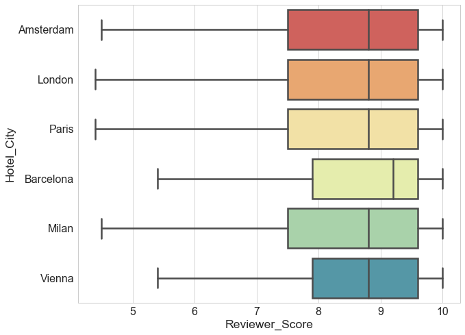


```python
# Group by hotel city
city_data=htl_clean.groupby(['Review_Date','Hotel_City'])['Reviewer_Score'].mean().unstack()
city_data.head()

```


<div>
<style scoped>
    .dataframe tbody tr th:only-of-type {
        vertical-align: middle;
    }

    .dataframe tbody tr th {
        vertical-align: top;
    }

    .dataframe thead th {
        text-align: right;
    }
</style>
<table border="1" class="dataframe">
  <thead>
    <tr style="text-align: right;">
      <th>Hotel_City</th>
      <th>Amsterdam</th>
      <th>Barcelona</th>
      <th>London</th>
      <th>Milan</th>
      <th>Paris</th>
      <th>Vienna</th>
    </tr>
    <tr>
      <th>Review_Date</th>
      <th></th>
      <th></th>
      <th></th>
      <th></th>
      <th></th>
      <th></th>
    </tr>
  </thead>
  <tbody>
    <tr>
      <th>2015-08-04</th>
      <td>8.604800</td>
      <td>8.498561</td>
      <td>8.234853</td>
      <td>8.245783</td>
      <td>8.157485</td>
      <td>8.759302</td>
    </tr>
    <tr>
      <th>2015-08-05</th>
      <td>8.229268</td>
      <td>8.687500</td>
      <td>8.213953</td>
      <td>7.988889</td>
      <td>8.135484</td>
      <td>8.441304</td>
    </tr>
    <tr>
      <th>2015-08-06</th>
      <td>8.432979</td>
      <td>8.771930</td>
      <td>8.204050</td>
      <td>7.830645</td>
      <td>7.870588</td>
      <td>8.398571</td>
    </tr>
    <tr>
      <th>2015-08-07</th>
      <td>8.593103</td>
      <td>8.308889</td>
      <td>8.266667</td>
      <td>8.325714</td>
      <td>8.353571</td>
      <td>8.765789</td>
    </tr>
    <tr>
      <th>2015-08-08</th>
      <td>8.422000</td>
      <td>8.715217</td>
      <td>8.312903</td>
      <td>7.980769</td>
      <td>8.460494</td>
      <td>8.258000</td>
    </tr>
  </tbody>
</table>
</div>


```python

city_data.rolling(window=30).mean().plot( linewidth=3, logy=False,cmap='Spectral',figsize=(14,10))
plt.title('Time Series Plot of Hotels located in 6 Cities:\n 30 Days Rolling Mean of the Average Reviewer Score',fontsize=18,fontweight='bold')
plt.legend(fontsize='small',title='Hotel_City',loc='best');

```


```python
ax=htl_clean.groupby(['Review_Date'])['Reviewer_Score'].mean().plot(linewidth=3,linestyle='-',color='c',figsize=(14,10))
ax.set_xlabel('Review Date')
ax.set_ylabel('Average Reviewer Score')
ax.set_title('Average Reviewer Score during 2015 to 2017',fontweight='bold');
```


The average reviewer score of hotels is higher in January and low in October.

##### What Features are Affecting Reviewer Score?

**Distribution of Reviewer Score**


```python
plt.figure(figsize=(18,10))
sns.countplot(htl_clean.Reviewer_Score,color='c');
```


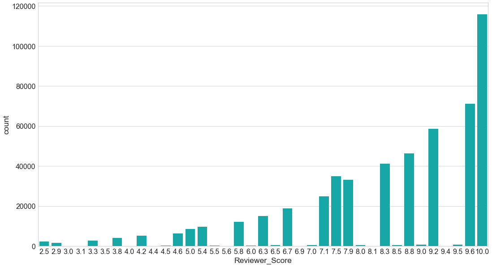


```python
htl_clean.Reviewer_Score.plot(kind='hist', cumulative=True,histtype='bar',normed=True,bins=10,color='c')
plt.xlabel('Reviewer_Score')
plt.ylabel('CDF');
```


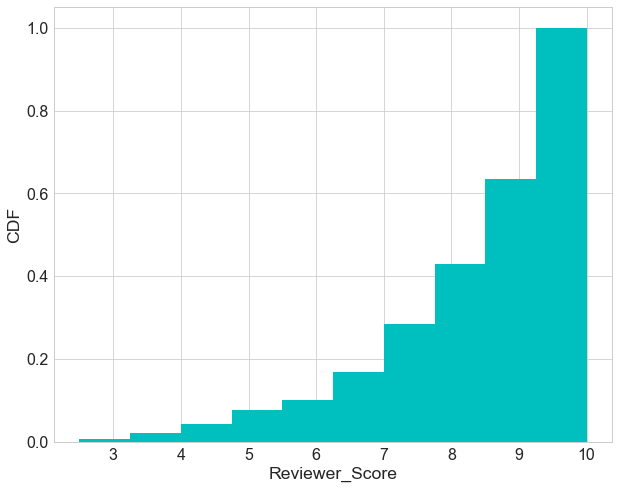


###### 'Trip_Type' v.s. 'Reviewer_Score'


```python
sns.boxplot(x='Trip_Type',y='Reviewer_Score',data=htl_clean,showfliers=False,palette='Spectral');
```


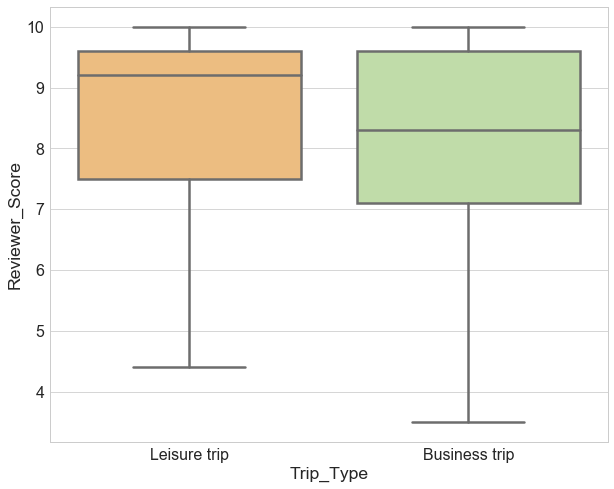


Reviewers on a leisure trip tend to rate higher than those on a business trip. It would be interesting to investigate what topics reviewers on leisure trip and business trip are content or complaining about.

###### 'Traveler_Type' v.s. 'Reviewer_Score'


```python
sns.boxplot(y='Traveler_Type',x='Reviewer_Score',data=htl,showfliers=False,palette='Spectral',orient='h');
```


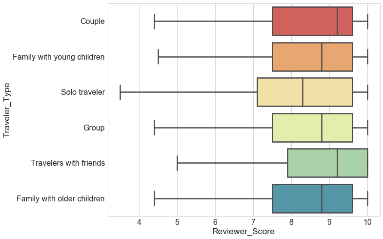


'Solo traveler' tends to rate lowly while couples tend to rate highly.


```python
htl_trip_traveler=htl_clean.dropna(subset=['Trip_Type','Traveler_Type'])
htl_tt_revs=htl_trip_traveler.groupby(['Traveler_Type','Trip_Type'])['Reviewer_Score'].mean().unstack()
```


```python
htl_tt_revs.plot(kind='barh',stacked=False)
plt.legend(bbox_to_anchor=(1.01, 0.8), fontsize=14);
```


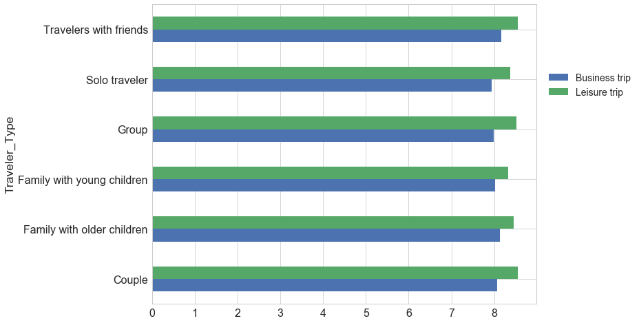


###### How is 'Num_Nights' affecting reviewer score?


```python
htl_numnight=htl_clean[['Num_Nights','Reviewer_Score']].dropna(subset=['Num_Nights'])
htl_numnight.Num_Nights=htl_numnight.Num_Nights.astype('int')
htl_nn_revs=htl_numnight.groupby(['Num_Nights'])['Reviewer_Score'].mean().to_frame().reset_index()
htl_nn_revs=htl_nn_revs.sort_values('Num_Nights')
```


```python
import plotly
import plotly.graph_objs as go

plotly.offline.init_notebook_mode(connected=True)

plotly.offline.iplot({
   "data": [go.Scatter(x=htl_nn_revs.Num_Nights, y=htl_nn_revs.Reviewer_Score)],
   "layout": go.Layout(title="Reviewer_Score v.s. Num_Nights",xaxis={'title':'Num_Nights'}, yaxis={'title':'Reviewer_Score'})
});


```


<script>requirejs.config({paths: { 'plotly': ['https://cdn.plot.ly/plotly-latest.min']},});if(!window.Plotly) {{require(['plotly'],function(plotly) {window.Plotly=plotly;});}}</script>


<div id="2e90a572-3ed6-4ddb-9475-6ebe7809c2f6" style="height: 525px; width: 100%;" class="plotly-graph-div"></div><script type="text/javascript">require(["plotly"], function(Plotly) { window.PLOTLYENV=window.PLOTLYENV || {};window.PLOTLYENV.BASE_URL="https://plot.ly";Plotly.newPlot("2e90a572-3ed6-4ddb-9475-6ebe7809c2f6", [{"type": "scatter", "x": [1, 2, 3, 4, 5, 6, 7, 8, 9, 10, 11, 12, 13, 14, 15, 16, 17, 18, 19, 20, 21, 22, 23, 24, 25, 26, 27, 28, 29, 30, 31], "y": [8.403689462890396, 8.387382014663128, 8.428627254298691, 8.414234554972593, 8.338668459986788, 8.326973549313253, 8.293190740490038, 8.221016813450715, 8.150812064965205, 8.185907553551312, 8.056354916067141, 8.165506329113915, 7.743495934959347, 8.056680161943312, 7.8333333333333375, 7.898245614035089, 7.764285714285713, 8.127272727272727, 7.9241379310344815, 8.778947368421052, 7.7782608695652184, 7.510000000000001, 7.76, 7.933333333333334, 8.628571428571428, 5.4142857142857155, 8.681818181818182, 9.0, 8.0, 8.872727272727273, 10.0]}], {"title": "Reviewer_Score v.s. Num_Nights", "xaxis": {"title": "Num_Nights"}, "yaxis": {"title": "Reviewer_Score"}}, {"showLink": true, "linkText": "Export to plot.ly"})});</script>


Since very few portion of travelers stayed in hotel for more than two weeks, if we focus on the range where 'Num_Nights'<14, the curve above indicates that on average the longer traveler stayed the lower the score they give. This can be visualized more clearly in next plot.


```python
sns.jointplot(data=htl_numnight,y='Reviewer_Score',x='Num_Nights',kind="reg",size=10);
```


### Visualization of Reviewers


```python
#Visualization of distribution of the top 10 nationality of reviewers
ta=pd.crosstab(htl_clean.Reviewer_Nationality, htl_clean.Hotel_City,margins=True).sort_values('All')
h_city_nat=(100*ta.iloc[:-1,:-1]/len(htl_clean)).tail(10)

h_city_nat.plot(kind='barh',stacked=True,logy=False);
plt.xlabel('Percentage of the Number of Reviews (%)')
plt.title('Top 10 Reviewer_Nationality');
```


Reviewers from United Kingdom take almost a half of the total number of reviewers. Interestingly other top nationality reviewers are from countries where hotels are not located except Netherlands.


```python
sns.boxplot(x='Review_Month',y='Reviewer_Score',data=htl_clean,showfliers=False,order=month,palette='Spectral');
```


Reviewer score in January and February on average are higher than other months.


```python
sns.boxplot(x='Review_Wday',y='Reviewer_Score',data=htl_clean,showfliers=False,order=wday,palette='Spectral');
```


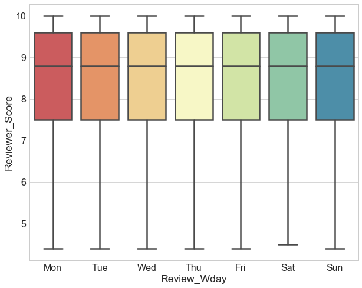


Weekday doesn't seem to affect the reviewer score.

**Reviewer_score v.s. Total_Number_of_Reviews_Reviewer_Has_Given**


```python
sns.jointplot(data=htl_clean,y='Reviewer_Score',x='Total_Number_of_Reviews_Reviewer_Has_Given',kind="reg",size=10);
```


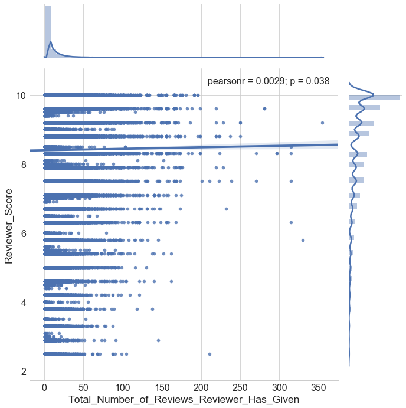


The figure indicates that the more reviews reviewers posted, the higher rating score reviewers tend to give.

**Longer Reviews Indicate Higher Score or Lower Score?**


```python
# Negative Reviews
ax1=sns.jointplot(data=htl_clean,y='Reviewer_Score',x='Review_Total_Negative_Word_Counts',kind="reg",size=10);

```


```python
# Positive Reviews
ax2=sns.jointplot(data=htl_clean,y='Reviewer_Score',x='Review_Total_Positive_Word_Counts',kind="reg",size=10);

```


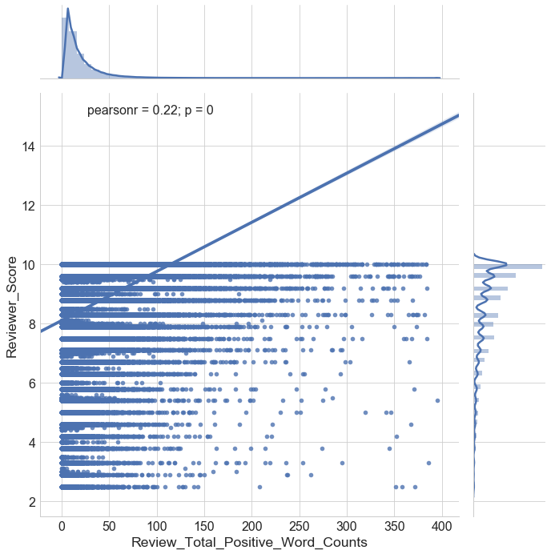


#### Where are reviewers from?


```python
#Geocode address of reviewers' nations
addr=[s.strip() for s in htl_clean.Reviewer_Nationality.unique()]
#len(htl[htl.Reviewer_Nationality==' ']) # some with empty nationality

from geopy.geocoders import Nominatim
nom=Nominatim()
d_lat=dict(zip(addr, pd.Series(addr).apply(nom.geocode).apply(lambda x: x.latitude if x!=None else None)))
d_lng=dict(zip(addr, pd.Series(addr).apply(nom.geocode).apply(lambda x: x.longitude if x!=None else None))) 

# Drop missing values
df_reviewers=pd.concat([pd.DataFrame.from_dict(d_lat,orient='index'),pd.DataFrame.from_dict(d_lng,orient='index')],axis=1).dropna().sort_index().reset_index()
df_reviewers.columns=['Reviewer_Nationality','lat','lng']

# Save the data
df_reviewers.to_csv('data/reviewers_lat_lng.csv',index=False)
```


```python
#reviewer=pd.read_csv('data/reviewers_lat_lng.csv')
```


```python
from folium import plugins
# Make a heatmap to see where the most reviewers are from
reviewers_heatmap = folium.Map(location=[reviewer['lat'].mean(), reviewer['lng'].mean()], zoom_start=1)
reviewers_heatmap.add_child(plugins.HeatMap([[row["lat"], row["lng"]] for name, row in reviewer.iterrows()]))
reviewers_heatmap
```


<div style="width:100%;"><div style="position:relative;width:100%;height:0;padding-bottom:60%;"><iframe src="data:text/html;charset=utf-8;base64,PCFET0NUWVBFIGh0bWw+CjxoZWFkPiAgICAKICAgIDxtZXRhIGh0dHAtZXF1aXY9ImNvbnRlbnQtdHlwZSIgY29udGVudD0idGV4dC9odG1sOyBjaGFyc2V0PVVURi04IiAvPgogICAgPHNjcmlwdD5MX1BSRUZFUl9DQU5WQVMgPSBmYWxzZTsgTF9OT19UT1VDSCA9IGZhbHNlOyBMX0RJU0FCTEVfM0QgPSBmYWxzZTs8L3NjcmlwdD4KICAgIDxzY3JpcHQgc3JjPSJodHRwczovL2Nkbi5qc2RlbGl2ci5uZXQvbnBtL2xlYWZsZXRAMS4yLjAvZGlzdC9sZWFmbGV0LmpzIj48L3NjcmlwdD4KICAgIDxzY3JpcHQgc3JjPSJodHRwczovL2FqYXguZ29vZ2xlYXBpcy5jb20vYWpheC9saWJzL2pxdWVyeS8xLjExLjEvanF1ZXJ5Lm1pbi5qcyI+PC9zY3JpcHQ+CiAgICA8c2NyaXB0IHNyYz0iaHR0cHM6Ly9tYXhjZG4uYm9vdHN0cmFwY2RuLmNvbS9ib290c3RyYXAvMy4yLjAvanMvYm9vdHN0cmFwLm1pbi5qcyI+PC9zY3JpcHQ+CiAgICA8c2NyaXB0IHNyYz0iaHR0cHM6Ly9jZG5qcy5jbG91ZGZsYXJlLmNvbS9hamF4L2xpYnMvTGVhZmxldC5hd2Vzb21lLW1hcmtlcnMvMi4wLjIvbGVhZmxldC5hd2Vzb21lLW1hcmtlcnMuanMiPjwvc2NyaXB0PgogICAgPGxpbmsgcmVsPSJzdHlsZXNoZWV0IiBocmVmPSJodHRwczovL2Nkbi5qc2RlbGl2ci5uZXQvbnBtL2xlYWZsZXRAMS4yLjAvZGlzdC9sZWFmbGV0LmNzcyIgLz4KICAgIDxsaW5rIHJlbD0ic3R5bGVzaGVldCIgaHJlZj0iaHR0cHM6Ly9tYXhjZG4uYm9vdHN0cmFwY2RuLmNvbS9ib290c3RyYXAvMy4yLjAvY3NzL2Jvb3RzdHJhcC5taW4uY3NzIiAvPgogICAgPGxpbmsgcmVsPSJzdHlsZXNoZWV0IiBocmVmPSJodHRwczovL21heGNkbi5ib290c3RyYXBjZG4uY29tL2Jvb3RzdHJhcC8zLjIuMC9jc3MvYm9vdHN0cmFwLXRoZW1lLm1pbi5jc3MiIC8+CiAgICA8bGluayByZWw9InN0eWxlc2hlZXQiIGhyZWY9Imh0dHBzOi8vbWF4Y2RuLmJvb3RzdHJhcGNkbi5jb20vZm9udC1hd2Vzb21lLzQuNi4zL2Nzcy9mb250LWF3ZXNvbWUubWluLmNzcyIgLz4KICAgIDxsaW5rIHJlbD0ic3R5bGVzaGVldCIgaHJlZj0iaHR0cHM6Ly9jZG5qcy5jbG91ZGZsYXJlLmNvbS9hamF4L2xpYnMvTGVhZmxldC5hd2Vzb21lLW1hcmtlcnMvMi4wLjIvbGVhZmxldC5hd2Vzb21lLW1hcmtlcnMuY3NzIiAvPgogICAgPGxpbmsgcmVsPSJzdHlsZXNoZWV0IiBocmVmPSJodHRwczovL3Jhd2dpdC5jb20vcHl0aG9uLXZpc3VhbGl6YXRpb24vZm9saXVtL21hc3Rlci9mb2xpdW0vdGVtcGxhdGVzL2xlYWZsZXQuYXdlc29tZS5yb3RhdGUuY3NzIiAvPgogICAgPHN0eWxlPmh0bWwsIGJvZHkge3dpZHRoOiAxMDAlO2hlaWdodDogMTAwJTttYXJnaW46IDA7cGFkZGluZzogMDt9PC9zdHlsZT4KICAgIDxzdHlsZT4jbWFwIHtwb3NpdGlvbjphYnNvbHV0ZTt0b3A6MDtib3R0b206MDtyaWdodDowO2xlZnQ6MDt9PC9zdHlsZT4KICAgIAogICAgICAgICAgICA8c3R5bGU+ICNtYXBfY2E1ZDllNjI5YWZiNDM4YmJmMWNhYmYxYzJjZjkyOGYgewogICAgICAgICAgICAgICAgcG9zaXRpb24gOiByZWxhdGl2ZTsKICAgICAgICAgICAgICAgIHdpZHRoIDogMTAwLjAlOwogICAgICAgICAgICAgICAgaGVpZ2h0OiAxMDAuMCU7CiAgICAgICAgICAgICAgICBsZWZ0OiAwLjAlOwogICAgICAgICAgICAgICAgdG9wOiAwLjAlOwogICAgICAgICAgICAgICAgfQogICAgICAgICAgICA8L3N0eWxlPgogICAgICAgIAogICAgPHNjcmlwdCBzcmM9Imh0dHBzOi8vbGVhZmxldC5naXRodWIuaW8vTGVhZmxldC5oZWF0L2Rpc3QvbGVhZmxldC1oZWF0LmpzIj48L3NjcmlwdD4KPC9oZWFkPgo8Ym9keT4gICAgCiAgICAKICAgICAgICAgICAgPGRpdiBjbGFzcz0iZm9saXVtLW1hcCIgaWQ9Im1hcF9jYTVkOWU2MjlhZmI0MzhiYmYxY2FiZjFjMmNmOTI4ZiIgPjwvZGl2PgogICAgICAgIAo8L2JvZHk+CjxzY3JpcHQ+ICAgIAogICAgCgogICAgICAgICAgICAKICAgICAgICAgICAgICAgIHZhciBib3VuZHMgPSBudWxsOwogICAgICAgICAgICAKCiAgICAgICAgICAgIHZhciBtYXBfY2E1ZDllNjI5YWZiNDM4YmJmMWNhYmYxYzJjZjkyOGYgPSBMLm1hcCgKICAgICAgICAgICAgICAgICAgICAgICAgICAgICAgICAgICdtYXBfY2E1ZDllNjI5YWZiNDM4YmJmMWNhYmYxYzJjZjkyOGYnLAogICAgICAgICAgICAgICAgICAgICAgICAgICAgICAgICAge2NlbnRlcjogWzE5LjU4ODYwMjEzNjA2MTk1LDcuMDQ4MTAxMTU5NjM0ODEyXSwKICAgICAgICAgICAgICAgICAgICAgICAgICAgICAgICAgIHpvb206IDEsCiAgICAgICAgICAgICAgICAgICAgICAgICAgICAgICAgICBtYXhCb3VuZHM6IGJvdW5kcywKICAgICAgICAgICAgICAgICAgICAgICAgICAgICAgICAgIGxheWVyczogW10sCiAgICAgICAgICAgICAgICAgICAgICAgICAgICAgICAgICB3b3JsZENvcHlKdW1wOiBmYWxzZSwKICAgICAgICAgICAgICAgICAgICAgICAgICAgICAgICAgIGNyczogTC5DUlMuRVBTRzM4NTcKICAgICAgICAgICAgICAgICAgICAgICAgICAgICAgICAgfSk7CiAgICAgICAgICAgIAogICAgICAgIAogICAgCiAgICAgICAgICAgIHZhciB0aWxlX2xheWVyX2IwMDRlODkyODIwZTQwNWVhNTMwODdhMWJmMGZjMTEyID0gTC50aWxlTGF5ZXIoCiAgICAgICAgICAgICAgICAnaHR0cHM6Ly97c30udGlsZS5vcGVuc3RyZWV0bWFwLm9yZy97en0ve3h9L3t5fS5wbmcnLAogICAgICAgICAgICAgICAgewogICJhdHRyaWJ1dGlvbiI6IG51bGwsCiAgImRldGVjdFJldGluYSI6IGZhbHNlLAogICJtYXhab29tIjogMTgsCiAgIm1pblpvb20iOiAxLAogICJub1dyYXAiOiBmYWxzZSwKICAic3ViZG9tYWlucyI6ICJhYmMiCn0KICAgICAgICAgICAgICAgICkuYWRkVG8obWFwX2NhNWQ5ZTYyOWFmYjQzOGJiZjFjYWJmMWMyY2Y5MjhmKTsKICAgICAgICAKICAgIAogICAgICAgICAgICB2YXIgaGVhdF9tYXBfMjA1NGRkNDkyMTZiNGFkOGFlYjE2OTEzYjcwYzJiNDggPSBMLmhlYXRMYXllcigKICAgICAgICAgICAgICAgIFtbNDMuMTUwMDIyNiwgNDEuMjI5OTc4Nl0sIFszMy43NjgwMDY1LCA2Ni4yMzg1MTM5XSwgWzExLjI0NDg4MjU1LCAtNzIuNTE2MDk4ODA5MzcxNV0sIFsyOC4wMDAwMjcxOTk5OTk5OTgsIDIuOTk5OTgyNV0sIFstMTQuMzAwNjMwOTUsIC0xNzAuNjk1OTc0NzkxNjU1XSwgWzQyLjU0MDcxNjcwMDAwMDAwNCwgMS41NzMyMDMzXSwgWy0xMS44Nzc1NzY4MDAwMDAwMDIsIDE3LjU2OTEyNDFdLCBbMTguMTk1NDk0Njk5OTk5OTk4LCAtNjMuMDc1MDIzMzk5OTk5OTldLCBbLTc5LjQwNjMwNzUsIDAuMzE0OTMxMTk5OTk5OTk5OTddLCBbMTcuMDc5MTI4LCAtNjEuODIyMjUxNjAwMDAwMDFdLCBbLTM0Ljk5NjQ5NjMsIC02NC45NjcyODE3XSwgWzQuNDkyMzg5OCwgLTc1LjczOTYwMTY2NDY1NjddLCBbMTIuNTAxMzYyOSwgLTY5Ljk2MTg0NzVdLCBbLTI0Ljc3NjEwODYsIDEzNC43NTVdLCBbNDcuMjAwMDMzOCwgMTMuMTk5OTU5XSwgWzQwLjM5MzYyOTQsIDQ3Ljc4NzI1MDc5OTk5OTk5NV0sIFsyNC43NzM2NTQ2LCAtNzguMDAwMDU0N10sIFszNS4yMDc4MDEyMDAwMDAwMDYsIDcyLjU0NzM5NjhdLCBbMjQuNDc2ODc4MywgOTAuMjkzMjQyNl0sIFsxMy4xNTAwMzMxLCAtNTkuNTI1MDMwNTAwMDAwMDFdLCBbNTMuNDI1MDYwNSwgMjcuNjk3MTM1OF0sIFs1MC42NDA3MzUxLCA0LjY2Njk1OTk5OTk5OTk5OTZdLCBbMTYuODI1OTc5MywgLTg4Ljc2MDA5MjddLCBbNi4zMzMwNTg1OTk5OTk5OTksIDUuNjIyMTA1OF0sIFszMi4zMDE4MjE3LCAtNjQuNzYwMzU4M10sIFsyNy41NDk1MTEsIDkwLjUxMTkyNzNdLCBbLTE3LjA1Njg2OTYwMDAwMDAwMiwgLTY0Ljk5MTIyODZdLCBbMTcuNTY2LCAtNjMuMTQzMjIzNTYxMDA0NV0sIFs0NC4zMDUzNDc2MDAwMDAwMDUsIDE3LjU5NjE0NjcwMDAwMDAwMl0sIFstMjMuMTY4MTc4MiwgMjQuNTkyODc0Ml0sIFstMTAuMzMzMzMzMzAwMDAwMDAxLCAtNTMuMl0sIFsxOC40MDI0Mzk1LCAtNjQuNTY2MTY0Ml0sIFs0LjQxMzcxNTQ5OTk5OTk5OTUsIDExNC41NjUzOTA4XSwgWzQyLjYwNzM5NzUsIDI1LjQ4NTY2MTddLCBbLTMuMzYzNDM1NywgMjkuODg3MDU3NV0sIFsxMy41MDY2Mzk0LCAxMDQuODY5NDIzXSwgWzQuNjEyNTUyMjAwMDAwMDAwNSwgMTMuMTUzNTgxMDk5OTk5OTk4XSwgWzYxLjA2NjY5MjIsIC0xMDcuOTkxNzA3MV0sIFsxNy4wNTU1Mjg1NSwgLTI1LjE3MjMwNDkxMTM2MzZdLCBbMTkuNTQxNzIxMiwgLTgwLjU2NjcxMzJdLCBbMC4zMjA5MjU5LCAzMi41NzgyNTA3XSwgWy0zMS43NjEzMzY1LCAtNzEuMzE4NzY5N10sIFsyNS40OTE1Nzk5LCAtOTguOTgxMTExNTA0NTU2OV0sIFs0OS45NDU2MTI3MDAwMDAwMDUsIDExLjU2OTg5NzJdLCBbMi44ODk0NDMzOTk5OTk5OTk4LCAtNzMuNzgzODkyMDAwMDAwMDFdLCBbLTEyLjIwNDUxNzU5OTk5OTk5OSwgNDQuMjgzMjk2NF0sIFstMC43MjY0MzI2OTk5OTk5OTk5LCAxNS42NDE5MTU1XSwgWy0xNi4wNDkyNzgxLCAtMTYwLjM1NTQ4NTFdLCBbMTAuMjczNTYzMywgLTg0LjA3MzkxMDJdLCBbNDUuMjgzNTEyOTUsIDM0LjIwMDc5NTM1NTI3NDFdLCBbNDUuNTY0MzQ0MiwgMTcuMDExODk1NF0sIFstMzguMjIzOTAzNSwgLTczLjQ1NDkzMzJdLCBbMzQuOTgyMzAxNzk5OTk5OTk1LCAzMy4xNDUxMjg1XSwgWzQ5LjgxNjcwMDI5OTk5OTk5NCwgMTUuNDc0OTU0NF0sIFstMi45ODE0MzQ0LCAyMy44MjIyNjM2MDAwMDAwMDNdLCBbNTUuNjcwMjQ5LCAxMC4zMzMzMjgzMDAwMDAwMDJdLCBbMTEuODU2Nzc1NDUsIDQyLjc1Nzc4NDUxOTk0MzcwNV0sIFsxNS40MTEzMTM4LCAtNjEuMzY1MzYxOF0sIFsxOS4wOTc0MDMxLCAtNzAuMzAyODAyNTk5OTk5OTldLCBbLTguNTE1MTk3OSwgMTI1LjgzNzU3NTYwMDAwMDAxXSwgWy0xLjMzOTc2NjgsIC03OS4zNjY2OTY1XSwgWzI2LjI1NDA0OTMwMDAwMDAwMiwgMjkuMjY3NTQ2OV0sIFsxMy44MDAwMzgxOTk5OTk5OTgsIC04OC45MTQwNjgzXSwgWzEuNjEzMTcxOTk5OTk5OTk5OCwgMTAuNTE3MDM1N10sIFsyNS4yMjA5MTg0NSwgNTUuMTcyODQ3OTUwMzEwODk2XSwgWzU4Ljc1MjM3Nzc5OTk5OTk5LCAyNS4zMzE5MDc4XSwgWzEwLjIxMTY3MDE5OTk5OTk5OSwgMzguNjUyMTIwM10sIFstNTEuOTY2NjQyNCwgLTU5LjU1MDAzODddLCBbNjIuMTk4NTAwNDUsIC02LjgxNzQxMjQzMzQxMjE3XSwgWy0xOC4xMjM5Njk2MDAwMDAwMDIsIDE3OS4wMTIyNzM3XSwgWzYzLjI0Njc3NzcsIDI1LjkyMDkxNjRdLCBbNDYuNjAzMzUzOTk5OTk5OTk2LCAxLjg4ODMzMzQ5OTk5OTk5OTldLCBbNC4wMDM5ODgyLCAtNTIuOTk5OTk4XSwgWy0xOC42MjQzNzQ5LCAtMTQ0LjY0MzQ4OThdLCBbLTAuODk5OTY5NSwgMTEuNjg5OTY5OTAwMDAwMDAxXSwgWzEzLjQ3MDA2MTk5OTk5OTk5OSwgLTE1LjQ5MDA0NjRdLCBbMzIuMzI5MzgwOTAwMDAwMDA0LCAtODMuMTEzNzM2Nl0sIFs1MS4wODM0MTk2LCAxMC40MjM0NDY5XSwgWzguMDMwMDI4NCwgLTEuMDgwMDI3MTAwMDAwMDAwMV0sIFszNi4xNDA4MDcsIC01LjM1NDEyOTVdLCBbMzguOTk1MzY4Mjk5OTk5OTk2LCAyMS45ODc3MTMxOTk5OTk5OThdLCBbMTIuMTM2MDM3NDAwMDAwMDAxLCAtNjEuNjkwNDA0NTAwMDAwMDFdLCBbMTYuMjQ5MDA2NywgLTYxLjU2NTA0NDQwMDAwMDAwNV0sIFsxMy40NDQxMzgsIDE0NC43MzM2MjY0NDU3NjcwMl0sIFsxNS42MzU2MDg4MDAwMDAwMDIsIC04OS44OTg4MDg3XSwgWzQ5LjQ2MjI5MTI1LCAtMi41ODEyMDIyNTAzMjk0NF0sIFszOC4xNDQwODkzLCAtNzcuNDM5MTEyNDAwMDAwMDFdLCBbNC44ODczMiwgLTU4LjkzOTg3OTg5NjgwNzVdLCBbMTkuMTM5OTk1MTk5OTk5OTk4LCAtNzIuMzU3MDk3MjAwMDAwMDFdLCBbMTUuMDYxMDY4NTk5OTk5OTk5LCAtODQuNTk3ODUzNF0sIFsyMi4yNzkzMjc4LCAxMTQuMTYyODEzMTAwMDAwMDFdLCBbNDcuMTgxNzU4NSwgMTkuNTA2MDkzN10sIFs1MS4zODY2MDk2NSwgMC41NDc3MTQ4NjcyMzY0ODhdLCBbMjIuMzUxMTE0OCwgNzguNjY3NzQyOF0sIFstNC43OTkzMzU2LCAxMTQuNTYzMjAzMjAwMDAwMDJdLCBbMzIuOTQwNzQ5NjAwMDAwMDA0LCA1Mi45NDcxMzQ0XSwgWzMzLjA5NTU3OTMsIDQ0LjE3NDk3NzUwMDAwMDAwNF0sIFs1Mi44NjUxOTYsIC03Ljk3OTQ1OTldLCBbNTQuMjM1ODE2NywgLTQuNTE0NTk4NzQ1Njk4MjVdLCBbMzAuODc2MDI3MiwgMzUuMDAxNTE5Nl0sIFs0Mi42Mzg0MjYxLCAxMi42NzQyOTddLCBbMjUuMjE0OTI0MSwgNTUuMTcxMzYxMjE0MTU4Ml0sIFsxOC4xODUwNTA2OTk5OTk5OTgsIC03Ny4zOTQ3NjkzXSwgWzM2LjU3NDg0NDEsIDEzOS4yMzk0MTc5XSwgWzQ5LjIxMjMwNjU1LCAtMi4xMjU1OTk5NTk2NDI4OF0sIFszMS4xNjY3MDQ5LCAzNi45NDE2MjhdLCBbNDcuMjI4NjA4NiwgNjUuMjA5MzE5NzAwMDAwMDFdLCBbMS40NDE5NjgzLCAzOC40MzEzOTc0OTk5OTk5OTZdLCBbMC40NDgzMjgyOTk5OTk5OTk5NiwgLTE3MS42NjQ1Mzg4XSwgWzQyLjU4Njk1NzgsIDIwLjkwMjEyMzEwMDAwMDAwNF0sIFsyOS4yNzMzOTY0LCA0Ny40OTc5NDc2XSwgWzQxLjUwODkzMjQsIDc0LjcyNDA5MV0sIFsyMC4wMTcxMTA5LCAxMDMuMzc4MjUzXSwgWzU2Ljg0MDY0OTQsIDI0Ljc1Mzc2NDVdLCBbNDAuMzQyOTY4Mjk5OTk5OTk1LCAtNzYuNDIzMzgxNl0sIFstMjkuNjAzOTI2NywgMjguMzM1MDE5MzAwMDAwMDAzXSwgWzUuNzQ5OTcyMSwgLTkuMzY1ODUyNF0sIFsyNi44MjM0NDcyLCAxOC4xMjM2NzIzXSwgWzQ3LjE0MTYzMDcsIDkuNTUzMTUyNjk5OTk5OTk4XSwgWzU1LjM1MDAwMDMwMDAwMDAwNSwgMjMuNzQ5OTk5N10sIFs0OS44MTU4NjgzLCA2LjEyOTY3NTFdLCBbMjIuMTg5OTQ0OCwgMTEzLjUzODA0NTQwMDAwMDAyXSwgWzQxLjYxNzEyMTM5OTk5OTk5NSwgMjEuNzE2ODM4N10sIFstMTguNzgyOTUzMzUsIDQ2LjcxMTkyNjA5MzM0MjZdLCBbLTEzLjI2ODcyMDQsIDMzLjkzMDE5NjNdLCBbMi4zOTIzNzU4OTk5OTk5OTk4LCAxMTIuODQ3MTkzOTAwMDAwMDFdLCBbMjUuMjI1ODE1MTAwMDAwMDAyLCA1NS4xODMwMTQ0MjQxMTU1XSwgWzE2LjM3MDAzNTksIC0yLjI5MDAyMzg5OTk5OTk5OTZdLCBbMzUuODg4NTk5Mjk5OTk5OTk2LCAxNC40NDc2OTExXSwgWzE0LjYxMTM3MzIsIC02MC45NjIwNzc3XSwgWzI1LjIxNTM0Nzg1LCA1NS4xNjc4MjU1MDU3NzU5OTRdLCBbLTIwLjI3NTk0NTEsIDU3LjU3MDM1NjZdLCBbMTkuNDMyNjAwOSwgLTk5LjEzMzM0MTZdLCBbNDcuMjg2NzQ3LCAyOC41MTEwMjM2MDAwMDAwMDVdLCBbNDMuNjMwNzEzNDUsIDcuNDc2MTYxMDE2NDAxMzhdLCBbNDYuODI1MDM4Nzk5OTk5OTk0LCAxMDMuODQ5OTczNl0sIFstMjkuNjgyNjExMTk5OTk5OTk3LCAtNTEuNDY4NzQ1NTAwMDAwMDA0XSwgWzE2Ljc0MTcwNDEsIC02Mi4xOTE2ODQ0MDAwMDAwMV0sIFszMS4xNzI4MTkyLCAtNy4zMzY2MDQzXSwgWzE5LjA1ODg4OSwgLTk2LjI1NDE2NzAwMDAwMDAxXSwgWzE3LjE3NTA0OTUsIDk1Ljk5OTk2NTJdLCBbLTIzLjIzMzU0OTksIDE3LjMyMzExMDY5OTk5OTk5N10sIFsyOC4xMDgzOTI5MDAwMDAwMDIsIDg0LjA5MTcxMzldLCBbNTIuMjM3OTg5MSwgNS41MzQ2MDczODE2MTU1MV0sIFstMjEuMzAxOTkwNSwgMTY1LjQ4ODA3NzMwMDAwMDAxXSwgWy00MS41MDAwODMxLCAxNzIuODM0NDA3Njk5OTk5OTldLCBbMTIuMzcyNDkyODAwMDAwMDAyLCAtODQuODcwMDMwOF0sIFsxNy43MzU2MjE0LCA5LjMyMzg0MzE5OTk5OTk5OV0sIFs5LjYwMDAzNTksIDcuOTk5OTcyMDk5OTk5OTk5XSwgWzE0LjE0OTAyMDQ5OTk5OTk5OSwgMTQ1LjIxMzQ1MjQ4MzE4OV0sIFs2NC41NzMxNTM3LCAxMS41MjgwMzY0Mzk1NDgxOTldLCBbMjUuMjI3ODkyOTUsIDU1LjE3NjY2ODUxNDQ2MjNdLCBbMzAuMzMwODQwMSwgNzEuMjQ3NDk5XSwgWzQyLjU3MTc5ODksIDIuOTYwMDkwNDk5OTk5OTk5N10sIFszMS42NDk3NDEsIDM1LjE2MjA3MTk5OTk5OTk5NV0sIFs4LjMwOTYwNjcsIC04MS4zMDY2MjQ1OTk5OTk5OV0sIFstNS42ODE2MDY5LCAxNDQuMjQ4OTA4MV0sIFstMjMuMzE2NTkzNSwgLTU4LjE2OTM0NDQ5OTk5OTk5NF0sIFs0MS4zMjcyOTE5LCAtODkuMTI4NzYzNl0sIFsxMi43NTAzNDg1OTk5OTk5OTksIDEyMi43MzEyMTAxXSwgWzUyLjA5NzcxODEsIDE5LjAyNTgxNTg5OTk5OTk5OF0sIFs0MC4wMzMyNjUsIC03Ljg4OTYyNjI5OTk5OTk5OV0sIFsxOC4yMjE0MTcxNSwgLTY2LjQxMzI4MTg1MDU2NDhdLCBbMjUuMjI4MDMwOTUsIDU1LjE3MzMyNzkzMDg3XSwgWy0yMS4xMzA5MzMyLCA1NS41MjY1NzcxMDAwMDAwMDRdLCBbNDUuOTg1MjEyODk5OTk5OTksIDI0LjY4NTkyMjVdLCBbNjQuNjg2MzEzNiwgOTcuNzQ1MzA2MV0sIFstMS45NjQ2NjMxLCAzMC4wNjQ0MzU4MDAwMDAwMDJdLCBbMTcuOTAwNzczMTAwMDAwMDAyLCAtNjIuNzk3MTYxNzg1Njg3NF0sIFsxNy4zNDYyMjc4LCAtNjIuNzY4NzI3N10sIFsxMy44MjUwNDg5LCAtNjAuOTc1MDM1OTk5OTk5OTk2XSwgWzE4LjA4MTQwNjYsIC02My4wNDY3MTMxMDAwMDAwMDVdLCBbMTIuOTA0NDcsIC02MS4yNzY1NTY5XSwgWzQwLjgxODczNzIsIC0xMjQuMTg2NDUxNzk5OTk5OTldLCBbNDMuOTQ1ODYyMjk5OTk5OTk1LCAxMi40NTgzMDZdLCBbMTMuOTY4ODE2NSwgMTIxLjUyNTA4NzEwMDAwMDAxXSwgWzE0LjQ3NTA2MDY5OTk5OTk5OCwgLTE0LjQ1Mjk2MTE5OTk5OTk5OV0sIFs0NC4xNTM0MTIxMDAwMDAwMDQsIDIwLjU1MTQ0XSwgWzI1LjIyNDQ2NDUsIDU1LjE4Mjg4MDA0MzQ3MjA5Nl0sIFs4LjY0MDAzNDksIC0xMS44NDAwMjY5XSwgWzEuMjkwNDc1MywgMTAzLjg1MjAzNTldLCBbNDguNzQxMTUyMjAwMDAwMDEsIDE5LjQ1Mjg2NDZdLCBbNDUuODEzMzExMjk5OTk5OTk1LCAxNC40ODA4MzY5XSwgWy0xMy4xODA1NTYsIDE1LjI2NjY2NzAwMDAwMDAwMl0sIFstMjguODE2NjIzNjAwMDAwMDAzLCAyNC45OTE2MzkwMDAwMDAwMDNdLCBbNDEuNzgxNjg4NSwgMTIzLjQyMDQyMDNdLCBbNy44Njk5NDMwOTk5OTk5OTk1LCAyOS42NjY3ODk3XSwgWzQwLjAwMjgwMjgsIC00LjAwMzEwNF0sIFs3Ljg3Nzk5OTk5OTk5OTk5OSwgODAuNzAzODI0NTg3NV0sIFsxOC4wNDIzNzM2LCAtNjMuMDU0OTk0Nzk5OTk5OTk2XSwgWzQ2LjgzNzQ1NDQsIC01Ni4yMTIwNTU1MDAwMDAwMDVdLCBbMTQuNTg0NDQ0NDAwMDAwMDAyLCAyOS40OTE3NjkxXSwgWzQuMTQxMzAyNSwgLTU2LjA3NzExODcwMDAwMDAxXSwgWzc4LjUxMjQwMjU1LCAxNi42MDU1ODI0MDE2MzExXSwgWzI1LjIxNjU0ODY1LCA1NS4xODE3NzU3MDczMzU1MDRdLCBbNTkuNjc0OTcxMjAwMDAwMDEsIDE0LjUyMDg1ODRdLCBbNDYuNzk4NTYyNCwgOC4yMzE5NzM1OTk5OTk5OThdLCBbMzQuNjQwMTg2MSwgMzkuMDQ5NDEwNl0sIFsyMy41OTgyOTc4NSwgMTIwLjgzNTM2MzEzODE3NV0sIFszOC42MjgxNzMyOTk5OTk5OSwgNzAuODE1NjU0MV0sIFstNi41MjQ3MTIzLCAzNS43ODc4NDM4XSwgWzE0Ljg5NzE5MjEsIDEwMC44MzI3M10sIFs4Ljc4MDAyNjUsIDEuMDE5OTc2NDk5OTk5OTk5OF0sIFsxMC44Njc3ODQ1LCAtNjAuOTgyMTA2N10sIFszMy44NDM5NDA4LCA5LjQwMDEzOF0sIFszOC45NTk3NTkzOTk5OTk5OTYsIDM0LjkyNDk2NTNdLCBbMzkuMzc2MzgwNzAwMDAwMDA2LCA1OS4zOTI0NjA4OTk5OTk5OTZdLCBbMjEuNzIxNDY4MywgLTcxLjYyMDE3ODI5OTk5OTk5XSwgWy03Ljc2ODk1OSwgMTc4LjExNjc2OTgwMDAwMDAxXSwgWzE3Ljc4OTE4NywgLTY0LjcwODA1NzRdLCBbMS41MzMzNTUzOTk5OTk5OTk4LCAzMi4yMTY2NTc4XSwgWzQ5LjQ4NzE5NjgsIDMxLjI3MTgzMjFdLCBbMjQuMDAwMjQ4OCwgNTMuOTk5NDgyOTAwMDAwMDA0XSwgWzI1LjIyMzIyODMsIDU1LjE1OTQ5MzMwMDg3NTRdLCBbNi40Mjk1MDkyLCAtMTYyLjQwNzMwOTk3ODc4Ml0sIFszOS43ODM3MzA0LCAtMTAwLjQ0NTg4MjVdLCBbLTMyLjg3NTU1NDgsIC01Ni4wMjAxNTI1XSwgWzQxLjMyMzczLCA2My45NTI4MDk4XSwgWy0xNi41MjU1MDY5MDAwMDAwMDMsIDE2OC4xMDY5MTU0MDAwMDAwMl0sIFs0MS45MDM0OTEyLCAxMi40NTI4MzQ5MDAwMDAwMDFdLCBbOC4wMDE4NzA5LCAtNjYuMTEwOTMxOF0sIFsxMy4yOTA0MDI3LCAxMDguNDI2NTExMjk5OTk5OTldLCBbLTEzLjgxNzMzMjQsIC0xNzcuMTQ4OTY0OV0sIFsxNi4zNDcxMjQzLCA0Ny44OTE1MjcxXSwgWy0xNC41MTg2MjM5LCAyNy41NTk5MTY0XSwgWy0xOC40NTU0OTYzLCAyOS43NDY4NDEzOTk5OTk5OTddXSwKICAgICAgICAgICAgICAgIHsKICAgICAgICAgICAgICAgICAgICBtaW5PcGFjaXR5OiAwLjUsCiAgICAgICAgICAgICAgICAgICAgbWF4Wm9vbTogMTgsCiAgICAgICAgICAgICAgICAgICAgbWF4OiAxLjAsCiAgICAgICAgICAgICAgICAgICAgcmFkaXVzOiAyNSwKICAgICAgICAgICAgICAgICAgICBibHVyOiAxNSwKICAgICAgICAgICAgICAgICAgICBncmFkaWVudDogbnVsbAogICAgICAgICAgICAgICAgICAgIH0pCiAgICAgICAgICAgICAgICAuYWRkVG8obWFwX2NhNWQ5ZTYyOWFmYjQzOGJiZjFjYWJmMWMyY2Y5MjhmKTsKICAgICAgICAKPC9zY3JpcHQ+" style="position:absolute;width:100%;height:100%;left:0;top:0;border:none !important;" allowfullscreen webkitallowfullscreen mozallowfullscreen></iframe></div></div>


```python
htl_reviewer=pd.crosstab(htl.Hotel_Address,htl.Reviewer_Nationality,margins=True).reset_index()
reviewer['Num_Reviews']=htl_reviewer.drop([' '],axis=1).iloc[-1,1:-1].values
reviewer['Num_Hotel_Reviewed']=(htl_reviewer.drop([' '],axis=1).iloc[:-1,1:-1]!=0).sum(axis=0).values
reviewer['Reviewer_Score_Avg']=htl.groupby('Reviewer_Nationality')['Reviewer_Score'].mean().drop(' ').values.round(1)
reviewer.Num_Reviews=reviewer.Num_Reviews.astype('int')

#reviewer#.sort_values('Num_Reviews',ascending=False,inplace=True)
reviewer.head()
```


<div>
<style scoped>
    .dataframe tbody tr th:only-of-type {
        vertical-align: middle;
    }

    .dataframe tbody tr th {
        vertical-align: top;
    }

    .dataframe thead th {
        text-align: right;
    }
</style>
<table border="1" class="dataframe">
  <thead>
    <tr style="text-align: right;">
      <th></th>
      <th>Reviewer_Nationality</th>
      <th>lat</th>
      <th>lng</th>
      <th>Num_Reviews</th>
      <th>Num_Hotel_Reviewed</th>
      <th>Reviewer_Score_Avg</th>
    </tr>
  </thead>
  <tbody>
    <tr>
      <th>0</th>
      <td>Abkhazia Georgia</td>
      <td>43.150023</td>
      <td>41.229979</td>
      <td>153</td>
      <td>142</td>
      <td>8.4</td>
    </tr>
    <tr>
      <th>1</th>
      <td>Afghanistan</td>
      <td>33.768006</td>
      <td>66.238514</td>
      <td>8</td>
      <td>8</td>
      <td>6.9</td>
    </tr>
    <tr>
      <th>2</th>
      <td>Albania</td>
      <td>11.244883</td>
      <td>-72.516099</td>
      <td>285</td>
      <td>204</td>
      <td>8.3</td>
    </tr>
    <tr>
      <th>3</th>
      <td>Algeria</td>
      <td>28.000027</td>
      <td>2.999983</td>
      <td>100</td>
      <td>90</td>
      <td>7.8</td>
    </tr>
    <tr>
      <th>4</th>
      <td>American Samoa</td>
      <td>-14.300631</td>
      <td>-170.695975</td>
      <td>2</td>
      <td>2</td>
      <td>5.6</td>
    </tr>
  </tbody>
</table>
</div>


**Top 10 nations that posted many reviews and rated high score**


```python
# Select countries that posted reviews above the mean of 'Num_Reviews'
idx=reviewer.sort_values('Num_Reviews',ascending=False).Num_Reviews>reviewer.Num_Reviews.mean()
r=reviewer[idx].sort_values(['Reviewer_Score_Avg','Num_Reviews'],ascending=False)
r[['Reviewer_Nationality','Num_Reviews','Reviewer_Score_Avg']].head(10)
```


<div>
<style scoped>
    .dataframe tbody tr th:only-of-type {
        vertical-align: middle;
    }

    .dataframe tbody tr th {
        vertical-align: top;
    }

    .dataframe thead th {
        text-align: right;
    }
</style>
<table border="1" class="dataframe">
  <thead>
    <tr style="text-align: right;">
      <th></th>
      <th>Reviewer_Nationality</th>
      <th>Num_Reviews</th>
      <th>Reviewer_Score_Avg</th>
    </tr>
  </thead>
  <tbody>
    <tr>
      <th>215</th>
      <td>United States of America</td>
      <td>35349</td>
      <td>8.8</td>
    </tr>
    <tr>
      <th>99</th>
      <td>Israel</td>
      <td>6601</td>
      <td>8.7</td>
    </tr>
    <tr>
      <th>145</th>
      <td>New Zealand</td>
      <td>3233</td>
      <td>8.7</td>
    </tr>
    <tr>
      <th>13</th>
      <td>Australia</td>
      <td>21648</td>
      <td>8.6</td>
    </tr>
    <tr>
      <th>213</th>
      <td>United Kingdom</td>
      <td>245110</td>
      <td>8.5</td>
    </tr>
    <tr>
      <th>97</th>
      <td>Ireland</td>
      <td>14814</td>
      <td>8.5</td>
    </tr>
    <tr>
      <th>37</th>
      <td>Canada</td>
      <td>7883</td>
      <td>8.5</td>
    </tr>
    <tr>
      <th>184</th>
      <td>South Africa</td>
      <td>3816</td>
      <td>8.4</td>
    </tr>
    <tr>
      <th>42</th>
      <td>China</td>
      <td>3393</td>
      <td>8.4</td>
    </tr>
    <tr>
      <th>166</th>
      <td>Russia</td>
      <td>3898</td>
      <td>8.3</td>
    </tr>
  </tbody>
</table>
</div>


**Make a reviewer map**


```python
import folium

reviewer_map = folium.Map(location=[reviewer['lat'].mean(),reviewer['lng'].mean()], zoom_start=2)

from folium.plugins import MarkerCluster
mc = MarkerCluster().add_to(reviewer_map)
for name, row in reviewer.iterrows():
    folium.Marker([row["lat"], row["lng"]], popup="<strong>Reviewers: </strong>{0} <br> <strong>Num_Reviews: </strong>{1}<br> <strong>Num_Hotel_Reviewed: </strong>{2}<br> <strong>Reviewer_Score_Avg: <strong>{3}".format(row['Reviewer_Nationality'],row["Num_Reviews"],row['Num_Hotel_Reviewed'],row['Reviewer_Score_Avg'])).add_to(mc)

reviewer_map
```


<div style="width:100%;"><div style="position:relative;width:100%;height:0;padding-bottom:60%;"><iframe src="data:text/html;charset=utf-8;base64,PCFET0NUWVBFIGh0bWw+CjxoZWFkPiAgICAKICAgIDxtZXRhIGh0dHAtZXF1aXY9ImNvbnRlbnQtdHlwZSIgY29udGVudD0idGV4dC9odG1sOyBjaGFyc2V0PVVURi04IiAvPgogICAgPHNjcmlwdD5MX1BSRUZFUl9DQU5WQVMgPSBmYWxzZTsgTF9OT19UT1VDSCA9IGZhbHNlOyBMX0RJU0FCTEVfM0QgPSBmYWxzZTs8L3NjcmlwdD4KICAgIDxzY3JpcHQgc3JjPSJodHRwczovL2Nkbi5qc2RlbGl2ci5uZXQvbnBtL2xlYWZsZXRAMS4yLjAvZGlzdC9sZWFmbGV0LmpzIj48L3NjcmlwdD4KICAgIDxzY3JpcHQgc3JjPSJodHRwczovL2FqYXguZ29vZ2xlYXBpcy5jb20vYWpheC9saWJzL2pxdWVyeS8xLjExLjEvanF1ZXJ5Lm1pbi5qcyI+PC9zY3JpcHQ+CiAgICA8c2NyaXB0IHNyYz0iaHR0cHM6Ly9tYXhjZG4uYm9vdHN0cmFwY2RuLmNvbS9ib290c3RyYXAvMy4yLjAvanMvYm9vdHN0cmFwLm1pbi5qcyI+PC9zY3JpcHQ+CiAgICA8c2NyaXB0IHNyYz0iaHR0cHM6Ly9jZG5qcy5jbG91ZGZsYXJlLmNvbS9hamF4L2xpYnMvTGVhZmxldC5hd2Vzb21lLW1hcmtlcnMvMi4wLjIvbGVhZmxldC5hd2Vzb21lLW1hcmtlcnMuanMiPjwvc2NyaXB0PgogICAgPGxpbmsgcmVsPSJzdHlsZXNoZWV0IiBocmVmPSJodHRwczovL2Nkbi5qc2RlbGl2ci5uZXQvbnBtL2xlYWZsZXRAMS4yLjAvZGlzdC9sZWFmbGV0LmNzcyIgLz4KICAgIDxsaW5rIHJlbD0ic3R5bGVzaGVldCIgaHJlZj0iaHR0cHM6Ly9tYXhjZG4uYm9vdHN0cmFwY2RuLmNvbS9ib290c3RyYXAvMy4yLjAvY3NzL2Jvb3RzdHJhcC5taW4uY3NzIiAvPgogICAgPGxpbmsgcmVsPSJzdHlsZXNoZWV0IiBocmVmPSJodHRwczovL21heGNkbi5ib290c3RyYXBjZG4uY29tL2Jvb3RzdHJhcC8zLjIuMC9jc3MvYm9vdHN0cmFwLXRoZW1lLm1pbi5jc3MiIC8+CiAgICA8bGluayByZWw9InN0eWxlc2hlZXQiIGhyZWY9Imh0dHBzOi8vbWF4Y2RuLmJvb3RzdHJhcGNkbi5jb20vZm9udC1hd2Vzb21lLzQuNi4zL2Nzcy9mb250LWF3ZXNvbWUubWluLmNzcyIgLz4KICAgIDxsaW5rIHJlbD0ic3R5bGVzaGVldCIgaHJlZj0iaHR0cHM6Ly9jZG5qcy5jbG91ZGZsYXJlLmNvbS9hamF4L2xpYnMvTGVhZmxldC5hd2Vzb21lLW1hcmtlcnMvMi4wLjIvbGVhZmxldC5hd2Vzb21lLW1hcmtlcnMuY3NzIiAvPgogICAgPGxpbmsgcmVsPSJzdHlsZXNoZWV0IiBocmVmPSJodHRwczovL3Jhd2dpdC5jb20vcHl0aG9uLXZpc3VhbGl6YXRpb24vZm9saXVtL21hc3Rlci9mb2xpdW0vdGVtcGxhdGVzL2xlYWZsZXQuYXdlc29tZS5yb3RhdGUuY3NzIiAvPgogICAgPHN0eWxlPmh0bWwsIGJvZHkge3dpZHRoOiAxMDAlO2hlaWdodDogMTAwJTttYXJnaW46IDA7cGFkZGluZzogMDt9PC9zdHlsZT4KICAgIDxzdHlsZT4jbWFwIHtwb3NpdGlvbjphYnNvbHV0ZTt0b3A6MDtib3R0b206MDtyaWdodDowO2xlZnQ6MDt9PC9zdHlsZT4KICAgIAogICAgICAgICAgICA8c3R5bGU+ICNtYXBfNjEzZTk0MDNkOGYxNDUxNGEyODJkMWJlYjc4NjAzOTkgewogICAgICAgICAgICAgICAgcG9zaXRpb24gOiByZWxhdGl2ZTsKICAgICAgICAgICAgICAgIHdpZHRoIDogMTAwLjAlOwogICAgICAgICAgICAgICAgaGVpZ2h0OiAxMDAuMCU7CiAgICAgICAgICAgICAgICBsZWZ0OiAwLjAlOwogICAgICAgICAgICAgICAgdG9wOiAwLjAlOwogICAgICAgICAgICAgICAgfQogICAgICAgICAgICA8L3N0eWxlPgogICAgICAgIAogICAgPHNjcmlwdCBzcmM9Imh0dHBzOi8vY2RuanMuY2xvdWRmbGFyZS5jb20vYWpheC9saWJzL2xlYWZsZXQubWFya2VyY2x1c3Rlci8xLjEuMC9sZWFmbGV0Lm1hcmtlcmNsdXN0ZXIuanMiPjwvc2NyaXB0PgogICAgPGxpbmsgcmVsPSJzdHlsZXNoZWV0IiBocmVmPSJodHRwczovL2NkbmpzLmNsb3VkZmxhcmUuY29tL2FqYXgvbGlicy9sZWFmbGV0Lm1hcmtlcmNsdXN0ZXIvMS4xLjAvTWFya2VyQ2x1c3Rlci5jc3MiIC8+CiAgICA8bGluayByZWw9InN0eWxlc2hlZXQiIGhyZWY9Imh0dHBzOi8vY2RuanMuY2xvdWRmbGFyZS5jb20vYWpheC9saWJzL2xlYWZsZXQubWFya2VyY2x1c3Rlci8xLjEuMC9NYXJrZXJDbHVzdGVyLkRlZmF1bHQuY3NzIiAvPgo8L2hlYWQ+Cjxib2R5PiAgICAKICAgIAogICAgICAgICAgICA8ZGl2IGNsYXNzPSJmb2xpdW0tbWFwIiBpZD0ibWFwXzYxM2U5NDAzZDhmMTQ1MTRhMjgyZDFiZWI3ODYwMzk5IiA+PC9kaXY+CiAgICAgICAgCjwvYm9keT4KPHNjcmlwdD4gICAgCiAgICAKCiAgICAgICAgICAgIAogICAgICAgICAgICAgICAgdmFyIGJvdW5kcyA9IG51bGw7CiAgICAgICAgICAgIAoKICAgICAgICAgICAgdmFyIG1hcF82MTNlOTQwM2Q4ZjE0NTE0YTI4MmQxYmViNzg2MDM5OSA9IEwubWFwKAogICAgICAgICAgICAgICAgICAgICAgICAgICAgICAgICAgJ21hcF82MTNlOTQwM2Q4ZjE0NTE0YTI4MmQxYmViNzg2MDM5OScsCiAgICAgICAgICAgICAgICAgICAgICAgICAgICAgICAgICB7Y2VudGVyOiBbMTkuNTg4NjAyMTM2MDYxOTUsNy4wNDgxMDExNTk2MzQ4MTJdLAogICAgICAgICAgICAgICAgICAgICAgICAgICAgICAgICAgem9vbTogMiwKICAgICAgICAgICAgICAgICAgICAgICAgICAgICAgICAgIG1heEJvdW5kczogYm91bmRzLAogICAgICAgICAgICAgICAgICAgICAgICAgICAgICAgICAgbGF5ZXJzOiBbXSwKICAgICAgICAgICAgICAgICAgICAgICAgICAgICAgICAgIHdvcmxkQ29weUp1bXA6IGZhbHNlLAogICAgICAgICAgICAgICAgICAgICAgICAgICAgICAgICAgY3JzOiBMLkNSUy5FUFNHMzg1NwogICAgICAgICAgICAgICAgICAgICAgICAgICAgICAgICB9KTsKICAgICAgICAgICAgCiAgICAgICAgCiAgICAKICAgICAgICAgICAgdmFyIHRpbGVfbGF5ZXJfYTY4MWQwZmFmZGQ3NDU0ZWEwYzdkZjc2N2VhNmU5YzggPSBMLnRpbGVMYXllcigKICAgICAgICAgICAgICAgICdodHRwczovL3tzfS50aWxlLm9wZW5zdHJlZXRtYXAub3JnL3t6fS97eH0ve3l9LnBuZycsCiAgICAgICAgICAgICAgICB7CiAgImF0dHJpYnV0aW9uIjogbnVsbCwKICAiZGV0ZWN0UmV0aW5hIjogZmFsc2UsCiAgIm1heFpvb20iOiAxOCwKICAibWluWm9vbSI6IDEsCiAgIm5vV3JhcCI6IGZhbHNlLAogICJzdWJkb21haW5zIjogImFiYyIKfQogICAgICAgICAgICAgICAgKS5hZGRUbyhtYXBfNjEzZTk0MDNkOGYxNDUxNGEyODJkMWJlYjc4NjAzOTkpOwogICAgICAgIAogICAgCiAgICAgICAgICAgIHZhciBtYXJrZXJfY2x1c3Rlcl9hZWNlZDU5NWY1ODc0Y2U4YjYzMDYxZDM1MjgwNTc2OCA9IEwubWFya2VyQ2x1c3Rlckdyb3VwKHsKICAgICAgICAgICAgICAgIAogICAgICAgICAgICB9KTsKICAgICAgICAgICAgbWFwXzYxM2U5NDAzZDhmMTQ1MTRhMjgyZDFiZWI3ODYwMzk5LmFkZExheWVyKG1hcmtlcl9jbHVzdGVyX2FlY2VkNTk1ZjU4NzRjZThiNjMwNjFkMzUyODA1NzY4KTsKICAgICAgICAgICAgCiAgICAKCiAgICAgICAgICAgIHZhciBtYXJrZXJfN2M2MzMzMjNlMmFhNDdkYWE0YTMzMTNjY2NhMDk3NTMgPSBMLm1hcmtlcigKICAgICAgICAgICAgICAgIFs0My4xNTAwMjI2LDQxLjIyOTk3ODZdLAogICAgICAgICAgICAgICAgewogICAgICAgICAgICAgICAgICAgIGljb246IG5ldyBMLkljb24uRGVmYXVsdCgpCiAgICAgICAgICAgICAgICAgICAgfQogICAgICAgICAgICAgICAgKQogICAgICAgICAgICAgICAgLmFkZFRvKG1hcmtlcl9jbHVzdGVyX2FlY2VkNTk1ZjU4NzRjZThiNjMwNjFkMzUyODA1NzY4KTsKICAgICAgICAgICAgCiAgICAKICAgICAgICAgICAgdmFyIHBvcHVwXzMyZjYzYWUwY2E0ZjQ3NGI4NDJiNTRjOTcyNjg4YjRjID0gTC5wb3B1cCh7bWF4V2lkdGg6ICczMDAnfSk7CgogICAgICAgICAgICAKICAgICAgICAgICAgICAgIHZhciBodG1sX2ZkNTljOGUyMDcxYTRhZDc4Y2FlNmQ0ZjcxZTk1Njg1ID0gJCgnPGRpdiBpZD0iaHRtbF9mZDU5YzhlMjA3MWE0YWQ3OGNhZTZkNGY3MWU5NTY4NSIgc3R5bGU9IndpZHRoOiAxMDAuMCU7IGhlaWdodDogMTAwLjAlOyI+PHN0cm9uZz5SZXZpZXdlcnM6IDwvc3Ryb25nPkFia2hhemlhIEdlb3JnaWEgPGJyPiA8c3Ryb25nPk51bV9SZXZpZXdzOiA8L3N0cm9uZz4xNTM8YnI+IDxzdHJvbmc+TnVtX0hvdGVsX1Jldmlld2VkOiA8L3N0cm9uZz4xNDI8YnI+IDxzdHJvbmc+UmV2aWV3ZXJfU2NvcmVfQXZnOiA8c3Ryb25nPjguNDwvZGl2PicpWzBdOwogICAgICAgICAgICAgICAgcG9wdXBfMzJmNjNhZTBjYTRmNDc0Yjg0MmI1NGM5NzI2ODhiNGMuc2V0Q29udGVudChodG1sX2ZkNTljOGUyMDcxYTRhZDc4Y2FlNmQ0ZjcxZTk1Njg1KTsKICAgICAgICAgICAgCgogICAgICAgICAgICBtYXJrZXJfN2M2MzMzMjNlMmFhNDdkYWE0YTMzMTNjY2NhMDk3NTMuYmluZFBvcHVwKHBvcHVwXzMyZjYzYWUwY2E0ZjQ3NGI4NDJiNTRjOTcyNjg4YjRjKTsKCiAgICAgICAgICAgIAogICAgICAgIAogICAgCgogICAgICAgICAgICB2YXIgbWFya2VyX2FjYWI0YTFhNGQ2ZTRkMDdhYzNhM2IzZTJjMDVkNzk1ID0gTC5tYXJrZXIoCiAgICAgICAgICAgICAgICBbMzMuNzY4MDA2NSw2Ni4yMzg1MTM5XSwKICAgICAgICAgICAgICAgIHsKICAgICAgICAgICAgICAgICAgICBpY29uOiBuZXcgTC5JY29uLkRlZmF1bHQoKQogICAgICAgICAgICAgICAgICAgIH0KICAgICAgICAgICAgICAgICkKICAgICAgICAgICAgICAgIC5hZGRUbyhtYXJrZXJfY2x1c3Rlcl9hZWNlZDU5NWY1ODc0Y2U4YjYzMDYxZDM1MjgwNTc2OCk7CiAgICAgICAgICAgIAogICAgCiAgICAgICAgICAgIHZhciBwb3B1cF84Njc3MTZkN2U5MGQ0MDliYmE3NmNhMjg4OTA2YTMyMSA9IEwucG9wdXAoe21heFdpZHRoOiAnMzAwJ30pOwoKICAgICAgICAgICAgCiAgICAgICAgICAgICAgICB2YXIgaHRtbF9mN2RjZDFiODA5NGE0ZDNiYTg5ZmQ2NDA2NmQ2YmY3YiA9ICQoJzxkaXYgaWQ9Imh0bWxfZjdkY2QxYjgwOTRhNGQzYmE4OWZkNjQwNjZkNmJmN2IiIHN0eWxlPSJ3aWR0aDogMTAwLjAlOyBoZWlnaHQ6IDEwMC4wJTsiPjxzdHJvbmc+UmV2aWV3ZXJzOiA8L3N0cm9uZz5BZmdoYW5pc3RhbiA8YnI+IDxzdHJvbmc+TnVtX1Jldmlld3M6IDwvc3Ryb25nPjg8YnI+IDxzdHJvbmc+TnVtX0hvdGVsX1Jldmlld2VkOiA8L3N0cm9uZz44PGJyPiA8c3Ryb25nPlJldmlld2VyX1Njb3JlX0F2ZzogPHN0cm9uZz42Ljk8L2Rpdj4nKVswXTsKICAgICAgICAgICAgICAgIHBvcHVwXzg2NzcxNmQ3ZTkwZDQwOWJiYTc2Y2EyODg5MDZhMzIxLnNldENvbnRlbnQoaHRtbF9mN2RjZDFiODA5NGE0ZDNiYTg5ZmQ2NDA2NmQ2YmY3Yik7CiAgICAgICAgICAgIAoKICAgICAgICAgICAgbWFya2VyX2FjYWI0YTFhNGQ2ZTRkMDdhYzNhM2IzZTJjMDVkNzk1LmJpbmRQb3B1cChwb3B1cF84Njc3MTZkN2U5MGQ0MDliYmE3NmNhMjg4OTA2YTMyMSk7CgogICAgICAgICAgICAKICAgICAgICAKICAgIAoKICAgICAgICAgICAgdmFyIG1hcmtlcl8zNWM5ZDc3ZjI1OWI0Zjc1ODZjNzIwNzFlMTQxNTBlYSA9IEwubWFya2VyKAogICAgICAgICAgICAgICAgWzExLjI0NDg4MjU1LC03Mi41MTYwOTg4MDkzNzE1XSwKICAgICAgICAgICAgICAgIHsKICAgICAgICAgICAgICAgICAgICBpY29uOiBuZXcgTC5JY29uLkRlZmF1bHQoKQogICAgICAgICAgICAgICAgICAgIH0KICAgICAgICAgICAgICAgICkKICAgICAgICAgICAgICAgIC5hZGRUbyhtYXJrZXJfY2x1c3Rlcl9hZWNlZDU5NWY1ODc0Y2U4YjYzMDYxZDM1MjgwNTc2OCk7CiAgICAgICAgICAgIAogICAgCiAgICAgICAgICAgIHZhciBwb3B1cF9iMTc2Njk4MDBkNWE0MTRiOWU1NTAzYzg0ZTFjY2EyMiA9IEwucG9wdXAoe21heFdpZHRoOiAnMzAwJ30pOwoKICAgICAgICAgICAgCiAgICAgICAgICAgICAgICB2YXIgaHRtbF8xNTc3MmZlMjMzNjM0MzBjOTFhMTlmNWY2NTkwOTBhMSA9ICQoJzxkaXYgaWQ9Imh0bWxfMTU3NzJmZTIzMzYzNDMwYzkxYTE5ZjVmNjU5MDkwYTEiIHN0eWxlPSJ3aWR0aDogMTAwLjAlOyBoZWlnaHQ6IDEwMC4wJTsiPjxzdHJvbmc+UmV2aWV3ZXJzOiA8L3N0cm9uZz5BbGJhbmlhIDxicj4gPHN0cm9uZz5OdW1fUmV2aWV3czogPC9zdHJvbmc+Mjg1PGJyPiA8c3Ryb25nPk51bV9Ib3RlbF9SZXZpZXdlZDogPC9zdHJvbmc+MjA0PGJyPiA8c3Ryb25nPlJldmlld2VyX1Njb3JlX0F2ZzogPHN0cm9uZz44LjM8L2Rpdj4nKVswXTsKICAgICAgICAgICAgICAgIHBvcHVwX2IxNzY2OTgwMGQ1YTQxNGI5ZTU1MDNjODRlMWNjYTIyLnNldENvbnRlbnQoaHRtbF8xNTc3MmZlMjMzNjM0MzBjOTFhMTlmNWY2NTkwOTBhMSk7CiAgICAgICAgICAgIAoKICAgICAgICAgICAgbWFya2VyXzM1YzlkNzdmMjU5YjRmNzU4NmM3MjA3MWUxNDE1MGVhLmJpbmRQb3B1cChwb3B1cF9iMTc2Njk4MDBkNWE0MTRiOWU1NTAzYzg0ZTFjY2EyMik7CgogICAgICAgICAgICAKICAgICAgICAKICAgIAoKICAgICAgICAgICAgdmFyIG1hcmtlcl84ZWE3YWE4MmQ4NDU0MTZkOTRlZDVmYzNkMDIwMWJiYyA9IEwubWFya2VyKAogICAgICAgICAgICAgICAgWzI4LjAwMDAyNzE5OTk5OTk5OCwyLjk5OTk4MjVdLAogICAgICAgICAgICAgICAgewogICAgICAgICAgICAgICAgICAgIGljb246IG5ldyBMLkljb24uRGVmYXVsdCgpCiAgICAgICAgICAgICAgICAgICAgfQogICAgICAgICAgICAgICAgKQogICAgICAgICAgICAgICAgLmFkZFRvKG1hcmtlcl9jbHVzdGVyX2FlY2VkNTk1ZjU4NzRjZThiNjMwNjFkMzUyODA1NzY4KTsKICAgICAgICAgICAgCiAgICAKICAgICAgICAgICAgdmFyIHBvcHVwXzUyNjc5NTlhYmEyZDQwNmZiNGMyOWZiYzU1MDFjZWNmID0gTC5wb3B1cCh7bWF4V2lkdGg6ICczMDAnfSk7CgogICAgICAgICAgICAKICAgICAgICAgICAgICAgIHZhciBodG1sXzlmY2VkM2ZiZWFkODQwNTc5MDA3MmQxYzdhMWJhZGE4ID0gJCgnPGRpdiBpZD0iaHRtbF85ZmNlZDNmYmVhZDg0MDU3OTAwNzJkMWM3YTFiYWRhOCIgc3R5bGU9IndpZHRoOiAxMDAuMCU7IGhlaWdodDogMTAwLjAlOyI+PHN0cm9uZz5SZXZpZXdlcnM6IDwvc3Ryb25nPkFsZ2VyaWEgPGJyPiA8c3Ryb25nPk51bV9SZXZpZXdzOiA8L3N0cm9uZz4xMDA8YnI+IDxzdHJvbmc+TnVtX0hvdGVsX1Jldmlld2VkOiA8L3N0cm9uZz45MDxicj4gPHN0cm9uZz5SZXZpZXdlcl9TY29yZV9Bdmc6IDxzdHJvbmc+Ny44PC9kaXY+JylbMF07CiAgICAgICAgICAgICAgICBwb3B1cF81MjY3OTU5YWJhMmQ0MDZmYjRjMjlmYmM1NTAxY2VjZi5zZXRDb250ZW50KGh0bWxfOWZjZWQzZmJlYWQ4NDA1NzkwMDcyZDFjN2ExYmFkYTgpOwogICAgICAgICAgICAKCiAgICAgICAgICAgIG1hcmtlcl84ZWE3YWE4MmQ4NDU0MTZkOTRlZDVmYzNkMDIwMWJiYy5iaW5kUG9wdXAocG9wdXBfNTI2Nzk1OWFiYTJkNDA2ZmI0YzI5ZmJjNTUwMWNlY2YpOwoKICAgICAgICAgICAgCiAgICAgICAgCiAgICAKCiAgICAgICAgICAgIHZhciBtYXJrZXJfYTg0ZGI5NzU5N2JiNDJlMDlhMTJmYTNlZWU5NTk3NTEgPSBMLm1hcmtlcigKICAgICAgICAgICAgICAgIFstMTQuMzAwNjMwOTUsLTE3MC42OTU5NzQ3OTE2NTVdLAogICAgICAgICAgICAgICAgewogICAgICAgICAgICAgICAgICAgIGljb246IG5ldyBMLkljb24uRGVmYXVsdCgpCiAgICAgICAgICAgICAgICAgICAgfQogICAgICAgICAgICAgICAgKQogICAgICAgICAgICAgICAgLmFkZFRvKG1hcmtlcl9jbHVzdGVyX2FlY2VkNTk1ZjU4NzRjZThiNjMwNjFkMzUyODA1NzY4KTsKICAgICAgICAgICAgCiAgICAKICAgICAgICAgICAgdmFyIHBvcHVwX2FmNGM4MGQ5NzVmNjQ1ZDA4MTFhMWUwOGMxYTZlODEwID0gTC5wb3B1cCh7bWF4V2lkdGg6ICczMDAnfSk7CgogICAgICAgICAgICAKICAgICAgICAgICAgICAgIHZhciBodG1sXzE3OThhZTA5MDRhODRmMDVhNWIyN2UzODJlMThkMWY5ID0gJCgnPGRpdiBpZD0iaHRtbF8xNzk4YWUwOTA0YTg0ZjA1YTViMjdlMzgyZTE4ZDFmOSIgc3R5bGU9IndpZHRoOiAxMDAuMCU7IGhlaWdodDogMTAwLjAlOyI+PHN0cm9uZz5SZXZpZXdlcnM6IDwvc3Ryb25nPkFtZXJpY2FuIFNhbW9hIDxicj4gPHN0cm9uZz5OdW1fUmV2aWV3czogPC9zdHJvbmc+Mjxicj4gPHN0cm9uZz5OdW1fSG90ZWxfUmV2aWV3ZWQ6IDwvc3Ryb25nPjI8YnI+IDxzdHJvbmc+UmV2aWV3ZXJfU2NvcmVfQXZnOiA8c3Ryb25nPjUuNjwvZGl2PicpWzBdOwogICAgICAgICAgICAgICAgcG9wdXBfYWY0YzgwZDk3NWY2NDVkMDgxMWExZTA4YzFhNmU4MTAuc2V0Q29udGVudChodG1sXzE3OThhZTA5MDRhODRmMDVhNWIyN2UzODJlMThkMWY5KTsKICAgICAgICAgICAgCgogICAgICAgICAgICBtYXJrZXJfYTg0ZGI5NzU5N2JiNDJlMDlhMTJmYTNlZWU5NTk3NTEuYmluZFBvcHVwKHBvcHVwX2FmNGM4MGQ5NzVmNjQ1ZDA4MTFhMWUwOGMxYTZlODEwKTsKCiAgICAgICAgICAgIAogICAgICAgIAogICAgCgogICAgICAgICAgICB2YXIgbWFya2VyXzVjMjM5YzgwMzhjZTQxODdhMzFkMjg5N2QxYmVlODUxID0gTC5tYXJrZXIoCiAgICAgICAgICAgICAgICBbNDIuNTQwNzE2NzAwMDAwMDA0LDEuNTczMjAzM10sCiAgICAgICAgICAgICAgICB7CiAgICAgICAgICAgICAgICAgICAgaWNvbjogbmV3IEwuSWNvbi5EZWZhdWx0KCkKICAgICAgICAgICAgICAgICAgICB9CiAgICAgICAgICAgICAgICApCiAgICAgICAgICAgICAgICAuYWRkVG8obWFya2VyX2NsdXN0ZXJfYWVjZWQ1OTVmNTg3NGNlOGI2MzA2MWQzNTI4MDU3NjgpOwogICAgICAgICAgICAKICAgIAogICAgICAgICAgICB2YXIgcG9wdXBfMWQ3NmUyNzFkMTVmNDdjMDhjY2IxYmRkNjFkYmNjNDggPSBMLnBvcHVwKHttYXhXaWR0aDogJzMwMCd9KTsKCiAgICAgICAgICAgIAogICAgICAgICAgICAgICAgdmFyIGh0bWxfZDkyOWY2ZTczMzE2NGI5Y2ExMWYzNDUwMDA1Zjc0NjIgPSAkKCc8ZGl2IGlkPSJodG1sX2Q5MjlmNmU3MzMxNjRiOWNhMTFmMzQ1MDAwNWY3NDYyIiBzdHlsZT0id2lkdGg6IDEwMC4wJTsgaGVpZ2h0OiAxMDAuMCU7Ij48c3Ryb25nPlJldmlld2VyczogPC9zdHJvbmc+QW5kb3JyYSA8YnI+IDxzdHJvbmc+TnVtX1Jldmlld3M6IDwvc3Ryb25nPjY0PGJyPiA8c3Ryb25nPk51bV9Ib3RlbF9SZXZpZXdlZDogPC9zdHJvbmc+NjI8YnI+IDxzdHJvbmc+UmV2aWV3ZXJfU2NvcmVfQXZnOiA8c3Ryb25nPjguMTwvZGl2PicpWzBdOwogICAgICAgICAgICAgICAgcG9wdXBfMWQ3NmUyNzFkMTVmNDdjMDhjY2IxYmRkNjFkYmNjNDguc2V0Q29udGVudChodG1sX2Q5MjlmNmU3MzMxNjRiOWNhMTFmMzQ1MDAwNWY3NDYyKTsKICAgICAgICAgICAgCgogICAgICAgICAgICBtYXJrZXJfNWMyMzljODAzOGNlNDE4N2EzMWQyODk3ZDFiZWU4NTEuYmluZFBvcHVwKHBvcHVwXzFkNzZlMjcxZDE1ZjQ3YzA4Y2NiMWJkZDYxZGJjYzQ4KTsKCiAgICAgICAgICAgIAogICAgICAgIAogICAgCgogICAgICAgICAgICB2YXIgbWFya2VyX2RlMWFjM2VhZjAxYTQwYzY5NTAxNjZmM2FmMWZhYjZkID0gTC5tYXJrZXIoCiAgICAgICAgICAgICAgICBbLTExLjg3NzU3NjgwMDAwMDAwMiwxNy41NjkxMjQxXSwKICAgICAgICAgICAgICAgIHsKICAgICAgICAgICAgICAgICAgICBpY29uOiBuZXcgTC5JY29uLkRlZmF1bHQoKQogICAgICAgICAgICAgICAgICAgIH0KICAgICAgICAgICAgICAgICkKICAgICAgICAgICAgICAgIC5hZGRUbyhtYXJrZXJfY2x1c3Rlcl9hZWNlZDU5NWY1ODc0Y2U4YjYzMDYxZDM1MjgwNTc2OCk7CiAgICAgICAgICAgIAogICAgCiAgICAgICAgICAgIHZhciBwb3B1cF9kYjk3MThlYjJiNWI0MGE1OTg0ZTRhNzZlNzFkY2ZkMCA9IEwucG9wdXAoe21heFdpZHRoOiAnMzAwJ30pOwoKICAgICAgICAgICAgCiAgICAgICAgICAgICAgICB2YXIgaHRtbF9hODBjOWRkMDRmNWQ0ZDY4Yjk4OWU3ZTdjMzJjYzExZSA9ICQoJzxkaXYgaWQ9Imh0bWxfYTgwYzlkZDA0ZjVkNGQ2OGI5ODllN2U3YzMyY2MxMWUiIHN0eWxlPSJ3aWR0aDogMTAwLjAlOyBoZWlnaHQ6IDEwMC4wJTsiPjxzdHJvbmc+UmV2aWV3ZXJzOiA8L3N0cm9uZz5BbmdvbGEgPGJyPiA8c3Ryb25nPk51bV9SZXZpZXdzOiA8L3N0cm9uZz42Mjxicj4gPHN0cm9uZz5OdW1fSG90ZWxfUmV2aWV3ZWQ6IDwvc3Ryb25nPjU2PGJyPiA8c3Ryb25nPlJldmlld2VyX1Njb3JlX0F2ZzogPHN0cm9uZz44LjE8L2Rpdj4nKVswXTsKICAgICAgICAgICAgICAgIHBvcHVwX2RiOTcxOGViMmI1YjQwYTU5ODRlNGE3NmU3MWRjZmQwLnNldENvbnRlbnQoaHRtbF9hODBjOWRkMDRmNWQ0ZDY4Yjk4OWU3ZTdjMzJjYzExZSk7CiAgICAgICAgICAgIAoKICAgICAgICAgICAgbWFya2VyX2RlMWFjM2VhZjAxYTQwYzY5NTAxNjZmM2FmMWZhYjZkLmJpbmRQb3B1cChwb3B1cF9kYjk3MThlYjJiNWI0MGE1OTg0ZTRhNzZlNzFkY2ZkMCk7CgogICAgICAgICAgICAKICAgICAgICAKICAgIAoKICAgICAgICAgICAgdmFyIG1hcmtlcl9hOWUyODljMTBjNWY0MDYyYTMwNmEyZDJkZWRlZTk1MCA9IEwubWFya2VyKAogICAgICAgICAgICAgICAgWzE4LjE5NTQ5NDY5OTk5OTk5OCwtNjMuMDc1MDIzMzk5OTk5OTldLAogICAgICAgICAgICAgICAgewogICAgICAgICAgICAgICAgICAgIGljb246IG5ldyBMLkljb24uRGVmYXVsdCgpCiAgICAgICAgICAgICAgICAgICAgfQogICAgICAgICAgICAgICAgKQogICAgICAgICAgICAgICAgLmFkZFRvKG1hcmtlcl9jbHVzdGVyX2FlY2VkNTk1ZjU4NzRjZThiNjMwNjFkMzUyODA1NzY4KTsKICAgICAgICAgICAgCiAgICAKICAgICAgICAgICAgdmFyIHBvcHVwXzYwZmI3YzQzZTA5YTRjZDdhNTc3MjgzOTgyMTFkYjlhID0gTC5wb3B1cCh7bWF4V2lkdGg6ICczMDAnfSk7CgogICAgICAgICAgICAKICAgICAgICAgICAgICAgIHZhciBodG1sXzg2ODVhODA3MGExZjRiZTc5MzJlYTdmNGFiYThkYmRmID0gJCgnPGRpdiBpZD0iaHRtbF84Njg1YTgwNzBhMWY0YmU3OTMyZWE3ZjRhYmE4ZGJkZiIgc3R5bGU9IndpZHRoOiAxMDAuMCU7IGhlaWdodDogMTAwLjAlOyI+PHN0cm9uZz5SZXZpZXdlcnM6IDwvc3Ryb25nPkFuZ3VpbGxhIDxicj4gPHN0cm9uZz5OdW1fUmV2aWV3czogPC9zdHJvbmc+MTxicj4gPHN0cm9uZz5OdW1fSG90ZWxfUmV2aWV3ZWQ6IDwvc3Ryb25nPjE8YnI+IDxzdHJvbmc+UmV2aWV3ZXJfU2NvcmVfQXZnOiA8c3Ryb25nPjcuNTwvZGl2PicpWzBdOwogICAgICAgICAgICAgICAgcG9wdXBfNjBmYjdjNDNlMDlhNGNkN2E1NzcyODM5ODIxMWRiOWEuc2V0Q29udGVudChodG1sXzg2ODVhODA3MGExZjRiZTc5MzJlYTdmNGFiYThkYmRmKTsKICAgICAgICAgICAgCgogICAgICAgICAgICBtYXJrZXJfYTllMjg5YzEwYzVmNDA2MmEzMDZhMmQyZGVkZWU5NTAuYmluZFBvcHVwKHBvcHVwXzYwZmI3YzQzZTA5YTRjZDdhNTc3MjgzOTgyMTFkYjlhKTsKCiAgICAgICAgICAgIAogICAgICAgIAogICAgCgogICAgICAgICAgICB2YXIgbWFya2VyX2JiOWQwM2Y2OTRlNjQ1ZDU4MTVmNTBlMDAwMjZjYzg0ID0gTC5tYXJrZXIoCiAgICAgICAgICAgICAgICBbLTc5LjQwNjMwNzUsMC4zMTQ5MzExOTk5OTk5OTk5N10sCiAgICAgICAgICAgICAgICB7CiAgICAgICAgICAgICAgICAgICAgaWNvbjogbmV3IEwuSWNvbi5EZWZhdWx0KCkKICAgICAgICAgICAgICAgICAgICB9CiAgICAgICAgICAgICAgICApCiAgICAgICAgICAgICAgICAuYWRkVG8obWFya2VyX2NsdXN0ZXJfYWVjZWQ1OTVmNTg3NGNlOGI2MzA2MWQzNTI4MDU3NjgpOwogICAgICAgICAgICAKICAgIAogICAgICAgICAgICB2YXIgcG9wdXBfMzY1MGVlMDcxMTg1NDkwOThlODMzNDZlMjRkMzA3NDcgPSBMLnBvcHVwKHttYXhXaWR0aDogJzMwMCd9KTsKCiAgICAgICAgICAgIAogICAgICAgICAgICAgICAgdmFyIGh0bWxfZGFjZWQyMmJkYjk4NGNlMThjZWUxOWYwNGM0NjU0ZWUgPSAkKCc8ZGl2IGlkPSJodG1sX2RhY2VkMjJiZGI5ODRjZTE4Y2VlMTlmMDRjNDY1NGVlIiBzdHlsZT0id2lkdGg6IDEwMC4wJTsgaGVpZ2h0OiAxMDAuMCU7Ij48c3Ryb25nPlJldmlld2VyczogPC9zdHJvbmc+QW50YXJjdGljYSA8YnI+IDxzdHJvbmc+TnVtX1Jldmlld3M6IDwvc3Ryb25nPjM8YnI+IDxzdHJvbmc+TnVtX0hvdGVsX1Jldmlld2VkOiA8L3N0cm9uZz4zPGJyPiA8c3Ryb25nPlJldmlld2VyX1Njb3JlX0F2ZzogPHN0cm9uZz44Ljg8L2Rpdj4nKVswXTsKICAgICAgICAgICAgICAgIHBvcHVwXzM2NTBlZTA3MTE4NTQ5MDk4ZTgzMzQ2ZTI0ZDMwNzQ3LnNldENvbnRlbnQoaHRtbF9kYWNlZDIyYmRiOTg0Y2UxOGNlZTE5ZjA0YzQ2NTRlZSk7CiAgICAgICAgICAgIAoKICAgICAgICAgICAgbWFya2VyX2JiOWQwM2Y2OTRlNjQ1ZDU4MTVmNTBlMDAwMjZjYzg0LmJpbmRQb3B1cChwb3B1cF8zNjUwZWUwNzExODU0OTA5OGU4MzM0NmUyNGQzMDc0Nyk7CgogICAgICAgICAgICAKICAgICAgICAKICAgIAoKICAgICAgICAgICAgdmFyIG1hcmtlcl8xMmYyMjA0MzAyMDc0NDNiYTFmOTdhNGI1OWFmZmIxYyA9IEwubWFya2VyKAogICAgICAgICAgICAgICAgWzE3LjA3OTEyOCwtNjEuODIyMjUxNjAwMDAwMDFdLAogICAgICAgICAgICAgICAgewogICAgICAgICAgICAgICAgICAgIGljb246IG5ldyBMLkljb24uRGVmYXVsdCgpCiAgICAgICAgICAgICAgICAgICAgfQogICAgICAgICAgICAgICAgKQogICAgICAgICAgICAgICAgLmFkZFRvKG1hcmtlcl9jbHVzdGVyX2FlY2VkNTk1ZjU4NzRjZThiNjMwNjFkMzUyODA1NzY4KTsKICAgICAgICAgICAgCiAgICAKICAgICAgICAgICAgdmFyIHBvcHVwX2E0Yjk3N2VlZWQwMDRjMTc5MWI4MDZhZDczYzUxYzc1ID0gTC5wb3B1cCh7bWF4V2lkdGg6ICczMDAnfSk7CgogICAgICAgICAgICAKICAgICAgICAgICAgICAgIHZhciBodG1sXzI4ZDc1NWEwMmJkZjQzZDE4OTBhZGVhZmYwZDIxOTUxID0gJCgnPGRpdiBpZD0iaHRtbF8yOGQ3NTVhMDJiZGY0M2QxODkwYWRlYWZmMGQyMTk1MSIgc3R5bGU9IndpZHRoOiAxMDAuMCU7IGhlaWdodDogMTAwLjAlOyI+PHN0cm9uZz5SZXZpZXdlcnM6IDwvc3Ryb25nPkFudGlndWEgQmFyYnVkYSA8YnI+IDxzdHJvbmc+TnVtX1Jldmlld3M6IDwvc3Ryb25nPjE0PGJyPiA8c3Ryb25nPk51bV9Ib3RlbF9SZXZpZXdlZDogPC9zdHJvbmc+MTI8YnI+IDxzdHJvbmc+UmV2aWV3ZXJfU2NvcmVfQXZnOiA8c3Ryb25nPjguMDwvZGl2PicpWzBdOwogICAgICAgICAgICAgICAgcG9wdXBfYTRiOTc3ZWVlZDAwNGMxNzkxYjgwNmFkNzNjNTFjNzUuc2V0Q29udGVudChodG1sXzI4ZDc1NWEwMmJkZjQzZDE4OTBhZGVhZmYwZDIxOTUxKTsKICAgICAgICAgICAgCgogICAgICAgICAgICBtYXJrZXJfMTJmMjIwNDMwMjA3NDQzYmExZjk3YTRiNTlhZmZiMWMuYmluZFBvcHVwKHBvcHVwX2E0Yjk3N2VlZWQwMDRjMTc5MWI4MDZhZDczYzUxYzc1KTsKCiAgICAgICAgICAgIAogICAgICAgIAogICAgCgogICAgICAgICAgICB2YXIgbWFya2VyXzVmZjM1MjQ1MTVhMzRlOTNiYzcxYTQ1YzZjZjkyMjEzID0gTC5tYXJrZXIoCiAgICAgICAgICAgICAgICBbLTM0Ljk5NjQ5NjMsLTY0Ljk2NzI4MTddLAogICAgICAgICAgICAgICAgewogICAgICAgICAgICAgICAgICAgIGljb246IG5ldyBMLkljb24uRGVmYXVsdCgpCiAgICAgICAgICAgICAgICAgICAgfQogICAgICAgICAgICAgICAgKQogICAgICAgICAgICAgICAgLmFkZFRvKG1hcmtlcl9jbHVzdGVyX2FlY2VkNTk1ZjU4NzRjZThiNjMwNjFkMzUyODA1NzY4KTsKICAgICAgICAgICAgCiAgICAKICAgICAgICAgICAgdmFyIHBvcHVwX2VhZDBlZjc2ZGRhODQ2YzI5NTgyY2MxYzY0MGEwNmJhID0gTC5wb3B1cCh7bWF4V2lkdGg6ICczMDAnfSk7CgogICAgICAgICAgICAKICAgICAgICAgICAgICAgIHZhciBodG1sXzhmMTQzNjk3NmU0NjQ1YjFiMTRlMmRhYmI0MTM1ZGE5ID0gJCgnPGRpdiBpZD0iaHRtbF84ZjE0MzY5NzZlNDY0NWIxYjE0ZTJkYWJiNDEzNWRhOSIgc3R5bGU9IndpZHRoOiAxMDAuMCU7IGhlaWdodDogMTAwLjAlOyI+PHN0cm9uZz5SZXZpZXdlcnM6IDwvc3Ryb25nPkFyZ2VudGluYSA8YnI+IDxzdHJvbmc+TnVtX1Jldmlld3M6IDwvc3Ryb25nPjUxNjxicj4gPHN0cm9uZz5OdW1fSG90ZWxfUmV2aWV3ZWQ6IDwvc3Ryb25nPjM2ODxicj4gPHN0cm9uZz5SZXZpZXdlcl9TY29yZV9Bdmc6IDxzdHJvbmc+OC40PC9kaXY+JylbMF07CiAgICAgICAgICAgICAgICBwb3B1cF9lYWQwZWY3NmRkYTg0NmMyOTU4MmNjMWM2NDBhMDZiYS5zZXRDb250ZW50KGh0bWxfOGYxNDM2OTc2ZTQ2NDViMWIxNGUyZGFiYjQxMzVkYTkpOwogICAgICAgICAgICAKCiAgICAgICAgICAgIG1hcmtlcl81ZmYzNTI0NTE1YTM0ZTkzYmM3MWE0NWM2Y2Y5MjIxMy5iaW5kUG9wdXAocG9wdXBfZWFkMGVmNzZkZGE4NDZjMjk1ODJjYzFjNjQwYTA2YmEpOwoKICAgICAgICAgICAgCiAgICAgICAgCiAgICAKCiAgICAgICAgICAgIHZhciBtYXJrZXJfYmE1ODA4MzNiZTlhNDY1ZGI2ZWM5NGNkNTI4ODNkMTUgPSBMLm1hcmtlcigKICAgICAgICAgICAgICAgIFs0LjQ5MjM4OTgsLTc1LjczOTYwMTY2NDY1NjddLAogICAgICAgICAgICAgICAgewogICAgICAgICAgICAgICAgICAgIGljb246IG5ldyBMLkljb24uRGVmYXVsdCgpCiAgICAgICAgICAgICAgICAgICAgfQogICAgICAgICAgICAgICAgKQogICAgICAgICAgICAgICAgLmFkZFRvKG1hcmtlcl9jbHVzdGVyX2FlY2VkNTk1ZjU4NzRjZThiNjMwNjFkMzUyODA1NzY4KTsKICAgICAgICAgICAgCiAgICAKICAgICAgICAgICAgdmFyIHBvcHVwXzFjYWZjNDg0MjJiMTRlMWY4NjJlYjdjOWEzOGU4ZTExID0gTC5wb3B1cCh7bWF4V2lkdGg6ICczMDAnfSk7CgogICAgICAgICAgICAKICAgICAgICAgICAgICAgIHZhciBodG1sXzhkMGRiMDZkN2YwYjRkYThhMWJlNWU2MTEzM2EyYjRhID0gJCgnPGRpdiBpZD0iaHRtbF84ZDBkYjA2ZDdmMGI0ZGE4YTFiZTVlNjExMzNhMmI0YSIgc3R5bGU9IndpZHRoOiAxMDAuMCU7IGhlaWdodDogMTAwLjAlOyI+PHN0cm9uZz5SZXZpZXdlcnM6IDwvc3Ryb25nPkFybWVuaWEgPGJyPiA8c3Ryb25nPk51bV9SZXZpZXdzOiA8L3N0cm9uZz4xMzQ8YnI+IDxzdHJvbmc+TnVtX0hvdGVsX1Jldmlld2VkOiA8L3N0cm9uZz4xMTU8YnI+IDxzdHJvbmc+UmV2aWV3ZXJfU2NvcmVfQXZnOiA8c3Ryb25nPjguMTwvZGl2PicpWzBdOwogICAgICAgICAgICAgICAgcG9wdXBfMWNhZmM0ODQyMmIxNGUxZjg2MmViN2M5YTM4ZThlMTEuc2V0Q29udGVudChodG1sXzhkMGRiMDZkN2YwYjRkYThhMWJlNWU2MTEzM2EyYjRhKTsKICAgICAgICAgICAgCgogICAgICAgICAgICBtYXJrZXJfYmE1ODA4MzNiZTlhNDY1ZGI2ZWM5NGNkNTI4ODNkMTUuYmluZFBvcHVwKHBvcHVwXzFjYWZjNDg0MjJiMTRlMWY4NjJlYjdjOWEzOGU4ZTExKTsKCiAgICAgICAgICAgIAogICAgICAgIAogICAgCgogICAgICAgICAgICB2YXIgbWFya2VyX2UyYWRkODYwYzFlODQ5NjZhOWNhMGRiNTdhODUyZTFkID0gTC5tYXJrZXIoCiAgICAgICAgICAgICAgICBbMTIuNTAxMzYyOSwtNjkuOTYxODQ3NV0sCiAgICAgICAgICAgICAgICB7CiAgICAgICAgICAgICAgICAgICAgaWNvbjogbmV3IEwuSWNvbi5EZWZhdWx0KCkKICAgICAgICAgICAgICAgICAgICB9CiAgICAgICAgICAgICAgICApCiAgICAgICAgICAgICAgICAuYWRkVG8obWFya2VyX2NsdXN0ZXJfYWVjZWQ1OTVmNTg3NGNlOGI2MzA2MWQzNTI4MDU3NjgpOwogICAgICAgICAgICAKICAgIAogICAgICAgICAgICB2YXIgcG9wdXBfNDNhM2Q0MmQ3ZGRiNDEzOTg4YzFmMTYwZDMxMjZiMjEgPSBMLnBvcHVwKHttYXhXaWR0aDogJzMwMCd9KTsKCiAgICAgICAgICAgIAogICAgICAgICAgICAgICAgdmFyIGh0bWxfYzYyMmVhYTk2YTU2NGNlNTlmNmIyYThlNTYyZmE4YzcgPSAkKCc8ZGl2IGlkPSJodG1sX2M2MjJlYWE5NmE1NjRjZTU5ZjZiMmE4ZTU2MmZhOGM3IiBzdHlsZT0id2lkdGg6IDEwMC4wJTsgaGVpZ2h0OiAxMDAuMCU7Ij48c3Ryb25nPlJldmlld2VyczogPC9zdHJvbmc+QXJ1YmEgPGJyPiA8c3Ryb25nPk51bV9SZXZpZXdzOiA8L3N0cm9uZz4zMTxicj4gPHN0cm9uZz5OdW1fSG90ZWxfUmV2aWV3ZWQ6IDwvc3Ryb25nPjI3PGJyPiA8c3Ryb25nPlJldmlld2VyX1Njb3JlX0F2ZzogPHN0cm9uZz44LjQ8L2Rpdj4nKVswXTsKICAgICAgICAgICAgICAgIHBvcHVwXzQzYTNkNDJkN2RkYjQxMzk4OGMxZjE2MGQzMTI2YjIxLnNldENvbnRlbnQoaHRtbF9jNjIyZWFhOTZhNTY0Y2U1OWY2YjJhOGU1NjJmYThjNyk7CiAgICAgICAgICAgIAoKICAgICAgICAgICAgbWFya2VyX2UyYWRkODYwYzFlODQ5NjZhOWNhMGRiNTdhODUyZTFkLmJpbmRQb3B1cChwb3B1cF80M2EzZDQyZDdkZGI0MTM5ODhjMWYxNjBkMzEyNmIyMSk7CgogICAgICAgICAgICAKICAgICAgICAKICAgIAoKICAgICAgICAgICAgdmFyIG1hcmtlcl83NDRjMTdjZTdmNjY0NjBlYjgxODNmYTdjODc2OWRhZCA9IEwubWFya2VyKAogICAgICAgICAgICAgICAgWy0yNC43NzYxMDg2LDEzNC43NTVdLAogICAgICAgICAgICAgICAgewogICAgICAgICAgICAgICAgICAgIGljb246IG5ldyBMLkljb24uRGVmYXVsdCgpCiAgICAgICAgICAgICAgICAgICAgfQogICAgICAgICAgICAgICAgKQogICAgICAgICAgICAgICAgLmFkZFRvKG1hcmtlcl9jbHVzdGVyX2FlY2VkNTk1ZjU4NzRjZThiNjMwNjFkMzUyODA1NzY4KTsKICAgICAgICAgICAgCiAgICAKICAgICAgICAgICAgdmFyIHBvcHVwXzE1NGY2ZTBlOGRiYzQxZjk4ODJkNmVkYzk0OWFhNWFhID0gTC5wb3B1cCh7bWF4V2lkdGg6ICczMDAnfSk7CgogICAgICAgICAgICAKICAgICAgICAgICAgICAgIHZhciBodG1sX2E3MTI4ZTg2MjBjOTQ4NTJiY2ZlNzAzMzNjODA2ODFjID0gJCgnPGRpdiBpZD0iaHRtbF9hNzEyOGU4NjIwYzk0ODUyYmNmZTcwMzMzYzgwNjgxYyIgc3R5bGU9IndpZHRoOiAxMDAuMCU7IGhlaWdodDogMTAwLjAlOyI+PHN0cm9uZz5SZXZpZXdlcnM6IDwvc3Ryb25nPkF1c3RyYWxpYSA8YnI+IDxzdHJvbmc+TnVtX1Jldmlld3M6IDwvc3Ryb25nPjIxNjQ4PGJyPiA8c3Ryb25nPk51bV9Ib3RlbF9SZXZpZXdlZDogPC9zdHJvbmc+MTQxODxicj4gPHN0cm9uZz5SZXZpZXdlcl9TY29yZV9Bdmc6IDxzdHJvbmc+OC42PC9kaXY+JylbMF07CiAgICAgICAgICAgICAgICBwb3B1cF8xNTRmNmUwZThkYmM0MWY5ODgyZDZlZGM5NDlhYTVhYS5zZXRDb250ZW50KGh0bWxfYTcxMjhlODYyMGM5NDg1MmJjZmU3MDMzM2M4MDY4MWMpOwogICAgICAgICAgICAKCiAgICAgICAgICAgIG1hcmtlcl83NDRjMTdjZTdmNjY0NjBlYjgxODNmYTdjODc2OWRhZC5iaW5kUG9wdXAocG9wdXBfMTU0ZjZlMGU4ZGJjNDFmOTg4MmQ2ZWRjOTQ5YWE1YWEpOwoKICAgICAgICAgICAgCiAgICAgICAgCiAgICAKCiAgICAgICAgICAgIHZhciBtYXJrZXJfZTljMDgyYmI1ZmFlNDJlNWI1YmU3NGQ2OTM5NjY2NmMgPSBMLm1hcmtlcigKICAgICAgICAgICAgICAgIFs0Ny4yMDAwMzM4LDEzLjE5OTk1OV0sCiAgICAgICAgICAgICAgICB7CiAgICAgICAgICAgICAgICAgICAgaWNvbjogbmV3IEwuSWNvbi5EZWZhdWx0KCkKICAgICAgICAgICAgICAgICAgICB9CiAgICAgICAgICAgICAgICApCiAgICAgICAgICAgICAgICAuYWRkVG8obWFya2VyX2NsdXN0ZXJfYWVjZWQ1OTVmNTg3NGNlOGI2MzA2MWQzNTI4MDU3NjgpOwogICAgICAgICAgICAKICAgIAogICAgICAgICAgICB2YXIgcG9wdXBfNWQ2MmM5NmY1NGJhNDdmMzllOTY3N2M3ZmZhMTRiMjcgPSBMLnBvcHVwKHttYXhXaWR0aDogJzMwMCd9KTsKCiAgICAgICAgICAgIAogICAgICAgICAgICAgICAgdmFyIGh0bWxfOTM4Mjg0YjUxY2E4NDcxNDhhMjI3ZTlhZTQwNTE5ZTcgPSAkKCc8ZGl2IGlkPSJodG1sXzkzODI4NGI1MWNhODQ3MTQ4YTIyN2U5YWU0MDUxOWU3IiBzdHlsZT0id2lkdGg6IDEwMC4wJTsgaGVpZ2h0OiAxMDAuMCU7Ij48c3Ryb25nPlJldmlld2VyczogPC9zdHJvbmc+QXVzdHJpYSA8YnI+IDxzdHJvbmc+TnVtX1Jldmlld3M6IDwvc3Ryb25nPjI0MTA8YnI+IDxzdHJvbmc+TnVtX0hvdGVsX1Jldmlld2VkOiA8L3N0cm9uZz44Mjc8YnI+IDxzdHJvbmc+UmV2aWV3ZXJfU2NvcmVfQXZnOiA8c3Ryb25nPjguMzwvZGl2PicpWzBdOwogICAgICAgICAgICAgICAgcG9wdXBfNWQ2MmM5NmY1NGJhNDdmMzllOTY3N2M3ZmZhMTRiMjcuc2V0Q29udGVudChodG1sXzkzODI4NGI1MWNhODQ3MTQ4YTIyN2U5YWU0MDUxOWU3KTsKICAgICAgICAgICAgCgogICAgICAgICAgICBtYXJrZXJfZTljMDgyYmI1ZmFlNDJlNWI1YmU3NGQ2OTM5NjY2NmMuYmluZFBvcHVwKHBvcHVwXzVkNjJjOTZmNTRiYTQ3ZjM5ZTk2NzdjN2ZmYTE0YjI3KTsKCiAgICAgICAgICAgIAogICAgICAgIAogICAgCgogICAgICAgICAgICB2YXIgbWFya2VyX2VmZTJlZWE3NmM2NjQxMzc4OTQyM2VjZGI0YzNlNDdlID0gTC5tYXJrZXIoCiAgICAgICAgICAgICAgICBbNDAuMzkzNjI5NCw0Ny43ODcyNTA3OTk5OTk5OTVdLAogICAgICAgICAgICAgICAgewogICAgICAgICAgICAgICAgICAgIGljb246IG5ldyBMLkljb24uRGVmYXVsdCgpCiAgICAgICAgICAgICAgICAgICAgfQogICAgICAgICAgICAgICAgKQogICAgICAgICAgICAgICAgLmFkZFRvKG1hcmtlcl9jbHVzdGVyX2FlY2VkNTk1ZjU4NzRjZThiNjMwNjFkMzUyODA1NzY4KTsKICAgICAgICAgICAgCiAgICAKICAgICAgICAgICAgdmFyIHBvcHVwX2E4Y2UyZDQyODE3ZDQyNGFhYTZkY2U5ZjEwZDY1NTg1ID0gTC5wb3B1cCh7bWF4V2lkdGg6ICczMDAnfSk7CgogICAgICAgICAgICAKICAgICAgICAgICAgICAgIHZhciBodG1sXzQ4NGM4MjU0ZTdkMDRmOTk4ZmM2MzZhOGZiNTVmMGQ3ID0gJCgnPGRpdiBpZD0iaHRtbF80ODRjODI1NGU3ZDA0Zjk5OGZjNjM2YThmYjU1ZjBkNyIgc3R5bGU9IndpZHRoOiAxMDAuMCU7IGhlaWdodDogMTAwLjAlOyI+PHN0cm9uZz5SZXZpZXdlcnM6IDwvc3Ryb25nPkF6ZXJiYWlqYW4gPGJyPiA8c3Ryb25nPk51bV9SZXZpZXdzOiA8L3N0cm9uZz4yNzY8YnI+IDxzdHJvbmc+TnVtX0hvdGVsX1Jldmlld2VkOiA8L3N0cm9uZz4yMjU8YnI+IDxzdHJvbmc+UmV2aWV3ZXJfU2NvcmVfQXZnOiA8c3Ryb25nPjcuOTwvZGl2PicpWzBdOwogICAgICAgICAgICAgICAgcG9wdXBfYThjZTJkNDI4MTdkNDI0YWFhNmRjZTlmMTBkNjU1ODUuc2V0Q29udGVudChodG1sXzQ4NGM4MjU0ZTdkMDRmOTk4ZmM2MzZhOGZiNTVmMGQ3KTsKICAgICAgICAgICAgCgogICAgICAgICAgICBtYXJrZXJfZWZlMmVlYTc2YzY2NDEzNzg5NDIzZWNkYjRjM2U0N2UuYmluZFBvcHVwKHBvcHVwX2E4Y2UyZDQyODE3ZDQyNGFhYTZkY2U5ZjEwZDY1NTg1KTsKCiAgICAgICAgICAgIAogICAgICAgIAogICAgCgogICAgICAgICAgICB2YXIgbWFya2VyXzJlNzYxOThhODcyZDRkYzhiOGNjZTQ4M2UyNTEyYTc5ID0gTC5tYXJrZXIoCiAgICAgICAgICAgICAgICBbMjQuNzczNjU0NiwtNzguMDAwMDU0N10sCiAgICAgICAgICAgICAgICB7CiAgICAgICAgICAgICAgICAgICAgaWNvbjogbmV3IEwuSWNvbi5EZWZhdWx0KCkKICAgICAgICAgICAgICAgICAgICB9CiAgICAgICAgICAgICAgICApCiAgICAgICAgICAgICAgICAuYWRkVG8obWFya2VyX2NsdXN0ZXJfYWVjZWQ1OTVmNTg3NGNlOGI2MzA2MWQzNTI4MDU3NjgpOwogICAgICAgICAgICAKICAgIAogICAgICAgICAgICB2YXIgcG9wdXBfNDIwNTYzZTcxNThkNGI3NGJhYjNhY2QxMjhiZjQyMjUgPSBMLnBvcHVwKHttYXhXaWR0aDogJzMwMCd9KTsKCiAgICAgICAgICAgIAogICAgICAgICAgICAgICAgdmFyIGh0bWxfYWVmZDBiMzcwNDRhNGEwNmJjNDc4NTk5NTU4NGI3NDkgPSAkKCc8ZGl2IGlkPSJodG1sX2FlZmQwYjM3MDQ0YTRhMDZiYzQ3ODU5OTU1ODRiNzQ5IiBzdHlsZT0id2lkdGg6IDEwMC4wJTsgaGVpZ2h0OiAxMDAuMCU7Ij48c3Ryb25nPlJldmlld2VyczogPC9zdHJvbmc+QmFoYW1hcyA8YnI+IDxzdHJvbmc+TnVtX1Jldmlld3M6IDwvc3Ryb25nPjMyPGJyPiA8c3Ryb25nPk51bV9Ib3RlbF9SZXZpZXdlZDogPC9zdHJvbmc+MzE8YnI+IDxzdHJvbmc+UmV2aWV3ZXJfU2NvcmVfQXZnOiA8c3Ryb25nPjguNjwvZGl2PicpWzBdOwogICAgICAgICAgICAgICAgcG9wdXBfNDIwNTYzZTcxNThkNGI3NGJhYjNhY2QxMjhiZjQyMjUuc2V0Q29udGVudChodG1sX2FlZmQwYjM3MDQ0YTRhMDZiYzQ3ODU5OTU1ODRiNzQ5KTsKICAgICAgICAgICAgCgogICAgICAgICAgICBtYXJrZXJfMmU3NjE5OGE4NzJkNGRjOGI4Y2NlNDgzZTI1MTJhNzkuYmluZFBvcHVwKHBvcHVwXzQyMDU2M2U3MTU4ZDRiNzRiYWIzYWNkMTI4YmY0MjI1KTsKCiAgICAgICAgICAgIAogICAgICAgIAogICAgCgogICAgICAgICAgICB2YXIgbWFya2VyXzAxMjUwYmE4MDY5MjQwODZhMGJlNzYyZGY4N2UyMmIyID0gTC5tYXJrZXIoCiAgICAgICAgICAgICAgICBbMzUuMjA3ODAxMjAwMDAwMDA2LDcyLjU0NzM5NjhdLAogICAgICAgICAgICAgICAgewogICAgICAgICAgICAgICAgICAgIGljb246IG5ldyBMLkljb24uRGVmYXVsdCgpCiAgICAgICAgICAgICAgICAgICAgfQogICAgICAgICAgICAgICAgKQogICAgICAgICAgICAgICAgLmFkZFRvKG1hcmtlcl9jbHVzdGVyX2FlY2VkNTk1ZjU4NzRjZThiNjMwNjFkMzUyODA1NzY4KTsKICAgICAgICAgICAgCiAgICAKICAgICAgICAgICAgdmFyIHBvcHVwXzc3YTMzYmNlMTQ5NzRiYjY4NmRiNzA0NGMxMWRmYWFhID0gTC5wb3B1cCh7bWF4V2lkdGg6ICczMDAnfSk7CgogICAgICAgICAgICAKICAgICAgICAgICAgICAgIHZhciBodG1sX2U3YzBkYTYxNTJhZTRlZDBiOWI0ODRjZmZmNDM0ZTJiID0gJCgnPGRpdiBpZD0iaHRtbF9lN2MwZGE2MTUyYWU0ZWQwYjliNDg0Y2ZmZjQzNGUyYiIgc3R5bGU9IndpZHRoOiAxMDAuMCU7IGhlaWdodDogMTAwLjAlOyI+PHN0cm9uZz5SZXZpZXdlcnM6IDwvc3Ryb25nPkJhaHJhaW4gPGJyPiA8c3Ryb25nPk51bV9SZXZpZXdzOiA8L3N0cm9uZz4xNTkxPGJyPiA8c3Ryb25nPk51bV9Ib3RlbF9SZXZpZXdlZDogPC9zdHJvbmc+NjA5PGJyPiA8c3Ryb25nPlJldmlld2VyX1Njb3JlX0F2ZzogPHN0cm9uZz43Ljk8L2Rpdj4nKVswXTsKICAgICAgICAgICAgICAgIHBvcHVwXzc3YTMzYmNlMTQ5NzRiYjY4NmRiNzA0NGMxMWRmYWFhLnNldENvbnRlbnQoaHRtbF9lN2MwZGE2MTUyYWU0ZWQwYjliNDg0Y2ZmZjQzNGUyYik7CiAgICAgICAgICAgIAoKICAgICAgICAgICAgbWFya2VyXzAxMjUwYmE4MDY5MjQwODZhMGJlNzYyZGY4N2UyMmIyLmJpbmRQb3B1cChwb3B1cF83N2EzM2JjZTE0OTc0YmI2ODZkYjcwNDRjMTFkZmFhYSk7CgogICAgICAgICAgICAKICAgICAgICAKICAgIAoKICAgICAgICAgICAgdmFyIG1hcmtlcl9lOGExYzhkYmE1YTE0MGZlOTdiMzA1NDI1MWE4NDM3OSA9IEwubWFya2VyKAogICAgICAgICAgICAgICAgWzI0LjQ3Njg3ODMsOTAuMjkzMjQyNl0sCiAgICAgICAgICAgICAgICB7CiAgICAgICAgICAgICAgICAgICAgaWNvbjogbmV3IEwuSWNvbi5EZWZhdWx0KCkKICAgICAgICAgICAgICAgICAgICB9CiAgICAgICAgICAgICAgICApCiAgICAgICAgICAgICAgICAuYWRkVG8obWFya2VyX2NsdXN0ZXJfYWVjZWQ1OTVmNTg3NGNlOGI2MzA2MWQzNTI4MDU3NjgpOwogICAgICAgICAgICAKICAgIAogICAgICAgICAgICB2YXIgcG9wdXBfYTVhMzYzNWEwYzY2NDI5OThkYzhlNmIyM2M5NGExYTUgPSBMLnBvcHVwKHttYXhXaWR0aDogJzMwMCd9KTsKCiAgICAgICAgICAgIAogICAgICAgICAgICAgICAgdmFyIGh0bWxfOWEzNDA2NWFhYWVhNGYwNGE5OTZhNDEwZGM1M2IyZTQgPSAkKCc8ZGl2IGlkPSJodG1sXzlhMzQwNjVhYWFlYTRmMDRhOTk2YTQxMGRjNTNiMmU0IiBzdHlsZT0id2lkdGg6IDEwMC4wJTsgaGVpZ2h0OiAxMDAuMCU7Ij48c3Ryb25nPlJldmlld2VyczogPC9zdHJvbmc+QmFuZ2xhZGVzaCA8YnI+IDxzdHJvbmc+TnVtX1Jldmlld3M6IDwvc3Ryb25nPjE1MTxicj4gPHN0cm9uZz5OdW1fSG90ZWxfUmV2aWV3ZWQ6IDwvc3Ryb25nPjEyMDxicj4gPHN0cm9uZz5SZXZpZXdlcl9TY29yZV9Bdmc6IDxzdHJvbmc+Ny42PC9kaXY+JylbMF07CiAgICAgICAgICAgICAgICBwb3B1cF9hNWEzNjM1YTBjNjY0Mjk5OGRjOGU2YjIzYzk0YTFhNS5zZXRDb250ZW50KGh0bWxfOWEzNDA2NWFhYWVhNGYwNGE5OTZhNDEwZGM1M2IyZTQpOwogICAgICAgICAgICAKCiAgICAgICAgICAgIG1hcmtlcl9lOGExYzhkYmE1YTE0MGZlOTdiMzA1NDI1MWE4NDM3OS5iaW5kUG9wdXAocG9wdXBfYTVhMzYzNWEwYzY2NDI5OThkYzhlNmIyM2M5NGExYTUpOwoKICAgICAgICAgICAgCiAgICAgICAgCiAgICAKCiAgICAgICAgICAgIHZhciBtYXJrZXJfOWMyNGVmNWIwM2ZjNDk2NjhlZGQyYWQ0MzMyYjc3ZTkgPSBMLm1hcmtlcigKICAgICAgICAgICAgICAgIFsxMy4xNTAwMzMxLC01OS41MjUwMzA1MDAwMDAwMV0sCiAgICAgICAgICAgICAgICB7CiAgICAgICAgICAgICAgICAgICAgaWNvbjogbmV3IEwuSWNvbi5EZWZhdWx0KCkKICAgICAgICAgICAgICAgICAgICB9CiAgICAgICAgICAgICAgICApCiAgICAgICAgICAgICAgICAuYWRkVG8obWFya2VyX2NsdXN0ZXJfYWVjZWQ1OTVmNTg3NGNlOGI2MzA2MWQzNTI4MDU3NjgpOwogICAgICAgICAgICAKICAgIAogICAgICAgICAgICB2YXIgcG9wdXBfN2Y2MjQ1Y2M4MmU2NGI4OWFjMGNkMjQ4NDViMzUwOWQgPSBMLnBvcHVwKHttYXhXaWR0aDogJzMwMCd9KTsKCiAgICAgICAgICAgIAogICAgICAgICAgICAgICAgdmFyIGh0bWxfYThkMTMyMTMwYTY1NDBmYmIzYTU2YzU2NWU1MmVjYWIgPSAkKCc8ZGl2IGlkPSJodG1sX2E4ZDEzMjEzMGE2NTQwZmJiM2E1NmM1NjVlNTJlY2FiIiBzdHlsZT0id2lkdGg6IDEwMC4wJTsgaGVpZ2h0OiAxMDAuMCU7Ij48c3Ryb25nPlJldmlld2VyczogPC9zdHJvbmc+QmFyYmFkb3MgPGJyPiA8c3Ryb25nPk51bV9SZXZpZXdzOiA8L3N0cm9uZz42MDxicj4gPHN0cm9uZz5OdW1fSG90ZWxfUmV2aWV3ZWQ6IDwvc3Ryb25nPjUyPGJyPiA8c3Ryb25nPlJldmlld2VyX1Njb3JlX0F2ZzogPHN0cm9uZz44LjU8L2Rpdj4nKVswXTsKICAgICAgICAgICAgICAgIHBvcHVwXzdmNjI0NWNjODJlNjRiODlhYzBjZDI0ODQ1YjM1MDlkLnNldENvbnRlbnQoaHRtbF9hOGQxMzIxMzBhNjU0MGZiYjNhNTZjNTY1ZTUyZWNhYik7CiAgICAgICAgICAgIAoKICAgICAgICAgICAgbWFya2VyXzljMjRlZjViMDNmYzQ5NjY4ZWRkMmFkNDMzMmI3N2U5LmJpbmRQb3B1cChwb3B1cF83ZjYyNDVjYzgyZTY0Yjg5YWMwY2QyNDg0NWIzNTA5ZCk7CgogICAgICAgICAgICAKICAgICAgICAKICAgIAoKICAgICAgICAgICAgdmFyIG1hcmtlcl85YzA3NzUwNjExNGM0M2EwYWEyNGRjYjBmM2I1OTU0ZSA9IEwubWFya2VyKAogICAgICAgICAgICAgICAgWzUzLjQyNTA2MDUsMjcuNjk3MTM1OF0sCiAgICAgICAgICAgICAgICB7CiAgICAgICAgICAgICAgICAgICAgaWNvbjogbmV3IEwuSWNvbi5EZWZhdWx0KCkKICAgICAgICAgICAgICAgICAgICB9CiAgICAgICAgICAgICAgICApCiAgICAgICAgICAgICAgICAuYWRkVG8obWFya2VyX2NsdXN0ZXJfYWVjZWQ1OTVmNTg3NGNlOGI2MzA2MWQzNTI4MDU3NjgpOwogICAgICAgICAgICAKICAgIAogICAgICAgICAgICB2YXIgcG9wdXBfNWNkYWYwMTM1YTZkNGRkNGE2ZmVkMzllZmFiYTRlMmQgPSBMLnBvcHVwKHttYXhXaWR0aDogJzMwMCd9KTsKCiAgICAgICAgICAgIAogICAgICAgICAgICAgICAgdmFyIGh0bWxfMjk4YTdjODRkN2ZmNGZmZTg4MGQ2OWMzMzJhN2I4ZDMgPSAkKCc8ZGl2IGlkPSJodG1sXzI5OGE3Yzg0ZDdmZjRmZmU4ODBkNjljMzMyYTdiOGQzIiBzdHlsZT0id2lkdGg6IDEwMC4wJTsgaGVpZ2h0OiAxMDAuMCU7Ij48c3Ryb25nPlJldmlld2VyczogPC9zdHJvbmc+QmVsYXJ1cyA8YnI+IDxzdHJvbmc+TnVtX1Jldmlld3M6IDwvc3Ryb25nPjE5Mjxicj4gPHN0cm9uZz5OdW1fSG90ZWxfUmV2aWV3ZWQ6IDwvc3Ryb25nPjE2Mzxicj4gPHN0cm9uZz5SZXZpZXdlcl9TY29yZV9Bdmc6IDxzdHJvbmc+OC4yPC9kaXY+JylbMF07CiAgICAgICAgICAgICAgICBwb3B1cF81Y2RhZjAxMzVhNmQ0ZGQ0YTZmZWQzOWVmYWJhNGUyZC5zZXRDb250ZW50KGh0bWxfMjk4YTdjODRkN2ZmNGZmZTg4MGQ2OWMzMzJhN2I4ZDMpOwogICAgICAgICAgICAKCiAgICAgICAgICAgIG1hcmtlcl85YzA3NzUwNjExNGM0M2EwYWEyNGRjYjBmM2I1OTU0ZS5iaW5kUG9wdXAocG9wdXBfNWNkYWYwMTM1YTZkNGRkNGE2ZmVkMzllZmFiYTRlMmQpOwoKICAgICAgICAgICAgCiAgICAgICAgCiAgICAKCiAgICAgICAgICAgIHZhciBtYXJrZXJfNDllMTRmZTIwMDAyNDIwNWIwMzc5NDlhNWNkNzJhMGEgPSBMLm1hcmtlcigKICAgICAgICAgICAgICAgIFs1MC42NDA3MzUxLDQuNjY2OTU5OTk5OTk5OTk5Nl0sCiAgICAgICAgICAgICAgICB7CiAgICAgICAgICAgICAgICAgICAgaWNvbjogbmV3IEwuSWNvbi5EZWZhdWx0KCkKICAgICAgICAgICAgICAgICAgICB9CiAgICAgICAgICAgICAgICApCiAgICAgICAgICAgICAgICAuYWRkVG8obWFya2VyX2NsdXN0ZXJfYWVjZWQ1OTVmNTg3NGNlOGI2MzA2MWQzNTI4MDU3NjgpOwogICAgICAgICAgICAKICAgIAogICAgICAgICAgICB2YXIgcG9wdXBfZTNkN2Q1MmRmNDc4NGUxZmIwYWRkNmRhZTEzZGZjNWIgPSBMLnBvcHVwKHttYXhXaWR0aDogJzMwMCd9KTsKCiAgICAgICAgICAgIAogICAgICAgICAgICAgICAgdmFyIGh0bWxfY2JkN2IwMTg2NTIzNDYyN2I4MWQ4Mzk4MzE0ZGFmMmUgPSAkKCc8ZGl2IGlkPSJodG1sX2NiZDdiMDE4NjUyMzQ2MjdiODFkODM5ODMxNGRhZjJlIiBzdHlsZT0id2lkdGg6IDEwMC4wJTsgaGVpZ2h0OiAxMDAuMCU7Ij48c3Ryb25nPlJldmlld2VyczogPC9zdHJvbmc+QmVsZ2l1bSA8YnI+IDxzdHJvbmc+TnVtX1Jldmlld3M6IDwvc3Ryb25nPjYwMjQ8YnI+IDxzdHJvbmc+TnVtX0hvdGVsX1Jldmlld2VkOiA8L3N0cm9uZz4xMjU2PGJyPiA8c3Ryb25nPlJldmlld2VyX1Njb3JlX0F2ZzogPHN0cm9uZz44LjI8L2Rpdj4nKVswXTsKICAgICAgICAgICAgICAgIHBvcHVwX2UzZDdkNTJkZjQ3ODRlMWZiMGFkZDZkYWUxM2RmYzViLnNldENvbnRlbnQoaHRtbF9jYmQ3YjAxODY1MjM0NjI3YjgxZDgzOTgzMTRkYWYyZSk7CiAgICAgICAgICAgIAoKICAgICAgICAgICAgbWFya2VyXzQ5ZTE0ZmUyMDAwMjQyMDViMDM3OTQ5YTVjZDcyYTBhLmJpbmRQb3B1cChwb3B1cF9lM2Q3ZDUyZGY0Nzg0ZTFmYjBhZGQ2ZGFlMTNkZmM1Yik7CgogICAgICAgICAgICAKICAgICAgICAKICAgIAoKICAgICAgICAgICAgdmFyIG1hcmtlcl8xOThlODJiODhkNWU0OTUwODkxNTNjZTY0ODg2MGVmYiA9IEwubWFya2VyKAogICAgICAgICAgICAgICAgWzE2LjgyNTk3OTMsLTg4Ljc2MDA5MjddLAogICAgICAgICAgICAgICAgewogICAgICAgICAgICAgICAgICAgIGljb246IG5ldyBMLkljb24uRGVmYXVsdCgpCiAgICAgICAgICAgICAgICAgICAgfQogICAgICAgICAgICAgICAgKQogICAgICAgICAgICAgICAgLmFkZFRvKG1hcmtlcl9jbHVzdGVyX2FlY2VkNTk1ZjU4NzRjZThiNjMwNjFkMzUyODA1NzY4KTsKICAgICAgICAgICAgCiAgICAKICAgICAgICAgICAgdmFyIHBvcHVwXzNiNWZmYzYxM2RjYjQwNzM4ZGRiOTc2Y2U3NGIwMDJmID0gTC5wb3B1cCh7bWF4V2lkdGg6ICczMDAnfSk7CgogICAgICAgICAgICAKICAgICAgICAgICAgICAgIHZhciBodG1sXzE3ZGY5NWY4N2MyMTRlMDJiNTUwMmI0MzhhYWVlYTI5ID0gJCgnPGRpdiBpZD0iaHRtbF8xN2RmOTVmODdjMjE0ZTAyYjU1MDJiNDM4YWFlZWEyOSIgc3R5bGU9IndpZHRoOiAxMDAuMCU7IGhlaWdodDogMTAwLjAlOyI+PHN0cm9uZz5SZXZpZXdlcnM6IDwvc3Ryb25nPkJlbGl6ZSA8YnI+IDxzdHJvbmc+TnVtX1Jldmlld3M6IDwvc3Ryb25nPjg8YnI+IDxzdHJvbmc+TnVtX0hvdGVsX1Jldmlld2VkOiA8L3N0cm9uZz43PGJyPiA8c3Ryb25nPlJldmlld2VyX1Njb3JlX0F2ZzogPHN0cm9uZz44LjM8L2Rpdj4nKVswXTsKICAgICAgICAgICAgICAgIHBvcHVwXzNiNWZmYzYxM2RjYjQwNzM4ZGRiOTc2Y2U3NGIwMDJmLnNldENvbnRlbnQoaHRtbF8xN2RmOTVmODdjMjE0ZTAyYjU1MDJiNDM4YWFlZWEyOSk7CiAgICAgICAgICAgIAoKICAgICAgICAgICAgbWFya2VyXzE5OGU4MmI4OGQ1ZTQ5NTA4OTE1M2NlNjQ4ODYwZWZiLmJpbmRQb3B1cChwb3B1cF8zYjVmZmM2MTNkY2I0MDczOGRkYjk3NmNlNzRiMDAyZik7CgogICAgICAgICAgICAKICAgICAgICAKICAgIAoKICAgICAgICAgICAgdmFyIG1hcmtlcl80NWMwMjA5Yzc2ZjQ0ZjY3OGQwOGI4Mjc4OTgyODVlYyA9IEwubWFya2VyKAogICAgICAgICAgICAgICAgWzYuMzMzMDU4NTk5OTk5OTk5LDUuNjIyMTA1OF0sCiAgICAgICAgICAgICAgICB7CiAgICAgICAgICAgICAgICAgICAgaWNvbjogbmV3IEwuSWNvbi5EZWZhdWx0KCkKICAgICAgICAgICAgICAgICAgICB9CiAgICAgICAgICAgICAgICApCiAgICAgICAgICAgICAgICAuYWRkVG8obWFya2VyX2NsdXN0ZXJfYWVjZWQ1OTVmNTg3NGNlOGI2MzA2MWQzNTI4MDU3NjgpOwogICAgICAgICAgICAKICAgIAogICAgICAgICAgICB2YXIgcG9wdXBfZTViNTJhYmVkYTY5NDcyOGJlYzEzMjY5Zjk1Y2UxMjcgPSBMLnBvcHVwKHttYXhXaWR0aDogJzMwMCd9KTsKCiAgICAgICAgICAgIAogICAgICAgICAgICAgICAgdmFyIGh0bWxfMjY5ZDZkNDAxODFmNGQ4MTlkOGM1OTZjMjQ5MDdjMmUgPSAkKCc8ZGl2IGlkPSJodG1sXzI2OWQ2ZDQwMTgxZjRkODE5ZDhjNTk2YzI0OTA3YzJlIiBzdHlsZT0id2lkdGg6IDEwMC4wJTsgaGVpZ2h0OiAxMDAuMCU7Ij48c3Ryb25nPlJldmlld2VyczogPC9zdHJvbmc+QmVuaW4gPGJyPiA8c3Ryb25nPk51bV9SZXZpZXdzOiA8L3N0cm9uZz42PGJyPiA8c3Ryb25nPk51bV9Ib3RlbF9SZXZpZXdlZDogPC9zdHJvbmc+NTxicj4gPHN0cm9uZz5SZXZpZXdlcl9TY29yZV9Bdmc6IDxzdHJvbmc+OS4yPC9kaXY+JylbMF07CiAgICAgICAgICAgICAgICBwb3B1cF9lNWI1MmFiZWRhNjk0NzI4YmVjMTMyNjlmOTVjZTEyNy5zZXRDb250ZW50KGh0bWxfMjY5ZDZkNDAxODFmNGQ4MTlkOGM1OTZjMjQ5MDdjMmUpOwogICAgICAgICAgICAKCiAgICAgICAgICAgIG1hcmtlcl80NWMwMjA5Yzc2ZjQ0ZjY3OGQwOGI4Mjc4OTgyODVlYy5iaW5kUG9wdXAocG9wdXBfZTViNTJhYmVkYTY5NDcyOGJlYzEzMjY5Zjk1Y2UxMjcpOwoKICAgICAgICAgICAgCiAgICAgICAgCiAgICAKCiAgICAgICAgICAgIHZhciBtYXJrZXJfMDA4YzA5OTlhYjY3NDUzNTk0NWQzMTY5OTljMzFlMTcgPSBMLm1hcmtlcigKICAgICAgICAgICAgICAgIFszMi4zMDE4MjE3LC02NC43NjAzNTgzXSwKICAgICAgICAgICAgICAgIHsKICAgICAgICAgICAgICAgICAgICBpY29uOiBuZXcgTC5JY29uLkRlZmF1bHQoKQogICAgICAgICAgICAgICAgICAgIH0KICAgICAgICAgICAgICAgICkKICAgICAgICAgICAgICAgIC5hZGRUbyhtYXJrZXJfY2x1c3Rlcl9hZWNlZDU5NWY1ODc0Y2U4YjYzMDYxZDM1MjgwNTc2OCk7CiAgICAgICAgICAgIAogICAgCiAgICAgICAgICAgIHZhciBwb3B1cF83NThmOWE3MmY0YjU0N2JkYWFhODc4YzEzYzI3NWFlOSA9IEwucG9wdXAoe21heFdpZHRoOiAnMzAwJ30pOwoKICAgICAgICAgICAgCiAgICAgICAgICAgICAgICB2YXIgaHRtbF80YzM1ZDhjYTAyMjQ0NDU2OTU4MmE2NDcwMTMwMThhNyA9ICQoJzxkaXYgaWQ9Imh0bWxfNGMzNWQ4Y2EwMjI0NDQ1Njk1ODJhNjQ3MDEzMDE4YTciIHN0eWxlPSJ3aWR0aDogMTAwLjAlOyBoZWlnaHQ6IDEwMC4wJTsiPjxzdHJvbmc+UmV2aWV3ZXJzOiA8L3N0cm9uZz5CZXJtdWRhIDxicj4gPHN0cm9uZz5OdW1fUmV2aWV3czogPC9zdHJvbmc+MTAzPGJyPiA8c3Ryb25nPk51bV9Ib3RlbF9SZXZpZXdlZDogPC9zdHJvbmc+OTI8YnI+IDxzdHJvbmc+UmV2aWV3ZXJfU2NvcmVfQXZnOiA8c3Ryb25nPjguNjwvZGl2PicpWzBdOwogICAgICAgICAgICAgICAgcG9wdXBfNzU4ZjlhNzJmNGI1NDdiZGFhYTg3OGMxM2MyNzVhZTkuc2V0Q29udGVudChodG1sXzRjMzVkOGNhMDIyNDQ0NTY5NTgyYTY0NzAxMzAxOGE3KTsKICAgICAgICAgICAgCgogICAgICAgICAgICBtYXJrZXJfMDA4YzA5OTlhYjY3NDUzNTk0NWQzMTY5OTljMzFlMTcuYmluZFBvcHVwKHBvcHVwXzc1OGY5YTcyZjRiNTQ3YmRhYWE4NzhjMTNjMjc1YWU5KTsKCiAgICAgICAgICAgIAogICAgICAgIAogICAgCgogICAgICAgICAgICB2YXIgbWFya2VyXzNhNTRhOWJiNDU2NjRiODQ4MTllNDBlMjdkYjAyNWYxID0gTC5tYXJrZXIoCiAgICAgICAgICAgICAgICBbMjcuNTQ5NTExLDkwLjUxMTkyNzNdLAogICAgICAgICAgICAgICAgewogICAgICAgICAgICAgICAgICAgIGljb246IG5ldyBMLkljb24uRGVmYXVsdCgpCiAgICAgICAgICAgICAgICAgICAgfQogICAgICAgICAgICAgICAgKQogICAgICAgICAgICAgICAgLmFkZFRvKG1hcmtlcl9jbHVzdGVyX2FlY2VkNTk1ZjU4NzRjZThiNjMwNjFkMzUyODA1NzY4KTsKICAgICAgICAgICAgCiAgICAKICAgICAgICAgICAgdmFyIHBvcHVwXzc4YTFjYmVlMjY3ZDQwMmVhMTY5ZDFkMTA4NGRkNzAwID0gTC5wb3B1cCh7bWF4V2lkdGg6ICczMDAnfSk7CgogICAgICAgICAgICAKICAgICAgICAgICAgICAgIHZhciBodG1sX2Q0NTJjNzI5NTZhNDQ5Y2I5ZTRhZGZkM2FhYTQwMWU1ID0gJCgnPGRpdiBpZD0iaHRtbF9kNDUyYzcyOTU2YTQ0OWNiOWU0YWRmZDNhYWE0MDFlNSIgc3R5bGU9IndpZHRoOiAxMDAuMCU7IGhlaWdodDogMTAwLjAlOyI+PHN0cm9uZz5SZXZpZXdlcnM6IDwvc3Ryb25nPkJodXRhbiA8YnI+IDxzdHJvbmc+TnVtX1Jldmlld3M6IDwvc3Ryb25nPjY8YnI+IDxzdHJvbmc+TnVtX0hvdGVsX1Jldmlld2VkOiA8L3N0cm9uZz42PGJyPiA8c3Ryb25nPlJldmlld2VyX1Njb3JlX0F2ZzogPHN0cm9uZz44Ljk8L2Rpdj4nKVswXTsKICAgICAgICAgICAgICAgIHBvcHVwXzc4YTFjYmVlMjY3ZDQwMmVhMTY5ZDFkMTA4NGRkNzAwLnNldENvbnRlbnQoaHRtbF9kNDUyYzcyOTU2YTQ0OWNiOWU0YWRmZDNhYWE0MDFlNSk7CiAgICAgICAgICAgIAoKICAgICAgICAgICAgbWFya2VyXzNhNTRhOWJiNDU2NjRiODQ4MTllNDBlMjdkYjAyNWYxLmJpbmRQb3B1cChwb3B1cF83OGExY2JlZTI2N2Q0MDJlYTE2OWQxZDEwODRkZDcwMCk7CgogICAgICAgICAgICAKICAgICAgICAKICAgIAoKICAgICAgICAgICAgdmFyIG1hcmtlcl8wYzgzMTYzMGUxZGU0NmJmYWZjNDI2ZDM4MDc0ZjgxZCA9IEwubWFya2VyKAogICAgICAgICAgICAgICAgWy0xNy4wNTY4Njk2MDAwMDAwMDIsLTY0Ljk5MTIyODZdLAogICAgICAgICAgICAgICAgewogICAgICAgICAgICAgICAgICAgIGljb246IG5ldyBMLkljb24uRGVmYXVsdCgpCiAgICAgICAgICAgICAgICAgICAgfQogICAgICAgICAgICAgICAgKQogICAgICAgICAgICAgICAgLmFkZFRvKG1hcmtlcl9jbHVzdGVyX2FlY2VkNTk1ZjU4NzRjZThiNjMwNjFkMzUyODA1NzY4KTsKICAgICAgICAgICAgCiAgICAKICAgICAgICAgICAgdmFyIHBvcHVwXzUwMDlkMTBhYmY2NzQ4ZDdiNDUyZDI5NjIyZjdmNDMzID0gTC5wb3B1cCh7bWF4V2lkdGg6ICczMDAnfSk7CgogICAgICAgICAgICAKICAgICAgICAgICAgICAgIHZhciBodG1sX2Q5Mjk4NDBkNDNmYTQ4ZmJiYjc5YjMzNjIwM2FiMzZmID0gJCgnPGRpdiBpZD0iaHRtbF9kOTI5ODQwZDQzZmE0OGZiYmI3OWIzMzYyMDNhYjM2ZiIgc3R5bGU9IndpZHRoOiAxMDAuMCU7IGhlaWdodDogMTAwLjAlOyI+PHN0cm9uZz5SZXZpZXdlcnM6IDwvc3Ryb25nPkJvbGl2aWEgPGJyPiA8c3Ryb25nPk51bV9SZXZpZXdzOiA8L3N0cm9uZz4xODxicj4gPHN0cm9uZz5OdW1fSG90ZWxfUmV2aWV3ZWQ6IDwvc3Ryb25nPjE3PGJyPiA8c3Ryb25nPlJldmlld2VyX1Njb3JlX0F2ZzogPHN0cm9uZz44Ljc8L2Rpdj4nKVswXTsKICAgICAgICAgICAgICAgIHBvcHVwXzUwMDlkMTBhYmY2NzQ4ZDdiNDUyZDI5NjIyZjdmNDMzLnNldENvbnRlbnQoaHRtbF9kOTI5ODQwZDQzZmE0OGZiYmI3OWIzMzYyMDNhYjM2Zik7CiAgICAgICAgICAgIAoKICAgICAgICAgICAgbWFya2VyXzBjODMxNjMwZTFkZTQ2YmZhZmM0MjZkMzgwNzRmODFkLmJpbmRQb3B1cChwb3B1cF81MDA5ZDEwYWJmNjc0OGQ3YjQ1MmQyOTYyMmY3ZjQzMyk7CgogICAgICAgICAgICAKICAgICAgICAKICAgIAoKICAgICAgICAgICAgdmFyIG1hcmtlcl84ODk5NmQ5NmMyOWM0ZGFiYmQ1ZTkxOGVmOTVkZjBhYyA9IEwubWFya2VyKAogICAgICAgICAgICAgICAgWzE3LjU2NiwtNjMuMTQzMjIzNTYxMDA0NV0sCiAgICAgICAgICAgICAgICB7CiAgICAgICAgICAgICAgICAgICAgaWNvbjogbmV3IEwuSWNvbi5EZWZhdWx0KCkKICAgICAgICAgICAgICAgICAgICB9CiAgICAgICAgICAgICAgICApCiAgICAgICAgICAgICAgICAuYWRkVG8obWFya2VyX2NsdXN0ZXJfYWVjZWQ1OTVmNTg3NGNlOGI2MzA2MWQzNTI4MDU3NjgpOwogICAgICAgICAgICAKICAgIAogICAgICAgICAgICB2YXIgcG9wdXBfZGQ1NTYzOWE5ODIwNGM5ZDg5MTMyYTcxNDdmMzcwOGIgPSBMLnBvcHVwKHttYXhXaWR0aDogJzMwMCd9KTsKCiAgICAgICAgICAgIAogICAgICAgICAgICAgICAgdmFyIGh0bWxfNjE3NzE0MTU5MzMzNDlkOGExZjA3MmNiYTFjNzg3NmYgPSAkKCc8ZGl2IGlkPSJodG1sXzYxNzcxNDE1OTMzMzQ5ZDhhMWYwNzJjYmExYzc4NzZmIiBzdHlsZT0id2lkdGg6IDEwMC4wJTsgaGVpZ2h0OiAxMDAuMCU7Ij48c3Ryb25nPlJldmlld2VyczogPC9zdHJvbmc+Qm9uYWlyZSBTdCBFdXN0YXRpdXMgYW5kIFNhYmEgPGJyPiA8c3Ryb25nPk51bV9SZXZpZXdzOiA8L3N0cm9uZz4zPGJyPiA8c3Ryb25nPk51bV9Ib3RlbF9SZXZpZXdlZDogPC9zdHJvbmc+Mzxicj4gPHN0cm9uZz5SZXZpZXdlcl9TY29yZV9Bdmc6IDxzdHJvbmc+OS4xPC9kaXY+JylbMF07CiAgICAgICAgICAgICAgICBwb3B1cF9kZDU1NjM5YTk4MjA0YzlkODkxMzJhNzE0N2YzNzA4Yi5zZXRDb250ZW50KGh0bWxfNjE3NzE0MTU5MzMzNDlkOGExZjA3MmNiYTFjNzg3NmYpOwogICAgICAgICAgICAKCiAgICAgICAgICAgIG1hcmtlcl84ODk5NmQ5NmMyOWM0ZGFiYmQ1ZTkxOGVmOTVkZjBhYy5iaW5kUG9wdXAocG9wdXBfZGQ1NTYzOWE5ODIwNGM5ZDg5MTMyYTcxNDdmMzcwOGIpOwoKICAgICAgICAgICAgCiAgICAgICAgCiAgICAKCiAgICAgICAgICAgIHZhciBtYXJrZXJfNTRjMGMyMDc5ZTE5NDUyY2E0NDc4MGE1MzY3YTgyNDYgPSBMLm1hcmtlcigKICAgICAgICAgICAgICAgIFs0NC4zMDUzNDc2MDAwMDAwMDUsMTcuNTk2MTQ2NzAwMDAwMDAyXSwKICAgICAgICAgICAgICAgIHsKICAgICAgICAgICAgICAgICAgICBpY29uOiBuZXcgTC5JY29uLkRlZmF1bHQoKQogICAgICAgICAgICAgICAgICAgIH0KICAgICAgICAgICAgICAgICkKICAgICAgICAgICAgICAgIC5hZGRUbyhtYXJrZXJfY2x1c3Rlcl9hZWNlZDU5NWY1ODc0Y2U4YjYzMDYxZDM1MjgwNTc2OCk7CiAgICAgICAgICAgIAogICAgCiAgICAgICAgICAgIHZhciBwb3B1cF8zYTVlOWFiYTliMjA0NGUzYTA4MDBhNGRlOTQ4MTUxYSA9IEwucG9wdXAoe21heFdpZHRoOiAnMzAwJ30pOwoKICAgICAgICAgICAgCiAgICAgICAgICAgICAgICB2YXIgaHRtbF80ZTExMWI4YzNiNmY0YWJmYWNjMzBiOWE2MTE0NWQ1NCA9ICQoJzxkaXYgaWQ9Imh0bWxfNGUxMTFiOGMzYjZmNGFiZmFjYzMwYjlhNjExNDVkNTQiIHN0eWxlPSJ3aWR0aDogMTAwLjAlOyBoZWlnaHQ6IDEwMC4wJTsiPjxzdHJvbmc+UmV2aWV3ZXJzOiA8L3N0cm9uZz5Cb3NuaWEgYW5kIEhlcnplZ292aW5hIDxicj4gPHN0cm9uZz5OdW1fUmV2aWV3czogPC9zdHJvbmc+MjQ2PGJyPiA8c3Ryb25nPk51bV9Ib3RlbF9SZXZpZXdlZDogPC9zdHJvbmc+MTUzPGJyPiA8c3Ryb25nPlJldmlld2VyX1Njb3JlX0F2ZzogPHN0cm9uZz44LjQ8L2Rpdj4nKVswXTsKICAgICAgICAgICAgICAgIHBvcHVwXzNhNWU5YWJhOWIyMDQ0ZTNhMDgwMGE0ZGU5NDgxNTFhLnNldENvbnRlbnQoaHRtbF80ZTExMWI4YzNiNmY0YWJmYWNjMzBiOWE2MTE0NWQ1NCk7CiAgICAgICAgICAgIAoKICAgICAgICAgICAgbWFya2VyXzU0YzBjMjA3OWUxOTQ1MmNhNDQ3ODBhNTM2N2E4MjQ2LmJpbmRQb3B1cChwb3B1cF8zYTVlOWFiYTliMjA0NGUzYTA4MDBhNGRlOTQ4MTUxYSk7CgogICAgICAgICAgICAKICAgICAgICAKICAgIAoKICAgICAgICAgICAgdmFyIG1hcmtlcl9lZmI0YWY3YmZlYTA0ZjJjYjhiNDZkODliZWNkOTEyMiA9IEwubWFya2VyKAogICAgICAgICAgICAgICAgWy0yMy4xNjgxNzgyLDI0LjU5Mjg3NDJdLAogICAgICAgICAgICAgICAgewogICAgICAgICAgICAgICAgICAgIGljb246IG5ldyBMLkljb24uRGVmYXVsdCgpCiAgICAgICAgICAgICAgICAgICAgfQogICAgICAgICAgICAgICAgKQogICAgICAgICAgICAgICAgLmFkZFRvKG1hcmtlcl9jbHVzdGVyX2FlY2VkNTk1ZjU4NzRjZThiNjMwNjFkMzUyODA1NzY4KTsKICAgICAgICAgICAgCiAgICAKICAgICAgICAgICAgdmFyIHBvcHVwX2Q5MDZmMjU2OWM1ZTRkODk4N2ExMWIzNzk4YWU5N2YxID0gTC5wb3B1cCh7bWF4V2lkdGg6ICczMDAnfSk7CgogICAgICAgICAgICAKICAgICAgICAgICAgICAgIHZhciBodG1sXzIwZWI1ZDU4ZmY0ODQyNTQ4MTk5N2U3NDA2YTJiOGVjID0gJCgnPGRpdiBpZD0iaHRtbF8yMGViNWQ1OGZmNDg0MjU0ODE5OTdlNzQwNmEyYjhlYyIgc3R5bGU9IndpZHRoOiAxMDAuMCU7IGhlaWdodDogMTAwLjAlOyI+PHN0cm9uZz5SZXZpZXdlcnM6IDwvc3Ryb25nPkJvdHN3YW5hIDxicj4gPHN0cm9uZz5OdW1fUmV2aWV3czogPC9zdHJvbmc+NDI8YnI+IDxzdHJvbmc+TnVtX0hvdGVsX1Jldmlld2VkOiA8L3N0cm9uZz40MDxicj4gPHN0cm9uZz5SZXZpZXdlcl9TY29yZV9Bdmc6IDxzdHJvbmc+OC4yPC9kaXY+JylbMF07CiAgICAgICAgICAgICAgICBwb3B1cF9kOTA2ZjI1NjljNWU0ZDg5ODdhMTFiMzc5OGFlOTdmMS5zZXRDb250ZW50KGh0bWxfMjBlYjVkNThmZjQ4NDI1NDgxOTk3ZTc0MDZhMmI4ZWMpOwogICAgICAgICAgICAKCiAgICAgICAgICAgIG1hcmtlcl9lZmI0YWY3YmZlYTA0ZjJjYjhiNDZkODliZWNkOTEyMi5iaW5kUG9wdXAocG9wdXBfZDkwNmYyNTY5YzVlNGQ4OTg3YTExYjM3OThhZTk3ZjEpOwoKICAgICAgICAgICAgCiAgICAgICAgCiAgICAKCiAgICAgICAgICAgIHZhciBtYXJrZXJfZTlmYzYxNTMwNTg4NDJmMWI5Yjk0ZTc5ZDk5M2U0ZmEgPSBMLm1hcmtlcigKICAgICAgICAgICAgICAgIFstMTAuMzMzMzMzMzAwMDAwMDAxLC01My4yXSwKICAgICAgICAgICAgICAgIHsKICAgICAgICAgICAgICAgICAgICBpY29uOiBuZXcgTC5JY29uLkRlZmF1bHQoKQogICAgICAgICAgICAgICAgICAgIH0KICAgICAgICAgICAgICAgICkKICAgICAgICAgICAgICAgIC5hZGRUbyhtYXJrZXJfY2x1c3Rlcl9hZWNlZDU5NWY1ODc0Y2U4YjYzMDYxZDM1MjgwNTc2OCk7CiAgICAgICAgICAgIAogICAgCiAgICAgICAgICAgIHZhciBwb3B1cF82M2MxODM5Zjg5YTM0NmJjODM1ODQ3NDg2ODUyMzVmOCA9IEwucG9wdXAoe21heFdpZHRoOiAnMzAwJ30pOwoKICAgICAgICAgICAgCiAgICAgICAgICAgICAgICB2YXIgaHRtbF9mNjVjOGQyZmFiMzM0OTdjOWM2NmNmNmYxMDQ3NmZhZiA9ICQoJzxkaXYgaWQ9Imh0bWxfZjY1YzhkMmZhYjMzNDk3YzljNjZjZjZmMTA0NzZmYWYiIHN0eWxlPSJ3aWR0aDogMTAwLjAlOyBoZWlnaHQ6IDEwMC4wJTsiPjxzdHJvbmc+UmV2aWV3ZXJzOiA8L3N0cm9uZz5CcmF6aWwgPGJyPiA8c3Ryb25nPk51bV9SZXZpZXdzOiA8L3N0cm9uZz4xODYzPGJyPiA8c3Ryb25nPk51bV9Ib3RlbF9SZXZpZXdlZDogPC9zdHJvbmc+ODE1PGJyPiA8c3Ryb25nPlJldmlld2VyX1Njb3JlX0F2ZzogPHN0cm9uZz44LjQ8L2Rpdj4nKVswXTsKICAgICAgICAgICAgICAgIHBvcHVwXzYzYzE4MzlmODlhMzQ2YmM4MzU4NDc0ODY4NTIzNWY4LnNldENvbnRlbnQoaHRtbF9mNjVjOGQyZmFiMzM0OTdjOWM2NmNmNmYxMDQ3NmZhZik7CiAgICAgICAgICAgIAoKICAgICAgICAgICAgbWFya2VyX2U5ZmM2MTUzMDU4ODQyZjFiOWI5NGU3OWQ5OTNlNGZhLmJpbmRQb3B1cChwb3B1cF82M2MxODM5Zjg5YTM0NmJjODM1ODQ3NDg2ODUyMzVmOCk7CgogICAgICAgICAgICAKICAgICAgICAKICAgIAoKICAgICAgICAgICAgdmFyIG1hcmtlcl80NDQwNGRkYzU3ZWE0NDFjYWRmYTA2MjgwMWExMjI4MCA9IEwubWFya2VyKAogICAgICAgICAgICAgICAgWzE4LjQwMjQzOTUsLTY0LjU2NjE2NDJdLAogICAgICAgICAgICAgICAgewogICAgICAgICAgICAgICAgICAgIGljb246IG5ldyBMLkljb24uRGVmYXVsdCgpCiAgICAgICAgICAgICAgICAgICAgfQogICAgICAgICAgICAgICAgKQogICAgICAgICAgICAgICAgLmFkZFRvKG1hcmtlcl9jbHVzdGVyX2FlY2VkNTk1ZjU4NzRjZThiNjMwNjFkMzUyODA1NzY4KTsKICAgICAgICAgICAgCiAgICAKICAgICAgICAgICAgdmFyIHBvcHVwX2QxZmIzYWVmM2Q4ODRkODU5MTY3YjMxODUwNjRjMjUyID0gTC5wb3B1cCh7bWF4V2lkdGg6ICczMDAnfSk7CgogICAgICAgICAgICAKICAgICAgICAgICAgICAgIHZhciBodG1sX2JjODAxMDRkOGNmYjRkZTZhYTEwOGM0OGI2MWYzMTU4ID0gJCgnPGRpdiBpZD0iaHRtbF9iYzgwMTA0ZDhjZmI0ZGU2YWExMDhjNDhiNjFmMzE1OCIgc3R5bGU9IndpZHRoOiAxMDAuMCU7IGhlaWdodDogMTAwLjAlOyI+PHN0cm9uZz5SZXZpZXdlcnM6IDwvc3Ryb25nPkJyaXRpc2ggVmlyZ2luIElzbGFuZHMgPGJyPiA8c3Ryb25nPk51bV9SZXZpZXdzOiA8L3N0cm9uZz4xNjxicj4gPHN0cm9uZz5OdW1fSG90ZWxfUmV2aWV3ZWQ6IDwvc3Ryb25nPjE0PGJyPiA8c3Ryb25nPlJldmlld2VyX1Njb3JlX0F2ZzogPHN0cm9uZz44LjQ8L2Rpdj4nKVswXTsKICAgICAgICAgICAgICAgIHBvcHVwX2QxZmIzYWVmM2Q4ODRkODU5MTY3YjMxODUwNjRjMjUyLnNldENvbnRlbnQoaHRtbF9iYzgwMTA0ZDhjZmI0ZGU2YWExMDhjNDhiNjFmMzE1OCk7CiAgICAgICAgICAgIAoKICAgICAgICAgICAgbWFya2VyXzQ0NDA0ZGRjNTdlYTQ0MWNhZGZhMDYyODAxYTEyMjgwLmJpbmRQb3B1cChwb3B1cF9kMWZiM2FlZjNkODg0ZDg1OTE2N2IzMTg1MDY0YzI1Mik7CgogICAgICAgICAgICAKICAgICAgICAKICAgIAoKICAgICAgICAgICAgdmFyIG1hcmtlcl85OTBjZmNhNmI2ZjE0OTNjYTExMTk2Zjk1MmQ2MjJhMSA9IEwubWFya2VyKAogICAgICAgICAgICAgICAgWzQuNDEzNzE1NDk5OTk5OTk5NSwxMTQuNTY1MzkwOF0sCiAgICAgICAgICAgICAgICB7CiAgICAgICAgICAgICAgICAgICAgaWNvbjogbmV3IEwuSWNvbi5EZWZhdWx0KCkKICAgICAgICAgICAgICAgICAgICB9CiAgICAgICAgICAgICAgICApCiAgICAgICAgICAgICAgICAuYWRkVG8obWFya2VyX2NsdXN0ZXJfYWVjZWQ1OTVmNTg3NGNlOGI2MzA2MWQzNTI4MDU3NjgpOwogICAgICAgICAgICAKICAgIAogICAgICAgICAgICB2YXIgcG9wdXBfYWY5MmE5ZjU4NTgzNGMyZGI2ZTE3NWIyNGI1YTM0ZTYgPSBMLnBvcHVwKHttYXhXaWR0aDogJzMwMCd9KTsKCiAgICAgICAgICAgIAogICAgICAgICAgICAgICAgdmFyIGh0bWxfZjAzMTdiNDZmODc2NGIzYzlkOTIzMjc4ZmQ0MTQ1ZjkgPSAkKCc8ZGl2IGlkPSJodG1sX2YwMzE3YjQ2Zjg3NjRiM2M5ZDkyMzI3OGZkNDE0NWY5IiBzdHlsZT0id2lkdGg6IDEwMC4wJTsgaGVpZ2h0OiAxMDAuMCU7Ij48c3Ryb25nPlJldmlld2VyczogPC9zdHJvbmc+QnJ1bmVpIDxicj4gPHN0cm9uZz5OdW1fUmV2aWV3czogPC9zdHJvbmc+MTAwPGJyPiA8c3Ryb25nPk51bV9Ib3RlbF9SZXZpZXdlZDogPC9zdHJvbmc+ODU8YnI+IDxzdHJvbmc+UmV2aWV3ZXJfU2NvcmVfQXZnOiA8c3Ryb25nPjguNDwvZGl2PicpWzBdOwogICAgICAgICAgICAgICAgcG9wdXBfYWY5MmE5ZjU4NTgzNGMyZGI2ZTE3NWIyNGI1YTM0ZTYuc2V0Q29udGVudChodG1sX2YwMzE3YjQ2Zjg3NjRiM2M5ZDkyMzI3OGZkNDE0NWY5KTsKICAgICAgICAgICAgCgogICAgICAgICAgICBtYXJrZXJfOTkwY2ZjYTZiNmYxNDkzY2ExMTE5NmY5NTJkNjIyYTEuYmluZFBvcHVwKHBvcHVwX2FmOTJhOWY1ODU4MzRjMmRiNmUxNzViMjRiNWEzNGU2KTsKCiAgICAgICAgICAgIAogICAgICAgIAogICAgCgogICAgICAgICAgICB2YXIgbWFya2VyXzFmMDM1NmZjZmI4NDQxNTg4YTkyYzMxMGNkNmFjYTk3ID0gTC5tYXJrZXIoCiAgICAgICAgICAgICAgICBbNDIuNjA3Mzk3NSwyNS40ODU2NjE3XSwKICAgICAgICAgICAgICAgIHsKICAgICAgICAgICAgICAgICAgICBpY29uOiBuZXcgTC5JY29uLkRlZmF1bHQoKQogICAgICAgICAgICAgICAgICAgIH0KICAgICAgICAgICAgICAgICkKICAgICAgICAgICAgICAgIC5hZGRUbyhtYXJrZXJfY2x1c3Rlcl9hZWNlZDU5NWY1ODc0Y2U4YjYzMDYxZDM1MjgwNTc2OCk7CiAgICAgICAgICAgIAogICAgCiAgICAgICAgICAgIHZhciBwb3B1cF9lMzkyZDZlYmQ5MWQ0Mjk1ODgxMTUyZDExOTQwZGM0MCA9IEwucG9wdXAoe21heFdpZHRoOiAnMzAwJ30pOwoKICAgICAgICAgICAgCiAgICAgICAgICAgICAgICB2YXIgaHRtbF8yMDdkNGFlMWVkMjg0NDE2ODY1ZjMyMmYxZDE0OTE2MCA9ICQoJzxkaXYgaWQ9Imh0bWxfMjA3ZDRhZTFlZDI4NDQxNjg2NWYzMjJmMWQxNDkxNjAiIHN0eWxlPSJ3aWR0aDogMTAwLjAlOyBoZWlnaHQ6IDEwMC4wJTsiPjxzdHJvbmc+UmV2aWV3ZXJzOiA8L3N0cm9uZz5CdWxnYXJpYSA8YnI+IDxzdHJvbmc+TnVtX1Jldmlld3M6IDwvc3Ryb25nPjEzMTM8YnI+IDxzdHJvbmc+TnVtX0hvdGVsX1Jldmlld2VkOiA8L3N0cm9uZz41OTc8YnI+IDxzdHJvbmc+UmV2aWV3ZXJfU2NvcmVfQXZnOiA8c3Ryb25nPjguNDwvZGl2PicpWzBdOwogICAgICAgICAgICAgICAgcG9wdXBfZTM5MmQ2ZWJkOTFkNDI5NTg4MTE1MmQxMTk0MGRjNDAuc2V0Q29udGVudChodG1sXzIwN2Q0YWUxZWQyODQ0MTY4NjVmMzIyZjFkMTQ5MTYwKTsKICAgICAgICAgICAgCgogICAgICAgICAgICBtYXJrZXJfMWYwMzU2ZmNmYjg0NDE1ODhhOTJjMzEwY2Q2YWNhOTcuYmluZFBvcHVwKHBvcHVwX2UzOTJkNmViZDkxZDQyOTU4ODExNTJkMTE5NDBkYzQwKTsKCiAgICAgICAgICAgIAogICAgICAgIAogICAgCgogICAgICAgICAgICB2YXIgbWFya2VyXzBmNGMzNTM0OTllODRiYmQ4Y2I5MTEzNGU4MjZjODhjID0gTC5tYXJrZXIoCiAgICAgICAgICAgICAgICBbLTMuMzYzNDM1NywyOS44ODcwNTc1XSwKICAgICAgICAgICAgICAgIHsKICAgICAgICAgICAgICAgICAgICBpY29uOiBuZXcgTC5JY29uLkRlZmF1bHQoKQogICAgICAgICAgICAgICAgICAgIH0KICAgICAgICAgICAgICAgICkKICAgICAgICAgICAgICAgIC5hZGRUbyhtYXJrZXJfY2x1c3Rlcl9hZWNlZDU5NWY1ODc0Y2U4YjYzMDYxZDM1MjgwNTc2OCk7CiAgICAgICAgICAgIAogICAgCiAgICAgICAgICAgIHZhciBwb3B1cF81MWUwZDA3Y2ZjMmQ0Y2ZlOTg3ZThkZTViNDg2OWYwMyA9IEwucG9wdXAoe21heFdpZHRoOiAnMzAwJ30pOwoKICAgICAgICAgICAgCiAgICAgICAgICAgICAgICB2YXIgaHRtbF9jNjZlMmEwYjU2MDY0Y2Q2YTg3YjZkYWQyODY1M2FlNyA9ICQoJzxkaXYgaWQ9Imh0bWxfYzY2ZTJhMGI1NjA2NGNkNmE4N2I2ZGFkMjg2NTNhZTciIHN0eWxlPSJ3aWR0aDogMTAwLjAlOyBoZWlnaHQ6IDEwMC4wJTsiPjxzdHJvbmc+UmV2aWV3ZXJzOiA8L3N0cm9uZz5CdXJ1bmRpIDxicj4gPHN0cm9uZz5OdW1fUmV2aWV3czogPC9zdHJvbmc+Mzxicj4gPHN0cm9uZz5OdW1fSG90ZWxfUmV2aWV3ZWQ6IDwvc3Ryb25nPjM8YnI+IDxzdHJvbmc+UmV2aWV3ZXJfU2NvcmVfQXZnOiA8c3Ryb25nPjkuMjwvZGl2PicpWzBdOwogICAgICAgICAgICAgICAgcG9wdXBfNTFlMGQwN2NmYzJkNGNmZTk4N2U4ZGU1YjQ4NjlmMDMuc2V0Q29udGVudChodG1sX2M2NmUyYTBiNTYwNjRjZDZhODdiNmRhZDI4NjUzYWU3KTsKICAgICAgICAgICAgCgogICAgICAgICAgICBtYXJrZXJfMGY0YzM1MzQ5OWU4NGJiZDhjYjkxMTM0ZTgyNmM4OGMuYmluZFBvcHVwKHBvcHVwXzUxZTBkMDdjZmMyZDRjZmU5ODdlOGRlNWI0ODY5ZjAzKTsKCiAgICAgICAgICAgIAogICAgICAgIAogICAgCgogICAgICAgICAgICB2YXIgbWFya2VyXzIwM2JhZTE3ODhjZjRiMzBhZGE3MDBmYTljMWQ1YWM2ID0gTC5tYXJrZXIoCiAgICAgICAgICAgICAgICBbMTMuNTA2NjM5NCwxMDQuODY5NDIzXSwKICAgICAgICAgICAgICAgIHsKICAgICAgICAgICAgICAgICAgICBpY29uOiBuZXcgTC5JY29uLkRlZmF1bHQoKQogICAgICAgICAgICAgICAgICAgIH0KICAgICAgICAgICAgICAgICkKICAgICAgICAgICAgICAgIC5hZGRUbyhtYXJrZXJfY2x1c3Rlcl9hZWNlZDU5NWY1ODc0Y2U4YjYzMDYxZDM1MjgwNTc2OCk7CiAgICAgICAgICAgIAogICAgCiAgICAgICAgICAgIHZhciBwb3B1cF8xMmViMTc2ODFlMGQ0OTY0OWZkOTQxZGNhODE5ZTZhMyA9IEwucG9wdXAoe21heFdpZHRoOiAnMzAwJ30pOwoKICAgICAgICAgICAgCiAgICAgICAgICAgICAgICB2YXIgaHRtbF83YzExMjE0YmEyOTM0MTU4YTNiMjliNjQ1YTRlOTQxZiA9ICQoJzxkaXYgaWQ9Imh0bWxfN2MxMTIxNGJhMjkzNDE1OGEzYjI5YjY0NWE0ZTk0MWYiIHN0eWxlPSJ3aWR0aDogMTAwLjAlOyBoZWlnaHQ6IDEwMC4wJTsiPjxzdHJvbmc+UmV2aWV3ZXJzOiA8L3N0cm9uZz5DYW1ib2RpYSA8YnI+IDxzdHJvbmc+TnVtX1Jldmlld3M6IDwvc3Ryb25nPjM0PGJyPiA8c3Ryb25nPk51bV9Ib3RlbF9SZXZpZXdlZDogPC9zdHJvbmc+MzE8YnI+IDxzdHJvbmc+UmV2aWV3ZXJfU2NvcmVfQXZnOiA8c3Ryb25nPjguMTwvZGl2PicpWzBdOwogICAgICAgICAgICAgICAgcG9wdXBfMTJlYjE3NjgxZTBkNDk2NDlmZDk0MWRjYTgxOWU2YTMuc2V0Q29udGVudChodG1sXzdjMTEyMTRiYTI5MzQxNThhM2IyOWI2NDVhNGU5NDFmKTsKICAgICAgICAgICAgCgogICAgICAgICAgICBtYXJrZXJfMjAzYmFlMTc4OGNmNGIzMGFkYTcwMGZhOWMxZDVhYzYuYmluZFBvcHVwKHBvcHVwXzEyZWIxNzY4MWUwZDQ5NjQ5ZmQ5NDFkY2E4MTllNmEzKTsKCiAgICAgICAgICAgIAogICAgICAgIAogICAgCgogICAgICAgICAgICB2YXIgbWFya2VyX2M1ZmY2MDhhOTZjYzRkNWFiZDRjMGIyMDNjOThhOWJjID0gTC5tYXJrZXIoCiAgICAgICAgICAgICAgICBbNC42MTI1NTIyMDAwMDAwMDA1LDEzLjE1MzU4MTA5OTk5OTk5OF0sCiAgICAgICAgICAgICAgICB7CiAgICAgICAgICAgICAgICAgICAgaWNvbjogbmV3IEwuSWNvbi5EZWZhdWx0KCkKICAgICAgICAgICAgICAgICAgICB9CiAgICAgICAgICAgICAgICApCiAgICAgICAgICAgICAgICAuYWRkVG8obWFya2VyX2NsdXN0ZXJfYWVjZWQ1OTVmNTg3NGNlOGI2MzA2MWQzNTI4MDU3NjgpOwogICAgICAgICAgICAKICAgIAogICAgICAgICAgICB2YXIgcG9wdXBfZTg1NDIxZWY3NTgwNDRlZDhlZjE0NmVmNGUwN2IwYTMgPSBMLnBvcHVwKHttYXhXaWR0aDogJzMwMCd9KTsKCiAgICAgICAgICAgIAogICAgICAgICAgICAgICAgdmFyIGh0bWxfNDMyZTcwN2ZkMmRjNDJjZGE4NTU4ODM0N2Q3MjdjZTAgPSAkKCc8ZGl2IGlkPSJodG1sXzQzMmU3MDdmZDJkYzQyY2RhODU1ODgzNDdkNzI3Y2UwIiBzdHlsZT0id2lkdGg6IDEwMC4wJTsgaGVpZ2h0OiAxMDAuMCU7Ij48c3Ryb25nPlJldmlld2VyczogPC9zdHJvbmc+Q2FtZXJvb24gPGJyPiA8c3Ryb25nPk51bV9SZXZpZXdzOiA8L3N0cm9uZz45PGJyPiA8c3Ryb25nPk51bV9Ib3RlbF9SZXZpZXdlZDogPC9zdHJvbmc+ODxicj4gPHN0cm9uZz5SZXZpZXdlcl9TY29yZV9Bdmc6IDxzdHJvbmc+OC4xPC9kaXY+JylbMF07CiAgICAgICAgICAgICAgICBwb3B1cF9lODU0MjFlZjc1ODA0NGVkOGVmMTQ2ZWY0ZTA3YjBhMy5zZXRDb250ZW50KGh0bWxfNDMyZTcwN2ZkMmRjNDJjZGE4NTU4ODM0N2Q3MjdjZTApOwogICAgICAgICAgICAKCiAgICAgICAgICAgIG1hcmtlcl9jNWZmNjA4YTk2Y2M0ZDVhYmQ0YzBiMjAzYzk4YTliYy5iaW5kUG9wdXAocG9wdXBfZTg1NDIxZWY3NTgwNDRlZDhlZjE0NmVmNGUwN2IwYTMpOwoKICAgICAgICAgICAgCiAgICAgICAgCiAgICAKCiAgICAgICAgICAgIHZhciBtYXJrZXJfZmIzZWNlZjg4MjRlNDAwNWFlMTU5MGU4NTc5ZjRjNTUgPSBMLm1hcmtlcigKICAgICAgICAgICAgICAgIFs2MS4wNjY2OTIyLC0xMDcuOTkxNzA3MV0sCiAgICAgICAgICAgICAgICB7CiAgICAgICAgICAgICAgICAgICAgaWNvbjogbmV3IEwuSWNvbi5EZWZhdWx0KCkKICAgICAgICAgICAgICAgICAgICB9CiAgICAgICAgICAgICAgICApCiAgICAgICAgICAgICAgICAuYWRkVG8obWFya2VyX2NsdXN0ZXJfYWVjZWQ1OTVmNTg3NGNlOGI2MzA2MWQzNTI4MDU3NjgpOwogICAgICAgICAgICAKICAgIAogICAgICAgICAgICB2YXIgcG9wdXBfYmQ2NzQwODQ2MWU3NDJiY2E4M2U2NTI4YTg4Y2VkNGUgPSBMLnBvcHVwKHttYXhXaWR0aDogJzMwMCd9KTsKCiAgICAgICAgICAgIAogICAgICAgICAgICAgICAgdmFyIGh0bWxfNWI2NjMwNDMwNDNkNGYxZmEyMDEzYmFmNjQ5ZTIzYzkgPSAkKCc8ZGl2IGlkPSJodG1sXzViNjYzMDQzMDQzZDRmMWZhMjAxM2JhZjY0OWUyM2M5IiBzdHlsZT0id2lkdGg6IDEwMC4wJTsgaGVpZ2h0OiAxMDAuMCU7Ij48c3Ryb25nPlJldmlld2VyczogPC9zdHJvbmc+Q2FuYWRhIDxicj4gPHN0cm9uZz5OdW1fUmV2aWV3czogPC9zdHJvbmc+Nzg4Mzxicj4gPHN0cm9uZz5OdW1fSG90ZWxfUmV2aWV3ZWQ6IDwvc3Ryb25nPjEyNzI8YnI+IDxzdHJvbmc+UmV2aWV3ZXJfU2NvcmVfQXZnOiA8c3Ryb25nPjguNTwvZGl2PicpWzBdOwogICAgICAgICAgICAgICAgcG9wdXBfYmQ2NzQwODQ2MWU3NDJiY2E4M2U2NTI4YTg4Y2VkNGUuc2V0Q29udGVudChodG1sXzViNjYzMDQzMDQzZDRmMWZhMjAxM2JhZjY0OWUyM2M5KTsKICAgICAgICAgICAgCgogICAgICAgICAgICBtYXJrZXJfZmIzZWNlZjg4MjRlNDAwNWFlMTU5MGU4NTc5ZjRjNTUuYmluZFBvcHVwKHBvcHVwX2JkNjc0MDg0NjFlNzQyYmNhODNlNjUyOGE4OGNlZDRlKTsKCiAgICAgICAgICAgIAogICAgICAgIAogICAgCgogICAgICAgICAgICB2YXIgbWFya2VyXzY5YWMxNThmYjI2MjRkYjhiNWYyYTJjNjMyYmY4YjEwID0gTC5tYXJrZXIoCiAgICAgICAgICAgICAgICBbMTcuMDU1NTI4NTUsLTI1LjE3MjMwNDkxMTM2MzZdLAogICAgICAgICAgICAgICAgewogICAgICAgICAgICAgICAgICAgIGljb246IG5ldyBMLkljb24uRGVmYXVsdCgpCiAgICAgICAgICAgICAgICAgICAgfQogICAgICAgICAgICAgICAgKQogICAgICAgICAgICAgICAgLmFkZFRvKG1hcmtlcl9jbHVzdGVyX2FlY2VkNTk1ZjU4NzRjZThiNjMwNjFkMzUyODA1NzY4KTsKICAgICAgICAgICAgCiAgICAKICAgICAgICAgICAgdmFyIHBvcHVwXzBhNjNlNDZlNDYyZDRiY2I4Y2VjOWNhOTIxMGFkMGQ1ID0gTC5wb3B1cCh7bWF4V2lkdGg6ICczMDAnfSk7CgogICAgICAgICAgICAKICAgICAgICAgICAgICAgIHZhciBodG1sXzg3ZGMxMzc5Y2VjNzQ2MzE4Y2VlOGEyODA3MzkyYzQ1ID0gJCgnPGRpdiBpZD0iaHRtbF84N2RjMTM3OWNlYzc0NjMxOGNlZThhMjgwNzM5MmM0NSIgc3R5bGU9IndpZHRoOiAxMDAuMCU7IGhlaWdodDogMTAwLjAlOyI+PHN0cm9uZz5SZXZpZXdlcnM6IDwvc3Ryb25nPkNhcGUgVmVyZGUgPGJyPiA8c3Ryb25nPk51bV9SZXZpZXdzOiA8L3N0cm9uZz4xPGJyPiA8c3Ryb25nPk51bV9Ib3RlbF9SZXZpZXdlZDogPC9zdHJvbmc+MTxicj4gPHN0cm9uZz5SZXZpZXdlcl9TY29yZV9Bdmc6IDxzdHJvbmc+OS42PC9kaXY+JylbMF07CiAgICAgICAgICAgICAgICBwb3B1cF8wYTYzZTQ2ZTQ2MmQ0YmNiOGNlYzljYTkyMTBhZDBkNS5zZXRDb250ZW50KGh0bWxfODdkYzEzNzljZWM3NDYzMThjZWU4YTI4MDczOTJjNDUpOwogICAgICAgICAgICAKCiAgICAgICAgICAgIG1hcmtlcl82OWFjMTU4ZmIyNjI0ZGI4YjVmMmEyYzYzMmJmOGIxMC5iaW5kUG9wdXAocG9wdXBfMGE2M2U0NmU0NjJkNGJjYjhjZWM5Y2E5MjEwYWQwZDUpOwoKICAgICAgICAgICAgCiAgICAgICAgCiAgICAKCiAgICAgICAgICAgIHZhciBtYXJrZXJfZDRhMmU1OGUxNDc4NDlhYmFlYzVlNzMxOTVmZjU3OGEgPSBMLm1hcmtlcigKICAgICAgICAgICAgICAgIFsxOS41NDE3MjEyLC04MC41NjY3MTMyXSwKICAgICAgICAgICAgICAgIHsKICAgICAgICAgICAgICAgICAgICBpY29uOiBuZXcgTC5JY29uLkRlZmF1bHQoKQogICAgICAgICAgICAgICAgICAgIH0KICAgICAgICAgICAgICAgICkKICAgICAgICAgICAgICAgIC5hZGRUbyhtYXJrZXJfY2x1c3Rlcl9hZWNlZDU5NWY1ODc0Y2U4YjYzMDYxZDM1MjgwNTc2OCk7CiAgICAgICAgICAgIAogICAgCiAgICAgICAgICAgIHZhciBwb3B1cF9mMGM4ZDFjMDYwNGU0NjJhYTYzZmY4OGJhMGZkOGQwNCA9IEwucG9wdXAoe21heFdpZHRoOiAnMzAwJ30pOwoKICAgICAgICAgICAgCiAgICAgICAgICAgICAgICB2YXIgaHRtbF8zMzhjZGU1MWM1OWQ0NDQ2YWJlNzAxY2U0NGY5YjAxMyA9ICQoJzxkaXYgaWQ9Imh0bWxfMzM4Y2RlNTFjNTlkNDQ0NmFiZTcwMWNlNDRmOWIwMTMiIHN0eWxlPSJ3aWR0aDogMTAwLjAlOyBoZWlnaHQ6IDEwMC4wJTsiPjxzdHJvbmc+UmV2aWV3ZXJzOiA8L3N0cm9uZz5DYXltYW4gSXNsYW5kcyA8YnI+IDxzdHJvbmc+TnVtX1Jldmlld3M6IDwvc3Ryb25nPjQyPGJyPiA8c3Ryb25nPk51bV9Ib3RlbF9SZXZpZXdlZDogPC9zdHJvbmc+NDA8YnI+IDxzdHJvbmc+UmV2aWV3ZXJfU2NvcmVfQXZnOiA8c3Ryb25nPjguNjwvZGl2PicpWzBdOwogICAgICAgICAgICAgICAgcG9wdXBfZjBjOGQxYzA2MDRlNDYyYWE2M2ZmODhiYTBmZDhkMDQuc2V0Q29udGVudChodG1sXzMzOGNkZTUxYzU5ZDQ0NDZhYmU3MDFjZTQ0ZjliMDEzKTsKICAgICAgICAgICAgCgogICAgICAgICAgICBtYXJrZXJfZDRhMmU1OGUxNDc4NDlhYmFlYzVlNzMxOTVmZjU3OGEuYmluZFBvcHVwKHBvcHVwX2YwYzhkMWMwNjA0ZTQ2MmFhNjNmZjg4YmEwZmQ4ZDA0KTsKCiAgICAgICAgICAgIAogICAgICAgIAogICAgCgogICAgICAgICAgICB2YXIgbWFya2VyXzIyNmQwMjQ0ZTUzMTQwNTg4ODcxMzhhZmNmMzNkODc2ID0gTC5tYXJrZXIoCiAgICAgICAgICAgICAgICBbMC4zMjA5MjU5LDMyLjU3ODI1MDddLAogICAgICAgICAgICAgICAgewogICAgICAgICAgICAgICAgICAgIGljb246IG5ldyBMLkljb24uRGVmYXVsdCgpCiAgICAgICAgICAgICAgICAgICAgfQogICAgICAgICAgICAgICAgKQogICAgICAgICAgICAgICAgLmFkZFRvKG1hcmtlcl9jbHVzdGVyX2FlY2VkNTk1ZjU4NzRjZThiNjMwNjFkMzUyODA1NzY4KTsKICAgICAgICAgICAgCiAgICAKICAgICAgICAgICAgdmFyIHBvcHVwXzJmNDEwM2I0YzQ3NjQ3NWZhYjBmYmFjY2JkMzY1ZTNmID0gTC5wb3B1cCh7bWF4V2lkdGg6ICczMDAnfSk7CgogICAgICAgICAgICAKICAgICAgICAgICAgICAgIHZhciBodG1sX2I0OWQwNTg5OTJmNjRmMGJiN2E3NjdhNGUyYTNiNDJlID0gJCgnPGRpdiBpZD0iaHRtbF9iNDlkMDU4OTkyZjY0ZjBiYjdhNzY3YTRlMmEzYjQyZSIgc3R5bGU9IndpZHRoOiAxMDAuMCU7IGhlaWdodDogMTAwLjAlOyI+PHN0cm9uZz5SZXZpZXdlcnM6IDwvc3Ryb25nPkNlbnRyYWwgQWZyaWNhIFJlcHVibGljIDxicj4gPHN0cm9uZz5OdW1fUmV2aWV3czogPC9zdHJvbmc+Mzxicj4gPHN0cm9uZz5OdW1fSG90ZWxfUmV2aWV3ZWQ6IDwvc3Ryb25nPjM8YnI+IDxzdHJvbmc+UmV2aWV3ZXJfU2NvcmVfQXZnOiA8c3Ryb25nPjkuMzwvZGl2PicpWzBdOwogICAgICAgICAgICAgICAgcG9wdXBfMmY0MTAzYjRjNDc2NDc1ZmFiMGZiYWNjYmQzNjVlM2Yuc2V0Q29udGVudChodG1sX2I0OWQwNTg5OTJmNjRmMGJiN2E3NjdhNGUyYTNiNDJlKTsKICAgICAgICAgICAgCgogICAgICAgICAgICBtYXJrZXJfMjI2ZDAyNDRlNTMxNDA1ODg4NzEzOGFmY2YzM2Q4NzYuYmluZFBvcHVwKHBvcHVwXzJmNDEwM2I0YzQ3NjQ3NWZhYjBmYmFjY2JkMzY1ZTNmKTsKCiAgICAgICAgICAgIAogICAgICAgIAogICAgCgogICAgICAgICAgICB2YXIgbWFya2VyXzZhMTVmNjFjZGRiMDQyOWJiYjI1YzVhNDM4Yzg3ZDlkID0gTC5tYXJrZXIoCiAgICAgICAgICAgICAgICBbLTMxLjc2MTMzNjUsLTcxLjMxODc2OTddLAogICAgICAgICAgICAgICAgewogICAgICAgICAgICAgICAgICAgIGljb246IG5ldyBMLkljb24uRGVmYXVsdCgpCiAgICAgICAgICAgICAgICAgICAgfQogICAgICAgICAgICAgICAgKQogICAgICAgICAgICAgICAgLmFkZFRvKG1hcmtlcl9jbHVzdGVyX2FlY2VkNTk1ZjU4NzRjZThiNjMwNjFkMzUyODA1NzY4KTsKICAgICAgICAgICAgCiAgICAKICAgICAgICAgICAgdmFyIHBvcHVwX2I5YmY2MDgyMjgwMTRlNjVhYTJjMGE3YzRkMWY2YWYwID0gTC5wb3B1cCh7bWF4V2lkdGg6ICczMDAnfSk7CgogICAgICAgICAgICAKICAgICAgICAgICAgICAgIHZhciBodG1sX2YzMWZmOGZhMWMxODQyNTVhYTI3N2Q0OTM5MGY5NzAxID0gJCgnPGRpdiBpZD0iaHRtbF9mMzFmZjhmYTFjMTg0MjU1YWEyNzdkNDkzOTBmOTcwMSIgc3R5bGU9IndpZHRoOiAxMDAuMCU7IGhlaWdodDogMTAwLjAlOyI+PHN0cm9uZz5SZXZpZXdlcnM6IDwvc3Ryb25nPkNoaWxlIDxicj4gPHN0cm9uZz5OdW1fUmV2aWV3czogPC9zdHJvbmc+MzM0PGJyPiA8c3Ryb25nPk51bV9Ib3RlbF9SZXZpZXdlZDogPC9zdHJvbmc+MjYzPGJyPiA8c3Ryb25nPlJldmlld2VyX1Njb3JlX0F2ZzogPHN0cm9uZz44LjM8L2Rpdj4nKVswXTsKICAgICAgICAgICAgICAgIHBvcHVwX2I5YmY2MDgyMjgwMTRlNjVhYTJjMGE3YzRkMWY2YWYwLnNldENvbnRlbnQoaHRtbF9mMzFmZjhmYTFjMTg0MjU1YWEyNzdkNDkzOTBmOTcwMSk7CiAgICAgICAgICAgIAoKICAgICAgICAgICAgbWFya2VyXzZhMTVmNjFjZGRiMDQyOWJiYjI1YzVhNDM4Yzg3ZDlkLmJpbmRQb3B1cChwb3B1cF9iOWJmNjA4MjI4MDE0ZTY1YWEyYzBhN2M0ZDFmNmFmMCk7CgogICAgICAgICAgICAKICAgICAgICAKICAgIAoKICAgICAgICAgICAgdmFyIG1hcmtlcl9hZDJiOGM4MDk3OWI0ZGY3ODQ3MzNkMThjYWM4ZTcxYSA9IEwubWFya2VyKAogICAgICAgICAgICAgICAgWzI1LjQ5MTU3OTksLTk4Ljk4MTExMTUwNDU1NjldLAogICAgICAgICAgICAgICAgewogICAgICAgICAgICAgICAgICAgIGljb246IG5ldyBMLkljb24uRGVmYXVsdCgpCiAgICAgICAgICAgICAgICAgICAgfQogICAgICAgICAgICAgICAgKQogICAgICAgICAgICAgICAgLmFkZFRvKG1hcmtlcl9jbHVzdGVyX2FlY2VkNTk1ZjU4NzRjZThiNjMwNjFkMzUyODA1NzY4KTsKICAgICAgICAgICAgCiAgICAKICAgICAgICAgICAgdmFyIHBvcHVwXzQwMzliZTQxNGM2NDRmNzU4NWJjMWVkNGYwMTdhMDk0ID0gTC5wb3B1cCh7bWF4V2lkdGg6ICczMDAnfSk7CgogICAgICAgICAgICAKICAgICAgICAgICAgICAgIHZhciBodG1sX2VjMGFlNGFkNWM3NTQ2ODc4YWE2NWY2ZmY3MzcwM2E3ID0gJCgnPGRpdiBpZD0iaHRtbF9lYzBhZTRhZDVjNzU0Njg3OGFhNjVmNmZmNzM3MDNhNyIgc3R5bGU9IndpZHRoOiAxMDAuMCU7IGhlaWdodDogMTAwLjAlOyI+PHN0cm9uZz5SZXZpZXdlcnM6IDwvc3Ryb25nPkNoaW5hIDxicj4gPHN0cm9uZz5OdW1fUmV2aWV3czogPC9zdHJvbmc+MzM5Mzxicj4gPHN0cm9uZz5OdW1fSG90ZWxfUmV2aWV3ZWQ6IDwvc3Ryb25nPjEwNDQ8YnI+IDxzdHJvbmc+UmV2aWV3ZXJfU2NvcmVfQXZnOiA8c3Ryb25nPjguNDwvZGl2PicpWzBdOwogICAgICAgICAgICAgICAgcG9wdXBfNDAzOWJlNDE0YzY0NGY3NTg1YmMxZWQ0ZjAxN2EwOTQuc2V0Q29udGVudChodG1sX2VjMGFlNGFkNWM3NTQ2ODc4YWE2NWY2ZmY3MzcwM2E3KTsKICAgICAgICAgICAgCgogICAgICAgICAgICBtYXJrZXJfYWQyYjhjODA5NzliNGRmNzg0NzMzZDE4Y2FjOGU3MWEuYmluZFBvcHVwKHBvcHVwXzQwMzliZTQxNGM2NDRmNzU4NWJjMWVkNGYwMTdhMDk0KTsKCiAgICAgICAgICAgIAogICAgICAgIAogICAgCgogICAgICAgICAgICB2YXIgbWFya2VyXzBhNTljMzQ0ZjA1ZjRkY2U4YWFkY2RkNDY2NTVmMGQwID0gTC5tYXJrZXIoCiAgICAgICAgICAgICAgICBbNDkuOTQ1NjEyNzAwMDAwMDA1LDExLjU2OTg5NzJdLAogICAgICAgICAgICAgICAgewogICAgICAgICAgICAgICAgICAgIGljb246IG5ldyBMLkljb24uRGVmYXVsdCgpCiAgICAgICAgICAgICAgICAgICAgfQogICAgICAgICAgICAgICAgKQogICAgICAgICAgICAgICAgLmFkZFRvKG1hcmtlcl9jbHVzdGVyX2FlY2VkNTk1ZjU4NzRjZThiNjMwNjFkMzUyODA1NzY4KTsKICAgICAgICAgICAgCiAgICAKICAgICAgICAgICAgdmFyIHBvcHVwXzgzNGY2ZGM4M2Y3ZDRkZTc5MzhiYjYzZjc4NzA2MDU2ID0gTC5wb3B1cCh7bWF4V2lkdGg6ICczMDAnfSk7CgogICAgICAgICAgICAKICAgICAgICAgICAgICAgIHZhciBodG1sX2U3YzhjMTUzOGZhNzRiYjg4MjQ1ZmE1MDVlZGE0ZjRhID0gJCgnPGRpdiBpZD0iaHRtbF9lN2M4YzE1MzhmYTc0YmI4ODI0NWZhNTA1ZWRhNGY0YSIgc3R5bGU9IndpZHRoOiAxMDAuMCU7IGhlaWdodDogMTAwLjAlOyI+PHN0cm9uZz5SZXZpZXdlcnM6IDwvc3Ryb25nPkNvY29zIEsgSSA8YnI+IDxzdHJvbmc+TnVtX1Jldmlld3M6IDwvc3Ryb25nPjI8YnI+IDxzdHJvbmc+TnVtX0hvdGVsX1Jldmlld2VkOiA8L3N0cm9uZz4yPGJyPiA8c3Ryb25nPlJldmlld2VyX1Njb3JlX0F2ZzogPHN0cm9uZz45LjA8L2Rpdj4nKVswXTsKICAgICAgICAgICAgICAgIHBvcHVwXzgzNGY2ZGM4M2Y3ZDRkZTc5MzhiYjYzZjc4NzA2MDU2LnNldENvbnRlbnQoaHRtbF9lN2M4YzE1MzhmYTc0YmI4ODI0NWZhNTA1ZWRhNGY0YSk7CiAgICAgICAgICAgIAoKICAgICAgICAgICAgbWFya2VyXzBhNTljMzQ0ZjA1ZjRkY2U4YWFkY2RkNDY2NTVmMGQwLmJpbmRQb3B1cChwb3B1cF84MzRmNmRjODNmN2Q0ZGU3OTM4YmI2M2Y3ODcwNjA1Nik7CgogICAgICAgICAgICAKICAgICAgICAKICAgIAoKICAgICAgICAgICAgdmFyIG1hcmtlcl8xYTEyMmY5NTA3ZTI0ZmEwODFkMDRjNDJjMzQ0MDJmNCA9IEwubWFya2VyKAogICAgICAgICAgICAgICAgWzIuODg5NDQzMzk5OTk5OTk5OCwtNzMuNzgzODkyMDAwMDAwMDFdLAogICAgICAgICAgICAgICAgewogICAgICAgICAgICAgICAgICAgIGljb246IG5ldyBMLkljb24uRGVmYXVsdCgpCiAgICAgICAgICAgICAgICAgICAgfQogICAgICAgICAgICAgICAgKQogICAgICAgICAgICAgICAgLmFkZFRvKG1hcmtlcl9jbHVzdGVyX2FlY2VkNTk1ZjU4NzRjZThiNjMwNjFkMzUyODA1NzY4KTsKICAgICAgICAgICAgCiAgICAKICAgICAgICAgICAgdmFyIHBvcHVwXzJlZmRjMzkwOGIwNzQyZTFhMDVmMzM2NTk2NzlmN2VjID0gTC5wb3B1cCh7bWF4V2lkdGg6ICczMDAnfSk7CgogICAgICAgICAgICAKICAgICAgICAgICAgICAgIHZhciBodG1sXzJhMDE0MzEwMTYyYjQ2MDE5ODRmYjNhYmMyOWI2YjEwID0gJCgnPGRpdiBpZD0iaHRtbF8yYTAxNDMxMDE2MmI0NjAxOTg0ZmIzYWJjMjliNmIxMCIgc3R5bGU9IndpZHRoOiAxMDAuMCU7IGhlaWdodDogMTAwLjAlOyI+PHN0cm9uZz5SZXZpZXdlcnM6IDwvc3Ryb25nPkNvbG9tYmlhIDxicj4gPHN0cm9uZz5OdW1fUmV2aWV3czogPC9zdHJvbmc+Mjc3PGJyPiA8c3Ryb25nPk51bV9Ib3RlbF9SZXZpZXdlZDogPC9zdHJvbmc+MjIzPGJyPiA8c3Ryb25nPlJldmlld2VyX1Njb3JlX0F2ZzogPHN0cm9uZz44LjY8L2Rpdj4nKVswXTsKICAgICAgICAgICAgICAgIHBvcHVwXzJlZmRjMzkwOGIwNzQyZTFhMDVmMzM2NTk2NzlmN2VjLnNldENvbnRlbnQoaHRtbF8yYTAxNDMxMDE2MmI0NjAxOTg0ZmIzYWJjMjliNmIxMCk7CiAgICAgICAgICAgIAoKICAgICAgICAgICAgbWFya2VyXzFhMTIyZjk1MDdlMjRmYTA4MWQwNGM0MmMzNDQwMmY0LmJpbmRQb3B1cChwb3B1cF8yZWZkYzM5MDhiMDc0MmUxYTA1ZjMzNjU5Njc5ZjdlYyk7CgogICAgICAgICAgICAKICAgICAgICAKICAgIAoKICAgICAgICAgICAgdmFyIG1hcmtlcl81YmUyYjFiMGQ5MjY0NzQ1YjA3ZTAyYWZjMzYyMTU1MyA9IEwubWFya2VyKAogICAgICAgICAgICAgICAgWy0xMi4yMDQ1MTc1OTk5OTk5OTksNDQuMjgzMjk2NF0sCiAgICAgICAgICAgICAgICB7CiAgICAgICAgICAgICAgICAgICAgaWNvbjogbmV3IEwuSWNvbi5EZWZhdWx0KCkKICAgICAgICAgICAgICAgICAgICB9CiAgICAgICAgICAgICAgICApCiAgICAgICAgICAgICAgICAuYWRkVG8obWFya2VyX2NsdXN0ZXJfYWVjZWQ1OTVmNTg3NGNlOGI2MzA2MWQzNTI4MDU3NjgpOwogICAgICAgICAgICAKICAgIAogICAgICAgICAgICB2YXIgcG9wdXBfZWQ0NjA2MjVlOTU5NDU0YzlmMzAwY2EwYjc4OGFiMTUgPSBMLnBvcHVwKHttYXhXaWR0aDogJzMwMCd9KTsKCiAgICAgICAgICAgIAogICAgICAgICAgICAgICAgdmFyIGh0bWxfNTgxMzEzZWIxMDY2NDAzY2JhNTE5NGViZGMyOWJiNDAgPSAkKCc8ZGl2IGlkPSJodG1sXzU4MTMxM2ViMTA2NjQwM2NiYTUxOTRlYmRjMjliYjQwIiBzdHlsZT0id2lkdGg6IDEwMC4wJTsgaGVpZ2h0OiAxMDAuMCU7Ij48c3Ryb25nPlJldmlld2VyczogPC9zdHJvbmc+Q29tb3JvcyA8YnI+IDxzdHJvbmc+TnVtX1Jldmlld3M6IDwvc3Ryb25nPjE8YnI+IDxzdHJvbmc+TnVtX0hvdGVsX1Jldmlld2VkOiA8L3N0cm9uZz4xPGJyPiA8c3Ryb25nPlJldmlld2VyX1Njb3JlX0F2ZzogPHN0cm9uZz4xMC4wPC9kaXY+JylbMF07CiAgICAgICAgICAgICAgICBwb3B1cF9lZDQ2MDYyNWU5NTk0NTRjOWYzMDBjYTBiNzg4YWIxNS5zZXRDb250ZW50KGh0bWxfNTgxMzEzZWIxMDY2NDAzY2JhNTE5NGViZGMyOWJiNDApOwogICAgICAgICAgICAKCiAgICAgICAgICAgIG1hcmtlcl81YmUyYjFiMGQ5MjY0NzQ1YjA3ZTAyYWZjMzYyMTU1My5iaW5kUG9wdXAocG9wdXBfZWQ0NjA2MjVlOTU5NDU0YzlmMzAwY2EwYjc4OGFiMTUpOwoKICAgICAgICAgICAgCiAgICAgICAgCiAgICAKCiAgICAgICAgICAgIHZhciBtYXJrZXJfN2MwNTAxOGM0MTk5NDM3NGFjNjJjZDRiYWY3ZDA2MmYgPSBMLm1hcmtlcigKICAgICAgICAgICAgICAgIFstMC43MjY0MzI2OTk5OTk5OTk5LDE1LjY0MTkxNTVdLAogICAgICAgICAgICAgICAgewogICAgICAgICAgICAgICAgICAgIGljb246IG5ldyBMLkljb24uRGVmYXVsdCgpCiAgICAgICAgICAgICAgICAgICAgfQogICAgICAgICAgICAgICAgKQogICAgICAgICAgICAgICAgLmFkZFRvKG1hcmtlcl9jbHVzdGVyX2FlY2VkNTk1ZjU4NzRjZThiNjMwNjFkMzUyODA1NzY4KTsKICAgICAgICAgICAgCiAgICAKICAgICAgICAgICAgdmFyIHBvcHVwXzY3YmYxZGIxZDMxMzQ0MGJhZGZlYjI5Y2M3NDk2OWFkID0gTC5wb3B1cCh7bWF4V2lkdGg6ICczMDAnfSk7CgogICAgICAgICAgICAKICAgICAgICAgICAgICAgIHZhciBodG1sXzM2ZjE3MTc1YTJiYjQ0NDM4YjkwOGFjMDM0OWJhZTdhID0gJCgnPGRpdiBpZD0iaHRtbF8zNmYxNzE3NWEyYmI0NDQzOGI5MDhhYzAzNDliYWU3YSIgc3R5bGU9IndpZHRoOiAxMDAuMCU7IGhlaWdodDogMTAwLjAlOyI+PHN0cm9uZz5SZXZpZXdlcnM6IDwvc3Ryb25nPkNvbmdvIDxicj4gPHN0cm9uZz5OdW1fUmV2aWV3czogPC9zdHJvbmc+Mzxicj4gPHN0cm9uZz5OdW1fSG90ZWxfUmV2aWV3ZWQ6IDwvc3Ryb25nPjM8YnI+IDxzdHJvbmc+UmV2aWV3ZXJfU2NvcmVfQXZnOiA8c3Ryb25nPjkuMjwvZGl2PicpWzBdOwogICAgICAgICAgICAgICAgcG9wdXBfNjdiZjFkYjFkMzEzNDQwYmFkZmViMjljYzc0OTY5YWQuc2V0Q29udGVudChodG1sXzM2ZjE3MTc1YTJiYjQ0NDM4YjkwOGFjMDM0OWJhZTdhKTsKICAgICAgICAgICAgCgogICAgICAgICAgICBtYXJrZXJfN2MwNTAxOGM0MTk5NDM3NGFjNjJjZDRiYWY3ZDA2MmYuYmluZFBvcHVwKHBvcHVwXzY3YmYxZGIxZDMxMzQ0MGJhZGZlYjI5Y2M3NDk2OWFkKTsKCiAgICAgICAgICAgIAogICAgICAgIAogICAgCgogICAgICAgICAgICB2YXIgbWFya2VyX2UzNGIwZjFiMWYxMDQwYjlhZWFjNTQ4NTZjYTNhYTcyID0gTC5tYXJrZXIoCiAgICAgICAgICAgICAgICBbLTE2LjA0OTI3ODEsLTE2MC4zNTU0ODUxXSwKICAgICAgICAgICAgICAgIHsKICAgICAgICAgICAgICAgICAgICBpY29uOiBuZXcgTC5JY29uLkRlZmF1bHQoKQogICAgICAgICAgICAgICAgICAgIH0KICAgICAgICAgICAgICAgICkKICAgICAgICAgICAgICAgIC5hZGRUbyhtYXJrZXJfY2x1c3Rlcl9hZWNlZDU5NWY1ODc0Y2U4YjYzMDYxZDM1MjgwNTc2OCk7CiAgICAgICAgICAgIAogICAgCiAgICAgICAgICAgIHZhciBwb3B1cF8yNjI0ZWJiNzRlYTg0MjgwYTc2MWI2ZmI4ZGZiYTkzNiA9IEwucG9wdXAoe21heFdpZHRoOiAnMzAwJ30pOwoKICAgICAgICAgICAgCiAgICAgICAgICAgICAgICB2YXIgaHRtbF8xNjQ2NDUzNGI2Yjg0YzcwYTZhOTAwYTUwOTVjMTU2MSA9ICQoJzxkaXYgaWQ9Imh0bWxfMTY0NjQ1MzRiNmI4NGM3MGE2YTkwMGE1MDk1YzE1NjEiIHN0eWxlPSJ3aWR0aDogMTAwLjAlOyBoZWlnaHQ6IDEwMC4wJTsiPjxzdHJvbmc+UmV2aWV3ZXJzOiA8L3N0cm9uZz5Db29rIElzbGFuZHMgPGJyPiA8c3Ryb25nPk51bV9SZXZpZXdzOiA8L3N0cm9uZz4yPGJyPiA8c3Ryb25nPk51bV9Ib3RlbF9SZXZpZXdlZDogPC9zdHJvbmc+Mjxicj4gPHN0cm9uZz5SZXZpZXdlcl9TY29yZV9Bdmc6IDxzdHJvbmc+Ny4zPC9kaXY+JylbMF07CiAgICAgICAgICAgICAgICBwb3B1cF8yNjI0ZWJiNzRlYTg0MjgwYTc2MWI2ZmI4ZGZiYTkzNi5zZXRDb250ZW50KGh0bWxfMTY0NjQ1MzRiNmI4NGM3MGE2YTkwMGE1MDk1YzE1NjEpOwogICAgICAgICAgICAKCiAgICAgICAgICAgIG1hcmtlcl9lMzRiMGYxYjFmMTA0MGI5YWVhYzU0ODU2Y2EzYWE3Mi5iaW5kUG9wdXAocG9wdXBfMjYyNGViYjc0ZWE4NDI4MGE3NjFiNmZiOGRmYmE5MzYpOwoKICAgICAgICAgICAgCiAgICAgICAgCiAgICAKCiAgICAgICAgICAgIHZhciBtYXJrZXJfYzlmZTlhMzA0ZDg3NDkyYzljZjgxNjhkNDYzYzNhMDkgPSBMLm1hcmtlcigKICAgICAgICAgICAgICAgIFsxMC4yNzM1NjMzLC04NC4wNzM5MTAyXSwKICAgICAgICAgICAgICAgIHsKICAgICAgICAgICAgICAgICAgICBpY29uOiBuZXcgTC5JY29uLkRlZmF1bHQoKQogICAgICAgICAgICAgICAgICAgIH0KICAgICAgICAgICAgICAgICkKICAgICAgICAgICAgICAgIC5hZGRUbyhtYXJrZXJfY2x1c3Rlcl9hZWNlZDU5NWY1ODc0Y2U4YjYzMDYxZDM1MjgwNTc2OCk7CiAgICAgICAgICAgIAogICAgCiAgICAgICAgICAgIHZhciBwb3B1cF9jM2M1MWJhMTdjYjQ0OTNkYTk2NmI3NDliNjJhMTg3MCA9IEwucG9wdXAoe21heFdpZHRoOiAnMzAwJ30pOwoKICAgICAgICAgICAgCiAgICAgICAgICAgICAgICB2YXIgaHRtbF9lYjUyMWY2MzBiMzI0ZWI3OGQ5YjM0MGVjMGU3MTJmYSA9ICQoJzxkaXYgaWQ9Imh0bWxfZWI1MjFmNjMwYjMyNGViNzhkOWIzNDBlYzBlNzEyZmEiIHN0eWxlPSJ3aWR0aDogMTAwLjAlOyBoZWlnaHQ6IDEwMC4wJTsiPjxzdHJvbmc+UmV2aWV3ZXJzOiA8L3N0cm9uZz5Db3N0YSBSaWNhIDxicj4gPHN0cm9uZz5OdW1fUmV2aWV3czogPC9zdHJvbmc+MTE4PGJyPiA8c3Ryb25nPk51bV9Ib3RlbF9SZXZpZXdlZDogPC9zdHJvbmc+MTA2PGJyPiA8c3Ryb25nPlJldmlld2VyX1Njb3JlX0F2ZzogPHN0cm9uZz44LjU8L2Rpdj4nKVswXTsKICAgICAgICAgICAgICAgIHBvcHVwX2MzYzUxYmExN2NiNDQ5M2RhOTY2Yjc0OWI2MmExODcwLnNldENvbnRlbnQoaHRtbF9lYjUyMWY2MzBiMzI0ZWI3OGQ5YjM0MGVjMGU3MTJmYSk7CiAgICAgICAgICAgIAoKICAgICAgICAgICAgbWFya2VyX2M5ZmU5YTMwNGQ4NzQ5MmM5Y2Y4MTY4ZDQ2M2MzYTA5LmJpbmRQb3B1cChwb3B1cF9jM2M1MWJhMTdjYjQ0OTNkYTk2NmI3NDliNjJhMTg3MCk7CgogICAgICAgICAgICAKICAgICAgICAKICAgIAoKICAgICAgICAgICAgdmFyIG1hcmtlcl84MDliMjIzNjNlYzk0N2QyOTNhYzYzYzM3Yjg1OWMwNCA9IEwubWFya2VyKAogICAgICAgICAgICAgICAgWzQ1LjI4MzUxMjk1LDM0LjIwMDc5NTM1NTI3NDFdLAogICAgICAgICAgICAgICAgewogICAgICAgICAgICAgICAgICAgIGljb246IG5ldyBMLkljb24uRGVmYXVsdCgpCiAgICAgICAgICAgICAgICAgICAgfQogICAgICAgICAgICAgICAgKQogICAgICAgICAgICAgICAgLmFkZFRvKG1hcmtlcl9jbHVzdGVyX2FlY2VkNTk1ZjU4NzRjZThiNjMwNjFkMzUyODA1NzY4KTsKICAgICAgICAgICAgCiAgICAKICAgICAgICAgICAgdmFyIHBvcHVwX2FiYzUxZmI4YzNmMTQzOWY5ZjRjNTBhYjg5ZDAwODY3ID0gTC5wb3B1cCh7bWF4V2lkdGg6ICczMDAnfSk7CgogICAgICAgICAgICAKICAgICAgICAgICAgICAgIHZhciBodG1sXzJkMTYyMzM3MjJiNTRjOTI5NmNlYjE1NzA1NTg4NGIyID0gJCgnPGRpdiBpZD0iaHRtbF8yZDE2MjMzNzIyYjU0YzkyOTZjZWIxNTcwNTU4ODRiMiIgc3R5bGU9IndpZHRoOiAxMDAuMCU7IGhlaWdodDogMTAwLjAlOyI+PHN0cm9uZz5SZXZpZXdlcnM6IDwvc3Ryb25nPkNyaW1lYSA8YnI+IDxzdHJvbmc+TnVtX1Jldmlld3M6IDwvc3Ryb25nPjY8YnI+IDxzdHJvbmc+TnVtX0hvdGVsX1Jldmlld2VkOiA8L3N0cm9uZz42PGJyPiA8c3Ryb25nPlJldmlld2VyX1Njb3JlX0F2ZzogPHN0cm9uZz4xMC4wPC9kaXY+JylbMF07CiAgICAgICAgICAgICAgICBwb3B1cF9hYmM1MWZiOGMzZjE0MzlmOWY0YzUwYWI4OWQwMDg2Ny5zZXRDb250ZW50KGh0bWxfMmQxNjIzMzcyMmI1NGM5Mjk2Y2ViMTU3MDU1ODg0YjIpOwogICAgICAgICAgICAKCiAgICAgICAgICAgIG1hcmtlcl84MDliMjIzNjNlYzk0N2QyOTNhYzYzYzM3Yjg1OWMwNC5iaW5kUG9wdXAocG9wdXBfYWJjNTFmYjhjM2YxNDM5ZjlmNGM1MGFiODlkMDA4NjcpOwoKICAgICAgICAgICAgCiAgICAgICAgCiAgICAKCiAgICAgICAgICAgIHZhciBtYXJrZXJfY2VmOWVjZWQ4OGIyNGM3NzllNDk2OGViYzAwNGVkN2UgPSBMLm1hcmtlcigKICAgICAgICAgICAgICAgIFs0NS41NjQzNDQyLDE3LjAxMTg5NTRdLAogICAgICAgICAgICAgICAgewogICAgICAgICAgICAgICAgICAgIGljb246IG5ldyBMLkljb24uRGVmYXVsdCgpCiAgICAgICAgICAgICAgICAgICAgfQogICAgICAgICAgICAgICAgKQogICAgICAgICAgICAgICAgLmFkZFRvKG1hcmtlcl9jbHVzdGVyX2FlY2VkNTk1ZjU4NzRjZThiNjMwNjFkMzUyODA1NzY4KTsKICAgICAgICAgICAgCiAgICAKICAgICAgICAgICAgdmFyIHBvcHVwXzc4ZTgxMDkzNTVmYjRjMmJiOTM4ZGZjNDFkOGMxODg5ID0gTC5wb3B1cCh7bWF4V2lkdGg6ICczMDAnfSk7CgogICAgICAgICAgICAKICAgICAgICAgICAgICAgIHZhciBodG1sXzc0ZjUxNmNjOGViMDQzZGJhOTExMzQ0ODM1MWUzMjllID0gJCgnPGRpdiBpZD0iaHRtbF83NGY1MTZjYzhlYjA0M2RiYTkxMTM0NDgzNTFlMzI5ZSIgc3R5bGU9IndpZHRoOiAxMDAuMCU7IGhlaWdodDogMTAwLjAlOyI+PHN0cm9uZz5SZXZpZXdlcnM6IDwvc3Ryb25nPkNyb2F0aWEgPGJyPiA8c3Ryb25nPk51bV9SZXZpZXdzOiA8L3N0cm9uZz4xMzM5PGJyPiA8c3Ryb25nPk51bV9Ib3RlbF9SZXZpZXdlZDogPC9zdHJvbmc+NTc0PGJyPiA8c3Ryb25nPlJldmlld2VyX1Njb3JlX0F2ZzogPHN0cm9uZz44LjM8L2Rpdj4nKVswXTsKICAgICAgICAgICAgICAgIHBvcHVwXzc4ZTgxMDkzNTVmYjRjMmJiOTM4ZGZjNDFkOGMxODg5LnNldENvbnRlbnQoaHRtbF83NGY1MTZjYzhlYjA0M2RiYTkxMTM0NDgzNTFlMzI5ZSk7CiAgICAgICAgICAgIAoKICAgICAgICAgICAgbWFya2VyX2NlZjllY2VkODhiMjRjNzc5ZTQ5NjhlYmMwMDRlZDdlLmJpbmRQb3B1cChwb3B1cF83OGU4MTA5MzU1ZmI0YzJiYjkzOGRmYzQxZDhjMTg4OSk7CgogICAgICAgICAgICAKICAgICAgICAKICAgIAoKICAgICAgICAgICAgdmFyIG1hcmtlcl8yM2YzMmY5MzllNDY0NzYxYTJmOTEyYjQwMmM3YTRjZCA9IEwubWFya2VyKAogICAgICAgICAgICAgICAgWy0zOC4yMjM5MDM1LC03My40NTQ5MzMyXSwKICAgICAgICAgICAgICAgIHsKICAgICAgICAgICAgICAgICAgICBpY29uOiBuZXcgTC5JY29uLkRlZmF1bHQoKQogICAgICAgICAgICAgICAgICAgIH0KICAgICAgICAgICAgICAgICkKICAgICAgICAgICAgICAgIC5hZGRUbyhtYXJrZXJfY2x1c3Rlcl9hZWNlZDU5NWY1ODc0Y2U4YjYzMDYxZDM1MjgwNTc2OCk7CiAgICAgICAgICAgIAogICAgCiAgICAgICAgICAgIHZhciBwb3B1cF81Y2QxODQwOTFiNDA0OGI5YWVkM2NlOTU4Y2ZkYzhjOCA9IEwucG9wdXAoe21heFdpZHRoOiAnMzAwJ30pOwoKICAgICAgICAgICAgCiAgICAgICAgICAgICAgICB2YXIgaHRtbF8yNjg5OWYxYjg5YjQ0NDY2YjJjYzM3MDE1MmQyZmZlNCA9ICQoJzxkaXYgaWQ9Imh0bWxfMjY4OTlmMWI4OWI0NDQ2NmIyY2MzNzAxNTJkMmZmZTQiIHN0eWxlPSJ3aWR0aDogMTAwLjAlOyBoZWlnaHQ6IDEwMC4wJTsiPjxzdHJvbmc+UmV2aWV3ZXJzOiA8L3N0cm9uZz5DdXJhIGFvIDxicj4gPHN0cm9uZz5OdW1fUmV2aWV3czogPC9zdHJvbmc+NDE8YnI+IDxzdHJvbmc+TnVtX0hvdGVsX1Jldmlld2VkOiA8L3N0cm9uZz4zODxicj4gPHN0cm9uZz5SZXZpZXdlcl9TY29yZV9Bdmc6IDxzdHJvbmc+OC42PC9kaXY+JylbMF07CiAgICAgICAgICAgICAgICBwb3B1cF81Y2QxODQwOTFiNDA0OGI5YWVkM2NlOTU4Y2ZkYzhjOC5zZXRDb250ZW50KGh0bWxfMjY4OTlmMWI4OWI0NDQ2NmIyY2MzNzAxNTJkMmZmZTQpOwogICAgICAgICAgICAKCiAgICAgICAgICAgIG1hcmtlcl8yM2YzMmY5MzllNDY0NzYxYTJmOTEyYjQwMmM3YTRjZC5iaW5kUG9wdXAocG9wdXBfNWNkMTg0MDkxYjQwNDhiOWFlZDNjZTk1OGNmZGM4YzgpOwoKICAgICAgICAgICAgCiAgICAgICAgCiAgICAKCiAgICAgICAgICAgIHZhciBtYXJrZXJfMjkzMjY1NmI2Yzg0NDQ5MGJhZGEyYjMzYjNmMjkxNTggPSBMLm1hcmtlcigKICAgICAgICAgICAgICAgIFszNC45ODIzMDE3OTk5OTk5OTUsMzMuMTQ1MTI4NV0sCiAgICAgICAgICAgICAgICB7CiAgICAgICAgICAgICAgICAgICAgaWNvbjogbmV3IEwuSWNvbi5EZWZhdWx0KCkKICAgICAgICAgICAgICAgICAgICB9CiAgICAgICAgICAgICAgICApCiAgICAgICAgICAgICAgICAuYWRkVG8obWFya2VyX2NsdXN0ZXJfYWVjZWQ1OTVmNTg3NGNlOGI2MzA2MWQzNTI4MDU3NjgpOwogICAgICAgICAgICAKICAgIAogICAgICAgICAgICB2YXIgcG9wdXBfNzAzMTUzN2YxNTVlNDYyN2E1YTYyOGJlMDgxYTA1MjMgPSBMLnBvcHVwKHttYXhXaWR0aDogJzMwMCd9KTsKCiAgICAgICAgICAgIAogICAgICAgICAgICAgICAgdmFyIGh0bWxfOWExNTk3ZDA2MzQ4NDhhMmE0YzMzODMzZGU4MWFiNjggPSAkKCc8ZGl2IGlkPSJodG1sXzlhMTU5N2QwNjM0ODQ4YTJhNGMzMzgzM2RlODFhYjY4IiBzdHlsZT0id2lkdGg6IDEwMC4wJTsgaGVpZ2h0OiAxMDAuMCU7Ij48c3Ryb25nPlJldmlld2VyczogPC9zdHJvbmc+Q3lwcnVzIDxicj4gPHN0cm9uZz5OdW1fUmV2aWV3czogPC9zdHJvbmc+MTM4MDxicj4gPHN0cm9uZz5OdW1fSG90ZWxfUmV2aWV3ZWQ6IDwvc3Ryb25nPjYxOTxicj4gPHN0cm9uZz5SZXZpZXdlcl9TY29yZV9Bdmc6IDxzdHJvbmc+OC4zPC9kaXY+JylbMF07CiAgICAgICAgICAgICAgICBwb3B1cF83MDMxNTM3ZjE1NWU0NjI3YTVhNjI4YmUwODFhMDUyMy5zZXRDb250ZW50KGh0bWxfOWExNTk3ZDA2MzQ4NDhhMmE0YzMzODMzZGU4MWFiNjgpOwogICAgICAgICAgICAKCiAgICAgICAgICAgIG1hcmtlcl8yOTMyNjU2YjZjODQ0NDkwYmFkYTJiMzNiM2YyOTE1OC5iaW5kUG9wdXAocG9wdXBfNzAzMTUzN2YxNTVlNDYyN2E1YTYyOGJlMDgxYTA1MjMpOwoKICAgICAgICAgICAgCiAgICAgICAgCiAgICAKCiAgICAgICAgICAgIHZhciBtYXJrZXJfYjM1MjNiYTU1NWI5NDRkZmE2NmE1ZjkyMDIzMzRiNTYgPSBMLm1hcmtlcigKICAgICAgICAgICAgICAgIFs0OS44MTY3MDAyOTk5OTk5OTQsMTUuNDc0OTU0NF0sCiAgICAgICAgICAgICAgICB7CiAgICAgICAgICAgICAgICAgICAgaWNvbjogbmV3IEwuSWNvbi5EZWZhdWx0KCkKICAgICAgICAgICAgICAgICAgICB9CiAgICAgICAgICAgICAgICApCiAgICAgICAgICAgICAgICAuYWRkVG8obWFya2VyX2NsdXN0ZXJfYWVjZWQ1OTVmNTg3NGNlOGI2MzA2MWQzNTI4MDU3NjgpOwogICAgICAgICAgICAKICAgIAogICAgICAgICAgICB2YXIgcG9wdXBfNDQwZWZiYzIxYzE1NDY1YTg1ZGUwMjJkNDljNDgxYTYgPSBMLnBvcHVwKHttYXhXaWR0aDogJzMwMCd9KTsKCiAgICAgICAgICAgIAogICAgICAgICAgICAgICAgdmFyIGh0bWxfZGM4NjQ3YzY5ZjE3NDUxNmFlNGVlZTFhZDg0NzBjYmQgPSAkKCc8ZGl2IGlkPSJodG1sX2RjODY0N2M2OWYxNzQ1MTZhZTRlZWUxYWQ4NDcwY2JkIiBzdHlsZT0id2lkdGg6IDEwMC4wJTsgaGVpZ2h0OiAxMDAuMCU7Ij48c3Ryb25nPlJldmlld2VyczogPC9zdHJvbmc+Q3plY2ggUmVwdWJsaWMgPGJyPiA8c3Ryb25nPk51bV9SZXZpZXdzOiA8L3N0cm9uZz4yMzExPGJyPiA8c3Ryb25nPk51bV9Ib3RlbF9SZXZpZXdlZDogPC9zdHJvbmc+ODAxPGJyPiA8c3Ryb25nPlJldmlld2VyX1Njb3JlX0F2ZzogPHN0cm9uZz44LjM8L2Rpdj4nKVswXTsKICAgICAgICAgICAgICAgIHBvcHVwXzQ0MGVmYmMyMWMxNTQ2NWE4NWRlMDIyZDQ5YzQ4MWE2LnNldENvbnRlbnQoaHRtbF9kYzg2NDdjNjlmMTc0NTE2YWU0ZWVlMWFkODQ3MGNiZCk7CiAgICAgICAgICAgIAoKICAgICAgICAgICAgbWFya2VyX2IzNTIzYmE1NTViOTQ0ZGZhNjZhNWY5MjAyMzM0YjU2LmJpbmRQb3B1cChwb3B1cF80NDBlZmJjMjFjMTU0NjVhODVkZTAyMmQ0OWM0ODFhNik7CgogICAgICAgICAgICAKICAgICAgICAKICAgIAoKICAgICAgICAgICAgdmFyIG1hcmtlcl80ZmE5MjBiNTY0OWE0NDViYjE2YTU4NjRlNDBiMTg5YyA9IEwubWFya2VyKAogICAgICAgICAgICAgICAgWy0yLjk4MTQzNDQsMjMuODIyMjYzNjAwMDAwMDAzXSwKICAgICAgICAgICAgICAgIHsKICAgICAgICAgICAgICAgICAgICBpY29uOiBuZXcgTC5JY29uLkRlZmF1bHQoKQogICAgICAgICAgICAgICAgICAgIH0KICAgICAgICAgICAgICAgICkKICAgICAgICAgICAgICAgIC5hZGRUbyhtYXJrZXJfY2x1c3Rlcl9hZWNlZDU5NWY1ODc0Y2U4YjYzMDYxZDM1MjgwNTc2OCk7CiAgICAgICAgICAgIAogICAgCiAgICAgICAgICAgIHZhciBwb3B1cF82OTdjNjE1ZDRlMWY0YzBkYmIyM2UzZDQzNzUxZjY0YSA9IEwucG9wdXAoe21heFdpZHRoOiAnMzAwJ30pOwoKICAgICAgICAgICAgCiAgICAgICAgICAgICAgICB2YXIgaHRtbF8xZDExNWJkY2JjZjI0MWQxYTRlYTE3ODE0ZTFkMDMyMCA9ICQoJzxkaXYgaWQ9Imh0bWxfMWQxMTViZGNiY2YyNDFkMWE0ZWExNzgxNGUxZDAzMjAiIHN0eWxlPSJ3aWR0aDogMTAwLjAlOyBoZWlnaHQ6IDEwMC4wJTsiPjxzdHJvbmc+UmV2aWV3ZXJzOiA8L3N0cm9uZz5EZW1vY3JhdGljIFJlcHVibGljIG9mIHRoZSBDb25nbyA8YnI+IDxzdHJvbmc+TnVtX1Jldmlld3M6IDwvc3Ryb25nPjk8YnI+IDxzdHJvbmc+TnVtX0hvdGVsX1Jldmlld2VkOiA8L3N0cm9uZz45PGJyPiA8c3Ryb25nPlJldmlld2VyX1Njb3JlX0F2ZzogPHN0cm9uZz44LjU8L2Rpdj4nKVswXTsKICAgICAgICAgICAgICAgIHBvcHVwXzY5N2M2MTVkNGUxZjRjMGRiYjIzZTNkNDM3NTFmNjRhLnNldENvbnRlbnQoaHRtbF8xZDExNWJkY2JjZjI0MWQxYTRlYTE3ODE0ZTFkMDMyMCk7CiAgICAgICAgICAgIAoKICAgICAgICAgICAgbWFya2VyXzRmYTkyMGI1NjQ5YTQ0NWJiMTZhNTg2NGU0MGIxODljLmJpbmRQb3B1cChwb3B1cF82OTdjNjE1ZDRlMWY0YzBkYmIyM2UzZDQzNzUxZjY0YSk7CgogICAgICAgICAgICAKICAgICAgICAKICAgIAoKICAgICAgICAgICAgdmFyIG1hcmtlcl82ODA5ZjM1ZDEzNWY0ZGE4OGZhODA3MmE5MDRlYWRhNSA9IEwubWFya2VyKAogICAgICAgICAgICAgICAgWzU1LjY3MDI0OSwxMC4zMzMzMjgzMDAwMDAwMDJdLAogICAgICAgICAgICAgICAgewogICAgICAgICAgICAgICAgICAgIGljb246IG5ldyBMLkljb24uRGVmYXVsdCgpCiAgICAgICAgICAgICAgICAgICAgfQogICAgICAgICAgICAgICAgKQogICAgICAgICAgICAgICAgLmFkZFRvKG1hcmtlcl9jbHVzdGVyX2FlY2VkNTk1ZjU4NzRjZThiNjMwNjFkMzUyODA1NzY4KTsKICAgICAgICAgICAgCiAgICAKICAgICAgICAgICAgdmFyIHBvcHVwXzMwNjFjMTBmN2RkNjQzY2JiZmJhZDc1OGZlYmEzZjVlID0gTC5wb3B1cCh7bWF4V2lkdGg6ICczMDAnfSk7CgogICAgICAgICAgICAKICAgICAgICAgICAgICAgIHZhciBodG1sX2I1YzNjY2FhNTI3MjRmODU4MDFiZjM0YTVmNGRhZDZhID0gJCgnPGRpdiBpZD0iaHRtbF9iNWMzY2NhYTUyNzI0Zjg1ODAxYmYzNGE1ZjRkYWQ2YSIgc3R5bGU9IndpZHRoOiAxMDAuMCU7IGhlaWdodDogMTAwLjAlOyI+PHN0cm9uZz5SZXZpZXdlcnM6IDwvc3Ryb25nPkRlbm1hcmsgPGJyPiA8c3Ryb25nPk51bV9SZXZpZXdzOiA8L3N0cm9uZz4xNzIxPGJyPiA8c3Ryb25nPk51bV9Ib3RlbF9SZXZpZXdlZDogPC9zdHJvbmc+NzYxPGJyPiA8c3Ryb25nPlJldmlld2VyX1Njb3JlX0F2ZzogPHN0cm9uZz44LjE8L2Rpdj4nKVswXTsKICAgICAgICAgICAgICAgIHBvcHVwXzMwNjFjMTBmN2RkNjQzY2JiZmJhZDc1OGZlYmEzZjVlLnNldENvbnRlbnQoaHRtbF9iNWMzY2NhYTUyNzI0Zjg1ODAxYmYzNGE1ZjRkYWQ2YSk7CiAgICAgICAgICAgIAoKICAgICAgICAgICAgbWFya2VyXzY4MDlmMzVkMTM1ZjRkYTg4ZmE4MDcyYTkwNGVhZGE1LmJpbmRQb3B1cChwb3B1cF8zMDYxYzEwZjdkZDY0M2NiYmZiYWQ3NThmZWJhM2Y1ZSk7CgogICAgICAgICAgICAKICAgICAgICAKICAgIAoKICAgICAgICAgICAgdmFyIG1hcmtlcl8zMDU1YjExM2Y5MDE0YjkxOWVmODUwZTY5MmZmMzA1YSA9IEwubWFya2VyKAogICAgICAgICAgICAgICAgWzExLjg1Njc3NTQ1LDQyLjc1Nzc4NDUxOTk0MzcwNV0sCiAgICAgICAgICAgICAgICB7CiAgICAgICAgICAgICAgICAgICAgaWNvbjogbmV3IEwuSWNvbi5EZWZhdWx0KCkKICAgICAgICAgICAgICAgICAgICB9CiAgICAgICAgICAgICAgICApCiAgICAgICAgICAgICAgICAuYWRkVG8obWFya2VyX2NsdXN0ZXJfYWVjZWQ1OTVmNTg3NGNlOGI2MzA2MWQzNTI4MDU3NjgpOwogICAgICAgICAgICAKICAgIAogICAgICAgICAgICB2YXIgcG9wdXBfYjNlMTgwNmM0YWM3NGQ1YTg3YzI2MGFkZDcyMDMxODAgPSBMLnBvcHVwKHttYXhXaWR0aDogJzMwMCd9KTsKCiAgICAgICAgICAgIAogICAgICAgICAgICAgICAgdmFyIGh0bWxfNzUwYmQ4NDFiODAxNDg5Yjk1NDYzMDViNzYzNmI2ZTkgPSAkKCc8ZGl2IGlkPSJodG1sXzc1MGJkODQxYjgwMTQ4OWI5NTQ2MzA1Yjc2MzZiNmU5IiBzdHlsZT0id2lkdGg6IDEwMC4wJTsgaGVpZ2h0OiAxMDAuMCU7Ij48c3Ryb25nPlJldmlld2VyczogPC9zdHJvbmc+RGppYm91dGkgPGJyPiA8c3Ryb25nPk51bV9SZXZpZXdzOiA8L3N0cm9uZz4yPGJyPiA8c3Ryb25nPk51bV9Ib3RlbF9SZXZpZXdlZDogPC9zdHJvbmc+Mjxicj4gPHN0cm9uZz5SZXZpZXdlcl9TY29yZV9Bdmc6IDxzdHJvbmc+Ny45PC9kaXY+JylbMF07CiAgICAgICAgICAgICAgICBwb3B1cF9iM2UxODA2YzRhYzc0ZDVhODdjMjYwYWRkNzIwMzE4MC5zZXRDb250ZW50KGh0bWxfNzUwYmQ4NDFiODAxNDg5Yjk1NDYzMDViNzYzNmI2ZTkpOwogICAgICAgICAgICAKCiAgICAgICAgICAgIG1hcmtlcl8zMDU1YjExM2Y5MDE0YjkxOWVmODUwZTY5MmZmMzA1YS5iaW5kUG9wdXAocG9wdXBfYjNlMTgwNmM0YWM3NGQ1YTg3YzI2MGFkZDcyMDMxODApOwoKICAgICAgICAgICAgCiAgICAgICAgCiAgICAKCiAgICAgICAgICAgIHZhciBtYXJrZXJfMTNhNjlkNjJiYmFlNDBlZGIzYzY3NzJmMzE2N2NiYjcgPSBMLm1hcmtlcigKICAgICAgICAgICAgICAgIFsxNS40MTEzMTM4LC02MS4zNjUzNjE4XSwKICAgICAgICAgICAgICAgIHsKICAgICAgICAgICAgICAgICAgICBpY29uOiBuZXcgTC5JY29uLkRlZmF1bHQoKQogICAgICAgICAgICAgICAgICAgIH0KICAgICAgICAgICAgICAgICkKICAgICAgICAgICAgICAgIC5hZGRUbyhtYXJrZXJfY2x1c3Rlcl9hZWNlZDU5NWY1ODc0Y2U4YjYzMDYxZDM1MjgwNTc2OCk7CiAgICAgICAgICAgIAogICAgCiAgICAgICAgICAgIHZhciBwb3B1cF9jNDM5NjdhMjE4NmY0ZjZlOWVkNThhNTEyYWYyMTM0MSA9IEwucG9wdXAoe21heFdpZHRoOiAnMzAwJ30pOwoKICAgICAgICAgICAgCiAgICAgICAgICAgICAgICB2YXIgaHRtbF8xMWE3MzllNjAxZjg0MDk2OWQ3MTA5Y2ExNTUzMGI4OSA9ICQoJzxkaXYgaWQ9Imh0bWxfMTFhNzM5ZTYwMWY4NDA5NjlkNzEwOWNhMTU1MzBiODkiIHN0eWxlPSJ3aWR0aDogMTAwLjAlOyBoZWlnaHQ6IDEwMC4wJTsiPjxzdHJvbmc+UmV2aWV3ZXJzOiA8L3N0cm9uZz5Eb21pbmljYSA8YnI+IDxzdHJvbmc+TnVtX1Jldmlld3M6IDwvc3Ryb25nPjExPGJyPiA8c3Ryb25nPk51bV9Ib3RlbF9SZXZpZXdlZDogPC9zdHJvbmc+MTE8YnI+IDxzdHJvbmc+UmV2aWV3ZXJfU2NvcmVfQXZnOiA8c3Ryb25nPjguNTwvZGl2PicpWzBdOwogICAgICAgICAgICAgICAgcG9wdXBfYzQzOTY3YTIxODZmNGY2ZTllZDU4YTUxMmFmMjEzNDEuc2V0Q29udGVudChodG1sXzExYTczOWU2MDFmODQwOTY5ZDcxMDljYTE1NTMwYjg5KTsKICAgICAgICAgICAgCgogICAgICAgICAgICBtYXJrZXJfMTNhNjlkNjJiYmFlNDBlZGIzYzY3NzJmMzE2N2NiYjcuYmluZFBvcHVwKHBvcHVwX2M0Mzk2N2EyMTg2ZjRmNmU5ZWQ1OGE1MTJhZjIxMzQxKTsKCiAgICAgICAgICAgIAogICAgICAgIAogICAgCgogICAgICAgICAgICB2YXIgbWFya2VyX2FmM2RkZWM2MGFkODRmZmY5MDQ3MDRhMzg2MmI3MDJjID0gTC5tYXJrZXIoCiAgICAgICAgICAgICAgICBbMTkuMDk3NDAzMSwtNzAuMzAyODAyNTk5OTk5OTldLAogICAgICAgICAgICAgICAgewogICAgICAgICAgICAgICAgICAgIGljb246IG5ldyBMLkljb24uRGVmYXVsdCgpCiAgICAgICAgICAgICAgICAgICAgfQogICAgICAgICAgICAgICAgKQogICAgICAgICAgICAgICAgLmFkZFRvKG1hcmtlcl9jbHVzdGVyX2FlY2VkNTk1ZjU4NzRjZThiNjMwNjFkMzUyODA1NzY4KTsKICAgICAgICAgICAgCiAgICAKICAgICAgICAgICAgdmFyIHBvcHVwXzczOWFmZTg0YjViYTRiYjQ5YTg5OTFmMTdlNmJlN2M0ID0gTC5wb3B1cCh7bWF4V2lkdGg6ICczMDAnfSk7CgogICAgICAgICAgICAKICAgICAgICAgICAgICAgIHZhciBodG1sXzUzMzNiZWU0ODkxNDQ5YTlhYjkxNDhkNzZmNTM3NGQ5ID0gJCgnPGRpdiBpZD0iaHRtbF81MzMzYmVlNDg5MTQ0OWE5YWI5MTQ4ZDc2ZjUzNzRkOSIgc3R5bGU9IndpZHRoOiAxMDAuMCU7IGhlaWdodDogMTAwLjAlOyI+PHN0cm9uZz5SZXZpZXdlcnM6IDwvc3Ryb25nPkRvbWluaWNhbiBSZXB1YmxpYyA8YnI+IDxzdHJvbmc+TnVtX1Jldmlld3M6IDwvc3Ryb25nPjUyPGJyPiA8c3Ryb25nPk51bV9Ib3RlbF9SZXZpZXdlZDogPC9zdHJvbmc+NDg8YnI+IDxzdHJvbmc+UmV2aWV3ZXJfU2NvcmVfQXZnOiA8c3Ryb25nPjguNDwvZGl2PicpWzBdOwogICAgICAgICAgICAgICAgcG9wdXBfNzM5YWZlODRiNWJhNGJiNDlhODk5MWYxN2U2YmU3YzQuc2V0Q29udGVudChodG1sXzUzMzNiZWU0ODkxNDQ5YTlhYjkxNDhkNzZmNTM3NGQ5KTsKICAgICAgICAgICAgCgogICAgICAgICAgICBtYXJrZXJfYWYzZGRlYzYwYWQ4NGZmZjkwNDcwNGEzODYyYjcwMmMuYmluZFBvcHVwKHBvcHVwXzczOWFmZTg0YjViYTRiYjQ5YTg5OTFmMTdlNmJlN2M0KTsKCiAgICAgICAgICAgIAogICAgICAgIAogICAgCgogICAgICAgICAgICB2YXIgbWFya2VyXzVhYmIxYzg4ODUxZDQ2NjFhZDhhMWMxM2ZhM2Y2MTY5ID0gTC5tYXJrZXIoCiAgICAgICAgICAgICAgICBbLTguNTE1MTk3OSwxMjUuODM3NTc1NjAwMDAwMDFdLAogICAgICAgICAgICAgICAgewogICAgICAgICAgICAgICAgICAgIGljb246IG5ldyBMLkljb24uRGVmYXVsdCgpCiAgICAgICAgICAgICAgICAgICAgfQogICAgICAgICAgICAgICAgKQogICAgICAgICAgICAgICAgLmFkZFRvKG1hcmtlcl9jbHVzdGVyX2FlY2VkNTk1ZjU4NzRjZThiNjMwNjFkMzUyODA1NzY4KTsKICAgICAgICAgICAgCiAgICAKICAgICAgICAgICAgdmFyIHBvcHVwX2MxMWQ4ZjA4NmMzNTQ2NGZhMWZkZjk1YmU5NTNmYzI4ID0gTC5wb3B1cCh7bWF4V2lkdGg6ICczMDAnfSk7CgogICAgICAgICAgICAKICAgICAgICAgICAgICAgIHZhciBodG1sXzFjYjY4YzVmZThiNjQ4YTBhYmU0OTRlZDY3NmYyYjdlID0gJCgnPGRpdiBpZD0iaHRtbF8xY2I2OGM1ZmU4YjY0OGEwYWJlNDk0ZWQ2NzZmMmI3ZSIgc3R5bGU9IndpZHRoOiAxMDAuMCU7IGhlaWdodDogMTAwLjAlOyI+PHN0cm9uZz5SZXZpZXdlcnM6IDwvc3Ryb25nPkVhc3QgVGltb3IgPGJyPiA8c3Ryb25nPk51bV9SZXZpZXdzOiA8L3N0cm9uZz40PGJyPiA8c3Ryb25nPk51bV9Ib3RlbF9SZXZpZXdlZDogPC9zdHJvbmc+NDxicj4gPHN0cm9uZz5SZXZpZXdlcl9TY29yZV9Bdmc6IDxzdHJvbmc+OC44PC9kaXY+JylbMF07CiAgICAgICAgICAgICAgICBwb3B1cF9jMTFkOGYwODZjMzU0NjRmYTFmZGY5NWJlOTUzZmMyOC5zZXRDb250ZW50KGh0bWxfMWNiNjhjNWZlOGI2NDhhMGFiZTQ5NGVkNjc2ZjJiN2UpOwogICAgICAgICAgICAKCiAgICAgICAgICAgIG1hcmtlcl81YWJiMWM4ODg1MWQ0NjYxYWQ4YTFjMTNmYTNmNjE2OS5iaW5kUG9wdXAocG9wdXBfYzExZDhmMDg2YzM1NDY0ZmExZmRmOTViZTk1M2ZjMjgpOwoKICAgICAgICAgICAgCiAgICAgICAgCiAgICAKCiAgICAgICAgICAgIHZhciBtYXJrZXJfOGIwMWY3ODhlYjA1NDU3ZmI0MGM4MDVmNWZhMjA4ZTUgPSBMLm1hcmtlcigKICAgICAgICAgICAgICAgIFstMS4zMzk3NjY4LC03OS4zNjY2OTY1XSwKICAgICAgICAgICAgICAgIHsKICAgICAgICAgICAgICAgICAgICBpY29uOiBuZXcgTC5JY29uLkRlZmF1bHQoKQogICAgICAgICAgICAgICAgICAgIH0KICAgICAgICAgICAgICAgICkKICAgICAgICAgICAgICAgIC5hZGRUbyhtYXJrZXJfY2x1c3Rlcl9hZWNlZDU5NWY1ODc0Y2U4YjYzMDYxZDM1MjgwNTc2OCk7CiAgICAgICAgICAgIAogICAgCiAgICAgICAgICAgIHZhciBwb3B1cF9kNDkyNmRmNzI2Yzc0MzkzOWZlY2IwOGY2MTU2N2M3MyA9IEwucG9wdXAoe21heFdpZHRoOiAnMzAwJ30pOwoKICAgICAgICAgICAgCiAgICAgICAgICAgICAgICB2YXIgaHRtbF84ZDAyYmEwODhkNzc0OTQ4YWQ5NWUwY2M3YjkxYThhYSA9ICQoJzxkaXYgaWQ9Imh0bWxfOGQwMmJhMDg4ZDc3NDk0OGFkOTVlMGNjN2I5MWE4YWEiIHN0eWxlPSJ3aWR0aDogMTAwLjAlOyBoZWlnaHQ6IDEwMC4wJTsiPjxzdHJvbmc+UmV2aWV3ZXJzOiA8L3N0cm9uZz5FY3VhZG9yIDxicj4gPHN0cm9uZz5OdW1fUmV2aWV3czogPC9zdHJvbmc+NjE8YnI+IDxzdHJvbmc+TnVtX0hvdGVsX1Jldmlld2VkOiA8L3N0cm9uZz41Mzxicj4gPHN0cm9uZz5SZXZpZXdlcl9TY29yZV9Bdmc6IDxzdHJvbmc+OC42PC9kaXY+JylbMF07CiAgICAgICAgICAgICAgICBwb3B1cF9kNDkyNmRmNzI2Yzc0MzkzOWZlY2IwOGY2MTU2N2M3My5zZXRDb250ZW50KGh0bWxfOGQwMmJhMDg4ZDc3NDk0OGFkOTVlMGNjN2I5MWE4YWEpOwogICAgICAgICAgICAKCiAgICAgICAgICAgIG1hcmtlcl84YjAxZjc4OGViMDU0NTdmYjQwYzgwNWY1ZmEyMDhlNS5iaW5kUG9wdXAocG9wdXBfZDQ5MjZkZjcyNmM3NDM5MzlmZWNiMDhmNjE1NjdjNzMpOwoKICAgICAgICAgICAgCiAgICAgICAgCiAgICAKCiAgICAgICAgICAgIHZhciBtYXJrZXJfNWQ4NWVmNjQxN2FiNDI4ZmE3NTIyNTI5MzgzNjU2MGYgPSBMLm1hcmtlcigKICAgICAgICAgICAgICAgIFsyNi4yNTQwNDkzMDAwMDAwMDIsMjkuMjY3NTQ2OV0sCiAgICAgICAgICAgICAgICB7CiAgICAgICAgICAgICAgICAgICAgaWNvbjogbmV3IEwuSWNvbi5EZWZhdWx0KCkKICAgICAgICAgICAgICAgICAgICB9CiAgICAgICAgICAgICAgICApCiAgICAgICAgICAgICAgICAuYWRkVG8obWFya2VyX2NsdXN0ZXJfYWVjZWQ1OTVmNTg3NGNlOGI2MzA2MWQzNTI4MDU3NjgpOwogICAgICAgICAgICAKICAgIAogICAgICAgICAgICB2YXIgcG9wdXBfODdhYjhjNDdjNDc2NDQ0N2JiMDUzZjRlZmVjY2VjYTMgPSBMLnBvcHVwKHttYXhXaWR0aDogJzMwMCd9KTsKCiAgICAgICAgICAgIAogICAgICAgICAgICAgICAgdmFyIGh0bWxfY2M4ZTYyMTIwYmVlNGRjYzliNDJlODdkZjhjZjA0MDkgPSAkKCc8ZGl2IGlkPSJodG1sX2NjOGU2MjEyMGJlZTRkY2M5YjQyZTg3ZGY4Y2YwNDA5IiBzdHlsZT0id2lkdGg6IDEwMC4wJTsgaGVpZ2h0OiAxMDAuMCU7Ij48c3Ryb25nPlJldmlld2VyczogPC9zdHJvbmc+RWd5cHQgPGJyPiA8c3Ryb25nPk51bV9SZXZpZXdzOiA8L3N0cm9uZz4yMzgyPGJyPiA8c3Ryb25nPk51bV9Ib3RlbF9SZXZpZXdlZDogPC9zdHJvbmc+ODA3PGJyPiA8c3Ryb25nPlJldmlld2VyX1Njb3JlX0F2ZzogPHN0cm9uZz44LjE8L2Rpdj4nKVswXTsKICAgICAgICAgICAgICAgIHBvcHVwXzg3YWI4YzQ3YzQ3NjQ0NDdiYjA1M2Y0ZWZlY2NlY2EzLnNldENvbnRlbnQoaHRtbF9jYzhlNjIxMjBiZWU0ZGNjOWI0MmU4N2RmOGNmMDQwOSk7CiAgICAgICAgICAgIAoKICAgICAgICAgICAgbWFya2VyXzVkODVlZjY0MTdhYjQyOGZhNzUyMjUyOTM4MzY1NjBmLmJpbmRQb3B1cChwb3B1cF84N2FiOGM0N2M0NzY0NDQ3YmIwNTNmNGVmZWNjZWNhMyk7CgogICAgICAgICAgICAKICAgICAgICAKICAgIAoKICAgICAgICAgICAgdmFyIG1hcmtlcl9jMjBhNTQ5YmYxNjY0YmZjOGQxZmNkOGI5YjczMjA3NCA9IEwubWFya2VyKAogICAgICAgICAgICAgICAgWzEzLjgwMDAzODE5OTk5OTk5OCwtODguOTE0MDY4M10sCiAgICAgICAgICAgICAgICB7CiAgICAgICAgICAgICAgICAgICAgaWNvbjogbmV3IEwuSWNvbi5EZWZhdWx0KCkKICAgICAgICAgICAgICAgICAgICB9CiAgICAgICAgICAgICAgICApCiAgICAgICAgICAgICAgICAuYWRkVG8obWFya2VyX2NsdXN0ZXJfYWVjZWQ1OTVmNTg3NGNlOGI2MzA2MWQzNTI4MDU3NjgpOwogICAgICAgICAgICAKICAgIAogICAgICAgICAgICB2YXIgcG9wdXBfYWU2Mzg0Mjk4YzhjNDUwMmJlMGRkNzM4Y2Q1MDE3MmIgPSBMLnBvcHVwKHttYXhXaWR0aDogJzMwMCd9KTsKCiAgICAgICAgICAgIAogICAgICAgICAgICAgICAgdmFyIGh0bWxfZTkxODJjNWU0NGQ5NDNkNzkxNjFjZWQ4Njc5ZDk5MTMgPSAkKCc8ZGl2IGlkPSJodG1sX2U5MTgyYzVlNDRkOTQzZDc5MTYxY2VkODY3OWQ5OTEzIiBzdHlsZT0id2lkdGg6IDEwMC4wJTsgaGVpZ2h0OiAxMDAuMCU7Ij48c3Ryb25nPlJldmlld2VyczogPC9zdHJvbmc+RWwgU2FsdmFkb3IgPGJyPiA8c3Ryb25nPk51bV9SZXZpZXdzOiA8L3N0cm9uZz4yNDxicj4gPHN0cm9uZz5OdW1fSG90ZWxfUmV2aWV3ZWQ6IDwvc3Ryb25nPjIzPGJyPiA8c3Ryb25nPlJldmlld2VyX1Njb3JlX0F2ZzogPHN0cm9uZz44Ljc8L2Rpdj4nKVswXTsKICAgICAgICAgICAgICAgIHBvcHVwX2FlNjM4NDI5OGM4YzQ1MDJiZTBkZDczOGNkNTAxNzJiLnNldENvbnRlbnQoaHRtbF9lOTE4MmM1ZTQ0ZDk0M2Q3OTE2MWNlZDg2NzlkOTkxMyk7CiAgICAgICAgICAgIAoKICAgICAgICAgICAgbWFya2VyX2MyMGE1NDliZjE2NjRiZmM4ZDFmY2Q4YjliNzMyMDc0LmJpbmRQb3B1cChwb3B1cF9hZTYzODQyOThjOGM0NTAyYmUwZGQ3MzhjZDUwMTcyYik7CgogICAgICAgICAgICAKICAgICAgICAKICAgIAoKICAgICAgICAgICAgdmFyIG1hcmtlcl9mOWFkZTZkNDc4MmM0OTgzODhhMzEyYjEyMDVhNTUxNCA9IEwubWFya2VyKAogICAgICAgICAgICAgICAgWzEuNjEzMTcxOTk5OTk5OTk5OCwxMC41MTcwMzU3XSwKICAgICAgICAgICAgICAgIHsKICAgICAgICAgICAgICAgICAgICBpY29uOiBuZXcgTC5JY29uLkRlZmF1bHQoKQogICAgICAgICAgICAgICAgICAgIH0KICAgICAgICAgICAgICAgICkKICAgICAgICAgICAgICAgIC5hZGRUbyhtYXJrZXJfY2x1c3Rlcl9hZWNlZDU5NWY1ODc0Y2U4YjYzMDYxZDM1MjgwNTc2OCk7CiAgICAgICAgICAgIAogICAgCiAgICAgICAgICAgIHZhciBwb3B1cF81ZGRhYWQ4NzkxYzI0MDQxOTQ0MTk4MWZiNmM1MDBkMSA9IEwucG9wdXAoe21heFdpZHRoOiAnMzAwJ30pOwoKICAgICAgICAgICAgCiAgICAgICAgICAgICAgICB2YXIgaHRtbF82ZWUwNzg0YjdhYzU0MzAxYmRmMmNkNDgwMjY5Njg2OCA9ICQoJzxkaXYgaWQ9Imh0bWxfNmVlMDc4NGI3YWM1NDMwMWJkZjJjZDQ4MDI2OTY4NjgiIHN0eWxlPSJ3aWR0aDogMTAwLjAlOyBoZWlnaHQ6IDEwMC4wJTsiPjxzdHJvbmc+UmV2aWV3ZXJzOiA8L3N0cm9uZz5FcXVhdG9yaWFsIEd1aW5lYSA8YnI+IDxzdHJvbmc+TnVtX1Jldmlld3M6IDwvc3Ryb25nPjI8YnI+IDxzdHJvbmc+TnVtX0hvdGVsX1Jldmlld2VkOiA8L3N0cm9uZz4yPGJyPiA8c3Ryb25nPlJldmlld2VyX1Njb3JlX0F2ZzogPHN0cm9uZz4xMC4wPC9kaXY+JylbMF07CiAgICAgICAgICAgICAgICBwb3B1cF81ZGRhYWQ4NzkxYzI0MDQxOTQ0MTk4MWZiNmM1MDBkMS5zZXRDb250ZW50KGh0bWxfNmVlMDc4NGI3YWM1NDMwMWJkZjJjZDQ4MDI2OTY4NjgpOwogICAgICAgICAgICAKCiAgICAgICAgICAgIG1hcmtlcl9mOWFkZTZkNDc4MmM0OTgzODhhMzEyYjEyMDVhNTUxNC5iaW5kUG9wdXAocG9wdXBfNWRkYWFkODc5MWMyNDA0MTk0NDE5ODFmYjZjNTAwZDEpOwoKICAgICAgICAgICAgCiAgICAgICAgCiAgICAKCiAgICAgICAgICAgIHZhciBtYXJrZXJfNzJkNjQ5NzA1MWQ5NGE3YjhkOWNkOWQ3NmQzYjFjZmIgPSBMLm1hcmtlcigKICAgICAgICAgICAgICAgIFsyNS4yMjA5MTg0NSw1NS4xNzI4NDc5NTAzMTA4OTZdLAogICAgICAgICAgICAgICAgewogICAgICAgICAgICAgICAgICAgIGljb246IG5ldyBMLkljb24uRGVmYXVsdCgpCiAgICAgICAgICAgICAgICAgICAgfQogICAgICAgICAgICAgICAgKQogICAgICAgICAgICAgICAgLmFkZFRvKG1hcmtlcl9jbHVzdGVyX2FlY2VkNTk1ZjU4NzRjZThiNjMwNjFkMzUyODA1NzY4KTsKICAgICAgICAgICAgCiAgICAKICAgICAgICAgICAgdmFyIHBvcHVwX2IzYmRhMjc0M2FlNTQ3MDU4N2RmZTQ4NzE2Y2RkY2NiID0gTC5wb3B1cCh7bWF4V2lkdGg6ICczMDAnfSk7CgogICAgICAgICAgICAKICAgICAgICAgICAgICAgIHZhciBodG1sXzMwZjIwZjhhNjRjZTRjNWQ4YjlmOWRjZjM2Y2NkMTQwID0gJCgnPGRpdiBpZD0iaHRtbF8zMGYyMGY4YTY0Y2U0YzVkOGI5ZjlkY2YzNmNjZDE0MCIgc3R5bGU9IndpZHRoOiAxMDAuMCU7IGhlaWdodDogMTAwLjAlOyI+PHN0cm9uZz5SZXZpZXdlcnM6IDwvc3Ryb25nPkVyaXRyZWEgPGJyPiA8c3Ryb25nPk51bV9SZXZpZXdzOiA8L3N0cm9uZz4yPGJyPiA8c3Ryb25nPk51bV9Ib3RlbF9SZXZpZXdlZDogPC9zdHJvbmc+Mjxicj4gPHN0cm9uZz5SZXZpZXdlcl9TY29yZV9Bdmc6IDxzdHJvbmc+OC40PC9kaXY+JylbMF07CiAgICAgICAgICAgICAgICBwb3B1cF9iM2JkYTI3NDNhZTU0NzA1ODdkZmU0ODcxNmNkZGNjYi5zZXRDb250ZW50KGh0bWxfMzBmMjBmOGE2NGNlNGM1ZDhiOWY5ZGNmMzZjY2QxNDApOwogICAgICAgICAgICAKCiAgICAgICAgICAgIG1hcmtlcl83MmQ2NDk3MDUxZDk0YTdiOGQ5Y2Q5ZDc2ZDNiMWNmYi5iaW5kUG9wdXAocG9wdXBfYjNiZGEyNzQzYWU1NDcwNTg3ZGZlNDg3MTZjZGRjY2IpOwoKICAgICAgICAgICAgCiAgICAgICAgCiAgICAKCiAgICAgICAgICAgIHZhciBtYXJrZXJfNmNlNzZmNmIxN2MyNDUxNzlmZTc5NDRmY2I2ZDI1YjUgPSBMLm1hcmtlcigKICAgICAgICAgICAgICAgIFs1OC43NTIzNzc3OTk5OTk5OSwyNS4zMzE5MDc4XSwKICAgICAgICAgICAgICAgIHsKICAgICAgICAgICAgICAgICAgICBpY29uOiBuZXcgTC5JY29uLkRlZmF1bHQoKQogICAgICAgICAgICAgICAgICAgIH0KICAgICAgICAgICAgICAgICkKICAgICAgICAgICAgICAgIC5hZGRUbyhtYXJrZXJfY2x1c3Rlcl9hZWNlZDU5NWY1ODc0Y2U4YjYzMDYxZDM1MjgwNTc2OCk7CiAgICAgICAgICAgIAogICAgCiAgICAgICAgICAgIHZhciBwb3B1cF80NzZkM2ZkNDA1Yzg0MGNmOWY2MjFlYTI4NjUwYjM1NSA9IEwucG9wdXAoe21heFdpZHRoOiAnMzAwJ30pOwoKICAgICAgICAgICAgCiAgICAgICAgICAgICAgICB2YXIgaHRtbF8xZjM2ZjQyZjAwM2E0YmIyYTM1MDMyNzEwM2E1NGUwMiA9ICQoJzxkaXYgaWQ9Imh0bWxfMWYzNmY0MmYwMDNhNGJiMmEzNTAzMjcxMDNhNTRlMDIiIHN0eWxlPSJ3aWR0aDogMTAwLjAlOyBoZWlnaHQ6IDEwMC4wJTsiPjxzdHJvbmc+UmV2aWV3ZXJzOiA8L3N0cm9uZz5Fc3RvbmlhIDxicj4gPHN0cm9uZz5OdW1fUmV2aWV3czogPC9zdHJvbmc+NzU3PGJyPiA8c3Ryb25nPk51bV9Ib3RlbF9SZXZpZXdlZDogPC9zdHJvbmc+NDYzPGJyPiA8c3Ryb25nPlJldmlld2VyX1Njb3JlX0F2ZzogPHN0cm9uZz44LjQ8L2Rpdj4nKVswXTsKICAgICAgICAgICAgICAgIHBvcHVwXzQ3NmQzZmQ0MDVjODQwY2Y5ZjYyMWVhMjg2NTBiMzU1LnNldENvbnRlbnQoaHRtbF8xZjM2ZjQyZjAwM2E0YmIyYTM1MDMyNzEwM2E1NGUwMik7CiAgICAgICAgICAgIAoKICAgICAgICAgICAgbWFya2VyXzZjZTc2ZjZiMTdjMjQ1MTc5ZmU3OTQ0ZmNiNmQyNWI1LmJpbmRQb3B1cChwb3B1cF80NzZkM2ZkNDA1Yzg0MGNmOWY2MjFlYTI4NjUwYjM1NSk7CgogICAgICAgICAgICAKICAgICAgICAKICAgIAoKICAgICAgICAgICAgdmFyIG1hcmtlcl9hNjQxNTQ3NWQ4NDA0NWI0YWI0ZjYwZDJmNzVhNjMwMSA9IEwubWFya2VyKAogICAgICAgICAgICAgICAgWzEwLjIxMTY3MDE5OTk5OTk5OSwzOC42NTIxMjAzXSwKICAgICAgICAgICAgICAgIHsKICAgICAgICAgICAgICAgICAgICBpY29uOiBuZXcgTC5JY29uLkRlZmF1bHQoKQogICAgICAgICAgICAgICAgICAgIH0KICAgICAgICAgICAgICAgICkKICAgICAgICAgICAgICAgIC5hZGRUbyhtYXJrZXJfY2x1c3Rlcl9hZWNlZDU5NWY1ODc0Y2U4YjYzMDYxZDM1MjgwNTc2OCk7CiAgICAgICAgICAgIAogICAgCiAgICAgICAgICAgIHZhciBwb3B1cF9mZjkyYTY4MDE1NTQ0NWM3YThhM2MxNmM0NDM1MWQ4MyA9IEwucG9wdXAoe21heFdpZHRoOiAnMzAwJ30pOwoKICAgICAgICAgICAgCiAgICAgICAgICAgICAgICB2YXIgaHRtbF85MDczMDA4YWRkZTA0ZDc0OTdhNmM1YTg3NzA0MDE4YSA9ICQoJzxkaXYgaWQ9Imh0bWxfOTA3MzAwOGFkZGUwNGQ3NDk3YTZjNWE4NzcwNDAxOGEiIHN0eWxlPSJ3aWR0aDogMTAwLjAlOyBoZWlnaHQ6IDEwMC4wJTsiPjxzdHJvbmc+UmV2aWV3ZXJzOiA8L3N0cm9uZz5FdGhpb3BpYSA8YnI+IDxzdHJvbmc+TnVtX1Jldmlld3M6IDwvc3Ryb25nPjMyPGJyPiA8c3Ryb25nPk51bV9Ib3RlbF9SZXZpZXdlZDogPC9zdHJvbmc+MzE8YnI+IDxzdHJvbmc+UmV2aWV3ZXJfU2NvcmVfQXZnOiA8c3Ryb25nPjguMjwvZGl2PicpWzBdOwogICAgICAgICAgICAgICAgcG9wdXBfZmY5MmE2ODAxNTU0NDVjN2E4YTNjMTZjNDQzNTFkODMuc2V0Q29udGVudChodG1sXzkwNzMwMDhhZGRlMDRkNzQ5N2E2YzVhODc3MDQwMThhKTsKICAgICAgICAgICAgCgogICAgICAgICAgICBtYXJrZXJfYTY0MTU0NzVkODQwNDViNGFiNGY2MGQyZjc1YTYzMDEuYmluZFBvcHVwKHBvcHVwX2ZmOTJhNjgwMTU1NDQ1YzdhOGEzYzE2YzQ0MzUxZDgzKTsKCiAgICAgICAgICAgIAogICAgICAgIAogICAgCgogICAgICAgICAgICB2YXIgbWFya2VyXzVjODk0NDVmZDI3MzQzM2Y5N2VkODAxYTEwMGYyZTA4ID0gTC5tYXJrZXIoCiAgICAgICAgICAgICAgICBbLTUxLjk2NjY0MjQsLTU5LjU1MDAzODddLAogICAgICAgICAgICAgICAgewogICAgICAgICAgICAgICAgICAgIGljb246IG5ldyBMLkljb24uRGVmYXVsdCgpCiAgICAgICAgICAgICAgICAgICAgfQogICAgICAgICAgICAgICAgKQogICAgICAgICAgICAgICAgLmFkZFRvKG1hcmtlcl9jbHVzdGVyX2FlY2VkNTk1ZjU4NzRjZThiNjMwNjFkMzUyODA1NzY4KTsKICAgICAgICAgICAgCiAgICAKICAgICAgICAgICAgdmFyIHBvcHVwXzc4ZTcxYzViZTRlMTQyYWJiMmZjN2ZlZDljNDJiOTNiID0gTC5wb3B1cCh7bWF4V2lkdGg6ICczMDAnfSk7CgogICAgICAgICAgICAKICAgICAgICAgICAgICAgIHZhciBodG1sXzAzNGZlMzViZGZmYTQ0YTZiNzNmMjhkYjhjNmNiNmE4ID0gJCgnPGRpdiBpZD0iaHRtbF8wMzRmZTM1YmRmZmE0NGE2YjczZjI4ZGI4YzZjYjZhOCIgc3R5bGU9IndpZHRoOiAxMDAuMCU7IGhlaWdodDogMTAwLjAlOyI+PHN0cm9uZz5SZXZpZXdlcnM6IDwvc3Ryb25nPkZhbGtsYW5kIElzbGFuZHMgTWFsdmluYXMgPGJyPiA8c3Ryb25nPk51bV9SZXZpZXdzOiA8L3N0cm9uZz42PGJyPiA8c3Ryb25nPk51bV9Ib3RlbF9SZXZpZXdlZDogPC9zdHJvbmc+Njxicj4gPHN0cm9uZz5SZXZpZXdlcl9TY29yZV9Bdmc6IDxzdHJvbmc+OC43PC9kaXY+JylbMF07CiAgICAgICAgICAgICAgICBwb3B1cF83OGU3MWM1YmU0ZTE0MmFiYjJmYzdmZWQ5YzQyYjkzYi5zZXRDb250ZW50KGh0bWxfMDM0ZmUzNWJkZmZhNDRhNmI3M2YyOGRiOGM2Y2I2YTgpOwogICAgICAgICAgICAKCiAgICAgICAgICAgIG1hcmtlcl81Yzg5NDQ1ZmQyNzM0MzNmOTdlZDgwMWExMDBmMmUwOC5iaW5kUG9wdXAocG9wdXBfNzhlNzFjNWJlNGUxNDJhYmIyZmM3ZmVkOWM0MmI5M2IpOwoKICAgICAgICAgICAgCiAgICAgICAgCiAgICAKCiAgICAgICAgICAgIHZhciBtYXJrZXJfMWI1ZWFjM2NjMTFkNDM3MDhlMTc2ZmRiM2E0NTc5YjIgPSBMLm1hcmtlcigKICAgICAgICAgICAgICAgIFs2Mi4xOTg1MDA0NSwtNi44MTc0MTI0MzM0MTIxN10sCiAgICAgICAgICAgICAgICB7CiAgICAgICAgICAgICAgICAgICAgaWNvbjogbmV3IEwuSWNvbi5EZWZhdWx0KCkKICAgICAgICAgICAgICAgICAgICB9CiAgICAgICAgICAgICAgICApCiAgICAgICAgICAgICAgICAuYWRkVG8obWFya2VyX2NsdXN0ZXJfYWVjZWQ1OTVmNTg3NGNlOGI2MzA2MWQzNTI4MDU3NjgpOwogICAgICAgICAgICAKICAgIAogICAgICAgICAgICB2YXIgcG9wdXBfYTQzMzBjZThmNjQxNDRlNGE0Nzc5MmNmYjRjMWVmODEgPSBMLnBvcHVwKHttYXhXaWR0aDogJzMwMCd9KTsKCiAgICAgICAgICAgIAogICAgICAgICAgICAgICAgdmFyIGh0bWxfNDNhNWY1ZGJiMWRhNGQxMWJkZTNkNjU3ZjBlOWE5MDQgPSAkKCc8ZGl2IGlkPSJodG1sXzQzYTVmNWRiYjFkYTRkMTFiZGUzZDY1N2YwZTlhOTA0IiBzdHlsZT0id2lkdGg6IDEwMC4wJTsgaGVpZ2h0OiAxMDAuMCU7Ij48c3Ryb25nPlJldmlld2VyczogPC9zdHJvbmc+RmFyb2UgSXNsYW5kcyA8YnI+IDxzdHJvbmc+TnVtX1Jldmlld3M6IDwvc3Ryb25nPjE2PGJyPiA8c3Ryb25nPk51bV9Ib3RlbF9SZXZpZXdlZDogPC9zdHJvbmc+MTM8YnI+IDxzdHJvbmc+UmV2aWV3ZXJfU2NvcmVfQXZnOiA8c3Ryb25nPjguMDwvZGl2PicpWzBdOwogICAgICAgICAgICAgICAgcG9wdXBfYTQzMzBjZThmNjQxNDRlNGE0Nzc5MmNmYjRjMWVmODEuc2V0Q29udGVudChodG1sXzQzYTVmNWRiYjFkYTRkMTFiZGUzZDY1N2YwZTlhOTA0KTsKICAgICAgICAgICAgCgogICAgICAgICAgICBtYXJrZXJfMWI1ZWFjM2NjMTFkNDM3MDhlMTc2ZmRiM2E0NTc5YjIuYmluZFBvcHVwKHBvcHVwX2E0MzMwY2U4ZjY0MTQ0ZTRhNDc3OTJjZmI0YzFlZjgxKTsKCiAgICAgICAgICAgIAogICAgICAgIAogICAgCgogICAgICAgICAgICB2YXIgbWFya2VyX2EyOGJlY2JjNWVmYjRhN2E5NzRkNmYyMjJlN2QxNGYwID0gTC5tYXJrZXIoCiAgICAgICAgICAgICAgICBbLTE4LjEyMzk2OTYwMDAwMDAwMiwxNzkuMDEyMjczN10sCiAgICAgICAgICAgICAgICB7CiAgICAgICAgICAgICAgICAgICAgaWNvbjogbmV3IEwuSWNvbi5EZWZhdWx0KCkKICAgICAgICAgICAgICAgICAgICB9CiAgICAgICAgICAgICAgICApCiAgICAgICAgICAgICAgICAuYWRkVG8obWFya2VyX2NsdXN0ZXJfYWVjZWQ1OTVmNTg3NGNlOGI2MzA2MWQzNTI4MDU3NjgpOwogICAgICAgICAgICAKICAgIAogICAgICAgICAgICB2YXIgcG9wdXBfZDlhYzZlOTBjOTk2NDI5YWI5NDU0YjA1MzY3NmU2M2EgPSBMLnBvcHVwKHttYXhXaWR0aDogJzMwMCd9KTsKCiAgICAgICAgICAgIAogICAgICAgICAgICAgICAgdmFyIGh0bWxfNGRjZDIyMzY5OGNjNDE4Y2FkN2U3ZTA1ODM4MzE1ZmUgPSAkKCc8ZGl2IGlkPSJodG1sXzRkY2QyMjM2OThjYzQxOGNhZDdlN2UwNTgzODMxNWZlIiBzdHlsZT0id2lkdGg6IDEwMC4wJTsgaGVpZ2h0OiAxMDAuMCU7Ij48c3Ryb25nPlJldmlld2VyczogPC9zdHJvbmc+RmlqaSA8YnI+IDxzdHJvbmc+TnVtX1Jldmlld3M6IDwvc3Ryb25nPjEyPGJyPiA8c3Ryb25nPk51bV9Ib3RlbF9SZXZpZXdlZDogPC9zdHJvbmc+MTI8YnI+IDxzdHJvbmc+UmV2aWV3ZXJfU2NvcmVfQXZnOiA8c3Ryb25nPjguMDwvZGl2PicpWzBdOwogICAgICAgICAgICAgICAgcG9wdXBfZDlhYzZlOTBjOTk2NDI5YWI5NDU0YjA1MzY3NmU2M2Euc2V0Q29udGVudChodG1sXzRkY2QyMjM2OThjYzQxOGNhZDdlN2UwNTgzODMxNWZlKTsKICAgICAgICAgICAgCgogICAgICAgICAgICBtYXJrZXJfYTI4YmVjYmM1ZWZiNGE3YTk3NGQ2ZjIyMmU3ZDE0ZjAuYmluZFBvcHVwKHBvcHVwX2Q5YWM2ZTkwYzk5NjQyOWFiOTQ1NGIwNTM2NzZlNjNhKTsKCiAgICAgICAgICAgIAogICAgICAgIAogICAgCgogICAgICAgICAgICB2YXIgbWFya2VyXzA5YTIwNTAxODNmNTQxYjNiNjA5MjJhODJhYWJmM2ZmID0gTC5tYXJrZXIoCiAgICAgICAgICAgICAgICBbNjMuMjQ2Nzc3NywyNS45MjA5MTY0XSwKICAgICAgICAgICAgICAgIHsKICAgICAgICAgICAgICAgICAgICBpY29uOiBuZXcgTC5JY29uLkRlZmF1bHQoKQogICAgICAgICAgICAgICAgICAgIH0KICAgICAgICAgICAgICAgICkKICAgICAgICAgICAgICAgIC5hZGRUbyhtYXJrZXJfY2x1c3Rlcl9hZWNlZDU5NWY1ODc0Y2U4YjYzMDYxZDM1MjgwNTc2OCk7CiAgICAgICAgICAgIAogICAgCiAgICAgICAgICAgIHZhciBwb3B1cF82ODk4MmVmMmVmZTY0OTgxOWYzZTA5NDBiYThjMTVkMSA9IEwucG9wdXAoe21heFdpZHRoOiAnMzAwJ30pOwoKICAgICAgICAgICAgCiAgICAgICAgICAgICAgICB2YXIgaHRtbF9jM2JkYmE4NTNkNzA0ZjgxYjRmNTZkYjU2ZDZmZDZlZiA9ICQoJzxkaXYgaWQ9Imh0bWxfYzNiZGJhODUzZDcwNGY4MWI0ZjU2ZGI1NmQ2ZmQ2ZWYiIHN0eWxlPSJ3aWR0aDogMTAwLjAlOyBoZWlnaHQ6IDEwMC4wJTsiPjxzdHJvbmc+UmV2aWV3ZXJzOiA8L3N0cm9uZz5GaW5sYW5kIDxicj4gPHN0cm9uZz5OdW1fUmV2aWV3czogPC9zdHJvbmc+MTgyODxicj4gPHN0cm9uZz5OdW1fSG90ZWxfUmV2aWV3ZWQ6IDwvc3Ryb25nPjc3Nzxicj4gPHN0cm9uZz5SZXZpZXdlcl9TY29yZV9Bdmc6IDxzdHJvbmc+OC4zPC9kaXY+JylbMF07CiAgICAgICAgICAgICAgICBwb3B1cF82ODk4MmVmMmVmZTY0OTgxOWYzZTA5NDBiYThjMTVkMS5zZXRDb250ZW50KGh0bWxfYzNiZGJhODUzZDcwNGY4MWI0ZjU2ZGI1NmQ2ZmQ2ZWYpOwogICAgICAgICAgICAKCiAgICAgICAgICAgIG1hcmtlcl8wOWEyMDUwMTgzZjU0MWIzYjYwOTIyYTgyYWFiZjNmZi5iaW5kUG9wdXAocG9wdXBfNjg5ODJlZjJlZmU2NDk4MTlmM2UwOTQwYmE4YzE1ZDEpOwoKICAgICAgICAgICAgCiAgICAgICAgCiAgICAKCiAgICAgICAgICAgIHZhciBtYXJrZXJfYjMxZDg3ZDY5ZDEyNDFjZWIwMDIwNTJkNzNlNzc1NDIgPSBMLm1hcmtlcigKICAgICAgICAgICAgICAgIFs0Ni42MDMzNTM5OTk5OTk5OTYsMS44ODgzMzM0OTk5OTk5OTk5XSwKICAgICAgICAgICAgICAgIHsKICAgICAgICAgICAgICAgICAgICBpY29uOiBuZXcgTC5JY29uLkRlZmF1bHQoKQogICAgICAgICAgICAgICAgICAgIH0KICAgICAgICAgICAgICAgICkKICAgICAgICAgICAgICAgIC5hZGRUbyhtYXJrZXJfY2x1c3Rlcl9hZWNlZDU5NWY1ODc0Y2U4YjYzMDYxZDM1MjgwNTc2OCk7CiAgICAgICAgICAgIAogICAgCiAgICAgICAgICAgIHZhciBwb3B1cF8wMjVkMDI1YzhmZmU0NjkzYTRlMTg4ODlkNGQ0NDNlOCA9IEwucG9wdXAoe21heFdpZHRoOiAnMzAwJ30pOwoKICAgICAgICAgICAgCiAgICAgICAgICAgICAgICB2YXIgaHRtbF83NThhMTZlZGI3ZTM0MDJiYmIxZjNjOGY4ODYwM2Y5MiA9ICQoJzxkaXYgaWQ9Imh0bWxfNzU4YTE2ZWRiN2UzNDAyYmJiMWYzYzhmODg2MDNmOTIiIHN0eWxlPSJ3aWR0aDogMTAwLjAlOyBoZWlnaHQ6IDEwMC4wJTsiPjxzdHJvbmc+UmV2aWV3ZXJzOiA8L3N0cm9uZz5GcmFuY2UgPGJyPiA8c3Ryb25nPk51bV9SZXZpZXdzOiA8L3N0cm9uZz43MjY1PGJyPiA8c3Ryb25nPk51bV9Ib3RlbF9SZXZpZXdlZDogPC9zdHJvbmc+MTMyMjxicj4gPHN0cm9uZz5SZXZpZXdlcl9TY29yZV9Bdmc6IDxzdHJvbmc+OC4xPC9kaXY+JylbMF07CiAgICAgICAgICAgICAgICBwb3B1cF8wMjVkMDI1YzhmZmU0NjkzYTRlMTg4ODlkNGQ0NDNlOC5zZXRDb250ZW50KGh0bWxfNzU4YTE2ZWRiN2UzNDAyYmJiMWYzYzhmODg2MDNmOTIpOwogICAgICAgICAgICAKCiAgICAgICAgICAgIG1hcmtlcl9iMzFkODdkNjlkMTI0MWNlYjAwMjA1MmQ3M2U3NzU0Mi5iaW5kUG9wdXAocG9wdXBfMDI1ZDAyNWM4ZmZlNDY5M2E0ZTE4ODg5ZDRkNDQzZTgpOwoKICAgICAgICAgICAgCiAgICAgICAgCiAgICAKCiAgICAgICAgICAgIHZhciBtYXJrZXJfYTk4YTQ5OGVmMDU4NDAyNDhhM2IwNWFkOTY3MzFmZWEgPSBMLm1hcmtlcigKICAgICAgICAgICAgICAgIFs0LjAwMzk4ODIsLTUyLjk5OTk5OF0sCiAgICAgICAgICAgICAgICB7CiAgICAgICAgICAgICAgICAgICAgaWNvbjogbmV3IEwuSWNvbi5EZWZhdWx0KCkKICAgICAgICAgICAgICAgICAgICB9CiAgICAgICAgICAgICAgICApCiAgICAgICAgICAgICAgICAuYWRkVG8obWFya2VyX2NsdXN0ZXJfYWVjZWQ1OTVmNTg3NGNlOGI2MzA2MWQzNTI4MDU3NjgpOwogICAgICAgICAgICAKICAgIAogICAgICAgICAgICB2YXIgcG9wdXBfZmY5OWQ0YjYyM2JhNDMwZWE0Y2MyMzUwNDFiNzYyNTggPSBMLnBvcHVwKHttYXhXaWR0aDogJzMwMCd9KTsKCiAgICAgICAgICAgIAogICAgICAgICAgICAgICAgdmFyIGh0bWxfYTQ1YjFjMjNhN2Y4NDI3N2JmZmQ4NGJlMTVmMzAyMmQgPSAkKCc8ZGl2IGlkPSJodG1sX2E0NWIxYzIzYTdmODQyNzdiZmZkODRiZTE1ZjMwMjJkIiBzdHlsZT0id2lkdGg6IDEwMC4wJTsgaGVpZ2h0OiAxMDAuMCU7Ij48c3Ryb25nPlJldmlld2VyczogPC9zdHJvbmc+RnJlbmNoIEd1aWFuYSA8YnI+IDxzdHJvbmc+TnVtX1Jldmlld3M6IDwvc3Ryb25nPjQ8YnI+IDxzdHJvbmc+TnVtX0hvdGVsX1Jldmlld2VkOiA8L3N0cm9uZz4zPGJyPiA8c3Ryb25nPlJldmlld2VyX1Njb3JlX0F2ZzogPHN0cm9uZz44Ljg8L2Rpdj4nKVswXTsKICAgICAgICAgICAgICAgIHBvcHVwX2ZmOTlkNGI2MjNiYTQzMGVhNGNjMjM1MDQxYjc2MjU4LnNldENvbnRlbnQoaHRtbF9hNDViMWMyM2E3Zjg0Mjc3YmZmZDg0YmUxNWYzMDIyZCk7CiAgICAgICAgICAgIAoKICAgICAgICAgICAgbWFya2VyX2E5OGE0OThlZjA1ODQwMjQ4YTNiMDVhZDk2NzMxZmVhLmJpbmRQb3B1cChwb3B1cF9mZjk5ZDRiNjIzYmE0MzBlYTRjYzIzNTA0MWI3NjI1OCk7CgogICAgICAgICAgICAKICAgICAgICAKICAgIAoKICAgICAgICAgICAgdmFyIG1hcmtlcl8zNTkxODhiNTY0YzU0Mzc3OGY1NTVjYWJmNjJhYWJiZSA9IEwubWFya2VyKAogICAgICAgICAgICAgICAgWy0xOC42MjQzNzQ5LC0xNDQuNjQzNDg5OF0sCiAgICAgICAgICAgICAgICB7CiAgICAgICAgICAgICAgICAgICAgaWNvbjogbmV3IEwuSWNvbi5EZWZhdWx0KCkKICAgICAgICAgICAgICAgICAgICB9CiAgICAgICAgICAgICAgICApCiAgICAgICAgICAgICAgICAuYWRkVG8obWFya2VyX2NsdXN0ZXJfYWVjZWQ1OTVmNTg3NGNlOGI2MzA2MWQzNTI4MDU3NjgpOwogICAgICAgICAgICAKICAgIAogICAgICAgICAgICB2YXIgcG9wdXBfYjUwZDk1MzcwNzMzNDdiMWEwOTU3NGM1NDRhY2RiOGMgPSBMLnBvcHVwKHttYXhXaWR0aDogJzMwMCd9KTsKCiAgICAgICAgICAgIAogICAgICAgICAgICAgICAgdmFyIGh0bWxfZDM5ODk0OTgzNThhNDE3NTg2ODVmYTViMjhhMDlmYmUgPSAkKCc8ZGl2IGlkPSJodG1sX2QzOTg5NDk4MzU4YTQxNzU4Njg1ZmE1YjI4YTA5ZmJlIiBzdHlsZT0id2lkdGg6IDEwMC4wJTsgaGVpZ2h0OiAxMDAuMCU7Ij48c3Ryb25nPlJldmlld2VyczogPC9zdHJvbmc+RnJlbmNoIFBvbHluZXNpYSA8YnI+IDxzdHJvbmc+TnVtX1Jldmlld3M6IDwvc3Ryb25nPjM8YnI+IDxzdHJvbmc+TnVtX0hvdGVsX1Jldmlld2VkOiA8L3N0cm9uZz4zPGJyPiA8c3Ryb25nPlJldmlld2VyX1Njb3JlX0F2ZzogPHN0cm9uZz43Ljg8L2Rpdj4nKVswXTsKICAgICAgICAgICAgICAgIHBvcHVwX2I1MGQ5NTM3MDczMzQ3YjFhMDk1NzRjNTQ0YWNkYjhjLnNldENvbnRlbnQoaHRtbF9kMzk4OTQ5ODM1OGE0MTc1ODY4NWZhNWIyOGEwOWZiZSk7CiAgICAgICAgICAgIAoKICAgICAgICAgICAgbWFya2VyXzM1OTE4OGI1NjRjNTQzNzc4ZjU1NWNhYmY2MmFhYmJlLmJpbmRQb3B1cChwb3B1cF9iNTBkOTUzNzA3MzM0N2IxYTA5NTc0YzU0NGFjZGI4Yyk7CgogICAgICAgICAgICAKICAgICAgICAKICAgIAoKICAgICAgICAgICAgdmFyIG1hcmtlcl9lN2IwY2ZmMjU5Mjc0MjIzOGE5MTFkZjMyOTZmYjM5MyA9IEwubWFya2VyKAogICAgICAgICAgICAgICAgWy0wLjg5OTk2OTUsMTEuNjg5OTY5OTAwMDAwMDAxXSwKICAgICAgICAgICAgICAgIHsKICAgICAgICAgICAgICAgICAgICBpY29uOiBuZXcgTC5JY29uLkRlZmF1bHQoKQogICAgICAgICAgICAgICAgICAgIH0KICAgICAgICAgICAgICAgICkKICAgICAgICAgICAgICAgIC5hZGRUbyhtYXJrZXJfY2x1c3Rlcl9hZWNlZDU5NWY1ODc0Y2U4YjYzMDYxZDM1MjgwNTc2OCk7CiAgICAgICAgICAgIAogICAgCiAgICAgICAgICAgIHZhciBwb3B1cF85OTA1MDViY2E2ZjU0ZTc5YjlkZmJhMjA0NDI3MzE5ZCA9IEwucG9wdXAoe21heFdpZHRoOiAnMzAwJ30pOwoKICAgICAgICAgICAgCiAgICAgICAgICAgICAgICB2YXIgaHRtbF9iODg5ZTQ3NzVlYjE0OWNkODMzYzk4NTNhNjFiYWM4NCA9ICQoJzxkaXYgaWQ9Imh0bWxfYjg4OWU0Nzc1ZWIxNDljZDgzM2M5ODUzYTYxYmFjODQiIHN0eWxlPSJ3aWR0aDogMTAwLjAlOyBoZWlnaHQ6IDEwMC4wJTsiPjxzdHJvbmc+UmV2aWV3ZXJzOiA8L3N0cm9uZz5HYWJvbiA8YnI+IDxzdHJvbmc+TnVtX1Jldmlld3M6IDwvc3Ryb25nPjc8YnI+IDxzdHJvbmc+TnVtX0hvdGVsX1Jldmlld2VkOiA8L3N0cm9uZz43PGJyPiA8c3Ryb25nPlJldmlld2VyX1Njb3JlX0F2ZzogPHN0cm9uZz43LjE8L2Rpdj4nKVswXTsKICAgICAgICAgICAgICAgIHBvcHVwXzk5MDUwNWJjYTZmNTRlNzliOWRmYmEyMDQ0MjczMTlkLnNldENvbnRlbnQoaHRtbF9iODg5ZTQ3NzVlYjE0OWNkODMzYzk4NTNhNjFiYWM4NCk7CiAgICAgICAgICAgIAoKICAgICAgICAgICAgbWFya2VyX2U3YjBjZmYyNTkyNzQyMjM4YTkxMWRmMzI5NmZiMzkzLmJpbmRQb3B1cChwb3B1cF85OTA1MDViY2E2ZjU0ZTc5YjlkZmJhMjA0NDI3MzE5ZCk7CgogICAgICAgICAgICAKICAgICAgICAKICAgIAoKICAgICAgICAgICAgdmFyIG1hcmtlcl9iYjU5YjE3MzMxNmM0NGIzOThjMDFlM2UzZTQyYWM2NiA9IEwubWFya2VyKAogICAgICAgICAgICAgICAgWzEzLjQ3MDA2MTk5OTk5OTk5OSwtMTUuNDkwMDQ2NF0sCiAgICAgICAgICAgICAgICB7CiAgICAgICAgICAgICAgICAgICAgaWNvbjogbmV3IEwuSWNvbi5EZWZhdWx0KCkKICAgICAgICAgICAgICAgICAgICB9CiAgICAgICAgICAgICAgICApCiAgICAgICAgICAgICAgICAuYWRkVG8obWFya2VyX2NsdXN0ZXJfYWVjZWQ1OTVmNTg3NGNlOGI2MzA2MWQzNTI4MDU3NjgpOwogICAgICAgICAgICAKICAgIAogICAgICAgICAgICB2YXIgcG9wdXBfNWZhNDhiN2NiM2M0NDg5OWFlMTkxYjRiYzZjZjJiMzUgPSBMLnBvcHVwKHttYXhXaWR0aDogJzMwMCd9KTsKCiAgICAgICAgICAgIAogICAgICAgICAgICAgICAgdmFyIGh0bWxfYTFmNGFlNDFmNjQ5NDU0ZDg0ZTcwOTgxOTU0NGQ3ZWEgPSAkKCc8ZGl2IGlkPSJodG1sX2ExZjRhZTQxZjY0OTQ1NGQ4NGU3MDk4MTk1NDRkN2VhIiBzdHlsZT0id2lkdGg6IDEwMC4wJTsgaGVpZ2h0OiAxMDAuMCU7Ij48c3Ryb25nPlJldmlld2VyczogPC9zdHJvbmc+R2FtYmlhIDxicj4gPHN0cm9uZz5OdW1fUmV2aWV3czogPC9zdHJvbmc+NTxicj4gPHN0cm9uZz5OdW1fSG90ZWxfUmV2aWV3ZWQ6IDwvc3Ryb25nPjU8YnI+IDxzdHJvbmc+UmV2aWV3ZXJfU2NvcmVfQXZnOiA8c3Ryb25nPjkuMzwvZGl2PicpWzBdOwogICAgICAgICAgICAgICAgcG9wdXBfNWZhNDhiN2NiM2M0NDg5OWFlMTkxYjRiYzZjZjJiMzUuc2V0Q29udGVudChodG1sX2ExZjRhZTQxZjY0OTQ1NGQ4NGU3MDk4MTk1NDRkN2VhKTsKICAgICAgICAgICAgCgogICAgICAgICAgICBtYXJrZXJfYmI1OWIxNzMzMTZjNDRiMzk4YzAxZTNlM2U0MmFjNjYuYmluZFBvcHVwKHBvcHVwXzVmYTQ4YjdjYjNjNDQ4OTlhZTE5MWI0YmM2Y2YyYjM1KTsKCiAgICAgICAgICAgIAogICAgICAgIAogICAgCgogICAgICAgICAgICB2YXIgbWFya2VyXzcwZGM3YmUwYjVkODQwMjhhNzg5Y2Y3NzQ4ODFiZGJlID0gTC5tYXJrZXIoCiAgICAgICAgICAgICAgICBbMzIuMzI5MzgwOTAwMDAwMDA0LC04My4xMTM3MzY2XSwKICAgICAgICAgICAgICAgIHsKICAgICAgICAgICAgICAgICAgICBpY29uOiBuZXcgTC5JY29uLkRlZmF1bHQoKQogICAgICAgICAgICAgICAgICAgIH0KICAgICAgICAgICAgICAgICkKICAgICAgICAgICAgICAgIC5hZGRUbyhtYXJrZXJfY2x1c3Rlcl9hZWNlZDU5NWY1ODc0Y2U4YjYzMDYxZDM1MjgwNTc2OCk7CiAgICAgICAgICAgIAogICAgCiAgICAgICAgICAgIHZhciBwb3B1cF83ZGE4MDczOTBlNmI0ZDY5YjE0Y2ViNTc5MTRmMGNmNyA9IEwucG9wdXAoe21heFdpZHRoOiAnMzAwJ30pOwoKICAgICAgICAgICAgCiAgICAgICAgICAgICAgICB2YXIgaHRtbF9iYWVmZGQ1NjYzZTU0NWYzOWU3OWI5MmQxMTZiYmZhNiA9ICQoJzxkaXYgaWQ9Imh0bWxfYmFlZmRkNTY2M2U1NDVmMzllNzliOTJkMTE2YmJmYTYiIHN0eWxlPSJ3aWR0aDogMTAwLjAlOyBoZWlnaHQ6IDEwMC4wJTsiPjxzdHJvbmc+UmV2aWV3ZXJzOiA8L3N0cm9uZz5HZW9yZ2lhIDxicj4gPHN0cm9uZz5OdW1fUmV2aWV3czogPC9zdHJvbmc+Mjk0PGJyPiA8c3Ryb25nPk51bV9Ib3RlbF9SZXZpZXdlZDogPC9zdHJvbmc+MjIyPGJyPiA8c3Ryb25nPlJldmlld2VyX1Njb3JlX0F2ZzogPHN0cm9uZz44LjM8L2Rpdj4nKVswXTsKICAgICAgICAgICAgICAgIHBvcHVwXzdkYTgwNzM5MGU2YjRkNjliMTRjZWI1NzkxNGYwY2Y3LnNldENvbnRlbnQoaHRtbF9iYWVmZGQ1NjYzZTU0NWYzOWU3OWI5MmQxMTZiYmZhNik7CiAgICAgICAgICAgIAoKICAgICAgICAgICAgbWFya2VyXzcwZGM3YmUwYjVkODQwMjhhNzg5Y2Y3NzQ4ODFiZGJlLmJpbmRQb3B1cChwb3B1cF83ZGE4MDczOTBlNmI0ZDY5YjE0Y2ViNTc5MTRmMGNmNyk7CgogICAgICAgICAgICAKICAgICAgICAKICAgIAoKICAgICAgICAgICAgdmFyIG1hcmtlcl9lNmE0YjJmYWUwZTc0OTc2OWUxYjVhNjQwYmVhOGI4ZSA9IEwubWFya2VyKAogICAgICAgICAgICAgICAgWzUxLjA4MzQxOTYsMTAuNDIzNDQ2OV0sCiAgICAgICAgICAgICAgICB7CiAgICAgICAgICAgICAgICAgICAgaWNvbjogbmV3IEwuSWNvbi5EZWZhdWx0KCkKICAgICAgICAgICAgICAgICAgICB9CiAgICAgICAgICAgICAgICApCiAgICAgICAgICAgICAgICAuYWRkVG8obWFya2VyX2NsdXN0ZXJfYWVjZWQ1OTVmNTg3NGNlOGI2MzA2MWQzNTI4MDU3NjgpOwogICAgICAgICAgICAKICAgIAogICAgICAgICAgICB2YXIgcG9wdXBfNGZkZjMzYjE5MmEzNGMyY2I4NzU5MjFjZTU1YzYxMjkgPSBMLnBvcHVwKHttYXhXaWR0aDogJzMwMCd9KTsKCiAgICAgICAgICAgIAogICAgICAgICAgICAgICAgdmFyIGh0bWxfMmEwZjUzNzA2OWMzNDAzZWI1MGFjOTFiMWMyNGE1M2UgPSAkKCc8ZGl2IGlkPSJodG1sXzJhMGY1MzcwNjljMzQwM2ViNTBhYzkxYjFjMjRhNTNlIiBzdHlsZT0id2lkdGg6IDEwMC4wJTsgaGVpZ2h0OiAxMDAuMCU7Ij48c3Ryb25nPlJldmlld2VyczogPC9zdHJvbmc+R2VybWFueSA8YnI+IDxzdHJvbmc+TnVtX1Jldmlld3M6IDwvc3Ryb25nPjc5Mjk8YnI+IDxzdHJvbmc+TnVtX0hvdGVsX1Jldmlld2VkOiA8L3N0cm9uZz4xMjc5PGJyPiA8c3Ryb25nPlJldmlld2VyX1Njb3JlX0F2ZzogPHN0cm9uZz44LjE8L2Rpdj4nKVswXTsKICAgICAgICAgICAgICAgIHBvcHVwXzRmZGYzM2IxOTJhMzRjMmNiODc1OTIxY2U1NWM2MTI5LnNldENvbnRlbnQoaHRtbF8yYTBmNTM3MDY5YzM0MDNlYjUwYWM5MWIxYzI0YTUzZSk7CiAgICAgICAgICAgIAoKICAgICAgICAgICAgbWFya2VyX2U2YTRiMmZhZTBlNzQ5NzY5ZTFiNWE2NDBiZWE4YjhlLmJpbmRQb3B1cChwb3B1cF80ZmRmMzNiMTkyYTM0YzJjYjg3NTkyMWNlNTVjNjEyOSk7CgogICAgICAgICAgICAKICAgICAgICAKICAgIAoKICAgICAgICAgICAgdmFyIG1hcmtlcl9kMGUyOTk5MjYzN2E0MzAxOTFjZTUzZjgwOTJhZDQ4NCA9IEwubWFya2VyKAogICAgICAgICAgICAgICAgWzguMDMwMDI4NCwtMS4wODAwMjcxMDAwMDAwMDAxXSwKICAgICAgICAgICAgICAgIHsKICAgICAgICAgICAgICAgICAgICBpY29uOiBuZXcgTC5JY29uLkRlZmF1bHQoKQogICAgICAgICAgICAgICAgICAgIH0KICAgICAgICAgICAgICAgICkKICAgICAgICAgICAgICAgIC5hZGRUbyhtYXJrZXJfY2x1c3Rlcl9hZWNlZDU5NWY1ODc0Y2U4YjYzMDYxZDM1MjgwNTc2OCk7CiAgICAgICAgICAgIAogICAgCiAgICAgICAgICAgIHZhciBwb3B1cF8xNzgwODA3ZTRmYzk0ODZlYTM2ZjY2MjRjMjY3ZDdkOCA9IEwucG9wdXAoe21heFdpZHRoOiAnMzAwJ30pOwoKICAgICAgICAgICAgCiAgICAgICAgICAgICAgICB2YXIgaHRtbF8zMTA1YzgxMTY0YjM0MTFjYTBkZGUwMGM4Y2I5MDc1ZCA9ICQoJzxkaXYgaWQ9Imh0bWxfMzEwNWM4MTE2NGIzNDExY2EwZGRlMDBjOGNiOTA3NWQiIHN0eWxlPSJ3aWR0aDogMTAwLjAlOyBoZWlnaHQ6IDEwMC4wJTsiPjxzdHJvbmc+UmV2aWV3ZXJzOiA8L3N0cm9uZz5HaGFuYSA8YnI+IDxzdHJvbmc+TnVtX1Jldmlld3M6IDwvc3Ryb25nPjE0NTxicj4gPHN0cm9uZz5OdW1fSG90ZWxfUmV2aWV3ZWQ6IDwvc3Ryb25nPjExNTxicj4gPHN0cm9uZz5SZXZpZXdlcl9TY29yZV9Bdmc6IDxzdHJvbmc+OC4yPC9kaXY+JylbMF07CiAgICAgICAgICAgICAgICBwb3B1cF8xNzgwODA3ZTRmYzk0ODZlYTM2ZjY2MjRjMjY3ZDdkOC5zZXRDb250ZW50KGh0bWxfMzEwNWM4MTE2NGIzNDExY2EwZGRlMDBjOGNiOTA3NWQpOwogICAgICAgICAgICAKCiAgICAgICAgICAgIG1hcmtlcl9kMGUyOTk5MjYzN2E0MzAxOTFjZTUzZjgwOTJhZDQ4NC5iaW5kUG9wdXAocG9wdXBfMTc4MDgwN2U0ZmM5NDg2ZWEzNmY2NjI0YzI2N2Q3ZDgpOwoKICAgICAgICAgICAgCiAgICAgICAgCiAgICAKCiAgICAgICAgICAgIHZhciBtYXJrZXJfMGNlYWU4NzM5NTJlNGIyMDhiNjgxZTJmNGU0NTQxMGMgPSBMLm1hcmtlcigKICAgICAgICAgICAgICAgIFszNi4xNDA4MDcsLTUuMzU0MTI5NV0sCiAgICAgICAgICAgICAgICB7CiAgICAgICAgICAgICAgICAgICAgaWNvbjogbmV3IEwuSWNvbi5EZWZhdWx0KCkKICAgICAgICAgICAgICAgICAgICB9CiAgICAgICAgICAgICAgICApCiAgICAgICAgICAgICAgICAuYWRkVG8obWFya2VyX2NsdXN0ZXJfYWVjZWQ1OTVmNTg3NGNlOGI2MzA2MWQzNTI4MDU3NjgpOwogICAgICAgICAgICAKICAgIAogICAgICAgICAgICB2YXIgcG9wdXBfYjNlNjQzNTllZDAyNDM1OGI3NjI3NjVmODkxMzEyODYgPSBMLnBvcHVwKHttYXhXaWR0aDogJzMwMCd9KTsKCiAgICAgICAgICAgIAogICAgICAgICAgICAgICAgdmFyIGh0bWxfMmViOTNhZDhjNGVhNDY5NDgxYjI5N2I5NzVjMTMyNmQgPSAkKCc8ZGl2IGlkPSJodG1sXzJlYjkzYWQ4YzRlYTQ2OTQ4MWIyOTdiOTc1YzEzMjZkIiBzdHlsZT0id2lkdGg6IDEwMC4wJTsgaGVpZ2h0OiAxMDAuMCU7Ij48c3Ryb25nPlJldmlld2VyczogPC9zdHJvbmc+R2licmFsdGFyIDxicj4gPHN0cm9uZz5OdW1fUmV2aWV3czogPC9zdHJvbmc+MzgwPGJyPiA8c3Ryb25nPk51bV9Ib3RlbF9SZXZpZXdlZDogPC9zdHJvbmc+MjU2PGJyPiA8c3Ryb25nPlJldmlld2VyX1Njb3JlX0F2ZzogPHN0cm9uZz44LjI8L2Rpdj4nKVswXTsKICAgICAgICAgICAgICAgIHBvcHVwX2IzZTY0MzU5ZWQwMjQzNThiNzYyNzY1Zjg5MTMxMjg2LnNldENvbnRlbnQoaHRtbF8yZWI5M2FkOGM0ZWE0Njk0ODFiMjk3Yjk3NWMxMzI2ZCk7CiAgICAgICAgICAgIAoKICAgICAgICAgICAgbWFya2VyXzBjZWFlODczOTUyZTRiMjA4YjY4MWUyZjRlNDU0MTBjLmJpbmRQb3B1cChwb3B1cF9iM2U2NDM1OWVkMDI0MzU4Yjc2Mjc2NWY4OTEzMTI4Nik7CgogICAgICAgICAgICAKICAgICAgICAKICAgIAoKICAgICAgICAgICAgdmFyIG1hcmtlcl80MjIxNmQ2OGI4OTc0NjlhOThlYjhkZTg3NTBmZTYwZCA9IEwubWFya2VyKAogICAgICAgICAgICAgICAgWzM4Ljk5NTM2ODI5OTk5OTk5NiwyMS45ODc3MTMxOTk5OTk5OThdLAogICAgICAgICAgICAgICAgewogICAgICAgICAgICAgICAgICAgIGljb246IG5ldyBMLkljb24uRGVmYXVsdCgpCiAgICAgICAgICAgICAgICAgICAgfQogICAgICAgICAgICAgICAgKQogICAgICAgICAgICAgICAgLmFkZFRvKG1hcmtlcl9jbHVzdGVyX2FlY2VkNTk1ZjU4NzRjZThiNjMwNjFkMzUyODA1NzY4KTsKICAgICAgICAgICAgCiAgICAKICAgICAgICAgICAgdmFyIHBvcHVwXzUxYjM3YjJhM2E4NzRhNWQ5YmY4ZmUzOGY2ZTVkYjZiID0gTC5wb3B1cCh7bWF4V2lkdGg6ICczMDAnfSk7CgogICAgICAgICAgICAKICAgICAgICAgICAgICAgIHZhciBodG1sXzI2YjUzYTdmMjk5OTQ3YWU5NmZmYTAzMDliMWI1ZjFmID0gJCgnPGRpdiBpZD0iaHRtbF8yNmI1M2E3ZjI5OTk0N2FlOTZmZmEwMzA5YjFiNWYxZiIgc3R5bGU9IndpZHRoOiAxMDAuMCU7IGhlaWdodDogMTAwLjAlOyI+PHN0cm9uZz5SZXZpZXdlcnM6IDwvc3Ryb25nPkdyZWVjZSA8YnI+IDxzdHJvbmc+TnVtX1Jldmlld3M6IDwvc3Ryb25nPjM0MDA8YnI+IDxzdHJvbmc+TnVtX0hvdGVsX1Jldmlld2VkOiA8L3N0cm9uZz45ODQ8YnI+IDxzdHJvbmc+UmV2aWV3ZXJfU2NvcmVfQXZnOiA8c3Ryb25nPjguMjwvZGl2PicpWzBdOwogICAgICAgICAgICAgICAgcG9wdXBfNTFiMzdiMmEzYTg3NGE1ZDliZjhmZTM4ZjZlNWRiNmIuc2V0Q29udGVudChodG1sXzI2YjUzYTdmMjk5OTQ3YWU5NmZmYTAzMDliMWI1ZjFmKTsKICAgICAgICAgICAgCgogICAgICAgICAgICBtYXJrZXJfNDIyMTZkNjhiODk3NDY5YTk4ZWI4ZGU4NzUwZmU2MGQuYmluZFBvcHVwKHBvcHVwXzUxYjM3YjJhM2E4NzRhNWQ5YmY4ZmUzOGY2ZTVkYjZiKTsKCiAgICAgICAgICAgIAogICAgICAgIAogICAgCgogICAgICAgICAgICB2YXIgbWFya2VyXzdiZDg5ZTZkN2Q4NTRmOWFiYjRiM2YxN2RmMjM2MDZkID0gTC5tYXJrZXIoCiAgICAgICAgICAgICAgICBbMTIuMTM2MDM3NDAwMDAwMDAxLC02MS42OTA0MDQ1MDAwMDAwMV0sCiAgICAgICAgICAgICAgICB7CiAgICAgICAgICAgICAgICAgICAgaWNvbjogbmV3IEwuSWNvbi5EZWZhdWx0KCkKICAgICAgICAgICAgICAgICAgICB9CiAgICAgICAgICAgICAgICApCiAgICAgICAgICAgICAgICAuYWRkVG8obWFya2VyX2NsdXN0ZXJfYWVjZWQ1OTVmNTg3NGNlOGI2MzA2MWQzNTI4MDU3NjgpOwogICAgICAgICAgICAKICAgIAogICAgICAgICAgICB2YXIgcG9wdXBfNzIzOGRhZjIxMmM2NDljZmJlNTY5MTZlZmJjODcwNDkgPSBMLnBvcHVwKHttYXhXaWR0aDogJzMwMCd9KTsKCiAgICAgICAgICAgIAogICAgICAgICAgICAgICAgdmFyIGh0bWxfNmM5YWUzODI2MzNkNDJlY2E0M2Q5NzQzNWQ5ZTNkYzIgPSAkKCc8ZGl2IGlkPSJodG1sXzZjOWFlMzgyNjMzZDQyZWNhNDNkOTc0MzVkOWUzZGMyIiBzdHlsZT0id2lkdGg6IDEwMC4wJTsgaGVpZ2h0OiAxMDAuMCU7Ij48c3Ryb25nPlJldmlld2VyczogPC9zdHJvbmc+R3JlbmFkYSA8YnI+IDxzdHJvbmc+TnVtX1Jldmlld3M6IDwvc3Ryb25nPjM8YnI+IDxzdHJvbmc+TnVtX0hvdGVsX1Jldmlld2VkOiA8L3N0cm9uZz4zPGJyPiA8c3Ryb25nPlJldmlld2VyX1Njb3JlX0F2ZzogPHN0cm9uZz43Ljg8L2Rpdj4nKVswXTsKICAgICAgICAgICAgICAgIHBvcHVwXzcyMzhkYWYyMTJjNjQ5Y2ZiZTU2OTE2ZWZiYzg3MDQ5LnNldENvbnRlbnQoaHRtbF82YzlhZTM4MjYzM2Q0MmVjYTQzZDk3NDM1ZDllM2RjMik7CiAgICAgICAgICAgIAoKICAgICAgICAgICAgbWFya2VyXzdiZDg5ZTZkN2Q4NTRmOWFiYjRiM2YxN2RmMjM2MDZkLmJpbmRQb3B1cChwb3B1cF83MjM4ZGFmMjEyYzY0OWNmYmU1NjkxNmVmYmM4NzA0OSk7CgogICAgICAgICAgICAKICAgICAgICAKICAgIAoKICAgICAgICAgICAgdmFyIG1hcmtlcl82MDk0NGU4ZjRjMDE0YjVjOGM0MDA2YTcwOTU5ZjgwMiA9IEwubWFya2VyKAogICAgICAgICAgICAgICAgWzE2LjI0OTAwNjcsLTYxLjU2NTA0NDQwMDAwMDAwNV0sCiAgICAgICAgICAgICAgICB7CiAgICAgICAgICAgICAgICAgICAgaWNvbjogbmV3IEwuSWNvbi5EZWZhdWx0KCkKICAgICAgICAgICAgICAgICAgICB9CiAgICAgICAgICAgICAgICApCiAgICAgICAgICAgICAgICAuYWRkVG8obWFya2VyX2NsdXN0ZXJfYWVjZWQ1OTVmNTg3NGNlOGI2MzA2MWQzNTI4MDU3NjgpOwogICAgICAgICAgICAKICAgIAogICAgICAgICAgICB2YXIgcG9wdXBfNDRmZDY2ZjkyOGE0NDUxNDg5ZGQ3OTg5YzJlZGY5MzcgPSBMLnBvcHVwKHttYXhXaWR0aDogJzMwMCd9KTsKCiAgICAgICAgICAgIAogICAgICAgICAgICAgICAgdmFyIGh0bWxfYTJhZjY0NjUyMTZkNDg5ZGE3MjVmZjE2N2RhZmVmMDUgPSAkKCc8ZGl2IGlkPSJodG1sX2EyYWY2NDY1MjE2ZDQ4OWRhNzI1ZmYxNjdkYWZlZjA1IiBzdHlsZT0id2lkdGg6IDEwMC4wJTsgaGVpZ2h0OiAxMDAuMCU7Ij48c3Ryb25nPlJldmlld2VyczogPC9zdHJvbmc+R3VhZGVsb3VwZSA8YnI+IDxzdHJvbmc+TnVtX1Jldmlld3M6IDwvc3Ryb25nPjU8YnI+IDxzdHJvbmc+TnVtX0hvdGVsX1Jldmlld2VkOiA8L3N0cm9uZz41PGJyPiA8c3Ryb25nPlJldmlld2VyX1Njb3JlX0F2ZzogPHN0cm9uZz43Ljc8L2Rpdj4nKVswXTsKICAgICAgICAgICAgICAgIHBvcHVwXzQ0ZmQ2NmY5MjhhNDQ1MTQ4OWRkNzk4OWMyZWRmOTM3LnNldENvbnRlbnQoaHRtbF9hMmFmNjQ2NTIxNmQ0ODlkYTcyNWZmMTY3ZGFmZWYwNSk7CiAgICAgICAgICAgIAoKICAgICAgICAgICAgbWFya2VyXzYwOTQ0ZThmNGMwMTRiNWM4YzQwMDZhNzA5NTlmODAyLmJpbmRQb3B1cChwb3B1cF80NGZkNjZmOTI4YTQ0NTE0ODlkZDc5ODljMmVkZjkzNyk7CgogICAgICAgICAgICAKICAgICAgICAKICAgIAoKICAgICAgICAgICAgdmFyIG1hcmtlcl9jMzUxZGMwYjYzNGI0NGE0YjAzNjQyMjAxZmE2MTc4YiA9IEwubWFya2VyKAogICAgICAgICAgICAgICAgWzEzLjQ0NDEzOCwxNDQuNzMzNjI2NDQ1NzY3MDJdLAogICAgICAgICAgICAgICAgewogICAgICAgICAgICAgICAgICAgIGljb246IG5ldyBMLkljb24uRGVmYXVsdCgpCiAgICAgICAgICAgICAgICAgICAgfQogICAgICAgICAgICAgICAgKQogICAgICAgICAgICAgICAgLmFkZFRvKG1hcmtlcl9jbHVzdGVyX2FlY2VkNTk1ZjU4NzRjZThiNjMwNjFkMzUyODA1NzY4KTsKICAgICAgICAgICAgCiAgICAKICAgICAgICAgICAgdmFyIHBvcHVwX2E3NWExMmZhYjkyMjRmMzE5ZDZhOGJkNjgxOWU3NGU5ID0gTC5wb3B1cCh7bWF4V2lkdGg6ICczMDAnfSk7CgogICAgICAgICAgICAKICAgICAgICAgICAgICAgIHZhciBodG1sXzM5MjNmOWQxYTYyMjQwZWY5MzEwYzllYWUxZTkzNTUyID0gJCgnPGRpdiBpZD0iaHRtbF8zOTIzZjlkMWE2MjI0MGVmOTMxMGM5ZWFlMWU5MzU1MiIgc3R5bGU9IndpZHRoOiAxMDAuMCU7IGhlaWdodDogMTAwLjAlOyI+PHN0cm9uZz5SZXZpZXdlcnM6IDwvc3Ryb25nPkd1YW0gPGJyPiA8c3Ryb25nPk51bV9SZXZpZXdzOiA8L3N0cm9uZz4xNDxicj4gPHN0cm9uZz5OdW1fSG90ZWxfUmV2aWV3ZWQ6IDwvc3Ryb25nPjE0PGJyPiA8c3Ryb25nPlJldmlld2VyX1Njb3JlX0F2ZzogPHN0cm9uZz44Ljc8L2Rpdj4nKVswXTsKICAgICAgICAgICAgICAgIHBvcHVwX2E3NWExMmZhYjkyMjRmMzE5ZDZhOGJkNjgxOWU3NGU5LnNldENvbnRlbnQoaHRtbF8zOTIzZjlkMWE2MjI0MGVmOTMxMGM5ZWFlMWU5MzU1Mik7CiAgICAgICAgICAgIAoKICAgICAgICAgICAgbWFya2VyX2MzNTFkYzBiNjM0YjQ0YTRiMDM2NDIyMDFmYTYxNzhiLmJpbmRQb3B1cChwb3B1cF9hNzVhMTJmYWI5MjI0ZjMxOWQ2YThiZDY4MTllNzRlOSk7CgogICAgICAgICAgICAKICAgICAgICAKICAgIAoKICAgICAgICAgICAgdmFyIG1hcmtlcl9lNGRhOGQ2NTU0ODU0MzcxOTNmZWFkNWRmOWE1MzAxZCA9IEwubWFya2VyKAogICAgICAgICAgICAgICAgWzE1LjYzNTYwODgwMDAwMDAwMiwtODkuODk4ODA4N10sCiAgICAgICAgICAgICAgICB7CiAgICAgICAgICAgICAgICAgICAgaWNvbjogbmV3IEwuSWNvbi5EZWZhdWx0KCkKICAgICAgICAgICAgICAgICAgICB9CiAgICAgICAgICAgICAgICApCiAgICAgICAgICAgICAgICAuYWRkVG8obWFya2VyX2NsdXN0ZXJfYWVjZWQ1OTVmNTg3NGNlOGI2MzA2MWQzNTI4MDU3NjgpOwogICAgICAgICAgICAKICAgIAogICAgICAgICAgICB2YXIgcG9wdXBfN2ZiNTRiZGQ1ODhjNDZhZWI3YzQ1NWQ2YmE3MjFkMWYgPSBMLnBvcHVwKHttYXhXaWR0aDogJzMwMCd9KTsKCiAgICAgICAgICAgIAogICAgICAgICAgICAgICAgdmFyIGh0bWxfYTVjYzk0NDRjYTE2NDdlNTgwZTZiZjllZTYzNDI3NDggPSAkKCc8ZGl2IGlkPSJodG1sX2E1Y2M5NDQ0Y2ExNjQ3ZTU4MGU2YmY5ZWU2MzQyNzQ4IiBzdHlsZT0id2lkdGg6IDEwMC4wJTsgaGVpZ2h0OiAxMDAuMCU7Ij48c3Ryb25nPlJldmlld2VyczogPC9zdHJvbmc+R3VhdGVtYWxhIDxicj4gPHN0cm9uZz5OdW1fUmV2aWV3czogPC9zdHJvbmc+NTM8YnI+IDxzdHJvbmc+TnVtX0hvdGVsX1Jldmlld2VkOiA8L3N0cm9uZz40OTxicj4gPHN0cm9uZz5SZXZpZXdlcl9TY29yZV9Bdmc6IDxzdHJvbmc+OC41PC9kaXY+JylbMF07CiAgICAgICAgICAgICAgICBwb3B1cF83ZmI1NGJkZDU4OGM0NmFlYjdjNDU1ZDZiYTcyMWQxZi5zZXRDb250ZW50KGh0bWxfYTVjYzk0NDRjYTE2NDdlNTgwZTZiZjllZTYzNDI3NDgpOwogICAgICAgICAgICAKCiAgICAgICAgICAgIG1hcmtlcl9lNGRhOGQ2NTU0ODU0MzcxOTNmZWFkNWRmOWE1MzAxZC5iaW5kUG9wdXAocG9wdXBfN2ZiNTRiZGQ1ODhjNDZhZWI3YzQ1NWQ2YmE3MjFkMWYpOwoKICAgICAgICAgICAgCiAgICAgICAgCiAgICAKCiAgICAgICAgICAgIHZhciBtYXJrZXJfMTYzMzA5ODc0ZDU3NDg1NWE2OTUyNTgzOGVlM2M5ZDIgPSBMLm1hcmtlcigKICAgICAgICAgICAgICAgIFs0OS40NjIyOTEyNSwtMi41ODEyMDIyNTAzMjk0NF0sCiAgICAgICAgICAgICAgICB7CiAgICAgICAgICAgICAgICAgICAgaWNvbjogbmV3IEwuSWNvbi5EZWZhdWx0KCkKICAgICAgICAgICAgICAgICAgICB9CiAgICAgICAgICAgICAgICApCiAgICAgICAgICAgICAgICAuYWRkVG8obWFya2VyX2NsdXN0ZXJfYWVjZWQ1OTVmNTg3NGNlOGI2MzA2MWQzNTI4MDU3NjgpOwogICAgICAgICAgICAKICAgIAogICAgICAgICAgICB2YXIgcG9wdXBfZTAyNzUzMmQyNDg3NDJhMjllMjU5OTFiMGI4YjcyOTAgPSBMLnBvcHVwKHttYXhXaWR0aDogJzMwMCd9KTsKCiAgICAgICAgICAgIAogICAgICAgICAgICAgICAgdmFyIGh0bWxfNDBkYjFmMzk3MDI1NDBiZGE1MTJjMGE5YjMwYWYzZTYgPSAkKCc8ZGl2IGlkPSJodG1sXzQwZGIxZjM5NzAyNTQwYmRhNTEyYzBhOWIzMGFmM2U2IiBzdHlsZT0id2lkdGg6IDEwMC4wJTsgaGVpZ2h0OiAxMDAuMCU7Ij48c3Ryb25nPlJldmlld2VyczogPC9zdHJvbmc+R3Vlcm5zZXkgPGJyPiA8c3Ryb25nPk51bV9SZXZpZXdzOiA8L3N0cm9uZz41NDM8YnI+IDxzdHJvbmc+TnVtX0hvdGVsX1Jldmlld2VkOiA8L3N0cm9uZz4yODM8YnI+IDxzdHJvbmc+UmV2aWV3ZXJfU2NvcmVfQXZnOiA8c3Ryb25nPjguNDwvZGl2PicpWzBdOwogICAgICAgICAgICAgICAgcG9wdXBfZTAyNzUzMmQyNDg3NDJhMjllMjU5OTFiMGI4YjcyOTAuc2V0Q29udGVudChodG1sXzQwZGIxZjM5NzAyNTQwYmRhNTEyYzBhOWIzMGFmM2U2KTsKICAgICAgICAgICAgCgogICAgICAgICAgICBtYXJrZXJfMTYzMzA5ODc0ZDU3NDg1NWE2OTUyNTgzOGVlM2M5ZDIuYmluZFBvcHVwKHBvcHVwX2UwMjc1MzJkMjQ4NzQyYTI5ZTI1OTkxYjBiOGI3MjkwKTsKCiAgICAgICAgICAgIAogICAgICAgIAogICAgCgogICAgICAgICAgICB2YXIgbWFya2VyXzE2ZWUzZjliZmViODQxZjA5ZmU1ODNjMDUxOWQzYjc2ID0gTC5tYXJrZXIoCiAgICAgICAgICAgICAgICBbMzguMTQ0MDg5MywtNzcuNDM5MTEyNDAwMDAwMDFdLAogICAgICAgICAgICAgICAgewogICAgICAgICAgICAgICAgICAgIGljb246IG5ldyBMLkljb24uRGVmYXVsdCgpCiAgICAgICAgICAgICAgICAgICAgfQogICAgICAgICAgICAgICAgKQogICAgICAgICAgICAgICAgLmFkZFRvKG1hcmtlcl9jbHVzdGVyX2FlY2VkNTk1ZjU4NzRjZThiNjMwNjFkMzUyODA1NzY4KTsKICAgICAgICAgICAgCiAgICAKICAgICAgICAgICAgdmFyIHBvcHVwXzAwNzEwZGMxYjM1MTQxODY5MTc2NWYzYzZiYTZmNmUzID0gTC5wb3B1cCh7bWF4V2lkdGg6ICczMDAnfSk7CgogICAgICAgICAgICAKICAgICAgICAgICAgICAgIHZhciBodG1sXzg5ODFiZTRhNjllOTQ1MmJhNTAxNWI4ZmVhZjdlZDA4ID0gJCgnPGRpdiBpZD0iaHRtbF84OTgxYmU0YTY5ZTk0NTJiYTUwMTViOGZlYWY3ZWQwOCIgc3R5bGU9IndpZHRoOiAxMDAuMCU7IGhlaWdodDogMTAwLjAlOyI+PHN0cm9uZz5SZXZpZXdlcnM6IDwvc3Ryb25nPkd1aW5lYSA8YnI+IDxzdHJvbmc+TnVtX1Jldmlld3M6IDwvc3Ryb25nPjE8YnI+IDxzdHJvbmc+TnVtX0hvdGVsX1Jldmlld2VkOiA8L3N0cm9uZz4xPGJyPiA8c3Ryb25nPlJldmlld2VyX1Njb3JlX0F2ZzogPHN0cm9uZz43LjU8L2Rpdj4nKVswXTsKICAgICAgICAgICAgICAgIHBvcHVwXzAwNzEwZGMxYjM1MTQxODY5MTc2NWYzYzZiYTZmNmUzLnNldENvbnRlbnQoaHRtbF84OTgxYmU0YTY5ZTk0NTJiYTUwMTViOGZlYWY3ZWQwOCk7CiAgICAgICAgICAgIAoKICAgICAgICAgICAgbWFya2VyXzE2ZWUzZjliZmViODQxZjA5ZmU1ODNjMDUxOWQzYjc2LmJpbmRQb3B1cChwb3B1cF8wMDcxMGRjMWIzNTE0MTg2OTE3NjVmM2M2YmE2ZjZlMyk7CgogICAgICAgICAgICAKICAgICAgICAKICAgIAoKICAgICAgICAgICAgdmFyIG1hcmtlcl85OTI3MzYyMTA5NDk0OTNhYTIyN2YxZTg4MmJjZGQxOCA9IEwubWFya2VyKAogICAgICAgICAgICAgICAgWzQuODg3MzIsLTU4LjkzOTg3OTg5NjgwNzVdLAogICAgICAgICAgICAgICAgewogICAgICAgICAgICAgICAgICAgIGljb246IG5ldyBMLkljb24uRGVmYXVsdCgpCiAgICAgICAgICAgICAgICAgICAgfQogICAgICAgICAgICAgICAgKQogICAgICAgICAgICAgICAgLmFkZFRvKG1hcmtlcl9jbHVzdGVyX2FlY2VkNTk1ZjU4NzRjZThiNjMwNjFkMzUyODA1NzY4KTsKICAgICAgICAgICAgCiAgICAKICAgICAgICAgICAgdmFyIHBvcHVwX2RkYjNlOGFkNjExZTRmZTE4Y2NiNjliZTYzNzNiZDFiID0gTC5wb3B1cCh7bWF4V2lkdGg6ICczMDAnfSk7CgogICAgICAgICAgICAKICAgICAgICAgICAgICAgIHZhciBodG1sXzViZDk2OTM0MWE3NTQ5NDJhNmY3N2QzNWI0Njk2MjZlID0gJCgnPGRpdiBpZD0iaHRtbF81YmQ5NjkzNDFhNzU0OTQyYTZmNzdkMzViNDY5NjI2ZSIgc3R5bGU9IndpZHRoOiAxMDAuMCU7IGhlaWdodDogMTAwLjAlOyI+PHN0cm9uZz5SZXZpZXdlcnM6IDwvc3Ryb25nPkd1eWFuYSA8YnI+IDxzdHJvbmc+TnVtX1Jldmlld3M6IDwvc3Ryb25nPjU8YnI+IDxzdHJvbmc+TnVtX0hvdGVsX1Jldmlld2VkOiA8L3N0cm9uZz41PGJyPiA8c3Ryb25nPlJldmlld2VyX1Njb3JlX0F2ZzogPHN0cm9uZz44Ljk8L2Rpdj4nKVswXTsKICAgICAgICAgICAgICAgIHBvcHVwX2RkYjNlOGFkNjExZTRmZTE4Y2NiNjliZTYzNzNiZDFiLnNldENvbnRlbnQoaHRtbF81YmQ5NjkzNDFhNzU0OTQyYTZmNzdkMzViNDY5NjI2ZSk7CiAgICAgICAgICAgIAoKICAgICAgICAgICAgbWFya2VyXzk5MjczNjIxMDk0OTQ5M2FhMjI3ZjFlODgyYmNkZDE4LmJpbmRQb3B1cChwb3B1cF9kZGIzZThhZDYxMWU0ZmUxOGNjYjY5YmU2MzczYmQxYik7CgogICAgICAgICAgICAKICAgICAgICAKICAgIAoKICAgICAgICAgICAgdmFyIG1hcmtlcl82MzFlNzY0ZmMyOWY0NDE4ODFlYzc5MDA5NGIzNzMxZCA9IEwubWFya2VyKAogICAgICAgICAgICAgICAgWzE5LjEzOTk5NTE5OTk5OTk5OCwtNzIuMzU3MDk3MjAwMDAwMDFdLAogICAgICAgICAgICAgICAgewogICAgICAgICAgICAgICAgICAgIGljb246IG5ldyBMLkljb24uRGVmYXVsdCgpCiAgICAgICAgICAgICAgICAgICAgfQogICAgICAgICAgICAgICAgKQogICAgICAgICAgICAgICAgLmFkZFRvKG1hcmtlcl9jbHVzdGVyX2FlY2VkNTk1ZjU4NzRjZThiNjMwNjFkMzUyODA1NzY4KTsKICAgICAgICAgICAgCiAgICAKICAgICAgICAgICAgdmFyIHBvcHVwXzg3Nzg3ZjIwYmU0MDQyNThiOGM5Zjk2ZjI5OTI3MTRkID0gTC5wb3B1cCh7bWF4V2lkdGg6ICczMDAnfSk7CgogICAgICAgICAgICAKICAgICAgICAgICAgICAgIHZhciBodG1sXzY1N2QxMmE2ZTJmZTQyNDRiZWIyMWM5OWI1NjI1NTU2ID0gJCgnPGRpdiBpZD0iaHRtbF82NTdkMTJhNmUyZmU0MjQ0YmViMjFjOTliNTYyNTU1NiIgc3R5bGU9IndpZHRoOiAxMDAuMCU7IGhlaWdodDogMTAwLjAlOyI+PHN0cm9uZz5SZXZpZXdlcnM6IDwvc3Ryb25nPkhhaXRpIDxicj4gPHN0cm9uZz5OdW1fUmV2aWV3czogPC9zdHJvbmc+Njxicj4gPHN0cm9uZz5OdW1fSG90ZWxfUmV2aWV3ZWQ6IDwvc3Ryb25nPjY8YnI+IDxzdHJvbmc+UmV2aWV3ZXJfU2NvcmVfQXZnOiA8c3Ryb25nPjguNTwvZGl2PicpWzBdOwogICAgICAgICAgICAgICAgcG9wdXBfODc3ODdmMjBiZTQwNDI1OGI4YzlmOTZmMjk5MjcxNGQuc2V0Q29udGVudChodG1sXzY1N2QxMmE2ZTJmZTQyNDRiZWIyMWM5OWI1NjI1NTU2KTsKICAgICAgICAgICAgCgogICAgICAgICAgICBtYXJrZXJfNjMxZTc2NGZjMjlmNDQxODgxZWM3OTAwOTRiMzczMWQuYmluZFBvcHVwKHBvcHVwXzg3Nzg3ZjIwYmU0MDQyNThiOGM5Zjk2ZjI5OTI3MTRkKTsKCiAgICAgICAgICAgIAogICAgICAgIAogICAgCgogICAgICAgICAgICB2YXIgbWFya2VyXzkxOWM4MWIwNjQ5OTRiNzJhYTJmZjA3ZjNmY2JiMjZkID0gTC5tYXJrZXIoCiAgICAgICAgICAgICAgICBbMTUuMDYxMDY4NTk5OTk5OTk5LC04NC41OTc4NTM0XSwKICAgICAgICAgICAgICAgIHsKICAgICAgICAgICAgICAgICAgICBpY29uOiBuZXcgTC5JY29uLkRlZmF1bHQoKQogICAgICAgICAgICAgICAgICAgIH0KICAgICAgICAgICAgICAgICkKICAgICAgICAgICAgICAgIC5hZGRUbyhtYXJrZXJfY2x1c3Rlcl9hZWNlZDU5NWY1ODc0Y2U4YjYzMDYxZDM1MjgwNTc2OCk7CiAgICAgICAgICAgIAogICAgCiAgICAgICAgICAgIHZhciBwb3B1cF9lYTVmMTQ4MTVhYWE0OWFjODg3MTk3OTc3YTcyMTY4YyA9IEwucG9wdXAoe21heFdpZHRoOiAnMzAwJ30pOwoKICAgICAgICAgICAgCiAgICAgICAgICAgICAgICB2YXIgaHRtbF9hMjE2MjJjMjllMDU0ZWFiYjI4ZmZhY2MxNTVmMmU0OCA9ICQoJzxkaXYgaWQ9Imh0bWxfYTIxNjIyYzI5ZTA1NGVhYmIyOGZmYWNjMTU1ZjJlNDgiIHN0eWxlPSJ3aWR0aDogMTAwLjAlOyBoZWlnaHQ6IDEwMC4wJTsiPjxzdHJvbmc+UmV2aWV3ZXJzOiA8L3N0cm9uZz5Ib25kdXJhcyA8YnI+IDxzdHJvbmc+TnVtX1Jldmlld3M6IDwvc3Ryb25nPjIyPGJyPiA8c3Ryb25nPk51bV9Ib3RlbF9SZXZpZXdlZDogPC9zdHJvbmc+MjE8YnI+IDxzdHJvbmc+UmV2aWV3ZXJfU2NvcmVfQXZnOiA8c3Ryb25nPjguODwvZGl2PicpWzBdOwogICAgICAgICAgICAgICAgcG9wdXBfZWE1ZjE0ODE1YWFhNDlhYzg4NzE5Nzk3N2E3MjE2OGMuc2V0Q29udGVudChodG1sX2EyMTYyMmMyOWUwNTRlYWJiMjhmZmFjYzE1NWYyZTQ4KTsKICAgICAgICAgICAgCgogICAgICAgICAgICBtYXJrZXJfOTE5YzgxYjA2NDk5NGI3MmFhMmZmMDdmM2ZjYmIyNmQuYmluZFBvcHVwKHBvcHVwX2VhNWYxNDgxNWFhYTQ5YWM4ODcxOTc5NzdhNzIxNjhjKTsKCiAgICAgICAgICAgIAogICAgICAgIAogICAgCgogICAgICAgICAgICB2YXIgbWFya2VyXzYxYjg3NTc2NTI5ZDRkYzlhMDk4NmI3MzU3ZjQxNTc2ID0gTC5tYXJrZXIoCiAgICAgICAgICAgICAgICBbMjIuMjc5MzI3OCwxMTQuMTYyODEzMTAwMDAwMDFdLAogICAgICAgICAgICAgICAgewogICAgICAgICAgICAgICAgICAgIGljb246IG5ldyBMLkljb24uRGVmYXVsdCgpCiAgICAgICAgICAgICAgICAgICAgfQogICAgICAgICAgICAgICAgKQogICAgICAgICAgICAgICAgLmFkZFRvKG1hcmtlcl9jbHVzdGVyX2FlY2VkNTk1ZjU4NzRjZThiNjMwNjFkMzUyODA1NzY4KTsKICAgICAgICAgICAgCiAgICAKICAgICAgICAgICAgdmFyIHBvcHVwXzUyNjc2MzgxMzgxYzRiNjVhNDNmYjE4OGFmYzViMDQ1ID0gTC5wb3B1cCh7bWF4V2lkdGg6ICczMDAnfSk7CgogICAgICAgICAgICAKICAgICAgICAgICAgICAgIHZhciBodG1sX2M3MjkyYjIzMThhNjQ3NDRhODczMDljYTllY2I2NjhjID0gJCgnPGRpdiBpZD0iaHRtbF9jNzI5MmIyMzE4YTY0NzQ0YTg3MzA5Y2E5ZWNiNjY4YyIgc3R5bGU9IndpZHRoOiAxMDAuMCU7IGhlaWdodDogMTAwLjAlOyI+PHN0cm9uZz5SZXZpZXdlcnM6IDwvc3Ryb25nPkhvbmcgS29uZyA8YnI+IDxzdHJvbmc+TnVtX1Jldmlld3M6IDwvc3Ryb25nPjMwMTE8YnI+IDxzdHJvbmc+TnVtX0hvdGVsX1Jldmlld2VkOiA8L3N0cm9uZz45NzE8YnI+IDxzdHJvbmc+UmV2aWV3ZXJfU2NvcmVfQXZnOiA8c3Ryb25nPjguMDwvZGl2PicpWzBdOwogICAgICAgICAgICAgICAgcG9wdXBfNTI2NzYzODEzODFjNGI2NWE0M2ZiMTg4YWZjNWIwNDUuc2V0Q29udGVudChodG1sX2M3MjkyYjIzMThhNjQ3NDRhODczMDljYTllY2I2NjhjKTsKICAgICAgICAgICAgCgogICAgICAgICAgICBtYXJrZXJfNjFiODc1NzY1MjlkNGRjOWEwOTg2YjczNTdmNDE1NzYuYmluZFBvcHVwKHBvcHVwXzUyNjc2MzgxMzgxYzRiNjVhNDNmYjE4OGFmYzViMDQ1KTsKCiAgICAgICAgICAgIAogICAgICAgIAogICAgCgogICAgICAgICAgICB2YXIgbWFya2VyXzIwMmMxYmZhMDk3YjQxNmE5NmYwMGI0YjAxNDYwYTdkID0gTC5tYXJrZXIoCiAgICAgICAgICAgICAgICBbNDcuMTgxNzU4NSwxOS41MDYwOTM3XSwKICAgICAgICAgICAgICAgIHsKICAgICAgICAgICAgICAgICAgICBpY29uOiBuZXcgTC5JY29uLkRlZmF1bHQoKQogICAgICAgICAgICAgICAgICAgIH0KICAgICAgICAgICAgICAgICkKICAgICAgICAgICAgICAgIC5hZGRUbyhtYXJrZXJfY2x1c3Rlcl9hZWNlZDU5NWY1ODc0Y2U4YjYzMDYxZDM1MjgwNTc2OCk7CiAgICAgICAgICAgIAogICAgCiAgICAgICAgICAgIHZhciBwb3B1cF84OTMzNzE3ZmZmODg0YmViYmI0YjczYTk1ZjBhMDkxZCA9IEwucG9wdXAoe21heFdpZHRoOiAnMzAwJ30pOwoKICAgICAgICAgICAgCiAgICAgICAgICAgICAgICB2YXIgaHRtbF84ZDgzYzM5NGQ3MzQ0YWM0YjUxZmQ5OGNjMzJjYThmYiA9ICQoJzxkaXYgaWQ9Imh0bWxfOGQ4M2MzOTRkNzM0NGFjNGI1MWZkOThjYzMyY2E4ZmIiIHN0eWxlPSJ3aWR0aDogMTAwLjAlOyBoZWlnaHQ6IDEwMC4wJTsiPjxzdHJvbmc+UmV2aWV3ZXJzOiA8L3N0cm9uZz5IdW5nYXJ5IDxicj4gPHN0cm9uZz5OdW1fUmV2aWV3czogPC9zdHJvbmc+MjE4NDxicj4gPHN0cm9uZz5OdW1fSG90ZWxfUmV2aWV3ZWQ6IDwvc3Ryb25nPjc1Mjxicj4gPHN0cm9uZz5SZXZpZXdlcl9TY29yZV9Bdmc6IDxzdHJvbmc+OC41PC9kaXY+JylbMF07CiAgICAgICAgICAgICAgICBwb3B1cF84OTMzNzE3ZmZmODg0YmViYmI0YjczYTk1ZjBhMDkxZC5zZXRDb250ZW50KGh0bWxfOGQ4M2MzOTRkNzM0NGFjNGI1MWZkOThjYzMyY2E4ZmIpOwogICAgICAgICAgICAKCiAgICAgICAgICAgIG1hcmtlcl8yMDJjMWJmYTA5N2I0MTZhOTZmMDBiNGIwMTQ2MGE3ZC5iaW5kUG9wdXAocG9wdXBfODkzMzcxN2ZmZjg4NGJlYmJiNGI3M2E5NWYwYTA5MWQpOwoKICAgICAgICAgICAgCiAgICAgICAgCiAgICAKCiAgICAgICAgICAgIHZhciBtYXJrZXJfNTU5N2E4N2JjY2ZmNGM2MWFlM2VjYzNmNTY0YTA3ZGYgPSBMLm1hcmtlcigKICAgICAgICAgICAgICAgIFs1MS4zODY2MDk2NSwwLjU0NzcxNDg2NzIzNjQ4OF0sCiAgICAgICAgICAgICAgICB7CiAgICAgICAgICAgICAgICAgICAgaWNvbjogbmV3IEwuSWNvbi5EZWZhdWx0KCkKICAgICAgICAgICAgICAgICAgICB9CiAgICAgICAgICAgICAgICApCiAgICAgICAgICAgICAgICAuYWRkVG8obWFya2VyX2NsdXN0ZXJfYWVjZWQ1OTVmNTg3NGNlOGI2MzA2MWQzNTI4MDU3NjgpOwogICAgICAgICAgICAKICAgIAogICAgICAgICAgICB2YXIgcG9wdXBfZjg0OTBjYWJmNzU0NDMxYTlkOTUzNGJhYmZiMTVjMzEgPSBMLnBvcHVwKHttYXhXaWR0aDogJzMwMCd9KTsKCiAgICAgICAgICAgIAogICAgICAgICAgICAgICAgdmFyIGh0bWxfMGJjMjVjN2M3NjYyNGU2ZmFiZjdiMWM5YWZkNmQ1MjAgPSAkKCc8ZGl2IGlkPSJodG1sXzBiYzI1YzdjNzY2MjRlNmZhYmY3YjFjOWFmZDZkNTIwIiBzdHlsZT0id2lkdGg6IDEwMC4wJTsgaGVpZ2h0OiAxMDAuMCU7Ij48c3Ryb25nPlJldmlld2VyczogPC9zdHJvbmc+SWNlbGFuZCA8YnI+IDxzdHJvbmc+TnVtX1Jldmlld3M6IDwvc3Ryb25nPjkzMzxicj4gPHN0cm9uZz5OdW1fSG90ZWxfUmV2aWV3ZWQ6IDwvc3Ryb25nPjUwNzxicj4gPHN0cm9uZz5SZXZpZXdlcl9TY29yZV9Bdmc6IDxzdHJvbmc+OC41PC9kaXY+JylbMF07CiAgICAgICAgICAgICAgICBwb3B1cF9mODQ5MGNhYmY3NTQ0MzFhOWQ5NTM0YmFiZmIxNWMzMS5zZXRDb250ZW50KGh0bWxfMGJjMjVjN2M3NjYyNGU2ZmFiZjdiMWM5YWZkNmQ1MjApOwogICAgICAgICAgICAKCiAgICAgICAgICAgIG1hcmtlcl81NTk3YTg3YmNjZmY0YzYxYWUzZWNjM2Y1NjRhMDdkZi5iaW5kUG9wdXAocG9wdXBfZjg0OTBjYWJmNzU0NDMxYTlkOTUzNGJhYmZiMTVjMzEpOwoKICAgICAgICAgICAgCiAgICAgICAgCiAgICAKCiAgICAgICAgICAgIHZhciBtYXJrZXJfN2I0OWZmODRmZjU4NDFhZDhjODY3YjkzYjk2YTVjMGUgPSBMLm1hcmtlcigKICAgICAgICAgICAgICAgIFsyMi4zNTExMTQ4LDc4LjY2Nzc0MjhdLAogICAgICAgICAgICAgICAgewogICAgICAgICAgICAgICAgICAgIGljb246IG5ldyBMLkljb24uRGVmYXVsdCgpCiAgICAgICAgICAgICAgICAgICAgfQogICAgICAgICAgICAgICAgKQogICAgICAgICAgICAgICAgLmFkZFRvKG1hcmtlcl9jbHVzdGVyX2FlY2VkNTk1ZjU4NzRjZThiNjMwNjFkMzUyODA1NzY4KTsKICAgICAgICAgICAgCiAgICAKICAgICAgICAgICAgdmFyIHBvcHVwX2UzMzUzZmFjMWVhZDRkZTU4NGFmODJiNzkyNzAzMGYxID0gTC5wb3B1cCh7bWF4V2lkdGg6ICczMDAnfSk7CgogICAgICAgICAgICAKICAgICAgICAgICAgICAgIHZhciBodG1sX2VlODg5YTkxMmQzODQxM2Q5MmJiNmE2NTk5YTdkOGE2ID0gJCgnPGRpdiBpZD0iaHRtbF9lZTg4OWE5MTJkMzg0MTNkOTJiYjZhNjU5OWE3ZDhhNiIgc3R5bGU9IndpZHRoOiAxMDAuMCU7IGhlaWdodDogMTAwLjAlOyI+PHN0cm9uZz5SZXZpZXdlcnM6IDwvc3Ryb25nPkluZGlhIDxicj4gPHN0cm9uZz5OdW1fUmV2aWV3czogPC9zdHJvbmc+MzQzMjxicj4gPHN0cm9uZz5OdW1fSG90ZWxfUmV2aWV3ZWQ6IDwvc3Ryb25nPjk0NTxicj4gPHN0cm9uZz5SZXZpZXdlcl9TY29yZV9Bdmc6IDxzdHJvbmc+Ny45PC9kaXY+JylbMF07CiAgICAgICAgICAgICAgICBwb3B1cF9lMzM1M2ZhYzFlYWQ0ZGU1ODRhZjgyYjc5MjcwMzBmMS5zZXRDb250ZW50KGh0bWxfZWU4ODlhOTEyZDM4NDEzZDkyYmI2YTY1OTlhN2Q4YTYpOwogICAgICAgICAgICAKCiAgICAgICAgICAgIG1hcmtlcl83YjQ5ZmY4NGZmNTg0MWFkOGM4NjdiOTNiOTZhNWMwZS5iaW5kUG9wdXAocG9wdXBfZTMzNTNmYWMxZWFkNGRlNTg0YWY4MmI3OTI3MDMwZjEpOwoKICAgICAgICAgICAgCiAgICAgICAgCiAgICAKCiAgICAgICAgICAgIHZhciBtYXJrZXJfNzNjMTEzMGMwZmZhNGFiMThlN2ZmOGE0Y2YxY2JkNzEgPSBMLm1hcmtlcigKICAgICAgICAgICAgICAgIFstNC43OTkzMzU2LDExNC41NjMyMDMyMDAwMDAwMl0sCiAgICAgICAgICAgICAgICB7CiAgICAgICAgICAgICAgICAgICAgaWNvbjogbmV3IEwuSWNvbi5EZWZhdWx0KCkKICAgICAgICAgICAgICAgICAgICB9CiAgICAgICAgICAgICAgICApCiAgICAgICAgICAgICAgICAuYWRkVG8obWFya2VyX2NsdXN0ZXJfYWVjZWQ1OTVmNTg3NGNlOGI2MzA2MWQzNTI4MDU3NjgpOwogICAgICAgICAgICAKICAgIAogICAgICAgICAgICB2YXIgcG9wdXBfNjYxODc5ODA5YjQ4NGVjMGEyMmRhN2IwYWM4NjM3OTggPSBMLnBvcHVwKHttYXhXaWR0aDogJzMwMCd9KTsKCiAgICAgICAgICAgIAogICAgICAgICAgICAgICAgdmFyIGh0bWxfOGRhMTUwZmNkZjkzNDQ3M2FlNDBiMDdiYTMxMTk1ZTQgPSAkKCc8ZGl2IGlkPSJodG1sXzhkYTE1MGZjZGY5MzQ0NzNhZTQwYjA3YmEzMTE5NWU0IiBzdHlsZT0id2lkdGg6IDEwMC4wJTsgaGVpZ2h0OiAxMDAuMCU7Ij48c3Ryb25nPlJldmlld2VyczogPC9zdHJvbmc+SW5kb25lc2lhIDxicj4gPHN0cm9uZz5OdW1fUmV2aWV3czogPC9zdHJvbmc+MTU0Nzxicj4gPHN0cm9uZz5OdW1fSG90ZWxfUmV2aWV3ZWQ6IDwvc3Ryb25nPjYzNjxicj4gPHN0cm9uZz5SZXZpZXdlcl9TY29yZV9Bdmc6IDxzdHJvbmc+OC4zPC9kaXY+JylbMF07CiAgICAgICAgICAgICAgICBwb3B1cF82NjE4Nzk4MDliNDg0ZWMwYTIyZGE3YjBhYzg2Mzc5OC5zZXRDb250ZW50KGh0bWxfOGRhMTUwZmNkZjkzNDQ3M2FlNDBiMDdiYTMxMTk1ZTQpOwogICAgICAgICAgICAKCiAgICAgICAgICAgIG1hcmtlcl83M2MxMTMwYzBmZmE0YWIxOGU3ZmY4YTRjZjFjYmQ3MS5iaW5kUG9wdXAocG9wdXBfNjYxODc5ODA5YjQ4NGVjMGEyMmRhN2IwYWM4NjM3OTgpOwoKICAgICAgICAgICAgCiAgICAgICAgCiAgICAKCiAgICAgICAgICAgIHZhciBtYXJrZXJfNTNhZDM2Zjk5MWYyNDgwZjlmM2E5M2M3NGYwYmJhZmEgPSBMLm1hcmtlcigKICAgICAgICAgICAgICAgIFszMi45NDA3NDk2MDAwMDAwMDQsNTIuOTQ3MTM0NF0sCiAgICAgICAgICAgICAgICB7CiAgICAgICAgICAgICAgICAgICAgaWNvbjogbmV3IEwuSWNvbi5EZWZhdWx0KCkKICAgICAgICAgICAgICAgICAgICB9CiAgICAgICAgICAgICAgICApCiAgICAgICAgICAgICAgICAuYWRkVG8obWFya2VyX2NsdXN0ZXJfYWVjZWQ1OTVmNTg3NGNlOGI2MzA2MWQzNTI4MDU3NjgpOwogICAgICAgICAgICAKICAgIAogICAgICAgICAgICB2YXIgcG9wdXBfNDUyNGZkNjhhNzI3NGU4YWIzMTY0NmMyN2E0MjY2OWMgPSBMLnBvcHVwKHttYXhXaWR0aDogJzMwMCd9KTsKCiAgICAgICAgICAgIAogICAgICAgICAgICAgICAgdmFyIGh0bWxfNGVjYzIxMWM3OGUwNGU0ZjkxMzA4YTMxNTAyZGU1NDggPSAkKCc8ZGl2IGlkPSJodG1sXzRlY2MyMTFjNzhlMDRlNGY5MTMwOGEzMTUwMmRlNTQ4IiBzdHlsZT0id2lkdGg6IDEwMC4wJTsgaGVpZ2h0OiAxMDAuMCU7Ij48c3Ryb25nPlJldmlld2VyczogPC9zdHJvbmc+SXJhbiA8YnI+IDxzdHJvbmc+TnVtX1Jldmlld3M6IDwvc3Ryb25nPjEwODM8YnI+IDxzdHJvbmc+TnVtX0hvdGVsX1Jldmlld2VkOiA8L3N0cm9uZz41NDE8YnI+IDxzdHJvbmc+UmV2aWV3ZXJfU2NvcmVfQXZnOiA8c3Ryb25nPjcuNzwvZGl2PicpWzBdOwogICAgICAgICAgICAgICAgcG9wdXBfNDUyNGZkNjhhNzI3NGU4YWIzMTY0NmMyN2E0MjY2OWMuc2V0Q29udGVudChodG1sXzRlY2MyMTFjNzhlMDRlNGY5MTMwOGEzMTUwMmRlNTQ4KTsKICAgICAgICAgICAgCgogICAgICAgICAgICBtYXJrZXJfNTNhZDM2Zjk5MWYyNDgwZjlmM2E5M2M3NGYwYmJhZmEuYmluZFBvcHVwKHBvcHVwXzQ1MjRmZDY4YTcyNzRlOGFiMzE2NDZjMjdhNDI2NjljKTsKCiAgICAgICAgICAgIAogICAgICAgIAogICAgCgogICAgICAgICAgICB2YXIgbWFya2VyXzEwNTBjMjAxYTZhYTQzN2ZiYjBlODA2NDU4MmY1N2I0ID0gTC5tYXJrZXIoCiAgICAgICAgICAgICAgICBbMzMuMDk1NTc5Myw0NC4xNzQ5Nzc1MDAwMDAwMDRdLAogICAgICAgICAgICAgICAgewogICAgICAgICAgICAgICAgICAgIGljb246IG5ldyBMLkljb24uRGVmYXVsdCgpCiAgICAgICAgICAgICAgICAgICAgfQogICAgICAgICAgICAgICAgKQogICAgICAgICAgICAgICAgLmFkZFRvKG1hcmtlcl9jbHVzdGVyX2FlY2VkNTk1ZjU4NzRjZThiNjMwNjFkMzUyODA1NzY4KTsKICAgICAgICAgICAgCiAgICAKICAgICAgICAgICAgdmFyIHBvcHVwXzQxOWFiMzc1MTRlZDQ2YzdhZjM5OGRiNjI1OWFjNDcxID0gTC5wb3B1cCh7bWF4V2lkdGg6ICczMDAnfSk7CgogICAgICAgICAgICAKICAgICAgICAgICAgICAgIHZhciBodG1sX2Y1NjA2MzE2ZDYzYzRkYzc4ODM0MTU2Mjk4MGE4MzNjID0gJCgnPGRpdiBpZD0iaHRtbF9mNTYwNjMxNmQ2M2M0ZGM3ODgzNDE1NjI5ODBhODMzYyIgc3R5bGU9IndpZHRoOiAxMDAuMCU7IGhlaWdodDogMTAwLjAlOyI+PHN0cm9uZz5SZXZpZXdlcnM6IDwvc3Ryb25nPklyYXEgPGJyPiA8c3Ryb25nPk51bV9SZXZpZXdzOiA8L3N0cm9uZz4yODg8YnI+IDxzdHJvbmc+TnVtX0hvdGVsX1Jldmlld2VkOiA8L3N0cm9uZz4yMTA8YnI+IDxzdHJvbmc+UmV2aWV3ZXJfU2NvcmVfQXZnOiA8c3Ryb25nPjguMDwvZGl2PicpWzBdOwogICAgICAgICAgICAgICAgcG9wdXBfNDE5YWIzNzUxNGVkNDZjN2FmMzk4ZGI2MjU5YWM0NzEuc2V0Q29udGVudChodG1sX2Y1NjA2MzE2ZDYzYzRkYzc4ODM0MTU2Mjk4MGE4MzNjKTsKICAgICAgICAgICAgCgogICAgICAgICAgICBtYXJrZXJfMTA1MGMyMDFhNmFhNDM3ZmJiMGU4MDY0NTgyZjU3YjQuYmluZFBvcHVwKHBvcHVwXzQxOWFiMzc1MTRlZDQ2YzdhZjM5OGRiNjI1OWFjNDcxKTsKCiAgICAgICAgICAgIAogICAgICAgIAogICAgCgogICAgICAgICAgICB2YXIgbWFya2VyXzAyOTc4M2FjMGRiMjQ3OTA5M2M5NGRmNGJlZjI1MTljID0gTC5tYXJrZXIoCiAgICAgICAgICAgICAgICBbNTIuODY1MTk2LC03Ljk3OTQ1OTldLAogICAgICAgICAgICAgICAgewogICAgICAgICAgICAgICAgICAgIGljb246IG5ldyBMLkljb24uRGVmYXVsdCgpCiAgICAgICAgICAgICAgICAgICAgfQogICAgICAgICAgICAgICAgKQogICAgICAgICAgICAgICAgLmFkZFRvKG1hcmtlcl9jbHVzdGVyX2FlY2VkNTk1ZjU4NzRjZThiNjMwNjFkMzUyODA1NzY4KTsKICAgICAgICAgICAgCiAgICAKICAgICAgICAgICAgdmFyIHBvcHVwXzBlMGM0MTg5Y2E4YjQxYTg4YWIwOGQyNTFmNjA4N2NjID0gTC5wb3B1cCh7bWF4V2lkdGg6ICczMDAnfSk7CgogICAgICAgICAgICAKICAgICAgICAgICAgICAgIHZhciBodG1sXzI1MTZhM2VkZDAzYzQ3MjI5MTY1MmM4ODkyMjdhZDBmID0gJCgnPGRpdiBpZD0iaHRtbF8yNTE2YTNlZGQwM2M0NzIyOTE2NTJjODg5MjI3YWQwZiIgc3R5bGU9IndpZHRoOiAxMDAuMCU7IGhlaWdodDogMTAwLjAlOyI+PHN0cm9uZz5SZXZpZXdlcnM6IDwvc3Ryb25nPklyZWxhbmQgPGJyPiA8c3Ryb25nPk51bV9SZXZpZXdzOiA8L3N0cm9uZz4xNDgxNDxicj4gPHN0cm9uZz5OdW1fSG90ZWxfUmV2aWV3ZWQ6IDwvc3Ryb25nPjEyOTA8YnI+IDxzdHJvbmc+UmV2aWV3ZXJfU2NvcmVfQXZnOiA8c3Ryb25nPjguNTwvZGl2PicpWzBdOwogICAgICAgICAgICAgICAgcG9wdXBfMGUwYzQxODljYThiNDFhODhhYjA4ZDI1MWY2MDg3Y2Muc2V0Q29udGVudChodG1sXzI1MTZhM2VkZDAzYzQ3MjI5MTY1MmM4ODkyMjdhZDBmKTsKICAgICAgICAgICAgCgogICAgICAgICAgICBtYXJrZXJfMDI5NzgzYWMwZGIyNDc5MDkzYzk0ZGY0YmVmMjUxOWMuYmluZFBvcHVwKHBvcHVwXzBlMGM0MTg5Y2E4YjQxYTg4YWIwOGQyNTFmNjA4N2NjKTsKCiAgICAgICAgICAgIAogICAgICAgIAogICAgCgogICAgICAgICAgICB2YXIgbWFya2VyXzQ4OTdhN2U3YmMwMTQ2MjlhNDA5OGU3N2M4ODllMTY3ID0gTC5tYXJrZXIoCiAgICAgICAgICAgICAgICBbNTQuMjM1ODE2NywtNC41MTQ1OTg3NDU2OTgyNV0sCiAgICAgICAgICAgICAgICB7CiAgICAgICAgICAgICAgICAgICAgaWNvbjogbmV3IEwuSWNvbi5EZWZhdWx0KCkKICAgICAgICAgICAgICAgICAgICB9CiAgICAgICAgICAgICAgICApCiAgICAgICAgICAgICAgICAuYWRkVG8obWFya2VyX2NsdXN0ZXJfYWVjZWQ1OTVmNTg3NGNlOGI2MzA2MWQzNTI4MDU3NjgpOwogICAgICAgICAgICAKICAgIAogICAgICAgICAgICB2YXIgcG9wdXBfZThmODljOTdmMDkwNDI2ZWI4MzQxZTJhYzlmZDE5NDcgPSBMLnBvcHVwKHttYXhXaWR0aDogJzMwMCd9KTsKCiAgICAgICAgICAgIAogICAgICAgICAgICAgICAgdmFyIGh0bWxfNTA3NzZkYjQyOTAwNDEzZDk5YTk4NmUxOWM5YmNlNTcgPSAkKCc8ZGl2IGlkPSJodG1sXzUwNzc2ZGI0MjkwMDQxM2Q5OWE5ODZlMTljOWJjZTU3IiBzdHlsZT0id2lkdGg6IDEwMC4wJTsgaGVpZ2h0OiAxMDAuMCU7Ij48c3Ryb25nPlJldmlld2VyczogPC9zdHJvbmc+SXNsZSBvZiBNYW4gPGJyPiA8c3Ryb25nPk51bV9SZXZpZXdzOiA8L3N0cm9uZz40MDU8YnI+IDxzdHJvbmc+TnVtX0hvdGVsX1Jldmlld2VkOiA8L3N0cm9uZz4yNDg8YnI+IDxzdHJvbmc+UmV2aWV3ZXJfU2NvcmVfQXZnOiA8c3Ryb25nPjguNDwvZGl2PicpWzBdOwogICAgICAgICAgICAgICAgcG9wdXBfZThmODljOTdmMDkwNDI2ZWI4MzQxZTJhYzlmZDE5NDcuc2V0Q29udGVudChodG1sXzUwNzc2ZGI0MjkwMDQxM2Q5OWE5ODZlMTljOWJjZTU3KTsKICAgICAgICAgICAgCgogICAgICAgICAgICBtYXJrZXJfNDg5N2E3ZTdiYzAxNDYyOWE0MDk4ZTc3Yzg4OWUxNjcuYmluZFBvcHVwKHBvcHVwX2U4Zjg5Yzk3ZjA5MDQyNmViODM0MWUyYWM5ZmQxOTQ3KTsKCiAgICAgICAgICAgIAogICAgICAgIAogICAgCgogICAgICAgICAgICB2YXIgbWFya2VyXzZkMDVkMjMyMjE4ODQwZmM5OWNlNWU0YTM2Njc0OTJlID0gTC5tYXJrZXIoCiAgICAgICAgICAgICAgICBbMzAuODc2MDI3MiwzNS4wMDE1MTk2XSwKICAgICAgICAgICAgICAgIHsKICAgICAgICAgICAgICAgICAgICBpY29uOiBuZXcgTC5JY29uLkRlZmF1bHQoKQogICAgICAgICAgICAgICAgICAgIH0KICAgICAgICAgICAgICAgICkKICAgICAgICAgICAgICAgIC5hZGRUbyhtYXJrZXJfY2x1c3Rlcl9hZWNlZDU5NWY1ODc0Y2U4YjYzMDYxZDM1MjgwNTc2OCk7CiAgICAgICAgICAgIAogICAgCiAgICAgICAgICAgIHZhciBwb3B1cF8yNTYwYjc0ZjI2N2Y0NmMwYmQ5NThhZGU2MjIwZGIxNyA9IEwucG9wdXAoe21heFdpZHRoOiAnMzAwJ30pOwoKICAgICAgICAgICAgCiAgICAgICAgICAgICAgICB2YXIgaHRtbF83MjA3ZjdmZGRiZDQ0MzJiYTkyMTA5ODlhYjMwMzM0YSA9ICQoJzxkaXYgaWQ9Imh0bWxfNzIwN2Y3ZmRkYmQ0NDMyYmE5MjEwOTg5YWIzMDMzNGEiIHN0eWxlPSJ3aWR0aDogMTAwLjAlOyBoZWlnaHQ6IDEwMC4wJTsiPjxzdHJvbmc+UmV2aWV3ZXJzOiA8L3N0cm9uZz5Jc3JhZWwgPGJyPiA8c3Ryb25nPk51bV9SZXZpZXdzOiA8L3N0cm9uZz42NjAxPGJyPiA8c3Ryb25nPk51bV9Ib3RlbF9SZXZpZXdlZDogPC9zdHJvbmc+MTE0Mjxicj4gPHN0cm9uZz5SZXZpZXdlcl9TY29yZV9Bdmc6IDxzdHJvbmc+OC43PC9kaXY+JylbMF07CiAgICAgICAgICAgICAgICBwb3B1cF8yNTYwYjc0ZjI2N2Y0NmMwYmQ5NThhZGU2MjIwZGIxNy5zZXRDb250ZW50KGh0bWxfNzIwN2Y3ZmRkYmQ0NDMyYmE5MjEwOTg5YWIzMDMzNGEpOwogICAgICAgICAgICAKCiAgICAgICAgICAgIG1hcmtlcl82ZDA1ZDIzMjIxODg0MGZjOTljZTVlNGEzNjY3NDkyZS5iaW5kUG9wdXAocG9wdXBfMjU2MGI3NGYyNjdmNDZjMGJkOTU4YWRlNjIyMGRiMTcpOwoKICAgICAgICAgICAgCiAgICAgICAgCiAgICAKCiAgICAgICAgICAgIHZhciBtYXJrZXJfNDU4NDM5MTEzZWM0NDI1MzhjNzk3NzU2MjllYjhjMzEgPSBMLm1hcmtlcigKICAgICAgICAgICAgICAgIFs0Mi42Mzg0MjYxLDEyLjY3NDI5N10sCiAgICAgICAgICAgICAgICB7CiAgICAgICAgICAgICAgICAgICAgaWNvbjogbmV3IEwuSWNvbi5EZWZhdWx0KCkKICAgICAgICAgICAgICAgICAgICB9CiAgICAgICAgICAgICAgICApCiAgICAgICAgICAgICAgICAuYWRkVG8obWFya2VyX2NsdXN0ZXJfYWVjZWQ1OTVmNTg3NGNlOGI2MzA2MWQzNTI4MDU3NjgpOwogICAgICAgICAgICAKICAgIAogICAgICAgICAgICB2YXIgcG9wdXBfMTdkYzk1MGUwM2VkNDc3MjlhYmQzYzE4NGI1NmVmNTggPSBMLnBvcHVwKHttYXhXaWR0aDogJzMwMCd9KTsKCiAgICAgICAgICAgIAogICAgICAgICAgICAgICAgdmFyIGh0bWxfZjA3NDY0OTQ1MjM3NDE3YjhjMWRmMzg3NTRjYmJhYmEgPSAkKCc8ZGl2IGlkPSJodG1sX2YwNzQ2NDk0NTIzNzQxN2I4YzFkZjM4NzU0Y2JiYWJhIiBzdHlsZT0id2lkdGg6IDEwMC4wJTsgaGVpZ2h0OiAxMDAuMCU7Ij48c3Ryb25nPlJldmlld2VyczogPC9zdHJvbmc+SXRhbHkgPGJyPiA8c3Ryb25nPk51bV9SZXZpZXdzOiA8L3N0cm9uZz42MTEzPGJyPiA8c3Ryb25nPk51bV9Ib3RlbF9SZXZpZXdlZDogPC9zdHJvbmc+MTIwOTxicj4gPHN0cm9uZz5SZXZpZXdlcl9TY29yZV9Bdmc6IDxzdHJvbmc+OC4xPC9kaXY+JylbMF07CiAgICAgICAgICAgICAgICBwb3B1cF8xN2RjOTUwZTAzZWQ0NzcyOWFiZDNjMTg0YjU2ZWY1OC5zZXRDb250ZW50KGh0bWxfZjA3NDY0OTQ1MjM3NDE3YjhjMWRmMzg3NTRjYmJhYmEpOwogICAgICAgICAgICAKCiAgICAgICAgICAgIG1hcmtlcl80NTg0MzkxMTNlYzQ0MjUzOGM3OTc3NTYyOWViOGMzMS5iaW5kUG9wdXAocG9wdXBfMTdkYzk1MGUwM2VkNDc3MjlhYmQzYzE4NGI1NmVmNTgpOwoKICAgICAgICAgICAgCiAgICAgICAgCiAgICAKCiAgICAgICAgICAgIHZhciBtYXJrZXJfMmRkMTUwMzliNjhmNGY3MTg2OWRhN2UyOGNhOGRmM2YgPSBMLm1hcmtlcigKICAgICAgICAgICAgICAgIFsyNS4yMTQ5MjQxLDU1LjE3MTM2MTIxNDE1ODJdLAogICAgICAgICAgICAgICAgewogICAgICAgICAgICAgICAgICAgIGljb246IG5ldyBMLkljb24uRGVmYXVsdCgpCiAgICAgICAgICAgICAgICAgICAgfQogICAgICAgICAgICAgICAgKQogICAgICAgICAgICAgICAgLmFkZFRvKG1hcmtlcl9jbHVzdGVyX2FlY2VkNTk1ZjU4NzRjZThiNjMwNjFkMzUyODA1NzY4KTsKICAgICAgICAgICAgCiAgICAKICAgICAgICAgICAgdmFyIHBvcHVwX2E0YjgwNmQ1MmVlMzRkZmE5N2YxOWRiMTkzOTVmYTIyID0gTC5wb3B1cCh7bWF4V2lkdGg6ICczMDAnfSk7CgogICAgICAgICAgICAKICAgICAgICAgICAgICAgIHZhciBodG1sX2IzNWIzY2Q5NTFhOTQ5ZjlhNjk4NTUzNDcxOWI2MGZhID0gJCgnPGRpdiBpZD0iaHRtbF9iMzViM2NkOTUxYTk0OWY5YTY5ODU1MzQ3MTliNjBmYSIgc3R5bGU9IndpZHRoOiAxMDAuMCU7IGhlaWdodDogMTAwLjAlOyI+PHN0cm9uZz5SZXZpZXdlcnM6IDwvc3Ryb25nPkl2b3J5IENvYXN0IDxicj4gPHN0cm9uZz5OdW1fUmV2aWV3czogPC9zdHJvbmc+MTk8YnI+IDxzdHJvbmc+TnVtX0hvdGVsX1Jldmlld2VkOiA8L3N0cm9uZz4xNzxicj4gPHN0cm9uZz5SZXZpZXdlcl9TY29yZV9Bdmc6IDxzdHJvbmc+OC4zPC9kaXY+JylbMF07CiAgICAgICAgICAgICAgICBwb3B1cF9hNGI4MDZkNTJlZTM0ZGZhOTdmMTlkYjE5Mzk1ZmEyMi5zZXRDb250ZW50KGh0bWxfYjM1YjNjZDk1MWE5NDlmOWE2OTg1NTM0NzE5YjYwZmEpOwogICAgICAgICAgICAKCiAgICAgICAgICAgIG1hcmtlcl8yZGQxNTAzOWI2OGY0ZjcxODY5ZGE3ZTI4Y2E4ZGYzZi5iaW5kUG9wdXAocG9wdXBfYTRiODA2ZDUyZWUzNGRmYTk3ZjE5ZGIxOTM5NWZhMjIpOwoKICAgICAgICAgICAgCiAgICAgICAgCiAgICAKCiAgICAgICAgICAgIHZhciBtYXJrZXJfZmYyOTRiYWRjYjQ1NGZlY2FhZDMxZmRkMThlZTdmODQgPSBMLm1hcmtlcigKICAgICAgICAgICAgICAgIFsxOC4xODUwNTA2OTk5OTk5OTgsLTc3LjM5NDc2OTNdLAogICAgICAgICAgICAgICAgewogICAgICAgICAgICAgICAgICAgIGljb246IG5ldyBMLkljb24uRGVmYXVsdCgpCiAgICAgICAgICAgICAgICAgICAgfQogICAgICAgICAgICAgICAgKQogICAgICAgICAgICAgICAgLmFkZFRvKG1hcmtlcl9jbHVzdGVyX2FlY2VkNTk1ZjU4NzRjZThiNjMwNjFkMzUyODA1NzY4KTsKICAgICAgICAgICAgCiAgICAKICAgICAgICAgICAgdmFyIHBvcHVwX2VmODIyNDM4Yjg0MjQ0NWViMDIwMDg5MzU3NDM0OWQ3ID0gTC5wb3B1cCh7bWF4V2lkdGg6ICczMDAnfSk7CgogICAgICAgICAgICAKICAgICAgICAgICAgICAgIHZhciBodG1sXzQzOTFhNTc1NTc1MTQxNjRhMDIwNTUyMjEwYjEyNWNjID0gJCgnPGRpdiBpZD0iaHRtbF80MzkxYTU3NTU3NTE0MTY0YTAyMDU1MjIxMGIxMjVjYyIgc3R5bGU9IndpZHRoOiAxMDAuMCU7IGhlaWdodDogMTAwLjAlOyI+PHN0cm9uZz5SZXZpZXdlcnM6IDwvc3Ryb25nPkphbWFpY2EgPGJyPiA8c3Ryb25nPk51bV9SZXZpZXdzOiA8L3N0cm9uZz40MTxicj4gPHN0cm9uZz5OdW1fSG90ZWxfUmV2aWV3ZWQ6IDwvc3Ryb25nPjM1PGJyPiA8c3Ryb25nPlJldmlld2VyX1Njb3JlX0F2ZzogPHN0cm9uZz44LjQ8L2Rpdj4nKVswXTsKICAgICAgICAgICAgICAgIHBvcHVwX2VmODIyNDM4Yjg0MjQ0NWViMDIwMDg5MzU3NDM0OWQ3LnNldENvbnRlbnQoaHRtbF80MzkxYTU3NTU3NTE0MTY0YTAyMDU1MjIxMGIxMjVjYyk7CiAgICAgICAgICAgIAoKICAgICAgICAgICAgbWFya2VyX2ZmMjk0YmFkY2I0NTRmZWNhYWQzMWZkZDE4ZWU3Zjg0LmJpbmRQb3B1cChwb3B1cF9lZjgyMjQzOGI4NDI0NDVlYjAyMDA4OTM1NzQzNDlkNyk7CgogICAgICAgICAgICAKICAgICAgICAKICAgIAoKICAgICAgICAgICAgdmFyIG1hcmtlcl9iZGVjYjYzNGE0MzE0YjNiYWMzNWI3MDA4Mjg0ZjgwMSA9IEwubWFya2VyKAogICAgICAgICAgICAgICAgWzM2LjU3NDg0NDEsMTM5LjIzOTQxNzldLAogICAgICAgICAgICAgICAgewogICAgICAgICAgICAgICAgICAgIGljb246IG5ldyBMLkljb24uRGVmYXVsdCgpCiAgICAgICAgICAgICAgICAgICAgfQogICAgICAgICAgICAgICAgKQogICAgICAgICAgICAgICAgLmFkZFRvKG1hcmtlcl9jbHVzdGVyX2FlY2VkNTk1ZjU4NzRjZThiNjMwNjFkMzUyODA1NzY4KTsKICAgICAgICAgICAgCiAgICAKICAgICAgICAgICAgdmFyIHBvcHVwX2YxYWIyNmY3NzYxYTRjMjdhNjhlOTdkZmVhMjA1NGY1ID0gTC5wb3B1cCh7bWF4V2lkdGg6ICczMDAnfSk7CgogICAgICAgICAgICAKICAgICAgICAgICAgICAgIHZhciBodG1sX2VlYzQ5ZmRjMTRkNDRjZThiMmFiYzQ0YzYzM2VjY2MyID0gJCgnPGRpdiBpZD0iaHRtbF9lZWM0OWZkYzE0ZDQ0Y2U4YjJhYmM0NGM2MzNlY2NjMiIgc3R5bGU9IndpZHRoOiAxMDAuMCU7IGhlaWdodDogMTAwLjAlOyI+PHN0cm9uZz5SZXZpZXdlcnM6IDwvc3Ryb25nPkphcGFuIDxicj4gPHN0cm9uZz5OdW1fUmV2aWV3czogPC9zdHJvbmc+MTI3Nzxicj4gPHN0cm9uZz5OdW1fSG90ZWxfUmV2aWV3ZWQ6IDwvc3Ryb25nPjY4NDxicj4gPHN0cm9uZz5SZXZpZXdlcl9TY29yZV9Bdmc6IDxzdHJvbmc+OC4zPC9kaXY+JylbMF07CiAgICAgICAgICAgICAgICBwb3B1cF9mMWFiMjZmNzc2MWE0YzI3YTY4ZTk3ZGZlYTIwNTRmNS5zZXRDb250ZW50KGh0bWxfZWVjNDlmZGMxNGQ0NGNlOGIyYWJjNDRjNjMzZWNjYzIpOwogICAgICAgICAgICAKCiAgICAgICAgICAgIG1hcmtlcl9iZGVjYjYzNGE0MzE0YjNiYWMzNWI3MDA4Mjg0ZjgwMS5iaW5kUG9wdXAocG9wdXBfZjFhYjI2Zjc3NjFhNGMyN2E2OGU5N2RmZWEyMDU0ZjUpOwoKICAgICAgICAgICAgCiAgICAgICAgCiAgICAKCiAgICAgICAgICAgIHZhciBtYXJrZXJfYjhhN2E0NGU1ZTQyNGJiYzk1N2Q5NTYyMTcyZDhmYTMgPSBMLm1hcmtlcigKICAgICAgICAgICAgICAgIFs0OS4yMTIzMDY1NSwtMi4xMjU1OTk5NTk2NDI4OF0sCiAgICAgICAgICAgICAgICB7CiAgICAgICAgICAgICAgICAgICAgaWNvbjogbmV3IEwuSWNvbi5EZWZhdWx0KCkKICAgICAgICAgICAgICAgICAgICB9CiAgICAgICAgICAgICAgICApCiAgICAgICAgICAgICAgICAuYWRkVG8obWFya2VyX2NsdXN0ZXJfYWVjZWQ1OTVmNTg3NGNlOGI2MzA2MWQzNTI4MDU3NjgpOwogICAgICAgICAgICAKICAgIAogICAgICAgICAgICB2YXIgcG9wdXBfY2M0ZWNjZmY2NjRhNDU1NGFlNjA1ZDY1MGMwMWIyNWEgPSBMLnBvcHVwKHttYXhXaWR0aDogJzMwMCd9KTsKCiAgICAgICAgICAgIAogICAgICAgICAgICAgICAgdmFyIGh0bWxfMDJiN2M5NTY0NzY3NDgxYWFjZWU2NWIyMTRkNzI5N2EgPSAkKCc8ZGl2IGlkPSJodG1sXzAyYjdjOTU2NDc2NzQ4MWFhY2VlNjViMjE0ZDcyOTdhIiBzdHlsZT0id2lkdGg6IDEwMC4wJTsgaGVpZ2h0OiAxMDAuMCU7Ij48c3Ryb25nPlJldmlld2VyczogPC9zdHJvbmc+SmVyc2V5IDxicj4gPHN0cm9uZz5OdW1fUmV2aWV3czogPC9zdHJvbmc+ODYyPGJyPiA8c3Ryb25nPk51bV9Ib3RlbF9SZXZpZXdlZDogPC9zdHJvbmc+Mzc1PGJyPiA8c3Ryb25nPlJldmlld2VyX1Njb3JlX0F2ZzogPHN0cm9uZz44LjM8L2Rpdj4nKVswXTsKICAgICAgICAgICAgICAgIHBvcHVwX2NjNGVjY2ZmNjY0YTQ1NTRhZTYwNWQ2NTBjMDFiMjVhLnNldENvbnRlbnQoaHRtbF8wMmI3Yzk1NjQ3Njc0ODFhYWNlZTY1YjIxNGQ3Mjk3YSk7CiAgICAgICAgICAgIAoKICAgICAgICAgICAgbWFya2VyX2I4YTdhNDRlNWU0MjRiYmM5NTdkOTU2MjE3MmQ4ZmEzLmJpbmRQb3B1cChwb3B1cF9jYzRlY2NmZjY2NGE0NTU0YWU2MDVkNjUwYzAxYjI1YSk7CgogICAgICAgICAgICAKICAgICAgICAKICAgIAoKICAgICAgICAgICAgdmFyIG1hcmtlcl83ZjRmNWQ4NGM2NjM0OGY0YmEyNWJiNTI2Y2M3NTBhMyA9IEwubWFya2VyKAogICAgICAgICAgICAgICAgWzMxLjE2NjcwNDksMzYuOTQxNjI4XSwKICAgICAgICAgICAgICAgIHsKICAgICAgICAgICAgICAgICAgICBpY29uOiBuZXcgTC5JY29uLkRlZmF1bHQoKQogICAgICAgICAgICAgICAgICAgIH0KICAgICAgICAgICAgICAgICkKICAgICAgICAgICAgICAgIC5hZGRUbyhtYXJrZXJfY2x1c3Rlcl9hZWNlZDU5NWY1ODc0Y2U4YjYzMDYxZDM1MjgwNTc2OCk7CiAgICAgICAgICAgIAogICAgCiAgICAgICAgICAgIHZhciBwb3B1cF9lZDQ1MzYxYWY0ZTk0MzMxODk4MjYwNGQ1YjE2MzU4NyA9IEwucG9wdXAoe21heFdpZHRoOiAnMzAwJ30pOwoKICAgICAgICAgICAgCiAgICAgICAgICAgICAgICB2YXIgaHRtbF8xMGM2M2M1YjQ1ZjI0MzA4YjRkNDk4MzQyZjcwNjcyMCA9ICQoJzxkaXYgaWQ9Imh0bWxfMTBjNjNjNWI0NWYyNDMwOGI0ZDQ5ODM0MmY3MDY3MjAiIHN0eWxlPSJ3aWR0aDogMTAwLjAlOyBoZWlnaHQ6IDEwMC4wJTsiPjxzdHJvbmc+UmV2aWV3ZXJzOiA8L3N0cm9uZz5Kb3JkYW4gPGJyPiA8c3Ryb25nPk51bV9SZXZpZXdzOiA8L3N0cm9uZz43NTU8YnI+IDxzdHJvbmc+TnVtX0hvdGVsX1Jldmlld2VkOiA8L3N0cm9uZz40NTM8YnI+IDxzdHJvbmc+UmV2aWV3ZXJfU2NvcmVfQXZnOiA8c3Ryb25nPjcuODwvZGl2PicpWzBdOwogICAgICAgICAgICAgICAgcG9wdXBfZWQ0NTM2MWFmNGU5NDMzMTg5ODI2MDRkNWIxNjM1ODcuc2V0Q29udGVudChodG1sXzEwYzYzYzViNDVmMjQzMDhiNGQ0OTgzNDJmNzA2NzIwKTsKICAgICAgICAgICAgCgogICAgICAgICAgICBtYXJrZXJfN2Y0ZjVkODRjNjYzNDhmNGJhMjViYjUyNmNjNzUwYTMuYmluZFBvcHVwKHBvcHVwX2VkNDUzNjFhZjRlOTQzMzE4OTgyNjA0ZDViMTYzNTg3KTsKCiAgICAgICAgICAgIAogICAgICAgIAogICAgCgogICAgICAgICAgICB2YXIgbWFya2VyXzcwODNlOWZlZGQzODRhMWVhMjk5YzFhZGNiYjQyNzY3ID0gTC5tYXJrZXIoCiAgICAgICAgICAgICAgICBbNDcuMjI4NjA4Niw2NS4yMDkzMTk3MDAwMDAwMV0sCiAgICAgICAgICAgICAgICB7CiAgICAgICAgICAgICAgICAgICAgaWNvbjogbmV3IEwuSWNvbi5EZWZhdWx0KCkKICAgICAgICAgICAgICAgICAgICB9CiAgICAgICAgICAgICAgICApCiAgICAgICAgICAgICAgICAuYWRkVG8obWFya2VyX2NsdXN0ZXJfYWVjZWQ1OTVmNTg3NGNlOGI2MzA2MWQzNTI4MDU3NjgpOwogICAgICAgICAgICAKICAgIAogICAgICAgICAgICB2YXIgcG9wdXBfN2I5YmU2ODE1YzYxNGExMjk4MDQyYThjYTc4ZmEzYjYgPSBMLnBvcHVwKHttYXhXaWR0aDogJzMwMCd9KTsKCiAgICAgICAgICAgIAogICAgICAgICAgICAgICAgdmFyIGh0bWxfZTJlZjRhMDQ0MTY3NDAzZGJiMmYzOWU0ZWI1ZGMzYTAgPSAkKCc8ZGl2IGlkPSJodG1sX2UyZWY0YTA0NDE2NzQwM2RiYjJmMzllNGViNWRjM2EwIiBzdHlsZT0id2lkdGg6IDEwMC4wJTsgaGVpZ2h0OiAxMDAuMCU7Ij48c3Ryb25nPlJldmlld2VyczogPC9zdHJvbmc+S2F6YWtoc3RhbiA8YnI+IDxzdHJvbmc+TnVtX1Jldmlld3M6IDwvc3Ryb25nPjI4MDxicj4gPHN0cm9uZz5OdW1fSG90ZWxfUmV2aWV3ZWQ6IDwvc3Ryb25nPjIyMzxicj4gPHN0cm9uZz5SZXZpZXdlcl9TY29yZV9Bdmc6IDxzdHJvbmc+Ny45PC9kaXY+JylbMF07CiAgICAgICAgICAgICAgICBwb3B1cF83YjliZTY4MTVjNjE0YTEyOTgwNDJhOGNhNzhmYTNiNi5zZXRDb250ZW50KGh0bWxfZTJlZjRhMDQ0MTY3NDAzZGJiMmYzOWU0ZWI1ZGMzYTApOwogICAgICAgICAgICAKCiAgICAgICAgICAgIG1hcmtlcl83MDgzZTlmZWRkMzg0YTFlYTI5OWMxYWRjYmI0Mjc2Ny5iaW5kUG9wdXAocG9wdXBfN2I5YmU2ODE1YzYxNGExMjk4MDQyYThjYTc4ZmEzYjYpOwoKICAgICAgICAgICAgCiAgICAgICAgCiAgICAKCiAgICAgICAgICAgIHZhciBtYXJrZXJfNDRiOTA1MDE4N2YwNGVlNmJhN2ZkYTUxMjVhM2JiNmIgPSBMLm1hcmtlcigKICAgICAgICAgICAgICAgIFsxLjQ0MTk2ODMsMzguNDMxMzk3NDk5OTk5OTk2XSwKICAgICAgICAgICAgICAgIHsKICAgICAgICAgICAgICAgICAgICBpY29uOiBuZXcgTC5JY29uLkRlZmF1bHQoKQogICAgICAgICAgICAgICAgICAgIH0KICAgICAgICAgICAgICAgICkKICAgICAgICAgICAgICAgIC5hZGRUbyhtYXJrZXJfY2x1c3Rlcl9hZWNlZDU5NWY1ODc0Y2U4YjYzMDYxZDM1MjgwNTc2OCk7CiAgICAgICAgICAgIAogICAgCiAgICAgICAgICAgIHZhciBwb3B1cF9kMGI5Mzk3ZTMzNjA0ZDU4YWQ1YTgzODBjMDEzZDM2MSA9IEwucG9wdXAoe21heFdpZHRoOiAnMzAwJ30pOwoKICAgICAgICAgICAgCiAgICAgICAgICAgICAgICB2YXIgaHRtbF9lYzIwYzI2YTQyMzQ0YmE4YmEwZjA5YjhiMzM3OWFlMyA9ICQoJzxkaXYgaWQ9Imh0bWxfZWMyMGMyNmE0MjM0NGJhOGJhMGYwOWI4YjMzNzlhZTMiIHN0eWxlPSJ3aWR0aDogMTAwLjAlOyBoZWlnaHQ6IDEwMC4wJTsiPjxzdHJvbmc+UmV2aWV3ZXJzOiA8L3N0cm9uZz5LZW55YSA8YnI+IDxzdHJvbmc+TnVtX1Jldmlld3M6IDwvc3Ryb25nPjI2OTxicj4gPHN0cm9uZz5OdW1fSG90ZWxfUmV2aWV3ZWQ6IDwvc3Ryb25nPjE5Njxicj4gPHN0cm9uZz5SZXZpZXdlcl9TY29yZV9Bdmc6IDxzdHJvbmc+OC4xPC9kaXY+JylbMF07CiAgICAgICAgICAgICAgICBwb3B1cF9kMGI5Mzk3ZTMzNjA0ZDU4YWQ1YTgzODBjMDEzZDM2MS5zZXRDb250ZW50KGh0bWxfZWMyMGMyNmE0MjM0NGJhOGJhMGYwOWI4YjMzNzlhZTMpOwogICAgICAgICAgICAKCiAgICAgICAgICAgIG1hcmtlcl80NGI5MDUwMTg3ZjA0ZWU2YmE3ZmRhNTEyNWEzYmI2Yi5iaW5kUG9wdXAocG9wdXBfZDBiOTM5N2UzMzYwNGQ1OGFkNWE4MzgwYzAxM2QzNjEpOwoKICAgICAgICAgICAgCiAgICAgICAgCiAgICAKCiAgICAgICAgICAgIHZhciBtYXJrZXJfYzdhMzI4NzBlYjdkNDhkOTlkZDgyYmUwZGZmODIwMzcgPSBMLm1hcmtlcigKICAgICAgICAgICAgICAgIFswLjQ0ODMyODI5OTk5OTk5OTk2LC0xNzEuNjY0NTM4OF0sCiAgICAgICAgICAgICAgICB7CiAgICAgICAgICAgICAgICAgICAgaWNvbjogbmV3IEwuSWNvbi5EZWZhdWx0KCkKICAgICAgICAgICAgICAgICAgICB9CiAgICAgICAgICAgICAgICApCiAgICAgICAgICAgICAgICAuYWRkVG8obWFya2VyX2NsdXN0ZXJfYWVjZWQ1OTVmNTg3NGNlOGI2MzA2MWQzNTI4MDU3NjgpOwogICAgICAgICAgICAKICAgIAogICAgICAgICAgICB2YXIgcG9wdXBfY2NmNzkwYWM0ZGZiNDU3NjlhYzVhMTBkMjgzZjE1ZTggPSBMLnBvcHVwKHttYXhXaWR0aDogJzMwMCd9KTsKCiAgICAgICAgICAgIAogICAgICAgICAgICAgICAgdmFyIGh0bWxfMWQwZmFlMGNmNjk0NDY4NmEyNDc2MDkxMGMxOGNkYzcgPSAkKCc8ZGl2IGlkPSJodG1sXzFkMGZhZTBjZjY5NDQ2ODZhMjQ3NjA5MTBjMThjZGM3IiBzdHlsZT0id2lkdGg6IDEwMC4wJTsgaGVpZ2h0OiAxMDAuMCU7Ij48c3Ryb25nPlJldmlld2VyczogPC9zdHJvbmc+S2lyaWJhdGkgPGJyPiA8c3Ryb25nPk51bV9SZXZpZXdzOiA8L3N0cm9uZz4yPGJyPiA8c3Ryb25nPk51bV9Ib3RlbF9SZXZpZXdlZDogPC9zdHJvbmc+MTxicj4gPHN0cm9uZz5SZXZpZXdlcl9TY29yZV9Bdmc6IDxzdHJvbmc+Ny41PC9kaXY+JylbMF07CiAgICAgICAgICAgICAgICBwb3B1cF9jY2Y3OTBhYzRkZmI0NTc2OWFjNWExMGQyODNmMTVlOC5zZXRDb250ZW50KGh0bWxfMWQwZmFlMGNmNjk0NDY4NmEyNDc2MDkxMGMxOGNkYzcpOwogICAgICAgICAgICAKCiAgICAgICAgICAgIG1hcmtlcl9jN2EzMjg3MGViN2Q0OGQ5OWRkODJiZTBkZmY4MjAzNy5iaW5kUG9wdXAocG9wdXBfY2NmNzkwYWM0ZGZiNDU3NjlhYzVhMTBkMjgzZjE1ZTgpOwoKICAgICAgICAgICAgCiAgICAgICAgCiAgICAKCiAgICAgICAgICAgIHZhciBtYXJrZXJfZmE5MWIzYWVhYzgzNDdlMzgyOTc2ZjRlNDExOWY3ODUgPSBMLm1hcmtlcigKICAgICAgICAgICAgICAgIFs0Mi41ODY5NTc4LDIwLjkwMjEyMzEwMDAwMDAwNF0sCiAgICAgICAgICAgICAgICB7CiAgICAgICAgICAgICAgICAgICAgaWNvbjogbmV3IEwuSWNvbi5EZWZhdWx0KCkKICAgICAgICAgICAgICAgICAgICB9CiAgICAgICAgICAgICAgICApCiAgICAgICAgICAgICAgICAuYWRkVG8obWFya2VyX2NsdXN0ZXJfYWVjZWQ1OTVmNTg3NGNlOGI2MzA2MWQzNTI4MDU3NjgpOwogICAgICAgICAgICAKICAgIAogICAgICAgICAgICB2YXIgcG9wdXBfOTE2MjllMDRmZjg0NGU0MGEwYzE1MmRlYTFkOWViYTggPSBMLnBvcHVwKHttYXhXaWR0aDogJzMwMCd9KTsKCiAgICAgICAgICAgIAogICAgICAgICAgICAgICAgdmFyIGh0bWxfYjQyZWE2Mzg3MzNiNDExMzkzNWEwYzVjZGFjZWNiZDcgPSAkKCc8ZGl2IGlkPSJodG1sX2I0MmVhNjM4NzMzYjQxMTM5MzVhMGM1Y2RhY2VjYmQ3IiBzdHlsZT0id2lkdGg6IDEwMC4wJTsgaGVpZ2h0OiAxMDAuMCU7Ij48c3Ryb25nPlJldmlld2VyczogPC9zdHJvbmc+S29zb3ZvIDxicj4gPHN0cm9uZz5OdW1fUmV2aWV3czogPC9zdHJvbmc+NzI8YnI+IDxzdHJvbmc+TnVtX0hvdGVsX1Jldmlld2VkOiA8L3N0cm9uZz41ODxicj4gPHN0cm9uZz5SZXZpZXdlcl9TY29yZV9Bdmc6IDxzdHJvbmc+OC4wPC9kaXY+JylbMF07CiAgICAgICAgICAgICAgICBwb3B1cF85MTYyOWUwNGZmODQ0ZTQwYTBjMTUyZGVhMWQ5ZWJhOC5zZXRDb250ZW50KGh0bWxfYjQyZWE2Mzg3MzNiNDExMzkzNWEwYzVjZGFjZWNiZDcpOwogICAgICAgICAgICAKCiAgICAgICAgICAgIG1hcmtlcl9mYTkxYjNhZWFjODM0N2UzODI5NzZmNGU0MTE5Zjc4NS5iaW5kUG9wdXAocG9wdXBfOTE2MjllMDRmZjg0NGU0MGEwYzE1MmRlYTFkOWViYTgpOwoKICAgICAgICAgICAgCiAgICAgICAgCiAgICAKCiAgICAgICAgICAgIHZhciBtYXJrZXJfMjFkZWViYTE3ZTdjNGNhYmE1ZTcwNzQ3MGI4Y2I2MGIgPSBMLm1hcmtlcigKICAgICAgICAgICAgICAgIFsyOS4yNzMzOTY0LDQ3LjQ5Nzk0NzZdLAogICAgICAgICAgICAgICAgewogICAgICAgICAgICAgICAgICAgIGljb246IG5ldyBMLkljb24uRGVmYXVsdCgpCiAgICAgICAgICAgICAgICAgICAgfQogICAgICAgICAgICAgICAgKQogICAgICAgICAgICAgICAgLmFkZFRvKG1hcmtlcl9jbHVzdGVyX2FlY2VkNTk1ZjU4NzRjZThiNjMwNjFkMzUyODA1NzY4KTsKICAgICAgICAgICAgCiAgICAKICAgICAgICAgICAgdmFyIHBvcHVwXzIxMzlmZDFlOWQyNTRiOTNiNjVkMTEyZDdlYjk1OTkzID0gTC5wb3B1cCh7bWF4V2lkdGg6ICczMDAnfSk7CgogICAgICAgICAgICAKICAgICAgICAgICAgICAgIHZhciBodG1sX2RlYWZlOWZkMTk0NTQwY2I4YTFmNzM2ZDYyZmM0YWM4ID0gJCgnPGRpdiBpZD0iaHRtbF9kZWFmZTlmZDE5NDU0MGNiOGExZjczNmQ2MmZjNGFjOCIgc3R5bGU9IndpZHRoOiAxMDAuMCU7IGhlaWdodDogMTAwLjAlOyI+PHN0cm9uZz5SZXZpZXdlcnM6IDwvc3Ryb25nPkt1d2FpdCA8YnI+IDxzdHJvbmc+TnVtX1Jldmlld3M6IDwvc3Ryb25nPjQ5MTU8YnI+IDxzdHJvbmc+TnVtX0hvdGVsX1Jldmlld2VkOiA8L3N0cm9uZz45MDM8YnI+IDxzdHJvbmc+UmV2aWV3ZXJfU2NvcmVfQXZnOiA8c3Ryb25nPjguMDwvZGl2PicpWzBdOwogICAgICAgICAgICAgICAgcG9wdXBfMjEzOWZkMWU5ZDI1NGI5M2I2NWQxMTJkN2ViOTU5OTMuc2V0Q29udGVudChodG1sX2RlYWZlOWZkMTk0NTQwY2I4YTFmNzM2ZDYyZmM0YWM4KTsKICAgICAgICAgICAgCgogICAgICAgICAgICBtYXJrZXJfMjFkZWViYTE3ZTdjNGNhYmE1ZTcwNzQ3MGI4Y2I2MGIuYmluZFBvcHVwKHBvcHVwXzIxMzlmZDFlOWQyNTRiOTNiNjVkMTEyZDdlYjk1OTkzKTsKCiAgICAgICAgICAgIAogICAgICAgIAogICAgCgogICAgICAgICAgICB2YXIgbWFya2VyX2YxMDY1ZGY4MTI0NDQ4Njk4Nzk4ZTU0MWMyMTk2YjdmID0gTC5tYXJrZXIoCiAgICAgICAgICAgICAgICBbNDEuNTA4OTMyNCw3NC43MjQwOTFdLAogICAgICAgICAgICAgICAgewogICAgICAgICAgICAgICAgICAgIGljb246IG5ldyBMLkljb24uRGVmYXVsdCgpCiAgICAgICAgICAgICAgICAgICAgfQogICAgICAgICAgICAgICAgKQogICAgICAgICAgICAgICAgLmFkZFRvKG1hcmtlcl9jbHVzdGVyX2FlY2VkNTk1ZjU4NzRjZThiNjMwNjFkMzUyODA1NzY4KTsKICAgICAgICAgICAgCiAgICAKICAgICAgICAgICAgdmFyIHBvcHVwX2VmMzRhMmYyNWZkNjQyMDQ5YTYwODg1MTIzN2ZhNjM1ID0gTC5wb3B1cCh7bWF4V2lkdGg6ICczMDAnfSk7CgogICAgICAgICAgICAKICAgICAgICAgICAgICAgIHZhciBodG1sX2M2ZDc0ZGNhOGZjYjQxZmJiNDk1OWU1NzIyOGUzODBmID0gJCgnPGRpdiBpZD0iaHRtbF9jNmQ3NGRjYThmY2I0MWZiYjQ5NTllNTcyMjhlMzgwZiIgc3R5bGU9IndpZHRoOiAxMDAuMCU7IGhlaWdodDogMTAwLjAlOyI+PHN0cm9uZz5SZXZpZXdlcnM6IDwvc3Ryb25nPkt5cmd5enN0YW4gPGJyPiA8c3Ryb25nPk51bV9SZXZpZXdzOiA8L3N0cm9uZz4yMTxicj4gPHN0cm9uZz5OdW1fSG90ZWxfUmV2aWV3ZWQ6IDwvc3Ryb25nPjE5PGJyPiA8c3Ryb25nPlJldmlld2VyX1Njb3JlX0F2ZzogPHN0cm9uZz45LjA8L2Rpdj4nKVswXTsKICAgICAgICAgICAgICAgIHBvcHVwX2VmMzRhMmYyNWZkNjQyMDQ5YTYwODg1MTIzN2ZhNjM1LnNldENvbnRlbnQoaHRtbF9jNmQ3NGRjYThmY2I0MWZiYjQ5NTllNTcyMjhlMzgwZik7CiAgICAgICAgICAgIAoKICAgICAgICAgICAgbWFya2VyX2YxMDY1ZGY4MTI0NDQ4Njk4Nzk4ZTU0MWMyMTk2YjdmLmJpbmRQb3B1cChwb3B1cF9lZjM0YTJmMjVmZDY0MjA0OWE2MDg4NTEyMzdmYTYzNSk7CgogICAgICAgICAgICAKICAgICAgICAKICAgIAoKICAgICAgICAgICAgdmFyIG1hcmtlcl8yNmM1ODYxMWIwYzA0ZDc4YjBkMDIxMDY3YzMyNzhiNyA9IEwubWFya2VyKAogICAgICAgICAgICAgICAgWzIwLjAxNzExMDksMTAzLjM3ODI1M10sCiAgICAgICAgICAgICAgICB7CiAgICAgICAgICAgICAgICAgICAgaWNvbjogbmV3IEwuSWNvbi5EZWZhdWx0KCkKICAgICAgICAgICAgICAgICAgICB9CiAgICAgICAgICAgICAgICApCiAgICAgICAgICAgICAgICAuYWRkVG8obWFya2VyX2NsdXN0ZXJfYWVjZWQ1OTVmNTg3NGNlOGI2MzA2MWQzNTI4MDU3NjgpOwogICAgICAgICAgICAKICAgIAogICAgICAgICAgICB2YXIgcG9wdXBfYTRjMzA3Y2VkZWM3NDEzYmI3ZjU1YzE0ZTNlZDYxZTMgPSBMLnBvcHVwKHttYXhXaWR0aDogJzMwMCd9KTsKCiAgICAgICAgICAgIAogICAgICAgICAgICAgICAgdmFyIGh0bWxfMmFjN2M1YWJhN2M4NGJjYWFkZjIyYjliNGU5ZGM3YTEgPSAkKCc8ZGl2IGlkPSJodG1sXzJhYzdjNWFiYTdjODRiY2FhZGYyMmI5YjRlOWRjN2ExIiBzdHlsZT0id2lkdGg6IDEwMC4wJTsgaGVpZ2h0OiAxMDAuMCU7Ij48c3Ryb25nPlJldmlld2VyczogPC9zdHJvbmc+TGFvcyA8YnI+IDxzdHJvbmc+TnVtX1Jldmlld3M6IDwvc3Ryb25nPjk8YnI+IDxzdHJvbmc+TnVtX0hvdGVsX1Jldmlld2VkOiA8L3N0cm9uZz44PGJyPiA8c3Ryb25nPlJldmlld2VyX1Njb3JlX0F2ZzogPHN0cm9uZz44LjE8L2Rpdj4nKVswXTsKICAgICAgICAgICAgICAgIHBvcHVwX2E0YzMwN2NlZGVjNzQxM2JiN2Y1NWMxNGUzZWQ2MWUzLnNldENvbnRlbnQoaHRtbF8yYWM3YzVhYmE3Yzg0YmNhYWRmMjJiOWI0ZTlkYzdhMSk7CiAgICAgICAgICAgIAoKICAgICAgICAgICAgbWFya2VyXzI2YzU4NjExYjBjMDRkNzhiMGQwMjEwNjdjMzI3OGI3LmJpbmRQb3B1cChwb3B1cF9hNGMzMDdjZWRlYzc0MTNiYjdmNTVjMTRlM2VkNjFlMyk7CgogICAgICAgICAgICAKICAgICAgICAKICAgIAoKICAgICAgICAgICAgdmFyIG1hcmtlcl9jOTc2MTU2NjE0N2Y0MGRhODU1ZmI3MGM2MjI1YjZiNSA9IEwubWFya2VyKAogICAgICAgICAgICAgICAgWzU2Ljg0MDY0OTQsMjQuNzUzNzY0NV0sCiAgICAgICAgICAgICAgICB7CiAgICAgICAgICAgICAgICAgICAgaWNvbjogbmV3IEwuSWNvbi5EZWZhdWx0KCkKICAgICAgICAgICAgICAgICAgICB9CiAgICAgICAgICAgICAgICApCiAgICAgICAgICAgICAgICAuYWRkVG8obWFya2VyX2NsdXN0ZXJfYWVjZWQ1OTVmNTg3NGNlOGI2MzA2MWQzNTI4MDU3NjgpOwogICAgICAgICAgICAKICAgIAogICAgICAgICAgICB2YXIgcG9wdXBfYmM2Zjk1Mzg4NzJhNGNhNzg0ODgwOWE1MDQ1ZDMxN2IgPSBMLnBvcHVwKHttYXhXaWR0aDogJzMwMCd9KTsKCiAgICAgICAgICAgIAogICAgICAgICAgICAgICAgdmFyIGh0bWxfOWVjZDg4ZTUxNWUzNDFmZWI1OGQ1YjY4MWYyZjNjM2UgPSAkKCc8ZGl2IGlkPSJodG1sXzllY2Q4OGU1MTVlMzQxZmViNThkNWI2ODFmMmYzYzNlIiBzdHlsZT0id2lkdGg6IDEwMC4wJTsgaGVpZ2h0OiAxMDAuMCU7Ij48c3Ryb25nPlJldmlld2VyczogPC9zdHJvbmc+TGF0dmlhIDxicj4gPHN0cm9uZz5OdW1fUmV2aWV3czogPC9zdHJvbmc+NzE4PGJyPiA8c3Ryb25nPk51bV9Ib3RlbF9SZXZpZXdlZDogPC9zdHJvbmc+NDY2PGJyPiA8c3Ryb25nPlJldmlld2VyX1Njb3JlX0F2ZzogPHN0cm9uZz44LjM8L2Rpdj4nKVswXTsKICAgICAgICAgICAgICAgIHBvcHVwX2JjNmY5NTM4ODcyYTRjYTc4NDg4MDlhNTA0NWQzMTdiLnNldENvbnRlbnQoaHRtbF85ZWNkODhlNTE1ZTM0MWZlYjU4ZDViNjgxZjJmM2MzZSk7CiAgICAgICAgICAgIAoKICAgICAgICAgICAgbWFya2VyX2M5NzYxNTY2MTQ3ZjQwZGE4NTVmYjcwYzYyMjViNmI1LmJpbmRQb3B1cChwb3B1cF9iYzZmOTUzODg3MmE0Y2E3ODQ4ODA5YTUwNDVkMzE3Yik7CgogICAgICAgICAgICAKICAgICAgICAKICAgIAoKICAgICAgICAgICAgdmFyIG1hcmtlcl9lYzE4OGJmZGM1MDM0YTVjYjFjM2E4YzVjYWQyODlhYSA9IEwubWFya2VyKAogICAgICAgICAgICAgICAgWzQwLjM0Mjk2ODI5OTk5OTk5NSwtNzYuNDIzMzgxNl0sCiAgICAgICAgICAgICAgICB7CiAgICAgICAgICAgICAgICAgICAgaWNvbjogbmV3IEwuSWNvbi5EZWZhdWx0KCkKICAgICAgICAgICAgICAgICAgICB9CiAgICAgICAgICAgICAgICApCiAgICAgICAgICAgICAgICAuYWRkVG8obWFya2VyX2NsdXN0ZXJfYWVjZWQ1OTVmNTg3NGNlOGI2MzA2MWQzNTI4MDU3NjgpOwogICAgICAgICAgICAKICAgIAogICAgICAgICAgICB2YXIgcG9wdXBfZjY0YTEyZmUyY2I0NDhlYWI2NWNlM2JmZDk3YTBjMTYgPSBMLnBvcHVwKHttYXhXaWR0aDogJzMwMCd9KTsKCiAgICAgICAgICAgIAogICAgICAgICAgICAgICAgdmFyIGh0bWxfMDhhODE1ZGQ4YTFjNGI3MGIxODliNTk4MzdjMDkxN2MgPSAkKCc8ZGl2IGlkPSJodG1sXzA4YTgxNWRkOGExYzRiNzBiMTg5YjU5ODM3YzA5MTdjIiBzdHlsZT0id2lkdGg6IDEwMC4wJTsgaGVpZ2h0OiAxMDAuMCU7Ij48c3Ryb25nPlJldmlld2VyczogPC9zdHJvbmc+TGViYW5vbiA8YnI+IDxzdHJvbmc+TnVtX1Jldmlld3M6IDwvc3Ryb25nPjIyNDc8YnI+IDxzdHJvbmc+TnVtX0hvdGVsX1Jldmlld2VkOiA8L3N0cm9uZz44NjE8YnI+IDxzdHJvbmc+UmV2aWV3ZXJfU2NvcmVfQXZnOiA8c3Ryb25nPjguMDwvZGl2PicpWzBdOwogICAgICAgICAgICAgICAgcG9wdXBfZjY0YTEyZmUyY2I0NDhlYWI2NWNlM2JmZDk3YTBjMTYuc2V0Q29udGVudChodG1sXzA4YTgxNWRkOGExYzRiNzBiMTg5YjU5ODM3YzA5MTdjKTsKICAgICAgICAgICAgCgogICAgICAgICAgICBtYXJrZXJfZWMxODhiZmRjNTAzNGE1Y2IxYzNhOGM1Y2FkMjg5YWEuYmluZFBvcHVwKHBvcHVwX2Y2NGExMmZlMmNiNDQ4ZWFiNjVjZTNiZmQ5N2EwYzE2KTsKCiAgICAgICAgICAgIAogICAgICAgIAogICAgCgogICAgICAgICAgICB2YXIgbWFya2VyX2ZjZjU2ODVmODg3NzRhOTI4ZmY0NzZlMmNkN2QzNjZmID0gTC5tYXJrZXIoCiAgICAgICAgICAgICAgICBbLTI5LjYwMzkyNjcsMjguMzM1MDE5MzAwMDAwMDAzXSwKICAgICAgICAgICAgICAgIHsKICAgICAgICAgICAgICAgICAgICBpY29uOiBuZXcgTC5JY29uLkRlZmF1bHQoKQogICAgICAgICAgICAgICAgICAgIH0KICAgICAgICAgICAgICAgICkKICAgICAgICAgICAgICAgIC5hZGRUbyhtYXJrZXJfY2x1c3Rlcl9hZWNlZDU5NWY1ODc0Y2U4YjYzMDYxZDM1MjgwNTc2OCk7CiAgICAgICAgICAgIAogICAgCiAgICAgICAgICAgIHZhciBwb3B1cF82OGZlNDRjNDMzNWU0OTA3YWFjZjYyMTNlMTYxNWMxOCA9IEwucG9wdXAoe21heFdpZHRoOiAnMzAwJ30pOwoKICAgICAgICAgICAgCiAgICAgICAgICAgICAgICB2YXIgaHRtbF85YzlkMGUzYjZiMWM0OWQ1YTkwM2M4MmNhMGZhYjA4MCA9ICQoJzxkaXYgaWQ9Imh0bWxfOWM5ZDBlM2I2YjFjNDlkNWE5MDNjODJjYTBmYWIwODAiIHN0eWxlPSJ3aWR0aDogMTAwLjAlOyBoZWlnaHQ6IDEwMC4wJTsiPjxzdHJvbmc+UmV2aWV3ZXJzOiA8L3N0cm9uZz5MZXNvdGhvIDxicj4gPHN0cm9uZz5OdW1fUmV2aWV3czogPC9zdHJvbmc+Mzxicj4gPHN0cm9uZz5OdW1fSG90ZWxfUmV2aWV3ZWQ6IDwvc3Ryb25nPjM8YnI+IDxzdHJvbmc+UmV2aWV3ZXJfU2NvcmVfQXZnOiA8c3Ryb25nPjcuMjwvZGl2PicpWzBdOwogICAgICAgICAgICAgICAgcG9wdXBfNjhmZTQ0YzQzMzVlNDkwN2FhY2Y2MjEzZTE2MTVjMTguc2V0Q29udGVudChodG1sXzljOWQwZTNiNmIxYzQ5ZDVhOTAzYzgyY2EwZmFiMDgwKTsKICAgICAgICAgICAgCgogICAgICAgICAgICBtYXJrZXJfZmNmNTY4NWY4ODc3NGE5MjhmZjQ3NmUyY2Q3ZDM2NmYuYmluZFBvcHVwKHBvcHVwXzY4ZmU0NGM0MzM1ZTQ5MDdhYWNmNjIxM2UxNjE1YzE4KTsKCiAgICAgICAgICAgIAogICAgICAgIAogICAgCgogICAgICAgICAgICB2YXIgbWFya2VyX2M4N2FhZWNiZDkxOTQxZWViZThhNWI2ODM4ZTQ1M2QzID0gTC5tYXJrZXIoCiAgICAgICAgICAgICAgICBbNS43NDk5NzIxLC05LjM2NTg1MjRdLAogICAgICAgICAgICAgICAgewogICAgICAgICAgICAgICAgICAgIGljb246IG5ldyBMLkljb24uRGVmYXVsdCgpCiAgICAgICAgICAgICAgICAgICAgfQogICAgICAgICAgICAgICAgKQogICAgICAgICAgICAgICAgLmFkZFRvKG1hcmtlcl9jbHVzdGVyX2FlY2VkNTk1ZjU4NzRjZThiNjMwNjFkMzUyODA1NzY4KTsKICAgICAgICAgICAgCiAgICAKICAgICAgICAgICAgdmFyIHBvcHVwX2Q1MzU4OWZlMzUzZDRjMmM4MzE2ODQ5MjY2NTdiZTMzID0gTC5wb3B1cCh7bWF4V2lkdGg6ICczMDAnfSk7CgogICAgICAgICAgICAKICAgICAgICAgICAgICAgIHZhciBodG1sXzM5ZTUzNzFmYTQwYzRmZDY4ZTcyYzJkYmJmOTExYzZkID0gJCgnPGRpdiBpZD0iaHRtbF8zOWU1MzcxZmE0MGM0ZmQ2OGU3MmMyZGJiZjkxMWM2ZCIgc3R5bGU9IndpZHRoOiAxMDAuMCU7IGhlaWdodDogMTAwLjAlOyI+PHN0cm9uZz5SZXZpZXdlcnM6IDwvc3Ryb25nPkxpYmVyaWEgPGJyPiA8c3Ryb25nPk51bV9SZXZpZXdzOiA8L3N0cm9uZz4zPGJyPiA8c3Ryb25nPk51bV9Ib3RlbF9SZXZpZXdlZDogPC9zdHJvbmc+Mzxicj4gPHN0cm9uZz5SZXZpZXdlcl9TY29yZV9Bdmc6IDxzdHJvbmc+OC4yPC9kaXY+JylbMF07CiAgICAgICAgICAgICAgICBwb3B1cF9kNTM1ODlmZTM1M2Q0YzJjODMxNjg0OTI2NjU3YmUzMy5zZXRDb250ZW50KGh0bWxfMzllNTM3MWZhNDBjNGZkNjhlNzJjMmRiYmY5MTFjNmQpOwogICAgICAgICAgICAKCiAgICAgICAgICAgIG1hcmtlcl9jODdhYWVjYmQ5MTk0MWVlYmU4YTViNjgzOGU0NTNkMy5iaW5kUG9wdXAocG9wdXBfZDUzNTg5ZmUzNTNkNGMyYzgzMTY4NDkyNjY1N2JlMzMpOwoKICAgICAgICAgICAgCiAgICAgICAgCiAgICAKCiAgICAgICAgICAgIHZhciBtYXJrZXJfMGM3YmU2MGEyOTE5NDBmMWJlYWRhMmIzNmQ5MjcxZTEgPSBMLm1hcmtlcigKICAgICAgICAgICAgICAgIFsyNi44MjM0NDcyLDE4LjEyMzY3MjNdLAogICAgICAgICAgICAgICAgewogICAgICAgICAgICAgICAgICAgIGljb246IG5ldyBMLkljb24uRGVmYXVsdCgpCiAgICAgICAgICAgICAgICAgICAgfQogICAgICAgICAgICAgICAgKQogICAgICAgICAgICAgICAgLmFkZFRvKG1hcmtlcl9jbHVzdGVyX2FlY2VkNTk1ZjU4NzRjZThiNjMwNjFkMzUyODA1NzY4KTsKICAgICAgICAgICAgCiAgICAKICAgICAgICAgICAgdmFyIHBvcHVwX2FmYTY3ZDkzOGJjMDRkYjBiZmZmOTViMzA2NTBiNTJmID0gTC5wb3B1cCh7bWF4V2lkdGg6ICczMDAnfSk7CgogICAgICAgICAgICAKICAgICAgICAgICAgICAgIHZhciBodG1sXzcxMmMxNzVjMTQ4YTRhZTVhYjJhYjdjNWY2NWRiN2EyID0gJCgnPGRpdiBpZD0iaHRtbF83MTJjMTc1YzE0OGE0YWU1YWIyYWI3YzVmNjVkYjdhMiIgc3R5bGU9IndpZHRoOiAxMDAuMCU7IGhlaWdodDogMTAwLjAlOyI+PHN0cm9uZz5SZXZpZXdlcnM6IDwvc3Ryb25nPkxpYnlhIDxicj4gPHN0cm9uZz5OdW1fUmV2aWV3czogPC9zdHJvbmc+NzI8YnI+IDxzdHJvbmc+TnVtX0hvdGVsX1Jldmlld2VkOiA8L3N0cm9uZz42NTxicj4gPHN0cm9uZz5SZXZpZXdlcl9TY29yZV9Bdmc6IDxzdHJvbmc+Ny42PC9kaXY+JylbMF07CiAgICAgICAgICAgICAgICBwb3B1cF9hZmE2N2Q5MzhiYzA0ZGIwYmZmZjk1YjMwNjUwYjUyZi5zZXRDb250ZW50KGh0bWxfNzEyYzE3NWMxNDhhNGFlNWFiMmFiN2M1ZjY1ZGI3YTIpOwogICAgICAgICAgICAKCiAgICAgICAgICAgIG1hcmtlcl8wYzdiZTYwYTI5MTk0MGYxYmVhZGEyYjM2ZDkyNzFlMS5iaW5kUG9wdXAocG9wdXBfYWZhNjdkOTM4YmMwNGRiMGJmZmY5NWIzMDY1MGI1MmYpOwoKICAgICAgICAgICAgCiAgICAgICAgCiAgICAKCiAgICAgICAgICAgIHZhciBtYXJrZXJfNmM1YWYxYjllMzlmNDdjMGJiZWYxOWI1MDhlNGIyZTggPSBMLm1hcmtlcigKICAgICAgICAgICAgICAgIFs0Ny4xNDE2MzA3LDkuNTUzMTUyNjk5OTk5OTk4XSwKICAgICAgICAgICAgICAgIHsKICAgICAgICAgICAgICAgICAgICBpY29uOiBuZXcgTC5JY29uLkRlZmF1bHQoKQogICAgICAgICAgICAgICAgICAgIH0KICAgICAgICAgICAgICAgICkKICAgICAgICAgICAgICAgIC5hZGRUbyhtYXJrZXJfY2x1c3Rlcl9hZWNlZDU5NWY1ODc0Y2U4YjYzMDYxZDM1MjgwNTc2OCk7CiAgICAgICAgICAgIAogICAgCiAgICAgICAgICAgIHZhciBwb3B1cF9jMjQwZTRlYjRlYjY0MGVhOTc3ZDRlNjI0MDYyMWMwNCA9IEwucG9wdXAoe21heFdpZHRoOiAnMzAwJ30pOwoKICAgICAgICAgICAgCiAgICAgICAgICAgICAgICB2YXIgaHRtbF83MjQ2MDNmOWNlZTI0N2Q4OTI1NzBlZTYxNDExNWQ5MSA9ICQoJzxkaXYgaWQ9Imh0bWxfNzI0NjAzZjljZWUyNDdkODkyNTcwZWU2MTQxMTVkOTEiIHN0eWxlPSJ3aWR0aDogMTAwLjAlOyBoZWlnaHQ6IDEwMC4wJTsiPjxzdHJvbmc+UmV2aWV3ZXJzOiA8L3N0cm9uZz5MaWVjaHRlbnN0ZWluIDxicj4gPHN0cm9uZz5OdW1fUmV2aWV3czogPC9zdHJvbmc+MjA8YnI+IDxzdHJvbmc+TnVtX0hvdGVsX1Jldmlld2VkOiA8L3N0cm9uZz4yMDxicj4gPHN0cm9uZz5SZXZpZXdlcl9TY29yZV9Bdmc6IDxzdHJvbmc+OC45PC9kaXY+JylbMF07CiAgICAgICAgICAgICAgICBwb3B1cF9jMjQwZTRlYjRlYjY0MGVhOTc3ZDRlNjI0MDYyMWMwNC5zZXRDb250ZW50KGh0bWxfNzI0NjAzZjljZWUyNDdkODkyNTcwZWU2MTQxMTVkOTEpOwogICAgICAgICAgICAKCiAgICAgICAgICAgIG1hcmtlcl82YzVhZjFiOWUzOWY0N2MwYmJlZjE5YjUwOGU0YjJlOC5iaW5kUG9wdXAocG9wdXBfYzI0MGU0ZWI0ZWI2NDBlYTk3N2Q0ZTYyNDA2MjFjMDQpOwoKICAgICAgICAgICAgCiAgICAgICAgCiAgICAKCiAgICAgICAgICAgIHZhciBtYXJrZXJfMThiZDAwNGU0YzE1NDI5NTkwNjczZThkZDliODcxNWQgPSBMLm1hcmtlcigKICAgICAgICAgICAgICAgIFs1NS4zNTAwMDAzMDAwMDAwMDUsMjMuNzQ5OTk5N10sCiAgICAgICAgICAgICAgICB7CiAgICAgICAgICAgICAgICAgICAgaWNvbjogbmV3IEwuSWNvbi5EZWZhdWx0KCkKICAgICAgICAgICAgICAgICAgICB9CiAgICAgICAgICAgICAgICApCiAgICAgICAgICAgICAgICAuYWRkVG8obWFya2VyX2NsdXN0ZXJfYWVjZWQ1OTVmNTg3NGNlOGI2MzA2MWQzNTI4MDU3NjgpOwogICAgICAgICAgICAKICAgIAogICAgICAgICAgICB2YXIgcG9wdXBfMjRiMzI5M2Y3N2Q4NDdkOThiZTBmMThiNjZkMWFlMjMgPSBMLnBvcHVwKHttYXhXaWR0aDogJzMwMCd9KTsKCiAgICAgICAgICAgIAogICAgICAgICAgICAgICAgdmFyIGh0bWxfY2U4M2IwNDNlMWJkNDVlMzk3Zjg0MDFlM2Y1Mzk0ZTYgPSAkKCc8ZGl2IGlkPSJodG1sX2NlODNiMDQzZTFiZDQ1ZTM5N2Y4NDAxZTNmNTM5NGU2IiBzdHlsZT0id2lkdGg6IDEwMC4wJTsgaGVpZ2h0OiAxMDAuMCU7Ij48c3Ryb25nPlJldmlld2VyczogPC9zdHJvbmc+TGl0aHVhbmlhIDxicj4gPHN0cm9uZz5OdW1fUmV2aWV3czogPC9zdHJvbmc+NzI2PGJyPiA8c3Ryb25nPk51bV9Ib3RlbF9SZXZpZXdlZDogPC9zdHJvbmc+NDYxPGJyPiA8c3Ryb25nPlJldmlld2VyX1Njb3JlX0F2ZzogPHN0cm9uZz44LjM8L2Rpdj4nKVswXTsKICAgICAgICAgICAgICAgIHBvcHVwXzI0YjMyOTNmNzdkODQ3ZDk4YmUwZjE4YjY2ZDFhZTIzLnNldENvbnRlbnQoaHRtbF9jZTgzYjA0M2UxYmQ0NWUzOTdmODQwMWUzZjUzOTRlNik7CiAgICAgICAgICAgIAoKICAgICAgICAgICAgbWFya2VyXzE4YmQwMDRlNGMxNTQyOTU5MDY3M2U4ZGQ5Yjg3MTVkLmJpbmRQb3B1cChwb3B1cF8yNGIzMjkzZjc3ZDg0N2Q5OGJlMGYxOGI2NmQxYWUyMyk7CgogICAgICAgICAgICAKICAgICAgICAKICAgIAoKICAgICAgICAgICAgdmFyIG1hcmtlcl8xZjM2ZTU2NmFhZGQ0MTI1YTUzMmM4OTVmZjFkMzZmMyA9IEwubWFya2VyKAogICAgICAgICAgICAgICAgWzQ5LjgxNTg2ODMsNi4xMjk2NzUxXSwKICAgICAgICAgICAgICAgIHsKICAgICAgICAgICAgICAgICAgICBpY29uOiBuZXcgTC5JY29uLkRlZmF1bHQoKQogICAgICAgICAgICAgICAgICAgIH0KICAgICAgICAgICAgICAgICkKICAgICAgICAgICAgICAgIC5hZGRUbyhtYXJrZXJfY2x1c3Rlcl9hZWNlZDU5NWY1ODc0Y2U4YjYzMDYxZDM1MjgwNTc2OCk7CiAgICAgICAgICAgIAogICAgCiAgICAgICAgICAgIHZhciBwb3B1cF9mOTQzY2U5NjdhZWE0OTk2YTQzOWJhMWUzZTI3NzIyOSA9IEwucG9wdXAoe21heFdpZHRoOiAnMzAwJ30pOwoKICAgICAgICAgICAgCiAgICAgICAgICAgICAgICB2YXIgaHRtbF82YmRkNWFkMzhhOGI0NTllOGZkMzk2N2QzMjQxMDg2NCA9ICQoJzxkaXYgaWQ9Imh0bWxfNmJkZDVhZDM4YThiNDU5ZThmZDM5NjdkMzI0MTA4NjQiIHN0eWxlPSJ3aWR0aDogMTAwLjAlOyBoZWlnaHQ6IDEwMC4wJTsiPjxzdHJvbmc+UmV2aWV3ZXJzOiA8L3N0cm9uZz5MdXhlbWJvdXJnIDxicj4gPHN0cm9uZz5OdW1fUmV2aWV3czogPC9zdHJvbmc+MTM1OTxicj4gPHN0cm9uZz5OdW1fSG90ZWxfUmV2aWV3ZWQ6IDwvc3Ryb25nPjY5MTxicj4gPHN0cm9uZz5SZXZpZXdlcl9TY29yZV9Bdmc6IDxzdHJvbmc+OC4yPC9kaXY+JylbMF07CiAgICAgICAgICAgICAgICBwb3B1cF9mOTQzY2U5NjdhZWE0OTk2YTQzOWJhMWUzZTI3NzIyOS5zZXRDb250ZW50KGh0bWxfNmJkZDVhZDM4YThiNDU5ZThmZDM5NjdkMzI0MTA4NjQpOwogICAgICAgICAgICAKCiAgICAgICAgICAgIG1hcmtlcl8xZjM2ZTU2NmFhZGQ0MTI1YTUzMmM4OTVmZjFkMzZmMy5iaW5kUG9wdXAocG9wdXBfZjk0M2NlOTY3YWVhNDk5NmE0MzliYTFlM2UyNzcyMjkpOwoKICAgICAgICAgICAgCiAgICAgICAgCiAgICAKCiAgICAgICAgICAgIHZhciBtYXJrZXJfYzc4ZTY1ZTY5YmI3NDYzZGFkNTkyYjc2MDRiNWE0M2QgPSBMLm1hcmtlcigKICAgICAgICAgICAgICAgIFsyMi4xODk5NDQ4LDExMy41MzgwNDU0MDAwMDAwMl0sCiAgICAgICAgICAgICAgICB7CiAgICAgICAgICAgICAgICAgICAgaWNvbjogbmV3IEwuSWNvbi5EZWZhdWx0KCkKICAgICAgICAgICAgICAgICAgICB9CiAgICAgICAgICAgICAgICApCiAgICAgICAgICAgICAgICAuYWRkVG8obWFya2VyX2NsdXN0ZXJfYWVjZWQ1OTVmNTg3NGNlOGI2MzA2MWQzNTI4MDU3NjgpOwogICAgICAgICAgICAKICAgIAogICAgICAgICAgICB2YXIgcG9wdXBfMDRmOTZlNDRkMjZkNDRjNzg2MDdjNTAwNmRhM2NiNmQgPSBMLnBvcHVwKHttYXhXaWR0aDogJzMwMCd9KTsKCiAgICAgICAgICAgIAogICAgICAgICAgICAgICAgdmFyIGh0bWxfMjJiYWQ0YjVjODgyNDNlY2EwN2ZhZjIyNTE4ODcyNDMgPSAkKCc8ZGl2IGlkPSJodG1sXzIyYmFkNGI1Yzg4MjQzZWNhMDdmYWYyMjUxODg3MjQzIiBzdHlsZT0id2lkdGg6IDEwMC4wJTsgaGVpZ2h0OiAxMDAuMCU7Ij48c3Ryb25nPlJldmlld2VyczogPC9zdHJvbmc+TWFjYXUgPGJyPiA8c3Ryb25nPk51bV9SZXZpZXdzOiA8L3N0cm9uZz4xMDk8YnI+IDxzdHJvbmc+TnVtX0hvdGVsX1Jldmlld2VkOiA8L3N0cm9uZz4xMDI8YnI+IDxzdHJvbmc+UmV2aWV3ZXJfU2NvcmVfQXZnOiA8c3Ryb25nPjcuOTwvZGl2PicpWzBdOwogICAgICAgICAgICAgICAgcG9wdXBfMDRmOTZlNDRkMjZkNDRjNzg2MDdjNTAwNmRhM2NiNmQuc2V0Q29udGVudChodG1sXzIyYmFkNGI1Yzg4MjQzZWNhMDdmYWYyMjUxODg3MjQzKTsKICAgICAgICAgICAgCgogICAgICAgICAgICBtYXJrZXJfYzc4ZTY1ZTY5YmI3NDYzZGFkNTkyYjc2MDRiNWE0M2QuYmluZFBvcHVwKHBvcHVwXzA0Zjk2ZTQ0ZDI2ZDQ0Yzc4NjA3YzUwMDZkYTNjYjZkKTsKCiAgICAgICAgICAgIAogICAgICAgIAogICAgCgogICAgICAgICAgICB2YXIgbWFya2VyX2RlNjcwZmE4YjJmNzQxM2Y4YmQxODU2ZGQxZTM3Nzk1ID0gTC5tYXJrZXIoCiAgICAgICAgICAgICAgICBbNDEuNjE3MTIxMzk5OTk5OTk1LDIxLjcxNjgzODddLAogICAgICAgICAgICAgICAgewogICAgICAgICAgICAgICAgICAgIGljb246IG5ldyBMLkljb24uRGVmYXVsdCgpCiAgICAgICAgICAgICAgICAgICAgfQogICAgICAgICAgICAgICAgKQogICAgICAgICAgICAgICAgLmFkZFRvKG1hcmtlcl9jbHVzdGVyX2FlY2VkNTk1ZjU4NzRjZThiNjMwNjFkMzUyODA1NzY4KTsKICAgICAgICAgICAgCiAgICAKICAgICAgICAgICAgdmFyIHBvcHVwX2JjMjg4NjI4ZTQ4NzQzYzZiOGM1ZGVmMTNlMjhkMTFmID0gTC5wb3B1cCh7bWF4V2lkdGg6ICczMDAnfSk7CgogICAgICAgICAgICAKICAgICAgICAgICAgICAgIHZhciBodG1sX2I0YzY3ODI1YjEzODQ4Mjc4OWY5Zjc2M2ZjNmMwNGVjID0gJCgnPGRpdiBpZD0iaHRtbF9iNGM2NzgyNWIxMzg0ODI3ODlmOWY3NjNmYzZjMDRlYyIgc3R5bGU9IndpZHRoOiAxMDAuMCU7IGhlaWdodDogMTAwLjAlOyI+PHN0cm9uZz5SZXZpZXdlcnM6IDwvc3Ryb25nPk1hY2Vkb25pYSA8YnI+IDxzdHJvbmc+TnVtX1Jldmlld3M6IDwvc3Ryb25nPjI4Mjxicj4gPHN0cm9uZz5OdW1fSG90ZWxfUmV2aWV3ZWQ6IDwvc3Ryb25nPjE5ODxicj4gPHN0cm9uZz5SZXZpZXdlcl9TY29yZV9Bdmc6IDxzdHJvbmc+OC4zPC9kaXY+JylbMF07CiAgICAgICAgICAgICAgICBwb3B1cF9iYzI4ODYyOGU0ODc0M2M2YjhjNWRlZjEzZTI4ZDExZi5zZXRDb250ZW50KGh0bWxfYjRjNjc4MjViMTM4NDgyNzg5ZjlmNzYzZmM2YzA0ZWMpOwogICAgICAgICAgICAKCiAgICAgICAgICAgIG1hcmtlcl9kZTY3MGZhOGIyZjc0MTNmOGJkMTg1NmRkMWUzNzc5NS5iaW5kUG9wdXAocG9wdXBfYmMyODg2MjhlNDg3NDNjNmI4YzVkZWYxM2UyOGQxMWYpOwoKICAgICAgICAgICAgCiAgICAgICAgCiAgICAKCiAgICAgICAgICAgIHZhciBtYXJrZXJfMjFiZDdiNTk3YmMzNGM4ZWFiMTI0NTZiNDQyNjE4OWYgPSBMLm1hcmtlcigKICAgICAgICAgICAgICAgIFstMTguNzgyOTUzMzUsNDYuNzExOTI2MDkzMzQyNl0sCiAgICAgICAgICAgICAgICB7CiAgICAgICAgICAgICAgICAgICAgaWNvbjogbmV3IEwuSWNvbi5EZWZhdWx0KCkKICAgICAgICAgICAgICAgICAgICB9CiAgICAgICAgICAgICAgICApCiAgICAgICAgICAgICAgICAuYWRkVG8obWFya2VyX2NsdXN0ZXJfYWVjZWQ1OTVmNTg3NGNlOGI2MzA2MWQzNTI4MDU3NjgpOwogICAgICAgICAgICAKICAgIAogICAgICAgICAgICB2YXIgcG9wdXBfZDgyMGY4MDNlNDE3NDQyNzkyNmUyZjhjNmQwYjk4NmUgPSBMLnBvcHVwKHttYXhXaWR0aDogJzMwMCd9KTsKCiAgICAgICAgICAgIAogICAgICAgICAgICAgICAgdmFyIGh0bWxfMDNjZWZjY2RlZTA2NDEzNjhkZjliMTRiNWJhNjI1MzQgPSAkKCc8ZGl2IGlkPSJodG1sXzAzY2VmY2NkZWUwNjQxMzY4ZGY5YjE0YjViYTYyNTM0IiBzdHlsZT0id2lkdGg6IDEwMC4wJTsgaGVpZ2h0OiAxMDAuMCU7Ij48c3Ryb25nPlJldmlld2VyczogPC9zdHJvbmc+TWFkYWdhc2NhciA8YnI+IDxzdHJvbmc+TnVtX1Jldmlld3M6IDwvc3Ryb25nPjg8YnI+IDxzdHJvbmc+TnVtX0hvdGVsX1Jldmlld2VkOiA8L3N0cm9uZz44PGJyPiA8c3Ryb25nPlJldmlld2VyX1Njb3JlX0F2ZzogPHN0cm9uZz44LjI8L2Rpdj4nKVswXTsKICAgICAgICAgICAgICAgIHBvcHVwX2Q4MjBmODAzZTQxNzQ0Mjc5MjZlMmY4YzZkMGI5ODZlLnNldENvbnRlbnQoaHRtbF8wM2NlZmNjZGVlMDY0MTM2OGRmOWIxNGI1YmE2MjUzNCk7CiAgICAgICAgICAgIAoKICAgICAgICAgICAgbWFya2VyXzIxYmQ3YjU5N2JjMzRjOGVhYjEyNDU2YjQ0MjYxODlmLmJpbmRQb3B1cChwb3B1cF9kODIwZjgwM2U0MTc0NDI3OTI2ZTJmOGM2ZDBiOTg2ZSk7CgogICAgICAgICAgICAKICAgICAgICAKICAgIAoKICAgICAgICAgICAgdmFyIG1hcmtlcl80NjdhODhjZDBlMjU0MmUzYTVkYWMzYWU2MmI3MzM4OSA9IEwubWFya2VyKAogICAgICAgICAgICAgICAgWy0xMy4yNjg3MjA0LDMzLjkzMDE5NjNdLAogICAgICAgICAgICAgICAgewogICAgICAgICAgICAgICAgICAgIGljb246IG5ldyBMLkljb24uRGVmYXVsdCgpCiAgICAgICAgICAgICAgICAgICAgfQogICAgICAgICAgICAgICAgKQogICAgICAgICAgICAgICAgLmFkZFRvKG1hcmtlcl9jbHVzdGVyX2FlY2VkNTk1ZjU4NzRjZThiNjMwNjFkMzUyODA1NzY4KTsKICAgICAgICAgICAgCiAgICAKICAgICAgICAgICAgdmFyIHBvcHVwXzExNjI5YjU0YjIzYTQ1ZjFiYzU3OWYwYjg3YmEzN2UzID0gTC5wb3B1cCh7bWF4V2lkdGg6ICczMDAnfSk7CgogICAgICAgICAgICAKICAgICAgICAgICAgICAgIHZhciBodG1sXzMxNjAzY2ZiNmJkNDRkMGViNjE1ZGZiOWQxMzZmZmZhID0gJCgnPGRpdiBpZD0iaHRtbF8zMTYwM2NmYjZiZDQ0ZDBlYjYxNWRmYjlkMTM2ZmZmYSIgc3R5bGU9IndpZHRoOiAxMDAuMCU7IGhlaWdodDogMTAwLjAlOyI+PHN0cm9uZz5SZXZpZXdlcnM6IDwvc3Ryb25nPk1hbGF3aSA8YnI+IDxzdHJvbmc+TnVtX1Jldmlld3M6IDwvc3Ryb25nPjEwPGJyPiA8c3Ryb25nPk51bV9Ib3RlbF9SZXZpZXdlZDogPC9zdHJvbmc+MTA8YnI+IDxzdHJvbmc+UmV2aWV3ZXJfU2NvcmVfQXZnOiA8c3Ryb25nPjguNDwvZGl2PicpWzBdOwogICAgICAgICAgICAgICAgcG9wdXBfMTE2MjliNTRiMjNhNDVmMWJjNTc5ZjBiODdiYTM3ZTMuc2V0Q29udGVudChodG1sXzMxNjAzY2ZiNmJkNDRkMGViNjE1ZGZiOWQxMzZmZmZhKTsKICAgICAgICAgICAgCgogICAgICAgICAgICBtYXJrZXJfNDY3YTg4Y2QwZTI1NDJlM2E1ZGFjM2FlNjJiNzMzODkuYmluZFBvcHVwKHBvcHVwXzExNjI5YjU0YjIzYTQ1ZjFiYzU3OWYwYjg3YmEzN2UzKTsKCiAgICAgICAgICAgIAogICAgICAgIAogICAgCgogICAgICAgICAgICB2YXIgbWFya2VyX2IyZTBmYTk5NGVhMTRjN2ViZDcwYmI2N2ZlNDFkMWY3ID0gTC5tYXJrZXIoCiAgICAgICAgICAgICAgICBbMi4zOTIzNzU4OTk5OTk5OTk4LDExMi44NDcxOTM5MDAwMDAwMV0sCiAgICAgICAgICAgICAgICB7CiAgICAgICAgICAgICAgICAgICAgaWNvbjogbmV3IEwuSWNvbi5EZWZhdWx0KCkKICAgICAgICAgICAgICAgICAgICB9CiAgICAgICAgICAgICAgICApCiAgICAgICAgICAgICAgICAuYWRkVG8obWFya2VyX2NsdXN0ZXJfYWVjZWQ1OTVmNTg3NGNlOGI2MzA2MWQzNTI4MDU3NjgpOwogICAgICAgICAgICAKICAgIAogICAgICAgICAgICB2YXIgcG9wdXBfMzU5YjI5MmFhZDkwNGZmNmFhY2JkYmRhMjAwNGM4ZDggPSBMLnBvcHVwKHttYXhXaWR0aDogJzMwMCd9KTsKCiAgICAgICAgICAgIAogICAgICAgICAgICAgICAgdmFyIGh0bWxfNDM3NjU3Y2M3Y2MzNDk4ZDk5MjEzODdiMThjZjJkZDggPSAkKCc8ZGl2IGlkPSJodG1sXzQzNzY1N2NjN2NjMzQ5OGQ5OTIxMzg3YjE4Y2YyZGQ4IiBzdHlsZT0id2lkdGg6IDEwMC4wJTsgaGVpZ2h0OiAxMDAuMCU7Ij48c3Ryb25nPlJldmlld2VyczogPC9zdHJvbmc+TWFsYXlzaWEgPGJyPiA8c3Ryb25nPk51bV9SZXZpZXdzOiA8L3N0cm9uZz4xODgxPGJyPiA8c3Ryb25nPk51bV9Ib3RlbF9SZXZpZXdlZDogPC9zdHJvbmc+NzExPGJyPiA8c3Ryb25nPlJldmlld2VyX1Njb3JlX0F2ZzogPHN0cm9uZz44LjI8L2Rpdj4nKVswXTsKICAgICAgICAgICAgICAgIHBvcHVwXzM1OWIyOTJhYWQ5MDRmZjZhYWNiZGJkYTIwMDRjOGQ4LnNldENvbnRlbnQoaHRtbF80Mzc2NTdjYzdjYzM0OThkOTkyMTM4N2IxOGNmMmRkOCk7CiAgICAgICAgICAgIAoKICAgICAgICAgICAgbWFya2VyX2IyZTBmYTk5NGVhMTRjN2ViZDcwYmI2N2ZlNDFkMWY3LmJpbmRQb3B1cChwb3B1cF8zNTliMjkyYWFkOTA0ZmY2YWFjYmRiZGEyMDA0YzhkOCk7CgogICAgICAgICAgICAKICAgICAgICAKICAgIAoKICAgICAgICAgICAgdmFyIG1hcmtlcl83NDYzYTgyM2NjMTA0N2ZkYmRjYWQ1M2JjMDdhYzBjYiA9IEwubWFya2VyKAogICAgICAgICAgICAgICAgWzI1LjIyNTgxNTEwMDAwMDAwMiw1NS4xODMwMTQ0MjQxMTU1XSwKICAgICAgICAgICAgICAgIHsKICAgICAgICAgICAgICAgICAgICBpY29uOiBuZXcgTC5JY29uLkRlZmF1bHQoKQogICAgICAgICAgICAgICAgICAgIH0KICAgICAgICAgICAgICAgICkKICAgICAgICAgICAgICAgIC5hZGRUbyhtYXJrZXJfY2x1c3Rlcl9hZWNlZDU5NWY1ODc0Y2U4YjYzMDYxZDM1MjgwNTc2OCk7CiAgICAgICAgICAgIAogICAgCiAgICAgICAgICAgIHZhciBwb3B1cF9mZWRmNWI0YjFmMzI0MmQ4YjhhMmUwZDVlMDE4OGQzYyA9IEwucG9wdXAoe21heFdpZHRoOiAnMzAwJ30pOwoKICAgICAgICAgICAgCiAgICAgICAgICAgICAgICB2YXIgaHRtbF9hYTY5Y2FhOWJjZDc0OWRhYjRlZGQ4ZjVlYWE1NjNmNyA9ICQoJzxkaXYgaWQ9Imh0bWxfYWE2OWNhYTliY2Q3NDlkYWI0ZWRkOGY1ZWFhNTYzZjciIHN0eWxlPSJ3aWR0aDogMTAwLjAlOyBoZWlnaHQ6IDEwMC4wJTsiPjxzdHJvbmc+UmV2aWV3ZXJzOiA8L3N0cm9uZz5NYWxkaXZlcyA8YnI+IDxzdHJvbmc+TnVtX1Jldmlld3M6IDwvc3Ryb25nPjQ5PGJyPiA8c3Ryb25nPk51bV9Ib3RlbF9SZXZpZXdlZDogPC9zdHJvbmc+NDM8YnI+IDxzdHJvbmc+UmV2aWV3ZXJfU2NvcmVfQXZnOiA8c3Ryb25nPjcuOTwvZGl2PicpWzBdOwogICAgICAgICAgICAgICAgcG9wdXBfZmVkZjViNGIxZjMyNDJkOGI4YTJlMGQ1ZTAxODhkM2Muc2V0Q29udGVudChodG1sX2FhNjljYWE5YmNkNzQ5ZGFiNGVkZDhmNWVhYTU2M2Y3KTsKICAgICAgICAgICAgCgogICAgICAgICAgICBtYXJrZXJfNzQ2M2E4MjNjYzEwNDdmZGJkY2FkNTNiYzA3YWMwY2IuYmluZFBvcHVwKHBvcHVwX2ZlZGY1YjRiMWYzMjQyZDhiOGEyZTBkNWUwMTg4ZDNjKTsKCiAgICAgICAgICAgIAogICAgICAgIAogICAgCgogICAgICAgICAgICB2YXIgbWFya2VyX2Y0M2RkYWE4OTY4YjRiNTdiNzk1NjA2ZDBkMTFjMjg1ID0gTC5tYXJrZXIoCiAgICAgICAgICAgICAgICBbMTYuMzcwMDM1OSwtMi4yOTAwMjM4OTk5OTk5OTk2XSwKICAgICAgICAgICAgICAgIHsKICAgICAgICAgICAgICAgICAgICBpY29uOiBuZXcgTC5JY29uLkRlZmF1bHQoKQogICAgICAgICAgICAgICAgICAgIH0KICAgICAgICAgICAgICAgICkKICAgICAgICAgICAgICAgIC5hZGRUbyhtYXJrZXJfY2x1c3Rlcl9hZWNlZDU5NWY1ODc0Y2U4YjYzMDYxZDM1MjgwNTc2OCk7CiAgICAgICAgICAgIAogICAgCiAgICAgICAgICAgIHZhciBwb3B1cF9jOThiZWI2ZmFhYmY0Y2MxYjQxMzNhYzJlNGUwNWQ3MCA9IEwucG9wdXAoe21heFdpZHRoOiAnMzAwJ30pOwoKICAgICAgICAgICAgCiAgICAgICAgICAgICAgICB2YXIgaHRtbF9iMTk5ZGNjYmY4OTY0ZDA2YmYyNjI1NmMyMzJmZmNjNyA9ICQoJzxkaXYgaWQ9Imh0bWxfYjE5OWRjY2JmODk2NGQwNmJmMjYyNTZjMjMyZmZjYzciIHN0eWxlPSJ3aWR0aDogMTAwLjAlOyBoZWlnaHQ6IDEwMC4wJTsiPjxzdHJvbmc+UmV2aWV3ZXJzOiA8L3N0cm9uZz5NYWxpIDxicj4gPHN0cm9uZz5OdW1fUmV2aWV3czogPC9zdHJvbmc+NTxicj4gPHN0cm9uZz5OdW1fSG90ZWxfUmV2aWV3ZWQ6IDwvc3Ryb25nPjU8YnI+IDxzdHJvbmc+UmV2aWV3ZXJfU2NvcmVfQXZnOiA8c3Ryb25nPjYuNDwvZGl2PicpWzBdOwogICAgICAgICAgICAgICAgcG9wdXBfYzk4YmViNmZhYWJmNGNjMWI0MTMzYWMyZTRlMDVkNzAuc2V0Q29udGVudChodG1sX2IxOTlkY2NiZjg5NjRkMDZiZjI2MjU2YzIzMmZmY2M3KTsKICAgICAgICAgICAgCgogICAgICAgICAgICBtYXJrZXJfZjQzZGRhYTg5NjhiNGI1N2I3OTU2MDZkMGQxMWMyODUuYmluZFBvcHVwKHBvcHVwX2M5OGJlYjZmYWFiZjRjYzFiNDEzM2FjMmU0ZTA1ZDcwKTsKCiAgICAgICAgICAgIAogICAgICAgIAogICAgCgogICAgICAgICAgICB2YXIgbWFya2VyX2IyODRlOGI5M2U0ZTQ3ZmY4N2EzZjFmMDFjMDlkMWI2ID0gTC5tYXJrZXIoCiAgICAgICAgICAgICAgICBbMzUuODg4NTk5Mjk5OTk5OTk2LDE0LjQ0NzY5MTFdLAogICAgICAgICAgICAgICAgewogICAgICAgICAgICAgICAgICAgIGljb246IG5ldyBMLkljb24uRGVmYXVsdCgpCiAgICAgICAgICAgICAgICAgICAgfQogICAgICAgICAgICAgICAgKQogICAgICAgICAgICAgICAgLmFkZFRvKG1hcmtlcl9jbHVzdGVyX2FlY2VkNTk1ZjU4NzRjZThiNjMwNjFkMzUyODA1NzY4KTsKICAgICAgICAgICAgCiAgICAKICAgICAgICAgICAgdmFyIHBvcHVwXzlhNmFhYTU5OGQwYzQ0YzlhZTI3NDMxNTdiMGY2YWFkID0gTC5wb3B1cCh7bWF4V2lkdGg6ICczMDAnfSk7CgogICAgICAgICAgICAKICAgICAgICAgICAgICAgIHZhciBodG1sX2I4ZGQzNjUyYWRiZTQxOGM4ZTQ4ZmZiNmEzODI5NTFmID0gJCgnPGRpdiBpZD0iaHRtbF9iOGRkMzY1MmFkYmU0MThjOGU0OGZmYjZhMzgyOTUxZiIgc3R5bGU9IndpZHRoOiAxMDAuMCU7IGhlaWdodDogMTAwLjAlOyI+PHN0cm9uZz5SZXZpZXdlcnM6IDwvc3Ryb25nPk1hbHRhIDxicj4gPHN0cm9uZz5OdW1fUmV2aWV3czogPC9zdHJvbmc+MTY4Mjxicj4gPHN0cm9uZz5OdW1fSG90ZWxfUmV2aWV3ZWQ6IDwvc3Ryb25nPjY2MTxicj4gPHN0cm9uZz5SZXZpZXdlcl9TY29yZV9Bdmc6IDxzdHJvbmc+OC41PC9kaXY+JylbMF07CiAgICAgICAgICAgICAgICBwb3B1cF85YTZhYWE1OThkMGM0NGM5YWUyNzQzMTU3YjBmNmFhZC5zZXRDb250ZW50KGh0bWxfYjhkZDM2NTJhZGJlNDE4YzhlNDhmZmI2YTM4Mjk1MWYpOwogICAgICAgICAgICAKCiAgICAgICAgICAgIG1hcmtlcl9iMjg0ZThiOTNlNGU0N2ZmODdhM2YxZjAxYzA5ZDFiNi5iaW5kUG9wdXAocG9wdXBfOWE2YWFhNTk4ZDBjNDRjOWFlMjc0MzE1N2IwZjZhYWQpOwoKICAgICAgICAgICAgCiAgICAgICAgCiAgICAKCiAgICAgICAgICAgIHZhciBtYXJrZXJfZWIwYzc4NDIxMTk1NGIzOGJhM2RiMzYwM2UwMGVlMDQgPSBMLm1hcmtlcigKICAgICAgICAgICAgICAgIFsxNC42MTEzNzMyLC02MC45NjIwNzc3XSwKICAgICAgICAgICAgICAgIHsKICAgICAgICAgICAgICAgICAgICBpY29uOiBuZXcgTC5JY29uLkRlZmF1bHQoKQogICAgICAgICAgICAgICAgICAgIH0KICAgICAgICAgICAgICAgICkKICAgICAgICAgICAgICAgIC5hZGRUbyhtYXJrZXJfY2x1c3Rlcl9hZWNlZDU5NWY1ODc0Y2U4YjYzMDYxZDM1MjgwNTc2OCk7CiAgICAgICAgICAgIAogICAgCiAgICAgICAgICAgIHZhciBwb3B1cF9kM2NlOWMzZTFhMTk0Y2ExOWNiYmYxZmE1OTNiYTliMCA9IEwucG9wdXAoe21heFdpZHRoOiAnMzAwJ30pOwoKICAgICAgICAgICAgCiAgICAgICAgICAgICAgICB2YXIgaHRtbF9jZWQ0YTBjNTExOTE0MWVmYWRjMzc4ZDcxYWEzZjEzNyA9ICQoJzxkaXYgaWQ9Imh0bWxfY2VkNGEwYzUxMTkxNDFlZmFkYzM3OGQ3MWFhM2YxMzciIHN0eWxlPSJ3aWR0aDogMTAwLjAlOyBoZWlnaHQ6IDEwMC4wJTsiPjxzdHJvbmc+UmV2aWV3ZXJzOiA8L3N0cm9uZz5NYXJ0aW5pcXVlIDxicj4gPHN0cm9uZz5OdW1fUmV2aWV3czogPC9zdHJvbmc+NTxicj4gPHN0cm9uZz5OdW1fSG90ZWxfUmV2aWV3ZWQ6IDwvc3Ryb25nPjU8YnI+IDxzdHJvbmc+UmV2aWV3ZXJfU2NvcmVfQXZnOiA8c3Ryb25nPjcuNzwvZGl2PicpWzBdOwogICAgICAgICAgICAgICAgcG9wdXBfZDNjZTljM2UxYTE5NGNhMTljYmJmMWZhNTkzYmE5YjAuc2V0Q29udGVudChodG1sX2NlZDRhMGM1MTE5MTQxZWZhZGMzNzhkNzFhYTNmMTM3KTsKICAgICAgICAgICAgCgogICAgICAgICAgICBtYXJrZXJfZWIwYzc4NDIxMTk1NGIzOGJhM2RiMzYwM2UwMGVlMDQuYmluZFBvcHVwKHBvcHVwX2QzY2U5YzNlMWExOTRjYTE5Y2JiZjFmYTU5M2JhOWIwKTsKCiAgICAgICAgICAgIAogICAgICAgIAogICAgCgogICAgICAgICAgICB2YXIgbWFya2VyXzA0ZjI5YzU1MzUyZjQ3NWU5MjcxZGRiZDc4NzU0MzVhID0gTC5tYXJrZXIoCiAgICAgICAgICAgICAgICBbMjUuMjE1MzQ3ODUsNTUuMTY3ODI1NTA1Nzc1OTk0XSwKICAgICAgICAgICAgICAgIHsKICAgICAgICAgICAgICAgICAgICBpY29uOiBuZXcgTC5JY29uLkRlZmF1bHQoKQogICAgICAgICAgICAgICAgICAgIH0KICAgICAgICAgICAgICAgICkKICAgICAgICAgICAgICAgIC5hZGRUbyhtYXJrZXJfY2x1c3Rlcl9hZWNlZDU5NWY1ODc0Y2U4YjYzMDYxZDM1MjgwNTc2OCk7CiAgICAgICAgICAgIAogICAgCiAgICAgICAgICAgIHZhciBwb3B1cF8zZTdjN2VmZTFhZjE0M2Q2YmExNzc4ODE3Y2ZjODNlYSA9IEwucG9wdXAoe21heFdpZHRoOiAnMzAwJ30pOwoKICAgICAgICAgICAgCiAgICAgICAgICAgICAgICB2YXIgaHRtbF9jMzU5Mjk0MmViZjY0YTZmYTY0OGI1YWQ5OThjNDViZiA9ICQoJzxkaXYgaWQ9Imh0bWxfYzM1OTI5NDJlYmY2NGE2ZmE2NDhiNWFkOTk4YzQ1YmYiIHN0eWxlPSJ3aWR0aDogMTAwLjAlOyBoZWlnaHQ6IDEwMC4wJTsiPjxzdHJvbmc+UmV2aWV3ZXJzOiA8L3N0cm9uZz5NYXVyaXRhbmlhIDxicj4gPHN0cm9uZz5OdW1fUmV2aWV3czogPC9zdHJvbmc+ODxicj4gPHN0cm9uZz5OdW1fSG90ZWxfUmV2aWV3ZWQ6IDwvc3Ryb25nPjc8YnI+IDxzdHJvbmc+UmV2aWV3ZXJfU2NvcmVfQXZnOiA8c3Ryb25nPjcuOTwvZGl2PicpWzBdOwogICAgICAgICAgICAgICAgcG9wdXBfM2U3YzdlZmUxYWYxNDNkNmJhMTc3ODgxN2NmYzgzZWEuc2V0Q29udGVudChodG1sX2MzNTkyOTQyZWJmNjRhNmZhNjQ4YjVhZDk5OGM0NWJmKTsKICAgICAgICAgICAgCgogICAgICAgICAgICBtYXJrZXJfMDRmMjljNTUzNTJmNDc1ZTkyNzFkZGJkNzg3NTQzNWEuYmluZFBvcHVwKHBvcHVwXzNlN2M3ZWZlMWFmMTQzZDZiYTE3Nzg4MTdjZmM4M2VhKTsKCiAgICAgICAgICAgIAogICAgICAgIAogICAgCgogICAgICAgICAgICB2YXIgbWFya2VyXzI5MzlkODgyMzgwNTRhOGY5ZDVmMDI5OWY1ZDM0YjQ5ID0gTC5tYXJrZXIoCiAgICAgICAgICAgICAgICBbLTIwLjI3NTk0NTEsNTcuNTcwMzU2Nl0sCiAgICAgICAgICAgICAgICB7CiAgICAgICAgICAgICAgICAgICAgaWNvbjogbmV3IEwuSWNvbi5EZWZhdWx0KCkKICAgICAgICAgICAgICAgICAgICB9CiAgICAgICAgICAgICAgICApCiAgICAgICAgICAgICAgICAuYWRkVG8obWFya2VyX2NsdXN0ZXJfYWVjZWQ1OTVmNTg3NGNlOGI2MzA2MWQzNTI4MDU3NjgpOwogICAgICAgICAgICAKICAgIAogICAgICAgICAgICB2YXIgcG9wdXBfYTg4ZmM2N2Q0NjQyNGU5Nzk2ZGQ0YTk2MTk1ZjIyZWEgPSBMLnBvcHVwKHttYXhXaWR0aDogJzMwMCd9KTsKCiAgICAgICAgICAgIAogICAgICAgICAgICAgICAgdmFyIGh0bWxfZjYwZGM3OGY1ZGI5NDIzMWFiOGI3ZmU0MmQ0Yzg5Y2UgPSAkKCc8ZGl2IGlkPSJodG1sX2Y2MGRjNzhmNWRiOTQyMzFhYjhiN2ZlNDJkNGM4OWNlIiBzdHlsZT0id2lkdGg6IDEwMC4wJTsgaGVpZ2h0OiAxMDAuMCU7Ij48c3Ryb25nPlJldmlld2VyczogPC9zdHJvbmc+TWF1cml0aXVzIDxicj4gPHN0cm9uZz5OdW1fUmV2aWV3czogPC9zdHJvbmc+MjEzPGJyPiA8c3Ryb25nPk51bV9Ib3RlbF9SZXZpZXdlZDogPC9zdHJvbmc+MTcxPGJyPiA8c3Ryb25nPlJldmlld2VyX1Njb3JlX0F2ZzogPHN0cm9uZz44LjA8L2Rpdj4nKVswXTsKICAgICAgICAgICAgICAgIHBvcHVwX2E4OGZjNjdkNDY0MjRlOTc5NmRkNGE5NjE5NWYyMmVhLnNldENvbnRlbnQoaHRtbF9mNjBkYzc4ZjVkYjk0MjMxYWI4YjdmZTQyZDRjODljZSk7CiAgICAgICAgICAgIAoKICAgICAgICAgICAgbWFya2VyXzI5MzlkODgyMzgwNTRhOGY5ZDVmMDI5OWY1ZDM0YjQ5LmJpbmRQb3B1cChwb3B1cF9hODhmYzY3ZDQ2NDI0ZTk3OTZkZDRhOTYxOTVmMjJlYSk7CgogICAgICAgICAgICAKICAgICAgICAKICAgIAoKICAgICAgICAgICAgdmFyIG1hcmtlcl80MjFhNGY2N2Y2ZGU0YzU1YWNlZjFlYjhmYTQzODM0NiA9IEwubWFya2VyKAogICAgICAgICAgICAgICAgWzE5LjQzMjYwMDksLTk5LjEzMzM0MTZdLAogICAgICAgICAgICAgICAgewogICAgICAgICAgICAgICAgICAgIGljb246IG5ldyBMLkljb24uRGVmYXVsdCgpCiAgICAgICAgICAgICAgICAgICAgfQogICAgICAgICAgICAgICAgKQogICAgICAgICAgICAgICAgLmFkZFRvKG1hcmtlcl9jbHVzdGVyX2FlY2VkNTk1ZjU4NzRjZThiNjMwNjFkMzUyODA1NzY4KTsKICAgICAgICAgICAgCiAgICAKICAgICAgICAgICAgdmFyIHBvcHVwXzVjMDFiNTEyYTQ3YjQ5NzFiYWMyMzhjOTVkMWUwYTA0ID0gTC5wb3B1cCh7bWF4V2lkdGg6ICczMDAnfSk7CgogICAgICAgICAgICAKICAgICAgICAgICAgICAgIHZhciBodG1sX2I3N2UwNWM5MTI3YjRlYWRhYmNhYmU3Yzk3MDUxYzJiID0gJCgnPGRpdiBpZD0iaHRtbF9iNzdlMDVjOTEyN2I0ZWFkYWJjYWJlN2M5NzA1MWMyYiIgc3R5bGU9IndpZHRoOiAxMDAuMCU7IGhlaWdodDogMTAwLjAlOyI+PHN0cm9uZz5SZXZpZXdlcnM6IDwvc3Ryb25nPk1leGljbyA8YnI+IDxzdHJvbmc+TnVtX1Jldmlld3M6IDwvc3Ryb25nPjU5MTxicj4gPHN0cm9uZz5OdW1fSG90ZWxfUmV2aWV3ZWQ6IDwvc3Ryb25nPjQxMTxicj4gPHN0cm9uZz5SZXZpZXdlcl9TY29yZV9Bdmc6IDxzdHJvbmc+OC42PC9kaXY+JylbMF07CiAgICAgICAgICAgICAgICBwb3B1cF81YzAxYjUxMmE0N2I0OTcxYmFjMjM4Yzk1ZDFlMGEwNC5zZXRDb250ZW50KGh0bWxfYjc3ZTA1YzkxMjdiNGVhZGFiY2FiZTdjOTcwNTFjMmIpOwogICAgICAgICAgICAKCiAgICAgICAgICAgIG1hcmtlcl80MjFhNGY2N2Y2ZGU0YzU1YWNlZjFlYjhmYTQzODM0Ni5iaW5kUG9wdXAocG9wdXBfNWMwMWI1MTJhNDdiNDk3MWJhYzIzOGM5NWQxZTBhMDQpOwoKICAgICAgICAgICAgCiAgICAgICAgCiAgICAKCiAgICAgICAgICAgIHZhciBtYXJrZXJfZTZhMjVhMzI2ZjFiNDc5NzlmOWE0ODhmZTQ3YzBjODcgPSBMLm1hcmtlcigKICAgICAgICAgICAgICAgIFs0Ny4yODY3NDcsMjguNTExMDIzNjAwMDAwMDA1XSwKICAgICAgICAgICAgICAgIHsKICAgICAgICAgICAgICAgICAgICBpY29uOiBuZXcgTC5JY29uLkRlZmF1bHQoKQogICAgICAgICAgICAgICAgICAgIH0KICAgICAgICAgICAgICAgICkKICAgICAgICAgICAgICAgIC5hZGRUbyhtYXJrZXJfY2x1c3Rlcl9hZWNlZDU5NWY1ODc0Y2U4YjYzMDYxZDM1MjgwNTc2OCk7CiAgICAgICAgICAgIAogICAgCiAgICAgICAgICAgIHZhciBwb3B1cF9mOTY4ZDA4MDZlYTY0NzIyYTNmMTU4YmM4MDVhZGRkMyA9IEwucG9wdXAoe21heFdpZHRoOiAnMzAwJ30pOwoKICAgICAgICAgICAgCiAgICAgICAgICAgICAgICB2YXIgaHRtbF9iMDQxZjNiZmFmMjQ0ZGJkODYwNGYzNDExNTRhNjg5ZCA9ICQoJzxkaXYgaWQ9Imh0bWxfYjA0MWYzYmZhZjI0NGRiZDg2MDRmMzQxMTU0YTY4OWQiIHN0eWxlPSJ3aWR0aDogMTAwLjAlOyBoZWlnaHQ6IDEwMC4wJTsiPjxzdHJvbmc+UmV2aWV3ZXJzOiA8L3N0cm9uZz5Nb2xkb3ZhIDxicj4gPHN0cm9uZz5OdW1fUmV2aWV3czogPC9zdHJvbmc+MTA4PGJyPiA8c3Ryb25nPk51bV9Ib3RlbF9SZXZpZXdlZDogPC9zdHJvbmc+ODU8YnI+IDxzdHJvbmc+UmV2aWV3ZXJfU2NvcmVfQXZnOiA8c3Ryb25nPjguMjwvZGl2PicpWzBdOwogICAgICAgICAgICAgICAgcG9wdXBfZjk2OGQwODA2ZWE2NDcyMmEzZjE1OGJjODA1YWRkZDMuc2V0Q29udGVudChodG1sX2IwNDFmM2JmYWYyNDRkYmQ4NjA0ZjM0MTE1NGE2ODlkKTsKICAgICAgICAgICAgCgogICAgICAgICAgICBtYXJrZXJfZTZhMjVhMzI2ZjFiNDc5NzlmOWE0ODhmZTQ3YzBjODcuYmluZFBvcHVwKHBvcHVwX2Y5NjhkMDgwNmVhNjQ3MjJhM2YxNThiYzgwNWFkZGQzKTsKCiAgICAgICAgICAgIAogICAgICAgIAogICAgCgogICAgICAgICAgICB2YXIgbWFya2VyXzQzZjliOWYwYThmODQ5YTZiNzQ4MmFkMmEwNjg2ZThlID0gTC5tYXJrZXIoCiAgICAgICAgICAgICAgICBbNDMuNjMwNzEzNDUsNy40NzYxNjEwMTY0MDEzOF0sCiAgICAgICAgICAgICAgICB7CiAgICAgICAgICAgICAgICAgICAgaWNvbjogbmV3IEwuSWNvbi5EZWZhdWx0KCkKICAgICAgICAgICAgICAgICAgICB9CiAgICAgICAgICAgICAgICApCiAgICAgICAgICAgICAgICAuYWRkVG8obWFya2VyX2NsdXN0ZXJfYWVjZWQ1OTVmNTg3NGNlOGI2MzA2MWQzNTI4MDU3NjgpOwogICAgICAgICAgICAKICAgIAogICAgICAgICAgICB2YXIgcG9wdXBfMDI0Nzg4NWQ2OTJiNDc5ZGEyOGY5YjVhNThmNjU4NTQgPSBMLnBvcHVwKHttYXhXaWR0aDogJzMwMCd9KTsKCiAgICAgICAgICAgIAogICAgICAgICAgICAgICAgdmFyIGh0bWxfZmE4NTEzODVhYTMyNGY4MGJhYzI4MWNmMmRjZTk0MmUgPSAkKCc8ZGl2IGlkPSJodG1sX2ZhODUxMzg1YWEzMjRmODBiYWMyODFjZjJkY2U5NDJlIiBzdHlsZT0id2lkdGg6IDEwMC4wJTsgaGVpZ2h0OiAxMDAuMCU7Ij48c3Ryb25nPlJldmlld2VyczogPC9zdHJvbmc+TW9uYWNvIDxicj4gPHN0cm9uZz5OdW1fUmV2aWV3czogPC9zdHJvbmc+MjQ5PGJyPiA8c3Ryb25nPk51bV9Ib3RlbF9SZXZpZXdlZDogPC9zdHJvbmc+MTk3PGJyPiA8c3Ryb25nPlJldmlld2VyX1Njb3JlX0F2ZzogPHN0cm9uZz44LjE8L2Rpdj4nKVswXTsKICAgICAgICAgICAgICAgIHBvcHVwXzAyNDc4ODVkNjkyYjQ3OWRhMjhmOWI1YTU4ZjY1ODU0LnNldENvbnRlbnQoaHRtbF9mYTg1MTM4NWFhMzI0ZjgwYmFjMjgxY2YyZGNlOTQyZSk7CiAgICAgICAgICAgIAoKICAgICAgICAgICAgbWFya2VyXzQzZjliOWYwYThmODQ5YTZiNzQ4MmFkMmEwNjg2ZThlLmJpbmRQb3B1cChwb3B1cF8wMjQ3ODg1ZDY5MmI0NzlkYTI4ZjliNWE1OGY2NTg1NCk7CgogICAgICAgICAgICAKICAgICAgICAKICAgIAoKICAgICAgICAgICAgdmFyIG1hcmtlcl9iZjk0ZDNjMjI0NzM0MTM0YTY3ZTIzZmU1MTE0ZDU2MCA9IEwubWFya2VyKAogICAgICAgICAgICAgICAgWzQ2LjgyNTAzODc5OTk5OTk5NCwxMDMuODQ5OTczNl0sCiAgICAgICAgICAgICAgICB7CiAgICAgICAgICAgICAgICAgICAgaWNvbjogbmV3IEwuSWNvbi5EZWZhdWx0KCkKICAgICAgICAgICAgICAgICAgICB9CiAgICAgICAgICAgICAgICApCiAgICAgICAgICAgICAgICAuYWRkVG8obWFya2VyX2NsdXN0ZXJfYWVjZWQ1OTVmNTg3NGNlOGI2MzA2MWQzNTI4MDU3NjgpOwogICAgICAgICAgICAKICAgIAogICAgICAgICAgICB2YXIgcG9wdXBfMjA3NTliMGU4NTY4NDhiMjg4YThhZGMxN2RiMWVjODMgPSBMLnBvcHVwKHttYXhXaWR0aDogJzMwMCd9KTsKCiAgICAgICAgICAgIAogICAgICAgICAgICAgICAgdmFyIGh0bWxfNzdlZGUwOWI3ZmFjNDNjMTg3M2I4MzM4YjBkNzQwMTIgPSAkKCc8ZGl2IGlkPSJodG1sXzc3ZWRlMDliN2ZhYzQzYzE4NzNiODMzOGIwZDc0MDEyIiBzdHlsZT0id2lkdGg6IDEwMC4wJTsgaGVpZ2h0OiAxMDAuMCU7Ij48c3Ryb25nPlJldmlld2VyczogPC9zdHJvbmc+TW9uZ29saWEgPGJyPiA8c3Ryb25nPk51bV9SZXZpZXdzOiA8L3N0cm9uZz4zOTxicj4gPHN0cm9uZz5OdW1fSG90ZWxfUmV2aWV3ZWQ6IDwvc3Ryb25nPjM0PGJyPiA8c3Ryb25nPlJldmlld2VyX1Njb3JlX0F2ZzogPHN0cm9uZz43LjM8L2Rpdj4nKVswXTsKICAgICAgICAgICAgICAgIHBvcHVwXzIwNzU5YjBlODU2ODQ4YjI4OGE4YWRjMTdkYjFlYzgzLnNldENvbnRlbnQoaHRtbF83N2VkZTA5YjdmYWM0M2MxODczYjgzMzhiMGQ3NDAxMik7CiAgICAgICAgICAgIAoKICAgICAgICAgICAgbWFya2VyX2JmOTRkM2MyMjQ3MzQxMzRhNjdlMjNmZTUxMTRkNTYwLmJpbmRQb3B1cChwb3B1cF8yMDc1OWIwZTg1Njg0OGIyODhhOGFkYzE3ZGIxZWM4Myk7CgogICAgICAgICAgICAKICAgICAgICAKICAgIAoKICAgICAgICAgICAgdmFyIG1hcmtlcl9lODQ3MzcxYzY1YjA0ZGIzYWM4ZjdhNjZmZTEwODQyOCA9IEwubWFya2VyKAogICAgICAgICAgICAgICAgWy0yOS42ODI2MTExOTk5OTk5OTcsLTUxLjQ2ODc0NTUwMDAwMDAwNF0sCiAgICAgICAgICAgICAgICB7CiAgICAgICAgICAgICAgICAgICAgaWNvbjogbmV3IEwuSWNvbi5EZWZhdWx0KCkKICAgICAgICAgICAgICAgICAgICB9CiAgICAgICAgICAgICAgICApCiAgICAgICAgICAgICAgICAuYWRkVG8obWFya2VyX2NsdXN0ZXJfYWVjZWQ1OTVmNTg3NGNlOGI2MzA2MWQzNTI4MDU3NjgpOwogICAgICAgICAgICAKICAgIAogICAgICAgICAgICB2YXIgcG9wdXBfZDQzN2Q4YjNmZjdmNDM4ZGJjOGM1YzdhZGE4NTIzZTQgPSBMLnBvcHVwKHttYXhXaWR0aDogJzMwMCd9KTsKCiAgICAgICAgICAgIAogICAgICAgICAgICAgICAgdmFyIGh0bWxfYjQ1NDE0YTQwYjgxNGZhOTlmYzFkODVlOTgwMTg5NDIgPSAkKCc8ZGl2IGlkPSJodG1sX2I0NTQxNGE0MGI4MTRmYTk5ZmMxZDg1ZTk4MDE4OTQyIiBzdHlsZT0id2lkdGg6IDEwMC4wJTsgaGVpZ2h0OiAxMDAuMCU7Ij48c3Ryb25nPlJldmlld2VyczogPC9zdHJvbmc+TW9udGVuZWdybyA8YnI+IDxzdHJvbmc+TnVtX1Jldmlld3M6IDwvc3Ryb25nPjE5Mjxicj4gPHN0cm9uZz5OdW1fSG90ZWxfUmV2aWV3ZWQ6IDwvc3Ryb25nPjE0Mzxicj4gPHN0cm9uZz5SZXZpZXdlcl9TY29yZV9Bdmc6IDxzdHJvbmc+OC4wPC9kaXY+JylbMF07CiAgICAgICAgICAgICAgICBwb3B1cF9kNDM3ZDhiM2ZmN2Y0MzhkYmM4YzVjN2FkYTg1MjNlNC5zZXRDb250ZW50KGh0bWxfYjQ1NDE0YTQwYjgxNGZhOTlmYzFkODVlOTgwMTg5NDIpOwogICAgICAgICAgICAKCiAgICAgICAgICAgIG1hcmtlcl9lODQ3MzcxYzY1YjA0ZGIzYWM4ZjdhNjZmZTEwODQyOC5iaW5kUG9wdXAocG9wdXBfZDQzN2Q4YjNmZjdmNDM4ZGJjOGM1YzdhZGE4NTIzZTQpOwoKICAgICAgICAgICAgCiAgICAgICAgCiAgICAKCiAgICAgICAgICAgIHZhciBtYXJrZXJfYmJiNjQ1OWMxNzRmNDJiMzlhMmMyZGVlNjlkMDQ1YmEgPSBMLm1hcmtlcigKICAgICAgICAgICAgICAgIFsxNi43NDE3MDQxLC02Mi4xOTE2ODQ0MDAwMDAwMV0sCiAgICAgICAgICAgICAgICB7CiAgICAgICAgICAgICAgICAgICAgaWNvbjogbmV3IEwuSWNvbi5EZWZhdWx0KCkKICAgICAgICAgICAgICAgICAgICB9CiAgICAgICAgICAgICAgICApCiAgICAgICAgICAgICAgICAuYWRkVG8obWFya2VyX2NsdXN0ZXJfYWVjZWQ1OTVmNTg3NGNlOGI2MzA2MWQzNTI4MDU3NjgpOwogICAgICAgICAgICAKICAgIAogICAgICAgICAgICB2YXIgcG9wdXBfZjhlMjY1MzA4ZDRlNGIzMjhkYWY0MzAwZDdjYTk4YjggPSBMLnBvcHVwKHttYXhXaWR0aDogJzMwMCd9KTsKCiAgICAgICAgICAgIAogICAgICAgICAgICAgICAgdmFyIGh0bWxfN2U0Y2I5NjgzM2FmNGNlMTk0N2EzZWNhYWZmYTFmMDQgPSAkKCc8ZGl2IGlkPSJodG1sXzdlNGNiOTY4MzNhZjRjZTE5NDdhM2VjYWFmZmExZjA0IiBzdHlsZT0id2lkdGg6IDEwMC4wJTsgaGVpZ2h0OiAxMDAuMCU7Ij48c3Ryb25nPlJldmlld2VyczogPC9zdHJvbmc+TW9udHNlcnJhdCA8YnI+IDxzdHJvbmc+TnVtX1Jldmlld3M6IDwvc3Ryb25nPjI8YnI+IDxzdHJvbmc+TnVtX0hvdGVsX1Jldmlld2VkOiA8L3N0cm9uZz4yPGJyPiA8c3Ryb25nPlJldmlld2VyX1Njb3JlX0F2ZzogPHN0cm9uZz41LjQ8L2Rpdj4nKVswXTsKICAgICAgICAgICAgICAgIHBvcHVwX2Y4ZTI2NTMwOGQ0ZTRiMzI4ZGFmNDMwMGQ3Y2E5OGI4LnNldENvbnRlbnQoaHRtbF83ZTRjYjk2ODMzYWY0Y2UxOTQ3YTNlY2FhZmZhMWYwNCk7CiAgICAgICAgICAgIAoKICAgICAgICAgICAgbWFya2VyX2JiYjY0NTljMTc0ZjQyYjM5YTJjMmRlZTY5ZDA0NWJhLmJpbmRQb3B1cChwb3B1cF9mOGUyNjUzMDhkNGU0YjMyOGRhZjQzMDBkN2NhOThiOCk7CgogICAgICAgICAgICAKICAgICAgICAKICAgIAoKICAgICAgICAgICAgdmFyIG1hcmtlcl83MjRmZWY4ZGQ5Nzg0OTAwOWMzMzg2YzdiYzMyNjVkZCA9IEwubWFya2VyKAogICAgICAgICAgICAgICAgWzMxLjE3MjgxOTIsLTcuMzM2NjA0M10sCiAgICAgICAgICAgICAgICB7CiAgICAgICAgICAgICAgICAgICAgaWNvbjogbmV3IEwuSWNvbi5EZWZhdWx0KCkKICAgICAgICAgICAgICAgICAgICB9CiAgICAgICAgICAgICAgICApCiAgICAgICAgICAgICAgICAuYWRkVG8obWFya2VyX2NsdXN0ZXJfYWVjZWQ1OTVmNTg3NGNlOGI2MzA2MWQzNTI4MDU3NjgpOwogICAgICAgICAgICAKICAgIAogICAgICAgICAgICB2YXIgcG9wdXBfYjM3YjBlMDRmZWVkNDg2MTk1NjE1MDRiNDRjNjBjMzcgPSBMLnBvcHVwKHttYXhXaWR0aDogJzMwMCd9KTsKCiAgICAgICAgICAgIAogICAgICAgICAgICAgICAgdmFyIGh0bWxfNzY5YTk4MjE1ZjdmNDY2YmJlZjIxNDI1MDNiZTQwYzAgPSAkKCc8ZGl2IGlkPSJodG1sXzc2OWE5ODIxNWY3ZjQ2NmJiZWYyMTQyNTAzYmU0MGMwIiBzdHlsZT0id2lkdGg6IDEwMC4wJTsgaGVpZ2h0OiAxMDAuMCU7Ij48c3Ryb25nPlJldmlld2VyczogPC9zdHJvbmc+TW9yb2NjbyA8YnI+IDxzdHJvbmc+TnVtX1Jldmlld3M6IDwvc3Ryb25nPjIyNzxicj4gPHN0cm9uZz5OdW1fSG90ZWxfUmV2aWV3ZWQ6IDwvc3Ryb25nPjE3Njxicj4gPHN0cm9uZz5SZXZpZXdlcl9TY29yZV9Bdmc6IDxzdHJvbmc+OC4wPC9kaXY+JylbMF07CiAgICAgICAgICAgICAgICBwb3B1cF9iMzdiMGUwNGZlZWQ0ODYxOTU2MTUwNGI0NGM2MGMzNy5zZXRDb250ZW50KGh0bWxfNzY5YTk4MjE1ZjdmNDY2YmJlZjIxNDI1MDNiZTQwYzApOwogICAgICAgICAgICAKCiAgICAgICAgICAgIG1hcmtlcl83MjRmZWY4ZGQ5Nzg0OTAwOWMzMzg2YzdiYzMyNjVkZC5iaW5kUG9wdXAocG9wdXBfYjM3YjBlMDRmZWVkNDg2MTk1NjE1MDRiNDRjNjBjMzcpOwoKICAgICAgICAgICAgCiAgICAgICAgCiAgICAKCiAgICAgICAgICAgIHZhciBtYXJrZXJfMDgwMjY3NzFmZjExNDIzNjkxYzM0ZmFkNjZjYTVkMzkgPSBMLm1hcmtlcigKICAgICAgICAgICAgICAgIFsxOS4wNTg4ODksLTk2LjI1NDE2NzAwMDAwMDAxXSwKICAgICAgICAgICAgICAgIHsKICAgICAgICAgICAgICAgICAgICBpY29uOiBuZXcgTC5JY29uLkRlZmF1bHQoKQogICAgICAgICAgICAgICAgICAgIH0KICAgICAgICAgICAgICAgICkKICAgICAgICAgICAgICAgIC5hZGRUbyhtYXJrZXJfY2x1c3Rlcl9hZWNlZDU5NWY1ODc0Y2U4YjYzMDYxZDM1MjgwNTc2OCk7CiAgICAgICAgICAgIAogICAgCiAgICAgICAgICAgIHZhciBwb3B1cF84NGQ4MGM5YTI2NzU0M2I5OGMxYjhlOWJiNTJmOWZlZSA9IEwucG9wdXAoe21heFdpZHRoOiAnMzAwJ30pOwoKICAgICAgICAgICAgCiAgICAgICAgICAgICAgICB2YXIgaHRtbF80YzQyZGQ5MzRiMzU0YWI1YjUzMTg4N2NlYzViYmUwNyA9ICQoJzxkaXYgaWQ9Imh0bWxfNGM0MmRkOTM0YjM1NGFiNWI1MzE4ODdjZWM1YmJlMDciIHN0eWxlPSJ3aWR0aDogMTAwLjAlOyBoZWlnaHQ6IDEwMC4wJTsiPjxzdHJvbmc+UmV2aWV3ZXJzOiA8L3N0cm9uZz5Nb3phbWJpcXVlIDxicj4gPHN0cm9uZz5OdW1fUmV2aWV3czogPC9zdHJvbmc+MzU8YnI+IDxzdHJvbmc+TnVtX0hvdGVsX1Jldmlld2VkOiA8L3N0cm9uZz4zNDxicj4gPHN0cm9uZz5SZXZpZXdlcl9TY29yZV9Bdmc6IDxzdHJvbmc+Ny45PC9kaXY+JylbMF07CiAgICAgICAgICAgICAgICBwb3B1cF84NGQ4MGM5YTI2NzU0M2I5OGMxYjhlOWJiNTJmOWZlZS5zZXRDb250ZW50KGh0bWxfNGM0MmRkOTM0YjM1NGFiNWI1MzE4ODdjZWM1YmJlMDcpOwogICAgICAgICAgICAKCiAgICAgICAgICAgIG1hcmtlcl8wODAyNjc3MWZmMTE0MjM2OTFjMzRmYWQ2NmNhNWQzOS5iaW5kUG9wdXAocG9wdXBfODRkODBjOWEyNjc1NDNiOThjMWI4ZTliYjUyZjlmZWUpOwoKICAgICAgICAgICAgCiAgICAgICAgCiAgICAKCiAgICAgICAgICAgIHZhciBtYXJrZXJfNTEyMzZhNDQxNGExNGMwMGE1MzUxZDU1MDgyOWE2NDggPSBMLm1hcmtlcigKICAgICAgICAgICAgICAgIFsxNy4xNzUwNDk1LDk1Ljk5OTk2NTJdLAogICAgICAgICAgICAgICAgewogICAgICAgICAgICAgICAgICAgIGljb246IG5ldyBMLkljb24uRGVmYXVsdCgpCiAgICAgICAgICAgICAgICAgICAgfQogICAgICAgICAgICAgICAgKQogICAgICAgICAgICAgICAgLmFkZFRvKG1hcmtlcl9jbHVzdGVyX2FlY2VkNTk1ZjU4NzRjZThiNjMwNjFkMzUyODA1NzY4KTsKICAgICAgICAgICAgCiAgICAKICAgICAgICAgICAgdmFyIHBvcHVwX2NiODg0ZTgzYTFmZjRkZTliODQwMDhiNjRjZDM0OThjID0gTC5wb3B1cCh7bWF4V2lkdGg6ICczMDAnfSk7CgogICAgICAgICAgICAKICAgICAgICAgICAgICAgIHZhciBodG1sXzA0OWIxMTI2M2E5MjQ5MTQ5MjgxYWUzMDQzZGFiMmQ0ID0gJCgnPGRpdiBpZD0iaHRtbF8wNDliMTEyNjNhOTI0OTE0OTI4MWFlMzA0M2RhYjJkNCIgc3R5bGU9IndpZHRoOiAxMDAuMCU7IGhlaWdodDogMTAwLjAlOyI+PHN0cm9uZz5SZXZpZXdlcnM6IDwvc3Ryb25nPk15YW5tYXIgPGJyPiA8c3Ryb25nPk51bV9SZXZpZXdzOiA8L3N0cm9uZz4xODxicj4gPHN0cm9uZz5OdW1fSG90ZWxfUmV2aWV3ZWQ6IDwvc3Ryb25nPjE4PGJyPiA8c3Ryb25nPlJldmlld2VyX1Njb3JlX0F2ZzogPHN0cm9uZz44LjE8L2Rpdj4nKVswXTsKICAgICAgICAgICAgICAgIHBvcHVwX2NiODg0ZTgzYTFmZjRkZTliODQwMDhiNjRjZDM0OThjLnNldENvbnRlbnQoaHRtbF8wNDliMTEyNjNhOTI0OTE0OTI4MWFlMzA0M2RhYjJkNCk7CiAgICAgICAgICAgIAoKICAgICAgICAgICAgbWFya2VyXzUxMjM2YTQ0MTRhMTRjMDBhNTM1MWQ1NTA4MjlhNjQ4LmJpbmRQb3B1cChwb3B1cF9jYjg4NGU4M2ExZmY0ZGU5Yjg0MDA4YjY0Y2QzNDk4Yyk7CgogICAgICAgICAgICAKICAgICAgICAKICAgIAoKICAgICAgICAgICAgdmFyIG1hcmtlcl9kNmJlNzgzZTM1YmI0NzMxODIwNmExNzRjMDZlOWMwYyA9IEwubWFya2VyKAogICAgICAgICAgICAgICAgWy0yMy4yMzM1NDk5LDE3LjMyMzExMDY5OTk5OTk5N10sCiAgICAgICAgICAgICAgICB7CiAgICAgICAgICAgICAgICAgICAgaWNvbjogbmV3IEwuSWNvbi5EZWZhdWx0KCkKICAgICAgICAgICAgICAgICAgICB9CiAgICAgICAgICAgICAgICApCiAgICAgICAgICAgICAgICAuYWRkVG8obWFya2VyX2NsdXN0ZXJfYWVjZWQ1OTVmNTg3NGNlOGI2MzA2MWQzNTI4MDU3NjgpOwogICAgICAgICAgICAKICAgIAogICAgICAgICAgICB2YXIgcG9wdXBfYjE4NGE0ZWNiMzdhNDVlZGEwOWU5NTBhOWIzODk3OWYgPSBMLnBvcHVwKHttYXhXaWR0aDogJzMwMCd9KTsKCiAgICAgICAgICAgIAogICAgICAgICAgICAgICAgdmFyIGh0bWxfODViYjIyZmNiNjllNDJlYmFkN2Y1MTc1ZDQ1YWNlNjEgPSAkKCc8ZGl2IGlkPSJodG1sXzg1YmIyMmZjYjY5ZTQyZWJhZDdmNTE3NWQ0NWFjZTYxIiBzdHlsZT0id2lkdGg6IDEwMC4wJTsgaGVpZ2h0OiAxMDAuMCU7Ij48c3Ryb25nPlJldmlld2VyczogPC9zdHJvbmc+TmFtaWJpYSA8YnI+IDxzdHJvbmc+TnVtX1Jldmlld3M6IDwvc3Ryb25nPjY3PGJyPiA8c3Ryb25nPk51bV9Ib3RlbF9SZXZpZXdlZDogPC9zdHJvbmc+NjI8YnI+IDxzdHJvbmc+UmV2aWV3ZXJfU2NvcmVfQXZnOiA8c3Ryb25nPjguNDwvZGl2PicpWzBdOwogICAgICAgICAgICAgICAgcG9wdXBfYjE4NGE0ZWNiMzdhNDVlZGEwOWU5NTBhOWIzODk3OWYuc2V0Q29udGVudChodG1sXzg1YmIyMmZjYjY5ZTQyZWJhZDdmNTE3NWQ0NWFjZTYxKTsKICAgICAgICAgICAgCgogICAgICAgICAgICBtYXJrZXJfZDZiZTc4M2UzNWJiNDczMTgyMDZhMTc0YzA2ZTljMGMuYmluZFBvcHVwKHBvcHVwX2IxODRhNGVjYjM3YTQ1ZWRhMDllOTUwYTliMzg5NzlmKTsKCiAgICAgICAgICAgIAogICAgICAgIAogICAgCgogICAgICAgICAgICB2YXIgbWFya2VyXzAyZDUyN2VjNTQxZDQ5YzU5YTE5M2Y3YzQxZmIzYTA4ID0gTC5tYXJrZXIoCiAgICAgICAgICAgICAgICBbMjguMTA4MzkyOTAwMDAwMDAyLDg0LjA5MTcxMzldLAogICAgICAgICAgICAgICAgewogICAgICAgICAgICAgICAgICAgIGljb246IG5ldyBMLkljb24uRGVmYXVsdCgpCiAgICAgICAgICAgICAgICAgICAgfQogICAgICAgICAgICAgICAgKQogICAgICAgICAgICAgICAgLmFkZFRvKG1hcmtlcl9jbHVzdGVyX2FlY2VkNTk1ZjU4NzRjZThiNjMwNjFkMzUyODA1NzY4KTsKICAgICAgICAgICAgCiAgICAKICAgICAgICAgICAgdmFyIHBvcHVwXzc0OWI1Y2QzZmZmZDRkOGNhMjA3YTc1ZTgxNjRkOTM2ID0gTC5wb3B1cCh7bWF4V2lkdGg6ICczMDAnfSk7CgogICAgICAgICAgICAKICAgICAgICAgICAgICAgIHZhciBodG1sX2RmZTQ0ZjJjODQ0ZDRlZDQ4ZTFhNTA5N2UyNTI3YzNjID0gJCgnPGRpdiBpZD0iaHRtbF9kZmU0NGYyYzg0NGQ0ZWQ0OGUxYTUwOTdlMjUyN2MzYyIgc3R5bGU9IndpZHRoOiAxMDAuMCU7IGhlaWdodDogMTAwLjAlOyI+PHN0cm9uZz5SZXZpZXdlcnM6IDwvc3Ryb25nPk5lcGFsIDxicj4gPHN0cm9uZz5OdW1fUmV2aWV3czogPC9zdHJvbmc+MTQ8YnI+IDxzdHJvbmc+TnVtX0hvdGVsX1Jldmlld2VkOiA8L3N0cm9uZz4xNDxicj4gPHN0cm9uZz5SZXZpZXdlcl9TY29yZV9Bdmc6IDxzdHJvbmc+Ni44PC9kaXY+JylbMF07CiAgICAgICAgICAgICAgICBwb3B1cF83NDliNWNkM2ZmZmQ0ZDhjYTIwN2E3NWU4MTY0ZDkzNi5zZXRDb250ZW50KGh0bWxfZGZlNDRmMmM4NDRkNGVkNDhlMWE1MDk3ZTI1MjdjM2MpOwogICAgICAgICAgICAKCiAgICAgICAgICAgIG1hcmtlcl8wMmQ1MjdlYzU0MWQ0OWM1OWExOTNmN2M0MWZiM2EwOC5iaW5kUG9wdXAocG9wdXBfNzQ5YjVjZDNmZmZkNGQ4Y2EyMDdhNzVlODE2NGQ5MzYpOwoKICAgICAgICAgICAgCiAgICAgICAgCiAgICAKCiAgICAgICAgICAgIHZhciBtYXJrZXJfY2M5MGY0Yjk0NWNkNGMxZDg2Yjc4MGEzOWQwMWNhMGMgPSBMLm1hcmtlcigKICAgICAgICAgICAgICAgIFs1Mi4yMzc5ODkxLDUuNTM0NjA3MzgxNjE1NTFdLAogICAgICAgICAgICAgICAgewogICAgICAgICAgICAgICAgICAgIGljb246IG5ldyBMLkljb24uRGVmYXVsdCgpCiAgICAgICAgICAgICAgICAgICAgfQogICAgICAgICAgICAgICAgKQogICAgICAgICAgICAgICAgLmFkZFRvKG1hcmtlcl9jbHVzdGVyX2FlY2VkNTk1ZjU4NzRjZThiNjMwNjFkMzUyODA1NzY4KTsKICAgICAgICAgICAgCiAgICAKICAgICAgICAgICAgdmFyIHBvcHVwX2Y1MmQ3NWI0MzhmNDRmZjQ5ZWY0YzhmYzQyYTVkMWE5ID0gTC5wb3B1cCh7bWF4V2lkdGg6ICczMDAnfSk7CgogICAgICAgICAgICAKICAgICAgICAgICAgICAgIHZhciBodG1sX2NmMmQ5ZjQ3NzU2ODQxNGVhYWIxNWIzNGU2NjAwN2VkID0gJCgnPGRpdiBpZD0iaHRtbF9jZjJkOWY0Nzc1Njg0MTRlYWFiMTViMzRlNjYwMDdlZCIgc3R5bGU9IndpZHRoOiAxMDAuMCU7IGhlaWdodDogMTAwLjAlOyI+PHN0cm9uZz5SZXZpZXdlcnM6IDwvc3Ryb25nPk5ldGhlcmxhbmRzIDxicj4gPHN0cm9uZz5OdW1fUmV2aWV3czogPC9zdHJvbmc+ODc1Nzxicj4gPHN0cm9uZz5OdW1fSG90ZWxfUmV2aWV3ZWQ6IDwvc3Ryb25nPjEzMTg8YnI+IDxzdHJvbmc+UmV2aWV3ZXJfU2NvcmVfQXZnOiA8c3Ryb25nPjguMTwvZGl2PicpWzBdOwogICAgICAgICAgICAgICAgcG9wdXBfZjUyZDc1YjQzOGY0NGZmNDllZjRjOGZjNDJhNWQxYTkuc2V0Q29udGVudChodG1sX2NmMmQ5ZjQ3NzU2ODQxNGVhYWIxNWIzNGU2NjAwN2VkKTsKICAgICAgICAgICAgCgogICAgICAgICAgICBtYXJrZXJfY2M5MGY0Yjk0NWNkNGMxZDg2Yjc4MGEzOWQwMWNhMGMuYmluZFBvcHVwKHBvcHVwX2Y1MmQ3NWI0MzhmNDRmZjQ5ZWY0YzhmYzQyYTVkMWE5KTsKCiAgICAgICAgICAgIAogICAgICAgIAogICAgCgogICAgICAgICAgICB2YXIgbWFya2VyXzBmZTAwNzFlNjE4YzRiYWJhNjM4MzlhYjA0ZWU5NDIxID0gTC5tYXJrZXIoCiAgICAgICAgICAgICAgICBbLTIxLjMwMTk5MDUsMTY1LjQ4ODA3NzMwMDAwMDAxXSwKICAgICAgICAgICAgICAgIHsKICAgICAgICAgICAgICAgICAgICBpY29uOiBuZXcgTC5JY29uLkRlZmF1bHQoKQogICAgICAgICAgICAgICAgICAgIH0KICAgICAgICAgICAgICAgICkKICAgICAgICAgICAgICAgIC5hZGRUbyhtYXJrZXJfY2x1c3Rlcl9hZWNlZDU5NWY1ODc0Y2U4YjYzMDYxZDM1MjgwNTc2OCk7CiAgICAgICAgICAgIAogICAgCiAgICAgICAgICAgIHZhciBwb3B1cF9jMWI4ZjQ1NjRmNjk0MmU5OTc4YmEyYzBjODY1ODViYyA9IEwucG9wdXAoe21heFdpZHRoOiAnMzAwJ30pOwoKICAgICAgICAgICAgCiAgICAgICAgICAgICAgICB2YXIgaHRtbF9hYmJkYTgxNzQwMGE0YTg3YjAxNTcxYTM2YmU3ODhhYSA9ICQoJzxkaXYgaWQ9Imh0bWxfYWJiZGE4MTc0MDBhNGE4N2IwMTU3MWEzNmJlNzg4YWEiIHN0eWxlPSJ3aWR0aDogMTAwLjAlOyBoZWlnaHQ6IDEwMC4wJTsiPjxzdHJvbmc+UmV2aWV3ZXJzOiA8L3N0cm9uZz5OZXcgQ2FsZWRvbmlhIDxicj4gPHN0cm9uZz5OdW1fUmV2aWV3czogPC9zdHJvbmc+MTA8YnI+IDxzdHJvbmc+TnVtX0hvdGVsX1Jldmlld2VkOiA8L3N0cm9uZz4xMDxicj4gPHN0cm9uZz5SZXZpZXdlcl9TY29yZV9Bdmc6IDxzdHJvbmc+OC42PC9kaXY+JylbMF07CiAgICAgICAgICAgICAgICBwb3B1cF9jMWI4ZjQ1NjRmNjk0MmU5OTc4YmEyYzBjODY1ODViYy5zZXRDb250ZW50KGh0bWxfYWJiZGE4MTc0MDBhNGE4N2IwMTU3MWEzNmJlNzg4YWEpOwogICAgICAgICAgICAKCiAgICAgICAgICAgIG1hcmtlcl8wZmUwMDcxZTYxOGM0YmFiYTYzODM5YWIwNGVlOTQyMS5iaW5kUG9wdXAocG9wdXBfYzFiOGY0NTY0ZjY5NDJlOTk3OGJhMmMwYzg2NTg1YmMpOwoKICAgICAgICAgICAgCiAgICAgICAgCiAgICAKCiAgICAgICAgICAgIHZhciBtYXJrZXJfZDI2ZGQxYmUzNDVhNDExYmFlYWY5NzA2MDhhOTM0YTggPSBMLm1hcmtlcigKICAgICAgICAgICAgICAgIFstNDEuNTAwMDgzMSwxNzIuODM0NDA3Njk5OTk5OTldLAogICAgICAgICAgICAgICAgewogICAgICAgICAgICAgICAgICAgIGljb246IG5ldyBMLkljb24uRGVmYXVsdCgpCiAgICAgICAgICAgICAgICAgICAgfQogICAgICAgICAgICAgICAgKQogICAgICAgICAgICAgICAgLmFkZFRvKG1hcmtlcl9jbHVzdGVyX2FlY2VkNTk1ZjU4NzRjZThiNjMwNjFkMzUyODA1NzY4KTsKICAgICAgICAgICAgCiAgICAKICAgICAgICAgICAgdmFyIHBvcHVwXzNhZGQxMmI3ZjdjNzRjNjU5MTg2ODE5N2IxN2FmZDdhID0gTC5wb3B1cCh7bWF4V2lkdGg6ICczMDAnfSk7CgogICAgICAgICAgICAKICAgICAgICAgICAgICAgIHZhciBodG1sXzQyYTc5OTQ0ZWJkYzQ4Y2M4ZjQ5ODAzYmQwMDczMWVlID0gJCgnPGRpdiBpZD0iaHRtbF80MmE3OTk0NGViZGM0OGNjOGY0OTgwM2JkMDA3MzFlZSIgc3R5bGU9IndpZHRoOiAxMDAuMCU7IGhlaWdodDogMTAwLjAlOyI+PHN0cm9uZz5SZXZpZXdlcnM6IDwvc3Ryb25nPk5ldyBaZWFsYW5kIDxicj4gPHN0cm9uZz5OdW1fUmV2aWV3czogPC9zdHJvbmc+MzIzMzxicj4gPHN0cm9uZz5OdW1fSG90ZWxfUmV2aWV3ZWQ6IDwvc3Ryb25nPjk3Mjxicj4gPHN0cm9uZz5SZXZpZXdlcl9TY29yZV9Bdmc6IDxzdHJvbmc+OC43PC9kaXY+JylbMF07CiAgICAgICAgICAgICAgICBwb3B1cF8zYWRkMTJiN2Y3Yzc0YzY1OTE4NjgxOTdiMTdhZmQ3YS5zZXRDb250ZW50KGh0bWxfNDJhNzk5NDRlYmRjNDhjYzhmNDk4MDNiZDAwNzMxZWUpOwogICAgICAgICAgICAKCiAgICAgICAgICAgIG1hcmtlcl9kMjZkZDFiZTM0NWE0MTFiYWVhZjk3MDYwOGE5MzRhOC5iaW5kUG9wdXAocG9wdXBfM2FkZDEyYjdmN2M3NGM2NTkxODY4MTk3YjE3YWZkN2EpOwoKICAgICAgICAgICAgCiAgICAgICAgCiAgICAKCiAgICAgICAgICAgIHZhciBtYXJrZXJfNmJhOWFiMWRkNWQ1NDA5NjhmYzc4ZDZkMDQ2NjdiZmIgPSBMLm1hcmtlcigKICAgICAgICAgICAgICAgIFsxMi4zNzI0OTI4MDAwMDAwMDIsLTg0Ljg3MDAzMDhdLAogICAgICAgICAgICAgICAgewogICAgICAgICAgICAgICAgICAgIGljb246IG5ldyBMLkljb24uRGVmYXVsdCgpCiAgICAgICAgICAgICAgICAgICAgfQogICAgICAgICAgICAgICAgKQogICAgICAgICAgICAgICAgLmFkZFRvKG1hcmtlcl9jbHVzdGVyX2FlY2VkNTk1ZjU4NzRjZThiNjMwNjFkMzUyODA1NzY4KTsKICAgICAgICAgICAgCiAgICAKICAgICAgICAgICAgdmFyIHBvcHVwX2Y2YzM1NjM1NjkyZTQzNDZhMjhiNDc4YjdmZmMxMzJmID0gTC5wb3B1cCh7bWF4V2lkdGg6ICczMDAnfSk7CgogICAgICAgICAgICAKICAgICAgICAgICAgICAgIHZhciBodG1sXzQ0MzIyNWFmZmViMjRjM2NhNThjYjEyOThmN2YwNDU3ID0gJCgnPGRpdiBpZD0iaHRtbF80NDMyMjVhZmZlYjI0YzNjYTU4Y2IxMjk4ZjdmMDQ1NyIgc3R5bGU9IndpZHRoOiAxMDAuMCU7IGhlaWdodDogMTAwLjAlOyI+PHN0cm9uZz5SZXZpZXdlcnM6IDwvc3Ryb25nPk5pY2FyYWd1YSA8YnI+IDxzdHJvbmc+TnVtX1Jldmlld3M6IDwvc3Ryb25nPjE1PGJyPiA8c3Ryb25nPk51bV9Ib3RlbF9SZXZpZXdlZDogPC9zdHJvbmc+MTQ8YnI+IDxzdHJvbmc+UmV2aWV3ZXJfU2NvcmVfQXZnOiA8c3Ryb25nPjguNzwvZGl2PicpWzBdOwogICAgICAgICAgICAgICAgcG9wdXBfZjZjMzU2MzU2OTJlNDM0NmEyOGI0NzhiN2ZmYzEzMmYuc2V0Q29udGVudChodG1sXzQ0MzIyNWFmZmViMjRjM2NhNThjYjEyOThmN2YwNDU3KTsKICAgICAgICAgICAgCgogICAgICAgICAgICBtYXJrZXJfNmJhOWFiMWRkNWQ1NDA5NjhmYzc4ZDZkMDQ2NjdiZmIuYmluZFBvcHVwKHBvcHVwX2Y2YzM1NjM1NjkyZTQzNDZhMjhiNDc4YjdmZmMxMzJmKTsKCiAgICAgICAgICAgIAogICAgICAgIAogICAgCgogICAgICAgICAgICB2YXIgbWFya2VyXzU0ZDYxZDIzZDZhYzRmMWY5NTUwMmU3MTZlYzIwMzIzID0gTC5tYXJrZXIoCiAgICAgICAgICAgICAgICBbMTcuNzM1NjIxNCw5LjMyMzg0MzE5OTk5OTk5OV0sCiAgICAgICAgICAgICAgICB7CiAgICAgICAgICAgICAgICAgICAgaWNvbjogbmV3IEwuSWNvbi5EZWZhdWx0KCkKICAgICAgICAgICAgICAgICAgICB9CiAgICAgICAgICAgICAgICApCiAgICAgICAgICAgICAgICAuYWRkVG8obWFya2VyX2NsdXN0ZXJfYWVjZWQ1OTVmNTg3NGNlOGI2MzA2MWQzNTI4MDU3NjgpOwogICAgICAgICAgICAKICAgIAogICAgICAgICAgICB2YXIgcG9wdXBfYzhlODI1MzFhMmJlNDEzOWE2NGI4MTU3ODc2MzNiZjkgPSBMLnBvcHVwKHttYXhXaWR0aDogJzMwMCd9KTsKCiAgICAgICAgICAgIAogICAgICAgICAgICAgICAgdmFyIGh0bWxfNDViMTI5Zjk5ZDNlNGM3YWJlMjVkZjg1ZDM1NzcyMzYgPSAkKCc8ZGl2IGlkPSJodG1sXzQ1YjEyOWY5OWQzZTRjN2FiZTI1ZGY4NWQzNTc3MjM2IiBzdHlsZT0id2lkdGg6IDEwMC4wJTsgaGVpZ2h0OiAxMDAuMCU7Ij48c3Ryb25nPlJldmlld2VyczogPC9zdHJvbmc+TmlnZXIgPGJyPiA8c3Ryb25nPk51bV9SZXZpZXdzOiA8L3N0cm9uZz4yPGJyPiA8c3Ryb25nPk51bV9Ib3RlbF9SZXZpZXdlZDogPC9zdHJvbmc+Mjxicj4gPHN0cm9uZz5SZXZpZXdlcl9TY29yZV9Bdmc6IDxzdHJvbmc+OS4yPC9kaXY+JylbMF07CiAgICAgICAgICAgICAgICBwb3B1cF9jOGU4MjUzMWEyYmU0MTM5YTY0YjgxNTc4NzYzM2JmOS5zZXRDb250ZW50KGh0bWxfNDViMTI5Zjk5ZDNlNGM3YWJlMjVkZjg1ZDM1NzcyMzYpOwogICAgICAgICAgICAKCiAgICAgICAgICAgIG1hcmtlcl81NGQ2MWQyM2Q2YWM0ZjFmOTU1MDJlNzE2ZWMyMDMyMy5iaW5kUG9wdXAocG9wdXBfYzhlODI1MzFhMmJlNDEzOWE2NGI4MTU3ODc2MzNiZjkpOwoKICAgICAgICAgICAgCiAgICAgICAgCiAgICAKCiAgICAgICAgICAgIHZhciBtYXJrZXJfYWU2YTI2YzA1ZTg1NGMxMDk1YTRjNWQwNzI3YjhhMWYgPSBMLm1hcmtlcigKICAgICAgICAgICAgICAgIFs5LjYwMDAzNTksNy45OTk5NzIwOTk5OTk5OTldLAogICAgICAgICAgICAgICAgewogICAgICAgICAgICAgICAgICAgIGljb246IG5ldyBMLkljb24uRGVmYXVsdCgpCiAgICAgICAgICAgICAgICAgICAgfQogICAgICAgICAgICAgICAgKQogICAgICAgICAgICAgICAgLmFkZFRvKG1hcmtlcl9jbHVzdGVyX2FlY2VkNTk1ZjU4NzRjZThiNjMwNjFkMzUyODA1NzY4KTsKICAgICAgICAgICAgCiAgICAKICAgICAgICAgICAgdmFyIHBvcHVwX2E4MjFjOTEwNWQzYTQzMTRiYjA2OGU4MGE0Y2I1YzM1ID0gTC5wb3B1cCh7bWF4V2lkdGg6ICczMDAnfSk7CgogICAgICAgICAgICAKICAgICAgICAgICAgICAgIHZhciBodG1sXzliYzk5ZjlkNzFmMTRiNDhhZDE1YzBjNjNjZjY2ZWEyID0gJCgnPGRpdiBpZD0iaHRtbF85YmM5OWY5ZDcxZjE0YjQ4YWQxNWMwYzYzY2Y2NmVhMiIgc3R5bGU9IndpZHRoOiAxMDAuMCU7IGhlaWdodDogMTAwLjAlOyI+PHN0cm9uZz5SZXZpZXdlcnM6IDwvc3Ryb25nPk5pZ2VyaWEgPGJyPiA8c3Ryb25nPk51bV9SZXZpZXdzOiA8L3N0cm9uZz45NzY8YnI+IDxzdHJvbmc+TnVtX0hvdGVsX1Jldmlld2VkOiA8L3N0cm9uZz40MDU8YnI+IDxzdHJvbmc+UmV2aWV3ZXJfU2NvcmVfQXZnOiA8c3Ryb25nPjguMjwvZGl2PicpWzBdOwogICAgICAgICAgICAgICAgcG9wdXBfYTgyMWM5MTA1ZDNhNDMxNGJiMDY4ZTgwYTRjYjVjMzUuc2V0Q29udGVudChodG1sXzliYzk5ZjlkNzFmMTRiNDhhZDE1YzBjNjNjZjY2ZWEyKTsKICAgICAgICAgICAgCgogICAgICAgICAgICBtYXJrZXJfYWU2YTI2YzA1ZTg1NGMxMDk1YTRjNWQwNzI3YjhhMWYuYmluZFBvcHVwKHBvcHVwX2E4MjFjOTEwNWQzYTQzMTRiYjA2OGU4MGE0Y2I1YzM1KTsKCiAgICAgICAgICAgIAogICAgICAgIAogICAgCgogICAgICAgICAgICB2YXIgbWFya2VyXzg0MGJiMGVmMDI3ZjRmMzBhN2UyM2FjOWQzNjE4MzExID0gTC5tYXJrZXIoCiAgICAgICAgICAgICAgICBbMTQuMTQ5MDIwNDk5OTk5OTk5LDE0NS4yMTM0NTI0ODMxODldLAogICAgICAgICAgICAgICAgewogICAgICAgICAgICAgICAgICAgIGljb246IG5ldyBMLkljb24uRGVmYXVsdCgpCiAgICAgICAgICAgICAgICAgICAgfQogICAgICAgICAgICAgICAgKQogICAgICAgICAgICAgICAgLmFkZFRvKG1hcmtlcl9jbHVzdGVyX2FlY2VkNTk1ZjU4NzRjZThiNjMwNjFkMzUyODA1NzY4KTsKICAgICAgICAgICAgCiAgICAKICAgICAgICAgICAgdmFyIHBvcHVwXzgzZDgzY2RkMDM5ZjQ0MmE5OWVmZjQ4NmUwOGVmNDJkID0gTC5wb3B1cCh7bWF4V2lkdGg6ICczMDAnfSk7CgogICAgICAgICAgICAKICAgICAgICAgICAgICAgIHZhciBodG1sXzBiYzJhNTM5NmI0MDRmNDM4ZWQwYzIyY2QxODA0MDRiID0gJCgnPGRpdiBpZD0iaHRtbF8wYmMyYTUzOTZiNDA0ZjQzOGVkMGMyMmNkMTgwNDA0YiIgc3R5bGU9IndpZHRoOiAxMDAuMCU7IGhlaWdodDogMTAwLjAlOyI+PHN0cm9uZz5SZXZpZXdlcnM6IDwvc3Ryb25nPk5vcnRoZXJuIE1hcmlhbmEgSXNsYW5kcyA8YnI+IDxzdHJvbmc+TnVtX1Jldmlld3M6IDwvc3Ryb25nPjE8YnI+IDxzdHJvbmc+TnVtX0hvdGVsX1Jldmlld2VkOiA8L3N0cm9uZz4xPGJyPiA8c3Ryb25nPlJldmlld2VyX1Njb3JlX0F2ZzogPHN0cm9uZz41Ljg8L2Rpdj4nKVswXTsKICAgICAgICAgICAgICAgIHBvcHVwXzgzZDgzY2RkMDM5ZjQ0MmE5OWVmZjQ4NmUwOGVmNDJkLnNldENvbnRlbnQoaHRtbF8wYmMyYTUzOTZiNDA0ZjQzOGVkMGMyMmNkMTgwNDA0Yik7CiAgICAgICAgICAgIAoKICAgICAgICAgICAgbWFya2VyXzg0MGJiMGVmMDI3ZjRmMzBhN2UyM2FjOWQzNjE4MzExLmJpbmRQb3B1cChwb3B1cF84M2Q4M2NkZDAzOWY0NDJhOTllZmY0ODZlMDhlZjQyZCk7CgogICAgICAgICAgICAKICAgICAgICAKICAgIAoKICAgICAgICAgICAgdmFyIG1hcmtlcl9lNWMxNTRlOTczY2E0YTYyOWEyNjEzN2IxYTMyMDhjOSA9IEwubWFya2VyKAogICAgICAgICAgICAgICAgWzY0LjU3MzE1MzcsMTEuNTI4MDM2NDM5NTQ4MTk5XSwKICAgICAgICAgICAgICAgIHsKICAgICAgICAgICAgICAgICAgICBpY29uOiBuZXcgTC5JY29uLkRlZmF1bHQoKQogICAgICAgICAgICAgICAgICAgIH0KICAgICAgICAgICAgICAgICkKICAgICAgICAgICAgICAgIC5hZGRUbyhtYXJrZXJfY2x1c3Rlcl9hZWNlZDU5NWY1ODc0Y2U4YjYzMDYxZDM1MjgwNTc2OCk7CiAgICAgICAgICAgIAogICAgCiAgICAgICAgICAgIHZhciBwb3B1cF9iZDE2ZmI5ODcyNjc0MWM2YmM5YTBkYjNmZjdjMTkwYiA9IEwucG9wdXAoe21heFdpZHRoOiAnMzAwJ30pOwoKICAgICAgICAgICAgCiAgICAgICAgICAgICAgICB2YXIgaHRtbF8yOWI4NDdhMTVlYzU0MDFiOTRjM2Y1ZWIyMGFhYTRmNyA9ICQoJzxkaXYgaWQ9Imh0bWxfMjliODQ3YTE1ZWM1NDAxYjk0YzNmNWViMjBhYWE0ZjciIHN0eWxlPSJ3aWR0aDogMTAwLjAlOyBoZWlnaHQ6IDEwMC4wJTsiPjxzdHJvbmc+UmV2aWV3ZXJzOiA8L3N0cm9uZz5Ob3J3YXkgPGJyPiA8c3Ryb25nPk51bV9SZXZpZXdzOiA8L3N0cm9uZz4yMzgyPGJyPiA8c3Ryb25nPk51bV9Ib3RlbF9SZXZpZXdlZDogPC9zdHJvbmc+ODUyPGJyPiA8c3Ryb25nPlJldmlld2VyX1Njb3JlX0F2ZzogPHN0cm9uZz44LjE8L2Rpdj4nKVswXTsKICAgICAgICAgICAgICAgIHBvcHVwX2JkMTZmYjk4NzI2NzQxYzZiYzlhMGRiM2ZmN2MxOTBiLnNldENvbnRlbnQoaHRtbF8yOWI4NDdhMTVlYzU0MDFiOTRjM2Y1ZWIyMGFhYTRmNyk7CiAgICAgICAgICAgIAoKICAgICAgICAgICAgbWFya2VyX2U1YzE1NGU5NzNjYTRhNjI5YTI2MTM3YjFhMzIwOGM5LmJpbmRQb3B1cChwb3B1cF9iZDE2ZmI5ODcyNjc0MWM2YmM5YTBkYjNmZjdjMTkwYik7CgogICAgICAgICAgICAKICAgICAgICAKICAgIAoKICAgICAgICAgICAgdmFyIG1hcmtlcl84NTliZTZmMDYzMzQ0NjVkOTM4Mjg5ZjlmNGQ4YzE0NyA9IEwubWFya2VyKAogICAgICAgICAgICAgICAgWzI1LjIyNzg5Mjk1LDU1LjE3NjY2ODUxNDQ2MjNdLAogICAgICAgICAgICAgICAgewogICAgICAgICAgICAgICAgICAgIGljb246IG5ldyBMLkljb24uRGVmYXVsdCgpCiAgICAgICAgICAgICAgICAgICAgfQogICAgICAgICAgICAgICAgKQogICAgICAgICAgICAgICAgLmFkZFRvKG1hcmtlcl9jbHVzdGVyX2FlY2VkNTk1ZjU4NzRjZThiNjMwNjFkMzUyODA1NzY4KTsKICAgICAgICAgICAgCiAgICAKICAgICAgICAgICAgdmFyIHBvcHVwXzQ3ZjYwNTBhNzkwMzQyZWY5ZmIxYzg5ZDQzOWM1OWFlID0gTC5wb3B1cCh7bWF4V2lkdGg6ICczMDAnfSk7CgogICAgICAgICAgICAKICAgICAgICAgICAgICAgIHZhciBodG1sX2EzNWMxMGE0YjdlYzQxYTM5NDc5ODNjNTc1ZjZiY2MxID0gJCgnPGRpdiBpZD0iaHRtbF9hMzVjMTBhNGI3ZWM0MWEzOTQ3OTgzYzU3NWY2YmNjMSIgc3R5bGU9IndpZHRoOiAxMDAuMCU7IGhlaWdodDogMTAwLjAlOyI+PHN0cm9uZz5SZXZpZXdlcnM6IDwvc3Ryb25nPk9tYW4gPGJyPiA8c3Ryb25nPk51bV9SZXZpZXdzOiA8L3N0cm9uZz4xMzMzPGJyPiA8c3Ryb25nPk51bV9Ib3RlbF9SZXZpZXdlZDogPC9zdHJvbmc+NTc1PGJyPiA8c3Ryb25nPlJldmlld2VyX1Njb3JlX0F2ZzogPHN0cm9uZz43Ljk8L2Rpdj4nKVswXTsKICAgICAgICAgICAgICAgIHBvcHVwXzQ3ZjYwNTBhNzkwMzQyZWY5ZmIxYzg5ZDQzOWM1OWFlLnNldENvbnRlbnQoaHRtbF9hMzVjMTBhNGI3ZWM0MWEzOTQ3OTgzYzU3NWY2YmNjMSk7CiAgICAgICAgICAgIAoKICAgICAgICAgICAgbWFya2VyXzg1OWJlNmYwNjMzNDQ2NWQ5MzgyODlmOWY0ZDhjMTQ3LmJpbmRQb3B1cChwb3B1cF80N2Y2MDUwYTc5MDM0MmVmOWZiMWM4OWQ0MzljNTlhZSk7CgogICAgICAgICAgICAKICAgICAgICAKICAgIAoKICAgICAgICAgICAgdmFyIG1hcmtlcl9mZmQxNzFiNGQ3ZmU0YjVjYjQyOGU0Mjc3YTdlY2QwNyA9IEwubWFya2VyKAogICAgICAgICAgICAgICAgWzMwLjMzMDg0MDEsNzEuMjQ3NDk5XSwKICAgICAgICAgICAgICAgIHsKICAgICAgICAgICAgICAgICAgICBpY29uOiBuZXcgTC5JY29uLkRlZmF1bHQoKQogICAgICAgICAgICAgICAgICAgIH0KICAgICAgICAgICAgICAgICkKICAgICAgICAgICAgICAgIC5hZGRUbyhtYXJrZXJfY2x1c3Rlcl9hZWNlZDU5NWY1ODc0Y2U4YjYzMDYxZDM1MjgwNTc2OCk7CiAgICAgICAgICAgIAogICAgCiAgICAgICAgICAgIHZhciBwb3B1cF81MjViMDNhYjY1MTQ0YTg1Yjg1YjAwMDY4ZmRjMmJlZiA9IEwucG9wdXAoe21heFdpZHRoOiAnMzAwJ30pOwoKICAgICAgICAgICAgCiAgICAgICAgICAgICAgICB2YXIgaHRtbF83ZmY1OTQ1ZGRkYjg0YzdkODliMzNjZDJlOTZjOGNjNyA9ICQoJzxkaXYgaWQ9Imh0bWxfN2ZmNTk0NWRkZGI4NGM3ZDg5YjMzY2QyZTk2YzhjYzciIHN0eWxlPSJ3aWR0aDogMTAwLjAlOyBoZWlnaHQ6IDEwMC4wJTsiPjxzdHJvbmc+UmV2aWV3ZXJzOiA8L3N0cm9uZz5QYWtpc3RhbiA8YnI+IDxzdHJvbmc+TnVtX1Jldmlld3M6IDwvc3Ryb25nPjkxNjxicj4gPHN0cm9uZz5OdW1fSG90ZWxfUmV2aWV3ZWQ6IDwvc3Ryb25nPjQ1MDxicj4gPHN0cm9uZz5SZXZpZXdlcl9TY29yZV9Bdmc6IDxzdHJvbmc+Ny44PC9kaXY+JylbMF07CiAgICAgICAgICAgICAgICBwb3B1cF81MjViMDNhYjY1MTQ0YTg1Yjg1YjAwMDY4ZmRjMmJlZi5zZXRDb250ZW50KGh0bWxfN2ZmNTk0NWRkZGI4NGM3ZDg5YjMzY2QyZTk2YzhjYzcpOwogICAgICAgICAgICAKCiAgICAgICAgICAgIG1hcmtlcl9mZmQxNzFiNGQ3ZmU0YjVjYjQyOGU0Mjc3YTdlY2QwNy5iaW5kUG9wdXAocG9wdXBfNTI1YjAzYWI2NTE0NGE4NWI4NWIwMDA2OGZkYzJiZWYpOwoKICAgICAgICAgICAgCiAgICAgICAgCiAgICAKCiAgICAgICAgICAgIHZhciBtYXJrZXJfZThhYjM4YTc3MzljNDk2MGJmNjIwYmI4YzgyNjliOGIgPSBMLm1hcmtlcigKICAgICAgICAgICAgICAgIFs0Mi41NzE3OTg5LDIuOTYwMDkwNDk5OTk5OTk5N10sCiAgICAgICAgICAgICAgICB7CiAgICAgICAgICAgICAgICAgICAgaWNvbjogbmV3IEwuSWNvbi5EZWZhdWx0KCkKICAgICAgICAgICAgICAgICAgICB9CiAgICAgICAgICAgICAgICApCiAgICAgICAgICAgICAgICAuYWRkVG8obWFya2VyX2NsdXN0ZXJfYWVjZWQ1OTVmNTg3NGNlOGI2MzA2MWQzNTI4MDU3NjgpOwogICAgICAgICAgICAKICAgIAogICAgICAgICAgICB2YXIgcG9wdXBfNTQ4ZDk3NWRmYzM2NGZjNmE3NDY5YzA1NDI5ZDlkYzggPSBMLnBvcHVwKHttYXhXaWR0aDogJzMwMCd9KTsKCiAgICAgICAgICAgIAogICAgICAgICAgICAgICAgdmFyIGh0bWxfZWEwZGZjNDlmMTY3NDVlMTg4ZTA3OGU0ZjkyNDY0NjcgPSAkKCc8ZGl2IGlkPSJodG1sX2VhMGRmYzQ5ZjE2NzQ1ZTE4OGUwNzhlNGY5MjQ2NDY3IiBzdHlsZT0id2lkdGg6IDEwMC4wJTsgaGVpZ2h0OiAxMDAuMCU7Ij48c3Ryb25nPlJldmlld2VyczogPC9zdHJvbmc+UGFsYXUgPGJyPiA8c3Ryb25nPk51bV9SZXZpZXdzOiA8L3N0cm9uZz4xPGJyPiA8c3Ryb25nPk51bV9Ib3RlbF9SZXZpZXdlZDogPC9zdHJvbmc+MTxicj4gPHN0cm9uZz5SZXZpZXdlcl9TY29yZV9Bdmc6IDxzdHJvbmc+OC4zPC9kaXY+JylbMF07CiAgICAgICAgICAgICAgICBwb3B1cF81NDhkOTc1ZGZjMzY0ZmM2YTc0NjljMDU0MjlkOWRjOC5zZXRDb250ZW50KGh0bWxfZWEwZGZjNDlmMTY3NDVlMTg4ZTA3OGU0ZjkyNDY0NjcpOwogICAgICAgICAgICAKCiAgICAgICAgICAgIG1hcmtlcl9lOGFiMzhhNzczOWM0OTYwYmY2MjBiYjhjODI2OWI4Yi5iaW5kUG9wdXAocG9wdXBfNTQ4ZDk3NWRmYzM2NGZjNmE3NDY5YzA1NDI5ZDlkYzgpOwoKICAgICAgICAgICAgCiAgICAgICAgCiAgICAKCiAgICAgICAgICAgIHZhciBtYXJrZXJfOGM3NWJkN2MxOTNlNGNlMDkzNDJhNTU5Y2I3MjQ0NzkgPSBMLm1hcmtlcigKICAgICAgICAgICAgICAgIFszMS42NDk3NDEsMzUuMTYyMDcxOTk5OTk5OTk1XSwKICAgICAgICAgICAgICAgIHsKICAgICAgICAgICAgICAgICAgICBpY29uOiBuZXcgTC5JY29uLkRlZmF1bHQoKQogICAgICAgICAgICAgICAgICAgIH0KICAgICAgICAgICAgICAgICkKICAgICAgICAgICAgICAgIC5hZGRUbyhtYXJrZXJfY2x1c3Rlcl9hZWNlZDU5NWY1ODc0Y2U4YjYzMDYxZDM1MjgwNTc2OCk7CiAgICAgICAgICAgIAogICAgCiAgICAgICAgICAgIHZhciBwb3B1cF80MDliZGIxMzVjMDU0YTdlYWJhYTYyZmU2YmY3YTViMyA9IEwucG9wdXAoe21heFdpZHRoOiAnMzAwJ30pOwoKICAgICAgICAgICAgCiAgICAgICAgICAgICAgICB2YXIgaHRtbF8wZmY0ZDQ1OTVhZWY0YzAxYTY2Y2RkOGU3ZThkZjUxZiA9ICQoJzxkaXYgaWQ9Imh0bWxfMGZmNGQ0NTk1YWVmNGMwMWE2NmNkZDhlN2U4ZGY1MWYiIHN0eWxlPSJ3aWR0aDogMTAwLjAlOyBoZWlnaHQ6IDEwMC4wJTsiPjxzdHJvbmc+UmV2aWV3ZXJzOiA8L3N0cm9uZz5QYWxlc3RpbmlhbiBUZXJyaXRvcnkgPGJyPiA8c3Ryb25nPk51bV9SZXZpZXdzOiA8L3N0cm9uZz41Mjxicj4gPHN0cm9uZz5OdW1fSG90ZWxfUmV2aWV3ZWQ6IDwvc3Ryb25nPjQ4PGJyPiA8c3Ryb25nPlJldmlld2VyX1Njb3JlX0F2ZzogPHN0cm9uZz43Ljk8L2Rpdj4nKVswXTsKICAgICAgICAgICAgICAgIHBvcHVwXzQwOWJkYjEzNWMwNTRhN2VhYmFhNjJmZTZiZjdhNWIzLnNldENvbnRlbnQoaHRtbF8wZmY0ZDQ1OTVhZWY0YzAxYTY2Y2RkOGU3ZThkZjUxZik7CiAgICAgICAgICAgIAoKICAgICAgICAgICAgbWFya2VyXzhjNzViZDdjMTkzZTRjZTA5MzQyYTU1OWNiNzI0NDc5LmJpbmRQb3B1cChwb3B1cF80MDliZGIxMzVjMDU0YTdlYWJhYTYyZmU2YmY3YTViMyk7CgogICAgICAgICAgICAKICAgICAgICAKICAgIAoKICAgICAgICAgICAgdmFyIG1hcmtlcl83ZGZmMWY0Y2U2MjI0MDczYTBkZjBhNmUwM2IwMTJkNiA9IEwubWFya2VyKAogICAgICAgICAgICAgICAgWzguMzA5NjA2NywtODEuMzA2NjI0NTk5OTk5OTldLAogICAgICAgICAgICAgICAgewogICAgICAgICAgICAgICAgICAgIGljb246IG5ldyBMLkljb24uRGVmYXVsdCgpCiAgICAgICAgICAgICAgICAgICAgfQogICAgICAgICAgICAgICAgKQogICAgICAgICAgICAgICAgLmFkZFRvKG1hcmtlcl9jbHVzdGVyX2FlY2VkNTk1ZjU4NzRjZThiNjMwNjFkMzUyODA1NzY4KTsKICAgICAgICAgICAgCiAgICAKICAgICAgICAgICAgdmFyIHBvcHVwX2RiNjNmMmM5NGU1YTQwMmJiNTk3YTJmYjkzMzQxNDU0ID0gTC5wb3B1cCh7bWF4V2lkdGg6ICczMDAnfSk7CgogICAgICAgICAgICAKICAgICAgICAgICAgICAgIHZhciBodG1sXzQ0NzJkNGM4MTljYjQzMWU5ODYxODAyYjgwMjEwMzVhID0gJCgnPGRpdiBpZD0iaHRtbF80NDcyZDRjODE5Y2I0MzFlOTg2MTgwMmI4MDIxMDM1YSIgc3R5bGU9IndpZHRoOiAxMDAuMCU7IGhlaWdodDogMTAwLjAlOyI+PHN0cm9uZz5SZXZpZXdlcnM6IDwvc3Ryb25nPlBhbmFtYSA8YnI+IDxzdHJvbmc+TnVtX1Jldmlld3M6IDwvc3Ryb25nPjEyMjxicj4gPHN0cm9uZz5OdW1fSG90ZWxfUmV2aWV3ZWQ6IDwvc3Ryb25nPjEwODxicj4gPHN0cm9uZz5SZXZpZXdlcl9TY29yZV9Bdmc6IDxzdHJvbmc+OC44PC9kaXY+JylbMF07CiAgICAgICAgICAgICAgICBwb3B1cF9kYjYzZjJjOTRlNWE0MDJiYjU5N2EyZmI5MzM0MTQ1NC5zZXRDb250ZW50KGh0bWxfNDQ3MmQ0YzgxOWNiNDMxZTk4NjE4MDJiODAyMTAzNWEpOwogICAgICAgICAgICAKCiAgICAgICAgICAgIG1hcmtlcl83ZGZmMWY0Y2U2MjI0MDczYTBkZjBhNmUwM2IwMTJkNi5iaW5kUG9wdXAocG9wdXBfZGI2M2YyYzk0ZTVhNDAyYmI1OTdhMmZiOTMzNDE0NTQpOwoKICAgICAgICAgICAgCiAgICAgICAgCiAgICAKCiAgICAgICAgICAgIHZhciBtYXJrZXJfNjg5YTVmNzk2YzcyNDczZDg4ZDgyYmVlM2RlMGIzYzQgPSBMLm1hcmtlcigKICAgICAgICAgICAgICAgIFstNS42ODE2MDY5LDE0NC4yNDg5MDgxXSwKICAgICAgICAgICAgICAgIHsKICAgICAgICAgICAgICAgICAgICBpY29uOiBuZXcgTC5JY29uLkRlZmF1bHQoKQogICAgICAgICAgICAgICAgICAgIH0KICAgICAgICAgICAgICAgICkKICAgICAgICAgICAgICAgIC5hZGRUbyhtYXJrZXJfY2x1c3Rlcl9hZWNlZDU5NWY1ODc0Y2U4YjYzMDYxZDM1MjgwNTc2OCk7CiAgICAgICAgICAgIAogICAgCiAgICAgICAgICAgIHZhciBwb3B1cF81YjAyOTI1MzY1MTk0NjJlYTI2NGNhMjNhMzI1MWQ2NCA9IEwucG9wdXAoe21heFdpZHRoOiAnMzAwJ30pOwoKICAgICAgICAgICAgCiAgICAgICAgICAgICAgICB2YXIgaHRtbF9iZmNlMDc1YWE2ZTE0YmM4OTRlOGM2OWNjNjE4ODAzZiA9ICQoJzxkaXYgaWQ9Imh0bWxfYmZjZTA3NWFhNmUxNGJjODk0ZThjNjljYzYxODgwM2YiIHN0eWxlPSJ3aWR0aDogMTAwLjAlOyBoZWlnaHQ6IDEwMC4wJTsiPjxzdHJvbmc+UmV2aWV3ZXJzOiA8L3N0cm9uZz5QYXB1YSBOZXcgR3VpbmVhIDxicj4gPHN0cm9uZz5OdW1fUmV2aWV3czogPC9zdHJvbmc+MTQ8YnI+IDxzdHJvbmc+TnVtX0hvdGVsX1Jldmlld2VkOiA8L3N0cm9uZz4xMzxicj4gPHN0cm9uZz5SZXZpZXdlcl9TY29yZV9Bdmc6IDxzdHJvbmc+Ny44PC9kaXY+JylbMF07CiAgICAgICAgICAgICAgICBwb3B1cF81YjAyOTI1MzY1MTk0NjJlYTI2NGNhMjNhMzI1MWQ2NC5zZXRDb250ZW50KGh0bWxfYmZjZTA3NWFhNmUxNGJjODk0ZThjNjljYzYxODgwM2YpOwogICAgICAgICAgICAKCiAgICAgICAgICAgIG1hcmtlcl82ODlhNWY3OTZjNzI0NzNkODhkODJiZWUzZGUwYjNjNC5iaW5kUG9wdXAocG9wdXBfNWIwMjkyNTM2NTE5NDYyZWEyNjRjYTIzYTMyNTFkNjQpOwoKICAgICAgICAgICAgCiAgICAgICAgCiAgICAKCiAgICAgICAgICAgIHZhciBtYXJrZXJfMzMxYTY5YmUwZTY4NGY0NmI2ZWE2OWYyOTc2MWRjZTkgPSBMLm1hcmtlcigKICAgICAgICAgICAgICAgIFstMjMuMzE2NTkzNSwtNTguMTY5MzQ0NDk5OTk5OTk0XSwKICAgICAgICAgICAgICAgIHsKICAgICAgICAgICAgICAgICAgICBpY29uOiBuZXcgTC5JY29uLkRlZmF1bHQoKQogICAgICAgICAgICAgICAgICAgIH0KICAgICAgICAgICAgICAgICkKICAgICAgICAgICAgICAgIC5hZGRUbyhtYXJrZXJfY2x1c3Rlcl9hZWNlZDU5NWY1ODc0Y2U4YjYzMDYxZDM1MjgwNTc2OCk7CiAgICAgICAgICAgIAogICAgCiAgICAgICAgICAgIHZhciBwb3B1cF8wY2RiZTBiMjRjMmQ0NzA3OGM4NTcwZjljYjc2NTMwYiA9IEwucG9wdXAoe21heFdpZHRoOiAnMzAwJ30pOwoKICAgICAgICAgICAgCiAgICAgICAgICAgICAgICB2YXIgaHRtbF9iZDhjYzcxZGE5MGI0OWY2YWU5MGZiOWRkZTBmYTM3MiA9ICQoJzxkaXYgaWQ9Imh0bWxfYmQ4Y2M3MWRhOTBiNDlmNmFlOTBmYjlkZGUwZmEzNzIiIHN0eWxlPSJ3aWR0aDogMTAwLjAlOyBoZWlnaHQ6IDEwMC4wJTsiPjxzdHJvbmc+UmV2aWV3ZXJzOiA8L3N0cm9uZz5QYXJhZ3VheSA8YnI+IDxzdHJvbmc+TnVtX1Jldmlld3M6IDwvc3Ryb25nPjI4PGJyPiA8c3Ryb25nPk51bV9Ib3RlbF9SZXZpZXdlZDogPC9zdHJvbmc+MjY8YnI+IDxzdHJvbmc+UmV2aWV3ZXJfU2NvcmVfQXZnOiA8c3Ryb25nPjguMzwvZGl2PicpWzBdOwogICAgICAgICAgICAgICAgcG9wdXBfMGNkYmUwYjI0YzJkNDcwNzhjODU3MGY5Y2I3NjUzMGIuc2V0Q29udGVudChodG1sX2JkOGNjNzFkYTkwYjQ5ZjZhZTkwZmI5ZGRlMGZhMzcyKTsKICAgICAgICAgICAgCgogICAgICAgICAgICBtYXJrZXJfMzMxYTY5YmUwZTY4NGY0NmI2ZWE2OWYyOTc2MWRjZTkuYmluZFBvcHVwKHBvcHVwXzBjZGJlMGIyNGMyZDQ3MDc4Yzg1NzBmOWNiNzY1MzBiKTsKCiAgICAgICAgICAgIAogICAgICAgIAogICAgCgogICAgICAgICAgICB2YXIgbWFya2VyX2Q0Zjg0Zjg4NTgxYzQzMzBiMGJkN2UyZGVlMGNiMGU0ID0gTC5tYXJrZXIoCiAgICAgICAgICAgICAgICBbNDEuMzI3MjkxOSwtODkuMTI4NzYzNl0sCiAgICAgICAgICAgICAgICB7CiAgICAgICAgICAgICAgICAgICAgaWNvbjogbmV3IEwuSWNvbi5EZWZhdWx0KCkKICAgICAgICAgICAgICAgICAgICB9CiAgICAgICAgICAgICAgICApCiAgICAgICAgICAgICAgICAuYWRkVG8obWFya2VyX2NsdXN0ZXJfYWVjZWQ1OTVmNTg3NGNlOGI2MzA2MWQzNTI4MDU3NjgpOwogICAgICAgICAgICAKICAgIAogICAgICAgICAgICB2YXIgcG9wdXBfMWVmZDQ0MGJiOTM2NDdkOWEwMDkyYjI2NDVmNDg2MTAgPSBMLnBvcHVwKHttYXhXaWR0aDogJzMwMCd9KTsKCiAgICAgICAgICAgIAogICAgICAgICAgICAgICAgdmFyIGh0bWxfMGRkNTNlYzRmNzk5NDBjMTlhNTU2YzgzNWY2ZDVkNWIgPSAkKCc8ZGl2IGlkPSJodG1sXzBkZDUzZWM0Zjc5OTQwYzE5YTU1NmM4MzVmNmQ1ZDViIiBzdHlsZT0id2lkdGg6IDEwMC4wJTsgaGVpZ2h0OiAxMDAuMCU7Ij48c3Ryb25nPlJldmlld2VyczogPC9zdHJvbmc+UGVydSA8YnI+IDxzdHJvbmc+TnVtX1Jldmlld3M6IDwvc3Ryb25nPjExODxicj4gPHN0cm9uZz5OdW1fSG90ZWxfUmV2aWV3ZWQ6IDwvc3Ryb25nPjEwNTxicj4gPHN0cm9uZz5SZXZpZXdlcl9TY29yZV9Bdmc6IDxzdHJvbmc+OC40PC9kaXY+JylbMF07CiAgICAgICAgICAgICAgICBwb3B1cF8xZWZkNDQwYmI5MzY0N2Q5YTAwOTJiMjY0NWY0ODYxMC5zZXRDb250ZW50KGh0bWxfMGRkNTNlYzRmNzk5NDBjMTlhNTU2YzgzNWY2ZDVkNWIpOwogICAgICAgICAgICAKCiAgICAgICAgICAgIG1hcmtlcl9kNGY4NGY4ODU4MWM0MzMwYjBiZDdlMmRlZTBjYjBlNC5iaW5kUG9wdXAocG9wdXBfMWVmZDQ0MGJiOTM2NDdkOWEwMDkyYjI2NDVmNDg2MTApOwoKICAgICAgICAgICAgCiAgICAgICAgCiAgICAKCiAgICAgICAgICAgIHZhciBtYXJrZXJfZTI5NjQ4YzI0ZmY4NDY4Njk1N2QxZDBlMjA0NzEzNDEgPSBMLm1hcmtlcigKICAgICAgICAgICAgICAgIFsxMi43NTAzNDg1OTk5OTk5OTksMTIyLjczMTIxMDFdLAogICAgICAgICAgICAgICAgewogICAgICAgICAgICAgICAgICAgIGljb246IG5ldyBMLkljb24uRGVmYXVsdCgpCiAgICAgICAgICAgICAgICAgICAgfQogICAgICAgICAgICAgICAgKQogICAgICAgICAgICAgICAgLmFkZFRvKG1hcmtlcl9jbHVzdGVyX2FlY2VkNTk1ZjU4NzRjZThiNjMwNjFkMzUyODA1NzY4KTsKICAgICAgICAgICAgCiAgICAKICAgICAgICAgICAgdmFyIHBvcHVwX2U0MDgxZjRlN2JjMjQ0YmU5YTU4NmY0MDdiZmE2MjM1ID0gTC5wb3B1cCh7bWF4V2lkdGg6ICczMDAnfSk7CgogICAgICAgICAgICAKICAgICAgICAgICAgICAgIHZhciBodG1sXzEyOWEzMmVhNzBhNDQwMWJhMjYwYWRlYzhiMmVmM2UzID0gJCgnPGRpdiBpZD0iaHRtbF8xMjlhMzJlYTcwYTQ0MDFiYTI2MGFkZWM4YjJlZjNlMyIgc3R5bGU9IndpZHRoOiAxMDAuMCU7IGhlaWdodDogMTAwLjAlOyI+PHN0cm9uZz5SZXZpZXdlcnM6IDwvc3Ryb25nPlBoaWxpcHBpbmVzIDxicj4gPHN0cm9uZz5OdW1fUmV2aWV3czogPC9zdHJvbmc+MTA3MTxicj4gPHN0cm9uZz5OdW1fSG90ZWxfUmV2aWV3ZWQ6IDwvc3Ryb25nPjU3Njxicj4gPHN0cm9uZz5SZXZpZXdlcl9TY29yZV9Bdmc6IDxzdHJvbmc+OC40PC9kaXY+JylbMF07CiAgICAgICAgICAgICAgICBwb3B1cF9lNDA4MWY0ZTdiYzI0NGJlOWE1ODZmNDA3YmZhNjIzNS5zZXRDb250ZW50KGh0bWxfMTI5YTMyZWE3MGE0NDAxYmEyNjBhZGVjOGIyZWYzZTMpOwogICAgICAgICAgICAKCiAgICAgICAgICAgIG1hcmtlcl9lMjk2NDhjMjRmZjg0Njg2OTU3ZDFkMGUyMDQ3MTM0MS5iaW5kUG9wdXAocG9wdXBfZTQwODFmNGU3YmMyNDRiZTlhNTg2ZjQwN2JmYTYyMzUpOwoKICAgICAgICAgICAgCiAgICAgICAgCiAgICAKCiAgICAgICAgICAgIHZhciBtYXJrZXJfNzFkYTIzM2UwZTZiNGNkNzlhOWU1ZWY0YWI0NGZhYzkgPSBMLm1hcmtlcigKICAgICAgICAgICAgICAgIFs1Mi4wOTc3MTgxLDE5LjAyNTgxNTg5OTk5OTk5OF0sCiAgICAgICAgICAgICAgICB7CiAgICAgICAgICAgICAgICAgICAgaWNvbjogbmV3IEwuSWNvbi5EZWZhdWx0KCkKICAgICAgICAgICAgICAgICAgICB9CiAgICAgICAgICAgICAgICApCiAgICAgICAgICAgICAgICAuYWRkVG8obWFya2VyX2NsdXN0ZXJfYWVjZWQ1OTVmNTg3NGNlOGI2MzA2MWQzNTI4MDU3NjgpOwogICAgICAgICAgICAKICAgIAogICAgICAgICAgICB2YXIgcG9wdXBfY2E1ZmJkNTk2YjcwNDkxMzgzYTQ0ZGM4MWVkNmY0MzkgPSBMLnBvcHVwKHttYXhXaWR0aDogJzMwMCd9KTsKCiAgICAgICAgICAgIAogICAgICAgICAgICAgICAgdmFyIGh0bWxfZmU1MDgzZDhkMzMwNDZlNmE5MjJmODFkMDJhOWQzMGYgPSAkKCc8ZGl2IGlkPSJodG1sX2ZlNTA4M2Q4ZDMzMDQ2ZTZhOTIyZjgxZDAyYTlkMzBmIiBzdHlsZT0id2lkdGg6IDEwMC4wJTsgaGVpZ2h0OiAxMDAuMCU7Ij48c3Ryb25nPlJldmlld2VyczogPC9zdHJvbmc+UG9sYW5kIDxicj4gPHN0cm9uZz5OdW1fUmV2aWV3czogPC9zdHJvbmc+Mjg4OTxicj4gPHN0cm9uZz5OdW1fSG90ZWxfUmV2aWV3ZWQ6IDwvc3Ryb25nPjk0NTxicj4gPHN0cm9uZz5SZXZpZXdlcl9TY29yZV9Bdmc6IDxzdHJvbmc+OC4yPC9kaXY+JylbMF07CiAgICAgICAgICAgICAgICBwb3B1cF9jYTVmYmQ1OTZiNzA0OTEzODNhNDRkYzgxZWQ2ZjQzOS5zZXRDb250ZW50KGh0bWxfZmU1MDgzZDhkMzMwNDZlNmE5MjJmODFkMDJhOWQzMGYpOwogICAgICAgICAgICAKCiAgICAgICAgICAgIG1hcmtlcl83MWRhMjMzZTBlNmI0Y2Q3OWE5ZTVlZjRhYjQ0ZmFjOS5iaW5kUG9wdXAocG9wdXBfY2E1ZmJkNTk2YjcwNDkxMzgzYTQ0ZGM4MWVkNmY0MzkpOwoKICAgICAgICAgICAgCiAgICAgICAgCiAgICAKCiAgICAgICAgICAgIHZhciBtYXJrZXJfYWRmMDIxMGI2NzA5NDhlNDkwMDVkM2RiODgyNjdlNzUgPSBMLm1hcmtlcigKICAgICAgICAgICAgICAgIFs0MC4wMzMyNjUsLTcuODg5NjI2Mjk5OTk5OTk5XSwKICAgICAgICAgICAgICAgIHsKICAgICAgICAgICAgICAgICAgICBpY29uOiBuZXcgTC5JY29uLkRlZmF1bHQoKQogICAgICAgICAgICAgICAgICAgIH0KICAgICAgICAgICAgICAgICkKICAgICAgICAgICAgICAgIC5hZGRUbyhtYXJrZXJfY2x1c3Rlcl9hZWNlZDU5NWY1ODc0Y2U4YjYzMDYxZDM1MjgwNTc2OCk7CiAgICAgICAgICAgIAogICAgCiAgICAgICAgICAgIHZhciBwb3B1cF84MjljMjg2ZmI0MTE0OTVmYWMwZWJmNDgzY2Y5ZWZiMCA9IEwucG9wdXAoe21heFdpZHRoOiAnMzAwJ30pOwoKICAgICAgICAgICAgCiAgICAgICAgICAgICAgICB2YXIgaHRtbF82YzQ3ZTdjNjhhY2E0NWEyYTJjMjQ3ZWMyMDJlNDc3ZSA9ICQoJzxkaXYgaWQ9Imh0bWxfNmM0N2U3YzY4YWNhNDVhMmEyYzI0N2VjMjAyZTQ3N2UiIHN0eWxlPSJ3aWR0aDogMTAwLjAlOyBoZWlnaHQ6IDEwMC4wJTsiPjxzdHJvbmc+UmV2aWV3ZXJzOiA8L3N0cm9uZz5Qb3J0dWdhbCA8YnI+IDxzdHJvbmc+TnVtX1Jldmlld3M6IDwvc3Ryb25nPjE4Mzc8YnI+IDxzdHJvbmc+TnVtX0hvdGVsX1Jldmlld2VkOiA8L3N0cm9uZz44Mjc8YnI+IDxzdHJvbmc+UmV2aWV3ZXJfU2NvcmVfQXZnOiA8c3Ryb25nPjguMDwvZGl2PicpWzBdOwogICAgICAgICAgICAgICAgcG9wdXBfODI5YzI4NmZiNDExNDk1ZmFjMGViZjQ4M2NmOWVmYjAuc2V0Q29udGVudChodG1sXzZjNDdlN2M2OGFjYTQ1YTJhMmMyNDdlYzIwMmU0NzdlKTsKICAgICAgICAgICAgCgogICAgICAgICAgICBtYXJrZXJfYWRmMDIxMGI2NzA5NDhlNDkwMDVkM2RiODgyNjdlNzUuYmluZFBvcHVwKHBvcHVwXzgyOWMyODZmYjQxMTQ5NWZhYzBlYmY0ODNjZjllZmIwKTsKCiAgICAgICAgICAgIAogICAgICAgIAogICAgCgogICAgICAgICAgICB2YXIgbWFya2VyX2ZjOTk2NDA1ZmQyODQxZmY5NzBkZTA4ZDFhMGViMWFmID0gTC5tYXJrZXIoCiAgICAgICAgICAgICAgICBbMTguMjIxNDE3MTUsLTY2LjQxMzI4MTg1MDU2NDhdLAogICAgICAgICAgICAgICAgewogICAgICAgICAgICAgICAgICAgIGljb246IG5ldyBMLkljb24uRGVmYXVsdCgpCiAgICAgICAgICAgICAgICAgICAgfQogICAgICAgICAgICAgICAgKQogICAgICAgICAgICAgICAgLmFkZFRvKG1hcmtlcl9jbHVzdGVyX2FlY2VkNTk1ZjU4NzRjZThiNjMwNjFkMzUyODA1NzY4KTsKICAgICAgICAgICAgCiAgICAKICAgICAgICAgICAgdmFyIHBvcHVwX2Q4ZjdkZjUxMDljMzRkYWE4OWI3NThlMDkwN2Q2NjZmID0gTC5wb3B1cCh7bWF4V2lkdGg6ICczMDAnfSk7CgogICAgICAgICAgICAKICAgICAgICAgICAgICAgIHZhciBodG1sX2NkMjViOTc1ZTA3ZTRiMDQ4Y2NiNjNhYmQxZDNiOGIyID0gJCgnPGRpdiBpZD0iaHRtbF9jZDI1Yjk3NWUwN2U0YjA0OGNjYjYzYWJkMWQzYjhiMiIgc3R5bGU9IndpZHRoOiAxMDAuMCU7IGhlaWdodDogMTAwLjAlOyI+PHN0cm9uZz5SZXZpZXdlcnM6IDwvc3Ryb25nPlB1ZXJ0byBSaWNvIDxicj4gPHN0cm9uZz5OdW1fUmV2aWV3czogPC9zdHJvbmc+MTgwPGJyPiA8c3Ryb25nPk51bV9Ib3RlbF9SZXZpZXdlZDogPC9zdHJvbmc+MTM4PGJyPiA8c3Ryb25nPlJldmlld2VyX1Njb3JlX0F2ZzogPHN0cm9uZz44Ljg8L2Rpdj4nKVswXTsKICAgICAgICAgICAgICAgIHBvcHVwX2Q4ZjdkZjUxMDljMzRkYWE4OWI3NThlMDkwN2Q2NjZmLnNldENvbnRlbnQoaHRtbF9jZDI1Yjk3NWUwN2U0YjA0OGNjYjYzYWJkMWQzYjhiMik7CiAgICAgICAgICAgIAoKICAgICAgICAgICAgbWFya2VyX2ZjOTk2NDA1ZmQyODQxZmY5NzBkZTA4ZDFhMGViMWFmLmJpbmRQb3B1cChwb3B1cF9kOGY3ZGY1MTA5YzM0ZGFhODliNzU4ZTA5MDdkNjY2Zik7CgogICAgICAgICAgICAKICAgICAgICAKICAgIAoKICAgICAgICAgICAgdmFyIG1hcmtlcl8xZmZkMzY0ZGM2YTA0ZmI3YjhiZTA1MWQ0MWZjOTExZSA9IEwubWFya2VyKAogICAgICAgICAgICAgICAgWzI1LjIyODAzMDk1LDU1LjE3MzMyNzkzMDg3XSwKICAgICAgICAgICAgICAgIHsKICAgICAgICAgICAgICAgICAgICBpY29uOiBuZXcgTC5JY29uLkRlZmF1bHQoKQogICAgICAgICAgICAgICAgICAgIH0KICAgICAgICAgICAgICAgICkKICAgICAgICAgICAgICAgIC5hZGRUbyhtYXJrZXJfY2x1c3Rlcl9hZWNlZDU5NWY1ODc0Y2U4YjYzMDYxZDM1MjgwNTc2OCk7CiAgICAgICAgICAgIAogICAgCiAgICAgICAgICAgIHZhciBwb3B1cF9iNGYxNTQwNjNjZGY0ZGM1YWE0ZDA3NDExNDVmMjk0ZSA9IEwucG9wdXAoe21heFdpZHRoOiAnMzAwJ30pOwoKICAgICAgICAgICAgCiAgICAgICAgICAgICAgICB2YXIgaHRtbF9lZTljNmY5ZjExY2M0ZmQ5ODBmNWE0ZGEyZTczMDE1MiA9ICQoJzxkaXYgaWQ9Imh0bWxfZWU5YzZmOWYxMWNjNGZkOTgwZjVhNGRhMmU3MzAxNTIiIHN0eWxlPSJ3aWR0aDogMTAwLjAlOyBoZWlnaHQ6IDEwMC4wJTsiPjxzdHJvbmc+UmV2aWV3ZXJzOiA8L3N0cm9uZz5RYXRhciA8YnI+IDxzdHJvbmc+TnVtX1Jldmlld3M6IDwvc3Ryb25nPjI3NTM8YnI+IDxzdHJvbmc+TnVtX0hvdGVsX1Jldmlld2VkOiA8L3N0cm9uZz44MjY8YnI+IDxzdHJvbmc+UmV2aWV3ZXJfU2NvcmVfQXZnOiA8c3Ryb25nPjcuOTwvZGl2PicpWzBdOwogICAgICAgICAgICAgICAgcG9wdXBfYjRmMTU0MDYzY2RmNGRjNWFhNGQwNzQxMTQ1ZjI5NGUuc2V0Q29udGVudChodG1sX2VlOWM2ZjlmMTFjYzRmZDk4MGY1YTRkYTJlNzMwMTUyKTsKICAgICAgICAgICAgCgogICAgICAgICAgICBtYXJrZXJfMWZmZDM2NGRjNmEwNGZiN2I4YmUwNTFkNDFmYzkxMWUuYmluZFBvcHVwKHBvcHVwX2I0ZjE1NDA2M2NkZjRkYzVhYTRkMDc0MTE0NWYyOTRlKTsKCiAgICAgICAgICAgIAogICAgICAgIAogICAgCgogICAgICAgICAgICB2YXIgbWFya2VyX2RjMTZlOWFkNjAyMTQxODM5YjcwZDBmMmQ0Yzc2NjkyID0gTC5tYXJrZXIoCiAgICAgICAgICAgICAgICBbLTIxLjEzMDkzMzIsNTUuNTI2NTc3MTAwMDAwMDA0XSwKICAgICAgICAgICAgICAgIHsKICAgICAgICAgICAgICAgICAgICBpY29uOiBuZXcgTC5JY29uLkRlZmF1bHQoKQogICAgICAgICAgICAgICAgICAgIH0KICAgICAgICAgICAgICAgICkKICAgICAgICAgICAgICAgIC5hZGRUbyhtYXJrZXJfY2x1c3Rlcl9hZWNlZDU5NWY1ODc0Y2U4YjYzMDYxZDM1MjgwNTc2OCk7CiAgICAgICAgICAgIAogICAgCiAgICAgICAgICAgIHZhciBwb3B1cF83M2FhZjY2N2Q0NGE0ODAwYjBlOGNiMjkzMzAzMjk0NCA9IEwucG9wdXAoe21heFdpZHRoOiAnMzAwJ30pOwoKICAgICAgICAgICAgCiAgICAgICAgICAgICAgICB2YXIgaHRtbF9iYzBiZDBmMjFmMjc0YTVhYWZiM2Q3MzZkYzdhYmNkZiA9ICQoJzxkaXYgaWQ9Imh0bWxfYmMwYmQwZjIxZjI3NGE1YWFmYjNkNzM2ZGM3YWJjZGYiIHN0eWxlPSJ3aWR0aDogMTAwLjAlOyBoZWlnaHQ6IDEwMC4wJTsiPjxzdHJvbmc+UmV2aWV3ZXJzOiA8L3N0cm9uZz5SZXVuaW9uIDxicj4gPHN0cm9uZz5OdW1fUmV2aWV3czogPC9zdHJvbmc+Njxicj4gPHN0cm9uZz5OdW1fSG90ZWxfUmV2aWV3ZWQ6IDwvc3Ryb25nPjY8YnI+IDxzdHJvbmc+UmV2aWV3ZXJfU2NvcmVfQXZnOiA8c3Ryb25nPjguMzwvZGl2PicpWzBdOwogICAgICAgICAgICAgICAgcG9wdXBfNzNhYWY2NjdkNDRhNDgwMGIwZThjYjI5MzMwMzI5NDQuc2V0Q29udGVudChodG1sX2JjMGJkMGYyMWYyNzRhNWFhZmIzZDczNmRjN2FiY2RmKTsKICAgICAgICAgICAgCgogICAgICAgICAgICBtYXJrZXJfZGMxNmU5YWQ2MDIxNDE4MzliNzBkMGYyZDRjNzY2OTIuYmluZFBvcHVwKHBvcHVwXzczYWFmNjY3ZDQ0YTQ4MDBiMGU4Y2IyOTMzMDMyOTQ0KTsKCiAgICAgICAgICAgIAogICAgICAgIAogICAgCgogICAgICAgICAgICB2YXIgbWFya2VyX2IxZWM1MmY0OWI0MTQyMDI4YjY5MDAzMTM0OTdhZTdiID0gTC5tYXJrZXIoCiAgICAgICAgICAgICAgICBbNDUuOTg1MjEyODk5OTk5OTksMjQuNjg1OTIyNV0sCiAgICAgICAgICAgICAgICB7CiAgICAgICAgICAgICAgICAgICAgaWNvbjogbmV3IEwuSWNvbi5EZWZhdWx0KCkKICAgICAgICAgICAgICAgICAgICB9CiAgICAgICAgICAgICAgICApCiAgICAgICAgICAgICAgICAuYWRkVG8obWFya2VyX2NsdXN0ZXJfYWVjZWQ1OTVmNTg3NGNlOGI2MzA2MWQzNTI4MDU3NjgpOwogICAgICAgICAgICAKICAgIAogICAgICAgICAgICB2YXIgcG9wdXBfZDkzN2UxNzMyNDE0NGUxOGFhOGIwYjE3ZGIyZjQ5NWYgPSBMLnBvcHVwKHttYXhXaWR0aDogJzMwMCd9KTsKCiAgICAgICAgICAgIAogICAgICAgICAgICAgICAgdmFyIGh0bWxfNWQyNjBmYTUzOTk4NGQ2NGFkMzVlNGMxODEyOGFlOTUgPSAkKCc8ZGl2IGlkPSJodG1sXzVkMjYwZmE1Mzk5ODRkNjRhZDM1ZTRjMTgxMjhhZTk1IiBzdHlsZT0id2lkdGg6IDEwMC4wJTsgaGVpZ2h0OiAxMDAuMCU7Ij48c3Ryb25nPlJldmlld2VyczogPC9zdHJvbmc+Um9tYW5pYSA8YnI+IDxzdHJvbmc+TnVtX1Jldmlld3M6IDwvc3Ryb25nPjQ1NDg8YnI+IDxzdHJvbmc+TnVtX0hvdGVsX1Jldmlld2VkOiA8L3N0cm9uZz45NTU8YnI+IDxzdHJvbmc+UmV2aWV3ZXJfU2NvcmVfQXZnOiA8c3Ryb25nPjguMjwvZGl2PicpWzBdOwogICAgICAgICAgICAgICAgcG9wdXBfZDkzN2UxNzMyNDE0NGUxOGFhOGIwYjE3ZGIyZjQ5NWYuc2V0Q29udGVudChodG1sXzVkMjYwZmE1Mzk5ODRkNjRhZDM1ZTRjMTgxMjhhZTk1KTsKICAgICAgICAgICAgCgogICAgICAgICAgICBtYXJrZXJfYjFlYzUyZjQ5YjQxNDIwMjhiNjkwMDMxMzQ5N2FlN2IuYmluZFBvcHVwKHBvcHVwX2Q5MzdlMTczMjQxNDRlMThhYThiMGIxN2RiMmY0OTVmKTsKCiAgICAgICAgICAgIAogICAgICAgIAogICAgCgogICAgICAgICAgICB2YXIgbWFya2VyXzRlYTNiM2ViNDY3ZTRlYjA4NzRjNzRhYjg4YzNhOWRiID0gTC5tYXJrZXIoCiAgICAgICAgICAgICAgICBbNjQuNjg2MzEzNiw5Ny43NDUzMDYxXSwKICAgICAgICAgICAgICAgIHsKICAgICAgICAgICAgICAgICAgICBpY29uOiBuZXcgTC5JY29uLkRlZmF1bHQoKQogICAgICAgICAgICAgICAgICAgIH0KICAgICAgICAgICAgICAgICkKICAgICAgICAgICAgICAgIC5hZGRUbyhtYXJrZXJfY2x1c3Rlcl9hZWNlZDU5NWY1ODc0Y2U4YjYzMDYxZDM1MjgwNTc2OCk7CiAgICAgICAgICAgIAogICAgCiAgICAgICAgICAgIHZhciBwb3B1cF8wMWU2NDgzZTNmNDk0MmNhYTA2MzRjZjU1ZTIwM2M1NCA9IEwucG9wdXAoe21heFdpZHRoOiAnMzAwJ30pOwoKICAgICAgICAgICAgCiAgICAgICAgICAgICAgICB2YXIgaHRtbF82ODY0ZTg0NjU3ZDk0Zjg5OWViMWZlMzBiOTcwY2NkNSA9ICQoJzxkaXYgaWQ9Imh0bWxfNjg2NGU4NDY1N2Q5NGY4OTllYjFmZTMwYjk3MGNjZDUiIHN0eWxlPSJ3aWR0aDogMTAwLjAlOyBoZWlnaHQ6IDEwMC4wJTsiPjxzdHJvbmc+UmV2aWV3ZXJzOiA8L3N0cm9uZz5SdXNzaWEgPGJyPiA8c3Ryb25nPk51bV9SZXZpZXdzOiA8L3N0cm9uZz4zODk4PGJyPiA8c3Ryb25nPk51bV9Ib3RlbF9SZXZpZXdlZDogPC9zdHJvbmc+MTEyMjxicj4gPHN0cm9uZz5SZXZpZXdlcl9TY29yZV9Bdmc6IDxzdHJvbmc+OC4zPC9kaXY+JylbMF07CiAgICAgICAgICAgICAgICBwb3B1cF8wMWU2NDgzZTNmNDk0MmNhYTA2MzRjZjU1ZTIwM2M1NC5zZXRDb250ZW50KGh0bWxfNjg2NGU4NDY1N2Q5NGY4OTllYjFmZTMwYjk3MGNjZDUpOwogICAgICAgICAgICAKCiAgICAgICAgICAgIG1hcmtlcl80ZWEzYjNlYjQ2N2U0ZWIwODc0Yzc0YWI4OGMzYTlkYi5iaW5kUG9wdXAocG9wdXBfMDFlNjQ4M2UzZjQ5NDJjYWEwNjM0Y2Y1NWUyMDNjNTQpOwoKICAgICAgICAgICAgCiAgICAgICAgCiAgICAKCiAgICAgICAgICAgIHZhciBtYXJrZXJfOTU0NTk5OWNjZjBjNGM5YmE3ZTc1OTA0MDI5ZDE2ZWUgPSBMLm1hcmtlcigKICAgICAgICAgICAgICAgIFstMS45NjQ2NjMxLDMwLjA2NDQzNTgwMDAwMDAwMl0sCiAgICAgICAgICAgICAgICB7CiAgICAgICAgICAgICAgICAgICAgaWNvbjogbmV3IEwuSWNvbi5EZWZhdWx0KCkKICAgICAgICAgICAgICAgICAgICB9CiAgICAgICAgICAgICAgICApCiAgICAgICAgICAgICAgICAuYWRkVG8obWFya2VyX2NsdXN0ZXJfYWVjZWQ1OTVmNTg3NGNlOGI2MzA2MWQzNTI4MDU3NjgpOwogICAgICAgICAgICAKICAgIAogICAgICAgICAgICB2YXIgcG9wdXBfNWQyMjI1YWVmMGY2NDYyZWExNjgzNDZlZDZhZjNjN2IgPSBMLnBvcHVwKHttYXhXaWR0aDogJzMwMCd9KTsKCiAgICAgICAgICAgIAogICAgICAgICAgICAgICAgdmFyIGh0bWxfZmI4ZmIxNWU4YzQyNDk0MzkxZjcwNTNiN2ZhNTA4NTUgPSAkKCc8ZGl2IGlkPSJodG1sX2ZiOGZiMTVlOGM0MjQ5NDM5MWY3MDUzYjdmYTUwODU1IiBzdHlsZT0id2lkdGg6IDEwMC4wJTsgaGVpZ2h0OiAxMDAuMCU7Ij48c3Ryb25nPlJldmlld2VyczogPC9zdHJvbmc+UndhbmRhIDxicj4gPHN0cm9uZz5OdW1fUmV2aWV3czogPC9zdHJvbmc+MTM8YnI+IDxzdHJvbmc+TnVtX0hvdGVsX1Jldmlld2VkOiA8L3N0cm9uZz4xMTxicj4gPHN0cm9uZz5SZXZpZXdlcl9TY29yZV9Bdmc6IDxzdHJvbmc+OC4yPC9kaXY+JylbMF07CiAgICAgICAgICAgICAgICBwb3B1cF81ZDIyMjVhZWYwZjY0NjJlYTE2ODM0NmVkNmFmM2M3Yi5zZXRDb250ZW50KGh0bWxfZmI4ZmIxNWU4YzQyNDk0MzkxZjcwNTNiN2ZhNTA4NTUpOwogICAgICAgICAgICAKCiAgICAgICAgICAgIG1hcmtlcl85NTQ1OTk5Y2NmMGM0YzliYTdlNzU5MDQwMjlkMTZlZS5iaW5kUG9wdXAocG9wdXBfNWQyMjI1YWVmMGY2NDYyZWExNjgzNDZlZDZhZjNjN2IpOwoKICAgICAgICAgICAgCiAgICAgICAgCiAgICAKCiAgICAgICAgICAgIHZhciBtYXJrZXJfZjViZWMwNmI2ODY3NDVlZTgxNDY3M2JiZjViNjNkZjEgPSBMLm1hcmtlcigKICAgICAgICAgICAgICAgIFsxNy45MDA3NzMxMDAwMDAwMDIsLTYyLjc5NzE2MTc4NTY4NzRdLAogICAgICAgICAgICAgICAgewogICAgICAgICAgICAgICAgICAgIGljb246IG5ldyBMLkljb24uRGVmYXVsdCgpCiAgICAgICAgICAgICAgICAgICAgfQogICAgICAgICAgICAgICAgKQogICAgICAgICAgICAgICAgLmFkZFRvKG1hcmtlcl9jbHVzdGVyX2FlY2VkNTk1ZjU4NzRjZThiNjMwNjFkMzUyODA1NzY4KTsKICAgICAgICAgICAgCiAgICAKICAgICAgICAgICAgdmFyIHBvcHVwXzAyYjFhYjRlYjE1NTQ3NzhhNjQxZTEzNmNlZWRkN2Q4ID0gTC5wb3B1cCh7bWF4V2lkdGg6ICczMDAnfSk7CgogICAgICAgICAgICAKICAgICAgICAgICAgICAgIHZhciBodG1sXzNjNjVmYTE4ZjRhZjRkMDRiMmJiNWMwZGVmMGNmMTg3ID0gJCgnPGRpdiBpZD0iaHRtbF8zYzY1ZmExOGY0YWY0ZDA0YjJiYjVjMGRlZjBjZjE4NyIgc3R5bGU9IndpZHRoOiAxMDAuMCU7IGhlaWdodDogMTAwLjAlOyI+PHN0cm9uZz5SZXZpZXdlcnM6IDwvc3Ryb25nPlNhaW50IEJhcnRzIDxicj4gPHN0cm9uZz5OdW1fUmV2aWV3czogPC9zdHJvbmc+Mzxicj4gPHN0cm9uZz5OdW1fSG90ZWxfUmV2aWV3ZWQ6IDwvc3Ryb25nPjM8YnI+IDxzdHJvbmc+UmV2aWV3ZXJfU2NvcmVfQXZnOiA8c3Ryb25nPjkuMDwvZGl2PicpWzBdOwogICAgICAgICAgICAgICAgcG9wdXBfMDJiMWFiNGViMTU1NDc3OGE2NDFlMTM2Y2VlZGQ3ZDguc2V0Q29udGVudChodG1sXzNjNjVmYTE4ZjRhZjRkMDRiMmJiNWMwZGVmMGNmMTg3KTsKICAgICAgICAgICAgCgogICAgICAgICAgICBtYXJrZXJfZjViZWMwNmI2ODY3NDVlZTgxNDY3M2JiZjViNjNkZjEuYmluZFBvcHVwKHBvcHVwXzAyYjFhYjRlYjE1NTQ3NzhhNjQxZTEzNmNlZWRkN2Q4KTsKCiAgICAgICAgICAgIAogICAgICAgIAogICAgCgogICAgICAgICAgICB2YXIgbWFya2VyXzliOWY2YzJjZTJjNjQyNDJhMTllNWY4NDM2MzU4Mzk2ID0gTC5tYXJrZXIoCiAgICAgICAgICAgICAgICBbMTcuMzQ2MjI3OCwtNjIuNzY4NzI3N10sCiAgICAgICAgICAgICAgICB7CiAgICAgICAgICAgICAgICAgICAgaWNvbjogbmV3IEwuSWNvbi5EZWZhdWx0KCkKICAgICAgICAgICAgICAgICAgICB9CiAgICAgICAgICAgICAgICApCiAgICAgICAgICAgICAgICAuYWRkVG8obWFya2VyX2NsdXN0ZXJfYWVjZWQ1OTVmNTg3NGNlOGI2MzA2MWQzNTI4MDU3NjgpOwogICAgICAgICAgICAKICAgIAogICAgICAgICAgICB2YXIgcG9wdXBfNGY5ZmJhZjFhMGQ2NDg4ZDhiZjYzOTM3MmU2ZTJiOTQgPSBMLnBvcHVwKHttYXhXaWR0aDogJzMwMCd9KTsKCiAgICAgICAgICAgIAogICAgICAgICAgICAgICAgdmFyIGh0bWxfNDNjODI5OWY5ZWU1NDUzYWIxODg2ZTE2MGZhZjMzZjIgPSAkKCc8ZGl2IGlkPSJodG1sXzQzYzgyOTlmOWVlNTQ1M2FiMTg4NmUxNjBmYWYzM2YyIiBzdHlsZT0id2lkdGg6IDEwMC4wJTsgaGVpZ2h0OiAxMDAuMCU7Ij48c3Ryb25nPlJldmlld2VyczogPC9zdHJvbmc+U2FpbnQgS2l0dHMgYW5kIE5ldmlzIDxicj4gPHN0cm9uZz5OdW1fUmV2aWV3czogPC9zdHJvbmc+OTxicj4gPHN0cm9uZz5OdW1fSG90ZWxfUmV2aWV3ZWQ6IDwvc3Ryb25nPjg8YnI+IDxzdHJvbmc+UmV2aWV3ZXJfU2NvcmVfQXZnOiA8c3Ryb25nPjguNjwvZGl2PicpWzBdOwogICAgICAgICAgICAgICAgcG9wdXBfNGY5ZmJhZjFhMGQ2NDg4ZDhiZjYzOTM3MmU2ZTJiOTQuc2V0Q29udGVudChodG1sXzQzYzgyOTlmOWVlNTQ1M2FiMTg4NmUxNjBmYWYzM2YyKTsKICAgICAgICAgICAgCgogICAgICAgICAgICBtYXJrZXJfOWI5ZjZjMmNlMmM2NDI0MmExOWU1Zjg0MzYzNTgzOTYuYmluZFBvcHVwKHBvcHVwXzRmOWZiYWYxYTBkNjQ4OGQ4YmY2MzkzNzJlNmUyYjk0KTsKCiAgICAgICAgICAgIAogICAgICAgIAogICAgCgogICAgICAgICAgICB2YXIgbWFya2VyXzA5NmUwYTE3OWQzZDQ3Zjc5MTFkMzRiOTkzNzJmNWYyID0gTC5tYXJrZXIoCiAgICAgICAgICAgICAgICBbMTMuODI1MDQ4OSwtNjAuOTc1MDM1OTk5OTk5OTk2XSwKICAgICAgICAgICAgICAgIHsKICAgICAgICAgICAgICAgICAgICBpY29uOiBuZXcgTC5JY29uLkRlZmF1bHQoKQogICAgICAgICAgICAgICAgICAgIH0KICAgICAgICAgICAgICAgICkKICAgICAgICAgICAgICAgIC5hZGRUbyhtYXJrZXJfY2x1c3Rlcl9hZWNlZDU5NWY1ODc0Y2U4YjYzMDYxZDM1MjgwNTc2OCk7CiAgICAgICAgICAgIAogICAgCiAgICAgICAgICAgIHZhciBwb3B1cF9iZjkwODQxZDE2N2M0NGM0YWQ4Y2I1NjY5YjA4Nzg2NSA9IEwucG9wdXAoe21heFdpZHRoOiAnMzAwJ30pOwoKICAgICAgICAgICAgCiAgICAgICAgICAgICAgICB2YXIgaHRtbF8wYjJmY2NlNDA2ZGY0ODEyOTgxYTM2MDVjZjc5NzU3OSA9ICQoJzxkaXYgaWQ9Imh0bWxfMGIyZmNjZTQwNmRmNDgxMjk4MWEzNjA1Y2Y3OTc1NzkiIHN0eWxlPSJ3aWR0aDogMTAwLjAlOyBoZWlnaHQ6IDEwMC4wJTsiPjxzdHJvbmc+UmV2aWV3ZXJzOiA8L3N0cm9uZz5TYWludCBMdWNpYSA8YnI+IDxzdHJvbmc+TnVtX1Jldmlld3M6IDwvc3Ryb25nPjg8YnI+IDxzdHJvbmc+TnVtX0hvdGVsX1Jldmlld2VkOiA8L3N0cm9uZz44PGJyPiA8c3Ryb25nPlJldmlld2VyX1Njb3JlX0F2ZzogPHN0cm9uZz44LjI8L2Rpdj4nKVswXTsKICAgICAgICAgICAgICAgIHBvcHVwX2JmOTA4NDFkMTY3YzQ0YzRhZDhjYjU2NjliMDg3ODY1LnNldENvbnRlbnQoaHRtbF8wYjJmY2NlNDA2ZGY0ODEyOTgxYTM2MDVjZjc5NzU3OSk7CiAgICAgICAgICAgIAoKICAgICAgICAgICAgbWFya2VyXzA5NmUwYTE3OWQzZDQ3Zjc5MTFkMzRiOTkzNzJmNWYyLmJpbmRQb3B1cChwb3B1cF9iZjkwODQxZDE2N2M0NGM0YWQ4Y2I1NjY5YjA4Nzg2NSk7CgogICAgICAgICAgICAKICAgICAgICAKICAgIAoKICAgICAgICAgICAgdmFyIG1hcmtlcl9jNzkyNTZlMDMxYWI0ZmQ3ODQwYmJlZGMyZTczOGI3MCA9IEwubWFya2VyKAogICAgICAgICAgICAgICAgWzE4LjA4MTQwNjYsLTYzLjA0NjcxMzEwMDAwMDAwNV0sCiAgICAgICAgICAgICAgICB7CiAgICAgICAgICAgICAgICAgICAgaWNvbjogbmV3IEwuSWNvbi5EZWZhdWx0KCkKICAgICAgICAgICAgICAgICAgICB9CiAgICAgICAgICAgICAgICApCiAgICAgICAgICAgICAgICAuYWRkVG8obWFya2VyX2NsdXN0ZXJfYWVjZWQ1OTVmNTg3NGNlOGI2MzA2MWQzNTI4MDU3NjgpOwogICAgICAgICAgICAKICAgIAogICAgICAgICAgICB2YXIgcG9wdXBfYjE0MjAzYTAyNTM5NGRjYWFkNGY5Y2Q0YWQyZTJhMjQgPSBMLnBvcHVwKHttYXhXaWR0aDogJzMwMCd9KTsKCiAgICAgICAgICAgIAogICAgICAgICAgICAgICAgdmFyIGh0bWxfMzU2OThjMzBkNjk1NDliZTk4NTBjNzA0YzIxODdlOWUgPSAkKCc8ZGl2IGlkPSJodG1sXzM1Njk4YzMwZDY5NTQ5YmU5ODUwYzcwNGMyMTg3ZTllIiBzdHlsZT0id2lkdGg6IDEwMC4wJTsgaGVpZ2h0OiAxMDAuMCU7Ij48c3Ryb25nPlJldmlld2VyczogPC9zdHJvbmc+U2FpbnQgTWFydGluIDxicj4gPHN0cm9uZz5OdW1fUmV2aWV3czogPC9zdHJvbmc+NDxicj4gPHN0cm9uZz5OdW1fSG90ZWxfUmV2aWV3ZWQ6IDwvc3Ryb25nPjQ8YnI+IDxzdHJvbmc+UmV2aWV3ZXJfU2NvcmVfQXZnOiA8c3Ryb25nPjkuMzwvZGl2PicpWzBdOwogICAgICAgICAgICAgICAgcG9wdXBfYjE0MjAzYTAyNTM5NGRjYWFkNGY5Y2Q0YWQyZTJhMjQuc2V0Q29udGVudChodG1sXzM1Njk4YzMwZDY5NTQ5YmU5ODUwYzcwNGMyMTg3ZTllKTsKICAgICAgICAgICAgCgogICAgICAgICAgICBtYXJrZXJfYzc5MjU2ZTAzMWFiNGZkNzg0MGJiZWRjMmU3MzhiNzAuYmluZFBvcHVwKHBvcHVwX2IxNDIwM2EwMjUzOTRkY2FhZDRmOWNkNGFkMmUyYTI0KTsKCiAgICAgICAgICAgIAogICAgICAgIAogICAgCgogICAgICAgICAgICB2YXIgbWFya2VyX2FmOTU4ZjhiYjllNDQwMWE4MzJiMjg4NTI5YTY5YTgzID0gTC5tYXJrZXIoCiAgICAgICAgICAgICAgICBbMTIuOTA0NDcsLTYxLjI3NjU1NjldLAogICAgICAgICAgICAgICAgewogICAgICAgICAgICAgICAgICAgIGljb246IG5ldyBMLkljb24uRGVmYXVsdCgpCiAgICAgICAgICAgICAgICAgICAgfQogICAgICAgICAgICAgICAgKQogICAgICAgICAgICAgICAgLmFkZFRvKG1hcmtlcl9jbHVzdGVyX2FlY2VkNTk1ZjU4NzRjZThiNjMwNjFkMzUyODA1NzY4KTsKICAgICAgICAgICAgCiAgICAKICAgICAgICAgICAgdmFyIHBvcHVwX2UyYzRiMmYwMTExZjQ1NDE5ZDIyZGYyM2QwYjhlODgyID0gTC5wb3B1cCh7bWF4V2lkdGg6ICczMDAnfSk7CgogICAgICAgICAgICAKICAgICAgICAgICAgICAgIHZhciBodG1sXzMyYThiNmVlODZhOTQ3M2JhMmM2YmEwYWY5M2U5NGIxID0gJCgnPGRpdiBpZD0iaHRtbF8zMmE4YjZlZTg2YTk0NzNiYTJjNmJhMGFmOTNlOTRiMSIgc3R5bGU9IndpZHRoOiAxMDAuMCU7IGhlaWdodDogMTAwLjAlOyI+PHN0cm9uZz5SZXZpZXdlcnM6IDwvc3Ryb25nPlNhaW50IFZpbmNlbnQgR3JlbmFkaW5lcyA8YnI+IDxzdHJvbmc+TnVtX1Jldmlld3M6IDwvc3Ryb25nPjI8YnI+IDxzdHJvbmc+TnVtX0hvdGVsX1Jldmlld2VkOiA8L3N0cm9uZz4yPGJyPiA8c3Ryb25nPlJldmlld2VyX1Njb3JlX0F2ZzogPHN0cm9uZz44LjQ8L2Rpdj4nKVswXTsKICAgICAgICAgICAgICAgIHBvcHVwX2UyYzRiMmYwMTExZjQ1NDE5ZDIyZGYyM2QwYjhlODgyLnNldENvbnRlbnQoaHRtbF8zMmE4YjZlZTg2YTk0NzNiYTJjNmJhMGFmOTNlOTRiMSk7CiAgICAgICAgICAgIAoKICAgICAgICAgICAgbWFya2VyX2FmOTU4ZjhiYjllNDQwMWE4MzJiMjg4NTI5YTY5YTgzLmJpbmRQb3B1cChwb3B1cF9lMmM0YjJmMDExMWY0NTQxOWQyMmRmMjNkMGI4ZTg4Mik7CgogICAgICAgICAgICAKICAgICAgICAKICAgIAoKICAgICAgICAgICAgdmFyIG1hcmtlcl82MzcwMDRiMjI0OWE0YTUwYWM2YTg1NTc0MTNmOGY1OCA9IEwubWFya2VyKAogICAgICAgICAgICAgICAgWzQwLjgxODczNzIsLTEyNC4xODY0NTE3OTk5OTk5OV0sCiAgICAgICAgICAgICAgICB7CiAgICAgICAgICAgICAgICAgICAgaWNvbjogbmV3IEwuSWNvbi5EZWZhdWx0KCkKICAgICAgICAgICAgICAgICAgICB9CiAgICAgICAgICAgICAgICApCiAgICAgICAgICAgICAgICAuYWRkVG8obWFya2VyX2NsdXN0ZXJfYWVjZWQ1OTVmNTg3NGNlOGI2MzA2MWQzNTI4MDU3NjgpOwogICAgICAgICAgICAKICAgIAogICAgICAgICAgICB2YXIgcG9wdXBfNWIyODlmZjQ4M2M5NGZlY2I0ZDI2YjI5NTA5ZDk0NTQgPSBMLnBvcHVwKHttYXhXaWR0aDogJzMwMCd9KTsKCiAgICAgICAgICAgIAogICAgICAgICAgICAgICAgdmFyIGh0bWxfZTM3NGE4MGZiOGI0NDAzZGJhODY0MGNlYzk4MzRmYjkgPSAkKCc8ZGl2IGlkPSJodG1sX2UzNzRhODBmYjhiNDQwM2RiYTg2NDBjZWM5ODM0ZmI5IiBzdHlsZT0id2lkdGg6IDEwMC4wJTsgaGVpZ2h0OiAxMDAuMCU7Ij48c3Ryb25nPlJldmlld2VyczogPC9zdHJvbmc+U2Ftb2EgPGJyPiA8c3Ryb25nPk51bV9SZXZpZXdzOiA8L3N0cm9uZz40PGJyPiA8c3Ryb25nPk51bV9Ib3RlbF9SZXZpZXdlZDogPC9zdHJvbmc+NDxicj4gPHN0cm9uZz5SZXZpZXdlcl9TY29yZV9Bdmc6IDxzdHJvbmc+OC42PC9kaXY+JylbMF07CiAgICAgICAgICAgICAgICBwb3B1cF81YjI4OWZmNDgzYzk0ZmVjYjRkMjZiMjk1MDlkOTQ1NC5zZXRDb250ZW50KGh0bWxfZTM3NGE4MGZiOGI0NDAzZGJhODY0MGNlYzk4MzRmYjkpOwogICAgICAgICAgICAKCiAgICAgICAgICAgIG1hcmtlcl82MzcwMDRiMjI0OWE0YTUwYWM2YTg1NTc0MTNmOGY1OC5iaW5kUG9wdXAocG9wdXBfNWIyODlmZjQ4M2M5NGZlY2I0ZDI2YjI5NTA5ZDk0NTQpOwoKICAgICAgICAgICAgCiAgICAgICAgCiAgICAKCiAgICAgICAgICAgIHZhciBtYXJrZXJfYTM1MGFkYmVkYmFkNGQ5ZWJmMTIzN2I3YTFhMDM3NmIgPSBMLm1hcmtlcigKICAgICAgICAgICAgICAgIFs0My45NDU4NjIyOTk5OTk5OTUsMTIuNDU4MzA2XSwKICAgICAgICAgICAgICAgIHsKICAgICAgICAgICAgICAgICAgICBpY29uOiBuZXcgTC5JY29uLkRlZmF1bHQoKQogICAgICAgICAgICAgICAgICAgIH0KICAgICAgICAgICAgICAgICkKICAgICAgICAgICAgICAgIC5hZGRUbyhtYXJrZXJfY2x1c3Rlcl9hZWNlZDU5NWY1ODc0Y2U4YjYzMDYxZDM1MjgwNTc2OCk7CiAgICAgICAgICAgIAogICAgCiAgICAgICAgICAgIHZhciBwb3B1cF9hNGUwMDNmMDNlMDY0Y2VlOTg1MWVhZDg5MzQ5ZGQ1ZSA9IEwucG9wdXAoe21heFdpZHRoOiAnMzAwJ30pOwoKICAgICAgICAgICAgCiAgICAgICAgICAgICAgICB2YXIgaHRtbF8xZWM3NzA1MTQ0MjY0ZGVjYjFmMzAwZTUzY2YyOGY3YiA9ICQoJzxkaXYgaWQ9Imh0bWxfMWVjNzcwNTE0NDI2NGRlY2IxZjMwMGU1M2NmMjhmN2IiIHN0eWxlPSJ3aWR0aDogMTAwLjAlOyBoZWlnaHQ6IDEwMC4wJTsiPjxzdHJvbmc+UmV2aWV3ZXJzOiA8L3N0cm9uZz5TYW4gTWFyaW5vIDxicj4gPHN0cm9uZz5OdW1fUmV2aWV3czogPC9zdHJvbmc+Mzxicj4gPHN0cm9uZz5OdW1fSG90ZWxfUmV2aWV3ZWQ6IDwvc3Ryb25nPjM8YnI+IDxzdHJvbmc+UmV2aWV3ZXJfU2NvcmVfQXZnOiA8c3Ryb25nPjguOTwvZGl2PicpWzBdOwogICAgICAgICAgICAgICAgcG9wdXBfYTRlMDAzZjAzZTA2NGNlZTk4NTFlYWQ4OTM0OWRkNWUuc2V0Q29udGVudChodG1sXzFlYzc3MDUxNDQyNjRkZWNiMWYzMDBlNTNjZjI4ZjdiKTsKICAgICAgICAgICAgCgogICAgICAgICAgICBtYXJrZXJfYTM1MGFkYmVkYmFkNGQ5ZWJmMTIzN2I3YTFhMDM3NmIuYmluZFBvcHVwKHBvcHVwX2E0ZTAwM2YwM2UwNjRjZWU5ODUxZWFkODkzNDlkZDVlKTsKCiAgICAgICAgICAgIAogICAgICAgIAogICAgCgogICAgICAgICAgICB2YXIgbWFya2VyXzg1ZGQ1MTVkM2ZlMzQ1M2ZhMDMzNGZiYWIwZTUxNWUyID0gTC5tYXJrZXIoCiAgICAgICAgICAgICAgICBbMTMuOTY4ODE2NSwxMjEuNTI1MDg3MTAwMDAwMDFdLAogICAgICAgICAgICAgICAgewogICAgICAgICAgICAgICAgICAgIGljb246IG5ldyBMLkljb24uRGVmYXVsdCgpCiAgICAgICAgICAgICAgICAgICAgfQogICAgICAgICAgICAgICAgKQogICAgICAgICAgICAgICAgLmFkZFRvKG1hcmtlcl9jbHVzdGVyX2FlY2VkNTk1ZjU4NzRjZThiNjMwNjFkMzUyODA1NzY4KTsKICAgICAgICAgICAgCiAgICAKICAgICAgICAgICAgdmFyIHBvcHVwXzY3M2M3MmU5ZDY4ZTQ1Zjc5ZjY2NGJkMDdlNGNmZGQzID0gTC5wb3B1cCh7bWF4V2lkdGg6ICczMDAnfSk7CgogICAgICAgICAgICAKICAgICAgICAgICAgICAgIHZhciBodG1sXzVhOTBlMzlkZDNlODQxMGFhNDMyOWIwMmUzMjMyOGY2ID0gJCgnPGRpdiBpZD0iaHRtbF81YTkwZTM5ZGQzZTg0MTBhYTQzMjliMDJlMzIzMjhmNiIgc3R5bGU9IndpZHRoOiAxMDAuMCU7IGhlaWdodDogMTAwLjAlOyI+PHN0cm9uZz5SZXZpZXdlcnM6IDwvc3Ryb25nPlNhdWRpIEFyYWJpYSA8YnI+IDxzdHJvbmc+TnVtX1Jldmlld3M6IDwvc3Ryb25nPjg5NDA8YnI+IDxzdHJvbmc+TnVtX0hvdGVsX1Jldmlld2VkOiA8L3N0cm9uZz4xMjAzPGJyPiA8c3Ryb25nPlJldmlld2VyX1Njb3JlX0F2ZzogPHN0cm9uZz43Ljk8L2Rpdj4nKVswXTsKICAgICAgICAgICAgICAgIHBvcHVwXzY3M2M3MmU5ZDY4ZTQ1Zjc5ZjY2NGJkMDdlNGNmZGQzLnNldENvbnRlbnQoaHRtbF81YTkwZTM5ZGQzZTg0MTBhYTQzMjliMDJlMzIzMjhmNik7CiAgICAgICAgICAgIAoKICAgICAgICAgICAgbWFya2VyXzg1ZGQ1MTVkM2ZlMzQ1M2ZhMDMzNGZiYWIwZTUxNWUyLmJpbmRQb3B1cChwb3B1cF82NzNjNzJlOWQ2OGU0NWY3OWY2NjRiZDA3ZTRjZmRkMyk7CgogICAgICAgICAgICAKICAgICAgICAKICAgIAoKICAgICAgICAgICAgdmFyIG1hcmtlcl84ZTI0ZGQ0NjliYWY0MWEzYTA1NzA3YTkwZjJjMmMwNyA9IEwubWFya2VyKAogICAgICAgICAgICAgICAgWzE0LjQ3NTA2MDY5OTk5OTk5OCwtMTQuNDUyOTYxMTk5OTk5OTk5XSwKICAgICAgICAgICAgICAgIHsKICAgICAgICAgICAgICAgICAgICBpY29uOiBuZXcgTC5JY29uLkRlZmF1bHQoKQogICAgICAgICAgICAgICAgICAgIH0KICAgICAgICAgICAgICAgICkKICAgICAgICAgICAgICAgIC5hZGRUbyhtYXJrZXJfY2x1c3Rlcl9hZWNlZDU5NWY1ODc0Y2U4YjYzMDYxZDM1MjgwNTc2OCk7CiAgICAgICAgICAgIAogICAgCiAgICAgICAgICAgIHZhciBwb3B1cF9lYTdmMzg0NTg4OTA0NjZhOGZjMjM4ZGU3NWMwNmI2MiA9IEwucG9wdXAoe21heFdpZHRoOiAnMzAwJ30pOwoKICAgICAgICAgICAgCiAgICAgICAgICAgICAgICB2YXIgaHRtbF83OTkxY2RlZWIyMmE0M2U5OThlMDk1MDMwODg2YjM1YiA9ICQoJzxkaXYgaWQ9Imh0bWxfNzk5MWNkZWViMjJhNDNlOTk4ZTA5NTAzMDg4NmIzNWIiIHN0eWxlPSJ3aWR0aDogMTAwLjAlOyBoZWlnaHQ6IDEwMC4wJTsiPjxzdHJvbmc+UmV2aWV3ZXJzOiA8L3N0cm9uZz5TZW5lZ2FsIDxicj4gPHN0cm9uZz5OdW1fUmV2aWV3czogPC9zdHJvbmc+MjQ8YnI+IDxzdHJvbmc+TnVtX0hvdGVsX1Jldmlld2VkOiA8L3N0cm9uZz4yMzxicj4gPHN0cm9uZz5SZXZpZXdlcl9TY29yZV9Bdmc6IDxzdHJvbmc+Ny45PC9kaXY+JylbMF07CiAgICAgICAgICAgICAgICBwb3B1cF9lYTdmMzg0NTg4OTA0NjZhOGZjMjM4ZGU3NWMwNmI2Mi5zZXRDb250ZW50KGh0bWxfNzk5MWNkZWViMjJhNDNlOTk4ZTA5NTAzMDg4NmIzNWIpOwogICAgICAgICAgICAKCiAgICAgICAgICAgIG1hcmtlcl84ZTI0ZGQ0NjliYWY0MWEzYTA1NzA3YTkwZjJjMmMwNy5iaW5kUG9wdXAocG9wdXBfZWE3ZjM4NDU4ODkwNDY2YThmYzIzOGRlNzVjMDZiNjIpOwoKICAgICAgICAgICAgCiAgICAgICAgCiAgICAKCiAgICAgICAgICAgIHZhciBtYXJrZXJfOWQ0NGM1YzBkMzBjNGU1MWJmYzllNjc2YWJjZGMyODMgPSBMLm1hcmtlcigKICAgICAgICAgICAgICAgIFs0NC4xNTM0MTIxMDAwMDAwMDQsMjAuNTUxNDRdLAogICAgICAgICAgICAgICAgewogICAgICAgICAgICAgICAgICAgIGljb246IG5ldyBMLkljb24uRGVmYXVsdCgpCiAgICAgICAgICAgICAgICAgICAgfQogICAgICAgICAgICAgICAgKQogICAgICAgICAgICAgICAgLmFkZFRvKG1hcmtlcl9jbHVzdGVyX2FlY2VkNTk1ZjU4NzRjZThiNjMwNjFkMzUyODA1NzY4KTsKICAgICAgICAgICAgCiAgICAKICAgICAgICAgICAgdmFyIHBvcHVwXzNmMzNiMmEyZjAwMjQzY2JiOWRlMjliMTk4NmMwNjk2ID0gTC5wb3B1cCh7bWF4V2lkdGg6ICczMDAnfSk7CgogICAgICAgICAgICAKICAgICAgICAgICAgICAgIHZhciBodG1sX2VlMGY3OTdkMDhlZTQ5Yzk4ZDAzNjZmN2JlMWQ1NTc0ID0gJCgnPGRpdiBpZD0iaHRtbF9lZTBmNzk3ZDA4ZWU0OWM5OGQwMzY2ZjdiZTFkNTU3NCIgc3R5bGU9IndpZHRoOiAxMDAuMCU7IGhlaWdodDogMTAwLjAlOyI+PHN0cm9uZz5SZXZpZXdlcnM6IDwvc3Ryb25nPlNlcmJpYSA8YnI+IDxzdHJvbmc+TnVtX1Jldmlld3M6IDwvc3Ryb25nPjExMjQ8YnI+IDxzdHJvbmc+TnVtX0hvdGVsX1Jldmlld2VkOiA8L3N0cm9uZz40NjQ8YnI+IDxzdHJvbmc+UmV2aWV3ZXJfU2NvcmVfQXZnOiA8c3Ryb25nPjguMzwvZGl2PicpWzBdOwogICAgICAgICAgICAgICAgcG9wdXBfM2YzM2IyYTJmMDAyNDNjYmI5ZGUyOWIxOTg2YzA2OTYuc2V0Q29udGVudChodG1sX2VlMGY3OTdkMDhlZTQ5Yzk4ZDAzNjZmN2JlMWQ1NTc0KTsKICAgICAgICAgICAgCgogICAgICAgICAgICBtYXJrZXJfOWQ0NGM1YzBkMzBjNGU1MWJmYzllNjc2YWJjZGMyODMuYmluZFBvcHVwKHBvcHVwXzNmMzNiMmEyZjAwMjQzY2JiOWRlMjliMTk4NmMwNjk2KTsKCiAgICAgICAgICAgIAogICAgICAgIAogICAgCgogICAgICAgICAgICB2YXIgbWFya2VyXzBmZTMxOWZkMThkMjQ1NDY4ZjAxYjFiNGMzZDVlYzk0ID0gTC5tYXJrZXIoCiAgICAgICAgICAgICAgICBbMjUuMjI0NDY0NSw1NS4xODI4ODAwNDM0NzIwOTZdLAogICAgICAgICAgICAgICAgewogICAgICAgICAgICAgICAgICAgIGljb246IG5ldyBMLkljb24uRGVmYXVsdCgpCiAgICAgICAgICAgICAgICAgICAgfQogICAgICAgICAgICAgICAgKQogICAgICAgICAgICAgICAgLmFkZFRvKG1hcmtlcl9jbHVzdGVyX2FlY2VkNTk1ZjU4NzRjZThiNjMwNjFkMzUyODA1NzY4KTsKICAgICAgICAgICAgCiAgICAKICAgICAgICAgICAgdmFyIHBvcHVwXzY2ZjA4Y2NkYTM3OTQ4MDRhZmUyNjQ2OTg4NWJkOGVjID0gTC5wb3B1cCh7bWF4V2lkdGg6ICczMDAnfSk7CgogICAgICAgICAgICAKICAgICAgICAgICAgICAgIHZhciBodG1sX2UwNjgzMWU3ZDAxZTQ3OGJhYmMwMzkxOGM3YThjMzdjID0gJCgnPGRpdiBpZD0iaHRtbF9lMDY4MzFlN2QwMWU0NzhiYWJjMDM5MThjN2E4YzM3YyIgc3R5bGU9IndpZHRoOiAxMDAuMCU7IGhlaWdodDogMTAwLjAlOyI+PHN0cm9uZz5SZXZpZXdlcnM6IDwvc3Ryb25nPlNleWNoZWxsZXMgPGJyPiA8c3Ryb25nPk51bV9SZXZpZXdzOiA8L3N0cm9uZz4yMTxicj4gPHN0cm9uZz5OdW1fSG90ZWxfUmV2aWV3ZWQ6IDwvc3Ryb25nPjIwPGJyPiA8c3Ryb25nPlJldmlld2VyX1Njb3JlX0F2ZzogPHN0cm9uZz43LjY8L2Rpdj4nKVswXTsKICAgICAgICAgICAgICAgIHBvcHVwXzY2ZjA4Y2NkYTM3OTQ4MDRhZmUyNjQ2OTg4NWJkOGVjLnNldENvbnRlbnQoaHRtbF9lMDY4MzFlN2QwMWU0NzhiYWJjMDM5MThjN2E4YzM3Yyk7CiAgICAgICAgICAgIAoKICAgICAgICAgICAgbWFya2VyXzBmZTMxOWZkMThkMjQ1NDY4ZjAxYjFiNGMzZDVlYzk0LmJpbmRQb3B1cChwb3B1cF82NmYwOGNjZGEzNzk0ODA0YWZlMjY0Njk4ODViZDhlYyk7CgogICAgICAgICAgICAKICAgICAgICAKICAgIAoKICAgICAgICAgICAgdmFyIG1hcmtlcl8wNjRkZTVjZjc5YmQ0MjE2Yjc0YWIwYTRjMjEzYWNjMSA9IEwubWFya2VyKAogICAgICAgICAgICAgICAgWzguNjQwMDM0OSwtMTEuODQwMDI2OV0sCiAgICAgICAgICAgICAgICB7CiAgICAgICAgICAgICAgICAgICAgaWNvbjogbmV3IEwuSWNvbi5EZWZhdWx0KCkKICAgICAgICAgICAgICAgICAgICB9CiAgICAgICAgICAgICAgICApCiAgICAgICAgICAgICAgICAuYWRkVG8obWFya2VyX2NsdXN0ZXJfYWVjZWQ1OTVmNTg3NGNlOGI2MzA2MWQzNTI4MDU3NjgpOwogICAgICAgICAgICAKICAgIAogICAgICAgICAgICB2YXIgcG9wdXBfNWIyZjc5NDZlOWUzNDAwNjg3YmVhYmQ2ZGQxYmNjMzQgPSBMLnBvcHVwKHttYXhXaWR0aDogJzMwMCd9KTsKCiAgICAgICAgICAgIAogICAgICAgICAgICAgICAgdmFyIGh0bWxfOTk1MTI3YTI5YTg2NDMzNTg5OWFjNWQ2MzU1Mjg0NDkgPSAkKCc8ZGl2IGlkPSJodG1sXzk5NTEyN2EyOWE4NjQzMzU4OTlhYzVkNjM1NTI4NDQ5IiBzdHlsZT0id2lkdGg6IDEwMC4wJTsgaGVpZ2h0OiAxMDAuMCU7Ij48c3Ryb25nPlJldmlld2VyczogPC9zdHJvbmc+U2llcnJhIExlb25lIDxicj4gPHN0cm9uZz5OdW1fUmV2aWV3czogPC9zdHJvbmc+Njxicj4gPHN0cm9uZz5OdW1fSG90ZWxfUmV2aWV3ZWQ6IDwvc3Ryb25nPjY8YnI+IDxzdHJvbmc+UmV2aWV3ZXJfU2NvcmVfQXZnOiA8c3Ryb25nPjcuNTwvZGl2PicpWzBdOwogICAgICAgICAgICAgICAgcG9wdXBfNWIyZjc5NDZlOWUzNDAwNjg3YmVhYmQ2ZGQxYmNjMzQuc2V0Q29udGVudChodG1sXzk5NTEyN2EyOWE4NjQzMzU4OTlhYzVkNjM1NTI4NDQ5KTsKICAgICAgICAgICAgCgogICAgICAgICAgICBtYXJrZXJfMDY0ZGU1Y2Y3OWJkNDIxNmI3NGFiMGE0YzIxM2FjYzEuYmluZFBvcHVwKHBvcHVwXzViMmY3OTQ2ZTllMzQwMDY4N2JlYWJkNmRkMWJjYzM0KTsKCiAgICAgICAgICAgIAogICAgICAgIAogICAgCgogICAgICAgICAgICB2YXIgbWFya2VyXzY0MmRmN2JiNDA2NzQwNzVhMWU0NTc5NmRjOWUxZTIyID0gTC5tYXJrZXIoCiAgICAgICAgICAgICAgICBbMS4yOTA0NzUzLDEwMy44NTIwMzU5XSwKICAgICAgICAgICAgICAgIHsKICAgICAgICAgICAgICAgICAgICBpY29uOiBuZXcgTC5JY29uLkRlZmF1bHQoKQogICAgICAgICAgICAgICAgICAgIH0KICAgICAgICAgICAgICAgICkKICAgICAgICAgICAgICAgIC5hZGRUbyhtYXJrZXJfY2x1c3Rlcl9hZWNlZDU5NWY1ODc0Y2U4YjYzMDYxZDM1MjgwNTc2OCk7CiAgICAgICAgICAgIAogICAgCiAgICAgICAgICAgIHZhciBwb3B1cF9kMTZiMDI1N2JhYjM0ZTNjYmIxZjQ0YjUwMjUzYWFkNCA9IEwucG9wdXAoe21heFdpZHRoOiAnMzAwJ30pOwoKICAgICAgICAgICAgCiAgICAgICAgICAgICAgICB2YXIgaHRtbF8xMjAxODlhNWJhNGE0MTk1OTcwZDhkZGFhZWIxYzI0MCA9ICQoJzxkaXYgaWQ9Imh0bWxfMTIwMTg5YTViYTRhNDE5NTk3MGQ4ZGRhYWViMWMyNDAiIHN0eWxlPSJ3aWR0aDogMTAwLjAlOyBoZWlnaHQ6IDEwMC4wJTsiPjxzdHJvbmc+UmV2aWV3ZXJzOiA8L3N0cm9uZz5TaW5nYXBvcmUgPGJyPiA8c3Ryb25nPk51bV9SZXZpZXdzOiA8L3N0cm9uZz4zMDg5PGJyPiA8c3Ryb25nPk51bV9Ib3RlbF9SZXZpZXdlZDogPC9zdHJvbmc+OTYzPGJyPiA8c3Ryb25nPlJldmlld2VyX1Njb3JlX0F2ZzogPHN0cm9uZz44LjE8L2Rpdj4nKVswXTsKICAgICAgICAgICAgICAgIHBvcHVwX2QxNmIwMjU3YmFiMzRlM2NiYjFmNDRiNTAyNTNhYWQ0LnNldENvbnRlbnQoaHRtbF8xMjAxODlhNWJhNGE0MTk1OTcwZDhkZGFhZWIxYzI0MCk7CiAgICAgICAgICAgIAoKICAgICAgICAgICAgbWFya2VyXzY0MmRmN2JiNDA2NzQwNzVhMWU0NTc5NmRjOWUxZTIyLmJpbmRQb3B1cChwb3B1cF9kMTZiMDI1N2JhYjM0ZTNjYmIxZjQ0YjUwMjUzYWFkNCk7CgogICAgICAgICAgICAKICAgICAgICAKICAgIAoKICAgICAgICAgICAgdmFyIG1hcmtlcl8xY2YxN2M0OWVkOTQ0OGEwYjQyOTlmZjYzMGEwYjBjYiA9IEwubWFya2VyKAogICAgICAgICAgICAgICAgWzQ4Ljc0MTE1MjIwMDAwMDAxLDE5LjQ1Mjg2NDZdLAogICAgICAgICAgICAgICAgewogICAgICAgICAgICAgICAgICAgIGljb246IG5ldyBMLkljb24uRGVmYXVsdCgpCiAgICAgICAgICAgICAgICAgICAgfQogICAgICAgICAgICAgICAgKQogICAgICAgICAgICAgICAgLmFkZFRvKG1hcmtlcl9jbHVzdGVyX2FlY2VkNTk1ZjU4NzRjZThiNjMwNjFkMzUyODA1NzY4KTsKICAgICAgICAgICAgCiAgICAKICAgICAgICAgICAgdmFyIHBvcHVwXzgyOTM1ZTc0ZWEwNzRkZjQ4YzY2YThlZDAyZGJmODRlID0gTC5wb3B1cCh7bWF4V2lkdGg6ICczMDAnfSk7CgogICAgICAgICAgICAKICAgICAgICAgICAgICAgIHZhciBodG1sXzExYTJhMGVkZGM0NjQ4MTQ5Y2YzZTIxMWIyMWNhN2M4ID0gJCgnPGRpdiBpZD0iaHRtbF8xMWEyYTBlZGRjNDY0ODE0OWNmM2UyMTFiMjFjYTdjOCIgc3R5bGU9IndpZHRoOiAxMDAuMCU7IGhlaWdodDogMTAwLjAlOyI+PHN0cm9uZz5SZXZpZXdlcnM6IDwvc3Ryb25nPlNsb3Zha2lhIDxicj4gPHN0cm9uZz5OdW1fUmV2aWV3czogPC9zdHJvbmc+OTAzPGJyPiA8c3Ryb25nPk51bV9Ib3RlbF9SZXZpZXdlZDogPC9zdHJvbmc+NDg3PGJyPiA8c3Ryb25nPlJldmlld2VyX1Njb3JlX0F2ZzogPHN0cm9uZz44LjQ8L2Rpdj4nKVswXTsKICAgICAgICAgICAgICAgIHBvcHVwXzgyOTM1ZTc0ZWEwNzRkZjQ4YzY2YThlZDAyZGJmODRlLnNldENvbnRlbnQoaHRtbF8xMWEyYTBlZGRjNDY0ODE0OWNmM2UyMTFiMjFjYTdjOCk7CiAgICAgICAgICAgIAoKICAgICAgICAgICAgbWFya2VyXzFjZjE3YzQ5ZWQ5NDQ4YTBiNDI5OWZmNjMwYTBiMGNiLmJpbmRQb3B1cChwb3B1cF84MjkzNWU3NGVhMDc0ZGY0OGM2NmE4ZWQwMmRiZjg0ZSk7CgogICAgICAgICAgICAKICAgICAgICAKICAgIAoKICAgICAgICAgICAgdmFyIG1hcmtlcl9hNDM2MzQyMjNkNTU0NzYyYTA1OTAxNzYyMmQwYTk3NSA9IEwubWFya2VyKAogICAgICAgICAgICAgICAgWzQ1LjgxMzMxMTI5OTk5OTk5NSwxNC40ODA4MzY5XSwKICAgICAgICAgICAgICAgIHsKICAgICAgICAgICAgICAgICAgICBpY29uOiBuZXcgTC5JY29uLkRlZmF1bHQoKQogICAgICAgICAgICAgICAgICAgIH0KICAgICAgICAgICAgICAgICkKICAgICAgICAgICAgICAgIC5hZGRUbyhtYXJrZXJfY2x1c3Rlcl9hZWNlZDU5NWY1ODc0Y2U4YjYzMDYxZDM1MjgwNTc2OCk7CiAgICAgICAgICAgIAogICAgCiAgICAgICAgICAgIHZhciBwb3B1cF9kYTJhOGY2NjI2NjM0Y2QyODEwNmE2ZDQzNDZiYjEzMyA9IEwucG9wdXAoe21heFdpZHRoOiAnMzAwJ30pOwoKICAgICAgICAgICAgCiAgICAgICAgICAgICAgICB2YXIgaHRtbF82ZjRkNzc2Y2UyN2E0ODc4ODQ2NjAwMGY1Y2YzM2VmNyA9ICQoJzxkaXYgaWQ9Imh0bWxfNmY0ZDc3NmNlMjdhNDg3ODg0NjYwMDBmNWNmMzNlZjciIHN0eWxlPSJ3aWR0aDogMTAwLjAlOyBoZWlnaHQ6IDEwMC4wJTsiPjxzdHJvbmc+UmV2aWV3ZXJzOiA8L3N0cm9uZz5TbG92ZW5pYSA8YnI+IDxzdHJvbmc+TnVtX1Jldmlld3M6IDwvc3Ryb25nPjc5NTxicj4gPHN0cm9uZz5OdW1fSG90ZWxfUmV2aWV3ZWQ6IDwvc3Ryb25nPjQwMTxicj4gPHN0cm9uZz5SZXZpZXdlcl9TY29yZV9Bdmc6IDxzdHJvbmc+OC4zPC9kaXY+JylbMF07CiAgICAgICAgICAgICAgICBwb3B1cF9kYTJhOGY2NjI2NjM0Y2QyODEwNmE2ZDQzNDZiYjEzMy5zZXRDb250ZW50KGh0bWxfNmY0ZDc3NmNlMjdhNDg3ODg0NjYwMDBmNWNmMzNlZjcpOwogICAgICAgICAgICAKCiAgICAgICAgICAgIG1hcmtlcl9hNDM2MzQyMjNkNTU0NzYyYTA1OTAxNzYyMmQwYTk3NS5iaW5kUG9wdXAocG9wdXBfZGEyYThmNjYyNjYzNGNkMjgxMDZhNmQ0MzQ2YmIxMzMpOwoKICAgICAgICAgICAgCiAgICAgICAgCiAgICAKCiAgICAgICAgICAgIHZhciBtYXJrZXJfZGNmMjI5NGJjM2E1NGVhMWJmMTY5NTUwMDMxMTJjMmQgPSBMLm1hcmtlcigKICAgICAgICAgICAgICAgIFstMTMuMTgwNTU2LDE1LjI2NjY2NzAwMDAwMDAwMl0sCiAgICAgICAgICAgICAgICB7CiAgICAgICAgICAgICAgICAgICAgaWNvbjogbmV3IEwuSWNvbi5EZWZhdWx0KCkKICAgICAgICAgICAgICAgICAgICB9CiAgICAgICAgICAgICAgICApCiAgICAgICAgICAgICAgICAuYWRkVG8obWFya2VyX2NsdXN0ZXJfYWVjZWQ1OTVmNTg3NGNlOGI2MzA2MWQzNTI4MDU3NjgpOwogICAgICAgICAgICAKICAgIAogICAgICAgICAgICB2YXIgcG9wdXBfZjRiMGRkMmI4MWM5NGY2YThjN2Q2M2I4ZDZhNGJjNjkgPSBMLnBvcHVwKHttYXhXaWR0aDogJzMwMCd9KTsKCiAgICAgICAgICAgIAogICAgICAgICAgICAgICAgdmFyIGh0bWxfYjc4YWQ5YjRlNmM1NDQ1YjllNDg0ZGVkOTBiNjUyYjkgPSAkKCc8ZGl2IGlkPSJodG1sX2I3OGFkOWI0ZTZjNTQ0NWI5ZTQ4NGRlZDkwYjY1MmI5IiBzdHlsZT0id2lkdGg6IDEwMC4wJTsgaGVpZ2h0OiAxMDAuMCU7Ij48c3Ryb25nPlJldmlld2VyczogPC9zdHJvbmc+U29tYWxpYSA8YnI+IDxzdHJvbmc+TnVtX1Jldmlld3M6IDwvc3Ryb25nPjM8YnI+IDxzdHJvbmc+TnVtX0hvdGVsX1Jldmlld2VkOiA8L3N0cm9uZz4zPGJyPiA8c3Ryb25nPlJldmlld2VyX1Njb3JlX0F2ZzogPHN0cm9uZz44Ljg8L2Rpdj4nKVswXTsKICAgICAgICAgICAgICAgIHBvcHVwX2Y0YjBkZDJiODFjOTRmNmE4YzdkNjNiOGQ2YTRiYzY5LnNldENvbnRlbnQoaHRtbF9iNzhhZDliNGU2YzU0NDViOWU0ODRkZWQ5MGI2NTJiOSk7CiAgICAgICAgICAgIAoKICAgICAgICAgICAgbWFya2VyX2RjZjIyOTRiYzNhNTRlYTFiZjE2OTU1MDAzMTEyYzJkLmJpbmRQb3B1cChwb3B1cF9mNGIwZGQyYjgxYzk0ZjZhOGM3ZDYzYjhkNmE0YmM2OSk7CgogICAgICAgICAgICAKICAgICAgICAKICAgIAoKICAgICAgICAgICAgdmFyIG1hcmtlcl9mNzUxYzQ0ZDAzNGE0MWYzYjE3ZTZiMDZkNjRkYzk5ZiA9IEwubWFya2VyKAogICAgICAgICAgICAgICAgWy0yOC44MTY2MjM2MDAwMDAwMDMsMjQuOTkxNjM5MDAwMDAwMDAzXSwKICAgICAgICAgICAgICAgIHsKICAgICAgICAgICAgICAgICAgICBpY29uOiBuZXcgTC5JY29uLkRlZmF1bHQoKQogICAgICAgICAgICAgICAgICAgIH0KICAgICAgICAgICAgICAgICkKICAgICAgICAgICAgICAgIC5hZGRUbyhtYXJrZXJfY2x1c3Rlcl9hZWNlZDU5NWY1ODc0Y2U4YjYzMDYxZDM1MjgwNTc2OCk7CiAgICAgICAgICAgIAogICAgCiAgICAgICAgICAgIHZhciBwb3B1cF83MmE5NjQyMTM3Njg0MDUxOTA0YmNhZjcwNTdiY2RlZCA9IEwucG9wdXAoe21heFdpZHRoOiAnMzAwJ30pOwoKICAgICAgICAgICAgCiAgICAgICAgICAgICAgICB2YXIgaHRtbF82ZDE1YmJkZjJkOGI0Y2JjOTg4MTQwMWE5NGQ2M2E1NyA9ICQoJzxkaXYgaWQ9Imh0bWxfNmQxNWJiZGYyZDhiNGNiYzk4ODE0MDFhOTRkNjNhNTciIHN0eWxlPSJ3aWR0aDogMTAwLjAlOyBoZWlnaHQ6IDEwMC4wJTsiPjxzdHJvbmc+UmV2aWV3ZXJzOiA8L3N0cm9uZz5Tb3V0aCBBZnJpY2EgPGJyPiA8c3Ryb25nPk51bV9SZXZpZXdzOiA8L3N0cm9uZz4zODE2PGJyPiA8c3Ryb25nPk51bV9Ib3RlbF9SZXZpZXdlZDogPC9zdHJvbmc+MTA0NTxicj4gPHN0cm9uZz5SZXZpZXdlcl9TY29yZV9Bdmc6IDxzdHJvbmc+OC40PC9kaXY+JylbMF07CiAgICAgICAgICAgICAgICBwb3B1cF83MmE5NjQyMTM3Njg0MDUxOTA0YmNhZjcwNTdiY2RlZC5zZXRDb250ZW50KGh0bWxfNmQxNWJiZGYyZDhiNGNiYzk4ODE0MDFhOTRkNjNhNTcpOwogICAgICAgICAgICAKCiAgICAgICAgICAgIG1hcmtlcl9mNzUxYzQ0ZDAzNGE0MWYzYjE3ZTZiMDZkNjRkYzk5Zi5iaW5kUG9wdXAocG9wdXBfNzJhOTY0MjEzNzY4NDA1MTkwNGJjYWY3MDU3YmNkZWQpOwoKICAgICAgICAgICAgCiAgICAgICAgCiAgICAKCiAgICAgICAgICAgIHZhciBtYXJrZXJfY2NiMTViNjhmMDZkNDcwMTljNDU0OTdkMzJjZjZhOGQgPSBMLm1hcmtlcigKICAgICAgICAgICAgICAgIFs0MS43ODE2ODg1LDEyMy40MjA0MjAzXSwKICAgICAgICAgICAgICAgIHsKICAgICAgICAgICAgICAgICAgICBpY29uOiBuZXcgTC5JY29uLkRlZmF1bHQoKQogICAgICAgICAgICAgICAgICAgIH0KICAgICAgICAgICAgICAgICkKICAgICAgICAgICAgICAgIC5hZGRUbyhtYXJrZXJfY2x1c3Rlcl9hZWNlZDU5NWY1ODc0Y2U4YjYzMDYxZDM1MjgwNTc2OCk7CiAgICAgICAgICAgIAogICAgCiAgICAgICAgICAgIHZhciBwb3B1cF8wMWMxZTI4NDU3YmM0YTMxOTk4YmM4NDkzZDRjMzIyNSA9IEwucG9wdXAoe21heFdpZHRoOiAnMzAwJ30pOwoKICAgICAgICAgICAgCiAgICAgICAgICAgICAgICB2YXIgaHRtbF80ZGUyNDljZjY1NmI0ZjI4OTczMzEyMDgyMTczZjYxMCA9ICQoJzxkaXYgaWQ9Imh0bWxfNGRlMjQ5Y2Y2NTZiNGYyODk3MzMxMjA4MjE3M2Y2MTAiIHN0eWxlPSJ3aWR0aDogMTAwLjAlOyBoZWlnaHQ6IDEwMC4wJTsiPjxzdHJvbmc+UmV2aWV3ZXJzOiA8L3N0cm9uZz5Tb3V0aCBLb3JlYSA8YnI+IDxzdHJvbmc+TnVtX1Jldmlld3M6IDwvc3Ryb25nPjEwNzU8YnI+IDxzdHJvbmc+TnVtX0hvdGVsX1Jldmlld2VkOiA8L3N0cm9uZz41Nzk8YnI+IDxzdHJvbmc+UmV2aWV3ZXJfU2NvcmVfQXZnOiA8c3Ryb25nPjguNDwvZGl2PicpWzBdOwogICAgICAgICAgICAgICAgcG9wdXBfMDFjMWUyODQ1N2JjNGEzMTk5OGJjODQ5M2Q0YzMyMjUuc2V0Q29udGVudChodG1sXzRkZTI0OWNmNjU2YjRmMjg5NzMzMTIwODIxNzNmNjEwKTsKICAgICAgICAgICAgCgogICAgICAgICAgICBtYXJrZXJfY2NiMTViNjhmMDZkNDcwMTljNDU0OTdkMzJjZjZhOGQuYmluZFBvcHVwKHBvcHVwXzAxYzFlMjg0NTdiYzRhMzE5OThiYzg0OTNkNGMzMjI1KTsKCiAgICAgICAgICAgIAogICAgICAgIAogICAgCgogICAgICAgICAgICB2YXIgbWFya2VyXzMwZTAyYzE5NmQxZjQ4NmQ4MjlkOThkMzBiZjJlNzE3ID0gTC5tYXJrZXIoCiAgICAgICAgICAgICAgICBbNy44Njk5NDMwOTk5OTk5OTk1LDI5LjY2Njc4OTddLAogICAgICAgICAgICAgICAgewogICAgICAgICAgICAgICAgICAgIGljb246IG5ldyBMLkljb24uRGVmYXVsdCgpCiAgICAgICAgICAgICAgICAgICAgfQogICAgICAgICAgICAgICAgKQogICAgICAgICAgICAgICAgLmFkZFRvKG1hcmtlcl9jbHVzdGVyX2FlY2VkNTk1ZjU4NzRjZThiNjMwNjFkMzUyODA1NzY4KTsKICAgICAgICAgICAgCiAgICAKICAgICAgICAgICAgdmFyIHBvcHVwX2JhZjAxZjZkMDM5NTQ0ODJhZTMwMjA4MjYxNDg2MjgxID0gTC5wb3B1cCh7bWF4V2lkdGg6ICczMDAnfSk7CgogICAgICAgICAgICAKICAgICAgICAgICAgICAgIHZhciBodG1sXzZkZGIxYmVlN2Y5ZjQwMzc5ZDA0MWMwZjc5NDA3MmYwID0gJCgnPGRpdiBpZD0iaHRtbF82ZGRiMWJlZTdmOWY0MDM3OWQwNDFjMGY3OTQwNzJmMCIgc3R5bGU9IndpZHRoOiAxMDAuMCU7IGhlaWdodDogMTAwLjAlOyI+PHN0cm9uZz5SZXZpZXdlcnM6IDwvc3Ryb25nPlNvdXRoIFN1ZGFuIDxicj4gPHN0cm9uZz5OdW1fUmV2aWV3czogPC9zdHJvbmc+Mjxicj4gPHN0cm9uZz5OdW1fSG90ZWxfUmV2aWV3ZWQ6IDwvc3Ryb25nPjI8YnI+IDxzdHJvbmc+UmV2aWV3ZXJfU2NvcmVfQXZnOiA8c3Ryb25nPjkuMjwvZGl2PicpWzBdOwogICAgICAgICAgICAgICAgcG9wdXBfYmFmMDFmNmQwMzk1NDQ4MmFlMzAyMDgyNjE0ODYyODEuc2V0Q29udGVudChodG1sXzZkZGIxYmVlN2Y5ZjQwMzc5ZDA0MWMwZjc5NDA3MmYwKTsKICAgICAgICAgICAgCgogICAgICAgICAgICBtYXJrZXJfMzBlMDJjMTk2ZDFmNDg2ZDgyOWQ5OGQzMGJmMmU3MTcuYmluZFBvcHVwKHBvcHVwX2JhZjAxZjZkMDM5NTQ0ODJhZTMwMjA4MjYxNDg2MjgxKTsKCiAgICAgICAgICAgIAogICAgICAgIAogICAgCgogICAgICAgICAgICB2YXIgbWFya2VyX2YyNjZkMTM5MGEzOTRmMjNhYTQ4NWU2M2Y1YTNiY2NmID0gTC5tYXJrZXIoCiAgICAgICAgICAgICAgICBbNDAuMDAyODAyOCwtNC4wMDMxMDRdLAogICAgICAgICAgICAgICAgewogICAgICAgICAgICAgICAgICAgIGljb246IG5ldyBMLkljb24uRGVmYXVsdCgpCiAgICAgICAgICAgICAgICAgICAgfQogICAgICAgICAgICAgICAgKQogICAgICAgICAgICAgICAgLmFkZFRvKG1hcmtlcl9jbHVzdGVyX2FlY2VkNTk1ZjU4NzRjZThiNjMwNjFkMzUyODA1NzY4KTsKICAgICAgICAgICAgCiAgICAKICAgICAgICAgICAgdmFyIHBvcHVwXzFhMjQ5NjI0YmRkMjQ4ZDdiM2FlMWYxNmMxODk5YTIyID0gTC5wb3B1cCh7bWF4V2lkdGg6ICczMDAnfSk7CgogICAgICAgICAgICAKICAgICAgICAgICAgICAgIHZhciBodG1sXzhkYmI2OWNjYzQxMTQ4MDI5NmFiMGI3NWVjZmY2N2VmID0gJCgnPGRpdiBpZD0iaHRtbF84ZGJiNjljY2M0MTE0ODAyOTZhYjBiNzVlY2ZmNjdlZiIgc3R5bGU9IndpZHRoOiAxMDAuMCU7IGhlaWdodDogMTAwLjAlOyI+PHN0cm9uZz5SZXZpZXdlcnM6IDwvc3Ryb25nPlNwYWluIDxicj4gPHN0cm9uZz5OdW1fUmV2aWV3czogPC9zdHJvbmc+NDczNTxicj4gPHN0cm9uZz5OdW1fSG90ZWxfUmV2aWV3ZWQ6IDwvc3Ryb25nPjEwNjk8YnI+IDxzdHJvbmc+UmV2aWV3ZXJfU2NvcmVfQXZnOiA8c3Ryb25nPjguMjwvZGl2PicpWzBdOwogICAgICAgICAgICAgICAgcG9wdXBfMWEyNDk2MjRiZGQyNDhkN2IzYWUxZjE2YzE4OTlhMjIuc2V0Q29udGVudChodG1sXzhkYmI2OWNjYzQxMTQ4MDI5NmFiMGI3NWVjZmY2N2VmKTsKICAgICAgICAgICAgCgogICAgICAgICAgICBtYXJrZXJfZjI2NmQxMzkwYTM5NGYyM2FhNDg1ZTYzZjVhM2JjY2YuYmluZFBvcHVwKHBvcHVwXzFhMjQ5NjI0YmRkMjQ4ZDdiM2FlMWYxNmMxODk5YTIyKTsKCiAgICAgICAgICAgIAogICAgICAgIAogICAgCgogICAgICAgICAgICB2YXIgbWFya2VyXzJkYWNhNWQwMjAwOTRjMmVhNDA5ZGNiYzdlZjdiOWFhID0gTC5tYXJrZXIoCiAgICAgICAgICAgICAgICBbNy44Nzc5OTk5OTk5OTk5OTksODAuNzAzODI0NTg3NV0sCiAgICAgICAgICAgICAgICB7CiAgICAgICAgICAgICAgICAgICAgaWNvbjogbmV3IEwuSWNvbi5EZWZhdWx0KCkKICAgICAgICAgICAgICAgICAgICB9CiAgICAgICAgICAgICAgICApCiAgICAgICAgICAgICAgICAuYWRkVG8obWFya2VyX2NsdXN0ZXJfYWVjZWQ1OTVmNTg3NGNlOGI2MzA2MWQzNTI4MDU3NjgpOwogICAgICAgICAgICAKICAgIAogICAgICAgICAgICB2YXIgcG9wdXBfYWFjMTRjZTI5ZmYzNDQ1NWE1MjljMTg3Zjc5MzBhYjEgPSBMLnBvcHVwKHttYXhXaWR0aDogJzMwMCd9KTsKCiAgICAgICAgICAgIAogICAgICAgICAgICAgICAgdmFyIGh0bWxfNDg2MDk1YjBmODBjNGI0Mzg2M2M1ZGMxMDNmMjFlNzAgPSAkKCc8ZGl2IGlkPSJodG1sXzQ4NjA5NWIwZjgwYzRiNDM4NjNjNWRjMTAzZjIxZTcwIiBzdHlsZT0id2lkdGg6IDEwMC4wJTsgaGVpZ2h0OiAxMDAuMCU7Ij48c3Ryb25nPlJldmlld2VyczogPC9zdHJvbmc+U3JpIExhbmthIDxicj4gPHN0cm9uZz5OdW1fUmV2aWV3czogPC9zdHJvbmc+Mjg0PGJyPiA8c3Ryb25nPk51bV9Ib3RlbF9SZXZpZXdlZDogPC9zdHJvbmc+MjE4PGJyPiA8c3Ryb25nPlJldmlld2VyX1Njb3JlX0F2ZzogPHN0cm9uZz44LjE8L2Rpdj4nKVswXTsKICAgICAgICAgICAgICAgIHBvcHVwX2FhYzE0Y2UyOWZmMzQ0NTVhNTI5YzE4N2Y3OTMwYWIxLnNldENvbnRlbnQoaHRtbF80ODYwOTViMGY4MGM0YjQzODYzYzVkYzEwM2YyMWU3MCk7CiAgICAgICAgICAgIAoKICAgICAgICAgICAgbWFya2VyXzJkYWNhNWQwMjAwOTRjMmVhNDA5ZGNiYzdlZjdiOWFhLmJpbmRQb3B1cChwb3B1cF9hYWMxNGNlMjlmZjM0NDU1YTUyOWMxODdmNzkzMGFiMSk7CgogICAgICAgICAgICAKICAgICAgICAKICAgIAoKICAgICAgICAgICAgdmFyIG1hcmtlcl80NzE3MWRiNGJhOGY0Mzc2YTdkMDE0Y2ZkYTUyYmQxYiA9IEwubWFya2VyKAogICAgICAgICAgICAgICAgWzE4LjA0MjM3MzYsLTYzLjA1NDk5NDc5OTk5OTk5Nl0sCiAgICAgICAgICAgICAgICB7CiAgICAgICAgICAgICAgICAgICAgaWNvbjogbmV3IEwuSWNvbi5EZWZhdWx0KCkKICAgICAgICAgICAgICAgICAgICB9CiAgICAgICAgICAgICAgICApCiAgICAgICAgICAgICAgICAuYWRkVG8obWFya2VyX2NsdXN0ZXJfYWVjZWQ1OTVmNTg3NGNlOGI2MzA2MWQzNTI4MDU3NjgpOwogICAgICAgICAgICAKICAgIAogICAgICAgICAgICB2YXIgcG9wdXBfZWVkMGU3OWE2MDhmNGYyZTk4NGUwZDJhZWQ5ZGQ0MjcgPSBMLnBvcHVwKHttYXhXaWR0aDogJzMwMCd9KTsKCiAgICAgICAgICAgIAogICAgICAgICAgICAgICAgdmFyIGh0bWxfMDViMmIxM2FkY2JiNGQ0OTk1NjllMWU0OGRkYWRlMTYgPSAkKCc8ZGl2IGlkPSJodG1sXzA1YjJiMTNhZGNiYjRkNDk5NTY5ZTFlNDhkZGFkZTE2IiBzdHlsZT0id2lkdGg6IDEwMC4wJTsgaGVpZ2h0OiAxMDAuMCU7Ij48c3Ryb25nPlJldmlld2VyczogPC9zdHJvbmc+U3QgTWFhcnRlbiA8YnI+IDxzdHJvbmc+TnVtX1Jldmlld3M6IDwvc3Ryb25nPjExPGJyPiA8c3Ryb25nPk51bV9Ib3RlbF9SZXZpZXdlZDogPC9zdHJvbmc+MTE8YnI+IDxzdHJvbmc+UmV2aWV3ZXJfU2NvcmVfQXZnOiA8c3Ryb25nPjguMzwvZGl2PicpWzBdOwogICAgICAgICAgICAgICAgcG9wdXBfZWVkMGU3OWE2MDhmNGYyZTk4NGUwZDJhZWQ5ZGQ0Mjcuc2V0Q29udGVudChodG1sXzA1YjJiMTNhZGNiYjRkNDk5NTY5ZTFlNDhkZGFkZTE2KTsKICAgICAgICAgICAgCgogICAgICAgICAgICBtYXJrZXJfNDcxNzFkYjRiYThmNDM3NmE3ZDAxNGNmZGE1MmJkMWIuYmluZFBvcHVwKHBvcHVwX2VlZDBlNzlhNjA4ZjRmMmU5ODRlMGQyYWVkOWRkNDI3KTsKCiAgICAgICAgICAgIAogICAgICAgIAogICAgCgogICAgICAgICAgICB2YXIgbWFya2VyX2U0YzQzYmEzZWRiYzQ4OWI4M2I2YWNlN2QyY2I5YWI4ID0gTC5tYXJrZXIoCiAgICAgICAgICAgICAgICBbNDYuODM3NDU0NCwtNTYuMjEyMDU1NTAwMDAwMDA1XSwKICAgICAgICAgICAgICAgIHsKICAgICAgICAgICAgICAgICAgICBpY29uOiBuZXcgTC5JY29uLkRlZmF1bHQoKQogICAgICAgICAgICAgICAgICAgIH0KICAgICAgICAgICAgICAgICkKICAgICAgICAgICAgICAgIC5hZGRUbyhtYXJrZXJfY2x1c3Rlcl9hZWNlZDU5NWY1ODc0Y2U4YjYzMDYxZDM1MjgwNTc2OCk7CiAgICAgICAgICAgIAogICAgCiAgICAgICAgICAgIHZhciBwb3B1cF83OTk3YTdiNDRkZDY0NjA5YWJhNmRiMjM0NzQ3YWNmYiA9IEwucG9wdXAoe21heFdpZHRoOiAnMzAwJ30pOwoKICAgICAgICAgICAgCiAgICAgICAgICAgICAgICB2YXIgaHRtbF9jZmMzNjMxOGEzM2Q0MTY0ODcyYzY1ZGJhZGFiMzAzMiA9ICQoJzxkaXYgaWQ9Imh0bWxfY2ZjMzYzMThhMzNkNDE2NDg3MmM2NWRiYWRhYjMwMzIiIHN0eWxlPSJ3aWR0aDogMTAwLjAlOyBoZWlnaHQ6IDEwMC4wJTsiPjxzdHJvbmc+UmV2aWV3ZXJzOiA8L3N0cm9uZz5TdCBQaWVycmUgYW5kIE1pcXVlbG9uIDxicj4gPHN0cm9uZz5OdW1fUmV2aWV3czogPC9zdHJvbmc+Mjxicj4gPHN0cm9uZz5OdW1fSG90ZWxfUmV2aWV3ZWQ6IDwvc3Ryb25nPjI8YnI+IDxzdHJvbmc+UmV2aWV3ZXJfU2NvcmVfQXZnOiA8c3Ryb25nPjkuMDwvZGl2PicpWzBdOwogICAgICAgICAgICAgICAgcG9wdXBfNzk5N2E3YjQ0ZGQ2NDYwOWFiYTZkYjIzNDc0N2FjZmIuc2V0Q29udGVudChodG1sX2NmYzM2MzE4YTMzZDQxNjQ4NzJjNjVkYmFkYWIzMDMyKTsKICAgICAgICAgICAgCgogICAgICAgICAgICBtYXJrZXJfZTRjNDNiYTNlZGJjNDg5YjgzYjZhY2U3ZDJjYjlhYjguYmluZFBvcHVwKHBvcHVwXzc5OTdhN2I0NGRkNjQ2MDlhYmE2ZGIyMzQ3NDdhY2ZiKTsKCiAgICAgICAgICAgIAogICAgICAgIAogICAgCgogICAgICAgICAgICB2YXIgbWFya2VyXzUxZGZkNjVkNWZmMDRkZGZhZDhlM2Q2YTIxMDY3OWJlID0gTC5tYXJrZXIoCiAgICAgICAgICAgICAgICBbMTQuNTg0NDQ0NDAwMDAwMDAyLDI5LjQ5MTc2OTFdLAogICAgICAgICAgICAgICAgewogICAgICAgICAgICAgICAgICAgIGljb246IG5ldyBMLkljb24uRGVmYXVsdCgpCiAgICAgICAgICAgICAgICAgICAgfQogICAgICAgICAgICAgICAgKQogICAgICAgICAgICAgICAgLmFkZFRvKG1hcmtlcl9jbHVzdGVyX2FlY2VkNTk1ZjU4NzRjZThiNjMwNjFkMzUyODA1NzY4KTsKICAgICAgICAgICAgCiAgICAKICAgICAgICAgICAgdmFyIHBvcHVwXzY3MzRiNmM5MDJlYzQ0MjZiZTc0Njc0ZDJiMmUxN2IxID0gTC5wb3B1cCh7bWF4V2lkdGg6ICczMDAnfSk7CgogICAgICAgICAgICAKICAgICAgICAgICAgICAgIHZhciBodG1sX2QyYzZjNjQxMzRmMDQwMTQ5MmViZGU5MjFjYWU3NmIxID0gJCgnPGRpdiBpZD0iaHRtbF9kMmM2YzY0MTM0ZjA0MDE0OTJlYmRlOTIxY2FlNzZiMSIgc3R5bGU9IndpZHRoOiAxMDAuMCU7IGhlaWdodDogMTAwLjAlOyI+PHN0cm9uZz5SZXZpZXdlcnM6IDwvc3Ryb25nPlN1ZGFuIDxicj4gPHN0cm9uZz5OdW1fUmV2aWV3czogPC9zdHJvbmc+NTE8YnI+IDxzdHJvbmc+TnVtX0hvdGVsX1Jldmlld2VkOiA8L3N0cm9uZz40Nzxicj4gPHN0cm9uZz5SZXZpZXdlcl9TY29yZV9Bdmc6IDxzdHJvbmc+OC4wPC9kaXY+JylbMF07CiAgICAgICAgICAgICAgICBwb3B1cF82NzM0YjZjOTAyZWM0NDI2YmU3NDY3NGQyYjJlMTdiMS5zZXRDb250ZW50KGh0bWxfZDJjNmM2NDEzNGYwNDAxNDkyZWJkZTkyMWNhZTc2YjEpOwogICAgICAgICAgICAKCiAgICAgICAgICAgIG1hcmtlcl81MWRmZDY1ZDVmZjA0ZGRmYWQ4ZTNkNmEyMTA2NzliZS5iaW5kUG9wdXAocG9wdXBfNjczNGI2YzkwMmVjNDQyNmJlNzQ2NzRkMmIyZTE3YjEpOwoKICAgICAgICAgICAgCiAgICAgICAgCiAgICAKCiAgICAgICAgICAgIHZhciBtYXJrZXJfMjMzZDgxOThkODJiNDhiOWExYmFkZjQzMGU4NWI0NDAgPSBMLm1hcmtlcigKICAgICAgICAgICAgICAgIFs0LjE0MTMwMjUsLTU2LjA3NzExODcwMDAwMDAxXSwKICAgICAgICAgICAgICAgIHsKICAgICAgICAgICAgICAgICAgICBpY29uOiBuZXcgTC5JY29uLkRlZmF1bHQoKQogICAgICAgICAgICAgICAgICAgIH0KICAgICAgICAgICAgICAgICkKICAgICAgICAgICAgICAgIC5hZGRUbyhtYXJrZXJfY2x1c3Rlcl9hZWNlZDU5NWY1ODc0Y2U4YjYzMDYxZDM1MjgwNTc2OCk7CiAgICAgICAgICAgIAogICAgCiAgICAgICAgICAgIHZhciBwb3B1cF80NjkwMWNkYTI3NTI0MTU0ODVmYzA5NWM3Y2ZmNjc0NyA9IEwucG9wdXAoe21heFdpZHRoOiAnMzAwJ30pOwoKICAgICAgICAgICAgCiAgICAgICAgICAgICAgICB2YXIgaHRtbF85Yzc1Njg5Zjg5MzA0OTFjYTFjNGJlZjBmM2M5ZmFmYSA9ICQoJzxkaXYgaWQ9Imh0bWxfOWM3NTY4OWY4OTMwNDkxY2ExYzRiZWYwZjNjOWZhZmEiIHN0eWxlPSJ3aWR0aDogMTAwLjAlOyBoZWlnaHQ6IDEwMC4wJTsiPjxzdHJvbmc+UmV2aWV3ZXJzOiA8L3N0cm9uZz5TdXJpbmFtZSA8YnI+IDxzdHJvbmc+TnVtX1Jldmlld3M6IDwvc3Ryb25nPjExPGJyPiA8c3Ryb25nPk51bV9Ib3RlbF9SZXZpZXdlZDogPC9zdHJvbmc+MTA8YnI+IDxzdHJvbmc+UmV2aWV3ZXJfU2NvcmVfQXZnOiA8c3Ryb25nPjcuNDwvZGl2PicpWzBdOwogICAgICAgICAgICAgICAgcG9wdXBfNDY5MDFjZGEyNzUyNDE1NDg1ZmMwOTVjN2NmZjY3NDcuc2V0Q29udGVudChodG1sXzljNzU2ODlmODkzMDQ5MWNhMWM0YmVmMGYzYzlmYWZhKTsKICAgICAgICAgICAgCgogICAgICAgICAgICBtYXJrZXJfMjMzZDgxOThkODJiNDhiOWExYmFkZjQzMGU4NWI0NDAuYmluZFBvcHVwKHBvcHVwXzQ2OTAxY2RhMjc1MjQxNTQ4NWZjMDk1YzdjZmY2NzQ3KTsKCiAgICAgICAgICAgIAogICAgICAgIAogICAgCgogICAgICAgICAgICB2YXIgbWFya2VyX2JjZTk3MDYxNmM4NjRlNGY4MTQxMGY5MjYyYjU3YjMwID0gTC5tYXJrZXIoCiAgICAgICAgICAgICAgICBbNzguNTEyNDAyNTUsMTYuNjA1NTgyNDAxNjMxMV0sCiAgICAgICAgICAgICAgICB7CiAgICAgICAgICAgICAgICAgICAgaWNvbjogbmV3IEwuSWNvbi5EZWZhdWx0KCkKICAgICAgICAgICAgICAgICAgICB9CiAgICAgICAgICAgICAgICApCiAgICAgICAgICAgICAgICAuYWRkVG8obWFya2VyX2NsdXN0ZXJfYWVjZWQ1OTVmNTg3NGNlOGI2MzA2MWQzNTI4MDU3NjgpOwogICAgICAgICAgICAKICAgIAogICAgICAgICAgICB2YXIgcG9wdXBfOGMzY2YxYzdhMWJiNDBiN2EyNDgyYzNlYjNiNDNkYjAgPSBMLnBvcHVwKHttYXhXaWR0aDogJzMwMCd9KTsKCiAgICAgICAgICAgIAogICAgICAgICAgICAgICAgdmFyIGh0bWxfMGRiNWUxOTcwYjcwNDY2OGI1ODdmYzJhYjUzZmI0ZTggPSAkKCc8ZGl2IGlkPSJodG1sXzBkYjVlMTk3MGI3MDQ2NjhiNTg3ZmMyYWI1M2ZiNGU4IiBzdHlsZT0id2lkdGg6IDEwMC4wJTsgaGVpZ2h0OiAxMDAuMCU7Ij48c3Ryb25nPlJldmlld2VyczogPC9zdHJvbmc+U3ZhbGJhcmQgSmFuIE1heWVuIDxicj4gPHN0cm9uZz5OdW1fUmV2aWV3czogPC9zdHJvbmc+MTxicj4gPHN0cm9uZz5OdW1fSG90ZWxfUmV2aWV3ZWQ6IDwvc3Ryb25nPjE8YnI+IDxzdHJvbmc+UmV2aWV3ZXJfU2NvcmVfQXZnOiA8c3Ryb25nPjEwLjA8L2Rpdj4nKVswXTsKICAgICAgICAgICAgICAgIHBvcHVwXzhjM2NmMWM3YTFiYjQwYjdhMjQ4MmMzZWIzYjQzZGIwLnNldENvbnRlbnQoaHRtbF8wZGI1ZTE5NzBiNzA0NjY4YjU4N2ZjMmFiNTNmYjRlOCk7CiAgICAgICAgICAgIAoKICAgICAgICAgICAgbWFya2VyX2JjZTk3MDYxNmM4NjRlNGY4MTQxMGY5MjYyYjU3YjMwLmJpbmRQb3B1cChwb3B1cF84YzNjZjFjN2ExYmI0MGI3YTI0ODJjM2ViM2I0M2RiMCk7CgogICAgICAgICAgICAKICAgICAgICAKICAgIAoKICAgICAgICAgICAgdmFyIG1hcmtlcl8wODc2ZGY4NjgzMTg0MDQxOTc3YjBiZmE0ZDcyZDhmYSA9IEwubWFya2VyKAogICAgICAgICAgICAgICAgWzI1LjIxNjU0ODY1LDU1LjE4MTc3NTcwNzMzNTUwNF0sCiAgICAgICAgICAgICAgICB7CiAgICAgICAgICAgICAgICAgICAgaWNvbjogbmV3IEwuSWNvbi5EZWZhdWx0KCkKICAgICAgICAgICAgICAgICAgICB9CiAgICAgICAgICAgICAgICApCiAgICAgICAgICAgICAgICAuYWRkVG8obWFya2VyX2NsdXN0ZXJfYWVjZWQ1OTVmNTg3NGNlOGI2MzA2MWQzNTI4MDU3NjgpOwogICAgICAgICAgICAKICAgIAogICAgICAgICAgICB2YXIgcG9wdXBfMDNlOGQzOTkxZDMyNDMwOGEzN2JmNGE0YTFiYTAxMmUgPSBMLnBvcHVwKHttYXhXaWR0aDogJzMwMCd9KTsKCiAgICAgICAgICAgIAogICAgICAgICAgICAgICAgdmFyIGh0bWxfM2VjNTk1YWQ1OWQ5NGRmYjgxMDUwMGU0MTJkODI3MmYgPSAkKCc8ZGl2IGlkPSJodG1sXzNlYzU5NWFkNTlkOTRkZmI4MTA1MDBlNDEyZDgyNzJmIiBzdHlsZT0id2lkdGg6IDEwMC4wJTsgaGVpZ2h0OiAxMDAuMCU7Ij48c3Ryb25nPlJldmlld2VyczogPC9zdHJvbmc+U3dhemlsYW5kIDxicj4gPHN0cm9uZz5OdW1fUmV2aWV3czogPC9zdHJvbmc+ODxicj4gPHN0cm9uZz5OdW1fSG90ZWxfUmV2aWV3ZWQ6IDwvc3Ryb25nPjg8YnI+IDxzdHJvbmc+UmV2aWV3ZXJfU2NvcmVfQXZnOiA8c3Ryb25nPjguNTwvZGl2PicpWzBdOwogICAgICAgICAgICAgICAgcG9wdXBfMDNlOGQzOTkxZDMyNDMwOGEzN2JmNGE0YTFiYTAxMmUuc2V0Q29udGVudChodG1sXzNlYzU5NWFkNTlkOTRkZmI4MTA1MDBlNDEyZDgyNzJmKTsKICAgICAgICAgICAgCgogICAgICAgICAgICBtYXJrZXJfMDg3NmRmODY4MzE4NDA0MTk3N2IwYmZhNGQ3MmQ4ZmEuYmluZFBvcHVwKHBvcHVwXzAzZThkMzk5MWQzMjQzMDhhMzdiZjRhNGExYmEwMTJlKTsKCiAgICAgICAgICAgIAogICAgICAgIAogICAgCgogICAgICAgICAgICB2YXIgbWFya2VyXzM5MzJkODM4YjExNzQ3NmViZDZiY2IyZWIwMGNiYjFmID0gTC5tYXJrZXIoCiAgICAgICAgICAgICAgICBbNTkuNjc0OTcxMjAwMDAwMDEsMTQuNTIwODU4NF0sCiAgICAgICAgICAgICAgICB7CiAgICAgICAgICAgICAgICAgICAgaWNvbjogbmV3IEwuSWNvbi5EZWZhdWx0KCkKICAgICAgICAgICAgICAgICAgICB9CiAgICAgICAgICAgICAgICApCiAgICAgICAgICAgICAgICAuYWRkVG8obWFya2VyX2NsdXN0ZXJfYWVjZWQ1OTVmNTg3NGNlOGI2MzA2MWQzNTI4MDU3NjgpOwogICAgICAgICAgICAKICAgIAogICAgICAgICAgICB2YXIgcG9wdXBfZmI5NWJjZTBiNjliNDdmN2JhYTYxOGVhYzE2NzNmOTMgPSBMLnBvcHVwKHttYXhXaWR0aDogJzMwMCd9KTsKCiAgICAgICAgICAgIAogICAgICAgICAgICAgICAgdmFyIGh0bWxfNDg0ZmQyZTE5OGJlNDhlNGE2N2U2NjcxZDI4OGZmZjkgPSAkKCc8ZGl2IGlkPSJodG1sXzQ4NGZkMmUxOThiZTQ4ZTRhNjdlNjY3MWQyODhmZmY5IiBzdHlsZT0id2lkdGg6IDEwMC4wJTsgaGVpZ2h0OiAxMDAuMCU7Ij48c3Ryb25nPlJldmlld2VyczogPC9zdHJvbmc+U3dlZGVuIDxicj4gPHN0cm9uZz5OdW1fUmV2aWV3czogPC9zdHJvbmc+MzM2NDxicj4gPHN0cm9uZz5OdW1fSG90ZWxfUmV2aWV3ZWQ6IDwvc3Ryb25nPjEwMzY8YnI+IDxzdHJvbmc+UmV2aWV3ZXJfU2NvcmVfQXZnOiA8c3Ryb25nPjguMjwvZGl2PicpWzBdOwogICAgICAgICAgICAgICAgcG9wdXBfZmI5NWJjZTBiNjliNDdmN2JhYTYxOGVhYzE2NzNmOTMuc2V0Q29udGVudChodG1sXzQ4NGZkMmUxOThiZTQ4ZTRhNjdlNjY3MWQyODhmZmY5KTsKICAgICAgICAgICAgCgogICAgICAgICAgICBtYXJrZXJfMzkzMmQ4MzhiMTE3NDc2ZWJkNmJjYjJlYjAwY2JiMWYuYmluZFBvcHVwKHBvcHVwX2ZiOTViY2UwYjY5YjQ3ZjdiYWE2MThlYWMxNjczZjkzKTsKCiAgICAgICAgICAgIAogICAgICAgIAogICAgCgogICAgICAgICAgICB2YXIgbWFya2VyX2Q2ZDQwMDg0YTE1YTRhZTE5MTE0NTMwZGQwYWI3M2I4ID0gTC5tYXJrZXIoCiAgICAgICAgICAgICAgICBbNDYuNzk4NTYyNCw4LjIzMTk3MzU5OTk5OTk5OF0sCiAgICAgICAgICAgICAgICB7CiAgICAgICAgICAgICAgICAgICAgaWNvbjogbmV3IEwuSWNvbi5EZWZhdWx0KCkKICAgICAgICAgICAgICAgICAgICB9CiAgICAgICAgICAgICAgICApCiAgICAgICAgICAgICAgICAuYWRkVG8obWFya2VyX2NsdXN0ZXJfYWVjZWQ1OTVmNTg3NGNlOGI2MzA2MWQzNTI4MDU3NjgpOwogICAgICAgICAgICAKICAgIAogICAgICAgICAgICB2YXIgcG9wdXBfMTY5YTE2YzQ5NDljNDU3ODhkYjI2ZWY3YmZlMWZmZDQgPSBMLnBvcHVwKHttYXhXaWR0aDogJzMwMCd9KTsKCiAgICAgICAgICAgIAogICAgICAgICAgICAgICAgdmFyIGh0bWxfNTc0ODgxNDkyN2E5NGQ0YWIwMTFjYzVhM2ZlMWU5N2MgPSAkKCc8ZGl2IGlkPSJodG1sXzU3NDg4MTQ5MjdhOTRkNGFiMDExY2M1YTNmZTFlOTdjIiBzdHlsZT0id2lkdGg6IDEwMC4wJTsgaGVpZ2h0OiAxMDAuMCU7Ij48c3Ryb25nPlJldmlld2VyczogPC9zdHJvbmc+U3dpdHplcmxhbmQgPGJyPiA8c3Ryb25nPk51bV9SZXZpZXdzOiA8L3N0cm9uZz44NjY5PGJyPiA8c3Ryb25nPk51bV9Ib3RlbF9SZXZpZXdlZDogPC9zdHJvbmc+MTMzMjxicj4gPHN0cm9uZz5SZXZpZXdlcl9TY29yZV9Bdmc6IDxzdHJvbmc+OC4yPC9kaXY+JylbMF07CiAgICAgICAgICAgICAgICBwb3B1cF8xNjlhMTZjNDk0OWM0NTc4OGRiMjZlZjdiZmUxZmZkNC5zZXRDb250ZW50KGh0bWxfNTc0ODgxNDkyN2E5NGQ0YWIwMTFjYzVhM2ZlMWU5N2MpOwogICAgICAgICAgICAKCiAgICAgICAgICAgIG1hcmtlcl9kNmQ0MDA4NGExNWE0YWUxOTExNDUzMGRkMGFiNzNiOC5iaW5kUG9wdXAocG9wdXBfMTY5YTE2YzQ5NDljNDU3ODhkYjI2ZWY3YmZlMWZmZDQpOwoKICAgICAgICAgICAgCiAgICAgICAgCiAgICAKCiAgICAgICAgICAgIHZhciBtYXJrZXJfZmNkM2I3ZWNhYzk5NDJmZjkyYWQ3M2RlMjQ5NjFkZDUgPSBMLm1hcmtlcigKICAgICAgICAgICAgICAgIFszNC42NDAxODYxLDM5LjA0OTQxMDZdLAogICAgICAgICAgICAgICAgewogICAgICAgICAgICAgICAgICAgIGljb246IG5ldyBMLkljb24uRGVmYXVsdCgpCiAgICAgICAgICAgICAgICAgICAgfQogICAgICAgICAgICAgICAgKQogICAgICAgICAgICAgICAgLmFkZFRvKG1hcmtlcl9jbHVzdGVyX2FlY2VkNTk1ZjU4NzRjZThiNjMwNjFkMzUyODA1NzY4KTsKICAgICAgICAgICAgCiAgICAKICAgICAgICAgICAgdmFyIHBvcHVwX2IzOGZlOTI2MWU4MzQxZjI5ZGE1OWQwMzI1NjU3NDg0ID0gTC5wb3B1cCh7bWF4V2lkdGg6ICczMDAnfSk7CgogICAgICAgICAgICAKICAgICAgICAgICAgICAgIHZhciBodG1sXzI5NDc2NDQwY2RiMjRiNzY4ZGFiMTQ0MDE5NGM5YzM2ID0gJCgnPGRpdiBpZD0iaHRtbF8yOTQ3NjQ0MGNkYjI0Yjc2OGRhYjE0NDAxOTRjOWMzNiIgc3R5bGU9IndpZHRoOiAxMDAuMCU7IGhlaWdodDogMTAwLjAlOyI+PHN0cm9uZz5SZXZpZXdlcnM6IDwvc3Ryb25nPlN5cmlhIDxicj4gPHN0cm9uZz5OdW1fUmV2aWV3czogPC9zdHJvbmc+MzM8YnI+IDxzdHJvbmc+TnVtX0hvdGVsX1Jldmlld2VkOiA8L3N0cm9uZz4zMjxicj4gPHN0cm9uZz5SZXZpZXdlcl9TY29yZV9Bdmc6IDxzdHJvbmc+Ny41PC9kaXY+JylbMF07CiAgICAgICAgICAgICAgICBwb3B1cF9iMzhmZTkyNjFlODM0MWYyOWRhNTlkMDMyNTY1NzQ4NC5zZXRDb250ZW50KGh0bWxfMjk0NzY0NDBjZGIyNGI3NjhkYWIxNDQwMTk0YzljMzYpOwogICAgICAgICAgICAKCiAgICAgICAgICAgIG1hcmtlcl9mY2QzYjdlY2FjOTk0MmZmOTJhZDczZGUyNDk2MWRkNS5iaW5kUG9wdXAocG9wdXBfYjM4ZmU5MjYxZTgzNDFmMjlkYTU5ZDAzMjU2NTc0ODQpOwoKICAgICAgICAgICAgCiAgICAgICAgCiAgICAKCiAgICAgICAgICAgIHZhciBtYXJrZXJfNGIxYjE3NTYwMmMwNDlmMjk4MThlOTVkNmMzZmE3M2YgPSBMLm1hcmtlcigKICAgICAgICAgICAgICAgIFsyMy41OTgyOTc4NSwxMjAuODM1MzYzMTM4MTc1XSwKICAgICAgICAgICAgICAgIHsKICAgICAgICAgICAgICAgICAgICBpY29uOiBuZXcgTC5JY29uLkRlZmF1bHQoKQogICAgICAgICAgICAgICAgICAgIH0KICAgICAgICAgICAgICAgICkKICAgICAgICAgICAgICAgIC5hZGRUbyhtYXJrZXJfY2x1c3Rlcl9hZWNlZDU5NWY1ODc0Y2U4YjYzMDYxZDM1MjgwNTc2OCk7CiAgICAgICAgICAgIAogICAgCiAgICAgICAgICAgIHZhciBwb3B1cF8wMGQwMGRiNmJjOGU0NzBhOTEwOTRmZTQzYjJmZmIzMyA9IEwucG9wdXAoe21heFdpZHRoOiAnMzAwJ30pOwoKICAgICAgICAgICAgCiAgICAgICAgICAgICAgICB2YXIgaHRtbF9lZDM4MTQ3NzY4ZTM0M2I5YjdlMWE0NjU0YTA4NzNlZiA9ICQoJzxkaXYgaWQ9Imh0bWxfZWQzODE0Nzc2OGUzNDNiOWI3ZTFhNDY1NGEwODczZWYiIHN0eWxlPSJ3aWR0aDogMTAwLjAlOyBoZWlnaHQ6IDEwMC4wJTsiPjxzdHJvbmc+UmV2aWV3ZXJzOiA8L3N0cm9uZz5UYWl3YW4gPGJyPiA8c3Ryb25nPk51bV9SZXZpZXdzOiA8L3N0cm9uZz45MjI8YnI+IDxzdHJvbmc+TnVtX0hvdGVsX1Jldmlld2VkOiA8L3N0cm9uZz41MjE8YnI+IDxzdHJvbmc+UmV2aWV3ZXJfU2NvcmVfQXZnOiA8c3Ryb25nPjguNDwvZGl2PicpWzBdOwogICAgICAgICAgICAgICAgcG9wdXBfMDBkMDBkYjZiYzhlNDcwYTkxMDk0ZmU0M2IyZmZiMzMuc2V0Q29udGVudChodG1sX2VkMzgxNDc3NjhlMzQzYjliN2UxYTQ2NTRhMDg3M2VmKTsKICAgICAgICAgICAgCgogICAgICAgICAgICBtYXJrZXJfNGIxYjE3NTYwMmMwNDlmMjk4MThlOTVkNmMzZmE3M2YuYmluZFBvcHVwKHBvcHVwXzAwZDAwZGI2YmM4ZTQ3MGE5MTA5NGZlNDNiMmZmYjMzKTsKCiAgICAgICAgICAgIAogICAgICAgIAogICAgCgogICAgICAgICAgICB2YXIgbWFya2VyXzQ1ZGM4ODNmY2FhOTQ4NTU4OTE4Y2Q4ZmY2NGM1ODgzID0gTC5tYXJrZXIoCiAgICAgICAgICAgICAgICBbMzguNjI4MTczMjk5OTk5OTksNzAuODE1NjU0MV0sCiAgICAgICAgICAgICAgICB7CiAgICAgICAgICAgICAgICAgICAgaWNvbjogbmV3IEwuSWNvbi5EZWZhdWx0KCkKICAgICAgICAgICAgICAgICAgICB9CiAgICAgICAgICAgICAgICApCiAgICAgICAgICAgICAgICAuYWRkVG8obWFya2VyX2NsdXN0ZXJfYWVjZWQ1OTVmNTg3NGNlOGI2MzA2MWQzNTI4MDU3NjgpOwogICAgICAgICAgICAKICAgIAogICAgICAgICAgICB2YXIgcG9wdXBfZGRhMDk2ZDVmYWQwNGI2NmFkOGU0NDhkZjM3YjBiNDIgPSBMLnBvcHVwKHttYXhXaWR0aDogJzMwMCd9KTsKCiAgICAgICAgICAgIAogICAgICAgICAgICAgICAgdmFyIGh0bWxfYThiNDA4ZWQ0YzdhNDE0NThlYTg5OWNiMWQ1ODc2MjAgPSAkKCc8ZGl2IGlkPSJodG1sX2E4YjQwOGVkNGM3YTQxNDU4ZWE4OTljYjFkNTg3NjIwIiBzdHlsZT0id2lkdGg6IDEwMC4wJTsgaGVpZ2h0OiAxMDAuMCU7Ij48c3Ryb25nPlJldmlld2VyczogPC9zdHJvbmc+VGFqaWtpc3RhbiA8YnI+IDxzdHJvbmc+TnVtX1Jldmlld3M6IDwvc3Ryb25nPjE2PGJyPiA8c3Ryb25nPk51bV9Ib3RlbF9SZXZpZXdlZDogPC9zdHJvbmc+MTU8YnI+IDxzdHJvbmc+UmV2aWV3ZXJfU2NvcmVfQXZnOiA8c3Ryb25nPjkuNDwvZGl2PicpWzBdOwogICAgICAgICAgICAgICAgcG9wdXBfZGRhMDk2ZDVmYWQwNGI2NmFkOGU0NDhkZjM3YjBiNDIuc2V0Q29udGVudChodG1sX2E4YjQwOGVkNGM3YTQxNDU4ZWE4OTljYjFkNTg3NjIwKTsKICAgICAgICAgICAgCgogICAgICAgICAgICBtYXJrZXJfNDVkYzg4M2ZjYWE5NDg1NTg5MThjZDhmZjY0YzU4ODMuYmluZFBvcHVwKHBvcHVwX2RkYTA5NmQ1ZmFkMDRiNjZhZDhlNDQ4ZGYzN2IwYjQyKTsKCiAgICAgICAgICAgIAogICAgICAgIAogICAgCgogICAgICAgICAgICB2YXIgbWFya2VyX2Q4MWQ3Y2VlZGUxMDQzYmY4MmIwMGRmMGQ1ZmQ5NDNkID0gTC5tYXJrZXIoCiAgICAgICAgICAgICAgICBbLTYuNTI0NzEyMywzNS43ODc4NDM4XSwKICAgICAgICAgICAgICAgIHsKICAgICAgICAgICAgICAgICAgICBpY29uOiBuZXcgTC5JY29uLkRlZmF1bHQoKQogICAgICAgICAgICAgICAgICAgIH0KICAgICAgICAgICAgICAgICkKICAgICAgICAgICAgICAgIC5hZGRUbyhtYXJrZXJfY2x1c3Rlcl9hZWNlZDU5NWY1ODc0Y2U4YjYzMDYxZDM1MjgwNTc2OCk7CiAgICAgICAgICAgIAogICAgCiAgICAgICAgICAgIHZhciBwb3B1cF81MWIzZjJmNDE2NDg0ZDQyODRmMmM4Nzg1NjYwOTMyMCA9IEwucG9wdXAoe21heFdpZHRoOiAnMzAwJ30pOwoKICAgICAgICAgICAgCiAgICAgICAgICAgICAgICB2YXIgaHRtbF8zOTdlZDM4N2ZhMjY0MjVmYTYyMmE4NWRiYWFmOWI5ZCA9ICQoJzxkaXYgaWQ9Imh0bWxfMzk3ZWQzODdmYTI2NDI1ZmE2MjJhODVkYmFhZjliOWQiIHN0eWxlPSJ3aWR0aDogMTAwLjAlOyBoZWlnaHQ6IDEwMC4wJTsiPjxzdHJvbmc+UmV2aWV3ZXJzOiA8L3N0cm9uZz5UYW56YW5pYSA8YnI+IDxzdHJvbmc+TnVtX1Jldmlld3M6IDwvc3Ryb25nPjU4PGJyPiA8c3Ryb25nPk51bV9Ib3RlbF9SZXZpZXdlZDogPC9zdHJvbmc+NTY8YnI+IDxzdHJvbmc+UmV2aWV3ZXJfU2NvcmVfQXZnOiA8c3Ryb25nPjcuODwvZGl2PicpWzBdOwogICAgICAgICAgICAgICAgcG9wdXBfNTFiM2YyZjQxNjQ4NGQ0Mjg0ZjJjODc4NTY2MDkzMjAuc2V0Q29udGVudChodG1sXzM5N2VkMzg3ZmEyNjQyNWZhNjIyYTg1ZGJhYWY5YjlkKTsKICAgICAgICAgICAgCgogICAgICAgICAgICBtYXJrZXJfZDgxZDdjZWVkZTEwNDNiZjgyYjAwZGYwZDVmZDk0M2QuYmluZFBvcHVwKHBvcHVwXzUxYjNmMmY0MTY0ODRkNDI4NGYyYzg3ODU2NjA5MzIwKTsKCiAgICAgICAgICAgIAogICAgICAgIAogICAgCgogICAgICAgICAgICB2YXIgbWFya2VyXzkzNjg1NDJkNjZmMDQxNDY4YTIwMTQxYzIwMzRlMTQ3ID0gTC5tYXJrZXIoCiAgICAgICAgICAgICAgICBbMTQuODk3MTkyMSwxMDAuODMyNzNdLAogICAgICAgICAgICAgICAgewogICAgICAgICAgICAgICAgICAgIGljb246IG5ldyBMLkljb24uRGVmYXVsdCgpCiAgICAgICAgICAgICAgICAgICAgfQogICAgICAgICAgICAgICAgKQogICAgICAgICAgICAgICAgLmFkZFRvKG1hcmtlcl9jbHVzdGVyX2FlY2VkNTk1ZjU4NzRjZThiNjMwNjFkMzUyODA1NzY4KTsKICAgICAgICAgICAgCiAgICAKICAgICAgICAgICAgdmFyIHBvcHVwX2FiOGIxMzA3MmMzMjQ4YzZiYmM4ZmJkNWUxN2NlZWFhID0gTC5wb3B1cCh7bWF4V2lkdGg6ICczMDAnfSk7CgogICAgICAgICAgICAKICAgICAgICAgICAgICAgIHZhciBodG1sXzA0ZTc5YjYzZmE4MDQ5NWRhY2E5OTFlNTFhYzQwM2ZmID0gJCgnPGRpdiBpZD0iaHRtbF8wNGU3OWI2M2ZhODA0OTVkYWNhOTkxZTUxYWM0MDNmZiIgc3R5bGU9IndpZHRoOiAxMDAuMCU7IGhlaWdodDogMTAwLjAlOyI+PHN0cm9uZz5SZXZpZXdlcnM6IDwvc3Ryb25nPlRoYWlsYW5kIDxicj4gPHN0cm9uZz5OdW1fUmV2aWV3czogPC9zdHJvbmc+MTg4MDxicj4gPHN0cm9uZz5OdW1fSG90ZWxfUmV2aWV3ZWQ6IDwvc3Ryb25nPjc1Mjxicj4gPHN0cm9uZz5SZXZpZXdlcl9TY29yZV9Bdmc6IDxzdHJvbmc+OC4yPC9kaXY+JylbMF07CiAgICAgICAgICAgICAgICBwb3B1cF9hYjhiMTMwNzJjMzI0OGM2YmJjOGZiZDVlMTdjZWVhYS5zZXRDb250ZW50KGh0bWxfMDRlNzliNjNmYTgwNDk1ZGFjYTk5MWU1MWFjNDAzZmYpOwogICAgICAgICAgICAKCiAgICAgICAgICAgIG1hcmtlcl85MzY4NTQyZDY2ZjA0MTQ2OGEyMDE0MWMyMDM0ZTE0Ny5iaW5kUG9wdXAocG9wdXBfYWI4YjEzMDcyYzMyNDhjNmJiYzhmYmQ1ZTE3Y2VlYWEpOwoKICAgICAgICAgICAgCiAgICAgICAgCiAgICAKCiAgICAgICAgICAgIHZhciBtYXJrZXJfNTZjOGE3Mjc5MDFmNDg3ZmIwNDg0NjFjYTVmODQxYzkgPSBMLm1hcmtlcigKICAgICAgICAgICAgICAgIFs4Ljc4MDAyNjUsMS4wMTk5NzY0OTk5OTk5OTk4XSwKICAgICAgICAgICAgICAgIHsKICAgICAgICAgICAgICAgICAgICBpY29uOiBuZXcgTC5JY29uLkRlZmF1bHQoKQogICAgICAgICAgICAgICAgICAgIH0KICAgICAgICAgICAgICAgICkKICAgICAgICAgICAgICAgIC5hZGRUbyhtYXJrZXJfY2x1c3Rlcl9hZWNlZDU5NWY1ODc0Y2U4YjYzMDYxZDM1MjgwNTc2OCk7CiAgICAgICAgICAgIAogICAgCiAgICAgICAgICAgIHZhciBwb3B1cF83NGQzOGUzODFlMzc0MGRjOTQzOGI4ODk4NjBkOWEyMiA9IEwucG9wdXAoe21heFdpZHRoOiAnMzAwJ30pOwoKICAgICAgICAgICAgCiAgICAgICAgICAgICAgICB2YXIgaHRtbF84MDc4ZjA5ZGFiZjc0MzA4OWViYjY4NjkzNGI4M2MxZCA9ICQoJzxkaXYgaWQ9Imh0bWxfODA3OGYwOWRhYmY3NDMwODllYmI2ODY5MzRiODNjMWQiIHN0eWxlPSJ3aWR0aDogMTAwLjAlOyBoZWlnaHQ6IDEwMC4wJTsiPjxzdHJvbmc+UmV2aWV3ZXJzOiA8L3N0cm9uZz5Ub2dvIDxicj4gPHN0cm9uZz5OdW1fUmV2aWV3czogPC9zdHJvbmc+Nzxicj4gPHN0cm9uZz5OdW1fSG90ZWxfUmV2aWV3ZWQ6IDwvc3Ryb25nPjc8YnI+IDxzdHJvbmc+UmV2aWV3ZXJfU2NvcmVfQXZnOiA8c3Ryb25nPjguNDwvZGl2PicpWzBdOwogICAgICAgICAgICAgICAgcG9wdXBfNzRkMzhlMzgxZTM3NDBkYzk0MzhiODg5ODYwZDlhMjIuc2V0Q29udGVudChodG1sXzgwNzhmMDlkYWJmNzQzMDg5ZWJiNjg2OTM0YjgzYzFkKTsKICAgICAgICAgICAgCgogICAgICAgICAgICBtYXJrZXJfNTZjOGE3Mjc5MDFmNDg3ZmIwNDg0NjFjYTVmODQxYzkuYmluZFBvcHVwKHBvcHVwXzc0ZDM4ZTM4MWUzNzQwZGM5NDM4Yjg4OTg2MGQ5YTIyKTsKCiAgICAgICAgICAgIAogICAgICAgIAogICAgCgogICAgICAgICAgICB2YXIgbWFya2VyXzM5OTk5MTQ1ZDcyYTQ3OGNiNGI2OWQ4Y2VlMDUzZThlID0gTC5tYXJrZXIoCiAgICAgICAgICAgICAgICBbMTAuODY3Nzg0NSwtNjAuOTgyMTA2N10sCiAgICAgICAgICAgICAgICB7CiAgICAgICAgICAgICAgICAgICAgaWNvbjogbmV3IEwuSWNvbi5EZWZhdWx0KCkKICAgICAgICAgICAgICAgICAgICB9CiAgICAgICAgICAgICAgICApCiAgICAgICAgICAgICAgICAuYWRkVG8obWFya2VyX2NsdXN0ZXJfYWVjZWQ1OTVmNTg3NGNlOGI2MzA2MWQzNTI4MDU3NjgpOwogICAgICAgICAgICAKICAgIAogICAgICAgICAgICB2YXIgcG9wdXBfNGRlZmJhYWQ1N2JlNDkzM2E1NWJiYjI0OTVhMzUyYmUgPSBMLnBvcHVwKHttYXhXaWR0aDogJzMwMCd9KTsKCiAgICAgICAgICAgIAogICAgICAgICAgICAgICAgdmFyIGh0bWxfYWU2MWQwOGRmOTA0NGY2NDk0YWU2OWQwYWQwOTNmNTAgPSAkKCc8ZGl2IGlkPSJodG1sX2FlNjFkMDhkZjkwNDRmNjQ5NGFlNjlkMGFkMDkzZjUwIiBzdHlsZT0id2lkdGg6IDEwMC4wJTsgaGVpZ2h0OiAxMDAuMCU7Ij48c3Ryb25nPlJldmlld2VyczogPC9zdHJvbmc+VHJpbmlkYWQgYW5kIFRvYmFnbyA8YnI+IDxzdHJvbmc+TnVtX1Jldmlld3M6IDwvc3Ryb25nPjE1NDxicj4gPHN0cm9uZz5OdW1fSG90ZWxfUmV2aWV3ZWQ6IDwvc3Ryb25nPjEyMDxicj4gPHN0cm9uZz5SZXZpZXdlcl9TY29yZV9Bdmc6IDxzdHJvbmc+OC43PC9kaXY+JylbMF07CiAgICAgICAgICAgICAgICBwb3B1cF80ZGVmYmFhZDU3YmU0OTMzYTU1YmJiMjQ5NWEzNTJiZS5zZXRDb250ZW50KGh0bWxfYWU2MWQwOGRmOTA0NGY2NDk0YWU2OWQwYWQwOTNmNTApOwogICAgICAgICAgICAKCiAgICAgICAgICAgIG1hcmtlcl8zOTk5OTE0NWQ3MmE0NzhjYjRiNjlkOGNlZTA1M2U4ZS5iaW5kUG9wdXAocG9wdXBfNGRlZmJhYWQ1N2JlNDkzM2E1NWJiYjI0OTVhMzUyYmUpOwoKICAgICAgICAgICAgCiAgICAgICAgCiAgICAKCiAgICAgICAgICAgIHZhciBtYXJrZXJfYjkwMmJjYTBjNmY2NGE5OGE2OWJlZDcyZmJmOGIwM2QgPSBMLm1hcmtlcigKICAgICAgICAgICAgICAgIFszMy44NDM5NDA4LDkuNDAwMTM4XSwKICAgICAgICAgICAgICAgIHsKICAgICAgICAgICAgICAgICAgICBpY29uOiBuZXcgTC5JY29uLkRlZmF1bHQoKQogICAgICAgICAgICAgICAgICAgIH0KICAgICAgICAgICAgICAgICkKICAgICAgICAgICAgICAgIC5hZGRUbyhtYXJrZXJfY2x1c3Rlcl9hZWNlZDU5NWY1ODc0Y2U4YjYzMDYxZDM1MjgwNTc2OCk7CiAgICAgICAgICAgIAogICAgCiAgICAgICAgICAgIHZhciBwb3B1cF9lMTQxM2YxM2QyMjg0ZTQxYjQwOTAzYzQxOGYyMDlmMSA9IEwucG9wdXAoe21heFdpZHRoOiAnMzAwJ30pOwoKICAgICAgICAgICAgCiAgICAgICAgICAgICAgICB2YXIgaHRtbF8wYzg1MGQyMDllZWU0NjhlYWY0YzAyNmE0M2I2OWUzMyA9ICQoJzxkaXYgaWQ9Imh0bWxfMGM4NTBkMjA5ZWVlNDY4ZWFmNGMwMjZhNDNiNjllMzMiIHN0eWxlPSJ3aWR0aDogMTAwLjAlOyBoZWlnaHQ6IDEwMC4wJTsiPjxzdHJvbmc+UmV2aWV3ZXJzOiA8L3N0cm9uZz5UdW5pc2lhIDxicj4gPHN0cm9uZz5OdW1fUmV2aWV3czogPC9zdHJvbmc+NzY8YnI+IDxzdHJvbmc+TnVtX0hvdGVsX1Jldmlld2VkOiA8L3N0cm9uZz43NDxicj4gPHN0cm9uZz5SZXZpZXdlcl9TY29yZV9Bdmc6IDxzdHJvbmc+Ny45PC9kaXY+JylbMF07CiAgICAgICAgICAgICAgICBwb3B1cF9lMTQxM2YxM2QyMjg0ZTQxYjQwOTAzYzQxOGYyMDlmMS5zZXRDb250ZW50KGh0bWxfMGM4NTBkMjA5ZWVlNDY4ZWFmNGMwMjZhNDNiNjllMzMpOwogICAgICAgICAgICAKCiAgICAgICAgICAgIG1hcmtlcl9iOTAyYmNhMGM2ZjY0YTk4YTY5YmVkNzJmYmY4YjAzZC5iaW5kUG9wdXAocG9wdXBfZTE0MTNmMTNkMjI4NGU0MWI0MDkwM2M0MThmMjA5ZjEpOwoKICAgICAgICAgICAgCiAgICAgICAgCiAgICAKCiAgICAgICAgICAgIHZhciBtYXJrZXJfN2NiMDMwMzQwZTAzNDI0MDg3ZDlkMTJiNDM3ZjE2YjcgPSBMLm1hcmtlcigKICAgICAgICAgICAgICAgIFszOC45NTk3NTkzOTk5OTk5OTYsMzQuOTI0OTY1M10sCiAgICAgICAgICAgICAgICB7CiAgICAgICAgICAgICAgICAgICAgaWNvbjogbmV3IEwuSWNvbi5EZWZhdWx0KCkKICAgICAgICAgICAgICAgICAgICB9CiAgICAgICAgICAgICAgICApCiAgICAgICAgICAgICAgICAuYWRkVG8obWFya2VyX2NsdXN0ZXJfYWVjZWQ1OTVmNTg3NGNlOGI2MzA2MWQzNTI4MDU3NjgpOwogICAgICAgICAgICAKICAgIAogICAgICAgICAgICB2YXIgcG9wdXBfZDkyZjY5NmVjODc1NGE0MzliMGYyZjE3YmQ1ZjBkYjQgPSBMLnBvcHVwKHttYXhXaWR0aDogJzMwMCd9KTsKCiAgICAgICAgICAgIAogICAgICAgICAgICAgICAgdmFyIGh0bWxfN2NmZTNlMGJhNTg1NGUyZjgwYzMxY2JiMGE0NmU4MDQgPSAkKCc8ZGl2IGlkPSJodG1sXzdjZmUzZTBiYTU4NTRlMmY4MGMzMWNiYjBhNDZlODA0IiBzdHlsZT0id2lkdGg6IDEwMC4wJTsgaGVpZ2h0OiAxMDAuMCU7Ij48c3Ryb25nPlJldmlld2VyczogPC9zdHJvbmc+VHVya2V5IDxicj4gPHN0cm9uZz5OdW1fUmV2aWV3czogPC9zdHJvbmc+NTQ0MDxicj4gPHN0cm9uZz5OdW1fSG90ZWxfUmV2aWV3ZWQ6IDwvc3Ryb25nPjExNjA8YnI+IDxzdHJvbmc+UmV2aWV3ZXJfU2NvcmVfQXZnOiA8c3Ryb25nPjguMDwvZGl2PicpWzBdOwogICAgICAgICAgICAgICAgcG9wdXBfZDkyZjY5NmVjODc1NGE0MzliMGYyZjE3YmQ1ZjBkYjQuc2V0Q29udGVudChodG1sXzdjZmUzZTBiYTU4NTRlMmY4MGMzMWNiYjBhNDZlODA0KTsKICAgICAgICAgICAgCgogICAgICAgICAgICBtYXJrZXJfN2NiMDMwMzQwZTAzNDI0MDg3ZDlkMTJiNDM3ZjE2YjcuYmluZFBvcHVwKHBvcHVwX2Q5MmY2OTZlYzg3NTRhNDM5YjBmMmYxN2JkNWYwZGI0KTsKCiAgICAgICAgICAgIAogICAgICAgIAogICAgCgogICAgICAgICAgICB2YXIgbWFya2VyXzJjMWNjMzRlMjBiNDQ3MmY5ZmVhOTcyYTU2ZmQ3YzFmID0gTC5tYXJrZXIoCiAgICAgICAgICAgICAgICBbMzkuMzc2MzgwNzAwMDAwMDA2LDU5LjM5MjQ2MDg5OTk5OTk5Nl0sCiAgICAgICAgICAgICAgICB7CiAgICAgICAgICAgICAgICAgICAgaWNvbjogbmV3IEwuSWNvbi5EZWZhdWx0KCkKICAgICAgICAgICAgICAgICAgICB9CiAgICAgICAgICAgICAgICApCiAgICAgICAgICAgICAgICAuYWRkVG8obWFya2VyX2NsdXN0ZXJfYWVjZWQ1OTVmNTg3NGNlOGI2MzA2MWQzNTI4MDU3NjgpOwogICAgICAgICAgICAKICAgIAogICAgICAgICAgICB2YXIgcG9wdXBfODNjZWExYTY2ODZhNDczOTg3ZTlmZDY3ZGI1MWMwNTggPSBMLnBvcHVwKHttYXhXaWR0aDogJzMwMCd9KTsKCiAgICAgICAgICAgIAogICAgICAgICAgICAgICAgdmFyIGh0bWxfYzczMGNjOWZkMDQ0NGFkY2I0ZjdhMDBlODAwNjllZjMgPSAkKCc8ZGl2IGlkPSJodG1sX2M3MzBjYzlmZDA0NDRhZGNiNGY3YTAwZTgwMDY5ZWYzIiBzdHlsZT0id2lkdGg6IDEwMC4wJTsgaGVpZ2h0OiAxMDAuMCU7Ij48c3Ryb25nPlJldmlld2VyczogPC9zdHJvbmc+VHVya21lbmlzdGFuIDxicj4gPHN0cm9uZz5OdW1fUmV2aWV3czogPC9zdHJvbmc+NTxicj4gPHN0cm9uZz5OdW1fSG90ZWxfUmV2aWV3ZWQ6IDwvc3Ryb25nPjQ8YnI+IDxzdHJvbmc+UmV2aWV3ZXJfU2NvcmVfQXZnOiA8c3Ryb25nPjcuNDwvZGl2PicpWzBdOwogICAgICAgICAgICAgICAgcG9wdXBfODNjZWExYTY2ODZhNDczOTg3ZTlmZDY3ZGI1MWMwNTguc2V0Q29udGVudChodG1sX2M3MzBjYzlmZDA0NDRhZGNiNGY3YTAwZTgwMDY5ZWYzKTsKICAgICAgICAgICAgCgogICAgICAgICAgICBtYXJrZXJfMmMxY2MzNGUyMGI0NDcyZjlmZWE5NzJhNTZmZDdjMWYuYmluZFBvcHVwKHBvcHVwXzgzY2VhMWE2Njg2YTQ3Mzk4N2U5ZmQ2N2RiNTFjMDU4KTsKCiAgICAgICAgICAgIAogICAgICAgIAogICAgCgogICAgICAgICAgICB2YXIgbWFya2VyX2VmMWMyYzQ4MmMwNjQ3ZGFiMzVkYjliZTkxNjI0MTFhID0gTC5tYXJrZXIoCiAgICAgICAgICAgICAgICBbMjEuNzIxNDY4MywtNzEuNjIwMTc4Mjk5OTk5OTldLAogICAgICAgICAgICAgICAgewogICAgICAgICAgICAgICAgICAgIGljb246IG5ldyBMLkljb24uRGVmYXVsdCgpCiAgICAgICAgICAgICAgICAgICAgfQogICAgICAgICAgICAgICAgKQogICAgICAgICAgICAgICAgLmFkZFRvKG1hcmtlcl9jbHVzdGVyX2FlY2VkNTk1ZjU4NzRjZThiNjMwNjFkMzUyODA1NzY4KTsKICAgICAgICAgICAgCiAgICAKICAgICAgICAgICAgdmFyIHBvcHVwXzNmNDE0YzBjNTNmMzQ1ZTg4MTQ5MmNmODAwMDI4Yzg5ID0gTC5wb3B1cCh7bWF4V2lkdGg6ICczMDAnfSk7CgogICAgICAgICAgICAKICAgICAgICAgICAgICAgIHZhciBodG1sXzMxZTJiNThkMzE5ZDQ4ZmZhODE4YWI5Yzk0YzMyODY4ID0gJCgnPGRpdiBpZD0iaHRtbF8zMWUyYjU4ZDMxOWQ0OGZmYTgxOGFiOWM5NGMzMjg2OCIgc3R5bGU9IndpZHRoOiAxMDAuMCU7IGhlaWdodDogMTAwLjAlOyI+PHN0cm9uZz5SZXZpZXdlcnM6IDwvc3Ryb25nPlR1cmtzIENhaWNvcyBJc2xhbmRzIDxicj4gPHN0cm9uZz5OdW1fUmV2aWV3czogPC9zdHJvbmc+MTQ8YnI+IDxzdHJvbmc+TnVtX0hvdGVsX1Jldmlld2VkOiA8L3N0cm9uZz4xNDxicj4gPHN0cm9uZz5SZXZpZXdlcl9TY29yZV9Bdmc6IDxzdHJvbmc+OC4wPC9kaXY+JylbMF07CiAgICAgICAgICAgICAgICBwb3B1cF8zZjQxNGMwYzUzZjM0NWU4ODE0OTJjZjgwMDAyOGM4OS5zZXRDb250ZW50KGh0bWxfMzFlMmI1OGQzMTlkNDhmZmE4MThhYjljOTRjMzI4NjgpOwogICAgICAgICAgICAKCiAgICAgICAgICAgIG1hcmtlcl9lZjFjMmM0ODJjMDY0N2RhYjM1ZGI5YmU5MTYyNDExYS5iaW5kUG9wdXAocG9wdXBfM2Y0MTRjMGM1M2YzNDVlODgxNDkyY2Y4MDAwMjhjODkpOwoKICAgICAgICAgICAgCiAgICAgICAgCiAgICAKCiAgICAgICAgICAgIHZhciBtYXJrZXJfZTliNTM3MTBhM2M1NGU2OWEzYzY2ZjVjYzViODhiMWYgPSBMLm1hcmtlcigKICAgICAgICAgICAgICAgIFstNy43Njg5NTksMTc4LjExNjc2OTgwMDAwMDAxXSwKICAgICAgICAgICAgICAgIHsKICAgICAgICAgICAgICAgICAgICBpY29uOiBuZXcgTC5JY29uLkRlZmF1bHQoKQogICAgICAgICAgICAgICAgICAgIH0KICAgICAgICAgICAgICAgICkKICAgICAgICAgICAgICAgIC5hZGRUbyhtYXJrZXJfY2x1c3Rlcl9hZWNlZDU5NWY1ODc0Y2U4YjYzMDYxZDM1MjgwNTc2OCk7CiAgICAgICAgICAgIAogICAgCiAgICAgICAgICAgIHZhciBwb3B1cF8xMTE0Y2VkYWFiNmE0MmZhYjkwNWJjY2MwNDkzYWU0OSA9IEwucG9wdXAoe21heFdpZHRoOiAnMzAwJ30pOwoKICAgICAgICAgICAgCiAgICAgICAgICAgICAgICB2YXIgaHRtbF85MDU3ZTBkMzBmZTU0MmU2YTI5N2FiMjAzY2IxNzcwZiA9ICQoJzxkaXYgaWQ9Imh0bWxfOTA1N2UwZDMwZmU1NDJlNmEyOTdhYjIwM2NiMTc3MGYiIHN0eWxlPSJ3aWR0aDogMTAwLjAlOyBoZWlnaHQ6IDEwMC4wJTsiPjxzdHJvbmc+UmV2aWV3ZXJzOiA8L3N0cm9uZz5UdXZhbHUgPGJyPiA8c3Ryb25nPk51bV9SZXZpZXdzOiA8L3N0cm9uZz4xPGJyPiA8c3Ryb25nPk51bV9Ib3RlbF9SZXZpZXdlZDogPC9zdHJvbmc+MTxicj4gPHN0cm9uZz5SZXZpZXdlcl9TY29yZV9Bdmc6IDxzdHJvbmc+Ny4xPC9kaXY+JylbMF07CiAgICAgICAgICAgICAgICBwb3B1cF8xMTE0Y2VkYWFiNmE0MmZhYjkwNWJjY2MwNDkzYWU0OS5zZXRDb250ZW50KGh0bWxfOTA1N2UwZDMwZmU1NDJlNmEyOTdhYjIwM2NiMTc3MGYpOwogICAgICAgICAgICAKCiAgICAgICAgICAgIG1hcmtlcl9lOWI1MzcxMGEzYzU0ZTY5YTNjNjZmNWNjNWI4OGIxZi5iaW5kUG9wdXAocG9wdXBfMTExNGNlZGFhYjZhNDJmYWI5MDViY2NjMDQ5M2FlNDkpOwoKICAgICAgICAgICAgCiAgICAgICAgCiAgICAKCiAgICAgICAgICAgIHZhciBtYXJrZXJfNWFhNDVkNWFkZjQ2NDAyYTgyMDNhOGU3MjJhMTAyZGQgPSBMLm1hcmtlcigKICAgICAgICAgICAgICAgIFsxNy43ODkxODcsLTY0LjcwODA1NzRdLAogICAgICAgICAgICAgICAgewogICAgICAgICAgICAgICAgICAgIGljb246IG5ldyBMLkljb24uRGVmYXVsdCgpCiAgICAgICAgICAgICAgICAgICAgfQogICAgICAgICAgICAgICAgKQogICAgICAgICAgICAgICAgLmFkZFRvKG1hcmtlcl9jbHVzdGVyX2FlY2VkNTk1ZjU4NzRjZThiNjMwNjFkMzUyODA1NzY4KTsKICAgICAgICAgICAgCiAgICAKICAgICAgICAgICAgdmFyIHBvcHVwXzE3ZTRjOGUwNDVjODRmNzViYjgyYWQ0NjE3Y2U1ZWQxID0gTC5wb3B1cCh7bWF4V2lkdGg6ICczMDAnfSk7CgogICAgICAgICAgICAKICAgICAgICAgICAgICAgIHZhciBodG1sXzA3ZDdkOTIwODA3OTQ1MGJhZDIzZDg5MDY2MmU5OWFlID0gJCgnPGRpdiBpZD0iaHRtbF8wN2Q3ZDkyMDgwNzk0NTBiYWQyM2Q4OTA2NjJlOTlhZSIgc3R5bGU9IndpZHRoOiAxMDAuMCU7IGhlaWdodDogMTAwLjAlOyI+PHN0cm9uZz5SZXZpZXdlcnM6IDwvc3Ryb25nPlUgUyBWaXJnaW4gSXNsYW5kcyA8YnI+IDxzdHJvbmc+TnVtX1Jldmlld3M6IDwvc3Ryb25nPjE3PGJyPiA8c3Ryb25nPk51bV9Ib3RlbF9SZXZpZXdlZDogPC9zdHJvbmc+MTY8YnI+IDxzdHJvbmc+UmV2aWV3ZXJfU2NvcmVfQXZnOiA8c3Ryb25nPjguMjwvZGl2PicpWzBdOwogICAgICAgICAgICAgICAgcG9wdXBfMTdlNGM4ZTA0NWM4NGY3NWJiODJhZDQ2MTdjZTVlZDEuc2V0Q29udGVudChodG1sXzA3ZDdkOTIwODA3OTQ1MGJhZDIzZDg5MDY2MmU5OWFlKTsKICAgICAgICAgICAgCgogICAgICAgICAgICBtYXJrZXJfNWFhNDVkNWFkZjQ2NDAyYTgyMDNhOGU3MjJhMTAyZGQuYmluZFBvcHVwKHBvcHVwXzE3ZTRjOGUwNDVjODRmNzViYjgyYWQ0NjE3Y2U1ZWQxKTsKCiAgICAgICAgICAgIAogICAgICAgIAogICAgCgogICAgICAgICAgICB2YXIgbWFya2VyXzdkZmE5ZWJiZTljNDRlYmViYWE1ODk1ZDUxYTJjMGY3ID0gTC5tYXJrZXIoCiAgICAgICAgICAgICAgICBbMS41MzMzNTUzOTk5OTk5OTk4LDMyLjIxNjY1NzhdLAogICAgICAgICAgICAgICAgewogICAgICAgICAgICAgICAgICAgIGljb246IG5ldyBMLkljb24uRGVmYXVsdCgpCiAgICAgICAgICAgICAgICAgICAgfQogICAgICAgICAgICAgICAgKQogICAgICAgICAgICAgICAgLmFkZFRvKG1hcmtlcl9jbHVzdGVyX2FlY2VkNTk1ZjU4NzRjZThiNjMwNjFkMzUyODA1NzY4KTsKICAgICAgICAgICAgCiAgICAKICAgICAgICAgICAgdmFyIHBvcHVwXzJkNjc1ODdiMzE5MjQ3YjBhNDEwNjVjZDU4NzMwYTc5ID0gTC5wb3B1cCh7bWF4V2lkdGg6ICczMDAnfSk7CgogICAgICAgICAgICAKICAgICAgICAgICAgICAgIHZhciBodG1sXzZiY2EyOTJjMzhlOTQ3ZjU4MjRmODY2YTNkYjczZjBhID0gJCgnPGRpdiBpZD0iaHRtbF82YmNhMjkyYzM4ZTk0N2Y1ODI0Zjg2NmEzZGI3M2YwYSIgc3R5bGU9IndpZHRoOiAxMDAuMCU7IGhlaWdodDogMTAwLjAlOyI+PHN0cm9uZz5SZXZpZXdlcnM6IDwvc3Ryb25nPlVnYW5kYSA8YnI+IDxzdHJvbmc+TnVtX1Jldmlld3M6IDwvc3Ryb25nPjQ3PGJyPiA8c3Ryb25nPk51bV9Ib3RlbF9SZXZpZXdlZDogPC9zdHJvbmc+NDE8YnI+IDxzdHJvbmc+UmV2aWV3ZXJfU2NvcmVfQXZnOiA8c3Ryb25nPjguMTwvZGl2PicpWzBdOwogICAgICAgICAgICAgICAgcG9wdXBfMmQ2NzU4N2IzMTkyNDdiMGE0MTA2NWNkNTg3MzBhNzkuc2V0Q29udGVudChodG1sXzZiY2EyOTJjMzhlOTQ3ZjU4MjRmODY2YTNkYjczZjBhKTsKICAgICAgICAgICAgCgogICAgICAgICAgICBtYXJrZXJfN2RmYTllYmJlOWM0NGViZWJhYTU4OTVkNTFhMmMwZjcuYmluZFBvcHVwKHBvcHVwXzJkNjc1ODdiMzE5MjQ3YjBhNDEwNjVjZDU4NzMwYTc5KTsKCiAgICAgICAgICAgIAogICAgICAgIAogICAgCgogICAgICAgICAgICB2YXIgbWFya2VyX2NlOWZhNmFhNDlhOTQwOTdiM2MyZmM1MzRiNmQwOTA2ID0gTC5tYXJrZXIoCiAgICAgICAgICAgICAgICBbNDkuNDg3MTk2OCwzMS4yNzE4MzIxXSwKICAgICAgICAgICAgICAgIHsKICAgICAgICAgICAgICAgICAgICBpY29uOiBuZXcgTC5JY29uLkRlZmF1bHQoKQogICAgICAgICAgICAgICAgICAgIH0KICAgICAgICAgICAgICAgICkKICAgICAgICAgICAgICAgIC5hZGRUbyhtYXJrZXJfY2x1c3Rlcl9hZWNlZDU5NWY1ODc0Y2U4YjYzMDYxZDM1MjgwNTc2OCk7CiAgICAgICAgICAgIAogICAgCiAgICAgICAgICAgIHZhciBwb3B1cF9lOTczNjhmMDkwYTA0ZjE0YWNkOGYyYjI5OGE3ZDU3OSA9IEwucG9wdXAoe21heFdpZHRoOiAnMzAwJ30pOwoKICAgICAgICAgICAgCiAgICAgICAgICAgICAgICB2YXIgaHRtbF80MmZkMjc0YTczYWQ0OTJiODc2MTg4Yjc0MGQ4YjAwMCA9ICQoJzxkaXYgaWQ9Imh0bWxfNDJmZDI3NGE3M2FkNDkyYjg3NjE4OGI3NDBkOGIwMDAiIHN0eWxlPSJ3aWR0aDogMTAwLjAlOyBoZWlnaHQ6IDEwMC4wJTsiPjxzdHJvbmc+UmV2aWV3ZXJzOiA8L3N0cm9uZz5Va3JhaW5lIDxicj4gPHN0cm9uZz5OdW1fUmV2aWV3czogPC9zdHJvbmc+MTEwMjxicj4gPHN0cm9uZz5OdW1fSG90ZWxfUmV2aWV3ZWQ6IDwvc3Ryb25nPjU4Mjxicj4gPHN0cm9uZz5SZXZpZXdlcl9TY29yZV9Bdmc6IDxzdHJvbmc+OC40PC9kaXY+JylbMF07CiAgICAgICAgICAgICAgICBwb3B1cF9lOTczNjhmMDkwYTA0ZjE0YWNkOGYyYjI5OGE3ZDU3OS5zZXRDb250ZW50KGh0bWxfNDJmZDI3NGE3M2FkNDkyYjg3NjE4OGI3NDBkOGIwMDApOwogICAgICAgICAgICAKCiAgICAgICAgICAgIG1hcmtlcl9jZTlmYTZhYTQ5YTk0MDk3YjNjMmZjNTM0YjZkMDkwNi5iaW5kUG9wdXAocG9wdXBfZTk3MzY4ZjA5MGEwNGYxNGFjZDhmMmIyOThhN2Q1NzkpOwoKICAgICAgICAgICAgCiAgICAgICAgCiAgICAKCiAgICAgICAgICAgIHZhciBtYXJrZXJfNmNhNDUzMDNhNGQzNDAxOWFjYWRkYmI1MjA2ZDRjMjkgPSBMLm1hcmtlcigKICAgICAgICAgICAgICAgIFsyNC4wMDAyNDg4LDUzLjk5OTQ4MjkwMDAwMDAwNF0sCiAgICAgICAgICAgICAgICB7CiAgICAgICAgICAgICAgICAgICAgaWNvbjogbmV3IEwuSWNvbi5EZWZhdWx0KCkKICAgICAgICAgICAgICAgICAgICB9CiAgICAgICAgICAgICAgICApCiAgICAgICAgICAgICAgICAuYWRkVG8obWFya2VyX2NsdXN0ZXJfYWVjZWQ1OTVmNTg3NGNlOGI2MzA2MWQzNTI4MDU3NjgpOwogICAgICAgICAgICAKICAgIAogICAgICAgICAgICB2YXIgcG9wdXBfYTliMjIwMmQ0NDU2NGE2YmIwZjczZDVkNmRmNDdjY2MgPSBMLnBvcHVwKHttYXhXaWR0aDogJzMwMCd9KTsKCiAgICAgICAgICAgIAogICAgICAgICAgICAgICAgdmFyIGh0bWxfZGFhOWM5ZWQ4YjlkNGJhM2E5YzI5ZGI4YWM5ZjU5OTAgPSAkKCc8ZGl2IGlkPSJodG1sX2RhYTljOWVkOGI5ZDRiYTNhOWMyOWRiOGFjOWY1OTkwIiBzdHlsZT0id2lkdGg6IDEwMC4wJTsgaGVpZ2h0OiAxMDAuMCU7Ij48c3Ryb25nPlJldmlld2VyczogPC9zdHJvbmc+VW5pdGVkIEFyYWIgRW1pcmF0ZXMgPGJyPiA8c3Ryb25nPk51bV9SZXZpZXdzOiA8L3N0cm9uZz4xMDIyOTxicj4gPHN0cm9uZz5OdW1fSG90ZWxfUmV2aWV3ZWQ6IDwvc3Ryb25nPjEyOTE8YnI+IDxzdHJvbmc+UmV2aWV3ZXJfU2NvcmVfQXZnOiA8c3Ryb25nPjcuOTwvZGl2PicpWzBdOwogICAgICAgICAgICAgICAgcG9wdXBfYTliMjIwMmQ0NDU2NGE2YmIwZjczZDVkNmRmNDdjY2Muc2V0Q29udGVudChodG1sX2RhYTljOWVkOGI5ZDRiYTNhOWMyOWRiOGFjOWY1OTkwKTsKICAgICAgICAgICAgCgogICAgICAgICAgICBtYXJrZXJfNmNhNDUzMDNhNGQzNDAxOWFjYWRkYmI1MjA2ZDRjMjkuYmluZFBvcHVwKHBvcHVwX2E5YjIyMDJkNDQ1NjRhNmJiMGY3M2Q1ZDZkZjQ3Y2NjKTsKCiAgICAgICAgICAgIAogICAgICAgIAogICAgCgogICAgICAgICAgICB2YXIgbWFya2VyXzVkMzA4NDIyMDFmYjRlY2NiOTVlNzZkN2RiNTljZWEzID0gTC5tYXJrZXIoCiAgICAgICAgICAgICAgICBbMjUuMjIzMjI4Myw1NS4xNTk0OTMzMDA4NzU0XSwKICAgICAgICAgICAgICAgIHsKICAgICAgICAgICAgICAgICAgICBpY29uOiBuZXcgTC5JY29uLkRlZmF1bHQoKQogICAgICAgICAgICAgICAgICAgIH0KICAgICAgICAgICAgICAgICkKICAgICAgICAgICAgICAgIC5hZGRUbyhtYXJrZXJfY2x1c3Rlcl9hZWNlZDU5NWY1ODc0Y2U4YjYzMDYxZDM1MjgwNTc2OCk7CiAgICAgICAgICAgIAogICAgCiAgICAgICAgICAgIHZhciBwb3B1cF83N2YzMmZkZmY5MDg0NGJhYmFkZThhNmRlMDU3MWU0MSA9IEwucG9wdXAoe21heFdpZHRoOiAnMzAwJ30pOwoKICAgICAgICAgICAgCiAgICAgICAgICAgICAgICB2YXIgaHRtbF9kNTIyZWIwMDhlODI0ZWMwOTNhYWI3ZGY0YzYxNjZhYSA9ICQoJzxkaXYgaWQ9Imh0bWxfZDUyMmViMDA4ZTgyNGVjMDkzYWFiN2RmNGM2MTY2YWEiIHN0eWxlPSJ3aWR0aDogMTAwLjAlOyBoZWlnaHQ6IDEwMC4wJTsiPjxzdHJvbmc+UmV2aWV3ZXJzOiA8L3N0cm9uZz5Vbml0ZWQgS2luZ2RvbSA8YnI+IDxzdHJvbmc+TnVtX1Jldmlld3M6IDwvc3Ryb25nPjI0NTExMDxicj4gPHN0cm9uZz5OdW1fSG90ZWxfUmV2aWV3ZWQ6IDwvc3Ryb25nPjE0OTI8YnI+IDxzdHJvbmc+UmV2aWV3ZXJfU2NvcmVfQXZnOiA8c3Ryb25nPjguNTwvZGl2PicpWzBdOwogICAgICAgICAgICAgICAgcG9wdXBfNzdmMzJmZGZmOTA4NDRiYWJhZGU4YTZkZTA1NzFlNDEuc2V0Q29udGVudChodG1sX2Q1MjJlYjAwOGU4MjRlYzA5M2FhYjdkZjRjNjE2NmFhKTsKICAgICAgICAgICAgCgogICAgICAgICAgICBtYXJrZXJfNWQzMDg0MjIwMWZiNGVjY2I5NWU3NmQ3ZGI1OWNlYTMuYmluZFBvcHVwKHBvcHVwXzc3ZjMyZmRmZjkwODQ0YmFiYWRlOGE2ZGUwNTcxZTQxKTsKCiAgICAgICAgICAgIAogICAgICAgIAogICAgCgogICAgICAgICAgICB2YXIgbWFya2VyX2M5YjBlYzkwMDRkNjRiYTU4MWY3ZTgxYzQzOWQyZjg5ID0gTC5tYXJrZXIoCiAgICAgICAgICAgICAgICBbNi40Mjk1MDkyLC0xNjIuNDA3MzA5OTc4NzgyXSwKICAgICAgICAgICAgICAgIHsKICAgICAgICAgICAgICAgICAgICBpY29uOiBuZXcgTC5JY29uLkRlZmF1bHQoKQogICAgICAgICAgICAgICAgICAgIH0KICAgICAgICAgICAgICAgICkKICAgICAgICAgICAgICAgIC5hZGRUbyhtYXJrZXJfY2x1c3Rlcl9hZWNlZDU5NWY1ODc0Y2U4YjYzMDYxZDM1MjgwNTc2OCk7CiAgICAgICAgICAgIAogICAgCiAgICAgICAgICAgIHZhciBwb3B1cF8yMzk0YjNmOGM5ZTE0MmE5ODJhMjkyOWE5M2QwOWRkNyA9IEwucG9wdXAoe21heFdpZHRoOiAnMzAwJ30pOwoKICAgICAgICAgICAgCiAgICAgICAgICAgICAgICB2YXIgaHRtbF81NThlMTY1ZTU3MDE0ZGIzODMxNmRlMzYwMTEwOTE4OSA9ICQoJzxkaXYgaWQ9Imh0bWxfNTU4ZTE2NWU1NzAxNGRiMzgzMTZkZTM2MDExMDkxODkiIHN0eWxlPSJ3aWR0aDogMTAwLjAlOyBoZWlnaHQ6IDEwMC4wJTsiPjxzdHJvbmc+UmV2aWV3ZXJzOiA8L3N0cm9uZz5Vbml0ZWQgU3RhdGVzIE1pbm9yIE91dGx5aW5nIElzbGFuZHMgPGJyPiA8c3Ryb25nPk51bV9SZXZpZXdzOiA8L3N0cm9uZz43NDxicj4gPHN0cm9uZz5OdW1fSG90ZWxfUmV2aWV3ZWQ6IDwvc3Ryb25nPjcwPGJyPiA8c3Ryb25nPlJldmlld2VyX1Njb3JlX0F2ZzogPHN0cm9uZz44LjI8L2Rpdj4nKVswXTsKICAgICAgICAgICAgICAgIHBvcHVwXzIzOTRiM2Y4YzllMTQyYTk4MmEyOTI5YTkzZDA5ZGQ3LnNldENvbnRlbnQoaHRtbF81NThlMTY1ZTU3MDE0ZGIzODMxNmRlMzYwMTEwOTE4OSk7CiAgICAgICAgICAgIAoKICAgICAgICAgICAgbWFya2VyX2M5YjBlYzkwMDRkNjRiYTU4MWY3ZTgxYzQzOWQyZjg5LmJpbmRQb3B1cChwb3B1cF8yMzk0YjNmOGM5ZTE0MmE5ODJhMjkyOWE5M2QwOWRkNyk7CgogICAgICAgICAgICAKICAgICAgICAKICAgIAoKICAgICAgICAgICAgdmFyIG1hcmtlcl8yMWQyZTY0MmZmZGM0ZTgwOTRhNTI1MjBjYjIyYzk2NCA9IEwubWFya2VyKAogICAgICAgICAgICAgICAgWzM5Ljc4MzczMDQsLTEwMC40NDU4ODI1XSwKICAgICAgICAgICAgICAgIHsKICAgICAgICAgICAgICAgICAgICBpY29uOiBuZXcgTC5JY29uLkRlZmF1bHQoKQogICAgICAgICAgICAgICAgICAgIH0KICAgICAgICAgICAgICAgICkKICAgICAgICAgICAgICAgIC5hZGRUbyhtYXJrZXJfY2x1c3Rlcl9hZWNlZDU5NWY1ODc0Y2U4YjYzMDYxZDM1MjgwNTc2OCk7CiAgICAgICAgICAgIAogICAgCiAgICAgICAgICAgIHZhciBwb3B1cF81MjczMTEzMmQzYWI0ZGMxOGIwOWE4MTZkYTNkZGNkMiA9IEwucG9wdXAoe21heFdpZHRoOiAnMzAwJ30pOwoKICAgICAgICAgICAgCiAgICAgICAgICAgICAgICB2YXIgaHRtbF9kODZmY2MwOGQ4M2U0YjJkYTk5ZDRlYTEzMTI3YWIyOCA9ICQoJzxkaXYgaWQ9Imh0bWxfZDg2ZmNjMDhkODNlNGIyZGE5OWQ0ZWExMzEyN2FiMjgiIHN0eWxlPSJ3aWR0aDogMTAwLjAlOyBoZWlnaHQ6IDEwMC4wJTsiPjxzdHJvbmc+UmV2aWV3ZXJzOiA8L3N0cm9uZz5Vbml0ZWQgU3RhdGVzIG9mIEFtZXJpY2EgPGJyPiA8c3Ryb25nPk51bV9SZXZpZXdzOiA8L3N0cm9uZz4zNTM0OTxicj4gPHN0cm9uZz5OdW1fSG90ZWxfUmV2aWV3ZWQ6IDwvc3Ryb25nPjE0NzI8YnI+IDxzdHJvbmc+UmV2aWV3ZXJfU2NvcmVfQXZnOiA8c3Ryb25nPjguODwvZGl2PicpWzBdOwogICAgICAgICAgICAgICAgcG9wdXBfNTI3MzExMzJkM2FiNGRjMThiMDlhODE2ZGEzZGRjZDIuc2V0Q29udGVudChodG1sX2Q4NmZjYzA4ZDgzZTRiMmRhOTlkNGVhMTMxMjdhYjI4KTsKICAgICAgICAgICAgCgogICAgICAgICAgICBtYXJrZXJfMjFkMmU2NDJmZmRjNGU4MDk0YTUyNTIwY2IyMmM5NjQuYmluZFBvcHVwKHBvcHVwXzUyNzMxMTMyZDNhYjRkYzE4YjA5YTgxNmRhM2RkY2QyKTsKCiAgICAgICAgICAgIAogICAgICAgIAogICAgCgogICAgICAgICAgICB2YXIgbWFya2VyXzg3NGM2NDEwZDAzYjRmMmRiODA0NDk0ZGQwMzQ0ODU0ID0gTC5tYXJrZXIoCiAgICAgICAgICAgICAgICBbLTMyLjg3NTU1NDgsLTU2LjAyMDE1MjVdLAogICAgICAgICAgICAgICAgewogICAgICAgICAgICAgICAgICAgIGljb246IG5ldyBMLkljb24uRGVmYXVsdCgpCiAgICAgICAgICAgICAgICAgICAgfQogICAgICAgICAgICAgICAgKQogICAgICAgICAgICAgICAgLmFkZFRvKG1hcmtlcl9jbHVzdGVyX2FlY2VkNTk1ZjU4NzRjZThiNjMwNjFkMzUyODA1NzY4KTsKICAgICAgICAgICAgCiAgICAKICAgICAgICAgICAgdmFyIHBvcHVwX2FhNDhhZmIyMTJiNDRhMDA4ZTdmM2UyNmY0OWJhNTBlID0gTC5wb3B1cCh7bWF4V2lkdGg6ICczMDAnfSk7CgogICAgICAgICAgICAKICAgICAgICAgICAgICAgIHZhciBodG1sXzZiNDZmYTkyYWM3ZTRlZTM4OTVhYTVmNjBlY2U3ZDExID0gJCgnPGRpdiBpZD0iaHRtbF82YjQ2ZmE5MmFjN2U0ZWUzODk1YWE1ZjYwZWNlN2QxMSIgc3R5bGU9IndpZHRoOiAxMDAuMCU7IGhlaWdodDogMTAwLjAlOyI+PHN0cm9uZz5SZXZpZXdlcnM6IDwvc3Ryb25nPlVydWd1YXkgPGJyPiA8c3Ryb25nPk51bV9SZXZpZXdzOiA8L3N0cm9uZz45MTxicj4gPHN0cm9uZz5OdW1fSG90ZWxfUmV2aWV3ZWQ6IDwvc3Ryb25nPjg1PGJyPiA8c3Ryb25nPlJldmlld2VyX1Njb3JlX0F2ZzogPHN0cm9uZz44LjU8L2Rpdj4nKVswXTsKICAgICAgICAgICAgICAgIHBvcHVwX2FhNDhhZmIyMTJiNDRhMDA4ZTdmM2UyNmY0OWJhNTBlLnNldENvbnRlbnQoaHRtbF82YjQ2ZmE5MmFjN2U0ZWUzODk1YWE1ZjYwZWNlN2QxMSk7CiAgICAgICAgICAgIAoKICAgICAgICAgICAgbWFya2VyXzg3NGM2NDEwZDAzYjRmMmRiODA0NDk0ZGQwMzQ0ODU0LmJpbmRQb3B1cChwb3B1cF9hYTQ4YWZiMjEyYjQ0YTAwOGU3ZjNlMjZmNDliYTUwZSk7CgogICAgICAgICAgICAKICAgICAgICAKICAgIAoKICAgICAgICAgICAgdmFyIG1hcmtlcl8xMTYyZGU1NGFlZjk0MzA0OTNiNDk2ZDZhNmYwZWJiNyA9IEwubWFya2VyKAogICAgICAgICAgICAgICAgWzQxLjMyMzczLDYzLjk1MjgwOThdLAogICAgICAgICAgICAgICAgewogICAgICAgICAgICAgICAgICAgIGljb246IG5ldyBMLkljb24uRGVmYXVsdCgpCiAgICAgICAgICAgICAgICAgICAgfQogICAgICAgICAgICAgICAgKQogICAgICAgICAgICAgICAgLmFkZFRvKG1hcmtlcl9jbHVzdGVyX2FlY2VkNTk1ZjU4NzRjZThiNjMwNjFkMzUyODA1NzY4KTsKICAgICAgICAgICAgCiAgICAKICAgICAgICAgICAgdmFyIHBvcHVwXzQ0MmFlZDVhYmJmZjQ3NWNiNjI5NjJlYzdlOTc1ZmExID0gTC5wb3B1cCh7bWF4V2lkdGg6ICczMDAnfSk7CgogICAgICAgICAgICAKICAgICAgICAgICAgICAgIHZhciBodG1sX2FhN2MyYTY2ODg0ZjRjYzlhYzk0NTcyODI5YTBjNzlmID0gJCgnPGRpdiBpZD0iaHRtbF9hYTdjMmE2Njg4NGY0Y2M5YWM5NDU3MjgyOWEwYzc5ZiIgc3R5bGU9IndpZHRoOiAxMDAuMCU7IGhlaWdodDogMTAwLjAlOyI+PHN0cm9uZz5SZXZpZXdlcnM6IDwvc3Ryb25nPlV6YmVraXN0YW4gPGJyPiA8c3Ryb25nPk51bV9SZXZpZXdzOiA8L3N0cm9uZz4yMDxicj4gPHN0cm9uZz5OdW1fSG90ZWxfUmV2aWV3ZWQ6IDwvc3Ryb25nPjIwPGJyPiA8c3Ryb25nPlJldmlld2VyX1Njb3JlX0F2ZzogPHN0cm9uZz43Ljg8L2Rpdj4nKVswXTsKICAgICAgICAgICAgICAgIHBvcHVwXzQ0MmFlZDVhYmJmZjQ3NWNiNjI5NjJlYzdlOTc1ZmExLnNldENvbnRlbnQoaHRtbF9hYTdjMmE2Njg4NGY0Y2M5YWM5NDU3MjgyOWEwYzc5Zik7CiAgICAgICAgICAgIAoKICAgICAgICAgICAgbWFya2VyXzExNjJkZTU0YWVmOTQzMDQ5M2I0OTZkNmE2ZjBlYmI3LmJpbmRQb3B1cChwb3B1cF80NDJhZWQ1YWJiZmY0NzVjYjYyOTYyZWM3ZTk3NWZhMSk7CgogICAgICAgICAgICAKICAgICAgICAKICAgIAoKICAgICAgICAgICAgdmFyIG1hcmtlcl82NTM5ZjEzNWQ5ZmQ0NDk5OWI3NDllMDljZGIwYzYwZiA9IEwubWFya2VyKAogICAgICAgICAgICAgICAgWy0xNi41MjU1MDY5MDAwMDAwMDMsMTY4LjEwNjkxNTQwMDAwMDAyXSwKICAgICAgICAgICAgICAgIHsKICAgICAgICAgICAgICAgICAgICBpY29uOiBuZXcgTC5JY29uLkRlZmF1bHQoKQogICAgICAgICAgICAgICAgICAgIH0KICAgICAgICAgICAgICAgICkKICAgICAgICAgICAgICAgIC5hZGRUbyhtYXJrZXJfY2x1c3Rlcl9hZWNlZDU5NWY1ODc0Y2U4YjYzMDYxZDM1MjgwNTc2OCk7CiAgICAgICAgICAgIAogICAgCiAgICAgICAgICAgIHZhciBwb3B1cF9jNmQ1YWJmZWU4NGU0NTk0ODg2NDc3ZGMyOTgzOTg4NCA9IEwucG9wdXAoe21heFdpZHRoOiAnMzAwJ30pOwoKICAgICAgICAgICAgCiAgICAgICAgICAgICAgICB2YXIgaHRtbF84YWFjNTViYjQ3Njk0NjhiOTUwMjE2ZDI0ZGE2MDExNiA9ICQoJzxkaXYgaWQ9Imh0bWxfOGFhYzU1YmI0NzY5NDY4Yjk1MDIxNmQyNGRhNjAxMTYiIHN0eWxlPSJ3aWR0aDogMTAwLjAlOyBoZWlnaHQ6IDEwMC4wJTsiPjxzdHJvbmc+UmV2aWV3ZXJzOiA8L3N0cm9uZz5WYW51YXR1IDxicj4gPHN0cm9uZz5OdW1fUmV2aWV3czogPC9zdHJvbmc+ODxicj4gPHN0cm9uZz5OdW1fSG90ZWxfUmV2aWV3ZWQ6IDwvc3Ryb25nPjg8YnI+IDxzdHJvbmc+UmV2aWV3ZXJfU2NvcmVfQXZnOiA8c3Ryb25nPjkuMTwvZGl2PicpWzBdOwogICAgICAgICAgICAgICAgcG9wdXBfYzZkNWFiZmVlODRlNDU5NDg4NjQ3N2RjMjk4Mzk4ODQuc2V0Q29udGVudChodG1sXzhhYWM1NWJiNDc2OTQ2OGI5NTAyMTZkMjRkYTYwMTE2KTsKICAgICAgICAgICAgCgogICAgICAgICAgICBtYXJrZXJfNjUzOWYxMzVkOWZkNDQ5OTliNzQ5ZTA5Y2RiMGM2MGYuYmluZFBvcHVwKHBvcHVwX2M2ZDVhYmZlZTg0ZTQ1OTQ4ODY0NzdkYzI5ODM5ODg0KTsKCiAgICAgICAgICAgIAogICAgICAgIAogICAgCgogICAgICAgICAgICB2YXIgbWFya2VyX2QyYWFhZjk1NDJmYTRhMjlhYWIxZjNlZmRhODgzYjRiID0gTC5tYXJrZXIoCiAgICAgICAgICAgICAgICBbNDEuOTAzNDkxMiwxMi40NTI4MzQ5MDAwMDAwMDFdLAogICAgICAgICAgICAgICAgewogICAgICAgICAgICAgICAgICAgIGljb246IG5ldyBMLkljb24uRGVmYXVsdCgpCiAgICAgICAgICAgICAgICAgICAgfQogICAgICAgICAgICAgICAgKQogICAgICAgICAgICAgICAgLmFkZFRvKG1hcmtlcl9jbHVzdGVyX2FlY2VkNTk1ZjU4NzRjZThiNjMwNjFkMzUyODA1NzY4KTsKICAgICAgICAgICAgCiAgICAKICAgICAgICAgICAgdmFyIHBvcHVwX2Y5ZjZkZjQ5YjExNjQ5NzE4MTdiNTJmZTcwMzU3N2Y0ID0gTC5wb3B1cCh7bWF4V2lkdGg6ICczMDAnfSk7CgogICAgICAgICAgICAKICAgICAgICAgICAgICAgIHZhciBodG1sXzNiYTZkNmU3MWZhNTQ2ODFhNmYyMzA1ZDYxZmViYjFkID0gJCgnPGRpdiBpZD0iaHRtbF8zYmE2ZDZlNzFmYTU0NjgxYTZmMjMwNWQ2MWZlYmIxZCIgc3R5bGU9IndpZHRoOiAxMDAuMCU7IGhlaWdodDogMTAwLjAlOyI+PHN0cm9uZz5SZXZpZXdlcnM6IDwvc3Ryb25nPlZhdGljYW4gQ2l0eSA8YnI+IDxzdHJvbmc+TnVtX1Jldmlld3M6IDwvc3Ryb25nPjE8YnI+IDxzdHJvbmc+TnVtX0hvdGVsX1Jldmlld2VkOiA8L3N0cm9uZz4xPGJyPiA8c3Ryb25nPlJldmlld2VyX1Njb3JlX0F2ZzogPHN0cm9uZz43Ljk8L2Rpdj4nKVswXTsKICAgICAgICAgICAgICAgIHBvcHVwX2Y5ZjZkZjQ5YjExNjQ5NzE4MTdiNTJmZTcwMzU3N2Y0LnNldENvbnRlbnQoaHRtbF8zYmE2ZDZlNzFmYTU0NjgxYTZmMjMwNWQ2MWZlYmIxZCk7CiAgICAgICAgICAgIAoKICAgICAgICAgICAgbWFya2VyX2QyYWFhZjk1NDJmYTRhMjlhYWIxZjNlZmRhODgzYjRiLmJpbmRQb3B1cChwb3B1cF9mOWY2ZGY0OWIxMTY0OTcxODE3YjUyZmU3MDM1NzdmNCk7CgogICAgICAgICAgICAKICAgICAgICAKICAgIAoKICAgICAgICAgICAgdmFyIG1hcmtlcl9iMGMyNTliMDRmMGU0ODJmODFkZWFjMTBiNGUyMmYxZCA9IEwubWFya2VyKAogICAgICAgICAgICAgICAgWzguMDAxODcwOSwtNjYuMTEwOTMxOF0sCiAgICAgICAgICAgICAgICB7CiAgICAgICAgICAgICAgICAgICAgaWNvbjogbmV3IEwuSWNvbi5EZWZhdWx0KCkKICAgICAgICAgICAgICAgICAgICB9CiAgICAgICAgICAgICAgICApCiAgICAgICAgICAgICAgICAuYWRkVG8obWFya2VyX2NsdXN0ZXJfYWVjZWQ1OTVmNTg3NGNlOGI2MzA2MWQzNTI4MDU3NjgpOwogICAgICAgICAgICAKICAgIAogICAgICAgICAgICB2YXIgcG9wdXBfODMyM2EzNjk0OGM1NGI1MzkzODEwMTYwOWQyYjVlYTUgPSBMLnBvcHVwKHttYXhXaWR0aDogJzMwMCd9KTsKCiAgICAgICAgICAgIAogICAgICAgICAgICAgICAgdmFyIGh0bWxfODVlMDFmNjRmY2Y0NGMzNTk3ODliMTQwYjhlMDNhYjcgPSAkKCc8ZGl2IGlkPSJodG1sXzg1ZTAxZjY0ZmNmNDRjMzU5Nzg5YjE0MGI4ZTAzYWI3IiBzdHlsZT0id2lkdGg6IDEwMC4wJTsgaGVpZ2h0OiAxMDAuMCU7Ij48c3Ryb25nPlJldmlld2VyczogPC9zdHJvbmc+VmVuZXp1ZWxhIDxicj4gPHN0cm9uZz5OdW1fUmV2aWV3czogPC9zdHJvbmc+Nzg8YnI+IDxzdHJvbmc+TnVtX0hvdGVsX1Jldmlld2VkOiA8L3N0cm9uZz43MTxicj4gPHN0cm9uZz5SZXZpZXdlcl9TY29yZV9Bdmc6IDxzdHJvbmc+OC42PC9kaXY+JylbMF07CiAgICAgICAgICAgICAgICBwb3B1cF84MzIzYTM2OTQ4YzU0YjUzOTM4MTAxNjA5ZDJiNWVhNS5zZXRDb250ZW50KGh0bWxfODVlMDFmNjRmY2Y0NGMzNTk3ODliMTQwYjhlMDNhYjcpOwogICAgICAgICAgICAKCiAgICAgICAgICAgIG1hcmtlcl9iMGMyNTliMDRmMGU0ODJmODFkZWFjMTBiNGUyMmYxZC5iaW5kUG9wdXAocG9wdXBfODMyM2EzNjk0OGM1NGI1MzkzODEwMTYwOWQyYjVlYTUpOwoKICAgICAgICAgICAgCiAgICAgICAgCiAgICAKCiAgICAgICAgICAgIHZhciBtYXJrZXJfNGE5NTgzZmVlZWU0NGMyZTk2YWQwNTQ0YjRmOTkxNGEgPSBMLm1hcmtlcigKICAgICAgICAgICAgICAgIFsxMy4yOTA0MDI3LDEwOC40MjY1MTEyOTk5OTk5OV0sCiAgICAgICAgICAgICAgICB7CiAgICAgICAgICAgICAgICAgICAgaWNvbjogbmV3IEwuSWNvbi5EZWZhdWx0KCkKICAgICAgICAgICAgICAgICAgICB9CiAgICAgICAgICAgICAgICApCiAgICAgICAgICAgICAgICAuYWRkVG8obWFya2VyX2NsdXN0ZXJfYWVjZWQ1OTVmNTg3NGNlOGI2MzA2MWQzNTI4MDU3NjgpOwogICAgICAgICAgICAKICAgIAogICAgICAgICAgICB2YXIgcG9wdXBfMjI4MTMwYjdjNDhlNDhkOTljY2UxMWY1ZWIzZjhlNGMgPSBMLnBvcHVwKHttYXhXaWR0aDogJzMwMCd9KTsKCiAgICAgICAgICAgIAogICAgICAgICAgICAgICAgdmFyIGh0bWxfNjFjMWUwOGE5ZTEwNGEwYmJjODdkNmE3NzM4ZTQyODQgPSAkKCc8ZGl2IGlkPSJodG1sXzYxYzFlMDhhOWUxMDRhMGJiYzg3ZDZhNzczOGU0Mjg0IiBzdHlsZT0id2lkdGg6IDEwMC4wJTsgaGVpZ2h0OiAxMDAuMCU7Ij48c3Ryb25nPlJldmlld2VyczogPC9zdHJvbmc+VmlldG5hbSA8YnI+IDxzdHJvbmc+TnVtX1Jldmlld3M6IDwvc3Ryb25nPjE4Nzxicj4gPHN0cm9uZz5OdW1fSG90ZWxfUmV2aWV3ZWQ6IDwvc3Ryb25nPjE2OTxicj4gPHN0cm9uZz5SZXZpZXdlcl9TY29yZV9Bdmc6IDxzdHJvbmc+OC4xPC9kaXY+JylbMF07CiAgICAgICAgICAgICAgICBwb3B1cF8yMjgxMzBiN2M0OGU0OGQ5OWNjZTExZjVlYjNmOGU0Yy5zZXRDb250ZW50KGh0bWxfNjFjMWUwOGE5ZTEwNGEwYmJjODdkNmE3NzM4ZTQyODQpOwogICAgICAgICAgICAKCiAgICAgICAgICAgIG1hcmtlcl80YTk1ODNmZWVlZTQ0YzJlOTZhZDA1NDRiNGY5OTE0YS5iaW5kUG9wdXAocG9wdXBfMjI4MTMwYjdjNDhlNDhkOTljY2UxMWY1ZWIzZjhlNGMpOwoKICAgICAgICAgICAgCiAgICAgICAgCiAgICAKCiAgICAgICAgICAgIHZhciBtYXJrZXJfMTJmNzBlZDU4ODFlNGQ5MzhiZTNiMTVhZjQxNmM4NGIgPSBMLm1hcmtlcigKICAgICAgICAgICAgICAgIFstMTMuODE3MzMyNCwtMTc3LjE0ODk2NDldLAogICAgICAgICAgICAgICAgewogICAgICAgICAgICAgICAgICAgIGljb246IG5ldyBMLkljb24uRGVmYXVsdCgpCiAgICAgICAgICAgICAgICAgICAgfQogICAgICAgICAgICAgICAgKQogICAgICAgICAgICAgICAgLmFkZFRvKG1hcmtlcl9jbHVzdGVyX2FlY2VkNTk1ZjU4NzRjZThiNjMwNjFkMzUyODA1NzY4KTsKICAgICAgICAgICAgCiAgICAKICAgICAgICAgICAgdmFyIHBvcHVwX2MxNjM2MTYyMWZlMTRhMjg4OTMxOTNiY2RkNGMzYzk1ID0gTC5wb3B1cCh7bWF4V2lkdGg6ICczMDAnfSk7CgogICAgICAgICAgICAKICAgICAgICAgICAgICAgIHZhciBodG1sXzViY2NkNTU3MjJkZjQwN2ZhYjNlZjdkMzI1NDJhZmRlID0gJCgnPGRpdiBpZD0iaHRtbF81YmNjZDU1NzIyZGY0MDdmYWIzZWY3ZDMyNTQyYWZkZSIgc3R5bGU9IndpZHRoOiAxMDAuMCU7IGhlaWdodDogMTAwLjAlOyI+PHN0cm9uZz5SZXZpZXdlcnM6IDwvc3Ryb25nPldhbGxpcyBhbmQgRnV0dW5hIDxicj4gPHN0cm9uZz5OdW1fUmV2aWV3czogPC9zdHJvbmc+Mjxicj4gPHN0cm9uZz5OdW1fSG90ZWxfUmV2aWV3ZWQ6IDwvc3Ryb25nPjI8YnI+IDxzdHJvbmc+UmV2aWV3ZXJfU2NvcmVfQXZnOiA8c3Ryb25nPjcuMzwvZGl2PicpWzBdOwogICAgICAgICAgICAgICAgcG9wdXBfYzE2MzYxNjIxZmUxNGEyODg5MzE5M2JjZGQ0YzNjOTUuc2V0Q29udGVudChodG1sXzViY2NkNTU3MjJkZjQwN2ZhYjNlZjdkMzI1NDJhZmRlKTsKICAgICAgICAgICAgCgogICAgICAgICAgICBtYXJrZXJfMTJmNzBlZDU4ODFlNGQ5MzhiZTNiMTVhZjQxNmM4NGIuYmluZFBvcHVwKHBvcHVwX2MxNjM2MTYyMWZlMTRhMjg4OTMxOTNiY2RkNGMzYzk1KTsKCiAgICAgICAgICAgIAogICAgICAgIAogICAgCgogICAgICAgICAgICB2YXIgbWFya2VyXzczODJkMzZhNTU2NDQ5NTI4YWE5NTk5ZDVhYjAwMzhlID0gTC5tYXJrZXIoCiAgICAgICAgICAgICAgICBbMTYuMzQ3MTI0Myw0Ny44OTE1MjcxXSwKICAgICAgICAgICAgICAgIHsKICAgICAgICAgICAgICAgICAgICBpY29uOiBuZXcgTC5JY29uLkRlZmF1bHQoKQogICAgICAgICAgICAgICAgICAgIH0KICAgICAgICAgICAgICAgICkKICAgICAgICAgICAgICAgIC5hZGRUbyhtYXJrZXJfY2x1c3Rlcl9hZWNlZDU5NWY1ODc0Y2U4YjYzMDYxZDM1MjgwNTc2OCk7CiAgICAgICAgICAgIAogICAgCiAgICAgICAgICAgIHZhciBwb3B1cF9jMzc4ZWJhZTRhZTE0MTBhOTM5NGJiZTA0ZjM1NTdmZCA9IEwucG9wdXAoe21heFdpZHRoOiAnMzAwJ30pOwoKICAgICAgICAgICAgCiAgICAgICAgICAgICAgICB2YXIgaHRtbF9mNWM1OTYwMGZmNzg0YjBlYWEzYTgxYTA2ZTRjYWM3OCA9ICQoJzxkaXYgaWQ9Imh0bWxfZjVjNTk2MDBmZjc4NGIwZWFhM2E4MWEwNmU0Y2FjNzgiIHN0eWxlPSJ3aWR0aDogMTAwLjAlOyBoZWlnaHQ6IDEwMC4wJTsiPjxzdHJvbmc+UmV2aWV3ZXJzOiA8L3N0cm9uZz5ZZW1lbiA8YnI+IDxzdHJvbmc+TnVtX1Jldmlld3M6IDwvc3Ryb25nPjE2PGJyPiA8c3Ryb25nPk51bV9Ib3RlbF9SZXZpZXdlZDogPC9zdHJvbmc+MTU8YnI+IDxzdHJvbmc+UmV2aWV3ZXJfU2NvcmVfQXZnOiA8c3Ryb25nPjguMTwvZGl2PicpWzBdOwogICAgICAgICAgICAgICAgcG9wdXBfYzM3OGViYWU0YWUxNDEwYTkzOTRiYmUwNGYzNTU3ZmQuc2V0Q29udGVudChodG1sX2Y1YzU5NjAwZmY3ODRiMGVhYTNhODFhMDZlNGNhYzc4KTsKICAgICAgICAgICAgCgogICAgICAgICAgICBtYXJrZXJfNzM4MmQzNmE1NTY0NDk1MjhhYTk1OTlkNWFiMDAzOGUuYmluZFBvcHVwKHBvcHVwX2MzNzhlYmFlNGFlMTQxMGE5Mzk0YmJlMDRmMzU1N2ZkKTsKCiAgICAgICAgICAgIAogICAgICAgIAogICAgCgogICAgICAgICAgICB2YXIgbWFya2VyX2JhNmViMTRmNjM5NDQ1OWM5NzgwNjgxYjgxYmRmZTQ3ID0gTC5tYXJrZXIoCiAgICAgICAgICAgICAgICBbLTE0LjUxODYyMzksMjcuNTU5OTE2NF0sCiAgICAgICAgICAgICAgICB7CiAgICAgICAgICAgICAgICAgICAgaWNvbjogbmV3IEwuSWNvbi5EZWZhdWx0KCkKICAgICAgICAgICAgICAgICAgICB9CiAgICAgICAgICAgICAgICApCiAgICAgICAgICAgICAgICAuYWRkVG8obWFya2VyX2NsdXN0ZXJfYWVjZWQ1OTVmNTg3NGNlOGI2MzA2MWQzNTI4MDU3NjgpOwogICAgICAgICAgICAKICAgIAogICAgICAgICAgICB2YXIgcG9wdXBfMjE2Zjg2OTA3YTExNDIxOWExZTE4MTEwYWM0MzBmYTYgPSBMLnBvcHVwKHttYXhXaWR0aDogJzMwMCd9KTsKCiAgICAgICAgICAgIAogICAgICAgICAgICAgICAgdmFyIGh0bWxfNGIzZWMzODQ4NTc0NDZjN2EzYzVlOWEyZWM4YTgyY2EgPSAkKCc8ZGl2IGlkPSJodG1sXzRiM2VjMzg0ODU3NDQ2YzdhM2M1ZTlhMmVjOGE4MmNhIiBzdHlsZT0id2lkdGg6IDEwMC4wJTsgaGVpZ2h0OiAxMDAuMCU7Ij48c3Ryb25nPlJldmlld2VyczogPC9zdHJvbmc+WmFtYmlhIDxicj4gPHN0cm9uZz5OdW1fUmV2aWV3czogPC9zdHJvbmc+Mzc8YnI+IDxzdHJvbmc+TnVtX0hvdGVsX1Jldmlld2VkOiA8L3N0cm9uZz4zNDxicj4gPHN0cm9uZz5SZXZpZXdlcl9TY29yZV9Bdmc6IDxzdHJvbmc+OC4yPC9kaXY+JylbMF07CiAgICAgICAgICAgICAgICBwb3B1cF8yMTZmODY5MDdhMTE0MjE5YTFlMTgxMTBhYzQzMGZhNi5zZXRDb250ZW50KGh0bWxfNGIzZWMzODQ4NTc0NDZjN2EzYzVlOWEyZWM4YTgyY2EpOwogICAgICAgICAgICAKCiAgICAgICAgICAgIG1hcmtlcl9iYTZlYjE0ZjYzOTQ0NTljOTc4MDY4MWI4MWJkZmU0Ny5iaW5kUG9wdXAocG9wdXBfMjE2Zjg2OTA3YTExNDIxOWExZTE4MTEwYWM0MzBmYTYpOwoKICAgICAgICAgICAgCiAgICAgICAgCiAgICAKCiAgICAgICAgICAgIHZhciBtYXJrZXJfYTJiMTI3ZmU4ZDU3NDVkNWFhZjA2ZTdjYzFhOTJhMTUgPSBMLm1hcmtlcigKICAgICAgICAgICAgICAgIFstMTguNDU1NDk2MywyOS43NDY4NDEzOTk5OTk5OTddLAogICAgICAgICAgICAgICAgewogICAgICAgICAgICAgICAgICAgIGljb246IG5ldyBMLkljb24uRGVmYXVsdCgpCiAgICAgICAgICAgICAgICAgICAgfQogICAgICAgICAgICAgICAgKQogICAgICAgICAgICAgICAgLmFkZFRvKG1hcmtlcl9jbHVzdGVyX2FlY2VkNTk1ZjU4NzRjZThiNjMwNjFkMzUyODA1NzY4KTsKICAgICAgICAgICAgCiAgICAKICAgICAgICAgICAgdmFyIHBvcHVwX2M1YjQwODBhZDRhNTRkZmVhMWE5ZGEwMWE0OWE0MGJkID0gTC5wb3B1cCh7bWF4V2lkdGg6ICczMDAnfSk7CgogICAgICAgICAgICAKICAgICAgICAgICAgICAgIHZhciBodG1sXzVjNjIyOTlmMjgzMDRiNWE4OGIwYWVjODdhZmUzMGQ0ID0gJCgnPGRpdiBpZD0iaHRtbF81YzYyMjk5ZjI4MzA0YjVhODhiMGFlYzg3YWZlMzBkNCIgc3R5bGU9IndpZHRoOiAxMDAuMCU7IGhlaWdodDogMTAwLjAlOyI+PHN0cm9uZz5SZXZpZXdlcnM6IDwvc3Ryb25nPlppbWJhYndlIDxicj4gPHN0cm9uZz5OdW1fUmV2aWV3czogPC9zdHJvbmc+NTE8YnI+IDxzdHJvbmc+TnVtX0hvdGVsX1Jldmlld2VkOiA8L3N0cm9uZz40ODxicj4gPHN0cm9uZz5SZXZpZXdlcl9TY29yZV9Bdmc6IDxzdHJvbmc+Ny45PC9kaXY+JylbMF07CiAgICAgICAgICAgICAgICBwb3B1cF9jNWI0MDgwYWQ0YTU0ZGZlYTFhOWRhMDFhNDlhNDBiZC5zZXRDb250ZW50KGh0bWxfNWM2MjI5OWYyODMwNGI1YTg4YjBhZWM4N2FmZTMwZDQpOwogICAgICAgICAgICAKCiAgICAgICAgICAgIG1hcmtlcl9hMmIxMjdmZThkNTc0NWQ1YWFmMDZlN2NjMWE5MmExNS5iaW5kUG9wdXAocG9wdXBfYzViNDA4MGFkNGE1NGRmZWExYTlkYTAxYTQ5YTQwYmQpOwoKICAgICAgICAgICAgCiAgICAgICAgCjwvc2NyaXB0Pg==" style="position:absolute;width:100%;height:100%;left:0;top:0;border:none !important;" allowfullscreen webkitallowfullscreen mozallowfullscreen></iframe></div></div>


### Visualization of Reviews


```python
htl_txt=htl_clean.copy().reset_index(drop=True)[['Negative_Review','Positive_Review','Trip_Type']]
htl_txt.head()

```


<div>
<style scoped>
    .dataframe tbody tr th:only-of-type {
        vertical-align: middle;
    }

    .dataframe tbody tr th {
        vertical-align: top;
    }

    .dataframe thead th {
        text-align: right;
    }
</style>
<table border="1" class="dataframe">
  <thead>
    <tr style="text-align: right;">
      <th></th>
      <th>Negative_Review</th>
      <th>Positive_Review</th>
      <th>Trip_Type</th>
    </tr>
  </thead>
  <tbody>
    <tr>
      <th>0</th>
      <td>I am so angry that i made this post available...</td>
      <td>Only the park outside of the hotel was beauti...</td>
      <td>Leisure trip</td>
    </tr>
    <tr>
      <th>1</th>
      <td>No Negative</td>
      <td>No real complaints the hotel was great great ...</td>
      <td>Leisure trip</td>
    </tr>
    <tr>
      <th>2</th>
      <td>Rooms are nice but for elderly a bit difficul...</td>
      <td>Location was good and staff were ok It is cut...</td>
      <td>Leisure trip</td>
    </tr>
    <tr>
      <th>3</th>
      <td>My room was dirty and I was afraid to walk ba...</td>
      <td>Great location in nice surroundings the bar a...</td>
      <td>Leisure trip</td>
    </tr>
    <tr>
      <th>4</th>
      <td>You When I booked with your company on line y...</td>
      <td>Amazing location and building Romantic setting</td>
      <td>Leisure trip</td>
    </tr>
  </tbody>
</table>
</div>


```python
htl_txt=htl_clean.copy().reset_index(drop=True)
htl_txt.Negative_Review=htl_txt.Negative_Review.replace('No Negative','')
htl_txt.Positive_Review=htl_txt.Positive_Review.replace('No Positive','')
```


```python
htl_txt.Negative_Review.sample(10)
```


    389589     We got trapped outside the 2nd floor bedrooms...
    402414     I didn t like the small pool gym but this won...
    405336                                                     
    108275                        Front of hotel was very dirty
    254994     The fire alarm went off at 1am and again at 7...
    36116      Noise and vibration from building works next ...
    135560     We had a club room but found the club lounge ...
    484327                                       Nothing really
    36614      Breakfast not included and very expensive Lot...
    195791     Exceptionally small room view of an air vent ...
    Name: Negative_Review, dtype: object


```python
htl_txt.Positive_Review.sample(10)
```


    406900     The central position very close to the subway...
    481055     The rooms are very comfortable and the locati...
    237477                                   Sky Bar excellent 
    216677                                                     
    85351                                        Very comfy bed
    356993     Excellent parking especially as our son s wed...
    405954                               Everuthing was perfect
    39590      Friendly accommodating staff nothing was too ...
    321783     The size of room Upgraded on arrival and a lo...
    158185     This was a great hotel and what made it extra...
    Name: Positive_Review, dtype: object


#### Pre-processing text data
Though punctuations are removed in the original data set, we still need to clean the reviews by converting words to lower case, removing digits, removing whitespaces, tokenization, removing stopwords, and lemmatization. 


```python
# stopwords in English
from nltk.corpus import stopwords
from sklearn.feature_extraction.stop_words import ENGLISH_STOP_WORDS
from wordcloud import STOPWORDS

# In Python, searching a set is much faster than searching a list, 
# so convert the stop words to a set
en_stopwords = set(stopwords.words('english')) | STOPWORDS | ENGLISH_STOP_WORDS | {'hotel','rooms'}
```


```python
# Define a lemmatization function to remove word affixes to get the root word
import spacy
nlp=spacy.load('en_core_web_sm')
def lemmatize(w):
    txt=' '.join(w)
    lemmatized_w=[t.lemma_ for t in nlp(txt)]
    return lemmatized_w

# Define a function to clean and tokenize text data
def preprocess(text):
    # remove all non-letters
    text=re.sub('[^a-zA-Z]', ' ', text) 
        
    # strip white spaces
    text=text.strip()
    
    # convert to lower case
    text = text.lower()

    # tokenization
    tokens = nltk.word_tokenize(text)
    
    # remove stop words
    tokens = [w for w in tokens if len(w) >= 2]
    tokens = [w for w in tokens if not w in en_stopwords ]
    
    # lemmatization
    tokens=lemmatize(tokens)
    
    return tokens 

txt=' '.join(htl_txt.Positive_Review.sample(5000,random_state=0)+' '+htl_txt.Negative_Review.sample(5000,random_state=0))

w_counter=Counter(preprocess(txt))

# Build a dataframe for words and its frequency
df_wc = pd.DataFrame(list(w_counter.items()),columns=['word','freq']).sort_values('freq',ascending=False)
df_wc.head()
```


<div>
<style scoped>
    .dataframe tbody tr th:only-of-type {
        vertical-align: middle;
    }

    .dataframe tbody tr th {
        vertical-align: top;
    }

    .dataframe thead th {
        text-align: right;
    }
</style>
<table border="1" class="dataframe">
  <thead>
    <tr style="text-align: right;">
      <th></th>
      <th>word</th>
      <th>freq</th>
    </tr>
  </thead>
  <tbody>
    <tr>
      <th>19</th>
      <td>room</td>
      <td>3054</td>
    </tr>
    <tr>
      <th>2</th>
      <td>staff</td>
      <td>2337</td>
    </tr>
    <tr>
      <th>17</th>
      <td>location</td>
      <td>1949</td>
    </tr>
    <tr>
      <th>16</th>
      <td>good</td>
      <td>1528</td>
    </tr>
    <tr>
      <th>76</th>
      <td>breakfast</td>
      <td>1360</td>
    </tr>
  </tbody>
</table>
</div>


```python
df_wc.set_index('word')[:20][::-1].plot(kind='barh')
plt.xlabel('Count')
plt.title('Top 20 Most Frequent Words in 5000 Review Samples');
```


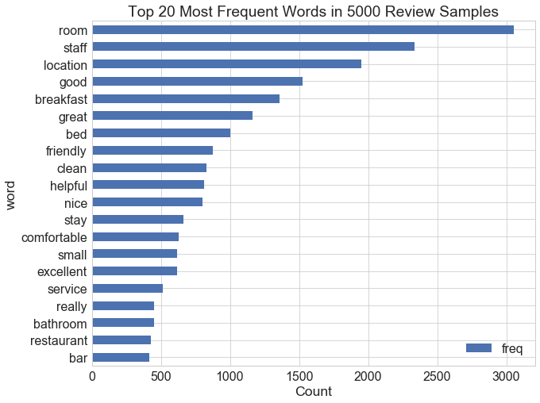


#### Generate Word Cloud for Reviews


```python
# define a function to generate wordcloud from text
def plot_wordcloud(data,title,c='Greens'):
    
    wordcloud = WordCloud(
        background_color='lightgray',
        colormap=c,
        stopwords=en_stopwords,
        max_words=500,
        max_font_size=50,
        random_state=123 
    ).generate(data)

    fig = plt.figure(figsize=(20, 10))#plt.figure(1, figsize=(15, 13))
    plt.axis('off')
    plt.title(title,size=28,y=1.02)
    plt.imshow(wordcloud)
    plt.show()
```


```python
all_reviews=htl_txt.Negative_Review+' '+htl_txt.Positive_Review
all_reviews=' '.join(preprocess(str(all_reviews)))
plot_wordcloud(all_reviews,'Word Cloud of All Reviews','Blues')

# plot_wordcloud(htl_wc.Positive_Review,'Word Cloud of Positive Reviews')
# plot_wordcloud(htl_clean.reset_index(drop=True).Negative_Review,'Word Cloud of Negative Reviews','Reds')


```


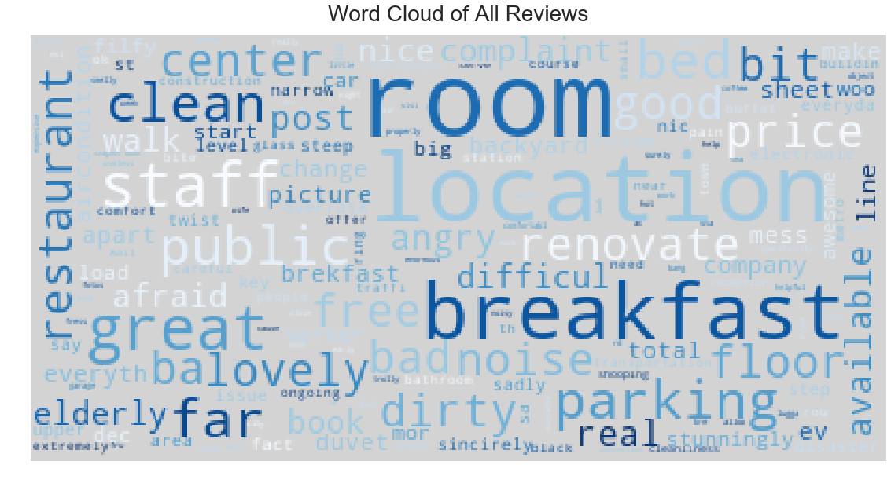


Reviewers are commenting on 'room', 'location', 'transportation', 'air condition', 'breakfast', 'floor', 'price',  'parking', 'restaurant','staff', 'noise', etc. Frequent positive words and negative words are displayed in the word cloud as well.

##### Word Cloud from reviews posted by reviewers on a business trip


```python
def rev_trip(trip):
    rev_neg=htl_txt[htl_txt.Trip_Type==trip].Negative_Review
    rev_neg=' '.join(preprocess(str(rev_neg)))
    
    rev_pos=htl_txt[htl_txt.Trip_Type==trip].reset_index(drop=True).Positive_Review
    rev_pos=' '.join(preprocess(str(rev_pos)))
    
    rev_all=rev_neg+' '+rev_pos
    rev_all=' '.join(preprocess(str(rev_all)))
    
    return rev_neg,rev_pos,rev_all

rev_neg,rev_pos,rev_all= rev_trip('Leisure trip')  


plot_wordcloud(rev_neg,'Word Cloud of Negative Reviews for Business Trip','Reds')
```


```python
plot_wordcloud(rev_pos,'Word Cloud of Positive Reviews for Business Trip')

```


##### Word Cloud from reviews posted by reviewers on a leisure trip


```python
rev_neg,rev_pos,rev_all= rev_trip('Leisure trip')  
plot_wordcloud(rev_neg,'Word Cloud of Negative Reviews for Leisure Trip','Reds')
```


```python
plot_wordcloud(rev_pos,'Word Cloud of Negative Reviews for Leisure Trip','Greens')
```


## Next Steps

### Extract Features from Text Data 
### Topic Modeling and Text Classification
### Are Review Contents Consistent with the Rating Scores?
We notice that some reviewers give very low score but posted both positive and negative aspects of the hotels while some reviewers post no negative reviews but score not that high, indicating they are unsatisfied to some extent but not mentioning. Are review contents consistent with the rating scores? How to quantify the consistency??? Might need NLP's help here! Compare predicted score with real score?
### Build Machine Learning Models to Predict the Classification of a Hotel
