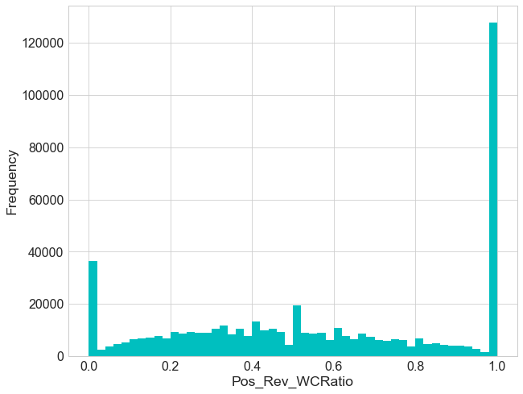
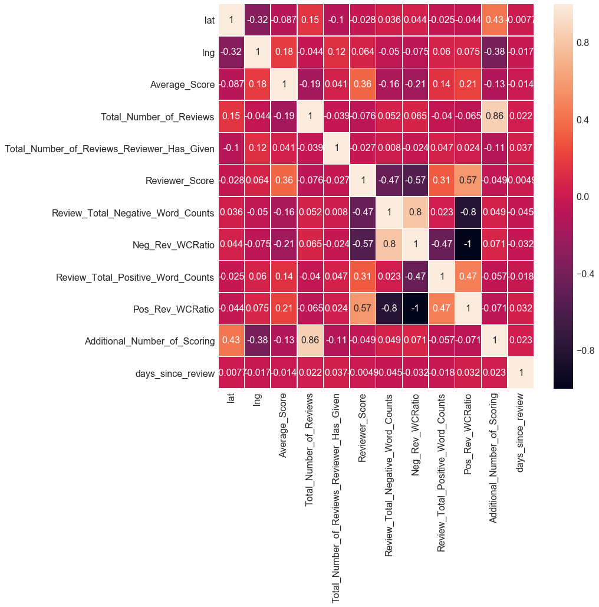
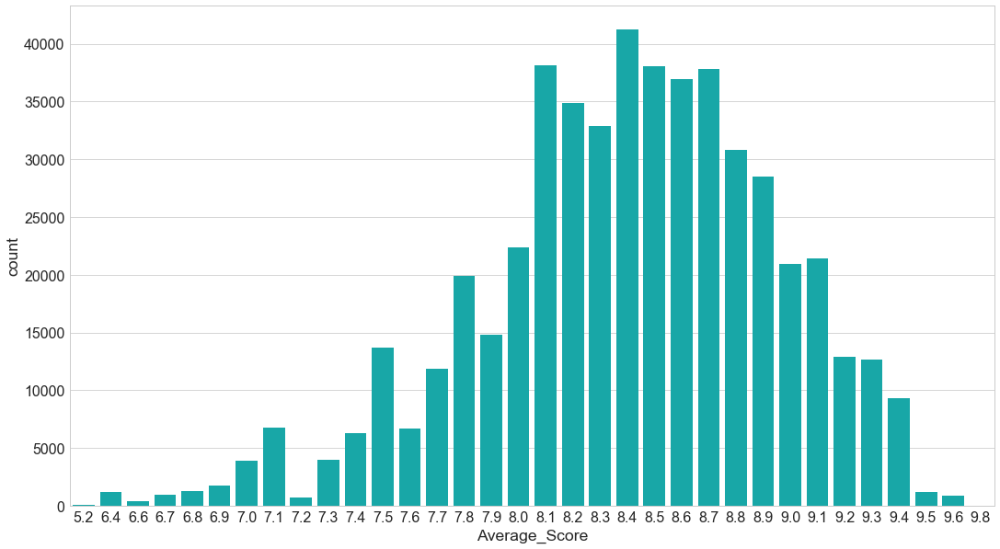
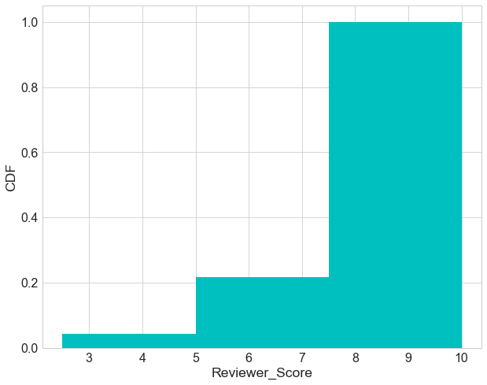
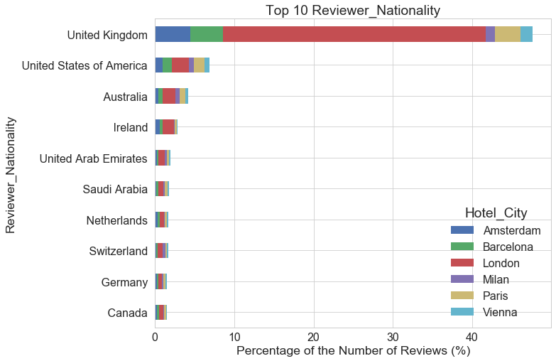

# Table of Contents

* [Introduction](#Introduction)
* [Client](#Client)
* [Load Data](#Load-Data)
* [Data Wrangling and Cleaning](#Data-Wrangling-and-Cleaning)
    * [Missing Values](#Missing-Values)
    * [Check and Drop Duplicates](#Check-and-Drop-Duplicates)
    * [Clean and Enrich Features](#Clean-and-Enrich-Features)
    * [Summary](#Summary)
* [Exploratory Data Analysis](#Exploratory-Data-Analysis)
    * [Summary Statistics](#Summary-Statistics)
    * [Visualization of Hotels](#Visualization-of-Hotels)
    * [Visualization of Reviewers](#Visualization-of-Reviewers)
    * [Visualization of Reviews](#Visualization-of-Reviews)
* [Next Steps](#Next-Steps)

## Introduction <a class="anchor" id="Introduction"></a>
Nowadays, people travel very often for business or for holidays. Travelers want to select hotels with clean rooms, high-quality service, convenient location etc. In a word, people hope to find a cozy and cost-effective hotel to stay while traveling. A massive amount of reviews are being posted online and people are influenced by online reviews in making their decisions. Each person has its own taste of 'cozy'. Where are the perfect hotels to your taste located? What are other travelers saying about that hotel? Are previous travelers having positive experience or bad one concerning your needs? We propose to investigate hotel reviews data and perform text analysis and topic modeling using Naive Bayes and LDA. We also propose to build a machine learning model for predicting review scores from the features we have in the data.

## Client <a class="anchor" id="Client"></a>
Travelers will certainly be interested in this project. They might spend lots of time searching/reading/evaluating hotels and the reviews. This project will save a vast amount of time for travelers. Hotel owners are eager to know what customers are talking and especially caring about the hotels. This project can help them improve service quality and maximize their business profit. Other potential clients include travel service agencies and housing agencies etc. Since it's really hard to manually read through all the reviews, being able to extract hidden topics in a large volume of texts is highly valuable to businesses, for instance, websites and companies selling bookings and travel advice. 

## Load Data <a class="anchor" id="Load-Data"></a>
The dataset is originally from [kaggle](https://www.kaggle.com/jiashenliu/515k-hotel-reviews-data-in-europe). It is about 515K hotel reviews data in Europe. It's a csv file containing information on hotel name, hotel address, review date, review scores, reviewers' nationality, positive/negative reviews' word count etc.

The data can be enriched by adding hotel features acquired from, for instance, trip advisor etc.


```python
hotel=pd.read_csv('data/Hotel_Reviews.csv',parse_dates=['Review_Date'],index_col='Review_Date')
hotel.info()
hotel.head()
```

    <class 'pandas.core.frame.DataFrame'>
    DatetimeIndex: 515738 entries, 2017-08-03 to 2015-08-09
    Data columns (total 16 columns):
    Hotel_Address                                 515738 non-null object
    Additional_Number_of_Scoring                  515738 non-null int64
    Average_Score                                 515738 non-null float64
    Hotel_Name                                    515738 non-null object
    Reviewer_Nationality                          515738 non-null object
    Negative_Review                               515738 non-null object
    Review_Total_Negative_Word_Counts             515738 non-null int64
    Total_Number_of_Reviews                       515738 non-null int64
    Positive_Review                               515738 non-null object
    Review_Total_Positive_Word_Counts             515738 non-null int64
    Total_Number_of_Reviews_Reviewer_Has_Given    515738 non-null int64
    Reviewer_Score                                515738 non-null float64
    Tags                                          515738 non-null object
    days_since_review                             515738 non-null object
    lat                                           512470 non-null float64
    lng                                           512470 non-null float64
    dtypes: float64(4), int64(5), object(7)
    memory usage: 66.9+ MB


<table border="1" class="dataframe">
  <thead>
    <tr style="text-align: right;">
      <th></th>
      <th>Hotel_Address</th>
      <th>Additional_Number_of_Scoring</th>
      <th>Average_Score</th>
      <th>Hotel_Name</th>
      <th>Reviewer_Nationality</th>
      <th>Negative_Review</th>
      <th>Review_Total_Negative_Word_Counts</th>
      <th>Total_Number_of_Reviews</th>
      <th>Positive_Review</th>
      <th>Review_Total_Positive_Word_Counts</th>
      <th>Total_Number_of_Reviews_Reviewer_Has_Given</th>
      <th>Reviewer_Score</th>
      <th>Tags</th>
      <th>days_since_review</th>
      <th>lat</th>
      <th>lng</th>
    </tr>
    <tr>
      <th>Review_Date</th>
      <th></th>
      <th></th>
      <th></th>
      <th></th>
      <th></th>
      <th></th>
      <th></th>
      <th></th>
      <th></th>
      <th></th>
      <th></th>
      <th></th>
      <th></th>
      <th></th>
      <th></th>
      <th></th>
    </tr>
  </thead>
  <tbody>
    <tr>
      <th>2017-08-03</th>
      <td>s Gravesandestraat 55 Oost 1092 AA Amsterdam ...</td>
      <td>194</td>
      <td>7.7</td>
      <td>Hotel Arena</td>
      <td>Russia</td>
      <td>I am so angry that i made this post available...</td>
      <td>397</td>
      <td>1403</td>
      <td>Only the park outside of the hotel was beauti...</td>
      <td>11</td>
      <td>7</td>
      <td>2.9</td>
      <td>[' Leisure trip ', ' Couple ', ' Duplex Double...</td>
      <td>0 days</td>
      <td>52.360576</td>
      <td>4.915968</td>
    </tr>
    <tr>
      <th>2017-08-03</th>
      <td>s Gravesandestraat 55 Oost 1092 AA Amsterdam ...</td>
      <td>194</td>
      <td>7.7</td>
      <td>Hotel Arena</td>
      <td>Ireland</td>
      <td>No Negative</td>
      <td>0</td>
      <td>1403</td>
      <td>No real complaints the hotel was great great ...</td>
      <td>105</td>
      <td>7</td>
      <td>7.5</td>
      <td>[' Leisure trip ', ' Couple ', ' Duplex Double...</td>
      <td>0 days</td>
      <td>52.360576</td>
      <td>4.915968</td>
    </tr>
    <tr>
      <th>2017-07-31</th>
      <td>s Gravesandestraat 55 Oost 1092 AA Amsterdam ...</td>
      <td>194</td>
      <td>7.7</td>
      <td>Hotel Arena</td>
      <td>Australia</td>
      <td>Rooms are nice but for elderly a bit difficul...</td>
      <td>42</td>
      <td>1403</td>
      <td>Location was good and staff were ok It is cut...</td>
      <td>21</td>
      <td>9</td>
      <td>7.1</td>
      <td>[' Leisure trip ', ' Family with young childre...</td>
      <td>3 days</td>
      <td>52.360576</td>
      <td>4.915968</td>
    </tr>
    <tr>
      <th>2017-07-31</th>
      <td>s Gravesandestraat 55 Oost 1092 AA Amsterdam ...</td>
      <td>194</td>
      <td>7.7</td>
      <td>Hotel Arena</td>
      <td>United Kingdom</td>
      <td>My room was dirty and I was afraid to walk ba...</td>
      <td>210</td>
      <td>1403</td>
      <td>Great location in nice surroundings the bar a...</td>
      <td>26</td>
      <td>1</td>
      <td>3.8</td>
      <td>[' Leisure trip ', ' Solo traveler ', ' Duplex...</td>
      <td>3 days</td>
      <td>52.360576</td>
      <td>4.915968</td>
    </tr>
    <tr>
      <th>2017-07-24</th>
      <td>s Gravesandestraat 55 Oost 1092 AA Amsterdam ...</td>
      <td>194</td>
      <td>7.7</td>
      <td>Hotel Arena</td>
      <td>New Zealand</td>
      <td>You When I booked with your company on line y...</td>
      <td>140</td>
      <td>1403</td>
      <td>Amazing location and building Romantic setting</td>
      <td>8</td>
      <td>3</td>
      <td>6.7</td>
      <td>[' Leisure trip ', ' Couple ', ' Suite ', ' St...</td>
      <td>10 days</td>
      <td>52.360576</td>
      <td>4.915968</td>
    </tr>
  </tbody>
</table>
</div>


**Summary of data**
* Size 66.9+ MB;<br>
* 515,738 observations with datatimeIndex ranging from 2017-08-03 to 2015-08-09 and with 16 features, among which 7 'object', 5 'int64' and 4 'float64'. <br>
* Feature 'days_since_review' (2 days for instance) should be split and only keep the numerics.<br> 
* Missing values in 'lat' and 'lng'  and nowhere else.<br>

## Data Wrangling and Cleaning <a class="anchor" id="Data-Wrangling-and-Cleaning"></a>
The data wrangling and cleaning includes:<br>
* Check and handle missing values
* Check and Drop Duplicates
* Clean and Enrich Features

### Missing Values <a class="anchor" id="Missing-Values"></a>


```python
#Proportion of missing values
hotel.isnull().sum()/len(hotel)
```


    Hotel_Address                                 0.000000
    Additional_Number_of_Scoring                  0.000000
    Average_Score                                 0.000000
    Hotel_Name                                    0.000000
    Reviewer_Nationality                          0.000000
    Negative_Review                               0.000000
    Review_Total_Negative_Word_Counts             0.000000
    Total_Number_of_Reviews                       0.000000
    Positive_Review                               0.000000
    Review_Total_Positive_Word_Counts             0.000000
    Total_Number_of_Reviews_Reviewer_Has_Given    0.000000
    Reviewer_Score                                0.000000
    Tags                                          0.000000
    days_since_review                             0.000000
    lat                                           0.006337
    lng                                           0.006337
    dtype: float64


####  Hotels with Missing 'lat' and 'lng' 


```python
print('Number of Hotels with missing geolocation: ',hotel.loc[hotel.lat.isnull(),'Hotel_Name'].nunique())
print('Proportion of hotels with missing geolocation: %.2f' %(hotel.loc[hotel.lat.isnull(),'Hotel_Name'].nunique()/hotel.Hotel_Name.nunique()))
```

    Number of Hotels with missing geolocation:  17
    Proportion of hotels with missing geolocation: 0.01

```python
#How many reviews we will lose if we drop hotels with missing info
hotel.Hotel_Name[hotel.lat.isnull()].value_counts()[::-1]
```

    Hotel Advance                                        28
    Renaissance Barcelona Hotel                          33
    Mercure Paris Gare Montparnasse                      37
    Roomz Vienna                                         49
    Holiday Inn Paris Montmartre                         55
    Cordial Theaterhotel Wien                            57
    Hotel Park Villa                                     61
    City Hotel Deutschmeister                            93
    NH Collection Barcelona Podium                      146
    Derag Livinghotel Kaiser Franz Joseph Vienna        147
    Austria Trend Hotel Schloss Wilhelminenberg Wien    194
    Hotel Pension Baron am Schottentor                  223
    Hotel Daniel Vienna                                 245
    Maison Albar Hotel Paris Op ra Diamond              290
    Hotel Atlanta                                       389
    Hotel City Central                                  563
    Fleming s Selection Hotel Wien City                 658
    Name: Hotel_Name, dtype: int64


In this data set, 0.6% of the observations have missing 'lat' and 'lng'. That is 17 unique hotels (around 1% of the hotels) have hotel names and addresses but no geo-coordinates. We've checked that there are no particular patterns and those coordinates will only be used for map visualization, we'll drop those hotels without coordinates when we plot the map. We can still keep all of them in other analysis.

### Check and Drop Duplicates <a class="anchor" id="Check-and-Drop-Duplicates"></a>


```python
hotel.duplicated().sum()
```
    
    526

There are 526 duplicates in the data frame and we've removed them for the following analysis.

### Clean and Enrich Features <a class="anchor" id="Clean-and-Enrich-Features"></a>

This process includes:<br>
* Extract cities of hotels from its address, i.e., 'Hotel_Address';
* Extract days from 'days_since_review';
* Add month and day of reviews;
* Add 'Pos_Rev_WCRatio' and 'Neg_Rev_WCRatio';
* Extract features from 'Tag';
* Fix 'Hotel_Name' and 'Hotel_Address'.


***Extract cities of hotels from its address***


```python
htl_city=(hotel.Hotel_City.value_counts(normalize=True)[::-1]*100)
ax=htl_city.plot(kind='barh',rot=0,color='c')
for idx, val in enumerate(htl_city):
    ax.text( val,idx+0.05,str(round(val,1))+'%', color='black', fontweight='bold',fontsize=14)
plt.xlabel('Percent (%)')
plt.ylabel('Hotel City');
```


Over 50% of the hotels are from London, United Kingdom; hotels from other countries (Spain, France, Netherlands, Austria, Italy) take around 11% or less in portion.


***Add month and day of reviews***


```python
month=calendar.month_abbr[1:13]#[calendar.month_name[i][:3] for i in range(1,13)]
hotel.Review_Month.value_counts().reindex(month).plot(kind='bar',color='c',rot=0)
plt.xlabel('Review_Posted_Month')
plt.ylabel('Count');

```


```python
wday=[d[:3] for d in calendar.day_name[0:7]]

htl_wday=(hotel.Review_Wday.value_counts(normalize=True)*100).reindex(wday)
plot_bar(htl_wday,'Review_Posted_Day',0)
```


Reviews posted on Tuesdays are the most among days of the week while reviews posted on Fridays are the least.

***Add 'Pos_Rev_WCRatio' and 'Neg_Rev_WCRatio'***


```python
#Distribution of word counts in reviews
plt.hist(htl['Review_Total_Positive_Word_Counts'],alpha=0.8,histtype='step', stacked=True, fill=False,color='r',label='Pos')
plt.hist(htl['Review_Total_Negative_Word_Counts'],alpha=0.2,histtype='step', stacked=True, fill=True,color='b',label='Neg')
plt.legend(prop={'size':20})
plt.title('Distribution of Word Counts of Reviews');
```


```python
hotel['Pos_Rev_WCRatio'].plot.hist(bins=50,color='c');
plt.xlabel('Pos_Rev_WCRatio');
```





'Pos_Rev_WCRatio' is defined by number of words in positive reviews divided by sum of number of words in both positive and negative reviews. 'Pos_Rev_WCRatio' close to zero means that reviewers posted negative words and rarely positive words;  Pos_Rev_WCRatio' close to 1 indicates that reviewers are very satisfied.

**Extract features from 'Tag'**


```python
htl.Tags.sample(5)
```


    Review_Date
    2016-01-05    [' Leisure trip ', ' Family with older childre...
    2017-03-25    [' Leisure trip ', ' Couple ', ' Small Double ...
    2017-07-16    [' Couple ', ' Superior Double or Twin Room ',...
    2017-07-03    [' Leisure trip ', ' Couple ', ' Executive Kin...
    2016-03-08    [' Leisure trip ', ' Group ', ' Superior Doubl...
    Name: Tags, dtype: object


```python
#Visualization of trip type
htl_ttype=hotel.Trip_Type.value_counts(normalize=True)*100

plot_bar(htl_ttype,'Trip Type')
```


```python
#Visualize traveler type
htl_traveler_type=htl.Traveler_Type.value_counts(normalize=True)*100
plot_bar(htl_traveler_type,'Traveler Type',30)

```


Most of travelers are couples or solo travelers. 


Over half of solo travelers stayed in hotels due to business trip otherwise majority of travelers stayed in hotels due to leisure trip.


```python
#Visualize Num_nights
htl_nnight=htl.dropna(subset=['Num_Nights']).Num_Nights.astype('int').value_counts(normalize=True)*100
htl_nnight.plot(kind='bar',rot=0,logy=False,color='c')
plt.xlabel('Num_Nights')
plt.ylabel('Percent (%)');
```


Most of travelers stayed less than a week in hotels and only very few stayed around a month in a hotel.


**Fix 'Hotel_Name' and 'Hotel_Address'**


```python
htl_clean.select_dtypes(include='object').describe()
```


<div>
<table border="1" class="dataframe">
  <thead>
    <tr style="text-align: right;">
      <th></th>
      <th>Review_Month</th>
      <th>Review_Wday</th>
      <th>Hotel_Name</th>
      <th>Hotel_Address</th>
      <th>Hotel_City</th>
      <th>Reviewer_Nationality</th>
      <th>Negative_Review</th>
      <th>Positive_Review</th>
      <th>Trip_Type</th>
      <th>Traveler_Type</th>
      <th>Num_Nights</th>
    </tr>
  </thead>
  <tbody>
    <tr>
      <th>count</th>
      <td>515212</td>
      <td>515212</td>
      <td>515212</td>
      <td>515212</td>
      <td>515212</td>
      <td>515212</td>
      <td>515212</td>
      <td>515212</td>
      <td>500208</td>
      <td>515212</td>
      <td>515020</td>
    </tr>
    <tr>
      <th>unique</th>
      <td>12</td>
      <td>7</td>
      <td>1492</td>
      <td>1493</td>
      <td>6</td>
      <td>227</td>
      <td>330011</td>
      <td>412601</td>
      <td>2</td>
      <td>6</td>
      <td>31</td>
    </tr>
    <tr>
      <th>top</th>
      <td>Aug</td>
      <td>Tue</td>
      <td>Britannia International Hotel Canary Wharf</td>
      <td>163 Marsh Wall Docklands Tower Hamlets London ...</td>
      <td>London</td>
      <td>United Kingdom</td>
      <td>No Negative</td>
      <td>No Positive</td>
      <td>Leisure trip</td>
      <td>Couple</td>
      <td>1</td>
    </tr>
    <tr>
      <th>freq</th>
      <td>50615</td>
      <td>120823</td>
      <td>4789</td>
      <td>4789</td>
      <td>262298</td>
      <td>245110</td>
      <td>127757</td>
      <td>35904</td>
      <td>417355</td>
      <td>252005</td>
      <td>193497</td>
    </tr>
  </tbody>
</table>
</div>


There are 515212 reviews for hotels located in 6 cities of 6 countries in Europe by reviewers either on leisure trip or business trip from 227 distinct countries. Couples are the most common travelers types among the 6 types. 

Notice that there are 1492 unique hotel names but with 1493 hotel addresses. Let's find out which hotel name has multiple addresses. We find that the hotel named 'Hotel Regina' is located in Barcelona and one with the same name but located in Vienna and another one located in Milan. Is there any hotel address with multiple names? On the other hand, two hotels ('The Grand at Trafalgar Square' and 'Club Quarters Hotel Trafalgar Square') are located in the same location. Perhaps they are the same hotel that changed name? We've checked that there are reviews from 2015 to 2017 for both hotels with different average score, so it's indeed reviewed as two distinct hotels. When we count hotels in the following, we will distinguish 'Hotel_Address' for those two hotels on purpose to avoid mismatching problems.


### Summary <a class="anchor" id="Summary"></a> 

In summary,

* we've added month and weekday that reviews are posted and we found that reviewers posted most reviews during July and August and reviews are most posted on Tuesday and least on Friday.
* We've extracted the city where hotels are located and find that over a half of hotels are located in London.
* We've also extracted trip type ('Leisure trip', 'Business trip'), traveler type ('Couple', 'Solo traveler', 'Group', ...) and number of nights in hotels for 'Tags'. We found that around 80% of the reviews is for leisure trip and 20% for business trip. Around 50% of travelers are couples and around 20% are solo travelers, others are groups, families or friends. Majority of travels stayed in hotel for less than a week and some stayed longer till a month. 

In next section, we will perform exploratory data analysis and gain insights on how those features are correlated with review scores. 

## Exploratory Data Analysis <a class="anchor" id="Exploratory-Data-Analysis"></a>

### Summary Statistics <a class="anchor" id="Summary-Statistics"></a>

**Summary statistics of 'object' columns**


```python
htl_clean.select_dtypes(include='object').describe()
```

<div>

<table border="1" class="dataframe">
  <thead>
    <tr style="text-align: right;">
      <th></th>
      <th>Review_Month</th>
      <th>Review_Wday</th>
      <th>Hotel_Name</th>
      <th>Hotel_Address</th>
      <th>Hotel_City</th>
      <th>Reviewer_Nationality</th>
      <th>Negative_Review</th>
      <th>Positive_Review</th>
      <th>Trip_Type</th>
      <th>Traveler_Type</th>
      <th>Num_Nights</th>
    </tr>
  </thead>
  <tbody>
    <tr>
      <th>count</th>
      <td>515212</td>
      <td>515212</td>
      <td>515212</td>
      <td>515212</td>
      <td>515212</td>
      <td>515212</td>
      <td>515212</td>
      <td>515212</td>
      <td>500208</td>
      <td>515212</td>
      <td>515020</td>
    </tr>
    <tr>
      <th>unique</th>
      <td>12</td>
      <td>7</td>
      <td>1492</td>
      <td>1494</td>
      <td>6</td>
      <td>227</td>
      <td>330011</td>
      <td>412601</td>
      <td>2</td>
      <td>6</td>
      <td>31</td>
    </tr>
    <tr>
      <th>top</th>
      <td>Aug</td>
      <td>Tue</td>
      <td>Britannia International Hotel Canary Wharf</td>
      <td>163 Marsh Wall Docklands Tower Hamlets London ...</td>
      <td>London</td>
      <td>United Kingdom</td>
      <td>No Negative</td>
      <td>No Positive</td>
      <td>Leisure trip</td>
      <td>Couple</td>
      <td>1</td>
    </tr>
    <tr>
      <th>freq</th>
      <td>50615</td>
      <td>120823</td>
      <td>4789</td>
      <td>4789</td>
      <td>262298</td>
      <td>245110</td>
      <td>127757</td>
      <td>35904</td>
      <td>417355</td>
      <td>252005</td>
      <td>193497</td>
    </tr>
  </tbody>
</table>
</div>


**Summary statistics of numeric columns**


```python
htl_clean.select_dtypes(exclude='object').describe()
```


<div>
<table border="1" class="dataframe">
  <thead>
    <tr style="text-align: right;">
      <th></th>
      <th>lat</th>
      <th>lng</th>
      <th>Average_Score</th>
      <th>Total_Number_of_Reviews</th>
      <th>Total_Number_of_Reviews_Reviewer_Has_Given</th>
      <th>Reviewer_Score</th>
      <th>Review_Total_Negative_Word_Counts</th>
      <th>Neg_Rev_WCRatio</th>
      <th>Review_Total_Positive_Word_Counts</th>
      <th>Pos_Rev_WCRatio</th>
      <th>Additional_Number_of_Scoring</th>
      <th>days_since_review</th>
    </tr>
  </thead>
  <tbody>
    <tr>
      <th>count</th>
      <td>511944.000000</td>
      <td>511944.000000</td>
      <td>515212.000000</td>
      <td>515212.000000</td>
      <td>515212.000000</td>
      <td>515212.000000</td>
      <td>515212.000000</td>
      <td>515085.000000</td>
      <td>515212.000000</td>
      <td>515085.000000</td>
      <td>515212.000000</td>
      <td>515212.000000</td>
    </tr>
    <tr>
      <th>mean</th>
      <td>49.443040</td>
      <td>2.824222</td>
      <td>8.397767</td>
      <td>2744.698889</td>
      <td>7.164895</td>
      <td>8.395532</td>
      <td>18.540822</td>
      <td>0.434377</td>
      <td>17.778256</td>
      <td>0.565623</td>
      <td>498.416021</td>
      <td>354.400474</td>
    </tr>
    <tr>
      <th>std</th>
      <td>3.468029</td>
      <td>4.581637</td>
      <td>0.547952</td>
      <td>2318.090821</td>
      <td>11.039354</td>
      <td>1.637467</td>
      <td>29.693991</td>
      <td>0.336903</td>
      <td>21.804541</td>
      <td>0.336903</td>
      <td>500.668595</td>
      <td>208.908943</td>
    </tr>
    <tr>
      <th>min</th>
      <td>41.328376</td>
      <td>-0.369758</td>
      <td>5.200000</td>
      <td>43.000000</td>
      <td>1.000000</td>
      <td>2.500000</td>
      <td>0.000000</td>
      <td>0.000000</td>
      <td>0.000000</td>
      <td>0.000000</td>
      <td>1.000000</td>
      <td>0.000000</td>
    </tr>
    <tr>
      <th>25%</th>
      <td>48.214277</td>
      <td>-0.143649</td>
      <td>8.100000</td>
      <td>1161.000000</td>
      <td>1.000000</td>
      <td>7.500000</td>
      <td>2.000000</td>
      <td>0.033333</td>
      <td>5.000000</td>
      <td>0.289474</td>
      <td>169.000000</td>
      <td>175.000000</td>
    </tr>
    <tr>
      <th>50%</th>
      <td>51.499981</td>
      <td>-0.000250</td>
      <td>8.400000</td>
      <td>2134.000000</td>
      <td>3.000000</td>
      <td>8.800000</td>
      <td>9.000000</td>
      <td>0.457627</td>
      <td>11.000000</td>
      <td>0.542373</td>
      <td>342.000000</td>
      <td>353.000000</td>
    </tr>
    <tr>
      <th>75%</th>
      <td>51.516288</td>
      <td>4.834443</td>
      <td>8.800000</td>
      <td>3633.000000</td>
      <td>8.000000</td>
      <td>9.600000</td>
      <td>23.000000</td>
      <td>0.710526</td>
      <td>22.000000</td>
      <td>0.966667</td>
      <td>660.000000</td>
      <td>527.000000</td>
    </tr>
    <tr>
      <th>max</th>
      <td>52.400181</td>
      <td>16.429233</td>
      <td>9.800000</td>
      <td>16670.000000</td>
      <td>355.000000</td>
      <td>10.000000</td>
      <td>408.000000</td>
      <td>1.000000</td>
      <td>395.000000</td>
      <td>1.000000</td>
      <td>2682.000000</td>
      <td>730.000000</td>
    </tr>
  </tbody>
</table>
</div>


```python
plt.figure(figsize=(12,12))
corr=htl_clean.select_dtypes(exclude='object').corr(method='spearman')
sns.heatmap(corr,annot=True,linewidths=0.4,annot_kws={'size':16});
```




The heat map above displays the correlation matrix of numerical columns in the data frame. It gives us some hints on to what extent those features are correlated with each other. Take the 'Reviewer_Score' for instance, its correlation with features such as "Review_Total_Positive_Word_counts","Pos_Rev_WCRatio" and "Review_Total_Negative_Word_counts","Neg_Rev_WCRatio" is significant. It's highly positively correlated with 'Average_Score', "Review_Total_Positive_Word_counts","Pos_Rev_WCRatio" as the more positive words reviewers posted, the happier they might be with the hotels hence the higher score they rated the hotels. On the contrary, 'Reviewer_Score' is highly negatively correlated with "Review_Total_Negative_Word_counts","Neg_Rev_WCRatio" as expected since the longer negative reviews indicated more complains hence lower scores. Since the correlation of 'days_since_review' with other features are very small, we can drop this feature in the following analysis. 

### Visualization of Hotels <a class="anchor" id="Visualization-of-Hotels"></a>

**Make a map in order to see where the most hotels are located**


For an interactive visualization, click [here](https://houhouhotel.herokuapp.com/index.html)


#### Who Are the Most Popular Hotels?

We determine the most popular hotels by considering its 'Average_Score' and 'Total_Number_of_Reviews'. That is the 'Total_Number_of_Reviews' should be more than a threshold so that hotels with few number of reviews but high score won't be considered as popular. We then rank hotels by its average score.

<div>
<table border="1" class="dataframe">
  <thead>
    <tr style="text-align: right;">
      <th></th>
      <th>Hotel_Name</th>
      <th>Hotel_City</th>
      <th>Average_Score</th>
      <th>Total_Number_of_Reviews</th>
      <th>lat</th>
      <th>lng</th>
    </tr>
    <tr>
      <th>Review_Date</th>
      <th></th>
      <th></th>
      <th></th>
      <th></th>
      <th></th>
      <th></th>
    </tr>
  </thead>
  <tbody>
    <tr>
      <th>2017-08-03</th>
      <td>Intercontinental London The O2</td>
      <td>London</td>
      <td>9.4</td>
      <td>4204</td>
      <td>51.502435</td>
      <td>-0.000250</td>
    </tr>
    <tr>
      <th>2017-08-02</th>
      <td>Shangri La Hotel at The Shard London</td>
      <td>London</td>
      <td>9.4</td>
      <td>2200</td>
      <td>51.504497</td>
      <td>-0.085556</td>
    </tr>
    <tr>
      <th>2017-08-03</th>
      <td>Catalonia Square 4 Sup</td>
      <td>Barcelona</td>
      <td>9.4</td>
      <td>1711</td>
      <td>41.388566</td>
      <td>2.171299</td>
    </tr>
    <tr>
      <th>2017-07-27</th>
      <td>Best Western Premier Kaiserhof Wien</td>
      <td>Vienna</td>
      <td>9.4</td>
      <td>1353</td>
      <td>48.197550</td>
      <td>16.368640</td>
    </tr>
    <tr>
      <th>2017-07-27</th>
      <td>Excelsior Hotel Gallia Luxury Collection Hotel</td>
      <td>Milan</td>
      <td>9.4</td>
      <td>1345</td>
      <td>45.485703</td>
      <td>9.202013</td>
    </tr>
    <tr>
      <th>2017-07-31</th>
      <td>Hotel Palace GL</td>
      <td>Barcelona</td>
      <td>9.4</td>
      <td>1266</td>
      <td>41.391626</td>
      <td>2.171638</td>
    </tr>
    <tr>
      <th>2017-07-25</th>
      <td>Catalonia Magdalenes</td>
      <td>Barcelona</td>
      <td>9.4</td>
      <td>1108</td>
      <td>41.386128</td>
      <td>2.174529</td>
    </tr>
    <tr>
      <th>2017-07-11</th>
      <td>The Savoy</td>
      <td>London</td>
      <td>9.4</td>
      <td>1021</td>
      <td>51.511192</td>
      <td>-0.119401</td>
    </tr>
    <tr>
      <th>2017-07-11</th>
      <td>Rosewood London</td>
      <td>London</td>
      <td>9.4</td>
      <td>1008</td>
      <td>51.517330</td>
      <td>-0.118097</td>
    </tr>
    <tr>
      <th>2017-07-30</th>
      <td>The Guesthouse Vienna</td>
      <td>Vienna</td>
      <td>9.4</td>
      <td>951</td>
      <td>48.205130</td>
      <td>16.369036</td>
    </tr>
  </tbody>
</table>
</div>


Among the top 10 most popular hotels, 4 are located in London and 3 in Barcelona, 2 in Milan and only 1 in Vienna.

#### Visualize Average Score of Hotels


```python
htl_clean.Average_Score.describe()
```


    count    515212.000000
    mean          8.397767
    std           0.547952
    min           5.200000
    25%           8.100000
    50%           8.400000
    75%           8.800000
    max           9.800000
    Name: Average_Score, dtype: float64


```python
plt.figure(figsize=(18,10))
sns.countplot(x='Average_Score',data=htl_clean,color='c');
```





```python
#Normmal test
from scipy import stats
_,fit=stats.probplot(htl_clean.Average_Score,dist=stats.norm,plot=plt)
plt.title('Quantile Plot');
```


The average score is above 5 and its mean is 8.4. 

##### Any Trends in Average Score of Hotels
All average scores are above 5 and its mean is at 8.4. We will explore if there is any trend in average score below by time series analysis.


```python
sns.boxplot(y="Hotel_City",x="Reviewer_Score",data=htl_clean,showfliers=False,palette='Spectral',orient='h');
```


The average reviewer score of hotels is higher in January and low in October.

##### What Features are Affecting Reviewer Score?

**Distribution of Reviewer Score**





**'Trip_Type' v.s. 'Reviewer_Score'**


Reviewers on a leisure trip tend to rate higher than those on a business trip. It would be interesting to investigate what topics reviewers on leisure trip and business trip are content or complaining about.

**Traveler_Type' v.s. 'Reviewer_Score'**


'Solo traveler' tends to rate lowly while couples tend to rate highly.


**How is 'Num_Nights' affecting reviewer score?**


Since very few portion of travelers stayed in hotel for more than two weeks, if we focus on the range where 'Num_Nights'<14, the curve above indicates that on average the longer traveler stayed the lower the score they give. This can be visualized more clearly in next plot.


### Visualization of Reviewers <a class="anchor" id="Visualization-of-Reviewers"></a>





Reviewers from United Kingdom take almost a half of the total number of reviewers. Interestingly other top nationality reviewers are from countries where hotels are not located except Netherlands.


Reviewer score in January and February on average are higher than other months.


Weekday doesn't seem to affect the reviewer score.

**Reviewer_score v.s. Total_Number_of_Reviews_Reviewer_Has_Given**


The figure indicates that the more reviews reviewers posted, the higher rating score reviewers tend to give.


**Longer Reviews Indicate Higher Score or Lower Score?**


The above two figures indicate that the longer (shorter) the positive review is, the higher reviewers tend to rate the score.


**Make a heatmap to see where the most reviewers are from**


**Top 10 nations that posted many reviews and rated high score**
We find the top nations by checking that its number of reviews is above its median and then sort the score and number of reviews from high to low.

<div>
<table border="1" class="dataframe">
  <thead>
    <tr style="text-align: right;">
      <th></th>
      <th>Reviewer_Nationality</th>
      <th>Num_Reviews</th>
      <th>Reviewer_Score_Avg</th>
    </tr>
  </thead>
  <tbody>
    <tr>
      <th>215</th>
      <td>United States of America</td>
      <td>35349</td>
      <td>8.8</td>
    </tr>
    <tr>
      <th>99</th>
      <td>Israel</td>
      <td>6601</td>
      <td>8.7</td>
    </tr>
    <tr>
      <th>145</th>
      <td>New Zealand</td>
      <td>3233</td>
      <td>8.7</td>
    </tr>
    <tr>
      <th>13</th>
      <td>Australia</td>
      <td>21648</td>
      <td>8.6</td>
    </tr>
    <tr>
      <th>213</th>
      <td>United Kingdom</td>
      <td>245110</td>
      <td>8.5</td>
    </tr>
    <tr>
      <th>97</th>
      <td>Ireland</td>
      <td>14814</td>
      <td>8.5</td>
    </tr>
    <tr>
      <th>37</th>
      <td>Canada</td>
      <td>7883</td>
      <td>8.5</td>
    </tr>
    <tr>
      <th>184</th>
      <td>South Africa</td>
      <td>3816</td>
      <td>8.4</td>
    </tr>
    <tr>
      <th>42</th>
      <td>China</td>
      <td>3393</td>
      <td>8.4</td>
    </tr>
    <tr>
      <th>166</th>
      <td>Russia</td>
      <td>3898</td>
      <td>8.3</td>
    </tr>
  </tbody>
</table>
</div>


### Visualization of Reviews <a class="anchor" id="Visualization-of-Reviews"></a>


```python
htl_txt.Negative_Review.sample(10)
```


    389589     We got trapped outside the 2nd floor bedrooms...
    402414     I didn t like the small pool gym but this won...
    405336                                                     
    108275                        Front of hotel was very dirty
    254994     The fire alarm went off at 1am and again at 7...
    36116      Noise and vibration from building works next ...
    135560     We had a club room but found the club lounge ...
    484327                                       Nothing really
    36614      Breakfast not included and very expensive Lot...
    195791     Exceptionally small room view of an air vent ...
    Name: Negative_Review, dtype: object


```python
htl_txt.Positive_Review.sample(10)
```


    406900     The central position very close to the subway...
    481055     The rooms are very comfortable and the locati...
    237477                                   Sky Bar excellent 
    216677                                                     
    85351                                        Very comfy bed
    356993     Excellent parking especially as our son s wed...
    405954                               Everuthing was perfect
    39590      Friendly accommodating staff nothing was too ...
    321783     The size of room Upgraded on arrival and a lo...
    158185     This was a great hotel and what made it extra...
    Name: Positive_Review, dtype: object


#### Pre-processing text data
Though punctuations are removed in the original data set, we still need to clean the reviews by converting words to lower case, removing digits, removing whitespaces, tokenization, removing stopwords, and lemmatization. 

#### 20 Most Frequent Words in 5000 Review Samples


#### Generate Word Cloud for Reviews


Reviewers are commenting on 'room', 'location', 'transportation', 'air condition', 'breakfast', 'floor', 'price',  'parking', 'restaurant','staff', 'noise', etc. Frequent positive words and negative words are displayed in the word cloud as well.

##### Word Cloud from reviews posted by reviewers on a business trip


##### Word Cloud from reviews posted by reviewers on a leisure trip


## Next Steps <a class="anchor" id="Next-Steps"></a>

### Extract Features from Text Data 
### Topic Modeling and Text Classification
### Are Review Contents Consistent with the Rating Scores?
We notice that some reviewers give very low score but posted both positive and negative aspects of the hotels while some reviewers post no negative reviews but score not that high, indicating they are unsatisfied to some extent but not mentioning. Are review contents consistent with the rating scores? How to quantify the consistency??? Might need NLP's help here! Compare predicted score with real score?
### Build Machine Learning Models to Predict the Classification of a Hotel
